# 输出
Practice04: Hello World from com.provider.HelloProvider!
清单 2-29
运行调用目录层次结构中类方法的 Java 文件
```

Java 22 还增加了使用库中包含的 Java 类的可能性，只要将它们添加到类路径中，内存编译就能正常工作。

如果由于 Java 语法不正确或找不到依赖项而导致内存编译失败，在 99.99% 的情况下，错误消息将帮助你修复代码。让我们检查几个非常常见的错误。查看清单 2-30 中描述的 `Practice05.java` 示例。


```
class Practice05 {
public static void main(String[] args) {
System.out.println("Practice05: Hello World!")
}
}
清单 2-30
包含语法错误的 Java 文件
```

你能一眼看出语法错误在哪里吗？你很可能可以，但为了演示，请尝试运行这个文件。结果如清单 2-31 所示。

```
> java Practice05.java
#输出
Practice05.java:3: 错误: 需要 ';'
System.out.println("Practice05: Hello World!")
^
1 个错误
错误: 编译失败
清单 2-31
运行包含语法错误的 Java 文件
```

如你所见，Java 告诉你它期望在第 3 行的 `System.out.println(..)` 语句末尾有一个分号（`;`）。你可以随意修改这个文件，或者自己编写代码来测试各种错误。

`java22-sandbox` 目录包含文件 `Practice06.java`，该文件引用了一个不存在的类。这不仅仅是语法错误——而是一个设计错误。文件内容如清单 2-32 所示。

```
class Practice06 {
public static void main(String[] args) {
System.out.println("Practice06: " + MockProvider.get());
}
}
清单 2-32
引用了一个不存在的类的 Java 文件
```

错误信息如清单 2-33 所示。

```
> java Practice06.java
#输出
Practice06.java:3: 错误: 找不到符号
System.out.println("Practice06: " + MockProvider.get());
^
符号:   变量 MockProvider
位置: 类 Practice06
1 个错误
错误: 编译失败
清单 2-33
运行引用了一个不存在的类的 Java 文件
```

Java 指出了错误所在的行号（3），并报告它 `找不到符号`。这显然意味着它找不到这个类，那为什么它说 `符号` 呢？嗯，Java 是一种编程语言，而语言是由符号组成的。在 Java 中，并非所有符号都是类，你将在阅读本书的过程中了解到这一点。

你可能遇到的第三种错误类型是，当有一段 Java 无法识别的文本时，比如清单 2-34 中 `Practice07.java` 文件内容里的随机文本 `ssssssss`。

```
class Practice07 {
ssssssss
public static void main(String[] args) {
System.out.println("Practice06: " + HelloProvider.get());
}
}
清单 2-34
包含一段随机文本的 Java 文件
```

运行 `Practice07.java` 文件会导致清单 2-35 中描述的错误。

```
> java Practice07.java
#输出
Practice07.java:3: 错误: 需要 class、interface、enum 或 record
ssssssss
^
1 个错误
错误: 编译失败
清单 2-35
运行包含一段随机文本的 Java 文件
```

如你所见，Java 识别出了这个不属于代码片段的陌生元素，并将你指向第 3 行。

还有一些错误可能在你运行语法正确的 Java 代码时发生，你将在本书后面部分了解到这些错误。

请随意尝试这种运行 Java 代码的方式。当你想要快速测试一段代码，然后再将其放入更大的项目中，或者用这种方式测试本书中的示例时，可以使用它。然而，本书中这个主题必须保持简短，因为本书的目的是让你在读完本书后不再是一个 Java 的绝对初学者。

## 安装 Apache Maven

本书的源代码组织在可以使用 Apache Maven 编译和执行的小型项目中。你可以从 Apache Maven 的官方网站^(³⁰)下载它并了解更多信息。Apache Maven 是一个软件项目管理和理解工具。本书选择它作为构建工具，原因如下：

*   易于设置（XML 如今几乎无处不在）
*   它与 Java 的长期合作关系
*   许多公司都在使用它

如果你还需要一个学习构建工具的理由，那就是：对于中型和大型项目，构建工具是必备的，因为它有助于依赖项的声明、下载和升级。

安装 Maven 非常简单。只需下载它，解压到某个位置，然后声明 `M2_HOME` 环境变量。如何执行此操作的说明可在官方网站上找到，或者你也可以使用 SDKMAN。

安装好 Maven 后，你可以通过打开终端（或 Windows 上的命令提示符）并执行 `mvn -version` 来检查它是否安装成功，以及它是否使用了你期望的 JDK 版本。输出应该与清单 2-36 中的输出非常相似。

```
Apache Maven 4.0.0-alpha-13 (0a6a5617fe5ef65c44f05903491e170d92cf37fc)
Maven home: /Users/iuliana/.sdkman/candidates/maven/current
Java version: 23-ea, vendor: Oracle Corporation, runtime: /Users/iuliana/.sdkman/candidates/java/23.ea.5-open
Default locale: en_GB, platform encoding: UTF-8
OS name: "mac os x", version: "14.2.1", arch: "x86_64", family: "mac"
清单 2-36
在 macOS 上执行命令 mvn -version 的输出
```

重要提示

如果你正在从事 Java 开发职业，熟练掌握一个构建工具是一项宝贵的优势。大多数使用 Java 的公司都有大型项目，这些项目组织在相互依赖的模块中，没有构建工具是无法管理的。Apache Maven 长期以来一直是 Java 事实上的标准构建工具，因此你可能需要熟悉它。

## 安装 Git

这是一个可选章节，但作为一名开发者，熟悉版本控制系统很重要，所以在此介绍。要在你的系统上安装 Git，只需访问官方网站^(³¹)并下载安装程序。打开安装程序并点击**下一步**直到完成安装。这适用于 Windows 和 macOS（对于 macOS，你可以使用 `homebrew`^(³²)）。是的，就是这么简单；你不需要做任何其他事情。在 Linux 上，可以使用 PPA 完成安装。

以防你需要更多指导，这里有一个关于如何为所有操作系统安装 Git 的页面：[`https://gist.github.com/derhuerst/1b15ff4652a867391f03`](https://gist.github.com/derhuerst/1b15ff4652a867391f03)。

要测试 Git 是否在你的系统上成功安装，请打开终端（Windows 上的命令提示符）并运行 `git --version` 来查看打印出的结果。它应该就是你刚刚安装的 Git 版本。预期的输出应该类似于清单 2-37。

```
$ git –-version
git version 2.44.0
清单 2-37
验证 Git 安装的命令 git –version 的输出
```

现在你已经安装了 Git，你可以通过在终端中或直接从 IDE 克隆官方 Git 仓库来获取本书的源代码。


## 安装 Java 集成开发环境

根据我十多年的经验，我推荐的编辑器是 IntelliJ IDEA。它由一家名为 JetBrains 的公司开发。你可以从其官方网站下载此 IDE^(³³)。旗舰版 30 天后过期；之后需要付费许可证。还有一个社区版可供使用，无需许可证。对于学习 Java 的简单项目来说，这个版本就足够了。

下载 IntelliJ IDEA 压缩包后，双击进行安装。之后，启动它并首先配置你的插件。点击 **插件** 菜单项，窗口右侧应出现一个插件列表。查看 **已安装** 选项卡上的插件列表（如图 2-9 所示）。

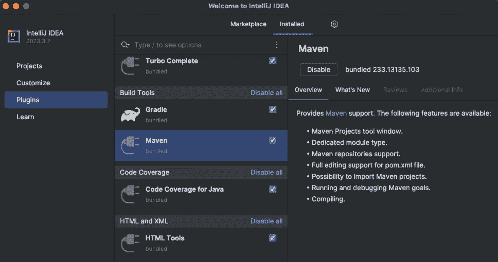

图 2-9

IntelliJ IDEA 社区版配置插件对话框窗口

重要

IntelliJ IDEA 默认启用了各种 Java 项目风格所需的插件。你可以修改该列表并禁用不需要的插件。这将减少 IntelliJ IDEA 运行所需的内存量。

Maven 插件默认是启用的；Git 插件也是如此。这意味着你的 IDE 立即可用，这反过来意味着你需要获取本书的源代码。获取本书源代码有三种方式：

*   直接从 GitHub 下载压缩包。

*   使用终端（或 Windows 下的 Git Bash Shell）通过以下命令克隆仓库：

```
    $ git clone https://github.com/Apress/java-23-for-absolute-beginners.git
    ```

*   使用 IntelliJ IDEA 克隆项目。

当使用仓库的 HTTPS URL 时，从命令行或 IntelliJ IDEA 克隆都不需要 GitHub 用户。图 2-10 展示了克隆本书 GitHub 项目所需的两个步骤。

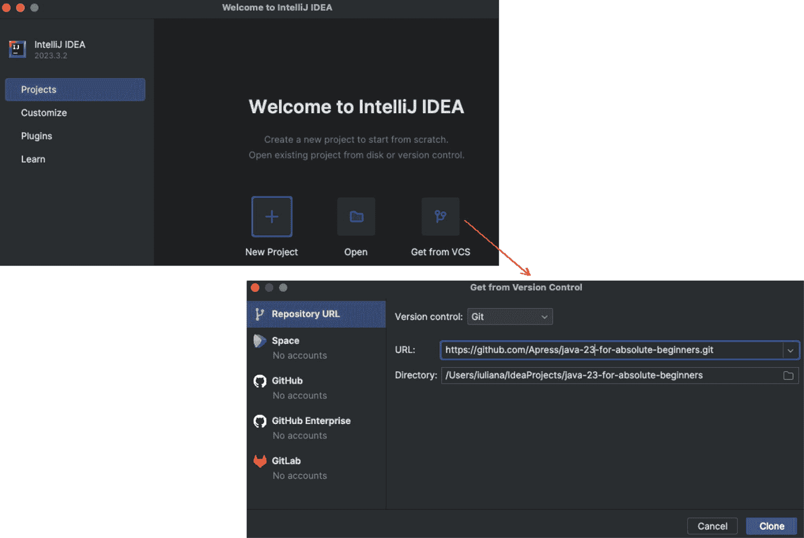

图 2-10

IntelliJ IDEA 社区版从版本控制系统克隆对话框窗口

首次打开 IntelliJ IDEA 时，选择 **项目** 菜单项，然后点击 **从版本控制系统获取** 按钮。出现一个新的对话框窗口，你可以在其中插入仓库 URL 以及源代码应复制到的位置。点击 **克隆** 按钮后，项目将被复制，IntelliJ IDEA 将打开它并识别出它使用了 Maven。

如果你使用命令行克隆了项目，可以通过 **打开** 按钮并选择克隆操作创建的目录，将其导入 IntelliJ IDEA。

重要

IntelliJ IDEA 有其内部的 Maven 捆绑包。如果你想告诉 IntelliJ IDEA 使用你的本地安装，只需打开 **偏好设置** 菜单项，转到 **构建、执行、部署** ➤ **构建工具** ➤ **Maven** 部分，然后选择外部的 Maven 安装目录。

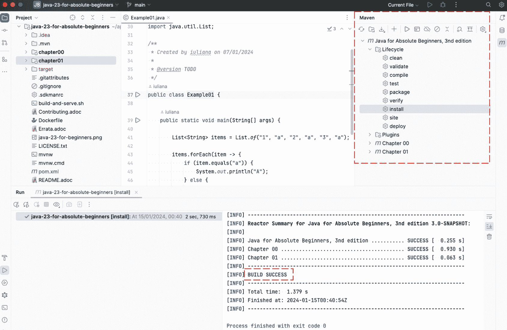

图 2-11

IntelliJ IDEA Maven 视图

预计编辑器底部会打开一个窗口，显示构建进度，如果源代码没问题，此过程应以消息 `BUILD SUCCESS` 结束。

重要

如果在 IntelliJ IDEA 中构建失败，并且你想找出问题，第一步是在 IDE 外部运行构建。你可以在终端（或 Windows 上的命令提示符）中通过执行 `mvn clean install` 来运行构建。如果构建在终端中通过，则源代码和你的设置是正确的，问题肯定出在编辑器配置上。

Maven 构建遵循特定的生命周期，将 Java 项目从源代码转换为可执行或可部署到应用服务器的内容。阶段按特定顺序执行。使用 `mvn {phase}` 命令运行特定阶段会执行一系列称为 *目标* 的步骤，每个步骤负责一个特定任务。

之前推荐的 `mvn clean install` 命令会执行 `clean` 阶段（删除之前生成的字节码文件），然后执行 `install` 阶段（将 Java 文件编译成字节码，执行测试（如果有的话），将它们打包成 Java 归档文件（jar 文件），并将它们复制到本地 Maven 仓库）。如果你想了解更多关于 Maven 的信息，请查看官方网站，但就本书范围而言，一切都已为你简化，如**第** **3** **章**所述。

## 总结

如果任何说明对你来说不清楚（或者我遗漏了什么），请随时使用网络搜索答案。本章介绍的所有软件技术都有全面的官方网站和庞大的开发者社区提供支持，他们乐于提供帮助。在最坏的情况下，当你找不到任何信息时，你总是可以在本书的 Apress GitHub 官方仓库上创建一个问题，或者给我发一封电子邮件。如果需要，我会尽力支持你。

脚注 1   2   3   4   5   6   7

# 3. 初试身手

本章涵盖了 Java 语言的基本模块和术语。虽然它可能被认为是另一个入门章节，但它非常重要。上一章为你留下了一个配置好的完整开发环境，用于编写 Java 代码。现在是时候利用它了。本章涵盖以下主题：

*   核心语法部分

*   Java 基本构建块：包、模块和类

*   使用 IntelliJ IDEA 创建 Java 项目

*   编译和执行 Java 代码

*   将 Java 应用程序打包成可执行 jar

*   使用 Apache Maven


## 核心语法部分

编写 Java 代码很容易，但在开始之前，需要了解一些基本的语法规则。让我们分析一下本书开头给出的代码示例，如清单 3-1 所示。

```
package com.apress.ch.one.hw;
import java.util.List;
public class Example01 {
public static void main(String[] args) {
List items = List.of("1", "a", "2", "a", "3", "a");
items.forEach(item -> {
if (item.equals("a")) {
System.out.println("A");
} else {
System.out.println("Not A");
}
});
}
}
清单 3-1
一个聪明的初学者应得的 Java 入门代码示例
```

下面的列表解释了每一行，或具有相同用途的几行代码：

*   `package com.apress.ch.one.hw``;` 是一个包声明。你可以将此语句视为文件中声明的类的地址。

*   `;`（分号）用于标记语句或声明的结束。

*   `import java.util.List``;` 是一个导入语句。JDK 提供了许多在编写代码时可以使用的类。这些类也组织在包中，当你想要使用其中一个时，必须指定要使用的类及其包，因为两个类可能具有相同的名称，但声明在不同的包中。当编译器编译你的代码时，它需要确切地知道需要哪个类。

*   `public class Example01` 是一个类声明语句。它包含一个访问修饰符（`public`）、类型（`class`）和类的名称（`Example01`）。类有一个用花括号包裹的主体。

*   `{ ... }`（花括号）用于将语句分组到代码块中。代码块不需要以 `;` 结尾。代码块可以表示类的主体、方法的主体，或者仅仅是为了让代码看起来更美观而需要组合在一起的几条语句。

*   `public static void main(String[]` `args)` 是一个方法声明语句。它包含一个访问修饰符（`public`）、一个保留关键字（`static`，将在后面解释）、方法名（`main`）以及一个声明参数的部分（`(String[] args)`）。

*   `List<String>` `items = List.of("1", "a", "2", "a", "3", "a");` 是一条语句，声明了一个名为 `items` 的变量，其类型为 `List<String>`，并将 `List.of("1", "a", "2", "a", "3", "a")` 返回的值赋给它。

*   `items.forEach(...)` 是一条包含对 `items` 变量进行函数调用的语句，用于遍历此列表变量中的所有值。

*   `item -> { ... }` 是一个 lambda 表达式。它声明了一个代码块，该代码块将对列表中的每个项目执行。

*   `if (<condition>) { ... } else { ... }` 是一条决策语句。通过评估条件来决定执行哪个代码块。

*   `System.out.println(<text>)``;` 是一条用于打印传递给它的参数的语句。

现在在本书中详细解释上述列表中的每一项还为时过早，但编写 Java 代码时最重要的规则是，除了包声明和导入语句之外，所有代码都必须位于代码块内。此外，如果一条语句没有跨越多行，则必须以 `;`（分号）结尾，否则代码将无法编译。

要编写更高级的 Java 类，并使用代码解决实际问题，你必须了解并理解 Java 的基本构建块。

## Java 基本构建块：包、模块和类

警告

这是对 Java 平台的一次系统性介绍。要自信地编写 Java 代码，你需要了解底层发生了什么，构建块是什么，以及配置/编写它们的顺序。如果你愿意，可以跳到下一节“如何确定 Java 项目的结构”，但就像一些新司机在自信地握住方向盘之前需要了解一点发动机的工作原理一样，有些人如果对运行机制稍有了解，在编程时可能会感到更自信、更有掌控感。所以，我想确保任何阅读本书的人都能有一个良好的开端。

要编写 Java 应用程序，开发人员必须熟悉 Java 程序的构建块。可以这样想：如果你试图制造一辆汽车，你必须先了解什么是轮子以及它们安装在哪里，对吧？这就是我在本书中试图为 Java 实现的目标：解释所有组件及其用途。

Java 的基本构建块是**类**。Java 中还有其他**对象类型**（如接口、枚举、注解和记录），但类是最重要的，因为它们代表了构成应用程序的对象的模板。一个类主要包含**字段**和**方法**。当创建一个对象时，字段的值定义了对象的状态，而方法描述了其行为。

重要

Java 对象是现实世界对象的模型。因此，如果我们选择在 Java 中为汽车建模，我们将选择定义描述汽车的字段：制造商、型号名称、生产年份、颜色和速度。我们汽车类的方法描述了汽车的功能。汽车主要做两件事——加速和刹车——因此任何方法都应该描述与这两件事相关的动作。


### 包

当你编写 Java 代码时，你是在编写代码来描述现实世界事物的状态和行为。这些代码必须组织在类和其他类型中，这些类型共同用于构建应用程序。

所有类型都定义在扩展名为 `.java` 的文件中。对象类型被组织在**包**中。包是类型的逻辑集合：其中一些类型在包外部可见，而另一些则不可见，这取决于它们的作用域。

提示

要理解包的工作方式，可以想象一个包含其他盒子的盒子。这些盒子可能装满了其他盒子，也可能装满了不是盒子的物品。为了便于理解，我们假设这些物品是乐高积木。这个类比很贴切，因为 Java 类型的组合方式与乐高积木类似。

包名称必须是唯一的，并且其命名应遵循特定的模板。这个模板通常由负责项目的公司定义。良好的实践表明，为了确保唯一性和含义明确，通常以组织互联网域名的倒序开头，然后添加各种分组标准。

在本项目中，包名称遵循此处描述的模板：`com.apress.bgn.[*]+`。该模板以本书出版商 Apress 的倒序域名（[*www.apress.com*](http://www.apress.com)）开头，然后添加一个标识本书的术语（`bgn` 是 *beginner* 的缩写），而 `*` 则替换为源代码（通常）对应的章节编号。

考虑到之前介绍的盒子和乐高积木的类比，`com` 包是最大的盒子，里面装着 `apress` 盒子。它也可能包含乐高积木，但在这个例子中没有。`apress` 盒子代表 `com.apress` 包，里面装着 `bgn` 盒子。

`bgn` 代表 `com.apress.bgn` 包盒子，里面装着每个章节特有的盒子，这些盒子可能包含其他盒子和/或乐高积木。乐高积木就是 Java 文件，其中包含 Java 代码。图 3-1 展示了这些盒子和乐高积木以及它们的嵌套方式。

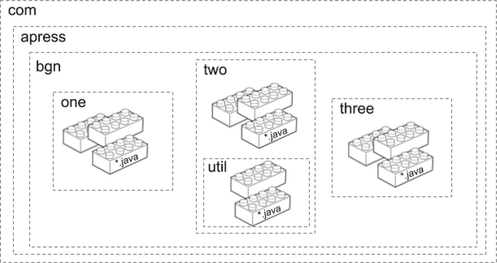

图 3-1

包含源代码的 Java 包，表示为嵌套的盒子和乐高积木

在你的计算机上，包是一个目录层次结构。每个目录包含其他目录和/或 Java 文件。这完全取决于你的组织技巧和需求。这种组织方式很重要，因为任何 Java 对象类型都可以通过包名和其自身名称唯一标识。如果我们想编写一个名为 `HelloWorld` 的类，放在名为 `HelloWorld.java` 的文件中，并将该文件放在包 `com.apress.bgn.one` 中，那么 `com.apress.bgn.one.HelloWorld` 就是该类的**完全限定类名**，它充当该类的唯一标识符。你可以将包名视为该类的地址。

从 Java 5 开始，每个包内都可以创建一个名为 `package-info.java` 的文件，其中包含包声明、包注解、包注释和 Javadoc 注解。这些注释会导出到该项目的开发文档中，也称为 **Javadoc**。（**第** **9** **章**介绍了如何使用 Maven 生成项目 Javadoc。）`package-info.java` 文件必须位于包中最后一个目录下。因此，如果我们定义一个 `com.apress.bgn.one` 包，Java 项目的整体结构和内容将如图 3-2 所示。

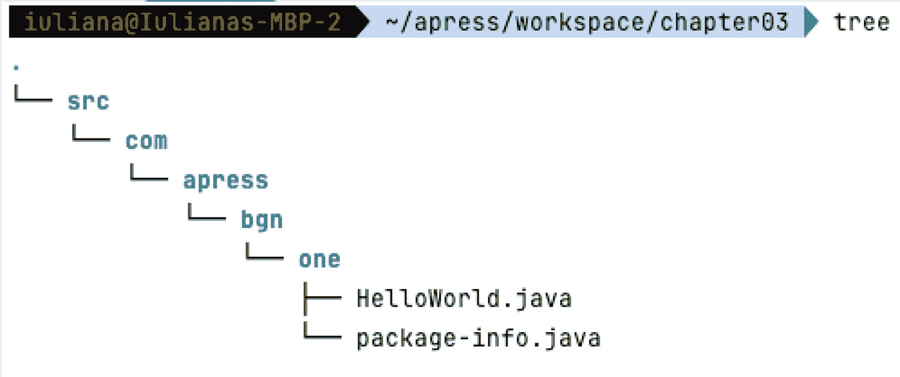

图 3-2

Java 包的内容

`package-info.java` 的内容可能与清单 3-2 的内容类似。

```
/**
* 包含用于从各种来源读取信息的类。
* @author iuliana.cosmina
* @version 3.0-SNAPSHOT
*/
package com.apress.bgn.one;
清单 3-2
package-info.java 示例内容
```

扩展名为 `.java` 且包含类型定义的文件会被编译成扩展名为 `.class` 的文件，这些文件根据相同的包结构进行组织，并打包到一个或多个 **JAR**（**J**ava **Ar**chives，Java 归档文件）中。

当 JAR 文件托管在仓库（例如 Maven 公共仓库）中时，它们也被称为**构件**。你可以在此处阅读更多关于 JAR 的信息：[`https://docs.oracle.com/javase/8/docs/technotes/guides/jar/jarGuide.html`](https://docs.oracle.com/javase/8/docs/technotes/guides/jar/jarGuide.html)。

对于前面的例子，如果你解压编译和链接后生成的 JAR 文件，你会看到如图 3-3 所示的内容。

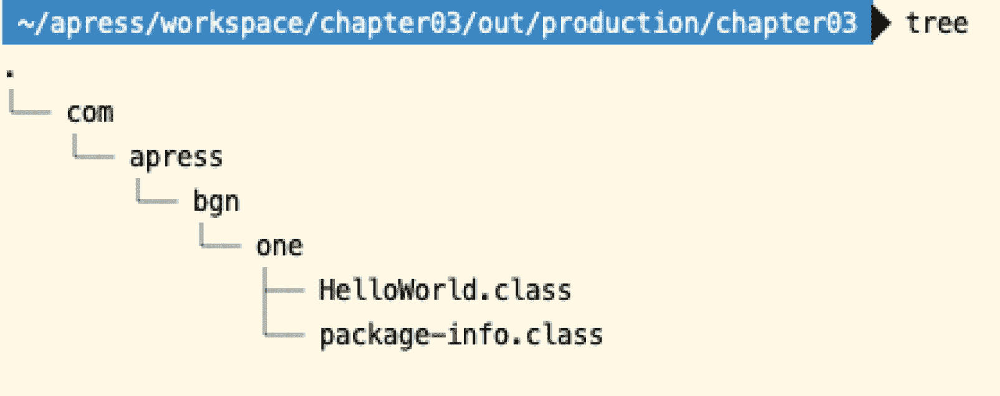

图 3-3

示例 JAR 的内容

`package-info.java` 文件也会被编译，即使它只包含关于包的信息，而没有行为或类型。

重要

`package-info.java` 文件不是必需的；没有它们也可以定义包。它们主要用于文档目的。

一个包的内容可以跨越多个子项目，这意味着如果你的项目中有多个子项目，你可以在多个子项目中使用相同的包名，但包含不同的类。图 3-4 展示了这种符号表示。

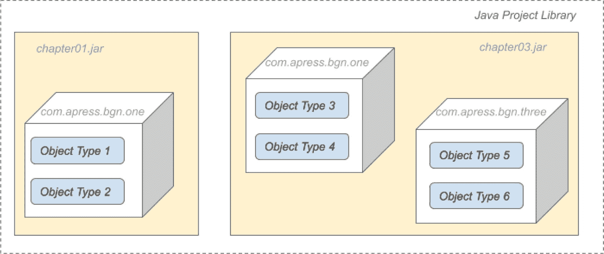

图 3-4

包内容跨越多个 JAR 的示例

**库**是包含用于实现特定功能的类的 JAR 文件集合。最常用的库是日志库，例如 Log4J^(³⁴) 和 Logback^(³⁵)。例如，JUnit 5^(³⁶) 是一个非常著名的 Java 框架，它提供了多个便于编写 Java 单元测试的类。

一个中等复杂程度的 Java 应用程序会引用一个或多个库。要运行该应用程序，其所有依赖项（所有 JAR 文件）都必须位于**类路径**上。这意味着什么？这意味着要运行一个 Java 应用程序，需要 JDK、其依赖项（外部 JAR 文件）以及应用程序的 JAR 文件。图 3-5 清晰地展示了这一点。

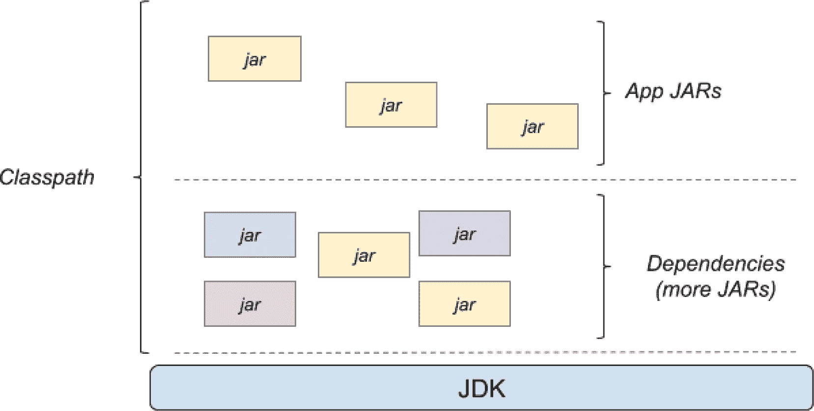

图 3-5

应用程序类路径

警告

我们在此假设应用程序是在编写它的同一环境中运行，因此使用 JDK 来运行应用程序。在 JDK 11 之前，任何 Java 应用程序都可以使用 JRE 运行。但从版本 11 开始，Java 已完全模块化。这意味着只能从运行应用程序所需的模块创建定制的“JRE”发行版。这间接意味着生成的 JRE 包含最少数量的 JDK 编译类。

构成应用程序类路径的 JAR 文件（显然）并不总是相互独立的。21 年来，这种组织方式已经足够，但在复杂的应用程序中，由于以下原因导致了许多复杂问题：

*   包分散在多个 JAR 中（还记得图 3-4 吗？）。这可能导致代码重复和循环依赖。

*   JAR 之间的传递依赖，有时会导致类路径上存在同一类的不同版本。这可能导致不可预测的应用程序行为。

*   缺少传递依赖和可访问性问题。这可能导致应用程序崩溃。

所有这些问题都被统称为一个名称：**JAR 地狱**^(³⁷)。这个问题在 Java 9 中通过引入另一个组织包的结构层级得到了解决：**模块**。或者至少这是初衷。然而，业界一直不愿采用 Java 模块。截至撰写本文时，尽管大多数 Java 生产应用程序已不再停留在 Java 8 上，但开发者仍然像躲避瘟疫一样避免使用模块。


然而，在介绍模块之前，你需要了解访问修饰符。Java 类型及其成员在包内以特定的访问权限进行声明，这是开始编码前必须理解的重要内容。

### 访问修饰符

在 Java 中声明一个类型时——我们暂时只讨论 `class`，因为到目前为止这是唯一提到的类型——你可以使用**访问修饰符**来配置其作用域。

访问修饰符可用于指定对类的访问权限，在这种情况下，我们称它们用于顶层。它们也可用于指定对类成员的访问权限，在这种情况下，它们用于成员级别（我们暂时不讨论*嵌套类*，本章后面会讲到）。

在顶层，只能使用两种访问修饰符：public 和无修饰符。声明为 `public` 的顶层类必须定义在与其同名的 Java 文件中。清单 3-3 展示了一个名为 `Base` 的类，它定义在位于包 `com.apress.bgn.zero` 的 `Base.java` 文件中。

```
package com.apress.bgn.zero;
// 顶层访问修饰符
public class Base {
// 代码省略
}
清单 3-3
Base 类
```

类的具体内容暂未展示，并用 `// 代码省略` 注释代替，以免分散你的注意力。公有类对应用程序中任何位置的所有类都是可见的。因此，不同包中的不同类可以创建此类型的对象，如清单 3-4 所示。

```
package com.apress.bgn.three;
import com.apress.bgn.zero.Base;
public class Main {
public static void main(String... args) {
// 创建 Base 类型的对象
Base base = new Base();
}
}
清单 3-4
使用 Base 类创建对象
```

`Base base = new Base();` 这一行就是创建对象的地方。`new` 关键字代表一种称为类**实例化**的操作，这意味着根据描述 `Base` 类的代码所定义的规范创建了一个对象。

重要提示

类是一个模板。对象是使用这个模板创建的，被称为**实例**。

目前，请先记住这个论断：公有类对所有类在任何位置都是可见的。

当没有显式指定访问修饰符时，我们称该类被声明为**默认**或**包级私有**。我知道用两种方式描述缺少访问修饰符的情况似乎令人困惑，但因为你可能会阅读其他书籍或博客文章提到这种情况，所以最好在这里列出所有可能性。这意味着如果一个类没有访问修饰符，那么只有同一个包中定义的类才能使用该类创建对象。它的作用域仅限于其定义的包。没有访问修饰符的类可以定义在任何 Java 文件中，并且文件名不必与类名一致。

重要提示

当同一个文件中声明了多个类时，公有类必须与定义它的文件同名，因此这个类就是命名该文件的类。

为了测试这一点，让我们在之前引入的 `Base.java` 文件中添加一个名为 `HiddenBase` 的类，如清单 3-5 所示。

```
package com.apress.bgn.zero;
public class Base {
// 代码省略
}
class HiddenBase {
// 你看不到我
}
清单 3-5
没有访问修饰符的类
```

注意，`Base` 类声明在 `com.apress.bgn.zero` 包中。如果我们尝试在包 `com.apress.bgn.three`（注意，这是不同的包）中声明的类里创建 `HiddenBase` 类型的对象，IDE 会通过将文本标红并拒绝提供任何代码补全来发出警告。此外，还会打开一个列出当前文件问题的选项卡，并显示一条非常明显的错误消息，如图 3-6 所示。

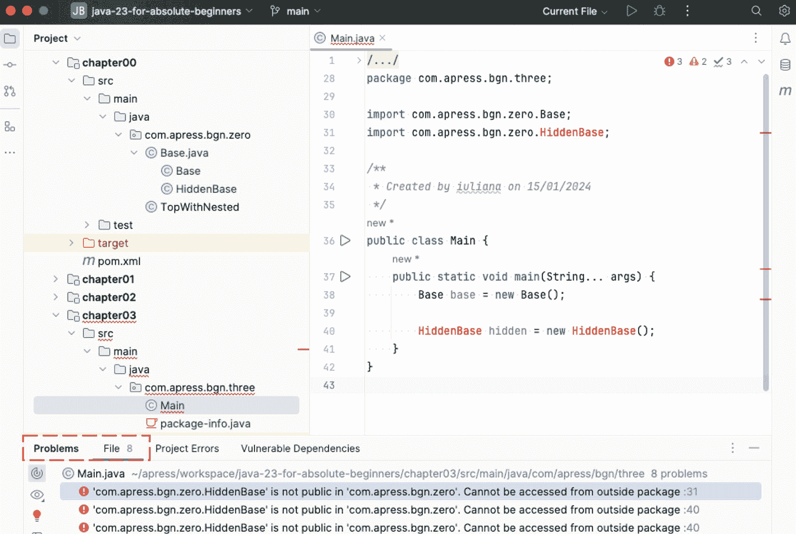

图 3-6

没有访问修饰符的 Java 类错误

重要提示

目前，也请记住这个论断：没有访问修饰符的类对同一个包中的所有类（以及其他类型）都是可见的。


在类内部定义了类的成员：**字段**和**方法**。除此之外，我们还可以定义其他 Java 类型，这些类型被称为嵌套类型，但我们稍后会讲到这一点。在成员级别，除了之前提到的两个修饰符外，还可以应用另外两个修饰符：`private` 和 `protected`。在成员级别，访问修饰符具有以下效果：

*   `public`：与顶层相同，该成员可以从任何地方访问。

*   `private`：该成员只能在其声明的类中访问。

*   `protected`：该成员只能在其声明类所在的包中，或者由其他包中该类的任何子类访问。

*   `none`（无修饰符）：该成员只能在其自身的包内访问。

前面的规则可能看起来复杂，但一旦你开始编写代码，你就会习惯。在 Oracle 官方文档页面上，甚至有一个成员可见性的表格^(³⁸)。表 3-1 提供了一个修改后的版本。

表 3-1

成员级别访问器作用域

| 修饰符 | 类 | 包 | 子类 | 全局 |
| --- | --- | --- | --- | --- |
| `public` | 是 | 是 | 是 | 是 |
| `protected` | 是 | 是 | 是 | 否 |
| 无（*默认/包私有*） | 是 | 是 | 否 | 否 |
| `private` | 是 | 否 | 否 | 否 |

为了全面了解该表格如何应用于代码，清单 3-6 中的类非常有帮助。

```
package com.apress.bgn.three.same;
public class PropProvider {
public int publicProp;
protected int protectedProp;
/* default */ int defaultProp;
private int privateProp;
public PropProvider(){
privateProp = 0;
}
}
清单 3-6
PropProvider，一个成员使用各种访问器修饰的 Java 类
```

`PropProvider` 类声明了四个字段，每个字段都有不同的访问修饰符。字段 `privateProp` 只能在此类的主体内修改。这意味着此类的所有其他成员都可以读取此属性的值并更改它。

在本书的这一点上，只提到了方法是其他类型的成员。但是，可以在另一个类的主体内声明类。这样的类称为**嵌套类**，它可以访问其外部类的所有成员，包括私有成员。表 3-1 中的**类**列（第二列）涵盖了在另一个类（嵌套类）内部声明的类可以访问的字段。图 3-7 描述了修改后的 `PropProvider` 类，它添加了一个名为 `printPrivate` 的额外方法。此方法读取私有字段的值并打印它。还声明了一个名为 `LocalPropRequester` 的嵌套类，并且显示在此类中修改了私有字段（第 56 行）。

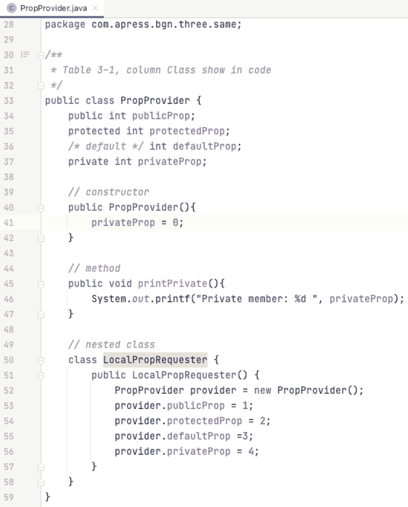

图 3-7

表 3-1 中的**类**列在 Java 代码中的访问器

图 3-7 是 IntelliJ IDEA 中 Java 代码视图的截图。如果任何字段不可访问，则会以红色显示。

表 3-1 中的第三列，即**包**列，涵盖了与 `PropProvider` 类在同一包中声明的类可以访问的字段。图 3-8 描述了一个名为 `PropRequester` 的类，它试图修改 `PropProvider` 类中的所有字段。注意私有字段以亮红色显示。这意味着该字段不可访问，IntelliJ IDEA 使其非常明显。

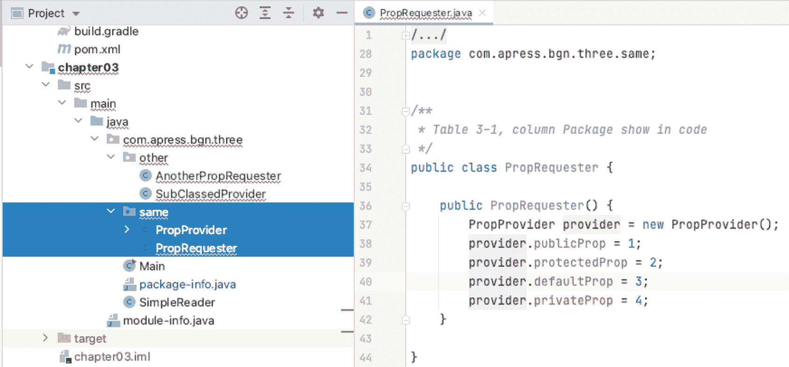

图 3-8

表 3-1 中的**包**列在 Java 代码中的访问器

表 3-1 中的第四列，即**子类**列，涵盖了 `PropProvider` 类的子类可以访问的字段。**子类**从其派生的类（称为其**超类**）继承状态和行为。子类是使用 `extends` 关键字和超类名称创建的。图 3-9 描述了一个名为 `SubClassedProvider` 的类，它试图修改从 `PropProvider` 继承的所有字段。注意私有字段和没有访问修饰符的字段被 IntelliJ IDEA 以亮红色显示。这意味着这些字段不可访问。

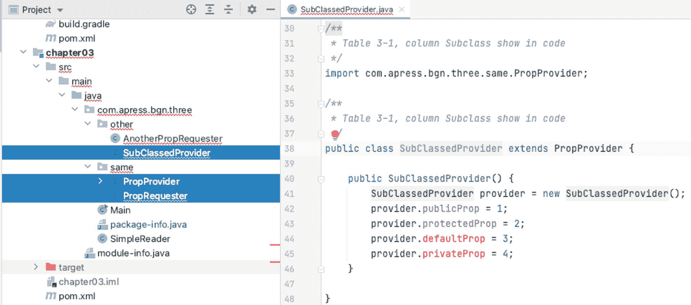

图 3-9

表 3-1 中的**子类**列在 Java 代码中的访问器

重要

在前面的示例中，没有访问修饰符的字段不可访问，因为子类是在不同的包中声明的。如果子类被移动到同一个包中，则适用表 3-1 中**包**列的规则。

表 3-1 中的最后一列，即**全局**列，适用于 `PropProvider` 类声明所在包之外的所有类，这些类不是此类的子类。图 3-10 描述了一个名为 `AnotherPropRequester` 的类，它试图访问 `PropProvider` 中声明的所有字段。正如预期的那样，只有公共字段是可访问的，其余字段都以红色显示。

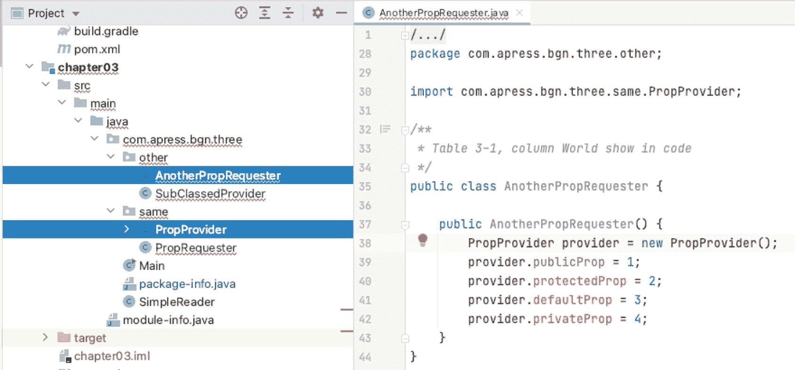

图 3-10

表 3-1 中的**全局**列在 Java 代码中的访问器

使用 Maven 构建工具构建包含 `AnotherPropRequester` 类的 `chapter03` 子项目会失败。错误消息显示在清单 3-7 中。

```
[ERROR] Failed to execute goal org.apache.maven.plugins:maven-compiler-plugin:3.8.1:compile (default-compile) on project chapter03: Compilation failure: Compilation failure:
[ERROR] ./java-23-for-absolute-beginners/chapter03/src/main/java/com/apress/bgn/three/other/AnotherPropRequester.java:[42,17] protectedProp has protected access in com.apress.bgn.three.same.PropProvider
[ERROR] ./java-23-for-absolute-beginners/chapter03/src/main/java/com/apress/bgn/three/other/AnotherPropRequester.java:[44,17] defaultProp is not public in com.apress.bgn.three.same.PropProvider; cannot be accessed from outside package
[ERROR] ./java-23-for-absolute-beginners/chapter03/src/main/java/com/apress/bgn/three/other/AnotherPropRequester.java:[46,17] privateProp has private access in com.apress.bgn.three.same.PropProvider
清单 3-7
AnotherPropRequester 编译错误
```

正如所展示的，构建工具和编辑器在 Java 代码出现问题时能够很好地通知你。学会善用它们，信任它们，它们将提高你的生产力。*当然，构建工具和智能编辑器偶尔也会出现小问题，但不会太多。*

在你开始编写 Java 代码后，你可能会回过头来查阅表 3-1 一两次。即使引入了模块，本节涵盖的所有内容仍然有效。前提是你正确配置了模块访问权限。


### 模块

从 Java 9 开始，引入了一个新概念：`modules`。

重要提示

诸如 Maven 或 Gradle 这类构建工具也将子项目称为模块，但其用途与 Java 模块不同。

Java 模块代表了一种更强大的机制来组织和聚合包。这个新概念的实施耗时超过十年。关于模块的讨论始于 2005 年，原本希望能在 Java 7 中实现。在 **Project Jigsaw** 的名义下，探索阶段最终于 2008 年开始。Java 开发者曾希望模块化的 JDK 能随 Java 8 一起提供，但这并未实现。

经过三年的工作（以及近七年的分析），模块最终在 Java 9 中到来。支持模块将 Java 9 的官方发布日期推迟到了 2017 年 9 月。

注意

Jigsaw 项目的完整历史可在此处找到：[`https://openjdk.java.net/projects/jigsaw`](https://openjdk.java.net/projects/jigsaw)

**Java 模块**是一种对包进行分组并配置对包内容进行更细粒度访问的方式。一个 Java 模块是一个具有唯一名称、可重用的包和资源（例如，XML 文件和其他类型的非 Java 文件）组，由一个名为 `module-info.java` 的文件描述，该文件位于源目录的根目录。此文件包含以下信息：

*   模块的名称
*   模块的依赖项（即，此模块依赖的其他模块）
*   模块明确提供给其他模块的包（模块中的所有其他包默认对其他模块不可用）
*   模块提供的服务
*   模块消费的服务
*   允许哪些其他模块进行反射
*   本地代码
*   资源
*   配置数据

理论上，模块命名类似于包命名，并遵循反向域名约定。实践中，只需确保模块名称不包含任何数字，并能清晰表明其用途即可。`module-info.java` 文件被编译成一个模块描述符，这是一个名为 `module-info.class` 的文件，它与类一起被打包到一个普通的 JAR 文件中。

该文件位于 Java 源目录的根目录，在任何包之外。对于之前介绍的 `chapter03` 项目，`module-info.java` 文件位于 `src/main/java` 目录中，与 `com` 目录同级；`com.apress.bgn.three` 包的根目录如图 3-11 所示。

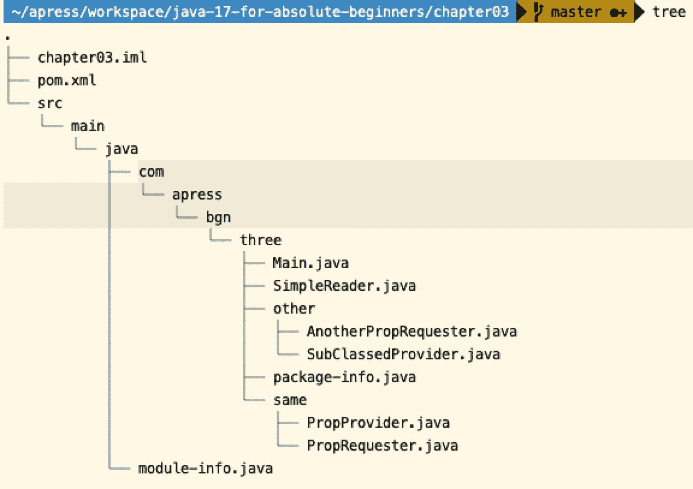

图 3-11

`module-info.java` 文件的位置

与任何扩展名为 `*.java` 的文件一样，`module-info.java` 文件被编译成一个 `*.class` 文件。由于模块声明不是 Java 类型声明的一部分，`module` 不是一个 Java 关键字，因此在为 Java 类型编写代码时（例如，作为变量名）仍然可以使用它。对于 `package` 来说情况不同，因为每个 Java 类型声明都必须以包声明开头。只需看一下清单 3-8 中声明的 `SimpleReader` 类。

```
package com.apress.bgn.three;
public class SimpleReader {
private String source;
// 代码省略
}
清单 3-8
SimpleReader 类
```

你可以看到包声明，但模块在哪里？嗯，模块是一个抽象概念，由 `module-info.java` 文件描述。因此，从 Java 9 开始，如果你在应用程序中配置 Java 模块，图 3-4 将演变为图 3-12。

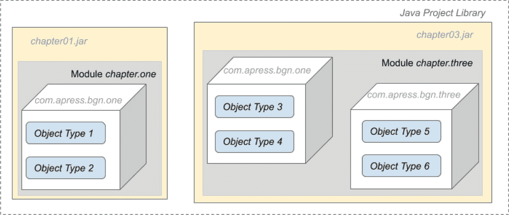

图 3-12

Java 模块的视觉表示

Java 模块是一种将属于同一逻辑组的 Java 包进行逻辑分组的方式。

模块的引入也使得 JDK 可以被划分为模块。`java --list-modules` 命令列出本地 JDK 安装中的所有模块。清单 3-9 展示了在我的个人电脑上执行此命令的输出，当前安装的是 JDK 23。

```
$ java --list-modules
java.base@23
java.compiler@23
java.datatransfer@23
java.desktop@23
