# 部分输出省略
清单 3-9
JDK 23 模块
```

每个模块名称后跟一个版本字符串，在上面的清单中是 @23，这意味着该模块属于 Java 版本 23。因此，如果 Java 应用程序不需要所有模块，你可以创建一个仅包含所需模块的运行时，这可以减小运行时的大小。用于构建针对应用程序需求定制的更小运行时的工具称为 `jlink`，它是 JDK 可执行文件的一部分。这允许更高的可扩展性和性能提升。如何使用 `jlink` 不是本书的主题。本书的重点是学习 Java 编程语言，因此 Java 平台的技术细节将保持最少——足以让你自信地开始编写和执行代码。

引入模块有诸多好处，经验丰富的开发者多年来一直期待利用这些优势。然而，为更大、更复杂的项目配置模块并非易事，大多数软件公司宁愿完全避免配置模块。

`module-info.java` 文件的内容可以像模块名称和包含主体的两个大括号一样简单，如清单 3-10 所示。

```
module chapter.three {
}
清单 3-10
一个简单的 module-info.java 配置
```


#### 高级模块配置

Java 模块声明体包含一个或多个**指令**，这些指令使用表 3-2 中的关键字构建。这些指令代表了模块中包含的包和类的访问配置与依赖需求。

表 3-2

Java 模块指令

| 指令 | 用途 |
| --- | --- |
| `requires` | 指定该模块依赖于另一个模块。 |
| `exports` | 指定模块的某个包，其 `public` 类型（以及它们的 `nested public` 和 `protected` 类型）应对所有其他模块中的代码可访问。 |
| `exports ... to` | `exports` 指令的限定版本，允许通过逗号分隔的列表精确指定哪些模块的代码可以访问被导出的包。 |
| `open` | 用于模块级声明（`open module mm {}`），允许对所有模块的包进行反射访问。Java 反射是在运行时分析和修改类所有能力的过程，它也作用于私有类型和成员。因此在 Java 9 之前，实际上没有任何东西是真正封装的。 |
| `opens` | 用于模块声明体内部，选择性地配置仅通过反射访问某些包。 |
| `opens ... to` | `opens` 指令的限定版本，允许通过逗号分隔的列表精确指定哪些模块的代码可以通过反射访问其包。 |
| `uses` | 指定该模块使用的一个服务，使该模块成为*服务消费者*。此处的服务代表另一个模块为其提供实现的接口/抽象类的全名。 |
| `provides ... with` | 指定一个模块使用特定实现来提供一项服务，使该模块成为*服务提供者*。 |
| `transitive` | 与 `requires` 一起使用，指定对另一个模块的依赖，并确保读取你模块的其他模块也读取该依赖——这被称为*隐式可读性*。 |

附录 A 提供了所有指令的示例。就学习 Java 语言而言，你真正需要了解的只有 `requires` 和 `exports`，因此本章仅涵盖这两个指令。一旦上下文适合完全理解它们，我将深入解释所有指令，并添加与现实世界事件和场景的类比，以确保概念清晰易懂。

重要的是，*模块可以相互依赖。* 本书的项目由 13 个模块组成，其中大多数依赖于 `chapter.zero` 模块。该模块包含用于在其他模块中构建更复杂组件的基本组件。例如，`chapter.three` 模块内部的类需要访问 `chapter.zero` 模块中的包和类。声明模块依赖关系使用 `requires` 指令完成，如清单 3-11 所示。

```
module chapter.three {
    requires chapter.zero;
}
清单 3-11
一个简单的 module-info.java 配置
```

上述依赖是**显式**的。但也存在**隐式**依赖。例如，开发者声明的任何模块都隐式地需要 JDK 的 `java.base` 模块。该模块包含 Java SE 平台的基础 API，没有它就无法编写任何 Java 应用程序。这个隐式指令确保了对最小 Java 类型集的访问，从而可以编写基本的 Java 代码。清单 3-11 等同于清单 3-12。

```
module chapter.three {
    requires java.base; // 冗余指令
    requires chapter.zero;
}
清单 3-12
一个包含显式 requires java.base 指令的简单 module-info.java 配置
```

重要

将模块声明为 required 意味着在代码编译时（通常称为*编译时*）和代码执行时（通常称为*运行时*）都需要该模块。如果某个模块仅在运行时需要，则使用 `requires static` 关键字来声明依赖。请先记住这一点；当我们讨论 Web 应用程序时，它的意义就会显现出来。

现在 `chapter.three` 依赖于模块 `chapter.zero`。但这是否意味着 `chapter.three` 可以访问 `chapter.zero` 模块中所有包的所有 `public` 类型（以及它们的嵌套 `public` 和 `protected` 类型）？如果你认为这还不够，那么你是对的。仅仅因为一个模块依赖于另一个模块，并不意味着它可以访问它实际需要的包和类。被依赖的模块必须配置为暴露其*内部*。这该如何实现？在我们的例子中，我们需要确保 `chapter.zero` 模块授予对所需包的访问权限。我们可以通过为该模块定制 `module-info.java` 文件，添加 `exports` 指令，后跟必要的包名来实现。清单 3-13 展示了暴露其单个包的 `chapter.zero` 模块的 `module-info.java` 文件。

```
module chapter.zero {
    exports com.apress.bgn.zero;
}
清单 3-13
chapter.zero 模块的 module-info.java 配置文件
```

提示

可以这样理解：你在房间里剪圣诞装饰品，需要一个模板。你的室友有所有模板。但仅仅因为你需要它们，并不意味着它们会凭空出现。你需要去和你的室友谈谈。需要室友的帮助可以看作是 `requires room-mate` 指令。和室友交谈后，你的室友可能会说：*当然，进来吧，它们在桌子上！需要多少就拿多少。* 这可以看作是 `exports all-templates-on-desk` 指令。桌子可能是一个很好的类比，用来比喻包。

使用清单 3-13 中的配置，我们刚刚授予了任何配置了 `requires module.zero;` 指令的模块对 `com.apress.bgn.zero` 包的访问权限。如果我们不希望这样呢？（参考前面的提示，你的室友只是让房间门开着，所以任何人都可以进去拿那些模板！）

如果我们想将对模块内容的访问限制为仅对 `chapter.three` 模块开放呢？（这样，你的室友只能把他们的模板给你。）这可以通过添加 `to` 关键字后跟模块名来实现，以明确只有该模块被允许访问这些组件。这就是表 3-2 中提到的 `exports` 指令的限定版本。

警告

如果你出于好奇阅读了推荐的 **JAR 地狱** 文章，你会注意到处理打包在 jar 中的 Java 源码的一个问题是安全性。原因是，即使无法访问 Java 源码，通过将 Jar 作为依赖项添加到应用程序中，对象也可以被检查、扩展和实例化。因此，除了提供可靠的配置、更好的扩展性、平台完整性和改进的性能之外，引入模块的目标实际上是**更好的安全性**。

清单 3-14 展示了 `chapter.zero` 模块的 `module-info.java` 文件，该文件将其单个包仅暴露给 `chapter.three` 模块。

```
module chapter.zero {
    exports com.apress.bgn.zero to chapter.three;
}
清单 3-14
chapter.zero 模块的高级 module-info.java 配置文件

可以通过列出所需模块（用逗号分隔）来指定多个模块具有访问权限，如清单 3-15 所示。


```
module chapter.zero {
    exports com.apress.bgn.zero to chapter.two, chapter.three;
}
代码清单 3-15
chapter.zero 模块的高级 module-info.java 配置文件（包含多个模块）
```

模块的顺序并不重要，如果模块数量很多，你可以将它们放在多行中。只需确保以 `;`（分号）结束声明即可。

关于模块，本书现阶段能介绍的内容就这些，但别担心：所有其他指令都会在合适的时机进行讲解。

## 如何确定 Java 项目的结构

Java 项目的结构有几种组织方式，选择哪种方式受两个因素影响：项目范围和使用到的构建工具。

你可能会好奇为什么项目范围会影响项目结构。你可能会认为这方面应该有一个标准，对吧？实际上，标准不止一个，而这取决于项目范围。创建 Java 项目的原因会影响其规模。如果项目很小，可能不需要将源代码拆分成子项目，也可能不需要构建工具，因为构建工具有自己标准的项目组织方式。让我们从最简单的 Java 项目开始，这个项目只需在控制台打印 *Hello World!*。

### IntelliJ IDEA 中的 HelloWorld! 项目

既然你已经安装了 IntelliJ IDEA，让我们创建一个 Java 项目，看看编辑器会为我们选择什么样的项目结构。当你第一次打开 IntelliJ IDEA 时，会看到一个非常简单的对话框窗口，如图 3-13 所示。

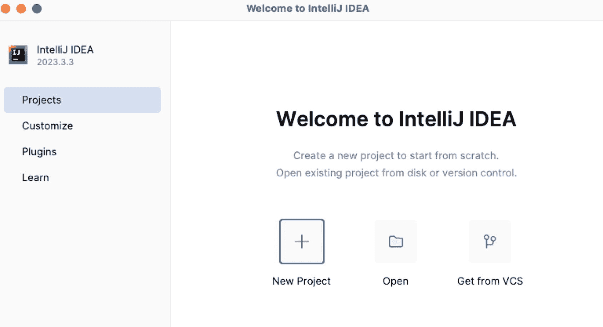

图 3-13

IntelliJ IDEA 初始对话框窗口

选择 **New Project**。IntelliJ IDEA 会引导你进入项目设置对话框窗口，在这里你可以选择项目名称、要使用的编程语言、构建工具，并且它会自动选择系统 JDK。该对话框窗口如图 3-14 所示，显示的是我电脑上的默认选项。

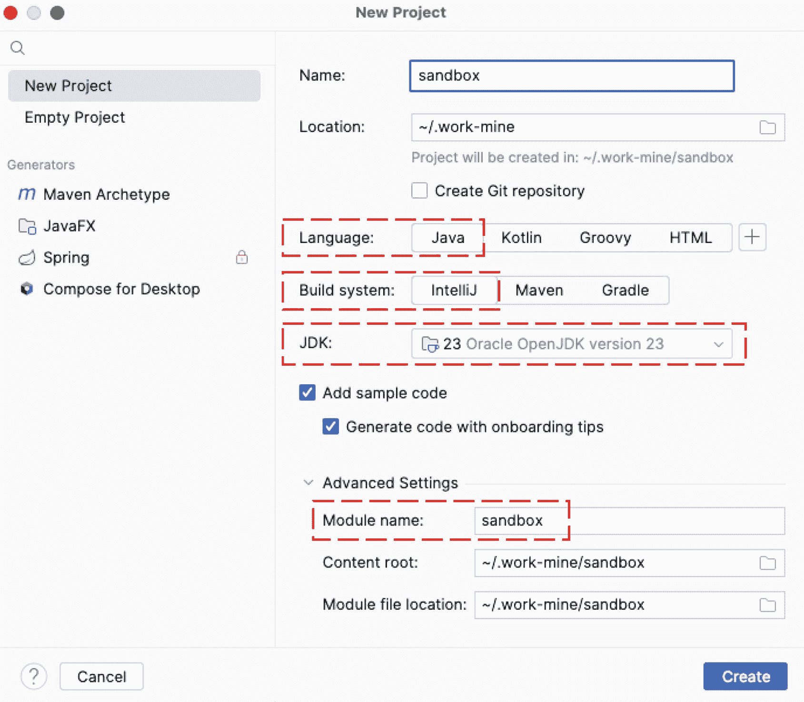

图 3-14

IntelliJ IDEA 创建 Java 项目的对话框窗口

为了在 IntelliJ IDEA 中创建这第一个 Java 项目，将项目名称和模块名称都设为 `sandbox`，然后点击 **Create**。

下一个窗口是编辑器窗口，如图 3-15 所示，你将在其中编写代码。如果你展开左侧的 `sandbox` 节点（该部分称为*项目视图*），可以看到该项目是使用你已安装的 JDK（此处为 23 版本）构建的。创建了一个 `src` 目录来存放 Java 包和类文件。在 `src` 目录内，IntelliJ IDEA 生成了一个名为 `Main.java` 的默认类文件，其中包含一个带有简单方法体的 `main(..)` 方法，如图 3-15 右侧所示。

IntelliJ IDEA 假设你是初学者，并在代码中显示了一些入门提示。你可以通过关闭 `Main.java` 类文件顶部的通知来关闭这些提示。

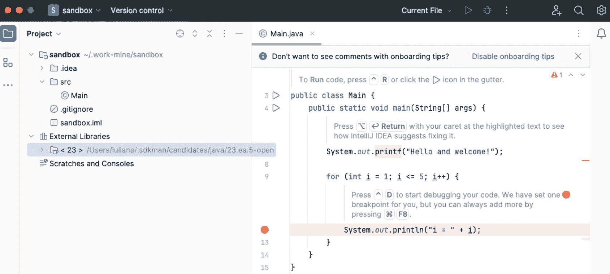

图 3-15

IntelliJ IDEA 项目视图和默认的 `Main` 类

在编写代码之前，让我们看看还有哪些其他项目设置可用。IntelliJ IDEA 允许你通过 **File ➤ Project Structure** 菜单项查看和编辑项目属性。点击后，将打开一个项目结构对话框窗口，类似于图 3-16 所示。

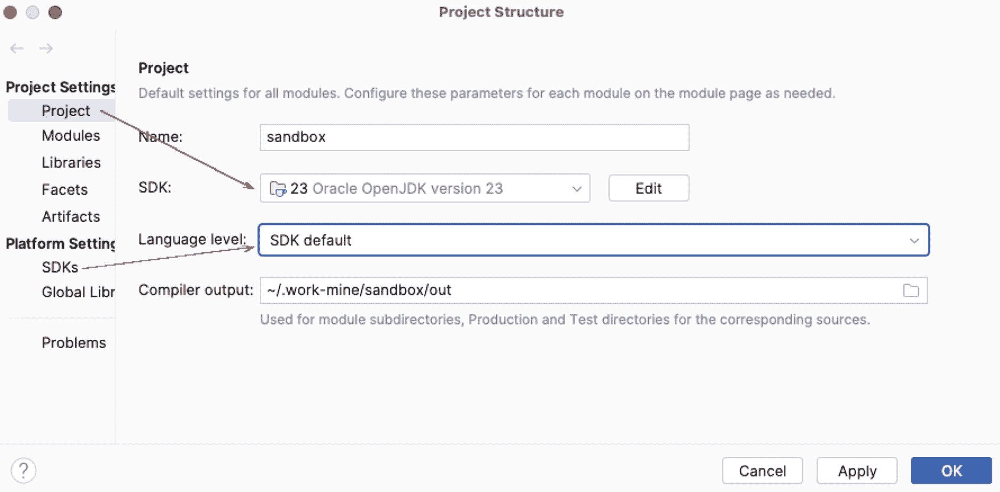

图 3-16

IntelliJ IDEA 项目结构对话框窗口

当对话框窗口打开时，**Project Settings** 部分处于展开状态，并且选中了 **Project** 选项卡。在图 3-16 中，有两个箭头吸引你注意 **SDK** 字段（它显示了 Java 项目的 JDK 版本）和 **Language level** 字段（它列出了 **SDK default**）。在撰写本章时，默认版本是最新的 JDK 23 EA。最新版本的 IntelliJ IDEA 支持最新官方 JDK 版本的语法和代码补全。

如果你切换到 **Project Settings** 下的 **Modules** 选项卡，你将看到如图 3-17 所示的信息。

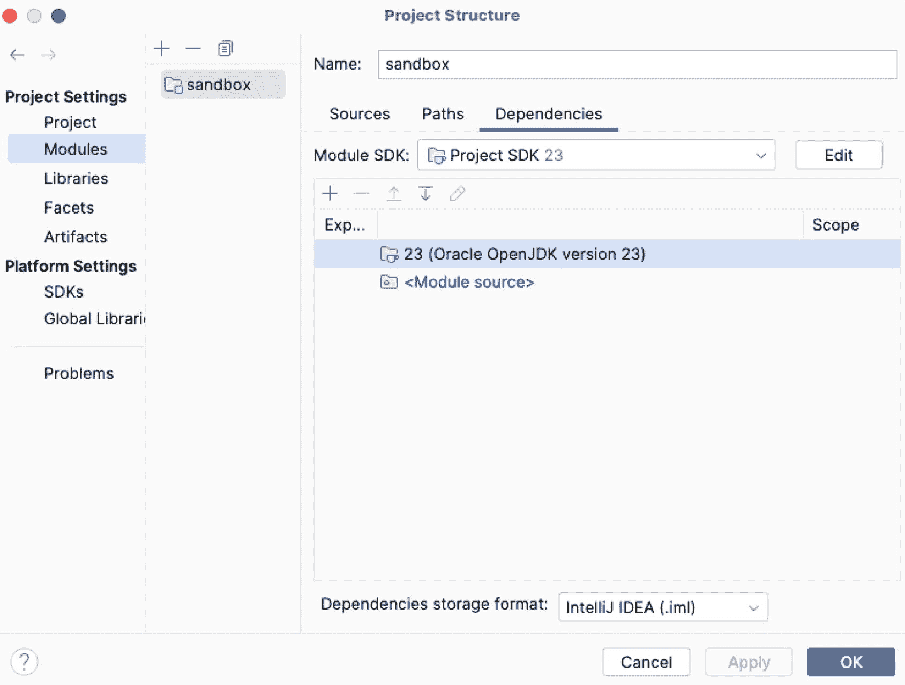

图 3-17

IntelliJ IDEA 项目 Modules 选项卡

重要

除了将包封装在一起的 Java 模块之外，模块也是一种将项目中具有共同用途的 Java 源代码和资源文件封装在一起的方式。在 Oracle 引入模块概念作为 Java 应用程序模块化方式之前，组成这些应用程序的代码就已经被那些需要以某种实用方式组织大型项目的开发者进行了模块化。


在**模块**选项卡中，你可以查看一个项目包含多少个部分（模块）以及每个部分的设置。`sandbox` 项目包含一个部分，即一个同样名为 `sandbox` 的模块，该模块的源代码存放在 `src` 目录下。因此，如果我们想编写一个打印 *Hello World!* 的类，名为 `HelloWorld.java` 的文件就必须放在该目录下。如果你右键点击 `src` 目录，就会出现如图 3-18 所示的菜单。

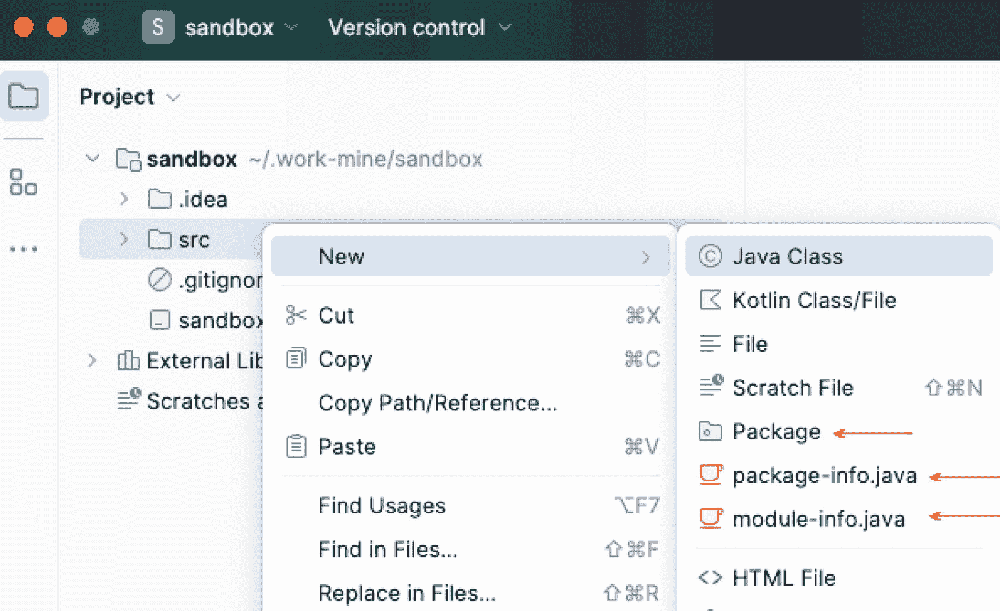

图 3-18

IntelliJ IDEA 上下文菜单，列出了可以在 `src` 目录中创建的 Java 对象

除了 **Java Class** 选项外，红色箭头指向了 `src` 目录中可以包含的其他组件。接下来我们继续创建类。点击 **Java Class** 菜单选项，在弹出的对话框中输入类名。从文本框下方的列表中选择 **Class**。图 3-19 展示了所有可以创建的 Java 类型。

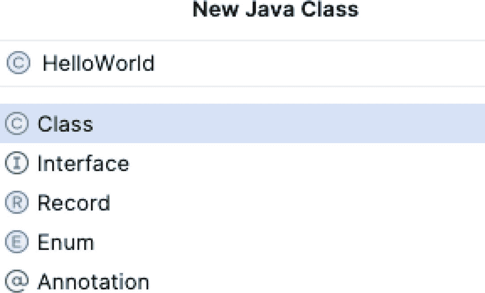

图 3-19

IntelliJ IDEA 创建 Java 类型的对话框窗口

正如本章前面提到的，Java 应用程序的核心构建块是 `class`，但 Java 中还存在其他类型。图 3-19 中的列表显示了所有五种 Java 类型。本书后面会详细解释每一种类型，所以现在只需注意，在 `src` 目录下创建了一个名为 `HelloWorld.java` 的文件，该文件的内容非常简单，如代码清单 3-16 所示。

```
public class HelloWorld {
}
代码清单 3-16
HelloWorld.java 的内容——一个空 Java 类的主体
```

你刚刚在你的第一个非常简单的 Java 项目中创建了第一个 Java 类。它目前还什么都不会做。通过从 IntelliJ IDEA 的 **Build** 菜单中选择 **Build Project** 选项（如图 3-20 所示），或者按下因操作系统而异的组合键，即可编译该类。编译该类会生成包含字节码的 `HelloWorld.class` 文件。默认情况下，IntelliJ IDEA 会将编译结果存储到名为 `out/production` 的目录中。图 3-20 也部分展示了编译项目的结果。

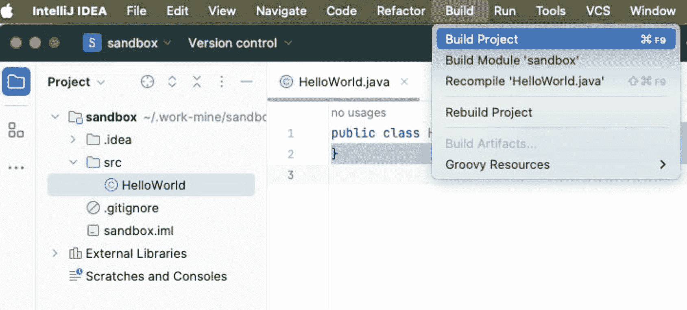

图 3-20

如何在 IntelliJ IDEA 中编译 Java 项目

现在是时候让这个类打印 *Hello World!* 了。为此，我们需要向该类添加一个特殊的方法。任何 Java 桌面应用程序都有一个名为 `main` 的特殊方法，该方法必须在顶层类中声明。JRE 会调用此方法来运行 Java 程序/应用程序，我将其称为*入口点*。如果没有这样的方法，Java 项目就只是一堆类的集合，不可运行，无法执行，也无法实现特定功能。

提示

可以这样想象：这就像你有一辆车，但无法启动它，因为点火锁芯不见了。从各方面来看，它是一辆车，但它无法实现汽车的主要目的——真正带你到某个地方。你可以把 `main` 方法想象成点火锁芯，JRE 会插入钥匙来启动你的应用程序。接下来，我们将把这个方法添加到 `HelloWorld` 类中。

由于 IntelliJ IDEA 是一个出色的编辑器，你可以通过输入 `psvm` 然后按 **Tab** 键来生成 `main` 方法。这四个字母代表了方法声明中所有组成部分的首字母：**p**ublic、**s**tatic、**v**oid 和 **m**ain。

包含 `main` 方法并打印文本 *Hello World!* 的 `HelloWorld` 类如代码清单 3-17 所示。

```
public class HelloWorld {
public static void main(String... args) {
System.out.println("Hello World");
}
}
代码清单 3-17
包含 main 方法的 HelloWorld 类
```

现在我们有了 `main` 方法，就可以执行（或运行）代码了。IntelliJ IDEA 提供了两个选项：

*   从 **Run** 菜单中，选择 **Run [ClassName]** 选项（或按下该选项右侧显示的组合键）。
*   右键点击类主体，从出现的菜单中选择 **Run [ClassName].main()**。

图 3-21 展示了可用于执行该类的两个菜单项以及执行结果。

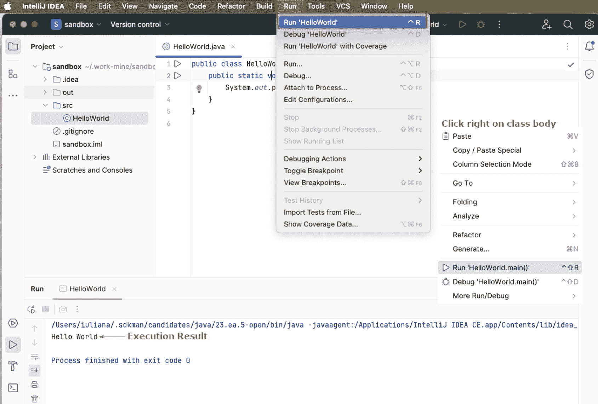

图 3-21

如何在 IntelliJ IDEA 中执行 Java 类

这是 Java 项目最基本的结构。这个项目非常简单，甚至可以从命令行手动编译，那么我们就来试试吧！

### 从命令行编译和执行 HelloWorld! 项目

你可能已经注意到了 IntelliJ IDEA 中的 **Terminal** 按钮。点击该按钮，编辑器内会打开一个终端。在 Windows 上，它将是一个命令提示符实例；在 Linux 和 macOS 上，则是默认的 shell。IntelliJ 会将终端直接打开到你的项目根目录。接下来你需要执行以下操作：

*   执行以下命令进入 `src` 目录：`cd src`。（`cd` 是 change directory 的缩写。）
*   执行 `javac HelloWorld.java` 编译 `HelloWorld.java` 文件。（`javac` 是一个用于编译 Java 文件的 JDK 可执行文件，IntelliJ IDEA 在后台也会调用它。）
*   执行 `java HelloWorld` 运行生成的 `HelloWorld.class` 文件中的字节码。

图 3-22 展示了在 IntelliJ IDEA 的终端中执行这些命令的过程。

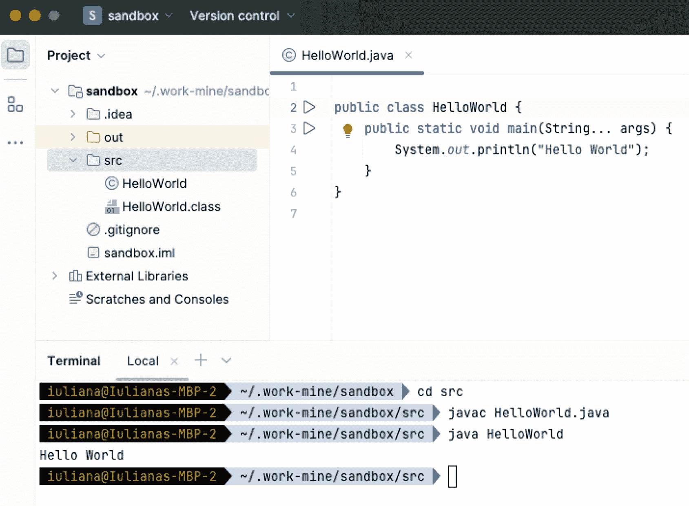

图 3-22

在 IntelliJ IDEA 内部的终端中手动编译和运行 `HelloWorld` 类

看起来很简单，对吧？实际上就是这么简单，因为没有定义任何包或 Java 模块。*但是，等等，这真的可能吗？* 嗯，是的。如果你没有定义包，该类仍然属于一个未命名的默认包，这是 JSE 平台默认提供的，用于开发小型、临时性的教学应用程序，就像你现在正在构建的这个。

那么，让我们把项目变得稍微复杂一点，为我们的类添加一个命名包。


### 将 HelloWorld 类放入包中

如前文图 3-18 所示，右键点击 `src` 目录时弹出的上下文菜单中包含一个**包**选项。因此，请右键点击 `src` 目录并选择该选项。在弹出的对话框中，输入包名 `com.sandbox`。如图 3-23 所示，如果你尝试创建的包已存在（就像我的情况），则会显示一条红色错误信息。

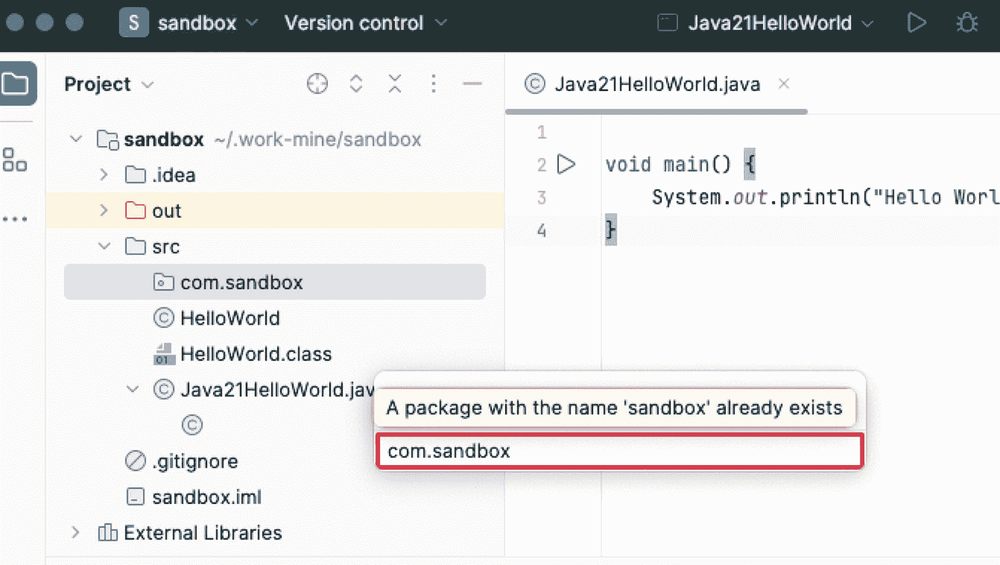

图 3-23

在 IntelliJ IDEA 中创建重复的包

现在我们已经有了一个包，但类并不在其中。要将类移入包中，只需点击该类并将其拖拽过去。此时会弹出另一个对话框，确认你是否确实要执行此操作，如图 3-24 所示。

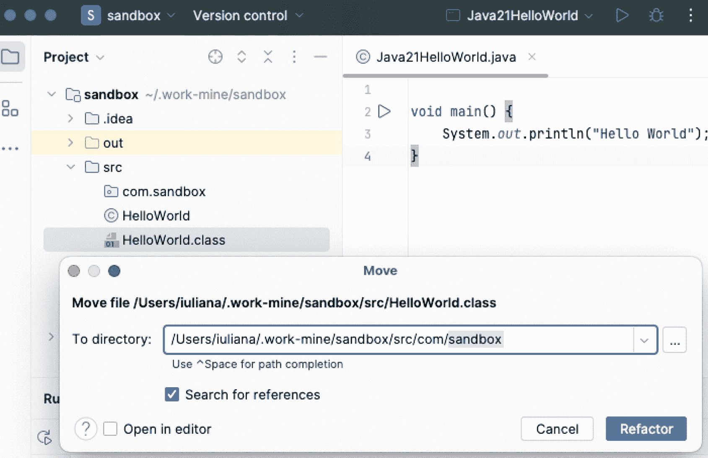

图 3-24

在 IntelliJ IDEA 中将类移入包中

点击**重构**按钮，观察类发生的变化。该类现在应以 `package com.sandbox``;` 声明开头。如果你重新构建项目，然后查看 `production` 目录，将会看到类似于图 3-25 所示的内容。

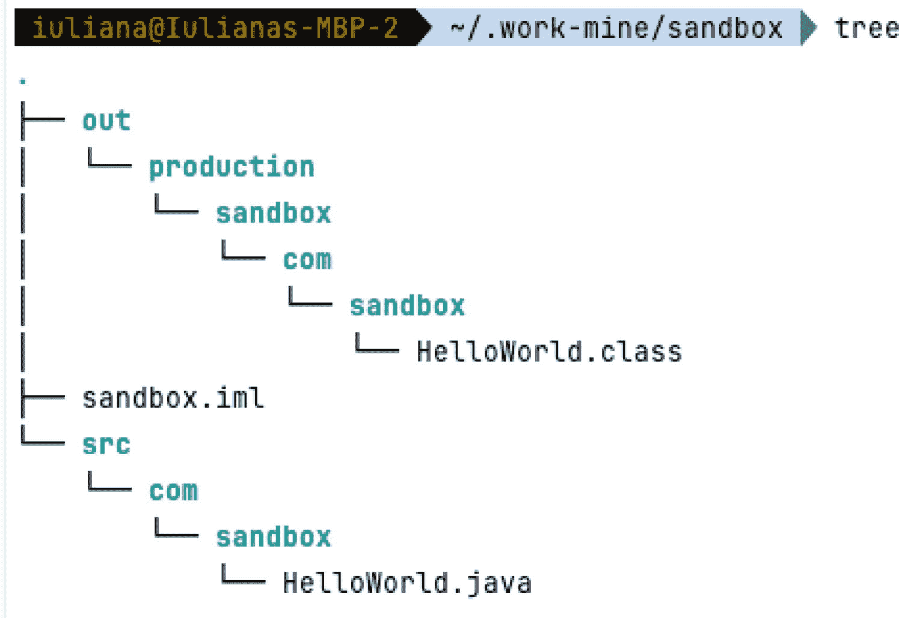

图 3-25

添加 `com.sandbox` 包后的新目录结构

显然，在手动编译和执行类时，必须考虑到包的存在，因此命令将如清单 3-18 所示发生变化。

```
~/sandbox/src/> javac com/sandbox/HelloWorld.java
~/sandbox/src/> java com/sandbox/HelloWorld
清单 3-18
编译和执行 HelloWorld.java 文件的包版本
```

那么，当模块也被配置时会发生什么？存在一个默认的未命名模块，所有 JAR（无论是否模块化）以及类路径上的类都将包含在其中。这个默认的未命名模块会导出所有包并读取所有其他模块。由于它没有名称，因此不能被命名的应用程序模块所要求和读取。因此，即使你的小项目在 JDK 9 及以上版本中似乎能正常工作，它也无法被其他模块访问，但它之所以能工作，是因为它可以访问其他模块。（这确保了与旧版本 JDK 的向后兼容性。）话虽如此，让我们也在项目中添加一个模块。

### 配置 com.sandbox 模块

配置模块就像在 `src` 目录下添加一个 `module-info.java` 文件一样简单。再次回到图 3-18，`src` 的上下文菜单中包含一个 `module-info.java` 选项。选择该选项，IDE 将为你生成该文件。一切顺利，如果你不喜欢为你生成的模块名称，可以更改它。我将其更改为 `com.sandbox`，以遵循 Oracle 开发者建立的模块命名约定。该文件初始为空，如清单 3-19 所示。

```
module com.sandbox {
}
清单 3-19
com.sandbox 模块配置文件
```

现在我们有了一个模块，会发生什么？从 IDE 的角度来看，变化不大。但如果你想手动编译一个模块，你需要了解一些事情。我使用清单 3-20 中的命令编译了我们的模块。

```
~/sandbox/src/> javac -d ../out/com.sandbox \
module-info.java \
com/sandbox/HelloWorld.java
清单 3-20
手动编译包含在模块中的包
```

重要提示

“`\`”（反斜杠）是 macOS/Linux 的分隔符。在 Windows 上，要么将整个命令写在一行，要么将 `\` 替换为 `^`（脱字符）。

清单 3-20 中的命令是根据清单 3-21 中的模板构建的。

```
javac -d [目标位置]/[模块名称] \
[源位置]/module-info.java \
[java 文件...]
清单 3-21
手动编译包含在模块中的包的命令模板
```

`-d [目标位置]` 决定了执行结果应保存的位置。清单 3-20 中的命令行将输出文件夹指定为 `/out/com.sandbox`，是为了明确 `com.sandbox` 是外部模块。在此目录下，我们将拥有 `com.sandbox` 包的正常结构。`out` 目录的内容如图 3-26 所示。

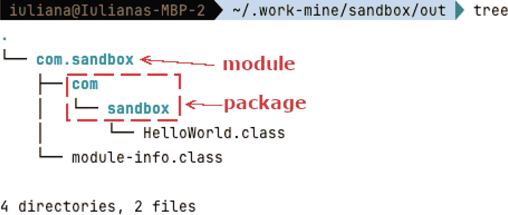

图 3-26

手动编译的 Java 模块 `com.sandbox`

正如你在本例中注意到的，模块实际上并不存在，直到我们编译了源代码，因为 Java 模块更像是一种由 `module-info.class` 描述符描述的封装包的逻辑模式。`com.sandbox` 目录被创建的唯一原因是我们将其指定为 `javac -d` 命令的参数。

既然我们已经成功编译了一个模块，清单 3-22 展示了当 `HelloWorld` 类包含在模块中时如何运行它。

```
~/sandbox/> java --module-path out \
--module com.sandbox/com.sandbox.HelloWorld
Hello World!  # 结果
清单 3-22
手动执行包含在模块中的类

前面的命令是根据清单 3-23 中的模板构建的。

```
java --module-path [目标位置] \
--module [模块名称] /[包名称].HelloWorld
清单 3-23
手动执行包含在模块中的类的命令模板
```

2017 年 9 月的 *Oracle Magazine* 期刊首次提到了 Java 模块命名的示例。尽管 Oracle 开发者决定模块名称应遵循与包相同的规则，但对我来说这似乎有点多余，尤其是在包名称往往变得非常长的复杂项目中。你是否也应该让模块名称同样长？

事实是，人们制定标准，而大多数时候，实用的做法就成了标准。自 2007 年以来，那些成功采用模块的项目都选择了更简单、更实用的模块名称。例如，创建 Spring Framework 的团队决定将其模块命名为 `spring.core` 而不是 `org.springframework.core`，`spring.beans` 而不是 `org.springframework.beans`，等等。因此，你可以随意命名你的模块，只要避免使用特殊字符和数字即可。


## 使用构建工具（主要是 Maven）的 Java 项目

如第 2 章所述，Apache Maven 是一种主要用于 Java 项目的构建自动化工具。尽管 Gradle 正在兴起，但 Maven 仍然是最常用的构建工具之一。像 Maven 和 Gradle 这样的工具用于将应用程序的源代码组织成相互依赖的项目模块，并配置一种自动编译、验证、生成源代码、测试和生成工件的方式。一个*工件*是一个文件，通常是 JAR，会被部署到 Maven 仓库。Maven *仓库*是硬盘上的一个位置，JAR 文件按照特殊的目录结构保存在那里。

任何关于构建工具的讨论都必须从 Maven 开始，因为这种构建工具标准化了我们今天在开发中使用的许多术语。一个拆分为多个子项目的项目可以从 GitHub 下载，并在命令行中构建，或导入到 IntelliJ IDEA 中。这种方法确保你能获得可以一次性编译的优质源代码。这也很实用，因为我想你肯定不希望每次开始阅读新章节时都要在 IntelliJ IDEA 中加载一个新项目。此外，这也让我更容易维护源代码并使其适应新的 JDK，而且由于 Oracle 发布如此频繁，我需要能够快速完成这项工作。

你将用来测试本书中编写的代码，以及（如果你愿意）编写自己代码的项目，名为 `java-23-for-absolute-beginners`。它是一个多模块 Maven 项目。项目的第一级是 `java-23-for-absolute-beginners` 项目，它有一个名为 `pom.xml` 的配置文件。在这个文件中，列出了所有依赖项及其版本。子项目，即第二级的项目，是这个项目的模块。它们被称为*子*项目，因为它们从父项目继承了这些依赖项和模块。在其配置文件中，我们可以指定需要父项目中定义的依赖项列表中的哪些依赖项。

这些模块实际上是一种将每章的源代码打包在一起的方法，这就是为什么这些模块被命名为 `chapter00`、`chapter01` 等等。如果一个项目很大，需要编写大量代码，代码会再次拆分到另一级模块中。`chapter05` 模块就是这种情况，它被配置为其下项目的父模块。在图 3-27 中，你可以看到这个项目在 IntelliJ IDEA 中加载后的样子，并且 `chapter05` 模块已展开，因此你可以看到第三级模块。每一级都用相应的数字标记。

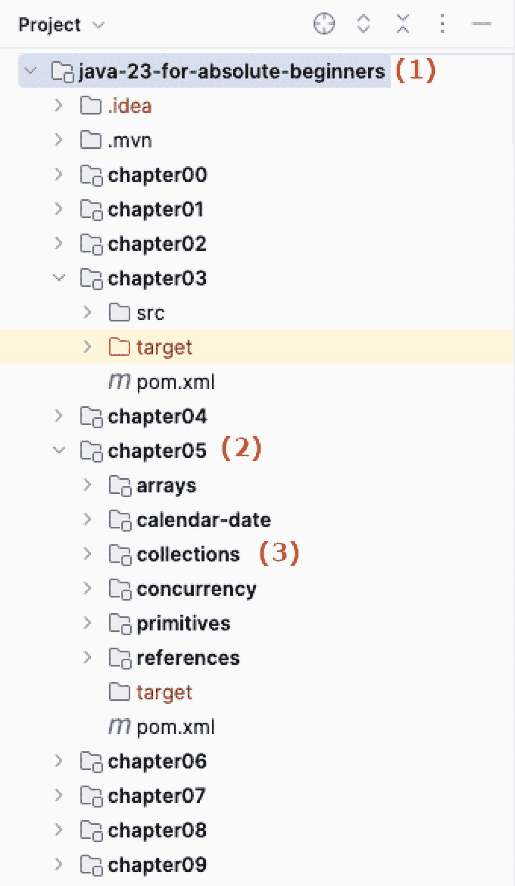

图 3-27

Maven 多级项目结构

如果你已经按照**第** **2** 章所教的方法将项目加载到 IntelliJ IDEA 中，你可以通过构建项目来确保一切正常工作。以下是使用 IntelliJ IDEA 编辑器执行此操作的方法：

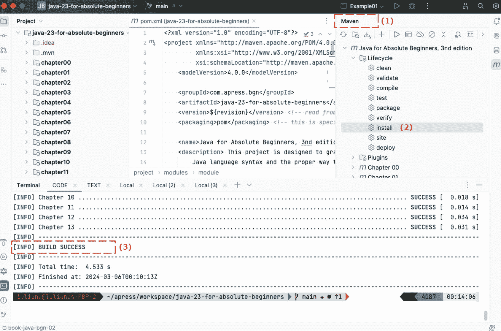

图 3-28

Maven 项目视图

*   在右上角，你应该会看到一个名为 *Maven* 的选项卡。如果子项目像图 3-28 所示那样加载，则项目已正确加载。

*   如果 Maven 选项卡不可见，请查找像 (1) 标记的标签并单击它。展开 `java-23-for-absolute-beginners`（根）节点，直到找到标记为 (2) 的构建任务。如果你双击它，并且在编辑器底部的视图中没有看到任何错误，则你的所有项目都已成功构建。你肯定应该看到 BUILD SUCCESS (3) 消息。

确保 Maven 项目按预期工作的第二种方法是从命令行构建它。打开一个 IntelliJ IDEA 终端，如果你按照**第** **2** 章所述将 Maven 安装在系统路径中，只需输入 `mvn` 并按**回车**。

重要

位于项目根目录的主 `pom.xml` 文件通过以下行配置了一个默认目标：`<defaultGoal>clean install</defaultGoal>`。它声明了构建此项目所需的两个 Maven 执行阶段。如果配置中没有这个元素，则需要在命令中指定这两个阶段来构建项目（例如，`mvn clean install`）。

在命令行中，如果当你拿到本书时 JDK 23 仍不稳定，你可能会看到一些警告，但只要执行以 BUILD SUCCESSFUL 结束，一切就都没问题。

除了 `sandbox` 项目（它足够简单，你可以自己创建）之外，本节中提到的所有类、模块和包都是此项目的一部分。`chapter00` 和 `chapter01` 模块实际上并不包含特定于这些章节的类，但我需要它们来构建 Java 模块示例。IntelliJ IDEA 按字母顺序对模块进行排序，因此章节模块的命名方式是这样选择的，以便它们按照你应该使用的正常顺序列出。

到目前为止，本章一直专注于 Java 应用程序的构建块，并且我们按照说明创建了一个打印 *Hello World!* 的类，但并非所有细节都已解释。现在让我们来看看这些细节，甚至用新的细节来丰富这个类。


## 解释并丰富 Hello World! 类

之前，我们在 `sandbox` 项目中编写了一个名为 `HelloWorld` 的类。该类已复制到 `chapter03` 项目的 `com.apress.bgn.three.helloworld` 包中。本章首先列出了类的主要组成部分。`HelloWorld` 类包含了其中几个元素，本节将对这些元素进行更详细的解释。在图 3-29 中，`HelloWorld` 类显示在 IntelliJ IDEA 编辑器中。

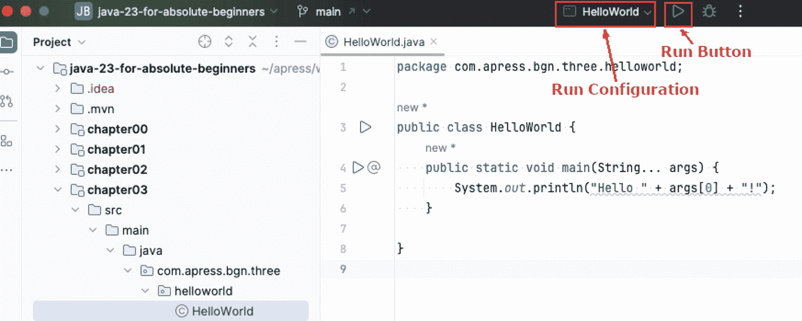

图 3-29

`java-23-for-absolute-beginners` 项目中的 `HelloWorld` 类

这些行包含不同的语句，如下列表所述，每行的编号与列表中的编号对应：

1.  **包声明**：当类属于某个包时，其代码必须以声明该包的行开头。`package` 是 Java 中的保留关键字，除了声明包之外不能用于其他任何用途。

2.  *留空行以便于阅读。*

3.  **类声明**：这是我们声明类型的一行：
    *   它是公开的，因此可以从任何地方访问。

*   它是一个类。

*   它被命名为 HelloWorld。

*   它有一个用花括号括起来的主体，左花括号在这一行。但它也可以放在下一行，因为空格会被忽略。

4.  `main(..)` **方法声明**：在 Java 中，方法名称及其参数的数量、类型和顺序被称为*方法签名*。方法还有一个**返回类型**，即它返回的结果的类型。但还有一种特殊类型可用于声明方法不返回任何内容。按出现顺序，以下是 `main()` 方法中每个术语的含义：
    *   `public`：这是方法的访问修饰符。`main` 方法必须是 `public` 的，否则 JRE 无法访问并调用它。

*   `static`：回想一下，本章开头提到一个类有成员（字段和方法）。当创建该类的对象时，它拥有该类声明的字段和方法。类是创建对象的模板。然而，由于 `static` 关键字，`main` 方法不与类的对象关联，而是与类本身关联。更多细节将在**第** **4** **章**中提供。

*   **void**：此关键字在此用于告知我们 `main` 方法不返回任何内容，因此它类似于*无类型*的替代品，因为如果不返回任何内容，就不需要类型。

*   `String... args` 或 `String[] args`：方法有时被声明为接收一些输入数据，`String[] args` 表示一个文本值数组。三个点是指定一个方法可以有多个相同类型参数的另一种方式。（可变参数也必须是方法的唯一参数，或者是最后一个参数；否则，解析参数将变得不可能。）三个点表示法只能用于方法参数，称为*可变参数*。这意味着你可以传入一个参数数组，而无需显式创建该数组。数组是固定长度的数据集，在数学中被称为*一维矩阵*或*向量*。`String` 是 Java 中表示文本对象的类。`[]` 表示数组，`args` 是其名称。但是等等，我们之前运行过这个方法，并没有提供任何参数！嗯，这不是强制性的，但在此列表之后，你将看到如何为其提供参数（提供给方法的值，这些值将被方法体中的代码使用）。

5.  `System.out.println(“HelloWorld!”);`**：** 此语句用于在控制台中输出 *Hello World!*。

6.  `}` 是 `main` 方法体的右花括号。

7.  *留空行以便于阅读。*

8.  `}` 是类体的右花括号。

如果我们执行这个类，我们将在控制台中看到打印出 `Hello World!`。之前（在图 3-21 中）已经向你展示了如何执行一个包含 `main(..)` 方法的类。以这种方式执行类后，IntelliJ IDEA 会自动将该执行的配置保存在一个*运行配置*中，并将其显示在 IDE 顶部的下拉列表中，该列表位于一个可点击的绿色三角形按钮旁边，用于执行该类。图 3-29 中醒目地指出了这两个选项。

这两个元素非常重要，因为它们使你能够编辑运行配置并为 JVM 和 `main` 方法添加参数。让我们首先修改 `main(..)` 方法，使其对参数进行一些处理。修改后的 `HelloWorld` 类如代码清单 3-24 所示。

```
public class HelloWorld {
public static void main(String... args) {
System.out.println("Hello " + args[0] + "!");
}
}
代码清单 3-24
带有可变参数的 Main 方法
```

需要注意的重要一点是，数组是使用其元素的索引来访问的，并且 Java 中的计数从 0 开始。因此，数组的第一个成员位于索引 0，第二个位于索引 1，依此类推。但是数组可以为空，因此如果在运行代码清单 3-24 中的代码时没有提供任何参数，程序的执行将会崩溃，并打印出类似于代码清单 3-25 所示的明确消息（以红色显示）。

```
Exception in thread "main" java.lang.ArrayIndexOutOfBoundsException: Index 0 out of bounds for length 0
at chapter.three/com.apress.bgn.three.helloworld.HelloWorld.main(HelloWorld.java:5)
代码清单 3-25
空数组异常
```

当 Java 程序因运行时错误而结束时，我们说*抛出了一个异常*。

当我们尝试访问一个空数组，或者访问一个数组中不存在的元素时，JVM 会抛出一个类型为 `ArrayIndexOutOfBoundsException` 的对象，其中包含发生失败的行以及我们试图访问的元素的索引。JVM 使用异常对象来通知开发人员 Java 执行未按预期工作时的异常情况，这些对象包含有关代码中发生位置以及导致问题的原因的详细信息。

我们在代码清单 3-25 中所做的修改将打印出执行类时作为参数提供的文本值。让我们修改此类的运行配置并添加一个参数。单击**运行配置**名称旁边的小下拉箭头，将出现一个菜单，如图 3-30 所示。单击**编辑配置**选项，并检查向你显示的对话框窗口，该窗口也显示在图 3-30 中。

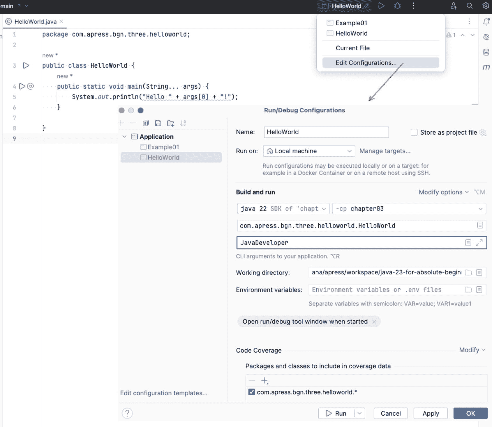

图 3-30

自定义运行配置


好的，作为一名高级文档工程师和翻译员，我将严格遵循您提供的注意事项和示例，将给定的英文文本翻译成中文。


在图 3-30 中，关键元素以浅蓝色和灰色高亮显示。IntelliJ IDEA 会保存您之前的几次执行记录，包括 Maven 构建任务，这样您只需单击一下即可再次运行它们。在 **Run/Debug Configurations** 对话框窗口的左侧，IntelliJ IDEA 按类型对运行配置进行分组。默认情况下，上次运行的配置会显示在窗口的右侧，在本例中是 `HelloWorld` 类的运行配置。如您所见，有很多选项可以配置一次执行，并且其中大部分已由 IDE 自动决定。程序参数或 `main()` 方法的参数在蓝色边框包围的文本字段中引入。在图 3-30 中，我们引入了 *JavaDeveloper*。因此，如果您单击 **Apply** 按钮，然后单击 **OK** 按钮，然后执行该类，在控制台中您现在应该看到 *Hello JavaDeveloper!* 而不是 *Hello World!*。

那么，我们还能对我们的类做些什么呢？还记得本书开头的代码吗？让我们把它放到这个类的 `main()` 方法中。该代码在清单 3-26 中再次展示。

```
package com.apress.bgn.three.helloworld;
import java.util.List;
public class HelloWorld {
public static void main(String... args) {
//System.out.println("Hello " + args[0] + "!");
List items = List.of("1", "a", "2", "a", "3", "a");
items.forEach(item -> {
if (item.equals("a")) {
System.out.println("A");
} else {
System.out.println("Not A");
}
});
}
}
清单 3-26
一个更复杂的 main 方法
```

`import java.util.List``;` 语句是唯一可以存在于包声明和类声明之间的语句类型。这条语句告诉 Java 编译器，程序中将会使用一个对象类型 `java.util.List`。`import` 关键字后面跟着该类型的完全限定名。一个类型的完全限定名由包名（`java.util`）、一个点（`.`）和类型的简单名称（`List`）组成。没有它，`HelloWorld` 类将无法编译。尝试在该语句前面加上 `//`——这会将这一行变成注释，编译器会忽略它。您会看到编辑器通过将与那个列表相关的任何代码片段变成亮红色来表示报错。

语句 `List<String> items = List.of("1", "a", "2", "a", "3", "a");` 创建了一个文本值的列表。这种创建列表的方式是在 Java 9 中引入的。使用 `<E>` 来指定列表中元素的类型是在 Java 5 中引入的，这被称为**泛型**。然后，列表中的元素通过 `forEach` 方法进行遍历，并测试每个元素是否等于字符“*a*”。用于执行此操作的整个表达式被称为 **lambda 表达式**，这种语法是在 Java 8 中与 `forEach` 方法一起引入的。

如果您现在运行这个类，在控制台中您应该会看到一系列 *A* 和 *Not A* 被打印出来，每个占一行，如清单 3-27 所示。

```
Not A
A
Not A
A
Not A
A
清单 3-27
运行高级 HelloWorld 类的输出
```

到目前为止，我们编写的代码使用了相当多的对象类型来在控制台中打印一些简单的消息。`List<E>` 对象用于保存一些 `String` 对象。消息是通过在 `out` 对象上调用的 `println` 方法打印的，`out` 是 `System` 类中的一个静态字段。而这些只是您在代码中可见的对象。在底层，`List<E>` 元素由一个 `Consumer<E>` 对象处理，该对象是在清单 3-26 中为简单起见而隐藏的 lambda 表达式所在的位置即时创建的，因此代码可以展开，如清单 3-28 所示。

```
package com.apress.bgn.three.helloworld;
import java.util.List;
import java.util.function.Consumer;
public class HelloWorld {
public static void main(String... args) {
List items = List.of("1", "a", "2", "a", "3", "a");
items.forEach(new Consumer() {
@Override
public void accept(String item) {
if (item.equals("a")) {
System.out.println("A");
} else {
System.out.println("Not A");
}
}
});
}
}
清单 3-28
不使用 Lambda 表达式的更复杂的 main 方法
```

在结束本章之前，我想向您展示另一个巧妙之处。`forEach` 块的内容可以写成一行：

```
+ items.forEach(item -> System.out.println(item.equals("a") ? "A" : "Not A"));
```

而上面这一行可以通过使用一种叫做*方法引用*的东西变得更简单。但关于这个，本书稍后会再详细介绍。

您在本章中读到的内容现在可能看起来很吓人，但我保证本书会在清晰的上下文中介绍每个概念，并将这些概念与现实生活中的对象和事件进行比较，以便您能轻松理解它们。如果这还不行，总还有更多的书籍、更多的博客，当然还有每个 JDK 的官方 Oracle 页面，上面有相当不错的教程。有志者，事竟成。

重要

另外，请善用您的 IDE！在按住 Control/Command 键的同时单击代码中的任何对象类型，该对象类的代码就会被打开，使您能够看到该类是如何编写的，并且您可以直接在编辑器中阅读其文档。作为练习，请对 `forEach` 方法和 `System` 类执行此操作。

大多数真正智能的编辑器都有*键映射*，即一组按键，当同时按下时可以执行某些操作，例如导航、代码生成、执行等。打印出 IntelliJ IDEA 的键映射参考并熟悉它。您的大脑非常快，在编码时，目标是尽可能做到想多快就敲多快。:)

## 总结

在本章中，您了解了 Java 应用程序的基本构建块。您还学习了如何使用 `jshell` 在应用程序上下文之外执行 Java 语句。您了解了如何手动编译声明了包和模块的 Java 代码。

在遵循本章内容的过程中，您所做的许多事情，如果您找到一份 Java 开发人员的工作，可能会每天都做……除了那些您将花费在查找和修复现有代码中错误的日子。您可能也会花很多时间阅读文档，因为 JDK 有很多类，其中包含您可以用来编写应用程序的字段和方法。随着每个版本的发布，情况都会发生变化，您必须让自己保持最新状态。大脑容量有限；没有雇主会期望您知道每一个 JDK 类和方法，但要聪明地工作，并始终在浏览器中打开这个 URL [h`ttps://docs.oracle.com/en/java/javase/23/docs/api/index.html`](https://docs.oracle.com/en/java/javase/23/docs/api/index.html)（或与所使用的 JDK 版本匹配的 URL）。当您对某个 JDK 类或方法有疑问时，只需当场阅读相关文档即可。

脚注 1   2   3   4   5


# 4. Java 语法

语言是人们之间进行口头或书面交流的工具。无论是自然语言还是人工语言，都由术语以及如何使用这些术语完成交流任务的规则构成。编程语言是与计算机进行交流的工具。与计算机的交流是一种书面交流。基本上，开发者定义一些要执行的指令，并通过中介将其传达给计算机。如果计算机理解这些指令，它就会执行一系列操作，并根据应用程序类型向开发者返回某种形式的回复。

在 Java 语言中，开发者与计算机进行交流的中介是 Java 虚拟机。定义术语应如何连接以生成可理解的交流单元的那套编程规则被称为*语法*。Java 的大部分语法借鉴了另一种名为 C++ 的编程语言，而 C++ 的语法又基于 C 语言的语法。C 语言的语法从它之前的其他语言中借鉴了元素和规则，但本质上所有这些语言都基于自然英语。由于引入了 lambda 表达式，Java 在版本 8 中变得有点晦涩难懂，但即便如此，在编写 Java 程序时，如果你用英语恰当地命名术语，结果代码应该像故事一样易于阅读。

**第** **2** **章**和**第** **3** **章**已经介绍了 Java 语法的一些细节。关于包和模块的介绍足以让你扎实理解其用途，从而避免对项目组织方式产生困惑，并在尝试执行书中提到的代码时避免盲目摸索。但在其他主题上，我们只是浅尝辄止。因此，让我们开始深入探索 Java。

## 编写 Java 代码的基本规则

在编写 Java 代码之前，让我们列出一些你应该遵循的规则，以确保你的代码不仅能工作，而且易于理解，从而便于维护或扩展。代码清单 4-1 展示了我们在**第** **3** **章**结束时使用的类，并添加了一些细节。

```
01\. package com.apress.bgn.four.basic;
02.
03\. import java.util.List;
04.
05./**
06\. * 这是一个 JavaDoc 注释
07\. */
08\. public class HelloWorld {
09\.     public static void main(String... args) {
10\.         // 这是一个单行注释
11\.         List items = List.of("1", "a", "2", "a", "3", "a");
12.
13\.         items.forEach(item -> {
14\.             /* 这是一个
15\.                 多行
16\.             注释 */
17\.             if (item.equals("a")) {
18\.                 System.out.println("A");
19\.             } else {
20\.                 System.out.println("Not A");
21\.             }
22\.         });
23\.     }
24\. }
代码清单 4-1
带有注释的 HelloWorld 类
```

代码的每个部分都将在本章中单独介绍。让我们从第一行开始。

### 包声明

如果文件中声明的类型是在某个包内声明的，那么 Java 文件总是以*包声明*开头。包名可以包含字母和数字，用点号分隔。每个部分都对应包含该类型的路径中的一个目录，如**第** **3** **章**所示。包声明应揭示应用程序的名称以及包中类的用途。让我们以本书源码中使用的包命名为例：`com.apress.bgn.four.basic`。如果我们将包名拆分开，每个部分的含义如下：

*   `com.apress` 代表应用程序的域名，或者在本例中代表应用程序的所有者。
*   `bgn` 代表代码的适用范围，在本例中代表本书的目标读者：**初学者**。
*   `four` 代表类的用途：用于**第** **4** **章**。
*   `basic` 代表类用途的更精细级别：这些类很简单，用于描述基本的 Java 概念。

像这里介绍的由多个部分组成的包名被称为**限定包名**。它具有层次结构，包 `com` 是根包。假设一个类型 `MyType` 在此包中声明，那么其他包中的类使用以下导入语句引用此类型：`import com.MyType``;`。

包 `apress` 是包 `com` 的成员，其名称由自身名称加上外围包名和一个点号组成。假设一个类型 `MyType` 在此包中声明，那么其他包中的类使用以下导入语句引用此类型：`import com.apress.MyType``;`。

同样的规则适用于包 `bgn`，它是包 `apress` 的成员，其类型成员也遵循此规则，依此类推，直到包树的底层。

提示

你可以将包想象成编程世界中的俄罗斯套娃^(³⁹)。

因此，一个类型通过其**完全限定名**在其他类型中被引用。类型的完全限定名由类型名称加上包的限定名和一个点号构成。图 4-1 应该能让事情变得非常清晰。

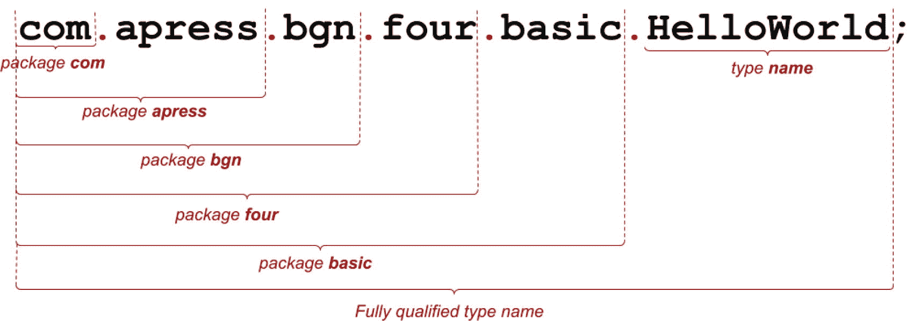

图 4-1

Java 类型完全限定名的分解


### 导入部分

在包声明之后，接下来是*导入部分*。该部分包含了文件中使用的所有类、接口和枚举的完全限定名。请查看清单 4-2 中的代码示例。

```
package java.lang;
import java.io.ObjectStreamField;
import java.io.UnsupportedEncodingException;
import java.lang.annotation.Native;
import java.lang.invoke.MethodHandles;
import java.lang.constant.Constable;
import java.lang.constant.ConstantDesc;
import java.nio.charset.Charset;
import java.util.ArrayList;
// 其余导入语句已省略
public final class String
implements java.io.Serializable, Comparable, CharSequence,
Constable, ConstantDesc {
private static final ObjectStreamField[] serialPersistentFields =
new ObjectStreamField[0];
// 其余代码已省略
}
清单 4-2
来自 java.lang.String 类的代码片段
```

这是官方 Java `String` 类的一个片段。每个导入语句都代表对某个包的引用，以及 `String` 类主体中使用的一个类的名称。

特殊的导入语句也可用于导入静态变量和静态方法。JDK 包含一个用于数学运算的类。它包含静态变量和方法，开发者可以使用它们来实现解决数学问题的代码。你可以直接使用它的变量和方法，而无需创建此类型的对象，因为静态成员不属于某个类型的对象，而是属于类型本身。请查看清单 4-3 中的代码。

```
package com.apress.bgn.four;
import static java.lang.Math.PI;
import static java.lang.Math.sqrt;
public class MathSample {
public static void main(String... args) {
System.out.println("PI value =" + PI);
double result = sqrt(5.0);
System.out.println("SQRT value =" + result);
}
}
// 输出
// PI value =3.141592653589793
// SQRT value =2.23606797749979
清单 4-3
对 Math 类的成员使用静态导入
```

通过将 `import` 和 `static` 组合使用，我们可以声明一个类的完全限定名，以及我们希望在代码中使用的方法或变量。这允许我们直接使用该变量或方法，而无需使用声明它的类名。如果没有静态导入，代码将不得不重写，如清单 4-4 所示。

```
package com.apress.bgn.four;
import java.lang.Math;
public class MathSample {
public static void main(String... args) {
System.out.println("PI value =" + Math.PI);
double result = Math.sqrt(5.0);
System.out.println("SQRT value =" + result);
}
}
清单 4-4
使用对 Math 类的导入
```

重要

完全限定名功能强大。包名在模块内是唯一的，但包名在应用程序内并不总是唯一的。类型名在应用程序内也不总是唯一的。但是，由两者组合而成的完全限定类型名在应用程序内是唯一的。

提示

你也可以将包视为家庭地址，将类型视为人。两个人可以有相同的地址，但不能有相同的名字。两个人可以有相同的名字，但住在不同的地址。例如，这就是银行和其他机构在英国或美国唯一识别个人的方式。

完全限定名并不仅限于导入语句。当两个类型具有相同的名称，并且两者都用于声明第三个类型时，在类型主体内告诉编译器你打算使用哪个类型的唯一方法就是使用完全限定名。清单 4-5 中展示了一个示例，其中来自 `com.apress.bgn.four.math` 包的 `Math` 类被用在一个也使用了 `java.lang.Math` 类成员的类主体中。

```
package com.apress.bgn.four.math;
import java.lang.Math;
public class Sample {
public static void main(String... args) {
System.out.println("PI value =" + Math.PI);
System.out.println("My PI value= " + com.apress.bgn.four.math.Math.PI);
}
}
// 输出
// PI value =3.141592653589793
// My PI value= 3.14
清单 4-5
使用 com.apress.bgn.four.math.Math 类的成员
```

当从同一个包中使用多个类型时，类型名可以用星号（`*`）代替，这意味着该包中任何可见的类型都可以在正在编写的类型代码中使用。这被称为*紧凑导入语句*。当从同一个包中使用多个类来编写代码，或者从同一个类中使用多个静态变量和方法时，建议使用紧凑导入。如果不这样做，文件的导入部分会变得冗长且难以阅读。这时紧凑导入就能派上用场。紧凑导入意味着用通配符替换来自同一个包的所有类，或来自同一个类的所有变量和方法，这样只需要一条导入语句。它也适用于静态导入。因此，之前的 `Sample` 类在清单 4-6 中变成了 `MathSample` 类。

```
package com.apress.bgn.four;
import static java.lang.Math.*;
public class MathSample {
public static void main(String... args) {
System.out.println("PI value =" + PI);
double result = sqrt(5.0);
System.out.println("SQRT value =" + result);
}
}
清单 4-6
使用 java.lang.Math 类的成员
```


### Java 语法

Java 语言是**区分大小写**的，这意味着我们可以编写类似清单 4-7 所示的代码，并且代码能够成功编译和执行。

```
package com.apress.bgn.four;
public class MultipleCaseVariables {
public static void main(String... args) {
int mynumber = 0;
int myNumber = 1;
int Mynumber = 2;
int MYNUMBER = 3;
System.out.println(mynumber);
System.out.println(myNumber);
System.out.println(Mynumber);
System.out.println(MYNUMBER);
}
}
清单 4-7
证明 Java 区分大小写的代码
```

所有四个变量都是不同的，最后四行将打印数字 `0 1 2 3`。显然，你不能在同一个上下文（例如，在方法体内）中声明两个同名的变量，因为这基本上是在重新声明同一个变量。Java 编译器不允许这样做。如果你尝试这样做，你的代码将无法编译，甚至 IntelliJ IDEA 也会尝试通过用红色下划线标记代码并显示相关消息来让你看到错误所在，如图 4-2 中的第 37 行所示，其中变量 `mynumber` 被声明了两次。

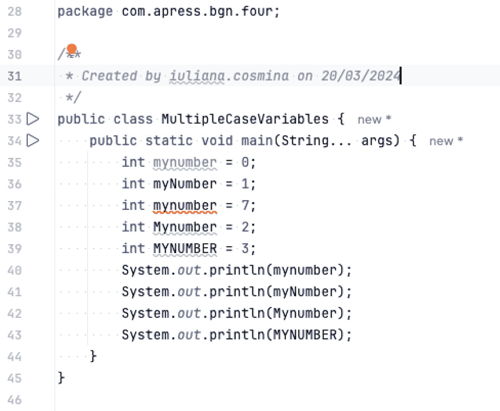

图 4-2

同一个变量名使用了两次

有一组 **Java 关键字**，它们在 Java 代码中只能用于固定和预定义的目的。其中一些已经介绍过：`import`、`package`、`public`、`class`；其余的关键字将在本章末尾介绍，并在表 4-2、4-3 和 4-4 中对每个关键字进行简短说明。

重要

Java 关键字不能用作开发者编写的代码中的标识符，因此它们不能用作变量、类、接口、对象等的名称。

可以在一个 Java 源文件中声明一个或多个类型。无论是 `class`、`interface`（或 `@interface`）还是 `enum`，类型的声明都必须用花括号（`{}`）括起来。这些被称为**块分隔符**。`import` 和 `package` 语句不属于类型体的一部分。如果你回顾一下清单 4-1 中的代码，你会注意到那里使用花括号来包裹以下内容：

*   类的内容，也称为类体（第 08 行和第 23 行的花括号）
*   方法的内容，也称为方法体（第 09 行和第 22 行的花括号）
*   一组要一起执行的指令（第 13 行和第 21 行的花括号）

在 Java 中，代码行通常以分号（`;`）符号或 ASCII 字符 CR、LF 或 CR LF 结束。这些被称为**行终止符**。分号用于终止功能完整的语句，例如第 11 行的列表声明。在小型显示器上编写代码时，你可能被迫将该语句拆分成两行以保持代码可读性。其末尾的分号告诉编译器，只有将所有部分放在一起时，该语句才是正确的。请看图 4-3。

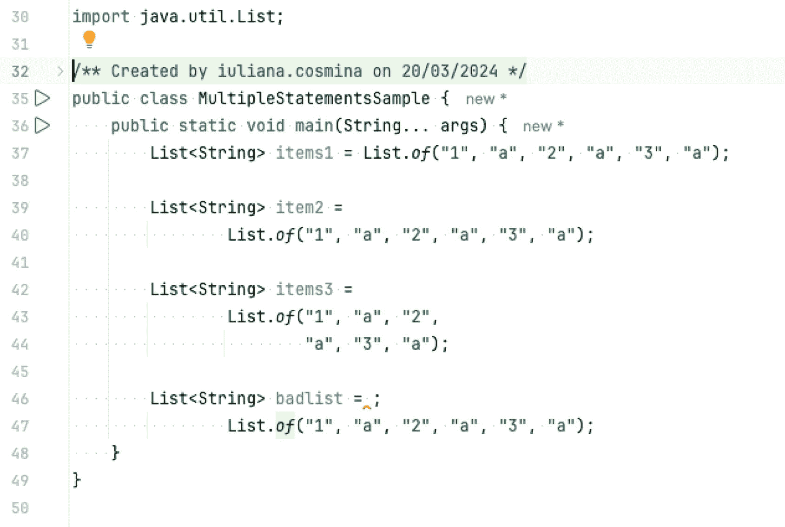

图 4-3

不同的语句示例

前三个 `List` 声明是等价的。以这种方式声明 `List` 时，你甚至可以将它的元素拆分成多行。然而，第 46 行的声明是故意写错的。在第 46 行添加了一个分号，这就在那里结束了该语句。该语句无效，当你尝试编译该类时，编译器会通过打印一个异常来报错，提示 `Error:(13, 46) java: illegal start of expression`。

如果错误消息看起来与示例不符，可以这样理解：对于编译器来说，问题不在于语句的错误终止，而在于等号（`=`）符号之后，编译器期望找到某种能够为 `badList` 变量生成值的表达式，但它却什么也没找到。

### Java 标识符和变量

**标识符**是你给 Java 代码中的项目（类、变量、方法等）起的名称。标识符必须遵守一些规则才能让代码编译通过，并且还要遵循常识性的编程规则，这些规则被称为 **Java 编码约定**。这里列出其中一些：

*   标识符不能是 Java 保留字之一，否则代码将无法编译。
*   标识符不能是布尔字面量（`true`、`false`）或 `null` 字面量，否则代码将无法编译。
*   标识符可以由字母、数字、下划线（`_`）、美元符号（`$`）组成。
*   标识符不能以数字开头。
*   从 Java 9 开始，单个下划线不能再用作标识符，因为它变成了一个关键字。这可能是因为在 Java 7 中引入了数字字面量，多位数字可以写得更易读（例如，`int i = 10_000;`）。
*   从 Java 21 开始，单个下划线可以再次用作标识符，但仅限于保存代码中未使用的值的变量。这种行为借鉴自 Go 编程语言，这些变量被称为*未命名变量*。
*   开发者应遵循**驼峰式**书写风格来声明标识符，确保标识符名称中间的每个单词或缩写都以大写字母开头（例如，`StringBuilder`、`isAdult`）。

**变量**是一组可以与值关联的字符。它有一个类型，基于该类型，可以赋给它的值集合被限制在某个区间、值组内，或者必须遵循该类型定义的某种格式。例如，清单 4-1 中第 11 行声明的项目是一个类型为 `List` 的变量，与其关联的值是一个值列表。

在 Java 中有三种类型的变量：

*   **字段**（也称为**属性**）是在方法体之外的类体中定义的变量，并且它们前面没有关键字 `static`。
*   **局部变量**是在方法体内声明的变量，它们仅在该上下文中有效。
*   **静态变量**是在类体内声明的变量，并且它们前面有关键字 `static`。如果它们被声明为 `public`，则在应用程序中，只要包含该变量的类型是可访问的，它们就是可访问的（除非该模块没有导出声明它们的包）。

### Java 注释

**Java 注释**指的是不属于正在执行的代码的一部分、且被编译器忽略的解释性文本片段。在 Java 中，有三种在代码中添加注释的方式，每种方式都有其独特的声明字符。清单 4-1 中使用了所有三种类型的注释，以下列表解释了每种注释的用途：

*   `//` 用于单行注释（第 10 行）。开发者使用这种注释来添加 `TODO` 语句或解释为什么需要某段代码。这些注释主要面向项目中的团队成员。
*   `/** ... */` JavaDoc 注释使用特殊工具导出到项目的文档中，该文档称为 JavaDoc API（第 05 到 07 行）。开发者使用这种注释来记录他们的代码。有一些构建工具的插件可以将项目中的 JavaDoc 提取为网站，然后可以公开托管，以帮助使用你项目的其他开发者。
*   `/* ... */` 用于多行注释（第 14 到 16 行）。开发者使用这种注释来添加 `TODO` 语句或提供关于为什么需要某段代码的详细解释。这些注释主要面向项目中的团队成员。


## Java 类型

在**第 3 章**介绍 Java 构建块时，为简单起见，只解释了类。当时提到 Java 中还有其他类型，本节将介绍所有这些类型。由于类最为重要，因此必须首先介绍。

### 类

如**第 3 章**所述，类只是创建对象的模板。基于**类**创建对象的过程称为**实例化**。生成的对象被称为该类的一个实例。实例之所以被称为命名对象，是因为在 Java 中，如果未声明其他超类，默认情况下，任何由开发者编写的类都会隐式继承类 `java.lang.Object`。这意味着，在 Java 中，存在一个所有类的基本模板，由 `java.lang.Object` 类表示。任何类默认都是该类的扩展，因此，代码清单 4-8 中的类声明与代码清单 4-9 中的声明是等价的。

```
package com.apress.bgn.four.basic;
public class Sample extends Object {}
代码清单 4-9
显式扩展 java.lang.Object 类的简单 Sample 类
```

```
package com.apress.bgn.four.basic;
public class Sample {}
代码清单 4-8
隐式扩展 java.lang.Object 类的简单 Sample 类
```

注意

请注意，无需导入 `java.lang` 包，因为 `Object` 类是 Java 层次结构的根类，所有类（包括数组）都必须能够访问并扩展它。因此，`java.lang` 包是隐式导入的。

重要

如**第 3 章**所述，在任何声明了 `module-info.java` 的 Java 项目中，`java.base` 模块都会被隐式添加为必需模块。该模块导出了包含编写 Java 代码核心组件的 `java.lang` 包。

提示

每个人类个体都由包含 23 对染色体的 DNA 分子定义。这些染色体声明了人类为了看起来像……人类并发挥功能所应拥有的器官和四肢。你可以将 `Object` 类视为 DNA 分子，它声明了一个类为了在 Java 应用程序中看起来像一个类并发挥其功能所应拥有的所有组件。

以下各节将介绍并解释可用于在 Java 中创建对象的其他模板类型的使用。为了在上下文中进行说明，我们将创建一个用于定义人类的模板家族。大多数 Java 教程使用车辆或几何形状的模板。我想建模一些任何人都能轻松理解和关联的事物。以下各节的目标是开发可用于建模不同类型人群的 Java 模板。到目前为止提到的第一个 Java 模板是**类**，那么我们就从它继续。

#### 字段

创建实例的操作称为**实例化**。要设计一个建模通用人类的类，我们应该考虑两件事：人类特征和人类行为。那么，所有人类有什么共同点呢？嗯，有很多，但就本节而言，让我们选择三个通用属性：姓名、年龄和身高。这些属性在 Java 类中映射为称为**字段**或**属性**的变量。`Human` 类的第一个版本如代码清单 4-10 所示。

```
package com.apress.bgn.four.base;
public class Human {
String name;
int age;
float height;
}
代码清单 4-10
简单的 Human 类
```

在前面的代码示例中，字段具有不同的类型，具体取决于应该与之关联的值。例如，姓名可以与文本值（如“Alex”）关联，而文本在 Java 中由 `String` 类型表示。年龄可以与数值整数值关联，因此其类型为 `int`。就本节而言，人的身高被视为有理数，例如 1.9，因此我们使用用于此类值的特殊 Java 类型：`float`。

现在我们有了一个建模人类某些基本属性的类。我们如何使用它？我们需要一个 `main()` 方法，并且需要创建一个此类型的对象：我们需要实例化这个类。在代码清单 4-11 中，创建了一个名为“Alex”的人类。

```
package com.apress.bgn.four.base;
public class BasicHumanDemo {
public static void main(String... args) {
Human human = new Human();
human.name = "Alex";
human.age = 40;
human.height = 1.91f;
}
}
代码清单 4-11
创建简单的 Human 对象
```

要创建 `Human` 实例，我们使用 `new` 关键字。在 `new` 关键字之后，我们调用一个称为**构造方法**的特殊方法。我之前提到过方法，但这个很特殊。有些开发者甚至不认为构造方法是一种方法。最明显的原因是构造方法没有在 `Human` 类的主体中任何地方定义。那么它从哪里来的呢？它是一个没有参数的默认构造方法，由编译器自动生成，除非声明了显式的构造方法（带参数或不带参数）。一个类不能没有构造方法；否则，它无法被实例化，这就是为什么如果没有显式声明构造方法，编译器会生成一个。默认构造方法会调用 `super()`，而 `super()` 又会调用 `Object` 的无参构造方法，该方法将所有字段初始化为默认值。代码清单 4-12 中的代码示例对此进行了验证（包含输出）。

```
package com.apress.bgn.four.base;
public class BasicHumanDemo {
public static void main(String... args) {
Human human = new Human();
System.out.println("name: " + human.name);
System.out.println("age: " + human.age);
System.out.println("height: " + human.height);
}
}
// 输出
// name: null
// age:0
// height:0.0
代码清单 4-12
创建简单的 Human 对象但未设置其字段值
```

打印的是变量类型的默认值。数值变量被初始化为 `0`，`String` 值被初始化为 `null`。原因是数值类型是原始数据类型，而 `String` 是对象数据类型。`String` 类是 `java.lang` 包的一部分，是用于创建 `String` 类型对象的预定义 Java 类之一。它是一种用于表示文本对象的特殊数据类型。我们将在**第 5 章**中更深入地探讨数据类型。


#### 类变量

除了每个人类个体特有的属性外，所有人类都有一些共同点：寿命（我们假设最大值为 100 年）。声明一个名为`lifespan`的字段会造成冗余，因为它必须与所有`Human`实例的相同值相关联。因此，我们将在`Human`类中使用`static`关键字声明一个字段，该字段对所有`Human`实例都具有相同的值，并且只会被初始化一次。我们还可以更进一步，在其声明前添加`final`修饰符，确保该值在程序执行期间永不改变。这样，我们就创建了一种特殊类型的变量，称为**常量**。

注意

Java 常量的编码规范规定，其名称应全部大写，单词之间用下划线（_）分隔。

新的`Human`类如代码清单 4-13 所示。

```
package com.apress.bgn.four.base;
public class Human {
static final int LIFESPAN = 100;
String name;
int age;
float height;
}
代码清单 4-13
包含常量成员的简单 Human 类
```

`LIFESPAN`变量也被称为类变量，因为它与类关联，而非与实例关联。*（其值被设为 100，这是一个相当乐观的数值。）* 代码清单 4-14 中的代码清晰地说明了这一点。

```
package com.apress.bgn.four.base;
public class BasicHumanDemo {
public static void main(String... args) {
Human human = new Human();
Human alex = new Human();
alex.name = "Alex";
alex.age = 40;
alex.height = 1.91f;
System.out.println("Alex's lifespan = " + alex.LIFESPAN);
System.out.println("human's lifespan = " + human.LIFESPAN);
System.out.println("Human lifespan = " + Human.LIFESPAN);
}
}
//输出
/*
Alex's lifespan = 100
human's lifespan = 100
Human lifespan = 100
*/
代码清单 4-14
测试常量的代码示例
```

#### 数据封装

我们定义的类在字段上未使用任何访问修饰符，这是不可接受的。Java 被称为**面向对象编程语言**，因此用 Java 编写的代码必须遵循**面向对象编程（OOP）原则**。遵循这些编码原则能确保编写的代码质量良好，并完全符合 Java 的基本风格。

注意

从 Java 8 开始，Java 语法已进行了修改——新增了类型，JDK 内部也做了更改，以允许在编写代码时采用更具函数式风格的方法——但 Java 仍然主要是一种面向对象语言。

OOP 原则之一是**封装**，它指的是通过使用称为访问器（getter）和修改器（setter）的特殊方法来限制对数据的访问，从而隐藏数据实现。

通常，类的任何字段都应具有私有访问权限，对其访问应通过可被拦截、测试和追踪调用来源的方法来控制。使用 getter 和 setter 是处理对象时的常见做法，因此大多数 IDE 都有生成它们的默认选项，包括 IntelliJ IDEA。如图 4-4 所示，只需在类体内右键单击，选择 **Generate** 选项查看所有可能性，然后选择 **Getter and Setter** 即可为您生成这些方法。

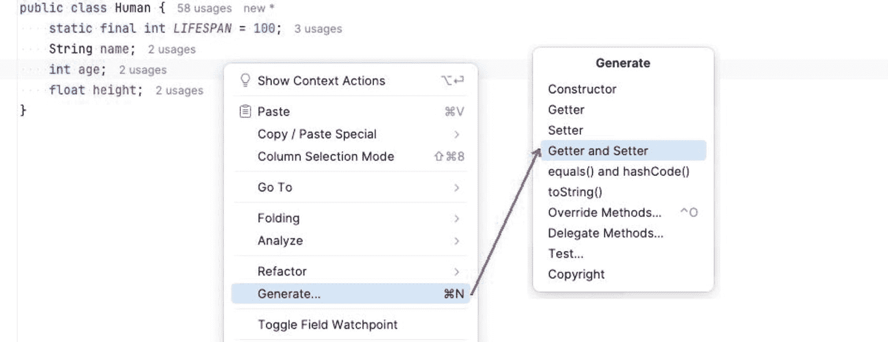

图 4-4

IntelliJ IDEA 代码生成菜单：**Generate ➤ Getter and Setter** 子菜单

将字段设为私有并生成 getter 和 setter 后，`Human` 类现在如代码清单 4-15 所示。

```
package com.apress.bgn.four.base;
public class Human {
static final int LIFESPAN = 100;
private String name;
private int age;
private float height;
public String getName() {
return name;
}
public void setName(String name) {
this.name = name;
}
public int getAge() {
return age;
}
public void setAge(int age) {
this.age = age;
}
public float getHeight() {
return height;
}
public void setHeight(float height) {
this.height = height;
}
}
代码清单 4-15
包含 Getter 和 Setter 的简单 Human 类
```

查看代码清单 4-15 后，您可能会好奇 `this` 关键字的用途。正如其名称所暗示的，它是对当前对象的引用。因此，[`this.name`](http://this.name) 实际上是当前对象字段 `name` 的值，也称为**实例变量**。在类体内，当方法中存在与字段同名的参数时，`this` 用于访问当前对象的字段。如您所见，IntelliJ IDEA 生成的 setter 和 getter 的参数名称与字段名称完全相同。

**Getter** 是最简单的方法，声明时不带任何参数，并返回与其关联的字段的值。其命名规范是使用 `get` 前缀，后跟所访问字段的名称，并将字段名的首字母大写。

**Setter** 是返回类型为 `void` 的方法，声明一个与要关联的字段类型相同的变量作为参数。其名称由 `set` 前缀和所访问字段的名称组成，并将字段名的首字母大写。当编辑器生成 setter 时，参数名称与实例变量名称匹配，因此在 setter 方法体内需要使用 `this` 关键字来区分两者。

图 4-5 展示了 `name` 字段的 setter 和 getter。

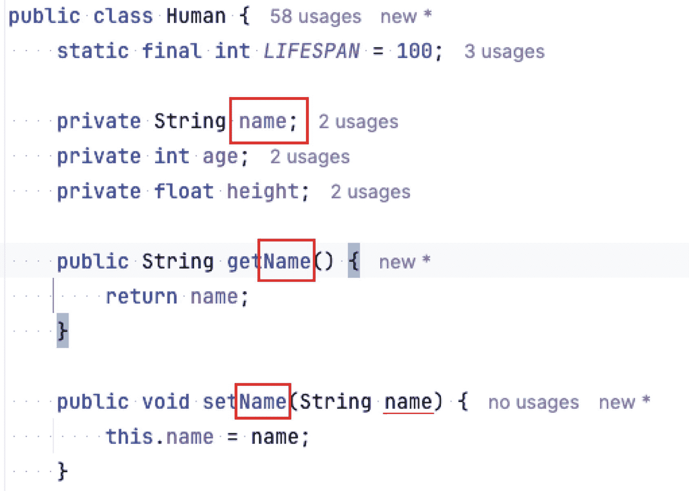

图 4-5

用于 `name` 字段的 Setter 和 Getter 方法

由于字段现在是私有的，在创建 `Human` 实例时，我们必须使用 setter 来设置字段值，并使用 getter 来访问它们。因此，我们的 `BasicHumanDemo` 类变为代码清单 4-16 所示。

```
package com.apress.bgn.four.base;
public class BasicHumanDemo {
public static void main(String... args) {
Human alex = new Human();
alex.setName("Alex");
alex.setAge(40);
alex.setHeight(1.91f);
System.out.println("name: " + alex.getName());
System.out.println("age: " + alex.getAge());
System.out.println("height: " + alex.getHeight());
}
}
// 输出
// name: Alex
// age: 40
// height: 1.91
代码清单 4-16
使用包含 Getter 和 Setter 的 Human 实例的 BasicHumanDemo 类
```

大多数 Java 框架会在类中查找 getter 和 setter，以初始化或读取对象字段的值。大多数开发者将 setter 和 getter 视为**样板代码**（或简称**样板**），即那些在多个地方重复出现且几乎无变化的代码段。这就是 Lombok^(⁴⁰) 库诞生的原因——它在运行时生成这些代码，这样开发者就不必用它们污染自己的代码。Kotlin 语言则完全移除了它们。

Java 在版本 14 中通过引入*记录*做了类似的事情。记录将在本章稍后部分介绍。


#### 方法

既然 getter 和 setter 都是方法，那么现在也该开始讨论方法了。**方法**是一段代码块，通常由返回类型、名称和参数（如果需要）来表征，它描述了对象执行或作用于对象的某个动作，该动作会利用其字段和/或提供的参数的值。Java 方法的抽象模板如代码清单 4-17 所示。

```
[访问修饰符] [返回类型] 方法名
{
// 代码
[ [可能] return 值 ]
}
代码清单 4-17
方法声明模板
```

按照这个模板，让我们为 `Human` 类创建一个方法，该方法利用人的年龄和 `LIFESPAN` 常量来计算并打印一个人还能活多久。由于该方法不返回任何内容，因此使用的返回类型将是 `void`，这是一种特殊类型，它告诉编译器该方法不返回任何内容（因此方法体中不存在 return 语句）。该方法的代码如代码清单 4-18 所示。

```
package com.apress.bgn.four.base;
public class Human {
static final int LIFESPAN = 100;
private String name;
private int age;
private float height;
/**
* 计算并打印剩余寿命
*/
public void computeAndPrintTtl() {
int ttl = LIFESPAN - this.age;
System.out.println("剩余寿命: " + ttl);
}
// 部分代码省略
}
代码清单 4-18
Human#computeAndPrintTtl 方法（无返回值）
```

上述方法定义没有声明任何参数，因此可以在 `Human` 实例上调用它，如代码清单 4-19 所示。

```
package com.apress.bgn.four.base;
public class BasicHumanDemo {
public static void main(String... args) {
Human alex = new Human();
alex.setName("Alex");
alex.setAge(40);
alex.setHeight(1.91f);
alex.computeAndPrintTtl();
}
// 部分代码省略
}
代码清单 4-19
computeAndPrintTtl() 方法的调用
```

当执行代码清单 4-19 中的代码时，控制台会打印出 *剩余寿命: 60*。

前面的方法可以修改为返回剩余寿命值，而不是打印它。该方法必须修改以声明要返回的值的类型，在这种情况下，类型是 `int`，与方法体内计算出的值的类型相同。实现如代码清单 4-20 所示。

```
package com.apress.bgn.four.base;
public class Human {
static final int LIFESPAN = 100;
private String name;
private int age;
private float height;
/**
* @return 剩余寿命
*/
public int getTimeToLive() {
int ttl = LIFESPAN - this.age;
return ttl;
}
// 部分代码省略
}
代码清单 4-20
getTimeToLive() 方法（有返回值）
```

在这种情况下，调用该方法不会产生任何效果，因此我们必须修改代码以保存返回值并打印它，如代码清单 4-21 所示。

```
package com.apress.bgn.four.base;
public class BasicHumanDemo {
public static void main(String... args) {
Human alex = new Human();
alex.setName("Alex");
alex.setAge(40);
alex.setHeight(1.91f);
int timeToLive = alex.getTimeToLive();
System.out.println("剩余寿命: " + timeToLive);
}
// 部分代码省略
}
代码清单 4-21
使用 getTimeToLive() 方法
```

这里介绍的两种方法都没有声明参数，因此调用它们时无需提供任何参数。我们不会介绍带参数的方法，因为 setter 已经足够说明问题了。让我们直接跳到构造函数。

#### 构造函数

现在我们已经做到了：在其他类中再也不能使用 `alex.name` 了，否则编译器会抱怨无法访问该属性。而且，仅仅为了设置这些属性而调用所有这些 setter 相当烦人，所以我们需要对此做些改进。还记得隐式构造函数吗？开发人员也可以显式地声明构造函数，并且一个类可以有多个构造函数。构造函数可以声明参数，用于初始化每个感兴趣的字段。代码清单 4-22 展示了 `Human` 类的一个构造函数，它使用参数的值来初始化类的字段。

```
package com.apress.bgn.four.base;
public class Human {
static final int LIFESPAN = 100;
private String name;
private int age;
private float height;
/**
* 构造一个使用给定参数初始化的 Human 实例。
* @param name - Human 实例的名称
* @param age - Human 实例的年龄
* @param height - Human 实例的身高
*/
public Human(String name, int age, float height) {
this.name = name;
this.age = age;
this.height = height;
}
// 部分代码省略
}
代码清单 4-22
带有显式构造函数的 Human 类
```

构造函数不需要 `return` 语句，即使调用构造函数的结果是创建一个对象。构造函数在这方面与方法不同。

注意

通过声明显式构造函数，默认构造函数将不再生成。

因此，通过调用默认构造函数（如前面代码清单所示）来创建 `Human` 实例的方式不再有效。代码将无法编译，因为默认构造函数不再生成。要创建 `Human` 实例，我们现在必须调用新的构造函数，并在参数位置提供适当的实参，这些实参必须具有正确的类型并遵守它们的声明顺序。默认构造函数的调用和自定义构造函数的调用如代码清单 4-23 所示。

```
Human human = new Human("John", 40, 1.91f);  // 这行可以工作
Human human = new Human();  // 这行不再工作
代码清单 4-23
Human 构造函数
```

但是，如果我们不想被迫使用这个构造函数来设置所有字段呢？我们只需定义另一个只包含我们感兴趣的参数的构造函数。让我们定义一个仅为 `Human` 实例设置姓名和年龄的构造函数，如代码清单 4-24 所示。

```
package com.apress.bgn.four.base;
public class Human {
static final int LIFESPAN = 100;
private String name;
private int age;
private float height;
public Human(String name, int age) {
this.name = name;
this.age = age;
}
public Human(String name, int age, float height) {
this.name = name;
this.age = age;
this.height = height;
}
// 部分代码省略
}
代码清单 4-24
带有显式构造函数的 Human 类
```

我们刚刚偶然发现了另一个 OOP 原则，称为**多态**。这个术语源自希腊语，翻译过来就是*一个名字，多种形态*。多态适用于代码设计，即存在多个方法，它们名称相同但签名和功能略有不同。它也适用于构造函数。多态有两种基本类型：**重写**，也称为*运行时多态*，我们稍后会在介绍继承原则时进行讲解；以及**重载**，也称为*编译时多态*。

第二种多态类型适用于代码清单 4-24 中的构造函数，因为我们有两个构造函数，其中一个具有不同的参数集，看起来像是较简单构造函数的扩展。


在清单 4-24 中需要注意的第二点是，两个构造函数包含两行相同的代码。有一个常识性的编程原则叫做 DRY，它是 *Don’t Repeat Yourself!*（不要重复自己！）的缩写（DRY 也是整洁编码原则之一。^(⁴¹)）。显然，清单 4-24 中的代码并未遵循 DRY 原则。因此，让我们以一种有趣的新方式使用 `this` 关键字（之前介绍过）来解决这个问题，如清单 4-25 所示。

```
package com.apress.bgn.four.base;
public class Human {
public static final int LIFESPAN = 100;
private String name;
private int age;
private float height;
public Human(String name, int age) {
this.name = name;
this.age = age;
}
public Human(String name, int age, float height) {
this(name, age);
this.height = height;
}
// 部分代码已省略
}
清单 4-25
具有更优自定义构造函数的 Human 类
```

构造函数之间可以通过使用 `this(...)` 相互调用。这对于避免重复编写相同代码非常有用，从而促进了代码的可重用性。

现在，两个构造函数都提供了创建 `Human` 实例的方法。如果我们使用不设置身高的那个构造函数，`height` 字段将被隐式初始化为 `float` 类型的默认值 `(0.0)`。

目前我们的类相当基础，甚至可以说它以一种相当抽象的方式对“人”进行了建模。如果我们想尝试对具有特定技能或能力的人进行建模，就必须创建新的类。假设我们要对音乐家和演员进行建模。这意味着我们需要创建两个新类。`Musician` 类如清单 4-26 所示；字段的 getter 和 setter 方法已省略。

```
package com.apress.bgn.four.classes;
import java.util.List;
public class Musician {
public static final int LIFESPAN = 100;
private String name;
private int age;
private float height;
private String musicSchool;
private String genre;
private List songs;
// 其他代码已省略
}
清单 4-26
Musician 类
```

`Actor` 类如清单 4-27 所示；字段的 getter 和 setter 方法已省略。

```
package com.apress.bgn.four.classes;
import java.util.List;
public class Actor {
static final int LIFESPAN = 100;
private String name;
private int age;
private float height;
private String actingSchool;
private List films;
// 其他代码已省略
}
清单 4-27
Actor 类
```

如你所见，这两个类有不少共同元素。如前所述，整洁编码原则之一要求开发者避免代码重复。这可以通过遵循另外两个 OOP 原则来设计类实现：**继承**（之前简要提及过）和**抽象**。

#### 抽象与继承

**抽象**是一个管理复杂性的 OOP 原则。抽象用于分解复杂的实现，并定义可重用的核心部分。在我们的例子中，`Musician` 和 `Actor` 类的公共字段可以归入本章前面定义的 `Human` 类。`Human` 类可以被视为一种抽象，因为这个世界上的任何人都不只是他们的姓名、年龄和身高。我们永远不需要创建 `Human` 实例，因为任何个体都将由其他东西来代表，比如激情、目标和技能。一个不需要被实例化，而只是将字段和方法组合在一起供其他类继承或提供具体实现的类，在 Java 中通过**抽象**类来建模。因此，我们对 `Human` 类进行修改，使其成为抽象类。由于我们正在抽象化这个类，我们将把 `LIFESPAN` 常量设为 public 使其在任何地方都可访问，并将 `getTimeToLive()` 方法设为抽象方法，将其实现委托给扩展类。

重要

当你将至少一个方法声明为抽象方法时，该类也必须被声明为抽象类。

类的内容如清单 4-28 所示。

```
package com.apress.bgn.four.classes;
public abstract class Human {
public static final int LIFESPAN = 100;
private String name;
private int age;
private float height;
public Human(String name, int age) {
this.name = name;
this.age = age;
}
public Human(String name, int age, float height) {
this(name, age);
this.height = height;
}
/**
* @return 剩余寿命
*/
public abstract int getTimeToLive();
// getter 和 setter 方法已省略
}
清单 4-28
Human 抽象类
```

抽象方法是没有方法体的方法，就像清单 4-28 中声明的 `getTimeToLive()` 方法。这意味着在 `Human` 类内部，这个方法没有具体的实现，只有一个骨架、一个模板。这个方法的具体实现必须由扩展类提供。

哦，等等，我们保留了构造函数！既然我们不能再使用它们了，为什么还要保留呢？我们确实不能再使用了，如图 4-6 所示，该图展示了 IntelliJ IDEA 现在对 `BasicHumanDemo` 类的处理情况。

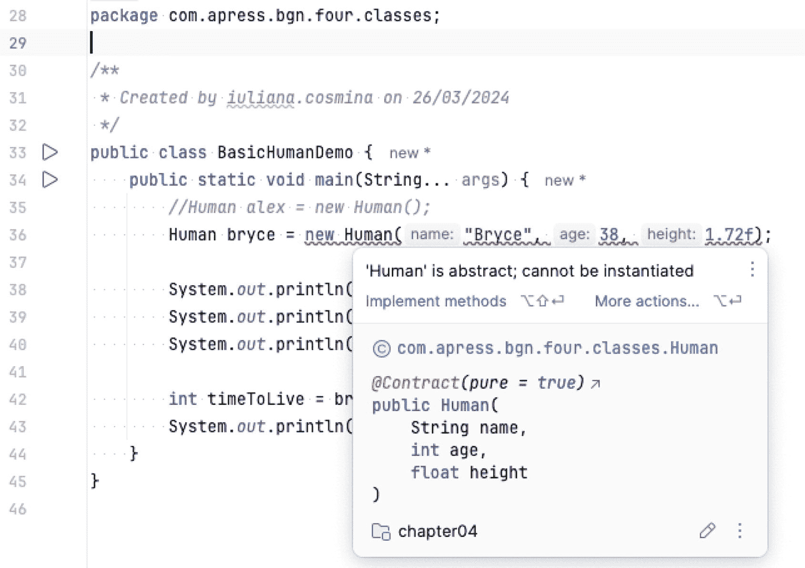

图 4-6

尝试实例化抽象类时的 Java 编译器错误

是的，这是一个编译错误。构造函数可以保留，因为它们有助于进一步抽象行为。`Musician` 和 `Actor` 类必须重写以扩展 `Human` 类。这通过在声明类时使用 `extends` 关键字并指定要扩展的类（也称为**父类**或**超类**）来实现。生成的类称为**子类**。

重要

当扩展一个类时，子类会继承超类中声明的所有字段和具体方法。（对它们的访问由访问修饰符定义，详见**第** **3** **章**。）抽象方法除外，子类必须为抽象方法提供具体实现——当然，除非子类本身也是抽象类。

重要

子类必须声明自己的构造函数，并使用超类中声明的构造函数。超类中的构造函数使用关键字 `super` 来调用。方法和字段也是如此，除非它们具有禁止访问的访问修饰符。你能猜到是哪个吗？是 `private`。子类不能访问超类的私有成员。如果你不知道答案，可能需要回顾一下**第** **3** **章**。

清单 4-29 展示了通过运用抽象和继承编写的 `Musician` 类的一个版本。


```
package com.apress.bgn.four.classes;
import java.util.List;
public class Musician extends Human {
private String musicSchool;
private String genre;
private List songs;
public Musician(String name, int age, float height,
String musicSchool, String genre) {
super(name, age, height);
this.musicSchool = musicSchool;
this.genre = genre;
}
@Override
public int getTimeToLive() {
return (LIFESPAN - getAge()) / 2;
}
// getters and setters omitted
}
代码清单 4-29
继承 Human 类的 Musician 类
```

为简化起见，`songs` 字段未作为构造函数参数使用。

如您所见，`Musician` 构造函数通过 `super(..)` 调用超类中的构造函数，以设置其中定义的属性。同时请注意 `getTimeToLive()` 方法的完整实现。

注意

关于 `super(..)` 调用有一个有趣的事实。在 Java 21 版本之前，不允许在此调用之前放置任何其他语句，这使得在子类构造函数中，在实际构造实例之前执行某些初始化或验证变得困难。

例如，让我们尝试为代码清单 4-29 中的 `Musician` 添加一个无参构造函数，该函数调用名为 `DataGenerator` 类中的方法，生成随机值用于填充从 `Human` 继承的字段，并且该调用发生在 `super(..)` 之前。图 4-7 显示了如果项目使用 JDK 17 编译，IntelliJ IDEA 会显示的错误。

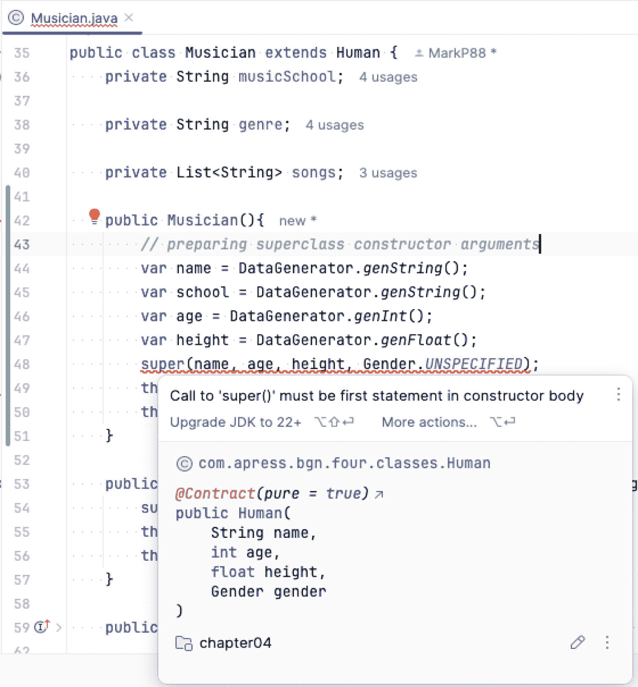

图 4-7

IntelliJ IDEA 使用 JDK 17 编译 Java 22 源码，显示在 `super(..)` 调用之前不允许有语句

`DataGenerator` 类非常简单，它基于一个伪随机数生成器（PRNG）实例生成值。该实例通过调用 `RandomGenerator.of("SecureRandom")` 获得。`java.util.random.RandomGenerator` 接口是在 Java 17 中引入的，旨在为生成随机或（更典型地）伪随机数字序列（或 `Boolean` 值）的对象提供通用协议。在内部，`java.util.random.RandomGeneratorFactory` 的实例支持创建各种 PRNG，其中许多位于 `jdk.random` 包中。

您可以在代码清单 4-30 的 `DataGenerator` 类中看到数据生成器方法的实现。

```
package com.apress.bgn.four.classes;
import java.nio.charset.Charset;
import java.util.random.RandomGenerator;
public class DataGenerator {
static RandomGenerator randomGenerator = RandomGenerator.of("SecureRandom");
public static String genString() {
byte[] array = new byte[7];
randomGenerator.nextBytes(array);
return new String(array, Charset.defaultCharset());
}
public static float genFloat() {
return randomGenerator.nextFloat();
}
public static int genInt() {
return randomGenerator.nextInt();
}
}
代码清单 4-30
使用 JDK 17 RandomGenerator 的数据生成器方法
```

`RandomGenerator.of(String)` 方法的参数是 PRNG 的算法名称。JDK 包含许多 PRNG 类，它们取代了自 JDK 1.0 以来就存在的 `java.util.Random` 类。`RandomGenerator` 接口包含许多方法，例如 `nextLong()`、`nextInt()`、`nextDouble()`、`nextFloat()` 和 `nextBoolean()`，用于生成各种原始数据类型的随机数。生成 `String` 值是通过使用 `nextBytes(byte[])` 生成一个字节数组，并将其作为 `String(byte[])` 构造函数的参数来实现的。

代码清单 4-31 展示了新的 `Musician` 构造函数的样子。

```
package com.apress.bgn.four.classes;
import java.util.List;
public class Musician extends Human {
private String musicSchool;
private String genre;
private List songs;
public Musician() {
// -- 准备超类构造函数参数
var name = DataGenerator.genString();
var school = DataGenerator.genString();
var age = DataGenerator.genInt();
var height = DataGenerator.genFloat();
// ---
super(name, age, height);
this.musicSchool = DataGenerator.genString();
this.genre = "undefined";
}
// 其他成员已省略
}
代码清单 4-31
在 super(..) 调用前包含语句的构造函数
```

`Actor` 类也可以重写为继承自抽象类 `Human`。本书源码中提供了一个实现方案，但建议您在查看 `classes` 包之前先尝试自己编写。

图 4-8 展示了由 IntelliJ IDEA 生成的 `Human` 类层次结构。为简化图像，方法已被省略。

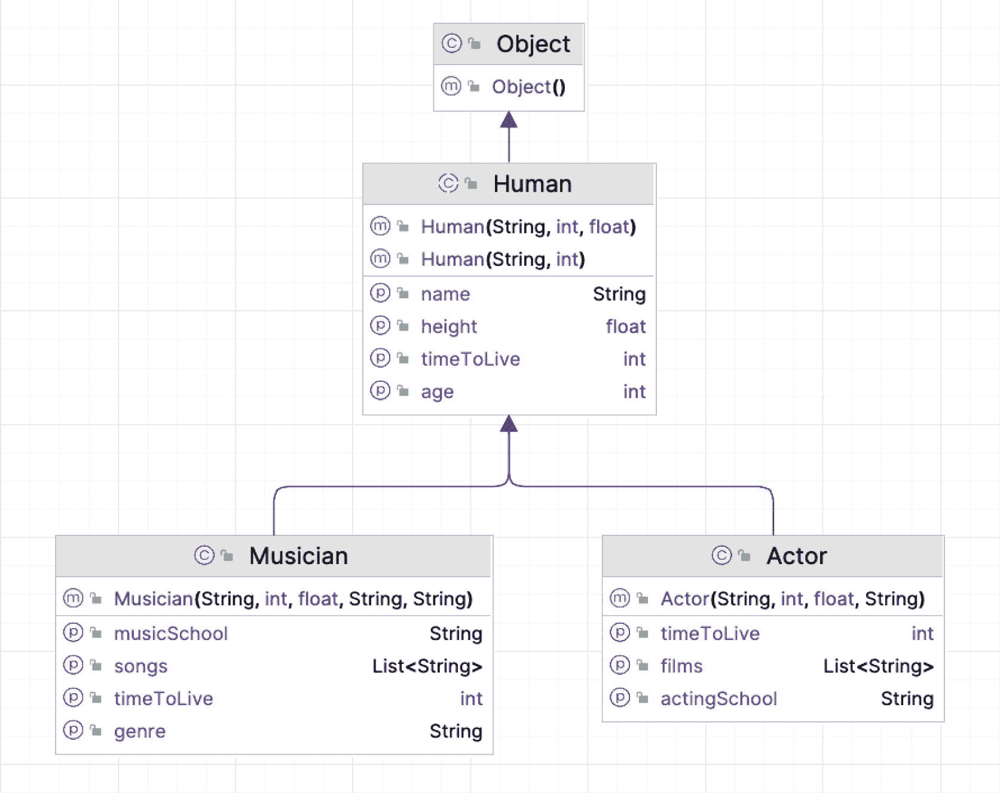

图 4-8

IntelliJ IDEA 生成的 UML 图

UML 图清晰地展示了每个类的成员，箭头指向超类。UML 图是设计组件层次结构和定义应用程序逻辑的有用工具。如果您想了解更多关于它们以及各种类型的 UML 图的信息，互联网上有大量免费资源可供参考^(⁴²)。

在介绍了这么多关于类以及如何创建对象的内容之后，我们需要介绍其他重要的 Java 组件，这些组件可用于创建更详细的对象。我们的 `Human` 类缺少不少属性，例如 `gender`。用于建模个人性别的字段只能取固定集合中的值。过去它可能仅限于两种，但在当今世界，我们不能将性别的值集限制为两种，因此我们将引入第三种，称为 `UNSPECIFIED`，用于替代个人认同的任何性别。这意味着我们必须引入一个新的类来表示性别，并且该类只能被实例化三次。使用普通类来实现这一点会相当棘手，这就是为什么在 Java 1.5 版本中引入了 `enums`（枚举）。


#### 枚举

`enum`类型是一种特殊的类类型。它用于定义一种只能被实例化固定次数的特殊类。枚举声明将所有该枚举的实例组合在一起，它们都是常量。因此，`Gender`枚举可以像清单 4-32 所示那样定义。

```
package com.apress.bgn.four.classes;
public enum Gender {
FEMALE,
MALE,
UNSPECIFIED
}
清单 4-32
Gender 枚举
```

枚举无法在外部被实例化。枚举默认是`final`的，因此它不能被继承。还记得 Java 中每个类默认都隐式继承`Object`类吗？Java 中的每个枚举都隐式继承抽象类`java.lang.Enum<E>`，这样一来，每个枚举实例都继承了在使用枚举编写代码时非常有用的特殊方法。

作为一种特殊的类类型，`enum`可以拥有字段和一个只能为私有的构造函数，因为枚举实例不能在外部创建。`private`修饰符无需显式声明，因为编译器知道该怎么做。清单 4-33 展示了通过添加一个整数型字段（表示每种性别的数值表示）和一个`String`型字段（表示文本表示）来实现的`Gender`枚举。当然，要访问枚举的属性，需要 getter 方法。

```
package com.apress.bgn.four.classes;
public enum Gender {
FEMALE(1, "f"),
MALE(2, "m"),
UNSPECIFIED(3, "u");
private int repr;
private String descr;
private Gender(int repr, String descr) {
this.repr = repr;
this.descr = descr;
}
public int getRepr() {
return repr;
}
public String getDescr() {
return descr;
}
}
清单 4-33
一个更复杂的 Gender 枚举
```

警告

但是等等，有什么能阻止我们也声明 setter 方法并修改字段值呢？嗯，没什么能阻止。如果这正是你需要做的，你可以这样做，**但这并非良好实践**（实际上这非常糟糕）。

枚举实例应该是常量。因此，正确的枚举设计不应声明 setter 方法，并且应通过将字段声明为`final`来确保它们的值永远不会被更改。当我们这样做时，字段初始化的唯一方式就是通过调用构造函数，而由于构造函数不能在外部调用，我们数据的完整性就得到了保证。一个良好枚举设计的示例如清单 4-34 所示。

```
package com.apress.bgn.four.classes;
public enum Gender {
FEMALE(1, "f"),
MALE(2, "m"),
UNSPECIFIED(3, "u");
private final int repr;
private final String descr;
private Gender(int repr, String descr) {
this.repr = repr;
this.descr = descr;
}
public int getRepr() {
return repr;
}
public String getDescr() {
return descr;
}
}
清单 4-34
正确的 Gender 枚举
```

可以向枚举中添加方法，并且每个实例都可以重写这些方法。因此，如果我们向`Gender`枚举添加一个名为`comment()`的方法，每个实例都会继承它。但实例可以重写它，如清单 4-35 所示。

```
package com.apress.bgn.four.classes;
public enum Gender {
FEMALE(1, "f"),
MALE(2, "m"),
UNSPECIFIED(3, "u") {
@Override
public String comment() {
return "待定: " + getRepr() + ", " + getDescr();
}
};
private final int repr;
private final String descr;
Gender(int repr, String descr) {
this.repr = repr;
this.descr = descr;
}
// getter 方法已省略
public String comment() {
return repr + ": " + descr;
}
}
清单 4-35
展示枚举项类的代码示例
```

重要

那么，一个实例怎么可能重写其类类型的方法呢？它不能。`UNSPECIFIED`枚举值实际上是一个类的实例，该类扩展了`Gender`类并重写了`comment()`方法。

这一点可以通过遍历枚举值并打印从`Object`类继承的`getClass()`方法返回的结果来轻松证明，该方法返回对象的运行时类型。要获取一个枚举的所有实例，每个枚举都隐式扩展的`java.lang.Enum<E>`类提供了一个名为`values()`的方法。清单 4-36 展示了执行此操作的代码及其输出。

```
package com.apress.bgn.four.classes;
public class BasicHumanDemo {
public static void main(String... args) {
for (Gender value : Gender.values()) {
System.out.println(value.name() + ": " + value.getClass());
System.out.println("\tcomment : " + value.comment());
}
}
}
// 控制台预期输出
/*
FEMALE: class com.apress.bgn.four.classes.Gender
comment : 1: f
MALE: class com.apress.bgn.four.classes.Gender
comment : 2: m
UNSPECIFIED: class com.apress.bgn.four.classes.Gender$1
comment : 待定: 3, u
*/
清单 4-36
带有额外方法的正确 Gender 枚举
```

注意为`UNSPECIFIED`元素打印的值。`Gender$1`这种表示法意味着编译器通过扩展原始枚举类并重写`comment()`方法（使用在`UNSPECIFIED`元素声明中提供的方法）创建了一个内部类。

在未来的示例中，我们也会继续使用枚举。只需记住，无论何时你需要将类的实现限制为固定数量的实例，或者将相关常量组合在一起，枚举就是你要使用的工具。现在我们已经介绍了枚举，我们的`Human`类可以拥有一个`Gender`类型的字段，如清单 4-37 所示。

```
package com.apress.bgn.four.classes;
public abstract class Human {
public static final int LIFESPAN = 100;
protected String name;
protected int age;
protected float height;
private Gender gender;
public Human(String name, int age, Gender gender) {
this.name = name;
this.age = age;
this.gender = gender;
}
public Human(String name, int age, float height, Gender gender) {
this(name, age, gender);
this.height = height;
}
// 其他代码已省略
public Gender getGender() {
return gender;
}
public void setGender(Gender gender) {
this.gender = gender;
}
}
清单 4-37
带有 Gender 字段的 Human 类
```

在前面的章节中，**接口**被提及为用于创建对象的 Java 组件之一。现在是时候深入探讨这个主题了。


#### 接口

重要提示

对于有志成为 Java 程序员的人来说，最常见的面试问题之一就是*接口和抽象类有什么区别？* 本节将为你提供这个问题最详细的答案。

**接口**不是类，但它确实有助于创建类。接口是完全抽象的，这意味着它没有字段，只有抽象方法定义。我也喜欢称它们为*骨架*。当一个类被声明为实现一个接口时，除非该类是抽象的，否则它必须为所有骨架方法提供具体的实现。

重要提示

*骨架方法*这个名称在 Java 8+ 版本中相当重要，因为从这个版本开始，接口得到了丰富，`static`、`default` 和 `private` 方法可以成为接口的一部分。

接口内部的骨架方法隐式地是 `public` 和 `abstract` 的，因为骨架方法必须是抽象的，以强制类提供实现，并且必须是公开的，以便类实际上能够访问并实现它们。

在 Java 8 之前，接口中唯一具有具体实现的方法是 `static` 方法。在 Java 8 中，引入了接口中的 *default* 方法。在 Java 9 中，引入了接口中的 **private** 方法。接口不能被实例化，因为它们没有构造函数。

不声明任何方法定义的接口被称为*标记*接口，其目的是为特定目的标记类。最著名的 Java 标记接口是 `java.io.Serializable`，它标记了可以被序列化的对象，这样它们的状态就可以保存到二进制文件或其他数据源，并通过网络发送以进行反序列化和使用。

接口可以在其自己的文件中作为顶层组件声明，也可以嵌套在另一个组件内部。接口有两种类型：*普通*接口和**注解**。

抽象类和接口之间的区别，以及何时应该使用其中一种，在**继承**的上下文中变得尤为重要。

重要提示

Java 只支持单继承。这意味着一个类只能有一个超类。

单继承可能看起来像是一个限制，但请考虑以下示例。让我们修改之前的层次结构，想象一个名为 `Performer` 的类，它应该继承 `Musician` 和 `Actor` 类。如果你需要一个可以用这个类建模的真实人物，可以想想大卫·杜楚尼，他既是演员又是音乐家。

图 4-9 描绘了前面提到的类层次结构。

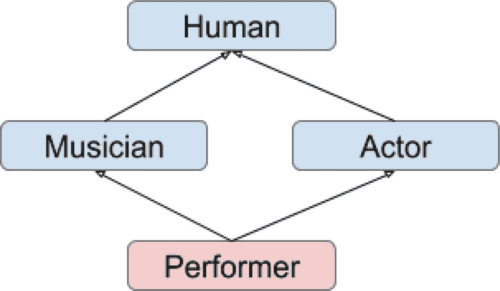

图 4-9

菱形类层次结构

这个类层次结构引入了所谓的*菱形问题*，这个名称显然是由类之间关系形成的形状所启发。这个设计到底有什么问题？如果 `Musician` 和 `Actor` 都继承自 `Human` 并继承了它的所有成员，那么 `Performer` 将继承什么，又从何处继承？因为它显然不能两次继承 `Human` 的成员，那会使这个类变得无用且无效。而且我们如何区分具有相同签名的方法？那么 Java 中的解决方案是什么？正如你可能想象到的，考虑到本节的重点：接口。*（嗯，某种程度上是这样，因为大多数时候需要接口和一个名为* ***组合*** *的编程概念相结合。）*

需要做的是将 `Musician` 和 `Actor` 类中的方法转变为方法骨架，并将这些类转变为接口。`Musician` 类中的行为将被移到一个名为（比如说）`Guitarist` 的类中，这个类将继承 `Human` 类并实现 `Musician` 接口。对于 `Actor` 类，可以做一些类似的事情，但我把这个留作你的练习。图 4-10 中的层次结构应该能提供一些帮助。

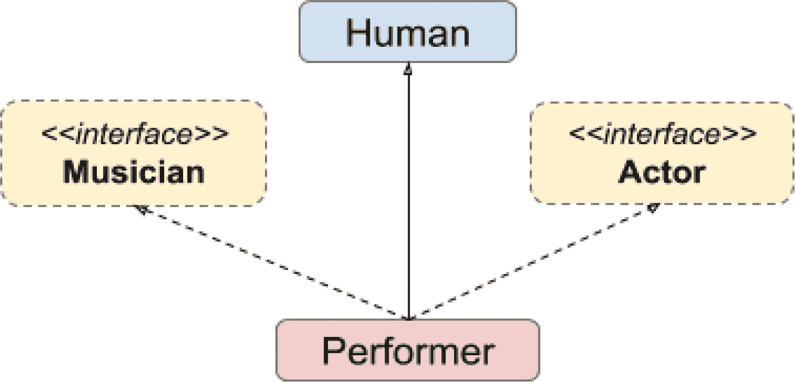

图 4-10

`Performer` 类的 Java 接口层次结构

因此，`Musician` 接口只包含映射音乐家行为的方法骨架。它不深入细节来建模如何做。`Actor` 接口也是如此。在代码清单 4-38 中，你可以看到这两个接口的主体。

```
package com.apress.bgn.four.interfaces;
import java.util.List;
interface Musician {
String getMusicSchool();
void setMusicSchool(String musicSchool);
List getSongs();
void setSongs(List songs);
String getGenre();
void setGenre(String genre);
}
interface Actor {
String getActingSchool();
void setActingSchool(String actingSchool);
List getFilms();
void setFilms(List films);
void addFilm(String filmName);
}
代码清单 4-38
Musician 和 Actor 接口
```

如你所见，字段已被移除，因为它们不能成为接口的一部分；只保留了方法骨架。

注意

在某些代码示例中，一个文件中声明了多个类，该文件以其中唯一的公共类命名。之所以这样选择，是因为这些类的主体很小，将它们分散到多个文件中没有意义。

`Performer` 类如代码清单 4-39 所示。

```
package com.apress.bgn.four.interfaces;
import com.apress.bgn.four.classes.Gender;
import com.apress.bgn.four.classes.Human;
import java.util.List;
public class Performer extends Human implements Musician, Actor {
// 音乐家特有的字段
private String musicSchool;
private String genre;
private List songs;
// 演员特有的字段
private String actingSchool;
private List films;
public Performer(String name, int age, float height, Gender gender) {
super(name, age, height, gender);
}
// 来自 Human
@Override
public int getTimeToLive() {
return (LIFESPAN - getAge()) / 2;
}
// 来自 Musician
@Override
public String getMusicSchool() {
return musicSchool;
}
// 来自 Musician
@Override
public void setMusicSchool(String musicSchool) {
this.musicSchool = musicSchool;
}
// 来自 Actor
@Override
public String getActingSchool() {
return actingSchool;
}
// 来自 Actor
@Override
public void setActingSchool(String actingSchool) {
this.actingSchool = actingSchool;
}
// 其他方法已省略
}
代码清单 4-39
实现两个接口的 Performer 类
```

重要提示

你必须从这个例子中理解的是，通过使用接口，Java 在某种程度上可以实现多重继承，并且**类只能继承一个类，但可以实现一个或多个接口**。

在某些情况下，你可能需要编写一个实现多个接口的类，而这些接口可能声明了相似的方法骨架。如果方法骨架具有相同的签名，解决方案很简单：一个实现就足够了。如果签名差异足够大，则需要为每个方法提供各自的实现。

如果骨架相似到足以混淆编译器，最好避免继承，而选择诸如组合之类的解决方案。

继承也适用于接口。例如，`Musician` 和 `Actor` 接口都可以继承一个名为 `Artist` 的接口，该接口包含两者共有的行为模板。例如，我们可以将音乐学校和表演学校合并为一个通用的学校，并将其 getter 和 setter 定义为方法骨架。`Artist` 接口与 `Musician` 一起在代码清单 4-40 中展示。

```
package com.apress.bgn.four.interfaces;
import java.util.List;
interface Artist {
String getSchool();
void setSchool(String school);
}
interface Musician extends Artist {
List getSongs();
void setSongs(List songs);
String getGenre();
void setGenre(String genre);
}
代码清单 4-40
Artist 和 Musician 接口
```


希望你已经理解了多重继承的概念，以及在设计应用程序时，何时适合使用类、何时适合使用接口。因为现在是时候兑现本节开头许下的承诺，列出抽象类和接口之间的区别了。你可以在表 4-1 中找到它们。

表 4-1

Java 中抽象类与接口的区别

| 抽象类 | 接口 |
| --- | --- |
| 可以拥有非抽象方法。 | 只能拥有抽象方法、默认方法和私有方法。 |
| 单继承：一个类只能继承一个类。 | 多重继承：一个类可以实现多个接口。此外，一个接口可以扩展一个或多个接口。 |
| 可以拥有 final、非 final、static 和非 static 变量。 | 只能拥有 static 和 final 字段。 |
| 使用 **abstract class** 声明。 | 使用 **interface** 声明。 |
| 可以使用关键字 **extends** 扩展另一个类，并使用关键字 **implements** 实现接口。 | 只能使用关键字 **extends** 扩展其他接口（一个或多个）。 |
| 可以拥有非抽象、protected 或 private 成员。 | 所有成员默认都是 abstract 和 public（除了 default 和 private 方法）。 |
| 如果一个类有抽象方法，它自身必须声明为 abstract。 | （无对应项。） |

##### 接口中的默认方法

接口的一个问题是，如果你修改其主体以添加新方法，代码将无法编译。为了使其能够编译，你必须在实现该接口的每个类中为新添加的接口方法添加具体实现。多年来，这一直是开发人员的痛点。接口是一种契约，它保证了一个类将如何表现。当你在项目中使用第三方库时，你通过设计代码来遵守这些契约。当切换到库的新版本时，如果该契约发生变化，你的代码将无法再编译。

提示

这种情况非常类似于苹果公司从一代产品到另一代产品更改其电脑和手机的充电端口。如果你买了一台新的 Mac，并试图使用你的旧充电器，它将无法适配。

当然，一种解决方案是在新接口中声明新方法，然后创建同时实现新接口和旧接口的新类（这被称为**组合**，因为两个接口组合在一起代表一个单一的契约）。接口暴露的方法构成了应用程序编程接口（API），在开发应用程序时，目标是设计出具有稳定 API 的应用程序。这一规则由名为“开闭原则”的编程原则描述，该原则是五大 SOLID 编程原则之一 ^(⁴³)。该原则指出，你应该能够在不修改类的情况下扩展它。因此，修改类所实现的接口也需要修改该类。所以，修改接口往往会导致违反这一原则。

除了前面提到的接口组合之外，在 Java 8 中引入了一种解决方案：**默认方法**。从 Java 8 开始，只要使用 `default` 关键字声明，就可以在接口中声明具有完整实现的方法。

让我们考虑一下 `Artist` 接口。任何自称艺术家的人都应该能够创造一些东西，对吧？所以艺术家应该具有创造性。鉴于我们所处的世界，我不会提及名字，但有些艺术家实际上是产业的产物，因此他们本身并不具有创造性。所以，在我们决定了图 4-11 中描绘的层次结构之后，才意识到我们应该有一个方法来告诉我们一个艺术家是否具有创造性。

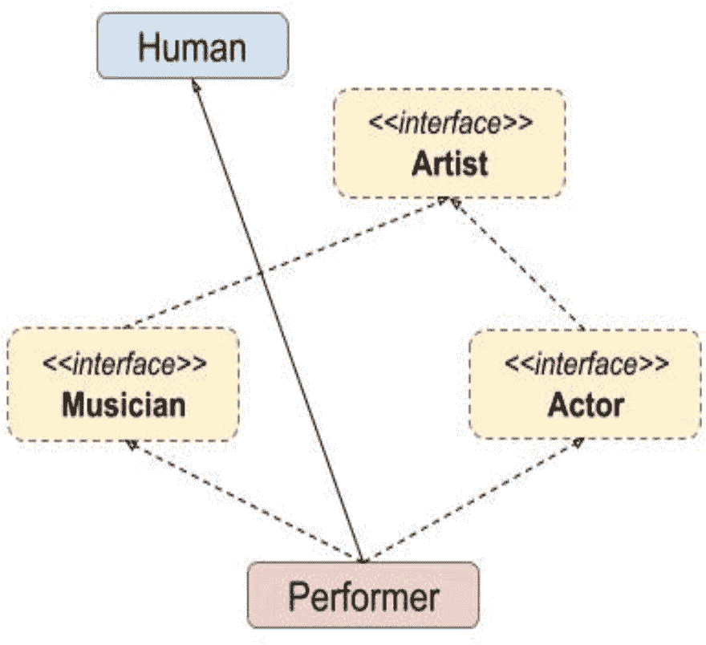

图 4-11

为 `Performer` 类添加了更多接口的 Java 层次结构

如果我们向 `Artist` 接口添加一个新的抽象方法，`Performer` 类将无法编译。IntelliJ IDEA 会通过显示大量红色下划线来明确表明我们的应用程序不再工作，如图 4-12 所示。

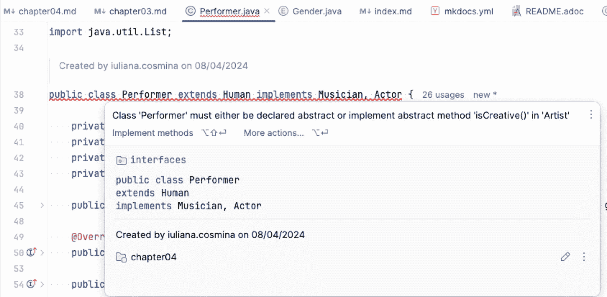

图 4-12

由于接口中的新方法导致 Java 层次结构被破坏

我们看到的编译器错误是由于我们决定向 `Artist` 接口添加一个名为 `isCreative` 的新抽象方法造成的，如果你将鼠标悬停在类声明上，你甚至可以看到原因。清单 4-41 描述了破坏代码的抽象方法。

```
package com.apress.bgn.four.hierarchy;
public interface Artist {
String getSchool();
void setSchool(String school);
boolean isCreative();
}
清单 4-41
添加到 Artist 接口的新骨架方法
```

为了消除编译错误，我们将 `isCreative` 方法骨架转换为一个返回 `true` 的 `default` 方法，因为每个艺术家都应该是具有创造性的。默认方法默认是 public 的，因此可以在实现声明该方法的接口的任何类型的对象上调用它们。清单 4-42 描述了默认方法的主体。

```
package com.apress.bgn.four.hierarchy;
public interface Artist {
String getSchool();
void setSchool(String school);
default boolean isCreative() {
return true;
}
}
清单 4-42
添加到 Artist 接口的新 default 方法
```

现在代码应该可以再次编译了。默认方法非常实用，因为它们允许修改接口所代表的契约，而无需强制修改实现该接口的现有类。这将确保与为旧版本接口编写的代码保持二进制兼容性。

实现包含默认方法的接口的类可以使用现有的默认实现，或者为默认方法提供新的实现（可以覆盖它们）。为了说明这一点，清单 4-43 中名为 `MiliVanili` 的类为 `Artist` 接口中的默认方法提供了一个新的实现。

```
package com.apress.bgn.four.hierarchy;
import java.util.List;
public class MiliVanili implements Artist {
@Override
public boolean isCreative() {
return false; // 哎呀！
}
// 其他代码已省略
}
清单 4-43
在实现 Artist 接口的类中覆盖默认方法
```

扩展其他接口的接口可以编写为执行以下任何操作（为了更清晰，被扩展的接口将被称为超接口）：

*   声明自己的抽象方法和默认方法。

*   将超接口中的默认方法重新声明为抽象方法，这强制扩展此接口的类提供实现。

*   重新定义超接口中的默认方法。

*   声明一个默认方法，为超接口中的抽象方法提供实现。

提示

为所有这些场景提供代码示例对于一本 Java 绝对初学者书籍来说可能有点过多。如果你有兴趣查看代码的样子并测试这些说法的有效性，请查看 `com.ampress.bgn.four.interfaces.extensions` 包中的内容。


##### 接口中的静态方法与常量

从 Java 1 到 Java 8 版本，接口只能包含抽象方法和静态常量。接口在 Java 8 中发生了变化，最重要的变化是支持 `default` 和 `private` 方法。

*常量*，即初始化后永不改变的变量，不需要实现，因此允许开发者在接口主体中声明它们，这很合理，对吧？当然，你也可以使用枚举来实现同样的目的，但有时你可能希望将相关组件放在一起。在之前的示例中，我们在 `Human` 类中声明了一个 `LIFESPAN` 常量。由于任何实现 `Artist` 的类都可能需要 `LIFESPAN` 来进行某种计算，我们可以将这个常量移到 `Artist` 接口中，并在任何类中使用它，如代码清单 4-44 所示。

```
package com.apress.bgn.four.hierarchy;
interface Artist {
public static final int LIFESPAN = 100;
// 其他代码省略
}
public class Performer extends Human implements Musician, Actor {
@Override
public int getTimeToLive() {
return (LIFESPAN - getAge()) / 2;
}
// 其他代码省略
}
代码清单 4-44
Artist 接口中的常量 LIFESPAN
```

在接口中声明常量时，三个访问修饰符 `public`、`static` 和 `final` 是多余的，因为它们是隐含的。每个修饰符的解释相当简单：

*   接口不能有可变字段，因此默认情况下它们必须是 `final` 的。
*   由于接口无法实例化，它们不能拥有会成为实例属性的字段，因此它们必须是 `static` 的。
*   由于接口主体中的任何内容都必须能被实现类访问，因此它们必须是 `public` 的。

至于接口中的静态方法，它们通常是工具方法，专门用于接口所属层次结构中的特定操作。让我们添加一个静态方法，检查作为参数提供的名称是否大写，如果不是则将其大写。

代码如代码清单 4-45 所示，其中 `capitalize` 方法在 `Artist` 接口中声明，并在 `Performer` 类中使用。

```
package com.apress.bgn.four.hierarchy;
interface Artist {
public static String capitalize(String name) {
Character c = name.charAt(0);
if (Character.isLowerCase(c)) {
Character upperC = Character.toUpperCase(c);
name.replace(c, upperC);
}
return name;
}
// 其他代码省略
}
public class Performer extends Human implements Musician, Actor {
public String getCapitalizedName() {
return Artist.capitalize(this.name);
}
// 其他代码省略
}
代码清单 4-45
接口中的公共静态方法
```

在 Java 8 中，任何带有方法体且未声明为 `default` 的方法都必须声明为 `public` 和 `static`，原因如前所述。如果 `default` 或 `static` 方法共享大量代码，那么可以用一个 `default` 或 `static` 方法将这些代码分组，并让其他方法调用它，对吧？唯一的问题出现在需要将这些代码设为私有的时候。这在 Java 8 中是不可能的，因为接口主体中的所有内容默认都是 `public` 的。但在 Java 9 中，这成为了可能。

##### 接口中的私有方法

从 Java 9 开始，接口中引入了对 `private` 和 `private static` 方法的支持。做出这一决定的原因（你可能已经猜到）是为了促进接口内的代码复用，并封装那些不应在接口实现之间共享的代码。这意味着，默认方法 `isCreative()` 执行的操作可以被修改，通过调用一个 `private` 方法来记录返回值的解释。为了让这个示例更完整，让我们添加一个 `private static` 方法来打印当前系统日期，如代码清单 4-46 所示。

```
package com.apress.bgn.four.hierarchy;
interface Artist {
default boolean isCreative() {
explain();
return true;
}
private void explain() {
log();
System.out.println("真正的艺术家具有创造性天赋。");
}
private static void log() {
System.out.println("[日志] 检查创造力时间：" + new Date());
}
/**
* 是的，这是允许的，你可以运行它。 ;)
*/
public static void main() {
Artist artist =  new Performer("迈尔斯·肯尼迪", 54, 1.8F, Gender.MALE);
artist.isCreative();
}
}
// 输出
//[日志] 检查创造力时间：Wed May 08 17:45:15 BST 2024
//真正的艺术家具有创造性天赋。
代码清单 4-46
添加到 Artist 接口的新私有方法
```

以下是关于接口私有方法的最后几点思考：

*   私有方法只能在其声明的接口内部访问，因此应编写它们来包含敏感代码，这些代码你不希望被任何其他类或接口访问。
*   由于是私有的，它们不能被继承，也不能被重写。
*   由此带来的一个后果是，私有方法不能是抽象的。

在实际项目开发中，你会发现自己会使用类、接口、枚举等。如何设计和组织代码取决于你。只需确保避免重复，保持代码整洁、低耦合且可测试。


#### 记录（Records）

Java 的 `record` 是一种特殊的类类型，具有清晰的语法，用于定义不可变的数据类。Java 编译器会处理你的记录代码，并自动生成构造器、getter 方法以及其他专用方法，例如 `toString()`、`hashCode()` 和 `equals()`。

信息

`hashCode()` 和 `equals()` 这两个专用方法定义在 `Object` 类中，因此它们隐式地存在于每一个 Java 类中。它们在确立实例的身份标识方面非常重要，相关内容将在**第** **5** **章**的**集合**部分进行介绍。

Java 记录是在 JDK 14 中作为预览特性引入的，这远在其他编程语言（如 C#、Scala 或 Kotlin）引入类似类型构造之后。在此之前，Java 开发者通过使用诸如 Lombok 之类的库来避免编写大量样板代码的麻烦。本章的**封装数据**部分已经提到了 Lombok，同时也列出了使用它的一些缺点。

Lombok 要求使用特殊的注解来标注类，这些注解会告知其注解处理器在编译时生成所需的字节码。它能够生成现在通过 Java 记录所支持的所有组件。

清单 4-47 展示了如何使用 Lombok 编写 `Human` 类。

```
package com.apress.bgn.four.lombok;
import com.apress.bgn.four.classes.Gender;
import lombok.*;
@NoArgsConstructor
@AllArgsConstructor
@RequiredArgsConstructor
@ToString
@EqualsAndHashCode
public class Human {
@Getter
@Setter
@NonNull
private String name;
@Getter
@Setter
@NonNull
private int age;
@Getter
@Setter
private float height;
@Getter
@Setter
private Gender gender;
}
清单 4-47
Human 类——Lombok 版本
```

Lombok 的另一个问题是，在使用模块的 Java 项目中，它会变得不可预测。在编译时操纵代码以注入额外功能是一项敏感操作，需要访问 JDK 内部 API，而这些 API 可能出于安全原因并未被导出。例如，在编写本书上一版时，使用 Lombok 编译项目就无法工作，因为 Lombok 需要访问 `jdk.compiler` 模块中的 `com.sun.tools.javac.processing.JavacProcessingEnvironment` 类，而该模块并未导出 `com.sun.tools.javac.processing` 包。

如果没有 Lombok，清单 4-47 中的类将会有更多的代码行，因为代码片段中的所有注解都替代了开发者本应编写的方法：

*   `@NoArgsConstructor` 告诉 Lombok 为 `Human` 类生成一个默认的无参构造器的字节码。
*   `@AllArgsConstructor` 告诉 Lombok 为 `Human` 类生成一个需要为每个字段提供参数的构造器的字节码。
*   `@RequiredArgsConstructor` 告诉 Lombok 为 `Human` 类生成一个需要为所有必需字段（即那些用 `@NotNull` 注解的字段）提供参数的构造器的字节码。
*   `@ToString` 告诉 Lombok 生成 `toString()` 方法的字节码。该方法的实现由 Lombok 根据类中的所有字段决定。
*   `@EqualsAndHashCode` 告诉 Lombok 生成 `equals()` 和 `hashCode()` 方法的字节码。这些方法的实现由 Lombok 根据类中的所有字段决定。

随着记录的引入，只要项目使用 JDK 15+ 进行编译和运行，就不再需要 Lombok 了。而且，你也不需要你的实例是可变的。JDK 生成的类是不可变的数据类，因此没有 setter 方法，但在响应式编程这个崭新的世界里，拥有不可变的记录无论如何都是必须的。`Human` 类的 `record` 实现如清单 4-48 所示，同时还包括实例化 `Human` 所需的代码。

```
package com.apress.bgn.four.records;
import com.apress.bgn.four.classes.Gender;
record Human(String name, int age, float height, Gender gender) {
}
public class RecordDemo {
public static void main(String... args) {
Human john = new Human("John Mayer", 47, 1.9f, Gender.MALE);
System.out.println("John as string: " + john);
System.out.println("John's hashCode: " + john.hashCode());
System.out.println("John's name: " + john.name());
}
}
清单 4-48
简单的 Human 记录及其使用类
```

如你所见，记录可以像类一样被实例化，即通过使用 `new` 关键字调用构造器。毕竟，记录只是另一种类型的类。此外，由于不需要 setter 方法（因为对象是不可变的），getter 方法也就没什么意义了。因此，为了访问属性值，会生成与字段同名的、返回字段值的方法。这可以通过使用 IntelliJ IDEA 查看生成的 `Human.class` 文件中的字节码来确认。只需在 `chapter04/target/classes` 目录中找到该文件，选中它，然后从菜单中选择 **View ➤ Show Bytecode**。应该会弹出一个窗口，其内容与图 4-13 所示非常相似。

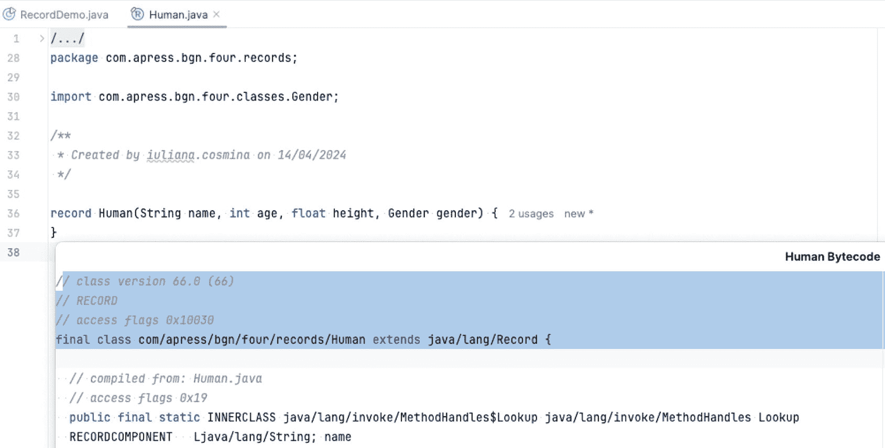

图 4-13

`Human` 记录的字节码

从字节码中，我们还可以发现关于记录的另一个重要信息：字节码中显示的类是 `final` 的，因此记录不能被继承。创建子记录是不可能的。此外，所有记录类都隐式地继承自 `java.lang.Record` 类。

运行 `RecordDemo` 类中的 `main(..)` 方法，会得到如清单 4-49 所示的结果。

```
John as string: Human[name=John Mayer, age=44,height=1.9,gender=MALE]
John's hashCode: 1711330636
John's name: John Mayer
清单 4-49
执行 RecordDemo 类打印的结果
```

记录的 `toString()` 实现相当不错。`john` 实例的属性值可以轻松地读取和理解。

记录是可以定制的。你可以像为类做的那样，在记录体中为 `toString()`、`equals()` 和 `hashCode()` 方法提供自定义实现，并提供各种构造器。唯一的限制是，构造器必须使用 `this` 关键字调用记录的默认构造器。清单 4-50 展示了一个仅需要姓名和年龄的构造器。

```
package com.apress.bgn.four.records;
import com.apress.bgn.four.classes.Gender;
record Human(String name, int age, float height, Gender gender) {
public Human(String name, int age) {
this(name, age, -0f, null);
}
}
清单 4-50
带有一个额外构造器的简单 Human 记录
```

由于为记录生成的默认构造器和其他方法依赖于记录的参数，因此不能在记录体中声明额外的字段。但是，支持静态变量和方法。图 4-14 描绘了一个在其体中声明了一个额外常量和字段的记录（并且编辑器不喜欢后者）。

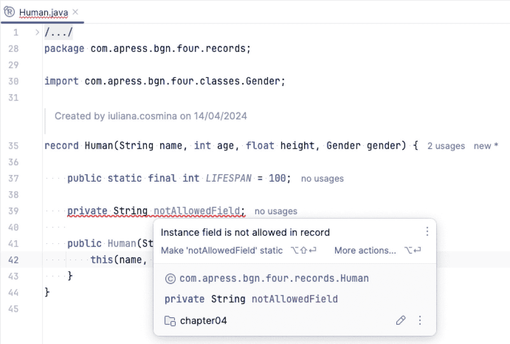

图 4-14

带有常量和字段的记录

当数据不可变性是一个需求时，记录非常实用，而这种情况……在大多数时候都会出现（例如，用于在软件应用子系统之间传输数据的**数据传输对象**）。没有记录也能实现，但这需要开发者付出大量努力——像我这样的老派开发者过去在必要时总是会这样做。*你们这些年轻人根本不知道现在有多轻松！*


#### 密封类与接口

密封类和接口是 JDK 15 中引入的预览特性，并在 Java 17 中正式确定。引入它们是为了解决为开发者类和接口选择合适作用域修饰符的问题，并允许开发者控制哪些代码负责实现它们，从而提高安全性。

安全性始终是一个关注点，对于某些项目而言，当类需要被扩展时，将其设为 `public` 或 `protected` 存在风险。此时，`sealed` 修饰符及其相关机制就能派上用场。它允许开发者 `密封` 一个类，以防止其被扩展，除非使用 `permits` 关键字声明的少数子类。诚然，当项目中添加新的子类时，超类似乎注定要多次更新，但为了获得更安全的应用程序，这是一个可以接受的权衡。考虑到这一点，让我们密封一个版本的 `RecordDemo` 类，并只允许 `Performer` 类扩展它。代码清单 4-51 展示了这两个类。

```
// Human.java
package com.apress.bgn.four.sealed.one;
import com.apress.bgn.four.classes.Gender;
// Human.java
public sealed class Human
permits Performer {
protected String name;
protected int age;
protected float height;
// 其他代码省略
}
// Performer.java
package com.apress.bgn.four.sealed.one;
import com.apress.bgn.four.classes.Gender;
public final class Performer extends Human {
// 其他代码省略
}
代码清单 4-51
密封类及其允许的子类
```

如果扩展类声明在同一个源文件中，则无需在 `permits` 关键字后列出它们。如果文件外部没有扩展类，则可以完全省略 `permits` 关键字。

允许扩展密封类的类本身也必须是密封的或最终的。如果我们需要这些类中的某一个允许被未知类扩展，则可以使用 `non-sealed` 修饰符。代码清单 4-52 展示了声明为 `non-sealed` 的 `Engineer` 类；当然，这个类必须被添加到 `RecordDemo` 类的 `permits` 指令列表中。

```
package com.apress.bgn.four.sealed.one;
import com.apress.bgn.four.classes.Gender;
public non-sealed class Engineer extends Human {
public Engineer(String name, int age, Gender gender) {
super(name, age, gender);
}
public Engineer(String name, int age, float height, Gender gender) {
super(name, age, height, gender);
}
}
代码清单 4-52
扩展密封类的 non-sealed 类
```

`sealed` 修饰符也可以应用于接口。`permits` 关键字指定了允许实现该密封接口的类。

注意

你可能会期望 `permits` 关键字也支持扩展密封接口的接口，但在当前版本的 JDK 中并不支持。*(如果你愿意，可以尝试一下。)*

重要

同样的规则也适用于密封接口：实现密封接口的类应为 sealed、non-sealed 或 final。

代码清单 4-53 展示了密封的 `Mammal` 接口，该接口由密封的 `Human` 类实现。

```
package com.apress.bgn.four.sealed.two;
public sealed interface Mammal permits Human {
}
public sealed class Human
implements Mammal
permits Performer, Engineer {
// 其余代码省略
}
代码清单 4-53
密封的 Mammal 接口和密封的 Human 类
```

重要

密封类和接口的一个限制是，任何子类和实现类都必须位于同一个模块中。

此外，如果这一点不明显的话，任何出现在 `permits` 关键字之后的类都必须扩展该密封类/实现该密封接口。如果某个类在 `permits` 关键字之后指定，但没有扩展密封类/实现密封接口，编译器将不会接受。

密封类对记录（records）很有用，因为记录默认是 final 的。

#### 隐藏类

对于从事 Hibernate 或 Spring 等开发框架的开发者来说，隐藏类是一个有趣的功能，因为这些框架会动态生成代码。生成的类（或接口）不能被其他类的字节码直接使用，因为它们仅供框架内部使用。从 Java 15 开始，生成隐藏的动态类已成为行业标准。

隐藏类无法通过反射等机制发现^(⁴⁴)。它们由框架动态生成，生命周期短，在不再需要时被丢弃，从而提高了在 JVM 上运行的应用程序的性能。由于隐藏类不可发现，它们不能用作超类，也不能用作字段或参数的类型。在发生错误时，默认情况下它们不会显示在堆栈跟踪中，但有一些 JVM 选项可以显示它们。

隐藏类对于初学者书籍来说过于高级，但如果你有兴趣了解更多，本书的代码中有一个示例——请查看 `HiddenClassDemo` 类。

#### 注解类型

注解的定义方式与接口类似，唯一的区别在于 `interface` 关键字前有一个 `@`（at）符号。注解类型是接口的一种形式，大多数时候用作标记（请参考之前的 Lombok 示例）。例如，你可能已经注意到了 `@Override` 注解。当类扩展类或实现接口时，智能 IDE 会自动在方法上放置此注解。它在 JDK 中的声明如代码清单 4-54 中的代码片段所示。

```
package java.lang;
import java.lang.annotation.*;
/**
* 文档省略
*/
@Target(ElementType.METHOD)
@Retention(RetentionPolicy.SOURCE)
public @interface Override {
}
代码清单 4-54
JDK 中的 @Override 声明
```

不声明任何属性的注解称为**标记**或**信息性**注解。它们仅用于通知应用程序中的其他类，或告知开发者其所放置组件的用途。它们不是强制性的，没有它们代码也能编译。

Java 8 引入了一个名为 `@FunctionalInterface` 的注解。此注解被放置在所有恰好包含一个抽象方法且可用于 *lambda 表达式* 的 Java 接口上。


## Lambda 表达式

Lambda 表达式同样在 Java 8 中被引入，它们提供了一种从 Groovy 和 Ruby 等语言借鉴而来的紧凑且实用的代码编写方式。清单 4-55 展示了 `@FunctionalInterface` 的声明。

```
package java.lang;
import java.lang.annotation.*;
/**
* 文档已省略
*/
@Documented
@Retention(RetentionPolicy.RUNTIME)
@Target(ElementType.TYPE)
public @interface FunctionalInterface {
}
清单 4-55
JDK 的 @FunctionalInterface 声明
```

**函数式接口**是声明了单个抽象方法的接口。作为接口中唯一的方法，其实现可以当场提供，无需创建类来定义具体实现。想象以下场景：我们创建了一个名为 `Operation` 的接口，其中包含一个方法。我们可以通过创建一个名为 `Addition` 的类来提供该接口的实现，或者使用 lambda 表达式当场实现。清单 4-56 展示了 `Operation` 接口、`Addition` 类以及一个名为 `OperationDemo` 的类，演示了在 `main(..)` 方法中声明并使用当场实现的过程。

```
package com.apress.bgn.four.lambda;
@FunctionalInterface
interface Operation {
int execute(int a, int b);
}
class Addition implements Operation {
@Override
public int execute(int a, int b) {
return a + b;
}
}
public class OperationDemo {
public static void main(String... args) {
// 使用 Addition 类
Addition addition = new Addition();
int result = addition.execute(2, 5);
System.out.println("结果是 " + result);
// 使用 Lambda 表达式当场实现
Operation addition2 = (a, b) -> a + b;
int result2 = addition2.execute(2, 5);
System.out.println("Lambda 结果是 " + result2);
}
}
清单 4-56
显式接口实现与 Lambda 表达式对比
```

通过使用 lambda 表达式，不再需要 `Addition` 类，这使得代码更少、更易读。Lambda 表达式可用于许多场景，在本书后续内容中，只要能用它们以更实用的方式编写代码，我们都会进行介绍。

注意

`Operation` 实例可以被 `Integer::sum` 替代，这是一种称为方法引用的结构，同样在 Java 8 中引入。顾名思义，这是对 `Integer` 类中 `sum` 方法的引用，该方法也是在 Java 8 中引入的。

## 异常

异常是特殊的 Java 类，用于拦截程序执行过程中的意外情况，使开发者能够根据编译器警告的异常类型或 JVM 在运行时生成的异常类型，实施适当的处理措施。这些类组织成一个层次结构，如图 4-15 所示。`Throwable` 是用于表示 Java 应用程序中意外情况的类层次结构的根类。

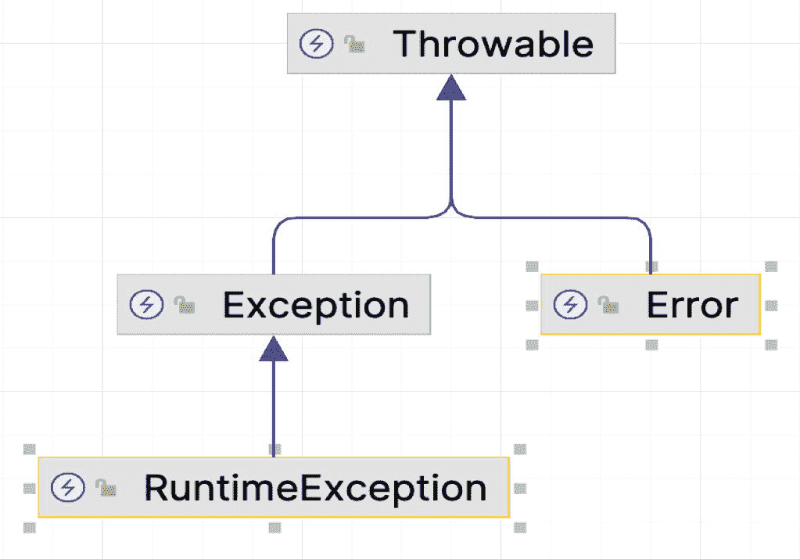

图 4-15

Java 异常层次结构

Java 应用程序中的异常情况可能由多种原因引起，以下是一些常见原因：

*   编写代码时的人为错误

*   硬件问题（尝试从损坏的数据磁盘读取文件）

*   资源缺失（尝试读取不存在的文件）

警告

粗心的开发者在不确定时，往往会编写总是捕获 Throwable 的代码。显然，你应该尽量避免这样做，因为 `Error` 类（`Throwable` 的子类）用于通知开发者系统无法恢复的情况已经发生。

让我们从一个简单的例子开始。清单 4-57 定义了一个调用自身的方法（其技术名称为**递归**），但为了演示目的，它被设计成无限调用自身，导致 JVM 耗尽内存。

```
package com.apress.bgn.four.exceptions;
public class ExceptionsDemo {
// 错误的方法
static int rec(int i) {
return rec(i * i);
}
public static void main(String... args) {
rec(1000);
System.out.println("全部完成。");
}
}
清单 4-57
错误的递归方法
```

如果我们运行 `ExceptionsDemo` 类，*全部完成* 不会被打印出来。相反，程序会因抛出 `StackOverflowError` 而异常终止，并指出问题所在的行（本例中是递归方法调用自身的行）。输出如清单 4-58 所示。

```
Exception in thread "main" java.lang.StackOverflowError at chapter.four@3.0-SNAPSHOT/com.apress.bgn.four.exceptions.ExceptionsDemo.rec(ExceptionsDemo.java:36)
at chapter.four@3.0-SNAPSHOT/com.apress.bgn.four.exceptions.ExceptionsDemo.rec(ExceptionsDemo.java:36)
...
清单 4-58
ExceptionsDemo 执行的控制台输出
```

`StackOverflowError` 间接是 `Error` 的子类，显然是由被调用的有缺陷的递归方法引起的。当然，我们可以修改代码来处理这种异常情况，并执行接下来必须执行的操作，如清单 4-59 所示。

```
package com.apress.bgn.four.exceptions;
public class ExceptionsDemo {
// 其他代码已省略
public static void main(String... args) {
try {
rec(1000);
} catch (Throwable r) {
}
System.out.println("全部完成。");
}
}
清单 4-59
另一个错误的递归方法
```

在控制台中只打印了 *全部完成* 消息，没有错误的任何踪迹。这是意料之中的，因为我们捕获了它并决定不打印任何相关信息。

停止

这是一种称为**异常吞噬**的不良实践——永远不要这样做！

此外，系统不应从此类情况中恢复，因为在抛出 `Error` 后任何操作的结果都是不可靠的。

停止

这就是为什么捕获 `Throwable` 是一种非常糟糕的实践！

`Exception` 类是所有可被捕获和处理、系统可从中恢复的异常的超类。任何 `Exception` 类中不属于 `RuntimeException` 子类的子类都是**受检异常**。这些类型的异常在编译时已知，因为它们属于方法声明的一部分。任何声明抛出受检异常的方法，在代码中使用时，要么强制将异常进一步传播，要么要求开发者编写代码来处理该异常。


`RuntimeException` 类是在程序执行期间抛出的异常的父类，因此在编写代码时无法预知它们是否会被抛出。请参考清单 4-60 中的代码示例。

```
package com.apress.bgn.four.exceptions;
import com.apress.bgn.four.hierarchy.Performer;
public class AnotherExceptionsDemo {
public static void main(String... args) {
Performer p = PerformerGenerator.get("Bryce");
System.out.println("TTL: " + p.getTimeToLive());
}
}
清单 4-60
可能抛出异常的代码示例
```

假设我们无法访问 `PerformerGenerator` 类的代码，因此看不到其内部实现。我们只知道调用 `get(..)` 方法并传入一个名字，应该会返回一个 `Performer` 实例。于是我们编写了清单 4-60 中的代码，并尝试打印该表演者的生存时间。如果因为 `get("John")` 调用返回 null，导致 `p` 变量实际上并未被正确的对象初始化，会发生什么？结果如清单 4-61 所示。

```
Exception in thread"main"java.lang.NullPointerException:
Cannot invoke"com.apress.bgn.four.hierarchy.Performer.getTimeToLive()"
because "p" is null at chapter.four @3.0-SNAPSHOT/com.apress.bgn.four.exceptions.AnotherExceptionsDemo.main(AnotherExceptionsDemo.java:40)
清单 4-61
AnotherExceptionsDemo 执行的控制台输出
```

如你所见，告知你问题所在的异常信息非常明确。更精确的 `NullPointerExceptions` 消息是 Java 17 引入的一项特性。

作为聪明的开发者，或者有点多疑，我们会为此情况做好准备。根据应用程序的需求，我们可以执行以下三项操作中的任意一项。

### 捕获异常，打印适当消息，并退出应用程序

捕获异常需要使用 `try/catch` 块。语法非常简单，其行为可解释如下：JVM 尝试执行 `try` 块中的语句；如果抛出的异常与 `catch` 块声明中的类型匹配，则执行此块中的代码。当没有 `Performer` 实例就无法执行其余代码时，推荐使用此方法，如清单 4-62 所示。

```
package com.apress.bgn.four.exceptions;
import com.apress.bgn.four.hierarchy.Performer;
public class AnotherExceptionsDemo {
public static void main(String... args) {
Performer p = PerformerGenerator.get("Bryce");
try {
System.out.println("TTL: " + p.getTimeToLive());
} catch (Exception e) {
System.out.println("The performer was not initialized properly because of: " + e.getMessage());
}
}
}
清单 4-62
包含异常处理代码的 AnotherExceptionsDemo 版本
```

这里抛出的异常类型是 `NullPointerException`，它是一个继承自 `RuntimeException` 的类，因此 `try/catch` 块并非强制要求。这种类型的异常被称为**非受检异常**，因为开发者没有义务去检查它们。它们是在应用程序执行期间抛出的，因此属于**运行时异常**。这意味着编译器不知道它们被抛出的可能性，也不会强制开发者编写代码来处理它们。

警告

`NullPointerException` 是 Java 初学者经常与之斗争的异常类型，因为他们尚未充分培养出*多疑意识*，无法在使用来源不明的对象之前总是对其进行测试。

### 抛出适当的异常类型

当有另一个类调用有问题的代码，并且该类将适当地处理异常时，此选项是合适的，如清单 4-63 所示。

```
package com.apress.bgn.four.exceptions;
import com.apress.bgn.four.hierarchy.Performer;
public class ExtraCallerExceptionsDemo {
public static void main(String... args) {
Caller caller = new Caller();
try {
caller.printTTL("Bryce");
} catch (EmptyPerformerException e) {
System.out.println(e.getMessage());
}
}
}
class Caller {
public void printTTL(String name) throws EmptyPerformerException {
try {
Performer p = PerformerGenerator.get(name);
System.out.println("TTL: " + p.getTimeToLive());
} catch (Exception e) {
throw new EmptyPerformerException("There is no performer named " + name, e);  // 此处进行包装
}
}
}
class EmptyPerformerException extends Exception {
public EmptyPerformerException(String message, Throwable cause) {
super(message, cause);
}
}
清单 4-63
将异常包装到自定义异常类型中的代码示例
```

请注意 `EmptyPerformerException` 类。它是一个简单的自定义类，扩展了 `java.lang.Exception` 类，从而使其成为受检异常。受检异常被声明为由方法显式抛出，正如你在代码中第一个加粗行所看到的。在这种情况下，当调用该方法时，编译器将强制开发者处理该异常或将其继续向上抛出。如果 `printTTL(..)` 方法声明时没有包含 `throws EmptyPerformerException` 片段，则会发生编译时错误，代码将无法执行。IntelliJ IDEA 作为一个非常智能的编辑器，会使用 JVM 编译器来验证你的代码，它会通过用红线在代码下方划线来通知你代码中存在某些问题。这种情况如图 4-16 所示，其中 `throws EmptyPerformerException` 被注释掉了，以显示编译器对此情况完全不接受。

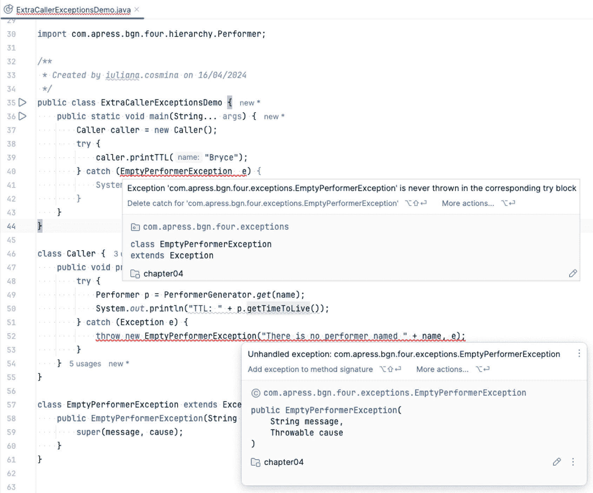

图 4-16

由于受检异常未被声明为由 `printTTL(..)` 方法抛出而导致的编译错误

此外，在 `main(..)` 方法中，需要一个 `try/catch` 块来捕获并处理这种类型的异常，如清单 4-63 所示。或者，`main(..)` 方法必须声明为 `throws EmptyPerformerException`，以允许将异常进一步传递，在此情况下是传递给 JVM。

提示 

你可以将异常想象成碳酸饮料中的二氧化碳气泡：如果没有过滤器阻止，它们往往会浮到表面。在 Java 中，这个表面由运行应用程序的 JVM 代表。当 JVM 遇到异常时，它会停止运行应用程序。

请注意，在创建 `EmptyPerformerException` 对象的行中，根据构造函数的声明，原始异常作为参数提供。这样做是为了不丢失其消息，并且可以用于调试意外情况，因为它将直接指向有问题的代码行。


### 执行虚拟初始化

当问题调用之后的代码根据返回的执行器实例执行不同操作时，此选项非常适用，如清单 4-64 所示。

```
package com.apress.bgn.four.exceptions;
import com.apress.bgn.four.hierarchy.Performer;
import com.apress.bgn.four.classes.Gender;
class DummyInitializer {
public Performer getPerformer(String name) {
Performer p = PerformerGenerator.get(name);
try {
System.out.println("Test if valid: " + p.getName());
} catch (Exception e) {
p = new Performer("Dummy", 0, 0.0f, Gender.UNSPECIFIED);
}
return p;
}
}
public class DummyInitExceptionDemo {
public static void main(String... args) {
DummyInitializer initializer = new DummyInitializer();
Performer p = initializer.getPerformer("Bryce");
if ("Dummy".equals(p.getName())) { // 根据执行器名称执行不同行为
System.out.println("Nothing to do.");
} else {
System.out.println("TTL: " + p.getTimeToLive());
}
}
}
清单 4-64
执行虚拟初始化的代码示例
```

请注意，原始异常在此处并未被使用；它被*吞没*了，因此在出现问题时，问题的根本原因被隐藏了。在原始异常不关键的应用程序中，会打印一条精心设计的警告日志消息，以通知开发者存在某些需要注意的行为。

警告

请记住，本节列出的所有更改都适用于调用 `PerformerGenerator.get("Bryce")` 方法的代码，因为假设我们无法修改此类的代码。如果该类是可访问的，则可以修改该方法以返回一个 `Optional<Performer>`。有关此类对象的更多信息将在后续章节中介绍。

### try/catch 块

既然我们在讨论异常，`try/catch` 块可以补充一个 `finally` 块。`finally` 块中的内容几乎总是会被执行。如果异常与 `catch` 块中声明的任何类型都不匹配（是的，一个 `catch` 块中可以声明多种类型，本书后面会讨论），异常会被进一步抛出，但 `finally` 块仍然会被执行。如果方法正常返回，`finally` 块也会被执行。`finally` 块唯一不执行的情况是程序因错误而终止。

清单 4-65 是清单 4-63 所示代码的增强版本，它为 `Caller` 示例添加了一个 `finally` 块。

```
package com.apress.bgn.four.exceptions;
public class FinallyBlockDemo {
public static void main(String... args) {
try {
Caller caller = new Caller();
caller.printTTL("John");
} catch (EmptyPerformerException e) {
System.out.println("Cannot use an empty performer!");
} finally {
System.out.println("All went as expected!");
}
}
}
清单 4-65
展示 finally 块的代码示例
```

在本书的后续部分，当你的 Java 知识更深入时，一些示例将包含以异常情况结束的代码，以便进一步扩展异常主题。

## 泛型

到目前为止，本章只涵盖了对象类型和用于创建对象的 Java 模板。但是，如果我们需要设计一个功能适用于多种对象类型的类呢？由于 Java 中的每个类都继承自 `Object` 类，我们可以创建一个类，其方法接收一个 `Object` 类型的参数，并在方法中测试对象类型。这样做会很繁琐，但可以实现，并且将在本书后面介绍。幸运的是，Java 提供了一种更简单的方法来设计功能适用于多种对象类型的类。

Java 5 引入了在创建对象时使用类型作为参数的可能性。被设计用来处理其他类的类称为**泛型**。关于泛型有很多例子，但我将从学习 Java 时首先需要的一个例子开始。

在编写 Java 应用程序时，你很可能需要在某个时候将不同类型的值配对。一个最简单的 `Pair` 类，可以保存任意类型的一对实例，如清单 4-66 所示。

```
package com.apress.bgn.four.generics;
public class Pair {
protected X x;
protected Y y;
private Pair(X x, Y y) {
this.x = x;
this.y = y;
}
public X x() {
return x;
}
public Y y() {
return y;
}
public void x(X x) {
this.x = x;
}
public void y(Y y) {
this.y = y;
}
public static  Pair of(X x, Y y) {
return new Pair(x, y);
}
@Override
public String toString() {
return "Pair{" + x.toString() + ", " + y.toString() + '}';
}
}
清单 4-66
泛型类 Pair
```

现在我们有了一个泛型 `Pair` 类声明。X 和 Y 代表应用程序中的任何 Java 类型。`toString()` 方法继承自 `Object` 类，并在 `Pair` 类中被重写，以打印字段的值。

下一步是使用 `Pair` 类。为了证明 `Pair` 类可用于耦合任何类型的实例，在清单 4-67 中，创建了以下对象对：

*   一对 `Performers`，我们只能假设它们一起唱歌，因为变量名为 `duet`。
*   一个 `Performer` 实例和一个 `Double` 实例的对，表示该表演者的净资产；变量名为 `netWorth`。
*   一个 `String` 实例（表示表演者的流派）和一个 `Performer` 实例的对；变量名为 `johnsGenre`。

```
package com.apress.bgn.four.generics;
import com.apress.bgn.four.classes.Gender;
import com.apress.bgn.four.hierarchy.Performer;
public class GenericsDemo {
public static void main(String... args) {
Performer john = new Performer("John", 40, 1.91f, Gender.MALE);
Performer jane = new Performer("Jane", 34, 1.591f, Gender.FEMALE);
Pair duet = Pair.of(john, jane);
System.out.println(duet);
Pair netWorth = Pair.of(john, 34_000_000.03);
System.out.println(netWorth);
Pair johnsGenre = Pair.of("country-pop", john);
System.out.println(johnsGenre);
}
}
// 输出
/*
Pair { com.apress.bgn.four.hierarchy.Performer @1e80bfe8, com.apress.bgn.four.hierarchy.Performer @66a29884}
Pair {com.apress.bgn.four.hierarchy.Performer@1e80bfe8, 3.400000003 E7}
Pair {country-pop, com.apress.bgn.four.hierarchy.Performer@1e80bfe8}
*/
清单 4-67
使用 Pair 泛型类
```

`println(...)` 方法期望其参数是一个 `String` 实例，如果不是，则会在作为参数传入的对象上调用 `toString()` 方法。如果 `toString()` 方法在继承 `Object` 的类中没有被重写，则会调用 `Object` 类中的 `toString()` 方法，该方法返回类的完全限定名以及称为**哈希码**的东西，它是对象的数值表示。

JDK 中有许多泛型类可用于编写代码，其中一些将在后续章节中介绍。本节只是为了向你介绍典型的泛型语法。这将帮助你轻松识别泛型并了解它们的使用方式。


## `var` 与钻石运算符

Java 10 引入了 `var` 关键字，用于声明变量时无需指定其类型，而由编译器进行推断。像 Python、Groovy 和 JavaScript 这类语言早已具备此功能，Java 开发者对此也期待已久。

编写以下代码并不费力：

```
String message = "random message"
```

而不是：

```
var message = "random message" // 推断为 String 类型
```

但当涉及多层泛型类型时，`var` 的作用就大得多了。例如，以下语句：

```
HashMap<String, ArrayList<Integer>> performers = new HashMap<String, ArrayList<Integer>>();
```

可以写成：

```
var performers = new HashMap<String, ArrayList<Integer>>();
```

同样的语句也可以通过使用 Java 7 引入的**钻石运算符** `<>` 来简化。钻石运算符允许在实例化变量时省略泛型类型名称，前提是编译器能从声明中推断出这些类型。因此，前面的例子也可以写成：

```
HashMap<String, ArrayList<Integer>> performers3 = new HashMap<>();
```

重要提示

像 `var performers = new HashMap<>();` 这样的语句是有效的，但编译器无法确定可以添加到 `performers` 映射中的实例类型。因此，像 `performers.put(null, null);` 这样的语句是正确的，因为 `null` 没有类型，但其他任何操作，例如 `performers.put("john", "mayer");`，都会导致编译错误。

`var` 关键字可以简化 Java 代码的编写，但它仍有很长的路要走。目前，它仅允许在方法体、增强型循环的索引、Lambda 表达式、构造函数以及循环和初始化块中使用。它不能用于类字段声明或常量中。因此，编译器只能为局部变量推断类型。

`var` 不能用于声明未初始化的变量，因为这无法为编译器提供任何关于变量类型的信息。所以，`var list;` 语句会导致编译错误，但 `var list = new ArrayList<String>();` 则可以正常工作。

重要提示

尽管 `var` 不能用作标识符，但这并不意味着它是一个保留关键字。例如，这就是为什么可以声明一个名为 `var` 的类字段。由于它替代了变量的类型名称，`var` 实际上是一个**保留类型名称**，并且由于它的使用取决于上下文，你可以在包含 Java 上下文关键字的表 4-4 中找到它。

## 未命名模式与未命名变量

正如本章前面所述，使用下划线 (`_`) 字符作为标识符在 JDK 8 之前是支持的，在 Java 9 中被移除，然后在 Java 21 中作为预览功能重新引入，并在 Java 22 中作为正式特性，但其用途与 Golang 中的类似。对于那些不熟悉 Golang 的人来说，在 Golang 中，你必须使用你声明的任何变量，否则你的代码就是无效的。在某些情况下，一种解决方法是使用名为 `_`（下划线）的变量。`_` 标识符用于表示一个已声明但从未使用的**未命名变量**。

在一些情况下，这非常有用。最常见的是使用 `Thread.sleep(..)` 来暂停程序执行时。`Thread.sleep(..)` 方法的声明包含一个 `throws java.lang.InterruptedException`，如果你的代码设计良好，这个异常实际上很少被抛出，但由于它是一个受检异常，编译器强制你处理它。因此，大多数开发者过去常常将其包裹在一个 `try/catch` 块中，并声明一个从未在任何地方使用过的命名变量。清单 4-68 展示了两个 `try/catch` 块，一个是 Java 22 之前使用命名异常变量的方式，另一个是 Java 22 之后使用未命名变量的方式。

```
// Java 22 之前
try {
    Thread.sleep(20);
} catch (InterruptedException e) {
    // 无需处理
}
// Java 22：未命名变量
try {
    Thread.sleep(20);
} catch (InterruptedException _) {
}
清单 4-68
GenericsDemo 执行的控制台输出
```

你可能会认为这并不重要，你说得对，但有一个我个人非常满意的结果：它使代码更具可读性，而无需添加额外的赘述，比如用注释来解释为什么不对该异常做任何处理。此外，第一个 `try/catch` 块看起来很像本章前面在**异常**部分描述的异常吞噬过程，我曾告诫过你应该避免这种做法。通过使用 `_` 作为变量名，我只需看一眼代码就知道这不是一个需要担心的异常。

另一种可能需要未命名变量的情况是，当你需要遍历一个集合并执行一个与实际迭代器无关的操作时（这种代码也被称为*副作用比其结果更重要的代码*）。你将在**第** **7** **章**中学习迭代器和循环。

在声明需要形式参数的 Lambda 表达式时，未命名变量也很有用。然而，未命名变量在通过模式分解数据类型时最为有用，可以根据对象的类型创建具有不同分支的 `switch` 语句。这将在**第** **5** **章**和**第** **7** **章**中介绍。本书将在必要时使用未命名变量。

## 总结

本章介绍了 Java 语言中最常用的元素。希望读完本章后，你在未来的代码示例中不会遇到太多让你感到惊讶的内容，这样你就可以专注于正确地学习这门语言。如果有些内容目前看起来不清楚，请不要担心；随着你对 Java 语言理解的加深，它们会逐渐变得清晰。

以下是本章的关键要点：

*   语法错误会阻止 Java 代码转换为可执行代码。这意味着*代码无法编译*。

*   当使用*静态导入语句*时，可以直接使用静态变量。静态方法也是如此。

*   注释会被编译器忽略，Java 中有三种类型的注释。

*   类、接口和枚举是用于创建对象的 Java 组件。

*   枚举是一种特殊类型的类，其实例化次数是固定的。

*   记录是一种特殊类型的类，用于创建数据不可变的对象。

*   抽象类不能被实例化，即使它们可以有构造函数。

*   在 Java 8 之前，接口只能包含骨架（抽象）方法，直到 Java 8 引入了默认方法。

*   从 Java 9 开始，接口中允许使用私有方法和私有静态方法。

*   Java 不支持使用类的多重继承。

*   Java 标识符必须遵守命名规则。单个下划线 `_` 不是被接受的 Java 标识符，除非用于标识那些已声明但在各种上下文（异常处理、循环、Lambda 表达式和模式）中从未使用的变量。

*   接口可以继承其他接口。

*   Java 定义了一组固定数量的*保留关键字*，这些关键字只能用于特定目的，不能用作标识符。Java 关键字的列表在不同版本之间通常保持相对稳定。保留关键字将在下一节中介绍。


### Java 关键字

如本章开头所述，Java 有一系列关键字，它们只能用于语言中固定且预定义的目的。Java 中有两种类型的关键字：**保留关键字**和**上下文关键字**。保留关键字（共 51 个）不能用作标识符：你不能将它们用作变量、类、接口、枚举或方法的名称。上下文关键字（共 17 个）可以用作标识符，除非上下文与其预期用途相关，在这种情况下它们不能被使用，因为那会让编译器感到困惑。

你可以在表 4-2 和 4-3 中找到保留关键字。^(⁴⁵)

表 4-3

Java 保留关键字（第二部分）

| 关键字 | 描述 |
| --- | --- |
| `do``for``while` | 用于创建循环的关键字：`do{..}``while(condition)``while(condition){..}``for(initialization;condition;incrementation){..}` |
| `goto` | 另一个从 `C` 语言借用的关键字，但目前未在 Java 中使用，因为它可以被带标签的 `break` 和 `continue` 语句替代。 |
| `if``else` | 用于创建条件语句：`if(condition) {..}``else {..}``else if (condition ) {..}` |
| `import` | 用于使类和接口在当前源代码中可用。 |
| `instanceof` | 用于在条件表达式中测试实例类型。 |
| `native` | 用于指示方法是通过 JNI（Java 本地接口）以本地代码实现的。 |
| `new` | 用于创建 Java 实例。 |
| `package` | 用于声明类、接口、枚举、注解或记录所属的包。它应该是 Java 语句的第一行。 |
| `public private protected` | Java 项目（模板、字段或方法）的访问级别修饰符。 |
| `return` | 在方法内部使用，用于返回到调用它的代码。该方法也可以向调用代码返回一个值。 |
| `static` | 此修饰符可应用于变量、方法、块和嵌套类。它声明一个在声明它的类的所有实例之间共享的项目。 |
| `stricfp` | 用于限制浮点计算以确保可移植性。在 Java 1.2 中引入。 |
| `super` | 在类内部使用，用于访问超类的成员。 |
| `this` | 用于访问当前对象的成员。 |
| `synchronized` | 用于确保在任何给定时间只有一个线程执行某段代码。这用于避免称为竞态条件的问题。 |
| `transient` | 用于标记不应被序列化的数据。 |
| `volatile` | 用于确保对变量值所做的更改对所有访问它的线程都是可见的。 |
| `void` | 在声明方法时用作返回类型，以指示该方法不返回值。 |
| `_`（下划线） | 在 Java 9 之前可用作标识符。从 Java 9 到 Java 20 不能用作标识符。从 Java 21 开始，它可以用作未使用（未命名）变量的标识符。 |

表 4-2

Java 保留关键字（第一部分）

| 关键字 | 描述 |
| --- | --- |
| `abstract` | 用于将类或方法声明为抽象——即，任何继承或实现它的类必须提供具体的实现。 |
| `assert` | 用于测试关于代码的假设。在 Java 1.4 中引入，除非程序使用 `-ea` 选项运行，否则 JVM 会忽略它。 |
| `boolean byte``char``short``int``long``float double` | 原始类型名称。 |
| `break` | 在循环内部使用的语句，用于立即终止循环。 |
| `continue` | 在循环内部使用的语句，用于立即跳转到下一次迭代。 |
| `switch` | 用于测试与一组称为 case 的值是否相等的语句。 |
| `case` | 用于在 `switch` 语句中定义 case 值的语句。 |
| `default` | 用于在 `switch` 语句中声明默认 case。从 Java 8 开始，它可用于在接口中声明默认方法。 |
| `try``catch finally throw throws` | 异常处理中使用的关键字。 |
| `class interface enum` | 用于声明类、接口和枚举的关键字。 |
| `extends implements` | 用于继承类和实现接口的关键字。 |
| `const` | 实际上未在 Java 中使用，是从 `C` 语言借用的关键字，在 C 中用于声明常量，即被赋予一个在程序执行期间不能改变的值的变量。 |
| `final` | Java 中 `const` 关键字的等价物。任何用此修饰符定义的内容在最终初始化后都不能更改。final 类不能被继承。final 方法不能被重写。final 变量在整个程序执行期间保持初始化的值。任何修改 final 项目的代码都会导致编译器错误。 |

你可以在表 4-4 中找到上下文关键字。

表 4-4

Java 上下文关键字

| 关键字 | 描述 |
| --- | --- |
| `export``module``open``opens``provides``requires``to``transitive``uses``with` | 在 `module-info.java` 中用于配置 Java 模块。 |
| `record` | 用于声明 Java 记录的关键字。它可以在 Java 类、接口或枚举的主体内部用作标识符。 |
| `permits``sealed``non-sealed` | 用于声明密封类和接口的关键字。 |
| `when` | 用于在 `switch` 块中声明守卫表达式的关键字。 |
| `yield` | 用于在 `switch` 块中声明 `yield` 语句的关键字。 |
| `var` | Java 10 中引入的关键字，用于在类型显而易见时替换变量方法（或 lambda 表达式）主体的声明类型。`var` 是一个保留类型名称。例如，`var` 可以用作字段名或包名。 |

以下几点值得注意：

*   `true` 和 `false` 是布尔字面量，但它们不是保留关键字。例如，`true` 和 `false` 是有效的包名。

*   `null` 也不是保留关键字。它是一个用于表示缺失对象的字面量。但它是一个有效的包名，例如。

重要提示

Java 语言规范（JLS）^(⁴⁶) 中详细介绍了 Java 语言的关键字和许多其他细节，因此如果你对 Java 代码的正确语法有任何疑问（或者只是好奇），可以浏览一下。在我学习 Java 的早期，当互联网还比较小且帮助不大时，JLS 多次拯救了我。

脚注 1   2   3   4   5   6   7   8


# 5. 数据类型

尽管我们在前一章编写了大量代码，但在设计类时，仅使用了最简单的数据类型——几个数值类型和文本类型。JDK 中声明了许多数据类型，用于多种用途：建模日历日期、表示多种数值类型、操作文本、集合、数据流、文件、数据库连接等。除了 JDK，还有许多由其他方创建的库提供了更多功能。JDK 提供的数据类型是基础类型，是每个 Java 应用程序的构建基石。当然，根据你正在构建的应用程序类型，你可能不需要全部使用它们。例如，我从未有机会使用 `java.util.logging.Logger` 类。我参与过的大多数应用程序在我加入时已由其他团队搭建完成，他们使用了像 `Log4j` 或 `Logback` 这样的外部库，或者像 SLF4J 这样的日志抽象（详见第 9 章）。

本章将介绍编写约 80% 的 Java 应用程序所需的基本 Java 数据类型。闲话少叙，让我们开始吧。

## 栈内存与堆内存

Java 类型可分为两大类：**基本**类型和**引用**类型。Java 代码文件和字节码文件存储在硬盘上。Java 程序在 JVM 上运行，JVM 通过执行 `java` 可执行文件作为进程启动。在执行过程中，所有数据都存储在两种不同类型的内存中：栈和堆，它们由操作系统为程序执行分配。

**栈**内存在执行期间（也称为*运行时*）用于存储方法的原始局部变量以及堆中存储的对象的引用。*栈*也是一种数据结构，由只能在一端访问的值列表表示，也称为后进先出（LIFO）顺序。这个名称很贴切，因为每次调用方法时，都会在栈内存中创建一个新块来保存方法的局部变量：基本类型和方法中其他对象的引用。当调用结束时，该块被移除（弹出），并为之后调用的方法创建新块。

*重要提示*

栈数据结构与一叠盘子非常相似；你只能在顶部添加或移除额外的盘子。栈中的第一个元素称为*栈顶*。对栈执行的操作有特定名称：向栈中添加元素称为*压栈*操作，检查栈中的第一个元素称为*窥视*或*查看栈顶*，提取栈中的第一个元素（即栈顶）称为*出栈*。通过重复调用*出栈*直到栈大小为零，栈会被清空。

每个 JVM 执行线程都有自己的栈内存，其大小可以使用 JVM 参数 `-Xss`（或等效且更明确的 `-XX:ThreadStackSize`）指定。如果分配了太多变量，或者被调用的方法是递归的且设计不良，导致返回条件永远无法满足，从而不断自我调用，你将遇到 `java.lang.StackOverflowError`。这意味着没有剩余的栈内存了，因为每次方法调用都会在栈上创建一个新块。栈内存的大小取决于运行 JVM 的平台：对于基于 Unix 的系统（Linux 和 macOS）为 1024KB，对于 Windows，大小取决于虚拟内存。要检查你计算机上的大小，只需打开终端或命令提示符并运行此命令：`java -XX:+PrintFlagsFinal -version`。该命令返回一系列 JVM 配置，称为*标志*。其中一些用于配置 JVM 允许管理的内存。

清单 5-1 显示了在我的 macOS 计算机上执行的命令。`grep` 命令根据提供的参数过滤输出，从而得到更清晰、范围更明确的输出。

```
> java -XX:+PrintFlagsFinal -version | grep ThreadStack
