#  数据类型  # 标志名称  #  = # 标志值
size_t MaxHeapSize         = 8589934592  # TODO 将数字加粗
size_t MinHeapSize         = 8388608     # TODO 将数字加粗
清单 5-2
展示 macOS 上的堆大小默认值
```

提示

你可以在 Oracle 官方网站上找到完整的 JVM 标志列表。^(⁴⁷) 如果你想了解如何使用它们的更详细解释，请查看这篇博客：

[`https://www.codecentric.de/wissens-hub/blog?q=JVM%20flags`](https://www.codecentric.de/wissens-hub/blog%253Fq%253DJVM%20flags)

重要

虽然现在了解这些信息的重要性可能还为时过早，但在处理实际应用程序时，你会发现许多 Java 命令行选项非常有用。也请将此链接添加到你的必备收藏中：

[`https://docs.oracle.com/en/java/javase/21/docs/specs/man/java.html#java-command-line-argument-files`](https://docs.oracle.com/en/java/javase/21/docs/specs/man/java.html%2523java-command-line-argument-files)

`java.lang.String` 类是 Java 编程语言中使用最频繁的类。由于应用程序中的文本值可能具有相同的值，出于效率考虑，此类对象在堆内的管理方式略有不同。堆中有一个名为**字符串常量池**的特殊内存区域，JVM 会将所有 `String` 实例存储在此处。

注意

此处提及字符串常量池，仅仅是因为接下来的代码片段（将用于分析 Java 中如何管理内存）包含一个 `String` 实例的定义，但关于字符串常量池和 `String` 数据类型的其他细节将在本章稍后部分详细讨论。

让我们考虑清单 5-3 中的可执行类，并检查其执行期间内存是如何组织的。

```
01\. package com.apress.bgn.five;
02.
03\. import java.util.Date;
04.
05\. public class PrimitivesDemo {
06\.     void main() {
07\.         int i = 5;
08\.         int j = 7;
09\.         Date d = new Date();
10\.         int result = add(i, j);
11\.         System.out.print(result);
12\.         d = null;
13\.     }
14.
15\.     static int add(int a, int b) {
16\.        String mess = new String("performing add ...");
17\.        return a + b;
18\.     }
19\. }
清单 5-3
用于讨论内存使用的代码示例
```

与本书上一版一样，我保留了清单 5-3 中的示例，因为我认为对于初学者来说，更容易看到变量类型，但局部类型推断和 `var` 关键字已在十个以上的版本中引入，因此从现在开始，所有示例都将使用它。因此，清单 5-3 中的代码变成了清单 5-4 中的代码。

```
01\. package com.apress.bgn.five;
02.
03\. import java.util.Date;
04.
05\. public class PrimitivesDemo {
06\.     void main() {
07\.         var i = 5;
08\.         var j = 7;
09\.         var d = new Date();
10\.         var result = add(i, j);
11\.         System.out.print(result);
12\.         d = null;
13\.     }
14.
15\.     static int add(int a, int b) {
16\.        var mess = new String("performing add ...");
17\.        return a + b;
18\.     }
19\. }
清单 5-4
用于讨论内存使用的代码示例（使用类型推断）
```

仅通过查看这段代码，你能判断哪些变量保存在栈上，哪些保存在堆上吗？让我们逐行分析程序，看看发生了什么：

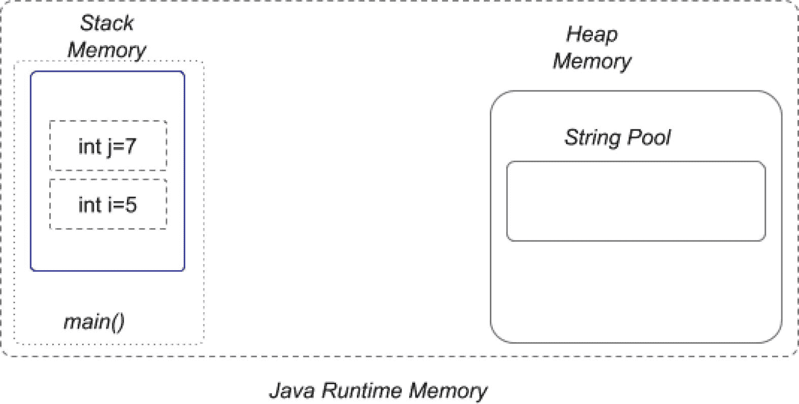

图 5-1

声明两个基本类型变量后的 Java 栈和堆内存

*   程序启动后，JVM 所需的运行时类被加载到堆内存中。
*   在第 06 行发现 `main(..)` 方法，因此创建一个栈内存用于此方法的执行。
*   第 07 行的基本类型局部变量 `i=5` 被创建并存储在 `main(..)` 方法的栈内存中。
*   第 08 行的基本类型局部变量 `j=7` 被创建并存储在 `main(..)` 方法的栈内存中。此时，程序内存可以如图 5-1 所示。

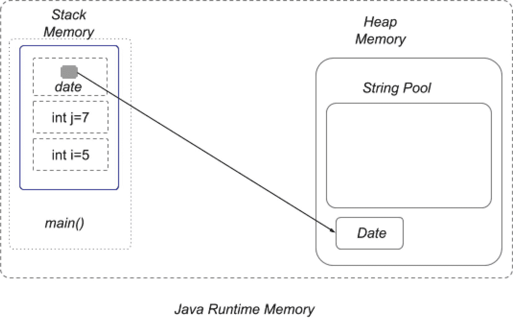

图 5-2

声明两个基本类型变量和一个对象后的 Java 栈和堆内存

*   在第 09 行，声明了一个 `java.util.Date` 类型的对象，因此该对象被创建并存储在堆内存中，一个名为 `d` 的引用被保存在栈上。此时，程序内存如图 5-2 所示。

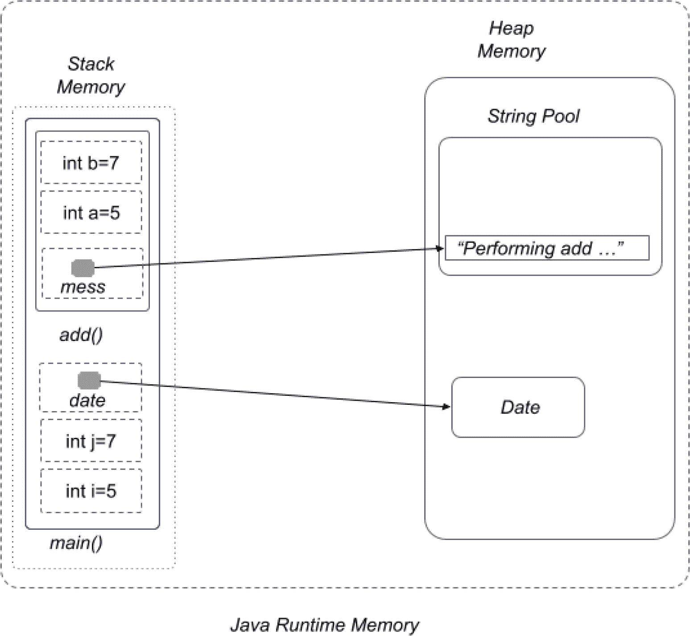

图 5-3

调用 `add(..)` 方法后的 Java 栈和堆内存

*   在第 10 行，调用了带有参数 `i` 和 `j` 的 `add(..)` 方法。这意味着它们的值将被复制到此方法的局部变量 `a` 和 `b` 中，这两个变量将存储在此方法的内存块中。
*   在 `add(..)` 方法体内，第 16 行声明了一个 `String` 实例。因此，`String` 对象在堆内存的字符串常量池内存块中被创建，名为 `mess` 的引用存储在栈上此方法的内存块中。此时，程序内存如图 5-3 所示。
*   同样在第 10 行，`add(..)` 方法执行的结果被存储到名为 `result` 的局部变量中。此时，`add(..)` 方法已完成执行，因此其栈块被丢弃。因此，我们可以得出结论：存储在栈上的变量，其生命周期与创建它们的函数运行时间相同。在 `main(..)` 方法的栈内存中，保存了 `result` 变量。
*   在第 11 行，调用了 `print(..)` 方法，但为简单起见，我们跳过对此行的解释。
*   在第 12 行，`d` 引用被赋值为 `null`，这意味着 `Date` 类型的对象现在仅存在于堆中，并且与 `main(..)` 方法的执行没有任何关联。在这一行，JVM 被告知该对象不再需要，因此可以安全地丢弃，这意味着包含它的空间可以被回收并用于存储其他对象。


此时，程序内存的状态如图 5-4 所示。

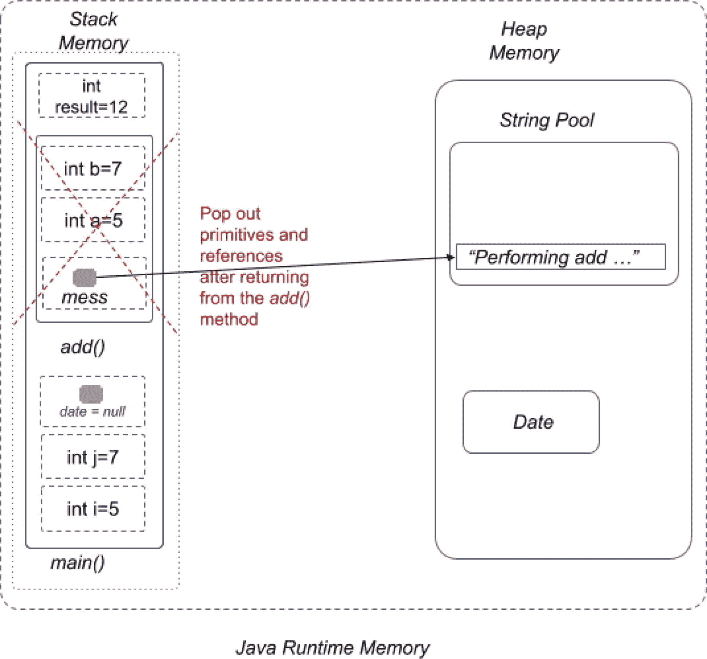

图 5-4

`main(..)` 方法执行结束前的 Java 栈内存和堆内存

显然，程序执行结束后，所有内存内容都会被丢弃。

随着版本迭代，Java 内存管理的方式引入了一些细微变化（用于决定如何在堆中分配和释放空间及其时机的算法得到了优化），但多年来，整体的内存组织结构并没有太大改变。

重要提示

在申请 Java 开发职位时，你很可能会被问到栈内存和堆内存的区别。如果本节内容未能让你充分理解这两个概念，请随时查阅其他资料，例如这篇非常不错的文章：`https://`[`www.digitalocean.com/community/tutorials/java-heap-space-vs-stack-memory`](http://www.digitalocean.com/community/tutorials/java-heap-space-vs-stack-memory)。

## Java 数据类型简介

正如你在前面的示例中所注意到的，根据执行期间数据的存储位置和方式，Java 中的数据类型可以分为两大类：**基本**类型和**引用**类型。我们先简要介绍它们，然后再详细解释其中最重要的成员。

### 基本数据类型

**基本类型**是 Java 编程语言定义的特殊类型，它们没有对应的支持类，并通过其保留关键字来命名。这些类型的变量保存在栈内存中，当使用 `=`（等号）运算符为其赋值时，值实际上是被复制的。因此，如果我们像清单 5-5 那样声明两个 `int` 类型的基本变量，最终会得到两个变量 `k` 和 `q`，它们都具有相同的值：`42`。

```
package com.apress.bgn.five;
public class AnotherPrimitivesDemo {
void main() {
int k = 42;
int q = k;
System.out.println("k = " + k);
System.out.println("q = " + q);
}
}
清单 5-5
用于讨论基本类型的代码示例
```

当作为参数传递给其他方法时，基本类型的值会被复制并使用，而原始变量不会被修改。重要的是，这意味着在 Java 方法中，*基本参数是按值传递的*。这可以通过创建一个交换两个 `int` 变量值的方法来证明。该方法的代码及其使用方法如清单 5-6 所示。

```
package com.apress.bgn.five;
public class SwappingPrimitivesDemo {
void main() {
int k = 42;
int q = 44;
swap(k, q);
System.out.println("k = " + k);
System.out.println("q = " + q);
}
static void swap(int a, int b) {
int temp = a;
a = b;
b = temp;
}
}
清单 5-6
用于展示基本类型是按值传递的代码示例
```

那么，你认为 `k` 和 `q` 会打印出什么值呢？如果你认为输出结果如下，那么你是正确的：

```
k = 42
q = 44
```

这是因为在 Java 中，向方法传递参数是通过其值来完成的，这意味着对于基本类型，改变形式参数的值不会影响实际参数（方法参数）的值。如果你阅读了上一节，你应该已经能想象出栈上发生了什么。当调用 `swap(..)` 方法时，会创建一个新的栈内存块来保存该方法使用的值。在方法执行期间，这些值可能会改变，但如果它们没有被返回并赋值给调用方法中的变量，那么当方法执行结束时，这些值就会丢失。图 5-5 描述了执行清单 5-6 中的代码时栈上发生的变化。

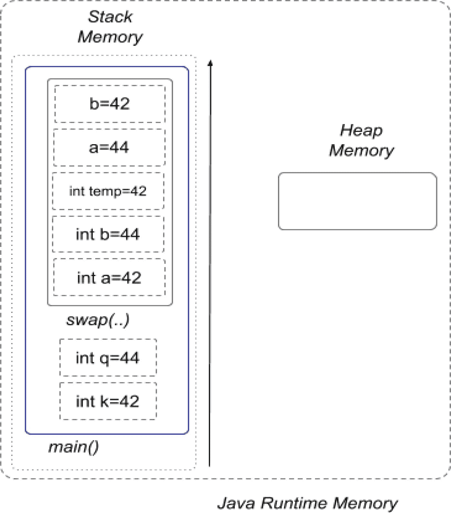

图 5-5

Java 按值传递基本参数

### 引用数据类型

Java 中有六种*引用类型*：

*   类类型
*   接口类型
*   枚举
*   数组类型
*   记录
*   注解

引用类型与基本类型不同，因为它们是可以实例化的（接口和注解除外）。这些类型的实例（对象）是通过调用构造函数创建的。这些类型的变量实际上只是对存储在堆中的对象的引用。由于引用也存储在栈上，即使我们修改之前的代码来使用引用，行为也会是一样的。

清单 5-7 引入了一个名为 `IntContainer` 的类，其唯一目的是将 `int` 基本类型值包装成对象。

```
package com.apress.bgn.five;
public class IntContainer {
private int value;
public IntContainer(int value) {
this.value = value;
}
public int getValue() {
return value;
}
public void setValue(int value) {
this.value = value;
}
}
清单 5-7
用于展示 IntContainer 的代码示例
```

清单 5-8 展示了创建该类型的两个对象及其两个引用，以及一个新版本的 `swap` 方法。

```
package com.apress.bgn.five;
public class IntContainerDemo {
void main() {
IntContainer k = new IntContainer(42);
IntContainer q = new IntContainer(44);
swap(k,q);
System.out.println("k = " + k.getValue());
System.out.println("q = " + q.getValue());
}
static void swap(IntContainer a, IntContainer b) {
IntContainer temp = a;
a = b;
b = temp;
}
}
清单 5-8
用于展示使用引用类型交换两个 int 值的代码示例
```

如果我们运行 `main(..)` 方法，你会注意到我们仍然得到：

```
k = 42
q = 44
```

这该如何解释呢？Java 仍然使用相同的参数传递方式，即**按值传递**，只不过这次传递的是引用的值。

图 5-6 描述了在执行上述代码时，JVM 管理的内存中发生的情况。

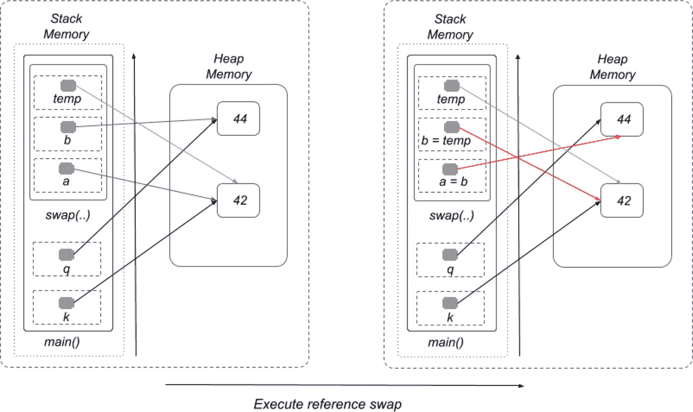

图 5-6

Java 按值传递引用参数

对象的引用在 `swap(..)` 方法体内被互换，但这不会影响 `k` 和 `q` 引用，也不会影响它们在堆中指向的对象。

提示

如果你使用像 IntelliJ IDEA 这样的智能 Java 编辑器，它甚至可能会通过将 `swap` 方法体内的 `a` 和 `b` 变量显示为浅灰色来提示你此实现存在问题，这意味着这两个引用在其他地方没有被使用。

要真正交换值，我们需要通过使用一个新对象来交换对象的内容。请看清单 5-9 中展示的 `swap(..)` 方法的新版本。

```
package com.apress.bgn.five;
public class ReferencesSwapDemo {
void main() {
IntContainer k = new IntContainer(42);
IntContainer q = new IntContainer(44);
swap(k,q);
System.out.println("k = " + k.getValue());
System.out.println("q = " + q.getValue());
}
static void swap(IntContainer a, IntContainer b) {
IntContainer temp = new IntContainer(a.getValue());
a.setValue(b.getValue());
b.setValue(temp.getValue());
}
}
清单 5-9
用于展示使用引用实际交换两个 int 值的代码示例
```

通过使用 setter 和 getter，我们交换了对象的值，因为方法体内从未修改过引用。图 5-7 描述了执行上述代码期间内存中发生的情况。

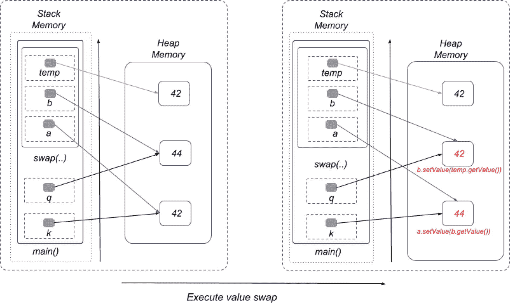

图 5-7

Java 按值传递引用参数，交换对象内容

如果你运行清单 5-9 中的 `main()` 方法，你会注意到 `k` 和 `q` 的值被交换了：

```
k = 44
q = 42
```

注意


也许这个例子在本书中引入得过早，但尽早向你展示原始类型和引用类型之间的主要区别非常重要。所有区别都列在**总结**中，但在此之前，让我们先探索一下 Java 中最常用的数据类型。

### Java 原始类型

原始类型是 Java 中数据的基本类型。这种类型的变量可以通过直接赋值该类型的值来创建，因此它们不会被实例化（由于这些类型没有类支持，实例化会非常困难）。Java 中有八种原始类型：六种用于表示数字，一种用于表示字符，一种用于表示布尔值。原始类型是 Java 语言预定义的，并且它们的名称是保留关键字。原始变量的值只能位于为该类型预定义的区间或数据集中。当声明为类的字段时，在实例化时，会为该字段分配一个特定于该类型的默认值。原始值不与其他原始值共享状态。

大多数 Java 教程会先介绍数值类型，然后再介绍最后两种类型，但我们将从非数值类型开始。

#### **boolean** 类型

这种类型的变量只能有两个可接受的值之一：`true` 和 `false`。如果你听说过布尔逻辑，应该对这种类型很熟悉。在 Java 中，这种类型的值用于设置/取消设置标志和设计执行流程。值 `true` 和 `false` 本身就是布尔字面量。

重要

`boolean` 变量的默认值是 `false`。

关于这种类型的另一个观察点是，当一个字段的类型是 `boolean` 时，它的 getter 方法有另一种语法：它不以 `get` 开头，而是以 `is` 开头。Java IDE 遵循这一点，并按预期生成 getter 方法。这种前缀是有意义的，因为布尔值对于建模只有两个值的属性非常有用。例如，假设我们正在编写一个类来建模一个转换过程。一个布尔字段可以用来标记过程状态是已完成还是仍在进行中。如果字段的名称是 `done`，那么名为 `getDone()` 的 getter 方法会相当不直观，但名为 `isDone()` 的方法则非常直观。

清单 5-10 展示了该类，并显示了一个 `main()` 方法来测试 `done` 字段的默认值。

```
package com.apress.bgn.five;
public class ConvertProcessDemo {
/* 其他字段和方法 */
private boolean done;
public boolean isDone() {
return done;
}
public void setDone(boolean done) {
this.done = done;
}
void main() {
ConvertProcessDemo cp = new ConvertProcessDemo();
System.out.println("默认值 = " + cp.isDone());
}
}
清单 5-10
用于展示 boolean 字段用法的代码示例
```

正如预期的那样，输出的结果是

```
默认值 = false
```

布尔类型与任何其他原始类型都不兼容，这意味着，例如，不能通过简单赋值（使用 `=`）将 `boolean` 值赋给 `int` 变量。显式转换也是不可能的。因此，编写类似下面的代码

```
boolean f = false;
int fi = (int) f;
```

会导致如下所示的编译错误：

```
> javac chapter05/primitives/src/main/java/com/apress/bgn/five/PrimitivesDemo.java chapter05/primitives/src/main/java/com/apress/bgn/five/PrimitivesDemo.java:47: 错误: 不兼容的类型: boolean 无法转换为 int
int fi = (int) f;
^
1 个错误
```

我们将在**第** **6** **章**中添加更多关于此类型的信息。

#### `char` 类型

`char` 类型用于表示字符。这些值是 16 位无符号整数，代表 UTF-16 代码单元。`char` 变量的可能值区间是从 `\u0000` 到 `\uffff`（包括两端），对应数字 0 到 65535。这意味着我们实际上可以打印出完整的值集。由于字符的表示是数字形式的，我们可以将前面提到的区间内的 `int` 值转换为 `char` 值。

清单 5-11 打印了 `char` 区间的所有数值及其对应的字符。

```
package com.apress.bgn.five;
import java.util.stream.IntStream;
public class CharListerDemo {
void main() {
IntStream.range(0, 65536)
.forEach(i -> System.out.println("c[" + i + "]=" + (char) i));
}
}
清单 5-11
用于打印所有 char 值的代码示例
```

重要

打印的最后一个 `char` 值是 65535。使用 65536 值只是作为一个上限最大值，因为 `IntStream.range(startInclusive, endExclusive)` 方法返回一个从 `startInclusive`（包含）到 `endExclusive`（不包含）的、步长为 1 的顺序 `IntStream`。这是一种操作数据集的函数式编码方式。迭代方式涉及 `for` 循环语句，这将在**第** **7** **章**中详细介绍。

根据所使用的操作系统，某些字符可能不受支持。这意味着它们将无法显示，或者将被替换为一个无效字符。空白字符也是如此。

如果你认为用于表示字符的区间太大，只需滚动控制台，你就会明白为什么。UTF-16 字符集包含所有数字字符、所有分隔符、中文和阿拉伯文字符以及更多其他符号。^(⁴⁸)

#### 数值原始类型

在迄今为止介绍 Java 语言基础的代码示例中，我们主要使用了 `int` 类型的变量，但如前所述，Java 定义了六种数值原始类型。每种类型在特定数量的比特位上都有其特定的内部表示，这显然意味着它们受限于一个最小值和最大值。有四种数值类型用于表示整数值，两种数值类型用于表示实数。在图 5-8 中，你可以看到整数类型以及每种类型的值区间。

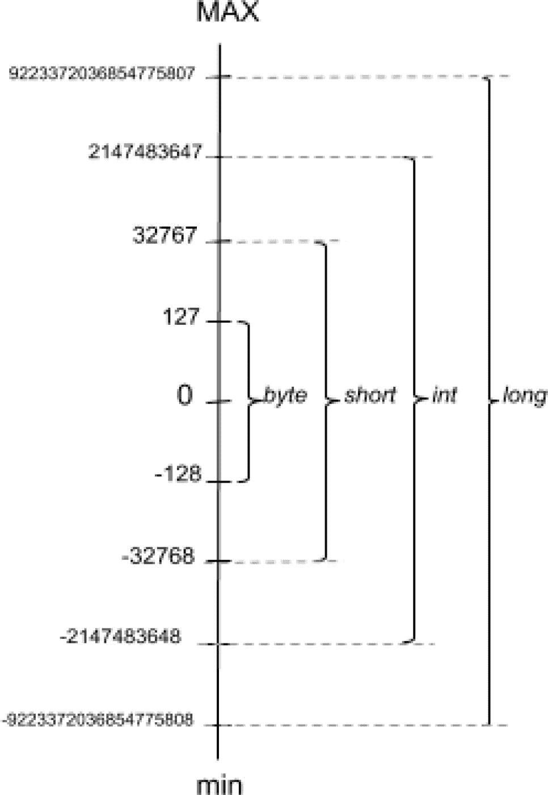

图 5-8

Java 数值类型

计算机处理的一切都使用信息比特来表示；每个比特只能有 1 或 0 的值，这就是为什么它被称为*二进制表示*。二进制表示不是本书的重点，但我将简要解释一下，因为它很重要。为什么我们的计算机选择二进制表示？主要是因为数据（在内存和硬盘中）是使用一系列 1（开）和 0（关）的二进制表示来存储的；此外，二进制运算非常容易执行，这使得计算机速度非常快。

以数学为例。我们广泛使用十进制系统，它由 0 到 9 的十个唯一数字组成。计算机内部使用二进制系统，它只使用两个数字：0 和 1。要表示大于 1 的数字，我们需要更多的比特位。所以在十进制系统中，我们有 0, 1, 2, 3, 4, 5, 6, 7, 8, 9, 10, 11 等等。在二进制系统中表示数字，我们只有两个数字，所以我们有 0, 1, 10, 11, 100, 101, 110, 111, 1000 等等。如果你把一个比特想象成一个只能放 1 和 0 的盒子，那么要像计算机一样表示数字，随着数字的增加，你需要越来越多的 1 和 0。由于一个比特只能有两个值，要表示的值数量由 2 的幂定义。请看图 5-9。

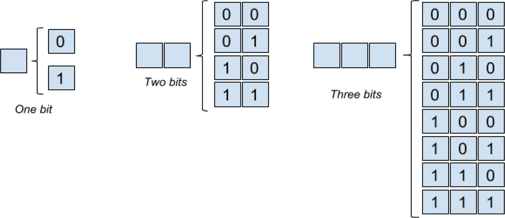

图 5-9

二进制数值表示

所以，在一个比特位上我们可以表示两个值，即 2¹；在两个比特位上我们可以表示四个值，即 2²；以此类推。这就是我们如何引用 Java 原始数值类型表示边界的方式，有时还包括一个用于符号的比特位。


##### Java 整数原始类型

以下列表包含了整数原始类型及其取值范围：

*   `byte` 用于表示 –2⁷ 到 2⁷ – 1（含）之间的整数（[–128, 127]）。`byte` 字段的默认值为 0，占用 8 位。

*   `short` 用于表示 –2¹⁵ 到 2¹⁵ – 1（含）之间的整数（[–32768, 32767]）。该类型的取值范围是 `byte` 取值范围的超集，因此 `byte` 值可以安全地赋值给 `short` 变量，无需显式转换。这一规则适用于所有取值范围是 `byte` 类型超集的类型。在下面的代码片段中，一个 `byte` 值被赋值给一个 `short` 变量，代码编译通过，执行时会打印 23。`short` 字段的默认值为 0，占用 16 位。

    ```
    byte bv = 23;
    short sbv = bv;
    System.out.println("byte to short: " +   sbv);
    ```

*   `int` 用于表示 –2³¹ 到 2³¹ – 1（含）之间的整数（[–2147483648, 2147483647]）。`int` 字段的默认值为 0，占用 32 位。

*   `long` 用于表示 –2⁶³ 到 2⁶³ – 1（含）之间的整数（[–9223372036854775808, 9223372036854775807]）。`long` 字段的默认值为 0，占用 64 位。

重要提示

在实际应用中，有时需要处理超出 `long` 取值范围的整数。针对这种情况，Java 中有一个特殊的类（是的，是类，不是原始类型）叫做 `BigInteger`，它会根据需要存储任意大小的数字来分配内存。使用 `BigInteger` 进行运算可能会比较慢，但这是处理超大数字所必须付出的代价。

##### Java 实数原始类型

在算术运算中，除了整数，我们还有**实数**，它们非常有用，因为大多数价格和程序执行的算术运算结果都不是整数。实数包含小数点及其后面的小数部分。为了在 Java 中表示实数，定义了两种原始类型，称为**浮点类型**：`float` 和 `double`。

*   `float` 用于表示 IEEE 二进制浮点数算术标准中规定的单精度、32 位格式的 IEEE 754 值。默认值为 0.0。与相同位宽的定点变量相比，浮点变量可以表示更广泛的数值范围，但代价是精度损失。`int` 或 `long` 类型的值可以赋值给 `float` 类型的变量。实际发生了什么？为什么会有精度损失？一个数字被表示为浮点数和一个指数（实际上是 10 的幂）。因此，当浮点数乘以 10 的该指数次幂时，应该得到原始数字。让我们取最大的 long 值并将其赋值给一个 float 变量，看看会打印什么：

```
    float maxLongF = Long.MAX_VALUE;
    System.out.println("max long= " + Long.MAX_VALUE);
    System.out.println("float max long= " + maxLongF);
    ```

`Long.MAX_VALUE` 是一个 final 静态变量，其值为最大的 long 值：9223372036854775807。上述代码将打印以下内容：

```
    max long= 9223372036854775807
    float max long= 9.223372E18
    ```

如你所见，`maxLongF` 的值本应等于 9223372036854775807，但由于它被表示为一个较小的数字和 10 的幂，精度丢失了。如果我们尝试通过将 9.223372 乘以 10¹⁸ 来重建这个整数，结果将是 9223372000000000000。虽然接近，但还不够精确。那么 `float` 的取值范围是多少呢？Float 用于表示 1.4E^–45 到 2¹²⁸ × 10³⁸ 之间的实数。

*   `double` 用于表示 IEEE 二进制浮点数算术标准中规定的双精度、64 位格式的 IEEE 754 值，用于表示 4.9E^–324 到 2¹²⁷ × 10³⁰⁸ 之间的数字。默认值为 0.0。

重要提示

在 Java 中，值 `0` 和 `0.0(double)` 是不同的。对普通用户来说，它们都表示零，但在数学上，带小数点的那个更精确。尽管如此，在 Java 中，我们允许比较 `int` 值和 `float` 值，如果比较 `0` 和 `0.0`，结果将是它们相等。此外，正零和负零也被视为相等；因此比较 `0.0==-0.0` 的结果为 true。

开发者不能定义原始类型，无论是从头定义还是通过扩展现有原始类型。类型名称是*保留的 Java 关键字*，开发者不能重新定义。Java 禁止声明与这些类型同名的字段、方法或类名。

正如你到目前为止所注意到的，我们打算使用的变量必须先声明，然后才能使用。声明时，可以同时关联一个值。对于原始值，数字可以用多种方式书写。在清单 5-12 中，你可以看到一些示例，展示在初始化或后续赋值变量时如何书写数值。


```
package com.apress.bgn.five;
public class NumericDemo {
private byte b;
private short s;
private int i;
private long l;
private float f;
private double d;
void main() {
NumericDemo nd = new NumericDemo();
nd.b = 0b1100;
System.out.println("字节二进制值: " + nd.b);
nd.i = 42 ; // 十进制情况
nd.i = 045 ; // 八进制情况 - 基数为 8
System.out.println("整数八进制值: " + nd.i);
nd.i = 0xcafe ; // 十六进制情况 - 基数为 16
System.out.println("整数十六进制值: " + nd.i);
nd.i = 0b10101010101010101010101010101011;
System.out.println("整数二进制值: " + nd.i);
// Java 7 语法
nd.i = 0b1010_1010_1010_1010_1010_1010_1010_1011;
System.out.println("整数二进制值: " + nd.i);
nd.l = 1000_000l; // 等价于 1000_000L
System.out.println("长整型值: " + nd.l);
nd.f = 5;
System.out.println("赋给浮点型变量的整数值: " + nd.f);
nd.f = 2.5f; // 等价于 nd.f = 2.5F;
System.out.println("赋给浮点型变量的小数值: " + nd.f);
nd.d = 2.5d; // 等价于 nd.d = 2.5D;
System.out.println("赋给双精度型变量的小数值: " + nd.f);
}
}
// 输出
/**
字节二进制值: 12
整数八进制值: 37
整数十六进制值: 51966
整数二进制值: -1431655765
整数二进制值: -1431655765
长整型值: 1000000
赋给浮点型变量的整数值: 5.0
赋给浮点型变量的小数值: 2.5
赋给双精度型变量的小数值: 2.5
*/
清单 5-12
用于以多种方式打印基本类型值的代码示例
```

从清单 5-12 可以看出，Java 中的整数可以用四种方式表示：

*   **十进制**：基数为 10，使用数字 0 到 9 书写。

*   **八进制**：基数为 8，使用数字 0 到 7 书写，并以 0（零）作为前缀；这意味着数字 8 在八进制中表示为 010。

*   **十六进制**：基数为 16，使用数字 0 到 9 以及字母 A 到 F（大小写均可）书写，并以 `0x` 或 `0X` 作为前缀；这意味着数字 10 在十六进制中表示为 0x00A，数字 11 表示为 0x00B，依此类推，直到字母集结束，而 16 表示为 0x010。

*   **二进制**：基数为 2，使用数字 0 和 1 书写，并以 `0b` 或 `0B` 作为前缀。这在解释位时已经介绍过。

你可以在计算机编程书籍中阅读更多关于数值表示的内容，但除非你最终参与需要执行数学运算的项目，否则你很少会用到十进制以外的表示形式。

从 Java 7 开始，在声明数值时允许使用 `_`（下划线）来对数字进行分组，以提高清晰度。当然，也有一些限制，例如 `_` 不能用于：

*   数值的开头或结尾

*   字节类型的值

*   表示基数的数字或符号旁边（二进制为 0b/0B，八进制为 0，十六进制为 0x/0X）

*   小数点旁边

执行清单 5-12 中代码的输出如清单 5-13 所示。

```
字节二进制值: 12
整数八进制值: 37
整数十六进制值: 51966
整数二进制值: -1431655765
整数二进制值: -1431655765
长整型值: 1000000
赋给浮点型变量的整数值: 5.0
赋给浮点型变量的小数值: 2.5
赋给双精度型变量的小数值: 2.5
清单 5-13
执行清单 5-12 中代码的输出
```

由于打印变量时没有进行格式化，控制台中显示的值都是十进制系统。

目前，关于基本类型的内容就这些了。每种基本类型在 JDK 中都有一个对应的引用类型，这将在本章后面提到。

### Java 引用类型

本章前面已经对 Java 引用类型进行了简短描述，以便尽早突出基本类型和引用类型之间的区别。现在是时候扩展这个描述，并给出一些编程中最常用的 JDK 引用类型的示例了。

**对象**或**实例**是使用 `new` 关键字后跟构造函数的调用来创建的。构造函数是类的一个特殊成员，用于通过将类的所有字段初始化为其默认值或作为参数接收的值来创建对象。通过调用类的构造函数（其中之一，因为类中可能定义了多个构造函数）来创建类实例。考虑**第** **4** **章**中 `Performer` 类的示例。要声明一个指向 `Performer` 类型对象的引用，使用以下表达式：

```
Performer human = new Performer("John", 40, 1.91f, Gender.MALE);
```

接口引用类型不能被实例化，但实现了该接口的类类型的对象可以赋值给该接口类型的引用。第 4 章中使用的层次结构如图 5-10 所示。

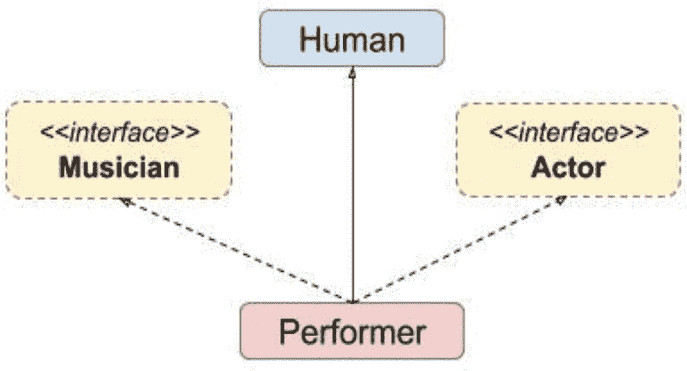

图 5-10

类和接口层次结构

基于这个层次结构，清单 5-14 中的四个语句是有效的；它们可以编译，并且代码可以成功执行。

```
package com.apress.bgn.five;
import com.apress.bgn.four.classes.Gender;
import com.apress.bgn.four.hierarchy.*;
public class ReferencesDemo {
void main() {
Performer performer = new Performer("John", 40, 1.91f, Gender.MALE);
Human human = new Performer("Jack", 40, 1.91f, Gender.MALE);
Actor actor = new Performer("Jean", 40, 1.61f, Gender.UNSPECIFIED);
Musician musician = new Performer("Jodie", 40, 1.81f, Gender.FEMALE);
}
}
清单 5-14
展示不同引用类型的代码示例
```

清单 5-14 创建了四个 `Performer` 类型的对象，并将它们赋值给不同的引用类型，包括两个接口引用类型。如果我们检查前面方法的栈和堆内容，会发现如图 5-11 所示的场景。

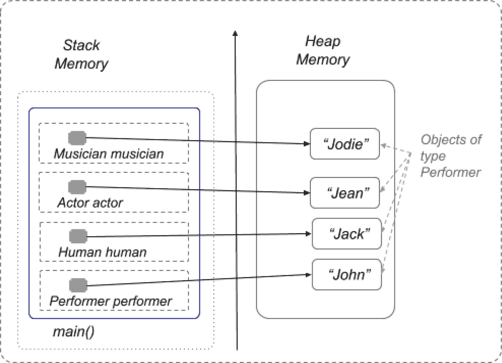

图 5-11

指向堆内存中不同对象的多个引用类型

前面示例中的所有引用都指向堆中的不同对象，但不同类型的引用指向同一个对象也是可能的，如清单 5-15 所示。

```
package com.apress.bgn.five;
import com.apress.bgn.four.classes.Gender;
import com.apress.bgn.four.hierarchy.*;
public class ReferencesDemo {
void main() {
Performer john = new Performer("John", 47, 1.91f, Gender.MALE);
Human human = john;
Actor actor = john;
Musician musician = john;
}
}
清单 5-15
展示不同引用类型指向同一个对象的代码示例
```

在清单 5-15 中，我们只创建了一个对象，但创建了多个指向它的不同类型的引用。如果我们再次检查前面方法的栈和堆内容，会发现如图 5-12 所示的场景。

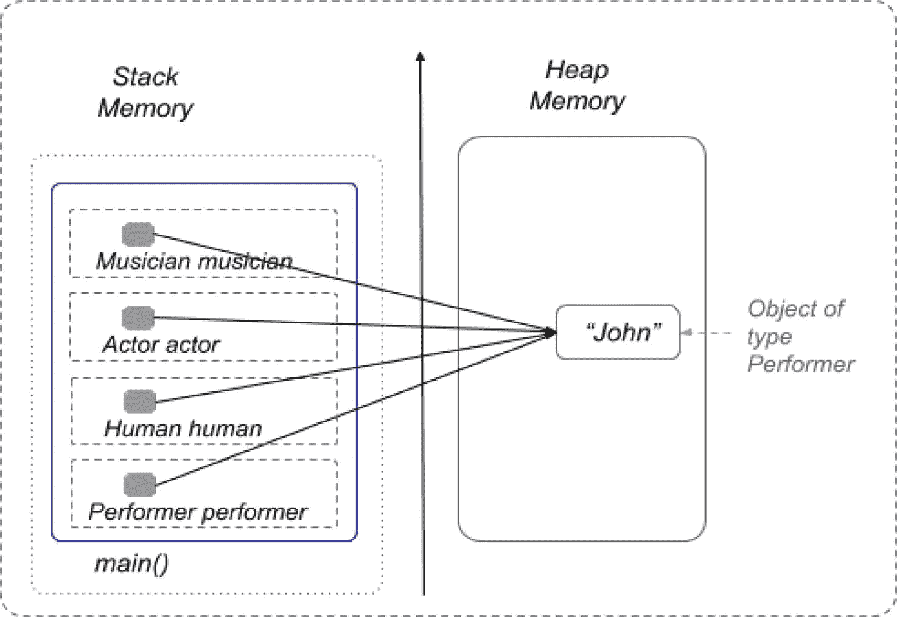

图 5-12

指向堆内存中同一个对象的多个引用类型

引用只能是所赋值对象的类型或其超类型，因此清单 5-16 中的赋值将无法编译。


```
package com.apress.bgn.five;
import com.apress.bgn.four.classes.Gender;
import com.apress.bgn.four.hierarchy.*;
public class BadReferencesDemo {
void main() {
Performer performer = new Performer("John", 47, 1.91f, Gender.MALE);
Human human = performer;
Actor actor = performer;
Musician musician = performer;
//这些代码将无法编译！！！
performer = musician;
//或者
performer = human;
//或者
performer = actor;
}
}
清单 5-16
展示编译时赋值失败的代码示例
```

错误的原因在于方法是在引用类型上调用的，因此引用所指向的对象必须包含这些方法。这就是 Java 编译器报错的原因，也是智能编辑器用红色下划线标记该语句的原因。修复上一个示例中编译错误的最简单方法是进行显式转换（或转换）为 `Performer` 类型。这能让编译器闭嘴，但并不能使代码可运行。

证明这一点的最简单方法是创建一个名为 `Fiddler` 的类，它实现 `Musician` 接口，并将该类的实例赋值给 `Performer` 引用。必须将 `Fiddler` 实例显式转换为 `Performer`，才能欺骗编译器接受这段代码为有效代码，如清单 5-17 中标记的行所示。

```
package com.apress.bgn.five;
import com.apress.bgn.four.classes.Gender;
import com.apress.bgn.four.hierarchy.*;
public class BadReferencesDemo {
void main() {
Musician fiddler = new Fiddler(true);
Performer performer = (Performer) fiddler;
System.out.println("在以下机构学习技能：" + performer.getSchool());
System.out.println("参演电影：" + performer.getFilms());
}
}
class Fiddler implements Musician {
private boolean ownsFiddle = false;
public Fiddler(boolean ownsFiddle) {
this.ownsFiddle = ownsFiddle;
}
@Override
public String getSchool() {
return "爱尔兰音乐学院";
}
// 其他方法已省略
}
清单 5-17
展示运行时赋值失败的代码示例
```

`Fiddler` 实例被显式转换为 `Performer`，编译器接受了这一点，因为它假设我们知道自己在做什么。转换后的实例随后被赋值给一个 `Performer` 类型的引用，然后在其上调用 `getSchool()` 和 `getFilms()` 方法。

运行清单 5-17 中的代码时，你可能会期望 `performer.getSchool()` 方法能正确执行，并在控制台打印出“在以下机构学习技能：爱尔兰音乐学院”，因为毕竟 `Fiddler` 类实现了 `Musician` 接口，并为 `getSchool()` 提供了具体实现。你可能还会期望在执行下一行时抛出异常；调用 `performer.getFilms()` 是不可能的，因为 `Fiddler` 类没有实现 `Actor` 接口，也没有为 `getFilms()` 方法提供具体实现。

但 JVM 并非如此运作。运行这段代码时，异常恰好会在执行转换行时抛出，因为 `Fiddler` 实例无法转换为 `Performer` 实例。清单 5-18 中描述的消息将以红色打印在控制台中。

```
线程 "main" 中出现异常 java.lang.ClassCastException：
类 com.apress.bgn.five.Fiddler 无法转换为类 com.apress.bgn.four.hierarchy.Performer
(com.apress.bgn.five.Fiddler 位于加载器 'app' 的模块 chapter.five.references 中；
com.apress.bgn.four.hierarchy.Performer 位于加载器 'app' 的模块 chapter.four@3.0-SNAPSHOT 中)
at chapter.five.references/com.apress.bgn.five.BadReferencesDemo.main(BadReferencesDemo.java:57)
清单 5-18
转换异常消息
```

#### 数组

`new` 关键字也可以用于创建数组，其方式与创建对象类似。**数组**是一种将一组值保存在一起的数据结构。其大小在创建时定义，且无法更改。每个变量可以通过索引访问，索引从 0 开始，一直到数组长度减 1。数组可以保存基本类型值和引用类型值。清单 5-19 包含一个类，其中声明了一个将 `int` 值组合在一起的数组字段。

```
package com.apress.bgn.five;
import java.util.Arrays;
public class ArrayDemo {
int array[];
void main() {
ArrayDemo ad = new ArrayDemo();
System.out.println("数组已初始化为 " + Arrays.toString(ad.array));
}
}
清单 5-19
包含 int 数组字段的类
```

声明数组有两种方式，取决于方括号的位置——是在数组名称之后，还是在数组元素类型之后：

```
int array[];
int[] array;
```

重要提示

这一点很重要，因为如果你有兴趣获得 Java 知识认证^(⁴⁹)，考试中可能会包含关于声明数组正确方式的问题。

你认为执行清单 5-19 中的代码时，控制台输出会是什么？如果你认为 `ad.array` 字段被初始化为 `null`，并且打印的消息是“数组已初始化为 null”，那么你的猜测完全正确。

数组是引用类型，即使它们包含基本类型的元素也是如此。因此，当让 JVM 用默认值初始化此类型的字段时，将使用 `null`，因为这是引用类型的典型默认值。之前提到过 `null` 关键字，但让我们强调一下它的重要性。`null` 关键字用于表示不存在的值。被赋值为该值的引用没有具体的对象与之关联，这意味着它不指向堆中的任何对象。这就是为什么在编写代码时，如果在对象（通过其引用）被初始化之前使用它，会抛出 `NullPointerException`。这就是开发人员在使用对象（或数组）之前测试其是否等于 `null` 的原因。

清单 5-19 中的代码片段可以写得更好一些，考虑到数组可能为 `null` 的情况，并使用 `return` 关键字优雅地退出 `main(..)` 方法，如清单 5-20 所示。

```
package com.apress.bgn.five;
import java.util.Arrays;
public class ArrayDemo {
int[] array;
void main() {
var ad = new ArrayDemo();
if (ad.array == null) {
System.out.println("数组不可用。无需操作。");
return;
}
System.out.println("数组已初始化为 " + Arrays.toString(ad.array));
}
}
清单 5-20
包含 int 数组字段和空值检查的类
```

信息

当一个方法使用 `void` 关键字声明为不返回任何值时，可以通过不带值的 `return;` 语句强制从该方法正确返回。

为什么我们需要 `null` 关键字来标记尚不存在的东西？因为在编程中，通常的做法是先声明一个引用，然后仅在首次使用时才对其进行初始化。这对于那些占用大量内存的大型对象尤其有用。这种编程技术称为**懒加载**^(⁵⁰)。

清单 5-21 展示了 `ArrayDemo` 类的一个更高级版本，其中数组字段被初始化并设置了大小。


```
01\. package com.apress.bgn.five;
02\. import java.util.Arrays;
03\. public class InitializedArrayDemo {
04.
05\.   int[] array = new int[2];
06.
07\.   void main() {
08\.        var ad = new InitializedArrayDemo();
09\.        if (ad.array == null) {
10\.            System.out.println("Array unusable. Nothing to do.");
11\.            return;
12\.        }
13.
14\.        System.out.println(Arrays.toString(ad.array));
15\.    }
16\. }
代码清单 5-21
包含正确初始化的 int 数组字段的类
```

数组的初始化发生在第 5 行。数组的大小为 2。数组的大小通过调用指定，只是不使用圆括号，而是使用方括号，并在前面加上数组元素类型的声明。通过将数组的维度设置为 2，我们告诉 JVM 需要为该对象预留（分配）两个相邻的内存位置，用于存储两个 `int` 值。由于没有指定数组内容的值，你认为数组创建时这些位置会被填充什么？这个问题很简单：前面的数组被定义为包含两个 `int` 值，因此在数组初始化时，将使用 `int` 类型的默认值。

图 5-13 描述了执行代码清单 5-21 中的代码时，栈内存和堆内存中发生的情况。

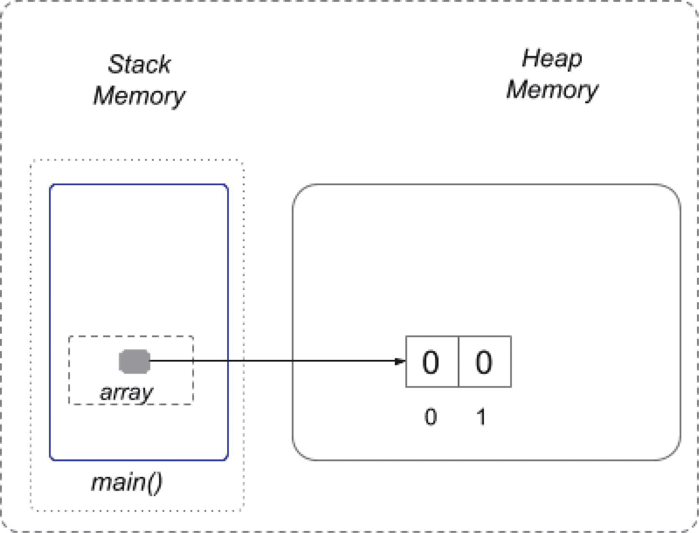

图 5-13

声明一个大小为 2 的 *int* 数组

在代码清单 5-21 的第 14 行，使用了 `Arrays.toString(..)` 工具方法将我们的数组转换为一个 `String` 实例，该实例通过连接所有数组元素的 `String` 表示形式（用逗号分隔）并将结果用方括号括起来计算得出。因此，控制台输出的消息是 `[0,0]`。

要向数组中放入一些值，我们有以下选择：

*   直接访问元素并设置值：

```
    array[0] = 5;
    array[1] = 7;
    // 或者
    for (int i = 0; i < array.length; ++i) {
    array[i] = i;
    }
    ```

*   使用我们打算存储的值显式初始化数组：

```
int[] another = {1,4,3,2};
```

数组也可以分组引用。代码清单 5-22 展示了如何声明和使用一个 `Performer` 数组。

```
package com.apress.bgn.five;
import com.apress.bgn.four.classes.Gender;
import com.apress.bgn.four.hierarchy.Performer;
public class PerformerArrayDemo {
void main() {
Performer[] array = new Performer[2];
for (int i = 0; i < array.length; ++i) {
System.out.println("performer[" + i + "]= " + array[i] );
}
array[0] = new Performer("John", 40, 1.91f, Gender.MALE);
array[1] = new Performer("Julianna", 35, 1.61f, Gender.FEMALE);
for (int i = 0; i < array.length; ++i) {
System.out.println("performer[" + i + "]= " + array[i].getName() );
}
}
}
代码清单 5-22
包含正确初始化的 int 数组字段的类
```

在显式初始化之前，数组的元素会使用 `Performer` 类型的默认值进行初始化。由于 `Performer` 是引用类型，该值为 `null`。

因为描述内存内容能更清楚地展示数组和对象的情况，我为你提供了图 5-14。

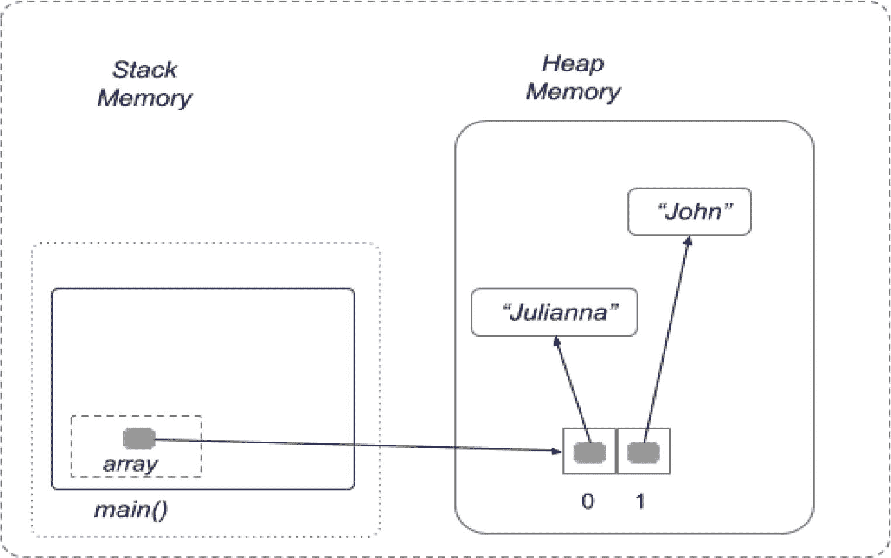

图 5-14

声明一个大小为 2 的 Performer 实例数组

所以，是的，我们实际上拥有一个引用数组，它们指向的对象可以在程序运行过程中更改。

我最后需要介绍的是，数组可以是多维的。如果你学过高等数学，可能还记得*矩阵*的概念，它是一个按行和列排列的矩形数组。在 Java 中，你可以使用数组来模拟*矩阵*。如果你想要一个简单的包含行和列的矩阵，只需定义一个二维数组。一个非常简单的例子如代码清单 5-23 所示。

```
package com.apress.bgn.five;
public class MatrixDemo {
void main() {
// 二维数组：2 行，2 列
int[][] intMatrix2 = new int[2][2];
for (int i = 0; i < intMatrix2.length; ++i) {
for (int j = 0; j < intMatrix2[i].length; ++j) {
intMatrix2[i][j] = i + j;
System.out.print(intMatrix2[i][j] + " ");
}
System.out.println();
}
}
}
//输出
//0 1
//1 2
代码清单 5-23
使用二维数组模拟矩阵的类
```

你甚至可以更进一步，定义多维数组，并指定任意数量的坐标。代码清单 5-24 展示了如何使用三维数组模拟一个立方体。

```
package com.apress.bgn.five;
public class CubeDemo {
void main() {
// 三维数组，包含三个坐标
int[][][] intMatrix3 = new int[2][2][2];
for (int i = 0; i < intMatrix3.length; ++i) {
for (int j = 0; j < intMatrix3[i].length; ++j) {
for (int k = 0; k < intMatrix3[i][j].length; ++k) {
intMatrix3[i][j][k] = i + j + k;
System.out.print("["+i+", "+j+", " + k + "]");
}
System.out.println();
}
System.out.println();
}
}
}
// 输出
/*
[0, 0, 0][0, 0, 1]
[0, 1, 0][0, 1, 1]
[1, 0, 0][1, 0, 1]
[1, 1, 0][1, 1, 1]
*/
代码清单 5-24
使用三维数组模拟立方体的类
```

关于数组，你可以根据需要（以及计算机内存允许）将它们设置得足够大，但请确保对它们进行初始化，并在代码中确保不要尝试访问允许范围之外的索引。如果数组的大小是 N，那么它的最后一个索引是 N – 1，第一个索引是 0。尝试访问该范围之外的任何索引，都会在运行时抛出 `java.lang.ArrayIndexOutOfBoundsException` 类型的异常。因此，以下代码可以编译，但执行时会因抛出异常而失败：

```
int[] array = new int[2];
array[5] =7;
```

异常信息清楚地指出了*编程方式中的错误*：

```
Exception in thread "main" java.lang.ArrayIndexOutOfBoundsException: Index 5 out of bounds for length 2 at chapter.five.arrays/com.apress.bgn.five.ArrayDemo.main(ArrayDemo.java:40)
```

为了更方便地处理 Java 中的数组，有一个专门的类：`java.util.Arrays`。这个类提供了实用方法来对数组进行排序和比较、搜索元素，或者将其内容转换为文本或流（如**第** **8** **章**所述），这样无需编写示例中一直使用的繁琐的 `for` 循环即可打印它们。代码清单 5-25 展示了其中一些实用方法。

```
package com.apress.bgn.five;
import java.util.Arrays;
public class ArrayUtilitiesDemo {
void main() {
int[] array =  {4, 2};
System.out.println(Arrays.toString(array));
// 或者
Arrays.stream(array).forEach(ai -> System.out.println(ai));
// 或者使用方法引用
Arrays.stream(array).forEach(System.out::println);
Arrays.sort(array);
array = new int[]{4, 2, 1, 5, 7};
int foundAt = Arrays.binarySearch(array, 5);
System.out.println("Key found at: " + foundAt);
}
}
// 输出
/*
[4, 2]

Key found at: 3
*/
代码清单 5-25
java.util.Arrays 的有用方法
```

以下列表简要解释了代码清单 5-25 中的每条语句：

*   `int[] array = {4, 2}` 是一个数组声明和初始化。不需要 `new int[]`，因为编译器可以从数组的声明中推断出元素的类型，并根据提供的初始化值集合的大小推断出数组的大小。


*   `Arrays.toString(array)` 返回指定数组内容的 `String` 表示形式。元素的 `String` 表示形式之间用逗号分隔，结果字符串用方括号（`[]`）括起来。

*   `Arrays.stream(array)` 返回一个以指定数组为源的顺序 `IntStream`。流将在**第** **8** **章**中介绍，这些类提供了无需 `for` 循环即可逐个处理元素的方法。在清单 5-25 中，结果流的元素使用 `System.out.println(..)` 方法逐个处理，这意味着它们会在控制台中逐个打印。

*   `Arrays.sort(array)` 将指定数组按数值升序排序。此方法不会返回一个新的已排序数组，因此元素会在原数组中改变位置。执行排序所使用的算法称为**双轴快速排序**，它是最高效的排序算法之一^(⁵¹)。

*   `array = new int[]{4, 2, 1, 5, 7}` 是对数组的重新初始化。这意味着一个新的数组值被赋给了 `array` 引用。因此，声明时必须指定 `new` 关键字以及类型和数组大小，除非使用一组元素进行初始化，而这条语句正是这种情况，所以大小不是必需的。

*   `Arrays.binarySearch(array, 5)` 在数组中搜索作为参数提供的值（本例中为 5），并返回一个表示该元素在数组中位置的值（即其索引）。搜索所使用的算法称为**二分查找**，其工作原理是将数组反复分成两部分，直到找到该元素。这种技术被称为*分而治之*（或**分治法**），它涉及将一个大问题反复（递归地）分解成小问题，直到它们能够被轻松解决。当然，当数组已排序时，对数组进行二分查找效率最高。

提示

请随意在网上搜索本节中提到的算法；当你需要开发自己的解决方案时，它们有助于理解。**第** **7** **章**将向你展示如何遵循一些简单且著名的算法来编写代码。

#### `String` 类型

我们列表中的下一个特殊 Java 数据类型是 `String`。与原始类型 `int` 一起，它是 Java 中最常用的类型之一。`String` 实例用于建模文本并对其执行各种操作。`String` 类型是一种特殊类型，因为 JVM 会对此类型的对象给予特殊处理。如果你还记得第一张包含内存内容的图片（图 5-1），`String` 对象被分配在堆中一个称为**字符串常量池**的特殊位置。在本节中，将详细介绍此类型，并且你迄今为止可能遇到的许多问题有望得到解答。

到目前为止，本书中 `String` 变量的声明方式如清单 5-26 所示。

```
package com.apress.bgn.five;
public class SimpleStringDemo {
public static void main(String... args) {
01\.        String text1 = null;
02.
03\.        String text21 = "two";
04\.        String text22 = "two";
05\.        String text23 = new String ("two");
06.
07\.        String piece1 = "t";
08\.        String piece2 = "wo";
09\.        String text24 = piece1 + piece2;
10.
11\.        char[] twoCh = {'t', 'w', 'o'};
12\.        String text25 = new String(twoCh);
}
}
清单 5-26
本书中使用的一些 String 语句
```

如你所见，第 03、04、05、09 和 12 行中的每一行都定义了一个内容相同的 `String` 对象，即 *two*。我故意这样做，原因很快就会变得显而易见。在现实世界的应用程序中，尤其是在这个大数据热潮时期，应用程序处理大量数据，其中大部分是文本形式。因此，能够压缩数据并重用数据将减少内存消耗。减少内存访问尝试会通过减少处理来提高速度，从而降低成本。

`String` 变量可以直接用文本值初始化（第 03 和 04 行）。在这种情况下，JVM 首先在字符串常量池中查找具有相同值的 `String` 对象。如果找到，新的 `String` 变量将使用对该对象的引用来初始化。如果未找到，则分配内存，将文本值写入其中，然后新的 `String` 变量将使用对该内存的引用来初始化。

在第 05 行中，使用 `String` 类的构造函数来创建一个 `String` 对象。注意这里使用了 `new` 关键字。这意味着显式请求分配内存来存储作为参数提供的文本。

在继续本节之前，我们必须快速绕个弯，提一下 Java 中**对象相等**的含义。在 Java 中，对象通过指向其内存位置的引用来处理。`==`（双等号）运算符比较引用所指向的内存位置，因此两个对象当且仅当存储在同一内存地址时才相等。这就是为什么应该使用 `equals(..)` 方法来比较对象。这是一个从 `Object` 类继承的特殊方法，但每个类必须提供真正与其自身结构相关的实现。不出所料，`Object` 类中的 `equals(..)` 实现默认采用 `==` 的行为。

想象两个具有相同直径、相同颜色、由相同材料制成的红球。它们是相同的，在 Java 中这意味着相等，但它们不是同一个球；它们只是按照相同的规格制造的。如果你拿两个随机的小孩，比如 Jim 和 Jane，每个人都可以玩自己的球。但如果 Jim 和 Jane 玩同一个球，只是把它从一个人扔给另一个人，这非常类似于 Java 中的引用相等。图 5-15 是这种情况的抽象表示。

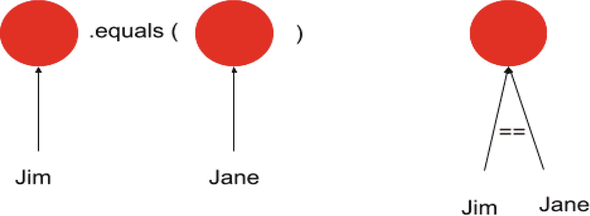

图 5-15

用红球展示 `equals(..)` 和 `==` 之间的区别


清单 5-27 展示了一个简化版的`Ball`类，以及一段可执行代码示例。该示例创建了两个独立的球对象并进行比较，同时还创建了一个单独的球来测试引用相等性。由于 Jim 和 Jane 可以被视为对球的引用，代码便以此方式编写。

```
package com.apress.bgn.five;
import java.util.Objects;
public class EqualsDemo {
void main() {
var jim = new Ball(10, "red", "rubber");
var jane = new Ball(10, "red", "rubber");
System.out.println("-- 使用不同的球 -- ");
System.out.println("Jim 和 Jane 的球相等吗？A:" + jim.equals(jane));
System.out.println("Jim 和 Jane 是同一个球吗？A:" + (jim == jane));
System.out.println("-- 使用同一个球 -- ");
var  extra = new Ball(10, "red", "rubber");
jim= extra;
jane = extra;
System.out.println("Jim 和 Jane 的球相等吗？A:" + jim.equals(jane));
System.out.println("Jim 和 Jane 是同一个球吗？A:" + (jim == jane));
}
}
class Ball {
int diameter;
String color;
String material;
public Ball(int diameter, String color, String material) {
this.diameter = diameter;
this.color = color;
this.material = material;
}
@Override
public boolean equals(Object o) {
if (this == o) return true;
if (o == null || getClass() != o.getClass()) return false;
Ball ball = (Ball) o;
return diameter == ball.diameter && Objects.equals(color, ball.color) && Objects.equals(material, ball.material);
}
// 其他代码已省略
}
// 输出
/*
-- 使用不同的球 --
Jim 和 Jane 的球相等吗？A:true
Jim 和 Jane 是同一个球吗？A:false
-- 使用同一个球 --
Jim 和 Jane 的球相等吗？A:true
Jim 和 Jane 是同一个球吗？A:true
*/
清单 5-27
展示引用上 equals(..) 与 == 区别的代码示例
```

清单 5-27 很好地指出了引用上`==`运算符与`equals(..)`方法的区别：`==`运算符测试引用相等性，而`equals(..)`方法测试这些引用所指向对象的相等性。

注意

当然，这里介绍的`equals(..)`方法实现是朴素的，因为需要考虑空值以及与不同类型对象的比较。此外还有`hashCode()`方法，当实现`equals(..)`时必须同时实现它，否则你的类将无法与本章后面介绍的一些集合类正确配合。目前，我真心希望对象相等性与引用相等性之间的区别已经清晰，这样`String`部分的其余内容才能易于理解。

至此，我们关于对象相等性的讨论就结束了。

在 Java 中，`String`实例是*不可变的*，这意味着它们一旦创建就不能被更改。`String`类也被声明为`final`，因此开发者无法扩展它。Java 中`String`实例不可变的原因有很多，其中一些与应用程序的安全性有关，但这些原因过于深入，本书不予讨论。本节将重点讨论最明显的原因。

由于`String`实例一旦创建就不能更改，JVM 可以重用已分配的现有值来形成新的`String`值，而无需消耗额外内存。这个过程称为*字符串驻留*。每个文本值（字面量）的一个副本会被保存到前面提到的特殊内存区域——字符串常量池中。当创建一个新的`String`变量并为其赋值时，JVM 会首先在池中搜索相等值的`String`。如果找到，将返回该内存地址的引用，而无需分配额外内存。如果未找到，则会将其添加到池中并返回其引用。也就是说，考虑到清单 5-26（在相等性讨论之前的那个）中的示例代码，我们期望`text21`和`text22`变量指向池中同一个`String`对象，这意味着它们的引用也是相等的。

清单 5-28 展示了测试这一假设的代码。

```
package com.apress.bgn.five;
public class SimpleStringDemo {
void main() {
String text21 = "two";
String text22 = "two";
if (text21 == text22) {
System.out.println("引用相等");
} else {
System.out.println("引用不同");
}
if (text21.equals(text22)) {
System.out.println("对象相等");
} else {
System.out.println("对象不同");
}
}
}
清单 5-28
展示 String 引用上 equals(..) 与 == 区别的代码示例（场景 1：引用相等，对象相等）
```

运行清单 5-28 中的代码时，控制台将打印以下内容，证明了之前的论断以及字符串常量池的存在：

```
引用相等
对象相等
```

在图 5-16 中，你可以看到执行上述代码时内存内容的抽象表示。

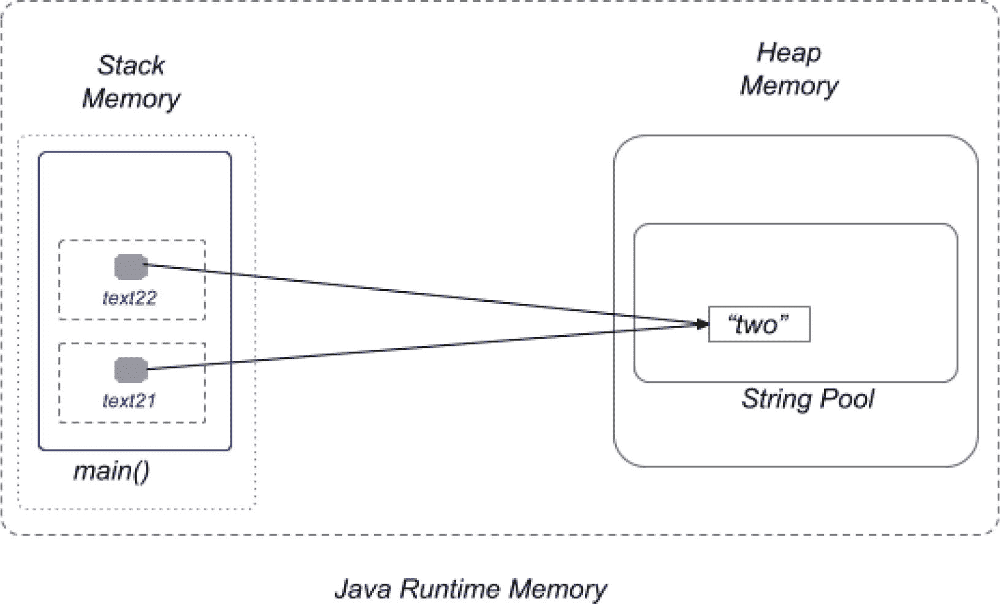

图 5-16

堆内存中创建的字符串常量池区域的抽象表示

当使用`new`运算符创建新的`String`对象时，JVM 会为新对象分配新内存并将其存储在堆中，因此不会使用字符串常量池。这导致每个这样创建的`String`对象都有自己独立的内存区域和地址。

警告

此时应该清楚，使用`String`构造函数（不止一个）来创建`String`对象实际上等同于浪费内存。

由于字符串常量池的存在，如果我们比较初始代码示例（清单 5-26）中的变量`text22`和`text23`，我们会期望它们的引用不同，但对象应该相等。清单 5-29 展示了测试这一假设的代码。

```
package com.apress.bgn.five;
public class SimpleStringDemo {
void main() {
String text22 = "two";
String text23 = new String ("two");
if (text22 == text23) {
System.out.println("引用相等");
} else {
System.out.println("引用不同");
}
if (text22.equals(text23)) {
System.out.println("对象相等");
} else {
System.out.println("对象不同");
}
}
}
清单 5-29
展示 String 引用上 equals(..) 与 == 区别的代码示例（场景 2：引用不同，对象相等）
```

运行清单 5-29 中的代码时，控制台将打印以下内容，证明了假设中的所有内容都是正确的：

```
引用不同
对象相等
```

我将前一个示例的栈和堆内存布局留给你去想象。

提示

如果你想检查自己是否正确理解了内存管理和`String`，欢迎画出你自己的图并发送给我（作者）进行审阅和技术讨论。

重要


*String Pool* 在 Java 6 之前的默认大小为 1009 个条目。从该版本开始，可以使用 `-XX:StringTableSize` 命令行选项修改其大小。由于该大小会因 Java 版本和程序可用内存的不同而变化，我的建议是直接运行 `java -XX:+PrintFlagsFinal -version`，并在返回的输出中查找 `StringTableSize`，以获取你机器上 String Pool 的实际大小。

在清单 5-26 中，第 11 和 12 行展示了如何从 `char[3]` 数组创建一个 `String` 实例。直到 Java 8，`String` 值的内部初始表示形式都是字符数组。一个字符占用 2 个字节，这意味着 `String` 会消耗大量内存。在 Java 9 中，引入了一种名为 Compact `String` 的新表示形式，它会根据内容使用 `byte[]` 或 `char[]`。这意味着，从 Java 9 开始，处理 `String` 的应用程序所消耗的内存显著降低。

`String` 类提供了大量用于操作字符串的方法。多年来，它得到了许多改进，例如更好的优化可能性、多行文本块以及新的实用文本转换方法。长期以来，JDK 中缺少许多 `String` 实用方法，开发者会使用像 Apache Commons Lang^(⁵²) 这样的库来避免自己编写。Java 8 之后，添加了一些修改，使得外部库变得不再必要。以下部分列出并解释了初学者应该了解的最有趣和最有用的方法。

##### Java 8 之后添加的有用 String 方法

Java 8 之后添加的所有有用的 `String` 方法都在 `com.apress.bgn.five.NewAgeStringDemo` 类中进行了演示，为了将本书控制在可接受的篇幅内，不会完整展示该类。以下列表简要描述了 Java 8 之后添加到 `String` 类中的最有用的方法。

**在 Java 11 中：**

*   `strip()`：返回一个字符串，其值为原字符串，并移除所有前导和尾随空白。

*   `stripLeading()`：返回一个字符串，其值为原字符串，并移除所有前导空白。

*   `stripTrailing()`：返回一个字符串，其值为原字符串，并移除所有尾随空白。

*   `isBlank()`：如果字符串为空或仅包含空白代码点，则返回 `true`，否则返回 `false`。

*   `lines()`：返回从该字符串中提取的行流，这些行由行终止符分隔。

*   `repeat(int count)`：返回一个字符串，其值为将该字符串重复 `count` 次后的拼接结果。

**在 Java 12 中：**

*   `indent(int n)`：根据 `n` 的值调整此字符串每行的缩进，并规范化行终止字符。

**在 Java 15 中：**

*   `String formatted(Object templateReference)`：使用此字符串作为格式字符串，并使用提供的参数进行格式化。此方法等同于 Java 1.5 中引入的 `String.format(stringReference, templateReference)`，后者是 `String` 类中的一个静态方法，需要将待处理的字符串作为参数提供。

**在 Java 21 中：**

*   `int indexOf(int ch, int beginIndex, int endIndex)`：返回此字符串中指定字符第一次出现的索引，从 `beginIndex` 开始搜索，在 `endIndex` 之前停止。

*   `int indexOf(String str, int beginIndex, int endIndex)`：返回此字符串指定索引范围内第一次出现指定子字符串的索引（等同于 `s.substring(beginIndex, endIndex).indexOf(str) + beginIndex`）。

*   `String[] splitWithDelimiters(String regex, int limit)`：根据给定正则表达式的匹配项拆分此字符串，并返回字符串和匹配的分隔符（该模式最多应用 `limit-1` 次）。

##### 转义字符

有些特殊字符不能成为 `String` 值的一部分。你可能已经注意到，`String` 值是在双引号（`"sample"`）之间定义的，这使得 `"`（双引号）字符无法作为值使用。为了能够将其用作 `String` 值或其中的一部分，必须对其进行*转义*。另一个不允许成为 `String` 值一部分的特殊字符是 `\`（反斜杠）。图 5-17 展示了 IntelliJ IDEA 如何通过红色波浪线提示你无法在 `String` 值的内容中使用这些字符。它还展示了如何转义这些字符以使其可用。

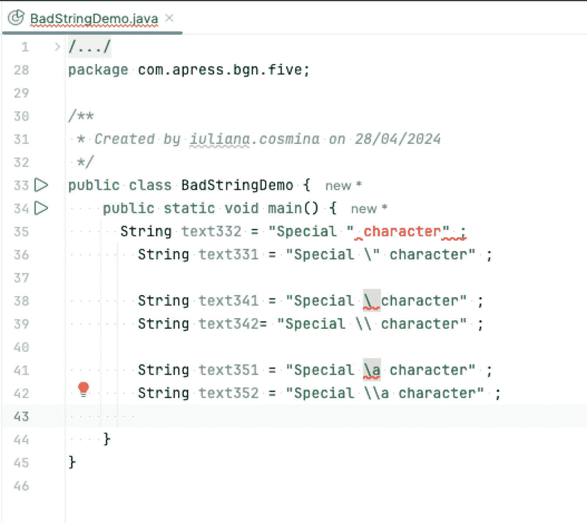

图 5-17

包含特殊字符的代码示例

要转义这些字符，必须在它们前面插入一个反斜杠。因此，单个 `\` 不允许成为 `String` 值的一部分，但两个连续的 `\` 可以，这告诉编译器 `String` 值包含一个 `\` 字符：

```
System.out.println(" Example using \\.")
//打印
Example using \.
```

图 5-17 中的 `\a` 特殊字符不允许出现在 `String` 值中，因为 `\` 用于构造转义序列，但 `\a` 不是一个转义序列。

`'`（单引号）在用作字符值时也必须转义。

```
char quote = '\'';
```

有几种 Java 转义序列可以在 `String` 值中使用以达到特定效果，其中最重要的列于表 5-1 中。

表 5-1

Java 转义序列

| 转义序列 | 效果 |
| --- | --- |
| `\n` | 创建新行（通常称为换行符）。 |
| `\t` | 创建制表符。 |
| `\b` | 创建退格字符（可能会删除前一个字符，具体取决于输出设备）。 |
| `\r` | 返回到行首（但不创建新行，相当于键盘上的 `Home` 键）。 |
| `\f` | 换页（对于打印机，移动到下一页的顶部）。 |
| `\s` | 创建空格字符。 |
| `\` | 行终止符。 |

信息

需要在 `String` 值中转义的完整字符列表可以在 Java 语言规范文档中找到，网址为：`https://`[`docs.oracle.com/javase/specs/jls/se23/html/jls-3.html#jls-3.10.7`](http://docs.oracle.com/javase/specs/jls/se23/html/jls-3.html%2523jls-3.10.7)

重要

根据 JLS，如果转义序列中反斜杠后面的字符不是 `\` 或 ASCII 字符 `b`、`s`、`t`、`n`、`f`、`r`、`"`、`'`、`0`、`1`、`2`、`3`、`4`、`5`、`6` 或 `7`，则会发生编译时错误。

换行符 `\n` 和制表符 `\t` 在编程中经常用于正确格式化控制台输出。如果我们像下面这样声明一个 `String` 实例：

```
String perf = "The singers performing tonight are: \n\t Paolo Nutini \n\t Seth MacFarlane\n\t John Mayer";
```

当在控制台中打印时，文本将被格式化，看起来像这样：

```
The singers performing tonight are:
Paolo Nutini
Seth MacFarlane
John Mayer
```


##### 文本块

在 JDK 15 中，引入了对文本块的支持。这意味着，你不再需要将一个大的 `String` 值拆分成多个写在多行上的小值，再通过拼接来保持代码可读性；现在，你可以直接声明一个文本块并将其赋值给一个 `String` 引用。

在 Java 15 之前，如果你想声明一个多行字符串值，你有几种选择，包括拼接、显式行终止符和分隔符。其中一些选项如清单 5-30 所示。根据你正在构建的解决方案，你可以选择其中任何一种；关于每种方法的效率和缺点的讨论超出了本书的范围。

```
package com.apress.bgn.five;
import java.io.PrintWriter;
import java.io.StringWriter;
public class MultiLineDemo {
void main() {
// 这条语句提取了特定于操作系统的换行符
String newLineCh = System.getProperty("line.separator");
// 方法 1：使用 '+' 运算符进行简单拼接
String multilineStr = "line one of the text block" +
newLineCh +
"line two of the text block" +
newLineCh +
"last line of the text block" ;
// 或者方法 2：使用 `String#concat(..)` 方法
multilineStr = "line one of the text block"
.concat(newLineCh)
.concat("line two of the text block")
.concat(newLineCh)
.concat("last line of the text block") ;
// 或者方法 3：使用 `String.join` 工具方法
multilineStr = String.join("line one of the text block" ,
newLineCh ,
"line two of the text block" ,
newLineCh ,
"last line of the text block");
// 或者方法 4：使用 StringBuffer 实例
multilineStr = new StringBuffer("line one of the text block")
.append(newLineCh)
.append("line two of the text block")
.append(newLineCh)
.append("last line of the text block").toString();
// 或者方法 5：使用 StringBuilder 实例
multilineStr = new StringBuilder("line one of the text block")
.append(newLineCh)
.append("line two of the text block")
.append(newLineCh)
.append("last line of the text block").toString();
// 或者方法 5：使用 StringWriter 实例
StringWriter stringWriter = new StringWriter();
stringWriter.write("line one of the text block");
stringWriter.write(newLineCh);
stringWriter.write("line two of the text block");
stringWriter.write(newLineCh);
stringWriter.write("last line of the text block");
multilineStr = stringWriter.toString();
// 或者方法 6：使用 StringWriter 和 PrintWriter 实例
stringWriter = new StringWriter();
PrintWriter printWriter = new PrintWriter(stringWriter);
printWriter.println("line one of the text block");
printWriter.println("line two of the text block");
printWriter.println("last line of the text block");
multilineStr = stringWriter.toString();
System.out.println(multilineStr);
}
}
清单 5-30
JDK 15 之前的 Java 多行字符串值
```

重要

`StringBuffer` 表示一个线程安全的、可变的字符序列。这意味着对 `StringBuffer` 的任何操作都是在确保单一访问后执行的。这就是为什么使用 `StringBuffer` 拼接字符串比使用其非线程安全的等价物 `StringBuilder` 更慢的原因。因此，在设计代码时，除非你的字符串拼接块存在被多个线程并行执行的风险，否则请使用 `StringBuilder`。

在 JDK 15 中，增加了对声明文本块的支持，这使得程序员能够将多行文本原样嵌入代码中，而无需修改它们来添加行终止符、分隔符或拼接运算符。因此，文本块是 Java `String` 表示的一种替代形式，它以三个双引号字符开头，后跟一个行终止符，并以三个双引号字符结尾。因此，之前的多行文本可以使用新语法编写，如下所示：

```
String multilineStr = """
line one of the text block
line two of the text block
last line of the text block
""";
```

新语法仅设计用于声明多行文本，因此不能用于声明单行文本。这样做会导致编译错误。如果起始的三个双引号字符后面跟的是文本而不是预期的行终止符，也会发生同样的情况。图 5-18 展示了两种声明多行文本块的错误方式，以及 IDE 提供的解释。

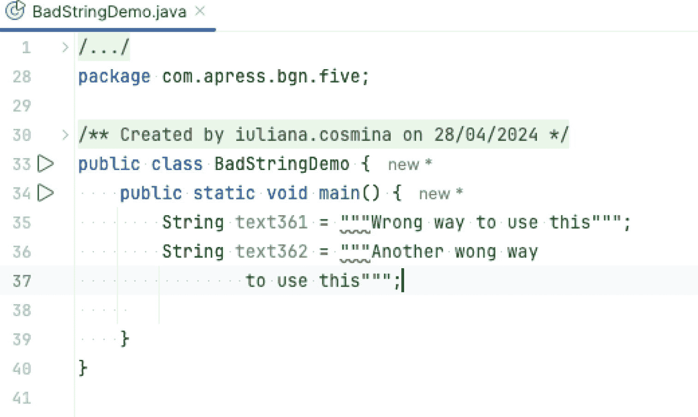

图 5-18

声明多行文本的无效语法

以下是关于该语法需要注意的几点：

*   在多行文本块中，`"`（双引号）不需要转义，除非三个双引号在值内连续出现。在这种情况下，编译器可能会对文本块的结束位置感到困惑，因此至少需要转义其中一个。

*   当组成文本块的行需要缩进时，应使用空格或制表符；同时使用两者可能会导致不可预测的结果（例如，不规则的缩进可能会破坏 YAML 配置）。

*   文本块支持两个额外的转义序列：`\<line-terminator>` 和 `\s`。两者将在下面描述。

第一个转义序列 `\<line-terminator>` 用于抑制隐式换行符的包含。例如，之前声明的文本块等价于以下内容：

```
String multilineStr = "line one of the text block" + “\n” +
"line two of the text block" + “\n” +
"last line of the text block" + “\n” ;
```

如果不需要最后一行，有两种选择。首先，文本块可以将终止符与最后一行文本内联指定：

```
String multilineStr = """
line one of the text block
line two of the text block
last line of the text block""";
```

但这并不推荐，因为它可能会影响缩进。推荐的方法是使用 `\<line-terminator>` 转义字符，因为这能更好地框定文本块，并允许结束分隔符管理缩进。

```
String multilineStr = """
line one of the text block
line two of the text block
last line of the text block\
""";
```

文本块支持的另一个转义序列 `\s` 表示空格。当我们需要在文本块的行尾保留一些空格时，这很有用：

```
String multilineStr = """
line one of the text block\s
line two of the text block\s
last line of the text block\
""";
```

Oracle 官方文档中有一个专门介绍 JDK 15 中新增的多行文本块的章节。如果你需要更多信息，那里是最好的查阅地点^(⁵³)。


##### 字符串拼接

Java 没有提供在字符串中嵌入变量并在运行时解析的方法。大多数开发者可以通过使用各种字符串拼接和格式化方法来绕过这个问题。`com.apress.bgn.five.PseudoTemplatesDemo` 类演示了所有这些方法。你可以在代码清单 5-31 中看到其代码，以及指出每种方法缺点的注释。

```
package com.apress.bgn.five;
import com.apress.bgn.four.classes.Musician;
import java.text.MessageFormat;
public class PseudoTemplatesDemo {
void main() {
var bryce = new Musician("Bryce", 38, 1.72f, "High School Rock", "Metal");
// 难以阅读
// 使用 + 进行拼接
var introduction = "My name is " + bryce.getName() +"  and I am "
+ bryce.getAge() +" years old.";
System.out.println("[using '+'] -> " + introduction);
// 仍然难以阅读
// 使用 String#concat 进行拼接
introduction = "My name is ".concat(bryce.getName()).concat("  and I am ")
.concat(String.valueOf(bryce.getAge())).concat(" years old.");
System.out.println("[using 'concat(..)'] -> " + introduction);
// 冗长，同样难以阅读
// 使用 StringBuilder 进行拼接
// 类似于使用 StringBuffer 的方法
introduction = new StringBuilder("My name is ").append(bryce.getName()).append("  and I am ")
.append(bryce.getAge() ).append(" years old.").toString();
System.out.println("[using 'StringBuilder#append(..)' ] -> " + introduction);
// 参数数量不匹配
// 使用 String.format 进行拼接
introduction = String.format("My name is %s and I am %d years old.", bryce.getName() , bryce.getAge());
System.out.println("[using `String.format(..)`] -> " + introduction);
// 参数数量不匹配
// 使用 MessageFormat.format 进行拼接
introduction = MessageFormat.format("My name is {0} and I am {1} years old.", bryce.getName() , bryce.getAge());
System.out.println("[using 'MessageFormat.format(..)'] -> " + introduction);
// Java 15
// 使用 String#formatted 进行拼接
introduction = introduction.formatted(bryce.getName() , bryce.getAge());
System.out.println("[using 'String#formatted(..)']:  -> " + introduction);
}
}
代码清单 5-31
Java 代码中缺乏嵌入变量的变通方法
```

在运行时解析的嵌入变量，也称为*字符串插值*，是 Java 最终通过 Java 21 中的预览版 JEP 430 实现，并在 Java 22 中通过 JEP 459^(⁵⁴) 继续推进，但最终在 Java 23 中被放弃的概念。大多数语言通过以下方式实现字符串插值：

*   计算表达式/变量
*   如果需要，转换为 `String`
*   将结果 `String` 插入到原始 `String` 字面量中

虽然字符串插值非常有用，但它也有一些缺点：

*   未经验证就替换插值结果可能会创建无效的整体字符串字面量，这为 SQL 注入提供了可能性。
*   如果处理的文本是 JSON 格式，则可能产生无效的 JSON。
*   结果需要经过验证或确保安全，尤其是在与其他系统交互时。

Java 的设计者希望对此进行改进，但他们选择的方式并未让开发者感到欣喜，因此字符串插值并未包含在 Java 23 中。

#### 基本类型的包装类

如本章**基本数据类型**部分所述，每个基本类型都有一个对应的引用类型。在详细介绍每个包装类及其存在原因之前，请先查看表 5-2。

表 5-2

Java 基本类型及其对应的引用类型

| 基本类型 | 引用类型 |
| --- | --- |
| `char` | `java.lang.Character` |
| `boolean` | `java.lang.Boolean` |
| `byte` | `java.lang.Byte` |
| `short` | `java.lang.Short` |
| `int` | `java.lang.Integer` |
| `long` | `java.lang.Long` |
| `float` | `java.lang.Float` |
| `double` | `java.lang.Double` |

Java 包装类包装了同名的基本类型的值。此外，这些类提供了将基本类型值转换为 `String` 以及反向转换的方法，还提供了在处理需要被视为对象的基本类型时非常有用的常量和工具方法。数值包装类之间是相关的，因为它们都扩展了 `Number` 类，如图 5-19 所示。

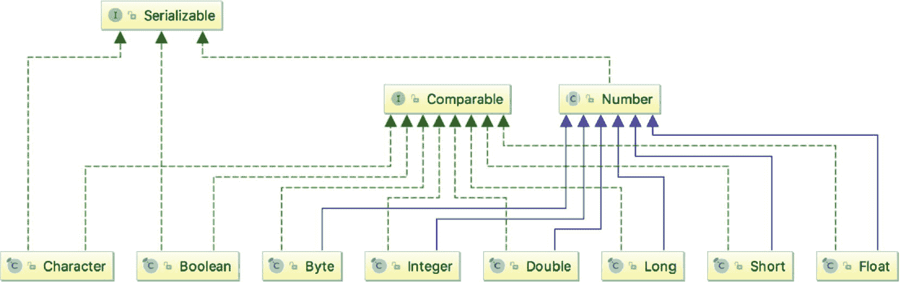

图 5-19

Java 基本类型及其对应的引用类型

本节中的代码示例将主要使用 `Integer` 类，但其他数值包装类可以类似地使用。将基本类型值转换为其对应的引用类型称为**装箱**；反向过程称为**拆箱**。JVM 在大多数情况下会自动执行这些转换；术语**自动装箱**被引入用于指代装箱过程，而由于某些原因，自动拆箱仍然被称为**拆箱**。

代码清单 5-32 中展示的代码示例包含了一些对 `Integer` 和 `int` 值的操作。

```
package com.apress.bgn.five;
public class WrapperDemo {
void main() {
// int 的上限边界
Integer max = Integer.MAX_VALUE;
System.out.println(max);
//自动拆箱 Integer -> int
int pmax = max;
//自动装箱 int -> Integer
Integer io = 10;
//创建基本类型的工具方法
//如果字符串不是数字，则抛出异常
int i1 = Integer.parseInt("11");
//如果字符串不是数字，则抛出异常
Integer i3 = Integer.valueOf("12");
//将 int 转换为 String
String s0 = Integer.toString(13);
//将 int 转换为 float
float f0 = Integer.valueOf(14).floatValue();
//创建数字 9 的二进制表示形式的字符串 (1001)
String s1 = Integer.toBinaryString(9);
//在 Java 1.8 中引入
Integer i4 = Integer.parseUnsignedInt("+15");
//两个整数相加的方法
int sum = Integer.sum(2, 3);
//获取较大值的方法
int maximum = Integer.max(2, 7);
}
}
代码清单 5-32
自动装箱与拆箱的实际应用
```

`Character` 和 `Boolean` 类型略有不同，因为这些类型不是数值类型，因此不能转换为任何数值。它们之间也不能相互转换。Oracle 为其类提供了良好的文档，因此如果你对使用这两种类型感到好奇，请查看官方 JDK API 文档^(⁵⁵)。


### 日期/时间 API

许多应用程序都使用日历日期类型来打印当前日期、截止日期和生日。无论你决定构建什么应用程序，你很可能都需要使用日历日期。在 Java 8 之前，用于建模日历日期的主要类是 `java.util.Date`。这个类以及处理日历日期的其他类存在一些问题。但在我们深入探讨这些问题之前，先看一下清单 5-33，了解如何获取当前日期、创建自定义日期以及打印特定细节。

```
package com.apress.bgn.five;
import java.text.ParseException;
import java.text.SimpleDateFormat;
import java.util.Date;
public class DateDemo {
public static void main() {
SimpleDateFormat sdf = new SimpleDateFormat("dd-MM-yyyy");
Date currentDate = new Date();
System.out.println("Today: " + sdf.format(currentDate));
//deprecated since 1.1
Date johnBirthday = new Date(77, 9, 16);
System.out.println("John’s Birthday: " + sdf.format(johnBirthday));
int day = johnBirthday.getDay();
System.out.println("Day: " + day);
int month = johnBirthday.getMonth() + 1;
System.out.println("Month: " + month);
int year = johnBirthday.getYear();
System.out.println("Year:" + year");
try {
Date johnBirthday2 = sdf.parse("16-10-1977");
} catch (ParseException e) {
e.printStackTrace();
}
}
}
//output
/*
Today: 18-05-2024
John’s Birthday: 16-10-1977
Day: 0
Month: 10
Year: 77
*/
Listing 5-33
java.util.Date Code Sample
```

在你的系统上获取当前日期很简单；只需调用 `Date` 类的默认构造函数即可：

```
Date currentDate = new Date();
```

`currentDate` 的内容可以直接显示，但通常使用 `java.text.SimpleDateFormat` 的实例将日期格式化为特定于国家或更易读的模式。格式化器也可以用于将具有该特定格式的 `String` 转换为 `Date` 实例。当然，如果文本与格式化器的模式不匹配，则会抛出一个特定的异常（类型为 `java.text.ParseException`）：

```
try {
Date johnBirthday = sdf.parse("16-10-1977");
} catch (ParseException e) {
// do something with the exception
}
```

要从表示日期（年、月、日）的数字创建 `Date` 实例，可以使用一个接受这些值作为参数的构造函数。然而，该构造函数自 Java 1.1 起已被弃用，因此一些开发者更倾向于使用 `sdf.parse(..)` 方法。该构造函数在其参数方面有一些特殊性：

*   年份参数必须是年份值 – 1900。

*   月份从 0 开始计数，因此作为参数提供的月份必须是所需月份 – 1。

下面展示了从年、月、日的数值构造 `Date` 实例的代码：

```
//deprecated since 1.1
Date johnBirthday = new Date(77, 9, 16);
System.out.println("John’s Birthday: " + sdf.format(johnBirthday));
//it prints: John’s Birthday: 16-10-1977
```

如果我们想从日期中提取年、月和日，有一些方法可以实现，但同样存在一个特殊性：提取月份中日期的方法名为 `getDate()`。还要记住，由于月份是从 0 到 11 编号的，要获得真实的月份值，必须将 `getMonth()` 返回的结果加 1。清单 5-34 展示了创建 `Date` 实例、提取日、月、年并打印它们的代码。

```
package com.apress.bgn.five;
import java.text.ParseException;
import java.text.SimpleDateFormat;
import java.util.Date;
public class PrintDateDemo {
void main() {
try {
SimpleDateFormat sdf = new SimpleDateFormat("dd-MM-yyyy");
Date johnBirthday = sdf.parse("16-10-1977");
System.out.println("John’s Birthday: " + sdf.format(johnBirthday));
//day of the month
int day = johnBirthday.getDate();
System.out.println("Day: " + day);
int month = johnBirthday.getMonth() + 1;
System.out.println("Month: " +"month);
int year = johnBirthday.getYear();
System.out.println("Year: " +"year);
} catch (ParseException e) {
e.printStackTrace();
}
}
}
//output
/*
John’s Birthday: 16-10-1977
Day: 16
Month: 10
Year: 77
*/
Listing 5-34
Printing Components of a Calendar Date
```

警告

`java.util.Date` 类有两个容易混淆的方法：`getDate()` 方法返回 `Date` 对象中的月份日期，而 `getDay()` 方法返回 `Date` 对象中的星期几。

自 JDK 1.1 版本起，这两个方法都已弃用，并且本节稍后将介绍更好、更不易混淆的方法来提取这些信息。

如果你在 IntelliJ IDEA 编辑器中检查本节的演示类，你会注意到一些构造函数和方法使用了删除线字体。这意味着它们已被弃用，并可能在未来的 Java 版本中被移除，因此不应再使用。这就是为什么还有另一种方法可以实现上述所有结果：使用 `java.util.Calendar class`。使用 `Calendar` 类执行与清单 5-34 相同操作的代码如清单 5-35 所示。

```
package com.apress.bgn.five;
import java.text.SimpleDateFormat;
import java.util.Calendar;
import java.util.Date;
import java.util.GregorianCalendar;
public class CalendarDateDemo {
void main() {
SimpleDateFormat sdf = new SimpleDateFormat("dd-MM-yyyy");
Calendar calendar = new GregorianCalendar();
Date currentDate = calendar.getTime();
System.out.println("Today: "+ sdf.format(currentDate));
calendar.set(1977, 9, 16);
Date johnBirthday = calendar.getTime();
System.out.println("John’s Birthday: "+ sdf.format(johnBirthday));
int day = calendar.get(Calendar.DAY_OF_MONTH);
System.out.println("Day: "+ day);
int month = calendar.get(Calendar.MONTH);
System.out.println("Month: "+ month);
int year = calendar.get(Calendar.YEAR);
System.out.println("Year: "+ year);
}
}
// output
/*
Today: 18-05-2024
John’s Birthday: 16-10-1977
Day: 16
Month: 9
Year: 1977
*/
Listing 5-35
Code Sample for Handling Calendar Dates Using the Calendar Class
```

不幸的是，前面提到的一些特殊性仍然存在，因为表示日期的核心类仍然是 `java.util.Date`，但至少我们不再使用已弃用的方法了。

`java.util.Date` 类和 `java.text.SimpleDateFormat` 类不是线程安全的，因此在具有多个执行线程的复杂应用程序中，开发者必须显式地同步对这些类型对象的访问。这些类型的对象不是不可变的，并且处理时区非常麻烦。这就是 Java 8 引入一个新的 API 来建模日历日期操作的主要原因，该 API 设计得更好，使日期实例具有线程安全性和不可变性。

该 API 的核心类是 `java.time.LocalDate` 和 `java.time.LocalDateTime`，分别用于建模日历日期和带时间的日历日期。清单 5-36 展示了如何使用新 API 获取当前日期以及如何创建自定义日期。


```
package com.apress.bgn.five;
import java.time.LocalDate;
import java.time.LocalDateTime;
import java.time.Month;
public class NewCalendarDateDemo {
void main() {
var currentTime = LocalDateTime.now();
System.out.println("Current DateTime: " + currentTime);
LocalDate today = currentTime.toLocalDate();
System.out.println("Today: " + today);
var johnBd = LocalDate.of(1977, Month.OCTOBER, 16);
System.out.println("John’s Birthday: " + johnBd);
int day = johnBd.getDayOfMonth();
System.out.println("Day: " + johnBd.getDayOfWeek());
int month = johnBd.getMonthValue();
System.out.println("Month: " +  johnBd.getMonth());
int year = johnBd.getYear();
System.out.println("Year: " + year);
}
}
//output
/*
Current DateTime: 2024-05-18T00:28:35.873773
Today: 2024-05-18
John’s Birthday: 1977-10-16
Day: 16, SUNDAY
Month: 10, OCTOBER
Year: 1977
*/
清单 5-36
使用 JDK 8 引入的新日期时间 API 处理日历日期的代码示例
```

要获取当前日期和时间，可以调用名为 `now()` 的静态方法，该方法返回一个 `LocalDateTime` 类型的实例。通过调用 `toLocalDate()` 方法，可以使用该实例获取当前日期，该方法返回一个 `LocalDate` 类型的实例作为当前日期。该类有一个 `toString()` 方法，可根据系统设置的默认区域设置打印格式化后的日期。

要创建自定义日期，可以使用实际的年份和月份中的日期作为参数，并使用 `java.time.Month` 枚举中的某个值来指定月份。

通过调用名称直观的方法，可以轻松提取与日期相关的信息。只需查看清单 5-36 中的 `getDayOfMonth()` 和 `getDayOfWeek()` 方法即可。它们的名称准确地反映了它们返回的数据。

如您所见，`LocalDate` 和 `LocalDateTime` 类简化了不需要时区的开发工作。处理时区是一个相当高级的主题，因此本书不会涉及。

### 集合

JDK 中最重要的类型族之一是集合族，您可能会大量使用它。集合族中的类和接口用于对常见的数据集合（如集合、列表和映射）进行建模。所有类都存储在 `java.util` 包下，可以分为两类：元组和键/值对集合。

元组是一维数据集：如果值是唯一的，则应使用任何实现 `java.util.Set``<E>` 接口的类来建模；如果不是，则应使用任何实现 `java.util.List<E>` 接口的类。对于键/值对集合，应实现 `java.util.Map``<K,V>` 接口。

从 Java 1.5 版本开始，集合变得泛型化，这使得开发人员在使用它们时更加精确和安全。在 Java 1.5 之前，集合可以包含任何类型的对象。开发人员仍然可以编写这样的代码，如清单 5-37 所示。

```
package com.apress.bgn.five;
import com.apress.bgn.four.classes.Gender;
import com.apress.bgn.four.hierarchy.Performer;
import java.util.ArrayList;
import java.util.List;
public class CollectionsBasicDemo {
void main() {
List objList = new ArrayList();
objList.add("temp");
objList.add(Integer.valueOf(5));
objList.add(new Performer("John", 40, 1.91f, Gender.MALE));
}
}
清单 5-37
使用 Java 1.5 之前集合的代码
```

您可能看不出这有什么问题（编译器当然也看不出来），但是当您遍历这个列表时，很难确定您正在处理哪些对象，至少在没有复杂的代码来分析每个对象的类型的情况下是这样。这在**第** **4** 章介绍泛型时已经提到过。遍历列表并根据元素类型进行不同处理的代码如清单 5-38 所示，这只是为了向您展示为什么在当今的 Java 时代这是一个坏主意和不良实践。

```
package com.apress.bgn.five;
import com.apress.bgn.four.classes.Gender;
import com.apress.bgn.four.hierarchy.Performer;
import java.util.ArrayList;
import java.util.List;
public class CollectionsBasicDemo {
void main() {
List objList = new ArrayList();
objList.add("temp");
objList.add(Integer.valueOf(5));
objList.add(new Performer("John", 40, 1.91f, Gender.MALE));
for (Object obj : objList) {
if (obj instanceof String) {
System.out.println("String object = " + obj.toString());
} else if (obj instanceof Integer) {
Integer i = (Integer)obj;
System.out.println("Integer object = " + i.intValue());
} else {
Performer p = (Performer) obj;
System.out.println("Performer object = " + p.getName());
}
}
}
}
清单 5-38
使用 Java 1.5 之前集合的更多代码
```

也许您现在还不清楚这一点，但要能够使用列表的内容，您必须确切知道放入列表中的所有对象的类型。当您独自在一个项目上工作时，这可能可行，但在一个涉及多个开发人员的大型项目中，这很快就会变得混乱不堪。

这就是**泛型**发挥作用的地方。泛型有助于在编译时定义应将哪些类型的对象放入集合中，因此如果将错误的对象类型添加到集合中，代码将无法编译。列表和集合都实现了相同的接口 `java.util.Collection<E``>`，这意味着它们的 API 几乎相同。编程中最常用的集合接口和类的简化层次结构如图 5-20 所示。

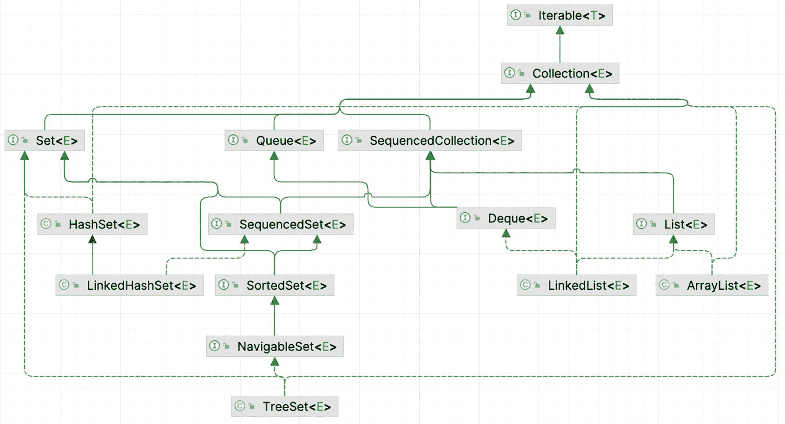

图 5-20

集合层次结构

清单 5-39 展示了创建一个 `String` 值的 `List`，以及遍历它并打印其元素所需的循环语句。


```
package com.apress.bgn.five;
import java.util.ArrayList;
import java.util.List;
public class GenericListDemo {
public static void main() {
List stringList = new ArrayList();
stringList.add("one");
stringList.add("two");
stringList.add("three");
for (String s : stringList) {
System.out.println(s);
}
}
}
代码清单 5-39
使用从 Java 1.5 开始的集合的代码
```

`List<E>` 包含一个未排序的非唯一数据集合，其中也包括 `null` 元素。在代码清单 5-39 中，我们声明了一个 `List<E>` 类型的引用和一个 `ArrayList<E>` 类型的对象。我们这样做是因为所有实现都具有相同的 API，因此我们可以轻松地将 `ArrayList<E>` 切换为 `LinkedList<E>`，并且代码仍然可以工作：

```
List stringList = new ArrayList();
stringList = new LinkedList();
```

重要

声明抽象引用是一种良好的编程实践，因为它能提高代码的灵活性。

前面示例中的语法是 Java 1.7 之前的版本。在 Java 1.7 中引入了 `<>`（菱形运算符）。这进一步简化了集合的初始化，因为它只需要在引用声明中指定列表中元素的类型。因此，前面代码片段中的两行变成了：

```
List stringList = new ArrayList();
stringList = new LinkedList();
```

从 Java 1.5 开始，每个新的 Java 版本都对集合框架进行了更改。Java 1.8 通过在 `java.lang.Iterable<E>` 接口（见图 5-20）中添加一个名为 `forEach` 的默认方法来支持 lambda 表达式，而该接口由 `java.lang.Collection<E>` 接口扩展。因此，像我们之前使用 `for` 循环打印列表中所有值的代码，可以替换为：

```
stringList.forEach(element -> System.out.println(element));
```

在 Java 9 中，引入了另一项改进：集合的工厂方法。我们的集合是通过重复调用 `add(..)` 来填充元素的，这有点冗余，特别是当我们已经拥有要放入列表的完整元素集合时。因此，在 Java 9 中引入了用一行代码创建集合对象的方法，如下例所示：

```
List stringList = List.of("one", "two", "three");
```

生成的 `List<E>` 是一个不可变集合：它不能再被修改，意味着不能向其中添加或移除元素。

Java 10 增加了对局部变量类型推断的支持，这意味着我们不再需要显式指定引用类型，因为它会根据对象类型自动推断。因此，以下声明：

```
List stringList = List.of("one", "two", "three");
```

变成了：

```
var stringList = List.of("one", "two", "three");
```

直到 Java 21，集合框架一直缺少一种表示具有定义相遇顺序的元素序列的集合类型。它也缺少一组统一的、适用于此类集合的操作。例如，`List<E>` 和 `Deque<E>` 都定义了相遇顺序，但它们的公共超类型 `Collection<E>` 却没有。类似地，`Set<E>` 没有定义相遇顺序，其子类型如 `HashSet<E>` 也没有定义，但 `SortedSet<E>` 和 `LinkedHashSet<E>` 等子类型定义了。Java 21 引入了 `SequencedCollection<E>` 接口，该接口定义了一个具有明确相遇顺序的集合，支持两端操作，并且是可逆的。

当然，在 Java 21 之前也可以访问集合的两端，但这需要调用带有特定索引的 `get(..)` 和 `add(..)` 方法。新方法提供了一种使用有序集合编写代码的简单方式，而更简单的代码也更容易阅读。

代码清单 5-40 展示了 `SequencedCollection<E>` 接口声明的方法，这些方法在 `ArrayList<E>` 实例上调用，并且在适用的情况下，注释显示了在 Java 21 之前执行相同操作所调用的方法。

```
package com.apress.bgn.five;
import java.util.ArrayList;
import java.util.List;
import java.util.stream.IntStream;
import static java.lang.System.out;
public class GenericListDemo {
void main() {
List list = new ArrayList();
list.add("one");
list.add("two");
list.add("three");
var reversed = list.reversed();
out.println("[after reversed()]:" +reversed);
out.println("---------------------------------------------------");
out.println("[first element]: " + list.getFirst()); // list.get(0)
out.println("[last element]: " + list.getLast());   // list.get(list.size()-1)
out.println("---------------------------------------------------");
out.println("[original list]: " + list);
list.addFirst("zero");                        // list.add(0, "zero");
out.println("[after addFirst(..)]: " + list);
list.removeFirst();                           // list.remove(0);
out.println("[after removeFirst(..)]: " + list);
out.println("---------------------------------------------------");
list.addLast("four");                       // list.add("four");
out.println("[after addLast(..)]: " + list);
list.removeLast();                          //list.remove(list.size()-1);
out.println("[after removeLast(..)]" +list);
}
}
代码清单 5-40
SequencedCollection 方法示例
```

类似的代码可以用 `Set<E>`、`HashSet<E>` 和 `TreeSet<E>` 编写，并且对于这一系列类也存在类似的方法。

重要

集合是 Java 入门级工作面试中的常见话题，因此如果你申请此类工作，被问到 `List<E>` 和 `Set<E>` 之间的区别时，请不要感到惊讶。

在使用 `Set<E>` 的实现时，你必须确保添加到集合中的对象正确实现了 `equals(..)` 和 `hashCode()` 方法。原因是 `Set<E>` 模拟了数学上的*集合*抽象，它不允许有重复元素。

`equals(..)` 方法指示作为参数传递的对象是否“等于”当前实例。`Object` 类提供的默认实现认为，如果两个对象存储在相同的内存位置，则它们相等。

`hashCode(..)` 方法返回对象内存地址的整数表示，该表示通过*哈希*^(⁵⁶) 获得。`Object` 类提供的默认实现返回一个每个实例唯一的随机整数。该值可能在应用程序的多次执行之间发生变化。当对象用作哈希表中的键时，此方法非常有用，因为它优化了从哈希表中检索元素的过程。如果你想了解更多关于哈希表的信息，互联网上应有尽有；至于 Java，哈希表可以通过 `java.util.HashMap<K,V>` 的实例来建模。

根据官方文档，如果两个对象相等，那么对它们分别调用 `hashCode()` 必须产生相同的结果。但两个不相等的对象不一定具有不同的 `hashCode` 值。

考虑到上述细节，之前引入的 `Ball` 类（代码清单 5-27）将用于创建一些球实例并将它们添加到 `Set<E>` 中。代码清单 5-41 中的代码示例展示了一个包含 `equals(..)` 和 `hashCode()` 方法正确实现的 `Ball` 类版本。


```
```
package com.apress.bgn.five;
import java.util.HashSet;
import java.util.Set;
import static java.lang.System.out;
public class SetDemo {
void main() {
Set ballSet = new HashSet();
ballSet.add(new Ball(2, "RED", "rubber"));
ballSet.add(new Ball(4, "BLUE", "cotton"));
out.println("Set size: " +  ballSet.size());
Ball duplicate = new Ball(2, "RED", "rubber");
boolean wasAdded = ballSet.add(duplicate);
if(!wasAdded) {
out.println("Duplicate ball not added to the set. ");
out.println("Set size: " +  ballSet.size());
}
}
}
class Ball {
private int diameter;
private String color;
private String material;
@Override
public boolean equals(Object o) {
if (this == o) return true;
if (o == null || getClass() != o.getClass()) return false;
Ball ball = (Ball) o;
return diameter == ball.diameter &&
color.equals(ball.color) &&
material.equals(ball.material);
}
@Override
public int hashCode() {
int result = 17 * diameter;
result = 31 * result + (color == null ? 0 : color.hashCode());
result = 31 * result + (material == null ? 0 : material.hashCode());
return result;
}
// 其他代码已省略
}
// 输出
//Set size: 2
//Duplicate ball not added to the set.
//Set size: 2
代码清单 5-41
基本的 equals(..) 和 hashCode() 实现
```

在 Java 1.7 之前，开发人员必须为所有可能用于 `Set<E>` 或作为 `Map<K,V>` 键的类编写类似于代码清单 5-41 中的 `equals(..)` 和 `hashCode()` 实现。这些实现必须基于类中最重要的字段的值；17 和 31 只是用于计算 `hashCode()` 返回值的两个随机整数。

Java 1.7 引入了 `java.util.Objects` 类，提供了实用方法来简化 `equals(..)` 和 `hashCode()` 的实现。代码清单 5-42 展示了 Java 1.7 之后的 `equals(..)` 和 `hashCode()` 实现。

```
package com.apress.bgn.five;
import java.util.HashSet;
import java.util.Objects;
import java.util.Set;
import static java.lang.System.out;
public class SetDemo {
void main() {
Set ballSet = new HashSet();
ballSet.add(new Ball(2, "RED", "rubber"));
ballSet.add(new Ball(4, "BLUE", "cotton"));
out.println("Set size: " +  ballSet.size());
Ball duplicate = new Ball(2, "RED", "rubber");
boolean wasAdded = ballSet.add(duplicate);
if(!wasAdded) {
out.println("Duplicate ball not added to the set. ");
out.println("Set size: " +  ballSet.size());
}
}
}
class Ball {
private int diameter;
private String color;
private String material;
@Override
public boolean equals(Object o) {
if (this == o) return true;
if (o == null || getClass() != o.getClass()) return false;
Ball ball = (Ball) o;
return diameter == ball.diameter &&
Objects.equals(color, ball.color) &&
Objects.equals(material, ball.material);
}
@Override
public int hashCode() {
return Objects.hash(diameter, color, material);
}
// 其他代码已省略
}
// 输出
//Set size: 2
//Duplicate ball not added to the set.
//Set size: 2
代码清单 5-42
Java 1.7 之后的 equals(..) 和 hashCode() 基本实现
```

从 Java 14 开始，事情变得更加简单，因为像 `Ball` 这样的类可以写成记录（record），如代码清单 5-43 所示。

```
package com.apress.bgn.five;
import java.util.HashSet;
import java.util.Objects;
import java.util.Set;
import static java.lang.System.out;
public class SetDemo {
void main() {
// 与代码清单 5-42 相同
}
}
record Ball(int diameter, String colour, String material) {}
// 输出
//Set size: 2
//Duplicate ball not added to the set.
//Set size: 2
代码清单 5-43
将 Ball 类写为记录以避免实现 equals(..) 和 hashCode()
```

执行代码清单 5-43 中的代码会产生与代码清单 5-42 中代码相同的结果，从而证明 Java 编译器生成的 `equals(..)` 方法是有效的。

`Map<K,V>` 的实现有一些不同之处，因为它们模拟的是键/值对的集合。编程中最常用的映射接口和类的简化层次结构如图 5-21 所示。

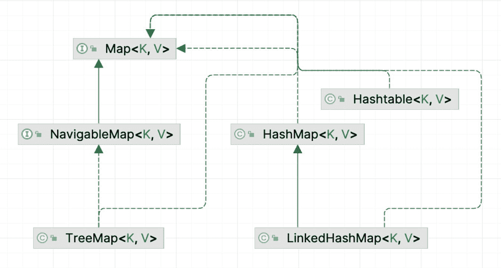

图 5-21

映射层次结构

代码清单 5-44 中的代码展示了创建和初始化一个映射的过程，该映射使用 `Ball` 类型的键和 `Integer` 类型的值。你可以将这个映射实例想象成表示一个桶中相同球的数量。

```
package com.apress.bgn.five;
import java.util.HashMap;
import java.util.Map;
public class MapDemo {
void main(String... args) {
Map ballMap = new HashMap();
ballMap.put(new Ball(2, "RED", "rubber"), 5);
ballMap.put(new Ball(4, "BLUE", "cotton"), 7);
for (Map.Entry entry : ballMap.entrySet()) {
System.out.println(entry.getKey() + ": " + entry.getValue());
}
}
}
//输出
/*
Ball[diameter=2, colour=RED, material=rubber]: 5
Ball[diameter=4, colour=BLUE, material=cotton]: 7
*/
代码清单 5-44
映射代码示例
```

从 `for` 循环中你可以推断出，映射实际上是 `Map.Entry<K, V>` 元素的集合。继续看 Java 1.7 的语法，通过应用 `<>`（菱形）运算符，映射的声明变得更简单：

```
Map ballMap = new HashMap();
```

进一步到 Java 1.8，由于引入了 `forEach(..)` 方法和 lambda 表达式，映射的遍历和打印值也变得更加实用：

```
ballMap.forEach((k,v) -> System.out.println(k + ": " + v));
```

而在 Java 9 中，声明和填充映射也变得更加容易：

```
Map ballMap = Map.of(new Ball(2, "RED", "rubber"), 5, new Ball(4, "BLUE", "cotton"), 7);
```

Java 10 增加了 `var` 来进一步简化声明：

```
var ballMap = Map.of(new Ball(2, "RED", "rubber"), 5, new Ball(4, "BLUE", "cotton"), 7);
```

在结束本节之前，还需要提及另一件事：当向映射中添加键/值对且该键已存在时会发生什么。正如你可能预料的那样，映射中现有的键/值对会被覆盖。在 Java 8 之前，要编写代码防止这种情况导致一组值丢失，需要检查键是否存在，如果不存在才添加新的键值对，如代码清单 5-45 所示。

```
package com.apress.bgn.five;
import java.util.HashMap;
import java.util.Map;
public class MapDemo {
void main(String... args) {
Map ballMap = new HashMap();
Ball redBall = new Ball(2, "RED", "rubber");
ballMap.put( redBall, 5);
ballMap.put(new Ball(4, "BLUE", "cotton"), 7);
//ballMap.put( redBall, 3); // 这会覆盖条目 
if(!ballMap.containsKey(redBall)) {
ballMap.put(redBall, 3);
}
for (Map.Entry entry : ballMap.entrySet()) {
System.out.println(entry.getKey() + ": " + entry.getValue());
}
}
}
代码清单 5-45
Java 8 之前防止键/值对覆盖
```

在 Java 8 中，`Map<K,V>` 接口添加了一组实用的方法，以简化使用映射编写的代码，包括代码清单 5-46 中描述的 `putIfAbsent(..)` 方法，它替换了代码清单 5-45 中标记的语句。

```
package com.apress.bgn.five;
import java.util.HashMap;
import java.util.Map;
public class MapDemo {
void main(String... args) {
Map ballMap = new HashMap();
Ball redBall = new Ball(2, "RED", "rubber");
ballMap.put( redBall, 5);
ballMap.put(new Ball(4, "BLUE", "cotton"), 7);
ballMap.putIfAbsent(redBall, 3);
for (Map.Entry entry : ballMap.entrySet()) {
System.out.println(entry.getKey() + ": " + entry.getValue());
}
}
}
代码清单 5-46
Java 8 之后防止键值对覆盖
```


JDK 中用于处理集合的类涵盖了广泛的功能，例如排序、搜索、合并集合、交集、与数组之间的相互转换等。随着本书内容的深入，代码示例的背景将更加丰富，我们将能够使用集合来解决实际问题。

### 并发特定类型

本书前面曾多次提到，Java 程序可以并行运行多个线程。支持这一点的抽象概念被称为**执行多个线程**。有一些 Java 特定的类型用于实现并行处理，本节将向您介绍它们。

#### 经典线程创建（Java 21 之前）

默认情况下，当执行 Java 程序时，会为从 `main(..)` 方法调用的代码创建一个线程。此外，还会创建并并行执行一些其他工具线程，用于处理 JVM 相关的事务。通过使用 `java.lang.Thread` 类中定义的静态工具方法，可以轻松访问这些线程。清单 5-47 中的代码正是这样做的：提取对 `Thread` 实例的引用，并将其名称打印到控制台。

```
package com.apress.bgn.five;
public class ListJvmThreads {
void main() {
var threadSet = Thread.getAllStackTraces().keySet();
var threadArray = threadSet.toArray(new Thread[threadSet.size()]);
for (int i = 0; i < threadArray.length; ++i) {
System.out.println("thread name: " + threadArray[i].getName());
}
}
}
// 输出
/*
thread name: main
thread name: Signal Dispatcher
thread name: Common-Cleaner
thread name: Monitor Ctrl-Break
thread name: Reference Handler
thread name: Notification Thread
thread name: Finalizer
*/
清单 5-47
Java 8 之后防止键/值对覆盖
```

清单 5-47 中显示的输出是在 macOS 计算机上使用 IntelliJ IDEA 运行 JDK 23.ea 时产生的。列出的线程具有以下职责：

*   `main` 执行开发者编写的代码。开发者可以编写代码，从主线程启动自己的线程。

*   `Reference Handler` 获取未使用的对象，并将其添加到待回收队列中。

*   `Finalizer` 是一个低优先级的 JVM 线程，它执行队列中每个对象的 `finalize()` 方法，这些对象等待从内存中回收。开发者可以显式重写此方法，以释放与即将回收对象相关的资源。

*   `Common-Cleaner` 是一个低优先级的 JVM 线程，负责在不使用终结机制的情况下，对对象进行轻量级清理。

*   `Monitor Ctrl-Break` 是由 IntelliJ IDEA 创建的线程，因为代码是使用此编辑器执行的，该线程可能监视执行过程并捕获输出以便显示。

*   `Signal Dispatcher` 处理操作系统发送给 JVM 的原生信号。

*   `Notification Thread` 处理操作系统发送给 JVM 的通知。

除了 `main`、`Monitor Ctrl-Break`（它不是 JVM 应用程序线程）和 `Common-Cleaner` 之外，其他三个都是确保 JVM 与操作系统协作的系统线程。除了 `main` 之外，所有其他线程都称为**守护线程**。它们优先级较低，并为**用户线程**（即 `main` 线程）提供服务。这是 Java 中仅有的两种线程类型。

开发者可以编写代码，从主线程启动自己的线程。线程是可调度的最小处理单元。创建自定义线程最简单的方法是创建一个继承 `Thread` 类的类。`Thread` 类实现了一个名为 `Runnable` 的接口，该接口声明了一个名为 `run()` 的单一方法。`Thread` 类声明了一个名为 `start()` 的方法。当调用此方法时，`run()` 方法的主体将在与调用 `start()` 的线程不同的执行线程中运行。

注意

线程管理的内部机制要复杂得多，因此本节仅作浅层介绍。

因此，当直接继承 `Thread` 类或实现 `Runnable` 接口时，必须重写 `run()` 方法。


清单 5-48 中的示例展示了一个名为`RandomDurationThread`的类，以及用于运行其多个实例的`main()`方法。`run()`方法的内容通过调用`Thread.sleep(..)`工具方法，使执行在随机时间暂停。方法体被包裹在两行代码中，这两行代码分别打印线程名称、启动消息和结束消息。`Thread.sleep(..)`确保每个线程的执行时长不同，这样我们就能清楚地看到它们是并行执行的。

```
package com.apress.bgn.five;
class RandomDurationThread extends Thread {
@Override
public void run() {
System.out.println(this.getName()+ " started...");
for (int i = 0; i < 10; ++i) {
try {
Thread.sleep(i * 10);
} catch (InterruptedException _) {}
}
System.out.println(this.getName() +" ended.");
}
}
public class MultipleUserThreadsDemo {
void main() {
for (int i = 0; i < 10; ++i) {
new RandomDurationThread().start();
}
}
}
清单 5-48
通过扩展 Thread 类声明具有随机执行时长的线程的代码示例
```

`MultipleUserThreadsDemo`类中的`main`方法创建了多个线程，这些线程是`RandomDurationThread`的实例，并启动它们。创建了十个`RandomDurationThread`类的实例，并对每个实例调用了`start()`方法。执行上述代码时，控制台中应会看到类似于清单 5-49 所示的日志。

```
Thread-5 started...
Thread-0 started...
Thread-3 started...
Thread-6 started...
Thread-8 started...
Thread-4 started...
Thread-2 started...
Thread-7 started...
Thread-9 started...
Thread-1 started...
Thread-3 ended.
Thread-6 ended.
Thread-0 ended.
Thread-4 ended.
Thread-8 ended.
Thread-5 ended.
Thread-1 ended.
Thread-7 ended.
Thread-2 ended.
Thread-9 ended.
清单 5-49
运行清单 5-48 中代码的输出
```

从这个输出可以明显看出，线程的启动和结束顺序是随机的。

另一种创建线程的方式是创建一个实现`Runnable`接口的类。当我们想要扩展另一个类时，这很有用。或者，考虑到`Runnable`只声明了一个方法，也可以使用 lambda 表达式。清单 5-50 展示了`RandomDurationThread`类的等效`Runnable`实现，以及使用`RandomDurationRunnable`类创建线程的类。

```
package com.apress.bgn.five;
class RandomDurationRunnable  implements  Runnable{
@Override
public void run() {
System.out.println(Thread.currentThread().getName() +" started...");
for (int i = 0; i < 10; ++i) {
try {
Thread.sleep(i * 10);
} catch (InterruptedException _) {}
}
System.out.println(Thread.currentThread().getName() +" ended.");
}
}
public class RunnableDemo {
void main() {
for (int i = 0; i < 10; ++i) {
new Thread(new RandomDurationRunnable()).start();
}
}
}
清单 5-50
通过实现 Runnable 接口声明具有随机执行时长的线程的代码示例
```

由于我们不再能直接访问线程的名称，为了打印它，我们必须使用另一个工具方法`Thread.currentThread()`来获取当前正在执行的线程的引用，从而得到它的名称。

`Thread`类提供了一个参数类型为`Runnable`的构造方法，这意味着它可以接受任何实现了`Runnable`接口的类型的参数。

运行清单 5-50 中的代码会产生与清单 5-49 中输出一样随机的输出。

之前提到过，这种情况非常适合使用 lambda 表达式，因为`Runnable`可以就地实现。这意味着清单 5-50 中的`RandomDurationRunnable`类并非必需，如清单 5-51 所示。

```
package com.apress.bgn.five;
import static java.lang.Thread.currentThread;
import static java.lang.Thread.sleep;
public class LambdaThreadsDemo {
void main() {
for (int i = 0; i  {
System.out.println(Thread.currentThread().getName() +" started...");
for (int j = 0; j < 10; ++j) {
try {
sleep(j * 10);
} catch (InterruptedException _) { }
}
System.out.println(Thread.currentThread().getName() +" ended.");
}).start();
}
}
}
清单 5-51
使用 Lambda 表达式并行运行多个线程的代码示例
```

Java 提供了可以创建和管理线程的线程管理类，因此开发者不必显式声明线程。其中一个接口是`java.util.concurrent.ExecutorService`。Java 提供了可实例化的实现类，这些实例可以配置为在**线程池**中并行运行大量线程。线程池是一组预先构建的平台线程，当它们可用时会被重用。有些线程池有固定数量的线程，而另一些则根据需要创建新线程。不过，大多数情况下，你不需要深入了解太多细节，只需依赖`java.util.concurrent.Executors`工具类提供的工厂方法即可。

清单 5-52 展示了一个使用`Executors.newFixedThreadPool(..)`方法创建线程池实例的示例，该实例用于管理 100 个`java.util.concurrent.Callable<V>`实例。`Callable<V>`接口是一种 Java 并发类型，用于建模一个返回结果并可能抛出异常的任务。`Callable<V>`与`java.lang.Runnable`类似，它们都应由那些其实例在线程上执行的类来实现。

```
package com.apress.bgn.five;
import java.util.ArrayList;
import java.util.concurrent.Callable;
import java.util.concurrent.Executors;
public class FixedThreadPoolDemo {
void main() {
var rdc = new RandomDurationCallable();
try (var executor = Executors.newFixedThreadPool(10)) {
var assignments = new ArrayList();
for (int i = 0; i   {
@Override
public Boolean call() {
System.out.println(Thread.currentThread().getName() +" started...");
for (int i = 0; i < 10; ++i) {
try {
Thread.sleep(i * 10);
} catch (InterruptedException _) {}
}
System.out.println(Thread.currentThread().getName() +" ended.");
return true; // 假设任务完成
}
}
// 输出
/*
pool-1-thread-4 started...
pool-1-thread-7 started...
pool-1-thread-10 started...
pool-1-thread-1 started...
...
pool-1-thread-1 ended.
pool-1-thread-9 ended.
pool-1-thread-9 started...
pool-1-thread-1 started...
pool-1-thread-7 ended.
...
*/
清单 5-52
使用 `Executor` 并行运行多个线程的代码示例
```

运行这个类时，控制台会打印出线程名称，这些名称特定于执行机制，每个线程名称都遵循以下模板：`pool-1-thread-{thread_index}`。这清楚地表明线程被重用以执行`RandomDurationCallable`类声明的代码，因为`{thread_index}`在启动和结束的线程中出现了不止一次。

并发框架对于本书来说是一个过于高级的主题，但如果这一节让你产生了好奇心，想要了解更多，你可以查阅 Oracle 的并发教程。^(⁵⁷)


#### Java 21 线程新语法与虚拟线程

在 Java 领域，常有人说 JVM 线程映射到操作系统线程。在代码中，当调用 `Thread` 对象的 `start()` 方法时，会创建一个**平台线程**并将其链接到操作系统线程。平台线程在其整个生命周期内始终与操作系统线程保持链接，这意味着 Java 应用程序可用的线程数取决于可用的操作系统线程数，而操作系统线程数又取决于 CPU 架构。这意味着，创建多个执行大量工作的 Java 线程实际上可能会使 CPU 过载并导致计算机死机，除非这些线程由线程池机制管理，如上一节**经典线程创建（Java 21 之前）**末尾所述。

Java 21 不仅通过改进现有的线程创建代码，还通过引入**虚拟线程**来改进 Java 并发模型。虚拟线程不与操作系统线程链接。它们的代码在操作系统线程中执行，但通过一个管理**载体线程**的引擎来实现，该引擎确保当虚拟线程被阻塞时，操作系统线程可以被释放，直到虚拟线程可以恢复执行。因此，虚拟线程是轻量级线程，可显著减少编写、维护和观察高吞吐量并发应用程序的工作量。显然，它们旨在用于大多数时间处于阻塞状态（通常等待 I/O 操作完成）的紧凑简单操作。因此，虚拟线程适用于需要大量并发任务的应用程序。

在深入探讨虚拟线程的更多细节之前，我们先来看看创建平台线程的语法变化。上一节中的列表展示了如何扩展 `Thread` 类并实现 `Runnable` 接口来创建线程。清单 5-53 展示了 Java 21 中引入的创建线程的新方法，即通过调用 `Thread.ofPlatform()` 来创建平台线程。

```
package com.apress.bgn.five;
public class MultipleUserThreadsJava21Demo {
void main() {
for (int i = 0; i < 10; ++i) {
var rdt = new RandomDurationRunnable();
Thread.ofPlatform().name("rdt " + i).start(rdt);
}
}
}
// 输出
/*
rdt 4 started...
rdt 6 started...
...
rdt 1 ended.
redt 0 ended.
...
*/
清单 5-53
使用 Thread.ofPlatform() 创建并运行多个线程的代码示例
```

由于 `RandomDurationRunnable` 实现包含非常简单的处理逻辑，因此它适合在虚拟线程中运行。将清单 5-53 中的代码改为创建虚拟线程，只需将 `Thread.ofPlatform()` 替换为 `Thread.ofVirtual()`，如清单 5-54 所示。`java.lang.VirtualThread` 类扩展了 `java.lang.Thread`，因此是用于编写旨在并行执行的 Java 代码的组件层次结构（见图 5-22）中的最新成员。

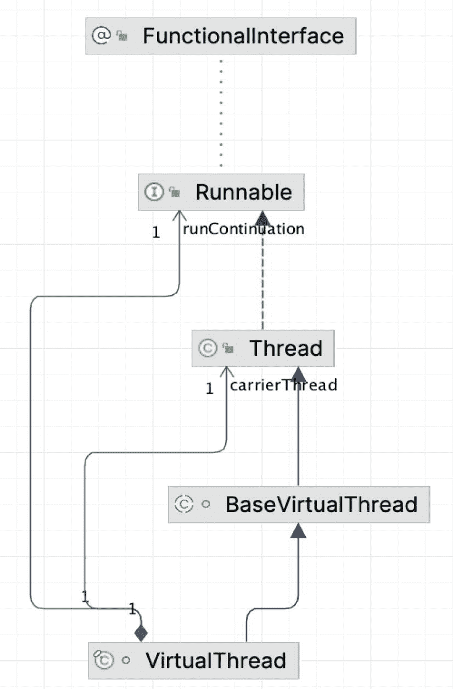

图 5-22
线程类层次结构

```
package com.apress.bgn.five;
public class VirtualThreadsDemo {
void main() {
for (int i = 0; i < 1000; ++i) {
var rdt = new RandomDurationRunnable();
Thread.ofVirtual().name("rdt " + i).start(rdt);
}
}
}
清单 5-54
使用 Thread.ofVirtual() 创建并运行多个线程的代码示例
```

由于虚拟线程非常轻量级，因此可以创建并运行大量虚拟线程。请注意，`VirtualThreadsDemo` 创建并运行了 1000 个线程，并且以创纪录的速度完成。此外，虚拟线程允许以熟悉的、顺序的、每个请求一个线程的风格进行编程。顺序代码不仅更易于编写和阅读，而且更易于调试，因为我们可以使用调试器逐步跟踪程序流程，并且堆栈跟踪反映了预期的调用堆栈。由于这种编码风格，它们也更易于调试。

重要提示

虚拟线程是轻量级、短生命周期的，并且具有较浅的调用堆栈，因此无需对其进行池化。如果需要线程，直接创建一个即可。

虚拟线程旨在模拟*单个任务*，而不是一种运行任务的机制。

虚拟线程在阻塞时会透明地挂起/恢复。整个 JDK 中的阻塞 API 已经过改造，以支持虚拟线程。

`Runnable` 实例可以替换为 lambda 表达式，并且 `Thread` 类中的其他方法可用于配置、创建和启动虚拟线程和平台线程。线程可以创建为未启动状态，并且可以在调用 `start(..)` 方法时提供 `run()` 方法的主体。清单 5-55 展示了使用 Java 21 开始支持的语法创建、命名和启动平台线程与虚拟线程的几种方法。

```
package com.apress.bgn.five;
import static java.lang.System.out;
public class NewTheadSyntax21Demo {
void main() {
// 操作系统线程
Thread.ofPlatform()
.name("Thread-P")
.start(() -> out.println(" >> 你好，我是 " + Thread.currentThread().getName() + "，我是一个平台线程！"));
// 虚拟线程
Thread.startVirtualThread(() -> out.println(" >> 你好，我是 " + Thread.currentThread()+"，我是一个虚拟线程！"));
// 使用 '底层' 的 VirtualThreadBuilder
Thread.ofVirtual()
.name("Thread-V1")
.start(() -> out.println(" >> 你好，我是 " + Thread.currentThread().getName()+"，我也是一个虚拟线程！"));
// 或者创建未启动的线程
Thread vt = Thread.ofVirtual()
.name("Thread-V2")
.unstarted(() -> out.println(" >> 你好，我是 " +     Thread.currentThread().getName()+"，我也是一个虚拟线程！"));
vt.start();
try {
Thread.sleep(2000); // 确保 'main' 线程最后完成执行
} catch (InterruptedException _) {}
}
}
// 输出
/**
>> 你好，我是 Thread-P，我是一个平台线程！
>> 你好，我是 VirtualThread[#30]/runnable@ForkJoinPool-1-worker-1，我是一个虚拟线程！
>> 你好，我是 Thread-V2，我也是一个虚拟线程！
>> 你好，我是 Thread-V1，我也是一个虚拟线程！
*/
清单 5-55
Java 21 创建和启动平台线程与虚拟线程的语法
```

注意

请注意 `Thread.sleep(2000);` 语句，它暂停主线程以允许由其启动的线程完成执行。如果没有它，主线程可能会在其中一个线程启动或结束之前退出，从而无法打印其消息。可以随意注释掉该语句并多次运行程序。

其中一个虚拟线程没有配置自定义名称，因此打印其名称不会产生任何结果。但是，我们可以使用 `Thread.currentThread()` 打印线程的字符串表示形式，它会输出 `VirtualThread[#30]/runnable@ForkJoinPool-1-worker-1`。此输出由三部分组成：

*   `VirtualThread[#30]`：标识正在执行的虚拟线程。

*   `runnable`：标识用于创建线程的实例，在本例中是一个 `java.lang.Runnable` 实例。

*   `@ForkJoinPool-1-worker-1`：标识虚拟线程在其上执行的载体线程。


尽管虚拟线程不应被池化，但在`Executors`工具类中引入了一个构建器方法，该方法会创建一个`Executor`实例，为每个任务启动一个新的虚拟`thread`，并且这些线程会被放入一个无界池中。这使我们能够在需要时将线程管理和创建与应用程序的其他部分分离开来。从 Java 19 开始，`java.util.concurrent.ExecutorService`接口扩展了`java.lang.AutoCloseable`，该接口对持有资源的实例进行建模，直到调用其`close()`方法为止。这一点很重要，因为这意味着我们可以在一种称为**try-with-resources**的结构中使用虚拟线程执行器。在**第** **4** **章**中，你了解了异常数据类型，并且为了捕获异常，使用了`try-catch-finally`块。`try-with-resources`包装了持有资源的实例，以告知 JVM 在执行块结束时释放它们，并且如果在执行块期间抛出异常，这些异常也可以被捕获。清单 5-56 展示了使用`Executors.newVirtualThreadPerTaskExecutor()`创建一个管理虚拟线程池的`ExecutorService`的示例。

```
package com.apress.bgn.five;
import java.util.ArrayList;
import java.util.concurrent.*;
import java.util.random.RandomGenerator;
import org.slf4j.Logger;
import org.slf4j.LoggerFactory;
import static com.apress.bgn.five.VirtualThreadsExecutorDemo.log;
public class VirtualThreadsExecutorDemo {
public static final Logger log = LoggerFactory.getLogger(VirtualThreadsExecutorDemo.class);
public static RandomGenerator RND = RandomGenerator.of("SecureRandom");
void main() {
try (ExecutorService executor = Executors.newVirtualThreadPerTaskExecutor()) {
var tasks = new ArrayList();
for (int i = 0; i  future : futures) {
sum += future.get();
}
time = System.currentTimeMillis() - time;
log.info(">> Virtual threads: sum = " + sum+ ", time = " + time + " ms");
} catch (ExecutionException | InterruptedException e) {
throw new RuntimeException("Failed to execute tasks", e);
}
}
}
class MyTask implements Callable {
@Override
public Integer call() {
var pause = VirtualThreadsExecutorDemo.RND.nextInt(0, 1000);
log.info("Thread.currentThread()} produces " + pause);
return pause;
}
}
清单 5-56
使用 Executors.newVirtualThreadPerTaskExecutor() 管理无界虚拟线程池
```

注意

`VirtualThreadsExecutorDemo`使用一种称为日志记录的不同方式在控制台中打印消息，这将在**第** **9** **章**中详细解释。选择这种方法是为了在不编写复杂代码的情况下展示有关执行线程的更多细节。

#### 使用 `CompletableFuture<T>` 进行异步编程

大多数使用线程的应用程序需要它们并行协作，但在需要时同步以交换数据。这可以通过**异步编程**来解决。在 Java 中，有一个以`java.util.concurrent.Future<V>`接口为顶层的组件层次结构，用于对异步计算的结果进行建模。通过使用此层次结构中的类，我们可以启动一个线程，并告诉它在数据到达时该做什么。这种由数据到达触发的动作称为**回调动作**。

Java 8 中引入的`java.util.concurrent.CompletableFuture<T>`类实现了`Future<V>`，并且是在 Java 中编写异步代码最常用的类之一，因为它提供了大量便捷方法来创建、链接和组合多个`Future<V>`实例。它还拥有非常全面的异常处理支持。

清单 5-57 展示了几种使用`CompletableFuture<T>`的简单方法。

```
package com.apress.bgn.five;
import java.util.concurrent.CompletableFuture;
import java.util.concurrent.ExecutionException;
public class AsynchronousDemo {
void main() throws ExecutionException, InterruptedException {
CompletableFuture.runAsync(
() -> System.out.println(Thread.currentThread().getName() +" async run (1)") // Runnable as lambda
).get(); // Block and wait for the future to complete
var result1 = CompletableFuture.supplyAsync(() ->  Thread.currentThread().getName() + " async run (2)" // Supplier as lambda
).get(); // Block and wait for the future to complete
System.out.println(result1);
var result2 = CompletableFuture.supplyAsync(() ->  Thread.currentThread().getName()+ " async run (3)" // Supplier as lambda
).thenApply(String::toUpperCase) // apply transformation to result
.get(); // Block and wait for the future to complete
System.out.println(result2);
CompletableFuture.supplyAsync(() ->  Thread.currentThread().getName() + " async run (4)" // Supplier as lambda
).thenAccept(System.out::println); //  Consumer processes the result when received
var result3 = CompletableFuture.supplyAsync(() ->  Thread.currentThread().getName()+ "  async run (5)" // Supplier as lambda
).thenApplyAsync(s -> Thread.currentThread().getName() + " thenApplyAsync : " + s) // apply async transformation to result
.get(); // Block and wait for the future to complete
System.out.println(result3);
var result4 = CompletableFuture.supplyAsync(() -> {
if (System.currentTimeMillis()%2 ==0) {
throw new IllegalStateException("No can do!");
}
return Thread.currentThread().getName() + " async run (6)";
}).exceptionally(ex -> {
System.err.println(ex.getMessage());
return "There be dragons!";
})
.get(); // Block and wait for the future to complete
System.out.println(result4);
try {
Thread.sleep(2000); // making sure 'main' thread finishes execution last
} catch (InterruptedException _) {}
}
}
清单 5-57
CompletableFuture 使用的简单示例
```

对于每个示例，`Thread.currentThread().getName()`调用被用作返回的`String`的一部分，以便清楚地表明执行`CompletableFuture<T>`主体的线程与主线程不同。

使用`CompletableFuture<T>`进行异步编程已经足够有用，但 Oracle 团队认为它可以做得更好。


#### 结构化并发

在 Java 19 中，通过 JEP 428^(⁵⁸) 引入了一个用于简化并发编程的新 API。该 API 简化了**结构化并发**的多线程编程。这项工作在 Java 21^(⁵⁹)、Java 22 和 Java 23（JEP [`https://openjdk.org/jeps/480`](https://openjdk.org/jeps/480)）中得以延续，但在撰写本章时，这仍然是一个预览特性。

结构化并发将不同线程中运行的多个任务视为一个工作单元，从而简化了错误处理和取消操作，提高了可靠性，并增强了可观测性。解释结构化并发最简单的方法是将其与典型的方法调用进行比较。如果方法 A 调用了方法 B，那么方法 B 的执行必须在方法 A 继续执行之前完成，但这两个方法都在同一个线程中执行。结构化并发意味着虚拟线程具有相同的行为：如果虚拟线程 A 创建了虚拟线程 B，那么线程 B 的执行应该发生在线程 A 的执行时间内。结构化并发为线程执行带来了秩序，提供了一种使用可读代码在虚拟线程执行之间创建依赖关系的方法，从而隐藏了并发和同步的复杂性。

结构化并发 API 的主要类是 `java.util.concurrent` 包中的 `StructuredTaskScope<T>`。这个类使您能够将一组并发子任务作为一个单元进行协调。在 Java 中，开箱即用地提供了该类的两个扩展：`ShutdownOnSuccess<T>` 和 `ShutdownOnFailure`，两者都被声明为 `StructuredTaskScope<T>` 主体内的静态嵌套类，但开发人员可以通过扩展此类来编写自己的版本。

`ShutdownOnSuccess<T>` 实例适用于任务集中至少有一个子任务成功即可视为执行成功的情况。这也被称为**调用任意**模式。`ShutdownOnSuccess<T>` 实例捕获第一个**成功完成**的子任务的结果，然后调用 shutdown 方法来中断未完成的线程并唤醒所有者。

清单 5-58 展示了如何使用 `ShutdownOnSuccess<T>` 通过两个子任务生成一个随机的 `Integer` 值：一个使用生成器，另一个返回一个常量。这种方法确保其中一个子任务很可能会被丢弃。

```
package com.apress.bgn.five;
import com.apress.bgn.four.classes.DataGenerator;
import java.time.Duration;
import java.time.Instant;
import java.util.concurrent.ExecutionException;
import static java.util.concurrent.StructuredTaskScope.*;
import static java.lang.System.out;
public class StructuredConcurrencyDemoOne {
void main() {
var start = Instant.now();
try (var scope = new ShutdownOnSuccess()) {
Subtask task1 = scope.fork(() -> DataGenerator.genInt());
Subtask task2 =  scope.fork(() -> 2);
scope.join();
out.println("task1: " + task1.state() + ", result : " + (task1.state() == Subtask.State.SUCCESS ? task1.get() : "Not Available")  +
"\ntask2: " + task2.state()+ ",  result : " + (task2.state() == Subtask.State.SUCCESS ? task2.get() : "Not Available")
);
out.println("Execution time : " + Duration.between(start, Instant.now()).toMillis() + " ms");
out.println("Task result: " + scope.result());
} catch (InterruptedException | ExecutionException e) {
throw new RuntimeException(e);
}
}
}
// output
/*
task1: UNAVAILABLE, result : Not Available
task2: SUCCESS, result : 2
Execution time : 30ms
Task result: 2
*/
清单 5-58
ShutdownOnSuccess 任务使用的简单示例
```

`join()` 方法会等待在此任务作用域中启动的子任务成功完成，并在发生以下任一情况时停止等待：

*   所有线程完成
*   一个子任务成功完成
*   当前线程被中断
*   直接调用 `shutdown()` 方法来关闭所有者任务

请注意，在清单 5-58 的输出中，我们可以检查子任务的状态。如果子任务状态是 `Subtask.State.SUCCESS`，则可以访问该子任务的结果，并且该结果将成为所有者任务的结果。虽然此处未显示，但被放弃的子任务最终会处于 `Subtask.State.UNAVAILABLE` 状态。抛出异常或超时的子任务最终会处于 `Subtask.State.FAILED` 状态。

`ShutdownOnFailure` 适用于所有子任务都成功才能将执行视为成功的情况。这也被称为**调用全部**模式。`ShutdownOnFailure` 实例捕获第一个**异常完成**的子任务的结果，然后调用 shutdown 方法来中断未完成的线程并唤醒所有者。

清单 5-59 展示了如何使用 `ShutdownOnFailure` 通过两个子任务生成一个随机的 `Integer` 值列表：一个使用生成器，另一个返回一个常量。这种方法确保其中一个子任务很可能会被丢弃。

```
package com.apress.bgn.five;
import java.time.Duration;
import java.time.Instant;
import java.util.ArrayList;
import java.util.List;
import java.util.concurrent.TimeoutException;
import java.util.stream.Collectors;
import static com.apress.bgn.five.VirtualThreadsExecutorDemo.RND;
import static java.util.concurrent.StructuredTaskScope.*;
import static java.lang.System.out;
public class StructuredConcurrencyDemoTwo {
void main() {
var d = new StructuredConcurrencyDemoTwo();
List> subtasks = new ArrayList();
var start = Instant.now();
try (var scope = new ShutdownOnFailure()) {
for (int i = 0; i  d.genValue()));
}
scope.joinUntil(Instant.now().plusSeconds(5));
scope.throwIfFailed(t -> new IllegalStateException(("Well this sucks!  " + t.getMessage()));
// if all subtasks complete successfully
var result = subtasks.stream()
.map(Subtask::get)
.collect(Collectors.toList());
out.println("All results: " + result);
} catch (InterruptedException | TimeoutException | IllegalStateException e) {
System.err.println("Some tasks have failed. " + e.getMessage());
subtasks.forEach(t -> out.println(
"task "  + subtasks.indexOf(t)  + " " + t.state() + ", result : " + (t.state() == Subtask.State.SUCCESS ? t.get() : "Not Available")
)
);
}
out.println("Execution time : " + Duration.between(start, Instant.now()).toMillis() + " ms");
}
Integer genValue() throws InterruptedException {
var generatedVal = RND.nextInt();
if(generatedVal % 11 ==0) {
throw new IllegalStateException("This value is bad, bad bad...");
}
return generatedVal;
}
}
// output
// all success
/*
All results: [-1992358099, 1997495937, 1711128236, -1859724079, 1177627696, 1839477352, -1031424090, 1759698562, -186490484, -73552283]
Execution time : 371ms
*/
// or some failures
/*
..
task6: SUCCESS, result : 930381003
task7: FAILED, result : Not Available
task8: SUCCESS, result : -1545203690
...
Execution time : 409ms
*/
清单 5-59
ShutdownOnFailure 任务使用的简单示例
```

这个示例与清单 5-58 中的示例类似，但行为不同。引入了 `genValue()` 方法，以便在随机生成的数字能被 11 整除时随机抛出异常，导致某些子任务失败。数字 11 足够复杂，以至于有时根本不会抛出异常，这使得所有子任务都能成功执行。

我们没有使用 `join()` 方法，而是使用了 `joinUntil(..)`，它接受一个 `java.time.Instant` 参数，表示允许的执行时间，在本例中为当前系统时间后的 5 秒。如果执行任务的时间超过此时间，则执行失败并抛出 `IllegalStateException`。


`throwIfFailed(..)` 方法会抛出由给定异常提供函数所产生的异常（前提是某个子任务失败）。当使用此方法时，如果任何子任务因异常而失败，则会调用该函数，并传入第一个失败子任务的异常。在此示例中，我们将子任务异常信息包含在函数返回的异常中。函数返回的异常会被抛出。如果没有子任务失败，此方法不执行任何操作。该方法还有一个不接受参数的版本，在这种情况下，会抛出一个包装了第一个失败子任务异常的 `java.util.concurrent.ExecutionException`。

另一件值得一提的事情是特殊的 `catch` 块。这种类型的 `catch` 块是在 Java 7 中引入的，旨在减少因需要处理多个异常而产生的重复代码：

```
} catch (InterruptedException | TimeoutException | IllegalStateException e)  {
// 处理异常
}
```

在 Java 7 之前，同样的代码块需要写成如下形式：

```
} catch (InterruptedException e) {
// 处理异常
} catch (TimeoutException e) {
// 处理异常
} catch (IllegalStateException e) {
// 处理异常
}
```

尽管 Java 5 中引入的 `java.util.concurrent.ExecutorService` API 已经支持并发执行子任务，但新的结构化并发 API 帮助开发者编写出更易读、更易调试的代码，并且额外消除了因取消和关闭而产生的常见风险，例如线程泄漏和取消延迟。

## 总结

在本章中，你学习了 JVM 如何管理 Java 程序的内存，以及最常用的 Java 数据类型的基础知识。以下列出本章中你应该记住的一些重要细节：

*   JVM 管理两种类型的内存：栈内存和堆内存。

*   原始类型和引用类型之间的区别。

*   原始值存储在栈内存中，对象值存储在堆内存中。

*   Java 中有八种原始数据类型：`boolean`、`char`、`short`、`byte`、`int`、`long`、`float`、`double`。

*   引用只能是所赋值对象的超类型。

*   数组的大小在创建时定义，之后无法更改。

*   在 Java 中，`String` 实例是*不可变的*，这意味着它们一旦创建就无法更改。

*   如果需要处理日历日期，请使用新的 DateTime API。

*   `null` 既实用又强大。

*   集合可以将对象类型分组为元组或键/值对。

*   Java 中的经典并发在小规模使用时很有趣。

*   虚拟线程是 Java 21 中引入的最有用的特性之一。

*   结构化并发允许你编写并行执行任务的代码，而无需编写任何线程管理代码。

本章中的一些示例可能看起来很复杂，但请不要气馁。如果不提供你可以执行、测试甚至自行修改的有效代码，就很难解释某些概念。不幸的是，这需要使用将在后续章节中介绍的概念（例如 `for` 和 `if` 语句）。只需记下每个目前不清楚的概念及其页码，等你在本书后面详细阅读了相关概念后，再回到本章。

脚注 1   2   3   4   5   6   7   8   9   10   11   12   13

