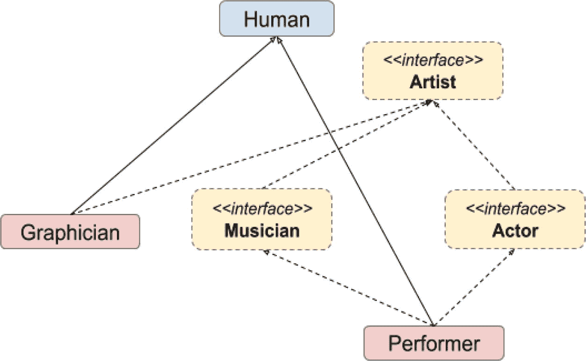
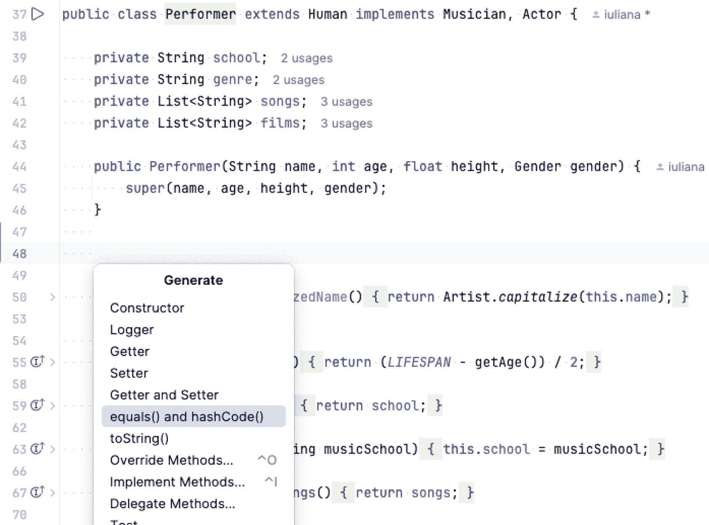
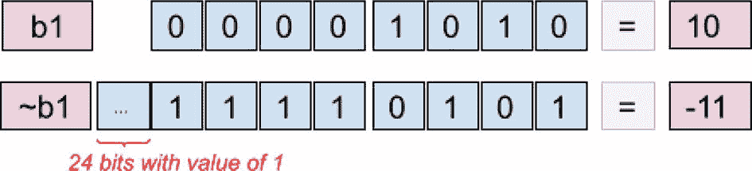
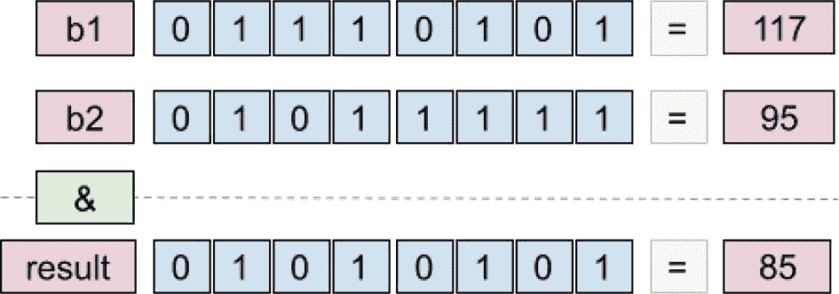
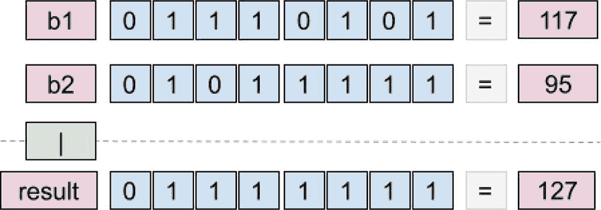
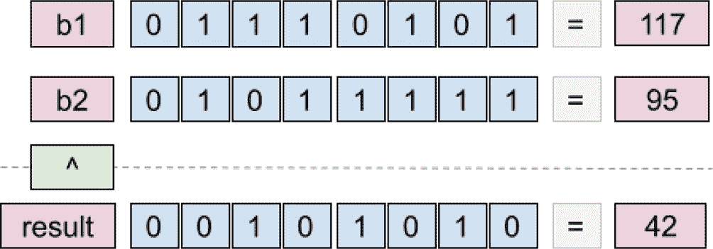
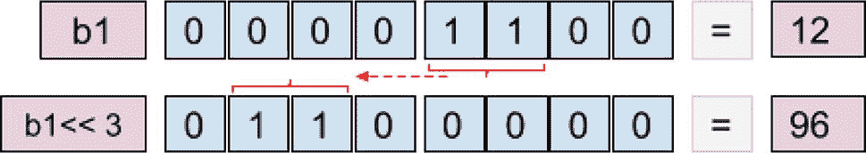
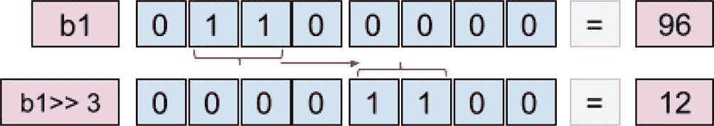
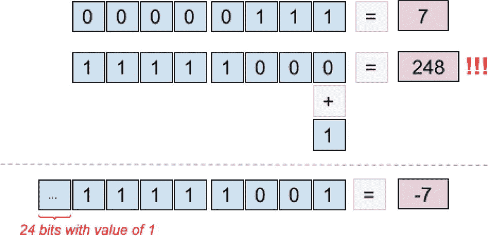
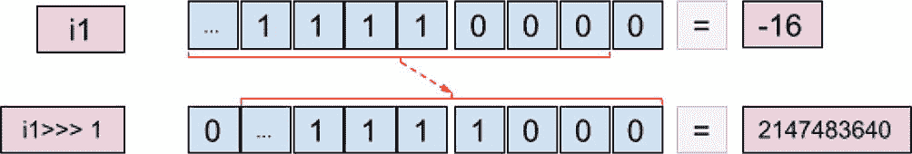

# 6. 运算符

前面的章节涵盖了 Java 编程的基本概念。你学习了如何组织代码、如何命名文件，以及根据要解决的问题可以使用哪些数据类型。你还学习了如何声明字段、变量和方法，以及它们如何存储在内存中，以帮助你设计解决方案，使资源消耗达到最优。

在本章中，你将学习如何使用运算符组合已声明的变量。大多数 Java 运算符与你从数学中了解的运算符相同，但由于编程涉及数字类型以外的其他类型，Java 包含了具有特定用途的额外运算符。表 6-1 列出了所有 Java 运算符及其类别和适用范围。

表 6-1

Java 运算符

| 类别 | 运算符 | 适用范围 |
| --- | --- | --- |
| 类型转换 | (type) | 显式类型转换。 |
| 一元，后缀 | expr++, expr-- | 后置递增/递减。 |
| 一元，前缀 | ++expr, --expr | 前置递增/递减。 |
| 一元 | +expr, -expr | 正负号。 |
| 一元，逻辑 | `!` | 逻辑非。 |
| 一元，按位 | `~` | 按位取反。对整数值逐位取反。 |
| 乘法，二元 | `*, /, %` | 对于数值类型：乘法、除法、除法并返回余数。 |
| 加法，二元 | `+, -` | 对于数值类型：加法、减法。`+` 也用于 `String` 连接。 |
| 位移，二元 | `>>, >>, >>>` | 对于数值类型：乘以或除以 2 的幂，有符号和无符号。 |
| 条件，关系 | `instanceof` | 测试对象是否为指定类型（类、子类或接口）的实例。 |
| 条件，关系 | `==, !=, <, >, <=, >=` | 等于、不等于、小于、大于、小于等于、大于等于。 |
| 按位与，二元 | `&` | 按位逻辑与。 |
| 异或，二元 | `^` | 按位逻辑异或。 |
| 按位或，二元 | `&#124;` | 按位逻辑或。 |
| 条件，逻辑与 | `&&` | 逻辑与。 |
| 条件，逻辑或 | `&#124;&#124;` | 逻辑或。 |
| 条件，三元 | `? :` | 也称为 *Elvis 运算符*。 |
| 赋值 | `=, +=, -=, *=, /= %=, &=, ^=, <<= >>=, >>>= , &#124;=` | 简单赋值、复合赋值。 |

让我们从编程中最常见的运算符开始本章：赋值运算符 `=`。


## 赋值运算符

`=`（赋值）运算符是编程中最常用的运算符，因为没有它什么都做不了。你创建的任何变量，无论其类型是基本类型还是引用类型，都必须在程序的某个时刻被赋予一个值。使用赋值运算符设置值非常简单：在`=`（等号）运算符左侧指定变量名，在右侧指定一个值。赋值操作能够成功的唯一条件是：该值必须与变量的类型匹配。

要测试这个运算符，你可以使用`JShell`；只需确保以详细模式（`-v`）启动它，这样你就能看到赋值的效果。本章执行的语句如列表 6-1 所示。

```
jshell -v
|  Welcome to JShell -- Version 23-ea
|  For an introduction type: /help intro
jshell>int i = 0;
i ==> 0
|  created variable i : int
jshell> i = -4
i ==> -4
|  assigned to i : int
jshell> String sample = "text"
sample ==> "text"
|  created variable sample : String
jshell> List list = new ArrayList()
list ==> []
|  created variable list : List
jshell>  list = new LinkedList()
list ==> []
|  assigned to list : List
列表 6-1
使用 jshell 操作赋值运算符
```

在列表 6-1 中，我们声明了基本类型和引用类型的值，并对它们进行了赋值和重新赋值。不允许将类型与初始类型不匹配的值进行赋值。在列表 6-2 的代码示例中，我们试图将一个文本值赋给一个先前声明为`int`类型的变量。

```
jshell> i = -5
i ==> -5
|  assigned to i : int
jshell> i = "you are not allowed"
|  Error:
|  incompatible types: java.lang.String cannot be converted to int
|  i = "you are not allowed";
|      ^-------------------^
列表 6-2
更多使用 jshell 操作赋值运算符的示例
```

JDK 10 中引入的类型推断对此没有影响，变量的类型将根据首次赋值的类型进行推断。显然，这意味着你不能在未指定初始值的情况下使用`var`关键字声明变量。这排除了`null`值，因为它没有类型。不过，可以通过将`null`值强制转换为我们感兴趣的类型来强制实现这一点，如列表 6-3 所示。

```
jshell> var j
|  Error:
|  cannot infer type for local variable j
|    (cannot use 'var' on variable without initializer)
|  var j;
|  ^----^
jshell> var j =5
j ==> 5
|  created variable j : int
jshell> var sample2 = "bubulina";
sample2 ==> "bubulina"
|  created variable sample2 : String
// 这显然行不通
jshell> var funny = null;
|  Error:
|  cannot infer type for local variable funny
|    (variable initializer is 'null')
|  var funny = null;
|  ^---------------^
// 是的，这实际上可行！
jshell> var funny = (Integer) null;
funny ==> null
|  created variable funny : Integer
列表 6-3
jshell 变量声明失败示例
```

## 显式类型转换：`(`***类型***`)` 和 `instanceof`

这两个运算符放在一起介绍，因为这样更容易提供与你可能需要在真实场景中编写的代码非常相似的代码示例。

正如本书前面提到的，最好尽可能保持引用类型的通用性，以便在不破坏代码的情况下更改具体实现。这被称为**类型多态**。类型多态是为不同类型的实体提供单一接口，或使用单一符号来表示多种不同类型。

有时我们可能需要将对象分组，但根据它们的类型执行不同的代码。回想一下第 5 章中介绍的`Performer`层次结构（如图 5-10 所示）。我们将在此处使用这些类型来向你展示如何使用这些运算符。如果你不想回到前一章去回忆这个层次结构，图 6-1 再次展示了它，但有一个变化：它添加了一个名为`Graphician`的额外类，该类实现了`Artist`接口并继承了`Human`类。

注意

`Graphician`类的实现与本章节无关，因此此处不再详述，但你可以在本书附带的项目中找到它。



图 6-1

`Human`层次结构

在列表 6-4 中，创建了一个`Musician`类型的对象和一个`Graphician`类型的对象，然后将它们添加到一个包含`Artist`类型引用的列表中。我们可以这样做，因为这两种类型都实现了`Artist`接口。列表 6-4 中的代码展示了使用此层次结构中的几个类来创建对象，将它们添加到同一个列表，然后从中提取并测试它们的类型。

```
package com.apress.bgn.six;
import com.apress.bgn.four.classes.Gender;
import com.apress.bgn.four.hierarchy.Artist;
import com.apress.bgn.four.hierarchy.Musician;
import com.apress.bgn.four.hierarchy.Performer;
import java.util.ArrayList;
import java.util.List;
import static java.lang.System.out;
public class OperatorDemo {
public static void main() {
List artists = new ArrayList();
Musician john = new Performer("John", 47, 1.91f, Gender.MALE);
List songs = List.of("Gravity");
john.setSongs(songs);
artists.add(john);
Graphician diana = new Graphician("Diana", 23, 1.62f, Gender.FEMALE, "macOs");
artists.add(diana);
for (Artist artist : artists) {
if (artist instanceof Musician) {   // (*)
Musician musician = (Musician) artist; // (**)
out.println("Songs: " + musician.getSongs());
} else {
out.println("Other Type: " +  artist.getClass());
}
}
}
}
// 输出
/*
Songs: Gravity
Other Type: class com.apress.bgn.six.Graphician
*/
列表 6-4
展示 instanceof 和 (type) 的代码示例
```

末尾标有`(*)`的行展示了如何使用`instanceof`运算符。此运算符用于测试对象是否为指定类型（类、超类或接口）的实例。它用于编写条件，以决定应执行哪个代码块。

标有`(**)`的行执行了引用的显式转换，也称为*强制转换*操作。由于`instanceof`运算符有助于确定引用指向的对象是`Musician`类型，我们现在可以将引用转换为正确的类型，以便可以调用`Musician`类的方法。

请注意`instanceof`运算符是如何用于测试类型的，然而，要使用该引用，需要编写一个显式转换。


### 类型模式

从 Java 14 开始，`instanceof` 运算符得到了增强，加入了类型转换功能，从而实现了更清晰、更简洁的语法，如代码清单 6-5 所示。

```
for (Artist artist : artists) {
if (artist instanceof Musician musician) {
out.println("Songs: " + musician.getSongs());
} else {
out.println("Other Type: " + artist.getClass());
}
}
代码清单 6-5
Java 14 新的 instanceof 语法
```

`musician` 变量被称为**模式变量**；它是 final 类型的，并在同一位置声明和初始化。其作用域仅限于 `if` 代码块——如果你试图在 `else` 代码块中使用它，编译器会报错。以这种方式使用 `instanceof` 被称为**类型模式**。

但是，如果显式转换失败会发生什么？为了弄清楚这一点，我们将尝试将之前声明的 `Graphician` 引用转换为 `Musician`。可以将下面这行代码添加到代码清单 6-5 中，它不会阻止代码编译：

```
Musician fake = (Musician) diana;
```

`Graphician` 类与 `Musician` 类型没有关系，因此代码将无法运行。控制台会抛出一个特殊的异常来告诉你哪里出了问题。控制台中打印的错误信息将非常明确，如下一个日志片段所示：

```
Exception in thread "main" java.lang.ClassCastException:
class com.apress.bgn.six.Graphician cannot be cast to class com.apress.bgn.four.hierarchy.Musician
(com.apress.bgn.six.Graphician is in module chapter.six of loader 'app';
com.apress.bgn.four.hierarchy.Musician is in module chapter.four@3.0-SNAPSHOT of loader 'app')
at chapter.six/com.apress.bgn.six.OperatorDemo.main(OperatorDemo.java:75)
```

该消息明确指出这两个类型不兼容，并且包含了包名和模块名。

`instanceof` 运算符最有用的场景是在 `equals(..)` 方法中。**第** **5** **章**在讨论对象相等性时介绍了 `equals(..)` 和 `hashCode()` 方法。IntelliJ IDEA 可以为你生成这两个方法。只需在类体内右键单击，选择 **Generate** 选项查看所有可能性，然后选择 **equals() and hashCode** 即可为你生成这些方法。该菜单如图 6-2 所示。



图 6-2

IntelliJ IDEA 代码生成菜单：**Generate > equals() and hashCode()** 子菜单

代码清单 6-6 展示了 IntelliJ IDEA 生成的 `equals(..)` 和 `hashCode()` 方法。

```
package com.apress.bgn.four.hierarchy;
import com.apress.bgn.four.classes.Gender;
import java.util.List;
import java.util.Objects;
public class Performer extends Human implements Musician, Actor {
private String school;
private String genre;
private List songs;
private List films;
public Performer(String name, int age, float height, Gender gender) {
super(name, age, height, gender);
}
@Override
public boolean equals(Object o) {
if (this == o) return true;
if (o == null || getClass() != o.getClass()) return false;
Performer other = (Performer) o;
return Objects.equals(school, other.school)
&& Objects.equals(genre, other.genre)
&& Objects.equals(songs, other.songs)
&& Objects.equals(films, other.films);
}
@Override
public int hashCode() {
return Objects.hash(school, genre, songs, films);
}
// 其他代码已省略
}
代码清单 6-6
为 Performer 类生成的 equals(..) 和 hashCode() 方法
```

看一下 `equals(..)` 方法。在检查字段相等性之前，它先检查参数的类型是否与被比较实例的类型相同：`getClass() != o.getClass()`。这是可行的，但另一种编写此比较的方式是 `!(o instanceof Performer)`。但在进行字段比较之前，我们仍然需要强制转换 `o` 参数。在 Java 14 之前，我们必须这样做。在 Java 14 之后，我们可以像代码清单 6-7 所示那样重写 `equals``(..)` 方法。

```
@Override
public boolean equals(Object o) {
if (this == o) return true;
if (o == null || !(o instanceof Performer)) return false;
return (o instanceof Performer other)
&& Objects.equals(school, other.school)
&& Objects.equals(genre, other.genre)
&& Objects.equals(songs, other.songs)
&& Objects.equals(films, other.films);
}
代码清单 6-7
从 Java 14 开始使用 instanceof 的 equals(..) 方法
```

注意

为 `instanceof` 引入模式匹配的工作始于 Java 14，当时它作为预览功能引入，并通过 JEP 394^(⁶⁰) 在 Java 16 中最终确定。

`instanceof` 模式匹配另一个有用的场景是在 `switch` 表达式中，这将在**第** **7** **章**中介绍。


### 记录模式

从 JDK 19 开始，`instanceof` 运算符也适用于记录。记录模式特性通过 JEP 440^(⁶¹) 在 Java 21 中完成并正式发布。**记录模式**不仅有助于识别记录类型，还能进行解构。

记录实例是不可变的数据载体。它们携带的数据被称为**组件**。这些数据通过内置的组件访问器方法进行访问。

为了展示记录模式的一些常见用法，我们需要几个记录类。让我们从清单 6-8 中非常简单的示例开始。

```
package com.apress.bgn.six;
record FullName (String firstName, String lastName){ }
public class RecordPatternsDemo {
void main() {
Object john = new FullName("John", "Mayer");
/*1*/
if (john instanceof FullName full) {
System.out.println("FullName: " + full);
}
/*2*/
if (john instanceof FullName(String firstName, String lastName)) {
System.out.println("[Deconstruction] FirstName: " + firstName);
System.out.println("[Deconstruction] LastName: " + lastName);
}
}
}
// 输出
/*
FullName: FullName[firstName=John, lastName=Mayer]
[Deconstruction] FirstName: John
[Deconstruction] LastName: Mayer
*/
清单 6-8
记录模式示例
```

在清单 6-8 中，我们声明了一个非常简单的记录，名为 `FullName`，它包含两个字段。

第一个语句（标记为 `/*1*/`）看起来像是一个普通的类型检查和转换，与类型模式的使用非常相似。第二个语句（标记为 `/*2*/`）是一个记录模式示例，它将实例解构为其组件，这些组件可以独立使用，而无需封装在记录实例中。这也适用于嵌套记录。如果我们声明一个包含 `FullName` 组件的 `PersonRecord` 记录，我们可以使用如清单 6-9 所示的嵌套记录模式。

```
package com.apress.bgn.six;
record FullName (String firstName, String lastName){ }
record PersonRecord (FullName fullName, Integer age) {}
public class RecordPatternsDemo {
void main() {
Object john = new FullName("John", "Mayer");
Object johnRecord = new PersonRecord((FullName) john, 47);
if (johnRecord instanceof PersonRecord(FullName(var firstName, String lastName), var age)) {
System.out.println("[Nested] FirstName: " + firstName);
System.out.println("[Nested] LastName: " + lastName);
System.out.println("[Nested] Age: " + age);
}
}
}
// 输出
/*
[Nested] FirstName: John
[Nested] LastName: Mayer
[Nested] Age: 47
*/
清单 6-9
嵌套记录模式示例
```

借助嵌套记录模式，我们可以分解嵌套记录并单独使用它们的组件。

注意

*嵌套记录*只是指代**记录组合**的另一种说法。

它同样适用于泛型。清单 6-10 中的代码展示了如何使用记录模式来分解泛型类型。

```
package com.apress.bgn.six;
record FullName (String firstName, String lastName){ }
record PersonRecord (FullName fullName, Integer age) {}
record WrapperBeing(T t, String description) { }
public class RecordPatternsDemo {
void main() {
Object john = new FullName("John", "Mayer");
WrapperBeing wrapper = new WrapperBeing((PersonRecord) johnRecord, "is mise Iain");
if (wrapper instanceof WrapperBeing(var personRecord, var description)) {
System.out.println("[Generics] PersonRecord: " + personRecord);
System.out.println("[Generics] Description: " + description);
}
}
}
// 输出
/*
[Generics] PersonRecord: PersonRecord[fullName=FullName[firstName=John, lastName=Mayer], age=47]
[Generics] Description: is mise Iain
*/
清单 6-10
分解泛型类型包装器
```

你可能已经注意到，本节中的一些示例使用了 `var` 而不是实际的组件类型。只要某些参数具有其类型，以便编译器能够识别正确的模式，一切就能按预期工作。

在分解嵌套记录时，你可能并不总是对使用所有组件感兴趣。这时就轮到 `_`（下划线），即未命名变量登场了。例如，在分解 `johnRecord` 实例时，你可能只对提取 `lastName` 组件感兴趣，那么可以这样写：

```
if (johnRecord instanceof PersonRecord (FullName
(var _, String lastName), var _)) {
System.out.println("[Unnamed Variable] LastName: " + lastName);
}
```

基本上就是这些了，除了在 `switch` 表达式中的用法，这将在**第** **7** **章**中介绍。

### 原始类型模式

显式转换不仅限于引用类型——它也适用于原始类型。**第** **5** **章**提到，任何值域较小的类型的变量都可以在不进行显式转换的情况下转换为值域较大的类型。反之亦然，但需要使用显式转换；不过，如果值太大，会丢失位，结果将……出乎意料。只需看看清单 6-11 中描述的 `byte` 和 `int` 之间的转换示例。

```
jshell> byte b = 2;
b ==> 2
|  创建了变量 b : byte
jshell> int i = 10;
i ==> 10
|  修改了变量 i : int
|    更新覆盖了变量 i : int
jshell> i = b
i ==> 2
|  赋值给 i : int
jshell> b = i
|  错误:  \\ 
|  不兼容的类型: 从 int 到 byte 可能有损转换
|  b = i
|      ^
jshell> b = (byte) i
b ==> 2
|  赋值给 b : byte
jshell> i = 300_000
i ==> 300000
|  赋值给 i : int
jshell> b = (byte) i
b ==> -32  // 哎呀！值超出了 byte 的范围
|  赋值给 b : byte
清单 6-11
jshell 转换示例
```

重要

作为一条规则，只使用显式转换来扩大变量的范围，而不是缩小它，因为缩小范围可能导致异常或精度损失。

附带的说明是一个很好的建议，但如果你正在处理的值是由一个你无法控制的生成器组件提供的呢？你是否应该针对所有数值类型的区间边界测试该值，以确定将其转换为哪种合适的类型？这当然可行，但很繁琐。Java 23 引入了一个预览特性，使事情变得更简单。在撰写本节时，这个特性刚刚被引入，但这是开发者多年来一直要求的：模式中的原始类型，或者能够将 `instanceof` 与原始类型一起使用。

注意

开发者多年来一直要求的另一件事是能够在集合中使用原始类型，所以这可能也在路上了。

**第** **5** **章**介绍了原始数据类型，其中大多数是数值类型，受限于特定的区间和表示形式。检查一个数值是否为 `byte`、`short`、`int` 或 `long` 的唯一方法是根据每种类型的区间边界检查该值，或者尝试转换并检查是否抛出了异常。如果不进行检查，将 `int` 值转换为 `byte` 可能成功，但可能会损失一些精度。如果我们能测试一个值是否可以转换为某种类型，并一次性完成转换，那该多好，对吧？嗯，这就是 JEP 455^(⁶²) 预览的特性之一。

清单 6-12 展示了一个示例，该示例基于当前系统时间生成一个随机的 `long` 值；然后检查这个值，如果可能的话，将其转换为任何数值类型。


```
package com.apress.bgn.six;
public class PrimitivePatternsDemo {
void main() {
var generated = genVal();
if (generated instanceof byte b){
System.out.println("byte val = " + b);
}
if (generated instanceof short s){
System.out.println("short val = " + s);
}
if (generated instanceof char c){
System.out.println("char val = " + c);
}
if (generated instanceof int i) {
System.out.println("int val = " + i);
}
if (generated instanceof long l) {
System.out.println("long val = " + l);
}
if (generated instanceof float f) {
System.out.println("float val = " + f);
}
}
static long genVal() {
var t = System.currentTimeMillis();
if (t % 3 == 0) {
byte bv = Byte.MAX_VALUE;
return bv;
} else if (t % 5 == 0) {
short sbv = Short.MAX_VALUE;
return sbv;
} else if (t % 7 == 0) {
long lv = Long.MAX_VALUE;
return lv;
} else {
return Integer.MAX_VALUE;
}
}
}
// 输出 Integer.MAX_VALUE 的结果
/*
int val = 2147483647
long val = 2147483647
*/
// 输出 Byte.MAX_VALUE 的结果
/*
byte val = 127
short val = 127
char val = ▯  # 此处为不可见字符：DEL
int val = 127
long val = 127
float val = 127.0
*/
// 输出 Short.MAX_VALUE 的结果
/*
short val = 32767
char val = 翿
int val = 32767
long val = 32767
float val = 32767.0
*/
// 输出 Long.MAX_VALUE 的结果
// long val = 9223372036854775807
清单 6-12
将 instanceof 与基本类型结合使用
```

请注意，当 `genVal()` 函数返回的值是 `int` 类型的上限区间时，它只能安全地转换为 `int` 和 `long`。由于将其转换为任何值区间超出（`byte`、`short`、`char`、`float`）的类型都会导致精度损失，因此 `instanceof` 运算符会返回 `false`，并且不会进行转换。

注意

这个特性非常有用，我预计它将在 Java 25（下一个 LTS 版本）中正式发布。如果届时未能发布，我会保留源代码，但将其注释掉以避免编译失败。

## 数值运算符

本节将汇总所有主要应用于数值类型的运算符。你从数学中已经熟悉的数值运算符有：`+、-、/、*`。比较运算符在编程中也很常见，但它们可以组合使用以获得不同的效果。

### 一元运算符

一元运算符只需要一个操作数，并且会影响它们所应用的变量。

#### 自增与自减运算符

在 Java（以及其他一些编程语言）中，有一元运算符称为**自增运算符**（`++`）和**自减运算符**（`--`）。这些运算符放在变量的前面或后面，用于将变量的值增加或减少 1。它们通常用作循环中的计数器，以控制循环的终止条件。当它们放在变量前面时，称为**前缀式**；当放在变量后面时，称为**后缀式**。

当自增和自减运算符采用前缀式时，操作会在变量用于下一条语句之前执行。这意味着在清单 6-13 中，`i` 变量的值会先被递增，然后赋值给 `j`。

```
package com.apress.bgn.six;
import static java.lang.System.out;
public class UnaryOperatorsDemo {
void main() {
int i = 1;
int j = ++i;
out.println("j is " + j+ ", i is " + i);
}
}
// 输出
// j is 2, i is 2
清单 6-13
前缀式自增运算符示例
```

清单 6-13 中代码的预期结果是 `j 等于 2`，因为 `i` 变量的值在赋值给 `j` 之前已被修改为 2。

当自增和自减运算符采用后缀式时，操作会在变量用于下一条语句之后执行。这意味着在清单 6-14 的代码中，`i` 的值先被赋值给 `j`，然后再递增。

```
package com.apress.bgn.six;
import static java.lang.System.out;
public class UnaryOperatorsDemo {
void main() {
int i = 1;
int j = i++;
out.println("j is " + j+ ", i is " + i);
}
}
// 输出
// j is 1, i is 2
清单 6-14
后缀式自增运算符示例
```

清单 6-14 中代码的预期结果是 `j 等于 1`，因为 `i` 变量的值在赋值给 `j` 之后才被修改为 2。

自减运算符的使用方式相同，唯一的区别是变量的值减少 1。

提示

尝试修改 `UnaryOperatorsDemo` 类，改用 `--` 运算符。

#### 符号运算符

数学运算符 `+`（正号）可用于单个操作数，表示一个数为正数（该运算符相当冗余，几乎从不使用）。因此，基本上

```
int i = 3;
```

等同于

```
int i = +3;
```

数学运算符 `-`（负号）可用于声明负数：

```
[jshell> int i = -3
i ==> -3
| created variable i : int
```

或者用于对表达式取反：

```
[jshell> int i = -3
i ==> -3
| created variable i : int
[jshell> int j = -( i + 4 )
j ==> -1
| created variable j : int
```

如上一个示例所示，`( i + 4 )` 的结果是 1，因为 `i = -3`，但由于括号前的 `-` 运算符，最终赋值给 `j` 变量的结果是 `-1`。

#### 逻辑非运算符

还有一个一元运算符，其作用是取反变量。运算符 `!`（感叹号）应用于布尔变量，用于对其取反。因此 `true` 变为 `false`，`false` 变为 `true`，如下代码片段所示：

```
[jshell> boolean t = true
t ==> true
| created variable t : boolean
[jshell> boolean f = !t
f ==> false
| created variable f : boolean
[jshell> boolean t2 = !f
t2 ==> true
| created variable t2 : boolean
```

### 二元运算符

二元运算符有很多，其中一些甚至可以组合使用以执行新的操作。本节从你可能在数学中已经熟悉的运算符开始介绍。


#### +（加/加法/连接）运算符

`+`（加）运算符用于将两个数值变量相加，如清单 6-15 中的语句所示。

```
jshell> int i = 4
i ==> 4
|  created variable i : int
jshell> int j = 6
j ==> 6
|  created variable j : int
jshell> int k = i + j
k ==> 10
|  created variable k : int
jshell> int i = i + 2
i ==> 6
|  modified variable i : int
|    update overwrote variable i : int
清单 6-15
在 jshell 中相加数值
```

最后一条语句 `int i = i + 2` 的作用是将 `i` 的值增加 2，如你所见，它有些冗余。该语句可以不必重复引用 `i` 两次，因为其效果就是将 `i` 的值增加 2。这可以通过使用 `+=` 运算符来实现，该运算符由赋值运算符和加法运算符组成。最优的语句是 `i += 2`。

`+` 运算符也可用于连接 `String` 实例，或连接 `String` 实例与其他类型。JVM 会根据上下文决定如何使用 `+` 运算符。例如，尝试猜测清单 6-16 中代码在运行时的输出。

```
package com.apress.bgn.six;
import static java.lang.System.out;
public class ConcatenationDemo {
void main(){
int i1 = 0;
int i2 = 1;
int i3 = 2;
out.println(i1 + i2 + i3);
out.println("Result1 = " + (i1 + i2) + i3);
out.println("Result2 = " + i1 + i2 + i3);
out.println("Result3 = " + (i1 + i2 + i3));
}
}
清单 6-16
连接 String 和 int 值
```

*那么猜得怎么样？* 执行代码后，控制台显示如下内容：

```
1. 3
2. Result1 = 12
3. Result2 = 012
4. Result3 = 3
```

以下是对输出中每一行的解释：

*   第 1 行：所有操作数都是 `int` 类型，因此 JVM 将各项作为 `int` 值相加，`out.println` 方法打印此结果。
*   第 2 行：括号将两项的加法 `(i1 + i2)` 隔离，因此 JVM 将括号内的加法作为两个 `int` 值之间的普通加法执行。但之后，我们得到 `"Result1 = " + 1 + i3`，此操作包含一个 `String` 操作数，这意味着 `+` 运算符必须用作连接运算符，因为将数字与文本值相加在其他情况下是行不通的。
*   第 3 行：我们有三个 `int` 操作数和一个 `String` 操作数，因此 JVM 判定该操作的上下文不能是数值运算，所以选择连接。
*   第 4 行：与第 2 行的情况类似，括号确保了操作的上下文是数值运算，因此三个操作数被相加。

这是一个典型的示例，展示了 JVM 如何为涉及 `+` 运算符的操作确定上下文，你在其他 Java 教程中也可能看到。`int` 变量可以替换为 `float` 或 `double`，行为将类似。

连接也适用于引用类型，因为任何 Java 类型默认都是 `Object` 的扩展，因此可以通过调用其 `toString()` 方法转换为 `String`。清单 6-17 展示了 `String` 与 `Performer` 实例之间的连接。

```
package com.apress.bgn.six;
import com.apress.bgn.four.classes.Gender;
import com.apress.bgn.four.hierarchy.Musician;
import com.apress.bgn.four.hierarchy.Performer;
import static java.lang.System.out;
public class ReferenceConcatenationDemo {
void main() {
Musician john = new Performer("John", 43, 1.91f, Gender.MALE);
out.println("Singer: " + john);
// 或显式转换
out.println("Singer: " + john.toString());
}
}
// 输出
//Singer: Performer{name='John', age=43, height=1.91, gender=MALE}
//Singer: Performer{name='John', age=43, height=1.91, gender=MALE}
清单 6-17
连接 String 和 Performer 值
```

#### -（减）运算符

数学运算符 `-`（减）用于将两个变量相减，或从变量中减去一个值。清单 6-18 展示了此运算符以及 `-=` 运算符（由赋值运算符和减法运算符组成）的用法。

```
jshell> int i = 4
i ==> 4
|  created variable i : int
jshell> int j = 2
j ==> 2
|  created variable j : int
jshell> int k = i - j
k ==> 2
|  created variable k : int
jshell> int i = 4
i ==> 4
|  modified variable i : int
|    update overwrote variable i : int
jshell> i  = i - 3
i ==> 1
|  assigned to i : int
jshell> int i = 4
i ==> 4
|  modified variable i : int
|    update overwrote variable i : int
jshell> i -=3
$7 ==> 1
|  created scratch variable $7 : int
清单 6-18
在 jshell 中相减数值
```

#### *（乘）运算符

`*`（乘）运算符用于将两个变量相乘，或将一个值与变量相乘。它可以用于与 `+` 和 `-` 类似的语句中，并且还有一个复合运算符 `*=`，可用于将变量的值相乘并立即赋值。在清单 6-19 中，你可以看到此运算符的实际应用。

```
jshell>  int i = 4
i ==> 4
|  created variable i : int
jshell> int j = 2
j ==> 2
|  created variable j : int
jshell> int k = i * j
k ==> 8
|  created variable k : int
jshell> int i = 4
i ==> 4
|  modified variable i : int
|    update overwrote variable i : int
jshell> i  = i * 3
i ==> 12
|  assigned to i : int
jshell> int i = 4
i ==> 4
|  modified variable i : int
|    update overwrote variable i : int
jshell>  i *= 3
$7 ==> 12
|  created scratch variable $7 : int
清单 6-19
在 jshell 中相乘数值
```

#### /（除）运算符

`/`（除）运算符用于将两个变量相除，或将一个值除以变量。它可以用于与 `+` 和 `-` 类似的语句中，并且有一个复合运算符 `/=`，可用于将变量的值相除并立即赋值。

除法的结果称为**商**，它被赋值给赋值运算符 `=` 左侧的变量。当操作数为整数时，结果也是整数，余数被丢弃。在清单 6-20 中，你可以看到此运算符的实际应用。

```
jshell> int i = 4
i ==> 4
|  created variable i : int
jshell> int j = 2
j ==> 2
|  created variable j : int
jshell> int k = i / j
k ==> 2
|  created variable k : int
jshell> int i = 4
i ==> 4
|  modified variable i : int
|    update overwrote variable i : int
jshell> int i = i / 3
i ==> 1
|  modified variable i : int
|    update overwrote variable i : int
jshell> int i = 4
i ==> 4
|  modified variable i : int
|    update overwrote variable i : int
jshell> i /= 3
$7 ==> 1
|  created scratch variable $7 : int
# 显然你不能除以零，哎呀！
jshell> i /= 0
|  Exception java.lang.ArithmeticException: / by zero
|        at (#3:1)
清单 6-20
在 jshell 中相除数值
```


#### %（取模）运算符

`%`（取模）运算符用于对两个变量进行除法运算，但结果是除法运算的余数。该操作称为**取模运算**。还有一个复合运算符 `%=`，可用于对变量值进行除法运算并当场将余数赋值给该变量。在代码清单 6-21 中，你可以看到该运算符的实际应用。

```
jshell> int i = 4
i ==> 4
|  created variable i : int
jshell> int j = 3
j ==> 3
|  created variable j : int
jshell> int k = i % j
k ==> 1
|  created variable k : int
jshell> int i = 4
i ==> 4
|  modified variable i : int
|    update overwrote variable i : int
jshell> i = i % 3
i ==> 1
|  assigned to i : int
jshell> int i = 4
i ==> 4
|  modified variable i : int
|    update overwrote variable i : int
jshell> i %= 3
$7 ==> 1
|  created scratch variable $7 : int
# 取模本质上就是除法，所以再次强调，不行！
jshell> i %= 0
|  Exception java.lang.ArithmeticException: / by zero
|        at (#5:1)
代码清单 6-21
在 jshell 中对数值进行取模运算
```

取模运算符返回余数，但当操作数是实数时会发生什么？简而言之，浮点数运算很棘手。结果取决于小数点后的数字以及用于除法的操作数。请看代码清单 6-22。

```
jshell> double d = 5.28d
d ==> 5.28
|  created variable d : double
jshell> d / 2
$2 ==> 2.64
|  created scratch variable $2 : double
jshell> d % 2
$4 ==> 1.2800000000000002
|  created scratch variable $4 : double
代码清单 6-22
在 jshell 中对浮点数进行取模运算
```

上述结果的原因是浮点数在内部表示方式导致的精度损失。

此外，如果余数是一个小数点后有无限多位小数的实数，则无法精确表示，因此必须进行某种舍入。如代码清单 6-23 所示。

```
jshell> float f = 1.9f
f ==> 1.9
|  created variable f : float
jshell> float g = 0.4f
g ==> 0.4
|  created variable g : float
jshell> float h = f % g
h ==> 0.29999995    # 余数
|  created variable h : float
代码清单 6-23
在 jshell 中，小数点后有无穷多位小数的余数导致的精度损失
```

在 `jshell` 中返回的余数是 `0.29999995`，在某些情况下可以四舍五入为 `0.3`。然而，当数据用于敏感操作时，例如确定机器人手术的肿瘤体积，或计算发送火箭到火星的完美轨迹，舍入可能会带来危险。

警告

浮点数的舍入是有问题的，因为它会导致精度损失。

处理浮点数时的精度损失并非 Java 特有的问题，因为浮点数运算是根据 IEEE 754（IEEE 浮点运算标准）^(⁶³) 算术规则来支持的。

如果项目需要更高精度的数学运算，`java.lang.Math` 类提供了用于不同类型舍入和其他浮点数运算的方法。

### 关系运算符

在某些情况下，设计问题解决方案时，需要引入条件来驱动和控制执行流程。条件需要使用**比较**运算符对两个项进行比较评估。本节将描述 Java 中使用的所有比较运算符，并提供代码示例。让我们开始吧。

#### `==`（等于）运算符

`==`（等于）运算符用于测试项是否相等。由于在 Java 中单个 `=` 用于赋值，因此引入 `==` 来测试相等性以避免混淆。该运算符非常常用于控制执行流程。控制执行流程是**第** **7** 章的主题，但为了展示 `==` 运算符应如何使用，本章将介绍一些涉及 `if` 和 `for` 等控制语句的简单代码示例。

在代码清单 6-24 中，你可以看到一个测试 `==` 比较器在数组中搜索值 2 的示例。如果找到该值，则会在控制台打印找到该值的索引。

```
package com.apress.bgn.six;
import static java.lang.System.out;
public class ComparisonOperatorsDemo {
void main(){
int[] values = {1, 7, 9, 2, 6,};
for (int i = 0; i < values.length; ++i) {
if (values[i] == 2) {
out.println("Found 2 at index: " + i);
}
}
}
}
// 输出
// Found 2 at index: 3
代码清单 6-24
使用 == 运算符测试数组中某个值的示例
```

标记行中的条件被评估，结果是一个布尔值。当结果为 `false` 时，不执行任何操作；但如果结果为 `true`，则打印索引。由于结果是 `boolean` 类型，如果你误用了 `=` 而不是 `==`，代码将无法编译。因此，在比较布尔值时必须格外小心。代码清单 6-25 中的代码可以编译并运行，但无法按预期工作。

```
package com.apress.bgn.six;
import static java.lang.System.out;
public class BadAssignementDemo {
void main() {
boolean testVal = false;
if(testVal = true) {
out.println("TestVal got initialized incorrectly!");
} else {
out.println("TestVal is false? " + (testVal == false));
}
}
}
// 输出
//TestVal got initialized incorrectly!
代码清单 6-25
意外初始化布尔变量而非评估其值的示例
```

`==` 运算符对于基本类型完全适用。对于引用类型，你需要使用 `equals()` 方法，这在**第** **5** 章开头解释栈内存和堆内存的区别时已经介绍过。


#### 其他比较运算符

其他比较运算符仅适用于原始类型。由于每个运算符没有太多需要单独说明的内容，因此本节将一并介绍它们。

*   `!=` 用于测试项是否不相等。它是 `==` 运算符的反向操作。此运算符也适用于引用类型，但与 `==` 一样，它比较的是引用值而非对象本身。

提示

作为练习，请修改清单 6-24 中的示例，使其在数组元素值不等于 2 时打印一条消息。

*   `<`（小于）和 `<=`（小于或等于）的用途与你可能在数学课上学到的一致：`<` 测试运算符左侧的项是否小于右侧的项，而 `<=` 测试运算符左侧的项是否小于或等于右侧的项。`<=` 运算符不能用于引用类型。

*   `>` 和 `>=` 的用途也与你可能在数学课上学到的一致：`>` 测试运算符左侧的项是否大于右侧的项，而 `>=` 测试运算符左侧的项是否大于或等于右侧的项。`>=` 运算符不能用于引用类型。

几乎所有数值运算符都可以用于不同类型的变量，因为它们会自动转换为具有更宽表示范围的类型。清单 6-26 中的代码反映了几种情况，但在实践中，你可能需要处理一些更令人困惑的事情，这些事并不总是符合编程的常识规则，也不遵循良好的实践。不过，如果可以的话，尽量避免这样做！

```
package com.apress.bgn.six;
import static java.lang.System.out;
public class MixedOperationsDemo {
void main() {
byte b = 1;
short s = 2;
int i = 3;
long l = 4;
float f = 5;
double d = 6;
int ii = 6;
double resd = l + d;
long resl = s + 3;
//等等
if (b = b) {
out.println("int val >= byte val");
}
if (l > b) {
out.println("long val > byte val");
}
if(d > i) {
out.println("double val > byte val");
}
if(i == i) {
out.println("double val == int val");
}
}
}
// 输出
/*
byte val = byte val
long val > byte val
double val > byte val
double val == int val
*/
清单 6-26
不同原始类型比较示例
```

请确保，如果你遇到需要编写此类不明确的代码*（非最优代码结构）*的情况，一定要进行大量测试并仔细考虑你的类型转换，尤其是在涉及浮点类型时。这是因为（例如）清单 6-27 中的代码片段可能会产生相当意外的结果。

```
package com.apress.bgn.six;
import static java.lang.System.out;
public class BadDecimalPointDemo {
void main(){
float f1 = 2.2f;
float f2 = 2.0f;
float f3 = f1 * f2;
if (f3 == 4.4) {
out.println("expected float value of 4.4");
} else {
out.println("!! unexpected value of " + f3);
}
}
}
清单 6-27
浮点数比较的意外结果
```

如果你期望在控制台打印出消息 *expected float value of 4.4*，那么你会相当惊讶。

任何 IEEE 754 浮点数表示都会出现问题，因为一些在十进制系统中看似具有固定小数位数的数字，在二进制系统中实际上具有无限小数位数。因此，显然我们不能使用 `==` 来比较浮点数和双精度浮点数。最容易实现的解决方案之一是使用包装类提供的 `compare` 方法，在本例中是 `Float.compare(..)`，如清单 6-28 所示。

```
package com.apress.bgn.six;
import static java.lang.System.out;
public class GoodDecimalPointDemo {
void main(){
float f1 = 2.2f;
float f2 = 2.0f;
float f3 = f1 * f2;
if (Float.compare(f3,4.4f) == 0) {
out.println("expected float value of 4.4");
} else {
out.println("!!unexpected value of " + f3);
}
}
}
清单 6-28
使用 Float.compare 进行正确的比较结果

```

使用前面的示例，现在控制台会打印出预期的消息：*expected float value of 4.4*。

## 位运算符

在 Java 中，有一些运算符用于在位级别操作数值类型的变量。位运算符用于改变操作数中的单个位。位运算速度更快，并且通常使用更少的 CPU 处理能力，因为资源使用量减少了。它们在编程可视化应用程序（例如游戏）中最有用，在这些应用程序中，需要快速确定颜色、鼠标点击和移动，以确保令人满意的体验。

### 按位非 (~) 运算符

`~` 运算符有点像二进制**取反器**。它对整数值逐位进行反转。这会影响用于表示该值的所有位。因此，如果我们声明

```
byte b1 = 10;
```

其二进制表示为 `00001010`。

`Integer` 类提供了一个名为 `toBinaryString()` 的方法，可用于打印先前定义的变量的二进制表示，但它不会打印所有位，因为该方法不知道我们想要在多少位上表示该值。因此，我们需要使用一个特殊的 `String` 方法来格式化输出。清单 6-29 中描述的方法可用于在 8 位上打印 `b1` 值的二进制形式，正如前面所述。

```
import static java.lang.System.out;
//...
public static void print8Bits(byte arg) {
out.println("decimal:" + arg);
String str = String.format("%8s", Integer.toBinaryString(arg)).replace(' ', '0');
out.println("binary:" + str);
}
清单 6-29
用于打印 byte 值每一位的方法
```

如果我们在 `b1` 值上应用 `~` 运算符，得到的二进制值为 `11110101`。如果你没有注意到，这个值超出了 `byte` 的范围，因此会自动转换为 `int`。这就是负数在 Java 内部的表示方式，根据 Java 语言规范，这种表示称为**2 的补码**。（这将在本章末尾介绍。）

因此，结果将是 `-11`，如清单 6-30 中的代码所示。

```
package com.apress.bgn.six;
import static java.lang.System.out;
public class BitwiseDemo {
void main(){
byte b1 = 10;
print8Bits(b1);
byte b2 = (byte) ~b1;
print8Bits(b2);
}
// print8Bits 方法已省略
}
// 输出
/*
decimal:10
binary:00001010
decimal:-11
binary:11111111111111111111111111110101
*/
清单 6-30
测试 ~ 按位取反运算符
```

注意清单 6-30 中的语句 `byte b2 = (byte) ~b1`。按位补码表达式运算符要求操作数可转换为原始整数类型，否则会发生编译时错误。在内部，Java 使用一个或多个字节来表示值。`~` 运算符将其操作数转换为 `int` 类型，因此它可以在执行补码操作时使用 32 位；这是为了避免精度损失。这就是为什么在前面的示例中需要显式转换为 `byte`。

并且，由于有图更清晰，在图 6-3 中，你可以看到 `~` 运算符对 `b1` 变量的位的影响，以及其值。



图 6-3

`~` 取反运算符对 byte 值每一位的影响


### 按位与（&）

按位与运算符，用 `&` 表示，逐位比较两个数字。如果相同位置上的位值都为 `1`，则结果中的该位为 `1`。代码清单 6-31 中的示例代码展示了 `&` 运算符的结果。

```
package com.apress.bgn.six;
import static java.lang.System.out;
public class BitwiseDemo {
void main(){
byte b1 = 117;
print8Bits(b1);
byte b2 = 95;
print8Bits(b2);
byte result  = (byte) (b1 & b2);
print8Bits(result);
}
// print8Bits 方法已省略
}
// 输出
/*
decimal:117
binary:01110101
decimal:95
binary:01011111
decimal:85
binary:01010101
*/
代码清单 6-31
测试 & 按位与运算符
```

`&` 运算符的效果在图 6-4 中可以看得更清楚。`01010101` 是十进制数 85 的二进制表示。



图 6-4

`&` 运算符对每一位的作用

此外，出于实用考虑，Java 中提供了复合运算符 `&=`，这样可以在同一变量上执行按位与运算并将结果赋值给它，如下所示。这样做的好处是结果会自动转换为 `byte` 类型，因此无需显式转换。

```
jshell> byte b1 = 117
b1 ==> 117
|  created variable b1 : byte
jshell> b1 &= 95
$2 ==> 85
|  created scratch variable $2 : byte
```

### 按位包含或（|）

按位或运算符（也称为包含或），用 `|`（管道符）表示，逐位比较两个数字，如果至少有一个位为 1，则结果中的该位设置为 1。代码清单 6-32 中的代码展示了 `|` 运算符的结果。

```
package com.apress.bgn.six;
import static java.lang.System.out;
public class BitwiseDemo {
void main(){
byte b1 = 117;
print8Bits(b1);
byte b2 = 95;
print8Bits(b2);
byte result  = (byte) (b1 | b2);
print8Bits(result);
}
// print8Bits 方法已省略
}
// 输出
/*
decimal:117
binary:01110101
decimal:95
binary:01011111
decimal:127
binary:01111111
*/
代码清单 6-32
测试 | 按位或运算符
```

`|` 运算符的效果在图 6-5 中可以看得更清楚。`01111111` 是数字 127 的二进制表示。



图 6-5

`|` 运算符对每一位的作用

此外，出于实用考虑，Java 中提供了复合运算符 `|=`，这样可以在同一变量上执行按位包含或运算并将结果赋值给它，如下所示。这样做的好处是结果会自动转换为 `byte` 类型，因此无需显式转换。

```
jshell>  byte b1 = 117
b1 ==> 117
|  created variable b1 : byte
jshell> b1 |= 95
$2 ==> 127
|  created scratch variable $2 : byte
```

### 按位异或（^）

按位异或运算符（或称 XOR），用 `^` 表示，逐位比较两个数字，如果位的值不同，则结果中的该位设置为 1。代码清单 6-33 中的示例代码展示了 `^` 运算符的结果。

```
package com.apress.bgn.six;
import static java.lang.System.out;
public class BitwiseDemo {
void main(){
byte b1 = 117;
print8Bits(b1);
byte b2 = 95;
print8Bits(b2);
byte result  = (byte) (b1 ^ b2);
print8Bits(result);
}
// print8Bits 方法已省略
}
// 输出
/*
decimal:117
binary:01110101
decimal:95
binary:01011111
decimal:42
binary:00101010
*/
代码清单 6-33
测试 ^ 按位异或运算符
```

`^` 运算符的效果在图 6-5 中可以看得更清楚。`00101010` 是数字 42 的二进制表示。



图 6-6

`^` 运算符对每一位的作用

此外，出于实用考虑，Java 中提供了复合运算符 `^=`，这样可以在同一变量上执行按位异或运算并将结果赋值给它，如下所示。这样做的好处是结果会自动转换为 `byte` 类型，因此无需显式转换。

```
jshell> byte b1 = 117
b1 ==> 117
|  created variable b1 : byte
jshell> b1 ^= 95
$2 ==> 42
|  created scratch variable $2 : byte
```


### 逻辑运算符

在设计用于控制程序执行流程的条件时，有时需要编写复杂的条件——即由多个表达式组合而成的复合条件。有四个运算符可用于构建复杂条件。其中两个是可复用的按位运算符 `&`（与）和 `|`（或），但它们需要计算条件的所有部分。另外两个运算符 `&&`（与）和 `||`（或）与前述运算符效果完全相同，但区别在于它们不需要计算所有表达式，因此也被称为*短路运算符*。为了解释这些运算符的行为，我们将使用一个典型示例。

在代码清单 6-34 中，我们声明了一个包含十个术语的列表（其中一些为 `null`），以及一个生成随机索引的方法，用于从列表中选取一个元素。然后我们测试从列表中选出的元素，检查它是否不为 `null` 且等于预期值。如果两个条件都为真，则在控制台打印一条消息。

```
package com.apress.bgn.six;
import java.util.ArrayList;
import java.util.List;
import java.util.Random;
import static java.lang.System.out;
public class LogicalOperatorsDemo {
static List terms = new ArrayList() {{
add("Rose");
add(null);
add("River");
add("Clara");
add("Vastra");
add("Psi");
add("Cas");
add(null);
add("Nardhole");
add("Strax");
}};
void main() {
for (int i = 0; i < 20; ++i) {
int index = getRandomIndex(terms.size());
String term = terms.get(index);
out.println("Generated index: " + index);
if (term != null & term.equals("Rose")) {
out.println("Rose was found");
}
}
}
private static int getRandomIndex(int listSize) {
var r = new Random();
return r.nextInt(listSize);
}
}
代码清单 6-34
测试 & 运算符以控制执行流程
```

为了确保得到预期结果，我们重复从列表中随机选取元素的操作 20 次。正如你在标记行中可能注意到的，按位运算符 `&` 用于组合两个表达式。你可能会期望只有当 `term` 变量的值不为 `null` 且等于 `Rose` 时，控制台才会打印文本 *Rose was found*。但是，当运行上述代码时，会打印出以下内容：

```
Exception in thread "main" java.lang.NullPointerException: Cannot invoke "String.equals(Object)" because "term" is null
at chapter.six@3.0-SNAPSHOT/com.apress.bgn.six.LogicalOperatorsDemo.main(LogicalOperatorsDemo.java:65)
```

这是因为两个表达式都被计算了。但请想一想！如果 `term` 变量是 `null`，我们是否还应该计算它是否等于 `Rose`，尤其是在 `null` 对象上调用方法会导致运行时错误的情况下？显然不应该，这就是为什么 `&` 运算符不适合这种情况。如果 `term` 变量是 `null`，它无法通过第一个条件，那么计算第二个条件就没有意义了，因此引入了 `&&` 短路运算符，它正是这样做的。之所以有效，是因为使用逻辑 `AND` 运算符时，如果第一个表达式计算结果为 `false`，那么第二个表达式计算结果如何实际上并不重要——结果始终为 `false`。因此，我们可以像代码清单 6-35 所示那样修正之前的代码示例。

```
package com.apress.bgn.six;
// 导入省略
public class LogicalOperatorsDemo {
static List terms = new ArrayList() {{ /* 列表元素省略*/ }};
void main() {
for (int i = 0; i < 20; ++i) {
int index = getRandomIndex(terms.size());
String term = terms.get(index);
out.println("Generated index: " + index);
if (term != null && term.equals("Rose")) {
out.println("Rose was found");
}
}
}
// getRandomIndex 方法省略
}
代码清单 6-35
测试 && 运算符以控制执行流程
```

当代码执行时，不会抛出异常，因为如果 `term` 变量是 `null`，第二个表达式不会被计算。因此，这段代码在技术上更高效，因为它计算的条件更少，而且设计也更好，因为它避免了失败。

现在，让我们修改代码清单 6-35 中的代码示例，以便在找到 `null` 或找到 `Rose` 时打印一条消息。为此需要一个 OR 运算符，所以我们首先尝试使用按位版本，如代码清单 6-36 所示。

```
for (int i = 0; i < 20; ++i) {
int index = getRandomIndex(terms.size());
String term = terms.get(index);
out.println("Generated index: " + index);
if (term == null | term.equals("Rose")) {
out.println("null or Rose was found");
}
}
代码清单 6-36
测试 | 运算符以控制执行流程
```

如果我们运行代码清单 6-36 中的代码，当随机索引恰好匹配列表中某个 `null` 元素的索引时，将会抛出 `NullPointerException`。这是因为 `|` 运算符要求两个表达式都被计算，所以如果 `term` 是 `null`，调用 `term.equals(..)` 将导致抛出异常。

为了确保代码按预期工作，必须将 `|` 运算符替换为 `||`，后者会短路条件，并且不计算其中的第二个表达式，除非第一个条件的计算结果为 `false`。之所以有效，是因为使用逻辑 OR 运算符时，如果第一个表达式计算结果为 `true`，那么第二个表达式计算结果如何实际上并不重要：结果始终为 `true`。我将把这个留作练习给你。

条件可以由多个表达式和多个运算符组成，无论是 `&&` 还是 `||`。代码清单 6-37 中的代码展示了一些复杂条件。

```
package com.apress.bgn.six;
// 导入省略
public class ComplexConditionsDemo {
static List terms = new ArrayList() {{ /* 列表元素省略*/ }};
void main(){
for (int i = 0; i < 20; ++i) {
int rnd = getRandomIndex(100);
if (rnd > 3 && rnd < 20 || rnd > 0) {
out.println("rnd}: this works too...");
}
}
}
}
代码清单 6-37
测试 || 运算符以控制执行流程
```

注意避免条件变得过于复杂；确保用大量测试覆盖那段代码。在编写复杂条件时，某些表达式可能会变得冗余，IntelliJ IDEA 和其他智能编辑器会在冗余且未使用的表达式上显示死代码警告，以帮助开发者改进代码设计。

### 移位运算符

*移位运算符*是在位级别工作的运算符。由于移动位是一项敏感操作，这些操作数的要求是参数必须为整数。运算符左侧的操作数是要被移位的数字，运算符右侧的操作数是要移位的位数。

Java 中有三个移位运算符，每个都可以与赋值运算符组合，以进行移位并将结果立即赋值给原始变量。本节将通过简单的示例和图片分析所有移位运算符，使其清晰易懂。


#### `<<` 左移运算符

顾名思义，给定一个二进制表示的数字，此运算符用于将位向左移动。清单 6-38 中的代码展示了 `<<` 左移运算符的实际应用。

```
package com.apress.bgn.six;
// 导入已省略
public class ShiftDemo {
void main(){
byte b1 = 12;
print8Bits(b1);
byte b2 = (byte) (b1 << 3);
print8Bits(b2);
}
// print8Bits 方法已省略
}
// 输出
/*
decimal:12
binary:00001100
decimal:96
binary:01100000
*/
清单 6-38
测试 << 运算符
```

当位向左移动时，空出的位置用 0 填充。同时，数字会变大，新值是旧值乘以 `2^N`，其中 `N` 是第二个操作数。

清单 6-38 中的代码可以写成 `b1 <<= 3`，使用复合运算符，无需声明另一个变量。结果是 `12 * 2³`。位的移动过程如图 6-7 所示。



图 6-7

`<<` 运算符的效果

警告

移位运算符会将 `byte` 值提升为 `int`，以避免精度损失。在清单 6-38 中，要移动的位数足够小，结果仍在 `byte` 类型区间内。这就是为什么显式转换为 `byte` 有效且结果仍然有效。但这并非总是可行，你将在本节后面看到。

#### `>>` 右移运算符

顾名思义，给定一个二进制表示的数字，此运算符用于将位向右移动。清单 6-39 中的代码展示了 `>>` 右移运算符的*实际应用*。

```
package com.apress.bgn.six;
// 导入已省略
public class ShiftDemo {
void main(){
byte b1 = 96;
print8Bits(b1);
byte b2 = (byte) (b1 >> 3);
print8Bits(b2);
}
// print8Bits 方法已省略
}
// 输出
/*
decimal:96
binary:01100000
decimal:12
binary:00001100
*/
清单 6-39
测试 >> 运算符
```

当位向右移动时，如果数字为正数，空出的位置用 0 填充。如果数字为负数，空出的位置用 1 替换。这样做是为了保留数字的符号。同时，数字会变小，新值是旧值除以 `2^N`，其中 `N` 是第二个操作数。

清单 6-39 中的代码可以写成 `b1 >>= 3`，使用复合运算符，无需声明另一个变量。所以结果是 `12 * 2³`。位的移动过程如图 6-8 所示。



图 6-8

`>>` 运算符的效果

图 6-8 和清单 6-39 都展示了应用于正数的右移运算符。当涉及到负数时，情况变得复杂，因为负数在内部以二进制补码形式表示。这意味着，要得到负数的表示，我们先得到正数的表示，翻转所有位，然后加 1。图 6-9 描述了从 `7` 的表示开始，获取 `-7` 内部表示的过程。



图 6-9

在内部以二进制补码表示负数

`-7` 的二进制补码表示超出了 `byte` 范围，因此负数在内部表示为整数。这意味着 `print8Bits(..)` 方法需要替换为打印 `int` 值所有 32 位的版本。清单 6-40 展示了将 `>>` 无符号右移运算符应用于负数的情况。

```
package com.apress.bgn.six;
// 导入已省略
public class ShiftDemo {
void main(){
out.println( " -- ");
int i1 = -96;
print32Bits(i1);
int i2 =  i1 >> 3;
print32Bits(i2);
}
public static void print32Bits(int arg) {
out.println("decimal:" + arg);
String str = arg > 0 ?
String.format("%32s", Integer.toBinaryString(arg)).replace(' ', '0') :
String.format("%32s", Integer.toBinaryString(arg)).replace(' ', '1') ;
out.println("binary: " + str);
}
}
// 输出
/*
decimal:-96
binary:11111111111111111111111110100000
decimal:-12
binary:11111111111111111111111111110100
*/
清单 6-40
使用负数测试 >> 运算符
```

二进制补码表示的一个优点是，算术运算对于有符号和无符号运算符是相同的，这意味着 CPU 的算术逻辑单元只需要一半的电路。

信息

关于二进制补码表示的一个奇特之处在于，`Integer.MAX_VALUE` 和 `Integer.MIN_VALUE` 的表示方式相同，因为当整数加法溢出时，结果是数学和的低位，以某种足够大的二进制补码格式表示。

#### `>>>` 无符号右移运算符

`>>>` 无符号右移运算符也称为*逻辑移位*。给定一个二进制表示的数字，此运算符用于将位向右移动，并且无论值是正数还是负数，空出的位置都用 0 替换。这就是为什么结果总是一个正数。

清单 6-41 展示了 `>>>` 运算符应用于负数值的情况。

```
package com.apress.bgn.six;
// 导入已省略
public class ShiftDemo {
void main(){
System.out.println( " -- ");
int i1 = -16;
print32Bits(i1);
int i2 = i1 >>> 1;
print32Bits(i2);
}
// print32Bits 方法已省略
}
// 输出
/*
decimal:-16
binary:11111111111111111111111111110000
decimal:2147483640
binary:01111111111111111111111111111000
*/
清单 6-41
使用负数值测试 >>> 运算符
```

清单 6-41 中的代码可以写成 `i1 >>>= 1`，使用复合运算符，无需声明另一个变量。结果是一个非常大的正数。位的移动过程如图 6-10 所示。



图 6-10

`>>>` 运算符对负数值的效果

与所有位运算符一样，移位运算符会将 `char`、`byte` 或 `short` 类型的变量提升为 `int`，这就是为什么需要进行显式转换。你可能已经注意到，对负数进行位移操作很棘手，因为结果很容易超出某个类型允许值的范围，而显式转换可能导致精度损失甚至严重异常。那么为什么要使用它们呢？因为它们速度快。只需确保在使用移位运算符时进行充分测试。


## 埃尔维斯运算符

*埃尔维斯运算符*（`? :`）是 Java 中唯一的三元运算符。其功能相当于一个 Java 方法，该方法评估一个条件，并根据结果返回一个值。埃尔维斯运算符的模板如下所示：

```
variable = (condition) ? val1 : val2
```

与该运算符等效的方法如代码清单 6-42 所示。

```
variable = methodName(..);
type methodName(..) {
if (condition) {
return val1;
} else {
return val2;
}
}
代码清单 6-42
埃尔维斯运算符的等效方法
```

该运算符之所以被称为*埃尔维斯运算符*，是因为稍微发挥一下想象力，问号就像猫王的头发，而冒号则像眼睛。埃尔维斯运算符可以很容易地在 `jshell` 中进行测试，如代码清单 6-43 所示。

```
jshell> int a = 4
a ==> 4
|  已创建变量 a : int
jshell> int result = a > 4 ? 3 : 1;
result ==> 1
|  已创建变量 result : int
jshell> String a2 = "test"
a2 ==> "test"
|  已创建变量 a2 : String
jshell> var a3 = a2.length() > 3 ? "hello": "bye-bye"
a3 ==> "hello"
|  已创建变量 a3 : String
代码清单 6-43
JShell 中的埃尔维斯运算符示例
```

当你有一个简单的 `if` 语句，且每个分支只包含一个表达式时，这个运算符非常实用，因为使用它可以将整个内容压缩到一个表达式、一行代码中。只需确保在使用时能提高代码的可读性。从性能角度来看，`if` 语句和等效的埃尔维斯运算符表达式之间没有区别。使用埃尔维斯运算符的另一个优点是，该表达式可用于初始化变量。

## 本章小结

在本章中，你学习了以下内容：

*   Java 有很多运算符，既有简单的也有复合的。
*   Java 能够在同一语句中将一种类型的实例转换为另一种类型，并且可以使用 `instanceof` 检查转换是否可行。这是通过类型、记录和原始模式实现的。
*   位运算符速度快，但有风险。
*   负数在内部以 2 的补码形式表示。
*   `+` 运算符在不同上下文中执行不同的操作。
*   Java 有一个三元运算符，它接受三个操作数：一个布尔表达式和两个相同类型的对象。布尔表达式求值的结果决定了哪个操作数作为该语句的结果。

本章的目的只是让你熟悉本书中将要使用的所有运算符，帮助你理解所提供的解决方案，甚至设计和编写你自己的解决方案。

脚注 1   2   3   4

