# 7. 控制流程

前面的章节介绍了创建语句的方法，以及根据操作数类型应使用哪些运算符。有时在前面的章节中，为了让你能够运行代码，会添加一些逻辑元素，而本章将专门详细解释如何使用基本的编程条件语句和重复语句来操纵代码的执行（即控制流程）。解决问题的一系列步骤及其执行顺序称为算法。计算机程序是对问题进行建模的解决方案。算法可以使用流程图来表示。

到目前为止，我们编写的大部分程序都包含声明和打印语句，这些是简单的单步语句。请看代码清单 7-1 中的代码片段。

```
package com.apress.bgn.seven;
public class Main {
void main() {
String text = "sample";
System.out.println(text);
}
}
代码清单 7-1
由几个语句组成的 Java 代码
```

如果我们要为其设计一个流程图，那么该模式将是简单且线性的，没有决策和重复，如图 7-1 所示。

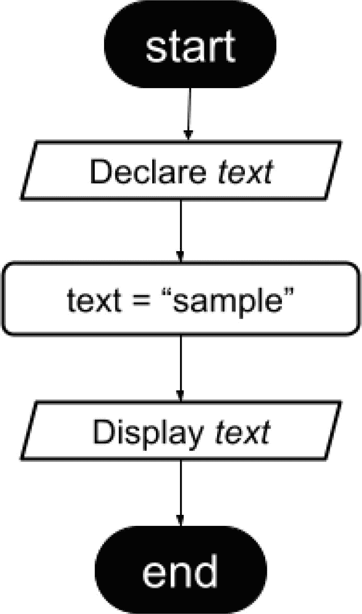

图 7-1

简单的流程图示例

解决现实世界的问题通常需要比这更复杂的逻辑，因此需要更复杂的语句。在深入探讨之前，让我们分析一下流程图的组成部分，因为在本章中我们会大量使用流程图。表 7-1 展示并标识了所有流程图元素，并解释了它们的用途。

表 7-1

流程图元素

| 形状 | 名称 | 作用 |
| --- | --- | --- |
|  | 终端 | 表示程序的开始或结束，并包含与其作用相关的文本。 |
|  | 流程线 | 表示程序的流程和操作的顺序。 |
|   | 输入/输出 | 表示变量的声明和值的输出。 |
|  | 处理 | 简单的处理语句：赋值、值更改等。 |
|  | 决策 | 显示将决定特定执行路径的条件操作。 |
|  | 预定义处理 | 表示在其他地方定义的处理过程。 |
|  | 同页连接符 | 表示流程在同一页上的继续。此元素通常带有标签。 |
|  | 异页连接符 | 表示流程在不同页面上的继续。此元素通常带有标签。 |
|  | 注释（或批注） | 当流程或元素需要额外解释时使用。 |

表 7-1 中展示的流程图元素非常标准，你可能会在任何编程课程或教程中找到非常相似的元素。经过这一连贯的介绍之后，我们将进入第二部分。


## `if-else` 语句

Java 中最简单的决策流语句是 `if-else` 语句（其他语言可能也是如此）。在前几章的代码示例中，你已经见过 `if-else` 语句的使用；这是无法避免的，因为提供可运行代码并鼓励你自行编写，是本书的一个重要目标。本节将严格聚焦于这类语句。

让我们设想这样一个场景：我们运行一个 Java 程序，用户提供一个数值参数。如果该数字是偶数，我们在控制台打印 EVEN；否则，打印 ODD。匹配该场景的流程图如图 7-2 所示。

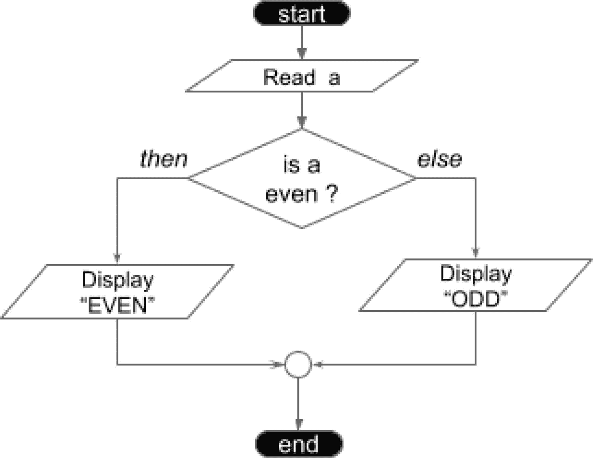

图 7-2

`if-else` 流程图示例

条件会被求值为一个 `boolean` 值：如果结果为 `true`，则执行 `if` 分支对应的语句；如果结果为 `false`，则执行 `else` 分支对应的语句。

实现该流程图所描述过程的 Java 代码如代码清单 7-2 所示。

```
package com.apress.bgn.seven;
public class IfElseFlowDemo {
void main(String... args){
int a = Integer.parseInt(args[0]);
if (a % 2 == 0) { // 是偶数
//显示 EVEN
System.out.println("EVEN");
} else {
//显示 ODD
System.out.println("ODD");
}
}
}
代码清单 7-2
包含 if-else 语句的 Java 代码
```

要使用不同参数运行此类，你需要创建一个 IntelliJ IDEA 启动器，并在 `Program arguments` 文本字段中添加参数，如本书开头所述。代码清单 7-2 中的每条 Java 语句都配有一个与流程图元素对应的注释，以使实现意图一目了然。

请注意，`if` 语句的两个分支并非都是必需的。`else` 分支并非总是必要。有时你只想在某个值满足条件时打印一些内容，而不关心其他情况。例如，给定一个用户提供的参数，我们只想在数字为负数时打印一条消息，但如果数字为正数，我们并不想打印或执行任何其他操作。对应的流程图如图 7-3 所示。

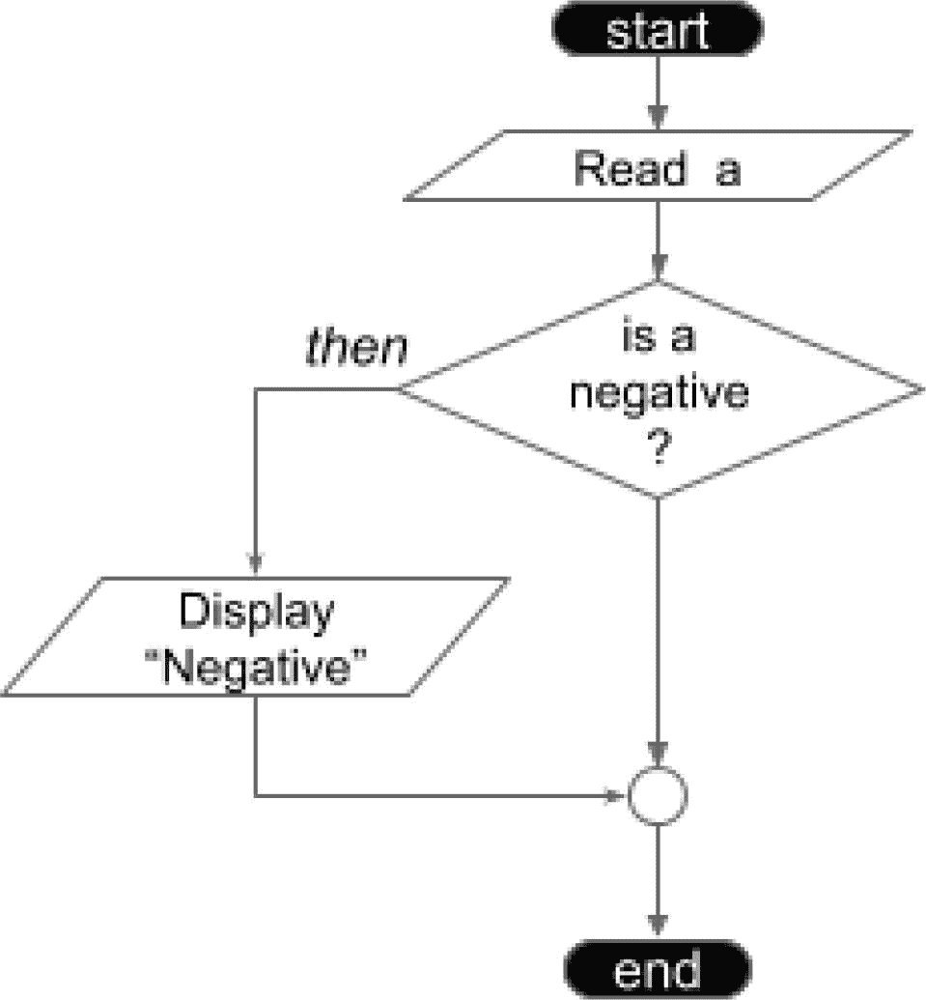

图 7-3

缺少 `else` 分支的 `if` 流程图示例

匹配该流程图的 Java 代码如代码清单 7-3 所示。

```
package com.apress.bgn.seven;
public class IfFlowDemo {
public static void main(String... args) {
int a = Integer.parseInt(args[0]);
if (a < 0) {
System.out.println("Negative");
}
}
}
代码清单 7-3
包含 if 语句的 Java 代码
```

同样，语句可以很简单，我们也可以在需要时将多个 `if-else` 语句链接起来。考虑以下示例：用户输入一个 1 到 12 之间的数字，我们需要打印该数字对应月份的季节。图 7-4 所示的流程图符合该场景。

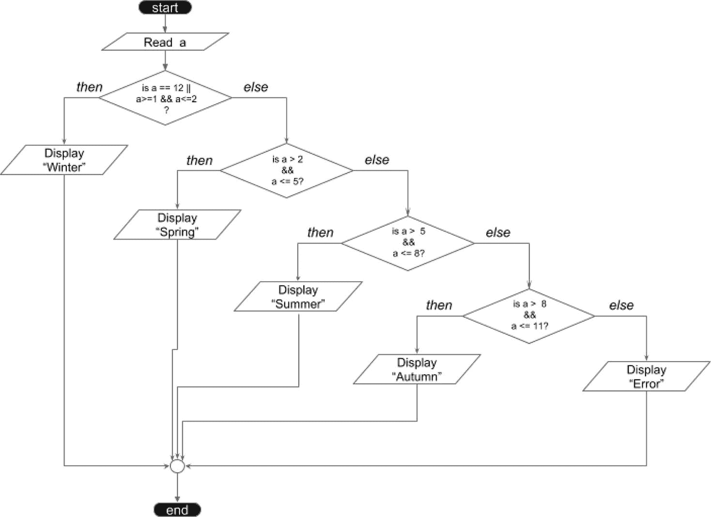

图 7-4

复杂的 `if-else` 流程图示例

重要提示

当 `if` 或 `else` 的代码块只包含一条语句时，花括号不是必需的。大多数开发者会保留它们以保持代码清晰，并帮助 IDE 正确缩进代码。

看起来很复杂，对吧？等你看到代码清单 7-4 中的代码就知道了。

```
package com.apress.bgn.seven;
public class SeasonsDemo {
void main(String... args) {
int a = Integer.parseInt(args[0]);
if(a == 12 || (a>=1 && a2 && a 5 && a 8 && a <= 11 ) {
System.out.println("Autumn");
} else {
System.out.println("Error");
}
}
}
}
}
}
代码清单 7-4
包含大量 if-else 语句的 Java 代码
```

看起来很丑，对吧？幸运的是，Java 提供了一种简化方法，尤其是因为拥有这么多仅包含另一个 `if` 语句的 `else` 块确实毫无意义。简化后的代码将 `else` 语句与其包含的 `if(s)` 语句连接起来。最终代码如代码清单 7-5 所示。

```
package com.apress.bgn.seven;
public class CompactedSeasonDemo {
void main(String... args) {
int a = Integer.parseInt(args[0]);
if (a == 12 || (a >= 1 && a  2 && a  5 && a  8 && a <= 11) {
System.out.println("Autumn");
} else {
System.out.println("Error");
}
}
}
代码清单 7-5
包含紧凑型 if-else 语句的 Java 代码
```

任何不在 `[1,12]` 范围内的用户输入参数都会导致程序打印 *Error*。你可以通过修改 IntelliJ IDEA 启动器自行测试。需要关注的重点元素已在图 7-5 中加下划线标出。

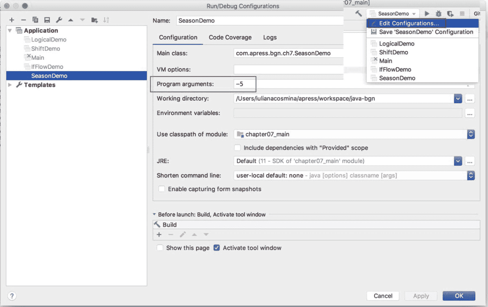

图 7-5

IntelliJ IDEA 启动器与参数

## switch

当某个解决方案需要针对一组固定值执行不同操作时，`if` 语句可能会变得复杂。在这种情况下，更合适的语句是 `switch` 语句或 `switch` 表达式。


### 经典的 **switch** 语句

原始的 `switch` 语句（我们称之为**经典 switch** 语句）自 Java 语言诞生以来就一直存在。

我们先来看一下代码清单 7-6 中的代码，然后再看看有哪些地方可以改进。

```
package com.apress.bgn.seven.switchst;
import static java.lang.System.out;
public class SeasonSwitchDemo {
void main(String... args) {
//读取 a
int a = Integer.parseInt(args[0]);
var season = "";
switch (a) {
case 1:
season = "Winter";
break;
case 2:
season = "Winter";
break;
case 3:
season = "Spring";
break;
case 4:
season = "Spring";
break;
case 5:
season = "Spring";
break;
case 6:
season = "Summer";
break;
case 7:
season = "Summer";
break;
case 8:
season = "Summer";
break;
case 9:
season = "Autumn";
break;
case 10:
season = "Autumn";
break;
case 11:
season = "Autumn";
break;
case 12:
season = "Winter";
break;
default:
out.println("Error");
}
out.println(">> Result: " + season);
}
}
代码清单 7-6
包含详细 switch 语句的 Java 代码
```

这段代码看起来并不实用，至少对于这个场景来说是这样。经典 `switch` 语句的通用模板如代码清单 7-7 所示。

```
switch ([onvar]) {
case [option]:
[statement;]
break;
...
default:
[statement;]
}
代码清单 7-7
switch 语句的通用模板
```

方括号中的术语详细说明如下：

*   `[onvar]`：用于与 `case` 语句进行匹配以选择执行语句的变量。它可以是任何基本类型、枚举类型，以及（从 Java 7 开始）`String` 类型。显然，`switch` 语句并不局限于结果为布尔值的条件，这提供了很大的灵活性。

*   `case [option]`：一个值，用于与前面提到的变量进行匹配，以决定要执行的语句（正如关键字所示，这是一个“情况”）。

*   `[statement]`：当 `[onvar] == [option]` 时要执行的一条或多条语句。考虑到没有 `else` 分支，我们必须确保只执行与第一个匹配项对应的语句，这就是 `break;` 语句的作用。`break;` 语句会停止当前执行路径，并将执行点移动到包含它的语句之外的下一条语句。如果没有 `break;` 语句，行为会变成“穿透”，这意味着匹配之后的所有 `case` 语句都会被执行，直到遇到 `break;` 为止。如果没有它，在第一个匹配之后，会遍历所有后续的 `case`，并执行它们对应的语句。
    *   如果我们执行代码清单 7-6 中的程序，并传入数字 7 作为参数，将会打印文本 *Summer*。

*   如果注释掉 case 7 和 case 8 的 `break` 语句，输出将变为 *Autumn*。

*   `default [statement;]`：当没有匹配到任何 `case` 时执行的语句；`default` 情况不需要 `break` 语句。如果使用 `[1-12]` 区间之外的任何数字运行代码清单 7-6 中的程序，将会打印 *Error*，因为会执行默认语句。

现在你已经了解了 `switch` 的工作原理，让我们看看如何简化前面的语句。月份示例很适合这里，因为它可以进一步修改，以展示当多个 case 需要执行同一条语句时，如何简化 `switch` 语句。在我们的代码中，每个赋值语句都写了三次，这有点冗余。此外，还有大量的 `break;` 语句。有两种方法可以改进前面的 `switch` 语句。

简化代码清单 7-6 中 `switch` 语句的第一种方法是将返回相同值的 case 分组在一起，如代码清单 7-8 所示。

```
package com.apress.bgn.seven.switchst;
import static java.lang.System.out;
public class SimplifiedSwitchDemo {
void main(String... args){
//读取 a
int a = Integer.parseInt(args[0]);
var season = "";
switch (a) {
case 1:
case 2:
case 12:
season = "winter";
break;
case 3:
case 4:
case 5:
season = "Spring";
break;
case 6:
case 7:
case 8:
season = "Summer";
break;
case 9:
case 10:
case 11:
season = "Autumn";
break;
default:
out.println("Error");
}
out.println(">> Result: " + season);
}
}
代码清单 7-8
简化的 switch 语句
```

这种情况下的分组代表了需要执行相同语句的 case 的对齐。这看起来仍然有点奇怪，但它稍微减少了语句的重复。之所以能实现前一种情况的行为，是因为每个没有 `break` 语句的 `case` 语句后面都会跟着下一个 `case` 语句。这也被称为**穿透条件**。简化代码清单 7-6 中 `switch` 语句的第二种方法是使用 `switch` 表达式，接下来将对此进行描述。

### `switch` 表达式

Java 12 引入了 `switch` 表达式。继续我们的月份示例，`switch` 表达式直接返回季节，而不是将其存储在变量中，这使得语法更简洁，如代码清单 7-9 所示。

```
import static java.lang.System.out;
public class ExpessionSwitchDemo {
void main(String... args) {
//读取 a
int a = Integer.parseInt(args[0]);
String season = switch (a) {
case 1 -> "Winter";
case 2 -> "Winter";
case 3 -> "Spring";
case 4 -> "Spring";
case 5 -> "Spring";
case 6 -> "Summer";
case 7 -> "Summer";
case 8 -> "Summer";
case 9 -> "Autumn";
case 10 -> "Autumn";
case 11 -> "Autumn";
case 12 -> "winter";
default -> "Error";
};
out.println(season);
}
}
代码清单 7-9
switch 表达式示例
```

引入 `switch` 表达式是为了将 `switch` 语句视为一个表达式，将其求值为单个值，从而可以在语句中使用它。

`switch` 表达式不需要 `break;` 语句来防止穿透。当代码块在匹配某个 `case` 值后执行时，会使用 Java 13 中引入的 `yield` 语句返回值。代码清单 7-10 中的代码展示了 `switch` 表达式的另一个版本，其中需要相同结果的 `case` 值使用 `,`（逗号）分组，添加了一个额外的 `System.out.println(..)` 来展示 `yield` 的用法，并且返回值作为参数提供给 `System.out.println()` 方法，以便直接打印。

```
package com.apress.bgn.seven.switchst;
import static java.lang.System.out;
public class AnotherSwitchExpressionDemo {
void main(String... args) {
//读取 a
int a = Integer.parseInt(args[0]);
out.println( switch (a) {
case 1, 2, 12 -> {
System.out.println("测试了 1、2、12 中的一个。");
yield "Winter";
}
case 3,4,5 -> {
System.out.println("测试了 3、4、5 中的一个。");
yield "Spring";
}
case 6,7,8 -> {
System.out.println("测试了 6、7、8 中的一个。");
yield "Summer";
}
case 9,10,11 -> {
System.out.println("测试了 9、10、11 中的一个。");
yield "Autumn";
}
default ->
throw new IllegalStateException("意外的值");
});
}
}
代码清单 7-10
使用 yield 语句的 switch 表达式示例
```

在 Java 7 之前，`switch` 语句只支持 `Integer` 和 `enum` 选项。在 Java 7 中，`switch` 语句开始支持 `String` 选项。


### 使用 `String` 选项的 `switch`

为了使用 `String` 选项重写清单 7-8 中的 `switch` 语句，我们需要对代码稍作修改：不再将程序参数转换为 `Integer`，而是将其视为 `String`，并要求它必须是月份的名称。此版本的代码如清单 7-11 所示。

```
package com.apress.bgn.seven.switchst;
import static java.lang.System.out;
public class StringSwitchSeasonDemo {
void main(String... args) {
//读取参数
String a = args[0];
var season = "";
switch (a) {
case "January":
case "February":
case "December":
season = "winter";
break;
case "March":
case "April":
case "May":
season = "Spring";
break;
case "June":
case "July":
case "August":
season = "Summer";
break;
case "September":
case "October":
case "November":
season = "Autumn";
break;
default:
out.println("Error");
}
out.println(">> Result: " + season);
}
}
清单 7-11
使用 String 值的 switch 语句
```

`switch` 表达式同样支持 `String` 值。`switch` 支持 `String` 值的主要问题在于，总是存在出现意外行为的可能性，因为用于匹配的是区分大小写的 `equals(..)` 方法。

清单 7-11 中的示例可以修改为要求用户输入代表月份的文本。`switch` 语句用于决定要打印的季节，除非 `case` 选项中的文本与用户输入的文本完全匹配，否则打印的文本将是 *Error*。此外，既然提到了 `switch` 表达式，清单 7-12 展示了代码的变更。

```
package com.apress.bgn.seven.switchst;
import static java.lang.System.out;
public class StringSwitchSeasonDemo {
void main(String... args) {
//读取参数
String a = args[0];
var season = "";
switch (a) {
case "January", "February", "December" -> season = "Winter";
case "March", "April", "May" -> season = "Spring";
case "June", "July", "August" -> season = "Summer";
case "September", "October", "November" -> season = "Autumn";
default -> out.println("Error");
}
out.println(season);
}
}
清单 7-12
使用 String 值的 switch 表达式
```

如果我们使用小写参数 `january` 运行上述程序，控制台将打印 winter。如果使用 `January` 或 `null` 运行，控制台将打印 *Error*。

### 使用 enum 选项的 `switch`

在支持 `String` 值之前，`switch` 语句就已经支持枚举值了。当值被分组为固定集合（例如一年中的月份名称）时，这非常实用。通过使用枚举，可以实现对 `String` 值的支持。用户以文本形式输入月份。该值被转换为大写，并用于提取相应的枚举值。这使得 `switch` 语句能够支持不区分大小写的 `String` 值。清单 7-13 中的代码展示了这种实现。

```
package com.apress.bgn.seven.switchst;
import static java.lang.System.out;
public class EnumSwitchDemo {
enum Month {
JANUARY, FEBRUARY, MARCH, APRIL, MAY, JUNE, JULY, AUGUST,
SEPTEMBER, OCTOBER, NOVEMBER, DECEMBER
}
void main(String... args) {
//读取参数
String a = args[0];
try {
Month month = Month.valueOf(a.toUpperCase());
var season = "";
switch (month) {
case JANUARY:
case FEBRUARY:
case DECEMBER:
season = "Winter";
break;
case MARCH:
case APRIL:
case MAY:
season = "Spring";
break;
case JUNE:
case JULY:
case AUGUST:
season = "Summer";
break;
case SEPTEMBER:
case OCTOBER:
case NOVEMBER:
season = "Autumn";
break;
}
out.println(season);
} catch(IllegalArgumentException iae) {
out.println("Unrecognized enum value: " + a );
}
}
}
清单 7-13
使用 enum 值的 switch 语句
```

通过使用枚举，对于 `january`、`January`、`JANuary` 以及其他大小写变体，都会返回相同的季节。当然，这是因为代码的设计方式。此外，也不需要 `default` 选项，因为在评估 `switch` 表达式之前，如果找不到与用户提供的数据匹配的枚举值，就会抛出异常。

清单 7-13 中代码对应的 `switch` 表达式版本如清单 7-14 所示。

```
package com.apress.bgn.seven.switchst;
import static java.lang.System.out;
public class EnumSwitchExprDemo {
enum Month {
JANUARY, FEBRUARY, MARCH, APRIL, MAY, JUNE, JULY, AUGUST,
SEPTEMBER, OCTOBER, NOVEMBER, DECEMBER
}
void main(String... args) {
String a = args[0];
try {
Month month = Month.valueOf(a.toUpperCase());
out.println(switch(month) {
case JANUARY, FEBRUARY, DECEMBER -> "Winter";
case MARCH , APRIL, MAY -> "Spring";
case JUNE, JULY, AUGUST -> "Summer";
case SEPTEMBER, OCTOBER, NOVEMBER -> "Autumn";
});
} catch(IllegalArgumentException iae) {
out.println("Unrecognized enum value: " + a );        }
}
}
清单 7-14
使用 enum 值的 switch 表达式
```

在实践中，根据你尝试开发的解决方案，你可能会决定结合使用 `if` 和 `switch` 语句。不幸的是，由于 `switch` 语句独特的逻辑及其灵活数量的选项，为 `switch` 语句绘制流程图很困难，但我还是尝试了，结果如图 7-6 所示。

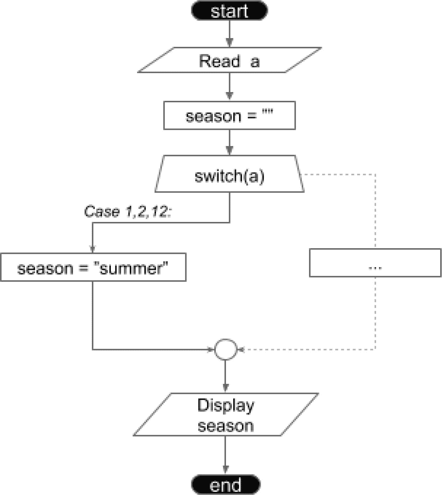

图 7-6

`switch` 语句流程图

那么，你应该使用 `switch` 语句还是 `switch` 表达式呢？答案很容易确定。经典的 `switch` 语句有几个缺点：

*   如果忘记添加 `break;`，会导致意外的穿透（fall-through），执行会继续到下一个子句。
*   变量的作用域是整个 `switch` 语句，这意味着变量名不能在两个不同的 `case` 子句中重复使用。

`default` 子句不是必需的，因此阅读代码的人可能会对如何处理与 `switch` 选项不匹配的值感到困惑，也不清楚 `default` 子句是故意省略还是只是忘记了。

`switch` 表达式没有这些缺点，并且还有其他一些优势：

*   不需要 `break;`，因为没有默认的穿透行为。
*   当所有枚举值都被用作选项时，不需要 `default` 子句；如果未使用所有值且没有 `default` 子句，编译器会通过报错来提示。
*   无需通过列出多个标签来实现穿透，它们可以用逗号分隔。
*   选项可以是任何类型。*真的。*（请查看本书仓库中的 `FloatSwitchExprDemo` 类以获取示例，或者随意使用你选择的类型编写自己的示例。）

*你会使用哪一个？*

注意

请记住，`switch` 表达式必须返回一个值或抛出一个异常，并且你不能使用 `return` 语句退出 `switch` 表达式。然而，经典的 `switch` 语句允许在其子句中使用 `return` 语句。


### **switch** 的模式匹配

**第 6 章**介绍了 `instanceof` 运算符，用于检查实例的类型并据此执行特定操作。然而，这意味着当一个对象可能具有多种类型时，最终会得到类似清单 7-15 所示的结构。

```
if (obj instanceof type1 t1) {
// 对 t1 执行某些操作
} else  if (obj instanceof type2 t2) {
// 对 t2 执行某些操作
} else if (...) {
} else {
// 当类型不属于上述任何一种时的操作
}
清单 7-15
检查对象多种类型的 if 语句
```

清单 7-15 中的代码能够完成任务，并且没有任何错误，但编写起来很繁琐，而且看起来也不美观。将所有这些条件放入一个 `switch` 表达式中会很不错，不是吗？嗯，从 Java 21 开始，我们可以做到了。

`switch` 表达式功能强大且实用，但它与其他语言中的类似结构（例如 Kotlin 中的 `when` 结构）相比仍有差距——至少在 Java 17 之前是这样，当时 `switch` 的模式匹配作为预览特性被引入。`switch` 的模式匹配特性在 Java 21 中成熟并正式发布。将模式匹配扩展到 `switch` 允许一个表达式与多个模式进行测试，每个模式都有特定的操作，从而可以简洁且安全地表达复杂的数据导向查询。这意味着，从 Java 21 开始，我们可以编写类似于清单 7-16 所示的代码。

```
package com.apress.bgn.seven.pattern;
import com.apress.bgn.four.classes.Gender;
import com.apress.bgn.four.hierarchy.MiliVanili;
import com.apress.bgn.four.hierarchy.Performer;
import com.apress.bgn.six.Graphician;
import java.util.List;
import static java.lang.System.out;
public class PatternDemo {
void main(){
Object obj = genRandomInstance();
var res = switch (obj) { /* (*) */
case Performer p -> "参演作品: " + p.getFilms();
case MiliVanili m -> "创造力 " + (m.isCreative() ? "已发现" : "未发现");
case Graphician g -> "偏好 " + g.getFavoriteOs();
case Painter p -> "风格: " + p.getStyle();
default -> "其他类型";
};
out.println(res);
}
static Object genRandomInstance(){
var t = System.currentTimeMillis();
if (t % 3 == 0 ) {
return new Painter("巴勃罗·毕加索", "立体主义", "巴塞罗那美术学院");
} else if (t % 5 == 0 ) {
return new Performer("肖恩", 94, 1.88f, Gender.MALE, List.of("詹姆斯·邦德"));
} else if (t % 11 == 0) {
return new MiliVanili();
} else if (t % 17 == 0) {
return new Graphician("戴安娜", 23, 1.62f, Gender.FEMALE, "macOs");
} else  if (t % 23== 0) {
return "随机文本";
} else  if (t % 31== 0) {
return Integer.MAX_VALUE;
}
return null;
}
}
清单 7-16
检查对象多种类型的 switch 语句
```

示例中包含 `genRandomInstance()` 方法是为了展示被测试对象可能的类型。重复运行清单 7-16 中的程序，会根据当前系统时间生成不同的输出。请注意，支持测试任何类型对象的 `switch` 表达式（和语句）允许 case 标签使用模式，而不仅仅是常量。多次运行代码可能会生成每种类型的对象，但你可能注意到有时会抛出带有以下消息的 `NullPointerException` 异常：

```
Exception in thread "main" java.lang.NullPointerException
at java.base/java.util.Objects.requireNonNull(Objects.java:220)
at chapter.seven/com.apress.bgn.seven.pattern.PatternDemo.main(PatternDemo.java:47)
```

这是怎么回事？如果你在编辑器中打开 `PatternDemo.java` 文件，你会注意到抛出异常的行是 `switch` 表达式的第一行（示例中标记为 `(*)` 的行）。发生这种情况是因为表达式求值为 `null`。为了避免这种情况，我们可以在求值 `switch` 表达式之前测试 `null`，但这会增加额外的代码。好消息是，`switch` 的模式匹配也支持将 `null` 值作为一个选项。因此，我们可以重写 `switch` 表达式，包含一个 `null` 选项，并针对这种情况返回一个 `string`，瞧，不再抛出异常（参见清单 7-17）；相反，当 `genRandomInstance()` 方法返回 `null` 时，控制台会打印 *no object* 文本。

```
package com.apress.bgn.seven.pattern;
import com.apress.bgn.four.classes.Gender;
import com.apress.bgn.four.hierarchy.MiliVanili;
import com.apress.bgn.four.hierarchy.Performer;
import com.apress.bgn.six.Graphician;
import java.util.List;
import static java.lang.System.out;
public class PatternDemo {
void main(){
Object obj = genRandomInstance();
var res = switch (obj) {
case null -> "无对象";
case Performer p -> "参演作品: " + p.getFilms();
case MiliVanili m -> "创造力 " + (m.isCreative() ? "已发现" : "未发现");
case Graphician g -> "偏好 " + g.getFavoriteOs();
case Painter p -> "风格: " + p.getStyle();
default -> "其他类型";
};
out.println(res);
}
// 方法 genRandomInstance() 已省略
}
清单 7-17
检查对象多种类型并处理 null 值的 switch 语句
```

当 `switch` 语句或表达式中的选项属于密封层次结构时，会发生一件有趣的事情。你可能没有注意到（除非你自己编写了本章中的一些代码），但在编写 `switch` 语句或表达式时，除非选项属于固定集合（例如 `enum`），否则编译器总是强制你添加一个 `default` 选项。对于密封层次结构中的类型来说，情况并非如此——*你能猜出为什么吗？*

答案很简单：由于接口和类声明了哪些其他接口和类正在实现它们，因此类型集合在编译时就已知晓，所以可以使用层次结构的根作为生成实例的引用类型，来编写一个不需要 `default` 选项的 `switch` 语句或表达式。此外，由于所有类型都属于同一个层次结构，最具体的类型必须放在选项列表的前面。

考虑到**第 4 章**中引入的密封层次结构，其根节点是密封接口 `com.apress.bgn.four.sealed.two.Mammal`，我们可以编写一个如清单 7-18 所示的 `switch` 表达式。

```
// 来自第 4 章的密封层次结构
package com.apress.bgn.four.sealed.two;
public sealed interface Mammal permits Human { }
public sealed class Human implements Mammal permits Performer, Engineer { ... }
public non-sealed class  Engineer extends Human {...}
public final class Performer  extends Human { ... }
// 测试类
package com.apress.bgn.seven.sealed;
import com.apress.bgn.four.classes.Gender;
import com.apress.bgn.four.sealed.two.Engineer;
import com.apress.bgn.four.sealed.two.Human;
import com.apress.bgn.four.sealed.two.Mammal;
import com.apress.bgn.four.sealed.two.Performer;
public class SealedHierachyDemo {
void main(){
var obj = genRandomInstance();
switch (obj) {
case Engineer e -> System.out.println(e);
case Performer p -> System.out.println(p);
case Human h -> System.out.println(h);
}
}
public static Mammal genRandomInstance(){
var t = System.currentTimeMillis();
if (t % 3 == 0 ) {
return new Engineer("胡安", 41, Gender.MALE);
} else if (t % 5 == 0 ) {
return new Human("奥姆", 41, Gender.MALE);
}
return new Performer("艾达", 209, Gender.FEMALE);
}
}
清单 7-18
检查对象来自密封层次结构的多种类型的 switch 表达式
```


### `switch` 的记录模式

JDK 21 还引入了**记录模式**，除了常规的类型匹配和自动转换外，它还引入了解构记录的能力，如**第** **6****章**所示。通过使用记录模式，不仅可以将记录类型用作 `switch` 语句和表达式的选项，而且这些选项可以是解构表达式。清单 7-19 展示了一段代码，该代码展示了一个使用各种解构记录模式作为选项的 `switch` 表达式。

```
package com.apress.bgn.seven.pattern;
import static java.lang.System.out;
record FullName (String firstName, String lastName){}
record PersonRecord (FullName fullName, Integer age) {}
record WrapperBeing(T t, String description) {}
public class RecordPatternDemo {
void main(){
Object obj = genRandomRecordInstance();
switch (obj) {
case null -> out.println("no record");
case FullName(String fn, String ln) -> out.println("FullName record: " + fn +" " + ln);
case PersonRecord(FullName(var fn, String _), var age) -> out.println("Person record " + fn +"  of age " + age);
default -> out.println("something else");
}
}
public static Object genRandomRecordInstance(){
var t = System.currentTimeMillis();
if (t % 3 == 0 ) {
return new FullName("John", "Doe");
} else if (t % 5 == 0 ) {
return new PersonRecord(new FullName("John", "Doe"), 42);
} else if (t % 11 == 0) {
return new WrapperBeing(new PersonRecord(new FullName("John", "Doe"), 42), "is mise");
}
return null;
}
}
清单 7-19
检查对象多个记录类型的 switch 语句
```

## 循环语句

在编程中，有时我们需要重复执行涉及相同变量的步骤。为了完成任务而一遍又一遍地编写相同的语句是荒谬的。让我们以对整型数组进行排序为例。最流行的排序算法，也是编程课程中首先教授的算法，因为它简单，被称为*冒泡排序*。该算法将数组的元素两两比较，如果顺序不正确，则交换它们。它会一遍又一遍地遍历数组，直到不再需要交换为止。该算法的效果如图 7-7 所示。

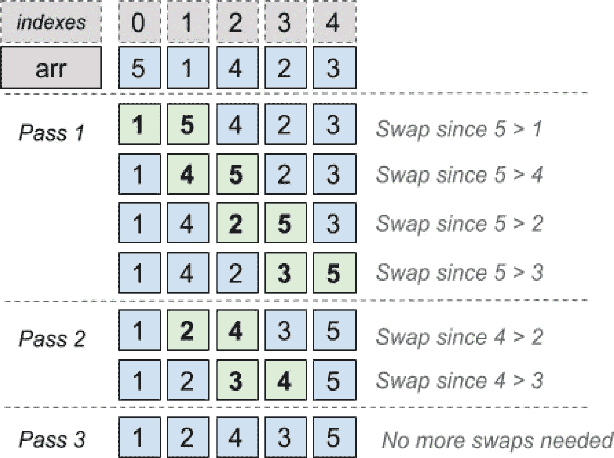

图 7-7

冒泡排序算法的阶段和效果

该算法执行两种类型的循环：一种使用索引遍历数组的每个元素。第二种重复此遍历过程，直到不需要交换为止。在 Java 中，可以使用不同的循环语句以多种方式编写此算法。但我们稍后会讲到；让我们慢慢来。

Java 中有三种类型的循环语句：

*   `for` 语句

*   `while` 语句

*   `do-while` 语句

`for` 循环语句是最常用的，但 `while` 和 `do-while` 也有其用途。

### **for** 语句

`for` 语句推荐用于迭代可计数的对象，例如数组和集合。例如，遍历数组并打印其每个值，就像清单 7-20 中描述的那样简单。

```
package com.apress.bgn.seven.forloop;
import static java.lang.System.out;
public class ForLoopBasicDemo {
void main() {
int[] arr = {5, 1, 4, 2, 3};
for (int i = 0; i < arr.length; ++i) {
out.println("arr[" +i +"] = " + arr[i]);
}
}
}
清单 7-20
遍历数组的 for 语句
```

基于清单 7-20 的示例，可以绘制出 `for` 语句的流程图，如图 7-8 所示。

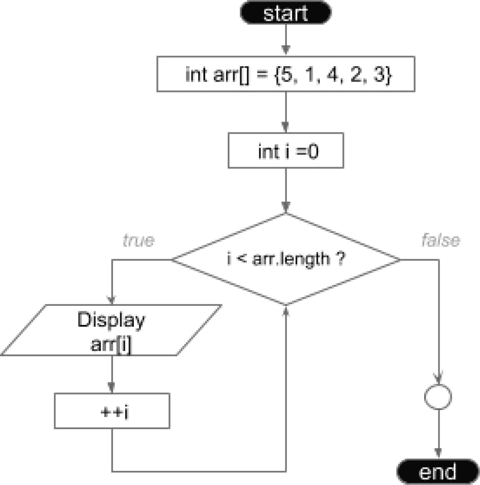

图 7-8

`for` 语句流程图

清单 7-21 中的代码片段描述了 `for` 循环模板。

```
for ([init_expr]; [condition];[step]){
[code_block]
}
清单 7-21
for 循环模板
```

方括号中的每个术语都有特定的用途，如下表所述：

*   `[init_expr]`：初始化表达式，用于设置此循环使用的计数器的初始值。它以 `;` 结尾，并且不是强制性的，因为声明和初始化可以在语句外部完成，特别是如果我们希望在代码中稍后并在语句外部使用计数器变量。清单 7-20 中的代码可以很好地写成清单 7-22 所示的形式。

```
    package com.apress.bgn.seven.forloop;
    import static java.lang.System.out;
    public class AnotherForLoopBasicDemo {
    void main(){
    int[] arr = {5, 1, 4, 2, 3};
    int i = 0;
    for (; i < arr.length; ++i) {
    out.println("arr[" +i +"] = " + arr[i]);
    }
    out.println("Loop exited with index: " + i);
    }
    }
    清单 7-22
    带有终止条件和计数器修改表达式的 for 循环
    ```

*   `[condition]`：循环的终止条件。只要此条件求值为 `true`，循环就会继续执行。该条件以 `;` 结尾，有趣的是，它也不是强制性的，因为终止条件可以放在循环重复执行的代码内部。因此，清单 7-22 中的代码可以进一步修改，如清单 7-23 所示。

```
    package com.apress.bgn.seven.forloop;
    import static java.lang.System.out;
    public class AndAnotherForLoopDemo {
    void main() {
    int[] arr = {5, 1, 4, 2, 3};
    int i = 0;
    for (; ; ++i) {
    if (i >= arr.length) {
    break;
    }
    out.println("arr[" +i +"] = " + arr[i]);
    }
    out.println("Loop exited with index: " + i);
    }
    }
    清单 7-23
    仅带有计数器修改语句的 for 循环
    ```

*   `[step]`：步进表达式或增量，在循环的每一步增加计数器。作为最后一个项，它不以 `;` 结尾。正如您可能已经预料到的，它也不是强制性的，因为没有什么能阻止开发人员在代码块内部操作计数器。因此，清单 7-23 中的代码也可以写成清单 7-24 所示的形式。

```
    package com.apress.bgn.seven.forloop;
    import static java.lang.System.out;
    public class YeyAnotherForLoopDemo {
    void main() {
    int[] arr = {5, 1, 4, 2, 3};
    int i = 0;
    for (; ;) {
    if (i >= arr.length) {
    break;
    }
    out.println("arr[" +i +"] = " + arr[i]);
    ++i;
    }
    out.println("Loop exited with index: " + i);
    }
    }
    清单 7-24
    没有初始化、条件或计数器修改表达式的 for 循环
    ```


另一种发挥`for`循环创意的方式是将计数器的修改与终止条件合并为一个条件。清单 7-25 所示的代码与本节目前展示的所有示例效果相同。

```
package com.apress.bgn.seven.forloop;
import static java.lang.System.out;
public class LastForLoopDemo {
public static void main(String... args) {
int[] arr = {5, 1, 4, 2, 3};
int i = -1;
for (; i++ < arr.length -1;) {
out.println("arr[" +i +"] = " + arr[i]);
}
out.println("Loop exited with index: " + i);
}
}
清单 7-25
在终止条件中修改计数器的 for 循环
```

另外请注意，步进表达式不一定非得是递增操作。它可以是任何修改计数器值的表达式。除了`++i`或`i++`，你还可以使用`i = i+1`或`i = i+3`，甚至如果从较大索引向较小索引遍历数组或集合，也可以使用递减操作。

注意

任何能将计数器保持在类型边界和集合边界内的数学运算都可以安全使用。

*   `[code_block]`：一个代码块，在循环的每一步中重复执行。如果此代码块内没有退出条件，则该代码块将执行与计数器通过终止条件次数相同的次数。

重要

当代码块只包含一条语句时，花括号不是必需的，但大多数开发者会保留它们以提高代码清晰度，并帮助 IDE 正确缩进代码。

警告

如前所述，初始化表达式、终止条件和迭代表达式都是可选的，这意味着以下是一个有效的`for`语句：

`for` `( ; ; ) {`

`\\` `在此处放置语句`

`}`

谨慎

使用这种形式的`for`语句时请务必小心。代码块必须包含一个终止条件，以避免出现*无限循环*。

这是`for`循环语句的基本形式，但在 Java 中还有其他遍历一组值的方法。假设我们需要遍历一个列表而不是数组，如清单 7-26 所示。

```
package com.apress.bgn.seven.forloop;
import java.util.List;
import static java.lang.System.out;
public class ListLoopDemo {
void main() {
var list = List.of(5, 1, 4, 2, 3);
for (int j = 0; j < list.size(); ++j) {
out.println("list[ " +j +"] = " + list.get(j));
}
}
}
清单 7-26
遍历列表的 for 循环
```

清单 7-26 中的代码由于多次调用列表方法而显得有些不便，这就是为什么`List<E>`实例可以用另一种类型的`for`语句来遍历，这种语句在 Java 8 之前被称为`forEach`。你马上就会明白原因，但首先让我们在清单 7-27 中看看`forEach`的实际应用。

```
package com.apress.bgn.seven.forloop;
import java.util.List;
import static java.lang.System.out;
public class ForEachLoopDemo {
void main() {
var list = List.of(5, 1, 4, 2, 3);
for (Integer item : list) {
out.println(item);
}
}
}
清单 7-27
遍历列表的 forEach 循环
```

这种类型的`for`语句也被称为具有增强语法，它会对其表达式中使用的集合中的每个项执行代码块。这意味着它适用于任何`Collection<E>`接口的实现，也适用于数组。因此，到目前为止展示的代码示例也可以写成清单 7-28 所示的形式。

```
package com.apress.bgn.seven.forloop;
import static java.lang.System.out;
public class ArrayForEachDemo {
void main(){
int[] arr = {5, 1, 4, 2, 3};
for (int item : arr) {
out.println(item);
}
}
}
清单 7-28
遍历数组的 forEach 循环
```

显然，这种情况下最好的部分是，我们不再需要终止条件或计数器。从 Java 8 开始，`forEach`这个名称不能再用于具有增强语法的`for`语句，因为`forEach`默认方法已被添加到所有`Collection<E>`实现中，所以现在它被称为“增强型 for”。将`forEach`默认方法与 lambda 表达式结合，打印列表元素的代码就变成了清单 7-29 中的样子。

```
package com.apress.bgn.seven.forloop;
import java.util.List;
import static java.lang.System.out;
public class ForLoopDemo {
void main(){
var list = List.of(5, 1, 4, 2, 3);
list.forEach(item -> out.println(item));
//或者使用方法引用
list.forEach(out::println);
}
}
清单 7-29
使用 forEach 方法遍历列表
```

很简洁，对吧？但等等，还有更多：它也适用于数组，但首先需要将其转换为合适的`java.util.stream.BaseStream`实现。这由`Arrays`工具类提供，该类在 Java 8 中得到了增强，增加了支持 lambda 表达式的方法。因此，到目前为止使用`arr`数组编写的代码，从 Java 8 开始可以写成清单 7-30 所示的形式。

```
package com.apress.bgn.seven.forloop;
import static java.lang.System.out;
public class ForLoopDemo {
void main(){
int[] arr = {5, 1, 4, 2, 3};
Arrays.stream(arr).forEach(out::println);
}
}
清单 7-30
使用 forEach 方法遍历数组
```

另一种不使用索引变量遍历数组的方法是使用`java.util.stream.IntStream.range(..)`，如清单 7-31 所示。`range(startInclusive, endExclusive)`方法返回一个从`startInclusive`（包含）到`endExclusive`（不包含）的连续有序`IntStream`，步长为 1。

```
package com.apress.bgn.seven.forloop;
import java.util.stream.IntStream;
import static java.lang.System.out;
public class ForLoopDemo {
void main(){
int[] arr = {5, 1, 4, 2, 3};
IntStream.range(0, arr.length).forEach(out::println);
}
}
清单 7-31
使用 IntStream.range(startInclusive, endExclusive) 遍历数组
```

在 Java 21 中，上述所有示例都能正常编译和执行，因此在编写解决方案时，你可以使用自己最喜欢的语法。


### `while` 语句

`while` 语句与 `for` 语句的主要区别在于，`while` 语句不需要执行固定次数的步骤，因此并不总是需要计数器。`while` 语句执行的重复次数仅取决于控制该次数的继续条件被评估为 `true` 的次数。该语句的通用模板如代码清单 7-32 所示。

```
while ([eval(condition)] == true) {
[code_block]
}
代码清单 7-32
while 语句模板
```

`while` 语句实际上也不需要初始化语句。如果需要，它可以放在 `while` 代码块内部或外部。`while` 语句可以替代 `for` 语句，但 `for` 语句的优势在于它将初始化、终止条件和计数器的修改封装在一个块中，因此更加简洁。数组遍历的代码示例可以使用 `while` 语句重写，如代码清单 7-33 所示。

```
package com.apress.bgn.seven.whileloop;
import static java.lang.System.out;
public class WhileLoopDemo {
void main(){
int[] arr = {5, 1, 4, 2, 3};
int i = 0;
while(i < arr.length) {
out.println("arr[" +i +"] = " + arr[i]);
++i;
}
}
}
代码清单 7-33
使用 while 语句遍历数组
```

如你所见，计数器变量 `int i = 0;` 的声明和初始化是在 `while` 代码块外部完成的。计数器的递增则在需要重复的代码块内部完成。此时，如果我们为此场景设计流程图，它将与图 7-8 中 `for` 语句的流程图相同。

听起来可能难以置信，`[condition]` 也不是强制性的，因为它可以直接替换为 `true`，但在这种情况下，你必须确保代码块中存在一个一定会被执行的退出条件；否则，执行很可能会以错误告终，因为 JVM 不允许无限循环。这个条件必须放在代码块的开头，以防止在不应该执行有用逻辑的情况下执行它。对于我们的简单示例，显然我们不想为索引超出数组范围的元素调用 `System.out.println`，如代码清单 7-34 所示。

```
package com.apress.bgn.seven.whileloop;
import static java.lang.System.out;
public class AnotherWhileLoopDemo {
void main(){
int[] arr = {5, 1, 4, 2, 3};
int i=0;
while(true){
if (i >= arr.length) {
break;
}
out.println("arr[" +i +"] = " + arr[i]);
++i;
}
}
}
代码清单 7-34
使用 while 语句遍历数组，无继续条件
```

当我们处理一个并非始终在线的资源时，最好使用 `while` 语句。假设我们为应用程序使用了一个位于不稳定网络中的远程数据库。与其在第一次超时后就放弃保存数据，不如一直尝试直到成功，对吧？这可以通过使用 `while` 语句来实现，它会在其代码块中持续尝试初始化一个连接对象。代码大致如代码清单 7-35 所示。

```
package com.apress.bgn.seven.whileloop;
import java.sql.Connection;
import java.sql.DriverManager;
import java.sql.ResultSet;
import java.sql.Statement;
import static java.lang.System.out;
public class WhileConnectionTester {
void main()throws Exception {
Connection con = null;
while (con == null) {
try {
con = DriverManager.getConnection(
"jdbc:mysql://localhost:3306/mysql",
"root", "mypass");
} catch (Exception e) {
out.println("连接被拒绝。5 秒后重试...");
Thread.sleep(5000);
}
}
// con != null, 执行操作
Statement stmt = con.createStatement();
ResultSet rs = stmt.executeQuery("select * from user");
while (rs.next()) {
out.println(rs.getString(1) + " " + rs.getString(2));
}
con.close();
}
}
// 输出
// 可能
// 连接被拒绝。5 秒后重试...
// 肯定
/*
% root
localhost mysql.infoschema
localhost mysql.session
localhost mysql.sys
localhost root
*/
代码清单 7-35
使用 while 语句反复尝试获取数据库连接
```

这段代码的问题在于，如果没有可连接的数据库，它将永远运行下去。如果我们希望在一定时间后放弃尝试，就必须引入一个变量来记录尝试次数，并使用 `break;` 语句退出循环，如代码清单 7-36 所示。

```
package com.apress.bgn.seven.whileloop;
import java.sql.Connection;
import java.sql.DriverManager;
import static java.lang.System.out;
public class AnotherWhileConnectionTester {
public static final int MAX_TRIES = 10;
void main()throws Exception {
var cntTries = 0;
Connection con = null;
while (con == null && cntTries < MAX_TRIES) {
try {
con = DriverManager.getConnection(
"jdbc:mysql://localhost:3306/mysql",
"root", "mypass");
} catch (Exception e) {
++cntTries;
out.println("连接被拒绝。5 秒后重试...");
Thread.sleep(5000);
}
}
if (con != null) {
// con != null, 执行操作
var stmt = con.createStatement();
var rs = stmt.executeQuery("select * from user");
while (rs.next()) {
out.println(rs.getString(1) + " " + rs.getString(2));
}
con.close();
} else {
out.println("无法连接！");
}
}
}
// 无数据库时的输出
// 连接被拒绝。5 秒后重试... (重复 10 次)
// 无法连接！
代码清单 7-36
使用 while 语句反复尝试获取数据库连接，直至尝试次数耗尽
```

重要提示

作为经验法则，使用循环语句时，务必确保存在退出条件。

既然我们已经涵盖了实现图 7-7 中冒泡排序算法所需的所有语句，让我们看看代码是什么样的。请注意，该算法可以用多种方式编写，但以下代码最符合前面提供的解释：只要数组中存在未按正确顺序排列的元素，就反复遍历数组，并交换相邻元素以符合所需的顺序（此处为升序）。冒泡排序算法的最简单版本如代码清单 7-37 所示。

```
package com.apress.bgn.seven.whileloop;
import java.util.Arrays;
import static java.lang.System.out;
public class BubbleSortDemo {
public static final int[] arr = {5, 1, 4, 2, 3};
void main() {
boolean swapped = true;
while (swapped) {
swapped = false;
for (int i = 0; i  arr[i + 1]) {
int temp = arr[i];
arr[i] = arr[i + 1];
arr[i + 1] = temp;
swapped = true;
}
}
}
Arrays.stream(arr).forEach(out::println);
}
}
// 输出
/*

*/
代码清单 7-37
冒泡排序算法的最简单版本
```


### `do-while` 语句

`do-while` 语句与 `while` 语句类似，但有一个区别：循环继续条件是在执行代码块之后才进行求值。这会导致代码块至少被执行一次，例如，这对于显示菜单非常有用，除非代码块内嵌有阻止其执行的条件。该语句的通用模板如代码清单 7-38 所示。

```
do {
[代码块]
} while ([eval(条件)] == true)
代码清单 7-38
do-while 语句模板
```

大多数情况下，`while` 和 `do-while` 语句可以轻松互换，只需对代码块的逻辑进行最少更改甚至无需更改。例如，遍历数组并打印其元素值也可以使用 `do-while` 编写，而无需更改代码块。在图 7-9 中，你可以看到两种实现并排显示，左侧是 `while` 语句，右侧是 `do-while` 语句。通过在每一行设置断点，可以清晰地看到每个条件。

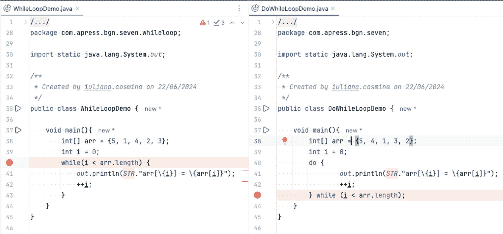

图 7-9

用于打印数组元素的 `while` 和 `do-while` 实现

然而，这两个示例的流程图却大相径庭，揭示了两条语句不同的逻辑。你可以通过查看图 7-10 来比较它们。

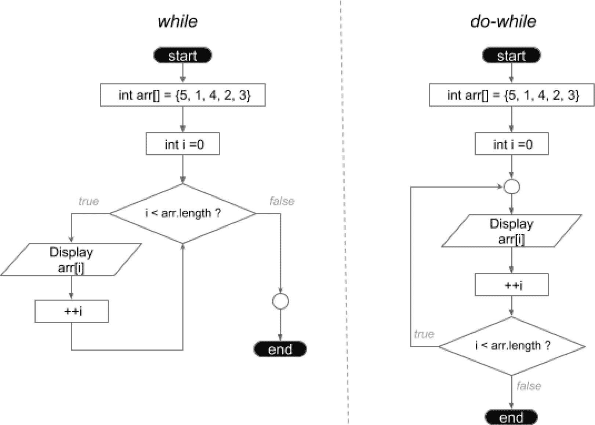

图 7-10

`while` 和 `do-while` 语句的流程图比较

在图 7-9 的示例中，如果数组为空，`do-while` 语句会抛出 `ArrayIndexOutOfBoundsException` 异常，因为代码块的内容会被执行。索引值等于数组长度（零），因此该代码块本不应被执行。然而，由于条件是在代码块之后才进行求值，我们无法事先知道这一点。在图 7-11 中，你可以看到修改后的先前代码示例，它针对空数组运行，并并排显示了各自的输出。

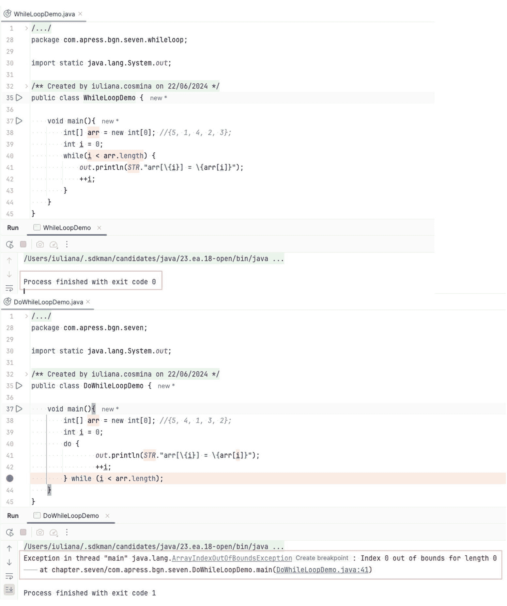

图 7-11

用于打印空数组元素的 `while` 和 `do-while` 实现

要使 `do-while` 实现具有与 `while` 实现相同的行为，代码块的执行必须受限于数组至少包含一个元素。代码清单 7-39 展示了一种实现方法。

```
package com.apress.bgn.seven.dowhileloop;
import static java.lang.System.out;
public class DoWhileLoopDemo {
void main(){
int[] arr = new int[0]; //{5, 4, 1, 3, 2};
int i = 0;
do {
if(arr.length >=1) {
out.println("arr[" +i +"] = " + arr[i]);
++i;
}
} while (i < arr.length);
}
}
代码清单 7-39
也能正确处理空数组的 do-while 语句实现
```

提示

当代码块必须至少执行一次时，`do-while` 语句效果最佳；否则，我们会不必要地评估一次条件。

前面介绍的冒泡排序算法是一个很好的例子，说明 `while` 和 `do-while` 语句可以在无需额外修改代码的情况下互换使用。

既然提到编写此算法的方法不止一种，那么代码清单 7-40 展示了一个改进版本，它不仅使用了 `do-while`，而且每次遍历时都会减小数组的大小。这是可行的，因为（根据图 7-7）每次遍历后，数组的最后一个索引都保存着当前遍历子集中的最大数。

```
package com.apress.bgn.seven.dowhileloop;
import java.util.Arrays;
import static java.lang.System.out;
public class BubbleSortDemo {
public static final int[] arr = {5, 1, 4, 2, 3};
void main(){
boolean swapped;
do {
swapped = false;
for (int i = 0, n = arr.length -1; i  arr[i + 1]) {
int temp = arr[i];
arr[i] = arr[i + 1];
arr[i + 1] = temp;
swapped = true;
}
}
} while (swapped);
Arrays.stream(arr).forEach(out::println);
}
}
代码清单 7-40
使用 do-while 语句的冒泡排序算法优化版本
```

重要

`for` 语句中的初始化和步进表达式允许多个项，这些项由 `,` 分隔。因此，以下代码是有效且运行良好的：

`for (int j = 0, k =2; j < 10; ++j, ++k) {`

`out.println("composed indexes: [" +j + ", " + k + "]");`

`}`

还记得代码清单 7-35 中尝试连接不稳定网络上的数据库的代码示例吗？当使用 `while` 时，执行从测试连接是否不为 `null` 开始，但此时连接甚至还没有用有效值初始化。执行该测试是不合逻辑的，对吧？请参见代码清单 7-41 中所示的代码片段。

```
Connection con = null;
while (con == null) {
try {
con = DriverManager.getConnection(
"jdbc:mysql://localhost:3306/mysql", "root", "mypass");
// 省略部分代码
代码清单 7-41
用于检查数据库连接的 while 实现
```

这种实现虽然功能上可行，但有些冗余，并且逻辑上并未真正遵循最佳编程实践。`do-while` 实现最为合适，因为它避免了在 `con` 实例不可能不为 `null` 的情况下进行初始测试。代码清单 7-42 展示了编写该代码的一种变体。

```
package com.apress.bgn.seven.dowhileloop;
import java.sql.Connection;
import java.sql.DriverManager;
import static java.lang.System.out;
public class DoWhileConnectionTester {
public static final int MAX_TRIES = 10;
void main() throws Exception {
int cntTries = 0;
Connection con = null;
do {
try {
con = DriverManager.getConnection(
"jdbc:mysql://localhost:3306/mysql",
"root", "mypass");
} catch (Exception e) {
++cntTries;
out.println("连接被拒绝。5 秒后重试 ...");
Thread.sleep(5000);
}
} while (con == null && cntTries < MAX_TRIES);
if (con != null) {
var stmt = con.createStatement();
var rs = stmt.executeQuery("select * from user");
while (rs.next()) {
out.println(rs.getString(1) + " " + rs.getString(2));
}
con.close();
} else {
out.println("无法连接！");
}
}
}
代码清单 7-42
用于检查数据库连接的 do-while 实现
```

当然，跳过单次条件的评估并不是一个大的优化，但在大型应用程序中，每一次微小的优化都很重要。

## 中断循环与跳过步骤

正如在讨论之前使用 `break;` 语句退出循环的示例时所承诺的，本节将提供更多细节。我们可以使用三个语句来操控循环的行为：

*   `break`：退出循环，如果带有标签，则中断带有该标签的循环；当存在多个嵌套循环时，这非常有用，因为我们可以从任何嵌套循环中跳出，而不仅仅是包含该语句的那个循环。
*   `continue`：跳过其后任何代码的执行，并继续执行下一步。
*   `return`：退出一个方法，因此如果循环或 `switch` 语句位于方法体内，它也可以用来退出循环。

警告

作为最佳实践，不应滥用 `return` 语句来退出方法，因为它们可能会使执行流程难以跟踪。


### `break` 语句

`break` 语句只能用于 `switch`、`for`、`while` 和 `do-while` 语句中。你已经看到它如何在 `switch` 语句中使用，现在我们来看看如何在其他三种语句中使用它。可以使用 `break` 语句跳出 `for`、`while` 或 `do-while` 循环，但必须由退出条件控制，否则将不会执行任何步骤。在清单 7-43 中，即使 `for` 循环设计为遍历数组的所有元素，我们也只打印前三个元素。如果索引等于 3，我们就退出循环。

```
package com.apress.bgn.seven.forloop;
import static java.lang.System.out;
public class BreakingForDemo {
public static final int[] arr = {5, 1, 4, 2, 3};
void main(){
for (int i = 0; i < arr.length ; ++i) {
if (i == 3) {
out.println("Bye bye!");
break;
}
out.println("arr[" +i +"] = " + arr[i]);
}
}
}
清单 7-43
跳出 for 循环
```

如果遇到嵌套循环的情况，可以使用标签来决定要跳出哪个循环语句。例如，在清单 7-44 中，我们有三个嵌套的 `for` 循环，当所有索引都相等时，我们退出中间的循环。

```
package com.apress.bgn.seven.forloop;
import static java.lang.System.out;
public class BreakingNestedForLoopDemo {
public static final int[] arr = {5, 1, 4, 2, 3};
void main(){
for (int i = 0; i < 2; ++i) {
HERE: for (int j = 0; j < 2; ++j) {
for (int k = 0; k < 2; ++k) {
if (i == j && j == k) {
break HERE;
}
out.println("(i, j, k) = (" +i + ", " + j + ", " + k +")");
}
}
}
}
}
清单 7-44
跳出嵌套的 for 循环
```

清单 7-44 中使用的标签名为 `HERE`，它声明在满足条件时将要退出的 `for` 语句之前。`break` 语句后面跟着同一个标签。在开发中，使用全大写字母编写标签名被认为是一种最佳实践，因为在阅读代码时可以避免将标签与变量或类名混淆。

为了确保其正常工作，你可以查看控制台。你应该会看到一些 `(i, j, k)` 的组合缺失了，包括 `i = j = k` 的那个组合。输出如下：

```
(i, j, k) = (1,0,0)
(i, j, k) = (1,0,1)
(i, j, k) = (1,1,0)
```

警告

在软件开发中，使用标签跳出循环是非常不受欢迎的，这是一种委婉的说法，表示**这是一种不良实践**，因为它会导致代码跳转，使执行流程更难跟踪。因此，如果你别无选择只能这样做，请确保你的标签是可见的。

提示

根据你正在构建的解决方案，你可以通过将嵌套循环包装在一个方法中，并使用 `return` 语句跳出循环来避免使用标签跳出，稍后在本章中你将看到这一点。

### `continue` 语句

`continue` 语句不会中断循环，但可以根据条件跳过某些步骤。本质上，`continue` 语句会停止当前循环步骤的执行并进入下一步，因此可以说该语句是继续循环。让我们继续使用数组遍历示例进行实验，但这次使用 `continue` 语句跳过打印奇数索引元素的步骤。代码如清单 7-45 所示。

```
package com.apress.bgn.seven.forloop;
import static java.lang.System.out;
public class ContinueForDemo {
public static final int[] arr = {5, 1, 4, 2, 3};
void main(){
for (int i = 0; i < arr.length; ++i) {
if (i % 2 != 0) {
continue;
}
out.println("arr[" +i +"] = " + arr[i]);
}
}
}
清单 7-45
使用 for 循环和 continue 语句跳过打印奇数索引元素
```

显然，这个语句必须有条件——否则，循环只会无用地迭代。

`continue` 语句也可以与标签一起使用。让我们采用与之前使用的三个嵌套 `for` 循环类似的示例，但这次，当 `k` 索引等于 1 时，不打印任何内容，并跳到包含 `k` 循环的循环的下一步。代码如清单 7-46 所示。

```
package com.apress.bgn.seven.forloop;
import static java.lang.System.out;
/**
* Created by iuliana.cosmina on 23/06/2024
*/
public class ContinueNestedForLoopDemo {
public static final int[] arr = {5, 1, 4, 2, 3};
void main(){
for (int i = 0; i < 3; ++i) {
HERE: for (int j = 0; j < 3; ++j) {
for (int k = 0; k < 3; ++k) {
if (k == 1) {
continue HERE;
}
out.println("(i, j, k) = (" +i + ", " + j + ", " + k +")");
}
}
}
}
}
清单 7-46
使用 for 循环和带标签的 continue 语句跳过打印奇数索引元素
```

为了确保其正常工作，你可以查看控制台，看看打印出了哪些组合。预期的输出如下，它清楚地表明没有打印任何包含 `k = 1` 或 `k = 2` 的组合：

```
(i, j, k) = (0,0,0)
(i, j, k) = (0,1,0)
(i, j, k) = (0,2,0)
(i, j, k) = (1,0,0)
(i, j, k) = (1,1,0)
(i, j, k) = (1,2,0)
(i, j, k) = (2,0,0)
(i, j, k) = (2,1,0)
(i, j, k) = (2,2,0)
```

重要

在 Java 社区中，使用标签跳出循环是不受欢迎的，因为跳转到标签类似于某些老式编程语言中的 `goto` 语句。

注意

`goto` 是 Java 的保留关键字，因为该语句曾存在于 Java 的第一个版本中。使用跳转会降低代码的可读性，因为执行流程变得更难跟踪，可测试性更差，并且会助长不良设计。这就是为什么 `goto` 在后续的 Java 版本中被移除，但任何此类操作的需求都可以通过 `break` 和 `continue` 语句来实现。

### `return` 语句

`return` 语句很容易理解：如前所述，它可以用于退出方法体的执行。如果方法返回一个值，则 `return` 语句会附带返回的值。`return` 语句可用于退出本节中提到的任何语句。它可以成为缩短方法执行的相当巧妙的方式，因为当前方法的执行会停止，并从调用该方法的代码点继续处理。

让我们看几个例子。清单 7-47 中的代码展示了一个在数组中搜索第一个偶数元素的方法。如果找到，该方法返回其索引；否则，返回 -1。

```
package com.apress.bgn.seven;
import static java.lang.System.out;
public class ReturnDemo {
public static final int[] arr = {5, 1, 4, 2, 3};
void main() {
int foundIdx = findEvenUsingFor(arr);
if (foundIdx != -1) {
out.println("First even is at: " + foundIdx);
}
}
public static int findEvenUsingFor(int ... arr) {
for (int i = 0; i < arr.length; ++i) {
if (arr[i] %2 == 0) {
return i;
}
}
return -1;
}
}
清单 7-47
使用 for 循环和 continue 语句跳过打印奇数索引元素
```

同样的方法可以使用 `while` 语句编写，但 `return` 语句的目的相同。代码如清单 7-48 所示。

```
// 省略了外围类
public static int findEvenUsingWhile(int ... arr) {
int i = 0;
while (i < arr.length) {
if (arr[i] % 2 == 0) {
return i;
}
++i;
}
return -1;
}
清单 7-48
使用 while 语句查找偶数
```

如你所见，`return` 语句可以用于任何你想要在满足条件时终止方法执行的情况。


## 使用 `try-catch` 结构控制流程

本书之前已经提到过异常和 `try-catch` 语句，但并未将其作为控制执行流程的工具。在进入解释和示例之前，我们先讨论一下 `try-catch-finally` 语句的通用模板。该模板如代码清单 7-49 所示。

```
try {
[代码块]
} catch ([异常块]} {
[处理代码块]
} finally {
[清理代码块]
}
代码清单 7-49
try-catch-finally 语句模板
```

模板的各个组成部分说明如下：

*   `[代码块]`：要执行的代码块。
*   `[异常块]`：针对 `[代码块]` 可能抛出的异常实例，声明一个或多个异常类型。
*   `[处理代码块]`：抛出异常表示发生了必须处理的意外情况。一旦捕获到异常，就会执行这段代码来处理它，要么尝试将系统恢复到正常状态，要么记录有关异常原因的详细信息。
*   `[清理代码块]`：如果需要，此代码块用于释放资源或将对象设置为 `null`，使其符合垃圾回收条件。如果存在此代码块，无论是否抛出异常，它都会被执行。

现在你已经了解了 `try-catch-finally` 语句的工作原理，大概可以想象如何使用它来控制执行流程了。在 `[代码块]` 中，你可以显式地抛出异常，并决定如何处理它们。

考虑到我们一直使用的数组，我们将再次基于它来设计代码片段。代码清单 7-50 展示了一段在发现偶数值时抛出异常的代码。

```
package com.apress.bgn.seven.ex;
import java.util.Arrays;
import static java.lang.System.out;
public class ExceptionFlowDemo {
public static final int[] arr = {5, 1, 4, 2, 3};
void main(){
try {
checkNotEven(arr);
out.println("未发现偶数，一切正常！");
} catch (EvenException e) {
out.println(e.getMessage());
} finally {
out.println("正在清理 arr");
Arrays.fill(arr, 0);
}
}
public static int checkNotEven(int... arr) throws EvenException {
for (int i = 0; i < arr.length; ++i) {
if (arr[i] % 2 == 0) {
throw new EvenException("在索引 " + i + " 处不应出现偶数");
}
}
return -1;
}
}
class EvenException extends Exception{
public EvenException(String message) {
super(message);
}
}
// 输出
//在索引 2 处不应出现偶数
//正在清理 arr
代码清单 7-50
使用异常控制流程
```

`EvenException` 类型是为这个特定示例编写的自定义异常类型。请注意此代码片段的输出。如你所见，通过抛出异常，我们将执行流程导向了处理代码，因此 *未发现偶数，一切正常！* 没有被打印出来。由于还有一个 `finally` 块也被执行了，我们也在控制台中看到了 *正在清理 arr* 这条消息。

你还可以混合搭配使用：使用不同类型的异常并包含多个 `catch` 块——一切以解决问题为要。在我之前工作过的一家公司，我们有一段代码用于验证文档，并根据失败的验证检查抛出不同类型的异常，而在 `finally` 块中，我们有将错误对象转换为 PDF 的代码。该代码类似于代码清单 7-51 所示。

```
ErrorContainter errorContainer = new ErrorContainter();
try {
validate(report);
} catch (FileNotFoundException | NotParsable e) {
errorContainer.addBadFileError(e);
} catch (InvestmentMaxException e) {
errorContainer.addInvestmentError(e);
} catch (CreditIncompatibilityException e) {
errorContainer.addIncompatibilityError(e);
} finally {
if (errorContainer.isEmpty()) {
printValidationPassedDocument();
} else {
printValidationFailedDocument(errorContainer);
}
}
代码清单 7-51
展示包含多个 catch 语句的 try-catch-finally 块的代码示例
```

`finally` 代码块中的代码很复杂，完全不建议放在那里。然而，在现实世界中，解决方案并不总是遵循最佳实践，甚至不遵循常识性实践。在处理遗留代码时，你可能会发现自己不得不编写功能正常但质量低劣的代码来解决客户的问题——因为编程固然很棒，但在某些管理者眼中，结果更重要……更快的结果更是如此。如果你足够幸运，在一家着眼于未来构建代码或将其交给其他团队成员的公司工作，你可能会遇到一位青睐最佳实践的管理者。只要记住尽力而为，并妥善记录所有内容，你就会做得很好。

`try-catch-finally` 块非常强大。它们是用于引导执行流程、打印有关应用程序整体状态以及潜在问题根源的有用信息的有效结构。如果设计得当，异常处理可以提高代码的质量和可读性。设计异常处理时需要遵循一些规则：

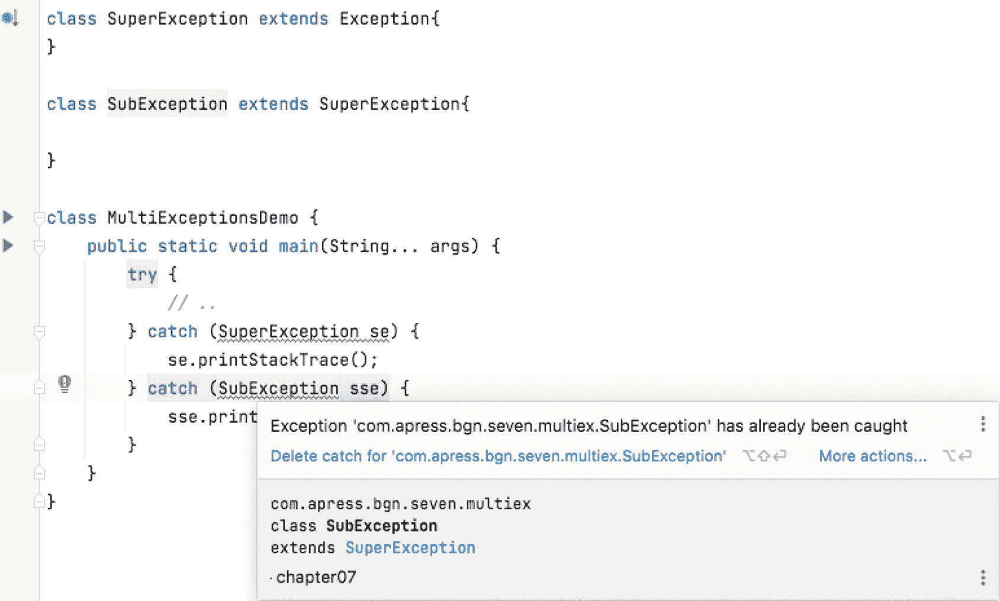

图 7-12

IntelliJ IDEA 编译错误和消息，显示 `try-catch` 块中异常类型的顺序错误

*   尽量避免使用多个 `catch` 块，除非它们用于以不同方式处理不同类型的异常。
*   使用 `|`（管道）符号将需要以相同方式处理的相似异常类型分组。Java 7 开始支持此功能。
*   捕获具有相关类型的异常时要小心。第一个匹配异常类型的 `catch` 语句会处理该异常，因此超类应位于 `catch` 列表的较后位置。如果顺序不正确，编译器甚至会报错，如图 7-12 所示。

当然，你还应该遵守本书前面提到的基本规则：避免吞没异常以及捕获 `Throwable`。

## 总结

本章涵盖了开发中最重要的方面之一：如何设计你的解决方案及其逻辑。你还了解了流程图及其组成部分，它们可作为决定如何编写代码以及如何控制执行路径的工具。最后，你学习了在何时使用哪些语句，以及使用它们的一些 Java 最佳实践，以便你能够设计出最合适的解决方案来解决你的问题。Java 提供了以下功能：

*   编写 `if` 语句的简单和更复杂的方式
*   可与任何原始类型、枚举以及（从 Java 7 开始）`String` 实例一起使用的 `switch` 语句
*   返回一个值并可用于编写更复杂语句的 `switch` 表达式
*   在 `switch` 表达式和语句中使用模式匹配和记录模式
*   编写 `for` 语句的几种方式
*   使用 `forEach` 方法和流来遍历值集合
*   当需要重复执行某个步骤直到满足条件时使用的 `while` 语句
*   当需要重复执行某个步骤直到满足条件，并且该步骤至少执行一次（因为继续条件在其之后评估）时使用的 `do-while` 语句
*   通过使用 `break`、`continue` 和 `return` 等语句来操纵循环行为
*   通过使用 `try-catch-finally` 结构来控制执行流程


