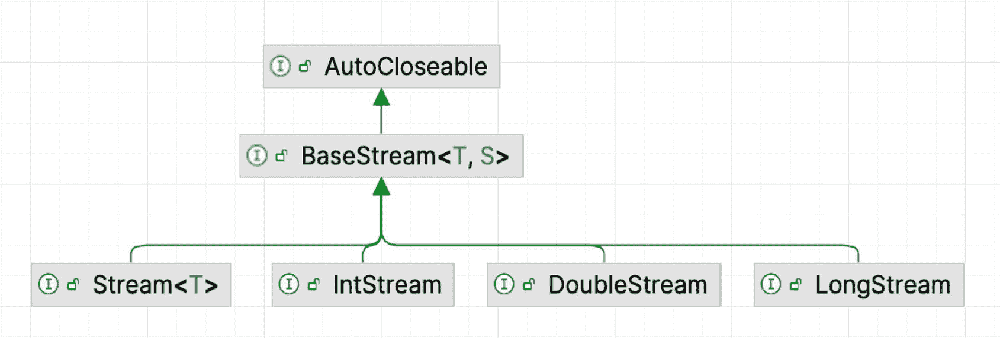
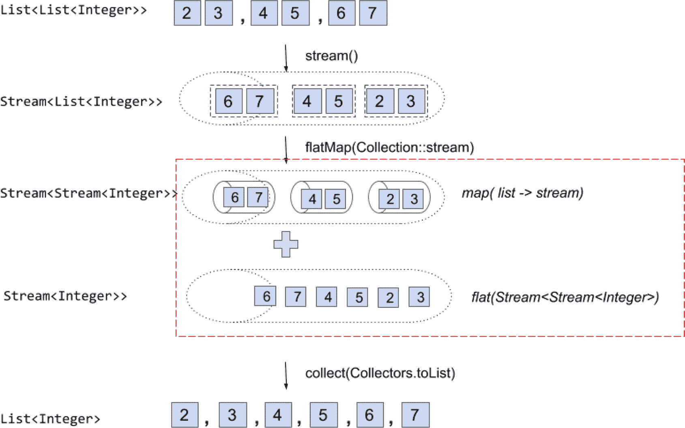
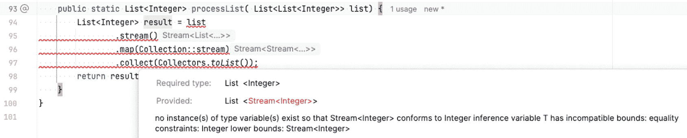
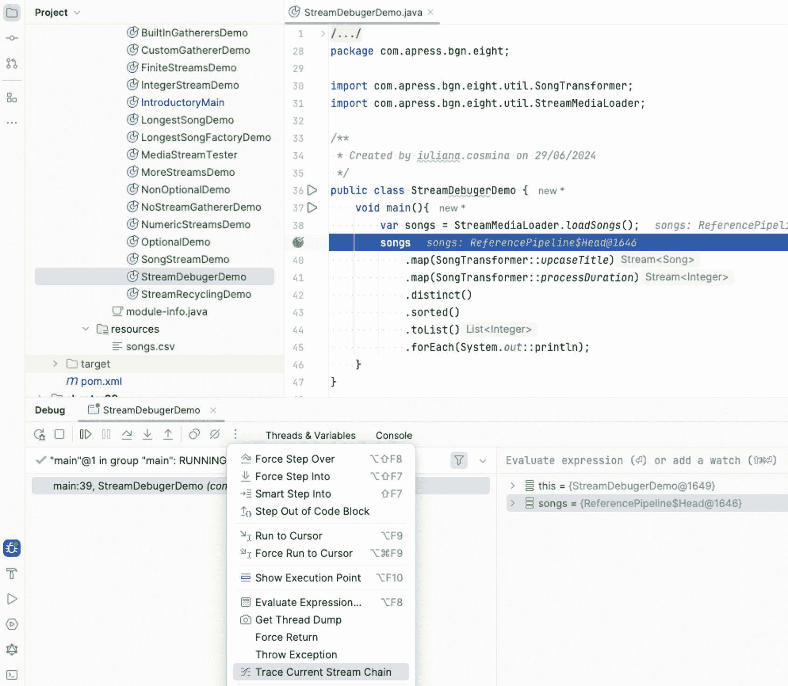
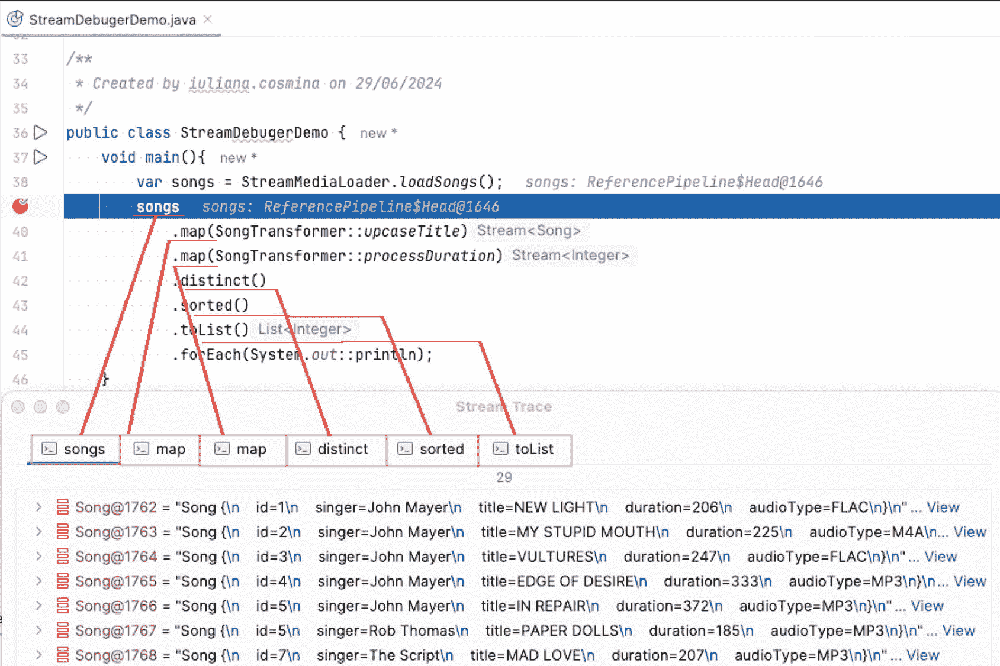
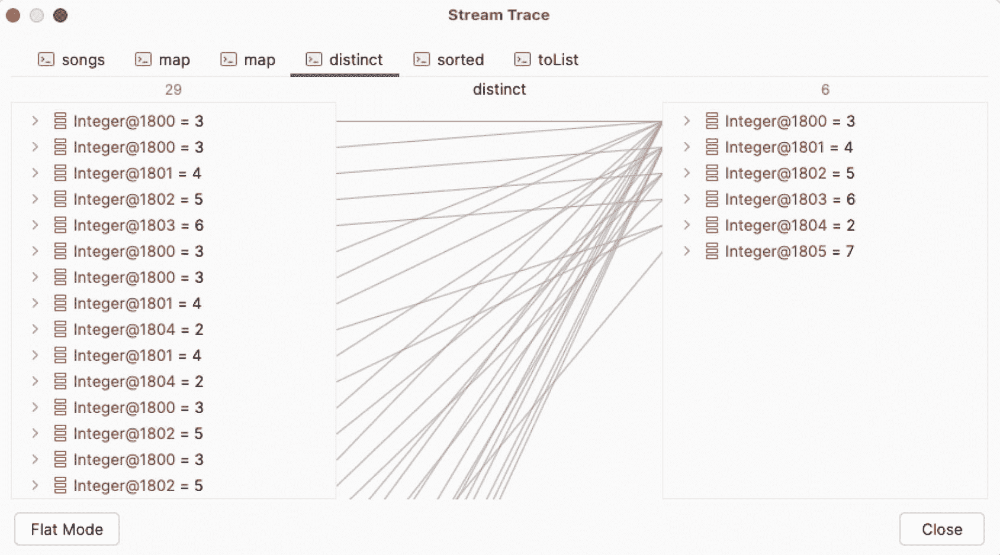
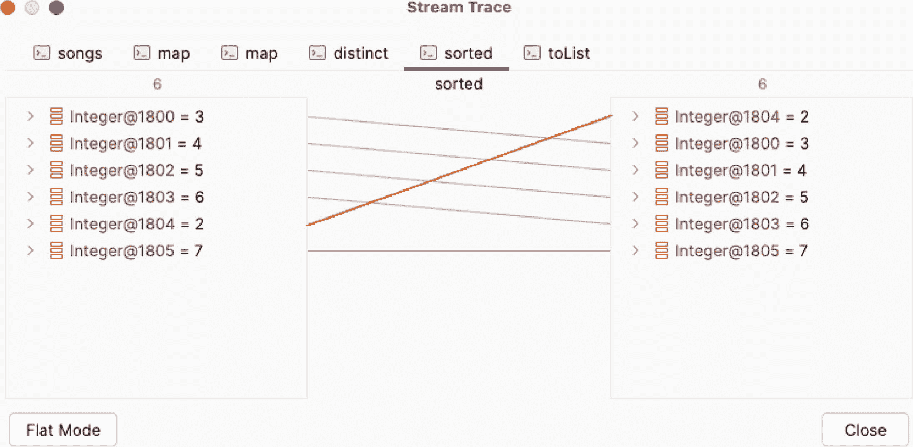
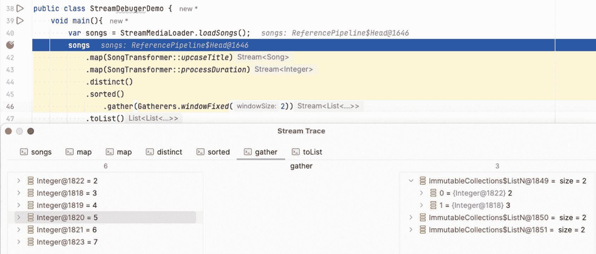

# 8. Stream API

名词 *stream* 不止一个含义，正如 [Dictionary.​com](http://dictionary.com) 所定义的：

1.  在河道或水道中流动的水体，如河流、小溪或溪流
2.  水中稳定的水流，如河流或海洋中的水流
3.  水或其他液体或流体的任何流动
4.  空气、气体等的气流或流动
5.  一束或一道光线
6.  任何事物的连续流动或接续
7.  主导方向；趋势
8.  *数字技术*
    1.  数据流，如音频广播、电影或实时视频，从源端平稳连续地传输到计算机、移动设备等。
    2.  直播

在编程语境下，*stream* 一词最接近上述定义中的第 6 条和第 8a 条。实际上，在编程中，流（stream）是来自某个源、支持聚合操作（即累加流中所有值的操作）的对象序列。你可能会想，更合适的术语应该是*集合*。嗯……不完全对。本章将阐明两者的区别。

## Stream 简介

假设我们有一个非常大的歌曲集合，想要分析并找出所有时长至少为 300 秒的歌曲。对于这些歌曲，我们希望将名称保存到一个列表中，并按时长降序排序。假设我们已经将歌曲存储在一个列表中，代码如清单 8-1 所示。

```
// 省略非相关代码
List songList = loadSongs();
List resultedSongs = new ArrayList();
// 找出所有时长至少为 300 秒的歌曲
for (Song song: songList) {
if (song.getDuration() >= 300) {
resultedSongs.add(song);
}
}
Collections.sort(resultedSongs, new Comparator(){
public int compare(Song s1, Song s2){
return s2.getDuration().compareTo(s1.getDuration());
}
});
System.out.println(resultedSongs);
List finalList0 = new ArrayList();
for (Song song: resultedSongs) {
finalList0.add(song.getTitle()); // 只需要歌曲标题
}
System.out.println("Java 8 之前: " + finalList0);
清单 8-1
由若干语句组成的 Java 代码
```

这段代码的一个问题是处理大型集合时效率不高。此外，我们反复遍历列表并执行检查才能得到最终结果。如果能够对每个元素逐一执行所有这些操作，而无需重复遍历，效率会不会更高？答案是肯定的，从 Java 8 开始，这已经成为可能。

Java 8 引入的新的 **Stream** 抽象表示一个元素序列，可以顺序或并行处理，并支持聚合操作。由于硬件的最新发展，CPU 变得更加强大和复杂，包含多个可以并行处理信息的内核。为了利用这些硬件能力，Java 引入了 Fork Join 框架。而在 Java 8 中，引入了 Stream API 来支持并行数据处理，无需编写定义和同步线程的样板代码。

Stream API 的核心接口是 `java.util.stream.BaseStream`。任何具有流能力的对象都是扩展了此接口的类型。流本身不存储元素，因为它不是数据结构；它仅用于计算元素，并按需提供给某个操作或一组聚合操作。

*聚合操作*是 Stream API 中的特殊方法，具有以下特征：

*   支持行为作为参数。大多数聚合操作支持 lambda 表达式作为参数。
*   使用内部迭代。内部迭代不会顺序遍历元素，从而利用并行计算的优势。内部迭代将问题分解为子问题，同时解决它们，然后合并结果。
*   处理来自流的元素，而不是直接来自流的源头。

按顺序提供元素涉及内部自动迭代。返回流的操作可以链接成一个管道，称为**中间操作**。操作处理流中的元素，并将结果作为流返回给管道中的下一个操作。返回非流结果的操作称为**终端操作**，通常位于管道的末端。在深入使用流之前，先看一个快速示例：清单 8-1 中的代码被重写为清单 8-2 所示，这被称为**流管道**。

```
List finalList = songList.stream()
.filter(s -> s.getDuration() >= 300)
.sorted(Comparator.comparing(Song::getDuration).reversed())
.map(Song::getTitle)
.collect(Collectors.toList());
System.out.println(finalList);
清单 8-2
使用 Stream 重写清单 8-1 中的代码
```


是的，使用流进行编程非常棒，既富有表现力又高效。*Stream API* 的概念允许开发者将集合转换为流，编写代码并行处理数据，然后将结果存入新的集合。

使用流是一种相当精细的编程方式，建议在设计代码时考虑所有可能性。`NullPointerException` 是 Java 中最常抛出的异常之一。

在 Java 8 中，引入了 `Optional<T>` 类来避免此类异常。`Stream<E>` 实例用于存储类型 `T` 的无限实例，而 `Optional<T>` 是一个可能包含也可能不包含类型 `T` 实例的实例。由于这两种实现本质上都是其他类型的包装器，因此将一起介绍它们。

注意

出于实际考虑，本章将 `Stream<E>` 实例称为**流**，类似于将 `List<E>` 实例称为**列表**、`Collection<E>` 实例称为**集合**等。

重要

你可能会注意到，文中引入了术语**函数**，并用于指代作为参数传递给流操作的行为。这是因为使用流允许以*函数式编程*风格编写 Java 代码。正如本书开头所述，Java 是一种面向对象编程（OOP）语言，对象是其核心术语。在函数式编程中，核心术语是**纯函数**，代码通过组合纯函数来编写，这使得程序员能够避免共享状态、利用不可变数据，从而避免处理污染带来的副作用。

提示

如果你想了解更多关于 Java 中函数式编程的知识，有不少好书可以参考^(⁶⁴)，但如果你想将其作为一种编程范式来学习，我很乐意推荐你查看这篇^(⁶⁵)博客文章。

*纯函数*是数学函数的软件模拟，具有以下特性：

*   纯函数对于相同的参数返回相同的值。其实现不涉及任何随机值或可能导致相同参数返回不同值的非最终全局变量。纯函数必须产生一致的结果。

*   函数的返回值仅取决于传递给函数的输入参数。

*   纯函数没有副作用（不修改局部静态变量、非局部变量、可变引用参数或输入/输出流）。

流、纯函数和 lambda 表达式的结合有助于编写 Java **声明式代码**。在本章中，我们将摒弃典型的面向对象**命令式编码风格**（即算法的每一步都逐一声明，流程由 `boolean` 条件控制），转而开始设计应用于流元素的纯函数链。

## 创建流

在享受使用流优化代码的乐趣之前，我们先来看看如何创建它们。要创建流，我们显然需要一个**源**。这个源可以是任何东西：一个集合（列表、集合或映射）、一个数组，或者用作输入的 I/O 资源（例如文件、数据库，或任何可以转换为实例序列的东西）。

重要

流不会修改其源，因此可以从同一源创建多个流实例，并用于不同的操作。

集合与流之间最大的区别在于，流发出的元素会被操作消耗，因此流不能重复使用。然而，清单 8-3 中的错误代码是 Java 编译器所接受的。

```
int[] arr = { 50, 10, 250, 100};
IntStream intStream = Arrays.stream(arr);
intStream.forEach(System.out::println);
intStream.forEach(System.out::println);
清单 8-3
错误代码：尝试重用流
```

然而，当我们第二次尝试遍历流时，会在运行时抛出 `IllegalStateException`：

```
流无法回收：流已被操作或关闭
java.lang.IllegalStateException: stream has already been operated upon or closed
at java.base/java.util.stream.AbstractPipeline.sourceStageSpliterator(AbstractPipeline.java:311)
at java.base/java.util.stream.IntPipeline$Head.forEach(IntPipeline.java:617)
at chapter.eigth/com.apress.bgn.eight.StreamRecyclingDemo.main(StreamRecyclingDemo.java:45)
```

因此，如果你需要两次处理流的元素，则必须再次从源重新创建它。


### 从集合创建流

先前在代码清单 8-2 中展示的代码片段描述了一种从列表创建流的方法。从 Java 8 开始，所有集合接口和类都增加了返回流的默认方法。在代码清单 8-4 中，我们获取一个整数列表，并通过调用 `stream()` 方法将其转换为流。创建流后，我们使用 `forEach(..)` 方法遍历它，以打印流中的值以及执行此代码的线程名称。你可能会问，为什么要打印线程名称？你很快就会明白。

```
package com.apress.bgn.eight;
import java.util.List;
import static java.lang.System.out;
public class IntegerStreamDemo {
void main() {
List bigList = List.of(50, 10, 250, 100/* ...*/);
bigList.stream().forEach(i ->
out.println(Thread.currentThread().getName() +": " + i));
}
}
代码清单 8-4
从整数列表创建整数值流
```

代码清单 8-4 中的代码创建了一个整数元素的流。`Stream<E>` 接口公开了一组方法，每个 `Stream<E>` 实现都为其提供了具体实现。最常用的是 `forEach(..)` 方法，它遍历流中的元素。`forEach(..)` 方法需要一个类型为 `java.util.function.Consumer<T>` 的参数。

重要

**消费者** 是我们在本书中称之为 `java.util.function.Consumer<T>` 函数式接口的内联实现。该接口声明了一个唯一的抽象方法，实现它的类必须为其提供具体实现。出于同样的原因，该接口被注解为 `@FunctionalInterface`。该方法名为 `accept(T t)`，被称为**函数式方法**。它接受一个类型为 `T` 的元素作为参数，对其进行处理，并且不返回任何内容（void）。因此，消费者函数适用于函数式管道的末端。

这个消费者方法会为流中的每个元素调用。实现类基本上是内联声明的，只需提及方法体即可。由于 lambda 表达式的魔力，JVM 会处理其余部分。如果没有它们，你将不得不编写类似代码清单 8-5 中的代码。

```
package com.apress.bgn.eight;
import java.util.List;
import java.util.function.Consumer;
import static java.lang.System.out;
public class IntegerStreamDemo {
void main() {
List bigList = List.of(50, 10, 250, 100/* ...*/);
bigList.stream().forEach(
new Consumer() {
@Override
public void accept(Integer i) {
out.println(STR."\{Thread.currentThread().getName()}: \{i}");
}
});
}
}
// 输出
/*
main: 50
main: 10
main: 250
main: 100
...
*/
代码清单 8-5
消费者的展开声明
```

再次强调，这是在 Java 8 引入 lambda 表达式之前必须编写代码的方式。当类以这种方式实现接口时，内联地使用一种看起来很像使用接口类型进行构造函数调用的语法，它们被称为**匿名类**，因为它们没有名称，并且就在声明的位置被使用。Lambda 表达式极大地简化了这一过程，但仅适用于定义单个方法的接口，即名为**函数式接口**的接口。从 Java 8 开始，这些接口被注解为 `@FunctionalInterface`。在前面的示例中，代码打印了线程名称和元素的值。

每个数字都以 `main` 为前缀，这意味着流中的所有整数都由同一个线程（应用程序的主线程）顺序处理。

提示

出于实际原因，对于集合，如果仅为了遍历而需要顺序流时，无需调用 `stream()`，因为为它们定义的 `forEach(..)` 方法同样可以完成这项工作。因此，前面的代码可以简化为：

`bigList.`*forEach*`(i ->`

`System.out.println(Thread.currentThread().getName() + ": " +` `i`

*));*

打印线程名称是因为还有另一种创建流的方法，即调用 `parallelStream()` 方法。唯一的区别是返回的流是一个并行流。这意味着流的每个元素都在不同的线程上处理，这反过来意味着 `Consumer<T>` 的实现必须是线程安全的，并且不能包含涉及不打算在线程间共享的实例的代码。打印流元素值的代码不会影响流返回的元素值，也不会影响其他外部对象，因此并行化是安全的。

代码清单 8-6 描述了使用 `parallelStream()` 代替 `stream()` 来创建流，并使用相同的 `Consumer<T>` 实现打印流元素。输出显示在代码片段的底部。

```
package com.apress.bgn.eight;
import java.util.List;
import java.util.function.Consumer;
import static java.lang.System.out;
public class IntegerStreamDemo {
void main() {
List bigList = List.of(50, 10, 250, 100/* ...*/);
bigList.parallelStream()
.forEach(i ->
out.println(Thread.currentThread().getName() + ": " + i)
);
}
}
// 示例输出
/*
main: 83
ForkJoinPool.commonPool-worker-1: 23
main: 33
ForkJoinPool.commonPool-worker-1: 45
ForkJoinPool.commonPool-worker-2: 50
main: 67...
*/
代码清单 8-6
从整数列表创建整数值的并行流
```

你首先会注意到线程名称：我们不再只有一个线程，而是有很多线程，它们都命名为 `ForkJoinPool.commonPool-worker``-`。主线程仍然打印一些值，但其他线程也分担了一些工作，并且打印值的顺序（或者更确切地说，无序性）清楚地表明线程是并行运行的。这些线程具有相似的名称，这明显表明它们都属于同一个*线程池*。在这种情况下，JVM 会创建一个线程池，其中包含一些用于并行处理流中所有元素的线程实例，这个概念在**第** **5** **章**中介绍过。使用线程池的好处是线程可以被重用，因此无需创建新的线程实例，这在一定程度上优化了执行时间。

如果你查看与每个线程关联的数字（线程名称末尾的数字），你会发现这些数字有时会重复。这基本上意味着同一个线程被重用来处理另一个流元素。

提示

在 Java 世界中，使用 `parallelStream()` 时的性能提升一直且仍然存在争议。对于简单的示例，创建线程池和管理线程显然是浪费 CPU 和内存。因此，除非你有一个特定问题，可以通过并行执行和具有多核的快速 CPU 更有效地解决，否则你可能不需要 `parallelStream()`。

警告

Stream API 是并行处理大型数据集的首选方式。该过程被假定为一个相当复杂的函数，因此虚拟线程不应用于流的并行处理，因为它们是处理紧凑简单操作的轻量级线程。


### 从数组创建流

在前面的代码示例中，流的源由 `List<E>` 实例表示。同样的语法也适用于 `Set<E>` 实例。

但流也可以从数组创建，如清单 8-7 中的示例所示。

```
package com.apress.bgn.eight;
import java.util.Arrays;
import static java.lang.System.out;
public class ArrayStreamDemo {
void main() {
int[] arr = { 50, 10, 250, 100 /* ... */};
Arrays.stream(arr).forEach(
i -> out.println(Thread.currentThread().getName() + ": " + i)
);
}
}
清单 8-7
从整数数组创建整数值流
```

静态方法 `stream(int[] array)` 是在 Java 1.8 中添加到 `java.util.Arrays` 中的，并在清单 8-7 中用于创建原始类型流。

对于包含对象的数组，调用的方法是 `stream(T[] array)`，其中 `T` 是替换任何引用类型的泛型类型（同样在 Java 1.8 中添加）。从数组生成的流可以通过调用相同的 `parallel()` 方法实现并行化。

数组的新颖之处在于，可以通过指定数组块的起始和结束索引，从数组的一部分创建流。清单 8-8 中的代码展示了如何从数组的一部分创建流，以及使用一个简单的消费者打印结果流元素的输出。

```
package com.apress.bgn.eight;
import java.util.Arrays;
import static java.lang.System.out;
public class ArrayStreamDemo {
void main() {
int[] arr = { 50, 10, 250, 100 /* ... */};
Arrays.stream(arr, 3,6).forEach(
i -> System.out.println(Thread.currentThread().getName() + ": " + i)
);
}
}
// 输出
/*
main: 100
main: 23
main: 45
*/
清单 8-8
从整数数组的一部分创建整数值流
```

### 创建空流

在编写 Java 代码时，一个好的实践是编写返回对象的方法，并避免返回 `null`。这减少了抛出 `NullPointerException` 的可能性。当方法返回流时，首选的方式是返回一个空流。这可以通过调用 `Stream<T>` 接口提供的静态 `Stream.empty()` 方法来实现。

清单 8-9 中的代码片段展示了一个方法，该方法接受一个 `Song` 实例列表作为参数，并使用它作为源返回一个流。如果列表为 `null` 或为空，则返回一个空流。结果流在 `main(..)` 方法中遍历，无需额外验证。如果流为空，则不会打印任何内容。

```
package com.apress.bgn.eight;
import com.apress.bgn.eight.util.Song;
import com.apress.bgn.eight.util.StreamMediaLoader;
import java.util.List;
import java.util.stream.Stream;
import static java.lang.System.out;
public class SongStreamDemo {
void main(){
out.println(" -- 测试 'getAsStream(..)' 方法，参数为 null -- ");
getAsStream(null).forEach(out::println);
out.println(" -- 测试 'getAsStream(..)' 方法，参数为空列表 --");
getAsStream(List.of()).forEach(out::println);
out.println(" -- 测试 'getAsStream(..)' 方法，参数为一个列表 -- ");
getAsStream(StreamMediaLoader.loadSongsAsList()).forEach(out::println);
}
public static Stream getAsStream(List songList) {
if(songList == null || songList.isEmpty()) {
return Stream.empty();
} else {
return songList.stream();
}
}
}
// 输出
/*
-- 测试 'getAsStream(..)' 方法，参数为 null --
-- 测试 'getAsStream(..)' 方法，参数为空列表 --
-- 测试 'getAsStream(..)' 方法，参数为一个列表 --
Song {
id=1
singer=John Mayer
title=New Light
duration=206
audioType=FLAC
}
...
*/
清单 8-9
创建空流
```

运行清单 8-9 中的代码，结果会依次打印前两条消息，中间没有任何内容，因为该方法返回的流是空的。

### 创建有限流

除了从实际源创建流之外，还可以通过调用流工具方法（如 `Stream.generate()` 或 `Stream.builder()`）即时创建流。

当构建一个包含固定已知值集合的有限流时，应使用 `builder()` 方法。此方法返回一个 `java.util.stream.Stream.Builder<T>` 实例，这是一个内部接口，声明了一个名为 `add(T t)` 的默认方法，需要调用该方法来添加流的元素。要创建 `Stream<T>` 实例，必须最后调用其 `build()` 方法。`add(T t)` 方法返回对 `Builder<T>` 实例的引用，因此它可以与此接口的任何其他方法链式调用。清单 8-10 中的代码是一个示例，展示了如何使用 `builder()` 方法创建包含各种值的有限流。

```
package com.apress.bgn.eight;
import com.apress.bgn.eight.util.AudioType;
import com.apress.bgn.eight.util.Song;
import java.util.List;
import java.util.stream.Stream;
public class FiniteStreamsDemo {
void main() {
Stream built = Stream.builder()
.add(50).add(10).add(250)
.build();
Stream lyrics = Stream.builder()
.add("在一个人们永不相遇的世界里，")
.add("他们看着屏幕坠入爱河")
.add("而爱只能是单方面的")
.add("苦涩、灼热、无望的单恋。")
.build();
Stream songs = Stream.builder()
.add (new Song("John Mayer", "New Light", 206, AudioType.FLAC))
.add (new Song("Ben Barnes", "You find me", 420, AudioType.FLAC))
.build();
Stream data = Stream.builder() // 编译器警告参数化类 'Stream' 的原始使用
.add("Vultures")
.add(3)
.add(List.of("aa"))
.build();
}
}
清单 8-10
从有限的值集合创建流
```

因为 `Builder<T>` 接口是一个泛型接口，所以必须指定一个类型参数，作为流中元素的类型。此外，`builder()` 方法是泛型的，需要在调用它之前将类型作为参数提供给它。如果未指定类型，则使用默认的 `Object`，并且可以将任何类型的实例添加到流中（如清单 8-10 中的第四个流声明所示）。但是，编译器会警告*参数化类 'Stream' 的原始使用*。

要创建流，还有另一个名为 `generate(..)` 的方法。此方法需要一个类型为 `java.util.function.Supplier<T>` 的参数。

重要

**供应者** 在本书中指的是 `java.util.function.Supplier<T>` 函数式接口的内联实现。该接口要求为其唯一名为 `get()` 的方法提供具体实现。此方法应返回要添加到流中的元素。

因此，如果我们想生成一个整数流，`get()` 的适当实现应返回一个随机整数。扩展后的代码如清单 8-11 所示。这里没有使用 Lambda 表达式，以清楚地表明 `generate(..)` 方法接收一个即时创建的 `Supplier<Integer>` 实例作为参数。

```
package com.apress.bgn.eight;
import java.util.function.Supplier;
import java.util.random.RandomGenerator;
import java.util.stream.Stream;
public class FiniteStreamsDemo {
static RandomGenerator randomGenerator = RandomGenerator.of("SecureRandom");
void main() {
Stream generated = Stream.generate(
new Supplier() {
@Override
public Integer get() {
return randomGenerator.nextInt(300) + 1;
}
}).limit(15);
}
}
清单 8-11
使用供应者创建流
```

`limit(15)` 方法将供应者生成的元素数量限制为 15；否则生成的流将是无限的。清单 8-11 中的代码可以通过使用 Lambda 表达式进行简化，如清单 8-12 所示。


```
package com.apress.bgn.eight;
import java.util.function.Supplier;
import java.util.random.RandomGenerator;
import java.util.stream.Stream;
public class FiniteStreamsDemo {
static RandomGenerator randomGenerator = RandomGenerator.of("SecureRandom");
void main() {
Stream generated = Stream.generate(
() -> randomGenerator.nextInt(300) + 1
).limit(15);
}
}
代码清单 8-12
使用 Supplier 和 Lambda 表达式创建流
```

如果 `Supplier<Integer>.get()` 始终返回相同的数字，那么无论这样的流多么无用，之前的声明都会变成

```
Stream generated = Stream.generate( () -> 5 ).limit(15);
```

如果需要对 `Stream<T>` 实例发出的元素进行更多控制，可以使用 `iterate(..)` 方法。该方法有两个版本，一个在 Java 8 中添加，另一个在 Java 9 中添加。使用这两个版本中的任何一个都类似于使用 `for` 语句为流生成条目。

Java 8 版本的 `iterate(..)` 方法用于生成无限流。该版本的方法接收一个称为 `seed` 的初始值和一个迭代 `step` 作为参数。

Java 9 版本的 `iterate(..)` 方法用于生成有限流。该版本的方法接收一个称为 `seed` 的初始值、一个决定迭代何时停止的 `predicate`（谓词）以及一个迭代 `step` 作为参数。

重要

*谓词*是函数式接口 `java.util.function.Predicate<T>` 的内联实现，该接口声明了一个名为 `test(T t)` 的单一方法，该方法返回一个布尔值。此方法的实现应针对某个条件测试其类型为 `T` 的单个参数，如果满足条件则返回 `true`，否则返回 `false`。

重要

迭代步骤是函数式接口 `java.util.function.UnaryOperator<T>` 的内联实现，用于表示对单个操作数执行的操作，该操作产生与其操作数相同类型的结果。

在以下示例中，流元素从 0 开始生成，步长为 5，并且只要值小于 50（由谓词定义）就会持续生成：

```
Stream iterated = Stream.iterate(0, i -> i < 50, i -> i + 5);
```

类似于 `for` 语句，如果没有谓词，您将调用 Java 8 中引入的此方法版本，在这种情况下，必须使用 `limit(..)` 方法来确保流是有限的。

```
Stream iterated = Stream.iterate(0, i -> i + 5).limit(15);
```

在 Java 9 中，除了 `limit(..)` 方法之外，另一种控制流中值数量的方法是 `takeWhile(..)` 方法。此方法从原始流中获取与作为参数接收的谓词匹配的最长元素集，从第一个元素开始。这对于有序流效果很好，但如果流是无序的，则结果是任何与谓词匹配的元素集，包括空集。

为了解释通过调用 `takeWhile(..)` 产生的不同流，必须首先讨论流的**顺序**概念。

**遭遇顺序**这个表达式表示 `Stream<T>` 实例遭遇数据的顺序。流的遭遇顺序由源和中间操作定义。例如，如果使用数组作为源，则流的遭遇顺序由数组中的顺序定义。如果使用列表作为源，则遭遇顺序是列表的迭代顺序。如果使用集合作为源，则没有遭遇顺序，因为集合本质上是无序的。

流管道中的每个中间操作都会影响遭遇顺序，其效果如下：

*   可以对输出施加遭遇顺序。例如，`sorted()` 操作会对无序流施加遭遇顺序。

*   遭遇顺序得以保留。某些操作如 `filter(..)` 可能会丢弃一些元素，但原始顺序不受影响。

*   遭遇顺序被破坏。例如，`sorted()` 操作会对有序流施加遭遇顺序，替换现有的顺序。

如果要将元素累积到具有遭遇顺序的容器中，收集器操作会保留遭遇顺序。顺序流和并行流在排序方面具有相同的属性。

代码清单 8-13 展示了 `takeWhile(Predicate<? super T> predicate)` 方法的两种用法。

```
package com.apress.bgn.eight;
import java.util.stream.Stream;
import static java.lang.System.out;
public class FiniteStreamsDemo {
void main() {
// (1)
Stream orderedStream = List.of( 3, 6, 9, 11, 12, 13, 15).stream();
Stream result = orderedStream.takeWhile(s -> s % 3 == 0);
result.forEach(s -> out.print(s + " "));
// 输出: 3 6 9
// (2)
Stream unorderedStream = Set.of(3, 6, 9, 2, 4, 8, 12, 36, 18, 42, 11, 13).stream();
result = unorderedStream.parallel().takeWhile(s -> s % 3 == 0);
result.forEach(s -> out.print(s + " "));
// 输出（可能）: 3 12 36
}
}
代码清单 8-13
使用 Supplier 和 takeWhile(..) 方法创建流
```

第一个代码块在有序整数流上使用 `takeWhile(..)`，并返回一个包含能被 3 整除的元素的流。结果流包含元素 *3 6 9*，因为这是与给定谓词匹配的第一个元素集。

如果在无序流上调用 `takeWhile(..)`，如第二个代码块所示，结果将是不可预测的。结果可能是 *3 6 9* 或 *12 36 18 42*，因为结果是任何与谓词匹配的元素子集。此外，由于顺序不固定，代码块最终可能打印 *6 3 9* 或 *9 3 6* 等。因此，在无序流上调用 `takeWhile(..)` 的结果是**不确定的**。

`takeWhile(..)` 方法是 `dropWhile(..)` 方法的“姊妹”，后者也是在 Java 9 中引入的。顾名思义，`dropWhile(..)` 所做的正好与 `takeWhile(..)` 相反：对于有序流，它返回一个新流，该流由丢弃与谓词匹配的最长元素集之后的元素组成。对于无序流，则只有混乱，因为任何与谓词匹配的元素子集都可能被丢弃，包括空流。代码清单 8-14 展示了 `dropWhile(..)` 方法的两种用法。

```
package com.apress.bgn.eight;
import java.util.stream.Stream;
import static java.lang.System.out;
public class FiniteStreamsDemo {
void main() {
List.of( 3, 6, 9, 11, 12, 13, 15).stream()
.dropWhile(s -> s % 3 == 0 )
.forEach(s -> out.print(STR."\{s} "));
// 输出: 11 12 13 15
Set.of(3, 6, 9, 2, 4, 8, 12, 36, 18, 42, 11, 13).stream()
.parallel()
.dropWhile(s -> s % 3 == 0 ).forEach(s -> out.print(STR."\{s} "));
// 输出（可能）: 2 4 8 12 36 18 42 11 13
}
}
代码清单 8-14
使用 Supplier 和 dropWhile(..) 方法创建流
```

如果这两个操作应用于并行流，唯一改变的是元素打印的顺序，但结果集将包含相同的元素。


### 原始类型流与字符串流

当我们首次创建原始类型流时，我们使用了一个 `int[]` 数组作为数据源。然而，原始类型流可以通过多种方式创建，因为 Stream API 包含了更多带有默认方法的接口，使得流式编程更加实用。在图 8-1 中，你可以看到 Stream API 接口的层次结构。



图 8-1
Stream API 接口

查看图 8-1 后，你可能已经猜到，`IntStream` 接口可用于创建整数的原始类型流。该接口提供了许多方法来实现这一点，其中一些方法继承自 `BaseStream<T,S>`。可以通过现场指定几个值来创建 `IntStream` 实例，具体方式包括使用 `builder()`、`generate(..)`、`iterate(..)` 方法，或者使用 `range*(..)` 系列方法，如代码清单 8-15 所示。

```
package com.apress.bgn.eight;
import java.util.Random;
import java.util.stream.IntStream;
public class NumericStreamsDemo {
void main(){
var intStream0 = IntStream.builder().add(0).add(1).add(2).add(5).build();
var intStream1 = IntStream.of(0,1,2,3,4,5);
var intStream2 = IntStream.range(0, 10);
var intStream3 = IntStream.rangeClosed(0, 10);
Random random = new Random();
IntStream intStream4 = random.ints(5);
}
}
代码清单 8-15
使用多种方法创建 IntStream 实例
```

可以通过将区间的起始和结束值作为参数传递给 `range(..)` 和 `rangeClosed(..)` 方法来创建 `IntStream` 实例。这两种方法都会以步长 1 生成流中的元素，只有后者会将区间的上限值包含在内。

同样在 Java 1.8 中，`java.util.Random` 类新增了一个名为 `ints(..)` 的方法，用于生成随机整数的流。该方法声明了一个参数，表示要生成并放入流中的元素数量，但该方法还有一种不带参数的形式，用于生成无限流。

所有为 `IntStream` 提到的方法都可以用于生成 `LongStream` 实例，因为该接口中也定义了等效的方法。

对于 `DoubleStream`，没有 range 方法，但有 `of(..)`、`builder()`、`generate(..)` 等方法。此外，`java.util.Random` 类在 Java 1.8 中新增了 `doubles(..)` 方法，用于生成随机双精度浮点数的流。该方法声明了一个参数，表示要生成并放入流中的元素数量，但该方法还有一种不带参数的形式，用于生成无限流。代码清单 8-16 展示了几种创建双精度浮点数流的方式。

```
package com.apress.bgn.eight;
import java.util.Random;
import java.util.stream.DoubleStream;
public class NumericStreamsDemo {
void main() {
DoubleStream doubleStream0 = DoubleStream.of(1, 2 , 2.3, 3.4, 4.5, 6);
Random random = new Random();
DoubleStream doubleStream1 = random.doubles(3);
DoubleStream doubleStream2 = DoubleStream.iterate(2.5, d -> d = d + 0.2).limit(10);
}
}
代码清单 8-16
使用多种方法创建数值流实例
```

对于 `char` 类型的流，没有专门的接口，但使用 `IntStream` 完全可以胜任：

```
IntStream intStream = IntStream.of('a','b','c','d');
intStream.forEach(c -> System.out.println((char) c));
```

另一种创建 `char` 类型流的方式是使用 `String` 实例作为流数据源：

```
IntStream charStream = "sample".chars();
charStream.forEach(c -> System.out.println((char) c));
```

在 Java 8 中，`java.util.regex.Pattern` 也新增了流相关的方法；作为一个用于处理 `String` 实例的类，它是添加这些方法的合适位置。`Pattern` 实例可用于拆分现有的 `String` 实例，并通过 `splitAsStream(..)` 方法将拆分后的片段以流的形式返回：

```
Stream stringStream = Pattern.compile(" ")
.splitAsStream("live your life");
```

文件的内容也可以通过 `Files.lines(..)` 工具方法以字符串流的形式返回：

```
String inputPath = "chapter08/src/main/resources/songs.csv";
Stream stringStream = Files.lines(Path.of(inputPath));
```

到目前为止，这些章节已经向你展示了如何创建所有类型的流；接下来的章节将向你展示如何使用它们来处理数据。

重要提示

如果你觉得需要将流实例与真实对象关联起来以便更好地理解它们，我建议如下：将有限流（例如从集合创建的流）想象成杯子倾斜时滴落的水滴。杯子里的水最终会流尽，但在水滴落的过程中，它们形成了一股水流。无限流则像一条有源头的河流：它持续不断地流淌*（当然，除非发生严重的干旱导致河流干涸）*。


### **Optional<T>** 简介

`java.util.Optional<T>` 实例是 Java 语言中的薛定谔^(⁶⁶)盒子。它们非常有用，因为可以作为方法的返回类型，从而避免返回 `null` 值，并防止可能抛出 `NullPointerException`，或者迫使使用该方法的开发者编写额外代码来处理可能抛出的异常。`Optional<T>` 实例的创建方式与流类似。

有一个 `empty()` 方法，用于创建不包含任何内容的任意类型的可选值：

```
Optional empty = Optional.empty();
```

有一个 `of()` 方法，用于将现有对象包装到 `Optional<T>` 实例中：

```
Optional value = Optional.of(5L);
```

考虑到这类实例的设计初衷是不允许 `null` 值，之前创建 `Optional<T>` 实例的方式阻止了我们编写类似下面的代码：

```
Song song = null;
Optional nonNullable = Optional.of(song);
```

编译器不会在意，但在运行时执行代码时，会抛出 `NullPointerException`。不过，如果我们确实需要一个允许 `null` 值的 `Optional<T>` 实例，也是可以的：Java 9 中引入了一个名为 `ofNullable(T t)` 的实用方法，正是为此目的：

```
Song song = null;
Optional nullable = Optional.ofNullable(song);
```

现在我们有了 `Optional<T>` 实例，如何使用它们呢？如清单 8-17 中的代码所示。

```
package com.apress.bgn.eight;
import com.apress.bgn.eight.util.MediaLoader;
import com.apress.bgn.eight.util.Song;
import java.util.List;
import static java.lang.System.out;
public class NonOptionalDemo {
void main() {
List songs = MediaLoader.loadSongs();
Song song = findFirst(songs, "B.B. King");
if(song != null && song.getSinger().equals("The Thrill Is Gone")) {
out.println("好歌！");
} else {
out.println("未找到！");
}
}
public static Song findFirst(List songs, String singer) {
for (Song song: songs) {
if (singer.equals(song.getSinger())) {
return song;
}
}
return null;
}
}
清单 8-17
展示 Optional 必要性的代码
```

`findFirst(..)` 方法在列表中查找第一位歌手为“B.B. King”的歌曲；如果找到则返回并打印一条消息，否则打印另一条消息。注意其中的空值检查和对列表的迭代。在 Java 8 中，这两者都不再必要。清单 8-18 展示了将清单 8-17 中的代码重新设计为使用 `Optional<T>` 后的版本。

```
package com.apress.bgn.eight;
// 省略 import 语句
public class OptionalDemo {
void main() {
List songs = MediaLoader.loadSongs();
Optional opt = songs.stream()
.filter(s -> "B.B. King".equals(s.getSinger()))
.findFirst();
opt.ifPresent(r -> out.println(r.getTitle()));
}
}
清单 8-18
展示 Optional 必要性的代码
```

如果 `Optional<T>` 实例不为空，则会打印歌曲标题；否则，不会打印任何内容，代码会从该点继续执行，而不会抛出异常。但是，如果我们想在 `Optional<T>` 实例为空时打印一些内容呢？在 Java 11 中，我们可以对此进行处理，因为引入了一个名为 `isEmpty()` 的方法来测试 `Optional<T>` 实例的内容，如清单 8-19 所示。

```
package com.apress.bgn.eight;
// 省略 import 语句
public class OptionalDemo {
void main() {
Optional opt1 = songs.stream()
.filter(s -> "B.B. King".equals(s.getSinger()))
.findFirst();
if(opt1.isEmpty()) {
out.println("未找到！");
}
}
}
清单 8-19
展示 Optional.isEmpty() 用法的代码
```

但是等等，这有点……不太对劲。难道我们不能在 `Optional<T>` 实例上调用一个方法，来获得与 `if-else` 语句完全相同的行为吗？是的，从 Java 9 开始这是可能的；`ifPresentOrElse(..)` 方法接受两个参数：一个 `Consumer<T>` 实例，用于在 `Optional<T>` 实例不为空时处理其内容；以及一个 `Runnable` 实例，用于在 `Optional<T>` 实例为空时执行，如清单 8-20 所示。

```
package com.apress.bgn.eight;
// 省略 import 语句
public class OptionalDemo {
void main() {
List songs = MediaLoader.loadSongs();
Optional opt2 = songs.stream()
.filter(ss -> "B.B. King".equals(ss.getSinger())).findFirst();
opt2.ifPresentOrElse(
r -> out.println(r.getTitle()),
() -> out.println("未找到！")) ;
}
}
清单 8-20
展示 Optional.ifPresentOrElse(..) 用法的代码
```

如果 `Optional<T>` 实例不为空，可以通过调用 `get()` 方法提取其内容，如清单 8-21 所示。

```
package com.apress.bgn.eight;
// 省略 import 语句
public class OptionalDemo {
void main() {
List songs = MediaLoader.loadSongs();
Optional opt3 = songs.stream()
.filter(ss -> "Rob Thomas".equals(ss.getSinger()))
.findFirst();
out.println("找到歌曲 " + opt3.get());
}
}
清单 8-21
展示 Optional.get() 用法的代码
```

当未找到所需对象时，上述代码不会打印任何内容，因为 `Optional<T>` 实例为空。但是，如果我们想打印一个默认值，例如，我们也可以使用一个名为 `orElse(..)` 的方法来实现，如清单 8-22 所示。

```
package com.apress.bgn.eight;
// 省略 import 语句
public class OptionalDemo {
void main() {
List songs = MediaLoader.loadSongs();
Optional opt4 = songs.stream()
.filter(ss -> "B.B. King".equals(ss.getSinger()))
.findFirst();
opt4.ifPresent(r -> out.println(r.getTitle()));
Song defaultSong = new Song();
defaultSong.setTitle("无标题");
Song s = opt4.orElse(defaultSong);
out.println("找到: " + s.getTitle());
}
}
清单 8-22
展示 Optional.orElse(..) 用法的代码
```

`orElse(T t)` 方法接收一个由 `Optional<T>` 包装的类型的实例作为参数。它还有另一个版本，接受一个返回所需类型对象的 `Supplier<T>` 实例。使用该方法的代码片段如下所示：

```
Song fromSupplier =
opt4.orElseGet(() -> new Song("无", "无标题", 0, null));
System.out.println("找到: " + fromSupplier.getTitle());
```

如果我们希望在 `Optional<T>` 实例为空时抛出一个特定的异常，也有一个方法可以实现，名为 `orElseThrow(..)`，如清单 8-23 所示。

```
package com.apress.bgn.eight;
// 省略 import 语句
public class OptionalDemo {
void main() {
List songs = MediaLoader.loadSongs();
Optional opt5 = songs.stream()
.filter(st -> "B.B. King".equals(st.getSinger()))
.findFirst();
Song song = opt5.orElseThrow(IllegalArgumentException::new);
}
}
清单 8-23
展示 Optional.orElseThrow(..) 用法的代码
```

正如你可能在前面的代码示例中注意到的，`Optional<T>` 和 `Stream<T>` 实例可以结合使用，编写实用的代码来解决复杂的问题。有很多方法也可以应用于 `Optional<T>` 和 `Stream<T>` 实例，因此接下来的部分将针对流介绍这些方法，并随机引用 `Optional<T>`。


### 如何专业地使用流

创建流之后，下一步就是处理流上的数据。在深入探讨高级流用法之前，让我们先回顾一下核心概念：

*   处理的结果可以是另一个流，该流可以根据需要被多次进一步处理。有许多方法可用于处理流并将结果作为另一个流返回。这些方法被称为**中间操作**。

*   不返回流，而是返回实际数据结构或不返回任何内容的方法，被称为**终端操作**。

所有这些都定义在 `Stream<T>` 接口中，它们用于定义**流管道**。

流的关键特性在于，只有在启动终端操作时才会进行数据处理，这意味着源中的元素仅在需要时才会被消费。因此，可以说整个流处理过程实际上是**惰性的**。惰性加载源元素并仅在需要时进行处理，可以实现显著的优化。

经过前面的阐述，你可能已经意识到，之前大量用于打印流中值的 `forEach(..)` 方法实际上是一个终端操作。但还有相当多的其他终端操作，其中一些——你最可能在最常见的实现中需要的那些——将在本章剩余部分的示例中使用。

本章以一个处理 `Song` 实例流的示例开始，但并未展示 `Song` 类。你可以在清单 8-24 中看到其字段。

```
package com.apress.bgn.eight;
public class Song implements Comparable {
private Long id;
private String singer;
private String title;
private Integer duration;
private AudioType audioType;
// getters and setters and other methods omitted
}
清单 8-24
Song 类的字段
```

`AudioType` 是一个枚举，包含音频文件的类型，如清单 8-25 所示。

```
package com.apress.bgn.eight;
public enum AudioType {
MP3, FLAC, OGG, AAC, M4A, WMA
}
清单 8-25
AudioType 枚举
```

在确定了后续流示例中将使用的数据类型后，接下来展示数据。在清单 8-26 的示例中，数据包含在一个名为 `songs.csv` 的文件中。`.csv` 扩展名表示*逗号分隔文件*，每个 `Song` 实例对应文件中的一行。每行包含每个 `Song` 实例的所有属性值，用逗号分隔。值的顺序必须与构造函数参数的顺序匹配。也可以使用其他分隔符，但出于实际原因，这里使用了分号（这是读取数据的库默认支持的分隔符）。

```
01;John Mayer;New Light;206;FLAC
02;John Mayer;My Stupid Mouth;225;M4A
...
28;Mike Shinoda;Crossing A Line;248;MP3
19;John Mayer;Helpless;249;MP3
清单 8-26
songs.csv 文件中的歌曲条目（示例）
```

文件中的每一行将通过一个名为 JSefa^(⁶⁷) 的库中的类转换为一个 `Song` 实例。这个库不是本讨论的重点，但如果你感兴趣，可以使用脚注中的链接从官方网站获取更多详细信息。

现在，你可以开始使用流了。

#### 终端函数 forEach 和 forEachOrdered

假设歌曲流将提供清单 8-26 中声明的所有 `Song` 实例，让我们首先打印流中的所有元素。清单 8-27 中的代码使用一个简单的消费者打印 `Stream<Song>` 实例上的所有 `Song` 实例。

```
package com.apress.bgn.eight;
import com.apress.bgn.eight.util.Song;
import com.apress.bgn.eight.util.StreamMediaLoader;
import java.util.stream.Stream;
import static java.lang.System.out;
public class MediaStreamTester {
public static void main(String... args) {
Stream songs = StreamMediaLoader.loadSongs();
songs.forEach(song -> out.println(song));
}
}
清单 8-27
使用流打印 Song 实例
```

*方法引用*，在 Java 8 中引入，是 lambda 表达式仅调用一个方法时的快捷方式，因此可以直接通过名称引用该方法。所以这一行：

```
songs.forEach(song -> System.out.println(song));
```

变成了

```
songs.forEach(System.out::println);
```

`forEach(..)` 方法接收一个 `Consumer<T>` 类型的实例作为参数。在前两个示例中，`accept()` 方法的实现仅包含对 `System.out.println(song)` 的调用，这就是代码如此紧凑的原因，因为可以使用方法引用。但是，如果此方法的实现需要包含更多语句，那么之前编写的紧凑代码将不可行（除非引入方法引用）。与其直接打印歌曲，不如先将歌手的名字转换为大写，如清单 8-28 所示。

```
package com.apress.bgn.eight;
// import statements omitted
public class MediaStreamTester {
void main(){
Stream songs = StreamMediaLoader.loadSongs();
songs.forEach(new Consumer() {
@Override
public void accept(Song song) {
song.setSinger(song.getSinger().toUpperCase());
out.println(song);
}
});
}
}
清单 8-28
使用消费者匿名类打印 Song 实例
```

可以使用 lambda 表达式简化，但由于方法体有两行，看起来仍然不好。因此，另一种方法是声明一个消费者字段，并使用 lambda 表达式为每首歌曲调用其 `accept(..)` 方法，如清单 8-29 所示。

```
package com.apress.bgn.eight;
// import statements omitted
public class MediaStreamTester {
public static Consumer myConsumer = song -> {
song.setSinger(song.getSinger().toUpperCase());
out.println(song);
};
void main(){
Stream songs = StreamMediaLoader.loadSongs();
songs.forEach(song -> myConsumer.accept(song));
}
}
清单 8-29
使用消费者实例打印 Song 实例
```

姊妹函数 `forEachOrdered(..)` 与 `forEach(..)` 功能相同，但有一点小区别：它确保流上的元素将按遭遇顺序处理（如果为该流定义了该顺序），即使流是并行的。因此，基本上以下第二行和第三行将以相同的顺序打印歌曲：

```
import static java.lang.System.out;
...
songs.forEach(out::println);
songs.parallel().forEachOrdered(out::println); // 给该函数加下划线或加粗
```

#### 中间操作 `filter` 和终端操作 `toArray`

在以下示例中，我们将选择所有 MP3 歌曲并将它们保存到一个数组中。选择所有 MP3 歌曲是通过 `filter(..)` 方法完成的。该方法接收一个 `Predicate<T>` 类型的参数，用于定义一个条件，流中的元素必须满足该条件才能被放入通过调用名为 `toArray(..)` 的终端方法得到的数组中。

`toArray(..)` 方法接收一个 `IntFunction<A[]>` 类型的参数。这种类型的函数也称为*生成器*，它接受一个整数作为参数并生成一个该大小的数组。在大多数情况下，最合适的生成器是数组构造函数引用。

过滤 MP3 条目并将它们放入 `Song[]` 类型数组的代码如清单 8-30 所示。

```
package com.apress.bgn.eight;
// import statements omitted
public class MediaStreamTester {
void main(){
Stream songs = StreamMediaLoader.loadSongs();
Song[] sarray = songs.filter(s -> s.getAudioType() == AudioType.MP3).toArray(Song[]::new); // 数组构造函数引用
Arrays.stream(sarray).forEach(out::println);
}
}
清单 8-30
使用 filter(..) 从流中选择歌曲
```


#### 中间操作 `map` 和 `flatMap` 以及终端操作 `collect`

在以下示例中，我们将处理所有歌曲并计算以分钟为单位的时长。为此，我们将使用 `map(..)` 方法为流中发出的每个歌曲实例调用一个纯函数，该函数返回以分钟为单位的时长。这将产生一个新的 `Integer` 值流。其所有元素将使用 `collect(..)` 方法添加到一个 `List<Integer>` 实例中。该方法在处理元素时将其累积到一个 `Collection<Integer>` 实例中。清单 8-31 展示了这些方法的使用。

```
package com.apress.bgn.eight;
// 导入语句已省略
public class MediaStreamTester {
public static int processDuration(Song song) {
int secs = song.getDuration();
return secs/60;
}
void main(){
Stream songs = StreamMediaLoader.loadSongs();
List durationAsMinutes = songs
.map(SongTransformer::processDuration) // 方法引用
.collect(Collectors.toList());
durationAsMinutes.forEach(out::println);
}
}
清单 8-31
使用 map(..) 和 collect(..) 方法
```

`map(..)` 方法接收一个 `Function<T,R>` 类型的参数（T 为输入类型，R 为结果类型），这基本上是对一个函数的引用，该函数将应用于流中的每个元素。我们在前一个示例中应用的函数从流中获取一个歌曲元素，获取其时长并将其转换为分钟，然后返回。清单 8-31 中的代码可以重写为清单 8-32 所示，其中方法 `processDuration` 被声明为 `Function<T,R>` 类型的字段，并且 `Collection<Integer>` 实例被替换为 `.toList()` 方法，以简化语法。

```
package com.apress.bgn.eight;
// 导入语句已省略
public class MediaStreamTester {
public static Function processDuration = song -> song.getDuration()/60;
void main(){
Stream songs = StreamMediaLoader.loadSongs();
List durationAsMinutes = songs
.map(processDuration)
.toList();
durationAsMinutes.forEach(out::println);
}
}
清单 8-32
使用 Function 实例处理流元素
```

`Function<T,R>` 实例的第一个泛型类型是被处理元素的类型，第二个是结果的类型。

上一节提到的 `filter(..)` 方法的一个版本也为 `Optional<T>` 类型定义，并且可以与 `map(..)` 方法一起使用，以避免编写复杂的 `if` 语句。假设我们有一个 `Song` 实例，并且想要检查它是否超过三分钟且少于十分钟。我们可以使用 `Optional<Song>` 实例和这两个方法来完成相同的操作，而不是编写一个包含两个由 `AND` 运算符连接的条件 `if` 语句，如清单 8-33 所示。

```
package com.apress.bgn.eight;
// 导入语句已省略
public class MediaStreamTester {
void main(){
Song song0 = new Song("Ben Barnes", "You find me", 420, AudioType.FLAC);
if(isMoreThan3MinsAndLessThenTen(song0)) {
out.println("这首歌时长刚刚好！");
}
}
public static boolean isMoreThan3MinsAndLessThenTen(Song song) {
return Optional.ofNullable(song).map(SongTransformer::processDuration)
.filter(d -> d >= 3)
.filter(d -> d <= 10)
.isPresent();
}
}
清单 8-33
使用 filter(..) 和 map(..) 避免编写 if 语句
```

注意

清单 8-33 中的实现在性能方面可能并不理想——毕竟两次 `filter()` 调用可以合并为一次——但如果你愿意，可以编写这样的代码。只是在滥用流操作之前，请务必仔细阅读文档。

因此，`map(..)` 方法非常强大，但它有一个小缺陷。如果我们查看 `Stream.java` 文件中它的签名，我们会看到：

```
Stream map(Function mapper);
```

因此，如果应用于流中每个元素的 `map(..)` 函数返回一个包含结果的新流，该结果被放入另一个包含所有结果的流中，那么 `collect(...)` 方法实际上是在一个 `Stream<Stream<R>>` 实例上调用的。

`Optional<T>` 也是如此；终端方法将在 `<Optional<Optional<T>>` 实例上调用。当对象很简单时，比如本章代码示例中使用的 `Song` 实例，`map(..)` 方法工作得很好，但如果原始流中的对象更复杂，例如 `List<List<T>>` 实例，事情*可能*会变得复杂。

展示 `flatMap(..)` 方法效果的最简单方法是将其应用于 `List<List>` 实例。让我们看一下清单 8-34 中的示例。

```
package com.apress.bgn.eight;
// 导入语句已省略
public class MoreStreamsDemo {
public static Function processDuration = song -> song.getDuration()/60;
void main(){
List> testList = List.of (List.of(2,3), List.of(4,5), List.of(6,7));
System.out.println(processList(testList));
}
public static List processList( List> list) {
List result = list
.stream()
.flatMap(Collection::stream)
.collect(Collectors.toList());
return result;
}
}
清单 8-34
使用 flatMap(..) 展开流元素
```

`flatMap(..)` 方法接收一个方法引用作为参数，该方法接受一个集合并将其转换为流，这是创建 `Stream<Stream<Integer>>` 实例的最简单方式。`flatMap(..)` 方法施展其魔法，结果被转换为 `Stream<Integer>`，然后元素被 `collect(..)` 方法收集到 `List<Integer>` 实例中。移除无用流包装器的操作称为*扁平化*。如果仍然不清楚发生了什么，图 8-2 应该能让事情更清晰。



图 8-2

`flatMap(..)` 效果的视觉描述

在清单 8-34 的代码示例中，使用 `map(..)` 方法不会产生预期的结果。如果将 `flatMap(..)` 方法替换为 `map(..)`，最终结果将不是 `List<Integer>` 实例，而是 `List<Stream<Integer>>` 实例。IntelliJ IDEA 足够智能，能够识别这一点，并提供适当的消息来帮助你选择要调用的正确方法，如图 8-3 所示。



图 8-3

当使用 `map(..)` 代替 `flatMap(..)` 时 IntelliJ IDEA 的错误消息

另一种查看 `flatMap(..)` 方法效果的方法是编写一个更简单的 `Optional<T>` 示例。假设我们需要一个将 `String` 值转换为 `Integer` 值的函数。如果 `String` 值不是有效数字，我们希望避免返回 `null`。这意味着我们的函数必须接受一个 `String` 值并返回 `Optional<Integer>`。清单 8-35 中显示的代码包含显式扁平化和使用 `flatMap(..)` 进行的扁平化。

```
package com.apress.bgn.eight;
// 导入语句已省略
public class MoreStreamsDemo {
void main(){
// 显式扁平化
Optional str0 = Optional.of("42");
Optional> resInt0 = str0.map(toIntOpt);
Optional desiredRes0 = resInt0.orElse(Optional.empty());
out.println("最终结果: " + desiredRes0.get());
// flatMap(..) 扁平化
Optional str1 = Optional.of("42");
Optional desiredRes1 = str1.flatMap(toIntOpt);
out.println("搞定: " + desiredRes1.get());
}
public static Function> toIntOpt = str -> {
try {
return Optional.of(Integer.parseInt(str));
} catch (NumberFormatException e) {
return Optional.empty();
}
};
}
清单 8-35
对 Optional> 实例进行扁平化
```

所以，是的，`map(..)` 和 `flatMap(..)` 之间确实存在细微差别，尽管在大多数情况下你会使用 `map(..)`，但了解 `flatMap(..)` 的存在也是件好事。


#### 中间操作 `sorted` 与终端操作 `findFirst`

顾名思义，`sorted()` 方法与排序有关：即元素排序。当在流上调用该方法时，它会创建一个新流，其中包含原始流的所有元素，但按自然顺序排序。如果流中元素的类型不可比较（即该类型未实现 `java.lang.Comparable<T>`），则会抛出 `java.lang.ClassCastException`。由于我们将使用 `sorted()` 来获取已排序元素的流，因此我们将使用 `findFirst()` 来获取流中的第一个元素。该方法返回一个 `Optional<T>` 实例，因为流可能为空，从而没有第一个元素。这意味着要获取值，必须调用 `get()` 方法。对于流可能为空的情况，可以使用 `orElse(..)` 或 `orElseGet(..)` 方法，在缺少第一个元素时返回一个默认值。清单 8-36 中的代码描述了这两种情况。

```
package com.apress.bgn.eight;
// 导入语句已省略
public class MoreStreamsDemo {
public static Function processDuration = song -> song.getDuration()/60;
void main(){
// 非空流，结果为 'ever'
List pieces = List.of("some","of", "us", "we're", "hardly", "ever", "here");
String first0 = pieces.stream().sorted().findFirst().get();
out.println("排序后列表的第一个元素: " + first0);
// 空流，结果为 'none'
pieces = List.of();
String first1 = pieces.stream().sorted().findFirst().orElse("none");
out.println("排序后列表的第一个元素: " + first1);
}
}
清单 8-36
提取有序流中的第一个元素
```

#### 中间操作 `distinct` 与终端操作 `count`

`distinct()` 方法接收一个流，并生成一个包含原始流中所有不同元素的新流。由于本书中的示例将中间操作和终端操作结合使用，我们使用 `count()` 来统计流中的元素数量。清单 8-37 展示了一个小例子。

```
package com.apress.bgn.eight;
// 导入语句已省略
public class MoreStreamsDemo {
void main(){
pieces = List.of("as","long", "as", "there", "is", "you", "there", "is", "me");
long count = pieces.stream().distinct().count();
out.println("流中的元素数量: " + count);
}
}
// 输出
// 流中的元素数量: 6
清单 8-37
移除重复元素后，统计流中的元素数量
```

如清单 8-37 的输出所示，运行时，代码打印出 *流中的元素数量: 6*，因为在移除了 *as*、*there* 和 *is* 的重复项后，我们剩下六个词。如果初始流为空，`count()` 方法返回 0（零）。

#### 中间操作 `limit` 与终端操作 `min` 和 `max`

本章前面曾使用 `limit(..)` 方法将无限流转换为有限流。因为 `limit(..)` 将一个流转换为另一个流，它显然是一个中间函数。本节介绍的终端方法模拟了两个数学函数：

*   计算流中元素的最小值：`min(..)`
*   计算流中元素的最大值：`max(..)`

流中元素的类型必须实现 `java.util.Comparator<T>`；否则无法计算最小值和最大值。清单 8-38 展示了如何一起使用 `limit(..)`、`min(..)` 和 `max(..)` 函数。

```
package com.apress.bgn.eight;
// 导入语句已省略
public class MoreStreamsDemo {
void main(){
out.println("清单 8-38\. 计算流中的最大值和最小值。");
Stream ints0 = Stream.of(5,2,7,9,8,1,12,7,2);
ints0.limit(4).min(Integer::compareTo)
.ifPresent(min -> out.println("最小值是: " + min));
// 打印 "最小值是: 2"
Stream ints1 = Stream.of(5,2,7,9,8,1,12,7,2);
ints1.limit(4).max(Integer::compareTo)
.ifPresent(max -> out.println("最大值是: " + max));
// 打印 "最大值是: 9"
}
}
清单 8-38
计算流中的最大值和最小值
```

#### 终端操作 **sum** 和 **reduce**

考虑这样一个场景：我们有一个有限的 `Song` 值流，想要计算它们时长的总和。有两种流终止方法可用于此：`sum(..)` 方法和 `reduce(..)` 方法。实现此功能的代码如清单 8-39 所示。

```
package com.apress.bgn.eight;
import com.apress.bgn.eight.util.Song;
import com.apress.bgn.eight.util.StreamMediaLoader;
import static java.lang.System.out;
public class MediaStreamTester {
void main(){
var songs = StreamMediaLoader.loadSongs();
Integer totalDuration0 = songs
.mapToInt(Song::getDuration)
.sum();
out.println("总时长: " + totalDuration0);
songs = StreamMediaLoader.loadSongs();
Integer totalDuration1 = songs
.mapToInt(Song::getDuration)
.reduce(0, (a, b) -> a + b);
out.println("总时长: " + totalDuration1);
}
}
// 两条语句均输出
// 总时长: 5466
清单 8-39
对流中的元素求和
```

`reduce(..)` 操作的版本接受两个参数：

*   **identity** 参数表示归约的初始结果，以及流中没有元素时的默认结果。
*   **accumulator** 函数接受两个参数，操作应用于这两个参数以获取部分结果（在此例中，是对这两个元素进行加法运算）。

`reduce(..)` 操作的累加器是 `java.util.function.BinaryOperator<T>` 的一个实例，它表示对两个相同类型的操作数执行操作，并生成与操作数相同类型的结果。在 `IntStream` 实例上（例如由 `mapToInt(..)` 操作返回的实例），`reduce(..)` 操作的累加器是 `java.util.function.IntBinaryOperator` 的一个实例，这是一个自定义函数，接受两个 `int` 参数并返回一个 `int` 结果。

本质上，每次处理流中的一个元素时，累加器都会返回一个新值，在此例中，该值是已处理元素与先前部分结果相加的结果。如果处理的结果是一个集合，那么累加器的结果也是一个集合，因此每次处理流元素时，都会创建一个新集合。这效率相当低，因此在涉及集合的场景中，`collect(..)` 操作更为合适。

#### 中间操作 `peek`

`peek()` 函数很特殊，因为它不会以任何方式影响流；它不会消费流元素。`peek()` 函数返回一个由调用它的流的元素组成的流，同时对其每个元素执行由其 `Consumer<T>` 参数指定的操作。这意味着该函数可用于通过运行时打印信息的日志语句来调试流操作。

让我们以 `Song` 实例流为例，根据时长过滤它们，选择所有时长 > 300 秒的歌曲，然后获取它们的标题并将其收集到一个列表中。实现此功能的代码如清单 8-40 所示。

```
package com.apress.bgn.eight;
// 导入语句已省略
public class MediaStreamTester {
void main(){
var songs = StreamMediaLoader.loadSongs();
List result = songs.filter(s -> s.getDuration() > 300)
.peek(e -> out.println("\t 过滤后的值: " + e))
.map(Song::getTitle)
.peek(e -> out.println("\t 映射后的值: " + e))
.toList();
}
}
清单 8-40
在流元素上调用 peek(..)
```

在清单 8-40 中，在 `map(..)` 调用之前，引入了一个 `peek(..)` 调用来检查过滤后的元素是否是我们期望的。之后又引入了另一个 `peek(..)` 调用来检查映射后的值。


#### 中间操作 `skip` 与终端操作 `findAny`、`anyMatch`、`allMatch` 和 `noneMatch`

这些是本章将要讨论的最后几个操作，之所以将它们放在一起，是因为当 `skip(..)` 操作与其他操作一起应用时，可能会影响它们的结果。

`findAny()` 方法返回一个包含流中某个元素的 `Optional<T>` 实例，如果流为空，则返回一个空的 `Optional<T>` 实例。

注意

`findAny()` 的行为是明确非确定性的；它可以自由选择流中的任意元素。当应用于无序流时，其行为与 `findFirst()` 相同。

由于 `findAny()` 是非确定性的，其结果不可预测，因此将其应用于并行流与应用于顺序流的效果相同。在代码清单 8-41 中，`findAny()` 操作被应用于一个并行的 `Song` 流。

```
package com.apress.bgn.eight;
// 导入语句已省略
public class MediaStreamTester {
void main(){
var songs = StreamMediaLoader.loadSongs();
Optional optSong = songs.parallel().findAny();
optSong.ifPresent(out::println);
}
}
// 示例输出
/*
Song {
id=13
singer=George Michael
title=Fastlove
duration=306
audioType=MP3
}
*/
代码清单 8-41
在并行流上使用 findAny() 的示例
```

`anyMatch(..)` 方法接收一个 `Predicate<T>` 类型的参数，如果流中存在任何元素与谓词匹配，则返回布尔值 `true`；否则返回 `false`。它同样适用于并行流。代码清单 8-42 中的代码，如果流中任何歌曲的标题包含单词 `Paper`，则返回 `true`。

```
package com.apress.bgn.eight;
// 导入语句已省略
public class MediaStreamTester {
void main(){
var songs = StreamMediaLoader.loadSongs();
boolean b0 = songs.anyMatch(s -> s.getTitle().contains("Paper"));
out.println("是否有歌曲标题包含 'Paper'？ " + b0);
}
}
// 输出
// 是否有歌曲标题包含 'Paper'？ true
代码清单 8-42
使用 anyMatch(..) 的示例
```

如你所见，代码清单 8-42 中的代码打印了 `true`，因为该流中有一首名为 `Paper Dolls` 的歌曲。但如果我们想改变这个结果，只需通过调用 `skip(6)` 来跳过原始流中的前六个元素进行处理，如代码清单 8-43 所示。是的，这个方法同样适用于并行流。

```
package com.apress.bgn.eight;
// 导入语句已省略
public class MediaStreamTester {
void main(){
var songs = StreamMediaLoader.loadSongs();
boolean b1 = songs.parallel()
.skip(6)
.anyMatch(s -> s.getTitle().contains("Paper"));
out.println("是否有歌曲标题包含 `Paper`？ " + b1);
}
}
// 输出
// 是否有歌曲标题包含 `Paper`？ false
代码清单 8-43
使用 skip(..) 和 anyMatch(..) 的示例
```

如果原始流中的前六个元素未被处理，代码清单 8-43 中的代码将返回 `false`。还有另一个函数会分析流中的所有元素，以检查它们是否都匹配同一个谓词，该方法名为 `allMatch(..)`。在代码清单 8-44 中，我们检查所有 `Song` 实例的时长是否都大于 300 秒。该函数返回一个布尔值，如果所有 `Song` 实例都匹配谓词，则值为 `true`，否则为 `false`。对于本章示例中使用的数据集，预期结果为 `false`，因为并非我们所有的 `Song` 实例的时长字段值都大于 300。

```
package com.apress.bgn.eight;
// 导入语句已省略
public class MediaStreamTester {
void main(){
var songs = StreamMediaLoader.loadSongs();
boolean b2 = songs.allMatch(s -> s.getDuration() > 300);
out.println("所有歌曲时长是否都超过 5 分钟？ " + b2);
}
}
// 输出
// 所有歌曲时长是否都超过 5 分钟？ false
代码清单 8-44
展示 allMatch(..) 的功能
```

这个函数的“姊妹”函数名为 `noneMatch(..)`，它做的事情正好相反：接收一个谓词作为参数，同样返回一个布尔值，但如果流中没有元素与提供的谓词匹配，则值为 `true`，否则为 `false`。在代码清单 8-45 中，我们使用 `noneMatch(..)` 方法来检查是否没有 `Song` 实例的时长 > 300，并且我们预期结果也是 `false`。

```
package com.apress.bgn.eight;
// 导入语句已省略
public class MediaStreamTester {
void main(){
var songs = StreamMediaLoader.loadSongs();
boolean b3 = songs.noneMatch(s -> s.getDuration() > 300);
out.println("所有歌曲时长是否都短于 5 分钟？ " + b3);
}
}
// 输出
// 所有歌曲时长是否都短于 5 分钟？ false
代码清单 8-45
展示 noneMatch(..) 的功能
```


#### 中间操作 **gather**

假设我们想要缩减目前处理的歌曲流，只为每位歌手保留一首歌。现有的流操作无法直接实现这一点，因此我们需要设计一个组件，基于歌手定义歌曲的相等性，并将其与 `map(..)` 和 `distinct(..)` 结合使用，如清单 8-46 所示。

```
package com.apress.bgn.eight;
import com.apress.bgn.eight.util.Song;
import com.apress.bgn.eight.util.StreamMediaLoader;
import java.util.HashSet;
import java.util.Objects;
import static java.lang.System.out;
public class NoStreamGathererDemo {
record DistinctBySinger(Song song) {
@Override public boolean equals(Object obj) {
return obj instanceof DistinctBySinger(Song other)
&& Objects.equals(song.getSinger(), other.getSinger());
}
@Override public int hashCode() {
return song == null ? 0 : song.getSinger().hashCode();
}
}
void main(){
var songs = StreamMediaLoader.loadSongs();
var reducedSongs = songs.map(DistinctBySinger::new)
.distinct()
.map(DistinctBySinger::song)
.peek(out::println);
var songList = reducedSongs.toList();
out.println(songList.size() + " == " + new HashSet(songList).size());
}
}
清单 8-46
用于创建每位歌手仅包含一首歌的流的复杂流操作
```

出于实用考虑，我们将 `DistinctBySinger` 实例定义为一个记录，但这对于简化流管道并没有太大帮助。简化流管道的更好方案是：不采用两次 `map(..)` 调用和一次 `distinct(..)` 调用，而是改为单次调用一个方法，并将 `DistinctBySinger` 实例作为参数传入。

`gather(..)` 方法在 Java 22 中作为预览特性引入，它返回一个流，该流由应用给定的 `java.util.stream.Gatherer<T, A, R>` 实例后的结果组成。引入此操作是为了通过应用一个名为 **gatherer** 的用户定义实体，为更复杂的流中间操作提供支持。`gather(..)` 操作允许开发者构建高效、支持并行的流，这些流几乎可以实现任何中间操作。gatherer 非常强大，具备以下能力：

*   以一对一、一对多、多对一或多对多的方式转换元素。
*   跟踪先前看到的元素，以影响后续元素的转换。
*   短路操作，将无限流转换为有限流。
*   根据条件应用不同的转换，并在处理初始流中的一个元素后创建更多元素。

这些能力意味着能够将元素分组为批次、对连续相似元素去重、逐步累积元素或逐步重新排序元素。

如您所见，gatherer 可以完成许多事情，这是因为 gatherer 实际上由四个协同工作的函数组成：

*   **初始化器**函数：可用于提供一个对象，在处理流元素时维护私有状态。
*   **集成器**函数：从输入流中集成一个新元素，可能检查私有状态对象，并可能将元素发送到输出流。
*   **组合器**函数：当输入流被标记为并行时，可用于并行评估 gatherer。
*   **终结器**函数：当没有更多输入元素需要消费时调用。此函数可以检查私有状态对象，并可能发出额外的输出元素。

关于 gatherer 还有很多内容可以讨论，但让我们将理论与实践结合起来，好吗？

##### 创建自定义 Gatherer

`Gatherer<T, A, R>` 是一个接口，开发者必须实现它才能创建自己的自定义 gatherer。因此，要重写清单 8-46 中的代码，将两次 `map(..)` 调用和一次 `distinct(..)` 调用替换为一次 `gather(..)` 调用，我们需要让 `DistinctBySinger` 记录实现 `Gatherer<T, A, R>` 接口。这种处理方式不需要 *组合器*，因为我们不关心并行运行 gatherer；也不需要 *终结器*，因为我们只关心结果流。因此，清单 8-46 中的代码变成了清单 8-47 中的代码。

```
package com.apress.bgn.eight;
import com.apress.bgn.eight.util.Song;
import com.apress.bgn.eight.util.StreamMediaLoader;
import java.util.ArrayList;
import java.util.HashSet;
import java.util.List;
import java.util.function.Supplier;
import java.util.stream.Gatherer;
import static java.lang.System.out;
public class CustomGathererDemo {
record DistinctBySinger() implements Gatherer, Song> {
@Override
public Supplier>  initializer() {
return () -> new HashSet();
}
@Override
public Integrator, Song, Song> integrator() {
return Integrator.of((singersList, element, downstream) -> {
if (singersList.add(element.getSinger())) {
// 如果歌手被添加到集合中，则将当前元素发送到下游
downstream.push(element);
}
// 返回 true 以继续处理流元素
return true;
});
}
}
void main(){
var songs = StreamMediaLoader.loadSongs();
var reducedSongs = songs.gather(new DistinctBySinger())
.peek(out::println);
var songList = reducedSongs.toList();
out.println(songList.size() + " == " + new HashSet(songList).size());
}
}
清单 8-47
使用 Gatherer 创建每位歌手仅包含一首歌的流的复杂流操作
```

以下列表解释了清单 8-47 的组成部分：

*   实现 `Gatherer<T, A, R>` 时用作参数的三种类型含义如下：
    *   `T`：gatherer 操作的输入元素类型。在此例中，原始流包含 `Song` 实例，这些实例是 gatherer 操作的输入。
    *   `A`：gatherer 操作的潜在可变状态类型。在此例中，类型是 `Set<String>`，因为我们将使用这个字符串集合来跟踪不同的歌手姓名。
    *   `R`：gatherer 操作的输出元素类型。在此例中，类型也是 `Song`。
*   `initializer()` 函数是可选的，但在此场景中，我们需要它来初始化 `Set<String>` 实例，该实例将保存决定 gatherer 输出的值。
*   `integrator()` 函数是必需的，因为如果没有集成（*收集*）所提供元素的能力，gatherer 就不成其为 gatherer。为了简化集成器函数的创建，JDK 提供了两个工厂方法：
    *   `Gatherer.Integrator.of(Gatherer.Integrator)``：` 本例中使用的方法，它接收元素、处理元素，并可选择性地将增量结果发送到下游。我们的集成器函数正是利用 `Set<String>` 实例作为 gatherer 的内部状态来实现这一点：它尝试将元素的歌手姓名添加到集合中，如果成功，则将元素推送到下游。
    *   `Gatherer.Integrator.ofGreedy(Gatherer.Greedy)`：顾名思义，此方法会消费所有输入，并且可能仅在下游不再需要更多元素时进行中继。
*   实现 `Gatherer<T, A, R>` 的类被实例化，其实例作为参数传递给 `gather(..)` 方法。


选择具有不同歌手的歌曲无法进行并行处理，因为即使有多个集合存储了不同的歌手，也无法确保下游发出的歌曲都具有不同的歌手。一个适合并行处理的用例是查找流中歌曲的最长时长。如果已找到超过自定义限制的时长，该用例也适合对收集器进行短路并停止处理。而且，由于我们只期望返回一个元素，因此终结器也很适用。

`LongestSong` 收集器及其用法如清单 8-48 所示。

```
package com.apress.bgn.eight;
// 省略导入语句
public class LongestSongDemo {
record LongestSong(int limit) implements Gatherer, Integer> {
@Override
public Supplier> initializer() {
return () -> new ArrayList(1);
}
@Override
public Integrator, Song, Integer> integrator() {
return Integrator.of((max, element, downstream) -> {
if (max.isEmpty()) max.addFirst(element.getDuration());
else if (element.getDuration() > max.getFirst()) max.set(0, element.getDuration());
// "短路"：将当前时长发送到下游
// 并返回 false 以停止处理流元素
if (element.getDuration() >= limit) {
downstream.push(element.getDuration());
return false;
}
// 返回 true 以继续处理流元素
return true;
});
}
@Override
public BinaryOperator> combiner() {
return (left, right) -> {
if (left.isEmpty()) return right;
if (right.isEmpty()) return left;
int leftVal = left.getFirst();
int rightVal = right.getFirst();
if (leftVal > rightVal) return left;
else return right;
};
}
@Override
public BiConsumer, Downstream> finisher() {
// 如果存在最大值，则将其发送到下游
return (max, downstream) -> {
if (!max.isEmpty()) {
downstream.push(max.getFirst());
}
};
}
}
void main(){
var songs = StreamMediaLoader.loadSongs();
var longestDuration = songs.gather(new LongestSong(360)).findFirst().orElse(-1);
out.println("最长时长: " + longestDuration + " 秒");
}
}
清单 8-48
用于计算流中歌曲最长时长的流自定义收集器
```

在此示例中，我们使用初始化器声明了一个 `ArrayList<Integer>` 实例，其容量仅为 `1` 个 `Integer`，因为它旨在存储收集器迄今为止遇到的最长歌曲时长。

集成器将流元素时长与存储在 `ArrayList<Integer>` 实例中的值进行比较，如果大于存储的值，则替换它。此外，如果该值大于实例化 `LongestSong(limit)` 实例时作为参数传入的限制，则收集器会停止处理流元素。

当收集器并行运行时，组合器使用提供的实现合并两个私有状态对象。在这种情况下，返回包含较大值的列表。这可能会让你想起**第** **5** **章**中提到的分治算法的合并阶段。

终结器函数是一个 lambda 表达式，包含两个参数：收集器的私有状态以及要将其中包含的值推送到的下游。在此示例中，终结器函数推送私有状态对象中包含的值。

运行清单 4-48 中代码的结果是*最长时长: 372 秒*。这是因为集成器遇到了大于 `360` 的 `372` 值，并停止处理流元素。如果限制设置得更高或更低并再次运行代码，返回的时长将会不同。

介绍的两个自定义收集器是通过实现 `Gatherer<T, A, R>` 创建的，但也可以使用 `Gatherer.of(..)` 工厂方法创建收集器。例如，清单 8-48 中的代码可以写成清单 8-49 所示的形式。

```
package com.apress.bgn.eight;
// 省略导入语句
public class LongestSongFactoryDemo {
static Gatherer, Integer>  LONGEST_SONG(int limit) {
return Gatherer.of(
() -> new ArrayList(1),
Gatherer.Integrator.of(
(max, element, downstream) -> {
if (max.isEmpty()) max.addFirst(element.getDuration());
else if (element.getDuration() > max.getFirst()) max.set(0, element.getDuration());
if (element.getDuration() >= limit) {
downstream.push(element.getDuration());
return false;
}
return true;
}),
(left, right) -> {
if (left.isEmpty()) return right;
if (right.isEmpty()) return left;
int leftVal = left.getFirst();
int rightVal = right.getFirst();
if (leftVal > rightVal) return left;
else return right;
},
(max, downstream) -> {
if (!max.isEmpty()) {
downstream.push(max.getFirst());
}
}
);
}
void main(){
var songs = StreamMediaLoader.loadSongs();
var longestDuration = songs
.gather(LONGEST_SONG(360))
.findFirst().orElse(-1);
out.println("最长时长: " + longestDuration + " 秒");
}
}
清单 8-49
使用工厂方法创建的用于计算流中歌曲最长时长的流自定义收集器
```


##### 内置收集器

为简化开发，JDK 在 `java.util.stream.Gatherers` 类中声明了几个内置收集器。本节将逐一列出并附上示例：

*   `windowFixed(int windowSize)`：返回一个收集器，将元素按固定大小（作为参数传入）收集到窗口（多对多）中——即按遇到顺序分组。

    ```
    Stream.generate(() ->  randomGenerator.nextInt(300) + 1)
    .gather(Gatherers.windowFixed(3))
    .limit(2).forEach(e ->out.println(e));
    // 输出示例
    // [158, 284, 287]
    // [60, 79, 203]
    ```

*   `windowSliding(int windowSize)`：返回一个收集器，将元素收集到窗口（多对多）中——顾名思义，每个后续窗口都包含前一个窗口的元素（除第一个元素外），并添加流中的下一个元素。

    ```
    Stream.generate(() ->  randomGenerator.nextInt(300) + 1)
    .gather(Gatherers.windowSliding(3))
    .limit(3).forEach(e ->out.println(e));
    // 输出示例
    // [286, 92, 96]
    // [92, 96, 130]
    // [96, 130, 32]
    ```

*   `fold(Supplier<R> initial, BiFunction<? super R, ? super T, ? extends R> folder)`：返回一个收集器，使用作为参数传入的函数将元素收集为单个元素（多对一）。初始供应器提供一个值，在源流为空时发出。

    ```
    Stream.of(1,2,3,4,5,6,7,8,9)
    .gather(
    Gatherers.fold(
    () -> "",
    (result, element) -> {
    if (result.equals("")) return element.toString();
    return result + ";" +element;
    }
    )
    )
    .findFirst().ifPresent(out::println);
    // 输出
    // 1;2;3;4;5;6;7;8;9
    ```

*   `scan(Supplier<R> initial, BiFunction<? super R, ? super T, ? extends R> scanner)`：返回一个一对一收集器，通过从供应器提供的初始值开始，然后将提供的函数应用于当前值和下一个输入元素，从而生成下游元素。

    ```
    Stream.of(0,1,1,2,3,5,8,13,21,34,55,89,144)
    .gather(Gatherers.scan(() -> 0, Integer::sum))
    .forEach(de -> out.print(de +" "));
    // 输出
    // 0 1 2 4 7 12 20 33 54 88 143 232 376
    ```

*   `mapConcurrent(final int maxConcurrency, final Function<? super T, ? extends R> mapper)`：返回一个一对一收集器，对输入流的每个元素并发地生成下游元素，并发数上限由 `maxConcurrency` 指定。该收集器保留流的顺序。以下示例对输入流的元素并发应用名为 *triple* 的函数，以生成输出流。`triple(..)` 函数还会打印执行该函数的线程。这清楚地表明 `mapConcurrent(..)` 返回的收集器使用虚拟线程并发运行该函数。

    ```
    Function triple = integer -> {
    out.println("Thread.currentThread()} - " + integer);
    return integer * 3;
    };
    Stream.of(1,2,3,4,5,6,7,8,9,10,11,12,13,14,15,16,17,18,19,20,21,22,23,24,25)
    .gather(Gatherers.mapConcurrent(5, triple))
    .limit(10)
    .forEach(de -> out.print(de + " "));
    // 输出
    // 0 1 2 4 7 12 20 33 54 88 143 232 376
    ```

如您所见，Stream Gatherers API 通过新增的内置中间操作以及定义自定义收集器（用于支持解决更复杂的任务）的能力，增强了 Stream API。

注意

Stream Gatherers API 是 Java 22 的预览特性。它在 Java 23 中仍是预览特性，计划在 Java 24 中完成开发。由于它非常实用，肯定不会废弃，但本书描述的 API 与 Oracle 发布的最终版本之间可能存在一些变化。如果发生这种情况，作为本书作者，我将确保仓库中的代码得到更新，并在勘误表中添加通知。

## 调试 Stream 管道

如前所述，`peek(..)` 方法可用于轻度调试，更像是记录流元素在一次流方法调用与另一次调用之间发生的变化。另一种调试使用流编写的代码的简单方法是实现谓词、消费者和供应器，并在它们的主方法中添加日志语句。

这些简单方法并不总是足够，尤其是当代码是众多用户同时访问的大型应用程序的一部分时。这些方法实现起来也可能很繁琐，因为必须在开发期间添加日志语句，然后在应用程序投入生产之前将其移除，以避免污染应用程序日志并（可能）降低其速度。

IntelliJ IDEA 编辑器提供了一种更高级的调试流的方法，它包含一个专门用于流调试的插件，名为 Java Stream Debugger^(⁶⁸)。

提示

如果您正在阅读本书，但未使用 IntelliJ IDEA 作为编辑器来测试代码，则可以跳过本节，并为您选择的编辑器研究一个 Stream API 调试器插件。本书主要关注 Java 语言，本节仅为方便起见而添加。

要使用 Java Stream Debugger，您必须在定义流处理链的行上设置断点。在图 8-4 中，您可以看到一段代码，代表正在调试模式下执行的 `Song` 实例流处理，并且断点在第 44 行暂停了执行。当执行暂停时，您可以通过单击带有三个垂直点的按钮（在调试窗口顶部的工具栏中）并从打开的菜单中选择 **Trace Current Stream Chain** 来打开流调试器视图。



图 8-4

启动 Java Stream Debugger

将出现一个弹出窗口，其中包含流处理的每个操作对应的选项卡。在图 8-5 中，您可以看到这些选项卡及其方法被加下划线并相互链接。



图 8-5

Java Stream Debugger 窗口

在操作选项卡中，左侧的文本框包含原始流中的元素。右侧的文本框包含结果流及其元素。本章中的以下图像显示了各种操作的选项卡。对于减少元素数量或改变其顺序的操作，会有一组元素到另一组元素的连线。第一个 `map(..)` 方法将歌曲标题转换为其大写版本。第二个 `map(..)` 方法将歌曲的时长转换为分钟，并返回一个整数流。

`distinct(..)` 方法生成一个新流，其中仅包含前一个流中的不同元素，该操作的效果在调试器和图 8-6 中得到了很好的展示。



图 8-6

IntelliJ IDEA Java Stream Debugger 中的 `distinct()` 操作

下一个操作是 `sorted()`，它对 `distinct()` 操作返回的流中的条目进行排序。元素的重新排序及其添加到新流的过程也在调试器和图 8-7 中展示。



图 8-7

IntelliJ IDEA Java Stream Debugger 中的 `sorted()` 操作

在调试器中检查结果后，即使您想继续执行，也无法实现，因为原始流和结果流中的所有元素实际上已被调试器消耗，因此控制台将打印以下异常：


```
Exception in thread "main" java.lang.IllegalStateException:
stream has already been operated upon or closed
at java.base/java.util.stream.AbstractPipeline.(AbstractPipeline.java:201)
at java.base/java.util.stream.ReferencePipeline.(ReferencePipeline.java:98)
at java.base/java.util.stream.ReferencePipeline$StatelessOp.(ReferencePipeline.java:820)
at java.base/java.util.stream.ReferencePipeline$3.(ReferencePipeline.java:206)
at java.base/java.util.stream.ReferencePipeline.map(ReferencePipeline.java:205)
at chapter.eigth/com.apress.bgn.eight.StreamDebugerDemo.main(StreamDebugerDemo.java:40)
```

收集器（Gatherer）只是另一种操作，因此如果修改代码以添加收集器，调试器中将会出现另一个名为 `gather` 的选项卡，如图 8-8 所示。



图 8-8

IntelliJ IDEA Java Stream 调试器中的 `gather(..)` 操作

对于足够简单的示例，使用 IntelliJ IDEA Java Stream 调试器插件调试流管道是实用的，并且在你刚开始学习使用 Stream API 时最为有用。在学会如何使用 Stream API 设计解决方案后，`peek(..)` 可能就是你所需要的全部了。

## 总结

阅读本章并运行提供的代码示例后，应该能明显看出 Stream API 为何如此强大。就我个人而言，我最喜欢四点：

*   可以编写更紧凑、更简单的代码来解决问题，同时不丧失可读性（可以避免使用 `if` 语句和循环）。
*   只要考虑到性能角度，就可以在无需 Java 8 之前所需的样板代码的情况下实现数据的并行处理。
*   可以使用函数式编程风格编写代码。
*   可以使用收集器实现复杂的处理。

此外，Stream API 是一种更具声明性的编程方式，因为大多数流方法都接受 `Consumer<T>`、`Predicate<T>`、`Supplier<T>`、`Function<T>` 等类型的参数，这些参数声明了应对每个流元素执行什么操作，但除非流中有元素，否则这些方法不会被显式调用。

本章还介绍了如何使用 `Optional<T>` 实例来避免 `NullPointerException` 和编写 `if` 语句。

阅读完本章后，你应该对以下内容有了相当清晰的认识：

*   如何从集合创建顺序流和并行流
*   空流的用途
*   这些与流相关的术语：
    *   元素序列
    *   谓词
    *   消费者
    *   供应者
    *   收集器
    *   方法引用
    *   数据源
    *   聚合操作
    *   中间操作
    *   终端操作
    *   管道化
    *   内部自动迭代
*   如何创建和使用 `Optional<T>` 实例
*   如何使用内置收集器
*   如何实现自定义收集器
*   如何调试流管道

脚注 1   2   3   4   5

