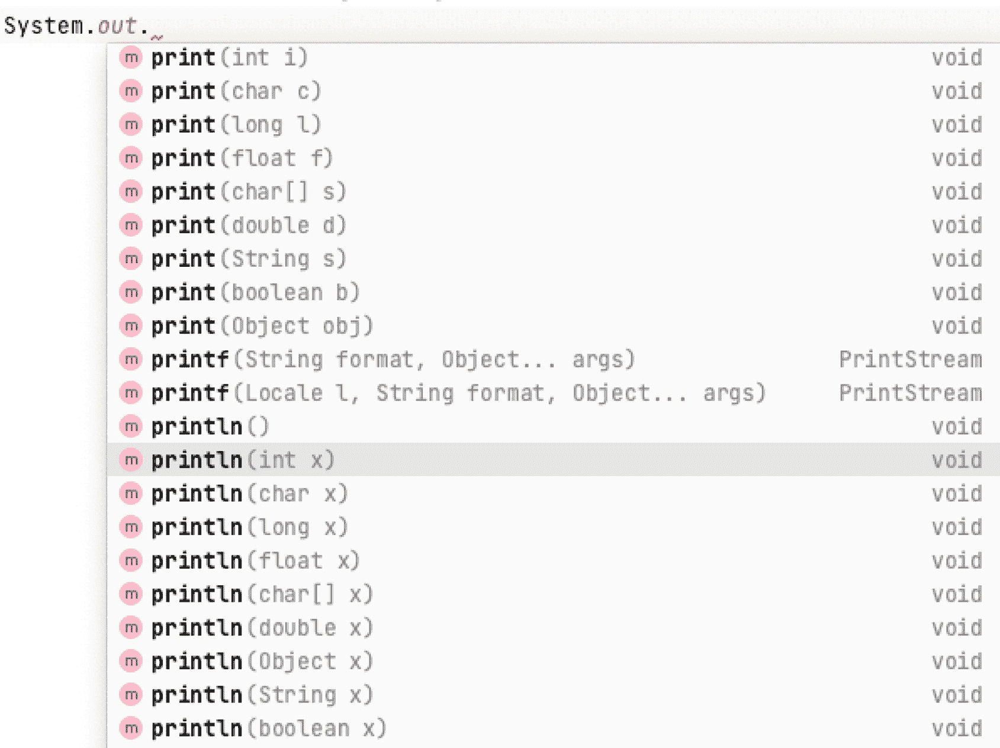
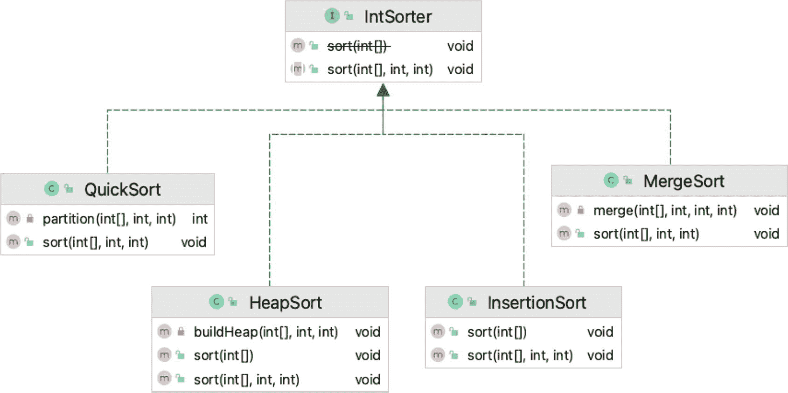
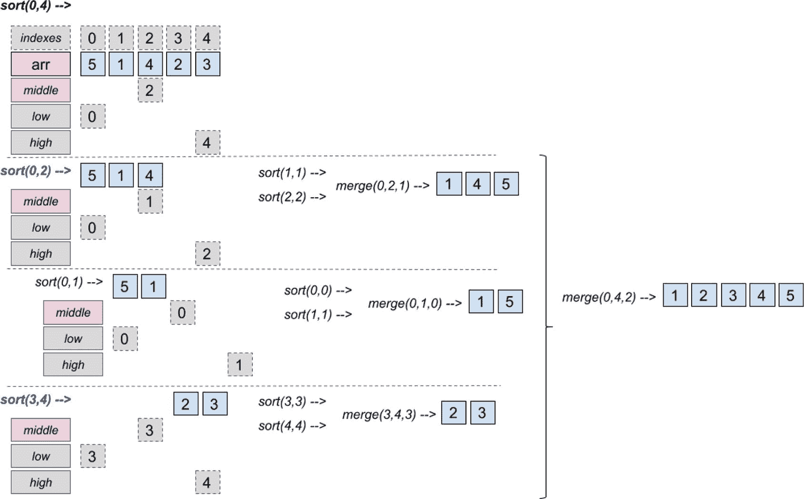
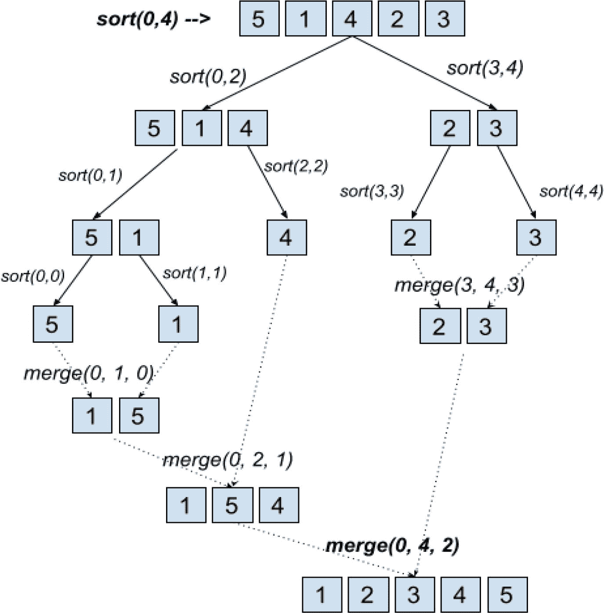
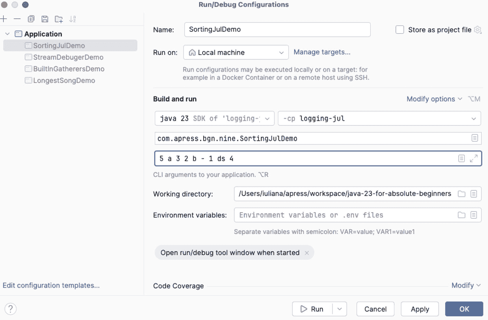

# 9. 调试、测试与文档编写

开发工作不仅要求你为问题设计解决方案并编写代码，还需要进行测试，以确保你的解决方案能够解决问题。**测试**涉及确保构成解决方案的每个组件在预期和非预期情况下都能按预期运行。

测试代码最实用的方法是通过**日志记录**在特定情况下将中间变量的值记录并打印到控制台。

当解决方案复杂时，**调试**提供了暂停执行并检查变量状态的机会。调试有时涉及**断点**，并且需要集成开发环境（IDE）。顾名思义，断点就是应用程序暂停执行并进行变量检查的点。

在确保你的解决方案符合要求后，你必须为其编写文档，特别是当所解决的问题需要复杂代码来解决时。或者，如果你的解决方案可能是其他应用程序的先决条件，你有责任向其他开发人员解释如何使用它。

本章将介绍执行这些测试、调试和文档编写活动的一些方法，因为这些是开发人员的关键技能。

## 调试

调试是查找并解决计算机程序中缺陷或问题的过程。有几种调试策略，根据应用程序的复杂程度，可以使用一种或多种策略。这里列出了一些技术：

*   记录过程中涉及对象的中间状态并分析日志文件
*   使用断点进行交互式调试，以暂停程序执行并检查过程中涉及对象的中间状态
*   测试
*   在应用程序或系统级别进行监控
*   分析内存转储和性能分析，这是一种动态程序分析形式，用于测量程序占用的内存、CPU 使用率、方法调用的持续时间等。

让我们从最简单的调试方式开始：*日志记录*。


### 日志记录

在现实世界中，伐木是一个破坏性（至少对大自然母亲而言）的过程，即砍伐和加工树木以生产木材。在软件编程中，**日志记录**意味着编写日志文件，这些文件日后可用于识别代码中的问题。记录信息最简单的方法是使用 `System.out.print*(..)` 方法族，如图 9-1 所示。



图 9-1

`System.out.print*(..)` 方法族

本章中的示例使用了一个类层次结构，该结构提供了对整数数组进行排序的方法。该类层次结构如图 9-2 所示。



图 9-2

排序类层次结构

在代码清单 9-1 中，修改了 `MergeSort` 类的内容，添加了 `System.out.print(..)` 语句来记录算法的步骤。**MergeSort** 是一种排序算法的名称，其性能优于冒泡排序（在**第** **7** **章**中介绍）。MergeSort 将数组排序描述为以下一系列步骤：

1.  将数组分成两半。
2.  再次分割每一半，直到得到的数组可以轻松排序。
3.  重复合并已排序的数组，直到最终得到一个已排序的数组。

这种反复分割数组直到排序成为可管理操作的方法称为 **divide et impera**，也称为 **分治法**（之前在**第** **5** **章**中介绍过）。还有更多算法遵循相同的方法来解决问题，而 MergeSort 只是本书中将介绍的第一个此类算法。在图 9-3 中，你可以看到 MergeSort 算法每一步发生的情况。



图 9-3

归并排序算法步骤

在算法的每一步中，都会确定数组的中间索引。然后，对按该索引从中间分割的数组调用 `sort(..)` 方法。这个过程会持续进行，直到没有中间索引为止，因为数组只有一个元素。此时会调用 `merge(..)` 方法，该方法合并数组片段，并在合并过程中对它们进行排序。

图 9-3 以与 `System.out.print(..)` 语句将生成的输出非常相似的方式描绘了该算法。由于前面提到该算法基于分治法，图 9-4 能更好地展示操作的顺序。



图 9-4

以树形展示的归并排序算法步骤

为了编写模拟归并排序算法的代码，我们需要编写两个方法：`sort(array, low, high)` 和 `merge(array, low, high, middle)`。提议的实现将在下一节中展示，并包含适当的日志记录。

#### 使用 System.out.print 进行日志记录

归并排序算法的代码需要很多步骤和很多变量来引用用于将元素按正确顺序排列的所有索引。为了确保我们的解决方案正确实现，查看每个方法被调用时使用的参数值以及正在处理的数组片段会很有用。我们可以通过简单地添加几个 `System.out.print` 语句来实现这一点。为了更简单，我们将使用 `import static java.lang.System.out;`，这允许我们编写 `out.println`，如代码清单 9-1 所示。

```
package com.apress.bgn.nine.algs;
import static java.lang.System.out;
public class MergeSort implements IntSorter {
public void sort(int[] arr, int low, int high) {
out.print("Call sort of [low,high]: [" + low + ", " + high + "] ");
for (int i = low; i <= high; ++i) {
out.print(arr[i] + " ");
}
out.println();
if (low < high) {
var middle = (low + high) / 2;
//sort lower half of the interval
sort(arr, low, middle);
//sort upper half of the interval
sort(arr, middle + 1, high);
// merge the two intervals
merge(arr, low, high, middle);
}
}
private void merge(int[] arr, int low, int high, int middle) {
var leftLength = middle - low + 1;
var rightLength = high - middle;
var left = new int[leftLength];
var right = new int[rightLength];
for (int i = 0; i < leftLength; ++i) {
left[i] = arr[low + i];
}
for (int i = 0; i < rightLength; ++i) {
right[i] = arr[middle + 1 + i];
}
var i = 0;
var j = 0;
var k = low;
while (i < leftLength && j < rightLength) {
if (left[i] <= right[j]) {
arr[k] = left[i++];
} else {
arr[k] = right[j++];
}
k++;
}
while (i < leftLength) {
arr[k++] = left[i++];
}
while (j < rightLength) {
arr[k++] = right[j++];
}
out.print("Called merge of [low, high, middle]: " + low + ", " + high + ", " + middle + "]");
for (int z = low; z <= high; ++z) {
out.print(arr[z] + " ");
}
out.println();
}
}
代码清单 9-1
使用 out.print 语句进行日志记录的归并排序提议实现
```

`out.print(..)` 和 `out.println(..)` 语句的组合格式化了输出，以显示算法的进度。为了测试输出，我们需要一个包含 `main(..)` 方法来执行算法的类，类似于代码清单 9-2 中所示的类。

```
package com.apress.bgn.nine;
import com.apress.bgn.nine.algs.IntSorter;
import com.apress.bgn.nine.algs.MergeSort;
import java.util.Arrays;
import static java.lang.System.out;
public class SortingDemo {
void main(){
int[] arr = {5,1,4,2,3};
IntSorter mergeSort = new MergeSort();
mergeSort.sort(arr, 0, arr.length - 1);
out.print("Sorted: ");
Arrays.stream(arr).forEach(i -> out.print(i + " "));
}
}
代码清单 9-2
执行归并排序提议实现的主类
```

如果我们运行代码清单 9-2 中的类，传递给方法 `sort(..)` 和 `merge(..)` 的参数会打印在控制台中，正在排序的值和正在合并的数组片段也会被打印。输出应类似于代码清单 9-3 中所示的内容。

```
Call sort of [low,high]: [0 4] 5 1 4 2 3
Call sort of [low,high]: [0 2] 5 1 4
Call sort of [low,high]: [0 1] 5 1
Call sort of [low,high]: [0 0] 5
Call sort of [low,high]: [1 1] 1
Called merge of [low, high, middle]: [0 1 0]) 1 5
Call sort of [low,high]: [2 2] 4
Called merge of [low, high, middle]: [0 2 1]) 1 4 5
Call sort of [low,high]: [3 4] 2 3
Call sort of [low,high]: [3 3] 2
Call sort of [low,high]: [4 4] 3
Called merge of [low, high, middle]: [3 4 3]) 2 3
Called merge of [low, high, middle]: [0 4 2]) 1 2 3 4 5
Sorted: 1 2 3 4 5
代码清单 9-3
执行归并排序提议实现期间打印的值
```

你可以看到控制台输出与图 9-3 中描绘的算法步骤相匹配，因此该输出清楚地证明了该解决方案按预期工作。

尽管一切看起来都很好，但这段代码存在一个问题：每次调用 `sort(..)` 方法时，这些打印语句都会被执行。

注意

如果排序只是一个更复杂解决方案中的一个步骤，那么输出并不是真正必要的，甚至可能污染更大解决方案的输出。此外，如果数组非常大，打印该输出可能会影响整体解决方案的性能。

因此，应考虑一种不同的方法，一种可以定制的方法，并且包含选择是否打印输出的选项。这就是日志库的用武之地。


#### 使用 JUL 进行日志记录

JUL 是 JDK 提供的日志后端的名称，是 `java.util.logging` 的缩写。JDK 提供了自己的日志记录器类，这些类都归入此包下。`Logger` 实例用于写入消息。创建 `Logger` 实例时应为其提供一个名称。通过调用专门的方法来打印不同级别的日志消息。对于 JUL 模块，此处列出了其级别和范围，但其他日志库也有类似的日志级别：

*   `OFF`：用于关闭所有日志记录
*   `SEVERE`：最高级别的消息，表示严重故障
*   `WARNING`：表示由于潜在问题而打印此消息
*   `INFO`：表示这是一条信息性消息
*   `CONFIG`：表示这是一条包含配置信息的消息
*   `FINE`：表示这是一条提供跟踪信息的消息
*   `FINER`：表示这是一条相当详细的跟踪消息
*   `FINEST`：表示这是一条非常详细的跟踪消息
*   `ALL`：表示应打印所有日志消息

日志记录器可以使用 `.xml`（可扩展标记语言）或 `.properties` 文件进行配置，并且其输出可以定向到外部文件。对于之前介绍的代码示例，`MergeSort` 类中的所有 `out.print` 语句都被替换为日志记录语句。清单 9-4 展示了带有日志记录语句的 `MergeSort` 类。

```
package com.apress.bgn.algs;
import java.util.logging.Logger;
public class MergeSort implements IntSorter {
private static final Logger log = Logger.getLogger(MergeSort.class.getName());
public void sort(int[] arr, int low, int high) {
var sb = new StringBuilder("Call sort of ")
.append("[low,high]: [")
.append(low).append(" ").append(high)
.append("] ");
for (var i = low; i <= high; ++i) {
sb.append(arr[i]).append(" ");
}
log.info(sb.toString());
if (low < high) {
var middle = (low + high) / 2;
//sort lower half of the interval
sort(arr, low, middle);
//sort upper half of the interval
sort(arr, middle + 1, high);
// merge the two intervals
merge(arr, low, high, middle);
}
}
private void merge(int[] arr, int low, int high, int middle) {
var leftLength = middle - low + 1;
var rightLength = high - middle;
var left = new int[leftLength];
var right = new int[rightLength];
for (int i = 0; i < leftLength; ++i) {
left[i] = arr[low + i];
}
for (int i = 0; i < rightLength; ++i) {
right[i] = arr[middle + 1 + i];
}
var i = 0;
var j = 0;
var k = low;
while (i < leftLength && j < rightLength) {
if (left[i] <= right[j]) {
arr[k] = left[i++];
} else {
arr[k] = right[j++];
}
k++;
}
while (i < leftLength) {
arr[k++] = left[i++];
}
while (j < rightLength) {
arr[k++] = right[j++];
}
var sb = new StringBuilder("Called merge of [low, high, middle]: [")
.append(low).append(" ").append(high).append(" ").append(middle)
.append("]) ");
for (var z = low; z <= high; ++z) {
sb.append(arr[z]).append(" ");
}
log.info(sb.toString());
}
}
清单 9-4
带有 JUL 日志记录语句的 MergeSort 实现
```

引入了一个 `StringBuilder` 实例，用于在通过 `log.info``([message])` 写入之前构建更长的消息，这相当于调用 `log.log(Level.INFO, [message]);`。清单 9-5 展示了运行该算法的主类。

```
package com.apress.bgn.nine;
import com.apress.bgn.algs.IntSorter;
import com.apress.bgn.algs.MergeSort;
import java.io.FileInputStream;
import java.io.IOException;
import java.util.Arrays;
import java.util.logging.Level;
import java.util.logging.LogManager;
import java.util.logging.Logger;
public class SortingJulDemo {
private static final Logger log = Logger.getLogger(SortingJulDemo.class.getName());
static {
try {
LogManager logManager = LogManager.getLogManager();
logManager.readConfiguration(new FileInputStream("./chapter09/logging-jul/src/main/resources/logging.properties"));
} catch (IOException exception) {
log.log(Level.SEVERE, "Error in loading configuration", exception);
}
}
void main(){
int[] arr = {5,1,4,2,3};
final StringBuilder sb = new StringBuilder("Sorting  an array with merge sort: ");
Arrays.stream(arr).forEach(i -> sb.append(i).append(" "));
log.info(sb.toString());
IntSorter mergeSort = new MergeSort();
mergeSort.sort(arr, 0, arr.length - 1);
final StringBuilder sb2 = new StringBuilder("Sorted: ");
Arrays.stream(arr).forEach(i -> sb2.append(i).append( " "));
log.info(sb2.toString());
}
}
清单 9-5
使用 JUL 日志记录语句运行 MergeSort 实现的主类
```

这个类中的日志语句并不多。类的主体以声明和初始化 `Logger` 实例开始。该实例不是通过调用构造函数创建的，而是通过调用 `Logger` 类中声明的静态方法 `getLogger(..)` 获得的。此方法会查找一个名称与参数匹配的 `Logger` 实例，如果找到则返回该实例；否则，它会创建一个具有该名称的实例并返回。在此示例中，`Logger` 实例的名称是完全限定的类名，通过调用 `SortingJulDemo.class.getName()` 获得。

紧接着这条语句之后，有一个 `static` 块，用于从 `logging.properties` 文件配置日志记录器。该文件的内容如清单 9-6 所示。

```
handlers=java.util.logging.ConsoleHandler
java.util.logging.ConsoleHandler.level=ALL
java.util.logging.ConsoleHandler.formatter=java.util.logging.SimpleFormatter
java.util.logging.SimpleFormatter.format=[%1$tF %1$tT] [%4$-4s] %5$s %n
清单 9-6
用于配置 logging.properties 文件中声明的 JUL 日志记录器的属性
```

此文件包含一系列格式为 `propertyName=propertyValue` 的值，这些值代表了 JUL 日志记录器的配置。它们的值指定了以下内容：

*   用于打印日志消息的类：`java.util.logging.ConsoleHandler` 在控制台中打印消息。
*   用于格式化日志消息的类：`java.util.logging.SimpleFormatter`
*   打印日志消息的模板：`[%1$tF %1$tT] [%4$-4s] %5$s %n`
*   所打印日志消息的级别，在本例中，由于使用了 `ALL` 值，因此包含所有级别的日志消息。

`Logger` 实例是通过调用静态方法 `Logger.getLogger(..)` 创建的。推荐的做法是将日志记录器命名为其正在记录消息的类名。如果没有额外的配置，使用 `log.info``(..)` 打印的每条消息前面都会加上完整的系统日期、完整的类名和方法名。可以想象，结果会非常冗长，这就是为什么 `logging.properties` 文件以及从中配置的 `LogManager` 会派上用场。`LogManager` 读取用于自定义 `Logger` 实例的配置。

运行 `SortingJulDemo` 会产生如清单 9-7 所示的输出。


```
[2024-06-30 01:20:40] [INFO] 使用归并排序对数组进行排序：5 1 4 2 3
[2024-06-30 01:20:40] [INFO] 调用 [low,high] 的排序：[0 4] 5 1 4 2 3
[2024-06-30 01:20:40] [INFO] 调用 [low,high] 的排序：[0 2] 5 1 4
[2024-06-30 01:20:40] [INFO] 调用 [low,high] 的排序：[0 1] 5 1
[2024-06-30 01:20:40] [INFO] 调用 [low,high] 的排序：[0 0] 5
[2024-06-30 01:20:40] [INFO] 调用 [low,high] 的排序：[1 1] 1
[2024-06-30 01:20:40] [INFO] 调用 [low, high, middle] 的合并：[0 1 0]) 1 5
[2024-06-30 01:20:40] [INFO] 调用 [low,high] 的排序：[2 2] 4
[2024-06-30 01:20:40] [INFO] 调用 [low, high, middle] 的合并：[0 2 1]) 1 4 5
[2024-06-30 01:20:40] [INFO] 调用 [low,high] 的排序：[3 4] 2 3
[2024-06-30 01:20:40] [INFO] 调用 [low,high] 的排序：[3 3] 2
[2024-06-30 01:20:40] [INFO] 调用 [low,high] 的排序：[4 4] 3
[2024-06-30 01:20:40] [INFO] 调用 [low, high, middle] 的合并：[3 4 3]) 2 3
[2024-06-30 01:20:40] [INFO] 调用 [low, high, middle] 的合并：[0 4 2]) 1 2 3 4 5
[2024-06-30 01:20:40] [INFO] 排序结果：1 2 3 4 5
清单 9-7
使用自定义配置通过 JUL 记录日志时，归并排序提议实现执行过程中打印的值
```

如果没有用于自定义日志消息显示方式的静态初始化块，则用于指定日志消息打印位置的默认类是 `java.util.logging.ConsoleHandler`，并且 `java.util.logging.SimpleFormatter` 类配置了一个默认格式，该格式相当冗长，由 `jdk.internal.logger.SimpleConsoleLogger.Formatting.DEFAULT_FORMAT` 声明。此常量的值为 `%1$tb %1$td, %1$tY %1$tl:%1$tM:%1$tS %1$Tp %2$s%n%4$s: %5$s%6$s%n`，这使得日志记录器在日志消息前添加一行，其中包含以可读方式格式化的系统日期和时间、完整的类名和方法名，以及一个包含日志级别的新行。默认配置通常由 `LogManager`^(⁶⁹) 从 Java 安装目录中的属性文件 `conf/logging.properties` 加载。

要测试这一点，只需注释掉 `static` 初始化块并运行 `SortingJulDemo` 类。控制台中的日志消息现在将如图 9-8 所示打印出来。

```
2024 年 6 月 30 日 上午 1:26:54 com.apress.bgn.nine.SortingJulDemo main
INFO: 使用归并排序对数组进行排序：5 1 4 2 3
2024 年 6 月 30 日 上午 1:26:54 com.apress.bgn.nine.algs.MergeSort sort
INFO: 调用 [low,high] 的排序：[0 4] 5 1 4 2 3
# 部分日志已省略
2024 年 6 月 30 日 上午 1:26:54 com.apress.bgn.nine.algs.MergeSort merge
INFO: 调用 [low, high, middle] 的合并：[0 1 0]) 1 5
2024 年 6 月 30 日 上午 1:26:54 com.apress.bgn.nine.algs.MergeSort sort
INFO: 调用 [low,high] 的排序：[2 2] 4
# 部分日志已省略
2024 年 6 月 30 日 上午 1:26:54 com.apress.bgn.nine.algs.MergeSort merge
INFO: 调用 [low, high, middle] 的合并：[0 4 2]) 1 2 3 4 5
2024 年 6 月 30 日 上午 1:26:54 com.apress.bgn.nine.SortingJulDemo main
INFO: 排序结果：1 2 3 4 5
# 部分日志已省略
清单 9-8
使用默认配置通过 JUL 记录日志时，归并排序提议实现执行过程中打印的值
```

除了 `SimpleFormatter` 类之外，另一个可用于格式化日志消息的类是 `XMLFormatter`，它将消息格式化为 XML。XML 数据写入格式由一组规则定义，用于对数据进行编码，这些数据既便于人类阅读，也便于机器读取。此外，这组规则使得验证和查找错误变得容易^(⁷⁰)。由于对于 XML 来说，将消息写入控制台没有意义，因此应使用 `FileHandler` 类将日志消息定向到文件。需要添加到配置文件中的修改如图 9-9 所示。

```
handlers=java.util.logging.FileHandler
java.util.logging.FileHandler.pattern=chapter09/out/chapter09-log.xml
.level=ALL
java.util.logging.ConsoleHandler.formatter=java.util.logging.XMLFormatter
清单 9-9
使用自定义配置通过 JUL 记录日志时，归并排序提议实现执行过程中打印的值
```

在运行 `SortingJulDemo` 类时，使用包含图 9-9 所示内容的配置文件，会在 `chapter09/out` 目录下生成一个名为 `chapter09-log.xml` 的文件，其中包含类似于图 9-10 所示的条目。

```

2024-06-30T00:30:58.777397Z

com.apress.bgn.nine.SortingJulDemo
INFO
com.apress.bgn.nine.SortingJulDemo
main

使用归并排序对数组进行排序：5 1 4 2 3

清单 9-10
日志消息作为 XML
```

日志输出也可以通过提供一个自定义类来自定义，唯一条件是此类继承自 `java.util.logging.Formatter` 类或其任何 JDK 子类。

在前面的代码示例中，只使用了 `log.info(..)` 调用，因为代码相当基础；几乎不会发生任何意外情况（没有涉及可能不可用的外部资源）。可以修改代码以允许用户插入数组元素。应该向类中添加处理用户未提供任何数据的情况的代码，以及处理用户输入错误数据的情况的代码。例如，如果用户未提供任何数据，则应打印一条 `SEVERE` 日志消息，并且应用程序应终止。如果用户输入了无效数据，则应使用有效数据，并对非整数的元素打印一条警告。这意味着 `SortingJulDemo` 类将如图 9-11 所示进行更改。

```
package com.apress.bgn.nine;
// 导入已省略
public class SortingJulDemo {
private static final Logger log = Logger.getLogger(SortingJulDemo.class.getName());
// 日志配置已省略
void main(){
if (args.length == 0) {
log.severe("没有要排序的数据！");
return;
}
int[] arr = getInts(args);
final StringBuilder sb = new StringBuilder("使用归并排序对数组进行排序：");
Arrays.stream(arr).forEach(i -> sb.append(i).append(" "));
log.info(sb.toString());
IntSorter mergeSort = new MergeSort();
mergeSort.sort(arr, 0, arr.length - 1);
final StringBuilder sb2 = new StringBuilder("排序结果：");
Arrays.stream(arr).forEach(i -> sb2.append(i).append( " "));
log.info(sb2.toString());
}
/**
* 将 String[] 转换为 int[] 数组
* @param args
* @return 一个整数数组
*/
private static int[] getInts(String[] args) {
List list = new ArrayList();
for (String arg : args) {
try {
int toInt = Integer.parseInt(arg);
list.add(toInt);
} catch (NumberFormatException nfe) {
log.warning("元素 " + arg +" 不是整数，无法添加到数组中！");
}
}
int[] arr = new int[list.size()];
int j = 0;
for (Integer elem : list) {
arr[j++] = elem;
}
return arr;
}
}
清单 9-11
SortingJulDemo 使用作为 main(..) 方法参数提供的元素数组
```

如您所见，`arr` 数组不再硬编码在 `main(..)` 方法中，而是该方法接收的参数值成为要排序的数组，并由 `getInts(..)` 方法从 `String` 值转换为 `int` 值。执行此程序的人可以从命令行提供参数，但由于我们使用的是 IntelliJ IDEA，有一种更简单的方法可以做到这一点。如果您现在不提供任何参数运行程序，控制台将打印以下内容：

```
[2021-06-06 12:16:14] [SEVERE] 没有要排序的数据！
```


执行在此处立即停止，因为没有需要排序的内容。由于您可能已经运行过这个类几次，IntelliJ IDEA 很可能已经为您创建了一个启动器配置，您可以对其进行自定义并为执行提供参数。请查看图 9-5，并尝试按照图中所示编辑您的配置，将推荐值作为程序参数添加进去。



图 9-5

`SortingJulDemo` 类的 IntelliJ IDEA 启动器

使用配置了默认控制台日志记录的设置运行此版本的 `SortingJulDemo` 类，会产生一些额外的日志消息，如清单 9-12 所示。

```
[2021-06-06 12:21:35] [WARNING] Element a is not an integer and cannot be added to the array! # 
[2021-06-06 12:21:35] [WARNING] Element b is not an integer and cannot be added to the array! # 
[2021-06-06 12:21:35] [WARNING] Element - is not an integer and cannot be added to the array! # 
[2021-06-06 12:21:35] [WARNING] Element ds is not an integer and cannot be added to the array! # 
[2021-06-06 12:21:35] [INFO] Sorting an array with merge sort: 5 3 2 1 4
[2021-06-06 12:21:35] [INFO] Call sort of [low,high]: [0 4] 5 3 2 1 4
# 其他日志消息已省略
清单 9-12
运行新版 SortingJulDemo 时显示的 WARNING 级别日志消息
```

如前所述，在某些情况下，写入日志可能会影响性能。当应用程序在生产系统中运行时，我们可能希望优化日志配置，以过滤掉不太重要的日志消息，只保留那些通知我们存在问题风险的消息。之前的配置示例包含以下配置行，该行允许打印所有日志消息：

```
java.util.logging.ConsoleHandler.level=ALL
```

或者适用于任何 `java.util.logging.Handler` 子类的更通用格式：

```
.level=ALL
```

如果将此属性的值更改为 `OFF`，则不会打印任何内容。日志级别具有分配给它们的整数值，这些值可用于比较消息的严重性。通常，如果您配置了某个级别的消息，那么更严重的消息也会被打印出来。因此，如果我们将该属性设置为 `INFO`，`WARNING` 消息也会被打印出来。消息严重性级别的值在 `java.util.logging.Level` 类中定义，如果您在编辑器中打开该类，可以看到分配给每个级别的整数值，如清单 9-13 所示。

```
package java.util.logging;
// 导入语句已省略
public class Level implements java.io.Serializable {
public static final Level OFF = new Level("OFF",Integer.MAX_VALUE, defaultBundle);
public static final Level SEVERE = new Level("SEVERE",1000, defaultBundle);
public static final Level WARNING = new Level("WARNING", 900, defaultBundle);
public static final Level INFO = new Level("INFO", 800, defaultBundle);
public static final Level CONFIG = new Level("CONFIG", 700, defaultBundle);
public static final Level FINE = new Level("FINE", 500, defaultBundle);
public static final Level FINER = new Level("FINER", 400, defaultBundle);
public static final Level FINEST = new Level("FINEST", 300, defaultBundle);
public static final Level ALL = new Level("ALL", Integer.MIN_VALUE, defaultBundle);
// 其他注释和代码已省略
}
清单 9-13
日志级别对应的整数值
```

在前面的配置中，通过将 `.level=ALL` 更改为 `.level=WARNING`，我们期望看到所有 WARNING 和 SEVERE 级别的日志消息。使用之前的参数运行 `SortingJulDemo` 类，我们应该只看到 `WARNING` 级别的消息，如清单 9-14 所示。

```
[2021-06-06 17:12:29] [WARNING] Element a is not an integer and cannot be added to the array!
[2021-06-06 17:12:29] [WARNING] Element b is not an integer and cannot be added to the array!
[2021-06-06 17:12:29] [WARNING] Element - is not an integer and cannot be added to the array!
[2021-06-06 17:12:29] [WARNING] Element ds is not an integer and cannot be added to the array!
清单 9-14
运行 SortingJulDemo 时仅显示 WARNING 级别的日志消息

还存在其他定义日志消息格式的方法：可以使用系统属性，或者以编程方式实例化一个格式化器并将其设置到 `Logger` 实例上。选择哪种方法实际上取决于应用程序的具体情况。然而，本书不会涵盖这个主题，因此如果您有兴趣阅读更多关于使用 JUL 进行 Java 日志记录的内容，我推荐脚注^(⁷¹)中引用的教程。这里不再进一步介绍 JUL 的原因是，与其他日志库相比，JUL 以其较弱的性能而闻名。您还必须考虑的另一点是，如果您正在构建的应用程序很复杂，具有大量依赖项，这些依赖项可能使用不同的日志库——您该如何配置和使用它们呢？这时，日志门面就派上用场了。下一节将向您展示如何使用最著名的 Java 日志门面：**SLF4J**。


#### 使用 SLF4J 和 Logback 进行日志记录

最著名的 Java 日志门面是 SLF4J（Simple Logging Facade for Java）^(⁷²)，它为各种日志框架提供了日志抽象。这意味着，如果你在代码中使用 SLF4J 的接口和类，那么所有后台工作将由类路径中找到的具体日志实现来完成。最棒的是？你可以随时更改日志实现，而你的代码仍然可以正确编译和执行，无需修改任何内容。

在本章迄今为止介绍的日志代码示例中，代码都与 JUL 绑定；如果我们出于某种原因想要更改日志库，我们也需要更改现有代码。第一步是将我们的代码改为使用 SLF4J API。

注意

提醒一下，应用程序编程接口（API）描述了库中公开可用的组件：接口、类、方法等。

使用 SLF4J 的另一个优点是，如果日志配置文件位于类路径上，配置会自动被读取。这意味着，只要配置文件的命名符合所使用的具体日志实现的标准，JUL 所需的 `LogManager` 初始化块对于 SLF4J 来说就不是必需的。本节首先将清单 9-5 中的主要 `SortingJulDemo` 类转换为清单 9-15 中所示的 `SortingLogbackDemo` 类，方法是将 JUL 配置和日志语句替换为 SLF4J 特有的语句。

```
package com.apress.bgn.nine;
import org.slf4j.Logger;
import org.slf4j.LoggerFactory;
// 其他导入已省略
public class SortingLogbackDemo {
private static final Logger log = LoggerFactory.getLogger(SortingLogbackDemo.class);
public static void main(String... args) {
if (args.length == 0) {
log.error("没有要排序的数据！");
return;
}
int[] arr = getInts(args);
final StringBuilder sb = new StringBuilder ("使用归并排序对数组进行排序：");
Arrays.stream(arr).forEach(i -> sb.append(i).append(" "));
log.debug(sb.toString());
IntSorter mergeSort = new MergeSort();
mergeSort.sort(arr, 0, arr.length - 1);
final StringBuilder sb2 = new StringBuilder("排序后：");
Arrays.stream(arr).forEach(i -> sb2.append(i).append( " "));
log.info(sb2.toString());
}
// getInts 方法已省略
}
清单 9-15
SortingLogbackDemo 类
```

SLF4J 定义了一个 API，该 API 映射到尚未提及的日志库提供的具体实现。SLF4J 的日志语句看起来非常相似，但日志级别与 JUL 的日志级别略有不同。以下列表解释了最常见的 SLF4J 日志语句：

*   `log.error(..)` 用于在 `ERROR` 级别记录消息；通常，当应用程序发生严重故障且无法继续正常执行时，会使用这些消息。此方法有不止一种形式，异常和对象可以作为参数传递给它，以便评估故障发生时的应用程序状态。

*   `log.warn(..)` 用于在 `WARN` 级别记录消息；通常，打印这些消息是为了通知应用程序运行不正常，并且可能有理由担心。与 `log.error(..)` 一样，`log.warn(..)` 也有不止一种形式，异常和对象可以作为参数传递，以更好地评估应用程序的当前状态。

*   `log.info``(..)` 用于在 `INFO` 级别记录消息；此类消息是信息性的，用于让用户知道一切正常且按预期工作。

*   `log.debug(..)` 用于在 `DEBUG` 级别记录消息；通常，这些消息用于打印应用程序的中间状态，以检查事情是否按预期进行，并且在发生故障时，用于追踪应用程序对象的演变。

*   `log.trace(..)` 用于在 `TRACE` 级别记录消息；此类消息是信息性的，重要性非常低。

此示例使用的具体日志实现称为 Logback^(⁷³)，我在本书的第一版中选择了它，因为当时它是 Java 9 引入模块后唯一能与 SLF4J 配合使用的库。Logback 被视为 Apache Log4j^(⁷⁴) 的继任者，后者是另一种流行的日志实现。

信息

趣闻：Log4j、SLF4j 和 Logback 都是由同一个人创立的：Ceki Gülcü。他目前正在开发后两者。至于 Log4j，它已被 Apache Log4j 2 取代，这是一个对其前身进行了重大改进的升级版本。目前，Log4j 2 的第 3 版正在开发中，因此，在日志记录方面，开发人员有相当多的不错选择。

Logback 原生实现了 SLF4J，因此无需添加另一个桥接库，并且它速度更快，因为 Logback 的内部结构已被重写，以便在关键执行点上执行得更快。在修改我们的类以使用 SLF4J 之后，我们只需将 Logback 添加为应用程序的依赖项，并在 `src/main/resources` 目录下添加一个配置文件。配置文件可以用 XML 或 Groovy 编写，标准要求将其命名为 `logback.xml`。清单 9-16 描述了本节示例中该文件的内容。

```

%d{HH:mm:ss.SSS} %-5level %logger{5} - %msg%n

清单 9-16
logback.xml 配置文件的内容
```

`ch.qos.logback.core.ConsoleAppender` 类将日志消息写入控制台，`<pattern>` 元素的值定义了日志消息的格式。Logback 可以通过将包名缩短为其首字母来格式化完全限定的类名，从而允许在不丢失细节的情况下进行紧凑的日志记录。这使得 Logback 成为当前 Java 开发世界中最受欢迎的日志实现之一。包名如果由多个部分组成，则会缩减为每个部分的首字母。`MergeSort` 类中的日志调用全部被替换为 `log.debug(..)`，因为这些消息是中间状态的，并非真正的信息性消息，只是应用程序在执行过程中使用的对象状态的示例。应用程序的通用日志级别可以使用 `<root>` 元素设置为所需级别，但可以使用 `<logger>` 元素为类、包或包的子集设置不同的日志级别。

使用之前的配置运行 `SortingLogbackDemo` 类会产生如清单 9-17 所示的输出。

```
16:25:41.178 WARN  c.a.b.n.SortingLogbackDemo - 元素 a 不是整数，无法添加到数组中！
16:25:41.182 WARN  c.a.b.n.SortingLogbackDemo - 元素 b 不是整数，无法添加到数组中！
16:25:41.182 WARN  c.a.b.n.SortingLogbackDemo - 元素 - 不是整数，无法添加到数组中！
16:25:41.182 WARN  c.a.b.n.SortingLogbackDemo - 元素 ds 不是整数，无法添加到数组中！
16:25:41.183 DEBUG c.a.b.n.SortingLogbackDemo - 使用归并排序对数组进行排序：5 3 2 1 4
16:25:41.185 DEBUG c.a.b.n.a.MergeSort - 调用排序：[0 4] 5 3 2 1 4
