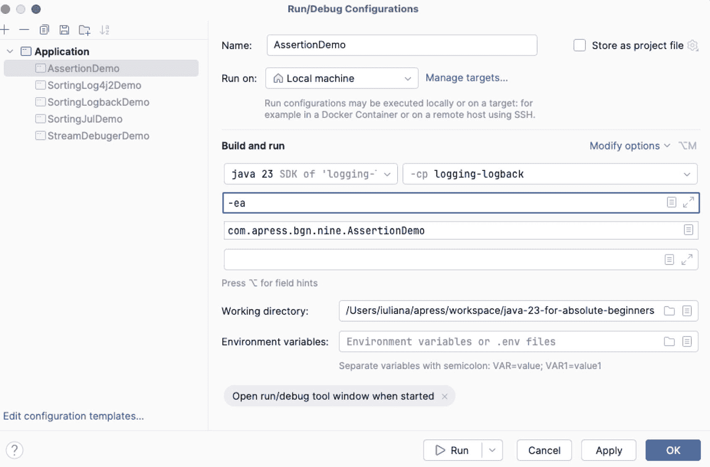
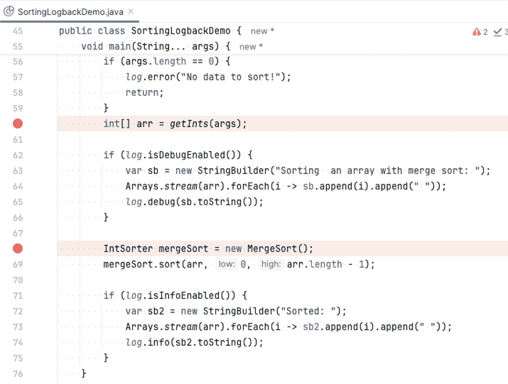
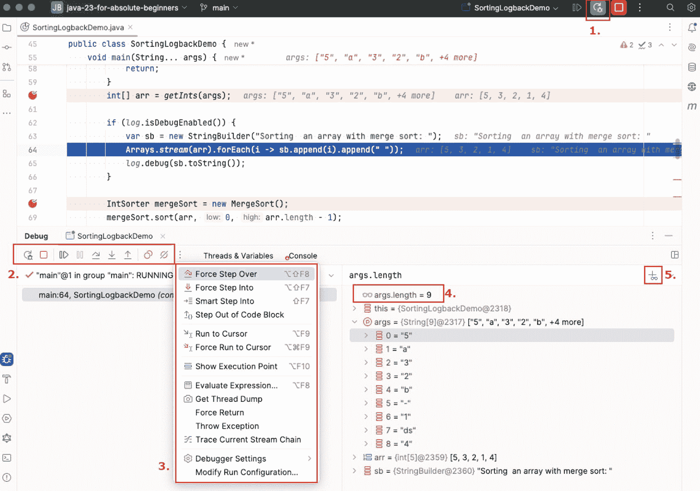
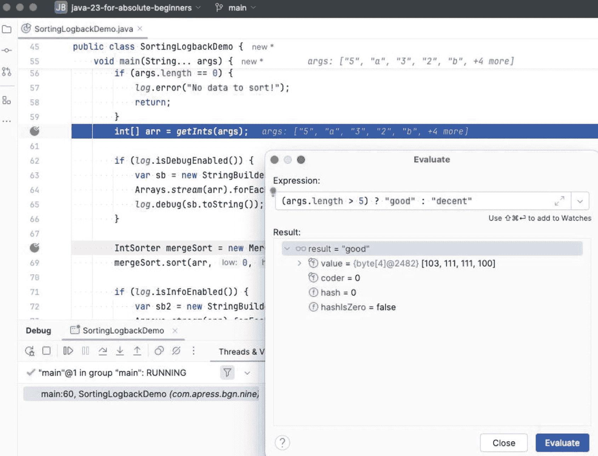

# 日志语句已省略
16:25:41.185 DEBUG c.a.b.n.a.MergeSort - 调用合并：[0 4 2],) 1 2 3 4 5
16:25:41.186 INFO  c.a.b.n.SortingLogbackDemo - 排序后：1 2 3 4 5
清单 9-17
SLF4J + Logback 打印的日志消息
```


如您所见，完全限定的类名 `com.apress.bgn.nine.SortingLogbackDemo` 被缩短为 `c.a.b.n.SortingLogbackDemo`。配置文件可以作为 VM 参数（JVM 在运行您的类时将使用的参数）提供给程序，这意味着日志格式可以在外部进行配置。启动该类时，如果您想提供不同的日志文件，只需使用 `-Dlogback.configurationFile=\temp\ext-logback.xml` 作为 VM 参数即可。

Logback 也可以将输出定向到文件；只需使用 `ch.qos.logback.core.FileAppender` 类添加配置，并通过在 `<root>` 配置中添加一个 `<appender>` 元素将输出定向到文件。配置示例如清单 9-18 所示。

```

chapter09/logging-slf4j/out/output.log
true

%d{HH:mm:ss.SSS} %-5level %logger{5} - %msg%n

UTF-8
%d{HH:mm:ss.SSS} %-5level %logger{5} - %msg%n

清单 9-18
将日志消息定向到文件的 Logback 配置
```

在前面的示例中，保留了原始配置，以便日志消息也能打印到控制台，从而证明日志消息可以同时定向到两个目标。

如果日志文件变得太大而无法打开怎么办？有一种方法可以解决这个问题。可以配置一个名为 `ch.qos.logback.core.rolling.RollingFileAppender` 的类，使其写入文件直到达到配置的大小限制，然后开始写入另一个文件。`RollingFileAppender` 类需要两个参数：

*   一个实现了 `ch.qos.logback.core.rolling.RollingPolicy` 接口的类型的实例，该接口提供写入新日志文件的功能（此操作也称为*滚动*）
*   一个实现了 `ch.qos.logback.core.rolling.TriggeringPolicy` 接口的类型的实例，该接口配置触发滚动的条件

此外，也可以使用一个同时实现了这两个接口的类型的单个实例来配置日志记录器。滚动日志文件意味着日志文件会根据配置被重命名——通常是将文件最后被访问的日期添加到其名称中，然后创建一个新的日志文件，使用配置的日志文件名（不带日期后缀，以明确这是当前正在写入日志的文件）。这样的 Logback 配置如清单 9-19 所示。

```

chapter09/logging-slf4j/out/output.log

chapter09/logging-slf4j/out/output_%d{yyyy-MM-dd}.%i.log

10MB

UTF-8
%d{HH:mm:ss.SSS} %-5level %logger{5} - %msg%n

%d{HH:mm:ss.SSS} %-5level %logger{5} - %msg%n

清单 9-19
将日志消息定向到合理大小限制文件的 Logback 配置
```

清单 9-19 中的配置包含以下元素：

*   `<file>` 元素配置日志文件的位置和名称。
*   `<rollingPolicy>` 元素使用 `<fileNamePattern>` 元素配置当日志消息不再写入时日志文件将接收的名称。例如，在前面的配置中，`output.log` 文件将被重命名为 `output_2020-07-22.log`，然后在应用程序运行的下一天创建一个新的 `output.log` 文件。
*   `<timeBasedFileNamingAndTriggeringPolicy>` 元素配置何时应创建新的日志文件，以及在创建新文件之前 `output.log` 文件应达到多大。前面示例中配置的大小是 10MB。如果在一天结束之前日志文件超过 10MB，则该文件会被重命名为 `output_2018-07-22.1.log`。名称中会添加一个索引，并创建一个新的 `output.log` 文件。
*   `<maxHistory>` 元素配置日志文件的保留期限，在此示例中为 30 天。

日志记录如果使用得当，是一个强大的工具。如果使用不当，则很容易导致性能问题。此外，记录所有内容实际上并没有太大用处，因为在一个巨大的日志文件中查找问题就像大海捞针。

在清单 9-19 中，另一个值得注意的事情是使用了 `StringBuilder` 实例来构建要在特定级别打印的大型日志消息。如果通过配置禁用了该级别的日志记录，会发生什么？如果您猜测即使这些消息没有被记录，创建它们也会消耗时间和内存，那么您猜对了。那么，我们该怎么办？SLF4J 的创建者也考虑到了这一点，并添加了方法来测试某个日志级别是否已启用，从而可以将创建复杂日志消息的语句封装在 `if` 语句中。话虽如此，可以通过重写 `SortingLogbackDemo.main(..)` 方法使其更高效，如清单 9-20 所示。

```
package com.apress.bgn.nine;
// 导入语句已省略
public class SortingLogbackDemo {
private static final Logger log = LoggerFactory.getLogger(SortingLogbackDemo.class);
public static void main(String... args) {
if (args.length == 0) {
log.error("没有数据需要排序！");
return;
}
int[] arr = getInts(args);
if (log.isDebugEnabled()) {
var sb = new StringBuilder("使用归并排序对数组进行排序：");
Arrays.stream(arr).forEach(i -> sb.append(i).append(" "));
log.debug(sb.toString());
}
IntSorter mergeSort = new MergeSort();
mergeSort.sort(arr, 0, arr.length - 1);
if (log.isInfoEnabled()) {
var sb2 = new StringBuilder("排序后：");
Arrays.stream(arr).forEach(i -> sb2.append(i).append(" "));
log.info(sb2.toString());
}
}
}
清单 9-20
在 SortingLogbackDemo 类中高效地记录日志
```

在清单 9-20 中，如果 `com.apress.bgn.nine` 包的 SLF4J 配置设置为 `info`，则以 *使用归并排序对数组进行排序：* 开头的消息将不再被创建或打印，因为 `log.isDebugEnabled()` 返回 `false`，所以 `if` 语句中包含的代码将不再执行。`Logger` 类为所有日志记录器级别都包含了 `if<Level>Enabled()` 方法。

至此，本书范围内关于日志记录的讨论就结束了。请记住，您应该适度使用日志记录，在决定在循环中记录消息时要非常小心，并且对于大型应用程序，始终使用日志门面；在 Java 中，对于 99% 的项目，这个门面就是 SLF4J。


### 使用断言进行调试

调试代码的另一种方法是使用断言。正如**第****4**章关于 Java 关键字的章节中所介绍的，`assert` 保留关键字用于编写断言语句，它只是对你关于程序执行的假设进行测试。在本章前面的示例中，我们让用户为排序程序提供输入，因此为了让程序正确运行，我们假设用户会提供正确的输入，即一个长度大于 1 的数组，因为对单个数字运行算法是没有意义的。那么，这个断言在代码中是什么样子的呢？答案如代码清单 9-21 所示。

```
package com.apress.bgn.nine;
import com.apress.bgn.algs.QuickSort;
import java.util.Arrays;
import static com.apress.bgn.nine.SortingLogbackDemo.getInts;
import static java.lang.System.out;
public class AssertionDemo {
void main(String... args){
int[] arr = getInts(args);
assert arr.length > 1;
var mergeSort = new QuickSort();
mergeSort.sort(arr, 0, arr.length - 1);
final StringBuilder sb2 = new StringBuilder("Sorted: ");
Arrays.stream(arr).forEach(i -> sb2.append(i).append(" "));
out.println(sb2);
}
}
代码清单 9-21
断言用户提供的数组大小
```

即使代码清单 9-21 中包含断言语句，在不向程序提供任何参数的情况下运行它也是可能的。不出所料，代码什么也没做，因为没有数组需要排序。尽管有断言，代码仍能运行的原因是，所有断言都需要使用 VM 参数 `-ea` 来启用。要指定此参数，你可以在命令行执行时将其添加到命令中，也可以在 IntelliJ IDEA 启动器的 VM options 文本框中添加该参数，如图 9-6 所示。



图 9-6

设置了 `-ea` VM 参数的 `AssertionDemo` 类的 IntelliJ IDEA 启动器

当断言启用时，运行代码清单 9-21 中的代码会抛出 `java.lang.AssertionError`，因为断言的表达式被评估为 `false`，显然，当没有提供参数时，`arr.length` 的值肯定不大于 1。

断言有两种形式，一种简单，一种更复杂。简单的表达式形式只有待评估的表达式，即要测试的假设：

```
assertion [expression];
```

在这种情况下，抛出的 `java.lang.AssertionError` 只会打印当前程序运行中断言所在的行，以及模块和完整的类名：

```
Exception in thread "main" java.lang.AssertionError
at chapter.nine.logback@3.0-SNAPSHOT/com.apress.bgn.nine.AssertionDemo.main(AssertionDemo.java:46)
```

更复杂的断言形式会添加另一个待评估的表达式，或一个在堆栈中使用的值，以告知用户哪个假设是错误的：

```
assertion [expression1] : [expression2];
```

因此，如果我们把

```
assert arr.length > 1;
```

替换为

```
assert arr.length > 1 : "Not enough data to sort!";
```

那么当抛出 `java.lang.AssertionError` 时，它还会显示 *Not enough data to sort!* 消息，这清楚地说明了为什么断言语句阻止了其余代码的执行：

```
Exception in thread "main" java.lang.AssertionError: Not enough data to sort!
at chapter.nine.logback@3.0-SNAPSHOT/com.apress.bgn.nine.AssertionDemo.main(AssertionDemo.java:46)
```

或者，我们也可以只打印数组的大小：

```
assert arr.length > 1 : arr.length;
```

或者两者都打印：

```
assert arr.length > 1 : "Not enough data to sort! Number of values: " + arr.length;
```

断言可以在需要调试的代码片段之前和之后使用。在前面的例子中，断言被用作执行的前提条件，因为断言失败会阻止代码执行。

断言也可以用作后置条件，以测试执行一段代码后的结果。

在前面的代码片段中，断言用于测试用户提供输入的正确性。在这种情况下，无论断言是否启用，都应该遵守有效输入的限制。当然，如果我们的数组为空或只包含一个元素，这也不是问题，因为算法不会执行，也不会导致技术故障。

在使用断言编写代码时，有一些规则需要遵守，或者需要注意的事项，现列举如下：

*   **不应使用断言来检查提供给公共方法的参数的正确性**。参数的正确性应在代码中进行测试，并应抛出适当的 `RuntimeException`。验证公共方法的参数不应是可避免的。

注意

不幸的是，为了保持对断言的介绍简单明了，前面展示断言如何工作的代码示例违反了这条规则。毕竟，`main(..)` 方法有效参数的存在是通过断言来检查的。

*   **不应使用断言来执行应用程序正常运行所需的工作**。主要原因是断言默认是禁用的，禁用它们会导致那段代码不被执行，因此应用程序的其余部分实际上会因为缺少代码而无法正常运行。假设在前面的例子中没有向 `main(..)` 方法提供参数，可以使用断言来用默认值初始化正在处理的数组。但这并不意味着你应该这样做！像下面这行代码是不好的，因为禁用断言会移除用默认值初始化数组的操作：

```
    assert arr.length > 1 : arr = new int[]{1, 2, 3};
    ```

*   **出于性能原因，不要在断言中使用评估成本高昂的表达式**。即使断言默认是禁用的，想象一下有人在生产应用程序中错误地启用了它们，如果其中一些断言评估成本高昂，那可能会非常不幸。下面的断言违反了所有三条规则：如果没有提供数组，则用默认值初始化数组，但前提是等待五分钟之后。

```
    Function sleepFiveMinsThenInit  =  aLong ->   {
    try {Thread.sleep(Duration.ofMinutes(aLong).toMillis()); } catch (InterruptedException _) {}
    return new int[]{1, 2, 3};
    };
    assert arr.length > 1 : sleepFiveMinsThenInit.apply(5L);
    ```

断言是一个简单但强大的特性。它们可以在开发生命周期的早期（此时问题易于修复）用于检测错误，并且它们简化了调试并提高了质量。如果你使用它们，请务必遵守上述三条规则。


### 逐步调试

如果你不想编写日志消息或使用断言，但仍希望在程序执行期间检查变量的值，有一种方法可以使用 IDE 来实现，正如前几章所述：使用断点暂停执行，然后利用 IDE 检查变量内容或执行简单语句，以验证程序是否按预期运行。

**断点**是设置在可执行代码行（非注释行、空行或声明行）上的标记。要在 IntelliJ IDEA 中设置断点，可以点击目标行左侧的装订线区域，或者选中该行后，从 **Run** 菜单中选择 **Toggle Line Breakpoint** 选项。断点设置成功后，装订线区域对应行会出现一个红色圆点。图 9-7 展示了在 IntelliJ IDEA 中设置的几个断点。



图 9-7

IntelliJ IDEA 断点

一旦断点设置完成，当应用程序以调试模式运行时，它会在每个标记行暂停。在暂停期间，你可以逐步执行代码、检查变量值，甚至可以在正在运行的应用程序上下文中计算表达式。IntelliJ IDEA 在这方面非常有用，它会显示当前执行的每一行代码中所有变量的内容。在图 9-8 中，`SortingLogbackDemo` 类正在以调试模式运行，并在执行过程中通过断点暂停。



图 9-8

IntelliJ IDEA 中 `SortingLogbackDemo` 类在执行过程中暂停

要以调试模式运行应用程序，不要像平常那样启动启动器，而是点击绿色三角形按钮（用于正常启动应用程序）旁边的绿色虫子形状带箭头按钮（在图 9-8 中用红色 **1.** 标记）。

应用程序运行并在第一个标记了断点的行停止，使开发者能够检查该行变量的值，如图 9-8 的上半部分所示。从该点开始，开发者还可以在图 9-8 底部的 **Debug** 部分执行以下操作：

*   点击绿色三角形按钮（左侧工具栏，在图 9-8 中用 **2.** 标记）继续执行直到下一个断点。

*   点击红色方形按钮（左侧工具栏）停止执行。

*   点击带有对角斜线红色圆点的按钮（左侧工具栏）禁用所有断点。

*   点击带有 90 度角细黑箭头的按钮（左侧工具栏）继续执行到下一行代码。

*   点击带有向下细黑箭头且尖端带下划线的按钮（左侧工具栏）进入当前代码行的方法内部继续执行。

重要提示

图 9-8 中用 **3.** 标记的 **Debug** 菜单中的 **Force Step Into** 和 **Step Out of Code Block** 选项用于单步跳过或进入第三方库提供的方法。IntelliJ IDEA 会尝试查找这些方法的源代码。如果找不到源代码，它可能会显示一个基于字节码/库自动生成的存根。用 **2.** 标记的部分中的细黑箭头仅允许调试当前项目代码。

*   从图 9-8 中用 **3.** 标记的下拉菜单中选择 **Step Out of Code Block** 选项，跳出当前方法继续执行。

*   从图 9-8 中用 **3.** 标记的下拉菜单中选择 **Run to Cursor** 选项，继续执行到光标所在行。

*   通过使用标记为 5 的按钮，将自定义表达式添加到图 9-8 中用 4 标记的 **Watches** 部分进行评估。唯一条件是表达式只能使用在断点行上下文中可访问的变量。例如，这些变量属于同一方法体或类体，且访问修饰符不重要，私有字段也可以被检查。

另一种在当前运行的应用程序上下文中评估表达式的方法是，右键单击当前执行暂停所在的文件，从打开的上下文菜单中选择 **Evaluate Expression** 选项。将打开一个对话框窗口，你可以在其中编写复杂表达式，然后点击 **Evaluate** 立即评估它们，如图 9-9 所示。



图 9-9

IntelliJ IDEA 调试会话期间的表达式评估

大多数 Java 智能编辑器都提供了以调试模式运行 Java 应用程序的方法；只需记得定期清理你的 Watches（或等效）部分。如果添加到 Watches 部分的表达式评估成本很高，可能会影响应用程序的性能。同时，要注意使用流的表达式，因为这些表达式可能导致应用程序失败，正如**第** **8** **章**所证明的那样。

### 使用 Java 工具检查正在运行的应用程序

除了用于编译 Java 代码以及执行或打包 Java 字节码的可执行文件外，JDK 还提供了一组实用可执行文件，可用于调试和检查正在运行的 Java 应用程序的状态。本节将介绍其中最有用的几个。闲话少叙，我们开始吧！


#### jps

正在运行的 Java 应用程序拥有一个唯一的进程标识符，也称为 *PID* 或 *进程 ID*。操作系统通过它来跟踪所有同时并行运行的应用程序。你可以在诸如 Windows 的**进程资源管理器**和 macOS 的**活动监视器**等工具中看到进程 ID，但如果你对在控制台中操作足够熟悉，你可能会更喜欢使用 JDK 提供的 **jps**（Java 虚拟机进程状态工具的简称）可执行文件，因为它只关注 Java 进程。

当从控制台调用 `jps` 时，将列出所有 Java 进程 ID，以及主类名称或 API 暴露的一些有助于识别正在运行的应用程序的详细信息。当应用程序崩溃但进程仍处于挂起状态时，这非常有用。当应用程序使用文件或网络端口等资源时，这可能会很麻烦，因为它可能会阻塞这些资源并阻止你使用它们。在我的电脑（我有一台 Mac）上执行 `jps` 时，我看到正在运行的 Java 进程如下：

```
> jps
73397 SortingLogbackDemo
72196 RemoteMavenServer40
73396 Launcher
73814 Jps
59103 Main

```

如你所见，`jps` 在输出中包含了自身，因为它本身也是一个 Java 进程。其他进程如下（不按输出顺序）：

*   进程 `73397` 是 `SortingLogbackDemo` 类的执行实例。
*   进程 `73396` 是 IntelliJ IDEA 用来启动 `SortingLogbackDemo` 类执行的启动器应用程序。
*   进程 `60935` 没有任何描述，但此时我可以自己识别这个进程，因为我知道我打开了 IntelliJ IDEA，它本身就是一个 Java 应用程序。
*   进程 `59103` 也是 IntelliJ IDEA，你将在下一节中看到。
*   进程 `72196` 也是 IntelliJ IDEA，因为我将其配置为使用 Maven 构建我的源代码。

能够知道进程 ID 的好处是，当它们最终挂起并阻塞资源时，你可以终止它们。假设进程是因为 `SortingLogbackDemo` 的执行挂起而启动的。要终止一个进程，所有操作系统都提供了 `kill` 命令的某个版本。对于 macOS 和 Linux，你应该执行以下命令：

```
kill -9 [process_id]
```

对于这个例子，如果我调用 `kill -9 73397`，然后调用 `jps`，我可以看到 `SortingLogbackDemo` 进程不再被列出：

```
> jps
72196 RemoteMavenServer40
73396 Launcher

59103 Main
74029 Jps
```

警告

`kill -9` 命令并不总是适用，特别是当你试图终止的进程使用了需要安全释放的资源时。此外，这里用作示例的命令适用于 Linux 和 macOS 系统，不适用于 Windows；在 Windows 上，根据你使用的是命令提示符还是 PowerShell，你可能需要使用 `taskkill` 或 `Stop-Process`。

我仍然有 Launcher 进程，但那是 IntelliJ IDEA 的子进程，所以终止它没有意义，因为下次我在 IDE 中运行一个主类时，该进程会再次启动。

`jps` 是一个相当简单的工具，当你怀疑一个只能通过终端访问的远程机器上的 Java 应用程序是否还活着时，它特别有用。所以知道它的存在是件好事。

#### jcmd

**jcmd** 可执行文件是另一个可能有用的 JDK 工具。你可以使用它向 JVM 发送诊断命令请求，这有助于对 JVM 和正在运行的 Java 应用程序进行故障排除和诊断。它必须在运行 JVM 的同一台机器上使用，并且不带任何参数调用它的结果是显示当前机器上运行的所有 Java 进程，包括它自己。除了进程 ID 之外，`jcmd` 还会显示用于启动它们执行的命令：

```
> jcmd
74152 chapter.nine.logback/com.apress.bgn.nine.SortingLogbackDemo 5 a 3 2 b - 1 ds 4
74158 jdk.jcmd/sun.tools.jcmd.JCmd
59103 com.intellij.idea.Main
72196 com.intellij.maven.server.m40.RemoteMavenServer40
74151 org.jetbrains.jps.cmdline.Launcher ... # 其余细节省略
```

当使用 Java 进程 ID 和文本 `help` 作为参数运行 `jcmd` 时，它会显示你可以在该进程上使用的所有附加命令。这仅在应用程序当前正在运行且未因断点而暂停时才有效。在我写这篇文章时，`SortingLogbackDemo` 类当前处于暂停状态，因为它的执行时间太短，无法使用 `jcmd`。另一个 Java 进程，是为运行 `BigSortingSlf4jDemo` 类而创建的，该类对一个包含 100,000,000 个随机生成数字的数组进行排序，被用作示例来生成清单 9-22 中描述的输出。

```
> jcmd 74152 help
74152:
可用的命令如下：
Compiler.CodeHeap_Analytics
Compiler.codecache
Compiler.codelist
