# 其他 VM.* 选项已省略
help
清单 9-22
在一个正在执行繁重工作的 Java 进程上执行 jcmd [pid] help 的输出
```

本书的目标并非涵盖所有命令选项，因为它们属于 Java 的高级特性，但你应该对每个命令的适用范围有一个基本了解。例如，清单 9-23 显示了调用 `jcmd 51301 GC.heap_info` 的输出。

```
> jcmd 74828 GC.heap_info
74828:
garbage-first heap   total reserved 8388608K, committed 1368064K, used 460069K [0x0000000600000000, 0x0000000800000000)
region size 4096K, 2 young (8192K), 1 survivors (4096K)
Metaspace       used 6551K, committed 6848K, reserved 1114112K
class space    used 887K, committed 1024K, reserved 1048576K
清单 9-23
在一个正在执行繁重工作的 Java 进程上执行 jcmd [pid] GC.heap_info 的输出

回顾**第** **5** **章**中 JVM 使用的不同类型的内存，以及 **堆** 是存储应用程序使用的所有对象的内存。此命令打印堆的详细信息，包括已使用多少、已保留多少、区域大小等。所有这些详细信息将在**第** **13** **章**中更详细地介绍。


#### jconsole

**jconsole** 是一款 JDK 工具，可通过其基础图形界面检查各种 JVM 统计信息。要使用 `jconsole`，只需从命令行启动它，并将其连接到一个正在运行的 Java 应用程序。该工具非常实用，因为它既可以监控本地 JVM，也可以监控远程 JVM。它还能监控和管理应用程序。应用程序必须暴露一个端口供 `jconsole` 连接。

要启动一个 Java 应用程序并暴露端口供外部应用连接，只需使用以下 VM 参数启动该应用程序：

```
-agentlib:jdwp=transport=dt_socket,server=y,suspend=y,address=1044
```

`transport=dt_socket` 参数指示 JVM，调试器连接将通过套接字进行。`address=1044` 参数告知 JVM 端口号为 1044。`port` 号可以是任何大于 1024 的端口，因为低于该值的端口受操作系统限制。`suspend=y` 参数指示 JVM 暂停执行，直到 `jconsole` 等调试器连接到它。若要避免这种情况，应使用 `suspend=n`。

对于我们的简单示例，考虑到我们将使用 `jconsole` 在同一台机器上调试 Java 应用程序，我们并不需要所有这些参数。我们只需从命令行启动 `jconsole`，然后在 *本地进程* 部分查找并识别我们想要调试的 Java 进程。

在图 9-10 中，您可以看到第一个 `jconsole` 对话框窗口。

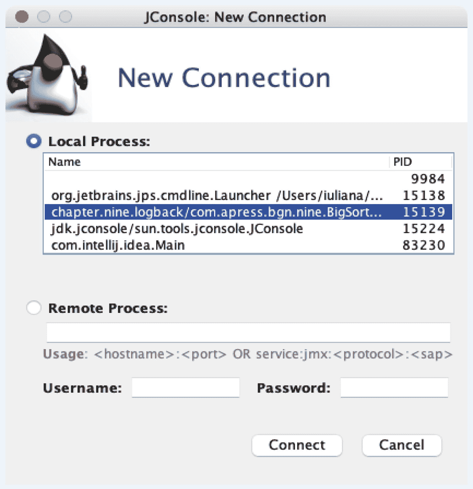

图 9-10

`jconsole` 第一个对话框窗口

当进程在本地运行时，很容易识别，因为它会使用模块名和完全限定的主类名来命名。对于像我们这样简单的应用程序，我们需要做一些调整，以确保在应用程序运行期间能够通过 `jconsole` 实际看到一些统计信息。我们添加了一些 `Thread.sleep(..)` 语句，以便暂停执行足够长的时间让 `jconsole` 连接。此外，我们将使用一个相当大的数据数组，以确保统计信息具有参考价值。`BigSortingSlf4jDemo` 类如代码清单 9-24 所示。

```
package com.apress.bgn.nine;
// 导入语句已省略
public class BigSortingDemo {
private static final Logger log = LoggerFactory.getLogger(BigSortingDemo.class);
static RandomGenerator randomGenerator = RandomGenerator.of("SecureRandom");
void main() throws InterruptedException {
Thread.sleep(3000);
// 我们使用这个 int 流来生成一个巨大的数组和一个巨大的日志文件。请耐心等待，执行需要一些时间。
var intStream = IntStream.generate(() -> randomGenerator.nextInt(350) + 1).limit(100_000_000);
int[] arr =  intStream.toArray();
if (log.isDebugEnabled()) {
final StringBuilder sb = new StringBuilder("使用归并排序对数组进行排序: ");
Arrays.stream(arr).forEach(i -> sb.append(i).append(" "));
log.debug(sb.toString());
}
Thread.sleep(3000);
var mergeSort = new MergeSort();
mergeSort.sort(arr, 0, arr.length - 1);
if (log.isInfoEnabled()) {
final StringBuilder sb2 = new StringBuilder("排序后: ");
Arrays.stream(arr).forEach(i -> sb2.append(i).append(" "));
log.info(sb2.toString());
}
}
}
代码清单 9-24
BigSortingDemo 类的内容
```

经过此修改，该类可以正常运行，并且可以将 `jconsole` 连接到它。成功连接后，会打开一个如图 9-11 所示的窗口，显示 JVM 内存消耗、活动线程数、已加载类数和 CPU 使用率的图表。

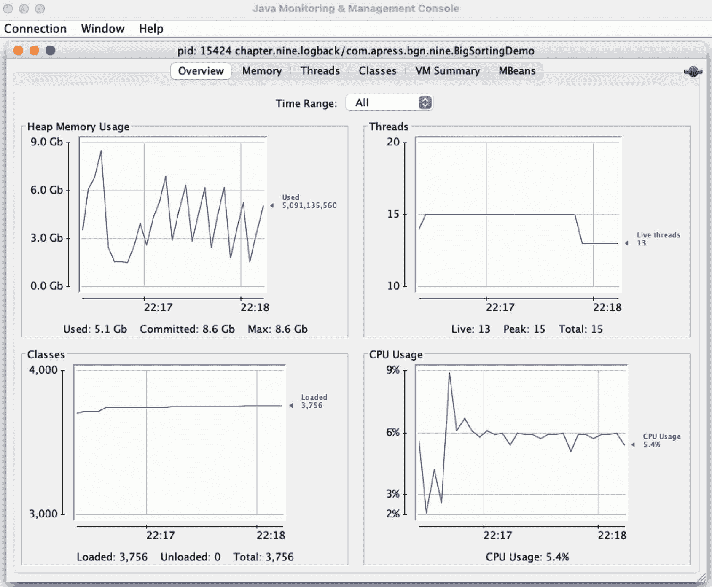

图 9-11

`jconsole` 统计信息窗口

每个统计信息都有一个选项卡，提供更详细的信息。对于更复杂的应用程序，这些信息可用于改善性能、识别潜在问题，甚至预测应用程序在所需场景下的行为。对于我们这个小型应用程序，`jconsole` 图表揭示的信息不多，但如果您真的想看到有价值的统计信息，可以在开发或运行代码时使用 `jconsole` 监控 IntelliJ IDEA。

信息

`jconsole` 的更高级版本称为 VisualVM。它曾是 JDK 的一部分，但在 Java 8 中被移除，之后成为一个独立项目。在编写本章时，还没有适用于 Java 23 的版本，因此本书将不涉及它，但欢迎您自行尝试。^(⁷⁵)

#### 使用 JDK Mission Control

**JDK Mission Control (JMC)** 是一款高级 Oracle 应用程序，用于调试和分析正在运行的应用程序的 JVM 统计信息。其官方描述指出：*JDK Mission Control (JMC)*^(⁷⁶) *是一套用于管理、监控、性能分析和故障排查 Java 应用程序的高级工具集。*

与之前讨论的工具类似，该工具可以识别当前正在运行的 Java 进程，并提供选项来查看它们在执行期间特定时间点的内存占用、某一时刻并行运行的线程数、JVM 加载的类以及运行 Java 应用程序所需的 CPU 处理能力。JMC 拥有比 JConsole 更友好的界面，其最重要的组件之一是 Java Flight Recorder (JFR)，可用于记录应用程序运行期间的所有 JVM 活动。在自定义执行时间内收集的所有数据对于诊断和分析应用程序非常有用。

尽管 JMC 是 Oracle 的工具之一，但它不再随 JDK 一起提供，因此您需要从 JMC 官方网站下载并安装适合您操作系统的版本。

要在应用程序运行时进行检查，我们打开 JMC，然后根据与之前相同的规则，选择我们识别为正在运行 `BigSortingDemo` 主类的进程。我们查找包含模块名和完全限定类名的进程名称，右键单击它，然后选择 **启动 JMX 控制台**。您应该会看到类似于图 9-12 所示的界面。

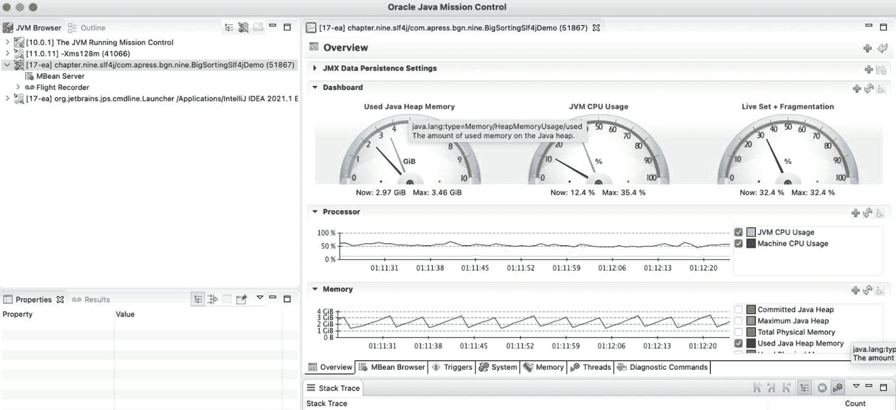

图 9-12

JMC JMX 控制台

正如您可能注意到的，界面确实更加友好，提供的统计信息也肯定更加详细。使用 JMC，可以记录应用程序和 JVM 在运行期间发生的所有事情，并稍后进行分析，即使应用程序之后已停止运行。**内存** 选项卡提供了大量关于应用程序所用内存的信息，包括哪些类型的对象占用了内存。

要记录 Java 进程的详细信息，需要以 `-XX:+UnlockCommercialFeatures -XX:+FlightRecorder` 参数启动它。OpenJDK 和早期访问版本的 JDK 没有商业特性或 Flight Recorder。这些是 Oracle JDK 的一部分，设计仅供商业使用，需要付费订阅。

JMC 的主题对于本章来说过于高级和广泛（可能整本书都可以用来介绍其用法以及如何解读统计信息），因此我们在此打住。如果您拥有 Oracle JDK 订阅并希望了解更多关于使用 JMC 的信息，Oracle 提供了非常好的相关资源。


### 访问 Java 进程 API

Java 9 除了 Jigsaw 模块（在**第** **3****章**中介绍）之外，还带来了许多其他改进，其中之一是全新改进的 Java 进程 API，它允许你启动本地操作系统进程、检索相关信息并进行管理。在早期版本的 Java 中，虽然已经具备操作进程的能力，但功能相当简陋。清单 9-25 展示了在 Java 5 之前是如何创建进程的。

```
package com.apress.bgn.nine;
// 导入部分已省略
public class ProcessCreationDemo {
private static final Logger log =
LoggerFactory.getLogger(ProcessCreationDemo.class);
public static void main(String[] args){
try {
Process exec = Runtime.getRuntime()
.exec(new String[] { "/bin/sh", "-c", "echo Java home: $JAVA_HOME" });
exec.waitFor();
InputStream is = exec.getInputStream();
StringBuilder textBuilder = new StringBuilder();
try (Reader reader = new BufferedReader(new InputStreamReader(is, StandardCharsets.UTF_8))) {
int c = 0;
while ((c = reader.read()) != -1) {
textBuilder.append((char) c);
}
}
log.info("Process output -> {}", textBuilder.toString());
log.info("Process result: {}", exec.exitValue());
} catch (Exception e) {
log.error("Process execution failed: {}", e.getMessage(), e);
}
}
}
// 输出
// INFO  c.a.b.n.ProcessCreationDemo - Process output -> Java home: /Users/iuliana/.sdkman/candidates/java/current
// INFO  c.a.b.n.ProcessCreationDemo - Process result: 0
清单 9-25
使用 Java 5 之前的 API 创建进程
```

拦截已启动进程的输出非常麻烦，必须将一个 `BufferedReader` 实例包装在连接到进程正常输出的 `InputStream` 实例上。在 Java 5 中，`java.lang` 包中引入了一个名为 `ProcessBuilder` 的类，用于通过改进的 API 创建操作系统进程。然而，Java 进程 API 的重大改进直到 Java 9 发布时才真正落地。

Java 9 的进程 API 让事情变得更加实用。其核心包含几个类和接口，它们的名称都以 `Process` 开头。我们之前对 Java 可执行文件所做的操作，现在可以直接通过编写 Java 代码来完成。提供访问本地进程 API 的接口名为 `ProcessHandle`，它是核心 Java `java.lang` 包的一部分。与 `Thread` 类类似，该接口上有一个名为 `current` 的静态方法，用于检索当前运行进程的 `ProcessHandle` 实例。一旦获得该实例，我们就可以使用其方法来访问更多进程细节。`ProcessHandle` 提供了几个静态实用方法来访问本地进程。可以编写 Java 代码来列出计算机上运行的所有进程，并且可以根据各种条件对它们进行排序。清单 9-26 中的代码列出了所有通过运行 `java` 命令创建的进程。

```
package com.apress.bgn.nine;
// 导入部分已省略
public class ProcessListingDemo {
private static final Logger log = LoggerFactory.getLogger(ProcessListingDemo.class);
public static void main(String[] args){
Optional currUser = ProcessHandle.current().info().user();
ProcessHandle.allProcesses().filter(ph -> ph.info().user().equals(currUser) && ph.info().commandLine().isPresent())
.filter(ph -> ph.info().commandLine().get().contains("java"))
.forEach(p -> {
log.info("PID: " + p.pid());
p.info().arguments().ifPresent(s -> Arrays.stream(s).forEach(a -> log.info("   arg: {}", a)));
p.info().command().ifPresent(c -> log.info("\t Command: {}", c));
});
}
}
清单 9-26
使用 Java 9 进程 API 列出所有 Java 进程
```

清单 9-26 中的代码通过获取当前运行进程的句柄并调用 `info()` 来获取 `ProcessHandle.Info` 实例，从而提取用户信息。`ProcessHandle.Info` 是一个接口，它声明了一组由 `ProcessHandleImpl.Info` 类实现的方法，用于访问进程的快照信息，例如用于创建进程的命令和参数。运行清单 9-26 中代码的输出会打印在控制台上，看起来可能与清单 9-27 中列出的输出非常相似（当然，不同的用户和不同的进程会有所不同）。

```
INFO  c.a.b.n.ProcessListingDemo - PID: 30750
INFO  c.a.b.n.ProcessListingDemo -    arg: -classpath
INFO  c.a.b.n.ProcessListingDemo -    arg: /Users/iuliana/apress/workspace/java-23-for-absolute-beginners/chapter09/process-api/target/classes:...*.jar
INFO  c.a.b.n.ProcessListingDemo -    arg: com.apress.bgn.nine.ProcessListingDemo # TODO 下划线
INFO  c.a.b.n.ProcessListingDemo -   Command: /Users/iuliana/.sdkman/candidates/java/current/bin/java
INFO  c.a.b.n.ProcessListingDemo - PID: 30733
INFO  c.a.b.n.ProcessListingDemo -    arg: -Xmx700m
INFO  c.a.b.n.ProcessListingDemo -    arg: -Djava.awt.headless=true
INFO  c.a.b.n.ProcessListingDemo -    arg: -Djna.boot.library.path=/Users/iuliana/Applications/IntelliJ IDEA Ultimate 2024.2 EAP.app/Contents/lib/jna/amd64
INFO  c.a.b.n.ProcessListingDemo -    arg: -Djna.nosys=true
INFO  c.a.b.n.ProcessListingDemo -    arg: -Djna.noclasspath=true
INFO  c.a.b.n.ProcessListingDemo -    arg: --add-opens
INFO  c.a.b.n.ProcessListingDemo -    arg: jdk.compiler/com.sun.tools.javac.api=ALL-UNNAMED
INFO  c.a.b.n.ProcessListingDemo -    arg: --add-opens
INFO  c.a.b.n.ProcessListingDemo -    arg: jdk.compiler/com.sun.tools.javac.util=ALL-UNNAMED
...
INFO  c.a.b.n.ProcessListingDemo -    arg: org.jetbrains.jps.cmdline.Launcher
INFO  c.a.b.n.ProcessListingDemo -    arg: /Users/iuliana/Applications/IntelliJ IDEA Ultimate 2024.2 EAP.app/.../*.jar
INFO  c.a.b.n.ProcessListingDemo -    arg: org.jetbrains.jps.cmdline.BuildMain
INFO  c.a.b.n.ProcessListingDemo -    arg: 127.0.0.1
INFO  c.a.b.n.ProcessListingDemo -    arg: 59887
INFO  c.a.b.n.ProcessListingDemo -    arg: 07840096-15db-47c9-8f08-9640af37397b
INFO  c.a.b.n.ProcessListingDemo -    arg: /Users/iuliana/Library/Caches/JetBrains/IntelliJIdea2024.2/compile-server
INFO  c.a.b.n.ProcessListingDemo -   Command: /Users/iuliana/.sdkman/candidates/java/current/bin/java
# 其他输出已省略
清单 9-27
运行清单 9-26 中代码产生的部分输出
```

注意

清单 9-27 中的日志仅列出了用于运行 `ProcessListingDemo` 类的 IntelliJ IDEA 启动器以及为运行它而生成的进程，但实际输出可能会长得多。有些参数被完全跳过了，因为用书页来记录你可以自己生成的日志是相当无用的。不过，如果你选择不亲自运行代码，那么对日志格式进行一些描述还是必要的。

清单 9-26 中的代码示例大致向你展示了如何访问本地进程并打印相关信息。使用改进后的 Java 进程 API，我们可以创建新进程并启动底层操作系统的命令。例如，我们可以创建一个进程来打印 `JAVA_HOME` 环境变量的值，并捕获输出以显示在 IntelliJ IDEA 控制台中，如清单 9-28 所示。（此代码适用于 macOS 和 Linux；对于 Windows，应使用等效的 PowerShell 命令。）


```
package com.apress.bgn.nine;
// 其他导入语句已省略
import java.util.concurrent.CompletableFuture;
import java.util.concurrent.ExecutionException;
public class NewApiProcessCreationDemo {
private static final Logger log = LoggerFactory.getLogger(NewApiProcessCreationDemo.class);
public static void main(String... args) throws IOException, InterruptedException, ExecutionException {
ProcessBuilder processBuilder = new ProcessBuilder();
processBuilder.command("/bin/sh", "-c", "echo Java home: $JAVA_HOME");
processBuilder.inheritIO();
Process process = processBuilder.start();
CompletableFuture future = process.onExit();
int result = future.get().exitValue();
log.info("进程结果: " + result);
CompletableFuture futureHandle = process.toHandle().onExit();
ProcessHandle processHandle = futureHandle.get();
log.info("进程 ID: {}", processHandle.pid());
ProcessHandle.Info info = processHandle.info();
info.arguments().ifPresent(s -> Arrays.stream(s).forEach(a -> log.info("   参数: {}", a)));
info.command().ifPresent(c -> log.info("\t 命令: {}", c));
}
}
代码清单 9-28
用于创建进程的 Java 示例代码
```

可以通过 `ProcessBuilder` 的实例来创建新进程，这些实例接收命令列表及其参数作为参数。该类拥有许多构造函数和方法，它们具有不同的签名，可以轻松地创建和启动进程。

`inheritIO()` 方法用于将子进程标准 I/O 的源和目标设置为与当前进程相同。这意味着进程的输出会直接打印在控制台中，无需使用 `InputStream` 实例来读取。

`Process` 类中的 `onExit()` 方法返回一个 `CompletableFuture<Process>`，可用于在其执行结束时访问该进程，以检索进程的退出值。对于正常终止的进程，该值应为 0（零）。

`ProcessHandle` 类中的 `onExit()` 方法返回一个 `CompletableFuture<ProcessHandle>`，可用于访问进程，等待进程终止，并可能触发依赖操作。

当 Java 程序创建一个进程时，该进程会成为创建它的进程的子进程。为了能够列出所有子进程，我们需要确保它们持续运行一段时间，因为一旦终止，它们显然就不再存在。代码清单 9-29 中的代码示例创建了三个相同的进程，每个进程都执行三个 Linux shell 命令。

```
package com.apress.bgn.nine;
// 导入语句已省略
public class ThreeProcessesDemo {
private static final Logger log =
LoggerFactory.getLogger(ThreeProcessesDemo.class);
public static void main(String... args) {
try {
List builders = List.of(
new ProcessBuilder("/bin/sh", "-c",
"echo \"start...\" ; sleep 3; echo \"done.\"").inheritIO(),
new ProcessBuilder("/bin/sh", "-c",
"echo \"start...\" ; sleep 3; echo \"done.\"").inheritIO(),
new ProcessBuilder("/bin/sh", "-c",
"echo \"start...\" ; sleep 3; echo \"done.\"").inheritIO()
);
builders.parallelStream().forEach(pbs -> {
try {
pbs.start();
} catch (Exception e) {
log.error("哎呀，无法启动进程！", e);
}
});
ProcessHandle ph = ProcessHandle.current();
ph.children().forEach(pc -> {
log.info("子进程 PID: {}", pc.pid());
pc.parent().ifPresent(parent ->
log.info(" 父进程 PID: {}", parent.pid()));
});
System.out.println("按任意键退出！");
System.in.read();
} catch (Exception e) {
log.error("创建三个进程失败: {}", e.getMessage(), e);
}
}
}
代码清单 9-29
用于创建三个进程的 Java 示例代码
```

如您所见，我们将 `ProcessBuilder` 实例分组到一个列表中，并使用并行流处理这些实例，以确保所有进程几乎同时启动。我们在每个进程终止后打印其结果，以确保所有进程都正确执行。`children()` 方法返回一个包含 `ProcessHandle` 实例的流，这些实例对应于当前 Java 进程启动的进程。

对于每个子 `ProcessHandle` 实例，都调用了 `parent()` 方法，以获取对应于创建它的进程的 `ProcessHandle`（如果存在的话）。运行代码清单 9-29 中的代码时，您应该在控制台中看到类似于代码清单 9-30 所示的输出。（*前提是您在 macOS 或 Linux 上运行它。Windows 可能完全不知道要求它做什么。*）

```
start...
start...
start...
INFO  c.a.b.n.ThreeProcessesDemo - 子进程 PID: 31033
INFO  c.a.b.n.ThreeProcessesDemo -  父进程 PID: 31032
INFO  c.a.b.n.ThreeProcessesDemo - 子进程 PID: 31035
INFO  c.a.b.n.ThreeProcessesDemo -  父进程 PID: 31032
INFO  c.a.b.n.ThreeProcessesDemo - 子进程 PID: 31034
INFO  c.a.b.n.ThreeProcessesDemo -  父进程 PID: 31032
按任意键退出！
done.
done.
done.
代码清单 9-30
创建三个进程的 Java 应用程序的输出
```

在过去，需要在更高级别上处理进程的开发人员不得不求助于原生代码。改进后的 Java 进程 API 对运行中和已生成的进程提供了更多的控制，因此如果您曾经需要它，现在您知道它的存在了。您可以在 Oracle 官方页面上找到 Java 9 中新增的 Java 进程 API 改进的完整列表。^(⁷⁷)


## 测试

调试是名为**测试**的软件流程的一部分，涉及在开发周期中尽早识别并纠正代码错误。在软件开发中，仅仅避免技术错误是不够的。测试应用程序的意义远不止于此。甚至有一个组织为软件测试人员提供优秀的培训和认证材料。**国际软件测试资格认证委员会（ISTQB）** 是一个国际性的软件测试资格认证组织。它制定了软件测试的教学大纲、资格等级和指南^(⁷⁸)。如果你认为自己更感兴趣的是软件测试，那么你应该考虑获取 ISTQB 认证。

ISTQB 对测试的定义是：“由所有生命周期活动（包括静态和动态）组成的过程，涉及对软件及相关工作产品的规划、准备和评估，以确定它们满足规定的要求，证明它们适合其用途，并检测缺陷。”

ISTQB 的定义是一个技术性的、学术性的定义。我提出的定义是：“验证一个实现是否在预期的时间内，以可接受的资源消耗，完成了它应该做的事情的过程。”

重要

测试是开发过程中必不可少的一部分，应尽早开始，因为修复缺陷的工作量会随着发现时间的推移呈指数级增长。你可以在罗伯特·C·马丁的《代码整洁之道：敏捷软件工艺手册》一书中，特别是第 9 章“测试”中，了解更多关于延迟测试的弊端。

在开发阶段，除了编写实际的解决方案代码，你还可以编写代码来测试你的解决方案。你可以手动运行这些测试，也可以在构建项目时使用构建工具来运行。在编写代码时，除了思考如何编写解决方案以解决问题之外，你还应该思考如何测试该解决方案。这种方法被称为**测试驱动开发（TDD）**，这是一种编程范式，它指出你应该在实现解决方案之前思考如何测试它，因为如果它难以测试，那么它很可能难以实现、长期维护以及扩展以解决相关问题。

你能编写的最简单的测试称为**单元测试**，它们是测试小功能单元的非常简单的代码。如果你不能轻松地为你的设计编写单元测试，那么你的设计可能存在问题。单元测试是抵御失败的第一道防线。如果单元测试失败，你的解决方案的基础就是糟糕的。

跨越多个组件，测试功能单元之间的通信及其交互结果是否符合预期的测试，称为**集成测试**。

开发人员应该编写的最后一种测试是**回归测试**，它会定期运行，以确保之前测试过的代码在修改后仍然能正确执行。这种测试对于由大量开发人员编写代码的大型项目至关重要，因为有时组件之间的依赖关系并不明显，一个开发人员编写的代码可能会破坏其他人的代码。

为了保持本书的范畴，本节将仅展示如何使用名为 Junit 的 Java 框架编写简单的单元测试，并描述一些你可以构建的典型测试组件，以便为单元测试设置上下文。因此，正如我的苏格兰同事所说：*让我们开始吧！*

### 测试代码位置

你可能还记得，**第 3 章**解释了`java-bgn`项目结构。关于测试的讨论必须从最低级别项目模块的结构开始，这些模块包含源代码和测试。在图 9-13 中，你可以看到包含本节所用模块的源代码和测试代码的模块结构。

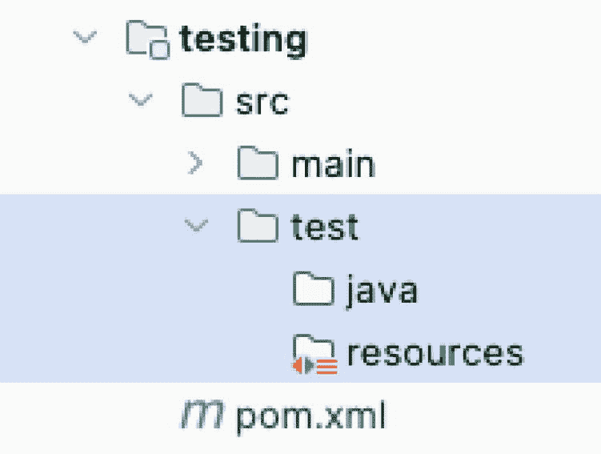

图 9-13

Maven 模块结构

`src`目录包含项目的所有代码和资源。其内容分为两个目录：`main`和`test`。

*   `main`目录包含源代码和应用程序配置文件，分为两个目录（图 9-13 中未显示）。`java`目录包含 Java 源代码，`resources`目录包含配置文件、不可执行的文本文件（可以根据各种格式编写，如 XML、SQL、CSV 等）、媒体文件、PDF 等。当应用程序被构建并打包成 jar（或 war 或 ear）时，只有`java`目录中的文件会被考虑；`*.class`文件与配置文件一起被打包。

*   `test`目录包含用于测试`src`目录中源代码的代码。Java 文件保存在`java`目录下，`resources`目录包含构建测试上下文所需的配置文件。`test`目录中的类是项目的一部分，并且可以访问`main`目录中声明的类，如**第 3 章**中访问修饰符所述。但是，`test`目录中的内容不属于将交付给客户的项目部分。它们的存在只是为了在开发过程中帮助测试应用程序。`test/resources`目录中的文件通常会覆盖`main/resources`目录中的配置文件，以便为测试类提供一个隔离的、更小的执行上下文。

### 构建一个待测试的应用程序

对于本节中的示例，我们将构建一个简单的应用程序，该程序使用嵌入式 Apache Derby^(⁷⁹)数据库来存储数据。这将是生产数据库。对于测试环境，该数据库将被替换为各种模拟数据库行为的伪构造。

这个应用程序相当简陋。一个`AccountService`实现从输入获取数据，并使用它来管理`Account`实例。`Account`类是一个非常抽象且不切实际的银行账户实现。它有一个`holder`字段（账户所有者）、一个`accountNumber`字段和一个`amount`字段。`AccountService`实现使用一个`AccountRepo`实现，通过`DBConnection`的实现来执行所有与`Account`实例相关的数据库操作。构成这个简单应用程序的类和接口以及它们之间的关系如图 9-14 所示。

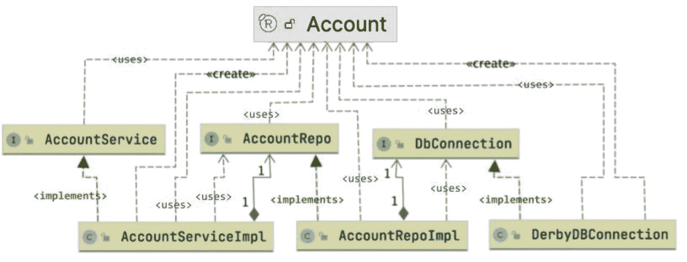

图 9-14

简单的账户管理应用程序组件（如 IntelliJ IDEA 中所示）

这些类的实现与本节的讨论无关，但如果你好奇，可以在本书的官方仓库中找到完整的代码。那么，让我们开始测试吧。最简单的方法是编写一个主类并执行一些账户操作。然而，一旦应用程序投入生产，这样做是无用的，因为在其上测试新功能会带来数据损坏的风险。此外，生产数据库通常托管在昂贵的产品上，例如 Oracle RDBMS（Oracle 关系数据库管理系统）或 Microsoft SQL Server。它们并不真正适合开发或测试。我们的意图是在自动化构建过程中自动运行测试，因此内存数据库或可实例化的实现更为合适。那么，让我们从测试`AccountRepoImpl`类开始。


### 介绍 JUnit

JUnit 无疑是 Java 开发领域中使用最广泛的测试框架。2017 年底，JUnit 5^(⁸⁰) 发布，这是该框架的下一代版本。它配备了全新的引擎，兼容 Java 9+，并包含大量基于 lambda 的功能。JUnit 5 提供了用于标记测试方法以自动执行的注解、用于初始化和销毁测试上下文的注解，以及用于实际实现测试方法的实用方法。你可以使用多种 JUnit 5 注解^(⁸¹)，但其中五个注解和一个实用类代表了 JUnit 框架的核心，这也是学习测试的最佳起点。以下列表描述了这五个 JUnit 5 注解（均来自 `org.junit.jupiter.api` 包）和实用类，以构建 JUnit 如何用于测试应用程序的整体概念：

*   `@BeforeAll` 用于返回 `void` 的非私有静态方法，该方法用于初始化当前类中所有测试方法将使用的对象和变量。此方法仅会被调用一次，在类中所有测试方法之前执行，因此测试方法不应修改这些对象，因为它们的状态是共享的，修改可能会影响测试结果。最终，由该注解方法初始化的静态字段可以声明为 `final`，这样一旦初始化，它们就无法再被更改。一个测试类中可以声明多个使用 `@BeforeAll` 注解的方法，但这有什么意义呢？

*   `@AfterAll` 是 `@BeforeAll` 的对应注解。它也用于注解返回 `void` 的非私有静态方法，其目的是销毁测试方法运行时的上下文并执行清理操作。

*   `@BeforeEach` 用于返回 `void` 的非私有、非静态方法，使用该注解的方法会在每个使用 `@Test` 注解的方法之前执行。这些方法可用于进一步定制测试上下文，为对象填充将在测试方法中用于测试断言的值。

*   `@AfterEach` 用于返回 `void` 的非私有、非静态方法，使用该注解的方法会在每个使用 `@Test` 注解的方法之后执行。

*   `@Test` 用于返回 `void` 的非私有、非静态方法，使用该注解的方法即为一个测试方法。一个测试类可以有一个或多个测试方法，具体取决于被测试的类。

*   实用类 `org.junit.jupiter.api.Assertions` 提供了一组支持在测试中断言条件的方法。

另一个值得注意的注解是 `@DisplayName`，它与所有其他注解声明在同一个包中，用于以更友好的方式命名测试。测试名称会显示在 IDE 中以及构建工具生成的报告中。

清单 9-31 中所示的 `PseudoTest` 类是一个简单的测试类，展示了到目前为止所介绍的注解的效果。

```
package com.apress.bgn.nine;
// 省略了一些导入语句
import org.junit.jupiter.api.*;
import static org.junit.jupiter.api.Assertions.assertFalse;
import static org.junit.jupiter.api.Assertions.assertTrue;
public class PseudoTest {
private static final Logger log = LoggerFactory.getLogger(PseudoTest.class);
@BeforeAll
static void loadCtx() {
log.info("加载通用测试上下文。");
}
@BeforeEach
void setUp(){
log.info("准备单个测试上下文。");
}
@Test
@DisplayName("测试一")
void testOne() {
log.info("执行测试一。");
assertTrue(true);
}
@Test
@DisplayName("测试二")
void testTwo() {
log.info("执行测试二。");
assertFalse(false);
}
@AfterEach
void tearDown(){
log.info("销毁单个测试上下文。");
}
@AfterAll
static void unloadCtx(){
log.info("卸载通用测试上下文。");
}
}
清单 9-31
使用 JUnit 注解的 PseudoTest 类
```

记住你现在对这些注解的了解，你应该能够推断出日志消息的顺序，因为默认情况下，JUnit Jupiter 测试是在单个线程中顺序执行的。因此，运行该类时，你可能会看到类似如下的输出：

```
INFO  c.a.b.n.PseudoTest - 加载通用测试上下文。
INFO  c.a.b.n.PseudoTest - 准备单个测试上下文。
INFO  c.a.b.n.PseudoTest - 执行测试一。
INFO  c.a.b.n.PseudoTest - 销毁单个测试上下文。
INFO  c.a.b.n.PseudoTest - 准备单个测试上下文。
INFO  c.a.b.n.PseudoTest - 执行测试二。
INFO  c.a.b.n.PseudoTest - 销毁单个测试上下文。
INFO  c.a.b.n.PseudoTest - 卸载通用测试上下文。
```

启用测试的并行执行是可能的，只需在 `test\resources` 下添加一个名为 `junit-platform.properties` 的文件，其中包含以下属性：

```
junit.jupiter.execution.parallel.enabled = true
junit.jupiter.execution.parallel.mode.default = concurrent
junit.jupiter.execution.parallel.mode.classes.default = same_thread
```

注意 `junit.jupiter.execution.parallel.enabled` 属性被设置为 `true`。前面这组属性代表了配置参数，用于顺序执行顶层类，但并行执行其方法。官方 JUnit 文档中提供了更多配置示例。

注意

如果你的测试套件在设计时考虑了测试方法的执行顺序，那么并行执行可能会导致测试失败。

在执行 `mvn test` 时，Maven 会运行项目中的所有测试作为构建的一部分，并且有单独运行测试类的选项。大多数智能 Java 编辑器（如 IntelliJ IDEA）也提供了运行测试的选项；你可以运行整个类、只运行一个方法、运行特定包，甚至可以在调试模式下运行并使用断点。图 9-15 显示了在 IntelliJ IDEA 中运行测试类的菜单选项，通过右键单击 `PseudoTest` 类打开上下文菜单即可访问。

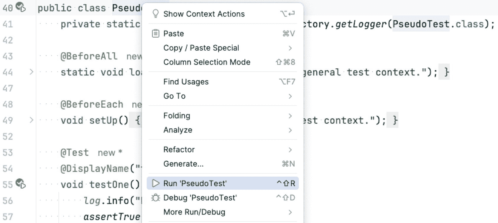

图 9-15

IntelliJ IDEA 运行单元测试的菜单

选择 **运行 'PseudoTest'** 后，测试类即被执行。会创建一个启动器，以便你也可以从典型的启动菜单中启动它。测试类可以在调试模式下执行，也可以使用断点。执行 `PseudoTest` 类时，即使测试方法是并行运行的，输出也与前面提到的注解规范所对应的方法顺序一致。为了确保测试方法是并行执行的，日志记录器被配置为也打印线程 ID。示例输出如清单 9-32 所示。

```
[1-worker-1] INFO  c.a.b.n.PseudoTest - 加载通用测试上下文。
[1-worker-3] INFO  c.a.b.n.PseudoTest - 准备单个测试上下文。
[1-worker-2] INFO  c.a.b.n.PseudoTest - 准备单个测试上下文。
[1-worker-2] INFO  c.a.b.n.PseudoTest - 执行测试一。
[1-worker-3] INFO  c.a.b.n.PseudoTest - 执行测试二。
[1-worker-2] INFO  c.a.b.n.PseudoTest - 销毁单个测试上下文。
[1-worker-3] INFO  c.a.b.n.PseudoTest - 销毁单个测试上下文。
[1-worker-1] INFO  c.a.b.n.PseudoTest - 卸载通用测试上下文。
清单 9-32
PseudoTest 执行的输出
```

清单 9-31 中的 `testOne()` 方法包含语句 `assertTrue(true);`，这是为了向你展示断言方法的样子。在实际测试中，`true` 值会被替换为一个条件。`textTwo()` 方法中的 `assertFalse(false);` 断言也是如此。

这就是我们在本书中能够专门介绍 JUnit 的全部内容了。我建议你进一步深入研究它，因为一个开发者可以编写代码，但一个好的开发者知道如何确保代码也能正常工作。


#### 使用伪造对象

使用**伪造对象**是一种在不实际依赖真实对象或方法的情况下，模拟代码中对象和方法功能的方式。用于实现此类对象的代码具有简化后的生产环境功能。

为了测试 `AccountRepoImpl` 类，我们必须用一个 `FakeDBConnection` 实例替换 `DerbyDBConnection` 实例。这个伪造的连接并非由数据库支持，而是由更简单、更易访问的东西（如 `Map<?,?>`）支持。`DerbyDBConnection` 使用 `java.sql.Connection` 及该包中的其他类来对 Derby 数据库执行数据操作。

`FakeDBConnection` 类将实现 `DBConnection` 接口，以便它可以被传递给 `AccountRepoImpl`，并且其所有方法都将被调用。

编写测试和测试支持类时的经验法则是：将它们与被测试或替换的对象放在同一个包中，但放在 `test/java` 目录下。这是因为测试类必须能够访问被测试的类，而无需在 `module-info.java` 文件中进行额外配置。使用伪造对象来测试应用程序类的支持类在 `com.apress.bgn.nine.fake` 包中声明。

编写测试时的另一个经验法则是：编写一个方法来测试被测试方法的正确结果，并编写另一个方法来测试错误行为。在意外情况下，使用意外数据，你的应用程序会以意外的方式运行，因此尽管这看起来有些矛盾，但你必须预料到意外情况并为其编写测试。

`AccountRepoImpl` 类实现了将 `Account` 实例持久化到数据库或从数据库中删除的基本方法。该实现如代码清单 9-33 所示。

```
package com.apress.bgn.nine.repo;
import com.apress.bgn.nine.Account;
import com.apress.bgn.nine.db.DbConnection;
import java.util.List;
import java.util.Optional;
public class AccountRepoImpl  implements AccountRepo {
private DbConnection conn;
public AccountRepoImpl(DbConnection conn) {
this.conn = conn;
}
@Override
public Account save(Account account) {
var dbAcc = conn.findByHolder(account.holder());
if(dbAcc == null) {
return conn.insert(account);
}
return conn.update(account);
}
@Override
public Optional findOne(String holder) {
var acc = conn.findByHolder(holder);
if(acc != null) {
return Optional.of(acc);
}
return Optional.empty();
}
@Override
public List findAll() {
return conn.findAll();
}
@Override
public int deleteByHolder(String holder) {
var acc = conn.findByHolder(holder);
conn.delete(holder);
if(acc != null) {
return 0;
}
return 1;
}
}
代码清单 9-33
AccountRepoImpl 实现
```

`AccountRepoImpl` 类中的 `deleteByHolder(..)` 方法用于删除一个账户。如果条目存在，则删除并返回 0；否则返回 1。`deleteByHolder(..)` 方法如代码清单 9-34 所示。

为了测试这个类，我们需要提供一个模拟数据库连接的 `DbConnection` 实现。这就是前面提到的 `FakeDBConnection` 发挥作用的地方，其代码也在代码清单 9-34 中展示。

```
package com.apress.bgn.nine.fake.db;
import com.apress.bgn.nine.Account;
import com.apress.bgn.nine.db.DBException;
import com.apress.bgn.nine.db.DbConnection;
import java.util.*;
public class FakeDBConnection implements DbConnection {
/**
* 伪数据库 {@code Map}
*/
Map database = new HashMap();
@Override
public void connect() {
// 无需实现
}
@Override
public Account insert(Account account) {
if (database.containsKey(account.holder())) {
throw new DBException("无法插入 " + account);
}
database.put(account.holder(), account);
return account;
}
@Override
public Account findByHolder(String holder) {
return database.get(holder);
}
@Override
public List findAll() {
return new ArrayList(database.values());
}
@Override
public Account update(Account account) {
if (!database.containsKey(account.holder())) {
throw new DBException("找不到账户 " + account.holder());
}
database.put(account.holder(), account);
return account;
}
@Override
public void delete(String holder) {
database.remove(holder);
}
@Override
public void disconnect() {
// 无需实现
}
}
代码清单 9-34
FakeDBConnection 实现
```

`FakeDBConnection` 的行为完全像一个连接对象，可用于将条目保存到数据库、搜索或删除它们，只不过它是由一个 `Map<String, Account>` 而非数据库支持的。映射的键将是持有者的名字，因为在我们的数据库中，持有者名字被用作表中 `Account` 条目的唯一标识符。现在我们有了这个伪造对象，就可以测试 `AccountRepoImpl` 是否按预期运行。出于实际原因，本节仅测试一个方法，但完整代码可在本书的官方 GitHub 仓库中找到。

代码清单 9-35 展示了一个测试类，它测试了验证 `findOne(..)` 方法行为的方法。它包含一个正向测试方法（当存在匹配条件的条目时）和一个负向测试方法（当不存在时）。

```
package com.apress.bgn.nine;
// 其他导入语句已省略
import static org.junit.jupiter.api.Assertions.*;
public class FakeAccountRepoTest {
private static final Logger log = LoggerFactory.getLogger(FakeAccountRepoTest.class);
private static DbConnection conn;
private AccountRepo repo;
@BeforeAll
static void prepare() {
conn = new FakeDBConnection();
}
@BeforeEach
public void setUp(){
repo = new AccountRepoImpl(conn);
// 插入一个条目以便测试 update/findOne
repo.save(new Account("Pedala", 200, "2345"));
}
@Test
public void testFindOneExisting(){
Optional expected = repo.findOne("Pedala");
assertTrue(expected.isPresent());
}
@Test
public void testFindOneNonExisting(){
Optional expected = repo.findOne("Dorel");
assertFalse(expected.isPresent());
}
@Test
public void testFindAll(){
assertEquals(1, repo.findAll().size());
}
@Test
public void testInsert(){
Account expected = new Account("Gigi", 100, "12345");
Account actual = repo.save(expected);
assertEquals(expected, actual);
}
@Test
public void testUpdate(){
Account existing = conn.findByHolder("Pedala");
int originalSum = existing.sum();
var upAcc = new Account(existing.holder(), originalSum -50, existing.number());
Account actual = repo.save(upAcc);
assertEquals(upAcc.sum(),actual.sum());
}
@Test
public void testDeleteExisting(){
assertEquals( 0, repo.deleteByHolder("Pedala"));
}
@Test
public void testDeleteNonExisting(){
assertEquals( 1, repo.deleteByHolder("NotExisting"));
}
@AfterEach
void tearDown(){
// 删除条目
repo.deleteByHolder("Pedala");
}
@AfterAll
public static void cleanUp(){
conn = null;
log.info("全部完成！");
}
}
代码清单 9-35
FakeAccountRepoTest 测试类
```

注意我们是如何创建恰好一个条目并将其添加到我们的伪造数据库中的。

现在我们已经确定仓库类能正常工作，接下来要测试的是 `AccountServiceImpl`。为了测试这个类，我们将采用一种不同的方法。伪造对象很有用，但为一个功能复杂的类编写伪造对象可能代价相当高。那么有哪些替代方案呢？有几种。在下一节中，我们将探讨桩（stubs）。


#### 使用桩（Stubs）

**桩**是一种模拟对象，它能静默地模拟行为并返回预定义的期望值。`AccountServiceImpl` 的实例使用 `AccountRepo` 的实例从数据库检索数据或向数据库保存数据。在为此类编写单元测试时，每个测试方法必须覆盖服务类中某个方法的功能，因此我们可以编写一个桩类来模拟 `AccountRepo` 的行为。为了让 `AccountServiceImpl` 实例能够使用它，该桩必须实现 `AccountRepo`。在本节中，测试将覆盖 `createAccount(..)` 方法，因为该方法可能以多种方式失败。因此，可以为其编写多个测试方法。清单 9-36 展示了 `createAccount(..)` 方法。

```
package com.apress.bgn.nine.service;
// 省略 import 语句
public class AccountServiceImpl implements AccountService {
    AccountRepo repo;
    public AccountServiceImpl(AccountRepo repo) {
        this.repo = repo;
    }
    @Override
    public Account createAccount(String holder, String accountNumber, String amount) {
        int intAmount;
        try {
            intAmount = Integer.parseInt(amount);
        } catch (NumberFormatException nfe) {
            throw new InvalidDataException("无法使用无效金额创建账户！");
        }
        if (accountNumber == null || accountNumber.length() < 5) {
            throw new InvalidDataException("无法使用无效账号创建账户！");
        }
        if (intAmount < 0) {
            throw new InvalidDataException("无法使用负数金额创建账户！");
        }
        Optional<Account> existing = repo.findOne(holder);
        if (existing.isPresent()) {
            throw new AccountCreationException("持有人 " + holder + " 的账户已存在");
        }
        Account acc = new Account(holder, intAmount, accountNumber);
        return repo.save(acc);
    }
    // 省略其他方法
}
清单 9-36
AccountServiceImpl#createAccount(..) 方法
```

`createAccount(..)` 方法接受持有人姓名、待创建账号和初始金额作为参数。所有这些参数都特意以 `String` 实例形式提供，以便方法体包含一些需要认真测试的逻辑。我们来分析 `createAccount(..)` 方法的行为，并列出所有可能的返回值和异常：

*   如果 `amount` 不是数字，则抛出 `InvalidDataException`。（`InvalidDataException` 是专门为此项目创建的自定义异常类型，目前不相关。）
*   如果 `accountNumber` 参数为 null，则抛出 `InvalidDataException`。
*   如果 `accountNumber` 参数少于五个字符，则抛出 `InvalidDataException`。
*   如果转换为数字的 `amount` 参数为负数，则抛出 `InvalidDataException`。
*   如果 `holder` 参数的账户已存在，则抛出 `AccountCreationException`。
*   如果所有输入均有效且 `holder` 参数没有对应账户，则创建 `Account` 实例，保存到数据库，并返回结果。

如果我们真的对测试一丝不苟，就需要为所有这些情况编写测试场景。在软件领域，有一种称为**测试覆盖率**的概念，这是一个确定测试用例是否覆盖应用程序代码以及覆盖多少的过程。结果是一个百分比值，公司通常会定义一个测试覆盖率百分比^(⁸²)，作为应用程序质量的保证。在展示 `createAccount(..)` 方法的测试方法之前，请先查看清单 9-37，其中展示了仓库桩代码。

```
package com.apress.bgn.nine.service.stub;
// 其他 import 语句
public class AccountRepoStub implements AccountRepo {
    private Integer option = 0;
    public synchronized void set(int val) {
        option = val;
    }
    @Override
    public Account save(Account account) {
        return account;
    }
    @Override
    public Optional findOne(String holder) {
        if (option == 0) {
            return Optional.of(new Account(holder, 100, "22446677"));
        }
        return Optional.empty();
    }
    @Override
    public List findAll() {
        return List.of(new Account("sample", 100, "22446677"));
    }
    @Override
    public int deleteByHolder(String holder) {
        return option;
    }
}
清单 9-37
AccountRepoStub 类
```

`option` 字段可用于改变桩的行为，以覆盖更多测试用例。由于我们只有一个桩仓库，这意味着测试在并行运行时可能会失败，但对于这个使用基本桩的示例来说，它是可行的。

使用 JUnit 编写测试有两种方式，具体取决于所使用的 `assert*(..)` 语句。清单 9-38 展示了两个负面测试方法，用于验证当提供无效金额作为参数时的行为。

```
package com.apress.bgn.nine.service;
// 省略 import 语句
public class AccountServiceTest {
    private static AccountRepoStub repo;
    private AccountService service;
    @BeforeAll
    public static void prepare() {
        repo = new AccountRepoStub();
    }
    @BeforeEach
    public void setUp() {
        service = new AccountServiceImpl(repo);
    }
    @Test
    public void testNonNumericAmountVersionOne() {
        assertThrows(InvalidDataException.class,
            () -> {
                service.createAccount("Gigi", "223311", "2I00");
            });
    }
    @Test
    public void testNonNumericAmountVersionTwo() {
        InvalidDataException expected = assertThrows(
            InvalidDataException.class, () -> {
                service.createAccount("Gigi", "223311", "2I00");
            }
        );
        assertEquals("无法使用无效金额创建账户！", expected.getMessage());
    }
    @AfterEach
    public void tearDown() {
        repo.set(0);
    }
    @AfterAll
    public static void destroy() {
        repo = null;
    }
}
清单 9-38
使用桩仓库的 AccountServiceTest 单元测试类
```

`testNonNumericAmountVersionOne()` 方法使用了 `assertThrows(..)`，它接收两个参数：当执行第二个 `Executable` 类型参数时预期抛出的异常类型。`Executable` 是定义在 `org.junit.jupiter.api.function` 包中的一个函数式接口，可在 lambda 表达式中使用，从而得到清单 9-38 中所示的紧凑测试。

`testNonNumericAmountVersionTwo()` 方法保存了 `assertThrows(..)` 调用的结果，这样还可以测试异常的消息，以确保执行流程完全符合预期。

可以编写类似的方法来测试所有其他服务方法。本书仓库中托管的 `AccountServiceTest` 类还展示了一些其他测试方法。欢迎添加你自己的方法来覆盖你自己的场景。

下一节将介绍本章涵盖的最后一种测试技术：使用模拟对象（mocks）编写测试。


#### 使用模拟对象

**模拟对象**是能够记录其所接收调用的对象。在测试执行期间，通过使用断言工具方法，可以验证所有预期操作是否已在模拟对象上执行。幸运的是，开发者无需自行编写模拟对象的代码，因为有三个广为人知的库提供了使用模拟进行测试所需的类类型：Mockito^(⁸³)、JMock^(⁸⁴) 和 EasyMock^(⁸⁵)。此外，如果你需要模拟静态方法（最常见的原因是糟糕的设计，而这超出了你的能力范围），可以使用 PowerMock^(⁸⁶)。

使用模拟对象，你可以直接开始编写测试。清单 9-39 展示了针对 `createAccount(..)` 方法的两个测试，它们专注于验证仓库类是否实际调用了其方法，因为仓库类是被模拟对象替换的类。

```
package com.apress.bgn.nine.mock;
// 其他导入语句已省略
import org.junit.jupiter.api.extension.ExtendWith;
import org.mockito.Mock;
import org.mockito.junit.jupiter.MockitoExtension;
import static org.junit.jupiter.api.Assertions.*;
import static org.mockito.ArgumentMatchers.any;
import static org.mockito.Mockito.when;
@ExtendWith(MockitoExtension.class)
public class AccountServiceTest {
public AccountService service;
@Mock
public AccountRepo mockRepo;
@BeforeEach
public void checkMocks() {
assertNotNull(mockRepo);
service = new AccountServiceImpl(mockRepo);
}
@Test
public void testCreateAccount() {
Account expected = new Account("Gigi", 2100, "223311");
when(mockRepo.findOne("Gigi")).thenReturn(Optional.empty());
when(mockRepo.save(any(Account.class))).thenReturn(expected);
Account result = service.createAccount("Gigi", "223311", "2100");
assertEquals(expected, result);
}
@Test
public void testCreateAccountAlreadyExists() {
Account expected = new Account("Gigi", 2100, "223311");
when(mockRepo.findOne("Gigi")).thenReturn(Optional.of(expected));
assertThrows(AccountCreationException.class,
() -> service.createAccount("Gigi", "223311", "2100"));
}
}
清单 9-39
使用模拟仓库的 AccountServiceTest 单元测试类
```

这些测试相当不言自明，`Mockito` 工具方法的命名也使得理解测试执行过程中实际发生的情况变得容易。等等，你可能会问，模拟对象是如何创建和注入的？是谁做的这些？

`@ExtendWith(MockitoExtension.class)` 注解对于 JUnit 5 测试支持 `Mockito` 注解是必需的。没有它，像 `@InjectMocks` 和 `@Mock` 这样的注解对代码没有影响。

`@Mock` 注解用于由 Mockito 创建的模拟对象的引用。使用模拟对象的首选方式是指定一个接口类型的引用，该接口由真实对象类型和将为测试场景创建的模拟对象共同实现。但 `@Mock` 也可以放在具体类型引用上，创建的模拟对象将是该类的子类。

`@InjectMocks` 注解用于待测试的对象，这样 Mockito 就知道要创建这个对象并注入模拟对象来替代依赖项。

这就是你在测试中开始使用 Mockito 模拟对象所需了解的全部内容。声明要替换为模拟对象的对象以及要注入的对象，是包含使用模拟对象的单元测试的类所需的唯一设置。

使用模拟对象的测试方法体也具有典型的结构。第一行必须声明对象和变量，这些对象和变量将作为参数传递给被测对象上调用的方法，或作为参数传递给声明模拟对象接受什么参数以及返回什么结果的 Mockito 工具方法。下一行则建立模拟对象在被测对象调用其方法时的行为。

以下两行展示了 `findOne(..)` 方法的这种情况。第一行创建了一个 `account` 对象。第二行定义了模拟对象的行为。当调用 `mockRepo.findOne("Gigi")` 时，先前创建的 account 实例将被包装在 `Optional<T>` 实例中返回。

```
Account expected = new Account("Gigi", 2100, "223311");
when(mockRepo.findOne("Gigi")).thenReturn(Optional.of(expected));
```

还有许多其他库旨在让开发者尽可能轻松地编写测试，像 Spring 这样的大型框架也提供了自己的测试库，以帮助开发者为使用该框架的应用程序编写测试。像 Ant、Maven 和 Gradle 这样的构建工具可用于在构建项目时自动运行测试，并生成与失败相关的有用报告。

使用 Maven，可以通过在控制台中调用 `mvn clean install` 来构建项目。测试模块中声明的所有测试类，如果命名为 `*Test.java`，都会被自动识别。在编写测试而不更改应用程序代码时，你可以仅通过调用 `mvn test` 来运行测试。这是一种可以通过配置 `pom.xml` 文件中的 Maven Surefire Testing 插件来更改的配置。

在 Maven 项目中，测试由 `maven-surefire-plugin` 运行。Maven 测试结果以 TXT 和 XML 格式保存，文件位于 `target/surefire-reports` 目录中。可以通过将 `maven-surefire-report-plugin` 添加到项目配置中，并将其配置为在测试阶段运行，从而将测试结果分组到 HTML 报告中。这很实用，因为通过运行 `mvn clean install` 或 `mvn test` 即可生成报告。该报告由位于 `target/site` 目录中名为 `surefire-report.html` 的文件表示。

为了生成报告，构建必须完整运行，因此通过将 `testFailureIgnore` 设置为 `true`，将 `maven-surefire-plugin` 配置为继续测试，而不是在第一次失败时停止，如清单 9-40 所示。

```

org.apache.maven.plugins
maven-surefire-plugin

org.junit.jupiter
junit-jupiter-engine
${jupiter.junit.version}

true

清单 9-40
配置为忽略测试失败的 maven-surefire-plugin
```

在以下示例中，故意引入了一个测试失败，并生成了报告。你可以在图 9-16 中看到生成报告的第一部分。

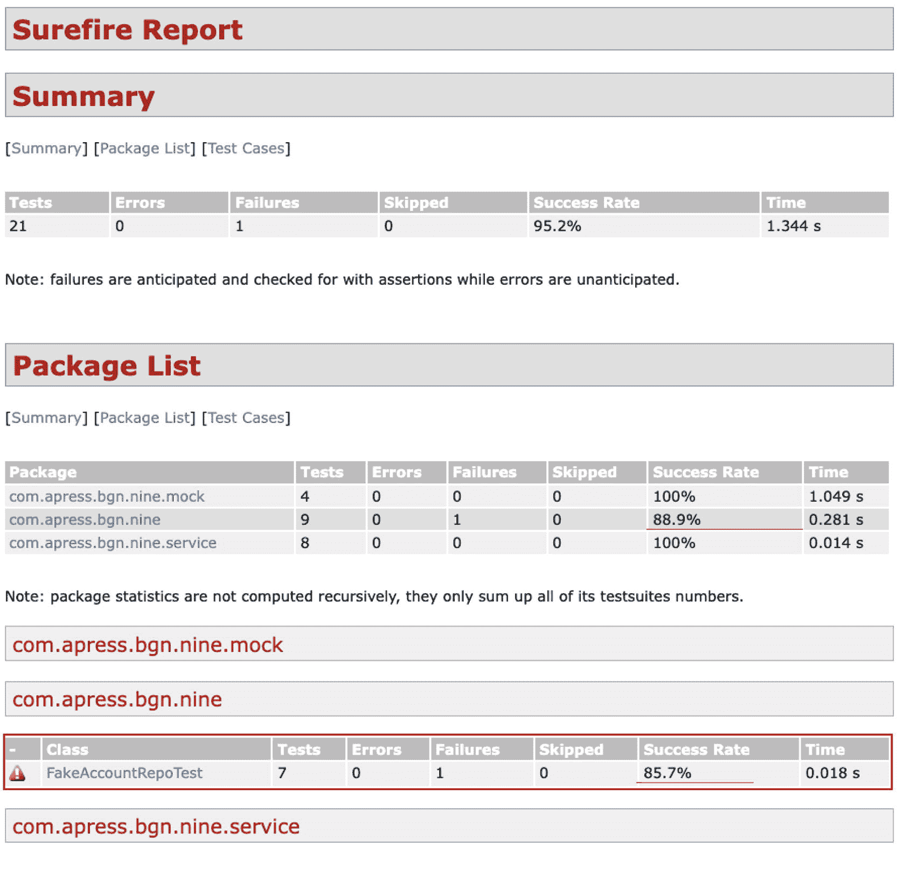

图 9-16

包含一个测试失败的 Maven 测试报告（第 1 部分）

报告的第一部分显示了失败测试的百分比、它们所在的包以及测试类的名称。报告的第二部分（如图 9-17 所示）显示了失败的详细信息。

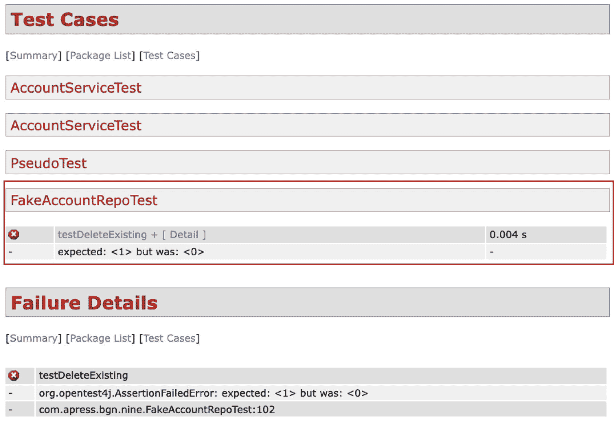

图 9-17

包含一个测试失败的 Maven 测试报告（第 2 部分）

修复测试后，报告变得更简单，最后两个部分不再生成，如图 9-18 所示。

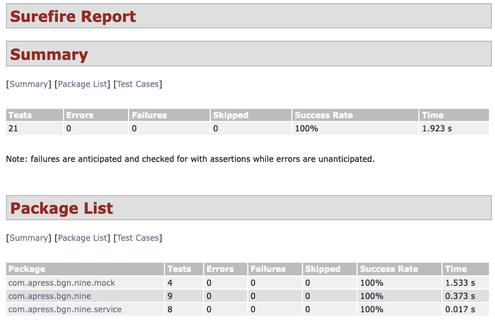

图 9-18

没有测试失败且具有典型 Maven 生成站点样式的 Maven 测试报告

信息

在本书的第一版中，我使用 Gradle 来构建这个项目。由于与较新版本的 Java 存在各种不兼容问题以及配置困难，我转而使用 Maven，它被广泛使用且相当稳定。不幸的是，生成测试报告需要多个 Maven 插件，并且报告并不那么美观。

重要

作为本节的结论，请记住：无论一个开发团队多么优秀，如果没有一个出色的测试团队，最终生成的应用程序可能远未达到可接受的质量标准。因此，如果你面试的公司没有专门的测试团队，或者公司文化在代码审查和编写测试等技术上有所妥协，那么在接受这份工作之前请三思。


## 文档编写

在软件界有一个关于文档的笑话，可能并非人人喜欢，但值得一提：*文档* *就像性。当它好的时候，真的非常好。而当它差的时候，也总比没有强*。

编程的一个常识性规则和最佳实践是编写自解释的代码，这可以减少编写大量文档的需求。基本上，如果你需要写太多文档，那说明你的编程方式有问题。有很多方法可以让你的代码自解释，从而避免编写大量文档，例如为类和变量使用有意义的名称，并遵守语言的代码规范。然而，当你构建一组供其他开发者使用的类时，你需要为主要 API 提供一些文档。如果你的解决方案需要编写非常复杂的算法，你可能需要在这里或那里添加一些注释，尽管在这种情况下，也应该编写包含架构图和示意图的适当技术文档。

回顾一下，在**第** **3** **章**中，我介绍了不同类型的注释，并承诺在本章中提供关于 Javadoc 注释的更多细节。现在我们就来讨论这一点。Javadoc 块注释，也称为*文档注释*，通常与公共类、接口、方法体、公共字段相关联，有时甚至在确实必要时与受保护或私有组件相关联。Javadoc 注释包含特殊的标签，用于链接文档化的元素或标记不同类型的信息。Javadoc 注释及其关联的代码可以被 Javadoc 工具处理、提取，并打包成一个 HTML 站点，这被称为项目的 Javadoc API。此项目的 Maven 配置声明了几个报告插件，其中包括 `maven-site-plugin`，它被配置为将所有报告打包成一个项目的静态站点，该站点位于 `target/site` 目录下。

重要

项目站点通过执行 `mvn site` 生成。

智能编辑器可以下载并访问项目的文档，并在开发者尝试使用已文档化的组件编写代码时显示这些文档，因此良好的代码文档能显著提高开发过程的速度。让我们从几个 Javadoc 注释的例子开始，解释其中使用的最重要的标签。

每当我们创建一个类或接口时，都应该添加 Javadoc 注释来解释其用途，标识该类或接口被添加时的应用程序版本，并最终链接一些现有资源。本章前面的“日志记录”部分介绍了 `IntSorter` 层次结构（见图 9-1），这是一个实现 `IntSorter` 接口的类层次结构，提供了不同排序算法的实现。当其他开发者使用这些类时，他们可能希望向 `IntSorter` 层次结构添加自定义算法。关于 `IntSorter` 接口的一些信息将极大地帮助他们设计合适的解决方案。清单 9-41 展示了添加到 `IntSorter` 接口的 Javadoc 注释。

```
package com.apress.bgn.nine.algs;
/**
* 接口 {@code IntSorter} 是一个需要由提供对 {@code int} 值数组进行排序方法的类来实现的接口。
*
* 选择 {@code int[]} 作为类型是因为 int 值可以高效排序 ({@link Comparable})
*
*
*     你可以像这样使用任何实现：
*      {@snippet id="highlighting" lang="java" :
*       IntSorter mergeSort = new MergeSort(); // @highlight type=highlighted
*      mergeSort.sort(arr,0,arr.length-1);
*     }
*     其中 {@code arr} 是一个 {@code int[]}
*
* @author Iuliana Cosmina
* @since 1.0
*/
public interface IntSorter {
// 接口体省略
}
清单 9-41
IntSorter 接口上的文档注释
```

在 Javadoc 注释中，可以使用 HTML 标签来格式化信息。在清单 9-41 的代码中，使用了一个 `<p>` 元素来确保注释由两个段落组成，而不是一个。

`@author` 标签在 JDK 1.0 中引入，当开发团队规模较大时非常有用，因为如果你最终使用别人的代码，当出现问题时你知道该咨询谁。

`@since` 标签用于标识此接口被添加时的应用程序版本。对于一个经历了漫长开发和发布周期的应用程序，此标签可用于标记特定版本的元素（方法、类、字段等），以便使用你应用程序代码库的开发者知道元素是何时添加的，并且在回滚到先前版本时，知道他们应用程序中哪些地方可能出现编译时错误。

使用 `@since` 标签的最佳示例是 Java 官方 Javadoc。让我们关注 `String` 类。它是在 Java 1.0 版本中引入的，但随着每个 Java 版本的发布，都为其添加了更多的构造器和方法。每个构造器和方法都标记了特定的版本。清单 9-42 展示了证明上述说法的代码片段和文档注释。

```
package java.lang;
// 导入语句省略
/**
* // 省略
* @since   1.0
*/
public final class String
implements java.io.Serializable, Comparable, CharSequence,
Constable, ConstantDesc {
/**
* ...
* @since  1.1
*/
public String(byte[] bytes, int offset, int length, String charsetName)
throws UnsupportedEncodingException {
this(lookupCharset(charsetName), bytes, checkBoundsOffCount(offset, length, bytes.length), length);
}
/**
* ...
* @since  1.4
*/
public boolean contentEquals(StringBuffer sb) {
// 方法体省略
}
/**
* ...
* @since  1.5
*/
public String(int[] codePoints, int offset, int count) {
// 方法体省略
}
/**
* ...
* @since  1.6
*/
public String(byte[] bytes, int offset, int length, Charset charset) {
// 方法体省略
}
/**
* ...
* @since 1.8
*/
public static String join(CharSequence delimiter, CharSequence... elements) {
// 方法体省略
}
/**
* ...
* @since 9
*/
@Override
public IntStream codePoints() {
// 方法体省略
}
/**
* ...
* @since 11
*/
public String strip() {
// 方法体省略
}
/**
* ...
* @since 12
*/
public String indent(int n) {
// 方法体省略
}
/**
* ...
* @since 15
*/
public String stripIndent() {
// 方法体省略
}
}
清单 9-42
String 类中的文档注释
```

在清单 9-41 的 `IntSorter` 示例中，你可能注意到了 `@code` 标签。此标签在 Java 1.5 中引入，用于通过使用特殊字体并转义可能破坏 HTML 语法的符号（例如 `<` 或 `>`）来以代码形式显示文本。

`@link` 标签在 Java 1.2 中添加，用于插入指向相关文档的可导航链接。

`@snippet` 标签在 Java 18 中引入，用于轻松地将代码片段集成到文档中。它提供了许多属性来支持文档文本格式化，使开发者能够突出显示其代码中的重要部分。如前所述，在 Java 18 之前，可以使用 `@code` 注解添加代码片段，但功能相当有限，因为它将代码视为普通文本。

清单 9-43 展示了 `IntSorter` 接口的一个文档更完善的版本，其中包含方法的文档注释，以便实现它的开发者知道如何使用其方法。


```
package com.apress.bgn.nine.algs;
/**
* 接口 {@code IntSorter} 是一个需要由提供对 {@code int} 值数组进行排序方法的类来实现的接口。
*
* 选择 {@code int[]} 作为类型是因为 int 值可以高效排序 ({@link Comparable})
*
*
*     你可以像这样使用任何实现：
*      {@snippet id="highlighting" lang="java" :
IntSorter mergeSort = new MergeSort(); // @highlight type=highlighted
mergeSort.sort(arr,0,arr.length-1);
*     }
*     其中 {@code arr} 是一个 {@code int[]}
*
*
* @author Iuliana Cosmina
* @since 1.0
*/
public interface IntSorter {
/**
* 对 {@code arr} 进行排序
*
* @param arr 待排序的 int 数组
* @param low 待排序区间的下限
* @param high 待排序区间的上限
*/
void sort(int[] arr, int low, int high);
/**
* 实现此方法以提供不需要枢轴的排序解决方案。
* @deprecated 自版本 0.1 起，因为应改用
*             {@link #sort(int[], int, int) ()}。
* 将在版本 3.0 中移除。
* @param arr 待排序的 int 数组
*/
@Deprecated (since= "0.1", forRemoval = true)
default void sort(int[] arr) {
System.out.println("不要使用这个！此方法已废弃！！");
}
}
清单 9-43
IntSorter 接口中方法的文档注释
```

IntelliJ IDEA 编辑器（以及其他智能编辑器）可以为你生成小段的 Javadoc。一旦你声明了想要编写文档的类或方法体，输入 `/**` 并按 **Enter** 键。生成的注释块包含所有可以从组件声明中推断出的条目。以下列表描述了最常见的条目：

*   一个或多个 `@param` 标签及其参数名称。开发者只需添加额外的文档来解释其用途。

*   如果方法返回的值类型不是 `void`，则会生成一个 `@return` 标签。开发者必须提供文档来解释结果代表什么，以及在返回特定值的特殊情况下如何处理。

*   如果方法声明要抛出异常，则会生成一个 `@throws` 标签及其异常类型，开发者的工作是解释何时以及为何会抛出该类型的异常。

清单 9-44 展示了 `Optional<T>` 类中包含 `filter(..)` 方法及其文档注释的片段。

```
/**
* ...
* @param predicate 应用于值（如果存在）的谓词
* @return 一个 {@code Optional}，描述此 {@code Optional} 的值（如果值存在且与给定谓词匹配），否则返回一个空的 {@code Optional}
* @throws NullPointerException 如果谓词为 {@code null}
*/
public Optional filter(Predicate predicate) {
Objects.requireNonNull(predicate);
if (isEmpty()) {
return this;
} else {
return predicate.test(value) ? this : empty();
}
}
清单 9-44
Optional#filter(..) 方法的文档注释
```

`@link` 标签可用于创建指向类页面、该类或接口中的方法、方法文档部分、字段甚至外部网页的文档链接。清单 9-45 展示了一个实现 `IntSorter` 的类。其文档注释包含一个指向 `IntSorter` 接口中抽象方法的链接。

```
package com.apress.bgn.nine.algs;
/**
* {@code InsertionSort} 类包含一个单一方法，该方法是 {@link IntSorter#sort(int[])} 的具体实现。
* 此类的实例可用于使用插入排序算法对 {@code int[]} 数组进行排序。
*
* @author Iuliana Cosmina
* since 1.0
* @see IntSorter
*/
public class InsertionSort implements IntSorter {
// 类体已省略
}
清单 9-45
Optional#filter(..) 方法的文档注释 (@link)
```

`@see` 标签是 `@link` 的一个简单替代，用于将开发者的注意力引导到该标签引用的元素所特有的文档上。

`@deprecated` 标签用于添加文本，以解释废弃的原因、组件计划移除的版本以及应使用的替代方案。Javadoc 生成工具会提取此标签的文本，使用斜体显示，并将其添加到组件（类、字段、方法等）的主要描述中。

除了此标签之外，`@Deprecated` 注解是在 Java 1.5 中引入的。用此注解标注组件应阻止开发者使用它。此注解的优势在于，编译器会识别它，并在非废弃代码中使用或重写废弃组件时发出警告。此注解可用于任何 Java 语言组件，包括模块。

像 IntelliJ IDEA 这样的智能 Java IDE 能够识别 `@deprecated` 标签和 `@Deprecated` 注解，并以删除线格式显示废弃组件，以警告开发者不要使用它们。负责编译 Java 源代码的 Maven `maven-compiler-plugin` 提供了一个配置选项，用于显示或隐藏废弃警告。所有这些都如图 9-19 所示。

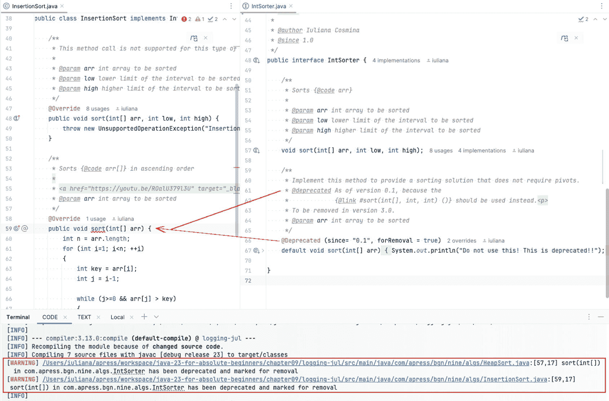

图 9-19

IntelliJ IDEA 识别 `@deprecated` 标签。Maven 构建已配置为显示废弃警告

本节向你介绍了编写 Javadoc 注释时最常用的标签。如果你想查看完整列表，可以在官方 Javadoc 页面^(⁸⁷)上找到。Javadoc 文档也是一个广泛的主题，其内容足以写成一整本书。我们在此只是浅尝辄止，涵盖了基础知识，以便你对其有良好的理解。

信息

用于生成项目站点的 Maven 插件配置是一个高级主题，不适合本书讨论。然而，如果你对这些细节感到好奇，本书已按名称提及了 Maven 插件，并在 `pom.xml` 文件中添加了一些注释来解释其用途和配置。

要为 `logging-jul` 模块生成 HTML 站点，请打开 Maven 项目视图，导航到 **chapter09:logging-jul -> Lifecycle** 节点，在其下你将找到 `site` 阶段，如图 9-20 所示。

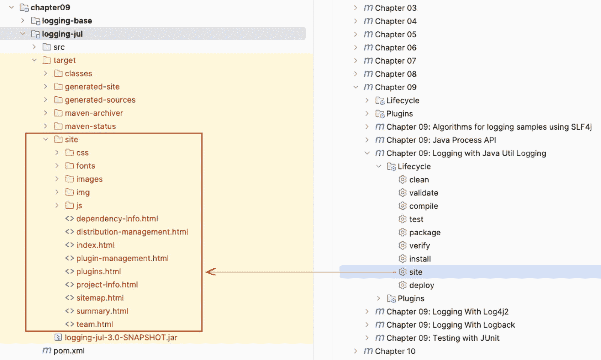

图 9-20

Maven `site` 阶段以及 `logging-jul` 模块的结果

在 IDE 中双击此阶段等同于在控制台中执行 `mvn site`。它会触发 Maven 站点生成阶段及其所有依赖阶段的执行，构建的结果是一个名为 `site` 的目录，位于 `target` 目录下。它包含一个静态站点，其起始页面名为 `index.html`。由于使用了默认配置，该站点相当简单。右键单击该文件以打开上下文菜单，选择 **Open in Browser**，然后选择你偏好的浏览器。

项目的主页面显示了来自 `pom.xml` 文件的信息，例如项目名称、描述等。在页面左侧的导航窗格中，展开 **Project Reports** 菜单项并选择 **Javadoc**。单击该选项会将你引导至项目的 Javadoc 页面，如图 9-21 所示。如果你觉得该页面类似于 JDK 官方 Javadoc 页面，你的感觉没错；官方页面也是使用相同的 Doclet API 生成的。

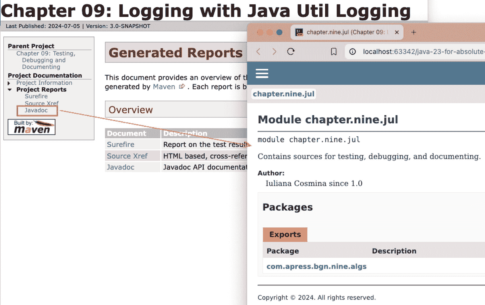

图 9-21

Maven 项目站点以及 `logging-jul` 模块的主 Javadoc 站点

文档内容不算特别丰富，但已足够使用。


前文提到，当存在 Javadoc 文档时，IntelliJ IDEA 和其他智能编辑器会将其拾取并在开发者于代码中使用被记录的组件时即时显示。更智能的编辑器在选中类、方法名、接口方法等时，会提供某种包含 **F1** 的组合键，开发者按下该组合键后，文档便会以弹出窗口的形式显示。在 IntelliJ IDEA 中，只需点击一个元素并按下 **F1**，Javadoc 文档就会以格式精美的弹出窗口显示，如图 9-22 所示。

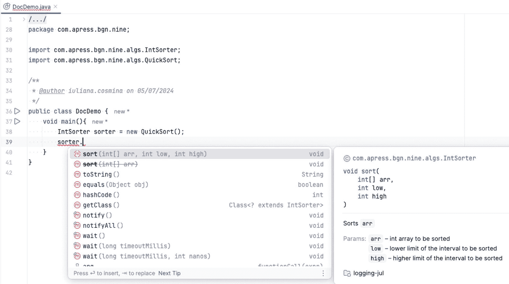

图 9-22

IntelliJ IDEA 中显示的 Javadoc 信息

只要代码是开源的，并且模块导出了相应的包，你就可以在智能编辑器中查看项目任何依赖项（包括 JDK 类）的 Javadoc 信息。

在 Java 9 中，用于生成 Javadoc 的 Doclet API 得到了升级和改头换面。在 Java 9 之前，开发者一直抱怨旧版本存在性能问题、API 晦涩难懂、缺乏支持以及整体功能浅薄。在 Java 9 中，大部分问题都得到了解决。详细的改进描述和列表可以在 JEP 221 页面^(⁸⁸)找到。改进在 Java 18 中通过引入 `@snippet` 注解得以延续，并在 Java 23 中通过允许使用 Markdown^(⁸⁹) 而非 HTML 与 Javadoc @-tags^(⁹⁰) 的混合体来编写 Javadoc 文档注释而得到进一步增强。图 9-23 并排展示了以经典方式（左侧）和 Markdown 方式编写的相同 Javadoc 注释。

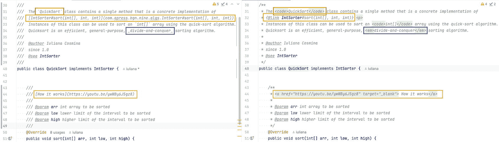

图 9-23

Javadoc 经典方式（左侧）与 Markdown 方式（自 Java 23 起支持，用于 `QuickSort` 类）

图 9-24 展示了图 9-23 中 `QuickSort` 类内 Javadoc 注释所生成的文档。

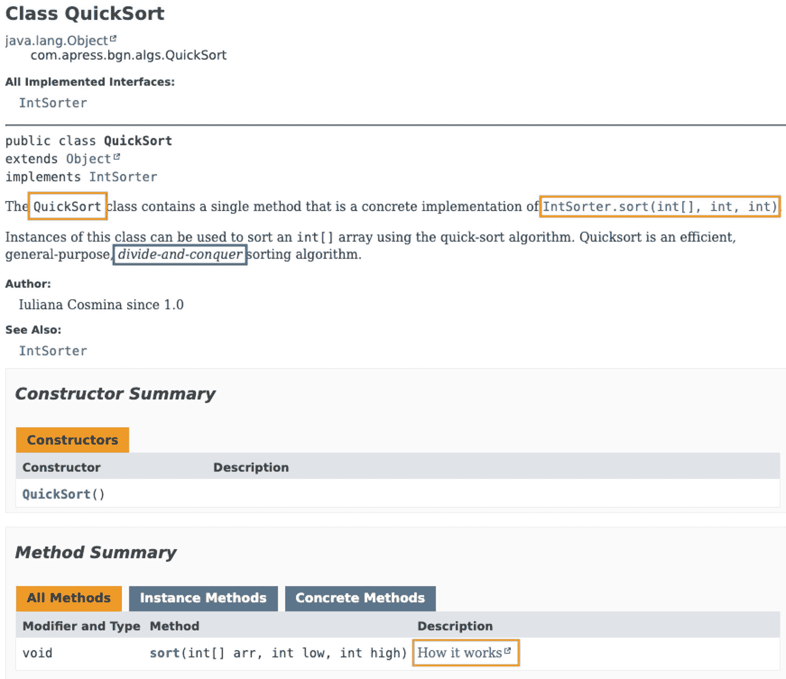

图 9-24

`QuickSort` 文档

文档非常有价值，当它真正优秀时，能让开发变得实用且愉快。因此，在编写代码时，要像你期望项目依赖项有文档那样去记录它。你可能听说过 **RTFM** 这个表达，它是 **Read The F%ing Manual!**（去读那该死的说明书！）的缩写。在软件领域，经验丰富的开发者与新手开发者合作时，经常会用到这个表达。问题是，当没有说明书时你该怎么办？大多数面临截止日期的公司可能倾向于分配很少甚至不分配时间来记录项目，因此本书加入这一节是为了强调优秀文档在软件开发中的重要性，并教你如何在编写代码的同时编写文档，因为你之后可能没有时间来做这件事。

## 总结

本章涵盖了重要的开发工具和技术，以帮助你编写可用于生产的 Java 代码。阅读完本章后，你应该对如何完成以下任务有了良好的基础理解：

*   在 Java 应用程序中配置和使用日志记录

*   在控制台中记录消息

*   将消息记录到文件

*   使用 Java 日志记录

*   使用日志门面（并理解为何推荐使用它）

*   配置 SLF4J 与 Logback 一起使用

*   使用断言进行编程

*   使用 IntelliJ IDEA 进行逐步调试

*   在应用程序运行时，使用各种 JDK 工具（如 `jps`、`jcmd`、`jconsole` 和 `jmc`）监控和检查 JVM 统计信息

*   使用 Process API 监控和创建进程

*   使用 JUnit 测试应用程序

*   使用假对象编写测试

*   使用模拟对象编写测试

*   使用桩对象编写测试

*   编写 Javadoc 注释以记录 Java 应用程序，并使用 Maven 生成 HTML 格式的文档

脚注 1   2   3   4   5   6   7   8   9   10   11   12   13   14   15   16   17   18   19   20   21   22

