# 10. 让应用程序具有交互性

到目前为止，本书中 Java 程序的输入数据是通过在代码内部初始化的数组或变量，或者通过程序参数提供的。然而，在现实生活中，大多数应用程序需要与用户进行交互。可以通过输入用户名和密码来授予用户访问权限，有时还需要用户输入详细信息以确认其身份或指示应用程序执行操作。Java 支持多种读取用户输入的方法。在本章中，我们将介绍几种构建交互式 Java 应用程序的方法，这些应用程序可以从多种来源获取输入。

如前几章所述，JShell 是一个 Java 命令行界面（CLI）Shell，使开发者能够测试变量声明和单行语句。其他 CLI Shell（如 `bash`）和终端（如 Windows 的命令提示符）可用于以连续文本行的形式向程序发出命令。

## 从命令行读取用户数据

本节专门讨论如何从命令行读取用户输入，无论该命令行是 IntelliJ IDEA 控制台，还是程序从特定于操作系统的任何终端中的可执行 jar 运行。在 JDK 中，有两个类可用于从命令行读取用户数据：`java.util.Scanner` 和 `java.io.Console`。本节将详细介绍这两个类。但首先，让我们从基础开始：使用 `System.in` 读取用户数据。


好的，作为高级文档工程师和翻译员，我将遵循您提供的注意事项和示例，将给定的英文文本翻译成中文。


### 使用 **System.in**

在介绍**第** **9** 章中用于在控制台打印数据的日志功能之前，本书的代码示例中一直使用 `System.out` 下的方法。还有一个对应的实用工具对象名为 `System.in`，它用于从控制台读取数据，即程序用户为控制应用程序流程而输入的数据。你可能已经注意到，到目前为止，所有 Java 程序在执行时，都会启动、处理数据、执行声明的语句，然后终止，无论是正常退出还是出现异常时退出。将终止决定权交给用户的最简单、最常见的方法是在 `main()` 方法末尾调用 `System.in.read()`。此方法从输入流中读取下一个字节的数据，程序会暂停，直到用户输入一个值；当值被返回时，我们甚至可以保存并打印它。清单 10-1 展示了使用 `System.in.read` 读取用户输入的代码。

```
package com.apress.bgn;
import java.io.IOException;
import static java.lang.System.out;
import static java.lang.System.in;
public class ReadingFormStdinDemo {
public static void main(String... args) throws IOException {
out.print("Press any key to terminate:");
byte[] b = new byte[3];
int read = in.read(b);
for (int i = 0; i < b.length; ++i) {
out.println(b[i]);
}
out.println("Key pressed: " + read);
}
}
清单 10-1
在控制台中读取用户提供的值
```

用户输入保存在 `byte[] b` 数组中；其大小是任意的。你可以输入任何内容。只有前三个字节会保留在数组中。然而，这种读取信息的方式并不是很有用，对吧？看看下面的代码片段，它展示了上述代码的执行过程以及随机文本的输入：

```
Press any key to terminate: ini mini miny moo.  # 插入的文本

Key pressed: 3
```

使用 `System.in` 与 Java 应用程序交互。

### 使用 **java.util.Scanner**

`System.in` 变量的类型是 `java.io.InputStream`，这是一个 JDK 特殊类型，所有表示字节输入流的类都继承自它。（你将在**第** **11** 章中了解更多关于 `InputStream` 类的信息。）这意味着 `System.in` 可以被包装在任何 `java.io.Reader` 扩展类中（也将在**第** **11** 章中讨论），这样字节就可以作为可读数据来读取。其中真正重要的是来自 `java.util` 包的一个名为 `Scanner` 的类。可以通过调用其构造函数并将 `System.in` 作为参数传递来创建此类型的实例。`Scanner` 类提供了许多 `next*()` 方法，可用于从控制台读取几乎任何类型。在图 10-1 中，你可以看到 `next*()` 方法列表。

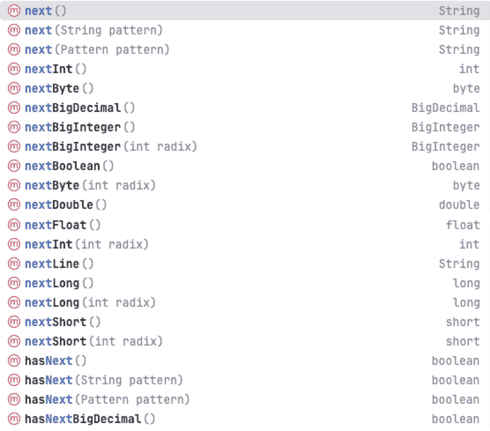

图 10-1

用于读取各种类型数据的 Scanner 方法

使用 `Scanner` 从控制台读取数据的优点是，读取的值会在可能的情况下自动转换为正确的类型；如果不可能，则会抛出 `java.util.InputMismatchException`。

清单 10-2 中的代码旨在让你通过输入文本然后输入值来选择要读取的值的类型。调用 `Scanner` 实例的相应方法来读取该值。

```
package com.apress.bgn;
import java.math.BigInteger;
import java.util.ArrayList;
import java.util.List;
import java.util.Scanner;
import static java.lang.System.out;
public class ReadingFromStdinUsingScannerDemo {
public static final String EXIT = "exit";
public static final String HELP = "help";
public static final String BYTE = "byte";
public static final String SHORT = "short";
public static final String INT = "int";
public static final String BOOLEAN = "bool";
public static final String DOUBLE = "double";
public static final String LINE = "line";
public static final String BIGINT = "bigint";
public static final String TEXT = "text";
public static final String LONGS = "longs";
public static void main(String... args) {
Scanner sc = new Scanner(System.in);
var help = getHelpString();
out.println(help);
String input;
do {
out.print("Enter option: ");
input = sc.nextLine();
switch (input) {
case HELP:
out.println(help);
break;
case EXIT:
out.println("Hope you had fun. Buh-bye!");
break;
case BYTE:
byte b = sc.nextByte();
out.println("Nice byte there: " + b);
sc.nextLine();
break;
case SHORT:
short s = sc.nextShort();
out.println("Nice short there: " + s);
sc.nextLine();
break;
case INT:
int i = sc.nextInt();
out.println("Nice int there: " + i);
sc.nextLine();
break;
case BOOLEAN:
boolean bool = sc.nextBoolean();
out.println("Nice boolean there: " + bool);
sc.nextLine();
break;
case DOUBLE:
double d = sc.nextDouble();
out.println("Nice double there: " + d);
sc.nextLine();
break;
case LINE:
String line = sc.nextLine();
out.println("Nice line of text there: " + line);
break;
case BIGINT:
BigInteger bi = sc.nextBigInteger();
out.println("Nice big integer there: " + bi);
sc.nextLine();
break;
case TEXT:
String text = sc.next();
out.println("Nice text there: " + text);
sc.nextLine();
break;
default:
out.println("No idea what you want bruh!");
}
} while (!input.equalsIgnoreCase(EXIT));
}
private static String getHelpString() {
return """
This application helps you test various usage of Scanner. Enter type to be read next:\
\n\t help >  displays this help\
\n\t exit >  leave the application\
\n\t byte > read a byte\
\n\t short > read a short\
\n\t int > read an int\
\n\t bool > read a boolean\
\n\t double > read a double\
\n\t line > read a line of text\
\n\t bigint > read a BigInteger\
\n\t text > read a text value""";
}
}
清单 10-2
使用 java.util.Scanner 在控制台中读取用户提供的值
```


你可能已经注意到，在代码清单 10-2 中，大多数扫描器方法都与 `nextLine()` 方法一起调用。这是因为你提供的每个输入都由实际的令牌和一个换行符（按下**<Enter>** 结束输入）组成，在输入下一个值之前，你也需要从流中取出该字符。

代码清单 10-3 展示了使用代码清单 10-2 中的代码来读取一些用户输入值。

```
This application helps you test various usage of Scanner. Enter type to be read next:
help >  displays this help
exit >  leave the application
byte > read a byte
short > read a short
int > read an int
bool > read a boolean
double > read a double
line > read a line of text
bigint > read a BigInteger
text > read a text value
Enter option: byte

Nice byte there: 12
Enter option: bool
true
Nice boolean there: true
Enter option: line
some of us are hardly ever here
Nice line of text there: some of us are hardly ever here
Enter option: text
john
Nice text there: john
Enter option: text
the rest of us are made to disappear...
Nice text there: the
Enter option: double
4.2
Nice double there: 4.2
Enter option: int
AAAA
Exception in thread "main" java.util.InputMismatchException
at java.base/java.util.Scanner.throwFor(Scanner.java:939)
at java.base/java.util.Scanner.next(Scanner.java:1594)
at java.base/java.util.Scanner.nextInt(Scanner.java:2258)
at java.base/java.util.Scanner.nextInt(Scanner.java:2212)ReadingUsingConsoleDemo
at chapter.ten.scanner/com.apress.bgn.ten.ReadingFromStdinUsingScannerDemo.main(ReadingFromStdinUsingScannerDemo.java:80)
代码清单 10-3
运行 ReadingFromStdinUsingScannerDemo 类
```

代码清单 10-3 中高亮显示的输出代表了 `next()` 方法的测试用例。此方法应用于读取单个 `String` 令牌。下一个令牌会被转换为一个 `String` 实例，显然，当遇到空白字符时令牌就会结束。这就是为什么在示例中，唯一读取到的文本是：*the*。在示例的最后一个案例中，预期的选项是一个整数值，但输入了 *AAAA*，这就是抛出异常的原因。

当你需要从控制台重复读取相同类型的值时，可以先窥探要读取的值并在读取前进行检查，以避免抛出 `InputMismatchException`。针对这种特定场景，每个 `next*()` 方法都有一对名为 `hasNext*()` 的方法。为了展示如何使用这些方法，让我们在代码清单 10-3 的代码中添加一个选项，使其能够读取一个 `Long` 值列表，如代码清单 10-4 所示。

```
//...
public static final String LONGS = "longs";
//...
String input;
do {
System.out.print("Enter option: ");
input = sc.nextLine();
switch (input) {
case LONGS:
List longList = new ArrayList();
while (sc.hasNextLong()) {
longList.add(sc.nextLong());
}
System.out.println("Nice long list there: " + longList);
// else all done
sc.nextLine();
sc.nextLine();
break;
default:
System.out.println("No idea what you want bruh!");
}
} while (!input.equalsIgnoreCase(EXIT));
//...
代码清单 10-4
使用 java.util.Scanner 读取 long 值列表
```

虽然看起来有些奇怪，但我们需要连续调用两次 `nextLine()` 方法：一次用于处理无法转换为 `long` 的字符，以便 `while` 循环结束；另一次用于处理换行符，以便下一次读取的是下一个输入值的类型。

`Scanner` 类中还有其他一些方法可用于过滤输入并仅读取所需的令牌，但本节列出的方法是你最常用的。

### 使用 **java.io.Console**

`java.io.Console` 类是在 Java 1.6 版本中引入的，比 `Scanner` 晚一个版本，它提供了访问基于字符的控制台设备（如果存在）的方法，该设备与当前 Java 虚拟机相关联。因此，`java.io.Console` 类的方法不仅可以用于读取用户输入，还可以用于向控制台写入内容。如果 JVM 是从后台进程或 Java 编辑器启动的，则控制台将不可用，因为编辑器会将标准输入和输出流重定向到其自己的窗口。这就是为什么如果我们使用 `Console` 编写代码，只能通过在终端中运行类或 jar 文件来测试它，调用方式如下：

```
java ReadingUsingConsoleDemo.class
```

或

```
java -jar using-console-1.0-SNAPSHOT.jar
```

JVM 的控制台（如果可用）在代码中由 `Console` 类的单个实例表示，可以通过调用 `System.console()` 获取。在图 10-2 中，你可以看到可以在 Console 实例上调用的方法。

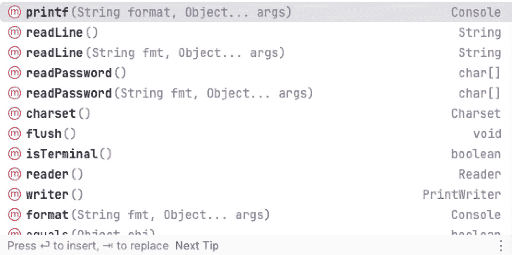

图 10-2

用于读取各种类型数据的 Console 方法

显然，`read*(..)` 方法用于从控制台读取用户输入，而 `printf(..)` 和 `format(..)` 用于在控制台中打印文本。这里比较特殊的是两个 `readPassword(..)` 方法，它们允许从控制台读取文本，但在输入时不会显示。这意味着可以编写一个支持身份验证的 Java 应用程序，而无需任何实际的用户界面。代码清单 10-5 展示了演示所有这些功能的示例代码。

```
package com.apress.bgn.ten;
import java.io.Console;
import java.util.Calendar;
import java.util.GregorianCalendar;
import static java.lang.System.err;
public class ReadingUsingConsoleDemo {
public static void main(String[] args) {
Console console = System.console();
if (console == null) {
err.println("No console found.");
} else {
console.writer().print("Hello there! (reply to salute)\n");
console.flush();
String hello = console.readLine();
console.printf("You replied with: '" + hello + "'\n");
Calendar calendar = new GregorianCalendar();
console.format("Today is : %1$tm %1$te,%1$tY\n", calendar);
char[] passwordChar = console.readPassword("Please provide password: ");
String password =  new String(passwordChar);
console.printf("Your password starts with '" + password.charAt(0) + "' and ends with '" + password.charAt(password.length()-1) + "'\n");
}
}
}
代码清单 10-5
使用 java.io.Console 读取和写入值
```

在代码清单 10-5 的示例代码中，我特意使用了各种方法来通过控制台读写数据，以向你展示它们的使用方法。`console.writer()` 方法返回一个 `java.io.PrintWriter` 实例，可用于向控制台打印消息。需要注意的是，消息在调用 `console.flush()` 之前不会被打印出来。这意味着 `java.io.PrintWriter` 实例可以排队多个消息，并且只有在调用 `flush()` 或其内部缓冲区已满时才会打印。

调用 `console.format(..)` 方法用于打印格式化消息；在此例中，使用了一个 `Calendar` 实例来提取当前日期，并根据以下模板打印：`dd mm,yyyy`（由参数 `%1$tm %1$te,%1$tY` 定义）。`Console` 方法中使用的格式化模板在 `java.util.Formatter` 类中定义。

重要提示

为了避免在运行代码时创建新的操作系统控制台窗口，大多数 IDE（包括 IntelliJ IDEA）都使用“无窗口 Java”。由于没有窗口，用户也就无法访问和输入数据的控制台。因此，使用 `java.io.Console` 的应用程序必须在命令行中执行。


使用 `Console` 运行 Java 应用程序最简单的方法是配置 Maven 的 `maven-jar-plugin`，创建一个可执行的 jar 包，并将主类设置为 `ReadingUsingConsoleDemo`。Maven 生成的 jar 包位于：`/chapter10/using-console/target/using-console-3.0-SNAPSHOT.jar`。如果你想跟着操作，请在 IntelliJ IDEA 中点击 **Terminal** 按钮打开终端，然后进入 `target` 目录。进入后，执行 `java -jar using-console-3.0-SNAPSHOT.jar` 即可体验。在清单 10-6 中，你可以看到我用于测试程序的输入内容。

```
Hello there! (reply to salute)
hi
You replied with: 'hi'
Today is : 07 7,2024
Please provide password:
Your password starts with 'g' and ends with 'a'
Listing 10-6
Running the Class ReadingUsingConsoleDemo
```

本节介绍了关于使用控制台的所有值得涵盖的内容，因为一旦你开始处理真正的生产级项目，你可能永远不需要使用它。

## 使用 Swing 构建应用程序

Swing 是 Java 的一个图形用户界面（GUI）小部件工具包。它自 JDK 1.2 版本起就成为其一部分，旨在为构建具有复杂界面的用户应用程序提供更美观、更实用的组件。Swing 提供了各种类型的按钮、进度条、可选列表等。Swing 基于早期版本的**抽象窗口工具包（AWT）**，这是原始的 Java GUI 小部件工具包。AWT 非常基础，拥有一套在任何平台上都可用的 GUI 组件。这意味着 AWT 是可移植的，但这并不表示在一个平台上编写的 AWT 代码实际上能在另一个平台上运行，因为存在平台特定的限制。AWT 组件依赖于原生操作系统的等效组件，因此它们被称为*重量级*组件。在图 10-3 中，你可以看到一个简单的 Java AWT 应用程序。

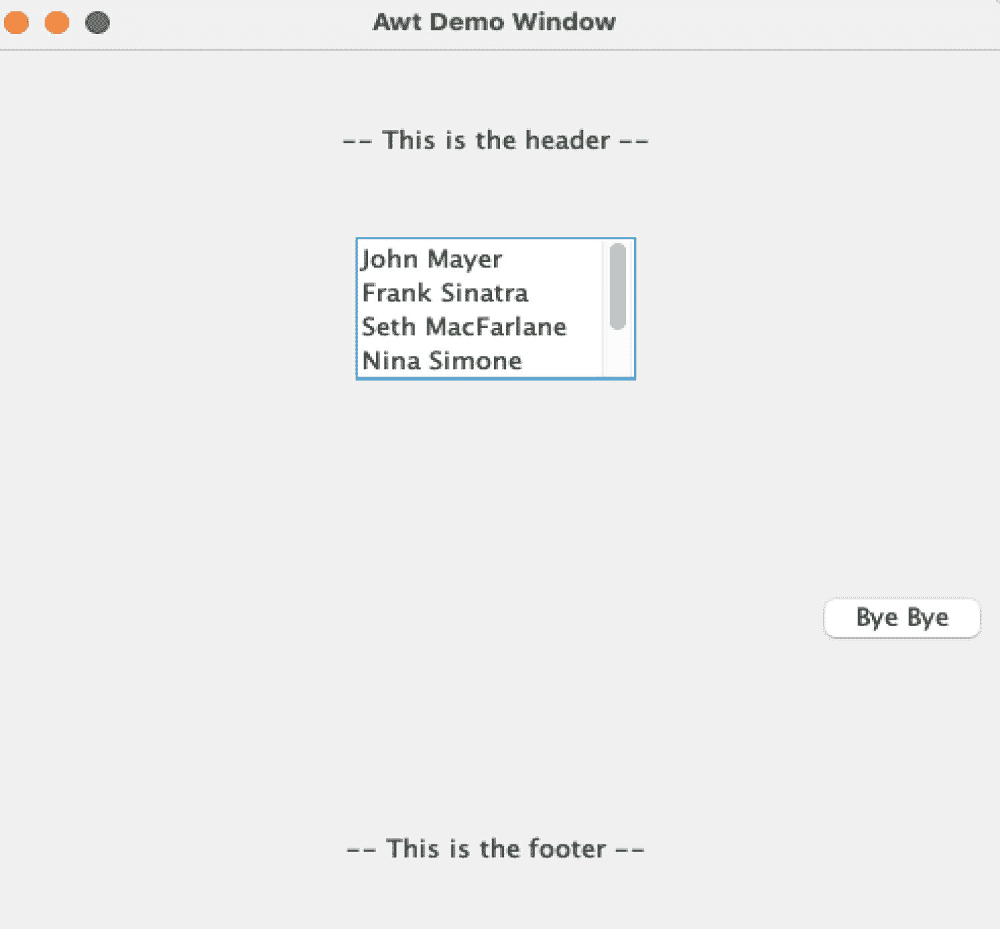

图 10-3

简单的 Java AWT 应用程序

该应用程序是一个简单的窗口，包含一个列表、一个文本区域和一个按钮。该应用程序的主题（也称为*外观和感觉*）与其构建时所用的操作系统（本章示例中为 macOS）相同。主题无法更改，因为 AWT 直接调用了操作系统的原生 GUI。如果你在 Windows 机器上运行相同的代码，窗口看起来会不同，因为它会使用 Windows 主题。

Swing 组件是用 Java 构建的，遵循 AWT 模型，但它们提供了可插拔的外观和感觉。Swing 完全用 Java 实现，包含了 AWT 的所有特性，但不再依赖于原生 GUI；这就是它们被称为*轻量级*组件的原因。Swing 提供了 AWT 的所有功能，并通过更高级的组件（如树视图、列表框和选项卡面板）扩展了组件集。外观和感觉以及主题都是可插拔的，并且可以轻松更改。这显然意味着 Swing 应用程序比 AWT 应用程序更具可移植性，也意味着可以编写具有更复杂设计且不依赖特定平台的组件。自从 Swing 作为 AWT 的替代方案被引入以来，其上的开发工作已经进行了很多。

当 Web 应用程序兴起时，它们的用户界面非常基础，因为浏览器的功能相当有限。AWT 被引入用于构建看起来更好且具有动态性的 Java Web 应用程序，称为**applet**。Java applet 是从浏览器启动的小型应用程序，然后在用户操作系统上安装的 JVM 中执行，其进程与浏览器本身分离。这就是为什么 applet 可以在网页的框架中、在新的应用程序窗口中或专为测试 applet 设计的独立工具中运行。Java applet 使用操作系统的 GUI，这使得它们比当时 HTML 笨重的初始外观更漂亮。Java applet 现已弃用，并在 Java 11 中被移除。

至于用 Swing 或 AWT 编写的 Java 桌面应用程序，现在已经很少使用了；你可能会在编程课上学习如何构建一个，但除此之外，它们已经相当……古老了。尽管如此，一些机构和公司仍然使用基于 Swing 构建的遗留应用程序。例如，我见过餐厅使用 Swing 应用程序来管理餐桌和订单，而且我认为大多数超市都使用 Swing 应用程序来管理商品。本书包含本节不仅是因为你最终可能会从事维护此类应用程序的工作（在这种情况下，了解基础知识是好的），而且还因为 Swing 仍然是 JDK 的一部分。所有 Swing 组件（AWT 也是）都是 `java.desktop` 模块的一部分。因此，如果你想使用 Swing 组件，你必须声明对该模块的依赖。清单 10-7 展示了一个配置片段，其中我们使用 Swing 的项目模块在其 `module-info.java` 文件中通过 `requires` 指令声明了对 `java.desktop` 模块的依赖。

```
module chapter.ten.swing {
requires java.desktop;
}
Listing 10-7
Module Configuration for the using-swing Project
```

图 10-3 中描绘的应用程序是使用 AWT 构建的。本节将介绍如何在 Swing 中构建类似的东西，并添加更多组件。任何 Swing 应用程序的主类都命名为 `JFrame`，该类型的实例用于创建带有边框和标题的窗口。清单 10-8 中的代码正是实现了这一点。

```
package com.apress.bgn.ten;
import javax.swing.*;
import java.awt.*;
public class BasicSwingDemo extends JFrame {
public static void main(String... args) {
BasicSwingDemo swingDemo = new BasicSwingDemo();
swingDemo.setTitle("Swing Demo Window");
swingDemo.setSize(new Dimension(500,500));
swingDemo.setVisible(true);
}
}
Listing 10-8
Basic Swing Demo Class
```

清单 10-8 中的代码创建了一个 `javax.swing.JFrame` 实例，为其设置了标题，并设置了大小，以便在创建窗口时我们实际上能看到一些东西。要实际显示窗口，必须在 `JFrame` 实例上调用 `setVisible(true)`。运行上述代码会显示一个如图 10-4 所示的窗口。

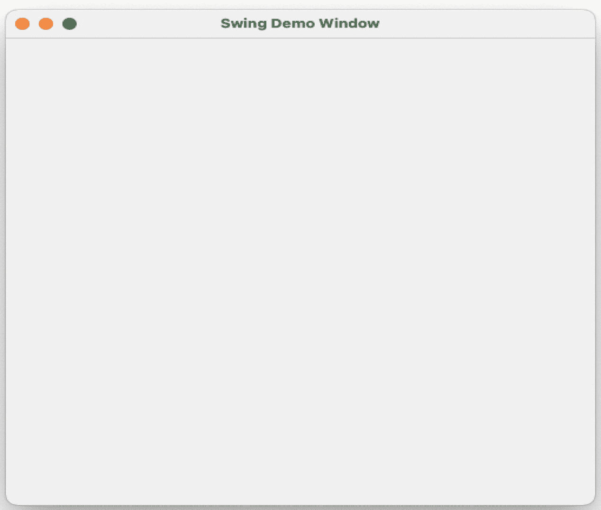

图 10-4

简单的 Java Swing 应用程序

默认情况下，窗口位于主显示器的左上角，但你可以使用一些 Swing 组件来计算相对于屏幕大小的位置来更改它。确定 Swing 窗口相对于屏幕大小的尺寸和位置仅受你愿意投入的数学计算量的限制。

此时，如果我们关闭显示的窗口，应用程序会继续运行。默认情况下，关闭窗口只是通过调用 `setVisible(false)` 使其不可见。如果我们想将默认行为更改为退出应用程序，我们必须更改关闭时执行的默认操作。这可以通过在创建 `JFrame` 实例后添加以下代码行轻松实现：

```
swingDemo.setDefaultCloseOperation(JFrame.EXIT_ON_CLOSE);
```

`JFrame.EXIT_ON_CLOSE` 常量是一组定义窗口关闭时应用程序行为的常量之一。`JFrame.EXIT_ON_CLOSE` 用于声明应用程序应在窗口关闭时退出。其他相关选项包括：

*   `DO_NOTHING_ON_CLOSE`：不执行任何操作，包括关闭窗口。

*   `HIDE_ON_CLOSE`：默认选项，会导致调用 `setVisible(false)`。

*   `DISPOSE_ON_CLOSE`：一个应用程序可以有多个窗口；此选项用于在最后一个可显示窗口关闭时退出应用程序。


大多数 Swing 应用程序通过扩展 `JFrame` 类来编写，以便对其组件获得更多控制权，因此前面的代码也可以写成清单 10-9 所示的形式。

```
package com.apress.bgn.ten;
import javax.swing.*;
import java.awt.*;
public class ExitingSwingDemo extends JFrame {
public static void main(String... args) {
ExitingSwingDemo swingDemo = new ExitingSwingDemo();
swingDemo.setDefaultCloseOperation(JFrame.EXIT_ON_CLOSE);
swingDemo.setTitle("Swing 演示窗口");
swingDemo.setSize(new Dimension(500,500));
swingDemo.setVisible(true);
}
}
清单 10-9
关闭时退出的 Swing 应用程序
```

现在我们已经有了一个窗口，接下来开始添加组件，因为如果没有更多组件来观察变化，改变外观和风格就毫无意义。每个 Swing 应用程序至少有一个 `JFrame` 作为根窗口，它是所有其他窗口的父窗口，因为窗口也可以通过 `JDialog` 类来创建。`JDialog` 是创建对话框窗口的主要类，这是一种特殊类型的窗口，通常包含消息和用于选择选项的按钮。开发者可以使用这个类创建自定义对话框窗口，或者使用 `JOptionPane` 类的方法来创建各种对话框窗口。

回到向 `JFrame` 实例添加组件的话题：组件是通过添加到其容器中来添加到 `JFrame` 的。可以通过调用 `getContentPane()` 获取对 `JFrame` 容器的引用。默认的内容面板是一个简单的中间容器，它继承自 `JComponent`，而 `JComponent` 又扩展了 `java.awt.Container`（Swing 是 AWT 的扩展，其大部分组件都是 AWT 的扩展）。对于 `JFrame`，默认的内容面板实际上是 `JPanel` 的一个实例。这个类有一个类型为 `java.awt.LayoutManager` 的字段，用于定义其他组件在 `JPanel` 中的排列方式。`JFrame` 实例的默认内容面板使用 `java.awt.BorderLayout` 作为其布局管理器，它将面板划分为五个区域：EAST、WEST、NORTH、SOUTH 和 CENTER。每个区域都可以通过 `BorderLayout` 中定义的匹配名称常量来引用。

因此，如果我们想为应用程序添加一个退出按钮，可以将其添加到 SOUTH 区域，代码如下清单 10-10 所示。

```
package com.apress.bgn.ten;
import javax.swing.*;
import java.awt.*;
import java.awt.event.ActionEvent;
import java.awt.event.ActionListener;
public class LayeredSwingDemo extends JFrame {
private JPanel mainPanel;
private JButton exitButton;
public LayeredSwingDemo(String title) {
super(title);
mainPanel = (JPanel) this.getContentPane();
exitButton = new JButton("再见！");
exitButton.addActionListener(new ActionListener() {
@Override
public void actionPerformed(ActionEvent e) {
System.exit(0);
}
});
mainPanel.add(exitButton, BorderLayout.SOUTH);
}
public static void main(String... args) {
LayeredSwingDemo swingDemo = new LayeredSwingDemo("Swing 演示窗口");
swingDemo.setDefaultCloseOperation(JFrame.DO_NOTHING_ON_CLOSE);
swingDemo.setSize(new Dimension(500, 500));
swingDemo.setVisible(true);
}
}
清单 10-10
使用 BorderLayout 排列组件的 Swing 应用程序
```

在图 10-5 中，你可以看到修改后的应用程序。我们在内容面板的 SOUTH 区域添加了一个退出按钮，并标明了 `BorderLayout` 的整体区域划分。

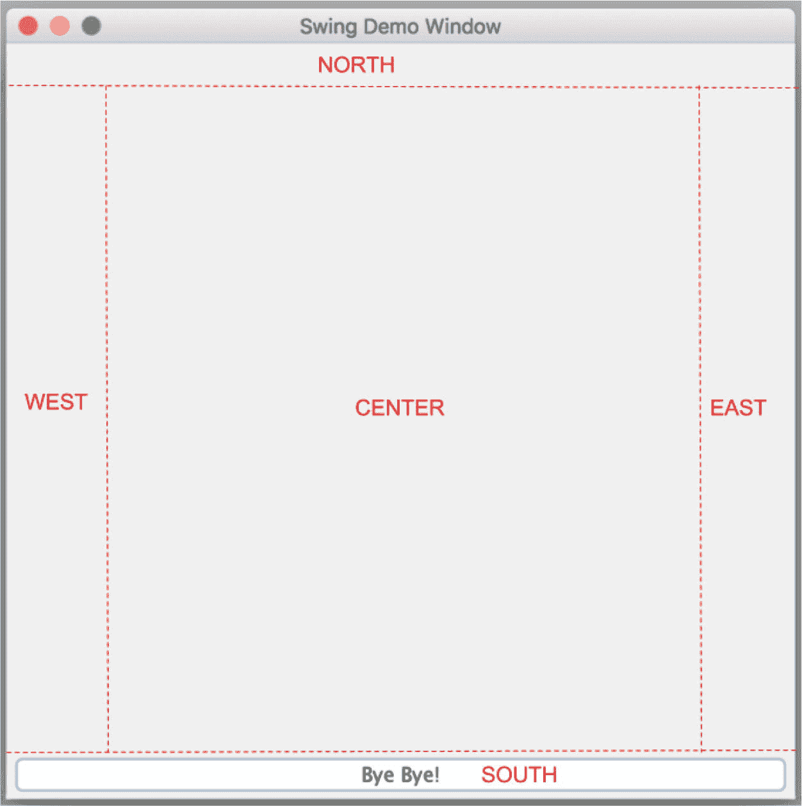

图 10-5

边框布局区域

此外，由于新按钮必须成为退出应用程序的唯一方式，原来的

```
setDefaultCloseOperation(JFrame.EXIT_ON_CLOSE);
```

被替换为

```
setDefaultCloseOperation(JFrame.DO_NOTHING_ON_CLOSE);
```

并且将一个 `java.awt.event.ActionListener` 实例附加到按钮上，以便它能记录按钮被点击的事件并做出相应反应，在本例中就是退出应用程序。

大多数 Swing 组件都支持监听器，可以定义这些监听器来捕获用户对对象执行的事件，并以特定方式做出反应。正如我们所见，按钮会扩展并填满整个区域空间，因为它继承了该区域的尺寸。为了避免这种情况，应该将按钮放入另一个容器中，并且该容器应使用不同的布局：`FlowLayout`。顾名思义，这种布局允许 Swing 组件像段落中的文字一样按方向流添加。可以像文本文档中的文本格式一样进行调整，并且为组件的对齐方式定义了常量：居中对齐（CENTER）、左对齐（LEFT）等。继续前面的示例，我们将把 `exitButton` 包装在另一个使用 `FlowLayout` 的 `JPanel` 中。

清单 10-11 展示了如何使用 `FlowLayout` 将按钮放置在 `JFrame` 实例的右下角。

```
public LayeredSwingDemo(String title) {
super(title);
mainPanel = (JPanel) this.getContentPane();
exitButton = new JButton("再见！");
exitButton.addActionListener(e -> System.exit(0));
JPanel exitPanel = new JPanel();
FlowLayout flowLayout = new FlowLayout();
flowLayout.setAlignment(FlowLayout.RIGHT);
exitPanel.setLayout(flowLayout);
exitPanel.setComponentOrientation(ComponentOrientation.RIGHT_TO_LEFT);
exitPanel.add(exitButton);
mainPanel.add(exitPanel, BorderLayout.SOUTH);
}
...
清单 10-11
使用 BorderLayout 和 FlowLayout 排列组件的 Swing 应用程序
```

JDK 中还有更多布局可用，但现在让我们先完成应用程序，添加一个包含若干条目的列表。我们还将为其添加一个监听器，以便当点击某个元素时，其值会被添加到框架中央的一个文本区域中。

Swing 列表可以通过实例化 `JList<E>` 类来创建。这将创建一个显示对象列表并允许用户选择一个或多个项目的对象。Swing 的 `JList<E>` 类包含一个类型为 `ListModel<E>` 的字段，用于管理列表显示的数据内容。每个对象创建并添加元素后，该对象会与一个索引关联。当用户选择一个对象时，该索引也可用于后续处理。在清单 10-12 所示的代码片段中，声明并初始化了 `JList<E>` 对象，并为其关联了一个 `ListSelectionListener`，以定义从列表中选择元素时要执行的操作。在我们的例子中，元素的值必须添加到 `JTextArea` 中。

```
private static String[] data = {"约翰·梅尔", "弗兰克·辛纳屈",
"塞思·麦克法兰", "妮娜·西蒙", "B.B.金", "佩吉·李"};
private JList list;
private JTextArea textArea;
...
textArea = new JTextArea(50, 10);
//NORTH
list = new JList(data);
list.addListSelectionListener(new ListSelectionListener() {
@Override
public void valueChanged(ListSelectionEvent e) {
if (!e.getValueIsAdjusting()) {
textArea.append(list.getSelectedValue() + "\n");
}
}
});
mainPanel.add(list, BorderLayout.NORTH);
//CENTER
JScrollPane txtPanel = new JScrollPane(textArea);
textArea.setBackground(Color.LIGHT_GRAY);
mainPanel.add(txtPanel, BorderLayout.CENTER);
...
清单 10-12
使用布局和 JTextArea 排列组件的 Swing 应用程序
```

当用户点击列表元素时，会发生两件事：前一个元素被取消选中，被点击的元素被选中，因此选中的元素发生了变化。`getValueIsAdjusting()` 方法返回当前事件是否属于一系列多个事件（选择事件、点击事件等，取决于支持的类型）中的一环，且更改仍在进行中。我们测试该方法是否返回 false，以确认选择已经完成，这样我们就可以获取当前选中元素的值并将其添加到文本区域中。


`JTextArea` 实例被添加到一个 `JScrollPane` 实例中，该实例通过提供一个或两个滚动条（取决于配置），使得 `textArea` 的内容在填充文本时仍然可见。`JScrollPane` 也可以包裹在包含过多项目的列表周围，以确保所有项目都可访问。此外，由于我们不需要用户通过文本区域提供输入，因此调用了 `setEditable(false);` 方法。

现在我们有了一个更复杂的应用程序，是时候调整一下应用程序的外观和感觉了。到目前为止，我们一直使用底层操作系统提供的默认主题。使用 Swing，可以将外观和感觉配置为 JDK 支持的默认主题之一，也可以使用项目类路径中作为依赖项提供的额外自定义主题，或者开发人员可以创建自己的主题。要显式指定外观和感觉，必须在创建任何 Swing 组件之前，在 `main` 方法中添加以下代码行：

```
UIManager.setLookAndFeel(..).
```

此方法接收一个 `String` 值作为参数，该值代表外观和感觉子类的完全限定名称。此类必须继承抽象的 `javax.Swing.LookAndFeel`。虽然不是必须的，但你可以通过调用以下代码显式指定要使用原生 GUI：

```
UIManager.setLookAndFeel(UIManager.getCrossPlatformLookAndFeelClassName());
```

了解了这一点，让我们来做一些有趣的事情。`UIManager` 类包含用于管理 Swing 应用程序外观和感觉的实用方法和嵌套类。其中一个方法是 `getInstalledLookAndFeels()`，它提取支持的外观和感觉实现列表，并将其作为 `LookAndFeelInfo[]` 返回。考虑到这一点，让我们执行以下操作：列出所有支持的外观和感觉实现，将它们添加到我们的列表中，并在用户选择时应用每个实现。不幸的是，由于如今 Swing 很少使用，我们可以在应用程序中使用的自定义外观和感觉实现并不多，因此唯一能做的就是使用 JDK 提供的内容。清单 10-13 中的代码使用外观和感觉的完全限定类名初始化数据数组。

```
...
public static void main(String... args) throws Exception {
UIManager.setLookAndFeel(UIManager.getCrossPlatformLookAndFeelClassName());
UIManager.LookAndFeelInfo[] looks = UIManager.getInstalledLookAndFeels();
data = new String[looks.length];
int i =0;
for (UIManager.LookAndFeelInfo look : looks) {
data[i++] = look.getClassName();
}
SwingDemo swingDemo = new SwingDemo("Swing Demo Window");
swingDemo.setDefaultCloseOperation(JFrame.DO_NOTHING_ON_CLOSE);
swingDemo.setSize(new Dimension(500, 500));
swingDemo.setVisible(true);
}
...
清单 10-13
初始化支持的外观和感觉实现列表的代码示例
```

现在，`ListSelectionListener` 的实现变得有点复杂，因为在选择新的外观和感觉类之后，我们必须调用 `JFrame` 实例上的 `repaint()` 来应用新的外观和感觉，因此我们将声明提取到它自己的类中，并提供 `SwingDemo` 对象作为参数，以便可以在 `valueChanged(..)` 方法内部对其调用 `repaint()`。代码片段如清单 10-14 所示。

```
private class LFListener implements ListSelectionListener {
private JFrame parent;
public LFListener(JFrame swingDemo) {
parent = swingDemo;
}
@Override
public void valueChanged(ListSelectionEvent e) {
if (!e.getValueIsAdjusting()) {
textArea.append(list.getSelectedValue() + "\n");
try {
UIManager.setLookAndFeel(list.getSelectedValue());
Thread.sleep(1000);
parent.repaint();
} catch (Exception ee) {
System.err.println(" 无法设置外观和感觉！ ");
}
}
}
}
清单 10-14
展示调用 repaint() 的代码示例
```

如果我们运行修改后的程序并逐一选择列表中的每个项目，我们应该会看到窗口外观发生一些变化。在图 10-6 中，你可以看到所有窗口并排显示；差异几乎难以察觉，但它们确实存在。

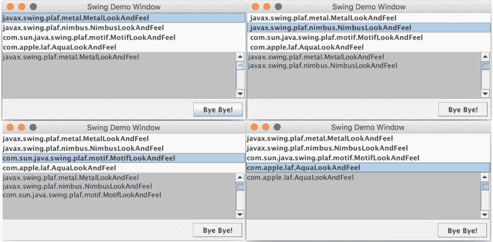

图 10-6

JDK 提供的不同外观和感觉

这就是用几行代码就能用 Swing 组件实现的效果。Swing 库中还有更多的组件，但同样，Swing 现在已经不太常用了。由于如今的焦点是移动和 Web 应用程序，我们在此结束本节。如果你需要创建或维护一个 Swing 应用程序，Oracle 提供了一个相当全面的教程，其中包含大量示例，你可以直接复制粘贴并根据需要进行调整^(⁹¹)。


## 介绍 JavaFX

JavaFX Script 是 Sun Microsystems 设计的一种脚本语言，构成了 Java 平台上 JavaFX 技术家族的一部分。它于 2008 年 12 月 JDK 6 发布后不久推出，曾一度有开发者预计它会被弃用，因为它作为一种完全不同的语言，并未真正流行起来。

在收购 Sun Microsystems 后，Oracle 决定保留 JavaFX Script，并将其转变为 JavaFX 库。这是一组图形和媒体包，开发者可以使用它们来设计、创建、测试、调试和部署富客户端应用程序，这些应用程序能在包括移动设备在内的多种平台上一致运行。JavaFX 旨在取代 Swing 成为 JDK 的主要 GUI 库，但在 JDK 10 之前，Swing 和 JavaFX 都是所有 JDK 版本的一部分。这种情况在 JDK 11 中发生了变化。从 JDK 11 开始，JavaFX 仅作为独立模块提供，并且该模块成为 OpenJFX 项目下 OpenJDK 的一部分^(⁹²)。

JavaFX 是一个用于开发桌面应用程序以及富互联网应用程序（RIA）的 Java 库。JavaFX 的使用率仍未达到 Oracle 的预期，但将其从 JDK 中分离出来，使其得以转变为市场上其他现有 GUI 工具包（如 Eclipse SWT^(⁹³) 和 Google Web Toolkit (GWT)^(⁹⁴)）的真正竞争对手。

在从 JDK 中分离出来后，JavaFX 独立发展，并与发布的 Java 版本保持同步。在撰写本章时，已有 JavaFX 23 版本可供下载^(⁹⁵)。官方文档足以帮助你入门。

信息

本书的项目是使用 Maven 构建的，这使得操作非常实用，因为 Maven 配置确保必要的依赖项能够轻松添加到类路径中。

JavaFX 代码目前是普通的 Java 代码，因此不再需要脚本。JavaFX 组件在 `java.fx` 模块列表下定义。在清单 10-15 所示的配置片段中，你可以看到我们使用 JavaFX 的项目模块在其 `module-info.java` 文件中通过 `requires` 指令声明了对几个 `java.fx` 模块的依赖。

```
module chapter.ten.javafx {
requires javafx.base;
requires javafx.graphics;
requires javafx.controls;
opens com.apress.bgn.ten to javafx.graphics;
}
清单 10-15
使用 java.fx 模块的项目配置示例
```

JavaFX 应用程序启动器使用反射来启动应用程序，因此我们需要打开 `com.apress.bgn.ten` 包，以允许使用 `opens` 指令进行反射。如果没有该指令，则会抛出 `java.lang.IllegalAccessException` 异常，并且应用程序无法启动。

最简单的入门应用程序是一个仅包含关闭选项的简单窗口。显示一个普通方形窗口的代码如清单 10-16 所示。

```
package com.apress.bgn.ten;
import javafx.application.Application;
import javafx.scene.Scene;
import javafx.scene.layout.StackPane;
import javafx.stage.Stage;
public class JavaFxDemo extends Application {
public static void main(String... args) {
launch(args);
}
@Override
public void start(Stage primaryStage) {
primaryStage.setTitle("JavaFX Demo Window!");
var root = new StackPane();
primaryStage.setScene(new Scene(root, 500, 500));
primaryStage.show();
}
}
清单 10-16
简单的 JavaFX 应用程序
```

首先你需要知道，应用程序的主类必须继承 `javafx.application.Application` 类，因为这是 JavaFX 应用程序的入口点。这是必需的，因为 JavaFX 应用程序由名为 **Prism** 的新性能图形引擎运行，该引擎位于 JVM 之上。除了 Prism，JavaFX 还自带名为 **Glass** 的窗口系统、一个媒体引擎和一个 Web 引擎。它们不对外公开；开发者唯一能使用的是 JavaFX API，它提供了构建具有精美界面的应用程序所需的任何组件。所有这些引擎都由 **Quantum** 工具包连接在一起，该工具包是这些引擎与堆栈中上层之间的接口。Quantum 工具包管理执行线程和渲染。

`launch(..)` 方法是 `Application` 类中的一个静态方法，用于启动独立应用程序。它通常从 main 方法中调用，并且只能调用一次；否则会抛出 `java.lang.IllegalStateException` 异常。`launch(..)` 方法在应用程序退出之前不会返回，退出方式可以是关闭所有窗口或调用 `Platform.exit()`。`launch(..)` 方法会创建一个 JavaFxDemo 实例，调用其 `init()` 方法，然后调用 `start(..)`。`start(..)` 方法在 `Application` 类中被声明为抽象方法，因此开发者必须提供具体实现。

JavaFX 应用程序使用 `javafx.scene` 包下定义的组件构建，并具有层次化组织结构。`javafx.scene` 包的核心类是 `javafx.scene.Node`，它是 `Scene` 层次结构的根。该层次结构中的类为应用程序用户界面的所有视觉元素提供了实现。由于所有这些类都以 `Node` 作为根类，视觉元素被称为*节点*，这使得应用程序成为*节点的场景图*，而该图的初始节点称为*根*。每个节点都有一个唯一标识符、一个样式类和一个包围体，并且除了根节点之外，图中的每个节点都有一个父节点和零个或多个子节点。除此之外，节点还具有以下属性：

*   效果，例如模糊和阴影，当鼠标光标悬停在界面上时，这些效果有助于确保你点击正确的组件
*   不透明度
*   用于改变视觉状态或位置的变换
*   事件处理器，类似于 Swing 中的监听器，用于定义对鼠标、键盘和输入方法的反应
*   特定于应用程序的状态

场景图大大简化了丰富界面的构建，并且因为它还包含基本图形，如矩形、文本、图像和媒体。各种图形的动画可以通过 `javax.animation` 包中的动画 API 来实现。如果你有兴趣了解更多关于 JavaFX 底层机制的信息，请查看 Dev.Java^(⁹⁶) 上的信息。本书的重点更多在于*如何做事*，而不是*它们如何工作*，因此阅读那篇额外的文章可能有助于你设计未来的解决方案。

我们再次从一个简单的窗口开始。第一步是添加一个用于退出应用程序的按钮。由于渲染 JavaFX 应用程序涉及渲染引擎，这意味着它必须优雅地关闭，因此调用 `System.exit(0)` 不是首选选项。`start(..)` 方法的内容必须调用一个特殊的 JavaFX 方法来优雅地关闭应用程序。代码如清单 10-17 所示。


```
package com.apress.bgn.ten;
// 其他 'javafx' 导入语句已省略
import javafx.scene.control.Button;
public class JavaFxDemo extends Application {
void main() {
launch();
}
@Override
public void start(Stage primaryStage) {
primaryStage.setTitle("Java FX 按钮演示!");
var btn = new Button();
btn.setText("再见！");
btn.setOnAction(new EventHandler() {
@Override
public void handle(ActionEvent event) {
Platform.exit();
}
});
//btn.setOnAction(_ -> Platform.exit());
var root = new StackPane();
root.getChildren().addAll(new Rectangle(100,100, Color.PINK), btn);
primaryStage.setScene(new Scene(root, 300, 300));
primaryStage.show();
}
}
代码清单 10-17
带按钮的简单 JavaFX 应用程序
```

运行 `JavaFxDemo` 类后，图 10-7 所示的窗口会弹出在屏幕上，如果你点击 `再见！` 按钮，应用程序将因 `Platform.exit()` 调用而优雅关闭。

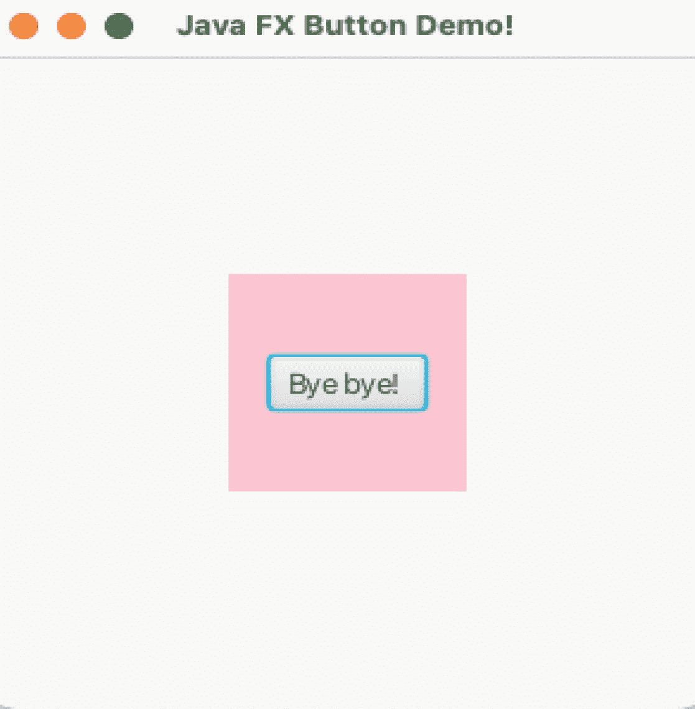

图 10-7

JavaFX 窗口演示

按钮和粉色矩形被添加到一个 `StackPane` 实例中，该实例以从后到前的堆叠方式布局其子节点。子节点的大小会填满 `StackPane` 实例，除非其大小已固定，并且默认情况下它们会居中显示。JavaFX 支持以类似于 Swing 的方式在窗口中排列节点，但 JavaFX 提供了几个支持多种不同布局样式的布局面板。在 JavaFX 中，与带有 `BorderLayout` 管理器的 `JPanel` 等价的内置布局名为 `BorderPane`。`BorderPane` 提供了五个区域来放置节点，其分布方式类似于 `BorderLayout`，但名称不同。代码清单 10-18 展示了将按钮放置在底部区域右侧的代码。

```
package com.apress.bgn.ten;
// 其他 'javafx' 导入语句已省略
import javafx.scene.layout.HBox;
public class PannedJavaFxDemo extends Application {
void main() {
launch();
}
@Override
public void start(Stage primaryStage) {
primaryStage.setTitle("Java FX 演示窗口!");
var exitButton = new Button();
exitButton.setText("再见！");
exitButton.setOnAction(_ -> Platform.exit());
var borderPane = new BorderPane();
var box = new HBox();
box.setPadding(new Insets(10, 12, 10, 12));
box.setSpacing(10);
box.setAlignment(Pos.BASELINE_RIGHT);
box.setStyle("-fx-background-color: #85929e;");
box.getChildren().add(exitButton);
borderPane.setBottom(box);
var root = new StackPane();
root.getChildren().add(borderPane);
primaryStage.setScene(new Scene(root, 500, 500));
primaryStage.show();
}
}
代码清单 10-18
按钮位置正确的简单 JavaFX 应用程序
```

运行 `PannedJavaFxDemo` 类后，图 10-8 所示的窗口会弹出在屏幕上；该图已修改以显示 `BorderPane` 的区域。

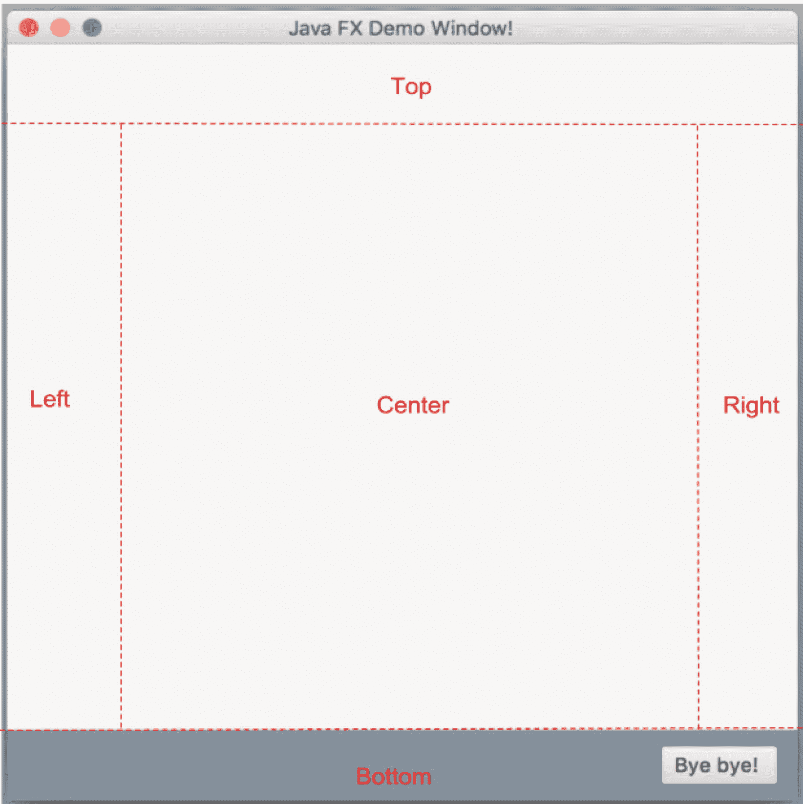

图 10-8

带 `BorderPane` 演示的 JavaFX 窗口

如你所见，决定按钮位置的方法与 Swing 中的方法类似，但有一些差异。`BorderPane` 有五个区域，分别命名为：`Top`、`Bottom`、`Center`、`Left` 和 `Right`。为了将节点放置在每个区域中，为每个区域定义了相应的 `set*(..)` 方法：`setTop(..)`、`setBottom(..)`、`setCenter(..)`、`setLeft(..)` 和 `setRight(..)`。为了进一步自定义节点的位置，应将其放置在一个 `HBox` 节点中，这是另一个可以相当广泛自定义的 `JavaFX` 元素。从代码清单 10-18 的代码中可以看到，我们使用 CSS 样式元素设置了背景。我们通过使用 `Insets` 类的实例来定制节点之间的间距以及节点与容器边框的间距，并通过调用 `box.setAlignment(Pos.BASELINE_RIGHT)` 来定制容器内节点的对齐方式。`HBox` 支持的功能还有很多，因此使用盒子能做的事情（主要）只受限于你的想象力。

因此，除了在代码清单 10-18 中*编写漂亮的代码*之外，我们还做了以下工作：根节点成为了一个 `BorderPane` 节点的父节点；在 `BorderPane` 的底部区域添加了一个 `HBox`；这个 `HBox` 实例成为了一个 `Button` 的父节点。如你所见，这种组织方式是分层的，按钮是层次结构中的最后一个节点。

我们还通过正确设置 `HBox` 节点的样式，避免了使用层叠面板。

现在是时候为我们的应用程序添加最后的功能了：文本区域和带有可选元素的列表。选中后，该值会被添加到文本区域中。在 JavaFX 中创建文本区域很简单。该类有一个非常明显的名称：`TextArea`。我们可以直接将节点添加到 `BorderPane` 的中心区域，因为 JavaFX 的文本区域默认是可滚动的。因此，无需将其放入 `ScrollPane` 中，尽管 `javafx.scene.control` 包中确实存在该类，并且对于显示比窗口尺寸大的表单节点很有用。代码清单 10-19 中的三行代码创建了一个 `TextArea` 类型的节点，将其声明为不可编辑，并将其添加到 `BorderPane` 的中心区域。

```
import javafx.scene.control.TextArea;
...
var textArea = new TextArea();
textArea.setEditable(false);
borderPane.setCenter(textArea);
代码清单 10-19
创建和配置 JavaFX TextArea
```

接下来要添加的功能是列表。列表稍微复杂一些，但操作起来也更有趣，因为使用 JavaFX 可以对列表做很多事情。需要实例化以创建列表对象的类名为 `ComboBox<T>`。该类只是用于创建列表的更大类族中的一个，其根类是抽象类 `ComboBoxBase<T>`。选择正确的实现取决于列表所需的行为，例如是否需要支持单选或多选，以及是否需要列表可编辑。在我们的案例中，`ComboBox<T>` 类符合以下要求：我们需要一个不可编辑的列表，支持单选。`ComboBox<T>` 有一个 `valueProperty()` 方法，返回当前的用户输入。用户输入可以基于下拉列表中的选择，也可以是在列表可编辑时用户手动提供的输入。代码清单 10-20 展示了如何将列表添加到 `BorderPane` 的顶部区域，并添加一个监听器来记录选中的值，并将其保存到我们之前声明的 `TextArea` 中。


```
import javafx.scene.control.ComboBox;
...
private static String data = {"John Mayer", "Frank Sinatra",
"Seth MacFarlane", "Nina Simone", "BB King", "Peggy Lee"};
...
ComboBox comboBox = new ComboBox();
comboBox.getItems().addAll(data);
borderPane.setTop(comboBox);
comboBox.valueProperty().addListener(
new ChangeListener() {
@Override
public void changed(ObservableValue observable, String oldValue, String newValue) {
textArea.appendText(newValue + "\n");
}
});
清单 10-20
创建并配置 JavaFX ComboBox
```

`ComboBox<T>` 的值字段是一个 `ObservableValue<T>` 实例。监听器被添加到此实例上，每当其值发生变化时，监听器会收到通知，并调用其 `changed(..)` 方法。如你所见，`changed(..)` 方法还会将列表中先前选中的值作为参数传入，因为我们的某些逻辑可能需要同时用到这两个值。

在 AWT 和 Swing 中，你对列表的视觉样式能做的不多。你只能使用默认的外观和感觉，仅此而已。JavaFX 为节点提供了更多的视觉定制支持，甚至支持 CSS。这就是为什么在下一节中，我们将让 `ComboBox<T>` 列表变得更有趣。在 JavaFX 中，列表中的每个条目都是一个可以以不同方式绘制的单元格。为此，我们必须向此类添加一个 `CellFactory<T>`，它会为列表中的每个项目创建一个 `ListCell<T>` 实例。

如果未指定 `CellFactory<T>`，单元格将使用默认样式创建。清单 10-21 展示了自定义 `ComboBox<T>` 的代码。

```
comboBox.setCellFactory(
new Callback() {
@Override
public ListCell call(ListView param) {
return new ListCell() {
{
super.setPrefWidth(200);
}
@Override
public void updateItem(String item, boolean empty) {
super.updateItem(item, empty);
if (item != null) {
setText(item);
if (item.contains("John") || item.contains("BB")) {
setTextFill(Color.RED);
} else if (item.contains("Frank") || item.contains("Peggy")) {
setTextFill(Color.GREEN);
} else if (item.contains("Seth")) {
setTextFill(Color.BLUE);
} else {
setTextFill(Color.BLACK);
}
} else {
setText(null);
}
}
};
}
});
清单 10-21
创建并自定义 JavaFX ComboBox 单元格的颜色
```

`javafx.util.Callback` 接口是一个实用的工具接口，可在某个操作后需要回调时使用。在此例中，当一个 `String` 值被添加到 `ComboBox<T>` 节点的 `ListView` 中时（`ListView` 顾名思义是 `ComboBox<T>` 的视觉外观类型，用于显示水平或垂直的项目列表），会创建一个单元格，并在其中插入一些逻辑，根据其值来决定单元格中文本的颜色。

在 `ListCell<T>` 声明内部，有一段看起来不太协调的代码块：

```
{
super.setPrefWidth(200);
}
```

上面的代码块是一种在匿名类声明内部调用父类方法的有趣方式。此处调用 `setPrefWidth(200)` 方法是为了确保所有 `ListCell<T>` 实例具有相同的大小。`updateItem(..)` 方法中的逻辑非常明显，因此无需过多解释。添加单元格工厂后的结果如图 10-9 所示。

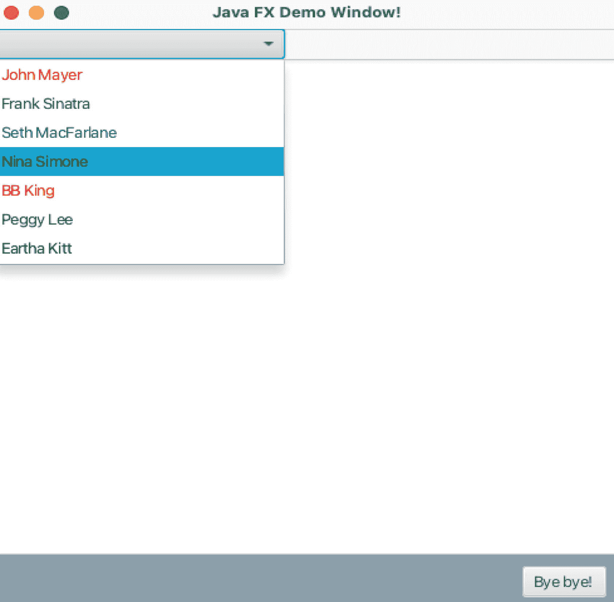

图 10-9

JavaFX 彩色 `ComboBox` 演示

## 国际化

交互式应用程序通常设计为部署在多台服务器上，并实现 24/7 全天候可用，且覆盖多个地区。由于并非所有人都使用同一种语言，说服用户成为你的客户并使用你的应用程序的关键在于，以多种语言构建它。设计应用程序以满足多个国家用户需求并易于适应这些需求的过程称为**国际化**。例如，以最初的谷歌页面为例。根据访问地点，它会根据该地区切换语言。当你创建账户时，你可以选择偏好的语言。这并不意味着谷歌为每个地区都构建了一个 Web 应用程序；相反，它是一个单一的 Web 应用程序，根据用户所在位置以不同语言显示文本。国际化应在应用程序的设计阶段就予以考虑，因为后期添加会非常困难。我们尚未构建 Web 应用程序（将在下一节中构建），因此我们将对本章迄今为止构建的 JavaFX 应用程序进行国际化处理。

当你开始阅读有关国际化的内容时，可能会注意到包含国际化属性文件的文件或目录被命名为 *i18n*，这是因为在英文字母表中，*i* 和 *n* 之间有 18 个字母。

国际化基于区域设置。**区域设置**是指语言和地区的组合。应用程序的区域设置决定了将使用哪个国际化文件来自定义应用程序。区域设置概念由 Java 的 `java.util.Locale` 类实现，一个 `Locale` 实例代表一个地理、政治或文化区域。当应用程序依赖于区域设置时，我们说它是*区域设置敏感的*，如今大多数应用程序都是如此。选择区域设置也可能是用户需要做的事情。每个 `Locale` 可用于选择相应的*区域资源*，这些资源是包含特定区域配置的文件。这些文件按区域分组，通常可以在 `resources` 目录下找到。这些资源用于配置 `java.util.ResourceBundle` 的实例，该实例可用于管理特定于区域的资源。

为了构建一个合适的本地化用例，我们将修改之前的 JavaFX 应用程序：列表中将不再包含歌手姓名，而是包含一组动物名称及其标签，这些标签可以翻译成多种语言。我们还将添加一个可用语言列表，当从此列表中选择一种语言时，一个 `Locale` 静态变量将被设置为相应的区域设置，并且窗口将被重新初始化，以便所有标签都能翻译成新语言。让我们从创建资源文件开始。

*资源文件*具有 `.properties` 扩展名，并且顾名思义，包含一系列属性和值。每行遵循以下模式：`property_name=property_value`，如果不遵循，则不被视为国际化资源文件。每个属性名称在文件中必须是唯一的；如果存在重复，它将被忽略，并且 IntelliJ IDEA 会通过用红色下划线标记该属性来发出警告。对于需要支持的每种语言，我们需要创建一个资源文件，该文件包含与其他文件相同的属性名称，但属性值不同，因为这些值将代表该值在每种语言中的翻译。所有文件的名称必须包含一个共同的后缀，并以语言名称和国家/地区结尾，用下划线分隔，因为这是创建 `Locale` 实例所需的两个元素。对于我们的 JavaFX 应用程序，我们有四个文件，如图 10-10 所示。

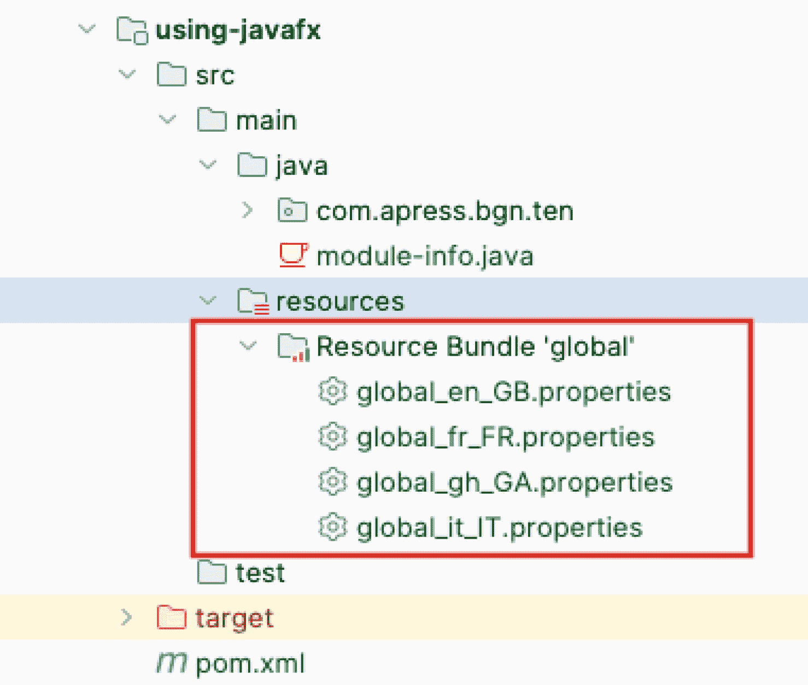

图 10-10

包含三个资源文件的资源包


后缀为 `global`，这也将成为我们的资源包名称。IntelliJ IDEA 能非常清晰地识别出资源文件的用途，并以直观的方式呈现出来。文件内容如表 10-1 所示。

表 10-1

资源文件内容

| 属性名称 | `global_en_GB` 中的属性值 | `global_fr_FR` 中的属性值 | `global_it_IT` 中的属性值 | `global_gh_GA` 中的属性值 |
| --- | --- | --- | --- | --- |
| English | English | Anglais | Inglese | Beurla |
| French | French | Français | Francese | Fhraing |
| Italian | Italian | Italien | Italiano | Eadailteach |
| Gaelic | Gaelic | Gaélique | Gaelico | Gàidhlig |
| Cat | Cat | Chat | Gatto | Cat |
| Dog | Dog | Chien | Cane | Cù |
| Parrot | Parrot | Chien | Pappagallo | Pioraid |
| Mouse | Mouse | Souris | Topo | Luch |
| Cow | Cow | Perroquet | Mucca | Bò |
| Pig | Pig | Porc | Maiale | Muc |
| WindowTitle | Java FX Demo Window! | Java FX Démo Fenêtre! | Java FX Dimostratione Finestra! | Java FX Demo Uinneag! |
| Byebye | Bye bye! | Bye bye! | Ciao! | Tìoraidh! |
| ChoosePet | Choose Pet: | Choisir un animal de compagnie: | Scegli un animale domestico: | Tagh peata: |
| ChooseLanguage | Choose Language: | Choisissez la langue: | Scegli la lingua: | Tagh cànan: |

IntelliJ IDEA 可以通过提供专门的视图，帮助你轻松编辑资源包文件，并确保不会遗漏任何键。在 IntelliJ IDEA 中打开资源文件时，左下角会看到两个选项卡：**Text** 和 **Resource Bundle**。点击 **Text** 选项卡可以像编辑普通文本文件一样编辑属性文件。点击 **Resource Bundle** 选项卡则会打开一个特殊视图，左侧显示资源文件中所有属性名称，右侧显示所有资源文件中对应所选属性名称的值。在图 10-11 中，你可以看到这个视图以及属性 `ChooseLanguage` 的值。

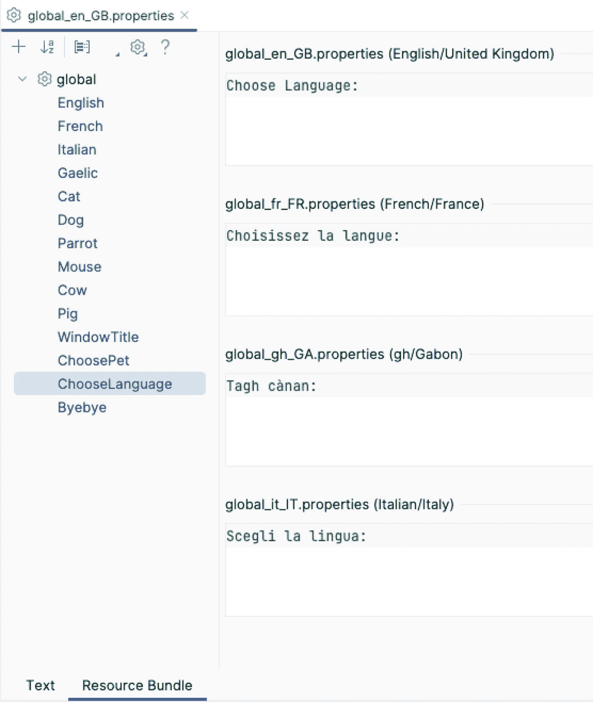

图 10-11

IntelliJ IDEA 资源包编辑器

属性名称可以包含特殊字符下划线 (_) 和点 (.) 来分隔各部分。在本节示例中，属性名称很简单，因为数量很少。在大型应用程序中，属性名称通常包含与其用途相关的前缀；例如，如果属性值是标题，则名称会以 `title` 作为前缀。我们文件中的属性名称可以更改为清单 10-22 中列出的形式。

```
English --> label.lang.english
French --> label.lang.french
Italian --> label.lang.italian
Gaelic --> label.lang.gaelic
Cat --> label.pet.cat
Dog --> label.pet.dog
Parrot --> label.pet.parrot
Mouse --> label.pet.mouse
Cow --> label.pet.cow
Pig --> label.pet.pig
WindowTitle --> title.window
Byebye --> label.button.byebye
ChoosePet --> label.choose.pet
ChooseLanguage --> label.choose.language
清单 10-22
推荐的国际化属性名称
```

现在我们已经介绍了资源文件的编写方式，接下来看看如何使用它们。要创建 `ResourceBundle` 实例，首先需要一个区域设置。应用程序有一个默认区域设置，可以通过调用 `Locale.getDefault()` 获取，而 `ResourceBundle` 实例可以通过使用包名称和区域设置实例来获取，如下面的代码片段所示：

```
Locale locale = Locale.getDefault();
ResourceBundle labels = ResourceBundle.getBundle("global", locale);
```

获取到有效的 `ResourceBundle` 后，可以用它来替换所有硬编码的 `String` 实例，通过调用资源文件中与所选区域设置匹配的文本值来返回。因此，每次需要为节点设置标签时，我们不再使用实际文本，而是调用 `resourceBundle.getString("[property_name]")` 来获取本地化文本。

当 JavaFX 窗口重新加载时，其所有节点都会重新创建。为了能够影响它们的重新创建方式，我们需要添加一些静态属性来保存所选的区域设置。对于目前构建的应用程序，国际化后，代码如清单 10-23 所示。

```
package com.apress.bgn.ten;
import javafx.application.*;
import javafx.geometry.*;
import javafx.scene.*;
import javafx.stage.*;
import java.io.File;
import java.net.URL;
import java.net.URLClassLoader;
import java.util.Locale;
import java.util.ResourceBundle;
public class InternationalizationDemo extends Application {
private static final String BUNDLE_LOCATION = "chapter10/using-javafx/src/main/resources";
private static ResourceBundle resourceBundle = null;
private static Locale locale = Locale.of("en", "GB");
private static int selectedLang = 0;
void main() {
launch();
}
@Override
public void start(Stage primaryStage) throws Exception {
loadLocale(locale);
primaryStage.setTitle(resourceBundle.getString("WindowTitle"));
String[] data = {resourceBundle.getString("Cat"),
resourceBundle.getString("Dog"),
resourceBundle.getString("Parrot"),
resourceBundle.getString("Mouse"),
resourceBundle.getString("Cow"),
resourceBundle.getString("Pig")};
var borderPane = new BorderPane();
//Top
final ComboBox comboBox = new ComboBox();
comboBox.getItems().addAll(data);
final ComboBox langList = new ComboBox();
String[] languages = {
resourceBundle.getString("English"),
resourceBundle.getString("French"),
resourceBundle.getString("Italian"),
resourceBundle.getString("Gaelic")};
langList.getItems().addAll(languages);
langList.getSelectionModel().select(selectedLang);
var gridPane = new GridPane();
gridPane.setHgap(10);
gridPane.setVgap(10);
var labelLang = new Label(resourceBundle.getString("ChooseLanguage"));
gridPane.add(labelLang, 0, 0);
gridPane.add(langList, 1, 0);
var labelPet = new Label(resourceBundle.getString("ChoosePet"));
gridPane.add(labelPet, 0, 1);
gridPane.add(comboBox, 1, 1);
borderPane.setTop(gridPane);
//Center
final TextArea textArea = new TextArea();
textArea.setEditable(false);
borderPane.setCenter(textArea);
comboBox.valueProperty().addListener((_, _, newValue)
-> textArea.appendText(newValue + "\n"));
langList.valueProperty().addListener((_, _, _)
-> {
int idx = langList.getSelectionModel().getSelectedIndex();
selectedLang = idx;
locale = switch (idx) {
case 1 -> Locale.of("fr", "FR");
case 2 -> Locale.of("it", "IT");
case 3 -> Locale.of("gh", "GA"); // 苏格兰盖尔语
default -> Locale.of("en", "GB");
};
primaryStage.close();
Platform.runLater(() -> {
try {
new InternationalizationDemo().start(new Stage());
} catch (Exception e) {
System.err.println("无法重新加载应用程序！");
}
});
});
var box = new HBox();
box.setPadding(new Insets(10, 12, 10, 12));
box.setSpacing(10);
box.setAlignment(Pos.BASELINE_RIGHT);
box.setStyle("-fx-background-color: #85929e;");
Button exitButton = new Button();
exitButton.setText(resourceBundle.getString("Byebye"));
exitButton.setOnAction(event -> Platform.exit());
box.getChildren().add(exitButton);
borderPane.setBottom(box);
//Bottom
var root = new StackPane();
root.getChildren().add(borderPane);
primaryStage.setScene(new Scene(root, 500, 500));
primaryStage.show();
}
private void loadLocale(Locale locale) throws Exception {
var file = new File(BUNDLE_LOCATION);
URL[] url = {file.toURI().toURL()};
var loader = new URLClassLoader(url);
resourceBundle = ResourceBundle.getBundle("global", locale, loader);
}
}
清单 10-23
JavaFX 国际化应用程序
```


你可能想知道为什么我们使用了另一种方式来加载资源包，以及为什么使用了资源包位置的完整相对路径。如果我们希望应用程序能够从 IntelliJ 界面运行，就必须提供相对于应用程序执行上下文的路径。当应用程序被构建并打包成可运行的 Java 归档文件时，资源文件会成为其一部分并位于类路径中。当在 Java IDE 中通过执行 `main()` 方法来运行应用程序时，类路径是相对于项目的实际位置的。

清单 10-24 中的代码片段通过关闭 `Stage` 来重启场景，然后实例化一个 `JavaFxDemo` 对象并调用 `start(..)` 方法。这意味着整个层级节点结构会被重新创建，唯一保留的状态是定义在静态对象中的状态。这对于区域设置是必需的，因为 `start(..)` 方法的执行现在以调用 `loadLocale(locale)` 开始，该方法会选择应用程序的区域设置并加载 `ResourceBundle`，以便所有节点都能使用其返回的文本进行标记。

```
primaryStage.close();
Platform.runLater(() -> {
try {
new JavaFxDemo().start(new Stage());
} catch (Exception e) {
System.err.println("无法重新加载应用程序！");
}
});
清单 10-24
用于重启场景的 JavaFX 代码片段
```

我们迄今为止构建和修改的这个非常简单的应用程序的结果如图 10-12 所示。

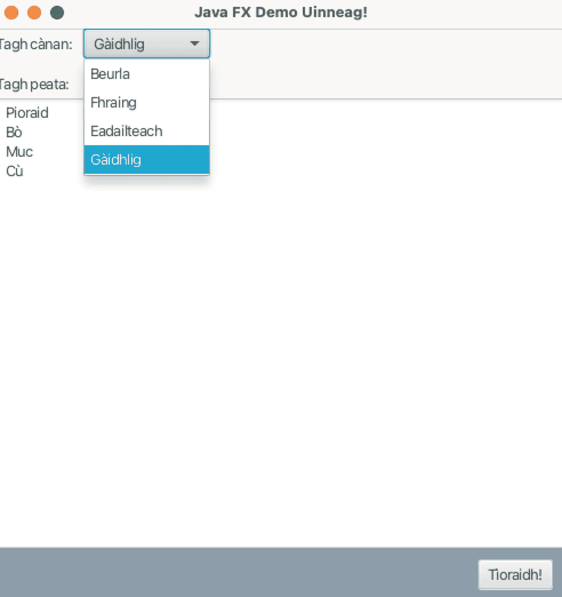

图 10-12

JavaFX 国际化应用程序

如果你需要构建更复杂且需要国际化的界面，你将需要配置的不仅仅是翻译。你可能需要包含不同数字和日期格式的文件，或者多个资源包。国际化是一个相当大的话题，也是一个相当重要的话题，因为如今很少有应用程序只为单一区域使用而构建。对于 Java 初学者来说，仅仅了解支持类是什么以及如何使用它们，就是一个非常好的起点。

## 构建 Web 应用程序

Web 应用程序是一种运行在服务器上，并可以通过浏览器访问的应用程序。直到最近，大多数 Java 应用程序都必须托管在像 Apache Tomcat 或 Eclipse GlassFish 这样的 Web 服务器上，或者像 JBoss（现在称为 WildFly）或 Apache TomEE 这样的企业服务器上，才能被访问。你需要使用类文件以及 HTML 或 Jakarta 服务器页面（JSP）文件来编写 Web 应用程序，将其打包成 WAR（Web 归档）文件或 EAR（企业归档）文件，部署到服务器上，然后启动服务器。服务器会提供应用程序的上下文，并将请求映射到能够提供响应内容的类。假设应用程序部署在 Tomcat 服务器上，在图 10-13 中，你可以看到已部署应用程序功能的抽象示意图。

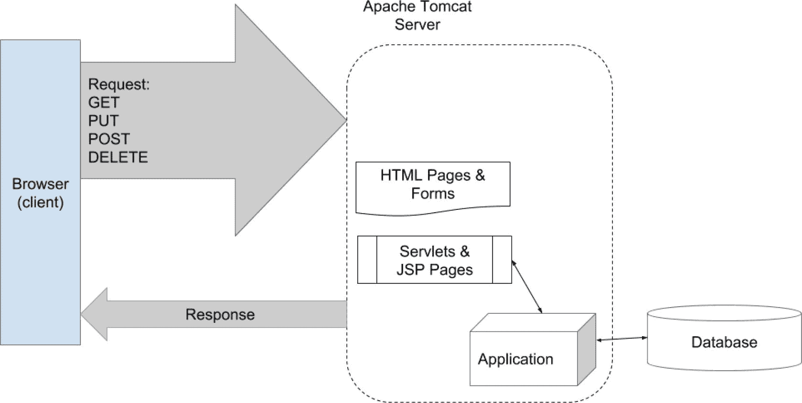

图 10-13

部署在 Apache Tomcat 服务器上的 Web 应用程序

对 Web 应用程序的请求也可能来自浏览器以外的客户端（例如，移动应用程序），但由于本节主要介绍 Web 应用程序，我们假设所有对应用程序的请求都来自浏览器。

在构建 Web 应用程序之前，让我们简要解释一个非常重要的事情：互联网。互联网是一个由许多相互连接的计算机组成的信息系统。一些计算机托管着提供应用程序访问的应用服务器，一些计算机访问这些应用程序，还有一些计算机两者都做。这些计算机之间的通信通过网络进行，使用一系列协议：HTTP、FTP、SMTP、POP 等。最流行的协议是 HTTP（超文本传输协议），它是一种非对称的请求-响应客户端-服务器协议，意味着客户端向服务器发出请求，然后服务器发送响应。后续的请求彼此之间没有关联，也不共享任何状态，因此它们是*无状态的*。

HTTP 请求可以分为不同类型，根据它们要求服务器上的应用程序执行的操作来分类，但开发人员最常用的有四种类型（即图 10-13 中箭头下“请求”所列出的类型）。我们不会深入探讨请求组件的细节，因为它们与 Java 关系不大，但我们会介绍足够的细节来理解 Web 应用程序的工作原理。以下列表介绍了四种请求类型（也称为*请求方法*）以及服务器为每种类型返回的响应类型：

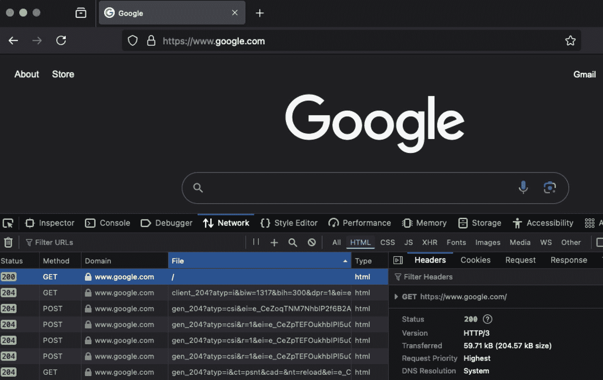

图 10-14

Firefox 中的网络调试器视图

*   **GET**：每当用户在浏览器中输入 URL（例如 [`https://my-site.com/index.html`](https://my-site.com/index.html)）时，浏览器会将地址转换为请求消息并发送给 Web 服务器。浏览器的行为可以通过在 **Firefox** 中打开调试器视图，点击 **网络** 选项卡，并尝试访问 [`https://www.google.com/`](https://www.google.com/) 来轻松查看。在图 10-14 中，你可以看到 Firefox 调试器视图显示了正在请求的 URL 以及请求消息的内容。


在图片的右侧，你可以看到正在请求的 URL、请求类型（此处为 GET），以及请求发送到的服务器的**远程地址**。GET 请求用于从服务器获取某些内容，在此示例中获取的是一个网页。如果网页能够被找到，服务器会发送响应，其中包含供浏览器显示的页面以及其他属性，例如用于通信一切正常的**状态码**。HTTP 状态码有很多，但最重要的是 200 状态码，它表示一切正常。在图 10-14 中，你可以看到，为了显示页面，在初始请求得到响应后，还会发出大量额外的请求，并且所有后续请求都成功了，因为服务器返回的状态显示在表格的第一列，且始终是 200 或 204。

*   **PUT**：此请求类型用于向服务器发送数据，以更新现有数据。在企业级应用中，PUT 请求被解释为更新现有对象的请求。该请求包含对象的更新版本以及用于标识该对象的方法。成功的 PUT 请求会生成状态码为 204 的响应。

*   **POST**：此请求类型用于向服务器发送数据，但服务器被指示同时保存这些数据。与 PUT 请求的区别在于，POST 请求中的数据在服务器上尚不存在。在企业级应用中，POST 请求用于发送凭据以便对用户进行身份验证，或发送将用于创建新对象的数据。当 POST 请求用于发送凭据时，如果用户通过身份验证，响应状态码为 200；如果用户凭据无效，则状态码为 401（未授权）。当 POST 请求用于发送待保存的数据时，如果对象创建成功，则返回 201 状态码。

*   **DELETE**：此请求类型用于指示服务器删除数据。如果一切正常，响应码为 200；如果出现问题，则会发送与原因相关的错误码。

还有一些其他 HTTP 方法用于更复杂的应用程序。如果你想了解更多关于请求方法、状态码以及 HTTP 基础知识，我强烈建议你查看这个教程^(⁹⁷)。现在，让我们回到编写 Java Web 应用程序的话题上。

如前所述，直到不久前，我们还需要一个服务器来托管 Web 应用程序。但从几年前开始，情况已不再如此。正如为了测试目的而用嵌入式数据库替换数据库和功能最简的应用程序一样，Web 服务器也经历了同样的变化。如果你想快速编写一个简单的 Web 应用程序，现在可以选择使用嵌入式服务器，例如 Java 18 中引入的 Simple Web Server、Eclipse Jetty 或 Apache Tomcat Embedded。使用嵌入式服务器支持复杂页面相当困难，但嵌入式服务器通常用于只需要简单 REST API 的微服务。接下来的章节将浅谈如何构建 Java Web 应用程序。

### 简单应用服务器

Java 18 通过 JEP 408^(⁹⁸) 引入了 Simple Web Server，这是一个最小的 HTTP 静态文件服务器。它可以作为命令行工具使用，用于启动一个仅提供静态文件的最小 Web 服务器；不支持 Servlet 和 JSP 页面。它仅通过 HTTP/1.1 提供静态文件服务；不支持动态内容和其他 HTTP 版本。引入它的目的是为了让 JDK 对初学者开发者更友好。

Simple Web Server 的工作方式可以总结如下：

*   它服务于单个目录层次结构，并且仅通过 HTTP/1.1 提供静态文件服务。
*   如果请求的资源是一个文件，则提供其内容。
*   如果目录包含索引文件，则提供索引文件的内容。如果没有，则列出目录的内容。
*   它仅支持 `HEAD` 和 `GET` 请求方法；任何其他请求都会收到 `501 - 未实现` 或 `405 - 不允许` 的响应。

本节将首先向你展示如何使用 `jwebserver` 命令行工具，然后介绍如何从你的 Java 代码创建和自定义服务器实例。


#### `jwebserver` 命令行工具

按照**第** **2** **章**的说明设置好 Java 开发系统后，所有 JDK 二进制文件都应位于系统路径中。因此，如果你打开终端并运行 `jwebserver –help`，你将看到启动一个简单 Web 服务器的所有可用选项，如代码清单 10-25 所示。

```
> jwebserver --help
Usage: jwebserver [-b bind address] [-p port] [-d directory]
[-o none|info|verbose] [-h to show options]
[-version to show version information]
Options:
-b, --bind-address    - Address to bind to. Default: 127.0.0.1 (loopback).
For all interfaces use "-b 0.0.0.0" or "-b ::".
-d, --directory       - Directory to serve. Default: current directory.
-o, --output          - Output format. none|info|verbose. Default: info.
-p, --port            - Port to listen on. Default: 8000.
-h, -?, --help        - Prints this help message and exits.
-version, --version   - Prints version information and exits.
To stop the server, press Ctrl + C.
代码清单 10-25
jwebserver --help 输出
```

如果你只在终端中运行 `jwebserver`，一个 Web 服务器将在默认端口 `8000` 上启动，并提供启动服务器所在目录的内容。因此，如果你在 `java-23-for-absolute-beginners/chapter10/using-simplewebserver` 目录下的终端中运行 `jwebserver`，然后在浏览器中打开 `http://127.0.0.1:8000/`，你应该会看到典型的 Maven 项目结构，如图 10-15 所示。

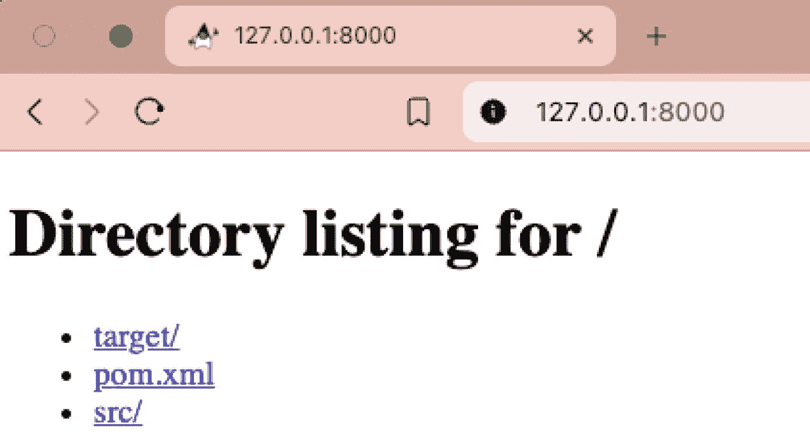

图 10-15

显示当前目录的 Java 简单 Web 服务器 CLI

如果端口 `8000` 未被其他进程占用，服务器将成功启动。如果你浏览目录结构，你将看到所有 `GET` 请求被记录在控制台中。在代码清单 10-26 中，你可以看到一个示例输出。

```
127.0.0.1 - - [27/Jul/2024:23:09:08 +0100] "GET / HTTP/1.1" 200 -
127.0.0.1 - - [27/Jul/2024:23:09:10 +0100] "GET /target/ HTTP/1.1" 200 -
127.0.0.1 - - [27/Jul/2024:23:09:11 +0100] "GET /target/generated-sources/ HTTP/1.1" 200 -
127.0.0.1 - - [27/Jul/2024:23:09:12 +0100] "GET /target/generated-sources/annotations/ HTTP/1.1" 200 -
127.0.0.1 - - [27/Jul/2024:23:09:13 +0100] "GET /livereload/149020878/149023281 HTTP/1.1" 404 -
127.0.0.1 - - [27/Jul/2024:23:09:14 +0100] "GET /target/classes/ HTTP/1.1" 200 -
127.0.0.1 - - [27/Jul/2024:23:09:17 +0100] "GET /livereload/149020878/149023281 HTTP/1.1" 404 -
127.0.0.1 - - [27/Jul/2024:23:09:17 +0100] "GET /src/ HTTP/1.1" 200 -
127.0.0.1 - - [27/Jul/2024:23:09:18 +0100] "GET /src/main/ HTTP/1.1" 200 -
127.0.0.1 - - [27/Jul/2024:23:09:19 +0100] "GET /src/main/java/ HTTP/1.1" 200 -
代码清单 10-26
jwebserver 输出
```

此实用程序的目的并非提供生产级服务器的功能——那需要复杂得多。

如果你想更改提供服务的目录，可以使用 `jwebserver -d {路径/到/目录}` 来配置服务器。例如，使用 `using-simplewebserver/src/main/resources` 目录启动服务器，当在浏览器中访问 http://127.0.0.1:8000/ 时，将显示 `index.html` 文件，如图 10-16 所示。

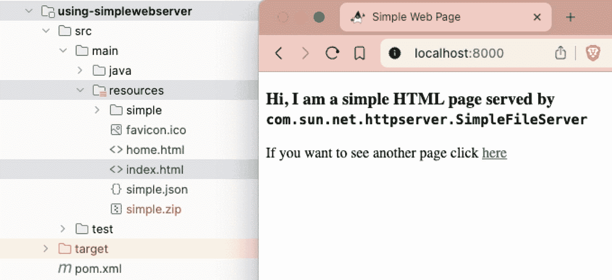

图 10-16

Java 简单 Web 服务器 CLI 显示的索引页面

请随意尝试其他配置。要停止服务器，只需在终端窗口中按 **Ctrl+C**。

除了 CLI，Java 18 还引入了一组新的 API 点用于服务器创建和定制，它们都归入 `jdk.httpserver` 模块。下一节将展示如何从 Java 应用程序配置和启动服务器。

#### 使用 **SimpleFileServer**

构成服务器创建和定制新 API 点的所有组件都归入 [`com.sun.net`](http://com.sun.net)`.httpserver` 包。新类 `SimpleFileServer` 通过三个静态方法提供服务器的关键组件：

*   `createFileServer(InetSocketAddress addr, Path rootDirectory, OutputLevel outputLevel)`：创建一个绑定到给定地址、从给定路径提供文件，并根据指定日志级别记录请求详细信息的文件服务器。

*   `createFileHandler(Path rootDirectory)`：创建一个文件处理器，用于从给定目录路径（及其子目录）提供文件。文件处理器是 `HttpHandler` 的一个实例，被调用来处理 HTTP 交换。文件处理器用作 `HttpServer#create(..)` 方法的参数，以配置要启动的服务器。

*   `createOutputFilter(OutputStream out, OutputLevel outputLevel)`：创建一个后处理 `Filter`，用于打印有关交换的日志消息。

通过调用 `createFileServer(..)` 方法，可以创建一个简单的内存 Web 服务器。返回实例的类型是 `HttpServerImpl`，它扩展了 `HttpServer` 抽象类。该类实现了一个简单的 HTTP 服务器。一个 `HttpServer` 绑定到一个 IP 地址和端口号，并在此地址上监听来自客户端的传入 TCP 连接。代码清单 10-27 中的代码描述了创建一个内存服务器，该服务器提供 `using-simplewebserver/src/main/resources` 目录的内容。

```
package com.apress.bgn.ten;
import com.sun.net.httpserver.SimpleFileServer;
import java.io.File;
import java.io.IOException;
import java.net.InetAddress;
import java.net.InetSocketAddress;
import java.nio.file.Path;
import static java.lang.System.in;
import static java.lang.System.out;
public class MostSimpleServer {
public static final InetSocketAddress SERVER_ADDR =
new InetSocketAddress(InetAddress.getLoopbackAddress(), 8080);
private static final String SERVER_DATA = "using-simplewebserver/";
void main() throws IOException {
var serverDataLocation = new File(SERVER_DATA);
var server = SimpleFileServer.createFileServer(SERVER_ADDR,
Path.of(serverDataLocation.getAbsolutePath()),
SimpleFileServer.OutputLevel.VERBOSE);
server.start();
out.println("按任意键退出！");
in.read();
server.stop(2);
}
}
代码清单 10-27
使用 SimpleFileServer.createFileServer(..) 配置简单 Web 服务器
```

为了保持服务器运行，添加了一个 `System.in.read()` 调用来等待用户输入后再停止它。当在浏览器中访问 `http://127.0.0.1:8080/` 时，会列出 `using-simplewebserver` 目录的内容。因此，使用 Java 代码，我们配置并创建了一个简单的 Web 服务器，该服务器本可以通过 CLI 运行 `jwebserver -p 8080 -d using-simplewebserver` 来创建。

要单独配置文件处理器，我们需要使用 `HttpServer.create(..)` 来创建服务器，如代码清单 10-28 所示。

```
package com.apress.bgn.ten;
import com.sun.net.httpserver.HttpServer;
import static com.apress.bgn.ten.MostSimpleServer.SERVER_ADDR;
// 其他导入语句已省略
/**
└── resources
├── favicon.ico
├── home.html
├── index.html
├── simple.json
└── simple.zip
*/
public class ContextServer {
public static final String SERVER_DATA = "using-simplewebserver/src/main/resources";
void main() throws IOException {
var serverDataLocation = new File(SERVER_DATA);
var handler = SimpleFileServer.createFileHandler(Path.of(serverDataLocation.getAbsolutePath()));
var server = HttpServer.create(SERVER_ADDR, 10, "/simple", handler);
server.start();
out.println("按任意键退出！");
in.read();
server.stop(2);
}
}
代码清单 10-28
单独配置文件处理器
```


请注意，`HttpServer.create()` 方法提供了更多配置选项，例如文件服务的上下文路径（此处为 `simple/`），以及内部排队等待的最大 TCP 连接数（此处为 `10`）。

还可以使用工具方法 `HttpHandlers.of(statusCode, headers, body)` 来创建处理器。额外的配置非常有用，因为它提供了服务其他类型文件（例如 JSON 文件）的机会。清单 10-29 中的代码定义了一个用于服务 JSON 文件的处理器，同时还使用了 `HttpHandlers.handleOrElse(predicate, mainHandler, fallbackHandler)` 来强制只允许 `GET` 请求。

```
package com.apress.bgn.ten;
// 省略了 import 语句
public class JsonServingServer {
public static Predicate IS_GET = r -> r.getRequestMethod().equals("GET");
void main() throws IOException {
var serverDataLocation = new File(SERVER_DATA);
var jsonHandler = HttpHandlers.of(200,
Headers.of("Content-Type", "application/json"),
Files.readString(Path.of(serverDataLocation.getAbsolutePath() + File.separator + "simple.json")));
var methodNotAllowedHandler = HttpHandlers.of(405,
Headers.of("Allow", "GET"), "");
var handler = HttpHandlers.handleOrElse(IS_GET, jsonHandler, methodNotAllowedHandler);
var server = HttpServer.create(SERVER_ADDR, 10, "/simple/", handler);
server.start();
out.println("按任意键退出！");
in.read();
server.stop(2);
}
}
清单 10-29
配置简单 Web 服务器以服务 JSON 文件
```

如果你想测试这个服务器，最简单的方法是使用 IntelliJ IDEA 的 HTTPie^(⁹⁹) Web 客户端。在 `using-simplewebserver/src/test/resources` 目录下，有一些 HTTPie 请求文件，其中包含了针对本节配置的每个服务器的请求。清单 10-30 展示了 `json-serving-server-tests.http` 文件的内容。

```
### 向 JsonServingServer 创建的简单服务器发送 GET 请求
GET http://localhost:8080/simple/simple.json
# 期望返回 200 状态码及 'simple.json' 的内容
###
### 向示例服务器发送 PATCH 请求
PATCH http://localhost:8080/simple/simple.json
# 期望返回 405 Method Not Allowed
###
清单 10-30
json-serving-server-tests.http 文件内容
```

这些请求在 IntelliJ IDEA 中的提交方式与运行 JUnit 测试类似。只需点击编辑器左侧边缘的绿色三角形，或右键点击文件内容，在弹出的菜单中选择带有绿色三角形前缀的选项即可。图 10-17 展示了运行 `PATCH` 请求的菜单项。

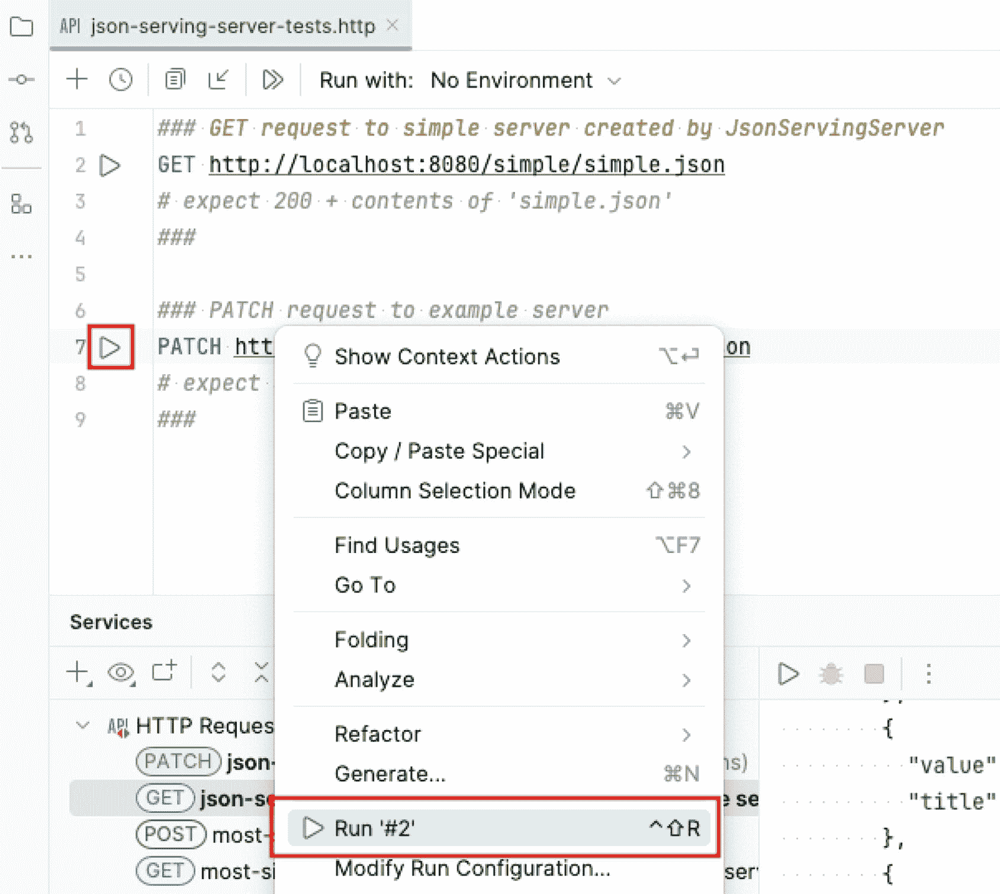

图 10-17

IntelliJ IDEA HTTPie Web 客户端菜单

现在，让我们添加一个过滤器来更好地记录请求。这意味着我们将同时使用 `SimpleFileServer.createFileHandler(..)` 和 `SimpleFileServer.createOutputFilter()`。要创建服务器，我们需要使用接受过滤器作为参数的 `HttpServer.create(..)` 版本。代码如清单 10-31 所示。

```
package com.apress.bgn.ten;
// 省略了 import 语句
public class FilterServer {
void main() throws IOException {
var serverDataLocation = new File(SERVER_DATA);
var handler = SimpleFileServer.createFileHandler(Path.of(serverDataLocation.getAbsolutePath()));
var outputFilter = SimpleFileServer.createOutputFilter(System.out, SimpleFileServer.OutputLevel.VERBOSE);
var headerAppenderFilter = Filter.adaptRequest("添加时间戳头",
request -> request.with("Timestamp", List.of(LocalDateTime.now().toString())));
var server = HttpServer.create(SERVER_ADDR, 10, "/simple/", handler, headerAppenderFilter, outputFilter);
server.start();
out.println("按任意键退出！");
in.read();
server.stop(2);
}
}
清单 10-31
添加过滤器以记录请求
```

过滤器也可以用来修改请求。在清单 10-31 的示例中，`headerAppenderFilter` 用于向请求添加一个名为 `Timestamp` 的头。由于 `outputFilter` 将日志级别声明为 `VERBOSE` 并且是最后添加的，当在控制台中打开 `http://127.0.0.1:8080/simple/` 时，你可以看到请求的所有详细信息，包括 `Timestamp`。清单 10-32 展示了该输出的一段摘录。

```
127.0.0.1 - - [28/Jul/2024:13:03:33 +0100] "GET /simple/ HTTP/1.1" 200 -
请求的资源: ../chapter10/using-simplewebserver/src/main/resources
> Accept-encoding: gzip, deflate, br, zstd
...
> Sec-ch-ua-platform: "macOS"
> Timestamp: 2024-07-28T13:03:33.048932
...
< Content-type: text/html
< Content-length: 308
清单 10-32
针对 http://127.0.0.1:8080/simple/ 请求的详细日志片段
```

警告

请注意，本节示例中要服务的目录路径是相对于 `chapter10` 目录的。为了使你的 IntelliJ IDEA 启动器正常工作，你可能需要将工作目录自定义为该目录的绝对路径，如图 10-18 所示。

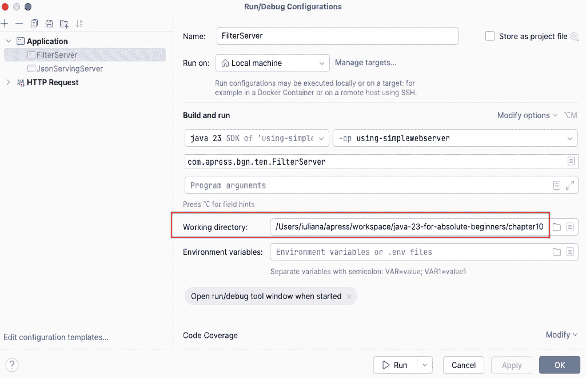

图 10-18

IntelliJ IDEA 为 `FilterServer` 自定义的启动器

Java 简单 Web 服务器在很大程度上相当于 Apache HTTPD：它的配置和使用并不繁琐，不需要 JDK 外部的容器来托管你的 Web 应用程序，并且尽管存在一些限制，但对于初学者来说，它是一种快速简便地开始用 Java 编写 Web 应用程序的方式。


### 使用嵌入式服务器的 Java Web 应用

本节将使用一个嵌入式 Apache Tomcat 服务器，通过 Java Servlet *（耐心点，年轻的学徒，稍后会解释它们）* 来展示几个简单的网页。这里使用的是 Tomcat 11 版本，这意味着它支持 Java 模块。使用嵌入式 Tomcat 服务器的优势在于，你可以通过执行一个 main 方法来运行 Web 应用。代码如清单 10-33 所示，声明了一个非常简单的 Servlet，作为应用的主页面。

```
package com.apress.bgn.ten;
import jakarta.servlet.http.HttpServlet;
import jakarta.servlet.http.HttpServletRequest;
import jakarta.servlet.http.HttpServletResponse;
import org.apache.catalina.Context;
import org.apache.catalina.LifecycleException;
import org.apache.catalina.startup.Tomcat;
// 其他导入语句已省略
public class WebDemo {
private static final Logger LOGGER = Logger.getLogger(WebDemo.class.getName());
public static final Integer PORT = Optional.ofNullable(System.getenv("PORT")).map(Integer::parseInt).orElse(8080);
public static final String TMP_DIR = Optional.ofNullable(System.getenv("TMP_DIR")).orElse("/tmp/tomcat-tmp");
public static final String STATIC_DIR = Optional.ofNullable(System.getenv("STATIC_DIR")).orElse("/tmp/tomcat-static");
void main() throws IOException, LifecycleException {
var tomcat = new Tomcat();
tomcat.setBaseDir(TMP_DIR);
tomcat.setPort(PORT);
tomcat.getConnector();
tomcat.setAddDefaultWebXmlToWebapp(false);
var contextPath = ""; // 根上下文
boolean createDirs =  new File(STATIC_DIR).mkdirs();
if(createDirs) {
LOGGER.info("Tomcat 静态目录创建成功。");
} else {
LOGGER.severe("Tomcat 静态目录创建失败。");
}
var docBase = new File(STATIC_DIR).getCanonicalPath();
var context = tomcat.addWebapp(contextPath, docBase);
addIndexServlet(tomcat, contextPath, context); // 已省略
// 用于正确销毁 Servlet
Runtime.getRuntime().addShutdownHook(new Thread(() -> {
try {
tomcat.getServer().stop();
} catch (LifecycleException e) {
LOGGER.warning("无法停止 Tomcat 服务器");
}
}));
tomcat.start();
tomcat.getServer().await();
}
}
清单 10-33
简单的嵌入式服务器 Java 应用
```

当你不需要复杂的网页，并且不使用像 JSP 这样的模板库来生成 HTML 时，使用嵌入式 Tomcat 服务器编写应用是相当容易的。清单 10-33 中的代码片段仅需要 `tomcat-embed-core` 库作为依赖，创建服务器的简单步骤如下：

1.  创建一个 `org.apache.catalina.startup.Tomcat` 实例，并选择要暴露的端口。本例中为 `8080`，即 `PORT` 变量的默认值，除非使用同名的系统环境变量进行声明。

2.  为 `Tomcat` 实例设置一个基础目录，运行中的服务器将在该目录下保存各种生成的文件，例如日志。本例中，该目录配置为 `/tmp/tomcat-tmp`，除非使用名为 `TMPDIR` 的系统环境变量进行声明。运行应用的用户应对该位置拥有写入权限。

3.  设置一个目录，用于存放 `Tomcat` 的静态文件。本例中，该目录配置为 `/tmp/tomcat-static`，除非使用名为 `STATICDIR` 的系统环境变量进行声明。运行应用的用户应对该位置拥有写入权限。

4.  通过调用 `tomcat.setAddDefaultWebXmlToWebapp(false)` 来禁用 `Tomcat` 的默认配置。本例中，这可以防止注册 `org.apache.jasper.servlet.JspServlet`。该 Servlet 允许在 Web 应用中使用 JSP 文件，但配置后它会自动接管并假定任何请求都必须解析为 JSP 页面，从而导致 Java Servlet 被忽略。由于我们希望保持应用简单并使用 Java Servlet，因此禁用了它。

5.  通过添加一个关闭钩子（shutdown hook），确保应用关闭时服务器能优雅地停止。

6.  编写一个简单的 Servlet 来显示应用的主页面，以测试服务器是否正确启动并按预期工作。这是通过 `addIndexServlet(..)` 方法完成的，该方法已从清单 10-33 中省略，以确保焦点集中在 `Tomcat` 实例上。该方法如清单 10-34 所示。

```
private static void addIndexServlet(Tomcat tomcat, String contextPath, Context context) {
var indexServlet = new HttpServlet() {
@Override
protected void doGet(HttpServletRequest req, HttpServletResponse resp)
throws IOException {
var writer = resp.getWriter();
writer.print("""

""");
}
};
var servletName = "IndexServlet";
var urlPattern = "/";
tomcat.addServlet(contextPath, servletName, indexServlet);
context.addServletMappingDecoded(urlPattern, servletName);
}
清单 10-34
一个简单方法，用于创建一个非常简单的 Servlet 并将其注册到 Tomcat 实例
```

Servlet 实例必须与一个名称和 URL 模式相关联，当用户尝试打开 `serverURL/contextPath/urlPattern` 页面时，会调用 `doGet(..)` 方法，该方法返回在其主体中构建的响应。

部署在服务器（即使是嵌入式服务器）上的 Java Web 应用需要一个上下文路径（context path）。上下文路径的值是访问应用的 URL 的一部分。一个 URL 由四个部分组成：

*   `协议`：客户端和服务器用于通信的应用层协议，例如 `http`、`https`、`ftp` 等。

*   `主机名`：DNS 域名（例如 [`www.google.com`](http://www.google.com)）或 IP 地址（例如 `192.168.0.255`），或网络中可识别的任何别名。例如，当从安装服务器的同一台计算机访问应用时，可以使用 `127.0.0.1`、`localhost` 或 `0.0.0.0`。

*   `端口`：用于标识特定进程或服务的数字。例如，`8080`。

*   `路径和文件名`：资源在服务器文档基础目录下的名称和位置。用户通常请求查看服务器上托管的特定页面，这就是 URL 看起来像 [`https://docs.oracle.com/index.html`](https://docs.oracle.com/index.html) 的原因。出于安全考虑，常见的做法是通过使用内部映射（称为 *URL 重定向*）来隐藏路径和文件名。

那么，前面提到的 `contextPath` 值在哪里发挥作用呢？当我们像清单 10-34 那样声明一个嵌入式服务器时，它托管的任何文件都可以通过 `http://localhost:8080/` 访问。但在专用服务器上，可能同时运行多个应用，必须有办法将它们区分开，对吧？这就是 `contextPath` 值的用武之地。通过将 `contextPath` 值设置为 `/demo` 而不是空字符串，`WebDemo` 应用及其提供给用户的资源就可以通过 `http://localhost:8080/demo/` 访问。


言归正传，回到 Java Web 应用。Java Web 应用是动态的：页面是通过使用 Servlet 和 JSP 页面的 Java 代码生成的。因此，Java Web 应用并非运行在服务器上，而是运行在服务器内部的 Web 容器中。（这就是为什么 Tomcat 和 Jetty 有时被称为 *servlet 容器*。）Web 容器为 Java Web 应用提供了 Java 运行时环境。Apache Tomcat 就是这样一个运行在 JVM 中的容器，它支持 Servlet 和 JSP 页面的执行。**Servlet** 是一个 Java 类，它是 `jakarta.servlet.http.HttpServlet` 的子类。此类型的实例在 Web 容器内响应 HTTP 请求。

注意

Apache Tomcat 11.x 是 Jakarta EE（原 Java EE）技术子集的一个开源软件实现。Tomcat 基于 Servlet 5.0、JSP 3.0、EL 4.0、WS 2.0 和 JASIC 2.0。在 Tomcat 9.x 及更早版本中，**Servlet** 是一个 Java 类，它是 `javax.servlet.http.HttpServlet` 的子类。Tomcat 10.x 需要从 `javax.*` 包迁移到 `jakarta.*` 包，以将 Oracle 官方 Java 产品与使用 Eclipse 构建服务器构建的开源产品区分开来^(¹⁰⁰)。

**JSP 页面** 是一个扩展名为 `.jsp` 的文件，其中包含 HTML 和 Java 代码。JSP 页面在首次被访问时，会被 Web 容器编译成一个 Servlet。本质上，Servlet 是 Java Web 应用的核心元素。服务器还必须知道 Servlet 的存在以及如何识别它，这就用到了 `tomcat.addServlet(contextPath, servletName, servlet)` 这个调用。它基本上是说，将名为 `servletName` 的 Servlet 添加到 `contextPath` 值对应的应用上下文中，然后通过调用 `context.addServletMapping(urlPattern, servletName)` 将一个 URL 模式与该 Servlet 关联起来。

当 Java Web 应用运行时，其所有的 Servlet 和 JSP 都在其上下文中运行，但它们必须在代码中被添加到上下文中，并映射到一个 URL 模式。匹配该 URL 模式的请求 URL 将由配置好的 Servlet 处理。在代码清单 10-34 中，Servlet 是通过实例化 `HttpServlet` 抽象类当场创建的，并产生了一个匿名 Servlet 实例。代码清单 10-35 展示了一个名为 `SampleServlet` 的具体类，它继承了 `HttpServlet` 类。这样做的好处是，URL 模式和 Servlet 名称可以成为该类的属性，从而简化将它们添加到应用上下文的语法。

```
package com.apress.bgn.ten;
import jakarta.servlet.http.HttpServlet;
import jakarta.servlet.http.HttpServletRequest;
import jakarta.servlet.http.HttpServletResponse;
import java.io.IOException;
import java.util.logging.Logger;
public class SampleServlet  extends HttpServlet {
private static final Logger LOGGER = Logger.getLogger(SampleServlet.class.getName());
private final String servletName = "sampleServlet";
private final String urlPattern = "/sample";
@Override
protected void doGet(HttpServletRequest req, HttpServletResponse resp)
throws IOException {
PrintWriter writer = resp.getWriter();
try {
writer.println(WebResourceUtils.readResource("index.html"));
} catch (Exception e) {
LOGGER.warning("Could not read static file : " + e.getMessage());
}
}
@Override
public String getServletName() {
return servletName;
}
public String getUrlPattern() {
return urlPattern;
}
}
代码清单 10-35
SampleServlet 类
```

出于实际原因，`urlPattern` 属性被添加到了这个类中，以便将所有与此 Servlet 相关的内容集中在一处。`servletName` 也是如此。如果意图是多次实例化此类以创建多个 Servlet，那么这两个属性应声明为可配置的。将此 Servlet 添加到应用程序非常简单。需要创建一个此类型的对象，然后调用 `tomcat.addServlet(..)` 和 `context.addServletMappingDecoded(..)` 方法，如代码清单 10-36 所示。

```
SampleServlet sampleServlet = new SampleServlet();
tomcat.addServlet(contextPath, sampleServlet.getServletName(), sampleServlet);
context.addServletMappingDecoded(sampleServlet.getUrlPattern(), sampleServlet.getServletName());
代码清单 10-36
将 SampleServlet 类添加到 Web 应用
```

在 `doGet(..)` 方法内部，读取了 `index.html` 文件的内容（使用 `WebResourceUtils`，它是本章项目的一部分，但与本章内容无关），并使用响应的 `PrintWriter` 将这些内容写入响应对象。

如您所见，`doGet(..)` 方法接收两个对象作为参数：读取 `HttpServletRequest` 实例，可以使用适当的方法访问客户端发送的所有请求内容；以及 `HttpServletResponse` 实例，用于向响应中添加信息。在代码清单 10-36 中，我们只是写入从另一个文件读取的 HTML 代码。另一个可以调用的方法是 `response.setStatus(HttpServletResponse.SC_OK)`，它用于设置响应状态。

除了 `doGet(..)` 方法之外，还有与每个 HTTP 方法对应的 `do*(..)` 方法，它们声明了相同类型的参数。

从 Java Servlet 3.0 规范开始，可以使用 `@WebServlet` 注解编写 Servlet，这消除了像代码清单 10-36 那样显式添加到 Web 应用并在上下文中进行映射的必要性，因为当 Tomcat 启动时，它们会被自动拾取。此外，也无需实例化 Servlet 类。

Servlet 3.0 之后的 `SampleServlet` 类如代码清单 10-37 所示。

```
package com.apress.bgn.ten;
import jakarta.servlet.annotation.WebServlet;
import jakarta.servlet.http.*;
// 其他导入语句已省略
@WebServlet(
name = "sampleServlet",
urlPatterns = {"/sample"}
)
public class SampleServlet  extends HttpServlet {
private static final Logger LOGGER = Logger.getLogger(SampleServlet.class.getName());
@Override
protected void doGet(HttpServletRequest req, HttpServletResponse resp)
throws IOException {
PrintWriter writer = resp.getWriter();
try {
writer.println(WebResourceUtils.readResource("index.html"));
} catch (Exception e) {
LOGGER.warning("Could not read static file : " + e.getMessage());
}
}
}
代码清单 10-37
带注解的 SampleServlet 类
```

所以，这就是我们处理 Servlet 的方式，但是如何使用嵌入式服务器处理 JSP 页面呢？这并非不可能，但也不容易。因此，对于这项任务，人们通常依赖更智能的框架，例如 Spring Boot。^(¹⁰¹)


### 独立服务器上的 Java Web 应用

设计部署在应用服务器上的 Java Web 应用通常被打包为 Web 归档（war）文件或企业归档（ear）文件。这些是 Java 归档（jar）文件的特殊类型，用于将构成 Web 应用的其他 JAR 文件、JSP 文件、Java 类、静态页面及其他资源组合在一起。有一个名为 `maven-war-plugin` 的 Maven 插件，可将构件打包为 war 文件。EAR 是 Jakarta EE 使用的一种文件格式，用于将一个或多个模块打包成单个部署单元，部署到应用服务器上；它本质上将一组 JAR 和 WAR 文件链接成一个单一应用。

在本节中，我们将构建一个非常简单的 Web 应用，将其打包为 war 文件，其中包含 Java Server Pages，并将其部署到 Apache Tomcat 服务器的独立实例上。

要在本地安装 Apache Tomcat 服务器，请访问官方网站^(¹⁰²)，下载 Apache Tomcat 11 版本，并按照适用于您操作系统的说明进行操作。由于 Apache Tomcat 以归档文件（zip 或 gz）形式提供，安装过程只需将其解压到计算机上的某个位置即可。在本节中，将使用 IntelliJ IDEA 的 Tomcat 启动器来运行 Web 应用，因此与服务器的交互将非常少。

Java Web 应用的结构与典型的 Java 应用不同。它包含典型的 `main` 和 `test` 目录，但还包含一个存放 Web 资源的 `webapp` 目录。项目结构如图 10-19 所示。

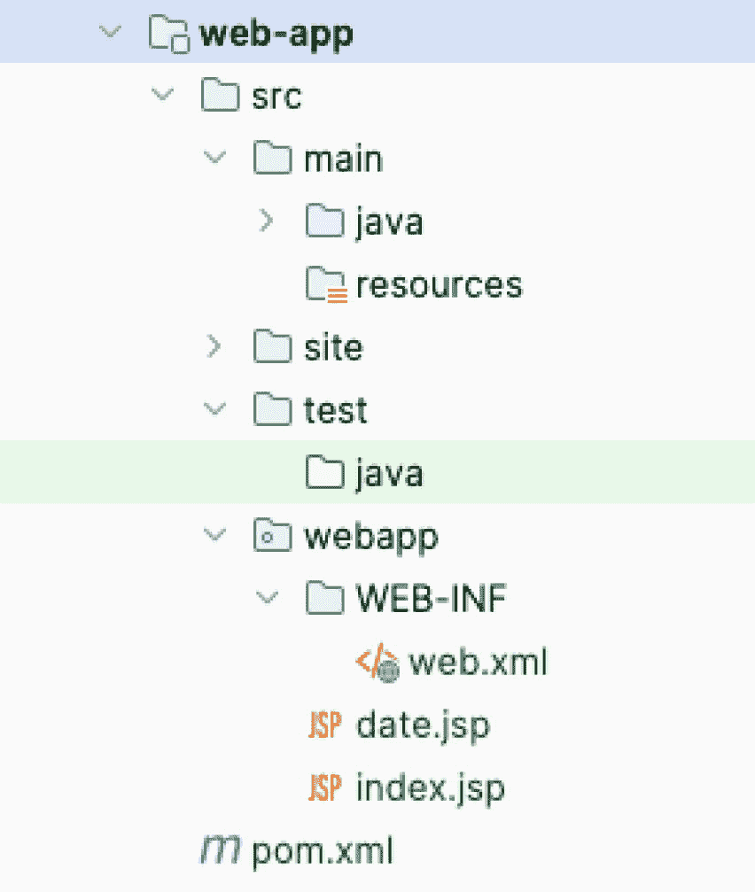

图 10-19

Web 应用结构变化

请注意位于 `WEB-INF` 目录下的 `web.xml` 文件。该文件定义了 Web 应用的结构。在 Servlet 3.0 之前，此文件是将 Servlet 映射到 URL 模式并将其配置为应用一部分的唯一方式。在 Servlet 3.0 及引入注解之后，该文件基本为空。

当构建 Web 应用时，应用的字节码会保存在 `WEB-INF/classes` 下。如果应用使用了第三方库，它们都会保存在 `WEB-INF/lib` 中。

现在，回到 Jakarta Pages。

编写 JSP 页面有两种方式。最简单的方式（如今很少使用，因为它将 HTML 代码与 Java 代码耦合在一起）是使用 **JSP 脚本片段**。JSP 脚本片段是使用指令标签嵌入在 HTML 代码中的 Java 代码片段。有三种类型的指令标签：

*   `<%@ page ... %>` 用于向容器提供指令。使用此指令声明的指令属于当前页面，并且可以在页面中的任何位置使用。此类指令可用于导入 Java 类型或定义页面属性。示例：
*   `<%@ include ... %>` 用于在翻译阶段包含一个文件。因此，使用此指令的当前 JSP 文件是其内容与使用此指令声明的文件内容的组合：`<%@ include file = "footer.jsp" >`

*   `<%@ taglib ... %>` 用于声明一个标签库，其中包含将在 JSP 页面中使用的元素。此声明很重要，因为它用于导入一个包含自定义标签和元素的库，这些标签和元素将用于编写 JSP 页面。这些标签提供了动态功能，而无需使用脚本片段。

图 10-19 中显示的 `index.jsp` 页面非常简单，其内容如清单 10-38 所示。

```

Web 应用演示 JSP 页面

今天是

清单 10-38
非常简单的 index.jsp 页面内容
```

`index.jsp` 页面除了打印当前日期外不做其他事情，它通过调用 `new Date()` 来实现。如您所见，我们在看似 HTML 的页面中使用了 Java 代码。由于包含了这些指令且扩展名为 `.jsp`，容器知道此文件必须编译为 Servlet。当访问 Web 应用的根域名时（如果没有将任何内容映射到默认 URL 模式 `/`），默认打开的页面是名为 `index.html`、`index.htm` 或本例中的 `index.jsp` 文件。

将 `index.jsp` 文件添加到 `WEB-INF` 目录中，确保容器可以找到它之后，剩下的工作就是在 IntelliJ IDEA 中配置一个 Apache Tomcat 启动器，并配置它在启动 Tomcat 之前部署构建此应用时生成的 war 文件。

要配置 Apache Tomcat 启动器，IntelliJ IDEA 需要启用 Tomcat 和 TomEE 插件。如果您安装 IntelliJ IDEA 时未进行自定义，则此插件默认已安装。如果您设法卸载了它，只需打开 IntelliJ IDE **设置**窗口，选择**插件**，在**市场**选项卡中查找它，然后勾选其复选框，如图 10-20 所示（但应选中**已安装**选项卡，因为我已经安装了该插件）。

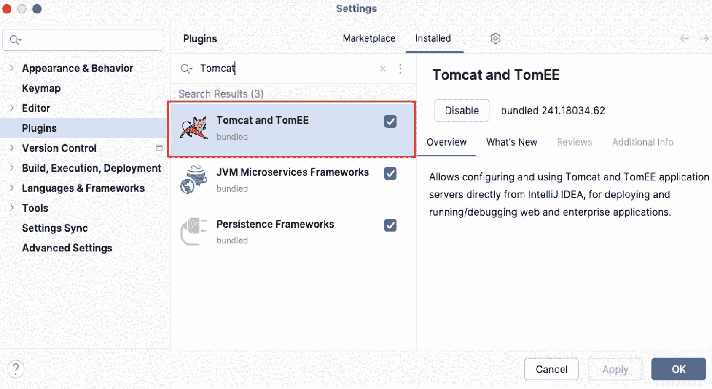

图 10-20

在 IntelliJ IDEA 中启用 Tomcat 和 TomEE 插件

安装插件后，单击**启动**部分，然后单击三个点（图 10-21 中标记为 1），在弹出的对话框中单击**编辑**（2），然后单击左下角的**编辑配置模板**链接（3）。在打开的“运行/调试配置模板”对话框中，从左侧列表中选择 **Tomcat Server ➤ Local**（4），然后单击**配置**按钮（5）。在“应用服务器”对话框中，将 **Tomcat Home** 字段设置为系统上解压 Apache Tomcat 服务器的位置，如图 10-21 所示。

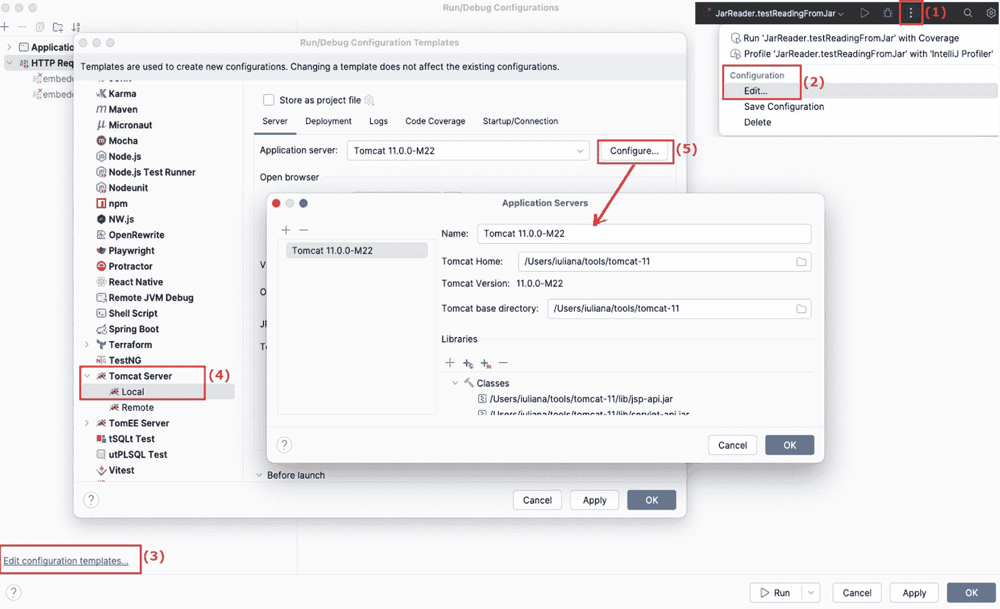

图 10-21

配置用于 IntelliJ IDEA Web 启动器的 Apache Tomcat 实例

配置好用于 Web 启动器的 Tomcat 实例后，我们需要创建一个启动器。再次单击**启动**部分的三个点，然后单击**编辑…**，但这次，在弹出的“运行/调试配置”对话框中，选择左上角的 **+**（加号）按钮（图 10-22 中标记为 1）。然后从列表中选择 **Tomcat Server ➤ Local**（2）。右侧会出现一个包含启动器详细信息的表单，如图 10-22 所示。

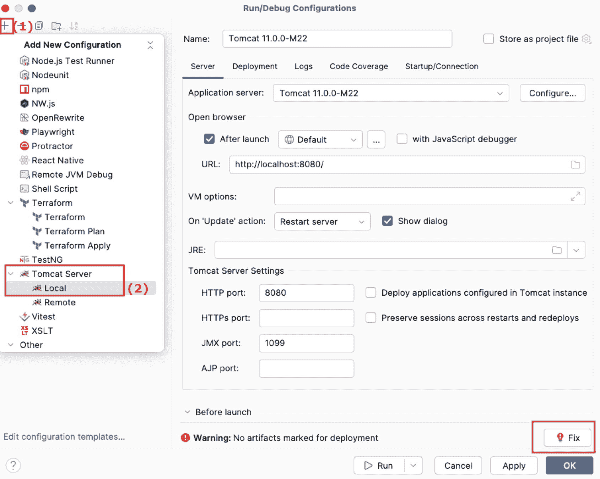

图 10-22

在 IntelliJ IDEA 中配置 Web 启动器

为启动器设置一个更相关的名称，例如 `web-app`。然后点击**修复**按钮或**部署**选项卡，并点击 **+** 按钮选择构件，如图 10-23 所示。IntelliJ IDEA 将识别项目中的所有 Web 应用，并提供一个列表供选择。选择 `web-app:war`，如图 10-23 所示。

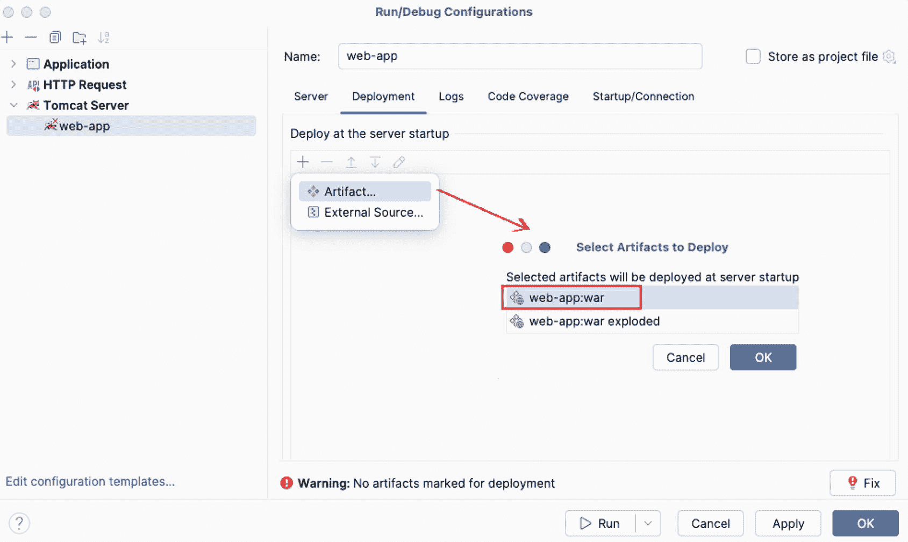

图 10-23

在 IntelliJ IDEA 中创建 Apache Tomcat 启动器——选择要部署的 Web 应用

在**部署**选项卡中，还有一个名为“应用上下文”的文本字段。IntelliJ IDEA 会根据应用名称生成一个默认的上下文名称。将其更改为 **demo**。

配置好启动器后，启动服务器，并在浏览器中打开 `http://localhost:8080/demo` 页面。您应该会在页面上看到类似这样的简单消息：

```
Today is Sun Jul 28 23:56:18 BST 2024
```


显示的日期将是您自己运行应用程序时系统上的日期。

既然提到了*标签库*（又称*taglibs*），我们也来简单聊聊它们。最基本的标签库名为**JSTL**，代表**JSP 标准标签库**。其他更高级的标签库由 JSF（Jakarta Server Faces）、Thymeleaf 或 Spring 提供。此库中定义的标签可用于编写根据请求属性改变行为的 JSP 页面。JSTL 标签可用于迭代、测试和格式化值，以及配置国际化。根据提供的 JSTL 函数，标签被分为五类，并且只有在指定了相应指令后才能在 JSP 页面中使用。以下是这五个指令及其涵盖的总体主题列表：

*   `<%@ taglib uri="http://java.sun.com/jsp/jstl/core" prefix="c" %>`：JSTL 核心标签提供对显示值、迭代、条件逻辑、捕获异常、URL、转发或重定向响应的支持。

*   `<%@ taglib uri="http://java.sun.com/jsp/jstl/fmt" prefix="fmt" %>`：JSTL 格式化标签用于格式化数字、日期，并通过区域设置和资源包提供国际化（i18n）支持。

*   `<%@ taglib uri="http://java.sun.com/jsp/jstl/sql" prefix="sql" %>`：JSTL SQL 标签提供与关系数据库交互的支持——但您绝不应在网页中使用 SQL，因为它极易被黑客攻击（请在搜索引擎中查找**SQL 注入**以了解原因）。

*   `<%@ taglib uri="http://java.sun.com/jsp/jstl/xml" prefix="x" %>`：JSTL XML 标签提供对处理 XML 文档、解析、转换和 XPath 表达式求值的支持。

*   `<%@ taglib uri="http://java.sun.com/jsp/jstl/functions" prefix="fn" %>`：JSTL 函数标签提供许多可用于执行常见操作（如文本操作）的函数。

现在您了解了基本的标签类别，您认为我们需要使用哪些标签来重新设计我们的`index.jsp`页面？如果您想到的是**FMT**和**Core**，那么您是对的。此外，使用标签库的 JSP 页面几乎总是由一个 Servlet 支持，该 Servlet 在请求上设置将在 JSP 页面中使用的适当属性。因此，让我们修改`index.jsp`页面，如清单 10-39 所示。

```

Web Application Demo JSP Page

Today is

Listing 10-39
使用 FMT 和 Core 标签库重写 index.jsp
```

同时，让我们将`index.jsp`重命名为`date.jsp`，以明确其用途，并编写一个名为`DateServlet`的 Servlet 类，向请求中添加`today`属性，该属性将由`<fmt:formatDate>`标签格式化，结果保存到`todayFormatted`变量中，随后由`<c:out>`标签打印输出。`DateServlet`如清单 10-40 所示。

```
package com.apress.bgn.ten;
import jakarta.servlet.RequestDispatcher;
import jakarta.servlet.ServletException;
import jakarta.servlet.annotation.WebServlet;
import jakarta.servlet.http.HttpServlet;
import jakarta.servlet.http.HttpServletRequest;
import jakarta.servlet.http.HttpServletResponse;
import java.io.IOException;
import java.util.Date;
import java.util.logging.Logger;
import static java.lang.System.out;
@WebServlet(
name = "dateServlet",
urlPatterns = {"/date"}
)
public class DateServlet extends HttpServlet {
@Override
protected void doGet(HttpServletRequest request, HttpServletResponse response)
throws IOException, ServletException {
out.println(" ->>> Getting date ");
request.setAttribute("today", new Date());
RequestDispatcher rd = getServletContext().getRequestDispatcher("/date.jsp");
rd.forward(request, response);
}
}
Listing 10-40
为 date.jsp 提供 today 属性的 DateServlet 类
```

现在，我们只需重新启动应用程序，首页将显示`Today is 06/07/2021`，并且您将看到代码运行时系统上的日期。

如果您认为编写 Java Web 应用程序很繁琐，那您完全正确。对于此类任务，纯 Java 确实相当乏味。专业的 Java Web 应用程序通常使用框架（例如 JSF、Vaadin、Thymeleaf、Mustache 等）编写，这些框架使创建页面并将其链接到后端变得容易。更进一步，如今的趋势是使用强大的 JavaScript 框架（如 Angular 和 React）在 JavaScript 中创建 Web 界面，并使用高级 CSS4；许多 UI 设计现在可以 100%在 CSS3 或 CSS4 中完成，并通过 Web 服务调用（通常是 REST）与托管在企业服务器上的 Java 后端应用程序通信。无论如何，如果您好奇，可以查阅这些选项；这个主题非常广泛，但像 Spring 这样的框架使得设置环境并开始开发变得相当容易。只是不要陷入在不理解其基本原理的情况下使用框架的陷阱。

## 总结

本章涵盖了重要的开发工具和技术、JDK 中提供支持的类，以及您很可能最终会使用到的重要 Java 库，这些库可以使您的开发工作变得实用且愉快。JDK 在 GUI 支持方面从未表现出色，但 JavaFX 相对于 AWT 和 Swing 来说是一次相当大的进化，并且可能拥有未来。以下是本章讨论主题的完整列表：

*   如何编写交互式控制台应用程序

*   如何编写具有 Swing 界面的交互式应用程序

*   JavaFX 架构基础

*   如何编写具有 JavaFX 界面的交互式应用程序

*   如何国际化您的应用程序

*   如何使用 Java 简单 Web 服务器提供静态文件服务

*   如何使用嵌入式服务器编写 Web 应用程序

*   什么是 Servlet

*   什么是 JSP 脚本元素

*   如何使用标签库编写 JSP 页面

*   如何将 Java Web 应用程序部署到 Apache Tomcat

脚注 1   2   3   4   5   6   7   8   9   10   11   12

