# 11. 处理文件

软件最重要的功能之一是组织和存储信息，目的是使用和共享信息。传统的（且正在消退的）组织和存储信息的方式是将其写在纸上，并将纸张存放在有组织的文件柜中，以便在需要时检索。软件应用程序做着类似的事情：信息被写入文件，文件被组织在目录中，在大多数情况下，数据存储在更复杂的结构中，称为数据库。Java 提供了从文件和数据库读取信息的类，以及写入文件和向数据库写入信息的类。数据库在前面的章节中已经提到过，**第** **9** **章**介绍了一个使用 Apache Derby 内存数据库的简单示例，向您展示了如何模拟像数据库这样的重量级依赖项以允许进行单元测试。本章不涉及使用数据库，因为编写使用数据库的 Java 应用程序是一个高级主题，并且需要您安装额外的软件。相反，本章重点介绍读取和写入文件以及实现此目的的多种方法。


## Java IO 与 NIO API

在开始展示如何读写文件之前，我们需要先展示如何从代码中访问文件、检查文件是否存在、查看文件大小以及列出文件属性等。Java 中用于文件处理的核心包名为 `java.io`^(¹⁰³) 和 `java.nio`^(¹⁰⁴)。这两个包名很好地暗示了它们所包含的组件：

*   `java.io` 基本上是 Java 输入/输出（Java input/output）的缩写。该包汇集了旨在通过数据流和序列化来简化文件系统访问的输入输出操作组件。

*   `java.nio` 基本上是 Java 非阻塞输入/输出（Java nonblocking input/output）的缩写。该包在 1.4 版本中引入，是一组 Java 编程语言 API 的集合，提供了用于密集型 I/O 操作的功能。JDK 7 中新增的 `java.nio.file` 包包含了一系列实用类，为文件 I/O 和文件系统访问提供了全面支持。

Java IO 与 Java NIO 的主要区别在于，Java IO 是面向流的，而 Java NIO 是面向缓冲区的。这意味着，使用旧的 Java IO API 时，文件是从流中一次读取一个或多个字节。字节不会在任何地方缓存，并且流的遍历是单向的。一旦流被耗尽，就无法再次遍历它。如果需要双向遍历流，则必须先将数据存储在缓冲区中。

使用 Java NIO API 时，数据被直接读取到缓冲区中，这意味着字节被缓存在缓冲区中，并且缓冲区支持双向操作。这为处理过程提供了更大的灵活性，但需要额外的检查来确保缓冲区包含处理所需的所有数据。

第二个主要区别在于，Java IO 操作是阻塞的。一旦调用了读取或写入文件的方法，线程就会被阻塞，直到没有更多数据可读或数据被完全写入。

Java NIO 操作是非阻塞的。一个线程可以通过一个打开的通道从资源（例如文件）请求数据，并且只获取当前可用的数据，如果当前没有可用数据，则什么也得不到。线程不必等待数据到来，而是可以继续执行其他操作，稍后再检查数据缓冲区是否已被填充。

第三个区别与其说是区别，不如说是 Java NIO 额外拥有的特性：**选择器**。这些组件允许一个线程监控多个输入通道，并只选择那些有可用数据的通道进行处理。相比之下，经典的 Java IO API 无法拥有选择器，因为线程会一直阻塞直到文件操作完成。

根据你要解决的问题，你可以选择使用其中一种 API，但一切都要从**文件处理器**开始。

## 文件处理器

在 Java 中处理文件时最重要的类是 `java.io.File`，它是文件和目录路径名的抽象表示。该类的实例被称为**文件处理器**，因为它们允许开发者在 Java 代码中使用这种类型的引用来处理文件和目录，而不是使用完整的路径名。可以使用不同的参数来创建 `File` 实例。

创建 `File` 实例最简单的方法是使用构造函数，该构造函数接收一个包含绝对文件路径名的 `String` 值作为参数。在清单 11-1 的代码示例中，`printFileStats(..)` 方法用于打印文件详细信息。

```
package com.apress.bgn.eleven;
import org.slf4j.Logger;
import org.slf4j.LoggerFactory;
import java.io.File;
public class Main {
private static final Logger LOGGER = LoggerFactory.getLogger(Main.class);
void main() {
// 将 [workspace] 替换为你的工作区路径
var file = new File("[workspace]/java-23-for-absolute-beginners/README.adoc");
printFileStats(file);
}
private static void printFileStats(File f) {
if (f.exists()) {
LOGGER.info("文件详细信息:");
LOGGER.info("\t 名称 : {}", f.getName());
LOGGER.info("\t 父目录 :{}", f.getParent());
LOGGER.info("\t 类型 : {}", f.isFile() ? "文件" : "目录或符号链接");
LOGGER.info("\t 位置 :{}", f.getAbsolutePath());
double kilobytes = f.length() / (double)1024;
LOGGER.info("\t 大小 : {} ", kilobytes);
LOGGER.info("\t 是否隐藏 : {}", f.isHidden());
LOGGER.info("\t 是否可读? : {}", f.canRead());
LOGGER.info("\t 是否可写? : {}", f.canWrite());
} else {
err.println("文件不存在!");
}
}
}
清单 11-1
打印文件详细信息
```

清单 11-1 中的文件处理器实例是通过提供我电脑上的绝对文件路径名创建的。如果你想在自己的电脑上运行这段代码，必须提供一个指向你电脑上某个文件的路径名（在示例中将 `[workspace]` 替换为该路径）。如果你使用的是 Windows，请记住路径名中包含 `\`（反斜杠）字符，该字符在 Java 中是特殊字符，必须通过双写 `\\` 进行转义（更多详情请参见**第 5 章**）。

`printFileStats(..)` 方法使用了大量可以在文件处理器上调用的方法。可调用的方法列表很长，你可以在官方 API 文档中查看所有方法。^(¹⁰⁵) 这些方法将在以下小节中进行说明。

### `isFile`

如果路径名指向一个文件，`isFile()` 方法返回 `true`；如果路径名指向一个目录或*符号链接*（一种特殊类型的文件，其存在仅用于链接到另一个文件，当你想要缩短文件的路径名时非常有用，并且在路径名长度限制为 256 个字符的 Windows 上极其有用），则返回 `false`。在清单 11-1 中，该方法返回 `true`，日志打印如下：

```
INFO  c.a.b.e.Main - 类型 : 文件
```

如果你想查看该方法对目录是否有效，只需从路径名中删除文件名：

```
var file = new File("/[workspace]/java-17-for-absolute-beginners/");
```

日志打印如下：

```
INFO  c.a.b.e.Main - 类型 : 目录或符号链接
```


### `getAbsolutePath`

`getAbsolutePath()` 方法返回文件或目录的绝对路径名。在创建文件处理器时，并不总是需要绝对路径名，但如果你稍后在代码中需要使用它，或者需要确保相对路径被正确解析，这个方法正是你所需要的。以下代码片段通过使用相对于项目根目录（在本例中为 `java-17-for-absolute-beginners` 目录）的路径，为 `resources` 目录中的一个文件创建了一个文件处理器：

```
var d = new File("chapter11/read-write-file/src/main/resources/input/");
```

`getAbsolutePath()` 方法返回完整的路径名，日志语句会将其打印为：

```
INFO  c.a.b.e.Main - Location :/[workspace]/java-17-for-absolute-beginners/chapter11/read-write-file/src/main/resources/input
```

Java 的 `File` 类功能相当强大；它可以用来指向另一台计算机上的共享文件。为此有一个特殊的构造函数，它接收一个 `java.net.URI` 类型的参数，其中 `URI` 代表**统一资源标识符**。要测试这个构造函数，请在你的计算机上选择一个文本文件，并在网页浏览器中打开它，这样你就可以从浏览器地址栏获取它的 URI。清单 11-2 中的代码展示了使用本地 URI 实例化 `File` 类。

```
package com.apress.bgn.eleven;
import java.net.URI;
import java.net.URISyntaxException;
// 其他导入和包装代码已省略
try {
var localUri = new URI("file:///[workspace]/java-17-for-absolute-beginners/README.adoc");
var localFile =  new File (localUri);
printFileStats(localFile);
} catch (URISyntaxException use) {
LOGGER.error("URI 格式错误，该路径下没有文件", use);
}
清单 11-2
使用 URI 打印文件详情
```

URI 可能不正确，例如前缀不正确或包含错误的路径，因此 URI 构造函数被声明为会抛出 `java.net.URISyntaxException`。这是一个受检异常，所以你编写的代码必须处理它。在使用 URI 创建文件处理器的情况下，`getAbsolutePath()` 方法会返回文件所在计算机和驱动器上的绝对路径名。

注意

`file:///` 协议在 macOS（及其他操作系统）中用于以 URL 格式指定文件路径。这允许应用程序和网页浏览器直接从文件系统访问文件。只要将 `[workspace]` 替换为真实路径，它在 Windows 上也能正常工作。

信息

由于清单 11-1 和 11-2 都对同一个文件调用了 `printFileStats(..)`，因此控制台输出是相同的。欢迎亲自尝试运行代码。

### `getParent`、`getName`、`length`、`isHidden`、`canRead` 和 `canWrite`

由于这些方法每个都没有太多可说的，我将它们归并到本节中。以下是简要总结：

*   `getParent()` 返回包含该文件的目录的绝对路径，因为在层级结构上，文件不能将另一个文件作为父级。

*   `getName()` 返回文件名。文件名包含扩展名，即 `"."` 之后的部分，用于指示文件类型及其预期用途。

*   `length()` 返回文件的字节长度。此方法不适用于目录，因为目录可能包含对执行程序的用户受限的文件，并且可能会抛出异常。因此，如果你需要获取目录的大小，必须自己编写代码。

*   `isHidden()` 如果文件对当前用户不可见，则返回 `true`，否则返回 `false`。在 macOS/Linux 系统上，以 `"."` 开头的文件是隐藏的，所以如果我们想看到该方法返回 `true`，必须为其中一个系统配置文件（例如 `.gitconfig`）创建一个处理器。因此，在使用指向隐藏文件的路径名创建的文件处理器上调用 `printFileStats(..)` 方法，将产生类似于清单 11-3 的输出。

*   `canRead()` 和 `canWrite()` 的含义显而易见，因为文件可以对普通用户进行安全保护。当用户对文件拥有特定权限时，这两个方法都返回 `true`，否则返回 `false`。

```
INFO  c.a.b.e.Main - 文件详情:
INFO  c.a.b.e.Main - 类型 : 文件
INFO  c.a.b.e.Main - 位置 :/Users/[userDir]/.gitconfig
INFO  c.a.b.e.Main - 父目录 :/Users/[userDir]
INFO  c.a.b.e.Main - 名称 : .gitconfig
INFO  c.a.b.e.Main - 大小 : 3.865234375
INFO  c.a.b.e.Main - 是否隐藏 : true
INFO  c.a.b.e.Main - 是否可读? : true
INFO  c.a.b.e.Main - 是否可写? : true
清单 11-3
打印隐藏文件的文件详情
```

### 处理目录：`list()` 和 `listFiles()`

可以为指向目录的路径名创建文件处理器，这意味着存在一些仅适用于目录的可调用方法。对目录最常见的操作是列出其内容。`list()` 方法返回一个 `String` 数组，其中包含此目录下的文件（和目录）名称。使用 lambda 表达式可以非常实用地打印目录中的项目：

```
var d = new File("/[workspace]/java-17-for-absolute-beginners");
Arrays.stream(Objects.requireNonNull(d.list())).forEach(ff -> LOGGER.info("\t 文件名 : {}", ff));
```

在大多数情况下，文件名并不是很有用；拥有一个包含每个文件处理器的 `File` 数组会更好。这就是为什么在 1.2 版本中添加了 `listFiles()` 方法：

```
Arrays.stream(Objects.requireNonNull(d.listFiles())).forEach(ff -> LOGGER.info("\t 文件 : {}", ff.getAbsolutePath()));
```

此方法有不止一种形式，因为它可以用来过滤文件，并在使用 `FileFilter` 实例调用时，仅返回符合特定要求的文件或目录的文件处理器。清单 11-4 中的代码示例过滤了目录下的条目，并仅保留名称以 `chapter` 开头的目录。

```
package com.apress.bgn.eleven.io;
import java.io.File;
import java.io.FileFilter;
// 其他导入和包装代码已省略
var d = new File("/[workspace]/java-17-for-absolute-beginners");
Arrays.stream(d.listFiles(new FileFilter() {
@Override
public boolean accept(File childFile) {
return childFile.isDirectory() && childFile.getName().startsWith("chapter");
}
})).forEach(ff -> LOGGER.info("章节源码 : {}", ff.getName()));
清单 11-4
使用 FileFilter 实例过滤目录内容
```

清单 11-4 以展开形式编写，以便清楚地表明你应该为 `accept(..)` 方法提供一个具体实现。通过如下使用 lambda 表达式，前面的代码可以简化，甚至更不容易抛出异常：

```
Arrays.stream(
Objects.requireNonNull(d.listFiles(
childFile -> childFile.isDirectory() && childFile.getName().startsWith("chapter")))
).forEach(ff -> LOGGER.info("章节源码 : {}", ff.getName())
);
```

在清单 11-4 中，我们实现了 `accept(..)` 方法来按文件类型和名称进行过滤，但过滤器可以涉及任何条件。当你需要的过滤器严格涉及文件名时，可以使用该方法的另一个版本，它接收一个 `FilenameFilter` 实例作为参数：

```
Arrays.stream(Objects.requireNonNull(d.listFiles(new FilenameFilter() {
@Override
public boolean accept(File dir, String name) {
return name.startsWith("chapter");
}
}))).forEach(ff -> LOGGER.info("\t 章节目录 : {}", ff.getAbsolutePath()));
```


### `createNewFile()`、`exists()`、`createTempFile(..)` 和 `deleteOnExit()`

除了列出文件属性外，文件处理器还可用于创建文件。要创建文件，必须在创建具有特定路径名的文件处理器后调用 `createNewFile()` 方法，如清单 11-5 所示。

```
package com.apress.bgn.eleven.io;
import java.io.IOException;
// 其他导入和包装代码已省略
var created = new File(
"chapter11/read-write-file/src/main/resources/output/created.txt");
if (!created.exists()) {
try {
var result = created.createNewFile();
LOGGER.info("文件是否已创建？ {}", result);
} catch (IOException e) {
LOGGER.error("无法创建文件。", e);
}
}
清单 11-5
创建文件
```

当文件处理器与具体文件或目录关联时，`exists()` 方法返回 `true`，否则返回 `false`。它可用于测试我们尝试创建的文件是否已存在。如果文件已存在，该方法不产生任何效果。如果用户没有在指定路径名创建文件的适当权限，则会抛出 `SecurityException`。

在某些情况下，我们可能需要创建一个仅在程序执行期间使用的文件。这意味着我们要么显式创建文件并删除它，要么创建一个临时文件。临时文件通过调用 `createTempFile(prefix, suffix)` 创建，它们会被创建在操作系统定义的临时目录中。`prefix` 参数是 `String` 类型，其值将作为所创建文件名称的前缀。`suffix` 参数也是 `String` 类型，可用于指定文件的扩展名。文件名的其余部分由操作系统生成。创建临时文件的代码如清单 11-6 所示。

```
package com.apress.bgn.eleven.io;
import java.io.IOException;
// 其他导入和包装代码已省略
try {
File temp = File.createTempFile("java_bgn_", ".tmp");
LOGGER.info("文件创建于：{}", temp.getAbsolutePath());
temp.deleteOnExit();
} catch (IOException e) {
LOGGER.error("无法创建临时文件。", e);
}
清单 11-6
创建临时文件
```

操作系统临时目录中的文件会由操作系统定期删除，但如果你希望确保临时文件被删除，可以在临时文件的处理器上显式调用 `deleteOnExit()`。在清单 11-6 的代码示例中，打印了文件的绝对路径以显示临时文件创建的确切位置，在 macOS 系统上，完整路径名类似于：

```
/var/folders/gg/nm_cb2lx72q1lz7xwwdh7tnc0000gn/T/java_bgn_14652264510049064218.tmp
```

你可以通过以调试模式运行 `Main` 类，并在日志语句上设置断点来停止执行，以检查临时文件在你系统上的保存位置，如图 11-1 所示。

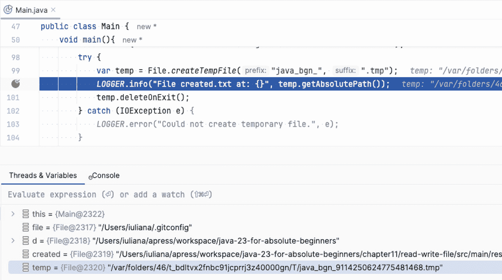

图 11-1

IntelliJ IDEA 调试器显示临时文件的绝对路径

### `renameTo`

文件也可以使用 Java 文件处理器进行重命名。调用 `rename(f)` 方法时，需要传入一个文件处理器参数，该参数指向文件应具有的位置和所需名称。如果重命名成功，该方法返回 `true`，否则返回 `false`。执行此操作的代码如清单 11-7 所示。

```
package com.apress.bgn.eleven.io;
import java.io.IOException;
// 其他导入和包装代码已省略
file = new File(
"chapter11/read-write-file/src/main/resources/output/created.txt");
var renamed = new File(
"chapter11/read-write-file/src/main/resources/output/renamed.txt");
boolean result = file.renameTo(renamed);
LOGGER.info("重命名是否成功？ : {} ", result);
清单 11-7
重命名文件
```

`File` 类中的大多数方法都会抛出 `IOException`，因为操作文件可能因各种原因失败，包括硬件问题或操作系统问题。这种类型的异常是受检异常，使用文件处理器的开发人员必须捕获并处理此类异常。

需要特殊权限才能访问文件的方法会抛出 `SecurityException`。此类型扩展了 `RuntimeException`，因此这些异常是非受检的。它们会在应用程序运行时变得明显。

现在你已经掌握了使用文件处理器的所有基础知识。


## 路径处理器

`java.nio.file.Path` 接口与工具类 `java.nio.file.Files` 和 `java.nio.file.Paths` 一同在 Java 7 中被引入，旨在提供更新、更实用的文件处理方式。`Path` 实例可用于定位文件系统中的文件，因此它表示一个依赖于系统的文件路径。`Path` 实例比 `File` 实例更实用，因为它们提供了访问路径组件、组合路径以及比较路径的方法。

`Path` 实例不能直接创建，因为接口无法实例化，但该接口提供了创建它们的静态工具方法，`Paths` 类也是如此。根据你的情况，选择使用任意一种即可。

创建 `Path` 实例最简单的方法是先获取一个文件处理器，然后调用 `Paths.get(fileURI)`，如清单 11-8 所示。

```
package com.apress.bgn.eleven.io;
// 其他导入已省略
import java.io.File;
import java.nio.file.Path;
import java.nio.file.Paths;
public class PathDemo {
private static final Logger LOGGER = LoggerFactory.getLogger(PathDemo.class);
void main() {
File file = new File(
"/[workspace]/java-23-for-absolute-beginners/README.adoc");
Path path = Path.of(file.toURI());
LOGGER.info(path.toString());
}
}
清单 11-8
创建 Path 实例
```

从 Java 11 开始，`Paths.get(file.toURI())` 可以替换为 `Path.of(file.toURI())`。另一种创建 `Path` 实例的方法是使用 `Paths.get(..)` 的另一种形式，该形式接收路径的多个片段作为参数：

```
Path composedPath = Paths.get("/[workspace]",
"java-23-for-absolute-beginners",
"README.adoc");
LOGGER.info(composedPath.toString());
```

之前创建的两个路径都指向同一个位置，因此如果使用 `compareTo(..)` 方法（因为 `Path` 扩展了接口 `Comparable<Path>`）相互比较，返回的结果将是 0（零），这意味着这两个路径是相等的：

```
LOGGER.info("是同一个路径吗？ : {} ", path.compareTo(composedPath) = =0 ? "是" : "否");
// 输出 : INFO com.apress.bgn.ch11.PathDemo - 是同一个路径吗？ : 是
```

在清单 11-9 的代码示例中，对路径实例调用了一些 `Path` 方法。

```
package com.apress.bgn.eleven.io;
// 导入部分已省略
public class PathDemo {
private static final Logger LOGGER = LoggerFactory.getLogger(PathDemo.class);
public static void main(String... args) {
var path = Paths.get("/[workspace]",
"java-23-for-absolute-beginners",
"README.adoc");
printPathDetails(path);
}
private static void printPathDetails(Path path) {
LOGGER.info("路径详情:");
LOGGER.info("\t 文件名 : {}", path.getFileName());
LOGGER.info("\t 父路径 :{}", path.getParent());
LOGGER.info("\t 位置 :{}", path.toAbsolutePath());
LOGGER.info("\t 是绝对路径? : {}", path.isAbsolute());
LOGGER.info("\t 根路径 :{}", path.getRoot());
LOGGER.info("\t 文件系统 : {}", path.getFileSystem());
LOGGER.info("\t 文件系统是否只读 : {}", path.getFileSystem().isReadOnly());
}
}
清单 11-9
检查路径详情
```

以下列表解释了每个方法及其结果：

*   `toAbsolutePath()` 返回一个 `Path` 实例，表示此路径的绝对路径。当在之前创建的 `Path` 实例上调用时，由于它已经是绝对路径，该方法将直接返回调用该方法的路径对象。此外，调用 `path.isAbsolute()` 将返回 `true`。

*   `getParent()` 返回父 `Path` 实例。在 `Path` 实例上调用此方法将输出：

*   `getRoot()` 返回此路径的根组件，作为一个 `Path` 实例。在 Linux 或 macOS 系统上，它会输出 `"/"`，而在 Windows 上，它会输出类似 `"C:\"` 的内容。

*   `getFileName()` 返回此路径所表示的文件或目录的名称，作为一个 `Path` 实例；基本上，路径会按系统路径分隔符进行拆分，并返回距离根元素最远的那个部分。

*   `getFileSystem()` 返回创建此对象的文件系统。对于 macOS，它是一个类型为 `sun.nio.fs.MacOSXFileSystem` 的实例。

```
INFO com.apress.bgn.ch11.PathDemo - 父路径 :/[workspace]/java-23-for-absolute-beginners/README.adoc
```

另一个有用的 `Path` 方法是 `resolve(..)`。此方法接收一个表示路径的 `String` 实例，并针对调用它的 `Path` 实例进行解析。这意味着会根据程序运行的操作系统添加路径分隔符，并返回一个 `Path` 实例。这在清单 11-10 中进行了描述。

```
var chapterPath = Paths.get("/Users/iuliana/apress/workspace",
"java-23-for-absolute-beginners/chapter11");
Path filePath = chapterPath.resolve(
"read-write-file/src/main/resources/input/data.txt") ;
LOGGER.info("解析后的路径 :{}", filePath.toAbsolutePath());
清单 11-10
检查路径详情（续）
```

清单 11-10 的代码示例将输出以下内容：

```
INFO  c.a.b.e.PathDemo - 解析后的路径 :/[workspace]/java-23-for-absolute-beginners/chapter11/read-write-file/src/main/resources/input/data.txt
```

使用 `Path` 实例，结合 `Files` 工具方法，编写管理文件或检索其属性的代码变得更加容易。清单 11-11 中的代码示例使用了其中一些方法来打印文件的属性，方式与我们之前使用 `file` 处理器时相同。

```
package com.apress.bgn.eleven.io;
// 导入部分已省略
public class PathDemo {
private static final Logger log = LoggerFactory.getLogger(PathDemo.class);
public static void main(String... args) {
var outputPath = FileSystems.getDefault()
.getPath("/[workspace]/java-23-for-absolute-beginners/" +
"chapter11/read-write-file/src/main/resources/output/sample");
try {
Path dirPath = Files.createDirectory(outputPath);
printPathStats(dirPath);
} catch (FileAlreadyExistsException faee) {
LOGGER.error("目录已存在。", faee);
} catch (IOException e) {
LOGGER.error("无法创建目录。", e);
}
}
private static void printPathStats(Path path) {
if (Files.exists(path)) {
LOGGER.info("路径详情:");
LOGGER.info("\t 类型: {}", Files.isDirectory(path) ? "是" : "否");
LOGGER.info("\t 类型: {}", Files.isRegularFile(path) ? "是" : "否");
LOGGER.info("\t 类型: {}", Files.isSymbolicLink(path) ? "是" : "否");
LOGGER.info("\t 位置 :{}", path.toAbsolutePath());
LOGGER.info("\t 父路径 :{}", path.getParent());
LOGGER.info("\t 名称 : {}", path.getFileName());
try {
double kilobytes = Files.size(path) / (double)1024;
LOGGER.info("\t 大小 : {} ", kilobytes);
LOGGER.info("\t 是否隐藏: {}", Files.isHidden(path) ? "是" : "否");
} catch (IOException e) {
LOGGER.error("无法访问文件。", e);
}
LOGGER.info("\t 是否可读: {}", Files.isReadable(path) ? "是" : "否");
LOGGER.info("\t 是否可写: {}", Files.isWritable(path) ? "是" : "否");
}
}
}
清单 11-11
打印更多路径详情
```

如你所见，`Files` 类提供了与 `File` 类相同的功能。`Files` 类完全由操作文件、目录或其他类型文件的静态方法组成。它是在 Java 7 中引入的，其优势在于语法更清晰。使用 `java.nio` 类的强大和实用性在管理文件、创建、重命名、删除以及读写文件时更为明显。清单 11-12 中的代码示例展示了使用 Java NIO 类创建、重命名和删除文件的过程。


```
package com.apress.bgn.eleven.io;
// import section omitted
import java.nio.FileAlreadyExistsException;
public class PathDemo {
private static final Logger LOGGER = LoggerFactory.getLogger(PathDemo.class);
public static void main(String... args) {
Path filePath = chapterPath.resolve(
"read-write-file/src/main/resources/input/data.txt");
Path copyFilePath = Paths.get(outputPath.toAbsolutePath().toString(), "data.adoc");
try {
Files.copy(filePath, copyFilePath);
LOGGER.info("Exists? : {}", Files.exists(copyFilePath)? "yes": "no");
LOGGER.info("File copied to: {}", copyFilePath.toAbsolutePath());
} catch (FileAlreadyExistsException faee) {
LOGGER.error("File already exists.", faee);
} catch (IOException e) {
LOGGER.error("Could not copy file.", e);
}
Path movedFilePath = Paths.get(outputPath.toAbsolutePath().toString(), "copy-data.adoc");
try {
Files.move(copyFilePath, movedFilePath);
LOGGER.info("File moved to: {}", movedFilePath.toAbsolutePath());
Files.deleteIfExists(copyFilePath);
} catch (FileAlreadyExistsException faee) {
LOGGER.error("File already exists.", faee);
}  catch (IOException e) {
LOGGER.error("Could not move file.", e);
}
}
}
列表 11-12
复制和移动文件
```

信息

尽管在**第** **5** 章中介绍了紧凑的 `catch` 异常语句，但在不同异常类型具有不同原因且应区别处理的代码示例中，将使用展开形式。

请注意 `FileAlreadyExistsException`，这是 Java 7 中新增的异常类型，它扩展了 `IOException`，用于提供更多关于导致文件操作失败情况的数据。它由 `createDirectory(..)`、`createFile(..)` 和 `move(..)` 方法抛出。

列表 11-12 中未使用的 `delete(..)` 方法，如果待删除的文件不存在，则会抛出 `java.nio.file.NoSuchFileException`。为了避免抛出异常，列表 11-12 中使用了 `deleteIfExists(..)`。

`Files` 中的方法列表更长，但由于本章篇幅有限，您可以自行查阅官方 Javadoc API。

## 读取文件

每个文件都是硬盘上的一系列比特位。`File` 处理器不提供读取文件内容的方法，但可以使用其他一组类来实现，所有这些类都是通过文件处理器实例创建的。Java 提供了多种读取文件的方式，选择哪种方式取决于实际需要对文件内容进行何种操作。本节将介绍四种最常见的方式。

### 使用 `Scanner` 读取文件

`Scanner` 类之前用于从命令行读取输入。可以将 `System.in` 替换为 `File`，并使用 `Scanner` 方法来读取文件内容，如列表 11-13 所示。

```
package com.apress.bgn.eleven.io;
import java.util.Scanner;
// other import statements omitted
public class ScannerDemo {
private static final Logger LOGGER = LoggerFactory.getLogger(ScannerDemo.class);
void main() {
try {
final String inDir = "chapter11/read-write-file/src/main/resources/input/";
var scanner = new Scanner(new File("chapter11/read-write-file/src/main/resources/input/data.txt"));
var content = "";
while (scanner.hasNextLine()) {
content += scanner.nextLine() + "\n";
}
scanner.close();
LOGGER.info("Read with Scanner --> {}", content);
} catch (IOException e) {
LOGGER.error("Something went wrong! ", e);
}
}
}
列表 11-13
使用 Scanner 读取文件
```

除了文件，也可以使用 `java.nio.file.Path` 实例：

```
scanner = new Scanner(Paths.get(new File("chapter11/read-write-file/src/main/resources/input/data.txt").toURI()), StandardCharsets.UTF_8.name());
```

文件可以使用不同的字符集写入，在 Java 中由 `java.nio.charset.Charset` 实例表示。为了确保正确读取，最佳实践是使用相同的字符集读取文件。`Scanner` 构造函数接收一个字符集名称作为参数。调用 `StandardCharsets.UTF_8.name()` 方法来提取 UTF-8 字符集的名称。

### 使用 Files 工具方法读取文件

列表 11-14 中的第一个代码示例展示了读取文件的最简单方式。

```
package com.apress.bgn.eleven.io;
import java.nio.file.Files;
import java.nio.file.Paths;
// other import statements omitted
public class FilesReadDemo {
private static final Logger LOGGER = LoggerFactory.getLogger(FilesReadDemo.class);
void main() {
final String inDir = "chapter11/read-write-file/src/main/resources/input/";
var file = new File(inDir + "data.txt");
try {
var content = new String(Files.readAllBytes(Paths.get(file.toURI())));
LOGGER.info("Read with Files.readAllBytes --> {}", content);
} catch (IOException e) {
LOGGER.info("Something went wrong! ", e);
}
}
}
列表 11-14
读取文件的最简单方式
```

当文件大小可以预估（文件大小可估算且相对较小），并且将其存储在 `String` 对象中不会成为问题时，这种方法效果很好。

使用 `Files.readAllBytes(..)` 的优点是无需循环，我们也不必逐行构建 `String` 值，因为该方法只是读取文件中的所有字节，这些字节可以作为参数传递给 `String` 构造函数。缺点是没有使用 `Charset`，因此文本值可能不是我们期望的。有一种方法可以克服这一点，即调用 `Files.readAllLines(..)`，该方法将文件内容作为 `String` 值列表返回，并且有两种形式，其中一种将 `Charset` 声明为参数。这种读取文件的方式如列表 11-15 所示。

```
try {
List lyricList = Files.readAllLines(Paths.get(file.toURI()), StandardCharsets.UTF_8);
lyricList.forEach(System.out::println);
} catch (IOException e) {
LOGGER.info("Something went wrong! ", e);
}
列表 11-15
指定字符集读取文件的简单方式
```

但如果我们不需要 `List<String>`，而只需要一个 `String` 实例呢？Java 11 为此引入了一个方法：`readString(..)`。使用该方法的代码示例如列表 11-16 所示。

```
try {
var content = Files.readString(Paths.get(file.toURI()), StandardCharsets.UTF_8);
LOGGER.info("Read with Files.readString --> {}", content);
} catch (IOException e) {
LOGGER.info("Something went wrong! ", e);
}
列表 11-16
将文件读取为单个字符串并指定字符集的最简单方式
```


### 使用 `Readers` 读取文件

在 `Files` 类及其便捷方法问世之前，还有其他读取文件的方式。这些便捷方法也并非为读取大文件或仅读取文件部分内容而设计。让我们回顾一下历史，慢慢分析事情是如何演变的。

在 Java 6 之前，要逐行读取文件，你必须编写像清单 11-17 中那样的复杂代码。

```
package com.apress.bgn.eleven.io;
import java.io.BufferedReader;
import java.io.FileReader;
// 其他导入已省略
public class ReadersDemo {
private static final Logger LOGGER = LoggerFactory.getLogger(ReadersDemo.class);
void main() {
BufferedReader reader = null;
final String inDir = "chapter11/read-write-file/src/main/resources/input/";
try {
reader = new BufferedReader(new FileReader(new File(inDir + "data.txt"), StandardCharsets.UTF_8));
StringBuilder sb = new StringBuilder();
String line;
while ((line = reader.readLine()) != null) {
sb.append(line).append("\n");
}
LOGGER.info("使用 BufferedReader 读取 --> {}", sb.toString());
} catch (Exception e) {
LOGGER.error("文件无法读取！", e);
} finally {
if (reader != null) {
try {
reader.close();
} catch (IOException ioe) {
LOGGER.error("出错了！", ioe);
}
}
}
}
}
清单 11-17
Java 6 之前逐行读取文件
```

*哇，这代码可真够复杂的，对吧？* Java 6 之后，语法稍微简化了一些，但最大的变化出现在 Java 7。在 Java 7 之前，如果你想逐行读取文件，必须编写如下代码：

1.  创建一个 `File` 处理器。
2.  将文件处理器包装到 `FileReader` 中。这种类型的实例可以完成读取工作，但只能以 `char[]` 块的形式读取，当你需要实际文本时，这并不十分有用。
3.  将 `FileReader` 实例包装到 `BufferedReader` 实例中，后者通过读取内部缓冲区中的字符来提供此功能。这涉及到调用 `reader.readLine()`，直到没有更多内容可读（即到达文件末尾），此时该方法返回 `null`。
4.  在读取结束时，显式调用 `reader.close()`；否则，文件可能会被锁定，在重启之前可能变得不可读。

Java 7 引入了许多更改，以减少处理文件所需的样板代码。其中一项更改是，所有用于访问文件内容且可能保持文件锁定的类都通过声明实现 `java.io.Closeable` 接口得到了增强，该接口将这些类型的资源标记为*可关闭的*，并且在执行结束前，JVM 会透明地调用 `close()` 方法来释放资源。此外，Java 7 引入了 `try-with-resources` 语句。通过利用所有这些特性，清单 11-17 中 Java 6 之前的代码可以编写为清单 11-18 所示。

```
try (BufferedReader br = new BufferedReader(new FileReader(new File(inDir + "data.txt")))){
StringBuilder sb = new StringBuilder();
String line;
while ((line = br.readLine()) != null) {
sb.append(line).append("\n");
}
LOGGER.info("使用 BufferedReader 读取 --> {}", sb.toString() );
} catch (Exception e) {
LOGGER.info("出错了！", e);
}
清单 11-18
从 Java 7 开始逐行读取文件
```

代码可以进一步简化，因为 `FileReader` 可以将文件的绝对路径作为 `String` 参数接收。但代码无法考虑编码问题。这在 Java 8 中成为可能，当时为 `FileReader` 类引入了一个接受 `Charset` 参数的构造函数。在 Java 7 中，前面的例子中仍然有嵌套的构造函数调用，这相当丑陋。这时 Java 8 通过引入 `Files.newBufferedReader(Path)` 和 `Files.newBufferedReader(Path, Charset)` 方法解决了这个问题。

因此，清单 11-18 中的代码可以编写为清单 11-19 所示。

```
File file = new File(inDir + "data.txt");
try (BufferedReader br = Files.newBufferedReader(file.toPath(), StandardCharsets.UTF_8)){
StringBuilder sb = new StringBuilder();
String line;
while ((line = br.readLine()) != null) {
sb.append(line).append("\n");
}
LOGGER.info("使用 BufferedReader 读取 --> {}", sb.toString());
} catch (Exception e) {
LOGGER.info("出错了！", e);
}
清单 11-19
从 Java 8 开始逐行读取文件并考虑编码
```

如果我们知道文件大小可控，并且不仅关心记录内容，还想保存各行以便进一步处理，最简单的方法是使用 `Files.readAllLines(..)` 方法结合 lambda 表达式。还可以加入流，这样可以在原地过滤或处理各行，如下所示：

```
List dataList = Files.readAllLines(Paths.get(file.toURI()), StandardCharsets.UTF_8)
.stream()
.filter(line -> line!= null && !line.isBlank())
.map(String::toUpperCase)
.collect(Collectors.toList());
```

或者我们可以用另一种方式编写，使用同样在 Java 8 中引入的 `Files.lines(..)` 方法，并直接以流的形式获取所有内容：

```
dataList = Files.lines(Paths.get(file.toURI()), StandardCharsets.UTF_8)
.filter(line -> line!= null && !line.isBlank() )
.map(String::toUpperCase)
.toList();
```

无论如何，回到文件读取器。`BufferedReader` 类是扩展抽象 `Reader` 类的类组中的一员。这是一个用于读取字符流的抽象类，属于 `java.io` 包的一部分。图 11-2 展示了一个简化的层次结构，显示了最常用的实现。

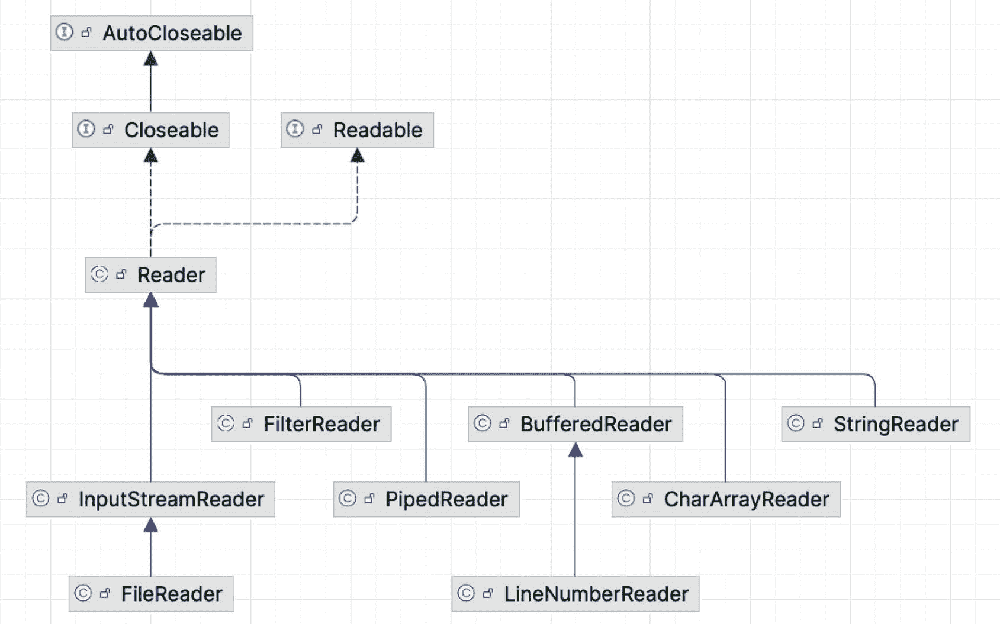

图 11-2

`Reader` 类层次结构（如 IntelliJ IDEA 所示）

字符流可以有不同来源，文件是最常见的。它们提供对文件中存储数据的顺序访问。`BufferedReader` 类不提供对字符编码的支持，但 `BufferedReader` 实例基于另一个 `Reader` 实例。正如你在前面的例子中注意到的，在实例化 `BufferedReader` 时使用了 `FileReader` 实例作为参数，而 `FileReader` 在 Java 8 中被修改以支持字符编码。在 Java 8 之前，为了从文件读取并考虑字符编码，使用了 `InputStreamReader` 实例，如清单 11-20 所示。

```
try (BufferedReader br = new BufferedReader(new InputStreamReader(new FileInputStream(file), StandardCharsets.UTF_8))){
StringBuilder sb = new StringBuilder();
String line;
while ((line = br.readLine()) != null) {
sb.append(line).append("\n");
}
LOGGER.info("使用 BufferedReader(InputStreamReader(FileInputStream(..)))读取 --> {}", sb.toString() );
} catch (Exception e) {
LOGGER.info("出错了！", e);
}
清单 11-20
Java 8 之前逐行读取文件并考虑编码
```

在 Java 11 中，`Reader` 类增加了 `nullReader()` 方法，该方法返回一个不执行任何操作的 `Reader` 实例。这是应开发人员测试需求而添加的，本质上只是一个伪 `Reader` 实现。


### 使用 `InputStream` 读取文件

`Reader` 家族中的类是将数据作为文本读取的高级类，但从技术上讲，文件只是一系列字节，因此这些类本身是对用于读取字节流的类家族中类的封装。当尝试使用正确的字符编码，以及使用 `BufferedReader` 读取文本时（如上一节末尾所示），这一点变得非常明显，因为作为参数给出的 `InputStreamReader` 实例是基于 `java.io.FileInputStream` 实例的，而该类型是 `java.io.InputStream` 的子类。

该层次结构的根类是 `java.io.InputStream`。图 11-3 展示了一个简化的层次结构，其中列出了最常用的实现。

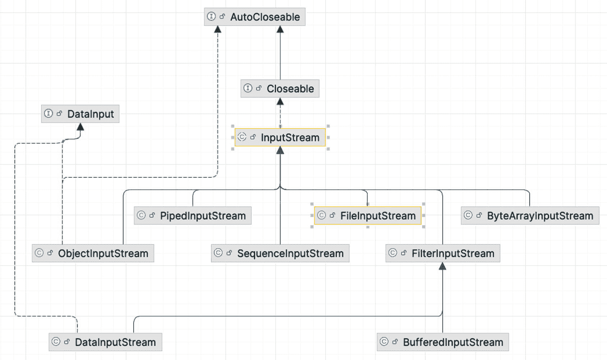

图 11-3

`InputStream` 类层次结构（如 IntelliJ IDEA 中所示）

`BufferedInputStream` 类相当于用于读取字节流的 `BufferedReader`。我们之前用来从控制台读取用户数据的 `System.in` 就属于这种类型，而 `Scanner` 实例会将其缓冲区中的字节转换为用户可理解的数据。当我们感兴趣的数据不是使用 Unicode 约定存储的文本，而是原始数值数据（例如图像、媒体文件、PDF 等二进制文件）时，使用字节流的类更为合适。仅为了向您展示如何操作，我们将使用 `FileInputStream` 读取 `data.txt` 文件的内容，如清单 11-21 所示。

```
package com.apress.bgn.eleven.io;
import java.io.FileInputStream;
// 其他导入已省略
public class FileInputStreamReadingDemo {
private static final Logger LOGGER = LoggerFactory.getLogger(FileInputStreamReadingDemo.class);
public static void main(String... args) {
final String inDir = "chapter11/read-write-file/src/main/resources/input/";
File file = new File(inDir + "data.txt");
try (FileInputStream fis = new FileInputStream(file)) {
byte[] buffer = new byte[1024];
StringBuilder sb = new StringBuilder();
while (fis.read(buffer) != -1) {
sb.append(new String(buffer));
buffer = new byte[1024];
}
LOGGER.info("使用 FileInputStream 读取 --> {}", sb.toString() );
} catch (IOException e) {
LOGGER.error("出错了！", e);
}
}
}
清单 11-21
使用 FileInputStream 读取文件
```

如果您运行清单 11-21 中的代码，您会注意到预期的输出会打印在控制台中，但您可能还会注意到一些奇怪的现象：文本打印后，还会打印一组奇怪的字符。在 macOS 系统上，它们看起来如图 11-4 所示。

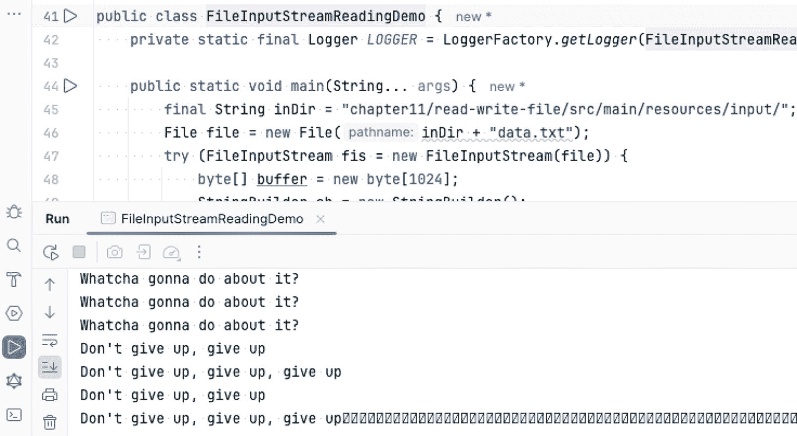

图 11-4

使用 `FileInputStream` 读取的文本

您知道这些字符可能是什么吗？

不知道也没关系；我第一次使用 `FileInputStream` 读取文件时也不知道。这些字符之所以出现，是因为文件大小不是 1024 的倍数，因此 `FileInputReader` 最终会用零填充最后一个缓冲区的剩余部分。解决这个问题的方法包括计算文件的字节大小，并确保相应地调整 `byte[] buffer` 的大小。如果您有兴趣编写一些代码，可以尝试将其作为练习。既然我们已经探索了多种读取文件的方式，接下来可以继续研究如何写入文件，因为您已经知道如何创建文件了。

在 Java 11 中，`InputStream` 还增加了一个方法，该方法返回一个不执行任何操作的 `InputStream`：`nullInputStream()` 方法专为测试目的而设计，它只是一个伪 `InputStream` 实现。

到目前为止介绍的所有类都是您在 Java 中处理文件时最常遇到的。如果您需要更专业的文件处理工具，请随时阅读官方文档，或使用第三方库（如 Apache Commons IO^(¹⁰⁶)）提供的自定义实现，该库在 Java 世界中经常使用。

## 写入文件

在 Java 中写入文件与读取文件非常相似，只是必须使用不同的类，因为流是单向的。用于读取数据的流不能同时用于写入数据。几乎对于每个读取文件的类或方法，都有一个对应的写入文件的方法。闲话少说，让我们开始吧。


### 使用 Files 工具方法写入文件

从 Java 7 开始，可以使用 `Files.write(Path, byte[], OpenOption... options)` 方法轻松写入较小的文件。该方法接受两个参数：一个表示文件位置的 `Path` 对象，以及一个表示要写入数据的字节数组。当需要写入的数据量足够小时，这个方法非常实用，一行代码即可完成。最后一个参数实际上是一个*可变参数*（在**第 3 章**中介绍），表示文件打开时要执行的操作（零个、一个或多个）。使用该方法时可以不指定该类型的任何参数，如清单 11-22 所示。

```
package com.apress.bgn.eleven.io;
import java.io.File;
import java.io.IOException;
import java.nio.file.Files;
import java.nio.file.Path;
// 其他导入语句已省略
public class FilesWritingDemo {
private static final Logger LOGGER = LoggerFactory.getLogger(FilesWritingDemo.class);
void maim() {
var file = new File("chapter11/read-write-file/src/main/resources/output/data.txt");
byte[] data = "Some of us, we’re hardly ever here".getBytes();
try {
Path dataPath = Files.write(file.toPath(), data);
LOGGER.info("字符串已写入 {}", dataPath.toAbsolutePath());
} catch (IOException e) {
LOGGER.debug("无法将数据写入文件", e);
}
}
}
清单 11-22
从 Java 7 开始，将字符串写入文件
```

如果文件已存在，其内容将被直接覆盖。这意味着由于没有指定任何参数来配置我们对文件的操作，默认行为是以写入模式打开文件，将其大小截断为零，然后从头开始写入，从而覆盖原有内容。可用选项的列表由 `java.nio.file.StandardOpenOption` 枚举中的值定义。与默认行为对应的值是 `TRUNCATE_EXISTING`。因此，清单 11-22 示例中的这一行：

```
Path dataPath = Files.write(file.toPath(), data);
```

等价于：

```
import java.nio.file.StandardOpenOption
//...
Path dataPath = Files.write(file.toPath(), data, StandardOpenOption.TRUNCATE_EXISTING);
```

如果期望的行为是修改已存在的文件并在其末尾追加新数据，那么作为 `Files.write(..)` 方法参数使用的选项是 `APPEND`：

```
Path dataPath = Files.write(file.toPath(), data, StandardOpenOption.APPEND);
```

另外请注意，字符串在写入之前需要转换为字节数组。在 Java 11 中，这不再是必需的，因为终于有 JDK 开发者意识到大多数人可能只是向文件写入一个简单的 `String`，并认识到强制他们显式调用 `getBytes()` 是相当愚蠢的。因此，引入了 `Files.writeString(..)` 方法族，其中一种方法还支持指定编码。清单 11-23 展示了使用该方法将字符串写入文件的示例。

```
package com.apress.bgn.eleven.io;
import java.nio.charset.StandardCharsets;
import static java.nio.file.StandardOpenOption.APPEND;
// 导入语句已省略
var file = new File("chapter11/read-write-file/src/main/resources/output/data.txt");
try {
Path dataPath = Files.writeString(file.toPath(),
"\nThe rest of us, we're born to disappear",
StandardCharsets.UTF_8,
APPEND);
log.info("字符串已写入 {}", dataPath.toAbsolutePath());
} catch (IOException e) {
e.printStackTrace();
}
清单 11-23
从 Java 11 开始，将字符串写入文件
```

`Files.write(..)` 的另一个版本接受类型为 `Iterable<? extends CharSequence>` 的参数，这意味着可以使用它写入一个 `String` 值列表，如清单 11-24 所示。

```
var file = new File("chapter11/read-write-file/src/main/resources/output/data.txt");
List dataList = List.of(
"How do I stop myself from",
"Being just a number?");
try {
Path dataPath = Files.write(file.toPath(), dataList,
StandardCharsets.UTF_8,
APPEND);
log.info("字符串已写入 {}", dataPath.toAbsolutePath());
} catch (IOException e) {
e.printStackTrace();
}
清单 11-24
使用 Files.write(..) 将列表写入文件
```

接下来，我们将研究如何使用 `Writer` 层次结构中的类来写入文件。


### 使用 `Writer` 写入文件

与用于读取文件的 `Reader` 层级结构类似，也存在一个名为 `Writer` 的抽象类。但在介绍它之前，我先引入 `BufferedWriter`，它是 `BufferedReader` 在写入文件方面的对应类，因为这是实践中使用最频繁的类之一。该类同样拥有一个内部缓冲区，当调用写入方法时，参数会被存储到缓冲区中；当缓冲区满时，其内容会被写入文件。可以通过调用 `flush()` 方法提前清空缓冲区。强烈建议在调用 `close()` 之前显式调用此方法，以确保所有输出都已写入文件。清单 11-25 中的代码片段展示了如何将一个 `String` 实例列表写入文件。

```
package com.apress.bgn.eleven.io;
import java.io.BufferedWriter;
import java.io.FileWriter;
// 其他 import 语句已省略
public class BufferedWritingDemo {
private static final Logger LOGGER = LoggerFactory.getLogger(BufferedWritingDemo.class);
void main() {
var file = new File("chapter11/read-write-file/src/main/resources/output/data.txt");
var dataList = List.of ("我该如何昂起头颅" ,
"以免沉沦");
BufferedWriter writer = null;
try {
writer = new BufferedWriter(new FileWriter(file));
for (String entry : dataList) {
writer.write(entry);
writer.newLine();
}
LOGGER.info("在 Java 7 之前使用 BufferedWriter 写入字符串");
} catch (IOException e) {
LOGGER.info("出错了！", e);
} finally {
if(writer!= null) {
try {
writer.flush();
writer.close();
} catch (IOException e) {
LOGGER.info("出错了！", e);
}
}
}
}
}
清单 11-25
使用 BufferedWriter 将列表写入文件
```

还需要另一种代码结构，因为写入文件是一种敏感操作，可能因多种原因失败。清单 11-25 中的代码是你在 Java 7 之前必须编写的，而 `try-with-resources` 减少了样板代码，使得代码可以简化为清单 11-26 所示。

```
try (final BufferedWriter wr = new BufferedWriter(new FileWriter(file))){
dataList.forEach(entry -> {
try {
wr.write(entry);
wr.newLine();
} catch (IOException e) {
LOGGER.info("出错了！", e);
}
});
wr.flush();
LOGGER.info("在 Java 7 之后使用 BufferedWriter 写入字符串");
} catch (IOException e) {
LOGGER.info("出错了！", e);
}
清单 11-26
使用 BufferedWriter 和 try-with-resources 将列表写入文件
```

注意，无需调用 `wr.close()`，因为在 Java 7 中，`java.io.Closeable` 接口被修改为继承 `java.lang.AutoCloseable`，后者声明了一个 `close()` 方法的版本，当退出 `try-with-resources` 块时会自动调用该方法。尽管如此，代码看起来仍然相当繁琐，对吧？特别是需要声明一个 `BufferedWriter` 并将其包裹在 `FileWriter` 实例周围。这在 Java 8 中得到了简化，新增了 `Files` 工具类，其中包含一个名为 `newBufferedWriter(Path path)` 的方法，该方法返回一个 `BufferedWriter` 实例，因此开发者不再需要显式编写那段代码。因此，清单 11-26 中 `try-with-resources` 的初始化表达式可以替换为：

```
final BufferedWriter wr = Files.newBufferedWriter(file.toPath());
```

此外，还有一个接受字符集参数的方法版本：

```
final BufferedWriter wr = Files.newBufferedWriter(file.toPath(),StandardCharsets.UTF_8);
```

在引入此方法之前，使用指定字符集将文本写入文件需要一个 `java.io.OutputWriter` 实例：

```
final OutputStreamWriter wr = new OutputStreamWriter(new FileOutputStream(file), StandardCharsets.UTF_8);
```

还有一个接受 `OpenOption` 类型参数的方法版本，允许你指定文件的打开方式：

```
final BufferedWriter wr = Files.newBufferedWriter(file.toPath(),StandardCharsets.UTF_8, StandardOpenOption.APPEND);
```

这非常有用，因为显式创建的 `BufferedWriter`（未指定文件选项）会覆盖现有文件，除非其包裹的 `FileWriter` 被配置为向现有文件追加数据，如下所示：

```
final BufferedWriter wr = new BufferedWriter(new FileWriter(file, true))
```

第二个参数是一个 `boolean` 值，表示文件是否应打开以追加文本（`true`）或不追加（`false`）。

现在，`BufferedWriter` 的基础知识已经介绍完毕，是时候认识一下 `Writer` 家族中最有用的成员了，如图 11-5 所示。

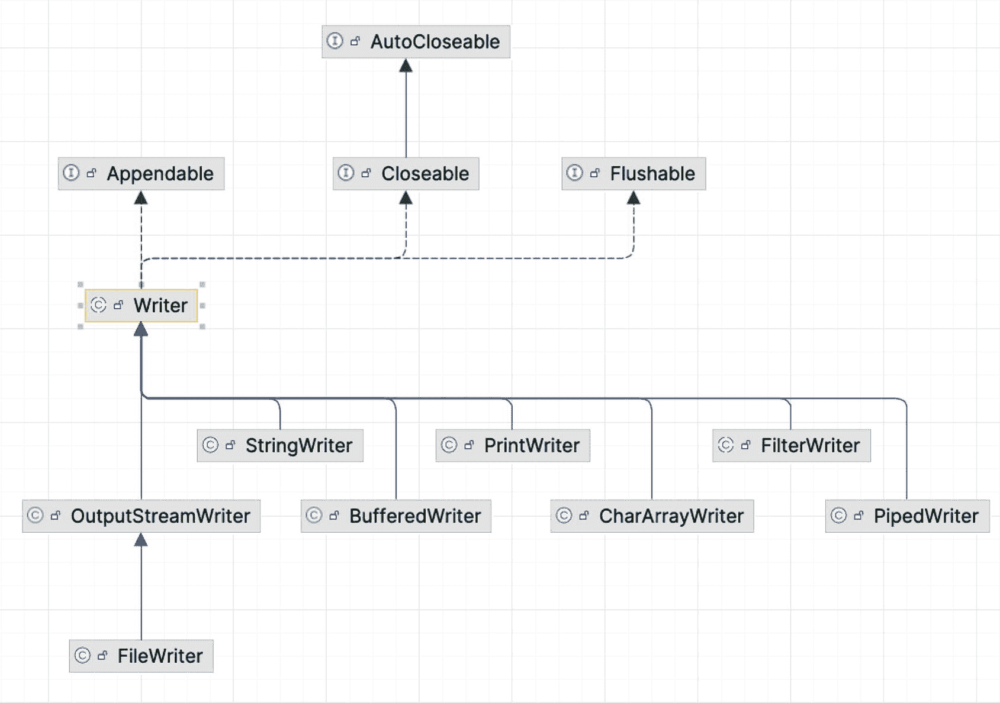

图 11-5

`Writer` 类层次结构

`Writer` 类是抽象的，因此不能直接使用；追加 API 来自 `Writer` 实现的 `java.io.Appendable` 接口。其他 `Writer` 类用于不同的目的。正如我们已经看到的，`OutputStreamWriter` 用于使用特殊字符编码写入文本。

`PrintWriter` 用于将对象的格式化表示写入文本输出流（我们在**第 10 章**中已经使用它来编写 HTML 代码）。

`StringWriter` 用于将输出收集到其内部缓冲区，并将其写入一个 `String` 实例。

在 Java 11 中，`Writer` 类增加了 `nullWriter()` 方法，该方法返回一个不执行任何操作的 `Writer` 实例。这是应开发者的测试需求而提出的。


### 使用 `OutputStream` 写入文件

`Writer` 家族中的类是用于通过字符流将数据作为文本写入的高级类，但本质上，数据在写入之前会被转换为字节。这显然意味着也可以使用字节流来写入文件。当尝试使用 `OutputStreamWriter` 写入文本时，这一点可能变得显而易见，因为作为参数传入的 `OutputStreamWriter` 实例是基于 `FileOutputStream` 实例的，而 `FileOutputStream` 是一种用于将字节流写入文件的类型。

该层次结构的根类是 `java.io.OutputStream`，其最常见的成员如图 11-6 所示。

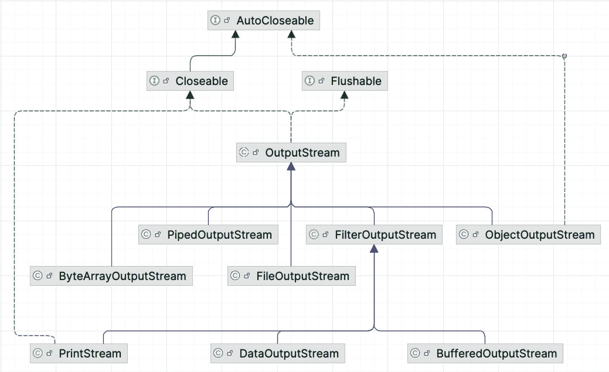

图 11-6

`OutputStream` 类层次结构

清单 11-27 展示了如何使用 `FileOutputStream` 写入一个 `String` 条目列表。

```
package com.apress.bgn.eleven.io;
import java.io.FileNotFoundException;
import java.io.FileOutputStream;
// 其他导入语句已省略
public class OutputStreamWritingDemo {
private static final Logger log = LoggerFactory.getLogger(OutputStreamWritingDemo.class);
public static void main(String... args) {
var file = new File("chapter11/read-write-file/src/main/resources/output/data.txt");
var dataList = List.of("Down to the wire" ,
"I wanted water but" ,
"I'll walk through the fire" ,
"If this is what it takes");
try (FileOutputStream output = new FileOutputStream(file)){
dataList.forEach(entry -> {
try {
output.write(entry.getBytes());
output.write("\n".getBytes());
} catch (IOException e) {
log.info("Something went wrong! ", e);
}
});
output.flush();
} catch (FileNotFoundException e) {
log.info("Something went wrong! ", e);
} catch (IOException e) {
e.printStackTrace();
}
}
}
清单 11-27
使用 FileOutputStream 将列表写入文件
```

`OutputStream` 家族类用于写入代表原始数据的字节流，这些数据用户无法直接读取，例如包含在二进制文件（如图像、媒体、PDF 等）中的数据。例如，清单 11-28 中的代码使用 `FileInputStream` 读取图像，并使用 `FileOutputStream` 写入图像，从而制作图像的副本。

```
package com.apress.bgn.eleven.io;
import java.io.*;
// 其他导入语句已省略
public class DuplicateImageDemo {
private static final Logger LOGGER = LoggerFactory.getLogger(DuplicateImageDemo.class);
void main() {
final String inDir = "chapter11/read-write-file/src/main/resources/input/";
final String outDir = "chapter11/read-write-file/src/main/resources/output/";
File src = new File(inDir + "the-beach.jpg");
File dest = new File(outDir + "copy-the-beach.jpg");
try(FileInputStream fis = new FileInputStream(src);
FileOutputStream fos = new FileOutputStream(dest)) {
int content;
while ((content = fis.read()) != -1) {
fos.write(content);
}
} catch (Exception e) {
LOGGER.debug("Image could not be copied! ", e);
}
}
}
清单 11-28
使用 FileOutputStream 制作图像文件的副本
```

然而，由于 Java 7 中引入了 `Files.copy(src.toPath(), dest.toPath())` 方法，不再需要编写这样的代码。

在 Java 11 中，`OutputStream` 增加了 `nullOutputStream()` 方法，该方法返回一个不执行任何操作的 `OutputStream` 实例。这是应开发人员的要求，用于测试目的。

## 使用 Java NIO 管理文件

`java.nio` 包在本章开头与 `java.io` 包一起被介绍。我们在本书这一部分之前使用的大多数类和方法都是 `java.io` 包的一部分，并且在读取/写入数据时会阻塞主线程。上一节中引入的工具类 `java.nio.file.Paths` 和 `java.nio.file.Files` 包含的方法既使用了 `java.nio` 包中的类，也使用了 `java.io` 包中的类。现在是时候向您展示如何使用 `java.nio` 类来操作文件了。

使用 `java.nio` 操作文件需要 `java.nio.channels.FileChannel` 的实例。这是一个特殊的类，描述了用于读取、写入、映射和操作文件的通道。`FileChannel` 实例连接到文件，并持有文件内的一个位置，该位置可以被查询和修改。

要使用 `FileChannel` 实例从文件读取数据，需要以下内容：

*   一个文件处理器实例
*   通道所基于的 `FileInputStream` 实例
*   一个 `FileChannel` 实例
*   一个 `java.nio.Buffer` 实例

由于是非阻塞的，线程可以请求通道从缓冲区读取数据，然后在数据可用之前执行其他操作。Java NIO 的缓冲区允许根据需要前后移动。数据被读入缓冲区并缓存，直到被处理。`java.nio` 包中为所有原始类型提供了缓冲区实现，根据数据的用途，您可以使用其中任何一种。清单 11-29 展示了如何将文件中的数据读取到 `ByteBuffer` 中。由于 `ByteBuffer` 可以用初始大小实例化，通过将 `ByteBuffer` 的容量（以字节为单位）配置为与文件大小相同，可以一次性读取文件。

```
package com.apress.bgn.eleven.nio;
import java.nio.ByteBuffer;
import java.nio.channels.FileChannel;
// 其他导入语句已省略
public class ChannelDemo {
private static final Logger LOGGER = LoggerFactory.getLogger(ChannelDemo.class);
void main() {
var sb = new StringBuilder();
final String inDir = "chapter11/read-write-file/src/main/resources/input/";
try (FileInputStream is = new FileInputStream(new File(inDir + "data.txt"));
FileChannel inChannel = is.getChannel()) {
long fileSize = inChannel.size();
ByteBuffer buffer = ByteBuffer.allocate((int) fileSize);
inChannel.read(buffer);
buffer.flip();
while (buffer.hasRemaining()) {
sb.append((char) buffer.get());
}
} catch (IOException e) {
LOGGER.debug("File could not be read! ", e);
}
LOGGER.info("Read with FileChannel [1]--> {}", sb);
}
}
清单 11-29
使用 FileChannel 和 ByteBuffer 读取文件
```

方法 `getChannel()` 返回与此文件输入流关联的唯一 `FileChannel` 对象。清单 11-29 中最重要的语句是 `buffer.flip()` 调用。调用此方法会*翻转缓冲区*，这意味着缓冲区从写入模式切换到读取模式。最初，这意味着通道能够将数据写入缓冲区（因为它处于写入模式），但在缓冲区填满后，缓冲区切换到读取模式，因此主线程可以读取其内容。

读取缓冲区内容后，如果需要再次读取，`buffer.rewind()` 方法会将位置重置为零。

如果文件很大，`ByteBuffer` 可以多次重新初始化，但在这种情况下，必须在通道写入新数据之前清除缓冲区，这可以通过调用 `buffer.close()` 来完成。此外，使用 `FileInputStream` 获取通道并不是正确的方法，因为它限制了从文件读取。但通道可以同时从文件读取和写入，因此推荐的方法是使用 `java.io.RandomAccessFile` 实例作为文件处理器，如清单 11-30 所示。


```
import java.io.RandomAccessFile;
import java.nio.ByteBuffer;
import java.nio.channels.FileChannel;
// ...
var sb = new StringBuilder();
try (var file = new RandomAccessFile(inDir + "data.txt", "r");
var inChannel = file.getChannel()) {
var buffer = ByteBuffer.allocate(48);
while(inChannel.read(buffer) > 0) {
buffer.flip();
for (int i = 0; i < buffer.limit(); i++) {
sb.append((char) buffer.get());
}
buffer.clear();
}
} catch (IOException e) {
e.printStackTrace();
}
System.out.printf("File content: {}", sb);
清单 11-30
使用较小的 ByteBuffer 通过 FileChannel 读取文件
```

`RandomAccessFile` 类的构造函数有一个名为 `mode` 的第二个参数，用于指定文件的打开访问模式。用更通俗的话说：模式描述了你的代码打算对文件执行什么操作。`mode` 参数可以设置为以下任意值：

*   `r`：文件以只读方式打开。尝试写入此文件将抛出 `IOException`。

*   `rw`：文件以读写方式打开。

*   `rws`：文件以读写方式打开，并且要求对文件内容或元数据的每次更新都同步写入底层存储设备。

*   `rwd`：文件以读写方式打开，并且要求对文件内容的每次更新都同步写入底层存储设备。

如果 `mode` 参数设置为其他任何值，则会抛出 `IllegalArgumentException`。

复制文件也同样简单；只需使用缓冲区将数据从一个通道移动到另一个通道，如清单 11-31 所示。

```
package com.apress.bgn.eleven.nio;
import java.io.RandomAccessFile;
import java.nio.ByteBuffer;
import java.nio.channels.FileChannel;
// 其他 import 语句已省略
public class DuplicateImageDemo {
private static final Logger LOGGER = LoggerFactory.getLogger(DuplicateImageDemo.class);
void main() {
LOGGER.info("-- 使用 FileChannel 复制图像 -- ");
final String inDir = "chapter11/read-write-file/src/main/resources/input/";
final String outDir = "chapter11/read-write-file/src/main/resources/output/";
try (FileChannel source = new RandomAccessFile(inDir + "the-beach.jpg", "r").getChannel();
FileChannel dest = new RandomAccessFile(outDir + "copy-the-beach.jpg", "rw").getChannel()) {
ByteBuffer buffer = ByteBuffer.allocateDirect(48);
while (source.read(buffer) != -1) {
buffer.flip();
while (buffer.hasRemaining()) {
dest.write(buffer);
}
buffer.clear();
}
} catch (Exception e) {
LOGGER.debug("图像无法复制！", e);
}
}
}
清单 11-31
使用 FileChannel 和 ByteBuffer 复制图像
```

另一种方法是使用专用的 `ReadableByteChannel` 和 `WritableByteChannel`，如清单 11-32 所示。

```
import java.nio.channels.ReadableByteChannel;
import java.nio.channels.WritableByteChannel;
// ...
try(ReadableByteChannel source = new FileInputStream(inDir + "the-beach.jpg").getChannel();
WritableByteChannel dest = new FileOutputStream(outDir + "2nd-copy-the-beach.jpg").getChannel()) {
ByteBuffer buffer = ByteBuffer.allocateDirect(48);
while (source.read(buffer) != -1) {
buffer.flip();
while (buffer.hasRemaining()) {
dest.write(buffer);
}
buffer.clear();
}
} catch (Exception e) {
LOGGER.error("图像无法复制！", e);
}
清单 11-32
使用 ReadableByteChannel 和 ByteBuffer 复制图像
```

由于其非阻塞特性，Java 通道适用于处理来自多个源的数据的应用程序，例如管理通过网络与多个源连接的应用程序。图 11-7 描绘了 `Channel` 层次结构中最重要的成员。

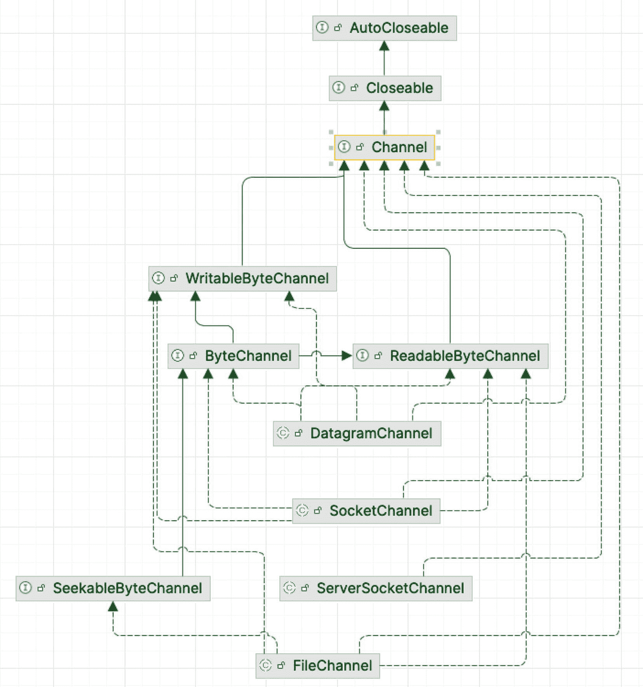

图 11-7

`Channel` 类/接口层次结构

`DatagramChannel` 可以通过 UDP 在网络中读写数据。`SocketChannel` 可以通过 TCP 在网络中读写数据，而 `ServerSocketChannel` 允许你监听传入的 TCP 连接，就像 Web 服务器一样。对于每个传入的连接，都会创建一个 `SocketChannel`。

引入 Java NIO 组件（接口和类）是为了补充现有的 Java IO 功能。Java IO 一次读取或写入一个字节或字符。缓冲会使用 Java 堆内存，当处理大文件时，这可能会成为问题。当 Java NIO 发布时，Oracle 曾声明 NIO 比纯 Java I/O 更高效、性能更好，但这完全取决于你正在构建的应用程序。Java NIO 引入了批量处理原始字节的可能性、异步操作的可能性以及堆外缓冲。缓冲区在 JVM 主内存之外创建，位于不受垃圾回收器管理的内存区域中。这允许创建更大的缓冲区，因此可以读取更大的文件，而不会因为 JVM 内存不足而抛出 `OutOfMemoryException` 的风险。

如果你发现自己需要处理大量数据，请务必仔细阅读 JDK NIO 文档，因为本节只是浅尝辄止。

## 序列化与反序列化

*序列化*是指将对象的状态转换为字节序列的操作。以这种格式，它可以通过网络发送或写入文件，并还原为该对象的副本。将字节序列转换回对象的操作称为*反序列化*。Java 序列化一直是一个有争议的话题，Java 平台首席架构师 Mark Reinhold 将其描述为 1997 年犯下的一个可怕错误。显然，大多数 Java 漏洞在某种程度上都与 Java 中序列化的实现方式有关，并且有一个名为 Project Amber^(¹⁰⁷) 的项目致力于完全移除 Java 序列化，并允许开发者选择他们喜欢的格式进行序列化。


### 字节序列化

`java.io.Serializable` 接口没有方法或字段，仅用于将类标记为可序列化。当对象被序列化时，标识对象类型的信息也会被序列化。大多数 Java 类都是可序列化的。可序列化类的任何子类默认都被视为可序列化。

如果任何新字段不可序列化，则会抛出 `NotSerializableException` 类型的异常。由开发者编写的、包含不可序列化字段的类必须实现 `Serializable` 接口，并为清单 11-33 中所示的方法提供具体实现。

```
private void writeObject(java.io.ObjectOutputStream out)
throws IOException;
private void readObject(java.io.ObjectInputStream in)
throws IOException, ClassNotFoundException;
private void readObjectNoData()
throws ObjectStreamException;
清单 11-33
使自定义类可序列化所需实现的方法
```

这些方法并非特定 Java 接口的一部分，因此在此上下文中实现它们，仅意味着在你希望使其可序列化的类中为它们编写方法体。它们被归入清单 11-33 是为了展示这些方法的签名。

`writeObject(..)` 方法用于写入对象的状态，以便 `readObject(..)` 方法能够恢复它。当反序列化操作因某种原因失败时，`readObjectNoData()` 方法用于初始化对象的状态，因此该方法会提供一个默认状态，尽管存在一些问题（例如，流不完整、客户端应用程序无法识别反序列化的类等）。如果你是个乐观主义者，这个方法其实并非强制要求。

此外，在使类可序列化时，必须添加一个 `long` 类型的静态字段作为该类的唯一标识符，以确保将对象作为字节流发送的应用程序和接收它的客户端应用程序拥有相同的已加载类。如果接收字节流的应用程序拥有一个标识符不同的类，则会抛出 `java.io.InvalidClassException`。发生这种情况时，意味着应用程序未更新，或者你甚至可能怀疑有黑客在搞鬼。该字段必须命名为 `serialVersionUID`，如果开发者没有显式添加，序列化运行时将自动生成。清单 11-34 中的代码片段展示了一个名为 `Singer` 的类，它包含了清单 11-33 代码片段中所示的序列化和反序列化方法。

```
package com.apress.bgn.eleven;
import java.io.*;
import java.time.LocalDate;
import java.util.Objects;
public class Singer  implements Serializable {
private static final long serialVersionUID = 42L;
private String name;
private Double rating;
private LocalDate birthDate;
public Singer() {
/* 反序列化所需 */
}
public Singer(String name, Double rating, LocalDate birthDate) {
this.name = name;
this.rating = rating;
this.birthDate = birthDate;
}
private void writeObject(ObjectOutputStream out) throws IOException {
out.defaultWriteObject();
}
private void readObject(ObjectInputStream in) throws IOException, ClassNotFoundException {
in.defaultReadObject();
}
private void readObjectNoData() throws ObjectStreamException {
this.name = "undefined";
this.rating = 0.0;
this.birthDate = LocalDate.now();
}
// setter、getter、toString、equals 和 hashCode 已省略
}
清单 11-34
可序列化的 Singer 类
```

现在我们有了这个类，让我们实例化它，将其序列化，保存到文件，然后将文件内容反序列化为另一个对象，并与初始对象进行比较。所有这些操作都在清单 11-35 中展示。

```
package com.apress.bgn.eleven;
import org.slf4j.Logger;
import org.slf4j.LoggerFactory;
import java.io.*;
import java.time.LocalDate;
import java.time.Month;
public class BinarySerializationDemo {
private static final Logger log = LoggerFactory.getLogger(BinarySerializationDemo.class);
public static void main(String... args) throws ClassNotFoundException {
LocalDate johnBd = LocalDate.of(1977, Month.OCTOBER, 16);
Singer john = new Singer("John Mayer", 5.0, johnBd);
File file = new File("chapter11/serialization/src/test/resources/output/john.txt");
try (var out = new ObjectOutputStream(new FileOutputStream(file))){
file.createNewFile();
out.writeObject(john);
} catch (IOException e) {
log.info("出错了！", e);
}
try(var in = new ObjectInputStream(new FileInputStream(file))){
Singer copyOfJohn = (Singer) in.readObject();
log.info("对象是否相等？{}", copyOfJohn.equals(john));
log.info("--> {}", copyOfJohn);
} catch (IOException e) {
log.info("出错了！", e);
}
}
}
清单 11-35
序列化与反序列化 Singer 类
```

当运行清单 11-35 中的代码时，一切按预期工作，`writeObject(..)` 和 `readObject(..)` 分别由 `ObjectOutputStream` 和 `ObjectInputStream` 通过反射调用。如果你想测试它们是否真的被调用了，可以添加日志记录，或者在它们内部设置断点并以调试模式运行程序。如果你打开 `john.txt` 文件，可能无法理解太多内容。里面写入的文本意义不大，因为它是二进制的原始数据。如果你打开该文件，可能会看到类似图 11-8 所示的内容。

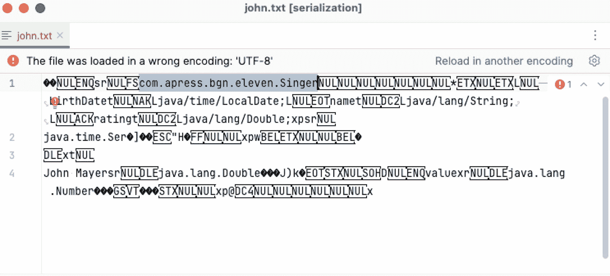

图 11-8

序列化后的 `Singer` 实例


### XML 序列化

然而，Java 序列化并不一定会产生难以理解的二进制文件。对象可以被序列化为可读的格式。最常用的序列化格式之一是 XML，JDK 提供了将对象转换为 XML 以及从 XML 还原为原始对象的类。

**用于 XML 绑定的 Java 架构 (JAXB)** 曾提供一种快速便捷的方式来绑定 XML 模式和 Java 表示，使 Java 开发者能够轻松地将 XML 数据和数据处理功能整合到 Java 应用程序中。将对象序列化为 XML 的操作称为**编组 (marshalling)**。将对象从 XML 反序列化的操作称为**解组 (unmarshalling)**。

从 JDK 11 开始，JAXB 被从 JDK 中移除，其继任者 JAXB2 并未获得预期的关注。这并不令人意外，因为多年来，Jackson 库集合已成为大多数项目进行 XML、JSON 以及（最近）YAML 序列化和反序列化的默认首选。Jackson 在 Java 生态系统中作为终极的 *Java JSON 库* 而闻名已久，但它也拥有支持序列化为其他多种格式的模块，其中包括 XML、CSV、YAML 和 TAML。只需查看其项目页面 ([`https://github.com/FasterXML/jackson`](https://github.com/FasterXML/jackson))；很可能每当出现一种新的流行序列化格式时，就已经有相应的模块了。

使用 Jackson 序列化为 XML 时，需要记住以下几点：

*   需要使用一组不同的注解，其中最重要的列举如下：
    *   `@JacksonXmlRootElement(localName = "...")` 是一个顶层注解，放置在类级别，用于告知 Jackson 该类名在序列化时将成为一个 XML 元素；如果需要为 XML 元素指定不同的名称，可以通过 `localName` 属性进行设置。

*   `@JacksonXmlProperty(localName = "...")` 是一个方法或字段级别的注解，用于告知 Jackson 该字段或方法名在序列化时将成为一个 XML 元素；如果需要为 XML 元素指定不同的名称，可以通过 `localName` 属性进行设置。

*   `@JacksonXmlProperty(localName = "...", isAttribute = true)` 配合 `isAttribute = true` 参数使用，用于将该属性配置为 XML 属性。

*   要使用 Jackson 进行序列化和反序列化，需要使用 `com.fasterxml.jackson.dataformat.xml.XmlMapper` 的实例。

*   `XmlMapper` 实例需要配置以支持特殊类型，例如新的 Java 8 日期 API 类型，这可以通过注册和配置 `com.fasterxml.jackson.datatype.jsr310.JavaTimeModule` 来完成。

*   使用 Java 模块时，必须确保它们配置正确。异常信息可能不易阅读，解决这些问题可能需要结合 Apache Maven 和模块配置。

话虽如此，让我们从模块配置开始，如清单 11-36 所示。

```
module chapter.eleven.serialization {
requires org.slf4j;
requires com.fasterxml.jackson.databind;
requires com.fasterxml.jackson.dataformat.xml;
requires com.fasterxml.jackson.datatype.jsr310;
opens com.apress.bgn.eleven.xml to com.fasterxml.jackson.databind;
}
清单 11-36
使用 Jackson 进行 XML 序列化的模块配置
```

前两个 `requires com.fasterxml.jackson.*` 指令是必需的，以便能够使用 Jackson 注解和 `XmlMapper`。`jsr310` 是序列化 Java 8 日期 API 类型所必需的。

最后一条语句 `opens com.apress.bgn.eleven.xml to com.fasterxml.jackson.databind` 是必需的，以便 Jackson 能够访问 `com.apress.bgn.eleven.xml` 包中的类，因为使用 Jackson 注解编写的 `Singer` 类版本就位于此处。该类如清单 11-37 所示。

```
package com.apress.bgn.eleven.xml;
// 其他导入已省略
import com.fasterxml.jackson.dataformat.xml.annotation.JacksonXmlProperty;
import com.fasterxml.jackson.dataformat.xml.annotation.JacksonXmlRootElement;
@JacksonXmlRootElement(localName = "singer")
public class Singer implements Serializable {
private static final long serialVersionUID = 42L;
private String name;
private Double rating;
private LocalDate birthDate;
public Singer() {
/* 反序列化所需 */
}
public Singer(String name, Double rating, LocalDate birthDate) {
this.name = name;
this.rating = rating;
this.birthDate = birthDate;
}
@JacksonXmlProperty(localName = "name", isAttribute = true)
public String getName() {
return name;
}
@JacksonXmlProperty(localName = "rating", isAttribute = true)
public Double getRating() {
return rating;
}
@JacksonXmlProperty(localName = "birthdate")
public LocalDate getBirthDate() {
return birthDate;
}
// 其他代码已省略
}
清单 11-37
带有 Jackson XML 注解的 Singer 类
```

请注意注解放置的位置。根据清单 11-37 中注解的放置位置及其配置，当 `john` 对象被序列化时，`john.xml` 文件应包含清单 11-38 所示的片段。

```
1977-10-16

清单 11-38
XML 格式的 john Singer 实例
```

它比二进制版本更易读，对吧？清单 11-39 展示了将 `Singer` 实例保存到 `john.xml` 文件，然后将其加载回一个副本并与原始实例进行比较的代码。

```
package com.apress.bgn.eleven.xml;
import com.fasterxml.jackson.databind.SerializationFeature;
import com.fasterxml.jackson.dataformat.xml.XmlMapper;
import com.fasterxml.jackson.datatype.jsr310.JavaTimeModule;
// 其他导入语句已省略
public class XMLSerializationDemo {
private static final Logger LOGGER = LoggerFactory.getLogger(XMLSerializationDemo.class);
void main(){
var johnBd = LocalDate.of(1977, Month.OCTOBER, 16);
var john = new Singer("John Mayer", 5.0, johnBd);
var xmlMapper = new XmlMapper();
xmlMapper.registerModule(new JavaTimeModule());
xmlMapper.enable(SerializationFeature.INDENT_OUTPUT);
xmlMapper.configure(SerializationFeature.WRITE_DATES_AS_TIMESTAMPS, false);
var path = Path.of("chapter11/serialization/src/test/resources/output/john.xml");
try {
var xml = xmlMapper.writeValueAsString(john);
Files.writeString(path, xml, StandardCharsets.UTF_8);
} catch (Exception e) {
LOGGER.info("序列化为 XML 失败！", e);
}
try {
var copyOfJohn = xmlMapper.readValue(path.toFile(), Singer.class);
LOGGER.info("对象是否相等？{}", copyOfJohn.equals(john));
LOGGER.info("--> {}", copyOfJohn);
} catch (IOException e) {
LOGGER.info("XML 反序列化失败！", e);
}
}
}
清单 11-39
使用 Jackson 的 XmlMapper 序列化和反序列化 Singer 类
```

`XmlMapper` 实例可用于序列化项目中任何包含 Jackson 注解的类。清单 11-39 中的示例还配置为支持 Java 8 日期 API 类型的默认序列化，并通过以下两行代码保持类型可读，而不将其转换为数字时间戳：

```
xmlMapper.registerModule(new JavaTimeModule());
xmlMapper.configure(SerializationFeature.WRITE_DATES_AS_TIMESTAMPS, false);
```

由于选择的格式是 XML，如果所有内容都写在一行中会显得非常难看，因此通过以下语句支持缩进格式：

```
xmlMapper.enable(SerializationFeature.INDENT_OUTPUT)
```

信息


注解并非必需；只要使用了 `XmlMapper` 实例，且待序列化的类是一个普通的旧式 Java 对象（POJO），就会生成一个 XML 文件，其中所有字段都会成为以该类命名的根元素下的 XML 子元素。注解的作用在于自定义生成的 XML、命名元素、将某些字段转换为属性，以及指定复杂类型所使用的转换器。如果你对为 `Singer` 实例生成的默认 XML 文件感到好奇，可以注释掉 `Singer` 类中的注解，然后运行清单 11-39 中的 `XMLSerializationDemo` 示例。

XML 序列化在开发领域已占据主导地位多年，广泛应用于大多数 Web 服务和远程通信中。然而，随着 XML 文件变得越来越大，它们往往会显得拥挤、冗余且难以阅读，因此一种新的格式脱颖而出：JSON。

### JSON 序列化

**JSON**（JavaScript 对象表示法）是一种轻量级的数据交换格式。它既便于人类阅读，也易于机器解析和生成。JSON 是 JavaScript 应用程序中数据最喜爱的格式，广泛应用于基于 REST 的应用程序，并且是许多 NoSQL 数据库的内部格式。因此，向你展示如何使用这种格式对 Java 对象进行序列化/反序列化也是恰如其分的。将 Java 对象序列化为 JSON 的优势在于，有不止一个库提供了实现此功能的类，这意味着至少有一个库在 Java 9+ 版本中是稳定的。

JSON 格式本质上是一组键值对的集合。值可以是数组，也可以是键值对本身的集合。最受青睐的 JSON 序列化库同样是 Jackson 库，因为它无需编写大量代码就能将 Java 对象转换为 JSON 对象，反之亦然。本章最棒的一点是，相同的模块配置也可以用于 JSON。我们只需要更改所使用的注解，并更改用于执行序列化/反序列化的映射器类型即可。Jackson 支持大量用于 JSON 序列化的注解，但对于本书中的简单示例，我们实际上并不需要任何注解。一个 Jackson 的 `com.fasterxml.jackson.databind.json.JsonMapper` 实例足够智能，能够自动检测类的公开可访问属性（公共字段，或具有公共 getter 方法的私有字段），并在序列化/反序列化该类的实例时使用它们。

来自 `com.fasterxml.jackson.annotation` 包的 `@JsonAutoDetect` 注解可用于注解一个类。它可以配置为告诉映射器哪些类成员应该被序列化。有几个选项，分组在注解体内声明的 `Visibility` 枚举中：

*   `ANY`：自动检测所有类型的访问修饰符（`public`、`protected`、`private`）。
*   `NON_PRIVATE`：自动检测除 `private` 之外的所有修饰符。
*   `PROTECTED_AND_PUBLIC`：仅自动检测 `protected` 和 `public` 修饰符。
*   `PUBLIC_ONLY`：仅自动检测 `public` 修饰符。
*   `NONE`：禁用对字段或方法的自动检测。在这种情况下，必须使用字段上的 `@JsonProperty` 注解显式进行配置。
*   `DEFAULT`：应用默认规则，具体取决于上下文（有时从父类继承）。

将这个单独的注解放在 `Singer` 类上，结合适当的映射器和 `JavaTimeModule`，可以确保 `Singer` 类的实例能够正确地序列化为 JSON，并且也能从 JSON 反序列化回来。清单 11-40 展示了 `Singer` 类的简单配置（即使有些冗余）。

```
package com.apress.bgn.eleven.json;
// 省略了一些导入语句
import com.fasterxml.jackson.annotation.JsonAutoDetect;
@JsonAutoDetect(getterVisibility = JsonAutoDetect.Visibility.PUBLIC_ONLY)
public class Singer  implements Serializable {
private static final long serialVersionUID = 42L;
private String name;
private Double rating;
private LocalDate birthDate;
public String getName() { // 自动检测
return name;
}
public Double getRating() { // 自动检测
return rating;
}
public LocalDate getBirthDate() { // 自动检测
return birthDate;
}
// 其他代码省略
}
清单 11-40
使用 Jackson 的 @JsonAutoDetect 注解 Singer 类，仅用于演示其用法
```


要序列化一个 `Singer` 实例，需要用到 `JsonMapper` 的实例。该类是在 Jackson 2.10 版本中引入的。在此之前，`com.fasterxml.jackson.databind.ObjectMapper` 被用于相同的目的。`ObjectMapper` 旨在成为未来版本中所有映射器的根类。上一节中使用的 `XmlMapper` 也继承了 `ObjectMapper`。`JsonMapper` 是一个 JSON 格式专用的 `ObjectMapper` 实现，旨在取代通用实现。清单 11-41 展示了一个如何使用它来序列化/反序列化 `Singer` 实例的示例。

```
package com.apress.bgn.eleven.json;
import com.apress.bgn.eleven.xml.Singer;
import com.fasterxml.jackson.databind.SerializationFeature;
import com.fasterxml.jackson.databind.json.JsonMapper;
import com.fasterxml.jackson.datatype.jsr310.JavaTimeModule;
// 其他导入语句已省略
public class JSONSerializationDemo {
private static final Logger LOGGER = LoggerFactory.getLogger(JSONSerializationDemo.class);
void main(){
var johnBd = LocalDate.of(1977, Month.OCTOBER, 16);
var john = new Singer("John Mayer", 5.0, johnBd);
JsonMapper jsonMapper = new JsonMapper();
jsonMapper.registerModule(new JavaTimeModule());
jsonMapper.enable(SerializationFeature.INDENT_OUTPUT);
jsonMapper.configure(SerializationFeature.WRITE_DATES_AS_TIMESTAMPS, false);
var path = Path.of("chapter11/serialization/src/test/resources/output/john.json");
try {
var xml = jsonMapper.writeValueAsString(john);
Files.writeString(path, xml,
StandardCharsets.UTF_8);
} catch (Exception e) {
LOGGER.info("序列化为 JSON 失败！", e);
}
try {
var copyOfJohn = jsonMapper.readValue(path.toFile(), Singer.class);
LOGGER.info("对象是否相等？{}", copyOfJohn.equals(john));
LOGGER.info("--> {}", copyOfJohn);
} catch (IOException e) {
LOGGER.info("JSON 反序列化失败！", e);
}
}
}
清单 11-41
使用 Jackson 的 JsonMapper 序列化和反序列化 Singer 类
```

如你所见，除了使用的映射器类型不同之外，这段代码示例在从 XML 切换过来时并没有太多变化。Jackson 非常棒，对吧？

`Singer` 类中的 `birthDate` 字段类型为 `java.time.LocalDate`。注册 `JavaTimeModule` 可以在映射器级别控制此类字段的序列化/反序列化方式。另一种方法是为这种数据类型声明一个自定义的序列化器类和反序列化器类，并通过使用 `@JsonSerialize` 和 `@JsonDeserialize` 注解来配置它们，将其应用于 `birthDate` 字段。清单 11-42 展示了在 `birthDate` 字段上配置的自定义序列化器和反序列化器类。

```
package com.apress.bgn.eleven.json2;
import com.fasterxml.jackson.databind.annotation.JsonDeserialize;
import com.fasterxml.jackson.databind.annotation.JsonSerialize;
// 其他导入语句已省略
@JsonAutoDetect(getterVisibility = JsonAutoDetect.Visibility.PUBLIC_ONLY)
public class Singer  implements Serializable {
private static final long serialVersionUID = 42L;
private String name;
private Double rating;
@JsonSerialize(converter = LocalDateTimeToStringConverter.class)
@JsonDeserialize(converter = StringToLocalDatetimeConverter.class)
private LocalDate birthDate;
// 其他代码已省略
}
清单 11-42
为 java.time.LocalDate 字段配置自定义序列化和反序列化
```

清单 11-43 展示了自定义序列化器和反序列化器类的实现。

```
package com.apress.bgn.eleven.json2;
import com.fasterxml.jackson.databind.util.StdConverter;
import java.time.LocalDateTime;
import java.time.format.DateTimeFormatter;
import java.time.format.FormatStyle;
public class LocalDateTimeToStringConverter extends StdConverter {
static final DateTimeFormatter DATE_FORMATTER = DateTimeFormatter.ofLocalizedDateTime(FormatStyle.LONG);
@Override
public String convert(LocalDateTime value) {
return value.format(DATE_FORMATTER);
}
}
public class StringToLocalDatetimeConverter extends StdConverter {
@Override
public LocalDateTime convert(String value) {
return LocalDateTime.parse(value, LocalDateTimeToStringConverter.DATE_FORMATTER);
}
}
清单 11-43
实现自定义序列化和反序列化类
```

就本书的范围而言，关于使用 Jackson 进行 JSON 序列化，能说的就是这些了。如果你对这个主题感兴趣，可以自行阅读更多内容。

重要

还有一个 Jackson 库用于将 Java 实例序列化为 YAML，这在配置文件领域是*新秀*。该库名为 `jackson-dataformat-yaml`。


## 媒体 API

除了文本数据，Java 还可用于操作二进制文件，例如图像。Java 媒体 API 包含一组用于多种流行图像存储格式的图像编码器/解码器（编解码器）类：BMP、GIF（仅解码器）、FlashPix（仅解码器）、JPEG、PNG、PNM3、TIFF 和 WBMP。

在 Java 9 中，Java 媒体 API 也进行了改造，新增了将多个不同分辨率的图像封装到多分辨率图像中的功能。Java 媒体 API 的核心是 `java.awt.Image` 抽象类，它是所有用于表示图形图像的类的超类。最重要的图像表示类及其之间的关系如图 11-9 所示。

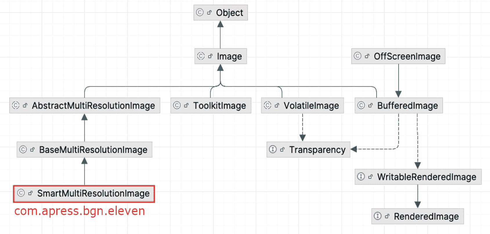

图 11-9

`Image` 类层次结构（由 IntelliJ IDEA 显示）

`SmartMultiResolutionImage` 类将在本节后面使用。

尽管 `java.awt.Image` 类是该层次结构中的根类，但最常用的类是 `java.awt.BufferedImage`，它是一个具有可访问图像数据缓冲区的实现。它提供了许多方法，可用于创建图像、设置其大小和内容、提取其内容并进行分析等等。在本节中，我们将使用此类来读取和写入图像。

图像文件是一种复杂的文件。除了图片本身，它还包含大量附加信息，其中如今最重要的信息是图像的创建位置。如果你曾好奇社交网络是如何为你发布的图片推荐签到位置的，那么信息就来源于此。这看起来可能没那么重要，但发布一张在你家拍摄的猫咪照片，就会将你的位置暴露给全世界。我不确定你怎么看，但对我来说这很可怕。我曾经在我的个人博客上发布过我的猫舒适地坐在我写这本书的电脑上的照片，这意味着我基本上将我的位置和一台相当昂贵的笔记本电脑暴露给了全世界。当然，大多数人并不关心我的猫或笔记本电脑，但那些想轻松赚钱的人可能会关心。因此，当一位友好且知识渊博的读者给我发了一封私人邮件，告诉我一种叫做可交换图像文件格式（EXIF）的数据，以及他如何因为我博客上最新发布的猫咪照片而知道我的住址时，我对此进行了研究。照片的 EXIF 数据包含大量关于你的相机以及照片拍摄地点（GPS 坐标）的信息。大多数智能手机都会将 EXIF 数据嵌入到用其相机拍摄的照片中。

在图 11-10 中，你可以看到由 macOS 预览应用程序显示的 EXIF 信息。

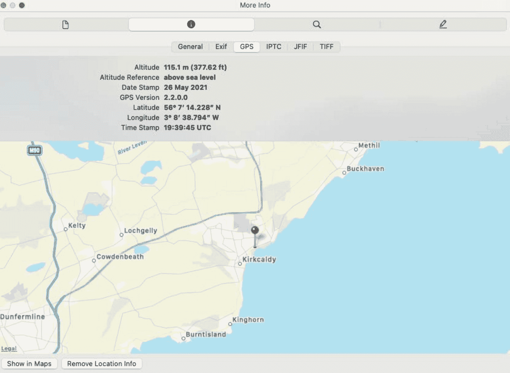

图 11-10

JPG 图像上的 EXIF 信息

请注意，EXIF 信息包含拍摄照片的确切位置，包括纬度和经度。有一些工具可以删除 EXIF 数据，但当你在博客（像我一样）或社交媒体网站上发布大量照片时，逐一清理它们会花费太多时间。这时 Java 就派上用场了，在代码清单 11-44 中，我与你分享了一段我用来清理照片 EXIF 数据的代码片段。

```
package com.apress.bgn.eleven;
// 省略了一些导入语句
import org.apache.commons.imaging.formats.jpeg.exif.ExifRewriter;
import java.awt.image.BufferedImage;
public class MediaDemo {
private static final Logger LOGGER = LoggerFactory.getLogger(MediaDemo.class);
void main() {
File src = new File("chapter11/media-handling/src/main/resources/input/the-beach.jpg");
try {
LOGGER.info(" --- 正在移除 EXIF 信息 ---");
File destNoExif = new File("chapter11/media-handling/src/main/resources/output/the-beach-no-exif.jpg");
removeExifMetadata(src, destNoExif);
} catch (Exception e) {
LOGGER.error("发生了错误。", e);
}
}
public void removeExifMetadata(final File jpegImageFile, final File dst) throws IndexOutOfBoundsException, IOException {
try (FileOutputStream fos = new FileOutputStream(dst);
OutputStream os = new BufferedOutputStream(fos)) {
new ExifRewriter().removeExifMetadata(jpegImageFile, os);
}
}
}
代码清单 11-44
从图像中剥离 EXIF 数据的代码片段
```

移除 EXIF 数据相当容易，因为 `javax.imageio.ImageIO` 不会在图像文件中持久保存 EXIF 信息或任何其他与实际图像无关的信息。

注意

提供比 Java AWT 类性能更好的 `EXIF` 信息剥离类的实用工具库名为 Apache Commons Imaging^(¹⁰⁸)。该项目是 Apache Sanselan 的延续，本书第一版中使用了后者。

`removeExifMetadata(..)` 方法将图像源和一个管理新图像保存位置的 `File` 处理器作为参数。要测试生成的图像是否没有 EXIF 数据，只需在图像查看器中打开它。任何显示 EXIF 的选项要么应被禁用，要么不显示任何内容。在 macOS 的预览图像查看器中，该选项是灰色的。

如果你的项目要求不惜一切代价避免使用第三方解决方案，JDK 自带了自己的移除 `EXIF` 数据的方法。`javax.imageio.ImageIO` 类提供了一个写入 `BufferedImage` 实例的方法，该方法会忽略 `EXIF` 数据。因此，`removeExifMetadata(..)` 方法可以简单地写成：

```
private static void removeExifMetadata(final File src, final File dest) throws Exception {
BufferedImage originalImage = ImageIO.read(src);
ImageIO.write(originalImage, "jpg", dest);
}
```

现在我们已经解决了这个问题，接下来让我们调整原始图像的大小。要调整图像大小，我们需要从原始图像创建一个 `BufferedImage` 实例以获取图像尺寸。之后，我们修改尺寸，并将它们用作参数来创建一个新的 `BufferedImage`，该图像将由 `java.awt.Graphics2D` 实例填充数据，这是一种用于渲染 2D 形状、文本和图像的特殊类型类。代码如代码清单 11-45 所示（该方法被调用来创建缩小 25%、缩小 50% 和缩小 75% 的图像）。


```
package com.apress.bgn.eleven;
import org.apache.commons.imaging.formats.jpeg.exif.ExifRewriter;
import org.slf4j.Logger;
import org.slf4j.LoggerFactory;
import javax.imageio.ImageIO;
import java.awt.*;
import java.awt.image.BufferedImage;
import java.awt.image.MultiResolutionImage;
import java.io.*;
public class MediaDemo {
private static final Logger LOGGER = LoggerFactory.getLogger(MediaDemo.class);
void main() {
var src = new File("chapter11/media-handling/src/main/resources/input/the-beach.jpg");
try {
BufferedImage originalImage = ImageIO.read(src);
LOGGER.debug(" --- 原始图像尺寸 {} x {} ---", originalImage.getWidth(), originalImage.getHeight() );
LOGGER.info(" --- 创建 25% 图像 ---");
File dest25 = new File("chapter11/media-handling/src/main/resources/output/the-beach_25.jpg");
resize(dest25, src, 0.25f);
BufferedImage dest25Image = ImageIO.read(dest25);
LOGGER.debug(" --- 25% 图像尺寸 {} x {} ---", dest25Image.getWidth(), dest25Image.getHeight() );
LOGGER.info(" --- 创建 50% 图像 ---");
File dest50 = new File("chapter11/media-handling/src/main/resources/output/the-beach_50.jpg");
resize(dest50, src, 0.5f);
BufferedImage dest50Image = ImageIO.read(dest50);
LOGGER.debug(" --- 50% 图像尺寸 {} x {} ---", dest50Image.getWidth(), dest50Image.getHeight() );
LOGGER.info(" --- 创建 75% 图像 ---");
File dest75 = new File("chapter11/media-handling/src/main/resources/output/the-beach_75.jpg");
resize(dest75, src, 0.75f);
} catch (Exception e) {
LOGGER.error("发生错误。", e);
}
}
private static void resize(final File dest, final File src, final float percent) throws IOException {
BufferedImage originalImage = ImageIO.read(src);
int scaledWidth = (int) (originalImage.getWidth() * percent);
int scaledHeight = (int) (originalImage.getHeight() * percent);
Image resultingImage = originalImage.getScaledInstance(scaledWidth, scaledHeight, Image.SCALE_SMOOTH);
BufferedImage outputImage = new BufferedImage(scaledWidth, scaledHeight, BufferedImage.TYPE_INT_RGB);
outputImage.getGraphics().drawImage(resultingImage, 0, 0, null);
ImageIO.write(outputImage, "jpg", dest);
}
}
清单 11-45
调整图像大小的代码片段
```

为了方便起见，`ImageIO` 类的实用方法在从文件读取图像或将图像写入特定位置时非常有用。如果你想测试调整大小是否有效，只需查看 `resources` 目录即可。输出文件已经相应命名，但为了确保无误，你可以在文件查看器中再次确认。

这个版本的 `resize(..)` 方法并不精确；如果你需要很高的清晰度，`Image.SCALE_SMOOTH` 可能帮助不大。如果需要更高的清晰度，调整图像大小的最佳方法是使用 `java.awt.Graphics2D` 实例，如清单 11-46 所示。

```
private static void resize(final File dest, final File src, final float percent) throws IOException {
BufferedImage originalImage = ImageIO.read(src);
int scaledWidth = (int) (originalImage.getWidth() * percent);
int scaledHeight = (int) (originalImage.getHeight() * percent);
BufferedImage outputImage = new BufferedImage(scaledWidth, scaledHeight, originalImage.getType());
Graphics2D g2d = outputImage.createGraphics();
g2d.setRenderingHint(RenderingHints.KEY_INTERPOLATION, RenderingHints.VALUE_INTERPOLATION_BILINEAR);
g2d.drawImage(originalImage, 0, 0, scaledWidth, scaledHeight, null);
g2d.dispose();
outputImage.flush();
ImageIO.write(outputImage, "jpg", dest);
}
清单 11-46
resize(..) 方法的 Graphics2D 版本
```

如果你使用两种方法运行 `MediaDemo` 示例，可能甚至不会注意到生成的图像之间的差异，因为这类细节肉眼可能不易察觉。

提示

清单 11-45 中展示的图像调整大小方法是使用 JDK 类实现的。为了实现更高效的调整大小，市面上有不少库，例如 Imgscalr^(¹⁰⁹) 和 Thumbnailator^(¹¹⁰)。

你应该会看到类似于图 11-11 所示的结果。

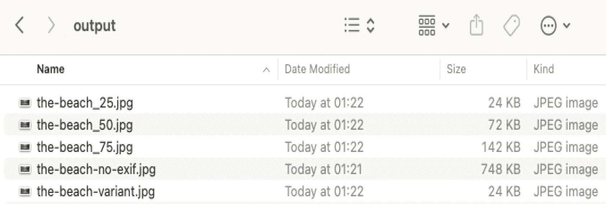

图 11-11

使用 Java 调整大小后的图像

生成的图像质量不如原始图像，因为压缩像素并不会带来高质量，但它们确实符合我们预期的尺寸。

现在我们有了同一张图像的这些不同版本，我们可以使用它们通过 Java 9 引入的 `BaseMultiResolutionImage` 类来创建多分辨率图像。该类的实例由一组图像创建，这些图像都是同一张图像的副本，但具有不同的分辨率。这就是为什么我们之前创建了多个调整大小后的图像副本。`BaseMultiResolutionImage` 可用于根据特定屏幕分辨率检索图像，并且适用于设计为从多种设备访问的应用程序。让我们先看一下代码，如清单 11-47 所示，然后再检查结果。

```
package com.apress.bgn.eleven;
import org.apache.commons.imaging.formats.jpeg.exif.ExifRewriter;
import java.awt.image.BufferedImage;
import java.awt.image.MultiResolutionImage;
// 其他导入语句已省略
public class MediaDemo {
private static final Logger LOGGER = LoggerFactory.getLogger(MediaDemo.class);
void main() {
var src = new File("chapter11/media-handling/src/main/resources/input/the-beach.jpg");
try {
// 生成缩放图像的代码已省略
Image[] imgList = new Image[]{
ImageIO.read(src), // 2000 x 972
ImageIO.read(dest25), // 500 x 243
ImageIO.read(dest50), // 1000 x 486
ImageIO.read(dest75) // 1500 x 729
};
LOGGER.info(" --- 创建多分辨率图像 ---");
File destVariant = new File("chapter11/media-handling/src/main/resources/output/the-beach-variant.jpg");
createMultiResImage(destVariant, imgList);
BufferedImage variantImg = ImageIO.read(destVariant);
LOGGER.info("变体图像宽度 x 高度 :  {} x {}", variantImg.getWidth(), variantImg.getHeight());
BufferedImage dest25Img = ImageIO.read(dest25);
LOGGER.info("dest25Img 宽度 x 高度 :  {} x {}", dest25Img.getWidth(), dest25Img.getHeight());
LOGGER.info("是否相同？ {}", variantImg.equals(dest25Img));
} catch (Exception e) {
LOGGER.error("发生错误。", e);
}
}
private static void createMultiResImage(final File dest, final Image[] imgList) throws IOException {
MultiResolutionImage mrImage = new BaseMultiResolutionImage(0,imgList);
var variants = mrImage.getResolutionVariants();
variants.forEach(i -> LOGGER.info(i.toString()));
Image img = mrImage.getResolutionVariant(500, 200);
LOGGER.info("最符合请求尺寸的图像：", 500, 200, img.getWidth(null), img.getHeight(null));
if (img instanceof BufferedImage) {
ImageIO.write((BufferedImage) img, "jpg", dest);
}
}
}
清单 11-47
创建多分辨率图像的代码片段
```

`BaseMultiResolutionImage` 实例由一个 `Image` 实例数组创建。该类是 `MultiResolutionImage` 接口的一个实现，旨在作为某些 `Image` 实现支持的可选附加 API，以便它们能够为各种渲染分辨率提供替代图像。


为了让清单 11-47 中哪张图片会被选中变得一目了然，每张图片的分辨率都被标注在其旁边的注释中。当调用 `getResolutionVariant(..)` 时，传入的参数会与对应的图片属性进行比较，即使两个参数都小于或等于某张图片的尺寸，也会返回该图片。清单 11-48 展示了 `BaseMultiResolutionImage.getResolutionVariant(..)` 的代码。

```
@Override
public Image getResolutionVariant(double destImageWidth,
double destImageHeight) {
checkSize(destImageWidth, destImageHeight);
for (Image rvImage : resolutionVariants) {
if (destImageWidth <= rvImage.getWidth(null)
&& destImageHeight <= rvImage.getHeight(null)) {
return rvImage;
}
}
return resolutionVariants[resolutionVariants.length - 1];
}
清单 11-48
基于尺寸获取图片变体的代码
```

这段代码看起来很适合它的用途。如果你调用 `mrImage.getResolutionVariant(500, 200)`，你会得到分辨率为 500 × 243 的 `dest25` 图片。如果你调用 `mrImage.getResolutionVariant(500, 300)`，你会得到分辨率为 1000 × 486 的 `dest50` 图片，因为 `destImageHeight` 参数是 300，大于 243，所以列表中下一个宽度和高度值都大于参数的图片会被返回。

但是——这一点需要牢记——这仅在数组中的图片按尺寸排序后才有效。如果 `imgList` 被修改为：

```
Image[] imgList = new Image[]{
ImageIO.read(src), // 2000 x 972
ImageIO.read(dest25), // 500 x 243
ImageIO.read(dest50), // 1000 x 486
ImageIO.read(dest75) // 1500 x 729
};
```

那么两次调用都会返回原始图片，因为它是列表中的第一张，且其宽度大于 500，高度大于 200 和 300。

那么，如果算法效率不高，并且依赖于用于创建多分辨率图片的数组中图片的顺序，该怎么办？很简单：我们可以创建自己的 `MultiResolutionImage` 实现，它继承自 `BaseMultiResolutionImage` 并重写 `getResolutionVariant()` 方法。由于我们知道所有图片都是同一张图片的缩放副本，这意味着宽度和高度是成比例的，因此我们可以编写一个算法，该算法始终返回最适合所需分辨率的图片变体，并忽略数组中图片的顺序。该实现可能与清单 11-49 中的代码非常相似。

```
package com.apress.bgn.eleven;
// 其他导入语句已省略
import java.awt.image.BaseMultiResolutionImage;
public class SmartMultiResolutionImage extends BaseMultiResolutionImage {
public SmartMultiResolutionImage(int baseImageIndex, Image... resolutionVariants) {
super(baseImageIndex, resolutionVariants);
}
@Override
public Image getResolutionVariant(double destImageWidth,
double destImageHeight) {
checkSize(destImageWidth, destImageHeight);
Map result = new HashMap();
for (Image rvImage : getResolutionVariants()) {
double widthDelta = Math.abs(destImageWidth - rvImage.getWidth(null));
double heightDelta = Math.abs(destImageHeight - rvImage.getHeight(null));
double delta = widthDelta + heightDelta;
result.put(delta, rvImage);
}
java.util.List deltaList = new ArrayList(result.keySet());
deltaList.sort(Double::compare);
return result.get(deltaList.get(0));
}
private static void checkSize(double width, double height) {
if (width <= 0 || height <= 0) {
throw new IllegalArgumentException(String.format(
"宽度 (%s) 或高度 (%s) 不能 <= 0", width, height));
}
if (!Double.isFinite(width) || !Double.isFinite(height)) {
throw new IllegalArgumentException(String.format(
"宽度 (%s) 或高度 (%s) 不是有限值", width, height));
}
}
}
清单 11-49
基于尺寸获取图片变体的更优代码
```

`checkSize(..)` 方法必须被复制，因为它是私有的并且在 `getResolutionVariant(..)` 内部使用，所以不能在超类中调用，但这对于拥有行为正确的实现来说只是一个小麻烦。有了前面的实现，我们不再需要排序的数组，因此这些调用：

```
getResolutionVariant(500, 200), getResolutionVariant(500, 300);
// 以及
getResolutionVariant(400, 300), 和 getResolutionVariant(600, 300);
```

都会返回图片 `dest25`。

要使用这个新类，在清单 11-47 中，这一行：

```
MultiResolutionImage mrImage = new BaseMultiResolutionImage(0,imgList);
```

必须替换为：

```
MultiResolutionImage mrImage = new SmartMultiResolutionImage(0, imgList);
```

你也可以重新排列 `imgList` 数组中的图片顺序，如果你想进行适当测试的话。然后运行 `MediaDemo` 类会产生如清单 11-50 所示的输出。

```
[main] INFO com.apress.bgn.eleven.MediaDemo --  --- 创建多分辨率图片 ---
[main] INFO com.apress.bgn.eleven.MediaDemo -- BufferedImage@17211155: type = 5 ColorModel: #pixelBits = 24 numComponents = 3 color space = java.awt.color.ICC_ColorSpace@b3d7190 transparency = 1 has alpha = false isAlphaPre = false ByteInterleavedRaster: width = 2000 height = 972 #numDataElements 3 dataOff[0] = 2
[main] INFO com.apress.bgn.eleven.MediaDemo -- BufferedImage@69379752: type = 5 ColorModel: #pixelBits = 24 numComponents = 3 color space = java.awt.color.ICC_ColorSpace@b3d7190 transparency = 1 has alpha = false isAlphaPre = false ByteInterleavedRaster: width = 500 height = 243 #numDataElements 3 dataOff[0] = 2
[main] INFO com.apress.bgn.eleven.MediaDemo -- BufferedImage@27fe3806: type = 5 ColorModel: #pixelBits = 24 numComponents = 3 color space = java.awt.color.ICC_ColorSpace@b3d7190 transparency = 1 has alpha = false isAlphaPre = false ByteInterleavedRaster: width = 1000 height = 486 #numDataElements 3 dataOff[0] = 2
[main] INFO com.apress.bgn.eleven.MediaDemo -- BufferedImage@5f71c76a: type = 5 ColorModel: #pixelBits = 24 numComponents = 3 color space = java.awt.color.ICC_ColorSpace@b3d7190 transparency = 1 has alpha = false isAlphaPre = false ByteInterleavedRaster: width = 1500 height = 729 #numDataElements 3 dataOff[0] = 2
[main] INFO com.apress.bgn.eleven.MediaDemo -- 最适合请求尺寸的图片: 
[main] INFO com.apress.bgn.eleven.MediaDemo -- 是否完全相同? false
清单 11-50
运行 MediaDemo 产生的输出
```

*等等，什么？* 为什么图片不完全相同？它们确实具有相同的分辨率，但作为对象，它们并不相同，因为绘制像素并不是那么精确。但如果你真的想确认，你可以使用如下代码来打印两张图片的宽度和高度，用图片查看器打开它们，用肉眼你会看到它们看起来是一样的：

```
log.info("变体图片宽度 x 高度 : {} x {}", variantImg.getWidth(), variantImg.getHeight());
log.info("dest25Img 宽度 x 高度 : {} x {}", dest25Img.getWidth(), dest25Img.getHeight());
```

前面代码的输出清楚地表明两张图片具有相同的尺寸，正如预期的那样：

```
[main] INFO MediaDemo - 变体图片宽度 x 高度 :  500 x 243
[main] INFO MediaDemo - dest25Img 宽度 x 高度 :  500 x 243
```

正如你所注意到的，大多数图片类都属于旧的 `java.awt`，它如今已很少使用，并且众所周知速度相当慢。因此，如果你想构建一个需要图像处理的应用程序，你可能需要寻找替代方案。其中一种替代方案是使用 JavaFX，这将在下一节中介绍。


## 使用 JavaFX 图像类

除了以 `java.awt` 包组件为核心的 Java Media API 之外，JavaFX 还提供了另一种显示和编辑图像的方式。`javafx.scene.image` 包的核心类名为 `Image`，可用于处理几种常见格式的图像：PNG、JPEG、BMP、GIF 等。JavaFX 应用程序使用 `javafx.scene.image.ImageView` 的实例来显示图像，我最喜欢这个类的一点是，它可以在不修改原始图像的情况下缩放显示图像。

要创建 `javafx.scene.image.Image` 实例，我们只需要一个 `FileInputStream` 实例来从用户指定的位置读取图像，或者一个以 `String` 形式给出的 URL 位置。代码清单 11-51 中的代码片段创建了一个 JavaFX 应用程序，该应用程序以其原始宽度和高度显示图像，这些尺寸可以通过 `javafx.scene.image.Image` 类中的方法访问。

```
package com.apress.bgn.eleven;
// 省略 import 语句
public class JavaFxMediaDemo extends Application {
final static int option = 3;
public static void main(String... args) {
Application.launch(args);
}
@Override
public void start(Stage primaryStage) throws Exception {
primaryStage.setTitle("JavaFX 图像演示");
File src = new File("chapter11/media-handling/src/main/resources/cover.png");
Image image = new Image(new FileInputStream(src));
ImageView imageView = new ImageView(image);
imageView.setFitHeight(image.getHeight());
imageView.setFitWidth(image.getWidth());
imageView.setPreserveRatio(true);
// 创建一个 Group 对象
StackPane root = new StackPane();
root.getChildren().add(imageView);
primaryStage.setScene(new Scene(root,
image.getWidth()+10,
image.getHeight()+10));
primaryStage.show();
}
}
代码清单 11-51
使用 JavaFX 显示图像
```

`Image` 实例不能直接添加到 JavaFX 实例的 `Scene` 中，因为它没有扩展 `Node` 抽象类（所有构成 `JavaFxApplication` 的 JavaFX 元素都必须实现该类）。因此，该实例必须包装在 `javafx.scene.image.ImageView` 实例中，这是一个扩展了 `Node` 的类，专门用于渲染使用 `Image` 类加载的图像。`ImageView` 类通过调用 `setPreserveRatio(..)` 方法并传入适当的参数（`true` 表示保持原始宽高比，`false` 表示不保持）来调整显示图像的大小，同时可以选择是否保持原始宽高比。

注意

请查看**第** **10** **章**，了解如何为你的系统安装 JavaFX，以便本章中的示例能够正确运行。

如代码清单 11-51 所示，我们使用 `image.getWidth()` 和 `image.getHeight()` 返回的值来设置 `ImageView` 对象的大小以及 `Scene` 实例的大小。但让我们发挥创意，显示缩放后的图像，同时保持宽高比，并在缩放图像时使用 `smooth(..)` 方法采用更高质量的过滤算法，如下所示：

```
//...
ImageView imageView = new ImageView(image);
imageView.setFitWidth(100);
imageView.setPreserveRatio(true);
imageView.setSmooth(true);
//...
```

`ImageView` 类还能做的另一件事是支持 `Rectangle2D` 视口，可用于旋转图像：

```
//...
ImageView imageView = new ImageView(image);
Rectangle2D viewportRect = new Rectangle2D(2, 2, 600, 600);
imageView.setViewport(viewportRect);
imageView.setRotate(90);
//...
```

作为 `Node` 的实现，`ImageView` 支持点击事件，并且编写一些代码来响应鼠标单击以调整图像大小是相当容易的。请看代码清单 11-52 中的代码。

```
//...
ImageView imageView = new ImageView(image);
imageView.setFitHeight(image.getHeight());
imageView.setFitWidth(image.getWidth());
imageView.setPreserveRatio(true);
root.getChildren().add(imageView);
imageView.setPickOnBounds(true);
imageView.setOnMouseClicked(mouseEvent -> {
if(imageView.getFitWidth() > 100) {
imageView.setFitWidth(100);
imageView.setPreserveRatio(true);
imageView.setSmooth(true);
} else {
imageView.setFitHeight(image.getHeight());
imageView.setFitWidth(image.getWidth());
imageView.setPreserveRatio(true);
}
});
//...
代码清单 11-52
使用 JavaFX 在点击事件中调整图像大小
```

在代码清单 11-52 的代码片段中，通过调用 `setOnMouseClicked(..)` 方法，我们为 `imageView` 上的鼠标点击事件附加了一个 `EventHandler<? super MouseEvent>` 实例。`EventHandler<T extends Event>` 是一个函数式接口，包含一个名为 `handle` 的单一方法，其具体实现就是代码清单 11-52 中 lambda 表达式的主体。

如果你想了解更多关于媒体处理的知识，Oracle 提供了一些非常好的教程^(¹¹¹)。此外，作为练习，你可以尝试根据本书中的代码编写自己的代码，添加一个旋转图像的鼠标事件。这就是我们能在 Java 中处理图像方面所讨论的全部内容。希望你觉得本节内容有用，并有机会在未来测试你的 Java Media API 技能，至少能用于从图像中清理 EXIF 数据。


## 数据库的写入与读取

注意

在**第** **7****章**中，为了介绍 `do-while` 循环，我们曾涉及建立连接和执行简单查询的内容。然而，该章的重点并非数据库和 JDBC 的细节，因此本节将对此主题进行简要介绍。

*数据库*是一种数据存储方式。数据以特定方式组织，以便能够轻松地回读、搜索、更新和删除，同时保持不同数据片段之间的关系。

最常用的数据库是**关系型数据库**，它以包含行和列的**表**来呈现信息。表是具有相同结构的行的集合。表中的每一行通过**主键**唯一标识。一个表中的行可以与其他表中的行相关联，这些关联称为**关系**。数据库管理系统（**DBMS**）负责处理数据的存储、维护和检索方式。包含以相关表形式组织数据的数据库称为**关系型数据库**，因此其管理系统被称为关系型数据库管理系统（**RDBMS**）。

RDBMS 通过使用结构化查询语言（**SQL**）来执行其功能，SQL 是一种用于在关系型数据库中存储和处理信息的编程语言。

Java 数据库连接（JDBC）API 是行业标准，用于在 Java 编程语言与各种 SQL 数据库以及其他表格数据源（如电子表格或平面文件）之间实现与数据库无关的连接。JDBC 通常包含三个主要部分。第一部分是 **JDBC API**，它包含各种方法和接口，这些方法和接口被归入 `java.sql` 包中，以便于与数据库进行通信。

JDBC 的第二主要部分是 **JDBC 驱动程序管理器**，由 `java.sql.DriverManager` 类表示，它封装了用于管理一组 **JDBC 驱动程序**的服务。应用程序加载并可用的驱动程序取决于类路径上的库。例如，`chapter11/database-sample` 项目的类路径包含 MySQL 和 PostgreSQL 驱动程序的库，因此调用 Java 9 中引入的 `DriverManager.drivers()` 方法会返回一个包含以下驱动程序的流：

```
class com.mysql.cj.jdbc.Driver
class org.postgresql.Driver
```

JDBC 驱动程序是由数据库供应商（Oracle、Microsoft SQL Server、MySQL、PostgreSQL 等）提供的特定于实现的组件，它们允许 Java 应用程序与其自身的数据库进行通信。为了被 `DriverManager` 识别，它们必须实现 `java.sql.Driver` 接口。

JDBC 架构可以总结为图 11-12 所示。

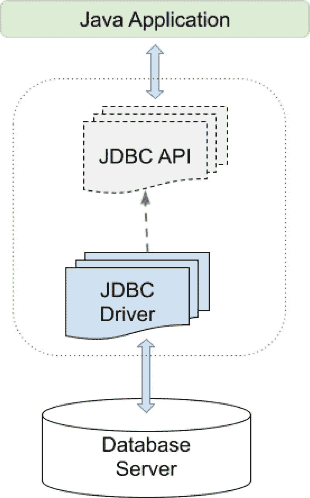

图 11-12

JDBC 架构

对于直接与数据库通信的独立 Java 应用程序，该架构被称为**两层架构**。对于部署在应用服务器（如**第** **10****章**介绍的 Apache Tomcat）上的应用程序，服务器通常提供 JDBC 实现并自身成为一个层，因此该架构被称为**三层架构**。这样，JDBC API 就成为了中间层。

JDBC 驱动程序被称为数据库的纯 Java 直接驱动程序。这意味着 JDBC 是一种数据库驱动程序实现，它在调用程序和数据库之间利用中间层（例如应用服务器）。

JDBC 的核心组件之一是到数据库的**连接**。这由实现 `java.sql.Connection` 的类来建模。数据库连接由工厂对象创建，这些工厂对象是实现 `javax.sql.DataSource` 接口的类的实例。

JDBC 的第三个重要部分是 **JDBC 测试套件**，它用于验证你的代码与所使用的 JDBC 驱动程序的兼容性。

那么它是如何工作的呢？Java 对象如何保存到数据库，数据又如何转换回 Java 对象？理论上，在最简单的情况下，一个类映射到一个表；其字段映射到该表的列。你还需要编写代码来支持各种查询、结果解释以及更多操作。这是因为 JDBC 是多个框架最终用来与数据库通信的低级 API。如果不使用更高级别的 API，你就必须自己完成所有繁重的工作（编写 SQL 查询、将结果映射到对象等）。某些类型的应用程序（通常是金融类）需要这种方法，因为 SQL 级别的优化优于其上层级别的优化。对于其他应用程序，则有诸如 JDO^(¹¹²)、JPA^(¹¹³)、Hibernate^(¹¹⁴) 等框架。然而，这些框架对于本书来说过于高级，因此我们将介绍如何使用 JDBC 执行一些基本操作，以便让你有一个整体的了解。

本书的 `database-sample` 项目包含用于与 MySQL 数据库通信、执行一些数据定义语言（DDL）语句和一些数据操作语言（DML）SQL 命令的源代码。

**DDL** 是 SQL 命令的一个子集，用于定义数据库的结构或模式。它涉及创建、修改和删除数据库结构，如表、索引、视图和用户。

**DML** 是 SQL 命令的一个子集，用于管理和操作数据库中的数据。它包括常见的 SQL 语句，如 `SELECT`、`INSERT`、`UPDATE` 和 `DELETE`，这些语句允许用户从数据库表中检索、添加、修改和删除数据。

因此，我们编写 DML 语句来操作数据，编写 DDL 语句来定义保存数据的结构。JDBC 的 `java.sql.Statement` 接口包含方法骨架，各种驱动程序实现这些方法以支持 DML 和 DDL 语句。

要遵循本节中的示例，你需要有一个本地 MySQL 数据库实例或一个已设置的容器。GitHub 上提供的源代码提供了启动容器的方法，并且官方站点^(¹¹⁵)上提供了在计算机上安装 Docker 的说明。清单 11-53 展示了一些典型的 JDBC 代码，用于使用具有管理权限的 `root` 用户创建到 `mysql` 数据库的连接，并创建一个名为 `musicdb` 的新数据库和一个名为 `sample` 的用户。

```
// 来自类 com.apress.bgn.eleven.DDLMySQLDemo 的代码片段
import java.sql.DriverManager;
import java.sql.SQLException;
// 部分代码已省略
private static final Logger LOGGER = LoggerFactory.getLogger(DDLMySQLDemo.class);
//...
try (var con = DriverManager.getConnection(
"jdbc:mysql://localhost:3306/mysql",
"root", "mypass")) {
var stmt = con.createStatement();
stmt.execute("create database musicdb");
stmt.execute("CREATE USER 'sample'@'%' IDENTIFIED BY 'sample'");
stmt.execute("GRANT ALL PRIVILEGES ON *.* TO 'sample'@'%'");
stmt.execute("flush privileges");
var rs = stmt.executeQuery("SELECT * FROM user");
var foundUser = false;
while (rs.next() && !foundUser) {
foundUser = rs.getString("User") .equals("sample");
}
if (foundUser) {
LOGGER.info("用户 'sample' 已创建。");
}
} catch (SQLException e) {
LOGGER.error("嗯，这出乎意料...", e);
}
清单 11-53
使用 JDBC 创建用户和数据库
```

清单 11-53 中的代码示例执行了所有必要的语句，以创建一个名为 `musicdb` 的数据库，创建一个名为 `sample` 且使用密码 `sample` 连接数据库的用户，并授予该用户对 `musicdb` 数据库的管理权限。


`con.createStatement()` 方法返回一个用于执行 SQL DDL 语句的 `Statement` 实例。当使用 MySQL 驱动时，返回实例的类型为 `com.mysql.cj.jdbc.StatementImpl`，这是 `Statement` 接口的 MySQL 实现，用于执行 MySQL 语句。

`execute(..)` 方法执行给定的 SQL 语句，如果第一个结果是 `ResultSet` 对象则返回 `true`；如果是更新计数或没有结果则返回 `false`。如果在与数据库通信时出现任何问题，此方法还会抛出 `SQLException`。该方法适用于执行 SQL DDL 语句，因为它们不返回数据，也适用于 SQL DML UPDATE/DELETE 语句。

此方法的替代方案是 `executeUpdate(..)`，它返回 insert、update 和 delete 语句影响的行数，对于 SQL DDL 语句则返回 0（零）。因此，清单 11-53 中的代码可以重写为清单 11-54 所示。

```
// snippet from class com.apress.bgn.eleven.DDLMySQLDemoV2
import java.sql.DriverManager;
import java.sql.SQLException;
// some code omitted
private static final Logger LOGGER = LoggerFactory.getLogger(DDLMySQLDemo.class);
//...
try (var con = DriverManager.getConnection(
"jdbc:mysql://localhost:3306/mysql",
"root", "mypass")) {
var stmt = con.createStatement();
var stmtIntResult = stmt.executeUpdate("create database musicdb");
if (stmtIntResult == 0) {
LOGGER.info("'musicdb' database created.");
}
stmt.executeUpdate("CREATE USER 'sample'@'%' IDENTIFIED BY 'sample'");
stmt.executeUpdate("GRANT ALL PRIVILEGES ON *.* TO 'sample'@'%'");
stmt.executeUpdate("flush privileges");
var rs = stmt.executeQuery("SELECT * FROM user");
var foundUser = false;
while (rs.next() && !foundUser) {
foundUser = rs.getString("User") .equals("sample");
}
if (foundUser) {
LOGGER.info("User 'sample' created.");
}
} catch (SQLException e) {
LOGGER.error("Well, this is unexpected...", e);
}
Listing 11-54
Using JDBC to Create a User and Database (Alternative)
```

`executeQuery(..)` 方法执行给定的 SQL 语句并返回单个 `ResultSet` 对象。此方法允许我们通过检查 MySQL `user` 表的内容来确认用户是否已创建。

除了此处列出的方法外，`Statement` 接口还提供了一些其他实用方法。然而，这些方法都无法帮助将 `ResultSet` 转换为 `Singer` 实例，因此使用 JDBC 无法将 SQL 表行映射到 Java 对象。JDBC 简单高效、安全且平台无关；但它并不以对开发者友好而著称。

## 总结

本章涵盖了处理各种类型文件、序列化 Java 对象并保存到文件、以及通过反序列化恢复它们所需了解的大部分细节。在编写 Java 应用程序时，你很可能需要将数据保存到文件或从文件读取数据，本章提供了相当广泛的组件列表来实现这一点。以下是你在本章中学到的内容的简要总结：

*   使用 `File` 和 `Path` 实例
*   使用 `java.nio.file.Files` 和 `java.nio.file.Paths` 中的实用方法
*   将 Java 对象序列化/反序列化为二进制、XML 和 JSON 格式
*   使用 Java Media API 调整和修改图像大小
*   在 JavaFX 应用程序中使用图像
*   使用 JDBC 执行 SQL DDL 和 DML 语句

脚注 1   2   3   4   5   6   7   8   9   10   11   12   13

