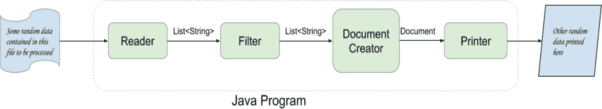
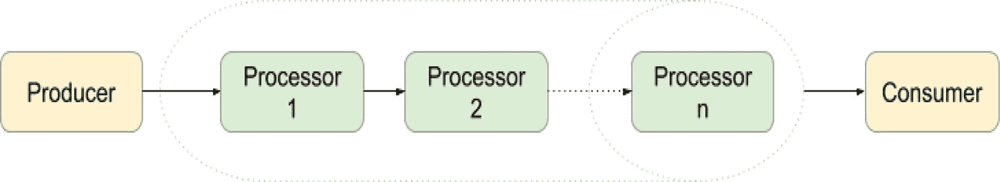
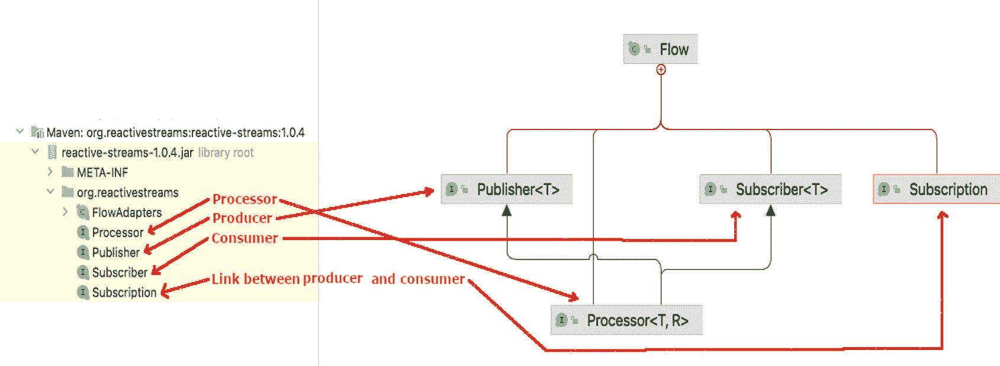
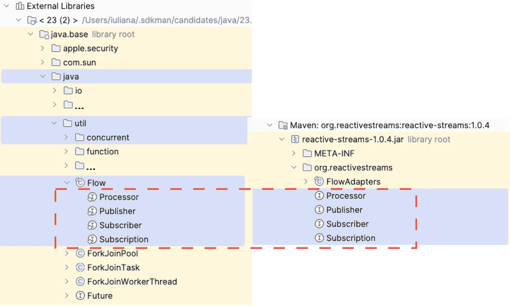
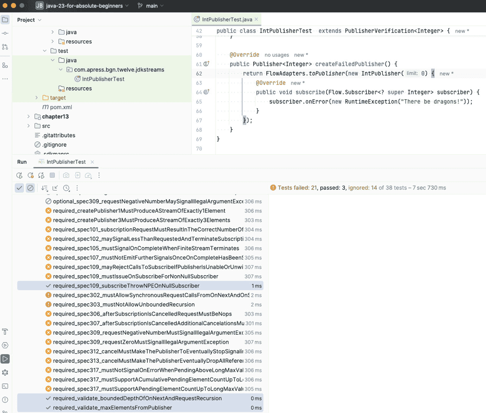
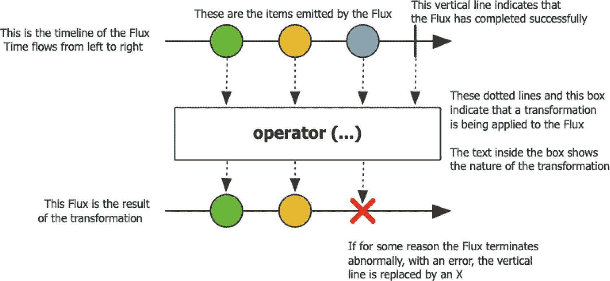

# 12. 发布/订阅框架

本书迄今为止解释的所有编程概念都涉及需要处理的数据。无论数据以何种形式提供，我们编写的 Java 程序都会获取这些数据，对其进行修改，并将结果输出到控制台、文件或其他软件组件。可以说，所有这些组件都在相互通信，并将处理后的数据从一个组件传递到另一个组件。例如，图 12-1 抽象地描述了程序中 Java 组件之间的交互。



图 12-1

程序中 Java 组件之间的交互

每个箭头都标有从一个组件传递到另一个组件的信息类型。在此图中，你可以识别出一个起点，信息通过 `Reader` 读取进入程序，以及一个终点，信息由 `Printer` 打印到某个输出组件。可以说，`Reader` 提供数据，`Filter` 和 `DocumentCreator` 是某些内部处理器，处理数据，而 `Printer` 是数据的消费者。

到目前为止所描述的内容类似于一种**点对点（P2P）消息传递模型**，该模型描述了一条消息发送给一个消费者的概念。P2P 模型特定于一个名为 *Java 消息服务（JMS）* 的 Java API，该 API 支持网络中计算机之间称为消息传递的正式通信。图 12-1 中描绘的示例表明，Java 程序组件之间的通信工作方式类似。实现图 12-1 所述流程的解决方案设计，可以通过将所有组件链接到消息传递风格的通信模型中来创建。

存在不止一种通信模型——生产者/消费者、发布/订阅和发送者/接收者——每种模型都有其特定之处，但本章重点介绍**发布/订阅**，因为这是响应式编程所基于的模型。

注意

如果你有兴趣了解更多关于其他通信模型的信息，请在网上搜索“企业集成模式”。


## 响应式编程与响应式宣言

**响应式编程**是一种声明式编程风格，涉及使用数据流和变更传播。它围绕异步和事件驱动编程原则展开，意味着构建解决方案来高效管理数据流和异步操作。响应式流是一项倡议，旨在为带有非阻塞背压的异步流处理提供标准。响应式流对于解决需要跨线程边界进行复杂协调的问题极为有用。其操作符允许你将数据收集到所需线程上，并确保线程安全操作，在大多数情况下无需过度使用`synchronized`和`volatile`结构。

在 Java 领域，曾有人认为 Java 21 中虚拟线程的引入会扼杀构建响应式解决方案的兴趣，但响应式编程是一种编程范式，而虚拟线程是一种技术实现。因此，我在本版中仍保留了这一响应式编程章节。

Java 在版本 8 中引入 Stream API 后向响应式编程迈出了一步，但响应式流直到版本 9 才可用。你已经学会了如何在**第****8 章**中使用流，现在你只需理解如何使用响应式流进行一些响应式编程。

使用响应式流并非新概念。《响应式宣言》于 2014 年首次公开发布^(¹¹⁶)，提出软件开发应遵循这样的方式：**系统应具备“响应性、韧性、弹性与消息驱动”——简而言之，它们应该是响应式的**。

以下简要解释《响应式宣言》中使用的四个术语：

*   **响应性**：系统应提供快速且一致的响应时间。
*   **韧性**：系统在发生故障时应保持响应能力，并能够恢复。
*   **弹性**：系统在不同工作负载下应保持响应能力。
*   **消息驱动**：系统应使用异步消息进行通信，避免阻塞，并在必要时应用背压。

按此方式设计的系统应更加灵活、松耦合且可扩展，同时应更易于开发、便于变更，并更能容忍故障。为了实现这一切，系统需要一个通用的通信 API。如前所述，响应式流是一项倡议，旨在提供这样一个用于异步、非阻塞流处理的标准 API，同时支持背压。稍后我将解释**背压**的含义。让我们从响应式流处理的基础开始。

任何类型的流处理都涉及数据生产者、数据消费者以及它们之间处理数据的组件。显然，数据流的方向是从生产者到消费者。至此描述的系统抽象模式如图 12-2 所示。



图 12-2

生产者/消费者系统

当生产者比消费者快时，系统可能会陷入困境，因此必须处理无法被处理的额外数据。有多种方式可以做到这一点：


图 12-3

响应式生产者/消费者系统

*   丢弃额外数据（这在网络硬件中完成）。
*   阻塞生产者，以便消费者有时间赶上。
*   缓冲数据。然而，缓冲区是有限的，如果生产者快而消费者慢，则存在缓冲区溢出的风险。
*   应用**背压**，这涉及赋予消费者调节生产者的能力，并控制生产多少数据。背压可以看作是从消费者发送给生产者的消息，让生产者知道消费者需要降低其数据生产速率。考虑到这一点，我们可以完善上图中的设计，结果如图 12-3 所示。

如果生产者、处理器和消费者不同步，那么通过阻塞直到每个组件准备好处理数据来解决数据过多的问题并非可行选项，因为这将使系统变为同步系统。丢弃数据也不可行，而缓冲则不可预测，因此对于响应式系统，我们唯一的选择是应用**非阻塞背压**。

提示

如果软件示例让你感到困惑，请想象以下场景：你有一个名叫吉姆的朋友。你还有一桶颜色各异的球。吉姆让你把所有红球给他。你有两种方式做到这一点：

*   你挑出所有红球，放入另一个桶中，然后将桶递给吉姆。这是典型的请求-完整响应模型。这是一种异步模型。如果挑选红球耗时过长，吉姆会在你分拣时去做其他事情，当你完成后，你通知他他的红球桶已准备好。这是异步的，因为吉姆没有被你分拣球的过程阻塞，他能够去做其他事情，然后在球准备好时再取走。
*   你从桶中一个一个地取出红球，然后扔向吉姆。这就是你的数据流，或者在此例中是球流。如果你找球和扔球的速度比吉姆接球的速度快，就会发生堵塞。于是吉姆让你慢下来。这就是他在调节球的流动，相当于现实世界中的背压。

在 Java 9 之前，无法在 Java 中编写可聚合到响应式系统中的应用程序，因此开发者不得不依赖外部库。响应式应用程序必须根据响应式编程原则进行设计，并使用响应式流来处理数据。响应式编程的标准 API 最初由**reactive-streams**库描述，该库也可与 Java 8 一起使用。在 Java 9 中，标准 API 被添加到 JDK 中，而下一版本的`reactive-streams`库包含一组声明为嵌套在`org.reactivestreams.FlowAdapters`类中的类，这些类代表两个 API（响应式流 API 和响应式流 Flow API）中类似组件之间的桥梁。

在图 12-4 中，你可以看到来自`org.reactivestreams`的接口，这些接口旨在由具有前述角色的组件实现。



图 12-4

响应式流接口（如 IntelliJ IDEA 中所示）

响应式流 API 由四个基本接口组成：

*   `Publisher<T>`暴露一个名为`void subscribe(Subscriber<? super T>)`的方法，该方法被调用来添加一个`Subscriber<T>`实例，并生成类型为`T`的元素，这些元素将由`Subscriber<T>`消费。`Publisher<T>`实现的目的是根据从其订阅者收到的需求发布值。
*   `Subscriber<T>`消费来自`Publisher<T>`的元素，并暴露四个必须实现的方法，以根据`Publisher<T>`实例接收的事件类型定义实例的具体行为：
    *   `void onSubscribe(Subscription)`是订阅者上第一个被调用的方法，它使用`Subscription`参数将`Publisher<T>`链接到`Subscriber<T>`实例；如果此方法抛出异常，则后续行为无法保证。


*   `void onNext(T)` 是当 `Subscription` 产生下一个数据项时调用的方法，用于接收数据；如果该方法抛出异常，`Subscription` 可能会被取消。
*   `void onError(Throwable)` 是当 `Publisher<T>` 或 `Subscription<T>` 遇到不可恢复的错误时调用的方法。
*   `void onComplete()` 是当没有更多数据需要消费时调用的方法，此后将不再调用 `Subscriber<T>` 的其他方法。
*   `Processor<T,R>` 同时继承了 `Publisher<T>` 和 `Subscriber<R>`，因为它需要消费数据，并生成数据以进一步向上游发送。
*   `Subscription` 连接了 `Publisher<T>` 和 `Subscriber<T>`，可以通过调用 `request(long)` 来设置要生成并发送给消费者的数据项数量，从而实现背压。它还允许通过调用 `cancel()` 方法来取消数据流，告知 `Subscriber<T>` 停止接收消息。

在 JDK 中，上述所有接口都定义在 `java.util.concurrent.Flow` 类中。这个类的名称本身就说明了其用途，因为前面的接口用于创建流控组件，这些组件可以链接在一起，构成一个响应式应用。图 12-5 展示了 JDK 响应式流 API 与响应式流库 API 之间的对应关系。



图 12-5

JDK 响应式流 API 与响应式流库 API 的对应关系

除了这四个接口之外，还有一个 JDK 实现类：`java.util.concurrent.SubmissionPublisher<T>`，它实现了 `Publisher<T>`，为生成数据项并使用该类中的方法发布它们的子类提供了一个便捷的基础。

`Flow` 接口非常基础，可以在编写响应式应用时使用，但这需要大量的工作。目前，多个团队提供了多种实现，为开发响应式应用提供了更实用的方式。使用这些接口的实现，你可以编写响应式应用，而无需编写处理数据的线程同步逻辑。

以下列表包含了最知名的响应式流 API 实现（还有更多，因为在大数据时代，响应式数据处理已不再是奢侈品，而是必需品）：

*   Project Reactor^(¹¹⁷)，被 Spring 用于其 Web 响应式框架
*   Akka Streams^(¹¹⁸)
*   MongoDB Reactive Streams Java Driver^(¹¹⁹)
*   Ratpack^(¹²⁰)
*   ReactiveX^(¹²¹)

## 使用 JDK 响应式流 API

JDK 为响应式编程提供的接口非常基础，因此实现起来相当繁琐，但本节我们仍将尝试一下。我们将构建一个应用，该应用生成无限数量的整数值，过滤这些值，并选出小于 127 的值。对于偶数且在 98 到 122 之间的值，应用将减去 32（基本上是将小写字母转换为大写字母），然后将其转换为字符并打印出来。

不使用响应式流的最基本解决方案如代码清单 12-1 所示。

```
package com.apress.bgn.twelve.dummy;
// 省略了一些导入语句
import java.security.SecureRandom;
public class BasicIntTransformer {
private static final Logger LOGGER = LoggerFactory.getLogger(BasicIntTransformer.class);
private static final SecureRandom random = new SecureRandom();
void main() {
int rndNo = random.nextInt(130);
if (rndNo =98 && rndNo <=122) {
rndNo -=32;
}
char res = (char) rndNo;
LOGGER.info("Result: {}", res);
} else {
LOGGER.debug("Number {} discarded.", rndNo);
}
}
}
// 示例输出
//[main] INFO com.apress.bgn.twelve.dummy.BasicIntTransformer -- Initial value: 95
//[main] INFO com.apress.bgn.twelve.dummy.BasicIntTransformer -- Result: _
//[main] INFO com.apress.bgn.twelve.dummy.BasicIntTransformer -- Initial value: 33
//[main] INFO com.apress.bgn.twelve.dummy.BasicIntTransformer -- Result: !
// ..
代码清单 12-1
生成无限数量的小于 127 的整数
```

代码清单 12-1 中的每一行代码都有其目的和期望的结果。这种方法被称为*命令式编程*，因为它按顺序执行一系列语句以产生期望的输出。然而，这并不是我们的目标。在本节中，我们将使用 JDK 响应式接口的实现来实现一个响应式解决方案，因此我们需要以下组件：

*   一个发布者组件，它利用无限流来生成随机整数值。该类应实现 `Flow.Publisher<Integer>` 接口。
*   一个处理器，仅选择可以转换为可见字符的整数值，在我们的解决方案中，这些字符的编码范围是 [0,127]。该类应实现 `Flow.Processor<Integer, Integer>`。
*   一个处理器，修改接收到的偶数且在 98 到 122 之间的元素，减去 32。该类也应实现 `Flow.Processor<Integer, Integer>`。
*   一个处理器，将整数元素转换为对应的字符。这是一种特殊类型的处理器，它将一种类型的值映射为另一种类型的值，应实现 `Flow.Processor<Integer, Character>`。
*   一个订阅者，打印从链中最后一个处理器接收到的元素。该类将实现 `Flow.Subscriber<Character>` 接口。

让我们从声明 `Publisher<T>` 开始，它将包装一个无限流以生成待消费的值。我们将通过提供一个完整的、具体的实现来异步提交元素，从而实现 `Flow.Publisher<Integer>` 接口。为了在需要时缓冲它们，需要添加大量代码。幸运的是，`SubmissionPublisher<T>` 类已经实现了这一点，因此，在我们的类内部，我们将使用一个 `SubmissionPublisher<Integer>` 对象。发布者的代码如代码清单 12-2 所示。


```
package com.apress.bgn.twelve.jdkstreams;
import java.util.concurrent.Flow;
import java.util.concurrent.SubmissionPublisher;
import java.util.random.RandomGenerator;
import java.util.stream.IntStream;
public class IntPublisher implements Flow.Publisher {
static RandomGenerator randomGenerator = RandomGenerator.of("SecureRandom");
protected final IntStream intStream;
public IntPublisher(long limit) {
intStream = limit == 0 ? IntStream.generate(() -> randomGenerator.nextInt(150)) :
IntStream.generate(() -> randomGenerator.nextInt(150)).limit(30);
}
private final SubmissionPublisher submissionPublisher = new SubmissionPublisher();
@Override
public void subscribe(Flow.Subscriber subscriber) {
submissionPublisher.subscribe(subscriber);
}
public void start() {
intStream.forEach(element -> {
submissionPublisher.submit(element);
sleep();
});
}
private void sleep() {
try {
Thread.sleep(1000);
} catch (InterruptedException _) {
}
}
}
**清单 12-2**
**生成无限整数的发布者**
```

> **提示**
>
> 请注意 `IntPublisher` 类的构造函数只接受一个参数。如果在实例化时提供的参数值为 0（零），则会创建一个无限流。如果参数值不为 0，则会创建一个有限流。如果你想运行示例而不强制停止执行，这会很有用。

正如预期，我们为 `subscribe()` 方法提供了实现。在这种情况下，我们只需将 `subscriber` 转发给内部的 `submissionPublisher`。这是必要的，因为我们通过包装 `submissionPublisher` 来创建发布者；否则，我们的流程将无法按预期工作。此外，我们还添加了一个 `start()` 方法，该方法从无限的 `IntStream` 中获取元素，并使用内部的 `submissionPublisher` 提交它们。

`IntStream` 使用一个 `RandomGenerator` 实例来生成 `[0,150]` 区间内的整数值。选择这个区间是为了让我们能够看到大于 127 的值是如何被连接到发布者的第一个 `Flow.Processor<T,R>` 实例丢弃的。为了能够减慢元素提交的速度，我们添加了对 `Thread.sleep(1000)` 的调用，这基本上保证了每秒会有一个元素被向上游转发。

第一个处理器的名称将是 `FilterCharProcessor`，它将使用一个内部的 `SubmissionPublisher<Integer>` 实例，将其处理后的元素发送给下一个处理器。

抛出的异常也将使用 `SubmissionPublisher<Integer>` 进行转发。该处理器既充当发布者，也充当订阅者，因此 `onNext(..)` 方法的实现必须包含对 `subscription.request(..)` 的调用以应用背压。从本章前面展示的图中可以看出，处理器本质上是一个允许数据双向流动的组件，它通过同时实现 `Publisher<T>` 和 `Subscriber<T>` 来实现这一点。

处理器必须订阅发布者，当调用发布者的 `subscribe(..)` 方法时，将触发 `onSubscribe(Flow.Subscription subscription)` 方法的调用。订阅对象必须在本地存储，以便用于应用背压。但在接受订阅时，我们必须确保该字段尚未被初始化，因为根据响应式流规范，一个发布者只能有一个订阅者，否则结果将不可预测。如果（且当）有新的订阅到达，必须通过调用 `cancel()` 来取消它。处理器的完整代码如清单 12-3 所示。

```
package com.apress.bgn.twelve.jdkstreams;
import java.util.concurrent.Flow;
import java.util.concurrent.SubmissionPublisher;
// 部分输入语句已省略
public class FilterCharProcessor extends Flow.Processor {
private static final Logger LOGGER = LoggerFactory.getLogger(FilterCharProcessor.class);
private final SubmissionPublisher submissionPublisher = new SubmissionPublisher();
private Flow.Subscription subscription;
@Override
public void subscribe(Flow.Subscriber subscriber) {
submissionPublisher.subscribe(subscriber);
}
@Override
public void onSubscribe(Flow.Subscription subscription) {
if (this.subscription == null) {
this.subscription = subscription;
// 应用背压 - 请求一个元素
this.subscription.request(1);
} else {
subscription.cancel();
}
}
@Override
public void onNext(Integer element) {
if (element >=0 && element  Implementation FilterCharProcessor That Filters Integers > 127
```

这个处理器非常具体，而一个处理流程通常需要多个处理器。在这个场景中，我们需要几个处理器，并且由于其余的实现（除了 `onNext(..)` 方法）大多是样板代码，用于允许处理器在我们设计的流程中链接在一起，因此将这些代码封装到一个 `AbstractProcessor` 中会更实用，该解决方案所需的所有处理器都可以继承这个抽象类。

因为流程中的最后一个处理器需要将接收到的 `Integer` 值转换为 `Character`，所以我们需要保持此实现的返回类型是泛型的。代码如清单 12-4 所示。

```
package com.apress.bgn.twelve.jdkstreams;
import java.util.concurrent.Flow;
import java.util.concurrent.SubmissionPublisher;
public abstract class AbstractProcessor  implements Flow.Processor {
protected final SubmissionPublisher submissionPublisher = new SubmissionPublisher();
protected Flow.Subscription subscription;
@Override
public void subscribe(Flow.Subscriber subscriber) {
submissionPublisher.subscribe(subscriber);
}
@Override
public void onSubscribe(Flow.Subscription subscription) {
if (this.subscription == null) {
this.subscription = subscription;
// 应用背压 - 请求一个或多个
this.subscription.request(1);
} else {
// 避免多个发布者向此订阅者发送元素
// 不接受其他订阅
subscription.cancel();
}
}
@Override
public void onError(Throwable throwable) {
submissionPublisher.closeExceptionally(throwable);
}
@Override
public void onComplete() {
submissionPublisher.close();
}
protected void submit(T element) {
submissionPublisher.submit(element);
}
}
**清单 12-4**
**AbstractProcessor 实现**
```

这简化了 `FilterCharProcessor<Integer, Integer>` 以及其他处理器的实现。`FilterCharProcessor<Integer, Integer>` 的简化实现如清单 12-5 所示。

```
package com.apress.bgn.twelve.jdkstreams;
import org.slf4j.Logger;
import org.slf4j.LoggerFactory;
public class FilterCharProcessor extends AbstractProcessor {
private static final Logger LOGGER = LoggerFactory.getLogger(FilterCharProcessor.class);
@Override
public void onNext(Integer element) {
if (element >= 0 && element 
```

现在我们有了一个发布者和一个处理器，接下来做什么？当然是连接它们。清单 12-6 中的点（`..`）替换了所有相互连接的处理器和订阅者，我们将在本节中构建这些内容。

```
package com.apress.bgn.twelve.jdkstreams;
public class ReactiveDemo {
void main() {
var publisher = new IntPublisher(0);
var filterCharProcessor = new FilterCharProcessor();
// 部分代码已省略
publisher.subscribe(filterCharProcessor);
// 部分代码已省略
publisher.start();
}
}
**清单 12-6**
**执行响应式流程**
```


下一个处理器实现是通过减去 32 将小写字母转换为大写字母。它同样可以通过扩展 `AbstractProcessor<Integer, T>` 轻松实现，其实现如代码清单 12-7 所示。

```
package com.apress.bgn.twelve.jdkstreams;
public class TransformerProcessor extends AbstractProcessor{
@Override
public void onNext(Integer element) {
if(element % 2 == 0 && element >=98 && element <=122) {
element -=32;
}
submit(element);
subscription.request(1);
}
}
代码清单 12-7
TransformerProcessor 实现
```

要将此处理器接入数据流，我们只需实例化它，然后调用 `filterCharProcessor.subscribe(..)` 并将此实例作为参数传入。代码清单 12-8 展示了创建响应式流的下一步。

```
package com.apress.bgn.twelve.jdkstreams;
public class ReactiveDemo {
void main() {
var publisher = new IntPublisher(0);
var filterCharProcessor = new FilterCharProcessor();
var transformerProcessor = new TransformerProcessor();
// 部分代码省略
publisher.subscribe(filterCharProcessor);
filterCharProcessor.subscribe(transformerProcessor);
// 部分代码省略
publisher.start();
}
}
代码清单 12-8
将 TransformerProcessor 实例添加到响应式流中
```

下一个需要实现的处理器是该方案所需的最后一个处理器，它将 `Integer` 值转换为 `String` 值。为了尽可能保持实现的声明式风格，该处理器将作为参数提供给映射函数。代码如代码清单 12-9 所示。

```
package com.apress.bgn.twelve.jdkstreams;
import java.util.function.Function;
public class MappingProcessor extends AbstractProcessor {
private final Function function;
public MappingProcessor(Function function) {
this.function = function;
}
@Override
public void onNext(Integer element) {
submit(function.apply(element));
subscription.request(1);
}
}
代码清单 12-9
MappingProcessor 实现
```

在代码清单 12-10 中，你可以看到一个 `MappingProcessor` 实例被添加到响应式流中。

```
package com.apress.bgn.twelve.jdkstreams;
public class ReactiveDemo {
void main() {
var publisher = new IntPublisher(0);
var filterCharProcessor = new FilterCharProcessor();
var transformerProcessor = new TransformerProcessor();
var mappingProcessor = new MappingProcessor(element -> (char) element.intValue());
// 部分代码省略
publisher.subscribe(filterCharProcessor);
filterCharProcessor.subscribe(transformerProcessor);
transformerProcessor.subscribe(mappingProcessor);
// 部分代码省略
publisher.start();
}
}
代码清单 12-10
将 MappingProcessor 实例添加到响应式流中
```

该数据流的最后一个组件是订阅者。订阅者是数据流中最重要的组件——在订阅者被添加到数据流并创建 `Subscription` 实例之前，实际上什么都不会发生。我们的订阅者实现了 `Flow.Subscriber<Character>`，其大部分代码与我们之前在 `AbstractProcessor<T>` 中隔离出来的代码相同，这看起来可能有点冗余，但也使得事情变得非常简单。代码清单 12-11 描述了 `Subscriber` 的实现。

```
package com.apress.bgn.twelve.jdkstreams;
// 部分导入语句省略
import java.util.concurrent.Flow;
public class CharPrinter  implements Flow.Subscriber {
private static final Logger LOGGER = LoggerFactory.getLogger(CharPrinter.class);
private Flow.Subscription subscription;
@Override
public void onSubscribe(Flow.Subscription subscription) {
if (this.subscription == null) {
this.subscription = subscription;
this.subscription.request(1);
} else {
subscription.cancel();
}
}
@Override
public void onNext(Character element) {
LOGGER.info("Result: {}", element);
// 再次应用背压
subscription.request(1);
}
@Override
public void onError(Throwable throwable) {
LOGGER.error("Something went wrong.", throwable);
}
@Override
public void onComplete() {
LOGGER.info("Printing complete.");
}
}
代码清单 12-11
订阅者实现
```

使用这个订阅者类，现在可以像代码清单 12-12 所示那样完成数据流。

```
package com.apress.bgn.twelve.jdkstreams;
public class ReactiveDemo {
void main() {
var publisher = new IntPublisher(0);
var filterCharProcessor = new FilterCharProcessor();
var transformerProcessor = new TransformerProcessor();
var mappingProcessor = new MappingProcessor(element -> (char) element.intValue());
var charPrinter = new CharPrinter();
publisher.subscribe(filterCharProcessor);
filterCharProcessor.subscribe(transformerProcessor);
transformerProcessor.subscribe(mappingProcessor);
mappingProcessor.subscribe(charPrinter);
publisher.start();
}
}
代码清单 12-12
响应式管道完整实现
```

如果 `subscribe(..)` 方法能返回调用者实例，以便我们可以链式调用 `subscribe(..)` 方法，那就太好了，但我们只能使用现有提供的功能。当运行代码清单 12-12 中的代码时，控制台会打印出类似于代码清单 12-13 所示的日志。

```
...
INFO  c.a.b.t.j.CharPrinter - Result: `
INFO  c.a.b.t.j.CharPrinter - Result: I
DEBUG c.a.b.t.j.FilterCharProcessor - Element 128 discarded.
INFO  c.a.b.t.j.CharPrinter - Result: Z
INFO  c.a.b.t.j.CharPrinter - Result: \
INFO  c.a.b.t.j.CharPrinter - Result: %
DEBUG c.a.b.t.j.FilterCharProcessor - Element 147 discarded.
INFO  c.a.b.t.j.CharPrinter - Result: _
DEBUG c.a.b.t.j.FilterCharProcessor - Element 137 discarded.
...
代码清单 12-13
响应式流执行的控制台输出
```

前面在代码清单 12-2 中展示的示例使用了一个无限的 `IntStream` 来生成待发布、处理和消费的元素。这会导致程序永远运行下去，因此你必须手动停止它。另一个后果是 `onComplete()` 方法永远不会被调用。如果我们想使用它，必须通过使用非零值初始化 `IntPublisher` 来确保发布的项目数量是有限的。

另外需要提及的是，背压处理更多是概念性的。响应式流 Flow API 不提供任何机制来发出背压信号或处理背压。因此，`subscription.request(1)` 只是确保当调用 `onNext(..)` 时，元素生成速率降低到每秒一个。可以根据对订阅者的微调来设计各种处理背压的策略，但在一个不涉及两个微服务进行响应式交互的基本示例中展示这一点颇具挑战性。

JDK 中对响应式流的支持相当薄弱，即使在 2024 年 9 月 17 日发布的版本 23 中也是如此。原本期望在未来的版本中会添加更多有用的类。然而，Oracle 显然专注于其他方面，例如虚拟线程、结构化并发和 Class-File API、重组模块结构，以及决定如何更好地通过 JDK 的使用实现盈利。这就是为什么本章最后一节将介绍一个使用 Project Reactor 库进行响应式编程的简短示例。


## 响应式流技术兼容性工具包

在构建使用响应式流的应用程序时，很多地方都可能出错。为了确保一切按预期运行，**响应式流技术兼容性工具包**（Reactive Streams Technology Compatibility Kit）项目，也称为 **TCK**^(¹²²)，是一个用于编写测试的宝贵库。该库包含可用于根据响应式流规范测试响应式实现的类。TCK 旨在验证 JDK 的 `java.util.concurrent.Flow` 类中包含的接口。出于某种原因，创建该库的团队决定使用 TestNG 作为测试库。

TCK 包含以下四个类，必须实现这些类以提供其 `Flow.Publisher<T>`、`Flow.Subscriber<T>` 和 `Flow.Processor<T,R>` 实现，供测试框架进行验证：

*   `org.reactivestreams.tck.PublisherVerification<T>` 用于测试 `Publisher<T>` 的实现。
*   `org.reactivestreams.tck.SubscriberWhiteboxVerification<T>` 用于对 `Subscriber<T>` 的实现和 `Subscription` 实例进行白盒测试。
*   `org.reactivestreams.tck.SubscriberBlackboxVerification<T>` 用于对 `Subscriber<T>` 的实现和 `Subscription` 实例进行黑盒测试。
*   `org.reactivestreams.tck.IdentityProcessorVerification<T>` 用于测试 `Processor<T,R>` 的实现。

为了使每个测试的目的清晰明了，该库的测试方法名称遵循以下模式：`TYPE_spec####_DESC`，其中 `TYPE` 是 `required`、`optional`、`stochastic` 或 `untested` 之一，表示被测试规则的重要性。`spec####` 中的井号代表规则编号，第一个数字 `1` 用于 `Publisher<T>` 实例，`2` 用于 `Subscriber<T>` 实例。`DESC` 是对测试目的的简短说明。

让我们看看如何测试我们之前定义的 `IntPublisher` 实例。`PublisherVerification<T>` 类要求实现两个测试方法：一个用于测试能够发出多个元素的正常工作的 `Publisher<T>`（`createPublisher(..)` 方法）实例，另一个用于测试“失败的”`Publisher<T>`（`createFailedPublisher(..)` 方法）实例，该实例无法初始化其发出元素所需的连接。

由 `createPublisher(..)` 测试的实例是通过传入一个值不为 0 的参数创建的，因此 `IntPublisher` 实例会发出一组有限的元素，从而使测试执行也是有限的。

`PublisherVerification<Integer>` 的实现如代码清单 12-14 所示。

```
package com.apress.bgn.twelve.jdkstreams;
import org.reactivestreams.FlowAdapters;
import org.reactivestreams.Publisher;
import org.reactivestreams.tck.PublisherVerification;
import org.reactivestreams.tck.TestEnvironment;
import java.util.concurrent.Flow;
// 其他导入语句已省略
public class IntPublisherTest  extends PublisherVerification {
private static final Logger log = LoggerFactory.getLogger(IntPublisherTest.class);
public IntPublisherTest() {
super(new TestEnvironment(300));
}
@Override
public Publisher createPublisher(final long elements) {
return FlowAdapters.toPublisher(new IntPublisher(30) {
@Override
public void subscribe(Flow.Subscriber subscriber) {
intStream.forEach(subscriber::onNext);
subscriber.onComplete();
}
});
}
@Override
public Publisher createFailedPublisher() {
return FlowAdapters.toPublisher(new IntPublisher(0) {
@Override
public void subscribe(Flow.Subscriber subscriber) {
subscriber.onError(new RuntimeException("这里有龙！"));
}
});
}
}
代码清单 12-14
用于测试 IntPublisher 实例的 TestNG 测试类
```

关于上述测试类，还有一点需要提及：由于该实现是为与响应式流 API 配合使用而设计的，因此它不能用于测试基于 JDK 的 `IntPublisher`。然而，响应式流 API 在 1.0.3 版本中增加了一组类，用作响应式流 API 与 JDK 响应式流 API 之间的桥梁。因此，必须将 `IntPublisher` 作为参数提供给 `FlowAdapters.toPublisher(..)` 方法，该方法会将其转换为 `IntPublisherTest` 可以测试的等效 `org.reactivestreams.Publisher`。

`Publisher<T>` 的实现可能无法通过所有测试，原因在于你所构建应用程序的特定设计决策。在我们的案例中，`IntPublisher` 的实现非常简单，当运行所有已执行测试的 `createPublisher(..)` 方法时，只有少数测试通过，大多数被忽略，如图 12-6 所示。



图 12-6

TestNG 响应式发布者执行结果

测试未通过或被忽略的原因是我们的实现没有实现这些特定测试所针对的行为（例如，`maySupportMultiSubscribe`、`maySignalLessThanRequestedAndTerminateSubscription` 和 `mustSignalOnMethodsSequentially`）。

我们也可以通过扩展前面提到的测试类来测试上一节中定义的处理器和订阅者。不过，我将把这个留作练习给你，因为本章中我还想介绍一个更有趣的内容。


## 使用 Project Reactor

如前所述，JDK 对响应式编程的支持相当有限。发布者、处理器和订阅者应异步运行，所有这些行为都必须由开发者实现，这可能会有些麻烦。目前 JDK 唯一适合做的事情，就是为所有其他已有的实现提供一个通用接口。这些实现有很多，它们提供了更多有用的类，用于更专门的响应式组件，以及更易于创建和连接它们的实用方法。作为 Spring 的爱好者，我个人最喜欢的是 **Project Reactor**，这也是 Spring 开发团队青睐的同一个库。

Project Reactor 是最早的响应式编程库之一，其类为构建响应式应用提供了非阻塞的稳定基础，并具备高效的请求管理能力。它适用于 Java 8，但也为 JDK 9+ 的响应式流类提供了适配器类。

Project Reactor 适用于微服务应用，并且提供了比 JDK 多得多的类，旨在使响应式应用的编程更加实用。Project Reactor 提供了两个主要的发布者实现：`reactor.core.publisher.Mono<T>`，这是一个限制为发布零个或一个元素的响应式流发布者；以及 `reactor.core.publisher.Flux<T>`，这是一个带有基本流操作符的响应式流发布者。

使用 Project Reactor 的优势在于，我们有更多的类和方法可以使用，有静态工厂可用于创建发布者，并且操作链可以更容易地组合。不过，Project Reactor 团队不喜欢“处理器”这个名称，因此中间组件被命名为**操作符**。

如果你查看官方文档，很可能会遇到图 12-7^(¹²³) 中的示意图。



图 12-7

Project Reactor Flux 发布者实现

这是 `Flux<T>` 发布者工作原理的抽象示意图。`Flux<T>` 发射元素，可能抛出异常，并在没有更多元素可发布时完成——这与之前解释的行为相同，但 Project Reactor 团队找到了一种更美观的绘制方式。`Mono` 实现的示意图非常相似^(¹²⁴)。

不过，我们先把这个放在一边，来看一些代码示例。使用该类中的多个实用方法，创建 `Flux<T>` 实例非常容易。在开始发布元素之前，让我们设计一个通用的订阅者，它除了打印值之外什么都不做，因为我们需要它来确保我们的 `Flux<T>` 发布者确实能工作。要使用 Project Reactor API 编写订阅者，你有多种选择。首先，你可以直接实现 `org.reactivestreams.Subscriber<T>`，如清单 12-15 所示。

```
package com.apress.bgn.twelve.reactor;
import org.reactivestreams.Subscriber;
import org.reactivestreams.Subscription;
// 其他导入语句已省略
public class GenericSubscriber implements Subscriber {
private static final Logger LOGGER = LoggerFactory.getLogger(GenericSubscriber.class);
private Subscription subscription;
@Override
public void onSubscribe(Subscription subscription) {
if (this.subscription == null) {
this.subscription = subscription;
this.subscription.request(1);
} else {
subscription.cancel();
}
}
@Override
public void onNext(T element) {
LOGGER.info("consumed {} ", element);
subscription.request(1);
}
@Override
public void onError(Throwable t) {
LOGGER.error("Unexpected issue!", t);
}
@Override
public void onComplete() {
LOGGER.info("All done!");
}
}
清单 12-15
org.reactivestreams.Subscriber 实现
```

为了避免实现那么多带有样板代码的方法，还可以选择实现 `reactor.core.CoreSubscriber<T>`（订阅者的 Reactor 基础接口），或者更好的方式是扩展 `reactor.core.publisher.BaseSubscriber<T>` 类，该类提供了基本的订阅者功能。可以通过重写同名但带有 `hook` 前缀的方法来修改典型订阅者方法的行为。在清单 12-16 中，你可以看到使用 Project Reactor 编写订阅者是多么容易。

```
package com.apress.bgn.twelve.reactor;
import reactor.core.publisher.BaseSubscriber;
// 其他导入语句已省略
public class GenericSubscriber  extends BaseSubscriber {
private static final Logger LOGGER = LoggerFactory.getLogger(GenericSubscriber.class);
@Override
protected void hookOnNext(T value) {
LOGGER.info("consumed {} ", value);
super.hookOnNext(value);
}
@Override
protected void hookOnComplete() {
LOGGER.info("call done.");
super.hookOnComplete();
}
}
清单 12-16
reactor.core.publisher.BaseSubscriber 扩展
```

*嗒哒！* 现在我们有了一个订阅者类，让我们创建一个响应式发布者，它从一个无限的整数流中提供整数，以便使用这个类的实例。实现如清单 12-17 所示。

```
package com.apress.bgn.twelve.reactor;
import reactor.core.publisher.Flux;
import java.util.random.RandomGenerator;
import java.util.stream.Stream;
public class ReactorDemo {
static RandomGenerator randomGenerator = RandomGenerator.of("SecureRandom");
void main() {
Flux intFlux = Flux.fromStream(
Stream.generate(() -> randomGenerator.nextInt(150))
);
intFlux.subscribe(new GenericSubscriber());
}
}
// 示例输出
/*
INFO  c.a.b.t.r.GenericSubscriber - consumed 14
INFO  c.a.b.t.r.GenericSubscriber - consumed 35
INFO  c.a.b.t.r.GenericSubscriber - consumed 115
*/
清单 12-17
使用 Project Reactor 的 Flux 创建响应式发布者
```

如果你运行上述代码，你会看到所有生成的整数值都被订阅者打印出来。`Flux<T>` 可以从多种来源创建，包括数组和其他发布者。在特殊情况下，为了避免返回空值，可以通过调用 `empty()` 方法创建一个空的 `Flux<T>`：

```
String[] names = {"Joy", "John", "Anemona", "Takeshi"};
Flux.fromArray(names).subscribe(new GenericSubscriber());
Flux intFlux = Flux.empty();
intFlux.subscribe(new GenericSubscriber());
```

在我看来，最棒的方法叫做 `just(..)`，它同时为 `Flux` 和 `Mono` 提供。它接受一个或多个值，并返回一个发布者，即 `Flux<T>` 或 `Mono<T>`，具体取决于调用它的类型：

```
Flux dummyStr = Flux.just("one", "two", "three");
Flux dummyInt = Flux.just(1,2,3);
Mono one = Mono.just(1);
Mono empty = Mono.empty();
```

另一个你可能觉得有用的方法是 `concat(..)`，它允许你连接两个 `Flux<T>` 实例：

```
String[] names = {"Joy", "John", "Anemona", "Takeshi"};
Flux namesFlux = Flux.fromArray(names);
String[] names2 = {"Hanna", "Eugen", "Anthony", "David"};
Flux names2Flux = Flux.fromArray(names2);
Flux combined = Flux.concat(namesFlux, names2Flux);
combined.subscribe(new GenericSubscriber());
```

还有一件你可能喜欢的事情：还记得 `IntPublisher` 类必须通过调用 `Thread.sleep(1000)` 来减速吗？使用 `Flux<T>` 你不需要这样做，因为有两个实用方法组合起来可以达到同样的效果：

```
Flux infiniteFlux = Flux.fromStream(
Stream.generate(() -> randomGenerator.nextInt(150))
);
Flux delay = Flux.interval(Duration.ofSeconds(1));
Flux delayedInfiniteFlux = infiniteFlux.zipWith(delay, (s,l) -> s);
delayedInfiniteFlux.subscribe(new GenericSubscriber());
```


`interval(..)` 方法创建了一个发布者，它从 0 开始，在全局定时器上按指定的时间间隔递增地发出 `long` 类型的值；该方法接收一个 `Duration` 类型的参数，在前面的示例中使用了秒。`zipWith(..)` 方法将接收到的 `Flux<T>` 实例作为参数进行压缩。`zip` 操作是一种特定的流操作，它意味着两个发布者各自发出一个元素，并使用 `java.util.function.BiFunction<T, U, R>` 将这些元素组合起来。在我们的例子中，该函数只是丢弃第二个元素，并返回被第二个流生成的秒数所减慢的调用流的元素。

Project Reactor 提供的组件的一个优点是，它们返回的大多是调用它们时所用的相同类型的对象，这意味着它们可以很容易地被链式调用。一个与之前基于 JDK 的实现等效的响应式代码片段，可以使用 Project Reactor API 编写，如清单 12-18 所示。

```
Flux infiniteFlux = Flux.fromStream(
Stream.generate(() -> random.nextInt(150))
);
Flux delay = Flux.interval(Duration.ofSeconds(1));
Flux delayedInfiniteFlux = infiniteFlux.zipWith(delay, (s, l) -> s);
delayedInfiniteFlux
.filter(element -> (element >= 0 && element  {
if (item % 2 == 0 && item >= 98 && item  (char) element.intValue())
.subscribe(new GenericSubscriber());
Listing 12-18
使用 Project Reactor 编写响应式管道
```

你在 Stream API 中记得的大多数函数在 Project Reactor 中都已为响应式使用而实现，所以如果前面的代码看起来很熟悉，原因就在于此。

关于 Project Reactor API，如果你需要响应式库，可以优先考虑这个。官方文档^((125))非常棒，并且充满了示例。Oracle 显然已经推迟了提供用于编写响应式应用程序的丰富 API 的计划。

## 总结

响应式编程不是一个简单的主题，但响应式应用程序最适合于建模事件驱动、异步、响应式和弹性的系统。本章不需要深入探讨真正高级的主题来展示响应式解决方案的真正威力。作为一本面向 Java 初学者的书，这不是一个合适的主题。然而，如果你想了解更多关于构建响应式应用程序的知识，由 Apress 于 2021 年 1 月出版的《Pro Spring MVC with WebFlux》^((126))（第二版）中有几个关于使用 Spring 和 Project Reactor 构建响应式应用程序的精彩章节。

重要

你必须记住的是，响应式实现与非响应式实现结合是无用的，因此要构建一个真正的响应式应用程序，所有层都必须是响应式的。

设计和使用的响应式组件与非响应式组件结合是没有意义的，因为你实际上可能会引入故障点并降低速度。例如，如果你使用的是 Oracle 数据库，那么定义一个使用响应式流返回元素的仓库类是没有意义的，因为 Oracle 数据库不支持响应式访问。你只是添加了一个增加额外实现的响应式层，因为在这种情况下没有真正的好处。但是，如果你选择的数据库是 MongoDB，你可以放心地使用响应式编程，因为 MongoDB 数据库支持响应式访问。此外，如果你正在使用 ReactJS 或 Angular 界面构建 Web 应用程序，你可以设计你的控制器类来响应式地提供数据以供界面显示。

本章内容可总结如下：

*   解释了响应式编程。
*   解释了响应式流的行为。
*   涵盖了 JDK 对响应式流的支持。
*   讨论了如何使用响应式流技术兼容性工具包来测试你的响应式解决方案。
*   简要介绍了用于构建响应式应用程序的 Project Reactor 组件。

脚注 1   2   3   4   5   6   7   8   9   10   11

