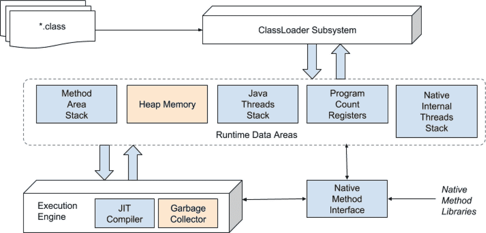
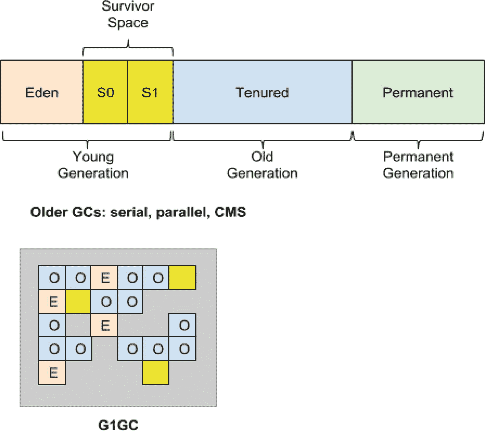
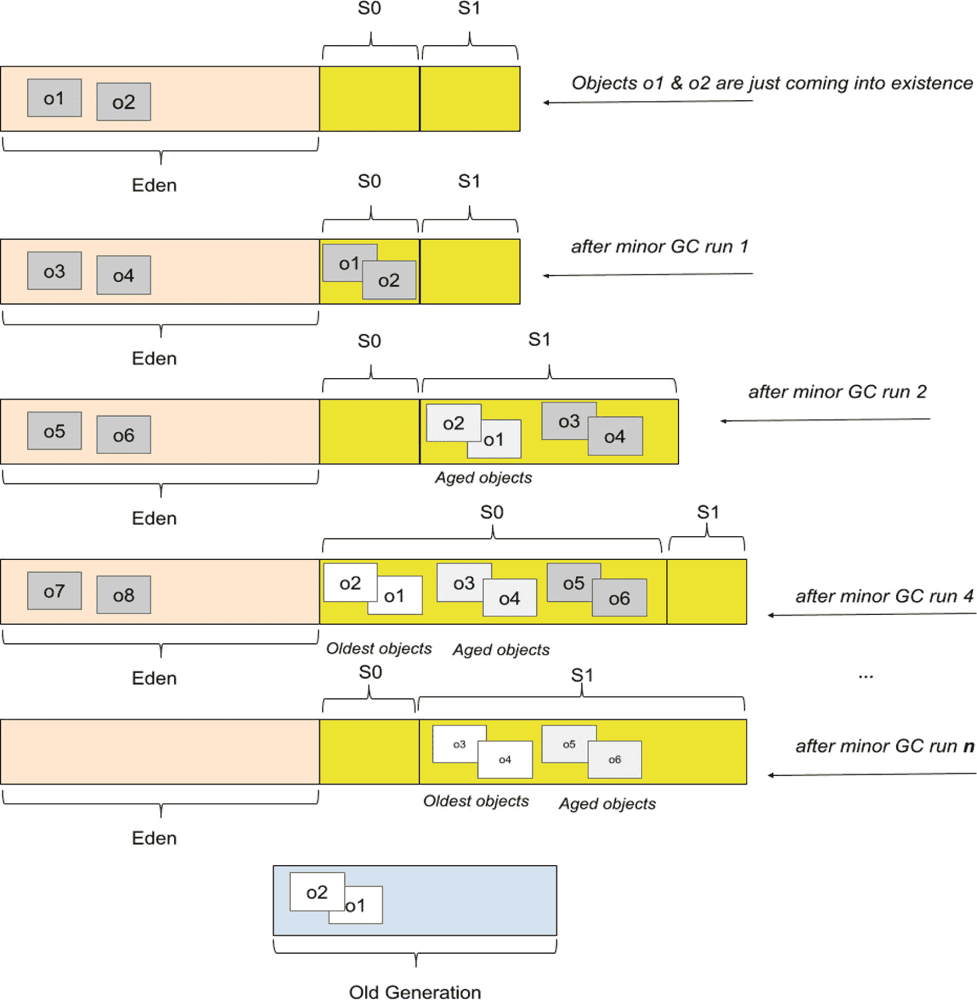
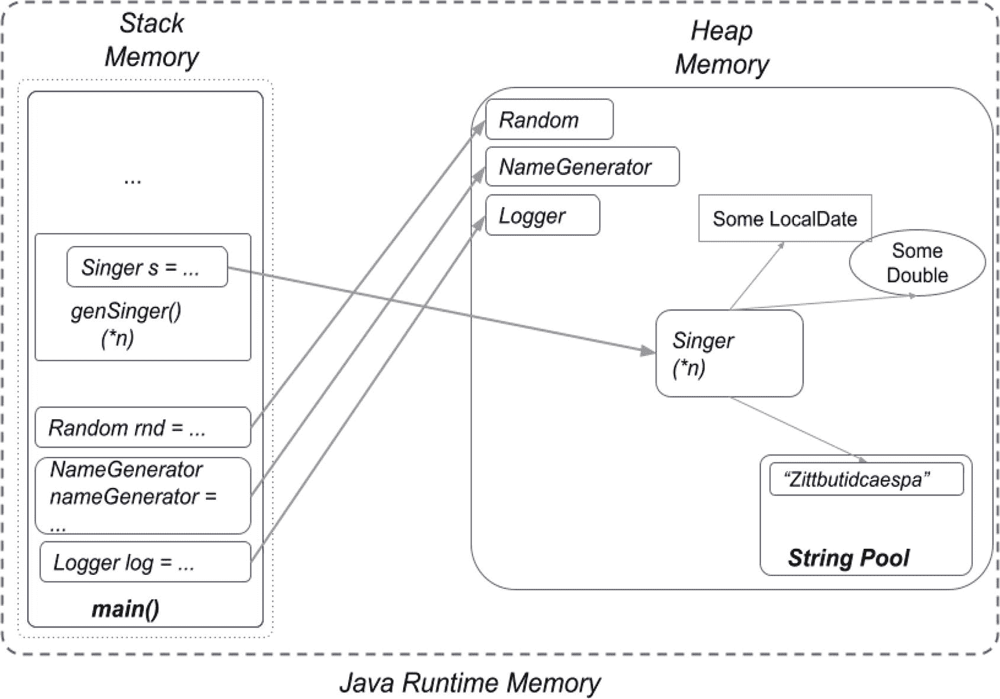

# 13. 垃圾回收

在执行 Java 代码时，对象会在内存中被反复创建、使用和丢弃。丢弃未使用的 Java 对象的过程称为**内存管理**，但更常见的叫法是**垃圾回收 (GC)**。在**第** **5** **章**中曾提到垃圾回收，因为解释原始类型和引用类型之间的区别时需要它，但在本章中，我们将深入 JVM 的*内部机制*，以解开运行中的 Java 应用程序的另一个谜团。

当 Java 垃圾回收器正常工作，在创建新对象之前清理内存，并且内存不会填满时，你可以说分配给程序的内存被*回收*了。像我们到目前为止编写的这种低复杂度的程序，运行时不需要那么多内存，但根据其设计（还记得第 4 章介绍的递归吗？），它们最终可能会使用比可用内存更多的内存。在 Java 中，垃圾回收器会自动运行。在像 C/C++ 这样的更底层的语言中，没有自动内存管理，开发人员负责编写代码来根据需要分配内存，并在不再需要时释放它。虽然自动内存管理看起来很实用，但如果管理不当，垃圾回收器可能会成为一个问题。本章提供了关于垃圾回收器的足够信息，以确保你知道如何明智地使用它，并且当问题出现时，至少你有一个好的起点来开始修复它们。

虽然会介绍一些调整垃圾回收器的方法，但请记住，通常不应该需要调整垃圾回收器。程序的编写方式应该使其只创建执行其功能所需的对象，并正确管理引用；在应用程序投入生产之前，应该估算运行应用程序的服务器的内存容量，并且在此之前应该知道并配置应用程序所需的最大内存量。如果分配给 Java 程序的内存不足，通常意味着实现中存在某些问题。

## 垃圾回收基础

Java 自动垃圾回收是 Java 编程语言的主要特性之一。正如本书开头所述，JVM 是用于执行 Java 程序的虚拟机。Java 程序使用 JVM 所运行系统的资源，因此它必须有一种安全释放这些资源的方法。这项工作由垃圾回收器完成。

垃圾回收器的性能根据以下三个因素进行评估：

*   **吞吐量**：进程完成应用程序工作的速率。理想情况下，JVM 应该花更多时间运行应用程序，而花更少时间执行垃圾回收。
*   **内存占用**：垃圾回收器所需的内存量。
*   **暂停时间**：在垃圾回收期间应用程序停止的时间长度。

要理解垃圾回收器在所有 JDK 组件中的位置，我们必须查看 JVM 架构^((127))。


### Oracle HotSpot JVM 架构

多年来，一些大公司（例如 IBM）已经推出了各自版本的 JVM。如今，随着 Java 进入模块化时代，采用快速交付模式和更昂贵的许可模式，越来越多的公司决定构建自己的 JVM 版本（例如 Azul、Amazon Corretto、GraalVM 和 Eclipse OpenJ9）^(¹²⁸)。

在新的许可模式下，自 2019 年 1 月起，所有两年宽限期后的 LTS 版本都需要为 Java 支持付费，因此公司最终将不得不为运行其基于 Java 的软件的 JDK 付费。官方的 Oracle JDK 可供正在学习编码或构建小型项目的开发者在个人计算机上使用。但是，在服务器上运行由此产生的软件、访问诸如功能完备的 JMC 等企业级特性，并将该软件商业化，则需要付费订阅。

目前，Oracle 的 HotSpot 仍然是许多应用程序使用的最常见的 JVM 实现。在垃圾回收方面，该 JVM 提供了一套成熟的垃圾回收选项。其架构的抽象表示如图 13-1 所示。



图 13-1

Oracle HotSpot JVM 架构（抽象表示）

**堆**内存区域由垃圾回收器管理，并被划分为多个区域。对象在这些区域之间移动，直到被丢弃。图 13-2 中描绘的区域适用于旧式垃圾回收器和新型垃圾回收器，后者可能会遵循 JDK 当前默认垃圾回收器 G1GC 的模型，该回收器是在 JDK 8 中引入的。



图 13-2

堆结构

**G1GC** 是新一代的垃圾回收器，专为拥有大量资源的机器设计，这就是其堆分区方法与众不同的原因。自 Java 9 起，它成为默认的 GC。它的堆被划分为一组大小相等的堆区域，每个区域都是虚拟内存的一个连续范围。某些区域集被分配了与旧回收器相同的角色（伊甸园、幸存者、老年代），但它们的尺寸不是固定的。这为内存使用提供了更大的灵活性。您可以在下一节中阅读更多关于不同类型垃圾回收器的信息，但现在我们仍将重点放在堆内存及其区域上，这些区域被称为**代**。

当应用程序运行时，它创建的对象存储在**年轻代区域**中。当一个对象被创建时，它在该代的一个名为**伊甸园空间**的子区域中开始其生命周期。当伊甸园空间被填满时，会触发一次**次要垃圾回收（minor GC）运行**，清理该区域中未被引用的对象，并将被引用的对象移动到**第一个幸存者空间（S0）**。下一次伊甸园空间被填满时，会再次触发一次 minor GC 运行，再次删除未被引用的对象，而被引用的对象则被移动到**下一个幸存者空间（S1）**。

S0 中的对象已经经历了一次 minor GC 运行，因此它们的年龄会增加。它们也会被移动到 S1，这样 S0 和伊甸园就可以被清理干净。

在下一次 minor GC 运行时，操作会再次执行，但这次被引用的对象会被保存到空的 S0 中。来自 S1 的较老对象的年龄会增加，并也被移动到 S0，这样 S1 和伊甸园就可以被清理干净。

当幸存者空间中的对象达到一定年龄（具体值因每种垃圾回收器而异）后，它们会在 minor GC 运行期间被移动到*老年代空间*。

前面描述的步骤如图 13-3 所示，对象 `o1` 和 `o2` 会一直老化，直到它们被移动到老年代区域。



图 13-3

年轻代空间上的 Minor GC 运行

Minor GC 收集会一直进行，直到老年代空间被填满。这时会触发一次**主要垃圾回收（major GC）运行**，它将删除未被引用的对象并压缩内存，移动对象，使得留下的空闲内存成为一个大的连续空间。

**次要垃圾回收事件是一个“停止一切”的事件**。这个过程基本上接管了应用程序的运行并暂停其执行，以便释放内存。由于年轻代空间相当小（您将在下一节中看到这一点），应用程序的暂停通常可以忽略不计。如果在一次 minor GC 运行后无法从年轻代区域回收任何内存，则会触发一次 major GC 运行。

**永久代**区域是为 JVM 元数据（如类和方法）保留的。该区域也会不时地被清理，以移除应用程序中不再使用的类。当堆中不再有对象时，会触发对该区域的清理。

刚刚描述的垃圾回收过程是分代垃圾回收器（如 G1GC）所特有的。在 JDK 8 之前，垃圾回收是使用一种较旧的垃圾回收器完成的，该回收器使用一种称为**并发标记清除**的算法。这种垃圾回收器与应用程序并行运行，标记已使用和未使用的内存区域。然后它会删除未被引用的对象，并通过移动对象将内存压缩成一个连续的区域。这个过程相当低效且耗时。随着创建的对象越来越多，垃圾回收所需的时间也越来越长，但由于大多数对象的生命周期都很短，这实际上并不是一个问题。因此，CMS 垃圾回收器在一段时间内还是可以接受的。

G1GC 采用类似的方法，但在标记阶段完成后，G1 会专注于那些大部分为空白的区域，以尽可能多地回收未使用的内存。这就是为什么这种垃圾回收器也被称为**垃圾优先**。G1 还使用暂停预测模型，根据为应用程序设置的暂停时间来决定可以处理多少个内存区域。来自已处理区域的对象被复制到堆的单个区域中，从而同时实现了内存压缩。此外，G1GC 对伊甸园和幸存者空间没有固定的大小；它会在每次 minor GC 运行后决定它们的大小。


### 有多少种垃圾回收器？

Oracle HotSpot JVM 提供了以下几种垃圾回收器：

*   **串行回收器**：所有垃圾回收事件都在一个线程中串行执行。每次垃圾回收后都会进行内存压缩。

*   **并行回收器**：次要垃圾回收使用多线程。主要垃圾回收和老年代压缩使用单线程。

*   **G1 回收器**：在 Oracle JDK 7 update 4 中引入，旨在永久取代 CMS GC，适用于能够与 CMS 回收器并发运行、需要内存压缩、需要更可预测的 GC 暂停时间，且不需要更大堆内存的应用程序。G1 回收器是一种服务器风格的垃圾回收器，针对具有大内存的多处理器机器，但考虑到现在大多数笔记本电脑至少拥有八个核心和 16GB 内存，它也非常适合这些设备。G1 既有并发阶段（与应用程序线程同时运行；例如，细化、标记、清理），也有并行阶段（多线程；例如，停止所有事件）。完全垃圾回收仍然是单线程的，但如果调整得当，你的应用程序应该可以避免完全垃圾回收。

*   **Z 垃圾回收器 (ZGC)**：这是在 Java 11 中引入的一种可扩展的低延迟垃圾回收器。ZGC 并发执行所有耗时的工作，不会停止应用程序线程的执行超过 10ms，这使其适用于需要低延迟和/或使用巨大堆（数 TB）的应用程序。

*   **Shenandoah 垃圾回收器**：Shenandoah 是一种低暂停时间的垃圾回收器，在 Java 12 中引入，它通过与正在运行的 Java 程序并发执行更多垃圾回收工作来减少 GC 暂停时间。Shenandoah 并发执行大部分 GC 工作，包括并发压缩，这意味着其暂停时间不再与堆的大小成正比。

*   **Epsilon 无操作回收器**：在 Java 11 中引入，这种回收器实际上是一个虚拟 GC，不回收或清理内存。当堆满时，JVM 直接关闭。这种回收器可用于性能测试、内存分配分析、VM 接口测试，以及内存使用极其受限的极短生命周期任务和应用程序。显然，开发者必须尽可能精确地估算应用程序的内存占用。

我们已经列出了垃圾回收器的类型，但我们如何知道本地 JVM 使用的是哪一种呢？方法不止一种。最简单的方法是在运行一个带有 `main()` 方法的简单类时，添加 `-verbose:gc` 作为 VM 选项。

使用 Java 23，无需任何其他配置，将显示以下输出：

```
[0.011s][info][gc] Using G1
```

注意

使用 VM 选项运行 Java 类的最简单方法是创建一个 IntelliJ IDEA 启动器，并在相应的文本字段中引入 VM 选项。另一种方法是从命令行运行一个简单的类，并将参数添加到命令中。以下示例复用了**第** **2** **章**中介绍的 `Practice01.java` 文件：

`java --enable-preview -Xlog:gc* Practice01.java`

警告

使用启动器可以避免因执行命令所用的 shell 而引起的复杂问题。例如，Zsh（或 Z shell）需要对 `*`（星号）进行转义；否则，它将无法执行命令并报错 `zsh: no matches found: -Xlog:gc*`。

正如你所读到的，默认使用 G1 垃圾回收器。为了显示该垃圾回收器的更多细节，可以在运行 Java 类时将 `-Xlog:gc*` 添加到 VM 参数中，如代码清单 13-1 所示。

```
[0.015s][info][gc,init] CardTable entry size: 512    # (1)
[0.014s][info][gc     ] Using G1
[0.017s][info][gc,init] Version: 23+37-2369 (release)
[0.017s][info][gc,init] CPUs: 16 total, 16 available
[0.017s][info][gc,init] Memory: 32768M
[0.017s][info][gc,init] Large Page Support: Disabled
[0.017s][info][gc,init] NUMA Support: Disabled
[0.017s][info][gc,init] Compressed Oops: Enabled (Zero based)
[0.017s][info][gc,init] Heap Region Size: 4M  # (2)
[0.017s][info][gc,init] Heap Min Capacity: 8M
[0.017s][info][gc,init] Heap Initial Capacity: 512M
[0.017s][info][gc,init] Heap Max Capacity: 8G # (3)
[0.017s][info][gc,init] Pre-touch: Disabled
[0.017s][info][gc,init] Parallel Workers: 13
[0.017s][info][gc,init] Concurrent Workers: 3
[0.017s][info][gc,init] Concurrent Refinement Workers: 13
[0.017s][info][gc,init] Periodic GC: Disabled
[0.030s][info][gc,metaspace] CDS archive(s) mapped at: [0x000000012b000000-0x000000012bd94000-0x000000012bd94000), size 14237696, SharedBaseAddress: 0x000000012b000000, ArchiveRelocationMode: 1.
[0.030s][info][gc,metaspace] Compressed class space mapped at: 0x000000012c000000-0x000000016c000000, reserved size: 1073741824
[0.030s][info][gc,metaspace] Narrow klass base: 0x000000012b000000, Narrow klass shift: 0, Narrow klass range: 0x100000000
... Hey ma' look the GC! ...
[0.209s][info][gc,heap,exit] Heap
[0.209s][info][gc,heap,exit]  garbage-first heap   total reserved 8388608K, committed 528384K, used 5236K [0x0000000600000000, 0x0000000800000000)  # (4)
[0.209s][info][gc,heap,exit]   region size 4096K, 1 young (4096K), 0 survivors (0K)
[0.209s][info][gc,heap,exit]  Metaspace       used 996K, committed 1152K, reserved 1114112K
[0.209s][info][gc,heap,exit]   class space    used 85K, committed 192K, reserved 1048576K
代码清单 13-1
运行 ShowGCDemo 时使用 -verbose:gc -Xlog:gc* VM 选项显示 G1GC 详细信息
```

在 Java HotSpot VM 中，GC 使用一种称为*卡表*的数据结构。卡表加速了查找不再被引用的对象的过程。老年代被分割成 512 字节的块，称为**卡片**，如代码清单 13-1 中标记为 **(1)** 的日志行所示。JDK 18 引入了可配置的卡表卡片大小。可用的卡片大小为 `128`、`256`、`512`（默认）和 `1024`（最后一种仅限 64 位）。要自定义卡片大小，请在运行 `ShowGCDemo` 类时添加 VM 选项 `-XX:GCCardSizeInBytes=<card-size>`，第一个控制台日志消息应反映所需的卡片大小。

我们可以在代码清单 13-1 中看到，内存区域大小为 4M **(2)**，堆最大大小为 8G **(3)**，以及每个代的大小和占用情况 **(4)**。

在**第** **5** **章**中，介绍了 `java -XX:+PrintFlagsFinal -version` 命令来显示所有 JVM 标志。通过过滤“GC”和“NewSize”返回的结果，可以显示所有 GC 特定的标志及其值。这样的标志相当多，它们显示在代码清单 13-2 中。


```
❯ java -XX:+PrintFlagsFinal -version | grep 'GC\|NewSize'
uintx AdaptiveSizeMajorGCDecayTimeScale  = 10    {product} {default}
uint ConcGCThreads                  = 3     {product} {ergonomic}
bool DisableExplicitGC              = false {product} {default}
uint GCCardSizeInBytes              = 512   {product} {default} # (1)
uint GCDrainStackTargetSize         = 64    {product} {default}
uint GCHeapFreeLimit                = 2     {product} {default}
uintx GCPauseIntervalMillis          = 201   {product} {default}
uint GCTimeLimit                    = 98    {product} {default}
uint GCTimeRatio                    = 12    {product} {default}
uintx MaxGCPauseMillis               = 200   {product} {default}
size_t MaxNewSize                     = 5150605312  {product} {ergonomic}
size_t NewSize                        = 1363144   {product} {default}  # (2)
uint ParallelGCThreads              = 13        {product} {default}
bool PrintGC                        = false     {product} {default}
bool PrintGCDetails                 = false     {product} {default}
bool UseG1GC                        = true      {product} {ergonomic} # (3)
bool UseGCOverheadLimit             = true      {product} {default}
bool UseMaximumCompactionOnSystemGC = true      {product} {default}
bool UseParallelGC                  = false     {product} {default}
bool UseSerialGC                    = false     {product} {default}
bool UseShenandoahGC                = false     {product} {default}
bool UseZGC                         = false     {product} {default}
# 部分日志已省略
清单 13-2
使用 java -XX:+PrintFlagsFinal -version | grep 'GC\|NewSize' 展示 G1GC 标志
```

`UseG1GC` 默认设置为 `true`，这意味着当 JVM 用于执行 Java 应用程序时，会使用 G1 垃圾回收器。“NewSize”过滤器会筛选出与年轻代大小相关的标志值。同时，默认的卡片大小也会显示出来。

所有这些标志（以及此处未展示的一些标志）都可以在运行应用程序时，作为以 `-XX:+` 开头的 VM 选项单独使用，以自定义 GC 行为或在日志中显示更多详细信息。

日志中的最后几项展示了用于启用特定 GC 的选项。例如，如果我们运行 `ShowGCDemo` 类，并添加 `-XX:+UseSerialGC -verbose:gc -Xlog:gc*` VM 选项，生成的控制台日志将有所不同，如清单 13-3 所示（注意缺少并行、并发工作线程以及不同的堆结构）。

```
[0.016s][info][gc,init] CardTable entry size: 512
[0.017s][info][gc     ] Using Serial
[0.019s][info][gc,init] Version: 23+37-2369 (release)
[0.019s][info][gc,init] CPUs: 16 total, 16 available
[0.019s][info][gc,init] Memory: 32768M
[0.019s][info][gc,init] Large Page Support: Disabled
[0.019s][info][gc,init] NUMA Support: Disabled
[0.019s][info][gc,init] Compressed Oops: Enabled (Zero based)
[0.019s][info][gc,init] Heap Min Capacity: 8M
[0.019s][info][gc,init] Heap Initial Capacity: 512M
[0.019s][info][gc,init] Heap Max Capacity: 8G
[0.019s][info][gc,init] Pre-touch: Disabled
[0.034s][info][gc,metaspace] CDS archive(s) mapped at: [0x0000000127000000-0x0000000127d94000-0x0000000127d94000), size 14237696, SharedBaseAddress: 0x0000000127000000, ArchiveRelocationMode: 1.
[0.034s][info][gc,metaspace] Compressed class space mapped at: 0x0000000128000000-0x0000000168000000, reserved size: 1073741824
[0.034s][info][gc,metaspace] Narrow klass base: 0x0000000127000000, Narrow klass shift: 0, Narrow klass range: 0x100000000
... 嘿，快看 GC！ ...
[0.229s][info][gc,heap,exit] Heap
[0.229s][info][gc,heap,exit]  def new generation   total 157248K, used 16773K [0x0000000600000000, 0x000000060aaa0000, 0x00000006aaaa0000)
[0.229s][info][gc,heap,exit]   eden space 139776K,  12% used [0x0000000600000000, 0x0000000601061590, 0x0000000608880000)
[0.229s][info][gc,heap,exit]   from space 17472K,   0% used [0x0000000608880000, 0x0000000608880000, 0x0000000609990000)
[0.229s][info][gc,heap,exit]   to   space 17472K,   0% used [0x0000000609990000, 0x0000000609990000, 0x000000060aaa0000)
[0.229s][info][gc,heap,exit]  tenured generation   total 349568K, used 1140K [0x00000006aaaa0000, 0x00000006c0000000, 0x0000000800000000)
[0.229s][info][gc,heap,exit]    the space 349568K,   0% used [0x00000006aaaa0000, 0x00000006aabbd0b0, 0x00000006c0000000)
[0.229s][info][gc,heap,exit]  Metaspace       used 1008K, committed 1152K, reserved 1114112K
[0.229s][info][gc,heap,exit]   class space    used 86K, committed 192K, reserved 1048576K
清单 13-3
展示 Serial GC 详情
```

使用 `-XX:+UseParallelGC` 来启用并行 GC。在这种情况下，同时添加 `-verbose:gc -Xlog:gc*` VM 选项会产生清单 13-4 中的输出（注意并行工作线程以及不同的堆结构）。

```
[0.013s][info][gc,init] CardTable entry size: 512
[0.013s][info][gc     ] Using Parallel
[0.015s][info][gc,init] Version: 23+37-2369 (release)
[0.015s][info][gc,init] CPUs: 16 total, 16 available
[0.015s][info][gc,init] Memory: 32768M
[0.015s][info][gc,init] Large Page Support: Disabled
[0.015s][info][gc,init] NUMA Support: Disabled
[0.015s][info][gc,init] Compressed Oops: Enabled (Zero based)
[0.015s][info][gc,init] Alignments: Space 512K, Generation 512K, Heap 2M
[0.015s][info][gc,init] Heap Min Capacity: 8M
[0.015s][info][gc,init] Heap Initial Capacity: 512M
[0.015s][info][gc,init] Heap Max Capacity: 8G
[0.015s][info][gc,init] Pre-touch: Disabled
[0.015s][info][gc,init] Parallel Workers: 13
[0.028s][info][gc,metaspace] CDS archive(s) mapped at: [0x0000000131000000-0x0000000131d94000-0x0000000131d94000), size 14237696, SharedBaseAddress: 0x0000000131000000, ArchiveRelocationMode: 1.
[0.028s][info][gc,metaspace] Compressed class space mapped at: 0x0000000132000000-0x0000000172000000, reserved size: 1073741824
[0.028s][info][gc,metaspace] Narrow klass base: 0x0000000131000000, Narrow klass shift: 0, Narrow klass range: 0x100000000
... 嘿，快看 GC！ ...
[0.189s][info][gc,heap,exit] Heap
[0.189s][info][gc,heap,exit]  PSYoungGen      total 153088K, used 15790K [0x0000000755580000, 0x0000000760000000, 0x0000000800000000)
[0.189s][info][gc,heap,exit]   eden space 131584K, 12% used [0x0000000755580000,0x00000007564eb980,0x000000075d600000)
[0.189s][info][gc,heap,exit]   from space 21504K, 0% used [0x000000075eb00000,0x000000075eb00000,0x0000000760000000)
[0.189s][info][gc,heap,exit]   to   space 21504K, 0% used [0x000000075d600000,0x000000075d600000,0x000000075eb00000)
[0.189s][info][gc,heap,exit]  ParOldGen       total 349696K, used 1140K [0x0000000600000000, 0x0000000615580000, 0x0000000755580000)
[0.189s][info][gc,heap,exit]   object space 349696K, 0% used [0x0000000600000000,0x000000060011d0b0,0x0000000615580000)
[0.189s][info][gc,heap,exit]  Metaspace       used 997K, committed 1152K, reserved 1114112K
[0.189s][info][gc,heap,exit]   class space    used 85K, committed 192K, reserved 1048576K
清单 13-4
展示 Parallel GC 详情
```

尽管默认已启用，但你仍可以使用 `-XX:+UseG1GC` 来启用默认的垃圾回收器（已介绍过）。

如前所述，Shenandoah 是一种低暂停时间垃圾回收器，它通过与正在运行的 Java 程序并发执行更多垃圾回收工作来减少 GC 暂停时间。`-XX:+UseShenandoahGC` 选项用于启用 Shenandoah GC。

> **注意**
>
> 尽管存在 Shenandoah 的标志，但 Oracle 选择不构建 Shenandoah，而是将所有精力集中在 G1 的继任者 ZGC 上。不过，Shenandoah 在 Shenandoah 官方文档^(¹²⁹) 列出的各种 OpenJDK 构建中是可用的。

`-XX:+UseZGC` VM 选项用于启用 ZGC。在这种情况下，同时添加 `-verbose:gc -Xlog:gc*` VM 选项会产生清单 13–5 中的输出（注意 GC 和运行时工作线程以及不同的堆结构）。


```
[0.015s][info][gc,init] Initializing The Z Garbage Collector  [0.015s][info][gc,init] Version: 23+37-2369 (release)
[0.015s][info][gc,init] NUMA Support: Disabled
[0.015s][info][gc,init] CPUs: 16 total, 16 available
[0.016s][info][gc,init] Memory: 32768M
[0.016s][info][gc,init] Large Page Support: Disabled
[0.016s][info][gc,init] Address Space Type: Contiguous/Unrestricted/Complete
[0.016s][info][gc,init] Address Space Size: 131072M
[0.017s][info][gc,init] Min Capacity: 8M
[0.017s][info][gc,init] Initial Capacity: 512M
[0.017s][info][gc,init] Max Capacity: 8192M
[0.017s][info][gc,init] Soft Max Capacity: 7372M
[0.017s][info][gc,init] Medium Page Size: 32M
# .. 为简洁起见，省略了其他日志条目 ..
[0.020s][info][gc,init] GC Workers Max: 4 (dynamic)
[0.020s][info][gc,init] Runtime Workers: 10
[0.021s][info][gc     ] Using The Z Garbage Collector [0.076s][info][gc,metaspace] CDS archive(s) mapped at: [0x000000071f000000-0x000000071fd94000-0x000000071fd94000), size 14237696, SharedBaseAddress: 0x000000071f000000, ArchiveRelocationMode: 1.
[0.076s][info][gc,metaspace] Compressed class space mapped at: 0x0000000720000000-0x0000000760000000, reserved size: 1073741824
[0.076s][info][gc,metaspace] Narrow klass base: 0x000000071f000000, Narrow klass shift: 0, Narrow klass range: 0x100000000
... 嘿，快看 GC！ ...
[0.259s][info][gc,exit     ] Stopping ZGC
[0.259s][info][gc,stats    ] === 垃圾回收统计信息 ==================================================================
# .. 为简洁起见，省略了统计数据 ..
[0.260s][info][gc,heap,exit] Heap
[0.260s][info][gc,heap,exit]  ZHeap           used 8M, capacity 512M, max capacity 8192M
[0.260s][info][gc,heap,exit]  Metaspace       used 1013K, committed 1216K, reserved 1114112K
[0.260s][info][gc,heap,exit]   class space    used 86K, committed 192K, reserved 1048576K
清单 13-5
展示 ZGC 详细信息
```

使用 `-XX:+UseEpsilonGC` 虚拟机选项来启用无操作垃圾回收器。由于此 GC 是实验性的，因此还需要 `-XX:+UnlockExperimentalVMOptions` 虚拟机选项来解锁实验性功能。同时添加 `-verbose:gc -Xlog:gc*` 虚拟机选项将产生清单 13-6 中的输出（注意没有任何工作线程，以及 TLAB 选项）。

```
[0.013s][info][gc] Using Epsilon
[0.013s][info][gc,init] Version: 23+37-2369 (release)
[0.013s][info][gc,init] CPUs: 16 total, 16 available
[0.013s][info][gc,init] Memory: 32768M
[0.013s][info][gc,init] Large Page Support: Disabled
[0.013s][info][gc,init] NUMA Support: Disabled
[0.013s][info][gc,init] Compressed Oops: Enabled (Zero based)
[0.013s][info][gc,init] Heap Min Capacity: 6656K
[0.013s][info][gc,init] Heap Initial Capacity: 512M
[0.013s][info][gc,init] Heap Max Capacity: 8G
[0.013s][info][gc,init] Pre-touch: Disabled
[0.013s][warning][gc,init] Consider setting -Xms equal to -Xmx to avoid resizing hiccups
[0.013s][warning][gc,init] Consider enabling -XX:+AlwaysPreTouch to avoid memory commit hiccups
[0.013s][info   ][gc,init] TLAB Size Max: 4M
[0.013s][info   ][gc,init] TLAB Size Elasticity: 1.10x
[0.013s][info   ][gc,init] TLAB Size Decay Time: 1000ms
[0.024s][info   ][gc,metaspace] CDS archive(s) mapped at: [0x0000000126000000-0x0000000126d94000-0x0000000126d94000), size 14237696, SharedBaseAddress: 0x0000000126000000, ArchiveRelocationMode: 1.
[0.024s][info   ][gc,metaspace] Compressed class space mapped at: 0x0000000127000000-0x0000000167000000, reserved size: 1073741824
[0.024s][info   ][gc,metaspace] Narrow klass base: 0x0000000126000000, Narrow klass shift: 0, Narrow klass range: 0x100000000
... 嘿，快看 GC！ ...
[0.186s][info   ][gc,heap,exit] Heap
[0.186s][info   ][gc,heap,exit] Epsilon Heap
[0.186s][info   ][gc,heap,exit] Allocation space:
[0.186s][info   ][gc,heap,exit]  space 524288K,   0% used [0x0000000600000000, 0x000000060031fe10, 0x0000000620000000)
[0.186s][info   ][gc,heap,exit]  Metaspace       used 990K, committed 1152K, reserved 1114112K
[0.186s][info   ][gc,heap,exit]   class space    used 84K, committed 192K, reserved 1048576K
[0.186s][info   ][gc          ] Heap: 8192M reserved, 512M (6.25%) committed, 3199K (0.04%) used
[0.186s][info   ][gc,metaspace] Metaspace: 1088M reserved, 1152K (0.10%) committed, 994K (0.09%) used
清单 13-6
展示 Epsilon GC 详细信息
```

这些 GC 打印的数据具有共同元素，例如堆的初始大小，在应用程序启动时始终为 512M，并且**在我的计算机上**最大大小为 8GB。伊甸园区和年轻代在它们之间也有所不同，G1GC 仅为年轻代使用 4096K，而 ParallelGC 则需要 153088K（多得多）。

这里最有趣的是 Epsilon 垃圾回收器，因为正如预期的那样，它没有将堆划分为代区域，因为这种类型的垃圾回收器根本不执行垃圾回收。**TLAB** 是**线程本地分配缓冲区**的缩写，这是一个存储对象的内存区域。只有较大的对象存储在 TLAB 之外。TLAB 在执行期间为每个线程单独动态调整大小。因此，如果一个线程分配了非常多的内存，它从堆中获取的新 TLAB 的大小将会增加。TLAB 的最小大小可以通过虚拟机选项 `-XX:MinTLABSize` 来控制。

对于我们使用先前虚拟机选项运行的小型空类，这个输出实际上并不相关。但是，在运行后续章节中介绍的代码时，你可以尝试使用这些选项，因为那时这里打印的统计数据才具有一定的相关性。

此外，还有一个名为 `-XX:+PrintCommandLineFlags` 的虚拟机选项，可以在运行类时使用，以显示垃圾回收器的配置，例如它使用的线程数、堆大小等。这些选项显示在清单 13-7 中。

```
-XX:ConcGCThreads=3
-XX:G1ConcRefinementThreads=13
-XX:InitialHeapSize=536870912
-XX:MarkStackSize=4194304
-XX:MaxHeapSize=8589934592
-XX:MinHeapSize=6815736
-XX:+PrintCommandLineFlags
-XX:ReservedCodeCacheSize=251658240
-XX:+SegmentedCodeCache
-XX:+UseCompressedOops
-XX:+UseG1GC
清单 13-7
G1GC 虚拟机选项
```

这些虚拟机选项中的大多数都有显而易见的名称，允许开发者推断它们的用途；对于那些名称不明显的选项，Oracle 的官方文档提供了答案。如果你需要剖析 Oracle 的内存管理，关于这个主题有相当多优秀的 Oracle 官方文章^((130))。

## 从代码层面处理垃圾回收

对于大多数应用程序来说，垃圾回收并不是开发者必须真正考虑的事情。JVM 会不时启动一个 GC 线程，它通常在不影响应用程序执行的情况下完成其工作。对于希望拥有超越 Java 基础技能的开发者来说，理解 Java 垃圾回收的工作原理以及如何对其进行调优是必须的。开发者必须接受的第一件事是，Java 垃圾回收无法在运行时控制。正如你将在下一节中看到的，有一种方法可以向 JVM 建议需要进行一些内存清理，但无法保证内存清理一定会被执行。从代码层面唯一能做的就是配置一些在对象被丢弃时运行的代码。


### 使用 `finalize()` 方法

正如**第****4**章所介绍的，每个 Java 类都自动是 JDK `java.lang.Object` 类的子类。该类位于 JDK 层次结构的根节点，也是应用程序中所有类的根节点。它提供了许多有用的方法，这些方法可以被扩展或重写，以实现子类特有的行为。`equals()`、`hashCode()` 和 `toString()` 方法已在之前的章节中介绍过。`finalize()` 方法在 Java 9 中已被弃用，但为了向后兼容，它尚未从 JDK 中移除。

警告

终结机制存在一些问题。终结可能导致性能问题、死锁和挂起。终结器中的错误可能导致资源泄漏，并且如果不再需要终结，也无法取消。

由于你可能会处理使用早期 JDK 版本的 Java 项目，因此了解 `finalize()` 方法的存在是件好事，以防你将来可能需要用到它，或者只是为了知道在哪里寻找奇怪的错误。

当代码中不再存在对该对象的任何引用时，垃圾回收器会调用此方法。在我们继续之前，请查看代码清单 13-8 中的代码。

```
package com.apress.bgn.thirteen;
import com.apress.bgn.thirteen.util.NameGenerator;
import org.slf4j.Logger;
import org.slf4j.LoggerFactory;
import java.time.LocalDate;
import static com.apress.bgn.thirteen.util.NameGenerator.RND;
public class InfiniteSingerGenerator {
private static final Logger LOGGER = LoggerFactory.getLogger(InfiniteSingerGenerator.class);
private static final NameGenerator nameGenerator = new NameGenerator();
void main() {
while (true) {
genSinger();
}
}
private static void genSinger() {
Singer s = new Singer(nameGenerator.genName(), RND.nextDouble(), LocalDate.now());
LOGGER.info("JVM created: {}", s.getName());
}
}
代码清单 13-8
生成无限数量 Singer 实例的类
```

即使不知道 `NameGenerator` 或 `Singer` 类是什么样的，代码清单 13-8 中代码执行的操作也应该是显而易见的。`main` 方法在一个无限循环中调用 `genSinger()` 方法。这意味着会创建无限的 `Singer` 实例。那么会发生什么呢？代码会运行吗？能运行多久？如果你能在脑海中回答这些问题，*我的工作就完成了；你现在可以停止阅读本书了！*

回想一下，**第****5**章包含了一些表示小程序内存内容的图表。类似地，图 13-4 表示了在代码清单 13-8 的程序执行期间，Java 堆和栈内存可能的样子。



图 13-4

执行 `InfiniteSingerGenerator` 类期间的 Java 栈和堆内存

出于显而易见的原因，这里只表示了一次 `genSinger()` 调用和一个 `Singer` 实例。如你所见，当调用 `main(..)` 方法时，会创建对静态实例的引用；这些引用在程序执行结束之前都与其相关。然后，调用 `genSinger()` 方法。这些方法中的每一个都有自己的栈，用于保存对该方法上下文中创建的对象的引用，在本例中是 `Singer` 实例。此引用仅用于打印在此方法主体中创建的 `Singer` 实例的名称。然后该方法结束，但不返回引用。这意味着创建的实例不再需要，因为它仅在此方法的上下文中使用。

当 `genSinger()` 方法执行结束时，对 `Singer` 的引用会从栈中丢弃。`Singer` 实例仍然存在于堆内存中，但无法再从程序中访问，因此它不再为程序所需。它现在只是占用一个内存块，其中包含其自身内容及其对其他实例的引用，在本例中是一个 `String`、一个 `Double` 和一个 `LocalDate`。

考虑到 `genString()` 被调用了无限次（在图 13-4 中用 `(*n)` 表示），将会创建更多的 `Singer` 实例。它们会持续占用内存，并且程序在某个时刻将无法创建其他实例，因为将没有更多可用内存。

这就是垃圾回收器发挥作用的地方。那些不再被程序引用、因此不可达的 `Singer` 实例被视为垃圾（现在你知道这个名字的由来了），因为它们不再需要，并且可以安全地清理内存。GC 是一个与主执行线程并行运行的清理线程，它会不时地开始删除堆内存中未被引用的对象。并且由于 `finalize()` 方法仍然可用，我们将为 `Singer` 类型重写它，以打印一条日志消息，这样我们就可以直接在控制台中看到垃圾回收器何时销毁一个实例，因为在此之前我们会调用 `finalize()` 方法。代码清单 13-9 中的代码片段描述了我们 `Singer` 实例。

```
package com.apress.bgn.thirteen;
import org.slf4j.Logger;
import org.slf4j.LoggerFactory;
import java.time.LocalDate;
import java.util.Objects;
public class Singer {
private static final Logger LOGGER = LoggerFactory.getLogger(Singer.class);
private static final long serialVersionUID = 42L;
private final long birthtime;
private String name;
private Double rating;
private LocalDate birthDate;
public Singer(String name, Double rating, LocalDate birthDate) {
this.name = name;
this.rating = rating;
this.birthDate = birthDate;
this.birthtime = System.nanoTime();
}
// 部分代码已省略
@Override
protected void finalize() throws Throwable {
try {
long deathtime = System.nanoTime();
long lifespan = (deathtime - birthtime) / 1_000_000_000;
LOGGER.info("GC Destroyed: {} after {} seconds", name, lifespan);
} finally {
super.finalize();
}
}
}
代码清单 13-9
重写了 finalize() 方法的 Singer 类
```

添加 `birthtime` 字段只是为了能够计算从调用实例的构造函数到垃圾回收器调用 `finalize()` 方法之间经过的时间。由于时间以纳秒为单位，我们将差值除以 10 的 9 次方，以秒为单位获取时间。

本节使用的代码示例给垃圾回收器带来了大量工作，因为每个创建的 `Singer` 实例在被丢弃之前都只被使用了很短的时间。如果你运行代码，你会在控制台中看到大量日志消息：首先是大量关于对象被创建的消息，然后，如果你等待几秒钟，会看到关于对象被丢弃的消息。所有输出都定向到一个文件，因为 IntelliJ IDEA 控制台基于一个会不时重置的缓冲区，以防止编辑器崩溃。你必须手动停止程序，因为 `while (true)` 永远不会结束，因为它的条件永远不会计算为 `false`。停止程序后，你会注意到以下位置的日志文件：`/chapter13/out/gc.log`。如果没有，请修改此类的 IntelliJ IDEA 启动器并添加以下 VM 选项：

```
-Dlogback.configurationFile=chapter13/src/main/resources/logback.xml
```

然后，再次运行它。

`gc.log` 的内容应该与代码清单 13-10 中所示的代码片段非常相似。


```
INFO  c.a.b.t.InfiniteSingerGenerator - JVM created: Kygsmwslzpfsrso
INFO  c.a.b.t.InfiniteSingerGenerator - JVM created: Uuiyihrmq gohll
INFO  c.a.b.t.InfiniteSingerGenerator - JVM created: Elpeyhru eizdpc
INFO  c.a.b.t.InfiniteSingerGenerator - JVM created: Jlblklupwdkyvkw
INFO  c.a.b.t.Singer - GC Destroyed: Agzdgjwvrzeerzw after 0 seconds
INFO  c.a.b.t.InfiniteSingerGenerator - JVM created: Fzgcnjrqqykvjab
INFO  c.a.b.t.Singer - GC Destroyed: Jyyfhkzagazyiny after 0 seconds
INFO  c.a.b.t.InfiniteSingerGenerator - JVM created: Lydeqzjbgcamrfz
INFO  c.a.b.t.InfiniteSingerGenerator - JVM created: Mgogeuokjbrgwaa
INFO  c.a.b.t.Singer - GC Destroyed: Bzwwqkdeykcpefs after 0 seconds
INFO  c.a.b.t.InfiniteSingerGenerator - JVM created: Ieczaazifjehhkv
INFO  c.a.b.t.Singer - GC Destroyed: Zlzoaufqzymepko after 0 seconds
INFO  c.a.b.t.InfiniteSingerGenerator - JVM created: Q bmeugibk eezo
INFO  c.a.b.t.Singer - GC Destroyed: Lqzdgeqqguitbgg after 1 seconds
INFO  c.a.b.t.Singer - GC Destroyed: Ddpzqlbiryelzvr after 1 seconds
INFO  c.a.b.t.Singer - GC Destroyed: Ozkzfubi  vpmj  after 1 seconds
INFO  c.a.b.t.InfiniteSingerGenerator - JVM created: Uegz isigjcrlfj
...
清单 13-10
gc.log 文件显示类 Singer 中的 finalize() 方法被调用
```

当你拿到这个文件后，可以打开它并开始分析其内容，但由于 IntelliJ IDEA 可能无法打开如此大的文件，请尝试使用专门的文本编辑器（如 Notepad++ 或 Sublime）打开。或者，如果你使用的是 Unix/Linux 操作系统，只需打开控制台并使用 `grep` 命令，如下所示：

```
grep -a 'seconds' gc.log
```

这将显示调用 `finalize()` 方法时打印的所有日志条目。然后你可以选择一个实例的名称，并执行类似以下的操作：

```
❯ grep -a 'Fmsnwrtbuldmnjs' gc.log
INFO  c.a.b.t.InfiniteSingerGenerator - JVM created: Fmsnwrtbuldmnjs
INFO  c.a.b.t.Singer - GC Destroyed: Fmsnwrtbuldmnjs after 1 seconds
```

如你所见，`Singer` 实例从堆中被删除所需的时间各不相同，这是因为 GC 是随机调用的；开发者无法控制它。有一种方法可以显式请求执行垃圾回收……嗯，有两种方法。你可以调用 `System.gc()` 或 `Runtime.getRuntime().gc()`。请注意，`System.gc()` 实际上会调用 `Runtime.getRuntime().gc()`。

不过，这并不意味着 GC 会立即开始清理内存。这更像是向 JVM 建议，它应该努力回收未使用的对象并释放未使用的内存，因为这是必要的。

现在，回到 `finalize()` 方法。前面提到，它在 Java 9 中被标记为已弃用。此方法旨在由处理堆外存储资源的类进行重写。这里最明显的例子是 I/O 处理类，用于读取文件、URL 和数据库等资源。当运行应用程序中的任何活动线程都无法再访问某个对象时，JVM 会调用 `finalize()` 方法。这是为了确保这些资源已被释放，可供其他外部和不相关的程序使用。

信息

在旧版本的 Apache Tomcat（一个基于 Java 的 Web 服务器）中，Windows 上存在一个与资源释放相关的错误。当服务器崩溃或被强制停止时，它无法再次启动，因为其某些日志文件处理程序未能正确释放，新的服务器实例无法访问它们来开始写入新的日志条目*。（这是很久以前我在 Windows 上使用 Apache Tomcat 时，根据个人经验观察到的。）*

随着 JDK 7 中 `java.lang.AutoCloseable` 接口的引入，`finalize()` 方法的使用越来越少。前面已经提到了此方法的一些问题，但以下列表提供了更多背景信息：

*   JVM 无法保证哪个线程会为任何给定对象调用此方法，因此任何有权访问该对象的线程都可以调用它，这可能导致在对象仍然需要时资源就被释放了。该方法是公开的，因此即使它本应仅由 GC 线程调用，也可以在代码中显式调用它。

*   如果 `finalize()` 的自定义实现不正确，它可能会抛出异常或无法正确释放资源。

*   `finalize()` 方法应该只由 JVM 调用一次，但这无法得到保证。

*   `finalize()` 调用不会自动链式调用，因此 `finalize()` 方法的自定义实现必须始终显式调用超类的 `finalize()` 方法。

*   如前所述，一旦调用了 `finalize()`，就无法阻止该方法执行或撤销其效果，因此你基本上会留下一个指向不再存在的对象的引用。

*   你可能已经意识到，在实现此方法时，开发者拥有很大的自由度，这意味着存在很大的出错空间。

这个列表总结了为什么 Java 中的终结机制存在缺陷，并在 JDK 9 中被弃用以阻止其使用。不正确的 `finalize()` 实现可能导致以下任何情况：

*   内存泄漏（内存内容未被丢弃）
*   死锁（资源被两个进程阻塞）
*   挂起（进程处于无法退出的等待状态）

为了帮助进行内存管理，Java 9 中引入了 `java.lang.ref.Cleaner` 类。在深入探讨之前，我必须向你展示如何以编程方式检查内存的状态。


### 堆内存统计

在程序运行时，若要与 JVM 内部进行交互，`Runtime` 类非常有用。正如本章前面所述，可以调用其 `gc()` 方法来建议 JVM 清理内存；而在前几章中，我们曾使用该类中的方法从 Java 代码启动进程。该类中有三个方法可用于查看分配给 Java 程序的内存状态：

*   `runtime.maxMemory()` 返回 JVM 在需要时尝试用于堆的最大内存量。该方法返回的值因机器而异，默认设置为机器总 RAM 的四分之一，除非通过 JVM 选项 `-Xmx` 后跟内存大小来显式设置；例如，`-Xmx8G` 将允许 JVM 最多使用 8GB 内存。

*   `runtime.totalMemory()` 返回 JVM 的总内存量。该方法返回的值也因机器而异，并且取决于具体实现，除非通过 JVM 选项 `-Xms` 后跟内存大小来显式设置；例如，`-Xms1G` 将告诉 JVM 其堆内存的初始大小应为 1GB。

*   `runtime.freeMemory()` 返回 Java 虚拟机空闲内存量的近似值。使用 `runtime.totalMemory()` 和 `runtime.freeMemory()` 方法，我们可以编写一些代码来检查程序执行过程中不同时间点占用的内存量。为此，创建了一个名为 `MemAudit` 的类，它将使用当前的日志记录器来打印内存值。该类的实现如代码清单 13-11 所示。

```
package com.apress.bgn.thirteen.util;
import org.slf4j.Logger;
public class MemAudit {
private static final long MEGABYTE = 1024L * 1024L;
private static final Runtime runtime = Runtime.getRuntime();
public static void printBusyMemory(Logger log) {
long memory = runtime.totalMemory() - runtime.freeMemory();
log.info("Occupied memory: {} MB", (memory / MEGABYTE));
}
public static void printTotalMemory(Logger log) {
log.info("Total Program memory: {} MB", (runtime.totalMemory()/MEGABYTE));
log.info("Max Program memory: {} MB", (runtime.maxMemory()/MEGABYTE));
}
}
代码清单 13-11
展示 Java 应用程序执行期间内存统计信息的 MemAudit 类
```

该类的这些方法将在程序执行过程中被调用，如代码清单 13-12 所示。

```
package com.apress.bgn.thirteen;
// 省略部分导入语句
import static com.apress.bgn.thirteen.util.MemAudit.*;
public class MemAuditDemo {
private static final Logger LOGGER = LoggerFactory.getLogger(MemAuditDemo.class);
private static NameGenerator nameGenerator = new NameGenerator();
public static void main(String... args) {
printTotalMemory(LOGGER);
int count = 0;
while (true) {
genSinger();
count++;
if (count % 1000 == 0) {
printBusyMemory(LOGGER);
}
}
}
private static void genSinger() {
Singer s = new Singer(nameGenerator.genName(), RND.nextDouble(), LocalDate.now());
LOGGER.info("JVM created: {}", s.getName());
}
}
代码清单 13-12
MemAuditDemo 类使用代码清单 13-11 中的类在控制台打印内存统计信息
```

删除旧的日志文件后，我们应该运行这个类并让它运行一段时间。由于无法直接看到输出，以下命令

```
grep -a 'memory' gc.log
```

可用于提取所有包含单词“memory”的行，结果应与代码清单 13-13 中的内容非常相似。

```
$  grep -a 'memory' gc.log
INFO  c.a.b.t.MemAuditDemo - Total Program memory: 260 MB # 
INFO  c.a.b.t.MemAuditDemo - Max Program memory: 4096 MB  # 
INFO  c.a.b.t.MemAuditDemo - Occupied memory: 21 MB       # 
INFO  c.a.b.t.MemAuditDemo - Occupied memory: 7 MB        # 
INFO  c.a.b.t.MemAuditDemo - Occupied memory: 12 MB
...
INFO  c.a.b.t.MemAuditDemo - Occupied memory: 98 MB
INFO  c.a.b.t.MemAuditDemo - Occupied memory: 104 MB
...
代码清单 13-13
Java 应用程序执行期间 MemAudit 类中的方法打印的内存统计信息
```

最大内存为 4096MB，这意味着我的机器总共有 16GB 的 RAM，而占用的内存很小，甚至远未达到 JVM 初始分配的 260MB。如果我们想看到实际占用的内存，可以修改 `genSinger()` 方法，使其返回创建的引用并将它们添加到一个列表中。由于 `Singer` 实例在主类中被引用，内存将不再被清空。前面提到的修改如代码清单 13-14 所示。

```
package com.apress.bgn.thirteen;
// 省略部分导入语句
import static com.apress.bgn.thirteen.util.MemAudit.*;
public class MemoryConsumptionDemo {
private static final Logger LOGGER = LoggerFactory.getLogger(MemoryConsumptionDemo.class);
private static NameGenerator nameGenerator = new NameGenerator();
public static void main(String... args) {
printTotalMemory(LOGGER);
List singers = new ArrayList();
IntStream.range(0, 1_000_000).forEach(i -> {
singers.add(genSinger());
if (i % 1000 == 0) {
printBusyMemory(LOGGER);
}
});
}
private static Singer genSinger() {
Singer s = new Singer(nameGenerator.genName(), RND.nextDouble(), LocalDate.now());
LOGGER.info("JVM created: {}", s.getName());
return s;
}
}
代码清单 13-14
将 Singer 实例保存到列表中，以避免它们被 GC 回收并清空内存
```

运行代码清单 13-14 中的程序后，我们实际上可以看到内存使用量逐渐增加。通过 `grep` 过滤后的日志将显示，程序会一直占用内存直到结束，因为现在引用被保存到了 `List<Singer>` 实例中，如代码清单 13-15 所示。

```
$ grep -a 'memory' gc.log
INFO  c.a.b.t.MemoryConsumptionDemo - Total Program memory: 260 MB
INFO  c.a.b.t.MemoryConsumptionDemo - Max Program memory: 4096 MB
INFO  c.a.b.t.MemoryConsumptionDemo - Occupied memory: 14 MB
INFO  c.a.b.t.MemoryConsumptionDemo - Occupied memory: 17 MB
INFO  c.a.b.t.MemoryConsumptionDemo - Occupied memory: 19 MB
INFO  c.a.b.t.MemoryConsumptionDemo - Occupied memory: 22 MB
...
INFO  c.a.b.t.MemoryConsumptionDemo - Occupied memory: 99 MB
INFO  c.a.b.t.MemoryConsumptionDemo - Occupied memory: 101 MB
INFO  c.a.b.t.MemoryConsumptionDemo - Occupied memory: 104 MB
...
INFO  c.a.b.t.MemoryConsumptionDemo - Occupied memory: 474 MB
INFO  c.a.b.t.MemoryConsumptionDemo - Occupied memory: 477 MB
代码清单 13-15
Java 应用程序执行期间（实例保存到列表中）MemAudit 类中的方法打印的内存统计信息
```

由于我们每 1000 步打印一次占用的内存，可以得出结论：1000 个 `Singer` 实例大约占用 2MB。前面的代码不再使用无限循环来生成实例；如果使用无限循环，程序最终会突然崩溃，抛出以下异常：

```
Exception in thread "main" java.lang.OutOfMemoryError: Java heap space
at chapter.thirteen/com.apress.bgn.thirteen.MemoryConsumptionDemo
.genSinger(MemoryConsumptionDemo.java:64)
at chapter.thirteen/com.apress.bgn.thirteen.MemoryConsumptionDemo
.main(MemoryConsumptionDemo.java:55)
```

还记得 `runtime.maxMemory()` 方法返回的值吗？在我的机器上，它是 4096MB。如果我在控制台中查看，就在刚刚描述的异常之前，我看到的是：


```
INFO c.a.b.c.MemoryConsumptionDemo - Occupied memory: 4094 MB
INFO c.a.b.c.MemoryConsumptionDemo - Occupied memory: 4094 MB
INFO c.a.b.c.MemoryConsumptionDemo - Occupied memory: 4095 MB
INFO c.a.b.c.MemoryConsumptionDemo - Occupied memory: 4095 MB
INFO c.a.b.c.MemoryConsumptionDemo - Occupied memory: 4095 MB
```

因此，JVM 正努力创建另一个 `Singer` 实例，但已经没有剩余内存了。异常发生前打印的最后一个值是 `4095MB`，比 `4096MB`（JVM 允许使用的最大内存量）少了 1MB。所以，可怜的 JVM 因为堆内存耗尽而崩溃了。如果程序以这种方式结束，问题总是出在解决方案的设计上。JVM 的总内存和最大内存值也会影响 GC 的行为。之前介绍的 `-Xms` 和 `-Xmx` 选项非常重要，因为它们决定了堆内存的初始大小和最大大小。配置得当可以提升性能，但使用不合适的值则会产生负面影响。例如，切勿将堆的初始大小设置得过小。如果没有足够的空间容纳应用程序创建的所有对象，JVM 就必须分配更多内存，基本上会在程序执行期间反复重建堆。因此，如果在应用程序运行期间发生几次这种情况，整体耗时就会受到影响。堆的最大大小至关重要：分配过少会导致应用程序崩溃；分配过多则可能妨碍其他程序运行。通常需要通过反复实验来确定这些值，从 JDK 11 开始，新的 Epsilon 垃圾收集器非常适合用于此目的。

如果你想了解更多关于 GC 调优的知识，通常最好的文档是官方文档^(¹³¹)。

现在你已经了解了 GC 的功能，让我们看看其他自定义其行为的方法，以避免出现问题。

### 使用 `Cleaner`

目前尚不清楚 `finalize()` 方法何时会从 JDK 中移除，但如果你想避免使用它，有几种选择。你可以开发一些类来实现 `java.lang.AutoCloseable`，为 `close()` 方法提供实现，然后确保在 `try-with-resources` 语句中使用你的对象。

如果你想避免实现 `AutoCloseable` 接口，可以使用 `java.lang.ref.Cleaner` 对象。你可以实例化这个类，并将对象连同当每个对象被垃圾收集器丢弃时要执行的操作一起注册到其中。使用 `Cleaner` 实例，清单 13-9 中的代码可以写成代码清单 13-16 所示的样子：

```
package com.apress.bgn.thirteen.cleaner;
// 省略了一些导入语句
import java.lang.ref.Cleaner;
public class CleanerDemo {
private static final Logger LOGGER = LoggerFactory.getLogger(CleanerDemo.class);
public static final Cleaner cleaner = Cleaner.create();
private static NameGenerator nameGenerator = new NameGenerator();
public static void main(String... args) {
printTotalMemory(LOGGER);
int count = 0;
for (int i = 0; i  {
var s = new String[10_000];
try {Thread.sleep(1);} catch (InterruptedException _) {}
});
}
private static Cleaner.Cleanable genActor() {
Actor a = new Actor(nameGenerator.genName(), LocalDate.now());
LOGGER.info("JVM created: {}", a.getName());
Cleaner.Cleanable handle = cleaner.register(a, new ActorRunnable(a.getName(), LOGGER));
return handle;
}
static class ActorRunnable implements Runnable {
private final String actorName;
private final Logger log;
public ActorRunnable(String actorName, Logger log) {
this.actorName = actorName;
this.log = log;
}
@Override
public void run() {
log.info("GC Destroyed: {} ", actorName);
}
}
}
清单 13-16
使用 Cleaner 实例
```

为了方便你浏览代码，由于所有这些源代码都属于同一个项目，清单 13-16 使用了一个模拟 `Actor` 的类，而不是 `Singer`，但不用担心，实现非常相似。

`Cleaner` 实例有一个名为 `register(..)` 的方法，调用该方法可以注册当对象被清理时要执行的操作。要执行的操作被指定为一个 `Runnable` 实例，在本例中，我决定通过实现 `Runnable` 来创建一个类 `ActorRunnable`，这样我们就可以将要销毁的对象名称保存到一个字段中，而无需实际保留对要销毁对象的引用；否则，在程序执行期间，GC 将不会使用 `Cleaner.Cleanable` 句柄，因为该对象看起来好像仍然有对它的引用。

`cleaner.register(..)` 方法返回一个 `Cleaner.Cleanable` 类型的实例，可以通过调用 `clean()` 方法来显式执行该操作。当对象不再被使用并从内存中删除时，JVM 会调用此方法。如果你运行清单 13-16 中的代码，打印的日志将与清单 13-17 中的日志非常相似。

```
INFO  c.a.b.t.c.CleanerDemo - Total Program memory: 516 MB
INFO  c.a.b.t.c.CleanerDemo - Max Program memory: 8192 MB
INFO  c.a.b.t.c.CleanerDemo - JVM created: Nuyktryvtkewiwd
INFO  c.a.b.t.c.CleanerDemo - JVM created: Brqivlsbvmteihz
INFO  c.a.b.t.c.CleanerDemo - JVM created: Qzvopg ophjcyho
...
INFO  c.a.b.t.c.CleanerDemo - Occupied memory: 14 MB
INFO  c.a.b.t.c.CleanerDemo - JVM created: Jrliwbjadztvwdm
INFO  c.a.b.t.c.CleanerDemo - JVM created: Evdteelpzinfcfh
INFO  c.a.b.t.c.CleanerDemo - JVM created: Hozfatszogfvzfz
...
INFO  c.a.b.t.c.CleanerDemo - GC Destroyed: Giqojswtuqzs s
INFO  c.a.b.t.c.CleanerDemo - GC Destroyed: Lzdjorokvyzwdu
INFO  c.a.b.t.c.CleanerDemo - JVM created: Igmzjiypo ttkzw
INFO  c.a.b.t.c.CleanerDemo - JVM created: Ljmksqzhzzhuzwl
INFO  c.a.b.t.c.CleanerDemo - Occupied memory: 8 MB
...
清单 13-17
使用 Cleaner 实例释放内存的执行过程打印的日志
```

因此，获得了与使用 `finalize()` 相同的结果，但无需实现一个已弃用的方法。

提示

从这里可以学到的一个良好实践是，如果你使用 Java 9+ 编写应用程序，请避免使用 `finalize()`，因为该方法显然正在被移除的路上。请改用 `Cleaner`，这样在升级应用程序使用的 Java 版本时，你可能会少一些麻烦。


## 防止 GC 删除对象

在前两节中，我们重点关注了符合垃圾回收条件的对象。在应用程序中，有些对象在程序运行期间不应被丢弃，因为它们是必需的（例如，需要在内存中保存庞大字典的翻译应用程序）。在我们的类中，那些只在执行结束时才被丢弃的最明显的引用是静态字段，并且它们是 final 类型的，因此无法重新初始化：

```
private static final Logger log = LoggerFactory.getLogger(CleanerDemo.class);
public static final Cleaner cleaner = Cleaner.create();
private static NameGenerator nameGenerator = new NameGenerator();
```

然而，这些静态值的问题在于它们会占用内存。如果你的应用程序使用了一个大的 `Map<K,V>`，其中包含一个甚至在应用程序启动时都不一定需要的字典，那该怎么办？为了解决这个问题，你可以使用**单例**设计模式。**单例**模式是一种特定的类设计，它确保该类在程序执行期间只会被实例化*一次*。这是通过隐藏构造函数（将其声明为 private）并声明一个类类型的静态引用以及一个返回该引用的静态方法来实现的。根据**单例**模式编写类的方法不止一种，但最常见的方式如代码清单 13-18 所示。

```
package com.apress.bgn.thirteen.util;
// 省略了一些导入语句
public class SingletonDictionary {
public static final Cleaner cleaner = Cleaner.create();
private static final Logger LOGGER = LoggerFactory.getLogger(SingletonDictionary.class);
private static final SingletonDictionary instance = new SingletonDictionary();
private Map dictionary = new HashMap();
private SingletonDictionary() {
// 初始化字典
LOGGER.info("开始创建字典: {}", System.currentTimeMillis());
final NameGenerator keyGen = new NameGenerator(20);
final NameGenerator valGen = new NameGenerator(200);
IntStream.range(0, 100_000).forEach(_ -> dictionary.put(keyGen.genName(), valGen.genName()));
LOGGER.info("字典创建完成: {}", System.currentTimeMillis());
}
public synchronized static SingletonDictionary getInstance(){
return instance;
}
}
代码清单 13-18
SingletonDictionary 类
```

代码清单 13-18 中的代码模拟了一个包含 100,000 条条目的字典，所有条目均由 `NameGenerator` 类的修改版本生成。在其构造函数中打印了日志消息，以便在实例创建时能清晰可见。关于**单例**模式，你必须记住四点：

*   构造函数必须是私有的，因为它不应在类外部被调用。
*   该类必须包含一个对其自身类型对象的静态引用，该引用可以通过调用私有构造函数在原地进行初始化。
*   必须定义一个方法来获取此实例，因此该方法必须是静态的。
*   获取静态实例的方法也必须是同步的，这样就不会有两个线程同时调用它并访问该实例，因为**单例**模式的核心思想是允许该类在程序执行期间仅被实例化一次，并确保不允许并发访问，因为这可能导致意外行为。有多种初始化和使用**单例**的方法，如果你对细节感兴趣，可以自行研究。

在**单例**类中，会创建一个对实例的静态引用，这个静态引用会阻止垃圾回收器在程序执行期间清理该实例。这是因为静态引用是一个类变量，而类是 GC 最后删除的对象，通常是在程序执行接近尾声时。为了测试这一点，我们将编写一个主类，它声明一个 `Cleaner` 实例，并为 `SingletonDictionary` 实例注册一个 `Cleanable`。main 方法将创建大量 `String` 数组来填满内存，试图说服 GC 删除 `SingletonDictionary` 实例，我们甚至将其自身的引用设置为 `null`，如代码清单 13-19 所示。

```
package com.apress.bgn.thirteen;
// 省略了导入语句
public class SingletonDictionaryDemo {
public static final Cleaner cleaner = Cleaner.create();
private static final Logger LOGGER = LoggerFactory.getLogger(SingletonDictionaryDemo.class);
void main() {
LOGGER.info("测试 SingletonDictionary...");
// 用 String 数组填充内存以强制 GC
IntStream.range(0, 10_000).forEach(_ -> {
var s = new String[10_000];
try {Thread.sleep(1);} catch (InterruptedException _) {}
});
SingletonDictionary singletonDictionary = SingletonDictionary.getInstance();
cleaner.register(singletonDictionary, ()-> LOGGER.info("字典已被清理！"));
// 我们删除引用
singletonDictionary = null;
// 用 String 数组填充内存以强制 GC
IntStream.range(0, 10_000).forEach(_ -> {
var s = new String[10_000];
try {Thread.sleep(1);} catch (InterruptedException _) {}
});
LOGGER.info("完成。");
}
}
代码清单 13-19
SingletonDictionaryDemo 类
```

如果我们运行代码清单 13-19 中的代码，并期望在控制台中看到“字典已被清理！”的消息，那将是徒劳的。`SingletonDictionary` 中的那个静态引用将不允许 GC 在程序结束前触及该对象。我们在 `SingletonDictionary` 类中拥有的静态引用也被称为强引用，因为它阻止了对象从内存中被丢弃。


## 垃圾回收异常及其原因

之前提到过，如果对象无法从内存中丢弃，就会抛出 `OutOfMemoryError` 类型的异常。实际上，`OutOfMemoryError` 并不继承自 `java.lang.Exception`，因此称其为“异常”并不准确。**第** **4 章** 中提到了异常类的层次结构。该层次结构中包含一个名为 `java.lang.Error` 的类，它实现了 `java.lang.Throwable`，并且提到当程序出现无法恢复的严重问题时，会抛出这些类型的对象。`java.lang.OutOfMemoryError` 类的完整层次结构如下所示：

```
java.lang.Object
java.lang.Throwable
java.lang.Error
java.lang.VirtualMachineError
java.lang.OutOfMemoryError
```

`OutOfMemoryError` 实际上是你在程序运行时最不想看到的棘手问题之一，因为这意味着你的程序实际上已经停止运行了。它停止运行的原因是没有剩余内存来存储正在创建的新对象。

当 JVM 在进行内存管理时出现任何问题，都会抛出此错误。虽然最常见的原因是堆内存耗尽，但也存在其他原因。当分配给 JVM 的堆内存耗尽时，错误会显示以下信息：

```
Exception in thread "main" java.lang.OutOfMemoryError: Java heap space
```

但你可能还会看到另一条信息：

```
Exception in thread "main" java.lang.OutOfMemoryError: GC Overhead Limit Exceeded
```

这条信息仍然与堆大小有关。当程序的数据勉强适合堆的大小，导致堆几乎已满时，就会抛出带有此信息的错误。此时，GC 可以运行，但由于无法回收任何内存，GC 会持续运行，这实际上阻碍了应用程序的正常执行。当 GC 花费了 98% 的执行时间，而应用程序只占用了另外 2% 时，错误信息中会添加此提示。

无论出于何种原因，当 GC 无法正常工作时，这两个是你最常看到的错误信息。完整的列表可以在以下网址找到：[`https://docs.oracle.com/javase/8/docs/technotes/guides/troubleshoot/memleaks002.html`](https://docs.oracle.com/javase/8/docs/technotes/guides/troubleshoot/memleaks002.html)，但由于大多数 GC 问题都与堆大小有关，G1GC 大多会抛出带有 Java 堆空间信息的错误。

## 总结

这是本书的最后一章（后面还有两个附录）。在 Java 生态系统中，互联网上有大量的书籍和教程。本书只是浅尝辄止，为你作为 Java 开发者提供了一个良好的起点，参与本书编写的整个团队希望它能满足你的需求，并激发你进一步探索的好奇心。正如本章明确指出的那样，无论应用程序的范围如何，都没有完美的解决方案来确保内存始终得到正确管理。如果遇到问题，进行实验始终是为你自己的 JVM 确定合适垃圾回收器的一个步骤。

本章涵盖了以下主题：

*   什么是垃圾回收及其涉及的步骤

*   堆内存是如何结构的

*   Oracle HotSpot JVM 中可用的多种垃圾回收器类型以及如何在它们之间切换

*   如何列出所有 GC 标志并将其用作 VM 选项

*   如何使用 VM 选项查看 GC 配置和统计信息

*   如何使用 `finalize()` 和 `Cleaner` 查看垃圾回收的实际运行情况

*   如何阻止垃圾回收器回收重要对象

*   如何通过使用软引用来创建易于回收的对象


脚注 1   2   3   4   5   6  索引 A 抽象类 抽象 抽象方法 抽象窗口工具包 (AWT) 小程序 GUI 组件 重量级组件 Java 桌面应用 JavaFX 原生操作系统等效组件 操作系统原生 GUI swing accept() 方法 accept(..) 方法 访问修饰符 基类 字段和方法 成员级访问器 作用域 嵌套类 包私有 PropProvider PropRequester 子类 超类 世界 列 访问器 Actor 类 addIndexServlet(..) 方法 add(..) 方法 add(T t) 方法 高级模块配置，Java 模块 依赖注入 示例 类 模块导入 多重导入 导入模块语句 控制反转 Java 模块指令 JEP 476: 模块导入声明 JEP 477 java.util.ServiceLoader module-info.java 配置 chapter.zero 模块 chapter.zero 模块与多个模块 显式指令，java.base NakedService 演示类 实现接口 项目 提供声明式 反射 ReflectionDemo 类 服务 API，生产者和消费者模块配置 传递性依赖 高级流用法 allMatch(..) 方法 anyMatch(..) 方法 collect(..) 方法 csv 扩展名 distinct() 和 count() 方法 filter(..) 方法 findAny() 方法 findFirst() 方法 flatMap(..) 方法 forEach(..) 方法 forEachOredered() gather(..) 方法 lambda 表达式 limit() 和 min() 方法 map(..) 方法 方法引用 noneMatch(..) 方法 <Optional<Optional<T>> 实例 peek() 函数 skip(..) 操作 Song 实例 sorted() 方法 sum() 和 reduce() 方法 toArray(..) 方法 toList() 方法 聚合操作 alex.name @AllArgsConstructor allMatch(..) 方法 注解 匿名类 AnotherExceptionsDemo 执行 AnotherPropRequester 类 anyMatch(..) 方法 Apache Maven M2_HOME 环境变量 Apache Tomcat Apache Tomcat 11.x Apache TomEE API 参见应用程序编程接口 (API) APPEND 小程序 应用程序编程接口 (API) ArrayDemo 类 ArrayIndexOutOfBoundsException ArrayList<Integer> 实例 数组 维度 元素类型 初始化 int main(..) 方法 矩阵 概念和对象 执行者 Arrays.binarySearch(array, 5) Arrays.sort(array) Arrays.stream(array) Arrays.toString(..) 工具方法 Arrays.toString(array) 构件 赋值 ( = ) 运算符 异步编程 自动装箱 AutoCloseable 接口 AWT 参见抽象窗口工具包 (AWT) B 背压 基类 Base.java 文件 BaseMultiResolutionImage 类 BaseMultiResolutionImage.getResolutionVariant(..) BasicHumanDemo 类 BigSortingSlf4jDemo 类 二进制 二元运算符 / (除) 运算符 -(减) 运算符 % (取模) 运算符 * (乘) 运算符 + (加) 运算符 int 和 String 值 数值变量 输出 String 和 Performer 值 二进制表示 位运算符 与 非 或 异或 包含性操作 块定界符 样板代码 布尔类型 BorderLayout BorderPane 装箱 断点 break 语句 冒泡排序算法 循环 优化版本 阶段和效果 简单版本 buffer.close() BufferedImage 实例 BufferedInputStream 类 BufferedReader 类 BufferedWriter buffer.flip() 调用 buffer.rewind() 方法 Builder() 方法 Builder<T> 实例 构建工具 内置收集器 java.util.stream.Gatherers 类 字节 ByteBuffer 字节序列化 C C++ 回调动作 规范化映射 canRead() canWrite() 大写方法 卡片 卡表 changed(..) 方法 通道 类/接口层次结构 chapter.three 模块 chapter.zero 模块 char 类型 checkSize(..) 方法 类声明语句 类 抽象和继承 注解类型 构造函数 封装 枚举类型 异常 字段 泛型 隐藏类 接口 参见接口 方法 命名对象 记录 密封类 变量 类路径 Cleaner cleaner.register(..) 方法 close() 方法 CMS 参见并发标记清除 (CMS) 代码补全 代码行 Collection<Integer> 实例 集合 com.apress com.apress.bgn.eleven.xml 包 com.apress.bgn.four.math.Math 类 com.apress.bgn.one.HelloWorld 头韵 com.apress.bgn.three.helloworld com.apress.bgn.three 包 com.apress.bgn.zero 包 组合函数 ComboBox<T> 类 com.fasterxml.jackson.databind.ObjectMapper com.fasterxml.jackson.dataformat.xml.XmlMapper 命令提示符窗口 注释 JavaDoc 多行 单行 Common-Cleaner com.mysql.cj.jdbc.StatementImpl 紧凑导入语句 压缩导入 compareTo(..) 方法 编译时多态 com.sandbox 包 com.sun.tools.javac.processing.JavacProcessingEnvironment com.sun.tools.javac.processing 包 con.createStatement() 方法 并发标记清除 (CMS) console.format(..) 方法 console.writer() 方法 常量 构造函数 Actor 类 用于 Human 类 带显式构造函数的 Human 类 Human 构造函数 Musician 类 覆盖 多态 return 语句 上下文路径值 上下文关键字 continue 语句 count() 方法 createDirectory(..) createFile(..) createFileServer(..) 方法 createNewFile() 方法 createPublisher(..) 方法 createTempFile(prefix, suffix) 创建流 从数组 从集合 空流 有限流 Optional<T> 实例 原始类型和字符串 源 D 守护线程 数据库 数据库管理系统 (DBMS) database-sample 项目 数据定义语言 (DDL) DataGenerator 类 数据生成器方法 DatagramChannel 数据操作语言 (DML) Date 实例 日期/时间 API 当前日期 Java 8 java.time.LocalDate java.time.Month 枚举 now() DBMS 参见数据库管理系统 (DBMS) DDL 参见数据定义语言 (DDL) 调试 断言 assert 表达式形式 IntelliJ IDEA 启动器 java.lang.AssertionError 前置/后置条件 规则 用户提供的数组 断点 调试部分 定义 求值 表达式 日志记录 参见日志记录 SortingLogbackDemo 类 技术 十进制系统 决策语句 deleteIfEFileAlreadyExistsExceptionxists(..) delete(..) 方法 deleteOnExit() DELETE 请求 依赖处理器 依赖注入 反序列化 菱形类层次结构 菱形运算符 DistinctBySinger 实例 distinct() 方法 DML 参见数据操作语言 (DML) 文档 @author 标签 @deprecated 标签 Doclet API IntelliJ IDEA IntSorter 接口 Javadoc 注释 Javadoc 文档 Javadoc 站点 @link 标签 logging-jul 模块 Markdown Maven 插件 mvn site Optional<T> 类 @param 标签 pom.xml 文件 QuickSort 类 @return 标签 RTFM，表达式 @see 标签 @since 标签 @snippet 标签 String 类 @throws 标签 文档注释 doGet(..) 方法 *不要重复自己！* (DRY) doubles(..) 方法 DoubleStream do-while 语句 ArrayIndexOutOfBoundsException 异常 冒泡排序算法 数据库连接 流程图 实现 模板 dropWhile(..) 方法 DRY 参见*不要重复自己！* (DRY) 双轴快速排序 E Eclipse GlassFish 爱德华兹曲线数字签名算法 (EdDSA) *Elvis 运算符* (? :) EmptyPerformerException 类 封装 枚举 comment() Gender 枚举 带 Gender 字段的 Human 类 java.lang.Enum<E> 更复杂的 Gender 枚举 正确的 Gender 枚举 getClass() 方法 环境变量对话框 Epsilon 无操作收集器 Java 11 -XX:+UseEpsilonGC VM 选项 @EqualsAndHashCode equals() 方法 equals(..) 方法 EventHandler<? super MouseEvent> 实例 异常 AnotherExceptionsDemo 版本 错误的递归方法 catch 块 已检查异常 虚拟初始化 EmptyPerformerException 类 Exception 类 ExceptionsDemo 类 Java 异常层次结构 PerformerGenerator 类 RuntimeException 类 StackOverflowError Throwable 未检查异常 ExceptionsDemo 类 可交换图像文件格式 (EXIF) 数据 execute(..) 方法 executeQuery(..) 方法 executeUpdate(..) Executors.newFixedThreadPool(..) 方法 EXIF 数据 参见可交换图像文件格式 (EXIF) 数据 exists() 方法 可扩展标记语言 (XML) F 字段 FileAlreadyExistsException FileChannel FileFilter 文件处理器 canRead() canWrite() createNewFile() createTempFile(prefix, suffix) deleteOnExit() exists() 方法 getAbsolutePath() getName() getParent() isFile() isHidden() length() list() 方法 listFiles() 方法 打印文件详情 rename(f) 方法 renameTo(..) FileInputReader FileInputStream 文件实例 FilenameFilter FileOutputStream FileReader Files 类 Files.copy(src.toPath(), dest.toPath()) 方法 Files.lines(..) 方法 Files.newBufferedReader(Path) Files.newBufferedReader(Path, Charset) 方法 Files.readAllBytes(..) Files.readAllLines(..) Files.write(..) 方法 Files.write(Path, byte[], OpenOption... options) 方法 Files.writeString(..) 方法 FileWriter 终结机制 finalize() 方法 gc.log 文件 genSinger() 方法 grep 命令 java.lang.ref.Cleaner 类 Java 9 Java 栈和堆内存，InfiniteSingerGenerator 类 NameGenerator Singer 类 Singer 实例 Finalizer 完成函数 flatMap(..) 方法 展平 浮点类型 浮点变量 FlowLayout flush() 方法 forEach 循环 数组 Collection<E> List<E> forEach 方法 forEach(..) 方法 ForkJoinPool.commonPool-worker for 循环 基本形式 [代码块] 计数器修改 初始化表达式 java.util.stream.IntStream.range(..) 修改语句 步长表达式 模板 终止条件 for 语句 完全限定名 函数式接口 @FunctionalInterface 注解 @FunctionalInterface 声明 函数式方法 函数式编程风格 基本构建块，Java 访问修饰符 参见访问修饰符 类字段和方法 Java 模块 参见模块 对象类型 包 参见包 G 垃圾回收 (GC) 卡表 C/C++ 代码 Cleaner finalize() 参见 finalize() 方法 堆内存 统计因素 java.lang.Error JVM Oracle HotSpot JVM 架构 OutOfMemoryError 防止 GC 删除对象 Singleton 类 SingletonDictionaryDemo 类 静态字段 弱引用 Cleaner 实例 垃圾回收过程 getExplanationFor(..) 方法 java.lang.ref.PhantomReference<T> java.lang.ref.SoftReference<T> java.lang.ref.WeakReference<T> WeakDictionary 类 WeakDictionaryDemo 类 Garbage First (G1) java-XX:+PrintFlagsFinal-version 命令 Oracle JDK 7 UseG1GC VM 选项 -Xlog:gc* Gatherer 内置收集器能力 自定义收集器函数 用户定义实体 Gatherer.Integrator.of(Gatherer.Integrator) Gatherer.Integrator.ofGreedy(Gatherer.Greedy) gather(..) 操作 Gatherer<T, A, R> 接口 组合器 Gatherer.of(..) 工厂方法 initializer() 函数 LongestSong 收集器 map(..) 参数 GC 参见垃圾回收 (GC) Gender 枚举 generate(..) 方法 泛型 Generics Pair 类 println(...) 方法 toString() 方法 GenericsDemo genSinger() 方法 genValue() 方法 getAbsolutePath() getBytes() getChannel() getContentPane() getDate() 方法 getDayOfWeek() 方法 getExplanationFor(..) 方法 getFileName() getFileSystem() getFilms() getInstalledLookAndFeels() get() 方法 getMonth() getName() getParent() GET 请求 getResolutionVariant() getResolutionVariant(..) getRoot() getSchool() 获取器 getTimeToLive() 方法 getValueIsAdjusting() 方法 Git 安装 .gitconfig 插件 GitHub Gosling, J.A. Gradle 图形用户界面 (GUI) Graphician 类 绿色团队成员 grep 命令过滤器 H hashCode() 方法 hashCode(..) 方法 hasNext*() 方法 HBox 节点 堆内存 堆内存统计 List<Singer> 实例 最大内存 MemAudit MemAuditDemo 类 Runtime 类 runtime.freeMemory() runtime.maxMemory() runtime.totalMemory() Singer 实例 -Xms 和 -Xmx 选项 重量级组件 HelloProvider.java 文件 Hello World! HelloWorld.class 文件 HelloWorld.java 文件 十六进制 HiddenBase 隐藏类 高级语言 HTTP 请求类型 DELET GET POST PUT HttpServer HttpServer.create() HttpServer.create(..) Human 类文件 Human 层次结构 Human 实例 超文本传输协议 (HTTP) I IDE 参见集成开发环境 (IDE) 标识符 if-else 语句 布尔值 流程图 复杂 if-else 语句 不带 else 分支 IntelliJ IDEA 启动器 Java 代码 压缩 不带 else 分支 if 语句 IllegalArgumentException image.getHeight() image.getWidth() ImageIO 类工具方法 Image.SCALE_SMOOTH 图像存储格式 ImageView 类 imageView.EventHandler<T extends Event> 命令式编程 隐式声明的类和实例主方法 import com.MyType import java.util.List 导入语句 indexOf 方法 继承 多重继承 Musician 和 Actor 接口 单继承 初始化函数 initializer() 函数 InputMismatchException InputStream InputStream 类层次结构 InputStreamReader 实例 instanceof 和 (type) 运算符 equals(..) 方法 genVal() 函数 Graphician 类 hashCode() 方法 jshell 转换 原始类型 记录模式 组件示例 泛型类型包装器 johnRecord 实例 嵌套示例代码 语法 类型模式 用途 实例变量 实例化 int[] 数组 Integer 原始类型 byte 字段 int 字段 long 字段 short 字段 集成开发环境 (IDE) 集成器函数 integrator() 函数 IntelliJ IDEA 存档 社区版 编辑器 Java Stream Debugger Maven 模块 交互式应用 接口 *vs*. 抽象类 注解 Artist 和 Musician 接口 类层次结构 默认方法 继承 Java 层次结构 标记接口 Musician 和 Actor 类 普通接口 Performer 类 私有方法 公共静态方法 引用类型 骨架方法 静态方法和常量 中间操作 国际化 构建接口 类路径 代码片段 内容，资源文件 i18n IntelliJ IDEA IntelliJ IDEA 资源包编辑器 JavaFX 国际化应用 Locale 属性名称 ResourceBundle 资源文件 用例，本地化 国际软件测试资格委员会 (ISTQB) 互联网 互联网协议版本 6 (IPv6) interval(..) 方法 IntStream 实例 调用任意模式 IOException isCreative 方法 isCreative() 方法 isDone() isFile() isHidden() items.forEach(...) Iterable<? extends CharSequence> iterate(..) 方法 J, K Java 开发工具包 @JacksonXmlProperty(localName = “...”) @JacksonXmlProperty(localName = “...”, isAttribute = true) @JacksonXmlRootElement(localName = “...”) JAR 地狱 .java 扩展名 *.java 扩展名 Java 优势 算法和设计模式 应用 初学者 代码示例 竞争者 编译器 上下文关键字 约定 定义 开发团队 框架 绿色团队 Hello World! *vs*. 高级语言 历史 安装路径 Java 9 JDK JDK 24 许可协议 标志 模块化能力 官方吉祥物 (Duke) 运算符 程序，多平台 Sun Microsystems 版本 Java 1.0 Java 1.1 Java 2 平台企业版 (J2SE) Java 2 平台微型版 (J2SE) Java 2 平台标准版 (J2SE) Java 7 Java 8 Java 9 Java 10 Java 11 Java 12 Java 13 Java 14 Java 15 Java 16 Java 17 Java 18 Java 19 Java 20 Java 21 java21-sandbox 目录 Java 22 java22-sandbox 目录 java22-sandbox/Practice01.java 文件 Java 23 java-23-for-absolute-beginners Java 归档 java.awt.BufferedImage java.awt.Container java.awt.event.ActionListener java.awt.Graphics2D 实例 java.awt.Image 抽象类 java.awt.Image 类 java.awt.LayoutManager java.awt 包 Java 类菜单选项 Java 代码基础 编写规则 大小写敏感性 HelloWorld 类带注释 导入部分 Java 注释 Java 语法 Java 标识符和变量 包声明 基础 可执行文件到机器码 过程 Java 编码约定 Java 社区进程 (JCP) Java 数据库连接 (JDBC) API Java 数据类型 java.desktop 模块 Java 桌面应用 Java 开发者职位 Java 开发工具包 (JDK) Javadoc 注释 文档 JavaDoc API Java 编辑器 Java 转义序列 Java 飞行记录器 (JFR) JavaFX BorderPane 按钮 代码 com.apress.bgn.ten 包 ComboBox 演示 ComboBox<T> 类 HBox 节点 国际化应用 javafx.application.Application 类 JavaFxDemo 类 java.fx 模块 javafx.scene 包 javafx.util.Callback Java 库 JDK 版本 launch(..) 方法 ListCell<T> 模块 节点 PannedJavaFxDemo 类 属性，节点 量子工具包 场景图 setPrefWidth(200) 方法 start(..) 方法 TextArea JavaFX 2.0 JavaFxApplication javafx.application.Application 类 JavaFxDemo 类 JavaFxDemo 对象 JavaFX 图像类 javafx.scene 包 javafx.scene.image 包 javafx.scene.image.Image 实例 javafx.scene.image.Image 类 javafx.scene.image.ImageView JavaFX 脚本 javafx.util.Callback JAVA_HOME 代码 环境变量 JDK Linux 熟练 macOS 系统属性对话框 Windows 10 上的值 java.io.Appendable 接口 java.io.Closeable 接口 java.io.Console 后台进程或 Java 编辑器 console.format(..) 方法 console.writer() 方法 java.io.PrintWriter Java 版本 1.6 read*(..) 方法 readPassword(..) 方法 System.console() 读取和写入值 扫描器方法 java.io.File java.io.FileInputStream 实例 java.io.InputStream java.io.InvalidClassException java.io.OutputStream java.io 包 java.io.PrintWriter java.io.RandomAccessFile 实例 java.io.Reader java.io.Serializable Java JSON 库 java.lang.AutoCloseable java.lang.ClassCastException java.lang.IllegalStateException java.lang.Object 类 java.lang.Record 类 java.lang.String 类 java.lang.Thread 类 Java 语言 Java 语言规范 Java 库 Java 媒体 API Java 消息服务 (JMS) Java 模块指令 Java 模块 高级模块配置 参见高级模块配置，Java 模块 指令 JDK 23 模块 jlink module-info.java 文件 包内容 SimpleReader 类 Java 原生接口 (JNI) java.net.URI java.net.URISyntaxException java.nio.channels.FileChannel java.nio.file java.nio.file.Files java.nio.file.NoSuchFileException java.nio.file.Paths java.nio.file.StandardOpenOption 枚举 java.nio 包 Java 原始数值类型 Java 进程 API 创建进程 开发者 inheritIO() 方法 实例 JAVA_HOME onExit() 方法 输出 parent() 方法 ProcessBuilder 进程 Java 编程语言 Java 引用类型 构造函数 Fiddler 实例 接口 栈和堆内容 Java 运行时环境 (JRE) JavaScript 对象表示法 (JSON) Java Servlet 3.0 规范 Java 智能编辑器 java.sql.Connection JDBC java.sql.Statement 接口 Java Stream 调试器 Java 支持 Java 语法 java.time.LocalDate JavaTimeModule Java 工具 jcmd jconsole BigSortingSlf4jDemo 类 对话框窗口 IntelliJ IDEA JMC 统计窗口 Thread.sleep(..) 语句 VisualVM VM 参数 jps java.util.concurrent.ExecutorService java.util.Date 类 java.util.Formatter java.util.function.Predicate<T> java.util.function.Supplier<T> java.util.InputMismatchException java.util.List java.util.Locale 类 Java.util.logging (JUL) 类 配置行 依赖 整数值 IntelliJ IDEA 启动器 java.util.logging.Formatter 类 Logger 实例 日志级别 日志消息，XML logging.properties 文件 主类 MergeSort 类 方法 SimpleFormatter 类 SortingJulDemo 类 值 自定义配置 默认配置 WARNING 级别 java.util.Objects java.util.Optional<T> 实例 java.util.Random 类 java.util.random.RandomGenerator 接口 java.util.regex.Pattern java.util.Scanner 优势 long 值 next() 方法 next*() 方法 nextLine() 方法 ReadingFromStdinUsingScannerDemo 类 读取值 java.util.stream.Gatherers 类 java.util.stream.Stream.Builder<T> Java 版本 J2SE 1.3 J2SE 1.4 J2SE 5.0 JavaFX 1.0 SDK JSR 59 版本 1.2 Java 虚拟机 (JVM) Java 包装器类 javax.animation javax.imageio.ImageIO javax.swing.JFrame javax.Swing.LookAndFeel JBoss JCP 参见 Java 社区进程 (JCP) JDBC 架构 JDBC 驱动程序 JDBC 测试套件 JDialog 类 JDK 参见 Java 开发工具包 (JDK) JDK 5 JDK 6 JDK 23 JDK 类 JDK 增强提案 (JEP) JDK 位置 JDK 任务控制 (JMC) JDK 响应式流 API AbstractProcessor<Integer,T> 实现 背压 控制台输出，响应式流 FilterCharProcessor Flow.Publisher<Integer> 接口 IntPublisher 类 MappingProcessor 实现 处理器 Publisher<T> 响应式流 响应式管道 完整实现 响应式解决方案 SubmissionPublisher<Integer> 对象 subscribe() 方法 subscribe(..) 方法 Subscriber 实现 TransformerProcessor JEP 476 JEP 477 JEP 参见 JDK 增强提案 (JEP) JFR 参见 Java 飞行记录器 (JFR) JFrame JFrame.EXIT_ON_CLOSE jlink JList<E> 类 join() 方法 JOptionPane 类 jpackage 工具 JRE 参见 Java 运行时环境 (JRE) JScrollPane jshell JSON 参见 JavaScript 对象表示法 (JSON) @JsonAutoDetect 注解 @JsonDeserialize 注解 JSON 格式 JsonMapper JSON 序列化 自定义序列化器和反序列化器类 java.time.LocalDate @JsonAutoDetect Singer 类 @JsonSerialize 注解 JSP 页面 JSP 脚本 JTextArea JUnit 伪造 AccountRepoImpl 类 com.apress.bgn.nine.fake 包 deleteByHolder(..) 方法 FakeAccountRepoTest 类 FakeDBConnection junit.jupiter.execution.parallel.enabled 属性 junit-platform.properties 文件 Jupiter 测试 模拟 AccountServiceTest 类 开发团队 @ExtendWith(MockitoExtension.class) 类 findOne(..) 方法 Gradle @InjectMocks 注解 库 Maven 项目 Maven 测试报告 @Mock 注解 Mockito testFailureIgnore 为 true 测试团队 类型 工具方法 mvn test 并行执行 PseudoTest 类 存根 AccountRepo AccountRepoStub 类 AccountServiceTest 类 createAccount(..) 方法 选项字段 测试覆盖率 testNonNumericAmountVersionOne() 方法 testOne() 方法 JUnit 5 即时编译 (JIT) JVM 参见 Java 虚拟机 (JVM) jwebserver 命令行工具 目录 jwebserver 输出 jwebserver--help 输出 索引页面 L Lambda 表达式 launch(..) 方法 启动多文件源代码程序 懒加载 length() lib 目录 LIFESPAN 常量 轻量级组件 limit(..) 方法 limit(15) 方法 行终止符 Linux 系统 list() 方法 列表声明 listFiles() 方法 List<String> ListSelectionListener loadLocale(locale) LocalDate LocalDateTime LocalPropRequester 日志记录 分治法 层次结构类 JUL 参见 Java.util.logging (JUL) 库 Logback ch.qos.logback.core.ConsoleAppender 类 ch.qos.logback.core.FileAppender 类 ch.qos.logback.core.rolling.RollingFileAppender 类 配置 logback.xml 文件 log.debug(..) 类 Logger 类 SLF4J SortingLogbackDemo 类 SortingLogbackDemo.main(..) 方法 StringBuilder 实例 归并排序算法 参见归并排序算法 SLF4J 优势 API 日志语句 SortingLogbackDemo 类 System.out.print*(..) 方法 System.out.print 语句 主类 归并排序算法 值 逻辑运算符 NullPointerException && 运算符 | 运算符 || 运算符 ^ 运算符 OR 运算符 项 变量 LongestSong(limit) 实例 LongStream 实例 长期支持 (LTS) 循环语句 M Main.java 类文件 main() 方法 main(..) 方法 map(..) 方法 编组 Math 类 MathSample 类 Maven 插件 仓库 媒体 API 图像类层次结构 MediaDemo 类 内存管理 内存组织 内存使用 归并排序算法 主类 方法 步骤 System.out.print 语句 值 MergeSort 类 方法 computeAndPrintTtl() 方法 调用 声明语句 声明模板 getTimeToLive() 方法 带返回值的 getTimeToLive() 方法 用于 Human 类 Human#computeAndPrintTtl 方法 模式 参数 module-info.java 文件 模块 高级模块配置 chapter.three chapter.zero Java 9 中的依赖 JDK 安装 jlink module-info.java 文件 名称 包 命名 包 Project Jigsaw 服务 module.zero; 指令 move(..) mrImage.getResolutionVariant(500, 200) MultipleUserThreadsDemo MultiResolutionImage mvn clean install 命令 N newBufferedWriter(Path path) nextBoolean() nextDouble() nextFloat() nextInt() nextLine() 方法 nextLong() next*() 方法 @NoArgsConstructor 节点，ImageView 非阻塞背压 noneMatch(..) 方法 通知线程 NotSerializableException nullInputStream() 方法 nullOutputStream() 方法 NullPointerException nullReader() 方法 nullWriter() 方法 数值运算符 二元运算符 参见二元运算符 关系运算 参见关系运算 一元运算符 参见一元运算符 数值类型 O ObjectInputStream ObjectMapper 面向对象编程 (OOP) 语言 原则 ObjectOutputStream onSubscribe(Flow.Subscription subscription) 方法 开闭原则 OpenJDK 操作系统 OperationDemo Operation 接口 Optional.get() Optional.ifPresentOrElse(..) Optional<Song> 实例 Optional<T> 实例 empty() 方法 findFirst(..) 方法 get() 方法 ifPresentOrElse(..) 方法 isEmpty() 方法 必要性 NullPointerException of() 方法 orElse(..) orElseThrow(..) 方法 orElse(T t) 方法 Oracle Oracle HotSpot JVM 架构 G1GC Garbage First 分代垃圾收集器 堆内存区域 堆结构 主要垃圾回收 (major GC) 运行 次要垃圾回收事件 次要垃圾回收 (minor GC) 运行 Minor GC 运行，年轻代空间 永久代 垃圾收集器类型 CMS Epsilon 无操作收集器 Garbage First (G1) 并行收集器 串行收集器 Shenandoah ZGC Oracle JDK Oracle 站点 orElseGet(..) 方法 OutOfMemoryError OutOfMemoryException OutputStream OutputStreamWriter @Override 注解 @Override 声明 覆盖 P package com.apress.ch.one.hw package com.sandbox 包声明 package-info.java 文件 包 apress 构件 bgn 盒子 盒子和乐高 类路径 com.apress.bgn.[<star>]+ com 包内容，示例 JAR 目录 完全限定类名 HelloWorld.java JAR 地狱 JAR Javadoc 库 模块 包内容 package-info.java 内容 模板 Pair 类 PannedJavaFxDemo 类 并行收集器 -XX:+UseParallelGC parallel() 方法 parallelStream() 方法 Parent 类 Path 实例 compareTo(..) 方法 getFileName() getFileSystem() getParent() getRoot() Paths.get(fileURI) resolve(..) toAbsolutePath() Path.of(file.toURI()) Paths.get(..) Paths.get(file.toURI()) Paths.get(fileURI) 模式匹配 peek() 函数 peek(..) 方法 Performer 类 PerformerGenerator 类 点对点 (P2P) 消息模型 多态 POST 请求 practice02.java 文件 Practice03.java 文件 Practice04.java 文件 Practice07.java 文件 原始参数 原始数据类型 原始局部变量 原始类型 printFileStats(..) 方法 println(...) 方法 print 方法 printPrivate printTTL(..) 方法 PrintWriter privateProp 私有静态方法 PRNG 参见伪随机数生成器 (PRNG) 编程语言 Project Jigsaw Project Reactor 优势 创建响应式发布者，Flux<T> Flux<T> interval(..) 方法 IntPublisher 类 微服务应用 Mono<T> 运算符 org.reactivestreams.Subscriber<T> 实现 Project Reactor Flux 发布者实现 响应式库 响应式管道 响应式编程 reactor.core.publisher.BaseSubscriber<T> 扩展 Spring 开发团队 Stream API zipWith(..) 方法 PropProvider 类 伪随机数生成器 (PRNG) PseudoTest 类 public class Example01 public static void main(String[] args) 纯函数 PUT 请求 Q 限定包名 量子工具包 R RandomAccessFile 类 RandomDurationCallable 类 RandomDurationRunnable 类 RandomDurationThread 类 RandomGenerator 接口 RandomGenerator.of(“SecureRandom”) RandomGenerator.of(String) 方法 range(..) 和 rangeClosed(..) 方法 RDBMS 参见关系数据库管理系统 (RDBMS) 响应式宣言 响应式编程 数据流 JDK 提供的接口 Project Reactor 参见 Project Reactor reactive-streams Streams API，版本 8 响应式流 响应式流 API Flow 接口 实现 接口 Processor<T,R> Publisher<T> 响应式流库 API Subscriber<T> Subscription 响应式流技术兼容性工具包 类 createPublisher(..) IntPublisher java.util.concurrent.Flow 类 Publisher<T> 实现 PublisherVerification<Integer> 实现 PublisherVerification<T> 类 TestNG 响应式发布者 执行结果 TYPE_spec####_DESC read*(..) 方法 ReadableByteChannel Reader 类 reader.close() reader.readLine() 读取文件 使用 Scanner 类 使用文件工具方法 使用 InputStream ReadingFromStdinUsingScannerDemo 类 读取用户输入，命令行 IntelliJ IDEA 控制台 java.io.Console java.util.Scanner System.in System.in.read ReadingUsingConsoleDemo readObject(..) 方法 readObjectNoData() 方法 readPassword(..) 方法 readString(..) RecordDemo 类 记录 字节码带常量和字段数据 不可变性 Human 类 java.lang.Record 在 JDK 14 中 RecordDemo 类 toString() 实现 reduce(..) 方法 引用数据类型 IntContainer 原始 ReflectionDemo 类 回归测试 关系数据库管理系统 (RDBMS) 关系运算 比较运算符 Float.compare 浮点类型 原始类型 = (等于) 运算符 removeExifMetadata(..) 方法 rename(f) 方法 请求方法 @RequiredArgsConstructor 保留 Java 关键字 保留关键字 resize(..) 方法 ResourceBundle 资源文件 ResultSet return 语句 富互联网应用 (RIA) run() 方法 Runnable RuntimeException 类 S Sample 类 SampleServlet sandbox 项目 Scanner 类 ScrollPane sdf.parse(..) 方法 密封修饰符 密封类和允许的子类 Human 类 Mammal 接口 non-sealed 修饰符 Performer 类 RecordDemo 类 sealed 修饰符 密封接口 分号 (;) 串行收集器 序列化 字节序列化 JSON 参见 JSON 序列化 XML 序列化 ServerSocketChannel servlets setDefaultCloseOperation(JFrame.DO_NOTHING_ON_CLOSE) setDefaultCloseOperation(JFrame.EXIT_ON_CLOSE) set*(..) 方法 setOnMouseClicked(..) 方法 setPrefWidth(200) 方法 setPreserveRatio(..) 方法 设置器 setVisible(false) Shenandoah 垃圾收集器 低暂停时间垃圾收集器 -XX:+UseShenandoahGC 选项 移位运算符 << 左移运算符 >> 右移运算符 >>> 无符号右移运算符 快捷运算符 shutdown() 方法 ShutdownOnFailure 信号分发器 SimpleFileServer createFileHandler(Path rootDirectory) createFileServer(..) 方法 createFileServer(InetSocketAddress addr, Path rootDirectory, OutputLevel outputLevel) createOutputFilter(OutputStream out, OutputLevel outputLevel) 过滤器 处理器 HttpServer.create() HttpServer.create(..) IntelliJ IDEA HTTPie IntelliJ IDEA HTTPie 网络客户端菜单 IntelliJ IDEA 自定义启动器，FilterServer json-serving-server-tests.http 内容 请求日志片段，输出 提供 JSON 文件 SimpleFileServer.createFileServer(..) System.in.read() 简单 Java AWT 应用 简单 Java Swing 应用 简单日志门面 for Java (SLF4J) SimpleReader 类 简单 Web 服务器 Apache HTTPD 命令行工具 Java 18 jwebserver 命令行工具 SimpleFileServer 参见 SimpleFileServer Singer 实例 可序列化 Singer 类 骨架方法 SLF4J 参见简单日志门面 for Java (SLF4J) SmartMultiResolutionImage 类 smooth(..) 方法 SocketChannel SOLID 编程原则 sorted() 操作 SortingJulDemo 类 SortingLogbackDemo 类 splitAsStream(..) 方法 SQLException src 目录 栈内存 java.util.Date JVM 参数 macOS main(..) 方法 结构 变量 StackOverflowError StackPane 独立服务器，Web 应用 配置 Apache Tomcat 启动器 DateServlet 框架 index.jsp 文件，WEB-INF 目录 安装 Apache Tomcat 服务器 IntelliJ IDEA 配置 Apache Tomcat 实例，Web 启动器 配置 Web 启动器 创建 Apache Tomcat 启动器 Tomcat TomEE 插件 JavaScript 框架 JSP 脚本 修改 index.jsp 页面 标签类别 标签库 类型，指令标签 Web 应用结构 更改 web.xml 文件 StandardCharsets.UTF_8.name() 方法 start() 方法 start(..) 方法 Statement 接口 语句 流程图 Java 代码 Stream 抽象 Stream API 特性 集合 接口 java.util.stream.BaseStream Stream.empty() 方法 stream() 方法 静态方法 stream(int[] array) Stream 工具方法 String 类 连接 条目 实例 插值 对象池 语句 类型 值 变量 StringBuffer String 方法 indent(int n) isBlank() Java 8 lines() repeat(int count) strip() stripLeading() stripTrailing() 字符串池 StringWriter 结构化并发 结构化查询语言 (SQL) SubClassedProvider subscribe() 方法 subscribe(..) 方法 sum(..) 方法 Sun Microsystems Java 版本 标志 sun.nio.fs.MacOSXFileSystem super(..) 调用 Supplier<Integer>.get() Supplier<Integer> 实例 swap 方法 swap(..) 方法 Swing AWT BorderLayout 关闭窗口 代码 组件 默认主题 不同的外观和感觉，JDK FlowLayout getInstalledLookAndFeels() getValueIsAdjusting() 方法 重量级组件 java.awt.event.ActionListener java.awt.LayoutManager Java 桌面应用 java.desktop 模块 javax.swing.JFrame JDialog 类 JFrame JFrame.EXIT_ON_CLOSE JList<E> 类 JScrollPane JTextArea 轻量级组件 ListSelectionListener 实现 外观和感觉主题 外观和感觉实现 移动和 Web 应用 模块配置，using-swing 项目 repaint() 餐厅管理桌子和订单 简单 Java AWT 应用 UIManager 类 UIManager.setLookAndFeel(..) 窗口 switch 语句 经典 switch 语句 case [选项] default [语句] 穿透条件 Java 代码 [onvar] 简化 [语句] 模板 缺点 枚举值 流程图 genRandomInstance() 方法 接口和类 NullPointerException 异常 对象，多种类型 null 值 密封层次结构 PatternDemo.java 文件 模式匹配 记录模式 String 选项 switch 表达式 优势 枚举值 示例 System.out.println() 方法 yield 语句 语法 System.console() System.in System.in.read System.in.read() System.out System.out.println(<text>) System.out.println(song) T 标签库 takeWhile(..) 方法 终端操作 测试驱动开发 (TDD) 测试 创建应用 Maven 模块结构 src 目录 Thread 类 Thread.currentThread() 线程本地分配缓冲区 (TLAB) Thread.ofPlatform() 线程池 Thread.sleep(..) 方法 Thread.sleep(..) 工具方法 三维数组 Throwable throwIfFailed(..) 方法 TLAB 参见线程本地分配缓冲区 (TLAB) toAbsolutePath() TODO 语句 @ToString toString() 方法 toupper() 方法 try-catch-finally 语句 数组 块 catch 块 编译器和消息 EvenException 类型 异常处理规则 流程控制，异常 遗留代码 示例代码 模板 try-with-resources 类型多态 Java 中的类型 参见类 U UIManager 类 UIManager.setLookAndFeel(..) UML 图 一元运算符 递增和递减 否定运算符 单运算符 拆箱 统一资源标识符 (URI) 单元测试 类 Unix 操作系统 解组 未命名变量 用户线程 V valueChanged(..) 方法 valueProperty() 方法 可变参数 变量 字段 局部 静态 var 关键字 虚拟线程 VirtualThreadsDemo VirtualThreadsExecutorDemo W Web 应用 Apache Tomcat Apache TomEE 浏览器 数据库 嵌入式服务器 Apache Tomcat 上下文路径值 doGet(..) 方法 嵌入式 Tomcat 服务器 JSP 页面 SampleServlet 类 servlet 实例 servlets 和 JSP 步骤，Tomcat 服务器 简单 servlet 并注册，Tomcat 实例 tomcat-embed-core 库 URL 部分 urlPattern 属性 Web 容器 HTTP 请求类型 DELET GET POST PUT 互联网 网络调试器视图，Firefox 请求 简单 Web 服务器 参见简单 Web 服务器 独立服务器 参见独立服务器，Web 应用 @WebServlet 注解 while 语句 数组遍历 代码 [条件] 计数器变量 数据库连接 流程图 实现 模板 用法 不带延续条件 WildFly windowFixed(int windowSize) Windows 10 windowSliding(int windowSize) Windows 系统 wr.close() WritableByteChannel 写入文件 使用文件工具方法 使用 OutputStream 使用 Writer writeObject(..) 方法 Writer 类 写入文件 X, Y XML 参见可扩展标记语言 (XML) XmlMapper XML 序列化 -XX:+UseEpsilonGC VM 选项 Z Z 垃圾收集器 (ZGC) -XX:+UseZGC VM 选项 脚注 1   2   3   4   5   6   7
