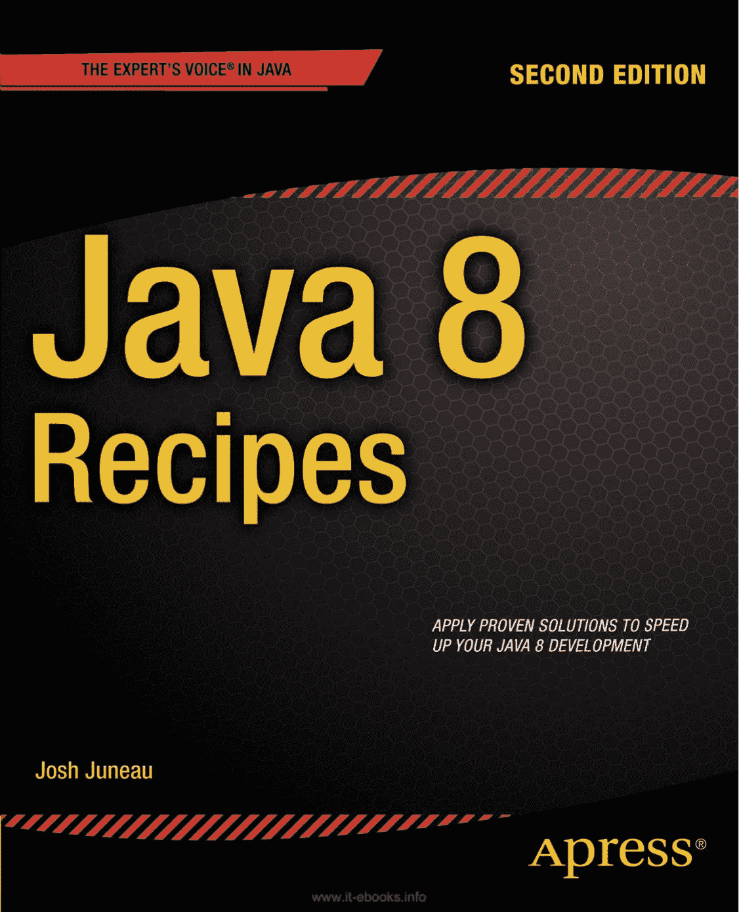


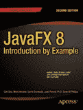


专业人士为专业人士打造的图书®

Juneau

相关图书

*Java 8 Recipes*

*Java 8 Recipes* 提供了在开发基于 Java 的应用程序时遇到的常见编程问题的解决方案。本书全面更新了最新的特性和可用技术，提供了涉及 Lambda 表达式、使用 Nashorn 进行嵌入式脚本编写、新的日期时间 API、流支持、函数式接口等内容的代码示例。特别强调了 Java 8 中新增的特性，如 Lambda 表达式。内容以流行的“问题-解决方案”格式呈现：查找你想要解决的编程问题，阅读解决方案，然后将解决方案直接应用到自己的代码中。问题解决！

“问题-解决方案”的方法使 *Java 8 Recipes* 与众不同。*Java 8 Recipes* 更少关注语言本身，而更多关注你能用它做什么有用的事情。本书始终专注于你可能想用该语言执行的任务，从而尊重你的时间。解决方案优先，解释在后。你可以自由地从书中借鉴，并将代码示例直接应用到自己的项目中。

美国售价 59.99 美元

分类于

ISBN 978-1-4302-6827-7

编程语言/Java

5 5 9 9 9

用户级别：

中级–高级

第二版

**源代码在线**

9 781430 268277

版本

www.apress.com

[www.it-ebooks.info](http://www.it-ebooks.info/)

************************为方便您阅读，Apress 已将部分前言材料置于索引之后。请使用书签*

*和目录链接访问它们。*

*****[www.it-ebooks.info](http://www.it-ebooks.info/)

**目录一览**

关于作者 ................................................................................................................ xli

关于技术审校者 ........................................................................................ xliii

致谢 ............................................................................................................. xlv

引言 ..................................................................................................................... xlvii

第 1 章：Java 8 入门 ............................................................................. 1

第 2 章：Java 8 的新特性 .................................................................................. 29

第 3 章：字符串 ............................................................................................................ 49

第 4 章：数字与日期 ........................................................................................ 65

第 5 章：面向对象的 Java ..................................................................................... 97

第 6 章：Lambda 表达式 .................................................................................... 133

第 7 章：数据结构与集合 .......................................................................... 153

第 8 章：输入与输出 .......................................................................................... 187

第 9 章：异常与日志记录 ............................................................................... 207


第 10 章：并发 ............................................................................................... 223

第 11 章：调试与单元测试 ....................................................................... 249

第 12 章：Unicode、国际化与货币代码 ................................... 263

第 13 章：数据库操作 ............................................................................ 283

第 14 章：JavaFX 基础 ................................................................................ 331

第 15 章：JavaFX 图形 ................................................................................ 405

第 16 章：JavaFX 媒体 ..................................................................................... 445

v

[www.it-ebooks.info](http://www.it-ebooks.info/)

N 目录概览

第 17 章：Web 上的 JavaFX ..................................................................................... 473

第 18 章：Nashorn 与脚本编程 ............................................................................... 505

第 19 章：电子邮件 ......................................................................................................... 527

第 20 章：XML 处理 ......................................................................................... 537

第 21 章：网络编程 ............................................................................................... 553

第 22 章：安全性 ...................................................................................................... 571

索引 ................................................................................................................................. 579

vi

[www.it-ebooks.info](http://www.it-ebooks.info/)

**引言**

Java 编程语言由 Sun Microsystems 于 1995 年推出。Java 源自 C 和 C++ 等语言，其设计目标比旧语言更直观、更易用，这尤其得益于其简化的对象模型和自动化的内存管理等设施。当时，Java 因其面向对象、并发的架构、出色的安全性和可扩展性，以及用 Java 语言开发的应用程序能在任何包含 Java 虚拟机（JVM）的操作系统上运行，而吸引了开发者的兴趣。自诞生以来，Java 一直被描述为一种允许开发者“一次编写，到处运行”的语言，因为代码被编译成包含字节码的类文件，生成的类文件可以在任何兼容的 JVM 上运行。这一概念使 Java 在桌面开发领域迅速取得成功，随后在多年间衍生出不同的技术解决方案，包括基于 Web 的应用程序和富互联网应用程序（RIA）的开发。如今，Java 已部署在广泛的设备上，包括手机、打印机、医疗设备、蓝光播放器等。

Java 平台由一系列组件构成，从 Java 开发工具包（JDK）开始，JDK 包含 Java 运行时环境（JRE）、Java 编程语言以及开发和运行 Java 应用程序所必需的平台工具。JRE 包含 Java 虚拟机（JVM），以及辅助 Java 应用程序开发的 Java 应用程序编程接口（API）和库。JVM 是编译后的 Java 类文件运行的基础，负责解释编译后的 Java 类并执行代码。每个能够运行 Java 代码的操作系统都有其自己的 JVM 版本。因此，任何运行本地 Java 桌面或独立 Java 应用程序的系统都必须安装 JRE。

Oracle 为大多数主流操作系统提供了 JRE 实现。每个操作系统都可以有其特定风格的 JRE。例如，移动设备可以运行完整 JRE 的精简版本，该版本针对运行 Java Mobile Edition（ME）和 Java SE 嵌入式应用进行了优化。Java 平台 API 和库是所有 Java 应用程序都会使用的预定义类的集合。任何在 JVM 上运行的应用程序都会使用 Java 平台 API 和库。这使得应用程序能够使用已预定义并加载到 JVM 中的功能，从而让开发者有更多时间专注于其特定应用程序的细节。

构成 Java 平台 API 和库的类允许 Java 应用程序使用一组统一的类来与底层操作系统通信。因此，Java 平台负责将 Java 应用程序提供的一组指令解释为执行该应用程序的机器所需的操作系统命令。这为 Java 开发者创建了一个抽象层，使他们能够编写代码，从而开发出可以一次编写、在任何包含相关 JVM 的机器上运行的应用程序。

JVM 以及 Java 平台 API 和库在每个 Java 应用程序的生命周期中都扮演着关键角色。已有整本书籍专门探讨该平台和 JVM。本书侧重于 Java 语言本身，即用于开发 Java 应用程序的语言，尽管在需要时也会引用 JVM 和 Java 平台 API 和库。

Java 语言是一种健壮、安全且现代的面向对象语言，可用于开发在 JVM 上运行的应用程序。Java 编程语言经过多次迭代的完善，每个新版本都使其更强大、更安全、更现代。本书涵盖了 Java 编程语言的众多特性，从 Java 1.0 引入的特性，一直到 Java 8 中新增的特性。

2014 年，Oracle 公司发布了 Java 8，这成为 Java 生态系统的又一个里程碑版本。Java 不仅已经是开发领域中最现代、静态类型、面向对象的语言，而且 Java 8 还为该语言增加了重要的新增强功能，例如 lambda 表达式、流处理和默认方法。

JavaFX 8 也同时发布，将桌面 Java 应用推向了前所未有的高度。JavaFX 8 可用于使用 Java 语言或任何其他在 JVM 上运行的语言开发丰富的桌面和互联网应用程序。它提供了丰富的图形和媒体用户界面，用于开发非凡的视觉应用程序。

此版本是 JavaFX 平台的又一次出色更新，增加了诸如 Swing 节点和打印 API 等功能。


本书涵盖了 Java 开发的基础知识，例如安装 JDK、编写类和运行应用程序。它深入探讨了面向对象结构的开发、异常处理、单元测试和本地化等基本主题。本书还提供了使用 JavaFX 进行桌面应用程序开发的解决方案，以及一些基于 Web 和数据库的解决方案。它深入介绍了 JavaFX 8，是开始使用 JavaFX 8 的开发人员的必备指南。本书可作为解决普通 Java 开发人员可能遇到的问题的指南。书中讨论了广泛的主题，并且对所涵盖问题的解决方案简洁明了。如果您是 Java 新手开发者，我们希望本书能帮助您开启使用当今最先进、最广泛使用的编程语言之一的旅程。对于那些已经使用 Java 语言一段时间的人，我们希望本书能为您提供 Java 8 和 JavaFX 2.0 的新内容，以便您进一步提高 Java 开发技能。

我们确保高级 Java 应用程序开发人员也能学到一些关于该语言新特性的知识，甚至可能偶然发现一些过去未曾使用过的技术。无论您的技能水平如何，本书都是一本随手可得的参考书，用于解决日常编程中遇到的问题。

本书读者对象

本书面向所有对学习 Java 编程语言感兴趣的人，以及已经了解该语言但希望了解 Java SE 8 和 JavaFX 8 中包含的新特性的人。尚未使用 Java 语言编程的人可以阅读本书，它将帮助他们从零开始，快速上手并运行。正在寻求用 Java SE 8 和 JavaFX 8 提供的最新功能更新自己技能库的中级和高级 Java 开发人员也可以阅读本书，以快速更新和刷新他们的技能。Java 桌面程序员会发现本书中关于使用 JavaFX API 开发桌面应用程序的内容非常有用。当然，还有许多其他对任何类型的 Java 开发人员都有用的基本主题。

本书结构

本书的结构使得读者不必从头到尾阅读。事实上，它的结构允许开发人员选择他们想要阅读的主题并直接跳转到这些主题。每个技巧都包含一个要解决的问题、一个或多个解决该问题的方案，以及关于解决方案如何工作的详细说明。尽管某些技巧可能建立在其他技巧中讨论过的概念之上，但它们包含了适当的引用，以便开发人员可以找到其他对解决方案有益的相关技巧。本书旨在让开发人员能够快速上手并运行一个解决方案，以便他们能及时回家吃晚饭。

xlviii

[www.it-ebooks.info](http://www.it-ebooks.info/)

**第 1 章**

**Java 8 入门**

在本章中，我们提供了一些技巧，以帮助 Java 语言的新手以及有其他语言经验的程序员熟悉 Java 8。您将学习安装 Java 8，并安装一个集成开发环境（IDE），您将使用它来开发应用程序并试验本书中提供的解决方案。您将学习 Java 的基础知识，例如如何创建类以及如何接受键盘输入。文档记录经常被忽视，但在本章中，您将快速学习如何为您的 Java 代码创建出色的文档。

N **注意** 《Java 8 Recipes》并非旨在作为完整的教程。相反，它涵盖了 Java 语言的关键概念。

如果您是真正的 Java 新手，我们建议您购买并阅读同样由 Apress 出版的众多《Beginning Java》书籍之一。

1-1. 创建开发环境

问题

您想安装 Java 并试验该语言。您还希望有一个合适的 IDE 与之配合使用。

解决方案

安装 Java 开发工具包 8 (JDK)。这将为您提供语言和编译器。然后安装 NetBeans IDE 以提供更高效的工作环境。

Java 标准版 (Java SE) 足以满足本书中的大多数技巧。要下载该版本，请访问 Oracle 技术网络 (OTN) 上的以下页面：

[`www.oracle.com/technetwork/java/javase/overview/index.html`](http://www.oracle.com/technetwork/java/javase/overview/index.html)

图 1-1 显示了“下载”选项卡，您可以在页面上醒目地看到 Java 平台下载链接和图像。在该链接旁边是 NetBeans IDE 的图像，它提供了下载 JDK 和 NetBeans 的选项。选择您喜欢的选项，下载适用于您平台的版本，然后运行安装向导进行安装。

[www.it-ebooks.info](http://www.it-ebooks.info/)


第 1 章 N Java 8 入门

**图 1-1.** *Oracle 技术网络上的 Java SE 下载页面*

N **注意** 如果您选择仅安装 Java 平台 (JDK) 而不安装 NetBeans，您可以稍后通过访问 netbeans.org 下载 NetBeans。

工作原理

名称 *Java™* 是 Oracle 公司拥有的商标。该语言本身是开源的，其演变由称为 *Java Community Process SM* (JCP *SM*) 的流程控制。您可以在以下网址阅读有关该流程的更多信息：

[www.jcp.org](http://www.jcp.org/)。

Java 有许多版本，例如移动版 (ME) 和企业版 (EE)。Java SE 是标准版，代表了该语言的核心。我们为 Java SE 程序员构建了本书中的技巧。那些对移动或嵌入式应用程序开发感兴趣的人可能希望了解更多关于 Java ME 的信息。同样，那些对开发 Web 应用程序和使用企业解决方案感兴趣的人可能希望了解更多关于 Java EE 的信息。

N **注意** 企业版程序员可能希望购买并阅读《Java EE 7 Recipes》（Apress，2013 年）。

有几个不错的网站可以访问，以了解更多关于 Java 的信息并随时了解平台的最新动态。了解所有 Java 相关内容的一个好起点是 Oracle 技术网络上的以下页面：

[`www.oracle.com/technetwork/java/index.html`](http://www.oracle.com/technetwork/java/index.html)

该页面提供的丰富资源起初可能令人不知所措，但值得您花时间四处看看，并大致熟悉可用的众多链接。

其中一个链接将指向 Java SE，它会将您带到前面图 1-1 所示的页面。您可以从那里下载 Java SE 和 NetBeans IDE。同样从那里，您可以访问官方文档、社区资源（如论坛和新闻通讯）以及旨在帮助您构建 Java 知识并获得该语言认证的培训资源。

[www.it-ebooks.info](http://www.it-ebooks.info/)

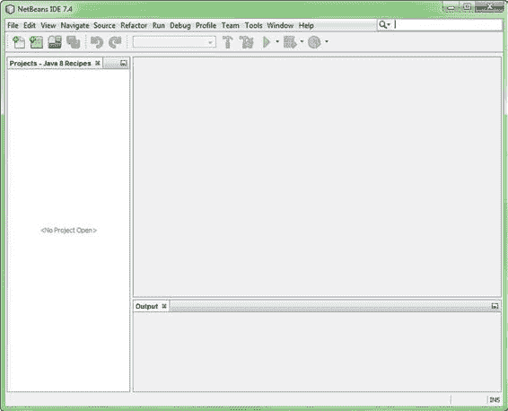

第 1 章 N Java 8 入门

1-2. 实现“Hello, World”

问题

您已经安装了 Java SE 8 和 NetBeans IDE。现在您想运行一个简单的 Java 程序来验证您的安装是否正常工作。

解决方案

首先打开 NetBeans IDE。您应该会看到一个类似于图 1-2 中的工作区。如果您已经在 IDE 中处理过项目，您可能会在左侧窗格中看到一些项目。

**图 1-2.** *打开 NetBeans IDE*

[www.it-ebooks.info](http://www.it-ebooks.info/)

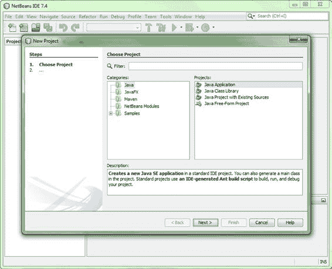

第 1 章 N Java 8 入门


前往“文件”菜单并选择“新建项目”。您将看到如图 1-3 所示的对话框。选择 **Java** 类别，然后选择 **Java 应用程序**。点击“下一步”进入如图 1-4 所示的对话框。

**图 1-3.** *创建新的 Java SE 项目*

[www.it-ebooks.info](http://www.it-ebooks.info/)

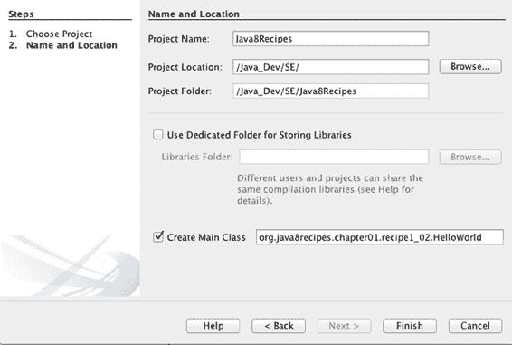

第 1 章 N 开始使用 Java 8

**图 1-4.** *命名项目*

为您的项目命名。对于与本书相关的项目，请使用名称 `Java8Recipes`。在图 1-4 所示对话框顶部的“项目名称”文本框中输入该名称。

然后在“创建主类”文本框中指定主类的名称。请指定以下名称：`org.java8recipes.chapter01.recipe1_02.HelloWorld`

请确保您完全按照我们提供的格式输入项目名称和类名，因为后续的代码依赖于您的正确输入。确保“项目名称”文本框中指定的是 `Java8Recipes`。确保“创建主类”文本框中指定的是 `org.java8recipes.chapter01.recipe1_02.HelloWorld`。

N **提示** 注意大小写，Java 是区分大小写的。

点击“完成”以完成向导并创建一个骨架项目。您现在应该会看到一个 Java 源文件。

系统会为您生成骨架代码，您的 NetBeans IDE 窗口应类似于图 1-5 所示。

[www.it-ebooks.info](http://www.it-ebooks.info/)

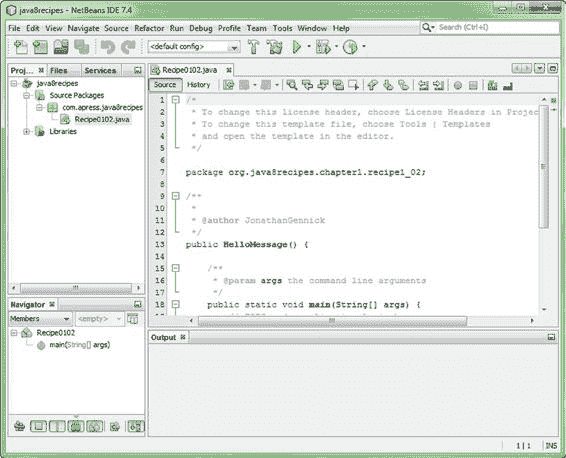

第 1 章 N 开始使用 Java 8

**图 1-5.** *查看 NetBeans 生成的骨架代码*

将光标放在源代码窗格中的任意位置。按 `CTRL-A` 选择所有骨架代码。然后按 `Delete` 键将其删除。用清单 1-1 中的代码替换删除的代码。

**清单 1-1.** “Hello, World”示例

package org.java8recipes.chapter01.recipe1_02;

/* 此类的对象将保存消息。 */

class HelloMessage {

private String message = "";

public HelloMessage() {

this.message = "Default Message";

}

[www.it-ebooks.info](http://www.it-ebooks.info/)

第 1 章 N 开始使用 Java 8

public void setMessage (String m) {

this.message = m;

}

public String getMessage () {

return this.message.toUpperCase();

}

}

/* 主程序从此类开始 */

public class HelloWorld {

public static void main(String[] args) {

HelloMessage hm;

hm = new HelloMessage();

System.out.println(hm.getMessage());

hm.setMessage("Hello, World");

System.out.println(hm.getMessage());

}

}

您可以在本书的示例下载中找到清单 1-1 中的代码。它位于文件 `HelloWorld.java` 中，您可以在名为 `org.java8recipes.chapter01.recipe1_02` 的 NetBeans 源包中找到该文件。

本书中所有实质性的解决方案都包含在该示例下载中。

确保您已粘贴（或输入）了清单 1-1 中的代码。编译并运行该程序，您应该会看到以下输出：

run:

DEFAULT MESSAGE

HELLO, WORLD

BUILD SUCCESSFUL (total time: 1 second)

此输出将出现在一个名为“输出”的新窗格中，该窗格由 NetBeans 在 IDE 窗口底部打开。

工作原理

您可以使用本示例中展示的相同通用技术来运行本章中的几乎所有解决方案。正因如此，我们才不厌其烦地详细说明，并仅此一次展示了逐步的屏幕截图。

[www.it-ebooks.info](http://www.it-ebooks.info/)

第 1 章 N 开始使用 Java 8

包

该解决方案示例首先创建了一个 Java *包*：

package org.java8recipes.chapter01.recipe1_02;

包是一种将相关类分组到共享命名空间中的方式。其理念是通过按反向顺序逐级使用您组织的域名来实现全局唯一性。通常也习惯将包名全部小写。

NetBeans 将创建一个目录结构来模拟您的包路径。在本例中，NetBeans 创建了以下目录路径：

C:\Users\JonathanGennick\Documents\NetBeansProjects\


`Java8Recipes\src\org\java8recipes\chapter01\recipe1_02`

关于此路径，有以下几点需要注意：

- 前半部分是 `C:\Users\...\NetBeansProjects`。除非你在图 1-4 的对话框中另行指定，否则 NetBeans 默认会在 `NetbeansProject` 目录下创建所有项目。许多开发者会指定更短的路径。

- 接下来是第一次出现的 `Java8Recipes`。这对应你在图 1-4 的“项目名称”文本框中输入的项目名称。

- 你创建的所有源文件都会放入 `src` 目录。NetBeans 会在同级目录下创建其他文件夹。例如，NetBeans 会创建一个 `build` 目录，其下再有一个 `classes` 子目录，用于存放编译后的类文件。

- 最后是与你指定的包路径相对应的目录结构，本例中为 `org\java8recipes\chapter01\recipe1_02`。当你编译代码时，`build\classes` 目录下会生成完全相同的目录结构。请注意，如果使用其他 IDE，生成的目录结构可能会有所不同。

你无需显式创建包。如果你不创建，Java 编译器会为你自动创建一个，并赋予一个隐藏的名称。我们倾向于显式创建，你也应该这样做。在专业开发环境中，对 Java 包名进行深思熟虑且明确的命名是*必不可少的*。在开发任何重要应用程序时，良好的组织结构和审慎的命名约定都至关重要。

## JavaBeans 风格的类

在解决方案示例中，你接下来会看到一个遵循 JavaBeans 模式的类定义。`HelloMessage` 的定义遵循了一种你在 Java 编程中会经常遇到的模式，我们将其收录正是出于这个原因。

这个类很简单，能够保存一个名为 `greeting` 的字符串值。

该类定义了三个方法：

- **`HelloMessage()`**。这个方法也称为构造函数，其名称与类名相同。在本例中，它不接受任何参数。每当你创建该类的一个新对象时，它会被自动调用。请注意，这被称为“无参”构造函数，因为它是在类中显式编写的，并且不接受任何参数。如果你没有提供构造函数，JVM 会自动提供一个默认构造函数（同样不接受参数）。

- **`setMessage(String)`**。这个访问器方法以 `set` 开头。它接受一个参数，用于指定对应的 `get` 方法将要返回的消息。

- **`getMessage()`**。这个访问器方法返回当前定义的消息。在我们的示例中，我们选择将消息转换为大写。

[www.it-ebooks.info](http://www.it-ebooks.info/)

第 1 章 开始使用 Java 8

N **注意** 访问器方法用于在 JavaBeans 类中访问任何声明为私有的类成员。在本例中，可以使用这些方法访问标识为 `message` 的私有变量。访问器方法通常被称为“getter”和“setter”。

以 `set` 和 `get` 开头的方法分别被称为 *setter* 和 *getter* 方法。变量 `message` 对该类是私有的，这意味着你无法从类外部直接访问 `message`。

你会在类中看到关键字 `this`。它是 Java 中的一个特殊关键字，用于引用当前对象。

在清单 1-1 中，它的使用是多余的，但如果任何方法恰好创建了也名为 `message` 的自身变量，那么就需要使用它。

在 Java 中，通过像我们示例中的 setter 和 getter 方法来管理对类变量的访问是很常见的。这些方法代表了与其他类以及主程序之间的一种契约。它们的好处是，你可以随意更改 `HelloMessage` 的存储实现。只要保持 `setMessage()` 和 `getMessage()` 的外部行为不变，其他依赖于 `HelloMessage` 的代码就能继续正常工作。

## 主程序


在公开类中使用 `public static void main(...)` 这一咒语，用于标识 Java 程序的起始点。该声明开启了一个名为 `main` 的可执行方法。你必须指定一个字符串数组作为参数，通常该参数被定义为 `String[] args`。

当你执行当前选中的类时，NetBeans 会将代码编译为一组二进制文件，然后将控制权移交给 `main()` 方法。该方法随后执行以下操作：

1.  执行 `HelloMessage hm`，创建一个名为 `hm` 的变量，该变量能够持有 `HelloMessage` 类的一个实例。此时变量 `hm` 为空。
2.  调用 `new HelloMessage()`，创建一个该名称类的对象。将执行无参构造器，此时问候文本为 "Default Message"。新对象现在存储在变量 `hm` 中。
3.  调用 `System.out.println()`，以显示该对象的无参构造器确实按预期执行。问候语 "DEFAULT MESSAGE" 显示在“输出”窗格中。
4.  将消息设置为传统文本 "Hello, World"。
5.  再次调用 `System.out.println()`，输出刚刚设置的新消息。现在你会看到问候语 "hello, world" 被添加到“输出”窗格中。

解决方案中的模式在 Java 编程中很常见。`main()` 方法是执行的起点。

变量被定义，对象通过 `new` 运算符创建。对象变量通常使用 setter 和 getter 方法进行设置和获取。

N **提示** 命令行应用已经过时。系统管理员和程序员有时会编写它们作为实用工具，或用于批量处理大量数据。但总体而言，当今的应用程序是 GUI 应用程序。JavaFX 是编写这些应用程序的前进方向，你可以在第 14 章到第 17 章中学习它。配方 14-1 本质上提供了一个 GUI 形式的“Hello, World”应用程序。

[www.it-ebooks.info](http://www.it-ebooks.info/)

第 1 章 N JAVA 8 入门

1-3. 从命令行解释器编译和执行

问题

你无法安装 IDE，或者你不想安装。你想从命令行编译和执行你的 Java 程序。

解决方案

使用 `javac` 命令编译你的程序。然后通过 `java` 命令执行它们。

首先，确保你的 JDK 的 `bin` 目录在你的执行路径中。你可能需要执行类似以下之一的命令。

Windows：

`path %path%C:\Program Files\Java\jdk1.8.0\bin`

OS X：

`export PATH=/Library/Java/JavaVirtualMachines/jdk1.8.0.jdk/Contents/Home/bin`

然后确保你的 `CLASSPATH` 环境变量包含包含你 Java 代码的目录。以下是在 Windows 下设置环境变量的示例：

`set CLASSPATH=<<path-to-my-Java>>`

现在将你的当前工作目录更改为与你的项目对应的目录。配方 1-2 让你创建了一个名为 `Java8Recipes` 的项目。在 Windows 系统上，按如下方式切换到该项目的目录：`cd <path-to-project>\Java8Recipes`

向下进入一级 `src` 子目录：

`cd src`

从这里，你可以发出 `javac` 命令来编译项目中的任何类。将适当的包名作为路径的一部分，指向要编译的每个源文件。确保在文件名后包含 `.java` 扩展名。例如，发出以下命令来编译配方 1-2 中的 `HelloWorld` 类。

Windows：

`javac org\java8recipes\chapter01\recipe1_02\HelloWorld.java`

OS X：

`javac org/java8recipes/chapter01/recipe1_02/HelloWorld.java`

现在，你应该在与 `.java` 文件相同的目录中有一个 `.class` 文件。例如：`dir org\java8recipes\chapter01\recipe1_02 /B`

`HelloMessage.class`

`HelloWorld.class`

`HelloWorld.java`

[www.it-ebooks.info](http://www.it-ebooks.info/)

第 1 章 N JAVA 8 入门

编译产生两个文件。一个用于 `HelloMessage`，另一个用于实现 `main()` 方法的名为 `HelloWorld` 的类。


通过执行 `java` 命令来调用 Java 虚拟机（JVM），从而运行 `main()` 方法。将完全限定的类名作为参数传递给该命令。通过在前面添加包名来限定类名，但这次要使用与源文件中相同的点号表示法。例如：

java org.java8recipes.chapter1.recipe1_02.HelloWorld

不要在命令末尾指定 `.class`。你现在将 `HelloWorld` 视为类名，而非文件名。你应该会看到与配方 1-2 相同的输出。

N **提示** 编译的是源代码。源代码保存在文件中，因此使用操作系统的文件和目录路径表示法是合适的。执行的是类。类是语言中的一个抽象概念，因此使用语言的点号表示法更为合适。牢记这一区别，有助于你记住何时使用哪种表示法。

工作原理

前两个解决步骤是准备工作。你必须在执行路径中包含 Java 编译器和虚拟机。此外，你的程序所使用的任何类都必须能在所谓的*类路径*中找到。指定类路径的一种方法是通过 `CLASSPATH` 环境变量。

末尾不带 `c` 的 `java` 命令用于执行编译后的代码。将包含 `main` 方法的类的限定名称作为参数传递。JVM 将从 `main` 方法开始，解释并执行该类中的字节码。JVM 会沿着类路径搜索任何额外需要的类，例如 `HelloMessage`。

编译器的默认行为是将每个生成的类文件放置在与对应源文件相同的目录中。你可以通过 `-d` 选项覆盖该行为。例如：`javac -d "<指定不同位置>" "<项目路径>\Java8Recipes\src\org\java8recipes\chapter1\recipe1_02\HelloWorld.java"`

此命令中的 `-d` 选项指定了与 NetBeans 在我们自己的环境中用于存放生成的类文件相同的目录。该命令还指定了源文件的完整路径和文件名。因此，无论当前工作目录是什么，都可以执行该命令并获得相同的结果。

N **提示** 配置你的系统，使命令行环境默认正确设置执行路径和类路径。在 Linux 中，典型的方法是将适当的命令放入 `.profile` 或 `.bash_profile` 文件中。在 Windows 中，你可以通过控制面板中名为“系统”的小程序，点击“高级系统设置”链接，然后点击“环境变量”按钮来指定环境变量默认值。

有时你可能需要为 JVM 的特定执行指定自定义类路径。你可以通过 `-cp` 参数来实现，如下所示：

java -cp ".;<项目路径>\Java8Recipes\build\classes\org\java8recipes\chapter1\recipe1_02"

org.java8recipes.chapter1.recipe1_02.HelloWorld

[www.it-ebooks.info](http://www.it-ebooks.info/)

第 1 章 N JAVA 8 入门

此执行将首先在当前工作目录（类路径中的前导点号）中搜索，然后在指定的包目录下搜索，该目录对应 NetBeans 放置编译后类的位置。

N **注意** 有关配置类路径的更多信息，请参见配方 1-10。

1-4. 声明简单变量

问题

你想在程序中创建一些变量并操作数据。

解决方案

Java 实现了八种基本数据类型。此外，还对 `String` 类类型提供了特殊支持。清单 1-2 展示了每种类型的声明示例。参考该示例来声明你自己的应用程序中所需的变量。

**清单 1-2.** 基本类型和 String 类型的声明

package org.java8recipes.chapter01.recipe1_04;

public class DeclarationsExample {

public static void main (String[] args) {

boolean BooleanVal = true; /* 默认值为 false */

char charval = 'G'; /* Unicode UTF-16 */

charval = '\u0490'; /* 乌克兰字母 Ghe(DZ) */


`byte` byteval; /* 8 位，取值范围 -127 到 127 */

`short` shortval; /* 16 位，取值范围 -32,768 到 32,768 */

`int` intval; /* 32 位，取值范围 -2147483648 到 2147483647 */

`long` longval; /* 64 位，取值范围 -(2⁶⁴) 到 2⁶⁴ - 1 */

`float` floatval = 10.123456F; /* 32 位 IEEE 754 标准 */

`double` doubleval = 10.12345678987654; /* 64 位 IEEE 754 标准 */

`String` message = "Darken the corner where you are!";

message = message.replace("Darken", "Brighten");

}

}

变量遵循*可见性*的概念。清单 1-2 中创建的变量，在 `main()` 方法中被创建后即在该方法内可见，并在 `main()` 方法结束时被释放。它们在 `main()` 方法之外没有“生命周期”，并且无法从 `main()` 方法外部访问。

在类级别创建的变量则另当别论。此类变量可称为*字段*，即*类的字段*。字段的使用范围可以限制在其声明的类的对象中，或限制在其声明的包中，也可以从任何包中的任何类进行访问。清单 1-3 展示了如何通过 `private` 和 `public` 关键字控制可见性。

[www.it-ebooks.info](http://www.it-ebooks.info/)

第 1 章 开始使用 Java 8

**清单 1-3.** 可见性与字段的概念

package org.java8recipes.chapter01.recipe1_04;

class TestClass {

private long visibleOnlyInThisClass;

double visibleFromEntirePackage;

void setLong (long val) {

visibleOnlyInThisClass = val;

}

long getLong () {

return visibleOnlyInThisClass;

}

}

public class VisibilityExample {

public static void main(String[] args) {

TestClass tc = new TestClass();

tc.setLong(32768);

tc.visibleFromEntirePackage = 3.1415926535;

System.out.println(tc.getLong());

System.out.println(tc.visibleFromEntirePackage);

}

}

输出：

3.1415926535

字段通常与类的对象绑定。类的每个对象都持有该类中每个字段的一个实例。

然而，你可以定义所谓的*静态*字段，它只出现一次，并且由给定类的所有对象共享一个单一的值。清单 1-4 说明了其中的区别。

**清单 1-4.** 静态字段

package org.java8recipes.chapter01.recipe1_04;

class StaticDemo {

public static boolean oneValueForAllObjects = false;

}

public class StaticFieldsExample {

public static void main (String[] args) {

StaticDemo sd1 = new StaticDemo();

StaticDemo sd2 = new StaticDemo();

System.out.println(sd1.oneValueForAllObjects);

System.out.println(sd2.oneValueForAllObjects);

sd1.oneValueForAllObjects = true;

[www.it-ebooks.info](http://www.it-ebooks.info/)

第 1 章 开始使用 Java 8

System.out.println(sd1.oneValueForAllObjects);

System.out.println(sd2.oneValueForAllObjects);

}

}

清单 1-4 产生以下输出：

false

false

true

true

字段 `oneValueForAllObjects` 仅对名为 `sd1` 的类实例设置为 `true`。然而，对于实例 `sd2` 它也是 `true`。这是因为在声明该字段时使用了关键字 `static`。静态字段对于其类的所有对象只出现一次。

工作原理

清单 1-2 说明了变量声明的基本格式：

type variable;

在声明变量时进行初始化是很常见的，因此你经常会看到：

type variable = initialValue;

字段声明前可以加上修饰符。例如：

public static variable = initialValue;

private variable;

通常将可见性修饰符（`public` 或 `private`）放在首位，但你可以按任意顺序列出修饰符。请注意，随着你对语言的深入学习，你还会遇到并需要了解其他修饰符。

`String` 类型在 Java 中是特殊的。它实际上是一个类类型，但在语法上你可以将其视为基本类型。

每当你将一串字符括在双引号（`"..."`）中时，Java 会自动创建一个 `String` 对象。

你不需要调用构造函数，也不需要指定 `new` 关键字。然而 `String` 是一个类，并且该类中有一些方法可供你使用。清单 1-2 末尾展示的 `replace()` 方法就是其中之一。


字符串由字符组成。Java 的 `char` 类型是一个双字节结构，用于以 Unicode 的 UTF-16 编码存储单个字符。你可以通过两种方式生成 `char` 类型的字面量：

- 如果某个字符易于输入，则将其括在单引号中（例如：`'G'`）。
- 否则，指定以 `\u` 为前缀的四位 UTF-16 *码点*值（例如：`'\u0490'`）。

某些 Unicode 码点需要五位数字。这些无法在单个 `char` 值中表示。如果你需要更多关于 Unicode 和国际化的信息，请参阅第 10 章。

避免使用任何基本类型来表示货币值。尤其要避免为此目的使用浮点类型。请参考第 4 章及其关于使用 `BigDecimal` 计算货币金额的指南（配方 4-7）。

当你需要精确的固定小数位运算时，`BigDecimal` 也很有用。

[www.it-ebooks.info](http://www.it-ebooks.info/)

第 1 章 开始使用 Java 8

如果你是 Java 新手，可能对示例中演示的 `String[]` 数组表示法不熟悉。

有关数组的更多信息，请参阅第 7 章。该章涵盖了枚举、数组以及泛型数据类型。该章还包含如何编写迭代代码来处理值集合（如数组）的示例。

N **注意** 如果你对清单 1-2 中的乌克兰语字母感到好奇，它是西里尔字母 Ghe with upturn。你可以在以下网址了解其历史：[`en.wikipedia.org/wiki/Ghe_with_upturn`](http://en.wikipedia.org/wiki/Ghe_with_upturn)。你可以在以下网址的图表中找到其码点值：

[`www.unicode.org/charts/PDF/U0400.pdf`](http://www.unicode.org/charts/PDF/U0400.pdf)。[而网址 http://www.unicode.org/charts/ 是一个](http://www.unicode.org/charts/) 查找与给定字符对应的码点的好起点。

1-5. 字符串与基本类型的相互转换

问题

你有一个基本数据类型的值，并希望将该值表示为人类可读的字符串。或者，你想反向操作，将人类可读的字符串转换为基本数据类型。

解决方案

遵循清单 1-5 中的模式之一。该清单展示了从字符串到双精度浮点值的转换，并展示了两种将值转换回字符串的方法。

**清单 1-5.** 字符串转换的通用模式

package org.java8recipes.chapter01.recipe1_05;

public class StringConversion {

public static void main (String[] args) {

double pi;

String strval;

pi = Double.parseDouble("3.14");

System.out.println(strval = String.valueOf(pi));

System.out.println(Double.toString(pi));

}

}

工作原理

该解决方案说明了一些适用于所有基本类型的转换模式。首先，是将浮点数从其人类可读表示形式转换为 Java 语言用于浮点运算的 IEEE 754 格式：

pi = Double.parseDouble("3.14");

[www.it-ebooks.info](http://www.it-ebooks.info/)

第 1 章 开始使用 Java 8

注意这个模式。你可以将 `Double` 替换为 `Float`、`Long` 或任何其他目标数据类型。每个基本类型都有一个对应的包装类，名称相同但首字母大写。

这里的基本类型是 `double`，对应的包装类是 `Double`。包装类实现了诸如 `Double.parseDouble()`、`Long.parseLong()`、`Boolean.parseBoolean()` 等辅助方法。这些解析方法将人类可读的表示形式转换为相应类型的值。

反过来，通常最简单的方法是调用 `String.valueOf()`。`String` 类实现了此方法，并且针对每种基本数据类型都进行了重载。或者，包装类也实现了 `toString()` 方法，你可以调用这些方法将底层类型的值转换为其人类可读的形式。采用哪种方法取决于你的个人偏好。


针对数值类型的转换需要一些异常处理才能实用。通常，你需要优雅地处理这样一种情况：某个字符串值本应是有效的数值表示形式，但实际上并非如此。第 9 章将详细讨论异常处理，而接下来的技巧 1-7 会提供一个简单示例，帮助你入门。

**N 注意** 布尔类型的字面量是"true"和"false"。它们是区分大小写的。当使用`Boolean.parseBoolean()`转换方法从字符串进行转换时，任何非这两个值的其他值都会被静默地解释为 false。

1-6\. 通过命令行执行传递参数

问题

你想通过命令行向 Java 应用程序传递值。

解决方案

使用`java`命令运行应用程序，并在应用程序名称之后指定要传递的参数。如果要传递多个参数，每个参数之间应用空格分隔。例如，假设你想向清单 1-6 中创建的类传递参数。

**清单 1-6.** 访问命令行参数的示例

package org.java8recipes.chapter01.recipe1_06;

public class PassingArguments {

public static void main(String[] args){

if(args.length > 0){

System.out.println("传递给程序的参数：");

for (String arg:args){

System.out.println(arg);

}

} else {

System.out.println("没有参数传递给程序。");

}

}

}

[www.it-ebooks.info](http://www.it-ebooks.info/)

第 1 章 开始使用 Java 8

首先，确保编译程序，以便拥有一个可执行的.class 文件。你可以在 NetBeans 中通过右键单击文件并从上下文菜单中选择“编译文件”选项来完成此操作。

接下来，打开命令提示符或终端窗口，并导航到项目的`build\classes`目录。

（关于从命令行执行的详细讨论，请参见技巧 1-3）。例如：`cd <项目路径>\Java8Recipes\build\classes`

现在，发出`java`命令来执行该类，并在命令行上类名之后输入一些参数。以下示例传递了两个参数：

java org.java8recipes.chapter01.recipe1_06.PassingArguments Upper Peninsula

你应该会看到以下输出：

传递给程序的参数：

Upper

Penninsula

空格用于分隔参数。当你想传递包含空格或其他特殊字符的参数时，请将字符串用双引号括起来。例如：

java org.java8recipes.chapter01.recipe1_06.PassingArguments "Upper Peninsula"

现在输出只显示一个参数：

传递给程序的参数：

Upper Penninsula

双引号将字符串"Upper Peninsula"转换为单个参数。

工作原理

所有可从命令行或终端执行的 Java 类都包含一个`main()`方法。如果你查看`main()`方法的签名，可以看到它接受一个`String[]`参数。换句话说，你可以将字符串对象数组传递给`main()`方法。命令解释器（如 Windows 命令提示符以及各种 Linux 和 Unix shell）会根据你的命令行参数构建一个字符串数组，并将该数组代表你传递给`main()`方法。

示例中的`main()`方法会显示传递的每个参数。首先，测试名为`args`的数组长度是否大于零。如果是，该方法将通过执行`for`循环遍历数组中的每个参数，并沿途显示每个参数。如果没有传递参数，`args`数组的长度将为零，并会打印一条指示此情况的消息。否则，你会看到一条不同的消息，后跟参数列表。

命令解释器将空格以及有时其他字符识别为分隔符。通常，传递由空格分隔的数值作为参数是安全的，无需费心将每个值用引号括起来。


然而，你应该养成将字符串参数用双引号括起来的习惯，如最终解决方案示例所示。这样做可以消除每个参数起始和结束位置上的任何歧义。

**注意** Java 将所有参数视为字符串。如果你将数值作为参数传递，它们会以人类可读的字符串形式进入 Java。你可以使用配方 1-5 中所示的转换方法将它们转换为适当的数值类型。

[www.it-ebooks.info](http://www.it-ebooks.info/)

第 1 章 N Java 8 入门

1-7. 从键盘接受输入

问题

你希望编写一个命令行或终端应用程序，用于接受来自键盘的用户输入。

解决方案

使用 `java.io.BufferedReader` 和 `java.io.InputStreamReader` 类来读取键盘输入并将其存储到局部变量中。清单 1-7 展示了一个程序，它会持续提示输入，直到你输入一些代表有效 `long` 类型值的字符为止。

**清单 1-7.** 键盘输入与异常处理

package org.java8recipes.chapter01.recipe1_07;

import java.io.*;

public class AcceptingInput {

public static void main(String[] args){

BufferedReader readIn = new BufferedReader(

new InputStreamReader(System.in)

);

String numberAsString = "";

long numberAsLong = 0;

boolean numberIsValid = false;

do {

/* 向用户请求一个数字。 */

System.out.println("请输入一个数字：");

try {

numberAsString = readIn.readLine();

System.out.println("你输入了 " + numberAsString);

} catch (IOException ex){

System.out.println(ex);

}

/* 将数字转换为二进制形式。 */

try {

numberAsLong = Long.parseLong(numberAsString);

numberIsValid = true;

} catch (NumberFormatException nfe) {

System.out.println ("不是数字！");

}

} while (numberIsValid == false);

}

}

[www.it-ebooks.info](http://www.it-ebooks.info/)

第 1 章 N Java 8 入门

以下是该程序的一次运行示例：

请输入一个数字：

No

你输入了 No

不是数字！

请输入一个数字：

Yes

你输入了 Yes

不是数字！

请输入一个数字：

42

你输入了 42

构建成功（总耗时：11 秒）

前两次输入的值在 `long` 数据类型中无效。第三个值是有效的，运行结束。

工作原理

通常，我们的应用程序需要接受某种形式的用户输入。诚然，如今大多数应用程序并非在命令行或终端中使用，但能够创建从命令行或终端读取输入的应用程序有助于打下良好的基础，并且在某些应用程序中可能很有用。终端输入在开发供你或系统管理员使用的管理应用程序时也很有用。

本配方的解决方案中使用了两个辅助类：`java.io.BufferedReader` 和 `java.io.InputStreamReader`。理解代码中使用这些类的早期部分尤为重要：

BufferedReader readIn = new BufferedReader(

new InputStreamReader(System.in)

);

这条语句中最内层的对象是 `System.in`。它代表键盘。你无需声明 `System.in`。Java 的运行时环境会为你创建该对象。它只是“存在”在那里供你使用。

`System.in` 提供对来自输入设备（本例中为键盘）的原始字节数据的访问。`InputStreamReader` 类的工作是获取这些字节并将其转换为当前字符集中的字符。`System.in` 被传递给 `InputStreamReader()` 构造函数以创建一个 `InputStreamReader` 对象。

`InputStreamReader` 了解字符，但不了解行。`BufferedReader` 类的工作是检测输入流中的换行符，并使你能够方便地一次读取一行。`BufferedReader` 还通过允许以与应用程序消耗数据不同的块大小从输入设备进行物理读取来提高效率。当输入流是大型文件而非键盘时，这一方面会有所不同。

以下是清单 1-7 中的程序如何使用 `BufferedReader` 类的实例（名为 `readIn`）从键盘读取一行输入：

numberAsString = readIn.readLine();

执行此语句会触发以下序列：

1. `System.in` 返回一个字节序列。
2. `InputStreamReader` 将这些字节转换为字符。

[www.it-ebooks.info](http://www.it-ebooks.info/)

第 1 章 N Java 8 入门

3. `BufferedReader` 将字符流分解为输入行。
4. `readLine()` 向应用程序返回一行输入。

I/O 调用必须包装在 `try...catch` 块中。这些块会捕获可能发生的任何异常。示例中的 `try` 部分在转换不成功时会失败。失败会阻止 `numberIsValid` 标志被设置为 `true`，从而导致 `do` 循环进行下一次迭代，以便用户可以再次尝试输入有效值。

清单 1-7 顶部的以下语句值得一提：

import java.io.*;

此语句使 `java.io` 包中定义的类和方法可用。其中包括 `InputStreamReader` 和 `BufferedReader`。还包括第一个 `try...catch` 块中使用的 `IOException` 类。

1-8. 为代码编写文档

问题

你希望为一些 Java 类编写文档，以方便未来的维护工作。

解决方案

使用 Javadoc 在你想要文档化的任何类、方法或字段之前放置注释。要开始这样的注释，请写入字符 `/**`。然后，后续每一行都以星号 (`*`) 开头。最后，在末尾单独一行用字符 `*/` 结束注释。清单 1-8 展示了一个使用 Javadoc 注释的方法。

**清单 1-8.** 以 Javadoc 形式编写的注释

package org.java8recipes.chapter01.recipe1_08;

import java.math.BigInteger;

public class JavadocExample {

/**

* 接受无限数量的值并返回总和。

*

* @param nums 必须是 BigInteger 值的数组。

* @return 数组中所有数字的总和。

*/

public static BigInteger addNumbers(BigInteger[] nums) {

BigInteger result = new BigInteger("0");

for (BigInteger num:nums){

result = result.add(num);

}

return result;

}

/**

* 测试 addNumbers 方法。

* @param args 未使用

*/

[www.it-ebooks.info](http://www.it-ebooks.info/)

第 1 章 N Java 8 入门

public static void main (String[] args) {

BigInteger[] someValues = {BigInteger.TEN, BigInteger.ONE};

System.out.println(addNumbers(someValues));

}

}

注释可以以相同的方式添加到类和字段的开头。这些注释对你和其他维护代码的程序员很有帮助，其特定格式使得可以轻松生成代码的 HTML 参考文档。

通过调用名为 `Javadoc` 的工具来生成 HTML 参考文档。这是一个命令行工具，它解析指定的 Java 源文件，并根据定义的类元素和 Javadoc 注释生成 HTML 文档。例如：

javadoc JavadocExample.java

此命令将生成多个 HTML 文件，其中包含类、方法和字段的文档。

如果源代码中不存在 Javadoc 注释，仍然会生成一些默认文档。要查看文档，请将以下文件加载到浏览器中：

index.html

该文件将位于你正在文档化的类或包所在的同一目录中。还会有一个 `index-all.html` 文件，提供文档化实体的严格字母顺序列表。

请记住，使用 `Javadoc` 工具时适用的规则与使用 `javac` 时相同。你必须位于源文件所在的同一目录中，或者在文件名前加上文件所在路径。

工作原理


从头开始为应用程序生成文档可能相当繁琐。维护文档则更加麻烦。JDK 自带了一个名为 Javadoc 的庞大文档系统。在代码源文件中放置一些特殊注释，然后运行一个简单的命令行工具，就能轻松生成有用的文档并使其保持最新。此外，即使应用程序中的某些类、方法或字段没有专门为 Javadoc 工具添加注释，这些元素仍然会生成默认文档。

**格式化文档**

要创建 Javadoc 注释，请以字符 `/**` 开头。虽然从 Java 1.4 开始这是可选的，但常见的做法是在注释内每一后续行的开头都包含一个星号。另一个好的做法是缩进注释，使其与正在被文档化的代码对齐。最后，使用字符 `*/` 结束注释。

Javadoc 注释应以类或方法的简短描述开头。字段很少使用 Javadoc 进行注释，除非它们被声明为 `public static final`（常量），在这种情况下，提供注释是一个好主意。注释可以有多行，甚至可以包含多个段落。如果要将注释分成段落，请使用 `<p>` 标签分隔这些段落。注释可以包含多个标签，用于指示被注释的方法或类的各种详细信息。Javadoc 标签以 `@` 符号开头，一些常见的标签如下：

-   `@param`：参数的名称和描述
-   `@return`：方法的返回值
-   `@see`：对另一段代码的引用

[www.it-ebooks.info](http://www.it-ebooks.info/)

第 1 章 Java 8 入门

你也可以在 Javadoc 中包含内联链接来引用 URL。要包含内联链接，请使用标签 `{@link My Link}`，其中 `link` 是你实际要指向的 URL，`My Link` 是你希望显示的文本。Javadoc 注释中还可以使用许多其他标签，包括 `{@literal}`、`{@code}`、`{@value org}` 等等。有关完整列表，请参阅 Oracle 技术网络网站上的 Javadoc 参考。

**执行工具**

Javadoc 工具也可以针对整个包或源代码运行。只需将包名传递给 Javadoc 工具，而不是单个源文件名。例如，如果一个应用程序包含一个名为 `org.juneau.beans` 的包，可以通过如下运行工具来为该包中的所有源文件生成文档：`javadoc org.juneau.beans`

要一次为多个包生成 Javadoc，请用空格分隔包名，如下所示：`javadoc org.juneau.beans org.juneau.entity`

另一个选项是使用 `-sourcepath` 标志指定源文件的路径。例如：`javadoc -sourcepath /java/src`

默认情况下，Javadoc 工具会生成 HTML 并将其放置在与被文档化代码相同的包中。

如果你希望将源文件与文档分开存放，那么这种结果可能会变得杂乱无章。你可以通过向 Javadoc 工具传递 `-d` 标志来为生成的文档设置目标位置。

1-9. 使用包组织代码

**问题**

你的应用程序由一组 Java 类、接口和其他类型组成。你希望组织这些源文件，使其更易于维护并避免潜在的类命名冲突。

**解决方案**

创建 Java 包，并将源文件放置其中，就像文件归档系统一样。Java 包可用于组织应用程序中逻辑分组的源文件。包有助于组织代码、减少不同类和其他 Java 类型文件之间的命名冲突，并提供访问控制。要创建包，只需在应用程序源文件夹的根目录下创建一个目录并命名即可。包通常相互嵌套，并遵循标准的命名约定。出于本教程的目的，假设组织名称为 Juneau，并且该组织生产小部件。为了组织小部件应用程序的所有代码，创建一组嵌套包，遵循以下目录结构：

`/org/juneau`

放置在包中的任何源文件都必须包含 `package` 语句作为源文件的第一行。`package` 语句列出了包含该源文件的包的名称。例如，假设小部件应用程序的主类名为 `JuneauWidgets.java`。要将此类放入一个名为 `org.juneau` 的包中，请将源文件物理移动到名为 `juneau` 的目录中，该目录位于 `org` 目录内，而 `org` 目录又位于应用程序源文件夹的根目录内。目录结构应如下所示：

`/org/juneau/JuneauWidgets.java`

`JuneauWidgets.java` 的源代码如下：

```java
package org.juneau;

/**
 * The main class for the Juneau Widgets application.
 * @author juneau
 */
public class JuneauWidgets {

    public static void main(String[] args){
        System.out println("Welcome to my app!");
    }

}
```

源文件的第一行包含 `package` 语句，该语句列出了源文件所在的包的名称。语句中列出了完整的包路径，路径中的名称用点分隔。

**注意** `package` 语句必须是 Java 源文件中列出的第一条语句。但是，在 `package` 语句之前可以写注释或 Javadoc 注释。

一个应用程序可以由任意数量的包组成。如果小部件应用程序包含几个表示小部件对象的类，它们可以放在 `org.juneau.widget` 包中。该应用程序可能具有可用于与小部件对象交互的接口。在这种情况下，也可能存在一个名为 `org.juneau.interfaces` 的包来包含任何此类接口。

**工作原理**

Java 包对于组织源文件、控制对不同类的访问以及确保没有命名冲突非常有用。包由文件系统上的一系列物理目录表示，并且可以包含任意数量的 Java 源文件。每个源文件必须在文件中的任何其他语句之前包含一个 `package` 语句。此 `package` 语句列出了源文件所在的包的名称。在本教程的解决方案中，源代码包含了以下 `package` 语句：

`package org.juneau;`

此 `package` 语句表明源文件位于名为 `juneau` 的目录中，而该目录又位于另一个名为 `org` 的目录中。包命名约定可能因公司或组织而异。但是，重要的是单词要小写，以免与任何 Java 类文件名冲突。许多公司或组织会使用其域名的反向形式来命名包。但是，如果域名包含连字符，则应改用下划线。

[www.it-ebooks.info](http://www.it-ebooks.info/)

第 1 章 Java 8 入门


N **注意** 当一个类位于 Java 包中时，它不再仅通过类名来引用，而是将包名添加到类名之前，这被称为完全限定名。例如，由于位于 `JuneauWidgets.java` 文件中的类包含在 `org.juneau` 包中，因此该类使用 `org.juneau.JuneauWidgets` 来引用，而不仅仅是 `JuneauWidgets`。一个同名的类可以位于不同的包中（例如，`org.java8recipes.JuneauWidgets`）。

包对于建立安全级别和组织结构非常有用。默认情况下，位于同一包中的不同类可以相互访问。如果一个源文件位于与它需要使用的另一个文件不同的包中，则必须在源文件顶部（在包声明语句下方）声明一个 `import` 语句来导入该文件以供使用；否则，必须在代码中使用完全限定的 `包名.类名`。类可以单独导入，如下面的 `import` 语句所示：`import org.juneau.JuneauWidgets;`

然而，通常可能需要使用包中的所有类和类型文件。一个使用通配符（`*`）的 `import` 语句可以导入指定包中的所有文件，如下所示：`import org.juneau.*;`

虽然可以导入所有文件，但除非绝对必要，否则不推荐这样做。事实上，包含许多使用通配符的 `import` 语句被认为是一种不良的编程实践。相反，类和类型文件应该单独导入。

将类组织到包中被证明是非常有用的。假设本食谱解决方案中描述的小部件应用程序为每个不同的小部件对象包含了不同的 Java 类。每个小部件类都可以被分组到一个名为 `org.juneau.widgets` 的包中。类似地，每个小部件都可以扩展某个 Java 类型或接口。所有这些接口都可以被组织到一个名为 `org.juneau.interfaces` 的包中。

任何重要的 Java 应用程序都会包含包。你使用的任何 Java 库或应用程序编程接口（API）都包含包。当你从这些库和 API 中导入类或类型时，你实际上是在导入包。

1-10. 配置 CLASSPATH

问题

你想要执行一个 Java 程序，或者在你正在执行的应用程序中包含一个外部 Java 库。

解决方案

将 `CLASSPATH` 变量设置为执行应用程序所需访问的用户自定义 Java 类或 Java 归档（JAR）文件所在的目录位置。假设你有一个名为 `JAVA_DEV` 的目录，位于操作系统驱动器的根目录下，并且你的应用程序需要访问的所有文件都位于此目录中。

如果是这种情况，那么你将执行如下命令：

`set CLASSPATH=C:\JAVA_DEV\some-jar.jar`

[www.it-ebooks.info](http://www.it-ebooks.info/)

第 1 章 N JAVA 8 入门

或者在 Unix 和 Linux 系统上：

`export CLASSPATH=/JAVA_DEV/some-jar.jar`

或者，`javac` 命令提供了一个选项，用于指定应用程序需要加载的资源的路径。在所有平台上，使用此技术设置 `CLASSPATH` 可以通过 `-classpath` 选项完成，如下所示：

`javac –classpath /JAVA_DEV/some-jar.jar`

当然，在 Microsoft Windows 机器上，文件路径将使用反斜杠（`\`）代替。

**注意**

N

可以使用 `javac –cp` 选项，而不是指定 `–classpath` 选项。

工作原理

Java 实现了*类路径*的概念。这是一个目录搜索路径，你可以使用 `CLASSPATH` 环境变量在系统范围内指定它。你也可以通过 `java` 命令的 `-classpath` 选项为特定的 JVM 调用指定类路径。（参见食谱 1-3 中的示例。）

在执行 Java 程序时，JVM 按以下搜索顺序查找并加载所需的类：1. Java 平台基础且包含在 Java 安装目录中的类。

2. 位于 JDK 扩展目录中的任何包或 JAR 文件。

3. 在指定类路径上的某个位置加载的包、类、JAR 文件和库。

你可能需要为一个应用程序访问多个目录或 JAR 文件。如果你的依赖项位于多个位置，就会出现这种情况。为此，只需使用你操作系统的分隔符（`;` 或 `:`）作为 `CLASSPATH` 变量指定位置之间的分隔符。以下是在 Unix 和 Linux 系统上的 `CLASSPATH` 环境变量中指定多个 JAR 文件的示例：`export CLASSPATH=/JAVA_DEV/some-jar.jar:/JAVA_LIB/myjar.jar`

或者，你可以通过命令行选项指定类路径：

`javac –classpath /JAVA_DEV/some-jar.jar:/JAVA_LIB/myjar.jar`

在为 Java 应用程序加载资源时，JVM 会加载第一个位置中指定的所有类和包，然后是第二个位置，依此类推。这一点很重要，因为加载顺序在某些情况下可能会产生影响。

**注意**

N

JAR 文件用于将应用程序和 Java 库打包成可分发的格式。如果你没有以这种方式打包你的应用程序，你可以简单地指定你的 `.class` 文件所在的目录。

[www.it-ebooks.info](http://www.it-ebooks.info/)

第 1 章 N JAVA 8 入门

有时你会想要包含指定目录中的所有 JAR 文件。可以通过在包含文件的目录后指定通配符（`*`）来实现。例如：

`javac –classpath /JAVA_DEV/*:/JAVA_LIB/myjar.jar`

指定通配符将告诉 JVM 它应该只加载 JAR 文件。它不会加载位于使用通配符指定的目录中的类文件。如果你还需要类文件，则需要为同一目录指定一个单独的路径条目。例如：

`javac –classpath /JAVA_DEV/*:/JAVA_DEV`

类路径中的子目录不会被搜索。为了加载包含在子目录中的文件，这些子目录和/或文件必须被显式地列在类路径中。但是，与子目录结构等效的 Java 包*将会*被加载。因此，任何位于与子目录结构等效的 Java 包中的 Java 类都将被加载。

N **注意** 组织好你的代码是个好主意；同样，组织好你在计算机上放置代码的位置也是个好主意。

一个好的实践是将你所有的 Java 项目放在同一个目录中；它可以成为你的工作空间。将所有包含在 JAR 文件中的 Java 库放在同一个目录中，以便于管理。

1-11. 读取环境变量

问题

你正在开发的应用程序需要使用一些环境变量。你想要读取从操作系统级别设置的值。

解决方案

使用 Java `System` 类来检索任何环境变量的值。`System` 类有一个名为 `getenv()` 的方法，它接受一个与系统环境变量名称相对应的 `String` 参数。该方法将返回给定变量的值。如果不存在匹配的环境变量，将返回 `NULL` 值。清单 1-9 提供了一个示例。`ReadOneEnvVariable` 类接受一个环境变量名称作为参数，并显示在操作系统级别设置的变量值。

**清单 1-9.** 读取环境变量的值

`package org.java8recipes.chapter1.recipe1_11;`

`public class ReadOneEnvVariable {`

`public static void main(String[] args) {`

`if (args.length > 0) {`

`String value = System.getenv(args[0]);`

`if (value != null) {`


System.out.println(args[0].toUpperCase() + " = " + value);

} else {

System.out.println("No such environment variable exists");

}

[www.it-ebooks.info](http://www.it-ebooks.info/)

第 1 章 开始使用 Java 8

} else {

System.out.println("No arguments passed");

}

}

}

如果你有兴趣检索系统上定义的所有环境变量，请不要向 `System.getenv()` 方法传递任何参数。你将收到一个类型为 `Map` 的对象，其中包含所有值。

你可以像清单 1-10 所示那样遍历它们。

**清单 1-10.** 遍历环境变量的 Map

package org.java8recipes.chapter1.recipe1_11;

import java.util.Map;

public class ReadAllEnvVariables {

public static void main(String[] args){

if(args.length > 0){

String value = System.getenv(args[0]);

if (value != null) {

System.out.println(args[0].toUpperCase() + " = " + value);

} else {

System.out.println("No such environment variable exists");

}

} else {

Map<String, String> vars = System.getenv();

for(String var : vars.keySet()){

System.out.println(var + " = " + vars.get(var));

}

}

}

}

工作原理

`System` 类包含许多有助于应用程序开发的实用工具。其中之一是 `getenv()` 方法，它会返回给定系统环境变量的值。

你也可以返回所有变量的值，在这种情况下，这些值会存储在一个*映射*中。映射是名称/值对的集合。第 7 章提供了关于映射的更多信息，包括一个详细展示如何遍历它们的示例。

在清单 1-9 和 1-10 中，用于获取环境变量值的方法调用是相同的。它已被重载以处理解决方案中所示的两种情况。如果你只想获取某个变量的值，请将变量名称作为字符串传递。如果不传递任何参数，则会返回当前设置的所有变量的名称和值。

[www.it-ebooks.info](http://www.it-ebooks.info/)

第 1 章 开始使用 Java 8

总结

本章包含了一些让你快速上手使用 Java 的示例。内容涵盖了 JDK 的安装，以及 NetBeans IDE 的安装和使用。本章还涉及了诸如声明变量、编译代码和文档编写等基础知识。本书的其余部分将深入探讨 Java 语言的各个不同领域，涵盖从初学者到专家的各种主题。在阅读本书其余部分的示例时，请参考本章了解具体的配置信息。

[www.it-ebooks.info](http://www.it-ebooks.info/)

**第 2 章**

**Java 8 的新特性**

Java 8 引入了大量新特性，使其成为多年来 Java 最重要的版本之一。本章涵盖了 Java 8 的一些新特性，并提供了每个特性的简短示例。这些示例旨在简要概述 Java 8 中的一些新特性，并帮助你快速上手使用它们。这绝不是 Java 8 中引入的新特性的完整列表，而是对本书后续内容的一个预览。在每个示例的末尾，你会被引导至本书中的相应章节或其他资源，以获取更详细的信息。

Java 语言增强

Java 8 的发布为语言引入了许多新特性，使其更高效、更易于管理、更有效率。本节通过一系列示例介绍了其中一些新特性。

2-1. 将功能作为方法参数传递

问题

你想为 JavaFX 按钮编写一个动作，而不生成匿名内部类。

解决方案

利用 lambda 表达式，使用紧凑的内联语法来整合动作功能。以下 JavaFX 应用程序包含一个按钮，该按钮使用 lambda 表达式来封装按钮的功能，而不是使用匿名内部类。

public class Recipe_02_01 extends Application {

final Group root = new Group();

/**


* @param args 命令行参数

*/

public static void main(String[] args) {

Application.launch(args);

}

[www.it-ebooks.info](http://www.it-ebooks.info/)

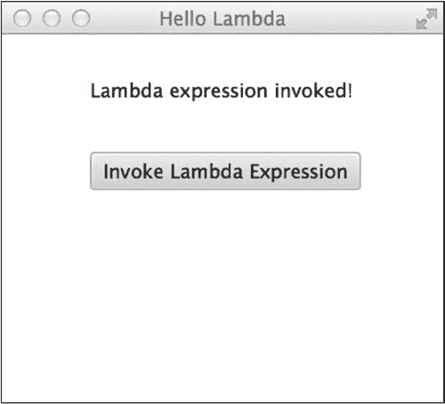

第 2 章 Java 8 的新特性

@Override

public void start(Stage primaryStage) {

primaryStage.setTitle("Hello Lambda");

Scene scene = new Scene(root, 300, 250);

Button btn = new Button();

Label message = new Label();

btn.setLayoutX(60);

btn.setLayoutY(80);

btn.setText("Invoke Lambda Expression");

btn.setOnAction((event) -> {

message.setText("Lambda expression invoked!");

});

root.getChildren().add(btn);

message.setLayoutX(300/2 - 90);

message.setLayoutY(30);

root.getChildren().add(message);

primaryStage.setScene(scene);

primaryStage.show();

}

}

这个 JavaFX 应用程序生成了一个简单的应用，外观如图 2-1\. W 所示。当你按下按钮时，作为 lambda 表达式的 ActionListener 会被调用。

**图 2-1.** *作为按钮动作监听器的 Lambda 表达式*

[www.it-ebooks.info](http://www.it-ebooks.info/)

第 2 章 Java 8 的新特性

工作原理

Lambda 表达式是 Java 8 的新特性之一，将对生产力和业务逻辑产生巨大影响。Lambda 表达式是匿名的代码块，接受零个或多个参数，封装一系列语句或一个表达式，并返回结果。它们类似于其他语言中的闭包，是可以在需要时传递给其他代码的匿名函数。

Lambda 表达式的语法包括参数列表、一个称为“箭头标记”（->）的新语言字符以及一个主体。以下模型展示了 lambda 表达式的结构：(参数列表) -> { 主体 }

Lambda 表达式的参数列表可以包含零个或多个参数。如果没有参数，则可以使用一对空括号。如果只有一个参数，则不需要括号。列表中的每个参数可以包含可选的类型声明。如果未指定参数类型，则类型会从当前上下文中推导得出。

Lambda 表达式基于函数式接口构建，函数式接口就是只包含一个抽象方法的 Java 接口。简单来说，lambda 表达式本身就是一个实现了函数式接口的匿名内部类，它可以被赋值给一个变量并调用。本小节只是 lambda 表达式的入门介绍；要了解更多信息，请参考第 6 章。

2-2\. 从 Lambda 表达式调用现有方法

问题

你正在使用 lambda 表达式来调用一个实现了函数式接口的现有方法，并且希望缩短执行此方法调用所需的代码长度。此外，你还希望能够将方法功能作为参数传递。

解决方案

使用方法引用来调用一个实现了函数式接口的现有方法。在以下示例中，一个泳池计算类实现了一个函数式接口，以获取计算出的泳池体积。

函数式接口 Volume 如下所示：

public interface Volume {

double calculateVolume();

}

PoolCalculator 类实现了 Volume，因为它包含了 calculateVolume() 方法的实现。因此，可以通过方法引用来调用该方法，并将其赋值给一个变量，然后根据需要将该变量作为参数传递。以下代码展示了 PoolCalculator 类。

public class PoolCalculator implements Volume {

private double width;

private double length;

private double minDepth;

private double maxDepth;

public PoolCalculator(){}

[www.it-ebooks.info](http://www.it-ebooks.info/)

第 2 章 Java 8 的新特性

public PoolCalculator(double width,

double length,

double minDepth,

double maxDepth){

this.width = width;

this.length = length;

this.minDepth = minDepth;

this.maxDepth = maxDepth;

}

/**

* @return 宽度

*/

public double getWidth() {

return width;

}

/**

* @param width 要设置的宽度

*/


public void setWidth(double width) {

this.width = width;

}

/**

* @return 长度

*/

public double getLength() {

return length;

}

/**

* @param length 要设置的长度

*/

public void setLength(double length) {

this.length = length;

}

/**

* 计算体积

* @return

*/

public double calculateVolume(){

double avgDepth = (minDepth+maxDepth)/2;

return avgDepth * length * width;

}

/**

* 根据给定的体积返回加仑数

* @param vol

[www.it-ebooks.info](http://www.it-ebooks.info/)

第 2 章 Java 8 的新特性

* @return

*/

public double calculateGallons(Volume vol){

return 7.48 * vol.calculateVolume();

}

/**

* @return 最小深度

*/

public double getMinDepth() {

return minDepth;

}

/**

* @param minDepth 要设置的最小深度

*/

public void setMinDepth(double minDepth) {

this.minDepth = minDepth;

}

/**

* @return 最大深度

*/

public double getMaxDepth() {

return maxDepth;

}

/**

* @param maxDepth 要设置的最大深度

*/

public void setMaxDepth(double maxDepth) {

this.maxDepth = maxDepth;

}

}

现在，可以使用方法引用来将 `calculateVolume()` 方法的功能赋值给一个变量。

在以下代码中，方法引用被赋值给一个标识为 `volume` 的变量，然后将该 `volume` 变量传递给 `calculateGallons()` 方法。

PoolCalculator calculator = new PoolCalculator();

calculator.setLength(32);

calculator.setWidth(16);

calculator.setMinDepth(4);

calculator.setMaxDepth(8);

Volume volume = calculator::calculateVolume;

double poolVolume = volume.calculateVolume();

System.out.println("游泳池的体积为：" + poolVolume + " 立方英尺"); System.out.println("游泳池的加仑数为：" + calculator.calculateGallons(volume)); 33

[www.it-ebooks.info](http://www.it-ebooks.info/)

第 2 章 Java 8 的新特性

运行这段代码的结果如下：

游泳池的体积为：3072.0 立方英尺

游泳池的加仑数为：22978.56

工作原理

Lambda 表达式允许你封装功能，并在需要时将其赋值给一个变量以供后续使用。信不信由你，有一种 Lambda 表达式的简化变体，称为方法引用。如果一个类包含一个派生自函数式接口实现的方法，那么该方法可以被获取或“捕获”，并赋值给一个变量以供后续使用。其概念在于，该方法包含的功能可以赋值给一个与函数式接口类型相同的变量。

在本示例中，一个标识为 `Volume` 的函数式接口包含一个名为 `calculateVolume()` 的抽象方法。`PoolCalculator` 类实现了 `Volume` 接口，因为它包含了 `calculateVolume()` 方法的实现。要通过方法引用来捕获此方法，你可以在 `PoolCalculator` 类的实例上使用以下语法：

poolCalculator::calculateVolume

双冒号运算符用于表示方法引用。在此示例中，使用的是对特定对象的实例方法的引用。然而，方法引用有多种类型；要了解更多信息，请参阅第 6 章。

2-3. 在接口中提供默认方法实现

问题

你希望向现有接口添加一个新方法，同时不破坏与其他代码的向后兼容性。

解决方案

在接口内部开发一个默认方法（也称为 *defender* 方法），这样任何实现该接口的类都无需提供新方法的实现。为此，请在接口声明中添加新的 `default` 关键字，并提供方法实现。以下 `Volume` 接口包含 `calculateVolume` 方法的默认实现：

public interface Volume {

/**

* 根据深度值和测量值计算游泳池体积。对于

* 深度可变的游泳池，minDepth 应为 depthValues[0]，

* maxDepth 应作为 depthValues[1] 传入。

*

* 此接口可以接受多个测量值，但它期望

* measurementValues[0] == length，或 measurementValues[0] == radius


* `measurementValues[1] == width`

* @param depthValues

* @param measurementValues

* @return

*/

[www.it-ebooks.info](http://www.it-ebooks.info/)

第 2 章 Java 8 的新特性

default double calculateVolume(Double[] depthValues, Double[] measurementValues) {

double length, width, radius, minDepth, maxDepth, avgDepth = 0;

if(depthValues.length > 1){

minDepth = depthValues[0];

maxDepth = depthValues[1];

avgDepth = (minDepth + maxDepth)/2;

} else if (depthValues.length == 1){

avgDepth = depthValues[0];

}

if(measurementValues.length > 1){

length = measurementValues[0];

width = measurementValues[1];

radius = 0;

} else {

length = 0;

width = 0;

radius = measurementValues[0];

}

if (radius == 0){

return length * width * avgDepth;

} else {

return (radius * radius) * 3.14 * avgDepth;

}

};

}

任何实现此接口的类现在都可以使用这个默认方法实现，或者提供自己的实现，这与抽象类非常相似。

工作原理

标准的 Java 接口由不包含方法体的方法声明组成。类实现 Java 接口，并在此过程中为接口的方法声明提供实现。Java 接口是面向对象的重要组成部分，因为它们抽象了实现细节，并提供了一个扩展功能的外观。在 Java 8 中，接口已被修改以允许默认方法实现。默认方法是一个包含声明和实现的方法，并通过在声明前添加 `default` 关键字来表示。

任何扩展了包含默认方法的接口的类，都可以选择实现并覆盖默认实现，或者直接使用默认实现。

你可能会想，为什么 Java 8 要提供这个功能？为什么不直接使用抽象类，而是使用默认方法？添加默认方法是为了提供一种在不破坏向后兼容性的情况下修改接口的方式。许多接口需要修改以适应 Java 8 API 的更新，而这样做可能会破坏为早期 Java 版本编写的代码的功能。通过向接口添加默认方法，工程师们能够在现有接口中添加新功能，同时不破坏依赖这些接口的代码。要了解更多关于默认方法的信息，请参考配方 5-7。

[www.it-ebooks.info](http://www.it-ebooks.info/)

第 2 章 Java 8 的新特性

2-4. 在声明或类型使用中多次应用同一注解

问题

你希望多次将同一注解应用于指定的声明或类型。

解决方案

只要每个注解都被标记为 `@Repeatable`，就可以多次将同一注解应用于声明或类型。在以下代码中，`@Repeatable` 注解被用于开发一个可重复的注解，而不是像 Java 早期版本那样将它们组合在一起。在此场景中，创建了一个名为 `Role` 的注解，它将用于表示被注解的类或方法的角色。

@Repeatable(value=Roles.class)

public @interface Role {

String name() default "AUTHOR";

}

当 `Role` 注解在同一个声明上被多次使用时，它会使用 `Roles` 注解。`Roles` 注解简单地生成一个 `Role` 注解数组。`Roles` 的代码如下：public @interface Roles {

Role[] value();

}

现在，如果你想为某个特定方法分配两个不同的角色，可以使用以下语法：

@Role(name="AUTHOR")

@Role(name="REVIEWER")

public void assignWork(){

...

}

工作原理

重复注解是 Java 8 一个便捷的新特性，因为它允许你将一个注解的多个版本分配给单个字段、方法或类。要在早期版本中执行相同的赋值，你必须将两个 `@Role` 注解包含在一个 `@Roles` 组中，如下所示：

@Roles({

@Role(name="AUTHOR"),

@Role(name="REVIEWER")

)}


要创建可重复的注解，必须定义一个包含字段的容器注解，该字段用于保存注解的多个实例。在示例中，`Roles` 注解用于在可重复场景下保存多个 `Role` 注解。每个 `Role` 注解都会被添加到 `Roles` 注解中声明的 `Role[]` 数组中。

[www.it-ebooks.info](http://www.it-ebooks.info/)

第 2 章 Java 8 的新特性

日期时间 API

Java 8 引入了一套新的日期时间 API，该 API 是根据 JSR 310 规范开发的。日期时间 API 默认使用 ISO-8601 中定义的日历。因此，该日历基于公历系统，在本章中，你将学习如何处理日期、时间和时区数据。日期时间 API 遵循多项设计原则，力求清晰、流畅、不可变且可扩展。该 API 使用简洁且定义明确的语言。同时，它也非常流畅，因此处理日期时间数据的代码易于阅读和理解。

以下介绍提供了几个新 API 的简短示例，帮助你快速入门。要更详细地了解该 API，请参考第 4 章。

2-5. 获取当前日期和时间

问题

你希望获取当前日期和时间，以便在应用程序中使用。

解决方案

利用新的日期时间 API 来获取当前日期和时间。以下代码演示了如何实现。

LocalDate localDate = LocalDate.now();

LocalTime localTime = LocalTime.now();

工作原理

日期时间 API 可以轻松地将当前日期和时间作为独立的实体获取。为此，你需要导入 `java.time.LocalDate` 和 `java.time.LocalTime` 类，并分别调用它们的静态 `now()` 方法来获取本地日期和时间的实例。`LocalDate` 和 `LocalTime` 类都是不可变且线程安全的，因此无法实例化。要了解更多信息，请参考配方 4-7。

2-6. 从指定字符串获取日期

问题

给定一个包含日期的指定文本字符串，你希望获取一个 `LocalDate` 对象。

解决方案

使用 `DateTimeFormatter` 设置指定文本字符串的格式，然后调用 `LocalDate.parse()` 方法，将文本字符串作为第一个参数，格式化器作为第二个参数。以下代码行演示了这一过程。

DateTimeFormatter formatter = DateTimeFormatter.ofPattern("MM/dd/yyyy");

LocalDate yearStart = LocalDate.parse("01/01/2014", formatter);

[www.it-ebooks.info](http://www.it-ebooks.info/)

第 2 章 Java 8 的新特性

工作原理

`LocalDate` 对象包含多个可用于操作日期的实用方法。其中一个方法是 `parse()`，它接受两个参数：一个基于字符串的日期和一个指定第一个参数格式的 `DateTimeFormatter` 对象。该方法从文本字符串中获取一个 `LocalDate` 实例，如果由于格式不正确而无法解析文本，则会返回一个 `DateTimeParseException`。

从指定字符串获取日期的能力只是新日期时间 API 的众多优秀特性之一。

要了解更多新特性，请参考第 4 章。

2-7. 执行日期时间计算

问题

你希望从给定的日期或时间中增加若干天或减去若干周。

解决方案

利用 `LocalDate` 和 `LocalTime` 对象中的内置实用方法来执行所需的计算。

以下代码获取当前日期和时间，并对它们执行一些基本计算。

LocalDate myDate = LocalDate.now();

LocalTime myTime = LocalTime.now();

LocalDate datePlusDays = myDate.plusDays(15);

System.out.println("今天加 15 天: " + datePlusDays);

LocalDate datePlusWeeks = myDate.plusWeeks(8);

System.out.println("今天加 8 周: " + datePlusWeeks);

LocalTime timePlusHours = myTime.plusHours(5);

LocalTime timeMinusMin = myTime.minusMinutes(30);

System.out.println("时间加 5 小时: " + timePlusHours);


System.out.println("时间减去 30 分钟: " + timeMinusMin);

工作原理

日期时间 API 使得对日期和时间执行计算变得非常容易。`LocalDate` 和 `LocalTime` 对象内置了计算方法，因此无需再担心为了执行计算而将对象转换为不同类型。日期时间 API 还允许通过调用这些对象的 `now()` 方法轻松访问当前日期或时间。

Streams API

集合在许多 Java 应用程序中扮演着不可或缺的角色。Java 8 的发布引入了 Streams API，它改变了数据集合的使用方式，使解决方案更具生产力和可维护性。Streams API 允许你遍历元素集合、执行聚合操作、将两个或多个操作进行流水线化、执行并行执行等。本节将简要介绍 Streams API。要了解更多信息，请参考配方 7-8。

[www.it-ebooks.info](http://www.it-ebooks.info/)

第 2 章 N JAVA 8 的新特性

2-8\. 遍历数据集合

问题

你的应用程序包含一个对象列表，你想要遍历该列表并打印出每个对象的某个字段。

解决方案

利用新的 Java Streams API 遍历数据列表，并为每个元素执行一项任务。在以下代码行中，一个列表被填充了示例数据。然后通过生成一个流来遍历该列表，并使用 lambda 表达式将每个元素打印到命令行。

List<String> myList = new ArrayList();

// 填充列表

for(int x = 0; x <= 10; x++){

myList.add("Test " + x);

}

// 打印列表中的每个元素

myList.stream().forEach((value)->{

System.out.println(value);

});

结果：

Test 0

Test 1

Test 2

Test 3

Test 4

Test 5

Test 6

Test 7

Test 8

Test 9

Test 10

工作原理

新的 Streams API 增强了 Java 集合类型的可用性，使得遍历集合并对每个元素执行任务变得简单。在本配方的解决方案中，生成了一个字符串数组，然后从该数组创建了一个流。利用该流，通过 `forEach()` 终端操作将数组的每个元素打印到命令行。Streams API 允许编译器确定遍历集合的最佳方式（内部迭代）。*流*是一个对象引用序列，可以在所有集合类型上生成。

Streams API 使得对这些对象引用执行一系列聚合操作成为可能，并返回结果或将更改内联应用到对象上。这又被称为*流水线*。生成和使用流的伪代码如下：

集合 -> (流) -> (零个或多个中间操作) -> (终端操作) 有关 Java 8 这一出色新特性的更多信息，请参考配方 7-8。

[www.it-ebooks.info](http://www.it-ebooks.info/)

第 2 章 N JAVA 8 的新特性

JavaFX

JavaFX 在 Java 8 发布时经历了大规模改造。首先，它现在已包含在 Java 8 SE 中，因此不再需要单独下载。平台中添加了多个新组件，包括 DatePicker 和用于在 JavaFX 中嵌入 Swing 的新 SwingNode。此外，对 Raspberry Pi 等平台的嵌入式支持也得到了改进。其他新功能包括 WebView 增强、打印支持、富文本支持等等。

本节仅涵盖 JavaFX 8 的部分新特性。要了解更多信息，请参考专门介绍 JavaFX 的第 14–17 章。

2-9\. 在 JavaFX 中嵌入 Swing

问题

你想要将一些标准的 Java Swing 代码嵌入到 JavaFX 应用程序中。

解决方案

使用 SwingNode 将 Swing 内容嵌入到应用程序中。在以下简单的 JavaFX 应用程序中，使用 JavaFX 创建了前端，并在其中嵌入了一个 Swing JLabel 组件。

public class Recipe02_09 extends Application {

@Override


public void start(Stage primaryStage) throws Exception {

    final SwingNode swingNode = new SwingNode();

    createSwingContent(swingNode);

    StackPane pane = new StackPane();

    pane.getChildren().add(swingNode);

    primaryStage.setScene(new Scene(pane, 100, 50));

    primaryStage.show();

}

private void createSwingContent(final SwingNode swingNode) {

    SwingUtilities.invokeLater(() -> {

        swingNode.setContent(new JLabel("Hello Swing"));

    });

}

/**

* @param args the command-line arguments

*/

public static void main(String[] args) {

    launch(args);

}

}

[www.it-ebooks.info](http://www.it-ebooks.info/)


第 2 章 Java 8 的新特性

生成的应用程序如图 2-2 所示。

**图 2-2.** *使用 SwingNode 嵌入 JLabel*

工作原理

Swing 曾是 Java 平台开发图形用户界面和桌面应用程序的首选工具。Swing 是 Java 基础类（JFC）的一部分，JFC 是一组用于开发图形用户界面的功能集合。Swing API 包含大量组件（JComponent 类）、事件处理类、外观类等。该 API 功能强大，足以开发高度复杂的应用程序。然而，API 过于庞大，学习起来较为困难，并且随着技术发展，许多 Swing 类和功能已经过时。正因如此，JavaFX 已成为 Java 平台开发现代图形用户界面和桌面应用程序的首选 API。因此，许多开发者需要一种将两者融合的方法来实现过渡。即使是完全用 JavaFX 编写的应用程序，也能从使用某些 Swing 组件中受益。`javafx.embed.swing.SwingNode` 类使得将 `JComponent` 实例嵌入 JavaFX 应用程序变得轻而易举，只需将 `JComponent` 传递给 `SwingNode` 的 `setContent()` 方法即可。内容会自动重绘，所有事件也会在无需用户干预的情况下转发给 `JComponent` 实例。

在本示例中，通过将 Swing 组件传递给 `SwingNode` 的 `setContent()` 方法，将一个 Swing 的 `JLabel` 组件嵌入到了 JavaFX 应用程序中。Swing 内容应在事件分发线程（EDT）上运行，因此所有 Swing 访问都应在 EDT 上进行。也就是说，使用 `SwingUtilities.invokeLater` 创建了一个新线程，并用 lambda 表达式封装了用于设置 Swing 内容的 `Runnable`。

要了解更多关于在应用程序中使用 `SwingNode` 的信息，并查看更详细的示例，请参考配方 14-18。

[www.it-ebooks.info](http://www.it-ebooks.info/)

第 2 章 Java 8 的新特性

2-10. 添加日期选择器

问题

您希望在 JavaFX 应用程序中添加一个组件，以便能够选择日历日期。

解决方案

使用新的 JavaFX `DatePicker` 组件。在以下示例中，使用 `DatePicker` 组件选择日期并将其显示在标签中。

public class Recipe02_10 extends Application {

    private Label dateLabel;

    private DatePicker datePicker;

    @Override

    public void start(Stage primaryStage) throws Exception {

        dateLabel = new Label("使用小部件选择日期");

        datePicker = new DatePicker(LocalDate.now());

        datePicker.setOnAction(event -> {

            dateLabel.setText("选中的日期是：" + datePicker.getValue());

        });

        FlowPane flow = new FlowPane();

        flow.setPadding(new Insets(5, 5, 5, 5));

        flow.getChildren().add(dateLabel);

        flow.getChildren().add(datePicker);

        primaryStage.setScene(new Scene(flow, 300, 100));

        primaryStage.show();

    }

    /**

    * @param args the command-line arguments

    */

    public static void main(String[] args) {

        launch(args);

    }

}

生成的应用程序如图 2-3 所示。

[www.it-ebooks.info](http://www.it-ebooks.info/)


第 2 章 Java 8 的新特性

**图 2-3.** *JavaFX DatePicker 组件运行效果*

工作原理

多年来，JavaFX 平台一直没有标准的 `DatePicker` 组件。JavaFX 8 新增的 `DatePicker` 组件填补了这一空白，为开发者提供了从给定日历中选择日期的方法。`DatePicker` 组件与日期时间 API 紧密结合，使得日期选择和日期计算变得简单。

`DatePicker` 包含月份选择器、年份选择器和日期选择器。要将该组件添加到应用程序中，需要导入 `javafx.scene.control.DatePicker` 并创建该组件的新实例。默认情况下，如果没有向组件传递日期，它将显示一个空白文本框。该组件的构造函数允许您在初始化时传入一个 `LocalDate` 对象，如示例所示。

`DatePicker` 具有很强的可扩展性，因为它提供了自定义功能。例如，可以使用 `setShowWeekNumbers()` 方法设置显示一年中的周数，使用 `setChronology()` 方法设置历法。以下代码展示了与解决方案中相同的示例，但这次 `DatePicker` 已自定义为显示周数并使用日本历法。

public void start(Stage primaryStage) throws Exception {

    dateLabel = new Label("使用小部件选择日期");

    datePicker = new DatePicker(LocalDate.now());

    datePicker.setOnAction(event -> {

        dateLabel.setText("选中的日期是：" + datePicker.getValue());

    });

[www.it-ebooks.info](http://www.it-ebooks.info/)


第 2 章 Java 8 的新特性

    datePicker.setShowWeekNumbers(true);

    datePicker.setChronology(JapaneseChronology.INSTANCE);

    FlowPane flow = new FlowPane();

    flow.setPadding(new Insets(5, 5, 5, 5));

    flow.getChildren().add(dateLabel);

    flow.getChildren().add(datePicker);

    primaryStage.setScene(new Scene(flow, 300, 100));

    primaryStage.show();

}

结果如图 2-4 所示。

**图 2-4.** *自定义的 DatePicker*

有关新 `DatePicker` 的更多信息，请参阅在线文档：

[`docs.oracle.com/javase/8/javafx/user-interface-tutorial/date-picker.htm.`](http://docs.oracle.com/javase/8/javafx/user-interface-tutorial/date-picker.htm)

[www.it-ebooks.info](http://www.it-ebooks.info/)

第 2 章 Java 8 的新特性

2-11. 从 JavaFX 打印

问题

您希望在 JavaFX 应用程序中提供打印功能。

解决方案

使用 JavaFX 8 新增的 JavaFX 打印 API 来打印指定节点并构建复杂的打印对话框。

以下类使用新的打印 API，在按下打印按钮时打印 `TextArea` 组件。

public class Recipe02_11 extends Application {

    @Override

    public void start(Stage primaryStage) throws Exception {

        TextArea ta = new TextArea();

        ta.setWrapText(true);

        final Printer selectedPrinter = Printer.getDefaultPrinter();

        Button printButton = new Button("打印");

        printButton.setOnAction((ActionEvent event) -> {

            print(ta, selectedPrinter);

        });

        FlowPane pane = new FlowPane();

        pane.getChildren().add(ta);

        pane.getChildren().add(printButton);

        primaryStage.setScene(new Scene(pane, 500, 300));

        primaryStage.show();

    }

    public void print(final Node node, Printer printer) {

        PrinterJob job = PrinterJob.createPrinterJob();

        job.setPrinter(printer);

        if (job != null) {

            boolean success = job.printPage(node);

            if (success) {

                job.endJob();

            }

        }

    }

    public static void main(String[] args){

        launch(args);

    }

}

[www.it-ebooks.info](http://www.it-ebooks.info/)


第 2 章 Java 8 的新特性

构建的应用程序如图 2-5 所示。

**图 2-5.** *一个使用打印 API 的简单应用程序*

在此应用程序中，当您按下“打印”按钮时，`TextArea` 组件会被发送到操作系统的默认打印机。

工作原理

在 JavaFX 8 之前的版本中，没有用于打印应用程序舞台部分内容的标准 API。


在 JavaFX 8 中，新增了一个打印 API，用于标准化处理打印功能的方式。该 API 还能让开发者用极少的代码轻松为应用程序启用打印功能。这个 API 相当庞大，包含了许多类，但使用起来非常直观且简单。

在本示例中，构建了一个 `TextArea` 节点，然后在点击按钮时将其发送到打印机。

应用程序中的按钮绑定到一个名为 `print()` 的方法。`print()` 方法接受一个 JavaFX 节点作为第一个参数，一个 `Printer` 作为第二个参数。`Printer` 参数代表目标打印机。要获取操作系统默认打印机，请执行以下命令，如示例所示：

`Printer.getDefaultPrinter();`

在将 JavaFX 节点发送到打印机之前，必须先构建一个 `PrinterJob`。为此，需要调用 `PrinterJob.createPrinterJob()` 方法。创建 `PrinterJob` 实例后，通过将 `Printer` 参数传递给 `job.setPrinter()` 方法来设置目标打印机。最后，调用 `job.printPage()` 方法，并将要打印的节点作为参数传入。

要了解更多关于使用打印 API 的信息，并查看更详细的示例，请参考配方 14-17。

[www.it-ebooks.info](http://www.it-ebooks.info/)

第 2 章  Java 8 的新特性

脚本

自 Java 1.6 发布以来，Java 平台就支持嵌入和/或执行 JavaScript 文件，当时的 JavaScript 引擎是 Rhino。Rhino 引擎多年来一直为我们提供良好的服务，但现在一个名为 *Nashorn* 的更新版 JavaScript 引擎已经登场。Nashorn 引擎带来了许多更新，包括支持 ECMAScript-262 第 5.1 版语言规范、一个用于交互式解释或执行 JavaScript 文件的新命令行工具，以及对 JavaFX 8 API 的完全访问权限。

本章提供了一些使用 Nashorn 入门的示例。更多信息请参见第 18 章，该章专门介绍这个新的 JavaScript 引擎。

2-12. 在 Java 应用程序中嵌入 JavaScript

问题

你想利用 JavaScript 来实现 Java 应用程序的一部分功能。

解决方案

利用 Nashorn 引擎将 JavaScript 嵌入到 Java 应用程序中。以下示例通过执行一个 Nashorn `ScriptEngine` 来执行内联 JavaScript。

`public class Recipe02_12 {`

`public static void loadInlineJs() {`

`ScriptEngineManager sem = new ScriptEngineManager();`

`ScriptEngine nashorn = sem.getEngineByName("nashorn");`

`try {`

`nashorn.eval("print('This is being printed with JavaScript');");`

`} catch (ScriptException ex) {`

`Logger.getLogger(Recipe02_12.class.getName()).log(Level.SEVERE, null, ex);`

`}`

`}`

`public static void main(String[] main) {`

`loadInlineJs();`

`}`

`}`

工作原理

Nashorn 是 Java 8 中包含的一个新 JavaScript 引擎。要在 Java 应用程序中执行 JavaScript，需要调用 Nashorn 引擎的一个实例，并向其传递内联或外部的 JavaScript。在本配方中，通过调用 `ScriptEngineManager` 并传递 `"nashorn"` 作为参数来获取 Nashorn 引擎。获取 Nashorn 引擎后，就可以通过调用引擎的 `eval()` 方法来调用 JavaScript 文件或评估内联的 JavaScript 代码。在本示例中，向引擎传递了一个 JavaScript 的 `print()` 语句。

有关使用新 Nashorn 引擎的更多信息，请参考第 18 章。

[www.it-ebooks.info](http://www.it-ebooks.info/)

第 2 章  Java 8 的新特性

2-13. 从命令行执行 JavaScript

问题

你想通过命令行执行 JavaScript。

解决方案

调用 `jjs` 工具，该工具是 Java 8 的一部分。要执行一个 JavaScript 文件，从命令行调用 `jjs` 工具，然后传递要执行的 JavaScript 文件的完全限定名（如果不在 `CLASSPATH` 中，则包含路径）。例如，要执行 `helloNashorn.js`，使用以下命令：

`jjs /src/org/java8recipes/chapter18/js/helloNashorn.js`

`Hello Nashorn!`

工作原理

`jjs` 命令行工具是 Java 8 中的新工具。该工具用于内联执行 JavaScript 或从 JavaScript 文件中执行 JavaScript。

当内联使用该工具时，你可以交互式地执行 JavaScript 并立即获得反馈。该工具可以执行一个或多个带参数或不带参数的 `.js` 文件。

要了解更多关于 `jjs` 工具的信息并查看更深入的示例，请参考配方 18-2。

总结

本章简要概述了 Java 8 的一些新特性，但这只是 Java 8 所提供功能的冰山一角。本书的其余部分涵盖了包含利用现有 Java 特性以及此最新版本中引入的新特性的解决方案的配方。正如本章所述，本章涵盖的一些特性将在后续的配方中更详细地介绍。本章未涵盖的新特性还有很多，所以请准备好深入 Java 的世界。

[www.it-ebooks.info](http://www.it-ebooks.info/)

**第 3 章**

**字符串**

字符串是任何编程语言中最常用的数据类型之一。它们可用于从键盘获取文本、向命令行打印消息等等。鉴于字符串的使用如此频繁，随着时间的推移，`String` 对象中添加了许多特性，以便于使用。

毕竟，字符串在 Java 中是一个对象，因此它包含可用于操作字符串内容的方法。

字符串在 Java 中也是*不可变的*，这意味着它们的状态不能被更改或改变。这使得它们与一些可变的或可更改的数据类型相比，使用起来有些不同。理解如何正确使用不可变对象非常重要，尤其是在尝试更改或为其分配不同值时。

本章重点介绍一些最常用的 `String` 方法以及处理 `String` 对象的技术。我们还介绍了一些 `String` 对象本身不具备的有用技术。

3-1. 获取字符串的子部分

问题

你想获取字符串的一部分。

解决方案

使用 `substring()` 方法获取两个不同位置之间的字符串部分。在下面的解决方案中，创建了一个字符串，然后使用 `substring()` 方法打印出字符串的各个部分。

`public static void substringExample(){`

`String originalString = "This is the original String";`

`System.out.println(originalString.substring(0, originalString.length()));`

`System.out.println(originalString.substring(5, 20));`

`System.out.println(originalString.substring(12));`

`}`

运行此方法将产生以下结果：

`This is the original String`

`is the original`

`original String`

[www.it-ebooks.info](http://www.it-ebooks.info/)

第 3 章  字符串

工作原理

`String` 对象包含许多辅助方法。其中一种方法是 `substring()`，可用于获取字符串的部分内容。`substring()` 方法有两种变体。一种接受单个参数，即起始索引；另一种接受两个参数：起始索引和结束索引。`substring()` 方法有两种变体，使得第二个参数看起来是可选的；如果未指定，则使用调用字符串的长度代替。需要注意的是，索引从零开始，因此字符串中的第一个位置的索引为 0，依此类推。


从本方案的解决方案可以看出，`substring()` 的第一次使用打印出了字符串的全部内容。这是因为传递给 `substring()` 方法的第一个参数是 0，第二个参数是原始字符串的长度。在 `substring()` 的第二个示例中，索引 5 被用作第一个参数，索引 20 被用作第二个参数。这实际上只打印了字符串的一部分，从字符串中位于第六个位置的字符（即索引 5，因为第一个位置的索引为 0）开始，到字符串中位于第 20 个位置的字符（索引 19）结束。第三个示例只指定了一个参数；因此，结果将是从该参数指定的位置开始的原始字符串。

N **注意** `substring()` 方法只接受正整数。如果尝试传递负值，将会抛出异常。

3-2. 比较字符串

问题

您正在编写的应用程序需要能够比较两个或多个字符串值。

解决方案

使用内置的 `equals()`、`equalsIgnoreCase()`、`compareTo()` 和 `compareToIgnoreCase()` 方法来比较字符串中包含的值。以下是使用不同字符串比较操作的一系列测试。

如您所见，如果比较结果相等，则使用各种 `if` 语句来打印消息：
```java
String one = "one";
String two = "two";
String var1 = "one";
String var2 = "Two";
String pieceone = "o";
String piecetwo = "ne";

// 比较相等
if (one.equals(var1)){
    System.out.println ("String one equals var1 using equals");
}
```
[www.it-ebooks.info](http://www.it-ebooks.info/)

第 3 章 字符串

```java
// 比较不相等
if (one.equals(two)){
    System.out.println ("String one equals two using equals");
}

// 比较不相等
if (two.equals(var2)){
    System.out.println ("String two equals var2 using equals");
}

// 比较相等，但并非直接使用 == 比较字符串值
if (one == var1){
    System.out.println ("String one equals var1 using ==");
}

// 比较相等
if (two.equalsIgnoreCase(var2)){
    System.out.println ("String two equals var2 using equalsIgnoreCase");
}

System.out.println("尝试对拼接而成的字符串使用 ==");
String piecedTogether = pieceone + piecetwo;

// 比较相等
if (one.equals(piecedTogether)){
    System.out.println("The strings contain the same value using equals");
}

// 使用 == 比较不相等
if (one == piecedTogether) {
    System.out.println("The string contain the same value using == ");
}

// 比较相等
if (one.compareTo(var1) == 0){
    System.out.println("One is equal to var1 using compareTo()");
}
```

结果输出如下：
```
String one equals var1 using equals
String one equals var1 using ==
String two equals var2 using equalsIgnoreCase
尝试对拼接而成的字符串使用 ==
The strings contain the same value using equals
One is equal to var1 using compareTo()
```
[www.it-ebooks.info](http://www.it-ebooks.info/)

第 3 章 字符串

工作原理

使用编程语言时，比较两个或多个值可能是比较棘手的部分之一。

在 Java 语言中，比较字符串可以相当直接，但要记住，*不应*使用 `==` 进行字符串比较。这是因为比较运算符（`==`）用于比较引用，而不是字符串的值。在 Java 中进行字符串编程时，最容易犯的错误之一就是使用比较运算符，但绝不能这样做，因为结果可能各不相同。

N **注意** Java 使用字符串驻留（interning）来提升性能。这意味着 JVM 包含一个驻留字符串表，每次对字符串调用 `intern()` 方法时，都会在该表中执行查找以寻找匹配项。如果表中没有匹配的字符串，则将该字符串添加到表中并返回一个引用。如果字符串已存在于表中，则返回该引用。Java 会自动驻留字符串字面量，这可能导致使用 `==` 比较运算符时出现差异。

在本方案的解决方案中，您可以看到多种不同的字符串值比较技术。`equals()` 方法是每个 Java 对象的一部分。Java 字符串的 `equals()` 方法已被重写，以便比较字符串中包含的值，而不是对象本身。从本方案解决方案中提取的以下示例可以看出，`equals()` 方法是比较字符串的安全方式。

```java
// 比较相等
if (one.equals(var1)){
    System.out.println ("String one equals var1 using equals");
}

// 比较不相等
if (one.equals(two)){
    System.out.println ("String one equals two using equals");
}
```

`equals()` 方法首先会使用 `==` 运算符检查字符串是否引用同一个对象；如果是，则返回 `true`。如果它们不引用同一个对象，`equals()` 将逐个字符地比较每个字符串，以确定被比较的字符串是否包含完全相同的值。

如果其中一个字符串的大小写与另一个不同怎么办？使用 `equals()` 比较时它们仍然相等吗？答案是否定的，这就是为什么创建了 `equalsIgnoreCase()` 方法。使用 `equalsIgnoreCase()` 比较两个值时，会比较每个字符，而忽略大小写。

以下示例摘自本方案的解决方案：

```java
// 比较不相等
if (two.equals(var2)){
    System.out.println ("String two equals var2 using equals");
}

// 比较相等
if (two.equalsIgnoreCase(var2)){
    System.out.println ("String two equals var2 using equalsIgnoreCase");
}
```

`compareTo()` 和 `compareToIgnoreCase()` 方法对字符串执行字典序比较。这种比较基于字符串中每个字符的 Unicode 值。如果该字符串在字典序上位于参数字符串之前，结果将为负整数。如果该字符串在字典序上位于参数字符串之后，结果将为正整数。如果两个字符串在字典序上相等，结果将为零。以下摘自本方案解决方案的代码演示了 `compareTo()` 方法：

```java
// 比较相等
if (one.compareTo(var1) == 0){
    System.out.println("One is equal to var1 using compareTo()");
}
```

不可避免的是，许多应用程序都包含必须在某种程度上比较字符串的代码。下次您有一个需要字符串比较的应用程序时，在编写代码之前，请考虑本方案中讨论的信息。

3-3. 修剪空白

问题

您正在处理的某个字符串在两端包含一些空白字符。您希望去除这些空白。

解决方案

使用字符串的 `trim()` 方法来消除空白。在以下示例中，打印了一个包含两端空白的句子。然后使用 `trim()` 方法再次打印同一个句子以去除空白，以便看到变化。

```java
String myString = "  This is a String that contains whitespace.  ";
System.out.println(myString);
System.out.println(myString.trim());
```

输出将打印如下：
```
  This is a String that contains whitespace.  
This is a String that contains whitespace.
```

工作原理


无论我们多么小心，在处理文本字符串时，空白字符始终是个问题。当将字符串与匹配值进行比较时，这种情况尤为突出。如果字符串包含意外的空白字符，那对于模式搜索程序来说可能是灾难性的。幸运的是，Java String 对象提供了 `trim()` 方法，可用于自动移除任意给定字符串两端的空白字符。

`trim()` 方法非常易于使用。事实上，从本方案的解决方案中可以看出，使用 `trim()` 方法只需对任意给定字符串进行一次调用即可。由于字符串是对象，它们包含许多辅助方法，这使得处理字符串变得非常容易。毕竟，字符串是任何编程语言中最常用的数据类型之一……所以它们最好易于使用！`trim()` 方法会返回原始字符串的一个副本，其中所有前导和尾随空白字符都已被移除。但是，如果没有需要移除的空白字符，`trim()` 方法会返回原始字符串实例。没有比这更简单的了！

[www.it-ebooks.info](http://www.it-ebooks.info/)

第 3 章 N 字符串

3-4. 更改字符串的大小写

问题

你的应用程序中有一部分包含区分大小写的字符串值。你希望在处理所有字符串之前将它们转换为大写，以避免后续出现任何大小写敏感性问题。

解决方案

使用 `toUpperCase()` 和 `toLowerCase()` 方法。String 对象提供了这两个辅助方法，用于更改给定字符串中所有字符的大小写。

例如，给定以下代码中的字符串，将分别调用这两个方法：
```java
String str = "This String will change case.";

System.out.println(str.toUpperCase());

System.out.println(str.toLowerCase());
```
将产生以下输出：
```
THIS STRING WILL CHANGE CASE.
this string will change case.
```

工作原理

为了确保给定字符串中每个字符的大小写统一为大写或小写，请分别使用 `toUpperCase()` 和 `toLowerCase()` 方法。使用这些方法时需要注意几点。首先，如果给定字符串包含大写字母，并且对其调用了 `toUpperCase()` 方法，那么大写字母会被忽略。调用 `toLowerCase()` 方法也是同样的道理。给定字符串中包含的任何标点符号或数字也会被忽略。

这些方法各有两种变体。一种变体不接受任何参数，而另一种变体接受一个与你要使用的区域设置相关的参数。不带任何参数调用这些方法将使用默认区域设置进行大小写转换。如果你想使用不同的区域设置，可以将所需的区域设置作为参数传递给接受参数的方法变体。例如，如果你想使用意大利语或法语区域设置，可以使用以下代码：
```java
System.out.println(str.toUpperCase(Locale.ITALIAN));

System.out.println(str.toUpperCase(new Locale("it","US")));

System.out.println(str.toLowerCase(new Locale("fr", "CA")));
```
使用这些方法将字符串转换为大写或小写可以使生活变得轻松。它们对于比较从应用程序输入中获取的字符串也非常有用。考虑这样一种情况：提示用户输入用户名，并将结果保存到一个字符串中。再考虑一下，在程序稍后阶段，该字符串将与数据库中存储的所有用户名进行比较，以确保用户名有效。如果输入用户名的人将其首字符大写会怎样？如果用户名在数据库中以全大写形式存储会怎样？比较结果永远不会相等。在这种情况下，开发人员可以使用 `toUpperCase()` 方法来缓解问题。对正在比较的字符串调用此方法将得到一个大小写一致的比较结果。

[www.it-ebooks.info](http://www.it-ebooks.info/)

第 3 章 N 字符串

3-5. 连接字符串

问题

有多个字符串想要合并成一个。

解决方案 #1

如果你想将字符串依次追加到彼此末尾，请使用 `concat()` 方法。以下示例演示了 `concat()` 方法的使用：
```java
String one = "Hello";
String two = "Java8";
String result = one.concat(" ".concat(two));
```
结果如下：
```
Hello Java8
```

解决方案 #2

使用连接运算符以简写方式组合字符串。在以下示例中，两个字符串之间放置了一个空格字符：
```java
String one = "Hello";
String two = "Java8";
String result = one + " " + two;
```
结果如下：
```
Hello Java8
```

解决方案 #3

使用 `StringBuilder` 或 `StringBuffer` 来组合字符串。以下示例演示了使用 `StringBuffer` 连接两个字符串：
```java
String one = "Hello";
String two = "Java8";
StringBuffer buffer = new StringBuffer();
buffer.append(one).append(" ").append(two);
String result = buffer.toString();
System.out.println(result);
```
结果如下：
```
Hello Java8
```

[www.it-ebooks.info](http://www.it-ebooks.info/)

第 3 章 N 字符串

工作原理

Java 语言提供了几种不同的选项来连接文本字符串。虽然它们没有优劣之分，但你可能会发现在不同情况下，某一种方法效果更好。`concat()` 方法是一个内置的字符串辅助方法。它能够将一个字符串追加到另一个字符串的末尾，如本方案的解决方案 #1 所示。`concat()` 方法接受任何字符串值；因此，如果需要，你可以显式键入一个字符串值作为参数传递。如解决方案 #1 所示，只需将一个字符串作为参数传递给此方法，它就会被追加到调用该方法的字符串末尾。但是，如果你想在两个字符串之间添加一个空格字符，可以通过传递一个空格字符以及要追加的字符串来实现，如下所示：
```java
String result = one.concat(" ".concat(two));
```
如你所见，能够将任何字符串或字符串组合传递给 `concat()` 方法使其非常有用。由于所有字符串辅助方法实际上都返回应用了辅助方法功能的原始字符串副本，因此你也可以将调用其他辅助方法的字符串传递给 `concat()`（或任何其他字符串辅助方法）。考虑一下，你想要显示文本 "Hello Java" 而不是 "Hello Java8"。以下字符串辅助方法的组合可以让你做到这一点：
```java
String one = "Hello";
String two = "Java8";
String result = one.concat(" ".concat(two.substring(0, two.length()-1)));
```


连接运算符（+）可用于拼接任意两个字符串。它通常被视为 `concat()` 方法的简写形式。本示例的第三种解决方案演示了 `StringBuffer` 的使用，它是一个可变的字符序列，与字符串非常相似，区别在于它可以通过方法调用来修改。`StringBuffer` 类包含许多用于构建和操作字符序列的辅助方法。在该解决方案中，`append()` 方法用于追加两个字符串值。`append()` 方法会将作为参数传入的字符串放置在 `StringBuffer` 的末尾。有关 `StringBuffer` 使用的更多信息，请参考在线文档 [`docs.oracle.com/javase/8/docs/api/java/lang/`](http://docs.oracle.com/javase/8/docs/api/java/lang/StringBuffer.html)

[StringBuffer.html。](http://docs.oracle.com/javase/8/docs/api/java/lang/StringBuffer.html)

3-6\. 将字符串转换为数值

问题

你希望能够将以字符串形式存储的任何数值转换为整数。

解决方案 #1

使用 `Integer.valueOf()` 辅助方法将字符串转换为 `int` 数据类型。例如：
```java
String one = "1";
String two = "2";
int result = Integer.valueOf(one) + Integer.valueOf(two);
```
如你所见，两个字符串变量都被转换成了整数值。之后，它们被用于执行加法计算，然后存储到一个 `int` 变量中。

[www.it-ebooks.info](http://www.it-ebooks.info/)

第 3 章 字符串

**注意** 本例中使用了一种称为自动装箱的技术。自动装箱是 Java 语言的一个特性，它自动将原始类型值转换为其对应的包装类。例如，当你将一个 `int` 值赋给一个 `Integer` 时就会发生这种情况。类似地，当你尝试反向转换（从包装类到原始类型）时，会自动发生拆箱。有关自动装箱的更多信息，请参考在线文档：

[`docs.oracle.com/javase/tutorial/java/data/autoboxing.html`](http://docs.oracle.com/javase/tutorial/java/data/autoboxing.html)。

解决方案 #2

使用 `Integer.parseInt()` 辅助方法将字符串转换为 `int` 数据类型。例如：
```java
String one = "1";
String two = "2";
int result = Integer.parseInt(one) + Integer.parseInt(two);
System.out.println(result);
```

工作原理

`Integer` 类包含 `valueOf()` 和 `parseInt()` 方法，用于将字符串或 `int` 类型转换为整数。`Integer` 类的 `valueOf()` 方法有两种不同的形式可用于将字符串转换为整数值。它们的区别在于接受的参数数量不同。第一种 `valueOf()` 方法只接受一个字符串参数。如果可能，该字符串会被解析为一个整数值，然后返回一个包含该字符串值的整数。如果字符串无法正确转换为整数，则该方法会抛出 `NumberFormatException`。

`Integer` 的 `valueOf()` 方法的第二种形式接受两个参数：一个将被解析为整数的字符串参数，以及一个表示用于转换的基数的 `int` 值。

**注意** 许多 Java 类型类都包含 `valueOf()` 方法，可用于将不同类型转换为该类的类型。`String` 类就是如此，因为它包含许多不同的 `valueOf()` 方法，可用于转换。有关 `String` 类或任何其他类型类包含的不同 `valueOf()` 方法的更多信息，请参阅在线 Java 文档：[`docs.oracle.com/javase/8/docs`](http://docs.oracle.com/javase/8/docs)。

`Integer` 类的 `parseInt()` 方法也有两种不同的形式。一种接受一个参数：你想要转换为整数的字符串。另一种形式接受两个参数：你想要转换为整数的字符串和基数。第一种格式使用最广泛，它将字符串参数解析为一个有符号的十进制整数。如果字符串中不包含可解析的无符号整数，则会抛出 `NumberFormatException`。第二种格式使用较少，如果给定字符串中包含可解析的无符号整数，它会返回一个 `Integer` 对象，该对象保存由字符串参数在给定基数下表示的值。

[www.it-ebooks.info](http://www.it-ebooks.info/)

第 3 章 字符串

3-7\. 遍历字符串中的字符

问题

你想要遍历文本字符串中的字符，以便在字符级别对它们进行操作。

解决方案

结合使用字符串辅助方法来在字符级别访问字符串。如果在循环的上下文中使用字符串辅助方法，你可以轻松地按字符遍历字符串。在以下示例中，名为 `str` 的字符串使用 `toCharArray()` 方法进行分解。
```java
String str = "Break down into chars";
System.out.println(str);
for (char chr:str.toCharArray()){
    System.out.println(chr);
}
```
同样的策略也可以用于传统的 `for` 循环版本。可以创建一个索引，使用 `charAt()` 方法访问字符串中的每个字符。
```java
for (int x = 0; x <= str.length()-1; x++){
    System.out.println(str.charAt(x));
}
```
这两种解决方案都会产生以下结果：
```
B
r
e
a
k

d
o
w
n

i
n
t
o

c
h
a
r
s
```
**注意** 第一个使用 `toCharArray()` 的示例会生成一个新的字符数组。因此，第二个使用传统 `for` 循环的示例可能性能更快。

[www.it-ebooks.info](http://www.it-ebooks.info/)

第 3 章 字符串

工作原理

`String` 对象包含可用于执行各种任务的方法。本解决方案演示了许多不同的 `String` 方法。可以对字符串调用 `toCharArray()` 方法，以便将字符串分解为字符，然后将这些字符存储在一个数组中。这个方法非常强大，在需要执行此任务时可以节省一些时间。调用 `toCharArray()` 方法的结果是一个 `char[]`，然后可以使用索引对其进行遍历。本解决方案中就是这种情况。使用增强型 `for` 循环来遍历 `char[]` 的内容并打印出每个元素。

字符串的 `length()` 方法用于查找字符串中包含的字符数。结果是一个 `int` 值，在 `for` 循环的上下文中非常有用，如本解决方案所示。在第二个示例中，`length()` 方法用于查找字符串中的字符数，以便可以使用 `charAt()` 方法遍历它们。`charAt()` 方法接受一个 `int` 索引值作为参数，并返回字符串中位于给定索引处的字符。

通常，组合使用两个或多个字符串方法可以获得各种结果。在这种情况下，在同一代码块中使用 `length()` 和 `charAt()` 方法提供了将字符串分解为字符的能力。

3-8\. 查找文本匹配

问题

你想要在文本正文中搜索特定的字符序列。

解决方案 #1


利用正则表达式和字符串的 `matches()` 辅助方法来确定存在多少个匹配项。为此，只需将一个表示正则表达式的字符串传递给 `matches()` 方法，并针对你想要匹配的任意字符串调用该方法。这样，该字符串将与调用 `matches()` 方法的字符串进行比较。评估后，`matches()` 将返回一个布尔结果，指示是否匹配。以下代码片段包含一系列使用此技术的示例。代码中的注释解释了每个匹配测试。

String str = "Here is a long String...let's find a match!";

// 这将返回 "true"，因为它是精确匹配

boolean result = str.matches("Here is a long String...let's find a match!"); System.out.println(result);

// 这将返回 "false"，因为整个字符串不匹配

result = str.matches("Here is a long String...");

System.out.println(result);

str = "true";

// 这将测试大写和小写的 "T"...结果将为 TRUE

result = str.matches("[Tt]rue");

System.out.println(result);

// 这将测试两者之一

result = str.matches("[Tt]rue|[Ff]alse]");

System.out.println(result);

[www.it-ebooks.info](http://www.it-ebooks.info/)

第 3 章 字符串

// 这将测试是否存在任何数字，在这种情况下，编写此字符串的人可以喜欢任何 Java 版本！

str = "I love Java 8!";

result = str.matches("I love Java [0-9]!");

System.out.println(result);

// 这也将测试为 TRUE...

str = "I love Java 7!";

result = str.matches("I love Java [0-9]!");

System.out.println(result);

// 以下将测试任何名称仅包含一个单词的语言是否为 TRUE。这是因为测试了任何字母数字组合。注意数字序列之间的空格字符...

result = str.matches("I love .*[ 0-9]!");

System.out.println(result);

// 以下字符串也匹配。

str = "I love Jython 2.5.4!";

result = str.matches("I love .*[ 0-9]!");

System.out.println(result);

示例中打印出的每个结果都将为 true，除了第二个示例，因为它不匹配。

解决方案 #2

使用正则表达式 `Pattern` 和 `Matcher` 类，以获得比字符串 `matches()` 方法性能更好、更通用的匹配解决方案。虽然 `matches()` 方法在大多数情况下都能完成任务，但有时你需要更灵活的匹配方式。使用此解决方案分为三个步骤：1. 将模式编译为 `Pattern` 对象。

2. 使用 `Pattern` 上的 `matcher()` 方法构造一个 `Matcher` 对象。

3. 调用 `Matcher` 上的 `matches()` 方法。

在以下示例代码中，演示了 `Pattern` 和 `Matcher` 技术：

String str = "I love Java 8!";

boolean result = false;

Pattern pattern = Pattern.compile("I love .*[ 0-9]!");

Matcher matcher = pattern.matcher(str);

result = matcher.matches();

System.out.println(result);

前面的示例将返回 TRUE 值，就像解决方案 #1 中演示的变体一样。

[www.it-ebooks.info](http://www.it-ebooks.info/)

第 3 章 字符串

工作原理

正则表达式是查找匹配项的好方法，因为它们允许定义模式，这样应用程序就不必显式地查找精确的字符串匹配。当你想要针对用户可能输入到程序中的某些文本查找匹配项时，它们非常有用。然而，如果你试图将字符串与程序中定义的字符串常量进行匹配，使用正则表达式可能有些大材小用，因为 `String` 类提供了许多可用于此类任务的方法。尽管如此，几乎每个开发者在职业生涯中都会遇到正则表达式派上用场的时刻。如今几乎每种编程语言中都能找到它们的身影。

Java 使它们易于使用和理解。


N **注意** 尽管正则表达式如今被用于许多不同的语言，但每种语言的表达式语法各不相同。有关正则表达式语法的完整信息，请参阅以下在线文档：

[`docs.oracle.com/javase/8/docs/api/java/util/regex/Pattern.html`](http://docs.oracle.com/javase/8/docs/api/java/util/regex/Pattern.html)

使用正则表达式最简单的方法是调用 String 对象的 `matches()` 方法。向 `matches()` 方法传递一个正则表达式，将返回一个布尔值，指示该字符串是否与给定的正则表达式模式匹配。此时，了解什么是正则表达式以及它的工作原理会很有帮助。

*正则表达式*是一种字符串模式，用于与其他字符串进行匹配，以确定其内容。正则表达式可以包含多种不同的模式，使其具有动态性，能够匹配许多包含相同格式的不同字符串。例如，在本节方案的解决方案中，以下代码可以匹配多个不同的字符串：

`result = str.matches("I love Java [0-9]!");`

此示例中的正则表达式字符串是 `"I love Java [0-9]!"`，它包含模式 `[0-9]`，该模式代表 0 到 9 之间的任意数字。因此，任何以 "I love Java" 开头，后跟数字 0 到 9，再跟一个感叹号的字符串都将匹配该正则表达式字符串。要查看正则表达式中可使用的所有不同模式，请参阅前一条注释中 URL 提供的在线文档。

也可以结合使用 Pattern 和 Matcher 对象来实现与字符串 `matches()` 方法类似的结果。Pattern 对象可用于将字符串编译成正则表达式模式。如果模式被多次使用，编译后的模式可以为应用程序带来性能提升。你可以将相同的基于字符串的正则表达式传递给 `Pattern.compile()` 方法，就像传递给字符串 `matches()` 方法一样。结果会得到一个编译后的 Pattern 对象，该对象可以与字符串进行匹配比较。可以通过对给定字符串调用 Pattern 对象的 `matcher()` 方法来获取 Matcher 对象。一旦获得 Matcher 对象，就可以使用以下三种方法中的任何一种，将给定字符串与 Pattern 进行匹配，每种方法都会返回一个指示匹配结果的布尔值。以下解决方案 #2 的三行代码可以作为使用 `Pattern.matches()` 方法的替代方案，但缺少了编译模式的可重用性：

`Pattern pattern = Pattern.compile("I love .*[ 0-9]!");`

`Matcher matcher = pattern.matcher(str);`

`result = matcher.matches();`

u Matcher 的 `matches()` 方法尝试将整个输入字符串与模式进行匹配。

u Matcher 的 `lookingAt()` 方法尝试从开头开始将输入字符串与模式进行匹配。

u Matcher 的 `find()` 方法扫描输入序列，查找字符串中的下一个匹配序列。

[www.it-ebooks.info](http://www.it-ebooks.info/)

第 3 章 字符串

在本节方案的解决方案中，调用了 Matcher 对象的 `matches()` 方法，以尝试匹配整个字符串。无论如何，正则表达式对于将字符串与模式进行匹配非常有用。

处理正则表达式的技术在不同情况下可能有所不同，可以使用最适合当前情况的任何方法。

**3-9. 替换所有文本匹配项**

**问题**

你已在文本正文中搜索了特定的字符序列，并且希望将所有匹配项替换为另一个字符串值。

**解决方案**

使用正则表达式模式获取 Matcher 对象；然后使用 Matcher 对象的 `replaceAll()` 方法将所有匹配项替换为另一个字符串值。以下示例演示了此技术：
`String str = "I love Java 8! It is my favorite language. Java 8 is the "`
`+ "8th version of this great programming language.";`
`Pattern pattern = Pattern.compile("[0-9]");`
`Matcher matcher = pattern.matcher(str);`
`System.out.println("Original: " + str);`
`System.out.println(matcher.matches());`
`System.out.println("Replacement: " + matcher.replaceAll("7"));`

此示例将产生以下结果：

`Original: I love Java 8! It is my favorite language. Java 8 is the 8th version of this great programming language.`
`Replacement: I love version of this great programming language.`

**工作原理**

Matcher 对象的 `replaceAll()` 方法使得查找并替换文本正文中包含的字符串或字符串的一部分变得容易。要使用 Matcher 对象的 `replaceAll()` 方法，必须首先通过向 `Pattern.compile()` 方法传递正则表达式字符串模式来编译 Pattern 对象。使用生成的 Pattern 对象，通过调用其 `matcher()` 方法来获取 Matcher 对象。以下代码行展示了如何完成此操作：

`Pattern pattern = Pattern.compile("[0-7]");`
`Matcher matcher = pattern.matcher(str);`

一旦获得 Matcher 对象，就调用其 `replaceAll()` 方法，并传递一个字符串，该字符串将用于替换所有与编译模式匹配的文本。在本节方案的解决方案中，字符串 `"7"` 被传递给 `replaceAll()` 方法，因此它将替换字符串中所有与 `"[0-7]"` 模式匹配的区域。

[www.it-ebooks.info](http://www.it-ebooks.info/)

第 3 章 字符串

**3-10. 判断文件名是否以给定字符串结尾**

**问题**

你正在从服务器读取文件，并且需要确定文件的类型以便正确读取它。

**解决方案**

通过使用给定文件名的 `endsWith()` 方法来确定文件的后缀。在以下示例中，假设变量 `filename` 包含给定文件的名称，代码使用 `endsWith()` 方法来判断 `filename` 是否以特定字符串结尾：

`if(filename.endsWith(".txt")){`
`System.out.println("Text file");`
`} else if (filename.endsWith(".doc")){`
`System.out.println("Document file");`
`} else if (filename.endsWith(".xls")){`
`System.out.println("Excel file");`
`} else if (filename.endsWith(".java")){`
`System.out.println("Java source file");`
`} else {`
`System.out.println("Other type of file");`
`}`

假设文件名及其后缀都包含在 `filename` 变量中，这段代码将读取其后缀并判断给定变量代表的文件类型。

**工作原理**

如前所述，String 对象包含许多可用于执行任务的辅助方法。

String 对象的 `endsWith()` 方法接受一个字符序列，然后返回一个布尔值，表示原始字符串是否以给定的序列结尾。在本节方案的解决方案中，`endsWith()` 方法被用于一个 `if` 块中。一系列文件后缀被传递给 `endsWith()` 方法，以判断 `filename` 变量代表的文件类型。如果任何文件名后缀匹配，则会打印一行，说明文件类型。

**总结**

本章介绍了处理字符串的基础知识。虽然字符串看起来可能只是一串简单的字符，但它是一个包含许多方法的对象，这些方法对于获得所需结果非常有用。尽管字符串是不可变对象，但 String 类中的许多方法都包含字符串的副本，并根据请求进行了修改。

本章介绍了其中的一些方法，演示了诸如拼接、获取子字符串、去除空白以及替换字符串部分等功能。

[www.it-ebooks.info](http://www.it-ebooks.info/)

**第 4 章**

**数字与日期**


数字在许多应用中都扮演着重要角色。因此，了解如何在您尝试执行的工作上下文中正确使用它们会很有帮助。本章将帮助您理解如何对数字执行一些最基本的操作，并深入介绍如何执行诸如处理货币之类的高级任务。

日期同样重要，因为它们可以在应用程序中用于多种目的。在 Java 8 中，引入了名为 `java.time` 的新日期时间包。日期时间 API 默认使用 ISO-8601 中定义的日历。因此，该日历基于公历系统，在本章中，您将学习如何处理日期、时间和时区数据。日期时间 API 遵循若干设计原则，即清晰、流畅、不可变且可扩展。该 API 使用简洁且定义明确的语言。它也非常流畅，因此处理日期时间数据的代码易于阅读和理解。日期时间 API 中的大多数类都是不可变的，因此要更改日期时间对象，您必须创建原始对象的修改副本。因此，日期时间类中的许多方法都相应地命名，例如 `of()` 和 `with()`，以便您知道您正在创建副本而不是修改原始对象。最后，新的日期时间 API 在许多情况下都可以扩展，使其在许多上下文中都很有用。

日期时间 API 由一组丰富的类组成，提供了在以前的 API 中很难实现的解决方案。尽管有许多不同的类，但它们中的大多数都包含一组相似的方法，因此相同的原则可以应用于所有日期和时间单位。表 4-1 列出了您将在大多数日期时间类中找到的常用方法集。

**表 4-1.** *日期时间 API 的常用方法*

**方法**

**描述**

`at`

将一个对象与另一个对象组合。

`format`

将指定的格式应用于时间对象，生成一个字符串。

`from`

将输入参数转换为目标类的实例。

`get`

返回目标对象状态的一部分。

`is`

查询目标对象。

`minus`

返回目标对象的修改副本，并减去指定的时间量。

`of`

使用指定的输入参数进行验证，创建一个实例。

`parse`

解析输入字符串以生成目标类的实例。

`plus`

返回目标对象的修改副本，并加上指定的时间量。

`to`

将对象转换为不同的类型。

`with`

返回目标对象的修改副本，并更改指定的元素（相当于 setter）。

[www.it-ebooks.info](http://www.it-ebooks.info/)

第 4 章 数字与日期

如前所述，日期时间 API 是流畅的；因此，它的每个类都位于一个标记清晰的包中。表 4-2 列出了构成日期时间 API 的包，以及每个包中类的简要描述。

**表 4-2.** *日期时间 API 包*

**包**

**描述**

`java.time`

API 的核心类。这些类用于基于 ISO-8601 标准处理日期时间数据。这些类是不可变且线程安全的。

`java.time.chrono`

用于使用 ISO-8601 以外的日历系统的 API。

`java.time.format`

用于格式化日期时间数据的类。

`java.time.temporal`

允许在日期时间类之间进行插值的扩展 API。

`java.time.zone`

支持时区数据的类。

本章简要概述了一些常用的日期时间特性。如果您将大量处理日期和时间，则应阅读在线提供的日期时间 API 文档。

4-1\. 将浮点数和双精度值四舍五入为整数

问题

您需要在应用程序中将浮点数或双精度数四舍五入为整数值。

解决方案


使用 `java.lang.Math` 类中的 `round()` 方法之一，将数字四舍五入为你所需的格式。`Math` 类提供了两种可用于对浮点数或 `Double` 值进行四舍五入的方法。以下代码演示了如何使用这两种方法：

public static int roundFloatToInt(float myFloat){

return Math.round(myFloat);

}

public static long roundDoubleToLong(double myDouble){

return Math.round(myDouble);

}

第一个方法 `roundFloatToInt()` 接收一个浮点数，并使用 `java.lang.Math` 类将其四舍五入为整数。第二个方法 `roundDoubleToLong()` 接收一个 `Double` 值，并使用 `java.lang.Math` 类将该 `Double` 值四舍五入为 `Long` 类型。

[www.it-ebooks.info](http://www.it-ebooks.info/)

第 4 章 数字与日期

工作原理

`java.lang.Math` 类包含大量辅助方法，让我们在处理数字时更加轻松。

`round()` 方法也不例外，它们可以轻松地对浮点数或双精度值进行四舍五入。`java.lang.Math` 的 `round()` 方法的一个版本接受一个 `float` 参数。它会将浮点数四舍五入为最接近的 `int` 值，遇到平局时向上舍入。如果参数是 `NaN`，则返回零。当向 `round()` 传入正无穷或负无穷参数时，将分别返回等于 `Integer.MAX_VALUE` 或 `Integer.MIN_VALUE` 的结果。`java.lang.Math` 的 `round()` 方法的第二个版本接受一个 `double` 值。该双精度值会被四舍五入为最接近的 `long` 值，遇到平局时向上舍入。与另一个 `round()` 方法类似，如果参数是 `NaN`（非数字），则返回零。同样，当向 `round()` 传入正无穷或负无穷参数时，将分别返回等于 `Long.MAX_VALUE` 或 `Long.MIN_VALUE` 的结果。

N **注意** `NaN`、`POSITIVE_INFINITY` 和 `NEGATIVE_INFINITY` 是在 `Float` 和 `Double` 类中定义的常量值。`NaN`（非数字）是一个未定义或无法表示的值。例如，将 `0.0f` 除以 `0.0f` 会产生一个 `NaN` 值。`POSITIVE_INFINITY` 和 `NEGATIVE_INFINITY` 表示的值，是由那些产生特定类型（浮点型或双精度型）极大或极小值以至于无法正常表示的操作所生成的。例如，`1.0/0.0` 或 `-1.0/0.0` 会产生此类值。

4-2\. 格式化双精度和长整型十进制数值

问题

你需要在应用程序中格式化双精度和长整型数字。

解决方案

使用 `DecimalFormat` 类将数值格式化和四舍五入到应用程序所需的精度。在以下方法中，接收一个双精度值并打印格式化后的字符串值：

public static void formatDouble(double myDouble){

NumberFormat numberFormatter = new DecimalFormat("##.000");

String result = numberFormatter.format(myDouble);

System.out.println(result);

}

例如，如果传入 `formatDouble()` 方法的双精度值是 `345.9372`，结果如下：345.937

同样，如果传入的值是 `.7697`，结果如下：

.770

每个结果都使用指定的模式进行格式化，然后进行相应的四舍五入。

[www.it-ebooks.info](http://www.it-ebooks.info/)

第 4 章 数字与日期

工作原理

`DecimalFormat` 类可以与 `NumberFormat` 类一起使用，对双精度或长整型数值进行四舍五入和/或格式化。`NumberFormat` 是一个抽象类，提供了格式化和解析数字的接口。该类能够针对每个区域设置格式化和解析数字，并获取货币、百分比、整数和数字的格式。`NumberFormat` 类本身非常有用，因为它包含可用于获取格式化数字的工厂方法。实际上，只需很少的工作就能获得格式化的字符串。例如，以下代码演示了在 `NumberFormat` 类上调用一些工厂方法：


// 获取 NumberFormat 类的实例

NumberFormat format = NumberFormat.getInstance();

// 为当前区域设置格式化一个 double 值

String result = format.format(83.404);

System.out.println(result);

// 为意大利区域设置格式化一个 double 值

result = format.getInstance(Locale.ITALIAN).format(83.404);

System.out.println(result);

// 将字符串解析为数字

try {

Number num = format.parse("75.736");

System.out.println(num);

} catch (java.text.ParseException ex){

System.out.println(ex);

}

要使用模式进行格式化，可以将 `DecimalFormat` 类与 `NumberFormat` 结合使用。在本节方案的解决方案中，您已经看到，通过向构造函数传递模式来创建新的 `DecimalFormat` 实例会返回一个 `NumberFormat` 类型。这是因为 `DecimalFormat` 扩展了 `NumberFormat` 类。由于 `NumberFormat` 类是抽象的，`DecimalFormat` 包含了 `NumberFormat` 的所有功能，以及用于处理模式的附加功能。因此，它可以像您在前面的演示中看到的那样，用于处理来自不同区域设置的不同格式。这在处理 `double` 或 `long` 类型的格式化时提供了极大的灵活性。

如前所述，`DecimalFormat` 类可以在其构造函数中接受一个基于字符串的模式。您也可以使用 `applyPattern()` 方法在之后应用模式。每个模式都包含一个前缀、数字部分和后缀，允许您将特定的十进制值格式化为所需的精度，并根据需要包含前导数字和逗号。用于构建模式的符号显示在表 4-3 中。每个模式还包含一个正子模式和一个负子模式。这两个子模式由分号 (;) 分隔，负子模式是可选的。如果没有负子模式，则使用本地化的负号。例如，一个完整的模式示例是 `###,##0.00;(###,##0.00)`。

[www.it-ebooks.info](http://www.it-ebooks.info/)

第 4 章 数字与日期

**表 4-3.** *DecimalFormat 模式字符*

**字符**

**描述**

#

数字；如果没有数字则为空白

0

数字；如果没有数字则为零

.

小数点

-

减号或负号

,

逗号或分组分隔符

E

科学记数法分隔符

;

正子模式和负子模式分隔符

`DecimalFormat` 类提供了足够的灵活性，可以针对几乎所有情况格式化 `double` 和 `long` 值。

4-3. 比较 int 值

问题

您需要比较两个或多个 `int` 值。

解决方案 #1

使用比较运算符来比较整数值。在以下示例中，三个 `int` 值相互比较，演示了各种比较运算符：

int int1 = 1;

int int2 = 10;

int int3 = -5;

System.out.println(int1 == int2); // 结果: false

System.out.println(int3 == int1); // 结果: false

System.out.println(int1 == int1); // 结果: true

System.out.println(int1 > int3); // 结果: true

System.out.println(int2 < int3); // 结果: false

如您所见，比较运算符会生成一个布尔结果。

解决方案 #2

使用 `Integer.compare(int,int)` 方法对两个 `int` 值进行数值比较。以下几行代码可以比较第一个解决方案中声明的相同 `int` 值：

System.out.println("Compare method -> int3 and int1: " + Integer.compare(int3, int1));

// 结果 -1

System.out.println("Compare method -> int2 and int1: " + Integer.compare(int2, int1));

// 结果 1

[www.it-ebooks.info](http://www.it-ebooks.info/)

第 4 章 数字与日期

工作原理

也许最常用的数值比较是针对两个或多个 `int` 值。Java 语言使得使用比较运算符比较 `int` 变得非常容易（参见表 4-4）。

**表 4-4.** *比较运算符*

**运算符**

**功能**

==

等于

!=

不等于

>

大于

<

小于

>=

大于或等于

<=

小于或等于

本节的第二个解决方案演示了 Java 7 中引入的整数 `compare()` 方法。这个静态方法接受两个 `int` 值并进行比较，如果第一个 `int` 大于第二个则返回 1，如果两个 `int` 值相等则返回 0，如果第一个 `int` 值小于第二个则返回 -1。要使用 `Integer.compare()` 方法，请像以下代码所示传递两个 `int` 值：

Integer.compare(int3, int1));

Integer.compare(int2, int1));

就像在学校里的数学课一样，这些比较运算符将确定第一个整数是等于、大于还是小于第二个整数。这些比较运算符简单易用，最常见于 `if` 语句的上下文中。

4-4. 比较浮点数

问题

您需要在应用程序中比较两个或多个浮点值。

解决方案 #1

使用 `Float` 对象的 `compareTo()` 方法来执行一个浮点数与另一个浮点数的比较。以下示例展示了 `compareTo()` 方法的实际应用：

Float float1 = new Float("9.675");

Float float2 = new Float("7.3826");

Float float3 = new Float("23467.373");

System.out.println(float1.compareTo(float3)); // 结果: -1

System.out.println(float2.compareTo(float3)); // 结果: -1

System.out.println(float1.compareTo(float1)); // 结果: 0

System.out.println(float3.compareTo(float2)); // 结果: 1

[www.it-ebooks.info](http://www.it-ebooks.info/)

第 4 章 数字与日期

调用 `compareTo()` 方法的结果是一个整数值。负结果表示第一个浮点数小于与之比较的浮点数。零表示两个浮点数值相等。最后，正结果表示第一个浮点数大于与之比较的浮点数。

解决方案 #2

使用 `Float` 类的 `compare()` 方法来执行比较。以下示例演示了 `Float.compare(float, float)` 方法的使用。

System.out.println(Float.compare(float1, float3)); // 结果: -1

System.out.println(Float.compare(float2, float3)); // 结果: -1

System.out.println(Float.compare(float1, float1)); // 结果: 0

System.out.println(Float.compare(float3, float2)); // 结果: 1

工作原理

比较两个 `Float` 对象最实用的方法是使用 `compareTo()` 方法。该方法将对给定的 `Float` 对象执行数值比较。结果将是一个整数值，指示第一个浮点数在数值上是大于、等于还是小于与之比较的浮点数。如果浮点值是 `NaN`，则认为它等于其他 `NaN` 值，或大于所有其他浮点值。此外，浮点值 `0.0f` 大于浮点值 `-0.0f`。

`compareTo()` 的替代方法是 `compare()` 方法，它也是 `Float` 类的原生方法。`compare()` 方法是在 Java 1.4 中引入的，它是一个静态方法，以与 `compareTo()` 相同的方式比较两个浮点值。它只是让代码的阅读方式略有不同。`compare()` 方法的格式如下：

Float.compare(primitiveFloat1, primitiveFloat2)

上面显示的 `compare()` 方法实际上会使用 `compareTo()` 进行以下调用：

new Float(float1).compareTo(new Float(float2))

最终，使用 `compareTo()` 或 `compare()` 将返回相同的结果。

4-5. 计算货币值

问题

您正在开发一个需要使用货币值的应用程序，并且不确定使用哪种数据类型来存储和计算货币值。

[www.it-ebooks.info](http://www.it-ebooks.info/)

第 4 章 数字与日期

解决方案


使用 `BigDecimal` 数据类型对所有货币值进行计算。使用 `NumberFormat.getCurrencyInstance()` 辅助方法格式化计算结果。在以下代码中，使用 `BigDecimal` 类中的几个方法对三个货币值进行计算。然后将计算结果转换为 `double` 值，并使用 `NumberFormat` 类进行格式化。首先，看看这些值是如何计算的：`BigDecimal currencyOne = new BigDecimal("25.65");`

`BigDecimal currencyTwo = new BigDecimal("187.32");`

`BigDecimal currencyThree = new BigDecimal("4.86");`

`BigDecimal result = null;`

`String printFormat = null;`

`// 将三个值相加`

`result = currencyOne.add(currencyTwo).add(currencyThree);`

`// 转换为 double 并发送到 formatDollars()，返回一个字符串`

`printFormat = formatDollars(result.doubleValue());`

`System.out.println(printFormat);`

`// 从第二个货币值中减去第一个`

`result = currencyTwo.subtract(currencyOne);`

`printFormat = formatDollars(result.doubleValue());`

`System.out.println(printFormat);`

接下来，我们看看代码中使用的 `formatDollars()` 方法。此方法接受一个 `double` 值，并使用 `NumberFormat` 类基于美国区域设置对其进行格式化。然后返回一个表示货币的字符串值：

`public static String formatDollars(double value){`

`NumberFormat dollarFormat = NumberFormat.getCurrencyInstance(Locale.US);`

`return dollarFormat.format(value);`

`}`

如您所见，`NumberFormat` 类允许根据指定的区域设置格式化货币。如果您正在处理一个涉及货币且具有国际范围的应用程序，这会非常方便。

`$217.83`

`$161.67`

**注意** 在撰写本文时，JSR 354（货币与金额 API）正在开发中，预计将成为 Java 9 的一部分。有关更多信息，请参阅 JSR，网址为 [`jcp.org/en/jsr/detail?id=354`](https://jcp.org/en/jsr/detail?id=354)。

**工作原理**

许多人在处理货币时尝试使用不同的数字格式。虽然可以使用任何类型的数值对象来处理货币，但 `BigDecimal` 类被添加到语言中是为了帮助满足处理货币值等需求。`BigDecimal` 最有用的特性之一可能是它提供了对舍入的控制。这基本上就是为什么这个类对于处理货币值如此有用的原因。`BigDecimal` 类提供了一个简单的 API 用于舍入值，并且也使得转换为 `double` 值变得容易，正如本解决方案所演示的那样。

**注意** 使用 `BigDecimal` 处理货币值是一种良好的实践。然而，这可能会带来一些性能开销。根据应用程序和性能要求，如果性能成为问题，使用 `Math.round()` 进行基本舍入可能是值得的。

要使用 `BigDecimal` 类提供特定的舍入，您应该使用 `MathContext` 对象或 `RoundingMode` 枚举值。无论哪种情况，都可以通过使用货币格式化解决方案（如解决方案示例中演示的那样）来省略这种精度。`BigDecimal` 对象内置了数学实现，因此执行此类操作是一项简单的任务。您可以使用的算术运算在表 4-5 中描述。

**表 4-5.** *BigDecimal 算术方法*

**方法**

**描述**

`add()`

将一个 `BigDecimal` 对象的值与另一个相加。

`subtract()`

从一个 `BigDecimal` 对象的值中减去另一个。

`multiply()`

将一个 `BigDecimal` 对象的值与另一个相乘。

`abs()`

返回给定 `BigDecimal` 对象值的绝对值。

`pow(n)`

返回 `BigDecimal` 的 n 次幂；该幂以无限精度计算。

执行所需的计算后，调用 `BigInteger` 对象上的 `doubleValue()` 方法进行转换并获得一个 `double` 值。然后，您可以使用 `NumberFormat` 类格式化该 `double` 值以获得货币结果。

**4-6. 随机生成值**

**问题**

您正在开发的应用程序需要使用随机生成的数字。

**解决方案 #1**

使用 `java.util.Random` 类来帮助生成随机数。`Random` 类是为生成多种 Java 数值数据类型的随机数而开发的。以下代码演示了如何使用 `Random` 生成此类数字：

`// 创建一个新的 Random 类实例`

`Random random = new Random();`

`// 生成一个随机整数`

`int myInt = random.nextInt();`

`// 生成一个随机双精度值`

`double myDouble = random.nextDouble();`

`// 生成一个随机浮点数`

`float myFloat = random.nextFloat();`

`// 生成一个随机高斯双精度值`

`// 均值为 0.0，标准差为 1.0`

`// 来自此随机数生成器的序列。`

`double gausDouble = random.nextGaussian();`

`// 生成一个随机长整数`

`long myLong = random.nextLong();`

`// 生成一个随机布尔值`

`boolean myBoolean = random.nextBoolean();`

**解决方案 #2**

使用 `Math.random()` 方法。这将生成一个大于 0.0 但小于 1.0 的 `double` 值。

以下代码演示了此方法的使用：

`double rand = Math.random();`

**工作原理**

`java.util.Random` 类使用一个 48 位的种子来生成一系列伪随机值。从本解决方案的示例中可以看出，`Random` 类可以根据给定的种子生成许多不同类型的随机数值。默认情况下，种子是根据机器已运行毫秒数的计算得出的。但是，可以使用 `Random` 的 `setSeed()` 方法手动设置种子。如果两个 `Random` 对象具有相同的种子，它们将产生相同的结果。

需要注意的是，在某些情况下，`Random` 类可能不是生成随机值的最佳选择。例如，如果您尝试使用 `java.util.Random` 的线程安全实例，并且处理多个线程，则可能会遇到性能问题。在这种情况下，您可以考虑改用 `ThreadLocalRandom` 类。要查看有关 `ThreadLocalRandom` 的更多信息，请参阅以下文档：

[`docs.oracle.com/javase/8/docs/api/java/util/concurrent/ThreadLocalRandom.html`](http://docs.oracle.com/javase/8/docs/api/java/util/concurrent/ThreadLocalRandom.html)

类似地，如果您需要使用加密安全的 `Random` 对象，请考虑使用 `SecureRandom`。

有关此类的文档，请访问 [`docs.oracle.com/javase/8/docs/api/java/security/SecureRandom.html`](http://docs.oracle.com/javase/8/docs/api/java/security/SecureRandom.html)。

当您需要生成指定类型的随机值时，`java.util.Random` 类非常方便。它不仅易于使用，而且还提供了广泛的返回类型选项。另一种简单的技术是使用 `Math.random()` 方法，如解决方案 #2 所示，该方法生成一个在 0.0 到 1.0 范围内的 `double` 值。这两种技术都提供了生成随机值的良好方法。但是，如果您需要生成特定类型的随机数，`java.util.Random` 是最佳选择。

**4-7. 获取不含时间的当前日期**

**问题**

您正在开发一个应用程序，希望获取当前日期（不包括时间）以显示在表单上。

**解决方案**


使用日期时间 API 获取当前日期。`LocalDate` 类表示 ISO 日历中的年-月-日格式。以下代码行捕获当前日期并显示它：`LocalDate date = LocalDate.now();`

`System.out.println("Current Date:" + date);`

工作原理

日期时间 API 可以轻松获取当前日期，而无需包含时间等其他信息。为此，请导入 `java.time.LocalTime` 类并调用其 `now()` 方法。`LocalTime` 类无法实例化，因为它是不可变且线程安全的。调用 `now()` 方法会返回另一个 `LocalDate` 对象，其中包含年-月-日格式的当前日期。

`now()` 方法的另一个版本接受一个 `java.time.Clock` 对象作为参数，并基于该时钟返回日期。例如，以下代码行演示了如何获取表示系统时间的 `Clock`：

`Clock clock = Clock.systemUTC();`

`LocalDate date = LocalDate.now(clock);`

在之前的版本中，有其他获取当前日期的方法，但通常时间会与日期一起返回，然后必须进行格式化以移除不需要的时间数字。新的 `java.time.LocalDate` 类使得可以独立于时间处理日期。

4-8. 根据日期条件获取日期对象

问题

你想根据年-月-日规范获取一个日期对象。

解决方案

调用 `LocalDate.of()` 方法，传入你想要获取对象的年、月、日。例如，假设你想获取 2000 年 11 月某个指定日期的日期对象。你可以将该日期条件传递给 `LocalDate.of()` 方法，如下列代码行所示：`LocalDate date = LocalDate.of(2000, Month.NOVEMBER, 11);`

`System.out.println("Date from specified date: " + date);`

[www.it-ebooks.info](http://www.it-ebooks.info/)

第 4 章 数字与日期

结果如下：

`Date from specified date: 2000-11-11`

工作原理

`LocalDate.of()` 方法接受三个值作为参数。这些参数分别代表年、月、日。年份参数始终作为 `int` 值处理。月份参数可以作为 `int` 值提供，也可以使用表示月份的枚举。`Month` 枚举会为每个月返回一个 `int` 值，其中 `JANUARY` 返回 1，`DECEMBER` 返回 12。因此，`Month.NOVEMBER` 返回 11。`Month` 对象也可以作为第二个参数传递，而不是 `int` 值。最后，通过将 `int` 值作为第三个参数传递给 `of()` 方法来指定月份中的日期。

**注意** 有关 `Month` 枚举的更多信息，请参阅在线文档：

[`docs.oracle.com/javase/8/docs/api/java/time/Month.html`](http://docs.oracle.com/javase/8/docs/api/java/time/Month.html)

4-9. 获取年-月-日日期组合

问题

你想获取指定日期的年份、年-月或月份。

解决方案 #1

要获取指定日期的年-月，请使用 `java.time.YearMonth` 类。该类用于表示特定年份的月份。在以下代码行中，`YearMonth` 对象用于获取当前日期和另一个指定日期的年份和月份。

`YearMonth yearMo = YearMonth.now();`

`System.out.println("Current Year and month:" + yearMo);`

`YearMonth specifiedDate = YearMonth.of(2000, Month.NOVEMBER);`

`System.out.println("Specified Year-Month: " + specifiedDate);`

结果如下：

`Current Year and month: 2014-12`

`Specified Year-Month: 2000-11`

解决方案 #2

要获取当前日期或指定日期的月-日，只需使用 `java.time.MonthDay` 类。

以下代码行演示了如何获取月-日组合。

`MonthDay monthDay = MonthDay.now();`

`System.out.println("Current month and day: " + monthDay);`

`MonthDay specifiedDate = MonthDay.of(Month.NOVEMBER, 11);`

`System.out.println("Specified Month-Day: " + specifiedDate);`

[www.it-ebooks.info](http://www.it-ebooks.info/)

第 4 章 数字与日期


结果如下：

当前月日：--12-14

指定月日：--11-11

请注意，默认情况下，`MonthDay` 返回的格式并不十分实用。如需更多格式化方面的帮助，请参阅配方 4-17。

工作原理

日期-时间 API 包含一些类，可以轻松获取应用程序所需的日期信息。其中两个类是 `YearMonth` 和 `MonthDay`。`YearMonth` 类用于获取年月格式的日期。它包含一些可用于获取年月组合的方法。如解决方案所示，你可以调用 `now()` 方法来获取当前的年月组合。与 `LocalDate` 类类似，`YearMonth` 也包含一个 `of()` 方法，该方法接受一个 `int` 格式的年份，以及一个表示一年中某个月份的数字。在解决方案中，使用了 `Month` 枚举来获取月份值。

与 `YearMonth` 类类似，`MonthDay` 以月日格式获取日期。它也包含一些用于获取月日组合的不同方法。解决方案 #2 演示了两种此类技术：通过调用 `now()` 方法获取当前的月日组合，以及使用 `of()` 方法获取指定日期的月日组合。`of()` 方法接受一个 `int` 值作为第一个参数，表示一年中的月份；第二个参数接受一个 `int` 值，表示月份中的天数。

4-10. 基于当前时间获取和计算

问题

你希望获取当前时间，以便用于给给定记录打上时间戳。你还希望对该时间进行计算。

解决方案

使用属于新日期-时间 API 一部分的 `LocalTime` 类来获取和显示当前时间。以下代码行演示了 `LocalTime` 类的用法。

```java
LocalTime time = LocalTime.now();
System.out.println("Current Time: " + time);
```

获取时间后，可以针对 `LocalTime` 实例调用方法以达到预期结果。以下代码行展示了一些使用 `LocalTime` 方法的示例：

```java
// atDate(LocalDate): 获取本地日期和时间
LocalDateTime ldt = time.atDate(LocalDate.of(2011, Month.NOVEMBER, 11));
System.out.println("Local Date Time object: " + ldt);

// of(int hours, int min): 获取特定时间
LocalTime pastTime = LocalTime.of(1, 10);

// compareTo(LocalTime): 比较两个时间。如果大于则返回正值
System.out.println("Comparing times: " + time.compareTo(pastTime));

[www.it-ebooks.info](http://www.it-ebooks.info/)

第 4 章 数字与日期

// getHour(): 以 int 值返回小时（24 小时制）
int hour = time.getHour();
System.out.println("Hour: " + hour);

// isAfter(LocalTime): 返回布尔值比较结果
System.out.println("Is local time after pastTime? " + time.isAfter(pastTime));

// minusHours(int): 从 LocalTime 中减去小时数
LocalTime minusHrs = time.minusHours(5);
System.out.println("Time minus 5 hours: " + minusHrs);

// plusMinutes(int): 向 LocalTime 添加分钟数
LocalTime plusMins = time.plusMinutes(30);
System.out.println("Time plus 30 mins: " + plusMins);
```

以下是结果：

```
Current Time: 22:21:08.419
Local Date Time object: 2011-11-11T22:21:08.419
Comparing times: 1
Hour: 22
Is local time after pastTime? true
Time minus 5 hours: 17:21:08.419
Time plus 30 mins: 22:51:08.419
```

工作原理

有时需要获取当前系统时间。`LocalTime` 类可以通过调用其 `now()` 方法来获取当前时间。与 `LocalDate` 类类似，可以调用 `LocalTime.now()` 方法返回一个等于当前时间的 `LocalTime` 对象。`LocalTime` 类还包含几个可用于操作时间的方法。解决方案中包含的示例简要概述了可用的方法。

让我们看几个示例，以便为如何调用 `LocalTime` 方法提供一些上下文。

要获取设置为特定时间的 `LocalTime` 对象，请调用 `LocalTime.of(int, int)` 方法，传入表示小时和分钟的 `int` 参数。

```java
// of(int hours, int min): 获取特定时间
LocalTime pastTime = LocalTime.of(1, 10);
```

`atDate(LocalDate)` 实例方法用于将 `LocalDate` 对象应用于 `LocalTime` 实例，返回一个 `LocalDateTime` 对象（更多信息，请参阅配方 4-11）。

```java
LocalDateTime ldt = time.atDate(LocalDate.of(2011, Month.NOVEMBER, 11));
```

有几个方法可用于获取时间的各个部分。例如，`getHour()`、`getMinute()`、`getNano()` 和 `getSecond()` 方法可用于返回 `LocalTime` 对象的这些指定部分。

```java
int hour = time.getHour();
int min = time.getMinute();
int nano = time.getNano();
int sec = time.getSecond();
```

[www.it-ebooks.info](http://www.it-ebooks.info/)

第 4 章 数字与日期

还有几个比较方法可供使用。例如，`compareTo(LocalTime)` 方法可用于将一个 `LocalTime` 对象与另一个进行比较。`isAfter(LocalTime)` 可用于判断时间是否在另一个时间之后，而 `isBefore(LocalTime)` 则用于判断相反的情况。如果需要进行计算，有几个方法可用，包括：

- `minus(long amountToSubtract, TemporalUnit unit)`
- `minus(TemporalAmount amount)`
- `minusHours(long)`
- `minusMinutes(long)`
- `minusNanos(long)`
- `minusSeconds(long)`
- `plus(long amountToAdd, TemporalUnit unit)`
- `plus(TemporalAmount amount)`
- `plusHours(long)`
- `plusMinutes(long)`
- `plusNanos(long)`
- `plusSeconds(long)`

要查看 `LocalTime` 类中包含的所有方法，请参阅在线文档：http://docs.oracle.com/javase/8/docs/api/java/time/LocalTime.html。

4-11. 同时获取和使用日期和时间

问题

在你的应用程序中，你希望不仅显示当前日期，还显示当前时间。

解决方案 #1

使用属于新日期-时间 API 一部分的 `LocalDateTime` 类来捕获和显示当前日期和时间。`LocalDateTime` 类包含一个名为 `now()` 的方法，可用于同时获取当前日期和时间。以下代码行演示了如何执行此操作：

```java
LocalDateTime ldt = LocalDateTime.now();
System.out.println("Local Date and Time: " + ldt);
```

生成的 `LocalDateTime` 对象包含日期和时间，但不包含时区信息。`LocalDateTime` 类还包含提供处理日期-时间数据选项的其他方法。例如，要返回具有指定日期和时间的 `LocalDateTime` 对象，请将 `int` 类型的参数传递给 `LocalDateTime.of()` 方法，如下所示：

```java
// 获取日期 2000 年 11 月 11 日 12:00 的 LocalDateTime 对象
LocalDateTime ldt2 = LocalDateTime.of(2000, Month.NOVEMBER, 11, 12, 00);
```

[www.it-ebooks.info](http://www.it-ebooks.info/)

第 4 章 数字与日期

以下示例演示了 `LocalDateTime` 对象中可用的几种方法：

```java
// 从 LocalDateTime 对象获取月份
Month month = ldt.getMonth();
int monthValue = ldt.getMonthValue();
System.out.println("Month: " + month);
System.out.println("Month Value: " + monthValue);

// 获取月份中的天数、星期几和年份中的天数
int day = ldt.getDayOfMonth();
DayOfWeek dayWeek = ldt.getDayOfWeek();
int dayOfYr = ldt.getDayOfYear();
System.out.println("Day: " + day);
System.out.println("Day Of Week: " + dayWeek);
System.out.println("Day of Year: " + dayOfYr);

// 获取年份
int year = ldt.getYear();
System.out.println("Date: " + monthValue + "/" + day + "/" + year);
int hour = ldt.getHour();
int minute = ldt.getMinute();
int second = ldt.getSecond();
System.out.println("Current Time: " + hour + ":" + minute + ":" + second);

// 月份等计算
LocalDateTime currMinusMonths = ldt.minusMonths(12);
LocalDateTime currMinusHours = ldt.minusHours(10);
LocalDateTime currPlusDays = ldt.plusDays(30);
```


System.out.println("Current Date and Time Minus 12 Months: " + currMinusMonths); System.out.println("Current Date and Time MInus 10 Hours: " + currMinusHours); System.out.println("Current Date and Time Plus 30 Days:" + currPlusDays);

以下是结果：

日：18

星期：星期三

年中的第几天：352

日期：2013 年 12 月 18 日

当前时间：23:8:41

当前日期和时间减去 12 个月：2012-12-18T23:41:34.084

当前日期和时间减去 10 小时：2014-12-18T13:41:34.084

当前日期和时间加上 30 天：2014-01-17T23:41:34.084

[www.it-ebooks.info](http://www.it-ebooks.info/)

第 4 章 数字与日期

解决方案 #2

如果只需要获取当前日期而不涉及日历细节，可以使用 `java.util.Date` 类来生成一个新的 `Date` 对象。这样做会使新的 `Date` 对象等于当前系统日期。在以下代码中，您可以看到创建一个新的 `Date` 对象并获取当前日期是多么简单：`Date date = new Date();`

System.out.println(date);

System.out.println(date.getTime());

结果将是一个包含运行代码的系统当前日期和时间的 `Date` 对象，包括时区信息，如下所示。时间是从 1970 年 1 月 1 日 00:00:00 GMT 开始的毫秒数。

Sat Sep 10 14:45:57 CDT 2011

解决方案 #3

如果您需要对日历有更精确的控制，请使用 `java.util.Calendar` 类。虽然使用 `Calendar` 类会使代码更长，但结果会更加精确。以下代码演示了使用该类获取当前日期的部分功能：

Calendar gCal = Calendar.getInstance();

// 月份基于零索引，一月等于 0，

// 因此我们需要给月份加 1，使其符合标准格式

int month = gCal.get(Calendar.MONTH) + 1;int day = gCal.get(Calendar.DATE);

int yr = gCal.get(Calendar.YEAR);

String dateStr = month + "/" + day + "/" + yr;

System.out.println(dateStr);

int dayOfWeek = gCal.get(Calendar.DAY_OF_WEEK);

// 打印星期几的整数值

System.out.println(dayOfWeek);

int hour = gCal.get(Calendar.HOUR);

int min = gCal.get(Calendar.MINUTE);

int sec = gCal.get(Calendar.SECOND);

// 打印时间

System.out.println(hour + ":" + min + ":" + sec);

[www.it-ebooks.info](http://www.it-ebooks.info/)

第 4 章 数字与日期

// 创建新的 DateFormatSymbols 实例以获取日期的字符串值

DateFormatSymbols symbols = new DateFormatSymbols();

String[] days = symbols.getWeekdays();

System.out.println(days[dayOfWeek]);

// 对日期进行更复杂的操作！

int dayOfYear = gCal.get(Calendar.DAY_OF_YEAR);

System.out.println(dayOfYear);

// 打印今年剩余的天数

System.out.println("今年 " + yr + " 剩余天数：" + (365-dayOfYear)); int week = gCal.get(Calendar.WEEK_OF_YEAR);

// 打印今年的第几周

System.out.println(week);

如这段代码所示，使用 `Calendar` 类可以获取关于当前日期的更详细信息。运行代码的结果如下所示：9/10/2011

2:45:57

Saturday

2011 年剩余天数：112

工作原理

许多应用程序需要使用当前日历日期。通常也需要获取当前时间。

有多种方法可以实现这一点，本攻略的解决方案演示了其中三种。日期时间 API 包含一个 `LocalDateTime` 类，通过调用其 `now()` 方法可以捕获当前日期和时间。

通过调用 `LocalDateTime.of()` 时指定相应的 `int` 和 `Month` 类型参数，可以获取指定的日期和时间。`LocalDateTime` 实例还提供了许多可用的方法，例如 `getHours()`、`getMinutes()`、`getNanos()` 和 `getSeconds()`，这些方法允许对日期和时间进行更精细的控制。`LocalDateTime` 的实例还包含用于执行计算、转换、比较等方法。为简洁起见，此处未列出所有方法，但更多信息请参考在线文档 [`docs.oracle.com/javase/8/docs/api/java/time/LocalDateTime.html`](http://docs.oracle.com/javase/8/docs/api/java/time/LocalDateTime.html)。本攻略的解决方案 #1 演示了 `LocalDateTime` 的使用，展示了如何执行计算以及获取日期和时间的部分信息以供进一步使用。

默认情况下，`java.util.Date` 类可以在无参数的情况下实例化，以返回当前日期和时间。

`Date` 类也可以通过 `getTime()` 方法返回当前时间。如解决方案中所述，`getTime()` 方法返回自 1970 年 1 月 1 日 00:00:00 GMT 以来的毫秒数，由正在使用的 `Date` 对象表示。关于将当前日期和时间分解为更细粒度的时间间隔，还有几种其他方法可以针对 `Date` 对象调用。例如，`Date` 类具有 `getHours()`、`getMinutes()`、`getSeconds()`、`getMonth()`、`getDay()`、`getTimezoneOffset()` 和 `getYear()` 方法。

但是，除了 `getTime()` 之外，不建议使用这些方法中的任何一个，因为它们都已被 `java.time.LocalDateTime` 和 `java.util.Calendar` 的 `get()` 方法所弃用。当某个方法或类被弃用时，意味着不应再使用它，因为它可能会在 Java 语言的未来版本中被移除。然而，`Date` 类中包含的一些方法并未被标记为弃用，因此 `Date` 类很可能会包含在 Java 的未来版本中。保留不变的方法包括比较方法 `after()`、`before()`、`compareTo()`、`setTime()` 和 `equals()`。本攻略的解决方案 #2 演示了如何实例化一个 `Date` 对象并打印当前日期和时间。

如前所述，`Date` 类有许多方法已被弃用，不应再使用。在本攻略的解决方案 #3 中，演示了 `java.util.Calendar` 类作为获取这些信息的一个后继者。`Calendar` 类是在 JDK 1.1 中引入的，当时许多 `Date` 方法被弃用。从解决方案 #3 可以看出，`Calendar` 类包含了 `Date` 类中所有的相同功能，只是 `Calendar` 类更加灵活。`Calendar` 类实际上是一个抽象类，包含用于在特定时间和日期之间进行转换以及以各种方式操作日历的方法。如解决方案 #3 所示，`GregorianCalendar` 就是这样一个扩展了 `Calendar` 类并提供此功能的类。`Calendar` 类在 Java 8 中增加了一些新方法。`java.util.Calendar` 中的新方法列于表 4-6 中。

**表 4-6.** *Java 8 中 java.util.Calendar 的新方法*

**方法名**

**描述**

getAvailableCalendarTypes()

返回包含所有支持的日历类型的不可修改集合。

getCalendarType()

返回此日历的日历类型。

toInstant()

转换为一个 Instant 对象。


对于某些应用来说，`Date` 类已经足够。例如，在处理时间戳时，`Date` 类就很有用。然而，如果应用需要对日期和时间进行精细操作，那么建议使用 `LocalDateTime` 或 `Calendar` 类，它们都包含了 `Date` 类的所有功能以及更多特性。本技巧中的所有解决方案在技术上都可行；请选择最适合你应用需求的那一个。

4-12\. 获取机器时间戳

问题

你需要从系统中获取一个基于机器的时间戳。

解决方案

使用 `Instant` 类，它代表基于机器时间的时间线上纳秒的起点。在下面的例子中，`Instant` 被用来获取系统时间戳。`Instant` 也用于其他场景，例如基于 `Instant` 计算不同的日期。

```java
public static void instants(){

    Instant timestamp = Instant.now();

    System.out.println("The current timestamp: " + timestamp);

    //Now minus three days

    Instant minusThree = timestamp.minus(3, ChronoUnit.DAYS);

    System.out.println("Now minus three days:" + minusThree);

    [www.it-ebooks.info](http://www.it-ebooks.info/)

    CHAPTER 4 N NUMBERS AND DATES

    ZonedDateTime atZone = timestamp.atZone(ZoneId.of("GMT"));

    System.out.println(atZone);

    Instant yesterday = Instant.now().minus(24, ChronoUnit.HOURS);

    System.out.println("Yesterday: " + yesterday);

}
```

以下是输出结果：

```
The current timestamp: 2014-12-27T05:36:42.199Z
Now minus three days:2014-12-24T05:36:42.199Z
2014-12-27T05:36:42.199Z[GMT]
Yesterday: 2014-12-26T05:36:42.253Z
```

工作原理

日期-时间 API 引入了一个名为 `Instant` 的新类，它代表基于机器时间的时间线上纳秒的起点。由于基于机器时间，`Instant` 的值从纪元（EPOCH，即 1970 年 1 月 1 日 00:00:00Z）开始计数。纪元之前的值为负数，纪元之后的值为正数。`Instant` 类非常适合获取机器时间戳，因为它包含了精确到纳秒的所有相关日期和时间信息。

`Instant` 类是静态且不可变的，因此要获取当前时间戳，可以调用 `now()` 方法。这样做会返回当前 `Instant` 的一个副本。`Instant` 还包含转换和计算方法，每个方法都返回 `Instant` 或其他类型的副本。在解决方案中，`now()` 方法返回当前时间戳，随后给出几个示例，展示如何执行计算以及获取 `Instant` 的信息。

`Instant` 是 JDK 8 中一个重要的新特性，因为它使得处理当前时间和日期数据变得容易。其他日期和时间类，如 `LocalDateTime`，也很有用。然而，`Instant` 是最精确的时间戳，因为它基于纳秒精度。

4-13\. 基于时区转换日期和时间

问题

你正在开发的应用有可能在全球范围内使用。在应用的某些区域，需要显示静态的日期和时间，而不是系统的日期和时间。在这种情况下，这些静态的日期和时间需要被转换，以适应用户当前所在的特定时区。

解决方案

日期-时间 API 通过 `Time Zone` 和 `Offset` 类提供了处理时区数据的适当工具。

在以下场景中，假设应用正在处理租车预订。你可以在一个时区租车，然后在另一个时区还车。以下代码行演示了如何在这种场景下打印个人的预订信息。下面的方法名为 `scheduleReport`，它接受代表取车和还车日期/时间的 `LocalDateTime` 对象，以及各自的 `ZoneId`。航空公司可以使用此方法来打印特定航班的时区信息。

```java
public static void scheduleReport(LocalDateTime checkOut, ZoneId checkOutZone,

                                  LocalDateTime checkIn, ZoneId checkInZone){

    [www.it-ebooks.info](http://www.it-ebooks.info/)

    CHAPTER 4 N NUMBERS AND DATES

    ZonedDateTime beginTrip = ZonedDateTime.of(checkOut, checkOutZone);

    System.out.println("Trip Begins: " + beginTrip);

    // Get the rules of the check out time zone

    ZoneRules checkOutZoneRules = checkOutZone.getRules();

    System.out.println("Checkout Time Zone Rules: " + checkOutZoneRules);

    //If the trip took 4 days

    ZonedDateTime beginPlus = beginTrip.plusDays(4);

    System.out.println("Four Days Later: " + beginPlus);

    // End of trip in starting time zone

    ZonedDateTime endTripOriginalZone = ZonedDateTime.of(checkIn, checkOutZone);

    ZonedDateTime endTrip = ZonedDateTime.of(checkIn, checkInZone);

    int diff = endTripOriginalZone.compareTo(endTrip);

    String diffStr = (diff >=0) ? "NO":"YES";

    System.out.println("End trip date/time in original zone: " + endTripOriginalZone); System.out.println("End trip date/time in check-in zone: " + endTrip );

    System.out.println("Original Zone Time is less than new zone time? " +

                       diffStr );

    ZoneId checkOutZoneId = beginTrip.getZone();

    ZoneOffset checkOutOffset = beginTrip.getOffset();

    ZoneId checkInZoneId = endTrip.getZone();

    ZoneOffset checkInOffset = endTrip.getOffset();

    System.out.println("Check out zone and offset: " + checkOutZoneId + checkOutOffset); System.out.println("Check in zone and offset: " + checkInZoneId + checkInOffset);

}
```

以下是输出结果：

```
Trip Begins: 2014-12-13T13:00-05:00[US/Eastern]
Four Days Later: 2014-12-17T13:00-05:00[US/Eastern]
End trip date/time in original zone: 2014-12-18T10:00-05:00[US/Eastern]
End trip date/time in check-in zone: 2014-12-18T10:00-07:00[US/Mountain]
Original Zone Time is less than new zone time? YES
Check out zone and offset: US/Eastern-05:00
Check in zone and offset: US/Mountain-07:00
```

工作原理

时区给开发者带来了另一个挑战，而 Java 日期-时间 API 提供了一个简单的方面来处理它们。日期-时间 API 包含一个 `java.time.zone` 包，其中包含许多有助于处理时区数据的类。这些类提供了对时区规则、数据以及本地时间线上通常由夏令时转换导致的间隙和重叠的支持。构成 `zone` 包的类在表 4-7 中概述。

[www.it-ebooks.info](http://www.it-ebooks.info/)

CHAPTER 4 N NUMBERS AND DATES

**表 4-7.** *时区类*

| **类名** | **描述** |
| :--- | :--- |
| `ZoneId` | 指定时区标识符，用于转换。 |
| `ZoneOffset` | 指定相对于格林威治/UTC 时间的时区偏移量。 |
| `ZonedDateTime` | 一个日期-时间对象，同时处理时区数据和相对于格林威治/UTC 时间的时区偏移量。 |
| `ZoneRules` | 定义指定时区的偏移量如何变化的规则。 |
| `ZoneRulesProvider` | 向特定系统提供时区规则的提供者。 |
| `ZoneOffsetTransition` | 本地时间线上的不连续性导致的两个偏移量之间的转换。 |
| `ZoneOffsetTransitionRule` | 表达如何创建转换的规则。 |

从最基本的时区类 `ZoneId` 开始，每个时区都包含一个特定的时区标识符。这个标识符对于为日期-时间分配特定时区很有用。在解决方案中，`ZoneId` 用于计算两个时区之间的任何差异。`ZoneId` 标识了应根据特定偏移量（固定偏移量或基于地理区域的偏移量）进行转换时应使用的规则。有关 `ZoneId` 的更多详细信息，请参阅文档 [`docs.oracle.com/javase/8/docs/api/java/time/ZoneId.html`](http://docs.oracle.com/javase/8/docs/api/java/time/ZoneId.html)。

`ZonedDateTime` 是一个不可变类，用于同时处理日期-时间和时区数据。


该类表示一个包含 ZoneId 的对象，与 LocalDateTime 类似。它可用于表达日期的所有方面，包括年、月、日、时、分、秒、纳秒和时区。该类包含大量用于执行计算、转换等操作的方法。为简洁起见，此处未列出 ZonedDateTime 中包含的所有方法，但您可以在以下文档中了解每个方法：

[`docs.oracle.com/javase/8/docs/api/java/time/ZonedDateTime.html`](http://docs.oracle.com/javase/8/docs/api/java/time/ZonedDateTime.html)

ZoneOffset 指定相对于格林威治/UTC 时间的时区偏移量。您可以通过调用 ZonedDateTime.getOffset() 方法来查找特定时区的偏移量。ZoneOffset 类包含一些方法，可以轻松地将偏移量分解为不同的时间单位。例如，getTotalSeconds() 方法将小时、分钟和秒字段的总和作为一个单一的偏移量返回，该偏移量可以添加到某个时间上。更多信息请参考在线文档：[`docs.oracle.com/javase/8/docs/api/java/time/ZoneOffset.html`](http://docs.oracle.com/javase/8/docs/api/java/time/ZoneOffset.html)。

可以定义许多规则来确定单个时区的偏移量如何变化。ZoneRules 类用于为某个时区定义这些规则。例如，可以调用 ZoneRules 来指定或确定夏令时是否是一个影响因素。也可以将 Instant 或 LocalDateTime 传递给 ZoneRules 的方法（如 getOffset() 和 getTransition()），以返回 ZoneOffset 或 ZoneOffsetTransition。有关 ZoneRules 的更多信息，请参考在线文档：[`docs.oracle.com/javase/8/docs/api/java/time/zone/ZoneRules.html`](http://docs.oracle.com/javase/8/docs/api/java/time/zone/ZoneRules.html)。

另一个常用的时区类是 ZoneOffsetTransition。该类模拟了因夏令时变化而导致的春季和秋季偏移量之间的转换。它用于确定转换之间是否存在间隙、获取转换的持续时间等。有关 ZoneOffsetTransition 的更多信息，请参阅在线文档：[`docs.oracle.com/javase/8/docs/api/java/time/zone/ZoneOffsetTransition.html`](http://docs.oracle.com/javase/8/docs/api/java/time/zone/ZoneOffsetTransition.html)。

ZoneRulesProvider、ZoneOffsetTransitionRule 和其他类在处理日期和时区时通常不如其他类常用。这些类对于管理时区规则和转换的配置非常有用。

**注意** `java.time.zone` 包中的类非常重要，因为每个类都可以调用大量方法。本方案仅提供入门基础，涵盖时区使用的基本知识。

如需更详细信息，请参阅在线文档。

[www.it-ebooks.info](http://www.it-ebooks.info/)

第 4 章 数字与日期

4-14. 比较两个日期

问题

您想要判断一个日期是否大于另一个日期。

解决方案

使用 Date-Time API 类中的 compareTo() 方法之一。在以下解决方案中，比较了两个 LocalDate 对象并显示了相应的消息。

public static void compareDates(LocalDate ldt1,

LocalDate ldt2) {

int comparison = ldt1.compareTo(ldt2);

if (comparison > 0) {

System.out.println(ldt1 + " 大于 " + ldt2);

} else if (comparison < 0) {

System.out.println(ldt1 + " 小于 " + ldt2);

} else {

System.out.println(ldt1 + " 等于 " + ldt2);

}

}

工作原理

许多 Date-Time API 类都包含一个用于比较两个不同日期时间对象的方法。在本例的解决方案中，使用了 LocalDate.compareTo() 方法来判断一个 LocalDate 对象是否大于另一个。如果第一个 LocalDate 大于第二个，compareTo() 方法返回一个负整数；如果相等则返回零；如果第二个 LocalDate 大于第一个，则返回一个正数。

每个包含 compareTo() 方法的日期时间类都有相同的结果。也就是说，返回一个 int 值，指示第一个对象是大于、小于还是等于第二个对象。以下列出了所有包含 compareTo() 方法的类：

u Duration

u LocalDate

u LocalDateTime

u LocalTime

u Instant

u MonthDay

u OffsetDateTime

u OffsetTime

u Year

u YearMonth

u ZoneOffset

[www.it-ebooks.info](http://www.it-ebooks.info/)

第 4 章 数字与日期

4-15. 查找日期和时间之间的间隔

问题

您需要确定两个日期或时间之间经过了多少小时、天、周、月或年。

解决方案 #1

使用 Date-Time API 来确定两个日期之间的差异。具体来说，使用 Period 类来确定两个日期之间的时间段（以天为单位）。以下示例演示了如何获取两个日期之间的天数、月数和年数间隔。

**注意**

N

此示例显示的是天数、月数和年数的差异，而不是两个日期之间的累计天数或月数。要确定两个日期之间的总累计天数、月数和年数，请继续阅读解决方案 #2 和 #3。

LocalDate anniversary = LocalDate.of(2000, Month.NOVEMBER, 11);

LocalDate today = LocalDate.now();

Period period = Period.between(anniversary, today);

System.out.println("天数差异: " + period.getDays());

System.out.println("月数差异: " + period.getMonths());

System.out.println("年数差异: " + period.getYears());

结果如下：

天数差异: 16

月数差异: 1

年数差异: 13

解决方案 #2

使用 java.util.concurrent.TimeUnit 枚举在给定日期之间执行计算。使用此枚举，您可以获取天、小时、微秒、毫秒、分钟、纳秒和秒的整数值。这样您就可以执行必要的计算。

// 获取 Calendar 类的两个实例

Calendar cal1 = Calendar.getInstance();

Calendar cal2 = Calendar.getInstance();

// 将日期设置为 2010/01/01:12:00

cal2.set(2010,0,1,12,0);

Date date1 = cal2.getTime();

System.out.println(date1);

long mill = Math.abs(cal1.getTimeInMillis() - date1.getTime());

// 转换为小时

long hours = TimeUnit.MILLISECONDS.toHours(mill);

// 转换为天

[www.it-ebooks.info](http://www.it-ebooks.info/)

第 4 章 数字与日期

Long days = TimeUnit.HOURS.toDays(hours);

String diff = String.format("%d 小时 %d 分钟", hours,

TimeUnit.MILLISECONDS.toMinutes(mill) - TimeUnit.HOURS.toMinutes(hours));

System.out.println(diff);

diff = String.format("%d 天", days);

System.out.println(diff);

// 将天数除以 7 得到周数

int weeks = days.intValue()/7;

diff = String.format("%d 周", weeks);

System.out.println(diff);

此代码的输出将格式化为显示指示当前日期与所创建的 Date 对象之间差异的文本字符串。

解决方案 #3

要确定天、月、年或其他时间单位的总累计差异，请使用 ChronoUnit 类。以下代码演示了如何使用 ChronoUnit 类来确定两个日期之间的天数和年数。

LocalDate anniversary = LocalDate.of(2000, Month.NOVEMBER, 11);

LocalDate today = LocalDate.now();

long yearsBetween = ChronoUnit.YEARS.between(anniversary, today);

System.out.println("日期之间的年数: " + yearsBetween);

long daysBetween = ChronoUnit.DAYS.between(anniversary, today);

System.out.println("日期之间的天数:" + daysBetween);


以下是结果：

日期之间的年数：13

日期之间的天数：4794

工作原理

与大多数编程技术一样，在 Java 中执行日期计算的方法不止一种。DateTime API 包含一些用于确定时间间隔的新技术。新的 `Period` 类用于确定两个指定对象之间时间单位的差值。要获取两个日期时间对象之间的 `Period`，请调用 `Period.between()` 方法，并传入你想要获取 `Period` 的两个日期时间对象。

`Period` 有许多方法可用于将间隔分解为不同的单位。例如，可以使用 `getDays()` 方法获取两个日期时间对象周期内的天数。同样，可以调用 `getMonths()` 和 `getYears()` 方法来返回周期内的月数或年数。

Date-Time API 还包含一个 `ChronoUnit` 枚举，可用于处理 ISO 以外的日历系统，提供基于单位的访问来操作日期和时间。该枚举中的每个单位值都包含许多用于执行操作的方法。其中一种方法是 `between()`，它仅以指定的单位返回两个给定日期时间对象之间的时间单位。在解决方案中，它分别使用 `ChronoUnit.YEARS.between()` 和 `ChronoUnit.DAYS.between()` 来返回年数和天数。

[www.it-ebooks.info](http://www.it-ebooks.info/)

第 4 章 数字与日期

最有用的技术之一是基于给定日期时间的毫秒数进行计算。这提供了最精确的计算，因为它以非常小的间隔（毫秒）处理时间。可以通过调用 `Calendar` 对象的 `getTimeInMillis()` 方法来获取当前时间的毫秒数。

同样，通过调用 `getTime()` 方法，`Date` 对象会返回以毫秒表示的值。正如你从本技巧的解决方案中看到的，首先执行的计算是给定日期之间的毫秒差。获取该值，然后取其绝对值，将为执行日期计算提供所需的基础。要获取一个数的绝对值，请使用 `java.lang.Math` 类中包含的 `abs()` 方法，如下代码行所示：

```java
long mill = Math.abs(cal1.getTimeInMillis() - date1.getTime());
```

绝对值将以 `long` 格式返回。可以使用 `TimeUnit` 枚举来获取日期的不同转换。它包含许多表示不同时间间隔的静态枚举常量值，类似于 `Calendar` 对象。这些值如下所示。

N **注意** 枚举类型是一种其字段由一组固定的常量值组成的类型。枚举类型是在 Java 1.5 版本中被引入的。

-   DAYS
-   HOURS
-   MICROSECONDS
-   MILLISECONDS
-   MINUTES
-   NANOSECONDS
-   SECONDS

这些值不言自明地代表了它们所表示的转换间隔。通过针对这些枚举调用转换方法，可以转换表示两个日期之间持续时间的 `long` 值。正如你在本技巧的解决方案中看到的，首先使用枚举建立时间单位，然后对该时间单位进行转换调用。例如，以下转换。首先，建立 `TimeUnit.MILLISECONDS` 时间单位。其次，调用其 `toHours()` 方法，并将由 `mill` 字段表示的 `long` 值作为参数传入：

```java
TimeUnit.MILLISECONDS.toHours(mill)
```

这段代码可以翻译为：“`mill` 字段的内容以毫秒表示；将这些内容转换为小时。”此调用的结果是将 `mill` 字段中的值转换为小时。通过堆叠对 `TimeUnit` 的调用，可以进行更精确的转换。例如，以下代码将 `mill` 字段的内容转换为小时，然后再转换为天：

```java
TimeUnit.HOURS.toDays(TimeUnit.MILLISECONDS.toHours(mill))
```

同样，可以理解为：“`mill` 字段的内容以毫秒表示。将这些内容转换为小时。接下来，将这些小时转换为天。”

`TimeUnit` 可以使时间间隔转换非常精确。将 `TimeUnit` 转换的精度与数学运算相结合，你将能够将两个日期的差值转换为几乎任何时间间隔。

[www.it-ebooks.info](http://www.it-ebooks.info/)

第 4 章 数字与日期

4-16. 从指定字符串获取日期时间

问题

你想将一个字符串解析为日期时间对象。

解决方案

利用时间日期类的 `parse()` 方法，使用预定义或自定义格式解析字符串。

以下代码行演示了如何使用 `parse()` 方法的变体将字符串解析为日期或日期时间对象。

```java
// 将字符串解析为日期时间对象
LocalDate ld = LocalDate.parse("2014-12-28");
LocalDateTime ldt = LocalDateTime.parse("2014-12-28T08:44:00");
System.out.println("解析的日期: " + ld);
System.out.println("解析的日期时间: " + ldt);

// 使用不同的解析器
LocalDate ld2 = LocalDate.parse("2014-12-28", DateTimeFormatter.ISO_DATE);
System.out.println("不同的解析器: " + ld2);

// 自定义解析器
String input = "12/28/2013";
try {
    DateTimeFormatter formatter = DateTimeFormatter.ofPattern("MM/dd/yyyy");
    LocalDate ld3 = LocalDate.parse(input, formatter);
    System.out.println("自定义解析的日期: " + ld3);
} catch (DateTimeParseException ex){
    System.out.println("无法解析: " + ex);
}
```

以下是结果：

```
解析的日期: 2014-12-28
解析的日期时间: 2014-12-28T08:44
不同的解析器: 2014-12-28
自定义解析的日期: 2014-12-28
```

工作原理

Date-Time API 的时间类包含一个 `parse()` 方法，可用于使用指定格式解析给定的输入字符串。默认情况下，`parse()` 方法将基于目标对象的默认 `DateTimeFormatter` 进行格式化。例如，要解析字符串 `"2014-01-01"`，可以调用默认的 `LocalDate.parse()` 方法。

```java
LocalDate date = LocalDate.parse("2014-01-01");
```

[www.it-ebooks.info](http://www.it-ebooks.info/)

第 4 章 数字与日期

然而，可以将另一个 `DateTimeFormatter` 指定为 `parse()` 方法的第二个参数。`DateTimeFormatter` 是一个用于格式化和打印日期和时间的最终类。它包含许多内置的格式化器，可以指定这些格式化器来将字符串强制转换为日期时间对象。例如，要基于标准 ISO_DATE 格式（无偏移量）进行解析，请调用 `DateTimeFormatter.ISO_DATE`，如本技巧的解决方案所示。

有关 `DateTimeFormatter` 的更多信息，请参阅在线文档：[`docs.oracle.com/javase/8/docs/api/java/time/format/DateTimeFormatter.html`](http://docs.oracle.com/javase/8/docs/api/java/time/format/DateTimeFormatter.html)

通常，需要将文本字符串解析为日期时间对象。由于许多核心日期时间类都内置了 `parse()` 方法，此类任务变得非常简单。

4-17. 格式化日期以进行显示

问题

你的应用程序需要使用特定格式显示日期。你想定义该格式一次，并将其应用于所有需要显示的日期。

解决方案 #1


使用新的日期时间 API 中的 `DateTimeFormatter` 类，可以根据您想要的模式来格式化日期和时间。`DateTimeFormatter` 类包含一个 `ofPattern()` 方法，该方法接受一个字符串模式参数来指定所需的格式。每个时间日期类都包含一个 `format()` 方法，该方法接受一个 `DateTimeFormatter` 并返回目标日期时间对象的字符串格式。以下代码行演示了 `DateTimeFormatter` 的用法：

```java
DateTimeFormatter dateFormatter = DateTimeFormatter.ofPattern("MMMM dd yyyy");
LocalDateTime now = LocalDateTime.now();

String output = now.format(dateFormatter);

System.out.println(output);

DateTimeFormatter dateFormatter2 = DateTimeFormatter.ofPattern("MM/dd/YY HH:mm:ss");
String output2 = now.format(dateFormatter2);

System.out.println(output2);

DateTimeFormatter dateFormatter3 = DateTimeFormatter.ofPattern("hh 'o''clock' a, zzzz");
ZonedDateTime zdt = ZonedDateTime.now();

String output3 = zdt.format(dateFormatter3);

System.out.println(output3);
```

以下是输出结果：

```
December 28 2013
12/28/13 10:44:06
10 o'clock AM, Central Standard Time
```

**解决方案 #2**

使用 `java.util.Calendar` 类获取所需的日期，然后使用 `java.text.SimpleDateFormat` 类格式化该日期。以下示例演示了 `SimpleDateFormat` 类的用法：

```java
// 创建新的日历
Calendar cal = Calendar.getInstance();

// 使用模式创建 SimpleDateFormat 类的实例
SimpleDateFormat dateFormatter1 = new SimpleDateFormat("MMMMM dd yyyy");

String result = null;
result = dateFormatter1.format(cal.getTime());
System.out.println(result);

dateFormatter1.applyPattern("MM/dd/YY hh:mm:ss");
result = dateFormatter1.format(cal.getTime());
System.out.println(result);

dateFormatter1.applyPattern("hh 'o''clock' a, zzzz");
result = dateFormatter1.format(cal.getTime());
System.out.println(result);
```

运行此示例将产生以下结果：

```
June 22 2011
06/22/11 06:24:41
06 o'clock AM, Central Daylight Time
```

从结果可以看出，`DateTimeFormatter` 和 `SimpleDateFormat` 类使得将日期转换为几乎任何格式变得容易。

**工作原理**

日期格式化是任何程序中的常见问题。人们希望在不同的情况下以特定的格式查看日期。Java 语言包含几个方便的工具来正确格式化日期时间数据。具体来说，较新的 API 包含 `DateTimeFormatter` 类，而旧版本的 Java SE 包含 `SimpleDateFormat` 类，这两个类都可以在格式化过程中派上用场。

`DateTimeFormatter` 类是一个 final 类，其主要目的是打印和格式化日期时间对象。要获得一个可以应用于对象的 `DateTimeFormatter`，请调用 `DateTimeFormatter.ofPattern()` 方法，并传入表示所需输出的字符串模式。表 4-8 列出了可以在字符串模式中使用的不同模式字符。然后，可以通过调用对象的 `format()` 方法并将 `DateTimeFormatter` 作为参数传入，将生成的 `DateTimeFormatter` 应用于任何时间日期对象。结果将是根据指定模板模式格式化的日期时间对象。

**表 4-8.** *模式字符*

**字符**

**描述**

G

纪元

y

年份

Y

周年份

M

年中的月份

（*续*）

**表 4-8.** （*续*）

**字符**

**描述**

w

年中的周数

W

月中的周数

D

年中的天数

d

月中的天数

F

月中的星期几

E

星期几的名称

u

星期几的数字表示

a

上午/下午

H

一天中的小时 (0–23)

k

一天中的小时 (1–24)

K

上午/下午的小时 (0–11)

h

上午/下午的小时 (1–12)

m

小时中的分钟

s

分钟中的秒

S

毫秒

z

通用时区

Z

RFC 822 时区

X

ISO 8601 时区

`SimpleDateFormat` 类是在旧版 Java 中创建的，因此您无需对给定日期进行手动转换。

N **注意** 不同的区域设置使用不同的日期格式，`SimpleDateFormat` 类有助于进行特定于区域设置的格式化。

要使用该类，必须实例化一个实例，可以通过将字符串模式作为参数传递给构造函数，或者完全不传递参数给构造函数。字符串模式提供了一个模板，该模板应应用于给定的日期，然后返回一个以给定模式样式表示日期的字符串。一个模式由多个不同的字符连接而成。表 4-8 显示了可以在模式中使用的不同字符。

任何模式字符都可以放在一个字符串中，然后传递给 `SimpleDateFormat` 类。

如果在实例化类时没有传递模式，则可以在以后使用类的 `applyPattern()` 方法应用该模式。当您想要更改已实例化的 `SimpleDateFormat` 对象的模式时，`applyPattern()` 方法也很方便，如本配方的解决方案所示。以下代码片段演示了模式的应用：

```java
SimpleDateFormat dateFormatter1 = new SimpleDateFormat("MMMMM dd yyyy");
dateFormatter1.applyPattern("MM/dd/YY hh:mm:ss");
```

一旦将模式应用于 `SimpleDateFormat` 对象，就可以将表示时间的 long 值传递给 `SimpleDateFormat` 对象的 `format()` 方法。`format()` 方法将返回使用所应用模式格式化的给定日期/时间。然后，可以根据应用程序的需要使用基于字符串的结果。

**4-18. 编写可读的数字字面量**

**问题**

应用程序中的某些数字字面量相当长，您希望更容易一眼看出数字有多大。

**解决方案**

在较大的数字中使用下划线代替逗号或小数点，以使其更具可读性。以下代码展示了一些示例，通过使用下划线代替逗号来使数字字面量更具可读性：

```java
int million = 1_000_000;
int billion = 1_000_000_000;
float ten_pct = 1_0f;
double exp = 1_234_56.78_9e2;
```

**工作原理**

有时处理大数字会变得繁琐且难以阅读。由于 Java SE7 的发布，现在可以在数字字面量中使用下划线，以使代码更易于阅读。下划线可以出现在数字字面量中数字之间的任何位置。这允许使用下划线代替逗号或空格来分隔数字，使其更易于阅读。

N **注意** 下划线不能放在数字的开头或结尾、小数点或浮点字面量旁边、F 或 L 后缀之前，或者期望数字字符串的位置。

**4-19. 声明二进制字面量**

**问题**

您正在开发一个需要声明二进制数的应用程序。

**解决方案**

使用二进制字面量使代码可读。以下代码段演示了二进制字面量的使用：

```java
int bin1 = 0b1100;
short bin2 = 0B010101;
short bin3 = (short) 0b1001100110011001;

System.out.println(bin1);
System.out.println(bin2);
System.out.println(bin3);
```

这将产生以下输出：

```
12
21
-26215
```

**工作原理**

二进制字面量从 JDK 7 开始成为 Java 语言的一部分。`byte`、`short`、`int` 和 `long` 类型可以使用二进制数字系统表示。此功能有助于使二进制数在代码中更易于识别。

要使用二进制格式，只需在数字前加上 `0b` 或 `0B` 前缀。

**总结**


数字和日期在大多数应用程序中扮演着不可或缺的角色。Java 语言提供了大量类，可用于处理不同类型的数字，并将其格式化为适合大多数场景的形式。本章回顾了一些可用于数字舍入、格式化以及生成随机值的技术。Java 8 版本引入了一个全新的日期和时间包，为获取和处理日期提供了一个清新且易于使用的 API。本章涵盖了新日期和时间包的基础知识，更多内容请[在线查阅：http://docs.oracle.com/javase/tutorial/datetime/](http://docs.oracle.com/javase/tutorial/datetime/)。

[www.it-ebooks.info](http://www.it-ebooks.info/)

**第 5 章**

**面向对象的 Java**

自应用程序开发初期以来，编程语言已经发生了巨大的变化。在过去，过程式语言是最先进的；事实上，至今仍有数千个 COBOL 应用程序在使用。随着时间的推移，编码变得更加高效，重用、封装、抽象以及其他面向对象的特性成为了应用程序开发的关键基础。随着语言的演进，它们开始融入在程序中使用对象的概念。Lisp 语言早在 20 世纪 70 年代就引入了一些面向对象的技术，但真正的面向对象编程直到 20 世纪 90 年代才全面兴起。

面向对象的程序由许多不同的代码片段组成，它们协同工作。面向对象的理念不是编写一个包含长串语句和命令的程序，而是将功能分解为独立的、有组织的对象。诸如使用方法封装功能以及重用另一个类的功能等编程技术开始流行起来，因为人们注意到面向对象等同于生产力。

在本章中，我们将探讨 Java 语言的一些关键面向对象特性。从涵盖访问修饰符的基础方案，到涉及内部类的高级方案，本章包含的方案将帮助你理解 Java 的面向对象方法论。

5-1. 控制对类成员的访问

问题

你想要创建一些无法从任何其他类访问的类成员。

解决方案

创建私有实例成员，而不是让它们对其他类可用（public 或 protected）。例如，假设你正在创建一个用于管理运动队队员的应用程序。你创建了一个名为 Player 的类，用于表示队伍中的一名队员。你不希望该类的字段能被任何其他类访问。以下代码演示了如何声明一些实例成员，使其仅能在定义它们的类内部访问。

private String firstName = null;

private String lastName = null;

private String position = null;

private int status = -1;

[www.it-ebooks.info](http://www.it-ebooks.info/)

第 5 章 面向对象的 Java

工作原理

要将类成员指定为 private，请在其声明或签名前加上 private 关键字。private 访问修饰符用于隐藏类的成员，使得外部类无法访问它们。任何标记为 private 的类成员仅对同一类的其他成员可用。任何外部类都无法访问被指定为 private 的字段或方法，使用代码补全功能的 IDE 也无法看到它们。

如本方案解决方案中所述，声明类成员时可以使用三种不同的访问修饰符。这些修饰符是 public、protected 和 private。声明为 public 的成员对任何其他类都可用。声明为 protected 的成员对同一包内的任何其他类都可用。最好只将那些需要从其他类直接访问的类成员声明为 public 或 protected。使用 private 访问修饰符隐藏类成员有助于强化更好的面向对象设计。

5-2. 使私有字段可被其他类访问

问题

你希望创建私有实例成员，以便外部类无法直接访问它们。然而，你也希望这些私有成员能够通过受控的方法被访问。

解决方案

通过为私有字段创建 getter 和 setter 方法来封装它们。以下代码演示了如何声明一个私有字段，然后提供访问器（getter）和修改器（setter）方法，外部类可以使用这些方法来获取或设置该字段的值：

private String firstName = null;

/**

* @return the firstName

*/

public String getFirstName() {

return firstName;

}

/**

* @param firstName the firstName to set

*/

public void setFirstName(String firstName) {

this.firstName = firstName;

}

外部类可以使用 getFirstName() 方法来获取 firstName 字段的值。同样，外部类可以使用 setFirstName(String firstName) 方法来设置 firstName 字段的值。

工作原理

通常，当类中的字段被标记为 private 时，为了设置或获取它们的值，仍然需要让外部类能够访问它们。那么为什么不直接使用这些字段并将它们设为 public 呢？直接使用其他类的字段并不是良好的编程实践，因为通过使用访问器（getter）和修改器（setter），可以以受控的方式授予访问权限。不直接针对另一个类的成员进行编码，也能解耦代码，这有助于确保如果一个对象发生变化，依赖它的其他对象不会受到不利影响。从本方案解决方案中的示例可以看出，隐藏字段并使用公共方法来访问这些字段相当简单。只需创建两个方法：一个用于获取私有字段的值，即“getter”或访问器方法；另一个用于设置私有字段的值，即“setter”或修改器方法。在本方案的解决方案中，getter 用于返回私有字段中包含的未经修改的值。类似地，setter 通过接受一个与私有字段数据类型相同的参数，然后将私有字段的值设置为该参数的值，从而设置私有字段的值。

使用 getter 或 setter 来访问字段的类并不了解这些方法背后的任何细节。

此外，这些方法的细节可以更改，而无需修改任何访问它们的代码。

**注意** 使用 getter 和 setter 并不能完全解耦代码。事实上，许多人认为使用 getter 和 setter 并非良好的编程实践，原因就在于此。使用访问器方法的对象仍然需要知道它们正在操作的实例字段的类型。尽管如此，getter 和 setter 是向外部提供对对象私有实例字段访问的标准技术。为了以更面向对象的方式使用访问器方法，可以在接口中声明它们，并针对接口而非对象本身进行编码。

有关接口的更多信息，请参考方案 5-6。

5-3. 创建只有一个实例的类

问题


你可能希望创建一个在整个应用中仅能存在一个实例的类，以便所有应用用户都能与该类的同一个实例进行交互。

解决方案 1

使用单例模式创建该类。实现单例模式的类只允许存在一个实例，并提供对该实例的单一访问点。假设你想创建一个用于计算有组织运动中各队伍和球员统计数据的 `Statistics` 类。在应用中拥有该类的多个实例是没有意义的，因此你希望将 `Statistics` 类创建为单例，以防止生成多个实例。以下类展示了单例模式：

```java
package org.java8recipes.chapter5.recipe5_03;

import java.util.ArrayList;
import java.util.List;
import java.io.Serializable;

public class Statistics implements Serializable {

    // 类实例的定义
    private static volatile Statistics instance = new Statistics();
    private List teams = new ArrayList();

    [www.it-ebooks.info](http://www.it-ebooks.info/)

    // 第 5 章 N 面向对象 Java

    /**
     * 构造函数已设为私有，以防止外部类访问并实例化更多的 Statistics 实例。
     */
    private Statistics() {
    }

    /**
     * Statistics 类的访问器。仅允许创建该类的一个实例。
     * @return
     */
    public static Statistics getInstance() {
        return instance;
    }

    /**
     * @return the teams
     */
    public List getTeams() {
        return teams;
    }

    /**
     * @param teams the teams to set
     */
    public void setTeams(List teams) {
        this.teams = teams;
    }

    protected Object readResolve() {
        return instance;
    }
}
```

如果另一个类试图创建该类的实例，它将使用 `getInstance()` 访问器方法来获取单例实例。需要注意的是，解决方案代码演示了**急切实例化**，这意味着实例会在单例被加载时立即创建。对于**懒加载实例化**（即在首次请求时才创建实例），你必须注意同步 `getInstance()` 方法，以确保其线程安全。以下代码展示了懒加载实例化的示例：

```java
public static Statistics getInstance() {
    synchronized(Statistics.class) {
        if (instance == null) {
            instance = new Statistics();
        }
    }
    return instance;
}
```

[www.it-ebooks.info](http://www.it-ebooks.info/)

// 第 5 章 N 面向对象 Java

解决方案 2

首先，创建一个枚举，并在其中声明一个名为 `INSTANCE` 的单一元素。接着，在枚举中声明其他字段，用于存储应用所需的值。以下枚举表示一个单例，它将提供与解决方案 1 相同的功能：

```java
import java.util.ArrayList;
import java.util.List;

public enum StatisticsSingleton {
    INSTANCE;

    private List teams = new ArrayList();

    /**
     * @return the teams
     */
    public List getTeams() {
        return teams;
    }

    /**
     * @param teams the teams to set
     */
    public void setTeams(List teams) {
        this.teams = teams;
    }
}
```

**注意**：在 `recipe5_03` 包中有一个测试类，你可以用它来操作枚举单例解决方案。

工作原理

单例模式用于创建不能被其他任何类实例化的类。当你希望整个应用只使用一个类的实例时，这会非常有用。可以通过以下三个步骤将单例模式应用于一个类。首先，将类的构造函数设为私有，这样外部类就无法实例化它。其次，定义一个私有的静态易变（`volatile`）字段，用于表示该类的实例。`volatile` 关键字保证了每个线程都使用同一个实例。创建该类的实例并将其赋值给该字段。在本解决方案中，类名为 `Statistics`，字段定义如下：

```java
private static volatile Statistics instance = new Statistics();
```


最后，实现一个名为 `getInstance()` 的访问器方法，该方法直接返回实例字段。以下代码演示了这样一个访问器方法：

public static Statistics getInstance(){

return instance;

}

[www.it-ebooks.info](http://www.it-ebooks.info/)

第 5 章 面向对象的 Java

要从另一个类使用单例，只需调用该单例的 `getInstance()` 方法。这将返回该类的一个实例。以下代码展示了另一个类如何获取本食谱方案 1 中定义的 `Statistics` 单例的实例。

Statistics statistics = Statistics.getInstance();

List teams = statistics.getTeams();

任何调用该类 `getInstance()` 方法的类都将获得同一个实例。因此，在整个应用程序中，每次调用 `getInstance()` 时，单例中包含的字段都具有相同的值。

如果单例被序列化后又反序列化，会发生什么？这种情况可能会导致反序列化时返回对象的另一个实例。为防止此问题，请务必实现 `readResolve()` 方法，如方案 1 所示。该方法在对象被反序列化时调用，直接返回实例即可确保不会生成另一个实例。

方案 2 演示了创建单例的另一种方式，即使用 Java 枚举而非类。

使用这种方法的好处在于，枚举提供了序列化支持、禁止多次实例化，并且能让代码更简洁。要实现枚举单例，需创建一个枚举并声明一个 `INSTANCE` 元素。这是一个静态常量，会向引用它的类返回枚举的一个实例。然后，你可以向枚举中添加元素，供应用程序中的其他类用来存储值。

与任何编程解决方案一样，实现方式不止一种。有人认为方案 1 中演示的标准单例模式并非最理想的方案。也有人出于不同原因不喜欢枚举方案。两种方案都能工作，不过你可能会发现在某些情况下其中一种比另一种更适用。

5-4. 生成类的实例

问题

在你的某个应用程序中，你希望提供动态生成对象实例的能力。对象的每个实例都应立即可用，并且对象创建者无需了解对象创建的细节。

解决方案

使用工厂方法模式来实例化类的实例，同时将创建过程对对象创建者进行抽象。创建一个工厂，使得在调用时能够返回类的新实例。

以下类代表一个简单工厂，每次调用其 `createPlayer(String)` 方法时，都会返回一个 `Player` 子类的新实例。返回的 `Player` 子类取决于传递给 `createPlayer` 方法的字符串值。

public class PlayerFactory {

public static Player createPlayer(String playerType){

Player returnType;

switch(playerType){

case "GOALIE":

returnType = new Goalie();

break;

case "LEFT":

returnType = new LeftWing();

break;

[www.it-ebooks.info](http://www.it-ebooks.info/)

第 5 章 面向对象的 Java

case "RIGHT":

returnType = new RightWing();

break;

case "CENTER":

returnType = new Center();

break;

case "DEFENSE":

returnType = new Defense();

break;

default:

returnType = new AllPlayer();

}

return returnType;

}

}

如果某个类想使用该工厂，只需调用静态方法 `createPlayer`，并传入一个代表 `Player` 新实例的字符串值。以下代码是 `Player` 子类之一；其他子类可以非常类似：

public class Goalie extends Player implements PlayerType {

private int totalSaves;

public Goalie(){

this.setPosition("GOALIE");

}

/**

* @return totalSaves

*/

public int getTotalSaves() {

return totalSaves;

}

/**

* @param totalSaves 要设置的 totalSaves

*/


public void setTotalSaves(int totalSaves) {

this.totalSaves = totalSaves;

}

}

其他每个 `Player` 子类都与 `Goalie` 类非常相似。最值得注意的代码是工厂方法 `createPlayer`，它可用于创建 `Player` 类的新实例。

**N 注意** 若要将此示例进一步扩展，你可以限制可访问的方法。具体做法是返回 `PlayerType` 类型的对象，并仅在该接口中声明可访问的方法。

[www.it-ebooks.info](http://www.it-ebooks.info/)

第 5 章 N 面向对象的 Java

工作原理

工厂用于生成对象。通常，它们用于将对象的实际创建过程从其创建者中抽象出来。当创建者无需了解生成新对象的具体实现细节时，这会非常有用。当需要对对象的创建进行受控访问时，工厂模式也很有用。为了实现工厂模式，需要创建一个类，其中至少包含一个用于返回新创建对象的方法。

在本解决方案中，`PlayerFactory` 类包含一个名为 `createPlayer(String)` 的方法，该方法返回一个新创建的 `Player` 对象。此方法在幕后并没有做什么特殊处理；它只是根据传递给方法的 `String` 值实例化一个新的 `Player` 实例。另一个可以访问 `PlayerFactory` 类的对象可以使用 `createPlayer` 返回新的 `Player` 对象，而无需了解对象是如何创建的。虽然这在 `createPlayer` 方法的情况下并没有隐藏太多信息，但 `PlayerFactory` 抽象了正在实例化的类的细节，因此开发者只需关心获取一个新的 `Player` 对象即可。

工厂模式是控制对象创建方式的有效手段，并且可以更轻松地创建特定类型的对象。想象一下，如果一个对象的构造函数需要多个参数；创建需要多个参数的新对象可能会变得很麻烦。生成一个工厂来创建这些对象，这样你就不必在每次实例化时硬编码所有参数，这可以大大提高你的工作效率！

5-5\. 创建可重用对象

问题

你希望生成一个可用于在应用程序中表示某些内容的对象。例如，假设你正在创建一个用于为不同运动队生成统计数据和联赛信息的应用程序。

解决方案

创建一个可用于表示你想要创建的对象的 JavaBean。JavaBean 对象提供了将对象字段声明为私有的能力，并且还允许读取和更新属性，以便对象可以在应用程序中传递和使用。本解决方案演示了如何创建一个名为 `Team` 的 JavaBean。`Team` 对象包含几个可用于存储信息的字段：public class Team implements TeamType {

private List<Player> players;

private String name = null;

private String city = null;

/**

* @return the players

*/

public List<Player> getPlayers() {

return players;

}

/**

* @param players the players to set

*/

[www.it-ebooks.info](http://www.it-ebooks.info/)

第 5 章 N 面向对象的 Java

public void setPlayers(List<Player> players) {

this.players = players;

}

/**

* @return the name

*/

public String getName() {

return name;

}

/**

* @param name the name to set

*/

public void setName(String name) {

this.name = name;

}

/**

* @return the city

*/

public String getCity() {

return city;

}

/**

* @param city the city to set

*/

public void setCity(String city) {

this.city = city;

}

}

如你所见，此解决方案中的对象包含三个字段，每个字段都被声明为私有。然而，每个字段都有两个访问器方法——getter 和 setter——使得这些字段可以间接访问。

工作原理


JavaBean 是一种用于保存信息的对象，以便在应用程序中传递和使用。JavaBean 最重要的特性之一是其字段被声明为私有（private）。这禁止了其他类直接访问这些字段。相反，每个字段都应通过定义的方法进行封装，以便其他类能够访问它们。这些方法必须遵循以下命名约定：

-   用于访问字段数据的方法应以 `get` 为前缀，后跟字段名。
-   用于设置字段数据的方法应以 `set` 为前缀，后跟字段名。

[www.it-ebooks.info](http://www.it-ebooks.info/)

第 5 章 面向对象的 Java

例如，在本方案的解决方案中，`Team` 对象包含一个名为 `players` 的字段。为了访问该字段，应声明一个名为 `getPlayers` 的方法。该方法应返回 `players` 字段中包含的数据。同样，为了填充 `players` 字段，应声明一个名为 `setPlayers` 的方法。该方法应接受一个与 `players` 字段类型相同的参数，并将 `players` 字段的值设置为该参数。这可以在以下代码中看到：

```java
public List<Player> getPlayers() {
    return players;
}

void setPlayers(List<Player> players) {
    this.players = players;
}
```

JavaBean 可用于填充数据列表、写入数据库记录或执行其他各种功能。

使用 JavaBean 可以使代码更易于阅读和维护。它还有助于增加未来代码增强的可能性，因为只需要很少的代码实现。最后，使用 JavaBean 的另一个好处是，大多数主流 IDE 会自动为你完成字段的封装。

**5-6. 为类定义接口**

**问题**

你希望创建一组空方法体和常量，它们可以作为通用模板，用于暴露一个类所实现的方法和常量。

**解决方案**

生成一个 Java 接口，用于声明一个类必须实现的每个常量字段和方法。这样的接口随后可以由一个类实现，并用于表示一个对象类型。以下代码是一个接口，用于声明 `Team` 对象必须实现的方法：

```java
public interface TeamType {
    void setPlayers(List<Player> players);
    void setName(String name);
    void setCity(String city);
    String getFullName();
}
```

接口中的所有方法都是隐式抽象的。也就是说，只提供了方法签名。在接口中也可以包含 `static final` 变量声明。

**工作原理**

Java 接口是一种用于定义结构（无论是变量还是方法）的构造，这些结构必须由类实现。在大多数情况下，接口不包含任何方法实现；相反，它们只包含方法签名。接口可以包含隐式为 `static` 和 `final` 的变量。

[www.it-ebooks.info](http://www.it-ebooks.info/)

第 5 章 面向对象的 Java

> **注意** 从 Java SE 8 开始，接口可以包含方法实现。此类方法称为默认方法。更多详情请参见方案 5-7。

在本方案的解决方案中，该接口不包含任何常量变量声明。然而，它包含了四个方法签名。所有方法签名都没有指定访问修饰符，因为接口中的所有声明都是隐式公开的。接口用于暴露一组功能；因此，接口中暴露的所有方法都必须是隐式公开的。任何实现接口的类都必须为接口中声明的所有方法签名提供实现，但默认方法和抽象类（更多详情请参见方案 5-7 和 5-13）除外，在这种情况下，接口可以将实现留给其子类。

虽然 Java 语言不允许多重继承，但一个 Java 类可以实现多个接口，从而允许一种受控形式的多重继承。抽象类也可以实现接口。以下代码演示了一个类实现接口：`Team` 对象声明实现了 `TeamType` 接口。

```java
public class Team implements TeamType {
    private List<Player> players;
    private String name;
    private String city;

    /**
     * @return the players
     */
    public List<Player> getPlayers() {
        return players;
    }

    /**
     * @param players the players to set
     */
    public void setPlayers(List<Player> players) {
        this.players = players;
    }

    /**
     * @return the name
     */
    public String getName() {
        return name;
    }

    /**
     * @param name the name to set
     */
    public void setName(String name) {
        this.name = name;
    }

    [www.it-ebooks.info](http://www.it-ebooks.info/)

    第 5 章 面向对象的 Java

    /**
     * @return the city
     */
    public String getCity() {
        return city;
    }

    /**
     * @param city the city to set
     */
    public void setCity(String city) {
        this.city = city;
    }

    public String getFullName() {
        return this.name + " - " + this.city;
    }
}
```

接口可用于声明对象的类型。任何声明为具有接口类型的对象都必须遵守接口中声明的所有实现，除非存在默认实现。例如，以下变量声明定义了一个包含 `TeamType` 接口中声明的所有属性的对象：

```java
TeamType team;
```

接口也可以实现其他接口（因此提供了与多重继承相同的理论）。然而，由于接口中没有方法实现，在 Java 类中实现多个接口比在 C++ 中扩展多个类要安全得多。

接口是 Java 语言中最重要的构造之一。它们提供了用户与类实现之间的接口。虽然可以在不使用接口的情况下创建完整的应用程序，但它们有助于促进面向对象，并隐藏其他类的方法实现。

**5-7. 在不破坏现有代码的情况下修改接口**

**问题**

你有一个实现接口的工具类，并且工具库中的许多不同类都实现了该接口。假设你想向工具类添加一个新方法，并使其通过其接口可供其他类使用。但是，如果你更改接口，它将破坏已经实现该接口的现有类。

**解决方案**

将新方法及其实现作为默认方法添加到工具类接口中。通过这样做，每个实现该接口的类将自动获得使用新方法的能力，并且由于存在默认实现，它们不会被强制实现该方法。以下类接口包含一个默认方法，任何实现该接口的类都可以使用它。

[www.it-ebooks.info](http://www.it-ebooks.info/)

第 5 章 面向对象的 Java

```java
public interface TeamType {
    List<Player> getPlayers();
    void setPlayers(List<Player> players);
    void setName(String name);
    void setCity(String city);
    String getFullName();

    default void listPlayers() {
        getPlayers().stream().forEach((player) -> {
            System.out.println(player.getFirstName() + " " + player.getLastName());
        });
    }
}
```

接口 `TeamType` 包含一个名为 `listPlayers()` 的默认方法。任何实现 `TeamType` 的类都不需要实现此方法，因为接口中包含了一个默认实现。

**工作原理**


在 Java 的早期版本中，接口只能包含方法签名和常量变量。无法在接口内定义方法的实现。这在大多数情况下都运行良好，因为接口是一种旨在强制类型安全和抽象实现细节的构造。然而，在某些情况下，允许接口包含默认方法实现是有益的。例如，如果有许多类实现了某个现有接口，那么如果该接口发生更改，大量代码可能会被破坏。这将导致无法实现向后兼容的情况。在这种情况下，将默认方法实现放入接口中，而不是强制所有类都实现接口中新增的方法，是合理的。这就是默认方法成为必要，并被纳入 Java 8 版本的原因。

要在接口内创建默认方法（也称为“守护方法”），请在方法签名中使用关键字 `default`，并包含方法实现。一个接口可以包含零个或多个默认方法。

在本节方案的解决方案中，`listPlayers()` 方法是 `TeamType` 接口中的一个默认方法，任何实现 `TeamType` 的类都将自动继承该默认实现。理论上，任何实现 `TeamType` 的类都不会受到添加 `listPlayers()` 默认方法的影响。这使得我们能够在不破坏向后兼容性的情况下修改接口，这具有很大的价值。

5-8. 使用不同值构造同一类的实例

问题

你的应用程序需要能够构造同一对象的实例，但每个对象实例需要包含不同的值，从而创建同一对象的不同类型。

[www.it-ebooks.info](http://www.it-ebooks.info/)

第 5 章 N 面向对象的 Java

解决方案

利用构建器模式，通过逐步的过程来构建同一对象的不同类型。例如，假设你希望为一个体育联盟创建不同的球队。每支球队必须包含相同的属性，但这些属性的值因球队而异。因此，你创建了许多相同类型的对象，但每个对象都是独一无二的。以下代码演示了构建器模式，可用于创建所需的球队。

首先，你需要定义每支球队需要包含的一组属性。为此，应创建一个 Java 接口，其中包含需要应用于每个球队对象的不同属性。以下是此类接口的一个示例：

```java
public interface TeamType {

    public void setPlayers(List<Player> players);

    public void setName(String name);

    public void setCity(String city);

    public String getFullName();

}
```

接下来，定义一个类来表示一支球队。这个类需要实现刚刚创建的 `TeamType` 接口，以便它遵循构建球队所需的格式：

```java
public class Team implements TeamType {

    private List<Player> players;

    private String name = null;

    private String city = null;

    private int wins = 0;

    private int losses = 0;

    private int ties = 0;

    /**
     * @return the players
     */
    public List<Player> getPlayers() {
        return players;
    }

    /**
     * @param players the players to set
     */
    public void setPlayers(List<Player> players) {
        this.players = players;
    }

    /**
     * @return the name
     */
    public String getName() {
        return name;
    }

    /**
     * @param name the name to set
     */
    public void setName(String name) {
        this.name = name;
    }

    /**
     * @return the city
     */
    public String getCity() {
        return city;
    }

    /**
     * @param city the city to set
     */
    public void setCity(String city) {
        this.city = city;
    }

    public String getFullName(){
        return this.name + " – " + this.city;
    }

}
```


既然 Team 类已经定义完毕，接下来需要创建一个构建器。构建器对象的目的是允许逐步创建团队对象。为了抽象构建对象的细节，应创建一个构建器类接口。该接口应定义所有用于构建对象的方法，以及一个返回完整构建对象的方法。在本例中，该接口将定义构建新 Team 对象所需的每个方法，然后由构建器实现类来实现此接口。

public interface TeamBuilder {

public void buildPlayerList();

public void buildNewTeam(String teamName);

public void designateTeamCity(String city);

public Team getTeam();

}

以下代码演示了一个构建器类的实现。虽然以下代码不会创建自定义球员列表，但它包含了实现构建器模式所需的所有特性。创建更自定义化球员列表的细节可以稍后完善，或许可以通过允许用户通过键盘输入来创建球员。

此外，TeamBuilder 接口可用于为不同运动项目实现团队。以下类名为 HockeyTeamBuilder，但一个类似的实现 TeamBuilder 的类可以命名为 FootballTeamBuilder，以此类推。

[www.it-ebooks.info](http://www.it-ebooks.info/)

第 5 章 面向对象的 Java

public class HockeyTeamBuilder implements TeamBuilder {

private Team team;

public TeamBuilder(){

this.team = new Team();

}

@Override

public void buildPlayerList() {

List players = new ArrayList();

for(int x = 0; x <= 10; x++){

players.add(PlayerFactory.getPlayer());

}

team.setPlayers(players);

}

@Override

public void buildNewTeam() {

team.setName("The Java 8 Team");

}

@Override

public void designateTeamCity(){

team.setCity("Somewhere in the world");

}

public Team getTeam(){

return this.team;

}

}

最后，通过调用其接口中定义的方法来使用构建器创建团队。以下代码演示了如何使用此构建器创建一个团队。你可以使用本方案源码中的 Roster 类来测试此代码：

public Team createTeam(String teamName, String city){

TeamBuilder builder = new HockeyTeamBuilder();

builder.buildNewTeam(teamName);

builder.designateTeamCity(city);

builder.buildPlayerList();

return builder.getTeam();

}

虽然这个构建器模式的演示相对简短，但它展示了如何隐藏对象的实现细节，从而使对象更易于构建。你不需要知道构建器内部的方法具体做了什么；你只需要调用它们即可。

[www.it-ebooks.info](http://www.it-ebooks.info/)

第 5 章 面向对象的 Java

工作原理

构建器模式提供了一种以程序化方式生成对象新实例的方法。它抽象了对象创建的细节，因此创建者无需执行任何特定工作即可生成新实例。

通过将工作分解为一系列步骤，构建器模式允许对象以不同的方式实现其构建器方法。由于对象创建者只能访问构建器方法，这使得创建不同类型的对象变得更加容易。

使用构建器模式需要几个类和接口。首先，你需要定义一个类及其不同的属性。正如本方案的解决方案所示，该类可以遵循 JavaBean 模式（有关更多详细信息，请参见方案 5-5）。通过创建 JavaBean，你将能够使用其 setter 和 getter 方法来填充对象。接下来，你应该创建一个接口，用于访问你创建的对象的 setter 方法。每个 setter 方法都应在接口中定义，然后对象本身应实现该接口。如解决方案所示，Team 对象包含以下 setter 方法，并且每个方法都在 TeamType 接口中定义：

public void setPlayers(List<Player> players);

public void setName(String name);

public void setCity(String city);

在现实生活中，一个团队可能包含更多属性。例如，你可能希望设置一个吉祥物以及主场体育馆的名称和地址。此示例中的代码可以被认为是简化的，因为它演示了创建通用“团队对象”的过程，而不是向你展示创建真实团队的所有代码。由于 Team 类实现了 TeamType 接口中定义的这些 setter 方法，因此可以调用接口方法与 Team 类的实际方法进行交互。

在对象及其接口编码完成后，需要创建实际的构建器。构建器由一个接口及其实现类组成。首先，你必须定义在构建对象时希望其他类调用的方法。例如，在本方案的解决方案中，方法 buildNewTeam()、designateTeamCity() 和 buildPlayerList() 在名为 TeamBuilder 的构建器接口中定义。当某个类稍后想要构建这些对象之一时，它只需要调用这些定义好的方法即可。

接下来，定义一个构建器类实现。实现类将实现构建器接口中定义的方法，向对象创建者隐藏所有这些实现的细节。在本方案的解决方案中，构建器类 HockeyTeamBuilder 实现了 TeamBuilder 接口。当某个类想要创建一个新的 Team 对象时，它只需实例化一个新的构建器类。

TeamBuilder builder = new HockeyTeamBuilder();

为了填充新创建的类对象，需要调用其构建器方法。

builder.buildNewTeam(teamName);

builder.designateTeamCity(city);

builder.buildPlayerList();

使用这种技术可以逐步创建对象。构建该对象的实现细节对对象创建者是隐藏的。不同的构建器实现可以很容易地使用相同的 TeamBuilder 接口来为不同类型的运动构建团队对象。例如，可以编写一个构建器实现来生成足球团队对象，另一个可以定义为生成棒球团队对象。每个团队对象的实现都会不同。然而，它们都可以实现相同的接口——TeamBuilder——并且创建者可以简单地调用构建器方法，而无需关心具体细节。

[www.it-ebooks.info](http://www.it-ebooks.info/)

第 5 章 面向对象的 Java

5-9. 通过接口与类交互

问题

你已经创建了一个实现接口或类类型的类。你希望通过使用接口而不是直接使用该类来与该类的方法进行交互。

解决方案

声明一个与接口类型相同的变量。然后，你可以将实现该接口的类赋值给该变量，并调用接口中声明的方法来执行工作。在以下示例中，声明了一个类型为 TeamType 的变量。使用与方案 5-8 相同的类，你可以看到 Team 类实现了 TeamType 接口。以下示例中创建的变量持有一个对新 Team 对象的引用。

由于 Team 类实现了 TeamType 接口，因此可以使用接口中暴露的方法：TeamType team = new Team();

team.setName("Juneau Royals");

team.setCity("Chicago");

System.out.println(team.getFullName());

输出结果：

Juneau Royals – Chicago

工作原理

接口因多种原因而非常有用。接口最重要的两个用例是一致性和抽象性。接口定义了一个模型，任何实现该接口的类都必须符合该模型。


因此，如果接口中定义了一个常量，该常量将自动可供类使用。如果接口中定义了一个方法，则类必须实现该方法，除非已定义了默认实现（参见技巧 5-7）。接口提供了一种优雅的方式，让类能够遵循统一标准。

接口会向不需要看到某些信息的类隐藏这些不必要的信息。接口中定义的任何方法都会被设为公开，并可供任何类访问。如本技巧的解决方案所示，创建了一个对象并将其声明为接口类型。示例中的接口`TeamType`仅包含`Team`对象中可用方法的一小部分。因此，任何针对声明为`TeamType`类型的对象进行操作的类，所能访问的方法仅限于接口中定义的那些。使用此接口类型的类无法看到其他任何方法或常量，也不需要看到它们。接口是隐藏其他类无需使用的逻辑的绝佳方式。另一个很好的附带效果是：实现接口的类可以更改并重新编译，而不会影响针对该接口编写的代码。然而，如果接口本身发生更改，则可能会影响实现它的所有类。因此，如果`getFullName()`方法的实现发生变化，任何针对`TeamType`接口编写的类都不会受到影响，因为接口本身未变。实现将在幕后更改，而任何针对该接口工作的类将直接开始使用新的实现，无需知晓变化。

N **注意** 在某些情况下，对现有类的修改可能导致代码出错。在使用库时这种情况更为常见。例如，假设一个类实现了一个接口，而该接口更新后添加了一个新的方法签名。

所有实现该接口的类现在都必须更新，以包含新方法的实现，这在库类中有时为了保持向后兼容性是不可能做到的。这就是 Java 8 引入默认方法的主要原因；更多详情请参见技巧 5-7。

[www.it-ebooks.info](http://www.it-ebooks.info/)

第 5 章 面向对象的 Java

最后，接口有助于提升安全性。它们向任何可能通过接口调用方法的类隐藏了接口中声明的方法的实现细节。如前一段所述，如果一个类通过`TeamType`接口调用`getFullName()`方法，它无需知道该方法的实现细节，只要结果按预期返回即可。

Enterprise JavaBean (EJB) 3.0 模型使用接口来与执行数据库操作的方法进行交互。这种模型在向其他类隐藏非必要的细节和逻辑方面效果非常好。

其他框架也使用类似的模型，通过 Java 接口暴露功能。接口的使用已被证明是一种编写软件的明智方式，因为它促进了可重用性、灵活性和安全性。

5-10. 使类可克隆

问题

你希望让一个类能够被另一个类克隆。

解决方案

在要克隆的类中实现`Cloneable`接口；然后调用该对象的`clone`方法以创建其副本。以下代码演示了如何使`Team`类可克隆：`public class Team implements TeamType, Cloneable, Serializable {`

`private String name;`

`private String city;`

`/**`

`* @return the name`

`*/`

`public String getName() {`

`return name;`

`}`

`/**`

`* @param name the name to set`

`*/`

`public void setName(String name) {`

`this.name = name;`

`}`

`/**`

`* @return the city`

`*/`

`public String getCity() {`

`return city;`

`}`

`/**`

`* @param city the city to set`

`*/`

[www.it-ebooks.info](http://www.it-ebooks.info/)

第 5 章 面向对象的 Java

`public void setCity(String city) {`


this.city = city;

}

public String getFullName() {

return this.name + " - " + this.city;

}

/**

* 重写 Object 的 clone 方法以创建深拷贝

*

* @return

*/

public Object clone() {

Object obj = null;

try {

ByteArrayOutputStream baos = new ByteArrayOutputStream();

ObjectOutputStream oos = new ObjectOutputStream(baos);

oos.writeObject(this);

oos.close();

ByteArrayInputStream bais = new ByteArrayInputStream(baos.toByteArray());

ObjectInputStream ois = new ObjectInputStream(bais);

obj = ois.readObject();

ois.close();

} catch (IOException e) {

e.printStackTrace();

} catch (ClassNotFoundException cnfe) {

cnfe.printStackTrace();

}

return obj;

}

/**

* 重写 Object 的 clone 方法以创建浅拷贝

*

* @return

*/

public Object shallowCopyClone() {

try {

return super.clone();

} catch (CloneNotSupportedException ex) {

return null;

}

}

[www.it-ebooks.info](http://www.it-ebooks.info/)

第 5 章 面向对象的 Java

@Override

public boolean equals(Object obj) {

if (this == obj) {

return true;

}

if (obj instanceof Team) {

Team other = (Team) obj;

return other.getName().equals(this.getName())

&& other.getCity().equals(this.getCity());

} else {

return false;

}

}

}

接下来，要对 Team 对象进行深拷贝，需要对该对象调用 clone() 方法。要对对象进行浅拷贝，则必须调用 shallowCopyClone() 方法。以下代码演示了这种技术：

Team team1 = new Team();

Team team2 = new Team();

team1.setCity("Boston");

team1.setName("Bandits");

team2.setCity("Chicago");

team2.setName("Wildcats");

Team team3 = team1;

Team team4 = (Team) team2.clone();

Team team5 = team1.shallowCopyClone();

System.out.println("Team 3:");

System.out.println(team3.getCity());

System.out.println(team3.getName());

System.out.println("Team 4:");

System.out.println(team4.getCity());

System.out.println(team4.getName());

// 队伍迁移到不同城市

team1.setCity("St. Louis");

team2.setCity("Orlando");

System.out.println("Team 3:");

System.out.println(team3.getCity());

System.out.println(team3.getName());

[www.it-ebooks.info](http://www.it-ebooks.info/)

第 5 章 面向对象的 Java

System.out.println("Team 4:");

System.out.println(team4.getCity());

System.out.println(team4.getName());

System.out.println("Team 5:");

System.out.println(team5.getCity());

System.out.println(team5.getName());

if (team1 == team3){

System.out.println("team1 and team3 are equal");

} else {

System.out.println("team1 and team3 are NOT equal");

}

if (team1 == team5){

System.out.println("team1 and team5 are equal");

} else {

System.out.println("team1 and team5 are NOT equal");

}

这段代码演示了如何克隆一个对象。最终输出结果如下：

Team 3:

Boston

Bandits

Team 4:

Chicago

Wildcats

Team 3:

St. Louis

Bandits

Team 4:

Chicago

Wildcats

Team 5:

Boston

Bandits

team1 and team3 are equal

team1 and team5 are NOT equal

工作原理

复制对象有两种不同的策略：浅拷贝和深拷贝。*浅拷贝*会复制对象，但不复制其任何内容或数据。相反，所有变量都通过引用传递给复制后的对象。创建对象的浅拷贝后，原始对象及其副本中的对象都指向相同的数据和内存。因此，修改原始对象的内容也会修改复制后的对象。默认情况下，对对象调用 super.clone() 方法执行的是浅拷贝。本方案中的 shallowCopyClone() 方法演示了这种技术。

第二种复制类型称为*深拷贝*，它会复制对象及其所有内容。因此，每个对象指向内存中不同的空间，修改一个对象不会影响另一个对象。在本方案的解决方案中，演示了深拷贝和浅拷贝之间的区别。

[www.it-ebooks.info](http://www.it-ebooks.info/)

第 5 章 面向对象的 Java


首先，创建了 team1 和 team2。接着，为它们填充了一些值。然后，将 team3 对象设置为等于 team1 对象，并将 team4 对象设为 team2 对象的克隆。当 team1 对象中的值发生更改时，team3 对象中的值也会随之更改，因为这两个对象的内容指向内存中的同一空间。这是对象的**浅拷贝**示例。当 team2 对象中的值发生更改时，team4 对象中的值保持不变，因为每个对象都有自己的变量，指向内存中的不同空间。这是**深拷贝**的示例。

为了制作对象的精确副本（深拷贝），必须对对象进行序列化。基类 `Object` 实现了 `clone()` 方法。默认情况下，`Object` 类的 `clone()` 方法是受保护的。为了使对象可克隆，它必须实现 `Cloneable` 接口并重写默认的 `clone()` 方法。你可以通过一系列步骤对对象进行序列化来制作深拷贝，例如将对象写入输出流，然后通过输入流将其读回。本方案解决方案的 `clone()` 方法中显示的步骤正是如此。对象被写入 `ByteArrayOutputStream`，然后使用 `ByteArrayInputStream` 读取。完成此操作后，对象已被序列化，从而创建了深拷贝。本方案解决方案中的 `clone()` 方法已被重写，以便创建深拷贝。

一旦遵循了这些步骤，并且对象实现了 `Cloneable` 并重写了默认的 `clone()` 方法，就可以克隆该对象了。要制作对象的深拷贝，只需调用该对象重写后的 `clone()` 方法。

`Team team4 = (Team) team2.clone();`

克隆对象并不十分困难，但充分理解对象副本可能存在的差异非常重要。

**5-11. 比较对象**

**问题**

你的应用程序需要能够比较两个或多个对象，以判断它们是否相同。

**解决方案 1**

要判断两个对象引用是否指向同一个对象，请使用 `==` 和 `!=` 运算符。

以下解决方案演示了如何比较两个对象引用，以判断它们是否指向同一个对象。

```java
// 比较两个对象是否包含相同的值

Team team1 = new Team();

Team team2 = new Team();

team1.setName("Jokers");

team1.setCity("Crazyville");

team2.setName("Jokers");

team2.setCity("Crazyville");

if (team1 == team2){

    System.out.println("这些对象引用指向同一个对象。");

} else {

    System.out.println("这些对象引用不指向同一个对象。");

}
```

[www.it-ebooks.info](http://www.it-ebooks.info/)

第 5 章 面向对象 Java

```java
// 比较两个对象是否指向同一个对象

Team team3 = team1;

Team team4 = team1;

if (team3 == team4){

    System.out.println("这些对象引用指向同一个对象。");

} else {

    System.out.println("这些对象引用不指向同一个对象。");

}
```

运行代码的结果：

```
这些对象引用不指向同一个对象。
这些对象引用指向同一个对象。
```

**解决方案 2**

要判断两个对象是否包含相同的值，请使用 `equals()` 方法。被比较的对象必须实现 `equals()` 和 `hashCode()` 方法，此解决方案才能正常工作。以下是重写了这两个方法的 `Team` 类的代码：

```java
public class Team implements TeamType, Cloneable {

    private List<Player> players;
    private String name;
    private String city;

    // 出于性能原因，由 hashCode 方法使用
    private volatile int cachedHashCode = 0;

    /**
     * @return the players
     */
    public List<Player> getPlayers() {
        return players;
    }

    /**
     * @param players the players to set
     */
    public void setPlayers(List<Player> players) {
        this.players = players;
    }

    /**
     * @return the name
     */
    public String getName() {
        return name;
    }
```

[www.it-ebooks.info](http://www.it-ebooks.info/)

第 5 章 面向对象 Java

```java
    /**

```


* @param name 要设置的名称

*/

public void setName(String name) {

this.name = name;

}

/**

* @return 城市

*/

public String getCity() {

return city;

}

/**

* @param city 要设置的城市

*/

public void setCity(String city) {

this.city = city;

}

public String getFullName() {

return this.name + " - " + this.city;

}

/**

* 重写 Object 的 clone 方法

*

* @return

*/

public Object clone() {

try {

return super.clone();

} catch (CloneNotSupportedException ex) {

return null;

}

}

@Override

public boolean equals(Object obj) {

if (this == obj) {

return true;

}

if (obj instanceof Team) {

Team other = (Team) obj;

return other.getName().equals(this.getName())

&& other.getCity().equals(this.getCity())

&& other.getPlayers().equals(this.getPlayers());

[www.it-ebooks.info](http://www.it-ebooks.info/)

第 5 章 面向对象的 Java

} else {

return false;

}

}

@Override

public int hashCode() {

int hashCode = cachedHashCode;

if (hashCode == 0) {

String concatStrings = name + city;

if (players.size() > 0) {

for (Player player : players) {

concatStrings = concatStrings

+ player.getFirstName()

+ player.getLastName()

+ player.getPosition()

+ String.valueOf(player.getStatus());

}

}

hashCode = concatStrings.hashCode();

}

return hashCode;

}

}

以下解决方案演示了如何比较两个包含相同值的对象。

// 比较两个对象是否包含相同的值

Team team1 = new Team();

Team team2 = new Team();

// 构建玩家列表

Player newPlayer = new Player("Josh", "Juneau");

playerList.add(0, newPlayer);

newPlayer = new Player("Jonathan", "Gennick");

playerList.add(1, newPlayer);

newPlayer = new Player("Joe", "Blow");

playerList.add(1, newPlayer);

newPlayer = new Player("John", "Smith");

playerList.add(1, newPlayer);

newPlayer = new Player("Paul", "Bunyan");

playerList.add(1, newPlayer);

team1.setName("Jokers");

team1.setCity("Crazyville");

team1.setPlayers(playerList);

team2.setName("Jokers");

team2.setCity("Crazyville");

team2.setPlayers(playerList);

[www.it-ebooks.info](http://www.it-ebooks.info/)

第 5 章 面向对象的 Java

if (team1.equals(team2)){

System.out.println("这些对象引用包含相同的值。");

} else {

System.out.println("这些对象引用不包含相同的值。");

}

运行此代码的结果：

这些对象引用包含相同的值。

工作原理

比较运算符（==）可用于判断两个对象是否相等。这种相等性不涉及对象的值，而是涉及对象的引用。通常，应用程序更关心对象的值；在这种情况下，`equals()` 方法是首选，因为它比较的是对象中包含的值，而不是对象的引用。

比较运算符会查看对象引用，并判断它是否指向与其进行比较的对象引用相同的对象。如果两个对象相等，则返回布尔值 `true`；否则，返回布尔值 `false`。在解决方案 1 中，`team1` 对象引用与 `team2` 对象引用之间的第一次比较返回 `false`，因为这两个对象在内存中是分开的，即使它们包含相同的值。解决方案 1 中 `team3` 对象引用与 `team4` 对象引用之间的第二次比较返回 `true`，因为这两个引用都指向 `team1` 对象。

`equals()` 方法可用于测试两个对象是否包含相同的值。为了使用 `equals()` 方法进行比较，被比较的对象应重写 `Object` 类的 `equals()` 和 `hashCode()` 方法。`equals()` 方法应实现对对象中包含的值的比较，从而得出真实的比较结果。以下代码是一个重写的 `equals()` 方法示例，已放入 `Team` 对象中：

@Override

public boolean equals(Object obj) {

if (this == obj) {

return true;

}

if (obj instanceof Team) {

Team other = (Team) obj;

return other.getName().equals(this.getName())


&& other.getCity().equals(this.getCity())

&& other.getPlayers().equals(this.getPlayers());

} else {

return false;

}

}

如你所见，重写的 equals() 方法首先检查作为参数传入的对象是否与当前比较的对象引用同一个对象。如果是，则返回 true。

如果两个对象在内存中引用的不是同一个对象，equals() 方法会检查字段是否相等。在这种情况下，任何两个在 name 和 city 字段中包含相同值的 Team 对象都将被视为相等。一旦重写了 equals() 方法，就可以执行两个对象的比较，如本配方的解决方案 2 所示。

hashCode() 方法返回一个 int 值，该值必须始终返回相同的整数。计算对象的 hashCode 有多种方法。在网上搜索该主题，你会找到各种技术。实现 hashCode() 方法最基本的方法之一是将对象的所有变量拼接成字符串格式，然后返回结果字符串的 hashCode()。缓存 hashCode 的值以备后用是个好主意，因为初始计算可能需要一些时间。解决方案 2 中的 hashCode() 方法演示了这种策略。

比较 Java 对象可能会令人困惑，因为有多种比较方式。如果你要执行的是针对对象标识的比较，请使用比较运算符 (==)。但是，如果你想比较对象内部的值或对象的状态，那么应该使用 equals() 方法。

5-12. 扩展类的功能

问题

你的某个应用程序中包含一个类，你想将其用作另一个类的基类。你希望新类包含该基类的相同功能，同时还能包含额外的功能。

解决方案

通过使用 extends 关键字，后跟要扩展的类的名称，来扩展基类的功能。以下示例展示了两个类。第一个类名为 HockeyStick，代表一个曲棍球杆对象。它将由第二个名为 WoodenStick 的类扩展。通过这样做，WoodenStick 类将继承 HockeyStick 中包含的所有属性和功能，但私有变量和具有默认访问级别的变量除外。WoodenStick 类成为 HockeyStick 的子类。首先，让我们看一下 HockeyStick 类，它包含标准曲棍球杆的基本属性：

public class HockeyStick {

public int length;

public boolean isCurved;

public String material;

public HockeyStick(int length, boolean isCurved, String material){

this.length = length;

this.isCurved = isCurved;

this.material = material;

}

public int getlength() {

return length;

}

public void setlength(int length) {

this.length = length;

}

public boolean isIsCurved() {

return isCurved;

}

public void setIsCurved(boolean isCurved) {

this.isCurved = isCurved;

}

public String getmaterial() {

return material;

}

public void setmaterial(String material) {

this.material = material;

}

}

接下来，看看 HockeyStick 的子类：一个名为 WoodenStick 的类。

public class WoodenStick extends HockeyStick {

public static final String material = "WOOD";

public int lie;

public int flex;

public WoodenStick(int length, boolean isCurved){

super(length, isCurved, material);

}

public WoodenStick(int length, boolean isCurved, int lie, int flex){

super(length, isCurved, material);

this.lie = lie;

this.flex = flex;

}

}

工作原理

对象继承是任何面向对象语言中的基本技术。继承基类很有价值，因为它允许代码在多个地方重用。这有助于使代码管理更加容易。如果对基类进行了更改，它将自动被子类继承。另一方面，如果你的应用程序中散布着重复的功能，一个微小的更改可能意味着你必须在许多地方更改代码。对象继承还使得可以轻松地将一个基类指定给一个或多个子类，以便每个类可以包含相似的字段和功能。

Java 语言允许一个类仅扩展另一个类。这与 C++ 等其他语言的概念不同，后者支持多重继承。尽管有些人将单类继承视为对语言的限制，但这样设计是为了增加语言的安全性和易用性。当一个子类包含多个超类时，可能会产生混淆。

5-13. 为类定义模板以供扩展

问题

你想定义一个模板，该模板可用于生成包含相似功能的对象。

解决方案

定义一个抽象类，其中包含可在其他类中使用的字段和功能。抽象类还可以包含未实现的方法，称为*抽象方法*，这些方法需要由抽象类的子类来实现。以下示例演示了抽象类的概念。示例中的抽象类代表一个团队赛程，它包含每个团队赛程都需要使用的一些基本字段声明和功能。然后，TeamSchedule 类扩展了 Schedule 类，该类将用于为每个团队实现特定的功能。首先，让我们看一下抽象的 Schedule 类：

public abstract class Schedule {

public String scheduleYear;

public String teamName;

public List<Team> teams;

public List homeGames;

public List awayGames;

Map gameMap;

public Schedule(){}

public Schedule(String teamName){

this.teamName = teamName;

}

public Map obtainSchedule(){

if (gameMap == null){

gameMap = new HashMap();

}

return gameMap;

}

public void setGameDate(Team team, Date date){

obtainSchedule().put(team, date);

}

abstract void calculateDaysPlayed(int month);

}

接下来，TeamSchedule 扩展了抽象类的功能。

public class TeamSchedule extends Schedule {

public TeamSchedule(String teamName){

super(teamName);

}

@Override

void calculateDaysPlayed(int month) {

// 在此处执行实现

throw new UnsupportedOperationException("Not supported yet.");

}

}

如你所见，TeamSchedule 类可以使用抽象 Schedule 类中包含的所有字段和方法。它还实现了 Schedule 类中包含的抽象方法。

工作原理

抽象类被标记为抽象，它们包含可在子类中使用的字段声明和方法。它们与常规类有何不同？抽象类可以包含抽象方法，即没有实现的方法声明。本配方的解决方案包含一个名为 calculateDaysPlayed() 的抽象方法。抽象类可以包含也可以不包含抽象方法。它们也可以包含字段和完全实现的方法。抽象类不能被实例化；其他类只能扩展它们。

当一个类扩展一个抽象类时，它会获得抽象类的所有字段和功能。但是，在抽象类中声明的任何抽象方法都必须由子类实现。


你可能会疑惑，为什么抽象类不直接包含方法的实现，以便其所有子类都能使用。如果你思考一下这个概念，就会发现这完全合理。一种类型的对象可能以不同于另一种对象的方式执行任务。使用抽象方法强制扩展抽象类的类实现该方法，但允许自定义其实现方式。

5-14. 增强类的封装性

问题

你的某个类需要使用另一个类的功能。然而，没有其他类需要使用相同的功能。与其创建一个包含此额外功能的独立类，你更希望生成一个只能被需要它的类使用的实现，同时将代码放在一个逻辑位置。

解决方案

在需要该功能的类内部创建一个*内部类*。

```java
import java.util.ArrayList;

import java.util.List;

[www.it-ebooks.info](http://www.it-ebooks.info/)

第 5 章 面向对象的 Java

/**

* 内部类示例。此示例演示了如何使用内部类对象构建团队对象。

*

* @author juneau

*/

public class TeamInner {

private Player player;

private List<Player> playerList;

private int size = 4;

/**

* 表示 Player 对象的内部类

*/

class Player {

private String firstName = null;

private String lastName = null;

private String position = null;

private int status = -1;

public Player() {

}

public Player(String position, int status) {

this.position = position;

this.status = status;

}

protected String playerStatus() {

String returnValue = null;

switch (getStatus()) {

case 0:

returnValue = "ACTIVE";

break;

case 1:

returnValue = "INACTIVE";

break;

case 2:

returnValue = "INJURY";

break;

default:

returnValue = "ON_BENCH";

break;

}

return returnValue;

}

[www.it-ebooks.info](http://www.it-ebooks.info/)

第 5 章 面向对象的 Java

public String playerString() {

return getFirstName() + " " + getLastName() + " - " + getPosition();

}

/**

* @return the firstName

*/

public String getFirstName() {

return firstName;

}

/**

* @param firstName the firstName to set

*/

public void setFirstName(String firstName) {

if (firstName.length() > 30) {

this.firstName = firstName.substring(0, 29);

} else {

this.firstName = firstName;

}

}

/**

* @return the lastName

*/

public String getLastName() {

return lastName;

}

/**

* @param lastName the lastName to set

*/

public void setLastName(String lastName) {

this.lastName = lastName;

}

/**

* @return the position

*/

public String getPosition() {

return position;

}

/**

* @param position the position to set

*/

public void setPosition(String position) {

this.position = position;

}

[www.it-ebooks.info](http://www.it-ebooks.info/)

第 5 章 面向对象的 Java

/**

* @return the status

*/

public int getStatus() {

return status;

}

/**

* @param status the status to set

*/

public void setStatus(int status) {

this.status = status;

}

@Override

public String toString(){

return this.firstName + " " + this.lastName + " - "+

this.position + ": " + this.playerStatus();

}

}

/**

* 内部类，用于构造 Player 对象并将其添加到外部类声明的数组中

*/

public TeamInner() {

final int ACTIVE = 0;

// 实际上，这里可能会通过循环从数据库读取记录...

// 但在此示例中，我们将手动输入球员数据。

playerList = new ArrayList();

playerList.add(constructPlayer("Josh", "Juneau", "Right Wing", ACTIVE)); playerList.add(constructPlayer("Joe", "Blow", "Left Wing", ACTIVE)); playerList.add(constructPlayer("John", "Smith", "Center", ACTIVE)); playerList.add(constructPlayer("Bob","Coder", "Defense", ACTIVE)); playerList.add(constructPlayer("Jonathan", "Gennick", "Goalie", ACTIVE));

}

public Player constructPlayer(String first, String last, String position, int status){

Player player = new Player();

player.firstName = first;

player.lastName = last;

player.position = position;

player.status = status;

return player;

}

public List<Player> getPlayerList() {

return this.playerList;

}
```


[www.it-ebooks.info](http://www.it-ebooks.info/)

**第 5 章 面向对象的 Java**

public static void main(String[] args) {

TeamInner inner = new TeamInner();

System.out.println("队伍名单");

System.out.println("===========");

for(Player player:inner.getPlayerList()){

System.out.println(player.playerString());

}

}

}

运行这段代码的结果是列出队伍中的球员。

队伍名单

===========

Josh Juneau - 右边锋

Joe Blow - 左边锋

John Smith - 中锋

Bob Coder - 后卫

Jonathan Gennick - 守门员

实现原理

有时，将功能封装在单个类中非常重要。另一些时候，为仅在一个其他类中使用的功能单独创建一个类则没有意义。假设你正在开发一个图形用户界面，需要用一个类来支持某个按钮的功能。如果该按钮类中没有可复用的代码，那么创建一个单独的类并将该功能暴露给其他类使用就没有意义。相反，将该类封装在需要此功能的类内部才更合理。这种理念是内部类（也称为*嵌套类*）的一种用例。

内部类是指包含在另一个类内部的类。内部类可以像其他任何类一样被声明为 public、private 或 protected。它可以包含与普通类相同的功能；唯一的区别在于内部类包含在一个封闭类中，这个封闭类也被称为*外部类*。本范例的解决方案演示了这种技术。`TeamInner` 类包含一个名为 `Player` 的内部类。`Player` 类是一个表示 Player 对象的 JavaBean 类。如你所见，Player 对象能够继承其包含类的功能，包括其私有字段。这是因为内部类包含对外部类的隐式引用。它也可以被包含它的 `TeamInner` 类访问，正如 `constructPlayer()` 方法中所演示的那样：

public Player constructPlayer(String first, String last, String position, int status){

Player player = new Player();

player.firstName = first;

player.lastName = last;

player.position = position;

player.status = status;

return player;

}

外部类可以根据需要多次实例化内部类。在示例中，`constructPlayer()` 方法可以被调用任意次数，每次都会实例化内部类的一个新实例。然而，当外部类被实例化时，并不会实例化内部类的任何实例。

[www.it-ebooks.info](http://www.it-ebooks.info/)

**第 5 章 面向对象的 Java**

内部类可以通过引用外部类，然后引用它想要调用的方法来引用外部类的方法。以下代码行使用与本范例解决方案中相同的对象演示了这种引用。假设 `Player` 类需要从外部类获取球员列表，你可以编写类似如下的代码：

TeamInner.this.getPlayerList();

虽然不常用，但外部类以外的类可以通过以下语法访问公共内部类：

TeamInner outerClass = new TeamInner();

outerClass.player = outerClass.new Player();

静态内部类则略有不同，因为它们不能直接引用其封闭类的任何实例变量或方法。以下是一个静态内部类的示例。

public class StaticInnerExample {

static String hello = "Hello";

public static void sayHello(){

System.out.println(hello);

}

static class InnerExample {

String goodBye = "Good Bye";

public void sayGoodBye(){

System.out.println(this.goodBye);

}

}

public static void main (String[] args){

StaticInnerExample.sayHello();

StaticInnerExample.InnerExample inner =

new StaticInnerExample.InnerExample();

inner.sayGoodBye();

}

}

内部类有助于提供逻辑封装。此外，它们允许继承私有字段，这是使用标准类无法实现的。

总结

Java 是一种面向对象的语言。要充分利用该语言的能力，必须学会如何精通面向对象编程。本章涵盖了诸如类创建和访问修饰符等基础知识。还涵盖了封装、接口以及帮助开发者利用面向对象强大功能的范例。

最后，本章包含了关于 Java 8 新特性——默认方法的信息。

[www.it-ebooks.info](http://www.it-ebooks.info/)

**第 6 章**

**Lambda 表达式**

在现有语言中，很少有新特性能够对生态系统产生重大影响。Java 语言的 Lambda 表达式就是这样一个重要的新特性，它将影响生态系统的许多方面。简单定义来说，*lambda 表达式*是创建匿名函数的一种便捷方式。它们提供了一种使用表达式或语句序列创建单方法接口的简单方法。

Lambda 表达式建立在函数式接口之上，函数式接口是包含单个抽象方法的接口。

它们可以应用于许多不同的场景，从简单的匿名函数到集合的排序和过滤。此外，lambda 表达式可以赋值给变量，然后传递给其他对象。

在本章中，你将学习如何创建 lambda 表达式，并会看到许多关于它们如何在常见场景中应用的示例。你还将学习如何生成 lambda 表达式的构建块，以便构建支持它们的应用程序。本章将深入探讨 `java.util.function` 包，该包包含大量 lambda 可以实现的实用函数式接口。最后，你将看到如何将某些类型的 lambda 表达式简化为方法引用，以获得更简洁的方式。

阅读本章后，你将能够看到 lambda 表达式对 Java 语言的影响。它们通过提高开发者的生产力并使语言现代化，并在许多领域开辟了新的可能性。Lambda 表达式翻开了 Java 的新篇章，将这门语言带入了一个新的视角，与其他一些早已拥有类似结构的语言并驾齐驱。这些语言为 Java 语言中的 lambda 表达式铺平了道路，毫无疑问，lambda 表达式也将为许多优雅的解决方案铺平道路。

6-1\. 编写一个简单的 Lambda 表达式

问题

你想要封装一段打印简单消息的功能。

解决方案

编写一个 lambda 表达式，它接受一个包含你想要打印的消息的单一参数，并在 lambda 内部实现打印功能。在以下示例中，函数式接口 `HelloType` 通过 lambda 表达式实现，并赋值给变量 `helloLambda`。最后，调用该 lambda，打印消息。

[www.it-ebooks.info](http://www.it-ebooks.info/)

**第 6 章 Lambda 表达式**

public class HelloLambda {

/**

* 函数式接口

*/

public interface HelloType {

/**

* 将在 lambda 中实现的函数

* @param text

*/

void hello(String text);

}

public static void main(String[] args){

// 创建 lambda，向 hello() 方法传递一个名为 "text" 的参数，返回字符串。该 lambda 被赋值给 helloLambda 变量。

HelloType helloLambda =

(String text) -> {System.out.println("Hello " + text);};

// 调用方法

helloLambda.hello("Lambda");

}

}

结果：

Hello Lambda

实现原理


Lambda 表达式是一种匿名代码块，用于封装一个表达式或一系列语句并返回结果。Lambda 表达式在其他一些语言中也称为*闭包*。它们可以接受零个或多个参数，其中任何参数都可以带或不带类型说明传递，因为类型可以从上下文中自动推导。虽然不使用 Lambda 表达式也能用 Java 语言编写代码，但它们是重要的补充，极大地提高了整体的可维护性、可读性和开发人员的工作效率。Lambda 表达式是 Java 语言的一次演进式变革，是语言现代化进程中的又一步，有助于使其与其他语言保持同步。

Lambda 表达式的语法包括参数列表、一个称为“箭头标记”（->）的新语言字符以及一个主体。以下模型展示了 Lambda 表达式的结构：(参数列表) -> { 主体 }

Lambda 表达式的参数列表可以包含零个或多个参数。如果没有参数，则可以使用一对空括号。如果只有一个参数，则不需要括号。列表中的每个参数都可以包含可选的类型说明。如果省略了参数的类型，则类型将从当前上下文中推导得出。

在本方案的解决方案中，花括号包围了一个块的主体，该主体包含多个表达式。如果主体由单个表达式组成，则不需要花括号。解决方案中的花括号本可以省略，但为了便于阅读而保留。主体会被直接求值并返回。如果 Lambda 的主体是一个表达式而非语句，则隐式返回。相反，如果主体包含多个语句，则必须指定 return，它标志着将控制权返回给调用者。

以下代码演示了一个不包含任何参数的 Lambda 表达式：
`StringReturn msg = () -> "This is a test";`

让我们看看这个 Lambda 表达式是如何工作的。在上面的代码中，从 Lambda 表达式返回了一个 `StringReturn` 类型的对象。空括号表示没有参数传递给表达式。返回是隐式的，字符串 `"This is a test"` 从 Lambda 表达式返回给调用者。示例中的表达式被赋值给一个由 `msg` 标识的变量。假设函数式接口 `StringReturn` 包含一个名为 `returnMessage()` 的抽象方法。在这种情况下，可以调用 `msg.returnMessage()` 方法来返回该字符串。

Lambda 表达式的主体可以包含普通方法可能包含的任何 Java 构造。例如，假设一个字符串作为参数传递给 Lambda 表达式，并且您希望根据该字符串参数返回某个值。以下 Lambda 表达式主体包含一个代码块，该代码块根据传递给表达式的参数的字符串值返回一个 `int`。

```java
ActionCode code = (codestr) -> {
    switch(codestr){
        case "ACTIVE": return 0;
        case "INACTIVE": return 1;
        default:
            return -1;
    }
};
```

在这个例子中，`ActionCode` 函数式接口用于推断 Lambda 表达式的返回类型。为了澄清，让我们看看这个接口的样子。

```java
interface ActionCode{
    int returnCode(String codestr);
}
```

这段代码表明 Lambda 表达式实现了在 `ActionCode` 接口中定义的 `returnCode` 方法。该方法接受一个字符串参数（`codestr`），该参数被传递给 Lambda 表达式，并返回一个 `int`。因此，从这个例子中可以看出，Lambda 可以封装一个方法体的功能。

**注意** Lambda 表达式可以包含普通 Java 方法包含的任何语句。但是，`continue` 和 `break` 关键字在顶层是不允许的。

### 6-2. 启用 Lambda 表达式的使用

#### 问题

您有兴趣编写能够使用 Lambda 表达式的代码。

#### 解决方案 1

编写可以通过 Lambda 表达式实现的自定义函数式接口。所有 Lambda 表达式都实现一个函数式接口，即只有一个抽象方法定义的接口。以下代码行演示了一个包含一个方法定义的函数式接口。

```java
interface ReverseType {
    String reverse(String text);
}
```

该函数式接口包含一个单一的抽象方法定义，标识为 `String reverse(String text)`。

以下包含 Lambda 表达式的代码演示了如何实现 `ReverseType`。

```java
ReverseType newText = (testText) -> {
    String tempStr = "";
    for (String part : testText.split(" ")) {
        tempStr = new StringBuilder(part).reverse().toString();
    }
    return tempStr;
};
```

可以使用以下代码来调用该 Lambda 表达式：

```java
System.out.println(newText.reverse("HELLO"));
```

结果：
```
OLLEH
```

#### 解决方案 2

使用 `java.util.function` 包中包含的函数式接口来实现适合应用程序需求的 Lambda 表达式。以下示例使用 `Function<T,R>` 接口执行与解决方案 1 中相同的任务。此示例接受一个字符串参数并返回一个字符串结果。

```java
Function<String,String> newText2 = (testText) -> {
    String tempStr = "";
    for (String part : testText.split(" ")) {
        tempStr = new StringBuilder(part).reverse().toString();
    }
    return tempStr;
};
```

此 Lambda 表达式被赋值给变量 `newText2`，其类型为 `Function<String,String>`。因此，一个字符串作为参数传递，并且 Lambda 表达式将返回一个字符串。`Function<T,R>` 函数式接口包含一个名为 `apply()` 的抽象方法声明。要调用此 Lambda 表达式，请使用以下语法：

```java
System.out.println(newText2.apply("WORLD"));
```

结果：
```
DLROW
```

#### 工作原理

Lambda 表达式的一个基本构建块是函数式接口。*函数式接口*是一个标准的 Java 接口，它只包含一个抽象方法声明，并为 Lambda 表达式和方法引用提供目标类型。函数式接口也可以包含默认方法实现，但只能有一个抽象声明。然后，抽象方法由 Lambda 表达式隐式实现。因此，Lambda 表达式可以赋值给与函数式接口相同类型的变量。稍后可以从该赋值变量调用该方法，从而调用 Lambda 表达式。遵循此模式，Lambda 表达式是可以按名称调用的方法实现。它们也可以作为参数传递给其他方法（参见配方 6-8）。

**注意** 解决方案 1 中的函数式接口包含 `@FunctionalInterface` 注解。这可以放在函数式接口上以捕获编译器级别的错误，但它对接口本身没有影响。

此时您可能想知道，是否需要对每个可能适合与 Lambda 表达式一起使用的情况都开发一个函数式接口。情况并非如此，因为已经存在许多函数式接口。一些示例包括 `java.lang.Runnable`、`javafx.event.EventHandler` 和 `java.util.`。


比较器（Comparator）。本章中的其他一些示例使用了实现这些接口的 lambda 表达式。然而，还有许多更通用的函数式接口，可以根据特定需求进行定制。`java.util.function` 包中包含了许多在实现 lambda 表达式时非常有用的函数式接口。该包中的函数式接口在 JDK 中被广泛使用，也可以在开发者应用程序中使用。表 6-1

列出了 `java.util.function` 包中包含的函数式接口及其描述。请注意，`Predicate` 测试会返回一个布尔值。

**表 6-1.** *java.util.function 中包含的函数式接口*

**接口**

**实现描述**

`BiConsumer<T,U>`

接受两个输入参数且不返回结果的函数操作。

`BiFunction<T,U,R>`

接受两个参数并产生一个结果的函数。

`BinaryOperator<T>`

对两个相同类型的操作数执行操作，并产生与操作数相同类型的结果。

`BiPredicate<T,U>`

两个参数的谓词。返回一个布尔值。

`BooleanSupplier`

布尔值结果的提供者。

`Consumer<T>`

接受单个输入参数且不返回结果的函数操作。

`DoubleBinaryOperator`

对两个 double 值操作数执行操作，并产生一个 double 值结果。

`DoubleConsumer`

接受单个 double 值参数且不返回结果的函数操作。

`DoubleFunction<R>`

接受一个 double 值参数并产生一个结果的函数。

`DoublePredicate`

一个 double 值参数的谓词。

`DoubleSupplier`

double 值结果的提供者。

`DoubleToIntFunction`

接受一个 double 值参数并产生一个 int 值结果的函数。

（*续*）

[www.it-ebooks.info](http://www.it-ebooks.info/)

第 6 章 N LAMBDA 表达式

**表 6-1.** （*续*）

**接口**

**实现描述**

`DoubleToLongFunction`

接受一个 double 值参数并产生一个 long 值结果的函数。

`DoubleUnaryOperator`

对单个 double 值操作数执行操作，并产生一个 double 值结果。

`Function<T,R>`

接受一个参数并产生一个结果的函数。

`IntBinaryOperator`

对两个 int 值操作数执行操作，并产生一个 int 值结果。

`IntConsumer`

接受单个 int 值参数且不返回结果的函数操作。

`IntFunction<R>`

接受一个 int 值参数并产生一个结果的函数。

`IntPredicate`

一个 int 值参数的谓词。

`IntSupplier`

int 值结果的提供者。

`IntToDoubleFunction`

接受一个 int 值参数并产生一个 double 值结果的函数。

`IntToLongFunction`

接受一个 int 值参数并产生一个 long 值结果的函数。

`IntUnaryOperator`

对单个 int 值操作数执行操作，并产生一个 int 值结果。

`LongBinaryOperator`

对两个 long 值操作数执行操作，并产生一个 long 值结果。

`LongConsumer`

接受单个 long 值参数且不返回结果的函数操作。

`LongFunction<R>`

接受一个 long 值参数并产生一个结果的函数。

`LongPredicate`

一个 long 值参数的谓词。

`LongSupplier`

long 值结果的提供者。

`LongToDoubleFunction`

接受一个 long 值参数并产生一个 double 值结果的函数。

`LongToIntFunction`

接受一个 long 值参数并产生一个 int 值结果的函数。

`LongUnaryOperator`

对单个 long 值操作数执行操作，并产生一个 long 值结果。

`ObjDoubleConsumer<T>`

接受一个对象值和一个 double 值参数且不返回结果的函数操作。

`ObjIntConsumer<T>`

接受一个对象值和一个 int 值参数且不返回结果的函数操作。

`ObjLongConsumer<T>`

接受一个对象值和一个 long 值参数且不返回结果的函数操作。

`Predicate<T>`

一个参数的谓词。

`Supplier<T>`

结果的提供者。

`ToDoubleBiFunction<T,U>` 接受两个参数并产生一个 double 值结果的函数。

`ToDoubleFunction<T>`

产生一个 double 值结果的函数。

`ToIntBiFunction<T,U>`

接受两个参数并产生一个 int 值结果的函数。

`ToIntFunction<T>`

产生一个 int 值结果的函数。

`ToLongBiFunction<T,U>`

接受两个参数并产生一个 long 值结果的函数。

`ToLongFunction<T>`

产生一个 long 值结果的函数。

`UnaryOperator<T>`

对单个操作数执行操作，并产生与其操作数相同类型的结果。

[www.it-ebooks.info](http://www.it-ebooks.info/)

第 6 章 N LAMBDA 表达式

利用 `java.util.function` 包中包含的函数式接口可以大大减少你需要编写的代码量。这些函数式接口不仅针对高频执行的任务进行了优化，而且它们还使用泛型编写，因此可以应用于许多不同的场景。解决方案 2 演示了这样一个示例，其中使用 `Function<T,R>` 接口实现了一个接受字符串参数并返回字符串结果的 lambda 表达式。

6-3. 用更少的代码行进行排序

问题

你的应用程序包含一个冰球队的 `Player` 对象列表。你想根据进球数最多的球员对该列表进行排序，并且希望使用简洁且易于理解的代码来实现。

N **注意** 本技巧中的解决方案使用了集合和排序。要了解更多关于集合的信息，请参考第 7 章。

解决方案 1

使用 `Player` 对象中包含的访问器方法为要排序的字段创建一个比较器。在本例中，你想按进球数排序，因此比较器应基于 `getGoals()` 返回的值。以下代码行展示了如何使用 `Comparator` 接口和方法引用来创建这样的比较器。

`Comparator<Player> byGoals = Comparator.comparing(Player::getGoals);`

接下来，结合使用 lambda 表达式和流（有关流的详细信息，请参阅第 7 章）以及 `forEach()` 方法，对 `Player` 对象列表应用指定的排序。在下面的代码行中，从列表中获取一个流，这允许你对元素应用函数式风格的操作。

`team.stream().sorted(byGoals)`

`.map(p -> p.getFirstName() + " " + p.getLastName() + " - "`

`+ p.getGoals())`

`.forEach(element -> System.out.println(element));`

假设由 `team` 引用的列表已加载了 `Player` 对象，那么上面的代码行将首先按球员的进球数对该列表进行排序，然后打印出每个对象的信息。

排序结果：

`== 按进球数排序 ==`

`Jonathan Gennick - 1`

`Josh Juneau - 5`

`Steve Adams - 7`

`Duke Java - 15`

`Bob Smith - 18`

解决方案 2

使用 `Collections.sort()` 方法，将要排序的列表以及一个执行列表元素比较的 lambda 表达式传递给它。以下代码演示了如何使用 `Collections.sort()` 技术完成此任务。

[www.it-ebooks.info](http://www.it-ebooks.info/)

第 6 章 N LAMBDA 表达式

`Collections.sort(team, (p1, p2)`

`-> p1.getLastName().compareTo(p2.getLastName()));`

`team.stream().forEach((p) -> {`

`System.out.println(p.getLastName());`

`});`

结果：

`== 按姓氏排序 ==`

`Adams`

`Gennick`

`Java`

`Juneau`

`Smith`

N **注意** 如果 `Player` 类包含一个比较方法，这个解决方案可以进一步简化。在这种情况下，可以使用方法引用，而不是实现 lambda 表达式。有关方法引用的更多信息，请参阅技巧 6-9。

工作原理


Java 8 引入了一些新特性，极大地提升了开发者对集合进行排序的效率。本解决方案中演示了三个新特性：**Lambda 表达式**、**方法引用**和**流**。我们将在本书的其他章节中更详细地探讨流和方法引用，但此处也会进行简要描述，以便理解本方案。流可以应用于数据集合，并允许对集合中的元素执行增强的函数式风格操作。流本身不存储任何数据，而是为获取它的集合提供更多功能。

在解决方案 1 中，生成了一个 `Comparator`（比较器），用于根据进球数（`getGoals`）评估 `Player` 对象。然后，从一个被引用为 `team` 的 `List<Player>` 生成一个流。该流提供了 `sorted()` 函数，该函数接受一个 `Comparator`，用于对数据流进行排序。最初生成的 `Comparator` 被传递给 `sorted()` 函数，然后对结果调用 `map()` 函数。

`map()` 函数提供了将表达式映射到流中每个元素的能力。因此，在 `map` 内部，本方案利用一个 lambda 表达式来创建一个包含每个 `Player` 对象的 `firstName`、`lastName` 和 `goals` 字段的字符串。最后，由于 `List<Player>` 是可迭代的，它包含了 `forEach()` 方法。`forEach()` 方法允许将一个表达式或一组语句应用于列表中的每个元素。在此例中，列表中的每个元素都被打印到命令行。因此，由于 `map()` 函数被应用于流，列表中的每个元素随后都会根据 `map()` 中应用的算法被打印出来。最终结果是，球员的名字、姓氏以及每个球员的进球数都会被打印在命令行中。

解决方案 2 使用了一种不同的技术来完成类似的任务。在第二个解决方案中，对列表调用了 `Collections.sort()` 方法。`Collections.sort()` 的第一个参数是列表本身，第二个参数是以 lambda 表达式形式呈现的比较实现。此例中的 lambda 表达式接收两个参数，都是 `Player` 对象，并比较第一个球员的 `lastName` 和第二个球员的 `lastName`。因此，排序将根据 `Player` 对象的 `lastName` 字段按升序执行。为了完成解决方案 2，排序后的列表被打印出来。为此，从排序后的列表生成一个流，然后对数据流调用 `forEach()` 方法，打印出每个球员的 `lastName`。

[www.it-ebooks.info](http://www.it-ebooks.info/)

第 6 章 N Lambda 表达式

毫无疑问，lambda 表达式大大减少了排序数据集合所需的代码量。它还使得理解排序背后的逻辑变得容易，因为其可读性比过去尝试理解循环实现要简单得多。关于将 lambda 与数据集合一起使用的更多示例，请参见第 7 章。

6-4\. 在数据集合上指定过滤条件

问题

你有一个数据列表，希望对其应用一些过滤，以便提取满足指定过滤条件的对象。

解决方案

从数据列表创建一个流，并应用一个 `filter`，传入所需的谓词。最后，将每个匹配指定过滤条件的对象添加到一个新列表中。在以下示例中，一个 `Player` 对象列表被过滤，仅捕获那些进球数达到十个或更多的球员。

```java
team.stream().filter(
    p -> p.getGoals() >= 10
    && p.getStatus() == 0)
    .forEach(element -> gteTenGoals.add(element));

System.out.println("Number of Players Matching Criteria: " + gteTenGoals.size());
```

工作原理

本方案的解决方案利用了数据流，因为它包含一个易于使用的 `filter` 函数。数据集合 `team` 生成一个流，然后对其调用 `filter` 函数，该函数接受一个谓词，用于过滤集合中的数据。该谓词以 lambda 表达式的形式编写，包含两个这样的过滤条件。该 lambda 表达式将一个 `Player` 对象作为参数传入，然后根据进球数大于或等于十以及活跃状态来过滤数据。

数据被过滤后，使用 `forEach()` 方法将每个满足过滤条件的元素添加到一个列表中。这也是使用 lambda 表达式完成的。要添加到列表中的元素作为参数传递给 lambda 表达式，然后在表达式主体内将其添加到列表中。

Lambda 表达式非常适合在流函数中使用。它们不仅使业务逻辑的开发更容易，而且使集合过滤更易于阅读和维护。

6-5\. 实现 Runnable

问题

你想以简洁的方式创建一段可运行的代码。

解决方案

利用 lambda 表达式来实现 `java.util.Runnable` 接口。`java.util.Runnable` 接口是 lambda 表达式的完美匹配对象，因为它只包含一个抽象方法 `run()`。在本解决方案中，我们将比较传统技术（创建一个新的 `Runnable`）和使用 lambda 表达式的新技术。

[www.it-ebooks.info](http://www.it-ebooks.info/)

第 6 章 N Lambda 表达式

以下几行代码演示了如何使用传统技术实现一个新的 `Runnable` 代码段。

```java
Runnable oldRunnable = new Runnable() {
    @Override
    public void run() {
        int x = 5 * 3;
        System.out.println("The variable using the old way equals: " + x);
    }
};
```

现在看看如何使用 lambda 表达式来编写这段代码。

```java
Runnable lambdaRunnable = () -> {
    int x = 5 * 3;
    System.out.println("The variable using the lambda equals: " + x);
};

oldRunnable.run();
lambdaRunnable.run();
```

如你所见，实现 `Runnable` 的传统过程比使用 lambda 表达式实现 `Runnable` 需要多几行代码。lambda 表达式也使 `Runnable` 的实现更易于阅读和维护。

工作原理

由于 `java.util.Runnable` 是一个函数式接口，实现 `run()` 方法的样板代码可以使用 lambda 表达式来抽象化。使用 lambda 表达式实现 `Runnable` 的一般格式如下：

```java
Runnable assignment = () -> {expression or statements};
```

可以通过使用一个零参数的 lambda 表达式来实现 `Runnable`，该表达式在 lambda 主体中包含一个表达式或一系列语句。关键在于该实现不接受任何参数且不返回任何内容。

6-6\. 替换匿名内部类

问题

你的代码中包含一些匿名内部类，这些类有时难以理解。你想用更易于阅读和维护的代码来替换匿名内部类。

解决方案

用 lambda 表达式替换匿名内部类。这样做将大大加快开发速度，因为需要的样板代码行数更少。一个典型的 JavaFX 应用程序会使用匿名内部类来为应用程序结构添加功能。例如，匿名类是为按钮添加操作的绝佳方式。问题在于内部类可能难以理解，并且包含大量样板代码。

[www.it-ebooks.info](http://www.it-ebooks.info/)

第 6 章 N Lambda 表达式

以下几行代码演示了一个典型的用于按钮操作实现的匿名内部类实现。让我们先看看这些代码，然后再看看如何使用 lambda 表达式实现相同的解决方案。

```java
Button btn = new Button();
btn.setOnAction(new EventHandler<ActionEvent>() {
```


@Override public void handle(ActionEvent e) {

createPlayer(firstName.getText(),

lastName.getText(),

Integer.valueOf(goals.getText()),

listView.getSelectionModel().getSelectedItem().toString(),

0);

message.setText("Player Successfully Added");

System.out.println("Player added.");

System.out.println("== Current Player List==");

for (Player p : team) {

System.out.println(p.getFirstName() + " " + p.getLastName());

}

}

});

同样的事件处理器可以使用 lambda 表达式来实现，从而得到更易读且代码行数更少的实现。

Button btn = new Button();

btn.setText("Enter Player");

btn.setOnAction(e -> {

createPlayer(firstName.getText(),

lastName.getText(),

Integer.valueOf(goals.getText()),

listView.getSelectionModel().getSelectedItem().toString(),

0);

message.setText("Player Successfully Added");

System.out.println("Player added.");

System.out.println("== Current Player List==");

for (Player p : team) {

System.out.println(p.getFirstName() + " " + p.getLastName());

}

});

**工作原理**

Lambda 表达式的一个绝佳用例是，它们非常适合替代许多匿名类实现。大多数匿名内部类都实现了一个函数式接口，这使得它们成为通过 lambda 表达式进行替换的理想候选。在解决方案中，用于支持 JavaFX 按钮操作的匿名内部类已被重新设计，以在 lambda 表达式的上下文中工作。由于 `EventHandler` 必须实现一个抽象方法 `handle()`，因此它非常适合用 lambda 来实现。

在解决方案中，`EventHandler` lambda 表达式接受一个参数，其类型由表达式的上下文推导得出。在这种情况下，由于该表达式正在实现一个 `EventHandler`，因此参数的推导类型是 `ActionEvent`。lambda 表达式的主体包含多行代码，并且不向调用者返回任何内容，因为 `handle()` 方法包含一个 `void` 返回类型。

[www.it-ebooks.info](http://www.it-ebooks.info/)

第 6 章 N Lambda 表达式

尽管 lambda 表达式解决方案并没有节省太多代码行数，但它确实有助于提高可读性和可维护性。虽然匿名内部类是一种可接受的解决方案，但充斥着此类构造的代码可能难以处理。用 lambda 表达式替换匿名内部类有助于维护简洁且易于理解的代码。

**6-7. 从 Lambda 表达式访问类变量**

**问题**

你正在编写的类包含实例变量，并且你希望让这些变量能够通过该类中的 lambda 表达式使用。

**解决方案**

根据需要，从 lambda 表达式内部使用包含在外部类中的实例变量。

在下面的类中，`VariableAccessInner.InnerClass.lambdaInMethod()` 方法中包含的 lambda 表达式可以访问所有外部类的实例变量。因此，如果需要，它可以打印出 `VariableAccessInner` 的 `CLASSA` 变量。

public class VariableAccessInner {

public String CLASSA = "Class-level A";

class InnerClass {

public String CLASSA = "Class-level B";

void lambdaInMethod(String passedIn) {

String METHODA = "Method-level A";

Consumer<String> l1 = x -> {

System.out.println(x);

System.out.println("CLASSA Value: " + CLASSA);

System.out.println("METHODA Value: " + METHODA);

};

l1.accept(CLASSA);

l1.accept(passedIn);

}

}

}

现在，让我们使用以下代码执行 `lambdaInMethod`：

VariableAccessInner vai = new VariableAccessInner();

VariableAccessInner.InnerClass inner = vai.new InnerClass();

inner.lambdaInMethod("Hello");

[www.it-ebooks.info](http://www.it-ebooks.info/)

第 6 章 N Lambda 表达式

结果：

Class-level B

CLASSA Value: Class-level B

METHODA Value: Method-level A

Hello

CLASSA Value: Class-level B

METHODA Value: Method-level A

**注意** `CLASSA` 变量被 `InnerClass` 类中使用相同标识符的变量覆盖了。

因此，属于 `VariableAccessInner` 的 `CLASSA` 实例变量不会从 lambda 表达式内部被打印出来。

**工作原理**

Lambda 表达式可以访问位于外部类中的变量。因此，包含在类方法中的 lambda 表达式可以访问外部类的任何实例变量。Lambda 表达式没有添加额外的作用域，因此它可以访问外部作用域的字段、方法和局部变量。在解决方案中，`lambdaInMethod()` 方法中包含的 lambda 表达式可以访问在任一类中声明的所有字段。这是因为内部类及其外部类都包围了该 lambda。需要注意的一点是，如果内部类包含一个与外部类中声明的变量同名的实例变量，那么 lambda 将使用其封闭类的变量。因此，在解决方案中，从 lambda 表达式内部访问的是 `InnerClass` 的 `CLASSA` 字段，而不是外部类的引用。

从 lambda 表达式内部引用的局部变量必须是 `final` 或等效 `final` 的。

因此，如果 lambda 表达式试图访问一个在外部方法上下文中已被更改的变量，将会发生错误。例如，假设解决方案中的方法被更改为以下内容：

void lambdaInMethod(String passedIn) {

String METHODA = "Method-level A";

passedIn = "test";

Consumer<String> l1 = x -> {

System.out.println(x);

System.out.println("CLASSA Value: " + CLASSA);

System.out.println("METHODA Value: " + METHODA);

System.out.println(passedIn);

};

l1.accept(CLASSA);

l1.accept(passedIn);

}

请注意，传递给 `lambdaInMethod()` 的字符串在 lambda 表达式被调用之前被赋予了一个新值。因此，`passedIn` 变量不再是等效 `final` 的，并且 lambda 表达式不能引入新的作用域级别。因此，lambda 表达式无法从表达式上下文中访问 `passedIn` 变量。

[www.it-ebooks.info](http://www.it-ebooks.info/)

第 6 章 N Lambda 表达式

**6-8. 将 Lambda 表达式传递给方法**

**问题**

已经创建了一个 lambda 表达式来封装某些功能。你希望将该功能作为参数传递给一个方法，以便该方法实现可以利用该表达式。

**解决方案**

通过实现一个函数式接口，然后将 lambda 表达式赋值给与该接口类型相同的变量，来创建可移植的函数。该变量可以作为参数传递给其他对象。

下面的类 `PassingLambdaFunctions` 包含一个 `calculate()` 方法，该方法将用于对给定的值数组执行任何类型的计算。请注意，`calculate()` 方法接受一个 `Function<List<Double>,Double>` 和一个 `Double` 值数组作为参数。

public class PassingLambdaFunctions {

/**

* 根据传入的计算函数计算一个值。

*

* @param f1

* @param args

* @param x

* @param y

* @param z

* @return

*/

public Double calculate(Function<List<Double>, Double> f1,

Double [] args){

Double returnVal;

List<Double> varList = new ArrayList();

int idx = 0;

while (idx < args.length){

varList.add(args[idx]);

idx++;

}

returnVal=f1.apply(varList);

return returnVal;

}

}


要使用 `calculate` 方法，必须将一个实现了 `Function<List<Double>,Double>` 接口的 lambda 表达式作为第一个参数传递给 `calculate()` 方法，同时还需要传递一个包含计算所需数值的 `Double` 类型参数数组。在下面的类中，使用 lambda 表达式生成了一个用于计算体积的函数，并将其赋值给一个类型为 `Function<List<Double>,Double>`、名为 `volumeCalc` 的变量。另一个 lambda 表达式用于创建计算面积的函数，并将其赋值给一个相同类型、名为 `areaCalc` 的变量。在独立的调用中，这些变量连同数值数组被传递给 `PassingLambdaFunctions.calculate()` 方法，从而得到计算结果。

[www.it-ebooks.info](http://www.it-ebooks.info/)

第 6 章 N LAMBDA 表达式

```java
public class MainClass {

    public static void main(String[] args){
        double x = 16.0;
        double y = 30.0;
        double z = 4.0;

        // 使用 lambda 创建体积计算函数。计算器
        // 会检查数组是否包含计算所需的三个必要元素。
        Function<List<Double>, Double> volumeCalc = list -> {
            if(list.size() == 3){
                return list.get(0) * list.get(1) * list.get(2);
            } else {
                return Double.valueOf("-1");
            }
        };

        Double[] argList = new Double[3];
        argList[0] = x;
        argList[1] = y;
        argList[2] = z;

        // 使用 lambda 创建面积计算函数。这个特定的
        // 计算器会检查数组是否只包含两个元素。
        Function<List<Double>, Double> areaCalc = list -> {
            if(list.size() == 2){
                return list.get(0) * list.get(1);
            } else {
                return Double.valueOf("-1");
            }
        };

        Double[] argList2 = new Double[2];
        argList2[0] = x;
        argList2[1] = y;

        PassingLambdaFunctions p1 = new PassingLambdaFunctions();

        // 将 lambda 表达式连同参数列表传递给 calculate() 方法。
        System.out.println("体积是: " + p1.calculate(volumeCalc, argList));
        System.out.println("面积是: " + p1.calculate(areaCalc, argList2));
    }
}
```

结果：

```
体积是: 1920.0
面积是: 480.0
```

[www.it-ebooks.info](http://www.it-ebooks.info/)

第 6 章 N LAMBDA 表达式

**工作原理**

Lambda 表达式可以赋值给与其所实现的函数式接口相同类型的变量。此类表达式可以包含单行表达式或多语句体。由于 lambda 表达式可以接受参数，因此存在将此类表达式赋值给变量，然后将这些变量传递给其他对象以修改功能的用例。这种模式对于创建可能包含多个实现的解决方案非常有用。本范例的解决方案演示了这一概念。

在解决方案中，一个名为 `PassingLambdaFunctions` 的类包含一个名为 `calculate()` 的单一方法。`calculate()` 方法用于对作为参数传入的 `Double` 值执行计算。

然而，`calculate()` 方法本身不包含任何计算功能。相反，计算功能是通过 lambda 表达式以 `Function<List<Double>,Double>` 类型的参数形式传入的。此类型实际上是 `java.util.function` 包中包含的标准函数式接口之一（参见范例 6-2），该接口可以由 lambda 表达式实现，然后通过调用其唯一的 `apply()` 方法在稍后执行。查看 `calculate()` 方法中的代码，首先将 `Double[]` 中包含的参数添加到一个列表中。接着，调用 lambda 表达式的 `apply()` 方法，传入新的值列表，并将结果返回到 `returnVal` 中。最后，`returnVal` 被返回给方法的调用者。

```java
returnVal = f1.apply(varList);
return returnVal;
```

为了在解决方案中实现计算功能，在另一个名为 `MainClass` 的类中创建了 lambda 表达式。每个表达式接受一个参数列表，然后对列表中的值执行计算，并返回结果。例如，在 `MainClass` 中生成的第一个 lambda 通过将参数列表中的所有值相乘来计算体积并返回结果。此功能随后被赋值给一个 `Function<List<Double>,Double>` 类型的变量，然后被传入 `PassingLambdaFunctions.calculate()` 方法中。

任何类型的功能都可以在 lambda 表达式内部实现，然后传递给不同的对象使用。这是促进代码复用和高可维护性的绝佳方式。

**6-9. 通过名称调用现有方法**

**问题**

你正在开发一个 lambda 表达式，该表达式仅调用传递给 lambda 的对象中已存在的方法。

**解决方案**

使用方法引用，而不是编写 lambda 表达式，来调用现有方法。在以下场景中，`Player` 对象包含一个名为 `compareByGoals()` 的静态方法，该方法接受两个 `Player` 对象并比较它们各自的进球数。然后返回一个代表比较结果的整数。无论从哪方面看，`compareByGoals()` 方法都与 `Comparator` 相同。

```java
public class Player {

    private String firstName = null;
    private String lastName = null;
    private String position = null;
    private int status = -1;
    private int goals;

    [www.it-ebooks.info](http://www.it-ebooks.info/)

    第 6 章 N LAMBDA 表达式

    public Player(){
    }

    public Player(String position, int status){
        this.position = position;
        this.status = status;
    }

    protected String playerStatus(){
        String returnValue = null;
        switch(getStatus()){
            case 0:
                returnValue = "ACTIVE";
            case 1:
                returnValue = "INACTIVE";
            case 2:
                returnValue = "INJURY";
            default:
                returnValue = "ON_BENCH";
        }
        return returnValue;
    }

    public String playerString(){
        return getFirstName() + " " + getLastName() + " - " + getPosition();
    }

    // ** 为简洁起见，省略了 getter 和 setter **

    /**
     * 如果玩家 A 的进球数多于玩家 B，则返回正整数
     * 如果玩家 A 的进球数少于玩家 B，则返回负整数
     * 如果玩家 A 和玩家 B 的进球数相同，则返回零
     * @param a
     * @param b
     * @return
     */
    public static int compareByGoal(Player a, Player b){
        int eval;
        if(a.getGoals() > b.getGoals()){
            eval = 1;
        } else if (a.getGoals() < b.getGoals()){
            eval = -1;
        } else {
            eval = 0;
        }
        return eval;
    }
}
```

[www.it-ebooks.info](http://www.it-ebooks.info/)

第 6 章 N LAMBDA 表达式

`Player.compareByGoal()` 方法可用于对 `Player` 对象数组进行排序。为此，将 `Player` 对象数组 (`Player[]`) 作为第一个参数传递给 `Arrays.sort()` 方法，并将方法引用 `Player::compareByGoal` 作为第二个参数传递。结果将得到一个按进球数升序排列的 `Player` 对象列表。以下代码行展示了如何完成此任务。

```java
Arrays.sort(teamArray, Player::compareByGoal);
```

**工作原理**

考虑一下，你的 lambda 表达式将按名称调用单个方法，或许还会返回一个结果。如果 lambda 表达式符合此场景，那么它就是使用方法引用的绝佳候选。方法引用是 lambda 表达式的一种简化形式，它指定类名或实例名，后跟要调用的方法，格式如下：

`<类名或实例名>::<方法名>`


双冒号（`::`）运算符用于指定方法引用。由于方法引用是简化的 lambda 表达式，它必须实现一个函数式接口，并且该接口中的抽象方法必须与被引用的方法具有相同的参数列表和返回类型。任何参数都随后从方法引用的上下文中推导得出。例如，考虑与解决方案相同的场景：你想通过调用 `Player.compareByGoal()` 方法来比较进球数，从而对 `Player` 对象数组进行排序。

可以编写以下代码，通过 lambda 表达式实现此功能：`Arrays.sort(teamArray, (p1, p2) -> Player.compareByGoal(p1,p2));`

在这段代码中，数组作为第一个参数传递给 `Arrays.sort()`，第二个参数是一个 lambda 表达式，它将两个 `Player` 对象传递给 `Player.compareByGoal()` 方法。该 lambda 表达式使用了函数式接口 `Comparator<Player>.compare`，该接口利用了 `(Player, Player)` 参数列表。`compareByGoal()` 方法包含相同的参数列表。同样，`compareByGoal()` 的返回类型也与函数式接口中的返回类型匹配。因此，参数列表无需在代码中显式指定；它可以从方法引用 `Player::compareByGoal` 的上下文中推断出来。

方法引用有四种不同的类型，表 6-2 列出了每一种。

**表 6-2.** *方法引用类型*

**类型**

**描述**

静态引用

使用对象的静态方法。

实例引用

使用对象的实例方法。

任意对象方法

用于特定类型的任意对象，而非特定对象。

构造器引用

用于通过 `new` 关键字调用构造器来生成新对象。

在解决方案中，演示了静态方法引用类型，因为 `compareByGoal()` 是静态类中的一个静态方法。也可以使用实例引用来调用对象实例的方法。考虑以下类，它包含一个用于比较 `Player` 对象中进球数的非静态方法。

[www.it-ebooks.info](http://www.it-ebooks.info/)

第 6 章 N LAMBDA 表达式

```java
public class PlayerUtility {

    public int compareByGoal(Player a, Player b){
        int eval;
        if(a.getGoals() > b.getGoals()){
            eval = 1;
        } else if (a.getGoals() < b.getGoals()){
            eval = -1;
        } else {
            eval = 0;
        }
        return eval;
    }
}
```

可以实例化此类，并使用新实例来引用 `compareByGoals()` 方法，类似于本食谱解决方案中使用的技术。

```java
Player[] teamArray2 = team.toArray(new Player[team.size()]);
PlayerUtility utility = new PlayerUtility();
Arrays.sort(teamArray2, utility::compareByGoal);
```

假设你的应用程序包含一个任意类型的列表，并且你想对该列表中的每个对象应用一个方法。在这种情况下，如果对象包含可通过引用使用的方法，则可以使用方法引用。在以下示例中，`Arrays.sort()` 方法应用于一个 `int` 值列表，并使用方法引用将 `Integer compare()` 方法应用于列表中的元素。因此，结果列表将被排序，并且方法引用会自动传递 `int` 参数并返回 `int` 比较结果。

```java
Integer[] ints = {3,5,7,8,51,33,1};
Arrays.sort(ints, Integer::compare);
```

最后一种方法引用类型可用于引用对象的构造器。这种类型的方法引用在通过工厂创建新对象时特别有用。让我们看一个例子。假设 `Player` 对象包含以下构造器：

```java
public Player(String position, int status, String first, String last){
    this.position = position;
    this.status = status;
    this.firstName = first;
    this.lastName = last;
}
```

你希望使用工厂模式动态生成 `Player` 对象。以下代码演示了一个函数式接口的示例，该接口包含一个名为 `createPlayer()` 的抽象方法，该方法接受与 `Player` 对象构造器相同的参数列表。

[www.it-ebooks.info](http://www.it-ebooks.info/)

第 6 章 N LAMBDA 表达式

```java
public interface PlayerFactory {
    Player createPlayer(String position,
                        int status,
                        String firstName,
                        String lastName);
}
```

现在可以从 lambda 表达式创建工厂，然后调用它来创建新对象。以下代码行演示了这一点：

```java
PlayerFactory player1 = Player::new;
Player newPlayer = player1.createPlayer("CENTER", 0, "Constructor", "Referenceson");
```

方法引用可能是 Java 8 最重要的新特性之一，尽管 lambda 表达式有更多的用例。它们提供了一种易于阅读、简化的技术来生成 lambda 表达式，并且在大多数情况下，当 lambda 仅仅是通过名称调用单个方法时，它们都能正常工作。

**总结**

在一种语言中添加一个新构造能像 lambda 表达式对 Java 那样产生巨大影响的情况并不常见。多年来，开发人员一直使用匿名内部类等构造来为应用程序添加细微的功能。随着 lambda 表达式的加入，这些细微的功能可以用易于阅读的代码来开发，而不是冗余且难以阅读的样板代码。此外，当今许多语言都使得传递功能代码片段成为可能，从而动态地改变现有代码的功能。这样的解决方案现在在 Java 语言中也可用，允许开发人员利用更现代的编程技术。

Lambda 表达式为 Java 语言注入了新的活力，提供了 Java 开发人员过去所没有的能力。桌面、移动和企业应用程序的开发人员都将能够利用 lambda 表达式来创建更健壮、更复杂的解决方案。Lambda 表达式是对该语言的一次革命性变革，并对整个平台的开发产生了重大影响。

[www.it-ebooks.info](http://www.it-ebooks.info/)

**第 7 章**

**数据结构与集合**

几乎所有应用程序都对用户数据执行任务。有时，数据从用户处获取，对数据执行任务，然后立即返回结果。更常见的情况是，获取数据后，将其存储在应用程序中供以后使用，并最终对其执行任务。应用程序利用数据结构来存储可在应用程序实例整个生命周期中使用的数据。Java 语言包含许多称为集合类型的数据结构，可用于此目的。这些数据结构实现了 `java.util.Collection` 接口，该接口提供了多种方法，用于添加、删除数据以及对集合中使用的数据执行任务。

Java 8 在数据结构和集合类型方面改变了游戏规则。引入了管道和流的概念，使得对集合类型中包含的数据进行轻松迭代和操作成为可能。在 Java 的早期版本中，开发人员必须告诉编译器如何迭代集合中的数据。过去，开发人员经常使用循环来对数据结构执行迭代任务。Java 8 使开发人员能够开始使用流对集合类型执行迭代任务。当在集合上使用流和操作管道时，开发人员指定要执行的操作类型，而 JDK 决定如何执行。这通过减少样板代码并提供易于使用的算法来处理集合，从而减轻了开发人员的负担。


本章介绍了一些可在 Java 应用程序中用于存储用户数据的数据结构。它详细讨论了部分数据结构，并介绍了可对这些数据执行的操作。本章引入了管道和流的概念，并提供了演示其用法的示例。Java 8 迫使开发者以不同的方式思考集合代码的编写方式，从而实现更智能、更高效的解决方案。

7-1\. 定义一组固定的相关常量

问题

你需要一个能够表示一组固定相关常量的类型。

解决方案

使用枚举类型。以下示例定义了一个名为 `FieldType` 的枚举类型，用于表示应用程序图形用户界面中可能出现的各种表单字段：

// 参见 BasicFieldType.java

public enum FieldType { PASSWORD, EMAIL_ADDRESS, PHONE_NUMBER, SOCIAL_SECURITY_NUMBER }

[www.it-ebooks.info](http://www.it-ebooks.info/)

第 7 章 数据结构与集合

这是枚举类型最简单的形式，当只需要一组相关的命名常量时，这种形式通常就足够了。在以下代码中，声明了一个 `FieldType` 类型的字段变量，并将其初始化为 `FieldType.EMAIL_ADDRESS` 枚举常量。接着，代码打印了调用所有枚举类型都定义的各个方法的结果：

FieldType field = FieldType.EMAIL_ADDRESS;

System.out.println("field.name(): " + field.name());

System.out.println("field.ordinal(): " + field.ordinal());

System.out.println("field.toString(): " + field.toString());

System.out.println("field.isEqual(EMAIL_ADDRESS): " +

field.equals(FieldType.EMAIL_ADDRESS));

System.out.println("field.isEqual(\"EMAIL_ADDRESS\"): " + field.equals("EMAIL_ADDRESS")); System.out.println("field == EMAIL_ADDRESS: " + (field == FieldType.EMAIL_ADDRESS));

// 无法编译——说明枚举的类型安全性

// System.out.println("field == \"EMAIL_ADDRESS\": " + (field == "EMAIL_ADDRESS")); System.out.println("field.compareTo(EMAIL_ADDRESS): " +

field.compareTo(FieldType.EMAIL_ADDRESS));

System.out.println("field.compareTo(PASSWORD): " + field.compareTo(FieldType.PASSWORD)); System.out.println("field.valueOf(\"EMAIL_ADDRESS\"): " + field.valueOf("EMAIL_ADDRESS")); try {

System.out.print("field.valueOf(\"email_address\"): ");

System.out.println(FieldType.valueOf("email_address"));

} catch (IllegalArgumentException e) {

System.out.println(e.toString());

}

System.out.println("FieldType.values(): " + Arrays.toString(FieldType.values())); 运行这段代码将产生以下输出：

field.name(): EMAIL_ADDRESS

field.ordinal(): 1

field.toString(): EMAIL_ADDRESS

field.isEqual(EMAIL_ADDRESS): true

field.isEqual("EMAIL_ADDRESS"): false

field == EMAIL_ADDRESS: true

field.compareTo(EMAIL_ADDRESS): 0

field.compareTo(PASSWORD): 1

field.valueOf("EMAIL_ADDRESS"): EMAIL_ADDRESS

field.valueOf("email_address"): java.lang.IllegalArgumentException: No enum constant org.java7recipes.chapter4.BasicEnumExample.FieldType.email_address

FieldType.values(): [PASSWORD, EMAIL_ADDRESS, PHONE_NUMBER, SSN]

[www.it-ebooks.info](http://www.it-ebooks.info/)

第 7 章 数据结构与集合

工作原理

表示一组固定相关常量的常见模式是将每个常量定义为 `int`、`String` 或其他类型。通常，这些常量定义在专门用于封装常量的类或接口中。无论如何，常量有时会使用 `static` 和 `final` 修饰符定义，如下所示：

// 输入字段常量

public static final int PASSWORD = 0;

public static final int EMAIL_ADDRESS = 1;

public static final int PHONE_NUMBER = 2;

public static final int SOCIAL_SECURITY_NUMBER = 3;

这种模式存在多个问题，最主要的问题是缺乏类型安全性。通过将这些常量定义为 `int`，可能会将一个无效值赋给本应只允许保存其中一个常量值的变量：

int inputField = PHONE_NUMBER; // 正确

inputField = 4; // 错误——没有值为 4 的输入字段常量；编译时无错误

如你所见，编译器不会产生任何错误或警告来告知你这个无效的值赋值。很可能，你会在运行时，当应用程序尝试使用 `inputField` 并且为其分配了错误的值时才发现这个问题。相比之下，Java 枚举类型提供了编译时的类型安全性。也就是说，如果试图将错误类型的值赋给枚举变量，将导致编译错误。在本节方案的示例中，`FieldType.EMAIL_ADDRESS` 枚举常量被赋给了 `field` 变量。尝试分配一个非 `FieldType` 类型的值自然会导致编译错误：

FieldType field = FieldType.EMAIL_ADDRESS; // 正确

field = "EMAIL_ADDRESS"; // 类型错误——编译错误

枚举本质上是一种特殊的类。在底层，Java 将枚举类型实现为抽象且最终的 `java.lang.Enum` 类的子类。因此，枚举类型不能直接实例化（在枚举类型外部），也不能被继承。枚举类型定义的常量实际上是该枚举类型的实例。`java.lang.Enum` 类定义了许多所有枚举类型都继承的 `final` 方法。此外，所有枚举类型都有两个隐式声明的静态方法：`values()` 和 `valueOf(String)`。解决方案中的代码演示了这些静态方法以及一些较常用的实例方法。

这些方法大多不言自明，但你应该记住以下细节：
-   每个枚举常量都有一个序数值，表示其在枚举声明中的相对位置。声明中的第一个常量被分配序数值 0。可以使用 `ordinal()` 方法检索枚举常量的序数值；但出于可维护性原因，不建议应用程序依赖此值。
-   `name()` 方法和 `toString()` 方法的默认实现都返回枚举常量的字符串表示形式（`toString()` 实际上调用 `name()`）。通常会重写 `toString()` 方法，以提供更友好的枚举常量字符串表示形式。因此，出于可维护性原因，建议优先使用 `toString()` 而不是 `name()`。

[www.it-ebooks.info](http://www.it-ebooks.info/)

第 7 章 数据结构与集合

-   在测试相等性时，请注意 `equals()` 方法和 `==` 都执行引用比较。它们可以互换使用。但是，建议使用 `==` 以利用编译时的类型安全性。解决方案中的代码对此进行了说明。例如，使用 `equals()` 方法与 `String` 参数进行比较，可能会使错误被忽略；代码可以编译，但始终返回 `false`。相反，使用 `==` 比较枚举和 `String` 会在编译时导致错误。当你可以选择更早（编译时）而不是更晚（运行时）捕获错误时，请选择前者。
-   隐式声明的静态方法 `values()` 和 `valueOf(String)` 并未出现在 `java.lang.Enum` 类的 Java 文档或源代码中。但是，Java 语言规范详细说明了它们所需的实现。总结这些方法：`values()` 返回一个数组，其中包含枚举的常量，顺序与声明顺序相同。`valueOf(String)` 方法返回名称与 `String` 参数的值完全匹配（包括大小写）的枚举常量，如果没有具有指定名称的枚举常量，则抛出 `IllegalArgumentException`。


有关 `java.lang.Enum` 及其各方法的更多详细信息，请参阅在线 Java 文档（[`download.java.net/jdk8/docs/api/java/lang/Enum.html`](http://download.java.net/jdk8/docs/api/java/lang/Enum.html)）。正如下一个技巧所示，枚举类型作为功能完备的 Java 类，可用于构建更智能的常量。

7-2\. 设计智能常量

问题

你需要一个能够表示固定相关常量集的类型，并且希望以面向对象的方式围绕这些常量构建一些状态和行为（逻辑）。

解决方案

使用枚举类型，并利用枚举类型是功能完备的 Java 类这一事实。枚举类型可以像任何其他类一样拥有状态和行为，而枚举常量本身作为枚举类型的实例，会继承这些状态和行为。通过一个示例可以最好地说明这一点。让我们扩展上一个技巧中的示例。假设你需要处理并验证已提交的 HTML 表单中的所有字段。每个表单字段根据其字段类型，都有一套独特的验证规则。对于每个表单字段，你都有该字段的“名称”以及输入到该表单字段中的值。可以扩展 `FieldType` 枚举来轻松处理此问题：

```java
// 参见 FieldType.java

public enum FieldType {

    PASSWORD("password") {
        // 密码必须包含一个或多个数字、一个或多个小写字母、一个或多个大写字母，并且长度至少为 6 个字符。
        //
        @Override
        public boolean validate(String fieldValue) {
            return Pattern.matches("((?=.*\\d)(?=.*[a-z])(?=.*[A-Z]).{6,})",
                    fieldValue);
        }
    },

    EMAIL_ADDRESS("email") {
        // 电子邮件地址以字母数字字符、句点和连字符的组合开头，后跟必需的 @ 字符，再后跟字母数字字符（允许连字符）的组合，
        // 接着是一个或多个句点（用于分隔域和子域），最后以 2-4 个代表域的字母字符结尾。
        //
        @Override
        public boolean validate(String fieldValue) {
            return Pattern.matches("^[\\w\\.-]+@([\\w\\-]+\\.)+[A-Z|a-z]{2,4}$",
                    fieldValue);
        }
    },

    PHONE_NUMBER("phone") {
        // 电话号码必须至少包含 7 位数字。主号码的 7 位数字前面可以出现三个可选的表示区号的数字。
        // 区号可以选择用括号括起来。如果包含区号，则号码可以选择在前面加上 '1' 表示长途号码。
        // 在国家代码 (1)、区号和 7 位数字的前 3 位之后可以选择出现连字符。
        //
        @Override
        public boolean validate(String fieldValue) {
            return Pattern.matches("¹?[- ]?\\(?(\\d{3})\\)?[- ]?(\\d{3})[- ]?(\\d{4})$", fieldValue);
        }
    },

    SOCIAL_SECURITY_NUMBER("ssn") {
        // 社会安全号码必须包含 9 位数字，在第三位和第五位之后可以选择出现连字符。
        //
        @Override
        public boolean validate(String fieldValue) {
            return Pattern.matches("^\\d{3}[- ]?\\d{2}[- ]?\\d{4}$",
                    fieldValue);
        }
    }; // 枚举常量定义结束

    // 实例成员
    //
    private String fieldName;

    private FieldType(String fieldName) {
        this.fieldName = fieldName;
    }

    public String getFieldName() {
        return this.fieldName;
    }

    abstract boolean validate(String fieldValue);

    // 静态类成员
    //
    private static final Map<String, FieldType> nameToFieldTypeMap = new HashMap<>();
    static {
        for (FieldType field : FieldType.values()) {
            nameToFieldTypeMap.put(field.getFieldName(), field);
        }
    }

    public static FieldType lookup(String fieldName) {
        return nameToFieldTypeMap.get(fieldName.toLowerCase());
    }

    private static void printValid(FieldType field, String fieldValue, boolean valid) {
        System.out.println(field.getFieldName() +
                "(\"" + fieldValue + "\") valid: " + valid);
    }
}
```


public static void main(String... args) {

String fieldName = "password";

String fieldValue = "1Cxy9"; // 无效——长度至少为 6 个字符

FieldType field = lookup(fieldName);

printValid(field, fieldValue, field.validate(fieldValue));

fieldName = "phone";

fieldValue = "1-800-555-1234"; // 有效

field = lookup(fieldName);

printValid(field, fieldValue, field.validate(fieldValue));

fieldName = "email";

fieldValue = "john@doe"; // 无效——缺少.<顶级域名>

field = lookup(fieldName);

printValid(field, fieldValue, field.validate(fieldValue));

fieldName = "ssn";

fieldValue = "111-11-1111"; // 有效

field = lookup(fieldName);

printValid(field, fieldValue, field.validate(fieldValue));

}

}

[www.it-ebooks.info](http://www.it-ebooks.info/)

第 7 章 数据结构与集合

运行上述代码将得到以下输出：

password("1Cxy9") valid: false

phone("1-800-555-1234") valid: true

email("john@doe") valid: false

ssn("111-11-1111") valid: true

工作原理

请注意，增强后的`FieldType`枚举现在定义了一个`fieldName`实例变量，以及一个接受`fieldName`字符串参数用于初始化该实例变量的构造方法。每个枚举常量（同样，每个常量都是`FieldType`的一个实例）都必须用一个`fieldName`来实例化。`FieldType`还定义了一个抽象的`validate(String)`方法，每个枚举常量都必须实现该方法以执行字段验证。在这里，每个`FieldType`的`validate()`方法都会对字段值应用正则表达式匹配，并返回匹配的布尔结果。想象一下，以下表单输入字段对应我们的`FieldType`实例：

<input type="password" name="password" value=""/>

<input type="tel" name="phone" value=""/>

<input type="email" name="email" value=""/>

<input type="text" name="ssn" value=""/>

输入字段的`name`属性值将用于标识`FieldType`；你在实例化每个`FieldType`枚举常量时使用了相同的名称。当表单提交时，你可以访问每个输入字段的`name`以及输入到该字段中的值。你需要能够将字段名称映射到`FieldType`，并使用输入值调用`validate()`方法。为此，声明并初始化了类变量`nameToFieldTypeMap`。对于每个`FieldType`枚举常量，`nameToFieldTypeMap`存储一个条目，以字段名称为键，以`FieldType`为值。`lookup(String)`类方法使用此映射从字段名称查找`FieldType`。使用输入值`john@doe.com`验证电子邮件输入字段的代码非常简洁：

// <input type="email" name="email" value="john@doe.com"/> String fieldName = "email";

String fieldValue = "john@doe.com";

boolean valid = FieldType.lookup(fieldName).validate(fieldValue);

`main()`方法展示了每个`FieldType`的验证示例。`printValid()`方法打印字段名称、字段值以及字段的验证结果。

本技巧展示了枚举类型除了能够定义一组命名常量之外，还有更多潜力。枚举类型拥有普通类的所有能力，外加允许你创建封装良好且智能的常量的额外特性。

7-3\. 根据指定值执行代码

问题

你希望根据单个表达式的值执行不同的代码块。

[www.it-ebooks.info](http://www.it-ebooks.info/)

第 7 章 数据结构与集合

解决方案

如果你的变量或表达式结果是允许的`switch`类型之一，并且你想针对类型兼容的常量进行相等性测试，请考虑使用`switch`语句。以下示例展示了使用`switch`语句的各种方式，包括 Java 7 中新增的一个特性：能够对字符串进行`switch`操作。首先，让我们来玩一玩石头剪刀布！`RockPaperScissors`类展示了两个不同的`switch`语句：一个使用`int`作为`switch`表达式类型，另一个使用枚举类型。


// 参见 RockPaperScissors.java

public class RockPaperScissors {

enum Hand { ROCK, PAPER, SCISSORS, INVALID };

private static void getHand(int handVal) {

Hand hand;

try {

hand = Hand.values()[handVal - 1];

}

catch (ArrayIndexOutOfBoundsException ex) {

hand = Hand.INVALID;

}

switch (hand) {

case ROCK:

System.out.println("石头");

break;

case PAPER:

System.out.println("布");

break;

case SCISSORS:

System.out.println("剪刀");

break;

default:

System.out.println("无效");

}

}

private static void playHands(int yourHand, int myHand) {

// 石头 = 1

// 布 = 2

// 剪刀 = 3

// 手势组合：

// 1,1; 2,2; 3,3 => 平局

// 1,2 => 和 = 3 => 布

// 1,3 => 和 = 4 => 石头

// 2,3 => 和 = 5 => 剪刀

//

switch ((yourHand == myHand) ? 0 : (yourHand + myHand)) {

case 0:

System.out.println("平局！");

break;

[www.it-ebooks.info](http://www.it-ebooks.info/)

第 7 章 数据结构与集合

case 3:

System.out.print("布赢石头。");

printWinner(yourHand, 2);

break;

case 4:

System.out.print("石头赢剪刀。");

printWinner(yourHand, 1);

break;

case 5:

System.out.print("剪刀赢布。");

printWinner(yourHand, 3);

break;

default:

System.out.print("你作弊了！");

printWinner(yourHand, myHand);

}

}

private static void printWinner(int yourHand, int winningHand) {

if (yourHand == winningHand) {

System.out.println("你赢了！");

}

else {

System.out.println("我赢了！");

}

}

public static void main(String[] args) {

Scanner input = new Scanner(System.in);

System.out.println("我们来玩石头、剪刀、布");

System.out.println(" 输入 1（石头）");

System.out.println(" 输入 2（布）");

System.out.println(" 输入 3（剪刀）");

System.out.print("> ");

int playerHand = input.hasNextInt() ? input.nextInt() : -99;

int computerHand = (int)(3*Math.random()) + 1;

System.out.print("你的手势: (" + playerHand + ") ");

getHand(playerHand);

System.out.print("我的手势: (" + computerHand + ") ");

getHand(computerHand);

playHands(playerHand, computerHand);

}

}

当执行 RockPaperScissors 类时，一个交互式游戏便会启动，允许用户在键盘上输入内容。用户可以输入与所选选项对应的数字，而计算机则利用随机数计算来试图击败用户的选择。

[www.it-ebooks.info](http://www.it-ebooks.info/)

第 7 章 数据结构与集合

Java 7 增加了对字符串进行 switch 操作的能力。SwitchTypeChecker 类演示了将字符串作为 switch 表达式类型的用法。isValidSwitchType() 方法接收一个 Class 对象，并判断相应类型是否为可在 switch 表达式中使用的有效类型。因此，SwitchTypeChecker 使用 switch 语句同时演示了字符串的 switch 操作，并展示了可在 switch 表达式中使用的有效类型：

// 参见 SwitchTypeChecker.java

public class SwitchTypeChecker {

public static Class varTypeClass(Object o) { return o.getClass(); };

public static Class varTypeClass(Enum e) { return e.getClass().getSuperclass(); };

public static Class varTypeClass(char c) { return char.class; };

public static Class varTypeClass(byte b) { return byte.class; };

public static Class varTypeClass(short s) { return short.class; };

public static Class varTypeClass(int i) { return int.class; };

public static Class varTypeClass(long l) { return long.class; };

public static Class varTypeClass(float f) { return float.class; };

public static Class varTypeClass(double d) { return double.class; };

public static Class varTypeClass(boolean d) { return boolean.class; };

public void isValidSwitchType(Class typeClass) {

String switchType = typeClass.getSimpleName();

boolean valid = true;

switch (switchType) {

case "char":

case "byte":

case "short":

case "int":

System.out.print("原始类型 " + switchType);

break;

case "Character":

case "Byte":

case "Short":

case "Integer":

System.out.print("装箱原始类型 " + switchType);

break;

case "String":

case "Enum":

System.out.print(switchType);

break;

default: // 无效的 switch 类型

System.out.print(switchType);

valid = false;

}


System.out.println(" is " + (valid ? "" : "not ") + "a valid switch type.");

}

public static void main(String[] args) {

SwitchTypeChecker check = new SwitchTypeChecker();

check.isValidSwitchType(varTypeClass('7'));

check.isValidSwitchType(varTypeClass(7));

check.isValidSwitchType(varTypeClass(777.7d));

[www.it-ebooks.info](http://www.it-ebooks.info/)

第 7 章 数据结构与集合

check.isValidSwitchType(varTypeClass((short)7));

check.isValidSwitchType(varTypeClass(new Integer(7)));

check.isValidSwitchType(varTypeClass("Java 8 Rocks!"));

check.isValidSwitchType(varTypeClass(new Long(7)));

check.isValidSwitchType(varTypeClass(true));

check.isValidSwitchType(varTypeClass(java.nio.file.AccessMode.READ));

}

}

以下是执行 SwitchTypeChecker 的结果：

Primitive type char is a valid switch type.

Primitive type int is a valid switch type.

double is not a valid switch type.

Primitive type short is a valid switch type.

Boxed primitive type Integer is a valid switch type.

String is a valid switch type.

Long is not a valid switch type.

boolean is not a valid switch type.

Enum is a valid switch type.

工作原理

`switch` 语句是一种控制流语句，允许你根据 `switch` 表达式的值执行不同的代码块。它类似于 `if-then-else` 语句，区别在于 `switch` 语句只能有一个测试表达式，并且表达式类型被限制为几种不同类型之一。当 `switch` 语句执行时，它会将表达式与 `switch` 语句的 `case` 标签中包含的常量进行比较。这些 `case` 标签是代码中的分支点。如果表达式的值等于某个 `case` 标签常量的值，控制权就会转移到与该匹配 `case` 标签对应的代码段。然后，从该点开始的所有代码语句都会被执行，直到遇到 `switch` 语句的结尾或 `break` 语句。`break` 语句会导致 `switch` 语句终止，控制权转移到 `switch` 语句之后的语句。可选地，`switch` 语句可以包含一个 `default` 标签，当没有 `case` 标签常量与 `switch` 表达式的值相等时，它提供了一个分支点。

`SwitchTypeChecker` 的 `isValidSwitchType()` 方法演示了如何使用 `String` 作为 `switch` 测试表达式。如果你仔细研究 `isValidSwitchType()` 方法，你会发现它正在测试一个 `Class` 对象是否代表与有效 `switch` 表达式类型之一相对应的类型。该方法还演示了如何将 `case` 标签分组以实现逻辑或（OR）条件测试。如果一个 `case` 标签没有关联的代码要执行，并且没有 `break` 语句，执行流程会“穿透”到下一个包含可执行语句的 `case` 标签，从而允许在 `switch` 表达式的结果匹配分组 `case` 常量中的任何一个时，执行公共代码。

`RockPaperScissors` 类实现了一个命令行版的石头-剪刀-布游戏，你将在其中与计算机对战。该类中有两个方法演示了 `switch` 语句。`getHand()` 方法展示了在 `switch` 表达式中使用枚举变量。`playHands()` 方法旨在说明 `switch` 表达式虽然通常只是一个变量，但也可以是任何结果属于允许的 `switch` 类型之一的表达式。在这个例子中，表达式使用了返回 `int` 值的三元运算符。

[www.it-ebooks.info](http://www.it-ebooks.info/)

第 7 章 数据结构与集合

7-4. 使用固定大小的数组

问题

你需要一个简单的数据结构，能够存储固定（可能很大）数量的同类型数据，并提供快速的顺序访问。

解决方案

考虑使用数组。虽然 Java 提供了更复杂和灵活的集合类型，但数组类型对于许多应用来说仍然是一种有用的数据结构。下面的例子演示了使用数组的简便性。`GradeAnalyzer` 类提供了一种计算各种与成绩相关的统计数据的方法，例如平均分、最低分和最高分。

// 参见 GradeAnalyzer.java

public class GradeAnalyzer {

    // 内部成绩数组

    private int[] _grades;

    public void setGrades(int[] grades) {

        this._grades = grades;

    }

    // 返回克隆的成绩数组，以防止调用者修改我们的内部数组

    public int[] getGrades() {

        return _grades != null ? _grades.clone() : null;

    }

    public int meanGrade() {

        int mean = 0;

        if (_grades != null && _grades.length > 0) {

            int sum = 0;

            for (int i = 0; i < _grades.length; i++) {

                sum += _grades[i];

            }

            mean = sum / _grades.length;

        }

        return mean;

    }

    public void sort() {

        Arrays.sort(_grades);

    }

    public int minGrade() {

        int min = 0;

        if (_grades != null && _grades.length > 0) {

            sort();

            min = _grades[0];

        }

[www.it-ebooks.info](http://www.it-ebooks.info/)

第 7 章 数据结构与集合

        return min;

    }

    public int maxGrade() {

        int max = 0;

        if (_grades != null && _grades.length > 0) {

            sort();

            max = _grades[_grades.length - 1];

        }

        return max;

    }

    static int[] initGrades1() {

        int[] grades = new int[5];

        grades[0] = 77;

        grades[1] = 48;

        grades[2] = 69;

        grades[3] = 92;

        grades[4] = 87;

        return grades;

    }

    static int[] initGrades2() {

        int[] grades = { 57, 88, 67, 95, 99, 74, 81 };

        return grades;

    }

    static int[] initGrades3() {

        return new int[]{ 100, 70, 55, 89, 97, 98, 82 };

    }

    public static void main(String... args) {

        GradeAnalyzer ga = new GradeAnalyzer();

        ga.setGrades(initGrades1());

        System.out.println("Grades 1:");

        System.out.println("Mean of all grades is " + ga.meanGrade());

        System.out.println("Min grade is " + ga.minGrade());

        System.out.println("Max grade is " + ga.maxGrade());

        ga.setGrades(initGrades2());

        System.out.println("Grades 2:");

        System.out.println("Mean of all grades is " + ga.meanGrade());

        System.out.println("Min grade is " + ga.minGrade());

        System.out.println("Max grade is " + ga.maxGrade());

        ga.setGrades(initGrades3());

        System.out.println("Grades 3:");

        System.out.println("Mean of all grades is " + ga.meanGrade());

        System.out.println("Min grade is " + ga.minGrade());

        System.out.println("Max grade is " + ga.maxGrade());

[www.it-ebooks.info](http://www.it-ebooks.info/)

第 7 章 数据结构与集合

        Object testArray = ga.getGrades();

        Class testClass = testArray.getClass();

        System.out.println("isArray: " + testClass.isArray());

        System.out.println("getClass: " + testClass.getName());

        System.out.println("getSuperclass: " + testClass.getSuperclass().getName()); System.out.println("getComponentType: " + testClass.getComponentType());

        System.out.println("Arrays.toString: " + Arrays.toString((int[])testArray));

    }

}

运行这段代码将产生以下输出：

Grades 1:

Mean of all grades is 74

Min grade is 48

Max grade is 92

Grades 2:

Mean of all grades is 80

Min grade is 57

Max grade is 99

Grades 3:

Mean of all grades is 84

Min grade is 55

Max grade is 100

isArray: true

getClass: [I

getSuperclass: class java.lang.Object

getComponentType: int

Arrays.toString: [55, 70, 82, 89, 97, 98, 100]

工作原理

Java 数组类型常常因为不如 Java 更复杂的 `ArrayList`（Java 集合框架的一部分）而受到轻视。这种批评通常源于数组类型的灵活性不足。Java 数组保存固定数量的数据。也就是说，当创建一个数组时，你必须指定它能容纳多少数据。一旦数组被创建，你就不能插入或删除数组元素，也无法改变数组的大小。然而，如果你有固定数量（尤其是非常大数量）的数据，并且只需要在顺序迭代时对其进行处理，那么数组可能是一个不错的选择。


关于 Java 数组类型，你首先需要了解的是，它是一种对象类型。所有数组，无论其包含的数据类型是什么，都以 Object 作为其超类。数组的元素可以是任何类型，只要所有元素都是同一类型（基本类型或对象引用）。无论数组类型如何，数组的内存总是在应用程序的堆空间中分配的。堆是 JVM 用于动态内存分配的内存区域。

N **注意** 可以创建一个对象数组（Object[]），它可以持有不同类型对象的引用；然而，不推荐这样做，因为这需要你检查元素类型，并在从数组中检索元素时执行显式类型转换。

[www.it-ebooks.info](http://www.it-ebooks.info/)

第 7 章 数据结构与集合

在 Java 中完整定义一个数组对象需要两个步骤：数组变量声明（指定数组元素类型）和数组创建（为数组分配内存）。一旦声明了数组并分配了内存，就可以对其进行初始化。有多种初始化数组的方法，本方案中会展示这些方法。如果你预先知道需要在数组中存储哪些数据，可以使用一种快捷语法将数组声明、创建和初始化合并为一步，你将在本方案的解决方案中看到其演示。

让我们逐步分析 GradeAnalyzer 类，并研究声明、创建、初始化和访问数组的各种方式。首先，注意该类有一个实例变量用于保存待分析的成绩：`private int[] _grades;`

与所有其他未初始化的对象引用实例变量一样，`_grades` 数组实例变量会自动初始化为 `null`。在开始分析成绩之前，你必须设置 `_grades` 实例变量，使其引用你想要分析的成绩数据。这是通过 `setGrades(int[])` 方法完成的。一旦 GradeAnalyzer 有了要分析的成绩集合，就可以调用 `meanGrade()`、`minGrade()` 和 `maxGrade()` 方法来计算各自的统计值。这三个方法共同演示了如何遍历数组元素、如何访问数组元素以及如何确定数组可以容纳的元素数量。要确定数组可以容纳的元素数量，只需访问隐式定义的 final 实例变量 `length`，该变量为所有数组定义：

`_grades.length`

要遍历数组元素，只需使用一个 `for` 循环，其索引变量遍历数组的所有可能索引。数组索引从 0 开始，因此最后一个数组索引始终是 `(_grades.length - 1)`。在遍历数组时，你可以通过使用数组变量名后跟方括号括起来的当前索引（通常称为数组下标）来访问当前索引处的数组元素：

```java
// 来自 meanGrade() 方法：
for (int i = 0; i < _grades.length; i++) {
    sum += _grades[i];
}
```

或者，可以使用增强型 `for` 循环（也称为 `foreach` 循环）来遍历数组（有关 `foreach` 循环的更多讨论，请参见方案 7-7）：

```java
for (int grade : _grades) {
    sum += grade;
}
```

请注意，为了确定最小和最大成绩，首先使用 `java.util.Arrays` 类中的实用排序方法按自然（升序）顺序对成绩进行排序。排序后，最小成绩就是数组的第一个元素（索引 0），最大成绩就是数组的最后一个元素（索引 `length - 1`）。

解决方案中的三个静态类方法 `initGrades1()`、`initGrades2()` 和 `initGrades3()` 演示了创建和初始化用于“填充”GradeAnalyzer 的数组数据的三种不同方式。`initGrades1()` 方法声明并创建一个可以容纳五个成绩的数组（使用 `new`），然后手动将每个元素索引处的值设置为一个整数成绩值。`initGrades2()` 方法使用特殊的数组初始化语法将数组创建和初始化合并为一行：

```java
int[] grades = { 57, 88, 67, 95, 99, 74, 81 };
```

[www.it-ebooks.info](http://www.it-ebooks.info/)

第 7 章 数据结构与集合

此语法创建一个长度为 7 的数组，并将索引 0 到索引 6 的元素初始化为所示的整数值。请注意，此语法只能在数组声明中使用，因此以下写法是不允许的：

```java
int[] grades;
grades = { 57, 88, 67, 95, 99, 74, 81 }; // 无法编译
```

`initGrades3()` 方法看起来与 `initGrades2()` 非常相似，但略有不同。此代码创建并返回一个匿名（未命名）数组：

```java
return new int[]{ 100, 70, 55, 89, 97, 98, 82 };
```

使用此语法，你使用 `new` 关键字和数组元素类型，但未显式指定数组的大小。与 `initGrades2()` 方法中显示的数组初始化语法类似，数组大小由初始化大括号中给出的元素数量隐含确定。因此，此代码再次创建并返回一个长度为 7 的数组。

在计算了三组成绩数据的成绩统计值之后，GradeAnalyzer 的 `main()` 方法的其余部分演示了可用于确定数组类型信息以及将数组转换为可打印字符串的各种方法。你会看到代码首先将从调用 `getGrades()` 实例方法返回的数组赋值给一个名为 `testArray` 的 Object 变量：

```java
Object testArray = ga.getGrades();
```

你可以进行此赋值，因为如前所述，数组是一个 Object。你也可以通过调用 `testArray.getSuperclass()` 的结果看到这一点。调用 `testArray.getClass().getName()` 也很有趣；它返回 `[I`。左括号表示“我是一个数组类型”，而“I”表示“组件类型为整数”。这也得到了调用 `testArray.getComponentType()` 结果的支持。最后，你调用 `Arrays.toString(int[])` 方法，该方法返回数组及其内容的格式良好的字符串表示形式。请注意，因为 `testArray` 是一个 Object 引用，所以必须将其强制转换为 int 数组才能用于 `Arrays.toString(int[])` 方法。（有关可与数组一起使用的其他实用方法，请参阅 `java.util.Arrays` 类的 Java 文档。）如你所见，数组简单且易于使用。有时这种简单性对你有利。方案 7-6 展示了数组类型的一种替代方案：ArrayList 集合类，它提供了易于插入和删除元素的功能。

7-5. 安全地使类型或方法能够操作各种类型的对象

问题

你的应用程序使用了许多不同的对象类型，并且你的类中有一些容器可用于容纳这些不同类型。你希望确保应用程序保持无错误，同时你又希望能够动态更改特定容器可能持有的对象类型。

解决方案

使用泛型类型将类型与容器解耦。泛型是一种对对象类型进行抽象的方式，不显式声明对象或容器的类型应该是什么。你很可能在使用 Java 集合框架（[`download.oracle.com/javase/tutorial/collections/`](http://download.oracle.com/javase/tutorial/collections/)）的接口和类时首次遇到泛型类型。


[com/javase/tutorial/collections/](http://download.oracle.com/javase/tutorial/collections/))。集合框架大量使用了 Java 泛型。所有集合类型都经过参数化，允许你在实例化时指定集合可以容纳的元素类型。以下示例代码演示了如何在几种不同场景下使用泛型。代码中的注释标明了使用泛型的位置。

[www.it-ebooks.info](http://www.it-ebooks.info/)

第 7 章 数据结构与集合

public class MainClass {

static List<Player> team;

private static void loadTeam() {

System.out.println("正在加载队伍...");

// 使用菱形运算符

team = new ArrayList<>();

Player player1 = new Player();

player1.setFirstName("Josh");

player1.setLastName("Juneau");

player1.setGoals(5);

Player player2 = new Player();

player2.setFirstName("Duke");

player2.setLastName("Java");

player2.setGoals(15);

Player player3 = new Player();

player3.setFirstName("Jonathan");

player3.setLastName("Gennick");

player3.setGoals(1);

Player player4 = new Player();

player4.setFirstName("Bob");

player4.setLastName("Smith");

player4.setGoals(18);

Player player5 = new Player();

player5.setFirstName("Steve");

player5.setLastName("Adams");

player5.setGoals(7);

team.add(player1);

team.add(player2);

team.add(player3);

team.add(player4);

team.add(player5);

}

public static void main(String[] args) {

loadTeam();

// 创建一个未指定类型的列表

List objectList = new ArrayList();

Object obj1 = "none";

objectList.add(obj1);

// 创建一个类型可以是 Player 任何超类的 List

List<? super Player> myTeam = objectList;

for (Object p : myTeam) {

System.out.println("正在打印对象...");

System.out.println(p.toString());

}

[www.it-ebooks.info](http://www.it-ebooks.info/)

第 7 章 数据结构与集合

Map<String, String> strMap = new HashMap<>();

strMap.put("first", "Josh");

strMap.put("last", "Juneau");

System.out.println(strMap.values());

}

}

N **注意** 当我们一般性地讨论集合或集合类型时，你可以将其理解为构成 Java 集合框架的那些类型。这包括所有继承自 Collection 和 Map 接口的类和接口。集合类型通常指继承自 Collection 接口的类型。

工作原理

解决方案代码演示了泛型的一些基本用例。配方源码中 GenericsDemo.java 文件里的示例更详细地介绍了泛型在 Java 集合中的使用，而不是教你如何创建泛型类型。除非你在开发一个库 API，否则你可能不需要创建自己的泛型类型。然而，如果你理解了泛型如何与集合接口和类一起使用，你就具备了创建自己泛型类型所需的知识。

关于 Java 泛型，首先要理解并记住的是，它们严格来说是一个编译时特性，旨在帮助开发者编写类型更安全的代码。当你参数化一个泛型类型时指定的所有类型信息，在代码编译成字节码时都会被编译器“擦除”。你会看到这被称为*类型擦除*。让我们看一个泛型集合类型的例子：List。List 是一个定义如下的接口：

public interface List<E> extends Collection<E> { ... };

要指定 List（或任何集合类型）的元素类型，只需在声明和实例化对象时，将类型名称放在尖括号中即可。当你这样做时，你就是在指定一个“参数化类型”。以下代码声明了一个 Integer 类型的 List。声明了一个参数化类型 List<Integer> 的变量 aList，然后使用从参数化类型 LinkedList<Integer>（也称为“具体参数化类型”）实例化获得的引用进行初始化：

List<Integer> aList = new LinkedList<Integer>();

现在你已经将这些类型参数化，将元素类型限制为 Integer，List 的 add(E e) 方法就变成了：

boolean add(Integer e);

如果你尝试向 aList 添加除 Integer 之外的任何内容，编译器将生成一个错误：aList.add(new Integer(121));

aList.add(42); // 由于自动装箱，42 等同于 new Integer(42)。

aList.add("Java"); // 无法编译，类型错误

[www.it-ebooks.info](http://www.it-ebooks.info/)

第 7 章 数据结构与集合

需要注意的是，编译时检查的是引用类型，因此以下代码也会导致编译器错误：

Number aNum = new Integer("7");

aList.add(aNum); // 无法编译，类型错误

这是一个编译错误，因为 aNum 可以引用任何 Number 对象。如果编译器允许这样做，你最终可能会得到一个包含 Double、Float 等对象的集合，这将违反你在创建 aList 时指定的 Integer 参数约束。当然，简单的类型转换可以绕过编译器错误，但这在 Number 对象之间进行转换时肯定会导致意想不到的后果。

泛型旨在减少代码中必须进行的显式类型转换数量，因此如果你在使用参数化类型的方法时发现自己使用了显式类型转换，这暗示着可能存在危险的代码。

aList.add((Integer)aNum); // 可以编译，但不要这样做。

使用泛型类型时需要注意的另一件事是编译器警告。它们可能表明你正在做一些不推荐的事情，并且通常意味着你的代码存在潜在的运行时错误。一个例子可以帮助说明这一点。以下代码可以编译，但会产生两个编译器警告：List rawList = new LinkedList();

aList = rawList;

首先，你创建了 rawList，它是一个*原始类型*，即未参数化的泛型类型。当泛型被引入该语言时，语言设计者决定，为了保持与泛型之前代码的兼容性，他们需要允许使用原始类型。然而，强烈不鼓励在新代码（Java 5 之后）中使用原始类型，因此如果你使用它们，编译器会生成原始类型警告。接下来，rawList 被赋值给 aList，而 aList 是使用参数化类型创建的。同样，编译器允许这样做（由于泛型类型擦除和向后兼容性），但会为这个赋值生成一个未经检查的转换警告，以标记潜在的运行时类型不兼容性。想象一下，如果 rawList 包含 String。之后，如果你尝试从 aList 中检索 Integer 元素，就会得到一个运行时错误。

关于类型兼容性，它不适用于泛型类型参数。例如，以下不是有效的赋值：

List<Number> bList = new LinkedList<Integer>(); // 无法编译；类型不兼容 尽管 Integer 是 Number（Integer 是 Number 的子类型），并且 LinkedList 是 List 的子类型，但 LinkedList<Integer> 不是 List<Number> 的子类型。幸运的是，如果你不小心编写了这样的代码，这不会逃过你的注意；编译器会生成一个“类型不兼容”的警告。

所以你可能会想，是否有办法实现类似于我们上一行代码中尝试的变体子类型关系。答案是肯定的，通过使用泛型的一个称为*通配符*的特性。通配符通过在类型参数尖括号中使用问号 (?) 来表示。通配符用于声明有界或无界的参数化类型。以下是一个有界参数化类型的声明示例：

List<? extends Number> cList;

[www.it-ebooks.info](http://www.it-ebooks.info/)

第 7 章 数据结构与集合


当通配符与 `extends` 关键字一起使用时，会为类型参数建立一个上界。在此示例中，`? extends Number` 表示任何属于 `Number` 或其子类型的类型。因此，以下赋值是有效的，因为 `Integer` 和 `Double` 都是 `Number` 的子类型：

cList = new LinkedList<Number>();

cList = new LinkedList<Integer>();

cList = new LinkedList<Double>();

因此，`cList` 可以持有对任何元素类型与 `Number` 兼容的 `List` 实例的引用。实际上，`cList` 甚至可以引用一个原始类型。显然，如果允许向 `cList` 添加元素，这会给编译器实施类型安全带来挑战。因此，编译器不允许向使用 `? extends` 参数化的集合类型添加元素（`null` 除外）。以下代码会导致编译错误：`cList.add(new Integer(5)); // add() 不被允许；cList 可能是 LinkedList<Double>`。但是，你可以毫无问题地从列表中获取元素：

Number cNum = cList.get(0);

这里唯一的限制是，从列表中获取的引用必须被视为 `Number` 类型。请记住，`cList` 可能指向一个 `Integer` 列表、`Double` 列表或任何其他 `Number` 子类型的列表。

通配符也可以与 `super` 关键字一起使用。在这种情况下，会为类型参数建立一个下界：

List<? super Integer> dList;

在此示例中，`? super Integer` 表示任何属于 `Integer` 或其超类型的类型。

因此，以下赋值是有效的，因为 `Number` 和 `Object` 是 `Integer` 仅有的两个超类型：`dList = new LinkedList<Integer>();

dList = new LinkedList<Number>();

dList = new LinkedList<Object>();

所以，你可以看到 `Integer` 是下界。这个下界现在对从列表中检索元素施加了限制。因为 `dList` 可以持有对上述任何一种参数化类型的引用，如果对正在检索的元素类型做出假设，编译器将无法保证类型安全。

因此，编译器不得允许对使用 `? super` 参数化的集合类型调用 `get()` 方法，以下代码会导致编译错误：

Integer n = dList.get(0); // get() 不被允许；dList.get(0) 可能是 Number 或 Object

然而，现在你可以向列表中添加元素，但下界 `Integer` 仍然适用。只能添加 `Integer` 类型，因为 `Integer` 与 `Number` 和 `Object` 兼容：

dList.add(new Integer(5)); // 可以

Number dNum = new Double(7);

dList.add(dNum); // 无法编译；dList 可能是 LinkedList<Integer>

你会在整个集合类型中看到通配符与 `extends` 和 `super` 一起使用的情况。最常见的是，它们被用在方法参数类型中，例如为所有 `Collection` 定义的 `addAll()` 方法。有时你会看到集合类型单独使用通配符 (`?`) 作为类型参数，这被称为*无界通配符*。`Collection` 的 `removeAll()` 方法就是这样一个例子。在大多数情况下，这种用法是不言自明的。你可能不会（也不应该）使用无界通配符来定义自己的参数化类型。如果你尝试这样做，很快就会意识到它能做的事情非常有限。如果你理解了本技巧中描述的具体参数化类型、通配符参数化类型以及有界和无界类型的概念，你就掌握了使用泛型集合类型所需的大部分知识，并且如果需要，也可以创建自己的泛型类型。

既然我们已经讨论了很多关于参数化类型的内容，现在我们想让你忘记其中的一部分。当 Java 7 发布时，引入了一个名为*菱形*（有时被称为*菱形运算符*，尽管它在 Java 中不被视为运算符）的新特性。菱形允许编译器从参数化类型使用的上下文中推断出类型参数。以下是一个使用菱形的简单示例：`List<Integer> eList = new ArrayList<>();`

请注意，在实例化 `ArrayList` 时，尖括号之间没有指定类型参数。编译器可以根据赋值或初始化器的上下文轻松推断出类型为 `Integer`。`Integer` 是此上下文中唯一可行的类型。实际上，如果你在可以使用菱形的地方没有使用它，Java 编译器（以及大多数符合规范的 IDE）会发出警告。另一个更复杂的示例更好地展示了其优势：

Map<Integer, List<String>> aMap = new HashMap<>(); // 太好了！

菱形同样可以用于返回语句以及方法参数中：

// 方法返回中的菱形

public static List<String> getEmptyList() {

return new ArrayList<>();

}

// 方法参数中的菱形

List<List<String>> gList = new ArrayList<>();

gList.set(0, new ArrayList<>(Arrays.asList("a", "b")));

请注意，此处使用菱形与使用原始类型不同。以下代码不等同于使用菱形声明 `aMap`；它会导致编译器发出“未检查的转换”警告，甚至可能是原始类型警告：

Map<Integer, List<String>> bMap = new HashMap(); // 编译器警告；避免原始类型

关于为什么这与菱形示例不同的讨论超出了本技巧的范围。如果你记住要避免使用原始类型，就不必担心这个问题。尽可能使用菱形来节省一些输入，同时使你的代码更健壮、更易读、更简洁。

7-6\. 使用动态数组

问题

你需要一个灵活的数据结构，能够存储可变数量的数据，并允许轻松插入和删除数据。

解决方案

考虑使用 `ArrayList`。以下示例代码是 `StockScreener` 类，它允许你根据特定的筛选参数（市盈率、收益率和贝塔系数）和筛选值来筛选股票列表或单只股票。该类使用一个 `ArrayList` 来存储股票字符串。一个示例筛选可能是“告诉我这个列表中哪些股票的市盈率（P/E）小于或等于 15。”如果你不熟悉这些股市术语，不必担心。无论如何，不要使用这个类来做出你的股票投资决策！

// 参见 StockScreener.java

public class StockScreener {

enum Screen { PE, YIELD, BETA };

public static boolean screen(String stock, Screen screen, double threshold) {

double screenVal = 0;

boolean pass = false;

switch (screen) {

case PE:

screenVal = Math.random() * 25;

pass = screenVal <= threshold;

break;

case YIELD:

screenVal = Math.random() * 10;

pass = screenVal >= threshold;

break;

case BETA:

screenVal = Math.random() * 2;

pass = screenVal <= threshold;

break;

}

System.out.println(stock + ": " + screen.toString() + " = " + screenVal); return pass;

}

public static void screen(List<String> stocks, Screen screen, double threshold) {

Iterator<String> iter = stocks.iterator();

while (iter.hasNext()) {

String stock = iter.next();

if (!screen(stock, screen, threshold)) {

iter.remove();

}

}

}

public static void main(String[] args) {

List<String> stocks = new ArrayList<>();

stocks.add("ORCL");

stocks.add("AAPL");

stocks.add("GOOG");

stocks.add("IBM");

stocks.add("MCD");

System.out.println("Screening stocks: " + stocks);

if (stocks.contains("GOOG") &&

!screen("GOOG", Screen.BETA, 1.1)) {


stocks.remove("GOOG");

}

System.out.println("第一轮筛选: " + stocks);

StockScreener.screen(stocks, Screen.YIELD, 3.5);

System.out.println("第二轮筛选: " + stocks);

StockScreener.screen(stocks, Screen.PE, 22);

System.out.println("第三轮筛选: " + stocks);

System.out.println("买入清单: " + stocks);

}

}

运行这段代码的输出会有所不同，因为它会随机分配股票的筛选结果值。以下是运行该类的一个输出示例：

Screening stocks: [ORCL, AAPL, GOOG, IBM, MCD]

GOOG: BETA = 1.9545048754918146

First screen: [ORCL, AAPL, IBM, MCD]

ORCL: YIELD = 5.54002319921808

AAPL: YIELD = 5.282200818124754

IBM: YIELD = 3.189521157557543

MCD: YIELD = 3.978628208965815

Second screen: [ORCL, AAPL, MCD]

ORCL: PE = 3.5561302619951993

AAPL: PE = 13.578302484429233

MCD: PE = 23.504349376296886

Third screen: [ORCL, AAPL]

Buy List: [ORCL, AAPL]

工作原理

`ArrayList` 是 Java 集合框架中最常用的类之一。`ArrayList` 类实现了 `List` 接口，而 `List` 接口又实现了 `Collection` 接口。`Collection` 接口定义了所有集合类型的通用操作集，`List` 接口则定义了面向列表的集合类型特有的操作集。集合框架大量使用了 Java 泛型。

如果你不熟悉泛型，建议阅读技巧 7-5，其中简要总结了泛型及其在集合中的使用。

`StockScreener` 的 `main()` 方法首先声明了一个 `List` 类型的股票列表，并通过泛型类型参数指定该列表的元素类型为 `String`。请注意，实际的列表类型是使用菱形运算符创建的 `ArrayList`，这在技巧 7-5 中有讨论。`stocks` 列表将持有数量可变的股票，用它们的股票市场代码（一个 `String`）表示：

List<String> stocks = new ArrayList<>();

[www.it-ebooks.info](http://www.it-ebooks.info/)

第 7 章 数据结构和集合

既然你已经指定了 `stocks` 列表只能包含字符串，那么所有 `List` 方法也会相应地参数化，只允许字符串操作。因此，接下来代码多次调用 `ArrayList` 的 `add(String)` 方法将股票添加到列表中。之后，根据股票的 Beta 值（衡量股票风险的指标）对 GOOG（谷歌）进行筛选；如果未通过筛选，则调用 `List` 的 `remove(String)` 方法将该股票从列表中移除。接着，对整个股票列表再进行两次筛选，以获取市盈率（P/E）小于等于 22.0 且收益率（Yield）大于等于 3.5% 的股票列表。用于这些筛选的 `screen()` 方法接受一个 `List<String>` 类型的参数。它必须遍历列表，对列表中的每只股票执行筛选，并移除那些未通过筛选的股票。请注意，为了在遍历集合时安全地移除元素，必须使用集合的 `Iterator` 进行迭代，该迭代器可以通过调用其 `iterator()` 方法获得。这里，我们展示了使用 `while` 循环遍历 `stocks` 列表（也可以类似地使用 `for` 循环）。只要没有到达列表末尾（`iter.hasNext()`），就可以从列表中获取下一只股票（`iter.next()`），执行筛选，如果筛选未通过，则从列表中移除该元素（`iter.remove()`）。

N **注意** 你可能会发现，在遍历列表时调用列表的 `remove()` 方法似乎也能工作。问题在于这并不能保证一定有效，并且会产生意想不到的结果。在某些时候，代码还会抛出 `ConcurrentModificationException` 异常，无论是否有多个线程同时访问同一个列表。

请记住，在遍历任何集合时，始终通过迭代器来移除元素。

`ArrayList` 是一个非常实用的数据结构，通常应替代数组类型使用。它比简单的数组提供了更大的灵活性，可以轻松地动态添加和移除元素。虽然 `ArrayList` 内部确实使用了数组，但你可以受益于已经为你实现好的优化过的 `add()` 和 `remove()` 操作。此外，`ArrayList` 还实现了许多其他非常有用的方法。更多详细信息，请参考在线 Java 文档（[`download.java.net/jdk8/docs/api/java/util/ArrayList.html）。`](http://download.java.net/jdk8/docs/api/java/util/ArrayList.html)

7-7. 让你的对象可迭代

问题

你创建了一个自定义的基于集合的类，该类包装（而非继承）了底层的集合类型。

在不暴露类的内部实现细节的情况下，你希望你的类的对象是可迭代的，特别是能够使用 `foreach` 语句。

解决方案

让你的类实现 `Iterable<T>` 接口，其中 `T` 是要迭代的集合的元素类型。

实现 `iterator()` 方法，以返回该集合的 `Iterator<T>` 对象。本技巧的示例是 `StockPortfolio` 类。在内部，`StockPortfolio` 管理一个 `Stock` 对象的集合。我们希望类的用户能够使用 `foreach` 语句将 `StockPortfolio` 对象视为可迭代对象。`StockPortfolio` 类如下所示：

// 参见 StockPortfolio.java 和 Stock.java

public class StockPortfolio implements Iterable<Stock> {

Map<String, Stock> portfolio = new HashMap<>();

[www.it-ebooks.info](http://www.it-ebooks.info/)

第 7 章 数据结构和集合

public void add(Stock stock) {

portfolio.put(stock.getSymbol(), stock);

}

public void add(List<Stock> stocks) {

for (Stock s : stocks) {

portfolio.put(s.getSymbol(), s);

}

}

@Override

public Iterator<Stock> iterator() {

return portfolio.values().iterator();

}

public static void main(String[] args) {

StockPortfolio myPortfolio = new StockPortfolio();

myPortfolio.add(new Stock("ORCL", "Oracle", 500.0));

myPortfolio.add(new Stock("AAPL", "Apple", 200.0));

myPortfolio.add(new Stock("GOOG", "Google", 100.0));

myPortfolio.add(new Stock("IBM", "IBM", 50.0));

myPortfolio.add(new Stock("MCD", "McDonalds", 300.0));

// foreach 循环（使用从 iterator() 方法返回的 Iterator）

System.out.println("====使用传统的 for-each 循环打印====");

for (Stock stock : myPortfolio) {

System.out.println(stock);

}

System.out.println("====使用 Java 8 的 foreach 实现打印====");

myPortfolio.forEach(s->System.out.println(s));

}

}

以下是 `Stock` 类的代码：

public class Stock {

private String symbol;

private String name;

private double shares;

public Stock(String symbol, String name, double shares) {

this.symbol = symbol;

this.name = name;

this.shares = shares;

}

public String getSymbol() {

return symbol;

}

public String getName() {

return name;

}

[www.it-ebooks.info](http://www.it-ebooks.info/)

第 7 章 数据结构和集合

public double getShares() {

return shares;

}

public String toString() {

return shares + " shares of " + symbol + " (" + name + ")";

}

}

`main()` 方法创建了一个 `StockPortfolio` 对象，然后调用 `add()` 方法向投资组合中添加了几只股票。接着，使用 `foreach` 循环的两种变体（传统的和新的 Java 8 `forEach` 实现）来遍历并打印投资组合中的所有股票。运行 `StockPortfolio` 类将产生以下输出：

50.0 shares of IBM (IBM)

300.0 shares of MCD (McDonalds)

100.0 shares of GOOG (Google)

200.0 shares of AAPL (Apple)

500.0 shares of ORCL (Oracle)


N **注意** 当你在自己的环境中运行 StockPortfolio 类时，输出的行顺序可能会有所不同，因为底层实现使用了 HashMap。HashMap 不保证其中存储元素的顺序，这同样适用于它的迭代器。如果你希望迭代器按股票代码返回排序后的元素，可以使用排序集合（如 TreeMap 或 TreeSet）来代替 HashMap。另一种选择是利用集合上的流（stream），这是 Java 8 引入的特性。有关流的更多信息，请参阅配方 7-8。

工作原理

Iterable 接口是在 Java 5 中引入的，用于支持同时引入的增强型 for 循环（也称为 foreach 循环）。随着这些语言增强，所有 Collection 类都被改造以实现 Iterable 接口，从而允许使用 foreach 循环对 Collection 类进行迭代。Iterable 接口是一个泛型类型，定义如下：

public interface Iterable<T> {

Iterator<T> iterator();

}

任何实现 Iterable<T> 的类都必须实现 iterator() 方法以返回一个 Iterator<T> 对象。通常，返回的 Iterator 是底层集合的默认迭代器；然而，它也可以返回一个自定义 Iterator 的实例。在 StockPortfolio 类中，使用 Map 来表示股票投资组合。每个映射条目的键是股票代码，与每个键关联的值是一个 Stock 对象。Java 中的 Map 是不可迭代的；也就是说，它们不是 Collection 类。因此，它们不实现 Iterable。然而，映射的键和值都是 Collection，因此是 Iterable 的。我们希望 Iterable 的 iterator() 方法实现返回一个遍历投资组合映射中值（Stock 引用）的 Iterator；因此，我们的 Iterable 实现以 Stock 类型参数化：

public class StockPortfolio implements Iterable<Stock>

[www.it-ebooks.info](http://www.it-ebooks.info/)

第 7 章 N 数据结构与集合

Map 的 values() 方法返回映射值的 Collection；在本例中，是一个 Stock 的 Collection。然后，iterator() 方法的实现可以简单地返回此 Collection 的 Iterator：

@Override

public Iterator<Stock> iterator() {

return portfolio.values().iterator();

}

有了这个 Iterable<Stock> 的实现，既可以使用传统的 foreach 循环，也可以使用 Java 8 的 forEach 实现来迭代 StockPortfolio 实例并打印每个 Stock：myPortfolio.forEach(s->System.out.println(s));

forEach 方法是随着 Java 8 的发布而新增到 Iterable 接口中的。该方法对 Iterable 中的每个元素执行指定的操作，直到所有元素都被处理完毕，或者指定的操作抛出异常。在此解决方案中，指定的操作是一个 lambda 表达式（参见第 6 章），它打印 myPortfolio Iterable 中每个元素的值。

你会注意到 StockPortfolio 还包含 add(List<Stock>) 方法，该方法允许从 List 填充投资组合。此方法也使用 foreach 循环来遍历输入的 List。同样，这是可能的，因为 List 是 Iterable 的。（请注意，此方法在代码中从未被调用；它仅用于说明目的。）N **注意** 我们的 StockPortfolio 实现存在一个问题。我们费了很大力气不暴露类的内部实现细节（投资组合映射）。这允许我们更改实现而不影响 StockPortfolio 客户端代码。然而，当我们实现 Iterable 时，我们实际上通过 iterator() 方法导出了底层的投资组合映射。正如配方 7-5 所示，Iterator 允许通过调用其 remove() 方法来修改底层集合。不幸的是，Java 没有提供 UnmodifiableIterator 类来包装 Iterator 并防止修改底层 Collection。然而，实现这样一个类很简单，它将 hasNext() 和 next() 调用转发给被包装的 Iterator，但保留 remove() 方法未实现（根据 Iterator Java 文档，应抛出 UnsupportedOperationException）。或者，你的 iterator() 方法可以从通过调用 Collections.unmodifiableCollection() 类方法获得的不可修改 Collection 中返回 Iterator。我们鼓励你探索这两种选择。为了给你一个起点，在源代码下载中提供了一个可能的 UnmodifiableIterator 实现（参见 UnmodifiableIterator.java）。

正如你在本配方中所见，Iterable 接口允许你创建与 for-each 实现兼容的可迭代对象。当你想要设计一个封装实现细节的自定义基于集合的类时，这非常有用。请记住，为了强制封装并防止修改底层集合，你应该实现前面注意事项中提到的解决方案之一。

7-8. 迭代集合

问题

你的应用程序包含 Collection 类型，并且你想要迭代其中的元素。

[www.it-ebooks.info](http://www.it-ebooks.info/)

第 7 章 N 数据结构与集合

解决方案

在任何扩展或实现 java.util.Collection 的类型上生成一个流，然后对集合中的每个元素执行所需的任务。在以下代码中，一个加载了 Stock 对象的 ArrayList 用于演示流的概念。

public class StreamExample {

static List<Stock> myStocks = new ArrayList();

private static void createStocks(){

myStocks.add(new Stock("ORCL", "Oracle", 500.0));

myStocks.add(new Stock("AAPL", "Apple", 200.0));

myStocks.add(new Stock("GOOG", "Google", 100.0));

myStocks.add(new Stock("IBM", "IBM", 50.0));

myStocks.add(new Stock("MCD", "McDonalds", 300.0));

}

public static void main(String[] args){

createStocks();

// 迭代每个元素并打印股票名称

myStocks.stream()

.forEach(s->System.out.println(s.getName()));

boolean allGt = myStocks.stream()

.allMatch(s->s.getShares() > 100.0);

System.out.println("所有股票股数都大于 100.0 股？ " + allGt);

// 打印所有股数超过 100 股的股票

System.out.println("== 我们持有超过 100 股以下的股票：");

myStocks.stream()

.filter(s -> s.getShares() > 100.0)

.forEach(s->System.out.println(s.getName()));

System.out.println("== 以下股票按股数排序：");

Comparator<Stock> byShares = Comparator.comparing(Stock::getShares);

Stream<Stock> sortedByShares = myStocks.stream()

.sorted(byShares);

sortedByShares.forEach(s -> System.out.println("股票: " + s.getName() + " - 股数: " +

s.getShares()));

// 可能返回也可能不返回值

Optional<Stock> maybe = myStocks.stream()

.findFirst();

System.out.println("第一支股票: " + maybe.get().getName());

List newStocks = new ArrayList();


`Optional<Stock> maybeNot = newStocks.stream()`

`.findFirst();`

`Consumer<Stock> myConsumer = (s) ->`

`{`

`System.out.println("First Stock (Optional): " + s.getName());`

`};`

[www.it-ebooks.info](http://www.it-ebooks.info/)

**第 7 章 数据结构与集合**

`maybeNot.ifPresent(myConsumer);`

`if(maybeNot.isPresent()){`

`System.out.println(maybeNot.get().getName());`

`}`

`newStocks.add(new Stock("MCD", "McDonalds", 300.0));`

`Optional<Stock> maybeNow = newStocks.stream()`

`.findFirst();`

`maybeNow.ifPresent(myConsumer);`

`}`

`}`

执行这段代码的结果展示了使用流的概念。外部迭代（for 循环）不再是遍历数据集合的必要条件。

**工作原理**

在 Java 8 之前，遍历一个`Collection`需要某种循环块。这被称为外部迭代，即按顺序进行程序化循环。在大多数情况下，使用 for 循环来逐个处理`Collection`中的每个元素，并根据应用程序的需求处理每个元素。虽然 for 循环是执行迭代的合理解决方案，但它既不够直观，又显得冗长。在 Java 8 中，遍历`Collection`的样板代码已被移除，同时也不再需要详细说明迭代的具体完成方式。编译器已经知道如何遍历`Collection`，那么为什么还要精确地告诉编译器如何去做呢？为什么不直接告诉编译器：“我想遍历这个`Collection`，并对每个元素执行这个任务”？流的概念实现了这种放手式的迭代方法。

让编译器来处理不直观的循环，只需将任务交给编译器，并告诉它对每个元素执行什么操作。这个概念被称为内部迭代。通过内部迭代，你的应用程序确定需要迭代什么，而 JDK 决定如何执行迭代。内部迭代不仅减轻了编写循环逻辑的需求，还具有其他优势。其中一个优势是内部迭代不局限于对元素进行顺序迭代。因此，JDK 决定如何迭代，为当前任务选择最佳算法。内部迭代也更容易利用并行计算。这个概念涉及将任务细分为更小的问题，同时解决每个问题，然后合并结果。

流是一个对象引用序列，可以在所有`Collection`类型上生成。`Stream API`使得能够对这些对象引用执行一系列聚合操作，并返回结果或直接对对象应用更改。这也被称为*管道*。生成和使用流的伪代码如下：

`Collection` -> (`Stream`) -> (零个或多个中间操作) -> (终端操作)

让我们把这个伪代码放到一个实际例子中。在解决方案中，使用了一个`Stock`对象列表来演示流迭代。假设你想打印出每个持股数量超过指定阈值（本例中为 100 股）的股票。你可以使用以下代码来执行此任务：

`myStocks.stream()`

`.filter(s -> s.getShares() > 100.0)`

`.forEach(s->System.out.println(s.getName()));`

[www.it-ebooks.info](http://www.it-ebooks.info/)

**第 7 章 数据结构与集合**

在前面的例子中，使用了一个称为`filter()`的*中间*操作来对元素施加限制，从而过滤掉所有不匹配所提供谓词的元素。该谓词以 lambda 表达式的形式编写；它对每个元素执行测试并返回一个布尔结果。该例子中的*终端*操作使用`forEach()`来打印每个匹配的元素。终端操作是管道中的最后一个操作，它产生一个非流的结果，例如原始类型、集合或根本不产生任何值。在这个例子中，没有返回任何结果。

要在`Collection`类型上生成流，请调用`stream()`方法，该方法将返回一个`Stream`类型。在大多数情况下，`Stream`类型并非期望的结果，因此`Stream API`使得可以在流上调用零个或多个中间操作，形成一个操作管道。例如，在解决方案中，使用以下代码按持股数量对`Stock`对象列表进行排序。请注意，`Comparator byShares`被应用于流中的每个对象，并返回一个`Stream<Stock>`作为结果：

`Stream<Stock> sortedByShares = myStocks.stream()`

`.sorted(byShares);`

在前面的例子中，对流执行了一个单一的中间操作`sorted()`。如前所述，这个管道上可以链接多个中间操作，从而对满足前一个操作条件的对象执行下一个操作。每个中间操作都返回一个`Stream`。每个管道可以包含一个终端操作，从而将终端操作应用于每个结果流对象。如前所述，终端操作可能会也可能不会返回结果。

在前面的例子中，没有应用终端操作。

**N 注意** `Stream`的在线文档（[`download.java.net/jdk8/docs/api/java/util/stream/Stream.html`](http://download.java.net/jdk8/docs/api/java/util/stream/Stream.html)）列出了流上所有可用的中间操作和终端操作。

流是 Java 编程语言的一项革命性变革。它们改变了开发者思考程序的方式，使开发者更高效，代码也更高效。虽然像 for 循环这样的传统迭代技术仍然被认为是有效的过程，但在使用 Java 8 或更高版本时，流是首选的迭代技术。

**7-9. 遍历 Map**

**问题**

你正在使用某个`Map`类，例如`HashMap`或`TreeMap`，并且需要遍历其键、值或两者。

你还希望在遍历 Map 的同时从中移除元素。

**解决方案**

有多种遍历`Map`的方法。你选择的方法应取决于你需要访问 Map 的哪些部分，以及是否需要在遍历时从 Map 中移除元素。`StockPortfolio1`类是对前一个配方中展示的`StockPorfolio`类的延续。它添加了三个方法：`summary()`、`alertList()`和`remove(List<String>)`，这些方法演示了遍历投资组合 Map 的替代方法：

```java
// 参见 StockPortfolio1.java
Map<String, Stock> portfolio = new HashMap<>();
...
public void summary() {
```

[www.it-ebooks.info](http://www.it-ebooks.info/)

**第 7 章 数据结构与集合**

```java
    System.out.println("==遍历 Map.Entry 的传统技术==");
    for (Map.Entry<String, Stock> entry : portfolio.entrySet()) {
        System.out.println("股票 = " + entry.getKey() + ", 持股数 = " +
                entry.getValue().getShares());
    }
    System.out.println("==利用新的 foreach 和 lambda 组合==");
    portfolio.forEach((k,v)->System.out.println("股票 = " + k + ", 持股数 = " + v.getShares()));
}

/**
 * 利用 for 循环遍历 Map 键并应用过滤器以获取所需股票
 * @return
 */
public List<Stock> alertListLegacy() {
```


System.out.println("==用于筛选和收集的传统技术==");

List<Stock> alertList = new ArrayList<>();

for (Stock stock : portfolio.values()) {

if (!StockScreener.screen(stock.getSymbol(), StockScreener.Screen.PE, 20)) {

alertList.add(stock);

}

}

return alertList;

}

/**

* 利用流和过滤器获取所需股票

* @return

*/

public List<Stock> alertList(){

return

portfolio.values().stream()

.filter(s->!StockScreener.screen(s.getSymbol(), StockScreener.Screen.PE, 20))

.collect(Collectors.toList());

}

public void remove(List<String> sellList) {

Iterator<String> keyIter = portfolio.keySet().iterator();

while (keyIter.hasNext()) {

if (sellList.contains(keyIter.next())) {

keyIter.remove();

}

}

}

[www.it-ebooks.info](http://www.it-ebooks.info/)

第 7 章 数据结构与集合

工作原理

`Map`是一个包含键/值对集合的对象。当你需要存储一个索引（键）并将其与特定值关联时，`Map`会非常有用。`Map`不能包含任何重复的键，并且每个键恰好映射到一个值。该解决方案的源代码（`StockPortfolio1.java`）演示了如何向`Map`添加和删除条目。它还包含了本方案解决方案中列出的源代码，演示了如何使用 Java 8 之前的技术以及利用 lambda 表达式和流的新语法来遍历`Map`条目。

`summary()`方法使用`foreach`循环实现来遍历投资组合`map`的`Entry`集合。要使用 Java 8 之前的代码进行遍历，`Map`的`entrySet()`方法会返回一个`Map.Entry`对象的`Set`。在循环内部，你可以通过在该条目上分别调用`key()`和`value()`方法来访问当前`Map.Entry`的键和值。当你在遍历时需要同时访问`map`的键和值，并且不需要从`map`中移除元素时，请使用此遍历方法。看看新语法，你会发现同样的遍历可以用一行代码完成。新语法利用了`forEach()`方法，该方法是在 Java 8 中添加到`Map`接口的。它将一个 lambda 表达式应用于列表中的每个条目。该 lambda 表达式将键和值都作为参数，然后将它们打印出来。

`alertListLegacy()`方法使用`foreach`循环实现来仅遍历投资组合`map`的值。`Map`的`values()`方法返回一个`map`值的`Collection`；在本例中，是一个`Stock`的`Collection`。当你只需要访问`map`的值并且不需要从列表中移除元素时，请使用此遍历方法。类似地，如果你只需要访问`map`的键（同样，无需移除元素），你可以使用`keySet()`方法进行遍历：

for (String symbol : portfolio.keySet()) {

...

}

如果你在使用键集遍历时还需要访问`map`的值，请避免以下做法，因为它效率非常低下。相反，应使用`summary()`方法中展示的遍历方法。

for (String symbol : portfolio.keySet()) {

Stock stock = portfolio.get(symbol);

...

}

查看解决方案中的`alertList()`方法，你会发现使用流、过滤器和收集器的组合，可以用更少的工作完成相同的遍历。有关流和 Stream API 的更多详细信息，请参见方案 7-8。在`alertList()`中，首先生成一个流，然后以 lambda 表达式的形式将一个过滤器应用于该流。最后，将一个收集器应用于过滤器，创建一个`List<Stock>`作为返回值。

`remove(List<String>)`方法接收一个代表要从投资组合中移除的股票代码列表。该方法使用`keySet()`迭代器遍历投资组合`map`的键，如果当前`map`条目是指定要移除的股票之一，则将其移除。请注意，`map`元素是通过迭代器的`remove()`方法移除的。这是可行的，因为键集由`map`支持，因此通过键集迭代器所做的更改会反映在`map`中。你也可以使用其`values()`迭代器来遍历投资组合`map`：`Iterator<Stock> valueIter = portfolio.values().iterator();`

while (valueIter.hasNext()) {

if (sellList.contains(valueIter.next().getSymbol())) {

valueIter.remove();

}

}

与键集一样，值集合也由`map`支持，因此通过值迭代器调用`remove()`将导致从投资组合`map`中移除当前条目。

[www.it-ebooks.info](http://www.it-ebooks.info/)

第 7 章 数据结构与集合

总之，如果你需要在遍历`map`的同时从中移除元素，请使用`map`的某个集合迭代器进行遍历，并通过该迭代器移除`map`元素，如`remove(List<String>)`方法所示。这是在遍历期间安全移除`map`元素的唯一方法。否则，如果你不需要移除`map`元素，则优先使用`foreach`循环，并使用本方案解决方案中展示的遍历方法之一。

7-10. 并行执行流

问题

你想并行遍历一个`Collection`，以便将工作分配到多个 CPU 上。

解决方案

在`Collection`上使用流构造，并调用`parallelStream()`作为第一个中间操作，以利用多 CPU 处理能力。以下类演示了`parallelStream()`操作的多种用法：

public class StockPortfolio2 {

static List<Stock> myStocks = new ArrayList();

private static void createStocks(){

myStocks.add(new Stock("ORCL", "Oracle", 500.0));

myStocks.add(new Stock("AAPL", "Apple", 200.0));

myStocks.add(new Stock("GOOG", "Google", 100.0));

myStocks.add(new Stock("IBM", "IBM", 50.0));

myStocks.add(new Stock("MCD", "McDonalds", 300.0));

}

public static void main(String[] args){

createStocks();

// 遍历每个元素并打印股票名称

myStocks.stream()

.forEach(s->System.out.println(s.getName()));

boolean allGt = myStocks.parallelStream()

.allMatch(s->s.getShares() > 100.0);

System.out.println("所有股票持股数大于 100 股？ " + allGt);

// 打印所有持股数超过 100 股的股票

System.out.println("== 以下股票我们持有超过 100 股：");

myStocks.parallelStream()

.filter(s -> s.getShares() > 100.0)

.forEach(s->System.out.println(s.getName()));

System.out.println("== 以下股票按持股数排序：");

Comparator<Stock> byShares = Comparator.comparing(Stock::getShares);

Stream<Stock> sortedByShares = myStocks.parallelStream()

.sorted(byShares);

sortedByShares.forEach(s -> System.out.println("股票: " + s.getName() + " - 持股数: " +

s.getShares()));

[www.it-ebooks.info](http://www.it-ebooks.info/)

第 7 章 数据结构与集合

// 可能返回值，也可能不返回

Optional<Stock> maybe = myStocks.parallelStream()

.findFirst();

System.out.println("第一支股票: " + maybe.get().getName());

List newStocks = new ArrayList();

Optional<Stock> maybeNot = newStocks.parallelStream()

.findFirst();

Consumer<Stock> myConsumer = (s) ->

{

System.out.println("第一支股票 (Optional): " + s.getName());

};

maybeNot.ifPresent(myConsumer);

if(maybeNot.isPresent()){

System.out.println(maybeNot.get().getName());

}

newStocks.add(new Stock("MCD", "McDonalds", 300.0));

Optional<Stock> maybeNow = newStocks.stream()

.findFirst();

maybeNow.ifPresent(myConsumer);

}

}

工作原理


默认情况下，操作以串行流的方式执行。然而，你可以指定 Java 运行时将操作拆分为多个子任务，从而利用多核 CPU 提升性能。当操作以这种方式执行时，它们被称为“并行”执行。通过调用 `parallelStream()` 中间操作，Java 运行时可以将流划分为多个子流。调用此操作后，聚合操作可以处理多个子流，最后再将结果合并。你也可以通过调用 `BaseStream.parallel` 操作来并行执行一个流。

总结

本章探讨了多种数据结构及其使用方法。首先，你了解了枚举（Enum）并学习了如何有效利用它们。接着，我们介绍了数组（Array）和 ArrayList 的基础知识，并学习了如何遍历这些结构中的元素。本章还涵盖了 Java 泛型，它允许你将对象类型与容器类型解耦，从而编写出类型更安全、效率更高的代码。最后，本章介绍了 Streams API，这是 Java 8 中用于处理集合的最重要的更新之一。

[www.it-ebooks.info](http://www.it-ebooks.info/)

**第 8 章**

**输入与输出**

在应用程序中，经常需要获取并操作 I/O 终端。在当今的操作系统中，这通常意味着文件访问和网络连接。在之前的版本中，为了保持通用兼容性，Java 在采用良好的文件和网络框架方面进展缓慢。秉承其“一次编写，随处读取”的核心理念，许多原始的文件 I/O 和网络连接功能必须保持简单和通用。自 Java 7 发布以来，开发者们已经开始利用更优秀的 I/O API。

多年来，文件和网络 I/O 已经发展成为一个更完善的框架，用于处理文件、网络可扩展性和易用性。自网络输入输出版本 2 API（NIO.2）起，Java 具备了监控文件夹、访问操作系统相关方法以及创建可扩展的异步网络套接字的能力。这是对已经非常强大的用于处理输入输出流以及序列化（和反序列化）对象信息的库的补充。

在本章中，我们将介绍一些演示不同输入输出过程的方案。你将学习文件的序列化、通过网络发送文件、文件操作以及更多内容。阅读完本章的方案后，你将具备开发包含复杂输入输出任务的应用程序的能力。

**流与装饰器模式**

I/O 流是大多数 Java I/O 的基础，包含了大量适用于各种场景的现成流，但如果不提供一些上下文，它们的使用会非常令人困惑。流（如同河流）代表了数据的流入/流出。可以这样理解：当你打字时，你创建了一个系统接收的字符流（输入流）。当系统产生声音时，它会将声音发送到扬声器（输出流）。

系统可能整天都在接收按键输入并发送声音，因此流要么在处理数据，要么在等待更多数据。

当流没有接收到任何数据时，它会等待（没有其他事情可做，对吧？）。一旦数据进入，流就开始处理这些数据。然后流会停止并等待下一个数据项的到来。这个过程会一直持续，直到这条“河流”干涸（流被关闭）。

如同河流一样，流可以相互连接（这就是装饰器模式）。就本章内容而言，你主要关心两个输入流。一个是文件输入流，另一个是网络套接字输入流。这两个流是你 I/O 程序的数据源。同时也有它们对应的输出流：文件输出流和网络套接字输出流（这个名字是不是很有创意？）。

就像水管工一样，你可以将它们连接起来，创造出新的东西。例如，你可以将文件输入流连接到网络输出流，以便通过网络套接字发送文件内容。或者，你可以反过来，将网络输入流（传入的数据）连接到文件输出流（将数据写入磁盘）。在 I/O 术语中，输入流被称为源（source），而输出流被称为汇（sink）。

[www.it-ebooks.info](http://www.it-ebooks.info/)

第 8 章 输入与输出

还有其他可以拼接在一起的输入和输出流。例如，`BufferedInputStream` 允许你分块读取数据（这比逐字节读取更高效），而 `DataOutputStream` 允许你将 Java 基本类型写入输出流（而不仅仅是写入字节）。最有用的流之一是 `ObjectInputStream` 和 `ObjectOutputStream` 这对组合，它们允许你序列化/反序列化对象（本章中有一个相关的方案）。

装饰器模式允许你不断地将流拼接在一起，以获得多种不同的效果。这种设计的美妙之处在于，你实际上可以创建一个流，它能够接收任何输入并产生任何输出，然后可以与其他任何流组合在一起。

**8-1. 序列化 Java 对象**

问题

你需要序列化一个类（保存类的内容），以便以后能够恢复它。

解决方案

Java 实现了一个内置的序列化机制。你可以通过 `ObjectOutputStream` 类来访问该机制。

在下面的示例中，`saveSettings()` 方法使用 `ObjectOutputStream` 来序列化 settings 对象，为将对象写入磁盘做准备：

```java
public class Ch_8_1_SerializeExample {

    public static void main(String[] args) {
        Ch_8_1_SerializeExample example = new Ch_8_1_SerializeExample();
        example.start();
    }

    private void start() {
        ProgramSettings settings = new ProgramSettings(
            new Point(10,10),
            new Dimension(300,200),
            Color.blue,
            "The title of the application"
        );
        saveSettings(settings,"settings.bin");
        ProgramSettings loadedSettings = loadSettings("settings.bin");
        System.out.println("Are settings are equal? :"+loadedSettings.equals(settings));
    }

    private void saveSettings(ProgramSettings settings, String filename) {
        try {
            FileOutputStream fos = new FileOutputStream(filename);
            try (ObjectOutputStream oos = new ObjectOutputStream(fos)) {
                oos.writeObject(settings);
            }
        } catch (IOException e) {
            e.printStackTrace();
        }
    }
```

[www.it-ebooks.info](http://www.it-ebooks.info/)

第 8 章 输入与输出

```java
    private ProgramSettings loadSettings(String filename) {
        try {
            FileInputStream fis = new FileInputStream(filename);
            ObjectInputStream ois = new ObjectInputStream(fis);
            return (ProgramSettings) ois.readObject();
        } catch (IOException | ClassNotFoundException e) {
            e.printStackTrace();
        }
        return null;
    }
}
```

**工作原理**

Java 支持*序列化*，即获取一个对象并创建其字节表示形式的能力，该字节表示可用于以后恢复对象。通过使用内部序列化机制，序列化对象的大部分设置工作都已处理完毕。Java 会将对象的属性转换为字节流，然后可以将其保存到文件或通过网络传输。


N **注意** 原始的 Java 序列化框架使用反射来序列化对象，因此如果频繁进行序列化/反序列化操作，可能会成为问题。有许多开源框架提供了不同的权衡方案，具体取决于你的需求（速度与大小与易用性之间的权衡）。[参见 https://github.com/eishay/jvm-serializers/wiki/。](https://github.com/eishay/jvm-serializers/wiki/)

要使一个类可序列化，它需要实现 `Serializable` 接口，这是一个*标记接口*：它没有任何方法，而是告诉序列化机制，你已经允许该类具备被序列化的能力。虽然一开始并不明显，但序列化会暴露你类的所有内部工作细节（包括受保护和私有成员），因此，如果你想对核弹发射的授权代码保密，你可能希望任何包含此类信息的类都不可序列化。

同样必要的是，类的所有属性（也称为成员、变量或字段）都必须是可序列化的（和/或 `transient` 的，我们稍后会讲到）。所有基本类型——`int`、`long`、`double` 和 `float`（以及它们的包装类）——以及 `String` 类，在设计上都是可序列化的。其他 Java 类则根据具体情况决定是否可序列化。

例如，你不能序列化任何 Swing 组件（如 `JButton` 或 `JSpinner`），也不能序列化 `File` 对象，但你可以序列化 `Color` 类（更准确地说是 `awt.color`）。

作为设计原则，你不应该序列化你的主类，而应该创建只包含你想要序列化的属性的类。这将省去很多调试上的麻烦，因为序列化会变得非常具有渗透性。如果你将一个主类标记为可序列化（`implements Serializable`），并且这个类包含许多其他属性，你需要将这些类也声明为可序列化。如果你的 Java 类继承自另一个类，父类也必须可序列化。这样一来，你会发现那些本不该被序列化的类也被标记为了可序列化。

如果你想将一个属性标记为不可序列化，可以将其标记为 *transient*。`transient` 属性告诉 Java 编译器，你对保存/加载该属性值不感兴趣，因此它会被忽略。某些属性是作为 `transient` 的合适候选，例如缓存的计算结果，或者你总是实例化为相同值的日期格式化器。

根据序列化框架的特性，静态属性是不可序列化的；静态类也是如此。原因在于静态类无法被实例化。因此，如果你同时保存并加载一个静态类，你将加载该静态类的另一个副本，从而导致 JVM 陷入混乱。

[www.it-ebooks.info](http://www.it-ebooks.info/)

第 8 章 输入与输出

Java 序列化机制在后台工作，以转换和遍历类中标记为 `Serializable` 的每个对象。如果一个应用程序包含对象中的对象，甚至可能包含交叉引用的对象，序列化框架将解析这些对象，并且只存储每个对象的一个副本。然后每个属性都会被转换为一个 `byte[]` 表示形式。字节数组的格式包括实际的类名（例如：`com.somewhere.over.the.rainbow.preferences.UserPreferences`），后跟属性的编码（这些属性又可能编码另一个对象类及其属性，等等，*以此类推*）。

如果你好奇，可以查看生成的文件（即使在文本编辑器中），你会看到类名几乎是文件的第一部分。

**注意** 序列化非常脆弱。默认情况下，序列化框架会生成一个流唯一标识符（SUID），该标识符捕获了类中呈现了哪些字段、它们的类型（public/protected）以及哪些是 `transient` 等信息。即使是对类进行看似微小的修改（例如，将 `int` 属性改为 `long` 属性），也会生成一个新的 SUID。使用先前 SUID 保存的类无法在新的 SUID 上反序列化。这样做是为了保护序列化/反序列化机制，同时也保护了设计者。

实际上，你可以告诉 Java 类使用特定的 SUID。这将允许你序列化类、修改它们，然后在实现一些向后兼容性的同时反序列化原始类。你面临的风险是反序列化必须保持向后兼容。重命名或删除字段会在反序列化类时生成异常。如果你在 `Serializable` 类上指定了自己的 `serialVersionUID`，请确保每次更改类时都进行一些向后兼容性的单元测试。通常，可以在以下位置找到对类进行修改以保持其向后兼容性的方法：[`docs.oracle.com/javase/7/docs/platform/serialization/`](http://docs.oracle.com/javase/7/docs/platform/serialization/spec/serial-arch.html)

[spec/serial-arch.html。](http://docs.oracle.com/javase/7/docs/platform/serialization/spec/serial-arch.html)

由于序列化的性质，不要期望在反序列化对象时会调用构造函数。如果你的构造函数中有对象正常运行所需的初始化代码，你可能需要将代码从构造函数中重构出来，以便在构造后能够正确执行。原因在于，在反序列化过程中，反序列化的对象是在内部“恢复”的（而不是创建的），并且不会调用构造函数。

8-2\. 更高效地序列化 Java 对象

问题

你想要序列化一个类，但希望使输出比通过内置序列化方法生成的产物更高效，或者体积更小。

[www.it-ebooks.info](http://www.it-ebooks.info/)

第 8 章 输入与输出

解决方案

通过让对象实现 `Externalizable` 接口，你指示 Java 虚拟机使用自定义的序列化/反序列化机制，如下例中的 `readExternal`/`writeExternal` 方法所示。

```java
public class ExternalizableProgramSettings implements Externalizable {

    private Point locationOnScreen;

    private Dimension frameSize;

    private Color defaultFontColor;

    private String title;

    // 空构造函数，Externalizable 实现者必需
    public ExternalizableProgramSettings() {
    }

    @Override
    public void writeExternal(ObjectOutput out) throws IOException {
        out.writeInt(locationOnScreen.x);
        out.writeInt(locationOnScreen.y);
        out.writeInt(frameSize.width);
        out.writeInt(frameSize.height);
        out.writeInt(defaultFontColor.getRGB());
        out.writeUTF(title);
    }

    @Override
    public void readExternal(ObjectInput in) throws IOException, ClassNotFoundException {
        locationOnScreen = new Point(in.readInt(), in.readInt());
        frameSize = new Dimension(in.readInt(), in.readInt());
        defaultFontColor = new Color(in.readInt());
        title = in.readUTF();
    }

    // 为简洁起见，省略了 getter 和 setter
}
```

工作原理

Java 序列化框架提供了让你指定序列化对象实现方式的能力。因此，它要求实现 `Externalizable` 接口来代替 `Serializable` 接口。`Externalizable` 接口包含两个方法：`writeExternal(ObjectOutput out)` 和 `readExternal(ObjectInput in)`。通过实现这些方法，你是在告诉框架如何编码/解码你的对象。


`writeExternal()` 方法会将一个 `ObjectOutput` 对象作为参数传入。随后，你可以利用该对象为序列化编写自己的编码方式。`ObjectOutput` 包含表 8-1 中列出的方法。

[www.it-ebooks.info](http://www.it-ebooks.info/)

第 8 章 输入与输出

**表 8-1.** *ObjectOutput 方法*

**ObjectOutput**

**ObjectInput**

**描述**

`writeBoolean (boolean v)`

`boolean readBoolean ()`

读取/写入布尔型原始数据。

`writeByte(int v)`

`int readByte()`

读取/写入一个字节。

注意：Java 没有字节型原始数据，因此使用 int 作为参数，但只会写入最低有效字节。

`writeShort(int v)`

`int readShort()`

读取/写入两个字节。

注意：只会写入两个最低有效字节。

`writeChar(int v)`

`int readChar()`

读取/写入两个字节作为字符（与 `writeShort` 的顺序相反）。

`writeInt (int v)`

`int readInt()`

读取/写入一个整数。

`writeLong (long v)`

`int readLong()`

读取/写入一个长整数。

`writeDouble (double v)`

`double readDouble`

读取/写入一个双精度浮点数。

你选择实现 `Externalizable` 接口而非 `Serializable` 接口的一个原因，是 Java 的默认序列化效率非常低下。由于 Java 序列化框架需要确保每个对象（及其依赖对象）都被序列化，因此即使某些对象具有默认值，或者可能为空和/或为 null，它也会将其写入。实现 `Externalizable` 接口还能让你对类的序列化方式进行更精细的控制。在我们的示例中，`Serializable` 版本创建了 439 字节的设置，而 `Externalizable` 版本仅占 103 字节！

N **注意** 实现 `Externalizable` 接口的类必须包含一个空的（无参）构造函数。

8-3\. 将 Java 对象序列化为 XML

问题

尽管你很喜欢序列化框架，但希望创建至少具有跨语言兼容性（或人类可读性）的内容。你希望使用 XML 来保存和加载对象。

解决方案

在本示例中，`XMLEncoder` 对象用于对包含程序设置信息的 `Settings` 对象进行编码，并将其写入 `settings.xml` 文件。`XMLDecoder` 获取 `settings.xml` 文件并将其作为流读取，解码 `Settings` 对象。使用 `FileSystem` 来访问机器的文件系统；`FileOutputStream` 用于向系统写入文件；`FileInputStream` 用于从文件系统中的文件获取输入字节。在本示例中，这三个文件对象用于创建新的 XML 文件，以及读取它们进行处理。

[www.it-ebooks.info](http://www.it-ebooks.info/)

第 8 章 输入与输出

```java
// 编码
FileSystem fileSystem = FileSystems.getDefault();
try (FileOutputStream fos = new FileOutputStream("settings.xml"); XMLEncoder encoder =
        new XMLEncoder(fos)) {
    encoder.setExceptionListener((Exception e) -> {
        System.out.println("Exception! :"+e.toString());
    });
    encoder.writeObject(settings);
}

// 解码
try (FileInputStream fis = new FileInputStream("settings.xml"); XMLDecoder decoder =
        new XMLDecoder(fis)) {
    ProgramSettings decodedSettings = (ProgramSettings) decoder.readObject();
    System.out.println("Is same? "+settings.equals(decodedSettings));
}

Path file= fileSystem.getPath("settings.xml");
List<String> xmlLines = Files.readAllLines(file, Charset.defaultCharset());
xmlLines.stream().forEach((line) -> {
    System.out.println(line);
});
```

工作原理

`XMLEncoder` 和 `XMLDecoder` 与序列化框架类似，使用反射来确定要写入哪些字段，但并非以二进制形式写入字段，而是将其写入为 XML。要编码的对象无需是可序列化的，但它们必须遵循 Java Beans 规范。

*Java Bean* 是指符合以下约定的任何对象：

u 该对象包含一个公共的空（无参）构造函数。

u 该对象为每个受保护/私有属性包含公共的 getter 和 setter 方法，其命名格式为 `get{Property}()` 和 `set{Property}()`。


`XMLEncoder`和`XMLDecoder`仅会编码/解码那些具有公共访问器（`get{property}`、`set{property}`）的 Bean 属性，因此任何私有且没有访问器的属性都不会被编码/解码。

N **提示** 在编码/解码时注册一个异常监听器是一个好习惯。

`XmlEncoder`会创建被序列化类的新实例（请记住，它们必须是 Java Bean，因此必须有一个空的无参构造函数），然后找出哪些属性是可访问的（通过 `get{property}`、`set{property}`）。如果新实例化类的某个属性与原始类的该属性包含相同的值（即具有相同的默认值），则 `XmlEncoder` 不会写入该属性。换句话说，如果属性的默认值没有改变，`XmlEncoder` 就不会将其写出。这提供了在不同版本间更改“默认”值的灵活性。例如，如果某个属性的默认值是 2，当对象被编码后，默认属性从 2 更改为 4，那么解码后的对象将包含新的默认属性值 4（这可能不正确）。

[www.it-ebooks.info](http://www.it-ebooks.info/)

第 8 章 输入与输出

`XMLEncoder` 还会跟踪引用。如果一个对象在对象图中被持久化时出现多次（例如，一个对象位于主类的 `Map` 中，但同时又是 `DefaultValue` 属性），那么 `XMLEncoder` 只会对其编码一次，并通过在 xml 中放置一个链接来关联引用。`XMLEncoder`/`XMLDecoder` 比序列化框架宽容得多。在解码时，如果属性类型发生更改，或者属性被删除/添加/移动/重命名，解码过程会“尽可能多地”解码，同时跳过无法解码的属性。

建议不要持久化你的主类（即使 `XMLEncoder` 更加宽容），而是创建一些简单的、持有基本信息的、自身不执行太多任务的特殊对象。

8-4\. 创建 Socket 连接并跨网络发送可序列化对象

问题

你需要打开一个网络连接，并从中发送/接收对象。

解决方案

使用 Java 的新输入输出 API 版本 2（NIO.2）来发送和接收对象。以下解决方案利用了 NIO.2 的非阻塞套接字特性（通过使用 `Future` 任务）：

```java
// 服务端

hostAddress = new InetSocketAddress(InetAddress.getByName("127.0.0.1"), 2583); 
Future<AsynchronousSocketChannel> serverFuture = null;

AsynchronousServerSocketChannel serverSocketChannel =
    AsynchronousServerSocketChannel.open().bind(hostAddress);

serverFuture = serverSocketChannel.accept();

final AsynchronousSocketChannel clientSocket = serverFuture.get(2000, TimeUnit.MILLISECONDS); 
System.out.println("Connected!");

if ((clientSocket != null) && (clientSocket.isOpen())) {
    InputStream connectionInputStream = Channels.newInputStream(clientSocket);
    ObjectInputStream ois = null;
    ois = new ObjectInputStream(connectionInputStream);

    while (true) {
        Object object = ois.readObject();
        if (object.equals("EOF")) {
            connectionCount.decrementAndGet();
            clientSocket.close();
            break;
        }
        System.out.println("Received :" + object);
    }
    ois.close();
    connectionInputStream.close();
}
```

[www.it-ebooks.info](http://www.it-ebooks.info/)

第 8 章 输入与输出

```java
// 客户端

try (AsynchronousSocketChannel clientSocketChannel = AsynchronousSocketChannel.open()) {
    Future<Void> connectFuture = clientSocketChannel.connect(hostAddress);
    connectFuture.get(); // 等待连接完成。

    OutputStream os = Channels.newOutputStream(clientSocketChannel);
    try (ObjectOutputStream oos = new ObjectOutputStream(os)) {
        for (int i = 0; i < 5; i++) {
            oos.writeObject("Look at me " + i);
            Thread.sleep(1000);
        }
        oos.writeObject("EOF");
    }
}
```

工作原理

在基本层面上，套接字需要类型、IP 地址和端口。虽然关于套接字的文献已经写满了整本书，但其核心思想相当直接。就像邮局一样，套接字通信依赖于地址。这些地址用于传递数据。在这个例子中，我们选择了回环地址（程序运行所在的同一台计算机）（127.0.0.1），并选择了一个随机端口号（2583）。

新 NIO.2 的优势在于其本质上是异步的。通过使用异步调用，你可以扩展应用程序，而无需为每个连接创建数千个线程。在我们的示例中，我们使用异步调用并等待连接，为了示例的目的，这实际上使其成为单线程的，但不要因此限制你使用更多异步调用来增强此示例。（请查看本书多线程部分的技巧。）

客户端要连接，需要一个套接字通道。NIO.2 API 允许创建异步套接字通道。一旦创建了套接字通道，它就需要一个要连接的地址。`socketChannel.connect()` 操作不会阻塞；相反，它会返回一个 `Future` 对象（这与传统的 NIO 不同，在传统 NIO 中，调用 `socketChannel.connect()` 会阻塞直到连接建立）。`Future` 对象允许 Java 程序继续执行其操作，并简单地查询提交任务的状态。进一步打个比方，这就像你不再在门口等待邮件到达，而是去做其他事情，并定期“检查”邮件是否已到达。`Future` 对象有诸如 `isDone()` 和 `isCancelled()` 之类的方法，可以让你知道任务是否完成或取消。它还有 `get()` 方法，允许你实际等待任务完成。在我们的示例中，我们使用 `Future.get()` 来等待客户端连接建立。

一旦连接建立，我们使用 `Channels.newOutputStream()` 创建一个输出流来发送信息。使用装饰器模式，我们用 `ObjectOutputStream` 装饰 `outputStream`，以便最终通过套接字发送对象。

服务端代码稍微复杂一些。服务端套接字连接允许多个连接发生，因此它们用于监视或接收连接，而不是发起连接。出于这个原因，服务端通常异步等待连接。

服务端首先建立它监听的地址（127.0.0.1:2583）并接受连接。对 `serverSocketChannel.accept()` 的调用返回另一个 `Future` 对象，该对象为你处理传入连接提供了灵活性。在我们的示例中，服务端连接简单地调用 `future.get()`，这将阻塞（停止程序执行）直到连接被接受。

服务端获取套接字通道后，通过调用 `Channels.newInputStream(socket)` 创建一个输入流，然后用 `ObjectInputStream` 包装该输入流。然后服务端循环读取来自 `ObjectInputStream` 的每个对象。如果接收到的对象的 `toString()` 方法等于 `EOF`，服务端停止循环并关闭连接。

[www.it-ebooks.info](http://www.it-ebooks.info/)

第 8 章 输入与输出

N **注意** 使用 `ObjectOutputStream` 和 `ObjectInputStream` 发送和接收大量对象可能会导致内存泄漏。`ObjectOutputStream` 会保留已发送对象的副本以提高效率。如果你再次发送同一个对象，`ObjectOutputStream` 和 `ObjectInputStream` 不会再次发送该对象，而是发送一个先前发送过的对象 ID。这种仅发送对象 ID 而非整个对象的行为会引发两个问题。


第一个问题是，通过线路发送时，就地修改（可变）的对象不会在接收客户端中反映更改。原因在于，由于对象已被发送过一次，**ObjectOutputStream** 认为该对象已传输，因此只会发送其 ID，从而忽略自发送以来对该对象所做的任何更改。为避免此问题，请勿对已通过线路发送的对象进行修改。此规则也适用于对象图中的子对象。

第二个问题是，由于 ObjectOutputStream **维护了一个已发送对象及其对象 ID 的列表，如果发送大量对象，已发送对象到键的字典会无限增长，导致长时间运行的程序出现内存不足。**

**要缓解此问题，可以调用 ObjectOutputStream.reset()，该方法会清空已发送对象的字典。**

或者，可以调用 ObjectOutputStream.writeUnshared()，以避免在 **ObjectOutputStream 字典中缓存该对象。**

**8-5. 获取 Java 执行路径**

**问题**

你想要获取 Java 程序正在运行的路径。

**解决方案**

调用 System 类的 getProperty 方法。例如：

String path = System.getProperty("user.dir");

**工作原理**

当 Java 程序启动时，JRE 会更新 user.dir 系统属性，以记录 JRE 被调用的位置。解决方案示例将属性名 "user.dir" 传递给 getProperty 方法，该方法会返回对应的值。

**8-6. 复制文件**

**问题**

你需要将一个文件从一个文件夹复制到另一个文件夹。

[www.it-ebooks.info](http://www.it-ebooks.info/)

第 8 章 输入与输出

**解决方案**

从默认的 FileSystem 中，创建文件/文件夹所在的“目标”和“源”路径，然后使用 Files.copy 静态方法在创建的路径之间复制文件：

FileSystem fileSystem = FileSystems.getDefault();

Path sourcePath = fileSystem.getPath("file.log");

Path targetPath = fileSystem.getPath("file2.log");

System.out.println("从 "+sourcePath.toAbsolutePath().toString()+

" 复制到 "+targetPath.toAbsolutePath().toString());

try {

Files.copy(sourcePath, targetPath, StandardCopyOption.REPLACE_EXISTING);

} catch (IOException e) {

e.printStackTrace();

}

**工作原理**

在新的 NIO.2 库中，Java 使用一个抽象层，允许更直接地操作底层操作系统所拥有的文件属性。

FileSystem.getDefaults() 获取可用的抽象系统，你可以在其上执行文件操作。例如，在 Windows 中运行此示例将获得一个 WindowsFileSystem；如果在 Linux 中运行，则会返回一个 LinuxFileSystem 对象。所有 FileSystem 都支持基本操作；此外，每个具体的 FileSystem 都提供了对该操作系统特有功能的访问。

获取默认的 FileSystem 对象后，你可以查询文件对象。在 NIO.2 中，文件、文件夹和链接都被称为*路径*。一旦获得路径，你就可以对其执行操作。在此示例中，使用源路径和目标路径调用 Files.copy。最后一个参数指的是不同的复制选项。不同的复制选项依赖于文件系统，因此请确保你选择的选项与你打算运行应用程序的操作系统兼容。

**8-7. 移动文件**

**问题**

你需要将一个文件从一个文件系统位置移动到另一个位置。

**解决方案**

如配方 8-6 所示，使用默认的 FileSystem 创建“目标”和“源”路径，并调用 Files.move() 静态方法：

FileSystem fileSystem = FileSystems.getDefault();

Path sourcePath = fileSystem.getPath("file.log");

Path targetPath = fileSystem.getPath("file2.log");

System.out.println("从 "+sourcePath.toAbsolutePath().toString()+

" 复制到 "+targetPath.toAbsolutePath().toString());

try {

Files.move(sourcePath, targetPath);

} catch (IOException e) {

e.printStackTrace();

}

[www.it-ebooks.info](http://www.it-ebooks.info/)

第 8 章 输入与输出

**工作原理**


与复制文件类似，首先创建源路径和目标路径。在获得源路径和目标路径后，`Files.move` 方法会帮你将文件从一个位置移动到另一个位置。`Files` 对象提供的其他方法如下：

- **Delete (path)**：删除文件（如果为空，也可删除文件夹）。
- **Exists (path)**：检查文件/文件夹是否存在。
- **isDirectory (path)**：检查创建的路径是否指向一个目录。
- **isExecutable (path)**：检查文件是否为可执行文件。
- **isHidden (path)**：检查文件在操作系统中是可见还是隐藏。

8-8\. 创建目录

问题

你需要从 Java 应用程序中创建一个目录。

解决方案 1

通过使用默认的 `FileSystem`，实例化一个指向新目录的路径；然后调用 `Files.createDirectory()` 静态方法，该方法会创建路径中指定的目录。

```java
FileSystem fileSystem = FileSystems.getDefault();
Path directory = fileSystem.getPath("./newDirectory");
try {
    Files.createDirectory(directory);
} catch (IOException e) {
    e.printStackTrace();
}
```

解决方案 2

如果使用 *nix 操作系统，你可以通过调用 `PosixFilePermission()` 方法来指定文件夹属性，该方法允许你在所有者、组和其他用户级别设置访问权限。例如：

```java
FileSystem fileSystem = FileSystems.getDefault();
Path directory = fileSystem.getPath("./newDirectoryWPermissions");
try {
    Set<PosixFilePermission> perms = PosixFilePermissions.fromString("rwxr-x---");
    FileAttribute<Set<PosixFilePermission>> attr =
        PosixFilePermissions.asFileAttribute(perms);
    Files.createDirectory(directory, attr);
} catch (IOException e) {
    e.printStackTrace();
}
```

[www.it-ebooks.info](http://www.it-ebooks.info/)

第 8 章 输入与输出

工作原理

`Files.createDirectory()` 方法接受一个路径作为参数，然后创建该目录。默认情况下，创建的目录会继承默认权限。如果你想在 Linux 中指定特定权限，可以在 `createDirectory()` 方法中使用 `PosixAttributes` 作为额外参数。

8-9\. 遍历目录中的文件

问题

你需要扫描一个目录中的文件。该目录下可能还有包含更多文件的子目录。你希望将这些子目录也纳入扫描范围。

解决方案

使用 NIO.2，创建一个 `FileVisitor` 对象，并在其 `visitFile` 方法中执行所需的操作。

接下来，获取默认的 `FileSystem` 对象，并通过 `getPath()` 方法获取你想要扫描的路径引用。最后，调用 `Files.walkFileTree()` 方法，传入路径和你创建的 `FileVisitor`。

以下代码演示了如何执行这些任务。

```java
FileVisitor<Path> myFileVisitor = new SimpleFileVisitor<Path>() {
    @Override
    public FileVisitResult visitFile(Path file, BasicFileAttributes attrs)
        throws IOException {
        System.out.println("Visited File: " + file.toString());
        return FileVisitResult.CONTINUE;
    }
};

FileSystem fileSystem = FileSystems.getDefault();
Path directory = fileSystem.getPath(".");
try {
    Files.walkFileTree(directory, myFileVisitor);
} catch (IOException e) {
    e.printStackTrace();
}
```

工作原理

在 NIO.2 之前，尝试遍历目录树需要用到递归，并且根据实现方式的不同，可能非常脆弱。获取文件夹内文件的调用是同步的，需要扫描整个目录后才能返回；这会导致应用程序用户感觉方法调用无响应。借助新的 NIO.2，你可以指定从哪个文件夹开始遍历，NIO.2 调用会处理递归细节。你只需向 NIO.2 API 提供一个类，告诉它在找到文件/文件夹时该做什么（`SimpleFileVisitor` 实现）。NIO.2 使用了访问者模式，因此无需预先扫描整个文件夹，而是在迭代过程中逐个处理文件。

将 `SimpleFileVisitor` 类实现为匿名内部类时，需要重写 `visitFile(Path file, BasicFileAttributes attrs)` 方法。重写此方法后，你可以指定在遇到文件时要执行的任务。

[www.it-ebooks.info](http://www.it-ebooks.info/)

第 8 章 输入与输出

`visitFile` 方法返回一个 `FileVisitReturn` 枚举。该枚举告诉 `FileVisitor` 要执行哪个操作：

- **CONTINUE**：继续遍历目录树。
- **TERMINATE**：停止遍历。
- **SKIP_SUBTREE**：停止从当前树层级继续深入（仅当在 `preVisitDirectory()` 方法中返回此枚举时有用）。
- **SKIP_SIBLINGS**：跳过与当前目录同一树层级下的其他目录。

除了 `visitFile()` 方法外，`SimpleFileVisitor` 类还包含以下方法：
- **preVisitDirectory**：在进入要遍历的目录之前调用。
- **postVisitDirectory**：在完成遍历一个目录后调用。
- **visitFile**：在访问文件时调用，如示例代码所示。
- **visitFileFailed**：在无法访问文件时调用（例如发生 I/O 错误）。

8-10\. 查询（和设置）文件元数据

问题

你需要获取特定文件的信息，例如文件大小、是否为目录等。此外，你可能还想在 Windows 操作系统中将文件标记为*已存档*，或在 *nix 操作系统中授予特定的 POSIX 文件权限（参见配方 8-8）。

解决方案

使用 Java NIO.2，你可以通过简单调用 `java.nio.file.Files` 工具类上的方法（传入你想要获取元数据的路径）来获取任何文件信息。你也可以通过调用 `Files.getFileAttributeView()` 方法（传入你想要使用的特定属性视图实现）来获取属性信息。以下代码演示了获取元数据的这些技术。

```java
Path path = FileSystems.getDefault().getPath("./file2.log");
try {
    // 通用文件属性，所有 Java 系统都支持
    System.out.println("File Size: " + Files.size(path));
    System.out.println("Is Directory: " + Files.isDirectory(path));
    System.out.println("Is Regular File: " + Files.isRegularFile(path));
    System.out.println("Is Symbolic Link: " + Files.isSymbolicLink(path));
    System.out.println("Is Hidden: " + Files.isHidden(path));
    System.out.println("Last Modified Time: " + Files.getLastModifiedTime(path));
    System.out.println("Owner: " + Files.getOwner(path));

    // 特定属性视图
    DosFileAttributeView view = Files.getFileAttributeView(path,
        DosFileAttributeView.class);
    System.out.println("DOS File Attributes\n");
    System.out.println("------------------------------------\n");
    System.out.println("Archive : " + view.readAttributes().isArchive());
    System.out.println("Hidden : " + view.readAttributes().isHidden());
    System.out.println("Read-only: " + view.readAttributes().isReadOnly());
    System.out.println("System : " + view.readAttributes().isSystem());
    view.setArchive(false);
} catch (IOException e) {
    e.printStackTrace();
}
```

[www.it-ebooks.info](http://www.it-ebooks.info/)

第 8 章 输入与输出

工作原理

与旧的 I/O 技术相比，Java NIO.2 在获取和设置文件属性方面提供了更大的灵活性。NIO.2 将不同操作系统的属性抽象为“通用”属性集和“操作系统特定”属性集。

标准属性如下：

- **isDirectory**：如果是目录，则返回 true。
- **isRegularFile**：如果文件不被视为常规文件、文件不存在或无法确定是否为常规文件，则返回 false。
- **isSymbolicLink**：如果是符号链接（在 Unix 系统中最为常见），则返回 true。
- **isHidden**：如果文件在操作系统中被视为隐藏文件，则返回 true。
- **LastModifiedTime**：文件最后更新的时间。
- **Owner**：根据操作系统确定的文件所有者。


此外，NIO.2 允许访问底层操作系统的特定属性。为此，你首先需要获取一个代表操作系统文件属性的视图（在本例中，它是一个 `DosFileAttributeView`）。一旦获取了该视图，你就可以查询和修改操作系统特定的属性。

**N 注意** `AttributeView` 仅适用于其目标操作系统（你不能在 *nix 机器上使用 `DosFileAttributeView`）。

8-11. 监控目录变更

问题

你需要跟踪目录内容何时发生变化（例如，文件被添加、修改或删除），并对这些变化做出响应。

[www.it-ebooks.info](http://www.it-ebooks.info/)

第 8 章 N 输入与输出

解决方案

通过使用 `WatchService`，你可以订阅以接收文件夹内发生事件的通知。在以下示例中，我们订阅了 `ENTRY_CREATE`、`ENTRY_MODIFY` 和 `ENTRY_DELETE` 事件：

```java
try {
    System.out.println("Watch Event, press q<Enter> to exit");
    FileSystem fileSystem = FileSystems.getDefault();
    WatchService service = fileSystem.newWatchService();
    Path path = fileSystem.getPath(".");
    System.out.println("Watching :"+path.toAbsolutePath());
    path.register(service, StandardWatchEventKinds.ENTRY_CREATE,
        StandardWatchEventKinds.ENTRY_DELETE, StandardWatchEventKinds.ENTRY_MODIFY);
    boolean shouldContinue = true;
    while(shouldContinue) {
        WatchKey key = service.poll(250, TimeUnit.MILLISECONDS);
        // Code to stop the program
        while (System.in.available() > 0) {
            int readChar = System.in.read();
            if ((readChar == 'q') || (readChar == 'Q')) {
                shouldContinue = false;
                break;
            }
        }
        if (key == null) continue;
        key.pollEvents().stream()
            .filter((event) -> !(event.kind() == StandardWatchEventKinds.OVERFLOW))
            .map((event) -> (WatchEvent<Path>)event).forEach((ev) -> {
                Path filename = ev.context();
                System.out.println("Event detected :"+filename.toString()+" "+ev.kind());
            });
        boolean valid = key.reset();
        if (!valid) {
            break;
        }
    }
} catch (IOException | InterruptedException e) {
    e.printStackTrace();
}
```

工作原理

NIO.2 包含一个内置的轮询机制，用于监控文件系统中的变更。使用轮询机制，你可以等待事件发生，并在指定的时间间隔内轮询更新。一旦事件发生，你可以处理并消费它。一个被消费的事件会通知 NIO.2 框架，你已经准备好处理新的事件。

要开始监控一个文件夹，首先创建一个 `WatchService`，用于轮询变更。创建 `WatchService` 后，将其注册到一个路径上。路径代表文件系统中的一个文件夹。当 `WatchService` 注册到路径时，你需要定义要监控的事件类型（参见表 [8-2]）。

[www.it-ebooks.info](http://www.it-ebooks.info/)

第 8 章 N 输入与输出

**表 8-2.** *watchEvents 的类型*

| **WatchEvent** | **描述** |
|---|---|
| OVERFLOW | 已溢出的事件（忽略） |
| ENTRY_CREATE | 目录或文件被创建 |
| ENTRY_DELETE | 目录或文件被删除 |
| ENTRY_MODIFY | 目录或文件被修改 |

将 `WatchService` 注册到路径后，你就可以“轮询”`WatchService` 以获取事件发生情况。

通过调用 `watchService.poll()` 方法，你将等待该路径上发生文件/文件夹事件。使用 `watchService.poll(int timeout, TimeUnit timeUnit)` 会等待直到指定的超时时间到达才继续执行。如果 `watchService` 接收到事件，或者允许的时间已过，那么它将继续执行。

如果没有事件发生且超时时间已到，`watchService.poll(int timeout)` 返回的 `WatchKey` 对象将为 `null`；否则，返回的 `WatchKey` 对象将包含已发生事件的相关信息。

由于许多事件可能同时发生（例如，移动整个文件夹或将一堆文件粘贴到文件夹中），`WatchKey` 可能包含多个事件。你可以通过调用 `watchKey.pollEvents()` 方法来获取与该键关联的所有事件。

`watchKey.pollEvents()` 调用将返回一个可迭代的 `watchEvent` 列表。每个 `watchEvent` 包含事件所引用的实际文件或文件夹的信息（例如，整个子文件夹可能已被移动或删除），以及事件类型（添加、编辑、删除）。只有那些在 `WatchService` 上注册的事件才会被处理。你可以注册的事件类型列在表 [8-2] 中。

一旦事件被处理完毕，务必调用 `EventKey.reset()`。`reset()` 将返回一个布尔值，用于确定 `WatchKey` 是否仍然有效。如果 `WatchKey` 被取消或其源 `WatchService` 被关闭，则该 `WatchKey` 变为无效。如果 `eventKey` 返回 `false`，你应该跳出监控循环。

8-12. 读取属性文件

问题

你想为应用程序建立一些配置设置，并且希望能够手动或通过编程方式修改这些设置。

解决方案

创建一个属性文件来存储应用程序配置。使用 `Properties` 对象，加载存储在属性文件中的值以供应用程序处理。属性也可以在属性文件中进行更新和修改。以下示例演示了如何读取名为 `properties.conf` 的属性文件，加载值供应用程序使用，最后设置一个属性并将其写入文件。

```java
File file = new File("properties.conf");
try {
    if (!file.exists()) file.createNewFile();
} catch (IOException e) {
    e.printStackTrace();
}
```

[www.it-ebooks.info](http://www.it-ebooks.info/)

第 8 章 N 输入与输出

```java
Properties properties = new Properties();
try {
    properties.load(new FileInputStream("properties.conf"));
} catch (IOException e) {
    e.printStackTrace();
}

boolean shouldWakeUp = false;
int startCounter = 100;
String shouldWakeUpProperty = properties.getProperty("ShouldWakeup");
shouldWakeUp = (shouldWakeUpProperty == null) ? false
    : Boolean.parseBoolean(shouldWakeUpProperty.trim().toLowerCase());
String startCounterProperty = properties.getProperty("StartCounter");
try {
    startCounter = Integer.parseInt(startCounterProperty);
} catch (Exception e) {
    System.out.println("Couldn't read startCounter, defaulting to "+startCounter);
}
String dateFormatStringProperty = properties.getProperty("DateFormatString",
    "MMM dd yy");
System.out.println("Should Wake up? "+shouldWakeUp);
System.out.println("Start Counter: "+startCounter);
System.out.println("Date Format String:"+dateFormatStringProperty);

//setting property
properties.setProperty("StartCounter","250");
try {
    properties.store(new FileOutputStream("properties.conf"),"Properties Description");
} catch (IOException e) {
    e.printStackTrace();
}
properties.list(System.out);
```

工作原理

Java 的 `Properties` 类帮助你管理程序属性。它允许你通过外部修改（有人编辑属性文件）或内部使用 `Properties.store()` 方法来管理属性。

`Properties` 对象可以在没有文件的情况下实例化，也可以预加载一个文件。`Properties` 对象读取的文件格式为 `[name]=[value]`，并以文本形式表示。如果你需要以其他格式存储值，则需要写入和读取字符串。

如果你预期文件会在程序外部被修改（用户直接打开文本编辑器更改值），请务必对输入进行清理；例如，去除值中的多余空格，并在需要时忽略大小写。


要以编程方式查询不同的属性，可以调用 `getProperty(String)` 方法，并传入你想要获取值的属性的字符串名称。如果未找到该属性，该方法将返回 `null`。或者，你可以调用 `getProperty(String, String)` 方法，如果 `Properties` 对象中未找到该属性，它将返回第二个参数作为其值。指定默认值是一种良好的实践，以防文件中没有特定键的条目。

[www.it-ebooks.info](http://www.it-ebooks.info/)

第 8 章 输入与输出

查看生成的属性文件时，你会注意到前两行指示了文件的描述及其修改日期。这两行以 `#` 开头，在 Java 属性文件中，这相当于注释。`Properties` 对象在处理文件时会跳过任何以 `#` 开头的行。

**注意** 如果你允许用户直接修改配置文件，那么在从 `Properties` 对象检索属性时，务必进行验证。属性值中最常见的问题之一是前导和/或尾随空格。如果指定的是布尔或整数属性，请确保它们能够从字符串解析出来。至少，在尝试解析时捕获异常，以应对非常规值（并记录违规值）。

8-13\. 解压压缩文件

问题

你的应用程序需要从压缩的 `.zip` 文件中解压并提取文件。

解决方案

使用 `java.util.zip` 包，你可以打开一个 `.zip` 文件并遍历其条目。在遍历条目时，可以为目录条目创建目录。类似地，当遇到文件条目时，将解压后的文件写入到 `.unzipped` 文件中。以下代码演示了如何执行解压和文件遍历技术，如上所述。

```java
ZipFile file = null;

try {

    file = new ZipFile("file.zip");

    FileSystem fileSystem = FileSystems.getDefault();

    Enumeration<? extends ZipEntry> entries = file.entries();

    String uncompressedDirectory = "uncompressed/";

    Files.createDirectory(fileSystem.getPath(uncompressedDirectory));

    while (entries.hasMoreElements()) {

        ZipEntry entry = entries.nextElement();

        if (entry.isDirectory()) {

            System.out.println("Creating Directory:" + uncompressedDirectory + entry.getName()); 
            Files.createDirectories(fileSystem.getPath(uncompressedDirectory + entry.getName()));

        } else {

            InputStream is = file.getInputStream(entry);

            System.out.println("File :" + entry.getName());

            BufferedInputStream bis = new BufferedInputStream(is);

            String uncompressedFileName = uncompressedDirectory + entry.getName();

            Path uncompressedFilePath = fileSystem.getPath(uncompressedFileName);

            Files.createFile(uncompressedFilePath);

            try (FileOutputStream fileOutput = new FileOutputStream(uncompressedFileName)) {

                while (bis.available() > 0) {

                    fileOutput.write(bis.read());

                }

            }

            System.out.println("Written :" + entry.getName());

        }

    }

} catch (IOException e) {

    e.printStackTrace();

}
```

工作原理

要处理 `.zip` 归档文件的内容，需要创建一个 `ZipFile` 对象。可以通过将 `.zip` 归档文件的名称传递给构造函数来实例化 `ZipFile` 对象。创建对象后，你就可以访问指定的 `.zip` 文件信息。每个 `ZipFile` 对象都包含一个条目集合，这些条目代表归档文件中的目录和文件。通过遍历这些条目，你可以获取每个压缩文件的信息。

每个 `ZipEntry` 实例都包含压缩和未压缩的大小、名称以及未压缩字节的输入流。

通过生成一个 `InputStream`，可以将未压缩的字节读入字节缓冲区，然后（在我们的例子中）写入文件。使用 `FileStream`，可以确定在不阻塞进程的情况下可以读取多少字节。一旦读取了确定的字节数，这些字节就会被写入输出文件。此过程持续进行，直到读取完所有字节。

**注意** 如果文件非常大，将整个文件读入内存可能不是一个好主意。如果你需要处理大文件，最好先将其以未压缩格式写入磁盘（如示例所示），然后打开它并分块加载。如果你正在处理的文件不大（你可以通过检查 `getSize()` 方法来限制大小），则可能可以将其加载到内存中。

总结

本章演示了在 Java 8 中处理文件和网络 I/O 的几个示例。你学习了如何序列化文件以便存储到磁盘，以及如何使用 Java API 操作主机的文件系统。

本章还涵盖了如何读写属性文件以及执行文件压缩。

[www.it-ebooks.info](http://www.it-ebooks.info/)

**第 9 章**

**异常与日志记录**

异常是描述程序中异常情况的一种方式。它们表明发生了意外（异常）事件。因此，异常能有效地中断当前程序流程，并发出信号表明有需要关注的问题。正因如此，审慎使用异常的程序能获得更好的控制流，并变得更加健壮。即便如此，不加区分地使用异常可能会导致性能下降。

在 Java 中，异常可以被*抛出*或*捕获*。抛出异常涉及告诉代码你遇到了异常，使用 `throw` 关键字通知 JVM 在当前栈中查找能够处理此异常情况的代码。捕获异常涉及告诉编译器你可以处理哪些异常，以及你希望在代码的哪个部分监控这些异常的发生。这通过 `try/catch` Java 块（在技巧 9-1 中描述）来表示。

所有异常都继承自 `Throwable`，如图 9-1 所示。继承自 `Throwable` 的类可以在 `try/catch` 语句的 `catch` 子句中定义。`Error` 类主要由 JVM 用于表示严重和/或致命错误。根据 Java 文档，应用程序不应期望捕获 `Error` 异常，因为它们被认为是致命的（可以想象成计算机着火了）。Java 程序中的大部分异常将继承自 `Exception` 类。

```
Throwable
├── Error
└── Exception
    ├── RuntimeException
    │   └── ArithmeticException
    └── IOException
        └── FileNotFoundException
```

**图 9-1.** *Java 中部分异常类层次结构*

[www.it-ebooks.info](http://www.it-ebooks.info/)

第 9 章 异常与日志记录

在 JVM 中，有两种类型的异常：受检异常和非受检异常。受检异常由方法强制执行。在方法签名中，你可以指定方法可能抛出的异常类型。这要求该方法的任何调用者创建一个 `try/catch` 块，以处理方法签名中声明的异常。

非受检异常不需要如此严格的约定，可以在任何地方自由抛出，而无需强制实现 `try/catch` 块。即便如此，非受检异常（如技巧 9-6 所述）通常不被鼓励，因为它们可能导致线程崩溃（如果没有捕获异常）以及问题可见性差。继承自 `RuntimeException` 的异常类被视为非受检异常，而直接继承自 `Exception` 的异常类被视为受检异常。


请注意，抛出异常的操作（与其他语言结构替代方案相比）成本较高，因此用异常来替代控制流并非良策。例如，你不应通过抛出异常来表示某个方法调用的预期结果（比如像 `isUsernameValid(String username)` 这样的方法）。更好的做法是调用该方法并返回一个布尔值作为结果，而不是试图抛出一个 `InvalidUsernameException` 来表示失败。

虽然异常在稳健的软件开发中扮演着至关重要的角色，但异常的日志记录也同样重要。在应用程序中进行日志记录有助于开发者了解正在发生的事件，而无需对代码进行调试。这在无法进行实时调试的生产环境中尤其如此。从这个意义上说，日志记录收集了关于正在发生的事件（很可能是出了什么问题）的线索，并帮助你排查生产环境中的问题。许多开发者选择使用结构化的日志框架来为应用程序提供更强大的日志记录功能。一个拥有良好方法论的稳健日志框架，将为你省去许多深夜还在琢磨“到底发生了什么？”的加班时间。

Java 的日志记录功能已经非常成熟。有许多开源项目被广泛接受为日志记录的*事实上的*标准。在本章的技巧中，你将使用 Java 的日志框架和 Java 简单日志门面（SLF4J）。这两个项目结合在一起，为大多数日志记录需求提供了一个足够好的解决方案。对于涉及 SLF4J 和 Log4j 的技巧，请下载 SLF4J [（http://www.slf4j.org/）](http://www.slf4j.org/) 并将其放入项目的依赖路径中。

9-1. 捕获异常

问题

你想要优雅地处理代码中产生的任何异常。

解决方案

使用内置的 `try/catch` 语言结构来捕获异常。具体做法是将任何可能抛出异常的代码块包裹在 `try/catch` 块中。在下面的示例中，一个方法用于生成一个布尔值，以指示指定字符串的长度是否大于五个字符。如果作为参数传入的字符串为 `null`，`length()` 方法会抛出一个 `NullPointerException`，并在 `catch` 块中被捕获。

```java
private void start() {

    System.out.println("字符串 1234 的长度是否超过 5 个字符？:"+
        isStringShorterThanFiveCharacters("1234"));

    System.out.println("字符串 12345 的长度是否超过 5 个字符？:"+
        isStringShorterThanFiveCharacters("12345"));

    System.out.println("字符串 123456 的长度是否超过 5 个字符？:"+
        isStringShorterThanFiveCharacters("123456"));

    System.out.println("字符串 null 的长度是否超过 5 个字符？:"+
        isStringShorterThanFiveCharacters(null));

}
```

[www.it-ebooks.info](http://www.it-ebooks.info/)

第 9 章 异常与日志记录

```java
private boolean isStringShorterThanFiveCharacters(String aString) {

    try {

        return aString.length() > 5;

    } catch (NullPointerException e) {

        System.out.println("发生了一个异常！");

        return false;

    }

}
```

工作原理

`try` 关键字指定了其所包含的代码段有可能引发异常。`catch` 子句位于 `try` 子句的末尾。每个 `catch` 子句指定了要捕获的异常类型。如果没有为受检异常提供 `catch` 子句，编译器将生成一个错误。两种可能的解决方案是：添加一个 `catch` 子句，或者将异常包含在封闭方法的 `throws` 子句中。任何被抛出但未被捕获的受检异常都会沿着调用栈向上传播。如果此方法没有捕获该异常，执行该代码的线程将会终止。如果被终止的线程是程序中唯一的线程，那么程序的执行也将终止。

如果一个 `try` 子句需要捕获多个异常，可以指定多个 `catch` 子句。

例如，以下 `try/catch` 块可用于同时捕获 `NumberFormatException` 和 `NullPointerException`。

```java
try {
    // 此处代码
} catch (NumberFormatException|NullPointerException ex) {
    // 日志记录
}
```

有关捕获多个异常的更多信息，请参见技巧 9-4。

N **注意** 抛出异常时要小心。如果抛出的异常未被捕获，它将沿着调用栈向上传播；如果没有能够处理该异常的 `catch` 子句，它将导致运行中的线程终止（也称为展开）。如果你的程序只有一个主线程，未捕获的异常将终止你的程序。

9-2. 保证代码块被执行

问题

你想要编写在控制权离开代码段时执行的代码，即使控制权是由于抛出错误或代码段异常终止而离开的。例如，你已经获取了一个锁，并希望确保正确地释放它。你希望在发生错误时以及没有错误时都能释放该锁。

[www.it-ebooks.info](http://www.it-ebooks.info/)

第 9 章 异常与日志记录

解决方案

使用 `try/catch/finally` 块来正确地释放在代码段中获取的锁和其他资源。

将无论是否发生异常都希望执行的代码放在 `finally` 子句中。在示例中，`finally` 关键字指定了一个无论 `try` 块中是否抛出异常都将始终执行的代码块。在 `finally` 块中，通过调用 `lock.unlock()` 来释放锁：

```java
private void callFunctionThatHoldsLock() {

    myLock.lock();

    try {

        int number = random.nextInt(5);

        int result = 100 / number;

        System.out.println("结果是 " + result);

        FileOutputStream file = new FileOutputStream("file.out");

        file.write(result);

        file.close();

    } catch (FileNotFoundException e) {

        e.printStackTrace();

    } catch (IOException e) {

        e.printStackTrace();

    } catch (Exception e) {

        e.printStackTrace();

    } finally {

        myLock.unlock();

    }

}
```

工作原理

放置在 `try/catch/finally` 块的 `finally` 子句中的代码将始终被执行。在此示例中，通过在函数开头获取锁，然后在 `finally` 块中释放它，你保证了无论是否抛出异常（受检或非受检），锁都会在函数结束时被释放。总之，获取的锁应始终在 `finally` 块中释放。在示例中，假设 `mylock.unlock()` 函数调用不在 `finally` 块中（而是在 `try` 块的末尾）；如果发生异常，`mylock.unlock()` 的调用将不会发生，因为代码执行会在异常发生的位置被中断。在这种情况下，锁将永远被持有而无法释放。

N **警告** 如果你需要从方法中返回一个值，请非常小心地在 `finally` 块中返回值。

`finally` 块中的 `return` 语句将始终执行，无论 `try` 块中可能已经执行了任何其他 `return` 语句。

9-3. 抛出异常

问题

当应用程序中出现特定情况时，你想要通过抛出异常来中止当前代码路径的执行。

[www.it-ebooks.info](http://www.it-ebooks.info/)

第 9 章 异常与日志记录

解决方案

当特定情况发生时，使用 `throw` 关键字抛出指定的异常。使用 `throw` 关键字，你可以通知当前线程在当前层级及调用栈上层查找能够处理所抛出异常的 `try/catch` 块。在下面的示例中，如果传入的参数为 `null`，`callSomeMethodThatMightThrow` 会抛出一个 `NullPointerException`。

```java
private void start() {

    try {

        callSomeMethodThatMightThrow(null);

    } catch (IllegalArgumentException e) {

        System.out.println("发生了非法参数异常！");

    }

}

private void callSomeFunctionThatMightThrow(Object o) {

    if (o == null) throw new NullPointerException("对象为空");

}
```


在此代码示例中，方法 `SomeMethodThatMightThrow` 会检查是否向其传递了有效参数。如果参数为 null，则会抛出 `NullPointerException`，表明该方法的调用者使用了错误的参数。

工作原理

`throw` 关键字允许你显式生成异常条件。当当前线程抛出异常时，它不会执行 `throw` 语句之后的任何代码，而是将控制权转移到 `catch` 子句（如果有的话），或者终止该线程。

**注意** 抛出异常时，请确保你真的想要抛出它。如果异常在向上传播过程中未被捕获，它将终止正在执行的线程（也称为展开）。如果你的程序只有一个主线程，未捕获的异常将终止你的程序。

9-4\. 捕获多个异常

问题

应用程序中的某个代码块倾向于抛出多个异常。你希望捕获 `try` 块中可能发生的每个异常。

解决方案 1

在同一个块内发生多个异常的情况下，可以指定多个 `catch` 子句。

每个 `catch` 子句可以指定要处理的不同异常，以便以不同的方式处理每个异常。在以下代码中，使用了两个 `catch` 子句来处理 `IOException` 和 `ClassNotFoundException`。

[www.it-ebooks.info](http://www.it-ebooks.info/)

第 9 章 异常与日志记录

try {

Class<?> stringClass = Class.forName("java.lang.String");

FileInputStream in = new FileInputStream("myFile.log") ; // 可能抛出 IOException in.read();

} catch (IOException e) {

System.out.println("发生了 IOException "+e);

} catch (ClassNotFoundException e) {

System.out.println("发生了 ClassCastException "+e);

}

解决方案 2

如果你的应用程序在单个块内倾向于抛出多个异常，则可以使用竖线运算符（`|`）以相同的方式处理每个异常。在以下示例中，`catch` 子句指定了多个用竖线（`|`）分隔的异常类型，以相同的方式处理每个异常。

try {

Class<?> stringClass = Class.forName("java.lang.String");

FileInputStream in = new FileInputStream("myFile.log") ; // 可能抛出 IOException in.read();

} catch (IOException | ClassNotFoundException e) {

System.out.println("抛出了类型为 "+e.getClass()+" 的异常！ "+e);

}

工作原理

有几种不同的方式可以处理可能抛出多个异常的情况。你可以指定单独的 `catch` 子句以不同的方式处理每个异常。要以相同的方式处理每个异常，你可以使用单个 `catch` 子句，并用竖线运算符分隔每个异常。

**注意** 如果你在多个 `catch` 块中捕获异常（解决方案 1），请确保 `catch` 块的定义顺序是从最具体到最通用。不遵循此约定将阻止异常被更具体的块处理。当存在 `catch (Exception e)` 块（它几乎捕获所有异常）时，这一点最为重要。

使用 `catch (Exception e)` 块——称为全捕获或 *Pokémon*® 异常处理器（必须全部捕获）——通常是不好的做法，因为这样的块会捕获所有异常类型并同等对待它们。这会成为一个问题，因为该块可能会捕获调用栈深处可能发生的、你本意并非要捕获的其他异常（例如 `OutOfMemoryException`）。最佳实践是指定每个可能的异常，而不是指定一个全捕获异常处理器来捕获所有异常。

[www.it-ebooks.info](http://www.it-ebooks.info/)

第 9 章 异常与日志记录

9-5\. 捕获未捕获的异常

问题

你想知道线程何时因未捕获的异常（例如 `NullPointerException`）而终止。

解决方案 1


创建 Java 线程时，有时需要确保任何异常都能被捕获并妥善处理，以帮助确定线程终止的原因。为此，Java 允许你按线程或全局注册一个 `ExceptionHandler()`。以下代码演示了如何按线程注册异常处理器的示例。

private void start() {

Thread.setDefaultUncaughtExceptionHandler((Thread t, Throwable e) -> {

System.out.println("哇！某处抛出了一个异常！"+t.getName()+": "+e);

});

final Random random = new Random();

for (int j = 0; j < 10; j++) {

int divisor = random.nextInt(4);

System.out.println("200 / " + divisor + " 等于 " + (200 / divisor));

}

}

该线程中的 for 循环会正常执行，直到遇到异常，此时将调用 `DefaultUncaughtExceptionHandler`。`UncaughtExceptionHandler` 是一个函数式接口，因此可以使用 lambda 表达式来实现异常处理器。

**解决方案 2**

可以在特定线程上注册一个 `UncaughtExceptionHandler`。注册后，该线程内发生且未被捕获的任何异常都将由 `UncaughtExceptionHandler()` 的 `uncaughtException()` 方法处理。例如：

private void startForCurrentThread() {

Thread.currentThread().setUncaughtExceptionHandler((Thread t, Throwable e) -> {

System.out.println("在线程 "+t.getName()+" 中抛出了一个异常 "+e);

});

Thread someThread = new Thread(() -> {

System.out.println(200/0);

});

someThread.setName("某个倒霉线程");

someThread.start();

System.out.println("在主线程中 "+ (200/0));

}

[www.it-ebooks.info](http://www.it-ebooks.info/)

第 9 章 异常与日志

在上述代码中，为当前线程注册了一个 `UncaughtExceptionHandler`。与解决方案 1 类似，`UncaughtExceptionHandler` 是一个函数式接口，因此可以使用 lambda 表达式来实现异常处理器。

**工作原理**

对于每个未被捕获的未检查异常，都会调用 `Thread.defaultUncaughtExceptionHandler()`。当 `UncaughtExceptionHandler()` 处理异常时，意味着没有 try/catch 块来捕获该异常。因此，异常会一直冒泡到线程栈的顶部。这是该线程终止前执行的最后一段代码。当异常在线程自身的或默认的 `UncaughtExceptionHandler()` 中被捕获时，线程将终止。`UncaughtExceptionHandler()` 可用于记录异常信息，以帮助定位异常原因。

在第二个解决方案中，`UncaughtExceptionHandler()` 专门为当前线程设置。当线程抛出未被捕获的异常时，它会冒泡到该线程的 `UncaughtExceptionHandler()`。

如果该处理器不存在，则会冒泡到 `defaultUncaughtExceptionHandler()`。同样，无论哪种情况，抛出异常的线程都将终止。

**提示** 处理多线程时，明确命名线程始终是一个好习惯。这能让你更轻松地确定是哪个线程导致了异常，而不是去追踪一个名为 Thread-##（未命名线程的默认命名模式）的未知线程。

9-6. 使用 try/catch 块管理资源

**问题**

在发生异常时，需要确保 try/catch 块中使用的所有资源都被释放。

**解决方案**

利用自动资源管理（ARM）特性，该特性可通过 try-with-resources 语句指定。使用 try-with-resources 语句时，try 子句中指定的任何资源都会在块终止时自动释放。在以下代码中，`FileOutputStream`、`BufferedOutputStream` 和 `DataOutputStream` 资源由 try-with-resources 块自动管理。

try (

FileOutputStream fos = new FileOutputStream("out.log");


BufferedOutputStream bos = new BufferedOutputStream(fos);

DataOutputStream dos = new DataOutputStream(bos)

) {

dos.writeUTF("This is being written");

} catch (Exception e) {

System.out.println("Some bad exception happened ");

}

[www.it-ebooks.info](http://www.it-ebooks.info/)

第 9 章 异常与日志记录

工作原理

在大多数情况下，你希望在 try/catch 块执行完毕后，干净地关闭/释放该块内获取的资源。如果程序未能关闭/释放其资源，或操作不当，资源可能会被无限期占用，从而导致内存泄漏等问题。大多数资源都是有限的（如文件句柄或数据库连接），因此会造成性能下降（并引发更多异常）。

为避免这些情况，Java 提供了一种在 try/catch 块内发生异常时自动释放资源的方式。通过声明 try-with-resources 块，如果块内抛出异常，被检查的资源将被关闭。Java 内置的大多数资源都能在 try-with-resources 语句中正常工作（完整列表请参见 `java.lang.AutoCloseable` 接口的实现者）。

此外，第三方实现者可以通过实现 `AutoCloseable` 接口来创建能与 try-with-resources 语句配合使用的资源。

try-with-resources 语句的语法涉及 `try` 关键字，后跟左括号，再跟所有希望在发生异常或块执行完毕时释放的资源声明，最后以右括号结束。请注意，如果你尝试声明一个未实现 `AutoCloseable` 接口的资源/变量，将会收到编译错误。右括号之后，try/catch 块的语法与普通块相同。

try-with-resources 特性的主要优势在于它允许更干净地释放资源。通常，在获取资源时，存在大量相互依赖关系（例如创建文件处理器，将其包装在输出流中，再包装在缓冲流中）。在异常情况下正确关闭和处置这些资源需要检查每个依赖资源的状态并小心处理，这需要编写大量代码。相比之下，try-with-resources 结构允许 JVM 负责资源的正确处置，即使在异常情况下也是如此。

**注意** try-with-resources 块将始终关闭已定义的资源，即使没有抛出异常。

9-7. 创建异常类

问题

你想要创建一种新的异常类型，用于指示特定事件。

解决方案 1

创建一个继承 `java.lang.RuntimeException` 的类，以创建一个可在任何时候抛出的异常类。

在以下代码中，一个名为 `IllegalChatServerException` 的类继承了 `RuntimeException`，并接受一个字符串作为构造函数的参数。当代码中指定事件发生时，将抛出该异常。

class IllegalChatServerException extends RuntimeException {

IllegalChatServerException(String message) {

super(message);

}

}

private void disconnectChatServer(Object chatServer) {

if (chatServer == null) throw new IllegalChatServerException("聊天服务器为空");

}

[www.it-ebooks.info](http://www.it-ebooks.info/)

第 9 章 异常与日志记录

解决方案 2

创建一个继承 `java.lang.Exception` 的类，以生成一个受检异常类。受检异常必须被捕获或在调用栈中重新抛出。在以下示例中，一个名为 `ConnectionUnavailableException` 的类继承了 `java.lang.Exception`，并接受一个字符串作为构造函数的参数。该受检异常随后由代码中的方法抛出。

class ConnectionUnavailableException extends Exception {

ConnectionUnavailableException(String message) {

super(message);

}


}

private void sendChat(String chatMessage) throws ConnectionUnavailableException {

if (chatServer == null)

throw new ConnectionUnavailableException("Can't find the chat server");

}

工作原理

有时需要创建自定义异常，尤其是在开发 API 时。通常的建议是使用 JDK 提供的现有异常类。例如，使用 `IOException` 处理 IO 相关问题，或使用 `IllegalArgumentException` 处理非法参数。如果没有完全匹配的 JDK 异常，你可以随时继承 `java.lang.Exception` 或 `java.lang.RuntimeException` 并实现自己的异常族。

根据基类的不同，创建异常类相当直接。继承 `RuntimeException` 允许你在任何时候抛出结果异常，而无需在调用栈中捕获它。这样做的好处是 `RuntimeException` 的契约更宽松，但如果异常未被捕获，抛出此类异常可能导致线程终止。而继承 `Exception` 则能强制任何抛出该异常的代码在 `catch` 子句中处理它。这种受检异常通过契约强制实现捕获处理器，从而可能避免线程终止。

在实践中，我们不鼓励继承 `RuntimeException`，因为这可能导致糟糕的异常处理。

我们的经验法则是：如果异常有可能恢复，则应通过继承 `Exception` 来创建相关的异常类。如果开发者无法合理地从异常中恢复（例如 `NullPointerException`），则继承 `RuntimeException`。

9-8\. 重新抛出已捕获的异常

问题

你的应用程序包含一个多捕获异常，并且你想重新抛出一个之前捕获的异常。

解决方案

从 `catch` 块中抛出异常，它将按捕获时的相同类型重新抛出。在以下示例中，异常在代码块中被捕获，并重新抛出给方法的调用者。

[www.it-ebooks.info](http://www.it-ebooks.info/)

第 9 章 异常与日志

private void doSomeWork() throws IOException, InterruptedException {

LinkedBlockingQueue<String> queue = new LinkedBlockingQueue<>();

try {

FileOutputStream fos = new FileOutputStream("out.log");

DataOutputStream dos = new DataOutputStream(fos);

while (!queue.isEmpty()) {

dos.writeUTF(queue.take());

}

} catch (InterruptedException | IOException e ) {

e.printStackTrace();

throw e;

}

}

工作原理

可以简单地抛出之前捕获的异常，JVM 会将异常冒泡到适当的类型。请注意，如果抛出的是受检异常，它也必须在方法声明中定义。

9-9\. 在应用程序中记录事件

问题

你想在应用程序中记录事件、调试消息、错误条件以及其他事件。

解决方案

在你的应用程序中使用 SLF4J 以及 Java 日志 API 来实现日志记录解决方案。以下示例首先创建一个名为 `recipeLogger` 的日志记录器对象。然后，该示例依次记录一条信息消息、一条警告消息和一条错误消息：

private void loadLoggingConfiguration() {

FileInputStream ins = null;

try {

ins = new FileInputStream(new File("logging.properties"));

LogManager.getLogManager().readConfiguration(ins);

} catch (IOException e) {

e.printStackTrace();

}

}

private void start() {

loadLoggingConfiguration();

Logger logger = LoggerFactory.getLogger("recipeLogger");

logger.info("Logging for the first Time!");

logger.warn("A warning to be had");

logger.error("This is an error!");

}

[www.it-ebooks.info](http://www.it-ebooks.info/)

第 9 章 异常与日志

工作原理

`loadLogConfiguration()` 函数打开一个指向 `logging.properties` 文件的流，并将其传递给 `java.util.logging.LogManager()`。这样做会配置 `java.util.logging` 框架使用 `logging.properties` 文件中指定的设置。然后，在配方的 `start` 方法中，代码获取一个名为 `recipeLogger` 的日志记录器对象。该示例随后通过 `recipeLogger` 记录消息。有关实际日志参数的更多信息，请参见配方 9-10。

SLF4J 使用简单的门面模式提供了一个通用 API，该模式抽象了底层的日志实现。SLF4J 可以与大多数常见的日志框架一起使用，例如 Java 日志 API（`java.util.logging`）、Log4j、Jakarta Commons Logging 等。在实践中，SLF4J 提供了选择（和切换）日志框架的灵活性，并允许使用 SLF4J 的项目快速集成到应用程序选定的日志框架中。

要在应用程序中使用 SLF4J，请下载位于 [`www.slf4j.org/`](http://www.slf4j.org/) 的 SLF4J 二进制文件。下载后，解压内容并将 `slf4j-api-x.x.x.jar` 添加到项目中。这是包含 SLF4J API 的主要 `.jar` 文件（程序可以调用它来记录信息）。将 `slf4j-api-x.x.x.jar` 文件添加到项目后，找到 `slf4j-jdk14-x.x.x.jar` 并将其添加到项目中。这第二个文件表明 SLF4J 将使用 `java.util.logging` 类来记录信息。

SLF4J 的工作方式是，在运行时 SLF4J 扫描类路径并选择第一个实现 SLF4J API 的 `.jar`。在示例中，找到了并加载了 `slf4j-jdk14-x.x.x.jar`。这个 `.jar` 代表原生的 Java 日志框架（称为 jdk.1.4 日志）。例如，如果你想使用另一个日志框架，请将 `slf4j-jdk14-x.x.x.jar` 替换为目标日志记录器对应的 SLF4J 实现。例如，要使用 Apache 的 Log4J 日志框架，请包含 `slf4j-log4j12-x.x.x.jar`。

N **注意** `java.util.logging` 框架由属性日志文件配置。

一旦配置好 SLF4J，你就可以通过调用 SLF4J 的日志记录方法在应用程序中记录信息。这些方法根据日志级别记录信息。然后可以使用日志级别来过滤实际记录的消息。按日志级别过滤消息的能力非常有用，因为可能会有大量信息或调试信息被记录。如果需要排查应用程序问题，可以更改日志级别，而无需更改任何代码，即可在日志中看到更多信息。通过级别过滤消息的能力被称为*设置日志级别*。每个日志框架引用都包含自己的配置文件，用于设置日志级别（以及其他内容，如日志文件名和日志文件配置）。在示例中，由于 SLF4J 使用 `java.util.logging` 框架进行日志记录，你需要配置 `java.util.logging` 属性以实现所需的日志记录。参见表 9-1。

**表 9-1.** *日志级别*

**日志级别**

**建议**

Trace

最不重要的日志事件

Debug

用于有助于调试的额外信息

Info

用于日常日志消息

Warn

用于可恢复的问题，或怀疑出现错误设置/非标准行为时

Error

用于异常、实际错误以及你真正需要了解的事情

Fatal

最重要

[www.it-ebooks.info](http://www.it-ebooks.info/)

第 9 章 异常与日志

N **注意** 设置日志级别时，日志记录器将记录该级别及以下级别的消息。因此，如果日志配置将日志级别设置为 info，则会记录 Info、Warn、Error 和 Fatal 级别的消息。

9-10\. 日志轮转与清理

问题

你已经开始记录信息，但记录的信息持续增长，失去控制。你希望日志文件中只保留最近 250KB 的日志条目。

解决方案


使用 SLF4J 与 java.util.logging 配置滚动日志。在此示例中，一个名为 recipeLogger 的记录器用于记录多条消息。输出将生成滚动的日志文件，最新的日志信息保存在 important Log0.log 文件中。

loadLoggingConfiguration();

Logger logger = LoggerFactory.getLogger("recipeLogger");

logger.info("第一次记录日志！");

logger.warn("一个需要发出的警告");

logger.error("这是一个错误！");

Logger rollingLogger = LoggerFactory.getLogger("rollingLogger");

for (int i =0;i < 5000;i++) {

rollingLogger.info("记录事件日志，编号："+i);

}

logging.properties 文件

handlers = java.util.logging.FileHandler

recipeLogger.level=INFO

.level=ALL

java.util.logging.FileHandler.formatter=java.util.logging.SimpleFormatter

java.util.logging.FileHandler.pattern=importantLog%g.log

java.util.logging.FileHandler.limit=50000

java.util.logging.FileHandler.count=4

工作原理

要控制日志文件的大小，请配置 java.util.logging 框架并指定滚动日志文件。选择滚动日志文件选项后，最新信息将保存在 ImportantApplication0.log 中。较旧的信息将依次保存在 ImportantApplication1.log、ImportantApplication2.log 等文件中。当 ImportantApplication0.log 填满您指定的限制（本例中为 50,000 字节）时，其文件名将轮转为 ImportantApplicationLog1.log，其他文件的名称也会相应向下轮转。要保留的日志文件数量由 java.util.logging.FileHandler.count 属性决定，在本示例中设置为 4。

logging.properties 文件首先定义了 java.util.logging 框架将使用的处理器。处理器是负责记录日志消息的对象。本示例中指定了 FileHandler，它将日志消息记录到文件中。其他可能的处理器包括 ConsoleHandler（记录到系统输出设备）、SocketHandler（记录到套接字）和 MemoryHandler（将日志保存在内存中的循环缓冲区中）。您还可以通过创建扩展 Handler 抽象类的类来指定自己的处理器实现。

接下来，定义了日志级别。在日志框架中，存在独立记录器对象的概念。一个记录器可以携带不同的配置（例如，不同的日志级别），并且可以在日志文件中被识别。该示例将 recipeLogger 的级别配置为 INFO，而根记录器的级别为 ALL（在 java.util.logging 框架中，根记录器通过属性前没有任何前缀来表示）。

logging.properties 文件的下一部分定义了 FileHandler 的配置。格式化器指示日志信息将如何写入磁盘。SimpleFormatter 将信息以纯文本形式写入，包含一行日期和时间、一行日志级别以及要记录的消息。格式化器的另一个默认选项是 XMLFormatter，它将为每个日志事件创建包含日期、时间、记录器名称、级别、线程和消息信息的 XML 标记。您可以通过扩展 Formatter 抽象类来创建自定义格式化器。

在格式化器之后，定义了 fileHandler 模式。这指定了日志文件的名称和位置（`%d` 会被替换为滚动日志编号 [0 ~ 4]）。Limit 属性定义了日志在轮转前可以拥有的字节数（50,000 字节 ~ 50KB）。count 定义了要保留的日志文件的最大索引（在本示例中为 4）。

**注意** 日志记录可能开销很大；如果您记录大量信息，Java 程序将开始消耗内存（因为 java.util.logging 框架会尝试将所有需要写入磁盘的信息保留在内存中，直到可以刷新为止）。如果 java.util.logging 框架无法像创建日志条目那样快速地写入日志文件，您将遇到内存溢出错误。最佳方法是仅记录必要的信息，如果需要，在写出调试日志消息之前检查 Logger.isDebugEnabled()。日志级别可以从日志配置文件中更改。

9-11. 记录异常

从之前的示例中，您学习了如何捕获异常以及如何记录信息。本示例将把这两个示例结合起来。

问题

您希望在日志文件中记录异常。

解决方案

配置您的应用程序以使用 SLF4J。利用 try/catch 块在错误日志中记录异常。在以下示例中，使用 SLF4J Logger 从异常处理程序中记录消息。

static Logger rootLogger = LoggerFactory.getLogger("");

private void start() {

loadLoggingConfiguration();

Thread.setDefaultUncaughtExceptionHandler((Thread t, Throwable e) -> {

rootLogger.error("线程 "+t+" 中的错误由 ",e);

});

int c = 20/0;

}

private void loadLoggingConfiguration() {

FileInputStream ins = null;

try {

ins = new FileInputStream(new File("logging.properties"));

LogManager.getLogManager().readConfiguration(ins);

} catch (IOException e) {

e.printStackTrace();

}

}

工作原理

该示例演示了如何结合使用 UncaughtExceptionHandler 和 SLF4J 将异常记录到日志文件中。记录异常时，最好包含显示异常抛出位置的堆栈跟踪。在示例中，一个线程包含一个 UncaughtExceptionHandler，它使用了一个包含记录器的 lambda 表达式。该记录器用于将任何捕获到的异常写入日志文件。

**注意** 如果异常被重复抛出，JVM 往往会停止在 Exception 对象中填充堆栈跟踪。这是出于性能原因，因为检索相同的堆栈跟踪开销很大。如果发生这种情况，您将看到记录了一个没有堆栈跟踪的异常。此时，请检查日志的先前条目，看看是否抛出了相同的异常。如果之前抛出了相同的异常，完整的堆栈跟踪将出现在该异常的首次记录实例中。

**第 10 章**

**并发**

并发是现代计算机编程中最难处理的主题之一；理解并发需要抽象思考的能力，而调试并发问题就像试图通过航位推测法驾驶飞机。即便如此，随着 Java 的现代版本发布，编写无错误的并发代码已经变得更容易（也更易实现）。

*并发*是程序同时执行不同（或相同）指令的能力。一个被称为并发的程序能够被拆分并在多个 CPU 上运行。通过编写并发程序，您可以充分利用当今的多核 CPU。即使在 I/O 密集型的单核 CPU 上，您也能看到好处。

在本章中，我们将介绍并发任务最常见的需求——从运行后台任务到将计算拆分为工作单元。在本章中，您将找到在 Java 8 中实现并发的最新示例。

10-1. 启动后台任务

问题

您有一个需要在主线程之外运行的任务。

解决方案


创建一个类实现，其中包含需要在不同线程中运行的任务。在任务实现类中实现 `Runnable` 接口，并启动一个新的 `Thread`。在以下示例中，使用一个计数器来模拟活动，因为一个独立的任务在后台运行。

**注意** 本示例中的代码可以重构为使用方法引用（参见第 6 章），而不是为新的 `Thread` 实现创建内部类。但为了清晰起见，这里展示了匿名内部类。

```java
private void someMethod() {

    Thread backgroundThread = new Thread(new Runnable() {

        public void run() {

            doSomethingInBackground();

        }

    },"Background Thread");

    System.out.println("Start");

    backgroundThread.start();

    [www.it-ebooks.info](http://www.it-ebooks.info/)

    // 第 10 章 并发

    for (int i= 0;i < 10;i++) {

        System.out.println(Thread.currentThread().getName()+": is counting "+i);

    }

    System.out.println("Done");

}

private void doSomethingInBackground() {

    System.out.println(Thread.currentThread().getName()+

            ": is Running in the background");

}
```

如果代码被执行多次，每次的输出结果都会不同。后台线程会独立执行，因此其消息在每次运行时打印的时间点也不同。

如果你使用 lambda 表达式，创建后台线程的相同代码可以写成如下形式：`Thread backgroundThread = new Thread(this::doSomethingInBackground, "Background Thread");`

**工作原理**

`Thread` 类允许在与当前线程不同的新线程（执行路径）中执行代码。`Thread` 构造函数需要一个实现了 `Runnable` 接口的类作为参数。`Runnable` 接口只需要实现一个方法：`public void run()`。因此，它是一个函数式接口，这便于使用 lambda 表达式。当调用 `Thread.start()` 方法时，它会创建新线程并调用 `Runnable` 的 `run()` 方法。

在 JVM 中有两种类型的线程：用户线程和守护线程。用户线程会一直执行直到其 `run()` 方法完成，而守护线程在应用程序需要退出时可以被终止。如果 JVM 中只运行着守护线程，应用程序就会退出。当你开始创建多线程应用程序时，必须了解这些区别，并理解何时使用每种类型的线程。

通常，守护线程的 `Runnable` 接口不会完成；例如一个 `while (true)` 循环。这使得这些线程能够在程序运行期间定期检查或执行某个条件，并在程序执行完毕时被丢弃。相比之下，用户线程在存活时会执行并阻止程序终止。如果你碰巧有一个程序没有按预期关闭和/或退出，你可能需要检查正在活跃运行的线程。

要将线程设置为守护线程，请在调用 `thread.start()` 方法之前使用 `thread.setDaemon(true)`。

默认情况下，`Thread` 实例被创建为用户线程类型。

**注意** 本技巧展示了创建和执行新线程的最简单方法。创建的新线程是一个用户线程，这意味着应用程序将不会退出，直到主线程和后台线程都执行完毕。

### 10-2. 更新（并迭代）Map

**问题**

你需要从多个线程更新一个 `Map` 对象，并且希望确保更新不会破坏 `Map` 对象的内容，且 `Map` 对象始终处于一致状态。你还希望在其它线程更新 `Map` 对象的同时遍历（查看）其内容。

**解决方案**

使用 `ConcurrentMap` 来更新 `Map` 条目。以下示例创建了 1000 个线程。每个线程随后尝试同时修改 `Map`。主线程等待一秒钟，然后开始迭代 `Map`（即使其它线程仍在修改 `Map`）：

```java
Set<Thread> updateThreads = new HashSet<>();

private void start() {

    ConcurrentMap<Integer,String> concurrentMap = new ConcurrentHashMap<>();

    for (int i =0;i < 1000;i++) {

        startUpdateThread(i, concurrentMap);

    }

    try {

        Thread.sleep(1000);

    } catch (InterruptedException e) {

        e.printStackTrace();

    }

    concurrentMap.entrySet().stream().forEach((entry) -> {

        System.out.println("Key :"+entry.getKey()+" Value:"+entry.getValue());

    });

    updateThreads.stream().forEach((thread) -> {

        thread.interrupt();

    });

}

Random random = new Random();

private void startUpdateThread(int i, final ConcurrentMap<Integer, String> concurrentMap) {

    Thread thread = new Thread(() -> {

        while (!Thread.interrupted()) {

            int randomInt = random.nextInt(20);

            concurrentMap.put(randomInt, UUID.randomUUID().toString());

        }

    });

    thread.setName("Update Thread "+i);

    updateThreads.add(thread);

    thread.start();

}
```

**工作原理**

为了以并发方式对 `HashTable` 执行操作，`ConcurrentHashMap` 允许多个线程并发且安全地修改 `HashTable`。`ConcurrentHashMap` 是一个支持完全并发检索和高并发更新的 `HashTable`。在示例中，1000 个线程在短时间内对 `Map` 进行了修改。`ConcurrentHashMap` 的迭代器，以及基于 `ConcurrentHashMap` 生成的流，允许安全地迭代其内容。当使用 `ConcurrentMap` 的迭代器时，你无需担心在迭代过程中锁定 `ConcurrentMap` 的内容（并且它不会抛出 `ConcurrentModificationExceptions`）。

有关新增方法的完整列表，请参考在线文档：

[`docs.oracle.com/javase/8/docs/api/java/util/concurrent/ConcurrentHashMap.html`](http://docs.oracle.com/javase/8/docs/api/java/util/concurrent/ConcurrentHashMap.html)

**注意** `ConcurrentMap` 迭代器虽然是线程安全的，但并不保证你能看到迭代器创建之后添加/更新的条目。

### 10-3. 仅当键不存在时才向 Map 中插入键

**问题**

你应用程序中的 `Map` 正在被持续更新，并且你需要在键不存在时向其中放入一个键/值对。因此，你需要检查键是否存在，并且需要确保在此期间没有其它线程插入相同的键。

**解决方案**

使用 `ConcurrentMap.putIfAbsent()` 方法，你可以原子性地判断 `Map` 是否被修改。

例如，以下代码使用该方法在单一步骤中完成检查和插入，从而避免了并发问题：

```java
private void start() {

    ConcurrentMap<Integer, String> concurrentMap = new ConcurrentHashMap<>(); 
    for (int i = 0; i < 100; i++) {

        startUpdateThread(i, concurrentMap);

    }

    try {

        Thread.sleep(1000);

    } catch (InterruptedException e) {

        e.printStackTrace();

    }

    concurrentMap.entrySet().stream().forEach((entry) -> {

        System.out.println("Key :" + entry.getKey() + " Value:" + entry.getValue());

    });

}

Random random = new Random();

private void startUpdateThread(final int i, final ConcurrentMap<Integer, String> concurrentMap) {

    Thread thread = new Thread(() -> {

        int randomInt = random.nextInt(20);

        String previousEntry = concurrentMap.putIfAbsent(randomInt, "Thread # " + i +

                " has made it!");

        if (previousEntry != null) {

            System.out.println("Thread # " + i + " tried to update it but guess what, we're too late!");

        } else {

            System.out.println("Thread # " + i + " has made it!");

        }

    });

    thread.start();

}
```

运行程序时，一些条目会被成功插入，而另一些则不会，因为该键已被其它线程插入。

**工作原理**


并发更新 Map 是一项困难的任务，因为它涉及两种操作：一种*检查后执行*类型的操作。首先，必须检查 Map 中是否已存在某个条目。如果条目不存在，则可以将键和值放入 Map。另一方面，如果键已存在，则检索该键对应的值。为此，我们使用 ConcurrentMap 的 `putIfAbsent` 原子操作。这确保了要么键已存在因此值不会被覆盖，要么键不存在因此值被设置。对于 ConcurrentMap 的 JDK 实现，如果键没有值，`putIfAbsent()` 方法将返回 `null`；如果键有值，则返回当前值。通过断言 `putIfAbsent()` 方法返回 `null`，你可以确信操作成功，并且已在 map 中创建了一个新条目。

在某些情况下，执行 `putIfAbsent()` 可能效率不高。例如，如果结果是一个大型数据库查询，每次都执行数据库查询然后调用 `putIfAbsent()` 将不会高效。

在这种情况下，你可以首先调用 map 的 `containsKey()` 方法来确保键不存在。

如果键不存在，则使用昂贵的数据库查询调用 `putIfAbsent()`。虽然存在 `putIfAbsent()` 可能没有放入条目的可能性，但这种检查减少了潜在昂贵值创建的次数。

请参阅以下代码片段：

```java
keyPresent = concurrentMap.containsKey(randomInt);

if (!keyPresent) {

concurrentMap.putIfAbsent(randomInt, "Thread # " + i + " has made it!");

}
```

在这段代码中，第一个操作是检查键是否已存在于 map 中。如果存在，则不执行 `putIfAbsent()` 操作。如果键不存在，我们可以继续执行 `putIfAbsent()` 操作。

如果你从不同的线程访问 map 的值，应确保这些值是线程安全的。当使用集合作为值时，这一点最为明显，因为它们可能被不同的线程访问。确保主 map 是线程安全的将防止对 map 的并发修改。

然而，一旦你获得了对 map 值的访问权限，就必须围绕 map 的值遵循良好的并发实践。

**注意**

N

ConcurrentMap 不允许空键，这与其非线程安全的同类 HashMap（允许空键）不同。

[www.it-ebooks.info](http://www.it-ebooks.info/)

第 10 章 N 并发

10-4. 遍历一个不断变化的集合

问题

你需要遍历集合中的每个元素。然而，其他线程在不断地更新该集合。

解决方案 1

通过使用 `CopyOnWriteArrayList`，你可以安全地遍历集合，而无需担心并发问题。

在以下解决方案中，`startUpdatingThread()` 方法创建了一个新线程，该线程会主动更改传递给它的列表。当 `startUpdatingThread()` 修改列表时，同时使用流的 `forEach()` 函数对其进行并发迭代。

```java
private void copyOnWriteSolution() {

CopyOnWriteArrayList<String> list = new CopyOnWriteArrayList<String>();

startUpdatingThread(list);

list.stream().forEach((element) -> {

System.out.println("Element :" + element);

});

stopUpdatingThread();

}
```

解决方案 2

使用 `synchronizedList()` 允许我们原子地更改集合。此外，`synchronizedList()` 提供了一种在遍历集合（在流中完成）时安全地同步该列表的方法。例如：

```java
private void synchronizedListSolution() {

final List<String> list = Collections.synchronizedList(new ArrayList<String>()); startUpdatingThread(list);

synchronized (list) {

list.stream().forEach((element) -> {

System.out.println("Element :" + element);

});

}

stopUpdatingThread();

}
```

工作原理

Java 提供了许多并发集合选项。选择哪个集合取决于在应用程序上下文中读取操作与写入操作的比较。如果写入操作相对于读取操作发生得很少且间隔很长，那么使用 `CopyOnWriteArrayList` 实例是最有效的，因为它不会*阻塞*（停止）其他线程读取列表，并且遍历它是线程安全的（遍历时不会抛出 `ConcurrentModificationException`）。如果写入和读取的次数相同，那么使用 `SynchronizedList` 是首选。

在解决方案 1 中，`CopyOnWriteArrayList` 在你遍历列表时被更新。由于该方案使用了 `CopyOnWriteArrayList` 实例，因此在遍历集合时（如本方案中使用流所做的那样）无需担心线程安全问题。值得注意的是，`CopyOnWriteArrayList` 在遍历时提供了一个时间点的快照。如果在遍历列表时另一个线程修改了列表，那么在遍历时可能看不到修改后的列表。

[www.it-ebooks.info](http://www.it-ebooks.info/)

第 10 章 N 并发

N **注意** 正确锁定取决于所使用的集合类型。任何通过使用 `Collections.synchronized` 返回的集合都可以通过集合本身进行锁定（`synchronized (collectionInstance)`）。然而，一些更高效（较新）的并发集合，如 `ConcurrentMap`，不能以这种方式使用，因为它们的内部实现不会在对象本身上锁定。

解决方案 2 创建了一个同步列表，该列表是通过使用 `Collections` 辅助类创建的。`Collections.synchronizedList()` 方法将一个 `List` 对象（可以是 `ArrayList`、`LinkedList` 或其他 `List` 实现者）包装成一个同步列表操作的列表。每次你需要遍历一个列表（无论是使用流、for 循环还是迭代器）时，都必须注意该列表迭代器的并发影响。

`CopyOnWriteArrayList` 可以安全地遍历（如 Javadoc 中所述），但 `synchronizedList` 的迭代器必须手动同步（也在 `Collections.synchronizedlist.list iterator` 的 Javadoc 中指定）。在解决方案中，在 `synchronized(list)` 块内部可以安全地遍历列表。当在列表上同步时，在 `synchronized(list)` 块完成之前，不能发生任何读取/更新/其他迭代操作。

10-5. 协调不同的集合

问题

你需要同时修改不同但相关的集合，并且希望确保在其他线程看到这些修改之前，修改已经完成。

解决方案 1

通过在主集合上进行同步，你可以保证该集合可以同时被更新。

在以下示例中，`fulfillOrder` 方法需要检查要履行的订单的库存，如果有足够的库存来履行订单，则需要将订单添加到 `customerOrders` 列表中。`fulfillOrder()` 方法在 `inventoryMap` 上同步，并在完成同步块之前修改 `inventoryMap` 和 `customerOrders` 列表。

```java
private boolean fulfillOrder(String itemOrdered, int quantityOrdered, String customerName) {

synchronized (inventoryMap) {

int currentInventory = inventoryMap.get(itemOrdered);

if (currentInventory < quantityOrdered) {

System.out.println("Couldn't fulfill order for "+customerName+" not enough

"+itemOrdered+" ("+quantityOrdered+")");

return false; // sorry, we sold out

}

inventoryMap.put(itemOrdered,currentInventory - quantityOrdered);

CustomerOrder order = new CustomerOrder(itemOrdered, quantityOrdered, customerName);

customerOrders.add(order);

System.out.println("Order fulfilled for "+customerName+" of "+itemOrdered+"

("+quantityOrdered+")");

return true;

}

}
```

[www.it-ebooks.info](http://www.it-ebooks.info/)

第 10 章 N 并发

```java
private void checkInventoryLevels() {

synchronized (inventoryMap) {
```


System.out.println("------------------------------------");

inventoryMap.entrySet().stream().forEach((inventoryEntry) -> {

System.out.println("Inventory Level :"+inventoryEntry.getKey()+"

"+inventoryEntry.getValue());

});

System.out.println("------------------------------------");

}

}

private void displayOrders() {

synchronized (inventoryMap) {

customerOrders.stream().forEach((order) -> {

System.out.println(order.getQuantityOrdered()+" "+order.getItemOrdered()+" for

"+order.getCustomerName());

});

}

}

解决方案 2

使用可重入锁，可以防止多个线程同时访问同一段关键代码区域。在此解决方案中，通过调用 `inventoryLock.lock()` 来获取 `inventoryLock`。任何其他试图获取 `inventoryLock` 锁的线程都必须等待，直到该锁被释放。在 `fulfillOrder()` 方法的末尾（在 `finally` 块中），通过调用 `inventoryLock.unlock()` 方法来释放 `inventoryLock`：`Lock inventoryLock = new ReentrantLock();`

private boolean fulfillOrder(String itemOrdered, int quantityOrdered, String customerName) {

try {

inventoryLock.lock();

int currentInventory = inventoryMap.get(itemOrdered);

if (currentInventory < quantityOrdered) {

System.out.println("Couldn't fulfill order for " + customerName +

" not enough " + itemOrdered + " (" + quantityOrdered + ")"); return false; // 抱歉，我们卖完了

}

inventoryMap.put(itemOrdered, currentInventory - quantityOrdered);

CustomerOrder order = new CustomerOrder(itemOrdered, quantityOrdered, customerName);

customerOrders.add(order);

System.out.println("Order fulfilled for " + customerName + " of " +

itemOrdered + " (" + quantityOrdered + ")");

return true;

} finally {

inventoryLock.unlock();

}

}

[www.it-ebooks.info](http://www.it-ebooks.info/)

第 10 章 并发

private void checkInventoryLevels() {

try {

inventoryLock.lock();

System.out.println("------------------------------------");

inventoryMap.entrySet().stream().forEach((inventoryEntry) -> {

System.out.println("Inventory Level :" + inventoryEntry.getKey() + " " +

inventoryEntry.getValue());

});

System.out.println("------------------------------------");

} finally {

inventoryLock.unlock();

}

}

private void displayOrders() {

try {

inventoryLock.lock();

customerOrders.stream().forEach((order) -> {

System.out.println(order.getQuantityOrdered() + " " +

order.getItemOrdered() + " for " + order.getCustomerName());

});

} finally {

inventoryLock.unlock();

}

}

工作原理

如果你有多个不同的结构需要同时修改，就必须确保这些结构是原子性更新的。*原子*操作指的是一组指令，它们要么作为一个整体全部执行，要么全部不执行。原子操作只有在完成时才对程序的其他部分可见。

在解决方案 1（原子性地同时修改 `inventoryMap` 映射和 `customerOrders` 列表）中，你选择一个“主”集合（即 `inventoryMap`）作为锁定对象。通过锁定主集合，你保证如果另一个线程试图锁定同一个主集合，它必须等待当前执行线程释放对该集合的锁。

**注意**

请注意，即使 `displayOrders` 没有使用 `inventoryMap`，你仍然对其进行了同步（在解决方案 1 中）。因为 `inventoryMap` 是主集合，即使是对次要集合的操作，也仍然需要通过主集合的同步来保护。

解决方案 2 更加明确，它提供了一个独立的锁来协调原子操作，而不是选择一个主集合。*锁定*指的是 JVM 限制某些代码路径只能由一个线程执行的能力。线程尝试获取锁（例如，如示例所示，锁由 `ReentrantLock` 实例提供），并且锁一次只能授予一个线程。如果其他线程试图获取同一个锁，它们将被挂起（WAIT），直到该锁可用。当当前持有锁的线程释放锁时，该锁变为可用。锁被释放后，可以被一个（且仅一个）正在等待该锁的线程获取。

[www.it-ebooks.info](http://www.it-ebooks.info/)

第 10 章 并发

默认情况下，锁不是“公平”的。换句话说，请求锁的线程的顺序不会被保留；这使得 JVM 中的锁定/解锁实现非常快速，并且在大多数情况下，使用非公平锁通常是可以的。对于竞争非常激烈的锁，如果有均匀分配锁（使其公平）的需求，可以通过设置锁的 `setFair` 属性来实现。

在解决方案 2 中，调用 `inventoryLock.lock()` 方法要么获取锁并继续执行，要么挂起执行（WAIT）直到可以获取锁。一旦获取了锁，其他线程将无法在锁定的代码块内执行。在代码块末尾，通过调用 `inventoryLock.unlock()` 释放锁。

在使用 `Lock` 对象（`ReentrantLock`、`ReadLock` 和 `WriteLock`）时，常见的做法是使用 `try/finally` 子句来包围这些 `Lock` 对象的使用。在打开 `try` 块之后，第一条指令应该是调用 `lock.lock()` 方法。这保证了执行的第一条指令就是获取锁。释放锁（通过调用 `lock.unlock()`）在对应的 `finally` 块中完成。如果在获取锁后发生了 `RuntimeException`，在 `finally` 子句中解锁可以确保不会“持有”锁并阻止其他线程获取它。

使用 `ReentrantLock` 对象提供了 `synchronized` 语句所不具备的额外功能。例如，`ReentrantLock` 具有 `tryLock()` 函数，该函数仅在没有任何其他线程持有锁时尝试获取锁（该方法不会使调用线程等待）。如果另一个线程持有锁，该方法返回 `false` 但继续执行。最好使用 `synchronized` 关键字进行同步，并且仅在需要其功能时才使用 `ReentrantLock`。有关 `ReentrantLock` 提供的其他方法的更多信息，请访问

[`docs.oracle.com/javase/8/docs/api/java/util/concurrent/locks/ReentrantLock.html。`](http://docs.oracle.com/javase/8/docs/api/java/util/concurrent/locks/ReentrantLock.html)

**提示** 虽然这只是一本菜谱书，而正确的线程技术本身可以写成多卷著作，但提高对死锁的认识非常重要。当涉及两个锁（并且在另一个线程中以相反的顺序获取它们）时，就会发生死锁。避免死锁的最简单方法是避免让锁“逃逸”。这意味着，当获取锁时，不应执行调用可能获取另一个锁的其他方法的代码。如果无法做到这一点，请在调用此类方法之前释放锁。

需要注意的是，任何涉及一个或两个集合的操作都需要由同一个锁保护。依赖于一个集合的结果来查询第二个集合的操作需要原子性地执行；它们需要作为一个单元完成，在该单元完成之前，两个集合都不能改变。

10-6\. 将工作拆分为多个线程

问题

你有可以拆分为多个线程的工作，并且希望最大化利用可用的 CPU 资源。

解决方案


使用 `ThreadPoolExecutor` 实例，可以将任务分解为离散的单元。在以下示例中，创建了一个包含 `Runnable` 对象的 `BlockingQueue`，然后将其传递给 `ThreadPoolExecutor` 实例。

接着，通过调用 `prestartAllCoreThreads()` 方法来初始化并启动 `ThreadPoolExecutor`，然后通过调用 `shutdown()` 方法，再调用 `awaitTermination()` 方法，等待所有 `Runnable` 对象执行完毕：

```java
private void start() throws InterruptedException {

    BlockingQueue<Runnable> queue = new LinkedBlockingQueue<>();

    for (int i = 0; i < 10; i++) {

        final int localI = i;

        [www.it-ebooks.info](http://www.it-ebooks.info/)

        CHAPTER 10 N CONCURRENCY

        queue.add((Runnable) () -> {

            doExpensiveOperation(localI);

        });

    }

    ThreadPoolExecutor executor = new ThreadPoolExecutor(10, 10, 1000,

            TimeUnit.MILLISECONDS, queue);

    executor.prestartAllCoreThreads();

    executor.shutdown();

    executor.awaitTermination(100000, TimeUnit.SECONDS);

    System.out.println("Look ma! all operations were completed");

}
```

**工作原理**

`ThreadPoolExecutor` 由两个组件构成：待执行任务的**队列**，以及指示如何执行任务的**执行器**。队列中填充了 `Runnable` 对象，其 `run()` 方法包含了要执行的代码。

`ThreadPoolExecutor` 使用的队列是 `BlockingQueue` 接口的实现。`BlockingQueue` 接口表示一种队列，当队列中没有元素时，队列的消费者会等待（被挂起）。这对于 `ThreadPoolExecutor` 高效工作来说是必要的。

第一步是用需要并行执行的任务填充队列。这通过调用队列的 `add()` 方法，并向其传递一个实现了 `Runnable` 接口的类来完成。完成后，执行器即被初始化。

`ThreadPoolExecutor` 的构造函数有许多参数选项；解决方案中使用的是最简单的那个。

表 10-1 描述了每个参数。

**表 10-1.** *ThreadPoolExecutor 的参数*

| **参数** | **描述** |
| :--- | :--- |
| CorePoolSize | 提交任务时创建的最小线程数 |
| MaximumPoolSize | 执行器将创建的最大线程数 |
| KeepAliveTime | 等待线程在被销毁前等待工作的时间（只要活动线程数仍大于 CorePoolSize） |
| TimeUnit | KeepAliveTime 的时间单位（例如，`TimeUnit.SECONDS`、`TimeUnit.MILLISECONDS`） |
| WorkQueue | 包含待执行器处理的任务的阻塞队列 |

初始化 `ThreadPoolExecutor` 后，调用 `prestartAllCoreThreads()` 方法。此方法通过创建 `CorePoolSize` 中指定的线程数来“预热” `ThreadPoolExecutor`，如果队列不为空，则主动开始从队列中消费任务。

调用 `ThreadPoolExecutor` 的 `shutdown()` 方法来等待所有任务完成。通过调用此方法，指示 `ThreadPoolExecutor` 不再接受队列中的新事件（之前提交的事件将完成处理）。这是有序终止 `ThreadPoolExecutor` 的第一步。调用 `awaitTermination()` 方法等待 `ThreadPoolExecutor` 中的所有任务完成。此方法将强制主线程等待，直到 `ThreadPoolExecutor` 队列中的所有 `Runnable` 都执行完毕。所有 `Runnable` 执行完毕后，主线程将唤醒并继续执行。

[www.it-ebooks.info](http://www.it-ebooks.info/)

CHAPTER 10 N CONCURRENCY

N **注意** 需要正确配置 `ThreadPoolExecutor` 以最大化 CPU 利用率。执行器最有效的线程数取决于提交任务的类型。如果任务是 CPU 密集型的，那么执行器的线程数等于当前 CPU 核心数是最理想的。如果任务是 I/O 密集型的，那么执行器的线程数应多于当前 CPU 核心数。I/O 绑定程度越高，线程数也应越多。

**10-7. 协调线程**

**问题**

你的应用程序需要协调两个或多个线程以协同工作。

**解决方案 1**

通过使用 `wait/notify` 进行线程同步，可以协调线程。在此解决方案中，主线程等待 `objectToSync` 对象，直到数据库加载线程执行完毕。数据库加载线程完成后，它会通知 `objectToSync`，任何正在等待它的线程可以继续执行。将订单加载到系统中的过程也是如此。主线程等待 `objectToSync`，直到订单加载线程通过调用 `objectToSync.notify()` 方法通知 `objectToSync` 继续执行。在确保库存和订单都已加载后，主线程执行 `processOrder()` 方法来处理所有订单。

```java
private final Object objectToSync = new Object();

private void start() {

    loadItems();

    Thread inventoryThread = new Thread(() -> {

        System.out.println("Loading Inventory from Database...");

        loadInventory();

        synchronized (objectToSync) {

            objectToSync.notify();

        }

    });

    synchronized (objectToSync) {

        inventoryThread.start();

        try {

            objectToSync.wait();

        } catch (InterruptedException e) {

            e.printStackTrace();

        }

    }

    Thread ordersThread = new Thread(() -> {

        System.out.println("Loading Orders from XML Web service...");

        loadOrders();

        synchronized (objectToSync) {

            objectToSync.notify();

        }

    });

    [www.it-ebooks.info](http://www.it-ebooks.info/)

    CHAPTER 10 N CONCURRENCY

    synchronized (objectToSync) {

        ordersThread.start();

        try {

            objectToSync.wait();

        } catch (InterruptedException e) {

            e.printStackTrace();

        }

    }

    processOrders();

}
```

**解决方案 2**

你可以使用 `CountDownLatch` 对象来控制主线程何时继续执行。在以下代码中，创建了一个初始值为 2 的 `CountDownLatch`；然后创建并启动用于加载库存和加载订单信息的两个线程。当这两个线程中的每一个执行完毕时，它们会调用 `CountDownLatch` 的 `countDown()` 方法，该方法将锁存器的值减一。主线程等待，直到 `CountDownLatch` 的值达到 0，此时它恢复执行。

```java
CountDownLatch latch = new CountDownLatch(2);

private void start() {

    loadItems();

    Thread inventoryThread = new Thread(() -> {

        System.out.println("Loading Inventory from Database...");

        loadInventory();

        latch.countDown();

    });

    inventoryThread.start();

    Thread ordersThread = new Thread(() -> {

        System.out.println("Loading Orders from XML Web service...");

        loadOrders();

        latch.countDown();

    });

    ordersThread.start();

    try {

        latch.await();

    } catch (InterruptedException e) {

        e.printStackTrace();

    }

    processOrders();

}
```

[www.it-ebooks.info](http://www.it-ebooks.info/)

CHAPTER 10 N CONCURRENCY

**解决方案 3**

通过使用 `Thread.join()`，你可以等待一个线程执行完毕。下面的示例有一个用于加载库存的线程和另一个用于加载订单的线程。每个线程启动后，调用 `inventoryThread.join()` 将使主线程等待 `inventoryThread` 执行完毕后再继续。

```java
private void start() {

    loadItems();

    Thread inventoryThread = new Thread(() -> {

        System.out.println("Loading Inventory from Database...");

        loadInventory();

    });

    inventoryThread.start();

    try {

        inventoryThread.join();

    } catch (InterruptedException e) {

        e.printStackTrace();

    }

    Thread ordersThread = new Thread(() -> {

        System.out.println("Loading Orders from XML Web service...");

        loadOrders();

    });

    ordersThread.start();

    try {

        ordersThread.join();

    } catch (InterruptedException e) {

        e.printStackTrace();

    }

    processOrders();

}
```

**工作原理**


在 Java 中，协调线程的方式有很多种，而这些协调工作都依赖于让线程等待这一概念。当线程等待时，它会暂停执行（不会继续执行下一条指令，并从 JVM 的线程调度器中移除）。如果线程处于等待状态，则可以通过通知来唤醒它。在 Java 的并发术语中，*通知*一词意味着线程将恢复执行（JVM 会将线程重新加入线程调度器）。因此，在线程协调的自然流程中，最常见的事件序列是主线程等待，然后辅助线程通知主线程继续（或唤醒）。即便如此，等待中的线程仍有可能被其他事件中断。当线程被中断时，它不会继续执行下一条指令，而是抛出 `InterruptedException`，这是一种信号，表明

[www.it-ebooks.info](http://www.it-ebooks.info/)

第 10 章 并发

尽管线程正在等待某事发生，但发生了其他需要线程关注的事件。以下示例能更好地说明这一点：

```java
BlockingQueue queue = new LinkedBlockingQueue();

while (true) {

    synchronized (this) {

        Object itemToProcess = queue.take();

        processItem (itemToProcess);

    }

}
```

查看上述代码，执行这段代码的线程永远不会终止，因为它会无限循环并等待处理某个项目。如果队列中没有项目，主线程会一直等待，直到另一个线程向队列中添加内容。你无法优雅地关闭上述代码（尤其是当运行循环的线程不是守护线程时）。

```java
BlockingQueue queue = new LinkedBlockingQueue();

while (true) {

    synchronized (this) {

        Object itemToProcess = null;

        try {

            itemToProcess = queue.take();

        } catch (InterruptedException e) {

            return;

        }

        processItem (itemToProcess);

    }

}
```

新代码现在具备了“跳出”无限循环的能力。从另一个线程中，你可以调用 `thread.interrupt()`，这会抛出 `InterruptedException`，然后被主线程的 `catch` 子句捕获。在该子句中，可以退出无限循环。

`InterruptedException` 是一种向等待（或睡眠）线程发送额外信息的方式，以便它们能够处理不同的场景（例如，有序的程序关闭）。因此，每个将线程状态更改为睡眠/等待的操作都必须被一个能够捕获 `InterruptedException` 的 `try/catch` 块包围。这是异常（`InterruptedException`）并非真正错误的情况之一，它更像是一种在线程之间传递信号的方式，表明发生了需要关注的事件。

解决方案 1 演示了最常见（最古老）的协调形式。该解决方案需要让一个线程等待并暂停执行，直到该线程被另一个线程通知（或唤醒）。

要使解决方案 1 生效，发起线程需要获取一个锁。这个锁将作为“电话号码”，另一个线程可以通过它通知发起线程唤醒。发起线程获取锁（电话号码）后，进入等待状态。一旦调用 `wait()` 方法，锁就会被释放，允许其他线程获取同一个锁。然后，辅助线程获取该锁（电话号码），并通知（实际上，这就像拨打一个唤醒电话）发起线程。通知之后，发起线程恢复执行。

在解决方案 1 的代码中，锁是一个标识为 `objectToSync` 的虚拟对象。在实践中，用于等待和通知的锁对象可以是 Java 中的任何有效实例对象；例如，我们可以使用 `this` 引用来让主线程等待（并且在线程内部，我们可以使用 `Recipe 10_7_1.this` 变量引用来通知主线程继续执行）。


使用此技术的主要优势在于能够明确控制等待哪个线程以及何时进行通知（并且能够通知所有等待同一对象的线程；请参见下面的提示）。

[www.it-ebooks.info](http://www.it-ebooks.info/)

第 10 章 并发

**提示** 多个线程可以等待同一个锁（相当于同一个被唤醒的电话号码）。当辅助线程调用 `notify` 时，它会唤醒其中一个“等待中”的线程（唤醒哪个线程没有公平性可言）。有时你需要通知所有线程；可以调用 `notifyAll()` 方法，而不是 `notify()` 方法。这通常用于准备让多个线程执行某项工作，但工作尚未设置完成的情况。

解决方案 2 采用了一种更现代的同步通知方法，因为它使用了 `CountDownLatch`。在设置时，指定该锁存器将有多少个“计数”。然后主线程通过调用 `CountDownLatch` 的 `await()` 方法来等待（停止执行），直到锁存器计数递减到 0。当锁存器达到 0 时，主线程将唤醒并继续执行。当工作线程完成时，调用 `latch.countdown()` 方法，该方法会将锁存器的当前计数值减 1。如果锁存器的当前值达到 0，则等待在 `CountDownLatch` 上的主线程将唤醒并继续执行。

使用 `CountDownLatch` 的主要优势在于可以同时生成多个任务，并等待它们全部完成。（在解决方案示例中，我们不需要等待某个线程完成后再继续；它们全部启动，当锁存器为 0 时，主线程继续执行。）而解决方案 3 则提供了一种方案，我们可以访问想要等待的线程。对于主线程来说，只需调用辅助线程的 `join()` 方法即可。然后主线程将等待（停止执行），直到辅助线程完成。

此方法的优点是不需要辅助线程了解任何同步机制。只要辅助线程终止执行，主线程就可以等待它们。

10-8. 创建线程安全对象

问题

你需要创建一个线程安全的对象，因为它将被多个线程访问。

解决方案 1

使用同步的 getter 和 setter，并保护改变状态的关键区域。在以下示例中，创建了一个对象，其每个内部变量都有同步的 getter 和 setter。关键区域通过使用 `synchronized(this)` 锁来保护：

```java
class CustomerOrder {

    private String itemOrdered;

    private int quantityOrdered;

    private String customerName;

    public CustomerOrder() {

    }

    public double calculateOrderTotal (double price) {
        synchronized (this) {
            return getQuantityOrdered()*price;
        }
    }
```

[www.it-ebooks.info](http://www.it-ebooks.info/)

第 10 章 并发

```java
    public synchronized String getItemOrdered() {
        return itemOrdered;
    }

    public synchronized int getQuantityOrdered() {
        return quantityOrdered;
    }

    public synchronized String getCustomerName() {
        return customerName;
    }

    public synchronized void setItemOrdered(String itemOrdered) {
        this.itemOrdered = itemOrdered;
    }

    public synchronized void setQuantityOrdered(int quantityOrdered) {
        this.quantityOrdered = quantityOrdered;
    }

    public synchronized void setCustomerName(String customerName) {
        this.customerName = customerName;
    }
}
```

解决方案 2

创建一个不可变对象（一个一旦创建就不会改变其内部状态的对象）。在以下代码中，对象的内部变量被声明为 `final`，并在构造时赋值。通过这样做，可以保证该对象是不可变的：

```java
class ImmutableCustomerOrder {

    final private String itemOrdered;
    final private int quantityOrdered;
    final private String customerName;

    ImmutableCustomerOrder(String itemOrdered, int quantityOrdered, String customerName) {
        this.itemOrdered = itemOrdered;
        this.quantityOrdered = quantityOrdered;
        this.customerName = customerName;
    }

    public String getItemOrdered() {
        return itemOrdered;
    }

    public int getQuantityOrdered() {
        return quantityOrdered;
    }
```

[www.it-ebooks.info](http://www.it-ebooks.info/)

第 10 章 并发

```java
    public String getCustomerName() {
        return customerName;
    }

    public synchronized double calculateOrderTotal (double price) {
        return getQuantityOrdered()*price;
    }
}
```

工作原理

解决方案 1 依赖于锁保护对对象所做的任何更改这一原则。使用 `synchronized` 关键字是编写表达式 `synchronized (this)` 的快捷方式。通过同步你的 getter 和 setter（以及任何其他改变对象内部状态的操作），你可以保证对象的一致性。此外，重要的是，任何应作为一个单元执行的操作（例如，同时修改两个集合的操作，如配方 10-5 中所述）都应在对象的方法内完成，并使用 `synchronized` 关键字进行保护。

例如，如果一个对象提供了 `getSize()` 方法和 `getItemNumber(int index)` 方法，那么编写 `object.getItemNumber(object.getSize()-1)` 是不安全的。尽管这条语句看起来简洁，但在获取大小和获取项目编号之间，另一个线程可能会改变对象的内容。相反，更安全的做法是创建一个 `object.getLastElement()` 方法，该方法原子性地确定大小和最后一个元素。

解决方案 2 依赖于不可变对象的特性。不可变对象不能改变其内部状态，而无法改变其内部状态的对象（即*不可变的*）根据定义是线程安全的。如果由于某个事件需要修改不可变对象，不要显式更改其属性，而是创建一个具有更改后属性的新对象。然后，这个新对象取代旧对象，在将来请求该对象时，返回这个新的不可变对象。这是迄今为止创建线程安全代码最简单（尽管冗长）的方法。

10-9. 实现线程安全计数器

问题

你需要一个线程安全的计数器，以便可以在不同的执行线程内递增它。

解决方案

通过使用本质上线程安全的 `Atomic` 对象，可以创建一个保证线程安全并具有优化同步策略的计数器。在以下代码中，创建了一个 `Order` 对象，它需要一个使用 `AtomicLong` 的 `incrementAndGet()` 方法生成的唯一订单 ID：

```java
AtomicLong orderIdGenerator = new AtomicLong(0);

for (int i = 0; i < 10; i++) {
    Thread orderCreationThread = new Thread(() -> {
        for (int i1 = 0; i1 < 10; i1++) {
            createOrder(Thread.currentThread().getName());
        }
    });
    orderCreationThread.setName("Order Creation Thread " + i);
    orderCreationThread.start();
}
```

[www.it-ebooks.info](http://www.it-ebooks.info/)

第 10 章 并发

```java
//////////////////////////////////////////////////////
private void createOrder(String name) {
    long orderId = orderIdGenerator.incrementAndGet();
    Order order = new Order(name, orderId);
    orders.add(order);
}
```

工作原理

`AtomicLong`（及其同类 `AtomicInteger`）被设计用于在并发环境中安全使用。它们提供了原子性地递增（并获取）更改后值的方法。即使数百个线程同时调用 `AtomicLong` 的 `increment()` 方法，返回的值也始终是唯一的。

如果你需要做出决策并更新变量，请始终使用 `AtomicLong` 提供的原子操作；例如，`compareAndSet`。否则，你的代码将不是线程安全的（因为任何“检查后行动”的操作都需要是原子性的），除非你使用自己的锁从外部保护该原子引用（参见配方 10-7）。


以下代码说明了需要注意的几个代码安全问题。首先，修改一个 long 类型值可能分两次内存写操作完成（Java 内存模型允许如此），因此两个线程可能会在表面上看似线程安全的代码中重叠执行这两次操作。结果将得到一个完全出乎意料（且很可能错误）的 long 值：

long counter = 0;

public long incrementCounter() {

return counter++;

}

这段代码还存在*不安全的发布*问题，指的是变量可能被本地缓存（在 CPU 内部缓存中）而不会提交到主内存。如果另一个线程（在另一个 CPU 上执行）恰好从主内存读取该变量，那么该线程可能会错过第一个线程所做的更改。更改后的值可能被第一个线程的 CPU 缓存，而尚未提交到第二个线程可见的主内存。为了实现安全发布，必须使用 Java 的 volatile 修饰符（参见 [`download.oracle.com/javase/tutorial/essential/concurrency/atomic.html`](http://download.oracle.com/javase/tutorial/essential/concurrency/atomic.html)）。

前面代码的最后一个问题是它不具备原子性。虽然看起来只有一个递增计数器的操作，但实际上在机器语言层面有两个操作（先读取变量，再递增）。可能有两个或更多线程在读取变量后、尚未递增之前获取了相同的值。然后所有线程都将计数器递增到同一个数值。

10-10\. 将任务分解为离散的工作单元

问题

你有一个算法，它受益于使用*分治策略*，即能够将一个工作单元分解为两个独立的子单元，然后将这些子单元的结果拼合起来。这些子单元可以进一步分解为更多的工作子单元，直到工作小到可以直接执行。通过将工作单元分解为子单元，你可以以最小的代价充分利用当今处理器的多核特性。

[www.it-ebooks.info](http://www.it-ebooks.info/)

第 10 章 并发

解决方案

新的 Fork/Join 框架使得应用分治策略变得简单直接。以下示例创建了“生命游戏”的表示。代码使用 Fork/Join 框架来加速从一代演进到下一代时每次迭代的计算：

////////////////////////////////////////////////////////////////

ForkJoinPool pool = new ForkJoinPool();

long i = 0;

while (shouldRun) {

i++;

final boolean[][] newBoard = new boolean[lifeBoard.length][lifeBoard[0].length];

long startTime = System.nanoTime();

GameOfLifeAdvancer advancer = new GameOfLifeAdvancer(lifeBoard, 0,0, lifeBoard.length-1, lifeBoard[0].length-1,newBoard);

pool.invoke(advancer);

long endTime = System.nanoTime();

if (i % 100 == 0 ) {

System.out.println("Taking "+(endTime-startTime)/1000 + "ms");

}

SwingUtilities.invokeAndWait(() -> {

model.setBoard(newBoard);

lifeTable.repaint();

});

lifeBoard = newBoard;

}

////////////////////////////////////////////////////////////////

class GameOfLifeAdvancer extends RecursiveAction{

private boolean[][] originalBoard;

private boolean[][] destinationBoard;

private int startRow;

private int endRow;

private int endCol;

private int startCol;

GameOfLifeAdvancer(boolean[][] originalBoard, int startRow, int startCol, int endRow, int endCol, boolean [][] destinationBoard) {

this.originalBoard = originalBoard;

this.destinationBoard = destinationBoard;

this.startRow = startRow;

this.endRow = endRow;

this.endCol = endCol;

this.startCol = startCol;

}

[www.it-ebooks.info](http://www.it-ebooks.info/)

第 10 章 并发

private void computeDirectly() {

for (int row = startRow; row <= endRow;row++) {

for (int col = startCol; col <= endCol; col++) {

int numberOfNeighbors = getNumberOfNeighbors (row, col);


```java
if (originalBoard[row][col]) {

destinationBoard[row][col] = true;

if (numberOfNeighbors < 2) destinationBoard[row][col] = false;

if (numberOfNeighbors > 3) destinationBoard[row][col] = false;

} else {

destinationBoard[row][col] = false;

if (numberOfNeighbors == 3) destinationBoard[row][col] = true;

}

}

}

}

private int getNumberOfNeighbors(int row, int col) {

int neighborCount = 0;

for (int leftIndex = -1; leftIndex < 2; leftIndex++) {

for (int topIndex = -1; topIndex < 2; topIndex++) {

if ((leftIndex == 0) && (topIndex == 0)) continue; // 跳过自身

int neighbourRowIndex = row + leftIndex;

int neighbourColIndex = col + topIndex;

if (neighbourRowIndex<0) neighbourRowIndex = originalBoard.length +

neighbourRowIndex;

if (neighbourColIndex<0) neighbourColIndex = originalBoard[0].length +

neighbourColIndex ;

boolean neighbour = originalBoard[neighbourRowIndex % originalBoard.length]

[neighbourColIndex % originalBoard[0].length];

if (neighbour) neighborCount++;

}

}

return neighborCount;

}

@Override

protected void compute() {

if (getArea() < 20) {

computeDirectly();

return;

}

int halfRows = (endRow - startRow) / 2;

int halfCols = (endCol - startCol) / 2;

if (halfRows > halfCols) {

// 按行拆分

invokeAll(new GameOfLifeAdvancer(originalBoard, startRow, startCol,

startRow+halfRows, endCol,destinationBoard),

new GameOfLifeAdvancer(originalBoard, startRow+halfRows+1, startCol,

endRow, endCol,destinationBoard));

[www.it-ebooks.info](http://www.it-ebooks.info/)

第 10 章 并发

} else {

invokeAll(new GameOfLifeAdvancer(originalBoard, startRow, startCol, endRow,

startCol+ halfCols,destinationBoard),

new GameOfLifeAdvancer(originalBoard, startRow, startCol+halfCols+1,

endRow, endCol,destinationBoard));

}

}

private int getArea() { return (endRow - startRow) * (endCol - startCol); }

}
```

**工作原理**

Fork/Join 框架可用于将任务分解为离散的工作单元。解决方案的第一部分创建了一个 `ForkJoinPool` 对象。默认构造函数提供了合理的默认值（例如，创建与 CPU 核心数相同的线程数），并设置了一个提交分治任务的入口点。虽然 `ForkJoinPool` 继承自 `ExecutorService`，但它最适合处理继承自 `RecursiveAction` 的任务。`ForkJoinPool` 对象具有 `invoke(RecursiveAction)` 方法，该方法会接收一个 `RecursiveAction` 对象并应用分治策略。

解决方案的第二部分创建了 `GameOfLifeAdvancer` 类，该类继承自 `RecursiveAction` 类。

通过继承 `RecursiveAction` 类，工作可以被拆分。`GameOfLifeAdvancer` 类将“生命游戏”棋盘推进到下一代。构造函数接收一个二维布尔数组（代表“生命游戏”棋盘）、起始行/列、结束行/列，以及一个目标二维布尔数组，用于收集将“生命游戏”推进一代后的结果。

`GameOfLifeAdvancer` 需要实现 `compute()` 方法。在此方法中，需要确定有多少工作要完成。如果工作量足够小，则直接完成工作（通过调用 `computeDirectly()` 方法并返回实现）。如果工作量不够小，则该方法通过创建两个 `GameOfLifeAdvancer` 实例来拆分工作，这两个实例仅处理当前 `GameOfLifeAdvancer` 工作的一半。这可以通过将待处理的行数拆分为两个块，或将列数拆分为两个块来实现。

然后，通过调用 `RecursiveAction` 类的 `invokeAll()` 方法，将这两个 `GameOfLifeAdvancer` 实例传递给 ForkJoin 池。`invokeAll()` 方法接收这两个 `GameOfLifeAdvancer` 实例（可以根据需要接收任意多个），并等待它们都执行完毕（即 `invokeAll()` 方法名中 `-all` 后缀的含义；它在返回控制权之前等待所有提交的任务完成）。


通过这种方式，`GameOfLifeAdvancer` 实例被分解为多个新的 `GameOfLifeAdvancer` 实例，每个实例仅处理“生命游戏”棋盘的一部分。每个实例会等待所有子部分完成后，再将控制权返回给调用者。这种工作划分方式能够充分利用当今典型系统中可用的多核 CPU。

**提示** `ForkJoinPool` 通常比 `ExecutorService` 更高效，因为它实现了工作窃取策略。每个线程都有一个待完成的工作队列；如果某个线程的队列为空，该线程会从其他线程的队列中“窃取”工作，从而更有效地利用 CPU 处理能力。

[www.it-ebooks.info](http://www.it-ebooks.info/)

第 10 章 并发

10-11. 跨多个线程更新公共值

问题

你的应用程序需要跨多个线程安全地维护一个单一的累加值。

解决方案

使用 `DoubleAdder` 或 `LongAdder` 来容纳跨多个线程累加的值，以确保安全处理。在以下示例中，两个线程同时向一个 `DoubleAdder` 添加值，最后累加并显示该值。

```java
DoubleAdder da = new DoubleAdder();

private void start() {
    Thread thread1 = new Thread(() -> {
        for (int i1 = 0; i1 < 10; i1++) {
            da.add(i1);
            System.out.println("Adding " + i1);
        }
    });

    Thread thread2 = new Thread(() -> {
        for (int i1 = 0; i1 < 10; i1++) {
            da.add(i1);
            System.out.println("Adding " + i1);
        }
    });

    thread1.start();
    thread2.start();

    try {
        System.out.println("Sleep while summing....");
        Thread.sleep(10000);
    } catch (InterruptedException e) {
        e.printStackTrace();
    }

    System.out.println("The sum is: " + da.doubleValue());
}
```

结果：

```
Adding 0
Adding 1
Adding 2
Adding 3
[www.it-ebooks.info](http://www.it-ebooks.info/)
第 10 章 并发
Adding 4
Adding 5
Adding 6
Adding 7
Adding 0
Adding 8
Adding 9
Adding 1
Adding 2
Adding 3
Adding 4
Adding 5
Adding 6
Adding 7
Adding 8
Adding 9
The sum is: 90.0
```

工作原理

在 Java 8 发布之前，跨多个线程处理值时，使用原子变量非常重要。原子变量能够防止线程干扰，而不会像同步访问在某些情况下那样造成阻塞。Java 8 引入了一系列新的原子变量，它们比标准原子变量具有更高的吞吐量。在大多数情况下，当值可能跨多个线程被访问和更新时，`java.util.concurrent.atomic.DoubleAdder` 和 `java.util.concurrent.atomic.LongAdder` 类比 `AtomicDouble` 和 `AtomicLong` 更优。`DoubleAdder` 和 `LongAdder` 都继承自 `Number`，在跨线程累加值时非常有用，尤其是在高竞争情况下。

在解决方案中，使用了一个 `DoubleAdder` 来跨两个不同线程累加数字。通过 `add()` 方法，将各种数字“添加”到 `DoubleAdder` 的值中。在线程有足够时间完成工作后，调用 `doubleValue()` 方法以 `double` 形式返回所有值的总和。

`DoubleAdder` 和 `LongAdder` 类包含类似的方法，不过 `LongAdder` 确实包含几个额外的辅助方法，用于递增和递减累加器的值。表 10-2 显示了每个类中包含的方法。

**表 10-2.** *DoubleAdder 和 LongAdder 方法*

| **方法** | **描述** |
| --- | --- |
| `add()` | 添加给定的值。 |
| `decrement()` | （仅 `LongAdder`。）等同于 `add(-1)`。 |
| `doubleValue()` | 以 `double` 值形式返回 `sum()`（对 `LongAdder` 执行加宽原始类型转换后）。 |
| `floatValue()` | 在执行加宽原始类型转换后，以 `float` 值形式返回 `sum()`。 |
| `increment()` | （仅 `LongAdder`。）等同于 `add(1)`。 |
| `intValue()` | 在执行缩窄转换后，以 `int` 值形式返回 `sum()`。 |
| `longValue()` | 以 `long` 值形式返回 `sum()`（对 `DoubleAdder` 执行缩窄转换后）。 |
| (*续*) | |

[www.it-ebooks.info](http://www.it-ebooks.info/)

第 10 章 并发

**表 10-2.** *（续）*

| ***方法** | **描述** |
| --- | --- |
| `reset()` | 将变量的值重置为零。 |
| `sum()` | 返回当前的累加值。 |
| `sumThenReset()` | 返回当前的累加值，然后将变量的值重置为零。 |
| `toString()` | 返回累加值的字符串表示形式。 |

**提示** 与 `DoubleAdder` 和 `LongAdder` 同属一族的还有 `DoubleAccumulator` 和 `LongAccumulator` 类。这些类允许使用提供的函数更新跨线程维护的一个或多个变量。这两个类都接受一个累加器函数作为第一个参数，一个标识值作为第二个参数。当跨线程应用更新时，用于执行计算的一组变量可能会动态增长以减少竞争。有关这些 Java 8 新增类的更多信息，请参考在线文档：[`docs.oracle.com/javase/8/docs/api/java/util/concurrent/atomic/package-summary.html`](http://docs.oracle.com/javase/8/docs/api/java/util/concurrent/atomic/%0Apackage-summary.html)

总结

在开发应用程序时，理解并发的基础知识非常重要。没有什么比成功测试应用程序，然后在发布到生产环境后因死锁而失败更糟糕的了。

本章从基础知识开始，演示了如何生成后台任务。然后介绍了处理并发的各种技术，从创建线程到使用 Fork/Join 框架将工作划分为离散任务。

[www.it-ebooks.info](http://www.it-ebooks.info/)

**第 11 章**

**调试与单元测试**

调试是软件开发的重要组成部分。为了有效调试，你必须能够像计算机一样“思考”，深入代码，解构导致你正在努力解决的逻辑错误的每一步。在计算机编程的早期，没有太多工具可以帮助调试。大多数情况下，调试涉及查看代码并发现不一致之处；然后重新提交代码进行编译。如今，每个 IDE 都提供了使用断点和检查内存变量的能力，使得调试变得更加容易。

在 IDE 之外，还有其他工具可以帮助你进行日常的调试、构建和测试项目；这些工具确保你的代码在编程过程中不断被测试，以发现引入的错误。在本章中，你将探索有助于调试、分析和测试 Java 软件的不同工具。

本章涵盖了一些调试和单元测试的基础知识。你将学习如何使用 Apache Ant 和 JUnit 从命令行或终端执行单元测试。你还将学习如何使用 NetBeans Profiler 以及其他工具来分析和监控你的应用程序。

11-1. 理解异常

问题

你捕获并记录了一个异常，需要确定其原因。

解决方案

分析异常 `printStackTrace()` 方法的输出：

```java
try {
    int a = 5/0;
} catch (Exception e) {
    e.printStackTrace();
}
```

结果：

```
java.lang.ArithmeticException: / by zero
    at org.java8recipes.chapter11.recipe11_01.Recipe11_1.start(Recipe11_1.java:18)
    at org.java8recipes.chapter11.recipe11_01.Recipe11_1.main(Recipe11_1.java:13)
```

[www.it-ebooks.info](http://www.it-ebooks.info/)

第 11 章 调试与单元测试

工作原理


在编程术语中，*栈*指的是为到达程序中某个点而被调用的函数列表，通常从最具体的（System.out.println()）到最通用的（public static void main）。每个程序都会追踪为了到达特定代码段而执行的代码顺序。栈跟踪输出指的是发生错误时内存中的栈。Java 中抛出的异常会记录其发生位置以及抛出异常时所执行的代码路径。栈跟踪显示从异常发生的最具体位置（异常发生的行）到违规代码的顶层调用者（以及两者之间的所有内容）。这些信息随后能让你精确定位执行了哪些方法调用，并可能有助于阐明异常被抛出的原因。

在此示例中，除零异常发生在 Recipe11_1.java 的第 18 行，由 main() 方法（在第 13 行）的调用引起。有时，查看栈跟踪输出时，你会看到不属于项目的方法。这很自然，因为有时方法调用是在工作系统的其他部分生成的。例如，在 Swing 应用程序中引发异常时，经常能看到 AWT 方法（由于 EventQueue 的特性）。如果你查看更具体的函数调用（最早的那些），最终会找到项目自身的代码，然后可以尝试确定异常被抛出的原因。

N **注意** 如果程序使用“调试”信息编译，栈跟踪输出将包含行号信息。默认情况下，大多数 IDE 在调试配置下运行时都会包含此信息。

11-2：锁定类的行为

问题

你需要锁定类的行为，并希望创建单元测试来验证应用程序中的特定行为。

解决方案

使用 JUnit 创建单元测试来验证类中的行为。要使用此解决方案，你需要在类路径中包含 JUnit 依赖项。JUnit 可以从 [`www.junit.org`](http://www.junit.org/) 下载。下载后，将 junit-xxx.jar 和 junit-xxx-dep.jar 文件添加到你的项目或类路径中（其中 xxx 是下载的版本号）。当 JUnit 成为项目的一部分后，你将能够包含 org.junit 和 junit.framework 命名空间。

在此示例中，为 MathAdder 类创建了两个单元测试。MathAdder 类包含两个方法：addNumber(int, int) 和 substractNumber(int, int)。这两个方法返回其传入参数的加法（或减法）结果（一个简单的类）。单元测试（由 @Test 注解标记）验证 MathAdder 类确实能对两个数字进行加法和/或减法运算。

package org.java8recipes.chapter11;

import junit.framework.Assert;

import org.junit.Test;

[www.it-ebooks.info](http://www.it-ebooks.info/)

第 11 章 调试与单元测试

public class Recipe11_2_MathAdderTest {

@Test

public void testAddBehavior() {

Recipe_11_2_MathAdder adder = new Recipe_11_2_MathAdder();

for (int i =0;i < 100;i++) {

for (int j =0;j < 100;j++) {

Assert.assertEquals(i+j,adder.addNumbers(i,j));

}

}

}

@Test

public void testSubstractBehavior() {

Recipe_11_2_MathAdder adder = new Recipe_11_2_MathAdder();

for (int i =0;i < 100;i++) {

for (int j =0;j < 100;j++) {

Assert.assertEquals(i-j,adder.substractNumber(i,j));

}

}

}

}

要执行此测试，请使用你的 IDE 运行测试类。例如，在 NetBeans 中，你必须重构测试类，将其放入 NetBeans 项目中的“测试包”模块。将测试类移动到“测试包”中的所需包后，运行该文件以执行测试。

工作原理

*单元测试*对于测试代码以确保类中发生预期行为非常有用。在项目中包含单元测试可以降低在添加或重构代码时破坏功能的可能性。创建单元测试时，你是在指定对象应如何行为（即所谓的*契约*）。单元测试确保预期行为发生（它们通过验证方法的结果并使用不同的 JUnit.Assert 方法来实现）。

编写单元测试的第一步是创建一个新类来描述你想要验证的行为。一种常见的单元测试命名约定是创建一个与被测试类同名但带有 Test 后缀的类；在本示例中，主类名为 Recipe11_2_MathAdder，而测试类名为 Recipe11_2_MathAdderTest。

单元测试类（MathAdderTest）将包含检查和验证类行为的方法。为此，需要对方法名称进行注解。*注解*是元数据的一种形式，开发者可以对代码的指定部分进行“注解”，从而向被注解的代码添加信息。这些额外信息不被程序使用，而是由编译器/构建器（或外部工具）用来指导代码的编译、构建和/或测试。出于单元测试的目的，你通过在方法名称前指定 @Test 来注解属于单元测试的方法。

在每个方法中，你使用 Assert.assertEquals（或任何其他 Assert 静态方法）来验证行为。

Assert.assertEquals 方法指示单元测试框架验证被测试类的方法调用的预期值与其方法调用返回的实际值是否相同。在本示例中，Assert.assertEquals 验证 MathAdder 是否正确地将两个整数相加。虽然这个类的范围很简单，但它展示了拥有一个功能完整的单元测试所需的最低要求。

[www.it-ebooks.info](http://www.it-ebooks.info/)

第 11 章 调试与单元测试

如果 Assert 调用成功，它将在单元测试框架中被报告为“通过”测试；如果 Assert 调用失败，则单元测试框架将停止并显示一条消息，指出单元测试失败的位置。大多数现代 IDE 都能够通过右键单击名称并选择运行/调试来运行单元测试类（这也是运行 Chapter_11_2_MathAdderTest 示例的预期方式）。

虽然 IDE 确实可以在开发时运行单元测试，但创建它们的目的是为了自动运行（通常由计划构建或版本控制系统的签入触发），这正是 11-3 节要讨论的内容。

11-3：脚本化你的单元测试

问题

你想要自动运行单元测试，而不是手动调用它们。

解决方案

使用并配置 JUnit 和 Ant。为此，请遵循以下步骤：

1. 下载 Apache Ant（位于 [`ant.apache.org/`](http://ant.apache.org/)）。
2. 将 Apache Ant 解压缩到一个文件夹中（例如，Windows 系统为 c:\ant，OS X 系统为 /Development）。
3. 确保可以从命令行或终端执行 Apache Ant。在 Windows 中，这意味着将 apache-ant/bin 文件夹添加到路径中，具体操作如下：
   a. 转到控制面板 ° 系统。
   b. 单击高级系统设置。
   c. 单击环境变量。
   d. 在系统变量列表中，双击变量名 PATH。
   e. 在字符串末尾，添加 ;C:\apache-ant-1.8.2\bin（或你解压缩 Apache Ant 的文件夹）。
   f. 单击确定（在每个之前打开的弹出框上）以接受更改。

N **注意** Apache Ant 在 OS X 上预装，因此你无需安装或配置它。要验证这一点，请打开终端窗口并输入 ant –version 以查看系统上安装的版本。


请确保已定义 `JAVA_HOME` 环境变量。在 Windows 系统中，这意味着需要添加一个名为 `JAVA_HOME` 的新环境变量。例如：

进入控制面板 ° 系统。

4. 点击“高级系统设置”。

5. 点击“环境变量”。在“系统变量”列表中，检查是否存在名为 `JAVA_HOME` 的变量，并且其值指向您的 JDK 发行版。如果 `JAVA_HOME` 不存在，请点击“新建”。将变量名设置为 `JAVA_HOME`，并将变量值设置为 `C:\Program Files\Java\jdk1.7.0` 或您的 JDK 7 安装根目录。

[www.it-ebooks.info](http://www.it-ebooks.info/)

第 11 章 调试与单元测试

在 OS X 系统中，环境变量在位于用户主目录下的 `.bash_profile` 文件中设置。要添加 `JAVA_HOME`，请在 `.bash_profile` 中添加如下一行：

export JAVA_HOME=/Library/Java/JavaVirtualMachines/jdk1.8.0.jdk/Contents/Home

测试您能否访问 Ant，以及 Ant 能否找到您的 JDK 安装。要测试更改是否生效，请执行以下操作：

6. 打开命令窗口或终端。

7. 输入 `ANT`。

如果您收到消息“Ant is not recognized as an internal or external command”，请重新执行设置 `PATH` 变量的前几个步骤（第一组说明）。如果您收到消息“unable to locate tools.jar”，则需要为您的安装创建和/或更新 `JAVA_HOME` 路径（第二组说明）。

消息“Buildfile: build.xml does not exist!”意味着您的设置已准备好使用 Ant 进行构建。恭喜！

**注意**

在 Microsoft Windows 中更改环境变量时，必须关闭之前的命令行窗口并重新打开，因为更改仅应用于新的命令窗口。要在 Microsoft Windows 中打开命令窗口，请点击“开始”，输入 `CMD`，然后按 Enter 键。

在项目的根目录下创建 `build.xml`，并将以下最基本的 Ant 脚本作为 `build.xml` 文件的内容。这个特定的 `build.xml` 文件包含 Ant 将用于编译和测试此示例的信息。

<project default="test" name="Chapter11Project" basedir=".">

<property name="src" location="src"/>

<property name="build" location="build/"/>

<property name="src.tests" location="src/"/>

<property name="reports.tests" location="report/" />

<path id="build.path">

<fileset dir="dep">

<include name="**/*.jar" />

</fileset>

<pathelement path="build" />

</path>

<target name="build">

<mkdir dir="${build}" />

<javac srcdir="${src}" destdir="${build}">

<classpath refid="build.path" />

</javac>

</target>

<target name="test" depends="build">

<mkdir dir="${reports.tests}" />

<junit fork="yes" printsummary="yes" haltonfailure="yes">

<classpath refid="build.path" />

<formatter type="plain"/>

[www.it-ebooks.info](http://www.it-ebooks.info/)

第 11 章 调试与单元测试

<batchtest fork="yes" todir="${reports.tests}">

<fileset dir="${src.tests}">

<include name="**/*Test*.java"/>

</fileset>

</batchtest>

</junit>

</target>

</project>

**注意** 要执行此示例，请打开命令行窗口或终端，导航到第 11 章文件夹，输入 `ant`，然后按 Enter 键。

工作原理

Apache Ant（或简称 Ant）是一个允许您编写项目构建和单元测试脚本的程序。通过配置 Ant，您可以使用命令行构建、测试和部署应用程序。（反过来，它可以由操作系统自动调度运行。）Ant 可以自动运行单元测试并报告这些测试的结果。

每次运行后都可以分析这些结果，以精确定位行为的变化。

由于 Ant 的复杂性，其学习曲线较陡，但它在编译、构建和编织代码方面提供了很大的灵活性。通过使用 Ant，可以在项目构建方式上实现最大程度的配置。

**注意** [如需更深入的教程，请访问 http://ant.apache.org/manual/index.html](http://ant.apache.org/manual/index.html) 了解 Ant。


`build.xml` 文件包含了如何编译项目、使用哪个类路径以及运行哪些单元测试的指令。每个 `build.xml` 文件都包含一个 `<project>` 标签，该标签封装了构建项目的步骤。在每个

`<project>` 内部，有多个目标（targets），它们是构建过程中的“步骤”。一个 `<target>` 可以依赖于其他目标，从而允许你在项目中建立依赖关系（在本教程的示例中，目标“test”依赖于目标“build”，

这意味着要运行测试目标，Ant 会先运行构建目标）。

每个目标都包含任务（tasks）。这些任务是可扩展的，并且有一组核心任务可以直接使用。`<javac>` 任务会编译 `src` 属性中指定的一组 Java 文件，并将输出写入 `dest` 属性。作为 `<javac>` 任务的一部分，你可以指定要使用的类路径。在此示例中，类路径通过引用先前定义的路径（名为 `build.path`）来指定。Ant 为创建类路径提供了充分的支持。在本教程中，类路径被定义为 `dep` 文件夹中所有扩展名为 `.jar` 的文件。

构建目标中的另一个任务是 `<junit>`。该任务会找到其任务中指定的单元测试并运行它。单元测试在 `<batchtest>` 属性中定义。通过使用 `<fileset>` 属性，可以告诉 JUnit 查找名称中包含单词 Test 且以 `.java` 扩展名结尾的任何文件。一旦 JUnit 运行完每个测试，它会在控制台输出摘要，并将单元测试结果报告写入 `reports.tests` 文件夹。

N **注意** 你可以通过使用 `<property>` 标签在 `build.xml` 文件中定义变量。一旦定义了属性，就可以使用 `${propertyName}` 语法在其他任务中访问它。这使你能够快速更改构建脚本以应对结构变化（例如，切换目标/源文件夹）。

[www.it-ebooks.info](http://www.it-ebooks.info/)

第 11 章 调试与单元测试

11-4\. 尽早发现错误

问题

你希望确保能够在设计时发现尽可能多的错误。

解决方案

使用 FindBugs 扫描软件中的问题。使用包含 FindBugs 的 Ant 构建文件进行报告。

以下是添加了 FindBugs 报告功能的新 `build.xml` 文件：

<project default="test" name="Chapter11Project" basedir=".">

<property name="src" location="src"/>

<property name="build" location="build/"/>

<property name="reports.tests" location="report/" />

<property name="classpath" location="dep/" />

<!-- Findbugs 静态分析器信息 -->

<property name="findbugs.dir" value="dep/findbugs" />

<property name="findbugs.report" value="findbugs" />

<path id="findbugs.lib" >

<fileset dir="${findbugs.dir}" includes="*.jar"/>

</path>

<taskdef name="findbugs" classpathref="findbugs.lib" classname="edu.umd.cs.findbugs.anttask.

indBugsTask"/>

<path id="build.path">

<fileset dir="dep">

<include name="**/*.jar" />

</fileset>

</path>

<target name="clean">

<delete dir="${build}" />

<delete dir="${reports.tests}" />

<delete dir="${coverage.dir}" />

<delete dir="${instrumented}" />

<mkdir dir="${build}" />

<mkdir dir="${reports.tests}" />

<mkdir dir="${coverage.dir}" />

</target>

<target name="build">

<javac srcdir="${src}" destdir="${build}" debug="${debug}">

<classpath refid="build.path" />

</javac>

</target>

<target name="test" depends="clean,build">

<junit fork="yes" printsummary="yes" haltonfailure="yes">

<classpath refid="build.path" />

[www.it-ebooks.info](http://www.it-ebooks.info/)

第 11 章 调试与单元测试

<formatter type="plain"/>

<batchtest fork="yes" todir="${reports.tests}">

<fileset dir="${build}">

<include name="**/*Test*.class"/>

</fileset>

</batchtest>

<jvmarg value="-XX:-UseSplitVerifier" />

</junit>

</target>

<target name="findbugs" depends="clean">

<antcall target="build">

<param name="debug" value="true" />

</antcall>

<mkdir dir="${findbugs.report}" />

<findbugs home="${findbugs.dir}"

output="html"


outputFile="${findbugs.report}/index.html"

reportLevel="low"

>

<class location="${build}/" />

<auxClasspath refid="build.path" />

<sourcePath path="${src}" />

</findbugs>

</target>

</project>

要运行此方案，请下载 FindBugs（[`findbugs.sourceforge.net/downloads.html`](http://findbugs.sourceforge.net/downloads.html)）。将其解压到计算机中的某个文件夹，然后将 `./lib/` 文件夹的内容复制到项目的 `/dep/findbugs` 文件夹中（如有必要，请创建 `/dep/findbugs` 文件夹）。确保 `/dep/findbugs/findbugs.jar` 和 `/dep/findbugs/findbugs-ant.jar` 都存在。

工作原理

FindBugs 是一个*静态代码分析器（SCA）*。它会解析程序的编译文件并发现编码中的错误（不是语法错误，而是某些类型的逻辑错误）。例如，FindBugs 能发现的一个错误是使用 `==` 而不是 `String.equals()` 来比较两个字符串。分析结果会以 HTML（或文本）格式输出，可用浏览器查看。捕获 FindBugs 发现的错误很容易，将其作为持续集成流程的一部分也极为有益。

在 `build.xml` 的开头，你需要定义 FindBugs 任务。此部分指定了定义新任务的 `.jar` 文件所在位置（`dep\findbugs`），同时也确定了完成后报告的存放位置。

`build.xml` 中还有一个名为“findbugs”的新目标项目。findbugs 目标会编译带有调试信息的源文件（包含调试信息有助于生成更详细的 FindBugs 报告，因为报告错误时会包含行号），然后分析字节码中的错误。在 findbugs 任务中，你需要指定编译后的 `.class` 文件的位置（即 `<class>` 属性）、项目依赖项的位置（`<auxClasspath>` 属性）以及源代码的位置（`<sourcePath>` 属性）。

在 findbugs 目标内部，有一个 `<antcall>` 任务。`<antcall>` 任务只是运行该任务内部指定的目标。就在 `<antcall>` 任务之前，你将 `debug` `<property>` 设置为 `true`。这随后会被传递给 `<javac>` 任务，即 `debug="${debug}"`。当 `debug` `<property>` 设置为 `true` 时，`<javac>` 任务会在 Java 源文件编译时包含调试信息。编译后的文件中包含调试信息有助于生成更易读的 FindBugs 报告，因为报告会包含发现问题的行号。在 Ant 目标内部设置属性的技巧在整个 `build.xml` 文件中被广泛使用，以便在通过特定构建目标时选择性地启用某些行为。如果你构建常规的构建目标，构建结果将不包含调试信息。相反，如果你构建 findbugs 目标，由于 findbugs 目标将 `debug` `<property>` 替换为 `true`，构建结果将包含调试信息。

**提示** 要调用 Ant 运行默认的“目标”（如 `build.xml` 中指定），只需输入 `ant`。要指定另一个 `.xml` 文件（而不是 `build.xml`），请输入 `ant –f nameofotherfile.xml`。要更改要运行的默认目标，请在末尾输入目标名称（例如 `ant clean`）。要运行此示例，请输入 `ant –f findbugsbuild.xml findbugs`。这将要求 Ant 使用 `findbugsbuild.xml` 文件并运行 findbugs 目标。

11-5\. 监控应用程序中的垃圾回收

问题

你注意到应用程序似乎变慢了，怀疑发生了垃圾回收。

解决方案 1

在启动 Java 程序时添加 `-Xloggc:gc.log -XX:+PrintGCDetails -XX:+PrintGCTimeStamps` 作为参数。

这些参数允许你将垃圾回收信息记录到 `gc.log` 文件中，包括垃圾回收发生的时间以及详细信息（是次要垃圾回收还是主要垃圾回收，以及耗时多久）。

执行配方 11_5 并启用垃圾回收日志记录的 Ant 目标。


<target name="Recipe11_5" depends="build">

<java classname="org.java8recipes.chapter11.Recipe11_5" fork="true">

<classpath refid="build.path" />

<jvmarg value="-Xloggc:gc.log" />

<jvmarg value="-XX:+PrintGCDetails" />

<jvmarg value="-XX:+PrintGCTimeStamps" />

</java>

</target>

在此 `build.xml` 文件中，在启动应用程序之前，使用 Java 任务向编译器添加垃圾回收日志记录参数。要通过 Ant 运行此示例，请键入 `ant Recipe11_5`。

**方案 2**

使用 NetBeans 的“分析器”工具分析程序的内存消耗等信息。要运行分析器，请选择要对其执行分析的文件或项目，然后从 NetBeans 的“分析”菜单中选择“分析项目”或“分析文件”命令。您也可以右键单击项目或文件，访问上下文菜单中的“分析”选项。

“分析器”对话框（图 11-1）将打开，允许您选择和配置选项。在此方案中，只需选择“运行”按钮即可使用默认设置执行分析。

[www.it-ebooks.info](http://www.it-ebooks.info/)

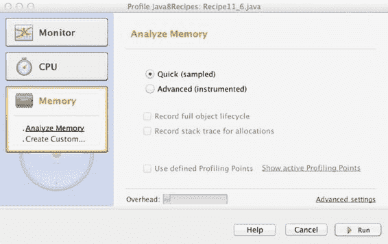


第 11 章 调试与单元测试

**图 11-1.** *NetBeans 分析器*

分析器启动后，将持续运行，直到您使用“控制”面板上的“停止”按钮将其停止。生成的输出应类似于图 11-2 所示。

**图 11-2.** *NetBeans 分析器结果*

[www.it-ebooks.info](http://www.it-ebooks.info/)

第 11 章 调试与单元测试

**工作原理**

在方案 1 中添加用于记录垃圾回收的标志，将使您的 Java 应用程序将次要和主要垃圾回收信息写入日志文件。这使您能够及时“重建”应用程序发生的情况，并发现潜在的内存泄漏（或至少是其他与内存相关的问题）。这是生产系统首选的故障排除方法，因为它通常开销较小，并且可以在事后进行分析。

方案 2 则涉及使用 NetBeans IDE 附带的一个开源工具。此工具允许您在代码运行时对其进行分析。它是了解应用程序内部实时情况的绝佳工具，因为您可以实时查看 CPU 消耗、垃圾回收、创建的线程和加载的类。

本方案仅触及 NetBeans 分析器的皮毛。更多信息，请参阅在线文档：

[`profiler.netbeans.org/`](https://profiler.netbeans.org/)

N **注意** 在使用 NetBeans 分析器之前，您必须校准目标 JVM。为此，请在 NetBeans 中打开“管理校准数据”对话框，然后选择要校准的 JVM。您可以通过打开“分析”菜单，然后选择“高级命令”来找到“管理校准数据”选项。

11-6\. 获取线程转储

**问题**

您的程序似乎“挂起”且无任何响应，您怀疑可能存在死锁。

**解决方案**

使用 JStack 获取线程转储，然后分析线程转储以查找死锁。以下 JStack 是来自类 `org.java8recipes.chapter11.recipe11_06.Recipe 11_6` 的线程转储，该类会创建一个死锁：`jstack -l 6557`

发现一个 Java 级别的死锁：

=============================

"Thread-0":

等待可拥有的同步器 0x000000076ab20da0（一个 `java.util.concurrent.locks.ReentrantLock$NonfairSync`），

该同步器被 "main" 持有

"main":

等待可拥有的同步器 0x000000076ab20dd0（一个 `java.util.concurrent.locks.ReentrantLock$NonfairSync`），

该同步器被 "Thread-0" 持有

上面列出的线程的 Java 堆栈信息：

===================================================

"Thread-0":

at sun.misc.Unsafe.park(Native Method)

- 停车等待 <0x000000076ab20da0>（一个 `java.util.concurrent.locks.ReentrantLock$NonfairSync`） 259

[www.it-ebooks.info](http://www.it-ebooks.info/)

第 11 章 调试与单元测试

at java.util.concurrent.locks.LockSupport.park(LockSupport.java:175)

at java.util.concurrent.locks.AbstractQueuedSynchronizer.parkAndCheckInterrupt(AbstractQueuedSynchronizer.java:836)

at java.util.concurrent.locks.AbstractQueuedSynchronizer.acquireQueued(AbstractQueuedSynchronizer.java:870)

at java.util.concurrent.locks.AbstractQueuedSynchronizer.acquire(AbstractQueuedSynchronizer.java:1199)

at java.util.concurrent.locks.ReentrantLock$NonfairSync.lock(ReentrantLock.java:209)

at java.util.concurrent.locks.ReentrantLock.lock(ReentrantLock.java:285)

at org.java8recipes.chapter11.recipe11_06.Recipe11_6.lambda$start$0(Recipe11_6.java:25) at org.java8recipes.chapter11.recipe11_06.Recipe11_6$$Lambda$1/1528902577.run(Unknown Source) at java.lang.Thread.run(Thread.java:744)

"main":

at sun.misc.Unsafe.park(Native Method)

- 停车等待 <0x000000076ab20dd0>（一个 `java.util.concurrent.locks.ReentrantLock$NonfairSync`）

at java.util.concurrent.locks.LockSupport.park(LockSupport.java:175)

at java.util.concurrent.locks.AbstractQueuedSynchronizer.parkAndCheckInterrupt(AbstractQueuedSynchronizer.java:836)

at java.util.concurrent.locks.AbstractQueuedSynchronizer.acquireQueued(AbstractQueuedSynchronizer.java:870)

at java.util.concurrent.locks.AbstractQueuedSynchronizer.acquire(AbstractQueuedSynchronizer.java:1199)

at java.util.concurrent.locks.ReentrantLock$NonfairSync.lock(ReentrantLock.java:209)

at java.util.concurrent.locks.ReentrantLock.lock(ReentrantLock.java:285)

at org.java8recipes.chapter11.recipe11_06.Recipe11_6.start(Recipe11_6.java:34)

at org.java8recipes.chapter11.recipe11_06.Recipe11_6.main(Recipe11_6.java:18)

发现 1 个死锁。

要使此方案在 Windows 上正常运行，您的 PATH 环境变量中必须包含 JDK 的 bin 文件夹（例如 `C:\Program Files\java\jdk1.8.0\bin`）。如果包含此路径，您就可以运行 JStack 和 JPS 等工具。JStack 在 OS X 上预装，因此您应该可以直接运行它。

JStack 命令使用参数 `-l`（一个短横线和字母 L），它指定一个长列表（它会执行额外工作以获取有关正在运行的线程的更多信息）。JStack 还需要知道目标 VM 的 PID。列出所有正在运行的 JVM 的快速方法是键入 **JPS** 并按 Enter。这将列出正在运行的 VM 及其 PID。

图 11-3 显示了在 OS X 机器上 JStack 在 Recipe 11-6 中发现死锁的屏幕截图。

[www.it-ebooks.info](http://www.it-ebooks.info/)

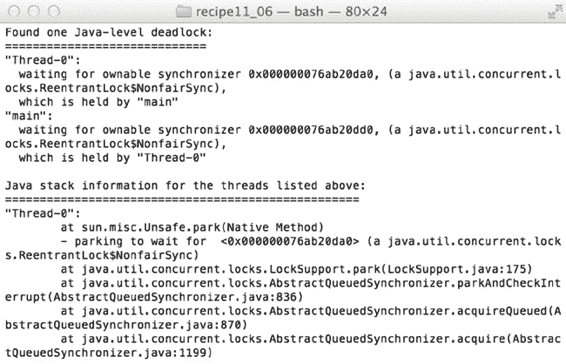

第 11 章 调试与单元测试

**图 11-3.** *JStack 结果*

N **注意** 在本示例中，`j.u.c.l` 代表 `java.util.concurrent.locks`，`aqs` 代表 `AbstractQueuedSynchronizer`。

**工作原理**

JStack 允许您查看当前正在运行的线程的所有堆栈跟踪。JStack 还会尝试查找可能导致系统停滞的*死锁*（锁的循环依赖）。JStack 不会发现其他问题，例如*活锁*（线程始终在自旋，例如使用 `while(true)` 之类的情况）或*饥饿*（线程因优先级过低或竞争资源的线程过多而无法执行），但它将帮助您了解程序中每个线程正在执行的操作。

死锁的发生是因为一个线程正在等待另一个线程持有的资源，而第二个线程正在等待第一个线程持有的资源。在这种情况下，两个线程都无法继续，因为都在等待对方释放各自拥有的资源。死锁不仅可能发生在两个线程之间，还可能涉及一个线程“链”，例如线程 A 等待线程 B，线程 B 等待线程 C，线程 C 等待线程 D，而线程 D 又等待最初的线程 A。理解转储以找出罪魁祸首资源至关重要。


在本示例中，Thread-0 想要获取名为 `0x00000000eab716b8` 的锁；在线程转储中，它被描述为“等待可拥有的同步器”。Thread-0 无法获取该锁，因为它被主线程持有。另一方面，主线程想要获取锁 `0x00000000eab716e8`（注意这两个锁不同；第一个锁以 b8 结尾，而第二个以 e8 结尾），而该锁被 Thread-0 持有。这是教科书式的死锁定义，每个线程都在永远等待对方释放自己持有的锁。

[www.it-ebooks.info](http://www.it-ebooks.info/)

第 11 章 调试与单元测试

除了死锁之外，查看线程转储还能让你了解程序在实时运行时的状态。

尤其是在多线程系统中，使用线程转储有助于明确线程在何处休眠，或者它在等待什么条件。

**注意** JStack 通常足够轻量，可以在生产系统中运行，因此如果你需要排查线上问题，可以放心使用 JStack。

[www.it-ebooks.info](http://www.it-ebooks.info/)

**第 12 章**

**Unicode、国际化**

**与货币代码**

Java 平台提供了丰富的国际化功能，帮助你创建可在全球范围内使用的应用程序。该平台提供了本地化应用、以多种符合文化习惯的格式格式化日期和数字，以及显示数十种书写系统中字符的方法。

本章仅描述开发人员在开发国际化应用程序时必须执行的一些最常见和常规的任务。由于 Java 语言在其对语言和区域的抽象方面增加了新特性，本章将介绍一些你可能使用 `Locale` 类的新方法。

其他新特性对开发者来说是透明的，例如为遵循更新的 Unicode 标准而进行的更新，但这些更新提供了兼容性，使得 JDK 8 在未来几年内仍能保持相关性。Java 8 包含对 Unicode 6.2.0 的支持，该版本新增了 733 个字符、7 种新文字和 11 个新区块。

**注意** 本章示例的源代码可在 `org.java8recipes.chapter12` 包中找到。

有关如何查找和下载示例源代码的说明，请参阅介绍性章节。

12-1. 将 Unicode 字符转换为数字

问题

你想将一个 Unicode 数字字符转换为其对应的整数值。例如，你有一个包含泰语数字 8 的字符串，并且你想生成一个具有该值的整数。

解决方案

`java.lang.Character` 类有几个静态方法可以将字符转换为整数值：
- `public static int digit(char ch, int radix)`
- `public static int digit(int ch, int radix)`

以下代码片段遍历从 `0x0000` 到 `0x10FFFF` 的整个 Unicode 码点范围。对于每个同时也是数字的码点，它会显示该字符及其数字值 0 到 9。你可以在 `org.java8recipes.chapter12.recipe12_1.Recipe12_1` 类中找到此示例。

[www.it-ebooks.info](http://www.it-ebooks.info/)

第 12 章 Unicode、国际化与货币代码

```java
int x = 0;
for (int c=0; c <= 0x10FFFF; c++) {
    if (Character.isDigit(c)) {
        ++x;
        System.out.printf("Codepoint: 0x%04X\tCharacter: %c\tDigit: %d\tName: %s\n", c, c, Character.digit(c, 10), Character.getName(c));
    }
}
System.out.printf("Total digits: %d\n", x);
```

部分输出如下：

```
Codepoint: 0x0030 Character: 0 Digit: 0 Name: DIGIT ZERO
Codepoint: 0x0031 Character: 1 Digit: 1 Name: DIGIT ONE
Codepoint: 0x0032 Character: 2 Digit: 2 Name: DIGIT TWO
Codepoint: 0x0033 Character: 3 Digit: 3 Name: DIGIT THREE
Codepoint: 0x0034 Character: 4 Digit: 4 Name: DIGIT FOUR
Codepoint: 0x0035 Character: 5 Digit: 5 Name: DIGIT FIVE
Codepoint: 0x0036 Character: 6 Digit: 6 Name: DIGIT SIX
Codepoint: 0x0037 Character: 7 Digit: 7 Name: DIGIT SEVEN
Codepoint: 0x0038 Character: 8 Digit: 8 Name: DIGIT EIGHT
Codepoint: 0x0039 Character: 9 Digit: 9 Name: DIGIT NINE
Codepoint: 0x0660 Character: ٠ Digit: 0 Name: ARABIC-INDIC DIGIT ZERO
Codepoint: 0x0661 Character: ١ Digit: 1 Name: ARABIC-INDIC DIGIT ONE
Codepoint: 0x0662 Character: ٢ Digit: 2 Name: ARABIC-INDIC DIGIT TWO
Codepoint: 0x0663 Character: ٣ Digit: 3 Name: ARABIC-INDIC DIGIT THREE
Codepoint: 0x0664 Character: ٤ Digit: 4 Name: ARABIC-INDIC DIGIT FOUR
Codepoint: 0x0665 Character: ٥ Digit: 5 Name: ARABIC-INDIC DIGIT FIVE
Codepoint: 0x0666 Character: ٦ Digit: 6 Name: ARABIC-INDIC DIGIT SIX
Codepoint: 0x0667 Character: ٧ Digit: 7 Name: ARABIC-INDIC DIGIT SEVEN
Codepoint: 0x0668 Character: ٨ Digit: 8 Name: ARABIC-INDIC DIGIT EIGHT
Codepoint: 0x0669 Character: ٩ Digit: 9 Name: ARABIC-INDIC DIGIT NINE
...
Codepoint: 0x0E50 Character: ๐ Digit: 0 Name: THAI DIGIT ZERO
Codepoint: 0x0E51 Character: ๑ Digit: 1 Name: THAI DIGIT ONE
Codepoint: 0x0E52 Character: ๒ Digit: 2 Name: THAI DIGIT TWO
Codepoint: 0x0E53 Character: ๓ Digit: 3 Name: THAI DIGIT THREE
Codepoint: 0x0E54 Character: ๔ Digit: 4 Name: THAI DIGIT FOUR
Codepoint: 0x0E55 Character: ๕ Digit: 5 Name: THAI DIGIT FIVE
Codepoint: 0x0E56 Character: ๖ Digit: 6 Name: THAI DIGIT SIX
Codepoint: 0x0E57 Character: ๗ Digit: 7 Name: THAI DIGIT SEVEN
Codepoint: 0x0E58 Character: ๘ Digit: 8 Name: THAI DIGIT EIGHT
Codepoint: 0x0E59 Character: ๙ Digit: 9 Name: THAI DIGIT NINE
...
Total digits: 420
```

**注意** 示例代码会打印到控制台。由于字体或平台差异，你的控制台可能无法显示本示例中展示的所有字符字形。但是，这些字符会被正确转换为整数。

[www.it-ebooks.info](http://www.it-ebooks.info/)

第 12 章 Unicode、国际化与货币代码

实现原理

Unicode 字符集非常庞大，包含超过一百万个唯一的码点，其整数值范围从 `0x0000` 到 `0x10FFFF`。每个字符值都有一组属性。其中一个属性是 `isDigit`。如果此属性为真，则该字符代表一个从 0 到 9 的数字。例如，码点值为 `0x30` 到 `0x39` 的字符，其字形分别为 0、1、2、3、4、5、6、7、8 和 9。如果你简单地将这些码值转换为其对应的整数值，你会得到十六进制值 `0x30` 到 `0x39`。对应的十进制值是 48 到 57。然而，这些字符也代表数字。在计算中使用它们时，这些字符代表值 0 到 9。

当一个字符具有数字属性时，使用 `Character.digit()` 静态方法将其转换为对应的整数值。请注意，`digit()` 方法被重载，可以接受 `char` 或 `int` 参数。

此外，该方法需要一个基数（radix）。常见的基数有 2、10 和 16。有趣的是，尽管字符 a-f 和 A-F 不具有数字属性，但它们可以在基数为 16 时作为数字使用。对于这些字符，`digit()` 方法会返回预期的整数值 10 到 15。

要完全理解 Unicode 字符集和 Java 的实现，需要熟悉几个新术语：字符（character）、码点（code point）、char、编码（encoding）、序列化编码（serialization encoding）、UTF-8 和 UTF-16。这些术语超出了本示例的范围，但你可以从 Unicode 网站 [`unicode.org`](http://unicode.org) 或 `Character` 类的 Java API 文档中了解更多关于这些及其他 Unicode 概念的信息。

12-2. 创建和使用 Locale

问题

你想以符合客户语言和文化期望的用户友好方式显示数字、日期和时间。

解决方案


数字、日期和时间的显示格式因地区而异，并取决于用户的语言和文化区域。此外，文本排序规则也因语言而异。`java.util.Locale` 类代表世界上的特定语言和区域。通过确定并使用用户的区域设置，你可以将该区域设置应用于各种格式类，这些类可用于以预期形式创建用户可见的数据。使用 `Locale` 实例来修改其行为以适应特定语言或区域的类被称为*区域敏感*类。你可以在第 4 章“数字和日期”中了解更多关于区域敏感类的信息。该章向你展示了如何在 `NumberFormat` 和 `DateFormat` 类中使用 `Locale` 实例。然而，在本节中，你将学习创建这些 `Locale` 实例的不同选项。

你可以通过以下任意一种方式创建 `Locale` 实例：

u 使用 `Locale.Builder` 类来配置和构建一个 `Locale` 对象。

u 使用静态方法 `Locale.forLanguageTag()`。

u 使用 `Locale` 构造器来创建对象。

u 使用预配置的静态 `Locale` 对象。

Java 的 `Locale.Builder` 类具有 setter 方法，允许你创建可以转换为格式良好的最佳公共实践（BCP）47 语言标签的区域设置。“工作原理”部分会更详细地描述 BCP 47 标准。目前，你只需理解 `Builder` 创建符合该标准的 `Locale` 实例即可。

[www.it-ebooks.info](http://www.it-ebooks.info/)

第 12 章 Unicode、国际化与货币代码

以下来自 `org.java8recipes.chapter12.recipe12_2.Recipe12_2` 类的代码片段演示了如何创建 `Builder` 和 `Locale` 实例。你在区域敏感类中使用创建的区域设置，以生成符合文化习惯的显示格式：

```java
private static final long number = 123456789L;
private static final Date now = new Date();

private void createFromBuilder() {
    System.out.printf("Creating from Builder...\n\n");
    String[][] langRegions = {{"fr", "FR"}, {"ja", "JP"}, {"en", "US"}};
    Builder builder = new Builder();
    Locale l = null;
    NumberFormat nf = null;
    DateFormat df = null;
    for (String[] lr: langRegions) {
        builder.clear();
        builder.setLanguage(lr[0]).setRegion(lr[1]);
        l = builder.build();
        nf = NumberFormat.getInstance(l);
        df = DateFormat.getDateTimeInstance(DateFormat.LONG, DateFormat.LONG, l);
        System.out.printf("Locale: %s\nNumber: %s\nDate: %s\n\n",
                l.getDisplayName(),
                nf.format(number),
                df.format(now));
    }
}
```

上述代码在标准控制台输出以下内容：

```
Creating from Builder...

Locale: French (France)
Number: 123 456 789
Date: 14 septembre 2011 00:08:06 PDT

Locale: Japanese (Japan)
Number: 123,456,789
Date: 2011/09/14 0:08:06 PDT

Locale: English (United States)
Number: 123,456,789
Date: September 14, 2011 12:08:06 AM PDT
```

创建 `Locale` 实例的另一种方法是使用静态方法 `Locale.forLanguageTag()`。此方法允许你使用 BCP 47 语言标签参数。以下代码使用 `forLanguageTag()` 方法从其对应的语言标签创建三个区域设置：

```java
...
System.out.printf("Creating from BCP 47 language tags...\n\n");
String[] bcp47LangTags= {"fr-FR", "ja-JP", "en-US"};
Locale l = null;
NumberFormat nf = null;
DateFormat df = null;
```

[www.it-ebooks.info](http://www.it-ebooks.info/)

第 12 章 Unicode、国际化与货币代码

```java
for (String langTag: bcp47LangTags) {
    l = Locale.forLanguageTag(langTag);
    nf = NumberFormat.getInstance(l);
    df = DateFormat.getDateTimeInstance(DateFormat.LONG, DateFormat.LONG, l);
    System.out.printf("Locale: %s\nNumber: %s\nDate: %s\n\n",
            l.getDisplayName(),
            nf.format(number),
            df.format(now));
}
...
```

输出结果与使用 `Builder` 生成的 `Locale` 实例的结果类似：

```
Creating from BCP 47 language tags...

Locale: French (France)
Number: 123 456 789
Date: 14 septembre 2011 01:07:22 PDT
...
```

你也可以使用构造器来创建实例。以下代码展示了如何操作：

```java
Locale l = new Locale("fr", "FR");
```


其他构造方法允许你传入更少或更多的参数。这些参数可以包括语言、地区以及可选的变体代码。

最后，`Locale` 类为一些常用场景预定义了许多静态实例。由于这些实例是预定义的，你的代码只需引用这些静态实例即可。例如，以下示例展示了如何引用代表 `fr-FR`、`ja-JP` 和 `en-US` 区域设置的现有静态实例：`Locale frenchInFrance = Locale.FRANCE;`

`Locale japaneseInJapan = Locale.JAPAN;`

`Locale englishInUS = Locale.US;`

有关其他静态实例的示例，请参阅区域设置 Java API 文档。

工作原理

`Locale` 类为区域设置敏感的类提供了执行符合文化习惯的数据格式化和解析所需的上下文。一些区域设置敏感的类包括：

- `java.text.NumberFormat`
- `java.text.DateFormat`
- `java.util.Calendar`

一个 `Locale` 实例标识一种特定的语言，并且可以精细调整以识别使用特定文字书写或在特定世界区域使用的语言。`Locale` 是创建任何依赖于语言或地区影响的内容时重要且必要的元素。

[www.it-ebooks.info](http://www.it-ebooks.info/)

第 12 章 Unicode、国际化与货币代码

Java 的 `Locale` 类一直在不断改进，以更好地支持现代 BCP 47 语言标签。

BCP 47 定义了使用 ISO 标准进行语言、地区、文字和变体标识符的最佳通用实践。

尽管现有的 `Locale` 构造方法与 Java 平台的早期版本保持兼容，但这些构造方法不支持额外的文字标签。例如，只有较新的 `Locale.Builder` 类和 `Locale.forLanguageTag()` 方法支持识别文字的新功能。这个较新的类和方法是在 Java 7 中引入的。由于 `Locale` 构造方法并未强制要求严格遵循 BCP 47，因此你应避免在任何新代码中使用这些构造方法。相反，开发者应将其代码迁移为使用新的 `Builder` 类和 `forLanguageTag()` 方法。

`Locale.Builder` 实例具有多种 setter 方法，可帮助你配置它以创建有效且符合 BCP 47 标准的 `Locale` 实例：

- `public Locale.Builder setLanguage(String language)`
- `public Locale.Builder setRegion(String region)`
- `public Locale.Builder setScript(String script)`

如果其参数不是 BCP 47 标准中格式良好的元素，这些方法中的每一个都会抛出 `java.util.IllFormedLocaleException`。`language` 参数必须是有效的两位或三位字母的 ISO 639 语言标识符。`region` 参数必须是有效的两位字母的 ISO 3166 地区代码或三位数字的 M.49 联合国“区域”代码。最后，`script` 参数必须是有效的四位字母的 ISO 15924 文字代码。

`Builder` 允许你配置它以创建特定的符合 BCP 47 标准的区域设置。一旦你设置了所有配置，`build()` 方法会创建并返回一个 `Locale` 实例。请注意，所有 setter 方法可以链式调用，形成单个语句。Builder 模式的工作原理是让每个配置方法返回对当前实例的引用，从而可以在此实例上调用进一步的配置方法。

`Locale aLocale = new Builder().setLanguage("fr").setRegion("FR").build();`

BCP 47 文档及其包含的标准可以在以下位置找到：

- BCP 47（语言标签）：[`www.rfc-editor.org/rfc/bcp/bcp47.txt`](http://www.rfc-editor.org/rfc/bcp/bcp47.txt)
- ISO 639（语言标识符）：[`www.loc.gov/standards/iso639-2/php/code_list.php`](http://www.loc.gov/standards/iso639-2/php/code_list.php)
- ISO 3166（地区标识符）：[`www.iso.org/iso/country_codes/iso_3166_code_lists/country_names_and_code_elements.htm`](http://www.iso.org/iso/country_codes/iso_3166_code_lists/country_names_and_code_elements.htm)


u ISO 15924（文字标识符）：[`unicode.org/iso15924/`](http://unicode.org/iso15924/)

u 联合国 M.49（区域标识符）：[`unstats.un.org/unsd/methods/m49/m49.htm`](http://unstats.un.org/unsd/methods/m49/m49.htm)

12-3\. 设置默认区域设置

问题

你希望为所有区域设置敏感的类设置默认区域设置。

解决方案

使用 `Locale.setDefault()` 方法设置一个 `Locale` 实例，所有区域设置敏感的类将默认使用该实例。

该方法通过以下两种形式重载：

u `Locale.setDefault(Locale aLocale)`

u `Locale.setDefault(Locale.Category c, Locale aLocale)`

[www.it-ebooks.info](http://www.it-ebooks.info/)

第 12 章 N Unicode、国际化与货币代码

以下示例代码演示了如何为所有区域设置敏感的类设置默认区域设置：`Locale.setDefault(Locale.FRANCE);`

你还可以为另外两个区域设置类别（DISPLAY 和 FORMAT）设置默认值：`Locale.setDefault(Locale.Category.DISPLAY, Locale.US);`

`Locale.setDefault(Locale.Category.FORMAT, Locale.FR);`

你可以在应用程序中创建使用这些特定区域设置类别的代码，以便为不同目的混合选择区域设置。例如，你可以选择将 DISPLAY 区域设置用于 `ResourceBundle` 文本，同时将 FORMAT 区域设置用于日期和时间格式。来自 `org.java8recipes.chapter12.recipe12_3.Recipe12_3` 类的示例代码演示了这种更复杂的用法：

```java
public class Recipe12_3 {

    private static final Date NOW = new Date();

    public void run() {

        // 将所有区域设置为 fr-FR
        Locale.setDefault(Locale.FRANCE);
        demoDefaultLocaleSettings();

        // 系统默认仍为 fr-FR
        // DISPLAY 默认值为 es-MX
        // FORMAT 默认值为 en-US
        Locale.setDefault(Locale.Category.DISPLAY, Locale.forLanguageTag("es-MX"));
        Locale.setDefault(Locale.Category.FORMAT, Locale.US);
        demoDefaultLocaleSettings();

        // 系统默认仍为 fr-FR
        // DISPLAY 默认值为 en-US
        // FORMAT 默认值为 es-MX
        Locale.setDefault(Locale.Category.DISPLAY, Locale.US);
        Locale.setDefault(Locale.Category.FORMAT, Locale.forLanguageTag("es-MX"));
        demoDefaultLocaleSettings();

        // 系统默认值为 Locale.US
        // 同时将 DISPLAY 和 FORMAT 区域设置重置为 en-US
        Locale.setDefault(Locale.US);
        demoDefaultLocaleSettings();

    }

    public void demoDefaultLocaleSettings() {
        DateFormat df =
            DateFormat.getDateTimeInstance(DateFormat.SHORT, DateFormat.SHORT);
        ResourceBundle resource =
            ResourceBundle.getBundle("SimpleResources",
                Locale.getDefault(Locale.Category.DISPLAY));
```

[www.it-ebooks.info](http://www.it-ebooks.info/)

第 12 章 N Unicode、国际化与货币代码

```java
        String greeting = resource.getString("GOOD_MORNING");
        String date = df.format(NOW);
        System.out.printf("DEFAULT LOCALE: %s\n", Locale.getDefault());
        System.out.printf("DISPLAY LOCALE: %s\n", Locale.getDefault(Locale.Category.DISPLAY));
        System.out.printf("FORMAT LOCALE: %s\n", Locale.getDefault(Locale.Category.FORMAT));
        System.out.printf("%s, %s\n\n", greeting, date );
    }

    public static void main(String[] args) {
        Recipe12_3 app = new Recipe12_3();
        app.run();
    }
}
```

此代码产生以下输出：

```
DEFAULT LOCALE: fr_FR
DISPLAY LOCALE: fr_FR
FORMAT LOCALE: fr_FR
Bonjour!, 19/09/11 20:31

DEFAULT LOCALE: fr_FR
DISPLAY LOCALE: es_MX
FORMAT LOCALE: en_US
¡Buenos días!, 9/19/11 8:31 PM

DEFAULT LOCALE: fr_FR
DISPLAY LOCALE: en_US
FORMAT LOCALE: es_MX
Good morning!, 19/09/11 08:31 PM

DEFAULT LOCALE: en_US
DISPLAY LOCALE: en_US
FORMAT LOCALE: en_US
Good morning!, 9/19/11 8:31 PM
```

工作原理

`Locale` 类允许你为两个不同的类别设置默认区域设置。这些类别由 `Locale.Category` 枚举表示：

u `Locale.Category.DISPLAY`

u `Locale.Category.FORMAT`

使用 DISPLAY 类别用于应用程序的用户界面。设置默认的 DISPLAY 区域设置意味着 `ResourceBundle` 类可以独立于 FORMAT 区域设置为该特定区域设置加载用户界面资源。设置默认的 FORMAT 区域设置会影响各种 `Format` 子类的行为。例如，默认的 `DateFormat` 实例将使用 FORMAT 默认区域设置来创建区域设置敏感的输出格式。同样，这两个类别是独立的，因此你可以为不同需求使用不同的 `Locale` 实例。

[www.it-ebooks.info](http://www.it-ebooks.info/)

第 12 章 N Unicode、国际化与货币代码

在本配方的示例代码中，`Locale.setDefault(Locale.FRANCE)` 方法调用将默认系统、DISPLAY 和 FORMAT 区域设置都设置为 fr-FR（法国法语）。此方法始终将 DISPLAY 和 FORMAT 区域设置重置为与系统区域设置匹配。创建新的资源包时，`ResourceBundle` 类默认使用系统区域设置。但是，通过提供 `Locale` 实例参数，你可以告诉资源包为特定区域设置加载资源。例如，即使系统区域设置为 `Locale.FRANCE`，你也可以指定一个 DISPLAY 默认区域设置，并在 `ResourceBundle.getBundle()` 方法调用中使用该 DISPLAY 区域设置。例如，以下代码尝试加载 es-MX 的语言包，即使系统区域设置仍然是 `Locale.FRANCE`：

```java
Locale.setDefault(Locale.Category.DISPLAY, Locale.forLanguageTag("es-MX"));
Locale.setDefault(Locale.Category.FORMAT, Locale.US);

DateFormat df = DateFormat.getDateTimeInstance(DateFormat.SHORT, DateFormat.SHORT);
ResourceBundle resource =
    ResourceBundle.getBundle("org.java8recipes.chapter12.resource.SimpleResources",
        Locale.getDefault(Locale.Category.DISPLAY));
String greeting = resource.getString("GOOD_MORNING");
```

在这种情况下，它会找到值为“¡Buenos días!”的 GOOD_MORNING 资源，因为 DISPLAY 默认区域设置是一个参数。资源包是一个包含各种区域设置翻译属性字符串的文件。名为 `SimpleResources_en.properties`（英语）的文件有一个值为“Good morning!”的 GOOD_MORNING 属性。请注意，资源包中每个属性的翻译必须存在于特定区域设置的资源文件中才能显示。Java 代码不会翻译这些字符串。相反，它只是根据所选区域设置选择所需属性的适当翻译。

**注意**

N

虽然 `DateFormat` 和 `NumberFormat` 类在创建方法中未提供区域设置参数时会自动使用默认的 FORMAT 区域设置，但 `ResourceBundle.getBundle()` 方法默认始终使用系统区域设置。要在 `ResourceBundle()` 中使用 DISPLAY 默认区域设置，你必须显式地将其作为参数提供。

12-4\. 匹配和过滤区域设置

问题

你希望匹配或过滤一个区域设置列表，并仅返回那些满足指定条件的区域设置。

解决方案

使用 Java 8 中 `java.util.Locale` 类引入的新区域设置匹配和过滤方法。如果你有一个以逗号分隔的字符串格式区域设置列表，你可以对该字符串应用一个过滤器或“优先级列表”，以仅返回字符串中满足过滤条件的区域设置。在以下示例中，使用 `java.util.Locale` 的 `filterTags` 方法过滤语言标签列表，以字符串格式返回匹配的标签：

```java
List<Locale.LanguageRange> list1 = Locale.LanguageRange.parse("ja-JP, en-US");
list1.stream().forEach((range) -> {
    System.out.println("Range:" + range.getRange());
});
```

[www.it-ebooks.info](http://www.it-ebooks.info/)

第 12 章 N Unicode、国际化与货币代码

```java
ArrayList localeList = new ArrayList();
localeList.add("en-US");
localeList.add("en-JP");

List<String> tags1 = Locale.filterTags(list1, localeList);
System.out.println("The following is the filtered list of locales:");
tags1.stream().forEach((tag) -> {
    System.out.println(tag);
});
```

结果：

```
Range:ja-jp
Range:en-us
The following is the filtered list of Locales:
en-us
```


Locale 类的 filter() 方法允许你返回匹配的 Locale 实例列表。在以下示例中，使用一个语言标签列表来从一组 Locale 中筛选出匹配的 Locale 类。

String localeTags = Locale.ENGLISH.toLanguageTag() + "," +

Locale.CANADA.toLanguageTag();

List<Locale.LanguageRange> list1 = Locale.LanguageRange.parse(localeTags);

list1.stream().forEach((range) -> {

System.out.println("Range:" + range.getRange());

});

ArrayList<Locale> localeList = new ArrayList();

localeList.add(new Locale("en"));

localeList.add(new Locale("en-JP"));

List<Locale> tags1 = Locale.filter(list1, localeList);

System.out.println("以下是匹配的 Locale 列表：");

tags1.stream().forEach((tag) -> {

System.out.println(tag);

});

以下是运行结果：

Range:en

Range:en-ca

以下是匹配的 locale 列表：

en

工作原理

Java 8 在 `java.util.Locale` 类中新增了一些方法，允许你根据以 `List<Locale.LanguageRange>` 格式提供的优先级列表来筛选 Locale 实例或语言标签。该筛选机制基于 RFC 4647。以下列表简要总结了这些筛选方法：

-   `filter(List<Locale.LanguageRange>, Collection<Locale>)`
-   `filter(List<Locale.LanguageRange>, Collection<Locale>, Locale.FilteringMode)`（返回匹配的 Locale 实例列表）

[www.it-ebooks.info](http://www.it-ebooks.info/)

第 12 章 Unicode、国际化与货币代码

-   `filterTags(List<Locale.LanguageRange>, Collection<String>)`
-   `filterTags(List<Locale.LanguageRange>, Collection<String>, Locale.FilteringMode)`（返回匹配的语言标签列表）

要使用这些方法，需要将排序后的优先级顺序作为第一个参数传入。这个优先级顺序是一个 `Locale.LanguageRange` 对象列表，并且应根据优先级或权重按降序排序。`filter()` 方法的第二个参数是一个 locale 集合，该集合包含将被筛选的 locale。可选的第三个参数包含一个 `Locale.FilteringMode`。表 12-1 列出了不同的筛选模式。

**表 12-1.** *Locale.FilteringMode 值*

**模式**

**描述**

AUTOSELECT_FILTERING

指定基于给定语言优先级列表的筛选模式。

EXTENDED_FILTERING

指定扩展筛选。

IGNORE_EXTENDED_RANGES

指定基本筛选。

MAP_EXTENDED_RANGES

指定基本筛选，如果语言优先级列表中包含任何扩展语言，则将其映射到基本语言范围。

REJECT_EXTENDED_RANGES

指定基本筛选，如果语言优先级列表中包含任何扩展语言，则拒绝该列表并抛出 `IllegalArgumentException`。

12-5. 使用正则表达式搜索 Unicode

问题

你想在字符串中查找或匹配 Unicode 字符，并且希望使用正则表达式语法来实现。

解决方案 1

查找或匹配字符最简单的方法是直接使用 `String` 类本身。`String` 实例存储 Unicode 字符序列，并提供相对简单的操作，用于使用正则表达式查找、替换和分词字符。

要判断一个字符串是否匹配某个正则表达式，请使用 `matches()` 方法。如果整个字符串完全匹配该正则表达式，`matches()` 方法返回 `true`。

以下代码来自 `org.java8recipes.chapter12.recipe12_5.Recipe12_5` 类，它使用两个不同的表达式处理两个字符串。这些正则表达式匹配仅用于确认字符串是否符合变量 `enRegEx` 和 `jaRegEx` 中定义的特定模式。

private String enText = "The fat cat sat on the mat with a brown rat.";

private String jaText = "Fight

!";

boolean found = false;

String enRegEx = "^The \\w+ cat.*";

String jaRegEx = ".*

.*";

String jaRegExEscaped = ".*\u6587\u5B57.*";

found = enText.matches(enRegEx);

[www.it-ebooks.info](http://www.it-ebooks.info/)

第 12 章 Unicode、国际化与货币代码


if (found) {

System.out.printf("匹配 %s。\n", enRegEx);

}

found = jaText.matches(jaRegEx);

if (found) {

System.out.printf("匹配 %s。\n", jaRegEx);

}

found = jaText.matches(jaRegExEscaped);

if (found) {

System.out.printf("匹配 %s。\n", jaRegExEscaped);

}

这段代码会输出以下内容：

匹配 ^The \w+ cat.*。

匹配 .*

.*。

匹配 .*

.*。

使用 `replaceFirst()` 方法可以创建一个新的 `String` 实例，其中目标文本中第一次出现的正则表达式会被替换为替换文本。以下代码演示了如何使用该方法：String replaced = jaText.replaceFirst("

", "mojibake");

System.out.printf("替换后: %s\n", replaced);

输出中显示了替换文本：

替换后: Fight mojibake!

`replaceAll()` 方法会将表达式的所有匹配项替换为替换文本。

最后，`split()` 方法会创建一个 `String[]`，其中包含由匹配表达式分隔的文本。

换句话说，它返回由该表达式分隔的文本。你还可以提供一个可选的 `limit` 参数，用于限制分隔符在源文本中应用的次数。以下代码演示了 `split()` 方法按空格字符进行分割：

String[] matches = enText.split("\\s", 3);

for(String match: matches) {

System.out.printf("分割: %s\n",match);

}

代码的输出如下：

分割: The

分割: fat

分割: cat sat on the mat with a brown rat.

解决方案 2

当简单的 `String` 方法不够用时，你可以使用更强大的 `java.util.regex` 包来处理正则表达式。使用 `Pattern` 类创建正则表达式。`Matcher` 使用该模式对 `String` 实例进行操作。所有 `Matcher` 操作都通过 `Pattern` 和 `String` 实例来执行其功能。

[www.it-ebooks.info](http://www.it-ebooks.info/)

第 12 章 Unicode、国际化与货币代码

以下代码演示了如何在两个独立的字符串中搜索 ASCII 和非 ASCII 文本。完整源代码请参见 `org.java8recipes.chapter12.recipe12_5.Recipe12_5` 类。`demoSimple()` 方法查找任何字符后跟 ".at" 的文本。`demoComplex()` 方法在一个字符串中查找两个日语符号：

public void demoSimple() {

Pattern p = Pattern.compile(".at");

Matcher m = p.matcher(enText);

while(m.find()) {

System.out.printf("%s\n", m.group());

}

}

public void demoComplex() {

Pattern p = Pattern.compile("

");

Matcher m = p.matcher(jaText);

if (m.find()) {

System.out.println(m.group());

}

}

对之前定义的英文和日文文本运行这两个方法，会显示以下结果：fat

cat

sat

mat

rat

工作原理

与正则表达式配合使用的 `String` 方法如下：

u public boolean matches(String regex)

u public String replaceFirst(String regex, String replacement)

u public String replaceAll(String regex, String replacement)

u public String[] split(String regex, int limit)

u public String[] split(String regex)

这些 `String` 方法是对 `java.util.regex` 类更强大功能的有限且相对简单的封装：

u java.util.regex.Pattern

u java.util.regex.Matcher

u java.util.regex.PatternSyntaxException

[www.it-ebooks.info](http://www.it-ebooks.info/)

第 12 章 Unicode、国际化与货币代码

Java 正则表达式与 Perl 语言中使用的正则表达式类似。虽然关于 Java 正则表达式有很多需要学习的内容，但本技巧中最重要的理解点可能是以下几点：u 你的正则表达式完全可以包含来自整个 Unicode 字符范围的非 ASCII 字符。

u 由于 Java 语言编译器理解反斜杠字符的特殊性，在代码中使用预定义字符类表达式时，必须使用两个反斜杠而不是一个。

在正则表达式中使用非 ASCII 字符最方便且最易读的方式是，使用键盘输入法直接将其键入源文件。不同的操作系统和编辑器在允许你输入 ASCII 之外的复杂文本方面有所不同。无论使用何种操作系统，如果编辑器允许，你都应该将文件保存为 UTF-8 编码。

另一种更困难的使用非 ASCII 正则表达式的方法是，使用 `\uXXXX` 表示法对字符进行编码。使用这种表示法时，你无需直接使用键盘键入字符，而是输入 **\u** 或 **\U**，后跟 Unicode 码点的十六进制表示。本技巧的代码示例使用了日语单词“

”（发音为 *mo-ji*）。如示例所示，你可以在正则表达式中使用实际字符，也可以查找 Unicode 码点值。对于这个特定的日语单词，其编码为 `\u6587\u5B57`。

Java 语言的正则表达式支持特殊的字符类。例如，`\d` 和 `\w` 分别是正则表达式 `[0-9]` 和 `[a-zA-Z_0-9]` 的快捷表示法。然而，由于 Java 编译器对反斜杠字符的特殊处理，在使用诸如 `\d`（数字）、`\w`（单词字符）和 `\s`（空格字符）等预定义字符类时，必须使用额外的反斜杠。例如，在源代码中使用它们时，需要分别输入 **\\d**、**\\w** 和 **\\s**。示例代码在解决方案 1 中使用了双反斜杠来表示 `\w` 字符类：

String enRegEx = "^The \\w+ cat.*";

12-6\. 覆盖默认货币

问题

你想使用与默认区域设置无关的货币来显示数值。

解决方案

通过显式设置 `NumberFormat` 实例中使用的货币，来控制格式化货币值时所打印的货币。以下示例假设默认区域设置为 `Locale.JAPAN`。它通过调用其 `NumberFormat` 实例的 `setCurrency(Currency c)` 方法来更改货币。此示例来自 `org.java8recipes.chapter12.recipe12_5.Recipe12_5` 类。

BigDecimal value = new BigDecimal(12345);

System.out.printf("默认区域设置: %s\n", Locale.getDefault().getDisplayName()); NumberFormat nf = NumberFormat.getCurrencyInstance();

String formattedCurrency = nf.format(value);

System.out.printf("%s\n", formattedCurrency);

Currency c = Currency.getInstance(Locale.US);

nf.setCurrency(c);

formattedCurrency = nf.format(value);

System.out.printf("%s\n\n", formattedCurrency);

[www.it-ebooks.info](http://www.it-ebooks.info/)

第 12 章 Unicode、国际化与货币代码

上述代码会打印出以下内容：

默认区域设置:

(

)

12,345

USD12,345

工作原理

你使用 `NumberFormat` 实例来格式化货币值。你应该显式调用 `getCurrencyInstance()` 方法来为货币创建一个格式化器：

NumberFormat nf = NumberFormat.getCurrencyInstance();

上述格式化器将使用默认区域设置的首选项将数字格式化为货币值。同时，它也会使用与该区域设置区域相关联的货币符号。然而，一个非常常见的用例是为不同区域的货币格式化一个值。

使用 `setCurrency()` 方法在数字格式化器中显式设置货币：

nf.setCurrency(aCurrencyInstance); // 需要一个 Currency 实例

请注意，`java.util.Currency` 类是一个工厂类。它允许你通过两种方式创建货币对象：u Currency.getInstance(Locale locale)

u Currency.getInstance(String currencyCode)

第一个 `getInstance` 调用使用一个 `Locale` 实例来获取货币对象。Java 平台会将默认货币与该区域设置的区域关联起来。在这种情况下，当前与美国关联的默认货币是美元：

Currency c1 = Currency.getInstance(Locale.US);


第二次调用 `getInstance` 时使用了有效的 ISO 4217 货币代码。美元的货币代码是 USD：`Currency c2 = Currency.getInstance("USD");`

一旦有了货币实例，只需在格式化器中使用该实例：`nf.setCurrency(c2);`

现在，这个格式化器被配置为使用默认区域设置的数字格式符号和模式来格式化数值，但它会将目标货币代码显示为可显示文本的一部分。这允许你将默认的数字格式模式与其他货币代码混合使用。

N **注意** 货币既有符号也有代码。货币代码始终指的是三位字母的 ISO 4217 代码。

货币符号通常与代码不同。例如，美元的代码是 USD，符号是 $。货币格式化器在使用默认区域设置格式化该区域货币的数值时，通常会使用符号。

然而，当你显式更改格式化器的货币时，格式化器并不总是知道目标货币的本地化符号。在这种情况下，格式化实例通常会在显示的文本中使用货币代码。

[www.it-ebooks.info](http://www.it-ebooks.info/)

第 12 章 N UNICODE、国际化与货币代码

12-7. 字节数组与字符串之间的转换

问题

你需要将字节数组中的字符从旧字符集编码转换为 Unicode 字符串。

解决方案

使用 `String` 类将旧字符编码从字节数组转换为 Unicode 字符串。以下来自 `org.java8recipes.chapter12.recipe12_6.Recipe12_6` 类的代码片段演示了如何将旧版 Shift-JIS 编码的字节数组转换为字符串。在同一示例的后面部分，代码还演示了如何从 Unicode 转换回 Shift-JIS 字节数组。

```java
byte[] legacySJIS = {(byte)0x82,(byte)0xB1,(byte)0x82,(byte)0xF1,
                     (byte)0x82,(byte)0xC9,(byte)0x82,(byte)0xBF,
                     (byte)0x82,(byte)0xCD,(byte)0x81,(byte)0x41,
                     (byte)0x90,(byte)0xA2,(byte)0x8A,(byte)0x45,
                     (byte)0x81,(byte)0x49};

// 将 byte[] 转换为 String
Charset cs = Charset.forName("SJIS");
String greeting = new String(legacySJIS, cs);
System.out.printf("Greeting: %s\n", greeting);
```

这段代码会打印出转换后的文本，即日语的“Hello, world!”：

```
Greeting: こんにちは、世界！
```

使用 `getBytes()` 方法将字符串中的字符转换为字节数组。基于前面的代码，使用以下代码转换回原始编码并比较结果：

```java
// 将 String 转换为 byte[]
byte[] toSJIS = greeting.getBytes(cs);

// 确认原始数组和新转换的数组是否相同
Boolean same = false;
if (legacySJIS.length == toSJIS.length) {
    for (int x=0; x< legacySJIS.length; x++) {
        if(legacySJIS[x] != toSJIS[x]) break;
    }
    same = true;
}
System.out.printf("Same: %s\n", same.toString());
```

正如预期，输出表明往返转换回旧编码是成功的。

原始字节数组和转换后的字节数组包含相同的字节：

```
Same: true
```

[www.it-ebooks.info](http://www.it-ebooks.info/)

第 12 章 N UNICODE、国际化与货币代码

工作原理

Java 平台为许多旧字符集编码提供了转换支持。当你从字节数组创建 `String` 实例时，必须向 `String` 构造函数提供一个 `charset` 参数，以便平台知道如何执行从旧编码到 Unicode 的映射。所有 Java 字符串都使用 Unicode 作为其原生编码。

原始数组中的字节数通常不等于结果字符串中的字符数。在本节的示例中，原始数组包含 18 个字节。Shift-JIS 编码需要这 18 个字节来表示日语文本。然而，转换后，结果字符串包含 9 个字符。字节和字符之间不存在 1:1 的关系。在此示例中，每个字符在原始 Shift-JIS 编码中需要两个字节。

实际上有数百种不同的字符集编码。编码的数量取决于你的 Java 平台实现。但是，你可以保证支持几种最常见的编码，并且你的平台很可能包含比这个最小集合多得多的编码：

-   US-ASCII
-   ISO-8859-1
-   UTF-8
-   UTF-16BE
-   UTF-16LE
-   UTF-16

在构造字符集时，你应该准备好处理当字符集不受支持时可能发生的异常：

-   `java.nio.charset.IllegalCharsetNameException`，当字符集名称非法时抛出
-   `java.lang.IllegalArgumentException`，当字符集名称为 null 时抛出
-   `java.nio.charset.UnsupportedCharsetException`，当你的 JVM 不支持目标字符集时抛出

12-8. 转换字符流和缓冲区

问题

你需要将大块的 Unicode 字符文本与任意面向字节的编码进行相互转换。大块文本可能来自流或文件。

解决方案 1

使用 `java.io.InputStreamReader` 将字节流解码为 Unicode 字符。使用 `java.io.OutputStreamWriter` 将 Unicode 字符编码为字节流。

以下代码使用 `InputStreamReader` 从类路径中的文件读取并转换可能很大的文本字节块。`org.java8recipes.chapter12.recipe12_8.StreamConversion` 类提供了此示例的完整代码：

```java
public String readStream() throws IOException {
    InputStream is = getClass().getResourceAsStream("resource/helloworld.sjis.txt");
    InputStreamReader reader = null;
    StringBuilder sb = new StringBuilder();
```

[www.it-ebooks.info](http://www.it-ebooks.info/)

第 12 章 N UNICODE、国际化与货币代码

```java
    if (is != null){
        reader = new InputStreamReader(is, Charset.forName("SJIS"));
        int ch = reader.read();
        while(ch != -1) {
            sb.append((char)ch);
            ch = reader.read();
        }
        reader.close();
    }
    return sb.toString();
}
```

类似地，你可以使用 `OutputStreamWriter` 将文本写入字节流。以下代码将字符串写入 UTF-8 编码的字节流：

```java
public void writeStream(String text) throws IOException {
    OutputStreamWriter writer = null;
    FileOutputStream fos = new FileOutputStream("helloworld.utf8.txt");
    writer = new OutputStreamWriter(fos, Charset.forName("UTF-8"));
    writer.write(text);
    writer.close();
}
```

解决方案 2

使用 `java.nio.charset.CharsetEncoder` 和 `java.nio.charset.CharsetDecoder` 将 Unicode 字符缓冲区与字节缓冲区进行相互转换。使用 `newEncoder()` 或 `newDecoder()` 方法从字符集实例中获取编码器或解码器。然后使用编码器的 `encode()` 方法创建字节缓冲区。使用解码器的 `decode()` 方法创建字符缓冲区。以下来自 `org.java8recipes.chapter12.recipe12_8.BufferConversion` 类的代码从缓冲区编码和解码字符集：

```java
public ByteBuffer encodeBuffer(String charsetName, CharBuffer charBuffer)
        throws CharacterCodingException {
    Charset charset = Charset.forName(charsetName);
    CharsetEncoder encoder = charset.newEncoder();
    ByteBuffer targetBuffer = encoder.encode(charBuffer);
    return targetBuffer;
}

public CharBuffer decodeBuffer(String charsetName, ByteBuffer srcBuffer)
        throws CharacterCodingException {
    Charset charset = Charset.forName(charsetName);
    CharsetDecoder decoder = charset.newDecoder();
    CharBuffer charBuffer = decoder.decode(srcBuffer);
    return charBuffer;
}
```

[www.it-ebooks.info](http://www.it-ebooks.info/)

第 12 章 N UNICODE、国际化与货币代码

工作原理

`java.io` 和 `java.nio.charset` 包包含几个类，可以帮助你对大型文本流或缓冲区执行编码转换。流是方便的抽象，可以帮助你使用各种源和目标来转换文本。流可以表示 HTTP 连接甚至文件中的传入或传出文本。


如果使用 `InputStream` 表示底层源文本，则需要将该流包装在 `InputStreamReader` 中，以执行从字节流到字符流的转换。读取器实例负责执行从字节到 Unicode 字符的转换。

使用 `OutputStream` 实例表示目标文本时，请将该流包装在 `OutputStreamWriter` 中。写入器会将您的 Unicode 文本转换为目标流中面向字节的编码。

要有效使用 `OutputStreamWriter` 或 `InputStreamReader`，您必须了解目标或源文本的字符编码。使用 `OutputStreamWriter` 时，源文本始终是 Unicode，您必须提供一个字符集参数，告知写入器如何转换为目标面向字节的文本编码。使用 `InputStreamReader` 时，目标编码始终是 Unicode。您必须提供源文本编码作为参数，以便读取器理解如何转换文本。

N **注意** Java 平台的 `String` 以 Unicode 的 UTF-16 编码表示字符。Unicode 可以有多种编码，包括 UTF-16、UTF-8，甚至 UTF-32。在本讨论中，转换为 Unicode 始终意味着转换为 UTF-16。转换为面向字节的编码通常意味着转换为传统的非 Unicode 字符集编码。然而，一种常见的面向字节的编码是 UTF-8，使用 `InputStreamReader` 或 `OutputStreamWriter` 类将 Java 的“原生”UTF-16 Unicode 字符与 UTF-8 相互转换是完全合理的。

执行编码转换的另一种方法是使用 `CharsetEncoder` 和 `CharsetDecoder` 类。

`CharsetEncoder` 会将您的 Unicode `CharBuffer` 实例编码为 `ByteBuffer` 实例。`CharsetDecoder` 会将 `ByteBuffer` 实例解码为 `CharBuffer` 实例。无论哪种情况，您都必须提供一个字符集参数。

字符集表示在 IANA 字符集注册表中定义的字符集编码。创建字符集实例时，应使用注册表定义的字符集的规范名称或别名。您可以在 [`www.iana.org/assignments/character-sets`](http://www.iana.org/assignments/character-sets) 找到该注册表。

请记住，您的 Java 实现不一定支持所有 IANA 字符集名称。但是，所有实现都必须至少支持本章配方 12-7 中列出的那些字符集。

12-9. 设置区域敏感服务的搜索顺序

问题

您希望在 Java 运行时环境中为区域敏感服务指定特定的搜索顺序。

解决方案

使用 `java.locale.providers` 属性指定区域敏感服务的所需顺序。在以下示例中，该属性中指定了 SPI 和 CLDR 提供者。

`java.locale.providers=SPI,CLDR`

[www.it-ebooks.info](http://www.it-ebooks.info/)

第 12 章 N UNICODE、国际化与货币代码

工作原理

从 Java 8 版本开始，设置 `java.locale.providers` 属性可指定区域敏感服务的搜索顺序。该属性在 Java 运行时启动时被读取。要设置服务顺序，请指定用逗号分隔的缩写。以下服务可供使用：

-   SPI：由 SPI（服务提供者接口）提供者表示的区域敏感服务
-   JRE：Java 运行时环境中的区域敏感服务
-   CLDR：基于 Unicode 联盟的 CLDR 项目的提供者
-   HOST：反映底层操作系统中用户自定义设置的提供者

总结

国际化是开发具有文化适应性的应用程序的关键。它允许更改应用程序文本，以适应用户所在的文化和语言。本章提供了一些示例，说明如何利用国际化技术来克服跨文化开发的细微差别。本章还涵盖了有关 Unicode 转换的主题。

[www.it-ebooks.info](http://www.it-ebooks.info/)

**第 13 章**

**使用数据库**

几乎任何重要的应用程序都包含某种数据库。一些应用程序使用内存数据库，而另一些则使用传统的关系数据库管理系统（RDBMS）。无论哪种情况，每个 Java 开发人员都具备一些使用数据库的技能是至关重要的。多年来，Java 数据库连接（JDBC）API 已经发生了很大的变化，并且在过去的几个版本中有了一些重大的进步。

本章涵盖了使用 JDBC 处理数据库的基础知识。您将学习如何执行所有标准数据库操作，以及一些用于操作数据的高级技术。您还将学习如何创建安全的数据库应用程序，并利用 API 中的一些最新进展来节省开发时间。最后，您将能够开发与 Oracle 数据库、PostgreSQL 和 MySQL 等传统 RDBMS 协同工作的 Java 应用程序。

N **注意** 要跟随本章示例进行操作，请运行 `create_user.sql` 脚本来创建数据库用户模式。然后，在您刚刚创建的数据库模式中运行 `create_database.sql` 脚本。

本书中的数据库示例是为与 Apache Derby 或 Oracle 数据库一起使用而量身定制的。

13-1. 连接到数据库

问题

您希望从桌面 Java 应用程序中创建到数据库的连接。

解决方案 1

使用 JDBC `Connection` 对象来获取连接。通过创建一个新的连接对象，然后加载您需要用于特定数据库供应商的驱动程序来实现。一旦连接对象准备就绪，调用其 `getConnection()` 方法。以下代码演示了如何根据指定的驱动程序获取到 Oracle 或 Apache Derby 数据库的连接。

[www.it-ebooks.info](http://www.it-ebooks.info/)

第 13 章 N 使用数据库

```java
public Connection getConnection() throws SQLException {

    Connection conn = null;

    String jdbcUrl;

    if(driver.equals("derby")){

        jdbcUrl = "jdbc:derby://" + this.hostname + ":" +

                this.port + "/" + this.database;

    } else {

        jdbcUrl = "jdbc:oracle:thin:@" + this.hostname + ":" +

                this.port + ":" + this.database;

    }

    System.out.println(jdbcUrl);

    conn = DriverManager.getConnection(jdbcUrl, username, password);

    System.out.println("Successfully connected");

    return conn;

}
```

此示例中展示的方法返回一个已准备好用于数据库访问的 `Connection` 对象。

解决方案 2

使用 `DataSource` 创建连接池。`DataSource` 对象必须已正确实现并部署到应用程序服务器环境中。在 `DataSource` 对象被实现和部署后，应用程序可以使用它来获取数据库连接。以下代码展示了您可以通过 `DataSource` 对象获取数据库连接的代码：

```java
public Connection getDSConnection() {

    Connection conn = null;

    try {

        Context ctx = new InitialContext();

        DataSource ds = (DataSource)ctx.lookup("jdbc/myOracleDS");

        conn = ds.getConnection();

    } catch (NamingException | SQLException ex) {

        ex.printStackTrace();

    }

    return conn;

}
```

请注意，在 `DataSource` 实现中唯一需要的信息是一个有效的 `DataSource` 对象的名称。

获取数据库连接所需的所有信息都在应用程序服务器内部进行管理。

工作原理

在 Java 应用程序中创建数据库连接有几种不同的方式。具体方式取决于您正在编写的应用程序类型。如果应用程序是独立的或桌面应用程序，通常使用 `DriverManager`。基于 Web 的应用程序和内部网应用程序通常依赖应用程序服务器通过 `DataSource` 对象为应用程序提供连接。


创建 JDBC 连接涉及几个步骤。首先，你需要确定需要哪个数据库驱动程序。确定所需驱动程序后，下载包含该驱动程序的 JAR 文件，并将其放入你的 CLASSPATH 中。在本方案中，将建立与 Oracle 数据库或 Apache Derby 的连接。每个

[www.it-ebooks.info](http://www.it-ebooks.info/)

第 13 章 使用数据库

数据库供应商都会提供打包在 JAR 文件中的不同 JDBC 驱动程序，这些文件名称各异；请查阅特定数据库的文档以获取更多信息。一旦你为数据库获取了合适的 JAR 文件，就将其包含在你的应用程序 CLASSPATH 中。接下来，使用 JDBC DriverManager 获取与数据库的连接。从 JDBC 4.0 版本开始，包含在 CLASSPATH 中的驱动程序会自动加载到 DriverManager 对象中。如果你使用的是 4.0 之前的 JDBC 版本，则需要手动加载驱动程序。

要使用 DriverManager 获取与数据库的连接，你需要向其传递一个包含 JDBC URL 的字符串。JDBC URL 由数据库供应商名称、托管数据库的服务器名称、数据库名称、数据库端口号，以及有权访问你要使用的模式的有效数据库用户名和密码组成。很多时候，用于创建 JDBC URL 的值是从 Properties 文件中获取的，这样在需要时可以轻松更改。要了解有关使用 Properties 文件存储连接值的更多信息，请参阅方案 13-5。用于创建解决方案 1 的 Oracle 数据库 JDBC URL 的代码如下所示：

String jdbcUrl = "jdbc:oracle:thin:@" + this.hostname + ":" +

this.port + ":" + this.database;

一旦所有变量都被替换到字符串中，它将类似于以下内容：jdbc:oracle:thin:@hostname:1521:database

类似地，Apache Derby URL 字符串将如下所示：

jdbc:derby://hostname:1521/database

创建 JDBC URL 后，可以将其传递给 DriverManager.getConnection() 方法以获取 java.sql.Connection 对象。如果传递给 getConnection() 方法的信息不正确，将抛出 java.sql.SQLException；否则，将返回一个有效的 Connection 对象。

获取数据库连接的首选方法是在应用服务器上运行时使用 DataSource，或者有权访问 Java 命名和目录接口（JNDI）服务。要使用 DataSource 对象，你需要将其部署到应用服务器上。任何符合规范的 Java 应用服务器，如 Glassfish、Oracle Weblogic 或 WildFly 都可以使用。大多数应用服务器都包含一个可用于轻松部署 DataSource 对象的 Web 界面。但是，你也可以通过使用如下所示的代码手动部署 DataSource 对象：

org.java8recipes.chapter13.recipe13_01.FakeDataSourceDriver ds =

new org.java8recipes.chapter13.recipe13_1.FakeDataSourceDriver();

ds.setServerName("my-server");

ds.setDatabaseName("JavaRecipes");

ds.setDescription("Database connection for Java 8 Recipes");

此代码实例化一个新的 DataSource 驱动程序类，然后根据你要注册的数据库设置属性。此处演示的 DataSource 代码通常用于在应用服务器中注册 DataSource 或访问 JNDI 服务器。如果你使用基于 Web 的管理工具部署 DataSource，应用服务器通常会在后台完成此工作。大多数数据库供应商会随其 JDBC 驱动程序一起提供 DataSource 驱动程序，因此，如果正确的 JAR 位于应用程序或服务器 CLASSPATH 中，它应该能被识别并可供使用。一旦 DataSource 被实例化和配置，下一步就是使用 JNDI 命名服务注册 DataSource。

[www.it-ebooks.info](http://www.it-ebooks.info/)

第 13 章 使用数据库

以下代码演示了如何使用 JNDI 注册 DataSource：

try {

Context ctx = new InitialContext();

DataSource ds =

(DataSource) ctx.bind("jdbc/java8recipesDB");

} catch (NamingException ex) {

ex.printStackTrace();

}

一旦 DataSource 被部署，任何部署到同一应用服务器的应用程序都可以访问它。使用 DataSource 对象的美妙之处在于，你的应用程序代码不需要了解数据库的任何信息；它只需要知道 DataSource 的名称。通常，DataSource 的名称以 jdbc/ 前缀开头，后跟一个标识符。要查找 DataSource 对象，需要使用 InitialContext。InitialContext 会查看应用服务器内所有可用的 DataSource，如果找到则返回一个有效的 DataSource；否则，它将抛出 java.naming.NamingException 异常。在解决方案 2 中，你可以看到 InitialContext 返回一个必须强制转换为 DataSource 的对象。

Context ctx = new InitialContext();

DataSource ds = (DataSource)ctx.lookup("jdbc/myOracleDS");

如果 DataSource 是一个连接池缓存，当应用程序请求连接时，它会发送池中一个可用的连接。以下代码行从 DataSource 返回一个 Connection 对象：conn = ds.getConnection();

当然，如果无法获得有效连接，则会抛出 java.sql.SQLException。DataSource 技术优于 DriverManager，因为数据库连接信息只存储在一个地方：应用服务器。一旦部署了有效的 DataSource，它就可以被许多应用程序使用。

一旦你的应用程序获得了有效连接，就可以使用它与数据库进行交互。要了解有关使用 Connection 对象处理数据库的更多信息，请参阅方案 13-2 和 13-4。

13-2. 处理连接和 SQL 异常

问题

你应用程序中的数据库活动抛出了异常。你需要处理 SQL 异常，以便应用程序不会崩溃。

解决方案

使用 try-catch 块来捕获并处理 JDBC 连接或 SQL 查询抛出的任何 SQL 异常。以下代码演示了如何实现 try-catch 块以捕获 SQL 异常：

try {

// 执行数据库任务

} catch (java.sql.SQLException){

// 执行异常处理

}

[www.it-ebooks.info](http://www.it-ebooks.info/)

第 13 章 使用数据库

工作原理

可以使用标准的 try-catch 块来捕获 java.sql.Connection 或 java.sql.SQLException 异常。如果不处理这些异常，你的代码将无法编译，并且妥善处理它们以防止应用程序在抛出这些异常时崩溃是一个好主意。几乎所有针对 java.sql.Connection 对象执行的工作都需要包含错误处理，以确保正确处理数据库异常。事实上，通常需要嵌套的 try-catch 块来处理所有可能的异常。你需要确保在完成工作且不再使用 Connection 对象后关闭连接。

类似地，为了清理内存分配，关闭 java.sql.Statement 对象也是一个好主意。由于需要关闭 Statement 和 Connection 对象，通常会看到使用 try-catch-finally 块来确保所有资源都按需得到处理。你很可能看到过类似以下风格的旧版 JDBC 代码：

try {

// 执行数据库任务

} catch (java.sql.SQLException ex) {

// 执行异常处理

} finally {

try {

// 关闭 Connection 和 Statement 对象

} catch (java.sql.SQLException ex){

// 执行异常处理

}

}


新编写的代码应充分利用 try-with-resources 语句，该语句允许将资源管理委托给 Java，而非手动关闭。以下代码演示了如何使用 try-with-resources 打开连接、创建语句，并在完成后同时关闭连接和语句。

try (Connection conn = createConn.getConnection();

Statement stmt = conn.createStatement();) {

ResultSet rs = stmt.executeQuery(qry);

while (rs.next()) {

// 执行某些操作

}

} catch (SQLException e) {

e.printStackTrace();

}

如上述伪代码所示，为了清理未使用的资源，通常需要嵌套的 try-catch 块。正确的异常处理有时会使 JDBC 代码编写起来相当繁琐，但它也能确保需要数据库访问的应用程序不会因故障而导致数据丢失。

[www.it-ebooks.info](http://www.it-ebooks.info/)

第 13 章 使用数据库

13-3\. 查询数据库并检索结果

问题

应用程序中的某个进程需要查询数据库表中的数据。

解决方案

使用配方 13-1 中描述的技术之一获取 JDBC 连接，然后使用 `java.sql.Connection` 对象创建 `Statement` 对象。`java.sql.Statement` 对象包含 `executeQuery()` 方法，该方法解析文本字符串并用其查询数据库。执行查询后，可以将查询结果检索到 `ResultSet` 对象中。以下示例查询名为 RECIPES 的数据库表并打印结果：

String qry = "select recipe_num, name, description from recipes";

try (Connection conn = createConn.getConnection();

Statement stmt = conn.createStatement();) {

ResultSet rs = stmt.executeQuery(qry);

while (rs.next()) {

String recipe = rs.getString("RECIPE_NUM");

String name = rs.getString("NAME");

String desc = rs.getString("DESCRIPTION");

System.out.println(recipe + "\t" + name + "\t" + desc);

}

} catch (SQLException e) {

e.printStackTrace();

}

如果使用第 13 章附带的数据库脚本执行此代码，将收到以下结果：

13-1 连接到数据库 DriverManager 和 DataSource 实现

13-2 查询数据库并检索结果 从 DBMS 获取和使用数据

13-3 使用 SQLException 处理 SQL 异常

工作原理

对数据库执行的最常见操作之一是查询。使用 JDBC 执行数据库查询相当容易，尽管每次执行查询时都需要使用一些样板代码。

首先，需要获取要对其运行查询的数据库和模式的 `Connection` 对象。可以使用配方 13-1 中的解决方案之一来完成此操作。接下来，需要构建一个查询并将其存储为字符串格式。然后使用 `Connection` 对象创建 `Statement`。查询字符串将传递给 `Statement` 对象的 `executeQuery()` 方法，以便实际查询数据库。以下展示了在不使用 try-with-resources 进行资源管理时的代码样式。

String qry = "select recipe_num, name, description from recipes";

Connection conn;

Statement stmt = null;

[www.it-ebooks.info](http://www.it-ebooks.info/)

第 13 章 使用数据库

try {

conn = createConn.getConnection()

stmt = conn.createStatement();

ResultSet rs = stmt.executeQuery(qry);

...

同样的代码可以更高效地编写如下：

try (Connection conn = createConn.getConnection();

Statement stmt = conn.createStatement();) {

ResultSet rs = stmt.executeQuery(qry);

...

如您所见，`Statement` 对象的 `executeQuery()` 方法接受一个字符串并返回一个 `ResultSet` 对象。

`ResultSet` 对象使得处理查询结果变得容易，因此您可以按任意顺序获取所需的信息。如果查看示例中的下一行代码，会在 `ResultSet` 对象上创建一个 while 循环。


此循环将持续调用 ResultSet 对象的 next() 方法，每次迭代获取查询返回的下一行。在此例中，ResultSet 对象名为 rs，因此当 rs.next() 返回 true 时，循环将继续执行。一旦所有返回的行处理完毕，rs.next() 将返回 false，表示没有更多行需要处理。

在 while 循环内部，对每一返回行进行处理。每次遍历时，解析 ResultSet 对象以获取指定列名的值。请注意，如果某列预期返回字符串，则必须调用 ResultSet 的 getString() 方法，并以字符串形式传入列名。类似地，如果某列预期返回 int，则应调用 ResultSet 的 getInt() 方法，同样以字符串形式传入列名。其他数据类型同理。这些方法将返回相应的列值。在本配方的解决方案示例中，这些值被存储到局部变量中。

String recipe = rs.getString("RECIPE_NUM");

String name = rs.getString("NAME");

String desc = rs.getString("DESCRIPTION");

获取列值后，你可以对存储在局部变量中的值进行任意操作。在此例中，它们通过 System.out() 方法打印输出。

System.out.println(recipe + "\t" + name + "\t" + desc);

尝试查询数据库时可能抛出 java.sql.SQLException（例如，如果 Connection 对象未正确获取，或尝试查询的数据库表不存在）。你必须提供异常处理来处理这些情况下的错误。因此，所有数据库处理代码应放在 try 块内。catch 块随后处理 SQLException，因此如果抛出异常，将使用 catch 块内的代码进行处理。听起来很简单，对吧？确实如此，但每次执行数据库查询时都必须这样做。这会产生大量样板代码。

如果语句和连接处于打开状态，关闭它们始终是个好习惯。使用 try-with-resources 构造是资源管理最高效的解决方案。完成后关闭资源有助于确保系统能够根据需要重新分配资源，并对数据库保持尊重。尽快关闭连接非常重要，以便其他进程可以使用它们。

[www.it-ebooks.info](http://www.it-ebooks.info/)

第 13 章 使用数据库

13-4\. 执行 CRUD 操作

问题

你需要在应用程序中具备执行标准数据库操作的能力。也就是说，你需要能够创建、检索、更新和删除（CRUD）数据库记录。

解决方案

创建一个 Connection 对象，并使用配方 13-1 中提供的解决方案之一获取数据库连接；然后使用从 java.sql.Connection 对象获取的 java.sql.Statement 对象执行 CRUD 操作。以下代码片段演示了如何使用 JDBC 执行每种 CRUD 操作：

import java.sql.Connection;

import java.sql.ResultSet;

import java.sql.SQLException;

import java.sql.Statement;

import org.java8recipes.chapter13.recipe13_01.CreateConnection;

public class CrudOperations {

static CreateConnection createConn;

public static void main(String[] args) {

createConn = new CreateConnection();

performCreate();

performRead();

performUpdate();

performDelete();

System.out.println("-- 最终状态 --");

performRead();

}

private static void performCreate(){

String sql = "INSERT INTO RECIPES VALUES(" +

"next value for recipes_seq, " +

"'13-4', " +

"'Performing CRUD Operations', " +

"'How to perform create, read, update, delete functions', " +

"'Recipe Text')";

try (Connection conn = createConn.getConnection();

Statement stmt = conn.createStatement();) {

// 返回行数，若不成功则返回 0

int result = stmt.executeUpdate(sql);

if (result > 0){

System.out.println("-- 记录已创建 --");

} else {


System.out.println("!! 记录未创建 !!");

[www.it-ebooks.info](http://www.it-ebooks.info/)

第 13 章 使用数据库

}

} catch (SQLException e) {

e.printStackTrace();

}

}

private static void performRead(){

String qry = "select recipe_number, recipe_name, description from recipes"; try (Connection conn = createConn.getConnection();

Statement stmt = conn.createStatement();) {

ResultSet rs = stmt.executeQuery(qry);

while (rs.next()) {

String recipe = rs.getString("RECIPE_NUMBER");

String name = rs.getString("RECIPE_NAME");

String desc = rs.getString("DESCRIPTION");

System.out.println(recipe + "\t" + name + "\t" + desc);

}

} catch (SQLException e) {

e.printStackTrace();

}

}

private static void performUpdate(){

String sql = "UPDATE RECIPES " +

"SET RECIPE_NUMBER = '13-5' " +

"WHERE RECIPE_NUMBER = '13-4'";

try (Connection conn = createConn.getConnection();

Statement stmt = conn.createStatement();) {

int result = stmt.executeUpdate(sql);

if (result > 0){

System.out.println("-- 记录已更新 --");

} else {

System.out.println("!! 记录未更新 !!");

}

} catch (SQLException e) {

e.printStackTrace();

}

}

private static void performDelete(){

String sql = "DELETE FROM RECIPES WHERE RECIPE_NUMBER = '11-5'";

try (Connection conn = createConn.getConnection();

Statement stmt = conn.createStatement();) {

int result = stmt.executeUpdate(sql);

if (result > 0){

System.out.println("-- 记录已删除 --");

[www.it-ebooks.info](http://www.it-ebooks.info/)

第 13 章 使用数据库

} else {

System.out.println("!! 记录未删除 !!");

}

} catch (SQLException e) {

e.printStackTrace();

}

}

}

以下是运行代码的结果：

成功连接

-- 记录已创建 --

13-1 连接到数据库 DriverManager 与 DataSource 实现

13-2 查询数据库并检索结果 从 DBMS 获取和使用数据

13-3 处理 SQL 异常 使用 SQLException

13-4 执行 CRUD 操作 如何执行创建、读取、更新、删除功能

-- 记录已更新 --

-- 记录已删除 --

-- 最终状态 --

13-1 连接到数据库 DriverManager 与 DataSource 实现

13-2 查询数据库并检索结果 从 DBMS 获取和使用数据

13-3 处理 SQL 异常 使用 SQLException

工作原理

执行几乎所有数据库任务都使用相同的基本代码格式。格式如下：1. 获取数据库连接。

2. 从连接创建语句。

3. 使用语句执行数据库任务。

4. 对数据库任务的结果进行处理。

5. 关闭语句（如果不再使用，则同时关闭数据库连接）。

使用 JDBC 执行查询与使用数据操作语言（DML）的主要区别在于，根据要执行的操作，你需要在 Statement 对象上调用不同的方法。要执行查询，需要调用 Statement 的 executeQuery() 方法。为了执行插入、更新和删除等 DML 任务，则需要调用 executeUpdate() 方法。

本方案中的 performCreate() 方法演示了向数据库插入记录的操作。要向数据库插入记录，需要以字符串形式构建一条 SQL INSERT 语句。要执行插入操作，请将 SQL 字符串传递给 Statement 对象的 executeUpdate() 方法。如果 INSERT 执行成功，将返回一个 int 值，指明已插入的行数。如果 INSERT 操作未成功执行，则可能返回零，或者抛出 SQLException，表明语句或数据库连接存在问题。

本方案中的 performRead() 方法演示了查询数据库的操作。

要执行查询，请调用 Statement 对象的 executeQuery() 方法，并以字符串形式传递一条 SQL 语句。

结果将是一个 ResultSet 对象，可用于处理返回的数据。有关执行查询的更多信息，请参见第 13-3 节。


[www.it-ebooks.info](http://www.it-ebooks.info/)

第 13 章 使用数据库

本方案中的`performUpdate()`方法演示了更新数据库表中记录的操作。首先，以字符串格式构建一条 SQL UPDATE 语句。接着，要执行更新操作，需将该 SQL 字符串传递给`Statement`对象的`executeUpdate()`方法。如果 UPDATE 成功执行，将返回一个`int`值，指明被更新的记录数。如果 UPDATE 操作未成功执行，则可能返回零，或抛出`SQLException`异常，指示语句或数据库连接存在问题。

最后一个需要介绍的数据库操作是 DELETE 操作。本方案中的`performDelete()`方法演示了从数据库中删除记录的操作。首先，以字符串格式构建一条 SQL DELETE 语句。接着，要执行删除操作，需将该 SQL 字符串传递给`Statement`对象的`executeUpdate()`方法。如果删除成功，将返回一个`int`值，指明被删除的行数。否则，如果删除失败，则可能返回零，或抛出`SQLException`异常，指示语句或数据库连接存在问题。

几乎每个数据库应用程序都会在某个时刻用到至少一种 CRUD 操作。这是在 Java 应用程序中处理数据库时需要掌握的基础 JDBC 知识。即使你不直接使用 JDBC API，了解这些基础内容也是有益的。

13-5. 简化连接管理

问题

你的应用程序需要使用数据库，并且为了与数据库交互，每次都需要打开一个连接。你希望使用一个单独的类来执行此任务，而不是在每次需要访问数据库时都编写打开数据库连接的逻辑。

解决方案

编写一个类来处理应用程序中的所有连接管理。这样做可以让你通过调用该类来获取连接，而不是每次需要访问数据库时都创建一个新的`Connection`对象。请执行以下步骤，为你的 JDBC 应用程序设置连接管理环境：1. 创建一个名为`CreateConnection.java`的类，该类将封装应用程序的所有连接逻辑。

2. 创建一个 PROPERTIES 文件来存储你的连接信息。将该文件放在`CLASSPATH`中的某个位置，以便`CreateConnection`类可以加载它。

3. 使用`CreateConnection`类来获取你的数据库连接。

以下代码是`CreateConnection`类的清单，可用于集中式连接管理：

```java
import java.io.File;
import java.io.IOException;
import java.io.InputStream;
import java.nio.file.FileSystems;
import java.nio.file.Files;
import java.sql.Connection;
import java.sql.DriverManager;
import java.sql.SQLException;
import java.util.Properties;
import javax.naming.Context;
```

[www.it-ebooks.info](http://www.it-ebooks.info/)

第 13 章 使用数据库

```java
import javax.naming.InitialContext;
import javax.naming.NamingException;
import javax.sql.DataSource;

public class CreateConnection {
    static Properties props = new Properties();
    String hostname = null;
    String port = null;
    String database = null;
    String username = null;
    String password = null;
    String driver = null;
    String jndi = null;

    public CreateConnection() {
        // 在 Netbeans 项目中，查找 src 目录根目录下的属性文件
        try (InputStream in = Files.newInputStream(FileSystems.getDefault().
                getPath(System.getProperty("user.dir") + File.separator + "db_props.properties"));) {
            props.load(in);
            in.close();
        } catch (IOException ex) {
            ex.printStackTrace();
        }
        loadProperties();
    }

    public final void loadProperties() {
        hostname = props.getProperty("host_name");
        port = props.getProperty("port_number");
        database = props.getProperty("db_name");
        username = props.getProperty("username");
        password = props.getProperty("password");
        driver = props.getProperty("driver");
        jndi = props.getProperty("jndi");
    }

    /**
     * 演示通过 DriverManager 获取连接
     *
     * @return
     * @throws SQLException
     */
    public Connection getConnection() throws SQLException {
        Connection conn = null;
        String jdbcUrl;
        if (driver.equals("derby")) {
            jdbcUrl = "jdbc:derby://" + this.hostname + ":"
                    + this.port + "/" + this.database;
        } else {
            [www.it-ebooks.info](http://www.it-ebooks.info/)
            第 13 章 使用数据库
            jdbcUrl = "jdbc:oracle:thin:@" + this.hostname + ":"
                    + this.port + ":" + this.database;
        }
        conn = DriverManager.getConnection(jdbcUrl, username, password);
        System.out.println("成功连接");
        return conn;
    }

    /**
     * 演示通过 DataSource 对象获取连接
     *
     * @return
     */
    public Connection getDSConnection() {
        Connection conn = null;
        try {
            Context ctx = new InitialContext();
            DataSource ds = (DataSource) ctx.lookup(this.jndi);
            conn = ds.getConnection();
        } catch (NamingException | SQLException ex) {
            ex.printStackTrace();
        }
        return conn;
    }
}
```

接下来，以下文本行是用于获取数据库连接的属性文件内容的示例。在此示例中，属性文件名为`db_props.properties`：

```
host_name=your_db_server_name
db_name=your_db_name
username=db_username
password=db_username_password
port_number=db_port_number
#driver = derby or oracle
driver=db_driver
jndi=jndi_connection_string
```

最后，使用`CreateConnection`类为你的应用程序获取连接。以下代码演示了这一概念：

```java
CreateConnection createConn = new CreateConnection();
try(Connection conn = createConn.getConnection();) {
    performDbTask();
} catch (java.sql.SQLException ex) {
    System.out.println(ex);
}
```

这段代码使用了`try-with-resources`语句，以便在完成数据库任务后自动关闭连接。

[www.it-ebooks.info](http://www.it-ebooks.info/)

第 13 章 使用数据库

工作原理

在数据库应用程序中获取连接可能涉及大量代码。此外，如果每次需要获取连接时都重新输入代码，这个过程很容易出错。通过将数据库连接逻辑封装在单个类中，你可以在每次需要数据库连接时重用相同的连接代码。

这提高了你的生产力，减少了输入错误的可能性，并且还增强了可管理性，因为如果需要做出更改，只需在一个地方进行，而不是在多个不同的位置。

创建一种策略性的连接方法对你以及将来可能需要维护你代码的其他人都是有益的。尽管在使用应用服务器或 JNDI 时，数据源是管理数据库连接的首选技术，但本方案的解决方案演示了使用标准 JDBC `DriverManager`连接。使用`DriverManager`的一个安全隐患是，你需要将数据库凭据存储在某个地方以供应用程序使用。将这些凭据以明文形式存储在任何地方都是不安全的，将它们嵌入到应用程序代码中也是不安全的，因为代码将来可能会被反编译。如解决方案所示，使用一个磁盘上的属性文件来存储数据库凭据。假设此属性文件在部署到服务器之前的某个时间点会被加密，并且应用程序能够处理解密。


如解决方案所示，代码从属性文件中读取数据库凭据、主机名、数据库名称和端口号。然后将这些信息拼接起来，形成一个 JDBC URL，供 `DriverManager` 用于获取数据库连接。一旦获得连接，便可在任何地方使用，然后关闭。类似地，如果使用已部署到应用服务器的 `DataSource`，则属性文件可用于存储 JNDI 连接。这是使用 `DataSource` 获取数据库连接所需的唯一信息。对于使用连接类的开发者而言，这两种连接类型之间的唯一区别在于获取 `Connection` 对象时所调用的方法名称。

你可以开发一个 JDBC 应用程序，使得用于获取连接的代码需要在整个程序中硬编码。相反，此解决方案使获取连接的所有代码都能被封装在单个类中，这样开发者就无需为此操心。这种技术还使代码更易于维护。例如，如果应用程序最初是使用 `DriverManager` 部署的，但后来具备了使用 `DataSource` 的能力，那么只需更改极少的代码。

13-6. 防范 SQL 注入

问题

你的应用程序执行数据库任务。为了降低 SQL 注入攻击的风险，你需要确保没有未经过滤的文本字符串被附加到 SQL 语句中并针对数据库执行。

**提示** 尽管预处理语句是此方案的解决方案，但它们的作用不仅限于防范 SQL 注入。它们还提供了一种集中化并更好地控制应用程序中使用的 SQL 的方法。例如，与其创建同一查询的多个可能不同的版本，不如将查询创建为预处理语句一次，然后在代码中的许多不同位置调用它。对查询逻辑的任何更改只需在准备语句的地方进行。

解决方案

使用 `PreparedStatement` 执行数据库任务。`PreparedStatement` 向 DBMS 发送的是预编译的 SQL 语句，而不是字符串。以下代码演示了如何使用 `java.sql.PreparedStatement` 对象执行数据库查询和数据库更新。

[www.it-ebooks.info](http://www.it-ebooks.info/)

第 13 章 使用数据库

在以下代码示例中，使用 `PreparedStatement` 查询数据库中的给定记录。假设字符串 `recipeNumber` 作为变量传递给此代码。

```java
String sql = "SELECT ID, RECIPE_NUMBER, RECIPE_NAME, DESCRIPTION " +
             "FROM RECIPES " +
             "WHERE RECIPE_NUMBER = ?";
try(PreparedStatement pstmt = conn.prepareStatement(sql);) {
    pstmt.setString(1, recipeNumber);
    ResultSet rs = pstmt.executeQuery();
    while(rs.next()){
        System.out.println(rs.getString(2) + ": " + rs.getString(3) +
                           " - " + rs.getString(4));
    }
} catch (SQLException ex) {
    ex.printStackTrace();
}
```

下一个示例演示了使用 `PreparedStatement` 将记录插入数据库。假设字符串 `recipeNumber`、`title`、`description` 和 `text` 作为变量传递给此代码。

```java
String sql = "INSERT INTO RECIPES VALUES(" +
             "NEXT VALUE FOR RECIPES_SEQ, ?,?,?,?)";
try(PreparedStatement pstmt = conn.prepareStatement(sql);) {
    pstmt.setString(1, recipeNumber);
    pstmt.setString(2, title);
    pstmt.setString(3, description);
    pstmt.setString(4, text);
    pstmt.executeUpdate();
    System.out.println("Record successfully inserted.");
} catch (SQLException ex){
    ex.printStackTrace();
}
```

在最后一个示例中，使用 `PreparedStatement` 从数据库中删除一条记录。同样，假设字符串 `recipeNumber` 作为变量传递给此代码。

```java
String sql = "DELETE FROM RECIPES WHERE " +
             "RECIPE_NUMBER = ?";
try(PreparedStatement pstmt = conn.prepareStatement(sql);) {
    pstmt.setString(1, recipeNumber);
    pstmt.executeUpdate();
    System.out.println("Recipe " + recipeNumber + " successfully deleted.");
} catch (SQLException ex){
    ex.printStackTrace();
}
```

如你所见，`PreparedStatement` 与标准的 JDBC 语句对象非常相似，但它向 DBMS 发送的是预编译的 SQL，而不是文本字符串。

[www.it-ebooks.info](http://www.it-ebooks.info/)

第 13 章 使用数据库

工作原理

虽然标准的 JDBC 语句也能完成任务，但严酷的现实是，它们有时可能不安全且使用起来很繁琐。例如，如果使用动态 SQL 语句查询数据库，并且将用户接受的字符串分配给一个变量并与预期的 SQL 字符串拼接，则可能会发生糟糕的情况。在大多数普通情况下，用户接受的字符串会被拼接，并且 SQL 字符串会按预期用于查询数据库。然而，攻击者可能决定在字符串中放置恶意代码（即 SQL 注入），然后使用标准的 `Statement` 对象无意中将其发送到数据库。使用 `PreparedStatement` 可以防止此类恶意字符串被拼接到 SQL 字符串中并传递给 DBMS，因为它们采用了不同的方法。`PreparedStatement` 使用替换变量而不是拼接来使 SQL 字符串动态化。它们也是预编译的，这意味着在将 SQL 发送到 DBMS 之前，会形成一个有效的 SQL 字符串。此外，`PreparedStatement` 可以帮助你的应用程序获得更好的性能，因为如果相同的 SQL 必须运行多次，它只需编译一次。之后，替换变量可以互换，但整个 SQL 可以由 `PreparedStatement` 非常快速地执行。

让我们看看 `PreparedStatement` 在实践中是如何工作的。如果你查看此方案解决方案中的第一个示例，可以看到正在查询数据库表 `RECIPES`，传递一个 `RECIPE_NUMBER` 并检索匹配记录的结果。SQL 字符串如下所示：

```java
String sql = "SELECT ID, RECIPE_NUMBER, RECIPE_NAME, DESCRIPTION " +
             "FROM RECIPES " +
             "WHERE RECIPE_NUM = ?";
```

除了字符串末尾的问号（`?`）之外，SQL 文本看起来一切正常。在 SQL 字符串中放置问号表示在执行 SQL 时，将使用一个替换变量来代替该问号。使用 `PreparedStatement` 的下一步是声明一个类型为 `PreparedStatement` 的变量。

这可以通过以下代码行看到：

```java
PreparedStatement pstmt = null;
```

`PreparedStatement` 实现了 `AutoCloseable`，因此可以在 try-with-resources 块的上下文中使用它。一旦声明了 `PreparedStatement`，就可以使用它了。然而，使用 `PreparedStatement` 可能不会引发异常。因此，在不使用 try-with-resources 的情况下，`PreparedStatement` 应该出现在 try-catch 块中，以便可以优雅地处理任何异常。例如，如果数据库连接由于某种原因不可用，或者 SQL 字符串无效，则可能发生异常。与其让应用程序因此类问题崩溃，不如在 catch 块中明智地处理异常。以下 try-catch 块包含了将 SQL 字符串发送到数据库并检索结果所需的代码：

```java
try(PreparedStatement pstmt = conn.prepareStatement(sql);) {
    pstmt.setString(1, recipeNumber);
    ResultSet rs = pstmt.executeQuery();
    while(rs.next()){
        System.out.println(rs.getString(2) + ": " + rs.getString(3) +
                           " - " + rs.getString(4));
    }
} catch (SQLException ex) {
    ex.printStackTrace();
}
```


首先，可以看到使用 Connection 对象来实例化 PreparedStatement 对象。SQL 字符串在创建时被传递给 PreparedStatement 对象的构造函数。由于 PreparedStatement 是在 try-with-resources 结构中实例化的，因此当不再使用时，它将被自动关闭。接下来，PreparedStatement 对象用于为 SQL 字符串中的任何替换变量设置值。如您所见，示例中使用 PreparedStatement 的 setString() 方法将位置 1 的替换变量设置为与 recipeNumber 变量的内容相等。替换变量的定位与 SQL 字符串中问号 (?) 的位置相关联。字符串中的第一个问号被分配给第一个位置，第二个问号被分配给第二个位置，依此类推。

如果有多个替换变量需要赋值，则会对 PreparedStatement 进行多次调用，依次为每个变量赋值，直到所有变量都被处理完毕。PreparedStatement 可以接受多种不同数据类型的替换变量。例如，如果要将一个 int 值赋给一个替换变量，则需要调用 setInt(position, variable) 方法。有关可用于使用 PreparedStatement 对象分配替换变量的完整方法集，请参阅在线文档或 IDE 的代码补全功能。

一旦所有变量都被赋值，就可以执行 SQL 字符串了。PreparedStatement 对象包含一个 executeQuery() 方法，用于执行表示查询的 SQL 字符串。executeQuery() 方法返回一个 ResultSet 对象，其中包含针对特定 SQL 查询从数据库获取的结果。接下来，可以遍历 ResultSet 以获取从数据库中检索到的值。同样，通过调用 ResultSet 对象的相应 getter 方法并传递要获取的列值的位置，使用位置分配来检索结果。位置由列名在 SQL 字符串中出现的顺序决定。在示例中，第一个位置对应 RECIPE_NUMBER 列，第二个位置对应 RECIPE_NAME 列，依此类推。如果 recipeNumber 字符串变量等于 "13-1"，则执行示例中查询的结果将类似于以下内容：13-1: Connecting to a Database - DriverManager and DataSource Implementations

当然，如果替换变量设置不正确，或者 SQL 字符串有问题，则会抛出异常。这将导致 catch 块中包含的代码被执行。在使用完 PreparedStatement 后，您还应该确保通过关闭语句来进行清理。如果您没有使用 try-with-resources 结构，那么最好将所有清理代码放在 finally 块中，以确保即使抛出异常，PreparedStatement 也能被正确关闭。在示例中，finally 块如下所示：

finally {

if (pstmt != null){

try {

pstmt.close();

} catch (SQLException ex) {

ex.printStackTrace();

}

}

}

可以看到，检查了已实例化的 PreparedStatement 对象 pstmt 是否为 NULL。如果不是，则通过调用 close() 方法将其关闭。

通过处理本方案中的代码，您可以看到使用类似的代码来处理数据库的 INSERT、UPDATE 和 DELETE 语句。这些情况的唯一区别在于，调用的是 PreparedStatement 的 executeUpdate() 方法，而不是 executeQuery() 方法。executeUpdate() 方法将返回一个 int 值，表示受 SQL 语句影响的行数。

PreparedStatement 对象的使用优于 JDBC Statement 对象。这是因为它们更安全且性能更好。它们还可以使您的代码更易于理解和维护。

[www.it-ebooks.info](http://www.it-ebooks.info/)

第 13 章 使用数据库

13-7. 执行事务

问题

您的应用程序的结构要求按顺序处理任务。一个任务依赖于另一个任务，并且每个进程执行不同的数据库操作。如果途中的某个任务失败，则需要撤销已经发生的数据库处理。

解决方案

将您的 Connection 对象的自动提交设置为 false，然后执行您想要完成的事务。一旦您成功执行了每个事务，手动提交 Connection 对象；否则，回滚所有已发生的事务。以下代码示例演示了事务管理。如果您查看 TransactionExample 类的 main() 方法，您会看到 Connection 对象的 autoCommit() 首选项已设置为 false，然后执行数据库事务。如果所有事务都成功，则通过调用 commit() 方法手动提交 Connection 对象；否则，通过调用 rollback() 方法回滚所有事务。

import java.sql.Connection;

import java.sql.PreparedStatement;

import java.sql.ResultSet;

import java.sql.SQLException;

import org.java8recipes.chapter13.recipe13_01.CreateConnection;

public class TransactionExample {

public static Connection conn = null;

public static void main(String[] args) {

boolean successFlag = false;

try {

CreateConnection createConn = new CreateConnection();

conn = createConn.getConnection();

conn.setAutoCommit(false);

queryDbRecipes();

successFlag = insertRecord(

"13-6",

"Simplifying and Adding Security with Prepared Statements",

"Working with Prepared Statements",

"Recipe Text");

if (successFlag == true){

successFlag = insertRecord(

"13-6B",

"Simplifying and Adding Security with Prepared Statements",

"Working with Prepared Statements",

"Recipe Text");

}

// 提交事务

if (successFlag == true)

[www.it-ebooks.info](http://www.it-ebooks.info/)

第 13 章 使用数据库

conn.commit();

else

conn.rollback();

conn.setAutoCommit(true);

queryDbRecipes();

} catch (java.sql.SQLException ex) {

System.out.println(ex);

} finally {

if (conn != null) {

try {

conn.close();

} catch (SQLException ex) {

ex.printStackTrace();

}

}

}

}

private static void queryDbRecipes(){

String sql = "SELECT ID, RECIPE_NUMBER, RECIPE_NAME, DESCRIPTION " +

"FROM RECIPES";

try(PreparedStatement pstmt = conn.prepareStatement(sql);) {

ResultSet rs = pstmt.executeQuery();

while(rs.next()){

System.out.println(rs.getString(2) + ": " + rs.getString(3) +

" - " + rs.getString(4));

}

} catch (SQLException ex) {

ex.printStackTrace();

}

}

private static boolean insertRecord(String recipeNumber,

String title,

String description,

String text){

String sql = "INSERT INTO RECIPES VALUES(" +

"NEXT VALUE FOR RECIPES_SEQ, ?,?,?,?)";

boolean success = false;

try(PreparedStatement pstmt = conn.prepareStatement(sql);) {

pstmt.setString(1, recipeNumber);

pstmt.setString(2, title);

pstmt.setString(3, description);

pstmt.setString(4, text);

pstmt.executeUpdate();

System.out.println("Record successfully inserted.");

success = true;

[www.it-ebooks.info](http://www.it-ebooks.info/)

第 13 章 使用数据库

} catch (SQLException ex){

success = false;

ex.printStackTrace();

}

return success;

}

}

最终，如果任何一条语句失败，所有事务都将被回滚。但是，如果所有语句都正确执行，则所有内容都将被提交。

工作原理


事务管理在应用程序中扮演着重要角色，尤其对于执行相互依赖的不同任务的应用程序而言更是如此。在许多情况下，如果事务中执行的任务之一失败，最好让整个事务失败，而不是只完成部分任务。例如，假设您正在向应用程序数据库添加数据库用户记录。现在，假设为应用程序添加用户需要修改几个不同的数据库表，可能还需要修改角色表等。

如果第一个表修改成功，而第二个表修改失败，会发生什么？您将得到一个部分完成的应用程序用户添加操作，并且您的用户很可能无法按预期访问应用程序。在这种情况下，如果某个更新失败，最好回滚所有已完成的数据库修改，以便数据库保持干净状态，并可以再次尝试该事务。

默认情况下，`Connection` 对象设置为启用自动提交。这意味着每个数据库的 `INSERT`、`UPDATE` 或 `DELETE` 语句都会立即提交。通常，这是您希望应用程序运行的方式。但是，在有许多相互依赖的数据库语句的情况下，关闭自动提交非常重要，以便所有语句可以一次性提交。为此，请调用 `Connection` 对象的 `setAutoCommit()` 方法并传入 `false` 值。如本方案解决方案所示，调用 `setAutoCommit()` 方法并传入 `false` 值后，执行数据库语句。这样做会使所有数据库语句的更改保持临时状态，直到调用 `Connection` 对象的 `commit()` 方法。

这使您能够在调用 `commit()` 之前确保所有语句正确执行。请查看本方案解决方案中 `TransactionExample` 类的 `main()` 方法中包含的以下事务管理代码：

```java
boolean successFlag = false;

...

CreateConnection createConn = new CreateConnection();

conn = createConn.getConnection();

conn.setAutoCommit(false);

queryDbRecipes();

successFlag = insertRecord(

"13-6",

"Simplifying and Adding Security with Prepared Statements",

"Working with Prepared Statements",

"Recipe Text");

if (successFlag == true){

    successFlag = insertRecord(

        null,

        "Simplifying and Adding Security with Prepared Statements",

        "Working with Prepared Statements",

        "Recipe Text");

}

// 提交事务
if (successFlag == true)
    conn.commit();
else
    conn.rollback();

conn.setAutoCommit(true);
```

请注意，仅当所有事务语句都成功处理时，才会调用 `commit()` 方法。如果其中任何一个失败，`successFlag` 将等于 `false`，这将导致调用 `rollback()` 方法。在本方案的解决方案中，第二次调用 `insertRecord()` 尝试将 `NULL` 值插入 `RECIPES.ID` 列，这是不允许的。因此，该插入操作失败，所有操作（包括之前的插入）都会被回滚。

### 13-8. 创建可滚动的 ResultSet

#### 问题

您已经查询了数据库并获得了一些结果。您希望将这些结果存储在一个对象中，该对象允许您在结果中向前和向后遍历，并根据需要更新值。

#### 解决方案

创建一个可滚动的 `ResultSet` 对象，然后您将能够读取下一条、第一条、最后一条和前一条记录。使用可滚动的 `ResultSet` 允许以任何方向获取查询结果，以便根据需要检索数据。以下示例方法演示了如何创建可滚动的 `ResultSet` 对象：

```java
private static void queryDbRecipes(){
    String sql = "SELECT ID, RECIPE_NUMBER, RECIPE_NAME, DESCRIPTION " +
                 "FROM RECIPES";
    try(PreparedStatement pstmt = conn.prepareStatement(sql,
            ResultSet.TYPE_SCROLL_INSENSITIVE, ResultSet.CONCUR_READ_ONLY);
        ResultSet rs = pstmt.executeQuery()) {
        rs.first();
        System.out.println(rs.getString(2) + ": " + rs.getString(3) +
                           " - " + rs.getString(4));
        rs.next();
        System.out.println(rs.getString(2) + ": " + rs.getString(3) +
                           " - " + rs.getString(4));
        rs.previous();
        System.out.println(rs.getString(2) + ": " + rs.getString(3) +
                           " - " + rs.getString(4));
        rs.last();
        System.out.println(rs.getString(2) + ": " + rs.getString(3) +
                           " - " + rs.getString(4));
    } catch (SQLException ex) {
        ex.printStackTrace();
    }
}
```

执行此方法将使用本章最初加载的数据产生以下输出：

```
Successfully connected
13-1: Connecting to a Database - DriverManager and DataSource Implementations - More to Come
13-2: Querying a Database and Retrieving Results - Obtaining and Using Data from a DBMS
13-1: Connecting to a Database - DriverManager and DataSource Implementations - More to Come
13-3: Handling SQL Exceptions - Using SQLException
```

#### 工作原理

普通的 `ResultSet` 对象允许以向前方向获取结果。也就是说，应用程序可以从检索到的第一条记录开始，向前处理到最后一条记录。有时，应用程序在遍历 `ResultSet` 时需要更多功能。例如，假设您想编写一个应用程序，允许某人显示检索到的第一条或最后一条记录，或者向前或向后翻页浏览结果。使用标准的 `ResultSet` 很难做到这一点。但是，通过创建可滚动的 `ResultSet`，您可以轻松地在结果中向后和向前移动。

要创建可滚动的 `ResultSet`，您必须首先创建一个能够生成可滚动 `ResultSet` 的 `Statement` 或 `PreparedStatement` 实例。也就是说，在创建 `Statement` 时，必须将 `ResultSet` 滚动类型常量值传递给 `Connection` 对象的 `createStatement()` 方法。同样，在使用 `PreparedStatement` 时，必须将滚动类型常量值传递给 `Connection` 对象的 `prepareStatement()` 方法。有三种可用的滚动类型常量。表 13-1 展示了这三个常量。

**表 13-1.** *ResultSet 滚动类型常量*

| **常量** | **描述** |
| --- | --- |
| `ResultSet.TYPE_FORWARD_ONLY` | 默认类型，仅允许向前移动。 |
| `ResultSet.TYPE_SCROLL_INSENSITIVE` | 允许向前和向后移动。对 `ResultSet` 更新不敏感。 |
| `ResultSet.TYPE_SCROLL_SENSITIVE` | 允许向前和向后移动。对 `ResultSet` 更新敏感。 |

您还必须传递一个 `ResultSet` 并发常量，以指示 `ResultSet` 是否可更新。默认值为 `ResultSet.CONCUR_READ_ONLY`，表示 `ResultSet` 不可更新。另一种并发类型是 `ResultSet.CONCUR_UPDATABLE`，表示可更新的 `ResultSet` 对象。

在本方案的解决方案中，使用了 `PreparedStatement` 对象，创建能够生成可滚动 `ResultSet` 的 `PreparedStatement` 对象的代码如下所示：

```java
pstmt = conn.prepareStatement(sql, ResultSet.TYPE_SCROLL_INSENSITIVE,
                              ResultSet.CONCUR_READ_ONLY);
```

一旦这样创建了 `PreparedStatement`，就会返回一个可滚动的 `ResultSet`。您可以通过调用 `ResultSet` 的方法来指示要移动的方向或要定位的位置，从而使用可滚动的 `ResultSet` 在多个方向上遍历。以下代码行将检索 `ResultSet` 中的第一条记录：

```java
ResultSet rs = pstmt.executeQuery();
rs.first();
```


本方案演示了几种不同的滚动方向。具体来说，你可以看到按顺序调用了 ResultSet 的 `first()`、`next()`、`last()` 和 `previous()` 方法，以移动到 ResultSet 中的不同位置。有关 ResultSet 对象的完整参考，请参阅位于 [`docs.oracle.com/javase/8/docs/api/java/sql/ResultSet.html`](http://download.java.net/jdk8/docs/api/java/sql/ResultSet.html) 的在线文档。

可滚动的 ResultSet 对象在应用程序开发中有着特定的用途。它们属于那种“需要时就在那里”的便利功能，但同时也是你可能并不经常需要的东西。

13-9. 创建可更新的 ResultSet

问题

一个应用程序任务已经查询了数据库并获得了结果。你将这些结果存储到了一个 ResultSet 对象中，现在想要更新该 ResultSet 中的某些值，并将它们提交回数据库。

解决方案

使你的 ResultSet 对象可更新，然后在遍历结果时根据需要更新行。下面的示例方法演示了如何使 ResultSet 可更新，以及如何更新该 ResultSet 中的内容，并最终将其持久化到数据库中：

```java
private static void queryAndUpdateDbRecipes(String recipeNumber){

    String sql = "SELECT ID, RECIPE_NUMBER, RECIPE_NAME, DESCRIPTION " +
                 "FROM RECIPES " +
                 "WHERE RECIPE_NUMBER = ?";

    ResultSet rs = null;

    try (PreparedStatement pstmt =
             conn.prepareStatement(sql, ResultSet.TYPE_SCROLL_SENSITIVE, ResultSet.CONCUR_UPDATABLE);){

        pstmt.setString(1, recipeNumber);
        rs = pstmt.executeQuery();

        while(rs.next()){
            String desc = rs.getString(4);
            System.out.println("Updating row" + desc);
            rs.updateString(4, desc + " -- More to come");
            rs.updateRow();
        }

    } catch (SQLException ex) {
        ex.printStackTrace();
    } finally {
        [www.it-ebooks.info](http://www.it-ebooks.info/)
        // 第 13 章 使用数据库
        if (rs != null){
            try {
                rs.close();
            } catch (SQLException ex) {
                ex.printStackTrace();
            }
        }
    }
}
```

可以调用此方法，并传入一个包含配方编号的字符串值。假设将配方编号 "13-1" 传递给此方法，将得到以下输出结果：

```
Successfully connected
13-1: Connecting to a Database - DriverManager and DataSource Implementations
13-2: Querying a Database and Retrieving Results - Obtaining and Using Data from a DBMS
13-3: Handling SQL Exceptions - Using SQLException
Updating rowDriverManager and DataSource Implementations
13-1: Connecting to a Database - DriverManager and DataSource Implementations - More to come
13-2: Querying a Database and Retrieving Results - Obtaining and Using Data from a DBMS
13-3: Handling SQL Exceptions - Using SQLException
```

工作原理

有时你需要在解析数据的同时更新数据。通常，这种技术涉及测试从数据库返回的值，并在与另一个值进行比较后更新它们。最简单的方法是通过将 `ResultSet.CONCUR_UPDATABLE` 常量传递给 Connection 对象的 `createStatement()` 或 `prepareStatement()` 方法，使 ResultSet 对象可更新。这样做会使 Statement 或 PreparedStatement 生成一个可更新的 ResultSet。

**注意** 某些数据库的 JDBC 驱动程序不支持可更新的 ResultSet。有关更多信息，请参阅你的 JDBC 驱动程序文档。此代码是使用 Oracle 的 ojdbc6.jar JDBC 驱动程序在 Oracle 数据库 11.2 版本上运行的。

创建能够生成可更新 ResultSet 的 Statement 的格式是：将 ResultSet 类型作为第一个参数，将 ResultSet 并发模式作为第二个参数。滚动类型必须为 `TYPE_SCROLL_SENSITIVE`，以确保 ResultSet 对任何更新都敏感。以下代码通过创建一个将生成可滚动且可更新的 ResultSet 对象的 Statement 对象来演示此技术：

```java
Statement stmt = conn.createStatement(ResultSet.TYPE_SCROLL_SENSITIVE,
                                      ResultSet.CONCUR_UPDATABLE);
```


创建可生成可更新 ResultSet 的 PreparedStatement 的格式是：将 SQL 字符串作为第一个参数，ResultSet 类型作为第二个参数，ResultSet 并发模式作为第三个参数。本方案通过以下代码行演示了此技术：`pstmt = conn.prepareStatement(sql, ResultSet.TYPE_SCROLL_SENSITIVE, ResultSet.CONCUR_UPDATABLE);`

[www.it-ebooks.info](http://www.it-ebooks.info/)

第 13 章 数据库操作

本节讨论的两行代码都将生成可滚动且可更新的 ResultSet 对象。获得可更新的 ResultSet 后，你可以像使用普通 ResultSet 一样，用它来获取从数据库中检索到的值。此外，你还可以调用 ResultSet 对象的某个 `updateXXX()` 方法来更新 ResultSet 中的任何值。在本方案的解决方案中，调用了 `updateString()` 方法，将查询中值的位置作为第一个参数，将更新后的文本作为第二个参数。在此例中，SQL 查询中列出的第四个元素列将被更新。

`rs.updateString(4, desc + " -- More to come");`

最后，要持久化你所更改的值，请调用 ResultSet 的 `updateRow()` 方法，如本方案的解决方案所示：

`rs.updateRow();`

创建可更新的 ResultSet 并非每天都需要做的事情。事实上，你可能永远都不需要创建可更新的 ResultSet。然而，在需要这种策略的情况下，此技术会非常有用。

13-10. 缓存数据以供离线使用

问题

你希望在离线状态下处理来自数据库管理系统（DBMS）的数据。也就是说，你正在一台未连接到数据库的设备上工作，但仍希望像在线一样处理一组数据。例如，你正在便携式设备上处理数据，并且离开了办公室，没有网络连接。你希望能够查询、插入、更新和删除数据，即使没有连接。

一旦连接可用，你希望设备能够同步离线期间所做的任何数据库更改。

解决方案

使用 `CachedRowSet` 对象来存储你希望在离线时处理的数据。这将使你的应用程序能够像连接到数据库一样处理数据。一旦恢复连接或重新连接到数据库，将 `CachedRowSet` 中已更改的数据与数据库仓库同步。以下示例类演示了 `CachedRowSet` 的使用。在此场景中，`main()` 方法执行该示例。不过，假设没有 `main()` 方法，而是便携式设备上的另一个应用程序调用此类的各个方法。请跟随示例中的代码，并考虑在未连接数据库的情况下处理存储在 `CachedRowSet` 中的结果的可能性。例如，假设你在办公室时已连接到网络并开始了一些工作，现在你离开了办公室，网络信号不稳定，无法保持与数据库的持续连接：

```java
package org.java8recipes.chapter13.recipe13_10;

import java.sql.Connection;
import java.sql.SQLException;
import javax.sql.rowset.CachedRowSet;
import javax.sql.rowset.RowSetFactory;
import javax.sql.rowset.RowSetProvider;
import javax.sql.rowset.spi.SyncProviderException;
import org.java8recipes.chapter13.recipe13_01.CreateConnection;

[www.it-ebooks.info](http://www.it-ebooks.info/)

第 13 章 数据库操作

public class CachedRowSetExample {

    public static Connection conn = null;
    public static CreateConnection createConn;
    public static CachedRowSet crs = null;

    public static void main(String[] args) {
        boolean successFlag = false;
        try {
            createConn = new CreateConnection();
            conn = createConn.getConnection();
            // 执行可滚动查询
            queryWithRowSet();
            // 更新 CachedRowSet
            updateData();
            // 同步更改
            syncWithDatabase();
        } catch (java.sql.SQLException ex) {
            System.out.println(ex);
        } finally {
            if (conn != null) {
                try {
                    conn.close();
                } catch (SQLException ex) {
                    ex.printStackTrace();
                }
            }
        }
    }

    /**
     * 调用此方法将 CachedRowSet 中使用的数据与数据库同步
     */
    public static void syncWithDatabase() {
        try {
            crs.acceptChanges(conn);
        } catch (SyncProviderException ex) {
            // 如果同步过程中发生冲突，将抛出此异常。
            ex.printStackTrace();
        } finally {
            // 通过关闭 CachedRowSet 来清理资源
            if (crs != null) {
                try {
                    crs.close();
                } catch (SQLException ex) {
                    [www.it-ebooks.info](http://www.it-ebooks.info/)
                    第 13 章 数据库操作
                    ex.printStackTrace();
                }
            }
        }
    }

    public static void queryWithRowSet() {
        RowSetFactory factory;
        try {
            // 创建一个新的 RowSetFactory
            factory = RowSetProvider.newFactory();
            // 使用工厂创建一个 CachedRowSet 对象
            crs = factory.createCachedRowSet();
            // 或者填充 CachedRowSet 的连接设置
            // crs.setUsername(createConn.getUsername());
            // crs.setPassword(createConn.getPassword());
            // crs.setUrl(createConn.getJdbcUrl());
            // 填充一个查询以获取将要使用的数据
            crs.setCommand("select id, recipe_number, recipe_name, description from recipes");
            // 设置键列
            int[] keys = {1};
            crs.setKeyColumns(keys);
            crs.execute(conn);
            // 现在你可以在离线状态下处理对象内容
            while (crs.next()) {
                System.out.println(crs.getString(2) + ": " + crs.getString(3)
                        + " - " + crs.getString(4));
            }
        } catch (SQLException ex) {
            ex.printStackTrace();
        }
    }

    public static boolean updateData() {
        boolean returnValue = false;
        try {
            // 移动到结果集中第一行之前的位置
            crs.beforeFirst();
            // 遍历结果集
            while (crs.next()) {
                // 如果 recipe_num 等于 11-2 则更新
                if (crs.getString("RECIPE_NUMBER").equals("13-2")) {
                    System.out.println("updating recipe 13-2");
                    [www.it-ebooks.info](http://www.it-ebooks.info/)
                    第 13 章 数据库操作
                    crs.updateString("description", "Subject to change");
                    crs.updateRow();
                }
            }
            returnValue = true;
            // 移动到结果集中第一行之前的位置
            crs.beforeFirst();
            // 遍历结果集以查看更改
            while (crs.next()) {
                System.out.println(crs.getString(2) + ": " + crs.getString(3)
                        + " - " + crs.getString(4));
            }
        } catch (SQLException ex) {
            returnValue = false;
            ex.printStackTrace();
        }
        return returnValue;
    }
}
```

运行此示例代码将显示类似于以下代码的输出，尽管文本可能因数据库中的值而异。请注意，在更新 `CachedRowSet` 后，配方 13-2 的数据库记录的描述已更改。

```
Successfully connected
13-1: Connecting to a Database - DriverManager and DataSource Implementations - More to Come
13-2: Querying a Database and Retrieving Results - Subject to Change
13-3: Handling SQL Exceptions - Using SQLException
Updating Recipe 13-2
13-1: Connecting to a Database - DriverManager and DataSource Implementations - More to Come
13-2: Querying a Database and Retrieving Results - Obtaining and Using Data from a DBMS
13-3: Handling SQL Exceptions - Using SQLException
```

工作原理

如果你在移动设备上工作并经常旅行，不可能一直保持互联网连接。

如今，有些设备允许你在旅途中完成大量工作，即使没有直接连接到数据库。在这种情况下，像 `CachedRowSet` 对象这样的解决方案就可以发挥作用了。


CachedRowSet 与常规的 ResultSet 对象相同，区别在于它无需维持与数据库的连接即可保持可用状态。你可以查询数据库、获取结果并将其存入 CachedRowSet 对象，然后在未连接数据库的情况下处理这些数据。如果在任何时候对数据进行了修改，这些修改可以在之后与数据库同步。

[www.it-ebooks.info](http://www.it-ebooks.info/)

第 13 章 数据库操作

创建 CachedRowSet 有几种方法。本攻略的解决方案使用 RowSetFactory（Java SE 7 新增）来实例化 CachedRowSet。不过，你也可以使用 CachedRowSet 的默认构造函数来创建新实例，代码如下所示：

CachedRowSet crs = new CachedRowSetImpl();

实例化后，需要建立与数据库的连接。同样有几种方法可以实现。可以设置将要使用的连接属性，本攻略的解决方案在注释中演示了此技术。以下摘自解决方案的代码使用 CachedRowSet 对象的 setUsername()、setPassword() 和 setUrl() 方法设置连接属性。每个方法都接受一个字符串值，在示例中该字符串从 CreateConnection 类获取：

// 或者填充 CachedRowSet 连接设置

// crs.setUsername(createConn.getUsername());

// crs.setPassword(createConn.getPassword());

// crs.setUrl(createConn.getJdbcUrl());

另一种设置连接的方法是等到执行查询时，将 Connection 对象传递给 executeQuery() 方法。这是本攻略解决方案中使用的技术。但在执行查询之前，必须使用 setCommand() 方法设置查询命令，该方法接受一个字符串值。在本例中，该字符串是需要执行的 SQL 查询：

crs.setCommand("select id, recipe_number, recipe_name, description from recipes");

接下来，如果 CachedRowSet 将用于更新，则应使用 setKeys() 方法记录主键值。该方法接受一个包含键列位置索引的 int 数组。这些键用于标识唯一列。在本例中，查询中列出的第一列 ID 是主键：

int[] keys = {1};

crs.setKeyColumns(keys);

最后，使用 execute() 方法执行查询并填充 CachedRowSet。如前所述，execute() 方法可选地接受一个 Connection 对象，使 CachedRowSet 能够获取数据库连接。

crs.execute(conn);

查询执行完毕且 CachedRowSet 填充完成后，它可以像任何其他 ResultSet 一样使用。你可以用它向前或向后获取记录，也可以通过指定要检索行的绝对位置来获取。本攻略的解决方案仅演示了其中几种获取方法，但最常用的方法列在表 13-2 中。

[www.it-ebooks.info](http://www.it-ebooks.info/)

第 13 章 数据库操作

**表 13-2.** *CachedRowSet 获取方法*

**方法**

**描述**

first()

移动到集合中的第一行。

beforeFirst()

移动到集合中第一行之前的位置。

afterLast()

移动到集合中最后一行之后的位置。

next()

移动到集合中的下一个位置。

last()

移动到集合中的最后一个位置。

可以在 CachedRowSet 中插入和更新行。要插入行，请使用 moveToInsertRow() 方法移动到新的行位置。然后使用与正在填充的列数据类型相对应的各种方法 [CachedRowSet、updateString()、updateInt() 等] 填充行。填充完行中所有必需的列后，调用 insertRow() 方法，然后调用 moveToCurrentRow() 方法。以下代码演示了向 RECIPES 表中插入记录：

crs.moveToInsertRow();

crs.updateInt(1, sequenceValue); // 通过先前的查询获取当前序列值

crs.updateString(2, "13-x");

crs.updateString(3, "这是一个新的食谱标题");

crs.insertRow();

crs.moveToCurrentRow();

更新行类似于使用可更新的 ResultSet。只需使用与正在更新的列数据类型相对应的 CachedRowSet 对象方法 [updateString()、updateInt() 等] 更新值。更新完行中的一列或多列后，调用 updateRow() 方法。本攻略的解决方案演示了此技术。

crs.updateString("description", "可能会更改");

crs.updateRow();

要将任何更新或插入传播到数据库，必须调用 acceptChanges() 方法。此方法可以接受一个可选的 Connection 参数以连接到数据库。调用后，所有更改都会刷新到数据库。不幸的是，由于自上次为 CachedRowSet 检索数据以来可能已经过了一段时间，因此可能会发生冲突。如果发生此类冲突，将抛出 SyncProviderException。你可以捕获这些异常并使用 SyncResolver 对象手动处理冲突。但是，解决冲突超出了本攻略的范围，有关更多信息，请参阅以下网址的在线文档：

[`download.oracle.com/javase/tutorial/jdbc/basics/cachedrowset.html`](http://download.oracle.com/javase/tutorial/jdbc/basics/cachedrowset.html)。

CachedRowSet 对象为数据处理提供了极大的灵活性，尤其是在使用并非始终连接数据库的设备时。但是，在可以简单使用标准 ResultSet 甚至可滚动 ResultSet 的情况下，它们也可能显得大材小用。

[www.it-ebooks.info](http://www.it-ebooks.info/)

第 13 章 数据库操作

13-11. 在未连接数据源时连接 RowSet 对象

问题

你希望在未连接数据库时连接两个或多个 RowSet。也许你的应用程序加载在并非始终连接数据库的移动设备上。在这种情况下，你需要一个能够连接两个或多个查询结果的解决方案。

解决方案

使用 JoinRowSet 从两个关系数据库表中获取数据并进行连接。应将每个要连接的表的数据提取到 RowSet 中，然后使用 JoinRowSet 基于这些 RowSet 对象中包含的相关元素连接它们。例如，假设数据库中有两个相关的表。一个表存储作者列表，另一个表包含这些作者编写的章节列表。这两个表可以使用 SQL 通过主键和外键关系进行连接。

N **注意** 主键是数据库表中每条记录的唯一标识符，外键是两个表之间的引用约束。

但是，应用程序将不会连接到数据库来执行 JOIN 查询，因此必须使用 JoinRowSet 来完成。以下类列表演示了在此场景中可以使用的一种策略：

package org.java8recipes.chapter13.recipe13_11;

import com.sun.rowset.JoinRowSetImpl;

import java.sql.Connection;

import java.sql.SQLException;

import javax.sql.rowset.CachedRowSet;

import javax.sql.rowset.JoinRowSet;

import javax.sql.rowset.RowSetFactory;


import javax.sql.rowset.RowSetProvider;

import org.java8recipes.chapter13.recipe13_01.CreateConnection;

public class JoinRowSetExample {

public static Connection conn = null;

public static CreateConnection createConn;

public static CachedRowSet bookAuthors = null;

public static CachedRowSet authorWork = null;

public static JoinRowSet jrs = null;

public static void main(String[] args) {

boolean successFlag = false;

try {

createConn = new CreateConnection();

conn = createConn.getConnection();

// 执行可滚动查询

[www.it-ebooks.info](http://www.it-ebooks.info/)

第 13 章 使用数据库

queryBookAuthor();

queryAuthorWork();

joinRowQuery();

} catch (java.sql.SQLException ex) {

System.out.println(ex);

} finally {

if (conn != null) {

try {

conn.close();

} catch (SQLException ex) {

ex.printStackTrace();

}

}

if (bookAuthors != null) {

try {

bookAuthors.close();

} catch (SQLException ex) {

ex.printStackTrace();

}

}

if (authorWork != null) {

try {

authorWork.close();

} catch (SQLException ex) {

ex.printStackTrace();

}

}

if (jrs != null) {

try {

jrs.close();

} catch (SQLException ex) {

ex.printStackTrace();

}

}

}

}

public static void queryBookAuthor() {

RowSetFactory factory;

try {

// 创建一个新的 RowSetFactory

factory = RowSetProvider.newFactory();

// 使用工厂创建一个 CachedRowSet 对象

bookAuthors = factory.createCachedRowSet();

[www.it-ebooks.info](http://www.it-ebooks.info/)

第 13 章 使用数据库

// 或者填充 CachedRowSet 的连接设置

// crs.setUsername(createConn.getUsername());

// crs.setPassword(createConn.getPassword());

// crs.setUrl(createConn.getJdbcUrl());

// 填充一个查询，用于获取将要使用的数据

bookAuthors.setCommand("SELECT ID, LASTNAME, FIRSTNAME FROM BOOK_AUTHOR");

bookAuthors.execute(conn);

// 现在可以在断开连接的状态下处理对象内容

while (bookAuthors.next()) {

System.out.println(bookAuthors.getString(1) + ": " + bookAuthors.getString(2)

+ ", " + bookAuthors.getString(3));

}

} catch (SQLException ex) {

ex.printStackTrace();

}

}

public static void queryAuthorWork() {

RowSetFactory factory;

try {

// 创建一个新的 RowSetFactory

factory = RowSetProvider.newFactory();

// 使用工厂创建一个 CachedRowSet 对象

authorWork = factory.createCachedRowSet();

// 或者填充 CachedRowSet 的连接设置

// crs.setUsername(createConn.getUsername());

// crs.setPassword(createConn.getPassword());

// crs.setUrl(createConn.getJdbcUrl());

// 填充一个查询，用于获取将要使用的数据

authorWork.setCommand("SELECT AW.ID, AUTHOR_ID, B.TITLE FROM AUTHOR_WORK AW, " +

"BOOK B " +

"WHERE B.ID = AW.BOOK_ID");

authorWork.execute(conn);

// 现在可以在断开连接的状态下处理对象内容

while (authorWork.next()) {

System.out.println(authorWork.getString(1) + ": " + authorWork.getString(2)

+ " - " + authorWork.getString(3));

}

} catch (SQLException ex) {

ex.printStackTrace();

}

}

[www.it-ebooks.info](http://www.it-ebooks.info/)

第 13 章 使用数据库

public static void joinRowQuery() {

try {

// 创建 JoinRowSet

jrs = new JoinRowSetImpl();

// 添加 RowSet 及对应的键

jrs.addRowSet(bookAuthors, 1);

jrs.addRowSet(authorWork, 2);

// 遍历结果

while(jrs.next()){

System.out.println(jrs.getInt("ID") + ": " +

jrs.getString("TITLE") + " - " +

jrs.getString("FIRSTNAME") + " " +

jrs.getString("LASTNAME"));

}

} catch (SQLException ex) {

ex.printStackTrace();

}

}

}

运行此类将产生类似于以下内容的输出：

成功连接

100: JUNEAU, JOSH

101: DEA, CARL

102: BEATY, MARK

103: GUIME, FREDDY

104: JOHN, OCONNER

105: TESTER, JOE

110: TESTER, JOE

111: OCONNER, JOHN

1: 100 - Java 8 Recipes

2: 100 - Java 7 Recipes

3: 100 - Java EE 7 Recipes

4: 100 - Introducing Java EE 7

5: 103 - Java 7 Recipes

6: 101 - Java 7 Recipes

7: 111 - Java 7 Recipes

8: 102 - Java 7 Recipes

9: 101 - Java FX 2.0 - Introduction by Example

111: Java 7 Recipes - JOHN OCONNER

103: Java 7 Recipes - FREDDY GUIME

102: Java 7 Recipes - MARK BEATY

101: Java FX 2.0 - Introduction by Example - CARL DEA


101: Java 7 实战 - CARL DEA

[www.it-ebooks.info](http://www.it-ebooks.info/)

第 13 章 使用数据库

100: Java EE 7 入门 - JOSH JUNEAU

100: Java EE 7 实战 - JOSH JUNEAU

100: Java 7 实战 - JOSH JUNEAU

100: Java 8 实战 - JOSH JUNEAU

工作原理

`JoinRowSet` 是两个或多个已填充的 `RowSet` 对象的组合。它可以基于键/值关系连接两个 `RowSet` 对象，就像 SQL 的 JOIN 查询一样。要创建 `JoinRowSet`，首先必须用相关数据填充两个或多个 `RowSet` 对象，然后将它们分别添加到 `JoinRowSet` 中以生成合并结果。

在本节解决方案中，查询的表名为 `BOOK_AUTHOR`、`BOOK` 和 `AUTHOR_WORK`。`BOOK_AUTHOR` 表包含作者姓名列表，而 `AUTHOR_WORK` 表包含书籍列表及对应的 `AUTHOR_ID`。`BOOK` 表包含书籍的详细信息。按照 `main()` 方法，首先查询 `BOOK_AUTHOR` 表，并通过 `queryBookAuthor()` 方法将其结果提取到 `CachedRowSet` 中。有关 `CachedRowSet` 对象的更多详细信息，请参见第 13-10 节。

接下来，调用 `queryAuthorBook()` 方法，用查询 `AUTHOR_WORK` 和 `BOOK` 表的结果填充另一个 `CachedRowSet`。此时，有两个已填充的 `CachedRowSet` 对象，现在可以使用 `JoinRowSet` 将它们合并。为此，每个查询必须包含一个或多个与另一表相关的列。在本例中，`BOOK_AUTHOR.ID` 列与 `AUTHOR_WORK.AUTHOR_ID` 列相关，因此 `RowSet` 对象必须基于这些列值进行连接。

在 `main()` 中调用的最后一个方法是 `joinRowQuery()`。所有 `JoinRowSet` 的工作都在此方法中完成。首先，通过实例化 `JoinRowSetImpl()` 对象来创建一个新的 `JoinRowSet`：`jrs = new JoinRowSetImpl();`

**注意**

使用 `JoinRowSetImpl` 时，您会收到编译时警告，因为它是 SUN 内部的专有 API。不过，Oracle 版本是 `OracleJoinRowSet`，但其功能不那么全面。

接下来，通过调用 `addRowSet()` 方法，将两个 `CachedRowSet` 对象添加到新创建的 `JoinRowSet` 中。`addRowSet()` 方法接受两个参数。第一个参数是要添加到 `JoinRowSet` 的 `RowSet` 对象的名称，第二个参数是一个 int 值，表示 `CachedRowSet` 中用于实现连接的关键值所在的位置。在本节解决方案中，第一次调用 `addRowSet()` 时传入了 `bookAuthors` 的 `CachedRowSet` 和数字 1，因为 `bookAuthors` 的 `CachedRowSet` 中第一个位置的元素对应 `BOOK_AUTHOR.ID` 列。第二次调用 `addRowSet()` 时传入了 `authorWork` 的 `CachedRowSet` 和数字 2，因为 `authorWork` 的 `CachedRowSet` 中第二个位置的元素对应 `AUTHOR_WORK.AUTHOR_ID` 列。

// 添加 RowSet 及对应的键

jrs.addRowSet(bookAuthors, 1);

jrs.addRowSet(authorWork, 2);

[www.it-ebooks.info](http://www.it-ebooks.info/)

第 13 章 使用数据库

现在，可以像使用普通 `RowSet` 一样，使用 `JoinRowSet` 来获取连接结果。在调用 `JoinRowSet` 的相应方法 [`getString()`、`getInt()` 等] 时，传入与要存储的数据对应的数据库列名：

while(jrs.next()){

System.out.println(jrs.getInt("ID") + ": " +

jrs.getString("TITLE") + " - " +

jrs.getString("FIRSTNAME") + " " +

jrs.getString("LASTNAME"));

}

虽然并非每天都需要使用 `JoinRowSet`，但在处理两组相关数据时，它会非常方便。当应用程序并非始终连接到数据库，或者您希望尽可能少地使用 `Connection` 对象时，这一点尤其适用。

13-12\. 在 RowSet 中过滤数据

问题


您的应用程序查询数据库并返回大量行。缓存 ResultSet 中的行数过多，用户无法一次性处理。您希望限制可见的行数，以便能够对从表中查询到的不同数据集执行不同的操作。

解决方案

使用 FilteredRowSet 查询数据库并存储内容。可以配置 FilteredRowSet 来过滤查询返回的结果，以便仅显示您想要看到的行。在以下示例中，创建了一个过滤器类，稍后将用于过滤数据库查询返回的结果。该示例中的过滤器用于根据作者的姓氏限制可见的行数。

以下类包含过滤器的实现：

package org.java8recipes.chapter13.recipe13_12;

import java.sql.SQLException;

import javax.sql.RowSet;

import javax.sql.rowset.Predicate;

public class AuthorFilter implements Predicate {

private String[] authors;

private String colName = null;

private int colNumber = -1;

public AuthorFilter(String[] authors, String colName) {

this.authors = authors;

this.colNumber = -1;

this.colName = colName;

}

[www.it-ebooks.info](http://www.it-ebooks.info/)

第 13 章 使用数据库

public AuthorFilter(String[] authors, int colNumber) {

this.authors = authors;

this.colNumber = colNumber;

this.colName = null;

}

@Override

public boolean evaluate(Object value, String colName) {

if (colName.equalsIgnoreCase(this.colName)) {

for (String author : this.authors) {

if (author.equalsIgnoreCase((String)value)) {

return true;

}

}

}

return false;

}

@Override

public boolean evaluate(Object value, int colNumber) {

if (colNumber == this.colNumber) {

for (String author : this.authors) {

if (author.equalsIgnoreCase((String)value)) {

return true;

}

}

}

return false;

}

@Override

public boolean evaluate(RowSet rs) {

if (rs == null)

return false;

try {

for (int i = 0; i < this.authors.length; i++) {

String authorLast = null;

if (this.colNumber > 0) {

authorLast = (String)rs.getObject(this.colNumber);

} else if (this.colName != null) {

authorLast = (String)rs.getObject(this.colName);

} else {

return false;

}

[www.it-ebooks.info](http://www.it-ebooks.info/)

第 13 章 使用数据库

if (authorLast.equalsIgnoreCase(authors[i])) {

return true;

}

}

} catch (SQLException e) {

return false;

}

return false;

}

}

该过滤器由 FilteredRowSet 使用，以限制查询中的可见结果。如您所见，利用 FilteredRowSet 可以在应用程序层面以面向对象的方式过滤数据，而不是在 SQL 数据库层面进行过滤。其好处在于，您可以实现一系列过滤器并将其应用于同一结果集，从而返回所需的结果。使用此选项无需执行多次数据库查询来返回不同的数据集。

以下类演示了如何实现 FilteredRowSet。main() 方法调用了一个名为 implementFilteredRowSet() 的方法，该方法包含用于过滤 BOOK_AUTHOR 和 AUTHOR_WORK 表查询结果的代码，以便仅返回姓氏为 DEA 和 JUNEAU 的作者的结果：

package org.java8recipes.chapter13.recipe13_12;

import com.sun.rowset.FilteredRowSetImpl;

import java.sql.Connection;

import java.sql.SQLException;

import javax.sql.RowSet;

import javax.sql.rowset.FilteredRowSet;

import org.java8recipes.chapter13.recipe13_01.CreateConnection;

public class FilteredRowSetExample {

public static Connection conn = null;

public static CreateConnection createConn;

public static FilteredRowSet frs = null;

public static void main(String[] args) {

boolean successFlag = false;

try {

createConn = new CreateConnection();

conn = createConn.getConnection();

implementFilteredRowSet();

} catch (java.sql.SQLException ex) {

System.out.println(ex);

} finally {

if (conn != null) {

try {


conn.close();

} catch (SQLException ex) {

[www.it-ebooks.info](http://www.it-ebooks.info/)

第 13 章 数据库操作

ex.printStackTrace();

}

}

if (frs != null) {

try {

frs.close();

} catch (SQLException ex) {

ex.printStackTrace();

}

}

}

}

public static void implementFilteredRowSet() {

String[] authorArray = {"DEA", "JUNEAU"};

AuthorFilter authorFilter = new AuthorFilter(authorArray, 2);

try {

frs = new FilteredRowSetImpl();

frs.setCommand("SELECT TITLE, LASTNAME "

+ "FROM BOOK_AUTHOR BA, "

+ "AUTHOR_WORK AW, "

+ "BOOK B "

+ "WHERE AW.AUTHOR_ID = BA.ID "

+ "AND B.ID = AW.BOOK_ID");

frs.execute(conn);

System.out.println("添加过滤器前：");

viewRowSet(frs);

System.out.println("添加作者过滤器：");

frs.beforeFirst();

frs.setFilter(authorFilter);

viewRowSet(frs);

} catch (SQLException e) {

e.printStackTrace();

}

}

public static void viewRowSet(RowSet rs) {

try {

while (rs.next()) {

System.out.println(rs.getString(1) + " - "

+ rs.getString(2));

}

[www.it-ebooks.info](http://www.it-ebooks.info/)

第 13 章 数据库操作

} catch (SQLException ex) {

ex.printStackTrace();

}

}

}

运行这段代码的结果将类似于以下行。请注意，只有与过滤器中列出的作者相对应的数据行会通过 `FilteredRowSet` 返回。

成功连接

添加过滤器前：

Java 7 Recipes - JUNEAU

Java 7 Recipes - BEATY

Java 7 Recipes - DEA

Java 7 Recipes - GUIME

Java 7 Recipes - OCONNER

Java EE 7 Recipes - JUNEAU

Java FX 2.0 - Introduction by Example - DEA

添加作者过滤器：

Java 7 Recipes - JUNEAU

Java 7 Recipes - DEA

Java EE 7 Recipes - JUNEAU

Java FX 2.0 - Introduction by Example – DEA

工作原理

通常，数据库查询返回的结果包含大量行。你可能知道，在可视化处理数据时，行数过多会引发问题。通常，通过在 SQL 语句中使用 `WHERE` 子句来限制查询返回的行数，以便只返回相关数据，这会有所帮助。

然而，如果应用程序将数据检索到内存中的 `RowSet` 中，然后需要在不额外请求数据库的情况下，根据各种条件过滤数据，就需要使用查询之外的方法。`FilteredRowSet` 可用于过滤已填充的 `RowSet` 中显示的数据，使其更易于管理。

使用 `FilteredRowSet` 包含两个部分。首先，需要创建一个过滤器，用于指定数据的过滤方式。过滤器类应实现 `Predicate` 接口。可以有多个构造函数，每个构造函数接受不同的参数集，并且过滤器可以包含多个 `evaluate()` 方法，每个方法接受不同的参数并包含不同的实现。构造函数应接受一个可用于过滤 `RowSet` 的内容数组。它们还应接受第二个参数，即过滤器应针对的列名或列位置。在本节方案的解决方案中，过滤器类名为 `AuthorFilter`，它用于根据作者名称数组过滤数据。其构造函数各自接受一个包含要过滤的作者名称的数组，以及列名或列位置。每个 `evaluate()` 方法的任务是判断给定的数据行是否与指定的过滤器匹配；在本例中，即通过数组传入的作者名称。如果向过滤器传递的是列名而非列位置，则调用第一个 `evaluate()` 方法；如果传递的是列位置，则调用第二个 `evaluate()` 方法。最后一个 `evaluate()` 方法接受 `RowSet` 本身，负责遍历数据并返回一个布尔值，以指示相应的列名/列位置值是否与过滤器数据匹配。


FilteredRowSet 实现的第二部分是 FilteredRowSet 本身的工作。这可以在 FilteredRowSetExample 类的 implementFilteredRowSet() 方法中看到。FilteredRowSet 实际上会使用你编写的过滤器类来决定显示哪些行。你可以看到，方法中的第一个声明是将要传递给过滤器类的值数组。第二个声明是过滤器类 AuthorFilter 的实例化。当然，过滤器值数组以及与过滤器值对应的列位置会被传递给过滤器构造函数。

[www.it-ebooks.info](http://www.it-ebooks.info/)

第 13 章 使用数据库

String[] authorArray = {"DEA", "JUNEAU"};

// 使用作者数组创建一个过滤器

AuthorFilter authorFilter = new AuthorFilter(authorArray, 2);

要实例化一个 FilteredRowSet，需要创建一个 FilteredRowSetImpl 类的新实例。实例化之后，只需使用 setCommand() 方法设置用于获取结果的 SQL 查询，然后通过调用 executeQuery() 方法来执行它。

// 实例化一个新的 FilteredRowSet

frs = new FilteredRowSetImpl();

// 设置查询

frs.setCommand("SELECT TITLE, LASTNAME "

+ "FROM BOOK_AUTHOR BA, "

+ "AUTHOR_WORK AW, "

+ "BOOK B "

+ "WHERE AW.AUTHOR_ID = BA.ID "

+ "AND B.ID = AW.BOOK_ID");

// 执行查询

frs.execute(conn);

**注意** 使用 FilteredRowSetImpl 时，你会收到一个编译时警告，因为它是 SUN 内部的专有 API。

请注意，此时尚未应用过滤器。实际上，此时你拥有一个可滚动的 RowSet，其中填充了查询的所有结果。该示例在应用过滤器之前显示了这些结果。

要应用过滤器，请使用 setFilter() 方法，并将过滤器作为参数传递。完成此操作后，FilteredResultSet 将只显示那些符合过滤器指定条件的行。

再次强调，FilteredRowSet 技术有其适用场景，尤其是在处理可能不总是连接到数据库的应用程序时。它是一个强大的工具，可用于过滤数据、处理数据，然后应用不同的过滤器并处理新的结果。这类似于在不查询数据库的情况下对查询应用 WHERE 子句。

13-13. 查询和存储大对象

问题

你正在开发的应用程序需要存储可以包含无限数量字符的文本字符串。

解决方案

当需要存储的字符串大小非常大时，最好使用字符大对象（CLOB）数据类型来存储文本。以下示例中的代码演示了如何将 CLOB 加载到数据库中以及如何查询它：package org.java8recipes.chapter13.recipe13_13;

[www.it-ebooks.info](http://www.it-ebooks.info/)

第 13 章 使用数据库

import java.sql.Clob;

import java.sql.Connection;

import java.sql.PreparedStatement;

import java.sql.ResultSet;

import java.sql.SQLException;

import org.java8recipes.chapter13.recipe13_01.CreateConnection;

public class LobExamples {

public static Connection conn = null;

public static CreateConnection createConn;

public static void main(String[] args) {

boolean successFlag = false;

try {

createConn = new CreateConnection();

conn = createConn.getConnection();

loadClob();

readClob();

} catch (java.sql.SQLException ex) {

System.out.println(ex);

} finally {

if (conn != null) {

try {

conn.close();

} catch (SQLException ex) {

ex.printStackTrace();

}

}

}

}

public static void loadClob() {

Clob textClob = null;

String sql = "INSERT INTO RECIPE_TEXT VALUES("

+ "next value for recipe_text_seq, "

+ "(select id from recipes where recipe_number = '13-1'), "

+ "?)";

try (PreparedStatement pstmt = conn.prepareStatement(sql);) {

textClob = conn.createClob();

textClob.setString(1, "This will be the recipe text in clob format");

// 在实际应用中获取序列号

// 设置 clob 值

pstmt.setClob(1, textClob);

pstmt.executeUpdate();


} catch (SQLException ex) {

ex.printStackTrace();

}

}

[www.it-ebooks.info](http://www.it-ebooks.info/)

第 13 章 使用数据库

public static void readClob() {

String qry = "select text from recipe_text";

Clob theClob = null;

try(PreparedStatement pstmt = conn.prepareStatement(qry);

ResultSet rs = pstmt.executeQuery();) {

while (rs.next()) {

theClob = rs.getClob(1);

System.out.println("Clob length: " + theClob.length());

System.out.println(theClob.toString());

}

System.out.println(theClob.toString());

} catch (SQLException ex) {

ex.printStackTrace();

}

}

}

工作原理

如果应用程序需要存储字符串值，你需要了解这些字符串可能达到的最大长度。大多数数据库对 VARCHAR 字段的存储大小都有上限。例如，Oracle 数据库的上限是 2000 个字符，超过该长度的内容将被截断。如果需要存储大量文本，请在数据库中使用 CLOB 字段。

CLOB 在 Java 代码中的处理方式与字符串略有不同。事实上，初次使用时可能会觉得有些奇怪，因为你必须通过 Connection 对象来创建 CLOB。

**注意** 实际上，CLOB 和 BLOB（二进制大对象）并不存储在定义它们的 Oracle 表中。

相反，表列中存储的是大对象（LOB）定位器。Oracle 可能会将 CLOB 放在数据库服务器上的一个单独文件中。当 Java 创建 Clob 对象时，它可以用于保存数据以更新数据库中特定的 LOB 位置，或者从数据库中特定的 LOB 位置检索数据。

让我们看看本方案中包含的`loadClob()`方法。如你所见，Clob 对象是使用`Connection`的`createClob()`方法创建的。创建 Clob 后，你可以使用`setString()`方法设置其内容，传入指示字符串放置位置的位置参数和文本字符串本身：`textClob = conn.createClob(); textClob.setString(1, "This will be the recipe text in clob format");`

创建并填充 Clob 后，只需使用`PreparedStatement`的`setClob()`方法将其传递给数据库。在本例中，`PreparedStatement`通过照常调用`executeUpdate()`方法执行数据库插入操作到`RECIPE_TEXT`表。

查询 Clob 也同样简单。如本方案中包含的`readClob()`方法所示，设置一个`PreparedStatement`查询，并将结果检索到`ResultSet`中。

使用 Clob 和字符串的唯一区别在于，你必须将 Clob 加载到 Clob 类型中。

[www.it-ebooks.info](http://www.it-ebooks.info/)

第 13 章 使用数据库

**注意** 调用 Clob 的`getString()`方法将返回一个看起来奇怪的文本字符串，它表示一个 Clob 对象。

因此，调用 Clob 对象的`getAsciiStream()`方法将返回存储在 Clob 中的实际数据。

虽然 Clob 使用起来相当简单，但需要多几个准备步骤。最好相应地规划你的应用程序，并尝试估算你使用的数据库字段是否可能因大小限制而需要设置为 CLOB。合理的规划可以防止你日后回头将基于字符串的标准代码修改为使用 Clob。

13-14. 调用存储过程

问题

应用程序所需的某些逻辑以数据库存储过程的形式编写。你需要能够从应用程序内部调用该存储过程。

解决方案

以下代码块显示了创建将由 Java 调用的存储过程所需的 PL/SQL。该存储过程的功能非常简单；它仅接受一个值并将该值赋给一个 OUT 参数，以便程序可以显示它：

create or replace procedure dummy_proc (text IN VARCHAR2,

msg OUT VARCHAR2) as

begin


-- 执行某些操作，本例中将 IN 参数的值赋给 OUT 参数 msg :=text;

end;

以下代码中的 CallableStatement 执行了数据库中包含的该存储过程，并传递了必要的参数。然后，OUT 参数的结果会显示给用户。

try(CallableStatement cs = conn.prepareCall("{call DUMMY_PROC(?,?)}");) {

cs.setString(1, "This is a test");

cs.registerOutParameter(2, Types.VARCHAR);

cs.executeQuery();

System.out.println(cs.getString(2));

} catch (SQLException ex){

ex.printStackTrace();

}

运行本配方的示例类将显示以下输出，该输出与输入相同。这是因为 DUMMY_PROC 过程只是将 IN 参数的内容赋给了 OUT 参数。

Successfully connected

This is a test

[www.it-ebooks.info](http://www.it-ebooks.info/)

第 13 章 使用数据库

工作原理

应用程序使用数据库存储过程来执行可直接在数据库内运行的逻辑，这种情况并不少见。为了从 Java 调用数据库存储过程，必须创建一个 CallableStatement 对象，而不是使用 PreparedStatement。在本配方的解决方案中，一个 CallableStatement 调用了名为 DUMMY_PROC 的存储过程。实例化 CallableStatement 的语法与使用 PreparedStatement 类似。使用 Connection 对象的 prepareCall() 方法，并将对存储过程的调用作为参数传递。

存储过程调用必须用花括号 {} 括起来，否则应用程序将抛出异常。

cs = conn.prepareCall("{call DUMMY_PROC(?,?)}");

一旦 CallableStatement 被实例化，它就可以像 PreparedStatement 一样用于设置参数的值。但是，如果某个参数在数据库存储过程中被注册为 OUT 参数，则必须调用一个特殊方法 registerOutParameter()，并传入要注册的 OUT 参数的位置和数据库类型。在本配方的解决方案中，OUT 参数位于第二个位置，其类型为 VARCHAR。

cs.registerOutParameter(2, Types.VARCHAR);

要执行存储过程，请调用 CallableStatement 上的 executeQuery() 方法。完成此操作后，可以通过调用与数据类型对应的 CallableStatement 的 getXXX() 方法来查看 OUT 参数的值：

System.out.println(cs.getString(2));

**关于存储函数的说明**

调用数据库存储函数与调用存储过程基本相同。但是，prepareCall() 的语法略有修改。要调用存储函数，请将花括号内的调用更改为使用 ? 字符来表示返回值。例如，假设一个名为 DUMMY_FUNC 的函数接受一个参数并返回一个值。以下代码将用于进行调用并返回值：cs = conn.prepareCall("{? = call DUMMY_FUNC(?)}");

cs.registerOutParameter(1, Types.VARCHAR);

cs.setString(2, "This is a test");

cs.execute();

然后调用 cs.getString(1) 即可检索返回值。

13-15. 获取用于数据库的日期

问题

您希望正确转换一个 LocalDate，以便将其插入到数据库记录中。

[www.it-ebooks.info](http://www.it-ebooks.info/)

第 13 章 使用数据库

解决方案

利用静态方法 java.sql.Date.valueOf(LocalDate) 将 LocalDate 对象转换为 java.sql.Date 对象，JDBC 可以使用该对象进行数据库的插入或查询。在以下示例中，当前日期被插入到数据库的 Date 类型列中。

private static void insertRecord(

String title,

String publisher) {

String sql = "INSERT INTO PUBLICATION VALUES("

+ "NEXT VALUE FOR PUBLICATION_SEQ, ?,?,?,?)";

LocalDate pubDate = LocalDate.now();

try (Connection conn = createConn.getConnection();

PreparedStatement pstmt = conn.prepareStatement(sql);) {

pstmt.setInt(1, 100);

pstmt.setString(2, title);

pstmt.setDate(3, java.sql.Date.valueOf(pubDate));

pstmt.setString(4, publisher);

pstmt.executeUpdate();

System.out.println("Record successfully inserted.");

} catch (SQLException ex) {

ex.printStackTrace();

}

}

工作原理

在 Java 8 中，新的日期时间 API（第 4 章）是处理日期和时间的首选 API。因此，在处理日期值和数据库时，JDBC API 必须在 SQL 日期和新的日期时间 LocalDate 对象之间进行转换。本配方的解决方案演示了要从 LocalDate 对象获取 java.sql.Date 的实例，只需调用静态方法 java.sql.Date.valueOf()，并传入相关的 LocalDate 对象即可。

13-16. 自动管理资源

问题

您希望应用程序为您处理样板代码，而不是在每次数据库调用时手动打开和关闭资源。

解决方案

使用 try-with-resources 语法自动关闭您打开的资源。以下代码块使用此策略，在使用完 Connection、Statement 和 ResultSet 资源后自动关闭它们：String qry = "select recipe_number, recipename, description from recipes";

try (Connection conn = createConn.getConnection();

Statement stmt = conn.createStatement();

ResultSet rs = stmt.executeQuery(qry);) {

[www.it-ebooks.info](http://www.it-ebooks.info/)

第 13 章 使用数据库

while (rs.next()) {

String recipe = rs.getString("RECIPE_NUMBER");

String name = rs.getString("RECIPE_NAME");

String desc = rs.getString("DESCRIPTION");

System.out.println(recipe + "\t" + name + "\t" + desc);

}

} catch (SQLException e) {

e.printStackTrace();

}

运行此代码产生的输出应类似于以下内容：

Successfully connected

13-1 连接数据库 DriverManager 和 DataSource 实现 - 更多内容即将推出 13-2 查询数据库并检索结果 可能变更

13-3 使用 SQLException 处理 SQL 异常

工作原理

处理 JDBC 资源一直是一件令人头疼的事情。当不再需要资源时，需要编写大量样板代码来关闭它们。自 Java SE 7 发布以来，情况已不再如此。

Java 7 引入了使用 try-with-resources 的自动资源管理。通过使用此技术，开发人员不再需要手动关闭每个资源，这一变化可以减少许多行代码。

为了使用此技术，您必须在 try 子句后的一组括号内实例化所有希望启用自动处理的资源。在本配方的解决方案中，声明的资源是 Connection、Statement 和 ResultSet。

try (Connection conn = createConn.getConnection();

Statement stmt = conn.createStatement();

ResultSet rs = stmt.executeQuery(qry);) {

一旦这些资源超出作用域，它们就会被自动关闭。这意味着不再需要编写 finally 块来确保资源被关闭。自动资源处理不仅适用于数据库操作，也适用于任何符合新的 java.lang.Autocloseable API 的资源。其他操作，如文件 I/O，也遵循新的 API。java.lang.Autoclosable 中有一个单一的 close() 方法来管理资源的关闭。实现了 java.io.Closeable 接口的类可以遵循此 API。

总结


在许多应用中，数据库已成为存储重要信息的关键。因此，充分理解如何在应用程序中使用数据库至关重要。本章从基础开始，涵盖了数据库访问的入门指南，随后深入讲解了如何安全地访问和修改数据、事务管理以及离线状态下的数据访问等重要主题。现在，您应该已经掌握了在 Java 解决方案中处理数据的一些实用技巧。请务必记住，数据访问解决方案多种多样，本章中的方法只是应对信息管理这一庞大挑战的部分途径。

[www.it-ebooks.info](http://www.it-ebooks.info/)

**第 14 章**

**JavaFX 基础**

JavaFX 8.0 API 是 Java 为开发者构建丰富跨平台应用程序而推出的下一代 GUI 工具包。

JavaFX 8.0 是基于 JavaFX 2.2 的更新版本，它采用场景图范式（保留模式），而非传统的即时模式渲染。JavaFX 的场景图是一种树状数据结构，用于维护基于矢量的图形节点。JavaFX 的目标是适用于多种设备，如移动设备、智能手机、电视、平板电脑和台式机。

在 JavaFX 诞生之前，开发富互联网应用需要整合多个独立的库和 API 才能实现功能强大的应用程序。这些独立的库包括媒体、UI 控件、Web、3D 和 2D API。由于整合这些 API 相当困难，Sun Microsystems（现为 Oracle）的杰出工程师们创建了一套全新的 JavaFX 库，将所有相同功能整合于一体。JavaFX 堪称 GUI 领域的瑞士军刀。JavaFX 8 是一个纯 Java（语言）API，允许开发者充分利用现有的 Java 库和工具。

根据您与不同人的交流，您可能会遇到对“用户体验”（或在 UI 领域称为 UX）的不同定义。但一个事实始终不变——用户总是期望 GUI 应用提供更优质的内容和更高的易用性。基于这一事实，开发者和设计师常常携手打造应用以满足这一需求。JavaFX 提供了一套工具包，使开发者和设计师（在某些情况下，他们可能是同一个人）能够创建既实用又美观的应用。另外需要承认的是，无论您是在开发游戏、媒体播放器还是常规的企业应用，JavaFX 不仅有助于开发更丰富的 UI，您还会发现其 API 设计极为精良，能大幅提升开发效率（我始终从 API 使用者的角度出发）。

关于 JavaFX 的专著不胜枚举，要涵盖该工具包的所有功能几乎是不可能的。

希望这些示例能通过提供实用且贴近实际的案例，为您指明正确的方向。

因此，我鼓励您探索其他资源以深入了解 JavaFX。我强烈推荐以下书籍：《Pro JavaFX Platform》（Apress, 2009）、《Pro JavaFX 2.0 Platform》（Apress, 2012）、《Pro JavaFX 8》以及《JavaFX 8: Introduction by Example》（Apress 2014）。这些书籍深入浅出，能帮助您创建专业级的应用程序。在本章中，您将学习 JavaFX 的基础知识，从而快速开发富互联网应用。这将为您使用 JavaFX 打下坚实的基础。

N **注意** 在 JavaFX 8 之前的版本中，JavaFX SDK 需要从标准 JDK 中单独下载。也就是说，JavaFX 1.x 和 2.x SDK 必须单独下载并安装。JavaFX 8 改变了这一要求，因为它已成为 JDK 8 的一部分。本书仅涵盖 JavaFX 8，尽管许多解决方案在 JavaFX 2.x 上也可能正常运行。


如果需要安装 JavaFX 2.x，请参考在线文档（[`docs.oracle.com/javafx/`](http://docs.oracle.com/javafx/)）或一本涵盖 JavaFX 2.x 的书籍，例如 Carl Dea 编写、Apress 出版的《JavaFX 2.0：通过示例入门》。

要查看 JavaFX 8 的在线文档，请访问 [`docs.oracle.com/javase/8/javase-clienttechnologies.htm。`](http://docs.oracle.com/javase/8/javase-clienttechnologies.htm)

[www.it-ebooks.info](http://www.it-ebooks.info/)

第 14 章 N JAVAFX 基础

14-1\. 创建简单用户界面

问题

您希望创建、编码、编译并运行一个简单的 JavaFX Hello World 应用程序。

解决方案 1

使用 NetBeans IDE 中的 JavaFX 项目创建向导开发一个 JavaFX Hello World 应用程序。

**在 NETBEANS 中创建 JAVAFX HELLO WORLD 应用程序**

要快速开始使用 NetBeans IDE 创建、编码、编译和运行一个简单的 JavaFX Hello World 应用程序，请遵循以下步骤：

1. 启动 NetBeans IDE。
2. 从“文件”菜单中，选择“新建项目”。
3. 在“选择项目和类别”下，选择 **JavaFX** 文件夹。
4. 在“项目”下，选择 **JavaFX 应用程序**，然后点击“下一步”。
   a. 注意：如果这是您在 NetBeans 中的第一个 JavaFX 项目，JavaFX 模块可能会在此刻自动激活。
5. 将项目名称指定为 **HelloWorldMain**。
6. 更改或接受“项目位置”和“项目文件夹”字段的默认值。
7. 确保 JavaFX 平台设置为 JDK 1.8。保留“创建自定义预加载器”复选框的勾选状态。
8. 确保选中“创建应用程序类”选项。点击“完成”。
9. 在 NetBeans IDE 的“项目”选项卡中，选择新创建的项目。打开“项目属性”对话框，验证“源/二进制格式”设置为 JDK 8。在“类别”下点击“源”。
10. 关闭“Java 平台管理器”窗口后，点击“确定”关闭“项目属性”窗口。
11. 要运行并测试您的 JavaFX Hello World 应用程序，请访问“运行”菜单并选择“运行主项目”。您也可以右键点击项目目录，然后从上下文菜单中选择“运行”。

图 14-1 sho 显示了一个从 NetBeans IDE 启动的简单 JavaFX Hello World 应用程序。

[www.it-ebooks.info](http://www.it-ebooks.info/)

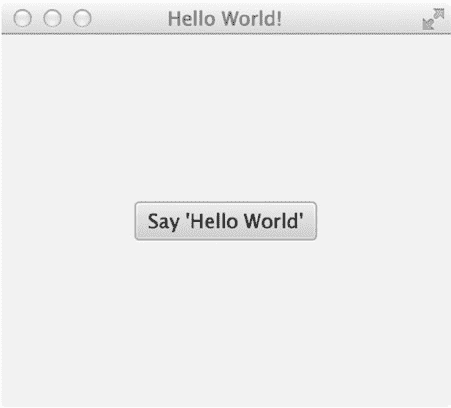

第 14 章 N JAVAFX 基础

**图 14-1.** *从 NetBeans IDE 启动的 JavaFX Hello World*

解决方案 2

使用您喜欢的编辑器编写 JavaFX Hello World 应用程序的代码。创建 Java 文件后，您将使用命令行提示符来编译和运行您的 JavaFX 应用程序。以下是创建可在命令行提示符下编译和运行的 JavaFX Hello World 应用程序的步骤。

**在文本编辑器中创建 JAVAFX HELLO WORLD 应用程序**

要快速开始：

1. 将以下代码复制并粘贴到您喜欢的编辑器中，并将文件保存为 **HelloWorldMain.java**。

以下源代码是一个 JavaFX Hello World 应用程序：

package org.java8recipes.chapter14.recipe14_01;

import javafx.application.Application;

import javafx.scene.Scene;

import javafx.scene.control.Button;

import javafx.stage.Stage;

import javafx.scene.Group;

public class HelloWorldMain extends Application {

final Group root = new Group();

/**

* @param args the command line arguments

*/

[www.it-ebooks.info](http://www.it-ebooks.info/)

第 14 章 N JAVAFX 基础

public static void main(String[] args) {

Application.launch(args);

}

@Override

public void start(Stage primaryStage) {

primaryStage.setTitle("Hello World");

Scene scene = new Scene(root, 300, 250);

Button btn = new Button();

btn.setLayoutX(100);

btn.setLayoutY(80);

btn.setText("Hello World");

btn.setOnAction((event) -> {

System.out.println("Hello World");

});

root.getChildren().add(btn);

primaryStage.setScene(scene);

primaryStage.show();

}

}

2. 保存名为 HelloWorldMain.java 的文件后，使用命令行提示符导航到该文件所在目录。
3. 使用 Java 编译器 javac 编译源代码文件 HelloWorldMain.java：

   javac -d . HelloWorldMain.java

4. 运行并测试您的 JavaFX Hello World 应用程序。假设您位于与 HelloWorldMain.java 文件相同的目录中，请在命令行提示符下输入以下命令来运行您的 JavaFX Hello World 应用程序：

   java org.java8recipes.chapter14.recipe14_01.HelloWorldMain

N **注意** 此类也可以在现有的 JDK 8 应用程序中创建。例如，包含本书源代码的项目在 `org.java8recipes.chapter14` 源包中包含所有 JavaFX 配方。

这是可行的，因为 JavaFX 不再需要额外配置；它已经是任何 JDK 8 项目的一部分。

工作原理

以下是两种解决方案的描述。两种解决方案都需要 JavaFX 8 或 JavaFX 2.x 以及 JDK 7。

解决方案 1 演示了如何使用 NetBeans IDE 构建 JavaFX 应用程序。解决方案 2 涵盖了通过您喜欢的文本编辑器开发简单的 JavaFX 应用程序，并使用命令行或终端编译和执行 JavaFX 程序。

[www.it-ebooks.info](http://www.it-ebooks.info/)

第 14 章 N JAVAFX 基础

NetBeans IDE 通过 JavaFX 项目使得开发 JavaFX 应用程序变得非常容易。事实上，在遵循 JavaFX 项目创建向导后，NetBeans 会提供一个 Hello World 应用程序模板。这是开始任何 JavaFX 应用程序的绝佳解决方案，因为它为构建更复杂的解决方案提供了一个很好的起点。

要使用您喜欢的文本编辑器创建一个简单的 JavaFX Hello World 应用程序，请遵循解决方案 2 的步骤 1 和 2。

要在命令行上编译和运行您的 Hello World 程序，请遵循解决方案 2 的步骤 3 和 4。将源代码输入到您喜欢的编辑器中并保存源文件后，编译并运行 JavaFX 程序。打开命令行或终端窗口，并导航到名为 HelloWorldMain.java 的 Java 文件所在的目录。

这里，我们回顾一种使用命令 `javac -d . HelloWorldMain.java` 编译文件的方法。您会注意到文件名前的 `-d .`。这告诉 Java 编译器根据包名将类文件放在何处。

在此场景中，HelloWorldMain 的包语句是 `helloworldmain`，这将在当前目录下创建一个子目录。以下命令将编译并运行 JavaFX Hello World 应用程序：

cd \<path to project>\org\java8recipes\chapter14\recipe14_01

javac –d . HelloWorldMain.java

java helloworldmain.HelloWorldMain

N **注意** 打包和部署 JavaFX 应用程序的方法有很多种。要了解更多信息，请参阅 [`docs.oracle.com/javafx/2/deployment/jfxpub-deployment.htm`](http://docs.oracle.com/javafx/2/deployment/jfxpub-deployment.htm) 上的“学习如何部署和打包 JavaFX 应用程序”。

有关深入的 JavaFX 部署策略，请参阅 Oracle 的“部署 JavaFX 应用程序”，网址为

[`docs.oracle.com/javafx/2/deployment/deployment_toolkit.htm。`](http://docs.oracle.com/javafx/2/deployment/deployment_toolkit.htm)

在两种解决方案的源代码中，您都会注意到 JavaFX 应用程序继承了 `javafx.application.Application` 类。`Application` 类提供了应用程序生命周期函数，例如在运行时启动和停止。这也为 Java 应用程序以线程安全的方式启动 JavaFX GUI 组件提供了一种机制。请记住，与 Java Swing 的事件调度线程类似，JavaFX 有自己的 JavaFX 应用程序线程。JavaFX 8 的新特性是，事件调度线程和 JavaFX 应用程序线程可以合并（参见配方 14-18）。


查看代码，在 `main()` 方法的入口点，你只需将命令行参数传递给 `Application.launch()` 方法即可启动 JavaFX 应用程序。一旦应用程序进入就绪状态，框架内部将调用 `start()` 方法来开始执行。当 `start()` 方法被调用时，一个 JavaFX 的 `javafx.stage.Stage` 对象便可供开发者使用和操作。

你会注意到一些对象的命名有些奇特，比如 `Stage` 和 `Scene`。API 的设计者将事物类比为剧院或戏剧，演员在观众面前表演。按照同样的类比，要上演一出戏，基本上需要演员在一到多个场景（Scene）中表演。当然，所有场景都在一个舞台（Stage）上进行。在 JavaFX 中，`Stage` 相当于一个应用程序窗口，类似于 Java Swing API 中的 `JFrame` 或 `JDialog`。你可以将 `Scene` 对象视为一个内容面板，能够容纳零到多个 `Node` 对象。`Node` 是所有要渲染的场景图节点的基本基类。场景图是一种树形数据结构，它维护着应用程序中所有节点或图形对象的内部模型。常用的节点是 UI 控件和 `Shape` 对象。与树形数据结构类似，场景图通过使用容器类 `Group` 来包含子节点。稍后在学习 `ObservableList` 时，你会了解更多关于 `Group` 类的知识，但现在你可以将它们视为能够容纳 `Node` 的 Java 列表或集合。

添加子节点后，你需要设置 `primaryStage`（`Stage`）的场景，并在 `Stage` 对象上调用 `show()` 方法来显示 JavaFX 窗口。

[www.it-ebooks.info](http://www.it-ebooks.info/)

第 14 章 JavaFX 基础

最后一点：在本章中，大多数示例应用程序的结构都与本示例相同，其中配方代码解决方案将位于 `start()` 方法内部。本章中的大多数配方都遵循相同的模式。为简洁起见，许多样板代码未显示。要查看所有配方的完整源代码列表，请从本书网站下载源代码。

14-2\. 绘制文本

问题

你希望在 JavaFX 应用程序中绘制自定义文本。

解决方案

通过使用 `javafx.scene.text.Text` 类创建 `Text` 节点，并将其放置在 JavaFX 场景图上。由于 `Text` 节点要放置在场景图上，你决定创建随机定位的 `Text` 节点，这些节点围绕其 (x, y) 位置旋转，并散布在场景区域中。

以下代码实现了一个 JavaFX 应用程序，该应用程序显示散布在场景图中的 `Text` 节点，并具有随机位置和颜色：

```java
primaryStage.setTitle("Chapter 14-2 Drawing Text");

Group root = new Group();

Scene scene = new Scene(root, 300, 250, Color.WHITE);

Random rand = new Random(System.currentTimeMillis());

for (int i = 0; i < 100; i++) {

int x = rand.nextInt((int) scene.getWidth());

int y = rand.nextInt((int) scene.getHeight());

int red = rand.nextInt(255);

int green = rand.nextInt(255);

int blue = rand.nextInt(255);

Text text = new Text(x, y, "Java 8 Recipes");

int rot = rand.nextInt(360);

text.setFill(Color.rgb(red, green, blue, .99));

text.setRotate(rot);

root.getChildren().add(text);

}

primaryStage.setScene(scene);

primaryStage.show();
```

图 14-2 显示了散布在 JavaFX 场景图中的随机 `Text` 节点。

[www.it-ebooks.info](http://www.it-ebooks.info/)

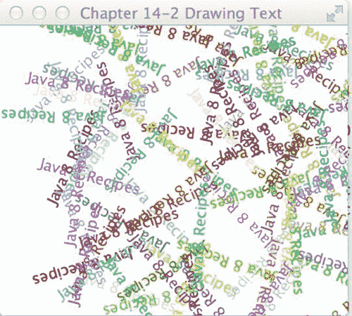

第 14 章 JavaFX 基础

**图 14-2.** *在随机位置绘制文本*

工作原理

要在 JavaFX 中绘制文本，你需要创建一个 `javafx.scene.text.Text` 节点，并将其放置在场景图（`javafx.scene.Scene`）上。在此示例中，你会注意到文本对象具有随机颜色和位置，散布在场景区域中。

首先，你创建一个循环来生成随机的 (x, y) 坐标以定位 `Text` 节点。其次，你创建介于 (0–255 RGB) 之间的随机颜色分量，并将其应用于 `Text` 节点。第三，旋转角度（以度为单位）是一个随机生成的值，介于 (0–360 度) 之间，以使文本倾斜。以下代码创建将分配给 `Text` 节点位置、颜色和旋转的随机值：

```java
int x = rand.nextInt((int) scene.getWidth());

int y = rand.nextInt((int) scene.getHeight());

int red = rand.nextInt(255);

int green = rand.nextInt(255);

int blue = rand.nextInt(255);

int rot = rand.nextInt(360);
```

生成随机值后，它们将被应用于 `Text` 节点，这些节点将被绘制到场景图上。以下代码片段将位置 (x, y)、颜色 (RGB) 和旋转（角度，以度为单位）应用于 `Text` 节点：

```java
Text text = new Text(x, y, "Java 8 Recipes");

text.setFill(Color.rgb(red, green, blue, .99));

text.setRotate(rot);

root.getChildren().add(text);
```

[www.it-ebooks.info](http://www.it-ebooks.info/)

第 14 章 JavaFX 基础

你将开始看到场景图 API 的强大之处，因为它易于使用。`Text` 节点可以像 `Shape` 一样轻松操作。嗯，实际上它们就是 `Shape`。在继承层次结构中定义，`Text` 节点扩展自 `javafx.scene.shape.Shape` 类，因此能够执行有趣的操作，例如填充颜色或围绕某个角度旋转。尽管文本被着色，但这仍然有点单调。然而，在下一个配方中，你将学习如何更改文本的字体。

14-3\. 更改文本字体

问题

你想要更改文本字体并向 `Text` 节点添加特殊效果。

解决方案 1

创建一个 JavaFX 应用程序，使用以下类来设置文本字体并将嵌入效果应用于 `Text` 节点：

-   `javafx.scene.text.Font`
-   `javafx.scene.effect.DropShadow`
-   `javafx.scene.effect.Reflection`

以下代码设置了字体并将效果应用于 `Text` 节点。它使用了 Serif、SanSerif、Dialog 和 Monospaced 字体，以及投影和反射效果：

```java
primaryStage.setTitle("Chapter 14-3 Changing Text Fonts");

Group root = new Group();

Scene scene = new Scene(root, 330, 250, Color.WHITE);

// Serif with drop shadow
Text java8Recipes2 = new Text(50, 50, "Java 8 Recipes");

Font serif = Font.font("Serif", 30);

java8Recipes2.setFont(serif);

java8Recipes2.setFill(Color.RED);

DropShadow dropShadow = new DropShadow();

dropShadow.setOffsetX(2.0f);

dropShadow.setOffsetY(2.0f);

dropShadow.setColor(Color.rgb(50, 50, 50, .588));

java8Recipes2.setEffect(dropShadow);

root.getChildren().add(java8Recipes2);

// SanSerif
Text java8Recipes3 = new Text(50, 100, "Java 8 Recipes");

Font sanSerif = Font.font("SanSerif", 30);

java8Recipes3.setFont(sanSerif);

java8Recipes3.setFill(Color.BLUE);

root.getChildren().add(java8Recipes3);

// Dialog
Text java8Recipes4 = new Text(50, 150, "Java 8 Recipes");

Font dialogFont = Font.font("Dialog", 30);

[www.it-ebooks.info](http://www.it-ebooks.info/)

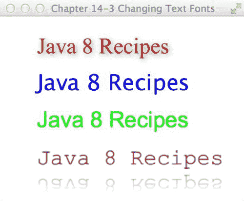

第 14 章 JavaFX 基础

java8Recipes4.setFont(dialogFont);

java8Recipes4.setFill(Color.rgb(0, 255, 0));

root.getChildren().add(java8Recipes4);

// Monospaced
Text java8Recipes5 = new Text(50, 200, "Java 8 Recipes");

Font monoFont = Font.font("Monospaced", 30);

java8Recipes5.setFont(monoFont);

java8Recipes5.setFill(Color.BLACK);

root.getChildren().add(java8Recipes5);

Reflection refl = new Reflection();

refl.setFraction(0.8f);

java8Recipes5.setEffect(refl);

primaryStage.setScene(scene);

primaryStage.show();
```

图 14-3 显示了将各种字体样式和效果（投影和反射）应用于 `Text` 节点的 JavaFX 应用程序。

**图 14-3.** *更改文本字体*

解决方案 2


利用新的 TextFlow 节点来辅助拼接富文本。使用 FXML 文件构建对象图，然后对 FXML 中的节点应用 CSS 样式。对于更习惯使用标记语言而非 Java 代码的人来说，此解决方案提供了一条更好的路径。它还演示了如何使用样式表为应用程序声明样式。

[www.it-ebooks.info](http://www.it-ebooks.info/)

第 14 章 N JAVAFX 基础

首先，让我们看一下用于构建布局的 FXML。以下几行标记构建了一个场景图，其中包含一个 Pane，Pane 内包含一个 TextFlow。TextFlow 包含一系列 Text 节点，每个节点都应用了不同的样式。以下列表包含了 textfonts.fxml 的源代码。

```xml
<?xml version="1.0" encoding="UTF-8"?>

<?import java.net.*?>

<?import javafx.geometry.*?>

<?import javafx.scene.*?>

<?import javafx.scene.control.*?>

<?import javafx.scene.layout.*?>

<?import javafx.scene.text.*?>

<Scene width="200" height="75" fill="white" xmlns:fx=" [`javafx.com/fxml`](http://javafx.com/fxml)">

<stylesheets>

<URL value="@textfonts.css"/>

</stylesheets>

<Pane fx:id="pane">

<TextFlow styleClass="mainmessage">

<Text styleClass="span1">Hello </Text>

<Text text=" "/>

<Text styleClass="span2, large">Java</Text>

<Text styleClass="span3, slant">FX</Text>

<Text text=" "/>

<Text styleClass="cool">8</Text>

</TextFlow>

</Pane>

</Scene>
```

在 FXML 中，导入了一个名为 textfonts.css 的层叠样式表。以下列表包含了位于 textfonts.css 中的样式。

```css
.mainmessage {

-fx-font-family: "Helvetica";

-fx-font-size: 30px;

}

.span1 {

-fx-color: "red";

}

.span2 {

-fx-font-family: "Serif";

-fx-font-size: 30px;

-fx-color: "red";

}
```

[www.it-ebooks.info](http://www.it-ebooks.info/)


第 14 章 N JAVAFX 基础

```css
.span3 {

-fx-font-family: "Serif";

-fx-font-size: 30px;

-fx-fill: "orange";

-fx-font-style: italic;

}

.cool {

-fx-effect: dropshadow(gaussian, gray, 8, 0.5, 8, 8);

}
```

最后，使用一个标准的 JavaFX 应用程序类来实例化该示例。以下源代码取自 ChangingTextFontsSolution2.java，演示了如何加载 FXML 并构建舞台。

```java
@Override

public void start(Stage stage) throws Exception {

stage.setTitle("Chapter 14-3 Changing Text Fonts Using TextFlow and FXML"); stage.setScene((Scene) FXMLLoader.load(getClass().getResource("textfonts.fxml"))); stage.show();

}
```

生成的应用程序将渲染一个场景，其结果类似于图 14-4 所示。

**图 14-4.** *TextFlow 和 FXML*

工作原理

解决方案 1 演示了如何使用标准 Java 代码将字体应用于文本。基于矢量的图形允许您缩放形状并应用效果，而不会出现像素化（锯齿）问题。JavaFX 节点使用基于矢量的图形。在每个 Text 节点中，您可以创建并设置要渲染到场景图上的字体。以下是在 Text 节点上创建和设置字体的代码：

```java
Text java8Recipes2 = new Text(50, 50, "Java 8 Recipes");

Font serif = Font.font("Serif", 30);

Java8Recipes2.setFont(serif);
```

[www.it-ebooks.info](http://www.it-ebooks.info/)

第 14 章 N JAVAFX 基础

在解决方案 1 中，投影是一个真实的效果（DropShadow）对象，并且实际上应用于单个 Text 节点实例。DropShadow 对象被设置为基于相对于 Text 节点的 x 和 y 偏移量进行定位。

您还可以设置阴影的颜色；这里我们将其设置为灰色，不透明度为 .588。以下是一个使用投影效果（DropShadow）设置 Text 节点 effect 属性的示例：

```java
DropShadow dropShadow = new DropShadow();

dropShadow.setOffsetX(2.0f);

dropShadow.setOffsetY(2.0f);

dropShadow.setColor(Color.rgb(50, 50, 50, .588));

java8Recipes2.setEffect(dropShadow);
```

尽管本技巧是关于设置文本字体的，但它也对 Text 节点应用了效果。还添加了另一个效果（只是为了更上一层楼）。在创建最后一个使用等宽字体的 Text 节点时，应用了流行的反射效果。设置以下代码，以便显示 .8 或 80% 的反射。反射值的范围从零（0%）到一（100%）。以下代码片段使用浮点值 0.8f 实现了 80% 的反射：

```java
Reflection refl = new Reflection();

refl.setFraction(0.8f);

java8Recipes5.setEffect(refl);
```

解决方案 2 演示了如何使用 FXML、CSS 和 Java 构建用户界面。虽然本技巧侧重于文本和字体，但重要的是要注意，FXML 解决方案明确遵循模型-视图-控制器标准，将 UI 代码与业务逻辑分开。同样重要的是要注意，如果此示例中的 UI 包含按钮或其他包含操作的节点，则还需要创建一个控制器类来体现操作逻辑。

在第二个示例中，FXML 文件包含用户界面的结构化布局，该布局由一个 Scene、Pane、TextFlow 和一系列 Text 节点组成。场景包含一个 `<stylesheets>` 元素，用于指定将哪些样式表应用于 XML 中的元素。Pane 节点用作布局的基础，它包含 UI 中的每个其他节点。TextFlow 节点是 JavaFX 8 中的新特性，它是一种专门用于布局富文本的特殊布局。TextFlow 可以将许多不同的 Text 节点布局到一个单一的流中。

从 FXML 中可以看出，TextFlow 中的每个 Text 节点都关联了不同的样式，这些样式基于附加样式表中定义的样式。JavaFX 样式表中样式的属性以 `-fx-` 开头，属性名称和值由冒号分隔，并以分号（;）结束。在大多数情况下，JavaFX 样式属性与标准 CSS 属性很好地对应。有关完整摘要，请参阅 [`docs.oracle.com/javafx/2/css_tutorial/jfxpub-css_tutorial.htm`](http://docs.oracle.com/javafx/2/css_tutorial/jfxpub-css_tutorial.htm) 上的文档。

TextFlow 使用嵌入其中的每个节点的文本和字体，以及其自身的宽度和文本对齐方式，来确定文本的位置。除 Text 之外的节点也可以嵌入到 TextFlow 中。

将 Text 节点添加到 TextFlow 时，您可以通过 `setMaxWidth()` 方法指定 TextFlow 的最大宽度来设置自动换行。也可以在 Text 节点内的任何字符串末尾包含 `\n` 以启动换行。以下代码执行与解决方案 1 相同的功能，但使用 TextFlow 来布局 Text 节点，而不是将每个节点单独添加到场景图中。

```java
primaryStage.setTitle(“Chapter 14-3 Changing Text Fonts”);

Group root = new Group();

Scene scene = new Scene(root, 330, 250, Color.WHITE);

// Serif with drop shadow

Text java8Recipes2 = new Text(50, 50, “Java 8 Recipes”);

Font serif = Font.font(“Serif”, 30);
```

[www.it-ebooks.info](http://www.it-ebooks.info/)

第 14 章 N JAVAFX 基础

```java
java8Recipes2.setFont(serif);

java8Recipes2.setFill(Color.RED);

DropShadow dropShadow = new DropShadow();

dropShadow.setOffsetX(2.0f);

dropShadow.setOffsetY(2.0f);

dropShadow.setColor(Color.rgb(50, 50, 50, .588));

java8Recipes2.setEffect(dropShadow);

// SanSerif

Text java8Recipes3 = new Text(50, 100, “Java 8 Recipes\n”);

Font sanSerif = Font.font(“SanSerif”, 30);

java8Recipes3.setFont(sanSerif);

java8Recipes3.setFill(Color.BLUE);

// Dialog

Text java8Recipes4 = new Text(50, 150, “Java 8 Recipes\n”);

Font dialogFont = Font.font(“Dialog”, 30);

java8Recipes4.setFont(dialogFont);

java8Recipes4.setFill(Color.rgb(0, 255, 0));

// Monospaced

Text java8Recipes5 = new Text(50, 200, “Java 8 Recipes”);

Font monoFont = Font.font(“Monospaced”, 30);

java8Recipes5.setFont(monoFont);

java8Recipes5.setFill(Color.BLACK);
```


```java
Reflection refl = new Reflection();

refl.setFraction(0.8f);

java8Recipes5.setEffect(refl);

TextFlow flow = new TextFlow(java8Recipes2, java8Recipes3, java8Recipes4, java8Recipes5); root.getChildren().add(flow);
```

本配方中引入了许多概念。你将在后续的配方中了解更多关于 FXML 的内容，或者你也可以查阅在线文档 [`docs.oracle.com/javafx/2/get_started/fxml_tutorial.htm`](http://docs.oracle.com/javafx/2/get_started/fxml_tutorial.htm) 获取更多信息。

你可以通过阅读 [`docs.oracle.com/javase/8/javafx/api/javafx/scene/text/TextFlow.html`](http://docs.oracle.com/javase/8/javafx/api/javafx/scene/text/TextFlow.html) 上的文档来了解更多关于 TextFlow 布局的知识。

14-4. 创建形状

问题

你想要创建形状并将其放置在场景图中。

解决方案

使用 JavaFX 的 `javafx.scene.shape.*` 包中的 Arc、Circle、CubicCurve、Ellipse、Line、Path、Polygon、Polyline、QuadCurve、Rectangle、SVGPath 和 Text 类。以下代码绘制了各种复杂形状。第一个复杂形状涉及一条以正弦波形状绘制的三次曲线。下一个形状称为冰淇淋蛋筒，使用了包含路径元素（`javafx.scene.shape.PathElement`）的 Path 类。第三个形状是一条二次贝塞尔曲线（QuadCurve），它形成了一个微笑。最后一个形状是一个美味的甜甜圈。你可以通过将两个椭圆（一个较小，一个较大）相减来创建这个甜甜圈形状：

```java
@Override

public void start(Stage primaryStage) {

primaryStage.setTitle("第 14-4 章 创建形状");

Group root = new Group();

Scene scene = new Scene(root, 306, 550, Color.WHITE);

// 三次曲线

CubicCurve cubicCurve = new CubicCurve();

cubicCurve.setStartX(50);

cubicCurve.setStartY(75); // 起点 (x1,y1)

cubicCurve.setControlX1(80);

cubicCurve.setControlY1(-25); // 控制点 1

cubicCurve.setControlX2(110);

cubicCurve.setControlY2(175); // 控制点 2

cubicCurve.setEndX(140);

cubicCurve.setEndY(75);

cubicCurve.setStrokeType(StrokeType.CENTERED);

cubicCurve.setStrokeWidth(1);

cubicCurve.setStroke(Color.BLACK);

cubicCurve.setStrokeWidth(3);

cubicCurve.setFill(Color.WHITE);

root.getChildren().add(cubicCurve);

// 冰淇淋

Path path = new Path();

MoveTo moveTo = new MoveTo();

moveTo.setX(50);

moveTo.setY(150);

QuadCurveTo quadCurveTo = new QuadCurveTo();

quadCurveTo.setX(150);

quadCurveTo.setY(150);

quadCurveTo.setControlX(100);

quadCurveTo.setControlY(50);

LineTo lineTo1 = new LineTo();

lineTo1.setX(50);

lineTo1.setY(150);

LineTo lineTo2 = new LineTo();

lineTo2.setX(100);

lineTo2.setY(275);

LineTo lineTo3 = new LineTo();

lineTo3.setX(150);

lineTo3.setY(150);

path.getElements().add(moveTo);

path.getElements().add(quadCurveTo);

path.getElements().add(lineTo1);

path.getElements().add(lineTo2);

path.getElements().add(lineTo3);

path.setTranslateY(30);

path.setStrokeWidth(3);

path.setStroke(Color.BLACK);

root.getChildren().add(path);

// 二次曲线创建微笑

QuadCurve quad = new QuadCurve();

quad.setStartX(50);

quad.setStartY(50);

quad.setEndX(150);

quad.setEndY(50);

quad.setControlX(125);

quad.setControlY(150);

quad.setTranslateY(path.getBoundsInParent().getMaxY());

quad.setStrokeWidth(3);

quad.setStroke(Color.BLACK);

quad.setFill(Color.WHITE);

root.getChildren().add(quad);

// 外圈甜甜圈

Ellipse bigCircle = new Ellipse(100, 100, 50, 75/2);

//bigCircle.setTranslateY(quad.getBoundsInParent().getMaxY());

bigCircle.setStrokeWidth(3);

bigCircle.setStroke(Color.BLACK);

bigCircle.setFill(Color.WHITE);

// 甜甜圈洞

Ellipse smallCircle = new Ellipse(100, 100, 35/2, 25/2);

// 制作甜甜圈

Shape donut = Path.subtract(bigCircle, smallCircle);

donut.setStrokeWidth(1);

donut.setStroke(Color.BLACK);

// 橙色糖霜

donut.setFill(Color.rgb(255, 200, 0));

// 添加投影

DropShadow dropShadow = new DropShadow();

dropShadow.setOffsetX(2.0f);
```


dropShadow.setOffsetY(2.0f);

dropShadow.setColor(Color.rgb(50, 50, 50, .588));

donut.setEffect(dropShadow);

[www.it-ebooks.info](http://www.it-ebooks.info/)

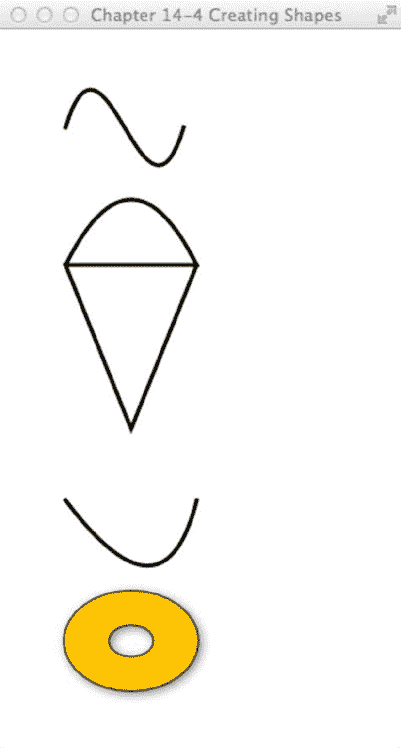

**第 14 章 N JavaFX 基础**

// 向下微移以留出间距

donut.setTranslateY(quad.getBoundsInParent().getMinY() + 10);

root.getChildren().add(donut);

primaryStage.setScene(scene);

primaryStage.show();

}

图 14-5 dis 展示了使用 JavaFX 创建的正弦波、甜筒、笑脸和甜甜圈形状。

**图 14-5.** *创建形状*

[www.it-ebooks.info](http://www.it-ebooks.info/)

**第 14 章 N JavaFX 基础**

工作原理

在本方案中，你生成了一些基本的 2D 形状。第一个形状是 `javafx.scene.shape.CubicCurve` 类，它允许你构建三次曲线（一种“波浪线”）效果。要创建一条三次曲线，只需找到合适的构造函数进行实例化。以下代码片段用于创建一个 `javafx.scene.shape.CubicCurve` 实例：

CubicCurve cubicCurve = new CubicCurve();

cubicCurve.setStartX(50);

cubicCurve.setStartY(75); // 起点 (x1,y1)

cubicCurve.setControlX1(80);

cubicCurve.setControlY1(-25); // 控制点 1

cubicCurve.setControlX2(110);

cubicCurve.setControlY2(175); // 控制点 2

cubicCurve.setEndX(140);

cubicCurve.setEndY(75);

cubicCurve.setStrokeType(StrokeType.CENTERED);

cubicCurve.setStrokeWidth(1);

cubicCurve.setStroke(Color.BLACK);

cubicCurve.setStrokeWidth(3);

cubicCurve.setFill(Color.WHITE);

首先，你实例化一个 `CubicCurve()` 实例。接着，通过使用对象的 setter 方法并为每个方法传递一个值，可以按任意顺序指定曲线的属性。一旦你完成了对 `CubicCurve()` 对象属性的设置，就可以使用以下表示法将其添加到场景图中：

root.getChildren().add(cubicCurve);

甜筒形状是使用 `javafx.scene.shape.Path` 类创建的。当创建每个路径元素并将其添加到 `Path` 对象时，每个元素*不*被视为图节点（`javafx.scene.Node`）。这意味着它们不继承自 `javafx.scene.shape.Shape` 类，并且不能作为场景图中的子节点进行显示。

查看 Javadoc（参见 [`docs.oracle.com/javase/8/javafx/api/javafx/scene/shape/Path.html）`](http://docs.oracle.com/javase/8/javafx/api/javafx/scene/shape/Path.html)时，你会注意到 `Path` 类继承自 `Shape` 类，而 `Shape` 类又继承自 `javafx.scene.Node` 类，因此 `Path` 是一个图节点，但路径元素并不继承自 `Shape` 类。路径元素实际上继承自 `javafx.scene.shape.PathElement` 类，该类仅在 `Path` 对象的上下文中使用。因此，你无法实例化一个 `LineTo` 类并将其放入场景图中。只需记住，以 `To` 为后缀的类是路径元素，而不是真正的 `Shape` 节点。例如，`MoveTo` 和 `LineTo` 对象实例是添加到 `Path` 对象的路径元素，而不是可以添加到场景中的形状。以下是添加到 `Path` 对象以绘制甜筒的路径元素：

// 冰淇淋

Path path = new Path();

MoveTo moveTo = new MoveTo();

moveTo.setX(50);

moveTo.setY(150);

...// 创建其他路径元素。

LineTo lineTo1 = new LineTo();

lineTo1.setX(50);

lineTo1.setY(150);

[www.it-ebooks.info](http://www.it-ebooks.info/)

**第 14 章 N JavaFX 基础**

...// 创建其他路径元素。

path.getElements().add(moveTo);

path.getElements().add(quadCurveTo);

path.getElements().add(lineTo1);

渲染 `QuadCurve`（笑脸）对象时，你实例化一个新的 `QuadCurve` 对象并相应地设置每个属性。同样，每个属性都接受一个单一值。

最后是带有投影效果的美味甜甜圈形状，它实际上是由两个圆形椭圆创建的。


通过从较大椭圆区域中减去较小椭圆（甜甜圈孔），使用 `Path.subtract()` 方法创建并返回一个新派生形状。以下是使用 `Path.subtract()` 方法创建甜甜圈形状的代码片段：

// 外圈甜甜圈

Ellipse bigCircle = ...//外部形状区域

// 甜甜圈孔

Ellipse smallCircle = ...//内部形状区域

// 制作甜甜圈

Shape donut = Path.subtract(bigCircle, smallCircle);

接下来，为甜甜圈添加投影效果。这次不再像之前的配方那样绘制两次形状，而是只绘制一次，并使用 `setEffect()` 方法将 `DropShadow` 对象实例应用于甜甜圈 `Shape` 对象。与之前的技术类似，通过调用 `setOffsetX()` 和 `setOffsetY()` 来设置阴影的偏移量。

**注意** 在之前的版本中，可以使用构建器对象更轻松地创建形状。然而，由于性能和臃肿问题，构建器类已从 JavaFX 8 中移除。如果你正在维护使用构建器类的代码，建议迁移到标准对象，如本配方所示。

14-5. 为对象分配颜色

问题

你想用纯色和渐变色填充形状。

解决方案

在 JavaFX 中，所有形状都可以用纯色和渐变色填充。以下是用于填充形状节点的主要类：

u javafx.scene.paint.Color

u javafx.scene.paint.LinearGradient

u javafx.scene.paint.Stop

u javafx.scene.paint.RadialGradient

[www.it-ebooks.info](http://www.it-ebooks.info/)

第 14 章 JavaFX 基础

以下代码使用上述类为形状添加径向和线性渐变色，以及透明（Alpha 通道级别）颜色。本配方使用了椭圆、矩形和圆角矩形。配方中还出现了一条黑色实线（如图 14-5 所示），以演示形状颜色的透明度。

public void start(Stage primaryStage) {

primaryStage.setTitle("第 14-5 章 为对象分配颜色");

Group root = new Group();

Scene scene = new Scene(root, 350, 300, Color.WHITE);

Ellipse ellipse = new Ellipse(100, 50 + 70/2, 50, 70/2);

RadialGradient gradient1 = new RadialGradient(0,

.1, // 聚焦角度

80, // 聚焦距离

45, // centerX

120, // centerY

false, // 是否按比例

CycleMethod.NO_CYCLE,

new Stop(0, Color.RED), new Stop(1, Color.BLACK));

ellipse.setFill(gradient1);

root.getChildren().add(ellipse);

// 创建线条

Line blackLine = new Line();

blackLine.setStartX(170);

blackLine.setStartY(30);

blackLine.setEndX(20);

blackLine.setEndY(140);

blackLine.setFill(Color.BLACK);

blackLine.setStrokeWidth(10.0f);

blackLine.setTranslateY(ellipse.prefHeight(-1) + ellipse.getLayoutY() + 10);

root.getChildren().add(blackLine);

// 创建矩形

Rectangle rectangle = new Rectangle();

rectangle.setX(50);

rectangle.setY(50);

rectangle.setWidth(100);

rectangle.setHeight(70);

rectangle.setTranslateY(ellipse.prefHeight(-1) + ellipse.getLayoutY() + 10);

// 创建线性渐变

LinearGradient linearGrad = new LinearGradient(

50, //startX

50, //startY

50, //endX

50 + rectangle.prefHeight(-1) + 25, //endY

false, //是否按比例

[www.it-ebooks.info](http://www.it-ebooks.info/)

第 14 章 JavaFX 基础

CycleMethod.NO_CYCLE,

new Stop(0.1f, Color.rgb(255, 200, 0, .784)),

new Stop(1.0f, Color.rgb(0, 0, 0, .784)));

rectangle.setFill(linearGrad);

root.getChildren().add(rectangle);

// 创建圆角矩形

Rectangle roundRect = new Rectangle();

roundRect.setX(50);

roundRect.setY(50);

roundRect.setWidth(100);

roundRect.setHeight(70);

roundRect.setArcWidth(20);

roundRect.setArcHeight(20);

roundRect.setTranslateY(ellipse.prefHeight(-1) +

ellipse.getLayoutY() +

10 +

roundRect.prefHeight(-1) +

roundRect.getLayoutY() + 10);

LinearGradient cycleGrad = new LinearGradient(50,

50,

70,

70,

false,

CycleMethod.REFLECT,

new Stop(0f, Color.rgb(0, 255, 0, .784)),

new Stop(1.0f, Color.rgb(0, 0, 0, .784)));

roundRect.setFill(cycleGrad);


root.getChildren().add(roundRect);

primaryStage.setScene(scene);

primaryStage.show();

}

图 14-6 展示了可应用于形状的各种颜色填充类型。

[www.it-ebooks.info](http://www.it-ebooks.info/)

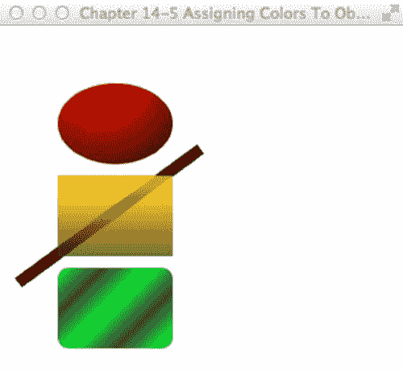

第 14 章 JavaFX 基础

**图 14-6.** *彩色形状*

工作原理

图 14-5 展示了从上到下依次显示的形状，分别是一个椭圆、一个矩形和一个带有彩色渐变填充的圆角矩形。在绘制椭圆形状时，你将使用一种径向渐变，使其看起来像一个 3D 球体对象。接着，创建一个填充了黄色半透明线性渐变的矩形。在黄色矩形后面绘制了一个粗黑线形状，以展示矩形的半透明颜色。最后，生成一个填充了绿色与黑色反射线性渐变的圆角矩形，该渐变在对角线方向上类似于 3D 管状效果。

颜色渐变的奇妙之处在于，它们常常能让形状呈现出三维效果。

渐变填充允许你在两种或多种颜色之间进行插值，从而赋予形状深度感。JavaFX 提供了两种渐变类型：径向渐变（RadialGradient）和线性渐变（LinearGradient）。在本示例中，椭圆形状应用了径向渐变（RadialGradient）。

表 14-1 摘自 JavaFX 8 Javadoc 中对 RadialGradient 类的定义（[`docs.oracle.com/javase/8/javafx/api/javafx/scene/paint/RadialGradient.html`](http://docs.oracle.com/javase/8/javafx/api/javafx/scene/paint/RadialGradient.html)）。

**表 14-1.** *RadialGradient 属性*

**属性**

**数据类型**

**描述**

focusAngle

double

从渐变中心到焦点（第一种颜色映射到的点）的角度（以度为单位）

focusDistance

double

从渐变中心到焦点（第一种颜色映射到的点）的距离

centerX

double

渐变圆中心点的 X 坐标

centerY

double

渐变圆中心点的 Y 坐标

（*续*）

[www.it-ebooks.info](http://www.it-ebooks.info/)

第 14 章 JavaFX 基础

**表 14-1.** *（续）*

***属性**

**数据类型**

**描述**

radius

double

定义颜色渐变范围的圆的半径

proportional

boolean

坐标和大小是否与该渐变填充的形状成比例

cycleMethod

CycleMethod

应用于渐变的循环方法

opaque

boolean

填充是否完全不透明

stops

List<Stop>

渐变的颜色规格

在本示例中，焦点角度设置为零，距离设置为 0.1，中心 X 和 Y 坐标设置为 (80,45)，半径设置为 120 像素，proportional 设置为 false，循环方法设置为无循环（CycleMethod.NO_CYCLE），两个颜色停止值分别设置为红色（Color.RED）和黑色（Color.BLACK）。这些设置通过从中心位置 (80, 45)（椭圆的左上角）的红色开始，然后在 120 像素（半径）的距离内插值过渡到黑色，从而创建了一个径向渐变。

接下来，创建一个填充了黄色半透明线性渐变的矩形。黄色矩形使用了线性渐变（LinearGradient）填充。

表 14-2 摘自 JavaFX 8.0 Javadoc 中对 LinearGradient 类的定义（[`docs.oracle.com/javase/8/javafx/api/javafx/scene/paint/LinearGradient.html`](http://docs.oracle.com/javase/8/javafx/api/javafx/scene/paint/LinearGradient.html)）。

**表 14-2.** *LinearGradient 属性*

**属性**

**数据类型**

**描述**

startX

double

渐变轴起点的 X 坐标

startY

double

渐变轴起点的 Y 坐标

endX

double

渐变轴终点的 X 坐标

endY

double

渐变轴终点的 Y 坐标

proportional

boolean

坐标是否与该渐变填充的形状成比例


cycleMethod

CycleMethod

应用于渐变的循环方法

此绘制是否完全不透明

opaque

boolean

stops

List<Stop>

渐变的颜色规格

要创建线性渐变绘制，您需要指定起点和终点的 startX、startY、endX 和 endY。起点和终点的坐标表示渐变图案开始和结束的位置。

要创建第二个形状（黄色矩形），请将起始 X 和 Y 设置为 (50, 50)，结束 X 和 Y 设置为 (50, 75)，将 proportional 设置为 false，循环方法设置为无循环（CycleMethod.NO_CYCLE），并将两个颜色停止值设置为黄色（Color.YELLOW）和黑色（Color.BLACK），透明度为 .784。这些设置为矩形提供了从上到下的线性渐变，起点为 (50, 50)（矩形的左上角）。然后它会插值到黑色（矩形的左下角）。

最后，您会注意到一个圆角矩形，其图案为绿色和黑色沿对角线方向重复的渐变。这是一个简单的线性渐变绘制，与线性渐变绘制（LinearGradient）相同，只是起始 X、Y 和结束 X、Y 设置在对角线位置，并且循环方法设置为反射（CycleMethod.REFLECT）。当将循环方法指定为反射（CycleMethod.REFLECT）时，渐变图案将在颜色之间重复或循环。以下代码片段实现了具有反射循环方法（CycleMethod.REFLECT）的圆角矩形：

LinearGradient cycleGrad = new LinearGradient(50,

50,

70,

70,

false,

CycleMethod.REFLECT,

new Stop(0f, Color.rgb(0, 255, 0, .784)),

new Stop(1.0f, Color.rgb(0, 0, 0, .784)));

14-6. 创建菜单

问题

您希望在 JavaFX 应用程序中创建标准菜单。

解决方案

使用 JavaFX 的菜单控件来提供标准化的菜单功能，例如复选框菜单、单选菜单、子菜单和分隔符。以下是用于创建菜单的主要类。

u javafx.scene.control.MenuBar

u javafx.scene.control.Menu

u javafx.scene.control.MenuItem

以下代码调用了前面列出的所有菜单功能。示例代码模拟了一个楼宇安全应用程序，其中包含用于打开摄像头、发出警报和选择应急方案的菜单选项。

public void start(Stage primaryStage) {

primaryStage.setTitle("Chapter 14-6 Creating Menus");

Group root = new Group();

Scene scene = new Scene(root, 300, 250, Color.WHITE);

MenuBar menuBar = new MenuBar();

// File menu - new, save, exit

Menu menu = new Menu("File");

menu.getItems().add(new MenuItem("New"));

menu.getItems().add(new MenuItem("Save"));

menu.getItems().add(new SeparatorMenuItem());

menu.getItems().add(new MenuItem("Exit"));

menuBar.getMenus().add(menu);

[www.it-ebooks.info](http://www.it-ebooks.info/)

CHAPTER 14 N JAVAFX FUNDAMENTALS

// Cameras menu - camera 1, camera 2

Menu tools = new Menu("Cameras");

CheckMenuItem item1 = new CheckMenuItem();

item1.setText("Show Camera 1");

item1.setSelected(true);

tools.getItems().add(item1);

CheckMenuItem item2 = new CheckMenuItem();

item2.setText("Show Camera 2");

item2.setSelected(true);

tools.getItems().add(item2);

menuBar.getMenus().add(tools);

// Alarm

Menu alarm = new Menu("Alarm");

ToggleGroup tGroup = new ToggleGroup();

RadioMenuItem soundAlarmItem = new RadioMenuItem();

soundAlarmItem.setToggleGroup(tGroup);

soundAlarmItem.setText("Sound Alarm");

RadioMenuItem stopAlarmItem = new RadioMenuItem();

stopAlarmItem.setToggleGroup(tGroup);

stopAlarmItem.setText("Alarm Off");

stopAlarmItem.setSelected(true);

alarm.getItems().add(soundAlarmItem);

alarm.getItems().add(stopAlarmItem);

Menu contingencyPlans = new Menu("Contingent Plans");

contingencyPlans.getItems().add(new CheckMenuItem("Self Destruct in T minus 50")); contingencyPlans.getItems().add(new CheckMenuItem("Turn off the coffee machine ")); contingencyPlans.getItems().add(new CheckMenuItem("Run for your lives! ")); alarm.getItems().add(contingencyPlans);


menuBar.getMenus().add(alarm);

menuBar.prefWidthProperty().bind(primaryStage.widthProperty());

root.getChildren().add(menuBar);

primaryStage.setScene(scene);

primaryStage.show();

}

图 14-7 展示了一个模拟的建筑安防应用程序，其中包含已勾选的菜单项和子菜单项。

[www.it-ebooks.info](http://www.it-ebooks.info/)

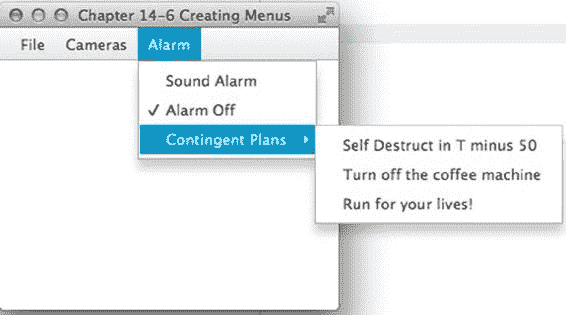

第 14 章 JavaFX 基础

**图 14-7.** *创建菜单*

工作原理

菜单提供了标准方式，允许用户从窗口化平台应用程序中选择选项。菜单还应具备热键或键盘快捷键。用户通常希望使用键盘而非鼠标来导航菜单。本范例与范例 14-8 相似，你会发现许多共同点。

要创建菜单，首先创建一个 MenuBar 实例，它将包含一个或多个菜单（MenuItem）对象。

创建菜单栏：

MenuBar menuBar = new MenuBar();

其次，创建菜单（Menu）对象，这些对象包含一个或多个菜单项（MenuItem）对象以及其他用于构成子菜单的 Menu 对象。创建菜单的方法如下：

Menu menu = new Menu("File");

第三，创建要添加到 Menu 对象中的菜单项，例如菜单项（MenuItem）、勾选菜单项（CheckMenuItem）和单选菜单项（RadioMenuItem）。菜单项可以包含图标。本范例未展示这一点，但我们鼓励你探索所有菜单项（MenuItem）的各种构造方法。创建单选菜单项（RadioMenuItem）时，应注意 ToggleGroup 类。ToggleGroup 类也用于常规单选按钮（RadioButton），以确保同一时间只能选中一个选项。以下代码创建了要添加到 Menu 对象中的单选菜单项（RadioMenuItems）：

// 警报

Menu alarm = new Menu("Alarm");

ToggleGroup tGroup = new ToggleGroup();

RadioMenuItem soundAlarmItem = new RadioMenuItem();

soundAlarmItem.setToggleGroup(tGroup);

soundAlarmItem.setText("Sound Alarm");

RadioMenuItem stopAlarmItem = new RadioMenuItem();

stopAlarmItem.setToggleGroup(tGroup);

stopAlarmItem.setText("Alarm Off");

stopAlarmItem.setSelected(true);

[www.it-ebooks.info](http://www.it-ebooks.info/)

第 14 章 JavaFX 基础

alarm.getItems().add(soundAlarmItem);

alarm.getItems().add(stopAlarmItem);

有时你可能希望用可视的分隔线来分隔菜单项。要创建可视分隔符，请创建一个 SeparatorMenuItem 类的实例，并通过 getItems() 方法将其添加到菜单中。getItems() 方法返回一个 MenuItem 对象的可观察列表（ObservableList<MenuItem>）。正如你将在范例 14-10 中看到的，当集合中的项目发生更改时，你会收到通知。以下代码行向菜单添加了一个可视分隔线（SeparatorMenuItem）：

menu.getItems().add(new SeparatorMenuItem());

其他使用的菜单项包括勾选菜单项（CheckMenuItem）和单选菜单项（RadioMenuItem），它们分别与 JavaFX UI 控件中的复选框（CheckBox）和单选按钮（RadioButton）类似。

在将菜单栏添加到场景之前，你会注意到通过 bind() 方法，菜单栏的首选宽度与 Stage 对象的宽度之间建立了绑定关系。绑定这些属性后，当用户调整屏幕大小时，菜单栏的宽度会随之拉伸。你将在范例 14-9“绑定表达式”中了解绑定的工作原理。以下代码片段展示了菜单栏宽度属性与舞台宽度属性之间的绑定。

menuBar.prefWidthProperty().bind(primaryStage.widthProperty());

root.getChildren().add(menuBar);

14-7\. 向布局添加组件

问题

你希望将 UI 组件添加到类似网格类型的布局中，以便于放置。

解决方案

使用 JavaFX 的 `javafx.scene.layout.GridPane` 类。以下源代码实现了一个简单的 UI 表单，包含名字和姓氏字段控件，并使用网格面板布局节点（`javafx.scene.layout.GridPane`）：

GridPane gridpane = new GridPane();

gridpane.setPadding(new Insets(5));

gridpane.setHgap(5);

gridpane.setVgap(5);


Label fNameLbl = new Label(“First Name”);

TextField fNameFld = new TextField();

Label lNameLbl = new Label(“First Name”);

TextField lNameFld = new TextField();

Button saveButt = new Button(“Save”);

// 名字标签

GridPane.setHalignment(fNameLbl, HPos.RIGHT);

gridpane.add(fNameLbl, 0, 0);

[www.it-ebooks.info](http://www.it-ebooks.info/)

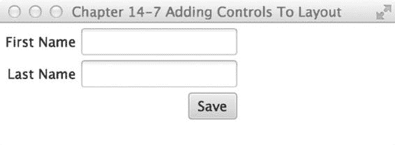

第 14 章 N JAVAFX 基础

// 姓氏标签

GridPane.setHalignment(lNameLbl, HPos.RIGHT);

gridpane.add(lNameLbl, 0, 1);

// 名字输入框

GridPane.setHalignment(fNameFld, HPos.LEFT);

gridpane.add(fNameFld, 1, 0);

// 姓氏输入框

GridPane.setHalignment(lNameFld, HPos.LEFT);

gridpane.add(lNameFld, 1, 1);

// 保存按钮

GridPane.setHalignment(saveButt, HPos.RIGHT);

gridpane.add(saveButt, 1, 2);

root.getChildren().add(gridpane);

图 14-8 展示了一个使用网格面板布局节点排列 UI 控件的小型表单。

**图 14-8.** *向布局中添加控件*

工作原理

构建用户界面时最大的挑战之一是如何将控件放置到显示区域中。在开发 GUI 应用程序时，理想的情况是允许用户移动和调整可视区域的大小，同时保持良好的用户体验。与 Java Swing 类似，JavaFX 布局提供了内置布局，这些布局提供了在场景图上显示 UI 控件的最常见方式。本方案演示了 `GridPane` 类。

回顾方案 14-4，你实现了一个自定义布局，以网格方式显示组件。你可能会注意到相似之处，但我们省略了许多实现特性，例如调整最小/最大尺寸、内边距和垂直对齐。令人惊讶的是，JavaFX 团队创建了一个强大的网格状布局，称为 `GridPane`。

首先，你创建一个 `GridPane` 实例。接着，你使用 `Inset` 对象的实例来设置内边距。

设置内边距后，你只需设置水平和垂直间距。以下代码片段实例化了一个网格面板（`GridPane`），其内边距、水平和垂直间距均设置为 5（像素）：

GridPane gridpane = new GridPane();

gridpane.setPadding(new Insets(5));

gridpane.setHgap(5);

gridpane.setVgap(5);

[www.it-ebooks.info](http://www.it-ebooks.info/)

第 14 章 N JAVAFX 基础

内边距是指区域内容周围的上、右、下、左间距（以像素为单位）。在获取首选大小时，内边距将被包含在计算中。设置水平和垂直间距与单元格内 UI 控件之间的间距有关。

接下来，只需将每个 UI 控件放置到其对应的单元格位置。所有单元格均从零开始计数。以下代码片段将一个保存按钮 UI 控件添加到网格面板布局节点（`GridPane`）的单元格 (1, 2) 中：gridpane.add(saveButt, 1, 2);

该布局还允许你在单元格中水平或垂直对齐控件。以下代码语句将保存按钮右对齐：

GridPane.setHalignment(saveButt, HPos.RIGHT);

14-8\. 生成边框

问题

你想要创建并自定义图像周围的边框。

解决方案

创建一个应用程序，使用 JavaFX 的 CSS 样式 API 动态自定义边框区域。

以下代码创建了一个应用程序，其中包含一个 CSS 编辑器文本区域和一个围绕图像的边框视图区域。默认情况下，编辑器的文本区域将包含 JavaFX 样式选择器，这些选择器会在图像周围创建一条蓝色虚线。你将有机会通过点击“Bling!”按钮来修改 CSS 编辑器中的样式选择器值，以应用边框设置。

primaryStage.setTitle("Chapter 14-8 Generating Borders");

Group root = new Group();

Scene scene = new Scene(root, 600, 330, Color.WHITE);

// 创建一个网格面板

GridPane gridpane = new GridPane();

gridpane.setPadding(new Insets(5));

gridpane.setHgap(10);

gridpane.setVgap(10);

// 标签 CSS 编辑器

Label cssEditorLbl = new Label("CSS 编辑器");

GridPane.setHalignment(cssEditorLbl, HPos.CENTER);

gridpane.add(cssEditorLbl, 0, 0);

// 标签 边框视图


Label borderLbl = new Label("边框视图");

GridPane.setHalignment(borderLbl, HPos.CENTER);

gridpane.add(borderLbl, 1, 0);

// CSS 编辑器文本区域

final TextArea cssEditorFld = new TextArea();

cssEditorFld.setPrefRowCount(10);

cssEditorFld.setPrefColumnCount(100);

[www.it-ebooks.info](http://www.it-ebooks.info/)

第 14 章 N JAVAFX 基础

cssEditorFld.setWrapText(true);

cssEditorFld.setPrefWidth(150);

GridPane.setHalignment(cssEditorFld, HPos.CENTER);

gridpane.add(cssEditorFld, 0, 1);

String cssDefault = "-fx-border-color: blue;\n"

+ "-fx-border-insets: 5;\n"

+ "-fx-border-width: 3;\n"

+ "-fx-border-style: dashed;\n";

cssEditorFld.setText(cssDefault);

// 为图片添加边框装饰

final ImageView imv = new ImageView();

final Image image2 = new Image(GeneratingBorders.class.getResourceAsStream("smoke_glass_buttons1.png")); imv.setImage(image2);

final HBox pictureRegion = new HBox();

pictureRegion.setStyle(cssDefault);

pictureRegion.getChildren().add(imv);

gridpane.add(pictureRegion, 1, 1);

Button apply = new Button("闪亮登场！");

GridPane.setHalignment(apply, HPos.RIGHT);

gridpane.add(apply, 0, 2);

apply.setOnAction((e) -> {

pictureRegion.setStyle(cssEditorFld.getText());

});

root.getChildren().add(gridpane);

primaryStage.setScene(scene);

primaryStage.show();

图 14-9 展示了边框定制应用程序。

[www.it-ebooks.info](http://www.it-ebooks.info/)

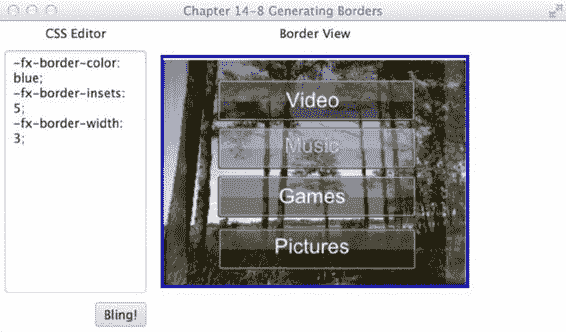

第 14 章 N JAVAFX 基础

**图 14-9.** *生成边框*

工作原理

JavaFX 能够像 Web 开发中的层叠样式表（CSS）一样对 JavaFX 节点进行样式设置（同样在配方 14-3 中演示过）。这个强大的 API 可以改变节点的背景颜色、字体、边框以及许多其他属性，本质上允许开发人员或设计人员使用 CSS 来为 GUI 控件设置外观。

本配方的解决方案允许用户在左侧文本区域输入 JavaFX CSS 样式，并通过点击 UI 上的“闪亮登场！”按钮，将样式应用于右侧显示的图片。根据节点的类型，可设置的样式存在一定限制。要查看所有样式选择器的完整列表，请参考 JavaFX CSS 参考指南：

[`docs.oracle.com/javase/8/javafx/api/javafx/scene/doc-files/cssref.html.`](http://docs.oracle.com/javase/8/javafx/api/javafx/scene/doc-files/cssref.html)

在应用 JavaFX CSS 样式的第一步中，你必须确定要设置样式的节点类型。当在不同节点类型上设置属性时，你会发现某些节点存在限制。在本配方中，目的是为 ImageView 对象添加边框。由于 ImageView 并非继承自 Region，因此它不包含边框样式属性。为了解决这个问题，只需创建一个 HBox 布局来包含 imageView，并将 JavaFX CSS 应用于 HBox。以下代码使用 setStyle() 方法将 JavaFX CSS 边框样式应用于水平框区域（HBox）：

String cssDefault = "-fx-border-color: blue;\n"

+ "-fx-border-insets: 5;\n"

+ "-fx-border-width: 3;\n"

+ "-fx-border-style: dashed;\n";

final ImageView imv = new ImageView();

...//

final HBox pictureRegion = new HBox();

pictureRegion.setStyle(cssDefault);

pictureRegion.getChildren().add(imv);

[www.it-ebooks.info](http://www.it-ebooks.info/)

第 14 章 N JAVAFX 基础

14-9\. 绑定表达式

问题

你想要同步两个值之间的变化。

解决方案

使用 javafx.beans.binding.* 和 javafx.beans.property.* 包来绑定变量。在绑定值或属性时，需要考虑多种场景。本配方演示了以下三种绑定策略：

u Java Bean 上的双向绑定

u 使用 Fluent API 的高级绑定

u 使用 javafx.beans.binding.* 绑定对象的低级绑定


以下代码是一个实现了这三种策略的控制台应用程序。该控制台应用程序将根据各种绑定场景输出属性值。第一个场景是字符串属性变量与领域对象（Contact）所拥有的字符串属性（例如 firstName 属性）之间的双向绑定。

下一个场景是使用流畅接口 API 进行高级绑定，用于计算矩形的面积。最后一个场景是使用低级绑定策略来计算球体的体积。高级绑定与低级绑定的区别在于，高级绑定使用 `multiply()` 和 `subtract()` 等方法，而不是运算符 `*` 和 `-`。使用低级绑定时，你需要使用派生的 `NumberBinding` 类，例如 `DoubleBinding` 类。通过 `DoubleBinding` 类，你可以重写其 `computeValue()` 方法，从而使用熟悉的运算符（如 `*` 和 `-`）来构建复杂的数学方程：

```java
package org.java8recipes.chapter14.recipe14_09;

import javafx.beans.binding.DoubleBinding;

import javafx.beans.binding.NumberBinding;

import javafx.beans.property.DoubleProperty;

import javafx.beans.property.IntegerProperty;

import javafx.beans.property.SimpleDoubleProperty;

import javafx.beans.property.SimpleIntegerProperty;

import javafx.beans.property.SimpleStringProperty;

import javafx.beans.property.StringProperty;

/**

* 配方 14-9：绑定表达式

* @author cdea

* 更新：J. Juneau

*/

public class BindingExpressions {

/**

* @param args 命令行参数

*/

public static void main(String[] args) {

System.out.println("第 14-9 章 绑定表达式\n");

[www.it-ebooks.info](http://www.it-ebooks.info/)

第 14 章 N JAVAFX 基础

System.out.println("绑定 Contact Bean [双向绑定]");

Contact contact = new Contact("John", "Doe");

StringProperty fname = new SimpleStringProperty();

fname.bindBidirectional(contact.firstNameProperty());

StringProperty lname = new SimpleStringProperty();

lname.bindBidirectional(contact.lastNameProperty());

System.out.println("当前 - StringProperty 值 : " + fname.getValue() + "

" + lname.getValue());

System.out.println("当前 - Contact 值 : " + contact.getFirstName() + "

" + contact.getLastName());

System.out.println("修改 StringProperty 值");

fname.setValue("Jane");

lname.setValue("Deer");

System.out.println("修改后 - StringProperty 值 : " + fname.getValue() + "

" + lname.getValue());

System.out.println("修改后 - Contact 值 : " + contact.getFirstName() + "

" + contact.getLastName());

System.out.println();

System.out.println("矩形的面积 [高级流畅接口 API]");

// 面积 = 宽度 * 高度

final IntegerProperty width = new SimpleIntegerProperty(10);

final IntegerProperty height = new SimpleIntegerProperty(10);

NumberBinding area = width.multiply(height);

System.out.println("当前 - 宽度和高度 : " + width.get() + " " + height.get()); System.out.println("当前 - 矩形的面积: " + area.getValue());

System.out.println("修改宽度和高度");

width.set(100);

height.set(700);

System.out.println("修改后 - 宽度和高度 : " + width.get() + " " + height.get()); System.out.println("修改后 - 矩形的面积: " + area.getValue());

System.out.println();

System.out.println("球体的体积 [低级 API]");

// 体积 = 4/3 * π * r³

final DoubleProperty radius = new SimpleDoubleProperty(2);

DoubleBinding volumeOfSphere = new DoubleBinding() {

{

super.bind(radius);

}

[www.it-ebooks.info](http://www.it-ebooks.info/)

第 14 章 N JAVAFX 基础

@Override

protected double computeValue() {

return (4 / 3 * Math.PI * Math.pow(radius.get(), 3));

}

};

System.out.println("当前 - 球体半径: " + radius.get());

System.out.println("当前 - 球体体积: " + volumeOfSphere.get()); System.out.println("修改 DoubleProperty 半径");

radius.set(50);

System.out.println("修改后 - 球体半径: " + radius.get());

System.out.println("修改后 - 球体体积: " + volumeOfSphere.get());

}

}

class Contact {


private SimpleStringProperty firstName = new SimpleStringProperty();

private SimpleStringProperty lastName = new SimpleStringProperty();

public Contact(String fn, String ln) {

firstName.setValue(fn);

lastName.setValue(ln);

}

public final String getFirstName() {

return firstName.getValue();

}

public StringProperty firstNameProperty() {

return firstName;

}

public final void setFirstName(String firstName) {

this.firstName.setValue(firstName);

}

public final String getLastName() {

return lastName.getValue();

}

public StringProperty lastNameProperty() {

return lastName;

}

public final void setLastName(String lastName) {

this.lastName.setValue(lastName);

}

}

[www.it-ebooks.info](http://www.it-ebooks.info/)

第 14 章 N JavaFX 基础

以下输出展示了三种绑定场景：

绑定一个 Contact Bean [双向绑定]

当前 - StringProperty 值 : John Doe

当前 - Contact 值 : John Doe

修改 StringProperty 值

之后 - StringProperty 值 : Jane Deer

之后 - Contact 值 : Jane Deer

矩形的面积 [高级流畅 API]

当前 - 宽度和高度 : 10 10

当前 - 矩形的面积: 100

修改宽度和高度

之后 - 宽度和高度 : 100 700

之后 - 矩形的面积: 70000

球体的体积 [低级 API]

当前 - 球体半径: 2.0

当前 - 球体体积: 25.132741228718345

修改 DoubleProperty 半径

之后 - 球体半径: 50.0

之后 - 球体体积: 392699.0816987241

工作原理

绑定意味着至少两个值正在同步。这意味着当一个依赖变量发生变化时，另一个变量也会随之改变。JavaFX 提供了许多绑定选项，使开发者能够同步领域对象和 GUI 控件中的属性。本示例演示了三种常见的绑定场景。

绑定变量最简单的方法之一是使用*双向绑定*。当领域对象包含将绑定到 GUI 表单的数据时，通常会使用这种场景。本示例创建了一个简单的联系人（Contact）对象，包含名字和姓氏。请注意使用 `SimpleStringProperty` 类的实例变量。许多以 `Property` 结尾的类都是 `javafx.beans.Observable` 类，它们都可以被绑定。为了使这些属性能够被绑定，它们必须是相同的数据类型。在前面的示例中，你在创建的 Contact 领域对象外部创建了类型为 `SimpleStringProperty` 的名字和姓氏变量。创建完成后，你通过双向绑定它们，使得任何一端的更改都能同步更新。因此，如果你更改了领域对象，其他绑定的属性也会更新。而当外部变量被修改时，领域对象的属性也会更新。以下演示了针对领域对象（Contact）上的字符串属性进行双向绑定：

Contact contact = new Contact("John", "Doe");

StringProperty fname = new SimpleStringProperty();

fname.bindBidirectional(contact.firstNameProperty());

StringProperty lname = new SimpleStringProperty();

lname.bindBidirectional(contact.lastNameProperty());

接下来是如何绑定数字。使用流畅 API（Fluent API）时，绑定数字非常简单。这种高级机制允许开发者绑定变量，通过简单的算术运算来计算值。基本上，一个公式被“绑定”后，会根据它所绑定的变量的变化来改变其结果。请查看 Javadoc（[`docs.oracle.com/javase/8/javafx/api/javafx/beans/binding/Bindings.html`](http://docs.oracle.com/javase/8/javafx/api/javafx/beans/binding/Bindings.html)）以了解所有可用的方法和数字类型。在这个例子中，你只需创建一个计算矩形面积的公式。

面积（NumberBinding）是绑定对象，它的依赖项是宽度和高度（IntegerProperty）。

364

[www.it-ebooks.info](http://www.it-ebooks.info/)

第 14 章 N JavaFX 基础


属性。当使用流式接口 API 进行绑定时，你会注意到`multiply()`方法。根据 Javadoc，所有属性类都继承自`NumberExpressionBase`类，该类包含了基于数字的流式接口 API。以下代码片段使用了流式接口 API：

// 面积 = 宽度 * 高度

final IntegerProperty width = new SimpleIntegerProperty(10);

final IntegerProperty height = new SimpleIntegerProperty(10);

NumberBinding area = width.multiply(height);

关于数字绑定的最后一种场景被视为一种更底层的实现方式。这允许开发者使用原始类型和更复杂的数学运算。这里，你使用`DoubleBinding`类来计算给定半径的球体体积。首先实现`computeValue()`方法来执行体积计算。

以下是通过重写`computeValue()`方法计算球体体积的底层绑定场景：  
final DoubleProperty radius = new SimpleDoubleProperty(2);

DoubleBinding volumeOfSphere = new DoubleBinding() {

{

super.bind(radius);

}

@Override

protected double computeValue() {

return (4 / 3 * Math.PI * Math.pow(radius.get(), 3));

}

};

14-10. 创建和使用可观察列表

问题

你想要创建一个包含两个列表视图控件的 GUI 应用程序，允许用户在两个列表之间传递项目。

解决方案

你可以利用 JavaFX 的`javafx.collections.ObservableList`和`javafx.scene.control.ListView`类，提供一种模型-视图-控制器（MVC）机制，每当后端列表被操作时，UI 的列表视图控件都会自动更新。

以下代码创建了一个包含两个列表的 GUI 应用程序，允许用户将一个列表中的项目发送到另一个列表。这里你将创建一个虚构的应用程序，用于挑选被视为英雄的候选人。用户从左侧列表中选择潜在的候选人，将其移动到右侧列表中以视为英雄。这展示了 UI 列表控件（`ListView`）与后端存储列表（`ObservableList`）同步的能力。

[www.it-ebooks.info](http://www.it-ebooks.info/)

第 14 章 JavaFX 基础

public void start(Stage primaryStage) {

primaryStage.setTitle("第 14-10 章 创建和使用可观察列表"); Group root = new Group();

Scene scene = new Scene(root, 400, 250, Color.WHITE);

// 创建一个网格面板

GridPane gridpane = new GridPane();

gridpane.setPadding(new Insets(5));

gridpane.setHgap(10);

gridpane.setVgap(10);

// 候选人标签

Label candidatesLbl = new Label("候选人");

GridPane.setHalignment(candidatesLbl, HPos.CENTER);

gridpane.add(candidatesLbl, 0, 0);

Label heroesLbl = new Label("英雄");

gridpane.add(heroesLbl, 2, 0);

GridPane.setHalignment(heroesLbl, HPos.CENTER);

// 候选人

final ObservableList<String> candidates = FXCollections.observableArrayList("超人",

"蜘蛛侠",

"金刚狼",

"警察",

"消防救援",

"士兵",

"爸爸妈妈",

"医生",

"政治家",

"牧师",

"教师");

final ListView<String> candidatesListView = new ListView<>(candidates);

candidatesListView.setPrefWidth(150);

candidatesListView.setPrefHeight(150);

gridpane.add(candidatesListView, 0, 1);

// 英雄

final ObservableList<String> heroes = FXCollections.observableArrayList();

final ListView<String> heroListView = new ListView<>(heroes);

heroListView.setPrefWidth(150);

heroListView.setPrefHeight(150);

gridpane.add(heroListView, 2, 1);

// 选择英雄

Button sendRightButton = new Button(">");

sendRightButton.setOnAction((e) -> {

String potential = candidatesListView.getSelectionModel().getSelectedItem();

[www.it-ebooks.info](http://www.it-ebooks.info/)

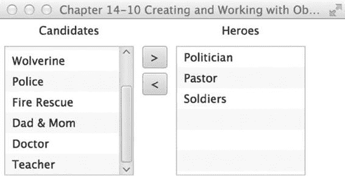

第 14 章 JavaFX 基础

if (potential != null) {

candidatesListView.getSelectionModel().clearSelection();

candidates.remove(potential);

heroes.add(potential);

}

});

// 取消选择英雄

Button sendLeftButton = new Button("<");

sendLeftButton.setOnAction((e) -> {

String notHero = heroListView.getSelectionModel().getSelectedItem();

if (notHero != null) {


heroListView.getSelectionModel().clearSelection();

heroes.remove(notHero);

candidates.add(notHero);

}

});

VBox vbox = new VBox(5);

vbox.getChildren().addAll(sendRightButton,sendLeftButton);

gridpane.add(vbox, 1, 1);

GridPane.setConstraints(vbox, 1, 1, 1, 2,HPos.CENTER, VPos.CENTER);

root.getChildren().add(gridpane);

primaryStage.setScene(scene);

primaryStage.show();

}

图 14-10 展示了英雄选择应用程序。

**图 14-10.** *ListView 与 ObservableList*

[www.it-ebooks.info](http://www.it-ebooks.info/)

第 14 章 JavaFX 基础

工作原理

在处理 Java 集合时，你会注意到有许多有用的容器类，它们代表了各种数据结构。一种常用的集合是 `java.util.ArrayList` 类。当构建包含 `ArrayList` 的领域对象的应用程序时，开发者可以轻松地操作集合中的对象。

但是，在过去，将 Java Swing 组件与集合结合使用是一个挑战，尤其是在更新 GUI 以反映领域对象的变化时。如何解决这个问题呢？JavaFX 的 `ObservableList` 来救场了！

说到救场，本示例演示了一个 GUI 应用程序，允许用户选择他们最喜欢的英雄。

这与通过从列表框组件中添加或删除项目来管理用户角色的应用程序屏幕非常相似。在 JavaFX 中，使用 `ListView` 控件来保存字符串对象。在创建 `ListView` 实例之前，会先创建包含候选列表的 `ObservableList`。在示例中，你会注意到使用了名为 `FXCollections` 的工厂类，你可以将常见的集合类型传入其中，这些集合会被包装并作为 `ObservableList` 返回给调用者。本示例传入了一个字符串数组而不是 `ArrayList`，希望你能理解如何使用 `FXCollections` 类。请务必明智地使用它：“能力越大，责任越大。”这行代码调用 `FXCollections` 类返回一个可观察列表（`ObservableList`）：`ObservableList<String> candidates = FXCollections.observableArrayList(...);`

创建 `ObservableList` 后，使用接收该可观察列表的构造函数实例化一个 `ListView` 类。以下是创建并填充 `ListView` 对象的代码：

`ListView<String> candidatesListView = new ListView<String>(candidates);`

最后，代码将像操作 `java.util.ArrayList` 一样操作 `ObservableList`。一旦操作完成，`ListView` 将收到通知并自动更新以反映 `ObservableList` 的变化。以下代码片段实现了当用户按下“发送到右侧”按钮时的事件处理器和动作事件：

```java
// 选择英雄
Button sendRightButton = new Button(">");
sendRightButton.setOnAction((e) -> {
    String potential = candidatesListView.getSelectionModel().getSelectedItem();
    if (potential != null) {
        candidatesListView.getSelectionModel().clearSelection();
        candidates.remove(potential);
        heroes.add(potential);
    }
});
```

在设置动作时，通过 lambda 表达式实现一个 `EventHandler` 来监听按钮按下事件。当按钮按下事件发生时，代码将确定 `ListView` 中哪个项目被选中。确定项目后，清除选择，移除该项目，并将该项目添加到英雄的 `ObservableList` 中。

14-11. 生成后台进程

问题

你想创建一个 GUI 应用程序，该应用程序使用后台处理模拟一个长时间运行的任务，同时向用户显示进度。

[www.it-ebooks.info](http://www.it-ebooks.info/)

第 14 章 JavaFX 基础

解决方案

创建一个典型的对话框应用程序，在后台复制文件时显示进度指示器。

以下是本示例中使用的主要类：

- `javafx.scene.control.ProgressBar`
- `javafx.scene.control.ProgressIndicator`
- `javafx.concurrent.Task` 类


以下源代码是一个模拟文件复制对话框的应用程序，用于显示进度指示器并执行后台进程：

package org.java8recipes.chapter14.recipe14_11;

import java.util.Random;

import javafx.application.Application;

import javafx.beans.value.ChangeListener;

import javafx.beans.value.ObservableValue;

import javafx.concurrent.Task;

import javafx.geometry.Pos;

import javafx.scene.Group;

import javafx.scene.Scene;

import javafx.scene.control.Button;

import javafx.scene.control.Label;

import javafx.scene.control.ProgressBar;

import javafx.scene.control.ProgressIndicator;

import javafx.scene.control.TextArea;

import javafx.scene.layout.BorderPane;

import javafx.scene.layout.HBox;

import javafx.scene.paint.Color;

import javafx.stage.Stage;

public class BackgroundProcesses extends Application {

static Task copyWorker;

final int numFiles = 30;

/**

* @param args 命令行参数

*/

public static void main(String[] args) {

Application.launch(args);

}

@Override

public void start(Stage primaryStage) {

primaryStage.setTitle("第 14 章-11 后台进程");

Group root = new Group();

Scene scene = new Scene(root, 330, 120, Color.WHITE);

[www.it-ebooks.info](http://www.it-ebooks.info/)

第 14 章 N JAVAFX 基础

BorderPane mainPane = new BorderPane();

mainPane.layoutXProperty().bind(scene.widthProperty().subtract(mainPane.widthProperty()).

divide(2));

root.getChildren().add(mainPane);

final Label label = new Label("文件传输：");

final ProgressBar progressBar = new ProgressBar(0);

final ProgressIndicator progressIndicator = new ProgressIndicator(0);

final HBox hb = new HBox();

hb.setSpacing(5);

hb.setAlignment(Pos.CENTER);

hb.getChildren().addAll(label, progressBar, progressIndicator);

mainPane.setTop(hb);

final Button startButton = new Button("开始");

final Button cancelButton = new Button("取消");

final TextArea textArea = new TextArea();

textArea.setEditable(false);

textArea.setPrefSize(200, 70);

final HBox hb2 = new HBox();

hb2.setSpacing(5);

hb2.setAlignment(Pos.CENTER);

hb2.getChildren().addAll(startButton, cancelButton, textArea);

mainPane.setBottom(hb2);

// 连接开始按钮

startButton.setOnAction((e) -> {

startButton.setDisable(true);

progressBar.setProgress(0);

progressIndicator.setProgress(0);

textArea.setText("");

cancelButton.setDisable(false);

copyWorker = createWorker(numFiles);

// 连接进度条

progressBar.progressProperty().unbind();

progressBar.progressProperty().bind(copyWorker.progressProperty());

progressIndicator.progressProperty().unbind();

progressIndicator.progressProperty().bind(copyWorker.progressProperty());

// 追加到文本框

copyWorker.messageProperty().addListener(new ChangeListener<String>() {

public void changed(ObservableValue<? extends String> observable, String oldValue, String newValue) {

textArea.appendText(newValue + "\n");

}

});

new Thread(copyWorker).start();

});

[www.it-ebooks.info](http://www.it-ebooks.info/)

第 14 章 N JAVAFX 基础

// 取消按钮将终止工作线程并重置。

cancelButton.setOnAction((e) -> {

startButton.setDisable(false);

cancelButton.setDisable(true);

copyWorker.cancel(true);

// 重置

progressBar.progressProperty().unbind();

progressBar.setProgress(0);

progressIndicator.progressProperty().unbind();

progressIndicator.setProgress(0);

textArea.appendText("文件传输已取消。");

});

primaryStage.setScene(scene);

primaryStage.show();

}

public Task createWorker(final int numFiles) {

return new Task() {

@Override

protected Object call() throws Exception {

for (int i = 0; i < numFiles; i++) {

long elapsedTime = System.currentTimeMillis();

copyFile("某个文件", "某个目标文件");

elapsedTime = System.currentTimeMillis() - elapsedTime;

String status = elapsedTime + " 毫秒";

// 排队更新状态

updateMessage(status);

updateProgress(i + 1, numFiles);

}

return true;

}

};

}

public void copyFile(String src, String dest) throws InterruptedException {

// 模拟长时间操作

Random rnd = new Random(System.currentTimeMillis());

long millis = rnd.nextInt(1000);

Thread.sleep(millis);

}

}


图 14-11 展示了“后台进程”应用程序，该程序模拟了一个文件复制窗口。

[www.it-ebooks.info](http://www.it-ebooks.info/)

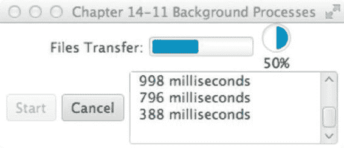

第 14 章 N JAVAFX 基础

**图 14-11.** *后台进程*

工作原理

GUI 开发的主要陷阱之一在于知道何时以及如何委派工作（线程）。你时常被提醒要注意线程安全，尤其是在阻塞 GUI 线程方面。使用 Java Swing API 时，必须实现 `SwingWorker` 对象，以便将非 GUI 工作从事件调度线程（EDT）中分离出来。类似的模式和原则在 JavaFX 世界中仍然适用。

首先，你创建的不是一个，而是两个进度控件来向用户展示正在进行的工作。一个是进度条，另一个是进度指示器。进度指示器会在指示器图标下方显示一个百分比。以下代码片段展示了进度控件的初始创建：

```java
final ProgressBar progressBar = new ProgressBar(0);
final ProgressIndicator progressIndicator = new ProgressIndicator(0);
```

接下来，你通过 `createWorker()` 方法创建一个工作线程。`createWorker()` 便捷方法会实例化并返回一个 `javafx.concurrent.Task` 对象，该对象类似于 Java Swing 的 `SwingWorker` 类。

与 `SwingWorker` 类不同，`Task` 对象被极大地简化且更易于使用。如果你对比上一个示例，会发现没有任何 GUI 控件被传入 `Task` 中。聪明的 JavaFX 团队创建了可观察的属性，允许你进行绑定。这促成了一种更偏向事件驱动的方式来处理工作（任务）。在创建 `Task` 对象实例时，你实现 `call()` 方法来在后台执行工作。在工作进行期间，你可能希望将中间结果（如进度或文本信息）加入队列。为此，你可以调用 `updateProgress()` 和 `updateMessage()` 方法。这些方法会以线程安全的方式更新信息，使得进度属性的观察者能够安全地更新 GUI，而不会阻塞 GUI 线程。以下代码片段演示了将消息和进度加入队列的能力：

```java
// 将状态加入队列
updateMessage(status);
updateProgress(i + 1, numFiles);
```

创建一个工作 `Task` 后，你解除任何先前绑定到进度控件的旧任务。一旦进度控件解除绑定，你就将进度控件绑定到新创建的名为 `copyWorker` 的 `Task` 对象上。此处展示的是用于将新的 `Task` 对象重新绑定到进度 UI 控件的代码：

```java
// 连接进度条
progressBar.progressProperty().unbind();
progressBar.progressProperty().bind(copyWorker.progressProperty());
progressIndicator.progressProperty().unbind();
progressIndicator.progressProperty().bind(copyWorker.progressProperty());
```

[www.it-ebooks.info](http://www.it-ebooks.info/)

第 14 章 N JAVAFX 基础

接下来，你实现一个 `ChangeListener` 来将队列中的结果追加到 `TextArea` 控件中。JavaFX 属性的另一个显著特点是，你可以像 Java Swing 组件一样附加多个监听器。

最后，工作线程和控件全部连接起来，以生成一个在后台运行的线程。以下代码行展示了如何启动一个 `Task` 工作对象：

```java
new Thread(copyWorker).start();
```

最后，“取消”按钮只需调用 `Task` 对象的 `cancel()` 方法来终止进程。一旦任务被取消，进度控件将被重置。工作 `Task` 被取消后无法重复使用。当按下“开始”按钮时，会重新创建一个新的 `Task`。如果你想要一个更健壮的解决方案，应该查看 `javafx.concurrent.Service` 类。以下代码行将取消一个 `Task` 工作对象：

```java
copyWorker.cancel(true);
```

14-12. 将键盘序列与应用程序关联

问题

你想为菜单选项创建键盘快捷键。

解决方案

创建一个使用 JavaFX 键组合 API 的应用程序。你将使用的主要类如下所示：
- `javafx.scene.input.KeyCode`
- `javafx.scene.input.KeyCodeCombination`
- `javafx.scene.input.KeyCombination`

以下源代码清单是一个应用程序，它显示了绑定到菜单项的可用键盘快捷键。当用户执行键盘快捷键时，应用程序会在屏幕上显示该键组合：

```java
public void start(Stage primaryStage) {
    primaryStage.setTitle("第 14-12 章 关联键盘序列");
    Group root = new Group();
    Scene scene = new Scene(root, 530, 300, Color.WHITE);
    final StringProperty statusProperty = new SimpleStringProperty();
    InnerShadow iShadow = new InnerShadow();
    iShadow.setOffsetX(3.5f);
    iShadow.setOffsetY(3.5f);
    final Text status = new Text();
    status.setEffect(iShadow);
    status.setX(100);
    status.setY(50);
    status.setFill(Color.LIME);
    status.setFont(Font.font(null, FontWeight.BOLD, 35));
    status.setTranslateY(50);
```

[www.it-ebooks.info](http://www.it-ebooks.info/)

第 14 章 N JAVAFX 基础

```java
    status.textProperty().bind(statusProperty);
    statusProperty.set("键盘快捷键 \nCtrl-N, \nCtrl-S, \nCtrl-X");
    root.getChildren().add(status);
    MenuBar menuBar = new MenuBar();
    menuBar.prefWidthProperty().bind(primaryStage.widthProperty());
    root.getChildren().add(menuBar);
    Menu menu = new Menu("文件");
    menuBar.getMenus().add(menu);
    MenuItem newItem = new MenuItem();
    newItem.setText("新建");
    newItem.setAccelerator(new KeyCodeCombination(KeyCode.N, KeyCombination.CONTROL_DOWN));
    newItem.setOnAction((e) -> {
        statusProperty.set("Ctrl-N");
    });
    menu.getItems().add(newItem);
    MenuItem saveItem = new MenuItem();
    saveItem.setText("保存");
    saveItem.setAccelerator(new KeyCodeCombination(KeyCode.S, KeyCombination.CONTROL_DOWN));
    saveItem.setOnAction((e) -> {
        statusProperty.set("Ctrl-S");
    });
    menu.getItems().add(saveItem);
    menu.getItems().add(new SeparatorMenuItem());
    MenuItem exitItem = new MenuItem();
    exitItem.setText("退出");
    exitItem.setAccelerator(new KeyCodeCombination(KeyCode.X, KeyCombination.CONTROL_DOWN));
    exitItem.setOnAction((e) -> {
        statusProperty.set("Ctrl-X");
    });
    menu.getItems().add(exitItem);
    primaryStage.setScene(scene);
    primaryStage.show();
}
```

图 14-12 展示了一个演示键盘快捷键的应用程序。

[www.it-ebooks.info](http://www.it-ebooks.info/)

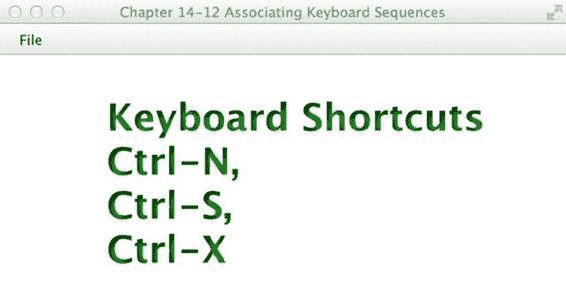

第 14 章 N JAVAFX 基础

**图 14-12.** *键盘序列/快捷键*

工作原理

本示例的解决方案演示了如何使用新的 `javafx.scene.input.KeyCodeCombination` 和 `javafx.scene.input.KeyCombination` 类创建键组合或键盘快捷键。考虑到上一个示例有点乏味，我们决定在这里让事情变得更有趣一些。本示例在用户执行键组合时，将 `Text` 节点显示到场景图上。在显示 `Text` 节点时，我们应用了内阴影效果。以下代码片段创建了一个带有内阴影效果的 `Text` 节点：

```java
InnerShadow iShadow = new InnerShadow();
iShadow.setOffsetX(3.5f);
iShadow.setOffsetY(3.5f);
final Text status = new Text();
status.setEffect(iShadow);
status.setX(100);
status.setY(50);
status.setFill(Color.LIME);
status.setFont(Font.font(null, FontWeight.BOLD, 35));
status.setTranslateY(50);
```

要创建键盘快捷键，你只需调用菜单或按钮控件的 `setAccelerator()` 方法。在本示例中，键组合是使用 `MenuItem` 节点的 `setAccelerator()` 方法设置的。以下代码行指定了 `Ctrl-N` 的键组合：

```java
MenuItem newItem = new MenuItem();
newItem.setText("新建");
newItem.setAccelerator(new KeyCodeCombination(KeyCode.N, KeyCombination.CONTROL_DOWN));
newItem.setOnAction((e) -> {
    statusProperty.set("Ctrl-N");
});
```

[www.it-ebooks.info](http://www.it-ebooks.info/)

第 14 章 N JAVAFX 基础


从代码中可以看出，当示例中的快捷键（组合键）被按下时，会触发 `onAction` 的 `ActionEvent`。它通过 lambda 表达式将 `statusProperty` 的值设置为 `Ctrl-N`。

14-13. 创建和使用表格

问题

你希望在 UI 表格控件中显示项目，类似于 Java Swing 的 `JTable` 组件。

解决方案

使用 JavaFX 的 `javafx.scene.control.TableView` 类创建一个应用程序。`TableView` 控件提供了与 Swing 的 `JTable` 组件等效的功能。

为了练习使用 `TableView` 控件，你将创建一个显示老板和员工的应用程序。左侧将实现一个包含老板的 `ListView` 控件，而员工（下属）将显示在右侧的 `TableView` 控件中。

以下是一个简单领域类（`Person`）的源代码，用于表示将在 `ListView` 或 `TableView` 控件中显示的老板或员工：

```java
package org.java7recipes.chapter15.recipe15_14;

import javafx.beans.property.SimpleStringProperty;

import javafx.beans.property.StringProperty;

import javafx.collections.FXCollections;

import javafx.collections.ObservableList;

public class Person {

    private StringProperty aliasName;

    private StringProperty firstName;

    private StringProperty lastName;

    private ObservableList<Person> employees = FXCollections.observableArrayList();

    public final void setAliasName(String value) {

        aliasNameProperty().set(value);

    }

    public final String getAliasName() {

        return aliasNameProperty().get();

    }

    public StringProperty aliasNameProperty() {

        if (aliasName == null) {

            aliasName = new SimpleStringProperty();

        }

        return aliasName;

    }

    public final void setFirstName(String value) {

        firstNameProperty().set(value);

    }

    public final String getFirstName() {

        return firstNameProperty().get();

    }

    public StringProperty firstNameProperty() {

        if (firstName == null) {

            firstName = new SimpleStringProperty();

        }

        return firstName;

    }

    public final void setLastName(String value) {

        lastNameProperty().set(value);

    }

    public final String getLastName() {

        return lastNameProperty().get();

    }

    public StringProperty lastNameProperty() {

        if (lastName == null) {

            lastName = new SimpleStringProperty();

        }

        return lastName;

    }

    public ObservableList<Person> employeesProperty() {

        return employees;

    }

    public Person(String alias, String firstName, String lastName) {

        setAliasName(alias);

        setFirstName(firstName);

        setLastName(lastName);

    }

}
```

以下是主应用程序代码。它左侧显示一个包含老板的列表视图组件，右侧显示一个包含员工的表格视图控件：

```java
public void start(Stage primaryStage) {

    primaryStage.setTitle("Chapter 14-13 Working with Tables");

    Group root = new Group();

    Scene scene = new Scene(root, 500, 250, Color.WHITE);

    // create a grid pane

    GridPane gridpane = new GridPane();

    gridpane.setPadding(new Insets(5));

    gridpane.setHgap(10);

    gridpane.setVgap(10);

    // candidates label

    Label candidatesLbl = new Label("Boss");

    GridPane.setHalignment(candidatesLbl, HPos.CENTER);

    gridpane.add(candidatesLbl, 0, 0);

    // List of leaders

    ObservableList<Person> leaders = getPeople();

    final ListView<Person> leaderListView = new ListView<>(leaders);

    leaderListView.setPrefWidth(150);

    leaderListView.setPrefHeight(150);

    // display first and last name with tooltip using alias

    leaderListView.setCellFactory(new Callback<ListView<Person>, ListCell<Person>>() {

        @Override

        public ListCell<Person> call(ListView<Person> param) {

            final Label leadLbl = new Label();

            final Tooltip tooltip = new Tooltip();

            final ListCell<Person> cell = new ListCell<Person>() {

                @Override

                public void updateItem(Person item, boolean empty) {

                    super.updateItem(item, empty);

                    if (item != null) {

                        leadLbl.setText(item.getAliasName());

                        setText(item.getFirstName() + " " + item.getLastName());

                        tooltip.setText(item.getAliasName());

                        setTooltip(tooltip);

                    }

                }

            }; // ListCell

            return cell;

        }

    }); // setCellFactory

    gridpane.add(leaderListView, 0, 1);
```


Label emplLbl = new Label("员工");

gridpane.add(emplLbl, 2, 0);

GridPane.setHalignment(emplLbl, HPos.CENTER);

final TableView<Person> employeeTableView = new TableView<>();

employeeTableView.setPrefWidth(300);

final ObservableList<Person> teamMembers = FXCollections.observableArrayList(); employeeTableView.setItems(teamMembers);

TableColumn<Person, String> aliasNameCol = new TableColumn<>("别名"); aliasNameCol.setEditable(true);

aliasNameCol.setCellValueFactory(new PropertyValueFactory("aliasName"));

aliasNameCol.setPrefWidth(employeeTableView.getPrefWidth() / 3);

[www.it-ebooks.info](http://www.it-ebooks.info/)

第 14 章 JavaFX 基础

TableColumn<Person, String> firstNameCol = new TableColumn<>("名字"); firstNameCol.setCellValueFactory(new PropertyValueFactory("firstName"));

firstNameCol.setPrefWidth(employeeTableView.getPrefWidth() / 3);

TableColumn<Person, String> lastNameCol = new TableColumn<>("姓氏"); lastNameCol.setCellValueFactory(new PropertyValueFactory("lastName"));

lastNameCol.setPrefWidth(employeeTableView.getPrefWidth() / 3);

employeeTableView.getColumns().setAll(aliasNameCol, firstNameCol, lastNameCol);

gridpane.add(employeeTableView, 2, 1);

// 选择监听

leaderListView.getSelectionModel().selectedItemProperty().addListener(

(ObservableValue<? extends Person> observable,

Person oldValue, Person newValue) -> {

if (observable != null && observable.getValue() != null) {

teamMembers.clear();

teamMembers.addAll(observable.getValue().employeesProperty());

}

});

root.getChildren().add(gridpane);

primaryStage.setScene(scene);

primaryStage.show();

}

以下代码展示了 WorkingWithTables 主应用程序类中包含的 getPeople() 方法。

该方法用于填充之前展示的 UI TableView 控件：

private ObservableList<Person> getPeople() {

ObservableList<Person> people = FXCollections.<Person>observableArrayList(); Person docX = new Person(“X 教授”, “查尔斯”, “泽维尔”);

docX.employeesProperty().add(new Person(“金刚狼”, “詹姆斯”, “豪利特”));

docX.employeesProperty().add(new Person(“镭射眼”, “斯科特”, “萨默斯”));

docX.employeesProperty().add(new Person(“暴风女”, “奥萝洛”, “门罗”));

Person magneto = new Person(“万磁王”, “马克斯”, “艾森哈特”);

magneto.employeesProperty().add(new Person(“红坦克”, “凯恩”, “马可”));

magneto.employeesProperty().add(new Person(“魔形女”, “瑞文”, “达克霍姆”));

magneto.employeesProperty().add(new Person(“剑齿虎”, “维克多”, “克里德”));

Person biker = new Person(“山地车手”, “乔纳森”, “詹尼克”);

biker.employeesProperty().add(new Person(“JavaJuneau”, “约书亚”, “朱诺”));

biker.employeesProperty().add(new Person(“弗雷迪”, “弗雷迪”, “吉姆”));

biker.employeesProperty().add(new Person(“马克”, “马克”, “比蒂”));

biker.employeesProperty().add(new Person(“约翰”, “约翰”, “奥康纳”));

biker.employeesProperty().add(new Person(“D-Man”, “卡尔”, “迪亚”));

[www.it-ebooks.info](http://www.it-ebooks.info/)

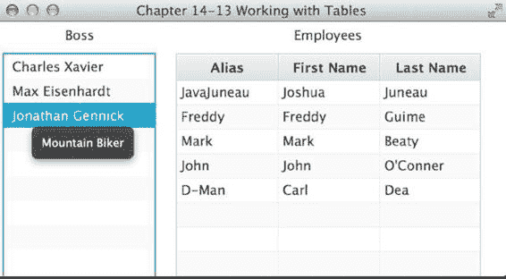

第 14 章 JavaFX 基础

people.add(docX);

people.add(magneto);

people.add(biker);

return people;

}

图 14-13 展示了演示 JavaFX TableView 控件的应用程序。

**图 14-13.** *使用表格*

工作原理

为了趣味性，我们创建了一个简单的图形用户界面来显示员工及其上级。在图 14-13 中，左侧是一个人员列表（即上级）。当用户选择一位上级时，其下属员工将显示在右侧的 TableView 区域中。您还会注意到，当鼠标悬停在所选上级上时会显示工具提示。

在考虑 TableView 控件之前，理解负责更新 TableView 的 ListView 非常重要。按照模型-视图模式，创建了一个包含所有上级的 ObservableList，用于 ListView 控件的构造函数。这段代码将上级称为 *leaders*。以下代码创建了一个 ListView 控件：

// 上级列表

ObservableList<Person> leaders = getPeople();


final ListView<Person> leaderListView = new ListView<Person>(leaders);

接下来，创建一个单元格工厂，以便在 ListView 控件中正确显示人员姓名。由于每个项目都是 Person 对象，ListView 不知道如何渲染 ListView 控件中的每一行。你只需通过指定 `ListView<Person>` 和 `ListCell<Person>` 数据类型，创建一个 `javafx.util.Callback` 泛型类型对象。如果你使用的是像 NetBeans 这样可靠的 IDE，它会预生成诸如实现方法 `call()` 之类的内容。接下来是 `call()` 方法中类型为 `ListCell<Person>` 的变量 `cell`，你可以在其中创建一个 lambda 表达式。该 lambda 表达式包含一个 `updateItem()` 方法的实现。要实现 `updateItem()` 方法，需要获取人员信息并更新 Label 控件（`leadLbl`）。最后，将工具提示设置为关联的文本。

[www.it-ebooks.info](http://www.it-ebooks.info/)

第 14 章 N JAVAFX 基础

然后，你创建一个 TableView 控件，用于显示基于从 ListView 中选择的老板的员工信息。

创建 TableView 时，首先创建列标题。使用以下代码创建表格列：`TableColumn<String> firstNameCol = new TableColumn<String>("First Name"); firstNameCol.setProperty("firstName");`

创建列后，你会注意到 `setProperty()` 方法，它负责调用 Person Bean 的属性。当员工列表被放入 TableView 时，它将知道如何提取属性以放置在表格的每个单元格中。

最后是在 JavaFX 中为 ListView 实现选择监听器，称为选择项属性（`selectionItemProperty`）。创建并添加一个 `ChangeListener` 来监听选择事件。当用户选择一个老板时，TableView 会被清空并填充该老板的员工信息。实际上，这是 `ObservableList` 的魔力，它通知 TableView 发生变化。要通过 `teamMembers`（`ObservableList`）变量填充 TableView，请使用以下代码：

teamMembers.clear();

teamMembers.addAll(observable.getValue().employeesProperty());

14-14\. 使用拆分视图组织 UI

问题

你想通过使用拆分分隔控件来分割 GUI 屏幕。

解决方案

使用 JavaFX 的拆分窗格控件。`javafx.scene.control.SplitPane` 类是一个 UI 控件，它允许你将屏幕分割成类似框架的区域。拆分控件允许用户使用鼠标移动任意两个拆分区域之间的分隔线。

以下是用于创建 GUI 应用程序的代码，该应用程序利用了 `javafx.scene.control.SplitPane` 类。该类将屏幕分为三个窗口区域。这三个窗口区域分别是左列、右上区域和右下区域。此外，还在三个区域中添加了 Text 节点。

public void start(Stage primaryStage) {

primaryStage.setTitle("第 14-14 章 使用拆分视图组织 UI");

Group root = new Group();

Scene scene = new Scene(root, 350, 250, Color.WHITE);

// 左侧和右侧拆分窗格

SplitPane splitPane = new SplitPane();

splitPane.prefWidthProperty().bind(scene.widthProperty());

splitPane.prefHeightProperty().bind(scene.heightProperty());

//List<Node> items = splitPane.getItems();

VBox leftArea = new VBox(10);

for (int i = 0; i < 5; i++) {

HBox rowBox = new HBox(20);

final Text leftText = new Text();

leftText.setText("左侧 " + i);

[www.it-ebooks.info](http://www.it-ebooks.info/)

第 14 章 N JAVAFX 基础

leftText.setTranslateX(20);

leftText.setFill(Color.BLUE);

leftText.setFont(Font.font(null, FontWeight.BOLD, 20));

rowBox.getChildren().add(leftText);

leftArea.getChildren().add(rowBox);

}

leftArea.setAlignment(Pos.CENTER);

// 上方和下方拆分窗格

SplitPane splitPane2 = new SplitPane();

splitPane2.setOrientation(Orientation.VERTICAL);

splitPane2.prefWidthProperty().bind(scene.widthProperty());

splitPane2.prefHeightProperty().bind(scene.heightProperty());

HBox centerArea = new HBox();

InnerShadow iShadow = new InnerShadow();

iShadow.setOffsetX(3.5f);


```markdown

iShadow.setOffsetY(3.5f);

final Text upperRight = new Text();

upperRight.setText("右上");

upperRight.setX(100);

upperRight.setY(50);

upperRight.setEffect(iShadow);

upperRight.setFill(Color.LIME);

upperRight.setFont(Font.font(null, FontWeight.BOLD, 35));

upperRight.setTranslateY(50);

centerArea.getChildren().add(upperRight);

HBox rightArea = new HBox();

final Text lowerRight = new Text();

lowerRight.setText("右下");

lowerRight.setX(100);

lowerRight.setY(50);

lowerRight.setEffect(iShadow);

lowerRight.setFill(Color.RED);

lowerRight.setFont(Font.font(null, FontWeight.BOLD, 35));

lowerRight.setTranslateY(50);

rightArea.getChildren().add(lowerRight);

splitPane2.getItems().add(centerArea);

splitPane2.getItems().add(rightArea);

// 添加左侧区域

splitPane.getItems().add(leftArea);

// 添加右侧区域

splitPane.getItems().add(splitPane2);

[www.it-ebooks.info](http://www.it-ebooks.info/)

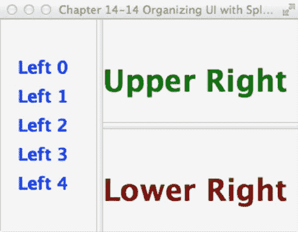

第 14 章 JavaFX 基础

// 均匀放置分隔条

ObservableList<SplitPane.Divider> dividers = splitPane.getDividers();

for (int i = 0; i < dividers.size(); i++) {

dividers.get(i).setPosition((i + 1.0) / 3);

}

HBox hbox = new HBox();

hbox.getChildren().add(splitPane);

root.getChildren().add(hbox);

primaryStage.setScene(scene);

primaryStage.show();

}

图 14-14 展示了使用分隔窗格控件的应用程序。

**图 14-14.** *分隔视图*

工作原理

如果你曾见过简单的 RSS 阅读器或 Javadocs，你会注意到屏幕被分隔条划分成多个区域。本示例创建了三个区域——左侧、右上和右下。

首先创建一个`SplitPane`，将场景的左侧区域与右侧区域分隔开。然后将其宽度和高度属性绑定到场景，这样当用户调整窗口大小时，各区域将占据可用空间。接着，创建一个代表左侧区域的`VBox`布局控件。在`VBox`（leftArea）中，通过循环生成一系列`Text`节点。接下来，生成分隔窗格的右侧部分。以下代码片段使分隔窗格控件（`SplitPane`）实现水平分割：

SplitPane splitPane = new SplitPane();

splitPane.prefWidthProperty().bind(scene.widthProperty());

splitPane.prefHeightProperty().bind(scene.heightProperty());

[www.it-ebooks.info](http://www.it-ebooks.info/)

第 14 章 JavaFX 基础

现在创建用于垂直分割区域的`SplitPane`，它将形成右上和右下区域。以下是垂直分割窗口区域的代码：

// 上下分隔窗格

SplitPane splitPane2 = new SplitPane();

splitPane2.setOrientation(Orientation.VERTICAL);

最后，组装分隔窗格并调整分隔条位置，使屏幕空间均匀分配。以下代码组装了分隔窗格，并遍历分隔条列表以更新其位置：

splitPane.getItems().add(splitPane2);

// 均匀放置分隔条

ObservableList<SplitPane.Divider> dividers = splitPane.getDividers();

for (int i = 0; i < dividers.size(); i++) {

dividers.get(i).setPosition((i + 1.0) / 3);

}

HBox hbox = new HBox();

hbox.getChildren().add(splitPane);

root.getChildren().add(hbox);

14-15. 向 UI 添加选项卡

问题

你想创建一个带有选项卡的 GUI 应用程序。

解决方案

使用 JavaFX 的选项卡和选项卡窗格控件。选项卡（`javafx.scene.control.Tab`）和选项卡窗格控件（`javafx.scene.control.TabPane`）类允许你将图形节点放置在各个选项卡中。

以下代码示例创建了一个简单的应用程序，其中包含允许用户选择选项卡方向的菜单选项。可用的选项卡方向包括顶部、底部、左侧和右侧。

public void start(Stage primaryStage) {

primaryStage.setTitle("第 14-15 章 向 UI 添加选项卡");

Group root = new Group();

Scene scene = new Scene(root, 400, 250, Color.WHITE);

TabPane tabPane = new TabPane();

MenuBar menuBar = new MenuBar();

EventHandler<ActionEvent> action = changeTabPlacement(tabPane);

Menu menu = new Menu("选项卡位置");

MenuItem left = new MenuItem("左侧");
```


[www.it-ebooks.info](http://www.it-ebooks.info/)

第 14 章 JavaFX 基础

left.setOnAction(action);

menu.getItems().add(left);

MenuItem right = new MenuItem("Right");

right.setOnAction(action);

menu.getItems().add(right);

MenuItem top = new MenuItem("Top");

top.setOnAction(action);

menu.getItems().add(top);

MenuItem bottom = new MenuItem("Bottom");

bottom.setOnAction(action);

menu.getItems().add(bottom);

menuBar.getMenus().add(menu);

BorderPane borderPane = new BorderPane();

// 生成 10 个标签页

for (int i = 0; i < 10; i++) {

Tab tab = new Tab();

tab.setText("Tab" + i);

HBox hbox = new HBox();

hbox.getChildren().add(new Label("Tab" + i));

hbox.setAlignment(Pos.CENTER);

tab.setContent(hbox);

tabPane.getTabs().add(tab);

}

// 添加标签窗格

borderPane.setCenter(tabPane);

// 绑定以占据可用空间

borderPane.prefHeightProperty().bind(scene.heightProperty());

borderPane.prefWidthProperty().bind(scene.widthProperty());

// 添加菜单栏

borderPane.setTop(menuBar);

// 添加边框布局

root.getChildren().add(borderPane);

primaryStage.setScene(scene);

primaryStage.show();

}

private EventHandler<ActionEvent> changeTabPlacement(final TabPane tabPane) {

return (ActionEvent event) -> {

MenuItem mItem = (MenuItem) event.getSource();

String side = mItem.getText();

[www.it-ebooks.info](http://www.it-ebooks.info/)

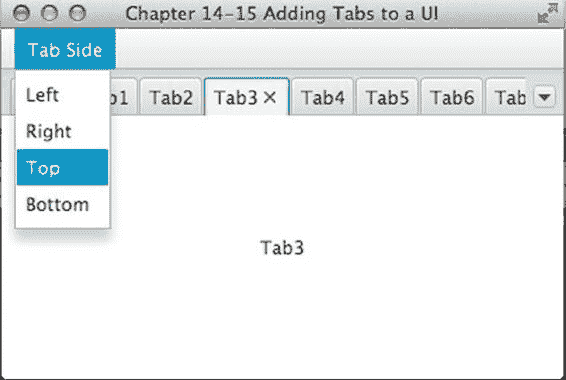

第 14 章 JavaFX 基础

if ("left".equalsIgnoreCase(side)) {

tabPane.setSide(Side.LEFT);

} else if ("right".equalsIgnoreCase(side)) {

tabPane.setSide(Side.RIGHT);

} else if ("top".equalsIgnoreCase(side)) {

tabPane.setSide(Side.TOP);

} else if ("bottom".equalsIgnoreCase(side)) {

tabPane.setSide(Side.BOTTOM);

}

};

}

图 14-15 展示了标签页应用程序，该程序允许用户更改标签页的方向。

**图 14-15.** *TabPane*

工作原理

当您使用 TabPane 控件时，可能已经知道希望标签页以何种方向显示。

此应用程序允许您通过左、右、上、下菜单选项来设置方向。

如果您熟悉 Swing API，可能会注意到 JavaFX 的 TabPane 与 Swing 的 JTabbedPanel 非常相似。您只需添加`javafx.scene.control.Tab`实例，而不是添加 JPanel。以下代码片段将 Tab 控件添加到 TabPane 控件中：

TabPane tabPane = new TabPane();

Tab tab = new Tab();

tab.setText("Tab" + i);

tabPane.getTabs().add(tab);

当您更改 TabPane 控件的方向时，请使用`setSide()`方法。以下代码设置了 TabPane 控件的方向：

tabPane.setSide(Side.BOTTOM);

[www.it-ebooks.info](http://www.it-ebooks.info/)

第 14 章 JavaFX 基础

在本方案中，使用了一个 Menu 来更改 TabPane 控件的方向。不同的方向被分配给 Menu 的不同 MenuItem 节点，并定义了一个名为`changeTabPlacement`的 EventHandler，用于在选择不同 MenuItem 时更改方向。该 EventHandler 通过检查 MenuItem 的文本来确定应对 TabPane 应用哪种方向。

14-16. 开发对话框

问题

您希望创建一个包含对话框的应用程序，该对话框包含一些供用户输入的文本字段。

解决方案

使用 JavaFX 的舞台（`javafx.stage.Stage`）和场景（`javafx.scene.Scene`）API 来创建对话框。

以下源代码列出了一个模拟更改密码对话框的应用程序。该应用程序包含用于弹出对话框的菜单选项。除了使用菜单选项外，用户还可以设置对话框的模态状态（modality）。

public class DevelopingADialog extends Application {

static Stage LOGIN_DIALOG;

static int dx = 1;

static int dy = 1;

/**

* @param args 命令行参数

*/

public static void main(String[] args) {

Application.launch(args);

}

private static Stage createLoginDialog(Stage parent, boolean modal) {

if (LOGIN_DIALOG != null) {

LOGIN_DIALOG.close();

}

return new MyDialog(parent, modal, "Welcome to JavaFX!");

}

@Override

public void start(final Stage primaryStage) {


primaryStage.setTitle("第 14-16 章 开发一个对话框");

Group root = new Group();

Scene scene = new Scene(root, 433, 312, Color.WHITE);

MenuBar menuBar = new MenuBar();

menuBar.prefWidthProperty().bind(primaryStage.widthProperty());

Menu menu = new Menu("主页");

[www.it-ebooks.info](http://www.it-ebooks.info/)

第 14 章 N JAVAFX 基础

// 添加更改密码菜单项

MenuItem newItem = new MenuItem("更改密码", null);

newItem.setOnAction((ActionEvent event) -> {

if (LOGIN_DIALOG == null) {

LOGIN_DIALOG = createLoginDialog(primaryStage, true);

}

LOGIN_DIALOG.sizeToScene();

LOGIN_DIALOG.show();

});

menu.getItems().add(newItem);

// 添加分隔符

menu.getItems().add(new SeparatorMenuItem());

// 添加非模态菜单项

ToggleGroup modalGroup = new ToggleGroup();

RadioMenuItem nonModalItem = new RadioMenuItem();

nonModalItem.setToggleGroup(modalGroup);

nonModalItem.setText("非模态");

nonModalItem.setSelected(true);

nonModalItem.setOnAction((ActionEvent event) -> {

LOGIN_DIALOG = createLoginDialog(primaryStage, false);

});

menu.getItems().add(nonModalItem);

// 添加模态选择

RadioMenuItem modalItem = new RadioMenuItem();

modalItem.setToggleGroup(modalGroup);

modalItem.setText("模态");

modalItem.setSelected(true);

modalItem.setOnAction((ActionEvent event) -> {

LOGIN_DIALOG = createLoginDialog(primaryStage, true);

});

menu.getItems().add(modalItem);

// 添加分隔符

menu.getItems().add(new SeparatorMenuItem());

// 添加退出

MenuItem exitItem = new MenuItem("退出", null);

exitItem.setMnemonicParsing(true);

exitItem.setAccelerator(new KeyCodeCombination(KeyCode.X, KeyCombination.CONTROL_DOWN)); exitItem.setOnAction((ActionEvent event) -> {

Platform.exit();

});

menu.getItems().add(exitItem);

[www.it-ebooks.info](http://www.it-ebooks.info/)

第 14 章 N JAVAFX 基础

// 添加菜单

menuBar.getMenus().add(menu);

// 菜单栏添加到窗口

root.getChildren().add(menuBar);

primaryStage.setScene(scene);

primaryStage.show();

addBouncyBall(scene);

}

private void addBouncyBall(final Scene scene) {

final Circle ball = new Circle(100, 100, 20);

RadialGradient gradient1 = new RadialGradient(0,

.1,

100,

100,

20,

false,

CycleMethod.NO_CYCLE,

new Stop(0, Color.RED),

new Stop(1, Color.BLACK));

ball.setFill(gradient1);

final Group root = (Group) scene.getRoot();

root.getChildren().add(ball);

Timeline tl = new Timeline();

tl.setCycleCount(Animation.INDEFINITE);

KeyFrame moveBall = new KeyFrame(Duration.seconds(.0200), (ActionEvent event) -> {

double xMin = ball.getBoundsInParent().getMinX();

double yMin = ball.getBoundsInParent().getMinY();

double xMax = ball.getBoundsInParent().getMaxX();

double yMax = ball.getBoundsInParent().getMaxY();

// 碰撞检测 - 边界

if (xMin < 0 || xMax > scene.getWidth()) {

dx = dx * -1;

}

if (yMin < 0 || yMax > scene.getHeight()) {

dy = dy * -1;

}

ball.setTranslateX(ball.getTranslateX() + dx);

ball.setTranslateY(ball.getTranslateY() + dy);

});

[www.it-ebooks.info](http://www.it-ebooks.info/)

第 14 章 N JAVAFX 基础

tl.getKeyFrames().add(moveBall);

tl.play();

}

}

class MyDialog extends Stage {

public MyDialog(Stage owner, boolean modality, String title) {

super();

initOwner(owner);

Modality m = modality ? Modality.APPLICATION_MODAL : Modality.NONE;

initModality(m);

setOpacity(.90);

setTitle(title);

Group root = new Group();

Scene scene = new Scene(root, 250, 150, Color.WHITE);

setScene(scene);

GridPane gridpane = new GridPane();

gridpane.setPadding(new Insets(5));

gridpane.setHgap(5);

gridpane.setVgap(5);

Label mainLabel = new Label("输入用户名和密码");

gridpane.add(mainLabel, 1, 0, 2, 1);

Label userNameLbl = new Label("用户名: ");

gridpane.add(userNameLbl, 0, 1);

Label passwordLbl = new Label("密码: ");

gridpane.add(passwordLbl, 0, 2);

// 用户名字段

final TextField userNameFld = new TextField("管理员");

gridpane.add(userNameFld, 1, 1);

// 密码字段

final PasswordField passwordFld = new PasswordField();

passwordFld.setText("drowssap");

gridpane.add(passwordFld, 1, 2);

Button login = new Button("更改");

login.setOnAction((ActionEvent event) -> {

close();

});

gridpane.add(login, 1, 3);


GridPane.setHalignment(login, HPos.RIGHT);

root.getChildren().add(gridpane);

}

}

[www.it-ebooks.info](http://www.it-ebooks.info/)

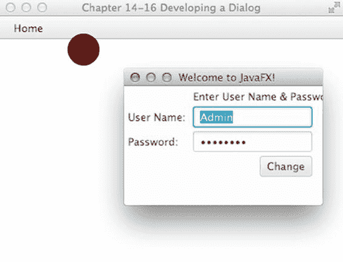

第 14 章 JavaFX 基础

图 14-16 展示了启用非模态选项后的修改密码对话框应用程序。

**图 14-16.** *开发一个对话框*

工作原理

为了创建对话框，JavaFX 使用了 `javafx.stage.Stage` 类的另一个实例来向用户显示。与 Swing 中继承 `JDialog` 类类似，你只需继承 `Stage` 类即可。你可以在构造函数中传入所属窗口，然后调用 `initOwner()` 方法。对话框的模态状态可以通过 `initModality()` 方法设置。以下类继承自 `Stage` 类，其构造函数初始化了所属舞台和模态状态：

class MyDialog extends Stage {

public MyDialog(Stage owner, boolean modality, String title) {

super();

initOwner(owner);

Modality m = modality ? Modality.APPLICATION_MODAL : Modality.NONE;

initModality(m);

...// 类的其余部分

其余代码创建了一个场景（Scene），与主应用程序的 `start()` 方法类似。由于登录表单相当乏味，我们决定在用户在对话框中忙于修改密码时，创建一个弹跳球的动画。（你将在后续的配方中看到更多关于创建动画的内容。）391

[www.it-ebooks.info](http://www.it-ebooks.info/)

第 14 章 JavaFX 基础

当选择“修改密码”菜单项时，`createLoginDialog` 方法会检查是否已有 `MyDialog` 的实例被实例化。如果有，则关闭该实例并生成一个新的实例。然后显示新创建的对话框。类似地，`RadioMenuItem` 控件会调用 `createLoginDialog` 方法，传入不同的布尔值，以指示实例化的 `MyDialog` 实例是否应设置为模态。如前所述，弹跳球与对话框无关；它只是为了增加效果而添加的。

14-17. 使用 JavaFX 打印

问题

你希望能够在应用程序场景图中打印指定节点。

解决方案

利用 JavaFX 8 新增的 JavaFX 打印 API 来打印指定节点，并构建复杂的打印对话框。

在本解决方案中，生成了一个用于绘图的 JavaFX 应用程序。该绘图应用程序允许你通过“打印”按钮打印画布。当调用“打印”按钮时，会打开一个对话框，提供打印机和布局选择等打印选项。

以下代码用于构建应用程序舞台，包括所有按钮和绘图功能。第一个类不包含任何打印逻辑——你将在后面看到——展示这些源代码是为了让你更容易跟随示例。

public class PrintingWithJavaFX extends Application {

static Stage PRINT_DIALOG;

/**

* @param args 命令行参数

*/

public static void main(String[] args) {

Application.launch(PrintingWithJavaFX.class, args);

}

private static Stage createPrintDialog(Stage parent, boolean modal, Canvas node) {

if (PRINT_DIALOG != null) {

PRINT_DIALOG.close();

}

// 复制画布

WritableImage wim = new WritableImage(300, 300);

node.snapshot(null, wim);

ImageView iv = new ImageView();

iv.setImage(wim);

return new PrintDialog(parent, modal, "打印菜单", iv);

}

@Override

public void start(Stage primaryStage) {

StackPane root = new StackPane();

Canvas canvas = new Canvas(300, 300);

final GraphicsContext graphicsContext = canvas.getGraphicsContext2D();

[www.it-ebooks.info](http://www.it-ebooks.info/)

第 14 章 JavaFX 基础

final Button printButton = new Button("打印");

final BooleanProperty printingProperty = new SimpleBooleanProperty(false);

printButton.setOnAction(actionEvent-> {

printingProperty.set(true);

if (PRINT_DIALOG == null) {

PRINT_DIALOG = createPrintDialog(primaryStage, true, canvas);

}

PRINT_DIALOG.sizeToScene();

PRINT_DIALOG.show();

});

printButton.setTranslateX(3);


final Button resetButton = new Button("Reset");

resetButton.setOnAction(actionEvent-> {

graphicsContext.clearRect(1, 1,

graphicsContext.getCanvas().getWidth()-2,

graphicsContext.getCanvas().getHeight()-2);

});

resetButton.setTranslateX(10);

// 设置画笔颜色选择器

ChoiceBox colorChooser = new ChoiceBox(FXCollections.observableArrayList(

"Black", "Blue", "Red", "Green", "Brown", "Orange")

);

// 默认选中第一个选项

colorChooser.getSelectionModel().selectFirst();

colorChooser.getSelectionModel().selectedIndexProperty().addListener(

(ChangeListener)(ov, old, newval) -> {

Number idx = (Number)newval;

Color newColor;

switch(idx.intValue()){

case 0: newColor = Color.BLACK;

break;

case 1: newColor = Color.BLUE;

break;

case 2: newColor = Color.RED;

break;

case 3: newColor = Color.GREEN;

break;

case 4: newColor = Color.BROWN;

break;

case 5: newColor = Color.ORANGE;

break;

default: newColor = Color.BLACK;

break;

}

graphicsContext.setStroke(newColor);

});

colorChooser.setTranslateX(5);

[www.it-ebooks.info](http://www.it-ebooks.info/)

第 14 章 N JAVAFX 基础

ChoiceBox sizeChooser = new ChoiceBox(FXCollections.observableArrayList(

"1", "2", "3", "4", "5")

);

// 默认选中第一个选项

sizeChooser.getSelectionModel().selectFirst();

sizeChooser.getSelectionModel().selectedIndexProperty().addListener(

(ChangeListener)(ov, old, newval) -> {

Number idx = (Number)newval;

switch(idx.intValue()){

case 0: graphicsContext.setLineWidth(1);

break;

case 1: graphicsContext.setLineWidth(2);

break;

case 2: graphicsContext.setLineWidth(3);

break;

case 3: graphicsContext.setLineWidth(4);

break;

case 4: graphicsContext.setLineWidth(5);

break;

default: graphicsContext.setLineWidth(1);

break;

}

});

sizeChooser.setTranslateX(5);

canvas.addEventHandler(MouseEvent.MOUSE_PRESSED, (MouseEvent event) -> {

graphicsContext.beginPath();

graphicsContext.moveTo(event.getX(), event.getY());

graphicsContext.stroke();

});

canvas.addEventHandler(MouseEvent.MOUSE_DRAGGED, (MouseEvent event) -> {

graphicsContext.lineTo(event.getX(), event.getY());

graphicsContext.stroke();

});

canvas.addEventHandler(MouseEvent.MOUSE_RELEASED, (MouseEvent event) -> {

});

HBox buttonBox = new HBox();

buttonBox.getChildren().addAll(printButton, colorChooser, sizeChooser, resetButton);

initDraw(graphicsContext, canvas.getLayoutX(), canvas.getLayoutY());

BorderPane container = new BorderPane();

container.setTop(buttonBox);

container.setCenter(canvas);

[www.it-ebooks.info](http://www.it-ebooks.info/)

第 14 章 N JAVAFX 基础

root.getChildren().add(container);

Scene scene = new Scene(root, 400, 400);

primaryStage.setTitle("配方 14-17：从 JavaFX 打印");

primaryStage.setScene(scene);

primaryStage.show();

}

private void initDraw(GraphicsContext gc, double x, double y){

double canvasWidth = gc.getCanvas().getWidth();

double canvasHeight = gc.getCanvas().getHeight();

gc.fill();

gc.strokeRect(

x, // 左上角 x 坐标

y, // 左上角 y 坐标

canvasWidth, // 矩形宽度

canvasHeight); // 矩形高度

//gc.setFill(Color.RED);

//gc.setStroke(Color.BLUE);

//gc.setLineWidth(1);

}

}

接下来，你将查看创建 `PrintDialog` 类的源代码，该类包含应用程序的所有打印逻辑。当用户按下“打印”按钮时，对话框会打开。它包含一些使用 JavaFX 打印 API 的节点。

class PrintDialog extends Stage {

public PrintDialog(Stage owner, boolean modality, String title, Node printNode) {

super();

initOwner(owner);

Modality m = modality ? Modality.APPLICATION_MODAL : Modality.NONE;

initModality(m);

setOpacity(.90);

setTitle(title);

Group root = new Group();

Scene scene = new Scene(root, 450, 150, Color.WHITE);

setScene(scene);

GridPane gridpane = new GridPane();

gridpane.setPadding(new Insets(5));

gridpane.setHgap(5);

gridpane.setVgap(5);

Label printerLabel = new Label("打印机：");

gridpane.add(printerLabel, 0, 1);

Label layoutLabel = new Label("布局：");

gridpane.add(layoutLabel, 0, 2);

[www.it-ebooks.info](http://www.it-ebooks.info/)

第 14 章 N JAVAFX 基础


final Printer selectedPrinter = Printer.getDefaultPrinter();

// 打印机选择列表

ChoiceBox printerChooser = new ChoiceBox(FXCollections.observableArrayList(

Printer.getAllPrinters())

);

// 默认选中第一个选项

printerChooser.getSelectionModel().selectFirst();

gridpane.add(printerChooser, 1, 1);

ChoiceBox layoutChooser = new ChoiceBox(FXCollections.observableArrayList(

"纵向", "横向")

);

layoutChooser.getSelectionModel().selectFirst();

layoutChooser.getSelectionModel().selectedIndexProperty().addListener(

(ChangeListener)(ov, old, newval) -> {

Number idx = (Number)newval;

switch(idx.intValue()){

case 0: selectedPrinter.createPageLayout(Paper.A0, PageOrientation.

PORTRAIT, Printer.MarginType.EQUAL);

break;

case 1: selectedPrinter.createPageLayout(Paper.A0, PageOrientation.

LANDSCAPE, Printer.MarginType.EQUAL);

break;

default: selectedPrinter.createPageLayout(Paper.A0, PageOrientation.

PORTRAIT, Printer.MarginType.EQUAL);

break;

}

});

gridpane.add(layoutChooser,1,2);

Button printButton = new Button("打印");

printButton.setOnAction((ActionEvent event) -> {

print(printNode, selectedPrinter);

});

gridpane.add(printButton, 0, 3);

GridPane.setHalignment(printButton, HPos.RIGHT);

root.getChildren().add(gridpane);

}

public void print(final Node node, Printer printer) {

PrinterJob job = PrinterJob.createPrinterJob();

job.setPrinter(printer);

if (job != null) {

boolean success = job.printPage(node);

if (success) {

job.endJob();

}

}

}

}

[www.it-ebooks.info](http://www.it-ebooks.info/)

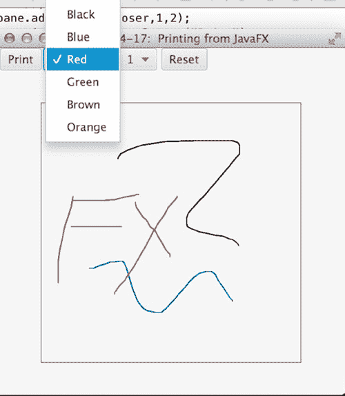

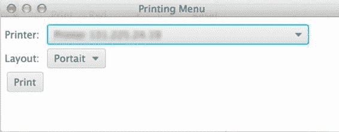

第 14 章 N JAVAFX 基础

图 14-17 展示了该应用程序。画布（绘图区域）内的区域通过对话框进行打印（见图 14-18）。

**图 14-17.** *具有打印功能的 JavaFX 绘图应用程序*

**图 14-18.** *利用 JavaFX 打印 API 打印菜单*

[www.it-ebooks.info](http://www.it-ebooks.info/)

第 14 章 N JAVAFX 基础

工作原理

在 JavaFX 8 之前的版本中，没有用于打印应用程序舞台部分内容的标准 API。在 JavaFX 8 中，新增了一个打印 API，用于标准化打印功能的处理方式。该 API 还使得仅用少量代码即可为应用程序启用打印功能变得简单。该 API 相当庞大，包含多个类，但使用起来非常直观且易于上手。

要为指定节点启用打印功能，首先需要使用 `javafx.print.PrinterJob` 类，因为它包含了生成一个非常简单的打印任务所需的所有功能。要将节点发送到系统默认打印机，只需调用 `PrintJob.createPrinterJob()` 来返回一个 `PrinterJob` 对象。返回该对象后，检查其是否不为 null，然后调用其 `printPage()` 方法，并传入要打印的节点。包含此功能的解决方案代码片段如下所示：public void print(final Node node, Printer printer) {

PrinterJob job = PrinterJob.createPrinterJob()

job.setPrinter(printer);

if (job != null) {

boolean success = job.printPage(node);

if (success) {

job.endJob();

}

}

}

虽然使用 `PrinterJob` 即可将节点发送到打印机，但该 API 还允许进行更多自定义设置。表 14-3 列出了 API 中可用的不同类，并简要说明了它们的功能。

**表 14-3.** *JavaFX 打印 API*

**类名**

**描述**

JobSettings

封装打印作业的设置

PageLayout

封装布局设置

PrintRange

用于选择打印范围或约束打印页面

Paper

封装打印机的纸张尺寸

PaperSource

用于纸张的进纸托盘

Printer

表示打印作业的目标设备

PrinterAttributes

封装打印机的属性

PrinterJob

用于调用 JavaFX 场景图打印

PrintResolution

表示支持的设备分辨率


在示例中，生成了一个打印对话框，允许用户选择将打印作业发送到何处。它还提供了用于选择所需打印布局（纵向或横向）的控件。可以调用 `Printer.getDefaultPrinter()` 方法返回主机的默认打印机。在示例中，通过调用 `Printer.getAllPrinters()` 方法，使用 `ChoiceBox` 显示主机上所有可用的打印机。然后，在 `print` 方法中，将选定的打印机设置到 `PrinterJob` 上，该方法将所需的节点发送到该打印机。

[www.it-ebooks.info](http://www.it-ebooks.info/)

第 14 章 N JAVAFX 基础

打印布局通过另一个 `ChoiceBox` 选择，当选择布局时，所选打印机的选项会更新。以下代码行演示了如何为选定的打印将布局设置为 `PageOrientation.PORTRAIT`：

`selectedPrinter.createPageLayout(Paper.A0, PageOrientation.PORTRAIT, Printer.MarginType.EQUAL);` 任何节点都可以发送到 `PrinterJob`，但重要的是发送要打印的节点的副本，因为打印任务可能会修改该节点。

打印 API 虽然庞大，但易于理解。本示例仅触及了该 API 可能性的表面。我们建议您在准备好开发自己的打印流程后，阅读 Javadoc 以获取更多详细信息。不过，本示例应能提供如何入门的基本理解。请参阅以下 Javadoc 链接：[`docs.oracle.com/javase/8/javafx/api/javafx/print/package-summary.html`](http://docs.oracle.com/javase/8/javafx/api/javafx/print/package-summary.html)。

14-18. 在 JavaFX 中嵌入 Swing 内容

问题

您希望将一些简单的 Java Swing 内容嵌入到 JavaFX 应用程序中。

解决方案

创建一个 JavaFX 应用程序，并使用 `SwingNode` 类将 Swing 内容嵌入其中。在以下示例中，一个简单的 JavaFX 应用程序用于在基于 Swing 的用户输入表单和基于 JavaFX 的表单之间切换。

应用程序中的 JavaFX 按钮可用于确定用户点击时应显示哪个表单。

首先，让我们看一下嵌入到 JavaFX 应用程序中的 Swing 表单的代码。该代码位于名为 `SwingForm.java` 的类中。

```java
import java.awt.GridLayout;
import javax.swing.JLabel;
import javax.swing.JPanel;
import javax.swing.JTextField;

public class SwingForm extends JPanel {
    JLabel formTitle, first, last, buttonLbl;
    protected JTextField firstField, lastField;

    public SwingForm(){
        JPanel innerPanel = new JPanel();
        GridLayout gl = new GridLayout(3,2);
        innerPanel.setLayout(gl);
        first = new JLabel("First Name:");
        innerPanel.add(first);
        firstField = new JTextField(10);
        innerPanel.add(firstField);
```

[www.it-ebooks.info](http://www.it-ebooks.info/)

第 14 章 N JAVAFX 基础

```java
        last = new JLabel("Last Name:");
        innerPanel.add(last);
        lastField = new JTextField(10);
        innerPanel.add(lastField);
        JButton button = new JButton("Submit");
        button.addActionListener((event) -> {
            Platform.runLater(()-> {
                UserEntryForm.fxLabel.setText("Message from Swing form...");
            });
        });
        buttonLbl = new JLabel("Click Me:");
        innerPanel.add(buttonLbl);
        innerPanel.add(button);
        add(innerPanel);
    }
}
```

接下来，让我们看一下用于创建图形用户界面的 JavaFX 代码，包括切换按钮和 JavaFX 表单。请注意，Swing 表单是使用 `SwingNode` 对象嵌入的。

```java
public class UserEntryForm extends Application {
    private static ToggleButton fxbutton;
    private static GridPane grid;
    public static Label fxLabel;

    @Override
    public void start(Stage stage) {
        final SwingNode swingNode = new SwingNode();
        createSwingContent(swingNode);
        BorderPane pane = new BorderPane();
        Image fxButtonIcon = new Image(
            getClass().getResourceAsStream("images/duke1.gif"));
        String buttonText = "Use Swing Form";
        fxbutton = new ToggleButton(buttonText, new ImageView(fxButtonIcon));
        fxbutton.setTooltip(
            new Tooltip("This button chooses between the Swing and FX form"));
```


fxbutton.setStyle("-fx-font: 22 arial; -fx-base: #cce6ff;");

fxbutton.setAlignment(Pos.CENTER);

fxbutton.setOnAction((event)->{

ToggleButton toggle = (ToggleButton) event.getSource();

if(!toggle.isSelected()){

swingNode.setDisable(true);

swingNode.setVisible(false);

grid.setDisable(false);

grid.setVisible(true);

fxbutton.setText("使用 Swing 表单");

} else {

swingNode.setDisable(false);

swingNode.setVisible(true);

grid.setDisable(true);

[www.it-ebooks.info](http://www.it-ebooks.info/)

第 14 章 N JAVAFX 基础

grid.setVisible(false);

fxbutton.setText("使用 JavaFX 表单");

}

});

// 默认禁用 SwingNode

swingNode.setVisible(false);

Text appTitle = new Text("Swing/FX 表单演示");

appTitle.setFont(Font.font("Tahoma", FontWeight.NORMAL, 20));

pane.setTop(appTitle);

HBox formPanel = new HBox();

formPanel.setSpacing(10);

fxLabel = new Label("来自 JavaFX 表单的消息...");

formPanel.getChildren().addAll(fxFormContent(), swingNode);

pane.setCenter(formPanel);

VBox vbox = new VBox();

vbox.getChildren().addAll(fxbutton, fxLabel);

pane.setBottom(vbox);

Scene scene = new Scene(pane, 700, 500);

stage.setScene(scene);

stage.setTitle("嵌入在 JavaFX 中的 Swing 表单");

stage.show();

}

private void createSwingContent(final SwingNode swingNode) {

SwingUtilities.invokeLater(() -> {

swingNode.setContent(new SwingForm());

});

}

private GridPane fxFormContent() {

grid = new GridPane();

grid.setAlignment(Pos.CENTER);

grid.setHgap(10);

grid.setVgap(10);

grid.setPadding(new Insets(25, 25, 25, 25));

Text scenetitle = new Text("输入用户");

scenetitle.setFont(Font.font("Tahoma", FontWeight.NORMAL, 20));

grid.add(scenetitle, 0, 0, 2, 1);

Label first = new Label("名:");

grid.add(first, 0, 1);

TextField firstField = new TextField();

grid.add(firstField, 1, 1);

Label last = new Label("姓:");

grid.add(last, 0, 2);

[www.it-ebooks.info](http://www.it-ebooks.info/)

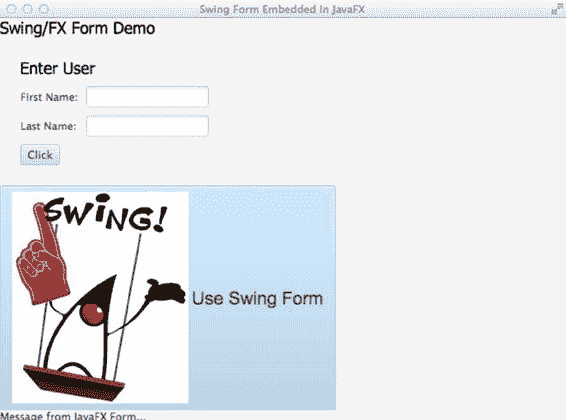

第 14 章 N JAVAFX 基础

TextField lastField = new TextField();

grid.add(lastField, 1, 2);

Button messageButton = new Button("点击");

messageButton.setOnAction((event) ->{

fxLabel.setText("来自 JavaFX 表单的消息...");

});

grid.add(messageButton, 0,3);

return grid;

}

/**

* @param args 命令行参数

*/

public static void main(String[] args) {

launch(args);

}

}

调用后，应用程序的外观如图 14-19 所示。

**图 14-19.** *使用 SwingNode 嵌入 Swing 表单*

[www.it-ebooks.info](http://www.it-ebooks.info/)

第 14 章 N JAVAFX 基础

工作原理

有大量应用程序是使用 Java Swing 框架编写的。有时，在 JavaFX 应用程序中利用这些应用程序，或嵌入其中部分合理的 Swing 组件是很有意义的。`javafx.embed.swing.SwingNode` 类使得将 `JComponent` 实例嵌入到 JavaFX 应用程序中变得轻而易举，只需将 `JComponent` 传递给 `SwingNode` 的 `setContent()` 方法即可。内容会自动重绘，所有事件都会转发给 `JComponent` 实例，无需用户干预。

在本示例中，通过实例化一个新的 `SwingNode` 对象，并将 `SwingForm` 类的实例传递给它，嵌入了一个简单的 Java Swing 表单。Swing 内容应在事件调度线程（EDT）上运行，因此任何 Swing 访问都应在 EDT 上进行。也就是说，使用 `SwingUtilities.invokeLater` 创建了一个新线程，并使用 lambda 表达式封装了用于设置 Swing 内容的 `Runnable`。

也可以从 Swing 代码内部与 JavaFX 内容进行交互。为此，您必须通过调用 `javafx.application.Platform` 类并调用其 `runLater()` 方法（传递一个 `Runnable`），在 JavaFX 应用程序线程中运行 JavaFX 代码。例如，在示例代码中，Swing 表单中的按钮可以使用以下代码回调 JavaFX 标签以更改文本。请注意，JavaFX 标签是一个公共字段，因此可以直接从 Swing 类内部访问它。


JButton button = new JButton("Submit");

button.addActionListener((event) -> {

Platform.runLater(()-> {

UserEntryForm.fxLabel.setText("Message from Swing form...");

});

});

N **注意** 默认情况下，JavaFX 应用程序线程和 Swing 事件调度线程（EDT）是分离的。EDT 不运行 Swing 应用程序的 GUI 代码。然而，在 JavaFX 中，平台 GUI 线程会运行应用程序代码。有一个实验性设置可以启用单线程模式，该模式允许 JavaFX 平台 GUI 线程在同时使用 Swing 和 JavaFX 时成为 EDT。要启用此实验性设置，请使用以下选项执行代码：`Djavafx.embed.singleThread=true`

通过利用 JavaFX 8 的新特性，您可以生成一个包含嵌入式 Swing 代码的 JavaFX 应用程序，该代码可以直接与 JavaFX 代码通信。

总结

JavaFX 是 Java Swing API 的继承者。它使开发人员能够为下一代应用程序生成复杂而强大的用户界面。本章为您提供了对 JavaFX 的基本理解，以及一些最常用的 JavaFX API。在接下来的几章中，您将了解更多关于 JavaFX 的知识，例如如何构建 3D 对象和 WebView。

[www.it-ebooks.info](http://www.it-ebooks.info/)

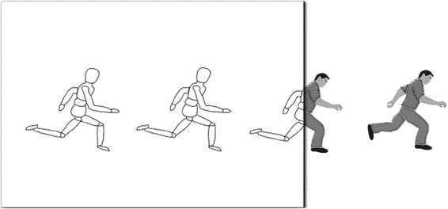

**第 15 章**

**使用 JavaFX 进行图形处理**

您是否曾听人说过“两个世界碰撞”？这个表达通常用于描述来自不同背景或文化的人陷入冲突并必须面对艰难抉择的情况。当我们构建需要动画的 GUI 应用程序时，我们常常处于商业世界与游戏世界的碰撞轨道上。

在不断变化的富客户端应用世界中，您可能已经注意到动画的增多，例如脉冲按钮、过渡效果、移动背景等。当 GUI 应用程序使用动画时，它们可以为用户提供视觉提示，告知下一步该做什么。借助 JavaFX，您可以兼得两个世界的优势。

图 15-1 说明 展示了一个简单的绘图变得生动起来。

**图 15-1.** *使用 JavaFX 进行图形处理*

在本章中，您将创建图像、动画以及外观和感觉。系好安全带；您将发现如何将酷炫的游戏式界面集成到日常应用程序中的解决方案。

N **注意** 如果您是 JavaFX 新手，请参考第 14 章。除其他内容外，它将帮助您创建一个能够高效使用 JavaFX 的环境。

[www.it-ebooks.info](http://www.it-ebooks.info/)

第 15 章 使用 JavaFX 进行图形处理

15-1. 创建图像

问题

您的文件目录中有一些照片，您希望快速浏览并展示它们。

解决方案

创建一个简单的 JavaFX 图像查看器应用程序。本方案中使用的主要 Java 类包括：
- `javafx.scene.image.Image`
- `javafx.scene.image.ImageView`
- `EventHandler<DragEvent>` 类

以下源代码是图像查看器应用程序的实现：

```java
package org.java8recipes.chapter15.recipe15_01;

import java.io.File;
import java.util.ArrayList;
import java.util.List;
import javafx.application.Application;
import javafx.scene.Group;
import javafx.scene.Scene;
import javafx.scene.image.Image;
import javafx.scene.image.ImageView;
import javafx.scene.input.DragEvent;
import javafx.scene.input.Dragboard;
import javafx.scene.input.MouseEvent;
import javafx.scene.input.TransferMode;
import javafx.scene.layout.HBox;
import javafx.scene.paint.Color;
import javafx.scene.shape.Arc;
import javafx.scene.shape.ArcType;
import javafx.scene.shape.Rectangle;
import javafx.stage.Stage;

/**
 * 方案 15-1：创建图像
 *
 * @author cdea
 * 更新：J Juneau
 */
public class CreatingImages extends Application {
    private final List<String> imageFiles = new ArrayList<>();
    private int currentIndex = -1;
    private final String filePrefix = "file:";
```

[www.it-ebooks.info](http://www.it-ebooks.info/)

第 15 章 使用 JavaFX 进行图形处理

```java
    public enum ButtonMove {
        NEXT, PREV
    };

    /**
```


* @param args 命令行参数

*/

public static void main(String[] args) {

Application.launch(args);

}

@Override

public void start(Stage primaryStage) {

primaryStage.setTitle("第 15 章-1 创建图像");

Group root = new Group();

Scene scene = new Scene(root, 551, 400, Color.BLACK);

// 图像视图

final ImageView currentImageView = new ImageView();

// 保持宽高比

currentImageView.setPreserveRatio(true);

// 根据场景调整大小

currentImageView.fitWidthProperty().bind(scene.widthProperty());

final HBox pictureRegion = new HBox();

pictureRegion.getChildren().add(currentImageView);

root.getChildren().add(pictureRegion);

// 在表面上拖拽

scene.setOnDragOver((DragEvent event) -> {

Dragboard db = event.getDragboard();

if (db.hasFiles()) {

event.acceptTransferModes(TransferMode.COPY);

} else {

event.consume();

}

});

// 在表面上释放

scene.setOnDragDropped((DragEvent event) -> {

Dragboard db = event.getDragboard();

boolean success = false;

if (db.hasFiles()) {

success = true;

String filePath = null;

for (File file : db.getFiles()) {

filePath = file.getAbsolutePath();

System.out.println(filePath);

[www.it-ebooks.info](http://www.it-ebooks.info/)

第 15 章 使用 JavaFX 进行图形处理

currentIndex += 1;

imageFiles.add(currentIndex, filePath);

}

filePath = filePrefix + filePath;

// 设置新图像为要显示的图像

Image imageimage = new Image(filePath);

currentImageView.setImage(imageimage);

}

event.setDropCompleted(success);

event.consume();

});

// 创建幻灯片控制按钮

Group buttonGroup = new Group();

// 圆角矩形

Rectangle buttonArea = new Rectangle();

buttonArea.setArcWidth(15);

buttonArea.setArcHeight(20);

buttonArea.setFill(new Color(0, 0, 0, .55));

buttonArea.setX(0);

buttonArea.setY(0);

buttonArea.setWidth(60);

buttonArea.setHeight(30);

buttonArea.setStroke(Color.rgb(255, 255, 255, .70));

buttonGroup.getChildren().add(buttonArea);

// 左侧控制按钮

Arc leftButton = new Arc();

leftButton.setType(ArcType.ROUND);

leftButton.setCenterX(12);

leftButton.setCenterY(16);

leftButton.setRadiusX(15);

leftButton.setRadiusY(15);

leftButton.setStartAngle(-30);

leftButton.setLength(60);

leftButton.setFill(new Color(1, 1, 1, .90));

leftButton.addEventHandler(MouseEvent.MOUSE_PRESSED, (MouseEvent me) -> {

int indx = gotoImageIndex(ButtonMove.PREV);

if (indx > -1) {

String namePict = imageFiles.get(indx);

namePict = filePrefix + namePict;

final Image image = new Image(namePict);

currentImageView.setImage(image);

}

});

buttonGroup.getChildren().add(leftButton);

[www.it-ebooks.info](http://www.it-ebooks.info/)

第 15 章 使用 JavaFX 进行图形处理

// 右侧控制按钮

Arc rightButton = new Arc();

rightButton.setType(ArcType.ROUND);

rightButton.setCenterX(12);

rightButton.setCenterY(16);

rightButton.setRadiusX(15);

rightButton.setRadiusY(15);

rightButton.setStartAngle(180 - 30);

rightButton.setLength(60);

rightButton.setFill(new Color(1, 1, 1, .90));

rightButton.setTranslateX(40);

buttonGroup.getChildren().add(rightButton);

rightButton.addEventHandler(MouseEvent.MOUSE_PRESSED, (MouseEvent me) -> {

int indx = gotoImageIndex(ButtonMove.NEXT);

if (indx > -1) {

String namePict = imageFiles.get(indx);

namePict = filePrefix + namePict;

final Image image = new Image(namePict);

currentImageView.setImage(image);

}

});

// 当场景调整大小时移动按钮组

buttonGroup.translateXProperty().bind(scene.widthProperty().subtract(buttonArea.getWidth() + 6)); buttonGroup.translateYProperty().bind(scene.heightProperty().subtract(buttonArea.getHeight() + 6)); root.getChildren().add(buttonGroup);

primaryStage.setScene(scene);

primaryStage.show();

}

/**

* 返回文件列表中下一个要跳转的索引。

*

* @param direction PREV 和 NEXT 分别用于在图片列表中向后或向前移动。

* @return int 返回上一张或下一张要显示的图片的索引。

*/

public int gotoImageIndex(ButtonMove direction) {

int size = imageFiles.size();

if (size == 0) {

currentIndex = -1;

} else if (direction == ButtonMove.NEXT && size > 1 && currentIndex < size - 1) {

currentIndex += 1;


} else if (direction == ButtonMove.PREV && size > 1 && currentIndex > 0) {

currentIndex -= 1;

}

return currentIndex;

}

[www.it-ebooks.info](http://www.it-ebooks.info/)

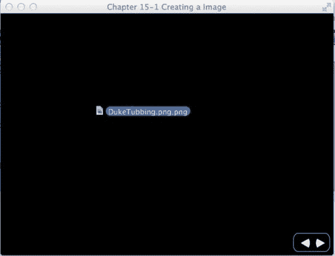


第 15 章 使用 JavaFX 进行图形处理

图 15-2 展示了拖放操作，该操作通过一个缩略图大小的图像在界面上为用户提供视觉反馈。图中，我正在将图像拖拽到应用程序窗口上。

**图 15-2.** *正在进行中的拖放操作*

图 15-3 展示了拖放操作已成功加载图像。

**图 15-3.** *拖放操作完成*

[www.it-ebooks.info](http://www.it-ebooks.info/)

第 15 章 使用 JavaFX 进行图形处理

工作原理

本示例是一个简单的应用程序，允许您查看具有 .jpg、.png 和 .gif 等文件格式的图像。

加载图像需要使用鼠标将文件拖放到窗口区域。该应用程序还允许您调整窗口大小，这会自动使图像按比例缩放，同时保持其宽高比。成功加载几张图像后，您将能够通过单击左右按钮控件方便地逐页浏览每张图像，如图 15-3 所示。

在代码讲解之前，我们先讨论一下应用程序的变量。表 15-1 描述了这个简洁图像查看器应用程序的实例变量。

**表 15-1.** *CreatingImages 实例变量*

**变量**

**数据类型**

**示例**

**描述**

imageFiles

List<String>

/User/pictures/fun.jpg

一个字符串列表，每个字符串包含图像的绝对文件路径

currentIndex

int

一个从零开始的相对索引号，指向 imageFiles 列表；-1 表示没有图像可查看

NEXT

enum

-

用户单击右箭头按钮

PREV

enum

-

用户单击左箭头按钮

当您将图像拖入应用程序时，imageFiles 变量会将绝对文件路径缓存为字符串，而不是实际的图像文件，以节省内存空间。如果用户将同一图像文件拖入显示区域，列表中会包含代表该图像文件的重复字符串。当图像正在显示时，currentIndex 变量包含指向 imageFiles 列表的索引。imageFiles 列表指向代表当前图像文件的字符串。当用户单击按钮显示上一张和下一张图像时，currentIndex 将分别递减或递增。接下来，让我们逐步讲解加载和显示图像的代码细节。之后，您将学习如何使用“上一张”和“下一张”按钮逐页浏览每张图像的步骤。

首先，实例化一个 `javafx.scene.image.ImageView` 类的实例。`ImageView` 类是一个图形节点（Node），用于显示已加载的 `javafx.scene.image.Image` 对象。使用 `ImageView` 节点，您可以在要显示的图像上创建特殊效果，而无需操作物理图像。为了避免在渲染多种效果时性能下降，您可以使用多个引用单个 `Image` 对象的 `ImageView` 对象。许多效果类型包括模糊、淡化和图像变换。

其中一个需求是在用户调整窗口大小时保持所显示图像的宽高比。在这里，您只需调用 `setPreserveRatio()` 方法并传入 `true` 值，即可保持图像的宽高比。请记住，由于用户会调整窗口大小，您需要将 `ImageView` 的宽度绑定到场景（Scene）的宽度，以便图像能够缩放。设置好 `ImageView` 后，您需要将其传递给一个 `HBox` 实例（pictureRegion）以放入场景中。以下代码创建了 `ImageView` 实例，保持了宽高比，并缩放了图像：

// 图像视图

final ImageView currentImageView = new ImageView();

// 保持宽高比

currentImageView.setPreserveRatio(true);

// 根据场景调整大小

currentImageView.fitWidthProperty().bind(scene.widthProperty());

[www.it-ebooks.info](http://www.it-ebooks.info/)

第 15 章 使用 JavaFX 进行图形处理

接下来，我们来介绍 JavaFX 的原生拖放支持，它为用户提供了许多选项，例如将可视对象从一个应用程序拖放到另一个应用程序。在此场景中，用户将从宿主窗口操作系统拖放一个图像文件到图像查看器应用程序。在此场景中，必须生成 `EventHandler` 对象来监听 `DragEvent`。为了满足这一需求，您需要设置场景的拖放悬停（drag-over）和拖放完成（drag-dropped）事件处理方法。

要设置拖放悬停属性，请调用场景的 `setOnDragOver()` 方法，并传入适当的泛型 `EventHandler<DragEvent>` 类型。在示例中，使用 lambda 表达式来实现事件处理器。

通过 lambda 表达式实现 `handle()` 方法来监听拖放悬停事件（`DragEvent`）。在事件处理器中，请注意事件（`DragEvent`）对象调用了 `getDragboard()` 方法。调用 `getDragboard()` 将返回拖放源（`Dragboard`），也就是通常所说的*剪贴板*。一旦获取了 `Dragboard` 对象，就可以确定并验证拖放到界面上的内容。在此场景中，您需要判断 `Dragboard` 对象是否包含任何文件。如果包含，则调用事件对象的 `acceptTransferModes()` 方法，传入常量 `TransferMode.COPY`，以向应用程序用户提供视觉反馈（参见图 15-2）。否则，应通过调用 `event.consume()` 方法来消耗该事件。以下代码演示了如何设置场景的 `OnDragOver` 属性：

// 在界面上拖放悬停

scene.setOnDragOver((DragEvent event) -> {

Dragboard db = event.getDragboard();

if (db.hasFiles()) {

event.acceptTransferModes(TransferMode.COPY);

} else {

event.consume();

}

});

设置好拖放悬停事件处理器属性后，您需要创建一个拖放完成事件处理器属性，以便完成操作。监听拖放完成事件与监听拖放悬停事件类似，其中 `handle()` 方法将通过 lambda 表达式实现。再次，您从事件中获取 `Dragboard` 对象，以判断剪贴板是否包含任何文件。如果包含，则遍历文件列表，并将文件名添加到 `imageFiles` 列表中。以下代码演示了如何设置场景的 `OnDragDropped` 属性：

// 在界面上拖放完成

scene.setOnDragDropped((DragEvent event) -> {

Dragboard db = event.getDragboard();

boolean success = false;

if (db.hasFiles()) {

success = true;

String filePath = null;

for (File file : db.getFiles()) {

filePath = file.getAbsolutePath();

System.out.println(filePath);

currentIndex += 1;

imageFiles.add(currentIndex, filePath);

}

filePath = filePrefix + filePath;

// 设置新图像为要显示的图像。

Image imageimage = new Image(filePath);

currentImageView.setImage(imageimage);

[www.it-ebooks.info](http://www.it-ebooks.info/)

第 15 章 使用 JavaFX 进行图形处理

}

event.setDropCompleted(success);

event.consume();

});

当最后一个文件确定后，当前图像即被显示。以下代码演示了加载要显示的图像：

// 设置新图像为要显示的图像。

Image imageimage = new Image(filePath);

currentImageView.setImage(imageimage);

对于图像查看器应用程序的最后需求，需要生成简单的控件，允许用户查看下一张或上一张图像。我强调“简单”控件，是因为 JavaFX 还包含另外两种创建自定义控件的方法。其中一种方法（CSS 样式）将在后面的配方 15-5 中讨论。要探索另一种替代方法，请参考关于 Skin 和 Skinnable API 的 Javadoc。


本例中的简单按钮是使用 Java FX 的 `javafx.scene.shape.Arc` 创建的，用于在名为 `javafx.scene.shape.Rectangle` 的小型透明圆角矩形上方构建左右箭头。接着，通过 lambda 表达式添加了一个监听鼠标按下事件的 `EventHandler`，该处理器会根据枚举 `ButtonMove.PREV` 和 `ButtonMove.NEXT` 加载并显示相应的图像。

在实例化一个带有类型变量的泛型类时（类型变量位于 `<` 和 `>` 符号之间），该类型变量也会在 `handle()` 方法的签名中定义。在实现事件处理逻辑时，你需要判断按下了哪个按钮，然后返回下一个要显示的图像在 `imageFiles` 列表中的索引。使用 `Image` 类加载图像时，可以从文件系统或 URL 加载。以下代码实例化了一个 `EventHandler<MouseEvent>` lambda 表达式，用于显示 `imageFiles` 列表中的上一张图像：`leftButton.addEventHandler(MouseEvent.MOUSE_PRESSED, (MouseEvent me) -> {`

`int indx = gotoImageIndex(ButtonMove.PREV);`

`if (indx > -1) {`

`String namePict = imageFiles.get(indx);`

`namePict = filePrefix + namePict;`

`final Image image = new Image(namePict);`

`currentImageView.setImage(image);`

`}`

`});`

右侧按钮（`rightButton`）的事件处理逻辑与此相同。唯一不同的是，它需要通过 `ButtonMove` 枚举来判断按下的是上一张还是下一张按钮。此信息会传递给 `gotoImageIndex()` 方法，以确定该方向是否有可用的图像。

为了完成图像查看器应用程序，你需要将矩形按钮控件绑定到场景的宽度和高度上，这样当用户调整窗口大小时，控件会重新定位。此处，通过减去 `buttonArea` 的宽度（使用 Fluent API），将 `translateXProperty()` 绑定到场景的宽度属性。在示例中，你还需要基于场景的高度属性绑定 `translateYProperty()`。一旦按钮控件绑定完成，用户将体验到良好的用户界面交互。以下代码使用 Fluent API 将按钮控件的属性绑定到场景的属性：

`// 当场景调整大小时移动按钮组`

`buttonGroup.translateXProperty().bind(scene.widthProperty().subtract(buttonArea.getWidth() + 6));` `buttonGroup.translateYProperty().bind(scene.heightProperty().subtract(buttonArea.getHeight() + 6));` `root.getChildren().add(buttonGroup);`

[www.it-ebooks.info](http://www.it-ebooks.info/)

第 15 章 使用 JavaFX 进行图形处理

15-2\. 生成动画

问题

你想要生成一个动画。例如，你想创建一个满足以下需求的新闻滚动条和照片查看器应用程序：

-   它将有一个向左滚动的新闻滚动条控件。
-   当用户点击按钮控件时，它会淡出当前图片并淡入下一张图片。
-   当光标移入和移出场景区域时，按钮控件会分别淡入和淡出。
-   当鼠标悬停在文本上时，新闻滚动条会暂停，当鼠标移开文本时，滚动条会重新开始。

解决方案

通过访问 JavaFX 的动画 API（`javafx.animation.*`）来创建动画效果。要创建新闻滚动条，你需要以下类：

-   `javafx.animation.TranslateTransition`
-   `javafx.util.Duration`
-   `javafx.event.EventHandler<ActionEvent>`
-   `javafx.scene.shape.Rectangle`

要淡出当前图片并淡入下一张图片，你需要以下类：

-   `javafx.animation.SequentialTransition`
-   `javafx.animation.FadeTransition`
-   `javafx.event.EventHandler<ActionEvent>`
-   `javafx.scene.image.Image`
-   `javafx.scene.image.ImageView`
-   `javafx.util.Duration`

要当光标移入和移出场景区域时分别淡入和淡出按钮控件，你需要以下类：

-   `javafx.animation.FadeTransition`
-   `javafx.util.Duration`

以下是用于创建新闻滚动条控件的代码：

`// 创建滚动条区域`

`final Group tickerArea = new Group();`

`final Rectangle tickerRect = new Rectangle();`


tickerRect.setArcWidth(15);

tickerRect.setArcHeight(20);

tickerRect.setFill(new Color(0, 0, 0, .55));

[www.it-ebooks.info](http://www.it-ebooks.info/)

第 15 章 使用 JavaFX 进行图形编程

tickerRect.setX(0);

tickerRect.setY(0);

tickerRect.setWidth(scene.getWidth() - 6);

tickerRect.setHeight(30);

tickerRect.setStroke(Color.rgb(255, 255, 255, .70));

Rectangle clipRegion = new Rectangle();

clipRegion.setArcWidth(15);

clipRegion.setArcHeight(20);

clipRegion.setX(0);

clipRegion.setY(0);

clipRegion.setWidth(scene.getWidth() - 6);

clipRegion.setHeight(30);

clipRegion.setStroke(Color.rgb(255, 255, 255, .70));

tickerArea.setClip(clipRegion);

// 当窗口大小改变时，调整滚动区域的大小

tickerArea.setTranslateX(6);

tickerArea.translateYProperty().bind(scene.heightProperty().subtract(

tickerRect.getHeight() + 6));

tickerRect.widthProperty().bind(scene.widthProperty().subtract(

buttonRect.getWidth() + 16));

clipRegion.widthProperty().bind(scene.widthProperty().subtract(

buttonRect.getWidth() + 16));

tickerArea.getChildren().add(tickerRect);

root.getChildren().add(tickerArea);

// 添加新闻文本

Text news = new Text();

news.setText("JavaFX 8 新闻滚动条... | 新特性：Swing 节点、事件调度线程与 JavaFX

应用程序线程合并，" +

"新外观 - Modena、富文本支持、打印、树表控件、更多内容！"); news.setTranslateY(18);

news.setFill(Color.WHITE);

tickerArea.getChildren().add(news);

final TranslateTransition ticker = new TranslateTransition();

ticker.setNode(news);

int newsLength = news.getText().length();

// 根据文本长度进行估算

ticker.setDuration(Duration.millis((newsLength * 4/300) * 15000));

ticker.setFromX(scene.widthProperty().doubleValue());

ticker.setToX(-scene.widthProperty().doubleValue() - (newsLength * 5));

ticker.setFromY(19);

ticker.setInterpolator(Interpolator.LINEAR);

ticker.setCycleCount(1);

[www.it-ebooks.info](http://www.it-ebooks.info/)

第 15 章 使用 JavaFX 进行图形编程

// 当滚动完成时，重置并重新播放滚动动画

ticker.setOnFinished((ActionEvent ae) -> {

ticker.stop();

ticker.setFromX(scene.getWidth());

ticker.setDuration(new Duration((newsLength * 4/300) * 15000));

ticker.playFromStart();

});

// 鼠标悬停时暂停滚动

tickerArea.setOnMouseEntered((MouseEvent me) -> {

ticker.pause();

});

// 鼠标离开滚动区域时重新开始滚动

tickerArea.setOnMouseExited((MouseEvent me) -> {

ticker.play();

});

ticker.play();

以下是用于淡出当前图片并淡入下一张图片的代码：

// 上一张按钮

Arc prevButton = // 创建弧线 ...

prevButton.addEventHandler(MouseEvent.MOUSE_PRESSED, (MouseEvent me) -> {

int indx = gotoImageIndex(PREV);

if (indx > -1) {

String namePict = imagesFiles.get(indx);

final Image nextImage = new Image(namePict);

SequentialTransition seqTransition = transitionByFading(nextImage, currentImageView); seqTransition.play();

}

});

buttonGroup.getChildren().add(prevButton);

// 下一张按钮

Arc nextButton = //... 创建弧线

buttonGroup.getChildren().add(nextButton);

nextButton.addEventHandler(MouseEvent.MOUSE_PRESSED, (MouseEvent me) -> {

int indx = gotoImageIndex(NEXT);

if (indx > -1) {

String namePict = imagesFiles.get(indx);

final Image nextImage = new Image(namePict);

SequentialTransition seqTransition = transitionByFading(nextImage, currentImageView); seqTransition.play();

}

});

[www.it-ebooks.info](http://www.it-ebooks.info/)

第 15 章 使用 JavaFX 进行图形编程

//... start(Stage primaryStage) 方法的其余部分

public int gotoImageIndex(int direction) {

int size = imagesFiles.size();

if (size == 0) {

currentIndexImageFile = -1;

} else if (direction == NEXT && size > 1 && currentIndexImageFile < size - 1) {

currentIndexImageFile += 1;

} else if (direction == PREV && size > 1 && currentIndexImageFile > 0) {

currentIndexImageFile -= 1;

}

return currentIndexImageFile;

}

public SequentialTransition transitionByFading(final Image nextImage, final ImageView imageView) {

FadeTransition fadeOut = new FadeTransition(Duration.millis(500), imageView);

fadeOut.setFromValue(1.0);

fadeOut.setToValue(0.0);


fadeOut.setOnFinished((ActionEvent ae) -> {

imageView.setImage(nextImage);

});

FadeTransition fadeIn = new FadeTransition(Duration.millis(500), imageView);

fadeIn.setFromValue(0.0);

fadeIn.setToValue(1.0);

SequentialTransition seqTransition = new SequentialTransition();

seqTransition.getChildren().addAll(fadeOut, fadeIn);

return seqTransition;

}

以下代码用于在光标移入和移出场景区域时，分别淡入和淡出按钮控件：

// 淡入按钮控件

scene.setOnMouseEntered((MouseEvent me) -> {

FadeTransition fadeButtons = new FadeTransition(Duration.millis(500), buttonGroup);

fadeButtons.setFromValue(0.0);

fadeButtons.setToValue(1.0);

fadeButtons.play();

});

// 淡出按钮控件

scene.setOnMouseExited((MouseEvent me) -> {

FadeTransition fadeButtons = new FadeTransition(Duration.millis(500), buttonGroup);

fadeButtons.setFromValue(1);

fadeButtons.setToValue(0);

fadeButtons.play();

});

图 15-4 展示了屏幕底部区域带有滚动新闻控件的照片查看器应用程序。

[www.it-ebooks.info](http://www.it-ebooks.info/)

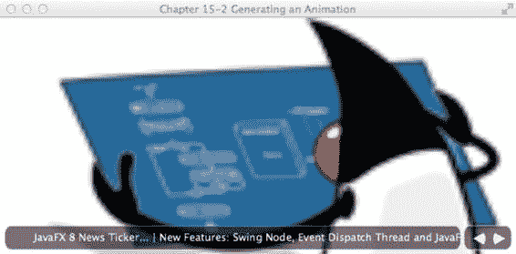

第 15 章 使用 JavaFX 进行图形处理

**图 15-4.** *带有新闻滚动条的照片查看器*

工作原理

本方案以方案 15-1 中的照片查看器应用程序为基础，添加了一个新闻滚动条和一些漂亮的照片切换动画。主要的动画效果集中在平移和淡入淡出上。首先，创建一个新闻滚动条控件，它通过使用平移过渡（javafx.animation.TranslateTransition）将文本节点向左滚动。接着，应用另一个淡入淡出效果，以便当用户点击“上一张”和“下一张”按钮切换到下一张图片时，能够产生缓慢的过渡效果。为了实现此效果，使用了由多个动画组成的复合过渡（javafx.animation.SequentialTransition）。最后，为了创建按钮控件根据鼠标位置淡入淡出的效果，使用了淡入淡出过渡（javafx.animation.FadeTransition）。

在开始讨论实现需求的步骤之前，我想先介绍一下 JavaFX 动画的基础知识。

JavaFX 动画 API 允许您组合定时事件，这些事件可以在节点的属性值之间进行插值，从而产生动画效果。每个定时事件称为一个关键帧（KeyFrame），它负责在一段时间内（javafx.util.Duration）对节点的属性进行插值。了解关键帧的作用是对节点属性值进行操作后，您需要创建一个 KeyValue 类的实例，该实例将引用所需的节点属性。

插值的概念简单来说就是在起始值和结束值之间分配数值。一个例子是在 1000 毫秒内，将一个矩形从其当前 x 位置（零）移动到 100 像素处；换句话说，就是在一秒钟内将矩形向右移动 100 像素。这里展示了一个关键帧和关键值，用于在 1000 毫秒内对矩形的 x 属性进行插值：

final Rectangle rectangle = new Rectangle(0, 0, 50, 50);

KeyValue keyValue = new KeyValue(rectangle.xProperty(), 100);

KeyFrame keyFrame = new KeyFrame(Duration.millis(1000), keyValue);

当创建许多连续组合的关键帧时，您需要创建一个时间线。由于时间线是 javafx.animation.Animation 的子类，因此您可以设置一些标准属性，例如其循环次数和自动反转。*循环次数*是您希望时间线播放动画的次数。

如果您希望循环次数无限期地播放动画，请使用值 Timeline.INDEFINITE。自动反转是指动画反向播放时间线的能力。默认情况下，循环次数设置为 1，并且自动反转设置为 false。添加关键帧时，只需使用 TimeLine 对象上的 getKeyFrames().add()方法即可。以下代码片段演示了一个无限期播放且自动反转设置为 true 的时间线：

Timeline timeline = new Timeline();

timeline.setCycleCount(Timeline.INDEFINITE);

timeline.setAutoReverse(true);

timeline.getKeyFrames().add(keyFrame);

timeline.play();

掌握了时间线的这些知识，您就可以在 JavaFX 中为任何图形节点制作动画。虽然您可以以低级方式创建时间线，但这可能会变得非常繁琐。您可能想知道是否有更简单的方法来表达常见的动画。好消息是！JavaFX 提供了过渡（Transition），这些是执行常见动画效果的便捷类。您可以使用过渡创建的一些常见动画效果包括：u javafx.animation.FadeTransition

u javafx.animation.PathTransition

u javafx.animation.ScaleTransition

u javafx.animation.TranslateTransition

要查看更多过渡效果，请参阅 Javadoc 中的 javafx.animation。由于 Transition 对象也是 javafx.animation.Animation 类的子类，因此您可以设置循环次数和自动反转属性。本方案重点介绍两种过渡效果：平移过渡（TranslateTransition）和淡入淡出过渡（FadeTransition）。

问题陈述中的第一个要求是创建一个新闻滚动条。在新闻滚动条控件中，文本节点在矩形区域内从右向左滚动。当文本滚动到矩形区域的左边缘时，您需要裁剪文本以创建一个视口，该视口仅显示矩形内部的像素。为此，您首先创建一个 Group 来容纳构成滚动条控件的所有组件。接下来，创建一个填充了 55%不透明度的白色圆角矩形。创建可视区域后，使用 Group 对象上的 setClip(someRectangle)方法创建一个表示裁剪区域的类似矩形。图 15-5 显示了一个作为裁剪区域的圆角矩形区域。

**图 15-5.** *在 Group 对象上设置裁剪区域*

创建滚动条控件后，您将根据场景的高度属性减去滚动条控件的高度来绑定平移 Y。您还根据场景的宽度减去按钮控件的宽度来绑定滚动条控件的宽度属性。通过绑定这些属性，每当用户调整应用程序窗口大小时，滚动条控件都可以更改其大小和位置。这使得滚动条控件看起来像是浮动在窗口底部。以下代码绑定了滚动条控件的平移 Y、宽度和裁剪区域的宽度属性：

tickerArea.translateYProperty().bind(scene.heightProperty().subtract(tickerRect.getHeight() + 6)); tickerRect.widthProperty().bind(scene.widthProperty().subtract(buttonRect.getWidth() + 16)); clipRegion.widthProperty().bind(scene.widthProperty().subtract(buttonRect.getWidth() + 16)); tickerArea.getChildren().add(tickerRect);

[www.it-ebooks.info](http://www.it-ebooks.info/)

第 15 章 使用 JavaFX 进行图形处理

现在滚动条控件已经完成，您将创建一些新闻内容输入其中。在示例中，使用了一个包含新闻提要文本的 Text 节点。要将新创建的 Text 节点添加到滚动条控件，请调用其 getChildren().add()方法。以下代码将一个 Text 节点添加到滚动条控件：final Group tickerArea = new Group();

final Rectangle tickerRect = //...

Text news = new Text();

news.setText("JavaFX 8 新闻滚动条... | 新特性：Swing 节点、事件分发线程与 JavaFX 应用程序线程合并，" +

"新外观 - Modena、富文本支持、打印、树表控件、更多内容！"); news.setTranslateY(18);

news.setFill(Color.WHITE);

tickerArea.getChildren().add(news);


接下来，你需要使用 JavaFX 的 `TranslateTransition` API 让文本节点从右向左滚动。第一步是设置执行 `TranslateTransition` 的目标节点。然后设置持续时间，即 `TranslateTransition` 执行动画的总时长。`TranslateTransition` 通过提供操作节点 `translateX` 和 `translateY` 属性的便捷方法，简化了动画的创建过程。这些便捷方法以 `from` 和 `to` 作为前缀。例如，在对文本节点使用 `translateX` 的场景中，有 `fromX()` 和 `toX()` 方法。`fromX()` 是起始值，`toX()` 是最终插值。在示例中，这些计算基于文本节点中文本的长度。因此，如果你从远程源（如 RSS 源）读取数据，文本长度的差异不会破坏滚动条。接下来，将 `TranslateTransition` 设置为线性过渡（`Interpolator.LINEAR`），以便在起始值和结束值之间均匀插值。要查看更多插值器类型或了解如何创建自定义插值器，请参阅 `javafx.animation.Interpolators` 的 Javadoc。最后，在示例中，循环次数设置为 1，这将根据指定的持续时间让滚动条动画播放一次。以下代码片段详细说明了如何创建一个让文本节点从右向左动画的 `TranslateTransition`：

```java
final TranslateTransition ticker = new TranslateTransition();

ticker.setNode(news);

int newsLength = news.getText().length();

ticker.setDuration(Duration.millis((newsLength * 4/300) * 15000));

ticker.setFromX(scene.widthProperty().doubleValue());

ticker.setToX(-scene.widthProperty().doubleValue() - (newsLength * 5));

ticker.setFromY(19);

ticker.setInterpolator(Interpolator.LINEAR);

ticker.setCycleCount(1);
```

当滚动条的新闻完全滚出滚动条区域，到达场景最左侧时，你需要停止并从起始位置（最右侧）重新播放新闻源。为此，你需要通过 lambda 表达式创建一个 `EventHandler<ActionEvent>` 对象的实例，并使用 `setOnFinished()` 方法将其设置在滚动条（`TranslateTransition`）对象上。以下是重新播放 `TranslateTransition` 动画的方法：

```java
// 当窗口宽度调整时，滚动条会知道需要移动多远
// 当滚动条完成时，重置并重新播放滚动条动画
ticker.setOnFinished((ActionEvent ae) -> {
    ticker.stop();
    ticker.setFromX(scene.getWidth());
    ticker.setDuration(new Duration((newsLength * 4/300) * 15000));
    ticker.playFromStart();
});
```

[www.it-ebooks.info](http://www.it-ebooks.info/)

第 15 章 使用 JavaFX 进行图形处理

一旦定义了动画，只需调用 `play()` 方法即可启动它。以下代码片段展示了如何播放 `TranslateTransition`：

```java
ticker.play();
```

为了在鼠标悬停和离开文本时暂停和启动滚动条，你需要实现类似的事件处理器：

```java
// 鼠标悬停时停止滚动条
tickerArea.setOnMouseEntered((MouseEvent me) -> {
    ticker.pause();
});

// 鼠标离开滚动条时重新启动
tickerArea.setOnMouseExited((MouseEvent me) -> {
    ticker.play();
});
```

现在你已经对动画过渡有了更好的理解，那么能够触发任意数量过渡的过渡效果又如何呢？JavaFX 提供了两种实现此行为的过渡。这两种过渡可以顺序或并行地调用各个独立的过渡。在本节中，你将使用顺序过渡（`SequentialTransition`）来包含两个 `FadeTransition`，以便淡出当前显示的图像并淡入下一张图像。在创建“上一张”和“下一张”按钮的事件处理器时，首先通过调用 `gotoImageIndex()` 方法确定要显示的下一个图像。一旦确定了要显示的下一个图像，就调用 `transitionByFading()` 方法，该方法会返回一个 `SequentialTransition` 实例。调用 `transitionByFading()` 方法时，你会注意到创建了两个 `FadeTransition`。第一个过渡会将不透明度从 1.0 变为 0.0，以淡出当前图像；第二个过渡会将不透明度从 0.0 插值到 1.0，淡入下一张图像，该图像随后成为当前图像。最后，将这两个 `FadeTransition` 添加到 `SequentialTransition` 中并返回给调用者。以下代码创建了两个 `FadeTransition` 并将它们添加到一个 `SequentialTransition` 中：

```java
FadeTransition fadeOut = new FadeTransition(Duration.millis(500), imageView);
fadeOut.setFromValue(1.0);
fadeOut.setToValue(0.0);
fadeOut.setOnFinished((ActionEvent ae) -> {
    imageView.setImage(nextImage);
});

FadeTransition fadeIn = new FadeTransition(Duration.millis(500), imageView);
fadeIn.setFromValue(0.0);
fadeIn.setToValue(1.0);

SequentialTransition seqTransition = new SequentialTransition();
seqTransition.getChildren().addAll(fadeOut, fadeIn);
return seqTransition;
```

对于与淡入淡出相关的最后需求，使用按钮控件。使用 `FadeTransition` 创建一种幽灵般的动画效果。首先，创建一个 `EventHandler`（更具体地说，是通过 lambda 表达式创建的 `EventHandler<MouseEvent>`）。向场景添加鼠标事件很容易；你只需重写 `handle()` 方法，其中入参是 `MouseEvent` 类型（与其形式类型参数相同）。在 lambda 内部，通过使用接受持续时间和节点作为参数的构造函数，创建一个 `FadeTransition` 对象的实例。接下来，你会注意到调用了 `setFromValue()` 和 `setToValue()` 方法，用于在不透明度级别 1.0 和 0.0 之间插值，从而产生淡入效果。以下代码添加了一个 `EventHandler`，用于在鼠标光标位于场景内时创建淡入效果：

```java
// 淡入按钮控件
scene.setOnMouseEntered((MouseEvent me) -> {
    FadeTransition fadeButtons = new FadeTransition(Duration.millis(500), buttonGroup);
    fadeButtons.setFromValue(0.0);
    fadeButtons.setToValue(1.0);
    fadeButtons.play();
});
```

最后但同样重要的是，淡出 `EventHandler` 与淡入基本相同，只是不透明度的起始值和结束值从 1.0 变为 0.0，这使得当鼠标指针移出场景区域时，按钮会神秘地消失。

15-3. 沿路径动画化形状

问题

你想要创建一种沿路径动画化形状的方法。

解决方案

创建一个允许用户为形状绘制路径的应用程序。本节中使用的主要 Java 类如下：

- `javafx.animation.PathTransition`
- `javafx.scene.input.MouseEvent`
- `javafx.event.EventHandler`
- `javafx.geometry.Point2D`
- `javafx.scene.shape.LineTo`
- `javafx.scene.shape.MoveTo`
- `javafx.scene.shape.Path`

以下代码演示了为形状绘制路径：

```java
package org.java8recipes.chapter15.recipe15_03;

import javafx.animation.PathTransition;
import javafx.application.Application;
import javafx.event.ActionEvent;
import javafx.event.EventHandler;
import javafx.geometry.Point2D;
import javafx.scene.Group;
import javafx.scene.Scene;
```


import javafx.scene.input.MouseEvent;

import javafx.scene.paint.Color;

[www.it-ebooks.info](http://www.it-ebooks.info/)

第 15 章 使用 JavaFX 进行图形编程

import javafx.scene.paint.CycleMethod;

import javafx.scene.paint.RadialGradient;

import javafx.scene.paint.Stop;

import javafx.scene.shape.Circle;

import javafx.scene.shape.LineTo;

import javafx.scene.shape.MoveTo;

import javafx.scene.shape.Path;

import javafx.stage.Stage;

import javafx.util.Duration;

/**

* 配方 15-3：使用场景图

* @author cdea

* 更新：J Juneau

*/

public class WorkingWithTheSceneGraph extends Application {

Path onePath = new Path();

Point2D anchorPt;

/**

* @param args 命令行参数

*/

public static void main(String[] args) {

Application.launch(args);

}

@Override

public void start(Stage primaryStage) {

primaryStage.setTitle("第 15 章-3 使用场景图");

final Group root = new Group();

// 添加路径

root.getChildren().add(onePath);

final Scene scene = new Scene(root, 300, 250);

scene.setFill(Color.WHITE);

RadialGradient gradient1 = new RadialGradient(0,

.1,

100,

100,

20,

false,

CycleMethod.NO_CYCLE,

new Stop(0, Color.RED),

new Stop(1, Color.BLACK));

// 创建一个球体

final Circle sphere = new Circle();

sphere.setCenterX(100);

sphere.setCenterY(100);

sphere.setRadius(20);

sphere.setFill(gradient1);

// 添加球体

root.getChildren().add(sphere);

[www.it-ebooks.info](http://www.it-ebooks.info/)

第 15 章 使用 JavaFX 进行图形编程

// 让球体沿路径运动

final PathTransition pathTransition = new PathTransition();

pathTransition.setDuration(Duration.millis(4000));

pathTransition.setCycleCount(1);

pathTransition.setNode(sphere);

pathTransition.setPath(onePath);

pathTransition.setOrientation(PathTransition.OrientationType.ORTHOGONAL_TO_TANGENT);

// 完成后清除路径

pathTransition.onFinishedProperty().set((EventHandler<ActionEvent>)

(ActionEvent event) -> {

onePath.getElements().clear();

});

// 初始路径起点

scene.onMousePressedProperty().set((EventHandler<MouseEvent>)

(MouseEvent event) -> {

onePath.getElements().clear();

// 路径中的起点

anchorPt = new Point2D(event.getX(), event.getY());

onePath.setStrokeWidth(3);

onePath.setStroke(Color.BLACK);

onePath.getElements().add(new MoveTo(anchorPt.getX(), anchorPt.getY()));

});

// 拖拽时向路径添加 LineTo

scene.onMouseDraggedProperty().set((EventHandler<MouseEvent>)

(MouseEvent event) -> {

onePath.getElements().add(new LineTo(event.getX(), event.getY()));

});

// 鼠标释放时结束路径

scene.onMouseReleasedProperty().set((EventHandler<MouseEvent>)

(MouseEvent event) -> {

onePath.setStrokeWidth(0);

if (onePath.getElements().size() > 1) {

pathTransition.stop();

pathTransition.playFromStart();

}

});

primaryStage.setScene(scene);

primaryStage.show();

}

}

图 15-6 展示了球体将要跟随的绘制路径。当用户释放鼠标时，绘制的路径将消失，红色球体将沿着之前绘制的路径运动。

[www.it-ebooks.info](http://www.it-ebooks.info/)

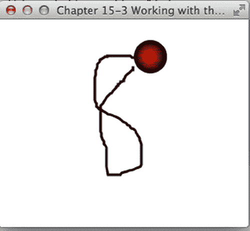

第 15 章 使用 JavaFX 进行图形编程

**图 15-6.** *路径过渡*

工作原理

在本配方中，您将创建一个简单的应用程序，使对象能够跟随场景图上绘制的路径运动。为简化操作，示例使用了一个形状（圆形）来执行路径过渡（javafx.animation.PathTransition）。

应用程序用户将像使用绘图程序一样，通过按下鼠标按钮在场景表面绘制路径。

当用户对绘制的路径满意后，释放鼠标按键，这将触发红色球体沿路径运动，类似于建筑物内物体在管道中移动。

首先，您需要创建两个实例变量来维护构成路径的坐标。为了保存正在绘制的路径，创建一个 javafx.scene.shape.Path 对象的实例。该路径实例应在应用程序启动前添加到场景图中。以下是将实例变量 onePath 添加到场景图的过程：

// 添加路径

root.getChildren().add(onePath);


接下来，创建一个实例变量 `anchorPt`（`javafx.geometry.Point2D` 类型），用于保存路径的起始点。稍后你将看到这些变量如何根据鼠标事件进行更新。此处展示的是维护当前绘制路径的实例变量：

```java
Path onePath = new Path();
Point2D anchorPt;
```

首先，创建一个将要被动画化的形状。在本场景中，你将创建一个炫酷的红色球体。为了创建具有球体外观的球，需要创建一个渐变颜色 `RadialGradient`，用于绘制或填充圆形形状。（关于如何使用渐变填充形状，请参考配方 15-6。）创建好红色球体后，你需要创建 `PathTransition` 对象来执行沿路径运动的动画。实例化 `PathTransition()` 对象后，只需将持续时间设置为四秒，循环次数设置为一。循环次数是指动画循环发生的次数。接下来，将节点设置为引用红色球体（sphere）。然后，将 `path()` 方法设置为实例变量 `onePath`，该变量包含了构成绘制路径的所有坐标和线条。为球体设置好动画路径后，应指定形状如何沿路径运动，例如垂直于路径上的切点。以下代码创建了一个路径过渡的实例：

```java
// 让球体沿路径运动
final PathTransition pathTransition = new PathTransition();
pathTransition.setDuration(Duration.millis(4000));
pathTransition.setCycleCount(1);
pathTransition.setNode(sphere);
pathTransition.setPath(onePath);
pathTransition.setOrientation(PathTransition.OrientationType.ORTHOGONAL_TO_TANGENT);
```

创建路径过渡后，你希望在动画完成时进行清理。为了在动画结束时重置或清理路径变量，需要创建并添加一个事件处理器，用于监听路径过渡对象上的 `onFinished` 属性事件。

以下代码片段添加了一个事件处理器来清除当前路径信息：

```java
// 完成后清除路径
pathTransition.onFinishedProperty().set((EventHandler<ActionEvent>)
    (ActionEvent event) -> {
        onePath.getElements().clear();
    });
```

形状和过渡设置完毕后，应用程序需要响应鼠标事件，这些事件将更新前面提到的实例变量。为此，需要监听 `Scene` 对象上发生的鼠标事件。这里，你将再次依赖创建事件处理器，并将其设置到场景的 `onMouseXXXProperty` 方法上，其中 `XXX` 表示实际的鼠标事件名称，例如 `pressed`、`dragged` 和 `released`。

当用户绘制路径时，他会执行鼠标按下事件来开始路径的绘制。要监听鼠标按下事件，需要创建一个形式类型参数为 `MouseEvent` 的事件处理器。在示例中，使用了 lambda 表达式。当鼠标按下事件发生时，清除实例变量 `onePath` 中任何先前绘制的路径信息。接着，只需设置路径的描边宽度和颜色，以便用户能看到正在绘制的路径。最后，使用 `MoveTo` 对象的实例将起始点添加到路径中。以下是用户执行鼠标按下时响应的处理器代码：

```java
// 开始初始路径
scene.onMousePressedProperty().set((EventHandler<MouseEvent>)
    (MouseEvent event) -> {
        onePath.getElements().clear();
        // 路径中的起始点
        anchorPt = new Point2D(event.getX(), event.getY());
        onePath.setStrokeWidth(3);
        onePath.setStroke(Color.BLACK);
        onePath.getElements().add(new MoveTo(anchorPt.getX(), anchorPt.getY()));
    });
```

鼠标按下事件处理器就位后，你需要为鼠标拖动事件创建另一个处理器。再次查找场景中与你关心的鼠标事件相对应的 `onMouseXXXProperty()` 方法。在本例中，将设置 `onMouseDraggedProperty()`。在 lambda 表达式内部，获取鼠标坐标，该坐标将用于更新路径。426


[www.it-ebooks.info](http://www.it-ebooks.info/)

第 15 章 JavaFX 图形

这些点将被转换为`LineTo`对象，并添加到路径（`Path`）中。这些`LineTo`对象是路径元素（`javafx.scene.shape.PathElement`）的实例，如配方 15-5 所述。以下代码是负责鼠标拖拽事件的事件处理器：

// 拖拽操作会创建 LineTo 对象并添加到路径中

scene.onMouseDraggedProperty().set((EventHandler<MouseEvent>)

(MouseEvent event) -> {

onePath.getElements().add(new LineTo(event.getX(), event.getY()));

});

最后，创建一个事件处理器来监听鼠标释放事件。当用户释放鼠标时，路径的描边宽度被设置为零，使其看起来像是被移除了。然后，通过停止路径过渡并从头开始播放来重置它。以下代码是负责鼠标释放事件的事件处理器：

// 鼠标释放时结束路径

scene.onMouseReleasedProperty().set((EventHandler<MouseEvent>)

(MouseEvent event) -> {

onePath.setStrokeWidth(0);

if (onePath.getElements().size() > 1) {

pathTransition.stop();

pathTransition.playFromStart();

}

});

15-4. 通过网格操控布局

问题

你想使用网格类型的布局创建一个美观的表单式用户界面。

解决方案

创建一个简单的表单设计器应用程序，利用 JavaFX 的`javafx.scene.layout.GridPane`动态操控用户界面。该表单设计器应用程序将具备以下功能：  
- 切换网格布局的网格线显示，用于调试。  
- 调整`GridPane`的上内边距。  
- 调整`GridPane`的左内边距。  
- 调整`GridPane`中单元格之间的水平间距。  
- 调整`GridPane`中单元格之间的垂直间距。  
- 水平对齐单元格内的控件。  
- 垂直对齐单元格内的控件。

[www.it-ebooks.info](http://www.it-ebooks.info/)

第 15 章 JavaFX 图形

以下代码是表单设计器应用程序的主启动点：

public class ManipulatingLayoutViaGrids extends Application {

/**

* @param args the command line arguments

*/

public static void main(String[] args) {

Application.launch(args);

}

@Override

public void start(Stage primaryStage) {

primaryStage.setTitle("Chapter 15-4 Manipulating Layout via Grids ");

Group root = new Group();

Scene scene = new Scene(root, 640, 480, Color.WHITE);

// 左右分割面板

SplitPane splitPane = new SplitPane();

splitPane.prefWidthProperty().bind(scene.widthProperty());

splitPane.prefHeightProperty().bind(scene.heightProperty());

// 右侧表单

GridPane rightGridPane = new MyForm();

GridPane leftGridPane = new GridPaneControlPanel(rightGridPane);

VBox leftArea = new VBox(10);

leftArea.getChildren().add(leftGridPane);

HBox hbox = new HBox();

hbox.getChildren().add(splitPane);

root.getChildren().add(hbox);

splitPane.getItems().addAll(leftArea, rightGridPane);

primaryStage.setScene(scene);

primaryStage.show();

}

}

当表单设计器应用程序启动时，目标表单会显示在窗口分割面板的右侧。以下代码是一个简单的网格状表单类，它继承自`GridPane`，将由表单设计器应用程序操控：

/**

* MyForm 是一个供用户操控的表单。

* @author cdea

*/

public class MyForm extends GridPane{

public MyForm() {

setPadding(new Insets(5));

setHgap(5);

setVgap(5);

[www.it-ebooks.info](http://www.it-ebooks.info/)

第 15 章 JavaFX 图形

Label fNameLbl = new Label("First Name");

TextField fNameFld = new TextField();

Label lNameLbl = new Label("Last Name");

TextField lNameFld = new TextField();

Label ageLbl = new Label("Age");

TextField ageFld = new TextField();

Button saveButt = new Button("Save");

// 名字标签

GridPane.setHalignment(fNameLbl, HPos.RIGHT);

add(fNameLbl, 0, 0);

// 姓氏标签

GridPane.setHalignment(lNameLbl, HPos.RIGHT);

add(lNameLbl, 0, 1);

// 年龄标签

GridPane.setHalignment(ageLbl, HPos.RIGHT);

add(ageLbl, 0, 2);

// 名字输入框


GridPane.setHalignment(fNameFld, HPos.LEFT);

add(fNameFld, 1, 0);

// 姓氏字段

GridPane.setHalignment(lNameFld, HPos.LEFT);

add(lNameFld, 1, 1);

// 年龄字段

GridPane.setHalignment(ageFld, HPos.RIGHT);

add(ageFld, 1, 2);

// 保存按钮

GridPane.setHalignment(saveButt, HPos.RIGHT);

add(saveButt, 1, 3);

}

}

当表单设计器应用程序启动时，网格属性控制面板会显示在窗口分隔面板的左侧。该属性控制面板允许用户动态操作目标表单的网格面板属性。以下代码展示了用于操作目标网格面板属性的网格属性控制面板：

/** GridPaneControlPanel 表示分隔面板的左侧区域，

* 允许用户操作右侧的 GridPane。

*

* 通过网格进行布局操作

* @author cdea

*/

[www.it-ebooks.info](http://www.it-ebooks.info/)

第 15 章 使用 JavaFX 进行图形处理

public class GridPaneControlPanel extends GridPane{

public GridPaneControlPanel(final GridPane targetGridPane) {

super();

setPadding(new Insets(5));

setHgap(5);

setVgap(5);

// 设置网格线

Label gridLinesLbl = new Label("网格线");

final ToggleButton gridLinesToggle = new ToggleButton("关闭");

gridLinesToggle.selectedProperty().addListener((ObservableValue<? extends Boolean> ov, Boolean oldValue, Boolean newVal) -> {

targetGridPane.setGridLinesVisible(newVal);

gridLinesToggle.setText(newVal ? "开启" : "关闭");

});

// 切换网格线标签

GridPane.setHalignment(gridLinesLbl, HPos.RIGHT);

add(gridLinesLbl, 0, 0);

// 切换网格线

GridPane.setHalignment(gridLinesToggle, HPos.LEFT);

add(gridLinesToggle, 1, 0);

// 设置内边距 [顶部]

Label gridPaddingLbl = new Label("顶部内边距");

final Slider gridPaddingSlider = new Slider();

gridPaddingSlider.setMin(0);

gridPaddingSlider.setMax(100);

gridPaddingSlider.setValue(5);

gridPaddingSlider.setShowTickLabels(true);

gridPaddingSlider.setShowTickMarks(true);

gridPaddingSlider.setMinorTickCount(1);

gridPaddingSlider.setBlockIncrement(5);

gridPaddingSlider.valueProperty().addListener((ObservableValue<? extends Number> ov, Number oldVal, Number newVal) -> {

double top1 = targetGridPane.getInsets().getTop();

double right1 = targetGridPane.getInsets().getRight();

double bottom1 = targetGridPane.getInsets().getBottom();

double left1 = targetGridPane.getInsets().getLeft();

Insets newInsets = new Insets((double) newVal, right1, bottom1, left1);

targetGridPane.setPadding(newInsets);

});

// 内边距调整标签

GridPane.setHalignment(gridPaddingLbl, HPos.RIGHT);

add(gridPaddingLbl, 0, 1);

[www.it-ebooks.info](http://www.it-ebooks.info/)

第 15 章 使用 JavaFX 进行图形处理

// 内边距调整滑块

GridPane.setHalignment(gridPaddingSlider, HPos.LEFT);

add(gridPaddingSlider, 1, 1);

// 设置内边距 [左侧]

Label gridPaddingLeftLbl = new Label("左侧内边距");

final Slider gridPaddingLeftSlider = new Slider();

gridPaddingLeftSlider.setMin(0);

gridPaddingLeftSlider.setMax(100);

gridPaddingLeftSlider.setValue(5);

gridPaddingLeftSlider.setShowTickLabels(true);

gridPaddingLeftSlider.setShowTickMarks(true);

gridPaddingLeftSlider.setMinorTickCount(1);

gridPaddingLeftSlider.setBlockIncrement(5);

gridPaddingLeftSlider.valueProperty().addListener((ObservableValue<? extends Number> ov, Number oldVal, Number newVal) -> {

double top1 = targetGridPane.getInsets().getTop();

double right1 = targetGridPane.getInsets().getRight();

double bottom1 = targetGridPane.getInsets().getBottom();

double left1 = targetGridPane.getInsets().getLeft();

Insets newInsets = new Insets(top1, right1, bottom1, (double) newVal);

targetGridPane.setPadding(newInsets);

});

// 内边距调整标签

GridPane.setHalignment(gridPaddingLeftLbl, HPos.RIGHT);

add(gridPaddingLeftLbl, 0, 2);

// 内边距调整滑块

GridPane.setHalignment(gridPaddingLeftSlider, HPos.LEFT);

add(gridPaddingLeftSlider, 1, 2);

// 水平间距

Label gridHGapLbl = new Label("水平间距");

final Slider gridHGapSlider = new Slider();

gridHGapSlider.setMin(0);

gridHGapSlider.setMax(100);

gridHGapSlider.setValue(5);


gridHGapSlider.setShowTickLabels(true);

gridHGapSlider.setShowTickMarks(true);

gridHGapSlider.setMinorTickCount(1);

gridHGapSlider.setBlockIncrement(5);

gridHGapSlider.valueProperty().addListener((ObservableValue<? extends Number> ov, Number oldVal, Number newVal) -> {

targetGridPane.setHgap((double) newVal);

});

[www.it-ebooks.info](http://www.it-ebooks.info/)

第 15 章 N 使用 JavaFX 进行图形编程

// 水平间距标签

GridPane.setHalignment(gridHGapLbl, HPos.RIGHT);

add(gridHGapLbl, 0, 3);

// 水平间距滑块

GridPane.setHalignment(gridHGapSlider, HPos.LEFT);

add(gridHGapSlider, 1, 3);

// 垂直间距

Label gridVGapLbl = new Label("垂直间距");

final Slider gridVGapSlider = new Slider();

gridVGapSlider.setMin(0);

gridVGapSlider.setMax(100);

gridVGapSlider.setValue(5);

gridVGapSlider.setShowTickLabels(true);

gridVGapSlider.setShowTickMarks(true);

gridVGapSlider.setMinorTickCount(1);

gridVGapSlider.setBlockIncrement(5);

gridVGapSlider.valueProperty().addListener((ObservableValue<? extends Number> ov, Number oldVal, Number newVal) -> {

targetGridPane.setVgap((double) newVal);

});

// 垂直间距标签

GridPane.setHalignment(gridVGapLbl, HPos.RIGHT);

add(gridVGapLbl, 0, 4);

// 垂直间距滑块

GridPane.setHalignment(gridVGapSlider, HPos.LEFT);

add(gridVGapSlider, 1, 4);

// 单元格列

Label cellCol = new Label("单元格列");

final TextField cellColFld = new TextField("0");

// 单元格列标签

GridPane.setHalignment(cellCol, HPos.RIGHT);

add(cellCol, 0, 5);

// 单元格列输入框

GridPane.setHalignment(cellColFld, HPos.LEFT);

add(cellColFld, 1, 5);

// 单元格行

Label cellRowLbl = new Label("单元格行");

final TextField cellRowFld = new TextField("0");

// 单元格行标签

GridPane.setHalignment(cellRowLbl, HPos.RIGHT);

add(cellRowLbl, 0, 6);

[www.it-ebooks.info](http://www.it-ebooks.info/)

第 15 章 N 使用 JavaFX 进行图形编程

// 单元格行输入框

GridPane.setHalignment(cellRowFld, HPos.LEFT);

add(cellRowFld, 1, 6);

// 水平对齐

Label hAlignLbl = new Label("水平对齐");

final ChoiceBox hAlignFld = new ChoiceBox(FXCollections.observableArrayList(

"CENTER", "LEFT", "RIGHT")

);

hAlignFld.getSelectionModel().select("LEFT");

// 单元格行标签

GridPane.setHalignment(hAlignLbl, HPos.RIGHT);

add(hAlignLbl, 0, 7);

// 单元格行输入框

GridPane.setHalignment(hAlignFld, HPos.LEFT);

add(hAlignFld, 1, 7);

// 垂直对齐

Label vAlignLbl = new Label("垂直对齐");

final ChoiceBox vAlignFld = new ChoiceBox(FXCollections.observableArrayList(

"BASELINE", "BOTTOM", "CENTER", "TOP")

);

vAlignFld.getSelectionModel().select("TOP");

// 单元格行标签

GridPane.setHalignment(vAlignLbl, HPos.RIGHT);

add(vAlignLbl, 0, 8);

// 单元格行输入框

GridPane.setHalignment(vAlignFld, HPos.LEFT);

add(vAlignFld, 1, 8);

// 垂直对齐

Label cellApplyLbl = new Label("单元格约束");

final Button cellApplyButton = new Button("应用");

cellApplyButton.setOnAction((ActionEvent event) -> {

for (Node child:targetGridPane.getChildren()) {

int targetColIndx = 0;

int targetRowIndx = 0;

try {

targetColIndx = Integer.parseInt(cellColFld.getText());

targetRowIndx = Integer.parseInt(cellRowFld.getText());

} catch (NumberFormatException e) {

}

System.out.println("child = " + child.getClass().getSimpleName());

int col = GridPane.getColumnIndex(child);

int row = GridPane.getRowIndex(child);

[www.it-ebooks.info](http://www.it-ebooks.info/)

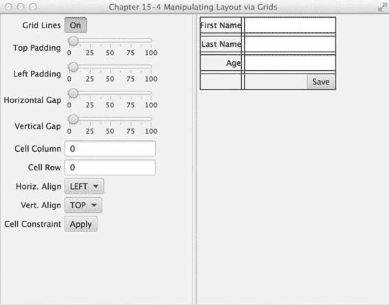

第 15 章 N 使用 JavaFX 进行图形编程

if (col == targetColIndx && row == targetRowIndx) {

GridPane.setHalignment(child, HPos.valueOf(hAlignFld.getSelectionModel().

getSelectedItem().toString()));

GridPane.setValignment(child, VPos.valueOf(vAlignFld.getSelectionModel().

getSelectedItem().toString()));

}

}

});

// 单元格行标签

GridPane.setHalignment(cellApplyLbl, HPos.RIGHT);

add(cellApplyLbl, 0, 9);

// 单元格行输入框

GridPane.setHalignment(cellApplyButton, HPos.LEFT);

add(cellApplyButton, 1, 9);

}

}

图 15-7 sho 展示了一个表单设计器应用程序，左侧是 GridPane 属性控制面板，右侧是目标表单。

**图 15-7.** *通过网格操控布局*

[www.it-ebooks.info](http://www.it-ebooks.info/)

第 15 章 N 使用 JavaFX 进行图形编程

工作原理

表单设计器应用程序允许用户通过左侧的 GridPane 属性控制面板动态调整属性。在左侧控制面板调整属性时，右侧的目标表单将动态变化。在创建简单的表单设计器应用程序时，您需要将控件绑定到目标表单（GridPane）的各种属性上。该设计器应用程序主要分为三个类：ManipulatingLayoutViaGrids、MyForm 和 GridPaneControlPanel。ManipulatingLayoutViaGrids 类是要启动的主应用程序。MyForm 是要被操控的目标表单，而 GridPaneControlPanel 是网格属性控制面板，其 UI 控件绑定到目标表单的网格面板属性上。

首先，创建应用程序的主启动点（ManipulatingLayoutViaGrids）。该类负责创建一个分割面板（SplitPane），将目标表单设置在右侧，并实例化一个 GridPaneControlPanel 显示在左侧。要实例化 GridPaneControlPanel，必须将要操控的目标表单传递给构造函数。稍后我会进一步讨论这一点，但可以说 GridPaneControlPanel 构造函数会将其控件连接到目标表单的属性上。

接下来，创建一个名为 MyForm 的虚拟表单。这是属性控制面板将要操控的目标表单。请注意，MyForm 继承了 GridPane。在 MyForm 的构造函数中，创建并添加控件到表单（GridPane）中。

要了解更多关于 GridPane 的信息，请参考配方 15-8。以下代码是一个将由表单设计器应用程序操控的目标表单：

/**

* MyForm 是一个由用户操控的表单。

* @author cdea

*/

public class MyForm extends GridPane{

public MyForm() {

setPadding(new Insets(5));

setHgap(5);

setVgap(5);

Label fNameLbl = new Label("名字");

TextField fNameFld = new TextField();

Label lNameLbl = new Label("姓氏");

TextField lNameFld = new TextField();

Label ageLbl = new Label("年龄");

TextField ageFld = new TextField();

Button saveButt = new Button("保存");

// 名字标签

GridPane.setHalignment(fNameLbl, HPos.RIGHT);

add(fNameLbl, 0, 0);

//... 其余表单代码

要操控目标表单，需要创建一个网格属性控制面板（GridPaneControlPanel）。该类负责将目标表单的网格面板属性绑定到 UI 控件上，允许用户通过键盘和鼠标调整值。正如在第 14 章配方 14-10 中学到的，您可以使用 JavaFX 属性绑定值。但除了直接绑定值之外，您还可以在属性发生变化时收到通知。

[www.it-ebooks.info](http://www.it-ebooks.info/)

第 15 章 N 使用 JavaFX 进行图形编程

您可以添加到属性的另一个特性是更改监听器。JavaFX 的 javafx.beans.value.ChangeListeners 类似于 Java Swing 的属性更改支持（java.beans.PropertyChangeListener）。类似地，当 bean 的属性值发生变化时，您会希望收到通知。更改监听器旨在通过向开发者提供旧值和新值来拦截更改。该示例通过为切换按钮创建一个 JavaFX 更改监听器来开始此过程，该按钮用于打开或关闭网格线。当用户与切换按钮交互时，更改监听器将简单地更新目标网格面板的 gridlinesVisible 属性。


由于切换按钮（ToggleButton）的 `selected` 属性是一个布尔值，因此你需要实例化一个形式类型参数为 `Boolean` 的 `ChangeListener` 类。你还会注意到 lambda 表达式形式的变化监听器实现，其入参参数将与实例化 `ChangeListener<Boolean>` 时指定的泛型形式类型参数相匹配。当属性变化事件发生时，变化监听器将使用新值调用目标网格面板上的 `setGridLinesVisible()` 方法，并更新切换按钮的文本。以下代码片段展示了向 `ToggleButton` 添加的 `ChangeListener<Boolean>`：

```java
gridLinesToggle.selectedProperty().addListener(
    (ObservableValue<? extends Boolean> ov,
     Boolean oldValue, Boolean newVal) -> {
        targetGridPane.setGridLinesVisible(newVal);
        gridLinesToggle.setText(newVal ? "On" : "Off");
    });
```

接下来，你向一个滑块控件应用变化监听器，该控件允许用户调整目标网格面板的上内边距。要为滑块创建变化监听器，你需要实例化一个 `ChangeListener<Number>`。同样，你将使用一个签名与其形式类型参数 `Number` 相同的 lambda 表达式。当变化发生时，滑块的值被用来创建一个 `Insets` 对象，该对象将成为目标网格面板的新内边距。以下是上内边距和滑块控件的变化监听器代码：

```java
gridPaddingSlider.valueProperty().addListener((
    ObservableValue<? extends Number> ov, Number oldVal, Number newVal) -> {
        double top1 = targetGridPane.getInsets().getTop();
        double right1 = targetGridPane.getInsets().getRight();
        double bottom1 = targetGridPane.getInsets().getBottom();
        double left1 = targetGridPane.getInsets().getLeft();
        Insets newInsets = new Insets((double) newVal, right1, bottom1, left1);
        targetGridPane.setPadding(newInsets);
    });
```

由于处理左内边距、水平间距和垂直间距的其他滑块控件的实现与前面提到的上内边距滑块控件几乎相同，你可以快进到单元格约束控件部分。

你希望操控的网格控制面板属性的最后一部分是目标网格面板的单元格约束。为简洁起见，该示例仅允许用户设置 `GridPane` 单元格内组件的对齐方式。

要查看更多可修改的属性，请参考 `javafx.scene.layout.GridPane` 的 Javadoc。图 15-8 描绘了单个单元格的单元格约束设置。一个示例是在目标网格面板上将标签“Age”左对齐。由于单元格是从零开始的，你需要在“单元格列”字段中输入 **0**，在“单元格行”字段中输入 2。接着，选择下拉框“水平对齐”为“LEFT”。对设置满意后，点击“Apply”。图 15-9 显示了水平左对齐的“Age”标签控件。要实现此更改，请为“Apply”按钮的 `onAction` 属性创建一个实现 `EventHandler<ActionEvent>` 的 lambda 表达式。在 lambda 表达式内部，你遍历目标网格面板拥有的子节点，以确定它是否是指定的单元格。一旦确定了指定的单元格和子节点，就应用对齐方式。以下代码展示了一个事件处理器，当按下“Apply”按钮时，它会应用单元格约束：

```java
cellApplyButton.setOnAction((ActionEvent event) -> {
    for (Node child : targetGridPane.getChildren()) {
        int targetColIndx = 0;
        int targetRowIndx = 0;
        try {
            targetColIndx = Integer.parseInt(cellColFld.getText());
            targetRowIndx = Integer.parseInt(cellRowFld.getText());
        } catch (NumberFormatException e) {
        }
        System.out.println("child = " + child.getClass().getSimpleName());
        int col = GridPane.getColumnIndex(child);
        int row = GridPane.getRowIndex(child);
        if (col == targetColIndx && row == targetRowIndx) {
            GridPane.setHalignment(child, HPos.valueOf(hAlignFld.getSelectionModel()
                .getSelectedItem().toString()));
        }
    }
});
```


`GridPane.setValignment(child, VPos.valueOf(vAlignFld.getSelectionModel().getSelectedItem().toString()));`

`}`

`}`

`});`

图 15-8 展示了单元格约束网格控制面板部分，该部分将控件左对齐至单元格列 0 和单元格行 2。

**图 15-8.** *单元格约束*

图 15-9 展示了目标网格面板，其中网格线已开启，年龄标签在水平方向上左对齐至单元格列 0 和单元格行 2。

[www.it-ebooks.info](http://www.it-ebooks.info/)


第 15 章 使用 JavaFX 进行图形编程

**图 15-9.** *目标网格面板*

15-5. 使用 CSS 增强界面

问题

您想要更改 GUI 界面的外观和感觉。

解决方案

将 JavaFX 的 CSS 样式应用于图形节点。以下代码演示了如何在图形节点上使用 CSS 样式。该代码创建了五个主题：Modena、Caspian、Control Style 1、Control Style 2 和 Sky。每个主题都使用 CSS 定义，并影响对话框的外观和感觉。在代码之后，您可以看到对话框的两种不同呈现效果：

`package org.java8recipes.chapter15.recipe15_05;`

`import javafx.application.Application;`

`import javafx.collections.FXCollections;`

`import javafx.collections.ObservableList;`

`import javafx.event.ActionEvent;`

`import javafx.event.EventHandler;`

`import javafx.scene.Group;`

`import javafx.scene.Scene;`

`import javafx.scene.control.Menu;`

`import javafx.scene.control.MenuBar;`

`import javafx.scene.control.MenuItem;`

`import javafx.scene.control.SplitPane;`

`import javafx.scene.layout.GridPane;`

`import javafx.scene.layout.HBox;`

`import javafx.scene.layout.VBox;`

`import javafx.scene.paint.Color;`

`import javafx.stage.Stage;`

`/**`

`* 配方 15-5: 使用 CSS 增强`

`* @author cdea`

`* 更新: J Juneau`

`*/`

`public class EnhancingWithCss extends Application {`

[www.it-ebooks.info](http://www.it-ebooks.info/)

第 15 章 使用 JavaFX 进行图形编程

`/**`

`* @param args 命令行参数`

`*/`

`public static void main(String[] args) {`

`Application.launch(args);`

`}`

`@Override`

`public void start(Stage primaryStage) {`

`primaryStage.setTitle("第 15-5 章 使用 CSS 增强 ");`

`Group root = new Group();`

`final Scene scene = new Scene(root, 640, 480, Color.BLACK);`

`MenuBar menuBar = new MenuBar();`

`Menu menu = new Menu("外观和感觉");`

`// 新的 Modena 外观和感觉`

`MenuItem modenaLnf = new MenuItem("Modena");`

`modenaLnf.setOnAction(enableCss(STYLESHEET_MODENA,scene));`

`menu.getItems().add(modenaLnf);`

`// 旧的默认 Caspian 外观和感觉`

`MenuItem caspianLnf = new MenuItem("Caspian");`

`caspianLnf.setOnAction(enableCss(STYLESHEET_CASPIAN, scene));`

`menu.getItems().add(caspianLnf);`

`menu.getItems().add(createMenuItem("Control Style 1", "controlStyle1.css", scene)); menu.getItems().add(createMenuItem("Control Style 2", "controlStyle2.css", scene)); menu.getItems().add(createMenuItem("Sky", "sky.css", scene));`

`menuBar.getMenus().add(menu);`

`// 拉伸菜单`

`menuBar.prefWidthProperty().bind(primaryStage.widthProperty());`

`// 左右分割面板`

`SplitPane splitPane = new SplitPane();`

`splitPane.prefWidthProperty().bind(scene.widthProperty());`

`splitPane.prefHeightProperty().bind(scene.heightProperty());`

`// 右侧表单`

`GridPane rightGridPane = new MyForm();`

`GridPane leftGridPane = new GridPaneControlPanel(rightGridPane);`

`VBox leftArea = new VBox(10);`

`leftArea.getChildren().add(leftGridPane);`

`HBox hbox = new HBox();`

`hbox.getChildren().add(splitPane);`

`VBox vbox = new VBox();`

`vbox.getChildren().add(menuBar);`

`vbox.getChildren().add(hbox);`

`root.getChildren().add(vbox);`

`splitPane.getItems().addAll(leftArea, rightGridPane);`

[www.it-ebooks.info](http://www.it-ebooks.info/)

第 15 章 使用 JavaFX 进行图形编程

`primaryStage.setScene(scene);`

`primaryStage.show();`

`}`

`protected final MenuItem createMenuItem(String label, String css, final Scene scene){`

`MenuItem menuItem = new MenuItem(label);`

`ObservableList<String> cssStyle = loadSkin(css);`

`menuItem.setOnAction(skinForm(cssStyle, scene));`

`return menuItem;`

`}`

`protected final ObservableList<String> loadSkin(String cssFileName) {`


ObservableList<String> cssStyle = FXCollections.observableArrayList();

cssStyle.addAll(getClass().getResource(cssFileName).toExternalForm());

return cssStyle;

}

protected final EventHandler<ActionEvent> skinForm

(final ObservableList<String> cssStyle, final Scene scene) {

return (ActionEvent event) -> {

scene.getStylesheets().clear();

scene.getStylesheets().addAll(cssStyle);

};

}

protected final EventHandler<ActionEvent> enableCss(String style, final Scene scene){

return (ActionEvent event) -> {

scene.getStylesheets().clear();

setUserAgentStylesheet(style);

};

}

}

图 15-10 展示了标准的 JavaFX Modena 外观（主题）。

[www.it-ebooks.info](http://www.it-ebooks.info/)

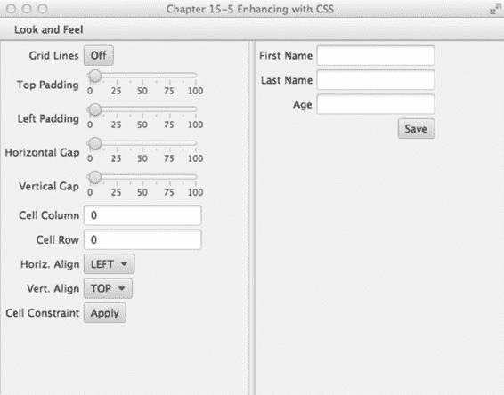

第 15 章 N 使用 JavaFX 进行图形处理

**图 15-10.** *Modena 外观*

图 15-11 展示了 Control Style 1 外观（主题）。

[www.it-ebooks.info](http://www.it-ebooks.info/)


第 15 章 N 使用 JavaFX 进行图形处理

**图 15-11.** *Control Style 1 外观*

工作原理

JavaFX 能够像浏览器将 CSS 样式应用于 HTML 文档对象模型（DOM）中的元素一样，将 CSS 样式应用于场景图及其节点。在本方案中，你将使用 JavaFX 样式属性来为用户界面换肤。你主要使用本方案的 UI 来应用各种外观。为了展示可用的皮肤，提供了一个菜单选择，允许用户选择要应用于 UI 的外观。

在讨论 CSS 样式属性之前，先看看如何加载要应用于 JavaFX 应用程序的 CSS 样式。示例中的应用程序使用菜单项来允许用户选择首选外观。

创建菜单项时，你将创建一个便捷方法来构建一个菜单项，该菜单项通过 lambda 表达式加载指定的 CSS 和一个 EventHandler 动作，以将选定的 CSS 样式应用于当前 UI。默认加载 Modena 外观。可以通过将各自的样式表传递给 `setUserAgentStylesheet()` 方法来应用不同的外观。例如，要加载 Caspian 外观，只需将常量 `STYLESHEET_CASPIAN` 传递给 `setUserAgentStylesheet()` 方法。以下代码展示了如何创建这些菜单项：

MenuItem caspianLnf = new MenuItem("Caspian");

caspianLnf.setOnAction(skinForm(caspian, scene));

[www.it-ebooks.info](http://www.it-ebooks.info/)

第 15 章 N 使用 JavaFX 进行图形处理

接下来是添加包含 Sky 外观 CSS 样式的菜单项的代码，该样式已准备好应用于当前 UI。

// 新的 Modena 外观

MenuItem modenaLnf = new MenuItem("Modena");

modenaLnf.setOnAction(enableCss(STYLESHEET_MODENA,scene));

menu.getItems().add(modenaLnf);

`setOnAction()` 方法调用了一个名为 `enableCss()` 的方法，该方法接受一个样式表和当前场景。

`enableCss()` 的代码如下：

protected final EventHandler<ActionEvent> enableCss(String style, final Scene scene){

return (ActionEvent event) -> {

scene.getStylesheets().clear();

setUserAgentStylesheet(style);

};

}

对于其他不属于默认 JavaFX 发行版的 CSS 样式，菜单项的创建略有不同。以下是使用前面讨论的便捷方法的代码示例。

menu.getItems().add(createMenuItem("Control Style 1", "controlStyle1.css", scene)); 调用 `createMenuItem()` 方法也会调用另一个名为 `loadSkin()` 的便捷方法来加载 CSS 文件。它还会通过调用 `skinForm()` 方法，为菜单项的 `onAction` 属性设置一个合适的 `EventHandler`。回顾一下，`loadSkin` 负责加载 CSS 文件，而 `skinForm()` 方法的工作是将皮肤应用到 UI 应用程序上。以下是构建菜单项以将 CSS 样式应用于 UI 应用程序的便捷方法：

protected final MenuItem createMenuItem(String label, String css, final Scene scene){

MenuItem menuItem = new MenuItem(label);

ObservableList<String> cssStyle = loadSkin(css);

menuItem.setOnAction(skinForm(cssStyle, scene));

return menuItem;

}

protected final ObservableList<String> loadSkin(String cssFileName) {

ObservableList<String> cssStyle = FXCollections.observableArrayList();

cssStyle.addAll(getClass().getResource(cssFileName).toExternalForm());

return cssStyle;

}

protected final EventHandler<ActionEvent> skinForm

(final ObservableList<String> cssStyle, final Scene scene) {

return (ActionEvent event) -> {

scene.getStylesheets().clear();

scene.getStylesheets().addAll(cssStyle);

};

}

[www.it-ebooks.info](http://www.it-ebooks.info/)

第 15 章 N 使用 JavaFX 进行图形处理

N **注意** 要运行此方案，请确保 CSS 文件位于编译后的类区域中。将资源文件放在与加载它们的编译类文件相同的目录（包）中，可以轻松加载它们。CSS 文件与此代码示例文件位于同一位置。在 NetBeans 中，你可以选择“清理并构建项目”，或者将文件复制到你的类构建区域。

现在你已经知道如何加载 CSS 样式，让我们来谈谈 JavaFX CSS 选择器和样式属性。与 CSS 样式表类似，场景图中的 Node 对象也有关联的选择器或样式类。所有场景图节点都有一个名为 `setStyle()` 的方法，该方法应用可能改变节点背景颜色、边框、描边等的样式属性。由于所有图形节点都继承自 `Node` 类，派生类将能够继承相同的样式属性。了解节点类型的继承层次结构非常重要，因为节点类型将决定你可以影响的样式属性类型。例如，`Rectangle` 继承自 `Shape`，而 `Shape` 继承自 `Node`。该继承链不包括 `-fx-border-style`，它是继承自 `Region` 的节点的一部分。基于节点类型，你可以设置的样式存在限制。要查看所有样式选择器的完整列表，请参考 JavaFX CSS 参考指南：

[`docs.oracle.com/javase/8/javafx/api/javafx/scene/doc-files/cssref.html`](http://docs.oracle.com/javase/8/javafx/api/javafx/scene/doc-files/cssref.html)

所有 JavaFX 样式属性都以 `-fx-` 为前缀。例如，所有 Node 都有影响不透明度的样式属性，该属性是 `-fx-opacity`。以下是用于样式化 JavaFX `javafx.scene.control.Label` 和 `javafx.scene.control.Button` 的选择器：

.label {

-fx-text-fill: rgba(17, 145, 213);

-fx-border-color: rgba(255, 255, 255, .80);

-fx-border-radius: 8;

-fx-padding: 6 6 6 6;

-fx-font: bold italic 20pt "LucidaBrightDemiBold";

}

.button{

-fx-text-fill: rgba(17, 145, 213);

-fx-border-color: rgba(255, 255, 255, .80);

-fx-border-radius: 8;

-fx-padding: 6 6 6 6;

-fx-font: bold italic 20pt "LucidaBrightDemiBold";

}

总结

在本章中，我们涵盖了与 JavaFX 图形相关的多个主题。我们学习了如何通过开发一个允许将图像拖放到舞台上的应用程序来创建图像，从而创建图像的副本。

然后，我们介绍了实现文本和形状动画的方案。最后，我们学习了如何利用网格和/或 CSS 来布局应用程序组件。

[www.it-ebooks.info](http://www.it-ebooks.info/)


**第 16 章**

**使用 JavaFX 处理媒体**

JavaFX 提供了一个功能丰富的媒体 API，能够播放音频和视频。Media API 允许开发人员将音频和视频集成到他们的富客户端应用程序中。Media API 的主要优点之一是在通过网络分发媒体内容时具有跨平台能力。由于需要播放多媒体内容的设备（平板电脑、音乐播放器、电视等）种类繁多，跨平台 API 的需求至关重要。


设想一个并不遥远的未来，你的电视或墙壁能够以你从未梦想过的方式与你互动。例如，在观看电影时，你可以选择电影中使用的物品或服装，并立即购买，而这一切都无需离开舒适的家中。基于这样的未来构想，开发者们正致力于增强其媒体类应用的交互特性。

在本章中，你将学习如何以交互方式播放音频和视频。请就座，迎接 JavaFX 的第三幕，音频和视频将成为舞台的焦点——如图 16-1 所示。

**图 16-1.** *音频与视频*

16-1. 播放音频

问题

你想要聆听音乐，并通过图形可视化获得娱乐体验。

[www.it-ebooks.info](http://www.it-ebooks.info/)

第 16 章 使用 JavaFX 处理媒体

解决方案

通过使用以下类创建一个 MP3 播放器：

u javafx.scene.media.Media

u javafx.scene.media.MediaPlayer

u javafx.scene.media.AudioSpectrumListener

以下源代码是一个简单 MP3 播放器的实现：

package org.java8recipes.chapter16.recipe16_01;

import java.io.File;

import java.util.Random;

import javafx.application.Application;

import javafx.application.Platform;

import javafx.geometry.Point2D;

import javafx.scene.Group;

import javafx.scene.Node;

import javafx.scene.Scene;

import javafx.scene.input.DragEvent;

import javafx.scene.input.Dragboard;

import javafx.scene.input.MouseEvent;

import javafx.scene.input.TransferMode;

import javafx.scene.media.AudioSpectrumListener;

import javafx.scene.media.Media;

import javafx.scene.media.MediaPlayer;

import javafx.scene.paint.Color;

import javafx.scene.shape.Arc;

import javafx.scene.shape.ArcType;

import javafx.scene.shape.Circle;

import javafx.scene.shape.Line;

import javafx.scene.shape.Rectangle;

import javafx.scene.text.Text;

import javafx.stage.Stage;

import javafx.stage.StageStyle;

public class PlayingAudio extends Application {

private MediaPlayer mediaPlayer;

private Point2D anchorPt;

private Point2D previousLocation;

/**

* @param args the command line arguments

*/

public static void main(String[] args) {

Application.launch(args);

}

[www.it-ebooks.info](http://www.it-ebooks.info/)

第 16 章 使用 JavaFX 处理媒体

@Override

public void start(final Stage primaryStage) {

primaryStage.setTitle("第 16-1 章 播放音频");

primaryStage.centerOnScreen();

primaryStage.initStyle(StageStyle.TRANSPARENT);

Group root = new Group();

Scene scene = new Scene(root, 551, 270, Color.rgb(0, 0, 0, 0));

// 应用程序区域

Rectangle applicationArea = new Rectangle();

applicationArea.setArcWidth(20);

applicationArea.setArcHeight(20);

applicationArea.setFill(Color.rgb(0, 0, 0, .80));

applicationArea.setX(0);

applicationArea.setY(0);

applicationArea.setStrokeWidth(2);

applicationArea.setStroke(Color.rgb(255, 255, 255, .70));

root.getChildren().add(applicationArea);

applicationArea.widthProperty().bind(scene.widthProperty());

applicationArea.heightProperty().bind(scene.heightProperty());

final Group phaseNodes = new Group();

root.getChildren().add(phaseNodes);

// 设置初始锚点

scene.setOnMousePressed((MouseEvent event) -> {

anchorPt = new Point2D(event.getScreenX(), event.getScreenY());

});

// 拖动整个舞台

scene.setOnMouseDragged((MouseEvent event) -> {

if (anchorPt != null && previousLocation != null) {

primaryStage.setX(previousLocation.getX() + event.getScreenX() - anchorPt.getX());

primaryStage.setY(previousLocation.getY() + event.getScreenY() - anchorPt.getY());

}

});

// 设置当前位置

scene.setOnMouseReleased((MouseEvent event) -> {

previousLocation = new Point2D(primaryStage.getX(), primaryStage.getY());

});

// 在表面上拖动

scene.setOnDragOver((DragEvent event) -> {

Dragboard db = event.getDragboard();

[www.it-ebooks.info](http://www.it-ebooks.info/)

第 16 章 使用 JavaFX 处理媒体

if (db.hasFiles()) {

event.acceptTransferModes(TransferMode.COPY);

} else {

event.consume();

}

});

// 在表面上释放

scene.setOnDragDropped((DragEvent event) -> {


`Dragboard db = event.getDragboard();`

`boolean success = false;`

`if (db.hasFiles()) {`

`success = true;`

`String filePath = null;`

`for (File file : db.getFiles()) {`

`filePath = file.getAbsolutePath();`

`System.out.println(filePath);`

`}`

`// 播放文件`

`Media media = new Media(new File(filePath).toURI().toString());`

`if (mediaPlayer != null) {`

`mediaPlayer.stop();`

`}`

`mediaPlayer = new MediaPlayer(media);`

`// 为教程保留的内部类，可改为 lambda 表达式`

`mediaPlayer.setAudioSpectrumListener(new AudioSpectrumListener() {`

`@Override`

`public void spectrumDataUpdate(double timestamp, double duration, float[] magnitudes, float[] phases) {`

`phaseNodes.getChildren().clear();`

`int i = 0;`

`int x = 10;`

`int y = 150;`

`final Random rand = new Random(System.currentTimeMillis());`

`for (float phase : phases) {`

`int red = rand.nextInt(255);`

`int green = rand.nextInt(255);`

`int blue = rand.nextInt(255);`

`Circle circle = new Circle(10);`

`circle.setCenterX(x + i);`

`circle.setCenterY(y + (phase * 100));`

`circle.setFill(Color.rgb(red, green, blue, .70));`

`phaseNodes.getChildren().add(circle);`

`i += 5;`

`}`

`}`

`});`

[www.it-ebooks.info](http://www.it-ebooks.info/)

第 16 章 使用 JavaFX 处理媒体

`mediaPlayer.setOnReady(mediaPlayer::play);`

`}`

`event.setDropCompleted(success);`

`event.consume();`

`});`

`// 创建滑动控件`

`final Group buttonGroup = new Group();`

`// 圆角矩形`

`Rectangle buttonArea = new Rectangle();`

`buttonArea.setArcWidth(15);`

`buttonArea.setArcHeight(20);`

`buttonArea.setFill(new Color(0, 0, 0, .55));`

`buttonArea.setX(0);`

`buttonArea.setY(0);`

`buttonArea.setWidth(60);`

`buttonArea.setHeight(30);`

`buttonArea.setStroke(Color.rgb(255, 255, 255, .70));`

`buttonGroup.getChildren().add(buttonArea);`

`// 停止音频控件`

`Rectangle stopButton = new Rectangle();`

`stopButton.setArcWidth(5);`

`stopButton.setArcHeight(5);`

`stopButton.setFill(Color.rgb(255, 255, 255, .80));`

`stopButton.setX(0);`

`stopButton.setY(0);`

`stopButton.setWidth(10);`

`stopButton.setHeight(10);`

`stopButton.setTranslateX(15);`

`stopButton.setTranslateY(10);`

`stopButton.setStroke(Color.rgb(255, 255, 255, .70));`

`stopButton.setOnMousePressed((MouseEvent me) -> {`

`if (mediaPlayer != null) {`

`mediaPlayer.stop();`

`}`

`});`

`buttonGroup.getChildren().add(stopButton);`

`// 播放控件`

`final Arc playButton = new Arc();`

`playButton.setType(ArcType.ROUND);`

`playButton.setCenterX(12);`

`playButton.setCenterY(16);`

`playButton.setRadiusX(15);`

`playButton.setRadiusY(15);`

`playButton.setStartAngle(180 - 30);`

[www.it-ebooks.info](http://www.it-ebooks.info/)

第 16 章 使用 JavaFX 处理媒体

`playButton.setLength(60);`

`playButton.setFill(new Color(1, 1, 1, .90));`

`playButton.setTranslateX(40);`

`playButton.setOnMousePressed((MouseEvent me) -> {`

`mediaPlayer.play();`

`});`

`// 暂停控件`

`final Group pause = new Group();`

`final Circle pauseButton = new Circle();`

`pauseButton.setCenterX(12);`

`pauseButton.setCenterY(16);`

`pauseButton.setRadius(10);`

`pauseButton.setStroke(new Color(1, 1, 1, .90));`

`pauseButton.setTranslateX(30);`

`final Line firstLine = new Line();`

`firstLine.setStartX(6);`

`firstLine.setStartY(16 - 10);`

`firstLine.setEndX(6);`

`firstLine.setEndY(16 - 2);`

`firstLine.setStrokeWidth(3);`

`firstLine.setTranslateX(34);`

`firstLine.setTranslateY(6);`

`firstLine.setStroke(new Color(1, 1, 1, .90));`

`final Line secondLine = new Line();`

`secondLine.setStartX(6);`

`secondLine.setStartY(16 - 10);`

`secondLine.setEndX(6);`

`secondLine.setEndY(16 - 2);`

`secondLine.setStrokeWidth(3);`

`secondLine.setTranslateX(38);`

`secondLine.setTranslateY(6);`

`secondLine.setStroke(new Color(1, 1, 1, .90));`

`pause.getChildren().addAll(pauseButton, firstLine, secondLine);`

`pause.setOnMousePressed((MouseEvent me) -> {`

`if (mediaPlayer != null) {`

`buttonGroup.getChildren().remove(pause);`

`buttonGroup.getChildren().add(playButton);`

`mediaPlayer.pause();`

`}`

`});`

`playButton.setOnMousePressed((MouseEvent me) -> {`

`if (mediaPlayer != null) {`

`buttonGroup.getChildren().remove(playButton);`

[www.it-ebooks.info](http://www.it-ebooks.info/)

第 16 章 使用 JavaFX 处理媒体

`buttonGroup.getChildren().add(pause);`

`mediaPlayer.play();`

`}`

`});`

`buttonGroup.getChildren().add(pause);`

`// 当场景大小改变时移动按钮组`


but tonGroup.translateXProperty().bind(scene.widthProperty().subtract(buttonArea.getWidth()

+ 6));

but tonGroup.translateYProperty().bind(scene.heightProperty().subtract(buttonArea.getHeight()

+ 6));

root.getChildren().add(buttonGroup);

// 关闭按钮

final Group closeApp = new Group();

Circle closeButton = new Circle();

closeButton.setCenterX(5);

closeButton.setCenterY(0);

closeButton.setRadius(7);

closeButton.setFill(Color.rgb(255, 255, 255, .80));

Node closeXmark = new Text(2, 4, "X");

closeApp.translateXProperty().bind(scene.widthProperty().subtract(15));

closeApp.setTranslateY(10);

closeApp.getChildren().addAll(closeButton, closeXmark);

closeApp.setOnMouseClicked((MouseEvent event) -> {

Platform.exit();

});

root.getChildren().add(closeApp);

primaryStage.setScene(scene);

primaryStage.show();

previousLocation = new Point2D(primaryStage.getX(), primaryStage.getY());

}

}

图 16-2 展示了一个带有可视化效果的 JavaFX MP3 播放器。

[www.it-ebooks.info](http://www.it-ebooks.info/)


第 16 章 使用 JavaFX 处理媒体

**图 16-2.** *JavaFX MP3 播放器*

工作原理

在开始之前，我先讨论一下如何操作这个 MP3 播放器。用户可以将音频文件拖放到应用程序区域中进行播放。应用程序右下角有用于停止、暂停和恢复音频媒体播放的按钮。（按钮控件如图 16-2 所示。）在音乐播放过程中，用户还会注意到随机颜色的球体随着音乐跳动。当用户听完音乐后，可以点击右上角的白色圆角关闭按钮退出应用程序。

这与配方 15-1 类似，在配方 15-1 中，你学习了如何使用拖放桌面隐喻将文件加载到 JavaFX 应用程序中。不过，这里用户访问的是音频文件，而不是图像文件。JavaFX 目前支持以下音频文件格式：.mp3、.wav 和 .aiff。

为了保持相同的外观和感觉，你将使用与配方 15-1 相同的样式。在本配方中，你将修改按钮控件，使其看起来像按钮，类似于许多媒体播放器应用程序。当按下暂停按钮时，它将暂停音频媒体的播放，并切换到播放按钮控件，从而允许用户恢复播放。作为额外奖励，MP3 播放器将显示为一个不规则形状、半透明的无边框窗口，并且可以使用鼠标在桌面上拖动。现在你已经了解了音乐播放器的操作方式，让我们来逐步解析代码。

首先，你需要创建实例变量，这些变量将在应用程序的整个生命周期中维护状态信息。

表 16-1 描述了此音乐播放器应用程序中使用的所有实例变量。第一个变量是对媒体播放器（MediaPlayer）对象的引用，该对象将与包含音频文件的 Media 对象一起创建。接下来，你创建一个 anchorPt 变量，用于在用户开始拖动窗口时保存鼠标按下时的起始坐标。在鼠标拖动操作期间计算应用程序窗口的左上角边界时，previousLocation 变量将包含上一个窗口的屏幕 X 和 Y 坐标。

[www.it-ebooks.info](http://www.it-ebooks.info/)

第 16 章 使用 JavaFX 处理媒体

**表 16-1.** *MP3 播放器应用程序实例变量*

**变量**

**数据类型**

**示例**

**描述**

mediaPlayer

MediaPlayer

N/A

播放音频和视频的媒体播放器控件

anchorPt

Point2D

100,100

用户开始拖动窗口时的坐标

previousLocation

Point2D

0,0

舞台上一个位置的左上角坐标；用于辅助拖动窗口

表 16-1 列出了 MP3 播放器应用程序的实例变量。


在前几章关于图形用户界面的内容中，你已经看到 GUI 应用程序通常包含一个标题栏和围绕场景的窗口边框。在这里，我想稍微提高一点难度，向你展示如何创建不规则形状的半透明窗口，从而使界面看起来更时髦或更现代。当你开始创建媒体播放器时，你会注意到在 `start()` 方法中，你通过使用 `StageStyle.TRANSPARENT` 初始化样式来准备 `Stage` 对象。将样式初始化为 `StageStyle.TRANSPARENT` 后，窗口将变为无装饰状态，整个窗口区域的不透明度值设为零（不可见）。以下代码展示了如何创建一个没有标题栏或窗口边框的透明窗口：

primaryStage.initStyle(StageStyle.TRANSPARENT);

有了这个不可见的舞台，你创建一个圆角矩形区域，它将作为应用程序的表面或主要内容区域。接下来，请注意矩形的宽度和高度被绑定到场景对象上，以防窗口被调整大小。

由于窗口不会被调整大小，这个绑定并非必需（然而，在配方 16-2 中，当你需要将视频屏幕放大到全屏模式时，它会派上用场）。

在创建了一个黑色、半透明、圆角的矩形区域（`applicationArea`）之后，你将创建一个简单的 `Group` 对象来容纳所有随机颜色的 `Circle` 节点，这些节点将在音频播放时展示图形可视化效果。稍后，你将看到如何使用 `AudioSpectrumListener` 根据声音信息更新 `phaseNodes`（`Group`）变量。

接下来，你向 `Scene` 对象添加 `EventHandler<MouseEvent>` 实例（示例使用了 lambda 表达式），以监控用户拖动窗口时的鼠标事件。此场景中的第一个事件是鼠标按下，它会将光标当前的 (X, Y) 坐标保存到变量 `anchorPt` 中。以下代码是向 `Scene` 的鼠标按下属性添加一个 `EventHandler`：

// 起始初始锚点

scene.setOnMousePressed((MouseEvent event) -> {

anchorPt = new Point2D(event.getScreenX(), event.getScreenY());

});

实现鼠标按下事件处理器后，你可以为 `Scene` 的鼠标拖动属性创建一个 `EventHandler`。鼠标拖动事件处理器将根据之前的窗口位置（左上角）以及 `anchorPt` 变量，动态更新并定位应用程序窗口（`Stage`）。这里展示的是负责 `Scene` 对象上鼠标拖动事件的事件处理器：

// 拖动整个舞台

scene.setOnMouseDragged((MouseEvent event) -> {

if (anchorPt != null && previousLocation != null) {

primaryStage.setX(previousLocation.getX() + event.getScreenX() - anchorPt.getX());

primaryStage.setY(previousLocation.getY() + event.getScreenY() - anchorPt.getY());

}

});

[www.it-ebooks.info](http://www.it-ebooks.info/)

第 16 章 使用 JavaFX 处理媒体

你需要处理鼠标释放事件。一旦鼠标被释放，事件处理器将更新 `previousLocation` 变量，以便后续的鼠标拖动事件能够在屏幕上移动应用程序窗口。

以下代码片段更新了 `previousLocation` 变量：

// 设置当前位置

scene.setOnMouseReleased((MouseEvent event) -> {

previousLocation = new Point2D(primaryStage.getX(), primaryStage.getY());

});

接下来，你将实现拖放场景，以从文件系统（使用文件管理器）加载音频文件。处理拖放场景时，它类似于配方 15-1，你在其中创建了一个 `EventHandler` 来处理 `DragEvents`。不过，这次不是加载图像文件，而是从主机文件系统加载音频文件。为简洁起见，我仅提及拖放事件处理器的代码行。一旦音频文件可用，你将通过将文件作为 URI 传入来创建一个 `Media` 对象。以下代码片段展示了如何创建一个 `Media` 对象：

Media media = new Media(new File(filePath).toURI().toString());

创建 `Media` 对象后，你必须创建一个 `MediaPlayer` 实例才能播放声音文件。`Media` 和 `MediaPlayer` 对象都是不可变的，这就是为什么每次用户将文件拖入应用程序时都会创建它们的新实例。接下来，你将检查实例变量 `mediaPlayer` 中是否有先前的实例，以确保在创建新的 `MediaPlayer` 实例之前它已停止。以下代码检查是否有先前的媒体播放器需要停止：

if (mediaPlayer != null) {

mediaPlayer.stop();

}

那么，这就是你创建 `MediaPlayer` 实例的地方。`MediaPlayer` 对象负责控制媒体对象的播放。请注意，`MediaPlayer` 在播放、暂停和停止媒体方面，对声音或视频媒体的处理方式相同。创建媒体播放器时，你需要指定 `media` 和 `audioSpectrumListener` 属性方法。将 `autoPlay` 属性设置为 `true` 将在音频媒体加载后立即播放。在 `MediaPlayer` 实例上需要指定的最后一项是 `AudioSpectrumListener`。那么，你可能会问，这种监听器到底是什么？根据 Javadoc 的描述，它是一个接收音频频谱周期性更新的观察者。用通俗的话说，它就是音频媒体的声音数据，如音量、节奏等。要创建 `AudioSpectrumListener` 的实例，你需要创建一个内部类，并重写 `spectrumDataUpdate()` 方法。

你也可以在这里使用 lambda 表达式；但示例使用了内部类，以便更好地展示其功能。表 16-2 lis 列出了音频频谱监听器方法的所有入参。更多详情，请参考以下网址的 Javadoc：

[`docs.oracle.com/javase/8/javafx/api/javafx/scene/media/AudioSpectrumListener.html`](http://docs.oracle.com/javase/8/javafx/api/javafx/scene/media/AudioSpectrumListener.html)。

**表 16-2.** *AudioSpectrumListener 的 spectrumDataUpdate() 方法入参* **变量**

**数据类型**

**示例**

**描述**

timestamp

double

2.4261

事件发生的时间，以秒为单位

duration

Double

0.1

计算频谱所持续的时间（以秒为单位）

magnitudes

float[]

-50.474335

一个浮点值数组，代表每个频段的频谱

幅度，单位为分贝（非正浮点值）

phases

float[]

1.2217305

一个浮点值数组，代表每个频段的相位

[www.it-ebooks.info](http://www.it-ebooks.info/)

第 16 章 使用 JavaFX 处理媒体

在示例中，基于变量 `phases`（浮点数组）创建、定位并放置了随机颜色的圆形节点到场景上。为了绘制每个彩色圆形，圆心的 X 坐标递增 5 个像素，圆心的 Y 坐标加上每个相位值乘以 100。这里展示的是绘制每个随机颜色圆形的代码片段：

circle.setCenterX(x + i);

circle.setCenterY(y + (phase * 100));

... // 设置圆形

i+=5;

以下是 `AudioSpectrumListener` 的一个内部类实现：

new AudioSpectrumListener() {

@Override

public void spectrumDataUpdate(double timestamp, double duration, float[] magnitudes, float[]

phases) {

phaseNodes.getChildren().clear();

int i = 0;

int x = 10;

int y = 150;

final Random rand = new Random(System.currentTimeMillis());

for(float phase:phases) {

int red = rand.nextInt(255);

int green = rand.nextInt(255);

int blue = rand.nextInt(255);

Circle circle = new Circle(10);

circle.setCenterX(x + i);

circle.setCenterY(y + (phase * 100));

circle.setFill(Color.rgb(red, green, blue, .70));

phaseNodes.getChildren().add(circle);

i+=5;

}

}

};


创建媒体播放器后，你需要创建一个 `java.lang.Runnable` 实例，并将其赋值给 `onReady` 属性，以便在媒体进入就绪状态时调用。当就绪事件触发时，`run()` 方法将调用媒体播放器对象的 `play()` 方法来开始播放音频。拖放序列完成后，你需要通过调用事件的 `setDropCompleted()` 方法并传入 `true` 值，来适当地通知拖放系统。以下代码片段演示了如何使用方法引用实现一个 `Runnable`，以便在媒体播放器进入就绪状态后立即启动它：

mediaPlayer.setOnReady(mediaPlayer::play);

最后，你使用 JavaFX 形状创建按钮，分别代表停止、播放、暂停和关闭按钮。在创建形状或自定义节点时，你可以向节点添加事件处理器以响应鼠标点击。尽管在 JavaFX 中有更高级的方法来构建自定义控件，但本示例使用简单的矩形、弧线、圆形和线条来构建自定义按钮图标。要了解创建自定义控件的更高级方法，请参考关于

[www.it-ebooks.info](http://www.it-ebooks.info/)

第 16 章 使用 JavaFX 处理媒体

`Skinnable` API 的 Javadoc 或配方 16-5。要附加鼠标按下的事件处理器，只需调用 `setOnMousePress()` 方法，并传入一个 `EventHandler<MouseEvent>` 实例。以下代码演示了如何添加一个 `EventHandler` 来响应 `stopButton` 节点上的鼠标按下事件：

stopButton.setOnMousePressed((MouseEvent me) -> {

if (mediaPlayer != null) {

mediaPlayer.stop();

}

});

由于所有按钮都使用相同的代码片段，因此仅列出每个按钮将在媒体播放器上执行的方法调用。最后一个按钮“关闭”与媒体播放器无关，但它提供了一种退出 MP3 播放器应用程序的方式。以下操作分别负责停止、暂停、播放和退出 MP3 播放器应用程序：

停止 - mediaPlayer.stop();
暂停 - mediaPlayer.pause();
播放 - mediaPlayer.play();
关闭 - Platform.exit();

16-2. 播放视频

问题

你想要查看一个视频文件，并附带用于播放、暂停、停止和搜索的控件。

解决方案

通过使用以下类来创建一个视频媒体播放器：

- `javafx.scene.media.Media`
- `javafx.scene.media.MediaPlayer`
- `javafx.scene.media.MediaView`

以下代码是一个 JavaFX 基本视频播放器的实现：

public void start(final Stage primaryStage) {

primaryStage.setTitle("第 16-2 节 播放视频");

primaryStage.centerOnScreen();

primaryStage.initStyle(StageStyle.TRANSPARENT);

final Group root = new Group();

final Scene scene = new Scene(root, 540, 300, Color.rgb(0, 0, 0, 0));

// 带有轻微透明度的圆角矩形

Node applicationArea = createBackground(scene);

root.getChildren().add(applicationArea);

// 允许用户在桌面上拖动窗口

attachMouseEvents(scene, primaryStage);

[www.it-ebooks.info](http://www.it-ebooks.info/)

第 16 章 使用 JavaFX 处理媒体

// 允许用户查看视频播放的进度

progressSlider = createSlider(scene);

root.getChildren().add(progressSlider);

// 在表面拖拽

scene.setOnDragOver((DragEvent event) -> {

Dragboard db = event.getDragboard();

if (db.hasFiles() || db.hasUrl() || db.hasString()) {

event.acceptTransferModes(TransferMode.COPY);

if (mediaPlayer != null) {

mediaPlayer.stop();

}

} else {

event.consume();

}

});

// 随着视频进度更新滑块（稍后移除）

progressListener = (ObservableValue<? extends Duration> observable, Duration oldValue, Duration newValue) -> {

progressSlider.setValue(newValue.toSeconds());

};

// 在表面放下

scene.setOnDragDropped((DragEvent event) -> {

Dragboard db = event.getDragboard();

boolean success = false;

URI resourceUrlOrFile = null;

// 从浏览器地址栏拖拽？

if (db.hasContent(DataFormat.URL)) {

try {

resourceUrlOrFile = new URI(db.getUrl());

} catch (URISyntaxException ex) {

ex.printStackTrace();

}

} else if (db.hasFiles()) {

// 从文件系统拖拽

String filePath = null;


for (File file:db.getFiles()) {

filePath = file.getAbsolutePath();

}

resourceUrlOrFile = new File(filePath).toURI();

success = true;

}

// 加载媒体

Media media = new Media(resourceUrlOrFile.toString());

// 停止之前的媒体播放器并清理

if (mediaPlayer != null) {

mediaPlayer.stop();

[www.it-ebooks.info](http://www.it-ebooks.info/)

第 16 章 使用 JavaFX 处理媒体

mediaPlayer.currentTimeProperty().removeListener(progressListener);

mediaPlayer.setOnPaused(null);

mediaPlayer.setOnPlaying(null);

mediaPlayer.setOnReady(null);

}

// 创建一个新的媒体播放器

mediaPlayer = new MediaPlayer(media);

// 在媒体播放时移动滑块以显示进度

mediaPlayer.currentTimeProperty().addListener(progressListener);

// 当状态就绪时播放视频

mediaPlayer.setOnReady(() -> {

progressSlider.setValue(1);

progressSlider.setMax(mediaPlayer.getMedia().getDuration().toMillis()/1000);

mediaPlayer.play();

});

// 延迟初始化媒体查看器

if (mediaView == null) {

mediaView = new MediaView();

mediaView.setMediaPlayer(mediaPlayer);

mediaView.setX(4);

mediaView.setY(4);

mediaView.setPreserveRatio(true);

mediaView.setOpacity(.85);

mediaView.setSmooth(true);

mediaView.fitWidthProperty().bind(scene.widthProperty().subtract(220));

mediaView.fitHeightProperty().bind(scene.heightProperty().subtract(30));

// 将媒体查看器设为场景中的第二个节点

root.getChildren().add(1, mediaView);

}

// 有时会发生加载错误，在此处打印错误信息

mediaView.setOnError((MediaErrorEvent event1) -> {

event1.getMediaError().printStackTrace();

});

mediaView.setMediaPlayer(mediaPlayer);

event.setDropCompleted(success);

event.consume();

});

// 用于放置按钮的矩形区域

final Group buttonArea = createButtonArea(scene);

[www.it-ebooks.info](http://www.it-ebooks.info/)

第 16 章 使用 JavaFX 处理媒体

// 停止按钮将停止并回退媒体

Node stopButton = createStopControl();

// 播放按钮可以恢复或开始播放媒体

final Node playButton = createPlayControl();

// 暂停媒体播放

final Node pauseButton = createPauseControl();

stopButton.setOnMousePressed((MouseEvent me) -> {

if (mediaPlayer!= null) {

buttonArea.getChildren().removeAll(pauseButton, playButton);

buttonArea.getChildren().add(playButton);

mediaPlayer.stop();

}

});

// 暂停媒体并将按钮切换为播放按钮

pauseButton.setOnMousePressed((MouseEvent me) -> {

if (mediaPlayer!=null) {

buttonArea.getChildren().removeAll(pauseButton, playButton);

buttonArea.getChildren().add(playButton);

mediaPlayer.pause();

paused = true;

}

});

// 播放媒体并将按钮切换为暂停按钮

playButton.setOnMousePressed((MouseEvent me) -> {

if (mediaPlayer != null) {

buttonArea.getChildren().removeAll(pauseButton, playButton);

buttonArea.getChildren().add(pauseButton);

paused = false;

mediaPlayer.play();

}

});

// 将停止按钮添加到按钮区域

buttonArea.getChildren().add(stopButton);

// 默认设置暂停按钮

buttonArea.getChildren().add(pauseButton);

// 添加按钮

root.getChildren().add(buttonArea);

// 创建一个关闭按钮

Node closeButton= createCloseButton(scene);

root.getChildren().add(closeButton);

primaryStage.setOnShown((WindowEvent we) -> {

previousLocation = new Point2D(primaryStage.getX(), primaryStage.getY());

});

[www.it-ebooks.info](http://www.it-ebooks.info/)

第 16 章 使用 JavaFX 处理媒体

primaryStage.setScene(scene);

primaryStage.show();

}

以下是 attachMouseEvents() 方法，它为场景添加了一个事件处理器，使视频播放器能够进入全屏模式。

private void attachMouseEvents(Scene scene, final Stage primaryStage) {

// 全屏切换

scene.setOnMouseClicked((MouseEvent event) -> {

if (event.getClickCount() == 2) {

primaryStage.setFullScreen(!primaryStage.isFullScreen());

}

});

... // 其余的事件处理器

}

以下方法创建了一个带有 ChangeListener 的滑块控件，使用户能够在视频中向前和向后搜索：

private Slider createSlider(Scene scene) {

Slider slider = new Slider();

slider.setMin(0);

slider.setMax(100);

slider.setValue(1);

slider.setShowTickLabels(true);

slider.setShowTickMarks(true);


slider.valueProperty().addListener((ObservableableValue<? extends Number> observable, Number oldValue, Number newValue) -> {

if (paused) {

long dur = newValue.intValue() * 1000;

mediaPlayer.seek(new Duration(dur));

}

});

slider.translateYProperty().bind(scene.heightProperty().subtract(30));

return slider;

}

图 16-3 展示了一个带有滑块控件的 JavaFX 基础视频播放器。

[www.it-ebooks.info](http://www.it-ebooks.info/)


第 16 章 使用 JavaFX 处理媒体

**图 16-3.** *JavaFX 基础视频播放器*

工作原理

要创建视频播放器，你需要参照配方 16-1 中的示例来构建应用程序，并复用相同的应用功能，例如拖放文件、媒体按钮控件等。为清晰起见，我对上一个配方进行了调整，将大部分 UI 代码移入便捷函数中，这样你就能专注于媒体 API 的学习，而不会在 UI 代码中迷失方向。本章后续的配方均基于此配方创建的 JavaFX 基础媒体播放器添加简单功能。因此，后续配方中的代码片段将较为简短，仅包含每个新功能所需的必要代码。

需要注意的是，JavaFX 媒体播放器支持多种媒体格式。支持的格式如下：

u AIFF

u FXM、FLV

u HLS (*)

u MP3

u MP4

u WAV

有关支持媒体类型的完整摘要，请参阅在线文档：

[`docs.oracle.com/javase/8/javafx/api/javafx/scene/media/package-summary.html.`](http://docs.oracle.com/javase/8/javafx/api/javafx/scene/media/package-summary.html)

与上一个配方中创建的音频播放器一样，JavaFX 基础视频播放器也具备相同的基本媒体控件，包括停止、暂停和播放。除了这些基本控件外，你还添加了新的功能，例如进度跳转和全屏模式。

播放视频时，你需要一个视图区域（javafx.scene.media.MediaView）来显示视频。你还需要创建一个滑块控件来监控视频的播放进度，该控件位于图 16-3 所示应用程序的左下角。滑块控件允许用户在视频中向前或向后跳转。最后一个额外功能是，通过双击应用程序窗口即可让视频进入全屏模式。要恢复窗口，用户可再次双击或按下 Escape 键。

为了快速上手，我们直接进入代码部分。在 `start()` 方法中设置舞台后，通过调用 `createBackground()` 方法（applicationArea）创建一个黑色半透明背景。接着，调用 `attachMouseEvents()` 方法来设置事件处理器，以便用户能够在桌面上拖动应用程序窗口。另一个要附加到场景的事件处理器将允许用户切换到全屏模式。使用条件判断来检测应用程序窗口中的双击操作，以调用全屏模式。一旦检测到双击，就会调用舞台的 `setFullScreen()` 方法，并传入与当前设置值相反的布尔值。以下是实现窗口全屏模式所需的代码：

// 全屏切换

scene.setOnMouseClicked((MouseEvent event) -> {

if (event.getClickCount() == 2) {

primaryStage.setFullScreen(!primaryStage.isFullScreen());

}

});

继续执行 `start()` 方法中的步骤，通过调用便捷方法 `createSlider()` 来创建一个滑块控件。`createSlider()` 方法实例化一个滑块控件，并添加一个 `ChangeListener`，以便在视频播放时移动滑块。每当滑块的值发生变化时，都会调用 `ChangeListener` 的 `changed()` 方法。一旦调用 `changed()` 方法，你就能看到旧值和新值。以下代码创建了一个 `ChangeListener`，用于在视频播放时更新滑块：


// 更新滑块以跟随视频播放进度（后续将移除）

progressListener = (ObservableValue<? extends Duration> observable,

Duration oldValue, Duration newValue) -> {

progressSlider.setValue(newValue.toSeconds());

};

创建进度监听器（progressListener）后，接着为场景创建拖放事件处理器（drag-dropped EventHandler）。

其目标是：在用户能够移动滑块之前，先判断暂停按钮是否已被按下。一旦检测到 `slider.isPressed()` 标志为真，将获取新值并转换为毫秒。`dur` 变量用于控制 `mediaPlayer` 跳转到视频中的对应位置，以便用户左右滑动控件。每当滑块的值发生变化时，`ChangeListener` 的 `changed()` 方法都会被调用。以下代码负责根据用户移动滑块的操作，将播放位置跳转到视频中的相应位置。

slider.valueProperty().addListener((ObservableValue<? extends Number> observable, Number oldValue, Number newValue) -> {

if (slider.isPressed()) {

long dur = newValue.intValue() * 1000;

mediaPlayer.seek(new Duration(dur));

}

});

继续往下，接下来实现一个拖放事件处理器（drag-dropped EventHandler），用于处理拖入应用程序窗口区域的媒体文件。此处示例首先检查是否存在之前的 `mediaPlayer`。如果存在，则停止之前的 `mediaPlayer` 对象并执行清理操作：

// 停止之前的媒体播放器并清理

if (mediaPlayer != null) {

mediaPlayer.stop();

mediaPlayer.currentTimeProperty().removeListener(progressListener);

mediaPlayer.setOnPaused(null);

mediaPlayer.setOnPlaying(null);

mediaPlayer.setOnReady(null);

}

...

[www.it-ebooks.info](http://www.it-ebooks.info/)

第 16 章 使用 JavaFX 处理媒体

// 准备就绪时播放视频

mediaPlayer.setOnReady(() -> {

progressSlider.setValue(1);

progressSlider.setMax(mediaPlayer.getMedia().getDuration().toMillis() / 1000);

mediaPlayer.play();

});// setOnReady()

与音频播放器类似，这里创建了一个 `Runnable` 实例，用于在媒体播放器处于就绪状态时执行。

你还会注意到，`progressSlider` 控件使用的值是秒。

一旦媒体播放器对象进入就绪状态，就会创建一个 `MediaView` 实例来显示媒体。以下代码创建了一个 `MediaView` 对象，并将其放入场景图中以显示视频内容：

// 延迟初始化媒体视图

if (mediaView == null) {

mediaView = new MediaView();

mediaView.setMediaPlayer(mediaPlayer);

mediaView.setX(4);

mediaView.setY(4);

mediaView.setPreserveRatio(true);

mediaView.setOpacity(.85);

mediaView.setSmooth(true);

mediaView.fitWidthProperty().bind(scene.widthProperty().subtract(220));

mediaView.fitHeightProperty().bind(scene.heightProperty().subtract(30));

// 将媒体视图设为场景中的第二个节点

root.getChildren().add(1, mediaView);

}

// 有时会发生加载错误，此时打印错误信息

mediaView.setOnError((MediaErrorEvent event1) -> {

event1.getMediaError().printStackTrace();

});

mediaView.setMediaPlayer(mediaPlayer);

event.setDropCompleted(success);

event.consume();

});

呼！终于完成了场景的拖放事件处理器。接下来主要是剩余的媒体按钮控件，它们与配方 16-1 末尾的代码类似。唯一的区别是一个名为 `paused` 的布尔类型实例变量，用于指示视频是否已暂停。以下代码展示了 `pauseButton` 和 `playButton` 如何控制 `mediaPlayer` 对象并相应地设置 `paused` 标志：

// 暂停媒体并将按钮切换为播放按钮

pauseButton.setOnMousePressed((MouseEvent me) -> {

if (mediaPlayer != null) {

buttonArea.getChildren().removeAll(pauseButton, playButton);

buttonArea.getChildren().add(playButton);

mediaPlayer.pause();

[www.it-ebooks.info](http://www.it-ebooks.info/)

第 16 章 使用 JavaFX 处理媒体

paused = true;

}

});

// 播放媒体并将按钮切换为暂停按钮

playButton.setOnMousePressed((MouseEvent me) -> {

if (mediaPlayer != null) {

buttonArea.getChildren().removeAll(pauseButton, playButton);


buttonArea.getChildren().add(pauseButton);

paused = false;

mediaPlayer.play();

}

});

以上就是创建视频媒体播放器的方法。在下一节中，你将学习如何监听媒体事件并调用相应操作。

16-3\. 控制媒体动作与事件

问题

你希望媒体播放器能够针对特定事件提供反馈，例如当媒体播放器的暂停事件被触发时，在屏幕上显示“已暂停”文本。

解决方案

你可以使用一个或多个媒体事件处理方法。表 16-3 列出了所有可能触发的媒体事件，允许开发者附加 EventHandler 或 Runnable。

**表 16-3.** *媒体事件*

**类**

**设置方法**

**属性方法**

**描述**

Media

setOnError()

onErrorProperty()

发生错误时

MediaPlayer

setOnEndOfMedia()

onEndOfMediaProperty()

媒体播放到达末尾

MediaPlayer

setOnError()

onErrorProperty()

发生错误

MediaPlayer

setOnHalted()

onHaltedProperty()

媒体状态变为 HALTED

MediaPlayer

setOnMarker()

onMarkerProperty()

标记事件被触发

MediaPlayer

setOnPaused()

onPausedProperty()

暂停事件发生

MediaPlayer

setOnPlaying()

onPlayingProperty()

媒体正在播放

MediaPlayer

setOnReady()

onReadyProperty()

媒体播放器处于就绪状态

MediaPlayer

setOnRepeat()

onRepeatProperty()

设置了重复属性

MediaPlayer

setOnStalled()

onStalledProperty()

媒体播放器停滞

MediaPlayer

setOnStopped()

onStoppedProperty()

媒体播放器已停止

MediaView

setOnError()

onErrorProperty()

媒体视图发生错误

[www.it-ebooks.info](http://www.it-ebooks.info/)


第 16 章 N 使用 JavaFX 处理媒体

以下代码向用户显示“已暂停”文本，其中“时长”包含毫秒小数部分。

当用户点击暂停按钮时，该文本会叠加显示在视频上方（见图 16-4）。

**图 16-4.** *暂停事件*

// 当暂停事件发生时显示暂停消息

mediaPlayer.setOnPaused(() -> {

pauseMessage.setText("已暂停 \n 时长: " +

mediaPlayer.currentTimeProperty().getValue().toMillis());

pauseMessage.setOpacity(.90);

});

工作原理

事件驱动架构（EDA）是一种重要的架构模式，用于建模异步传递消息的松散耦合组件和服务。JavaFX 团队将 Media API 设计为事件驱动，本方案演示了如何实现以响应媒体事件。

基于事件编程的思路，你会发现调用函数时会出现非阻塞或回调行为。在本方案中，你将实现响应 onPaused 事件来显示文本，而不是将代码放入暂停按钮中。你将不再通过 EventHandler 将代码直接绑定到按钮，而是实现响应媒体播放器 onPaused 事件被触发的代码。在响应媒体事件时，你将实现 java.lang.Runnables。

你会很高兴地发现，你一直在使用事件属性和实现 Runnable，尽管通常是以 lambda 表达式的形式。希望你在本章的所有方案中都注意到了这一点。当媒体播放器处于就绪状态时，Runnable 代码将被调用。为什么这样是正确的？因为当媒体播放器完成媒体加载后，onReady 属性会收到通知。这样你就可以确保能够调用 MediaPlayer 的 play() 方法。我相信你会习惯事件风格的编程。以下代码片段演示了如何使用 lambda 表达式将 Runnable 实例设置到媒体播放器对象的 OnReady 属性中：mediaPlayer.setOnReady(() -> {

mediaPlayer.play();

});

[www.it-ebooks.info](http://www.it-ebooks.info/)

第 16 章 N 使用 JavaFX 处理媒体

为了让你看到较新的 Java 8 编程风格与较旧风格之间的区别，以下是未使用 lambda 表达式实现的相同代码：

mediaPlayer.setOnReady(new Runnable() {

@Override

public void run() {


mediaPlayer.play();

}

});

看看使用 lambda 表达式后你减少了多少行代码？现在你对 Java 8 的喜爱程度如何？你将采取与 onReady 属性类似的步骤。一旦触发了 Paused 事件，就会调用 run() 方法，向用户显示一条消息，其中包含一个显示“Paused”文本的 Text 节点，以及一个显示视频播放毫秒数的时长。显示文本后，你可能希望将时长记录为标记（你将在配方 16-4 中学习）。以下代码片段展示了一个附加的 Runnable 实例，它负责在视频暂停的位置显示暂停消息和毫秒数：

// 当暂停事件发生时显示暂停消息

mediaPlayer.setOnPaused(() -> {

pauseMessage.setText("Paused \nDuration: " +

mediaPlayer.currentTimeProperty().getValue().toMillis());

pauseMessage.setOpacity(.90);

});

16-4\. 标记视频中的位置

问题

你希望在媒体播放器中播放视频时提供隐藏式字幕文本。

解决方案

首先应用配方 16-3 中的解决方案。通过从上一个配方中获取标记的时长（以毫秒为单位），你将在视频的各个时间点创建媒体标记事件。每个媒体标记都会关联一个文本，该文本将作为隐藏式字幕显示。当标记到达时，文本将显示在右上角。

以下代码片段演示了在 Scene 对象的 onDragDropped 事件属性中处理的媒体标记事件：

... // 在 start() 方法内部

final VBox messageArea = createClosedCaptionArea(scene);

root.getChildren().add(messageArea);

// 拖放到表面

scene.setOnDragDropped((DragEvent event) -> {

Dragboard db = event.getDragboard();

boolean success = false;

URI resourceUrlOrFile = null;

[www.it-ebooks.info](http://www.it-ebooks.info/)

第 16 章 使用 JavaFX 处理媒体

// 从 Web 浏览器地址栏拖放？

if (db.hasContent(DataFormat.URL)) {

try {

resourceUrlOrFile = new URI(db.getUrl().toString());

} catch (URISyntaxException ex) {

ex.printStackTrace();

}

} else if (db.hasFiles()) {

// 从文件系统拖放

String filePath = null;

for (File file:db.getFiles()) {

filePath = file.getAbsolutePath();

}

resourceUrlOrFile = new File(filePath).toURI();

success = true;

}

// 加载媒体

Media media = new Media(resourceUrlOrFile.toString());

// 停止之前的媒体播放器并清理

if (mediaPlayer != null) {

mediaPlayer.stop();

mediaPlayer.currentTimeProperty().removeListener(progressListener);

mediaPlayer.setOnPaused(null);

mediaPlayer.setOnPlaying(null);

mediaPlayer.setOnReady(null);

}

// 创建一个新的媒体播放器

mediaPlayer = new MediaPlayer(media);

// 在媒体播放时移动进度滑块

mediaPlayer.currentTimeProperty().addListener(progressListener);

// 当暂停事件发生时显示暂停消息

mediaPlayer.setOnPaused(() -> {

pauseMessage.setOpacity(.90);

});

// 播放时使暂停文本不可见

mediaPlayer.setOnPlaying(() -> {

pauseMessage.setOpacity(0);

});

// 准备就绪时播放视频

mediaPlayer.setOnReady(() -> {

progressSlider.setValue(1);

progressSlider.setMax(mediaPlayer.getMedia().getDuration().toMillis()/1000);

mediaPlayer.play();

});

[www.it-ebooks.info](http://www.it-ebooks.info/)

第 16 章 使用 JavaFX 处理媒体

// 延迟初始化媒体查看器

if (mediaView == null) {

mediaView = new MediaView(mediaPlayer);

mediaView.setX(4);

mediaView.setY(4);

mediaView.setPreserveRatio(true);

mediaView.setOpacity(.85);

mediaView.setSmooth(true);

mediaView.fitWidthProperty().bind(scene.widthProperty().subtract(messageArea.

widthProperty().add(70)));

mediaView.fitHeightProperty().bind(scene.heightProperty().subtract(30));

// 将媒体查看器设置为场景上的第二个节点。

root.getChildren().add(1, mediaView);

}

// 有时会发生加载错误

mediaView.setOnError((MediaErrorEvent event1) -> {

event1.getMediaError().printStackTrace();

});

mediaView.setMediaPlayer(mediaPlayer);

media.getMarkers().put("First marker", Duration.millis(10000));


media.getMarkers().put("Second marker", Duration.millis(20000));

media.getMarkers().put("Last one...", Duration.millis(30000));

// 显示隐藏式字幕

mediaPlayer.setOnMarker((MediaMarkerEvent event1) -> {

closedCaption.setText(event1.getMarker().getKey());

});

event.setDropCompleted(success);

event.consume();

}); // setOnDragDropped 方法结束

以下代码展示了一个工厂方法，该方法返回一个区域，该区域将包含显示在视频右侧的隐藏式字幕：

private VBox createClosedCaptionArea(final Scene scene) {

// 创建消息区域

final VBox messageArea = new VBox(3);

messageArea.setTranslateY(30);

messageArea.translateXProperty().bind(scene.widthProperty().subtract(152) );

messageArea.setTranslateY(20);

closedCaption = new Text();

closedCaption.setStroke(Color.WHITE);

closedCaption.setFill(Color.YELLOW);

closedCaption.setFont(new Font(15));

[www.it-ebooks.info](http://www.it-ebooks.info/)


第 16 章 使用 JavaFX 处理媒体

messageArea.getChildren().add(closedCaption);

return messageArea;

}

图 16-5 描绘了视频媒体播放器显示隐藏式字幕文本。

**图 16-5.** *隐藏式字幕文本*

工作原理

Media API 具有许多事件属性，开发者可以将 EventHandlers 或 Runnables 实例附加到这些属性上，以便在事件触发时做出响应。本技巧重点介绍了 OnMarker 事件属性。

Marker 属性负责接收标记事件（MediaMarkerEvent）。

首先，我们向 Media 对象添加标记。它包含一个方法 `getMarkers()`，该方法返回一个 `javafx.collections.ObservableMap<String, Duration>`。通过可观察映射，您可以添加代表每个标记的键/值对。添加的键应为唯一标识符，值为 Duration 实例。为简单起见，本示例使用隐藏式字幕文本作为每个媒体标记的键。标记的持续时间是用户在技巧 16-3 中确定的视频时间点按下暂停按钮时记录下来的。请注意，对于生产级代码，这不是推荐的方法。您可能希望改用并行 Map。

添加标记后，您将使用 `setOnMarker()` 方法为 MediaPlayer 对象的 OnMarker 属性设置一个 EventHandler。接下来，您通过 lambda 表达式实现一个 EventHandler 来处理引发的 MediaMarkerEvents。一旦接收到事件，您将获取代表要在隐藏式字幕中使用的文本的键。实例变量 `closedCaption`（`javafx.scene.text.Text` 节点）将通过调用 `setText()` 方法并传入与标记关联的键或字符串来简单地显示。

媒体标记就是这样。这展示了如何在视频播放期间轻松协调特效、动画等。

16-5. 同步动画和媒体

问题

您希望在媒体显示中加入动画效果，例如在视频播放完毕后滚动显示“The End”文本。

[www.it-ebooks.info](http://www.it-ebooks.info/)


第 16 章 使用 JavaFX 处理媒体

解决方案

您只需将技巧 16-3 与技巧 16-2 结合使用。技巧 16-3 展示了如何响应媒体事件，技巧 16-2 演示了如何使用平移过渡来为文本添加动画效果。

以下代码演示了在媒体事件结束时触发的附加操作：

mediaPlayer.setOnEndOfMedia(() -> {

closedCaption.setText("");

animateTheEnd.getNode().setOpacity(.90);

animateTheEnd.playFromStart();

});

以下方法创建了一个包含字符串“The End”的 Text 节点的 `TranslateTransition`，该节点在媒体事件结束后出现：

public TranslateTransition createTheEnd(Scene scene) {

Text theEnd = new Text("The End");

theEnd.setFont(new Font(40));

theEnd.setStrokeWidth(3);

theEnd.setFill(Color.WHITE);

theEnd.setStroke(Color.WHITE);

theEnd.setX(75);

TranslateTransition scrollUp = new TranslateTransition();

scrollUp.setNode(theEnd);

scrollUp.setDuration(Duration.seconds(1));

scrollUp.setInterpolator(Interpolator.EASE_IN);

scrollUp.setFromY(scene.getHeight() + 40);

scrollUp.setToY(scene.getHeight()/2);

return scrollUp;

}

图 16-6 描绘了在 OnEndOfMedia 事件触发后，“The End”文本节点向上滚动的效果。

**图 16-6.** *为“The End”添加动画*

[www.it-ebooks.info](http://www.it-ebooks.info/)

第 16 章 使用 JavaFX 处理媒体

工作原理

本技巧展示了如何将事件与动画效果同步。在代码示例中，当视频播放到结尾时，OnEndOfMedia 属性事件会启动一个 Runnable 实例。实例启动后，会通过向上滚动包含字符串“The End”的 Text 节点来执行 TranslateTransition 动画。

让我们看看与 MediaPlayer 对象关联的 `setOnEndOfMedia()` 方法。就像在技巧 16-3 中一样，您只需调用 `setOnEndOfMedia()` 方法，并传入一个实现 Runnable 的 lambda 表达式，其中包含将调用动画的代码。如果您不了解动画的工作原理，请参考技巧 16-2。一旦事件发生，您将看到文本向上滚动。以下代码片段来自 `scene.setOnDragDropped()` 方法内部：

mediaPlayer.setOnEndOfMedia(() -> {

closedCaption.setText("");

animateTheEnd.getNode().setOpacity(.90);

animateTheEnd.playFromStart();

});

为节省篇幅，我相信您知道代码块应位于何处。如果不知道，请参考技巧 16-3，您会在其中看到其他 OnXXX 属性方法。要查看完整的代码清单并下载源代码，请访问本书网站。

为了给“The End”添加动画，您创建了一个便捷的 `createTheEnd()` 方法来创建 Text 节点的实例，并将 TranslateTransition 对象返回给调用者。返回的 TranslateTransition 执行以下操作：在播放视频前等待一秒钟。接下来是插值器，您使用了 `Interpolator.EASE_IN` 来使 Text 节点在完全停止前缓动移动。最后是设置节点的 Y 属性，使其从观看区域的底部移动到中心。

以下代码创建了一个使节点向上滚动的动画：

TranslateTransition scrollUp = new TranslateTransition();

scrollUp.setNode(theEnd);

scrollUp.setDuration(Duration.seconds(1));

scrollUp.setInterpolator(Interpolator.EASE_IN);

scrollUp.setFromY(scene.getHeight() + 40);

scrollUp.setToY(scene.getHeight()/2);

总结

JavaFX 从一开始就是开发基于媒体的应用程序的平台。JavaFX Media API 使开发者能够轻松地将媒体和基于媒体的控件添加到任何应用程序中。在早期版本的 JavaFX 中，视频和音频类型更为有限。Java 8 使得支持不同的媒体类型以及通过 lambda 表达式实现媒体控件变得更加容易。

本章简要概述了 JavaFX Media API 的一些功能。然而，我们甚至还没有触及可能性的皮毛。有关 JavaFX Media API 的更多信息，请参阅在线文档，网址为 [`docs.oracle.com/javase/8/javafx/api/javafx/scene/media/package-summary.html。`](http://docs.oracle.com/javase/8/javafx/api/javafx/scene/media/package-summary.html)

[www.it-ebooks.info](http://www.it-ebooks.info/)

**第 17 章**

**Web 上的 JavaFX**

JavaFX 提供了与 HTML5 互操作的新功能。JavaFX 中底层的网页渲染引擎是名为 Webkit 的流行开源 API。Webkit 也用于 Google 的 Chrome 和 Apple 的 Safari 浏览器。


HTML5 内容由 JavaScript、CSS、可缩放矢量图形（SVG）以及新的 HTML 元素标签组成。JavaFX 与 HTML5 之间的关系之所以重要，是因为它们能够取长补短，相互补充。例如，JavaFX 丰富的客户端 API 与 HTML5 丰富的 Web 内容相结合，能够创造出一种兼具桌面软件特性的 Web 应用般的用户体验。这类新型应用被称为富客户端应用。

本章涵盖以下主题：

u 在 HTML 网页中嵌入 JavaFX 应用

u 显示 HTML5 内容

u 使用 Java 代码操控 HTML5 内容

u 响应 HTML 事件

u 显示数据库中的内容

JavaFX 并不会取代 HTML5，反之亦然。相反，它们相辅相成，本章将提供一些范例，展示如何利用这两种技术协同工作的优势。

17-1. 在网页中嵌入 JavaFX 应用

问题

你希望将 JavaFX 应用整合到网页中。

解决方案

使用 NetBeans IDE 8.0 或更高版本，通过其新建项目向导创建一个“Hello World”应用，使其能够在浏览器中运行。以下是创建一个嵌入到 HTML 网页中的 Hello World JavaFX 应用的步骤：

N **注意** 有关深入的 JavaFX 部署策略，请参考 Oracle 关于部署 JavaFX 应用的文档，网址为：

[`docs.oracle.com/javafx/2/deployment/deployment_toolkit.htm.`](http://docs.oracle.com/javafx/2/deployment/deployment_toolkit.htm)

[www.it-ebooks.info](http://www.it-ebooks.info/)

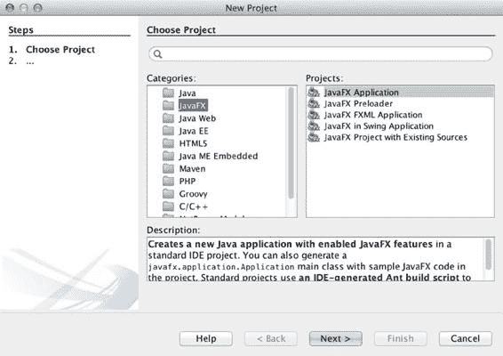

第 17 章 N 网页上的 JAVAFX

以下是运行新建项目向导的步骤：

1. 在 NetBeans IDE 8.0 或更高版本中，从“文件”菜单中选择“新建项目”。

2. 在“选择项目”下的“类别”部分中选择“JavaFX”，如图 17-1 所示。

接下来，在“项目”下选择“JavaFX 应用程序”。然后点击“下一步”继续。

**图 17-1.** *“新建项目”对话框*

3. 通过指定项目名称并选中复选框，让向导生成一个名为 `MyJavaFXApp.java` 的主类来创建项目。图 17-2 显示了“新建 JavaFX 应用程序”窗口，您可以在其中指定项目名称和位置。完成后，点击“完成”按钮。

[www.it-ebooks.info](http://www.it-ebooks.info/)

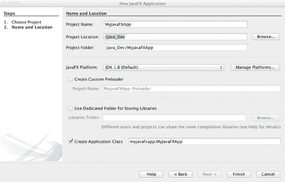

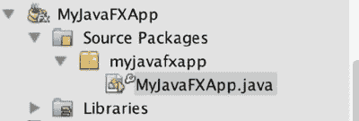

第 17 章 N 网页上的 JAVAFX

**图 17-2.** *“新建 JavaFX 应用程序”对话框，您可以在其中指定项目的名称和位置* 4. 新项目创建完成后，修改项目属性并选择浏览器部署。要修改属性，请右键点击项目，然后从弹出菜单中选择“属性”。图 17-3 显示了创建好的项目，其中包含一个名为 `MyJavaFXApp.java` 的主 JavaFX 文件。

**图 17-3.** *MyJavaFXApp.java 项目*

5. 进入项目属性，如图 17-4 所示。在“类别”区域中选择“源代码”。接下来，如果“源代码/二进制格式”选项尚未指向 JDK 8，请进行调整。

[www.it-ebooks.info](http://www.it-ebooks.info/)

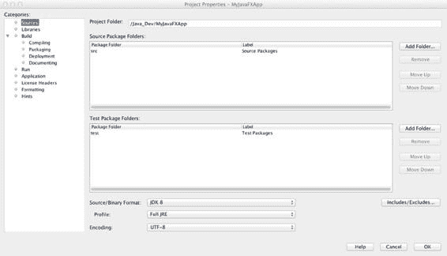


第 17 章 N 网页上的 JAVAFX

**图 17-4.** *项目属性* — *MyJavaFXApp 窗口*

6. 在图 17-5 所示的“类别”列表中选择“运行”选项。选中“在浏览器中运行”单选按钮。然后点击“确定”按钮。

**图 17-5.** *设置“在浏览器中运行”选项*

[www.it-ebooks.info](http://www.it-ebooks.info/)

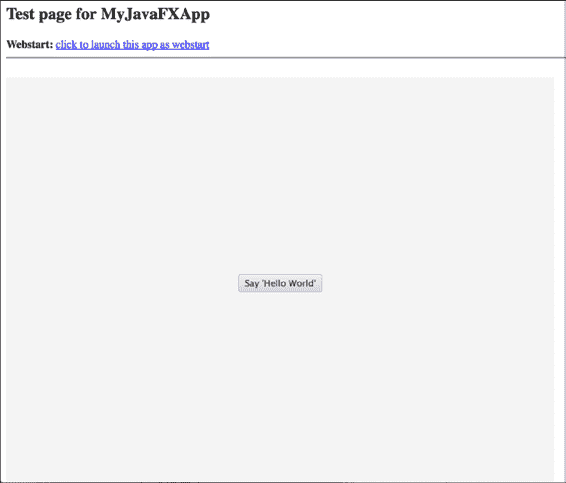

第 17 章 N 网页上的 JAVAFX

7. 通过点击工具栏上的“运行”按钮或按 F6 键来运行并测试项目。

图 17-6 展示了生成的 Hello World 应用在浏览器中运行的效果。

**图 17-6.** *在浏览器中运行的 MyJavaFXApp Hello World 应用* 工作原理


在 HTML 页面中嵌入 JavaFX 应用程序的最简单方法是使用 NetBeans 等 IDE。

尽管存在不同的部署策略，例如 Webstart 和独立模式，但此处您将使用 NetBeans 新建项目向导，在浏览器中部署一个包含 JavaFX 应用程序的本地网页。

有关深入的 JavaFX 部署策略，请参阅 Oracle 的《部署 JavaFX 应用程序》文档，网址为：

[`docs.oracle.com/javafx/2/deployment/deployment_toolkit.htm.`](http://docs.oracle.com/javafx/2/deployment/deployment_toolkit.htm)

以下代码由该解决方案生成。请注意所使用的 JavaFX 类，例如 `Stage`、`Group` 和 `Scene` 类。

**N 注意** 您可以将另一个代码文件中的导入和代码拖入此新主项目类的主体中，然后根据需要更改类定义行上的名称。

[www.it-ebooks.info](http://www.it-ebooks.info/)

第 17 章 N 网页上的 JAVAFX

在选择了创建新的 JavaFX 应用程序以通过浏览器进行部署后，NetBeans IDE 生成了以下源代码：

package org.java8recipes.chapter17.recipe17_01;

import javafx.application.Application;

import javafx.event.ActionEvent;

import javafx.scene.Group;

import javafx.scene.Scene;

import javafx.scene.control.Button;

import javafx.stage.Stage;

/**

*

* @author cdea

* Update: Juneau

*/

public class MyJavaFXApp extends Application {

/**

* @param args the command line arguments

*/

public static void main(String[] args) {

Application.launch(args);

}

@Override

public void start(Stage primaryStage) {

primaryStage.setTitle("Hello World");

Group root = new Group();

Scene scene = new Scene(root, 300, 250);

Button btn = new Button();

btn.setLayoutX(100);

btn.setLayoutY(80);

btn.setText("Hello World");

btn.setOnAction((ActionEvent event) -> {

System.out.println("Hello World");

});

root.getChildren().add(btn);

primaryStage.setScene(scene);

primaryStage.show();

}

}

在步骤 1 中，您启动一个新项目（如图 17-6 所示）。在步骤 2 中，您选择要创建的标准 JavaFX 应用程序。选择项目类型后，您指定项目的名称。确保选中“创建应用程序类”复选框，以便向导生成 `MyJavaFXApp` Java 文件。单击“完成”后，您新创建的应用程序将出现在“项目”选项卡中。接下来，您需要更改项目的属性。

在步骤 5 中，您更改两个类别——“源”和“运行”。在“源”类别中，确保“源/二进制格式”设置为 JDK 1.8。更新“源”类别后，您通过“运行”类别确定项目将如何运行（步骤 6）。选择“在浏览器中”单选按钮后，请注意工作目录字段下方的“宽度”和“高度”选项。要使用您自己的自定义网页，请单击“浏览”按钮选择一个现有的 HTML 文件。

在本技巧中，您可以留空此区域，让向导生成一个通用的 HTML 页面。假设您已完成设置，请单击“确定”关闭“项目属性”窗口。

[www.it-ebooks.info](http://www.it-ebooks.info/)

第 17 章 N 网页上的 JAVAFX

最后，您运行嵌入的 JavaFX Web 应用程序（步骤 7）。要运行您的应用程序，请确保该项目被设置为主项目，方法是选择“运行”>“设置主项目”>“MyJavaFXApp”。启动运行后，您的浏览器将启动，其中包含一个嵌入了 JavaFX 应用程序的通用网页。您还会注意到，有一个方便的链接允许您将应用程序作为 Webstart 应用程序（非嵌入）启动。

**N 注意** 小程序（嵌入在浏览器中的 Java 应用程序）并非部署 JavaFX 应用程序的首选方式，但为了完整性，本技巧中仍会涉及。要了解有关打包和部署 JavaFX 应用程序的不同选项，请参阅以下网址的在线指南：

[`docs.oracle.com/javafx/2/deployment/jfxpub-deployment.htm.`](http://docs.oracle.com/javafx/2/deployment/jfxpub-deployment.htm)


17-2\. 加载可缩放矢量图形文件内容

问题

您希望将可缩放矢量图形（SVG）文件形式的 HTML5 内容嵌入到 JavaFX 应用程序中。

解决方案

创建一个基于 JavaFX 的应用程序，其中包含一个以 SVG 文件形式创建的模拟时钟。使用 JavaFX 的 WebView API 在应用程序中渲染 HTML5 内容。

以下源代码是一个 JavaFX 应用程序，用于显示一个动画模拟时钟。该应用程序将加载一个名为 clock3.svg 的 SVG 文件，并将其内容显示到 JavaFX 场景图中：

```java
package org.java8recipes.chapter17.recipe17_02;

import java.net.URL;

import javafx.application.Application;

import javafx.scene.Scene;

import javafx.scene.paint.Color;

import javafx.scene.web.WebView;

import javafx.stage.Stage;

/**

*

* @author cdea

*/

public class DisplayHtml5Content extends Application {

private Scene scene;

@Override public void start(Stage stage) {

// 创建场景

stage.setTitle("第 17 章-2 显示 Html5 内容");

final WebView browser = new WebView();

URL url = getClass().getResource("clock3.svg");

browser.getEngine().load(url.toExternalForm());

scene = new Scene(browser,590,400, Color.rgb(0, 0, 0, .80));

stage.setScene(scene);

stage.show();

}

[www.it-ebooks.info](http://www.it-ebooks.info/)

第 17 章 JavaFX 在 Web 上的应用

public static void main(String[] args){

Application.launch(args);

}

}
```

这段 JavaFX 代码将加载并渲染 HTML5 内容。假设您有一位设计师提供了诸如 HTML5 之类的内容，那么您的工作就是在 JavaFX 中渲染这些资源。以下代码代表一个名为 clock3.svg 的 SVG 文件，该文件主要由名为 Inkscape 的强大工具生成，Inkscape 是一款能够生成 SVG 的插画工具。在以下代码中，请注意手动编写的 JavaScript 代码（位于 CDATA 标签内），这些代码将根据当前时间设置时钟的秒针、分针和时针的位置。由于所有逻辑（从设置时间到动画指针）都包含在此文件中，因此内容是自包含的，这意味着任何支持 HTML5 的查看器都可以显示该文件的内容。因此，在调试时，您可以轻松地在任何兼容 HTML5 的浏览器中渲染内容。在本章后面，您将看到能够与 HTML5 内容交互的 JavaFX 代码。

此处展示的是 SVG 模拟时钟的精简版本。（要获取该文件的源代码，请从本书网站下载代码。）这是在 Inkscape 中创建的 SVG 模拟时钟（clock3.svg）：

```svg
<svg

width="300"

height="250"

id="svg4171"

version="1.1"

inkscape:version="0.48.1 "

sodipodi:docname="clock3.svg" onload="updateTime()">

<script>

<

第 17 章 JavaFX 在 Web 上的应用

var secondAngle = sec * 6 + pi

var minuteAngle = ( min + sec / 60 ) * 6 + pi

var hourAngle = (hr + min / 60 + sec /3600) * 30 + pi

moveHands(secondAngle, minuteAngle, hourAngle)

}

function moveHands(secondAngle, minuteAngle, hourAngle) {

var secondHand = document.getElementById("secondHand")

var minuteHand = document.getElementById("minuteHand")

var hourHand = document.getElementById("hourHand")

secondHand.setAttribute("transform","rotate("+ secondAngle + ")") minuteHand.setAttribute("transform","rotate("+ minuteAngle +")") hourHand.setAttribute("transform","rotate("+ hourAngle + ")")

}

]]>

</script>

<defs id="defs4173">

... // SVG 代码开始部分

... // 主时钟代码

<g id="hands" transform="translate(108,100)">

<g id="minuteHand">

<line stroke-width="3.59497285" y2="50" stroke-linecap="round" stroke="#00fff6" opacity=".9" />

<animateTransform attributeName="transform" type="rotate" repeatCount="indefinite" dur="60min"

by="360" />

</g>

<g id="hourHand">

<line stroke-width="5" y2="30" stroke-linecap="round" stroke="#ffcb00" opacity=".9" />

<animateTransform attributeName="transform" type="rotate" repeatCount="indefinite" dur="12h"

by="360" />

</g>

<g id="secondHand">

<line stroke-width="2" y1="-20" y2="70" stroke-linecap="round" stroke="red"/>

<animateTransform attributeName="transform" type="rotate" repeatCount="indefinite" dur="60s"

by="360" />

</g>

</g>

... // 时钟代码的其余部分：光泽眩光、指针顶部的黑色按钮盖（中心）

</svg>
```

图 17-7 描绘了一个 JavaFX 应用程序，它渲染了显示模拟时钟的 SVG 文件 clock3.svg。

[www.it-ebooks.info](http://www.it-ebooks.info/)


第 17 章 JavaFX 在 Web 上的应用

**图 17-7.** *模拟时钟*

工作原理

在本方案中，您将创建一个模拟时钟应用程序，该应用程序将利用现有的 HTML5 内容渲染到 JavaFX 场景图上。HTML5 允许在浏览器中显示 SVG 内容。SVG 类似于 JavaFX 的场景图，其中的节点可以缩放到不同大小而保持细节。为了操作 SVG 或任何 HTML5 元素，本示例使用了 JavaScript 语言。图 17-7 展示了一个 JavaFX 应用程序，它显示了一个动画模拟时钟。要了解更多关于 SVG 的信息，请访问[`www.w3schools.com/svg/default.asp`](http://www.w3schools.com/svg/default.asp)。在运行此示例之前，请确保 clock3.svg 文件位于构建路径中。在 NetBeans 中，您可能需要在运行应用程序之前执行清理并构建，以便将资源（clock3.svg）复制到构建路径。如果您在命令行上运行应用程序，您可能还需要手动将 clock3.svg 文件复制到 DisplayHtml5Content.class 文件所在的构建路径中。

您无疑会与使用流行工具生成与应用程序功能相连接的 Web 内容的设计师合作。为了创建一个模拟时钟，Carl Dea 请来了他的女儿，她非常精通开源工具 Inkscape。尽管本方案使用了 Inkscape 来生成内容，但我不会详细介绍该工具，因为这超出了本书的范围。要了解更多关于 Inkscape 的信息，请访问[`www.inkscape.org`](http://www.inkscape.org/) 获取教程和演示。为了模拟设计师和开发者的工作流程，她创建了一个看起来很酷的时钟，而我添加了 JavaScript/SVG 代码来移动时钟的时针、分针和秒针。Inkscape 允许您创建形状、文本和效果，以生成令人惊叹的插图。由于 SVG 文件被视为 HTML5 内容，您可以在支持 HTML5 的浏览器中显示 SVG 图形。在此场景中，该示例在 JavaFX 的 WebView 节点中显示模拟时钟。您可以将 WebView 节点视为一个能够加载和显示 URL 的迷你浏览器。当它加载 URL 时，您会注意到对 `getEngine().load()` 的调用，其中 `getEngine()` 方法返回一个 `javafx.scene.web.WebEngine` 对象的实例。因此，WebView 对象会为每个 WebView 对象隐式创建一个 `javafx.scene.web.WebEngine` 对象实例。此处展示了 JavaFX 的 WebEngine 对象加载 clock3.svg 文件：

```java
final WebView browser = new WebView();

URL url = getClass().getResource("clock3.svg");

browser.getEngine().load(url.toExternalForm());
```

您可能想知道为什么 JavaFX 源代码如此简短。这是因为它的工作是实例化一个 `javafx.scene.web.WebView`，该 WebView 会实例化一个 `javafx.scene.web.WebEngine` 类并传递一个 URL。

之后，WebEngine 对象完成所有工作，像任何浏览器一样渲染 HTML5 内容。相同的代码也可以写成如下形式：

```java
final WebView browser = new WebView();

WebEngine engine = browser.getEngine();

URL url = getClass().getResource("clock3.svg");

engine.load(url.toExternalForm());
```

[www.it-ebooks.info](http://www.it-ebooks.info/)

第 17 章 JavaFX 在 Web 上的应用


渲染内容时，请注意时钟指针会移动或产生动画效果；例如，秒针会顺时针旋转。在制作时钟动画之前，你必须通过在整个 SVG 文档（位于根`svg`元素上）的`onload`属性中调用 JavaScript 的`updateTime()`函数来设置时钟的初始位置。设置好时钟指针后，你可以分别使用`line`和`animateTransform`元素添加 SVG 代码来绘制和制作动画。此处展示的是秒针动画的 SVG 代码片段：

<g id="secondHand">

<line stroke-width="2" y1="-20" y2="70" stroke-linecap="round" stroke="red"/>

<animateTransform attributeName="transform" type="rotate" repeatCount="indefinite" dur="60s"

by="360" />

</g>

最后，如果你想创建一个类似本食谱中描述的时钟，请访问

[`screencasters.heathenx.org/blog`](http://screencasters.heathenx.org/blog)了解关于 Inkscape 的所有内容。另一个令人印象深刻且美观的自定义控件展示，专注于仪表和刻度盘，是 Gerrit Grunwald 的 Steel Series。要感到完全惊叹，请访问他的博客[`harmoniccode.blogspot.com`](http://harmoniccode.blogspot.com/)。

17-3. 使用 Java 代码操作 HTML5 内容

问题

你想通过 Java 代码生成 HTML5 内容，并在 JavaFX 应用程序中显示它。

解决方案

实现一个以字符串格式构建 HTML5 内容的解决方案。一旦创建了所需的 HTML5 内容，你将使用`WebView`节点来显示它。本示例创建了一个从雅虎天气服务获取数据的天气应用程序。以下代码实现了一个天气应用程序，它检索雅虎的天气信息，并在 JavaFX 应用程序中渲染为 HTML：

package org.java8recipes.chapter17.recipe17_03;

import javafx.animation.KeyFrame;

import javafx.animation.KeyValue;

import javafx.animation.Timeline;

import javafx.application.Application;

import javafx.beans.property.IntegerProperty;

import javafx.beans.property.SimpleIntegerProperty;

import javafx.beans.value.ObservableValue;

import javafx.concurrent.Worker.State;

import javafx.scene.Group;

import javafx.scene.Scene;

import javafx.scene.web.WebEngine;

import javafx.scene.web.WebView;

import javafx.stage.Stage;

import javafx.util.Duration;

import org.w3c.dom.Document;

import org.w3c.dom.NodeList;

[www.it-ebooks.info](http://www.it-ebooks.info/)

第 17 章 N JAVAFX 在网页上

/**

* 食谱 17-3：操作 HTML5 内容

* @author cdea

* 更新：J Juneau

*/

public class ManipulatingHtmlContent extends Application {

String url = "http://weather.yahooapis.com/forecastrss?p=USMD0033&u=f"; int refreshCountdown = 60;

@Override public void start(Stage stage) {

// 创建场景

stage.setTitle("第 17-3 章 操作 HTML5 内容");

Group root = new Group();

Scene scene = new Scene(root, 460, 340);

final WebEngine webEngine = new WebEngine(url);

StringBuilder template = new StringBuilder();

template.append("<head>\n")

.append("<style type=\"text/css\">body {background-color:#b4c8ee;}</style>\n")

.append("</head>\n")

.append("<body id='weather_background'>");

final String fullHtml = template.toString();

final WebView webView = new WebView();

IntegerProperty countDown = new SimpleIntegerProperty(refreshCountdown);

countDown.addListener((ObservableValue<? extends Number> observable, Number oldValue, Number newValue) -> {

webView.getEngine().executeScript("document.getElementById('countdown').innerHTML = '刷新倒计时: " + newValue + "'");

if (newValue.intValue() == 0) {

webEngine.reload();

}

});

final Timeline timeToRefresh = new Timeline();

timeToRefresh.getKeyFrames().addAll(

new KeyFrame(Duration.ZERO, new KeyValue(countDown, refreshCountdown)),

new KeyFrame(Duration.seconds(refreshCountdown), new KeyValue(countDown, 0))

);

webEngine.getLoadWorker().stateProperty().addListener((ObservableValue<? extends State> observable, State oldValue, State newValue) -> {

System.out.println("完成!" + newValue.toString());

if (newValue != State.SUCCEEDED) {

return;

}

// 请求 200 OK

Weather weather = parse(webEngine.getDocument());

[www.it-ebooks.info](http://www.it-ebooks.info/)

第 17 章 N JAVAFX 在网页上

StringBuilder locationText = new StringBuilder();

locationText.append("<b>")

.append(weather.city)

.append(", ")

.append(weather.region)

.append(" ")

.append(weather.country)

.append("</b><br />\n");

String timeOfWeatherTextDiv = "<b id=\"timeOfWeatherText\">" + weather.dateTimeStr +

"</b><br />\n";

String countdownText = "<b id=\"countdown\"></b><br />\n"; webView.getEngine().loadContent(fullHtml + locationText.toString() +

timeOfWeatherTextDiv +

countdownText +

weather.htmlDescription);

System.out.println(fullHtml + locationText.toString() +

timeOfWeatherTextDiv +

countdownText +

weather.htmlDescription);

timeToRefresh.playFromStart();

});

root.getChildren().addAll(webView);

stage.setScene(scene);

stage.show();

}

public static void main(String[] args){

Application.launch(args);

}

private static String obtainAttribute(NodeList nodeList, String attribute) {

String attr = nodeList

.item(0)

.getAttributes()

.getNamedItem(attribute)

.getNodeValue();

return attr;

}

private static Weather parse(Document doc) {

NodeList currWeatherLocation = doc.getElementsByTagNameNS("http://xml.weather.yahoo.com/ns/

rss/1.0", "location");

Weather weather = new Weather();

weather.city = obtainAttribute(currWeatherLocation, "city");

weather.region = obtainAttribute(currWeatherLocation, "region");

weather.country = obtainAttribute(currWeatherLocation, "country");

[www.it-ebooks.info](http://www.it-ebooks.info/)


第 17 章 N JAVAFX 在网页上

NodeList currWeatherCondition = doc.getElementsByTagNameNS("http://xml.weather.yahoo.com/ns/

rss/1.0", "condition");

weather.dateTimeStr = obtainAttribute(currWeatherCondition, "date");

weather.currentWeatherText = obtainAttribute(currWeatherCondition, "text"); weather.temperature = obtainAttribute(currWeatherCondition, "temp");

String forcast = doc.getElementsByTagName("description")

.item(1)

.getTextContent();

weather.htmlDescription = forcast;

return weather;

}

}

class Weather {

String dateTimeStr;

String city;

String region;

String country;

String currentWeatherText;

String temperature;

String htmlDescription;

}

图 17-8 描绘了从雅虎天气服务获取数据的天气应用程序。在显示文本的第三行，你会注意到“刷新倒计时: 31”是一个以秒为单位的倒计时，直到下一次检索天气信息。实际的 HTML 内容操作发生在这里。

**图 17-8.** *天气应用程序*

[www.it-ebooks.info](http://www.it-ebooks.info/)

第 17 章 N JAVAFX 在网页上

以下显示了渲染到`WebView`节点上的 HTML：

<head>

<style type="text/css">body {background-color:#b4c8ee;}</style>

</head>

<body id='weather_background'><b>芝加哥, IL 美国</b><br />

<b id="timeOfWeatherText">周三, 2014 年 4 月 16 日 11:49 am CDT</b><br />

<b id="countdown"></b><br />

<br />

<b>当前条件:</b><br />

大部分多云, 45 F<BR />

<BR /><b>预报:</b><BR />

周三 - 局部多云。最高: 51 最低: 41<br />

周四 - 局部多云。最高: 57 最低: 40<br />

周五 - 大部分多云。最高: 41 最低: 36<br />

周六 - 局部多云。最高: 45 最低: 42<br />

周日 - 大部分多云。最高: 58 最低: 48<br />

<br />

<a href="http://us.rd.yahoo.com/dailynews/rss/weather/Chicago__IL/*http://weather.yahoo.com/

forecast/USIL0225_f.html">雅虎天气的完整预报</a><BR/><BR/> (由<a href="http://www.weather.com" >天气频道</a>提供)<br/> 工作原理


在本教程中，你将解析一个 RSS 订阅源，并在 JavaFX 应用程序中构建一个 HTML 字符串，然后通过 WebView 显示该 HTML。JavaFX 应用程序可以通过一个 URL 从雅虎天气服务中检索 XML 信息，该 URL 使用 WOEID（位置 ID）来定位特定地点。解析 XML 后，HTML 内容被组装并渲染到 JavaFX 的 WebView 节点上。WebView 对象实例是一个能够渲染和检索 XML 或任何 HTML5 内容的图形节点。该应用程序还将显示一个倒计时（以秒为单位），直到下一次从天气服务检索数据。

通过雅虎天气服务获取你所在地区的天气信息时，你需要获取一个位置 ID（WOEID）或与你所在城市关联的 RSS 订阅源 URL。在我逐行解释代码之前，请考虑以下获取本地天气预报 RSS 订阅源 URL 的步骤。

1. 在浏览器中打开 [`weather.yahoo.com/`](http://weather.yahoo.com/)。

2. 输入城市或邮政编码，然后点击“前往”按钮。

3. 复制浏览器地址栏中 URL 末尾的数字。这就是该位置的 WOEID。

4. 将 WOEID 插入到 [`weather.yahooapis.com/forecastrss?w=WOEID&u=f.`](http://weather.yahooapis.com/forecastrss?w=WOEID&u=f)

在为此示例创建`ManipulatingHtmlContent`类时，你需要两个实例变量：`url`和`refreshCountdown`。`url`变量将被赋值为步骤 4 中的 RSS URL 网址。`refreshCountdown`变量为`int`类型，赋值为 60，表示刷新或再次检索天气信息之前的秒数。

与`start()`方法中的所有 JavaFX 示例一样，你首先为初始主内容区域创建`Scene`对象。接下来，你通过将`url`传递给构造函数来创建一个`javafx.scene.web.WebEngine`实例。`WebEngine`对象将异步加载来自雅虎天气服务的 Web 内容。稍后你将了解当 Web 内容加载完成时负责处理内容的回调方法。以下代码行使用`WebEngine`对象创建并加载一个 URL 网址：

```java
final WebEngine webEngine = new WebEngine(url);
```

[www.it-ebooks.info](http://www.it-ebooks.info/)

第 17 章 JavaFX 在 Web 上的应用

创建`WebEngine`对象后，你将创建一个 HTML 文档，该文档将在 Web 内容成功加载时充当模板。尽管代码在 Java 代码中包含了 HTML 标记标签，这违反了关注点分离的原则，但为了简洁起见，本示例通过拼接字符串值来内联 HTML。

为了保持正确的 MVC 风格分离，你可能希望创建一个单独的文件，其中包含你的 HTML 内容，并为随时间变化的数据提供替换部分。以下代码片段是用于显示天气信息的模板创建的起始部分：

```java
StringBuilder template = new StringBuilder();

template.append("<head>\n")
.append("<style type=\"text/css\">body {background-color:#b4c8ee;}</style>\n")
.append("</head>\n")
.append("<body id='weather_background'>");
```

通过拼接字符串创建网页后，你创建一个`WebView`对象实例，这是一个可显示的图形节点，负责渲染网页。请记住，在教程 17-2 中你了解到`WebView`拥有自己的`WebEngine`实例。知道这一点后，你只使用`WebView`节点来渲染组装好的 HTML 网页，而不是通过 URL 检索 XML 天气信息。换句话说，`WebEngine`对象负责从雅虎天气服务检索 XML 以进行解析，然后将其输入到`WebView`对象中以 HTML 形式显示。以下代码片段实例化了一个负责渲染 HTML5 内容的`WebView`图形节点：

```java
final WebView webView = new WebView();
```


示例中的倒计时定时器会刷新应用程序窗口中显示的天气信息。首先，实例化一个名为 `countdown` 的 `IntegerProperty` 变量，用于保存距离下次刷新时间的秒数。其次，添加一个变更监听器（`ChangeListener`），利用 JavaFX 执行 JavaScript 的能力动态更新 HTML 内容。该变更监听器还会判断倒计时是否归零。如果归零，则调用 `webEngine`（`WebEngine`）的 `reload()` 方法来刷新或重新获取天气信息。以下代码创建了一个 `IntegerProperty` 值，并通过 `executeScript()` 方法更新倒计时文本：

```java
IntegerProperty countDown = new SimpleIntegerProperty(refreshCountdown);

countDown.addListener((ObservableValue<? extends Number> observable,

Number oldValue, Number newValue) -> {

webView.getEngine().executeScript(

"document.getElementById('countdown').innerHTML = 'Seconds till refresh: "

+ newValue + "'");

if (newValue.intValue() == 0) {

webEngine.reload();

}

}); // addListener()
```

使用 lambda 表达式实现 `ChangeListener` 后，创建一个 `TimeLine` 对象来改变 `countdown` 变量，这将触发 `ChangeListener` 更新显示刷新剩余秒数的 HTML 文本。以下代码实现了一个更新 `countDown` 变量的 `TimeLine` 对象：

```java
final Timeline timeToRefresh = new Timeline();

timeToRefresh.getKeyFrames().addAll(

new KeyFrame(Duration.ZERO, new KeyValue(countDown, refreshCountdown)),

new KeyFrame(Duration.seconds(refreshCountdown), new KeyValue(countDown, 0))

);
```

[www.it-ebooks.info](http://www.it-ebooks.info/)

第 17 章 JavaFX 在 Web 上的应用

其余代码创建了一个响应 `State.SUCCEEDED` 状态的 `ChangeListener`。一旦 `webEngine`（`WebEngine`）完成 XML 的检索，该变更监听器（`ChangeListener`）负责解析并将组装好的网页渲染到 `WebView` 节点中。以下代码通过调用 `WebView` 的 `WebEngine` 实例上的 `loadContent()` 方法来解析并显示天气数据：

```java
if (newValue != State.SUCCEEDED) {

return;

}

Weather weather = parse(webEngine.getDocument());

...// 其余内联 HTML

String countdownText = "<b id=\"countdown\"></b><br />\n"; webView.getEngine().loadContent(fullHtml + location.toString() +

timeOfWeatherTextDiv +

countdownText +

weather.htmlDescription);
```

为了解析 `webEngine` 的 `getDocument()` 方法返回的 XML，需要对 `org.w3c.dom.Document` 对象进行查询。为了方便起见，我创建了一个 `parse()` 方法来遍历 DOM 以获取天气数据，并将其作为 `Weather` 对象返回。有关天气服务返回的数据元素的更多信息，请参阅 Javadocs 和 Yahoo! 的 RSS XML 模式。

17-4. 响应 HTML 事件

问题

你想用 Java 代码操作 HTML5 内容。

解决方案

你将在天气应用程序中添加一个“恐慌”按钮，用于模拟电子邮件通知。你还会添加一个“冷静”按钮来撤回警告消息。

以下代码实现了带有额外按钮的天气应用程序，用于警告并随后忽略即将到来的暴风雨天气：

```java
@Override public void start(Stage stage) {

... // 模板构建
```

这段代码添加了 HTML 按钮，并通过按钮将其 `onclick` 属性设置为调用 JavaScript 的 `alert` 函数：

```java
template.append("<body id='weather_background'>");

template.append("<form>\n");

template.append(" <input type=\"button\" onclick=\"alert('warning')\" value=\"Panic Button\" />\n"); template.append(" <input type=\"button\" onclick=\"alert('unwarning')\" value=\"Calm down\" />\n"); template.append("</form>\n");
```

[www.it-ebooks.info](http://www.it-ebooks.info/)

第 17 章 JavaFX 在 Web 上的应用

以下代码被添加到 `start()` 方法中以创建警告消息。不透明度设置为零以使其不可见：

```java
// 调用 createMessage() 方法构建警告消息

final Text warningMessage = createMessage(Color.RED, "warning: ");

warningMessage.setOpacity(0);
```


... // 倒计时代码

在 `start()` 方法内部，添加了以下代码段，用于在成功获取天气信息后更新警告消息：

webEngine.getLoadWorker().stateProperty().addListener(

(ObservableValue<? extends State> observable,

State oldValue, State newValue) -> {

System.out.println("done!" + newValue.toString());

if (newValue != State.SUCCEEDED) {

return;

}

Weather weather = parse(webEngine.getDocument());

warningMessage.setText("警告：" + weather.currentWeatherText +

"\n 温度：" + weather.temperature + "\n 已通过电子邮件通知他人");

... // `changed()` 方法的其余部分

}); // `addListener` 方法结束

以下代码设置了 `OnAlert` 属性，这是一个事件处理器，用于响应按下“恐慌”或“冷静”按钮时触发的事件：

webView.getEngine().setOnAlert((WebEvent<String> evt) -> {

warningMessage.setOpacity("warning".equalsIgnoreCase(evt.getData()) ? 1d : 0d);

});

你添加了以下代码作为一个私有方法，负责创建一个文本节点（javafx.scene.text.Text）。

当用户按下“恐慌”按钮时，该节点用作警告消息：

private Text createMessage(Color color, String message) {

DropShadow dShadow = new DropShadow();

dShadow.setOffsetX(3.5f);

dShadow.setOffsetY(3.5f);

Text textMessage = new Text();

textMessage.setText(message);

textMessage.setX(100);

textMessage.setY(50);

textMessage.setStrokeWidth(2);

textMessage.setStroke(Color.WHITE);

textMessage.setEffect(dShadow);

textMessage.setFill(color);

textMessage.setFont(Font.font(null, FontWeight.BOLD, 35));

textMessage.setTranslateY(50);

[www.it-ebooks.info](http://www.it-ebooks.info/)


第 17 章 N JAVAFX 在 WEB 上的应用

return textMessage;

}

} // `RespondingToHtmlEvents` 类结束

图 17-9 所示的天气应用程序在用户按下“恐慌”按钮后显示一条警告消息。要移除警告消息，你可以按下“冷静”按钮。

**图 17-9.** *显示警告消息的天气应用程序*

工作原理

本技巧中的示例为天气应用程序（来自技巧 17-3）添加了响应 HTML 事件的功能。

该应用程序与上一个技巧类似，不同之处在于其网页上包含了 HTML 按钮，这些按钮将渲染到 `WebView` 节点上。第一个按钮是“恐慌”按钮，按下时会显示一条警告消息，说明当前的天气状况以及一条模拟的电子邮件通知。为了收回警告消息，你添加了一个“冷静”按钮。

N **注意** 由于代码与上一个技巧非常相似，我只指出源代码中的新增部分，而不做详细说明。

[www.it-ebooks.info](http://www.it-ebooks.info/)

第 17 章 N JAVAFX 在 WEB 上的应用

为了添加按钮，你使用了 HTML 标签 `<input type=”button”...>`，并设置 `onclick` 属性以调用 JavaScript 的 `alert()` 函数，从而向 JavaFX 通知一个警报事件。以下是添加到网页中的两个按钮：

StringBuilder template = new StringBuilder();

...// HTML 网页的头部部分

template.append("<form>\n");

template.append(" <input type=\"button\" onclick=\"alert('warning')\" value=\"恐慌按钮\" />\n"); template.append(" <input type=\"button\" onclick=\"alert('unwarning')\" value=\"冷静\" />\n"); template.append("</form>\n");

当网页渲染时，可以点击这些按钮，从而调用 `onclick` 属性，该属性将调用包含字符串消息的 JavaScript 的 `alert()` 函数。当 `alert()` 函数被调用时，网页的所属父级（即 `webView` 的 `WebEngine` 实例）会通过 `WebEngine` 的 `OnAlert` 属性收到警报通知。为了响应 JavaScript 的警报，添加了一个事件处理器（lambda 表达式）。它负责响应 `WebEvent` 对象。`handle()` 方法通过切换 `warningMessage` 节点（javafx.


`scene.text.Text`。以下代码片段根据事件数据（`evt.getData()`）中是否包含从 JavaScript 的 `alert()` 函数传入的字符串，来切换警告消息的透明度。因此，如果消息是 "warning"，则 `warningMessage` 的透明度设置为 1；否则设置为 0（两者均为 double 类型）。

```java
webView.getEngine().setOnAlert(new EventHandler<WebEvent<String>>(){
    public void handle(WebEvent<String> evt) {
        warningMessage.setOpacity("warning".equalsIgnoreCase(evt.getData()) ? 1d : 0d);
    }
});
```

有关其他 HTML 网页事件（`WebEvent`）的详细信息，请参阅 Javadoc。

**17-5. 从数据库显示内容**

**问题**

你希望在 JavaFX 的 `WebView` 节点中显示数据库内容。

**解决方案**

创建一个 JavaFX RSS 阅读器。RSS 订阅源 URL 将存储在数据库中，以便后续检索。以下是本方案中使用的主要类：

-   `javafx.scene.control.Hyperlink`
-   `javafx.scene.web.WebEngine`
-   `javafx.scene.web.WebView`
-   `org.w3c.dom.Document`
-   `org.w3c.dom.Node`
-   `org.w3c.dom.NodeList`

本方案使用 Apache 组织提供的名为 Derby 的嵌入式数据库（[`www.apache.org`](http://www.apache.org/)）。前提条件是，你需要下载 Derby 软件（NetBeans IDE 中已包含）。要下载最新版本的软件，请访问 [`db.apache.org/derby/derby_downloads.html`](http://db.apache.org/derby/derby_downloads.html)。下载完成后，你可以将其解压缩到某个目录中。要编译和运行本方案，你需要在 IDE 或环境变量中更新类路径，使其指向 Derby 库（`derby.jar` 和 `derbytools.jar`）。运行示例代码时，你可以在文本字段中输入一个有效的 RSS URL，然后按 Enter 键加载新的 RSS 头条新闻。头条新闻将列在右上角的框架区域中。然后，你可以通过点击新闻下方的“查看”按钮，选择一篇头条新闻文章进行全文阅读。

以下代码在 JavaFX 中实现了一个 RSS 阅读器：

```java
package org.java8recipes.chapter17.recipe17_05;

import java.util.*;
import javafx.application.Application;
import javafx.beans.value.*;
import javafx.collections.ObservableList;
import javafx.concurrent.Worker.State;
import javafx.event.*;
import javafx.geometry.*;
import javafx.scene.*;
import javafx.scene.control.*;
import javafx.scene.input.*;
import javafx.scene.layout.*;
import javafx.scene.paint.Color;
import javafx.scene.web.*;
import javafx.stage.Stage;
import org.w3c.dom.Document;
import org.w3c.dom.Node;
import org.w3c.dom.NodeList;

/**
 * 从数据库显示内容
 * @author cdea
 */
public class DisplayContentsFromDatabase extends Application {

    @Override public void start(Stage stage) {
        Group root = new Group();
        Scene scene = new Scene(root, 640, 480, Color.WHITE);
        final Map<String, Hyperlink> hyperLinksMap = new TreeMap<>();
        final WebView newsBrief = new WebView(); // 右上角
        final WebEngine webEngine = new WebEngine();
        final WebView websiteView = new WebView(); // 右下角

        webEngine.getLoadWorker().stateProperty().addListener(
            (ObservableValue<? extends State> observable,
             State oldValue, State newValue) -> {
                if (newValue != State.SUCCEEDED) {
                    return;
                }

                RssFeed rssFeed = parse(webEngine.getDocument(), webEngine.getLocation());
                hyperLinksMap.get(webEngine.getLocation()).setText(rssFeed.channelTitle);

                // 打印订阅源信息：
                StringBuilder rssSource = new StringBuilder();
                rssSource.append("<head>\n")
                         .append("</head>\n")
                         .append("<body>\n");
                rssSource.append("<b>")
                         .append(rssFeed.channelTitle)
                         .append(" (")
                         .append(rssFeed.news.size())
                         .append(")")
                         .append("</b><br />\n");

                StringBuilder htmlArticleSb = new StringBuilder();
                for (NewsArticle article:rssFeed.news) {
                    htmlArticleSb.append("<hr />\n")
                                 .append("<b>\n")
                                 .append(article.title)
                                 .append("</b><br />")
                                 .append(article.pubDate)
                                 .append("<br />")
                                 .append(article.description)
                                 .append("<br />\n");
                }
```


.append("<input type=\"button\" onclick=\"alert('")

.append(article.link)

.append("')\" value=\"查看\" />\n");

}

String content = rssSource.toString() + "<form>\n" + htmlArticleSb.toString() +

"</form></body>\n";

System.out.println(content);

newsBrief.getEngine().loadContent(content);

// 如果尚未写入磁盘，则写入磁盘。

DBUtils.saveRssFeed(rssFeed);

}); // webEngine addListener() 结束

newsBrief.getEngine().setOnAlert((WebEvent<String> evt) -> {

websiteView.getEngine().load(evt.getData());

}); // newsBrief setOnAlert() 结束

// 左右分割面板

SplitPane splitPane = new SplitPane();

splitPane.prefWidthProperty().bind(scene.widthProperty());

splitPane.prefHeightProperty().bind(scene.heightProperty());

final VBox leftArea = new VBox(10);

final TextField urlField = new TextField();

urlField.setOnAction((ActionEvent ae) -> {

[www.it-ebooks.info](http://www.it-ebooks.info/)

第 17 章 N JAVAFX 在 WEB 上的应用

String url = urlField.getText();

final Hyperlink jfxHyperLink = createHyperLink(url, webEngine);

hyperLinksMap.put(url, jfxHyperLink);

HBox rowBox = new HBox(20);

rowBox.getChildren().add(jfxHyperLink);

leftArea.getChildren().add(rowBox);

webEngine.load(url);

urlField.setText("");

}); // urlField setOnAction() 结束

leftArea.getChildren().add(urlField);

List<RssFeed> rssFeeds = DBUtils.loadFeeds();

rssFeeds.stream().map((feed) -> {

HBox rowBox = new HBox(20);

final Hyperlink jfxHyperLink = new Hyperlink(feed.channelTitle);

jfxHyperLink.setUserData(feed);

final String location = feed.link;

hyperLinksMap.put(feed.link, jfxHyperLink);

jfxHyperLink.setOnAction((ActionEvent evt) -> {

webEngine.load(location);

});

rowBox.getChildren().add(jfxHyperLink);

return rowBox;

}).forEach((rowBox) -> {

leftArea.getChildren().add(rowBox);

});

// 在表面拖拽

scene.setOnDragOver((DragEvent event) -> {

Dragboard db = event.getDragboard();

if (db.hasUrl()) {

event.acceptTransferModes(TransferMode.COPY);

} else {

event.consume();

}

}); // scene.setOnDragOver() 结束

// 在表面放下

scene.setOnDragDropped((DragEvent event) -> {

Dragboard db = event.getDragboard();

boolean success = false;

HBox rowBox = new HBox(20);

if (db.hasUrl()) {

if (!hyperLinksMap.containsKey(db.getUrl())) {

final Hyperlink jfxHyperLink = createHyperLink(db.getUrl(), webEngine);

hyperLinksMap.put(db.getUrl(), jfxHyperLink);

rowBox.getChildren().add(jfxHyperLink);

leftArea.getChildren().add(rowBox);

}

[www.it-ebooks.info](http://www.it-ebooks.info/)

第 17 章 N JAVAFX 在 WEB 上的应用

webEngine.load(db.getUrl());

}

event.setDropCompleted(success);

event.consume();

}); // scene.setOnDragDropped() 结束

leftArea.setAlignment(Pos.TOP_LEFT);

// 上下分割面板

SplitPane splitPane2 = new SplitPane();

splitPane2.setOrientation(Orientation.VERTICAL);

splitPane2.prefWidthProperty().bind(scene.widthProperty());

splitPane2.prefHeightProperty().bind(scene.heightProperty());

HBox centerArea = new HBox();

centerArea.getChildren().add(newsBrief);

HBox rightArea = new HBox();

rightArea.getChildren().add(websiteView);

splitPane2.getItems().add(centerArea);

splitPane2.getItems().add(rightArea);

// 添加左侧区域

splitPane.getItems().add(leftArea);

// 添加右侧区域

splitPane.getItems().add(splitPane2);

newsBrief.prefWidthProperty().bind(scene.widthProperty());

websiteView.prefWidthProperty().bind(scene.widthProperty());

// 均匀放置分隔线

ObservableList<SplitPane.Divider> dividers = splitPane.getDividers();

for (int i = 0; i < dividers.size(); i++) {

dividers.get(i).setPosition((i + 1.0) / 3);

}

HBox hbox = new HBox();

hbox.getChildren().add(splitPane);

root.getChildren().add(hbox);

stage.setScene(scene);

stage.show();

} // start() 结束

private static RssFeed parse(Document doc, String location) {

RssFeed rssFeed = new RssFeed();

rssFeed.link = location;

[www.it-ebooks.info](http://www.it-ebooks.info/)

第 17 章 N JAVAFX 在 WEB 上的应用

rssFeed.channelTitle = doc.getElementsByTagName("title")

.item(0)

.getTextContent();

NodeList items = doc.getElementsByTagName("item");

for (int i=0; i<items.getLength(); i++){

Map<String, String> childElements = new HashMap<>();


```java
NewsArticle article = new NewsArticle();

for (int j=0; j<items.item(i).getChildNodes().getLength(); j++) {

Node node = items.item(i).getChildNodes().item(j);

childElements.put(node.getNodeName().toLowerCase(), node.getTextContent());

}

article.title = childElements.get("title");

article.description = childElements.get("description");

article.link = childElements.get("link");

article.pubDate = childElements.get("pubdate");

rssFeed.news.add(article);

}

return rssFeed;

} // parse() 方法结束

private Hyperlink createHyperLink(String url, final WebEngine webEngine) {

final Hyperlink jfxHyperLink = new Hyperlink("正在加载新闻...");

RssFeed aFeed = new RssFeed();

aFeed.link = url;

jfxHyperLink.setUserData(aFeed);

jfxHyperLink.setOnAction((ActionEvent evt) -> {

RssFeed rssFeed = (RssFeed)jfxHyperLink.getUserData();

webEngine.load(rssFeed.link);

});

return jfxHyperLink;

} // createHyperLink() 方法结束

public static void main(String[] args){

DBUtils.setupDb();

Application.launch(args);

}

}

class RssFeed {

int id;

String channelTitle = "新闻...";

String link;

List<NewsArticle> news = new ArrayList<>();

public String toString() {

return "RssFeed{" + "id=" + id + ", channelTitle=" + channelTitle + ", link=" + link + ", news=" + news + '}';

}

[www.it-ebooks.info](http://www.it-ebooks.info/)

第 17 章 N JAVAFX 在 WEB 上的应用

public RssFeed() {

}

public RssFeed(String title, String link) {

this.channelTitle = title;

this.link = link;

}

}

class NewsArticle {

String title;

String description;

String link;

String pubDate;

public String toString() {

return "NewsArticle{" + "title=" + title + ", description=" + description + ", link=" +

link + ", pubDate=" + pubDate + ", enclosure=" + '}';

}

}

以下代码摘自 DBUtils.java，展示了负责持久化 RSS 源的 saveRssFeed() 方法：

```java
public static int saveRssFeed(RssFeed rssFeed) {

int pk = rssFeed.link.hashCode();

loadDriver();

Connection conn = null;

ArrayList statements = new ArrayList();

PreparedStatement psInsert = null;

Statement s = null;

ResultSet rs = null;

try {

// 数据库名称

String dbName = "demoDB";

conn = DriverManager.getConnection(protocol + dbName

+ ";create=true", props);

rs = conn.createStatement().executeQuery("select count(id) from rssFeed where id = "

+ rssFeed.link.hashCode());

rs.next();

int count = rs.getInt(1);

if (count == 0) {

// 处理事务

conn.setAutoCommit(false);

[www.it-ebooks.info](http://www.it-ebooks.info/)

第 17 章 N JAVAFX 在 WEB 上的应用

s = conn.createStatement();

statements.add(s);

psInsert = conn.prepareStatement("insert into rssFeed values (?, ?, ?)");

statements.add(psInsert);

psInsert.setInt(1, pk);

String escapeTitle = rssFeed.channelTitle.replaceAll("\'", "''"); psInsert.setString(2, escapeTitle);

psInsert.setString(3, rssFeed.link);

psInsert.executeUpdate();

conn.commit();

System.out.println("已插入 " + rssFeed.channelTitle + " " + rssFeed.link); System.out.println("已提交事务");

}

shutdown();

} catch (SQLException sqle) {

sqle.printStackTrace();

} finally {

// 释放所有已打开的资源，避免不必要的内存占用

// ResultSet

close(rs);

// Statements 和 PreparedStatements

int i = 0;

while (!statements.isEmpty()) {

// PreparedStatement 继承自 Statement

Statement st = (Statement) statements.remove(i);

close(st);

}

//Connection

close(conn);

}

return pk;

}
```

在图 17-10 中，JavaFX 阅读器显示了三个窗格。左列顶部有一个文本字段，允许用户输入新的 URL 和 RSS 源作为超链接。右上窗格包含标题、文章摘要和一个“查看”按钮，该按钮可在底部窗格（右下区域）中渲染文章的网页。

[www.it-ebooks.info](http://www.it-ebooks.info/)


第 17 章 N JAVAFX 在 WEB 上的应用

**图 17-10.** *JavaFX RSS 阅读器*

以下是在新标题区域（右上窗格）中渲染的 HTML 输出示例。


您还会看到 HTML 视图按钮，它负责通知应用程序在右下角框架区域加载并渲染文章：

<head>

</head>

<body>

<b>Carl 的 FX 博客 (10)</b><br />

<form>

<hr />

<b>

JavaFX 表单框架 第二部分</b><br />2009 年 8 月 3 日 星期一 18:36:02 +0000<br />简介 这是关于 JavaFX 表单框架概念验证系列博客的第二篇。在详细说明 FXForms 框架的需求和简单设计之前，我想先回应一下关于企业应用开发和 JavaFX 中棘手问题的评论。如果您还记得的话 [...]<br />

[www.it-ebooks.info](http://www.it-ebooks.info/)


第 17 章 N JAVAFX 在 WEB 上

<input type="button" onclick="alert('http://carlfx.wordpress.com/2009/08/03/javafx-forms-framework-part-2/')" value="查看" />

... // 其余标题

</form></body>

工作原理

要创建一个 RSS 阅读器，您需要存储订阅源位置以便稍后阅读。添加新的 RSS 订阅源时，您需要找到那个橙色的小图标按钮，并将 URL 地址行拖拽到您的 JavaFX RSS 阅读器应用程序中。

我发现拖拽功能在我的 Firefox 浏览器上有效。但是，如果拖拽对您不起作用，我提供了一个文本字段，允许您剪切并粘贴 URL。输入 URL 后，按 Enter 键即可开始加载头条新闻。例如，您可以访问 Google 的技术新闻 RSS，地址为 [`news.google.com/news?pz=1&cf=all&ne`](http://news.google.com/news?pz=1&cf=all&ned=us&hl=en&topic=tc&output=rss)

[d=us&hl=en&topic=tc&output=rss.](http://news.google.com/news?pz=1&cf=all&ned=us&hl=en&topic=tc&output=rss)

图 17-11 描绘了左上角的橙色 RSS 图标。

**图 17-11.** *RSS 图标*

一旦通过拖放或文本字段接受了 URL，JavaFX RSS 阅读器应用程序就会将 URL 位置保存到数据库。RSS 应用程序由三个框架区域组成：RSS 订阅源标题列（左侧）、头条新闻（右上）和网站视图（右下）。要显示新闻标题，请点击左侧的超链接。要在右下角框架中显示整篇文章，请点击右上角框架中标题下方的“查看”按钮。在运行代码之前，应用程序需要将 JAR 库 `derby.jar` 和 `derbytools.jar` 包含在您的项目类路径中。这些库允许您将 RSS URL 保存到嵌入式 JDBC 数据库中。

与您在配方 17-3 中所做的类似，您从互联网检索新闻信息。检索到的 RSS 将使用 2.0 版本。RSS 是一种 XML 标准，提供真正简单的聚合（Really Simple Syndication），因此得名。现在，关于缩写词说得够多了；让我们直接进入代码，好吗？

在 `start()` 方法中，您创建一个 640x480 的白色场景显示区域。接下来，您创建一个映射（`TreeMap`），其中包含 `Hyperlink` 对象作为值，以及表示 RSS 订阅源 URL 位置（`String`）的键。与之前显示 HTML 内容时一样，您需要创建 `WebView`。这里您创建了两个 `WebView` 和一个 `WebEngine`。

这两个 `WebView` 将分别渲染新闻标题框架区域和整篇文章的查看区域（右下角）。单个 `WebEngine` 负责在用户点击包含 RSS 超链接的左侧框架区域时检索 RSS 订阅源。

为了支持允许用户输入 RSS 订阅源的功能，您需要创建一个可以保存并渲染头条新闻的文本字段。以下代码片段保存了一个 RSS URL，并将该地址作为新的超链接添加到订阅源列表中。

[www.it-ebooks.info](http://www.it-ebooks.info/)

第 17 章 N JAVAFX 在 WEB 上

```java
final VBox leftArea = new VBox(10);

final TextField urlField = new TextField();

urlField.setOnAction((ActionEvent ae) -> {

    String url = urlField.getText();

    final Hyperlink jfxHyperLink = createHyperLink(url, webEngine);

    hyperLinksMap.put(url, jfxHyperLink);

    HBox rowBox = new HBox(20);

    rowBox.getChildren().add(jfxHyperLink);

    leftArea.getChildren().add(rowBox);

    webEngine.load(url);

    urlField.setText("");

});// urlField setOnAction() 结束
```

用户点击超链接后，新闻检索即开始。一旦 `webEngine`（`WebEngine`）对象成功检索，您需要添加一个 `ChangeListener` 实例，以便在状态属性更改为 `State.SUCCEEDED` 时做出响应。在 `State.SUCCEEDED` 的有效状态下，您开始解析从 `WebEngine` 的 `getDocument()` 方法返回的 XML DOM。同样，我提供了一个名为 `parse()` 的便捷方法来查询代表 RSS 新闻信息的 `Document` 对象。

```java
RssFeed rssFeed = parse(webEngine.getDocument(), webEngine.getLocation());
```

接下来，您创建一个 HTML 页面，该页面将列出频道标题和返回的新闻标题总数。在创建了用于显示 RSS 频道标题和文章数量的 HTML 之后，您遍历所有新闻标题以构建记录集或行。每一行将包含一个标记为“查看”的 HTML 按钮，用于通知 `WebEngine` 对象一个包含文章 URL 的警报。当 `WebEngine` 对象收到通知时，`OnAlert` 属性将包含一个事件处理程序，用于在右下角分割区域的框架中渲染整篇文章。网页组装完成后，您调用 `newsBrief` 对象的 `getEngine().loadContent()` 方法来渲染页面。渲染完成后，您通过调用 `DBUtils.saveRssFeed(rssFeed)` 将 URL RSS 订阅源（`RssFeed`）对象保存到数据库。为方便起见，`saveRssFeed()` 方法会检查重复项，不会保存重复内容。

以下代码加载要渲染的网页并保存新添加的 rssFeed URL：
```java
newsBrief.getEngine().loadContent(content);

// 如果尚未保存，则写入磁盘。
DBUtils.saveRssFeed(rssFeed);
```

与之前的配方一样，当新的标题“查看”按钮被按下时，您将响应 HTML `WebEvent`，该事件会调用 JavaScript 的 `alert()` 函数。以下代码片段处理一个包含 URL 的 web 事件（`WebEvent`），该 URL 链接到将在右下角区域查看的整篇文章：
```java
newsBrief.getEngine().setOnAlert((WebEvent<String> evt) -> {

    websiteView.getEngine().load(evt.getData());

}); // newsBrief setOnAlert() 结束
```

在创建标题区域（右上角）时，该区域包含用于渲染文章网页的 HTML 按钮，请注意包含要加载并在下方分割框架区域中渲染的 URL 的 `alert()` 函数。以下代码是为包含“查看”按钮的新闻标题生成的 HTML 示例，该按钮可以通知 web 引擎的 `OnAlert` web 事件（`WebEvent`）。

```html
<input type="button" onclick="alert('http://carlfx.wordpress.com/2009/08/03/javafx-forms-framework-part-2/')" value="查看" />
```

[www.it-ebooks.info](http://www.it-ebooks.info/)

第 17 章 N JAVAFX 在 WEB 上

最后要指出的一点是，RSS 应用程序缺少一些功能。想到的一个功能是能够从左侧列区域删除单个 RSS 超链接。一种变通方法是通过删除文件系统上的数据库来移除所有链接。由于 Derby 是一个嵌入式数据库，您可以删除包含该数据库的目录。如果数据库不存在，JavaFX RSS 应用程序将重新创建一个空数据库。希望您能添加新功能来增强这个有趣且实用的应用程序。

总结

JavaFX 在 Web 应用程序的上下文中运行良好。在本章中，我们探讨了几种不同的方式，通过 HTML 和 JavaFX 的融合，将 Web 应用程序和客户端应用程序的领域结合起来。JavaFX


8 已针对与 HTML5 的轻松集成进行了定制，因此我们研究了如何从 JavaFX 与 HTML5 交互，反之亦然。我们还研究了在 JavaFX 应用程序中检索和显示数据库信息，以及嵌入其他富客户端内容，例如 SVG。

[www.it-ebooks.info](http://www.it-ebooks.info/)

**第 18 章**

**Nashorn 与脚本编程**

在 Java 6 中，包含了 `javax.script` 包。它使开发者能够将用脚本语言编写的代码嵌入到 Java 应用程序中。这开启了一代新的应用程序，因为开发者能够构建包含用 JavaScript 和 Python 等语言编写的脚本的 Java 解决方案。Java 6 中使用的 JavaScript 引擎称为 Rhino。它是 JavaScript 引擎的一个实现，完全用 Java 开发。虽然它包含完整的 JavaScript 实现，但它是一个较旧的引擎，不再符合当前的 JavaScript 标准。

Java 8 引入了一个名为 Nashorn 的新 JavaScript 引擎。它基于 ECMAScript-262 第 5.1 版语言规范，并支持 Java 6 中引入的 `javax.script` API。除了为 Java 平台带来一个现代的 JavaScript 引擎之外，Nashorn 还包含一些新特性，使得开发 JavaScript 和 Java 解决方案更加容易和健壮。名为 `jjs` 的新命令行工具提供了超越 `jrunscript` 的脚本编程能力。Nashorn 还可以完全访问 JavaFX 8 API，允许开发者完全用 JavaScript 构建 JavaFX 应用程序。

本章将介绍如何使用 Nashorn 引擎构建集成 Java 和 JavaScript 世界的解决方案。它并未涵盖 Nashorn 的所有可用特性，但提供了足够的信息，让您能够开始使用这个强大的 Java 8 新特性。

18-1\. 从 Java 加载和执行 JavaScript

问题

您希望从 Java 应用程序中加载和执行 JavaScript 代码。

解决方案

使用 Nashorn 引擎执行 JavaScript，Nashorn 是 Java 8 的一部分，用于执行 JavaScript 代码的下一代 JavaScript 引擎。可以调用 Nashorn 引擎来处理内联 JavaScript，或直接在 Java 代码中处理外部 JavaScript 文件。使用 Java `ScriptEngineManager` 执行外部 JavaScript 文件或内联 JavaScript 代码。一旦获得了 `ScriptEngineManager()`，您就可以获取一个 Nashorn 引擎实例，用于执行 JavaScript 代码。

[www.it-ebooks.info](http://www.it-ebooks.info/)

第 18 章 N NASHORN 与脚本编程

在以下示例中，使用 Nashorn `ScriptEngine` 来调用位于本地文件系统上的一个 JavaScript 文件。

```java
public static void loadExternalJs(){

    ScriptEngineManager sem = new ScriptEngineManager();

    ScriptEngine nashorn = sem.getEngineByName("nashorn");

    try {

        nashorn.eval("load('src/org/java8recipes/chapter18/js/helloNashorn.js')");

    } catch (ScriptException ex) {

        Logger.getLogger(NashornInvoker.class.getName()).log(Level.SEVERE, null, ex);

    }

}
```

`helloNashorn.js` 文件中的代码如下：

```javascript
print("Hello Nashorn!");
```

接下来，让我们看一些内联 JavaScript。在以下示例中，获取了一个 Nashorn `ScriptEngine`，然后创建了一个 JavaScript 函数，用于计算地下游泳池的加仑水量。然后执行该函数以返回结果。

```java
public static void loadInlineJs(){

    ScriptEngineManager sem = new ScriptEngineManager();

    ScriptEngine nashorn = sem.getEngineByName("nashorn");

    try {

        nashorn.eval("function gallons(width, length, avgDepth){var volume = avgDepth * width * length;" +
                "return volume * 7.48; }");

        nashorn.eval("print('Gallons of water in pool: '+ gallons(16,32,5))");

    } catch (ScriptException ex) {

        Logger.getLogger(NashornInvoker.class.getName()).log(Level.SEVERE, null, ex);

    }

}
```

结果：

```
run:
Hello Nashorn!
Gallons of water in pool: 19148.800000000003
```

工作原理


在 Java 应用程序中使用 Nashorn 引擎执行 JavaScript 有多种不同的方式。本技巧中的示例涵盖了其中两种技术，每种技术都需要使用 `ScriptEngineManager`，该类自 Java 6 起就已成为 JDK 的一部分。要从 `ScriptEngineManager` 获取 Nashorn 引擎，首先需要创建一个新的 `ScriptEngineManager` 实例。获取该实例后，你可以通过将代表所需引擎的字符串值传递给 `getEngineByName()` 方法来获取特定的引擎。在这种情况下，你传递名称 `nashorn` 来获取用于处理 JavaScript 的 Nashorn 引擎。获取 Nashorn 引擎后，你就可以通过调用引擎的 `eval()` 方法来调用 JavaScript 文件或评估内联 JavaScript 代码。

[www.it-ebooks.info](http://www.it-ebooks.info/)

第 18 章 N NASHORN 与脚本

本技巧中的第一个代码示例演示了如何将 JavaScript 文件传递给引擎进行调用。此处的 `helloNashorn.js` 包含一行 JavaScript 代码，用于打印一条消息而不返回任何结果。

执行 `.js` 文件最困难的部分可能是必须确保该文件包含在类路径中，或者你将文件的完整路径传递给了 `eval()` 方法。

第二个代码示例演示了如何编写和评估内联 JavaScript。首先，定义了一个名为 `gallons` 的函数，它接受三个参数，并根据游泳池的宽度、长度和平均深度返回加仑数。在随后的 `eval()` 调用中，该函数被调用，传递参数并返回结果。此示例中需要注意的重要一点是，尽管 JavaScript 跨越了多个 `eval()` 调用，但作用域得以保持，因此引擎内的每个 `eval()` 调用都能看到先前调用中创建的对象。

自 Java 6 起，就可以在 Java 代码中使用脚本语言了。Nashorn 引擎的获取方式与其他引擎相同，即通过传递一个字符串来按名称指定引擎。这个 JavaScript 引擎与之前的版本 Rhino 之间的区别在于，新的 JavaScript 引擎速度更快，并且更好地符合 EMCA 标准化的 JavaScript 规范。

18-2\. 通过命令行执行 JavaScript

问题

你想通过命令行执行 JavaScript，用于原型设计或执行目的。

解决方案 1

调用 `jjs` 工具，该工具是 Java 8 的一部分。要执行 JavaScript 文件，请从命令行调用 `jjs` 工具，然后传递要执行的 JavaScript 文件的完全限定名称（如果不在 CLASSPATH 中，则包含路径）。

例如，要执行 `helloNashorn.js`，请使用以下命令：

`jjs /src/org/java8recipes/chapter18/js/helloNashorn.js`

`Hello Nashorn!`

要向 JavaScript 文件传递参数进行处理，请以相同方式调用脚本，但要在末尾添加双破折号 `--`，后跟要传递的参数。例如，以下代码位于名为 `helloParameter.js` 的文件中：

`#! /usr/bin/env`

`var parameter = $ARG[0];`

`print(parameter ? "Hello ${parameter}!": "Hello Nashorn!");`

使用以下命令调用此 JavaScript 文件，并传递参数 `Oracle`：`jjs /src/org/java8recipes/chapter18/js/helloParameter.js – Oracle`

结果如下：

`Hello Oracle!`

`jjs` 工具也可以通过简单地执行不带任何选项的 `jjs` 来用作交互式解释器。

命令解释器允许你在完全交互式的 JavaScript 环境中工作。在以下几行代码中，调用了 `jjs` 工具来打开一个命令 shell，声明并执行了一个函数。最后，退出了命令 shell。

[www.it-ebooks.info](http://www.it-ebooks.info/)

第 18 章 N NASHORN 与脚本

`jjs`

`jjs> function gallon(width, length, avgDepth){return (avgDepth * width * length) * 7.48;}`

`function gallon(width, length, avgDepth){return (avgDepth * width * length) * 7.48;}`

`jjs> gallon(16,32,5)`

`19148.800000000003`

`jjs> exit()`

解决方案 2

使用 JSR 223 的 `jrunscript` 工具来执行 JavaScript。要执行 JavaScript 文件，请从命令行调用 `jrunscript` 工具，并传递要执行的 JavaScript 文件的完全限定名称（如果不在 CLASSPATH 中，则包含路径）。例如，要执行 `helloNashorn.js`，请使用以下命令：

`jrunscript /src/org/java8recipes/chapter18/js/helloNashorn.js`

`Hello Nashorn!`

也许你想内联传递 JavaScript 代码，而不是执行 JavaScript 文件。在这种情况下，你可以使用 `-e` 标志调用 `jrunscript` 并内联传递脚本。

`jrunscript -e "print('Hello Nashorn')"`

`Hello Nashorn`

N **注意** 如果你使用 `jrunscript` 工具，则字符串插值不可用。因此，你必须使用连接来实现类似效果。要了解更多关于字符串插值的信息，请参考技巧 18-3。

与 `jjs` 类似，`jrunscript` 工具也接受传递给 JavaScript 文件进行处理的参数。要使用 `jrunscript` 工具传递参数，只需在调用脚本时将它们附加到命令中，每个参数用空格分隔。例如，要调用文件 `helloParameter.js` 并传递一个参数，请执行以下命令：

`jrunscript src/org/java8recipes/chapter18/js/helloParameter.js Oracle`

同样与 `jjs` 类似，`jrunscript` 工具可以执行交互式解释器，允许你即时开发和原型设计。

`jrunscript`

`nashorn> function gallon(width, length, avgDepth){return (avgDepth * width * length) * 7.48;}`

`function gallon(width, length, avgDepth){return (avgDepth * width * length) * 7.48;}`

`nashorn> gallon(16,32,5)`

`19148.800000000003`

工作原理

自 Java SE 6 发布以来，就可以在 Java 中使用脚本语言了。在本技巧中，演示了两种通过命令行或终端执行 JavaScript 的解决方案。在解决方案 1 中，你了解了 `jjs` 命令行工具，该工具是 Java 8 中的新功能。此工具可用于调用一个或多个 JavaScript 文件，或启动一个交互式 Nashorn 解释器。在示例中，你了解了如何调用带参数和不带参数的 JavaScript 文件。你还了解了如何将 `jjs` 作为交互式解释器调用。该工具包含 508

[www.it-ebooks.info](http://www.it-ebooks.info/)

第 18 章 N NASHORN 与脚本

几个有用的选项。要查看完整列表，请参阅在线文档：

[`docs.oracle.com/javase/8/docs/technotes/tools/windows/jjs.html`](http://docs.oracle.com/javase/8/docs/technotes/tools/windows/jjs.html)。`jjs` 工具是与 Nashorn 一起使用的理想工具，因为它包含比解决方案 2 中演示的 `jrunscript` 工具更多的选项。

`jrunscript` 工具是在 Java 6 中引入的，它允许你从命令行执行脚本或调用交互式解释器，类似于 `jjs`。不同之处在于，`jrunscript` 还允许你通过传递 `-l` 标志和脚本引擎名称来使用其他脚本语言。

`jrunscript –l js myTest.js`

`jrunscript` 工具也包含选项，但与 `jjs` 提供的选项相比，它受到限制。要查看 `jrunscript` 的所有可用选项，请参阅在线文档：

[`docs.oracle.com/javase/8/docs/technotes/tools/windows/jrunscript.html`](http://docs.oracle.com/javase/8/docs/technotes/tools/windows/jrunscript.html)。

18-3\. 在字符串中嵌入表达式

问题

你想在通过 `jjs` 工具调用 JavaScript 时，在字符串中引用表达式或值。

解决方案


通过 jjs 工具将 Nashorn 用作 shell 脚本语言时，可以在双引号字符串中通过美元符号 $ 和花括号 {} 嵌入表达式或值。以下 JavaScript 代码位于名为 recipe18_3.js 的文件中，可通过 jjs 工具作为 shell 脚本执行。此示例中的字符串插值之所以有效，是因为脚本通过添加 shebang 作为第一行而变为可执行文件。有关 shebang 的更多信息，请参阅配方 18-10。

#! /usr/bin/env

function gallons(width, length, avgDepth){var volume = avgDepth * width * length;

return volume * 7.48; }

print("Gallons of water in pool: ${gallons(16,32,5)}");

通过 jjs 执行 JavaScript 文件，如下所示：

jjs src/org/java8recipes/chapter18/js/recipe18_3.js

Gallons of water in pool: 19148.800000000003

N **注意** 此示例 JavaScript 文件无法从 ScriptEngineManager 运行，因为它包含 shebang（它是一个可执行脚本）。

工作原理

使用 Nashorn 的 shell 脚本功能时，可以通过在双引号字符串中使用美元符号和花括号 ${...} 来嵌入表达式或值。这一概念在 Unix 领域被称为字符串插值，Nashorn 借鉴了这一概念，以便轻松开发用于评估和显示信息的 shell 脚本。字符串插值使得修改字符串内容成为可能，将变量和表达式替换为实际值。利用此功能，可以轻松地将变量内容内联嵌入到字符串中，而无需手动拼接。

[www.it-ebooks.info](http://www.it-ebooks.info/)

第 18 章 N NASHORN 与脚本

在本配方的示例中，存储在 .js 文件中的脚本包含一个嵌入表达式，并调用 JavaScript 函数返回计算出的液体加仑数。这可能是实际场景中最有用的技术，但在将 jjs 工具用作交互式解释器时，也可以使用嵌入表达式。

jjs -scripting

jjs> "The current date is ${Date()}"

The current date is Wed Apr 30 2014 23:44:41 GMT-0500 (CDT)

N **注意** 如果未使用 jjs 的脚本功能，则字符串插值不可用。此外，必须将双引号放在文本字符串周围，因为单引号内的字符串不会进行插值。在示例中，使用 shebang (#! usr/bin/env) 使脚本可执行，从而调用 jjs 的脚本功能。

18-4\. 传递 Java 参数

问题

您希望将 Java 参数传递给 JavaScript 以供使用。

解决方案

利用 javax.script.SimpleBindings 实例为任何 Java 字段提供基于字符串的名称，然后将 SimpleBindings 实例传递给 JavaScript 引擎调用。在以下示例中，一个 Java 字符串参数被传递给 Nashorn 引擎，然后通过 JavaScript 打印出来。

String myJavaString = "This is a Java parameter!";

SimpleBindings simpleBindings = new SimpleBindings();

simpleBindings.put("myString", myJavaString);

ScriptEngineManager sem = new ScriptEngineManager();

ScriptEngine nashorn = sem.getEngineByName("nashorn");

nashorn.eval("print (myString)", simpleBindings);

结果如下：

This is a Java parameter!

可以在一个 SimpleBindings 实例中传递多个 Java 类型值。在以下示例中，三个浮点值被传递到一个 SimpleBindings 实例中，然后传递给一个 JavaScript 函数。

float width = 16;

float length = 32;

float depth = 5;

SimpleBindings simpleBindings2 = new SimpleBindings();

simpleBindings2.put("globalWidth", width);

simpleBindings2.put("globalLength", length);

simpleBindings2.put("globalDepth", depth);

[www.it-ebooks.info](http://www.it-ebooks.info/)

第 18 章 N NASHORN 与脚本

nashorn.eval("function gallons(width, length, avgDepth){var volume = avgDepth * width * length; "+

" return volume * 7.48; } " +


`"print(gallons(globalWidth, globalLength, globalDepth));", simpleBindings2);` 结果：

19148.800000000003

工作原理

要将 Java 字段值传递给 JavaScript，请使用 `javax.script.SimpleBindings` 构造，它本质上是一个 `HashMap`，可用于绑定值并将其传递给 `ScriptEngineManager`。当以这种方式将值传递给 Nashorn 引擎时，它们可以在 JavaScript 引擎中作为全局变量访问。

18-5. 从 JavaScript 向 Java 传递返回值

问题

您希望调用一个 JavaScript 函数，并将结果返回给调用它的 Java 类。

解决方案

创建一个用于 Nashorn 的 `ScriptEngine`，然后将 JavaScript 函数传递给它进行评估。接下来，从引擎创建一个 `Invocable`，然后调用其 `invokeFunction()` 方法，传入 JavaScript 函数的字符串名称以及要使用的参数数组。在以下示例中，一个名为 `gallons` 的 JavaScript 函数被传递给 `ScriptEngine` 进行评估，随后使用此技术调用它。然后它返回一个 `double` 值。

```java
ScriptEngineManager manager = new ScriptEngineManager();
ScriptEngine engine = manager.getEngineByName("nashorn");

// JavaScript 代码字符串
String gallonsFunction = "function gallons(width, length, avgDepth){var volume = avgDepth * width * length; "
        + " return volume * 7.48; } ";

try {
    // 评估脚本
    engine.eval(gallonsFunction);
    double width = 16.0;
    double length = 32.0;
    double depth = 5.0;
    Invocable inv = (Invocable) engine;
    double returnValue = (double) inv.invokeFunction("gallons",
            new Double[]{width, length, depth});
    System.out.println("返回的值:" + returnValue);
} catch (ScriptException | NoSuchMethodException ex) {
    Logger.getLogger(Recipe18_5.class.getName()).log(Level.SEVERE, null, ex);
}
```

[www.it-ebooks.info](http://www.it-ebooks.info/)

第 18 章 NASHORN 与脚本编程

结果如下：

```
run:
返回的值:19148.800000000003
```

在以下示例中，调用了一个 JavaScript 文件并返回一个字符串值。JavaScript 文件名为 `recipe18_5.js`，其内容如下：

```javascript
function returnName( name){
    return "Hello " + name;
}
```

接下来，使用 `ScriptEngine` 创建一个 `Invocable`，并调用外部 JavaScript 文件中的 JavaScript 函数。

```java
engine.eval("load('/path-to/src/org/java8recipes/chapter18/recipe18_05/js/recipe18_5.js')");
Invocable inv2 = (Invocable) engine;
String returnValue2 = (String) inv2.invokeFunction("returnName", new String[]{"Nashorn"});
System.out.println("返回的值:" + returnValue2);
```

工作原理

嵌入式脚本最实用的功能之一，是能够将通过脚本引擎调用的代码与 Java 应用程序集成。为了有效集成脚本引擎代码和 Java 代码，两者必须能够相互传递值。本技巧涵盖了将值从 JavaScript 返回给 Java 的概念。为此，需要设置一个 `ScriptEngine`，然后将其强制转换为 `javax.script.Invocable` 对象。然后可以使用 `Invocable` 对象执行脚本函数和方法，并从这些调用中返回值。

`Invocable` 对象使您能够执行一个命名的 JavaScript 函数或方法，并将值返回给调用者。`Invocable` 还可以返回一个接口，该接口将提供一种调用脚本对象成员函数的方法。为了提供此功能，`Invocable` 对象包含几个方法（见表 18-1）。

**表 18-1.** *Invocable 方法*

**方法**

**描述**

`getInterface(Class<T>)`

使用解释器编译的函数返回接口的实现。

`getInterface(Object, Class<T>)`

使用解释器中已编译的脚本对象的成员函数返回接口的实现。

`invokeFunction(String, Object)`

调用顶层过程和函数。返回一个对象。

`invokeFunction(Object, String, Object)`

调用在脚本对象上编译的方法。


上一次执行。

在生成可调用对象之前，JavaScript 文件或函数必须由 ScriptEngine 进行求值。

该示例演示了调用 `eval()` 方法来求值一个内联 JavaScript 函数（一个名为 `gallonsFunction` 的字符串），并展示了如何求值一个外部 JavaScript 文件。一旦调用了 `eval()` 方法，ScriptEngine 就可以被强制转换为一个 Invocable 对象，如下所示：

Invocable inv = (Invocable) engine;

[www.it-ebooks.info](http://www.it-ebooks.info/)

第 18 章 N NASHORN 与脚本编程

然后可以调用 Invocable 来执行已求值脚本代码中的函数或方法。表 18-1 列出了可用的 Invocable 方法。

在本配方的示例中，`invokeFunction` 方法用于调用脚本中包含的函数。

`invokeFunction` 的第一个参数是被调用函数的字符串名称，第二个参数是作为参数传递的对象列表。Invocable 从 JavaScript 函数调用返回一个对象，该对象可以被强制转换为适当的 Java 类型。

在 Java 和 ScriptEngine 实例之间共享值非常有用。在实际场景中，调用外部 JavaScript 文件，并能够在 Java 代码和脚本之间来回传递值，可能非常有用。如果需要，可以修改底层的 JavaScript 文件，而无需重新编译应用程序。当你的应用程序包含一些需要不时更改的业务逻辑时，这种情况会非常有用。想象一下，你有一个可用于求值字符串的规则处理器，并且规则在不断演变。在这种情况下，规则引擎可以编写为一个外部 JavaScript 文件，从而能够对该文件进行动态更改。

18-6\. 使用 Java 类和库

问题

你希望在 Nashorn 解决方案中调用 Java 类和库。

解决方案

使用 `Java.type()` 函数创建基于 Java 类或库的 JavaScript 对象。将你想要使用的 Java 类的完全限定字符串名称传递给此函数，并将其赋值给一个变量。以下代码表示一个名为 `Employee` 的 Java 对象，该对象将通过此应用程序中的 JavaScript 文件使用。

package org.java8recipes.chapter18.recipe18_06;

import java.util.Date;

public class Employee {

private int age;

private String first;

private String last;

private String position;

private Date hireDate;

public Employee(){

}

public Employee(String first,

String last,

Date hireDate){

this.first = first;

this.last = last;

this.hireDate = hireDate;

}

/**

* @return the first

*/

[www.it-ebooks.info](http://www.it-ebooks.info/)

第 18 章 N NASHORN 与脚本编程

public String getFirst() {

return first;

}

/**

* @param first the first to set

*/

public void setFirst(String first) {

this.first = first;

}

/**

* @return the last

*/

public String getLast() {

return last;

}

/**

* @param last the last to set

*/

public void setLast(String last) {

this.last = last;

}

. . .

}

接下来，让我们看一下使用 `Employee` 类的 JavaScript 文件。这段 JavaScript 代码创建了几个 `Employee` 实例，然后将它们打印出来。它还使用了 `java.util.Date` 类来演示如何使用标准 Java 类。

var oldDate = Java.type("java.util.Date");

var array = Java.type("java.util.ArrayList");

var emp = Java.type("org.java8recipes.chapter18.recipe18_06.Employee");

var empArray = new array();

var emp1 = new emp("Josh", "Juneau", new oldDate());

var emp2 = new emp("Joe", "Blow", new oldDate());

empArray.add(emp1);

empArray.add(emp2);

empArray.forEach(function(value, index, ar){

print("Employee: " + value);

print("Hire Date: " + value.hireDate);

});

最后，你使用 `ScriptEngineManager` 执行 JavaScript 文件：

ScriptEngineManager sem = new ScriptEngineManager();

ScriptEngine nashorn = sem.getEngineByName("nashorn");

try {

[www.it-ebooks.info](http://www.it-ebooks.info/)

第 18 章 N NASHORN 与脚本编程


nashorn.eval("load('/path-to/employeeFactory.js');");

} catch (ScriptException ex) {

Logger.getLogger(NashornInvoker.class.getName()).log(Level.SEVERE, null, ex);

}

以下是结果：

Employee: Josh Juneau

Hire Date: Thu April 24 23:03:53 CDT 2014

Employee: Joe Blow

Hire Date: Fri April 25 12:00:00 CDT 2014

工作原理

在 Nashorn 解决方案中，使用 Java 类和库是非常自然的。本示例演示了如何使用专门为自定义应用程序生成的 Java 类，以及如何使用 Java SE 中的 Java 类和库。为了使这些类在 JavaScript 中可用，你必须在 JavaScript 中调用 `Java.type` 函数，并传入要使用的 Java 类的字符串形式的完全限定名。`Java.type` 函数会返回一个指向该 Java 类型的 JavaScript 引用。在下面的示例摘录中，`java.util.Date`、`java.util.ArrayList` 和 `Employee` 类通过此技术被提供给 JavaScript 使用。

```javascript
var oldDate = Java.type("java.util.Date");
var array = Java.type("java.util.ArrayList");
var emp = Java.type("org.java8recipes.chapter18.recipe18_06.Employee");
```

一旦这些类型在 JavaScript 中可用，就可以像在 Java 中一样调用它们。例如，在示例中使用 `new oldDate()` 来实例化一个新的 `java.util.Date` 实例。

一个重要的区别是，你不使用 getter 和 setter 来调用 Java 属性。相反，你省略方法中的“get”或“set”部分，并以小写字母开头作为字段名。这使得在 JavaScript 中访问属性变得非常容易，并且更具生产力和可读性。在脚本的 `forEach` 循环中可以看到这种访问的示例。要访问员工的 `hireDate` 属性，只需调用 `employee.hireDate` 而不是 `employee.getHireDate()`。

在 JavaScript 中无缝访问 Java 的能力使得创建无缝的 Java 和 JavaScript 集成成为可能。

18-7. 在 Nashorn 中访问 Java 数组和集合

问题

你需要在 Nashorn 解决方案中访问 Java 数组或集合。

解决方案

使用 `Java.type` 函数将 Java 数组强制转换为 JavaScript。强制转换后，通过调用 `new` 来实例化数组，然后通过指定数字索引来访问成员。在以下示例中，在 JavaScript 中创建了一个 Java `int` 数组类型，然后对其进行实例化并用于存储。

[www.it-ebooks.info](http://www.it-ebooks.info/)

第 18 章 N NASHORN 和脚本

```
jjs> var intArray = Java.type("int[]");
jjs> var intArr = new intArray(5);
jjs> intArr[0] = 0;
jjs> intArr[1] = 1;
jjs> intArr[0]
jjs> intArr.length
```

处理集合非常类似。要访问 Java 集合类型，你调用 `Java.type` 函数，传入要创建的类型的字符串名称。一旦获得类型引用，就可以从 JavaScript 中实例化和访问它。

```
jjs> var ArrayList = Java.type("java.util.ArrayList")
jjs> var array = new ArrayList();
jjs> array.add('hi');
true
jjs> array.add('bye');
true
jjs> array
[hi, bye]
jjs> var map = Java.type("java.util.HashMap")
jjs> var jsMap = new map();
jjs> jsMap.put(0, "first");
null
jjs> jsMap.put(1, "second");
null
jjs> jsMap.get(1);
second
```

工作原理

为了在 JavaScript 中使用 Java 数组和集合，你调用 `Java.type()` 函数并传入要访问的 Java 类型的名称，将其赋值给一个 JavaScript 变量。然后，该 JavaScript 变量可以像在 Java 代码中使用 Java 类型一样进行实例化和使用。本示例演示了如何在 JavaScript 中访问 Java 数组、`ArrayList` 和 `HashMap`。

在 JavaScript 中处理 Java 数组类型时，必须将数组类型（包括一组空方括号）传递给 `Java.type()` 函数。一旦获得该类型并赋值给 JavaScript 变量，就可以通过在方括号中包含数组的静态大小来实例化它，就像在 Java 语言中实例化数组一样。类似地，可以通过指定索引来访问数组，以赋值和检索数组中的值。要将 JavaScript 数组反向传递给 Java，请使用 `Java.to()` 函数，将 JavaScript 数组传递给其对应的 Java 类型。在以下代码中，一个 JavaScript 字符串数组被强制转换为 Java 类型。

```
jjs> var strArr = ["one","two","three"]
jjs> var javaStrArr = Java.type("java.lang.String[]");
jjs> var javaArray = Java.to(strArr, javaStrArr);
jjs> javaArray[1];
two
jjs> javaArray.class
class [Ljava.lang.String;
```

[www.it-ebooks.info](http://www.it-ebooks.info/)

第 18 章 N NASHORN 和脚本

集合与数组非常相似，都必须使用 `Java.type()` 函数来获取 Java 类型并将其赋值给 JavaScript 变量。然后实例化该变量，并以与 Java 语言中相同的方式访问集合类型。

18-8. 实现 Java 接口

问题

你想在 Nashorn 解决方案中使用 Java 接口。

解决方案

创建接口的新实例，并传入一个由属性组成的 JavaScript 对象。JavaScript 对象属性将实现接口中定义的方法。在以下示例中，一个用于声明员工职位类型的接口在 JavaScript 文件中被实现。该示例演示了自定义方法实现以及默认方法的使用。以下代码是将在 JavaScript 中实现的接口 `PositionType`。

```java
import java.math.BigDecimal;

public interface PositionType {

    public double hourlyWage(BigDecimal hours, BigDecimal wage);

    /**
     * 年薪计算
     * @param wage
     * @return
     */
    public default BigDecimal yearlySalary(BigDecimal wage){
        return (wage.multiply(new BigDecimal(40))).multiply(new BigDecimal(52));
    }

}
```

接下来，让我们看看实现 `PositionType` 接口的 JavaScript 文件中的代码。

```javascript
var somePosition = new org.java8recipes.chapter18.recipe18_08.PositionType({
    hourlyWage: function(hours, wage){
        return hours * wage;
    }
});

print(somePosition instanceof Java.type("org.java8recipes.chapter18.recipe18_08.PositionType")); 
var bigDecimal = Java.type("java.math.BigDecimal");
print(somePosition.hourlyWage(new bigDecimal(40), new bigDecimal(12.75)));
```

[www.it-ebooks.info](http://www.it-ebooks.info/)

第 18 章 N NASHORN 和脚本

工作原理

在 JavaScript 中使用 Java 接口有助于创建符合实现标准的对象。然而，在 JavaScript 中使用接口与在 Java 解决方案中使用它们略有不同。例如，在 Java 中不能实例化接口。但在 JavaScript 中使用它们时情况并非如此；你必须实际实例化一个接口类型的对象才能使用它。

该示例演示了接口 `PositionType` 的实现，该接口用于在员工职位中定义多个方法。这些方法用于计算员工的时薪和年薪。为了在 JavaScript 中使用 `PositionType` 接口，使用 `new` 关键字来实例化该接口的一个实例，并将其赋值给一个 JavaScript 变量。在实例化接口时，将一个 JavaScript 对象传递给构造函数。该对象通过标识方法名称后跟实现，为接口中的每个非默认方法提供实现。在示例中，实例化时只实现了一个方法——它被标识为 `hourlyWage()`。如果实现了多个方法，则实现之间会用逗号分隔。


虽然在 JavaScript 中使用 Java 接口有些不同，但它们确实带来了好处。实际上，它们在 JavaScript 中执行的任务与在 Java 中相同。在 Java 中，为了实现一个接口，你必须创建一个实现该接口的对象。在 JavaScript 中也是如此，只不过要创建实现对象，你必须实例化该接口的一个实例。

18-9. 扩展 Java 类

问题

你希望在 Nashorn JavaScript 解决方案中扩展一个具体的 Java 类。

解决方案

首先，通过在 JavaScript 文件中调用 `Java.type()` 函数来获取要扩展的 Java 类的引用。然后，通过调用 `Java.extend()` 函数并传入要扩展的类的引用，以及一个包含将被修改的实现内容的 JavaScript 对象，来创建子类。

以下代码是 `Employee` 类，稍后将在 JavaScript 文件中对其进行扩展。

```java
package org.java8recipes.chapter18.recipe18_09;

import java.math.BigDecimal;
import java.util.Date;

public class Employee {

    private int age;
    private String first;
    private String last;
    private String position;
    private Date hireDate;
    // ...
    
    public BigDecimal grossPay(BigDecimal hours, BigDecimal rate){
        return hours.multiply(rate);
    }
}
```

[www.it-ebooks.info](http://www.it-ebooks.info/)

第 18 章 N NASHORN 与脚本编程

以下是用于扩展该类并使用它的 JavaScript 代码：

```javascript
var Employee = Java.type("org.java8recipes.chapter18.recipe18_09.Employee");
var bigDecimal = Java.type("java.math.BigDecimal");

var Developer = Java.extend(Employee, {
    grossPay: function(hours, rate){
        var bonus = 500;
        return hours.multiply(rate).add(new bigDecimal(bonus));
    }
});

var javaDev = new Developer();
javaDev.first = "Joe";
javaDev.last = "Dynamic";
print(javaDev + "'s gross pay for the week is: " + javaDev.grossPay(new bigDecimal(60), new bigDecimal(80)));
```

结果如下：

```
Joe Dynamic's gross pay for the week is: 5300
```

工作原理

要从 JavaScript 内部扩展一个标准 Java 类，需要调用 `Java.extend()` 函数，传入你想要扩展的 Java 类，以及一个包含将在子类中修改的字段或函数的 JavaScript 对象。在本节的示例中，扩展了一个名为 `Employee` 的 Java 类。然而，同样的技术也可以用于扩展任何其他 Java 接口，例如 `Runnable`、`Iterator` 等。

在此示例中，为了在 JavaScript 中获取 `Employee` 类，调用了 `Java.type()` 函数，并传入完全限定的类名。从调用中接收到的对象存储在一个名为 `Employee` 的 JavaScript 变量中。

接下来，通过调用 `Java.extend()` 函数并传入 `Employee` 类以及一个 JavaScript 对象来扩展该类。在示例中，发送给 `Java.extend()` 函数的 JavaScript 对象包含了 `Employee` 类 `grossPay()` 方法的不同实现。然后，实例化从 `Java.extend()` 函数返回的对象，并通过 JavaScript 进行访问。

在使用 Nashorn 解决方案时，在 JavaScript 内部扩展 Java 类是一个非常实用的功能。能够共享 Java 对象使得访问现有的 Java 解决方案并在此基础上进行构建成为可能。

18-10. 在 Unix 中创建可执行脚本

问题

你希望让你的 JavaScript 文件变得可执行。

解决方案

通过添加 shebang (`#!`) 作为脚本的第一行，后跟 `jjs` 可执行文件的路径，使 JavaScript 文件可执行。在以下示例中，一个非常简单的 JavaScript 文件通过包含指向 `jjs` 工具符号链接的 shebang 而变得可执行。

```bash
#! /usr/bin/env jjs
print('I am an executable');
```

[www.it-ebooks.info](http://www.it-ebooks.info/)

第 18 章 N NASHORN 与脚本编程

要执行该脚本，必须赋予其适当的权限。应用 `chmod a+x` 权限（在 Unix 中）以使脚本可执行。


chmod a+x src/org/java8recipes/chapter18/recipe18_10/jsExecutable.js

现在，该脚本可以作为可执行文件被调用，如下命令所示：

Juneau$ ./src/org/java8recipes/chapter18/recipe18_10/jsExecutable.js

我是一个可执行文件

工作原理

要使脚本可执行，只需在第一行添加一个 shebang。在基于 Unix 的操作系统中，shebang 用于告诉程序加载器，脚本的第一行应被视为解释器指令，并且该脚本应传递给该解释器执行。在本配方的解决方案中，脚本的第一行告诉程序加载器，脚本内容应使用 `jjs` 工具执行：

#! /usr/bin/env jjs

通过这种方式调用 `jjs` 工具，脚本选项会自动启用，允许你在脚本中使用脚本功能。以下列表包含了在启用脚本选项的情况下通过 `jjs` 执行时可以使用的额外脚本功能：

-   **字符串插值**：（参见配方 18-3）

    var threeyr = 365 * 3;

    print("三年中的天数是 ${threeyr}");

-   **Shell 调用**：调用外部程序的能力
-   **特殊环境变量可供使用**（`$ARG` 和 `$ENV`）

用 JavaScript 开发可执行脚本的能力非常强大。你不仅能够轻松驾驭 JavaScript 的世界，而且由于可以将 Java 类和库导入到脚本中，整个 Java 世界也触手可及。

18-11. 使用 Nashorn 实现 JavaFX

问题

你乐于使用 JavaScript 代码工作，并希望使用 JavaScript 实现一个 Java 图形用户界面。

解决方案 1

使用 JavaScript 开发一个 JavaFX 应用程序，并将其存储在 JavaScript 文件中。使用 `jjs` 工具并配合 `–fx` 选项调用该文件。以下代码是一个用 JavaScript 编写的 JavaFX 应用程序。该 JavaFX 应用程序可用于收集汽车数据。

[www.it-ebooks.info](http://www.it-ebooks.info/)

第 18 章 N NASHORN 与脚本

var ArrayList = Java.type("java.util.ArrayList");

var Scene = javafx.scene.Scene;

var Button = javafx.scene.control.Button;

var TextField = javafx.scene.control.TextField;

var GridPane = javafx.scene.layout.GridPane;

var Label = javafx.scene.control.Label;

var TextArea = javafx.scene.control.TextArea;

var carList = new ArrayList();

var carCount = "当前没有汽车";

var car = {

make:"",

model:"",

year:"",

description:""

};

print(carCount);

function start(primaryStage) {

primaryStage.title="汽车表单 JS 演示";

var grid = new GridPane();

grid.hgap = 10;

grid.vgap = 10;

var makeLabel = new Label("品牌：");

grid.add(makeLabel, 0, 1);

var makeText = new TextField();

grid.add(makeText, 1, 1);

var modelLabel = new Label("型号：");

grid.add(modelLabel, 0, 2);

var modelText = new TextField();

grid.add(modelText, 1, 2);

var yearLabel = new Label("年份：");

grid.add(yearLabel, 0, 3);

var yearText = new TextField();

grid.add(yearText, 1, 3);

var descriptionLabel = new Label("描述：");

grid.add(descriptionLabel, 0, 4);

var descriptionText = new TextArea();

grid.add(descriptionText, 1, 4);

var button = new Button("添加汽车");

button.onAction = function(){

[www.it-ebooks.info](http://www.it-ebooks.info/)

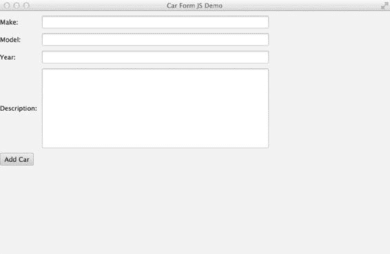

第 18 章 N NASHORN 与脚本

print("正在添加汽车：" + makeText.text);

car.make=makeText.text;

car.model=modelText.text;

car.year=yearText.text;

car.description=descriptionText.text;

carList.add(car);

carCount = "汽车数量为："+ carList.size();

print(carCount);

};

grid.add(button, 0,5);

primaryStage.scene = new Scene(grid, 800, 500);

primaryStage.show();

}

生成的应用程序如图 18-1 所示。

**图 18-1.** *用 JavaScript 编写的 JavaFX 应用程序*

[www.it-ebooks.info](http://www.it-ebooks.info/)

第 18 章 N NASHORN 与脚本

解决方案 2

使用 Java 编写一个 JavaFX 应用程序，并使用 `ScriptEngine` 嵌入 JavaScript 应用程序实现。


以下 Java 类名为 `CarCollector.java`，它实现了 `javafx.application.Application`。该类实现了 `start()` 方法，其中包含一个 `ScriptEngine`，用于嵌入实现应用程序的 JavaScript 代码。

```java
package org.java8recipes.chapter18.recipe18_11;

import java.io.FileReader;

import javafx.application.Application;

import javafx.stage.Stage;

import javax.script.ScriptEngine;

import javax.script.ScriptEngineManager;

public class CarCollector extends Application {

    private final String SCRIPT = getClass().getResource("carCollector.js").getPath(); 
    public static void main(String args[]) {

        launch(args);

    }

    @Override

    public void start(Stage stage) {

        try {

            ScriptEngine engine = new ScriptEngineManager().getEngineByName("nashorn"); 
            engine.put("primaryStage", stage);

            engine.eval(new FileReader(SCRIPT));

        } catch (Exception e) {

            e.printStackTrace();

        }

    }

}
```

接下来，我们来看一下名为 `carCollector.js` 的 JavaScript 文件，它实现了应用程序。请注意，代码中不包含 `start()` 函数，因为应用程序的 `start()` 方法已在 Java 代码中实现。该 JavaScript 文件仅包含实现部分。

```javascript
var ArrayList = Java.type("java.util.ArrayList");

var Scene = javafx.scene.Scene;

var Button = javafx.scene.control.Button;

var TextField = javafx.scene.control.TextField;

var GridPane = javafx.scene.layout.GridPane;

var Label = javafx.scene.control.Label;

var TextArea = javafx.scene.control.TextArea;

var carList = new ArrayList();

var carCount = "There are currently no cars";

var car = {

    make: "",

    model: "",

    [www.it-ebooks.info](http://www.it-ebooks.info/)

    CHAPTER 18 N NASHORN AND SCRIPTING

    year: "",

    description: ""

};

print(carCount);

primaryStage.title = "Car Form JS Demo";

var grid = new GridPane();

grid.hgap = 10;

grid.vgap = 10;

var makeLabel = new Label("Make:");

grid.add(makeLabel, 0, 1);

var makeText = new TextField();

grid.add(makeText, 1, 1);

var modelLabel = new Label("Model:");

grid.add(modelLabel, 0, 2);

var modelText = new TextField();

grid.add(modelText, 1, 2);

var yearLabel = new Label("Year:");

grid.add(yearLabel, 0, 3);

var yearText = new TextField();

grid.add(yearText, 1, 3);

var descriptionLabel = new Label("Description:");

grid.add(descriptionLabel, 0, 4);

var descriptionText = new TextArea();

grid.add(descriptionText, 1, 4);

var button = new Button("Add Car");

button.onAction = function() {

    print("Adding Car:" + makeText.text);

    car.make = makeText.text;

    car.model = modelText.text;

    car.year = yearText.text;

    car.description = descriptionText.text;

    carList.add(car);

    carCount = "The number of cars is: " + carList.size();

    print(carCount);

};

grid.add(button, 0, 5);

primaryStage.scene = new Scene(grid, 800, 500);

primaryStage.show();

[www.it-ebooks.info](http://www.it-ebooks.info/)

CHAPTER 18 N NASHORN AND SCRIPTING
```

**工作原理**

Nashorn 引擎可以完全访问 JavaFX API。这意味着可以构建完全或部分用 JavaScript 编写的 JavaFX 应用程序。本配方的两种解决方案分别演示了这两种技术。第一种解决方案演示了如何完全使用 JavaScript 开发 JavaFX 应用程序。使用解决方案 1 中演示的技术时，可以通过 `jjs` 工具并指定 `–fx` 选项来执行 JavaScript 实现，如下所示：

```
jjs –fx recipe18_11.js
```

解决方案 2 演示了如何从 Java 代码构建 JavaFX 应用程序，并嵌入用 JavaScript 编写的实现代码。要使用此技术，需通过扩展 `javafx.application.Application` 类并重写 `start()` 方法来构建一个标准的 JavaFX 应用程序类。在 `start()` 方法中，创建一个 Nashorn `ScriptEngine` 对象，并使用它来嵌入包含应用程序实现的 JavaScript 文件。

在调用引擎的 `eval()` 方法并传入 JavaScript 文件之前，先使用引擎的 `put()` 方法将 JavaFX 阶段（stage）传递给引擎。

```java
engine.put("primaryStage", stage);
```


深入探究 JavaScript 代码可以发现，任何 JavaFX API 类都可以通过 `Java.type()` 函数并传入完整的类名来导入。将导入的类赋值给 JavaScript 变量，这些变量将在后续的应用程序构建中使用。当完全用 JavaScript 编写时，必须创建一个 `start()` 函数来包含 JavaFX 应用程序阶段的构建。另一方面，当你使用 Java 代码启动应用程序时，则无需创建 `start()` 函数。在示例中，使用 `GridPane` 布局构建了一个用于采集汽车数据的表单。表单字段分别由 `Label` 和 `TextField` 或 `TextArea` 构成。当点击按钮时，汽车数据会存储在一个 JavaScript 对象中。

关于两种实现中的 JavaScript 代码，有几点需要注意。其语法与 Java 代码略有不同，因为这里没有使用 getter 和 setter 方法。此外，按钮动作处理器的实现是一个简单的 JavaScript 函数。

使用 JavaScript 构建 JavaFX 应用程序可以成为使用 Java 代码的一种有趣替代方案。其语法感觉类似于之前的 JavaFX Script 语言，并且比 Java 更简洁。如果你使用的是纯 JavaScript 实现，能够在不重新编译的情况下修改应用程序，这一点也非常好。

总结

Nashorn 使开发者能够在 Java 生态系统中利用现代 JavaScript 功能。Nashorn 引擎可以完全访问所有 Java API，包括 JavaFX。新的 `jjs` 工具提供了脚本编写能力，允许开发者创建完全用 JavaScript 编写的可执行脚本。

[www.it-ebooks.info](http://www.it-ebooks.info/)

**第 19 章**

**电子邮件**

电子邮件通知是当今企业系统不可或缺的一部分。Java 通过提供 JavaMail API 来实现电子邮件通知。使用此 API，你可以响应某个事件（例如，已完成的表单或已定稿的脚本）发送电子邮件通信。你也可以使用 JavaMail API 来检查 IMAP 或 POP3 邮箱。

要跟随本章的食谱进行操作，请确保已设置防火墙以允许电子邮件通信。大多数情况下，防火墙允许向电子邮件服务器进行出站通信而不会出现问题，但如果你正在运行自己的本地 SMTP（电子邮件）服务器，则可能需要配置防火墙以确保电子邮件服务器正常运行。

N **注意** JavaMail API 包含在 Java EE 下载包中。如果你使用的是 Java SE，则需要下载并安装 JavaMail API。

19-1\. 安装 JavaMail

问题

你想安装 JavaMail，以便应用程序用于发送电子邮件通知。

解决方案

从 Oracle 的 JavaMail 网站下载 JavaMail。目前，你需要的下载位于

[`www.oracle.com/technetwork/java/javamail/`](http://www.oracle.com/technetwork/java/javamail/)。

下载后，解压缩并将 JavaMail 的 `.jar` 文件（包括 `mail.jar` 和 `lib\*.jar`）作为依赖项添加到你的项目中。

工作原理

JavaMail API 包含在 Java EE SDK 中，但如果你使用的是 Java SE SDK，则需要下载并将 JavaMail API 添加到你的 Java SE 项目中。通过下载并添加依赖项，你可以访问功能强大的电子邮件 API，从而能够发送和接收电子邮件。

[www.it-ebooks.info](http://www.it-ebooks.info/)

第 19 章 电子邮件

N **注意** 如果你使用的不是 Java SE 6 或更新版本，则还需要 JavaBeans 激活框架（JAF）才能使用 JavaMail。Java SE 6 及更新版本已包含该框架。

19-2\. 发送电子邮件

问题

你需要应用程序发送一封电子邮件。

解决方案

使用 `Transport()` 方法，你可以向特定收件人发送电子邮件。在此解决方案中，构建一封电子邮件消息并通过 `[smtp.somewhere.com](http://smtp.somewhere.com/)` 服务器发送：

private void start() {

Properties properties = new Properties();

properties.put("mail.smtp.host", "smtp.somewhere.com");


properties.put("mail.smtp.auth", "true");

Session session = Session.getDefaultInstance(properties,

new MessageAuthenticator("username","password"));

Message message = new MimeMessage(session);

try {

message.setFrom(new InternetAddress("someone@somewhere.com"));

message.setRecipient(Message.RecipientType.TO,

new InternetAddress("someone@somewhere.com"));

message.setSubject("Subject");

message.setContent("This is a test message", "text/plain");

Transport.send(message);

} catch (MessagingException e) {

e.printStackTrace();

}

}

class MessageAuthenticator extends Authenticator {

PasswordAuthentication authentication = null;

public MessageAuthenticator(String username, String password) {

authentication = new PasswordAuthentication(username,password);

}

@Override

protected PasswordAuthentication getPasswordAuthentication() {

return authentication;

}

}

[www.it-ebooks.info](http://www.it-ebooks.info/)

第 19 章 电子邮件

工作原理

要使用 JavaMail API，首先创建一个 Properties 对象，它作为一个标准的 Map 对象（实际上，它继承自 Map）工作，在其中放入 JavaMail 服务可能需要的各种属性。主机名通过`mail.smtp.host`属性设置，如果主机需要身份验证，则必须将`mail.smtp.auth`属性设置为`true`。配置好属性对象后，获取一个`javax.mail.Session`，它将保存电子邮件的连接信息。

在创建会话时，如果服务需要身份验证，你可以指定登录信息。当连接到局域网外部的 SMTP 服务时，这可能是必要的。要指定登录信息，你必须创建一个`Authenticator`对象，该对象将包含`getPasswordAuthentication()`方法。在本例中，有一个新类被标识为`MessageAuthenticator`，它扩展了`Authenticator`类。通过让`getPasswordAuthentication()`方法返回一个`PasswordAuthentication`对象，你可以指定用于 SMTP 服务的用户名/密码。

`Message`对象代表一封实际的电子邮件，并公开了诸如发件人/收件人/主题和内容等电子邮件属性。设置这些属性后，调用`Transport.send()`静态方法来发送电子邮件。

**提示**

**注意** 如果你不需要身份验证信息，可以调用`Session.getDefaultInstance(properties, null)`方法，为`Authenticator`参数传递`null`。

19-3. 向电子邮件附加文件

问题

你需要向电子邮件附加一个或多个文件。

解决方案

创建包含不同部分的消息（称为*多部分消息*）是允许你发送文件、图像等附件的方式。你可以指定电子邮件正文和附件。包含不同部分的消息被称为多用途互联网邮件扩展（MIME）消息。它们在`javax.mail` API 中由`MimeMessage`类表示。以下代码创建了这样一条消息：

Message message = new MimeMessage(session);

message.setFrom(new InternetAddress(from));

message.setRecipient(Message.RecipientType.TO, new InternetAddress(to));

message.setSubject("Subject");

// 创建 MIME "消息" 部分

MimeBodyPart messageBodyPart = new MimeBodyPart();

messageBodyPart.setContent("This is a test message", "text/plain");

// 创建 MIME "文件" 部分

MimeBodyPart fileBodyPart = new MimeBodyPart();

fileBodyPart.attachFile("<path-to-attachment>/attach.txt");

MimeBodyPart fileBodyPart2 = new MimeBodyPart();

fileBodyPart2.attachFile("<path-to-attachment>/attach2.txt");

[www.it-ebooks.info](http://www.it-ebooks.info/)

第 19 章 电子邮件

// 将各个部分组合在一起

Multipart multipart = new MimeMultipart();

multipart.addBodyPart(messageBodyPart);

multipart.addBodyPart(fileBodyPart);

// 添加另一个正文部分以提供另一个附件

multipart.addBodyPart(fileBodyPart2);

// 将消息的内容设置为 MultiPart

message.setContent(multipart);

Transport.send(message);

工作原理


在 JavaMail API 中，您可以创建多用途互联网邮件扩展（MIME）电子邮件。此类消息允许包含不同的正文部分。在示例中，首先生成一个纯文本正文部分（包含电子邮件显示的文本），然后创建两个包含您要发送的附件的附件正文部分。根据附件的类型，Java API 会自动为附件正文部分选择合适的编码。

创建完每个正文部分后，通过创建一个 `MultiPart` 对象并将每个单独的部分（纯文本和附件）添加到其中来将它们组合起来。一旦 `MultiPart` 对象组装完毕并包含所有部分，它就会被设置为 `MimeMessage` 的内容并发送（就像在配方 19-2 中一样）。

**19-4. 发送 HTML 电子邮件**

**问题**

您想要发送一封包含 HTML 内容的电子邮件。

**解决方案**

将电子邮件的内容类型指定为 `text/html`，并将 HTML 字符串作为消息正文发送。在以下示例中，使用 HTML 内容构建一封电子邮件，然后将其发送。

```java
MimeMessage message = new MimeMessage(session);

try {

message.setFrom(new InternetAddress(from));

message.setRecipient(Message.RecipientType.TO, new InternetAddress(to));

message.setSubject("Subject Test");

// 创建 MIME 内容

MimeBodyPart messageBodyPart = new MimeBodyPart();

String html = "<H1>Important Message</H1>" +

"<b>This is an important message...</b>"+

"<br/><br/>" +

"<i>Be sure to code your Java today!</i>" +

"<H2>It is the right thing to do!</H2>";

messageBodyPart.setContent(html, "text/html; charset=utf-8");

[www.it-ebooks.info](http://www.it-ebooks.info/)

第 19 章 电子邮件

MimeBodyPart fileBodyPart = new MimeBodyPart();

fileBodyPart.attachFile("/path-to/attach.txt");

MimeBodyPart fileBodyPart2 = new MimeBodyPart();

fileBodyPart2.attachFile("/path-to/attach2.txt");

Multipart multipart = new MimeMultipart();

multipart.addBodyPart(messageBodyPart);

multipart.addBodyPart(fileBodyPart);

// 添加另一个正文部分以提供另一个附件

multipart.addBodyPart(fileBodyPart2);

message.setContent(multipart);

Transport.send(message);

} catch (MessagingException | IOException e) {

e.printStackTrace();

}
```

**工作原理**

发送包含 HTML 内容的电子邮件与发送标准文本电子邮件基本相同——唯一的区别在于内容类型。当您在电子邮件的消息正文部分设置内容时，将内容设置为 `text/html` 即可使内容被视为 HTML。构建 HTML 内容有多种方式，包括使用链接、图片或任何其他有效的 HTML 标记。在此示例中，一些基本的 HTML 标签被嵌入到一个字符串中。

尽管示例代码在实际系统中可能不太实用，但生成动态 HTML 内容以包含在电子邮件中却很容易。在最基本的形式中，动态生成的 HTML 可以是拼接起来形成 HTML 的文本字符串。

**19-5. 向一组收件人发送电子邮件**

**问题**

您想要将同一封电子邮件发送给多个收件人。

**解决方案**

使用 JavaMail API 中的 `setRecipients()` 方法向多个收件人发送电子邮件。`setRecipients()` 方法允许您一次指定多个收件人。例如：

```java
// 主要发送主体
message.setFrom(new InternetAddress("someone@somewhere.com"));

message.setRecipients(Message.RecipientType.TO, getRecipients(emails));

message.setSubject("Subject");

message.setContent("This is a test message", "text/plain");

Transport.send(message);

// ------------------

[www.it-ebooks.info](http://www.it-ebooks.info/)

第 19 章 电子邮件

private Address[] getRecipients(List<String> emails) throws AddressException {

Address[] addresses = new Address[emails.size()];

for (int i =0;i < emails.size();i++) {

addresses[i] = new InternetAddress(emails.get(i));

}

return addresses;

}
```

**工作原理**

通过使用 `Message` 对象的 `setRecipients()` 方法，您可以在同一消息上指定多个收件人。`setRecipients()` 方法接受一个 `Address` 对象数组。在本配方中，由于您有一个字符串集合，因此您创建一个与集合大小相同的数组，并创建 `InternetAddress` 对象来填充该数组。使用多个电子邮件地址发送电子邮件（相对于单独发送电子邮件）效率更高，因为从您的客户端到目标邮件服务器只发送一条消息。然后，每个目标邮件服务器将把邮件投递到其拥有邮箱的所有收件人。例如，如果您要发送到五个不同的 [yahoo.com](http://yahoo.com/) 账户，[yahoo.com](http://yahoo.com/) 邮件服务器只需接收一份消息副本，并将该消息投递给消息中指定的所有 [yahoo.com](http://yahoo.com/) 收件人。

**提示** 如果您想发送批量消息，您可能希望将收件人类型指定为 `BCC`，这样收到的电子邮件就不会显示还有谁也在接收该邮件。为此，请在 `setRecipients()` 方法中指定 `Message.RecipientType.BCC`。

**19-6. 检查电子邮件**

**问题**

您需要检查指定电子邮件账户是否有新邮件到达。

**解决方案**

您可以使用 `javax.mail.Store` 来连接、查询和检索来自互联网消息访问协议（IMAP）电子邮件账户的消息。例如，以下代码连接到一个 IMAP 账户，检索该 IMAP 账户中的最后五条消息，并将这些消息标记为已读。

```java
Session session = Session.getDefaultInstance(properties, null);

Store store = session.getStore("imaps");

store.connect(host,username,password);

System.out.println(store);

Folder inbox = store.getFolder(folder);

inbox.open(Folder.READ_WRITE);

int messageCount = inbox.getMessageCount();

int startMessage = messageCount - 5;

int endMessage = messageCount;

if (messageCount < 5) startMessage =0;

Message messages[] = inbox.getMessages(startMessage,endMessage);

[www.it-ebooks.info](http://www.it-ebooks.info/)

第 19 章 电子邮件

for (Message message : messages) {

boolean hasBeenRead = false;

for (Flags.Flag flag : message.getFlags().getSystemFlags()) {

if (flag == Flags.Flag.SEEN) {

hasBeenRead = true;

break;

}

}

message.setFlag(Flags.Flag.SEEN, true);

System.out.println(message.getSubject() + " "+ (hasBeenRead? "(已读)" : "") + message.getContent());

}

inbox.close(true);
```

**工作原理**

`Store` 对象允许您访问电子邮件邮箱信息。通过创建一个 `Store` 然后请求 `Inbox` 文件夹，您可以访问 IMAP 账户主邮箱中的消息。使用文件夹对象，您可以请求从收件箱下载消息。为此，您需要使用 `getMessages(start, end)` 方法。收件箱还提供了一个 `getMessageCount()` 方法，该方法允许您了解收件箱中有多少封电子邮件。请记住，消息的索引从 1 开始。

每条消息都有一组标志，可以指示消息是否已被阅读（`Flags.Flag.SEEN`）或消息是否已被回复（`Flags.Flag.ANSWERED`）。通过解析 `SEEN` 标志，您可以处理之前未读过的消息。

要将消息设置为已读（或已回复），请调用 `message.setFlag()` 方法。此方法允许您设置（或重置）电子邮件标志。如果您要设置消息标志，您需要以 `READ_WRITE` 模式打开文件夹，这允许您更改电子邮件标志。您还需要在代码末尾调用 `inbox.close(true)`，这将告诉 JavaMail API 将更改刷新到 IMAP 存储。

**提示** 对于基于 SSL 的 IMAP，您应该使用 `session.getStore("imaps")`。这将创建一个安全的 IMAP 存储。

**19-7. 监控电子邮件账户**

**问题**

您想要监控邮件何时到达某个特定账户，并根据其内容进行处理。

**解决方案**


从配方 19-6 的实现开始。然后添加 IMAP 标志操作，为你的应用程序创建一个健壮的电子邮件监视器。在以下示例中，`checkForMail()` 方法用于处理发送到邮件列表的邮件。在此场景中，用户可以通过在主题行中放置“subscribe”或“unsubscribe”来订阅或取消订阅列表。以下示例检查新消息的主题并适当处理它们。该示例还使用消息标志来删除已处理的消息，这样它们就不需要被读取两次。无法处理的消息会被标记为已读，但保留在服务器上以供人工排查。

[www.it-ebooks.info](http://www.it-ebooks.info/)

第 19 章 电子邮件

private void checkForMail() {

System.out.println("Checking for mail");

Properties properties = new Properties();

String username = "username";

String password = "password";

String folder = "Inbox";

String host = "imap.server.com";

try {

Session session = Session.getDefaultInstance(properties, null);

Store store = session.getStore("imaps");

store.connect(host,username,password);

Folder inbox = store.getFolder(folder);

inbox.open(Folder.READ_WRITE);

int messageCount = inbox.getMessageCount();

Message messages[] = inbox.getMessages(1,messageCount);

for (Message message : messages) {

boolean hasBeenRead = false;

if (Arrays.asList(message.getFlags().getSystemFlags()).contains(Flags.Flag.SEEN)) {

continue; // 对“已读”消息不感兴趣

}

if (processMessage(message)) {

System.out.println("Processed :"+message.getSubject());

message.setFlag(Flags.Flag.DELETED, true);

} else {

System.out.println("Couldn't Understand :"+message.getSubject());

// 将其标记为已读，但保留它

message.setFlag(Flags.Flag.SEEN, true);

}

}

inbox.close(true);

} catch (MessagingException e) {

e.printStackTrace();

}

}

private boolean processMessage(Message message) throws MessagingException {

boolean result = false;

String subject = message.getSubject().toLowerCase();

if (subject.startsWith("subscribe")) {

String emailAddress = extractAddress (message.getFrom());

if (emailAddress != null) {

subscribeToList(emailAddress);

result = true;

}

} else if (subject.startsWith("unsubscribe")) {

String emailAddress = extractAddress (message.getFrom());

if (emailAddress != null) {

unSubscribeToList(emailAddress);

[www.it-ebooks.info](http://www.it-ebooks.info/)

第 19 章 电子邮件

result = true;

}

}

return result;

}

private String extractAddress(Address[] addressArray) {

if ((addressArray == null) || (addressArray.length < 1)) return null;

if (!(addressArray[0] instanceof InternetAddress)) return null;

InternetAddress internetAddress = (InternetAddress) addressArray[0];

return internetAddress.getAddress();

}

工作原理

连接到 IMAP 服务器后，该示例请求所有已接收的消息。代码会跳过那些标记为 SEEN 的消息。为此，配方使用 `Arrays.AsList` 将系统消息标志数组转换为 `ArrayList`。一旦列表创建完成，只需查询该列表以查看它是否包含 `Flag.SEEN` 枚举值。如果存在该值，示例将跳到下一个项目。

当找到未读消息时，消息由 `processMessage()` 方法处理。该方法根据主题行的开头来订阅或取消订阅消息的发送者。（这类似于邮件列表，发送主题为“subscribe”的消息会将发送者添加到邮件列表中。）在确定要执行的命令后，代码继续从消息中提取发送者的电子邮件。为此，`processMessage()` 调用 `extractEmail()` 方法。每条消息都包含一个可能的“发件人”地址数组。这些 `Address` 对象是通用的，因为 `Address` 对象可以表示互联网或新闻组地址。在检查 `Address` 对象确实是 `InternetAddress` 后，代码将 `Address` 对象转换为 `InternetAddress` 并调用 `getAddress()` 方法，该方法包含实际的电子邮件地址。


一旦提取出电子邮件地址，该方案会根据主题行调用订阅或取消订阅功能。

如果消息能够被理解（即消息已被处理），`processMessage()` 方法会返回 `true`（如果无法理解消息，则返回 `false`）。在 `checkForMail()` 方法中，当 `processMessage()` 方法返回 `true` 时，该消息会被标记为删除（通过调用 `message.setFlag(Flags.Flag.DELETED, true)`）；否则，消息仅被标记为已读。这样，如果消息未被理解，它仍会保留；如果已被处理，则会被删除。最后，要提交消息上的新标记（并清除已删除的消息），你需要调用 `inbox.close(true)` 方法。

总结

电子邮件在我们今天使用的许多系统中扮演着重要角色。Java 语言包含 JavaMail API，使开发者能够在 Java 应用程序中集成强大的电子邮件功能。本章的方案涵盖了从安装到高级用法的 JavaMail API。要了解更多关于 JavaMail 以及如何将邮件集成到部署在企业应用服务器上的 Java 应用程序中，请参考在线文档：[`www.oracle.com/technetwork/java/javamail/index-141777.html`](http://www.oracle.com/technetwork/java/javamail/index-141777.html)。

[www.it-ebooks.info](http://www.it-ebooks.info/)

[www.it-ebooks.info](http://www.it-ebooks.info/)

**第 20 章**

**XML 处理**

XML API 一直对 Java 开发者可用，通常作为第三方库提供，可以添加到运行时类路径中。从 Java 7 开始，Java API for XML Processing (JAXP)、Java API for XML Binding (JAXB) 和 Java API for XML Web Services (JAX-WS) 被包含在核心运行时库中。

你将遇到的最基本的 XML 处理任务只涉及少数几个用例：编写和读取 XML 文档、验证这些文档，以及使用 JAXB 辅助编组/解组 Java 对象。

本章提供了这些常见任务的方案。

**注意** 本章示例的源代码可在 `org.java8recipes.chapter20` 包中找到。有关如何查找和下载本书示例源代码的说明，请参阅介绍章节。

20-1. 编写 XML 文件

问题

你想要创建一个 XML 文档来存储应用程序数据。

解决方案

要编写 XML 文档，请使用 `javax.xml.stream.XMLStreamWriter` 类。以下代码遍历一个 `Patient` 对象数组，并将数据写入一个 `.xml` 文件。此示例代码来自 `org.java8recipes.chapter20.recipe20_1.DocWriter` 示例：

```java
import javax.xml.stream.XMLOutputFactory;
import javax.xml.stream.XMLStreamException;
import javax.xml.stream.XMLStreamWriter;
...
public void run(String outputFile) throws FileNotFoundException, XMLStreamException, IOException {
    List<Patient> patients = new ArrayList<>();
    Patient p1 = new Patient();
    Patient p2 = new Patient();
    Patient p3 = new Patient();
    p1.setId(BigInteger.valueOf(1));
    [www.it-ebooks.info](http://www.it-ebooks.info/)
    CHAPTER 20 N XML PROCESSING
    p1.setName("John Smith");
    p1.setDiagnosis("Common Cold");
    p2.setId(BigInteger.valueOf(2));
    p2.setName("Jane Doe");
    p2.setDiagnosis("Broken Ankle");
    p3.setId(BigInteger.valueOf(3));
    p3.setName("Jack Brown");
    p3.setDiagnosis("Food Allergy");
    patients.add(p1);
    patients.add(p2);
    patients.add(p3);
    XMLOutputFactory factory = XMLOutputFactory.newFactory();
    try (FileOutputStream fos = new FileOutputStream(outputFile)) {
        XMLStreamWriter writer = factory.createXMLStreamWriter(fos, "UTF-8");
        writer.writeStartDocument();
        writer.writeCharacters("\n");
        writer.writeStartElement("patients");
        writer.writeCharacters("\n");
        for (Patient p : patients) {
            writer.writeCharacters("\t");
            writer.writeStartElement("patient");
            writer.writeAttribute("id", String.valueOf(p.getId()));
            writer.writeCharacters("\n\t\t");
            writer.writeStartElement("name");
            writer.writeCharacters(p.getName());
            writer.writeEndElement();
```


writer.writeCharacters("\n\t\t");

writer.writeStartElement("diagnosis");

writer.writeCharacters(p.getDiagnosis());

writer.writeEndElement();

writer.writeCharacters("\n\t");

writer.writeEndElement();

writer.writeCharacters("\n");

}

writer.writeEndElement();

writer.writeEndDocument();

writer.close();

}

}

上述代码会写入以下文件内容：

<?xml version="1.0" ?>

<patients>

<patient id="1">

<name>John Smith</name>

<diagnosis>Common Cold</diagnosis>

</patient>

<patient id="2">

<name>Jane Doe</name>

[www.it-ebooks.info](http://www.it-ebooks.info/)

第 20 章 XML 处理

<diagnosis>Broken ankle</diagnosis>

</patient>

<patient id="3">

<name>Jack Brown</name>

<diagnosis>Food allergy</diagnosis>

</patient>

</patients>

工作原理

Java 标准库提供了多种写入 XML 文档的方式。其中一种模型是用于 XML 的简单 API（SAX）。

更新、更简单且更高效的模型是用于 XML 的流式 API（StAX）。本方案使用`javax.xml.stream`包中定义的 StAX。写入 XML 文档需要五个步骤：

1.  创建文件输出流。
2.  创建 XML 输出工厂和 XML 输出流写入器。
3.  将文件流包装到 XML 流写入器中。
4.  使用 XML 流写入器的写入方法创建文档并写入 XML 元素。
5.  关闭输出流。

使用`java.io.FileOutputStream`类创建文件输出流。你可以使用`try`块来打开和关闭此流。更多关于新`try`块语法的内容，请参阅第 9 章。

`javax.xml.stream.XMLOutputFactory`提供了一个用于创建输出工厂的静态方法。使用该工厂创建一个`javax.xml.stream.XMLStreamWriter`。

获得写入器后，将文件流对象包装到 XML 写入器实例中。你将使用各种写入方法来创建 XML 文档元素和属性。最后，在完成文件写入后，只需关闭写入器即可。`XMLStreamWriter`实例的一些更有用的方法包括：
- `writeStartDocument()`
- `writeStartElement()`
- `writeEndElement()`
- `writeEndDocument()`
- `writeAttribute()`

创建文件和`XMLStreamWriter`后，你应始终通过调用`writeStartDocument()`方法来开始文档。接着，结合使用`writeStartElement()`和`writeEndElement()`方法来写入各个元素。当然，元素可以包含嵌套元素。你有责任按正确顺序调用这些方法，以创建格式良好的文档。使用`writeAttribute()`方法将属性名称和值放入当前元素。你应在调用`writeStartElement()`方法后立即调用`writeAttribute()`。最后，使用`writeEndDocument()`方法标记文档结束，并关闭写入器实例。

使用`XMLStreamWriter`的一个有趣之处在于它不会格式化文档输出。除非你特意使用`writeCharacters()`方法输出空格和换行符，否则输出将流式传输到单个未格式化的行中。当然，这不会使生成的 XML 文件无效，但确实会使人类阅读变得不便和困难。因此，你应考虑使用`writeCharacters()`方法根据需要输出间距和换行符，以创建人类可读的文档。如果你不需要文档供人类阅读，可以安全地忽略这种写入额外空白和换行符的方法。无论格式如何，只要 XML 文档遵循正确的 XML 语法，它就会是格式良好的。

[www.it-ebooks.info](http://www.it-ebooks.info/)

第 20 章 XML 处理

此示例代码的命令行使用模式如下：

java org.java8recipes.chapter20.recipe20_1.DocWriter <outputXmlFile>

通过以下方式调用此应用程序以创建名为`patients.xml`的文件：

java org.java8recipes.chapter20.recipe20_1.DocWriter patients.xml

20-2. 读取 XML 文件

问题

你需要解析一个 XML 文档，检索已知的元素和属性。

解决方案 1


使用 `javax.xml.stream.XMLStreamReader` 接口来读取文档。通过此 API，你的代码将使用一种类似于 SQL 中游标式接口的方式来拉取 XML 元素，从而依次处理每个元素。以下来自 `org.java8recipes.DocReader` 的代码片段演示了如何读取上一个配方中生成的 `patients.xml` 文件：

```java
public void cursorReader(String xmlFile)
        throws FileNotFoundException, IOException, XMLStreamException {
    XMLInputFactory factory = XMLInputFactory.newFactory();
    try (FileInputStream fis = new FileInputStream(xmlFile)) {
        XMLStreamReader reader = factory.createXMLStreamReader(fis);
        boolean inName = false;
        boolean inDiagnosis = false;
        String id = null;
        String name = null;
        String diagnosis = null;
        while (reader.hasNext()) {
            int event = reader.next();
            switch (event) {
                case XMLStreamConstants.START_ELEMENT:
                    String elementName = reader.getLocalName();
                    switch (elementName) {
                        case "patient":
                            id = reader.getAttributeValue(0);
                            break;
                        case "name":
                            inName = true;
                            break;
                        case "diagnosis":
                            inDiagnosis = true;
                            break;
                        default:
                            break;
                    }
                    [www.it-ebooks.info](http://www.it-ebooks.info/)
                    // 第 20 章 N XML 处理
                    break;
                case XMLStreamConstants.END_ELEMENT:
                    String elementname = reader.getLocalName();
                    if (elementname.equals("patient")) {
                        System.out.printf("Patient: %s\nName: %s\nDiagnosis: %s\n\n", id, name,
                                diagnosis);
                        id = name = diagnosis = null;
                        inName = inDiagnosis = false;
                    }
                    break;
                case XMLStreamConstants.CHARACTERS:
                    if (inName) {
                        name = reader.getText();
                        inName = false;
                    } else if (inDiagnosis) {
                        diagnosis = reader.getText();
                        inDiagnosis = false;
                    }
                    break;
                default:
                    break;
            }
        }
        reader.close();
    }
}
```

**解决方案 2**

使用 `XMLEventReader` 通过面向事件的接口来读取和处理事件。此 API 也被称为迭代器导向型 API。以下代码与解决方案 1 中的代码非常相似，不同之处在于它使用了面向事件的 API 而非游标导向型 API。此代码片段来自解决方案 1 中使用的同一个 `org.java8recipes.chapter20.recipe20_1.DocReader` 类：

```java
public void eventReader(String xmlFile)
        throws FileNotFoundException, IOException, XMLStreamException {
    XMLInputFactory factory = XMLInputFactory.newFactory();
    XMLEventReader reader = null;
    try (FileInputStream fis = new FileInputStream(xmlFile)) {
        reader = factory.createXMLEventReader(fis);
        boolean inName = false;
        boolean inDiagnosis = false;
        String id = null;
        String name = null;
        String diagnosis = null;
        while (reader.hasNext()) {
            XMLEvent event = reader.nextEvent();
            String elementName = null;
            switch (event.getEventType()) {
                case XMLEvent.START_ELEMENT:
                    [www.it-ebooks.info](http://www.it-ebooks.info/)
                    // 第 20 章 N XML 处理
                    StartElement startElement = event.asStartElement();
                    elementName = startElement.getName().getLocalPart();
                    switch (elementName) {
                        case "patient":
                            id = startElement.getAttributeByName(QName.valueOf("id")).getValue();
                            break;
                        case "name":
                            inName = true;
                            break;
                        case "diagnosis":
                            inDiagnosis = true;
                            break;
                        default:
                            break;
                    }
                    break;
                case XMLEvent.END_ELEMENT:
                    EndElement endElement = event.asEndElement();
                    elementName = endElement.getName().getLocalPart();
                    if (elementName.equals("patient")) {
                        System.out.printf("Patient: %s\nName: %s\nDiagnosis: %s\n\n", id,
                                name, diagnosis);
                        id = name = diagnosis = null;
                        inName = inDiagnosis = false;
                    }
                    break;
                case XMLEvent.CHARACTERS:
                    String value = event.asCharacters().getData();
                    if (inName) {
                        name = value;
                        inName = false;
                    } else if (inDiagnosis) {
                        diagnosis = value;
                        inDiagnosis = false;
                    }
                    break;
            }
        }
    }
    if (reader != null) {
        reader.close();
    }
}
```

**工作原理**

Java 提供了多种读取 XML 文档的方式。其中一种是使用 StAX，这是一种流式模型。它优于较旧的 SAX API，因为它允许你同时读取和写入 XML 文档。尽管 StAX 不如 DOM API 强大，但它是一个出色且高效的 API，对内存资源的消耗更小。


StAX 提供了两种读取 XML 文档的方法：游标 API 和迭代器 API。面向游标的 API 使用一个游标，该游标可以从头到尾遍历 XML 文档，一次指向一个元素，并且始终向前移动。迭代器 API 将 XML 文档流表示为一组离散的事件对象，这些对象按照它们在源 XML 中被读取的顺序提供。目前，面向事件的迭代器 API 比游标 API 更受青睐，因为它提供的 XMLEvent 对象具有以下优点：

-   XMLEvent 对象是不可变的，即使 StAX 解析器已移动到后续事件，它们也能持久存在。你可以将这些 XMLEvent 对象传递给其他进程，或将其存储在列表、数组和映射中。

-   你可以继承 XMLEvent，根据需要创建自己的专用事件。

-   你可以通过添加或删除事件来修改传入的事件流，这比游标 API 更灵活。

要使用 StAX 读取文档，请在文件输入流上创建一个 XML 事件读取器。使用 `hasNext()` 方法检查事件是否仍然可用，并使用 `nextEvent()` 方法读取每个事件。`nextEvent()` 方法将返回特定类型的 XMLEvent，该事件对应于 XML 文件中的开始和结束元素、属性和值数据。完成这些对象的操作后，请记得关闭读取器和文件流。

你可以像这样调用示例应用程序，使用 `patients.xml` 文件作为 `<xmlFile>` 参数：`java org.java8recipes.chapter20.recipe20_2.DocReader <xmlFile>`

20-3. 转换 XML

问题

你想将 XML 文档转换为另一种格式，例如 HTML。

解决方案

使用 `javax.xml.transform` 包将 XML 文档转换为另一种文档格式。

以下代码演示了如何读取源文档，应用可扩展样式表语言（XSL）转换文件，并生成转换后的新文档。使用 `org.java8recipes.chapter20.recipe20_3.TransformXml` 类中的示例代码来读取 `patients.xml` 文件并创建 `patients.html` 文件。以下代码片段展示了该类的重要部分：

```java
import javax.xml.transform.TransformerConfigurationException;
import javax.xml.transform.TransformerException;
import javax.xml.transform.TransformerFactory;
import javax.xml.transform.Transformer;
import javax.xml.transform.Source;
import javax.xml.transform.stream.StreamResult;
import javax.xml.transform.stream.StreamSource;
...
public void run(String xmlFile, String xslFile, String outputFile)
    throws FileNotFoundException, TransformerConfigurationException, TransformerException {
    InputStream xslInputStream = new FileInputStream(xslFile);
    Source xslSource = new StreamSource(xslInputStream);
    TransformerFactory factory = TransformerFactory.newInstance();
    Transformer transformer = factory.newTransformer(xslSource);
    InputStream xmlInputStream = new FileInputStream(xmlFile);
    StreamSource in = new StreamSource(xmlInputStream);
    StreamResult out = new StreamResult(outputFile);
    transformer.transform(in, out);
    ...
}
```

[www.it-ebooks.info](http://www.it-ebooks.info/)

第 20 章 N XML 处理

工作原理

`javax.xml.transform` 包包含了将 XML 文档转换为任何其他文档类型所需的所有类。最常见的用例是将面向数据的 XML 文档转换为用户可读的 HTML 文档。

将一种文档类型转换为另一种文档类型需要三个文件：

-   一个 XML 源文档
-   一个 XSL 转换文档，用于将 XML 元素映射到新文档元素
-   一个目标输出文件

XML 源文档当然是你的源数据文件。它通常包含易于以编程方式解析的面向数据的内容。然而，人们不容易阅读 XML 文件，尤其是复杂、数据丰富的文件。相反，人们更习惯于阅读正确渲染的 HTML 文档。


XSL 转换文档规定了如何将 XML 文档转换为其他格式。XSL 文件通常包含一个 HTML 模板，该模板指定了用于存放源 XML 文件提取内容的动态字段。

在本示例的源代码中，您将找到两个源文档：

-   `chapter20/recipe20_3/patients.xml`
-   `chapter20/recipe20_3/patients.xsl`

`patients.xml` 文件内容简短，包含以下数据：

```xml
<?xml version="1.0" encoding="UTF-8"?>

<patients>

<patient id="1">

<name>John Smith</name>

<diagnosis>Common Cold</diagnosis>

</patient>

<patient id="2">

<name>Jane Doe</name>

<diagnosis>Broken ankle</diagnosis>

</patient>

<patient id="3">

<name>Jack Brown</name>

<diagnosis>Food allergy</diagnosis>

</patient>

</patients>
```

[www.it-ebooks.info](http://www.it-ebooks.info/)

第 20 章 XML 处理

`patients.xml` 文件定义了一个名为 `patients` 的根元素。它包含三个嵌套的 `patient` 元素。每个 `patient` 元素包含三部分数据：

-   患者标识符，作为 `patient` 元素的 `id` 属性提供
-   患者姓名，作为 `name` 子元素提供
-   患者诊断结果，作为 `diagnosis` 子元素提供

转换 XSL 文档（`patients.xsl`）同样非常简短，它使用 XSL 将患者数据映射为更易于用户阅读的 HTML 格式：

```xml
<?xml version="1.0" encoding="UTF-8"?>

<xsl:stylesheet version="1.0">

<xsl:output method="html"/>

<xsl:template match="/">

<html>

<head>

<title>Patients</title>

</head>

<body>

<table border="1">

<tr>

<th>Id</th>

<th>Name</th>

<th>Diagnosis</th>

</tr>

<xsl:for-each select="patients/patient">

<tr>

<td>

<xsl:value-of select="@id"/>

</td>

<td>

<xsl:value-of select="name"/>

</td>

<td>

<xsl:value-of select="diagnosis"/>

</td>

</tr>

</xsl:for-each>

</table>

</body>

</html>

</xsl:template>

</xsl:stylesheet>
```

使用此样式表，示例代码将 XML 转换为一个包含所有患者及其数据的 HTML 表格。在浏览器中渲染后，该 HTML 表格应如图 20-1 所示。

[www.it-ebooks.info](http://www.it-ebooks.info/)


第 20 章 XML 处理

**图 20-1.** *HTML 表格的常见渲染效果*

使用此 XSL 文件将 XML 转换为 HTML 文件的过程很直接，但每一步都可以通过添加额外的错误检查和流程处理来增强。对于此示例，请参考解决方案部分之前的代码。

最基本的转换步骤如下：

1.  将 XSL 文档作为 `Source` 对象读入 Java 应用程序。
2.  创建一个 `Transformer` 实例，并提供您的 XSL `Source` 实例供其在操作过程中使用。
3.  创建一个代表源 XML 内容的 `SourceStream`。
4.  为输出文档（本例中为 HTML 文件）创建一个 `StreamResult` 实例。
5.  使用 `Transformer` 对象的 `transform()` 方法执行转换。
6.  根据需要关闭所有相关的流和文件实例。

如果您选择执行示例代码，应使用 `patients.xml`、`patients.xsl` 和 `patients.html` 作为参数，按以下方式调用：

```bash
java org.java8recipes.chapter20.recipe20_3.TransformXml <xmlFile><xslFile><outputFile>
```

20-4. 验证 XML

问题

您希望确认您的 XML 是有效的——即它符合已知的文档定义或模式。

解决方案

使用 `javax.xml.validation` 包验证您的 XML 是否符合特定模式。以下来自 `org.java8recipes.chapter20.recipe20_4.ValidateXml` 的代码片段演示了如何针对 XML 模式文件进行验证：

```java
import java.io.File;

import java.io.IOException;

import javax.xml.XMLConstants;

import javax.xml.transform.Source;

import javax.xml.transform.stream.StreamSource;

import javax.xml.validation.Schema;

import javax.xml.validation.SchemaFactory;
```

[www.it-ebooks.info](http://www.it-ebooks.info/)

第 20 章 XML 处理

```java
import javax.xml.validation.Validator;

import org.xml.sax.SAXException;

...

public void run(String xmlFile, String validationFile) {

boolean valid = true;
```


SchemaFactory sFactory =

SchemaFactory.newInstance(XMLConstants.W3C_XML_SCHEMA_NS_URI);

try {

Schema schema = sFactory.newSchema(new File(validationFile));

Validator validator = schema.newValidator();

Source source = new StreamSource(new File(xmlFile));

validator.validate(source);

} catch (SAXException | IOException | IllegalArgumentException ex) {

valid = false;

}

System.out.printf("XML file is %s.\n", valid ? "valid" : "invalid");

}

...

工作原理

在使用 XML 时，对其进行验证以确保语法正确，并确保 XML 文档是指定 XML 模式的实例，这一点非常重要。验证过程涉及比较模式和 XML 文档，以发现任何差异。`javax.xml.validation` 包提供了可靠地针对各种模式验证 XML 文件所需的所有类。您将用于 XML 验证的最常见模式在 `XMLConstants` 类中定义为常量 URI：

u `XMLConstants.W3C_XML_SCHEMA_NS_URI`

u `XMLConstants.RELAXNG_NS_URI`

首先，为特定类型的模式定义创建一个 `SchemaFactory`。`SchemaFactory` 知道如何解析特定的模式类型，并为其验证做好准备。使用 `SchemaFactory` 实例创建一个 `Schema` 对象。

`Schema` 对象是模式定义语法的内存表示。您可以使用 `Schema` 实例来获取一个理解此语法的 `Validator` 实例。最后，使用 `validate()` 方法来检查您的 XML。如果在验证过程中出现任何问题，该方法调用将生成多个异常。

否则，`validate()` 方法会静默返回，您可以继续使用该 XML 文件。

N **注意** XML Schema 于 2001 年首次获得万维网联盟（W3C）的“推荐”状态。此后，出现了竞争性的模式。一种竞争模式是用于 XML 下一代的正则语言（RELAX NG）模式。RELAX NG 可能是一种更简单的模式，其规范还定义了一种非 XML 的紧凑语法。本配方的示例使用了 XML 模式。

使用以下命令行语法运行示例代码，最好分别使用提供的示例 `.xml` 文件和验证文件 `resources/patients.xml` 和 `patients.xsl`：

java org.java8recipes.chapter20.recipe20_4.ValidateXml <xmlFile><validationFile> 547

[www.it-ebooks.info](http://www.it-ebooks.info/)

第 20 章 N XML 处理

20-5. 为 XML 模式创建 Java 绑定

问题

您想要生成一组代表 XML 模式中对象的 Java 类（Java 绑定）。

解决方案

JDK 提供了一个工具，可以将模式文档转换为代表性的 Java 类文件。使用

`<JDK_HOME>/bin/xjc` 命令行工具为您的 XML 模式生成 Java 绑定。要为配方 20-3 中的 `patients.xsd` 文件创建 Java 类，您可以在控制台中发出以下命令：`xjc –p org.java8recipes.chapter20.recipe20_5 patients.xsd`

此命令将处理 `patients.xsd` 文件，并创建处理使用此模式验证的 XML 文件所需的所有类。对于此示例，`patients.xsd` 文件如下所示：

<?xml version="1.0" encoding="UTF-8"?>

<xs:schema elementFormDefault="qualified">

<xs:element name="patients">

<xs:complexType>

<xs:sequence>

<xs:element maxOccurs="unbounded" name="patient" type="Patient"/>

</xs:sequence>

</xs:complexType>

</xs:element>

<xs:complexType name="Patient">

<xs:sequence>

<xs:element name="name" type="xs:string"/>

<xs:element name="diagnosis" type="xs:string"/>

</xs:sequence>

<xs:attribute name="id" type="xs:integer" use="required"/>

</xs:complexType>

</xs:schema>

在前面的 xsd 文件上执行时，`xjc` 命令在 `org.java8recipes.chapter20.recipe20_5` 包中创建以下文件：

u `ObjectFactory.java`

u `Patients.java`

u `Patient.java`

工作原理

JDK 包含 `<JDK_HOME>/bin/xjc` 实用程序。`xjc` 实用程序是一个命令行应用程序，它从模式文件创建 Java 绑定。源模式文件可以是多种类型，包括 XML Schema、RELAX NG 等。

`xjc` 命令有几个选项用于执行其工作。一些最常见的选项指定源模式文件、生成的 Java 绑定文件的包以及将接收 Java 绑定文件的输出目录。

[www.it-ebooks.info](http://www.it-ebooks.info/)

第 20 章 N XML 处理

您可以通过使用工具的 `–help` 选项获得所有命令行选项的详细描述：`xjc –help`

Java 绑定包含与 XML Schema 文件中定义的字段相对应的带注解的字段。这些注解标记了模式文件的根元素和所有其他子元素。这在 XML 处理的下一步中非常有用，该步骤涉及对这些绑定进行解组或编组。

20-6. 将 XML 解组为 Java 对象

问题

您想要解组一个 XML 文件并创建其对应的 Java 对象树。

解决方案

解组是将数据格式（此处为 XML）转换为对象的内存表示的过程，以便可以用来执行任务。JAXB 提供了一个解组服务，该服务解析 XML 文件并从您在配方 20-4 中创建的绑定生成 Java 对象。以下代码可以读取 `org.java8recipes.chapter20.recipe20-6` 包中的文件 `patients.xml`，以创建一个 `Patients` 根对象及其 `Patient` 对象列表：

public void run(String xmlFile, String context)

throws JAXBException, FileNotFoundException {

JAXBContext jc = JAXBContext.newInstance(context);

Unmarshaller u = jc.createUnmarshaller();

FileInputStream fis = new FileInputStream(xmlFile);

Patients patients = (Patients)u.unmarshal(fis);

for (Patient p: patients.getPatient()) {

System.out.printf("ID: %s\n", p.getId());

System.out.printf("NAME: %s\n", p.getName());

System.out.printf("DIAGNOSIS: %s\n\n", p.getDiagnosis());

}

}

如果您在 `chapter20/recipe20_6/patients.xml` 文件上运行示例代码，并使用 `org.java8recipes.chapter20` 上下文，应用程序将在迭代 `Patient` 对象列表时向控制台打印以下内容：

ID: 1

NAME: John Smith

DIAGNOSIS: Common Cold

ID: 2

NAME: Jane Doe

DIAGNOSIS: Broken ankle

ID: 3

NAME: Jack Brown

DIAGNOSIS: Food allergy

[www.it-ebooks.info](http://www.it-ebooks.info/)

第 20 章 N XML 处理

N **注意** 前面的输出直接来自从 XML 表示创建的 Java `Patient` 类的实例。代码不直接打印 XML 文件的内容。相反，它在 XML 被编组到适当的 Java 绑定实例后打印 Java 绑定的内容。

工作原理

将 XML 文件解组为其 Java 对象表示至少有两个条件：

u 一个格式良好且有效的 XML 文件

u 一组相应的 Java 绑定

Java 绑定不必由 `xjc` 命令自动生成。一旦您对 Java 绑定和注解特性有了一些经验，您可能更愿意通过手工制作 Java 绑定来创建和控制 Java 绑定的所有方面。无论您的偏好如何，Java 的解组服务都利用绑定及其注解将 XML 对象映射到目标 Java 对象，并将 XML 元素映射到目标对象字段。

使用以下语法执行此配方的示例应用程序，将 `patients.xml` 和 `org.java8recipes.chapter20.recipe20_6` 替换为相应的参数：

java org.java8recipes.chapter20.recipe20_6.UnmarshalPatients <xmlfile><context>

20-7. 使用 JAXB 构建 XML 文档

问题

您需要将对象的数据写入 XML 表示。

解决方案


假设您已按照食谱 20-4 所述为 XML 模式创建了 Java 绑定文件，接下来需要使用`JAXBContext`实例来创建`Marshaller`对象。然后，利用`Marshaller`对象将 Java 对象树序列化为 XML 文档。以下代码演示了这一过程：

public void run(String xmlFile, String context)

throws JAXBException, FileNotFoundException {

Patients patients = new Patients();

List<Patient> patientList = patients.getPatient();

Patient p = new Patient();

p.setId(BigInteger.valueOf(1));

p.setName("John Doe");

p.setDiagnosis("Schizophrenia");

patientList.add(p);

JAXBContext jc = JAXBContext.newInstance(context);

Marshaller m = jc.createMarshaller();

m.marshal(patients, new FileOutputStream(xmlFile));

}

[www.it-ebooks.info](http://www.it-ebooks.info/)

第 20 章 N XML 处理

上述代码会生成一个未格式化但结构良好且有效的 XML 文档。为便于阅读，此处对 XML 文档进行了格式化：

<?xml version="1.0" encoding="UTF-8" standalone="yes"?>

<patients>

<patient id="1">

<name>John Doe</name>

<diagnosis>Schizophrenia</diagnosis>

</patient>

</patients>

N **注意** 上述代码中的`getPatient()`方法返回的是一个患者对象列表，而非单个患者。这是本例中从 XSD 模式生成 JAXB 代码时的一个命名特例。

工作原理

`Marshaller`对象能够理解 JAXB 注解。在处理类时，它会利用 JAXB 注解提供必要的上下文，从而在 XML 中创建对象树。

您可以通过以下命令行从`org.java8recipes.chapter20.recipe20_7.MarshalPatients`应用程序运行上述代码：

java org.java8recipes.chapter20.recipe20_7.MarshalPatients <xmlfile><context> 其中`context`参数指的是您要编组的 Java 类所在的包。在上述示例中，由于代码编组的是`Patients`对象树，因此正确的上下文是`Patients`类的包名。在本例中，上下文为`org.java8recipes.chapter20`。

总结

XML 通常用于在不同应用程序之间传输数据，或将某种数据存储到文件中。因此，了解在应用程序开发平台中处理 XML 的基础知识至关重要。本章概述了如何使用 Java 执行一些关键的 XML 处理任务。

本章从编写和读取 XML 的基础知识入手，随后演示了如何将 XML 转换为不同格式，以及如何根据 XML 模式进行验证。最后，本章详细介绍了如何在应用程序中使用 XML 数据执行各种任务。

[www.it-ebooks.info](http://www.it-ebooks.info/)

**第 21 章**

**网络**

如今，编写一个完全不通过互联网进行通信的应用程序已十分罕见。从向另一台机器发送数据，到从远程网页抓取信息，网络在现代计算世界中扮演着不可或缺的角色。Java 利用新 I/O（NIO）和 Java 平台更多新 I/O 特性（NIO.2）API，使得网络通信变得轻而易举。Java SE 7 包含了一些新特性，使得多播等操作更加便捷。随着这些新特性的加入，Java 平台提供了丰富的编程接口来帮助完成网络任务。

本章不会试图涵盖 Java 语言中所有的网络特性，因为该主题相当庞大。但它确实提供了一些对广大开发者最为实用的技巧。您将了解一些标准的网络概念（如套接字），以及 Java 语言最新版本中引入的一些较新概念。如果您觉得本章内容有趣，并希望了解更多关于 Java 网络的知识，可以在网上找到大量资源。或许学习更多知识的最佳去处是 Oracle 文档，网址为[`download.oracle.com/javase/tutorial/networking/index.html`](http://download.oracle.com/javase/tutorial/networking/index.html)。

21-1\. 在服务器端监听连接

问题

您希望创建一个服务器应用程序，用于监听来自远程客户端的连接。

解决方案

搭建一个服务器端应用程序，利用`java.net.ServerSocket`在指定端口上监听请求。以下 Java 类代表一个部署在服务器上的典型应用，它在端口 1234 上监听传入请求。当收到请求时，传入的消息会打印到命令行，并向客户端发送响应。

import java.io.BufferedReader;

import java.io.IOException;

import java.io.InputStreamReader;

import java.io.PrintWriter;

import java.net.ServerSocket;

import java.net.Socket;

public class SocketServer {

public static void main(String a[]) {

final int httpd = 1234;

[www.it-ebooks.info](http://www.it-ebooks.info/)

第 21 章 N 网络

ServerSocket ssock = null;

try {

ssock = new ServerSocket(httpd);

System.out.println("已在本地打开端口 1234");

Socket sock = ssock.accept();

System.out.println("客户端已建立套接字连接");

communicateWithClient(sock);

System.out.println("正在关闭套接字");

} catch (Exception e) {

System.out.println(e);

} finally {

try{

ssock.close();

} catch (IOException ex) {

System.out.println(ex);

}

}

}

public static void communicateWithClient(Socket socket) {

BufferedReader in = null;

PrintWriter out = null;

try {

in = new BufferedReader(

new InputStreamReader(socket.getInputStream()));

out = new PrintWriter(

socket.getOutputStream(), true);

String s = null;

out.println("服务器已收到通信！");

while ((s = in.readLine()) != null) {

System.out.println("从客户端收到: " + s);

out.flush();

break;

}

} catch (Exception e) {

e.printStackTrace();

} finally {

try {

in.close();

out.close();

} catch (IOException ex) {

ex.printStackTrace();

}

}

}

}

[www.it-ebooks.info](http://www.it-ebooks.info/)

第 21 章 N 网络

运行此程序以及食谱 21-2 中构建的客户端，将得到来自`SocketServer`的以下输出：

已在本地打开端口 1234

客户端已建立套接字连接

从客户端收到: Here is a test.

正在关闭套接字

N **注意** 要使这两个食谱协同工作，请先启动`SocketServer`程序，以便客户端能够使用服务器程序中打开的端口创建套接字。`SocketServer`启动后，再启动`SocketClient`程序，即可看到两者协同工作。

N **警告** 此`SocketServer`程序会在您的机器上打开一个端口（1234）。请确保您的机器上已运行防火墙；否则，您将向所有人开放端口 1234。这可能导致您的机器受到攻击。开放端口会为攻击者入侵机器创造漏洞，就像在房子里留了一扇门。请注意，本食谱中的示例攻击面很小，因为服务器只运行一次，并且在会话关闭前只会打印来自客户端的一条消息。

工作原理


服务器应用程序可用于通过一个或多个客户端应用程序的直接通信，在服务器上执行工作。客户端应用程序通常与服务器应用程序通信，向服务器发送消息或数据以供处理，然后断开连接。服务器应用程序通常监听客户端应用程序，并在接收并接受连接后，针对客户端请求执行某些处理。为了使客户端应用程序能够连接到服务器应用程序，服务器应用程序必须监听连接并以某种方式处理它们。你不能简单地针对任意给定的主机和端口号组合运行客户端，因为这样做很可能会导致连接被拒绝。服务器端应用程序必须做三件事：打开一个端口，接受并建立客户端连接，然后以某种方式与客户端连接进行通信。在本方案的解决方案中，`SocketServer` 类完成了这三件事。

从 `main()` 方法开始，该类首先在端口 1234 上打开一个新的套接字。这是通过创建 `ServerSocket` 的新实例并向其传递一个端口号来完成的。该端口号不得与服务器上当前正在使用的任何其他端口冲突。需要注意的是，低于 1024 的端口通常保留给操作系统使用，因此请选择高于该范围的端口号。如果你尝试打开一个已被占用的端口，`ServerSocket` 将无法成功创建，程序将失败。接下来，调用 `ServerSocket` 对象的 `accept()` 方法，该方法返回一个新的 `Socket` 对象。在客户端尝试连接到已设置端口上的服务器程序之前，调用 `accept()` 方法不会执行任何操作。`accept()` 方法将空闲等待，直到有连接请求，然后返回绑定到 `ServerSocket` 所设置端口的新 `Socket` 对象。此套接字还包含尝试连接的客户端的远程端口和主机名，因此它包含两个端点的信息，并唯一标识了 TCP 连接。

[www.it-ebooks.info](http://www.it-ebooks.info/)

第 21 章 网络编程

此时，服务器程序可以与客户端程序通信，它使用 `PrintWriter` 和 `BufferedReader` 对象来实现。在本方案的解决方案中，`communicateWithClient()` 方法包含了接受来自客户端程序的消息、向客户端发送消息以及将控制权返回给关闭 `ServerSocket` 的 `main()` 方法所需的所有代码。可以通过使用套接字的输入流生成一个新的 `InputStreamReader` 实例来创建新的 `BufferedReader` 对象。类似地，可以使用套接字的输出流创建新的 `PrintWriter` 对象。请注意，此代码必须包装在 `try-catch` 块中，以防这些对象未能成功创建。

```java
in = new BufferedReader(new InputStreamReader(socket.getInputStream()));
out = new PrintWriter(socket.getOutputStream(), true);
```

一旦这些对象成功创建，服务器就可以与客户端通信。它使用一个循环来实现，从 `BufferedReader` 对象（客户端输入流）读取数据，并使用 `PrintWriter` 对象向客户端发送消息。在本方案的解决方案中，服务器通过发出 `break` 来关闭连接，这会导致循环结束。然后控制权返回给 `main()` 方法。

```java
out.println("Server received communication!");
while ((s = in.readLine()) != null) {
    System.out.println("received from client: " + s);
    out.flush();
    break;
}
```

在真实的服务器程序中，服务器很可能会无限期地监听，而不会使用 `break` 来结束通信。为了处理多个并发客户端，每个客户端连接都会产生一个单独的 `Thread` 来处理通信。服务器也会对客户端通信做一些有用的事情。对于 HTML 服务器，它会向客户端发回一条 HTML 消息。在 SMTP 服务器上，客户端会向服务器发送一封电子邮件，然后服务器处理该电子邮件并将其发送出去。套接字通信几乎用于任何 TCP 传输，客户端和服务器都会创建新的套接字以成功进行通信。

**21-2. 定义到服务器的网络连接**

**问题**

你需要建立到远程服务器的连接。

**解决方案**

使用远程服务器的名称和服务器监听传入客户端请求的端口号，创建一个到该服务器的 `Socket` 连接。以下示例类创建了一个到远程服务器的 `Socket` 连接。然后，代码向服务器发送一条文本消息并接收响应。在示例中，客户端尝试联系的服务器名为 `server-name`，端口号为 1234。

[www.it-ebooks.info](http://www.it-ebooks.info/)

第 21 章 网络编程

**提示** 要创建到客户端机器上运行的本地程序的连接，请将 `server-name` 设置为 `127.0.0.1`。这在本文方案的源代码清单中已完成。通常，像这样的本地连接仅用于测试目的。

```java
public class SocketClient {
    public static Socket socket = null;
    public static PrintWriter out;
    public static BufferedReader in;
    public static void main(String[] args) {
        createConnection("127.0.0.1", 1234);
    }
    public static void createConnection(String host, int port) {
        try {
            // 创建套接字连接
            socket = new Socket(host, port);
            // 获取套接字输出的句柄
            out = new PrintWriter(socket.getOutputStream(), true);
            // 获取套接字输入的句柄
            in = new BufferedReader(new InputStreamReader(
                socket.getInputStream()));
            testConnection();
            System.out.println("正在关闭连接...");
            out.flush();
            out.close();
            in.close();
            socket.close();
            System.exit(0);
        } catch (UnknownHostException e) {
            System.out.println(e);
            System.exit(1);
        } catch (IOException e) {
            System.out.println(e);
            System.exit(1);
        }
    }
    public static void testConnection() {
        String serverResponse = null;
        if (socket != null && in != null && out != null) {
            System.out.println("成功连接，现在开始测试...");
            try {
                // 向服务器发送数据
                out.println("这是一个测试。");
                [www.it-ebooks.info](http://www.it-ebooks.info/)
                第 21 章 网络编程
                // 从服务器接收数据
                while((serverResponse = in.readLine()) != null)
                    System.out.println(serverResponse);
            } catch (IOException e) {
                System.out.println(e);
                System.exit(1);
            }
        }
    }
}
```

如果你针对一个成功接受请求的服务器测试此客户端，你将看到以下结果：`成功连接，现在开始测试...`

**注意** 此程序本身不会执行任何操作。要创建一个能够接受此连接以进行完整测试的服务器端套接字应用程序，请参阅方案 21-1。如果你尝试运行此类而未指定正在提供的端口上监听的服务器主机，你将收到此异常：`java.net.ConnectException: Connection refused`。

**工作原理**


每个客户端/服务器连接都通过一个*套接字*（socket）进行，它是两个不同程序之间通信链路的一个端点。套接字被分配了端口号，这些端口号作为传输控制协议/互联网协议（TCP/IP）层在尝试连接时使用的标识符。接受客户端机器请求的服务器程序通常会在指定的端口号上监听新连接。当客户端想要向服务器发出请求时，它会利用服务器的主机名和服务器正在监听的端口创建一个新的套接字，并尝试与该套接字建立连接。如果服务器接受了该套接字，则连接成功。

本方案讨论套接字连接的客户端部分，因此我们此时不会深入探讨服务器端发生的情况。不过，关于连接服务器端的更多信息将在方案 21-1 中介绍。本方案解决方案中的示例类代表了客户端程序如何尝试与服务器端程序建立连接。在本方案中，一个名为 `createConnection()` 的方法执行实际的连接。它接受服务器主机名和端口号，这些将用于创建套接字。在 `createConnection()` 方法内部，服务器主机名和端口号被传递给 `Socket` 类构造函数，从而创建一个新的 `Socket` 对象。接着，使用 `Socket` 对象的输出流创建一个 `PrintWriter` 对象，并使用 `Socket` 对象的输入流创建一个 `BufferedReader` 对象。

```java
//创建套接字连接
socket = new Socket(host, port);

// 获取套接字输出的句柄
out = new PrintWriter(socket.getOutputStream(),
true);

// 获取套接字输入的句柄
in = new BufferedReader(new InputStreamReader(
socket.getInputStream()));
```

[www.it-ebooks.info](http://www.it-ebooks.info/)

第 21 章 网络编程

创建套接字并获取套接字的输出流和输入流之后，客户端可以向 `PrintWriter` 写入数据，以便向服务器发送数据。类似地，为了接收来自服务器的响应，客户端从 `BufferedReader` 对象读取数据。`testConnection()` 方法用于模拟客户端与服务器程序之间使用新创建的套接字进行的对话。为此，会检查 `socket`、`in` 和 `out` 变量，确保它们不为 `null`。如果它们不为 `null`，客户端尝试通过使用 `out.println("Here is a test.")` 向输出流发送消息来向服务器发送一条消息。然后创建一个循环，通过调用 `in.readLine()` 方法监听来自服务器的响应，直到不再接收到任何内容。接着，它会打印接收到的消息。

```java
if (socket != null && in != null && out != null) {
    System.out.println("成功连接，现在开始测试...");
    try {
        // 向服务器发送数据
        out.println("Here is a test.");
        // 从服务器接收数据
        while((serverResponse = in.readLine()) != null)
            System.out.println(serverResponse);
    } catch (IOException e) {
        System.out.println(e);
        System.exit(1);
    }
}
```

`java.net.Socket` 类体现了 Java 编程语言的特性。它使开发人员能够针对独立于平台的 API 进行编码，以便与特定于不同平台的网络协议进行通信。它向开发人员抽象了每个平台的细节，并提供了一个简单且一致的实现，用于实现客户端/服务器通信。

21-3. 绕过 TCP 使用 InfiniBand 以提升性能

问题

您的应用程序部署在 Linux 或 Solaris 上，需要非常快速高效地移动数据，并且需要消除任何可能拖慢速度的瓶颈。

解决方案

使用套接字直接协议（SDP）来绕过 TCP（这可能是过程中的一个瓶颈）。为此，创建一个 SDP 配置文件，并设置系统属性以指定配置文件的位置。

**注意** SDP 是在 Java SE 7 版本中为仅部署在 Solaris 或 Linux 操作系统上的应用程序添加的。SDP 旨在支持通过 InfiniBand 结构进行流连接，Solaris 和 Linux 都支持该结构。Java SE 7 版本支持 OpenFabrics Enterprise Distribution (OFED) 的 1.4.2 和 1.5 版本。

[www.it-ebooks.info](http://www.it-ebooks.info/)

第 21 章 网络编程

以下是一个可用于启用 SDP 的配置文件示例：

```ini
# 绑定到 192.0.2.1 时使用 SDP
bind 192.0.2.1 *

# 连接到 192.0.2.* 上的所有应用程序服务时使用 SDP
connect 192.0.2.0/24 1024-*
```


