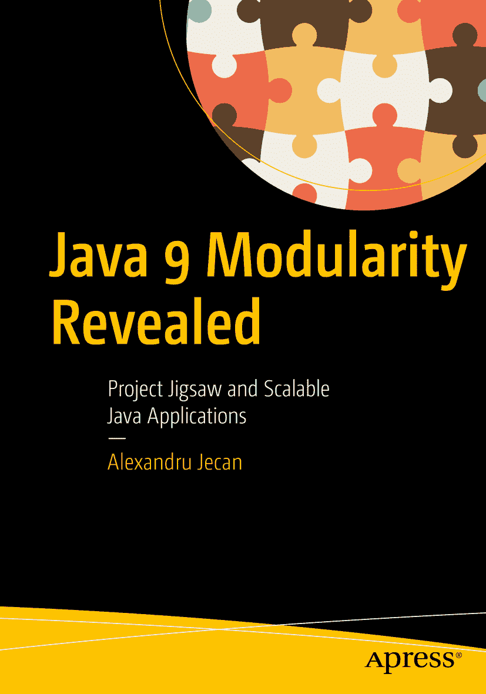

Alexandru Jecan 著《Java 9 模块化揭密：Project Jigsaw 与可扩展 Java 应用》

本书作者引用的任何源代码或其他补充材料，读者均可通过本书产品页面在 GitHub 上获取，网址为 [`www.apress.com/us/book/9781484227121`](http://www.apress.com/us/book/9781484227121)。如需更详细信息，请访问 [`www.apress.com/source-code`](http://www.apress.com/source-code)。ISBN 978-1-4842-2712-1 电子书 ISBN 978-1-4842-2713-8 [`doi.org/10.1007/978-1-4842-2713-8`](https://doi.org/10.1007/978-1-4842-2713-8) 美国国会图书馆控制号：2017954918 © Alexandru Jecan 2017 本作品受版权保护。所有权利均由出版商独家许可，涉及全部或部分材料，具体包括翻译、重印、插图复用、朗诵、广播、微缩胶片或其他物理形式的复制、传输或信息存储与检索、电子改编、计算机软件，或目前已知或未来开发的类似或不同方法。本书中可能出现商标名称、标识和图像。对于商标名称、标识或图像的每次出现，我们仅以编辑方式使用这些名称、标识和图像，以维护商标所有者的利益，无意侵犯商标权。本出版物中使用的商品名称、商标、服务标志及类似术语，即使未明确标识，也不应被视为对其是否受专有权利保护的表达。尽管本书中的建议和信息在出版时被认为是真实准确的，但作者、编辑和出版商均不对可能存在的任何错误或遗漏承担法律责任。出版商对本书所含内容不作任何明示或暗示的保证。本书采用无酸纸印刷。通过 Springer Science+Business Media New York 向全球图书贸易发行，地址：233 Spring Street, 6th Floor, New York, NY 10013。电话：1-800-SPRINGER，传真：(201) 348-4505，电子邮件：orders-ny@springer-sbm.com，或访问 www.springeronline.com。Apress Media, LLC 是加利福尼亚州有限责任公司，其唯一成员（所有者）为 Springer Science + Business Media Finance Inc (SSBM Finance Inc)。SSBM Finance Inc 是特拉华州公司。谨以此书献给我的妻子 Diana，她在我所有的努力中每天给予我支持和鼓励。献给我的父母 Alexandrina 和 Eugen，他们从我幼年起就为我提供了非常良好的教育。感谢你们，我爱你们。引言

Java 编程语言于 1995 年问世，其发展历程非常成功。自诞生以来，它不断演进，已成为全球最流行的编程语言之一。Java 的每个新版本都增加了新特性——有小的、中等的，也有大的。

Java 9 终于来了！它计划于 2017 年 9 月发布，距 Java 8 发布已超过三年。

## 单体 JDK 的问题

2014 年 3 月发布的 Java 8 为 Java 平台带来了非常重要的特性，如 Lambda 表达式和 Stream API，这些无疑是开发者所需要的。然而，该平台一些众所周知的弱点在 Java 8 中仍未得到解决：庞大的单体 JDK 和类路径。这些问题在 Java 9 中由 Project Jigsaw 解决。

Java 9 最重要的特性无疑是其引入的新模块化系统。Java 9 中还引入了其他新特性，但它们并非本书的重点。本书涵盖 Java 9 中引入的新模块化系统。庞大、单体且不可分割的 JDK 长期以来一直存在问题。将其安装在小设备上很困难，因为许多设备没有足够的内存来容纳它。在许多情况下，构成 JDK 的大量类并不需要，因为应用程序可能不需要它们。例如，CORBA 仍然是 JDK 的一部分，但在当今的实际项目中很少使用。当只需要 JDK 的一部分或一小部分时，使用整个 JDK 是没有意义的。Java 8 中引入的 Compact Profiles 认识到了庞大 JDK 带来的问题，并试图解决它们，但程度有限。这三个 Compact Profiles 仍然包含许多开发者可能并不需要的库。必须有一种更好的方式来拆分整个 JDK，并创建一个更小的自定义 JDK 作为运行时映像，其中仅包含所需的库，别无他物。Project Jigsaw 就是这种方式，我们将在本书中看到。

庞大、单体的软件应用程序存在一系列缺点。维护它们既困难又昂贵，进行一个小改动可能需要付出巨大努力。在大型项目中，模块化至关重要，因为它通过提供松散耦合机制来降低复杂性，从而便于源代码的维护。

## 类路径的问题

与类路径相关的问题自 Java 诞生以来就一直存在。Java 虚拟机 (JVM) 不知道类路径上的一个 JAR 依赖于另一个 JAR。它只是加载一组 JAR，但不会检查它们的依赖关系。当缺少某个 JAR 时，JVM 会在运行时中断执行。JAR 无法定义与可访问性相关的概念。它们不定义像 public 或 private 这样的可访问性约束。类路径上所有 JAR 的全部内容对类路径上的所有其他 JAR 完全可见。无法声明某个 JAR 中的某些类是私有的。所有类和方法相对于类路径都是公开的，这导致了一个有时被称为 JAR 地狱的问题。JAR 版本之间可能出现冲突，尤其是当需要同一库的两个不同版本时。从类路径加载类是一个缓慢的过程，因为 JVM 不知道类具体位于何处，因此必须检查类路径上的所有现有文件。Jigsaw 解决了这个痛点。通过利用可靠的配置，模块边界得以强制执行，JVM 知道所需的依赖关系。这对性能有积极影响。Java 9 定义了模块路径的概念，允许你将一个库作为 JAR 文件放在类路径上，或者将同一个库作为模块放在模块路径上。这意味着没有人被迫在切换到 Java 9 时将所有库都转换为模块。这些库仍然可以在类路径上使用，即使在 Java 9 中也是如此。这是一个很大的优势，因为 Java 9 为库提供了平滑的过渡。

Java 9 中引入的模块路径旨在解决类路径引起的问题。它可以完全取代类路径，也可以与类路径交互并协同工作。

模块化很重要，因为它为未来提供了可维护的代码库。当我们希望将设计、开发和测试的工作分开时，应该使用模块化编程。模块化编程通过降低复杂性来加快开发速度，并使应用程序的调试更加容易。

## 章节概览

本书第一章描述了构建模块化应用程序基础的概念：高模块内聚、强封装、低模块耦合和显式接口。同时，它还阐述了模块化编程中一些最重要的原则，例如：连续性、可理解性、可重用性、可组合性和可分解性。

您可能会疑惑，为什么我们不使用 OSGi 而要用 Jigsaw。原因在于，OSGi 无法用于模块化 JDK，因为它构建在 Java 开发工具包平台之上。而 Jigsaw 并非构建在该平台之上，而是直接嵌入其核心。这使得 Jigsaw 能够彻底改变 JDK 的结构。Jigsaw 与 OSGi 的主要区别将在第 2 章中描述。

在 JDK 9 之前，没有管理模块的方法。这正是 Project Jigsaw 发挥作用的地方。它为 JDK 引入了一个全新的模块系统，从而使应用程序能够构建在模块化架构的骨架之上。它为 Java 平台带来了灵活性、可维护性、安全性和可扩展性。通过明确定义模块之间的依赖关系，它引入了松散耦合的模块。

Project Jigsaw 将 Java 平台的源代码分组为模块，并提供了一套新系统来将模块作为平台的一部分实现。它将模块系统应用于平台和 JDK 本身，并为程序员提供了在 JDK 之上使用模块系统编写程序的可能性。

Project Jigsaw 的主要目标是实现 JDK 和运行时的模块化。一个名为“模块”的新组件被引入。第 4 章解释了什么是模块，以及如何在 Java 9 中定义模块。该章还探讨了如何声明模块的依赖关系、如何封装以及如何隐藏模块的内部实现。您将了解什么是未命名模块、命名模块、自动模块和开放模块。该章介绍了模块路径的概念，并展示了如何构建一个无环的模块图。

关于模块声明，我将通过 Jigsaw 引入的五个子句（`requires` 子句、`exports` 子句、`uses` 子句、`provides` 子句和 `opens` 子句）的每个子句，展示实际示例。

Java 模块系统的目标是提供强封装和可靠的配置。第 2 章解释了这些概念的含义，以及如何通过 Java 9 中的模块系统实现它们。

类路径被模块和模块路径部分取代。在模块路径上，可以避免类路径上常见的 `ClassNotFound` 异常，因为编译器现在可以根据模块的定义来测试运行应用程序所需的所有模块是否可用。如果找不到，则不会编译该应用程序。

可访问性是整个生态系统的重要组成部分，本书将对此进行全面介绍。在 Java 9 中，关于实现可访问性方式的整体概念发生了根本性变化。我们熟知的公共访问标识符不再意味着在任何地方对任何人都可访问。JDK 9 中增加了补充性的可访问性级别，通过在模块级别定义可访问性来扩展现有的可访问性机制。本书还概述了定义可访问性的先决条件，如直接可读性和隐含可读性等概念。您将看到编译器、虚拟机或通过使用核心反射是如何强制实施可访问性的。

我们将探讨模块化 JAR 文件的新概念及其带来的巨大优势：能够使用 JDK 9+ 编译库，在 JDK 9+ 的模块路径上使用它，同时也能使用 JDK 8 或更早版本编译它并在类路径上使用。由于类路径仍然可以使用，库向 JDK 9 的迁移是平滑的。即使库包含模块描述符并被视为“模块”，它们在 JDK 9 的早期版本上仍然可以工作，因为它们的模块描述符在类路径上不会被考虑。通过使用模块化 JAR，开发者可以自由决定是否要切换到模块平台。

我们将通过一些示例来强调常规 JAR 和模块化 JAR 之间的区别，并描述 Java 9 中引入的新文件格式 JMOD，该格式与 JAR 文件的格式非常相似。我们将详细介绍新的 JMOD 工具及其用法。

我们将通过一些解释性示例来说明如何使用 `--module-source-path` 选项编译多个模块。我们还将描述对 jar 工具所做的增强，并展示如何使用它将所有内容打包为模块化 JAR 或 JMOD 文件。

我们将了解如何使用 java 启动器运行编译后的类和 `module-info.class`。JDK 9 中引入的新选项，如 `--module-path` 和 `-m`，将得到全面介绍。当尝试使用 `-m` 选项运行应用程序时（该选项告诉启动器主模块在哪里），会触发一个解析过程。我们将详细描述运行 Java 模块化应用程序所涉及的所有步骤，包括触发解析和生成模块图。我们还将探讨特殊情况，例如当模块缺失导致启动失败时，并为此提供一些变通方法，例如使用新引入的 java 启动器选项 `--show-module-resolution`。

我们还会将模块化 JAR 放在类路径上，并了解如何成功运行它们。这一点非常重要：我们将解释在使用 java 启动器运行时，如何混合使用类路径和模块路径。为此，我们将利用新引入的命令行选项 `--add-modules`。

第 3 章描述了 JEP 200，即模块化 JDK。这是将 JDK 拆分为一组模块的 JEP。我们将审视 JDK 及其模块的新结构。我们将讨论平台模块，并展示代表 JDK 新模块化结构的模块图。我们将检查该图，展示模块之间如何相互依赖，并学习如何使用 `--list-modules` 命令行选项列出系统中的所有模块。我们还将解释标准模块和非标准模块的概念。

详细讲解每一个模块超出了本书的范围。您可以在 Open JDK 网站 [`http://cr.openjdk.java.net/∼mr/jigsaw/ea/module-summary.html`](http://cr.openjdk.java.net/%E2%88%BCmr/jigsaw/ea/module-summary.html) 上找到所有现有模块的完整列表。

JEP 260（封装大多数内部 API）也在本书中涉及。为了管理不兼容性，默认情况下所有非关键的内部 API 都被封装了。除此之外，所有在 JDK 8 中存在受支持替代方案的关键内部 API 也被封装了。其他关键的内部 API 则未被封装。由于它们在 JDK 9 中已被弃用，因此通过命令行标志提供了一种变通方法。

Java 9 引入了链接器和一个名为链接时的新阶段。该阶段是可选的，在编译时之后、运行时之前执行。它主要负责组装模块，以形成运行时镜像。运行时镜像允许我们创建自定义 JDK，其中仅包含运行应用程序所需的最少模块。最小可能的运行时将只包含一个模块，即 `java.base` 模块。运行时镜像允许我们根据需求缩小或扩展 JDK。它们取代了运行时的 `rt.jar`。

链接器代表了开发生命周期中的一个新阶段。它通过仅选择成功编译代码所需的最少模块来提高性能，并为未来提供了许多优化选项。

Jigsaw 使得将独立模块作为 JDK 平台安装的一部分成为可能。它还允许我们在 JDK 运行时镜像中动态包含其他附加模块。我们将讨论与 JRE 和 JDK 的二进制结构相关的变更，以及传统 JDK 镜像的新结构。您将在第 5 章和第 7 章中了解更多关于所有这些新概念的内容。

在第 6 章中，您将了解什么是服务，我们将通过示例描述服务接口和服务提供者的概念。我们将展示如何在模块中定义服务提供者，以及如何使它们对其他模块可用。

在第 8 章中，您将看到如何以平滑的方式将应用程序和库迁移到模块。我们将描述如何使用自顶向下的迁移策略将应用程序迁移到 Java 9。为此，我们将看一个具体示例，了解如何将包含一些第三方 JAR 的应用程序迁移到模块。我们将了解哪些类型的应用程序在切换到 JDK 9 时存在崩溃风险。我们将提供有用的解决方案来避免这种情况，例如搜索代码中的依赖关系、避免拆分包以及检查内部 API 的使用情况。如果您已经切换到 JDK 9，我们建议首先尝试使用新的 JDK 运行您的应用程序，看看它是否会破坏您的代码。我们将介绍 JDeps 工具以及如何使用它来审计您的代码并搜索 JDK 内部 API。我们将讨论 Maven JDeps 插件，它代表了 JDeps 工具与构建工具 Maven 的集成。我们还将讨论从 JRE 中移除 `rt.jar` 和 `tools.jar` 的影响和后果。

第 9 章涵盖了 JDK 9 中引入的用于处理模块的新 API。我们将了解如何对模块执行基本操作。

第 10 章深入探讨一些高级主题，如层、JDK 9 中的类加载机制、多版本 JAR 文件、JMOD 工具和可升级模块。我们将描述层的概念，层是一组用于从模块图中加载类的类加载器。我们将研究引导层及其与所谓良构图的关联。

第 11 章讨论如何处理测试模块化应用程序的不同场景。涵盖三种场景：JUnit 测试类和被测对象位于不同模块中；JUnit 测试类和被测对象位于同一模块中；以及仅被测对象位于模块内部。我们将展示如何修补模块以及如何使用 Maven 简化测试。

在第 12 章中，您将了解 Jigsaw 如何与 Maven 等构建工具交互，以及最流行的 IDE 为 Project Jigsaw 提供了何种支持。

如您所见，本书共分为 12 章。第 1 章涵盖模块化编程概念。第 2 章至第 9 章为您提供关于 Project Jigsaw 的坚实基础。第 10 章描述了一些高级特性，这些特性将帮助您理解 Jigsaw 的一些复杂主题。第 11 章展示了如何使用 JUnit 测试模块化应用程序。第 12 章教授如何将 Jigsaw 与构建工具和集成开发环境（IDE）结合使用。

每个主题都应易于查找。我们建议按顺序阅读各章，以便理解所有主题。一些示例建立在前面章节解释的概念之上。

## 本书读者对象

本书面向所有希望熟悉 Java 9 中引入的新模块化系统的人。它为任何希望理解 Java 9 模块化核心概念及高级概念的人提供了坚实的基础。示例旨在帮助您深入理解 Project Jigsaw 中引入的所有概念。我们已尽可能为本书讨论的大多数理论概念提供了大量示例。

无论您是否已有模块化系统的经验，本书都适合您。

本书无法涵盖 Java 9 模块化的所有内容。Java 9 模块化是一个非常庞大且复杂的主题，在本书的篇幅内不可能涵盖其方方面面。然而，本书涵盖了 Java 9 模块化的所有核心部分，并涉及了一些高级主题。通过阅读本书，您不仅能理解 Java 9 模块化背后的概念，还能将其应用到您的日常项目中。

我们建议您亲自尝试本书中的示例，以便熟悉 Project Jigsaw。

## 学习内容

本书旨在全面介绍 Java 9 引入的新模块化系统。全书通过将理论概念与实践示例相结合，构建了结构清晰的教程。

学习使用 Java 9 模块化技术将助力您的技术职业发展，并为您带来极为宝贵的技术技能。

阅读本书后，您将能够开发可扩展且模块化的 Java 9 应用程序，并将现有 Java 应用程序迁移至 Java 9。

以下是本书中您将学到的一些最重要内容：

*   模块化的一般概念及其带来的优势
*   Java 9 模块化的定义及其目标
*   JDK 和 JRE 的新布局形态
*   强封装与可靠配置的概念，以及如何应用并利用它们
*   JDK 内部 API 中哪些已在 Java 9 中被封装，哪些仍可访问
*   JDK 如何被划分为一组模块
*   JDK 9 中新的可访问性规则
*   如何定义模块及其依赖关系
*   如何创建模块化 JAR 文件和 JMOD 文件
*   如何使用 Jigsaw 编译、打包和运行模块化 Java 应用程序
*   如何使用 JDeps 工具审计代码、搜索库之间的依赖关系或生成模块描述符
*   如何将应用程序迁移到模块化系统
*   如何解决迁移问题，例如被封装的 JDK 内部 API、未解析的模块、拆分包、循环依赖等
*   如何执行自上而下的迁移
*   如何定义、配置和使用模块服务
*   如何结合模块路径和类路径以提供向后兼容性
*   如何使用 Jlink 链接工具创建自定义模块化运行时镜像
*   如何在 Java 9 中定义和使用层
*   如何使用新的 Module API 对模块执行操作
*   如何使用限定导出
*   如何提高 Java 应用程序的可维护性和性能
*   如何处理模块化应用程序的单元测试
*   如何修补模块
*   如何将 Jigsaw 与 Maven 等不同构建工具集成
*   如何检查 Java 应用程序是否与 JDK 9 兼容
*   如何使 Java 应用程序与 JDK 9 兼容
*   如何确保切换到 Java 9 时的运行时兼容性
*   如何在模块化 Java 应用程序时选择最佳设计模式

## 勘误表

参与本书出版的每个人都致力于提供一本无错误的书籍。因此，本书的勘误表会在发现任何微小问题时持续更新。您可以在 [`www.apress.com/us/services/errata`](http://www.apress.com/us/services/errata) 提交勘误。

## 联系作者

本书的源代码可通过点击其 apress.com 产品页面上的“下载源代码”按钮获取，产品页面地址为 [`www.apress.com/9781484227121`](http://www.apress.com/9781484227121) 。

## 下载代码

本书的源代码可在 GitHub 上找到。您也可以从本书的产品页面 [`www.apress.com/us/book/9781484227121`](http://www.apress.com/us/book/9781484227121) 下载。

致谢

我要感谢我的家人和我的妻子戴安娜，感谢他们在无数个我埋头写作的深夜和周末给予我的支持、鼓励和理解。

我要感谢我的父母亚历山德里娜和尤金，感谢他们从我幼年起就为我提供了非常良好的教育。感谢你们在我教育上的投入，感谢你们在我年幼时就为我提供了计算机科学和外语课程。感谢你们将我养育得如此出色。

我要感谢 Apress 的整个团队，感谢他们非常出色和专业的工作。感谢我的协调编辑吉尔·巴尔扎诺和我的策划编辑乔纳森·詹尼克，感谢你们信任我，并在撰写本书的艰难旅程中用宝贵的建议和支持指导我。我也感谢你们的耐心以及在整本书写作过程中给予我的鼓励。我感谢我的技术审稿人乔什·朱诺，他为我提供了非常有帮助和实用的审阅意见。感谢 Apress 团队，感谢你们的出色工作！

——亚历山德鲁·杰坎

目录 第 1 章：模块化编程概念 1 模块化的一般方面 1 可维护性 2 可重用性 2 模块定义 3 强封装 5 显式接口 6 高模块内聚 6 低模块耦合 7 紧耦合与松耦合 7 模块化编程 13 模块化编程原则 13 模块化编程的优势 14 模块化编程与面向对象编程（OOP） 14 单体应用与模块化应用 14 总结 16 第 2 章：Project Jigsaw 17 JDK 9 之前 Java 的弱点 17 弱封装 19 JAR 地狱问题 19 什么是 Project Jigsaw？ 20 下载与安装 21 文档 21 Project Jigsaw 的目标 22 Jigsaw 引入的新概念 23 强封装 23 可靠配置 24 Jigsaw 提供的增强功能 24 安全性 24 可扩展性与性能 25 其他一般性内容 25 Java 9 中的新关键字 25 Jigsaw 中无版本管理 25 向后兼容性 25 平台模块化 26 JRE 和 JDK 的新结构 26 如何为 Jigsaw 做准备 28 OSGi 与 Jigsaw 的区别 29 总结 29 第 3 章：模块化 JDK 与源代码 31 模块化 JDK 31 平台模块 34 标准模块 34 非标准模块 34 JDK 模块图 35 更多关于模块的内容 36 读取模块描述 36 java.base 模块 38 模块化源代码 39 源代码的新方案 39 源代码结构对比 41 构建过程调整 42 总结 43 第 4 章：定义与使用模块 45 模块的概念 45 模块声明 46 编译与运行模块 58 编译单个模块 59 运行包含单个模块的应用 60 编译多个模块 61 运行包含多个模块的应用 63 私有方法与公有方法 64 模块化 JAR 65 模块化 JAR 的结构 66 打包 66 使用 jar 工具打包为模块化 JAR 67 模块路径 68 应用模块路径 69 编译模块路径 70 升级模块路径 70 模块解析 70 根模块 71 可访问性 71 可读性与隐含可读性 73 限定导出 77 模块类型 79 命名模块 80 普通模块 80 自动模块 80 基础模块 80 开放模块 81 未命名模块 84 可观察模块 84 总结 85 第 5 章：模块化运行时映像 87 模块化运行时映像 87 Java 9 之前的运行时映像 88 为何运行时映像需要新格式？ 88 Java 9 中的运行时映像 89 已移除的文件 91 新的 URI 方案 91 兼容性 93 总结 94 第 6 章：服务 95 模块间的强耦合 96 在 JDK 9 中使用服务 97 提供与消费服务 97 总结 104 第 7 章：Jlink：Java 链接器 105 Java 链接器 105 Jlink 映像 106 Jlink 命令语法 107 Jlink 命令选项 108 链接阶段 109 jdk.jlink 模块 109 示例：使用 Jlink 创建运行时映像 110 运行运行时映像 118 作为 Jlink 工具输入的模块化 JAR 文件 118 生成的运行时映像的结构 119 不支持链接自动模块 119 Jlink 插件 120 compress 插件 121 release-info 插件 121 excludes-files 插件 122 总结 122 第 8 章：迁移 123 自动模块 125 计算自动模块的名称 126 描述 JAR 文件 128 链接时不支持自动模块 129 JDeps 工具 130 查找不支持的 JDK 内部 API 的依赖项 130 使用 JDeps 生成模块描述符 131 Java 9 中的封装 133 在编译时和运行时导出包 134 为深度反射打开包 136 提供模块间的可读性 137 将模块添加到根集 138 --illegal-access 选项 139 迁移问题 142 封装的 JDK 内部 API 142 未解析的模块 142 拆分包 144 循环依赖 147 新的版本管理方案 147 JDK 9 中移除的方法 148 移除 rt.jar、tools.jar 和 dt.jar 148 将应用迁移到 Java 9 149 自上而下的迁移 149 总结 154 第 9 章：新的模块 API 155 Module 类 156 属性 156 构造方法 157 方法 157 java.lang.Class 中的变更 158 ModuleDescriptor 类 158 ModuleDescriptor 属性 159 ModuleDescriptor 方法 160 ModuleDescriptor.Requires 类 160 ModuleDescriptor.Exports 类 161 ModuleDescriptor.Opens 类 161 ModuleDescriptor.Provides 类 162 ModuleDescriptor.Version 类 162 ModuleFinder 接口 163 ModuleReader 接口 163 对模块执行操作 166 获取类的模块 166 访问模块的资源 166 搜索模块路径中的所有模块 166 获取模块信息 167 总结 171 第 10 章：高级主题 173 JMOD 文件 173 JMOD 工具 173 多版本 JAR 文件 174 构建多版本 JAR 文件 177 更新多版本 JAR 文件 177 JDK 9 中的类加载机制 178 ClassLoader 类中的新方法 179 层 180 引导层 181 配置 181 创建层 183 从层中获取已加载的模块 184 在运行时描述层 184 可升级模块 186 即将发布的版本中的特性 186 总结 187 第 11 章：测试模块化应用 189 Java 9 中单元测试的场景 189 场景 1：Junit 测试类与待测类型位于不同模块 190 场景 2：仅待测类型位于模块内 190 场景 3：Junit 测试类与待测类型位于同一模块 191 -Xmodule 选项 191 --patch-module 选项 192 修补模块 192 运行 Junit 测试（Junit 测试类与待测类型位于不同模块） 197 运行 Junit 测试（Junit 测试类不在模块内） 200 使用 Maven 进行测试 201 总结 203 第 12 章：与工具的集成 205 与 IDE 的集成 205 与 IntelliJ IDEA 的集成 205 与 Eclipse 的集成 208 与 NetBeans 的集成 208 与构建工具的集成 209 与 Apache Maven 的集成 209 总结 215 索引 217 内容速览 关于作者 xv 关于技术审阅者 xvii 致谢 xix 引言 xxi 第 1 章：模块化编程概念 1 第 2 章：Project Jigsaw 17 第 3 章：模块化 JDK 与源代码 31 第 4 章：定义与使用模块 45 第 5 章：模块化运行时映像 87 第 6 章：服务 95 第 7 章：Jlink：Java 链接器 105 第 8 章：迁移 123 第 9 章：新的模块 API 155 第 10 章：高级主题 173 第 11 章：测试模块化应用 189 第 12 章：与工具的集成 205 索引 217 关于作者与关于技术审阅者 关于作者 关于技术审阅者

