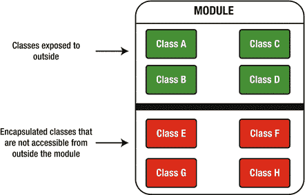
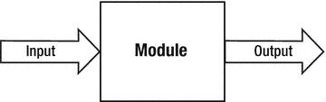
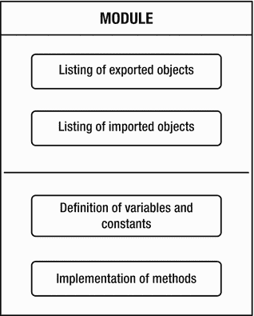
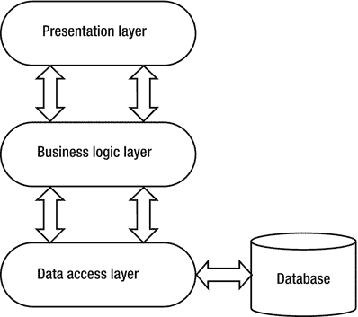

# 1. 模块化编程概念

在软件开发项目中，你几乎肯定要应对复杂性。软件应用的复杂性在开发初期通常较低，但随着平台上的变更，复杂性会逐渐增加。随着新功能的添加和现有功能的定制，复杂性持续上升。进行的变更和定制越多，系统就变得越复杂——它可能变得极其复杂，以至于新开发者难以快速上手并理解其所有内部运作。如果系统软件的文档不够完善，理解系统就会变得更加困难。高复杂性需要投入更多的精力、资源和时间来理解应用的内部结构。

是什么导致软件系统变得如此难以维护？答案与代码中存在大量依赖关系有关。当一段代码依赖于许多其他代码时，就会产生许多问题。增强这样的系统变得痛苦，因为在一个地方进行修改可能会影响应用的其他许多部分。在应用的多个不同区域进行修改，引入新错误的风险就会增加。此外，达到令人满意的复用水平也变得非常困难。软件有如此多的依赖关系，以至于仅仅复用某个组件就可能耗费大量时间，并可能进一步增加复杂性。这也阻碍了增强系统的意愿。拥有一个依赖关系众多的系统，添加新功能会变成一场噩梦。此外，测试过程也变得更加困难，因为几乎不可能对单独的组件进行测试。作为开发者，由于系统的复杂性，理解系统的每个部分都很困难。随着新功能定期添加，软件系统不断演进，跟上变化可能充满挑战。为了减轻和降低复杂性上升带来的负面影响，维护系统是强制性的，尽管维护本身在时间、精力和成本方面也变得要求很高。

我们需要什么来摆脱这些问题？答案是模块化。

## 模块化的一般方面

模块化规定了构成软件系统的各个部分之间的相互关联和相互通信。模块化编程定义了一个称为模块的概念。模块是包含数据和函数的软件组件。与其他模块集成后，它们共同形成一个统一的软件系统。模块化编程提供了一种将整个系统分解为独立软件模块的技术。模块化在现代软件架构中扮演着至关重要的角色。它将一个大型软件系统划分为独立的实体，有助于降低软件应用的复杂性，同时减少开发工作量。

模块化的目标是定义易于理解和使用的实体。模块化编程是一种通过将功能拆分到不同模块来开发软件应用的方式——这些模块是包含业务逻辑的软件单元，其作用是实现特定的功能片段。模块化实现了清晰的关注点分离，并确保了专业化。它还隐藏了模块的实现细节。模块化是敏捷软件开发的重要组成部分，因为它允许我们在不破坏其他模块的情况下更改或重构模块。

模块化最重要的两个方面是可维护性和可复用性，两者都带来了巨大的好处。

### 可维护性

可维护性指的是软件系统在交付后进行升级或修改的程度。一个庞大、单一的应用很难维护，尤其是当代码内部存在许多依赖关系时。

系统的架构和所使用的设计模式有助于我们创建可维护的代码。可维护性通常通过简单性来保证。例如，提高可维护性的最简单方法之一，是仅提供对类所实现的接口的引用，而不是类本身。低可维护性是技术债务的后果。重复代码有时会降低可维护性。例如，如果一段代码被修改，那么与之相似的其他代码也需要进行同样的修改。由于代码分布在许多位置，很容易遗漏一些需要修改的代码段，这会给系统引入新的软件问题。可维护性的水平与软件质量相关：可维护性越高，软件质量越高。将单一应用拆分为一组具有明确定义边界的模块，可以增强可维护性。在模块化软件应用中，当一个模块的传入和传出依赖关系较少时，修改它会更容易。

### 可复用性

面向对象编程可用于实现可复用性，尤其是通过继承。为了复用封装在对象中的功能，第二个对象必须继承第一个对象。

模块与可复用性有何关系？应该可以在同一应用的其他地方或其他应用中复用某个模块。可复用性是指我们可以复用或替换模块的程度。可复用性避免了代码重复，并减少了代码行数，这对软件缺陷数量有积极影响。它不仅提高了软件质量，还有助于更快地开发软件，并使执行更新更容易。通过应用可复用性，功能以一致的形式在整个软件系统中被复制。

可复用性使开发者的工作变得轻松，因为它提高了他们在开发软件组件时的生产力。模块可以被复用，因为它们实现了定义良好的接口，使得与其他模块的通信成为可能。接口被指定为一种契约，允许模块之间进行交换。模块接口以标准方式表达，以便其他模块能够理解和识别。为了实现高度的软件可复用性，模块应执行定义明确的功能。通过利用源代码可复用性，可以实现“一次设计，多次部署”的软件架构。作为良好软件设计的一个属性，通过减少模块之间的依赖关系可以提高可复用性。

可复用性在应用和库的迁移中扮演着重要角色。当你可以复用软件组件或模块时，迁移会变得更简单。可复用性并不容易实现，因为设计必须成功适用于其他地方的软件具有挑战性。


### 模块定义

软件模块是大型系统中独立且可部署的软件组件，它与其他模块交互并隐藏其内部实现。模块拥有允许模块间通信的接口。该接口定义了模块对外提供哪些组件供外部使用，以及内部需要哪些组件。模块通过指定源代码的哪一部分位于模块内部来确定边界。它还提供了灵活性，并提高了软件系统的可重用性。

模块可以从编译时开始被发现。一个模块可以将其部分类暴露给外部，也可以封装它们以防止外部访问。图 1-1 通过一个包含对外暴露的类（绿色类）和未对外暴露的类（红色类）的模块示例说明了这一概念。



图 1-1.

模块指定了非封装的（绿色）类和封装的（红色）类

模块也可以被视为一个黑盒。它有一个输入和一个输出，并执行特定的功能。它接收输入，应用一些业务逻辑，然后返回输出，如图 1-2 所示。



图 1-2.

被视为黑盒的模块

软件模块是可重用、可测试、可管理和可部署的。多个模块可以组合在一起形成一个新的模块。模块化编程是将复杂软件系统中的错误数量降至最低的关键。通过将应用程序划分为非常小的模块，每个模块的缺陷会更少，因为其功能并不复杂。将这些不易出错的模块组装起来，就能得到一个错误更少的应用程序。

模块化的一个关键方面是将应用程序分解为小而薄的模块，这些模块易于实现，因为它们不具备高复杂度。模块可以在编译时或运行时更早地相互连接。每个模块必须能够绑定到核心应用程序。

图 1-3 展示了一个模块的通用结构。



图 1-3.

软件模块的通用结构

一个模块通常由两部分组成：模块接口和模块实现。模块接口定义了它导出的对象和它导入的对象。导出的对象是适合在模块外部可用的对象。导入的对象是模块为内部使用而需要从外部获取的对象。模块实现定义了变量、常量和方法的实现。

不允许将模块用作变量、实例变量、常量或函数。一个模块可以包含只能在模块内部使用的对象，以及可以导出给其他模块供外部使用的对象。数据抽象是模块化的核心概念，它通过隐藏信息来实现，除非通过导出明确指定，否则外部无法访问。默认情况下，模块的内部结构和内部实现对其他模块是隐藏的。

对特定模块执行的更改不应影响其他模块。此外，应该能够在不破坏系统的情况下向核心系统添加新模块。因为只有模块的接口在模块外部是可见的，所以开发人员应该能够更改模块的内部实现，而不会破坏应用程序中的代码。模块化软件应用程序的结构基本上由模块之间的连接和关联定义。

模块的一些特性包括以下内容：

*   模块必须定义与其他模块通信的接口。
*   模块定义了模块接口与模块实现之间的分离。
*   模块应呈现一组包含信息的属性。
*   两个或多个模块可以嵌套在一起。
*   模块应具有清晰、明确的职责。每个功能应仅由一个模块实现。
*   模块必须能够独立于其他模块进行测试。
*   模块中的错误不应传播到其他模块。

让我们举一个简短的例子。如果我们有两个名为 A1 和 A2 的 Jigsaw 模块，并且模块 A2 中有一个名为 P2 的包，我们希望该包在模块 A1 中可访问，那么必须满足以下条件：

*   模块 A1 应依赖于模块 A2；模块 A1 应在其声明中指定它“requires”模块 A2。
*   模块 A2 应导出包 P2，以使其对依赖于它的模块可用。在我们的例子中，在模块 A2 的声明中，我们应该指定它“exports”包 P2。

只有在编译时同时满足这两个条件，包 P2 才能在模块 A1 中可访问。如果上述条件均不满足或仅满足一个，则包 P2 在模块 A1 中将不可访问。这是 JDK 9 中引入的可靠配置概念的一部分。我们将在本章及后续章节中介绍可靠配置。

以下各节将探讨构成模块化应用程序基础的四个概念：

*   强封装
*   显式接口
*   高模块内聚性
*   低模块耦合性

### 强封装

封装定义了通过允许组件声明其哪些公共类型对其他组件可用、哪些不可用，从而防止从外部访问数据的过程。封装提高了代码的可重用性，并减少了软件缺陷的数量。它通过将每个对象的内部行为与软件应用程序的其他元素解耦，有助于实现模块化。

与模块化相关，封装指定了一种隐藏模块实现细节的技术。只有模块的重要特征才应对其他模块可见和可访问。一个模块中的源代码只有在第一个模块读取第二个模块，并且同时第二个模块导出包含该相应类型的包时，才能访问另一个模块中的类型。

在 Java 9 之前的版本中，我们通过将类的变量和方法设置为私有来利用封装。这样，它们只能在类内部访问。我们过去常常将像 setter 和 getter 这样的访问器方法定义为公共的，以便允许从类外部读取或修改实例变量。

在接下来的章节中，你将看到我们如何利用模块和用于可访问性的新类型在 Java 9 中实现强封装。

### 显式接口

模块化系统的接口应尽可能小。如果接口太大，则应将其划分为几个较小的接口。接口应仅向模块提供其真正需要的方法，以便能够满足其业务需求。

模块化系统通常提供模块管理和配置管理。模块管理指的是安装、卸载和部署模块的能力。例如，安装可以从模块仓库完成。在某些情况下，模块可以即时部署，而无需重启系统。配置管理指定了动态配置模块并指定它们之间依赖关系的能力。


### 高模块内聚

内聚性衡量的是模块内部元素共同协作的程度。模块内聚性体现了模块在其内部结构方面的完整性和一致性。它表达了模块中的元素仅定义单一功能的比率。

当模块中的所有元素被组合在一起以形成一项功能时，就实现了最高的模块内聚性。在设计模块时，重点应放在实现高内聚性上，这可以通过多种不同的方式达成：

*   通过降低模块的复杂性（例如，使用更少的方法或更少的代码）
*   通过降低模块中描述的方法的复杂性
*   通过使用相关的数据组
*   通过为模块仅定义一个预定义的作用域

内聚性不仅描述了模块在整个生态系统中作为独立组件运行的能力，还描述了其内部组件的同质性。高内聚性提供了更好的可维护性和可重用性，因为松散耦合的源代码比非松散耦合的源代码更容易、更轻松地进行修改。

在构思模块时，一个重要的方面是为它们选择恰当的复杂程度。如果模块的功能很小，那么该模块在整个模块生态系统中可能作用不大。如果其功能复杂且执行大量任务，那么重用起来可能会很麻烦。这是一个权衡，需要由你来做出正确的决定。

### 低模块耦合

耦合度指定了模块之间相互依赖的程度。模块耦合指的是模块之间的依赖关系以及它们交互的方式。目标是尽可能降低模块耦合度，这通过为模块间通信指定接口来实现。接口的作用是隐藏模块的实现。由此产生的模块是独立的，可以修改或替换，而无需担心破坏其他模块——或者更糟，破坏整个应用程序。

低耦合通常对应高内聚。这是我们在模块化上下文中希望实现的结果。相反的情况——高耦合和低内聚——则与模块化系统通常应追求的目标背道而驰。

### 紧耦合与松耦合

紧耦合和松耦合可以指类或模块。类之间的紧耦合是指一个类使用了另一个类的逻辑。它基本上就是使用另一个类，实例化该类的对象，然后调用该对象来访问方法或实例变量。

当一个类不直接使用另一个类的实例，而是使用一个主要定义要注入对象的中间层时，就遇到了松耦合。Spring 框架是定义松耦合的一个框架，在该框架中，依赖对象由容器注入到另一个对象中。松耦合的模块可以更容易地进行修改。松耦合通常通过使用小型或中型模块来实现。如果新模块与要替换的模块具有相同的接口，那么替换模块不会影响系统。

紧耦合意味着类依赖于其他类，并且不允许模块被轻易替换，因为它依赖于其他模块的实现。

清单 1-1 展示了一个紧耦合的例子。该清单定义了一个名为 `Customer` 的类，它依赖于 `CurrentAccount`、`DepositAccount` 和 `SavingsAccount` 类型的对象。在 `Main` 类中，我们创建了一个 `Customer` 类型的对象。这个对象进一步创建了另外三个对象。`Customer` 类包含一个 `CurrentAccount` 类型的对象，并在此对象上调用了 `depositMoney(amount)` 方法。这是 `Customer` 类和 `CurrentAccount` 类之间的紧耦合，并且因为 `CurrentAccount` 类完全绑定到 `Customer` 类，所以它依赖于 `Customer` 类。`Customer` 类创建了 `CurrentAccount`、`DepositAccount` 和 `SavingsAccount` 类型的对象，以便执行在这三个类中定义的某些业务逻辑。

```
// CurrentAccount.java
package com.apress.tightcoupling;
public class CurrentAccount {
long deposit;
public void depositMoney(long amount) {
deposit = amount;
}
public long getDeposit() {
return deposit;
}
}
// DepositAccount.java
package com.apress.tightcoupling;
public class DepositAccount {
long deposit;
public void depositMoney(long amount) {
deposit = amount;
}
public long getDeposit() {
return deposit;
}
}
// SavingsAccount.java
package com.apress.tightcoupling;
public class SavingsAccount {
long deposit;
public void depositMoney(long amount) {
deposit = amount;
}
public long getDeposit() {
return deposit;
}
}
清单 1-1.
定义三个彼此相似的类
```

清单 1-2 定义了一个名为 `Customer` 的类，它初始化了 `CurrentAccount`、`DepositAccount` 和 `SavingsAccount` 类的对象。

```
// Customer.java
package com.apress.tightcoupling;
public class Customer {
private CurrentAccount currentAccount;
private DepositAccount depositAccount;
private SavingsAccount savingsAccount;
public Customer() {
currentAccount = new CurrentAccount();
depositAccount = new DepositAccount();
savingsAccount = new SavingsAccount();
}
public void depositMoneyIntoCurrentAccount(long amount) {
currentAccount.depositMoney(amount);
}
public void depositMoneyIntoDepositAccount(long amount) {
depositAccount.depositMoney(amount);
}
public void depositMoneyIntoSavingsAccount(long amount) {
savingsAccount.depositMoney(amount);
}
public CurrentAccount getCurrentAccount() {
return currentAccount;
}
public DepositAccount getDepositAccount() {
return depositAccount;
}
public SavingsAccount getSavingsAccount() {
return savingsAccount;
}
}
清单 1-2.
Customer 类
```

清单 1-3 定义了 `Main` 类，它创建了三个 `Customer` 类型的对象并调用了它们的方法。


```
// Main.java
package com.apress.tightcoupling;
public class Main {
public static void main(String[] args) {
Customer firstCustomer = new Customer();
firstCustomer.depositMoneyIntoCurrentAccount(50);
Customer secondCustomer = new Customer();
secondCustomer.depositMoneyIntoDepositAccount(100);
Customer thirdCustomer = new Customer();
thirdCustomer.depositMoneyIntoSavingsAccount(200);
System.out.println("First Customer current account amount: " + firstCustomer.getCurrentAccount().getDeposit());
System.out.println("Second Customer deposit account amount: " + secondCustomer.getDepositAccount().getDeposit());
System.out.println("Third Customer savings account amount: " + thirdCustomer.getSavingsAccount().getDeposit());
}
}
代码清单 1-3.
Main 类
```

前面的三个代码清单展示了紧耦合的情况，其中 `Customer` 类实例化了其他类的对象，并随后调用了这些对象的方法。这导致 `Customer` 类与其使用的其他类之间存在非常高的依赖级别。主要问题在于，`CurrentAccount`、`DepositAccount` 或 `SavingsAccount` 类中的任何变更，最终都可能迫使我们修改 `Customer` 类。例如，如果 `CurrentAccount` 的构造函数发生了变化，我们就会遇到问题。为了解耦本例中的这些类，我们应该修改代码，使 `Customer` 类不再依赖于 `CurrentAccount`、`DepositAccount` 和 `SavingsAccount` 类的具体实现。因此，我们将使用一个接口，使得 `Customer` 类仅依赖于该接口。并且，我们将只在 `Main` 类中实例化其他依赖项，而不再像之前那样在 `Customer` 类中进行实例化。

代码清单 1-4 定义了接口 `AccountInterface`，其中包含了方法的定义。

```
// AccountInterface.java
package com.apress.looseCoupling;
public interface AccountInterface {
void depositMoney(long amount);
long getDeposit();
}
代码清单 1-4.
接口 AccountInterface
```

代码清单 1-5 定义了三个实现该接口的类，并为接口中的方法提供了具体实现。

```
// CurrentAccount.java
package com.apress.looseCoupling;
public class CurrentAccount implements AccountInterface {
long deposit;
public CurrentAccount() {
}
@Override
public long getDeposit() {
return deposit;
}
@Override
public void depositMoney(long amount) {
deposit = amount;
}
}
// DepositAccount.java
package com.apress.looseCoupling;
public class DepositAccount implements AccountInterface {
long deposit;
public DepositAccount() {
}
@Override
public long getDeposit() {
return deposit;
}
@Override
public void depositMoney(long amount) {
deposit = amount;
}
}
// SavingsAccount.java
package com.apress.looseCoupling;
public class SavingsAccount implements AccountInterface {
long deposit;
public SavingsAccount() {
}
@Override
public long getDeposit() {
return deposit;
}
@Override
public void depositMoney(long amount) {
deposit = amount;
}
}
代码清单 1-5.
类 CurrentAccount、DepositAccount 和 SavingsAccount
```

代码清单 1-6 展示了 `Customer` 类，它在构造函数中使用了名为 `AccountInterface` 的接口。

```
// Customer.java
package com.apress.looseCoupling;
public class Customer {
private AccountInterface account;
public Customer(AccountInterface account) {
this.account = account;
}
public void deposit(long amount) {
account.depositMoney(amount);
}
public AccountInterface getAccount() {
return account;
}
}
代码清单 1-6.
Customer 类
```

代码清单 1-7 展示了 `Main` 类，它创建了三个 `Customer` 类型的对象。

```
// Main.java
package com.apress.looseCoupling;
public class Main {
public static void main(String[] args) {
CurrentAccount currentAccount = new CurrentAccount();
Customer firstCustomer = new Customer(currentAccount);
firstCustomer.deposit(10);
DepositAccount depositAccount = new DepositAccount();
Customer secondCustomer = new Customer(depositAccount);
secondCustomer.deposit(100);
SavingsAccount savingsAccount = new SavingsAccount();
Customer thirdCustomer = new Customer(savingsAccount);
thirdCustomer.deposit(200);
System.out.println("First Customer current account amount: " + firstCustomer.getAccount().getDeposit());
System.out.println("Second Customer deposit account amount: " + secondCustomer.getAccount().getDeposit());
System.out.println("Third Customer savings account amount: " + thirdCustomer.getAccount().getDeposit());
}
}
代码清单 1-7.
Main 类
```

`Customer` 类不再依赖于其他类。它不再创建 `CurrentAccount`、`DepositAccount` 或 `SavingsAccount` 类型的新类，而是在其构造函数中使用了一个接口。该接口由上述三个类共同实现。由于 `CurrentAccount`、`DepositAccount` 和 `SavingsAccount` 实现了 `AccountInterface` 接口，它们被注入到 `Customer` 对象中。在 `Main` 类中，我们创建了接口类型的对象，然后将这些对象传递给 `Customer` 类的构造函数。最后，我们在 `Customer` 对象上调用 `deposit()` 方法，该方法会进一步调用接口中的 `depositMoney()` 方法。

在这个简单的例子中，我们看到了如何通过面向接口编程而非面向实现编程，从紧耦合的应用切换到松耦合的应用。

## 模块化编程

本节讨论模块化编程的原则和优势。它将模块化编程与面向对象编程（OOP）进行了比较，并探讨了单体应用与模块化应用之间的区别。

### 模块化编程的原则

模块化编程的原则包括连续性、可理解性、可复用性、可组合性和可分解性。我已经讨论过可复用性，现在让我们重点关注其他四个原则。

*   **连续性**：指当需要更改软件系统的功能时，应尽可能只影响少数模块的情况。
*   **可理解性**：指每个模块都应能作为一个独立的单元被理解。其角色应清晰明确。理解一个特定模块（它呈现较低层次的功能）的内部工作机制，肯定比理解整个应用要容易得多。应避免出现一个模块仅在与某些其他模块关联时才能发挥其作用的情况。一个模块不应给其他模块带来副作用。
*   **可组合性**：允许我们重新组合模块，从而形成一个新的软件应用。
*   **可分解性**：允许我们将一个单体分解成更小、更简单的部分，这些部分应能独立打包成不同的软件单元。最终得到的软件单元应具有比初始单体更简单的结构和更低的复杂度。通过将系统分解为逻辑模块，我们可以更好地理解系统，并更容易地对其进行调整。


### 模块化编程的优势

本书中我们反复强调模块化编程的一些重要优势，尤其是在讨论为 Java 9 带来模块化特性的 Project Jigsaw 时。如你所知，模块化编程降低了软件应用的复杂性，并促进了软件组件的复用。此外，它通常有助于简化调试过程，因为可以只调试单个模块，而无需调试整个庞大的单体应用。

模块化编程允许团队在同一时间协作开发同一个项目，并能减少与源代码冲突相关的问题。如果每个开发者都专注于自己的模块，那么根本不会出现任何冲突。编写更少的代码是使用模块化编程的另一个好处，这也是复用能力的直接结果。通过采用模块化编程技术，开发者可以利用并行开发的优势，获得更高的生产力和性能。

更快的开发速度是模块化编程的另一个关键方面。由于模块可以独立设计和实现，所需的开发时间得以缩短。开发过程可以扩展，因为可以通过组建更大的团队，让他们同时开发不同的模块，从而实现多个模块的并行开发。如果一个模块正在被修改，其他模块仍能继续正常工作。

模块应易于与其他模块互换。通过为应用的其他模块定义接口，更改或替换一个模块只需确保新接口与旧接口等效即可。新模块的内部实现可以有所不同。

另一个重要方面涉及测试过程。无需将整个应用作为一个整体进行测试，而是将应用划分为多个模块，并分别测试每个模块。由于模块是独立的，可以同时测试多个模块，这加快了测试执行速度，并保证了模块的完整性。通过将每个模块作为独立单元进行测试，可以获得更好的测试覆盖率。集成测试则通过连接各个模块，并将它们视为黑盒来进行。

现在你已经了解了模块化编程的原则和优势，是时候对模块化编程和面向对象编程进行比较了。

### 模块化编程 vs. 面向对象编程 (OOP)

模块化编程和 OOP 的相似之处在于，两者都将大型软件应用分解为更小的片段或关注点。模块化编程并非面向对象。OOP 的核心原则，如多态和继承，在模块化编程中并不存在。在 OOP 中，多态用于在运行时动态改变类的属性。这在模块化编程中是不可能的，因为模块不是动态的。除此之外，在 OOP 中，类使用继承来让其他类继承它们的变量和方法实现。在模块化编程中，一个模块不能继承另一个模块。

模块化编程和 OOP 的主要区别之一在于，在 OOP 中，可以从类创建对象。而在模块化编程中，无法从模块派生出对象。

### 单体应用 vs. 模块化应用

单体应用是一种复杂度很高的软件应用，它执行一整套任务以实现完整的用例。它不执行特定的任务或功能，也不包含任何可识别的逻辑单元。它的作用是执行完整的功能，而不仅仅是这些功能内部的特定任务。单体应用的构建方式不具备模块化特性。

图 1-4 展示了一种可能的单体应用架构。



图 1-4.

单体应用的架构

单体应用通常由多个层组成：表示层、业务层、数据访问层和数据库。在这种分层体系下，为单个层使用多种技术是很困难的。我们并非声称这绝对不可能——这取决于你使用的技术。有时可以使用多种技术，有时则不行。但存在这样的限制对每个开发者来说无疑是一个缺点。如果他们发现某个第三方库可以更简单地解决特定问题，他们可能无法使用它，因为它与该层使用的技术不兼容。对他们来说，如果能将各层拆分为不同的微服务，并自由地为每个微服务选择最适合该任务的技术，事情会简单得多。有时被迫继续使用现有技术是不利的，因为该技术可能已经过时。对于模块化系统，由于你可能不需要关心那么多依赖关系，与单体系统相比，更新技术并安装其最新版本显然不会那么耗时。

由于系统的复杂性和所需的技术知识，可能会出现多个团队处理应用不同层的情况。要为应用添加一个新功能，每一层都需要处理，这意味着在大多数情况下，添加新功能时需要涉及多个团队。这可能会增加开发和测试新功能所需的时间，因为团队需要协调工作。此外，可能还有更多的集成工作需要完成——团队不仅需要相互协调，有时还需要等待某些功能就绪，才能集成他们自己开发的功能部分。

至于可扩展性，单体系统只能作为一个整体进行扩展。无法只扩展系统的特定部分，如果实际上只需要扩展部分系统，却试图扩展整个系统，这并非好主意。扩展整个系统可能意味着额外的基础设施成本。这就是为什么与模块化应用相比，单体应用的升级和修补不那么频繁。

单体应用可以被拆分为一组模块，但这并非获得模块化应用的唯一途径。它也可以从一开始就被设计成模块化的。重新设计单体应用可能并非易事，尤其是在系统非常复杂的情况下。

## 总结

本章介绍了模块化的一些通用方面。讨论了模块化的两个重要方面：可维护性和可复用性。解释了软件模块的概念，并强调了模块声明的基础知识。回顾了构建模块化应用的四个主要概念：强封装、显式接口、高模块内聚和低模块耦合。阐述了模块化编程的优势，并对模块化编程和面向对象编程进行了比较。此外，本章还说明了紧耦合和松耦合的含义，并使用 Java 给出了一个解释性示例。

以下是关于何时应使用模块化编程的简短总结：

*   当我们有一个包含大量类、方法以及它们之间依赖关系的大型程序时——这类程序通常是模块化的良好候选
*   当我们希望使软件应用更适合未来发展时
*   当我们希望摆脱单体应用时
*   当我们希望使软件应用更易于理解时

下一章将探讨 Project Jigsaw 的基础知识，这是 Java 9 中引入的新 Java 平台模块系统。


