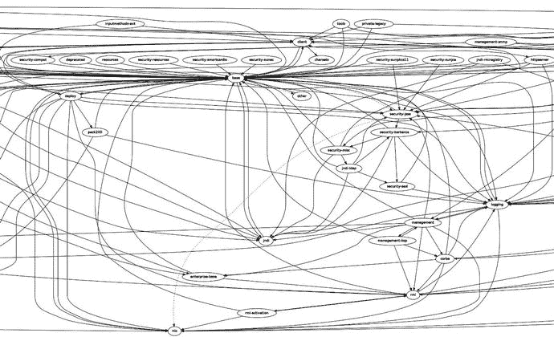
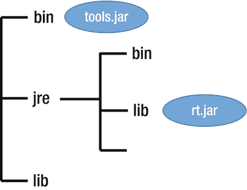
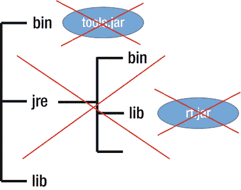
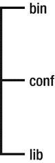

# 2. 项目拼图（Project Jigsaw）

本章介绍项目拼图。它阐述了项目拼图的核心内容，展示了 Java 过去遇到的一些问题，并讨论了构成项目拼图的 Java 增强提案。本章解释了项目拼图的目标，以便我们理解 JCP 团队决定为 Java 平台引入新模块系统的原因。同时，本章还涵盖了强封装和可靠配置等概念。

## JDK 9 之前 Java 的弱点

图 2-1 展示了来自 OpenJDK 官方网站 [`http://openjdk.java.net/projects/jigsaw/doc/jdk-modularization.html`](http://openjdk.java.net/projects/jigsaw/doc/jdk-modularization.html) 的 JDK 7 模块图。基础模块显示在正中央。由于类之间存在大量依赖关系，无法将这个庞大的单体拆分成更小的部分。除此之外，访问限定符无法提供足够的手段来完全隐藏类的实现。它们的作用范围是有限的。例如，在 JDK 7 中，如果我们想使用 System 控制台打印“Hello world!”，除了基础模块之外，我们还需要大量的包。

图 2-1.

JDK 7 中的模块图

JAR（Java 归档）文件是包含类文件和其他资源的 ZIP 文件。一个或多个 JAR 文件被放置在类路径上，但类路径并不为其包含的 JAR 文件提供封装。这意味着 JAR 文件中的每个类都可以被其他所有类访问，这构成了一个安全漏洞。你可以把类路径想象成一行，JAR 文件在其中从左到右被线性搜索。JAR 文件不是能够为其包含的类提供模块化的组件。

JDK 8 中引入的紧凑配置文件是完整 Java SE 平台的一个子集。这三个紧凑配置文件分别称为 compact 1、compact 2 和 compact 3。每个紧凑配置文件所包含的包列表可以在 Oracle 网站上找到。紧凑配置文件只是迈向平台模块化的一小步。通过聚合标准包来获得 JDK 的三个不同版本，并不是社区在模块化方面所期望的。除此之外，紧凑配置文件不隐藏其内部实现，因此并未给 Java 平台的安全性带来任何改进。

在 Java 9 之前，显式依赖也是一个巨大的问题。通过将源代码打包到 JAR 文件中并放置在类路径上，无法以编程方式定义运行该 JAR 文件需要哪些其他 JAR 文件。由于 Java 没有解决这个问题，出现了一些流行的构建工具，包括 Maven 和 Gradle。

### 弱封装

为了实现封装，Java 9 之前的版本使用了众所周知的访问修饰符：private、protected、public 和无修饰符。private 访问修饰符限制性最强，它使得外部无法访问内部数据。protected 访问修饰符表示该成员只能被其所在类的子类（在另一个包中）或同一包中的类访问。public 访问修饰符使得数据在任何地方都可访问。不使用访问修饰符意味着仅在同一包内可访问。

然而，封装存在一些局限性。不可能让一个类型对外部包可访问，同时又限制所有其他现有包对其访问。要使该类型对外部包可访问，唯一的方法就是将其标记为 public，尽管将其定义为 public 会破坏封装，并使其对所有现有包都公开。使用 Java 9 之前的版本，无法达到理想的封装级别。

### JAR 地狱问题

在 JDK 9 之前，开发 Java 应用程序的标准方式是将所有必要的库和 JAR 文件直接放在类路径上。这种方法可能会引发 JAR 地狱问题。

在 JDK 9 之前，运行时环境会在几个位置进行搜索以加载类。其中一个搜索位置是类路径，它包含由 Java 虚拟机加载的类文件列表。在类路径上搜索类很简单。类加载器通过遍历类路径上列出的所有 JAR 文件来搜索类。它不考虑预定义的顺序，只是从头搜索到尾。它也不考虑类路径上类的内部结构方面。Java 无法考虑 JAR 文件之间的边界。所有 JAR 文件中的所有类都被放置在类路径上，JAR 文件之间的边界消失了。一个 JAR 中的每个类型都可以访问任何其他 JAR 中的所有公共类型。因此，代码无法被封装以隐藏起来，防止外部使用。

我们举个例子。假设一个库的作者在库中有一些内部代码，这些代码从未打算被外部使用。由于没有封装，每个人都可以访问这些内部代码——更糟糕的是，可以提供依赖于这些内部代码的自有实现。如果库的作者决定对其库的内部代码进行一些更改，那么依赖于该库的代码可能会遇到问题。

JAR 地狱是 JDK 9 之前常见的难题。如果类路径上有多个不同版本的库，并且每个库都依赖于另一个库，那么就说类路径上存在 JAR 地狱问题。当一个包不是依赖于另一个包，而是仅依赖于该包的某个版本时，就会发生这种所谓的依赖地狱。考虑到所使用的环境，依赖地狱有不同的变体。JAR 地狱的问题在于，类路径上可能存在冲突，尤其是当它包含许多 JAR 文件时。例如，一个库可能在类路径上有两个或更多不同版本的特定类。类路径并不是最佳解决方案，因为 JAR 文件不是组件，因此我们无法确切知道是否有缺失或冲突。

如果在类路径上找不到某个特定的类，就会触发运行时异常——不是在应用程序启动时，而是在稍后的某个时刻，由于用户执行了某个操作，导致缺失的类被调用时。运行时环境在必须访问依赖项之前，没有能力识别所有现有的依赖项。最好能在应用程序启动时立即显示所有错误，而不是在稍后的某个时刻。

## 什么是 Project Jigsaw？

Project Jigsaw 代表了 Java 9 中引入的新的可扩展模块系统的实现。它是在 Open JDK 下开发的，Open JDK 是 Java 平台标准版的免费开源实现。为 Java SE 平台新设计的模块系统的目标是将 JDK 模块化，并将该模块系统应用于 JDK 本身。Jigsaw 将 Java SE 平台模块化。

将 Java 平台模块化的过程是一项复杂且艰巨的工作。必须做出大量困难的设计决策。平台的模块化是一个巨大的变化，对整个生态系统产生了重大影响。它引入了模块的新概念，并显著改变了我们使用 Java 编程语言开发软件应用程序的方式。模块被置于前台，是 Project Jigsaw 所基于的关键概念。整个编程技术都必须进行调整，以适应这个新引入的概念。

Project Jigsaw 始于 2008 年的探索阶段。构成 Java 平台模块系统的 JEP 是从 2014 年开始创建的。Project Jigsaw 最初计划用于 Java 7 版本，但由于其复杂性，它没有被包含在 JDK 7 版本中，并被推迟到 JDK 8 版本。随后，Java 社区流程将其推迟到 Java 9。尽管在撰写本文时，Project Jigsaw 的正式发布计划于 2017 年 9 月，但早期访问版本已在 Open JDK 网站上提供很长时间，以便社区能够测试并向 JDK 开发人员提供宝贵的反馈。

Project Jigsaw 由六个 JEP 和一个 JSR 组成。JSR 376 被称为 Java 平台模块系统。它指定了构建 Java 平台模块化版本的标准规范。表 2-1 列出了属于 Project Jigsaw 的其他六个 JEP。

表 2-1.

用于开发 Java 平台系统的 JDK 增强提案 (JEP)

| JEP 编号 | JEP 名称 | 范围 |
| --- | --- | --- |
| JEP 200 | 模块化 JDK | 标准版 |
| JEP 201 | 模块化源代码 | 实现 |
| JEP 220 | 模块化运行时映像 | 标准版 |
| JEP 260 | 封装大多数内部 API | Java 开发工具包 |
| JEP 261 | 模块系统 | 标准版 |
| JEP 282 | jLink：Java 链接器 | Java 开发工具包 |

以下是每个 JEP 的简短描述。它们将在后续章节中进行更深入的介绍：

*   **JEP 200——模块化 JDK**：此 Java 增强提案将 JDK 划分为一组模块。JDK 被模块化，源代码被组织成模块。有两种不同类型的模块：标准模块（名称以 `java.` 开头）和 JDK 模块（名称以 `jdk.` 开头）。随着 JDK 模块化格式的改变，出现了一个新的模块图（如第 3 章所示）。有关 JDK 模块化的更多信息，也可在第 3 章中找到。
*   **JEP 201——模块化源代码**：此 JEP 定义了 JDK 构建和源代码如何围绕模块进行重组（在第 3 章中详细讨论）。
*   **JEP 220——模块化运行时映像**：JEP 220 介绍了新的模块化运行时映像以及添加的增强功能，以便我们可以构建自定义的模块化运行时映像。JRE 和 JDK 的二进制结构已更改。该 JEP 在第 5 章中讨论。
*   **JEP 260——封装大多数内部 API**：JEP 260 指的是封装非关键内部 API 的过程。本书的许多章节都涵盖了此 JEP。
*   **JEP 261——模块系统**：JEP 261 代表了新模块系统的实现。
*   **JEP 282——jLink：Java 链接器**：此 JEP 创建了一个工具，用于将一组模块组装成一个自定义运行时映像（在第 7 章中讨论）。

### 下载与安装

截至 2017 年 9 月，可以从以下 URL 地址下载 Project Jigsaw 的早期访问版本：[`http://jdk.java.net/9/`](http://jdk.java.net/9/)。Project Jigsaw 包含在 JDK 9 中。它不能单独使用。

JDK 9 可用于以下平台下载：

*   Windows 32 位
*   Windows 64 位
*   Linux 32 位
*   Linux 64 位
*   Solaris SPARC 64 位
*   Solaris x86 64 位
*   Mac OS

Project Jigsaw 已合并到 JDK 9 中，因此如果您下载 JDK 9，默认情况下将包含 Jigsaw。

安装过程很简单。您必须在 PC 上设置环境变量以指向新的 JDK。为此，请选择 Java 9 安装所在的根文件夹。如果您使用 Windows 并且 JDK 9 在 PATH 中，您可以通过打开命令行并输入 `java -version` 来验证环境变量是否已成功设置。

### 文档

在 Open JDK 官方网站 [`http://openjdk.java.net/projects/jigsaw`](http://openjdk.java.net/projects/jigsaw) 上，有大量关于 Project Jigsaw 的文档。您将找到构成 Java 平台模块系统的每个 JEP 的描述。规范文档可以在 [`http://openjdk.java.net/projects/jigsaw/spec/reqs/`](http://openjdk.java.net/projects/jigsaw/spec/reqs/) 找到。

要更深入地了解 Project Jigsaw，您可以访问 Jigsaw 开发邮件列表，其中包含有关 Jigsaw 内部机制的全面信息，地址为 [`http://mail.openjdk.java.net/pipermail/jigsaw-dev/`](http://mail.openjdk.java.net/pipermail/jigsaw-dev/)。其他您可能感兴趣的邮件列表包括专家小组邮件列表 [`http://mail.openjdk.java.net/pipermail/jpms-spec-experts/`](http://mail.openjdk.java.net/pipermail/jpms-spec-experts/) 和采用讨论邮件列表 [`http://mail.openjdk.java.net/pipermail/adoption-discuss/`](http://mail.openjdk.java.net/pipermail/adoption-discuss/)。

Java 9 标准版的 API 规范可以在 [`http://download.java.net/java/jdk9/docs/api/overview-summary.html`](http://download.java.net/java/jdk9/docs/api/overview-summary.html) 找到。

### Project Jigsaw 的目标

Project Jigsaw 的目标，如 Open JDK 网站 [`http://openjdk.java.net/projects/jigsaw/`](http://openjdk.java.net/projects/jigsaw/) 所列，如下所示：

1.  使 Java SE 平台和 JDK 更容易向下扩展到小型计算设备
2.  提高 Java SE 平台实现（尤其是 JDK）的整体安全性和可维护性
3.  实现改进的应用程序性能
4.  使开发者更容易为 Java SE 和 EE 平台构建和维护库及大型应用程序

模块系统应足够强大，能够将 JDK 和其他大型遗留代码库模块化，同时仍能被所有开发者所接受。

模块系统将 Java 平台拆分为可由用户管理的模块。模块可以隐藏其内部实现，但仍能高效地相互交互。它们能够明确地表明：其是否完全可被其他模块访问，其类型是否只有部分可被其他模块访问，或者是否完全不可被其他模块访问。它们还可以指定可供其使用的模块列表。这些 Java 9 特性被称为可靠配置和强封装，并且以一种简单的方式实现。

通过使用新的模块路径代替类路径，解决了类路径上 JAR 地狱相关的问题。通过封装内部 API，减少了 JDK 的维护和管理工作。Project Jigsaw 利用强封装机制屏蔽了 JDK 的一些内部 API。JDK 内部 API 包中的公共类型更难访问，这导致某些使用内部 API 的应用程序中的代码被破坏。

让我们看看决定开发 Project Jigsaw 背后的动机。根据 Open JDK 的说法，在该项目开始时，目标是“设计和实现一个模块系统，其重点严格限定于将 JDK 模块化的目标，并将该系统应用于 JDK 本身。”

在 Java 9 之前，JDK 是一个庞大、不可分割的整体，包含超过 5,500 个类。将其拆分为更多部分是不可能的。使用它的唯一方法是将其完整地安装在目标平台上。由 rt.jar 文件表示的 Java 运行时也是单一的，无法拆分为更多部分。JDK 由 rt.jar 组成，它包含了基本 Java 运行时几乎所有已编译的类。rt.jar 将所有运行时类文件组合在一起，并且必须放置在类路径上，以便用户能够访问 Java API 类。在 rt.jar 内部，除了流行的 java.* 和 javax.* 包之外，还有 com.oracle.*、com.sun.*、jdk.internal.*、jdk.management.*、jdk.net.*、sun.* 等其他包。没有办法将 rt.jar 拆分成不同的文件。在 Java 9 中，重点是打破单一的 JDK，将其拆分为模块，并完全移除 rt.jar 文件。

JDK 必须模块化，因为自其首次发布以来的 22 多年里，它已经变得过于庞大和复杂。在某些情况下，将 JDK 安装到小型设备上可能很麻烦，因为并非所有小型设备都有足够的 CPU、内存或磁盘空间来容纳整个 JDK。除此之外，安装整个单一的 JDK 而只使用其中一小部分用于应用程序，是对内存的巨大浪费。这个问题不仅关系到小型设备，也关系到大型设备，比如用于在云中托管应用程序的设备。使用云可能会产生重要的额外成本，因为硬件资源的使用没有得到优化。

与 JDK 的实际版本相比，1996 年初发布的 JDK 1.0 非常小。Java 的第一个版本只有几个标准包：java.lang、java.io、java.applet、java.awt、java.net 和 java.util。总共有 8 个包和 212 个类和接口。JDK 1.0 之后的每个版本都增加了越来越多的复杂性。JDK 1.1 有 504 个类和接口。1998 年发布的 JDK 1.2，类和接口的数量增加了两倍，达到 1,520 个。在随后的 JDK 版本中，这种增长持续着：JDK 1.4 有 2,991 个类和接口，JSE 8.0 有 4,240 个类和接口。与 JDK 1.0 相比，Java 8 版本包含的类和接口数量正好是其 20 倍。除了体积庞大之外，9 版本之前的 JDK 由于 API 之间的依赖关系而非常复杂。

在 JDK 9 之前，对于一个在控制台打印字符串的简单程序，需要加载大量的类。例如，JDK 7 中的基础模块依赖于许多其他模块，如 logging、security-smartcardio、security-sunec、security-resources、resources、charsets、client、security-misc、security-jsse、security-kerberos 等。为了在控制台打印一个基本的、非常简单的“Hello world!”，所有这些模块都必须被加载。

考虑到前面提到的所有事实，着手将 JDK 拆分为模块的决定是绝对必要的。模块化的 JDK 减少了加载的类数量，因为不同模块的类之间不再有任何依赖或连接。Java 9 还改善了 Java 应用程序的启动时间，并且 Java 9 中的内存占用比之前的版本更好。

## Jigsaw 引入的新概念

Project Jigsaw 引入了模块的新概念，作为内置于 Java 平台中的核心软件组件。一个模块代表一组包的集合。它有一个模块描述符，用于指定该模块所依赖的模块，并指定其可供外部使用的导出包。一个模块可以打包成一种称为模块化 JAR 的新格式，这是一个也包含 `module-info.class` 文件的 JAR 文件。模块化 JAR 文件在 Java 9 中可以作为模块运行，但在 Java 8 或更早版本中也可以作为类路径上的常规 JAR 文件运行。还有另一种称为 JMOD 的新格式，它类似于模块化 JAR，但也可以包含本地代码。一个模块可以是开放的，也可以不是。第 4 章详细描述了模块。

Project Jigsaw 引入了模块路径的新概念。模块路径是类路径的模块等价物，由包含模块的目录列表组成。后续章节将介绍模块路径，并向您展示如何单独使用它或与类路径结合使用。

Jigsaw 还引入了一个链接阶段，在该阶段中，一组模块由一个新的链接工具 Jlink（在第 7 章中介绍）组装成一个自定义的二进制运行时映像。链接可以创建一个完整的 Java 开发环境，也可以创建一个集成在程序中的 Java 运行时系统。

Java 9 为 Java 编译器和 Java 启动器都添加了许多新选项，以允许编译和运行模块。在本书中，您将找到大量使用不同命令行选项编译和运行模块的示例。Jigsaw 还引入了新概念，如未命名模块、开放模块和自动模块，所有这些都在第 4 章中介绍。

### 强封装

根据官方 Jigsaw 规范，“强封装允许一个组件声明其哪些公共类型对其他组件可访问，哪些不可访问。”强封装的作用是禁止代码访问那些未被其所属模块导出的包中的类，或者其所属模块未被包含该代码的模块所依赖的包中的类。

如果没有模块这样的概念，就无法实现强封装，因为在 Jigsaw 中，模块代表了应用强封装原则的基础。Jigsaw 允许模块仅导出特定的包。模块的可访问性由其边界提供。强封装在 Jigsaw 中是通过模块的定义来实现的，我们可以在其中指定哪些类型是可访问的。强封装隐藏了模块的内部细节，并阻止外部访问。它还使得通过反射进行访问变得更加困难。

在 Java 9 中，除非对象在类之前是可访问的，否则调用 `setAccessible()` 方法将不起作用。要使其可访问，相应的包必须被导出，并且该模块必须被读取。如果满足这两个条件，那么它就是可访问的，因此可以应用该方法来使，例如，一个私有字段可用。即使访问类与目标类位于同一个类加载器中，强封装也会限制访问。顺便提一下，强封装不依赖于类加载器。

### 可靠配置

可靠配置是 JDK 9 中引入的一项强大特性。Open JDK 指出，“可靠配置用一种程序组件之间声明显式依赖关系的机制取代了类路径机制。”可靠配置基于在模块之间声明依赖关系的能力。它使我们能够在编译时知道某个模块是否缺失或某个依赖是否未满足。这是我们在 Java 9 之前的版本中无法实现的。在 JDK 9 中，模块可以声明它们对其他模块的依赖关系，并且模块系统会验证每个模块依赖关系是否得到满足。

可靠配置的基础是模块系统中存在的可读性连接。依赖关系在编译时和运行时都会被分析和强制执行。在第 4 章中，你将学习如何在 Jigsaw 中通过 `requires` 子句实现可靠配置，以及如何通过模块声明中的 `exports` 子句实现强封装。

## Jigsaw 提供的增强功能

Jigsaw 还在三个重要领域提供了增强：安全性、可扩展性和性能。

### 安全性

Java 在过去有相当多的安全问题。如前所述，在 JDK 9 之前，包边界之间没有封装。因此，安全性是 Jigsaw 中一个非常重要的主题，是某些已实现的设计考量中的关键因素之一。在 Java 9 中，某些代码部分不能再被直接访问。Jigsaw 通过隐藏 JDK 内部 API 显著提高了安全性，并大大降低了安全风险。我们称之为 JDK 内部 API 的封装。现在它们只能在 JDK 内部被处理。为了提高安全性，仅仅封装 JDK 内部 API 是不够的——其使用数量也减少了。通过指定模块边界，除非明确声明，否则代码无法从模块外部访问。默认情况下，它是不可从外部访问的。

新引入的强封装机制通过隐藏模块内部细节来提高安全性。关键的源代码被隐藏，除非绝对必要，否则无法从外部访问。尝试访问公共的 JDK 内部类型会导致访问错误。这就是为什么从 Java 9 开始，使用内部 API 的代码不再有效。

在 Jigsaw 中，允许使用反射访问内部类的机制已经得到加强。这是一个巨大的改进，因为过去访问内部 JDK 类的好处导致了 Java 平台上的许多安全事件。随着 Java 9 中内部 JDK 类数量的减少，潜在漏洞的数量也随之减少。

在 JDK 9 之前，Java 存在一个严重问题，即其类可以被在同一环境中运行的外部代码访问。它限制外部代码访问其自身的方式非常有限。为了限制包访问，Java 使用了 `java.lang.SecurityManager` 类的 `checkPackageAccess(String packageName)` 方法。该方法通过调用 `java.security.Security.getProperty("package.access")` 获取受限包列表，并检查参数 `packageName` 是否在检索到的包中。如果不是，则该方法抛出 `SecurityException`。如果找到了 `packageName`，则会调用 `checkPermission()` 方法。过去的一些安全问题与软件开发人员有时忘记在代码中所有必要的地方调用 `checkPackageAccess()` 方法有关。如果这个检查没有在所有地方都执行，那么代码就可以从外部访问，从而打开一个巨大的安全漏洞，造成潜在的损害。每个 JCP 开发人员都有责任小心谨慎，不要忘记在所有必要的地方放置 `checkPackageAccess()` 调用。

### 可扩展性和性能

Jigsaw 允许开发人员创建仅包含他们所需模块的自有 Java 运行时环境（JRE）。大量小型设备受益于能够仅组合运行 Java 软件应用程序严格所需的功能这一前景。

类加载过程中的性能得到了提升，因为 Java 虚拟机现在知道类的位置。由于我们预先知道一个类所引用的所有类，JVM 最终可以执行优化，从而带来性能提升。在 Java 9 之前，JVM 必须打开每个 JAR 文件并执行线性搜索才能找到一个类，这对性能造成了巨大开销。

在 Java 9 中移除 rt.jar 是一个关于性能的良好设计决策，因为它允许引入一个新的高效存储系统。Java 9 中 Java 应用程序的性能得到了提升，尤其是在启动时。为此，Java 运行时的结构已被修改。现在有足够的潜力进行未来的性能优化，因为代码部分只能由其依赖的模块访问。

Java 平台的可扩展性程度通过允许开发人员创建更小、更优化的部署而得到提升，这有助于减少相应运行设备上所需的内存量。新的自定义运行时映像仅包含运行 Java 应用程序所需的特定库和最少数量的依赖项。不再需要安装整个 JDK。可以精确选择应用程序所需的模块。

## 其他一般性内容

### Java 9 中的新关键字

`module` 是一个受限关键字，仅在模块声明的上下文中充当关键字。当 `module` 未与模块声明一起使用时，该词可以继续用作标识符。这意味着如果我们使用 `module` 这个词来定义变量名、实例变量名或方法名，我们不必更改它。

Java 9 中引入的其他受限关键字包括 `exports`、`requires`、`provides`、`uses`、`with`、`to`、`transitive` 和 `opens`。

### Jigsaw 中无版本控制

Project Jigsaw 不支持版本控制。JCP 团队在 Jigsaw 的早期版本中包含了版本控制功能，但随后由于随之而来的复杂性和并发症而决定将其移除。这一决定是基于 Gradle 或 Maven 等构建工具拥有更好的机制来处理这个复杂问题的事实。Project Jigsaw 依赖这些构建工具来解决版本解析或处理不同的冲突。Jigsaw 允许你在模块的元信息中声明一个版本，但模块系统不会考虑这个版本。第 10 章讨论了层，你将了解 Jigsaw 如何加载一个模块的两个不同版本。因此，这就是 Jigsaw 为版本控制带来的所有特性。例如，在模块声明中声明一个模块仅依赖于另一个模块的特定版本是不被支持的。

## 向后兼容性

在 JDK 9 的设计过程中，对旧版本 JDK 的向后兼容性是一个关键议题。JCP 团队声明：“如果一个应用程序仅使用受支持的 API 并在 X 版本上运行，那么它应该能在 X+1 版本上运行，即使不重新编译也是如此。”为了使 Java 软件应用程序在迁移到 Java 9 后能够正常工作，必须修复源代码中的不兼容问题。

发布在 Open JDK 页面上的 Project Jigsaw 需求指出：“必须能够将现有的 Java 平台、Java SE 或 Java EE 划分为一组模块，以便现有的库可以无需更改即可运行，只要它们仅使用标准的平台 API。”只要 Java 应用程序仅使用标准的平台 API，它们就能向后兼容 JDK 9 之前的版本。如果它们使用了标准 API 之外的其他 API，则无法保证它们在 JDK 9 中能够正常工作。

对于使用核心反射来访问 JDK 内部类型的应用程序或库，可能会出现一些兼容性问题。为了使构建能够工作，必须使用命令行标志 `--add-exports` 来打破封装。这个命令行选项在第 8 章中有所介绍。

当类路径中的现有库引用了属于显式模块的未导出包中的类型时，可能会发生另一个问题。为了解决这个问题，需要将类路径与模块路径结合使用。在接下来的章节中，你将学习如何实现这一点。重要的是要记住，为了实现向后兼容性，类路径可以在 JDK 9 中继续使用。

尽管如此，为了提供向后兼容性，JDK 9 中仍然存在三个类加载器。第 10 章将讨论它们。

## 平台模块化

Project Jigsaw 最重要的角色之一是将 JDK 拆分为模块，这在第 3 章中有详细解释。生成的模块可以分为三个不同的类别：标准模块、JDK 特定模块和 JDK 内部模块。

在 Java 9 之前，rt.jar 包含了许多计划供公共使用的公开可访问 API。在编写自己的代码时可以使用它们。在这些公开可访问的 API 中，有很多是标准 Java SE 的一部分。这些包以 java.* 和 javax.* 开头，并由 JCP 指定。构成公开可访问 API 但不属于标准 Java SE 的其他包是 jdk.* 和 com.sun.* 包。这些包不是标准 Java SE 的一部分，因为它们旨在供与 Java 虚拟机交互的工具使用，例如。将它们作为标准 Java 标准版的一部分是没有意义的。

除了受支持的 API 之外，还有不受支持的 API。它们中的大多数位于 sun.* 包中。它们不打算公开使用。由 Oracle 组织的一项调查显示，最受欢迎的不受支持的 API 是 sun.misc.Base64Encoder、sun.misc.Unsafe 和 sun.misc.Base64Decoder。Oracle 根据其使用情况对 API 进行了分类，并将它们分为关键和非关键两类。非关键 API 在 JDK 之外的使用非常少。

## JRE 和 JDK 的新结构

为了提供创建运行时镜像的手段，JDK 和 JRE 的二进制结构在 Java 9 中发生了变化。由于引入了模块，JDK 和 JRE 之间没有区别。每个依赖于 rt.jar 的工具都必须进行更改，以便在 Java 9 中继续正常工作。

图 2-2 展示了 Java 9 之前 JDK 和 JRE 的旧结构。

图 2-2.

Java 9 之前的 JDK 结构

在 JDK 9 之前，有两个 bin 目录和两个 lib 目录。顶层目录中的 lib 目录包含工具类，而 jre 目录中的 lib 目录包含运行时类。lib 目录还包含配置文件、安全策略文件和其他类型的文件。

图 2-3 显示了在 JDK 9 中已完全移除的文件和目录：jre 目录、tools.jar 文件和 rt.jar 文件。

图 2-3.

jre 目录、tools.jar 和 rt.jar 已在 JDK 9 中移除

图 2-4 描绘了 JDK 9 的最终结构。

图 2-4.

JDK 9 的新布局

如你所见，jre 目录已不复存在，并新增了一个 conf 目录。conf 目录包含用于自定义 JDK 或运行时的配置文件。它只包含应该被编辑的文件。不应该被编辑的文件不再位于 conf 目录中。这一点很重要，因为新布局在允许更改的配置文件和不允许更改的配置文件之间提供了清晰的分离。过去，更改配置文件是有风险的，因为你无法事先知道是否允许更改它，这意味着应用程序可能无法再启动。

rt.jar 和 tools.jar 文件已被完全移除。现在只有一个 bin 目录，它包含所有的启动器。JDK 的新格式比旧格式更适合未来的优化。

## 如何为 Jigsaw 做准备

为了准备使用 Project Jigsaw，你需要执行一些步骤。如你所知，JDK 内部类已不再可访问，除非它们是 `jdk.unsupported` 包的一部分。依赖 JDK 内部类的代码将会出错。

首先，你应该使用 JDeps 检查代码中对 JDK 内部 API 的使用情况。JDeps 是一个用于分析和查找静态依赖关系的工具（第 8 章将详细介绍）。如果你在代码中发现了对 JDK 内部类的使用，你应该为它们提供替代方案。JDeps 会给出提示，并为你的 JDK 内部类建议替代方案，但清除这些类并用受支持的类替换它们是你的责任。

如果你无法为 JDK 内部类提供替代方案，Java 编译器命令行选项 `--add-` `exports` 是一个备选方案。该命令会打破封装，使 JDK 内部类在你的代码中可访问。这样，你无需修改源代码，只需调整构建脚本，在编译代码时包含此选项即可。

除了使用 JDK 内部类之外，你还应该检查代码中对 `rt.jar` 和 `tools.jar` 文件的依赖。这两个文件在 Java 9 中已被移除，依赖它们的代码将无法运行。在 Java 9 中，你不能再在代码中使用它们。

另一个重要主题涉及**拆分包**，这应该绝对避免。当两个或多个加载器为单个包指定类时，就会出现拆分包。在迁移到 Java 9 之前，你必须清除拆分包。第 8 章详细介绍了拆分包问题，并展示了如何清除它们。

在某些情况下，迁移到 Java 9 可能具有挑战性。这就是我们在第 8 章更详细地讨论这个主题的原因。上面列出的内容并不完整。如果你想了解更多关于如何准备使用 Jigsaw 的信息，请直接前往第 8 章。

## OSGi 与 Jigsaw 的区别

OSGi（开放服务网关倡议）是一个著名的框架，允许用 Java 编程语言开发模块化应用程序。使用 OSGi 在 Java 中实现模块系统的规范可以在 2007 年 8 月发布的 JSR 291 – Java SE 动态组件支持文档中找到。

我们不会深入探讨 OSGi 的细节，因为 OSGi 超出了本书的范围，但我们将介绍它和 Jigsaw 之间的一些重要区别。OSGi 和 Jigsaw 的一个主要区别在于，OSGi 支持版本控制，而 Jigsaw 仅在较低程度上支持。Jigsaw 允许你将版本定义为元属性，或者在一个层中为模块使用多个版本。但 Jigsaw 提供的版本控制系统远不如 OSGi 提供的强大。OSGi 还具有一些与动态生命周期相关的特性，而 Jigsaw 没有。除此之外，OSGi 还提供了动态服务注册表和升级的安全模型。

Jigsaw 比 OSGi 更安全，因为它的安全机制无法被绕过。OSGi 的安全机制可以被绕过。与 Jigsaw 模块相比，OSGi 的 bundle 提供的安全级别不同。

Jigsaw 并非旨在取代 OSGi。OSGi 可以在 JDK 9 之上很好地运行。JCP 旨在使两个系统能够并行工作并相互协作。甚至有可能让 OSGi 将 Jigsaw 模块视为 OSGi bundle。

在某些特定情况下，OSGi 可能比 Jigsaw 更适合应用程序的需求。Jigsaw 更适合那些复杂度不高的软件应用。OSGi 利用了真正的隔离，因为它构建在平台之上。OSGi 和 Jigsaw 都提供隔离，但实现方式不同。在 OSGi 中，隔离是自动实现的，因为 OSGi 构建在平台之上。在 Jigsaw 中，模块是构建在平台内部，而不是平台之上。它们通过设计到平台中的方式，以编程方式呈现隔离性。

总的来说，Jigsaw 的功能比 OSGi 少。例如，Jigsaw 不提供在应用程序和虚拟机运行时从仓库动态下载和加载模块的可能性。这种功能在 Jigsaw 中不存在，对于这种特定情况，应该使用 OSGi。

Project Jigsaw 也提供了 OSGi 中没有的重要功能，例如编译时的模块化以及对原生库的内置支持。与 OSGi 相比，Jigsaw 将 Java 平台模块化，并引入了模块作为核心程序元素的新概念。

## 总结

在本章开头，我们介绍了 Java 9 之前存在的一些弱点和问题，例如弱封装和 Jar Hell 问题。然后，我们介绍了 Project Jigsaw，即 Java 9 中引入的新模块系统，并描述了 Project Jigsaw 的目标以及它解决的一些问题。本章简要介绍了 Jigsaw 中引入的几个新概念。

我们讨论了 Jigsaw 中引入的强封装和可靠配置机制，这些机制使得公共类型在其模块外部不可访问，除非它位于导出的包中。我们还描述了 Jigsaw 在安全性、可伸缩性和性能方面提供的其他增强功能。在 JDK 9 之前，维护我们的代码要困难得多，因为我们无法封装代码以隐藏内部实现，防止外部使用。

接下来的主题是向后兼容性和平台模块化，我们深入了解了 JDK 中新的 API 类别。然后，我们介绍了 Java 9 中 JRE 和 JDK 的新结构，并讨论了 `rt.jar` 和 `tools.jar` 的移除。接下来，我们概述了为了在你的项目中使用 Jigsaw 而必须采取的一些最重要步骤。本章末尾阐述了 OSGi 和 Jigsaw 之间一些最重要的区别。

第 3 章描述了 JDK 模块化过程、由此产生的模块化 JDK，以及 JDK 9 中源代码的模块化方式。

