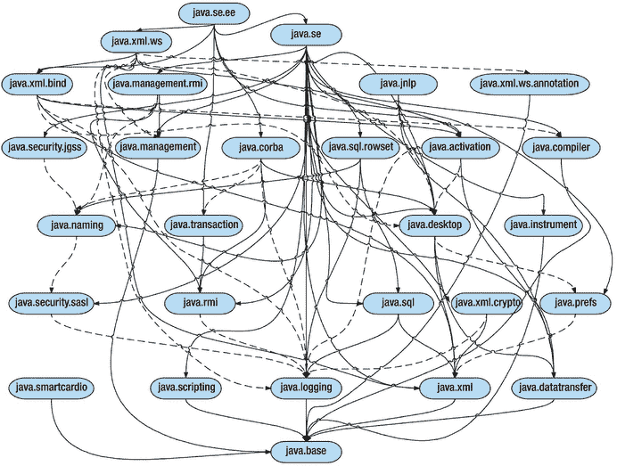
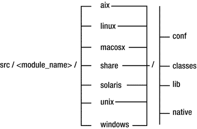

# 3. 模块化 JDK 与源代码

本章重点描述 JDK 模块化过程，该过程带来了 JDK 及其源代码的新结构。根据 Open JDK 的定义，Java 增强提案 200——模块化 JDK 的目标是“将 JDK 划分为一组模块，这些模块可以在编译时、构建时或运行时组合成各种配置。”这些配置可以具有任意大小。它们可以表示一个或多个模块及其传递依赖项，但也可以包含整个 JDK。

JDK 模块摘要包含与 Java 平台中当前存在的模块相关的全面信息。对于每个模块，它指定了以下内容：

*   其包含的类和资源的数量
*   模块的总大小及其依赖项的总大小
*   其所需的模块
*   其导出的类型
*   其使用和提供的服务

注意

JDK 模块摘要可以在线查阅，网址为 [`http://cr.openjdk.java.net/∼mr/jigsaw/ea/module-summary.html`](http://cr.openjdk.java.net/%E2%88%BCmr/jigsaw/ea/module-summary.html) 。

截至 2017 年 9 月，Project Jigsaw 在 Java 平台中引入了 73 个新模块，总大小超过 170 MB。就每个模块中的类数量而言，最大的模块是 `java.desktop`，它包含 5,900 个类和 284 个资源。其大小超过 26 MB，其依赖项的总大小约为 55 MB。第二大模块是 `java.base` 模块，包含 5,684 个类和 17 个资源。它没有依赖项，因为它是基础模块。

## 模块化 JDK

在 Java 9 中，JDK 被模块化了。为了列出运行时系统中存在的所有模块，可以使用带有命令行选项 `--list-modules` 的 Java 启动器。通过运行以下命令，我们可以获得运行时中现有模块的完整列表：

```
$ java --list-modules
```

表 3-1 显示了结果。

表 3-1.

Java 运行时系统的模块

| java.activation | java.xml.crypto | jdk.jfr |
| java.base | java.xml.ws | jdk.jsobject |
| java.compiler | java.xml.ws.annotation | jdk.localedata |
| java.corba | javafx.base | jdk.management |
| java.datatransfer | javafx.controls | jdk.management.agent |
| java.desktop | javafx.deploy | jdk.naming.dns |
| java.instrument | javafx.fxml | jdk.naming.rmi |
| java.jnlp | javafx.graphics | jdk.net |
| java.logging | javafx.media | jdk.pack |
| java.management | javafx.swing | jdk.plugin |
| java.management.rmi | javafx.web | jdk.plugin.dom |
| java.naming | jdk.accessibility | jdk.plugin.server |
| java.prefs | jdk.charsets | jdk.scripting.nashorn |
| java.rmi | jdk.crypto.cryptoki | jdk.scripting.nashorn.shell |
| java.scripting | jdk.crypto.ec | jdk.sctp |
| java.se | jdk.crypto.mscapi | jdk.security.auth |
| java.se.ee | jdk.deploy | jdk.security.jgss |
| java.security.jgss | jdk.deploy.controlpanel | jdk.snmp |
| java.security.sasl | jdk.dynalink | jdk.unsupported |
| java.smartcardio | jdk.httpserver | jdk.xml.dom |
| java.sql | jdk.incubator.httpclient | jdk.zipfs |
| java.sql.rowset | jdk.internal.le | oracle.desktop |
| java.transaction | jdk.internal.vm.ci | oracle.net |
| java.xml | jdk.javaws |   |
| java.xml.bind | jdk.jdwp.agent |   |

表 3-2 包含了每个标准 Java SE 模块的简短描述，如 JDK 9 API 文档所述。

表 3-2.

根据 Java 平台标准版 9 API 规范的标准化模块

| 模块名称 | 描述 |
| --- | --- |
| java.activation | 表示 JavaBeans 激活框架 API |
| java.base | 表示 Java SE 平台的主要 API |
| java.compiler | 表示注解处理、语言模型和 Java 编译器 API |
| java.corba | 定义 RMI-IIOP API 和 OMG CORBA API |
| java.datatransfer | 定义用于在应用程序之间交换信息的 API |
| java.desktop | 包含 AWT 和 Swing 用户界面工具包，以及用于打印、音频、成像等的 API |
| java.instrument | 包含允许代理对在 Java 虚拟机上执行的程序进行检测的服务 |
| java.logging | 表示 Java 日志记录 API |
| java.management | 表示 Java 管理扩展 API |
| java.management.rmi | 表示 Java 管理扩展 API 的 RMI 连接器 |
| java.naming | 包含 Java 命名和目录接口 API |
| java.prefs | 指定首选项 API |
| java.rmi | 包含远程方法调用 API |
| java.scripting | 表示脚本 API |
| java.se | 表示核心 Java SE API |
| java.se.ee | 表示 Java SE 平台的完整 API |
| java.security.jgss | 包含通用安全服务 API 的 Java 绑定 |
| java.security.sasl | 包含 Java 对简单身份验证和安全层的支持 |
| java.sql | 表示 Java 数据库连接 API |
| java.sql.rowset | 定义 JDBC RowSet API |
| java.transaction | 指定 Java 事务 API 的一个子部分 |
| java.xml | 包含用于 XML 处理的 Java API、用于 XML 的流式 API、用于 XML 的简单 API 以及 W3C 文档对象模型 API |
| java.xml.bind | 表示用于 XML 绑定的 Java 架构 API |
| java.xml.crypto | 描述 XML 加密 API |
| java.xml.ws | 指定 Web 服务元数据 API 和基于 XML 的 Web 服务的 Java API |
| java.xml.ws.annotation | 指定 Commons Annotations API 的一部分，以支持在 Java SE 平台上运行的程序 |

## 平台模块

JCP 团队在 Java 平台模块化方面投入了大量精力。最困难的任务是调查和评估库不同部分之间的依赖关系，并将 JDK 中的所有类拆分并放入模块中。

平台模块是拆分 JDK 后产生的模块。它们完全取代了单一的 JDK，并使我们能够创建自定义运行时映像。这些映像可以由一个特定配置组成，该配置包含一个模块子集及其传递依赖项。这个模块子集可以表示一个模块或多个模块。它也可以表示所有模块，这相当于整个 JDK。还可以将平台模块与我们自己创建的模块组合在一起，以形成运行时映像。

每个模块都有确定的功能，并且可以定义对其他模块的依赖关系。平台模块是 Java 运行时的一部分，并包含源代码。平台模块能够导出其包，以便其他读取它们的模块可以访问这些包。当我们一般性地谈论模块时，我们不仅指平台模块，也指应用程序程序员创建的模块。这些模块没有特殊的定义。为了将它们与默认属于平台一部分的模块（即平台模块）明确区分开来，我们可以称它们为“开发者模块”或“程序员模块”。

有两种不同类型的平台模块：标准模块和非标准模块。

### 标准模块

标准模块由 Java 社区流程（JCP）管理。标准 Java SE 模块的名称以 `java.*` 开头。这些名称足够明确，因此很容易想象模块的作用。例如，名为 `java.rmi` 的模块定义了远程方法调用 API，而名为 `java.logging` 的模块定义了 Java 日志记录 API。标准模块可以包含标准 API 包以及非标准 API 包。它也可以依赖于一个或多个非标准模块。


### 非标准模块

非标准模块是 JDK 特有的。它们的名称以 `jdk.*` 开头。非标准模块包含特定的 JDK 包和代码，这些内容在不同 Java 开发工具包实现之间可能有所不同。某些 JDK 模块（例如工具或服务提供者模块）不导出任何内容，这意味着它们在模块外部不可见。

有两件事非常重要，需要牢记：首先，标准 API 包不得由非标准模块导出，因此它们对外部保持隐藏。其次，也是最重要的一点，仅依赖 Java SE 模块的源代码将仅依赖标准的 Java SE 类型。这是一个巨大的优势，因为正如 JEP 200 官方描述（参见 [`http://openjdk.java.net`](http://openjdk.java.net)）所述，这样的代码可以移植到 Java SE 平台的所有现有实现上。

将 JDK 特有的 API 转变为 Java 标准 API 是可行的，但需要特别关注兼容性问题。在考虑这样做时，你应该通过观察其使用方式来评估其可行性和必要性。例如，Java 调试接口之所以没有成为标准 API，是因为它仅被工具和调试器使用，因此将其提升为 Java 标准 API 的一部分显然没有意义。

每个平台模块在名为 `share` 的文件夹内都包含一个名为 `classes` 的文件夹。`classes` 文件夹包含了组成该模块的所有类，以及一个名为 `module-info.java` 的模块描述符文件。某些模块，例如 `java.base` 模块，包含针对不同操作系统（如 Windows、Linux、macOS 等）的原生代码。

## JDK 模块图

Java 9 平台的模块化可以很好地用模块图来表示。图 3-1 展示了 JDK 新模块图的一个片段，其中仅包含标准的 SE 模块。这是在将 JDK 拆分为模块后得到的结果。



图 3-1.

JDK 9 模块图的一部分，仅表示标准 SE 模块

此图中仅显示了标准的 Java SE 模块（由于空间限制，非 Java SE 模块未显示）。在图中，模块由节点表示，模块之间的依赖关系用箭头表示。如果一个模块依赖于另一个模块，则存在一个从该模块指向另一模块的直接箭头。

模块之间的连线分为两类。实线表示模块之间存在隐式可读性，虚线表示模块之间仅存在简单可读性，而没有隐式可读性。但在这两种情况下，模块都读取了另一个模块，这意味着该模块依赖于另一个模块。例如，`java.transaction` 模块和 `java.rmi` 模块之间有一条实线。这意味着 `java.transaction` 模块 `requires transitive` `java.rmi` 模块。`java.xml.ws` 模块和 `java.xml.ws.annotation` 模块之间也有一条虚线，这意味着 `java.xml.ws` 模块 `requires` `java.xml.ws.annotation` 模块。换句话说，`java.xml.ws` 模块使用了 `java.xml.ws.annotation` 模块中的类型。

该图是层次化的且清晰，没有循环，也不包含拆分包。它没有循环依赖，因为这是不允许的。`java.base` 模块位于图的底部。它不依赖于任何其他模块。所有其他模块都直接或间接依赖于 `java.base` 模块（由于空间限制，未在模块图中显示）。因此，只有那些仅依赖 `java.base` 而不依赖其他模块的模块，才有指向 `java.base` 模块的连线。对于除了 `java.base` 之外还至少需要一个其他模块的模块，则没有指向 `java.base` 模块的连线。

`java.se.ee` 模块位于模块图的顶部。它充当一个聚合器模块，不仅包含所有 Java SE 模块，还包含与 Java EE 规范重叠的模块。`java.se.ee` 模块本身不添加任何内容。它只有一个模块描述符，用于收集以下模块的内容：

*   `java.se` 模块
*   `java.activation` 模块
*   `java.xml.ws.annotation` 模块
*   `java.corba` 模块
*   `java.transaction` 模块
*   `java.xml.bind` 模块
*   `java.xml.ws` 模块

在第 4 章中，我们将展示什么是模块描述符。`java.se.ee` 模块包含所有 Java SE API。与 `java.se.ee` 模块相比，`java.se` 模块是一个聚合器，它包含 Java SE 中不与 Java EE 重叠的部分。`java.se` 模块收集了以下模块的内容：`java.datatransfer`、`java.logging`、`java.sql`、`java.instrument`、`java.security.jgss`、`java.security.sasl`、`java.prefs`、`java.xml.crypto`、`java.rmi`、`java.xml`、`java.naming`、`java.compiler`、`java.desktop`、`java.scripting`、`java.management.rmi`、`java.sql.rowset`、`java.management` 和 `java.base`。

注意

图 3-1 中的模块图仅显示了标准 SE 模块。非标准 SE 模块（名称以 `jdk.*` 开头）、Java FX 模块（名称以 `javafx.*` 开头）和 Oracle 模块（名称以 `oracle.*` 开头）未在此模块图中显示。

## 更多关于模块的内容

现在我们将学习如何读取模块的描述，并介绍 `java.base` 模块。


### 读取模块描述

要获取某个模块的完整描述，我们可以使用 Java 启动器的 `--describe-module` 命令行选项，后跟模块名称：

```
$ java --describe-module 
```

对 `java.naming` 模块运行 `--describe-module` 选项后，会得到以下输出：

```
java.naming@9
exports javax.naming
exports javax.naming.directory
exports javax.naming.event
exports javax.naming.ldap
exports javax.naming.spi
requires java.base mandated
requires java.security.sasl
uses javax.naming.spi.InitialContextFactory
uses javax.naming.ldap.StartTlsResponse
provides java.security.Provider with sun.security.provider.certpath.ldap.JdkLDAP
qualified exports com.sun.jndi.toolkit.ctx to jdk.naming.dns
qualified exports com.sun.jndi.toolkit.url to jdk.naming.dns jdk.naming.rmi
contains com.sun.jndi.ldap
contains com.sun.jndi.ldap.ext
contains com.sun.jndi.ldap.pool
contains com.sun.jndi.ldap.sasl
contains com.sun.jndi.toolkit.dir
contains com.sun.jndi.url.ldap
contains com.sun.jndi.url.ldaps
contains com.sun.naming.internal
contains sun.security.provider.certpath.ldap
```

上述代码显示了 `java.naming` 模块的 `module-info.java` 文件中包含的全部信息。此外，它还包含了 `contains` 子句，这些子句在 `module-info.java` 文件中并未显示：

*   `exports` 语句表示 `java.naming` 模块将 `javax.naming`、`javax.naming.directory`、`javax.naming.event`、`javax.naming.ldap` 和 `javax.naming.spi` 这些包提供给任何依赖于它的其他模块（即依赖于 `java.naming` 模块的模块）。
*   上述代码中的 `requires` 语句表示 `java.naming` 模块依赖于 `java.base` 模块以及 `java.security.sasl` 模块，这意味着这两个模块中导出的类型在 `java.naming` 模块内部被使用。例如，`java.naming` 模块中的 `LDAPCertStore` 类导入了属于 `java.security.sasl` 模块的所有 `java.security` 子包。
*   `uses` 语句将一个表示服务类型的类型名称作为参数。在我们的例子中，`java.naming` 模块消费了 `InitialContextFactory` 和 `StartTlsResponse` 的实例。
*   `provides` 语句指定该模块使用 `sun.security.provider.certpath.ldap.JdkLDAP` 来提供 `java.security.Provider`（来自 `java.base` 模块）的实现。
*   语句 `qualified exports com.sun.jndi.toolkit.url to jdk.naming.rmi` 意味着 `java.naming` 模块中的 `com.sun.jndi.toolkit.url` 包仅应在 `jdk.naming.rmi` 模块中可访问。如果我们查看 `jdk.naming.rmi` 模块，会发现其中有一个名为 `rmiUrlContext` 的类，它从 `java.naming` 模块导入了 `com.sun.jndi.toolkit.url.GenericURLContext` 类。这就是为什么 `java.naming` 模块需要指定将该包导出到 `jdk.naming.rmi` 模块。
*   `contains` 子句列出了模块中不属于标准 API 的所有包。

第 4 章详细解释了 `exports`、`requires`、`uses` 和 `provides` 子句的含义及其使用方法。

### java.base 模块

`java.base` 拥有超过 5600 个类，大小超过 43 MB，是 Java 平台模块系统中最大的模块之一。每个模块默认都依赖于 `java.base`，因为 `java.base` 模块位于模块图的底部，代表了系统的核心。

`java.base` 模块包含核心 API 并封装了 Java 运行时。模块不必显式声明它依赖于 `java.base` 模块，因为它是自动依赖的。编写 `requires java.base` 是允许的，但并非必要，因为编译器默认会插入它。

`java.base` 模块包含以下包：

*   java.io
*   java.lang.*
*   java.math
*   java.net.*
*   java.nio.*
*   java.security.*
*   java.text.*
*   java.time.*
*   java.util.*
*   javax.crypto.*
*   javax.net.*
*   javax.security .*

注意

我使用 * 来表示该包及其所有对应的子包。

`java.base` 模块代表了模块系统的根，因为它包含了诸如 `java.lang.Object`、`java.lang.Class`、`java.lang.String`、`java.lang.System` 等类，以及像 `java.lang.reflect.Constructor` 和 `java.lang.reflect.Method` 这样的反射类。

所有 Java 平台包都由 `java.base` 模块导出，这意味着它们可以被任何其他模块访问：

```
// module-info.java (module java.base)
module java.base {
exports java.io;
exports java.lang;
exports java.lang.module;
...
...
exports java.text;
exports java.time;
exports java.util;
exports javax.net;
}
```

`java.base` 模块，被称为系统的基模块，不依赖于任何其他模块。我们说它没有对其他模块的依赖关系，这意味着它的 `module-info.java` 文件不包含任何 `requires` 子句。`java.base` 模块还包含了 JDK 9 中引入的新包 `java.lang.module`，它是新模块 API 的一部分。第 9 章涵盖了 `java.lang.module` 包。同样重要的是要记住，`java.base` 不是一个聚合器模块。

在某些情况下，`java.base` 可能是你编译和运行一个简单 Java 应用程序所需的唯一模块。如果你需要的所有类型都包含在 `java.base` 模块的包中，那么你只需要 `java.base`。由于 `java.base` 不依赖于其他模块，因此不需要与 `java.base` 一起使用任何其他模块。这是一个巨大的优势，因为在 JDK 9 之前，我们必须使用整个 JDK，因为即使是像 `java.lang.Object` 这样的简单类，以前也必须与大量类一起使用。一个模块还包含一个名为 `module-info.java` 的新文件，它代表了模块描述符，第 4 章对此进行了详细描述。

此外，`java.base` 包含了许多 JDK 内部包，例如 `jdk.internal.util`、`sun.io`、`sun.text`、`sun.util`、`com.sun.crypto.provider`、`com.sun.net.ssl` 等等。

注意

使用带有 `--describe-module java.base` 选项的 Java 启动器，可以找出与 `java.base` 模块描述符相关的所有可用信息。

我们已经了解了 JDK 是如何被模块化的，以及模块图的样子。在下一节中，你将学习源代码的模块化。

## 模块化源代码

根据 Open JDK 的说法，JEP 200 的作用是将 JDK 划分为一组模块，而 JEP 201 的作用是“将 JDK 中的源代码重新组织成模块，增强构建系统以编译模块，并在构建时强制执行模块边界。”JDK 中源代码的布局被完全改变，并被模块所取代。一个模块的全部源代码现在都位于一个单独的目录中。因此，在 JDK 9 中，我们有了一个新的源代码方案，这正是本节的重点。


### 源代码的新方案

图 3-2 展示了 JDK 中源代码的新方案。



图 3-2.

JDK 9 源代码的新方案

JDK 的 src 目录包含一系列代表模块名称的目录。每个模块都有自己的目录。这些目录的模块名称以 `java.*` 或 `jdk.*` 开头，代表模块的名称。

每个模块目录都包含一个 `share` 目录，其中包含跨平台源代码。此外，模块目录还可以包含其他与操作系统相关的目录，例如 `aix`、`linux`、`macosx`、`solaris`、`unix` 和 `windows`。这些目录仅包含与单个操作系统相关的源代码。并非所有模块都包含上述所有操作系统目录。有些模块包含所有操作系统的特定源代码（例如 `java.base` 或 `java.desktop`），或者仅包含部分操作系统的源代码。例如，`java.prefs` 模块仅包含三个操作系统目录：`macosx`、`unix` 和 `windows`——这意味着该模块内部没有任何特定于 Linux 或 Solaris 的源代码。

注意

像 `java.se.ee` 和 `java.se` 这样的聚合模块没有任何特定于操作系统的源代码，因为它们的目录内没有任何源代码。

模块内的下一级目录包含名为 `classes`、`conf`、`lib`、`native` 和 `doc` 的目录。除了 `conf` 目录，其他四个目录在 JDK 8 的 `share` 目录下也能找到。

JDK 9 中的 `classes` 目录由 Java 源文件组成，这些文件被分组到指定其包结构的目录中。我们想指出与 JDK 8 的两个主要区别：首先，在 JDK 9 中，每个现有模块都有一个 `classes` 目录。即使是聚合模块也有一个 `classes` 目录。其次，在 JDK 9 中，`module-info.java` 文件位于 `classes` 目录的根目录下。`module-info.java` 文件代表模块描述符，是在 Java 9 中引入的。每个模块在其 `classes` 目录内都有一个 `module-info.java` 文件。`classes` 目录可以包含 `java`、`javax`、`jdk`、`sun`、`com` 或 `org` 目录，具体取决于其中包含的包。

`conf` 目录包含配置文件，这些文件可能是属性文件、安全策略文件、策略文件等。这是一个在 JDK 8 中不存在的新目录。

`lib` 目录仅存在于 `java.base` 中，并在 `share`、`solaris` 和 `windows` 目录中包含 `default.policy` 文件。

`native` 目录包含 C 和 C++ 源文件、原生类和过程。它可以包含以下一些目录：`include`、`launcher`、`common`、`libfdlibm`、`libjava`、`libjimage`、`libjli`、`libnet`、`libnio`、`libverify`、`libzip` 等。根据 Open JDK 的说法，这些目录的名称“对应于编译后的代码将链接到的共享库的名称”。`include` 文件夹是此规则的一个例外，因为它包含 C/C++ 头文件。

注意

`classes` 和 `native` 目录在 JDK 9 中没有重命名，因为这样做可能会造成混淆并减缓 JDK 9 的采用速度。

表 3-3 显示了 Java 中一些最重要的类现在所在的位置。

表 3-3.

一些最重要的 Java 类的位置

| 类名 | 位置 |
| --- | --- |
| java.lang.Object | src / java.base / share / classes / java / lang |
| java.lang.String | src / java.base / share / classes / java / lang |
| java.lang.Exception | src / java.base / share / classes / java / lang |
| java.lang.Class | src / java.base / share / classes / java / lang |
| java.util.ArrayList | src / java.base / share / classes / java / util |
| java.util.Date | src / java.base / share / classes / java / util |
| java.io.File | src / java.base / share / classes / java / io |
| java.net.URL | src / java.base / share / classes / java / net |
| java.text.Format | src / java.base / share / classes / java / text |
| java.util.logging.Logger | src / java.logging / share / classes / java / util / logging |
| java.sql.DriverManager | src / java.sql / share / classes / java / sql |

注意

正如你在表 3-3 中所见，最重要和最常用的 Java 类位于 `java.base` 模块（基础模块）中。

下一小节将描述 JDK 9 中源代码的新结构。

### 源代码结构对比

以下是 JDK 8 和 JDK 9 中源代码结构的简短对比。在 JDK 8 中，源代码结构如下所示：

```
jdk / src / share / {back; bin; classes; demo; doc; instrument; javavm; lib; native; npt; sample; transport}
```

在 JDK 9 中，源代码结构如下所示：

```
jdk / src / <模块名称> / share / {classes; conf; lib; native; doc}
```

如你所见，在 `src` 和 `share` 目录之间增加了一个包含模块名称的中间目录。JDK 8 和 9 之间的另一个重要区别是，在 JDK 9 中，每个模块的每个 `classes` 目录的根级别都有一个 `module-info.java` 文件。在 JDK 9 中，`classes` 目录及其子目录下仅包含属于相应模块的包和类。在 JDK 8 中，`classes` 目录及其子目录包含构成 Java 平台的所有包和类。


### 构建流程调整

不仅源代码，构建过程本身也是围绕模块组织的。现在有了新的提议布局和新的构建目标。与之前的版本相比，Java 9 在构建过程中产生的输出有所不同。构建过程已更改，以便将所有内容构建为模块。除此之外，make 文件已被拆分为特定于模块的文件。

表 3-4 展示了 JDK 9 中构建系统的新结构，并与 JDK 8 中的结构进行了对比。

表 3-4.

JDK 8 与 JDK 9 构建系统结构对比

| JDK 8 构建系统结构 | JDK 9 构建系统结构 |
| --- | --- |
| jdk / classes / *.class | jdk / modules / <module_name> / *.class |

表 3-5 列出了用于构建 JDK 9 的目标命令及其描述。这些内容在官方 JDK 9 API 规范中有详细说明。

表 3-5.

用于构建 JDK 9 的目标命令

| 目标命令 | 描述 |
| --- | --- |
| `make java` | 编译系统中的所有 Java 类 |
| `make java.sql` | 编译 java.sql 模块中的 Java 代码及其原生代码，以及其所有依赖项 |
| `make java.sql-java` | 仅编译 java.sql 模块中的 Java 类及其所有依赖项 |
| `make [default]` | 编译所有内容 |
| `make all` | 构建所有内容（JAR、文档、镜像等），并在 Java 类上执行验证工具以查找损坏的模块边界 |
| `make images` | 功能与 JDK 8 相同 |
| `make hotspot` | 功能与 JDK 8 相同 |
| `make docs` | 构建完整的文档 |
| `make docs-javadocs` | 仅构建 javadoc |
| `make gensrc` | 执行所有涉及源代码生成的步骤 |

一次只编译一个模块的前景是构建系统最重要的变化之一。一个模块可以与其依赖项一起编译，编译后的类被划分到各个模块中。在构建过程中，相互独立的模块可以同时编译。如果违反了模块边界，构建过程将不会成功。

第一个被编译的模块是 java.base 模块，因为所有其他模块都需要它。在编译期间，模块图会以相反的顺序（从底部到顶部）进行遍历。这是有道理的，因为通过从 java.base 开始依次向上编译到模块图的顶部，我们可以避免编译一个依赖于尚未编译模块的模块的情况。

注意

能够编译模块的一个巨大优势在于，JAX-WS、JAXP 和 CORBA 仓库中的源代码现在可以使用新的 Java 语言 API。在 Java 9 之前的版本中，这是不可能的，因为这些仓库是在 JDK 仓库之前编译的。

JCP 团队对构建系统进行了重大修改，以便模块能够独立构建。例如，对 java.logging 模块的更改不会导致 java.base 模块的重新构建。这是一项巨大的成就，因为它提高了生产力。

## 总结

本章涵盖了 Java 平台模块系统中两个最重要的 JEP：模块化 SDK 和模块化源代码。

首先，我们展示了如何使用 `--list-modules` 命令行选项列出 Java 运行时系统的所有模块。然后，我们简要解释了属于 Java 平台标准版 9 API 规范的标准模块。我们解释了什么是平台模块，并讨论了构成 Java 平台模块系统的标准和非标准模块的特性。我们还展示了 JDK 模块化后产生的新 JDK 模块图。并且，我们展示了如何使用 `--describe-module <module_name>` 命令行选项获取 java.naming 模块的模块描述符的完整内容。第一部分末尾讨论了 java.base 模块，它是 Java 平台模块系统中最重要的模块。

本章的第二部分重点描述了由于 JEP 201（模块化源代码）的实现而在源代码层面进行的更改。我们首先介绍了 JDK 9 源代码的新方案，然后描述了源代码是如何组织到目录中的，以及每个目录代表什么。我们指出了 JDK 8 和 JDK 9 在源代码布局上的差异。本章最后讨论了构建系统是如何增强的，以满足新引入的模块（这些模块现在是 Java 平台的一等组件）的要求。

第 4 章将解释什么是模块，并展示如何定义和使用你自己的模块。

