# 4. 定义和使用模块

在本章中，我们将开始使用 Project Jigsaw 提供的一些特性来开发 Java 9 中的模块化应用程序。我们将首先解释 Jigsaw 模块的新概念及其模块声明文件 module-info.java。你还将学习可以在模块声明中使用的五种类型的指令：`requires`、`exports`、`uses`、`provides` 和 `opens`。然后，我们将介绍如何使用 JDK 9 编译和运行模块，为此我们将详细引入新的模块路径。

本章还涵盖了 Java 9 中引入的可访问性更改。这些更改对平台影响巨大，因为它们几乎完全不同于 Java 之前存在的旧可访问性规则。在 Java 9 中，我们可以拥有更多类型的模块：普通模块、自动模块、命名模块、可观察模块、开放模块和未命名模块。本章将简要介绍每一种模块。

## 模块的概念

正如你现在所知，Java 9 引入了一种称为模块的新型一等组件。Jigsaw 模块也是 Java 9 平台的基本组成部分，它代表了一个包的容器。它包含包、资源文件和原生代码。这些包可以包含 Java 类、枚举和接口。

图 4-1 展示了模块的通用结构。

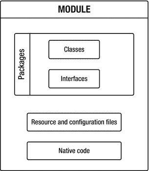

图 4-1.

模块的通用结构

一个模块由源文件以及由 module-info.java 文件表示的模块声明组成。以下是一个名为 com.apress.moduleA 的模块的典型目录结构：

```
src/
com.apress.moduleA/
module-info.java
com/apress/moduleA/
Main.java
// 其他文件
```

一个与模块名称同名的目录位于最顶层。其内部是 module-info.java 文件以及代表包格式的目录结构。在我们的例子中，包名与模块名相同。.java 文件位于包的目录内。

注意

也可以定义一个没有源文件且没有包（除了模块描述符 module-info.java）的模块。

我们提到了模块声明 module-info.java。在下一小节中，你将了解它。


### 模块声明

每个模块都有一个模块声明，位于一个名为 `module-info.java` 的特殊新文件中，该文件位于目录的顶层。要在 Java 9 中定义一个模块，我们创建 `module-info.java` 文件，并在其中放入新的关键字 `module`，后跟模块名称以及用花括号括起来的模块声明。

声明模块简单直接。在此示例中，一个名为 `com.apress.moduleA` 的模块在 `module-info.java` 文件中被声明：

```
module com.apress.moduleA {}
```

在这种情况下，模块声明除了模块标题外不包含任何内容。模块 `com.apress.moduleA` 不依赖任何模块，也不导出任何包，并且不提供或消费任何服务。

如前所述，每个模块必须有一个模块声明，因此必须包含一个自己的 `module-info.java` 文件。无论它是平台模块还是开发者创建的模块，此规则都适用。如果缺少 `module-info.java` 文件，Java 编译器不会将源代码视为模块。`module-info.java` 文件的编译方式与 Java 文件完全相同。

如果我们将 `module-info.java` 文件重命名为其他名称，编译器会将该文件解释为普通文件，而不是模块描述符。在这种情况下，模块系统将无法再识别该模块。

注意

为了将源代码移入模块，模块描述符是强制性的。否则，源代码将不属于模块的一部分。

让我们描述一些情况，看看我们可以在 `module-info.java` 文件中放入什么，以及不能放入什么。`module-info.java` 除了模块定义之外不能包含任何内容。Java 编译器可以识别模块声明中的语法错误。

如果模块声明不在 `module-info.java` 文件中，Java 编译器将显示以下错误消息，并且编译将失败：

```
Error: module declarations should be in a file named module-info.java
```

不能将 Java 类放入 `module-info.java` 文件中来代替模块。如果尝试这样做，编译也会失败：

```
error: cannot access module-info
bad source file: src\com.apress.moduleA\module-info.java
file does not contain module declaration
Please remove or make sure it appears in the correct subdirectory of the sourcepath.
```

除此之外，尝试在单个 `module-info.java` 文件中编写两个模块声明也会导致编译错误。正如我们在前面示例中已经观察到的，Java 编译器会给出关于错误原因和位置的具体指示。这样，我们可以直接定位到产生问题的代码行并提供修复。

`module-info.java` 模块描述符与源代码一起编译。结果会生成 `.class` 文件，包括一个 `module-info.class` 文件。所有这些编译后的文件都可以打包成一个模块化 JAR 文件（我们将在本章后面介绍模块化 JAR 文件）。编译器像处理任何其他 Java 文件一样处理 `module-info.java`，并将其转换为一个 `module-info.class` 文件，我们可以将其放入 JAR 文件中。结果就是一个模块化 JAR。

注意

`module-info.java` 文件的名称是由 JCP 团队根据已有的 `package-info.java` 文件名称选择的。即使其名称定义中包含非法的 Java 标识符（短横线），编译器也可以使用 `module-info.java` 文件。

平台模块默认包含一个 `module-info.java` 文件。如果我们创建自己的模块，在大多数情况下，我们必须自己创建并编写 `module-info.java` 文件的内容。但在两种情况下，我们不需要自己编写 `module-info.java` 文件：

*   当我们将 JAR 文件放在模块路径上时，会自动生成一个 `module-info.java` 文件。
*   当我们使用 JDeps 工具和选项 `--generate-module-info` 为特定的 JAR 文件自动生成 `module-info.java` 文件时。

如果模块路径和 JDeps 等概念对您来说不熟悉，请不要担心。您将在本书后面了解它们是什么。

#### 模块名称

为模块指定名称是强制性的。同一代码库中的两个模块不能具有相同的名称。良好的实践是像命名包一样命名我们的模块：使用反向的域名。因此，模块名称可以是其导出包名称的前缀，但我们可以随意命名模块，因为对模块名称的格式没有任何限制。尽管如此，模块名称必须符合 Java 中标识符的一般规则。模块可以与 Java 类或接口同名，因为模块名称拥有自己的命名空间。

注意

此规则有一个例外：当同时编译多个模块时，模块名称必须与模块描述符 `module-info.java` 所在的目录名称相同。

在模块声明内部，我们总共可以有五种类型的子句，接下来将讨论这些子句。

#### 五种类型的子句

一个模块声明最多可以由五种类型的子句组成：

*   `requires` 子句指定当前模块所依赖的模块。
*   `exports` 子句指定当前模块导出的包。
*   `provides` 子句指定当前模块提供的服务实现。
*   `uses` 子句指定当前模块消费的服务。
*   `opens` 子句指定当前模块为深度反射开放的包。

表 4-1 描述了这五种子句的语法。

表 4-1. 模块描述符中的五种子句

| 指令关键字 | 描述 |
| --- | --- |
| `requires <module_name>` | 表示当前模块依赖哪些其他模块。 |
| `exports <package_name>` `(to <module_name>)` | 表示当前模块中的哪些包被导出到模块外部。可选的 `to` 子句列出了包被导出到的模块。 |
| `opens <package_name>` | 使 `<package_name>` 在运行时可用于深度反射。 |
| `provides <service_name> with <service_name_implementation>` | 指定当前模块使用 `<service_name_implementation>` 提供 `<service_name>` 的实现。 |
| `uses <service_type>` | 指定当前模块消费 `<service_type>` 的实例。 |

本章仅涵盖前三个子句：`requires`、`exports` 和 `opens`。最后两个子句 `provides` 和 `uses` 将在第 6 章中介绍，因为它们与服务相关。

接下来，让我们详细探讨模块声明中通常使用的最常见的子句：`requires` 子句和 `exports` 子句。


#### requires 子句

`requires` 子句用于模块声明（module-info.java）内部，用以指明当前模块为了满足其依赖关系而需要使用的其他模块。它用于表达模块的依赖关系。

图 4-2 展示了 `requires` 子句的语法。

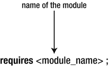

图 4-2.

requires 子句的语法

该语法简洁明了。`requires` 指令指定了其所依赖的模块名称，后跟一个分号。在模块声明的大括号内，我们可以放置一个或多个 `requires` 子句，每个子句后跟模块的名称。

在以下示例中，模块 com.apress.moduleA 需要两个模块：模块 com.apress.moduleB 和模块 com.apress.moduleC：

```
module com.apress.moduleA {
requires com.apress.moduleB;
requires com.apress.moduleC;
}
```

在此示例中，使用 `requires` 子句表达了两个依赖关系。模块 com.apress.moduleA 依赖于模块 com.apress.moduleB，同时也依赖于模块 com.apress.moduleC。在这种情况下，我们说模块 com.apress.moduleA 需要（或读取）模块 com.apress.moduleB，并且需要（或读取）模块 com.apress.moduleC。

图 4-3 展示了一个说明这些依赖关系的模块图。

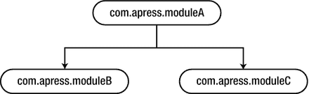

图 4-3.

表达三个模块之间依赖关系的模块图

在模块图中，有一条从模块 com.apress.moduleA 指向模块 com.apress.moduleB 的箭头，也有一条指向模块 com.apress.moduleC 的箭头。模块 com.apress.moduleB 和模块 com.apress.moduleC 之间没有箭头，因为这两个模块之间没有依赖关系。箭头的方向很直接：从 com.apress.moduleA 指向 com.apress.moduleB，因为模块 com.apress.moduleA 读取模块 com.apress.moduleB，反之则不成立。

模块 com.apress.moduleA 依赖于模块 com.apress.moduleB 和模块 com.apress.moduleC 意味着什么？这意味着模块 com.apress.moduleA 使用了属于模块 com.apress.moduleB 和模块 com.apress.moduleC 的类型。由于模块 com.apress.moduleA 使用了来自这些模块的类型，因此它依赖于它们，这些依赖关系必须在模块描述符 module-info.java 中显式声明。这样，Java 编译器在编译时就能知道模块的依赖关系，并且如果任何一个依赖关系未满足，则不允许编译。

注意

与类路径相比，模块依赖关系未满足的情况在使用 Java 9 模块系统时会在编译时立即被检测到。在编译时，不允许模块 com.apress.moduleB 同时读取模块 com.apress.moduleA。否则就会产生循环依赖，这在 JDK 9 中是被 Java 编译器禁止的。

如果我们尝试运行模块 com.apress.moduleA，首先会执行解析过程。解析是一个搜索和发现模块所需依赖模块的过程。系统会搜索主机系统上找到的所有模块，并对找到的模块再次搜索其依赖关系。此过程持续进行，直到每个必需的模块都被覆盖，并且每个必需模块的每个依赖关系都得到解决。在我们的例子中，解析很简单，因为模块 com.apress.moduleA 只需要两个模块：模块 com.apress.moduleB 和模块 com.apress.moduleC。我们假设这两个模块不依赖于其他任何模块。在这种情况下，当所有三个模块都被添加到模块图中后，解析过程就成功完成了。例如，如果模块 com.apress.moduleB 有其他依赖关系，这些依赖关系也会被解析并添加到模块图中。解析过程的结果包含了编译和运行根模块 com.apress.moduleA 所需的全部数据。

正如我们已经知道的，每个模块都隐式地需要 java.base。在模块描述符中提及 `requires java.base` 是不必要的，因为模块 java.base 默认被每个模块所需。模块 java.base 将始终位于模块图的最底部，因为每个模块都依赖于它。图 4-4 展示了之前的模块图，并在底部包含了模块 java.base。

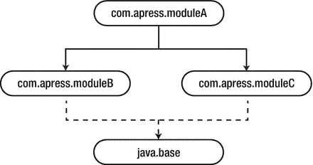

图 4-4.

表达模块间依赖关系的模块图，包含模块 java.base

如果模块描述符不包含任何 `requires` 子句，则该模块除了模块 java.base 之外，不依赖于任何其他模块。模块 java.base 没有任何 `requires` 指令，因为它不依赖于任何其他模块。

到目前为止，我们只看了正常情况。让我们也探讨一些出现问题导致编译失败的情况。如果在 `requires` 子句中使用的模块未找到，编译将会失败。以下模块声明表明它需要模块 com.apress.moduleB，但如果该模块尚未定义，编译 com.apress.moduleA 将会导致错误，因为其依赖关系无法满足：

```
module com.apress.moduleA {
requires com.apress.moduleB;
}
```

我们说一个模块未定义，如果它没有 module-info.java 文件，或者其 module-info.java 文件未包含正确的模块名称。在前面的例子中，编译模块 com.apress.moduleA 的输出会导致一个错误：

```
error: module not found: com.apress.moduleB
```

如果我们对一个未找到的模块进行了限定导出，也会得到相同的结果。

模块声明中不允许出现循环，如下例所示：

```
module com.apress.moduleA {
requires com.apress.moduleA;
}
```

此模块声明存在循环依赖，会导致编译错误：

```
error: cyclic dependence involving com.apress.moduleA requires com.apress.moduleA
```

注意

模块系统在编译时不允许循环依赖。

清单 4-1 展示了一个三个模块之间简单循环依赖的示例。

```
// module-info.java (模块 com.apress.moduleA)
module com.apress.moduleA {
requires com.apress.moduleB;
}
// module-info.java (模块 com.apress.moduleB)
module com.apress.moduleB {
requires com.apress.moduleC;
}
// module-info.java (模块 com.apress.moduleC)
module com.apress.moduleC {
requires com.apress.moduleA;
}
清单 4-1.
为三个不同模块定义三个模块描述符
```

存在循环依赖是因为以下条件：


*   `module com.apress.moduleA` 依赖于 `module com.apress.moduleB`。
*   `module com.apress.moduleB` 依赖于 `module com.apress.moduleC`。
*   `module com.apress.moduleC` 依赖于 `module com.apress.moduleA`。

这三个模块的编译会失败，因为与之前的示例一样，会产生循环依赖错误。

每个 `requires` 语句只能包含一个模块名称。它不能在一个 `requires` 语句中使用逗号列举两个模块名称。在这种情况下，编译时会报错。同时，也禁止在同一个模块声明中重复两个 `requires` 语句。编译错误信息如下所示：

```
error: duplicate requires: 
```

当一个模块依赖于另一个模块，但未在其模块描述符中声明此依赖关系时，会发生什么？在接下来的示例中，模块 `com.apress.moduleA` 的描述符表明它不依赖任何其他模块。清单 4-2 展示了该模块的模块描述符：

```
// module-info.java
module com.apress.moduleA {
}
清单 4-2.
模块 com.apress.moduleA 的模块描述符
```

在清单 4-3 中，模块 `com.apress.moduleA` 包含一个名为 `Main` 的类，该类导入并使用了模块 `com.apress.moduleB` 中的类型。

```
// Main.java (module com.apress.moduleA)
package com.apress.moduleA;
import com.apress.moduleB.*;
public class Main {
public static void main(String[] args) {
Employee employee = new Employee("John", "Albert");
System.out.println("First name is : " + employee.getFirstName());
System.out.println("Last name is : " + employee.getLastName());
}
}
清单 4-3.
模块 com.apress.moduleA 的 Main 类
```

清单 4-4 定义了模块 `com.apress.moduleB`，它有一个空的模块声明。

```
// module-info.java
module com.apress.moduleB {
}
清单 4-4.
模块 com.apress.moduleB 的模块描述符
```

清单 4-5 定义了一个 POJO 类，作为模块 `com.apress.moduleB` 的一部分。

```
// Employee.java (module com.apress.moduleB)
package com.apress.moduleB;
public class Employee {
private String firstName;
private String lastName;
public Employee() {
}
public Employee(String firstName, String lastName) {
this.firstName = firstName;
this.lastName = lastName;
}
public String getFirstName() {
return firstName;
}
public String getLastName() {
return lastName;
}
}
清单 4-5.
来自模块 com.apress.moduleB 的 Employee 类
```

我们使用以下命令同时编译两个模块中的所有 `.java` 文件：

```
javac -d output --module-source-path src $(find  . -name "*.java")
```

注意

此编译是在 Windows 中使用 Cygwin 完成的。Cygwin 是一个在 Windows 中运行的类 Unix 命令行界面。在本书中，所有操作均使用 Cygwin 执行。

为了编译，我们使用 `--module-source-path` 命令行选项，以告知 `javac` 模块源代码的位置。在我们的示例中，`--module-source-path src` 选项定义了 src 目录的子目录包含各个模块的代码。

编译失败，并提示包 `com.apress.moduleB` 不存在：

```
.\src\com.apress.moduleA\com\apress\moduleA\Main.java:3: error: package com.apress.moduleB does not exist
import com.apress.moduleB.*;
^
.\src\com.apress.moduleA\com\apress\moduleA\Main.java:8: error: cannot find symbol
Employee employee = new Employee("John", "Albert");
^
symbol:   class Employee
location: class Main
.\src\com.apress.moduleA\com\apress\moduleA\Main.java:8: error: cannot find symbol
Employee employee = new Employee("John", "Albert");
^
symbol:   class Employee
location: class Main
3 errors
```

模块 `com.apress.moduleA` 有一个空的模块声明。它不依赖任何其他模块，因此根据 Jigsaw 引入的强封装机制，它无法访问其他模块中的类型。这就是为什么尝试在 `com.apress.moduleA` 内部访问模块 `com.apress.moduleB` 中的类型会导致编译错误。

注意

你可以在目录 `/ch04/requiresClause` 中找到此示例的源代码。

让我们编辑模块 `com.apress.moduleA` 的 `module-info.java`，并添加对模块 `com.apress.moduleB` 的依赖。清单 4-6 展示了其新的模块描述符。

```
// module-info.java
module com.apress.moduleA {
requires com.apress.moduleB;
}
清单 4-6.
模块 com.apress.moduleA 的模块描述符
```

现在我们尝试使用相同的选项再次编译源代码。不幸的是，出现了与之前完全相同的编译错误。这是因为在 Java 9 中，仅仅指定一个模块需要另一个模块以访问该模块中的类型是不够的。

此外，第二个模块必须导出其部分类型，以使依赖于它的模块能够访问这些类型。在我们的案例中，为了成功编译，我们必须修改模块 `com.apress.moduleB` 的 `module-info.java`，并指定它导出包 `com.apress.moduleB` 中的所有类型。清单 4-7 展示了其 `module-info.java` 文件的新定义。

```
// module-info.java
module com.apress.moduleB {
exports com.apress.moduleB;
}
清单 4-7.
模块 com.apress.moduleB 的模块描述符
```

总结一下，到目前为止，我们已经学习了如何使用 `requires` 子句定义对其他模块的依赖关系。模块指定其所需模块的属性是可靠配置的基础。到目前为止，我们只使用了 `requires` 子句的简单形式。因此，`requires` 子句还可以包含 `static` 关键字以及 `transitive` 关键字。我们将在后面的“可访问性”部分解释 `requires transitive` 子句。

`requires static myModule` 子句表示模块 `myModule` 仅在编译时存在。在运行时，它的存在不是强制性的。这样，我们必须有一个编译时依赖，但不需要运行时依赖。

接下来，让我们了解如何让一个模块表明它将其包提供给依赖于它的其他模块使用。下一节将解释如何在模块声明中使用 `exports` 子句。


#### exports 子句

`exports` 子句的作用是在编译时和运行时导出包。它允许模块指定其导出的包。只有满足可靠配置的其他条件时，`exported`（已导出）包才能被其他模块使用。反之亦然。未导出的包无法被任何其他模块使用。

注意

默认情况下，模块不会导出任何包。这意味着，默认情况下，当前模块中的任何包都无法被其他模块访问。

`exports` 子句在模块描述符中使用关键字 `exports` 后跟包名来指定。禁止使用逗号分隔包或模块。每个包都必须有单独的 `exports` 子句。

图 4-5 展示了 `exports` 子句的语法。

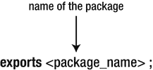

图 4-5.

exports 子句的语法

与 `requires` 子句类似，`exports` 子句也有一些限制。例如，不允许在模块声明中重复 `exports` 语句，否则会导致编译错误：

```
error: duplicate export: 
```

我们假设模块 com.apress.moduleB 希望将其两个包 com.apress.moduleB.packageB1 和 com.apress.moduleB.packageB2 提供给需要它的其他模块使用。在这种情况下，我们说模块 com.apress.moduleB 导出了这些包。清单 4-8 在其模块声明中说明了这一点。

```
module com.apress.moduleB {
exports com.apress.moduleB.packageB1;
exports com.apress.moduleB.packageB2;
}
清单 4-8.
模块 com.apress.moduleB 的 module-info.java
```

清单 4-9 指出模块 com.apress.moduleC 也导出了一个名为 com.apress.moduleC.packageC1 的包。

```
module com.apress.moduleC {
exports com.apress.moduleC.packageC1;
}
清单 4-9.
模块 com.apress.moduleC 的模块描述符
```

在下面的模块图中，模块 com.apress.moduleB 有两个包，它们都被导出了。模块 com.apress.moduleC 也包含两个包，但根据其模块定义，只有一个被导出。包 com.apress.moduleC.packageC2 未被导出，因此永远无法在模块 com.apress.moduleC 外部访问。任何其他尝试使用包 com.apress.moduleC.packageC2 的模块不仅会失败，而且无法成功编译。

图 4-6 展示了一种新型增强的模块图，其中我们还插入了模块包含的包。包 com.apress.moduleB.packageB1、com.apress.moduleB.packageB2 和 com.apress.moduleC.packageC1 已被导出，而包 com.apress.moduleC.packageC2 未被导出。

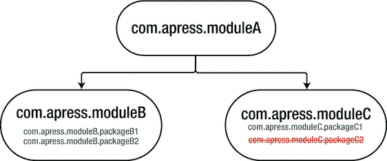

图 4-6.

显示哪些包被导出、哪些未被导出的模块图

模块 com.apress.moduleA 可以成功访问 packageB1 和 packageB2 这两个包中的类型，原因如下：

*   它读取了模块 com.apress.moduleB。
*   包 packageB1 和 packageB2 正被模块 com.apress.moduleB 导出。

然而，如果向模块 com.apress.moduleB 中添加一个新包，除非在模块 com.apress.moduleB 的模块描述中将其声明为已导出，否则模块 com.apress.moduleA 将无法访问它。模块 com.apress.moduleA 可以访问 com.apress.moduleC 中的类型，但只能访问 packageC1 包中的类型，因为这是模块 com.apress.moduleC 唯一导出的包。包 packageC2 未被导出，因此模块 com.apress.moduleA 无法访问它。

到目前为止，我们已经学习了如何设置模块声明文件，以及如何使用 `requires` 和 `exports` 子句。清单 4-10 展示了一个同时包含 `requires` 和 `exports` 子句的简单模块。

```
module com.apress.moduleA {
requires com.apress.moduleB;
exports com.apress.moduleA.packageP1;
}
清单 4-10.
同时使用 requires 和 exports 子句的模块 com.apress.moduleA 的模块描述符
```

在这个例子中，我们定义了一个名为 com.apress.moduleA 的模块，它依赖于另一个名为 com.apress.moduleB 的模块，并且导出了名为 com.apress.moduleA.packageP1 的包。

#### opens 子句

到目前为止，我们已经了解了如何使用 `exports` 指令实现强封装。但是，如果我们需要使用反射访问某些类型，该怎么办呢？

注意

刚刚展示的 `exports` 子句不允许通过深度反射访问其非公共类型。

在 Java 9 中使用反射有两种不同的情况：

*   未命名模块（类路径）中的代码可以使用反射访问任何命名模块中的代码。这是通过一个名为 `--illegal-access` 的标志实现的，该标志默认设置，由 JCP 团队添加以简化迁移。许多框架（如 Hibernate 和 JPA）需要对命名模块中的代码进行反射访问。这些框架通常位于类路径上。第 8 章将更详细地讨论 `--illegal-access` 标志。
*   命名模块中的代码不能使用反射访问任何命名模块中的代码。

这就是新的 `opens` 子句和 `--add-opens` 命令行选项发挥作用的地方。

为了解决这个问题，引入了一个名为 `opens` 的新指令。它的作用是为作为参数传递的类型提供反射访问。

注意

不建议使用 `opens` 来导出包含某些内部实现的包。这样做会暴露内部实现并破坏强封装规则。

图 4-7 展示了 opens 子句的语法。

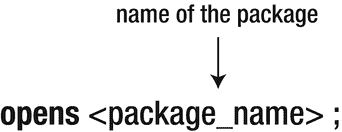

图 4-7.

opens 子句的语法

`opens` 子句是模块描述符中可以存在的另一个子句，除了本章前面讨论的 `requires` 和 `exports` 子句之外。`opens` 子句在模块声明内部使用，用于定义在运行时对所有模块可进行深度反射的包。因此，该包的公共类型和私有类型都可以通过其他模块中的代码使用深度反射进行访问。

注意

默认情况下，模块内的包仅对任何未命名模块中的代码可进行深度反射。

`opens` 指令也可以通过指定目标命名模块列表来限定，如图 4-8 所示。

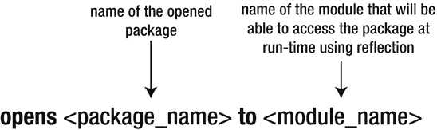

图 4-8.

限定 opens 子句的语法

关于 `opens` 子句，有一些特性你应该了解。首先，重要的是要知道，可以对同一个包同时使用 `exports` 和 `opens` 指令。在这种情况下，该包在编译时和运行时被导出以供访问，并且在运行时也可用于深度反射。因此，其公共类型可以在编译时和运行时访问，而其公共类型和私有类型都可以在运行时通过反射访问。其次，`opens` 指令不能在开放模块（open module）内部使用。开放模块将在本章后面介绍。

注意

`opens` 指令不能使用通配符，并且不能包含多个包。


#### 其他子句

模块描述符中可使用的另外两个指令是 `uses` 和 `provides` 子句。这些子句用于定义（`provides`）和使用（`uses`）服务，将在第 6 章——服务中描述。

注意

模块声明中，前面提到的五个指令（`requires`、`exports`、`opens`、`uses` 和 `provides`）都不是强制性的。选择使用哪些指令或不使用哪些指令没有任何限制。我们可以创建自己的模块，并使用这五个指令的任意组合。

现在我们已经了解了模块声明的基础知识。是时候学习如何在 JDK 9 中编译和运行模块化应用程序了。

## 编译和运行模块

Java 9 模块化应用程序的编译方式与 Java 8 或 7 不同。本书中所有编译和运行模块的示例均使用类似 Linux 环境的命令行进行说明。然而，在日常工作中，这种做法并不常见。像 Maven 或 Gradle 这样的构建工具在编译和运行 Java 应用程序方面效率更高、更合适且更易于使用。第 12 章介绍了 Java 9 与 Maven 的集成，并展示了如何使用它来构建、打包、编译和运行 Java 9 模块化应用程序。

### 编译单个模块

以下是一个使用 JDK 9 编译单个模块的非常简单的示例。假设我们有一个模块 `com.apress.moduleA`，它没有任何依赖项。在其包 `com.apress.moduleA` 中包含一个 `Main.java` 文件。文件夹结构如下：

```
src/com.apress.moduleA/
module-info.java
com/
apress/
moduleA/
Main.java
```

代码清单 4-11 显示了类 `Main` 的内容。它会在控制台打印一条消息。

```
// Main.java
package com.apress.moduleA;
public class Main {
public static void main(String[] args) {
System.out.println(“这里是 Java 9！”);
}
}
代码清单 4-11.
来自模块 com.apress.moduleA 的 Main 类
```

代码清单 4-12 显示了模块 `com.apress.moduleA` 的 `module-info.java` 文件。它没有定义任何子句。

```
// module-info.java
module com.apress.moduleA {
}
代码清单 4-12.
模块 A 的模块描述符
```

首先，我们使用 `mkdir` 命令创建编译器输出到的目标目录：

```
mkdir –p outputDir
```

然后，我们使用 Java 编译器编译 `Main.java` 文件和 `module-info.java` 文件。编译将为每个 `.java` 文件创建一个 `.class` 文件：

```
$ javac –d outputDir/com.apress.moduleA src/com.apress.moduleA/module-info.java src/com.apress.moduleA/com/apress/moduleA/Main.java
```

`javac` 命令获取需要编译的文件。`-d` 选项指定编译器输出到的目录。在本例中，它将输出到目录 `outputDir/com.apress.moduleA`。最后两个参数代表我们要编译的文件 `module-info.java` 和 `Main.java` 的路径。

在编译过程中，相应的类文件会生成在作为参数传递给 `-d` 选项的目录中。单个模块的编译方式与 Java 7 或 8 非常相似，不一定需要使用比旧版本 Java 中使用的编译器标志更多的标志。与 Java 8 相比，这里唯一的区别是 `module-info.java` 也被编译了。

注意

`module-info.java` 文件中的模块声明会与其余源代码一起编译，并生成一个 `module-info.class` 文件。

### 运行包含单个模块的应用程序

要运行之前编译的类，我们使用 Java 启动器执行以下命令：

```
$ java --module-path outputDir --module com.apress.moduleA/com.apress.moduleA.Main
```

结果，字符串“这里是 Java 9！”会打印在控制台上。我们在前面的代码中看到，`java` 命令使用了处理模块的新标志。`--module-path` 选项（在 Java 9 中引入）接受一个目录或目录列表作为参数，其中包含已编译文件的位置。在我们的例子中，这些文件位于 `outputDir` 目录中。使用模块路径是为了让编译器能够在运行时定位模块。

模块路径和类路径之间的区别将在本章后面的“模块路径”一节中列出。

注意

我们将文件以 `.class` 文件的形式展开在文件系统上。另一种可能性是将它们打包为模块化 JAR。我们将在本章后面展示如何操作。

Java 启动器使用的第二个选项是命令行选项 `--module`。它用于指定主类和主模块，参数形式为 `<模块名> / <主类>`。`main` 类的位置是 `java` 命令必须知道的强制信息。

Java 启动器将加载根模块 `com.apress.moduleA`，通过运行解析过程解析其所有依赖项和传递依赖项，最后运行传递给 `--module` 选项的 `Main` 类。最后，消息会打印在控制台上。

恭喜！您刚刚学会了如何在 Java 9 中成功编译和运行您的第一个模块。

如果我们尝试在不使用 `--module-path` 选项的情况下运行 `java` 命令，如下所示：

```
$ java –m com.apress.moduleA/com.apress.moduleA.Main
```

则会显示以下错误消息：

```
Error occurred during initialization of VM
java.lang.module.ResolutionException: Module com.apress.moduleA not found
at java.lang.module.Resolver.fail(java.base@9-ea/Resolver.java:796)
at java.lang.module.Resolver.resolveRequires(java.base@9-ea/Configuration.java:370)
at java.lang.module.Configuration.resolveRequiresAndUses(java.base@9-ea/ModuleDescriptor.java:2081(
at jdk.internal.module.ModuleBootstrap.boot(java.base@9-ea/ModuleBootstrap.java:263)
at java.lang.System.initPhase2(java.base@9-ea/System.java:1925)
```

这个错误是什么意思？找不到模块 `com.apress.moduleA`，因为我们没有告知 Java 启动器已编译模块的位置。必须使用 `--module-path` 选项指定已编译模块所在的目录。除非我们明确指定模块的位置，否则 Java 启动器无法找到它们。


### 编译多个模块

到目前为止，我们只编译和执行了单个模块。但对于两个或更多模块的编译，Java 9 引入了一些额外的编译器标志。在下面的示例中，你将学习如何同时编译多个模块。

假设我们总共有三个模块：模块 `com.apress.moduleA`、模块 `com.apress.moduleB` 和模块 `com.apress.moduleC`。这三个模块的文件夹结构如下：

```
src/com.apress.moduleA/
module-info.java
com/
apress/
moduleA/
Main.java
com.apress.moduleB/
module-info.java
com/
apress/
moduleB/
ClassB1.java
ClassB2.java
com.apress.moduleC/
module-info.java
com/
apress/
moduleC/
ClassC1.java
ClassC2.java
```

此外，假设每个模块的 `module-info.java` 不包含任何子句。清单 4-13 展示了用于仅编译模块 `com.apress.moduleA` 的 `javac` 命令。

```
$ javac –d outputDir --module-source-path src src/com.apress.moduleA/module-info.java src/com.apress.moduleA/com/apress/moduleA/Main.java
清单 4-13.
使用 --module-source-path 标志编译模块 com.apress.moduleA
```

同时编译多个模块是通过使用 Java 9 中引入的新命令行选项 `--module-source-path` 完成的。它用于告诉 `javac` 目录中的源文件位置。在此例中，我们将 `--module-source-path` 指向 `src` 目录，并将编译后的模块输出到 `outputDir` 目录。

编译会在 `outputDir` 目录内生成以下类文件：

```
outputDir/com.apress.moduleA/
com/
apress/
moduleA/
Main.class
module-info.class
```

另外两个模块 `com.apress.moduleB` 和 `com.apress.moduleC` 没有被生成，因为我们没有在 `javac` 命令中指定它们。我们只编译了模块 `com.apress.moduleA`。

现在，我们指定模块 `com.apress.moduleA` 依赖于模块 `com.apress.moduleB` 和 `com.apress.moduleC`。清单 4-14 展示了模块 `com.apress.moduleA` 的 `module-info.java` 文件，其中我们使用 `requires` 子句定义了依赖关系。

```
// module-info.java
module com.apress.moduleA {
requires com.apress.moduleB;
requires com.apress.moduleC;
}
清单 4-14.
模块 com.apress.moduleA 的模块描述符
```

如果我们运行清单 4-13 中的 `javac` 命令，会得到 `outputDir` 目录的以下结构：

```
outputDir/com.apress.moduleA/
com/
apress/
moduleA/
Main.class
module-info.class
com.apress.moduleB/
module-info.class
com.apress.moduleC/
module-info.class
```

在 `javac` 命令中，我们指定只编译模块 `com.apress.moduleA` 中的 `Main.java` 和 `module-info.java` 文件。但由于模块 `com.apress.moduleA` 需要模块 `com.apress.moduleB` 和 `com.apress.moduleC`，因此来自 `com.apress.moduleB` 和 `com.apress.moduleC` 的模块描述符也被编译成了类文件。

我们使用以下命令编译所有以 `.java` 结尾的类：

```
$ javac -d outputDir --module-source-path src $(find . -name "*.java")
```

`--module-source-path` 选项指定了未编译文件的位置。我们搜索所有以 `.java` 扩展名结尾的文件，当然也包括模块描述符。所有模块中以 `.java` 结尾的文件都被编译成了 `.class` 文件。`outputDir` 的结构如下所示。Java 类和 `module-info.java` 文件都已被编译成 `.class` 文件：

```
outputDir/com.apress.moduleA/
com/
apress/
moduleA/
Main.class
module-info.class
com.apress.moduleB/
com/
apress/
moduleB/
ClassB1.class
ClassB2.class
module-info.class
com.apress.moduleC/
com/
apress/
moduleC/
ClassC1.class
ClassC2.class
module-info.class
```

### 运行包含多个模块的应用程序

要运行之前编译的类，我们使用 Java 启动器并执行以下命令：

```
$ java --module-path outputDir --module com.apress.moduleA/com.apress.moduleA.Main
```

这与之前示例中运行仅包含一个模块的应用程序时使用的 `java` 命令相同。但现在我们的应用程序中包含三个模块，为什么我们只指定了一个模块呢？

`--module` 选项只需要获取根模块的名称，不需要获取所有模块。通过获取根模块，它会启动一个解析过程，并根据模块描述符中的信息找到其他模块。

注意

`--module` 命令行选项仅将根模块中 `Main` 类的名称作为参数。

解析过程从模块 `com.apress.moduleA` 开始，然后找到模块 `com.apress.moduleB` 和 `com.apress.moduleC`。解析完成后，将执行根模块的 `Main` 类。

在本节中，我们学习了如何使用 Java 9 编译和运行多个模块。现在，让我们看一个因可访问性规则被破坏而导致编译失败的示例。这里，我们将 `ClassB1` 和 `ClassB2` 导入到 `Main.java` 中。清单 4-15 展示了 `com.apress.moduleA` 的 `Main` 类。

```
// Main.java
package com.apress.moduleA;
import com.apress.moduleB.ClassB1;
import com.apress.moduleC.ClassC1;
public class Main {
public static void main(String[] args) {
System.out.println("Here is Java 9!");
}
}
清单 4-15.
Main 类
```

从前面的示例我们知道，模块 `com.apress.moduleA` 需要模块 `com.apress.moduleB` 和 `com.apress.moduleC`。通过编译所有 Java 文件

```
$ javac -d outputDir --module-source-path src $(find . -name "*.java")
```

会抛出以下错误：

```
Main.java:3: 错误: ClassB1 不可见，因为包 com.apress.moduleB 不可见
import com.apress.moduleB.ClassB1;
Main.java:4: 错误: ClassC1 不可见，因为包 com.apress.moduleC 不可见
import com.apress.moduleC.ClassC1;
2 个错误
```

由于强封装，编译失败。类 `ClassB1` 和 `ClassC1` 无法导入到 `Main` 类中。即使模块 `com.apress.moduleA` 需要其他两个模块，它也无法访问其中的类型，因为这些类型没有被这些模块导出。在 Java 9 中，用于定义类 `ClassB1` 和 `ClassC1` 的 `public` 访问修饰符不再能够强制执行可访问性。

为了使类 `ClassB1` 和 `ClassC1` 对 `Main` 类可用，我们必须明确指定以下两点：

*   在模块 `com.apress.moduleB` 的模块描述符中，指定包含 `ClassB1` 的包被导出。
*   在模块 `com.apress.moduleC` 的模块描述符中，指定包含 `ClassC1` 的包被导出。

通过这样做，来自模块 `com.apress.moduleB` 导出包和模块 `com.apress.moduleC` 导出包中的所有类都将以这种方式对模块 `com.apress.moduleA` 可访问，并且编译将成功，不会出现任何错误。


### 私有方法与公有方法

我们扩展之前的示例，使其能够从另一个模块调用方法。即使模块被读取且相应类型被导出，私有方法也无法从其他模块访问。

注意

务必牢记，私有方法始终是包级私有的。

清单 4-16 展示了来自包 `com.apress.moduleB` 的类 `ClassB1`，其中包含一个新的私有静态方法。

```
// ClassB1.java
package com.apress.moduleB;
public class ClassB1 {
private static String getInfoForClassB1() {
return "ClassB1 from ModuleB";
}
}
清单 4-16.
包含私有方法的 ClassB1 类
```

清单 4-17 展示了来自模块 `com.apress.moduleA` 的 `Main` 类如何调用 `ClassB1` 中的静态方法。

```
// Main.java
package com.apress.moduleA;
import com.apress.moduleB.ClassB1;
import com.apress.moduleC.ClassC1;
public class Main {
public static void main(String[] args) {
System.out.println(“Here is Java 9!”);
System.out.println(ClassB1.getInfoForClassB1());
}
}
清单 4-17.
Main 类
```

编译失败并显示以下错误信息：

```
Main.java:10: error: getInfoForClassB1() has private access in ClassB1
```

将 `ClassB1.java` 中的 `getInfoForClassB1()` 方法设置为公有后，编译即可成功。运行该应用程序

```
$ java --module-path outputDir –m com.apress.moduleA/com.apress.moduleA.Main
```

将输出以下内容：

```
Here is Java 9!
ClassB1 from ModuleB
```

在此示例中，我们展示了与 Java 早期版本一样，将访问标识符设为 `private` 会使该类型无法被访问。

我们已经学习了如何在 Java 9 中编译和运行模块化应用程序。下一节将介绍 Jigsaw 中引入的新型模块化 JAR 文件。

## 模块化 JAR

模块化 JAR 是在 JDK 9 中引入的。它们代表包含已编译模块定义的模块工件。模块化 JAR 类似于常规 JAR，包含 .class 文件以及一个 `module-info.class` 文件。模块化 JAR 与常规 JAR 的区别仅在于模块化 JAR 额外包含的 `module-info.class` 文件。

`module-info.class` 文件位于模块化 JAR 目录的顶层。每个模块化 JAR 都必须包含此文件。如果不包含，它就是一个常规 JAR 文件，而非模块化 JAR。

注意

`module-info.class` 位于模块化 JAR 文件内的根目录，而非包内部。

模块化 JAR 既可用于模块路径，也可用于类路径。当用于类路径时，`module-info.class` 文件不会被考虑。

注意

模块化 JAR 文件与旧版本的 JDK 兼容。对于 Java 9 之前的所有 Java 版本，它在类路径上作为常规 JAR 文件工作。

由于模块描述符在 Java 9 中被编译为 `module-info.class` 文件，因此模块化 JAR 可以通过放置在模块路径上来作为模块工作。如果我们将模块化 JAR 放置在类路径上，`module-info.class` 文件将被直接忽略。但模块化 JAR 中除 `module-info.class` 文件之外的所有其他文件都会被考虑。这样，模块化 JAR 将充当一个普通的 JAR 文件。

拥有一个既可用于类路径又可用于模块路径的 JAR 文件是一个巨大的优势。我们可以编译一个库，使其能在 JDK 8（或更早版本）的类路径上使用，或者使用 JDK 9+ 编译它并在模块路径上使用。

注意

一个模块化 JAR 只能包含一个模块。它不能由多个模块组成。

模块化 JAR 的替代方案是将编译后的模块解压到文件系统中。两种方案都可行，但使用单个模块化 JAR 文件显然比使用一组文件更好、更合适。

让我们设想一种情况：模块路径包含两个位于同一目录下的模块化 JAR 文件。如果第一个模块化 JAR 文件中的模块与第二个模块化 JAR 文件中的模块同名，则会在编译时出现错误。

为了创建模块化 JAR，我们可以使用 `jar` 工具，该工具在 Java 9 中得到了增强。我们将在本节稍后部分了解更多相关信息。接下来，我们将讨论模块化 JAR 文件的结构。

### 模块化 JAR 的结构

模块化 JAR 文件的结构与普通 JAR 文件类似，只是多了一个 `module-info.class` 文件。以下是一个模块化 JAR 文件的示例：

```
META-INF/
META-INF/MANIFEST.MF
module-info.class
com/apress/moduleA/Main.class
com/apress/moduleB/ClassB1.class
com/apress/moduleB/ClassB2.class
...
```

`META-INF` 目录中还包含一个 `MANIFEST.MF` 文件。`module-info.class` 文件位于根目录。我们所有编译后的 .class 文件都存在于模块化 JAR 中。

到目前为止，我们已经了解了模块化 JAR 文件及其结构。但是如何创建一个呢？我们将在下一节中找到答案，届时将讨论打包并介绍用于创建模块化 JAR 文件的 `jar` 工具。

## 打包

Java 9 允许将模块打包为多种格式，除了已知的常规 JAR 文件外，还可以打包为模块化 JAR 文件、多版本 JAR 文件、JMOD 文件或 JIMAGE 文件。JMOD 文件和多版本 JAR 文件将在第 10 章中讨论。需要指出的是，Java 平台模块系统并不强制要求模块必须以模块化 JAR 的形式打包。

我们首先讨论如何将模块打包成模块化 JAR。你可以使用位于 `JDK_HOME\bin` 目录下的 `jar` 工具来完成此操作。

### 使用 jar 工具打包为模块化 JAR

`jar` 工具已得到增强，以支持新引入的模块概念。表 4-2 根据官方 JDK 9 API 规范，展示了 JDK 9 中为 `jar` 工具新增的选项。

表 4-2.
JDK 9 中为 JAR 工具新增的选项

| 短格式 | 长格式 | 描述 |
| --- | --- | --- |
| `-d` | `--describe-module` | 打印模块描述符 |
|   | `--module-version=VERSION` | 在创建模块化 JAR 或更新非模块化 JAR 时指定模块版本 |
|   | `--hash-modules=PATTERN` | 计算并记录与给定模式匹配、且直接或间接依赖于正在创建的模块化 JAR 或正在更新的非模块化 JAR 的模块的哈希值 |
| `-p` | `--module-path` | 指定用于生成哈希的模块依赖项的位置 |
|   | `--release VERSION` | 将文件放入 JAR 文件的版本化目录中 |

表 4-2 中列出的选项可用于创建模块化 JAR 或更新非模块化 JAR。`jar --help` 命令在 JDK 9 中也得到了增强，其中包含关于每个命令的更详细描述。

使用 `jar` 工具，我们通过打包 `modules` 目录中的所有内容，在 `lib` 目录中创建一个名为 `moduleA.jar` 的新模块化 JAR 文件：

*   `--create` 选项用于创建模块化 JAR 文件。
*   `--file` 选项指定要创建的模块化 JAR 的名称，并指定其创建位置（本例中为 `lib` 目录）。
*   `--main-class` 选项在打包模块时设置 `Main` 类。
*   `-c` 选项指定编译后模块的位置（本例中，它们位于 `modules` 目录，该目录包含模块 `com.apress.moduleA` 的编译后类文件）。

```
$ jar --create --file lib/moduleA.jar --main-class com.apress.moduleA.Main –c modules
```

注意

为了能够将模块打包为模块化 JAR，该模块必须事先已被编译。


#### 添加模块版本

在创建模块化 JAR 时，还可以添加模块版本。打包时可以使用 `--module-version` 选项来添加一些关于模块版本的元数据。这些元数据不会添加到模块声明中，也不会在运行时被处理。理解这一区别非常重要。

#### 打印模块描述符

使用 jar 工具的命令行选项 `--describe-module` 可以打印模块描述符：

```
$ jar --describe-module
```

或者简写为：

```
$ jar -d
```

通过打印模块描述符，我们可以查看对应的 JAR 文件包含哪些内容。显示的信息如下：

*   该 JAR 文件中所包含模块的名称
*   该 JAR 文件中模块所依赖的模块列表
*   主类的名称和包

一个重要的变化是引入了选项规范的长格式。在 Java 8 中，我们只有由单个字母组成的短格式。在 Java 9 中，可以同时使用短格式和长格式，如表 4-3 所述。然而，在某些情况下，长格式没有对应的选项。

注意

Java 归档工具（也称为 jar 工具）是一种归档工具，通过归档多个文件来创建 JAR 文件。Java 9 通过添加对模块的支持改进了 jar 工具。

下一节将介绍 JDK 9 中的一个基本特性：模块路径的引入。

## 模块路径

Project Jigsaw 引入了一个新概念来替代类路径：模块路径，它可以表示以下之一：

*   包含模块的目录序列的路径
*   指向模块化 JAR 文件的路径
*   指向 JMOD 文件的路径

与模块路径不同，类路径表示一系列 JAR 文件。编译器使用模块路径来查找模块以进行解析。模块路径可以与类路径混合使用。在这种情况下，属于模块的类可以依赖于类路径上存在的任何内容。

模块路径上的每个现有工件都必须有一个模块声明。在模块路径上，我们不能有未包含模块声明的工件。

注意

尽管 Java 9 引入了模块路径来替代类路径，但类路径仍然存在，并且可以单独使用或与模块路径结合使用。

Jigsaw 中引入了三种类型的模块路径：

*   应用程序模块路径
*   编译模块路径
*   升级模块路径

在编译和运行多个模块时，我们已经使用过应用程序模块路径和编译模块路径。接下来的小节将详细介绍这些类型的模块路径。

### 应用程序模块路径

应用程序模块路径由 Java 启动器使用，用于标记包含应用程序模块的目录。它通过新的命令行选项 `--module-path` 或其短格式 `-p` 来指定。

图 4-9 展示了模块路径标志的命令行语法：

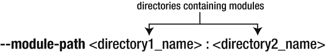

图 4-9.

`--module-path` 命令行选项的语法

模块路径标志接收一个目录列表作为参数，目录之间用冒号分隔。可以列出无限数量的目录，但每个目录之间必须用冒号分隔。

注意

在前面的示例中，我们使用冒号 (:) 来分隔目录，但冒号仅用于 Linux 环境。对于 Windows 环境，我们必须使用分号 (;) 代替。

构成模块路径的目录中包含的模块可以是：

*   打包为模块化 JAR 文件。
*   展开为独立的类文件。

Java 启动器可以从模块路径中精确加载它所需的模块，因为它通过模块声明中存在的配置知道了这些信息。

注意

模块路径允许指定模块而不是 JAR 库作为类路径。

在运行时，使用模块路径可以指定与项目一起构建的不同类型的模块。一个模块只能位于一个位置。如果它位于多个位置，则保留第一个出现的模块，其他出现的模块将不予考虑。

记住

模块路径只能包含模块。

除了应用程序模块路径，还有另外两种类型的模块路径：编译模块路径和升级模块路径。

### 编译模块路径

编译模块路径包含源代码形式的模块定义，并与 `javac` 一起使用，通过命令行上的新 Java 选项 `--module-source-path` 指定。它在编译期间用于告知 Java 编译器必须搜索的模块的位置。

图 4-10 展示了命令行 `--module-source-path` 选项的语法：

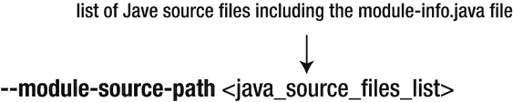

图 4-10.

`--module-source-path` 命令行选项的语法

`--module-source-path` 标志指定要编译的 Java 源文件列表。它们可以一个接一个地列出，用空格分隔。

注意

在大多数情况下，Java 文件列表会非常庞大。Linux 在这方面可以帮助你。你可以输入 `$(find. –name '*.java'`) 来获取所有扩展名为 .java 的目录的完整列表。

通常，我们可以将 `--module-source-path` 命令行选项视为 `--sourcepath` 选项的模块对应项。

### 升级模块路径

升级模块路径通过命令行上的 Java 编译器选项 `--upgrade-module-path` 指定。根据 OpenJDK 的说法，“它包含编译后的模块定义，旨在用于替代环境中内置的可升级模块。”本书不涉及升级模块路径。

在本节中，我们将讨论模块解析过程。

## 模块解析

模块解析是 Java 9 中引入的一个过程，它检查模块路径的正确性，并解析整个模块系统中存在的依赖关系。它在编译时和运行时都会发生。模块解析过程的目标是最终得到一组最小必要的已解析模块，以便能够运行应用程序。

注意

模块在构建和安装期间被解析。它们在运行时不可解析。

位于 module-info.java 文件中的模块声明中的 `requires` 子句，为模块系统提供了有关必须解决的依赖关系的有价值信息。这些依赖关系无非就是当前模块所依赖的其他模块。在 Java 9 中，它们被称为可观察模块，本章后面的“模块类型”一节将对此进行介绍。

在找到当前模块的所有可观察模块后，模块系统不会停止。它会进一步搜索最近找到的模块的可观察模块。此过程持续进行，直到满足每个模块的所有依赖关系，并且到达基础模块 java.base。

注意

在编译时，在模块解析过程中，Jigsaw 会检查是否存在循环依赖。如果发现任何循环依赖，应用程序将无法编译。


### 根模块

根模块是解析过程起始的模块。它通过 `java` 命令中的 `--module` 选项指定，正如我们在运行模块化应用程序的示例中所见。

首先，根模块会被添加到已解析模块组中。其次，模块系统会扫描该模块的模块描述符，并将其所有依赖（模块）添加到已解析模块组中。此过程持续进行，Java 平台模块系统会尝试查找其他模块上的依赖。当找到所有搜索的模块并到达 `java.base` 模块时，该过程停止。解析过程完成后，我们就拥有了运行软件应用程序所需的所有模块。

在某些情况下，某个模块位于模块路径上，但在解析过程中未被找到，因此无法添加到模块图中。此时，我们必须手动将该模块添加到模块图中。这可以通过 `--add-modules` 命令行选项完成。我们将在第 8 章更详细地讨论此选项。

重要的是要知道，模块解析过程会检测任何可能缺失的模块。如果缺少强制模块，模块解析过程将停止，并抛出异常。

注意

如果在编译时模块路径不完整，编译器会给出警告。在解析过程中，平台模块和开发者模块都会被搜索。

Jigsaw 的另一个重要主题是**可访问性**，将在下一节介绍。

## 可访问性

可访问性规则在 Java 9 中发生了根本性变化。声明为 `public` 但未导出的类型将仅在其所在的模块内部可用。与旧版 Java 相比，这是一个重大变化。在 Java 9 之前，只需声明一个类型为 `public`，它就可以在任何地方被访问。在 Java 9 中，将类型声明为 `public` 并不意味着它可以在任何地方被访问。

仅仅读取一个模块并不能保证可以访问其包。此外，为了可访问，模块必须导出其部分包。只有从导出包中的公共类型才能被其他模块访问。通过利用强封装和可靠配置，我们可以明确定义模块的哪些类型可供外部访问。这样，我们可以非常轻松地隐藏内部实现。

隐藏实现细节成为 Java 9 的标准做法。这是默认获得的——我们无需特意选择。只需省略导出某个类型，即可使该类型被强封装，并从模块外部不可见。一个包只需被放置在一个模块内，就能迅速受益于强封装的力量。在 Java 9 中，我们能够通过在模块声明中列举它们来决定哪些类型应该可以从外部访问。非常简单且简洁。

总结一下，为了使模块 A 能够读取模块 B 中的包 P，必须同时满足两个条件。第一个条件是模块 A 应读取（`requires`）模块 B。第二个条件是模块 B 应导出其包 P。

注意

在 Java 9 中，可访问性在编译时和运行时都会强制执行。如果违反了可访问性规则，运行时将抛出 `IllegalAccessError` 类型的错误。可访问性检查在 Java 虚拟机中强制执行。

在 Java 9 中，仅仅为类型设置 `public` 修饰符并不意味着授予访问权限。在 Java 9 之前的版本中，为类型设置 `public` 可访问性类型会赋予其全局可访问性，但在 Java 9 中，要使名为 T 的类型在模块外部可访问，必须同时满足三个条件：

*   类型 T 所在的包必须被导出。
*   需要访问类型 T 的模块必须读取包含类型 T 的模块。
*   类型 T 必须具有公共标识符。

这些条件在表 4-3 中进行了说明，该表列出了授予或不授予可访问性的情况综合列表：

*   “模块是否被读取”列：如果包含类型 T 的模块被想要访问类型 T 的模块读取，则值为“是”。
*   “包是否被导出”列：如果包含类型 T 的模块导出了类型 T 的包，则值为“是”。
*   “类型 T 的访问修饰符”列：表示类型 T 的访问修饰符。
*   “在其他模块中是否可访问”列：如果类型 T 可以从其他模块访问，则指定为“是”，否则为“否”。

表 4-3 展示了 Java 9 中新的可访问性情况及其结果。

表 4-3.

Java 9 中的可访问性情况

| 模块是否被读取 | 包是否被导出 | 类型 T 的访问修饰符 | 在其他模块中是否可访问 |
| --- | --- | --- | --- |
| 是 | 是 | Public | 是 |
| 是 | 是 | Protected | 否 |
| 是 | 是 | (默认) | 否 |
| 是 | 是 | Private | 否 |
| 是 | 否 | Public | 否 |
| 是 | 否 | Protected | 否 |
| 是 | 否 | (默认) | 否 |
| 是 | 否 | Private | 否 |
| 否 | 是 | Public | 否 |
| 否 | 是 | Protected | 否 |
| 否 | 是 | (默认) | 否 |
| 否 | 是 | Private | 否 |
| 否 | 否 | Public | 否 |
| 否 | 否 | Protected | 否 |
| 否 | 否 | (默认) | 否 |
| 否 | 否 | Private | 否 |

作为规则，导出包的公共组件可以从模块外部访问，前提是使用它的模块读取了源模块。相反，未导出包的公共元素无法从模块外部访问。它默认对其所在模块内的所有源代码可访问，但无法从模块外部访问。

当我们尝试访问不可访问的类型时，Java 编译器会抛出异常。最常见的是 `ClassNotFoundException`。在运行时，最常见的错误是 `IllegalAccessError` 或 `InaccessibleObjectException`。

### 可读性与隐含可读性

可读性是两个模块之间的关系，指的是一个模块读取另一个模块时，可以访问其导出包中的类型。在这种情况下，我们说一个模块读取另一个模块。

我们在之前的示例中，当描述模块声明中的 `requires` 和 `exports` 指令时，已经涉及了可读性的主题。要回顾可读性的概念，您可以回到“模块声明”部分的“requires 子句”小节。我们尚未涉及的是隐含可读性的新概念。


#### 隐式可读性

隐式可读性指的是以下情况：

*   第一个模块读取第二个模块。
*   第二个模块读取第三个模块。
*   由于上述两个条件，第一个模块在逻辑上读取了第三个模块。

假设有一个模块 B 使用了模块 C 中的某个类型（B 读取 C）。如果另一个模块 A 读取了模块 B，并且也使用了模块 C 中的类型，那么在没有隐式可读性的情况下，模块 A 需要显式声明它也依赖模块 C。而利用隐式可读性，则无需在模块 A 中指定这一点。只需在模块 B 的 `module-info.java` 中声明它 `requires transitive` 模块 C 中的类型即可。这样一来，所有读取模块 B 中类型的模块都将自动能够访问模块 C 中的类型。

图 4-11 展示了这三个模块对应的模块图，并说明了它们之间的可读性关系。

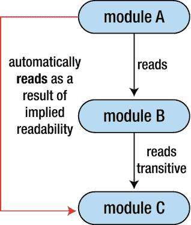

图 4-11.

展示隐式可读性的模块图

代码清单 4-18 展示了模块 A 的模块描述符，它依赖模块 B。

```
// module-info.java
module A {
requires B;
}
代码清单 4-18.
模块 A 的模块描述符
```

代码清单 4-19 展示了模块 B 的模块描述符，它通过 `requires transitive` 依赖模块 C。

```
// module-info.java
module B {
requires transitive C;
}
代码清单 4-19.
模块 B 的模块描述符
```

模块 A 无需 `require` 模块 C，因为模块 B 已经 `requires transitive` 模块 C。因此，模块 A 可以自动访问模块 C 中的类型。

注意

隐式可读性是通过在模块声明中添加 `requires transitive` 语句，后跟当前模块所依赖的模块名称来实现的。

图 4-12 展示了 `requires transitive` 子句的语法。它接受一个模块名称作为参数。

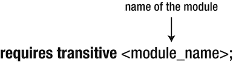

图 4-12.

requires transitive 子句的语法

为了更好地理解，我们来看一个使用平台模块实现隐式可读性的例子。代码清单 4-20 展示了平台模块 `java.desktop` 的模块声明，它定义了 `requires transitive` 子句以利用隐式可读性。

```
// module-info.java
module java.desktop {
requires transitive java.datatransfer;
requires transitive java.xml;
requires java.prefs;
exports java.applet;
...
}
代码清单 4-20.
模块 java.desktop 的模块描述符
```

代码清单 4-21 是位于模块 `java.desktop` 的包 `com.sun.beans.decoder` 中的类 `DocumentHandler` 的摘录：

```
// jdk/src/java.desktop/share/classes/DocumentHandler.java
package com.sun.beans.decoder;
import javax.xml.parsers.ParserConfigurationException;
import javax.xml.parsers.SAXParserFactory;
...
public final class DocumentHandler extends DefaultHandler {
...
public void parse(final InputSource input) {
if ((this.acc == null) && (null != System.getSecurityManager())) {
throw new SecurityException("AccessControlContext is not set");
}
AccessControlContext stack = AccessController.getContext();
SharedSecrets.getJavaSecurityAccess().doIntersectionPrivilege(new PrivilegedAction() {
public Void run() {
try {
SAXParserFactory.newInstance().newSAXParser().parse(input, DocumentHandler.this);
}
catch (ParserConfigurationException exception) {
handleException(exception);
}
catch (SAXException wrapper) {
Exception exception = wrapper.getException();
if (exception == null) {
exception = wrapper;
}
handleException(exception);
}
catch (IOException exception) {
handleException(exception);
}
return null;
}
}, stack, this.acc);
}
}
代码清单 4-21.
来自模块 java.desktop 的类 DocumentHandler
```

如你所见，模块 `java.desktop` 中的类 `DocumentHandler` 使用了来自 `java.xml` 模块的 `SaxParserFactory`。这表明模块 `java.desktop` 使用了模块 `java.xml` 中的类型，因此在模块 `java.desktop` 和模块 `java.xml` 之间建立了可读性关系。

如果我们在自己的模块描述符中添加对 `java.desktop` 模块的依赖，并尝试使用 `DocumentHandler` 中的 `parse()` 方法，我们不仅试图访问模块 `java.desktop` 中的类型，还会访问模块 `java.xml` 中的类型。为了能够从我们自己的模块中访问该方法，模块 `java.desktop` 必须通过 `requires transitive` 依赖模块 `java.xml`。这样，我们的模块就可以利用隐式可读性，无需显式依赖即可访问模块 `java.xml` 中的类型。任何依赖模块 `java.desktop` 的模块都会自动依赖模块 `java.datatransfer` 和 `java.xml`，因为这两个模块都出现在模块 `java.desktop` 的模块描述符中。通过依赖模块 `java.desktop`，我们可以访问来自模块 `java.desktop`、`java.datatransfer` 和 `java.xml` 的导出包。

如果我们省略 `transitive` 关键字，仅使用 `requires` 指令，那么我们的模块将只能访问模块 `java.desktop` 中的类型，而无法访问 `java.xml` 中的类型。

假设我们创建一个名为 `myModule` 的简单模块，它依赖模块 `java.desktop`。代码清单 4-22 展示了模块 `myModule` 的模块描述符。

```
// module-info.java
module myModule {
requires java.desktop;
}
代码清单 4-22.
模块 myModule 的模块描述符
```

图 4-13 展示了模块 `myModule` 的模块图，并说明了模块之间的可读性以及隐式可读性关系。

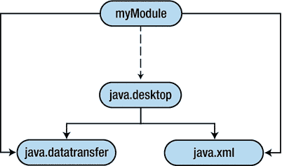

图 4-13.

myModule 的模块图

我们面临以下情况：

*   `myModule` 依赖 `java.desktop`（图中用虚线表示可读性）。
*   `java.desktop` 模块通过 `requires transitive` 依赖模块 `java.datatransfer` 和模块 `java.xml`（图中用实线表示隐式可读性）。

我们的模块 `myModule` 无需显式依赖即可获得对模块 `java.datatransfer` 和 `java.xml` 的可读性。因此，它可以访问这两个模块中的类型，而无需担心需要专门声明对它们的依赖。

现在我们已经了解了什么是隐式可读性，接下来让我们看看限定导出是什么意思。


### 限定导出

一个模块可以将其所有包或一组包导出给所有模块。`exports` 子句已得到增强，可以指定一个模块仅将其一组包导出给一组指定的模块。

清单 4-23 是来自 `java.rmi` 模块的模块描述符的摘录。

```
// module-info.java
module java.rmi {
...
exports com.sun.rmi.rmid to java.base;
exports sun.rmi.registry to
java.management;
exports sun.rmi.server to
java.management,
jdk.jconsole;
exports sun.rmi.transport to
java.management,
jdk.jconsole;
}
清单 4-23.
java.rmi 模块描述符摘录
```

包 `com.sun.rmi.rmid` 通过限定导出被导出到 `java.base` 模块。因此，它只能在 `java.base` 模块内部被访问。其他模块无法访问它。只有 `to` 子句后指定的模块才能访问该包。

注意

如果一个模块不读取另一个模块，则它无法访问该模块导出的包。即使该包是通过限定导出导出的，也是如此。

在 `module-info.java` 文件中定义限定导出所使用的语法如图 4-14 所示。

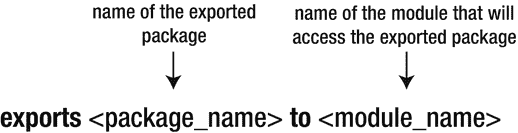

图 4-14.

限定导出语法 注意

一个限定导出指令可以定义多个模块，用逗号分隔。相比之下，一个简单导出指令只能定义一个模块。

在限定导出声明中禁止重复模块名称，如清单 4-24 所示。

```
// module-info.java (com.apress.moduleA)
module com.apress.moduleA {
}
// module-info.java (com.apress.moduleB)
module com.apress.moduleB {
exports com.apress.moduleB to com.apress.moduleA, com.apress.moduleA;
}
清单 4-24.
包含重复模块名称的限定导出
```

在这种情况下会发生编译失败：

```
Error: duplicate export: com.apress.moduleA exports com.apress.moduleB to com.apress.moduleA, com.apress.moduleA
```

我们已经了解了什么是限定导出指令，以及它们与标准导出指令的区别。能够仅指定允许访问模块数据的特定模块是一个巨大的优势。模块不应该有义务将其包暴露给所有现有模块。

限定导出是强封装的一大优势。它们在 JDK 模块化过程中被广泛使用，并且存在于 JDK 内部的多个 `module-info.java` 文件中。

我们讨论了可访问性，并探讨了可读性、隐含可读性和限定导出的概念。接下来，让我们看看 Jigsaw 中引入的不同类型的模块。

## 模块类型

Jigsaw 定义了两种主要的模块类型：命名模块和未命名模块。命名模块又分为普通模块和自动模块。普通模块又进一步分为基础模块和开放模块。图 4-15 展示了模块的分类。

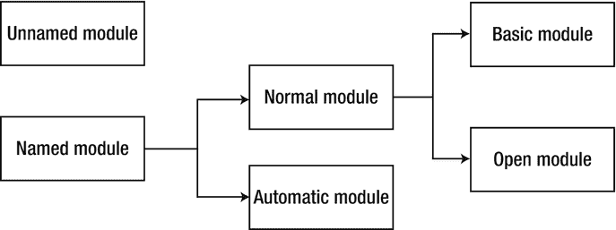

图 4-15.

JPMS 中的模块分类

首先，我们将讨论命名模块及其子类型，然后讨论未命名模块。

### 命名模块

命名模块包括模块系统中除未命名模块之外的所有模块。区分未命名模块和命名模块有两个重要方面。第一，未命名模块位于类路径上，而命名模块位于模块路径上。第二，未命名模块没有名称，而每个命名模块都有一个名称。命名模块可以是普通模块或自动模块。命名模块是在 `module-info.java` 模块描述符文件中使用名称声明的模块。每个在其 `module-info.java` 中有 `module <module_name>` 形式声明的模块都是一个命名模块。这是模块被归类为命名模块必须满足的唯一条件。命名模块的例子包括所有平台模块，但我们自己的模块如果满足刚才提到的唯一条件，也可以归入此类。通过简单地向 JAR 文件添加一个 `module-info.class` 文件，就可以将其转换为命名模块。

### 普通模块

“普通”模块的概念并非官方存在。我们使用这个术语来定义非自动的命名模块。普通模块和自动模块的主要区别在于，普通模块有一个模块描述符 `module-info.java`，而自动模块没有。此外，普通模块由开发者显式声明，并在模块的模块描述符中声明模块的依赖关系。自动模块的模块描述符不是由开发者提供的。普通模块使用关键字 `module` 后跟模块名称来声明。本章到目前为止介绍的所有模块都是普通模块。默认情况下，普通模块不导出其任何包。除此之外，必须显式指定其 `exports` 子句。`exports` 子句在编译时和运行时都导出包。普通模块包括基础模块和开放模块。

### 自动模块

自动模块是将 JAR 文件放置到模块路径后创建的模块。将自动模块与普通模块进行比较，有两个重要的区别：

*   默认情况下，自动模块需要系统中所有现有的模块，包括我们自己的所有模块、JDK 映像中的所有模块以及所有其他自动模块。
*   默认情况下，自动模块导出其所有包。

自动模块可以访问类路径上的类型，尤其对第三方代码很有用。自动模块用于将现有应用程序迁移到 Java 9。第 8 章将更详细地讨论它们。

注意

自动模块不是我们在模块描述符中显式声明的。它是在将 JAR 文件放入模块路径时自动创建的。

### 基础模块

我们将每个不是开放模块的命名模块称为基础模块。然而，“基础”模块这个术语在 JDK 9 中并非官方存在。我们用它来定义既不是自动模块也不是开放模块的命名模块。基础模块具有与普通模块相同的一组特征，只是它没有为深度反射开放。


### 开放模块

在模块内部，其他模块的代码在编译时无法访问其包，即使使用深度反射也不行。然而，许多第三方库和框架在运行时使用反射来访问 JDK 的内部结构。因此，除非授予反射访问权限，否则所有这些框架都无法在 JDK 9 中工作。在 JDK 9 中，只有命名模块中的代码才能授予类路径上的代码反射访问权限。命名模块中的代码默认不会授予其他命名模块中的代码反射访问权限。因此，如果第三方库或框架位于类路径上，它们在 JDK 中默认拥有反射访问权限。如果它们位于模块路径上，则它们在 JDK 中没有反射访问权限。但是，要授予对模块中所有包的反射访问权限，该模块应声明为开放模块。

开放模块通过在关键字 `module` 前放置标识符 `open`，后跟模块名称来定义。

开放模块使模块内的所有包都可用于深度反射。当我们说“所有包”时，指的是公共包和私有包。我们也可以选择是开放整个模块用于深度反射，还是仅开放特定包。当选择后者时，我们不将整个模块指定为开放，而只指定模块内的一个或多个包。关键字 `open` 可以放在模块名称附近，也可以放在模块描述符内部，以开放特定包。

注意

开放模块背后的原因是它们允许框架反射模块的内部结构，而使用基本模块则无法做到这一点。像 Spring、JPA 和 Hibernate 这样的框架需要在运行时拥有反射访问权限。

清单 4-25 定义了一个名为 com.apress.myModule 的开放模块，它需要两个 Spring 模块：spring.tx 和 spring.context。

```
open module com.apress.myModule {
requires spring.tx;
requires spring.context;
exports com.apress.myModule.myPackage;
}
清单 4-25.
定义开放模块
```

关于上述示例，必须强调两个重要事实：

*   模块 com.apress.myModule 中所有包的所有类型在运行时都可用于深度反射。
*   在编译时，只有包 com.apress.myModule.myPackage 中的公共和受保护类型是可访问的。

因此，Spring 框架可以利用 `setAccessible()` 方法来访问 com.apress.myModule.myPackage 包的非公共元素。

#### 使用开放模块启用核心反射

关于强封装原则，在 Java 9 中调用 `java.lang.reflect.AccessibleObject` 类的 `setAccessible()` 方法时引入了一些限制。我们不能使用 `setAccessible()` 方法使其他模块中的私有字段或方法在我们的模块中可访问。但有一个解决方案可以使它们可访问：将目标模块声明为开放模块。

在以下示例中，我们有两个模块。来自目标模块的 `Employee` 类包含一个名为 `employeeName` 的私有 `String` 字段。我们希望将此字段设置为可从我们的第二个模块 testReflection 访问。

清单 4-26 显示了目标模块的声明，该模块导出了其包。

```
module target {
exports target;
}
清单 4-26.
模块 target 的 module-info.java
```

在清单 4-27 中，模块 testReflection 读取了模块 target。

```
module testReflection {
requires target;
}
清单 4-27.
模块 testReflection 的 module-info.java
```

清单 4-28 显示了来自模块 target 的 `Employee` 类，该类包含一个名为 `employeeName` 的私有类型：

```
package target;
public class Employee {
private String employeeName = null;
public Employee(String employeeName) {
this.employeeName = employeeName;
}
}
清单 4-28.
类 Employee 的定义
```

`Main` 类创建了一个 `Employee` 类型的对象，并调用其构造函数，将值 `"John"` 设置给 `employeeName`。之后，返回一个代表字段 `employeeName` 的 `Field` 对象，并在此字段上调用参数为 `true` 的 `setAccessible()` 方法，以使其在整个 testReflection 模块中可访问。

清单 4-29 显示了应用程序的 `Main` 类。

```
package testReflection;
import java.lang.reflect.*;
import target.*;
public class Main {
public static void main(String[] args) {
Employee employee = new Employee("John");
try {
Field employeeField = Employee.class.getDeclaredField("employeeName");
employeeField.setAccessible(true);
}
catch(NoSuchFieldException noSuchFieldException) {
}
}
}
清单 4-29.
来自包 testReflection 的 Main 类
```

我们编译两个模块内的代码，并指定编译后文件的位置在 out 目录中。清单 4-30 展示了使用 `--module-source-path` 选项来指定所有扩展名为 .java 的文件都位于模块源路径上。

```
javac -d out --module-source-path src $(find . -name "*.java")
清单 4-30.
使用 --module-source-path 标志编译文件
```

清单 4-31 说明了用于运行我们模块的 `Main` 类的 `java` 命令。我们将 `Main` 类传递给 `--module` 选项，`--module-path` 选项指向包含所有已编译类文件的 out 目录。

```
$ java --module-path out --module testReflection/testReflection.Main
清单 4-31.
使用 --module 选项运行 Main 类
```

不幸的是，尝试运行我们的应用程序时会抛出异常，因为调用 `setAccessible()` 方法失败。因此，我们无法使私有字段 `employeeName` 可访问。

```
Exception in thread "main" java.lang.reflect.InaccessibleObjectException: Unable to make field private java.lang.String target.Employee.employeeName accessible: module target does not "opens target" to module testReflection
at java.base/jdk.internal.reflect.Reflection.throwInaccessibleObjectException(Reflection.java:424)
at java.base/java.lang.reflect.AccessibleObject.checkCanSetAccessible(AccessibleObject.java:198)
at java.base/java.lang.reflect.Field.checkCanSetAccessible(Field.java:171)
at java.base/java.lang.reflect.Field.setAccessible(Field.java:165)
at testReflection/testReflection.Main.main(Main.java:14)
```

注意

在此示例中，我们在两个模块 target 和 testReflection 之间具有可读性。但由于 Java 9 中引入的非常强大的强封装机制，在另一个模块的私有字段上调用 `setAccessible()` 方法会抛出 `InaccessibleObjectException`。

我们可以通过将目标模块定义为开放模块而不是强模块来非常轻松地解决此问题。在目标模块的私有字段上调用 `setAccessible()` 方法将会成功。私有字段 `employeeName` 现在可以在 testReflection 模块中访问。

清单 4-32 通过指定关键字 `open` 将目标模块定义为开放模块。

```
open module target {
exports target;
}
清单 4-32.
将目标模块定义为开放模块
```

注意

你可以在文件夹 /ch04/CoreReflectionFail 中找到第一个示例的源代码，在文件夹 /ch04/CoreReflectionSucceed 中找到第二个示例的源代码。

到目前为止，我们已经讨论了命名模块及其类型。接下来，我们将讨论未命名模块。


### 未命名模块

顾名思义，未命名模块没有名称，也无需声明。它由类路径中的所有 JAR 文件或模块化 JAR 文件组成。所有这些 JAR 文件共同构成了未命名模块。Java 平台模块系统首先在模块路径上搜索特定类型。模块路径的搜索优先级高于类路径。如果在模块路径上未找到该类型，则会在类路径上执行搜索。如果在类路径上找到了该类型，它将成为所谓未命名模块的一部分。我们使用单数术语“未命名模块”而非复数形式“未命名模块”，是因为每个类加载器对应的未命名模块是唯一的。每个类加载器只有一个唯一的未命名模块。

注意

未命名模块与类加载器绑定。类加载器与未命名模块之间存在一一对应的关系。未命名模块可以读取 JDK 映像和模块路径上的所有命名模块。同时，它也会导出其所有包。

默认情况下，未命名模块会读取系统中所有的命名模块。这样一来，根据 Java 9 的可访问性规则，未命名模块可以访问所有已导出的命名模块中的包。反之则不成立，即命名模块无法读取未命名模块。如果我们尝试从模块路径访问类路径（即未命名模块）中的代码，编译将会失败。要成功访问，我们需要将未命名模块中的代码转换为自动模块。因此，我们需要将 JAR 文件从类路径中取出，并放置到模块路径上，使其成为自动模块。

注意

命名模块不能`requires`（依赖）未命名模块。

所有未包含在命名模块中的类都隐式地包含在未命名模块中。未命名模块中包含的所有包默认对模块路径上的所有模块开放，这使得从模块路径对类路径进行反射访问成为可能。

### 可观察模块

可观察模块并非一个独立的模块类别。这就是为什么我们没有将其纳入模块分类的原因。“可观察模块”这一术语用于指代系统中的所有模块：平台模块、库模块以及我们自己的模块。模块路径上的模块也属于可观察模块的一部分。

## 总结

本章介绍了 Jigsaw 中模块这一新概念。我们学习了如何定义模块，并描述了代表模块描述符的新 `module-info.java` 文件的结构。

在模块描述符内部，可以使用五种类型的指令：`requires`、`exports`、`opens`、`uses` 和 `provides`。前三种指令在本章中已详细解释。我们了解了如何使用 `requires` 指令定义模块之间的依赖关系，以及如何使用 `exports` 指令指定模块导出哪些包。此外，我们还定义了几个模块，并在模块图中展示了它们之间的依赖关系。

我们提到了 `exports` 和 `opens` 子句之间的区别。`exports` 子句允许在编译时和运行时访问特定包中的公共类型。而 `opens` 子句则允许在运行时通过反射访问特定包中的公共类型和私有类型。

我们编译并运行了单个模块以及多个模块。为此，我们使用了模块路径这一新概念，以及新的命令行选项 `--module-source-path` 和 `--module-path`。接着，我们讨论了新的模块化 JAR，并描述了其内部结构。我介绍了 `jar` 工具新增的功能，并展示了如何使用 `jar` 工具打包模块化 JAR。

本章解释了三种现有的模块路径类型：应用程序模块路径、编译模块路径和升级模块路径。还讨论了模块解析过程以及 Java 9 中引入的新可访问性规则。我们描述了可读性、隐含可读性和限定导出等主题。

本章最后描述了 Jigsaw 中不同类型的模块：普通模块、开放模块、命名模块、未命名模块、自动模块和可观察模块。我们强调，由于命名模块无法读取未命名模块，因此模块路径上的代码无法访问放置在类路径上的 JAR 内部的代码。

在第 5 章中，你将学习模块化运行时映像。

