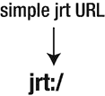
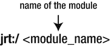
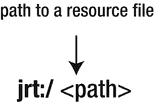
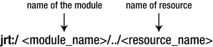

# 5. 模块化运行时映像

在本章中，我们将研究 Java 9 中引入的新模块化运行时映像的结构，它在提高性能与可维护性方面带来了重要优势。另一方面，运行时映像的新格式并不一定能保证所有现有 API 的功能完全一致。

注意

本章为信息性章节，描述了 JDK 9 中引入的模块化运行时映像的格式。

## 模块化运行时映像

第 3 章展示了 JDK 中的源代码是如何围绕模块进行重构的。在本章中，我们将讨论在 Java 增强提案 220 中实现的新模块化运行时映像。由于模块的引入，该 JEP 修改了 JDK 和 JRE 的结构。它还定义了模块化运行时映像的布局。

Java 9 中模块的引入导致了 JDK 和 JRE 结构的重要变化。因此，引入了一种新的运行时格式。在 Java 9 中，可能的最小运行时仅由 `java.base` 模块组成。JDK 9 映像不仅可以通过运行在 Java 9 上的工具访问，例如，也可以通过运行在 Java 8 上的工具访问。

注意

为了访问 JDK 和 JRE 中的类与资源，Java 9 中引入了一个辅助接口。

另一个与模块不直接相关但与 JDK 相关的重要变化是，用新的运行时映像替换了 `rt.jar` 文件和 `tools.jar` 文件。

注意

Java 9 并未移除 JAR 文件，也不禁止使用它们。JAR 文件在 Java 9 中仍然可以正常工作。

由于 JAR 文件可能引发许多问题，JCP 团队的意图是尽可能避免在 JDK 和 JRE 内部使用它们。

### Java 9 之前的运行时映像

本节介绍 Java 9 版本之前的运行时映像结构。我们在第 2 章中已经讨论过，但现在我们将更详细地探讨。在 Java 9 之前，JDK 构建为我们提供了两种类型的运行时映像：Java 运行时环境（JRE）映像和 Java 开发工具包（JDK）映像。

#### Java 9 之前的 JRE 映像

Java 运行时环境是 Java SE 平台的完整实现。JRE 映像由两个目录组成：`bin` 和 `lib`。

`bin` 目录包含用于启动运行时系统的 `java` 命令，以及可执行二进制文件，例如 `javacp`、`java-rmi`、`javaw`、`javaws`、`keytool`、`pack200`、`rmid`、`rmiregistry` 和 `servertool`。

`lib` 目录比 `bin` 目录大，包含 `.properties` 和 `.policy` 文件。`ext` 目录位于 `lib` 目录内部，包含诸如 `nashorn.jar`、`sunec.jar`、`zipfs.jar` 等 JAR 文件。最重要的一点是，在 `lib` 目录内我们可以找到 `rt.jar` 文件。在 Mac OS 和 Linux 操作系统上，`lib` 目录包含了运行时系统的动态链接本地库。


#### Java 9 之前的 JDK 镜像

另一方面，在 Java 9 之前，JDK 镜像包含了一个 JRE。它在 `jre` 子目录中有一份 JRE 的副本。一个 JDK 镜像包含许多目录，但其中最重要的三个是 `lib`、`bin` 和 `include` 目录。

注意

JDK 镜像包含库和开发工具。

`lib` 目录由包含 JDK 工具实现的 JAR 文件组成。`tools.jar` 文件（其中包含构成 `javac` 编译器的类）位于此 `lib` 目录中。`bin` 目录包含命令行调试和开发工具，如 `javac`、`javadoc` 和 `jconsole`。`include` 目录包含 C 和 C++ 头文件，用于编译与运行时系统直接交互的原生代码。

### 为什么运行时镜像需要新格式？

根据 OpenJDK 的说法，运行时镜像需要新格式有多种原因。首先，新的运行时格式比旧的 JAR 格式更强大。其次，新的运行时格式可以轻松增强，以容纳 Java 类的预编译原生代码或预计算的 JVM 数据结构。第三，新的运行时格式可以存储来自应用程序模块、JDK 模块和库模块的类文件和资源文件。

OpenJDK 在其网站上阐述了决定改造 JDK 和 JRE 的最重要原因：“为了在开发者、部署者和最终用户可以依赖并在适当时修改的文件，与属于实现内部且可能随时更改而无需通知的文件之间，划清界限。”

OpenJDK 还列出了另外三个原因：

*   “提供支持的方式来执行常见的操作，这些操作目前只能通过检查运行时镜像的内部结构来完成，例如，枚举镜像中存在的所有类”
*   “实现对 JDK 类的选择性降权，这些类目前被授予了所有安全权限，但实际上并不需要这些权限”
*   “保留行为良好的应用程序的现有行为，即不依赖于 JRE 和 JDK 运行时镜像内部方面的应用程序”

### Java 9 中的运行时镜像

本节描述 Java 9 中引入的新运行时镜像的结构。

#### JDK 和 JRE 的相同结构

在 Java 9 中，JRE 和 JDK 具有相同的结构。这与旧版 Java 不同，如前所述，旧版 Java 中 JDK 和 JRE 之间存在明显区别。JDK 镜像只是一个包含 JDK 开发工具的运行时镜像。

曾经位于 `lib` 目录中的配置文件现在位于 `conf` 目录内。这些是我们可编辑的文件。`lib` 目录中的文件是运行时系统的实现细节。

注意

不应修改 `lib` 目录中的文件。

#### 新运行时镜像的结构

图 5-1 展示了 Java 9 中运行时镜像的新结构。


图 5-1.

Java 9 中运行时镜像的结构

让我们看看新的模块化运行时镜像包含哪些类型的目录：

*   `bin` 目录包含由链接到镜像中的模块所代表的命令行启动器。一些最重要的命令行启动器包括 `java`、`javac`、`javadoc`、`javah`、`javap`、`jcmd`、`jconsole`、`jdeps`、`jimage`、`jlink`、`jmod`、`jshell` 和 `jstat`。我们不打算在此全部描述它们。你可以查看 JDK 9 构建版本的 `bin` 目录。
*   `lib` 目录包含运行时系统的动态链接原生库。
*   `conf` 目录包含可编辑的文件。其中包括 `.properties` 文件和 `.policy` 文件。
*   `jmods` 目录包含所有 JMOD 文件。
*   `legal` 目录包含版权文件。

模块化运行时镜像的根目录包含版权、自述文件和发布文件。

#### release 文件

`release` 文件的结构包含关于模块、操作系统版本、源代码、操作系统架构、操作系统名称、Java 版本以及完整 Java 版本的信息：

```
IMPLEMENTOR="Oracle Corporation"
JAVA_VERSION="9"
MODULES="java.base java.datatransfer java.logging java.activation java.compiler java.rmi java.transaction java.xml java.prefs java.desktop java.security.sasl java.naming jdk.unsupported java.corba java.instrument java.jnlp java.management java.management.rmi java.scripting java.xml.ws.annotation java.xml.crypto java.security.jgss java.sql java.sql.rowset java.se jdk.httpserver java.xml.bind java.xml.ws java.se.ee java.smartcardio javafx.base jdk.jsobject javafx.graphics javafx.controls jdk.deploy jdk.javaws jdk.plugin javafx.deploy javafx.fxml javafx.media javafx.swing jdk.xml.dom javafx.web jdk.accessibility jdk.internal.jvmstat jdk.attach jdk.charsets jdk.compiler jdk.crypto.ec jdk.crypto.cryptoki jdk.crypto.mscapi jdk.deploy.controlpanel jdk.dynalink jdk.internal.ed jdk.editpad jdk.hotspot.agent jdk.incubator.httpclient jdk.internal.le jdk.internal.opt jdk.internal.vm.ci jdk.jartool jdk.javadoc jdk.jcmd jdk.management.agent jdk.management jdk.jconsole jdk.jdeps jdk.jdwp.agent jdk.jdi jdk.jfr jdk.jlink jdk.jshell jdk.jstatd jdk.localedata jdk.naming.dns jdk.naming.rmi jdk.net jdk.pack jdk.packager.services jdk.packager jdk.plugin.dom jdk.plugin.server jdk.security.jgss jdk.policytool jdk.rmic jdk.scripting.nashorn jdk.scripting.nashorn.shell jdk.sctp jdk.security.auth jdk.snmp jdk.xml.bind jdk.xml.ws jdk.zipfs oracle.desktop oracle.net"
OS_ARCH="x86_64"
OS_NAME="Windows"
SOURCE=".:a4371edb589c+ closed:3b9bef864bcf corba:c72e9d3823f0 deploy:d12d0210bc37 hotspot:1ca8f038fceb hotspot/make/closed:0b47834a0294 hotspot/src/closed:f5870a8748c9 hotspot/test/closed:2a88d69ed789 install:6549b99d10f0 jaxp:332ad9f92632 jaxws:b44a721aee3d jdk:80acf577b7d0 jdk/make/closed:1793d3af1ed9 jdk/src/closed:8e4a66cb15a6 jdk/test/closed:860a0f54d259 langtools:2f01728210c1 nashorn:aa7404e062b9 sponsors:d751e23bea1e"
```

下一节将讨论在 JDK 9 中移除的 `rt.jar`、`tools.jar` 和 `dt.jar` 文件。

### 已移除的文件

#### Rt.jar 已移除

`rt.jar` 文件包含了构成 JRE 的整个编译后的类文件。这些代表了来自 Core Java API 的所有编译后的类，包括 `sun` 和 `com` 包。`rt.jar` 过去位于 JRE 的 `lib` 文件夹内。在 Java 8 中，`rt.jar` 文件大小约为 52 MB。在版本 9 之前的所有 Java 版本中，为了能够访问核心 Java 库，必须将 `rt.jar` 文件包含在类路径中。但是，`rt.jar` 文件在 Java 9 中已被完全移除。它不再存在于构成 JDK 9 的文件中。

使用 `rt.jar` 的工具、编译器和集成开发环境 (IDE) 会受到 `rt.jar` 文件移除的影响。它们的作者必须对其进行调整，以便在 Java 9 中继续正常工作。

根据 JEP 220 的规范，“以前存储在 `lib/rt.jar`、`lib/tools.jar` 和 `lib/dt.jar` 以及各种其他内部 JAR 文件中的类和资源文件，现在将以更高效的格式存储在 `lib` 目录中特定于实现的文件中。”

在 JDK 9 中，`rt.jar` 文件已被新的运行时取代。


#### Tools.jar 和 dt.jar 已移除

在 JDK 9 之前，`tools.jar` 文件被 JDK 使用，位于 JDK 8 或更低版本的 `lib` 目录中。它包含了 `javac` 使用的类，并支持 `javah`、`javap`、`jdeps`、`javadoc` 等工具。`dt.jar` 文件也位于 `lib` 目录内，包含了 `Swing` 类。

注意

`tools.jar` 和 `dt.jar` 都已在 Java 9 中被移除。

在 Java 9 中，原先位于 `tools.jar` 文件内的资源和类文件，可以通过 JDK 镜像中的引导类加载器或应用程序类加载器访问。同样，原先位于 `dt.jar` 文件内的资源和类文件，在 Java 9 中可以通过引导类加载器访问。

### 新的 URI 方案

JDK 9 引入了一种新的 URI 方案。为了演示这种新的 URI 方案，我们首先展示一个简单的例子。在这个例子中，我们使用 `ClassLoader` 类的 `getSystemResource()` 方法，从用于加载类的搜索路径中查找 `String` 类的 URL 资源。该资源将通过系统类加载器定位。

在清单 5-1 中，`getSystemResource()` 方法检索了 `java.lang.String` 类的 URL 资源。

```
// Main.java (module com.apress.getSystemResource)
package com.apress.getSystemResource;
import java.net.URL;
public class Main {
public static void main(String[] args) {
URL url = ClassLoader.getSystemResource(“java/lang/String.class”);
System.out.println(url);
}
}
清单 5-1.
模块 com.apress.getSystemResource 的主类
```

清单 5-2 定义了模块 `com.apress.getSystemResource` 的模块描述符。

```
module com.apress.getSystemResource {
}
清单 5-2.
模块 com.apress.getSystemResource 的 module-info.java 文件
```

我们运行上述模块，并在控制台看到打印出的结果 URL：

```
jrt:/java.base/java/lang/String.class
```

现在，我们在 Java 8 上运行同样的例子。这种情况下，结果 URL 如下所示：

```
jar:file:/C:/Program%20Files/Java/jdk1.8.0_101/jre/lib/rt.jar!/java/lang/String.class
```

注意

你可以在目录 `/ch05/getSystemResource` 中找到此示例的源代码。

我们观察到，Java 8 和 Java 9 的输出完全不同。在 Java 8 中，URL 是 JAR 文件的形式，`String.class` 位于 `rt.jar` 文件内。在 Java 9 中不可能有相同的输出，因为 Java 9 没有 `rt.jar` 文件。

为了解决这个问题，Java 9 引入了一种名为 `jrt` 的新 URL 方案，它提供了对运行时镜像内容的访问。术语 `jrt` 源自 Java 运行时（java runtime）。根据 Open JDK 的说法，`jrt` URL 方案“用于命名存储在运行时镜像中的模块、类和资源，而无需揭示镜像的内部结构或格式。”

注意

一个 `jrt` URL 可以有四种不同的形式。

图 5-2 展示了 `jrt` URL 最简单的结构。



图 5-2.

jrt URL 的最简结构

这个 `jrt` URL（除了 `jrt:/` 之外没有指定任何内容）指定了当前运行时镜像中存在的所有文件。但我们还可以有更多 `jrt` URL 的表示形式。图 5-3 展示了仅指定模块名称的另一种 `jrt` URL 形式。



图 5-3.

带模块的 jrt URL 结构

在这种情况下，`jrt` URL 指定了所指定模块中的所有文件。

图 5-4 展示了另一种 `jrt` URL 形式，它只包含路径，但不包含模块名称。



图 5-4.

带路径的 jrt URL 结构

在这种情况下，路径代表当前运行时镜像中的一个资源文件或一个类。该路径不绑定到特定模块。

图 5-5 展示了 `jrt` URL 的完整结构，同时指定了模块和路径。



图 5-5.

jrt URL 的完整结构

`jrt` URL 的完整结构指向给定模块内的特定资源文件。`jrt` 方案还允许检索平台模块的内容。

现在我们已经了解了新的 URI 方案，接下来继续讨论所有这些修改可能导致的兼容性问题。

### 兼容性

如前所述，由于 JDK 的新结构，Java 9 中某些现有应用程序最终可能会出现重要的兼容性问题。对于严格依赖 JDK 内部结构的应用程序，Java 9 中会出现兼容性问题。因为 JDK 不再包含 `jre` 子目录，任何使用此子目录的代码都将无法按预期工作。

此外，在 Java 9 中，系统属性 `java.endorsed.dirs` 和 `java.ext.dirs` 已被移除。这意味着依赖这两个系统属性的应用程序在 Java 9 中将无法正常工作。

`rt.jar`、`tools.jar` 和 `dt.jar` 文件的移除也对依赖它们的应用程序产生了负面影响。

Java 9 中另一个兼容性问题将出现在期望使用 JAR URL 来命名运行时镜像内的类和资源文件的源代码中。如前所述，JAR URL 已被 `jrt` URL 取代。

另一个需要注意的话题与类加载器有关。表 5-1 显示了 Java 9 中发生变化的类加载器，以及新的类加载器和相应的包。第 10 章将更详细地介绍类加载器。

表 5-1.

类加载器变更

| 包 | 旧类加载器 | 新类加载器 |
| --- | --- | --- |
| sun.tracing.dtrace | 引导 | 应用程序 |
| sun.tools.jar | 引导 | 应用程序 |
| sun.security.tools.policytool | 引导 | 应用程序 |
| com.sun.tracing | 引导 | 应用程序 |
| com.sun.tools.script | 应用程序 | 引导 |
| com.sun.tools.corba.se.idl | 应用程序 | 引导 |
| com.sun.jndi.url.dns | 引导 | 扩展 |
| com.sun.jndi.dns | 引导 | 扩展 |
| com.sun.crypto | 扩展 | 引导 |

因此，依赖此处列出的包的类加载器的源代码在 Java 9 中可能无法正常工作。

## 总结

本章涵盖了 Java 9 中引入的新模块化运行时镜像，以及决定引入它们背后的原因。它比较了 Java 9 之前和 Java 9 中的运行时镜像。

我们详细解释了新运行时镜像中每个文件夹包含的内容，并展示了 release 文件的内容。我们讨论了 `rt.jar`、`tools.jar` 和 `dt.jar` 文件的移除，并强调了这对现有应用程序的影响。接着，我们介绍了新的 URI 方案，该方案由 `jrt` URL 代替了 `jar` URL。

本章最后总结了由于 JEP 220 中实施的更改可能出现的兼容性问题。有关本章讨论主题的更多信息，请查阅 [`http://openjdk.java.net/jeps/220`](http://openjdk.java.net/jeps/220) 上的 JEP 220 文档。

第 6 章将展示如何使用服务解耦模块。


