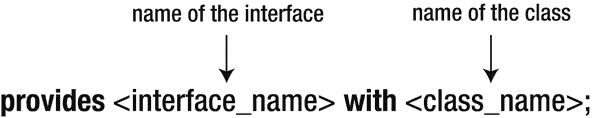
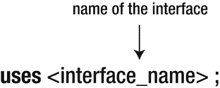

# 6. 服务

服务本质上是由接口或类定义的一组功能，并且存在相应的服务提供者。服务的作用是解耦紧密耦合的模块，并允许服务提供者与服务消费者之间实现松散耦合。在 JDK 9 中使用服务并非强制要求，但它们为构建解耦模块提供了很好的解决方案。

假设我们要测试不同类型汽车的制动系统。制动服务可以定义测试制动系统的一般准则、法律规则和最佳实践。汽车制造商可以实现自己的服务来测试其汽车的制动系统，因为不同车型的制动系统各不相同。这些服务被称为服务提供者，因为它们为制动服务提供了具体的实现。汽车制造商用于可视化和分析汽车功能的内部工具可以使用制动服务。这些工具被称为服务消费者，因为它们使用或消费该服务。

Jigsaw 中服务的基本思想是：在模块中，我们不想暴露实现类，而只想暴露通过接口公开的内容。这就引出了以下问题：如何在 Java 9 的 Java 平台模块系统中实现这一点？答案很简单：我们可以使用接口作为契约。

在深入探讨这个答案之前，我们先简要了解一下服务是什么以及它们在 Java 9 中如何工作。服务可以由指定服务功能的接口和类组成。服务提供者实现一个服务。多个服务提供者可以通过提供自定义实现来实现同一个服务。

为了在服务提供者与服务消费者之间实现分离和解耦，Java 在 `java.base` 模块的 `java.util` 包中提供了 `ServiceLoader<S>` 类。这个类并非在 Java 9 中引入，它自 JDK 6 起就已存在，但在 JDK 9 中得到了增强以支持模块。它的作用是搜索、查找并加载类型为 S 的服务对应的所有服务提供者。这是在运行时执行的，而不是在编译时。应用程序代码仅调用服务，而不引用服务提供者。

想象一下，德国三大汽车制造商——大众、戴姆勒和宝马——各自拥有自己的服务提供者，这些提供者实现了一个名为 `brake system` 的服务。`brake system` 服务提供了汽车制动系统必须满足的法律规则。由于汽车制造商生产的制动系统各不相同，它们各自决定通过遵守其规定来提供 `brake system` 规则的实现。每家制造商都决定构建工具，以便能够可视化其制动系统生成的输出。这些工具充当服务消费者，它们只知道 `brake system` 服务，而不知道实现制动系统服务接口的服务提供者。既然服务提供者和服务消费者互不知晓，是什么让它们之间的交互成为可能？这时 `ServiceLoader` 就登场了。它使服务提供者的实例对服务消费者可用。在我们的例子中，`ServiceLoader` 使 `brake system` 服务的不同实现对数据可视化工具可用。

注意

`ServiceLoader` 的作用是查找并加载所有服务提供者，并使它们对服务消费者可访问。

现在让我们进入模块化世界，解释刚才介绍的概念如何融入新的 Java 平台模块系统。在模块化上下文中，我们可以使用一个提供者模块，其作用是在服务注册中心注册服务。此外，我们还可以使用一个消费者模块，其作用是在服务注册中心查找服务。

注意

服务注册中心向消费者模块返回一个服务实例。

即使我们使用模块，工作流程也与我们在非模块化世界中了解的一样。首先，提供者注册一个服务或接口。其次，消费者在注册中心搜索该接口的任何实现。当找到任何实现时，它们可以通过接口调用服务，而无需了解具体的实现。

ServiceLoader API 用于解耦模块。一个模块应依赖于接口，而不是另一个模块的实现。实现类不应被导出，而应导出接口。ServiceLoader API 的强大特性之一是，系统无需在编译时就了解所有服务提供者的实现，它们仅在运行时才被计算。因此，在编译时，模块之间的这种依赖关系无需在模块声明中声明。

## 模块间的强耦合

在第 4 章中，你了解了 `requires` 和 `exports` 子句的含义。当一个模块需要另一个模块时，两个模块之间就会产生强耦合。如果一个模块发生更改，则可能需要调整所有依赖它的模块。这不仅使源代码更难维护，还可能显著增加在代码中实现变更请求所需的时间。

让我们通过一个解释性示例来说明模块间的强耦合。从 `java.rmi` 模块的模块声明中我们知道，它需要 `java.logging` 模块。`java.rmi` 模块依赖于 `java.logging` 模块，并且可以访问 `java.logging` 模块导出的 API 中的公共类型。因此，`java.rmi` 和 `java.logging` 模块之间存在强耦合。这在编译时和运行时都有重要影响。

在编译时，如果找不到 `java.logging` 模块，则无法构建 `java.rmi` 模块。编译时会抛出 `module not found error` 错误。

在运行时，如果找不到 `java.logging` 模块，则任何依赖于 `java.rmi` 的应用程序都无法启动。这是因为 `java.rmi` 对 `java.logging` 的依赖关系无法解析。将抛出以下错误：

```
Error occurred during initialization of VM
java.lang.module.ResolutionException: Module java.logging not found, required by java.rmi
at java.lang.module.Resolver.fail(java.base@9-ea/Resolver.java:841)
at java.lang.module.Resolver.resolve(java.base@9-ea/Resolver.java:154)
at java.lang.module.Resolver.resolveRequires(java.base@9-ea/Resolver.java:116)
at java.lang.module.Configuration.resolveRequiresAndUses(java.base@9-ea/Configuration.java:311)
at java.lang.module.ModuleDescriptor$1.resolveRequiresAndUses(java.base@9-ea/ModuleDescriptor.java:2483)
at jdk.internal.module.ModuleBootstrap.boot(java.base@9-ea/ModuleBootstrap.java:272)
at java.lang.System.initPhase2(java.base@9-ea/System.java:1927)
```


## 在 JDK 9 中使用服务

本节将介绍 Java 9 中的服务是什么，以及如何使用它们来防止模块之间的紧耦合。Project Jigsaw 可以利用服务注册表作为模块间交互的通信层。

模块可以将其实现类作为服务注册到服务注册表中。这些模块被称为**服务提供者模块**。它们的主要角色是提供某个接口的实现。**服务消费者模块**则使用那些实现了服务注册表中定义的接口的服务。它们不直接处理实现该接口的具体类。服务消费者模块从服务注册表中获取实现了该接口的对象。通过这种方式，它们能够成功调用该接口上的方法。

> **注意**
> 
> 服务消费者模块和服务提供者模块之间不存在相互依赖关系。

服务注册表中定义的、由相应类实现的接口，代表了服务提供者与服务消费者之间的交互。服务注册表会实例化这些类，然后将此实例提供给服务消费者。服务消费者只需要了解该接口即可。它将返回一个实现了该接口的对象，并且可以调用该对象上的方法。

> **注意**
> 
> 服务可以声明为抽象类或接口。然而，从设计角度来看，使用接口比使用抽象类更好。如果使用抽象类而非接口，则必须定义一个 `public static provider` 方法。

让我们来看看 `uses` 和 `provides` 子句的语法，它们是实现本章所述概念所必需的。

### 提供与消费服务

在本节中，你将学习如何在 JDK 9 中消费和提供服务。我们将介绍模块声明中使用的子句，用于声明一个模块提供了某个服务实现，以及一个模块使用了某个服务。

#### 提供服务

Java 平台模块系统在模块描述符中引入了一个名为 `provides` 的新构造，以便模块能够声明它为特定服务提供并暴露了一个服务实现。图 6-1 展示了其语法。



**图 6-1.** `provides with` 子句

`provides with` 子句接受两个参数：

*   `<interface_name>` 代表服务接口的名称。它指定了当前模块为其提供实现的服务名称。该服务可以是一个类或一个接口。
*   `<class_name>` 代表类的名称。它指定了实现服务接口的类的名称。此类必须存在于当前模块中。如果它不存在于当前模块中，我们将得到一个编译错误。

模块使用 `provides` 子句来通知 `ServiceLoader` 它提供了某个服务的实现。如果没有这个信息，`ServiceLoader` 将无法加载服务提供者，因为它不知道其存在。

> **注意**
> 
> JDK 9 允许将服务实现作为接口。这在 Java 的早期版本中是不可能的。

Jigsaw 还允许单个模块既为某个服务提供实现，又消费该服务。但它不允许在模块声明中出现多个 `provides` 语句指定同一个接口。像这样的模块声明将永远无法编译：

```
module myModule {
provides myInterface with firstClass;
provides myInterface with secondClass;
}
```

我们之前提到了消费服务的概念。下一小节将解释这意味着什么，以及如何在 Jigsaw 中声明它。

#### 消费服务

在 JDK 9 中，模块可以显式声明它消费某个服务。为此，必须发现该服务。因此，JDK 9 在模块声明中引入了 `uses` 子句。它接受一个接口作为参数。

图 6-2 展示了 `uses` 子句的语法。



**图 6-2.** `uses` 子句

我们何时应该使用这个子句？该子句应该用于定义了 `ServiceLoader<interface_name>` 的模块中，该加载器会为名称为 `<interface_name>` 的服务加载服务提供者。如果我们的模块使用 `ServiceLoader` 类来加载服务，那么必须在模块声明中使用 `uses` 子句，后跟所使用的服务接口名称，来声明这一点。

这意味着，在声明了 `uses` 子句的模块内部，会使用一个 `ServiceLoader`，如下例所示：

```
Iterable ourInterfaces = ServiceLoader.load(interface_name.class);
```

这里，使用了一个用于类型为 `interface_name` 的服务的 `ServiceLoader`。

> **注意**
> 
> 使用 `uses` 子句声明的服务不必位于同一个模块中。它也可以位于另一个模块中，前提是两个模块之间存在可读性关系。

#### 获取 ServiceLoader

我们已经了解了如何获取服务加载器。根据 JDK 9 API 规范，可以通过 `load()` 方法实现，该方法有四种形式：

*   `public static <S> ServiceLoader<S> load(Class<S> service)`：此方法为给定的服务类型创建一个新的服务加载器。它使用当前线程的上下文类加载器。
*   `public static <S> ServiceLoader<S> load(Class<S> service, ClassLoader loader)`：此方法创建一个新的服务加载器，并使用给定的类加载器来定位服务的提供者。提供者首先在命名模块中定位，然后在未命名模块中定位。提供者位于类加载器的所有命名模块中，或位于通过父委托可达的任何类加载器中。
*   `public static <S> ServiceLoader<S> load(ModuleLayer layer, Class<S> service)`：此方法为给定的服务类型创建一个新的服务加载器，用于从给定模块层及其祖先模块中的模块加载服务提供者。它不会在未命名模块中定位提供者。
*   `public static <S> ServiceLoader<S> loadInstalled(Class<S> service)`：此方法为给定的服务类型创建一个新的服务加载器。它使用平台类加载器。

在获取 `ServiceLoader` 之后，我们可以使用 `iterate()` 方法遍历所有服务提供者。另一种选择是调用 `stream()` 方法，该方法返回一个流，用于延迟加载可用的提供者。`stream()` 方法的语法如下：

```
Stream> stream()
```

到目前为止，我们已经了解了如何获取 ServiceLoader，以及如何提供和消费服务。现在是时候看一个实际示例了。我们将使用一个包含一个服务消费者和一个服务提供者的示例。然后，我们将扩展该示例，并展示如何添加更多的服务提供者。


#### 使用一个消费者和一个提供者

本节通过一个简单示例来说明前面介绍的概念。假设我们有三个模块：

*   `com.apress.moduleA` 模块包含一个名为 `ServiceExample` 的简单接口。
*   `com.apress.providerA` 模块定义了一个服务提供者，其中包含类 `ServiceExampleImplementation1`，该类实现了来自 `com.apress.moduleA` 模块的接口 `ServiceExample`。
*   `com.apress.consumer` 模块定义了一个服务消费者，它为 `ServiceExample` 服务创建一个新的服务加载器并使用该服务。

清单 6-1 展示了定义在 `com.apress.moduleA` 模块内的接口 `ServiceExample`。

```
package com.apress.moduleA.interfaces;
public interface ServiceExample {
String printHelloWorld();
}
清单 6-1.
来自模块 com.apress.moduleA 的接口 ServiceExample
```

`com.apress.moduleA` 模块的模块描述符如清单 6-2 所示。接口所在的包 `com.apress.moduleA.interfaces` 被导出。

```
module com.apress.moduleA {
exports com.apress.moduleA.interfaces;
}
清单 6-2.
模块 com.apress.moduleA 的模块描述符
```

到目前为止，我们只在一个模块内定义了一个接口。接下来，我们将定义提供者模块。清单 6-3 展示了来自 `com.apress.providerA` 模块的接口实现类。

```
package com.apress.providerA;
import com.apress.moduleA.interfaces.ServiceExample;
public class ServiceExampleImplementation1 implements ServiceExample {
public ServiceExampleImplementation() {
}
@Override
public String printHelloWorld() {
return "Hello World from ServiceExampleImplementation1";
}
}
清单 6-3.
来自模块 com.apress.providerA 的接口 ServiceExample 的实现类
```

在清单 6-4 中，你可以看到 `com.apress.providerA` 模块的模块描述符。

```
module com.apress.providerA {
requires com.apress.moduleA;
provides com.apress.moduleA.interfaces.ServiceExample with com.apress.providerA.ServiceExampleImplementation1;
}
清单 6-4.
模块 com.apress.providerA 的模块描述符
```

该模块描述符声明它使用类 `ServiceExampleImplementation1` 提供了 `ServiceExample` 接口的一个实现。这意味着在该模块内部，我们有一个名为 `ServiceExampleImplementation1` 的类，它实现了 `ServiceExample` 接口。该模块描述符还要求了 `com.apress.moduleA` 模块，因为它必须访问该接口才能实现它。

清单 6-5 展示了 `com.apress.consumer` 模块的内容。

```
package com.apress.consumer;
import com.apress.moduleA.interfaces.ServiceExample;
import java.util.ServiceLoader;
public class Main {
public static void main(String[] args) {
Iterable services = ServiceLoader.load(ServiceExample.class);
for(ServiceExample serviceExample : services) {
System.out.println(serviceExample.printHelloWorld());
}
}
}
清单 6-5.
模块 com.apress.consumer 的主类
```

`Main` 类使用来自 `java.util` 包的 `ServiceLoader` 获取 `ServiceExample` 的实例。这是通过在 `com.apress.consumer` 模块的 `Main` 类中为 `ServiceExample` 类型创建一个新的服务加载器来完成的。所有 `ServiceExample` 类型的实例都通过调用带有 `ServiceExample.class` 参数的 `load()` 方法来检索。最后，我们遍历它们并调用它们的 `printHelloWorld()` 方法。

清单 6-6 展示了 `com.apress.consumer` 模块的 `module-info.java` 文件。

```
module com.apress.consumer {
requires com.apress.moduleA;
uses com.apress.moduleA.interfaces.ServiceExample;
}
清单 6-6.
模块 com.apress.consumer 的模块描述符
```

模块 `com.apress.consumer` 要求模块 `com.apress.moduleA`，因为它需要访问该接口以调用其上的相应方法。此外，它指定它使用接口 `ServiceExample`。这告诉模块系统，模块 `com.apress.consumer` 想要消费 `com.apress.moduleA.interfaces.ServiceExample` 接口的实例。

最后，我们使用以下命令编译指定的模块：

```
javac -d output --module-source-path src $(find . -name "*.java")
```

然后我们运行以下命令：

```
java --module-path output -m com.apress.consumer/com.apress.consumer.Main
```

输出打印在控制台中：

```
Hello World from ServiceExampleImplementation1
```

在这个示例中，我们看到了如何在一个单独的模块中定义一个简单的服务提供者、一个服务消费者以及一个用于服务提供者和服务消费者之间通信的接口。服务提供者和服务消费者都只需要该接口。这意味着服务提供者和接口之间存在依赖关系，同样，服务消费者和接口之间也存在依赖关系。重要的是要记住，服务提供者和服务消费者之间没有依赖关系。因此，这两个模块之间没有紧密耦合。

注意

你可以在目录 `/ch06/oneConsumerOneProvider` 中找到此示例的源代码。

#### 使用一个消费者和两个提供者

到目前为止，我们只有一个服务提供者，但我们可以定义多个服务提供者，同时保持服务提供者与服务消费者之间的松散耦合关系。我们将通过定义另一个提供者模块的示例来说明这个概念。

清单 6-7 展示了 `com.apress.providerB` 模块中接口 `ServiceExample` 的实现类。

```
package com.apress.providerB;
import com.apress.moduleA.interfaces.ServiceExample;
public class ServiceExampleImplementation2 implements ServiceExample {
public ServiceExampleImplementation2() {
}
@Override
public String printHelloWorld() {
return "Hello World from ServiceExampleImplementation2";
}
}
清单 6-7.
来自模块 com.apress.providerB 的接口 ServiceExample 的实现类
```

清单 6-8 展示了 `com.apress.providerB` 模块的模块描述符。

```
module com.apress.providerB {
requires com.apress.moduleA;
provides com.apress.moduleA.interfaces.ServiceExample with com.apress.providerB.ServiceExampleImplementation2;
}
清单 6-8.
模块 com.apress.providerB 的模块描述符
```

`com.apress.providesB` 模块的模块描述符使用类 `ServiceExampleImplementation2` 提供了 `ServiceExample` 接口的一个实现。

通过编译和运行这些模块，控制台中会打印出以下结果：

```
Hello World from ServiceExampleImplementation2
Hello World from ServiceExampleImplementation1
```

在这个示例中，我们定义了两个提供者模块，并看到了它们如何在模块系统的上下文中进行交互。没有一个提供者模块依赖于消费者模块。

在我们的示例中，提供者模块和消费者模块都没有导出它们的包。这样，它们就被封装起来，无法从外部访问。尽管如此，Jigsaw 仍然能够实例化 `ServiceExampleImplementation1` 类型的类，因为它实现了 `ServiceExample` 接口，而该接口是在 `com.apress.providerB` 模块的 `module-info.java` 中使用 `provides` 指令定义的。

注意

你可以在目录 `/ch06/oneConsumerTwoProviders` 中找到此示例的源代码。


## 摘要

本章我们讨论了服务。服务通过以接口形式指定契约来解耦模块，允许服务消费者与服务提供者之间实现松散耦合。松散耦合的概念在软件开发中非常重要，尤其是在大型软件应用中。我们展示了如何通过模块描述文件 `module-info.java` 中的新构造 `provides … with` 来声明模块提供服务。随后，我们讨论了如何通过模块描述文件中的新构造 `uses` 来声明模块消费服务。此外，我们还探讨了如何获取 `ServiceLoader`。

我们通过两个示例分别演示了如何定义一个服务消费者与一个服务提供者，以及一个服务消费者与两个服务提供者。

在第七章 7 中，你将学习 Jlink 工具，它允许我们创建仅包含所需模块的自定义运行时镜像。

