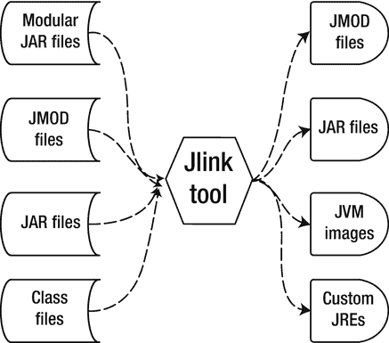
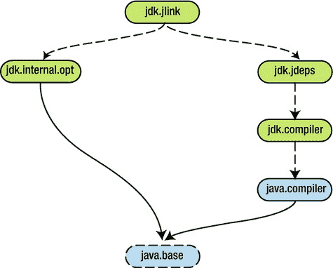

# 7. Jlink：Java 链接器

在整个软件开发过程中，我们可能会遇到需要针对当前操作系统定制 Java 运行时环境（JRE）的情况。其原因多种多样：可能是为了获得更好的性能，或者我们有一些仅能在特定操作系统上运行的自定义库。

例如，在使用微服务时，我们可能不希望使用整个 JDK，而只需要其中的一部分。微服务通常规模较小，不会使用整个 JDK 中的库。

Jlink 通过创建针对特定操作系统、仅包含所需模块的自定义 JRE 版本来帮助解决这些问题。

## Java 链接器

Java 9 引入了一个名为 Jlink 的新工具，用于动态链接模块。其作用是将一组模块组装起来，以创建运行时镜像。在组装过程中，可以跨模块边界应用不同的优化。以下章节将介绍执行此类优化的一些方法。

Jlink 从我们指定的模块开始，递归搜索这些模块描述文件中所有的 `requires` 语句。通过这种方式，Jlink 能够找到所有需要组装到新的自定义运行时镜像中的模块。

由 Jlink 工具创建的运行时镜像包含所需的最少模块及其依赖项。我们还可以指定要添加到运行时镜像中的模块。最终会生成一个特定于平台的可执行二进制文件。

Jlink 可以接受以下类型的文件作为输入：

*   模块化 JAR 文件
*   JMOD 文件
*   JAR 文件
*   类文件

Jlink 工具的输出可以是以下类型的文件：

*   JMOD 文件
*   JAR 文件
*   JVM 镜像
*   自定义 JRE

Jlink 工具可以在链接时生成这四种文件。Jlink 甚至可以创建自定义的 JVM 镜像。图 7-1 展示了 Jlink 工具接受的输入文件类型以及它可以创建的输出文件类型。



图 7-1.

Jlink 工具的输入和输出文件类型

Jlink 工具充当代码转换器，运行解析过程以计算创建运行时镜像所需的最小可能模块集。理论上，我们可以创建的最小运行时镜像是一个仅包含基础模块 `java.base` 的镜像。Jlink 是一个构建时使用的工具，可以进行交叉编译并利用跨模块优化，但它不能创建跨平台的可执行文件。

你可能会问 Jlink 如何知道我们的目标平台。它是根据我们尝试链接的平台模块类型来确定的。例如，如果我们在 Linux 操作系统上工作，并将模块路径传递给 Windows 发行版，Jlink 将链接这些模块的 Windows 版本，并创建一个 Windows 运行时镜像。

注意

使用 Jlink 时指定的模块路径必须是目标平台的模块。

使用 Jlink 无需在代码层面进行任何更改。Jlink 将模块组装到自定义运行时镜像中，并且完全不会修改 `module-info.class` 文件。

### Jlink 镜像

Jlink 镜像特定于每个操作系统。它们代表了对 JDK 和 JRE 的定制。我们可以将它们视为仅包含应用程序所需模块的 JRE 自定义运行时镜像。Jlink 会创建一个可用于运行 Java 应用程序的自定义目录。

一个 Jlink 镜像包含以下目录：

*   bin
*   conf
*   include
*   legal
*   lib
*   release

Jlink 还会链接包含指令 `requires static myModule` 的模块。在运行时，如果模块 `myModule` 位于模块路径上，则 `requires static` 子句将被满足。如果我们的应用程序仅使用 `java.base` 模块而不使用其他模块，那么我们的自定义运行时镜像将仅包含我们的应用程序模块加上 `java.base` 模块。

在本章后续创建自定义运行时镜像时，你将了解更多关于 Jlink 镜像和 Jlink 命令语法的内容。

### Jlink 命令语法

要使用 Jlink 创建自定义运行时镜像，需要将 `jlink` 命令与必要的选项一起使用。图 7-2 展示了此命令的语法及其最重要的选项。

*   `[jlink_options]` 指定一组用空格分隔的选项。你将在下一节中了解这些选项。
*   `--module-path` 选项指定 Jlink 工具应发现的模块的位置。这些模块可以是展开的模块、模块化 JAR 文件或 JMOD 文件。
*   `--add-modules` 选项指定要添加到运行时镜像中的模块名称。指定的模块及其传递依赖项将被添加到运行时镜像中。
*   `--output` 选项指定创建自定义运行时镜像的目录。


图 7-2.

jlink 命令的语法

如前所述，Jlink 工具接收模块路径以指示在哪里查找模块。它通过启动模块解析过程来查找模块，该过程会搜索每个模块的所有传递依赖项，直到到达底层模块 `java.base`。只要我们使用 `--add-modules` 命令行选项添加一个模块，Jlink 就会搜索其所有 `requires` 和 `requires static` 子句，并将所有相应的依赖模块添加到自定义运行时镜像中。

注意

如果我们拥有目标平台的 JMOD 文件，Jlink 工具允许进行交叉链接。


### Jlink 命令选项

Jlink 工具的功能并不仅限于上一节讨论的选项。根据官方 JDK 9 API 规范，它还支持许多其他选项，所有这些选项均列于表 7-1 中。

表 7-1. Jlink 命令的选项

| 选项名称 | 描述 |
| --- | --- |
| `--help` | 打印帮助信息。 |
| `--module-path <模块路径>` | 定义模块路径。 |
| `--limit-modules <模块名称列表>` | 将可观察模块组限制为指定模块的传递闭包中的模块。如果使用 `--add-modules` 选项指定了任何模块，即使这些模块不在 `--limit-modules` 列表中，它们也会被添加到可观察模块中。如果存在主模块，它也将被添加到可观察模块中。 |
| `--add-modules <模块名称>` | 指定需要解析的根模块。 |
| `--output <目录名称>` | 指定生成运行时映像的目录名称。 |
| `--launcher <命令名称>=<模块名称>` | 指定模块的启动器命令名称。 |
| `--launcher command=<模块名称>/main` | 指定模块的启动器命令名称以及 `main` 类。 |
| `--endian <little &#124; big>` | 定义正在生成的运行时映像的字节顺序。 |
| `--version` | 显示版本信息。 |
| `--save-opts <文件名>` | 将 Jlink 选项保存到指定文件中。 |
| `--strip-debug` | 剥离调试信息。 |
| `--no-man-pages` | 排除 `man` 手册页。 |
| `--no-header-files` | 排除头文件。 |
| `--disable-plugin <插件名称>` | 禁用插件。 |
| `--list-plugins` | 列出所有可通过命令行访问的 Jlink 插件。 |
| `--ignore-signing-information` | 当签名的模块化 JAR 文件链接到运行时映像时，忽略错误。 |
| `@<文件名>` | 从作为参数指定的文件中读取所有选项。 |
| `--bind-services` | 执行完整的服务绑定，并将服务提供者模块及其依赖项链接到运行时映像中。 |
| `--suggest-providers <服务名称列表>` | 帮助查找实现模块路径中服务类型的提供者。 |
| `--verbose` | 启用详细跟踪。 |

### 链接阶段

Java 9 引入了一个新的链接阶段。其作用是通过将一组模块及其传递依赖项组合在一起来生成运行时映像。OpenJDK 指出，“链接时是进行全局优化的机会，这些优化在编译时难以实现或在运行时成本高昂。”

链接是 Java 开发过程中新增的一个开发阶段。务必记住，链接阶段是可选的——如果你不想或不需要使用它，可以不使用。

在 Java 9 中，当我们拥有模块化应用程序时，可以使用链接。生成的映像与平台无关。链接器可以链接两个或多个目标——例如，如果你使用的是操作系统 A，只要你的模块路径拥有操作系统 B 的模块而不是操作系统 A 的模块，你就可以成功地为操作系统 B 生成目标映像。但无法将 WAR 文件链接在一起。

### jdk.jlink 模块

图 7-3 显示了包含 jdk.jlink 模块及其依赖项的模块图。



图 7-3. 内部模块 jdk.jlink 的模块图

jdk.jlink 模块在 tools 目录中包含不同的 Java 类。在 tools 目录下有一个 jimage 目录、一个 jlink 目录和一个 jmod 目录。jdk.jlink 模块依赖于 jdk.internal.opt 和 jdk.jdeps 模块，如其模块描述符（module-info.java 文件）中所述。jdk.jdeps 模块依赖于 jdk.compiler 模块，而 jdk.compiler 模块又依赖于 java.compiler 模块。最后，java.compiler 模块需要 java.logging 模块。

注意

jdk.jlink 模块并非设计供程序员使用。

图 7-3 显示了非标准 JDK 模块（jdk.jlink、jdk.internal.opt、jdk.jdeps 和 jdk.compiler）以及标准 JDK 模块（java.compiler、java.logging 和 java.base）。如第 3 章的模块图所示，实线表示隐含的可读性，虚线表示模块之间的简单可读性。

清单 7-1 显示了 jdk.jlink 模块的模块描述符。

```
module jdk.jlink {
requires jdk.internal.opt;
requires jdk.jdeps;
uses jdk.tools.jlink.plugin.Plugin;
provides java.util.spi.ToolProvider with
jdk.tools.jmod.Main.JmodToolProvider,
jdk.tools.jlink.internal.Main.JlinkToolProvider;
provides jdk.tools.jlink.plugin.Plugin with
jdk.tools.jlink.internal.plugins.StripDebugPlugin,
jdk.tools.jlink.internal.plugins.ExcludePlugin,
jdk.tools.jlink.internal.plugins.ExcludeFilesPlugin,
jdk.tools.jlink.internal.plugins.ExcludeJmodSectionPlugin,
jdk.tools.jlink.internal.plugins.LegalNoticeFilePlugin,
jdk.tools.jlink.internal.plugins.SystemModulesPlugin,
jdk.tools.jlink.internal.plugins.StripNativeCommandsPlugin,
jdk.tools.jlink.internal.plugins.OrderResourcesPlugin,
jdk.tools.jlink.internal.plugins.DefaultCompressPlugin,
jdk.tools.jlink.internal.plugins.ExcludeVMPlugin,
jdk.tools.jlink.internal.plugins.IncludeLocalesPlugin,
jdk.tools.jlink.internal.plugins.GenerateJLIClassesPlugin,
jdk.tools.jlink.internal.plugins.ReleaseInfoPlugin,
jdk.tools.jlink.internal.plugins.ClassForNamePlugin;
}
清单 7-1. jdk.jlink 模块的模块描述符
```

你可以在此模块描述符中看到 Jlink 工具拥有的所有插件的完整列表。


## 示例：使用 Jlink 创建运行时镜像

本节展示了一个创建自定义运行时镜像的示例。我们的小型应用会将一条文本消息保存到文件中，然后再保存到数据库中。

我们定义了四个模块，并再次使用了 `ServiceLoader` API，如同第 6 章所述。为什么再次使用 `ServiceLoader` API？因为，我们想强调这一点，Jlink 默认不提供服务绑定。这意味着，默认情况下，Jlink 不会将通过 `uses` 和 `provides` 子句观察到的模块添加到运行时镜像中。它只会添加通过 `requires` 子句指定的模块。然而，JCP 团队为 Jlink 工具增加了一个名为 `--bind-services` 的选项，该选项可以执行服务绑定，并将服务提供者模块及其依赖项链接进来。

清单 7-2 展示了模块 `com.apress.service` 的接口 `DatabasePersistenceService` 和 `FilePersistenceService`。

```
// DatabasePersistenceService.java
package com.apress.service.interfaces;
public interface DatabasePersistenceService {
void saveMessageIntoDatabase(String message);
}
// FilePersistenceService.java
package com.apress.service.interfaces;
public interface FilePersistenceService {
void saveMessageIntoFile(String message);
}
清单 7-2.
模块 com.apress.service 的接口 DatabasePersistenceService 和 FilePersistenceService
```

这些接口分别包含了将消息保存到数据库和将消息保存到文件的方法定义。

清单 7-3 展示了模块 `com.apress.service` 的模块描述符，它简单地导出了包 `com.apress.service.interfaces`。

```
module com.apress.service {
exports com.apress.service.interfaces;
}
清单 7-3.
模块 com.apress.service 的模块描述符
```

清单 7-4 展示了模块 `com.apress.databasepersistence` 的类 `DatabasePersistenceProvider`。

```
package com.apress.databasepersistence;
import com.apress.service.interfaces.*;
import java.sql.*;
public class DatabasePersistenceProvider implements DatabasePersistenceService {
private Connection connection;
private static final String JDBC_URL = "jdbc:postgresql://localhost/myDatabase";
public void saveMessageIntoDatabase(String message) {
String insertSql = "INSERT INTO MESSAGES(CONTENT) VALUES(" + message + ")";
try {
connection = DriverManager.getConnection(JDBC_URL, "root", "password");
Statement statement = connection.createStatement();
int result = statement.executeUpdate(insertSql);
if (result > 0) {
System.out.println("消息已成功保存到数据库");
} else {
System.out.println("消息无法保存到数据库");
}
} catch (SQLException sqlException) {
sqlException.printStackTrace();
}
}
}
清单 7-4.
模块 com.apress.databasepersistence 的类 DatabasePersistenceProvider
```

这个类是一个服务提供者，它实现了接口 `DatabasePersistenceService` 中的方法 `saveMessageIntoDatabase()`。它还导入了包 `java.sql`。该类的作用是使用 JDBC 将一个字符串存储到数据库中。

清单 7-5 展示了模块 `com.apress.databasepersistence` 的模块描述符。

```
module com.apress.databasepersistence {
requires com.apress.service;
requires java.sql;
provides com.apress.service.interfaces.DatabasePersistenceService with com.apress.databasepersistence.DatabasePersistenceProvider;
}
清单 7-5.
模块 com.apress.databasepersistence 的模块描述符
```

该模块需要 `com.apress.service` 模块，因为它使用了该模块的接口。它还需要 `java.sql` 模块，因为它使用了该模块中的类型。此外，它声明使用 `DatabasePersistenceProvider` 类来提供 `DatabasePersistenceService` 接口的实现。

清单 7-6 展示了模块 `com.apress.filepersistence` 的类 `FilePersistenceProvider`。

```
package com.apress.filepersistence;
import com.apress.service.interfaces.*;
import java.io.*;
public class FilePersistenceProvider implements FilePersistenceService {
private static final String FILENAME = "C:\\Java9\\example.txt";
// 对于 Linux
// private static final String FILENAME = "Java9/example.txt";
private BufferedWriter bufferedWriter = null;
private FileWriter fileWriter = null;
public void saveMessageIntoFile(String message) {
try {
fileWriter = new FileWriter(FILENAME);
bufferedWriter = new BufferedWriter(fileWriter);
bufferedWriter.write(message);
}
catch (IOException e) {
e.printStackTrace();
}
finally {
try {
if (bufferedWriter != null)
bufferedWriter.close();
if (fileWriter != null)
fileWriter.close();
} catch (IOException ex) {
ex.printStackTrace();
}
}
}
}
清单 7-6.
模块 com.apress.filepersistence 的类 FilePersistenceProvider
```

这个类是一个服务提供者，它实现了接口 `FilePersistenceService` 中的方法 `saveMessageIntoFile()`。该类的作用是使用 Java I/O 将一个字符串保存到文件中。

清单 7-7 展示了模块 `com.apress.filepersistence` 的模块描述符。

```
module com.apress.filepersistence {
requires com.apress.service;
provides com.apress.service.interfaces.FilePersistenceService with com.apress.filepersistence.FilePersistenceProvider;
}
清单 7-7.
模块 com.apress.filepersistence 的模块描述符
```

该模块需要 `com.apress.service` 模块，并声明使用 `FilePersistenceProvider` 类来提供 `FilePersistenceService` 接口的实现。

清单 7-8 展示了位于模块 `com.apress.application` 中的 `Main` 类。

```
package com.apress.application;
import com.apress.service.interfaces.*;
import java.util.ServiceLoader;
public class Main {
public static void main(String[] args) {
FilePersistenceService filePersistenceService = ServiceLoader.load(FilePersistenceService.class).iterator().next();
filePersistenceService.saveMessageIntoFile("第一条消息已保存到文件");
DatabasePersistenceService databasePersistenceService = ServiceLoader.load(DatabasePersistenceService.class).iterator().next();
databasePersistenceService.saveMessageIntoDatabase("第二条消息已保存到数据库");
}
}
清单 7-8.
模块 com.apress.application 的 Main 类
```

这个类使用 `ServiceLoader` API 来加载接口 `FilePersistenceService` 和 `DatabasePersistenceService`。然后，它调用这些接口上的相应方法。结果，消息被保存到文本文件中，并分别保存到数据库中。

清单 7-9 展示了模块 `com.apress.application` 的模块描述符。

```
module com.apress.application {
requires com.apress.service;
uses com.apress.service.interfaces.FilePersistenceService;
uses com.apress.service.interfaces.DatabasePersistenceService;
}
清单 7-9.
模块 com.apress.application 的模块描述符
```

我们注意到 `com.apress.application` 是我们的主模块。我们使用 `javac` 命令编译所有 Java 类：

```
javac -d output --module-source-path src $(find . -name "*.java")
```

结果，`output` 目录将包含我们四个模块的所有已编译类。接着，我们使用 Jlink 工具通过运行以下命令（在我们的例子中，是在 Windows 操作系统上）来创建一个自定义运行时镜像：

```
jlink --module-path "output;$JAVA_HOME/jmods" --add-modules com.apress.application --output runtimeImage
```


我们指定了两个目录，用分号分隔，作为模块路径。输出目录包含我们所有模块的类文件。`JAVA_HOME` 是一个环境变量，指向当前安装的 Java 9。在 `JAVA_HOME` 内部是 JMODS 目录，其中包含 JDK 的模块。请记住，我们必须显式地将模块路径指向我们打算为其生成运行时镜像的 JDK。

使用 `--add-modules` 选项，我们指定主模块的名称。最后，输出选项指示将创建新的自定义运行时镜像的目录。

Jlink 工具首先分析模块 `com.apress.application` 的模块描述符文件，然后递归添加运行时镜像中所需的任何模块。`runtimeImage` 目录现在包含我们刚刚创建的运行时。我们可以通过在 `runtimeImage` 目录内运行 `java --list-modules` 命令来查看运行时镜像包含哪些模块：

```
./bin/java --list-modules
```

结果是：

```
com.apress.application
com.apress.service
java.base
```

我们的运行时镜像包含这三个模块。`java.base` 模块是始终自动添加到我们运行时镜像中的唯一平台模块。此外，我们的运行时镜像中还有另外两个应用程序模块：`com.apress.application`（我们使用 `--add-options` 选项指定的根模块）和 `com.apress.service` 模块。`com.apress.application` 模块在其模块描述符中需要 `com.apress.service` 模块。因此，我们的运行时镜像中包含了 `com.apress.service` 模块。

注意

模块 `com.apress.databasepersistence` 和 `com.apress.filepersistence` 不存在于我们新创建的运行时镜像中，即使它们之前已在输出目录中成功编译。此外，`java.sql` 模块也应该存在于运行时镜像中，因为模块 `com.apress.databasepersistence` 需要它。这些模块不在运行时镜像中的原因是 Jlink 工具默认不执行服务绑定。该工具通过搜索模块描述符中的 `requires` 子句来识别必要的模块。它也不会搜索 `uses` 或 `provides` 子句。在我们的模块 `com.apress.application` 中，我们不需要模块 `com.apress.databasepersistence` 和 `com.apress.filepersistence`。因此，它们不会被添加到运行时镜像中。

要解决这个问题，有两种方法。第一种也是最简单的方法：使用添加到 `jlink` 命令中的新 `--bind-services` 选项。此选项会执行完整的服务绑定。因此，它会搜索所有 `uses` 子句，然后对于 `uses` 子句指定的所有服务，它会将所有服务提供者模块添加到运行时镜像中。我们可以这样使用它：

```
jlink --module-path "output;$JAVA_HOME/jmods" --bind-services
--add-modules com.apress.application
--output runtimeImage
```

将它们添加到运行时镜像的第二种方法是在 `--add-modules` 命令行选项中指定它们，但这是一种在引入 `--bind-services` 选项之前主要使用的变通方法。使用带有 `--add-modules` 选项的变通方法肯定比使用 `--bind-services` 选项成本更高。因此，我们在这里讨论第二种方法。我们删除运行时镜像，并为我们想要添加到运行时镜像中的每个服务提供者模块补充添加显式的 `--add-modules` 标志：

```
jlink --module-path "output;$JAVA_HOME/jmods"
--add-modules com.apress.application
--add-modules com.apress.databasepersistence
--add-modules com.apress.filepersistence
--output runtimeImage
```

如果我们忘记在模块路径中提及 JMODS 目录，则会抛出错误：

```
Error: module java.sql not found, required by com.apress.databasepersistence
```

此错误表明，模块 `java.sql`（模块 `com.apress.databasepersistence` 需要它）在模块路径上未找到，因为我们没有在模块路径中包含它的位置，即 JMODS 目录。

我们显式指定了希望将模块 `com.apress.databaspersistence` 和 `com.apress.filepersistence` 添加到运行时镜像中，紧邻主模块 `com.apress.application`。如果我们在 `runtimeImage` 目录内运行 `--list-modules` 命令，会得到以下结果：

```
./bin/java --list-modules
com.apress.application
com.apress.databasepersistence
com.apress.filepersistence
com.apress.service
java.base
java.logging
java.sql
java.xml
```

请注意，新的运行时镜像不仅包含我们使用 `--add-modules` 标志指定的两个服务提供者模块，还包含三个新模块：`java.logging`、`java.sql` 和 `java.xml`。原因是模块 `com.apress.databasepersistence` 需要 `java.sql`，因此该模块也被添加到运行时镜像中。但模块 `java.sql` 也需要模块 `java.logging` 和模块 `java.xml`。因此，为了满足所有依赖关系，这两个模块也被添加到运行时镜像中。

我们的运行时镜像具有类似于 JRE 的结构。新创建的 `runtimeImage` 目录具有以下结构：

```
-bin (目录)
-conf (目录)
-include (目录)
-legal (目录)
-lib (目录)
-release (文件)
```

`bin` 目录包含以下内容：

```
-server (目录) => 包含一个 jvm.dll 文件
-java.dll (文件)
-java.exe (文件)
-javaw.exe (文件)
-jimage.dll (文件)
-jli.dll (文件)
-keytool.exe (文件)
-msvcp120.dll
-msvcr120.dll
-net.dll
-nio.dll
-verify.dll
-zip.dll
```

`conf` 目录具有以下结构：

```
-net.properties (文件)
-security (文件夹)    => -policy (文件夹)
-java.policy (文件)
-java.security (文件)
-net.properties (文件)
```

`include` 目录具有以下结构：

```
-win32 (文件夹) => -jni_md.h
-classfile_constants.h
-jni.h
-jvtmi.h
-jvmticmlr.h
```

`legal` 目录包含以下内容：

```
-java.base (文件夹) => aes.md, asm.md, cldr.md, icu.md, zlib.md
-java.logging => COPYRIGHT
-java.sql => COPYRIGHT
-java.xml => bcel.md, COPYRIGHT, dom.md, jcup.md, xalan.md, xerces.md, xmlresolver.md
```

`lib` 目录包含以下内容：

```
-security (文件夹) => blacklist, blacklisted.certs, cacerts, default.policy, trusted.libraries
-server (文件夹) => Xusage.txt
-classlist (文件)
-jrt-js.jar
-jvm.cfg
-jvm.lib
-modules (文件)
-tzdb.dat
-tzmappings (文件)
```

注意

我们在使用 Jlink 创建此运行时镜像时，使用的操作系统是 Windows 7 专业版。这就是自定义运行时镜像特定于 Windows 操作系统的原因。

Jlink 默认不执行服务绑定。这意味着我们有两个不同的选项：

*   使用 `--bind-services` 选项，以便显式发现服务提供者模块并将其添加到运行时镜像中
*   在 `--add-modules` 选项中定义我们想要添加的每个服务提供者模块

接下来，我们检查新生成的运行时镜像的大小：

```
$ du -hs
48M
```

我们整个运行时镜像的大小为 48 MB，远小于整个 JDK 的大小。

我们删除运行时镜像，并使用压缩生成一个新的运行时镜像以减小其大小：

```
jlink --module-path "output;$JAVA_HOME/jmods"
--add-modules com.apress.application
--add-modules com.apress.databasepersistence
--add-modules com.apress.filepersistence
--compress=2
--output runtimeImage
```

我们使用了 2 级压缩。你将在本章后面讨论压缩插件时了解更多相关信息。新的运行时镜像总大小为 29 MB。得益于压缩，我们成功将运行时镜像的大小减少了 40% 以上。建议使用压缩来创建更紧凑的运行时镜像，尤其是在我们需要将其安装到小型设备上时。


我们可以通过使用 `--strip-debug` 标志进一步减小运行时镜像的大小，该标志会从镜像中剥离调试信息。在我们的示例中，利用 `--strip-debug` 选项后，运行时镜像的新大小将从 29 MB 变为 26 MB。

注意

如果我们使用 Windows 操作系统，则必须使用分隔符 `:` 而不是 `;` 来表示模块路径。

### 运行运行时镜像

要运行镜像，我们使用运行时镜像内的 Java 启动器：

```
$ ./bin/java -m com.apress.application/com.apress.application.Main
```

我们指向运行时镜像内的 `bin` 文件夹，并使用 `-m` 选项调用 Java 启动器，该选项包含模块名称以及 `Main` 类的名称。我们指定要运行模块 `com.apress.application` 中的 `Main` 类。

请注意，运行时镜像内有一个针对特定平台（在我们的示例中是 Windows）的可执行文件。

### 作为 Jlink 工具输入的模块化 JAR 文件

我们在本章开头提到，Jlink 工具可以接受以下文件格式作为输入：模块化 JAR 文件、JAR 文件、类文件和 JMOD 文件。

到目前为止，我们已将类文件和 JMOD 文件放在模块路径上。在此示例中，我们将使用模块化 JAR 文件而不是展开的类文件。首先，我们删除现有的运行时镜像，因为我们将使用模块化 JAR 文件和 JMOD 文件创建一个新的镜像。对于每个模块，我们使用以下模式在输出目录中创建模块化 JAR 文件：

```
$ jar --create --file output/com.apress.application.jar --main-class com.apress.application.Main -C output/com.apress.application.
```

在输出目录中创建所有四个模块化 JAR 文件后，我们删除该目录中的所有类文件。此外，我们运行与之前完全相同的 `jlink` 命令，以创建一个自定义运行时镜像。

从模块化 JAR 文件新创建的运行时镜像与之前从展开的类文件创建的运行时镜像相同。

### 生成的运行时镜像的结构

我们之前创建的运行时镜像是一个更小型的 Java 实现，专为使我们的代码能够成功运行而设计。除了运行所需的最小库之外，它不包含任何其他内容。上一节讨论了生成的运行时镜像的内容。本节重点介绍运行时镜像每个文件夹的详细信息。

在 `bin` 目录中有三个 Java 启动器。`keytool` 用于管理证书和其他与安全相关的内容。`java` 是我们已经熟悉的启动器。

*   在 `lib` 目录中，包含所有类和资源，并且没有 `rt.jar` 文件。
*   `conf` 目录包含用户配置。此目录中的所有文件都可以由用户编辑。
*   `legal` 目录包含来自 Oracle 的版权信息。其中有每个模块的许可证文件。当使用 Jlink 创建我们自己的运行时镜像时，版权信息来自打包的模块。

为了查找运行时镜像中包含的所有模块，我们可以在镜像内运行 `java --list-modules`，如前面的示例中反复所示。

### 不支持链接自动模块

Project Jigsaw 不支持链接自动模块。尝试在运行时镜像中添加一个不包含 `module-info.class` 文件的模块将导致错误。

在我们的下一个示例中，我们下载并将 `guava.jar` 添加到输出目录中。然后，我们尝试通过额外指定 Guava JAR 文件来创建运行时镜像：

```
--add-modules guava
```

因为 `guava.jar` 是一个简单的 JAR 文件，而不是模块化 JAR 文件，因此它内部不包含 `module-info.class`，所以会引发以下错误：

```
Error: module-info.class not found for guava module
```

Jlink 中不添加自动模块支持是有充分理由的。正如我们所知，自动模块可以访问类路径。因此，如果自定义运行时镜像中也包含自动模块，则无法保证由 Jlink 创建的该镜像能正常工作。因为自动模块用于执行迁移，它们可能引用了类路径上的类型。例如，如果一个自动模块被链接到自定义运行时镜像中，除非它与类路径一起使用，否则最终可能导致错误的引用。

要使自动模块在 Jlink 中工作，我们应该向每个现有的 JAR 文件添加 `module-info.class` 文件。为此，我们可以使用带有 `--generate-module-info` 选项的 JDeps 工具。

注意

你可以在目录 `/ch07/jlink` 中找到此示例的源代码。

到目前为止，我们已经了解了如何创建运行时镜像并查看了其结构。Jlink 工具有几个有用的插件可供使用。下一节将讨论其中的三个。

## Jlink 插件

Jlink 工具是基于插件的。Open JDK 指出：“Jlink 将类、本地库和配置文件收集到一组资源中。这些资源通过一个由插件定义的转换器管道进行馈送。”

Jlink 包含几个重要的插件，开发人员可以对其进行扩展。例如，我们可以开发自己的 Jlink 插件来优化运行时镜像。表 7-2 根据官方 JDK 9 API 规范列出了现有的 Jlink 插件。

表 7-2.

Jlink 插件

| 插件 | 描述 |
| --- | --- |
| `--class-for-name` | 通过将 `Class.forName()` 调用转换为常量加载来优化类。 |
| `--compress` `=<0 &#124; 1 &#124; 2> [: filter=pattern-list]` | 启用资源的压缩。 |
| `--strip-debug` | 从输出镜像中剥离调试信息。 |
| `--strip-native-commands` | 从镜像中排除本地命令。 |
| `--vm={client &#124; server &#124; minimal &#124; all}` | 在输出镜像中选择 HotSpot VM。默认值为 `all`。 |
| `--generate-jli-classes=@filename` | 获取一个文件，提示 Jlink 要预生成哪些 `java.lang.invoke` 类。如果你不指定此标志，Jlink 会生成一组默认的类。 |
| `--include-locales` `=langtag[,langtag]*` | 包含语言环境列表。 |
| `--dedup-legal-notices` `=[error_if_not_same_content]` | 对所有法律声明进行去重。 |
| `--exclude-files` `=[pattern_list]` | 指定要排除的文件。 |
| `--exclude-jmod-section` | 指定要排除的 JMOD 部分。 |
| `--exclude-resources` | 指定要排除的资源。 |
| `--order-resources` | 指定一个文件，列出要预生成的 `java.lang.invoke` 类。 |
| `--release-info` `=<file> &#124; add:<key1>=<value1> &#124; del:<key list>` | 从提供的文件加载发布属性。`add` 用于向发布文件添加属性。`del` 用于删除发布文件中的键列表。 |
| `--system-modules` | 表示模块描述符的快速加载。它始终处于启用状态。 |

接下来的几个小节将介绍三个 Jlink 插件：compress、release-info 和 exclude-files 插件。


### compress 插件

compress 插件的作用是压缩输出镜像中的所有资源。该插件的语法很简单：

```
--compress=
```

总共有三个压缩级别：

*   级别 0：常量字符串共享
*   级别 1：ZIP 压缩
*   级别 2：同时进行常量字符串共享和镜像类的 ZIP 压缩

级别 0 会扫描镜像类的常量池。级别 1 对镜像类执行 ZIP 压缩。级别 2 则包含级别 0 和级别 1 的功能。

本章前面部分我们解释了如何创建运行时镜像。在表 7-3 中，你可以看到使用不同压缩级别时，运行时镜像大小的对比。

表 7-3.

使用不同压缩级别时运行时镜像的大小

| 压缩级别 | 运行时镜像大小 |
| --- | --- |
| 无压缩 | 48 MB |
| 级别 0 | 48 MB |
| 级别 1 | 38 MB |
| 级别 2 | 29 MB |

如你所见，级别 2 的压缩效果最好。如果我们指定的压缩级别不是 0、1 或 2，则在创建运行时镜像时会抛出错误。

### release-info 插件

release-info 插件会打印关于镜像的有用信息。在本例中，我们想查看运行时镜像的“release”文件包含什么内容：

```
runtimeImage>cat release
OS_NAME="Windows"
MODULES="java.base com.apress.service com.apress.application java.logging comapress.filepersistence java.xml java.sql com.apress.databasepersistence"
OS_VERSION="5.2"
OS_ARCH="amd64"
JAVA_VERSION="9"
JAVA_FULL_VERSION="9-ea"
```

release 文件包含不同的属性。`MODULES` 属性指定了镜像中存在的所有模块。我们可以使用以下命令在 release 文件中添加新属性：

```
--release-info add:=
```

也可以通过指定要删除的键列表，从 release 文件中删除属性文件：

```
--release-info del:
```

在下面的示例中，我们通过在 release 文件中添加一个名为 `date` 的键来构建运行时镜像：

```
jlink --release-info add:date=17.07.2017 ............
```

现在，release 文件包含了我们新添加的键：

```
$ cat release
date=19.03.2017
...
```

### excludes-files 插件

excludes-files 插件允许我们从运行时镜像中排除文件。它接收一个模式作为参数。

现在我们想从运行时镜像中排除所有 *.diz 文件。*.diz 文件是压缩的调试信息文件。由于我们的镜像被这些调试文件撑大，删除它们是值得的：

```
--exclude-files *.diz
```

结果，我们的运行时镜像不再包含任何 *.diz 文件，因为我们已将它们排除。

## 总结

Jlink 最初是一个用于生成运行时镜像的命令行工具，但后来成为了一个标准。当我们打算创建一个有针对性的可执行文件时，Jlink 非常有用且特别合适。

本章解释了 Jlink 是什么，描述了新引入的链接阶段，并介绍了 Jlink 命令的语法及其选项。它描述了 jdk.jlink 模块，并查看了其模块描述符的内部。之后，它展示了一个清晰的示例，说明如何创建一个包含四个应用程序模块和四个 JDK 模块的自定义运行时镜像。为此，我们使用了 ServiceLoader API。我们还了解了如何运行运行时镜像，以及如何使用模块化 JAR 文件（而非类文件）作为输入来创建运行时镜像。

接下来，我们讨论了生成的运行时镜像的结构，并解释了 Jlink 不支持自动模块的原因。下一节涵盖了现有的 Jlink 插件，并展示了使用 compress、release-info 和 excludes-file 插件的实际示例。我们了解了如何压缩和剥离运行时镜像的调试信息以减小其大小。

我们成功创建了一个更小、更紧凑、更定制化的运行时镜像，可以分发或运行。我们了解到，如果利用 Jlink 提供的优势，我们无需安装整个 JDK，因为 Jlink 创建的目标二进制文件比 JDK 更小。

下一章将讨论一个非常复杂且重要的主题：迁移。

