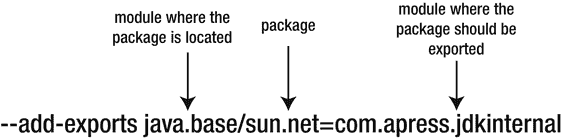
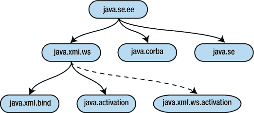
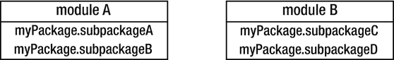

# 8. 迁移

本章涵盖了用于简化向 JDK 9 迁移的关键概念和工具。它讨论了将现有 Java 应用程序迁移到 JDK 9 时可能出现的常见问题，并提出了解决迁移问题的方案和技巧。

首先，为什么我们需要迁移？答案显而易见：如果不迁移到 JDK 9，我们就无法使用 Jigsaw 引入的强大功能，也无法使用其他 JEP 在 Java 9 中引入的功能，例如：

*   Java Shell
*   Process API 的更新
*   HTTP 2 客户端
*   Stack-Walking API
*   Platform Logging API
*   多版本 JAR 文件

回顾 Java 的历史，每当发布新版本的 Java SE 时，总会有一些变化导致与旧版本 Java 不兼容。Oracle 的最高目标始终是尽可能提供向后兼容性。因此，JDK 的模块化是一个颠覆性的变化，无法保证 100% 的向后兼容性。Oracle 努力提供最高程度的向后兼容性，但一些破坏性变更可能会影响向后兼容性。这完全取决于我们的代码是如何构建的。在开始讨论任何兼容性问题之前，我们必须概述两个非常重要的事情：

*   使用 JDK 内部 API 的代码可能无法在 JDK 9 中运行。可能需要进行一些更改。
*   仅使用官方 Java SE 平台 API 和支持的 JDK 特定 API 的代码可以在 JDK 9 中运行，无需任何更改。

在决定迁移到 Java 9 时，了解我们想要达到的目标很重要：

*   我们希望现有的 Java 应用程序能在 JDK 9 上运行，但不想在代码中定义任何模块。
*   我们只想将应用程序的一部分模块化，而保持另一部分非模块化。
*   我们希望将整个应用程序模块化。

我们将详细解释每种情况。对于每种情况，假设我们有一个用 Java 8 或更低版本编写的 Java 应用程序，并且我们希望使用 Java 9 编译和运行它。

第一种情况仅涉及确保我们的应用程序能在 Java 9 上运行，而不创建任何模块。这意味着我们停留在类路径上，完全不使用新引入的模块路径。首先，将 `JAVA_HOME` 环境变量设置为指向 JDK 9 安装目录，然后在不对代码进行任何更改的情况下编译和运行我们的应用程序。如果我们的应用程序没有使用 JDK 内部 API，它很可能可以在 Java 9 上运行。大多数 JDK 内部 API 在 Java 9 中已被封装，因此无法访问。少数来自 jdk.unsupported 模块的 JDK 内部 API 仍然可以访问，但其他所有 API 都无法访问。当我们谈论 JDK 内部 API 时，我们指的是应用程序代码和库代码。即使我们的应用程序没有使用 JDK 内部 API，如果我们在应用程序中使用的某个库使用了 JDK 内部 API，那么我们的应用程序仍然会出问题。尽管如此，JDK 9 中还有一些变化最终可能会破坏我们的应用程序，例如新的版本控制方案或 JDK 和 JRE 的新结构。这些变化将在本章中详细讨论。仅依赖类路径的最大缺点是，我们无法使用 JDK 9 带来的两个最重要的特性：可靠的配置和强封装。这意味着，例如，我们无法声明对其他模块的依赖，无法隐藏应用程序部分内容的内部细节，也无法创建自定义运行时镜像。


第二种情况是仅将应用程序的一部分模块化，而保持另一部分非模块化。这意味着我们将模块路径与类路径结合使用：包含模块的代码部分位于模块路径上，而非模块化的代码部分位于类路径上。一个主要问题是，默认情况下，模块路径上的代码无法访问类路径中的类型！幸运的是，至少有两种解决方案。一种解决方案是获取类路径中的代码，并将其转换为自动模块。这对于那些可能尚未由其维护者进行模块化的第三方 JAR 文件尤其有用。另一种解决方案是使用一个名为 `--add-exports` 的新命令行选项，该选项可以导出我们的包，以便其他模块或类路径能够访问它们。

第三种情况是彻底将我们的应用程序模块化。因此，类路径将不再被使用。所有代码仅位于模块路径上。每一段代码都包含在一个由模块描述符定义的模块中。没有任何代码片段位于模块之外。这种方法带来了许多优势，因为我们可以使用 Java 平台模块系统提供的所有特性，包括强封装、可靠配置、改进的安全性、可维护性、可重用性、可扩展性等等。我们建议遵循这种方法，并将整个应用程序模块化。

注意

类路径在 Java 9 中并未被移除。它仍然可以单独使用，或与模块路径结合使用。

在 Java 9 中，与前面讨论的三种用例相对应，我们可能遇到三种情况：

*   仅使用类路径：不使用模块路径。对应于前面提到的第一种用例。
*   同时使用类路径和模块路径：对应于前面提到的第二种用例。
*   仅使用模块路径：不使用类路径。对应于前面提到的第三种用例。

为了能够将应用程序迁移到 Java 9，我们将开始学习一些关键概念。本章涵盖了许多主题，因为迁移主题相当全面。我们介绍你需要了解的关键概念。让我们从介绍自动模块这一新概念开始，它是迁移到 Java 9 生态系统中的一个非常重要的组成部分。

## 自动模块

自动模块是一种特殊类型的模块，用于简化向 Java 9 的迁移并实现向后兼容性。自动模块是在将 JAR 文件放置到模块路径上后创建的一个命名模块。自动模块并非由 Java 平台模块系统或我们直接声明——它是为我们放置在模块路径上的 JAR 文件自动生成的。

自动模块在模块化领域带来了巨大的好处。它们允许我们开始模块化自己的代码，而无需等待所有需要的库和框架都完成模块化。如果必须等到每个第三方库或框架的维护者都完成其工作的模块化，那将是非常糟糕的。

自动模块是通过派生一个 JAR 文件，在不修改其内容的情况下对其进行模块化而创建的。通过这种方式，每个 JAR 文件都可以像模块一样被对待。自动模块帮助我们使用模块，而不是使用非模块化的 JAR 文件。它们为每个 JAR 文件架起了一座通往模块化世界的桥梁。

自动模块至少具有五个重要特性：

*   它传递性地依赖系统中所有现有的模块，这包括我们所有的自有模块、JDK 镜像中的所有模块以及所有其他自动模块。
*   它导出并开放其所有包。
*   其顶层目录中不包含 `module-info.class` 文件。
*   它可以访问未命名模块（来自类路径）中的任何类型。
*   它不能声明对任何其他模块有任何依赖关系。

我们之前提到，自动模块会导出并开放其所有包。这意味着以下几点：

*   自动模块中的所有包都被导出，以便在编译时和运行时都能被访问。
*   自动模块中的所有包都是开放的，以便通过深度反射进行访问。

注意

自动模块并非由我们显式声明，因为当 JAR 文件被放置到模块路径上时，它会自动创建。

自动模块可以访问类路径上的类型，并且对第三方代码尤其有用。自动模块用于将现有应用程序迁移到 Java 9。假设我们的应用程序使用了 Log4j 库。如果我们将 Log4j JAR 文件放在模块路径上，我们可以通过在应用程序的模块描述符中依赖它来在我们的模块中使用它：

```
module com.apress.myModule {
requires log4j;
}
```

通过这种方式，Log4j JAR 被转换为自动模块，并可以在我们的模块化应用程序中使用。我们可以访问 Log4j 模块中的所有包，因为作为自动模块，它默认会导出其所有包。

我们不必等待 Log4j 库的维护者完成其库的模块化，因为我们可以将 Log4j 库转换为自动模块并在模块路径上使用它（即使在撰写本书时，Apache 提交者已经辛勤工作并已经将 Log4j 模块化了）。

使用自动模块时，我们唯一需要知道的是将要生成的自动模块的名称。为此，Jigsaw 使用了一种基于文件名的算法，我们稍后会介绍。

如果你运行前面的代码并看到一些警告，请不要担心。这些警告是 JDK 团队特意在运行时添加的，目的是让用户意识到他们正在使用自动模块。

自动模块传递性地依赖所有现有的模块。如果我们依赖一个自动模块，那么我们就获得了对所有模块的可读性，因为自动模块传递性地依赖所有模块。不鼓励在公共仓库（如 Maven Central）上发布依赖自动模块的模块。这是因为自动模块的某些属性（例如其导出的包）在以后转换为显式模块时可能会发生变化。这使得自动模块不稳定，并显著增加了风险级别。

自动模块的名称由 Java 平台模块系统自动生成，除非我们在 `MANIFEST.MF` 文件中显式设置。自动模块的名称可以直接在 JAR 文件 `META-INF` 目录下的 `MANIFEST.MF` 文件中定义。在 `MANIFEST.MF` 中，我们需要为 `Automatic-Module-Name` 属性设置一个值，以定义将要生成的自动模块的名称：

```
Automatic-Module-Name: myModule
```

这种解决方案为我们提供了选择自动模块名称的优势和灵活性。或者，如果我们不设置自动模块名称，Jigsaw 将使用一种算法从 JAR 文件的名称中推导出自动模块的名称，接下来将对此进行介绍。


### 计算自动模块的名称

如果未设置 `Automatic-Module-Name` 属性，则自动模块的名称会根据 JAR 文件的名称自动派生。如果设置了 `Automatic-Module-Name` 属性，但 JAR 文件也包含 `module-info.class` 文件，那么 `Automatic-Module-Name` 属性中存储的信息将被直接忽略。自动模块的名称将与 `module-info.class` 文件中定义的名称相同。

接下来，我们来讨论 Jigsaw 用于根据 JAR 文件名计算自动模块名称的基于文件名的算法。从 JAR 文件中会派生出两个字符串：自动模块的名称及其版本：

1.  从 JAR 文件名中移除 `.jar` 后缀。得到的字符串将用于进一步确定和提取自动模块的名称和版本。
2.  提取模块名称。根据 JDK 9 API 文档，“如果名称与正则表达式 `-(\\d+(\\.|$))` 匹配，则模块名称将从第一次出现连字符之前的子序列中派生。连字符之后的子序列将被解析为版本，如果无法解析为版本，则会被忽略。”
3.  对模块名称执行一些替换。JDK 9 API 文档指出，“模块名称中的所有非字母数字字符（`[^A-Za-z0-9]`）都将替换为点号（‘.’），所有重复的点号将替换为一个点号，并且所有前导和尾随的点号都将被移除。”

表 8-1 展示了一些从几个 JAR 文件中派生名称和版本的示例。第一列代表 JAR 文件的名称，第二列和第三列分别代表自动提取的模块名称和版本。第四列告诉我们是否发生了错误。

表 8-1.

从 JAR 文件派生模块名称和版本的示例

| JAR 名称 | 模块名称 | 模块版本 | 错误 |
| --- | --- | --- | --- |
| guava-19.0.jar | guava | 19.0 | 否 |
| hadoop-common-2.8.0.jar | hadoop.common | 2.8.0 | 否 |
| mockito-all-2.0.2-beta.jar | mockito.all | 2.0.2-beta | 否 |
| spark-core_2.10-2.1.0.jar | - | - | 是 |
| spring-core-4.3.7.RELEASE.jar | spring.core | 4.3.7.RELEASE | 否 |
| com.apress.myModule0.0.1.jar | - | - | 是 |
| log4j-1.2.17.redhat-2.jar | log4j | 1.2.17.redhat-2 | 否 |
| jackson-core-2.9.0.pr3.jar | jackson.core | 2.9.0.pr3 | 否 |
| jaxrs-api-3.0.12.Final.jar | jaxrs.api | 3.0.12.Final | 否 |
| maven-plugin-api-3.5.0-beta-1.jar | maven.plugin.api | 3.5.0-beta-1 | 否 |
| 123.jar | - | - | 是 |
| 1my-module.jar | - | - | 是 |

`guava-19.0.jar` JAR 文件的名称和版本可以成功派生。根据基于文件名的算法，首先删除 jar 后缀。结果字符串是 `"guava-19.0"`。之后，通过搜索第一次出现的连字符来提取模块名称。从结果字符串的开头提取新字符串，直到连字符之前的最后一个位置。在我们的例子中，找到的字符串是 `"guava"`，它对应于模块的名称。连字符后面的字符串代表模块的版本：`"19.0"`。

JAR 文件 `hadoop-common-2.8.0.jar` 的名称和版本可以成功提取。模块名称是 `hadoop.common`，因为 `hadoop-common` 中的连字符被替换为点号。

在某些情况下，我们无法提取自动模块的名称。一个例子是名为 `spark-core_2.10-2.1.0.jar` 的 JAR 文件。尝试提取其名称时，我们会得到以下错误：

```
Unable to derive module descriptor for: spark-core_2.10-2.1.0.jar
spark.core.2.10: Invalid module name: '2' isn’t a Java identifier
```

基于文件名的算法在字符串 `"spark_core-2.10-2.1.0"` 中搜索最后一个连字符，并将字符串拆分为名称和版本。用于名称的结果字符串是 `"spark_core-2.10"`。此字符串中的连字符被替换为点号。因此，字符串 `"spark.core.2.10"` 被计算为模块名称。但是，此字符串无效，因为它包含标识符 `2` 和 `10`，这些标识符不能作为有效的 Java 标识符。结果，抛出一个错误，无法提取自动模块的名称。如果我们将此 JAR 放在模块路径上，则会得到以下异常：

```
java.lang.module.ResolutionException: Unable to derive module descriptor for: spark-core_2.10-2.10.jar
```

当我们尝试从 `com.apress.myModule0.0.1.jar`、`123.jar` 或 `1my-module.jar` 中提取模块名称时，会遇到相同类型的错误：

```
Unable to derive module descriptor for: com.apress.myModule0.0.1.jar
com.apress.myModule0.0.1: Invalid module name: '0' isn’t a Java identifier
Unable to derive module descriptor for: 123.jar
123: Invalid module name: '123' isn’t a Java identifier
Unable to derive module descriptor for: 1my-module.jar
1my.module: Invalid module name: '1my' isn’t a Java identifier
```

尝试将这三个 JAR 中的任何一个放在模块路径上都会导致抛出 `ResolutionException`。

注意

当将无法提取模块名称的 JAR 放在模块路径上时，会抛出一个致命错误。

对于 JAR 文件 `commons-lang3-3.0.jar`，自动模块的名称是 `commons.lang3`。正如我们所见，数字保留在模块名称的末尾。

JDK 9 规范建议模块名称遵循反向的互联网域名约定。根据规范，“模块的名称应与其主要导出 API 包的名称相对应，该包也应遵循该约定。如果模块没有这样的包，或者由于遗留原因，其名称必须与其导出的包之一不对应，那么其名称至少应以作者关联的互联网域名的反向形式开头。”

### 描述 JAR 文件

如果我们有一个想要用作自动模块的 JAR，并且想要找出 JPMS 系统从中派生出什么样的名称，我们可以使用 `jar` 工具的 `--describe-module` 选项：

```
jar --describe-module --file 
```

`--describe-module` 选项会打印以下内容：

*   模块名称和版本
*   模块描述符
*   JAR 包含的完整包列表

清单 8-1 显示了在 `guava.jar` 文件上使用 `--describe-module` 选项运行 `jar` 命令的结果。

```
$ jar --describe-module --file guava-19.0.jar
No module descriptor found. Derived automatic module.
guava@19.0 automatic
requires java.base mandated
contains com.google.common.annotations
contains com.google.common.base
contains com.google.common.base.internal
contains com.google.common.cache
contains com.google.common.collect
contains com.google.common.escape
contains com.google.common.eventbus
contains com.google.common.hash
contains com.google.common.html
contains com.google.common.io
contains com.google.common.math
contains com.google.common.net
contains com.google.common.primitives
contains com.google.common.reflect
contains com.google.common.util.concurrent
contains com.google.common.xml
contains com.google.thirdparty.publicsuffix
清单 8-1.
在 guava-19.0.jar 文件上运行 jar --describe-module
```

模块系统在 `guava-19.0.jar` 内部未找到模块描述符，因此它从该 JAR 文件派生出一个自动模块。新的自动模块名称为“guava”，版本为“19.0”。它需要 `java.base`，并由上面列出的包组成。


### 链接时不支持自动模块

使用 Jlink 在链接时存在一个关于自动模块的限制。链接时不支持自动模块，这意味着故意不支持将自动模块链接到运行时镜像中。自动模块不能与 Jlink 一起使用，因为它们可以访问类路径。这意味着，如果 Jlink 假设性地支持自动模块，那么在运行时就会抛出 `NoClassDefFoundError` 类型的错误。

注意

除非所有组件都是标准模块（而非自动模块），否则无法使用 Jlink 创建运行时。

新模块 API 中的 `ModuleDescriptor` 类包含一个名为 `isAutomatic()` 的方法。如果模块是自动模块，则此方法返回 true，否则返回 false。我们将在下一章讨论新的模块 API 以及对自动模块的 API 支持。

注意

自动模块默认会打开其所有包，因此在使用自动模块时，我们无需使用 `--add-opens` 选项。

既然我们已经涵盖了关于自动模块几乎所有需要了解的内容，那么是时候看看 JDeps 工具了，这是一个用于查找库依赖关系的极其重要的工具。

## JDeps 工具

Java 依赖分析工具（JDeps）是一个命令行工具，用于多种目的：发现库的所有静态依赖关系、发现内部 JDK API 的使用情况，或自动为 JAR 文件生成模块描述符。该工具在 Java 8 中引入，但在 Java 9 中通过一些有用的新选项和功能得到了增强。它位于 JDK 的 bin 目录中。JDeps 对于迁移到 Java 9 来说是一个非常实用的工具。我们将解释其原因。

### 查找不支持的 JDK 内部 API 的依赖关系

JDeps 有一个名为 `--jdk-internals` 的选项，用于查找任何不支持的、对 JDK 实现私有的 JDK 内部 API 的依赖关系。其语法如下：

```
jdeps --jdk-internals --class-path 
```

作为输入，我们可以指定一个将要被分析的 JAR 文件或 .class 文件。

清单 8-2 展示了一个使用 JDeps 并带有 `--jdk-internals` 选项的示例，该示例以 Guava 库作为输入，检查它是否包含任何不支持的 API。

```
$ jdeps --jdk-internals guava-19.0.jar
guava-19.0.jar -> jdk.unsupported
com.google.common.cache.Striped64 -> sun.misc.Unsafe JDK internal API (jdk.unsupported)
com.google.common.cache.Striped64$1 -> sun.misc.Unsafe JDK internal API (jdk.unsupported)
com.google.common.cache.Striped64$Cell -> sun.misc.Unsafe JDK internal API (jdk.unsupported)
com.google.common.primitives.UnsignedBytes$LexicographicalComparatorHolder$UnsafeComparator -> sun.misc.Unsafe
JDK internal API (jdk.unsupported)
com.google.common.primitives.UnsignedBytes$LexicographicalComparatorHolder$UnsafeComparator$1 -> sun.misc.Unsafe
JDK internal API (jdk.unsupported)
com.google.common.util.concurrent.AbstractFuture$UnsafeAtomicHelper -> sun.misc.Unsafe
JDK internal API (jdk.unsupported)
com.google.common.util.concurrent.AbstractFuture$UnsafeAtomicHelper$1 -> sun.misc.Unsafe
JDK internal API (jdk.unsupported)
Warning: JDK internal APIs are unsupported and private to JDK implementation that are
subject to be removed or changed incompatibly and could break your application.
Please modify your code to eliminate dependency on any JDK internal APIs.
For the most recent update on JDK internal API replacements, please check:
https://wiki.openjdk.java.net/display/JDK8/Java+Dependency+Analysis+Tool
JDK Internal API                         Suggested Replacement
----------------                         ---------------------
sun.misc.Unsafe                          See http://openjdk.java.net/jeps/260
清单 8-2.
在 JAR 文件 guava-19.0.jar 上运行 jdeps --jdk-internals
```

在输出中，我们可以看到 JDeps 找到了 Guava 库正在使用的所有 JDK 内部库。在我们的例子中，它在前面代码列出的五个不同位置找到了 JDK 内部类 `sun.misc.Unsafe`。

JDeps 还会为找到的内部 API 建议替代方案。对于 `sun.misc.Unsafe`，它建议查看 Open JDK 网站上的 JEP 260。总的来说，JDeps 能够通过建议最终可能使用的类名，给出关于可能替代方案的清晰信息。

为了准备使用 Java 9，JDeps 非常有用，因为我们可以检查类路径中的 JAR 文件是否使用了 JDK 内部 API。并非强制要求将 JDK 内部 API 替换为 JDeps 建议的 API。我们可以用任何我们想要的库来替换它们。但我们应该替换它们，以便能够使用 JDK 9 编译和运行我们的应用程序。

注意

JDeps 同样可以应用于模块。


### 使用 JDeps 生成模块描述符

JDeps 可用于为一个或多个 JAR 文件生成模块描述符，使用的命令行选项是 `--generate-module-info`：

```
jdeps --generate-module-info  
```

该命令接收两个参数：

*   `<output_directory>` 表示将创建 `module-info.java` 文件的目录。
*   `<list_of_jar_files>` 表示一个或多个将要为其生成 `module-info` 的 JAR 文件。列表以空格分隔。对于每个 JAR，其所有依赖项都必须在此列出。

该命令会为我们传入的每个 JAR 文件创建一个模块描述符 `module-info.java`。为了演示这一点，接下来我们为 `junit-4.12.jar` 文件生成一个 `module-info.java` 文件。我们还必须传入 `hamcrest-core-1.3.jar` 文件，因为该 JAR 是 JUnit 的一个依赖项：

```
jdeps --generate-module-info output hamcrest-core-1.3.jar junit-4.12.jar
```

结果，在 `output` 目录下创建了两个 `module-info` 文件，一个用于 JUnit，另一个用于 Hamcrest Core：

```
output\junit\module-info.java
output\hamcrest.core\module-info.java
```

清单 8-3 展示了所创建的 `module-info.java` 文件的摘录。

```
module junit {
requires transitive hamcrest.core;
requires java.management;
exports junit.extensions;
exports junit.framework;
exports junit.runner;
exports junit.textui;
exports org.junit;
exports org.junit.experimental;
...
exports org.junit.runners;
exports org.junit.runners.model;
exports org.junit.runners.parameterized;
exports org.junit.validator;
}
module hamcrest.core {
exports org.hamcrest;
exports org.hamcrest.core;
exports org.hamcrest.internal;
}
清单 8-3.
由 JDeps 生成的 JUnit 和 Hamcrest Core 的模块描述符
```

注意

JDeps 生成的模块描述符默认会导出其对应 JAR 中的所有现有包。

JDeps 也可以为一个开放模块生成 `module-info.java` 文件。该命令是 `generate-open-module`，它接受相同类型的参数：

```
jdeps --generate-open-module  
```

唯一的区别在于，该命令创建的模块描述符定义的是一个开放模块，而非普通模块。因此，不会有任何包被导出。这对于那些通过反射访问 JDK 的框架来说非常适用。

JDeps 还提供了其他有用的功能。表 8-2 列出了 JDeps 提供的最有用的选项，这些选项在 JDK 9 API 规范中有定义。

表 8-2.
JDeps 选项

| JDeps 选项 | 描述 |
| --- | --- |
| `--check <module_name>` `,<module_name>...` | 在分析指定模块的依赖关系后，打印模块描述符及由此产生的模块依赖关系 |
| `--list-deps` | 列出 JDK 内部 API 的依赖关系 |
| `--class-path <path>` | 指定查找类文件的路径 |
| `--module-path <module_path>` | 指定模块路径 |
| `--upgrade-module-path <module_path>` | 指定升级模块路径 |
| `--module <name_module>` | 指定将要被分析的根模块 |
| `--multi-release <version>` | 指定用于处理多版本 JAR 文件的版本 |
| `-filter:module` | 过滤同一模块内的依赖关系 |
| `--regex <regex>` | 查找与给定模式匹配的依赖关系 |

我们已经了解了自动模块和 JDeps。现在，是时候关注 Java 9 的封装主题了。我们将学习如何打破 Java 9 中的封装，如何开放包和模块，以及如何使用 `--add-opens`、`--add-reads` 和 `--add-modules` 命令行选项。

## Java 9 中的封装

Java 在 JDK 中有两类 API：受支持的 API 和不受支持的 API。受支持的 API 包括 JCP 标准 API（如 java.* 和 javax.*）以及 JDK 特定 API（如 com.sun.* 和 jdk.*）。这些 API 旨在供 JDK 外部使用。

不受支持的 API 包括 sun.* 包。这些 API 从未打算在 JDK 外部使用。通常，所有包含 `"internal"` 名称的包都是 JDK 内部 API。问题在于，过去许多开发者使用了 sun.* 包，即使他们被告知不允许在 JDK 外部使用这些包。

Java 9 封装了几乎所有 JDK 内部 API，这意味着默认情况下，在不使用任何技巧的情况下，这些 API 在编译时和运行时都无法访问。

注意

Oracle 进行的一项研究揭示了最常用的 JDK 内部类：`sun.misc.BASE64Encoder`、`sun.misc.BASE64Decoder` 和 `sun.misc.Unsafe`。

JCP 团队将 JDK 内部 API 分为两类：非关键 JDK 内部 API 和关键 JDK 内部 API。

非关键 JDK 内部 API 类别包括那些在 JDK 外部使用程度极低的 API。因此，封装这些 API 导致应用程序崩溃的风险也很低。此类 API 还包括 `sun.misc.BASE64Encoder` 和 `sun.misc.BASE64Decoder` 类。

关键 JDK 内部 API 类别包括那些在 JDK 外部极难实现其功能的 API。在 JDK 外部为这些 API 开发替代品非常困难，甚至几乎不可能。例如，此类包含 `sun.misc.Unsafe` 类，它被标记为关键，因为在 JDK 外部构建一个类似的类非常困难。

因此，JCP 团队决定执行以下操作：

*   封装所有非关键内部 API
*   封装所有在 JDK 8 中存在受支持替代品的关键内部 API
*   不封装关键内部 API，但对其进行弃用

未被封装的关键内部 API 包括：`sun.misc.Unsafe`、`sun.misc.Signal`、`sun.misc.SignalHandler`、`sun.misc.Cleaner`、`sun.reflect.Reflection`、`sun.reflect.ReflectionFactory`。这些在 JDK 9 中仍然可以访问。

下面来自清单 [8-4 的示例演示了 JDK 内部 API 的封装。因此，我们使用了来自 `sun.net` 包的 `URLCanonicalizer` 类的一个实例。`sun.net` 包中的所有类在 JDK 9 中都被封装了。

```
package com.apress.jdkinternal;
import sun.net.URLCanonicalizer;
public class Main {
public static void main(String[] args) {
URLCanonicalizer urlCanonicalizer = new URLCanonicalizer();
String apressUrl =  urlCanonicalizer.canonicalize("www.apress.com");
System.out.println(apressUrl);
}
}
清单 8-4.
使用 JDK 内部 API 中的类
```

编译失败，因为我们试图访问一个被封装的 JDK 内部 API：

```
error: package sun.net isn't visible
import sun.net.URLCanonicalizer;
(package sun.net is declared in module java.base, which doesn't export it to module com.apress.jdkinternal)
```

错误信息指出，位于 `java.base` 模块中的 `sun.net` 包，对我们的模块 `com.apress.jdkinternal` 不可见。我们知道 `sun.net` 包已被封装，因此我们需要一种方法，让我们的模块 `com.apress.jdkinternal` 能够在编译时访问 `sun.net` 包。

幸运的是，有一种解决方案可以获取对 `sun.net` 包的访问权限——在编译期间使用 `--add-exports` 命令行选项将该包导出到我们的模块，该选项将在下文介绍。


### 在编译时和运行时导出包

添加到 Java 编译器（javac）的 `--add-exports` 选项可将一个包导出到指定的具名模块或未命名模块。它对应于模块声明中的限定导出 `"exports … to"` 语句。该选项可用于打破 JDK 内部 API 的封装，使其在具名模块或未命名模块中可被访问。

以下展示了 `--add-exports` 命令行选项的语法：

*   `<source_module>` 表示待导出包所在的模块。
*   `<name_of_package_to_be_exported>` 表示将被导出到 `<list_of_target_modules>` 的包的名称。
*   `<list_of_target_modules>` 表示一个以逗号分隔的模块列表，这些模块将获得对导出包的访问权限。

```
--add-exports /=
```

在图 8-1 中，位于 java.base 模块中的 sun.net 包被导出到我们的模块 com.apress.jdkinternal。



图 8-1.

使用 --add-exports 选项将 sun.net 包导出到具名模块

通过这种方式，sun.net 包将可以从我们的模块 com.apress.jdkinternal 中访问。通过使用前面提到的 `--add-exports` 选项重新编译我们的应用程序，sun.net 包将被导出到我们的模块。我们传入包所在的模块（java.base）以及包应被导出到的模块（com.apress.jdkinternal）。

要编译，我们必须使用 `--add-exports` 选项，如下所示：

```
$  javac –d outputDir --add-exports java.base/sun.net=com.apress.jdkinternal --module-source-path src $(find . –name "*.java")
```

编译成功，并生成了 .class 文件。但是，会显示一条警告，告知我们 URLCanonicalizer 是一个内部专有 API，可能会在未来的版本中被移除：

```
warning: URLCanonicalizer is internal proprietary API and may be removed in a future release
import sun.net.URLCanonicalizer;
```

我们使用完全相同的 `--add-exports` 命令来运行应用程序：

```
java --module-path outputDir --add-exports java.base/sun.net=com.javausergroup.jdkinternal -m com.apress.jdkinternal/com.apress.jdkinternal.Main
```

因为我们在运行时（而不仅仅是编译时）也需要可读性，所以在运行应用程序时，必须使用带有相同参数的 `--add-exports` 选项。如果我们没有使用 `--add-exports` 标志来运行应用程序，将会抛出以下错误：

```
Exception in thread "main" java.lang.IllegalAccessError: class com.apress.jdkinternal.Main (in module com.apress.jdkinternal) can’t access class sun.net.URLCanonicalizer (in module java.base) because module java.base doesn’t export sun.net to module com.apress.jdkinternal
at com.apress.jdkinternal/com.apress.jdkinternal.Main.main
```

`IllegalAccessError` 在运行时发生，因为 sun.net 包未被导出。

#### 导出到未命名模块

我们将一个不受支持的包导出到我们的模块，使其可被访问。但如果我们的代码位于类路径上呢？幸运的是，有一个解决方案。常量 `ALL-UNNAMED` 代表整个类路径。在我们的例子中，以下命令将 sun.net 包导出到类路径，以便类路径上的所有代码都可以访问它：

```
--add-exports java.base/sun.net=ALL-UNNAMED
```

注意

常量 `ALL-UNNAMED` 代表未命名模块中的所有代码，即整个类路径。

还有一些一般性方面需要提及：

*   `--add-exports` 命令行选项在运行时可以使用多次，这意味着它允许重复。
*   `--add-exports` 命令行选项同时被 Java 编译器和 Java 启动器使用。
*   如果我们的代码只使用了在 Java 9 中仍然可访问的 JDK 关键 API，则无需使用 `--add-exports` 选项，因为这些 API 已经可以访问。
*   如果 `--add-exports` 命令行选项遇到错误的值，会发出警告，但不会抛出致命错误，因此程序不会停止运行。

在本书中，我们探讨了导出包的两种方式：在模块声明中指定 `exports` 子句，或者使用命令行选项 `--add-exports`。但还有另一种选择：在 JAR 文件的 MANIFEST.MF 文件中指定 `Add-Exports` 属性。该属性的格式为 `module/package`。它将指定模块中的指定包导出到未命名模块。例如，为了将 java.base 模块中的 sun.net 包导出到未命名模块，我们可以编写以下内容：

```
Add-Exports: java.base/sun.net
```

在本节中，我们学习了如何让使用封装 JDK API 的代码在 JDK 9 中编译和运行。这个变通方法非常有用，因为如果我们的代码使用了 JDK 内部 API，我们知道有一种解决方案可以让代码在 Java 9 中运行，而无需重新设计代码或替换封装的 JDK 内部 API。但是，不建议永远依赖这个标志，因为 JDK 内部 API 在 JDK 9 中已被弃用，并可能在 JDK 10 中被移除。这意味着你只有一个发布周期的时间来重构代码，以摆脱这些不受支持的 API。如果你的第三方库使用了 JDK 内部 API，你应该定期检查是否有新版本的库发布，该版本用受支持的 API 替换了不受支持的 API。

### 为深度反射开放包

第 4 章讨论了模块描述符中的 `opens` 子句。我们在那里提到，默认情况下，具名模块中的代码允许对类路径上的代码进行深度反射，但默认情况下不允许对另一个具名模块中的代码进行深度反射。在第二种情况下，为了允许从一个具名模块中的代码对另一个具名模块中的代码进行反射访问，我们可以使用新的 `--add-opens` 命令行选项。它用于从一个模块向另一个模块或类路径上的代码提供深度反射访问。它相当于模块声明中的限定 `opens`：

```
opens  to 
```

add-opens 命令行选项的语法如下：

```
--add-opens /=
```

定义并位于 `<source_module>` 中的包被开放，以供 `<list_of_target_modules>` 中列出的模块进行深度反射访问。这些模块将只能在运行时使用深度反射访问该包，但在编译期间无法访问该包。如果我们用常量 `ALL-UNNAMED` 代替 `<list_of_target_modules>`，那么类路径上的所有代码将能够在运行时使用深度反射访问该包。然而，最后这种情况已经是默认发生的，因此我们只应在有人通过编程方式禁用了具名模块中的代码对类路径代码的反射访问时才使用它。

注意

深度反射只能在运行时进行，不能在编译时进行。因此，`--add-opens` 命令行选项只能在使用 `java` 命令的运行时使用，不能在使用 `javac` 命令的编译时使用。

由于自动模块默认开放其所有包，因此无需使用 `--add-opens` 选项来开放它们。现在我们已经知道如何在运行时为深度反射开放包，接下来让我们学习如何使用 `--add-reads` 选项在运行时添加可读性。


### 在模块之间提供可读性

`--add-reads` 命令行选项在编译时和运行时均可使用，用于为一个模块添加对另一个模块的可读性。其语法如下：

```
--add-reads =
```

通过使用 `--add-reads` 命令行选项，`<源模块>` 将获得对 `<目标模块列表>` 所代表的所有模块的可读性，这意味着 `<源模块>` 将需要所有这些模块。这相当于在模块描述符中提供 `requires` 子句：

```
module  {
requires target_module_A;
requires target_module_B;
}
```

我们可以通过向 `--add-reads` 选项提供常量 `ALL-UNNAMED`，使模块 `<源模块>` 读取整个类路径：

```
--add-reads =ALL-UNNAMED
```

此选项仅用于测试期间——例如，当在编译时和运行时修补模块，以便在与被测模块相同的模块中添加测试时。在测试期间，我们可能需要一个模块读取另一个模块，尽管第一个模块不依赖于另一个模块，因为它没有定义指向另一个模块的 `requires` 指令。通过使用 `--add-reads` 选项，我们可以在两个模块之间建立可读性。第一个模块将能够访问另一个模块的所有导出类型。

假设我们在模块 com.apress.testing 中有一个 Junit 测试类。这个类继承了 Junit 库中的一个类。因此，我们需要从我们的模块 com.apress.testing 到自动模块 junit 建立可读性关系。这可以通过使用 `--add-reads` 选项非常简单实现：

```
--add-reads com.apress.testing=junit
```

如果我们将 Junit 库放在类路径上，并且不想将其移动到模块路径，那么我们可以使用 `ALL-UNNAMED` 常量在我们的模块和类路径上的所有代码之间提供可读性：

```
--add-reads com.apress.testing=ALL-UNNAMED
```

第 11 章提供了一个使用 `--add-reads` 命令行选项运行 JUnit 测试的解释性示例。

注意

`--add-reads` 命令允许重复，如果遇到错误值，会发出警告，但不会抛出致命错误。如果发现重复项，则仅考虑第一个类。

在讨论 `--add-modules` 命令行选项之前，还有一点值得一提：当我们在模块中对成员使用反射时，可读性会自动授予。

### 将模块添加到根集合

`--add-modules` 命令行选项用于将模块直接添加到根模块集合中。因此，这些模块将被解析。此选项用于解析默认情况下未解析的模块。

其语法很简单。它接受一个或多个用逗号分隔的模块：

```
--add-modules (,<模块名称>)*
```

`<模块名称>` 表示将添加到默认根模块集合中的模块名称。

有三个值可以与 `--add-modules` 选项一起使用，而不是指定模块列表：

*   `ALL-DEFAULT`：JDK 9 发布的官方规范指出，通过使用 `ALL-DEFAULT` 选项，“未命名模块的默认根模块集合（如上定义）将被添加到根集合中。当应用程序是一个托管其他应用程序的容器，而这些应用程序又可能依赖于容器本身不需要的模块时，这很有用。”
*   `ALL-SYSTEM`：此选项将所有系统模块添加到根集合中。
*   `ALL-MODULE-PATH`：此选项将在模块路径上找到的所有可观察模块添加到根集合中。能够一次性将模块路径中的每个模块添加到根集合中非常有用。对于大量的自动模块列表，一次性添加所有模块更加实用和简单，无需逐一列举。Maven 大量使用此选项，因为它需要模块路径中的所有模块。

`--add-modules` 选项也被 Jlink 用于在运行时映像中设置根模块。我们在第 7 章中看到了如何创建运行时映像以及如何使用 `--add-modules` 命令行选项将模块添加到运行时映像。

注意

`javac` 和 `java` 都支持 `--add-modules` 命令行选项。

`--add-modules` 选项可以重复使用。以下 `--add-modules` 选项的用法具有相同的效果，并且不会导致错误：

```
--add-modules com.apress.moduleA --add-modules com.apress.moduleB
--add-modules com.apress.moduleA,com.apress.moduleB
```

接下来，我们将看一个解释性示例，以更好地理解何时应该使用 `--add-modules` 选项。我们下载 junit-4-12.jar 和 hamcrest-core-1.3.jar 并将它们放入一个文件夹中。我们在整个文件夹上运行 `jdeps -s` 以查找这两个 JAR 文件的所有依赖项：

```
$ jdeps -s *.jar
hamcrest-core-1.3.jar -> java.base
junit-4.12.jar -> hamcrest-core-1.3.jar
junit-4.12.jar -> java.base
junit-4.12.jar -> java.management
```

Hamcrest-Core 仅依赖于 java.base，这意味着它只使用 java.base 中的类型。因此，Junit 依赖于 Hamcrest-Core，因为它使用了其中的类型。如果我们查看 Junit 的内容，可以看到大量来自 Hamcrest-Core 包的导入。

假设我们有一个模块 com.apress.myModule，并且我们将 junit-4.1.2.jar 和 hamcrest-core-1.3.jar 文件放在模块路径上，以便将它们用作自动模块。您在本章开头的“自动模块”部分已经了解到，自动模块不能声明对其他模块的依赖关系。因此，我们不能使用 `requires hamcrest-core` 指令，因为我们没有可用的模块描述符来放置它，因为自动模块没有模块描述符 module-info.java。这种情况如图 8-2 所示。


图 8-2.

命名模块与具有依赖关系的自动模块之间的关系

模块 com.apress.myModule 在其模块描述符中包含一个 `requires junit` 子句。自动模块 junit 使用了自动模块 hamcrest.core 中的类型。模块图包含模块 com.apress.myModule 和 junit。模块 hamcrest.core 没有被添加到模块图中，因为在解析过程中无法识别它。junit 自动模块内部没有 `requires` 子句，因此模块系统无法发现 hamcrest.core 自动模块并将其添加到模块图中。这意味着我们必须使用 `--add-modules` 选项在编译时和运行时手动将 hamcrest.core 自动模块添加到模块图中：

```
--add-modules hamcrest.core
```

如果我们不将 hamcrest.core 模块添加到模块图中，则无法找到 hamcrest.core 中的类，并且在运行时将抛出 `ClassNotFoundException` 类型的异常。

JDK 默认提供的另一个选项是 `--illegal-access`，将在下一节中介绍。


### --illegal-access 选项

`--illegal-access` 选项是在 JDK 9 中新增的，旨在简化迁移过程。该选项规定，默认情况下，类路径上的代码可以执行非法的反射式访问。

注意

非法反射式访问是指类路径上的代码仅通过反射访问命名模块中的类型。

使用 `--illegal-access` 选项，类路径上的代码可以反射式访问任何命名模块中的类型。这种反射式访问是通过标准的反射相关 API（如 `java.lang.reflect` 和 `java.lang.invoke`）完成的。`--illegal-access` 对于像 Spring、Hibernate 或 Guava 这样的第三方框架非常有用，这些框架的设计使其需要访问 JDK 内部才能正常工作。

注意

`--illegal-access` 选项仅允许类路径上的代码反射式访问任何命名模块中的类型。它不允许命名模块中的代码反射式访问其他命名模块中的类型。

`--illegal-access` 选项的语法如下：

```
java --illegal-access 
```

`--illegal-access` 选项可以接受四个可能的参数之一：`permit`、`warn`、`debug` 和 `deny`：

*   `--illegal-access=permit`：`permit` 模式代表了 Java 9 中的默认行为。它规定，每个模块中的每个包都对所有未命名模块中的代码开放，以进行深度反射。未命名模块代表类路径。这意味着在运行时，来自类路径的代码可以使用深度反射访问模块中存储的所有信息。在首次访问时会显示一条警告。
*   `--illegal-access=warn`：`warn` 模式与前面讨论的 `permit` 模式非常相似。唯一的区别是，`warn` 模式会在每次使用反射执行非法访问时返回一条警告。
*   `--illegal-access=debug`：`debug` 模式会在每次使用反射执行非法访问时，在堆栈跟踪中显示一条警告。
*   `--illegal-access=deny`：`deny` 模式会禁用所有使用反射的非法访问操作。设置此模式后，无法使用反射进行任何非法访问。因此，此模式可以被命令行选项 `--add-opens` 覆盖。使用 `--add-opens`，我们可以为反射打开特定的包。

注意

JDK 内部 API 在运行时并未被封装。

然而，JCP 团队宣布 `--illegal-access` 选项将在 JDK 10 中被移除。它仅在 JDK 9 中可用，以便简化那些通过深度反射访问 JDK 内部而构建的第三方库的迁移。`--illegal-access` 选项并非从一开始就计划好的。它是在后期添加的，目的是简化向 Java 9 的迁移，因为大量外部库和框架都使用反射来访问 JDK 的内部 API。

该选项在使用时会发出警告消息：

*   A 是包含调用相关反射操作的代码的类型的名称。
*   B 是被访问的成员的名称。
*   C 是启用此访问的命令行选项的名称。

```
WARNING: Illegal access by A to B (permitted by C)
```

注意

`--illegal-access` 选项在 JDK 9 中默认设置。

下一个示例展示了当库对 JDK 中的类型执行非法反射式访问时，会显示何种警告消息。我们在 JRuby Complete-9.1 JAR 文件上运行 `java -jar` 命令：

```
$ java -jar jruby-complete-9.1.12.0.jar
WARNING: An illegal reflective access operation has occurred
WARNING: Illegal reflective access by org.jruby.util.io.FilenoUtil (file:/C:/Users/Alex/Downloads/jruby-complete-9.1.12.0.jar) to method sun.nio.ch.SelChImpl.getFD()
WARNING: Please consider reporting this to the maintainers of org.jruby.util.io.FilenoUtil
WARNING: Use --illegal-access=warn to enable warnings of further illegal reflective access operations
WARNING: All illegal access operations will be denied in a future release
```

一条警告消息让我们知道 `jruby-complete-9.1.12.0.jar` 对 JDK 的方法 `sun.nio.ch.SelChImpl.getFD()` 执行了非法反射式访问操作。这种非法反射式访问是被允许的，因为 `--illegal-access` 标志默认是设置的。

如果我们想看到每次执行非法访问的警告，可以使用 `--illegal-access` 命令行选项的 `mode=warn`：

```
$ java --illegal-access=warn -jar jruby-complete-9.1.12.0.jar
WARNING: Illegal reflective access by org.jruby.util.io.FilenoUtil (file:/C:/Users/Alex/Downloads/jruby-complete-9.1.12.0.jar) to method sun.nio.ch.SelChImpl.getFD()
WARNING: Illegal reflective access by org.jruby.util.io.FilenoUtil (file:/C:/Users/Alex/Downloads/jruby-complete-9.1.12.0.jar) to field sun.nio.ch.FileChannelImpl.fd
WARNING: Illegal reflective access by org.jruby.util.io.FilenoUtil (file:/C:/Users/Alex/Downloads/jruby-complete-9.1.12.0.jar) to field java.io.FileDescriptor.fd
WARNING: Illegal reflective access by jnr.posix.JavaLibCHelper (file:/C:/Users/Alex/Downloads/jruby-complete-9.1.12.0.jar) to method sun.nio.ch.SelChImpl.getFD()
WARNING: Illegal reflective access by jnr.posix.JavaLibCHelper (file:/C:/Users/Alex/Downloads/jruby-complete-9.1.12.0.jar) to field sun.nio.ch.FileChannelImpl.fd
WARNING: Illegal reflective access by jnr.posix.JavaLibCHelper (file:/C:/Users/Alex/Downloads/jruby-complete-9.1.12.0.jar) to field java.io.FileDescriptor.fd
WARNING: Illegal reflective access by jnr.posix.JavaLibCHelper (file:/C:/Users/Alex/Downloads/jruby-complete-9.1.12.0.jar) to field java.io.FileDescriptor.handle
WARNING: Illegal reflective access by org.jruby.java.invokers.RubyToJavaInvoker (file:/C:/Users/Alex/Downloads/jruby-complete-9.1.12.0.jar) to method java.lang.Object.clone()
WARNING: Illegal reflective access by org.jruby.java.invokers.RubyToJavaInvoker (file:/C:/Users/Alex/Downloads/jruby-complete-9.1.12.0.jar) to method java.lang.Object.finalize()
...
```

输出非常长，所以我们决定不全部包含。你可以看到，执行非法反射式访问的类型会与通过反射访问的 JDK 方法或字段的名称一起显示。

JDK 9 API 在 `java.lang.reflect` 包的 `AccessibleObject` 类中引入了一个有用的新方法，名为 `boolean canAccess(Object object)`。此方法允许我们测试调用者是否可以访问此反射对象。如果允许访问，则该方法返回 `true`，否则返回 `false`。根据 JDK 9 API 文档，如果“此反射对象是静态成员或构造函数，或者它是实例方法或字段且给定对象为 null”，则会抛出 `IllegalArgumentException`。为了避免任何异常，我们也可以使用来自同一类的新方法 `boolean` `trySetAccessible()`。除非请求被安全管理器拒绝，否则此方法不会抛出任何异常，但 `SecurityException` 除外。

注意

系统属性 `sun.reflect.debugModuleAccessChecks=access` 允许我们在每次警告时获取堆栈跟踪。它还有助于调试因使用 `--illegal-access` 而引发的异常。

我们讨论了命令行标志。现在是时候介绍一些常见的迁移问题了。

## 迁移问题

本节解释概念，并为迁移到 Java 9 过程中通常出现的一些最常见问题提供实用解决方案：

*   封装的 JDK 内部 API
*   未解析的模块
*   循环依赖
*   新的版本控制方案
*   拆分包
*   Java 9 中移除的方法
*   移除 rt.jar、tools.jar 和 dt.jar


### 封装的 JDK 内部 API

在本书中，我们多次讨论了 JDK 内部 API 的封装问题。当我们迁移到 JDK 9 时，这可能会引发严重问题。然而，这或许并非迁移至 JDK 9 过程中最常遇到的问题。我们认为，**包拆分**和**循环依赖**问题出现的频率可能更高。

有两种独立的解决方案可以帮助解决 JDK 内部 API 的问题：

*   将每个 JDK 内部 API 替换为受支持的 API。
*   保留现有的 JDK 内部 API，并使用 `--add-exports` 命令行选项打破封装——使其他模块中的代码或类路径上的代码能够访问这些 JDK 内部 API。

第一种方案显然更好，因为它能让我们彻底摆脱代码中不受支持的 JDK API。由于 JDK 内部 API 已被标记为弃用，明智的做法是尽快提供替代方案。

如果你没有足够的时间将不受支持的 JDK 内部 API 替换为受支持的 API，那么第二种方案是合理的。如果你只是想用 JDK 9 再次编译并运行代码，使用 `--add-exports` 选项是一种推进方式。然而，Oracle 已声明，不受支持的 JDK API 将在下一个主要 JDK 版本中被移除。这可能是 JDK 10 或更高版本。迟早，你必须用受支持的 JDK API 替换它们，以确保代码不会出错。总之，添加 `--add-exports` 选项只是一个让代码工作的临时解决方案。无法保证这个变通方法能持续多久。这完全取决于你所使用的不受支持的 JDK API 在 JDK 中保留多久而不被移除。

我们在本章中已经了解了如何识别 JAR 文件或模块中是否存在 JDK 内部 API：通过使用带有 `--jdk-internals` 选项的 JDeps 工具。接下来，让我们讨论编译过程中可能遇到的另一个问题：**未解析的模块**。

### 未解析的模块

还记得 JDK 模块化后产生的模块图吗？图 8-3 展示了其中的一小部分。



图 8-3.

Java SE 模块的模块图局部，顶部为 java.se.ee 模块

模块 java.se.ee 位于模块图的顶部，而模块 java.se 仅在其下一层。如第 3 章所述，模块 java.se.ee 与模块 java.se 的区别如下：

*   模块 java.se.ee 收集了构成 Java SE 平台的所有模块，包括与 Java EE 平台重叠的模块。
*   模块 java.se 收集了构成 Java SE 平台且不与 Java EE 平台重叠的所有模块。
*   模块 java.se.ee 总共包含五个模块 java.se 中没有的模块：java.xml.ws、java.xml.bind、java.corba、java.activation 和 java.xml.ws.annotation。

我们在此特意使用“收集”而非“包含”一词，因为模块 java.se.ee 和模块 java.se 都是聚合模块，这意味着根据 JDK 9 规范，它们“收集并重新导出其他模块的内容，但不添加自身内容”。

在 JDK 9 的编译过程中，java.se 模块被视为根模块，而非 java.se.ee 模块。这意味着在编译步骤中，可见的模块是 java.se 模块下的那些模块。这也意味着来自 java.se.ee 模块但不在 java.se 模块中的那五个模块在编译时是不可见的。

注意

这五个模块默认不被解析的原因与向后兼容性问题有关。

如果我们的代码使用了以下五个模块中的任何一个，编译将会失败：

*   java.xml.ws
*   java.xml.ws.annotation
*   java.xml.bind
*   java.corba
*   java.activation

我们可以通过使用 `--limit-modules` 选项限制可观察模块，来比较 java.se 模块包含的模块与 java.se.ee 模块包含的模块。以下两个命令分别返回在传递闭包根中包含 java.se 和 java.se.ee 模块的所有模块的名称：

```
java --limit-modules java.se --list-modules
java --limit-modules java.se.ee --list-modules
```

解决未解析模块问题的方法很简单。我们需要在编译时和运行时使用 `--add-modules` 命令行选项，将这些模块添加到默认的根模块集中，以便它们能够被解析：

```
--add-modules 
```

例如，如果我们使用了模块 java.xml.ws 中的类型，那么绝对有必要在编译时和运行时始终将模块 java.xml.ws 添加到根模块集中：

```
javac --add-modules java.xml.ws
java --add-modules java.xml.ws
```

这样，java.xml.ws 模块就会被解析并可以使用。

注意

即使我们只使用依赖于这五个模块的库，仍然需要将未解析的模块添加到根模块集中。

我们现在知道，通过将模块添加到根模块集，可以解决诸如 `"package java.activation doesn't exist"` 或 `"package java.xml.bind doesn't exist"` 之类的编译错误。

是时候探讨迁移过程中可能出现的另一个问题了：**包拆分**。


### 拆分包

拆分包问题是 Java 9 模块化世界中最严重的问题之一。当一个包的多个成员分布在多个模块中时，就会出现拆分包。为了支持可靠的配置，Java 平台模块系统在编译时不允许拆分包。原因是系统使用单个类加载器从模块路径加载所有模块，而单个类加载器不能拥有多个同类型的包。由同一个类加载器加载的两个模块不能拆分一个包。

图 8-4 展示了两个模块存在拆分包的情况。



图 8-4.

两个模块存在拆分包

模块 A 和模块 B 都包含包 myPackage。即使这两个模块包含不同的子包，拆分包问题依然存在，因为它们共享了同名的包。即使这些包没有被导出，也会出现拆分包问题。

在这种情况下，由于编译时存在拆分包，编译将会失败并显示以下错误：

```
error: module A reads package myPackage from both A and B
```

该错误明确指出包 B 同时存在于模块 A 和模块 C 中。

任何类型的包都可能出现拆分包问题，即使是未导出的包（即所谓的隐藏包）也不例外。如果两个模块包含同名的包，当我们把这两个模块放到模块路径上时，就会发生错误。无论这些包是被导出、开放还是隐藏，都没有区别。拆分包问题无论如何都会发生。

注意

如果一个包既没有被导出也没有被开放，我们可以说该模块隐藏了这个包。

还有另一个方面也很重要。如果我们开发自己的模块，使用了某个平台模块中已存在的包名，那么我们也会遇到拆分包问题。

注意

平台模块中的包也计入拆分包问题。这意味着我们不能在自己的模块中使用与现有平台模块中包同名的包。

没有通用的解决方案可以修复拆分包问题。你可以选择任何你想要的解决方案来达到预期目标——即确保没有一个包或包的成员在多个模块中同名。

假设我们有两个第三方 JAR 文件共享一个同名的包。一些最常用的解决拆分包问题的方法包括：

*   将两个 JAR 文件合并成一个 JAR 文件。将它们组合成一个单一的 JAR 文件。如果我们有两个共享同名包的第三方 JAR 文件，我们可以通过将它们解压到同一个目录，然后将整个目录压缩成一个 ZIP 文件，从而将这两个 JAR 文件合并成一个。不要忘记将新 ZIP 文件的后缀改为 JAR。这样，我们就只有一个单一的 JAR 文件可以放入模块路径，并且只有一个自动模块，而不是两个。现在这个包位于单个模块中，拆分包问题就消失了。
*   检查是否最终可以用另一个 JAR 文件替换其中一个。如果有机会用另一个 JAR 文件替换，我们至少应该尝试一下。
*   重命名其中一个包。重命名其中一个包也是一个可以考虑的解决方案。成功的可能性取决于类的结构，特别是这些类是否位于单个命名空间中。

到目前为止，我们讨论了 JAR 文件的不同用例。接下来让我们谈谈模块。对于模块，有三种可能的解决方案可以帮助消除拆分包问题：

*   将两个或多个模块合并成一个模块：将它们组合成一个单一的模块。如果我们有两个共享同名包的模块，我们最终可以重新设计代码，只保留其中一个模块。
*   创建第三个模块：另一种选择是将导致拆分包问题的两个模块中的整个包取出，并将它们移到一个新的第三个模块中，该模块导出我们模块内部所需的包。这个解决方案更容易实现。
*   尝试移除包依赖关系：这值得商榷，并且只有在你确实不再需要该依赖关系时才能实施。

你已经看到了一些解决拆分包问题的建议。你可以选择这些方法，或者实施你自己的解决方案，以达到不在多个模块中拥有同名包的目标。

注意

使用服务提供者 API 的 JAR 文件也可能出现拆分包问题。

JEP 200 指出：“非标准模块不得导出任何标准 API 包。” 这是有道理的，因为如果我们有自己的模块 com.apress.myModule，我们就不应该导出例如 java.sql 包，因为 java.sql 包已经被 java.sql 平台模块导出了。这将导致拆分包。

注意

不要从非标准模块导出任何标准 API。否则，你将遇到拆分包问题。

JPMS 的一项要求指出：“Java 编译器、虚拟机和运行时系统必须确保包含同名包的模块不会相互干扰。如果两个不同的模块包含同名包，那么从每个模块的角度来看，该包中的所有类型和成员都仅由该模块定义。一个模块中该包内的代码不能访问另一个模块中该包内的包私有类型或成员。”

注意

当我们在 JDK 9 中开发单元测试用例时，必须小心不要引入拆分包。如果我们有一个专门的测试模块来存放测试用例，那么当我们在测试模块中导入被测试模块中的类型时，就会引入拆分包问题，因为我们在两个不同的模块中拥有了相同的包。

下一节将讨论另一个可能出现的问题：循环依赖。


### 循环依赖

循环依赖是指两个或多个模块之间直接或间接相互依赖的关系。循环依赖被视为反模式。在 Java 9 中，编译时不允许存在循环依赖。如果两个模块包含循环依赖，编译将会失败。Jigsaw 在编译期间特意加入了循环依赖检查。Java 平台模块系统提出的要求非常严格：模块图中不允许存在任何循环依赖。

然而，在运行时是允许循环依赖的，但仅限于模块图已经解析完成之后。这里指的是运行时模块的 `reads` 关系，这在运行时是允许的。在编译时、链接时以及模块图首次解析的运行时阶段，都不允许循环依赖。但在运行时，你可以使用命令行选项 `--add-reads` 添加可读性边。之所以可以在运行时通过 `--add-reads` 选项引入循环依赖，是因为模块图在此之前已经解析完成，并且我们处于运行时而非编译时。

禁止循环依赖的原因是有道理的：为了简化模块系统，或者使模块图更易于理解。两个相互依赖的模块，更好的做法是将它们合并为一个模块。

例如，自动模块经常会出现循环依赖。因为自动模块隐式地可读所有其他模块，所以两个模块相互依赖的可能性并不低。

> **注意**
>
> 模块之间的循环依赖在编译期间是被禁止的。类之间的循环依赖只允许在单个模块内部存在，不允许跨越不同模块。

第 4 章中有一个关于模块声明中循环依赖的例子。可以通过使用接口来解耦模块之间的耦合，从而解决循环依赖。一个模块应该依赖于接口，而不是另一个模块。这可以通过第 6 章中描述的服务提供者 API 来实现。我们需要做的是实现服务消费者和服务提供者，以解耦模块之间的耦合。

> **注意**
>
> 有一个官方提案，允许在运行时（而非编译时）建立模块间的循环关系。目前尚不清楚该提案何时会实现——可能在 JDK 10 中。允许在运行时建立循环关系将有助于解决一些可能出现的问题，尤其是在非常大的应用程序中，出现循环的概率要高得多。

本节我们介绍了循环依赖问题。下一节将介绍 JDK 9 中引入的新版本控制方案。

### 新的版本控制方案

Java 9 引入了一种新的版本来定义格式。从迁移的角度来看，这很重要，因为依赖于旧字符串格式的代码将会出错。Hadoop 库的维护者不得不修复 Hadoop 库，因为 JDK 9 中引入了新的版本格式，导致其出现问题：

```
System.getProperty("java.version").substring(0, 3).compareTo("1.7") >= 0
```

这段代码在 JDK 9 上不再有效，因为版本号不再表示为 1.7。新的版本格式可能类似于 7（仅包含主版本号）或 7.1.1（包含主版本号、次版本号和安全性版本号），而不是 1.7。

新版本字符串的格式如下：

*   `$MAJOR` 作为 JDK 发布版的主版本号。
*   `$MINOR` 作为 JDK 发布版的次版本号。
*   `$SECURITY` 作为 JDK 的安全相关发布版。

```
$MAJOR.$MINOR.$SECURITY.$PATCH
```

这些更改不仅影响 `java -version`，还影响以下系统属性：`java.runtime.version`、`java.vm.version`、`java.specification.version` 和 `java.vm.specification.version`。

我们已经了解了 JDK 9 中新版本的样子，接下来让我们看看 JDK 9 中移除了哪些方法。

### JDK 9 中移除的方法

以下方法已在 Java 9 中被完全移除：

*   `java.util.logging.LogManager.addPropertyChangeListener`
*   `java.util.logging.LogManager.removePropertyChangeListener`
*   `java.util.jar.Pack200.Packer.addPropertyChangeListener`
*   `java.util.jar.Pack200.Packer.removePropertyChangeListener`
*   `java.util.jar.Pack200.Unpacker.addPropertyChangeListener`
*   `java.util.jar.Pack200.Unpacker.removePropertyChangeListener`

我们应该确保在 Java 9 中不要使用这六个方法——否则我们的代码在编译时会出错。我们的代码中包含这六个方法中至少一个的概率很低。

JDK 9 中的另一个变化，影响肯定更大，是移除了运行时 rt.jar 以及 tools.jar 和 dt.jar。

### 移除 rt.jar、tools.jar 和 dt.jar

第 2 章讨论了在 JDK 9 中移除 rt.jar、tools.jar 和 dt.jar 的问题。如果我们的代码在整个过程中基于这三个 JAR 文件之一做了假设，这可能会对我们的代码产生影响。但影响更大的是工具，而不是我们自己的代码。

在 JDK 9 中调用 `ClassLoader::getSystemResource()` 方法将不会返回 JAR 文件的 URL。相反，它会返回一个有效的 URL。

如果我们使用参数 `java/lang/Class.class` 调用方法 `getSystemResource()`，

```
ClassLoader.getSystemResource("java/lang/Class.class")
```

将返回以下 URL：

```
jrt:/java.base/java/lang/Class.class
```

我们必须意识到这些新的变化，并检查我们的代码是否期望以特定格式接收此 URL，而现在格式可能已经不同了。

让我们进入下一节，其中将介绍将 Java 应用程序迁移到 Java 9 的迁移策略。

## 将应用程序迁移到 Java 9

本章描述了使用自顶向下方法将应用程序迁移到 Java 9 的过程。当我们决定将现有的 Java 应用程序及其依赖项迁移到 Java 9 时，基本上可以执行两种类型的迁移：自顶向下迁移和自底向上迁移。

这两种方法的主要区别在于，应用程序迁移首先迁移应用程序。相比之下，库迁移首先迁移库，而不是应用程序。

> **注意**
>
> 在第 4 章中，你了解了什么是未命名模块。记住以下规则很重要：存在于命名模块中的代码无法访问类路径上的任何内容！


### 自顶向下迁移

我们有一个小型应用程序，它使用 Google Gson 从 JSON 文件中读取新闻，使用 SLF4J 记录输出，并使用 Google Guava 进行格式化。因此，类路径上有四个 JAR 库：

*   slf4j-simple-1.7.25.jar
*   slf4j-api-1.7.25.jar
*   guava-21.0.jar
*   gson-2.8.0.jar

我们的应用程序由一个名为 `News` 的 POJO 类组成，该类有四个属性：`id`、`title`、`category` 和 `link`。它还包括一个 `Main` 类，该类从 news.json 文件中读取所有信息，并将其作为 `News` 对象的列表。一个 for 循环遍历整个 `News` 列表，将结果格式化为全部大写，然后记录结果。

清单 8-5 展示了 `News` 类。

```
package org.news;
public class News {
private String id;
private String title;
private String category;
private String link;
public String getId() {
return id;
}
public void setId(String id) {
this.id = id;
}
public String getTitle() {
return title;
}
public void setTitle(String title) {
this.title = title;
}
public String getCategory() {
return category;
}
public void setCategory(String category) {
this.category = category;
}
public String getLink() {
return link;
}
public void setLink(String link) {
this.link = link;
}
@Override
public String toString() {
return "Id: " + id + " - " + "Title: " + title + " - " + "Category: " + category + " - " + "Link: " + link;
}
}
清单 8-5.
News 类
```

清单 8-6 展示了 `Main` 类，它导入了 Gson、Guava 和 SLF4J 的包，读取 news.json，记录其内容，并对其进行格式化。

```
package org.news;
import java.io.*;
import java.lang.reflect.Type;
import java.util.ArrayList;
import java.util.List;
import com.google.gson.reflect.TypeToken;
import com.google.gson.Gson;
import com.google.gson.GsonBuilder;
import com.google.common.base.CaseFormat;
import org.slf4j.Logger;
import org.slf4j.LoggerFactory;
public class Main {
public static void main(String[] args) throws FileNotFoundException {
Logger logger = LoggerFactory.getLogger(Main.class);
BufferedReader bufferedReader = new BufferedReader(new FileReader("news.json"));
Type listType = new TypeToken>(){}.getType();
List yourClassList = new Gson().fromJson(bufferedReader, listType);
for(News news : yourClassList) {
logger.info("Id: " + CaseFormat.LOWER_UNDERSCORE.to(CaseFormat.UPPER_UNDERSCORE, news.getId()));
logger.info("Title: " + CaseFormat.LOWER_UNDERSCORE.to(CaseFormat.UPPER_UNDERSCORE, news.getTitle()));
logger.info("Category: " + CaseFormat.LOWER_UNDERSCORE.to(CaseFormat.UPPER_UNDERSCORE, news.getCategory()));
logger.info("Link: " + CaseFormat.LOWER_UNDERSCORE.to(CaseFormat.UPPER_UNDERSCORE, news.getLink()));
}
}
}
清单 8-6.
我们应用程序的 Main 类
```

首先，我们仅使用类路径在 JDK 9 中编译并运行我们的应用程序，以确保我们的应用程序无需任何更改即可在 JDK 9 中运行。

```
javac -d out -cp "lib/gson-2.8.0.jar;lib/guava-21.0.jar;lib/slf4j-api-1.7.25.jar;lib/slf4j-simple-1.7.25.jar" $(find src -name '*.java')
```

我们创建一个名为 news.jar 的 JAR 文件：

```
jar --create --file lib/news.jar -C out.
```

最后，我们运行应用程序：

```
java -cp "lib/gson-2.8.0.jar;lib/guava-21.0.jar;lib/slf4j-api-1.7.25.jar;lib/slf4j-simple-1.7.25.jar;lib/news.jar" org.news.Main
```

我们的应用程序运行成功。现在我们确认，我们未模块化的应用程序可以在 JDK 9 上无需任何更改即可运行。

让我们开始模块化过程。在这一部分，我们将仅作为自顶向下迁移策略的一部分，对我们的 News 应用程序进行模块化。我们不会对代表我们依赖项的四个 JAR 文件进行模块化，甚至不会更改它们。

我们要做的第一件事是在根目录中创建一个 module-info.java 文件。我们必须弄清楚需要在模块描述符中放入什么样的 `requires` 和 `exports` 子句。我们需要在模块描述符中引入我们的依赖 JAR 文件，我们通过将它们放在模块路径上来实现这一点，这样它们就变成了自动模块。我们在本章开头详细介绍了自动模块，还讨论了如何找出生成的自动模块的名称：

```
jar --describe-module --file gson-2.8.0.jar
```

通过在 Gson JAR 文件上运行 `jar --describe-module` 命令，我们发现生成的自动模块名称是 gson。我们将此名称添加到模块描述符中，并对所有其他 JAR 文件执行相同操作，因为我们的应用程序依赖于它们。如果我们不确定应用程序使用的依赖项，我们可以对我们之前创建的 news.jar 文件运行 Jdeps：

```
$ jdeps -cp "lib/gson-2.8.0.jar;lib/guava-21.0.jar;lib/slf4j-api-1.7.25.jar;lib/slf4j-simple-1.7.25.jar;lib/news.jar" -s lib/news.jar
news.jar -> lib\gson-2.8.0.jar
news.jar -> lib\guava-21.0.jar
news.jar -> java.base
news.jar -> lib\slf4j-api-1.7.25.jar
```

JDeps 工具告诉我们，我们的 news.jar 文件依赖于三个 JAR 文件和 java.base 模块。

我们的 module-info.java 如下所示：

```
module news {
requires slf4j.simple;
requires slf4j.api;
requires guava;
requires gson;
}
```

因为我们的 News 应用程序是独立的，不是一个 API，所以我们没有 `exports` 子句。我们不需要将我们的应用程序提供给其他人，让他们将其包含在自己的应用程序中，因此目前不需要 `exports` 子句。

我们编译应用程序：

```
javac -d modules --module-path lib --module-source-path src -m news
```

现在，如果我们查看 modules 目录，我们会发现我们不仅有对应 Java 类的 .class 文件，而且还有为 module-info.java 编译的 module-info.class 文件。

我们为应用程序创建一个模块化 JAR：

```
jar --create --file lib/news.jar -C modules/news.
```

接下来我们运行 `Main` 类：

```
java --module-path lib -m news/org.news.Main
```

不幸的是，我们遇到了一个 `ClassNotFoundException`，它告诉我们找不到类 `java.sql.Time`：

```
Exception in thread "main" java.lang.NoClassDefFoundError: java/sql/Time
at gson@2.8.0/com.google.gson.Gson.(Gson.java:240)
at gson@2.8.0/com.google.gson.Gson.(Gson.java:174)
at news/org.news.Main.main(Main.java:23)
Caused by: java.lang.ClassNotFoundException: java.sql.Time
at java.base/jdk.internal.loader.BuiltinClassLoader.loadClass(Unknown Source)
at java.base/jdk.internal.loader.ClassLoaders$AppClassLoader.loadClass(Unknown Source)
at java.base/java.lang.ClassLoader.loadClass(Unknown Source)
... 3 more
```

`java.sql.Time` 类位于 java.sql 模块中。我们需要使用 `--add-modules` 选项将此模块添加到根模块集中，以便它可以被解析：

```
java --add-modules java.sql --module-path lib -m news/org.news.Main
```

之前的错误不再出现，因为它已被解决。不幸的是，我们现在遇到了另一种类型的异常：

```
Exception in thread "main" java.lang.reflect.InaccessibleObjectException: Unable to make field private java.lang.String org.news.News.id accessible: module news doesn’t "opens org.news" to module gson
at java.base/java.lang.reflect.AccessibleObject.checkCanSetAccessible(Unknown Source)
at java.base/java.lang.reflect.AccessibleObject.checkCanSetAccessible(Unknown Source)
at java.base/java.lang.reflect.Field.checkCanSetAccessible(Unknown Source)
at java.base/java.lang.reflect.Field.setAccessible(Unknown Source)
```


我们收到一个 `InaccessibleObjectException` 异常，因为 Gson 正在对 JDK 执行深度反射访问，但由于我们的包 `org.news` 默认未开放深度反射，因此访问失败。我们必须使用带限定符的 `opens` 子句，将包 `org.news` 开放给 Gson 模块。因此，我们需要在模块描述符中添加以下语句：

```
opens org.news to gson;
```

我们重新编译并运行应用程序，由于我们开放了 `org.news` 包，使得 Gson 库能够对其执行深度反射，因此程序运行成功。

在本节中，我们成功将一个使用 JAR 文件的应用程序迁移到了 JDK 9 上运行。我们为自己的代码创建了一个模块，并通过将 JAR 文件转换为自动模块，将它们放到了模块路径上。由于所有代码现在都在模块路径上，因此类路径上没有任何代码。

注意

开始模块化过程之前的源代码可以在目录 `/ch08/topDownMigrationStart` 中找到。完成自顶向下模块化过程后的源代码可以在目录 `/ch08/topDownMigration` 中找到。

这就是自顶向下迁移，我们将应用程序模块化，并将 JAR 库作为自动模块放在模块路径上。

## 总结

本章提供了与迁移相关主题的有用信息。将应用程序迁移到 Java 9 是一个多步骤的过程，具体步骤取决于应用程序的规模及其使用的库。

本章首先介绍了自动模块，它们通过重用现有的 JAR 文件，帮助我们在迁移到模块的过程中迈出重要一步。自动模块可以作为 JAR 文件的替代品。如果你不打算将代码库迁移到模块，可以使用自动模块作为替代。当 JAR 文件的作者尚未将其模块化时，使用自动模块是可以理解的，但一旦对应的命名模块可用，你就应该用它们替换自动模块。

接着，我们介绍了 JDeps 工具。这是一个非常有用的工具，用于查找库的静态依赖关系，但它无法发现对 JDK 内部 API 的反射使用。JDeps 在类级别执行静态检查，并输出所有对 JDK 内部 API 的使用。如果我们使用 Maven，可以利用 Maven JDeps 插件，因为 JDeps 通过该插件与 Maven 集成得非常好。

接下来，我们讨论了 Java 9 中引入的封装机制。我们了解了哪些包在 Java 9 中被封装，哪些没有。我们展示了一个使用 `--add-exports` 命令行选项打破 JDK 内部 API 封装的示例。我们还学习了如何开放包、提供模块间的可读性，以及将模块添加到根模块集中。详细介绍了为允许类路径上的代码进行深度反射而引入的 `--illegal-access` 选项。

在讨论 Java 9 中 JDK 内部 API 的变化时，我们必须区分访问内部 API 和使用反射访问内部 API。前者并不令人意外，因为长期以来 JDK 内部 API 已被标记为弃用。后者则不同，因为代码在运行时执行时无法抛出弃用警告。总之，在 Java 9 中，对 JDK 内部 API 的正常访问已不再可能，但通过反射访问 JDK 内部 API 仍然可行，尽管受到限制。

我们还讨论并提供了迁移到 Java 9 过程中可能遇到的一些最常见问题的解决方案：封装的 JDK 内部 API、未解析的模块、循环依赖、新的版本控制方案、拆分包、Java 9 中移除的方法，以及 rt.jar、tools.jar 和 dt.jar 的移除。迁移到 Java 9 时可能出现的一个重要问题是拆分包问题。拆分包是指一个包同时存在于两个或多个模块中。

本章最后展示了一个将使用某些第三方库的小型应用程序迁移到 Java 9 的示例。我们使用自顶向下的方法逐步迁移了该应用程序。在迁移过程中，异常和错误中显示的消息为解决问题的根本原因以及继续推进提供了宝贵的线索。

在第 9 章中，我们将学习 JDK 9 中引入的用于处理模块、模块描述符、模块引用和层的新 API。


