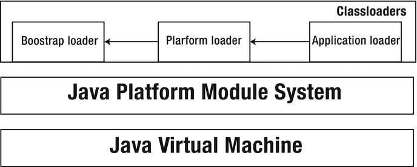

# 10. 高级主题

具有插件和容器架构的应用程序需要能够使用两个重要特性：动态配置和平台模块的运行时增强。这意味着此类应用程序必须能够在运行时加载新的附加模块，将它们绑定到现有应用程序的配置中，并在无需停止应用程序并重新编译的情况下使用它们。这类应用程序还需要能够在运行时映像被调用后加载和配置其他平台模块。Jigsaw 以层的形式引入了这种支持。层是本章的主要主题之一。

本章介绍 Java 9 模块化的一些高级主题。这些内容不适合放在其他章节，因此我们将其集中在此处，而不是为每个主题单独创建章节。

本章涵盖类加载器、层、JMOD 格式、多版本 JAR 文件以及可升级模块。我们还将简要介绍即将在后续 JDK 版本中推出的一些新特性，以及已修复的几个问题。

## JMOD 文件

根据 JDK 9 文档，“为了对 JDK 进行模块化，一种名为 JMOD 的新工件格式超越了 JAR 文件，能够容纳原生代码、配置文件以及其他在 JAR 文件中难以自然存放的数据类型。”

JMOD 文件是一种新的模块工件，它以 ZIP 文件的形式包含编译后的模块定义。它通过包含原生代码和配置文件来增强 JAR 文件。JMOD 是用于打包模块的新格式。这种新格式不可执行。

JMOD 文件是第 4 章中介绍的模块化 JAR 文件的替代方案。它主要用于模块同时包含原生代码的情况。JMOD 文件用于打包 JDK 的模块，但只能在编译时和链接时使用，不能在运行时使用。JMOD 文件也被 Jlink 工具用于创建模块化运行时映像。由 JMOD 文件组成的目录代表了链接器使用的模块路径。

### JMOD 工具

JMOD 工具特别适用于以下用途：

*   为标准模块或 JDK 特定模块创建 JMOD 文件
*   列出现有 JMOD 文件的内容

JMOD 工具已得到扩展，以便能够将模块作为顶层目录中包含 `module-info` 的 JAR 文件进行安装。换句话说，JMOD 工具之于新的 JMOD 格式，类似于 jar 工具之于 JAR 格式。

使用 `jmod` 命令可以创建新的 JMOD 归档文件：

```
jmod create  
```

`jmod create` 命令会创建一个名为 <jmod-file> 的新 JMOD 归档文件。表 10-1 列出了 JMOD 工具的一些最重要选项，如 JDK 规范中所指定。</jmod-file>

表 10-1. JMOD 工具提供的选项摘要

| 选项 | 描述 |
| --- | --- |
| `--class-path <path>` | 指定包含类的应用程序 JAR 文件。 |
| `--config <path>` | 定义存放用户可编辑配置文件的目录，这些文件会被复制到 JMOD 文件中。 |
| `--exclude <pattern-list>` | 匹配 `<pattern-list>` 的文件不会被复制到 JMOD 文件中。`<pattern-list>` 以逗号分隔，可以采用以下格式之一：`<glob-pattern>`、`glob:<glob-pattern>` 或 `regex:<regex-pattern>`。 |
| `--libs <path>` | 定义包含原生库的目录，这些库会被复制到 JMOD 文件中。 |
| `--main-class <class-name>` | 定义 `main` 类。 |
| `--module-version <module-version>` | 定义模块版本。 |
| `--module-path <path> 或 -p <path>` | 指定模块路径，用于查找其内容将被复制到 JMOD 文件中的模块。 |

`jmod list` 命令会打印作为参数传入的 JMOD 文件中包含的所有条目名称：

```
jmod list 
```

`jmod describe` 命令会打印作为参数传入的 JMOD 文件中所包含模块的详细信息：

```
jmod describe 
```

下一节将讨论多版本 JAR 文件的基础知识。


## 多版本 JAR 文件

假设你想切换到最新的 JDK 版本，但某个第三方库与最新版 JDK 不兼容。因此，你决定至少在所使用的第三方库与最新版 JDK 兼容之前，不进行切换。这是一个糟糕的场景，Java 9 通过引入多版本 JAR 文件解决了这个问题，它允许在单个 JAR 文件中打包适用于不同 JDK 版本的代码。

多版本 JAR 文件是在 JDK 9 中通过 JEP 238 实现的。这个 JEP 不属于 Jigsaw 项目。我们在此提及它，是因为它是一个有助于迁移到 Java 9 的重要特性。它完全不依赖于 Java 平台模块系统。我们也可以在非模块化环境中使用多版本 JAR 文件。

Java 9 增强了 JAR 文件格式，使得一个类的多个主要版本可以存储在单个 JAR 文件的 `META-INF` 目录中。这种新的 JAR 文件格式被称为多版本 JAR，它可以包含适用于不同 JDK 版本的单个库。在运行时，会根据用户使用的 JDK 版本加载正确的类版本。多版本 JAR 文件对 JAR 文件结构的改动很小。

> **注意**
>
> 普通 JAR 和模块化 JAR 都支持多版本 JAR 文件。

列表 10-1 展示了一个包含 JDK 8 和 JDK 9 版本元数据的多版本 JAR 文件。

```
JAR 根目录
-   A1.class
-   B1.class
-   C1.class
-   D1.class
-   E1.class
-META-INF
- MANIFEST.MF
- versions

- A1.class
- B1.class
- F1.class

- A1.class
- C1.class
- D1.class
- F1.class
- G1.class
列表 10-1.
包含 JDK 8 和 JDK 9 版本元数据的多版本 JAR 文件
```

在这个例子中，Java `.class` 文件不仅存在于 JAR 的根目录，也存在于 `8` 和 `9` 目录中。在 `META-INF` 目录中，我们有 `MANIFEST.MF` 文件和一个名为 `versions` 的目录，该目录包含两个子目录：一个名为 `8` 的目录，代表为 JDK 8 提供的资源；另一个名为 `9` 的目录，代表为 JDK 9 提供的资源。`8` 目录和 `9` 目录中都包含 Java `.class` 文件。当我们使用 JDK 8 时，会考虑 `8` 目录中的类；当我们使用 JDK 9 时，会考虑 `9` 目录中的类。

在以下情况下，会考虑 JAR 文件根目录中的类：

*   如果我们使用的 JDK 版本不是 JDK 8 或 JDK 9
*   如果我们使用 JDK 8 或 JDK 9，但 `versions/8` 和 `versions/9` 目录中不存在相应的类

我们将对此进行详细解释。对于刚刚讨论的多版本 JAR 文件，我们首先需要知道我们使用的 JDK 版本是否支持多版本 JAR 文件。如果不支持，那么 `versions/8` 和 `versions/9` 目录中的所有内容都将被忽略，只会考虑根目录中的类文件：`A1.class`、`B1.class`、`C1.class`、`D1.class` 和 `E1.class`。

当我们使用的 JDK 版本不是 JDK 8 或 JDK 9 时，只会使用根目录中的类文件。在我们的例子中，仅存在于 `versions/9` 目录中的类 `F1` 和 `G1` 将完全不会被使用。

当我们使用 JDK 8 时，将使用以下类：

```
A1.class (来自 versions/8 目录)
B1.class (来自 versions/8 目录)
C1.class (来自根目录)
D1.class (来自根目录)
E1.class (来自根目录)
F1.class (来自 versions/8 目录)
```

相反，当我们使用 JDK 9 时，将使用以下类：

```
A1.class (来自 versions/9 目录)
B1.class (来自根目录)
C1.class (来自 versions/9 目录)
D1.class (来自 versions/9 目录)
E1.class (来自根目录)
F1.class (来自 versions/9 目录)
G1.class (来自 versions/9 目录)
```

从这个例子可以看出，特定 `8` 或 `9` 目录中的类（如果存在）会覆盖根目录中的类。但这仅在我们分别使用 JDK 8 或 JDK 9 时才会发生。

`module-info.class` 文件也可以添加到多版本 JAR 文件的 `versions` 目录中。`jar` 工具支持此功能。但是，`module-info.class` 不能放在根目录中。

> **注意**
>
> Java 编译器、Java 类文件反汇编器和 JDeps 都能够处理多版本 JAR 文件。

多版本 JAR 文件在其 `MANIFEST.MF` 中声明了一个名为 `Multi-Release` 的属性，并将其设置为 true：

```
Multi-Release: true
```

该属性用于区分多版本 JAR 和非多版本 JAR。如果该属性设置为 false 或缺失，则为普通 JAR。

多版本 JAR 文件保留了 JAR 文件的结构。多版本 JAR 新增的是一个名为 `versions` 的目录，位于 `META-INF` 目录下。此目录可以包含针对特定 JDK 主要版本的子目录：6、7、8、9 等。在这些子目录中，我们可以放置特定于该 JDK 版本的 `.class` 文件。

> **注意**
>
> 多版本 JAR 文件仅支持 JDK 的主要版本。次要版本或安全更新版本不能放入多版本 JAR 文件中。

如果某个 JDK 版本不支持多版本 JAR 文件，会发生什么？在这种情况下，只有 JAR 文件根目录中的类和资源是可见的。`versions` 目录中的所有内容都将不可见，并且隐式地不被考虑。

> **注意**
>
> Jlink 已得到增强，支持创建包含打包为多版本 JAR 文件的模块的镜像。Jlink 会将正确版本的类添加到 Jimage 中。

接下来，我们将解释如何构建多版本 JAR 文件。

### 构建多版本 JAR 文件

多版本 JAR 文件是使用 `jar` 工具及其新的 `--release` 命令行选项构建的。语法如下：

*   `<version_number>` 代表 JDK 的主要版本号。
*   `<options>` 代表一组其他选项。

```
jar --create --file --release  
```

假设我们有一个仅在 JDK 9 中受支持的类。我们想要构建一个多版本 JAR 文件，并将这个特定类放在 `versions/9` 目录中——其他所有内容都应放在根目录中。为此，我们使用 `--release` 选项并指定版本（在我们的例子中是 9），以及包含将被放入 `versions/9` 目录的类的目录位置（在我们的例子中是 `classesDirectoryJDK9`）：

```
jar --create --file myMultiReleaseJar.jar -C classesDirectoryJDK8 --release 9 -C classesDirectoryJDK9 .
```

此命令通过执行以下操作来创建多版本 JAR 文件：

*   从 `classesDirectoryJDK8` 目录中获取所有文件，并将它们放入多版本 JAR 文件的根目录。
*   从 `classesDirectoryJDK9` 目录中获取所有文件，并将它们放入多版本 JAR 文件的 `versions/9` 目录。

我们现在知道如何通过为特定的 JDK 主要版本指定不同的源来创建多版本 JAR 文件。接下来，让我们了解如何更新多版本 JAR 文件。

### 更新多版本 JAR 文件

可以使用 `jar` 工具，通过在 `versions` 目录中添加不同版本的模块描述符来更新多版本 JAR 文件。因此，我们使用 `jar` 工具的 `--update` 选项。

我们更新之前创建的多版本 JAR 文件，并添加一些特定于即将到来的 JDK 10 的类：

```
jar --update --file myMultiReleaseJAR.jar --release 10 -C classesDirectoryJDK10 .
```

多版本 JAR 被更新，`classesDirectoryJDK10` 目录的内容被放置在一个名为 `versions/10` 的新目录中。这个新目录将在 JDK 10 中被考虑。


## JDK 9 中的类加载机制

本节将介绍 JDK 9 中的类加载机制。如你所知，类加载器的作用是加载类。JCP 团队并未在 JDK 9 中改变类加载过程。`Classloader` API 在 JDK 9 中也未被修改。JDK 9 中保留了与 JDK 8 相同的类加载器：启动类加载器、平台类加载器和应用程序类加载器。

JDK 9 中的类加载过程与之前版本的 JDK 相同：首先，加载类型的请求被委托给父类加载器。父类加载器再进一步委托给其父类加载器。此过程会依次经过应用程序类加载器和平台类加载器，最终到达启动类加载器。如果启动类加载器无法加载该类型，则发起委托过程的类加载器将负责加载该类型。

通过审视构成 JDK 9 的结构层次，我们可以观察到 Java 平台模块系统（JPMS）位于 JVM 之上、类加载架构之下。最底层是 Java 虚拟机（JVM）。其上是 JPMS，再往上则是前面提到的三种类型的类加载器。此架构在图 10-1 中清晰展示。



图 10-1.

JDK 9 结构概览

启动类加载器用于定义来自大多数模块的类，例如 `java.base`、`java.sql` 或 `java.logging`。平台类加载器用于定义仅来自少数模块的类，例如 `java.corba` 或 `java.transaction`。启动类加载器和平台类加载器都从平台模块加载类型，而应用程序类加载器则从模块路径加载类型。应用程序类加载器用于定义来自 `jdk.compiler`、`junit`、`guava`、`slf4j` 等模块的类。在 JDK 9 中，应用程序和平台类加载器不再是 `java.net.URLClassLoader` 类的实例。

Jigsaw 允许使用我们自己的类加载器来加载模块。这可以通过 `Module` 类中的 `defineModules()` 方法实现，但此功能相当高级，因此不会有太多开发者使用它。

注意

每个模块在运行时都有一个类加载器。

Jigsaw 还引入了对类加载器名称的支持。类加载器可以有可选的名称。如果在创建类加载器时未指定名称，则它将没有名称。类加载器的名称通过 `Classloader` 类的 `getName()` 方法获取。在警告消息或堆栈跟踪中，模块的类加载器名称总是与模块名称和版本一起提及。

注意

Jigsaw 使用现有的类加载器，不会创建自己的类加载器。

由于在 JDK 9 中类加载器可以拥有名称属性，因此为 `Classloader` 类添加了一个新的构造函数，该构造函数通过使用指定的父类加载器进行委托，来创建一个具有指定名称的新类加载器：

```
protected ClassLoader(String name, Classloader parent)
```

Jigsaw 还允许你借助新的 `findClass()` 方法在特定模块中按名称查找类，该方法接收模块名称和类的二进制名称作为参数：

```
Class findClass(String moduleName, String name)
```

此方法返回 `Class` 对象，如果找不到该类则返回 null。如果我们为模块传递了一个名称，那么该方法将始终返回 null。否则，它将通过传递类的名称来调用 `findClass(name)` 方法。在模块化上下文中，除非我们拥有支持从模块加载的自定义类加载器实现，否则此方法用处不大。然后我们可以重写此方法。

注意

类加载器可以升级以加载模块中的类型。

在 JDK 9 中，扩展类加载器被重命名为平台类加载器。内置平台类加载器的名称是 `platform`。新的静态方法 `getPlatformClassLoader()` 返回一个平台类加载器，通过它可以看见所有内置的 Java SE 和 JDK 类型。此方法会检查权限，并可能抛出 `SecurityException` 异常。

如果同时满足以下两个条件，一个类加载器可以从多个模块加载类型：

*   每个模块中的所有类型仅由一个类加载器加载。
*   模块之间相互独立，互不冲突。

为了确保向后兼容性，可以从类路径加载类型。每个类加载器都有一个唯一的未命名模块，该模块通过位于 `java.lang.Classloader` 类中的新方法 `getUnnamedModule()` 获取。如果类加载器加载的类型未在命名模块中定义，则该类型位于未命名模块中。当这些类型位于任何已知模块都未定义的包中时，来自应用程序类加载器的未命名模块会从类路径加载这些类型。

### ClassLoader 类中的新方法

以下是 Java 9 在 `ClassLoader` 类中添加的方法：

*   `Class<?> findClass(String moduleName, String className)`
*   `URL findResource(String moduleName, String resourceName)`
*   `String getName()`
*   `ClassLoader getPlatformClassLoader()`
*   `Module getUnnamedModule()`

接下来，我们将探讨在 JDK 9 中引入的关键概念——层。


## 层

假设我们想在运行时向应用程序添加几个新模块。我们无法在编译时就知道所需的所有模块，因此需要能够在运行时后期添加新模块。幸运的是，Java 平台模块系统通过一个名为“层”的新概念为此提供了解决方案。层对一组模块进行分组，用于在运行时向应用程序添加新模块。JDK 9 API 规定，层将图中的每个模块映射到负责加载该模块中定义的类型的唯一类。因此，层用于查找类加载器，以便为模块图加载类。

并非所有应用程序都使用层。使用层的应用程序是那些实现容器架构的应用程序，其中模块在运行时被动态添加和链接。在现有层之上，容器应用程序可以创建一个新层。它通过将应用程序的初始模块与一组可观察的模块（例如来自较低层的非平台模块、可具有不同版本的可升级平台模块、不同的服务提供者等）进行解析来实现这一点。尽管如此，容器应用程序可能需要一个与运行时环境中已存在的模块版本不同的模块。这可以在 Jigsaw 中使用层引入的强大功能来实现。

注意

层允许使用一个模块的多个版本。

层是在运行时根据模块图构建的。每个层具有以下内容：

*   一个配置，由位于 `java.lang.module` 包中的 `Configuration` 类的实例表示。
*   一个将每个模块映射到类加载器的函数，由位于 `java.lang` 包中的 `ClassLoader` 类的实例表示。

根据 JDK 9 API 规范，配置“封装了作为解析输出的可读性图。它是解析或带服务绑定的解析的结果。”以下部分将讨论配置。

注意

一个模块可以读取其自身层以及层层次结构中位于其下方的任何层中的模块。

层可以构建成类似于栈的层次结构。它们可以在引导层之上创建，其他层可以在先前创建的层之上创建，依此类推。Java 虚拟机具有引导层，这是 JPMS 使用的基本层和第一个层。

注意

每个 Java 9 模块化应用程序至少有一个层。每个层（空层除外）都有一个或多个父层。层没有名称。

来自模块 `java.base` 中 `java.lang` 包的 `ModuleLayer` 类表示一个层的实例。通过调用 `Module` 上的 `getLayer()` 方法可以获得 `ModuleLayer` 对象。模块层仅包含命名模块。因此，如果我们在未命名模块上调用 `getLayer()` 方法，则返回 `null`。否则返回一个 `ModuleLayer` 对象：

```
ModuleLayer moduleLayer = module.getLayer();
```

接下来，我们将介绍引导层，它是最重要的层。

### 引导层

引导层由引导类加载器、平台类加载器和应用程序类加载器组成。引导层中的模块被映射到引导类加载器、平台类加载器和应用程序类加载器。引导层将模块映射到加载器。例如，它将 `java.base` 模块映射到引导类加载器。

注意

大多数应用程序除了引导层外不使用任何其他层。

JVM 在启动时创建引导层。这是在一个称为“解析”的过程中完成的。应用程序的根模块及其依赖项被一起解析。在所有模块被解析后，引导层包含模块图。

在大多数情况下，引导层就足够了。它默认包含 `java.base` 模块。引导层中的模块被映射到引导类加载器和 JVM 中的其他现有类加载器。

可以通过在 `ModuleLayer` 类上调用静态方法 `boot()` 来检索引导层：

```
ModuleLayer bootLayer = ModuleLayer.boot();
Set modulesSet = bootLayer.modules();
```

方法 `boot()` 返回引导层，一个 `ModuleLayer` 类型的对象。为了从引导层获取模块集，我们在生成的 `bootLayer` 对象上调用了方法 `modules()`。

要从引导层获取我们模块 `com.apress.myModule` 的 `Module` 对象，我们可以使用 `ModuleLayer` 类的 `findModule()` 方法：

```
Optional myModule = bootLayer.findModule("com.apress.myModule");
```

我们还可以通过调用 `Module` 对象上的 `getResourceAsStream()` 方法来获取用于从我们的模块读取资源的 `InputStream`：

```
InputStream inputStream = myModule.getResourceAsStream(resourceName);
```

该方法的参数必须是标识资源的由 `/`（正斜杠）分隔的路径。

现在我们已经了解了引导层是什么，让我们继续讨论配置这个新概念。

### 配置

根据 JDK 9 API 规范，“配置封装了作为解析输出的可读性图。”为了检索配置，`ModuleLayer` 类定义了一个名为 `configuration()` 的方法，该方法返回此层的配置。

在 Jigsaw 中，配置是独立且与其他配置隔离的。它也可以关联到其他动态创建的配置，而不仅仅是初始配置。尽管如此，配置允许您包含和使用与封闭配置中已有的非平台模块和可升级平台模块不同的多个版本。这是 JDK 9 中配置带来的一个非常强大的特性。

`Configuration` 类位于 `java.base` 模块的 `java.lang.module` 包中。根据 JDK 9 API 规范，其最重要的方法如下：

*   `Set<ResolvedModule> modules()`：返回此配置中已解析模块的不可变集合。
*   `Configuration resolve(ModuleFinder before, ModuleFinder after, Collection<String> roots)`：通过解析一组根模块来创建一个新配置，并将此配置作为其父配置。第一个参数表示用于查找模块的主模块查找器。如果找不到模块，则使用作为第二个参数传递的模块查找器搜索模块。第三个参数表示要解析的模块名称的集合。该集合也可以为空。
*   `Optional<ResolvedModule> findModule(String name)`：在此配置中查找已解析的模块。它接收我们想要查找其 `ResolvedModule` 对象的模块名称作为参数。
*   `List<Configuration> parents()`：返回此配置的父配置列表。
*   `Configuration resolveAndBind(ModuleFinder finder, Collection<String> roots, boolean check, PrintStream output)`：使用服务绑定解析一组根模块。它用于创建引导层的配置。

#### 创建配置

要创建新配置，我们通常将引导层的配置作为父配置。要获取引导层的配置，我们在引导层上调用方法 `configuration()`：

```
Configuration configuration = ModuleLayer.boot().configuration()
```

注意

在 JVM 中，每个模块层都是根据配置创建的。

接下来，我们将展示如何使用配置解析模块。


#### 通过配置解析模块

要通过配置解析模块，我们需要使用前面描述的 `resolve()` 方法。在以下示例中，我们解析名为 `com.apress.myModule` 的模块。为此，我们使用引导层的配置作为父配置，如清单 10-2 所示。

```
Path ourDirectory = ...;
ModuleFinder finder = ModuleFinder.of(ourDirectory);
Configuration parentConfiguration = ModuleLayer.boot().configuration();
Configuration configuration = parentConfiguration.resolve(finder, ModuleFinder.of(), Set.of("com.apress.myModule");
清单 10-2.
通过配置解析模块 com.apress.myModule
```

### 创建层

在本节中，我们将了解如何创建层。这并非一个困难的过程。新的模块 API 在 `ModuleLayer` 类中提供了一些有用的方法来创建层，正如官方 JDK 9 API 规范所指定的那样：

*   `ModuleLayer defineModules(Configuration cf, Function<String, Classloader> clf)`：通过将给定 `Configuration` 中的模块定义到 JVM，创建一个新的模块层，并以当前层作为其父层。第二个参数表示将模块名称映射到类加载器的函数。它返回新创建的 `ModuleLayer`。
*   `ModuleLayer defineModulesWithManyLoaders(Configuration cf, ClassLoader parentLoader)`：创建一个新的模块层，以当前层作为其父层。每个模块都被定义到由该方法创建的自己的 `Classloader` 中。第二个参数表示由该方法创建的每个类加载器的父类加载器。
*   `ModuleLayer defineModulesWithOneLoader(Configuration cf, ClassLoader parentLoader)`：类似于上述方法。唯一的区别是，此方法创建一个类加载器，并将所有模块定义到该类加载器。

如您所见，为了创建一个模块层，我们需要传递一个 `Configuration` 对象和一个 `ClassLoader` 对象。在上一节中，我们学习了如何通过解析模块 `com.apress.myModule` 并以其引导层的配置作为父配置来创建 `Configuration` 对象。现在我们知道如何获取 `Configuration`，就可以使用配置中的模块创建一个新层，如清单 10-3 所示。

```
ModuleLayer parentLayer = ModuleLayer.boot();
ClassLoader classLoader = ClassLoader.getSystemClassLoader();
ModuleLayer layer = parent.defineModulesWithOneLoader(configuration, classLoader)
清单 10-3.
创建一个模块层
```

我们使用了之前创建的 `configuration` 对象，并将其传递给 `defineModuleWithOneLoader()` 方法。我们还传递了通过 `getSystemClassLoader()` 方法获取的系统类加载器。

注意

大多数情况下，自定义创建的层的父层是引导层。

由于某些类加载约束，Jigsaw 必须对模块图施加约束。因此，只有不包含循环的模块图才能转换为层。

### 从层中获取已加载的模块

从层中获取已加载的模块非常简单。在 `ModuleLayer` 对象上，调用 `modules()` 方法，该方法返回此层中已加载模块的集合。清单 10-4 展示了如何从引导层获取所有模块并打印它们的名称。

```
ModuleLayer moduleLayer = ModuleLayer.boot();
moduleLayer.modules().stream().forEach(module -> {
String moduleName = module.getName();
System.out.println("Name of the module is: " + moduleName);
});
清单 10-4.
打印引导层中模块的名称
```

以下是打印输出的摘录。我们不会完整展示，因为它太长了：

```
Name of the module is: jdk.javadoc
Name of the module is: jdk.deploy
Name of the module is: javafx.graphics
Name of the module is: java.security.jgss
Name of the module is: jdk.editpad
Name of the module is: java.compiler
Name of the module is: jdk.jdeps
Name of the module is: jdk.packager
Name of the module is: java.management.rmi
Name of the module is: javafx.swing
Name of the module is: jdk.attach
Name of the module is: java.desktop
Name of the module is: jdk.unsupported
Name of the module is: javafx.fxml
...
```

注意

你可以在目录 /ch10/layers 中找到此示例的源代码。

下一个示例展示了如何打印系统中存在的所有层的信息。

### 在运行时描述层

清单 10-5 展示了当前模块层及其父层。

```
package modulelayer;
import java.lang.ModuleLayer;
import java.util.List;
public class LayerUtil {
public static void describeCurrentAndParentLayers() {
// 打印当前层的层信息
ModuleLayer thisModuleLayer = LayerUtil.class.getModule().getLayer();
printLayerInformation(thisModuleLayer);
// 获取该层的所有父层
List parentModuleLayerList = thisModuleLayer.parents();
if(parentModuleLayerList.isEmpty()) {
System.out.println("This layer has no parent layers");
}
else {
for(ModuleLayer moduleLayer : parentModuleLayerList) {
printLayerInformation(moduleLayer);
}
}
}
private static void printLayerInformation(ModuleLayer moduleLayer) {
System.out.println("The name of the modules in this layer are: " + moduleLayer.toString());
System.out.println("The configuration for this layer: " + moduleLayer.configuration());
}
public static void main(String[] args) {
describeCurrentAndParentLayers();
}
}
清单 10-5.
描述当前模块层及其父层
```

首先，我们打印当前层的信息。我们通过在当前模块上调用 `getLayer()` 方法来获取它。之后，我们通过在当前层上调用 `parents()` 方法来获取该层的父层。如果结果列表为空，则我们的层没有父层。否则，如果结果列表只有一个元素，并且该元素是空层，那么我们的层没有任何父层，因此我们打印相应的消息。最后，我们遍历父层列表，并打印它们包含的模块名称以及配置。

注意

空层不包含任何模块。当两个模块具有相同的包名时，Java 平台模块系统无法将这两个模块加载到同一层中。即使该包是私有的，也是如此。

我们已经介绍了层的基础知识。是时候继续前进，介绍可升级模块的概念了。


## 可升级模块

如果一个模块可以通过部署在升级模块路径上来进行升级，那么它就是可升级的。JPMS 会在链接时和运行时执行检查，以确保只允许升级可升级模块。

在 Java SE 模块中，唯一可升级的模块是来自 `java.se.ee` 模块的那些。可升级模块包括 `java.activation`、`java.compiler`、`java.corba`、`java.transaction`、`java.xml.bind`、`java.xml.ws`、`java.xml.ws.annotation` 和 `jdk.internal.vm.compiler`。JDK 中的几个标准模块也是可升级的。

`javac` 和 `java` 提供了一个名为 `--upgrade-module-path` 的命令行选项，该选项接受一个目录列表。这些目录包含用于替换运行时映像中现有模块的模块。例如，要升级 JAXB，我们可以执行以下命令：

```
java --upgrade-module-path myDirectory --add-modules java.xml.bind
```

这里，`myDirectory` 代表一个包含将替换现有模块的模块的目录。

注意

即使使用命令行选项 `--patch-module`，也无法升级不可升级的模块。不可升级模块是链接到运行时映像中的模块。

要升级运行时映像中的模块，可以将模块部署在升级模块路径上。自动模块也可以部署在升级模块路径上。但自动模块无法升级，因为可升级模块是链接到运行时映像中的，而自动模块则不是。

注意

可升级模块取代了 JDK 9 中旧的“认可标准机制”。

## 下个版本即将推出的功能

JDK 的下一个版本将带来一些功能。JCP 团队宣布，下一个版本将解决我们目前面临的两个问题，并增加两项新功能。即将在下一个版本中推出的新功能如下：

*   **多模块 JAR 文件**：目前，一个模块化 JAR 文件只能包含一个模块。不允许包含多个模块。在实践中，我们可能会有包含不同功能片段的大型 JAR 文件，这些片段无法归入单个模块。因此，在单个模块化 JAR 文件中包含多个模块会更好。
*   **额外的模块层操作**：`ModuleLayer.Controller` API 将通过新增方法（如 `addUses()` 和 `addPackage()`）得到增强。

将在下一个版本中解决的问题如下：

*   **隐藏包冲突**：此问题已在第 8 章中介绍。问题在于两个不同的模块不能共享同一个包名。JCP 团队提出的建议是通过重新设计来避免隐藏包冲突，以便包含冲突包的模块将在它们自己的类加载器中加载。
*   **循环模块依赖关系**：此问题也已在第 8 章中介绍。针对下一个 JDK 版本的提议是允许模块在运行时存在循环依赖关系。

## 总结

本章开始时，我们探讨了新的 JMOD 文件以及 `jmod` 工具。然后，我们讨论了多版本 JAR 文件，它代表一个单一的 JAR 文件。因此，它们只是一个发布单元，可以用于例如替换 JDK 内部 API。如果在 Java 8 中使用了 JDK 内部 API，我们可以在 JDK 9 中提供一个替换它的新类，并将两个类文件都放在一个多版本 JAR 文件中。引入多版本 JAR 文件是为了能够使用特定版本的 JDK，即使某些第三方库尚未升级到最新版本。它们有助于第三方库使用来自较新 Java 版本的 API 特性。

此外，我们解释了 Java 平台模块系统上下文中“层”的新概念。我解释了什么是层，为什么它们有用，以及如何创建我们自己的层。如果应用程序使用层，它可能只会使用引导层。我介绍了 JDK 9 中的类加载机制，并解释了它如何与新的模块系统协同工作。我们了解到，Jigsaw 并未强制规定类加载器和模块之间存在任何关系。

本章最后讨论了可升级模块以及即将在下一个 JDK 版本中推出的一些功能。

在第 11 章中，你将学习如何对模块化应用程序进行单元测试。

