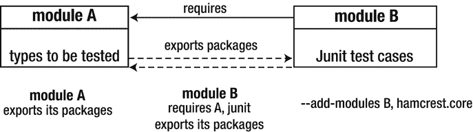
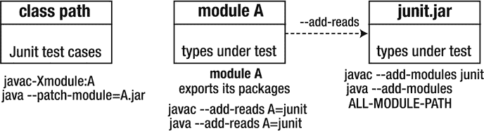

# 11. 测试模块化应用程序

到目前为止，你应该对 Project Jigsaw 有了深入的了解，并且应该能够在你的项目中开始使用它。但还有一个重要的话题我们尚未提及：单元测试。本章重点介绍 Java 9 中模块化应用程序的单元测试以及你可以采用的不同方法。在本章中，我们将向你展示在模块化应用程序的背景下，在 Java 9 中执行单元测试的一些最佳实践。

假设我们有一个模块，其中包含需要测试的类。如果我们将单元测试类放在另一个模块中，那么我们需要让单元测试能够访问被测试模块中的类型。这就涉及到了 JDK 9 中引入的强封装机制。一种解决方案是添加 `--add-exports` 标志，使被测试模块中的类型对单元测试可用。但这还不够，因为还必须要求被测试模块中的类型是公开的。如果不是，那么导出包并不能提供我们所需的可访问性级别。这只是我们在 Java 9 中执行单元测试之前必须解决的众多挑战之一。

为了达到所需的软件质量水平，在模块化应用程序中执行单元测试是必要的，而且这比测试非模块化应用程序更为关键。Java 9 中的单元测试比 Java 9 之前的版本稍微复杂一些，因为在 Java 9 中，我们必须确保 Junit 测试类与被测试对象之间的可读性。对于被测试的类，Junit 测试类的位置可以有多种不同的组合。它们可以位于同一个模块中、不同的模块中、类路径上，或者部分位于模块路径上、部分位于类路径上。下一节将更详细地探讨这些场景。

## Java 9 中的单元测试场景

如前所述，根据 Junit 测试类和被测试对象的位置，JDK 9 中的单元测试可能有不同的场景。在 JDK 9 的单元测试过程中，可能会出现以下常见场景：

*   Junit 测试类和测试对象位于不同的模块中。
*   Junit 测试类不在模块中，但测试对象在模块中。
*   Junit 测试类和测试对象都位于同一个模块中。

这三种场景中的每一种都必须区别对待，并且需要不同的方法来确保 Junit 测试用例与被测试对象之间的可读性。以下小节将详细讨论每一种场景。


### 场景 1：Junit 测试类与被测类型位于不同模块

假设被测类型位于模块 A，而 Junit 测试类位于模块 B。这是最简单的场景之一。图 11-1 展示了这一情况。



图 11-1.

Junit 测试类与被测类位于不同模块

首先，我们需要确保两个模块之间的可读性。模块 A 应导出其包。模块 B 应依赖模块 A，并同时导出其包。这样，模块 B 就能访问模块 A 中的公共类型。此外，由于模块 B 使用了 Junit 自动模块，因此在其模块声明中也需要依赖该自动模块。

要使此场景生效，还需注意一个重要事项。当我们从模块 B 运行 Junit 测试用例时，需要使用 `java` 启动器的 `--add-modules` 标志来添加所有现有模块（包括自动模块）。在我们的案例中，需要添加模块 B 以及 Junit 的依赖项——自动模块 `hamcrest.core`。这基本上就是使此场景正常运行所需的全部操作。本章稍后将展示一个使用此场景的示例。

### 场景 2：仅被测类型位于模块内

第二个场景是最复杂的。在此场景中，被测类型位于模块 A，但 Junit 测试类并不位于任何模块中——它们位于类路径上。为此，我们必须使用 `javac -Xmodule` 和 `java` 启动器的 `--patch-module` 命令行选项。这两个选项将在本章后面详细描述。图 11-2 展示了这一场景。



图 11-2.

被测类型位于模块内，Junit 测试用例位于类路径上

首先，我们必须像编译模块 A 的一部分那样编译 Junit 测试类（使用 `javac -Xmodule` 选项）。这样，我们就将 Junit 测试类纳入了模块 A。其次，我们必须使用 `javac --add-reads` 命令行选项来添加对 Junit 的读取边。这是强制性的，因为现在模块 A 依赖于 Junit。由于模块 A 并未读取 Junit，我们必须使用 `--add-reads` 命令行选项来告知它读取 Junit。同时，我们还需要使用 `javac --add-modules` 选项来添加 Junit 自动模块。

要使此场景生效，在运行 Junit 测试类时，我们必须使用 `java` 启动器的 `--patch-module` 命令行选项，以便修补模块 A。因此，我们使用 `ALL-MODULE-PATH` 常量在运行时将 Junit 测试类纳入模块 A。如果目前对此场景的工作原理还不清楚，不必担心。本章稍后你将看到此场景的实际应用，届时我们将解释所使用的新命令行选项。

### 场景 3：Junit 测试类与被测类型位于同一模块

在此场景中，类型之间具有隐式可读性。这种情况的缺点在于，我们的模块需要所有测试依赖项。为每个需要单元测试的模块引入测试库的依赖项，显然不是最佳解决方案。如果我们有十个模块需要测试，那么所有模块都需要单独添加测试依赖项。

现在我们已经了解了在 Java 9 中执行单元测试时可能遇到的最常见场景，接下来让我们继续探讨 Java 编译器的 `-Xmodule` 命令行选项和前面在第二个场景中提到的 `--patch-module` 命令行选项。它们用于使用类来修补模块。

## -Xmodule 选项

Java 编译器的命令行选项 `-Xmodule` 用于为某个模块编译类。图 11-3 描述了其语法。


图 11-3.

`javac -Xmodule` 命令行选项的语法

`-Xmodule` 选项指定我们应该像编译模块 <module_name> 的一部分那样编译这些类。此选项在编译时用于将类注入到模块中，不能在运行时使用。使用 `-Xmodule` 选项，我们可以使类成为特定模块的一部分。如果作为参数传递的模块不存在，则会抛出错误 `module not found`：

```
error: module not found: 
```

注意

无法列出多个模块。你不能为 `-Xmodule` 命令行选项指定多个模块名称。

## --patch-module 选项

JDK 9 规范指出：“在测试或调试时，有时需要用替代或实验版本替换特定模块的选定类文件或资源，或者提供全新的类文件、资源甚至包。这可以通过 `--patch-module` 选项实现。”

`--patch-module` 选项在编译时和运行时均可使用，用于用其他特定于类的类文件替换模块的类文件。它既可以被 Java 编译器使用，也可以被 `Java` 启动器使用。`--patch-module` 选项的作用是覆盖模块内部的类。此选项取代了旧的 `-Xbootclasspath/p` 选项，后者已在 Java 9 中被移除。

图 11-4 展示了 `--patch-module` 命令行选项的语法。

*   `<module_name>` 代表模块名称。
*   `<file>` 代表模块定义的文件系统路径名。
*   `<path_separator>` 代表宿主平台的路径分隔符。


图 11-4.

`--patch-module` 选项的语法

由 `<module_name>` 指定的模块将使用目录 <file> 中存在的类文件进行修补。我们也可以指定一个普通的 JAR（非模块化 JAR）来代替包含类文件的目录。</file>

注意

`--patch-module` 可用于在运行时使测试类成为模块的一部分。JCP 团队指出，它“仅用于测试和调试。强烈不鼓励在生产环境中使用。”

`--patch-module` 命令行选项也可用于修补自动模块，但不能用于替换 `module-info.class` 文件，正如 JCP 团队在规范中所述：“`--patch-module` 选项不能用于替换 `module-info.class` 文件。如果在修补路径上的模块定义中找到了 `module-info.class` 文件，则会发出警告，并且该文件将被忽略。”JCP 团队还告诉我们未导出包的情况：“如果在修补路径上的模块定义中发现的包尚未被该模块导出，那么它仍然不会被导出。可以通过反射 API 或 `--add-exports` 选项显式导出。”


### 修补模块

以下示例展示了如何修补模块内部的类。这意味着我们用另一个 Java 类文件替换模块内的一个 Java 类文件。为此，我们将使用 `javac` 命令行选项 `-Xmodule` 和 `java` 命令行选项 `--patch-module`。我们将使用 `--patch-module` 选项修补一个现有模块，你将看到两种实现方式。因此，我们创建四个文件夹：

*   modules 文件夹
*   modulesLibrary 文件夹
*   patchModules 文件夹
*   patchModulesLibrary 文件夹

我们有一个模块 com.apress.moduleA，它包含一个名为 `Employee.java` 的 POJO 类，以及另一个名为 `EmployeeImpl.java` 的类，该类创建了一个 `Employee` 类型的对象并为其设置了一些属性。还有一个模块 com.apress.moduleB，它包含了 public static void `main(String[] args)` 方法。该模块简单地创建了一个 `EmployeeImpl` 类型的对象，然后调用该对象的一些方法。此外，我们定义了另一个名为 `EmployeeImpl.java` 的 Java 类，其包名与之前的 `EmployeeImpl.java` 类的包名相同。这个新类不属于任何模块。我们的意图是使用前面描述的 `-Xmodule` 和 `--patch-module` 命令行选项，用这个新类替换 com.apress.moduleA 模块中的旧类。

清单 11-1 展示了 com.apress.moduleA 模块的 `Employee.java` 和 `EmployeeImpl.java` 类。`Employee.java` 类位于包 com.apress.moduleA.entity 中。

```
// Employee.java
package com.apress.moduleA.entity;
public class Employee {
private String firstName;
private String lastName;
private String department;
public Employee() {
}
public String getFirstName() {
return firstName;
}
public void setFirstName(String firstName) {
this.firstName = firstName;
}
public String getLastName() {
return lastName;
}
public void setLastName(String lastName) {
this.lastName = lastName;
}
public String getDepartment() {
return department;
}
public void setDepartment(String department) {
this.department = department;
}
}
// EmployeeImpl.java
package com.apress.moduleA;
import com.apress.moduleA.entity.Employee;
public class EmployeeImpl {
public Employee employee;
public EmployeeImpl() {
}
public Employee createNewEmployee() {
employee = new Employee();
return employee;
}
public Employee setEmployeeInfo() {
employee = createNewEmployee();
employee.setFirstName("John");
employee.setLastName("Anderson");
employee.setDepartment("IT");
return employee;
}
public void getEmployeeInfo() {
System.out.println("Employee first name is: " + employee.getFirstName());
System.out.println("Employee last name is: " + employee.getLastName());
System.out.println("Employee department is: " + employee.getDepartment());
}
}
清单 11-1.
来自 com.apress.moduleA 模块的 Employee.java 和 EmployeeImpl.java 类
```

清单 11-2 展示了模块 com.apress.moduleA 的模块描述符，该描述符导出了包。

```
module com.apress.moduleA {
exports com.apress.moduleA;
}
清单 11-2.
模块 com.apress.moduleA 的 module-info.java 文件
```

模块 com.apress.moduleB 从模块 com.apress.moduleA 导入类型，并调用 `EmployeeImpl` 对象上的方法，如清单 11-3 所示。

```
package com.apress.moduleB;
import com.apress.moduleA.*;
public class MainClass {
public static void main(String[] args) {
EmployeeImpl employeeImpl = new EmployeeImpl();
employeeImpl.createNewEmployee();
employeeImpl.setEmployeeInfo();
employeeImpl.getEmployeeInfo();
}
}
清单 11-3.
模块 com.apress.moduleB 的 MainClass.java 文件
```

清单 11-4 展示了模块 com.apress.moduleB 的模块描述符。

```
module com.apress.moduleB {
requires com.apress.moduleA;
}
清单 11-4.
模块 com.apress.moduleB 的 module-info.java 文件
```

在新的目录 com.apress.moduleA2 中，我们定义了 `EmployeeImpl.java` 类的另一个版本，它不属于任何模块。清单 11-5 展示了这个新类，其包名与旧类 com.apress.moduleA 相同。

```
package com.apress.moduleA;
import com.apress.moduleA.entity.Employee;
public class EmployeeImpl {
public Employee employee;
public EmployeeImpl() {
}
public Employee createNewEmployee() {
employee = new Employee();
return employee;
}
public Employee setEmployeeInfo() {
employee = createNewEmployee();
employee.setFirstName("Andrew");
employee.setLastName("Lopez");
employee.setDepartment("Big Data");
return employee;
}
public void getEmployeeInfo() {
System.out.println("Employee first name is: " + employee.getFirstName());
System.out.println("Employee last name is: " + employee.getLastName());
System.out.println("Employee department is: " + employee.getDepartment());
}
}
清单 11-5.
EmployeeImpl 类
```

在最后一个示例中，我们只更改了名字、姓氏和部门。现在我们有了代码，开始用模块 com.apress.moduleA 中的 `EmployeeImpl.java` 替换上一个清单中的那个。首先，我们编译两个现有模块，但排除目录 com.apress.moduleA2，因为它不是一个模块。以下命令实现了这一点，它利用 `grep -v` 命令来排除目录 com.apress.moduleA2 中的文件，使其不被编译：

```
$ javac -d modules --module-path modulesLibrary --module-source-path src $(find src -name “*.java” | grep -v com.apress.moduleA2)
```

注意

`grep -v` 或 `grep -invert-match` 的作用是反转匹配的意义。在我们的例子中，它排除了来自 com.apress.moduleA2 目录的文件，并选择了不匹配的文件。

结果，com.apress.moduleA 和 com.apress.moduleB 两个模块都被编译了，类文件现在位于 modules 目录中。接下来，我们为前面编译的每个模块创建模块化 JAR 文件。为此，我们进入 modules 目录，并为每个模块创建两个模块化 JAR 文件。作为输入，我们使用来自 modules 目录的类文件：

```
cd modules
$ jar --create --file=../modulesLibrary/com.apress.moduleA.jar -C com.apress.moduleA .
$ jar --create --file=../modulesLibrary/com.apress.moduleB.jar -C com.apress.moduleB .
```

两个模块化 JAR 文件都创建在 modulesLibrary 目录中。此外，我们尝试将补丁编译为一个类。我们编译位于目录 com.apress.moduleA2 内包 com.apress.moduleA 中的 EmployeeImpl.java 文件：

```
cd ..
$ javac -Xmodule:com.apress.moduleA --module-path modules -d patchModules/com.apress.moduleA src/com.apress.moduleA2/com/apress/moduleA/EmployeeImpl.java
```

以下是使用的命令行选项：

*   `-Xmodule:com.apress.moduleA` 指定 `EmployeeImpl.java` 类应该被编译，就好像它实际上是模块 com.apress.moduleA 的一部分一样。
*   `-d patchModules/com.apress.moduleA` 指定编译 `EmployeeImpl.java` 类的输出目录。

我们传递将要被编译的类 `EmployeeImpl.java` 的路径。结果，来自 com.apress.moduleA2 目录的 EmployeeImpl 文件已被编译到 patchModules 目录中。此外，我们为之前修补的类创建一个 JAR 文件。在这种情况下，我们创建一个普通的 JAR，而不是模块化的 JAR。因此，我们进入 patchModules 目录并输入以下内容：

```
jar --create -file=../patchModulesLibrary/com.apress.moduleA.jar -C com.apress.moduleA .
```

结果，在 patchModulesLibrary 目录内创建了一个名为 com.apress.moduleA.jar 的新 JAR 文件。

我们可以通过两种不同的方式运行这个示例：使用类来修补模块 com.apress.moduleA，或者使用 JAR 文件来修补它。


首先，让我们通过使用类来修补模块来运行它。在此示例中，我们利用 `--patch-module` 命令行选项，表示我们希望用 `patchModules` 目录中的类来修补 `com.apress.moduleA` 模块。回顾一下，`patchModules` 目录中包含我们的 `EmployeeImpl.class`，它对应于我们想要用来替换旧类的新 `EmployeeImpl` 类：

```
cd ..
$ java --patch-module com.apress.moduleA=patchModules/com.apress.moduleA --module-path modulesLibrary -m com.apress.moduleB/com.apress.moduleB.MainClass
```

我们还向 `-m` 标志传递了 `main` 类。控制台会输出以下内容：

```
Employee first name is: Andrew
Employee last name is: Lopez
Employee department is: Big Data
```

正如我们在输出中看到的，新的 `EmployeeImpl` 类替换了现有的类。在 `MainClass` 中，我们创建了一个 `EmployeeImpl` 类型的对象，它代表了新的 `EmployeeImpl` 类。

在前面的示例中，我们向 `--patch-module` 选项指定了 `.class` 文件的位置。作为替代方案，我们也可以指定之前创建的位于 `patchModulesLibrary` 目录中的 JAR 文件的位置。因此，我们运行 `java` 启动器，并使用 JAR 文件 `com.apress.moduleA.jar` 来修补模块 `com.apress.moduleA`：

```
$ java --patch-module com.apress.moduleA=patchModulesLibrary/com.apress.moduleA.jar --module-path modulesLibrary -m com.apress.moduleB/com.apress.moduleB.MainClass
```

结果与我们之前得到的结果相同。在此示例中，我们首先展示了如何使用 `--patch-module` 命令行选项来修补模块。

既然我们知道了如何修补模块，接下来让我们看看如何应用这一知识在模块化环境中运行 Junit 测试用例。

注意

你可以在目录 `/ch11/patchingAModule` 中找到此示例的源代码。

在本章前面部分，你看到了 Java 9 中单元测试的三种场景。让我们看一下场景 1（Junit 测试类和被测类型位于不同的模块中）和场景 2（被测类型位于一个模块中，而 Junit 测试类位于类路径上）的实际代码示例。

### 运行 Junit 测试，其中 Junit 测试类和被测类型位于不同的模块中

以下是一个在 Java 9 中运行 Junit 测试的非常简单的示例。在我们的案例中，Junit 测试和被测类位于不同的模块中。此场景对应于本章前面描述的场景 1。我们修改之前的示例（修补模块的示例），使其适合使用 Junit 进行测试。

我们在模块 `com.apress.moduleA` 的 `Employee.java` 类中添加以下方法：

```
public String getEmployeeFullData() {
return getFirstName() + ", " + getLastName() + ", " + getDepartment();
}
```

我们还需要添加一个 Junit 测试用例。它将位于模块 `com.apress.moduleB` 中，并简单地调用模块 `com.apress.moduleA` 中的 `getEmployeeFullData()` 方法。

清单 11-6 展示了 `EmployeeTest` 类。

```
package com.apress.moduleB;
import org.junit.Assert;
import org.junit.Test;
import org.junit.Before;
import com.apress.moduleA.entity.Employee;
public class EmployeeTest {
Employee employee;
@Before
public void setEmployeeData() {
employee = new Employee();
employee.setFirstName("Alexandru");
employee.setLastName("Jecan");
employee.setDepartment("IT");
}
@Test
public void employeeDataTest() {
Assert.assertEquals("Alexandru, Jecan, IT", employee.getEmployeeFullData());
}
}
清单 11-6.
EmployeeTest 类
```

此类从模块 `com.apress.moduleA` 导入 `Employee` 类，实例化一个 `Employee` 类型的对象，并调用其上的一个方法。清单 11-7 展示了模块 `com.apress.moduleB` 的模块描述符。

```
module com.apress.moduleB {
requires junit;
requires com.apress.moduleA;
exports com.apress.moduleB;
}
清单 11-7.
模块 com.apress.moduleB 的 module-info.java
```

模块 `com.apress.moduleB` 需要模块 `com.apress.moduleA`，因为它使用了其中的类型。它还需要模块 `junit`，因为我们使用了 Junit 测试框架。在此示例中，`junit` 是一个自动模块。

我们定义一个名为 `automaticModules` 的文件夹，其中放置运行 Junit 测试所需的两个 JAR 文件：Junit 和 Hamcrest-core。

注意

Junit 和 Hamcrest-core 的 JAR 文件可以从 Maven 仓库 [`https://mvnrepository.com/`](https://mvnrepository.com/) 下载。你可以通过点击下载（JAR）链接，使用网页浏览器下载它们。你不需要为此使用 Maven。

清单 11-8 展示了 `automaticModules` 文件夹的内容。

```
hamcrest-core-1.3jar
junit-4.12.jar
清单 11-8.
automaticModules 文件夹
```

我们编译模块 `com.apress.moduleA` 和 `com.apress.moduleB`：

```
javac -d modules --module-path "automaticModules;modulesLibrary" --module-source-path src $(find src -name "*.java")
```

包含前面描述的两个 JAR 文件的 `automaticModules` 文件夹被传递给 `--module-path` 命令行选项。这样，这些 JAR 文件就变成了自动模块。接下来，我们切换到 `modules` 文件夹，并为模块 `com.apress.moduleA` 和 `com.apress.moduleB` 创建两个 JAR 文件：

```
cd modules
jar --create --file=../modulesLibrary/com.apress.moduleA.jar -C com.apress.moduleA .
jar --create --file=../modulesLibrary/com.apress.moduleB.jar -C com.apress.moduleB .
```

我们现在可以运行单元测试了。为此，我们必须传递模块路径上的所有模块，包括自动模块。我们可以使用常量 `ALL-MODULE-PATH`。正如 JDK 文档中所指定的，此变量代表模块路径上的所有模块。指定此常量比单独指定每个模块要容易得多：

```
cd ..
java --module-path "automaticModules;modulesLibrary" --add-modules ALL-MODULE-PATH -m junit/org.junit.runner.JUnitCore com.apress.moduleB.EmployeeTest
```

`--module-path` 命令行选项指向包含 Hamcrest 和 Junit JAR 文件的 `automaticModules` 文件夹，以及包含 `com.apress.moduleA.jar` 和 `com.apress.moduleB.jar` 文件的 `modulesLibrary` 文件夹。`-m` 选项接收参数 `junit/org.junit.runner.JunitCore com.apress.moduleB.EmployeeTest`。通过这种方式，我们声明希望使用模块 `junit` 中的 `JunitCore` 来运行位于包 `com.apress.moduleB` 中的 `EmployeeTest` 类的测试。

除了使用常量 `ALL-MODULE-PATH`，也可以使用逗号列出我们需要的模块。在这种情况下，我们会这样写：

```
--add-modules com.apress.moduleB,hamcrest.core
```

运行此测试的结果是 `OK`，这意味着测试成功，并且我们通过访问另一个模块并将 `junit-4.12.jar` 和 `hamcrest-core-1.3.jar` 文件作为自动模块读取，成功运行了测试用例。

注意

你可以在目录 `/ch11/junitSeparateModules` 中找到此示例的源代码。


### 运行 JUnit 测试时，测试类不在模块内

到目前为止，一切顺利。在前面的示例中，我们的 JUnit 测试位于一个模块中，而测试对象位于另一个模块中。我们成功地将它们连接起来并使其运行。但是，当 JUnit 测试不是模块的一部分，而是位于类路径上时，会发生什么？在这种情况下，事情会变得稍微复杂一些，这对应于本章开头提到的场景 2。

在下一个示例中，我们有 `EmployeeTest` 类，但它不再是模块的一部分。我们还更改了 `EmployeeTest` 类的包名。它的新名称是 com.apress.moduleA。我们这样做是因为在修补（patching）期间，包名必须与模块 com.apress.moduleA 中的包名相同。

在这个示例中，我们不再有模块 com.apress.moduleB，因此我们删除了其中的 `module-info.java` 文件。清单 11-9 展示了模块 com.apress.moduleA 的模块描述符。

```
module com.apress.moduleA {
    exports com.apress.moduleA.entity;
    exports com.apress.moduleA;
}
清单 11-9. 模块 com.apress.moduleA 的 module-info.java 文件
```

我们首先编译模块 com.apress.moduleA，然后从中创建一个模块化 JAR：

```
javac -d modules --module-path "automaticModules;modulesLibrary" --module-source-path src $(find src -name "*.java" | grep -v com.apress.moduleB)
cd modules
jar --create --file=../modulesLibrary/com.apress.moduleA.jar -C com.apress.moduleA .
```

接下来，我们编译 `EmployeeTest.java` 文件：

```
cd ..
javac -d patchModules/com.apress.moduleA -Xmodule:com.apress.moduleA --add-reads com.apress.moduleA=junit --add-modules junit --module-path "modulesLibrary;automaticModules" src/com.apress.moduleB/com/apress/moduleA/EmployeeTest.java
```

在编译期间，我们使用了选项 `-Xmodule:com.apress.moduleA`，以便将 Java 类 `EmployeeTest` 编译为模块 com.apress.moduleA 的一部分。命令行选项 `--add-reads com.apress.moduleA=junit` 是必需的，因为模块 com.apress.moduleA 使用了 JUnit，因此模块 com.apress.moduleA 需要添加对 JUnit 的读取依赖。选项 `--add-modules junit` 也是必需的。我们正在使用 JUnit，因此我们添加了自动模块 junit，该模块是在将 `junit.jar` 放置在模块路径上后自动创建的。

编译完上述语句后，`patchModules` 文件夹将包含 `EmployeeTest.class` 文件。此外，我们创建一个包含此 class 文件的 JAR：

```
cd patchModules
jar --create --file=../patchModulesLibrary/com.apress.moduleA.jar -C com.apress.moduleA .
```

我们通过修补模块 com.apress.moduleA 来运行 JUnit 测试：

```
cd ..
java --patch-module com.apress.moduleA=patchModules/com.apress.moduleA --module-path "automaticModules;modulesLibrary" --add-reads com.apress.moduleA=junit --add-modules ALL-MODULE-PATH -m junit/org.junit.runner.JUnitCore com.apress.moduleA.EmployeeTest
```

这里我们使用位于 `patchModules` 文件夹中的 `EmployeeTest.class` 文件修补了模块。我们还添加了对 JUnit 的读取依赖，并使用常量 `ALL-MODULE-PATH` 添加了模块路径中的所有模块，这当然包括自动模块。通过这种方式，我们成功运行了一个位于模块外部的 JUnit 测试，该测试使用了来自某个模块的测试对象。

我们也可以使用 JAR 文件 `com.apress.moduleA.jar` 来修补模块 com.apress.moduleA（而不是像上一个示例那样使用 class 文件）。以下 `java` 命令与上一个示例产生相同的结果：

```
$ java --patch-module com.apress.moduleA=patchModulesLibrary/com.apress.moduleA.jar --module-path "automaticModules;modulesLibrary" --add-reads com.apress.moduleA=junit --add-modules ALL-MODULE-PATH -m junit/org.junit.runner.JUnitCore com.apress.moduleA.EmployeeTest
```

注意

你可以在目录 `/ch11/junitTestNotInModule` 中找到此示例的源代码。

## 使用 Maven 进行测试

Maven 和其他构建自动化工具让我们的生活轻松得多，因为我们不必编写那么多命令行标志。使用 Maven 运行测试时，我们不必编写 `-Xmodule` 和 `--patch-module`，因为 Maven 会在后台为我们完成这些工作。

注意

从版本 3.6.0 开始，Maven Compiler 插件已支持 Jigsaw。

使用 Maven 编译应用程序和运行测试比在命令行上编写带有标志的整个命令要容易得多。Maven 内置的 Jigsaw 支持极大地帮助我们减少了工作量。

我们沿用上一个示例（来自场景 2），其中 JUnit 测试类位于模块外部。我们必须稍微修改项目的结构，以便使其能与 Maven 配合使用。因此，模块 com.apress.moduleA 必须位于 `src/main/java` 目录下。同时，`EmployeeTest.java` 将位于 `src/test` 目录下。

`pom.xml` 文件是 Maven 中的基本工作单元。它包含有关项目的信息以及用于构建项目的配置内容。清单 11-10 展示了我们添加到项目根目录的 `pom.xml` 文件。

```
<project>
    <modelVersion>4.0.0</modelVersion>
    <groupId>com.apress.junit</groupId>
    <artifactId>junit-testing</artifactId>
    <version>0.0.1</version>

    <dependencies>
        <dependency>
            <groupId>junit</groupId>
            <artifactId>junit</artifactId>
            <version>4.12</version>
            <scope>test</scope>
        </dependency>
    </dependencies>

    <build>
        <plugins>
            <plugin>
                <groupId>org.apache.maven.plugins</groupId>
                <artifactId>maven-compiler-plugin</artifactId>
                <version>3.6.1</version>
                <configuration>
                    <source>9</source>
                    <target>9</target>
                </configuration>
            </plugin>
            <plugin>
                <groupId>org.apache.maven.plugins</groupId>
                <artifactId>maven-dependency-plugin</artifactId>
                <executions>
                    <execution>
                        <id>copy-dependencies</id>
                        <phase>package</phase>
                        <goals>
                            <goal>copy-dependencies</goal>
                        </goals>
                        <configuration>
                            <outputDirectory>${project.build.directory}/lib</outputDirectory>
                        </configuration>
                    </execution>
                </executions>
            </plugin>
        </plugins>
    </build>
</project>
清单 11-10. pom.xml 文件
```

使用 `<maven.compiler.source>` 和 `<maven.compiler.target>` 标签，我们将源和目标版本设置为 9，因为我们想使用 JDK 9 来编译项目。我们使用支持 Jigsaw 的 Maven Compiler 插件版本 3.6.1。我们还使用 Maven Dependency 插件将依赖项复制到 `target/lib` 目录中。现在我们可以运行 `mvn clean package` 来构建项目。构建项目时，我们的测试也会被执行。我们收到 `BUILD SUCCESS` 消息，表明测试成功。

在新创建的 `target` 目录中，有一个 `classes` 文件夹，其中包含使用 Maven Compiler 插件编译的 class 文件（包括 `module-info.class` 文件）。在 `lib` 文件夹中，我们可以找到测试依赖项 `hamcrest-core-1.3.jar` 和 `junit-4.12.jar`。

使用 Maven，我们不必使用 `-Xmodule` 标志或 `--add-modules` 标志，因为所有工作都由 Maven Compiler 插件在后台完成。

注意

你可以在目录 `/ch11/junitTestNotInModuleMaven` 中找到此示例的源代码。

## 总结

本章讨论了在 Java 9 中对模块化应用程序进行单元测试的最重要方面。我们了解了用于为模块编译类的 Java 编译器命令行选项 `-Xmodule`。我们还了解了用于覆盖模块内类的命令行选项 `--patch-module`。通过使用这些便捷的标志，我们展示了如何测试一个应用程序，其中被测试的类型位于模块内部，而 JUnit 测试类不在模块内部。我们还看了一个示例，其中被测试的类型和 JUnit 测试类位于不同的模块中。在本章末尾，我们演示了如何使用 Maven 及其 Maven Compiler 插件在 JDK 9 中编译和运行单元测试。

第 12 章涵盖了 Jigsaw 与 Intellij IDEA 和 Eclipse 等集成开发环境（IDE）的集成。它还讨论了 Jigsaw 如何与 Maven 等构建工具协同工作。


