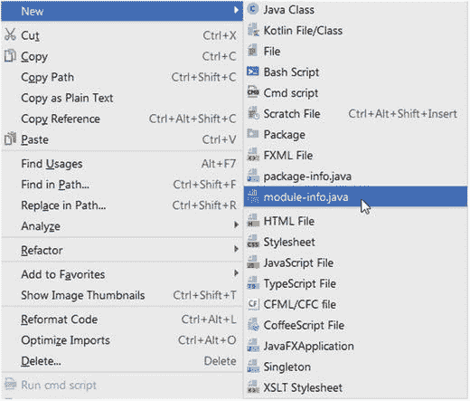
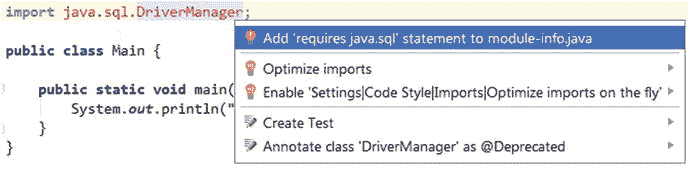
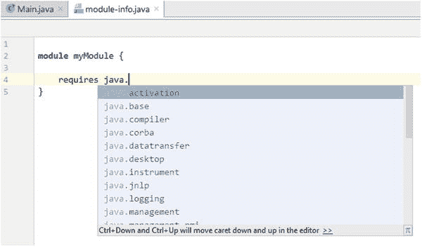
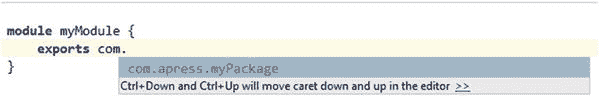

# 12. 与工具的集成

为了让开发者社区能够轻松且尽快地采用 Java 9，集成开发环境（IDE）和构建工具尽可能广泛地支持 Java 9 至关重要——这一点非常重要，以至于我们专门用一整章来讨论这个主题。

这最后一章展示了 JDK 9 整体上，特别是 Java 平台模块系统，如何与以下工具集成：

*   像 Intellij IDEA、Eclipse 和 NetBeans 这样的 IDE
*   像 Apache Maven 这样的构建工具

我们将了解这些工具为 Jigsaw 提供了哪些支持。

## 与 IDE 的集成

Jigsaw 已经集成到 Intellij IDEA、Eclipse 和 NetBeans 等 IDE 中。接下来的三个小节将介绍这些 IDE 提供了哪些支持，以使开发者更轻松地使用 Jigsaw。我们从 Intellij IDEA 开始。

注意

根据 2017 年 7 月在 [`www.keycdn.com/blog/best-ide/`](http://www.keycdn.com/blog/best-ide/) 上发表的一篇文章，Intellij IDEA、Eclipse 和 NetBeans 是 Java 编程中最流行的 IDE。因此，我们决定在本章中重点介绍这三个 IDE，而不是其他不特别关注 Java 编程语言的 IDE。

### 与 Intellij IDEA 的集成

由 JetBrains 开发的 Intellij IDEA 是一款 Java IDE，同时提供社区版和商业版。从 2017 年 3 月发布的 2017.1 版本开始，它就开始支持 Project Jigsaw。在其众多功能中，IDEA 支持在 `module-info.java` 模块描述符文件中进行代码补全。

图 12-1 展示了我们如何通过在 Intellij IDEA 中选择 New ➤ module-info.java 来创建一个 `module-info.java` 文件。



图 12-1.

在 Intellij IDEA 中添加 module-info.java

IDEA 会创建一个空的 `module-info.java` 文件，其中只包含 `module` 关键字和模块名称。

如果我们在一个 Java 文件中添加新的导入，Intellij IDEA 可以自动在 `module-info.java` 中添加必要的 `requires` 子句。例如，如果我们在代码中导入 `java.sql.DriverManager` 类，Intellij IDEA 可以找出该类所在的模块名称。因此，它可以提示我们在模块描述符中添加 `requires java.sql` 子句，如图 12-2 所示。



图 12-2.

在 module-info.java 中添加 requires 语句的自动补全功能

Intellij IDEA 还在 `module-info.java` 文件中提供了代码自动补全功能。如果我们开始输入模块名称，IDEA 会计算并显示可用的建议，如图 12-3 所示。



图 12-3.

模块名称的自动补全

Intellij IDEA 还可以为我们想要导出的包提供自动补全功能。图 12-4 展示了为 `exports` 子句提供自动补全功能的示例。当我们开始输入想要导出的包名时，Intellij IDEA 可以提示可能的建议，这样我们就不必输入完整的名称。



图 12-4.

module-info.java 文件中包名的自动补全功能

在 Intellij IDEA 提供的与 Jigsaw 相关的其他功能中，我们想提一下这些：

*   **可视化模块图**：模块图允许我们可视化模块之间的依赖关系。可以通过选择 Diagrams ➤ Show Diagram ➤ Java Modules Diagram 来查看。
*   **可视化模块使用情况**：显示模块在何处被使用。

Intellij IDEA 还提供了许多本章未涵盖的其他功能。涵盖所有功能超出了本书的范围。有关 Intellij IDEA 中 Jigsaw 支持的更多信息，请查看 JetBrains 官方博客上的文档，网址为 [`https://blog.jetbrains.com/idea/?s=java+9`](https://blog.jetbrains.com/idea/?s=java+9) 。搜索关键词 `java 9` 或 `module`。

下一节将探讨另一个流行的 IDE：Eclipse。

### 与 Eclipse 的集成

Eclipse 是一款免费的 IDE。截至 JDK 9 build 178（2017 年 7 月），Eclipse 提供了一个名为 Java 9 Support for Oxygen 的有用工具，该工具仅适用于 Eclipse Oxygen（4.7）。

然而，可以使用 JDK 9 启动任何版本的 Eclipse，有两种方法可以实现。第一种是将 JDK 9 放在系统路径中，第二种是在 `eclipse.ini` 文件中添加 JDK 9 的路径，如下例所示：

```
--launcher.appendVmargs
-vm
C:\Program Files\Java\jdk-9\bin\javaw.exe
```

如果你使用的 Eclipse 版本大于或等于 4.7，则可以使用 JDK 启动 Eclipse。如果你使用的版本低于 Eclipse 4.7，则必须在 `eclipse.ini` 文件中添加 `--add-modules=ALL-SYSTEM` 标志。此标志已在 Eclipse 4.7 的 `eclipse.ini` 中添加，因此如果你使用的是 Eclipse 4.7 或更高版本，则无需再添加。使用 `ALL-SYSTEM` 标志是因为 Eclipse 使用的并非所有类型都位于 `java.base` 模块内。

至于 Java 9 Support for Oxygen 工具，Eclipse 文档指出：“Eclipse Java 9 Support 包含以下内容：能够将 JRE 和 JDK 9 添加为已安装的 JRE，支持 JavaSE-9 执行环境，能够创建使用 JRE 或 JDK 9 的 Java 和插件项目，能够编译属于 Java 项目一部分的模块。”

截至 2017 年 8 月，Eclipse 对 Java 9 的支持仍在进行中。有关 Eclipse 中 Jigsaw 支持的更多信息，请查看 Eclipse 官方 Wiki 上的文档，网址为 [`https://wiki.eclipse.org/Java_9_Readiness`](https://wiki.eclipse.org/Java_9_Readiness) 。

### 与 NetBeans 的集成

NetBeans 是由 Oracle 开发的跨平台 IDE。从 NetBeans 9 版本开始，它提供对 JDK 9 的支持。截至 2017 年 8 月，NetBeans 只允许我们在一个 NetBeans 项目中创建一个模块——我们不能在一个 NetBeans 项目中创建多个模块。如果我们有多个 Jigsaw 模块，我们必须为每个模块创建一个单独的 NetBeans 项目。

截至 2017 年 8 月，NetBeans 9 仍在开发中。你可以从 [`http://bits.netbeans.org/download/trunk/nightly/latest/`](http://bits.netbeans.org/download/trunk/nightly/latest/) 下载它。

如果我们的系统上只安装了 JDK 9，那么对于 NetBeans 9 来说没问题，但如果我们的系统上同时安装了 JDK 9 和另一个版本 <9 的 JDK，则必须在 NetBeans 安装过程中明确指定我们要使用 JDK 9。

根据 NetBeans 官方网站的说法，以下是 NetBeans JDK 9 提供支持的最重要领域：

*   Maven 项目
*   `module-info.java` 支持
*   编译
*   运行和调试
*   模块依赖关系图

注意

有关 JDK 9 与 NetBeans 集成的更多信息，请访问 [`http://wiki.netbeans.org/JDK9Support`](http://wiki.netbeans.org/JDK9Support) 。

您刚刚了解了三个最流行的 Java 相关 IDE 为 Project Jigsaw 提供的支持概况。下一节将讨论 Jigsaw 与 Apache Maven 等构建工具的集成。

## 与构建工具的集成

自 2016 年上半年以来，Apache Maven 为 Jigsaw 提供了非常好的集成。它很早就开始集成 Jigsaw，并从开发者社区收集了宝贵的反馈。Maven 团队还开发了一个出色的 Apache Maven JDeps 插件，用于从 Maven 运行 JDeps。


### 与 Apache Maven 的集成

Maven 的主要目标之一是通过仅升级其插件来提供对 Java 9 的支持。为了让 Maven 能在 Java 9 上运行，Maven 核心内部无需进行任何更改。另一个主要目标是从 Maven 3.0 开始提供对 Java 9 的支持。

为了在 Java 9 中使用 Maven，必须同时满足两个条件：

*   必须将 Maven 的 `JAVA_HOME` 变量设置为指向 JDK 9 的安装目录。
*   Maven Compiler 插件的 `source` 和 `target` 参数应大于或等于 6。

Maven Compiler 插件为 `source` 和 `target` 定义了参数，这些参数对应于 JDK 的版本。JDK 9 的 `source` 和 `target` 支持的最低版本是 6。用于运行 Maven 的 JDK 版本不必与用于运行 Maven Compiler 插件的 JDK 版本相同。

Maven 需要针对 Java 9 中实现的一些 JEP 进行调整。除了与 Jigsaw 相关的 JEP 之外，Maven 还需要进行调整以适应以下 JEP：JEP 223 – 新版本字符串方案、JEP 226 – UTF-8 属性文件、JEP 238 – 多版本 JAR 文件、JEP 247 – 为旧平台版本编译，以及 JEP 285 – 模块化 Java 应用程序打包。

即使它不属于 Jigsaw 的一部分，我们也应该谈谈 JEP 223 – 新版本字符串方案，因为它对 Maven 影响巨大。Maven 严重依赖系统属性。由于 Java 9 中的版本字符串已更改，Maven 在内部尝试计算版本时会抛出 `ArrayIndexOutOfBoundsException`。幸运的是，从以下插件的以下版本开始，该问题已得到修复：

*   maven-archiver-3.0.1
*   maven-jar-plugin-3.0.0
*   maven-war-plugin-3.0.0
*   maven-ear-plugin-xxx
*   maven-javadoc-plugin-2.10.4

如果你在 Java 9 中使用这些插件，请确保将它们升级到至少这些版本之一。

表 12-1 显示了受 Java 9 引入影响的 Maven 插件。

表 12-1.

受 Java 9 影响的 Maven 插件

| 插件名称 | 最低兼容版本 | 受影响的目标和状态 |
| --- | --- | --- |
| Maven Compiler 插件 | 3.6.1 | compile => 新特性 testCompile => 新特性 |
| Maven Javadoc 插件 | 2.10.4 | jar => 失败 javadoc => 警告 aggregate => 失败 |
| Maven Plugin 插件 | 3.5 | descriptor |
| Maven War 插件 |   | war => 失败 |
| Plexus :: Component Metadata | 1.7 | generate-metadata => 新特性 |

还记得第 8 章中描述的 JDeps 工具吗？Maven 将此工具集成到一个新插件中，即 Apache Maven JDeps 插件。

#### Apache Maven JDeps 插件

该插件利用 JDeps 工具分析我们类中的内部 API 调用。它可以在构建项目时执行分析。

注意

Maven JDeps 插件的第一个版本是 3.0。Maven 特意选择了这个版本，以表明应使用 Maven 3.0 或更高版本。

该插件包含两个目标：

*   一个名为 `jdeps:jdkinternals` 的目标，用于验证主类是否依赖于内部 JDK 类
*   一个名为 `jdeps:test-jdkinternals` 的目标，用于验证测试类是否依赖于内部 JDK 类

表 12-2 显示了可以在 Maven JDeps 插件的 `<configuration>` 标签内使用的一些最重要的选项，这些选项记录在 Oracle 的 Java SE 文档中。

表 12-2.

Maven JDeps 插件的选项

| 插件名称 | 描述 | 示例 |
| --- | --- | --- |
| `failOnWarning` | 指定如果存在 JDeps 特定警告，构建是否继续。默认为 true | `<failOnWarning>` `false` `</failOnWarning>` |
| `dependenciesToAnalyzeIncludes` | 指定要分析的额外依赖项。格式为 `<include>` `groupId:artifactId` `</include>`。允许使用模式。 | `<dependenciesToAnalyzeIncludes>` `<include>*:*</include>` `<include>` `com.apress.*:*` `</include>` `<include>` `com.apress.book:*` `</include>` `<include>` `com.apress.book:utils` `</include>` `</dependenciesToAnalyzeIncludes>` |
| `dependenciesToAnalyzeExcludes` | 指定不应分析的依赖项。格式为 `<exclude>` `groupId:artifactId` `</exclude>`。允许使用模式。 | `<dependenciesToAnalyzeExcludes>` `<exclude>` `com.apress.book:*` `</exclude>` `</dependenciesToAnalyzeExcludes>` |
| `jdeps.include` | 将分析限制为与模式匹配的类。它过滤要分析的类列表。 |   |
| `jdeps.profile` | 显示包含包的配置文件或文件。 |   |
| `jdeps.recursive` | 递归遍历所有依赖项。 |   |
| `jdeps.module` | 显示包含包的模块。 |   |

使用 `-` `R` 选项运行时，如果存在使用 JDK 内部 API 的传递依赖项，则会显示警告。

注意

通过将 `<failOnWarning>` 选项设置为 true，如果存在任何警告，构建将立即失败。

如果我们有一个使用第三方库的应用程序，那么首先使用 Maven JDeps 插件（将 `<failOnWarning>` 选项设置为 true）在我们的应用程序代码中查找 JDK 内部 API 是有意义的，这样如果发现任何 JDK 内部 API，构建就会失败。下一步，我们可以仅对第三方库运行 Maven JDeps 插件，但这次将 `<failOnWarning>` 设置为 false，这样如果第三方库使用了 JDK 内部 API，我们的构建也不会失败。这是合理的，因为我们无法深入第三方库内部进行修复，但我们可以在自己的应用程序代码中做到这一点。

清单 12-1 展示了一个使用 Maven JDeps 插件实现此特定用例的示例。

```
org.apache.maven.plugins
maven-jdeps-plugin
3.0.0

testOnClasses

jdkinternals
test-jdkinternals

testOnDependencies

jdkinternals
test-jdkinternals

false
true

清单 12-1.
使用 Maven JDeps 插件的示例
```

我们在名为 `testOnClasses` 的执行块中搜索应用程序代码中的 JDK 内部 API。我们指定了两个目标，`jdkinternals` 和 `test-jdkinternals`，以便同时验证 `main` 类和 `test` 类。我们在此处没有指定 `<failOnWarning>` 属性，因此它将默认为 true。之后，我们指定另一个执行块来搜索附加到我们应用程序的第三方库。为此，我们将 `<recursive>` 标签指定为 true。`failOnWarning` 设置为 false，这样如果发现 JDK 内部 API，构建不会失败。

下一节将探讨 Maven Compiler 插件为 Jigsaw 提供的支持。


#### Apache Maven Compiler 插件

Apache Maven Compiler 插件自 2016 年 10 月发布的 3.6.0 版本起，开始支持新的 Java 平台模块系统。

Apache Maven Compiler 插件的版本可以直接在插件配置中指定：

```
org.apache.maven.plugins
maven-compiler-plugin
3.6.0

```

Apache Maven Compiler 插件的 3.6.0 版本增加了对模块路径的支持。众所周知，Maven Compiler 插件有两个目标：`compile` 和 `test-compile`。在编译阶段，当发现 `module-info.java` 文件时，插件会自动切换到模块路径。在 `test-compile` 阶段，插件会为主源码切换到模块路径，而为测试源码切换到类路径。

注意

Maven 团队还增加了对在 `pom.xml` 配置中直接指定 `--add-modules` 或 `--add-exports` 等标志的支持。

例如，如果我们想使用 `--add-modules` 标志通过 Maven Compiler 插件添加 `java.xml.bind` 模块，可以在 Maven Compiler 插件的配置中这样定义：

```
--add-modules
java.xml.bind

```

我们也可以使用 Maven 将 `java.base` 模块中的 `sun.net` 包提供给我们的模块 `com.apress.myModule`：

```
--add-exports
java.base/sun.net=com.apress.myModule

```

清单 12-2 展示了针对上述两个用例的插件完整配置：

```
maven-compiler-plugin
3.6.0

example

compile

--add-exports
java.base/sun.net=com.apress.myModule
--add-modules
java.xml.bind

清单 12-2.
向 Maven Compiler 插件添加编译器参数
```

在此示例中，我们将 `maven-compiler-plugin` 的版本定义为 3.6.0。在 `<compilerArgs>` XML 标签内，我们指定了要传递给编译器的参数。每个参数都在 `<arg>` XML 标签内指定。

#### 向后兼容性

在迁移到 Java 9 期间，使用 Java 版本 <8 编写的项目将获得一个 `module-info.java` 文件。使用 Maven，可以在 Java 9 中编译这些项目（考虑 `module-info.java` 文件），也可以在 Java 9 之前的版本中编译它们。

为此，需要进行两次编译：

*   第一次编译将由 Maven Compiler 插件使用配置 `<release>9</release>` 执行。
*   第二次编译将由 Maven Compiler 插件使用低于 9 的配置执行，例如：`<source>1.8</source> 和 <target>8</target>`。

这可以通过 Maven Compiler 在两个不同的执行块中轻松完成。如果我们希望与 JDK 6 之前的版本兼容，则必须使用不同的 JDK。这是因为 JDK 9 不支持为 JDK 6 之前的版本进行编译。

Maven Compiler 插件还支持 JEP 247 – 为旧平台版本编译。它允许我们为 Java 9 项目添加 `module-info.java` 文件，同时与早期版本的 Java 兼容。为此，我们需要调用 `javac` 两次。首先，我们需要使用 `release=9` 调用 `javac`，以便使用 JDK 9 编译 `module-info.java` 文件。然后，我们需要将 `source` 和 `target` 设置为较低的 Java 版本，以便使用较低的 Java 版本编译其余的源代码。如果我们至少使用 Maven 3.3.1 版本，则可以使用工具链来实现此用例。

例如，如果我们的 `JAVA_HOME` 环境变量低于或等于 JDK 9，我们可以将 `jdkToolchain` 的版本设置为 9，以便编译所有内容，包括 `module-info.java` 文件：

```

```

随后，我们重新编译文件并排除 `module-info.java` 文件：

```

module-info.java

```

另一方面，如果我们的 `JAVA_HOME` 环境变量等于 JDK 9，那么我们可以将 `<jdkToolchain>` 的版本设置为 `[1.5,9)`，并使用 `<source>` 和 `<target>` = 1.5 编译文件：

```
[1.5,9)

1.5
1.5
```

注意

作为规则，我们应该使用匹配的 JDK 版本进行编译。

要配置 Maven Toolchain 插件，我们可以编辑 `.m2` 文件夹中的 `toolchains.xml` 文件，或者，如果我们使用的 Maven 版本大于或等于 3.3.1，我们可以直接编辑 Maven `conf` 目录中的 `toolchains.xml` 文件。

Maven 还定义了一个新的命令行选项 `--release`，它允许我们传递要编译的 JDK 发行版版本。例如，选项 `--release 8` 等同于 `-source 8 -target 8 -bootclasspath ...`。从 3.6.0 版本开始的 Maven Compiler 插件像这样指定发行版版本：

```
release_version
```

`<release>` 标签配置的优先级高于 `<source>` 和 `<target>` 标签。因此，如果我们同时指定了 `<release>` 标签以及 `<source>` 和 `<target>` 标签，那么 `<release>` 标签将被优先考虑。

注意

Apache Maven Compiler 插件的 3.6.1 版本于 2017 年 1 月推出。

我们还推荐一篇由 Maven 项目主席 Robert Scholte 撰写的有趣文章，该文章解释了为什么 Maven 无法自动生成 `module-info.java` 文件。您可以在 [`www.sitepoint.com/maven-cannot-generate-module-declaration/`](http://www.sitepoint.com/maven-cannot-generate-module-declaration/) 阅读。

## 总结

在本章中，我们了解了 IDE 和构建工具为 Jigsaw 提供了哪些支持。我们首先简要讨论了三个 IDE：Intellij IDEA、Eclipse 和 NetBeans。

然后，我们转向构建工具，并了解了 Maven 为 JDK 9 提供的支持。我们讨论了 Maven 的向后兼容性，并了解了 Java 编译器是如何被调用两次的——一次是因为 `module-info.java` 文件必须使用 `--release 9` 编译，另一次是为了让除 `module-info.java` 之外的所有 Java 源文件都使用小于 9 的 `source` 和 `target` 进行编译。我们还了解了 Maven JDeps 插件，它用于在我们的代码中查找 JDK 内部 API 的使用情况。


索引 A  
--add-exports 选项  
Apache Maven 兼容性  
Compiler 插件目标  
JDeps 插件目标  
选项  
JEP 223 – 新版本字符串方案  
自动模块  
优势  
特性  
推导模块名称  
--describe-module 选项  
致命错误  
基于文件名的算法  
链接时  
Log4j  
库  
需求  
JAR 文件版本  
B  
--bind-services  
Boot 层  
C  
汽车制动系统  
服务消费者  
服务提供者  
checkPackageAccess(String packageName) 方法  
ClassLoader.java  
类加载机制  
getPlatformClassLoader() 方法  
Jigsaw  
JPMS  
JVM  
类路径  
内聚性  
组合性  
紧凑型配置文件  
编译过程  
隐藏包  
连续性  
模块间耦合  
自定义运行时镜像  
循环依赖  
D  
可分解性  
深度反射  
依赖地狱  
--describe-module  
E  
Eclipse  
封装  
添加可读性  
深度反射  
导出包  
--illegal-access 选项  
JDK 内部 API  
Junit 测试类  
根  
setAccessible() 方法  
不受支持的包  
警告消息  
显式依赖  
导出语句  
F  
更快的开发  
基于文件名的算法  
G  
getResourceAsStream() 方法  
H  
Hamcrest-Core  
I  
非法的反射访问  
集成开发环境 (IDE)  
Eclipse  
IntelliJ IDEA  
NetBeans  
IntelliJ IDEA  
添加 module-info.java  
自动补全功能  
可视化模块  
J, K  
JAR 文件  
--describe-module 选项  
多模块  
多版本  
参见 多版本 JAR 文件  
拆分包  
JAR 地狱  
Java 9  
封装  
JDK 和 JRE  
Jigsaw 模块  
Jlink  
迁移  
模块  
类  
运行时镜像  
单元测试  
java.activation  
Java 归档 (JAR) 文件  
java.base  
Java 社区进程 (JCP)  
java.compiler  
java.corba  
java.datatransfer  
Java 依赖分析工具 (JDeps)  
定义  
生成模块描述符  
Guava 库  
选项  
java.desktop  
java.instrument  
java.logging  
java.management  
java.management.rmi  
java.naming  
Java 平台模块系统 (JPMS)  
java.prefs  
java.rmi  
Java 运行时环境 (JRE)  
java.scripting  
java.se  
java.security.jgss  
java.security.sasl  
java.se.ee  
java.sql  
java.sql.rowset  
java.transaction  
Java 虚拟机 (JVM)  
java.xml  
java.xml.bind  
java.xml.crypto  
java.xml.ws  
java.xml.ws.annotation  
JDeps  
Apache Maven  
目标  
选项  
JDK 7  
模块图  
JDK 9  
消费和提供服务  
load() 方法  
一个消费者和一个提供者  
一个消费者和两个提供者  
provides 子句  
stream() 方法  
构建系统的结构  
目标命令  
uses 子句  
JDK 增强提案 (JEP)  
JEP 200 (模块化 JDK)  
JEP 201 (模块化源代码)  
JEP 220 (模块化运行时镜像)  
JEP 260 (封装大多数内部 API)  
JEP 261 (模块系统)  
JEP 282 (jLink: Java 链接器)  
JDK 内部 API  
关键类别  
迁移过程  
非关键类别  
sun.net 包  
JDK 模块化  
Jigsaw  
Jigsaw, 项目  
参见 项目 Jigsaw  
Jlink 工具  
命令  
选项  
命令语法  
压缩级别  
自定义运行时镜像  
目录  
--exclude-files  
插件  
生成的运行时镜像  
Guava JAR 文件  
输入文件  
Java 启动器  
jdk.jlink 模块  
链接阶段  
模块化 JAR 文件  
输出文件  
插件  
release-info 插件  
运行时镜像，创建  
--add-modules  
bin 目录  
检查文件大小  
检查大小  
conf 目录  
DatabasePersistenceService  
FilePersistenceService  
javac 命令  
legal 目录  
lib 目录  
--list-modules  
减小文件大小  
服务绑定  
JMOD 文件  
JSR 376  
Junit 测试  
位于不同模块  
位于类路径  
Junit 测试类  
L  
层  
基础  
启动  
配置  
创建新的 ModuleLayer  
类  
解析模块  
定义  
getLayer() 方法  
已加载模块  
链接阶段  
松散耦合  
M  
可维护性  
Maven  
pom.xml 文件  
迁移过程  
编译过程  
循环依赖  
封装的 JDK 内部 API  
getSystemResource() 方法  
模块图  
新的版本方案  
已移除的方法  
拆分包  
隐藏包  
JAR 文件  
JEP 146  
JPMS 要求  
两个模块  
自顶向下迁移  
修饰符  
模块化  
变更  
执行  
特性  
内聚性  
耦合  
定义  
封装  
显式接口  
目标  
高模块内聚性  
实现  
接口  
低模块耦合  
可维护性  
现代软件架构  
模块定义  
可靠配置  
可重用性  
结构  
紧耦合与松散耦合  
模块化 JAR  
模块化 JDK  
--list-modules  
模块图  
java.base 模块  
java.se.ee 模块  
java.se 模块  
模块  
描述  
java.base  
Java 运行时系统  
标准平台模块  
非标准模块  
标准模块  
源代码  
构建过程调整  
类  
目录  
conf 目录  
模块目录  
module-info.java  
native 目录  
新方案  
结构  
模块化编程  
优势  
定义  
与 OOP 原则  
Module API  
访问资源  
属性  
类  
构造器  
descriptor() 方法  
枚举  
异常  
find() 方法  
getDescriptor() 方法  
接口  
java.lang.Class  
方法  
getUnnamedModule() 类方法  
ModuleDescriptor 类  
ModuleDescriptor 属性  
ModuleDescriptor.Exports 类  
ModuleDescriptor 方法  
ModuleDescriptor.Opens 类  
ModuleDescriptor.Provides 类  
ModuleDescriptor.Requires 类  
ModuleDescriptor.Version 类  
ModuleFinder 接口  
Module  
java.base 模块路径  
ModuleReader 接口  
ModuleCore 类  
模块路径  
模块系统  
多版本 JAR 文件  
属性  
创建  
定义  
JDK 8 更新  
版本控制  
元数据  
N  
NetBeans  
无访问修饰符  
O  
面向对象编程 (OOP) 与模块化编程  
开放服务网关倡议 (OSGi)  
P, Q  
--patch-module 选项  
优势  
命令行选项  
Junit 测试  
位于不同模块  
位于类路径  
POJO 类  
语法  
私有访问修饰符  
项目 Jigsaw  
向后兼容性  
文档  
下载和安装  
增强功能  
可扩展性和性能  
安全性  
概述  
Java 9 中的关键字  
无版本控制  
目标  
JRE 和 JDK  
二进制结构  
conf 目录  
rt.jar 和 tools.jar 文件  
模块化  
Open JDK  
OSGi 与平台模块化  
准备  
可靠配置  
强封装  
Java 9 之前版本的弱点  
JAR 地狱问题  
弱封装  
受保护访问修饰符  
公共访问修饰符  
R  
可靠配置  
可重用性  
rt.jar  
S  
可扩展性，单体系统  
服务消费者模块  
ServiceLoader API  
服务提供者模块  
setAccessible() 方法  
软件应用  
复杂性  
依赖  
重用  
拆分包  
隐藏包  
JAR 文件  
JEP 146  
JPMS 要求  
两个模块  
强封装  
T  
测试过程  
紧耦合  
自顶向下迁移  
Google Gson  
JAR 文件  
Main 类  
News 类  
源代码  
U, V, W  
可理解性  
单元测试  
不受支持的 API  
可升级模块  
Uses 语句  
X, Y, Z  
-Xmodule 选项
