**Java 9**

揭秘

面向早期采纳与迁移

—

Kishori Sharan

Java 9 揭秘

面向早期采纳与迁移

Kishori Sharan

***Java 9 揭秘：面向早期采纳与迁移***

Kishori Sharan

美国阿拉巴马州蒙哥马利市

ISBN-13 (平装): 978-1-4842-2591-2

ISBN-13 (电子版): 978-1-4842-2592-9

DOI 10.1007/978-1-4842-2592-9

美国国会图书馆控制号：2017939348

版权所有 © 2017 Kishori Sharan

本作品受版权保护。出版商保留所有权利，无论是全部还是部分涉及材料，特别是翻译、重印、重用插图、朗诵、广播、微缩胶片复制或任何其他物理方式，以及电子改编、计算机软件的信息传输或存储检索，或使用目前已知或未来开发的相似或不同方法。

本书中可能出现商标名称、标识和图像。我们仅在编辑风格下使用商标名称、标识和图像，以维护商标所有者的利益，并无意侵犯商标权，而非在每次出现时都使用商标符号。

本出版物中使用的商品名称、商标、服务标志及类似术语，即使未被明确标识，也不应被视为对其是否受专有权利保护的表达意见。

尽管本书中的建议和信息在出版时被认为是真实准确的，但作者、编辑和出版商均不对可能存在的任何错误或遗漏承担法律责任。出版商对本书所含内容不作任何明示或暗示的保证。

常务董事：Welmoed Spahr

编辑总监：Todd Green

采购编辑：Steve Anglin

开发编辑：Matthew Moodie

技术审校：Manuel Jordan Elera

协调编辑：Mark Powers

文字编辑：Kezia Endsley

排版：SPi Global

索引编制：SPi Global

插图：SPi Global

封面图片由 Freepik 设计。

全球图书贸易由 Springer Science+Business Media New York 发行，

地址：233 Spring Street, 6th Floor, New York, NY 10013。电话：1-800-SPRINGER，传真：(201) 348-4505，电子邮件：

orders-ny@springer-sbm.com，或访问[www.springeronline.com](http://www.springeronline.com)。Apress Media, LLC 是加利福尼亚州的有限责任公司，

其唯一成员（所有者）是 Springer Science + Business Media Finance Inc (SSBM Finance Inc)。SSBM

Finance Inc 是一家**特拉华州**公司。

有关翻译信息，请发送电子邮件至 rights@apress.com，或访问 [`www.apress.com/`](http://www.apress.com/rights-permissions)

[rights-permissions](http://www.apress.com/rights-permissions)。

Apress 图书可批量购买用于学术、企业或促销用途。大多数图书也提供电子版和许可证。如需更多信息，请参考我们的印刷版和电子版批量销售网页：[`www.apress.com/bulk-sales`](http://www.apress.com/bulk-sales)。

作者在本书中引用的任何源代码或其他补充材料，读者可通过本书的产品页面在 GitHub 上获取，网址为 [www.apress.com/9781484225912](http://www.apress.com/9781484225912)。如需更详细信息，请访问 [`www.apress.com/source-code`](http://www.apress.com/source-code)。

采用无酸纸印刷

*献给我的朋友 Richard Castillo，他在我撰写书籍的旅程中给予了不可思议的帮助。*

*没有他的帮助，我无法出版我的“驾驭 Java 7”三本书系列。谢谢你，我的朋友，感谢你所有的帮助。*

**内容概览**

关于作者 ����������������������������������������������������������������������������������������������������������������xix 关于技术审校 ��������������������������������������������������������������������������������������������������������xxi 致谢 ����������������������������������������������������������������������������������������������������������������������xxiii 引言 �����������������������������������������������������������������������������������������������������������������������xxv

■第 1 章：引言 ��������������������������������������������������������������������������������������������������������� 1

■第 2 章：模块系统 ������������������������������������������������������������������������������������������������ 7

■第 3 章：创建你的第一个模块 ������������������������������������������������������������������������������ 31

■第 4 章：模块依赖 ����������������������������������������������������������������������������������������������� 57

■第 5 章：实现服务 ���������������������������������������������������������������������������������������������� 105

■第 6 章：打包模块 ���������������������������������������������������������������������������������������������� 127

■第 7 章：创建自定义运行时镜像 ������������������������������������������������������������������������ 147

■第 8 章：JDK 9 中的重大变更 ������������������������������������������������������������������������������ 159

■第 9 章：打破模块封装 �������������������������������������������������������������������������������������� 197

■第 10 章：模块 API ���������������������������������������������������������������������������������������������� 211

■第 11 章：Java Shell �������������������������������������������������������������������������������������������� 249

■第 12 章：进程 API 更新 �������������������������������������������������������������������������������������� 313

■第 13 章：集合 API 更新 ������������������������������������������������������������������������������������� 333

■第 14 章：HTTP/2 客户端 API ������������������������������������������������������������������������������ 347

■第 15 章：增强的弃用机制 ��������������������������������������������������������������������������������� 377

v

■ 内容概览

■第 16 章：栈遍历 ������������������������������������������������������������������������������������������������ 391

■第 17 章：响应式流 ������������������������������������������������������������������������������������������� 411

■第 18 章：流 API 更新 ��������������������������������������������������������������������������������������� 429

■第 19 章：平台与 JVM 日志记录 ������������������������������������������������������������������������� 441

■第 20 章：JDK 9 中的其他变更 ��������������������������������������������������������������������������� 461

索引 ����������������������������������������������������������������������������������������������������������������������� 515

vi

**目录**

关于作者 ����������������������������������������������������������������������������������������������������������������xix 关于技术审校 ��������������������������������������������������������������������������������������������������������xxi 致谢 ����������������������������������������������������������������������������������������������������������������������xxiii 引言 �����������������������������������������������������������������������������������������������������������������������xxv

■第 1 章：引言 ��������������������������������������������������������������������������������������������������������� 1

JDK 9 简介 ���������������������������������������������������������������������������������������������������������������������� 1

如何阅读本书 ���������������������������������������������������������������������������������������������������������������� 2

系统要求 ������������������������������������������������������������������������������������������������������������������������ 3

安装 NetBeans IDE ���������������������������������������������������������������������������������������������������������� 4

下载源代码 ������������������������������������������������������������������������������������������������������������������� 5


■第 2 章：模块系统 ������������������������������������������������������������������������������������������������ 7

Java 9 之前的时代 ������������������������������������������������������������������������������������������������������������������������ 7

新的模块系统 �������������������������������������������������������������������������������������������������������������������������������� 9

什么是模块？ ������������������������������������������������������������������������������������������������������������������������������ 10

模块依赖 ������������������������������������������������������������������������������������������������������������������������������������ 11

模块图 ������������������������������������������������������������������������������������������������������������������������������������������������������� 13

聚合模块 ��������������������������������������������������������������������������������������������������������������������������������������� 17

声明模块 ������������������������������������������������������������������������������������������������������������������������������������� 17

模块名称 ������������������������������������������������������������������������������������������������������������������������������������������������������ 19

控制对模块的访问 ��������������������������������������������������������������������������������������������������������������������������������������������� 20

声明依赖 ���������������������������������������������������������������������������������������������������������������������������������������������������������� 21

配置服务 ������������������������������������������������������������������������������������������������������������������������������������������������������������ 21

vii

■ 目录

模块描述符 ������������������������������������������������������������������������������������������������������������������������������������ 22

编译模块声明 ���������������������������������������������������������������������������������������������������������������������������������������������������� 22

模块版本 ������������������������������������������������������������������������������������������������������������������������������������������������������������� 23

模块源文件结构 ����������������������������������������������������������������������������������������������������������������������������������������������� 23

打包模块 ���������������������������������������������������������������������������������������������������������������������������������������� 24

目录中的模块 ���������������������������������������������������������������������������������������������������������������������������������������������������� 24

模块化 JAR 中的模块 ���������������������������������������������������������������������������������������������������������������������������������������� 24

JMOD 文件中的模块 ������������������������������������������������������������������������������������������������������������������������������������������� 25

模块路径 ��������������������������������������������������������������������������������������������������������������������������������������� 25

可观察模块 ��������������������������������������������������������������������������������������������������������������������������������������� 28

总结 ���������������������������������������������������������������������������������������������������������������������������������������������� 29

■第 3 章：创建你的第一个模块 �������������������������������������������������������������������������������� 31

使用命令提示符 �������������������������������������������������������������������������������������������������������������������������� 31

设置目录结构 ����������������������������������������������������������������������������������������������������������������������������������������������������� 31

编写源代码 ������������������������������������������������������������������������������������������������������������������������������������������������������� 32

编译源代码 �������������������������������������������������������������������������������������������������������������������������������������������������������� 33

打包模块代码 ����������������������������������������������������������������������������������������������������������������������������������������������������� 35

运行程序 ������������������������������������������������������������������������������������������������������������������������������������������������������������ 36

使用 NetBeans IDE ������������������������������������������������������������������������������������������������������������������������ 39

配置 IDE ��������������������������������������������������������������������������������������������������������������������������������������������������������������� 39

创建 Java 项目 ����������������������������������������������������������������������������������������������������������������������������������������������������� 43

设置项目属性 ������������������������������������������������������������������������������������������������������������������������������������������������������� 45

添加模块声明 ���������������������������������������������������������������������������������������������������������������������������������������������������� 47

查看模块图 ���������������������������������������������������������������������������������������������������������������������������������������������������������� 50

编写源代码 ������������������������������������������������������������������������������������������������������������������������������������������������������� 50

编译源代码 �������������������������������������������������������������������������������������������������������������������������������������������������������� 52

打包模块代码 ����������������������������������������������������������������������������������������������������������������������������������������������������� 52

运行程序 ������������������������������������������������������������������������������������������������������������������������������������������������������������ 53

总结 ���������������������������������������������������������������������������������������������������������������������������������������������� 55

viii

■ 目录

■第 4 章：模块依赖 ��������������������������������������������������������������������������������������������������� 57

声明模块依赖 ��������������������������������������������������������������������������������������������������������������������������������������� 57

排查示例问题 ������������������������������������������������������������������������������������������������������������������������������������� 65

空包错误 ������������������������������������������������������������������������������������������������������������������������������������������������������������ 65

模块未找到错误 ����������������������������������������������������������������������������������������������������������������������������������������������� 66

包不存在错误 ��������������������������������������������������������������������������������������������������������������������������������������������������� 66

模块解析异常 ��������������������������������������������������������������������������������������������������������������������������������������������������� 66

隐式可读性 ������������������������������������������������������������������������������������������������������������������������������������� 67

限定导出 �������������������������������������������������������������������������������������������������������������������������������������������� 72

可选依赖 ��������������������������������������������������������������������������������������������������������������������������������������������� 73

使用反射访问模块 ����������������������������������������������������������������������������������������������������������������������������� 74

开放模块 ��������������������������������������������������������������������������������������������������������������������������������������������������������������� 75

开放包 ���������������������������������������������������������������������������������������������������������������������������������������������������������������� 75

使用深度反射 ������������������������������������������������������������������������������������������������������������������������������������������������������ 76

类型可访问性 ����������������������������������������������������������������������������������������������������������������������������������� 85

跨模块拆分包 ����������������������������������������������������������������������������������������������������������������������������������� 85

模块声明中的限制 ������������������������������������������������������������������������������������������������������������������������������� 86


模块类型 ����������������������������������������������������������������������������������������������������������� 86

普通模块 ����������������������������������������������������������������������������������������������������������������������������������� 88

开放模块 ��������������������������������������������������������������������������������������������������������������������������������������� 88

自动模块 ��������������������������������������������������������������������������������������������������������������������������������������� 88

未命名模块 �������������������������������������������������������������������������������������������������������������������������������� 92

迁移至 JDK 9 的路径 ������������������������������������������������������������������������������������������������� 98

解析模块定义 ����������������������������������������������������������������������������������������������������� 99

总结 ���������������������������������������������������������������������������������������������������������������������� 103

■第 5 章：实现服务 ������������������������������������������������������������������������������������ 105

什么是服务？ �������������������������������������������������������������������������������������������������������� 105

发现服务 �������������������������������������������������������������������������������������������������������������������� 107

ix

■ 目录

提供服务实现 �������������������������������������������������������������������������������������������������������������� 108

定义服务接口 ������������������������������������������������������������������������������������������������������ 110

定义服务提供者 ����������������������������������������������������������������������������������������������������������� 113

定义通用素数服务提供者 ��������������������������������������������������������������������������������������������������������� 113

定义更快的素数服务提供者 ����������������������������������������������������������������������������������������������������������� 115

定义最快的素数服务提供者 ��������������������������������������������������������������������������������������������������������� 117

测试素数服务 ������������������������������������������������������������������������������������������������������������ 118

选择与过滤提供者 ������������������������������������������������������������������������������������������������� 121

在遗留模式下测试素数服务 ���������������������������������������������������������������������������������������� 123

总结 ���������������������������������������������������������������������������������������������������������������������� 125

■第 6 章：打包模块 ������������������������������������������������������������������������������������������ 127

JAR 格式 �������������������������������������������������������������������������������������������������������������������� 127

什么是多版本 JAR？ ���������������������������������������������������������������������������������������������������������������������������� 128

创建多版本 JAR ������������������������������������������������������������������������������������������������������������������������������ 129

多版本 JAR 的规则 ����������������������������������������������������������������������������������������������������������������������������� 136

多版本 JAR 与 JAR URL ����������������������������������������������������������������������������������������������������������������������� 137

多版本清单属性 ������������������������������������������������������������������������������������������������������������������������ 138

JMOD 格式 ������������������������������������������������������������������������������������������������������������������������ 138

使用 jmod 工具 ������������������������������������������������������������������������������������������������������������������������������������ 138


摘要 ���������������������������������������������������������������������������������������������������������������������� 145

■第 7 章：创建自定义运行时映像 �������������������������������������������������������������������� 147

什么是自定义运行时映像？ ���������������������������������������������������������������������������������������������� 147

创建自定义运行时映像 ������������������������������������������������������������������������������������������������ 148

绑定服务 �������������������������������������������������������������������������������������������������������������������������� 151

在 jlink 工具中使用插件 ��������������������������������������������������������������������������������������������������� 153

jimage 工具 �������������������������������������������������������������������������������������������������������������������� 156

摘要 ������������������������������������������������������������������������������������������������������������������������������ 158

x

■ 目录

■第 8 章：JDK 9 中的破坏性变更 ������������������������������������������������������������������������������ 159

新的 JDK 版本命名方案 ������������������������������������������������������������������������������������������������ 159

版本号 �������������������������������������������������������������������������������������������������������������������������������������������������� 160

预发布信息 ��������������������������������������������������������������������������������������������������������������������������������������� 161

构建信息 ������������������������������������������������������������������������������������������������������������������������������������������������ 161

附加信息 ���������������������������������������������������������������������������������������������������������������������������������������� 161

解析新旧版本字符串 ����������������������������������������������������������������������������������������������������������������������� 162

系统属性的版本变更 ������������������������������������������������������������������������������������������������������������������������������� 162

使用 Runtime.Version 类 ������������������������������������������������������������������������������������������������������������������������ 162

JDK 和 JRE 的变更 �������������������������������������������������������������������������������������������������������� 165

JDK 和 JRE 的布局变更 ������������������������������������������������������������������������������������������������������������������������� 166

行为变更 �������������������������������������������������������������������������������������������������������������������������������������������� 168

类加载器的变更 ����������������������������������������������������������������������������������������������������������������������������������� 169

访问资源 ������������������������������������������������������������������������������������������������������������������� 173

JDK 9 之前访问资源 �������������������������������������������������������������������������������������������������������������������� 173

在 JDK 9 中访问资源 ��������������������������������������������������������������������������������������������������������������������������� 177

使用 JDK 内部 API ���������������������������������������������������������������������������������������������������������������� 191

修补模块内容 ����������������������������������������������������������������������������������������������������������� 193

摘要 ������������������������������������������������������������������������������������������������������������������������������ 195

■第 9 章：打破模块封装 �������������������������������������������������������������������������������������� 197

什么是打破模块封装？ ���������������������������������������������������������������������������������������������������� 197

命令行选项 ���������������������������������������������������������������������������������������������������������������� 198

--add-exports 选项 ����������������������������������������������������������������������������������������������������������������������������������� 198


--add-opens 选项 ��������������������������������������������������������������������������������������������������������������������� 199

--add-reads 选项 ���������������������������������������������������������������������������������������������������������������������� 200

--permit-illegal-access 选项 ���������������������������������������������������������������������������������������������������� 200

示例 ������������������������������������������������������������������������������������������������������������������ 201

使用 JAR 的清单属性 ����������������������������������������������������������������������������������������������� 207

小结 ���������������������������������������������������������������������������������������������������������������������� 210

xi

■ 目录

■第 10 章：模块 API ������������������������������������������������������������������������������ 211

什么是模块 API？����������������������������������������������������������������������������������������������� 211

表示模块 ������������������������������������������������������������������������������������������������� 213

描述模块 ������������������������������������������������������������������������������������������������������ 213

表示模块语句 ���������������������������������������������������������������������������������������������������������������������� 214

表示模块版本 �������������������������������������������������������������������������������������������������������������������������� 216

模块的其他属性 ����������������������������������������������������������������������������������������������������������������������� 217

了解模块基本信息 ���������������������������������������������������������������������������������������������������������������� 218

查询模块 �������������������������������������������������������������������������������������������������������� 221

更新模块 �������������������������������������������������������������������������������������������������������� 223

访问模块资源 ������������������������������������������������������������������������������������������������������ 226

模块上的注解 ������������������������������������������������������������������������������������������������� 226

加载类 ����������������������������������������������������������������������������������������������������������� 228

使用模块层 �������������������������������������������������������������������������������������������������������� 231

查找模块 ��������������������������������������������������������������������������������������������������������������������������������� 233

读取模块内容 ����������������������������������������������������������������������������������������������������������������������������������� 235

创建配置 �������������������������������������������������������������������������������������������������������������������������������������� 237

创建模块层 �������������������������������������������������������������������������������������������������������������������������������������� 238

小结 ���������������������������������������������������������������������������������������������������������������������� 246

■第 11 章：Java Shell �������������������������������������������������������������������������������� 249

什么是 Java Shell？ ������������������������������������������������������������������������������������������������ 249

JShell 架构 ������������������������������������������������������������������������������������������������ 251

启动 JShell 工具 ������������������������������������������������������������������������������������������������ 252

退出 JShell 工具 �������������������������������������������������������������������������������������������������� 254


什么是代码片段与命令？ �������������������������������������������������������������������������������������������� 254

表达式求值 ���������������������������������������������������������������������������������������������������������������� 256

列出代码片段 ������������������������������������������������������������������������������������������������������������ 258

编辑代码片段 ����������������������������������������������������������������������������������������������������������� 262

重新运行之前的代码片段 ��������������������������������������������������������������������������������������� 265

xii

■ 目录

声明变量 ����������������������������������������������������������������������������������������������������������������������� 265

导入语句 ������������������������������������������������������������������������������������������������������������������������ 268

方法声明 �������������������������������������������������������������������������������������������������������������������� 272

类型声明 ������������������������������������������������������������������������������������������������������������������������� 273

设置执行环境 �������������������������������������������������������������������������������������������������������������������� 276

无受检异常 ���������������������������������������������������������������������������������������������������������������� 278

自动补全 �������������������������������������������������������������������������������������������������������������������������� 279

代码片段与命令历史 ������������������������������������������������������������������������������������������������� 282

读取 JShell 堆栈跟踪 �������������������������������������������������������������������������������������������������� 283

重用 JShell 会话 �������������������������������������������������������������������������������������������������������������� 284

重置 JShell 状态 ������������������������������������������������������������������������������������������������������������ 286

重新加载 JShell 状态 ����������������������������������������������������������������������������������������������������������� 287

配置 JShell ������������������������������������������������������������������������������������������������������������������������ 289

设置代码片段编辑器 ����������������������������������������������������������������������������������������������������������������������������������� 289

设置反馈模式 �������������������������������������������������������������������������������������������������������������������������������������� 291

创建自定义反馈模式 ���������������������������������������������������������������������������������������������������������������������� 293

设置启动代码片段 ������������������������������������������������������������������������������������������������������������������������������� 297

使用 JShell 文档 �������������������������������������������������������������������������������������������������������� 300

JShell API ����������������������������������������������������������������������������������������������������������������������� 302

创建 JShell 实例 �������������������������������������������������������������������������������������������������������������������������������� 303

处理代码片段 ���������������������������������������������������������������������������������������������������������������������������������������� 304

处理代码片段事件 ������������������������������������������������������������������������������������������������������������������������������������� 306

一个示例 ��������������������������������������������������������������������������������������������������������������������������������������������������������� 306

总结 �������������������������������������������������������������������������������������������������������������������������������������� 311

■第 12 章：进程 API 更新 �������������������������������������������������������������������������������������� 313

什么是进程 API？ �������������������������������������������������������������������������������������������������������������� 313


当前进程 ����������������������������������������������������������������������������������������������������� 314

查询进程状态 ������������������������������������������������������������������������������������������������ 315

比较进程 ��������������������������������������������������������������������������������������������������� 318

xiii

■ 目录

创建进程 ������������������������������������������������������������������������������������������������������� 318

获取进程句柄 ����������������������������������������������������������������������������������������� 326

终止进程 ������������������������������������������������������������������������������������������������� 328

管理进程权限 ����������������������������������������������������������������������������������� 329

小结 ������������������������������������������������������������������������������������������������������ 331

■第 13 章：集合 API 更新 ������������������������������������������������������������������� 333

背景 ����������������������������������������������������������������������������������������������������������� 333

不可修改列表 ���������������������������������������������������������������������������������������� 336

不可修改集合 ���������������������������������������������������������������������������������������� 339

不可修改映射 �������������������������������������������������������������������������������������� 342

小结 ������������������������������������������������������������������������������������������������������ 346

■第 14 章：HTTP/2 客户端 API �������������������������������������������������������������������� 347

什么是 HTTP/2 客户端 API？ ������������������������������������������������������������������������������������� 348

设置示例 ���������������������������������������������������������������������������������������������������� 350

创建 HTTP 客户端 ����������������������������������������������������������������������������������� 350

处理 HTTP 请求 ������������������������������������������������������������������������������������������� 352

获取 HTTP 请求构建器 ���������������������������������������������������������������������������������������������������� 352

设置 HTTP 请求参数 ����������������������������������������������������������������������������������������������������� 353

设置请求重定向策略 ������������������������������������������������������������������������ 363

使用 WebSocket 协议 ������������������������������������������������������������������������������������� 364

创建服务器端点 ����������������������������������������������������������������������������������������������������������������� 364

创建客户端端点 ������������������������������������������������������������������������������������������������������������������ 366

运行 WebSocket 程序 ������������������������������������������������������������������������������������������������������� 370

排查 WebSocket 应用程序问题 ��������������������������������������������������������������������������������������� 374

小结 ������������������������������������������������������������������������������������������������������ 374

■第 15 章：增强的弃用机制 ������������������������������������������������������������������� 377

什么是弃用？ ��������������������������������������������������������������������������������������������������� 377

如何弃用一个 API ���������������������������������������������������������������������������������������������� 377

JDK 9 中@Deprecated 的更新 ������������������������������������������������������������������������������� 379


xiv

■ 目录

抑制弃用警告 ��������������������������������������������������������������������������������������������������������������� 381

弃用 API 示例 ��������������������������������������������������������������������������������������������������������������� 382

弃用 API 的静态分析 ����������������������������������������������������������������������������������������������������� 386

弃用 API 的动态分析 ����������������������������������������������������������������������������������������������������� 389

导入时不显示弃用警告 ������������������������������������������������������������������������������������������������� 389

本章小结 ���������������������������������������������������������������������������������������������������������������������� 390

■第 16 章：栈遍历 ������������������������������������������������������������������������������������������������ 391

什么是栈？ ������������������������������������������������������������������������������������������������������������������ 391

什么是栈遍历？ ������������������������������������������������������������������������������������������������������������ 392

JDK 8 中的栈遍历 �������������������������������������������������������������������������������������������������������� 392

栈遍历的缺点 �������������������������������������������������������������������������������������������������������������� 395

JDK 9 中的栈遍历 �������������������������������������������������������������������������������������������������������� 396

指定栈遍历选项 ����������������������������������������������������������������������������������������������������������������������������������� 396

表示栈帧 ���������������������������������������������������������������������������������������������������������������������������������������������� 396

获取 StackWalker �������������������������������������������������������������������������������������������������������������������������������� 398

遍历栈 ������������������������������������������������������������������������������������������������������������������������������������������������� 399

获取调用者类 ��������������������������������������������������������������������������������������������������������������������������������������� 404

栈遍历权限 ������������������������������������������������������������������������������������������������������������������������������������������ 407

本章小结 ���������������������������������������������������������������������������������������������������������������������� 408

■第 17 章：响应式流 ����������������������������������������������������������������������������������������������� 411

什么是流？ ������������������������������������������������������������������������������������������������������������������ 411

什么是响应式流？ �������������������������������������������������������������������������������������������������������� 412

JDK 9 中的响应式流 API ���������������������������������������������������������������������������������������������� 414

发布者-订阅者交互 ������������������������������������������������������������������������������������������������������������������������������ 414

创建发布者 ������������������������������������������������������������������������������������������������������������������������������������������ 415

发布项目 ��������������������������������������������������������������������������������������������������������������������������������������������� 416

快速示例 ��������������������������������������������������������������������������������������������������������������������������������������������� 417

创建订阅者 ������������������������������������������������������������������������������������������������������������������������������������������ 419

使用处理器 ������������������������������������������������������������������������������������������������������������������������������������������ 424

本章小结 ���������������������������������������������������������������������������������������������������������������������� 427

xv

■ 目录


■第 18 章：Streams API 更新 ����������������������������������������������������������������������������������� 429

新的流操作 ������������������������������������������������������������������������������������������������������������������� 429

新的收集器 ������������������������������������������������������������������������������������������������������������������� 433

本章小结 ���������������������������������������������������������������������������������������������������������������������� 439

■第 19 章：平台与 JVM 日志记录 ��������������������������������������������������������������������������� 441

平台日志记录 API �������������������������������������������������������������������������������������������������������� 441

配置 Log4j 库 ����������������������������������������������������������������������������������������������������������������������������������� 442

设置 NetBeans 项目 ��������������������������������������������������������������������������������������������������������������������������� 442

定义模块 ����������������������������������������������������������������������������������������������������������������������������������������������� 443

添加 Log4j 配置文件 ��������������������������������������������������������������������������������������������������������������������������� 444

创建系统日志记录器 �������������������������������������������������������������������������������������������������������������������������� 445

创建日志记录器查找器 �������������������������������������������������������������������������������������������������������������������� 447

测试平台日志记录器 ������������������������������������������������������������������������������������������������������������������������� 448

统一的 JVM 日志记录 ���������������������������������������������������������������������������������������������������� 452

消息标签 ��������������������������������������������������������������������������������������������������������������������������������������������� 453

消息级别 ���������������������������������������������������������������������������������������������������������������������������������������������� 454

消息装饰 ��������������������������������������������������������������������������������������������������������������������������������������������� 454

消息输出目标 �������������������������������������������������������������������������������������������������������������������������������������� 455

-Xlog 语法 �������������������������������������������������������������������������������������������������������������������������������������������� 455

本章小结 ���������������������������������������������������������������������������������������������������������������������� 459

■第 20 章：JDK 9 中的其他变更 ��������������������������������������������������������������������������� 461

下划线成为关键字 ������������������������������������������������������������������������������������������������������� 462

改进的 try-with-resources 语句块 ���������������������������������������������������������������������������� 463

匿名类中的菱形运算符 ��������������������������������������������������������������������������������������������������� 468

接口中的私有方法 �������������������������������������������������������������������������������������������������������� 470

私有方法上的 @SafeVarargs 注解 ������������������������������������������������������������������������������� 472

丢弃进程输出 ����������������������������������������������������������������������������������������������������������������� 474

StrictMath 类中的新方法 ���������������������������������������������������������������������������������������������� 475

ClassLoader 类的变更 ��������������������������������������������������������������������������������������������������� 478

xvi

■ 目录

Optional<T> 类中的新方法 ��������������������������������������������������������������������������������������� 478

CompletableFuture<T> 类的新增内容 ������������������������������������������������������������������������ 481


自旋等待提示 ������������������������������������������������������������������������������������������������������������ 482

时间 API 的增强 ����������������������������������������������������������������������������������������������������� 483

Clock 类 �������������������������������������������������������������������������������������������������������������������������������������������������� 483

Duration 类 ���������������������������������������������������������������������������������������������������������������������������������������������� 484

ofInstant() 工厂方法 �������������������������������������������������������������������������������������������������������������������������� 486

获取纪元秒 ����������������������������������������������������������������������������������������������������������������������������������� 487

LocalDate 流 ������������������������������������������������������������������������������������������������������������������������������������������� 488

新的格式化选项 ������������������������������������������������������������������������������������������������������������������������������������� 490

使用 Scanner 的流操作 ��������������������������������������������������������������������������������� 491

Matcher 类的增强 ��������������������������������������������������������������������������������������������� 492

Objects 类的增强 ����������������������������������������������������������������������������������������������� 494

数组比较 ��������������������������������������������������������������������������������������������������������� 495

Applet API 已弃用 ������������������������������������������������������������������������������������������������������� 497

Javadoc 增强 ������������������������������������������������������������������������������������������������������� 498

原生桌面功能 �������������������������������������������������������������������������������������������������������������� 500

对象反序列化过滤器 ������������������������������������������������������������������������������������������������������� 504

Java I/O API 的新增内容 ���������������������������������������������������������������������������������������������� 512

总结 ���������������������������������������������������������������������������������������������������������������������� 513

索引 ��������������������������������������������������������������������������������������������������������������������� 515

xvii


**关于作者**

**Kishori Sharan** 在 IndraSoft, Inc. 担任高级软件工程师主管。他获得了阿拉巴马州特洛伊州立大学计算机信息系统理学硕士学位。他是 Sun 认证的 Java 2 程序员，拥有超过 20 年的企业应用开发经验，并为使用 Java 平台的专业开发人员提供培训。

xix


**关于技术审校者**

**Manuel Jordan Elera** 是一位自学成才的开发者和研究员，他喜欢学习新技术用于自己的实验并创建新的集成。

Manuel 获得了 2010 年 Springy 奖——社区冠军和 2013 年 Spring 冠军。在他不多的空闲时间里，他阅读圣经并用吉他创作音乐。Manuel 以 dr_pompeii 之名闻名。他为 Apress 技术审校了多本书籍，包括 *Pro Spring, 第 4 版* (2014), *Practical Spring LDAP* (2013), *Pro JPA 2, 第二版* (2013) 和 *Pro Spring Security* (2013)。

阅读他关于许多 Spring 技术的 13 篇详细教程，并通过他的博客 [`www.manueljordanelera.blogspot.com/`](http://www.manueljordanelera.blogspot.com/) 联系他。你也可以在 Twitter 上关注他 @dr_pompeii。

xxi

**致谢**

我的妻子 Ellen 在我长时间坐在电脑前撰写本书时一直很耐心。我想感谢她在本书写作过程中给予的所有支持。

我想感谢我的家人和朋友们的鼓励和支持：我的母亲 Pratima Devi；我的兄长 Janki Sharan 和 Dr. Sita Sharan；我的侄子 Gaurav 和 Saurav；我的姐姐 Ratna；我的朋友 Karthikeya Venkatesan、Preethi Vasudev、Rahul Nagpal、Ravi Datla；以及许多未在此提及的朋友。

我想感谢我的同事 Forrest “Corky” Butts、Antonio Mathews 和 Yolanda Robinson 的支持。

我衷心感谢 Apress 的出色团队在本书出版过程中给予的支持。感谢编辑运营经理 Mark Powers 提供的出色支持，以及在我稿件进度缓慢时对我的格外耐心。特别感谢技术审校者 Manuel Jordan Elera，他严谨的审校方法帮助剔除了许多技术错误。

最后但同样重要的是，我衷心感谢 Apress 的首席编辑 Steve Anglin 为本书出版所采取的主动行动。

xxiii

**引言**

本书的由来

Java 社区对模块系统和 Java Shell 最终在 JDK 9 中添加到 Java 平台感到兴奋，我也是如此。毕竟，我们等待了超过 10 年才看到这个模块系统付诸实践。之前的几个 JDK 版本都出现过模块系统的原型，但后来都被放弃了。JDK 9 中模块系统的引入也是一波三折。它经历了多次提案和原型的迭代。我于 2016 年初开始撰写本书。我必须承认，这是一本难写的书。我不得不与 JDK 的发布日期以及 Java 团队对模块系统所做的更改赛跑。

我写了一个主题，几个月后发现 JDK 9 的最终发布日期已经改变，而我写的内容已经不再有效。今天是 2016 年 2 月的最后一天，似乎尘埃终于落定——Java 团队和 Java 社区对模块系统感到满意——你将看到本书现在的样子。JDK 9 计划于 2017 年 7 月下旬发布。在撰写本文时，JDK 9 的功能已经完备。你不太可能看到本书中介绍的许多内容无法工作的情况。然而，就软件发布而言，五个月是一段很长的时间，所以如果你在阅读本书时发现某段代码无法工作，需要稍作调整才能运行，请不要感到惊讶。

起初，本书计划只有 140 页。随着写作的深入，我认为写一本如此简短的书来介绍 Java 平台最大的新增功能之一，是对读者的不负责任。我感谢我的出版商，从未抱怨我为本书增加了数百页。我专门用了九章（第 [2](http://dx.doi.org/10.1007/978-1-4842-2592-9_2) 章到第 [10](http://dx.doi.org/10.1007/978-1-4842-2592-9_10) 章）来描述新的模块系统。第 [11](http://dx.doi.org/10.1007/978-1-4842-2592-9_11) 章以无与伦比的细节介绍了 Java Shell (JShell)。

我花了无数小时研究这个主题。我写的都是正在开发中的主题。我在互联网或书籍中找不到任何资料来学习这些主题。最大的挑战之一是开发阶段快速变化的 JDK 实现。我的主要研究来源是 Java 源代码、Java 增强提案 (JEP) 和 Java 规范请求 (JSR)。我还花了不少时间阅读 Java 源代码，以了解更多关于 JDK 9 中一些新主题的内容。玩转 Java 程序总是很有趣，有时一玩就是几个小时，然后把它们添加到书中。有时，看到代码一周前还能工作，现在却不行了，这令人沮丧。订阅所有 JDK 9 项目的邮件列表帮助我与 JDK 保持同步。


开发团队。有几次我不得不遍历某个 JDK 主题下的所有 bug，以确认某个 bug 尚未修复。

结局好，一切都好。最终，我很高兴能够将所有对学习 Java SE 9 感兴趣的读者来说重要的内容都包含在内。希望你喜欢阅读本书并从中受益。

xxv

■ 引言

本书结构

本书包含 20 章。第 [1 章](http://dx.doi.org/10.1007/978-1-4842-2592-9_1)介绍 JDK 9 以及如何使用本书及其源代码。第 [2 章](http://dx.doi.org/10.1007/978-1-4842-2592-9_2)到[第 10 章](http://dx.doi.org/10.1007/978-1-4842-2592-9_10)涵盖模块系统。这些章节旨在按顺序阅读。

第 [11 章](http://dx.doi.org/10.1007/978-1-4842-2592-9_11)详细介绍了 Java Shell (JShell)。大部分情况下，你可以不阅读前 10 章而直接阅读第 [11 章](http://dx.doi.org/10.1007/978-1-4842-2592-9_11)。但是，为了全面理解，我建议你按顺序阅读。

你可以按任意顺序阅读第 [12 章](http://dx.doi.org/10.1007/978-1-4842-2592-9_12)到第 [20 章](http://dx.doi.org/10.1007/978-1-4842-2592-9_20)。它们涵盖独立的主题。最后一章是一个综合章节。如果某个主题太小，不足以单独成章，我就把它塞进这最后一章。

目标读者

本书专为熟悉 Java SE 8 的经验丰富的 Java 开发人员设计。本书部分内容使用了 Java SE 8 中引入的 Streams API、Time API 和 Lambda 表达式。如果你熟悉 Java SE 7 或更早版本，阅读本书第 [1 章](http://dx.doi.org/10.1007/978-1-4842-2592-9_1)到[第 11 章](http://dx.doi.org/10.1007/978-1-4842-2592-9_11)肯定会有所收获。这些章节教你模块系统和 Java Shell。

建议读者在使用本书时，尽可能多地查阅 Java 编程语言的 API 文档。Java API 文档中包含了 Java 类库中所有可用内容的完整列表。你可以从 Oracle 官方网站 [www.oracle.com](http://www.oracle.com/) 下载（或查看）Java API 文档。在阅读本书时，你需要自己动手编写 Java 程序进行练习。你也可以通过修改本书提供的程序来练习。如果只是阅读本书而不练习编写自己的程序，对你的学习过程帮助不大。

记住“熟能生巧”，学习如何使用 JDK 9 进行编程也是如此。

源代码与勘误

本书的源代码和勘误可以通过 [`www.apress.com/us/book/9781484225912`](http://www.apress.com/us/book/9781484225912) 访问。

问题与评论

请将所有问题和评论直接发送给作者：ksharan@jdojo.com。

xxvi

**第 1 章**

**引言**

在本章中，你将学习：

• JDK 9 包含哪些内容

• 如何阅读本书

• 使用本书示例的系统要求

• 如何安装 NetBeans

• 如何下载和使用本书示例附带的源代码

JDK 9 简介

JDK 是 Java 开发工具包的第九个主要版本，计划于 2017 年 7 月下旬发布。

它带来了几个令人兴奋的新特性。本书涵盖了那些对 Java 应用程序开发人员日常编程生活有用的特性。你可以在 [`openjdk.java.net/projects/jdk9/`](http://openjdk.java.net/projects/jdk9/) 找到所有特性的完整列表。

JDK 9 最重要、最令人兴奋的特性之一是*模块系统*，它是在代号为 *Jigsaw* 的项目下开发的。JDK 设计者十多年来一直试图将模块系统引入 Java 平台。它曾计划成为之前几个 JDK 版本的一部分，但后来被放弃了。Jigsaw 也多次推迟了 JDK 9 的发布。Jigsaw 现在终于发布了，你将能够看到它的实际应用。

Jigsaw 有什么困难，以至于花了这么多年才完成？Jigsaw 的主要目标是让 Java 开发人员能够以称为*模块*的软件组件来开发应用程序。一个模块可以导出其 API 供公共使用，并封装其内部实现。一个模块还可以声明对其他模块的依赖关系，这些依赖关系可以在启动时进行验证，从而避免与缺少类型相关的运行时意外。JDK 本身也被分解为一组相互交互的模块。这提供了一个可扩展的运行时。如果你的应用程序只使用 JDK 的一个子集，那么你现在可以创建一个运行时映像，其中包含你的应用程序中使用的 JDK 模块和你的应用程序模块。模块系统的所有这些特性看起来都很正常。一直困扰 JDK 设计者的主要问题是模块系统的向后兼容性、迁移和适配路径。Java 已经存在了 20 多年。任何大的特性，包括模块系统，都必须易于采用。根据 Java 社区的反馈，经过多次重新设计和改进的迭代，它终于来了！我用了九章（第 [2 章](http://dx.doi.org/10.1007/978-1-4842-2592-9_2)到[第 10 章](http://dx.doi.org/10.1007/978-1-4842-2592-9_10)），占本书篇幅的 40% 以上，来描述模块系统。

JDK 9 的另一个重要补充是 JShell，它是 Java 的 REPL（读取-求值-打印-循环）。JShell 是一个命令行工具和一个 API，它允许你执行一段代码片段并立即获得反馈。

在 JShell 之前，你必须编写一个完整的程序，编译它，然后运行它才能获得反馈。JShell 是一个你将在日常开发中使用的工具，你可能会想知道没有它你是怎么用 Java 编程这么多年的。JShell 对初学者至关重要，可以帮助他们快速学习 Java 语言，而无需了解程序结构的细节，例如模块和包。我用第 [11 章](http://dx.doi.org/10.1007/978-1-4842-2592-9_11)来讨论 JShell。

© Kishori Sharan 2017
K. Sharan, *Java 9 揭密*, DOI 10.1007/978-1-4842-2592-9_1

第 1 章 ■ 引言

JDK 9 还有其他几个补充，将使你的开发人员生活更轻松。仅举几例，它们是 Reactive Streams API、集合工厂方法、孵化中的 HTTP/2 客户端 API、堆栈遍历 API、平台日志 API 和统一的 JVM 日志记录。我在本书中广泛讨论了这些主题。

如何阅读本书

本书共 20 章。第 [2 章](http://dx.doi.org/10.1007/978-1-4842-2592-9_2)到[第 10 章](http://dx.doi.org/10.1007/978-1-4842-2592-9_10)只涵盖一个主题，即模块系统。它们旨在按顺序阅读。诚然，你可能可以在对模块系统一无所知的情况下将现有应用程序迁移到 JDK 9。但是，如果你想利用 JDK 9 提供的优势，你必须学习模块系统并开始使用它来开发新的 Java 应用程序，并将遗留应用程序迁移到 JDK 9。第 [11 章](http://dx.doi.org/10.1007/978-1-4842-2592-9_11)到[第 20 章](http://dx.doi.org/10.1007/978-1-4842-2592-9_20)可以按任意顺序阅读。


[第 2 章](http://dx.doi.org/10.1007/978-1-4842-2592-9_2)“模块系统”简要介绍了使用 JDK 8 及更早版本的 Java 开发者所面临的问题。本章介绍了模块系统，并解释了它如何解决 API 封装、配置和可扩展性问题。本章引入了许多与模块系统相关的新术语。如果你不能完全理解它们，请继续阅读。后续章节和示例将通过更详细的解释让你理解这些概念。

[第 3 章](http://dx.doi.org/10.1007/978-1-4842-2592-9_3)“创建你的第一个模块”让你一窥模块的实际应用。它逐步展示了如何声明一个模块、在模块中编写代码、编译模块以及运行作为模块一部分的类。本章不会深入探讨模块声明的细节。

[第 4 章](http://dx.doi.org/10.1007/978-1-4842-2592-9_4)“模块依赖”是一章关于模块系统的密集实践章节。它以前两章为基础，更深入地探讨了如何声明模块的依赖关系以及导出模块的包。它展示了如何声明不同类型的模块，如何将模块化代码和非模块化代码混合到 Java 应用程序中，以及模块系统提供的其他几个选项。对于任何计划使用 JDK 9 的严肃 Java 开发者来说，这是一章必须理解的章节。

[第 5 章](http://dx.doi.org/10.1007/978-1-4842-2592-9_5)“实现服务”展示了如何利用模块系统的简单指令在 JDK 9 中实现服务。本章还解释了在 JDK 9 之前服务是如何实现的。

[第 6 章](http://dx.doi.org/10.1007/978-1-4842-2592-9_6)“打包模块”解释了可用于打包模块的不同格式，以及何时应使用一种格式而非其他格式。直到 JDK 8，你只有一种打包 Java 应用程序的方式，即使用 JAR 文件。本章展示了如何使用 JMOD 格式打包你的模块。

[第 7 章](http://dx.doi.org/10.1007/978-1-4842-2592-9_7)“创建自定义运行时镜像”解释了如何使用 jlink 工具创建采用名为 JIMAGE 的内部格式的自定义运行时镜像。

[第 8 章](http://dx.doi.org/10.1007/978-1-4842-2592-9_8)“JDK 9 中的破坏性变更”解释了如果你迁移到 JDK 9，JDK 9 中可能破坏现有应用程序的变更。本章还建议了如何修复损坏的代码，并提到了 JDK 9 提供的替代方案（如果有的话）。

[第 9 章](http://dx.doi.org/10.1007/978-1-4842-2592-9_9)“打破模块封装”解释了如何可能打破模块系统的主要前提——封装。JDK 9 提供了几个非标准的命令行选项，允许你侵入原本被封装且不可访问的模块代码。如果你正在迁移那些曾经可以访问 JDK 内部 API 或第三方库的遗留应用程序，但在 JDK 9 中这些内部 API 已被封装在模块中，你可能需要这样做。

[第 10 章](http://dx.doi.org/10.1007/978-1-4842-2592-9_10)“模块 API”解释了如何使用模块 API 以编程方式访问模块系统。凡是能通过模块声明和命令行选项完成的操作，也都可以通过模块 API 完成。

[第 11 章](http://dx.doi.org/10.1007/978-1-4842-2592-9_11)“Java Shell”详细介绍了 JShell 工具和 JShell API。它涵盖了在 jshell 工具中打印消息、声明类以及使用现有模块。它描述了如何配置 jshell 工具以及如何使用 JShell API 执行代码片段。

[第 12 章](http://dx.doi.org/10.1007/978-1-4842-2592-9_12)“进程 API 更新”涵盖了 JDK 9 中进程 API 的新增内容。本章并未涵盖自 JDK 1.0 以来进程 API 的全部内容。

第 1 章 ■ 引言

[第 13 章](http://dx.doi.org/10.1007/978-1-4842-2592-9_13)“集合 API 更新”涵盖了 JDK 9 中集合 API 的新增内容，例如用于创建列表、集合和映射的静态工厂方法。

[第 14 章](http://dx.doi.org/10.1007/978-1-4842-2592-9_14)“HTTP/2 客户端 API”解释了 JDK 9 中新的孵化中的 HTTP/2 客户端 API。它是孵化器模块的一部分，这意味着它尚未标准化。在 JDK 10 中，它将被标准化并成为 Java SE 平台的一部分，或者将被移除。

[第 15 章](http://dx.doi.org/10.1007/978-1-4842-2592-9_15)“增强的弃用”解释了对 Deprecation 注解类型的修改，如何在 JDK 9 中使用@SuppressWarnings 注解，以及如何使用 jdeprscan 工具扫描代码以查找已弃用的 JDK API 的使用情况。

[第 16 章](http://dx.doi.org/10.1007/978-1-4842-2592-9_16)“栈遍历”涵盖了 JDK 9 中引入的栈遍历 API。你可以使用这个新 API 来遍历调用栈并查找调用者类引用。

[第 17 章](http://dx.doi.org/10.1007/978-1-4842-2592-9_17)“响应式流”涵盖了响应式流 API，它是响应式规范的 Java 实现。

[第 18 章](http://dx.doi.org/10.1007/978-1-4842-2592-9_18)“流 API 更新”解释了添加到流 API 中的新方法。它还解释了添加到流 API 中的新收集器。

[第 19 章](http://dx.doi.org/10.1007/978-1-4842-2592-9_19)“平台和 JVM 日志记录”解释了新的平台日志记录 API，你可以使用它将来自平台类的消息记录到自定义日志记录器中。它展示了如何使用 Log4j 记录平台消息。本章还展示了如何使用命令行选项访问 JVM 日志，以及在记录之前如何自定义 JVM 消息。

[第 20 章](http://dx.doi.org/10.1007/978-1-4842-2592-9_20)“JDK 9 中的其他变更”涵盖了 JDK 9 中所有其他对应用程序开发者有影响且在前几章中未涉及的变更。本章的每一节都涵盖一个独立的主题。你可以跳转到你感兴趣的章节，跳过其余部分。本章涵盖了一系列主题，包括下划线在 JDK 9 中成为关键字、改进的 try-with-resources 块、接口中的私有方法、如何使用 Optional 的流、如何在对象反序列化期间使用过滤器、I/O API 中的新方法等等。

系统要求

你需要在计算机上安装 JDK 9 才能使用本书中的程序并编写你自己的程序。

在撰写本文时，JDK 9 仍在开发中。预计将于 2017 年 7 月下旬发布用于生产环境。其当前版本是*早期访问* Build 157。你可以从[`jdk9.java.net/download/`](https://jdk9.java.net/download/)下载并安装最新版本的 JDK 9。请按照此页面上的说明下载并安装适用于你操作系统的 JDK 9。

验证你的 JDK 9 安装非常重要。你可以使用带有-version 选项的 java 命令来打印计算机上安装的 JDK 版本：

c:\> java -version

java version "9-ea"

Java(TM) SE Runtime Environment (build 9-ea+157)

Java HotSpot(TM) 64-Bit Server VM (build 9-ea+157, mixed mode)

注意输出中的版本号 9-ea。这表明我的计算机上安装了 JDK 9 早期访问版本。如果你使用的是最终版本，你可能只会看到 9 作为版本信息。

第 1 章 ■ 引言

当你运行此命令时，可能会收到如下所示的错误：

c:\> java -version

'java' 不是内部或外部命令，

也不是可运行的程序或批处理文件。

该错误表明包含 java 命令的目录尚未添加到计算机的 PATH 环境变量中。java 命令位于 JDK_HOME\bin 目录中，其中 JDK_HOME 是你安装 JDK 9 的目录。我在 Windows 上安装了 JDK 9，路径为 C:\java9。


目录，因此在我的电脑上，java 命令位于 `C:\java9\bin` 目录中。你可以使用特定于操作系统的方法，将 `JDK_HOME\bin` 目录添加到 PATH 环境变量中。

或者，你可以使用其完整路径来引用该命令，例如，在 Windows 上为 `C:\java9\bin\java`。以下命令在 Windows 上使用 java 命令的完整路径来打印版本信息：`c:\> C:\java9\bin\java -version`

```
java version "9-ea"
Java(TM) SE Runtime Environment (build 9-ea+157)
Java HotSpot(TM) 64-Bit Server VM (build 9-ea+157, mixed mode)
```

**安装 NetBeans IDE**

如果你想编译并运行本书中的所有程序，你需要在电脑上安装一个集成开发环境（IDE），例如 NetBeans 或 Eclipse。在撰写本文时，还没有任何 IDE 能完全支持 JDK 9 中的模块系统。我使用了 NetBeans 的每日最新版本来编写本书的所有程序。目前，NetBeans 支持每个 NetBeans 项目创建一个模块。也就是说，如果你想在 NetBeans 中创建三个 Java 模块，你需要创建三个 NetBeans Java 项目。一个 Java 模块可以通过 NetBeans 中的项目依赖关系来引用其他 Java 模块。目前，NetBeans 不支持多模块 Java 项目。你可以在维基页面找到关于 NetBeans 对模块系统支持的最新信息：[`wiki.netbeans.org/JDK9Support.`](http://wiki.netbeans.org/JDK9Support)

你可以从以下链接下载支持 JDK 9 的 NetBeans 每日最新版本：

[`bits.netbeans.org/download/trunk/nightly/latest/`](http://bits.netbeans.org/download/trunk/nightly/latest/).

此页面提供多种类型的下载。最小的一种不到 100MB，适用于 Java SE。这个下载版本对你来说是可用的，但第 [14](http://dx.doi.org/10.1007/978-1-4842-2592-9_14) 章除外，该章使用了 Web 应用程序。你需要 NetBeans 的 Java EE 版本来运行第 [14](http://dx.doi.org/10.1007/978-1-4842-2592-9_14) 章中的所有示例。

NetBeans 可以在 JDK 8 以及 JDK 9 上运行。我建议在安装 NetBeans 之前先安装 JDK 9。

如果你有多个 JDK，目前 NetBeans 默认会选用 JDK 8。你需要将 NetBeans 安装指向 JDK 9 的安装目录，以便它默认使用 JDK 9。如果你已经在 JDK 8 之上安装了 NetBeans，在第 [3](http://dx.doi.org/10.1007/978-1-4842-2592-9_3) 章中，我描述了在 NetBeans IDE 内将 JDK 9 用作项目 Java 平台的分步过程。在整本书中，我包含了 NetBeans 窗口的截图和图像，以帮助你使用它编写程序，并配置 IDE 来编译和运行 Java 9 程序。

在开始使用 Java 9 代码之前，请确保你安装了 NetBeans 或任何其他支持 JDK 9 模块系统的 IDE。

第 1 章 ■ 引言

**下载源代码**

你可以从 [`www.apress.com/us/book/9781484225912.`](http://www.apress.com/us/book/9781484225912) 下载本书示例的源代码。

源代码是一个 ZIP 文件。ZIP 文件中的根目录是 `Java9Revealed`。如果你使用的是 Windows，建议你将源代码解压到 `C:\` 目录中。这将创建一个 `C:\Java9Revealed` 目录，所有源代码都将复制到该目录下。

本书中的所有示例均假定提供的源代码位于 `C:\Java9Revealed` 目录中。如果你使用的不是 Windows 操作系统，和/或已将源代码复制到 `C:\` 以外的目录，则需要将示例中的目录替换为你自己的目录。

在非 Windows 平台上，你需要使用特定于平台的路径语法。例如，在 Linux 上，你需要将 `C:\Java9Revealed` 替换为类似 `/usr/ks/Java9Revealed` 的路径。

源代码中的每个模块都是一个独立的 NetBeans 项目，并存储在单独的目录中。


有时，章节示例会使用多个模块。您会找到每个此类模块对应的目录。例如，[第 5 章](http://dx.doi.org/10.1007/978-1-4842-2592-9_5)创建了五个模块，分别命名为 `com.jdojo.prime`、`com.jdojo.prime.generic`、`com.jdojo.prime.faster`、`com.jdojo.prime.probable` 和 `com.jdojo.prime.client`。您可以在可下载的源代码中找到以下五个目录：

• `Java9Revealed/com.jdojo.prime`

• `Java9Revealed/com.jdojo.prime.generic`

• `Java9Revealed/com.jdojo.prime.faster`

• `Java9Revealed/com.jdojo.prime.probable`

• `Java9Revealed/com.jdojo.prime.client`

每个包含 NetBeans 项目的目录都包含以下值得关注的子目录：`build`、`dist` 和 `src`。例如，对于 `com.jdojo.prime` 模块，您会找到以下目录：

• `Java9Revealed/com.jdojo.prime/build`

• `Java9Revealed/com.jdojo.prime/dist`

• `Java9Revealed/com.jdojo.prime/src`

`src` 子目录包含模块的源代码。`build` 子目录包含模块的编译后代码。`dist` 子目录包含模块化 JAR 文件。本书中的示例会引用 `build` 和 `dist` 子目录。如果示例未能按预期运行，您可能需要在 NetBeans 中打开项目并运行“清理并构建”功能，该功能将删除 `build` 和 `dist` 子目录中的内容，在 `build` 子目录中重新编译该项目的代码，并在 `dist` 子目录中重新创建模块化 JAR 文件。请考虑以下命令：

`C:\Java9Revealed> java --module-path com.jdojo.intro\build\classes`

`--module com.jdojo.intro/com.jdojo.intro.Welcome`

该命令假设 `C:\Java9Revealed` 是您当前的目录。它使用了相对路径 `com.jdojo.intro\build\classes`，该路径对应于 `C:\Java9Revealed\com.jdojo.intro\build\classes`。

如果在本书中遇到此类命令，您可以根据当前目录以及复制源代码的位置，将相对路径替换为您自己的路径。

您也可以在 NetBeans 内部运行类，这比使用命令提示符要简单得多。

本书中的少数示例是逐步构建的，我会展示多个步骤的输出。对于这些示例，本书的源代码包含了最终步骤中程序的副本。如果您想查看每一步的输出，则需要编辑源代码。

当您使用本书时，书中编译示例的类文件格式很可能会发生一些变化。我强烈建议您在尝试使用它们之前，先在 NetBeans IDE 中打开所有 NetBeans 项目，并对所有项目运行“清理并构建”。

**第 2 章**

**模块系统**

在本章中，您将学习：

• JDK 9 之前 Java 源代码的编写、打包和部署方式，以及该方法存在的根本问题

• JDK 9 中模块是什么

• 如何声明模块及其依赖关系

• 如何打包模块

• 什么是模块路径

• 什么是可观察模块

• 如何打印可观察模块列表

• 如何打印模块的描述信息

本章旨在让您对 JDK 9 中引入的模块系统有一个简要的概念性概述。

后续章节将通过示例详细阐述所有这些概念。如果您第一次未能理解所有与模块相关的概念，请不要担心。一旦您积累了开发模块化代码的经验，可以回过头来重新阅读本章。

Java 9 之前的生活

在 JDK 9 之前，开发 Java 应用程序涉及以下步骤：

• Java 源代码以 Java 类型的形式编写，例如类、接口、枚举和注解。

• 类型被组织到包中。一个类型总是属于某个包——无论是显式还是隐式。包是类型的逻辑集合，本质上为其包含的类型提供了命名空间。一个包可能包含公有类型、私有类型，以及一些即使声明为公有但实际上是内部实现的类型。

• 类型的编译后代码被打包到一个或多个 JAR 文件中，也称为


应用程序 JAR 文件，因为它们包含了应用程序代码。一个包中的代码可能跨越多个 JAR 文件。

© Kishori Sharan 2017

K. Sharan, *Java 9 揭密*, DOI 10.1007/978-1-4842-2592-9_2

第 2 章 ■ 模块系统

• 应用程序可能会使用库。库也以一个或多个 JAR 文件的形式提供，也称为库 JAR 文件。

• 通过将所有 JAR 文件（应用程序 JAR 文件和库 JAR 文件）放置在类路径上来部署应用程序。

图 2-1 展示了打包在 JAR 文件中的典型代码结构。该图仅显示了包和类型，排除了其他内容，例如 `manifest.mf` 文件和资源文件。

package1

package2

Type1

Type4

Type2

Type5

Type3

Type6

***图 2-1.** JAR 文件中的代码结构*

二十多年来，Java 社区一直沿用这种方式编写、编译、打包和部署 Java 代码。然而，这二十年的历程并非如你所愿般一帆风顺！以这种方式组织和运行 Java 代码存在固有的问题：

• 包仅仅是类型的容器，没有强制任何可访问性边界。包中的公共类型在所有其他包中都是可访问的；无法阻止包中公共类型的这种全局可见性。

• 除了以 `java` 和 `javax` 开头的包之外，其他包都是开放可扩展的。如果你在一个 JAR 文件中拥有包级访问权限的类型，那么在其他定义了同名包中类型的 JAR 文件中也可以访问这些类型。

• Java 运行时看到的是从一系列 JAR 文件中加载的一组扁平化的包。无法知道不同 JAR 文件中是否存在同一类型的多个副本。运行时将加载在类路径上首先遇到的 JAR 文件中的类型。

• 你可能会遇到运行时缺少类型的情况，这是因为类路径中没有包含应用程序所需的某个 JAR 文件。当代码尝试使用这些缺失的类型时，它们就会以运行时错误的形式暴露出来。

• 无法在启动时知道应用程序中使用的某些类型是否缺失。你也可能包含了一个错误版本的 JAR 文件，并在运行时收到错误。

这些问题在 Java 社区中非常普遍且臭名昭著，以至于它们有了一个名字——*JAR 地狱*。

在我担任 Java 开发人员的工作中，我曾多次经历 JAR 地狱！术语“JAR 地狱”甚至在维基百科上有自己的词条，网址为 [`en.wikipedia.org/wiki/Java_Classloader#JAR_hell。`](https://en.wikipedia.org/wiki/Java_Classloader#JAR_hell)

JDK 和 JRE 的打包也是一个问题。它们以巨大的单体制品形式提供，从而增加了下载时间、启动时间和内存占用。单体 JRE 使得在内存较小的设备上使用 Java 变得不可能。如果你将 Java 应用程序部署到云端，你需要为使用的内存付费。通常情况下，单体 JRE 使用的内存比实际需要的多，这意味着你为云服务支付了更多费用。Java 8 中引入的紧凑配置文件在减小 JRE 大小（从而减少运行时内存占用）方面迈出了一步，它允许你将 JRE 的一个子集打包到一个称为*紧凑配置文件*的自定义运行时映像中。

第 2 章 ■ 模块系统

■ **提示** 在早期访问版本中，JDK 9 包含了三个模块，分别名为 `java.compact1`、`java.compact2` 和 `java.compact3`，它们对应于 JDK 8 中的三个紧凑配置文件。后来，由于 JDK 9 中的模块使你可以完全控制自定义 JRE 中包含的模块列表，因此这些模块被移除了。

你可以将 JDK 9 之前 JDK/JRE 中的这些问题分为三类：

• 不可靠的配置

• 弱封装

• JDK/JRE 的单体结构

图 2-2 展示了 Java 运行时如何看待类路径上的所有 JAR 文件，以及如何从一个 JAR 文件中访问另一个 JAR 文件中的代码，除了类型声明在访问控制方面指定的限制外，没有任何其他限制。

JAR

JAR

JAR

JAR

JAR

JAR

JAR

JAR

JAR


***图 2-2.** Java 运行时加载和访问的类路径上的 JAR 文件*

Java 9 通过引入一种开发、打包和部署 Java 应用程序的新方式解决了这些问题。在 Java 9 中，一个 Java 应用程序由称为*模块*的小型交互组件组成。Java 9 还将 JDK/JRE 组织为一组模块。本章的重点是模块概述。后续章节将详细解释模块。

## 新的模块系统

Java 9 引入了一种名为*模块*的新程序组件。你可以将 Java 应用程序视为一组相互交互的模块，这些模块之间具有明确定义的边界和依赖关系。模块系统的开发目标如下：

• 可靠的配置
• 强封装
• 模块化 JDK/JRE

这些目标旨在解决 Java 9 之前开发和部署 Java 应用程序时面临的问题。

*可靠的配置*解决了用于查找类型的易出错类路径机制问题。一个模块必须声明对其他模块的显式依赖。模块系统会在应用程序开发的所有阶段（编译时、链接时和运行时）验证这些依赖关系。假设一个模块声明了对另一个模块的依赖，而第二个模块在启动时缺失。JVM 会检测到依赖缺失并在启动时失败。在 Java 9 之前，这样的应用程序只有在使用缺失类型时才会产生运行时错误（而非启动时）。

**第 2 章 ■ 模块系统**

*强封装*解决了类路径上 JAR 文件中公共类型可随意访问的问题。一个模块必须显式声明其哪些公共类型可供其他模块访问。一个模块无法访问另一个模块中的公共类型，除非这些模块显式地使其公共类型可被访问。在 Java 9 中，公共类型并不意味着它可以被程序的所有部分访问。模块系统增加了更精细的访问控制。我将在另一章中解释访问控制。

■ **提示** Java 9 通过允许模块声明显式依赖并在开发的所有阶段验证这些依赖，提供了可靠的配置。它通过允许模块声明其公共类型可供其他模块访问的包，提供了强封装。

JDK 9 通过将其前身的单体结构分解为一组称为*平台模块*的模块进行了重写。JDK 9 还引入了一个可选的阶段，称为*链接时*，它可能发生在编译时和运行时之间。在链接时，你可以使用一个链接器（即 JDK 9 附带的名为`jlink`的工具）为你的应用程序创建一个自定义运行时映像，该映像仅包含应用程序中使用的模块。这会将运行时的大小缩减到最佳尺寸。

## 什么是模块？

*模块*是一个命名的代码和数据集合。它可以包含 Java 代码和本地代码。Java 代码被组织为一组包含类型（如类、接口、枚举和注解）的包。数据可能包括资源，如图像文件和配置文件。

对于 Java 代码，模块充当零个或多个包的集合。图 2-3 显示了三个名为`policy`、`claim`和`utility`的模块，其中`policy`模块包含两个包，`claim`模块包含一个包，`utility`模块不包含任何包。

```
policy          claim           utility
package1        package2        package3
Type1           Type4           Type7
Type2           Type5           Type8
Type3           Type6           Type9
```

***图 2-3.** 类型、包和模块的排列*

模块远不止是包的容器。除了名称之外，模块定义还包含以下内容：

• 它*需要*（或依赖）的其他模块列表
• 它*导出*（其公共 API）供其他模块使用的包列表
• 它*开放*（其整个 API，包括公共和私有）给其他模块进行反射访问的包列表
• 它*使用*（或通过`java.util.ServiceLoader`类发现和加载）的服务列表
• 它*提供*的服务实现列表

当你使用模块时，你会涉及这些方面中的一个或多个。在向你展示如何定义自己的模块之前，我将介绍模块的更多理论方面。

Java SE 9 平台规范将平台划分为一组称为*平台模块*的模块。Java SE 9 平台的实现可能包含部分或全部平台模块，从而提供可扩展的 Java 运行时。标准模块的名称以`java.`为前缀。Java SE 标准模块的例子包括`java.base`、`java.sql`、`java.xml`和`java.logging`。标准平台模块中的 API 受支持，并供开发者使用。

非标准平台模块是 JDK 的一部分，但未在 Java SE 平台规范中指定。这些 JDK 特有的模块名称以`jdk.`为前缀。JDK 特有模块的例子包括`jdk.charsets`、`jdk.compiler`、`jdk.jlink`、`jdk.policytool`和`jdk.zipfs`。JDK 特有模块中的 API 不供开发者使用。这些 API 通常用于 JDK 本身以及那些无法轻易通过 Java SE API 获得所需功能的库开发者。如果你使用这些模块中的 API，它们可能不受支持，或者将来可能在没有通知的情况下发生变化。

JavaFX 不是 Java SE 9 平台规范的一部分。但是，当你安装 JDK/JRE 时，会安装与 JavaFX 相关的模块。JavaFX 模块的名称以`javafx.`为前缀。JavaFX 模块的例子包括`javafx.base`、`javafx.controls`、`javafx.fxml`、`javafx.graphics`和`javafx.web`。

`java.base`模块是 Java SE 9 平台的一部分，是原始模块。它不依赖任何其他模块。模块系统只知道`java.base`模块。它通过模块中指定的依赖关系发现所有其他模块。`java.base`模块导出了核心 Java SE 包，如`java.lang`、`java.io`、`java.math`、`java.text`、`java.time`、`java.util`等。

## 模块依赖关系

直到 JDK 8，一个包中的公共类型可以被其他包无限制地访问。换句话说，包并不控制其所包含类型的可访问性。JDK 9 中的模块系统提供了对类型可访问性的细粒度控制。

跨模块的可访问性是被使用模块和使用模块之间的双向协议：一个模块显式地使其公共类型可供其他模块使用，而使用这些公共类型的模块显式地声明对第一个模块的依赖。模块中所有未导出的包都是该模块私有的，不能在模块外部使用。

使包中的公共 API 可供其他模块使用称为*导出*该包。如果一个名为`policy`的模块使名为`pkg1`的包中的公共类型可供其他模块使用，则称`policy`模块*导出*了`pkg1`包。如果一个名为`claim`的模块声明了对`policy`模块的依赖，则称`claim`模块*读取*了`policy`模块。如果`claim`模块读取了`policy`模块，这意味着`policy`模块导出包中的所有公共类型都可以在`claim`模块内部访问。一个模块也可以选择性地仅向一个或多个命名模块导出包。这种导出称为*限定导出*或*模块友好导出*。在限定导出中，包中的公共类型仅对指定的命名模块可访问。

在模块系统的上下文中，三个术语——*requires*、*reads*和*depends on*——可以互换使用。Java 文档在此类上下文中提倡使用术语*reads*。以下三个语句含义相同：P reads Q、P requires Q 和 P depends on Q，其中 P 和 Q 是两个模块。


好的，作为一名高级文档工程师和翻译员，我将严格遵循您提供的注意事项和示例，将给定的英文文本翻译成中文。


图 2-4 描绘了名为 `policy` 和 `claim` 的两个模块之间的依赖关系。`policy` 模块包含两个包：`pkg1` 和 `pkg2`，并且它导出了 `pkg1` 包，我使用虚线边界将其与未导出的 `pkg2` 包区分开来。`claim` 模块包含两个包：`pkg3` 和 `pkg4`，它没有导出任何包。它声明了对 `policy` 模块的依赖。

第 2 章 ■ 模块系统

claim

policy

exports

pkg3

pkg1

pkg4

requires

pkg2

***图 2-4.** 声明模块间的依赖关系*

在 JDK 9 中，你可以按如下方式声明这两个模块：

module policy {

exports pkg1;

}

module claim {

requires policy;

}

■ **提示** 在模块中指示依赖关系的语法是不对称的——你导出的是*包*，但需要的是*模块*。

如果你的模块依赖于另一个模块，此模块声明要求你知道该模块的名称。一些 Java 框架和工具严重依赖反射来在运行时访问你未导出的模块代码。它们提供了强大的功能，例如依赖注入、序列化、Java 持久化 API 的实现、代码自动化和调试。Spring、Hibernate 和 XStream 就是此类框架和库的例子。这些框架和库不知道你的应用程序模块。但是，它们需要访问你模块中的类型才能完成工作。它们还需要访问你模块的私有成员，这打破了 JDK 9 中强封装的前提。当一个模块导出一个包时，依赖于第一个模块的其他模块只能访问导出包中的公共 API。为了在运行时授予对模块所有包的深度反射访问权限（访问公共和私有 API），你可以声明一个 *open* 模块。

图 2-5 展示了一个名为 `policy.model` 的开放模块。我使用虚线边界显示该模块及其包，以表明该模块是开放的，并且任何其他模块都可以访问这些包。`jdojo.jpa` 模块在运行时使用反射访问 `policy.model` 模块中的类型。`jdojo.jpa` 模块为 JPA 提供实现，而 `policy.model` 模块显式依赖于 `jdojo.jpa` 模块。

第 2 章 ■ 模块系统

jdojo.jpa

policy.model

Requires

pkg6

pkg4

pkg7

Reflectively Accesses

pkg5

***图 2-5.** 一个允许对其所有成员进行反射访问的开放模块*

在 JDK 9 中，你可以按如下方式声明这两个模块：

**open** module policy.model {

requires jdojo.jpa;

}

module jdojo.jpa {

// 该模块在此处导出其包

}

模块图

模块系统只知道一个模块：`java.base`。`java.base` 模块不依赖于任何其他模块。所有其他模块都隐式依赖于 `java.base` 模块。

应用程序的模块化结构可以可视化为一个称为*模块图*的图。在模块图中，每个模块表示为一个节点。如果第一个模块依赖于第二个模块，则存在从第一个模块到第二个模块的有向边。模块图是通过解析一组称为*根模块*的初始模块对模块系统已知的一组称为*可观察模块*的模块的依赖关系来构建的。

■ **提示** 模块解析或解析一个模块意味着该模块所依赖的模块是可用的。假设一个名为 P 的模块依赖于两个名为 Q 和 R 的模块。解析模块 P 意味着你定位模块 Q 和 R，并递归地解析模块 Q 和 R。

模块图是通过在编译时、链接时和运行时解析模块依赖关系来构建的。模块解析从根模块开始，并沿着依赖链接进行，直到到达 `java.base` 模块。有时，模块路径上可能有一个模块，但你可能会收到找不到该模块的错误。如果该模块未被解析且未包含在模块图中，则可能发生这种情况。要解析一个模块，它需要位于从根模块开始的依赖链中。默认的根模块集是根据调用编译器或 Java 启动器的方式选择的。你也可以将模块添加到默认的根模块集中。理解在不同情况下如何选择默认根模块非常重要：

• 如果应用程序代码是从类路径编译的，或者主类是从类路径运行的，则默认的根模块集由 `java.se` 模块和所有非 `java.*` 的系统模块（例如 `jdk.*` 和 `javafx.*`）组成。如果 `java.se` 模块不存在，则默认的根模块集由所有 `java.*` 和非 `java.*` 模块组成。

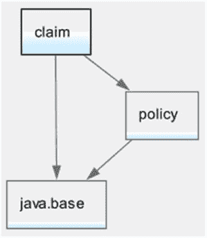

第 2 章 ■ 模块系统

• 如果你的应用程序由模块组成，则默认的根模块集取决于阶段：

•
在编译时，它由所有正在编译的模块组成。
•
在链接时，它是空的。
•
在运行时，它包含包含主类的模块。你使用 `--module` 或 `-m` 选项与 `java` 命令一起指定要运行的模块及其主类。

继续以名为 `policy` 和 `claim` 的两个模块为例，假设 `pkg3.Main` 是 `claim` 中的主类，并且两个模块都作为模块化 JAR 打包在 `C:\Java9Revealed\lib` 目录中。

图 2-6 展示了当使用以下命令运行应用程序时，在运行时构建的模块图：

C:\Java9Revealed>java -p lib -m claim/pkg3.Main

***图 2-6.** 模块图示例*

`claim` 模块包含应用程序的主类。因此，在创建模块图时，`claim` 是唯一的根模块。`policy` 模块被解析，因为 `claim` 模块依赖于 `policy` 模块。`java.base` 模块被解析，因为所有其他模块都依赖于它，这两个模块也是如此。

模块图的复杂性取决于根模块的数量以及模块之间的依赖关系级别。假设，除了依赖于 `policy` 模块之外，`claim` 模块还依赖于名为 `java.sql` 的平台模块。`claim` 模块的新声明如下所示：

module policy {

requires policy;

requires java.sql;

}

图 2-7 展示了当你在 `claim` 模块中运行 `pkg3.Main` 类时将构建的模块图。请注意，`java.xml` 和 `java.logging` 模块也出现在图中，因为 `java.sql` 模块依赖于它们。在图中，`claim` 模块是唯一的根模块。

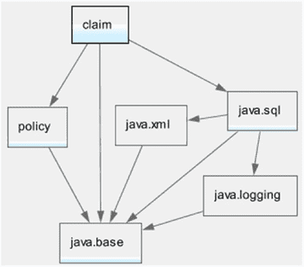

第 2 章 ■ 模块系统

***图 2-7.** 显示对 `java.sql` 模块依赖关系的模块图*

图 2-8 展示了名为 `java.se` 的平台模块最复杂的模块图之一。`java.se` 模块的模块声明如下：

module java.se {

requires transitive java.sql;

requires transitive java.rmi;

requires transitive java.desktop;

requires transitive java.security.jgss;

requires transitive java.security.sasl;

requires transitive java.management;

requires transitive java.logging;

requires transitive java.xml;

requires transitive java.scripting;

requires transitive java.compiler;

requires transitive java.naming;

requires transitive java.instrument;

requires transitive java.xml.crypto;

requires transitive java.prefs;

requires transitive java.sql.rowset;

requires java.base;

requires transitive java.datatransfer;

}

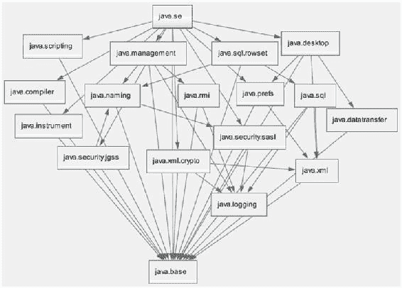

第 2 章 ■ 模块系统

***图 2-8.** 以 `java.se` 模块为根模块的模块图*


有时，您需要将模块添加到默认的根模块集中，以便解析这些添加的模块。您可以在编译时、链接时和运行时使用 `--add-modules` 命令行选项来指定额外的根模块：

--add-modules <module-list>

其中，`<module-list>` 是一个以逗号分隔的模块名称列表。

您可以将以下特殊值作为模块列表与 `--add-modules` 选项一起使用，这些值具有特殊含义：

• ALL-DEFAULT

• ALL-SYSTEM

• ALL-MODULE-PATH

这三个特殊值在运行时均有效。`ALL-MODULE-PATH` 值只能在编译时使用。

如果使用 `ALL-DEFAULT` 作为模块列表，则当应用程序从类路径运行时使用的默认根模块集将被添加到根集中。这对于作为容器的应用程序非常有用，该容器托管其他可能需要容器应用程序本身未要求的其他模块的应用程序。这是一种使所有 Java SE 模块对容器可用的方法，因此任何托管的应用程序都可以使用它们。

如果使用 `ALL-SYSTEM` 作为模块列表，则所有系统模块都会被添加到根集中。这对于运行测试框架非常有用。

第 2 章 ■ 模块系统

如果使用 `ALL-MODULE-PATH` 作为模块列表，则模块路径上找到的所有模块都会被添加到根集中。这对于 Maven 等工具非常有用，它可以确保模块路径上的所有模块都是应用程序所需的。

■ **提示** 即使模块存在于模块路径上，您也可能会收到找不到模块的错误。在这种情况下，您需要使用 `--add-modules` 命令行选项将缺失的模块添加到默认的根模块集中。

JDK 9 支持一个有用的非标准命令行选项，该选项会打印诊断消息，描述在构建模块图时用于解析模块的步骤。该选项是 `-Xdiag:resolver`。以下命令运行 `claim` 模块中的 `pkg3.Main` 类。显示了部分输出。在诊断消息的末尾，您会找到一个 `Result:` 部分，其中列出了已解析的模块。

C:\Java9Revealed>java -Xdiag:resolver -p lib -m claim/pkg3.Main

[Resolver] Root module claim located

[Resolver] (file:///C:/Java9Revealed/lib/claim.jar)

[Resolver] Module java.base located, required by claim

[Resolver] (jrt:/java.base)

[Resolver] Module policy located, required by claim

[Resolver] (file:///C:/Java9Revealed/lib/policy.jar)

...

[Resolver] Result:

[Resolver] claim

[Resolver] java.base

...

[Resolver] policy

聚合模块

您可以创建一个自身不包含任何代码的模块。它收集并重新导出其他模块的内容。这样的模块称为*聚合模块*。假设有几个模块依赖于五个模块。您可以为这五个模块创建一个聚合模块，这样，您的模块就可以只依赖于一个模块——聚合模块。

聚合模块的存在是为了方便。Java 9 包含几个聚合模块，例如 `java.se` 和 `java.se.ee`。`java.se` 模块收集了 Java SE 中与 Java EE 不重叠的部分。

`java.se.ee` 模块收集了构成 Java SE 的所有模块，包括与 Java EE 重叠的模块。

声明模块

本节快速概述了用于声明模块的语法。我将在后续章节中更详细地解释每个部分。如果您不理解本节中提到的关于模块的所有内容，请继续阅读。我将在后面的章节中通过示例再次介绍它们。

第 2 章 ■ 模块系统

模块是使用模块声明定义的，这是 Java 编程语言中的一种新结构。语法如下：

[open] module <module> {

<module-statement>;

<module-statement>;

...

}

可选的 `open` 修饰符的存在声明了一个*开放模块*。开放模块导出其所有包，以供其他模块通过反射访问。`<module>` 是正在定义的模块的名称。`<module-statement>` 是一个模块语句。在一个模块声明中可以有零个或多个模块语句。如果存在，它可以是五种类型的语句之一：

• exports 语句

• opens 语句

• requires 语句

• uses 语句

• provides 语句

`exports` 和 `opens` 语句用于控制对模块代码的访问。`requires` 语句用于声明一个模块对另一个模块的依赖关系。`uses` 和 `provides` 语句分别用于表达服务消费和服务提供。以下是一个名为 `myModule` 的模块的模块声明示例：

module myModule {

// 导出包 - com.jdojo.util 和

// com.jdojo.util.parser

exports com.jdojo.util;

exports com.jdojo.util.parser;

// 读取 java.sql 模块

requires java.sql;

// 开放 com.jdojo.legacy 包以供反射访问

opens com.jdojo.legacy;

// 使用服务接口 java.sql.Driver

uses java.sql.Driver;

// 提供 com.jdojo.util.parser.FasterCsvParser

// 类作为服务接口的实现

// 名为 com.jdojo.util.CsvParser

provides com.jdojo.util.CsvParser

with com.jdojo.util.parser.FasterCsvParser;

}

第 2 章 ■ 模块系统

您可以通过在模块声明中使用 `open` 修饰符来创建一个开放模块。开放模块允许其他模块对其所有包进行反射访问。您不能在开放模块内部使用 `opens` 语句，因为在开放模块中所有包都是隐式开放的。以下代码片段声明了一个名为 `myLegacyModule` 的开放模块：

**open** module myLegacyModule {

exports com.jdojo.legacy;

requires java.sql;

}

模块名称

模块名称可以是一个 Java *限定*标识符。限定标识符是一个或多个由点分隔的标识符，例如 `policy`、`com.jdojo.common` 和 `com.jdojo.util`。如果模块名称中的任何部分不是有效的 Java 标识符，则会发生编译时错误。例如，`com.jdojo.common.1.0` 不是有效的模块名称，因为名称中的两个部分 `1` 和 `0` 不是有效的 Java 标识符。

与包命名约定类似，使用反向域名模式为您的模块赋予唯一名称。使用此约定，最简单的模块（名为 `com.jdojo.common`）可以声明如下：

module com.jdojo.common {

// 无模块语句

}

模块名称不会隐藏同名的变量、类型和包。因此，您可以拥有一个模块以及一个同名的变量、类型或包。它们使用的上下文将区分哪个名称指的是哪种实体。

在 JDK 9 中，`open`、`module`、`requires`、`transitive`、`exports`、`opens`、`to`、`uses`、`provides` 和 `with` 是受限关键字。它们将在本章后面以及后续章节中简要解释。

它们仅在模块声明中的特定位置出现时才具有特殊含义。您可以在程序中的任何其他地方将它们用作标识符。例如，以下模块声明是有效的，即使它没有使用直观的模块名称：

// 声明一个名为 module 的模块

module module {

// 模块语句写在这里

}

第一个 `module` 词被解释为关键字，第二个是模块名称。

您可以在程序中的任何地方声明一个名为 `module` 的变量：

String module = "myModule";

第 2 章 ■ 模块系统

控制对模块的访问

`exports` 语句在编译时和运行时将模块的指定包导出到所有模块或指定的模块列表。它有以下两种形式：

• exports <package>;

• exports <package> to <module1>, <module2>...;

使用 `exports` 语句的示例如下：

module M {

exports com.jdojo.util;

exports com.jdojo.policy

to com.jdojo.claim, com.jdojo.billing;

}


`opens` 语句在运行时授予对所有模块或指定模块列表反射访问指定包的权限。其他模块可以使用反射访问指定包中的所有类型以及这些类型的所有成员（私有和公有）。`opens` 语句采用以下形式：

• `opens <package>;`

• `opens <package> to <module1>, <module2>...;`

使用 `opens` 语句的示例如下：

```java
module M {

    opens com.jdojo.claim.model;

    opens com.jdojo.policy.model to core.hibernate;

    opens com.jdojo.services to core.spring;

}
```

■ **提示** 比较 `exports` 和 `opens` 语句的效果。`exports` 语句允许你在*编译时*和*运行时*仅访问指定包的*公有 API*，而 `opens` 语句允许你在*运行时*使用*反射*访问指定包中所有类型的*公有*和*私有*成员。

如果一个模块需要在编译时访问另一个模块的公有类型，并在运行时使用反射访问同一模块中类型的私有成员，则第二个模块可以同时导出和开放同一个包，如下所示：

```java
module N {

    exports com.jdojo.claim.model;

    opens com.jdojo.claim.model;

}
```

在阅读有关模块的内容时，你会遇到三个短语：

• 模块 M 导出了包 P
• 模块 M 开放了包 Q
• 模块 M 包含了包 R

前两个短语对应于模块中的 `exports` 和 `opens` 语句。第三个短语意味着该模块包含一个名为 R 的包，该包既未导出也未开放。在模块系统的早期设计中，第三种情况被表述为“模块 M *隐藏*了包 R”。

**声明依赖关系**

`requires` 语句声明当前模块对另一个模块的依赖。在名为 M 的模块中，`requires N` 语句意味着模块 M 依赖于（或读取）模块 N。该语句采用以下形式：

• `requires <module>;`
• `requires transitive <module>;`
• `requires static <module>;`
• `requires transitive static <module>;`

`requires` 语句中的 `static` 修饰符使依赖关系在编译时是强制性的，但在运行时是可选的。在名为 M 的模块中，`requires static N` 语句意味着模块 M 依赖于模块 N，并且为了编译模块 M，模块 N 必须在编译时存在；然而，为了使用模块 M，模块 N 在运行时的存在是可选的。`requires` 语句中的 `transitive` 修饰符会导致任何依赖于当前模块的模块隐式地依赖于 `requires` 语句中指定的模块。假设有三个模块 P、Q 和 R。假设模块 Q 包含一个 `requires transitive R` 语句。如果模块 P 包含一个 `requires Q` 语句，则意味着模块 P 隐式地依赖于模块 R。

**配置服务**

Java 允许使用服务提供者机制，在该机制中，服务提供者和服务消费者是解耦的。JDK 9 允许你使用 `uses` 和 `provides` 模块语句来实现服务。

`uses` 语句指定当前模块可以使用 `java.util.ServiceLoader` 类发现和加载的*服务接口*的名称。它采用以下形式：

`uses <service-interface>;`

使用 `uses` 语句的示例如下：

```java
module M {

    uses com.jdojo.prime.PrimeChecker;

}
```

这里，`com.jdojo.prime.PrimeChecker` 是一个服务接口，其实现类将由其他模块提供。模块 M 将使用 `java.util.ServiceLoader` 类发现并加载此接口的实现。

`provides` 语句为一个服务接口指定一个或多个服务提供者实现类。它采用以下形式：

`provides <service-interface> with <service-impl-class1>, <service-impl-class2>...;`

使用 `provides` 语句的示例如下：

```java
module N {

    provides com.jdojo.prime.PrimeChecker

    with com.jdojo.prime.generic.GenericPrimeChecker;

}
```

同一个模块既可以提供服务实现，也可以发现和加载服务。一个模块也可以发现和加载一种服务，并为另一种服务提供实现。以下是一些示例：

```java
module P {

    uses com.jdojo.CsvParser;

    provides com.jdojo.CsvParser

    with com.jdojo.CsvParserImpl;

    provides com.jdojo.prime.PrimeChecker

    with com.jdojo.prime.generic.FasterPrimeChecker;

}
```

**模块描述符**

在学习了上一节如何声明模块之后，你可能对模块声明的源代码有几个疑问：

• 模块声明的源代码保存在哪里？是保存在文件中吗？如果是，文件名是什么？
• 模块声明源代码文件应该放在哪里？
• 模块声明的源代码是如何编译的？

在我展示第一个模块化程序的实际运行之前，我将回答这些问题。

**编译模块声明**

模块声明存储在一个名为 `module-info.java` 的文件中，该文件位于该模块源文件层次结构的根目录下。Java 编译器将模块声明编译成一个名为 `module-info.class` 的文件。`module-info.class` 文件被称为*模块描述符*，它被放置在模块编译后代码层次结构的根目录下。如果你将模块的编译后代码打包到 JAR 文件中，`module-info.class` 文件将存储在 JAR 文件的根目录下。

模块声明不包含可执行代码。本质上，它包含模块的配置。为什么我们不将模块声明保存在 XML 或 JSON 格式的文本文件中，而是保存在类文件中呢？选择类文件作为模块描述符是因为类文件具有可扩展、定义良好的格式。模块描述符包含源代码级模块声明的编译形式。工具（例如 `jar` 工具）可以在模块声明初始编译后，通过向类文件属性添加额外信息来增强它。类文件格式还允许开发者在模块声明中使用 `import` 和注解。

**模块版本**

在模块系统的初始原型中，模块声明也包含模块版本。在声明中包含模块版本使得模块系统的实现变得复杂，因此模块版本从声明中被移除了。

模块描述符（类文件格式）的可扩展格式被利用来向模块添加版本。当你将模块的编译后代码打包到 JAR 中时，`jar` 工具提供了一个选项来添加模块的版本，该版本最终被添加到 `module-info.class` 文件中。我将在[第 3 章](http://dx.doi.org/10.1007/978-1-4842-2592-9)中解释如何向模块描述符添加信息。

**模块源文件结构**

让我们通过一个示例来了解如何组织名为 `com.jdojo.contact` 的模块的源代码和编译后代码。该模块包含用于处理联系人信息（例如地址和电话号码）的包。它包含两个包：

• `com.jdojo.contact.info`
• `com.jdojo.contact.validator`

`com.jdojo.contact.info` 包包含两个类——`Address` 和 `Phone`。`com.jdojo.contact.validator` 包包含一个名为 `Validator` 的接口和两个名为 `AddressValidator` 和 `PhoneValidator` 的类。图 2-9 显示了 `com.jdojo.contact` 模块的内容。

```
com.jdojo.contact
├── com.jdojo.contact.info
│   ├── Address
│   └── Phone
└── com.jdojo.contact.validator
    ├── Validator
    ├── AddressValidator
    └── PhoneValidator
```

***图 2-9.** 名为 com.jdojo.contact 的模块的内容*


在 Java 9 中，Java 编译器工具 javac 新增了几个选项。它允许你一次编译一个模块或一次编译多个模块。如果你想一次编译多个模块，你*必须*将每个模块的源代码存储在一个目录下，该目录的名称与模块名称相同。即使你只有一个模块，也可以遵循这种源目录命名约定。

假设你想编译 `com.jdojo.contact` 模块的源代码。你可以将其源代码存储在名为 `C:\j9r\src` 的目录中，该目录包含以下文件：

module-info.java

com\jdojo\contact\info\Address.java

com\jdojo\contact\info\Phone.java

com\jdojo\contact\validator\Validator.java

com\jdojo\contact\validator\AddressValidator.java

com\jdojo\contact\validator\PhoneValidator.java

第 2 章 ■ 模块系统

请注意，你需要像自 Java 1.0 以来一直做的那样，遵循包层次结构来存储接口和类的源文件。

如果你想一次编译多个模块，则必须将源代码目录命名为 `com.jdojo.contact`，这与模块的名称相同。在这种情况下，你可以将模块的源代码存储在名为 `C:\j9r\src` 的目录中，其内容如下：

com.jdojo.contact\module-info.java

com.jdojo.contact\com\jdojo\contact\info\Address.java

com.jdojo.contact\com\jdojo\contact\info\Phone.java

com.jdojo.contact\com\jdojo\contact\validator\Validator.java

com.jdojo.contact\com\jdojo\contact\validator\AddressValidator.java

com.jdojo.contact\com\jdojo\contact\validator\PhoneValidator.java

模块的编译代码将遵循与你之前看到的相同的目录层次结构。

**打包模块**

模块的工件可以存储在：

-   一个目录
-   一个模块化 JAR 文件
-   一个 JMOD 文件，这是 JDK 9 中引入的一种新的模块打包格式

**目录中的模块**

当模块的编译代码存储在一个目录中时，该目录的根目录包含模块描述符（`module-info.class` 文件），子目录则镜像了包层次结构。继续上一节的示例，假设你将 `com.jdojo.contact` 模块的编译代码存储在 `C:\j9r\mods\com.jdojo.contact` 目录中。该目录的内容如下：

module-info.class

com\jdojo\contact\info\Address.class

com\jdojo\contact\info\Phone.class

com\jdojo\contact\validator\Validator.class

com\jdojo\contact\validator\AddressValidator.class

com\jdojo\contact\validator\PhoneValidator.class

**模块化 JAR 中的模块**

JDK 附带了一个 `jar` 工具，用于将 Java 代码打包成 JAR（**J**ava **Ar**chive）文件格式。JAR 格式基于 ZIP 文件格式。JDK 9 增强了 `jar` 工具，可以将模块的代码打包到 JAR 中。当一个 JAR 包含模块的编译代码时，该 JAR 被称为*模块化 JAR*。模块化 JAR 在其根目录包含一个 `module-info.class` 文件。

无论你在 JDK 9 之前在哪里使用 JAR，现在都可以使用模块化 JAR。例如，模块化 JAR 可以放置在类路径上，在这种情况下，模块化 JAR 中的 `module-info.class` 文件会被忽略，因为 `module-info` 在 Java 中不是有效的类名。

第 2 章 ■ 模块系统

在打包模块化 JAR 时，你可以使用 `jar` 工具中在 JDK 9 中新增的各种选项，向模块描述符添加信息片段，例如模块版本和主类名。

■ **提示** 模块化 JAR 在所有方面都是一个 JAR，只是它在根目录包含一个模块描述符。

通常，一个非平凡的 Java 应用程序由多个模块组成。一个模块化 JAR 只能包含*一个*模块的编译代码。需要将应用程序的所有模块打包到一个 JAR 中，以简化将应用程序作为一个工件交付的过程。在撰写本文时，这是一个未解决的问题，在[此链接](http://openjdk.java.net/projects/jigsaw/spec/issues/#MultiModuleExecutableJARs)中有描述。

继续上一节的示例，`com.jdojo.contact` 模块的模块化 JAR 内容如下。请注意，JAR 总是在 `META-INF` 目录中包含一个 `MANIFEST.MF` 文件。

module-info.class

com/jdojo/contact/info/Address.class

com/jdojo/contact/info/Phone.class

com/jdojo/contact/validator/Validator.class

com/jdojo/contact/validator/AddressValidator.class

com/jdojo/contact/validator/PhoneValidator.class

META-INF/MANIFEST.MF

**JMOD 文件中的模块**

JDK 9 引入了一种名为 *JMOD* 的新格式来打包模块。JMOD 文件使用 `.jmod` 扩展名。JDK 模块被编译成 JMOD 格式，并放置在 `JDK_HOME\jmods` 目录中；例如，你会找到一个 `java.base.jmod` 文件，其中包含 `java.base` 模块的内容。JMOD 文件仅在编译时和链接时受支持。它们在运行时不受支持。我将在第 [6](http://dx.doi.org/10.1007/978-1-4842-2592-9) 章中详细解释 JMOD 格式。

**模块路径**

自 JDK 诞生以来，用于查找类型的类路径机制就一直存在。类路径是一系列目录、JAR 文件和 ZIP 文件。当 Java 需要在不同阶段（编译时、运行时、使用工具期间等）查找类型时，它会使用类路径中的条目来查找该类型。

Java 9 中的类型是作为模块的一部分存在的。Java 需要在不同阶段查找模块，而不是像 Java 9 之前那样查找类型。Java 9 引入了一种新的查找模块的机制，称为*模块路径*。

*模块路径* 是一个包含模块的路径名序列，其中路径名可以是模块化 JAR、JMOD 文件或目录的路径。路径名由特定于平台的路径分隔符分隔，在类 UNIX 平台上为冒号（`:`），在 Windows 平台上为分号（`;`）。

第 2 章 ■ 模块系统

当路径名是模块化 JAR 或 JMOD 文件时，很容易理解。在这种情况下，如果 JAR 或 JMOD 文件中的模块描述符包含正在查找的模块的模块定义，则找到该模块。如果路径名是一个目录，则存在以下两种情况：

-   如果目录根目录下存在一个类文件，则该目录被视为包含一个模块定义。根目录下的类文件将被解释为模块描述符。所有其他文件和子目录将被解释为此模块的一部分。如果根目录下存在多个类文件，则找到的第一个文件被解释为模块描述符。经过几次实验，JDK 9 build 126 似乎会按字母顺序排序后选取第一个类文件。这种存储模块编译代码的方式肯定会让你头疼。因此，如果目录根目录下包含多个类文件，请避免将该目录添加到模块路径。

-   如果目录根目录下不存在类文件，则目录的内容将被不同地解释。目录中的每个模块化 JAR 或 JMOD 文件都被视为一个模块定义。每个子目录，如果其根目录下包含 `module-info.class` 文件，则被视为以展开目录树格式包含一个模块定义。如果子目录的根目录下不包含 `module-info.class` 文件，则它不被解释为包含模块定义。请注意，如果子目录包含模块定义，其名称不必与模块名称相同。模块名称是从 `module-info.class` 文件中读取的。

以下是 Windows 上有效的模块路径：

-   `C:\mods`
-   `C:\mods\com.jdojo.contact.jar;C:\mods\com.jdojo.person.jar`
-   `C:\lib;C:\mods\com.jdojo.contact.jar;C:\mods\com.jdojo.person.jar`

第一个模块路径包含指向名为 `C:\mods` 的目录的路径。第二个模块路径包含指向两个模块化 JAR（`com.jdojo.contact.jar` 和 `com.jdojo.person.jar`）的路径。第三个


模块路径包含三个元素——指向目录 C:\lib 的路径，以及两个模块化 JAR 的路径——com.jdojo.contact.jar 和 com.jdojo.person.jar。在类 UNIX 平台上，这些路径的等效形式如下所示：

• /usr/ksharan/mods

• /usr/ksharan/mods/com.jdojo.contact.jar:/usr/ksharan/com.jdojo.person.jar

• /usr/ksharan/lib:/usr/ksharan/mods/com.jdojo.contact.jar:/usr/ksharan/mods/com.jdojo.person.jar

避免模块路径问题的最佳方法是不要将展开的目录用作模块定义。

将两个目录作为模块路径——一个目录包含所有应用程序模块化 JAR，另一个目录包含所有外部库的模块化 JAR。例如，在 Windows 上，你可以使用 `C:\applib;C:\extlib` 作为模块路径，其中 `C:\applib` 目录包含所有应用程序模块化 JAR，`C:\extlib` 目录包含所有外部库的模块化 JAR。

第 2 章 ■ 模块系统

JDK 9 已更新其所有工具，以使用模块路径来查找模块。这些工具提供了新的选项来指定模块路径。在 JDK 9 之前，你看到的是以连字符 (-) 开头的 UNIX 风格选项，例如 `-cp` 和 `-classpath`。随着 JDK 9 中新增了如此多的选项，JDK 设计者难以再为选项提供既简短又对开发者有意义的名称。因此，JDK 9 开始使用 GNU 风格选项，其中选项以两个连续的连字符开头，单词之间用连字符分隔。

以下是 GNU 风格命令行选项的几个示例：

• `--class-path`

• `--module-path`

• `--module-version`

• `--main-class`

• `--print-module-descriptor`

■ **提示** 要打印工具支持的所有标准选项列表，请使用 `--help` 或 `-h` 选项运行该工具；要打印所有非标准选项，请使用 `-X` 选项运行该工具。例如，`java -h` 和 `java -X` 命令将分别打印 `java` 命令的标准和非标准选项列表。

JDK 9 中的大多数工具，例如 `javac`、`java` 和 `jar`，都支持两个选项来在命令行上指定模块路径。它们是 `-p` 和 `--module-path`。为了向后兼容，现有的 UNIX 风格选项将继续得到支持。以下两个命令展示了如何使用这两个选项为 `java` 工具指定模块路径：

// 使用 GNU 风格选项

C:\>java --module-path C:\applib;C:\lib other-args-go-here

// 使用 UNIX 风格选项

C:\>java -p C:\applib;C:\extlib other-args-go-here

在本书的所有示例中，我使用 GNU 风格选项 `--module-path` 来指定模块路径。

当你使用 GNU 风格选项时，可以通过以下两种形式之一来指定选项的值：

• `--<name> <value>`

• `--<name>=<value>`

之前的命令也可以写成如下形式：

// 使用 GNU 风格选项

C:\>java --module-path**=**C:\applib;C:\lib other-args-go-here

当使用空格作为名称-值分隔符时，你至少需要使用一个空格。当你使用 `=` 作为分隔符时，其周围不能包含任何空格。选项 `--module-path=C:\applib` 是有效的。选项 `--module-path =C:\applib` 是无效的，因为 `=C:\applib` 将被解释为模块路径，而这是一个无效路径。

第 2 章 ■ 模块系统

可观察模块

在模块查找过程中，模块系统使用不同类型的模块路径来定位模块。在模块路径上找到的模块集与系统模块一起被称为*可观察模块*。你可以将可观察模块视为在特定阶段（例如编译时、链接时和运行时）可供模块系统使用或可供工具使用的所有模块的集合。

JDK 9 为 `java` 命令添加了一个名为 `--list-modules` 的新选项。该选项可用于打印两种信息：可观察模块的列表以及一个或多个模块的描述。该选项可以通过两种形式使用：

• `--list-modules`

• `--list-modules <module1>,<module2>...`

在第一种形式中，选项后面不跟任何模块名称。它会打印可观察模块的列表。在第二种形式中，选项后面跟一个逗号分隔的模块名称列表，这会打印指定模块的模块描述符。

以下命令打印可观察模块的列表，其中仅包含系统模块：c:\Java9Revealed> java --list-modules

java.base@9-ea

java.se.ee@9-ea

java.sql@9-ea

javafx.base@9-ea

javafx.controls@9-ea

jdk.jshell@9-ea

jdk.unsupported@9-ea

...

显示的输出是部分内容。输出中的每个条目包含两部分——模块名称和版本字符串，两者由 `@` 符号分隔。第一部分是模块名称，第二部分是模块的版本字符串。例如，在 `java.base@9-ea` 中，`java.base` 是模块名称，`9-ea` 是版本字符串。

在版本字符串中，数字 9 代表 JDK 9，`ea` 代表*早期访问*。当你运行该命令时，可能会得到不同的版本字符串输出。

我将三个模块化 JAR 放在了我的 `C:\Java9Revealed\lib` 目录中。如果我将 `C:\Java9Revealed\lib` 作为模块路径提供给 `java` 命令，这些模块将被包含在可观察模块列表中。

以下命令展示了当指定模块路径时，可观察模块列表如何变化。这里，`lib` 是一个相对路径，`C:\Java9Revealed` 是当前目录。

C:\Java9Revealed>java --module-path lib --list-modules

claim (file:///C:/Java9Revealed/lib/claim.jar)

policy (file:///C:/Java9Revealed/lib/policy.jar)

java.base@9-ea

java.xml@9-ea

javafx.base@9-ea

jdk.unsupported@9-ea

jdk.zipfs@9-ea

...

第 2 章 ■ 模块系统

请注意，对于应用程序模块，`--list-modules` 选项还会打印它们的位置。当得到意外结果且不知道正在使用哪些模块以及来自哪些位置时，此信息有助于进行故障排除。

以下命令将 `com.jdojo.intro` 模块作为参数传递给 `--list-modules` 选项，以打印该模块的描述：

C:\Java9Revealed>java --module-path lib --list-modules claim

module claim (file:///C:/Java9Revealed/lib/claim.jar)

exports com.jdojo.claim

requires java.sql (@9-ea)

requires mandated java.base (@9-ea)

contains pkg3

输出的第一行包含模块名称和包含该模块的模块化 JAR 位置。第二行表示该模块导出了 `com.jdojo.claim` 模块。第三行表示该模块需要 `java.sql` 模块。第四行表示该模块依赖于强制的 `java.base` 模块。回想一下，除了 `java.base` 模块之外，每个模块都依赖于 `java.base` 模块。除了 `java.base` 模块之外，你会在每个模块的描述中看到 `requires mandated java.base` 这一行。第五行说明该模块包含一个名为 `pkg3` 的包，该包既未导出也未开放。

你也可以使用 `--list-modules` 打印系统模块（例如 `java.base` 和 `java.sql`）的描述。以下命令打印 `java.sql` 模块的描述。

C:\Java9Revealed>java --list-modules java.sql

module java.sql@9-ea

exports java.sql

exports javax.sql

exports javax.transaction.xa

requires transitive java.xml

requires mandated java.base

requires transitive java.logging

uses java.sql.Driver

总结

在 Java 中，包一直被用作类型的容器。一个应用程序由放置在类路径上的多个 JAR 组成。包充当类型的容器，但并未强制执行任何可访问性边界。


类型的可访问性曾通过修饰符嵌入在类型声明中。如果一个包包含内部实现，程序的其他部分无法阻止访问这些内部实现。当使用某个类型时，类路径机制会线性搜索该类型。这导致了另一个问题：当部署的 JAR 中缺少某些类型时，会在运行时收到错误——有时甚至在应用程序部署很久之后才出现。这些问题可分为两类：封装与配置。

第 2 章 ■ 模块系统

JDK 9 引入了模块系统。它提供了一种组织 Java 程序的方式，有两个主要目标：*强封装*和*可靠配置*。使用模块系统，应用程序由模块组成，模块是代码和数据的命名集合。一个模块通过其声明来控制其他模块可以访问该模块的哪些部分。访问另一个模块某部分的模块必须声明对第二个模块的依赖。控制访问和声明依赖这两个方面是实现强封装目标的基础。模块的依赖关系在启动时解析。在 JDK 9 中，如果一个模块依赖于另一个模块，而运行应用程序时第二个模块缺失，你将在启动时收到错误，而不是在应用程序运行后的某个时刻。这是可靠配置的基础。

模块通过模块声明来定义。模块的源代码通常存储在名为 `module-info.java` 的文件中。模块被编译成类文件，通常命名为 `module-info.class`。编译后的模块声明称为*模块描述符*。模块声明不允许指定模块版本。诸如 `jar` 工具（用于将模块打包成 JAR）之类的工具可以将模块版本添加到模块描述符中。

模块使用 `module` 关键字声明，后跟模块名称。模块声明可以使用五种类型的模块语句：`exports`、`opens`、`requires`、`uses` 和 `provides`。`exports` 语句在编译时和运行时将模块的指定包导出到所有模块或指定的模块列表。`opens` 语句在运行时授予对指定包的反射访问权限，允许所有模块或指定的模块列表访问。其他模块可以使用反射访问指定包中的所有类型以及这些类型的所有成员（私有和公有）。`uses` 和 `provides` 模块语句用于配置模块以发现服务实现并提供特定服务接口的服务实现。

从 JDK 9 开始，`open`、`module`、`requires`、`transitive`、`exports`、`opens`、`to`、`uses`、`provides` 和 `with` 是受限关键字。它们仅在模块声明中的特定位置出现时才具有特殊含义。

模块的源代码和编译后的代码存放在目录、JAR 文件或 JMOD 文件中。在目录和 JAR 文件中，`module-info.class` 文件位于根目录。

与类路径类似，JDK 9 引入了模块路径。然而，它们的使用方式不同。类路径用于搜索类型的定义，而模块路径用于定位模块，而不是模块中的特定类型。诸如 `java` 和 `javac` 之类的 Java 工具已更新，可以同时使用模块路径和类路径。你可以使用 `--module-path` 或 `-p` 选项为这些工具指定模块路径。

JDK 9 引入了 GNU 风格的选项供工具使用。这些选项以两个破折号开头，每个单词之间用破折号分隔，例如 `--module-path`、`--class-path`、`--list-modules` 等。如果选项接受一个值，该值可以在选项后跟一个空格或 `=` 号。以下两个选项是相同的：

• `--module-path C:\lib`

• `--module-path=C:\lib`

在某个阶段（编译时、运行时、工具等）模块系统可用的模块列表称为可观察模块。你可以使用 `java` 命令的 `--list-modules` 选项列出运行时可用的可观察模块。你也可以使用此选项打印模块的描述。

**第 3 章**

**创建你的第一个模块**

在本章中，你将学习：

• 如何编写模块化的 Java 程序

• 如何编译模块化程序

• 如何将模块的工件打包成模块化 JAR 文件

• 如何运行模块化程序

在本章中，我将解释如何使用模块——从编写源代码到编译、打包和运行程序。本章分为两部分。第一部分展示了使用命令行编写和运行模块程序的所有步骤。第二部分使用 NetBeans IDE 重复相同的步骤。

在撰写本文时，NetBeans IDE 仍在开发中，并不支持所有 JDK 9 功能。例如，目前你需要在 NetBeans 中为你创建的每个模块创建一个新的 Java 项目。在最终版本中，NetBeans 将允许你在一个 Java 项目中拥有多个模块。我在使用命令提示符时比使用 NetBeans IDE 时涵盖了更多特定的 JDK 9 选项。

本章解释的程序非常简单。程序运行时，会打印一条消息以及主类所属的模块名称。

使用命令提示符

以下小节描述了使用命令提示符创建和运行第一个模块的步骤。

设置目录

你将使用以下目录层次结构来编写、编译、打包和运行源代码：

• `C:\Java9Revealed`

• `C:\Java9Revealed\lib`

• `C:\Java9Revealed\mods`

• `C:\Java9Revealed\src`

• `C:\Java9Revealed\src\com.jdojo.intro`

© Kishori Sharan 2017
K. Sharan, *Java 9 Revealed*, DOI 10.1007/978-1-4842-2592-9_3

第 3 章 ■ 创建你的第一个模块

这些目录是在 Windows 上设置的。在非 Windows 操作系统上，你可以设置类似的目录层次结构。`C:\Java9Revealed` 是顶级目录，包含三个子目录：`lib`、`mods` 和 `src`。

`src` 目录用于存储源代码，其中包含一个名为 `com.jdojo.intro` 的子目录。我将子目录命名为 `com.jdojo.intro`，因为我想创建一个名为 `com.jdojo.intro` 的模块，并将其源代码存储在此子目录下。在这种情况下，是否有必要将子目录命名为 `com.jdojo.intro`？答案是否定的。我可以将子目录命名为其他名称，或者直接将源代码存储在 `src` 目录中，而不使用 `com.jdojo.intro` 子目录。然而，将存储模块源代码的目录命名为与模块名称相同是一个好习惯。如果你遵循此命名约定，Java 编译器提供的选项将帮助你一次性编译多个模块的源代码。

你将使用 `mods` 目录以展开的目录层次结构存储编译后的代码。如果需要，你可以使用此目录中的代码运行程序。

编译源代码后，你将把它打包成模块化 JAR 并存储在 `lib` 目录中。你可以使用模块化 JAR 运行程序，或者将模块 JAR 分发给其他开发者，他们可以运行该程序。

在本节的剩余部分，我使用相对路径，例如 `src` 或 `src\com.jdojo.intro`。这些相对路径是相对于 `C:\Java9Revealed` 目录的。例如，`src` 表示 `C:\Java9Revealed\src`。如果你使用的是非 Windows 操作系统或遵循其他目录层次结构，请进行相应调整。

编写源代码

你可以使用你选择的文本编辑器（例如 Windows 上的记事本）来编写源代码。让我们从创建一个名为 `com.jdojo.intro` 的模块开始。清单 3-1 包含了模块声明。


***列表 3-1.*** 声明一个名为 com.jdojo.intro 的模块

// module-info.java

module com.jdojo.intro {

// 无模块语句

}

模块声明很简单，不包含任何模块语句。将其保存到 `src\com.jdojo.intro` 目录下名为 `module-info.java` 的文件中。

接下来，你将创建一个名为 `Welcome` 的类，该类将存放在 `com.jdojo.intro` 包中。请注意，这里将包名设置得与模块名相同。那么，模块名和包名必须保持一致吗？答案是否定的。你可以选择任何你想要的包名。该类将包含一个签名如 `public static void main(String[])` 的方法，该方法将作为应用程序的入口点。你将在该方法内打印消息。

你希望打印出 `Welcome` 类所属模块的名称。JDK 9 在 `java.lang` 包中新增了一个名为 `Module` 的类。`Module` 类的实例代表一个模块。JDK 9 中的每个 Java 类型（包括 `int`、`long` 和 `char` 等基本类型）都是某个模块的成员。所有基本类型都是 `java.base` 模块的成员。JDK 9 中的 `Class` 类新增了一个名为 `getModule()` 的方法，该方法返回该类所属模块的引用。以下代码片段打印了 `Welcome` 类的模块名称。

```java
Class<Welcome> cls = Welcome.class;
Module mod = cls.getModule();
String moduleName = mod.getName();
System.out.format("Module Name: %s%n", moduleName);
```

第 3 章 ■ 创建你的第一个模块

你可以将上述四条语句替换为一条语句：

```java
System.out.format("Module Name: %s%n",
        Welcome.class.getModule().getName());
```

■ **提示** 所有基本数据类型都是 `java.base` 模块的成员。你可以使用 `int.class.getModule()` 来获取 `int` 基本数据类型模块的引用。

列表 3-2 包含了 `Welcome` 类的完整源代码。将源代码保存到 `com\jdojo\intro` 目录下的 `Welcome.java` 文件中，该目录是 `src\com.jdojo.intro` 目录的子目录。此时，你的源代码文件路径将如下所示：

-   `C:\Java9Revealed\src\com.jdojo.intro\module-info.java`
-   `C:\Java9Revealed\src\com.jdojo.intro\com\jdojo\intro\Welcome.java`

***列表 3-2.*** Welcome 类的源代码

```java
// Welcome.java
package com.jdojo.intro;

public class Welcome {
    public static void main(String[] args) {
        System.out.println("Welcome to the Module System.");

        // 打印 Welcome 类的模块名称
        Class<Welcome> cls = Welcome.class;
        Module mod = cls.getModule();
        String moduleName = mod.getName();
        System.out.format("Module Name: %s%n", moduleName);
    }
}
```

**编译源代码**

你将使用 Java 编译器 `javac` 命令来编译源代码，并将编译后的代码保存到 `C:\java9Revealed\mods` 目录中。`javac` 命令位于 `JDK_HOME\bin` 目录下。以下命令用于编译源代码。该命令应在一行内输入，而非三行：

```bash
C:\Java9Revealed>javac -d mods --module-source-path src
src\com.jdojo.intro\module-info.java
src\com.jdojo.intro\com\jdojo\intro\Welcome.java
```

请注意，运行此命令时，当前目录是 `C:\Java9Revealed`。`-d mods` 选项告诉 Java 编译器将所有编译后的类文件存储到 `mods` 目录中。由于你从 `C:\java9revealed` 目录运行命令，因此命令中的 `mods` 目录指的是 `C:\Java9Revealed\mods` 目录。如果需要，你可以将此选项替换为 `-d C:\Java9Revealed\mods`。

第 3 章 ■ 创建你的第一个模块

第二个选项 `--module-source-path src` 指定 `src` 目录的子目录包含多个模块的源代码，其中每个子目录的名称与其所包含源代码的模块名称相同。此选项有以下几个含义：

-   在 `src` 目录下，你必须将模块的源文件存储在一个子目录中，且该子目录的名称必须与模块名相同。
-   Java 编译器在将生成的类文件存储到 `mods` 目录时，会镜像 `src` 目录下的目录结构。也就是说，`com.jdojo.intro` 模块的所有生成类文件都将存储在 `mods\com.jdojo.intro` 目录中，并镜像其包层次结构。
-   如果你不指定此选项，生成的类文件将直接放置在 `mods` 目录下。

`javac` 命令的最后两个参数是源文件——一个用于模块声明，一个用于 `Welcome` 类声明。如果 `javac` 命令成功运行，将在 `C:\Java9Revealed\mods\com.jdojo.intro` 目录下生成以下两个类文件：

-   `module-info.class`
-   `com\jdojo\intro\Welcome.class`

至此，源代码编译完成。

以下命令使用 JDK 9 之前存在的旧样式编译 `com.jdojo.intro` 模块的源代码。它仅使用 `-d` 选项来指定编译后类文件的存放位置。

```bash
C:\ Java9Revealed>javac -d mods\com.jdojo.intro
src\com.jdojo.intro\module-info.java
src\com.jdojo.intro\com\jdojo\intro\Welcome.java
```

以下命令的输出与上一条命令相同。但是，如果你想在一个命令中编译多个模块的源代码，并将编译后的代码放置到特定于模块的目录中，则此方法将不起作用。

使用 `javac` 的 `--module-version` 选项，你可以指定正在编译的模块的版本。模块版本存储在 `module-info.class` 文件中。以下命令生成与上一条命令相同的编译文件集，不同之处在于它将 `1.0` 作为模块版本存储在 `module-info.class` 文件中：

```bash
C:\Java9Revealed>javac -d mods\com.jdojo.intro
--module-version 1.0
src\com.jdojo.intro\module-info.java
src\com.jdojo.intro\com\jdojo\intro\Welcome.java
```

如何确认 `javac` 命令已将模块版本存储在 `module-info.class` 文件中？你可以使用 `javap` 命令来反汇编 Java 类文件。如果指定了 `module-info.class` 文件的路径，`javap` 命令将打印模块的定义，其中包含模块的版本（如果存在），版本信息位于模块名称之后。如果存在模块版本，打印的模块名称格式为 `moduleName@moduleVersion`。运行以下命令以验证上一条命令记录的模块名称：

```bash
C:\Java9Revealed>javap mods\com.jdojo.intro\module-info.class
```

第 3 章 ■ 创建你的第一个模块

```bash
Compiled from "module-info.java"
module com.jdojo.intro**@1.0** {
    requires java.base;
}
```

JDK 9 增强了 `jar` 工具。它允许你在创建模块化 JAR 时指定模块版本。在下一节中，我将向你展示如何使用 `jar` 工具指定模块版本。

如果你想编译多个模块，则需要将每个源文件作为参数传递给 `javac` 命令。这需要大量输入。我将为你提供一个适用于 Windows 和 UNIX 的快捷命令，以便一次性编译所有模块。在 Windows 中，请在一行内使用以下命令：

```bash
C:\Java9Revealed>FOR /F "tokens=1 delims=" %A in ('dir src\*.java /S /B') do javac -d mods
--module-source-path src %A
```

该命令会遍历 `src` 目录下的所有 `.java` 文件，并逐个编译它们。我尚未找到一种 Windows 命令可以一次性将所有源文件传递给 `javac` 命令。你可能需要根据你的目录结构调整命令中的目录名称。如果你遵循本示例的目录结构，此命令将适用于你。如果你将命令保存到批处理文件中并运行该批处理文件来编译所有源文件，则需要将 `%A` 替换为 `%%A`。

此命令在 UNIX 中的等效命令是：

```bash
$ javac -d mods --module-source-path src $(find src -name "*.java")
```

**打包模块代码**


让我们将模块的编译代码打包成一个模块化 JAR。你需要使用位于 `JDK_HOME\bin` 目录下的 `jar` 工具。以下命令即可完成此操作。该命令应在一行内输入，而非多行。为了清晰起见，我将命令分成了几行。请注意，命令的最后一部分是一个点号，表示当前目录。

C:\Java9Revealed>jar --create

--file lib/com.jdojo.intro-1.0.jar

--main-class com.jdojo.intro.Welcome

--module-version 1.0

-C mods/com.jdojo.intro .

此命令使用了几个选项：

• `--create` 选项表示你要创建一个新的模块化 JAR。

• `--file` 选项用于指定新模块化 JAR 的位置和名称。你将新模块化 JAR 存储在 `lib` 目录中，其名称为 `com.jdojo.intro-1.0.jar`。我在模块化 JAR 的名称中包含了版本号 1.0。

• `--main-class` 选项指定了包含 `public static void main(String[])` 方法的类的完全限定名，作为应用程序的入口点。当你指定此选项时，`jar` 工具会在 `module-info.class` 文件中添加一个属性，其值将是指定类的名称。`jar` 工具还会使用此选项向 `MANIFEST.MF` 文件添加一个 `Main-Class` 属性。

第 3 章 ■ 创建你的第一个模块

• `--module-version` 选项将模块的版本指定为 1.0。`jar` 工具会将此信息记录在 `module-info.class` 文件的属性中。请注意，将模块版本指定为 1.0 不会影响模块化 JAR 的名称。包含 1.0 是为了向文件名阅读者指示其版本。模块的实际版本由该选项指定。

• `-C` 选项用于指定在执行 `jar` 命令时作为当前目录的目录。`mods\com.jdojo.intro` 目录被指定为 `jar` 工具的当前目录。这将使 `jar` 工具从此目录读取所有要包含在模块化 JAR 中的文件。

• 命令的最后一部分是一个点号 (`.`)，表示 `jar` 工具需要包含来自当前目录 `mods\com.jdojo.intro` 的所有文件和目录。请注意，此参数与 `-C` 选项协同工作。如果你不提供 `-C` 选项，此点号将被解释为 `C:\Java9Revealed` 目录，即你运行命令的目录。

当命令成功运行时，它会创建以下文件：

C:\Java9Revealed\lib\com.jdojo.intro-1.0.jar

为了确保你的模块化 JAR 包含 `com.jdojo.intro` 模块的定义，请运行以下命令。该命令应在一行内输入。

C:\Java9Revealed>java --module-path lib --list-modules com.jdojo.intro

该命令将模块路径指定为 `lib` 目录，这意味着将使用 `lib` 目录来搜索应用程序模块。你将 `com.jdojo.intro` 作为模块名称传递给 `--list-modules` 选项，该选项将打印模块描述以及模块的位置。如果你得到类似以下的输出，则说明你的模块化 JAR 已正确创建：

module com.jdojo.intro@1.0 (file:///C:/Java9Revealed/lib/com.jdojo.intro-1.0.jar)

requires mandated java.base (@9-ea)

contains com.jdojo.intro

如果你对此输出有疑问，请参考第 [2](http://dx.doi.org/10.1007/978-1-4842-2592-9_2) 章，其中我详细解释了如何使用 `java` 命令的 `--list-modules` 选项列出可观察模块和模块描述。

运行程序

你使用 `java` 命令来运行 Java 程序。语法如下：

java --module-path <模块路径> --module <模块>/<主类>

这里，`<模块路径>` 是用于定位模块的模块路径。`--module` 选项指定要运行的模块及其主类。如果你的模块化 JAR 包含 `main-class` 属性，你可以只指定 `<模块>` 部分，`<主类>` 将从模块化 JAR 中读取。

■ **提示** 你可以分别使用较短的版本 `-p` 和 `-m` 来代替 `--module-path` 和 `--module` 选项。

第 3 章 ■ 创建你的第一个模块

以下命令将运行 `com.jdojo.intro` 模块中的 `com.jdojo.intro.Welcome` 类。

假设你的当前目录是 `C:\Java9Revealed`，并且你拥有位于 `C:\java9Revealed\lib\com.jdojo.intro-1.0.jar` 的模块化 JAR。

C:\Java9Revealed>java --module-path lib

--module com.jdojo.intro/com.jdojo.intro.Welcome

Welcome to the Module System.

Module Name: com.jdojo.intro

输出表明程序已正确执行。如果在将模块代码打包到模块化 JAR 时指定了主类，则可以在命令中省略主类名称。

你之前已将 `com.jdojo.intro.Welcome` 类指定为此模块的主类，因此以下命令与上一个命令执行相同的操作：

C:\Java9Revealed>java --module-path lib --module com.jdojo.intro

Welcome to the Module System.

Module Name: com.jdojo.intro

你还可以将包含模块代码的展开目录指定为模块路径。回想一下，你之前已将模块代码编译到 `mods` 目录中。以下命令同样有效：C:\Java9Revealed>java --module-path mods

--module com.jdojo.intro/com.jdojo.intro.Welcome

Welcome to the Module System.

Module Name: com.jdojo.intro

让我们尝试仅使用模块名称从 `mods` 目录运行该模块：

C:\Java9Revealed>java --module-path mods --module com.jdojo.intro

module com.jdojo.intro does not have a MainClass attribute, use -m <module>/<main-class> 哎呀！你收到了一个错误。错误消息表明，在 `mods\com.jdojo.intro` 目录中找到的 `module-info.class` 不包含主类名称。确实如此。当你声明一个模块时，不能在模块声明中指定 `main` 方法或版本。当你编译一个模块时，只能指定模块版本。你可以在使用 `jar` 工具打包时指定模块的主类及其版本。`lib\com.jdojo.intro-1.0.jar` 中的 `module-info.class` 文件包含主类名称，而 `mods\com.jdojo.intro` 目录中的 `module-info.class` 文件则不包含。如果你想运行一个编译代码位于展开目录中的模块，则必须同时指定主类名称和模块名称。

第 3 章 ■ 创建你的第一个模块

JDK 还提供了另一个名为 `-jar` 的选项，用于从 JAR 文件运行主类。让我们使用以下命令来运行此模块：

C:\Java9Revealed>java -jar lib\com.jdojo.intro-1.0.jar

Welcome to the Module System.

Module Name: null

哎呀！似乎输出中只有第一行是正确的，第二行不正确。它找到了主类并执行了其 `main()` 方法中的代码。它正确地打印了消息，但模块名称是 `null`。你知道，除了最后一个命令之外，你之前都能够成功运行该模块。

你需要了解 JDK 9 中 `java` 命令的行为。`-jar` 选项在 JDK 9 之前就已存在。在 JDK 9 中，类型可以通过模块路径或类路径作为模块的一部分加载。如果类型是通过类路径加载的，则该类型会成为名为*未命名*模块的成员。即使该类型是从模块化 JAR 加载的，它也会失去其原始模块的成员身份。实际上，如果模块化 JAR 被放置在类路径上，它会被视为一个 JAR（而不是模块化 JAR），并忽略其 `module-info.class` 文件。每个应用程序类加载器都有一个未命名模块。由类加载器从类路径加载的所有类型都是该类加载器未命名模块的成员。未命名模块也表示为 `Module` 类的一个实例，其 `getName()` 方法返回 `null`。


在前面的命令中，模块化 JAR 文件 `com.jdojo.intro-1.0.jar` 被当作普通 JAR 处理，其中定义的所有类型（我们只有一个 `Welcome` 类）都被加载为类加载器未命名模块的一部分。这就是为什么你在输出中看到模块名称为 `null` 的原因。`java` 命令是如何找到主类名的呢？回想一下，当你向 `jar` 工具指定主类名时，该工具会在两个位置存储主类名：

• 在 `module-info.class` 文件中

• 在 `META-INF/MANIFEST.MF` 文件中

此命令从 `META-INF/MANIFEST.MF` 文件中读取主类的名称。

你也可以使用带有 `--class-path` 选项的 `java` 命令来运行 `Welcome` 类。你可以将模块化 JAR `lib\com.jdojo.intro-1.0.jar` 放在类路径上，在这种情况下，它将被视为普通 JAR，并且 `Welcome` 类将被加载到应用程序类加载器的未命名模块中。在 JDK 9 之前，你就是这样运行类的。以下命令可以完成此操作：

C:\Java9Revealed>java --class-path lib\com.jdojo.intro-1.0.jar

com.jdojo.intro.Welcome

Welcome to the Module System.

Module Name: null


第 3 章 ■ 创建你的第一个模块

使用 NetBeans IDE

如果你按照前面几节的内容，通过命令提示符创建了第一个模块，那么本节将更容易理解。在本节中，我将逐步介绍如何使用 NetBeans IDE 创建你的第一个模块。关于如何安装支持 JDK 9 开发的 NetBeans IDE，请参考第 [1](http://dx.doi.org/10.1007/978-1-4842-2592-9_1) 章。

从现在开始，我将使用 NetBeans 来编写、编程、编译、打包和运行所有程序。

配置 IDE

启动 NetBeans IDE。如果你是第一次打开该 IDE，它会显示一个标题为“开始页面”的窗格，如图 3-1 所示。如果你不希望它再次显示，可以取消选中窗格右上角的“启动时显示”复选框。你可以通过单击窗格标题中的 X 来关闭“开始页面”窗格。

***图 3-1.** 初始的 NetBeans IDE 屏幕*

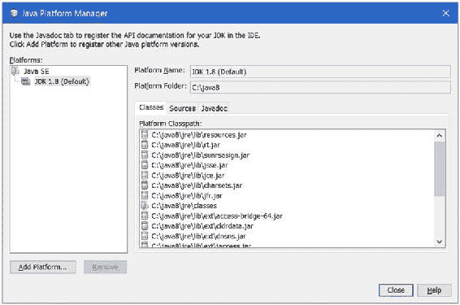

第 3 章 ■ 创建你的第一个模块

选择“工具” ➤ “Java 平台”以显示“Java 平台管理器”对话框，如图 3-2 所示。

我正在 JDK 1.8 上运行 NetBeans IDE，这在“平台”列表中显示。如果你在 JDK 9 上运行它，则“平台”列表中将显示 JDK 9，并且你无需进行任何进一步配置；你可以跳到下一节。

***图 3-2.** Java 平台管理器对话框*

如果你在“平台”列表中看到 JDK 9，则你的 IDE 已配置为使用 JDK 9，你可以单击“关闭”按钮关闭对话框。如果你在“平台”列表中没有看到 JDK 9，请单击“添加平台”按钮以打开“添加 Java 平台”对话框，如图 3-3 所示。确保选中“Java 标准版”单选按钮。单击“下一步”按钮以显示平台文件夹，如图 3-4 所示。

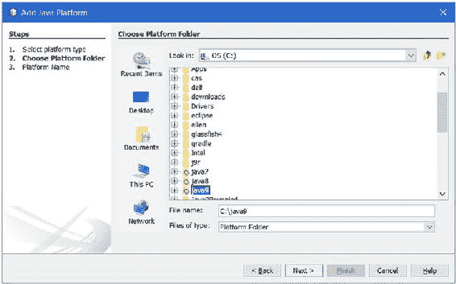

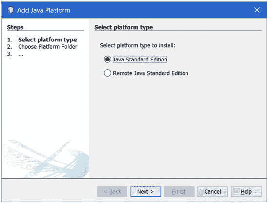

第 3 章 ■ 创建你的第一个模块

***图 3-3.** 选择平台类型*

***图 3-4.** 选择平台文件夹*

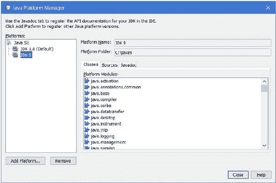

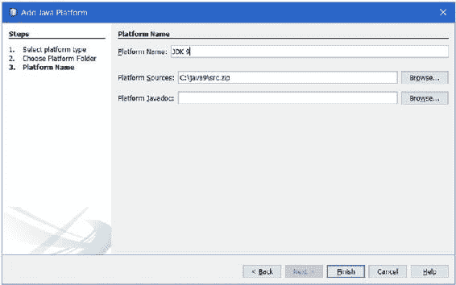

第 3 章 ■ 创建你的第一个模块

在“添加 Java 平台”对话框中，选择 JDK 9 安装的目录。我将 JDK 9 安装在 `C:\java9`，所以我选择了 `C:\java9` 目录。单击“下一步”按钮。将显示“添加 Java 平台”对话框，如图 3-5 所示。“平台名称”和“平台源”字段已预先填充。

***图 3-5.** 添加 Java 平台对话框*

单击“完成”按钮，这将使你返回到“Java 平台管理器”对话框，该对话框的“平台”列表中会显示 JDK 9 项，如图 3-6 所示。单击“关闭”按钮关闭对话框。至此，你已完成将 NetBeans IDE 配置为使用 JDK 9 的操作。

***图 3-6.** 显示 JDK 1.8 和 JDK 9 作为 Java 平台的 Java 平台管理器* 42

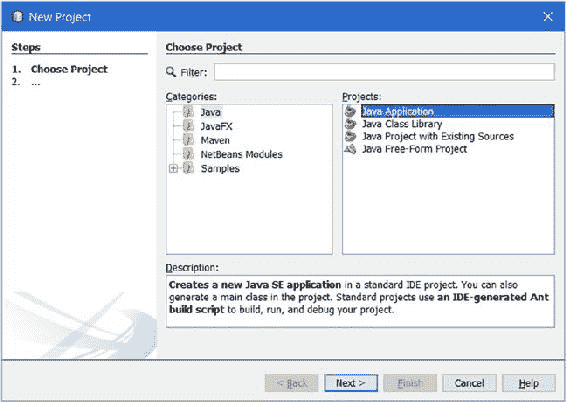

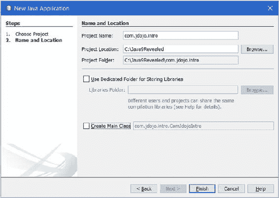

第 3 章 ■ 创建你的第一个模块

创建 Java 项目

选择“文件” ➤ “新建项目”或按 Ctrl+Shift+N 以打开“新建项目”对话框，如图 3-7 所示。

确保在“类别”列表中选中“Java”，并在“项目”列表中选中“Java 应用程序”。单击“下一步”按钮以打开“新建 Java 应用程序”对话框，如图 3-8 所示。

***图 3-7.** 新建项目对话框*

***图 3-8.** 新建 Java 应用程序对话框*


第 3 章 ■ 创建你的第一个模块

在“新建 Java 应用程序”对话框中填写以下信息：

• 输入 `com.jdojo.intro` 作为项目名称。

• 输入 `C:\Java9Revealed` 作为项目位置。你可以输入你选择的任何其他位置。这是将创建 NetBeans 项目的目录。

• 保持“使用专用文件夹存储库”复选框未选中状态。

• 确保“创建主类”复选框未选中。

单击“完成”按钮以完成新 Java 项目的创建。图 3-9 显示了 NetBeans IDE。

***图 3-9.** 创建新 Java 项目后的 NetBeans IDE*

当你创建 Java 项目时，NetBeans 会创建一组标准目录。你已在 `C:\Java9Revealed` 目录中创建了 `com.jdojo.intro` NetBeans 项目。NetBeans 将创建子目录来存储源文件、编译后的类文件和模块化 JAR。它还将为项目本身创建设置目录和文件。将创建以下子目录来存储源代码、编译后的代码和模块化 JAR：

C:\Java9Revealed

com.jdojo.intro

build

classes

dist

src

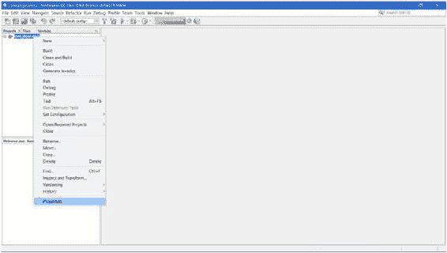

第 3 章 ■ 创建你的第一个模块

`com.jdojo.intro` 目录存储此项目的所有类型的文件。它以 NetBeans 项目名称命名。`src` 目录用于存储所有源代码。`build` 目录存储所有生成和编译的代码。项目的所有编译代码将存储在 `build\classes` 目录中。`dist` 目录存储模块化 JAR。请注意，`build` 和 `dist` 目录是在你向项目添加类时由 NetBeans 创建的，而不是在你创建没有添加主类的项目时创建的。

设置项目属性

你的 `com.jdojo.intro` 项目仍设置为使用 JDK 1.8。你需要将其更改为使用 JDK 9。在“项目”选项卡中选择 `com.jdojo.intro` 项目并右键单击。选择“属性”菜单项，如图 3-10 所示。将显示“项目属性 – com.jdojo.intro”对话框，如图 3-11 所示。

***图 3-10.** 打开项目属性对话框*

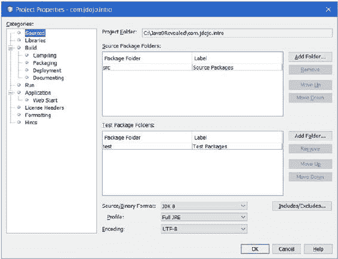

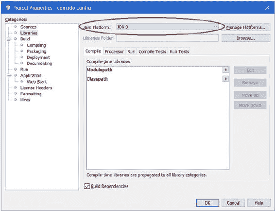

第 3 章 ■ 创建你的第一个模块

***图 3-11.** 项目属性 – com.jdojo.intro 对话框*

从“类别”列表中选择“库”项。从“Java 平台”下拉列表中选择“JDK 9”，如图 3-12 所示。

***图 3-12.** 为你的项目选择 JDK 9 作为 Java 平台*

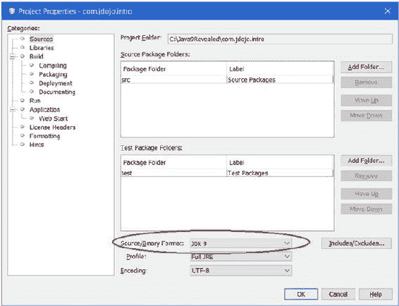

第 3 章 ■ 创建你的第一个模块

从“类别”列表中选择“源”项。从“源/二进制格式”下拉列表中选择“JDK 9”，如图 3-13 所示。

***图 3-13.** 选择源/二进制格式为 JDK 9*

单击“确定”按钮。至此，你已完成为 `com.jdojo.intro` 项目将 JDK 9 设置为 Java 平台和源/二进制格式的操作。

添加模块声明


好的，作为高级文档工程师和翻译员，我将遵循您提供的注意事项和示例，将给定的英文文本翻译成中文。


在本节中，我将向您展示如何在 NetBeans 项目中定义一个名为 `com.jdojo.intro` 的模块。要添加模块定义，您需要在项目中添加一个名为 `module-info.java` 的文件。右键单击项目节点，然后从菜单中选择“新建”，如图 3-14 所示。如果您看到“Java 模块信息”菜单项，请选择它。否则，请选择“其他”，这将显示“新建文件”对话框，如图 3-15 所示。

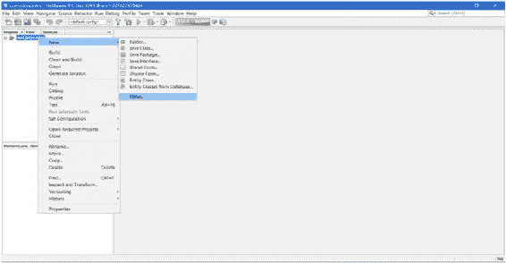

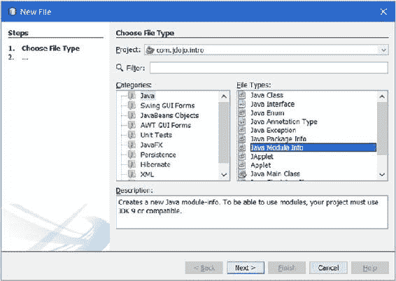

第 3 章 ■ 创建您的第一个模块

***图 3-14.** 向项目添加模块定义*

***图 3-15.** 用于添加 Java 模块信息的“新建文件”对话框*

从“类别”列表中选择“Java”，从“文件类型”列表中选择“Java 模块信息”。单击“下一步”按钮，这将显示“新建 Java 模块信息”对话框。单击“完成”按钮以完成模块定义的创建。一个包含模块声明的 `module-info.java` 文件将被添加到您的项目中，如图 3-16 所示。`module-info.java` 文件被添加到源代码目录的根目录下，并且在项目文件树中显示在 `<default-package>` 项下。

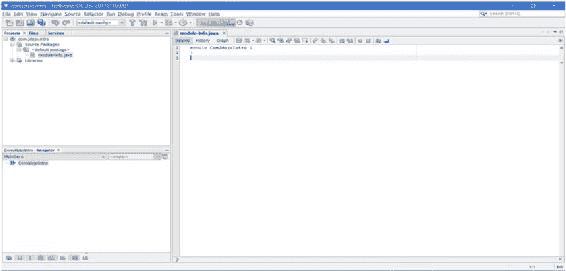

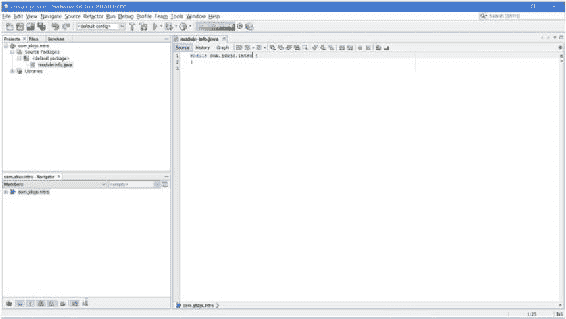

第 3 章 ■ 创建您的第一个模块

***图 3-16.** 在编辑器中打开的 module-info.java 文件*

默认情况下，NetBeans 给出的模块名称与项目名称相同。点号被移除，名称中每个部分的首字母变为大写。回想一下，您将项目名称指定为 `com.jdojo.intro`，这就是为什么 `module-info.java` 文件中的模块名称是 `ComJdojoIntro`。将模块名称更改为 `com.jdojo.intro`，如图 3-17 所示。清单 3-1 包含了模块声明，这与您在上一节中使用命令提示符时几乎相同。

***图 3-17.** 模块名称为 com.jdojo.intro 的 module-info.java 文件*

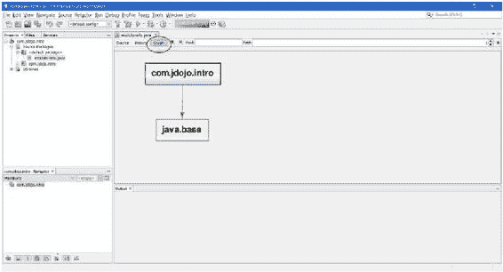

第 3 章 ■ 创建您的第一个模块

查看模块图

NetBeans IDE 允许您查看模块图。在编辑器中打开某个模块的 `module-info.java` 文件，然后选择编辑器中的“图形”选项卡以查看模块图。`com.jdojo.intro` 模块的模块图如图 3-18 所示。

***图 3-18.** com.jdojo.intro 模块的模块图*

您可以放大和缩小模块图，更改其布局，并将其保存为图像。右键单击图形区域可访问这些与图形相关的选项。您可以选择图形中的一个节点，以仅查看以该节点为终点或起点的依赖边。您还可以通过移动节点来重新排列模块图。

当 `module-info.java` 文件打开时，您可以选择编辑器中的“源”选项卡来编辑模块声明的源代码。

编写源代码

在本节中，您将向 `com.jdojo.intro` 项目添加一个 `Welcome` 类。该类将位于 `com.jdojo.intro` 包中。从项目节点的右键菜单中，选择“新建” ➤ “Java 类”，这将打开“新建 Java 类”对话框，如图 3-19 所示。在“类名”中输入 `Welcome`，在“包”中输入 `com.jdojo.intro`。单击“完成”按钮关闭对话框。

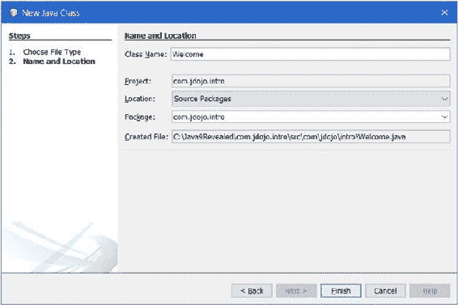

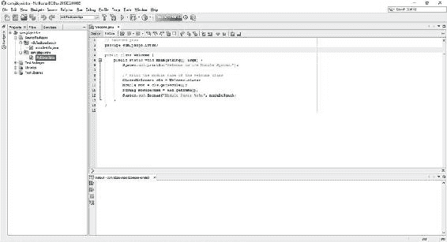

第 3 章 ■ 创建您的第一个模块

***图 3-19.** 向项目添加 Welcome 类*

清单 3-2 包含了 `Welcome` 类的完整代码，这与您在上一节中使用命令提示符时相同。在 NetBeans 中，将 IDE 生成的 `Welcome` 类代码替换为清单 3-2 中的代码。图 3-20 显示了编辑器中 `Welcome` 类的源代码。

***图 3-20.** 编辑器中 Welcome 类的源代码*

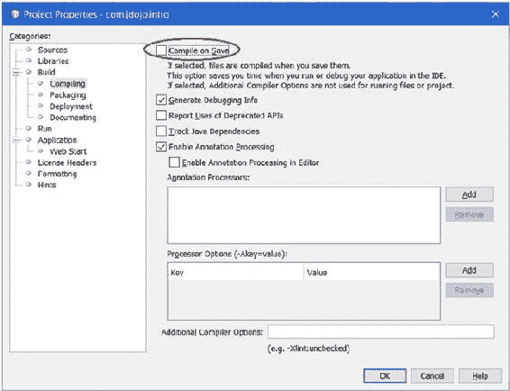

第 3 章 ■ 创建您的第一个模块

编译源代码

当您使用 NetBeans IDE 时，您的 Java 源文件会在您保存时自动编译。您可以通过选择“文件” ➤ “保存”或按 `Ctrl+S` 来保存源文件。您可以在“项目属性”页面上取消选中“保存时编译”复选框，从而为您的项目关闭“保存时编译”功能，如图 3-21 所示。默认情况下，此复选框处于选中状态。您可以通过右键单击项目节点，选择“属性”，然后选择“类别” ➤ “构建” ➤ “编译”来访问此对话框。

***图 3-21.** 在 NetBeans 中配置“保存时编译”默认选项*

如果您已为项目关闭了“保存时编译”功能，则需要通过构建项目来手动编译源文件。您可以通过选择“运行” ➤ “构建项目”或按 `F11` 来构建项目。建议您保持“保存时编译”功能处于开启状态。

打包模块代码

您需要构建项目以为您的模块创建一个模块化 JAR。选择“运行” ➤ “构建项目”或按 `F11` 来构建您的项目。模块的模块化 JAR 创建在 `<项目目录>\dist` 目录中。模块化 JAR 以 NetBeans 项目名称命名。`com.jdojo.intro` 模块的模块化 JAR 将位于 `C:\Java9Revealed\com.jdojo.intro\dist\com.jdojo.intro.jar`。

在撰写本文时，NetBeans 不支持在模块化 JAR 中添加主类名称和模块版本名称。您可以使用 `jar` 命令行工具更新模块化 JAR 中的模块信息。使用如下所示的 `--update` 选项。该命令在一行内输入。为了清晰起见，此处将其显示在多行上。

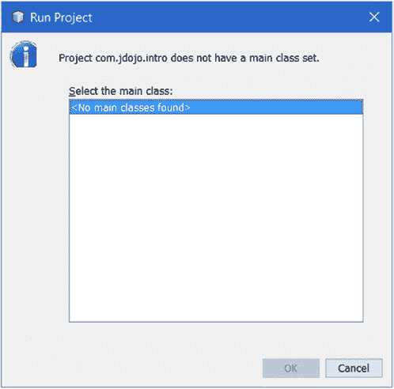

第 3 章 ■ 创建您的第一个模块

```
C:\Java9Revealed>jar --update
--file com.jdojo.intro\dist\com.jdojo.intro.jar
--module-version 1.0
--main-class com.jdojo.intro.Welcome
```

您可以使用以下命令验证 `com.jdojo.intro` 的模块化 JAR 是否已正确更新。您应该会得到类似如下的输出：

```
C:\Java9Revealed>java --module-path com.jdojo.intro\dist
--list-modules com.jdojo.intro
module com.jdojo.intro@1.0 (file:///C:/Java9Revealed/com.jdojo.intro/dist/com.jdojo.intro.jar) requires mandated java.base (@9-ea)
contains com.jdojo.intro
```

请注意，每次在 NetBeans IDE 中构建项目时，IDE 都会在 `C:\Java9Revealed\com.jdojo.intro\dist` 目录中重新创建 `com.jdojo.intro.jar` 文件。我向您展示这些命令是为了举例说明如何更新模块化 JAR 文件以包含主类名称和模块版本。最终版本的 NetBeans IDE（将与 JDK 9 大致同时发布）应该允许您通过 IDE 添加这些属性。

运行程序

选择“运行” ➤ “运行项目”或按 `F6` 来运行您的程序。如果您看到“运行项目”对话框，如图 3-22 所示，则说明您的项目尚未配置为可运行。

***图 3-22.** “运行项目”对话框*

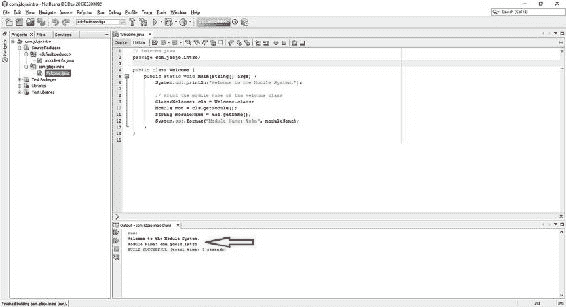

第 3 章 ■ 创建您的第一个模块

当您的项目未配置为可运行时，您有两个选项来运行程序：

*   您可以运行一个包含 `main` 方法的类。请注意，在学习过程中，您的项目中可能有多个类包含 `main` 方法，您可能希望使用此选项。
*   您可以配置您的项目以使其可运行。当您的项目中只有一个包含 `main` 方法的类时，请使用此选项。

要运行一个类，请在 NetBeans IDE 的“项目”选项卡中右键单击包含 `main()` 方法的类的源文件（`.java` 文件），然后选择“运行文件”，或者选择该类文件并按 `Shift+F6`。要运行 `Welcome` 类，请选择 `Welcome.java` 文件并运行它。程序输出将打印在输出窗格中，如图 3-23 所示。

***图 3-23.** 运行 Welcome.java 文件*


要配置项目运行，请右键点击项目并选择“属性”。在“项目属性”对话框中，从“类别”列表中选择“运行”节点。在“主类”字段中输入 `com.jdojo.intro.Welcome`（见图 3-24）。C 点击“确定”关闭对话框。

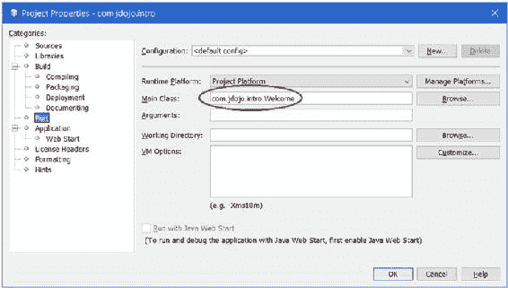

第 3 章 ■ 创建你的第一个模块

***图 3-24.** 配置 NetBeans 项目以运行*

项目配置完成后，你可以选择“运行”➤“运行项目”或按 F6 键来运行项目。运行项目将执行你在项目运行配置中指定的主类。

总结

使用模块开发 Java 应用程序并不会改变 Java 类型在包中的组织方式。模块的源代码在包层次结构的根目录下包含一个 `module-info.java` 文件。也就是说，`module-info.java` 文件位于未命名包中。它包含模块声明。

JDK 9 增强了 `javac` 编译器、`jar` 工具和 `java` 启动器，使其能够与模块协同工作。`javac` 编译器接受新的选项，例如用于定位应用程序模块的 `--module-path`、用于定位模块源代码的 `--module-source-path`，以及用于指定正在编译模块版本的 `--module-version`。`jar` 工具允许你分别使用 `--main-class` 和 `--module-version` 选项为模块化 JAR 指定主类和模块版本。`java` 启动器可以在类路径模式、模块模式或混合模式下运行。要运行模块中的类，你需要使用 `--module-path` 选项指定模块路径。你需要使用 `--module` 选项指定主类名称。主类以 `<module>/<main-class>` 的形式指定，其中 `<module>` 是包含主类的模块，`<main-class>` 是包含作为应用程序入口点的 `main()` 方法的类的完全限定名。

在 JDK 9 中，每个类型都属于一个模块。如果某个类型是从类路径加载的，则它属于加载它的类加载器的未命名模块。在 JDK 9 中，每个类加载器维护一个未命名模块，其成员是该类加载器从类路径加载的所有类型。从模块路径加载的类型属于定义它的模块。

第 3 章 ■ 创建你的第一个模块

`Module` 类的实例在运行时表示一个模块。`Module` 类位于 `java.lang` 包中。使用 `Module` 类可以在运行时了解关于模块的一切信息。JDK 9 增强了 `Class` 类。它的 `getModule()` 方法返回一个 `Module` 实例，表示该类所属的模块。`Module` 类包含一个 `getName()` 方法，该方法以 `String` 形式返回模块名称；对于未命名模块，该方法返回 `null`。

NetBeans IDE 正在更新以支持 JDK 9 和开发模块化 Java 应用程序。在撰写本文时，NetBeans 允许你创建模块、编译它们、将它们打包到模块化 JAR 中，并在 IDE 中运行它们。你需要为每个模块创建一个单独的 Java 项目。其最终版本将允许你在一个 Java 项目中拥有多个模块。IDE 支持添加 `module-info.java` 文件。IDE 有一个非常酷的功能，允许你查看和保存模块图！

**第 4 章**

**模块依赖**

在本章中，你将学习：

• 如何声明模块依赖

• 模块的隐式可读性意味着什么以及如何声明它

• 非限定导出与限定导出的区别

• 声明模块的运行时可选依赖

• 如何打开整个模块或其选定的包以进行深度反射

• JDK 9 中的可访问性类型

• 跨模块拆分包

• 模块声明的限制

• 不同类型的模块：命名模块、未命名模块、显式模块、自动模块、普通模块和开放模块

• 如何使用 `javap` 工具拆解模块的定义

本章中的示例代码需要经过几个步骤。本书的源代码包含了最终步骤中使用的代码。如果你想在阅读本章时每一步都看到这些示例的实际效果，你需要稍微修改源代码，使其与你正在进行的步骤保持同步。

声明模块依赖

如果一个模块需要使用另一个模块中包含的公共类型，则第二个模块需要导出包含这些类型的包，并且第一个模块需要读取第二个模块。请注意，两个模块中的依赖声明是不对称的——类型提供模块导出包含类型的*包*，而类型使用模块读取*模块*。

假设你有两个模块，分别名为 `com.jdojo.address` 和 `com.jdojo.person`。`com.jdojo.address` 模块包含一个名为 `com.jdojo.address` 的包，该包包含一个名为 `Address` 的类。`com.jdojo.person` 模块想要使用 `com.jdojo.address` 模块中的 `Address` 类。图 4-1 显示了`com.jdojo.person` 模块的模块图。让我们逐步完成开发这些模块的步骤。

© Kishori Sharan 2017
K. Sharan, *Java 9 揭秘*, DOI 10.1007/978-1-4842-2592-9_4

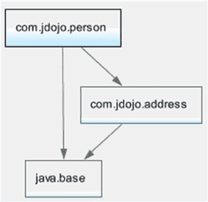

第 4 章 ■ 模块依赖

***图 4-1.** com.jdojo.person 模块的模块图*

在 NetBeans 中，你可以创建两个名为 `com.jdojo.address` 和 `com.jdojo.person` 的 Java 项目。每个项目将包含一个与项目同名的模块的代码。清单 4-1 和清单 4-2 包含模块声明和 `Address` 类的代码。`Address` 类是一个简单的类，包含四个字段及其 getter 和 setter 方法。我为这些字段设置了默认值，这样你就不必在所有示例中都输入它们。

***清单 4-1.*** com.jdojo.address 模块的模块声明

// module-info.java

module com.jdojo.address {

    // 导出 com.jdojo.address 包

    exports com.jdojo.address;

}

***清单 4-2.*** Address 类

// Address.java

package com.jdojo.address;

public class Address {

    private String line1 = "1111 Main Blvd.";

    private String city = "Jacksonville";

    private String state = "FL";

    private String zip = "32256";

    public Address() {

    }

    public Address(String line1, String line2, String city,

                   String state, String zip) {

        this.line1 = line1;

        this.city = city;

        this.state = state;

        this.zip = zip;

    }

第 4 章 ■ 模块依赖

    public String getLine1() {

        return line1;

    }

    public void setLine1(String line1) {

        this.line1 = line1;

    }

    public String getCity() {

        return city;

    }

    public void setCity(String city) {

        this.city = city;

    }

    public String getState() {

        return state;

    }

    public void setState(String state) {

        this.state = state;

    }

    public String getZip() {

        return zip;

    }

    public void setZip(String zip) {

        this.zip = zip;

    }

    @Override

    public String toString() {

        return "[Line1:" + line1 + ", State:" + state +

               ", City:" + city + ", ZIP:" + zip + "]";

    }

}

`exports` 语句用于将包导出到所有其他模块或某些*命名模块*。导出包中的所有公共类型在编译时和运行时都是可访问的。在运行时，你可以使用反射仅访问公共类型的公共成员。即使在这些成员上使用 `setAccessible(true)` 方法，公共类型的非公共成员也无法通过反射访问。`exports` 语句的一般语法如下：

exports <package>;

该语句将 `<package>` 中的所有公共类型导出到所有其他模块。也就是说，任何读取此模块的模块都将能够使用 `<package>` 中的所有公共类型。

`com.jdojo.address` 模块导出了 `com.jdojo.address` 包，因此 `Address` 类（它是公共的且位于 `com.jdojo.address` 包中）可以被其他模块使用。在本示例中，你将在 `com.jdojo.person` 模块中使用 `Address` 类。

第 4 章 ■ 模块依赖


清单 4-3 和清单 4-4 包含了 `com.jdojo.person` 模块的模块声明以及 `Person` 类的代码。

***清单 4-3.*** `com.jdojo.person` 模块的模块声明

// module-info.java

module com.jdojo.person {

// 读取 com.jdojo.address 模块

requires com.jdojo.address;

// 导出 com.jdojo.person 包

exports com.jdojo.person;

}

***清单 4-4.*** `Person` 类

// Person.java

package com.jdojo.person;

import com.jdojo.address.Address;

public class Person {

private long personId;

private String firstName;

private String lastName;

private Address address = new Address();

public Person(long personId, String firstName, String lastName) {

this.personId = personId;

this.firstName = firstName;

this.lastName = lastName;

}

public long getPersonId() {

return personId;

}

public void setPersonId(long personId) {

this.personId = personId;

}

public String getFirstName() {

return firstName;

}

public void setFirstName(String firstName) {

this.firstName = firstName;

}

public String getLastName() {

return lastName;

}

第 4 章 ■ 模块依赖

public void setLastName(String lastName) {

this.lastName = lastName;

}

public Address getAddress() {

return address;

}

public void setAddress(Address address) {

this.address = address;

}

@Override

public String toString() {

return "[Person Id:" + personId + ", First Name:" + firstName +

", Last Name:" + lastName + ", Address:" + address + "]";

}

}

`Person` 类位于 `com.jdojo.person` 模块中，它使用了一个 `Address` 类型的字段，而 `Address` 类型位于 `com.jdojo.address` 模块中。这意味着 `com.jdojo.person` 模块读取了 `com.jdojo.address` 模块。这一点通过 `com.jdojo.person` 模块声明中的 `requires` 语句来指明：

// 读取 com.jdojo.address 模块

requires com.jdojo.address;

`requires` 语句用于指定一个模块对另一个模块的依赖。如果一个模块读取了另一个模块，那么第一个模块需要在其声明中包含一条 `requires` 语句。`requires` 语句的通用语法如下：

requires [transitive] [static] <模块名>;

在这里，`<模块名>` 是当前模块所读取的模块的名称。`transitive` 和 `static` 修饰符都是可选的。如果存在 `static` 修饰符，则 `<模块名>` 模块在编译时是必需的，但在运行时是可选的。`transitive` 修饰符的存在意味着，读取当前模块的模块会隐式地读取 `<模块名>` 模块。我稍后会介绍一个在 `requires` 语句中使用 `transitive` 修饰符的示例。

每个模块都会隐式地读取 `java.base` 模块。如果模块声明中尚未读取 `java.base` 模块，编译器会添加一条 `requires` 语句来读取它。以下两个名为 `com.jdojo.common` 的模块声明是等效的：

// 声明 #1

module com.jdojo.common {

// 编译器将添加对 java.base 模块的读取

}

// 声明 #2

module com.jdojo.common {

// 显式添加对 java.base 模块的读取

requires java.base;

}

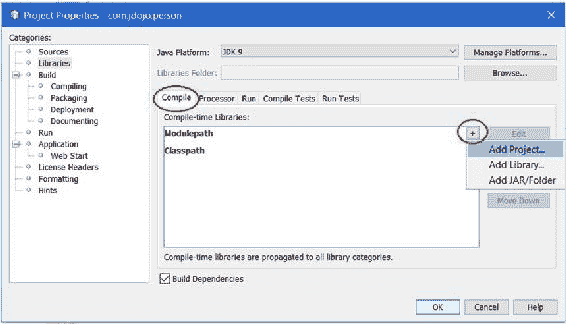

第 4 章 ■ 模块依赖

`com.jdojo.person` 模块的声明中包含一条 `requires` 语句，这意味着 `com.jdojo.address` 模块在编译时和运行时都是必需的。当你编译 `com.jdojo.person` 模块时，必须将 `com.jdojo.address` 模块包含在模块路径中。如果你使用的是 NetBeans IDE，可以将一个 NetBeans 项目或一个模块化 JAR 添加到模块路径中。在 NetBeans 中右键单击 `com.jdojo.person` 项目，然后选择“属性”。在“类别”列表中，选择“库”。

选择“编译”选项卡，点击“模块路径”行上的 `+` 号，然后从菜单中选择“添加项目”，如图 4-2 所示。此时会显示“添加项目”对话框，如图 4-3 所示。

***图 4-2.** 在 NetBeans 中为项目设置模块路径*

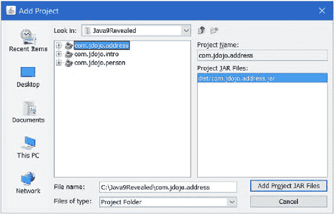

第 4 章 ■ 模块依赖

在“添加项目”对话框中，导航到包含 `com.jdojo.address` 模块的目录；选择该模块并点击“添加项目 JAR 文件”按钮，这将带你回到“属性”对话框，你可以在其中看到已添加到模块路径的项目，如图 4-4 所示。点击“确定”按钮完成此步骤。

***图 4-3.** 选择要添加到模块路径的 NetBeans 项目*

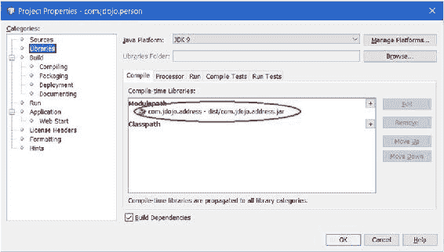

第 4 章 ■ 模块依赖

***图 4-4.** 已添加到模块路径的 NetBeans 项目*

`com.jdojo.person` 模块还导出了 `com.jdojo.person` 包，因此该包中的公共类型（例如 `Person` 类）可以被其他模块使用。

清单 4-5 包含了 `Main` 类的代码，该类位于 `com.jdojo.person` 模块中。当你运行这个类时，输出显示你可以使用来自 `com.jdojo.address` 模块的 `Address` 类。这个演示如何使用 `exports` 和 `requires` 模块语句的示例到此结束。如果你在运行此示例时遇到任何问题，请参考下一节，其中列出了一些可能的错误及其解决方案。

***清单 4-5.*** 用于测试 `com.jdojo.person` 模块的 `Main` 类

// Main.java

package com.jdojo.person;

import com.jdojo.address.Address;

public class Main {

public static void main(String[] args) {

Person john = new Person(1001, "John", "Jacobs");

String fName = john.getFirstName();

String lName = john.getLastName();

Address addr = john.getAddress();

System.out.printf("%s %s%n", fName, lName);

System.out.printf("%s%n", addr.getLine1());

System.out.printf("%s, %s %s%n", addr.getCity(),

addr.getState(), addr.getZip());

}

}

第 4 章 ■ 模块依赖

John Jacobs

1111 Main Blvd.

Jacksonville, FL 32256

此时，你也可以使用命令提示符运行此示例。你需要将 `com.jdojo.person` 和 `com.jdojo.address` 模块的已编译展开目录或模块化 JAR 包含到模块路径中。以下命令使用了两个 NetBeans 项目下 `build\classes` 目录中的已编译类：

C:\Java9Revealed>java --module-path

com.jdojo.person\build\classes;com.jdojo.address\build\classes

--module com.jdojo.person/com.jdojo.person.Main

当你构建一个包含模块的 NetBeans 项目时，该模块的模块化 JAR 会存储在 NetBeans 项目目录下的 `dist` 目录中。当你构建 `com.jdojo.person` 项目时，它会在 `C:\Java9Revealed\com.jdojo.person\dist` 目录中创建一个 `com.jdojo.person.jar` 文件。当你在 NetBeans 中构建一个项目时，它还会重新构建当前项目所依赖的所有项目。对于此示例，构建 `com.jdojo.person` 项目也会重新构建 `com.jdojo.address` 项目。构建完 `com.jdojo.person` 模块后，你可以使用以下命令运行此示例：

C:\Java9Revealed>java --module-path

com.jdojo.person\dist;com.jdojo.address\dist

--module com.jdojo.person/com.jdojo.person.Main

示例故障排除

如果你是第一次使用 JDK 9，在完成此示例的过程中可能会遇到许多问题。以下各节讨论了几种带有错误消息的场景及其相应的解决方案。

空包错误

错误信息如下：

error: package is empty or does not exist: com.jdojo.address

exports com.jdojo.address;

^

1 error

如果你在编译 `com.jdojo.address` 模块的模块声明时没有包含 `Address` 类的源代码，就会遇到此错误。该模块导出了 `com.jdojo.address` 包。你必须在导出的包中至少定义一个类型。

第 4 章 ■ 模块依赖

模块未找到错误

错误信息如下：

error: module not found: com.jdojo.address

requires com.jdojo.address;

^

1 error


如果在编译 `com.jdojo.person` 模块的模块声明时，未将 `com.jdojo.address` 模块包含在模块路径中，就会遇到此错误。`com.jdojo.person` 模块读取了 `com.jdojo.address` 模块，因此前者必须在编译时和运行时都能在模块路径上找到后者。如果使用命令提示符，请使用 `--module-path` 选项为 `com.jdojo.address` 模块指定模块路径。如果使用 NetBeans，请参考上一节了解如何为 `com.jdojo.person` 模块配置模块路径。

包不存在错误

错误信息如下：

error: package com.jdojo.address does not exist

import com.jdojo.address.Address;

^

error: cannot find symbol

private Address address = new Address();

^

symbol: class Address

location: class Person

如果在编译 `com.jdojo.person` 模块中的 `Person` 和 `Main` 类时，未在模块声明中添加 `requires` 语句，就会遇到此错误。错误消息表明编译器找不到 `com.jdojo.address.Address` 类。解决方案是在 `com.jdojo.person` 模块的模块声明中添加 `requires com.jdojo.address;` 语句，并将 `com.jdojo.address` 模块添加到模块路径中。

模块解析异常

部分错误信息如下：

Error occurred during initialization of VM

java.lang.module.ResolutionException: Module com.jdojo.person not found

...

尝试从命令提示符运行示例时，可能会因以下原因遇到此错误：

• 模块路径未正确指定。

• 模块路径正确，但在指定目录或模块路径上的模块化 JAR 中未找到编译后的代码。

第 4 章 ■ 模块依赖

假设使用以下命令运行示例：

C:\Java9Revealed>java --module-path

com.jdojo.person\dist;com.jdojo.address\dist

--module com.jdojo.person/com.jdojo.person.Main

请确保存在以下模块化 JAR：

• C:\Java9Revealed\com.jdojo.person\dist\com.jdojo.person.jar

• C:\Java9Revealed\com.jdojo.address\dist\com.jdojo.address.jar

如果这些模块化 JAR 不存在，请在 NetBeans 中构建 `com.jdojo.person` 项目。

如果使用以下命令通过展开目录中的模块代码运行示例，请确保在 NetBeans 中编译了项目：

C:\Java9Revealed>java --module-path

com.jdojo.person\build\classes;com.jdojo.address\build\classes

--module com.jdojo.person/com.jdojo.person.Main

隐式可读性

如果一个模块无需在声明中包含 `requires` 语句来读取第二个模块，就能读取该模块，则称第一个模块*隐式*读取第二个模块。

每个模块都隐式读取 `java.base` 模块。隐式读取不仅限于 `java.base` 模块。一个模块也可以隐式读取除 `java.base` 模块之外的其他模块。在展示如何为模块添加隐式可读性之前，我将构建一个示例来说明为什么需要此功能。

在上一节中，您创建了两个模块：`com.jdojo.address` 和 `com.jdojo.person`，其中第二个模块使用以下声明读取第一个模块：

module com.jdojo.person {

**requires com.jdojo.address;**

...

}

`com.jdojo.person` 模块中的 `Person` 类引用了 `com.jdojo.address` 模块中的 `Address` 类。让我们创建另一个名为 `com.jdojo.person.test` 的模块，该模块读取 `com.jdojo.person` 模块。模块声明如清单 4-6 所示。

***清单 4-6.*** `com.jdojo.person.test` 模块的模块声明

// module-info.java

module com.jdojo.person.test {

requires com.jdojo.person;

}

您需要将 `com.jdojo.person` 项目添加到 `com.jdojo.person.test` 项目的模块路径中。否则，编译清单 4-6 中的代码将生成以下错误：C:\Java9Revealed\com.jdojo.person.test\src\module-info.java:3: error: module not found:

com.jdojo.person


requires com.jdojo.person;

1 个错误

第 4 章 ■ 模块依赖

清单 4-7 包含了 `com.jdojo.person.test` 模块中 `Main` 类的代码。

***清单 4-7.*** 用于测试 `com.jdojo.person.test` 模块的 `Main` 类

// Main.java

package com.jdojo.person.test;

import com.jdojo.person.Person;

public class Main {

public static void main(String[] args) {

Person john = new Person(1001, "John", "Jacobs");

// 获取 John 所在城市并打印

String city = john.getAddress().getCity();

System.out.printf("John lives in %s%n", city);

}

}

`main()` 方法中的代码非常简单——它创建了一个 `Person` 对象，并读取该人员地址中的城市值：

Person john = new Person(1001, "John", "Jacobs");

**String city = john.getAddress().getCity();**

编译 `com.jdojo.person.test` 模块的代码时，会产生以下错误：

com.jdojo.person.test\src\com\jdojo\person\test\Main.java:11: 错误: Address 中的 getCity() 定义于不可访问的类或接口

String city = john.getAddress().getCity();

^

1 个错误

编译器信息并不十分清晰。它指出 `Address` 类对 `com.jdojo.person.test` 模块不可访问。回想一下，`Address` 类位于 `com.jdojo.address` 模块中，而 `com.jdojo.person.test` 模块并未读取该模块。从代码来看，似乎理应编译通过。你可以访问 `Person` 类，而该类使用了 `Address` 类；因此你应该能够使用 `Address` 类。但在这里，`john.getAddress()` 方法返回了一个 `Address` 类型的对象，而你却无法访问该类型。模块系统只是在履行其职责，强制执行 `com.jdojo.address` 模块所定义的封装。如果一个模块想要显式或隐式地使用 `Address` 类，它必须读取 `com.jdojo.address` 模块。如何解决这个问题？简单的答案是让 `com.jdojo.person.test` 模块读取 `com.jdojo.address` 模块，方法是将它的声明修改为清单 4-8 所示的内容。

***清单 4-8.*** `com.jdojo.person.test` 模块的修改后模块声明

// module-info.java

module com.jdojo.person.test {

requires com.jdojo.person;

**requires com.jdojo.address;**

}

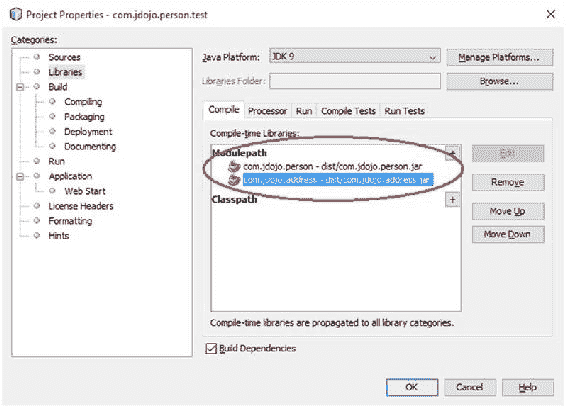

第 4 章 ■ 模块依赖

当你在清单 4-8 中添加了 `requires com.jdojo.address` 语句后，你会遇到另一个错误，指出找不到 `com.jdojo.address` 模块。将 `com.jdojo.address` 项目添加到 `com.jdojo.person.test` 项目的模块路径中，即可修复此错误。模块路径设置将如图 4-5 所示。

***图 4-5.** `com.jdojo.person.test` 模块的模块路径设置*

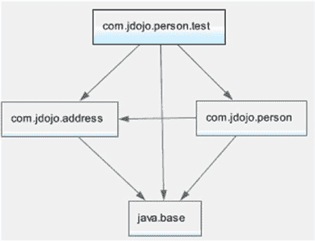

第 4 章 ■ 模块依赖

图 4-6 显示了此时 `com.jdojo.person.test` 模块的模块图。

***图 4-6.** `com.jdojo.person.test` 模块的模块图*

编译并运行 `com.jdojo.person.test` 模块中的 `Main` 类。它将打印以下内容：John lives in Jacksonville

你通过添加一条 `requires` 语句解决了问题。然而，其他读取 `com.jdojo.person` 模块的模块很可能也需要处理人员的地址，并且它们也需要添加类似的 `requires` 语句。如果 `com.jdojo.person` 模块在其公共 API 中暴露了来自多个其他模块的类型，那么读取 `com.jdojo.person` 模块的模块将需要为这些模块中的每一个都添加一条 `requires` 语句。对于所有这些模块来说，添加额外的 `requires` 语句将非常繁琐。

JDK 9 的设计者意识到了这个问题，并提供了一种简单的解决方法。在这种情况下，你只需修改 `com.jdojo.person` 模块的声明，在 `requires` 语句中添加一个 `transitive` 修饰符来读取 `com.jdojo.address` 模块。清单 4-9 包含了 `com.jdojo.person` 模块的修改后声明。


***清单 4-9.*** 为 `com.jdojo.person` 模块修改后的模块声明

// module-info.java

module com.jdojo.person {

// 读取 com.jdojo.address 模块

requires **transitive** com.jdojo.address;

// 导出 com.jdojo.person 包

exports com.jdojo.person;

}

现在，你可以从 `com.jdojo.person.test` 模块的声明中移除读取 `com.jdojo.address` 模块的 `requires` 语句。你需要在 `com.jdojo.person.test` 项目的模块路径上保留 `com.jdojo.address` 项目，因为在该模块中使用 `Address` 类型时仍然需要 `com.jdojo.address` 模块。重新编译 `com.jdojo.person` 模块。然后重新编译并运行 `com.jdojo.person.test` 模块中的 `Main` 类，以获得预期的输出。

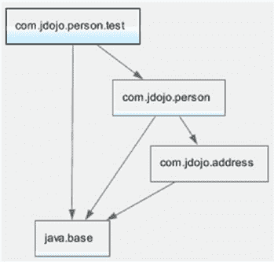

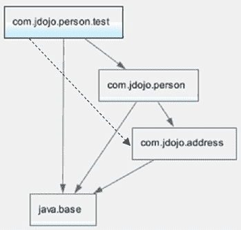

第 4 章 ■ 模块依赖

当 `requires` 语句包含 `transitive` 修饰符时，依赖当前模块的其他模块会隐式地读取 `requires` 语句中指定的模块。参考清单 4-9，任何读取 `com.jdojo.person` 模块的模块都会隐式地读取 `com.jdojo.address` 模块。

本质上，隐式读取使模块声明更易于阅读，但更难推理，因为仅通过查看模块声明，你无法看到其所有依赖项。图 4-7 展示了 `com.jdojo.person.test` 模块的最终模块图。

***图 4-7.** `com.jdojo.person.test` 模块的模块图*

当解析模块时，模块图会通过为每个传递依赖添加一条读取边来扩充。在此示例中，将从 `com.jdojo.person.test` 模块向 `com.jdojo.address` 模块添加一条读取边，如图 4-8 中的虚线箭头所示。

***图 4-8.** 通过隐式读取边扩充后的 `com.jdojo.person.test` 模块的模块图* 71

第 4 章 ■ 模块依赖

限定导出

假设你正在开发一个由多个模块组成的库或框架。你的某个模块中包含一些包，这些包中的 API 仅供某些模块内部使用。也就是说，该模块中的包无需导出给所有模块，其可访问性必须仅限于少数几个命名的模块。这可以通过在模块声明中使用限定导出语句来实现。使用限定导出的通用语法如下：

exports <包名> to <模块 1>, <模块 2>...;

这里，`<包名>` 是当前模块要导出的包名，`<模块 1>`、`<模块 2>` 等是可以读取当前模块的模块名称。以下模块声明包含一个非限定导出和一个限定导出：

module com.jdojo.common {

// 非限定导出语句

exports com.jdojo.zip;

// 限定导出语句

exports com.jdojo.internal to com.jdojo.address;

}

`com.jdojo.common` 模块将 `com.jdojo.zip` 包导出给所有模块，而 `com.jdojo.internal` 包仅属于 `com.jdojo.address` 模块。`com.jdojo.zip` 模块中的所有公共类型将对所有读取 `com.jdojo.common` 模块的模块可访问。然而，`com.jdojo.internal` 包中的所有公共类型仅对 `com.jdojo.address` 模块可访问（前提是该模块读取了前者）。

你可以在 JDK 9 中找到许多限定导出的示例。`java.base` 模块包含 `sun.*` 和 `jdk.*` 包，这些包被导出给少数几个命名的模块。以下命令打印了 `java.base` 的模块声明。输出显示了 `java.base` 模块中使用的一些限定导出。

c:\>javap jrt:/java.base/module-info.class

Compiled from "module-info.java"

module java.base {

exports sun.net to jdk.plugin, jdk.incubator.httpclient;

exports sun.nio.cs to java.desktop, jdk.charsets;

exports sun.util.resources to jdk.localedata;

exports jdk.internal.util.xml to jdk.jfr;

exports jdk.internal to jdk.jfr;

...

}

第 4 章 ■ 模块依赖

并非 JDK 9 中的所有内部 API 都被封装了。`sun.*` 包中有一些关键的内部 API，例如 `sun.misc.Unsafe` 类，这些 API 在 JDK 9 之前被开发者使用，并且在 JDK 9 中仍然可访问。这些包已被放置在 `jdk.unsupported` 模块中。以下命令打印了 `jdk.unsupported` 模块的模块声明：

C:\Java9Revealed>javap jrt:/jdk.unsupported/module-info.class

Compiled from "module-info.java"

module jdk.unsupported@9-ea {

requires java.base;

exports sun.misc;

exports com.sun.nio.file;

exports sun.reflect;

opens sun.misc;

opens sun.reflect;

}

可选依赖

模块系统在编译时和运行时都会验证模块依赖关系。有时你可能希望某个模块依赖在编译时是必需的，但在运行时是可选的。

你可能会开发一个库，如果某个特定模块在运行时可用，该库的性能会更好；否则，它会回退到另一个性能较差的模块。然而，该库是针对可选模块编译的，并且它确保如果可选模块不可用，则不会执行依赖于该可选模块的代码。

另一个例子是导出注解包的模块。Java 运行时已经会忽略不存在的注解类型。如果程序中使用的注解在运行时不存在，该注解会被忽略。模块依赖关系在启动时会被验证，如果缺少某个模块，应用程序将无法启动。因此，将包含注解包的模块依赖声明为可选依赖至关重要。

你可以通过在 `requires` 语句中使用 `static` 关键字来声明可选依赖：

requires **static** <可选包>;

以下模块声明包含对 `com.jdojo.annotation` 模块的可选依赖：

module com.jdojo.claim {

requires **static** com.jdojo.annotation;

}

允许在 `requires` 语句中同时使用 `transitive` 和 `static` 修饰符：

module com.jdojo.claim {

requires **transitive static** com.jdojo.annotation;

}

第 4 章 ■ 模块依赖

如果同时使用 `transitive` 和 `static` 修饰符，它们可以按任意顺序排列。以下声明与上一个声明具有相同的语义：

module com.jdojo.claim {

requires **static transitive** com.jdojo.annotation;

}

使用反射访问模块

二十多年来，Java 一直允许使用反射访问类型的所有成员——私有的、公共的、包级别的和受保护的。你能够访问类或对象的私有成员。你所要做的就是在成员（`Field`、`Method` 等）对象上调用 `setAccessible(true)` 方法。在本章的剩余部分，我将把使用反射访问类型的非公共成员称为*深度反射*。

当你导出一个模块的包时，其他模块只能访问导出包中的公共类型以及这些公共类型的公共/受保护成员——在编译时静态地访问，或在运行时通过反射访问。这在模块系统设计期间成为了一个大问题。有许多优秀的框架，例如 Spring 和 Hibernate，它们严重依赖于对应用程序库中定义的类型成员进行深度反射访问。

模块系统的设计者在设计对模块化代码的深度反射访问时面临巨大挑战。允许对导出包中的类型进行深度反射违反了模块系统的*强封装*主题。即使模块开发者不想暴露模块的某些部分，它也会使所有内容对外部代码可访问。另一方面，不允许深度反射将使 Java 社区失去一些广泛使用的优秀框架，并且还会破坏许多依赖深度反射的现有应用程序。许多现有应用程序将因此限制而无法迁移到 JDK 9。


好的，作为一名高级文档工程师和翻译员，我将严格遵循您提供的注意事项和示例，将给定的英文文本翻译成中文。


经过几轮设计和实验的迭代，模块系统设计者找到了一个折中方案——鱼与熊掌可以兼得！当前的设计允许你拥有一个兼具强封装性、深度反射访问能力，或两者兼而有之的模块。规则如下：

-   一个被导出的包，在编译时和运行时都只允许访问其公共类型及其公共成员。如果你不导出某个包，那么该包中的所有类型对其他模块都是不可访问的。这提供了强封装性。
-   你可以开放一个模块，以允许在运行时对该模块中所有包的所有类型进行深度反射。这样的模块被称为*开放模块*。
-   你可以拥有一个普通模块——即未开放进行深度反射的模块——但其中特定的包可以在运行时开放进行深度反射。所有其他包（非开放包）则被强封装。模块中允许进行深度反射的包被称为*开放包*。
-   有时，你可能希望在编译时访问某个包中的类型，以便根据该包中的类型编写代码，同时，你又希望在运行时对这些类型进行深度反射访问。你可以通过同时导出和开放同一个包来实现这一点。

第 4 章 ■ 模块依赖

开放模块

在本节的剩余部分，我将向你展示如何声明一个开放模块，以及如何开放一个特定的包以进行深度反射。首先，我将给出语法。在 `module` 关键字之前使用 `open` 修饰符来声明一个开放模块：

**open** module com.jdojo.model {

// 模块语句写在这里

}

这里，`com.jdojo.model` 模块是一个开放模块。其他模块可以对该模块中所有包的所有类型使用深度反射。你可以在开放模块的声明中包含 `exports`、`requires`、`uses` 和 `provides` 语句。你不能在开放模块内部使用 `opens` 语句。`opens` 语句用于开放一个特定的包以进行深度反射。因为开放模块开放了所有包以进行深度反射，所以开放模块内部不允许使用 `opens` 语句。

开放包

开放包意味着允许其他模块对该包中的类型使用深度反射。你可以将包开放给所有其他模块，或开放给一个特定的模块列表。

将包开放给所有其他模块的 `opens` 语句语法如下：

opens <包名>;

这里，`<包名>` 对所有其他模块都可用于深度反射。你也可以使用限定形式的 `opens` 语句将包开放给特定模块：

opens <包名> to <模块 1>, <模块 2>...;

这里，`<包名>` 仅对 `<模块 1>`、`<模块 2>` 等开放以进行深度反射。以下是在模块声明中使用 `opens` 语句的示例：

module com.jdojo.model {

// 将 com.jdojo.util 包导出给所有模块

exports com.jdojo.util;

// 将 com.jdojo.util 包开放给所有模块

opens com.jdojo.util;

// 仅将 com.jdojo.model.policy 包开放给

// hibernate.core 模块

opens com.jdojo.model.policy to hibernate.core;

}

`com.jdojo.model` 模块导出了 `com.jdojo.util` 包，这意味着所有公共类型及其公共成员在编译时和运行时（用于普通反射）都是可访问的。第二条语句开放了同一个包，以在运行时进行深度反射。总之，`com.jdojo.util` 包的所有公共类型及其公共成员在编译时可访问，并且该包允许在运行时进行深度反射。第三条语句仅将 `com.jdojo.model.policy` 包开放给 `hibernate.core` 模块以进行深度反射，这意味着其他模块在编译时无法访问该包的任何类型，而 `hibernate.core` 模块可以在运行时使用深度反射访问所有类型及其成员。

第 4 章 ■ 模块依赖

■ **提示** 一个对另一个模块的开放包执行深度反射的模块，不需要读取包含这些开放包的模块。但是，如果知道模块名称，添加对具有开放包的模块的依赖是允许的，并且强烈建议这样做——这样模块系统可以在编译时和运行时验证依赖关系。

当模块 M 将其包 P 开放给另一个模块 N 以进行深度反射时，模块 N 有可能将其对包 P 拥有的深度反射访问权限委托给另一个模块 Q。模块 N 需要使用 `Module` 类的 `addOpens()` 方法以编程方式实现这一点。将反射访问权限委托给另一个模块，可以避免将整个模块开放给所有其他模块，同时，这也为被授予反射访问权限的模块增加了额外的工作。

使用深度反射

在本节中，我将解释如何开放模块和包以进行深度反射。我将从一个基本用例开始，然后逐步构建示例。在示例中，我将：

-   展示尝试使用深度反射执行某些操作的代码。通常，这些代码会产生错误。
-   解释错误背后的原因。
-   最后，向你展示如何修复这些错误。

我将使用一个名为 `com.jdojo.reflect` 的模块，该模块在 `com.jdojo.reflect` 包中包含一个名为 `Item` 的类。清单 4-10 和清单 4-11 包含了该模块和类的源代码。

***清单 4-10.*** com.jdojo.reflect 模块的模块声明

// module-info.java

module com.jdojo.reflect {

// 没有模块语句

}

***清单 4-11.*** 一个包含四个静态变量的 Item 类

// Item.java

package com.jdojo.reflect;

public class Item {

static private int s = 10;

static int t = 20;

static protected int u = 30;

static public int v = 40;

}

请注意，该模块既没有导出任何包，也没有开放任何包。`Item` 类非常简单。它包含四个静态变量，分别对应每种访问修饰符——`private`、包级、`protected` 和 `public`。我特意让这个类保持简单，以便你可以专注于模块系统的规则，而不是理解代码。在本示例中，你将使用深度反射来访问这些静态变量。

第 4 章 ■ 模块依赖

你将使用另一个名为 `com.jdojo.reflect.test` 的模块。清单 4-12 包含了它的声明。它是一个没有模块语句的普通模块。也就是说，除了默认依赖于 `java.base` 模块外，它没有其他依赖。

***清单 4-12.*** com.jdojo.reflect.test 模块的模块声明

// module-info.java

module com.jdojo.reflect.test {

// 没有模块语句

}

`com.jdojo.reflect.test` 模块包含一个名为 `ReflectTest` 的类，如清单 4-13 所示。

***清单 4-13.*** 一个用于演示对其他模块中类型及其成员进行反射访问的 ReflectTest 类

// ReflectTest.java

package com.jdojo.reflect.test;

import java.lang.reflect.Field;

import java.lang.reflect.InaccessibleObjectException;

public class ReflectTest {

public static void main(String[] args) throws ClassNotFoundException {

// 获取 com.jdojo.reflect.Item 类的 Class 对象

// 该类位于 com.jdojo.reflect 模块中

Class<?> cls = Class.forName("com.jdojo.reflect.Item");

Field[] fields = cls.getDeclaredFields();

for (Field field : fields) {

printFieldValue(field);

}

}

public static void printFieldValue(Field field) {

String fieldName = field.getName();

try {

// 使字段可访问，以防其基于声明（例如私有字段）而不可访问

field.setAccessible(true);

// 打印字段的值

System.out.println(fieldName + " = " + field.get(null));

} catch (IllegalAccessException | IllegalArgumentException |

InaccessibleObjectException e) {

System.out.println("访问 " + fieldName +

" 时出错。错误信息: " + e.getMessage());

}

}

}

第 4 章 ■ 模块依赖


`ReflectTest` 类非常简单。在其 `main()` 方法中，它使用 `Class.forName()` 方法加载 `com.jdojo.reflect.Item` 类，并尝试打印该类的所有四个静态字段的值。

如果某个类在运行时可用，你可以使用 `Class.forName()` 方法从任何模块加载该类。该类不一定需要通过模块依赖（即 `exports` 和 `requires` 语句）来保证可访问。你可能会质疑这条规则。这难道不违反模块系统的强封装前提吗？如何能在不拥有该类的模块导出包含该类的包的情况下，从任何模块加载该类？之所以允许这样做，是因为你加载的是该类的类描述符（`Class` 对象）。知道类描述符并不意味着你也能创建该类的对象并访问其成员。强封装指的是只能访问模块中已导出或已打开的那些类型，而不是指加载类描述符。

让我们运行 `ReflectTest` 类。它将生成以下错误：

```
Exception in thread "main" java.lang.ClassNotFoundException: com.jdojo.reflect.Item
    at java.base/jdk.internal.loader.BuiltinClassLoader.loadClass(BuiltinClassLoader.java:532)
    at java.base/jdk.internal.loader.ClassLoaders$AppClassLoader.loadClass(ClassLoaders.java:186)
    at java.base/java.lang.ClassLoader.loadClass(ClassLoader.java:473)
    at java.base/java.lang.Class.forName0(Native Method)
    at java.base/java.lang.Class.forName(Class.java:292)
    at com.jdojo.reflect.test/com.jdojo.reflect.test.ReflectTest.main(ReflectTest.java:12)
```

错误信息表明，在尝试加载 `com.jdojo.reflect.Item` 类时抛出了 `ClassNotFoundException`。我之前不是说应该能够加载该类吗？我之前的说法仍然正确。这个错误源于另一个问题。

当你尝试加载一个类时，包含该类的模块必须为模块系统所知。如果你在 JDK 9 之前收到 `ClassNotFoundException`，那表明该类不在类路径中。你需要将包含该类的目录或 JAR 添加到类路径中，错误就会解决。在 JDK 9 中，模块是通过模块路径来查找的。因此，让我们将 `com.jdojo.reflect` 模块添加到模块路径中，然后运行 `ReflectTest` 类。在 NetBeans 中，你需要通过属性对话框将 `com.jdojo.reflect` 项目添加到 `com.jdojo.reflect.test` 模块的模块路径中，如图 4-9 所示。

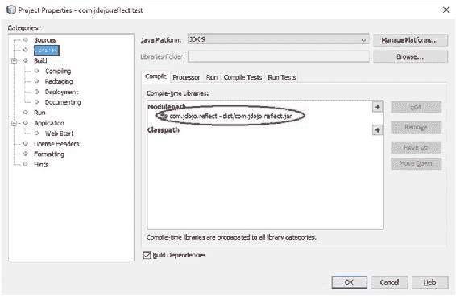

第 4 章 ■ 模块依赖

***图 4-9.** 在 NetBeans 中将 com.jdojo.reflect 项目添加到 com.jdojo.reflect.test 项目的模块路径中*

你也可以使用以下命令运行 `ReflectTest` 类，假设你已在 NetBeans 中构建了两个项目，并且项目的 `dist` 目录中包含模块化 JAR：

```
C:\Java9Revealed>java
--module-path com.jdojo.reflect\dist;com.jdojo.reflect.test\dist
--module com.jdojo.reflect.test/com.jdojo.reflect.test.ReflectTest
```

在 NetBeans 和命令提示符下运行 `ReflectTest` 类都会返回相同的 `ClassNotFoundException`。因此，看起来将 `com.jdojo.reflect` 模块添加到模块路径并没有帮助。但这并不完全正确。事实上，这一步确实有帮助，但它只解决了问题的一半。

我们需要理解并解决另一半问题，即模块图。

JDK 9 中的模块路径听起来与类路径类似，但它们的工作方式不同。模块路径用于在模块解析期间定位模块——即构建和扩充模块图时。而类路径则用于在需要加载类时定位类。为了提供可靠的配置，模块系统确保在启动时所有模块所需的依赖项都已存在。一旦你的应用程序启动，所有需要的模块都会被解析，模块解析结束后再向模块路径添加更多模块也无济于事。当你运行 `ReflectTest` 类时——将 `com.jdojo.reflect` 和 `com.jdojo.reflect.test` 模块都保留在模块路径上——模块图如图 4-10 所示。

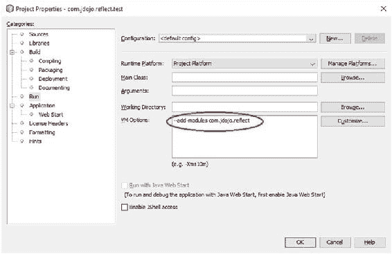

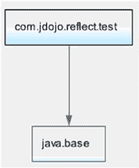

第 4 章 ■ 模块依赖

***图 4-10.** 运行 ReflectTest 类时的模块图*

当你从一个模块运行一个类时——就像你运行 `ReflectTest` 类时那样——包含主类的模块是唯一用作根的模块。模块图包含主模块所依赖的所有模块及其依赖项。在这种情况下，`com.jdojo.reflect.test` 模块是默认根模块集合中的唯一模块，模块系统对 `com.jdojo.reflect` 模块的存在一无所知，即使该模块被放置在模块路径上。你需要做什么才能将 `com.jdojo.reflect` 模块包含在模块图中？通过使用 `--add-modules` 命令行 VM 选项，将该模块添加到默认的根模块集合中。该选项的值是一个逗号分隔的模块列表，这些模块将被添加到默认的根模块集合中：

```
--add-modules <module1>,<module2>...
```

图 4-11 显示了 NetBeans 中 `com.jdojo.reflect.test` 项目的属性对话框，其中包含你需要使用的 VM 选项，以将 `com.jdojo.reflect` 模块添加到默认的根模块集合中。

***图 4-11.** 在 NetBeans 中运行时将 com.jdojo.reflect 模块添加到默认的根模块集合中*

第 4 章 ■ 模块依赖

图 4-12 显示了在将 `com.jdojo.reflect` 模块添加到默认的根模块集合后，运行时的模块图。

```
com.jdojo.reflect.test
    |
    v
com.jdojo.reflect
    |
    v
java.base
```

***图 4-12.** 将 com.jdojo.reflect 模块添加到默认的根模块集合后的模块图*

另一种解析 `com.jdojo.reflect` 模块的方法是在 `com.jdojo.reflect.test` 模块的声明中添加 `requires com.jdojo.reflect;` 语句。这样，`com.jdojo.reflect` 模块将作为 `com.jdojo.reflect.test` 模块的依赖项被解析。如果你使用此选项，则无需使用 `--add-modules` 选项。

在 NetBeans 中重新运行 `ReflectTest` 类。你也可以使用以下命令运行它：

```
C:\Java9Revealed>java
--module-path com.jdojo.reflect\dist;com.jdojo.reflect.test\dist
--add-modules com.jdojo.reflect
--module com.jdojo.reflect.test/com.jdojo.reflect.test.ReflectTest
```

访问 s 时出错：无法使字段 `private static int com.jdojo.reflect.Item.s` 可访问：模块 `com.jdojo.reflect` 未向模块 `com.jdojo.reflect.test` 开放 `com.jdojo.reflect`。

访问 t 时出错：无法使字段 `static int com.jdojo.reflect.Item.t` 可访问：模块 `com.jdojo.reflect` 未向模块 `com.jdojo.reflect.test` 开放 `com.jdojo.reflect`。

访问 u 时出错：无法使字段 `protected static int com.jdojo.reflect.Item.u` 可访问：模块 `com.jdojo.reflect` 未向模块 `com.jdojo.reflect.test` 开放 `com.jdojo.reflect`。

访问 v 时出错：无法使字段 `public static int com.jdojo.reflect.Item.v` 可访问：模块 `com.jdojo.reflect` 未向模块 `com.jdojo.reflect.test` 导出 `com.jdojo.reflect`。


输出结果明显改善。`com.jdojo.reflect.Item` 类已成功加载。当程序尝试对字段调用 `setAccessible(true)` 时，每个字段都抛出了 `InaccessibleObjectException` 异常。请注意输出中四条错误信息的差异。对于 `s`、`t` 和 `u` 字段，错误信息指出无法访问它们，因为 `com.jdojo.reflect` 模块未打开 `com.jdojo.reflect` 包。对于 `v` 字段，错误信息指出该模块未导出 `com.jdojo.reflect` 包。错误信息不同的原因在于 `v` 字段是公共的，而其他字段是非公共的。要访问公共字段，需要导出该包，这是最低允许的可访问性。要访问非公共字段，必须打开该包，这是最高允许的可访问性。

第 4 章 ■ 模块依赖

清单 4-14 包含了 `com.jdojo.reflect` 模块声明的修改版本。

它导出了 `com.jdojo.reflect` 包，因此所有公共类型及其公共成员对外部代码都是可访问的。

***清单 4-14.*** `com.jdojo.reflect` 模块的修改版本

// module-info.java

module com.jdojo.reflect {

exports com.jdojo.reflect;

}

重新编译两个模块，并在 NetBeans 中以相同方式或使用以下命令重新运行 `ReflectTest` 类：

C:\Java9Revealed>java

--module-path com.jdojo.reflect\dist;com.jdojo.reflect.test\dist

--add-modules com.jdojo.reflect

--module com.jdojo.reflect.test/com.jdojo.reflect.test.ReflectTest

访问 s 时出错：无法使字段 private static int com.jdojo.reflect.Item.s 可访问：模块 com.jdojo.reflect 未向模块 com.jdojo.reflect.test "打开 com.jdojo.reflect"

访问 t 时出错：无法使字段 static int com.jdojo.reflect.Item.t 可访问：模块 com.jdojo.reflect 未向模块 com.jdojo.reflect.test "打开 com.jdojo.reflect"

访问 u 时出错：无法使字段 protected static int com.jdojo.reflect.Item.u 可访问：模块 com.jdojo.reflect 未向模块 com.jdojo.reflect.test "打开 com.jdojo.reflect"

v = 40

正如预期，你能够访问 `v` 字段的值，该字段是公共的。导出包只允许你访问公共类型及其公共成员。你无法访问其他非公共字段。要获得对 `Item` 类的深度反射访问，解决方案是打开整个模块或包含 `Item` 类的包。清单 4-15 包含了 `com.jdojo.reflect` 模块的修改版本，将其声明为一个开放模块。开放模块在运行时导出其所有包以支持深度反射。

***清单 4-15.*** 将 `com.jdojo.reflect` 模块声明为开放模块的修改版本

// module-info.java

**open** module com.jdojo.reflect {

// 无模块语句

}

第 4 章 ■ 模块依赖

重新编译模块，并在 NetBeans 中使用以下命令重新运行 `ReflectTest` 类：

C:\Java9Revealed>java

--module-path com.jdojo.reflect\dist;com.jdojo.reflect.test\dist

--add-modules com.jdojo.reflect

--module com.jdojo.reflect.test/com.jdojo.reflect.test.ReflectTest

s = 10

t = 20

u = 30

v = 40

输出显示，你能够从 `com.jdojo.reflect.test` 模块访问 `Item` 类的所有字段——包括公共和非公共字段。你也可以通过打开 `com.jdojo.reflect` 包而不是打开整个模块来获得相同的结果。清单 4-16 所示的 `com.jdojo.reflect` 模块声明的修改版本实现了这一点。按照上一步的方式重新编译模块并重新运行 `ReflectTest` 类，你将获得相同的结果。

***清单 4-16.*** 打开 `com.jdojo.reflect` 包以支持深度反射的 `com.jdojo.reflect` 模块修改版本

// module-info.java

module com.jdojo.reflect {

**opens** com.jdojo.reflect;

}

这个示例即将结束！有几点需要注意：


• 开放模块或包含开放包的模块允许其他模块访问其所有类型的成员以进行深度反射，而其他模块无需声明对该模块的依赖。在此示例中，`com.jdojo.reflect.test` 模块能够访问 `Item` 类及其成员，而无需声明对 `com.jdojo.reflect` 模块的依赖。此规则的存在是为了确保诸如 Hibernate 和 Spring 等使用深度反射的框架无需声明对应用程序模块的依赖即可访问它们。

• 如果你希望在编译时访问某个包的公共 API，并在运行时通过深度反射访问同一个包，你可以同时导出和开放该包。在此示例中，我们可以在 `com.jdojo.reflect` 模块中导出并开放 `com.jdojo.reflect` 包。

• 如果一个模块是开放的或它开放了某些包，你仍然可以声明对它们的依赖，但并非必须。此规则有助于向 JDK 9 迁移。如果你的模块对其他已知模块使用了深度反射，你的模块应声明对这些模块的依赖，以获得可靠配置的好处。

让我们来看看这些模块的最终版本。清单 4-17 和清单 4-18 包含了这些模块声明的修改版本。

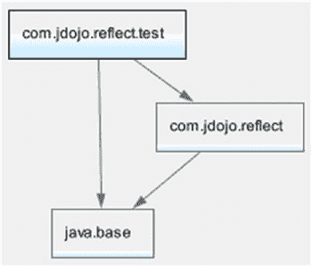

第 4 章 ■ 模块依赖

***清单 4-17.*** 导出并开放 `com.jdojo.reflect` 包的 `com.jdojo.reflect` 模块的修改版本

// module-info.java

module com.jdojo.reflect {

exports com.jdojo.reflect;

opens com.jdojo.reflect;

}

***清单 4-18.*** 读取 `com.jdojo.reflect` 模块的 `com.jdojo.reflect.test` 模块的修改版本

// module-info.java

module com.jdojo.reflect.test {

requires com.jdojo.reflect;

}

现在，当你运行 `ReflectTest` 类时，不再需要使用 `--add-modules` VM 选项。由于 `com.jdojo.reflect.test` 模块的模块声明中包含 `requires com.jdojo.reflect;` 语句，`com.jdojo.reflect` 模块将被解析。图 4-13 显示了运行 `ReflectTest` 类时创建的模块图。

***图 4-13.** `com.jdojo.reflect` 和 `com.jdojo.reflect.test` 模块最终版本的模块图*

在 NetBeans 中重建两个项目，并在 NetBeans 中使用以下命令运行 `ReflectTest` 类。输出与之前的输出相同。

C:\Java9Revealed>java

--module-path com.jdojo.reflect\dist;com.jdojo.reflect.test\dist

--module com.jdojo.reflect.test/com.jdojo.reflect.test.ReflectTest

第 4 章 ■ 模块依赖

s = 10

t = 20

u = 30

v = 40

你是否考虑过这样的情况：你的模块需要对另一个模块进行深度反射访问，而该模块没有开放其任何包，并且你无法修改其声明？你可以通过使用 `--add-opens` 选项来实现。我将在第 9 章描述 JDK 9 让你打破模块封装的不同方法时讨论此选项及许多其他选项。

类型可访问性

在 JDK 9 之前，有四种可访问性类型：

• public
• protected
• <package>
• private

在 JDK 8 中，public 类型意味着它可以被程序的所有部分访问。在 JDK 9 中，这一点发生了变化。一个 public 类型可能并非对所有人都是公共的。在模块中定义的 public 类型可能属于以下三类之一：

• 仅在定义模块内公开
• 仅对特定模块公开
• 对所有人公开

如果一个类型在模块中被定义为 public，但该模块并未导出包含该类型的包，则该类型仅在模块内公开。其他模块无法访问该类型。

如果一个类型在模块中被定义为 public，但该模块使用*限定*导出方式导出包含该类型的包，则该类型仅对限定导出中 `to` 子句指定的模块可访问。

如果一个类型在模块中被定义为 public，但该模块使用非限定导出语句导出包含该类型的包，则该类型将对读取第一个模块的每个模块公开。

跨模块拆分包

不允许将包拆分到多个模块中。也就是说，同一个包不能在多个模块中定义。如果同一个包中的类型分布在多个模块中，这些模块应合并为一个模块，或者你需要重命名这些包。有时，你可以成功编译这些模块，但会在运行时收到错误；其他时候，你会收到编译时错误。正如我一开始提到的，拆分包并非无条件禁止。你需要了解这些错误背后的简单规则。

第 4 章 ■ 模块依赖

如果名为 M 和 N 的两个模块定义了同一个名为 P 的包，则不能存在一个模块 Q，使得 M 和 N 模块中的包 P 都可被 Q 访问。换句话说，多个模块中的同一个包不能同时被一个模块读取。否则，会发生错误。如果一个模块正在使用一个存在于两个模块中的包中的类型，模块系统无法为你做出决定，这可能是错误的。它会生成一个错误，并希望你修复该问题。考虑以下代码片段：

// Test.java

package java.util;

public class Test {

}

如果你在 JDK 9 中将 `Test` 类作为模块的一部分或单独编译，你将收到以下错误：

error: package exists in another module: java.base

package java.util;

^
1 error

如果你在一个名为 M 的模块中有这个类，编译时错误表明 `java.util` 包在此模块以及 `java.base` 模块中都可被模块 M 读取。你必须将此类的包更改为任何可观察模块中不存在的其他包。

模块声明中的限制

声明模块时有几个限制。如果你违反了它们，你将在编译时或启动时收到错误：

• 模块图不能包含循环依赖。也就是说，两个模块不能相互读取。如果它们相互读取，它们应该是一个模块，而不是两个。请注意，通过编程方式或使用命令行选项添加可读性边，可以在运行时实现循环依赖。
• 模块声明不支持模块版本。你需要使用 `jar` 工具或其他工具（如 `javac`）将模块版本添加为类文件属性。
• 模块系统没有子模块的概念。也就是说，`com.jdojo.person` 和 `com.jdojo.person.client` 是两个独立的模块；第二个不是第一个的子模块。

模块类型

Java 已经存在了 20 多年，无论是旧应用还是新应用，都将继续使用那些尚未模块化或永远不会模块化的库。如果 JDK 9 强制每个人都模块化他们的应用程序，那么 JDK 9 可能不会被广泛采用。JDK 9 的设计者考虑到了向后兼容性。你可以按照自己的节奏模块化应用程序，或者决定完全不模块化——只需在 JDK 9 中运行你现有的应用程序，从而采用 JDK 9。在大多数情况下，你在 JDK 8 或更早版本中工作的应用程序无需任何更改即可在 JDK 9 中继续工作。为了简化迁移，JDK 9 定义了四种类型的模块：

• 普通模块
• 开放模块
• 自动模块
• 未命名模块

事实上，你会遇到六个描述六种不同类型模块的术语，对于 JDK 9 的初学者来说，这充其量是令人困惑的。另外两种类型的模块用于传达这四种模块类型的更广泛类别。图 4-14 显示了所有模块类型的图示。

模块

命名模块

未命名模块

显式模块

自动模块

普通模块

开放模块

***图 4-14.** 模块类型*


在描述主要的模块类型之前，我先简要定义图 4-14 中展示的模块类型。

• 模块是代码和数据的集合。

• 根据模块是否具有名称，模块可以是*具名模块*或*未命名模块*。

• 未命名模块没有进一步的分类。

• 当模块具有名称时，该名称可以在模块声明中显式给出，也可以自动（或隐式）生成。如果名称是在模块声明中显式给出的，则称为*显式模块*。如果名称是由模块系统通过读取模块路径上的 JAR 文件名生成的，则称为*自动模块*。

• 如果你声明模块时未使用 `open` 修饰符，则称为*普通模块*。

• 如果你使用 `open` 修饰符声明模块，则称为*开放模块*。

基于这些定义，开放模块同时也是显式模块和具名模块。自动模块是具名模块，因为它具有自动生成的名称，但它不是显式模块，因为它是由模块系统在编译时和运行时隐式声明的。以下小节将描述这些模块类型。

第 4 章 ■ 模块依赖

■ **提示** 如果 Java 平台最初就设计了模块系统，那么你只会拥有一种模块类型——普通模块！所有其他模块类型的存在都是为了向后兼容，以及平滑迁移和采用 JDK 9。

普通模块

使用模块声明显式声明且未使用 `open` 修饰符的模块，总是会被赋予一个名称，称为*普通模块*或简称为*模块*。到目前为止，你主要接触的都是普通模块。我一直将普通模块称为模块，除非需要区分这四种模块类型，否则我将继续沿用这一术语。默认情况下，普通模块中的所有类型都是封装的。普通模块的示例如下：

module a.normal.module {

    // 模块语句写在这里

}

开放模块

如果模块声明包含 `open` 修饰符，则该模块被称为开放模块。有关开放模块的更多信息，请参阅前面题为“开放模块”的小节。开放模块的示例如下：

open module a.open.module {

    // 模块语句写在这里

}

自动模块

为了向后兼容，用于查找类型的类路径机制在 JDK 9 中仍然有效。你可以选择将 JAR 放在类路径、模块路径或两者组合上。请注意，你可以将模块化 JAR 以及普通 JAR 同时放在模块路径和类路径上。

当你将 JAR 放在模块路径上时，该 JAR 会被视为一个模块，称为*自动模块*。“自动模块”这个名称源于以下事实：该模块是从 JAR 中自动定义的——你无需通过添加 `module-info.class` 文件来显式声明模块。自动模块具有名称。自动模块的名称是什么？它读取哪些模块？导出哪些包？我将很快回答这些问题。

自动模块也是具名模块。其名称和版本根据以下规则从 JAR 文件名中派生：

• 移除 JAR 文件的 `.jar` 扩展名。如果 JAR 文件名为 `com.jdojo.intro-1.0.jar`，此步骤会移除 `.jar` 扩展名，后续步骤将使用 `com.jdojo.intro-1.0` 来派生模块名称及其版本。

• 如果名称以连字符结尾，且连字符后紧跟至少一位数字（数字后可选地跟一个点），则模块名称从最后一个连字符之前的部分派生。连字符之后的部分，如果能够解析为有效版本，则被分配为模块的版本。在此示例中，模块名称将从 `com.jdojo.intro` 派生，版本将派生为 `1.0`。

第 4 章 ■ 模块依赖

• 名称部分中的每个非字母数字字符都会被替换为一个点，并且


在生成的字符串中，两个连续的点会被替换为一个点。此外，所有

前导和尾随的点都会被移除。在此示例中，名称部分没有任何非

字母数字字符，因此模块名称为 `com.jdojo.intro`。

按顺序应用这些规则，即可得到模块名称和模块版本。在本节末尾，我将展示如何使用 JAR 文件确定自动模块的名称。表 4-1 列出了一些 JAR 名称，以及由此推导出的自动模块名称和版本。请注意，该表在 JAR 文件名中未显示扩展名 `.jar`。

***表 4-1.** 自动模块名称和版本推导示例*

**JAR 名称**

**模块名称**

**模块版本**

com.jdojo.intro-1.0

com.jdojo.intro

1.0

junit-4.10.jar

junit

4.10

jdojo-logging1.5.0

（错误）

（无版本）

spring-core-4.0.1.RELEASE

spring.core

4.0.1.RELEASE

jdojo-trans-api_1.5_spec-1.0.0

（错误）

1.0.0

_

（错误）

（无版本）

让我们看看表中三个特殊情况，如果将对应的 JAR 文件放入模块路径，将会收到错误。第一个产生错误的 JAR 名称是 `jdojo-logging1.5.0`。让我们应用规则来推导此 JAR 的自动模块名称：

• JAR 名称中没有紧跟数字的连字符，因此

没有模块版本。整个 JAR 名称用于推导自动模块

名称。

• 所有非字母数字字符都被替换为点。得到的字符串是

`jdojo.logging1.5.0`。回顾第 [2](http://dx.doi.org/10.1007/978-1-4842-2592-9_2) 章，模块名称的每个部分都必须是有效的 Java 标识符。在此例中，`5` 和 `0` 是模块名称中的两个部分，

它们不是有效的 Java 标识符。因此，推导出的模块名称无效。这就是

将此 JAR 文件添加到模块路径时出现错误的原因。

另一个产生错误的 JAR 名称是 `jdojo-trans-api_1.5_spec-1.0.0`。让我们应用规则来推导此 JAR 的自动模块名称：

• 它找到最后一个连字符，其后只有数字和点，并将 JAR

名称拆分为两部分：`jdojo-trans-api_1.5_spec` 和 `1.0.0`。第一部分用于

推导模块名称。第二部分是模块版本。

• 名称部分中的所有非字母数字字符都被替换为点。得到的

字符串是 `jdojo.trans.api.1.5.spec`，这是一个无效的模块名称，

因为 `1` 和 `5` 不是有效的 Java 标识符。这就是

将此 JAR 文件添加到模块路径时出现错误的原因。

表中的最后一个条目包含一个下划线 (`_`) 作为 JAR 名称。也就是说，JAR 文件被命名为 `_.jar`。如果应用规则，下划线将被替换为一个点，并且该点将被移除，因为它是名称中唯一的字符。最终得到一个空字符串，这不是一个有效的模块名称。

第 4 章 ■ 模块依赖

如果无法从其名称推导出有效的自动模块名称，则放置在模块路径上的 JAR 将抛出异常。例如，模块路径上的 `_.jar` 文件将导致以下异常：`java.lang.module.ResolutionException: Unable to derive module descriptor for: _.jar`

你可以使用带有 `--describe-module` 选项的 `jar` 命令来打印模块化 JAR 的模块描述符，并打印 JAR 的推导出的自动模块名称。对于 JAR，它还会打印该 JAR 包含的包列表。使用该命令的一般语法如下：

```
jar --describe-module --file <JAR 路径>
```

以下命令打印名为 `cglib-2.2.2.jar` 的 JAR 的自动模块名称：

```
C:\Java9Revealed>jar --describe-module --file lib\cglib-2.2.2.jar
No module descriptor found. Derived automatic module.
module cglib@2.2.2 (automatic)
requires mandated java.base
contains net.sf.cglib.beans
contains net.sf.cglib.core
contains net.sf.cglib.proxy
contains net.sf.cglib.reflect
contains net.sf.cglib.transform
contains net.sf.cglib.transform.impl
contains net.sf.cglib.util
```

该命令打印一条消息，表明在 JAR 文件中未找到模块描述符，并从 JAR 推导出一个自动模块。如果你使用一个名称无法转换为有效自动名称的 JAR（例如 `cglib.1-2.2.2.jar`），`jar` 命令将打印一条错误消息，并告诉你 JAR 名称的问题所在，如下所示：

```
C:\Java9Revealed>jar --describe-module --file lib\cglib.1-2.2.2.jar
Unable to derive module descriptor for: lib\cglib.1-2.2.2.jar
cglib.1: Invalid module name: '1' is not a Java identifier
```

一旦你知道自动模块的名称，其他显式模块就可以使用 `requires` 语句来读取它。以下模块声明读取了来自模块路径上 `cglib-2.2.2.jar` 的名为 `cglib` 的自动模块：

```
module com.jdojo.lib {
    requires cglib;
    //...
}
```

第 4 章 ■ 模块依赖

要有效使用自动模块，它必须导出包并读取其他模块。让我们看看关于此的规则：

• 自动模块读取所有其他模块。需要注意的是，从自动模块到所有其他模块的可读性是在模块图解析之后添加的。

• 自动模块中的所有包都被导出和开放。

这两条规则基于这样一个事实：没有实际的方法可以判断自动模块依赖于哪些其他模块，以及其他模块需要自动模块的哪些包来进行深度反射编译。

自动模块读取所有其他模块可能会创建循环依赖，这在模块图解析之后是允许的。回想一下，在模块图解析期间不允许模块之间存在循环依赖。也就是说，你不能在模块声明中拥有循环依赖。

自动模块没有模块声明，因此它们不能声明对其他模块的依赖。显式模块可以声明对其他自动模块的依赖。让我们考虑一个情况：显式模块 M 读取自动模块 P，而模块 P 使用了另一个自动模块 Q 中的类型 T。当你使用模块 M 中的主类启动应用程序时，模块图将仅包含 M 和 P——为简洁起见，此处省略了 `java.base` 模块的讨论。解析过程将从模块 M 开始，并发现它读取了另一个模块 P。解析过程没有实际方法来判断模块 P 读取了模块 Q。你可以通过将它们放在类路径上来编译模块 P 和 Q。但是，当你运行此应用程序时，将会收到 `ClassNotFoundException`。当模块 P 尝试从模块 Q 访问类型时，会发生此异常。要解决此问题，必须通过使用 `--add-modules` 命令行选项并将 Q 指定为该选项的值，将模块 Q 作为根模块添加到模块图中。

以下命令描述了名为 `cglib` 的自动模块，其模块声明是通过将 `cglib-2.2.2.jar` 文件放置在模块路径上推导出来的。输出表明名为 `cglib` 的自动模块导出并开放了其所有包。

```
C:\Java9Revealed>java --module-path lib\cglib-2.2.2.jar
--list-modules cglib
automatic module cglib@2.2.2 (file:///C:/Java9Revealed/lib/cglib-2.2.2.jar)
exports net.sf.cglib.beans
exports net.sf.cglib.core
exports net.sf.cglib.proxy
exports net.sf.cglib.reflect
exports net.sf.cglib.transform
exports net.sf.cglib.transform.impl
exports net.sf.cglib.util
requires mandated java.base
opens net.sf.cglib.transform
opens net.sf.cglib.transform.impl
opens net.sf.cglib.beans
opens net.sf.cglib.util
opens net.sf.cglib.reflect
opens net.sf.cglib.core
opens net.sf.cglib.proxy
```

第 4 章 ■ 模块依赖

未命名模块


你可以将 JAR 和模块化 JAR 放置在类路径上。当加载某个类型时，如果其包在任何已知模块中都未找到，模块系统会尝试从类路径加载该类型。如果在类路径上找到了该类型，它会被类加载器加载，并成为该类加载器的一个名为*未命名模块*的成员。每个类加载器都定义了一个未命名模块，其成员包括它从类路径加载的所有类型。未命名模块没有名称，因此显式模块无法使用 `requires` 语句声明对其的依赖。如果你有一个显式模块需要使用未命名模块中的类型，则必须将该未命名模块的 JAR 作为自动模块使用，即将其放置在模块路径上。

在编译时尝试从显式模块访问未命名模块中的类型是一个常见错误。这根本不可能实现，因为未命名模块没有名称，而显式模块在编译时需要模块名称才能读取另一个模块。自动模块充当显式模块和未命名模块之间的桥梁，如图 4-15 所示。显式模块可以使用 `requires` 语句访问自动模块，而自动模块可以访问未命名模块。

显式模块

自动模块

未命名模块

***图 4-15.** 自动模块充当显式模块与未命名模块之间的桥梁* 未命名模块没有名称。这并不意味着未命名模块的名称是空字符串、"unnamed" 或 null。以下模块声明是无效的：

module some.module {

requires ""; // 编译时错误

requires "unnamed"; // 编译时错误

requires unnamed; // 编译时错误，除非你有一个名为 unnamed 的命名模块

requires null; // 编译时错误

}

未命名模块会读取其他模块，并根据以下规则导出并开放其所有包给其他模块：

• 未命名模块会读取所有其他模块。因此，未命名模块可以访问所有模块（包括平台模块）中所有导出包的公共类型。此规则使得在 Java SE 8 中编译和运行的、使用类路径的应用程序，只要它们仅使用标准的、非弃用的 Java SE API，就能够在 Java SE 9 中继续编译和运行。

• 未命名模块会将其所有包开放给所有其他模块。因此，显式模块可以在运行时通过反射访问未命名模块中的类型。

• 未命名模块会导出其所有包。显式模块在编译时无法读取未命名模块。在模块图解析完成后，所有自动模块都会被设置为可以读取未命名模块。

第 4 章 ■ 模块依赖

■ **提示** 未命名模块可能包含一个也被命名模块导出的包。在这种情况下，未命名模块中的该包会被忽略。

让我们看两个使用未命名模块的示例。在第一个示例中，一个普通模块将通过反射访问未命名模块。回想一下，普通模块在编译时无法访问未命名模块。在第二个示例中，一个未命名模块将访问一个普通模块。

普通模块到未命名模块

你不需要声明未命名模块。要拥有一个未命名模块，你需要将一个 JAR 或模块化 JAR 放置在类路径上。我们将通过将 `com.jdojo.reflect` 模块的模块化 JAR 放置在类路径上，将其复用为一个未命名模块。

清单 4-19 和清单 4-20 分别包含名为 `com.jdojo.unnamed.test` 的模块的模块声明以及该模块中的一个 `Main` 类。在 `main()` 方法中，该类尝试加载 `com.jdojo.reflect.Item` 类并读取其字段。为保持代码简洁，我在 `main` 方法中添加了一个 `throws` 子句。

***清单 4-19.*** com.jdojo.unnamed.test 模块的模块声明

// module-info.java

module com.jdojo.unnamed.test {


// 无模块声明

}

***清单 4-20.*** com.jdojo.unnamed.test 模块中的主类

// Main.java

package com.jdojo.unnamed.test;

import java.lang.reflect.Field;

public class Main {

public static void main(String[] args) throws Exception {

Class<?> cls = Class.forName("com.jdojo.reflect.Item");

Field[] fields = cls.getDeclaredFields();

for (Field field : fields) {

field.setAccessible(true);

System.out.println(field.getName() + " = " +

field.get(null));

}

}

}

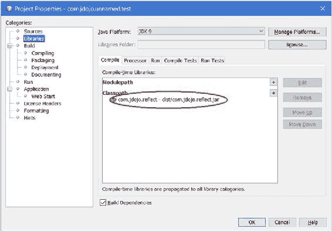

第 4 章 ■ 模块依赖

在 NetBeans 中，将 com.jdojo.reflect 项目添加到 com.jdojo.unnamed.test 项目的类路径中，如图 4-16 所示。

***图 4-16.** 将 com.jdojo.reflect 项目添加到 com.jdojo.unnamed.test 项目的类路径* 要运行 Main 类，请使用 NetBeans 或以下命令。在运行命令之前，请确保构建了两个项目——com.jdojo.reflect 和 com.jdojo.unnamed.test。

C:\Java9Revealed>java --module-path com.jdojo.unnamed.test\dist

--class-path com.jdojo.reflect\dist\com.jdojo.reflect.jar

--module com.jdojo.unnamed.test/com.jdojo.unnamed.test.Main

s = 10

t = 20

u = 30

v = 40

通过将 com.jdojo.reflect.jar 放在类路径上，其 Item 类将被加载到类加载器的未命名模块中。输出显示，您已成功从 com.jdojo.unnamed.test 模块（这是一个命名模块）使用深度反射访问了未命名模块中的 Item 类。如果您尝试在编译时访问 Item 类，将会收到编译时错误，因为 com.jdojo.unnamed.test 模块不能包含读取未命名模块的 requires 语句。

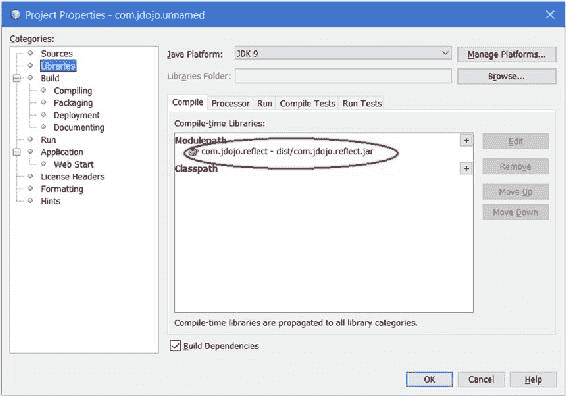

第 4 章 ■ 模块依赖

未命名模块到普通模块

在本节中，我将向您展示如何从未命名模块访问命名模块中的类型。在 NetBeans 中创建一个名为 com.jdojo.unnamed 的 Java 项目。这不是一个模块化项目。它不包含包含模块声明的 module-info.java 文件。它是一个您在 JDK 8 中使用的 Java 项目。向项目添加一个 Main 类，如清单 4-21 所示。该类使用了 com.jdojo.reflect 包中的 Item 类，该包是现有项目 com.jdojo.reflect 的成员，该项目包含一个模块。

***清单 4-21.*** com.jdojo.unnamed NetBeans 项目中的主类

// Main.java

package com.jdojo.unnamed;

import com.jdojo.reflect.Item;

public class Main {

public static void main(String[] args) {

int v = Item.v;

System.out.println("Item.v = " + v);

}

}

主类无法编译。它不知道 Item 类在哪里。让我们将 com.jdojo.reflect 项目添加到 com.jdojo.unnamed 项目的模块路径中，如图 4-17 所示。

***图 4-17.** 将 com.jdojo.reflect 项目添加到 com.jdojo.unnamed 项目的模块路径* 95

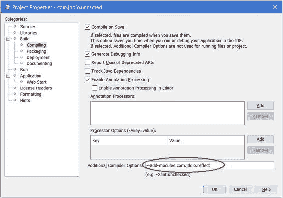

第 4 章 ■ 模块依赖

尝试编译 com.jdojo.unnamed.Main 类会产生以下错误：

C:\Java9Revealed\com.jdojo.unnamed\src\com\jdojo\unnamed\Main.java:4: 错误：包 com.jdojo.reflect 不可见

import com.jdojo.reflect.Item;

（包 com.jdojo.reflect 在模块 com.jdojo.reflect 中声明，

该模块不在模块图中）

1 个错误

编译时错误表明 Main 类无法导入 com.jdojo.reflect 包，因为它不可见。括号中的消息给出了实际原因和修复错误的提示。

您已将 com.jdojo.reflect 模块添加到模块路径。但是，该模块并未添加到模块图中，因为没有其他模块声明对其的依赖。您可以通过使用 --add-modules 编译器选项将 com.jdojo.reflect 模块添加到默认根模块集来修复此错误，如图 4-18 所示。现在，com.jdojo.unnamed.Main 类将正常编译。

***图 4-18.** 在编译时，将 com.jdojo.reflect 模块添加到 com.jdojo.unnamed 项目的默认根模块集*

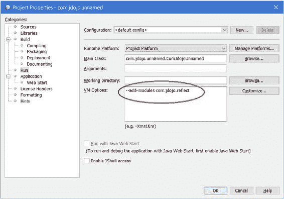

第 4 章 ■ 模块依赖

尝试在 NetBeans 中运行 com.jdojo.unnamed.Main 类，或使用以下命令：

C:\Java9Revealed>java --module-path com.jdojo.reflect\dist

--class-path com.jdojo.unnamed\dist\com.jdojo.unnamed.jar

com.jdojo.unnamed.Main

线程 "main" 中出现异常 java.lang.NoClassDefFoundError: com/jdojo/reflect/Item

at com.jdojo.unnamed.Main.main(Main.java:8)

原因：java.lang.ClassNotFoundException: com.jdojo.reflect.Item

at java.base/jdk.internal.loader.BuiltinClassLoader.loadClass

(BuiltinClassLoader.java:532)

at java.base/jdk.internal.loader.ClassLoaders$AppClassLoader.loadClass

(ClassLoaders.java:186)

at java.base/java.lang.ClassLoader.loadClass(ClassLoader.java:473)

... 还有 1 个

运行时错误表明未找到 com.jdojo.reflect.Item 类。这次，错误不如您第一次尝试编译该类时那么清晰。然而，此错误的原因相同——com.jdojo.reflect 模块在运行时未包含在模块图中。要修复它，您需要使用相同的 --add-modules 选项，但这次是针对 VM。图 4-19 显示了如何在 NetBeans 中添加此选项。

***图 4-19.** 在运行时，将 com.jdojo.reflect 模块添加到 com.jdojo.unnamed 项目的默认根模块集（针对 VM）*

第 4 章 ■ 模块依赖

在 NetBeans 中重新运行 com.jdojo.unnamed.Main 类，或使用以下命令：

C:\Java9Revealed>java --module-path com.jdojo.reflect\dist

**--add-modules com.jdojo.reflect**

--class-path com.jdojo.unnamed\dist\com.jdojo.unnamed.jar

com.jdojo.unnamed.Main

Item.v = 40

输出显示，未命名模块能够从命名模块的导出包中访问公共类型及其公共成员。请注意，您将无法访问 com.jdojo.unnamed.Main 类中 Item 类的其他静态变量（s、t 和 u），因为它们不是公共的。

迁移到 JDK 9 的路径

当您想要将应用程序迁移到 JDK 9 时，应牢记模块系统提供的两个好处：强封装和可靠配置。您的目标是拥有一个由普通模块组成的应用程序，少数开放模块除外。您可能认为有人可以为您提供一份清晰的步骤列表，用于将现有应用程序迁移到 JDK 9。

然而，考虑到应用程序的多样性、它们与其他代码的相互依赖关系以及不同的配置需求，这是不可能的。我所能做的只是提供一些通用的指导方针，可能有助于您完成迁移过程。

在 JDK 9 之前，一个非平凡的 Java 应用程序由位于三个层中的多个 JAR 组成：

• 应用程序层中的应用程序 JAR——由应用程序开发人员开发

• 库层中的库 JAR——由第三方提供

• JVM 层中的 Java 运行时 JAR

JDK 9 已经通过将 Java 运行时 JAR 转换为模块来对其进行模块化。也就是说，Java 运行时由模块组成，并且只有模块。

库层主要由放置在类路径上的第三方 JAR 组成。如果您想将应用程序迁移到 JDK 9，您可能无法获得第三方 JAR 的模块化版本。您也无法控制第三方供应商如何将其 JAR 转换为模块。您可以将库 JAR 放置在模块路径上，并将其视为自动模块。

您可以选择完全模块化您的应用程序代码。以下是您对模块类型的选择——从最不理想到最理想：

• 未命名模块

• 自动模块

• 开放模块

• 普通模块


迁移的第一步是检查你的应用程序是否能在 JDK 9 中运行，方法是将所有 JAR 文件（包括应用程序 JAR 和库 JAR）放置在类路径上，且不对代码做任何修改。类路径上所有 JAR 中的类型都将成为未命名模块的一部分。在此状态下，你的应用程序使用 JDK 9，但没有任何字符串封装和可靠配置。

第 4 章 ■ 模块依赖

一旦你的应用程序在 JDK 9 中原样运行，你就可以开始将应用程序代码转换为自动模块。自动模块中的所有包既开放用于深度反射访问，也导出用于普通的编译时和运行时访问其公共类型。从这个意义上说，它并不比未命名模块更好，因为它没有提供强封装。然而，自动模块为你提供了可靠配置，因为其他显式模块可以声明依赖自动模块。

你还有另一种选择：将应用程序代码转换为开放模块，这种模块提供适度更强的封装：在开放模块中，所有包都开放用于深度反射访问，但你可以指定哪些包（如果有的话）导出用于普通的编译时和运行时访问。显式模块也可以声明依赖开放模块——从而让你获得可靠配置的好处。

普通模块提供最强的封装，它允许你选择哪些包（如果有的话）是开放的、导出的，或两者兼具。显式模块也可以声明依赖开放模块，从而让你获得可靠配置的好处。

表 4-2 列出了模块类型及其提供的字符串封装和可靠配置的程度。

***表 4-2.** 模块类型及其提供的强封装和可靠配置的不同程度*

**模块类型**

**强封装**

**可靠配置**

未命名

否

否

自动

否

适度

开放

适度

是

普通

最强

最强

反汇编模块定义

在本节中，我将解释 JDK 自带的 `javap` 工具，它可用于反汇编类文件。

这个工具在学习模块系统时非常有用，尤其是在反编译模块的描述符时。

此时，你有两个 `com.jdojo.intro` 模块的 `module-info.class` 文件副本：一个在 `mods\com.jdojo.intro` 目录中，另一个在 `lib\com.jdojo.intro-1.0.jar` 文件中的模块化 JAR 里。当你将模块代码打包成 JAR 时，你为模块指定了版本和主类。这些信息去了哪里？它们作为类属性被添加到了 `module-info.class` 文件中。因此，这两个 `module-info.class` 文件的内容并不相同。

如何证明这一点？首先打印两个 `module-info.class` 文件中的模块声明。你可以使用位于 `JDK_HOME\bin` 目录中的 `javap` 工具来反汇编任何类文件中的代码。你可以指定要反汇编的文件名、URL 或类名。以下命令打印模块声明：

C:\Java9Revealed>javap mods\com.jdojo.intro\module-info.class

Compiled from "module-info.java"

module com.jdojo.intro {

requires java.base;

}

第 4 章 ■ 模块依赖

C:\Java9Revealed>javap jar:file:lib/com.jdojo.intro-1.0.jar!/module-info.class

Compiled from "module-info.java"

module com.jdojo.intro {

requires java.base;

}

第一个命令使用文件名，第二个命令使用基于 jar 方案的 URL。两个命令都使用相对路径。如果需要，你也可以使用绝对路径。

输出表明两个 `module-info.class` 文件包含相同的模块声明。你需要使用 `-verbose` 选项（或 `-v` 选项）打印类信息，以查看类属性。

以下命令打印来自 `mods` 目录的 `module-info.class` 文件信息，并显示模块版本和主类名称不存在。部分输出如下所示。


C:\Java9Revealed>javap -verbose mods\com.jdojo.intro\module-info.class

Classfile /C:/Java9Revealed/mods/com.jdojo.intro/module-info.class

最后修改于 2017 年 1 月 22 日；大小 161 字节

...

常量池：

#1 = Class #8 // "module-info"

#2 = Utf8 SourceFile

#3 = Utf8 module-info.java

#4 = Utf8 Module

#5 = Module #9 // "com.jdojo.intro"

#6 = Module #10 // "java.base"

#7 = Utf8 9-ea

#8 = Utf8 module-info

#9 = Utf8 com.jdojo.intro

#10 = Utf8 java.base

{

}

SourceFile: "module-info.java"

Module:

#5,0 // "com.jdojo.intro"

#0

1 // requires

#6,8000 // "java.base" ACC_MANDATED

#7 // 9-ea

0 // exports

0 // opens

0 // uses

0 // provides

以下命令打印来自 `lib\com.jdojo.intro-1.0.jar` 文件的 `module-info.class` 文件信息，并显示模块版本和主类名称确实存在。输出内容为部分截取。输出中的相关行已用**粗体**字体显示。

第 4 章 ■ 模块依赖

C:\Java9Revealed>javap -verbose jar:file:lib/com.jdojo.intro-1.0.jar!/module-info.class

Classfile jar:file:lib/com.jdojo.intro-1.0.jar!/module-info.class

...

常量池：

...

#6 = Utf8 com/jdojo/intro

#7 = Package #6 // com/jdojo/intro

#8 = Utf8 ModuleMainClass

**#9 = Utf8 com/jdojo/intro/Welcome**

**#10 = Class #9 // com/jdojo/intro/Welcome**

...

#14 = Utf8 1.0

...

{

}

SourceFile: "module-info.java"

ModulePackages:

#7 // com.jdojo.intro

**ModuleMainClass: #10** **// com.jdojo.intro.Welcome**

Module:

#13,0 // "com.jdojo.intro"

**#14** **// 1.0**

1 // requires

#16,8000 // "java.base" ACC_MANDATED

你也可以反汇编模块中某个类的代码。你需要指定模块路径、模块名称以及该类的完全限定名。以下命令从其模块化 JAR 中打印 `com.jdojo.intro.Welcome` 类的代码：

C:\Java9Revealed>javap --module-path lib

--module com.jdojo.intro com.jdojo.intro.Welcome

Compiled from "Welcome.java"

public class com.jdojo.intro.Welcome {

public com.jdojo.intro.Welcome();

public static void main(java.lang.String[]);

}

第 4 章 ■ 模块依赖

你也可以打印系统类的类信息。以下命令从 `java.base` 模块中打印 `java.lang.Object` 类的类信息。请注意，在打印系统类信息时，你不需要指定模块路径。

C:\Java9Revealed>javap --module java.base java.lang.Object

Compiled from "Object.java"

public class java.lang.Object {

public java.lang.Object();

public final native java.lang.Class<?> getClass();

public native int hashCode();

public boolean equals(java.lang.Object);

...

}

如何打印系统模块（如 `java.base` 或 `java.sql`）的模块声明？

回想一下，系统模块是以特殊文件格式打包的，而不是模块化 JAR。JDK 9 引入了一种名为 `jrt`（jrt 是 Java 运行时的缩写）的新 URL 方案，用于引用 Java 运行时映像（或系统模块）的内容。使用 `jrt` 方案的语法如下：

jrt:/<模块>/<文件路径>

以下命令打印名为 `java.sql` 的系统模块的模块声明：

C:\Java9Revealed>javap jrt:/java.sql/module-info.class

Compiled from "module-info.java"

module java.sql@9-ea {

requires java.base;

requires transitive java.logging;

requires transitive java.xml;

exports javax.transaction.xa;

exports javax.sql;

exports java.sql;

uses java.sql.Driver;

}

以下命令打印 `java.se`（一个聚合模块）的模块声明：C:\Java9Revealed>javap jrt:/java.se/module-info.class

Compiled from "module-info.java"

module java.se@9-ea {

requires transitive java.sql;

requires transitive java.rmi;

requires transitive java.desktop;

requires transitive java.security.jgss;

requires transitive java.security.sasl;

requires transitive java.management;

第 4 章 ■ 模块依赖

requires transitive java.logging;

requires transitive java.xml;

requires transitive java.scripting;

requires transitive java.compiler;

requires transitive java.naming;

requires transitive java.instrument;

requires transitive java.xml.crypto;

requires transitive java.prefs;


requires transitive java.sql.rowset;

requires java.base;

requires transitive java.datatransfer;

}

你也可以使用 `jrt` 方案来引用系统类。以下命令打印了 `java.base` 模块中 `java.lang.Object` 类的类信息：

C:\Java9Revealed>javap jrt:/java.base/java/lang/Object.class

Compiled from "Object.java"

public class java.lang.Object {

public java.lang.Object();

public final native java.lang.Class<?> getClass();

public native int hashCode();

public boolean equals(java.lang.Object);

...

}

**总结**

如果一个模块需要使用另一个模块中包含的公共类型，那么第二个模块需要导出包含这些类型的包，并且第一个模块需要读取第二个模块。

一个模块使用 `exports` 语句导出其包。一个模块可以仅向特定模块导出其包。导出包中的公共类型在编译时和运行时对其他模块可用。导出的包不允许对公共类型的非公共成员进行深度反射。

如果一个模块希望允许其他模块使用反射访问所有类型的成员（公共和非公共），则该模块必须声明为开放模块，或者该模块可以使用 `opens` 语句有选择地开放包。从开放包访问类型的模块不需要读取包含这些开放包的模块。

一个模块使用 `requires` 语句声明对另一个模块的依赖。这种依赖可以使用 `transitive` 修饰符声明为传递依赖。如果模块 M 声明了对模块 N 的传递依赖，那么任何声明了对模块 M 依赖的模块都隐式声明了对模块 N 的依赖。

依赖可以在编译时声明为强制性的，但在运行时使用 `requires` 语句中的 `static` 修饰符声明为可选的。依赖可以同时是运行时可选的和传递的。

JDK 9 中的模块系统改变了公共类型的含义。模块中定义的公共类型可能属于以下三类之一：仅在定义模块内公共、仅对特定模块公共、或对所有模块公共。

**第 4 章 ■ 模块依赖**

根据模块的声明方式以及它是否有名称，存在几种类型的模块。

根据模块是否有名称，模块可以是*具名模块*或*未命名模块*。当模块有名称时，该名称可以在模块声明中显式给出，或者名称可以自动（或隐式）生成。如果名称在模块声明中显式给出，则称为*显式模块*。如果名称由模块系统通过读取模块路径上的 JAR 文件名生成，则称为*自动模块*。如果你声明一个模块而不使用 `open` 修饰符，则称为*普通模块*。如果你使用 `open` 修饰符声明一个模块，则称为*开放模块*。基于这些定义，开放模块也是一个显式模块和一个具名模块。自动模块是一个具名模块，因为它有一个自动生成的名称，但它不是一个显式模块，因为它是由模块系统在编译时和运行时隐式声明的。

当你将一个 JAR（不是模块 JAR）放在模块路径上时，该 JAR 代表一个自动模块，其名称源自 JAR 文件名。自动模块读取所有其他模块，并且其所有包都被导出和开放。

在 JDK 9 中，类加载器可以从模块或类路径加载类。每个类加载器维护一个名为未命名模块的模块，该模块包含它从类路径加载的所有类型。未命名模块读取所有其他模块。它将其所有包导出并开放给所有其他模块。未命名模块没有名称，因此显式模块不能声明对未命名模块的编译时依赖。如果显式模块需要访问未命名模块中的类型，前者可以使用自动模块作为桥梁或使用反射。

你可以使用 `javap` 工具打印模块声明或属性。使用该工具的 `-verbose`（或 `-v`）选项来打印模块描述符的类属性。JDK 9 以特殊格式存储运行时映像。JDK 9 引入了一种名为 `jrt` 的新文件方案，你可以使用它来访问运行时映像的内容。其语法是 `jrt:/<module>/<path-to-a-file>`。

**第 5 章**

**实现服务**

在本章中，你将学习：

• 什么是服务、服务接口和服务提供者

• 如何在 JDK 9 及 JDK 9 之前实现服务

• 如何使用 Java 接口作为服务实现

• 如何使用 `ServiceLoader` 类加载服务提供者

• 如何在模块声明中使用 `uses` 语句来指定当前模块使用 `ServiceLoader` 类加载的服务接口

• 如何使用 `provides` 语句为服务接口指定当前模块提供的服务提供者

• 如何在不实例化服务提供者的情况下，根据其类发现、过滤和选择服务提供者

• 如何在 JDK 9 之前打包服务提供者

**什么是服务？**

由应用程序（或库）提供的特定功能称为*服务*。例如，你可以有不同的库提供*素数服务*，该服务可以检查一个数是否为素数，并生成给定数之后的下一个素数。为服务提供实现的应用程序和库称为*服务提供者*。使用服务的应用程序称为*服务消费者*或*客户端*。

客户端如何使用服务？客户端是否知道所有服务提供者？客户端是否可以在不知道任何服务提供者的情况下获取服务？我将在本章中回答这些问题。

Java SE 6 提供了一种机制，允许服务提供者和服务消费者之间松散耦合。也就是说，服务消费者可以使用服务提供者提供的服务，而无需知道服务提供者。

在 Java 中，*服务*由一组接口和类定义。服务包含一个接口或抽象类，它定义了服务提供的功能，这被称为*服务提供者接口*或简称为*服务接口*。请注意，“服务提供者接口”或“服务接口”中的“接口”一词并非指 Java 中的接口结构。它可以是一个 Java 接口或一个抽象类。使用具体类作为服务接口是可能的，但不推荐。有时，服务接口也被称为*服务类型*——用于标识服务的类型。

*服务*的特定实现称为*服务提供者*。一个服务提供者接口可以有多个服务提供者。通常，一个服务提供者由多个接口和类组成，为服务接口提供实现。

© Kishori Sharan 2017

K. Sharan, *Java 9 Revealed*, DOI 10.1007/978-1-4842-2592-9_5

第 5 章 ■ 实现服务

JDK 包含一个 `java.util.ServiceLoader<S>` 类，其唯一目的是在运行时为类型为 S 的服务接口发现和加载服务提供者。`ServiceLoader` 类允许服务消费者和服务提供者之间解耦。服务消费者只知道服务接口；`ServiceLoader` 类使实现服务接口的服务提供者的实例对消费者可用。图 5-1 展示了服务、服务提供者和服务消费者的安排示意图。

服务提供者

服务提供者

服务

服务提供者

客户端


***图 5-1.** 服务、服务提供者与服务消费者的结构* 通常，服务会使用 `ServiceLoader` 类加载所有服务提供者，并将其提供给服务消费者（或客户端）。这种架构支持插件机制，可以在不影响服务和服务消费者的前提下添加或移除服务提供者。服务消费者仅知晓服务接口，而不知道该服务接口的任何具体实现（即服务提供者）。

■ **提示** 建议阅读 `java.util.ServiceLoader` 类的文档，以全面了解 JDK 9 提供的服务加载机制。

在本章中，我将使用一个服务接口和三个服务提供者。它们的模块、类/接口名称及简要说明列于表 5-1。图 5-2 展示了按服务、服务提供者和服务消费者组织的类/接口，可与表 5-1 进行对比。

***表 5-1.** 本章示例中使用的模块、类与接口列表* **模块**

**类/接口**

**说明**

com.jdojo.prime

PrimeChecker

作为服务接口和服务

com.jdojo.prime.generic

GenericPrimeChecker

服务提供者

com.jdojo.prime.faster

FasterPrimeChecker

服务提供者

com.jdojo.prime.probable

ProbablePrimeChecker

服务提供者

com.jdojo.prime.client

Main

服务消费者

第 5 章 ■ 实现服务

GenericPrimeChecker

FasterPrimeChecker

PrimeChecker

ProbablePrimeChecker

Main

***图 5-2.** 本章示例中使用的服务、三个服务提供者与服务消费者的结构*

发现服务

为了使用服务，需要发现并加载其提供者。`java.util.ServiceLoader` 类负责发现和加载服务提供者。发现并加载服务提供者的模块必须在其声明中包含 `uses` 语句，其语法如下：`uses <服务接口>;`

其中，`<服务接口>` 是服务接口的名称，可以是 Java 接口名、类名或注解类型名。如果某个模块使用 `ServiceLoader<S>` 类为名为 `S` 的服务接口加载服务提供者实例，则该模块声明必须包含以下语句：

`uses S;`

■ **提示** 在我看来，`uses` 这个语句名称似乎有些用词不当。乍一看，似乎当前模块将使用指定的服务。然而，事实并非如此。服务是由客户端使用的，而不是定义该服务的模块。更直观的语句名称应该是 `discovers` 或 `loads`。

不过，我们只能接受现有的命名。如果你将其理解为：包含 `uses` 语句的模块*使用* `ServiceLoader` 类来为此服务接口加载服务提供者，就能正确理解其含义。除非你的客户端模块需要为服务加载服务提供者，否则无需在客户端模块中使用 `uses` 语句。客户端模块加载服务的情况并不常见。

一个模块可以发现并加载多个服务接口。以下模块声明使用了两个 `uses` 语句，表明它将发现并加载 `com.jdojo.PrimeChecker` 和 `com.jdojo.CsvParser` 类型的服务接口：

`module com.jdojo.loader {`

`uses com.jdojo.PrimeChecker;`

`uses com.jdojo.CsvParser;`

`// 其他模块语句放在这里`

`}`

第 5 章 ■ 实现服务

模块声明允许使用 `import` 语句。为了提高可读性，你可以将上述模块声明重写如下：

`// 从其他包导入类型`

`import com.jdojo.PrimeChecker;`

`import com.jdojo.CsvParser;`

`module com.jdojo.loader {`

`uses PrimeChecker;`

`uses CsvParser;`

`// 其他模块语句放在这里`

`}`

`uses` 语句中指定的服务接口可以声明在当前模块或其他模块中。如果声明在其他模块中，则该服务接口必须对当前模块中的代码可访问，否则会发生编译时错误。例如，上述声明中 `uses` 语句使用的 `com.jdojo.CsvParser` 服务接口可以声明在 `com.jdojo.loader` 模块中，也可以声明在其他模块（如 `com.jdojo.csvutil`）中。如果是后一种情况，`com.jdojo.CsvParser` 接口必须对 `com.jdojo.loader` 模块可访问。

服务提供者的发现是在运行时动态进行的。发现服务提供者的模块通常不会（也不需要）声明对服务提供者模块的编译时依赖，因为不可能预先知道所有提供者模块。服务发现模块不声明对服务提供者模块依赖的另一个原因是为了保持服务提供者与服务消费者之间的解耦。

提供服务实现

为服务接口提供实现的模块必须包含 `provides` 语句。如果某个模块包含服务提供者，但其声明中没有 `provides` 语句，则该服务提供者将无法通过 `ServiceLoader` 类加载。也就是说，模块声明中的 `provides` 语句是向 `ServiceLoader` 类传达信息的一种方式：“嘿！我为某个服务提供了实现。当你需要该服务时，可以将我用作提供者。” `provides` 语句的语法如下：`provides <服务接口> with <服务实现名称>;`

其中，`provides` 子句指定服务接口的名称，`with` 子句指定实现服务提供者接口的类名。在 JDK 9 中，服务提供者可以指定一个接口作为服务接口的实现。这听起来可能不正确，但事实确实如此。我会提供一个接口作为服务提供者实现类型的示例。以下模块声明包含两个 `provides` 语句：

`module com.jdojo.provider {`

`provides com.jdojo.PrimeChecker with com.jdojo.impl.PrimeCheckerFactory;`

`provides com.jdojo.CsvParser with com.jdojo.impl.CsvFastParser;`

`// 其他模块语句放在这里`

`}`

第 5 章 ■ 实现服务

第一个 `provides` 语句声明 `com.jdojo.impl.PrimeCheckerFactory` 是名为 `com.jdojo.PrimeChecker` 的服务接口的一种可能实现。第二个 `provides` 语句声明 `com.jdojo.impl.CsvFastParser` 是名为 `com.jdojo.CsvParser` 的服务接口的一种可能实现。在 JDK 9 之前，`PrimeCheckerFactory` 和 `CsvFastParser` 必须是类。在 JDK 9 中，它们可以是类或接口。

一个模块可以包含 `uses` 和 `provides` 语句的任意组合——同一个模块可以为某个服务提供实现并发现同一个服务；它可以仅为一种或多种服务提供实现，也可以为一种服务提供实现并发现另一种类型的服务。

以下模块声明发现并提供了同一服务的实现：`module com.jdojo.parser {`

`uses com.jdojo.XmlParser;`

`provides com.jdojo.XmlParser with com.jdojo.xml.impl.XmlParserFactory;`

`// 其他模块语句放在这里`

`}`

为了提高可读性，你可以使用 `import` 语句重写上述模块声明：`import com.jdojo.XmlParser;`

`import com.jdojo.xml.impl.XmlParserFactory;`

`module com.jdojo.parser {`

`uses XmlParser;`

`provides XmlParser with XmlParserFactory;`

`// 其他模块语句放在这里`

`}`

■ **提示** `provides` 语句的 `with` 子句中指定的服务实现类/接口必须声明在当前模块中，否则会发生编译时错误。

`ServiceLoader` 类会创建服务实现的实例。当服务


实现是一个接口，它仅加载并返回接口引用。服务实现（一个类或接口）必须遵循以下规则：

• 如果服务实现隐式或显式声明了一个没有形式参数的公共构造函数，则该构造函数被称为*提供者构造函数*。

• 如果服务实现包含一个名为 `provider` 且没有形式参数的公共静态方法，则该方法被称为*提供者方法*。

• 提供者方法的返回类型必须是服务接口类型或其子类型。

• 如果服务实现不包含提供者方法，则服务实现的类型必须是具有提供者构造函数的类，并且该类必须是服务接口类型或其子类型。

第 5 章 ■ 实现服务

当请求 `ServiceLoader` 类发现并加载服务提供者时，它会检查服务实现是否包含提供者方法。如果找到提供者方法，则该方法的返回值就是 `ServiceLoader` 类返回的服务。如果未找到提供者方法，则使用提供者构造函数实例化服务实现。如果服务实现既不包含提供者方法也不包含提供者构造函数，则会发生编译时错误。

根据这些规则，可以使用 Java 接口作为服务实现。该接口应有一个名为 `provider` 的公共静态方法，该方法返回服务接口类型的实例。

以下小节将引导您完成在 JDK 9 中实现服务的步骤。最后一个小节解释了如何使同一服务在非模块化环境中工作。

定义服务接口

在本节中，您将开发一个名为*质数检查器*的服务。我将保持服务简单，以便您可以专注于在 JDK 9 中使用服务提供者机制，而不是编写复杂代码来实现服务功能。该服务的要求如下：

• 服务应提供一个 API 来检查一个数字是否为质数。
• 客户端应能够知道服务提供者的名称。也就是说，每个服务提供者都应能够指定其名称。
• 客户端应能够在不指定服务提供者名称的情况下检索服务实例。在这种情况下，返回 `ServiceLoader` 类找到的第一个服务提供者。如果未找到服务提供者，则抛出 `RuntimeException`。
• 客户端应能够通过指定服务提供者名称来检索服务实例。如果指定名称的服务提供者不存在，则抛出 `RuntimeException`。

让我们设计服务。服务提供的功能将由一个名为 `PrimeChecker` 的接口表示。它将包含两个方法：

```java
public interface PrimeChecker {
    String getName();
    boolean isPrime(long n);
}
```

`getName()` 方法返回服务提供者的名称。如果指定的参数是质数，`isPrime()` 方法返回 `true`，否则返回 `false`。所有服务提供者都将实现 `PrimeChecker` 接口。`PrimeChecker` 接口是我们的服务接口（或服务类型）。

服务需要向客户端提供 API 来检索服务提供者的实例。在客户端检索它们之前，服务需要发现并加载所有服务提供者。服务提供者使用 `ServiceLoader` 类加载。该类没有公共构造函数。您可以使用其 `load()` 方法之一获取其实例，以加载特定类型的服务。您需要传递服务提供者接口的类。`ServiceLoader` 类包含一个 `iterator()` 方法，该方法返回一个 `Iterator`，用于遍历由此 `ServiceLoader` 加载的特定服务接口的所有服务提供者。以下代码片段向您展示了如何加载并遍历 `PrimeChecker` 的所有服务提供者实例：

```java
// 加载 PrimeChecker 的服务提供者
ServiceLoader<PrimeChecker> loader = ServiceLoader.load(PrimeChecker.class);

// 遍历所有服务提供者实例
Iterator<PrimeChecker> iterator = loader.iterator();
```

第 5 章 ■ 实现服务

```java
if(iterator.hasNext()) {
    PrimeChecker checker = iterator.next();
    // 在此处使用质数检查器...
}
```

在 JDK 8 之前，您必须创建一个类来为您的服务提供发现、加载和检索功能。从 JDK 8 开始，您可以将静态方法添加到接口中。让我们为服务接口添加两个静态方法来实现这些目的：

```java
public interface PrimeChecker {
    String getName();
    boolean isPrime(long n);
    static PrimeChecker newInstance();
    static PrimeChecker newInstance(String providerName)
}
```

`newInstance()` 方法将返回找到的第一个 `PrimeChecker` 实例。另一个版本将返回具有指定提供者名称的服务提供者实例。

让我们创建一个名为 `com.jdojo.prime` 的模块。清单 5-1 展示了 `PrimeChecker` 接口的完整代码。

***清单 5-1.*** 名为 PrimeChecker 的服务提供者接口

```java
// PrimeChecker.java
package com.jdojo.prime;

import java.util.ServiceLoader;

public interface PrimeChecker {
    /**
     * 返回服务提供者名称。
     *
     * @return 服务提供者名称
     */
    String getName();

    /**
     * 如果指定的数字是质数，则返回 true，否则返回 false。
     *
     * @param n 要检查是否为质数的数字
     * @return 如果指定的数字是质数，则返回 true，否则返回 false。
     */
    boolean isPrime(long n);

    /**
     * 返回找到的第一个 PrimeChecker 服务提供者。
     *
     * @return 找到的第一个 PrimeChecker 服务提供者。
     * @throws RuntimeException 当未找到 PrimeChecker 服务提供者时。
     */
    static PrimeChecker newInstance() throws RuntimeException {
        return ServiceLoader.load(PrimeChecker.class)
                .findFirst()
                .orElseThrow(() -> new RuntimeException(
                        "未找到 PrimeChecker 服务提供者。"));
    }

    /**
     * 按名称返回 PrimeChecker 服务提供者实例。
     *
     * @param providerName 质数检查器服务提供者名称
     * @return 一个 PrimeChecker 实例
     */
    static PrimeChecker newInstance(String providerName) throws RuntimeException {
        ServiceLoader<PrimeChecker> loader = ServiceLoader.load(PrimeChecker.class);
        for (PrimeChecker checker : loader) {
            if (checker.getName().equals(providerName)) {
                return checker;
            }
        }
        throw new RuntimeException("未找到名称为 '" + providerName + "' 的 PrimeChecker 服务提供者。");
    }
}
```

`com.jdojo.prime` 模块的声明如清单 5-2 所示。它导出了 `com.jdojo.prime` 包，因为服务提供者模块和客户端模块将需要使用 `PrimeChecker` 接口。

***清单 5-2.*** com.jdojo.prime 模块的模块声明

```java
// module-info.java
module com.jdojo.prime {
    exports com.jdojo.prime;
    uses com.jdojo.prime.PrimeChecker;
}
```

您需要使用带有 `PrimeChecker` 接口完全限定名的 `uses` 语句，因为此模块中的代码（此接口中的 `newInstance()` 方法）将使用 `ServiceLoader` 类来加载此接口的服务提供者。如果您想在 `uses` 语句中使用简单名称，请添加适当的 import 语句，如前几节所示。

定义质数检查器服务所需的工作就是这些。

第 5 章 ■ 实现服务

定义服务提供者

在接下来的两节中，您将为 `PrimeChecker` 服务接口创建两个服务提供者。第一个服务提供者将实现一个通用的质数检查器，而第二个将实现一个更快的质数检查器。之后，您将创建一个客户端来测试该服务。您将可以选择使用其中一个或两个服务提供者。


这些服务提供者将实现算法来检查给定数字是否为质数。理解质数的定义将对你有所帮助：一个不能被 1 或自身整除且无余数的正整数称为质数。1 不是质数。质数的几个例子有 2、3、5、7 和 11。

定义通用质数服务提供者

在本节中，你将为一个 PrimeChecker 服务定义一个通用服务提供者。为服务定义服务提供者，就是创建一个实现服务接口的类，或者创建一个包含提供者方法的接口。在本例中，你将创建一个名为 GenericPrimeChecker 的类，它实现了 PrimeChecker 接口，并将包含一个提供者构造函数。

该服务提供者将在一个名为 com.jdojo.prime.generic 的独立模块中定义。

清单 5-3 包含了模块声明。该模块声明目前无法编译。

***清单 5-3.*** com.jdojo.prime.generic 模块的模块声明

// module-info.java

module com.jdojo.prime.generic {

requires com.jdojo.prime;

provides com.jdojo.prime.PrimeChecker

with com.jdojo.prime.generic.GenericPrimeChecker;

}

需要 requires 语句，因为该模块将使用来自 com.jdojo.prime 模块的 PrimeChecker 接口。在 NetBeans 中，将 com.jdojo.prime 项目添加到 com.jdojo.prime.generic 项目的模块路径中。这将消除模块声明中的编译时错误，该错误是由于 requires 语句中引用的 com.jdojo.prime 模块缺失导致的。

provides 语句指定该模块为 PrimeChecker 接口提供了一个实现，其 with 子句指定了实现类的名称。实现类必须满足以下条件：

• 它必须是一个公共的具体类。它可以是顶层类或嵌套静态类。

它不能是内部类或抽象类。

• 它必须有一个公共的无参构造函数。ServiceLoader 类使用此构造函数通过反射实例化服务提供者。请注意，你并未在 GenericPrimeChecker 类中提供提供者方法，这是提供无参公共构造函数的一种替代方案。

• 实现类的实例必须与服务提供者接口赋值兼容。

如果这些条件中的任何一个未满足，则会发生编译时错误。请注意，你不需要导出包含服务实现类的 com.jdojo.prime.generic 包，因为任何客户端都不应直接依赖于服务实现。客户端只需要知道服务接口，而不需要知道任何特定的服务实现。ServiceLoader 类可以访问和实例化实现类，而无需模块导出包含该服务实现的包。

第 5 章 ■ 实现服务

■ **提示** 如果模块使用了 provides 语句，则指定的服务接口可能位于当前模块或另一个可访问的模块中。with 子句中指定的服务实现类/接口必须在当前模块中定义。

清单 5-4 包含了 GenericPrimeChecker 类的代码，该类是 PrimeChecker 服务接口的服务实现。isPrime()方法返回服务提供者的名称。我提供了 jdojo.generic.primechecker 作为其名称。这是一个任意名称。如果指定的数字是质数，则 isPrime()方法返回 true；否则返回 false。getName()方法返回提供者名称。

***清单 5-4.*** GenericPrimeChecker 类：PrimeChecker 服务接口的服务实现类

// GenericPrimeChecker.java

package com.jdojo.prime.generic;

import com.jdojo.prime.PrimeChecker;

public class GenericPrimeChecker implements PrimeChecker {

private static final String PROVIDER_NAME = "jdojo.generic.primechecker";


@Override

public boolean isPrime(long n) {

if(n <= 1) {

return false;

}

if (n == 2) {

return true;

}

if(n%2 == 0) {

return false;

}

for(long i = 3; i < n; i += 2) {

if(n%i == 0) {

return false;

}

}

return true;

}

@Override

public String getName() {

return PROVIDER_NAME;

}

}

第 5 章 ■ 实现服务

这就是该模块的全部内容。如前所述，要编译此模块，你需要在模块路径中包含 `com.jdojo.prime` 模块。将此模块编译并打包为模块化 JAR。目前，还没有什么可测试的。

定义更快的素数服务提供者

在本节中，你将定义 `PrimeChecker` 服务接口的另一个服务提供者。我们将其称为*更快*的服务提供者，因为你将实现一个更快的算法来检查素数。该服务提供者将定义在一个名为 `com.jdojo.prime.faster` 的独立模块中，服务实现类名为 `FasterPrimeChecker`。

清单 5-5 包含了模块声明，这与我们为 `com.jdojo.prime.generic` 模块所做的声明类似。这次，只有 `with` 子句中的类名发生了变化。

***清单 5-5.*** com.jdojo.prime.faster 模块的模块声明

// module-info.java

module com.jdojo.prime.faster {

requires com.jdojo.prime;

provides com.jdojo.prime.PrimeChecker

with com.jdojo.prime.faster.FasterPrimeChecker;

}

模块声明中的 `requires` 语句要求你将 `com.jdojo.prime` 项目添加到 NetBeans 中 `com.jdojo.prime.faster` 项目的模块路径中，以便在模块路径上找到 `com.jdojo.prime` 模块。

清单 5-6 包含了 `FasterPrimeChecker` 类的代码，其 `isPrime()` 方法的执行速度比 `GenericPrimeChecker` 类的 `isPrime()` 方法更快。这次，该方法循环遍历所有从 3 开始、到被测试素数的平方根结束的奇数。

***清单 5-6.*** 用作服务提供者的 `PrimeChecker` 接口的实现类 `FasterPrimeChecker`

// FasterPrimeChecker.java

package com.jdojo.prime.faster;

import com.jdojo.prime.PrimeChecker;

public class FasterPrimeChecker implements PrimeChecker {

private static final String PROVIDER_NAME = "jdojo.faster.primechecker";

// 无提供者构造函数

private FasterPrimeChecker() {

// 无代码

}

// 定义一个提供者方法

public static PrimeChecker provider() {

return new FasterPrimeChecker();

}

第 5 章 ■ 实现服务

@Override

public boolean isPrime(long n) {

if (n <= 1) {

return false;

}

if (n == 2) {

return true;

}

if (n % 2 == 0) {

return false;

}

long limit = (long) Math.sqrt(n);

for (long i = 3; i <= limit; i += 2) {

if (n % i == 0) {

return false;

}

}

return true;

}

@Override

public String getName() {

return PROVIDER_NAME;

}

}

请注意 清单 5-4 和 清单 5-6 中 `GenericPrimeChecker` 与 `FasterPrimeChecker` 类之间的区别。`GenericPrimeChecker` 类包含一个默认构造函数，该函数充当提供者构造函数。它不包含提供者方法。`FasterPrimeChecker` 类将无参构造函数设为私有，因此它不符合提供者构造函数的条件。回顾一下，提供者构造函数是一个公共的无参构造函数，由 `ServiceLoader` 类用于实例化服务实现类。`FasterPrimeChecker` 类则提供了一个提供者方法，声明如下：

public static PrimeChecker provider() {/*...*/}

当 `ServiceLoader` 类需要实例化更快的素数服务时，它将调用此方法。该方法非常简单——它创建并返回一个 `FasterPrimeChecker` 类的对象。

这就是该模块目前所需的全部内容。要编译此模块，`com.jdojo.prime` 模块需要位于模块路径中。将此模块编译并打包为模块化 JAR。目前，还没有什么可测试的。

第 5 章 ■ 实现服务

定义最快的素数服务提供者


好的，作为高级文档工程师和翻译员，我将严格遵循您提供的注意事项和示例格式，将给定的英文文本翻译成中文。


在本节中，我将向您展示如何使用 Java 接口作为服务实现。您将为 `PrimeChecker` 服务接口定义另一个服务提供者。我们将其称为*可能*素数服务提供者，因为它会告诉您一个数字*可能*是素数。该服务提供者将在一个名为 `com.jdojo.prime.probable` 的独立模块中定义，服务实现接口称为 `ProbablePrimeChecker`。

该服务用于检查素数。`java.math` 包中的 `BigInteger` 类包含一个名为 `isProbablePrime(int certainty)` 的方法。如果该方法返回 `true`，则该数字可能是素数。如果该方法返回 `false`，则该数字肯定不是素数。`certainty` 参数决定了该方法在返回 `true` 之前确保该数字是素数的程度。`certainty` 参数的值越高，此方法产生的成本就越高，并且当方法返回 `true` 时，该数字是素数的概率就越高。

清单 5-7 包含了模块声明，这与我们之前为其他两个模块所做的声明类似。这次，只更改了 `with` 子句中的类/接口名称。

***清单 5-7.*** com.jdojo.prime.probable 模块的模块声明

// module-info.java

module com.jdojo.prime.probable {

requires com.jdojo.prime;

provides com.jdojo.prime.PrimeChecker

with com.jdojo.prime.probable.ProbablePrimeChecker;

}

模块声明中的 `requires` 语句将要求您将 `com.jdojo.prime` 项目添加到 NetBeans 中 `com.jdojo.prime.probable` 项目的模块路径中，以便在模块路径上找到 `com.jdojo.prime` 模块。清单 5-8 包含了 `ProbablePrimeChecker` 类的代码。

***清单 5-8.*** 用作服务提供者的 `PrimeChecker` 接口的实现接口 `ProbablePrimeChecker`

// ProbablePrimeChecker.java

package com.jdojo.prime.probable;

import com.jdojo.prime.PrimeChecker;

import java.math.BigInteger;

public interface ProbablePrimeChecker {

// 一个提供者方法

public static PrimeChecker provider() {

final String PROVIDER_NAME = "jdojo.probable.primechecker";

return new PrimeChecker() {

@Override

public boolean isPrime(long n) {

// 使用 1000 以获得高确定性，这是我选择的一个任意大数字

int certainty = 1000;

return BigInteger.valueOf(n).isProbablePrime(certainty);

}

第 5 章 ■ 实现服务

@Override

public String getName() {

return PROVIDER_NAME;

}

};

}

}

`ProbablePrimeChecker` 接口只包含一个方法，即提供者方法：

public static PrimeChecker provider() {/*...*/}

当 `ServiceLoader` 类需要实例化可能素数服务时，它将调用此方法。

该方法非常简单——它创建并返回一个 `PrimeChecker` 接口的实例。`isPrime()` 方法使用 `BigInteger` 类来检查该数字是否可能是素数。提供者的名称是 `jdojo.probable.primechecker`。请注意，该接口并未扩展 `PrimeChecker` 接口。要成为服务实现，其提供者方法必须返回服务接口（`PrimeChecker` 接口）或其子类型的实例。通过将提供者方法的返回类型声明为 `PrimeChecker`，您已经满足了此要求。

这就是此模块的全部内容。要编译此模块，您需要将 `com.jdojo.prime` 模块添加到模块路径中。将此模块编译并打包为模块化 JAR。此时，没有什么需要测试的。

测试素数服务

在本节中，您将通过创建一个客户端应用程序来测试该服务，该应用程序将定义在一个名为 `com.jdojo.prime.client` 的独立模块中。清单 5-9 包含了模块声明。

***清单 5-9.*** com.jdojo.prime.client 模块的模块声明

// module-info.java

module com.jdojo.prime.client {

requires com.jdojo.prime;

}

客户端模块只需要知道服务接口。在这种情况下，`com.jdojo.prime` 模块定义了服务接口。因此，客户端模块读取服务接口模块，而不读取其他模块。在现实世界中，客户端模块会比这复杂得多，并且可能也会读取其他模块。在 NetBeans 中，为了编译 `com.jdojo.prime.client` 模块，您需要将 `com.jdojo.prime` 项目添加到其模块路径中。图 5-3 显示了 `com.jdojo.prime.client` 模块的模块图。

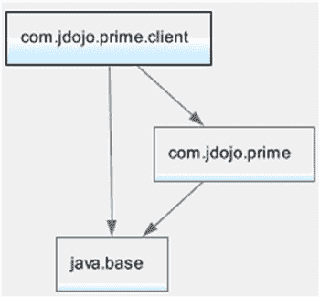

第 5 章 ■ 实现服务

***图 5-3.*** com.jdojo.prime.client 模块的模块图

■ **提示** 客户端模块不知道服务提供者模块，因此不需要直接读取它们。服务有责任发现所有服务提供者，并使它们的实例可供客户端使用。在这种情况下，`com.jdojo.prime` 模块定义了 `com.jdojo.prime.PrimeChecker` 接口，该接口既是服务接口，也充当服务。

清单 5-10 包含了使用 `PrimeChecker` 服务的客户端代码。

***清单 5-10.*** 用于测试 PrimeChecker 服务的主类

// Main.java

package com.jdojo.prime.client;

import com.jdojo.prime.PrimeChecker;

public class Main {

public static void main(String[] args) {

// 要检查是否为素数的数字

long[] numbers = {3, 4, 121, 977};

// 尝试默认的素数检查器服务提供者

try {

PrimeChecker checker = PrimeChecker.newInstance();

checkPrimes(checker, numbers);

} catch (RuntimeException e) {

System.out.println(e.getMessage());

}

第 5 章 ■ 实现服务

// 尝试更快的素数检查器

try {

PrimeChecker checker = PrimeChecker.newInstance("jdojo.faster.primechecker");

checkPrimes(checker, numbers);

} catch (RuntimeException e) {

System.out.println(e.getMessage());

}

// 尝试可能素数检查器

try {

PrimeChecker checker = PrimeChecker.newInstance("jdojo.probable.primechecker");

checkPrimes(checker, numbers);

} catch (RuntimeException e) {

System.out.println(e.getMessage());

}

}

public static void checkPrimes(PrimeChecker primeChecker, long... numbers) {

System.out.format("使用 %s:%n", primeChecker.getName());

for (long n : numbers) {

if (primeChecker.isPrime(n)) {

System.out.printf("%d 是素数。%n", n);

} else {

System.out.printf("%d 不是素数。%n", n);

}

}

}

}

`checkPrimes()` 方法接受一个 `PrimeChecker` 实例和可变长参数 `long` 数字。它使用 `PrimeChecker` 来检查数字是否为素数，并打印相应的消息。`main()` 方法检索默认的 `PrimeChecker` 服务提供者实例，以及 `jdojo.faster.primechecker` 和 `jdojo.probable.primechecker` 服务提供者的实例。它使用所有三个服务提供者实例来检查同一组数字是否为素数。编译并打包模块的代码。

如果您在模块路径中仅使用两个模块 `com.jdojo.prime` 和 `com.jdojo.prime.client` 运行 `Main` 类，您将得到以下输出：

未找到 PrimeChecker 服务提供者。

未找到名称为 'jdojo.faster.primechecker' 的 PrimeChecker 服务提供者。

未找到名称为 'jdojo.probable.primechecker' 的 PrimeChecker 服务提供者。

模块路径中没有服务提供者，因此，所有三次检索服务提供者的尝试都失败了。

第 5 章 ■ 实现服务

如果您在模块路径上使用 `com.jdojo.prime`、`com.jdojo.prime.generic` 和 `com.jdojo.prime.client` 模块运行 `Main` 类，您将得到以下输出：

使用 jdojo.generic.primechecker:

3 是素数。

4 不是素数。

121 不是素数。

977 是素数。

未找到名称为 'jdojo.faster.primechecker' 的 PrimeChecker 服务提供者。

未找到名称为 'jdojo.probable.primechecker' 的 PrimeChecker 服务提供者。


这次，模块路径中只有一个服务提供者 `jdojo.generic.primechecker`。因此，尝试检索默认服务提供者将获得该服务提供者的 `PrimeChecker` 实例。这在输出的第一部分显而易见。尝试检索其他服务提供者失败，因为在模块路径上未找到它们。

如果在模块路径上使用 `com.jdojo.prime`、`com.jdojo.prime.generic`、`com.jdojo.prime.faster`、`com.jdojo.prime.probable` 和 `com.jdojo.prime.client` 模块运行 `Main` 类，你将得到类似于以下输出的结果。默认提供者是由迭代器首先找到的那个。

输出显示通用服务提供者为默认提供者，但当你运行程序时，可能会得到任何其他提供者作为默认提供者。

使用 `jdojo.generic.primechecker`：

3 是质数。

4 不是质数。

121 不是质数。

977 是质数。

使用 `jdojo.faster.primechecker`：

3 是质数。

4 不是质数。

121 不是质数。

977 是质数。

使用 `jdojo.probable.primechecker`：

3 是质数。

4 不是质数。

121 不是质数。

977 是质数。

当模块系统在模块声明中遇到 `uses` 语句时，它会扫描模块路径以查找所有包含 `provides` 语句的模块，这些 `provides` 语句指定了 `uses` 语句中指定的服务接口的实现。从这个意义上说，模块中的 `uses` 语句表示对其他模块的间接可选依赖。该依赖在运行时被解析。

**选择和过滤提供者**

有时，你会希望根据提供者的类名来选择它们。例如，你可能只想选择那些完全限定类名以 `com.jdojo` 开头的质数服务提供者。实现此目的的典型逻辑是使用 `ServiceLoader` 类的 `iterator()` 方法返回的迭代器。

然而，这种操作成本很高。迭代器在将提供者返回给你之前会实例化它，即使实例化是延迟发生的——这意味着提供者仅在需要返回时才被实例化。

**第 5 章 ■ 实现服务**

JDK 9 为 `ServiceLoader` 类添加了一个新方法。该方法的签名如下：

```java
public Stream<ServiceLoader.Provider<S>> stream()
```

`stream()` 方法返回 `ServiceProvider.Provider` 接口实例的流，该接口在 `ServiceLoader` 类中声明为嵌套接口，如下所示：

```java
public static interface Provider<S> extends Supplier<S> {
    Class<? extends S> type();
    @Override
    S get();
}
```

`ServiceLoader.Provider` 接口的实例代表一个服务提供者。其 `type()` 方法返回服务实现的 `Class` 对象。`get()` 方法实例化并返回服务提供者。`ServiceLoader.Provider` 接口有何帮助？当你使用 `stream()` 方法时，流中的每个元素都是 `ServiceLoader.Provider` 类型。你可以根据提供者的类名或类型对流进行过滤，这不会实例化提供者。你可以在过滤器中使用 `type()` 方法。当你找到所需的提供者时，调用 `get()` 方法来实例化它。这样，你只在确定需要时才实例化提供者，而不是在遍历所有提供者时。

以下是使用 `ServiceLoader` 类的 `stream()` 方法的示例。它会为你提供所有类名以 `com.jdojo` 开头的质数服务提供者的列表。

```java
static List<PrimeChecker> startsWith(String prefix) {
    return ServiceLoader.load(PrimeChecker.class)
            .stream()
            .filter((Provider p) -> p.type().getName().startsWith(prefix))
            .map(Provider::get)
            .collect(Collectors.toList());
}
```

你可以将此方法添加到 `PrimeChecker` 接口。添加此方法时，需要添加一些导入语句：

```java
import java.util.List;
import java.util.ServiceLoader.Provider;
import java.util.stream.Collectors;
```

以下是从客户端类调用此方法的示例：

```java
// 获取所有类名以 "com.jdojo" 开头的质数服务列表
List<PrimeChecker> jdojoService = PrimeChecker.startsWith("com.jdojo");
```

**第 5 章 ■ 实现服务**

**在传统模式下测试质数服务**

并非所有应用程序都会迁移到使用模块。你的质数服务的模块化 JAR 可能会与类路径上的其他 JAR 一起使用。假设你将质数服务的所有五个模块化 JAR 放置在 `C:\Java9Revealed\lib` 目录中。使用以下命令，将四个模块化 JAR 放置在类路径上来运行 `com.jdojo.prime.client.Main` 类：

```
C:\Java9Revealed>java --class-path lib\com.jdojo.prime.jar;lib\com.jdojo.prime.client.jar;lib\com.jdojo.prime.faster.jar;lib\com.jdojo.prime.generic.jar;lib\com.jdojo.prime.probable.jar com.jdojo.prime.client.Main
```

未找到 PrimeChecker 服务提供者。

未找到名为 'jdojo.faster.primechecker' 的 PrimeChecker 服务提供者。

未找到名为 'jdojo.probable.primechecker' 的 PrimeChecker 服务提供者。

输出表明，使用传统模式（即 JDK 9 之前的模式，将所有模块化 JAR 放置在类路径上）未找到任何服务提供者。在传统模式下，服务提供者发现机制是不同的。`ServiceLoader` 类扫描类路径上的所有 JAR，查找 `META-INF/services` 目录中的文件。文件名是服务接口的完全限定名称。文件路径如下所示：

```
META-INF/services/<service-interface>
```

此文件的内容是服务提供者实现类/接口的完全限定名称列表。每个类名需要单独占一行。你可以在文件中使用单行注释。以 `#` 字符开头的行上的文本被视为注释。

服务接口名称是 `com.jdojo.prime.PrimeChecker`，因此三个服务提供者的模块化 JAR 将包含一个名为 `com.jdojo.prime.PrimeChecker` 的文件，路径如下：`META-INF/services/com.jdojo.prime.PrimeChecker`

你需要将 `META-INF/services` 目录添加到源代码目录的根目录。如果你使用的是 NetBeans 等 IDE，IDE 会为你处理文件的打包。清单 5-11、清单 5-12 和清单 5-13 包含了三个质数服务提供者模块的模块化 JAR 中此文件的内容。

***清单 5-11.*** com.jdojo.prime.generic 模块的模块化 JAR 中 META-INF/services/com.jdojo.prime.PrimeChecker 文件的内容

```
# 通用服务提供者实现类名
com.jdojo.prime.generic.GenericPrimeChecker
```

***清单 5-12.*** com.jdojo.prime.faster 模块的模块化 JAR 中 META-INF/services/com.jdojo.prime.PrimeChecker 文件的内容

```
# 更快的服务提供者实现类名
com.jdojo.prime.faster.FasterPrimeChecker
```

**第 5 章 ■ 实现服务**

***清单 5-13.*** com.jdojo.prime.probable 模块的模块化 JAR 中 META-INF/services/com.jdojo.prime.PrimeChecker 文件的内容


