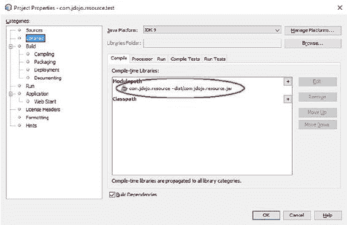
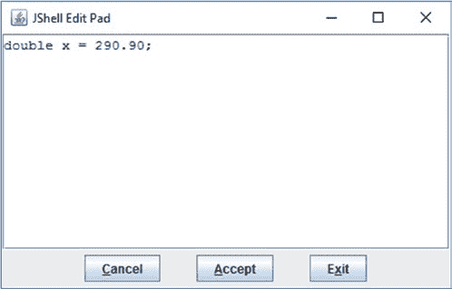
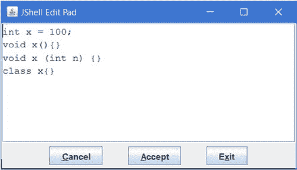
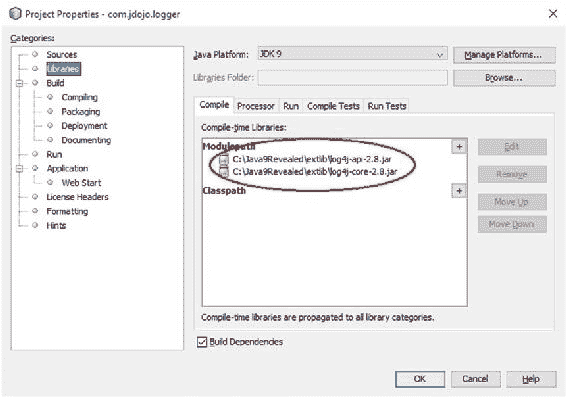
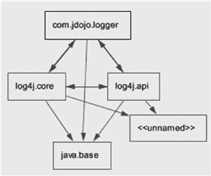

# 可能的服务提供者实现接口名称

com.jdojo.prime.probable.ProbablePrimeChecker

为通用和更快的质数检查服务提供者重新编译并重新打包模块化 JAR。

运行以下命令：

C:\Java9Revealed>java --class-path lib\com.jdojo.prime.jar;lib\com.jdojo.prime.client.

jar;lib\com.jdojo.prime.faster.jar;lib\com.jdojo.prime.generic.jar;lib\com.jdojo.prime.

probable.jar com.jdojo.prime.client.Main

Exception in thread "main" java.util.ServiceConfigurationError: com.jdojo.prime.

PrimeChecker: com.jdojo.prime.faster.FasterPrimeChecker Unable to get public no-arg

constructor

...

at com.jdojo.prime.client.Main.main(Main.java:13)

Caused by: java.lang.NoSuchMethodException: com.jdojo.prime.faster.

FasterPrimeChecker.<init>()

...

此处显示部分输出。输出表明当 `ServiceLoader` 类尝试实例化更快的质数服务提供者时发生了运行时异常。当尝试实例化概率质数服务提供者时，也会出现同样的错误。在 `META-INF/services` 目录中添加服务信息是实现服务的传统方式。为了向后兼容，服务实现必须是一个具有公共无参构造函数的类。回想一下，我们只为 `GenericPrimeChecker` 类提供了提供者构造函数。因此，其他两个质数服务在传统模式下将无法工作。你可以为 `FasterPrimeChecker` 类添加一个提供者构造函数使其正常工作。但是，无法为接口添加提供者构造函数，因此 `ProbablePrimeChecker` 在类路径模式下将无法工作。你必须从显式模块中加载它才能使其正常工作。

■ **提示** 部署在类路径上或作为模块路径上的自动模块的服务提供者必须具有公共无参构造函数。

以下命令仅为通用质数服务提供者添加了模块化 JAR，该提供者提供了公共无参构造函数。输出显示该提供者已被定位、实例化并成功使用。

C:\Java9Revealed>java --class-path lib\com.jdojo.prime.jar;lib\com.jdojo.prime.client.

jar;lib\com.jdojo.prime.generic.jar com.jdojo.prime.client.Main

第 5 章 ■ 实现服务

使用 jdojo.generic.primechecker:

3 是质数。

4 不是质数。

121 不是质数。

977 是质数。

未找到名为 'jdojo.faster.primechecker' 的 PrimeChecker 服务提供者。

未找到名为 'jdojo.probable.primechecker' 的 PrimeChecker 服务提供者。

总结

应用程序（或库）提供的特定功能称为*服务*。提供服务实现的应用程序和库称为服务提供者。使用这些服务提供者提供的服务的应用程序称为*服务消费者*或*客户端*。

在 Java 中，*服务*由一组接口和类定义。服务包含一个接口或抽象类，它定义了服务提供的功能，被称为*服务提供者接口*、*服务接口*或*服务类型*。服务接口的特定实现称为*服务提供者*。一个服务接口可以有多个服务提供者。在 JDK 9 中，服务提供者可以是一个类或一个接口。

JDK 包含一个 `java.util.ServiceLoader<S>` 类，其唯一目的是在运行时为指定的服务接口发现并加载类型为 S 的服务提供者。如果包含服务提供者的 JAR（模块化或非模块化）放置在类路径上，则 `ServiceLoader` 类会使用 `META-INF/services` 目录来查找服务提供者。此目录中的文件名应与服务接口的完全限定名称相同。该文件包含服务提供者实现类的完全限定名称——每行一个类名。该文件可以使用 `#` 字符作为单行注释的开始。`ServiceLoader` 类会扫描类路径上的所有 `META-INF/services` 目录以发现服务提供者。

在 JDK 9 中，服务提供者发现机制已更改。使用 `ServiceLoader` 类发现和加载服务提供者的模块需要使用 `uses` 语句指定服务接口。在 `uses` 语句中指定的服务接口可以声明在当前模块中，也可以声明在当前模块可访问的任何模块中。你可以使用 `ServiceLoader` 类的 `iterator()` 方法来遍历所有服务提供者。`stream()` 方法提供了一个元素流，这些元素是 `ServiceLoader.Provider` 接口的实例。你可以使用该流根据提供者的类名来过滤和选择特定类型的提供者，而无需实例化所有提供者。

包含服务提供者的模块需要使用 `provides` 语句指定服务接口及其实现类。实现类必须声明在当前模块中。

**第 6 章**

**打包模块**

在本章中，你将学习：

• 打包 Java 模块的不同格式

• JAR 格式的增强

• 什么是多版本 JAR

• 如何创建和使用多版本 JAR

• 什么是 JMOD 格式

• 如何使用 `jmod` 工具处理 JMOD 文件

• 如何创建、提取和描述 JMOD 文件

• 如何列出 JMOD 文件的内容

• 如何记录 JMOD 文件中模块的哈希值以进行依赖项验证

模块可以打包成不同的格式，用于三个阶段——编译时、链接时和运行时。并非所有阶段都支持所有格式。JDK 9 支持以下格式来打包模块：

• 展开目录

• JAR 格式

• JMOD 格式

• JIMAGE 格式

展开目录和 JAR 格式在 JDK 9 之前就已支持。JDK 9 增强了 JAR 格式以支持模块化 JAR 和多版本 JAR。JDK 9 引入了两种新的模块打包格式：JMOD 格式和 JIMAGE 格式。我在本节中讨论 JAR 格式和 JMOD 格式的增强。第 [7](http://dx.doi.org/10.1007/978-1-4842-2592-9_7) 章将详细介绍 JIMAGE 格式以及 `jlink` 工具。

JAR 格式

第 [3](http://dx.doi.org/10.1007/978-1-4842-2592-9_3) 章介绍了如何使用 `jar` 工具的新选项来创建模块化 JAR。`jar` 工具也用于列出 JAR 文件中的条目，以及提取和更新 JAR 文件的内容。`jar` 工具在 JDK 9 之前就支持这些操作，并且在 JDK 9 中这些操作没有新增内容。在本章中，我将介绍 JAR 格式新增的一个特性，称为多版本 JAR。

© Kishori Sharan 2017

K. Sharan, *Java 9 Revealed*, DOI 10.1007/978-1-4842-2592-9_6

第 6 章 ■ 打包模块

什么是多版本 JAR？


作为一名经验丰富的 Java 开发者，你一定使用过诸如 Spring 框架、Hibernate 等 Java 库/框架。你可能正在使用 Java 8，但这些库可能仍在使用 Java 6 或 Java 7。为什么库开发者不利用最新版 JDK 的新特性呢？原因之一是并非所有库用户都使用最新版 JDK。将库更新为使用更新版本的 JDK，意味着强制所有库用户迁移到该新版 JDK，这在实践中并不可行。在打包代码时，针对不同 JDK 维护和发布库是另一个痛点。通常，你会为不同 JDK 找到单独的库 JAR。JDK 9 通过为库开发者提供一种打包库代码的新方式解决了这个问题——使用一个包含同一库版本、适用于多个 JDK 的单一 JAR。

这种 JAR 被称为*多版本 JAR*。

多版本 JAR（MRJAR）包含同一库版本（提供相同 API）的代码，适用于多个 JDK 版本。也就是说，你可以拥有一个作为 MRJAR 的库，它既能用于 JDK 8，也能用于 JDK 9。MRJAR 中的代码将包含在 JDK 8 和 JDK 9 下编译的类文件。使用 JDK 9 编译的类可以利用 JDK 9 提供的 API，而使用 JDK 8 编译的类则提供使用 JDK 8 编写的相同库 API。

MRJAR 扩展了 JAR 已有的目录结构。JAR 包含一个根目录，其中存放所有内容。它还包含一个用于存储 JAR 元数据的 `META-INF` 目录。

通常，JAR 包含一个 `META-INF/MANIFEST.MF` 文件，其中包含其属性。典型 JAR 中的条目如下所示：

- jar-root

- C1.class

- C2.class

- C3.class

- C4.class

- META-INF

- MANIFEST.MF

该 JAR 包含四个类文件和一个 `MANIFEST.MF` 文件。MRJAR 扩展了 `META-INF` 目录，用于存储特定于某个 JDK 版本的类。`META-INF` 目录包含一个 `versions` 子目录，该子目录下可能包含多个子目录——每个子目录的名称与 JDK 主版本号相同。例如，对于特定于 JDK 9 的类，可能存在 `META-INF/versions/9` 目录；对于特定于 JDK 10 的类，可能存在名为 `META-INF/versions/10` 的目录，以此类推。一个典型的 MRJAR 可能包含以下条目：

- jar-root

- C1.class

- C2.class

- C3.class

- C4.class

- META-INF

- MANIFEST.MF

- versions

- C2.class

- C5.class

- C1.class

- C2.class

- C6.class

第 6 章 ■ 打包模块

如果此 MRJAR 在不支持 MRJAR 的环境中使用，它将被视为常规 JAR——将使用根目录中的内容，而 `META-INF/versions/9` 和 `META-INF/versions/10` 中的所有其他内容将被忽略。因此，如果此 MRJAR 与 JDK 8 一起使用，则只会使用四个类：C1、C2、C3 和 C4。

当此 MRJAR 在 JDK 9 中使用时，将有五个类生效：C1、C2、C3、C4 和 C5。将使用 `META-INF/versions/9` 目录中的 C2 类，而不是根目录中的 C2 类。在这种情况下，MRJAR 表明它为 JDK 9 提供了一个更新版本的 C2 类，该版本覆盖了根目录中为 JDK 8 或更早版本提供的 C2 版本。JDK 9 版本还添加了一个名为 C5 的新类。

类似地，对于 JDK 版本 10，MRJAR 覆盖了类 C1 和 C2，并包含一个名为 C6 的新类。

在单个 MRJAR 中针对多个 JDK 版本时，MRJAR 中的搜索过程与常规 JAR 不同。在 MRJAR 中搜索资源或类文件时，使用以下规则：

• 确定使用 MRJAR 的环境中 JDK 的主版本号。假设 JDK 的主版本号为 N。

• 要定位名为 R 的资源或类文件，将从版本 N 的目录开始，在 `META-INF/versions` 目录下特定于平台的子目录中进行搜索。

• 如果在子目录 N 中找到 R，则返回该 R。否则，继续搜索更低版本的子目录。


搜索所有低于 N 的版本。此过程会持续遍历 `META-INF/versions` 目录下的所有子目录。

• 如果在 `META-INF/versions/N` 子目录中未找到 R，则会在 MRJAR 的根目录中搜索 R。

我们以上文展示的 MRJAR 结构为例。假设程序正在查找 `C3.class`，且当前 JDK 版本为 10。搜索将从 `META-INF/versions/10` 开始，在该目录下未找到 `C3.class`。接着搜索会继续在 `META-INF/versions/9` 中进行，同样未找到 `C3.class`。

此时，搜索会继续在根目录中进行，并在其中找到 `C3.class`。

再举一个例子，假设你想在 JDK 版本为 10 时查找 `C2.class`。搜索将从 `META-INF/versions/10` 开始，在该目录下找到 `C2.class` 并返回。

再举一个例子，假设你想在 JDK 版本为 9 时查找 `C2.class`。搜索将从 `META-INF/versions/9` 开始，在该目录下找到 `C2.class` 并返回。

再举一个例子，假设你想在 JDK 版本为 8 时查找 `C2.class`。由于不存在名为 `META-INF/versions/8` 的 JDK 8 特定目录，因此搜索将从根目录开始，并在其中找到 `C2.class` 并返回。

■ **提示** 在 JDK 9 中，所有处理 Jar 的工具（例如 `java`、`javac` 和 `javap`）都已修改为支持多版本 Jar。处理 Jar 的 API 也已更新以支持多版本 Jar。

创建多版本 JAR

一旦你了解了在特定 JDK 版本上搜索资源或类文件时 MRJAR 中目录的搜索顺序，就很容易理解类和资源是如何被找到的。JDK 版本特定目录的内容有一些规则。我将在后续章节中描述这些规则。在本节中，我将重点介绍如何创建 MRJAR。

要运行此示例，你需要在机器上安装 JDK 8 和 JDK 9。如果你没有 JDK 8，任何除 JDK 9 之外的 JDK 也可以。对于非版本 8 的 JDK，你需要更改示例中的代码，以便代码能在你的 JDK 上编译。

第 6 章 ■ 打包模块

我将使用一个 MRJAR 来存储应用程序的 JDK 8 和 JDK 9 版本。该应用程序包含以下两个类：

• `com.jdojo.mrjar.Main`
• `com.jdojo.mrjar.TimeUtil`

`Main` 类创建 `TimeUtil` 类的对象并调用其方法。`Main` 类可用作运行应用程序的主类。`TimeUtil` 类包含一个 `getLocalDate(Instant now)` 方法，该方法接收一个 `Instant` 参数，并返回在当前时区解释该时刻的 `LocalDate`。JDK 9 为 `LocalDate` 类添加了一个名为 `ofInstant(Instant instant, ZoneId zone)` 的新方法。我们将更新应用程序以使用 JDK 9，从而利用 JDK 9 中的这个新方法，同时保留使用 JDK 8 Time API 实现相同功能的旧应用程序。

源代码包含两个 NetBeans 项目，分别名为 `com.jdojo.mrjar.jdk8` 和 `com.jdojo.mrjar.jdk9`，它们分别配置为使用 JDK 8 和 JDK 9。清单 6-1 和清单 6-2 包含了 JDK 8 版本的 `TimeUtil` 和 `Main` 类的代码。在 NetBeans 中，你需要将 `com.jdojo.mrjar.jdk8` 项目的“源”和“库”属性更改为 JDK 8，将 `com.jdojo.mrjar.jdk9` 项目的相应属性更改为 JDK 9。这些项目的源代码很简单，因此我不再提供解释。我本可以将 `TimeUtil` 类中的 `getLocalDate()` 方法设为静态方法。但我将其保留为实例方法，以便你可以在输出（稍后讨论）中看到实例化的是哪个版本的类。当你运行 `Main` 类时，它会打印当前的本地日期，当你运行此示例时，该日期可能不同。

***清单 6-1.*** JDK 8 的 TimeUtil 类

```java
// TimeUtil.java
package com.jdojo.mrjar;

import java.time.Instant;
import java.time.LocalDate;
import java.time.ZoneId;

public class TimeUtil {
    public TimeUtil() {
        System.out.println("Creating JDK 8 version of TimeUtil...");
    }
}
```


public LocalDate getLocalDate(Instant now) {

return now.atZone(ZoneId.systemDefault())

.toLocalDate();

}

}

***清单 6-2.*** JDK 8 的主类

// Main.java

package com.jdojo.mrjar;

import java.time.Instant;

import java.time.LocalDate;

第 6 章 ■ 打包模块

public class Main {

public static void main(String[] args) {

System.out.println("Inside JDK 8 version of Main.main()...");

TimeUtil t = new TimeUtil();

LocalDate ld = t.getLocalDate(Instant.now());

System.out.println("Local Date: " + ld);

}

}

Inside JDK 8 version of Main.main()...

Creating JDK 8 version of TimeUtil...

Local Date: 2017-01-27

我们将把所有 JDK 9 类放入一个名为 `com.jdojo.mrjar` 的模块中，其声明如清单 6-3 所示。清单 6-4 和清单 6-5 包含了 JDK 9 的 `TimeUtil` 和 `Main` 类的代码。

***清单 6-3.*** 名为 `com.jdojo.mrjar` 的模块声明

// module-info.java

module com.jdojo.mrjar {

exports com.jdojo.mrjar;

}

***清单 6-4.*** JDK 9 的 TimeUtil 类

// TimeUtil.java

package com.jdojo.mrjar;

import java.time.Instant;

import java.time.LocalDate;

import java.time.ZoneId;

public class TimeUtil {

public TimeUtil() {

System.out.println("Creating JDK 9 version of TimeUtil...");

}

public LocalDate getLocalDate(Instant now) {

return LocalDate.ofInstant(now, ZoneId.systemDefault());

}

}

第 6 章 ■ 打包模块

***清单 6-5.*** JDK 9 的主类

// Main.java

package com.jdojo.mrjar;

import java.time.Instant;

import java.time.LocalDate;

public class Main {

public static void main(String[] args) {

System.out.println("Inside JDK 9 version of Main.main()...");

TimeUtil t = new TimeUtil();

LocalDate ld = t.getLocalDate(Instant.now());

System.out.println("Local Date: " + ld);

}

}

Inside JDK 9 version of Main.main()...

Creating JDK 9 version of TimeUtil...

Local Date: 2017-01-27

我已经展示了在 JDK 8 和 JDK 9 上运行 `Main` 类时你将得到的输出。然而，此示例的目的并非单独运行这两个类，而是将它们全部打包到一个 MRJAR 中，并从该 MRJAR 运行它们，我马上就会向你展示这一点。

`jar` 工具在 JDK 9 中得到了增强，以支持创建 MRJAR。在 JDK 9 中，`jar` 工具接受一个名为 `--release` 的新选项。其语法如下：

jar <options> --release N <other-options>

这里，`N` 是一个 JDK 主版本号，例如 JDK 9 对应 `9`。`N` 的值必须大于或等于 `9`。所有跟在 `--release N` 选项之后的文件都会被添加到 MRJAR 中的 `META-INF/versions/N` 目录下。

以下命令创建一个名为 `com.jdojo.mrjar.jar` 的 MRJAR，并将其放置在 `C:\Java9Revealed\mrjars` 目录（该目录已存在）中：

C:\Java9Revealed>jar --create --file mrjars\com.jdojo.mrjar.jar

-C com.jdojo.mrjar.jdk8\build\classes .

**--release 9** -C com.jdojo.mrjar.jdk9\build\classes .

请注意此命令中 `--release 9` 选项的使用。来自 `com.jdojo.mrjar.jdk9\build\classes` 目录的所有文件将被添加到 MRJAR 中的 `META-INF/versions/9` 目录。来自 `com.jdojo.mrjar.jdk8\build\classes` 目录的所有文件将被添加到 MRJAR 的根目录。MRJAR 中的条目将如下所示：

- jar-root

- com

- jdojo

- mrjar

- Main.class

- TimeUtil.class

第 6 章 ■ 打包模块

- META-INF

- MANIFEST.MF

- versions

- module-info.class

- com

- jdojo

- mrjar

- Main.class

- TimeUtil.class

在创建 MRJAR 时，将 `--verbose` 选项与 `jar` 工具一起使用非常有帮助。该选项会打印出许多有用的信息，有助于诊断错误。以下是相同的命令，但添加了 `--verbose` 选项。输出显示了哪些文件被复制及其位置：

C:\Java9Revealed>jar --create **--verbose** --file mrjars\com.jdojo.mrjar.jar

-C com.jdojo.mrjar.jdk8\build\classes .

--release 9 -C com.jdojo.mrjar.jdk9\build\classes .

added manifest

added module-info: META-INF/versions/9/module-info.class

adding: com/(in = 0) (out= 0)(stored 0%)

adding: com/jdojo/(in = 0) (out= 0)(stored 0%)

adding: com/jdojo/mrjar/(in = 0) (out= 0)(stored 0%)

adding: com/jdojo/mrjar/Main.class(in = 1100) (out= 592)(deflated 46%)

adding: com/jdojo/mrjar/TimeUtil.class(in = 884) (out= 503)(deflated 43%)

adding: META-INF/versions/9/(in = 0) (out= 0)(stored 0%)

adding: META-INF/versions/9/.netbeans_automatic_build(in = 0) (out= 0)(stored 0%)

adding: META-INF/versions/9/.netbeans_update_resources(in = 0) (out= 0)(stored 0%)

adding: META-INF/versions/9/com/(in = 0) (out= 0)(stored 0%)

adding: META-INF/versions/9/com/jdojo/(in = 0) (out= 0)(stored 0%)

adding: META-INF/versions/9/com/jdojo/mrjar/(in = 0) (out= 0)(stored 0%)

adding: META-INF/versions/9/com/jdojo/mrjar/Main.class(in = 1328) (out= 689)(deflated 48%)

adding: META-INF/versions/9/com/jdojo/mrjar/TimeUtil.class(in = 814) (out= 470)(deflated 42%)

假设你想为 JDK 8、9 和 10 版本创建一个 MRJAR。以下命令将完成此任务，假设 `com.jdojo.mrjar.jdk10\build\classes` 目录包含特定于 JDK 10 的类：

C:\Java9Revealed>jar --create --file mrjars\com.jdojo.mrjar.jar

-C com.jdojo.mrjar.jdk8\build\classes .

--release 9 -C com.jdojo.mrjar.jdk9\build\classes .

--release 10 -C com.jdojo.mrjar.jdk10\build\classes .

第 6 章 ■ 打包模块

你可以使用 `--list` 选项验证 MRJAR 中的条目，如下所示：

C:\Java9Revealed>jar --list --file mrjars\com.jdojo.mrjar.jar

META-INF/

META-INF/MANIFEST.MF

com/

com/jdojo/

com/jdojo/mrjar/

com/jdojo/mrjar/Main.class

com/jdojo/mrjar/TimeUtil.class

META-INF/versions/9/

META-INF/versions/9/com/

META-INF/versions/9/com/jdojo/

META-INF/versions/9/com/jdojo/mrjar/

META-INF/versions/9/com/jdojo/mrjar/Main.class

META-INF/versions/9/com/jdojo/mrjar/TimeUtil.class

META-INF/versions/9/module-info.class

META-INF/versions/10/

META-INF/versions/10/com/

META-INF/versions/10/com/jdojo/

META-INF/versions/10/com/jdojo/mrjar/

META-INF/versions/10/com/jdojo/mrjar/TimeUtil.class

假设你有一个包含 JDK 8 资源和类文件的 JAR，并且你想通过添加 JDK 9 的资源和类文件来将其更新为 MRJAR。你可以通过使用 `--update` 选项更新 JAR 的内容来实现。以下命令创建一个仅包含 JDK 8 文件的 JAR：

C:\Java9Revealed>jar --create --file mrjars\com.jdojo.mrjar.jar

-C com.jdojo.mrjar.jdk8\build\classes .

以下命令更新该 JAR 以使其成为 MRJAR：

C:\Java9Revealed>jar --update --file mrjars\com.jdojo.mrjar.jar

--release 9 -C com.jdojo.mrjar.jdk9\build\classes .

来看看这个 MRJAR 的实际运行效果。以下命令运行 `com.jdojo.mrjar` 包中的 `Main` 类，并将 MRJAR 放在类路径上。使用 JDK 8 来运行该类。

C:\Java9Revealed> c:\java8\bin\java -classpath mrjars\com.jdojo.mrjar.jar com.jdojo.mrjar.Main

Inside JDK 8 version of Main.main()...

Creating JDK 8 version of TimeUtil...

Local Date: 2017-01-27

第 6 章 ■ 打包模块

输出显示，`Main` 和 `TimeUtil` 这两个类都是从 MRJAR 的根目录使用的，因为 JDK 8 不支持 MRJAR。以下命令使用模块路径运行相同的类。使用 JDK 9 来运行该命令：

C:\Java9Revealed> c:\java9\bin\java --module-path mrjars\com.jdojo.mrjar.jar --module com.jdojo.mrjar/com.jdojo.mrjar.Main

Inside JDK 9 version of Main.main()...

Creating JDK 9 version of TimeUtil...

Local Date: 2017-01-27

输出显示，`Main` 和 `TimeUtil` 这两个类都是从 MRJAR 的 `META-INF/versions/9` 目录使用的，因为 JDK 9 支持 MRJAR，并且该 MRJAR 包含这些类特定于 JDK 9 的版本。

让我们对这个 MRJAR 稍作改动。创建一个内容相同但没有 `Main` 类的 MRJAR。


位于 `META-INF/versions/9` 目录下的类文件。在实际场景中，只有 `TimeUtil` 类在应用的 JDK 9 版本中发生了变更，因此无需为 JDK 9 打包 `Main` 类。JDK 8 版本的 `Main` 类同样可以在 JDK 9 上使用。以下命令打包了我们上次所做的所有内容，但排除了 JDK 9 版本的 `Main` 类。生成的 MRJAR 文件名为 `com.jdojo.mrjar2.jar`。

C:\Java9Revealed>jar --create --verbose --file mrjars\com.jdojo.mrjar2.jar

-C com.jdojo.mrjar.jdk8\build\classes .

--release 9

-C com.jdojo.mrjar.jdk9\build\classes module-info.class

-C com.jdojo.mrjar.jdk9\build\classes com\jdojo\mrjar\TimeUtil.class

你可以使用以下命令验证新 MRJAR 的内容：

C:\Java9Revealed>jar --list --file mrjars\com.jdojo.mrjar2.jar

META-INF/

META-INF/MANIFEST.MF

META-INF/versions/9/module-info.class

com/

com/jdojo/

com/jdojo/mrjar/

com/jdojo/mrjar/Main.class

com/jdojo/mrjar/TimeUtil.class

META-INF/versions/9/com/jdojo/mrjar/TimeUtil.class

如果在 JDK 8 上运行 `Main` 类，你将得到与之前相同的输出。然而，在 JDK 9 上运行则会得到不同的输出：

C:\Java9Revealed>c:\java9\bin\java --module-path mrjars\com.jdojo.mrjar2.jar --module com.jdojo.mrjar/com.jdojo.mrjar.Main

Inside JDK 8 version of Main.main()...

Creating JDK 9 version of TimeUtil...

Local Date: 2017-01-27

第 6 章 ■ 打包模块

输出显示，`Main` 类来自 JAR 根目录，而 `TimeUtil` 类则来自 `META-INF/versions/9` 目录。请注意，你得到的本地日期值会有所不同。它会打印你机器上的当前日期。

多版本 JAR 的规则

在创建多版本 JAR 时，你需要遵循一些规则。如果出错，`jar` 工具会打印错误信息。有时，错误信息并不直观。正如我所建议的，最好使用 `--verbose` 选项运行 `jar` 工具，以获取关于错误的更多详细信息。

大多数规则基于一个事实：一个 MRJAR 包含一个库（或应用）的某个版本 API，该 API 面向多个 JDK 平台。例如，你有一个名为 `jdojo-lib-1.0.jar` 的 MRJAR，它可能包含名为 `jdojo-lib` 的库的 1.0 版本 API，并且该库可能使用了 JDK 8 和 JDK 9 的 API。这意味着，当这个 MRJAR 在 JDK 8 的类路径、JDK 9 的类路径或 JDK 9 的模块路径上使用时，它应该提供相同的 API（就公共类型及其公共成员而言）。如果该 MRJAR 在 JDK 8 和 JDK 9 上提供了不同的 API，那么它就不是一个有效的 MRJAR。以下部分描述了一些规则。

模块化多版本 JAR

一个 MRJAR 可以是一个模块化 JAR，在这种情况下，它可以在根目录、一个或多个版本化目录中，或两者的组合中包含模块描述符 `module-info.class`。版本化描述符必须与根模块描述符相同，但以下情况除外：

*   版本化描述符可以对 `java.*` 和 `jdk.*` 模块具有不同的非传递性 `requires` 语句。
*   不同的模块描述符不能对非 JDK 模块具有不同的非传递性 `requires` 语句。
*   版本化描述符可以具有不同的 `uses` 语句。

这些规则基于这样一个事实：允许更改实现细节，但不允许更改 API 本身。允许更改非 JDK 模块的 `requires` 语句被视为对 API 的更改——这要求你为不同版本的 JDK 拥有不同的用户定义模块。这就是不允许这样做的原因。

一个模块化 MRJAR 在根目录中不必有模块描述符。这就是我们在上一节示例中的情况。我们在根目录中没有模块描述符，但在 `META-INF/versions/9` 目录中有一个。这种安排使得在一个 MRJAR 中同时包含 JDK 8 的非模块化代码和 JDK 9 的模块化代码成为可能。

模块化多版本 JAR 与封装


如果你在版本化目录中添加了一个根目录中不存在的新公共类型，那么在创建 MRJAR 时会收到错误。假设在我们的示例中，你为 JDK 9 添加了一个名为 `Test` 的公共类。如果 `Test` 类位于 `com.jdojo.mrjar` 包中，它将被模块导出，并且对 MRJAR 外部的代码可用。请注意，根目录不包含 `Test` 类，因此这个 MRJAR 为 JDK 8 和 JDK 9 提供了不同的公共 API。在这种情况下，为 JDK 9 在 `com.jdojo.mrjar` 包中添加公共的 `Test` 类会在创建 MRJAR 时产生错误。

继续使用同一个示例，假设你为 JDK 9 将 `Test` 类添加到了 `com.jdojo.test` 包中。请注意，该模块并未导出此包。当你在模块路径上使用此 MRJAR 时，`Test` 类将无法被外部代码访问。从这个意义上说，这个 MRJAR 为 JDK 8 和 JDK 9 提供了相同的公共 API。然而，这里有一个陷阱！你也可以在 JDK 9 中将此 MRJAR 放置在类路径上，在这种情况下，`Test` 类可以被外部代码访问——这违反了模块封装原则，也违反了 MRJAR 应在不同 JDK 版本间提供相同公共 API 的规则。因此，在 MRJAR 中向模块的未导出包添加公共类型也是不允许的。如果你尝试这样做，将会收到类似如下的错误信息：

```
entry: META-INF/versions/9/com/jdojo/test/Test.class, contains a new public class not found
in base entries
invalid multi-release jar file mrjars\com.jdojo.mrjar.jar deleted
```

有时，为了支持更新版本的 JDK，有必要为同一个库添加更多类型。必须添加这些类型以支持更新的实现。你可以通过在 MRJAR 的版本化目录中添加包私有类型来实现这一点。在此示例中，如果你将 `Test` 类设为非公共类，就可以为 JDK 9 添加它。

**多版本 JAR 与引导加载器**

引导加载器不支持多版本 JAR，例如，使用 `-Xbootclasspath/a` 选项指定 MRJAR。支持此功能会使引导加载器的实现因一个很少需要的特性而变得复杂。

**相同版本的文件**

MRJAR 应在版本化目录中包含同一文件的不同版本。如果某个资源或类文件在不同平台版本间是相同的，则该文件应仅添加到根目录一次。

目前，如果 `jar` 工具在多个版本化目录中看到具有相同内容的相同条目，它会发出警告。

让我们看看这条规则的实际应用。将 `com.jdojo.mrjar.jdk9\build\classes` 目录的内容复制到 `com.jdojo.mrjar.jdk10\build\classes` 目录，这样两个目录就具有相同的内容。运行以下命令创建一个包含 JDK 8、9 和 10 代码的 MRJAR。请注意，版本化目录 9 和 10 中的文件将是相同的。输出中的警告清晰明确。

```
C:\Java9Revealed>jar --create --file mrjars\com.jdojo.mrjar.jar
-C com.jdojo.mrjar.jdk8\build\classes .
--release 9 -C com.jdojo.mrjar.jdk9\build\classes .
--release 10 -C com.jdojo.mrjar.jdk10\build\classes .
Warning: entry META-INF/versions/9/com/jdojo/mrjar/Main.class contains a class that
is identical to an entry already in the jar
Warning: entry META-INF/versions/9/com/jdojo/mrjar/TimeUtil.class contains a class that
is identical to an entry already in the jar
```

**多版本 JAR 与 JAR URL**

在 MRJAR 出现之前，JAR 中的所有资源都位于根目录中。当你从类加载器请求资源时（`ClassLoader.getResource("com/jdojo/mrjar/TimeUtil.class")`），返回的 URL 类似于以下内容：

```
jar:file:/C:/Java9Revealed/mrjars/com.jdojo.mrjar.jar! com/jdojo/mrjar/TimeUtil.class
```

使用 MRJAR 后，资源可能从根目录或版本化目录返回。如果你在 JDK 9 上查找 `TimeUtil.class` 文件，URL 将如下所示：


jar:file:/C:/Java9Revealed/mrjars/com.jdojo.mrjar.jar!/META-INF/versions/9/com/jdojo/mrjar/

TimeUtil.class

如果你现有的代码期望资源以特定格式的 jar URL 存在，或者你手动编写了类似的 jar URL，那么使用多版本 JAR（MRJAR）时可能会得到出乎意料的结果。如果你正在用 MRJAR 重新打包你的 JAR，你需要重新审视你的代码并对其进行修改，使其能与 MRJAR 兼容。

多版本清单属性

一个 MRJAR 在其 `MANIFEST.MF` 文件中包含一个特殊的属性条目：

Multi-Release: true

`Multi-Release` 属性是由 `jar` 工具为 MRJAR 添加的。如果该属性的值为 `true`，则表示该 JAR 是一个多版本 JAR。如果其值为 `false` 或该属性缺失，则它不是多版本 JAR。该属性被添加到清单文件的主节中。

在 `java.util.jar` 包中的 `Attributes.Name` 类里新增了一个名为 `MULTI_RELEASE` 的常量，用于表示清单文件中的新属性 `Multi-Release`。因此，在 Java 代码中，`Attributes.Name.MULTI_RELEASE` 常量代表 `Multi-Release` 属性的值。

JMOD 格式

JDK 9 引入了一种名为 JMOD 的新格式来打包模块。JMOD 文件旨在处理比 JAR 文件更多的内容类型。JMOD 文件可以打包本地代码、配置文件、本地命令以及其他类型的数据。在撰写本文时，JMOD 格式基于 ZIP 格式，但未来将会发生变化。JDK 9 模块以 JMOD 格式打包，供你在编译时和链接时使用。JMOD 格式在运行时不受支持。你可以在 `JDK_HOME\jmods` 目录中找到它们，其中 `JDK_HOME` 是你安装 JDK 9 的目录。你可以将自己的模块打包成 JMOD 格式。JMOD 格式的文件具有 `.jmod` 扩展名。例如，名为 `java.base` 的平台模块被打包在 `java.base.jmod` 文件中。

JMOD 文件可以包含本地代码，这在运行时动态提取和链接会有些棘手。这就是 JMOD 文件在编译时和链接时受支持，但在运行时不受支持的原因。

使用 jmod 工具

JDK 9 附带了一个名为 `jmod` 的新工具。它位于 `JDK_HOME\bin` 目录中。该工具可用于创建 JMOD 文件、列出 JMOD 文件的内容、打印模块的描述以及记录所用模块的哈希值。使用 `jmod` 工具的一般语法如下：

jmod <子命令> <选项> <jmod-文件>

第 6 章 ■ 打包模块

你必须将以下子命令之一与 `jmod` 命令一起使用：

• create

• extract

• list

• describe

• hash

`list` 和 `describe` 子命令不接受任何选项。`<jmod-文件>` 是你正在创建的 JMOD 文件，或者是你想要描述的现有 JMOD 文件。表 6-1 包含了该工具支持的选项列表。

***表 6-1.** jmod 工具的选项列表*

**选项**

**描述**

--class-path <路径>

指定可以找到待打包类的类路径。

<路径> 可以是一个指向 JAR 文件或包含应用程序类的目录的路径列表。

<路径> 中的内容将被复制到 JMOD 文件中。

--cmds <路径>

指定包含需要复制到 JMOD 文件中的本地命令的目录列表。

--config <路径>

指定包含需要复制到 JMOD 文件中的用户可编辑配置文件的目录列表。

--dir <路径>

指定将指定 JMOD 文件的内容提取到的目标目录。

--do-not-resolve-by-default

如果你使用此选项创建 JMOD 文件，则该 JMOD 文件中的模块将从默认的根模块集中排除。要解析此类模块，你必须使用 `--add-modules` 命令行选项将其添加到默认的根模块集中。

--dry-run

对模块哈希进行试运行。使用此选项，计算并打印哈希值，但不会将其记录在 JMOD 文件中。

--exclude <模式列表>

排除与提供的逗号分隔模式匹配的文件。


列表中的每个元素使用以下格式之一：`<glob-pattern>`、`glob:<glob-pattern>` 或 `regex:<regex-pattern>`。

`--hash-modules <regex-pattern>`

计算并记录哈希值，用于将打包的模块与匹配给定 `<regex-pattern>` 且直接或间接依赖于它的模块关联起来。这些哈希值会记录在正在创建的 JMOD 文件中，或者记录在使用 `jmod hash` 命令指定的模块路径上的 JMOD 文件或模块化 JAR 中。

`--help, -h`

打印 jmod 命令的用法说明及所有选项的列表。

`--header-files <path>`

指定一个路径列表作为 `<path>`，其中包含要复制到 JMOD 文件中的本地代码头文件。

`--help-extra`

打印 jmod 工具支持的额外选项的帮助信息。

（*续*）

第 6 章 ■ 打包模块

***表 6-1.*** （*续*）

**选项**

**描述**

`--legal-notices <path>`

指定要复制到 JMOD 文件中的法律声明的存放位置。

`--libs <path>`

指定包含要复制到 JMOD 文件中的本地库的目录列表。

`--main-class <class-name>`

指定用于运行应用程序的主类名称。

`--man-pages <path>`

指定手册页的存放位置。

`--module-version <version>`

指定要记录在 `module-info.class` 文件中的模块版本。

`--module-path <path>`,

指定用于查找模块以进行哈希计算的模块路径。

`-p <path>`

`--os-arch <os-arch>`

指定要记录在 `module-info.class` 文件中的操作系统架构。

`--os-name <os-name>`

指定要记录在 `module-info.class` 文件中的操作系统名称。

`--version`

打印 jmod 工具的版本信息。

`--warn-if-resolved <reason>`

向 jmod 工具提供一个提示，当解析到已弃用、标记为弃用待移除或处于孵化状态的模块时，发出警告。`<reason>` 的值可以是以下三者之一：`deprecated`、`deprecated-for-removal` 或 `incubating`。

`@<filename>`

从指定文件中读取选项。

以下各节将详细说明如何使用 jmod 命令。本章中使用的所有命令均在一行内输入。有时，为了在书中清晰展示，我会将它们分成多行显示。

**创建 JMOD 文件**

你可以使用 jmod 工具的 `create` 子命令创建 JMOD 文件。JMOD 文件的内容即模块的内容。假设存在以下目录和文件：

`C:\Java9Revealed\jmods`

`C:\Java9Revealed\lib\com.jdojo.prime.jar`

以下命令在 `C:\Java9Revealed\jmods` 目录中创建 `com.jdojo.prime.jmod` 文件。该 JMOD 文件的内容来自 `com.jdojo.prime.jar` 文件。

`C:\Java9Revealed>jmod create --class-path lib\com.jdojo.prime.jar jmods\com.jdojo.prime.jmod`

通常，JMOD 文件的内容来自包含模块编译后代码的一组目录。以下命令创建 `com.jdojo.prime.jmod` 文件。其内容来自 `mods\com.jdojo.prime` 目录。该命令使用 `--module-version` 选项设置模块版本，该版本将记录在 `com.jdojo.prime\build\classes` 目录下的 `module-info.class` 文件中。

请确保删除上一步创建的 JMOD 文件。

`C:\Java9Revealed>jmod create --module-version 1.0 --class-path com.jdojo.prime\build\classes jmods\com.jdojo.prime.jmod`

你能用这个 JMOD 文件做什么？你可以将其放在模块路径上，以便在编译时使用。你也可以将其与 `jlink` 工具一起使用，创建自定义运行时映像，从而运行你的应用程序。

请注意，你不能在运行时使用它。如果你尝试将 JMOD 文件放在模块路径上并在运行时使用，将会收到以下错误：

`Error occurred during initialization of VM`

`java.lang.module.ResolutionException: JMOD files not supported: jmods\com.jdojo.prime.jmod`

...

**提取 JMOD 文件内容**

你可以使用 `extract` 子命令提取 JMOD 文件的内容。以下命令将 `jmods\com.jdojo.prime.jmod` 文件的内容提取到名为 `extracted` 的目录中。


C:\Java9Revealed>jmod extract --dir extracted jmods\com.jdojo.prime.jmod

如果不使用 `--dir` 选项，JMOD 文件的内容将被提取到当前目录。

**列出 JMOD 文件内容**

你可以使用 `jmod` 工具的 `list` 子命令来打印 JMOD 文件中所有条目的名称。以下命令列出了上一节中创建的 `com.jdojo.prime.jmod` 文件的内容：

C:\Java9Revealed>jmod list jmods\com.jdojo.prime.jmod

classes/module-info.class

classes/com/jdojo/prime/PrimeChecker.class

以下命令列出了 `java.base` 模块的内容，该模块以名为 `java.base.jmod` 的 JMOD 文件形式提供。该命令假设你已将 JDK 9 安装在 `C:\java9` 目录中。

输出内容超过 120 页。此处仅显示部分输出。请注意，JMOD 文件在内部将不同类型的内容存储在不同的目录中。

C:\Java9Revealed>jmod list C:\java9\jmods\java.base.jmod

classes/module-info.class

classes/java/nio/file/WatchEvent.class

classes/java/nio/file/WatchKey.class

bin/java.exe

bin/javaw.exe

native/amd64/jvm.cfg

第 6 章 ■ 打包模块

native/java.dll

conf/net.properties

conf/security/java.policy

conf/security/java.security

...

**描述 JMOD 文件**

你可以使用 `jmod` 工具的 `describe` 子命令来描述 JMOD 文件中包含的模块。以下命令描述了 `com.jdojo.prime.jmod` 文件中包含的模块：

C:\Java9Revealed>jmod describe jmods\com.jdojo.prime.jmod

com.jdojo.prime@1.0

requires mandated java.base

uses com.jdojo.prime.PrimeChecker

exports com.jdojo.prime

你可以使用此命令描述平台模块。以下命令描述了 `java.sql.jmod` 文件中包含的模块，假设你已将 JDK 9 安装在 `C:\java9` 目录中：

C:\Java9Revealed>jmod describe C:\java9\jmods\java.sql.jmod

java.sql@9-ea

requires mandated java.base

requires transitive java.logging

requires transitive java.xml

uses java.sql.Driver

exports java.sql

exports javax.sql

exports javax.transaction.xa

operating-system-name Windows

operating-system-architecture amd64

**记录模块哈希值**

你可以使用 `jmod` 工具的 `hash` 子命令，在 JMOD 文件所包含模块的 `module-info.class` 文件中记录其他模块的哈希值。这些哈希值稍后将用于依赖项验证。假设你在四个 JMOD 文件中有四个模块：

• com.jdojo.prime

• com.jdojo.prime.generic

• com.jdojo.prime.faster

• com.jdojo.prime.client

第 6 章 ■ 打包模块

假设你想将这些模块分发给你的客户，并确保模块代码保持不变。你可以通过在 `com.jdojo.prime` 模块中记录 `com.jdojo.prime.generic`、`com.jdojo.prime.faster` 和 `com.jdojo.prime.client` 模块的哈希值来实现这一点。让我们看看如何实现。

为了计算其他模块的哈希值，`jmod` 工具需要找到这些模块。你需要使用 `--module-path` 选项来指定模块路径，以便找到其他模块。你还需要使用 `--hash-modules` 选项来指定需要记录哈希值的模块的模式列表。

■ **提示** 当你将模块打包为模块化 JAR 时，也可以使用 `jar` 工具的 `--hash-modules` 和 `--module-path` 选项来记录依赖模块的哈希值。

使用以下四个命令为这四个模块创建 JMOD 文件。请注意，我在创建 `com.jdojo.prime.client.jmod` 文件时使用了 `--main-class` 选项。我将在[第 7 章](http://dx.doi.org/10.1007/978-1-4842-2592-9_7)讨论 `jlink` 工具时再次使用它。如果在运行这些命令时遇到“文件已存在”错误，请从 `jmods` 目录中删除现有的 JMOD 文件并重新运行命令。

C:\Java9Revealed>jmod create --module-version 1.0

--class-path com.jdojo.prime\build\classes jmods\com.jdojo.prime.jmod

C:\Java9Revealed>jmod create --module-version 1.0

--class-path com.jdojo.prime.generic\build\classes

jmods\com.jdojo.prime.generic.jmod

C:\Java9Revealed>jmod create --module-version 1.0

--class-path com.jdojo.prime.faster\build\classes

jmods\com.jdojo.prime.faster.jmod

C:\Java9Revealed>jmod create --main-class com.jdojo.prime.client.Main

--module-version 1.0

--class-path com.jdojo.prime.client\build\classes

jmods\com.jdojo.prime.client.jmod

现在，你可以使用以下命令，在 `com.jdojo.prime` 模块中记录所有名称以 `com.jdojo.prime.` 开头的模块的哈希值：

C:\Java9Revealed>jmod hash --module-path jmods

--hash-modules com.jdojo.prime.? jmods\com.jdojo.prime.jmod

哈希值已记录在模块 com.jdojo.prime 中

让我们查看记录在 `com.jdojo.prime` 模块中的哈希值。以下命令打印模块描述以及记录在 `com.jdojo.prime` 模块中的哈希值：

C:\Java9Revealed>jmod describe jmods\com.jdojo.prime.jmod

第 6 章 ■ 打包模块

com.jdojo.prime@1.0

requires mandated java.base

uses com.jdojo.prime.PrimeChecker

exports com.jdojo.prime

hashes com.jdojo.prime.client SHA-256

2ffb0d4413501e389d6712450bd138bbe82ca8abeb4e8b5d29b0c307d90a2e91

hashes com.jdojo.prime.faster SHA-256

687e07c429080c48bed89a649dca20fa26dc28fab88a4905f1b5070560622a0c

hashes com.jdojo.prime.generic SHA-256

f24556ef69c4345ad7a8e5e59d31ea2d52c8749714ede0c0dedf128255450708

你也可以在使用 `create` 子命令创建新的 JMOD 文件时记录其他模块的哈希值。假设三个模块 `com.jdojo.prime.generic`、`com.jdojo.prime.faster` 和 `com.jdojo.prime.client` 存在于模块路径上，你可以使用以下命令创建 `com.jdojo.prime.jmod` 文件，该文件还将记录这三个模块的哈希值：

C:\Java9Revealed>jmod create --module-version 1.0

--module-path jmods

--hash-modules com.jdojo.prime.?

--class-path com.jdojo.prime\build\classes jmods\com.jdojo.prime.jmod

你可以对 JMOD 文件进行哈希处理过程的试运行，此时将打印哈希值，但不会记录。试运行选项有助于在不创建 JMOD 文件的情况下确保所有设置正确。以下命令序列将引导你完成此过程。首先，删除上一步中创建的 `jmods\com.jdojo.prime.jmod` 文件。

以下命令创建 `jmods\com.jdojo.prime.jmod` 文件，但不记录任何其他模块的哈希值：

C:\Java9Revealed>jmod create --module-version 1.0

--module-path jmods

--class-path com.jdojo.prime\build\classes jmods\com.jdojo.prime.jmod

以下命令试运行 `hash` 子命令。它计算并打印与 `--hash-modules` 选项中指定的正则表达式匹配的其他模块的哈希值。不会在 `jmods\com.jdojo.prime.jmod` 文件中记录任何哈希值。

C:\Java9Revealed>jmod hash --dry-run --module-path jmods

--hash-modules com.jdojo.prime.? jmods\com.jdojo.prime.jmod

试运行：

com.jdojo.prime

hashes com.jdojo.prime.client SHA-256

2ffb0d4413501e389d6712450bd138bbe82ca8abeb4e8b5d29b0c307d90a2e91

hashes com.jdojo.prime.faster SHA-256

687e07c429080c48bed89a649dca20fa26dc28fab88a4905f1b5070560622a0c

hashes com.jdojo.prime.generic SHA-256

f24556ef69c4345ad7a8e5e59d31ea2d52c8749714ede0c0dedf128255450708

第 6 章 ■ 打包模块

以下命令验证了上一条命令没有在 JMOD 文件中记录任何哈希值： C:\Java9Revealed>jmod describe jmods\com.jdojo.prime.jmod

com.jdojo.prime@1.0

requires mandated java.base

uses com.jdojo.prime.PrimeChecker

exports com.jdojo.prime

**总结**

JDK 9 支持四种打包模块的格式：展开目录、JAR 文件、JMOD 文件和 JIMAGE


文件。JAR 格式在 JDK 9 中得到了增强，以支持模块化 JAR 和多版本 JAR。多版本 JAR 允许你打包面向不同 JDK 版本的同一版本的库或应用程序。例如，一个多版本 JAR 可能包含库版本 1.2 的代码，其中包含针对 JDK 8 和 JDK 9 的代码。当该多版本 JAR 在 JDK 8 上使用时，将使用库代码的 JDK 8 版本；当它在 JDK 9 上使用时，将使用库代码的 JDK 9 版本。特定于 JDK 版本 N 的文件存储在多版本 JAR 的 `META-INF\versions\N` 目录中。所有 JDK 版本通用的文件存储在根目录中。对于不支持多版本 JAR 的环境，此类 JAR 将被视为常规 JAR。在多版本 JAR 中，文件的搜索顺序有所不同——所有以当前平台主版本号开头的版本化目录会在根目录之前被搜索。

JMOD 文件旨在处理比 JAR 文件更多的内容类型。它们可以打包原生代码、配置文件、原生命令以及其他类型的数据。在撰写本文时，JMOD 格式基于 ZIP 格式，但未来将会改变。JDK 9 模块以 JMOD 格式打包，供你在编译时和链接时使用。JMOD 格式在运行时不受支持。你可以使用 `jmod` 工具来处理 JMOD 文件。

**第 7 章**

**创建自定义运行时镜像**

在本章中，你将学习：

• 什么是自定义运行时镜像和 JIMAGE 格式

• 如何使用 `jlink` 工具创建自定义运行时镜像

• 如何指定用于运行存储在自定义镜像中的应用程序的命令名称

• 如何将插件与 `jlink` 工具一起使用

什么是自定义运行时镜像？

在 JDK 9 之前，Java 运行时镜像作为一个庞大的单体工件提供——从而增加了下载时间、启动时间和内存占用。单体 JRE 使得无法在内存较小的设备上使用 Java。如果你将 Java 应用程序部署到云端，你需要为使用的内存付费；通常情况下，单体 JRE 使用的内存超出所需，从而导致你为云服务支付更多费用。

Java 8 中引入的紧凑配置文件迈出了减小 JRE 大小（从而减小运行时内存占用）的一步，它允许你将 JRE 的子集打包到一个称为*紧凑配置文件*的自定义运行时镜像中。

Java 9 采用了一种整体方法来打包运行时镜像。所有平台代码都已模块化。

你的应用程序代码也作为模块打包。在 Java 9 中，你可以创建一个自定义运行时，其中包含你的应用程序模块以及你的应用程序所使用的那些平台模块。你还可以在运行时镜像中打包原生命令。创建运行时镜像的另一个好处是，你只需向应用程序用户交付一个包——即运行时镜像——他们无需下载和安装单独的 JRE 包即可运行你的应用程序。

运行时镜像以一种称为 JIMAGE 的特殊格式存储，该格式针对空间和速度进行了优化。

JIMAGE 格式仅在运行时受支持。它是一种用于在 JDK 中存储和索引模块、类及资源的容器格式。从 JIMAGE 文件中搜索和加载类的速度比从 JAR 和 JMOD 文件快得多。JIMAGE 格式是 JDK 内部的，开发者很少需要直接与 JIMAGE 文件交互。

JIMAGE 格式预计会随着时间的推移发生显著变化，因此其内部细节不会向开发者公开。JDK 9 附带了一个名为 `jimage` 的工具，可用于探索 JIMAGE 文件。

我将在本章的单独一节中详细解释该工具。

■ **提示** 你使用 `jlink` 工具来创建运行时镜像，该镜像使用一种名为 JIMAGE 的新文件格式来存储模块。JDK 9 附带了 `jimage` 工具，让你可以探索 JIMAGE 文件的内容。

© Kishori Sharan 2017


K. Sharan, *Java 9 揭密*, DOI 10.1007/978-1-4842-2592-9_7

第 7 章 ■ 创建自定义运行时映像

如果你的代码期望运行时映像存储在名为 `rt.jar` 的文件中，请注意以下警告。

JDK 9 之前，JDK 运行时存储在 `rt.jar` 文件中，但在 JDK 9 中情况已不再如此。当你将应用程序迁移到 JDK 9 时，这可能会导致代码出错。

创建自定义运行时映像

你可以使用 `jlink` 工具创建特定于平台的自定义运行时映像。该运行时映像将包含指定的应用程序模块以及仅需要的平台模块，从而减小运行时映像的大小。这对于运行在内存较小的嵌入式设备上的应用程序非常有用。JDK 9 附带了 `jlink` 工具，它位于 `JDK_HOME\bin` 目录中。运行 `jlink` 工具的一般语法如下：

`jlink <options> --module-path <modulepath> --add-modules <mods> --output <path>`

其中，`<options>` 包含零个或多个 `jlink` 选项，如表 7-1 所列；`<modulepath>` 是模块路径，其中包含要添加到映像中的平台和应用程序模块。模块可以位于模块化 JAR、展开目录和 JMOD 文件中。`<mods>` 是要添加到映像中的模块列表，由于对其他模块的传递依赖，这可能会导致添加额外的模块。`<path>` 是输出目录，生成的运行时映像将存储在此处。

***表 7-1.** jlink 工具选项列表*

**选项**

**描述**

`--add-modules <mod>,<mod>...`

指定要解析的根模块列表。所有已解析的模块都将添加到运行时映像中。

`--bind-services`

在链接过程中执行完整的服务绑定。如果添加的模块包含 `uses` 语句，`jlink` 将扫描模块路径上的所有 JMOD 文件，以将 `uses` 语句中指定的服务的所有服务提供者模块包含在运行时映像中。

`-c, --compress <0|1|2>[:filter=<pattern-list>]`

指定输出映像中所有资源的压缩级别。0 表示常量字符串共享，1 表示 ZIP 压缩，2 表示两者兼有。可以指定可选的 `<pattern-list>` 过滤器来列出要包含的文件模式。

`--disable-plugin <plugin-name>`

禁用指定的插件。

`--endian <little|big>`

指定生成的运行时映像的字节顺序。默认值为本机平台的字节顺序。

`-h,--help`

打印 `jlink` 工具的使用说明和所有选项列表。

`--ignore-signing-information`

当签名的模块化 JAR 被链接到映像中时，抑制致命错误。签名的模块化 JAR 的相关文件的签名不会被复制到运行时映像中。

( *续*)

第 7 章 ■ 创建自定义运行时映像

***表 7-1.*** ( *续*)

**选项**

**描述**

`--launcher <command>=<module>`

指定模块的启动器命令。`<command>` 是你想要生成以启动应用程序的命令名称，例如 `runmyapp`。该工具将创建一个名为 `<command>` 的脚本/批处理文件来运行 `<module>` 中的主类。

`--launcher <command>=<module>/<main-class>`

指定模块和主类的启动器命令。`<command>` 是你想要生成以启动应用程序的命令名称，例如 `runmyapp`。该工具将创建一个名为 `<command>` 的脚本/批处理文件来运行 `<module>` 中的 `<main-class>`。

`--limit-modules <mod>,<mod>`

将可观察模块限制为指定模块的传递闭包中的模块，加上主模块（如果指定），以及通过 `--add-modules` 选项指定的任何其他模块。

`--list-plugins`

列出可用的插件。

`-p, --module-path <modulepath>`

指定模块路径，其中包含要添加到运行时映像中的平台和应用程序模块。

`--no-header-files`

排除本机代码的包含头文件。

`--no-man-pages`

排除手册页。

`--output <path>`

指定运行时映像将被复制到的目录。

`--save-opts <filename>`


将 jlink 选项保存到指定文件中。

-G, --strip-debug

从输出映像中剥离调试信息。

--suggest-providers [<服务名称>,...]

如果未指定服务名称，则会建议所有将为添加的模块链接的服务的提供者名称。

如果指定一个或多个服务名称，则会建议指定服务名称的提供者。此选项可在创建映像之前使用，以了解使用 `--bind-services` 选项时将包含哪些服务。

-v, --verbose

打印详细输出。

--version

打印 jlink 工具的版本。

@<文件名>

从指定文件读取选项。

第 7 章 ■ 创建自定义运行时映像

让我们创建一个运行时映像，其中包含素数检查器应用程序的四个模块以及所需的平台模块（仅包含 `java.base` 模块）。请注意，以下命令仅包含素数检查器应用程序中的三个模块。第四个模块将被添加，因为这三个模块依赖于它。命令后的文本将对此进行详细解释。

C:\Java9Revealed>jlink --module-path jmods;C:\java9\jmods

--add-modules com.jdojo.prime.client,com.jdojo.prime.generic,com.jdojo.prime.faster

--launcher runprimechecker=com.jdojo.prime.client

--output primechecker

在我解释此命令的所有选项之前，让我们验证运行时映像是否已成功创建。该命令应将运行时映像复制到 `C:\Java9Revealed\primechecker` 文件夹。运行以下命令以验证运行时映像包含五个模块：C:\Java9Revealed>primechecker\bin\java --list-modules

com.jdojo.prime@1.0

com.jdojo.prime.client@1.0

com.jdojo.prime.faster@1.0

com.jdojo.prime.generic@1.0

java.base@9-ea

如果您得到的输出与此处显示的类似，则运行时映像已正确创建。输出中 `@` 符号后显示的模块版本号可能因您而异。

`--module-path` 选项指定了两个目录：`jmods` 和 `C:\java9\jmods`。我将素数检查器应用程序的四个 JMOD 文件保存在 `C:\Java9Revealed\jmods` 目录中。模块路径中的第一个元素让 jlink 工具找到所有应用程序模块。我将 JDK 9 安装在 `C:\java9` 目录中，因此模块路径中的第二个元素让该工具找到平台模块。如果您不指定第二部分，则会收到错误：

未找到模块 java.base。

`--add-modules` 选项指定了素数检查器应用程序的三个模块。您可能想知道为什么我们没有使用此选项指定第四个模块 `com.jdojo.prime`。此列表包含根模块，而不仅仅是包含在运行时映像中的模块。jlink 工具将传递性地解析这些根模块的所有依赖项，并将所有解析出的依赖模块包含到运行时映像中。

这三个模块依赖于 `com.jdojo.prime` 模块，该模块将通过定位其在模块路径上而被解析，因此将包含在运行时映像中。该映像还将包含 `java.base` 模块，因为所有应用程序模块都隐式依赖于它。

`--output` 选项指定运行时映像将被复制到的目录。该命令会将运行时映像复制到 `C:\Java9Revealed\primechecker` 目录。输出目录包含以下子目录和一个名为 `release` 的文件：

• bin

• conf

• include

• legal

• lib

第 7 章 ■ 创建自定义运行时映像

`bin` 目录包含可执行文件。在 Windows 上，它还包含动态链接的本机库（`.dll` 文件）。

`conf` 目录包含可编辑的配置文件，例如 `.properties` 和 `.policy` 文件。

`include` 目录包含 C/C++ 头文件。

`legal` 目录包含法律声明。

`lib` 目录包含添加到运行时映像的模块以及其他文件。在 Mac、Linux 和 Solaris 上，它还将包含系统的动态链接本机库。

您在 jlink 命令中使用了 `--launcher` 选项。您指定了一个命令名称 `runprimechecker`，模块名称是 `com.jdojo.prime.client`。`--launcher` 选项使 jlink 创建一个特定于平台的可执行文件，例如在 Windows 的 `bin` 目录中创建 `runprimechecker.bat` 文件。您可以使用此可执行文件来运行您的应用程序。该文件内容只是运行此模块中主类的包装器。您可以使用此文件运行应用程序：

C:\Java9Revealed> primechecker\bin\runprimechecker

使用 jdojo.faster.primechecker:

3 是素数。

4 不是素数。

121 不是素数。

977 是素数。

使用 jdojo.faster.primechecker:

3 是素数。

4 不是素数。

121 不是素数。

977 是素数。

未找到名为 'jdojo.probable.primechecker' 的 PrimeChecker 服务提供者。

您也可以使用由 jlink 工具复制到 `bin` 目录的 `java` 命令来启动您的应用程序：

C:\Java9Revealed>primechecker\bin\java --module com.jdojo.prime.client

此命令的输出将与上一个命令的输出相同。请注意，您不必指定模块路径。链接器（jlink 工具）在创建运行时映像时已经处理了模块路径。当您运行生成的运行时映像的 `java` 命令时，它知道在哪里找到模块。还要注意，您不必向命令指定主类名称。您只需指定模块名称。您已经为 `com.jdojo.prime.client` 模块设置了 `main-class` 属性。当您运行一个模块而不指定主类时，该模块的 `module-info.class` 文件中设置的 `main-class` 属性将被用作主类。

绑定服务

在上一节中，您为素数服务客户端应用程序创建了一个运行时映像。您必须使用 `--add-modules` 选项指定要包含在映像中的所有服务提供者模块的名称。在本节中，我将向您展示如何在创建运行时映像时使用 jlink 工具的 `--bind-services` 选项自动绑定服务。这次，您需要将模块（即 `com.jdojo.prime` 模块）添加到模块图中，其余工作将由 jlink 工具处理。`com.jdojo.prime.client` 模块读取 `com.jdojo.prime` 模块，因此将前者添加到模块图中也将解析后者。以下命令打印运行时映像的建议服务提供者列表。显示部分输出。

第 7 章 ■ 创建自定义运行时映像

C:\Java9Revealed>jlink --module-path jmods;C:\java9\jmods

--add-modules com.jdojo.prime.client

**--suggest-providers**

模块 com.jdojo.prime 位于 (file:///C:/Java9Revealed/jmods/com.jdojo.prime.jmod)

使用 com.jdojo.prime.PrimeChecker

模块 com.jdojo.prime.client 位于 (file:///C:/Java9Revealed/jmods/com.jdojo.prime.client.jmod)

模块 java.base 位于 (file:///C:/java9/jmods/java.base.jmod)

使用 java.lang.System$LoggerFinder

使用 java.net.ContentHandlerFactory

...

建议的提供者：

模块 com.jdojo.prime.faster 提供 com.jdojo.prime.PrimeChecker，由 com.jdojo.prime 使用

模块 com.jdojo.prime.generic 提供 com.jdojo.prime.PrimeChecker，由 com.jdojo.prime 使用

模块 com.jdojo.prime.probable 提供 com.jdojo.prime.PrimeChecker，由 com.jdojo.prime 使用

模块 java.desktop 提供 java.net.ContentHandlerFactory，由 java.base 使用

...

该命令仅将 `com.jdojo.prime.client` 模块指定给 `--add-modules` 选项。`com.jdojo.prime` 和 `java.base` 模块被解析，因为 `com.jdojo.prime.client` 模块读取它们。所有已解析的模块都会被扫描以查找 `uses` 语句，随后，模块路径中的所有模块都会被扫描，以查找 `uses` 语句中指定的服务的服务提供者。所有找到的服务提供者都会被打印出来。


■ **提示** 你可以为 `--suggest-providers` 选项指定参数。如果使用该选项时不带参数，请确保将其放在命令的末尾。否则，`--suggest-providers` 选项之后的选项将被解释为其参数，从而导致错误。

以下命令将 `com.jdojo.prime.PrimeChecker` 作为服务名称传递给 `--suggest-providers` 选项，以打印为该服务找到的所有服务提供者：

C:\Java9Revealed>jlink --module-path jmods;C:\java9\jmods

--add-modules com.jdojo.prime.client

**--suggest-providers com.jdojo.prime.PrimeChecker**

建议的服务提供者：

模块 com.jdojo.prime.faster 提供 com.jdojo.prime.PrimeChecker，由 com.jdojo.prime 使用

模块 com.jdojo.prime.generic 提供 com.jdojo.prime.PrimeChecker，由 com.jdojo.prime 使用

模块 com.jdojo.prime.probable 提供 com.jdojo.prime.PrimeChecker，由 com.jdojo.prime 使用 152

第 7 章 ■ 创建自定义运行时映像

使用与之前相同的逻辑，找到了所有三个服务提供者。让我们创建一个包含所有三个服务提供者的新运行时映像。以下命令完成此任务：

C:\Java9Revealed>jlink --module-path jmods;C:\java9\jmods

--add-modules com.jdojo.prime.client

--launcher runprimechecker=com.jdojo.prime.client

**--bind-services**

--output primecheckerservice

将此命令与上一节中使用的命令进行比较。这次，你只使用 `--add-modules` 选项指定了一个模块。也就是说，你无需指定服务提供者模块的名称。你使用了 `--bind-services` 选项，因此添加的模块中引用的所有服务提供者都会自动添加到运行时映像中。你指定了一个名为 `primecheckerservice` 的新输出目录。以下命令运行新创建的运行时映像：

C:\Java9Revealed>primecheckerservice\bin\runprimechecker

使用 jdojo.generic.primechecker：

3 是质数。

4 不是质数。

121 不是质数。

977 是质数。

使用 jdojo.faster.primechecker：

3 是质数。

4 不是质数。

121 不是质数。

977 是质数。

使用 jdojo.probable.primechecker：

3 是质数。

4 不是质数。

121 不是质数。

977 是质数。

输出证明，模块路径中的所有三个质数检查服务提供者都已自动添加到运行时映像中。

将插件与 jlink 工具结合使用

jlink 工具使用插件架构来创建运行时映像。它将所有类、本地库和配置文件收集到一组资源中。它构建了一个转换器管道，这些转换器是指定为命令行选项的插件。资源被送入管道。管道中的每个转换器都会对资源应用某种转换，转换后的资源再被送入下一个转换器。最后，jlink 将转换后的资源送入映像构建器。

第 7 章 ■ 创建自定义运行时映像

JDK 9 随 jlink 工具附带了一些插件。这些插件定义了命令行选项。要使用某个插件，你需要使用其对应的命令行选项。你可以使用 `--list-plugins` 选项运行 jlink 工具，以打印所有可用插件及其描述和命令行选项的列表：C:\Java9Revealed>jlink --list-plugins

可用插件列表：

插件名称：class-for-name

选项：--class-for-name

描述：类优化：将 Class.forName 调用转换为常量加载。

插件名称：compress

选项：--compress=<0|1|2>[:filter=<模式列表>]

描述：压缩输出映像中的所有资源。

级别 0：常量字符串共享

级别 1：ZIP

级别 2：两者。

可以指定一个可选的 <模式列表> 过滤器来列出要包含的文件模式。

插件名称：dedup-legal-notices

选项：--dedup-legal-notices=[error-if-not-same-content]

描述：对所有法律声明进行去重。如果指定了 error-if-not-same-content，则当两个同名文件内容不同时，将视为错误。

插件名称：exclude-files

选项：--exclude-files=<模式列表> 要排除的文件


描述：指定要排除的文件。例如：** .java，glob:/java.base/native/client/**

插件名称：exclude-jmod-section

选项：--exclude-jmod-section=<section-name>

其中 <section-name> 是 "man" 或 "headers"。

描述：指定要排除的 JMOD 部分

插件名称：exclude-resources

选项：--exclude-resources=<pattern-list> 要排除的资源

描述：指定要排除的资源。例如：** .jcov，glob:**/META-INF/**

插件名称：generate-jli-classes

选项：--generate-jli-classes=@filename

描述：提供一个文件，提示 jlink 需要预生成哪些 java.lang.invoke 类。如果未指定此标志，将生成一组默认类。

插件名称：include-locales

选项：--include-locales=<langtag>[,<langtag>]*

描述：以逗号分隔的 BCP 47 语言标签，允许进行 RFC 4647 中定义的语言环境匹配。例如：en,ja,*-IN

第 7 章 ■ 创建自定义运行时映像

插件名称：order-resources

选项：--order-resources=<pattern-list> 按优先级顺序排列的路径。如果指定了 @file，则每一行都应与要排序的路径完全匹配

描述：对资源进行排序。例如：**/module-info.class,@classlist,/java.base/java/lang/**

插件名称：release-info

选项：--release-info=<file>|add:<key1>=<value1>:<key2>=<value2>:...|del:<key list> 描述：<file> 选项用于从提供的文件加载发布属性。add: 用于向发布文件添加属性。可以传递任意数量的 <key>=<value> 对。del: 用于删除发布文件中的键列表。

插件名称：strip-debug

选项：--strip-debug

描述：从输出映像中去除调试信息

插件名称：strip-native-commands

选项：--strip-native-commands

描述：从映像中排除本机命令（例如 java/java.exe）

插件名称：system-modules

选项：--system-modules

描述：快速加载模块描述符（始终启用）

插件名称：vm

选项：--vm=<client|server|minimal|all>

描述：选择输出映像中的 HotSpot VM。默认为 all

对于需要 <pattern-list> 的选项，其值将是一个逗号分隔的元素列表，每个元素使用以下形式之一：

<glob-pattern>

glob:<glob-pattern>

regex:<regex-pattern>

@<filename> 其中 filename 是包含要使用的模式的文件名，每行一个模式

以下命令使用了 compress 和 strip-debug 插件。compress 插件将压缩映像，从而减小映像大小。我使用压缩级别 2 以获得最大压缩。strip-debug 插件将从 Java 代码中移除调试信息，从而进一步减小映像大小。在运行此命令之前，请确保删除之前创建的 primechecker 目录。

C:\Java9Revealed>jlink --module-path jmods;C:\java9\jmods

**--compress 2**

**--strip-debug**

--add-modules com.jdojo.prime.client,com.jdojo.prime.generic,com.jdojo.prime.faster

--launcher runprimechecker=com.jdojo.prime.client

--output primechecker

第 7 章 ■ 创建自定义运行时映像

■ **提示** 在撰写本文时，插件 API 严格来说是实验性的，并且插件的执行顺序尚未定义。在其早期实现中，jlink 工具也支持自定义插件，但后来被移除了。

jimage 工具

Java 运行时将模块化运行时映像存储在 JIMAGE 文件中。该文件名为 modules，位于 JAVA_HOME\lib 目录下，其中 JAVA_HOME 可以是你的 JDK_HOME 或 JRE_HOME。jimage 工具用于探索 JIMAGE 文件的内容。它可以：

• 从 JIMAGE 文件中提取条目

• 打印存储在 JIMAGE 中的内容摘要

• 打印条目列表，例如它们的名称、大小、偏移量等

• 验证类文件

jimage 工具存储在 JDK_HOME\bin 目录中。命令的一般格式如下：jimage <subcommand> <options> <jimage-file-list>

这里，<subcommand> 是表 7-2 中列出的子命令之一。<options> 是表 7-3 中列出的一个或多个选项；<jimage-file-list> 是一个以空格分隔的 JIMAGE 文件列表，用于探索。

***表 7-2.** 与 jimage 工具一起使用的子命令列表*

**子命令**

**描述**

extract

将指定 JIMAGE 文件中的所有条目提取到当前目录。使用 --dir 选项为提取的条目指定另一个目录。

info

打印指定 JIMAGE 文件头部中包含的详细信息。

list

打印指定 JIMAGE 文件中所有模块及其条目的列表。使用 --verbose 选项包含条目的详细信息，例如其大小、偏移量以及条目是否被压缩。

verify

打印指定 JIMAGE 文件中无法验证为类的 .class 条目列表。

第 7 章 ■ 创建自定义运行时映像

***表 7-3.** 与 jimage 工具一起使用的选项列表*

**选项**

**描述**

--dir <dir-name>

为 extract 子命令指定目标目录，JIMAGE 文件中的条目将被提取到该目录。

-h, --help

打印 jimage 工具的使用信息。

--include <pattern-list>

指定用于过滤条目的模式列表。模式列表的值是一个逗号分隔的元素列表，每个元素使用以下形式之一：

• <glob-pattern>

• glob:<glob-pattern>

• regex:<regex-pattern>

--full-version

打印 jimage 工具的完整版本信息。

--verbose

当与 list 子命令一起使用时，打印条目详细信息，例如大小、偏移量和压缩级别。

--version

打印 jimage 工具的版本信息。

我将展示几个使用 jimage 命令的示例。示例使用存储在我计算机上 C:\java9\lib\modules 的 JDK 9 运行时映像。当你运行这些示例时，需要将此映像位置替换为你自己的。你也可以在这些示例中使用由 jlink 工具创建的任何自定义运行时映像。

以下命令从运行时映像中提取所有条目，并将它们复制到 extracted_jdk 目录。该命令需要几秒钟才能完成。

C:\Java9Revealed>jimage extract --dir extracted_jdk C:\java9\lib\modules

以下命令从 JDK 运行时映像中提取所有扩展名为 .png 的映像条目到 extracted_images 目录：

C:\Java9Revealed>jimage extract --include regex:.+\.png --dir extracted_images C:\java9\lib\modules

以下命令列出运行时映像中的所有条目。显示部分输出：

C:\Java9Revealed>jimage list C:\java9\lib\modules

jimage: C:\java9\lib\modules

Module: java.activation

META-INF/mailcap.default

META-INF/mimetypes.default

...

Module: java.annotations.common

javax/annotation/Generated.class

...

第 7 章 ■ 创建自定义运行时映像

以下命令列出运行时映像中的所有条目以及条目的详细信息。注意使用了 --verbose 选项。显示部分输出。

C:\Java9Revealed>jimage list --verbose C:\java9\lib\modules

jimage: C:\java9\lib\modules

Module: java.activation

Offset Size Compressed Entry

34214466 292 0 META-INF/mailcap.default

34214758 562 0 META-INF/mimetypes.default

...

Module: java.annotations.common

Offset Size Compressed Entry

34296622 678 0 javax/annotation/Generated.class

...


以下命令会打印出无效类文件的列表。你可能会好奇如何制造一个无效的类文件。通常情况下，你不会拥有无效的类文件——但黑客会！然而，为了运行这个示例，我需要有一个无效的类文件。我采用了一个简单的思路：取一个有效的类文件，用文本编辑器打开，然后随机删除部分内容，使其变成无效的类文件。我将一个已编译类文件的内容复制到 `Main2.class` 文件中，并删除了其中部分内容，使其成为无效类。我将 `Main2.class` 文件添加到 `com.jdojo.prime.client` 模块中，与 `Main.class` 放在同一目录下。我使用之前的命令为这个示例中的质数检查应用重新创建了运行时镜像。如果你使用 JDK 自带的 Java 运行时镜像，你将看不到任何输出，因为 JDK 运行时镜像中的所有类文件都是有效的。

C:\Java9Revealed>jimage verify primechecker\lib\modules

jimage: primechecker\lib\modules

类中存在错误：/com.jdojo.prime.client/com/jdojo/prime/client/Main2.class

总结

在 JDK 9 中，运行时镜像以一种名为 JIMAGE 的特殊格式存储，该格式针对空间和速度进行了优化。JIMAGE 格式仅在运行时受支持。它是一种用于在 JDK 中存储和索引模块、类及资源的容器格式。从 JIMAGE 文件中搜索和加载类比从 JAR 和 JMOD 文件中快得多。JIMAGE 格式是 JDK 内部的，开发者很少需要直接与 JIMAGE 文件交互。

JDK 9 附带了一个名为 `jlink` 的工具，它允许你为应用程序创建一个 JIMAGE 格式的运行时镜像，该镜像将包含应用程序模块以及你的应用程序所使用的那些平台模块。`jlink` 工具可以从存储在模块 JAR、展开目录和 JMOD 文件中的模块创建运行时镜像。JDK 9 还附带了一个名为 `jimage` 的工具，可用于探索 JIMAGE 文件的内容。

**第 8 章**

**JDK 9 中的重大变更**

在本章中，你将学习：

• 新的 JDK 版本命名方案是什么

• 如何使用 `Runtime.Version` 类解析 JDK 版本字符串

• JDK/JRE 9 的新目录布局是什么

• 在 JDK 9 中，认可标准覆盖机制如何工作

• JDK 9 中使用扩展机制的变化

• 在 JDK 9 中类加载器如何工作以及模块如何被加载

• 在 JDK 9 中资源如何被封装在模块中

• 如何使用 `Module`、`Class` 和 `ClassLoader` 类中的资源查找方法访问模块中的资源

• `jrt` URL 方案是什么，以及如何使用它访问运行时镜像中的资源

• 如何在 JDK 9 中访问 JDK 内部 API，以及 JDK 9 中已移除的 JDK API 列表

• 如何使用 `--patch-module` 命令行选项替换模块中的类和资源

JDK 9 中有一些变更可能会破坏在 JDK 8 中运行良好的应用程序。在本章中，我将详细描述这些变更。

新的 JDK 版本命名方案

在 JDK 9 之前，JDK 的版本命名方案对开发者来说不够直观，程序也难以解析。查看两个 JDK 版本时，你无法分辨它们之间的细微差别。很难回答一个简单的问题：哪个版本包含最新的安全修复，JDK 7 Update 55 还是 JDK 7 Update 60？答案并非显而易见，你可能猜的是——*JDK 7 Update 60*。

两个版本包含相同的安全修复。JDK 8 Update 66、1.8.0_66 和 JDK 8u66 版本之间有什么区别？它们代表同一个版本。在理解版本字符串中包含的细节之前，有必要详细了解版本命名方案。JDK 9 试图标准化 JDK 版本命名方案，使其易于人类理解、易于程序解析，并遵循行业标准的版本命名方案。

© Kishori Sharan 2017

K. Sharan, *Java 9 揭秘*, DOI 10.1007/978-1-4842-2592-9_8

第 8 章 ■ JDK 9 中的重大变更

JDK 9 包含一个名为 `Runtime.Version` 的静态嵌套类，它表示 Java SE 平台实现的版本字符串。它可以用于表示、解析、验证和比较版本字符串。

一个*版本字符串*按顺序由以下四个元素组成。只有第一个是必需的：

• 版本号

• 预发布信息

• 构建信息

• 附加信息

以下正则表达式定义了版本字符串的格式：

$vnum(-$pre)?(\+($build)?(-$opt)?)?

一个*短版本字符串*由一个版本号组成，可选地后跟预发布信息：$vnum(-$pre)?

你可以有一个像 "9" 这样短的版本字符串，它只包含主版本号；也可以有一个像 "9.0.1-ea+154-20170130.07.36am" 这样长的版本字符串，它包含版本字符串的所有部分。

版本号

版本号是由句点分隔的元素序列。其长度可以是任意的。其格式如下：

^[1-9][0-9]*(((\.0)*\.[1-9][0-9]*)*)*$

版本号可以由一到四个元素组成，如下所示：

$主版本.$次版本.$安全版本(.$附加信息)

$主版本 元素表示 JDK 版本的主版本号。对于包含重要新功能的主版本，该数字会递增。例如，JDK 8 的主版本是 8，JDK 9 的主版本是 9。当主版本号递增时，版本号中的所有其他部分都会被移除。例如，如果你有一个版本号为 9.2.2.1，当主版本号从 9 递增到 10 时，新的版本号将是 10。

$次版本 元素表示 JDK 版本的次版本号。对于次要更新版本，例如错误修复、新的垃圾收集器、新的 JDK 特定 API 等，该数字会递增。

$安全版本 元素表示 JDK 版本的安全级别更新。对于安全更新，该数字会递增。当次版本号递增时，此元素不会被重置。对于给定的 $主版本，$安全版本 的值越高，始终表示更安全的版本。例如，JDK 版本 9.1.7 与 JDK 版本 9.5.7 一样安全，因为两个版本的安全级别相同，都是 7。再比如，JDK 版本 9.2.2 比 9.2.1 更安全，因为对于相同的主版本 9，前者的安全级别 2 大于后者的安全级别 1。

第 8 章 ■ JDK 9 中的重大变更

以下规则适用于版本号：

• 所有元素必须是非负整数。

• 前三个元素分别被视为主版本、次版本和安全级别；其余元素（如果存在）被视为附加信息，例如表示补丁版本的编号。

• 只有主版本元素是必需的。

• 版本号的元素不能包含前导零。例如，JDK 9 的主版本是 9，而不是 09。

• 尾部元素不能为零。也就是说，你不能有一个像 9.0.0 这样的版本号。它可以是 9、9.2 或 9.0.*x*，其中 *x* 是一个正整数。

预发布信息

版本字符串中的 $pre 元素是一个预发布标识符，例如 `ea` 表示早期访问版本，`snapshot` 表示预发布快照，`internal` 表示开发者内部构建。它是可选的。如果存在，它前面会有一个连字符 (-)，并且必须是一个与正则表达式 ([a-zA-Z0-9]+) 匹配的字母数字字符串。以下版本字符串包含 9 作为版本号，`ea` 作为预发布信息。

9-ea

构建信息

版本字符串中的 $build 元素是一个构建编号，每次推广构建时递增。它是可选的。当版本号的任何部分递增时，它会重置为 1。如果存在，它前面会有一个加号 (+)，并且必须与正则表达式 (0|[1-9][0-9]*) 匹配。以下版本字符串包含 154 作为构建编号。

9-ea+154

附加信息


版本字符串中的 `$opt` 元素包含额外的构建信息，例如内部构建的日期和时间。它是可选的。该元素由字母数字组成，可以包含连字符和句点。如果存在，它前面会有一个连字符 (-)，并且必须符合正则表达式 `([-a-zA-Z0-9\.]+)`。如果 `$build` 不存在，你需要为 `$opt` 值添加一个加号后跟连字符 (+-) 作为前缀，以指定 `$opt` 的值。例如，在 `9-ea+132-2016-08-23` 中，`$build` 是 `132`，`$opt` 是 `2016-08-23`；在 `9+-123` 中，`$pre` 和 `$build` 不存在，`$opt` 是 `123`。以下版本字符串在其附加信息元素中嵌入了某个版本的日期和时间：

`9-ea+154-20170130.07.36am`

第 8 章 ■ JDK 9 的重大变更

解析新旧版本字符串

JDK 版本要么是包含新功能和非安全修复的有限更新版本，要么是仅包含安全漏洞修复的关键补丁更新。版本字符串包含版本号，包括更新号和构建号。有限更新版本的编号是 20 的倍数。关键补丁更新使用奇数，这些奇数是通过将前一个有限更新版本号加上 5 的倍数，并在需要时再加 1 以保持结果为奇数来计算的。例如 `1.8.0_31-b13`，这是 JDK 主版本 8 的更新 31。其构建号是 13。请注意，在 JDK 9 之前，版本字符串总是以 `1` 开头。

■ **提示** 你现有的用于解析版本字符串以获取 JDK 版本主版本的代码，在 JDK 9 中可能会失败，具体取决于其使用的逻辑。例如，如果逻辑通过跳过第一个元素（过去是 `1`）来查找第二个元素中的主版本，则该逻辑会失败。例如，如果它从 `1.8.0` 返回 `8`，那么现在它从 `9.0.1` 返回 `0`，而你期望的是 `9`。

系统属性的版本变更

在 JDK 9 中，包含 JDK 版本字符串的系统属性所返回的值已发生变更。

表 8-1 列出了这些系统属性及其格式。`$vstr`、`$vnum` 和 `$pre` 分别指代版本字符串、版本号和预发布信息。

***表 8-1.** JDK 9 中的系统属性及其值*

**系统属性名称**

**值**

java.version

`$vnum(\-$pre)?`

java.runtime.version

`$vstr`

java.vm.version

`$vstr`

java.specification.version

`$vnum`

java.vm.specification.version

`$vnum`

使用 Runtime.Version 类

JDK 9 新增了一个名为 `Runtime.Version` 的静态嵌套类，其实例代表版本字符串。`Version` 类没有公共构造函数。获取其实例的唯一方法是调用其名为 `parse(String vstr)` 的静态方法。如果版本字符串为 null 或无效，该方法可能会抛出运行时异常。

```java
import java.lang.Runtime.Version;

...

// 解析版本字符串 "9.0.1-ea+132"
Version version = Version.parse("9.0.1-ea+132");
```

第 8 章 ■ JDK 9 的重大变更

`Runtime.Version` 类中的以下方法返回版本字符串的元素。方法名称足够直观，可以猜测它们返回的元素值类型。

• `int major()`
• `int minor()`
• `int security()`
• `Optional<String> pre()`
• `Optional<Integer> build()`
• `Optional<String> optional()`

请注意，对于可选元素 `$pre`、`$build` 和 `$opt`，返回类型是 `Optional`。对于可选的 `$minor` 和 `$security` 元素，返回类型是 `int`，而不是 `Optional`，如果版本字符串中缺少 `$minor` 和 `$security`，则返回零。

回顾一下，版本字符串中的版本号在第三个元素之后可能包含附加信息。`Version` 类不包含直接获取这些附加信息的方法。它包含一个 `version()` 方法，该方法返回一个 `List<Integer>`，其中列表包含版本号的所有元素。列表中的前三个元素是 `$major`、`$minor` 和 `$security`。其余元素包含附加的版本号信息。


`Runtime.Version` 类包含用于按顺序和相等性比较两个版本字符串的方法。你可以选择是否包含可选的构建信息（`$opt`）进行比较。这些比较方法如下：

• `int compareTo(Version v)`

• `int compareToIgnoreOptional(Version v)`

• `boolean equals(Object v)`

• `boolean equalsIgnoreOptional(Object v)`

表达式 `v1.compareTo(v2)` 将返回一个负整数、零或正整数，具体取决于 `v1` 是小于、等于还是大于 `v2`。`compareToIgnoreOptional()` 方法的工作方式与 `compareTo()` 方法相同，区别在于它在比较时会忽略可选的构建信息。`equals()` 和 `equalsIgnoreOptional()` 方法用于比较两个版本字符串在包含或不包含可选构建信息时是否相等。

哪个版本字符串代表最新的构建版本：`9.1.1` 还是 `9.1.1-ea`？第一个不包含预发布元素，而第二个包含，因此第一个是最新的构建版本。哪个版本字符串代表最新的构建版本：`9.1.1` 还是 `9.1.1.1-ea`？这一次，第二个代表最新的构建版本。比较是按顺序进行的——`$vnum`、`$pre`、`$build` 和 `$opt`。当版本号更大时，版本字符串中的其他元素将不再进行比较。

本节源代码位于名为 `com.jdojo.version.string` 的模块中，其声明如清单 8-1 所示。清单 8-2 包含一个完整的程序，演示了如何使用 `Runtime.Version` 类提取版本字符串的所有部分。

***清单 8-1.*** 名为 com.jdojo.version.string 的模块的模块声明

// module-info.java

module com.jdojo.version.string {

exports com.jdojo.version.string;

}

第 8 章 ■ JDK 9 中的重大变更

***清单 8-2.*** 一个 VersionTest 类，演示如何使用 Runtime.Version 类处理版本字符串

// VersionTest.java

package com.jdojo.version.string;

import java.util.List;

import java.lang.Runtime.Version;

public class VersionTest {

public static void main(String[] args) {

String[] versionStrings = {

"9", "9.1", "9.1.2", "9.1.2.3.4", "9.0.0",

"9.1.2-ea+153", "9+132", "9-ea+132-2016-08-23", "9+-123",

"9.0.1-ea+132-2016-08-22.10.56.45am"};

for (String versonString : versionStrings) {

try {

Version version = Version.parse(versonString);

// 获取额外的版本号元素

// 从第 4 个元素开始

String vnumAdditionalInfo = getAdditionalVersionInfo(version);

System.out.printf("Version String=%s%n", versonString);

System.out.printf("Major=%d, Minor=%d, Security=%d, Additional Version=%s,"

+ " Pre=%s, Build=%s, Optional=%s %n%n",

version.major(),

version.minor(),

version.security(),

vnumAdditionalInfo,

version.pre().orElse(""),

version.build().isPresent() ? version.build().get().toString() : "",

version.optional().orElse(""));

} catch (Exception e) {

System.out.printf("%s%n%n", e.getMessage());

}

}

}

// 返回从第 4 个元素到末尾的版本号元素

public static String getAdditionalVersionInfo(Version v) {

String str = "";

List<Integer> vnum = v.version();

int size = vnum.size();

if (size >= 4) {

str = str + String.valueOf(vnum.get(3));

}

第 8 章 ■ JDK 9 中的重大变更

for (int i = 4; i < size; i++) {

str = str + "." + String.valueOf(vnum.get(i));

}

return str;

}

}

Version String=9

Major=9, Minor=0, Security=0, Additional Version=, Pre=, Build=, Optional=

Version String=9.1

Major=9, Minor=1, Security=0, Additional Version=, Pre=, Build=, Optional=

Version String=9.1.2

Major=9, Minor=1, Security=2, Additional Version=, Pre=, Build=, Optional=

Version String=9.1.2.3.4

Major=9, Minor=1, Security=2, Additional Version=3.4, Pre=, Build=, Optional=

Invalid version string: '9.0.0'

Version String=9.1.2-ea+153

Major=9, Minor=1, Security=2, Additional Version=, Pre=ea, Build=153, Optional=

Version String=9+132

Major=9, Minor=0, Security=0, Additional Version=, Pre=, Build=132, Optional=

Version String=9-ea+132-2016-08-23

Major=9, Minor=0, Security=0, Additional Version=, Pre=ea, Build=132, Optional=2016-08-23

Version String=9+-123

Major=9, Minor=0, Security=0, Additional Version=, Pre=, Build=, Optional=123

Version String=9.0.1-ea+132-2016-08-22.10.56.45am

Major=9, Minor=0, Security=1, Additional Version=, Pre=ea, Build=132, Optional=2016-08-

22.10.56.45am

JDK 和 JRE 的变更

JDK 和 JRE 在 Java SE 9 中已被模块化。这需要对它们的结构进行一些更改。还进行了一些其他更改以提高性能、安全性和可维护性。这些更改中的大多数影响的是库开发者和 IDE 开发者，而非应用程序开发者。为了方便讨论这些更改，我将它们分为三大类：

• 布局变更

• 行为变更

• API 变更

第 8 章 ■ JDK 9 中的重大变更

以下各节将详细描述这些变更。

JDK 和 JRE 中的布局变更

结构变更影响了运行时映像中目录和文件的组织方式及其内容。在 Java SE 9 之前，JDK 构建系统会生成两种类型的运行时映像——Java 运行时环境（JRE）和 Java 开发工具包（JDK）。JRE 是 Java SE 平台的完整实现，而 JDK 则包含一个嵌入的 JRE 以及开发工具和库。你可以只安装 JRE，或者安装包含嵌入 JRE 的 JDK。图 8-1 显示了 Java SE 9 之前 JDK 安装中的主要目录。`JDK_HOME` 是安装 JDK 的目录。如果你只安装了 JRE，那么目录仅存在于 `jre` 目录下。

JDK_HOME

bin

include

jre

lib

bin

lib

***图 8-1.** Java SE 9 之前的 JDK 和 JRE 目录安排*

在 Java SE 9 之前的 JDK 中：

• `bin` 目录曾包含命令行开发和调试工具，例如 `javac`、`jar` 和 `javadoc`。它还曾包含用于启动 Java 应用程序的 `java` 命令。

• `include` 目录包含编译本地代码时要使用的 C/C++ 头文件。

• `lib` 目录包含多个 JAR 文件和其他类型的文件，用于 JDK 的工具。它包含一个 `tools.jar` 文件，其中包含了 `javac` 编译器的 Java 类。

• `jre\bin` 目录包含基本命令，例如 `java` 命令。在 Windows 平台上，它包含系统的运行时动态链接库（DLL）。

• `jre\lib` 目录包含用户可编辑的配置文件，例如 `.properties` 和 `.policy` 文件。

• `jre\lib\endorsed` 目录包含允许“认可标准覆盖机制”的 JAR 文件。这允许将实现认可标准或独立技术的类及接口的更新版本（这些是在 Java 社区流程之外创建的）纳入 Java 平台。这些 JAR 文件会被前置到 JVM 的引导类路径之前，从而覆盖 Java 运行时中存在的这些类和接口的任何定义。

第 8 章 ■ JDK 9 中的重大变更

• `jre\lib\ext` 目录包含允许扩展机制的 JAR 文件。此机制通过扩展类加载器加载此目录中的所有 JAR 文件，该加载器是引导类加载器的子加载器，也是系统类加载器的父加载器（系统类加载器加载所有应用程序类）。通过将 JAR 文件放置在此目录中，你可以扩展 Java SE 平台。这些 JAR 文件的内容对此运行时映像上编译或运行的所有应用程序都是可见的。

• `jre\lib` 目录包含多个 JAR 文件。`rt.jar` 文件包含运行时的 Java 类和资源文件。许多工具依赖于 `rt.jar` 文件的位置。

• `jre\lib` 目录包含非 Windows 平台的动态链接本地库。

• `jre\lib` 目录包含多个其他子目录，其中包含运行时文件，例如字体和图像。


JDK 和 JRE 的根目录（未嵌入 JDK 中的 JRE）过去包含多个文件，例如 COPYRIGHT、LICENSE 和 README.html。根目录中的 release 文件包含描述运行时镜像的键值对，例如 Java 版本、操作系统版本和架构。以下代码展示了 JDK 8 中一个示例 release 文件的部分内容：

JAVA_VERSION="1.8.0_66"

OS_NAME="Windows"

OS_VERSION="5.2"

OS_ARCH="amd64"

BUILD_TYPE="commercial"

Java SE 9 扁平化了 JDK 的目录层次结构，并消除了 JDK 和 JRE 之间的区别。图 8-2 展示了 Java SE 9 中 JDK 安装的目录。JDK 9 中的 JRE 安装不包含 include 和 jmods 目录。

JDK_HOME

bin

conf

include

jmods

legal

lib

***图 8-2.** Java SE 9 中的 JDK 目录安排*

在 Java SE 9 的 JDK 中：

• 没有名为 jre 的子目录。

• bin 目录包含所有命令。在 Windows 平台上，它继续包含系统的运行时动态链接库。

• conf 目录包含用户可编辑的配置文件，例如过去位于 jre\lib 目录中的 .properties 和 .policy 文件。

• include 目录包含用于编译原生代码的 C/C++ 头文件，与之前相同。它仅存在于 JDK 中。

第 8 章 ■ JDK 9 的重大变更

• jmods 目录包含 JMOD 格式的平台模块。在创建自定义运行时镜像时需要它。它仅存在于 JDK 中。

• legal 目录包含法律声明。

• lib 目录包含非 Windows 平台上的动态链接原生库。其子目录和文件不应由开发者直接编辑或使用。

JDK 9 的根目录继续包含 COPYRIGHT 和 README 等文件。JDK 9 中的 release 文件包含一个新条目，其键为 MODULES，值为镜像中包含的模块列表。

JDK 9 镜像中 release 文件的部分内容如下：

MODULES=java.rmi,jdk.jdi,jdk.policytool

OS_VERSION="5.2"

OS_ARCH="amd64"

OS_NAME="Windows"

JAVA_VERSION="9"

JAVA_FULL_VERSION="9-ea+133"

我仅在列表中展示了三个模块。在完整的 JDK 安装中，此列表将包含所有平台模块。在自定义运行时镜像中，此列表将仅包含您包含在镜像中的模块。

■ **提示** JDK 中的 lib\tools.jar 和 JRE 中的 lib\rt.jar 已从 Java SE 9 中移除。这些 JAR 中可用的类和资源现在以内部格式存储在 lib 目录中一个名为 modules 的文件内。可以使用名为 jrt 的新方案从运行时镜像中检索这些类和资源。依赖于这些 JAR 位置的应用程序将停止工作。

行为变更

行为变更将影响应用程序的运行时行为。以下各节将解释这些变更。

认可标准覆盖机制

在 Java SE 9 之前，您可以使用认可标准覆盖机制来使用实现认可标准或独立 API（例如 javax.rmi.CORBA 包和 Java API for XML Processing (JAXP)）的类和接口的更新版本，这些 API 是在 Java Community Process 之外创建的。这些 JAR 被添加到 JVM 的引导类路径之前，从而覆盖 JRE 中存在的这些类和接口的任何定义。这些 JAR 的位置由名为 java.endorsed.dirs 的系统属性指定，其中目录由平台特定的路径分隔符分隔。如果未设置此属性，运行时将在 jre\lib\endorsed 目录中查找 JAR。

Java SE 9 仍然支持认可标准和独立 API 覆盖机制。在 Java SE 9 中，运行时镜像由模块组成。要使用此机制，您需要使用认可标准和独立 API 模块的更新版本。您需要使用 --upgrade-module-path 命令行选项。此选项的值是一个包含认可标准和独立 API 模块的目录列表。以下 Windows 命令覆盖了 JDK 9 中的认可标准模块，例如 java.corba 模块。将使用 umod1 和 umod2 目录中的模块，而不是运行时镜像中的相应模块：

java --upgrade-module-path umod1;umod2 <其他选项>

■ **提示** 在 Java SE 9 中，创建 JAVA_HOME\lib\endorsed 目录以及设置名为 java.endorsed.dirs 的系统属性是错误的。

扩展机制

版本 9 之前的 Java SE 允许一种扩展机制，通过该机制，您可以通过将 JAR 放置在由系统属性 java.ext.dirs 指定的目录中来扩展运行时镜像。如果未设置此系统属性，则默认使用 jre\lib\ext 目录。此机制通过扩展类加载器加载此目录中的所有 JAR，扩展类加载器是引导类加载器的子类，也是系统类加载器的父类。它加载所有应用程序类。这些 JAR 的内容对此运行时镜像上编译或运行的所有应用程序可见。

Java SE 9 不支持扩展机制。如果您需要类似的功能，可以将这些 JAR 放置在类路径的前面。在 JDK 9 中，创建名为 JAVA_HOME\lib\ext 的目录或设置名为 java.ext.dirs 的系统属性会导致错误。

类加载器的变更

在运行时，每个类型都由一个类加载器加载，该类加载器由 java.lang.ClassLoader 类的实例表示。如果您有一个对象引用 obj，您可以通过调用 obj.getClass().getClassLoader() 方法获取其类加载器引用。您可以使用其 getParent() 方法获取类加载器的父加载器。

在版本 9 之前，JDK 使用三个类加载器来加载类，如图 8-3 所示。图中箭头的方向表示委派方向。您可以添加更多的类加载器，这些类加载器将是 ClassLoader 类的子类。JDK 中的三个类加载器从不同的位置和类型加载类。

引导类加载器

扩展类加载器

应用程序类加载器

***图 8-3.** 版本 9 之前 JDK 中的类加载器层次结构*

第 8 章 ■ JDK 9 的重大变更

JDK 类加载器以层次结构方式工作——引导类加载器位于层次结构的顶部。类加载器将类加载请求委派给其上级。例如，如果应用程序类加载器需要加载一个类，它会将请求委派给扩展类加载器，扩展类加载器又将请求委派给引导类加载器。如果引导类加载器无法加载该类，则扩展类加载器尝试加载它。如果扩展类加载器无法加载该类，则应用程序类加载器尝试加载它。如果应用程序类加载器无法加载它，则会抛出 ClassNotFoundException。

引导类加载器是扩展类加载器的父加载器。扩展类加载器是应用程序类加载器的父加载器。引导类加载器没有父加载器。默认情况下，应用程序类加载器将是您创建的其他类加载器的父加载器。

引导类加载器加载由 Java 平台组成的引导类，包括 JAVA_HOME\lib\rt.jar 和其他几个运行时 JAR 中的类。它完全在虚拟机中实现。

您可以使用 -Xbootclasspath/p 和 -Xbootclasspath/a 命令行选项来前置和


附加的引导类路径目录。你可以使用 `-Xbootclasspath` 选项指定引导类路径，该选项将替换默认的引导类路径。在运行时，`sun.boot.class.path` 系统属性包含引导类路径的只读值。JDK 用 `null` 表示该类加载器。

也就是说，你无法获取它的引用。例如，`Object` 类由引导类加载器加载，表达式 `Object.class.getClassLoader()` 将返回 `null`。

扩展类加载器用于加载通过扩展机制可用的类，这些类位于 `java.ext.dirs` 系统属性指定目录下的 JAR 文件中。要获取扩展类加载器的引用，你需要先获取应用程序类加载器的引用，然后对该引用调用 `getParent()` 方法。

应用程序类加载器从由 `CLASSPATH` 环境变量或命令行选项 `-cp` 或 `-classpath` 指定的应用程序类路径中加载类。应用程序类加载器也被称为*系统类加载器*，这个名称有些用词不当，因为它错误地暗示它加载系统类。你可以使用 `ClassLoader` 类的静态方法 `getSystemClassLoader()` 获取应用程序类加载器的引用。

JDK 9 为了向后兼容，保留了三级层次结构的类加载器架构。然而，在它们从模块系统加载类的方式上存在一些变化。图 8-4 展示了 JDK 9 的类加载器层次结构。

引导类加载器

平台类加载器

应用程序类加载器

***图 8-4.** JDK 9 中的类加载器层次结构*

请注意，在 JDK 9 中，应用程序类加载器可以委托给平台类加载器以及引导类加载器；平台类加载器可以委托给引导类加载器和应用程序类加载器。以下文本详细描述了 JDK 9 类加载器的工作方式。

在 JDK 9 中，引导类加载器在库代码和虚拟机中都有实现。

为了向后兼容，在程序中它仍然用 `null` 表示。例如，`Object.class.getClassLoader()` 仍然返回 `null`。然而，并非所有 Java SE 平台和 JDK 模块都由引导类加载器加载。举几个例子，由引导类加载器加载的模块包括 `java.base`、`java.logging`、`java.prefs` 和 `java.desktop`。其他 Java SE 平台和 JDK 模块由接下来描述的平台类加载器和应用程序类加载器加载。用于指定引导类路径的选项 `-Xbootclasspath` 和 `-Xbootclasspath/p`，以及系统属性 `sun.boot.class.path`，在 JDK 9 中不再受支持。`-Xbootclasspath/a` 选项仍然受支持，其值存储在名为 `jdk.boot.class.path.append` 的系统属性中。

JDK 9 不再支持扩展机制。然而，它保留了扩展类加载器，并赋予其一个新名称，称为*平台类加载器*。`ClassLoader` 类包含一个新的静态方法 `getPlatformClassLoader()`，该方法返回平台类加载器的引用。表 8-2 包含了由平台类加载器加载的模块列表。平台类加载器还有另一个用途。默认情况下，由引导类加载器加载的类被授予所有权限。然而，有些类并不需要所有权限。在 JDK 9 中，这些类已被降权，并由平台类加载器加载，以提高安全性。

***表 8-2.** JDK 9 中由平台类加载器加载的模块列表*

`java.activation`

`java.xml.ws.annotation`

`jdk.desktop`

`java.compiler`

`javafx.base`

`jdk.dynalink`

`java.corba`

`javafx.controls`

`jdk.javaws`

`java.jnlp`

`javafx.deploy`

`jdk.jsobject`

`java.scripting`

`javafx.fxml`

`jdk.localedata`

`java.se`

`javafx.graphics`

`jdk.naming.dns`

`java.se.ee`

`javafx.media`

`jdk.plugin`

`java.security.jgss`

`javafx.swing`

`jdk.plugin.dom`

`java.smartcardio`

`javafx.web`


jdk.plugin.server

java.sql

jdk.accessibility

jdk.scripting.nashorn

java.sql.rowset

jdk.charsets

jdk.security.auth

java.transaction

jdk.crypto.cryptoki

jdk.security.jgss

java.xml.bind

jdk.crypto.ec

jdk.xml.dom

java.xml.crypto

jdk.crypto.mscapi

jdk.zipfs

java.xml.ws

jdk.deploy

应用程序类加载器会加载模块路径上的应用程序模块，以及一些提供工具或导出工具 API 的 JDK 模块，如表 8-3 所示。你仍然可以使用 `ClassLoader` 类的静态方法 `getSystemClassLoader()` 来获取应用程序类加载器的引用。

第 8 章 ■ JDK 9 的重大变更

***表 8-3.** JDK 9 中由应用程序类加载器加载的 JDK 模块列表*

jdk.attach

jdk.jartool

jdk.jstatd

jdk.compiler

jdk.javadoc

jdk.pack

jdk.deploy.controlpanel

jdk.jcmd

jdk.packager

jdk.editpad

jdk.jconsole

jdk.packager.services

jdk.hotspot.agent

jdk.jdeps

jdk.policytool

jdk.internal.ed

jdk.jdi

jdk.rmic

jdk.internal.jvmstat

jdk.jdwp.agent

jdk.scripting.nashorn.shell

jdk.internal.le

jdk.jlink

jdk.xml.bind

jdk.internal.opt

jdk.jshell

jdk.xml.ws

■ **提示** 在 JDK 9 之前，扩展类加载器和应用程序类加载器是 `java.net.URLClassLoader` 类的实例。在 JDK 9 中，平台类加载器（即先前的扩展类加载器）和应用程序类加载器是内部 JDK 类的实例。如果你的代码依赖于 `URLClassLoader` 类特有的方法，那么你的代码在 JDK 9 中可能会失效。

JDK 9 中的类加载机制发生了一些变化。三个内置的类加载器协同工作来加载类。当应用程序类加载器需要加载一个类时，它会搜索所有类加载器所定义的模块。如果某个合适的模块被定义给了这些类加载器中的一个，那么该加载器就会加载这个类——这意味着应用程序类加载器现在可以委托给启动类加载器和平台类加载器。如果在这些类加载器定义的命名模块中未找到某个类，应用程序类加载器会委托给它的父加载器，即平台类加载器。如果类仍未加载成功，应用程序类加载器会搜索类路径。如果在类路径上找到了该类，它会将其作为自身未命名模块的成员进行加载。如果在类路径上未找到该类，则会抛出 `ClassNotFoundException`。

当平台类加载器需要加载一个类时，它会搜索所有类加载器所定义的模块。如果某个合适的模块被定义给了这些类加载器中的一个，那么该加载器就会加载这个类。这意味着平台类加载器既可以委托给启动类加载器，也可以委托给应用程序类加载器。

如果在这些类加载器定义的命名模块中未找到某个类，平台类加载器会委托给它的父加载器，即启动类加载器。

当启动类加载器需要加载一个类时，它会搜索自己的命名模块列表。如果未找到该类，它会搜索通过命令行选项 `-Xbootclasspath/a` 指定的文件和目录列表。如果在启动类路径上找到了该类，它会将其作为自身未命名模块的成员进行加载。

你可以观察类加载器以及它们所加载的模块和类的实际运行情况。JDK 9 包含一个名为 `-Xlog:modules` 的选项，用于在虚拟机加载模块时记录调试或跟踪消息。其格式如下：

`-Xlog:modules=<debug|trace>`

此选项会生成大量输出。我建议你将输出重定向到一个文件，以便于查看。

以下是在 Windows 上运行素数检查器客户端程序并将模块加载消息记录到 `test.txt` 文件中的命令。下面显示了部分输出。输出展示了定义模块的类加载器。

第 8 章 ■ JDK 9 的重大变更

`C:\Java9Revealed>java -Xlog:modules=trace --module-path lib`

`--module com.jdojo.prime.client/com.jdojo.prime.client.Main > test.txt`

`[0.022s][trace][modules] Setting package: class: java.lang.Object, package: java/lang,`

`loader: <bootloader>, module: java.base`

`[0.022s][trace][modules] Setting package: class: java.io.Serializable, package: java/io,`

`loader: <bootloader>, module: java.base`

`...`

`[0.855s][debug][modules] define_module(): creation of module: com.jdojo.prime.client,`

`version: NULL, location: file:///C:/Java9Revealed/lib/com.jdojo.prime.client.jar, class`

`loader 0x00000049ec86dd90 a 'jdk/internal/loader/ClassLoaders$AppClassLoader'{0x00000000895`

`d1c98}, package #: 1`

`[0.855s][trace][modules] define_module(): creation of package com/jdojo/prime/client for`

`module com.jdojo.prime.client`

`...`

**访问资源**

资源是你的应用程序使用的数据，例如图像、音频、视频、文本文件等。Java 提供了一种与位置无关的方式来访问资源，即通过在类路径上定位资源。你需要像将类文件打包到 JAR 中一样打包资源，并将 JAR 添加到类路径中。通常，类文件和资源被打包在同一个 JAR 中。访问资源是每个 Java 开发人员都会执行的重要任务。在接下来的章节中，我将解释 JDK 9 之前版本和 JDK 9 中可用的 API。

**JDK 9 之前的资源访问**

在本节中，我将解释在 JDK 9 之前版本中如何访问资源。如果你已经知道如何在 JDK 9 之前版本中访问资源，可以跳到下一节，该节描述了如何在 JDK 9 中访问资源。

在 Java 代码中，资源由资源名称标识，资源名称是由斜杠（`/`）分隔的字符串序列。对于存储在 JAR 中的资源，资源名称就是存储在 JAR 中的文件的路径。例如，在 JDK 9 之前，存储在 `rt.jar` 中 `java.lang` 包下的 `Object.class` 文件就是一个资源，其资源名称为 `java/lang/Object.class`。

在 JDK 9 之前，你可以使用以下两个类中的方法来访问资源：

• `java.lang.Class`

• `java.lang.ClassLoader`

资源由 `ClassLoader` 定位。`Class` 类中的资源查找方法会委托给它的 `ClassLoader`。因此，一旦你理解了 `ClassLoader` 使用的资源加载过程，使用 `Class` 类的方法就不会有问题。这两个类中都有两个名称不同的实例方法：

• `URL getResource(String name)`

• `InputStream getResourceAsStream(String name)`

这两个方法以相同的方式查找资源。它们的区别仅在于返回类型。第一个方法返回一个 `URL`，而第二个方法返回一个 `InputStream`。第二个方法等效于调用第一个方法，然后对返回的 `URL` 对象调用 `openStream()`。

第 8 章 ■ JDK 9 的重大变更

■ **提示** 如果未找到指定的资源，所有资源查找方法都会返回 `null`。

`ClassLoader` 类包含三个额外的静态方法来查找资源：

• `static URL getSystemResource(String name)`

• `static InputStream getSystemResourceAsStream(String name)`

• `static Enumeration<URL> getSystemResources(String name)`

这些方法使用系统类加载器（也称为应用程序类加载器）来查找资源。第一个方法返回找到的第一个资源的 URL。第二个方法返回找到的第一个资源的 `InputStream`。第三个方法返回一个 `Enumeration`，其中包含所有具有指定资源名称的资源的 URL。

要查找资源，你可以从两种类型的方法中进行选择——`getSystemResource*` 和 `getResource*`。在讨论哪种方法最好之前，理解有两种类型的资源非常重要：

• 系统资源

• 非系统资源

你必须理解它们之间的区别，才能理解资源查找机制。


系统资源是指位于类路径上的资源——包括引导类路径、扩展目录中的 JAR 文件以及应用程序类路径。非系统资源可能存储在类路径以外的位置，例如特定目录、网络或数据库中。`getSystemResource()` 方法通过应用程序类加载器查找资源，该加载器会委托给其父加载器（即扩展类加载器），而扩展类加载器又会进一步委托给其父加载器（即引导类加载器）。如果你的应用程序是独立应用程序，并且仅使用 JDK 内置的三种类加载器，那么使用名为 `getSystemResource*` 的静态方法即可满足需求。该方法能查找类路径上的所有资源，包括运行时映像中的资源（例如 `rt.jar` 文件中的资源）。如果你的应用程序是在浏览器中运行的 Applet，或是在应用服务器或 Web 服务器中运行的企业应用程序，则应使用名为 `getResource*` 的实例方法，这些方法允许你通过特定的类加载器查找资源。如果在 `Class` 对象上调用 `getResource*` 方法，则会使用当前类加载器（即加载该 `Class` 对象的类加载器）来查找资源。

传递给 `ClassLoader` 类中所有方法的资源名称都是绝对路径，并且不以斜杠（`/`）开头。例如，在调用 `ClassLoader` 的 `getSystemResource()` 方法时，应使用 `java/lang/Object.class` 作为资源名称。

`Class` 类中的资源查找方法允许你指定绝对和相对资源名称。

绝对资源名称以斜杠开头，而相对资源名称则不以斜杠开头。使用绝对名称时，`Class` 类中的方法会移除开头的斜杠，并委托给加载该 `Class` 对象的类加载器来查找资源。以下调用：

```java
Test.class.getResource("/resources/test.config");
```

会被转换为：

```java
Test.class.getClassLoader()
     .getResource("resources/test.config");
```

第 8 章 ■ JDK 9 中的重大变更

使用相对名称时，`Class` 类中的方法会在委托给加载该 `Class` 对象的类加载器之前，先添加包名，并将包名中的点号替换为斜杠，再附加一个斜杠。假设 `Test` 类位于 `com.jdojo.test` 包中，以下调用：

```java
Test.class.getResource("resources/test.config");
```

会被转换为：

```java
Test.class.getClassLoader()
     .getResource("com/jdojo/test/resources/test.config");
```

让我们来看一个在 JDK 9 之前的版本中查找资源的示例。我使用 JDK 8 运行该示例。

你可以在本书的可下载源代码中找到该示例的源代码以及一个 NetBeans 项目。

该 NetBeans 项目名为 `com.jdojo.resource.preJDK9`。如果你创建自己的项目，请确保将项目的 Java 平台和源代码版本设置为 JDK 8。类和资源的组织方式如下：

• `word_to_number.properties`
• `com/jdojo/resource/prejdk9/ResourceTest.class`
• `com/jdojo/resource/prejdk9/resources/number_to_word.properties`

该项目包含两个资源文件：位于根目录的 `word_to_number.properties` 和位于 `com/jdojo/resource/prejdk9/resources` 目录的 `number_to_word.properties`。这些属性文件的内容如清单 8-3 和清单 8-4 所示。

***清单 8-3.*** `word_to_number.properties` 文件的内容

```
One=1
Two=2
Three=3
Four=4
Five=5
```

***清单 8-4.*** `number_to_word.properties` 文件的内容

```
1=One
2=Two
3=Three
4=Four
5=Five
```

清单 8-5 包含一个完整的程序，演示了如何使用不同的类及其方法来查找资源。该程序表明，你可以将应用程序中的类文件作为资源使用，并且可以使用相同的方法来查找其他类型的资源。

第 8 章 ■ JDK 9 中的重大变更

***清单 8-5.*** 演示如何在 JDK 9 之前的代码中查找资源的测试类

```java
// ResourceTest.java
package com.jdojo.resource.prejdk9;
```


import java.io.IOException;

import java.net.URL;

import java.util.Properties;

public class ResourceTest {

public static void main(String[] args) {

System.out.println("使用系统类加载器查找资源：");

findSystemResource("java/lang/Object.class");

findSystemResource("com/jdojo/resource/prejdk9/ResourceTest.class");

findSystemResource("com/jdojo/prime/PrimeChecker.class");

findSystemResource("sun/print/resources/duplex.png");

System.out.println("\n 使用 Class 类查找资源：");

// 相对资源名称 - 不会找到 Object.class

findClassResource("java/lang/Object.class");

// 绝对资源名称 - 会找到 Object.class

findClassResource("/java/lang/Object.class");

// 相对资源名称 - 会找到该类

findClassResource("ResourceTest.class");

// 加载 wordtonumber.properties 文件

loadProperties("/wordtonumber.properties");

// 由于使用了绝对资源名称，不会找到该属性文件

loadProperties("/resources/numbertoword.properties");

// 会找到该属性文件

loadProperties("resources/numbertoword.properties");

}

public static void findSystemResource(String resource) {

URL url = ClassLoader.getSystemResource(resource);

System.out.println(url);

}

public static URL findClassResource(String resource) {

URL url = ResourceTest.class.getResource(resource);

System.out.println(url);

return url;

}

第 8 章 ■ JDK 9 中的重大变更

public static Properties loadProperties(String resource) {

Properties p1 = new Properties();

URL url = ResourceTest.class.getResource(resource);

if (url == null) {

System.out.println("未找到属性文件：" + resource);

return p1;

}

try {

p1.load(url.openStream());

System.out.println("已从 " + resource + " 加载属性文件");

System.out.println(p1);

} catch (IOException e) {

System.out.println(e.getMessage());

}

return p1;

}

}

使用系统类加载器查找资源：

jar:file:/C:/java8/jre/lib/rt.jar!/java/lang/Object.class

file:/C:/Java9Revealed/com.jdojo.resource.prejdk9/build/classes/com/jdojo/resource/prejdk9/

ResourceTest.class

null

jar:file:/C:/java8/jre/lib/resources.jar!/sun/print/resources/duplex.png

使用 Class 类查找资源：

null

jar:file:/C:/java8/jre/lib/rt.jar!/java/lang/Object.class

file:/C:/Java9Revealed/com.jdojo.resource.prejdk9/build/classes/com/jdojo/resource/prejdk9/

ResourceTest.class

已从 /wordtonumber.properties 加载属性文件

{One=1, Three=3, Four=4, Five=5, Two=2}

未找到属性文件：/resources/numbertoword.properties

已从 resources/numbertoword.properties 加载属性文件

{5=Five, 4=Four, 3=Three, 2=Two, 1=One}

在 JDK 9 中访问资源

在 JDK 9 之前，你可以访问类路径上任何 JAR 中的资源。在 JDK 9 中，类和资源被封装在模块中。最初，JDK 9 的设计者强制实施了模块封装规则，即模块中的资源必须对该模块私有，因此它们*仅*应能被该模块内的代码访问。虽然这条规则在理论上看起来不错，但它给那些跨模块共享资源以及从其他模块加载类文件作为资源的框架带来了问题。最终达成了一项折衷方案，允许对模块中的资源进行*有限*的访问，同时仍然强制实施模块的封装性。JDK 9 在三个类中提供了资源查找方法：

• java.lang.Class

• java.lang.ClassLoader

• java.lang.Module

Class 和 ClassLoader 类没有新增任何方法。Module 类包含一个 getResourceAsStream(String name) 方法，如果找到资源，则返回一个 InputStream；否则返回 null。

资源命名语法

资源名称由一系列用斜杠分隔的字符串组成，例如 com/jdojo/states.png、

/com/jdojo/words.png 和 logo.png。如果资源名称以斜杠开头，则被视为绝对资源名称。

包名根据资源名称使用以下规则计算得出：

• 如果资源名称以斜杠开头，则去掉开头的斜杠。例如，对于


资源名称 /com/jdojo/words.png，此步骤得到 com/jdojo/words.png。

• 从资源名称中删除最后一个斜杠之后的所有字符。在此示例中，com/jdojo/words.png 变为 com/jdojo。

• 将名称中剩余的每个斜杠替换为句点 (.)。因此，com/jdojo 转换为 com.jdojo。得到的字符串即为包名。

在某些情况下，使用这些步骤会导致未命名包或无效包名。请记住，包名（如果存在）必须由有效的 Java 标识符组成。如果没有包名，则称为未命名包。以 META-INF/resource/logo.png 作为资源名为例。

应用上述规则，其包名将被计算为 META-INF.resources，这不是一个有效的包名，但它是一个有效的资源路径。

查找资源的规则

由于向后兼容性和模块系统的强封装承诺，JDK 9 中查找资源的新规则较为复杂，并基于以下几个因素：

• 包含资源的模块类型：命名模块、开放模块、未命名模块或自动模块
• 访问资源的模块：是同一模块还是不同模块？
• 被访问资源的包名：是有效的还是无效的 Java 包？是未命名包吗？
• 包含资源的包的封装状态：包含资源的包是向访问资源的模块导出、开放还是封装？
• 被访问资源的文件扩展名：资源是 `.class` 文件还是其他类型的文件？

第 8 章 ■ JDK 9 中的重大变更

• 用于访问资源的类的方法：是 `Class`、`ClassLoader` 还是 `Module` 的方法？

以下规则适用于包含在*命名*模块中的资源：

• 如果资源名称以 `.class` 结尾，则任何模块中的代码都可以访问该资源。也就是说，任何模块都可以访问任何命名模块中的类文件。
• 如果根据资源名称计算出的包名不是有效的 Java 包名（例如 `META-INF.resources`），则任何模块中的代码都可以访问该资源。
• 如果根据资源名称计算出的包名是未命名包（例如资源名 `words.png`），则任何模块中的代码都可以访问该资源。
• 如果包含资源的包向访问资源的模块开放，则该模块中的代码可以访问该资源。包可以向模块开放，因为定义该包的模块是开放模块，或者该模块向所有其他模块开放该包，或者该模块使用限定的 `opens` 语句仅向特定模块开放该包。如果包未通过任何这些方式开放，则该包中的资源不能被该模块外部的代码访问。
• 此规则是上一条规则的衍生。未命名模块、自动模块或开放模块中的每个包都是开放的，因此所有其他模块中的代码都可以访问这些模块中的所有资源。

■ **提示** 命名模块中的包必须开放（而非导出）才能访问其资源。导出模块的包允许其他模块访问该包中的公共类型（而非资源）。

`Module`、`Class` 和 `ClassLoader` 类中的各种资源查找方法在访问命名模块中的资源时行为不同：

• 你可以使用 `Module` 类的 `getResourceAsStream()` 方法来访问模块中的资源。此方法对调用者敏感。如果调用者模块不同，此方法将应用前述所有资源可访问性规则。
• 对于在命名模块中定义的类，`Class` 类中的 `getResource*()` 方法仅在该命名模块中定位资源。也就是说，你不能使用这些方法来定位定义这些方法所调用类的命名模块之外的类。
• `ClassLoader` 类中的 `getResource*()` 方法根据前面描述的规则列表在命名模块中定位资源。这些方法对调用者不敏感。类加载器在尝试定位资源本身之前，会先将资源搜索委托给其父加载器。这些方法有两个例外：1) 它们仅在无条件开放的包中定位资源。如果使用限定的 `opens` 语句向特定模块开放包，这些方法将不会在这些包中定位资源。2) 它们搜索在类加载器中定义的模块。

第 8 章 ■ JDK 9 中的重大变更

`Class` 对象将仅在其所属的模块中查找资源。它还支持以斜杠开头的绝对资源名称和不以斜杠开头的相对资源名称。以下是使用 `Class` 对象的一些示例：

```java
// 将找到该资源
URL url1 = Test.class.getResource("Test.class");

// 不会找到该资源，因为 Test 和 Object 类位于不同的模块中
URL url2 = Test.class.getResource("/java/lang/Object.class");

// 将找到该资源，因为 Object 和 Class 类位于同一模块 java.base 中
URL url3 = Object.class.getResource("/java/lang/Class.class");

// 不会找到该资源，因为 Object 类位于 java.base 模块中，而
// Driver 类位于 java.sql 模块中
URL url4 = Object.class.getResource("/java/sql/Driver.class");
```

使用 `Module` 类定位资源需要你拥有该模块的引用。如果你可以访问该模块中的某个类，则在该 `Class` 对象上使用 `getModule()` 方法即可获得模块引用。这是获取模块引用的最简单方法。有时，你只有模块名称的字符串，但没有该模块中类的引用。你可以从模块名称中找到模块引用。模块被组织成层，由 `java.lang` 包中的 `ModuleLayer` 类的实例表示。JVM 包含至少一个称为引导层的层。引导层中的模块映射到内置的类加载器——引导类加载器、平台类加载器和应用程序类加载器。你可以使用 `ModuleLayer` 类的 `boot()` 静态方法获取引导层的引用：

```java
// 获取引导层
ModuleLayer bootLayer = ModuleLayer.boot();
```

一旦获得引导层的引用，就可以使用其 `findModule(String moduleName)` 方法来获取模块的引用：

```java
// 在引导层中查找名为 com.jdojo.resource 的模块
Optional<Module> m = bootLayer.findModule("com.jdojo.resource");

// 如果找到了模块，则在模块中查找资源
if(m.isPresent()) {
    Module testModule = m.get();
    String resource = "com/jdojo/resource/opened/opened.properties";
    InputStream input = module.getResourceAsStream(resource);
    if (input != null) {
        System.out.println(resource + " found.");
    } else {
        System.out.println(resource + " not found.");
    }
} else {
    System.out.println("Module com.jdojo.resource does not exist");
}
```

第 8 章 ■ JDK 9 中的重大变更

访问命名模块中资源的示例

在本节中，你将看到资源查找规则的实际应用。你将把资源打包到一个名为 `com.jdojo.resource` 的模块中，其声明如清单 8-6 所示。

***清单 8-6.*** 名为 com.jdojo.resource 的模块的模块声明

```java
// module-info.java
module com.jdojo.resource {
    exports com.jdojo.exported;
    opens com.jdojo.opened;
}
```

该模块导出了 `com.jdojo.exported` 包，并开放了 `com.jdojo.opened` 包。

以下是 `com.jdojo.resource` 模块中所有文件的列表：

• `module-info.class`
• `unnamed.properties`
• `META-INF\invalid_pkg.properties`
• `com\jdojo\encapsulated\encapsulated.properties`
• `com\jdojo\encapsulated\EncapsulatedTest.class`
• `com\jdojo\exported\AppResource.class`
• `com\jdojo\exported\exported.properties`
• `com\jdojo\opened\opened.properties`
• `com\jdojo\opened\OpenedTest.class`


本例中有四个类文件，但只有 `module-info.class` 文件是重要的。其他类文件定义了一个同名类，但未包含任何细节。所有扩展名为 `.properties` 的文件都是资源文件，其内容在本例中并不重要。本书附带的源代码中包含了这些文件的内容，位于 `Java9Revealed\com.jdojo.resource` 目录下。为节省篇幅，此处不再展示这些文件的内容。

`unnamed.properties` 文件位于未命名包中，因此任何其他模块中的代码都可以定位到它。`invalid_pkg.properties` 文件位于 `META-INF` 目录下，该目录并非有效的 Java 包名，因此其他模块中的代码也能定位到该文件。`com.jdojo.encapsulated` 包并未开放，因此其他模块中的代码无法定位到 `encapsulated.properties` 文件。`com.jdojo.exported` 包也未开放，因此其他模块中的代码无法定位到 `exported.properties` 文件。`com.jdojo.opened` 包是开放的，因此其他模块中的代码可以定位到 `opened.properties` 文件。本模块中的所有类文件都可以被其他模块中的代码定位到。

清单 8-7 包含了 `com.jdojo.resource.test` 模块的模块声明。该模块中的代码将尝试访问 `com.jdojo.resource` 模块中的资源以及本模块自身的资源。你需要将 `com.jdojo.resource` 模块添加到模块路径中才能编译它。

图 8-5 显示了 NetBeans 中 `com.jdojo.resource.test` 项目的“属性”对话框。

它将 `com.jdojo.resource` 模块添加到了其模块路径中。



第 8 章 ■ JDK 9 中的重大变更

***清单 8-7.*** 名为 `com.jdojo.resource.test` 的模块的模块声明

// module-info.java

module com.jdojo.resource.test {

requires com.jdojo.resource;

exports com.jdojo.resource.test;

}

***图 8-5.*** 在 *NetBeans* 中将 `com.jdojo.resource` 模块添加到 `com.jdojo.resource.test` 项目的模块路径

`com.jdojo.resource.test` 模块中的文件排列如下：

• module-info.class

• com\jdojo\resource\test\own.properties

• com\jdojo\resource\test\ResourceTest.class

该模块包含一个名为 `own.properties` 的资源文件，它位于 `com.jdojo.resource.test` 包中。`own.properties` 文件是空的。清单 8-8 包含了 `ResourceTest` 类的代码。

代码的详细说明位于该类的输出之后。

***清单 8-8.*** 演示如何在命名模块中访问资源的 `ResourceTest` 类

// ResourceTest

package com.jdojo.resource.test;

import com.jdojo.exported.AppResource;

import java.io.IOException;

import java.io.InputStream;

第 8 章 ■ JDK 9 中的重大变更

public class ResourceTest {

public static void main(String[] args) {

// 资源列表

String[] resources = {

"java/lang/Object.class",

"com/jdojo/resource/test/own.properties",

"com/jdojo/resource/test/ResourceTest.class",

"unnamed.properties",

"META-INF/invalid_pkg.properties",

"com/jdojo/opened/opened.properties",

"com/jdojo/exported/AppResource.class",

"com/jdojo/resource/exported.properties",

"com/jdojo/encapsulated/EncapsulatedTest.class",

"com/jdojo/encapsulated/encapsulated.properties"

};

System.out.println("使用模块:");

Module otherModule = AppResource.class.getModule();

for (String resource : resources) {

lookupResource(otherModule, resource);

}

System.out.println("\n 使用类:");

Class cls = ResourceTest.class;

for (String resource : resources) {

// 在所有资源名称前添加 / 以使其成为绝对名称

lookupResource(cls, "/" + resource);

}

System.out.println("\n 使用系统类加载器:");

ClassLoader clSystem = ClassLoader.getSystemClassLoader();

for (String resource : resources) {

lookupResource(clSystem, resource);

}

System.out.println("\n 使用平台类加载器:");

ClassLoader clPlatform = ClassLoader.getPlatformClassLoader();

for (String resource : resources) {


lookupResource(clPlatform, resource);

}

}

public static void lookupResource(Module m, String resource) {

try {

InputStream in = m.getResourceAsStream(resource);

print(resource, in);

} catch (IOException e) {

System.out.println(e.getMessage());

}

}

第 8 章 ■ JDK 9 中的破坏性变更

public static void lookupResource(Class cls, String resource) {

InputStream in = cls.getResourceAsStream(resource);

print(resource, in);

}

public static void lookupResource(ClassLoader cl, String resource) {

InputStream in = cl.getResourceAsStream(resource);

print(resource, in);

}

private static void print(String resource, InputStream in) {

if (in != null) {

System.out.println("Found: " + resource);

} else {

System.out.println("Not Found: " + resource);

}

}

}

使用模块：

Not Found: java/lang/Object.class

Not Found: com/jdojo/resource/test/own.properties

Not Found: com/jdojo/resource/test/ResourceTest.class

Found: unnamed.properties

Found: META-INF/invalid_pkg.properties

Found: com/jdojo/opened/opened.properties

Found: com/jdojo/exported/AppResource.class

Not Found: com/jdojo/resource/exported.properties

Found: com/jdojo/encapsulated/EncapsulatedTest.class

Not Found: com/jdojo/encapsulated/encapsulated.properties

使用类：

Not Found: /java/lang/Object.class

Found: /com/jdojo/resource/test/own.properties

Found: /com/jdojo/resource/test/ResourceTest.class

Not Found: /unnamed.properties

Not Found: /META-INF/invalid_pkg.properties

Not Found: /com/jdojo/opened/opened.properties

Not Found: /com/jdojo/exported/AppResource.class

Not Found: /com/jdojo/resource/exported.properties

Not Found: /com/jdojo/encapsulated/EncapsulatedTest.class

Not Found: /com/jdojo/encapsulated/encapsulated.properties

使用系统类加载器：

Found: java/lang/Object.class

Found: com/jdojo/resource/test/own.properties

Found: com/jdojo/resource/test/ResourceTest.class

Found: unnamed.properties

Found: META-INF/invalid_pkg.properties

Found: com/jdojo/opened/opened.properties

第 8 章 ■ JDK 9 中的破坏性变更

Found: com/jdojo/exported/AppResource.class

Not Found: com/jdojo/resource/exported.properties

Found: com/jdojo/encapsulated/EncapsulatedTest.class

Not Found: com/jdojo/encapsulated/encapsulated.properties

使用平台类加载器：

Found: java/lang/Object.class

Not Found: com/jdojo/resource/test/own.properties

Not Found: com/jdojo/resource/test/ResourceTest.class

Not Found: unnamed.properties

Not Found: META-INF/invalid_pkg.properties

Not Found: com/jdojo/opened/opened.properties

Not Found: com/jdojo/exported/AppResource.class

Not Found: com/jdojo/resource/exported.properties

Not Found: com/jdojo/encapsulated/EncapsulatedTest.class

Not Found: com/jdojo/encapsulated/encapsulated.properties

`lookupResource()` 方法是重载的。它们使用三个类来定位资源：`Module`、`Class` 和 `ClassLoader`。这些方法将资源名称和资源引用传递给 `print()` 方法来打印消息。

`main()` 方法准备了一个它想要使用不同资源查找方法进行查找的资源列表。它将列表存储在一个 `String` 数组中：

// 一个资源列表

String[] resources = {/* 资源列表 */};

`main()` 方法尝试使用 `com.jdojo.resource` 模块的引用来查找所有资源。请注意，`AppResource` 类位于 `com.jdojo.resource` 模块中，因此 `AppResource.class.getModule()` 方法返回 `com.jdojo.resource` 模块的引用。

System.out.println("Using a Module:");

Module otherModule = AppResource.class.getModule();

for (String resource : resources) {

lookupResource(otherModule, resource);

}

代码找到了 `com.jdojo.resource` 模块中所有未命名包、无效包和开放包中的类文件和资源。请注意，`java/lang/Object.class` 未被找到，因为它位于 `java.base` 模块中，而不是 `com.jdojo.resource` 模块中。`com.jdojo.resource.test` 模块中的资源也因相同原因未被找到。

现在，`main()` 方法使用 `ResourceTest` 类（位于 `com.jdojo.resource.test` 模块中）的 `Class` 对象来定位相同的资源。


```java
Class cls = ResourceTest.class;

for (String resource : resources) {

// 在所有资源名称前添加 /，使其成为绝对名称

lookupResource(cls, "/" + resource);

}
```

第 8 章 ■ JDK 9 中的重大变更

该 Class 对象将仅在 `com.jdojo.resource.test` 模块中定位资源，这在输出中显而易见。在代码中，我在资源名称前添加了斜杠，因为 Class 类中的资源查找方法会将不以斜杠开头的资源名称视为相对资源名称，并在其前面加上类的包名。

最后，`main()` 方法使用系统类加载器和平台类加载器来定位同一组资源：

```java
ClassLoader clSystem = ClassLoader.getSystemClassLoader();

for (String resource : resources) {

lookupResource(clSystem, resource);

}

ClassLoader clPlatform = ClassLoader.getPlatformClassLoader();

for (String resource : resources) {

lookupResource(clPlatform, resource);

}
```

类加载器将在其自身或其祖先类加载器已知的所有模块中定位资源。系统类加载器加载了 `com.jdojo.resource` 和 `com.jdojo.resource.test` 模块，因此它会在这些模块中查找资源，但需遵守资源查找规则所施加的限制。

系统类加载器的父类加载器（即启动类加载器）从 `java.base` 模块加载了 `Object` 类，因此系统类加载器可以定位到 `java/lang/Object.class` 文件。

平台类加载器不加载 `com.jdojo.resource` 和 `com.jdojo.resource.test` 这两个应用程序模块。从输出中可以明显看出，平台类加载器只找到了一个资源，即 `java/lang/Object.class`，该资源由其父加载器（启动类加载器）加载。

**访问运行时映像中的资源**

让我们通过几个示例来了解如何访问运行时映像中的资源。在 JDK 9 之前，你可以使用 `ClassLoader` 类的 `getSystemResource()` 静态方法。以下是在 JDK 8 中查找 `Object.class` 文件的代码：

```java
import java.net.URL;

...

String resource = "java/lang/Object.class";

URL url = ClassLoader.getSystemResource(resource);

System.out.println(url);
```

输出：
```
jar:file:/C:/java8/jre/lib/rt.jar!/java/lang/Object.class
```

输出显示返回的 URL 使用了 `jar` 协议，并指向 `rt.jar` 文件。

JDK 9 不再将运行时映像存储在 JAR 文件中。它以一种内部格式存储，这种格式将来可能会改变。JDK 提供了一种使用 `jrt` 协议、以独立于格式和位置的方式访问运行时资源的方法。以下代码在 JDK 9 中有效，它返回一个使用 `jrt` 协议（而非 `jar` 协议）的 URL，如下所示：

```
jrt:/java.base/java/lang/Object.class
```

第 8 章 ■ JDK 9 中的重大变更

■ **提示** 如果你的代码从运行时映像访问资源，并且期望使用 `jar` 协议的 URL，那么在 JDK 9 中需要修改，因为你将获得使用 `jrt` 格式的 URL。

使用 `jrt` 协议的语法如下：

```
jrt:/<模块名称>/<路径>
```

其中，`<模块名称>` 是模块的名称，`<路径>` 是模块中特定类或资源文件的路径。`<模块名称>` 和 `<路径>` 都是可选的。URL `jrt:/` 指的是当前运行时映像中存储的所有类和资源文件。`jrt:/<模块名称>` 指的是 `<模块名称>` 模块中存储的所有类和资源文件。`jrt:/<模块名称>/<路径>` 指的是 `<模块名称>` 模块中名为 `<路径>` 的特定类或资源文件。以下是两个使用 `jrt` 协议引用类文件和资源文件的 URL 示例：

- `jrt:/java.sql/java/sql/Driver.class`
- `jrt:/java.desktop/sun/print/resources/duplex.png`

第一个 URL 指定了 `java.sql` 模块中 `java.sql.Driver` 类的类文件。第二个 URL 指定了 `java.desktop` 模块中的图像文件 `sun/print/resources/duplex.png`。

■ **提示** 你可以使用 `jrt` 协议访问运行时映像中的资源，而使用 `Module`、`Class` 和 `ClassLoader` 类中的资源查找方法则难以访问这些资源。

你可以使用 `jrt` 协议创建 URL。以下代码片段展示了如何从运行时映像中将图像文件读入 `Image` 对象，以及将类文件读入字节数组。无需担心此代码中涉及的模块和包等细节：

```java
// 将 duplex.png 加载到 Image 对象中
URL imageUrl = new URL("jrt:/java.desktop/sun/print/resources/duplex.png");
Image image = ImageIO.read(imageUrl);

// 在此处使用图像对象
System.out.println(image);

// 加载 Object.class 文件的内容
URL classUrl = new URL("jrt:/java.base/java/lang/Object.class");
InputStream input = classUrl.openStream();
byte[] bytes = input.readAllBytes();
System.out.println("Object.class 文件大小: " + bytes.length);
```

输出：
```
BufferedImage@3e57cd70: type = 6 ColorModel: #pixelBits = 32 numComponents = 4 color space
= java.awt.color.ICC_ColorSpace@67b467e9 transparency = 3 has alpha = true isAlphaPre =
false ByteInterleavedRaster: width = 41 height = 24 #numDataElements 4 dataOff[0] = 3
Object.class 文件大小: 1859
```

第 8 章 ■ JDK 9 中的重大变更

何时可以使用其他形式的 `jrt` 协议来表示运行时映像中的所有文件以及模块中的所有文件？你可以使用 `jrt` 协议引用一个模块，以便在 Java 策略文件中授予权限。以下 Java 策略文件中的条目授予了 `java.activation` 模块中代码的所有权限：

```
grant codeBase "jrt:/java.activation" {
    permission java.security.AllPermission;
};
```

许多工具和 IDE 需要枚举运行时映像中的所有模块、包和文件。JDK 9 为 `jrt` URL 协议提供了一个只读的 NIO `FileSystem` 提供程序。你可以使用此提供程序列出运行时映像中的所有类和资源文件。有些工具和 IDE 将在 JDK 8 上运行，但支持为 JDK 9 开发代码。这些工具也需要获取 JDK 9 运行时映像中的类和资源文件列表。当你安装 JDK 9 时，`lib` 目录中包含一个 `jrt-fs.jar` 文件。你可以将此 JAR 文件添加到运行在 JDK 8 上的工具的类路径中，并按如下方式使用 `jrt` 文件系统。

`jrt` 文件系统包含一个由斜杠 (`/`) 表示的根目录，该目录下包含两个子目录：`packages` 和 `modules`：

```
/
/packages
/modules
```

以下代码片段为 `jrt` URL 协议创建了一个 NIO `FileSystem`：

```java
// 创建一个 jrt 文件系统
FileSystem fs = FileSystems.getFileSystem(URI.create("jrt:/"));
```

以下代码片段读取一个图像文件和 `Object.class` 文件的内容：

```java
// 从模块加载图像
Path imagePath = fs.getPath("modules/java.desktop", "sun/print/resources/duplex.png");
Image image = ImageIO.read(Files.newInputStream(imagePath));

// 在此处使用图像对象
System.out.println(image);

// 读取 Object.class 文件内容
Path objectClassPath = fs.getPath("modules/java.base", "java/lang/Object.class");
byte[] bytes = Files.readAllBytes(objectClassPath);
System.out.println("Object.class 文件大小: " + bytes.length);
```

输出：
```
BufferedImage@5f3a4b84: type = 6 ColorModel: #pixelBits = 32 numComponents = 4 color space
= java.awt.color.ICC_ColorSpace@5204062d transparency = 3 has alpha = true isAlphaPre =
false ByteInterleavedRaster: width = 41 height = 24 #numDataElements 4 dataOff[0] = 3
Object.class 文件大小: 1859
```

第 8 章 ■ JDK 9 中的重大变更

以下代码片段打印运行时映像中所有模块的所有条目（类和资源文件）。类似地，你可以为 `packages` 创建一个 `Path` 来枚举运行时映像中的所有包。

```java
// 列出运行时映像中的所有模块
Path modules = fs.getPath("modules");
Files.walk(modules)
     .forEach(System.out::println);
```

输出：
```
/modules
/modules/java.base
/modules/java.base/java
/modules/java.base/java/lang
/modules/java.base/java/lang/Object.class
/modules/java.base/java/lang/AbstractMethodError.class
...
```


让我们来看一个完整的程序，它从运行时映像中访问资源。清单 8-9 包含一个名为 com.jdojo.resource.jrt 的模块的模块声明。清单 8-10 包含一个名为 JrtFileSystem 的类的源代码，该类位于 com.jdojo.resource.jrt 模块中。

***清单 8-9.*** 名为 com.jdojo.resource.jrt 的模块的模块声明

// module-info.java

module com.jdojo.resource.jrt {

requires java.desktop;

}

***清单 8-10.*** 演示如何使用 jrt URL 方案从运行时映像访问资源的 JrtFileSystem 类

// JrtFileSystem.java

package com.jdojo.resource.jrt;

import java.awt.Image;

import java.io.IOException;

import java.net.URI;

import java.nio.file.FileSystem;

import java.nio.file.FileSystems;

import java.nio.file.Files;

import java.nio.file.Path;

import javax.imageio.ImageIO;

public class JrtFileSystem {

public static void main(String[] args) throws IOException {

// 创建一个 jrt 文件系统

FileSystem fs = FileSystems.getFileSystem(URI.create("jrt:/"));

第 8 章 ■ JDK 9 中的重大变更

// 从模块加载一张图片

Path imagePath = fs.getPath("modules/java.desktop", "sun/print/resources/duplex.png"); Image image = ImageIO.read(Files.newInputStream(imagePath));

// 在此处使用 image 对象

System.out.println(image);

// 读取 Object.class 文件内容

Path objectClassPath = fs.getPath("modules/java.base", "java/lang/Object.class"); byte[] bytes = Files.readAllBytes(objectClassPath);

System.out.println("Object.class 文件大小: " + bytes.length);

// 列出运行时映像中的 5 个包

Path packages = fs.getPath("packages");

Files.walk(packages)

.limit(5)

.forEach(System.out::println);

// 列出运行时映像中的 5 个模块条目

Path modules = fs.getPath("modules");

Files.walk(modules)

.limit(5)

.forEach(System.out::println);

}

}

BufferedImage@5bfbf16f: type = 6 ColorModel: #pixelBits = 32 numComponents = 4 color space =

java.awt.color.ICC_ColorSpace@27d415d9 transparency = 3 has alpha = true isAlphaPre =

false ByteInterleavedRaster: width = 41 height = 24 #numDataElements 4 dataOff[0] = 3

Object.class 文件大小: 1859

packages

packages/com

packages/com/java.activation

packages/com/java.base

packages/com/java.corba

modules

modules/java.desktop

modules/java.desktop/sun

modules/java.desktop/sun/print

modules/java.desktop/sun/print/resources

请注意，程序仅从 packages 和 modules 目录中打印了五个条目。还要注意，你能够访问位于 java.desktop 模块中的 sun/print/resources/duplex.png。java.desktop 模块并未开放 sun.print.resources 包。使用 Module、Class 和 ClassLoader 类中的任何资源查找方法来定位 sun/print/resources/duplex.png 都会失败。

第 8 章 ■ JDK 9 中的重大变更

使用 JDK 内部 API

JDK 由公共 API 和内部 API 组成。公共 API 旨在用于开发可移植的 Java 应用程序。JDK 中的 java.*、javax.* 和 org.* 包包含公共 API。如果你的应用程序仅使用公共 API，则可以保证它在所有支持 Java 平台的操作系统上都能运行。

此类应用程序提供的另一个保证是，如果它在 JDK 版本 *n* 中能正常工作，那么它在 JDK 版本 *n* + 1 中也将继续正常工作。

com.sun.*、sun.* 和 jdk.* 包用于实现 JDK 本身，它们构成了内部 API，这些 API 并非供开发人员使用。内部 API 不能保证在所有操作系统上都能正常工作。诸如 com.sun.* 和 sun.* 之类的包是 Oracle JDK 的一部分。如果你使用来自其他供应商的 JDK，这些包将不可用。非 Oracle JDK（例如来自 IBM 的 JDK）将使用其他包名来实现其内部 API。图 8-6 展示了不同类别的 JDK API。

**JDK API**

公共 API

内部 API

java.*、javax.* 和 org.*

sun.*、com.sun.* 和 jdk.*

关键 API

非关键 API

在

封装


jdk.unsupported 模块

在 JDK 9 中

***图 8-6.** 基于预期用途的 JDK API 分类*

在 JDK 9 进行模块化之前，可以使用任何 JAR 中的任何公共类，即使这些类构成了 JDK 内部 API。开发者和一些广泛使用的库出于便利性，或因为这些 API 提供的功能难以在 JDK 外部实现，而一直使用 JDK 内部 API。此类类的示例包括 `BASE64Encoder` 和 `BASE64Decoder`。开发者出于便利性使用它们，因为它们作为 `sun.misc` 包中的 JDK 内部 API 可用，尽管它们并不难以开发。另一个广泛使用的类是 `sun.misc` 包中的 `Unsafe` 类。在 JDK 外部开发一个类来替代 `Unsafe` 类很困难，因为它访问了 JDK 内部。

那些仅出于便利性使用、在 JDK 外部不被使用，或存在受支持替代方案的内部 API，已被归类为非关键内部 API，并在 JDK 9 中被封装。例如 `sun.misc` 包中的 `BASE64Encoder` 和 `BASE64Decoder` 类，它们在 JDK 8 中作为公共 API 的一部分，以 `Base64.Encoder` 和 `Base64.Decoder` 类的形式被添加到 `java.util` 包中。

第 8 章 ■ JDK 9 的重大变更

那些被广泛使用但难以在 JDK 外部开发的内部 API 被归类为关键内部 API。如果存在替代方案，它们已在 JDK 9 中被封装。在 JDK 9 中被封装但可以通过命令行选项使用的关键内部 API，已使用 `@jdk.Exported` 注解进行标记。JDK 9 未为以下被视为关键内部 API 的类提供替代方案。它们可通过 `jdk.unsupported` 模块访问。

• `com.sun.nio.file.ExtendedCopyOption`
• `com.sun.nio.file.ExtendedOpenOption`
• `com.sun.nio.file.ExtendedWatchEventModifier`
• `com.sun.nio.file.SensitivityWatchEventModifier`
• `sun.misc.Signal`
• `sun.misc.SignalHandler`
• `sun.misc.Unsafe`
• `sun.reflect.Reflection`
• `sun.reflect.ReflectionFactory`

■ **提示** 在 JDK 9 中，大多数 JDK 内部 API 已被封装在模块中，默认情况下不可访问。你仍然可以使用 `--add-reads` 非标准命令行选项来访问它们。

以下类中的 `addPropertyChangeListener()` 和 `removePropertyChangeListener()` 方法在 JDK 8 中已被弃用，并从 JDK 9 中移除：

• `java.util.logging.LogManager`
• `java.util.jar.Pack200.Packer`
• `java.util.jar.Pack200.Unpacker`

你可以使用位于 `JAVA_HOME\bin` 目录中的 `jdeps` 工具来查找代码对 JDK 内部 API 的类级依赖关系。你还需要使用 `--jdk-internals` 选项，如下所示：

jdeps --jdk-internals --class-path <class-path> <input-path>

第 8 章 ■ JDK 9 的重大变更

此处，`<input-path>` 可以是类文件、目录或 JAR 文件的路径。该命令会分析 `<input-path>` 和 `<class-path>` 上的所有类。以下命令会打印 `jersey-common.jar` 文件中 JDK 内部 API 的使用情况，假设该 JAR 位于 `C:\Java9Revealed\extlib` 目录中。

部分输出如下所示：

C:\Java9Revealed>jdeps --jdk-internals extlib\jersey-common.jar

jersey-common.jar -> jdk.unsupported

org.glassfish.jersey.internal.util.collection.ConcurrentHashMapV8 -> sun.misc.Unsafe JDK 内部 API (jdk.unsupported)

org.glassfish.jersey.internal.util.collection.ConcurrentHashMapV8$TreeBin -> sun.misc.Unsafe JDK 内部 API (jdk.unsupported)

...

修补模块内容

有时，你可能希望将特定模块的类文件和资源替换为另一个版本，用于测试和调试目的。在 JDK 9 之前，你可以使用 `-Xbootclasspath/p` 选项来实现这一点。该选项已在 JDK 9 中被移除。在 JDK 9 中，你需要使用 `--patch-module` 非标准命令行选项。此选项可用于 `javac` 和 `java` 命令。其语法如下：


--patch-module <模块名>=<路径列表>

其中，<模块名> 是要替换内容的模块名称。<路径列表> 是包含新模块内容的 JAR 文件或目录列表；列表中的每个元素由特定于主机的路径分隔符分隔，在 Windows 上为分号，在类 UNIX 平台上为冒号。

你可以在同一条命令中多次使用 `--patch-module` 选项，从而修补多个模块的内容。你可以修补应用程序模块、库模块和平台模块。

■ **提示** 使用 `--patch-module` 选项时，不能替换 `module-info.class` 文件。尝试这样做会被静默忽略。

现在，我们通过一个修补 `com.jdojo.intro` 模块的示例来演示。你将用一个新的 `Welcome.class` 文件替换该模块中的 `Welcome.class` 文件。回想一下，我们在[第 3 章](http://dx.doi.org/10.1007/978-1-4842-2592-9_3)中创建了 `Welcome` 类。新类将打印一条不同的消息。新类的声明如清单 8-11 所示。在源代码中，该类位于 `com.jdojo.intro.patch` NetBeans 项目中。

第 8 章 ■ JDK 9 中的重大变更

***清单 8-11.*** Welcome 类的另一个声明

```java
// Welcome.java

package com.jdojo.intro;

public class Welcome {

public static void main(String[] args) {

System.out.println("Hello Module System.");

// Print the module name of the Welcome class

Class<Welcome> cls = Welcome.class;

Module mod = cls.getModule();

String moduleName = mod.getName();

System.out.format("Module Name: %s%n", moduleName);

}

}
```

现在，你需要使用以下命令编译清单 8-11 中新 `Welcome` 类的源代码：

```
C:\Java9Revealed>javac -Xmodule:com.jdojo.intro

--module-path com.jdojo.intro\dist

-d patches\com.jdojo.intro.patch com.jdojo.intro.patch\src\com\jdojo\intro\Welcome.java
```

即使你移除前两个选项（`-Xmodule` 和 `--module-path`），此命令也会成功。但是，当你编译诸如 `java.util.Arrays` 这样的平台类时，这些选项是必需的。否则，你将收到错误。`-Xmodule` 选项指定正在编译的源代码所属的模块名称。`--module-path` 选项指定在哪里可以找到 `-Xmodule` 选项中指定的模块。这些选项用于定位编译新类所需的其他类。在本例中，`Welcome` 类不依赖于 `com.jdojo.intro` 模块中的任何其他类。这就是为什么移除这些选项不会影响本例结果的原因。`-d` 选项指定编译后的 `Welcome.class` 文件将保存的位置。

以下是从 `com.jdojo.intro` 模块运行原始 `Welcome` 类的命令：

```
C:\Java9Revealed>java --module-path com.jdojo.intro\dist

--module com.jdojo.intro/com.jdojo.intro.Welcome

Welcome to the Module System.

Module Name: com.jdojo.intro
```

现在是时候使用修补后的版本运行 `Welcome` 类了。以下是执行此操作的命令：

```
C:\Java9Revealed>java --module-path com.jdojo.intro\dist

**--patch-module** com.jdojo.intro=patches\com.jdojo.intro.patch

--module com.jdojo.intro/com.jdojo.intro.Welcome

Hello Module System.

Module Name: com.jdojo.intro
```

第 8 章 ■ JDK 9 中的重大变更

当使用 `--patch-module` 选项时，模块系统会在搜索模块路径之前，先搜索此选项中指定的路径。请注意，此选项中指定的路径包含模块的内容，但这些路径本身并不是模块路径。

总结

JDK 9 引入了多项重大变更，如果你正在将遗留应用程序迁移到 JDK 9，则必须了解这些变更。

JDK 的非直观版本控制方案已在 JDK 9 中进行了改进。JDK 版本字符串按顺序包含以下四个元素：版本号、预发布信息、构建信息和附加信息。只有第一个元素是必需的。正则表达式 `$vnum(-`


`$pre)?(\+($build)?(-$opt)?)?` 定义了版本字符串的格式。短版本字符串仅包含前两个元素：一个版本号，后面可选地跟有预发布信息。版本字符串可以短至仅包含主版本号的 `"9"`，也可以长至包含所有元素的 `"9.0.1-ea+154-20170130.07.36am"`。

JDK 9 新增了一个名为 `Runtime.Version` 的静态嵌套类，其实例代表 JDK 版本字符串。该类没有公共构造方法。获取其实例的唯一方式是调用其名为 `parse(String vstr)` 的静态方法。如果版本字符串为 null 或无效，该方法可能会抛出运行时异常。该类包含多个方法，用于获取版本的不同部分。

JDK 9 改变了 JDK 和 JRE 安装的目录布局。现在，JDK 和 JRE 安装之间没有区别，唯一的区别是 JDK 安装包含开发者工具以及一份 JRE 所不包含的、JMOD 格式的平台模块副本。你可以使用 `jlink` 工具构建自己的 JRE，并且它可以包含 JRE 中你需要的任何 JDK 部分。

在 Java SE 9 之前，你可以使用“认可标准覆盖机制”来使用实现认可标准或独立 API 的类与接口的更新版本。这些包括 `javax.rmi.CORBA` 包和用于 XML 处理的 Java API (JAXP)，它们是在 Java 社区流程之外创建的。Java SE 9 仍然支持此机制。在 Java SE 9 中，你需要使用 `--upgrade-module-path` 命令行选项。该选项的值是一个目录列表，其中包含用于认可标准和独立 API 的模块。

版本 9 之前的 Java SE 允许一种扩展机制，通过该机制，你可以将 JAR 文件放置在由系统属性 `java.ext.dirs` 指定的目录中，从而扩展运行时映像。如果未设置此系统属性，则默认使用 `jre\lib\ext` 目录。Java SE 9 不支持扩展机制。如果你需要类似的功能，可以将这些 JAR 文件放置在类路径的前端。

在版本 9 之前，JDK 使用三个类加载器来加载类。它们是引导类加载器、扩展类加载器和系统类加载器。它们按层次结构排列——引导类加载器没有父加载器，扩展类加载器以引导类加载器为父加载器，系统类加载器以扩展类加载器为父加载器。类加载器在尝试加载类型本身之前，会先将类型加载请求委托给其父加载器（如果有的话）。JDK 9 为了向后兼容，保留了三个类加载器的安排。JDK 9 不支持扩展机制，因此扩展类加载器已无意义。JDK 9 已将扩展类加载器重命名为平台类加载器，可以通过 `ClassLoader` 类的静态方法 `getPlatformClassLoader()` 获取其引用。在 JDK 9 中，每个类加载器加载不同类型的模块。

在 JDK 9 中，命名模块中的资源默认是封装的。只有当资源位于未命名、无效或开放的包中时，另一个模块中的代码才能访问命名模块中的资源。命名模块中所有名称以 `.class` 结尾的资源（所有类文件）都可以被其他模块中的代码访问。你可以使用 `jrt` 方案的 URL 来访问运行时映像中的任何资源。

第 8 章 ■ JDK 9 中的重大变更

在 JDK 9 之前，可以使用 JDK 内部 API。JDK 9 中的大多数 JDK 内部 API 已被封装。其中一些已通过 `jdk.unsupported` 模块提供。你可以使用带有 `--jdk-internals` 选项的 `jdeps` 工具来查找代码对 JDK 内部 API 的类级别依赖关系。

有时，你可能希望将特定模块的类文件和资源替换为另一个版本，用于测试和调试目的。在 JDK 9 之前，你可以通过使用


-Xbootclasspath/p 选项已在 JDK 9 中被移除。在 JDK 9 中，你需要使用非标准命令行选项 `--patch-module`。该选项可用于 `javac` 和 `java` 命令。

**第 9 章**

**打破模块封装**

在本章中，你将学习：

• 什么是打破模块的封装

• 如何使用命令行选项向模块添加依赖（添加 requires）

• 如何使用 `--add-exports` 命令行选项以及可执行 JAR 的 `MANIFEST.MF` 文件导出模块的未导出包

• 如何使用 `--add-opens` 命令行选项以及可执行 JAR 的 `MANIFEST.MF` 文件打开模块的未开放包

• 如何使用 `--add-reads` 命令行选项增加模块的可读性

什么是打破模块封装？

JDK 9 的主要目标之一是将类型和资源封装在模块中，并且只导出那些公共类型旨在供其他模块访问的包。有时，你可能需要打破模块指定的封装，以便进行白盒测试或使用不受支持的 JDK 内部 API 或库。这可以通过在编译时和运行时使用非标准命令行选项来实现。拥有这些选项的另一个原因是向后兼容性。并非所有现有应用程序都会完全迁移到 JDK 9 并实现模块化。如果这些应用程序需要使用曾经是公共的、但已在 JDK 9 中被封装的 JDK API 或库提供的 API，那么这些应用程序有一种方法可以继续工作。其中一些选项具有相应的属性，可以添加到可执行 JAR 的 `MANIFEST.MF` 文件中，以避免使用命令行选项。

■ **提示** 每个用于打破模块封装的命令行选项也支持通过 Module API 以编程方式使用，这将在第 [10](http://dx.doi.org/10.1007/978-1-4842-2592-9_10) 章中详细介绍。

尽管这些选项听起来像是在做与 JDK 9 之前相同的事情，但在不受任何限制地访问 JDK 内部 API 时，需要谨慎。如果模块中的包未被导出或开放，这意味着模块的设计者并不打算让这些包在模块外部使用。

此类包可能会被修改甚至从模块中删除，恕不另行通知。如果你仍然通过使用命令行选项导出或打开这些包来使用它们，那么你将自行承担应用程序崩溃的风险！

© Kishori Sharan 2017

K. Sharan, *Java 9 揭密*, DOI 10.1007/978-1-4842-2592-9_9

第 9 章 ■ 打破模块封装

命令行选项

模块声明中的三个模块语句让模块能够封装其类型和资源，并让其他模块能够使用第一个模块中的封装类型和资源。这些语句是 `exports`、`opens` 和 `requires`。每个模块语句都有一个对应的命令行选项。对于 `exports` 和 `opens` 语句，还有相应的属性可用于 JAR 的清单文件中。表 9-1 列出了这些语句及其对应的命令行选项和清单属性。我将在以下各节中详细介绍这些选项。

***表 9-1.** 模块语句及其对应的命令行选项和清单属性* **模块语句**

**命令行选项**

**清单属性**

exports

--add-exports

Add-Exports

opens

--add-opens

Add-Opens

requires

--add-reads

（无可用属性）

■ **提示** 你可以在同一条命令中多次使用 `--add-exports`、`--add-opens` 和 `--add-reads` 命令行选项。

--add-exports 选项

模块声明中的 `exports` 语句将模块中的包导出给所有或部分其他模块，以便这些模块可以使用该包中的公共 API。如果某个包未被模块导出，你可以使用名为 `--add-exports` 的命令行选项将其导出。其语法如下：


--add-exports <源模块>/<包名>=<目标模块列表>

其中，<源模块> 是将 <包名> 导出到 <目标模块列表> 的模块，<目标模块列表> 是一个以逗号分隔的目标模块名称列表。这相当于在 <源模块> 的声明中添加一条限定导出语句：

module <源模块> {

    exports <包名> to <目标模块列表>;

    // 更多语句写在这里

}

■ **提示** 如果 --add-exports 选项的目标模块列表是特殊值 ALL-UNNAMED，则该模块的包将被导出到所有未命名模块。--add-exports 选项可用于 javac 和 java 命令。

第 9 章 ■ 打破模块封装

以下选项将 java.base 模块中的 sun.util.logging 包导出到 com.jdojo.test 和 com.jdojo.prime 模块：

--add-exports java.base/sun.util.logging=com.jdojo.test,com.jdojo.prime

以下选项将 java.base 模块中的 sun.util.logging 包导出到所有未命名模块：

--add-exports java.base/sun.util.logging=ALL-UNNAMED

--add-opens 选项

模块声明中的 opens 语句会打开模块中的一个包，使其对所有或部分其他模块可见，这样这些模块就可以在运行时使用深度反射来访问该包中的所有成员类型。如果某个模块的包未打开，你可以使用 --add-opens 命令行选项将其打开。其语法如下：

--add-opens <源模块>/<包名>=<目标模块列表>

其中，<源模块> 是将 <包名> 开放给 <目标模块列表> 的模块，<目标模块列表> 是一个以逗号分隔的目标模块名称列表。这相当于在 <源模块> 的声明中添加一条限定 opens 语句：

module <源模块> {

    opens <包名> to <目标模块列表>;

    // 更多语句写在这里

}

■ **提示** 如果 --add-opens 选项的目标模块列表是特殊值 ALL-UNNAMED，则该模块的包将对所有未命名模块开放。--add-opens 选项可用于 java 命令。在编译时使用 javac 命令使用此选项会生成警告，且不会产生任何效果。

以下选项将 java.base 模块中的 sun.util.logging 包开放给 com.jdojo.test 和 com.jdojo.prime 模块：

--add-opens java.base/sun.util.logging=com.jdojo.test,com.jdojo.prime

以下选项将 java.base 模块中的 sun.util.logging 包开放给所有未命名模块：

--add-opens java.base/sun.util.logging=ALL-UNNAMED

第 9 章 ■ 打破模块封装

--add-reads 选项

--add-reads 选项并非用于打破封装。相反，它用于增加模块的可读性。在测试和调试过程中，有时一个模块需要读取另一个模块，即使前者并不依赖于后者。模块声明中的 requires 语句用于声明当前模块对另一个模块的依赖。你可以使用 --add-reads 命令行选项来添加一条从一个模块到另一个模块的可读性边。这相当于在第一个模块中添加一条 requires 语句。其语法如下：

--add-reads <源模块>=<目标模块列表>

其中，<源模块> 是其定义被更新以读取 <目标模块列表> 中指定模块列表的模块，<目标模块列表> 是一个以逗号分隔的目标模块名称列表。这相当于为源模块添加一条针对目标模块列表中每个模块的 requires 语句：

module <源模块> {

    requires <目标模块 1>;

    requires <目标模块 2>;

    // 更多语句写在这里

}

■ **提示** 如果 --add-reads 选项的目标模块列表是特殊值 ALL-UNNAMED，则源模块将读取所有未命名模块。这是命名模块读取未命名模块的唯一方式。在命名模块声明中，没有等效的模块语句可以用来读取未命名模块。

此选项在编译时和运行时均可用。

以下选项为 com.jdojo.common 模块添加一条读取边，使其能够读取 jdk.accessibility 模块：


--add-reads com.jdojo.common=jdk.accessibility

--permit-illegal-access 选项

前面提到的三个用于添加导出、开放和读取的命令行选项，纯粹是为了向后兼容。然而，当你需要对多个模块进行“非法”访问（即通过反射访问模块中类型中相当难以访问的成员）时，使用这些选项会非常繁琐。针对这种情况，`java` 命令提供了 `--permit-illegal-access` 选项。顾名思义，它允许任何未命名模块（类路径上的代码）中的代码，通过深度反射，对任何命名模块中的类型成员进行非法访问。其语法如下：

java --permit-illegal-access <其他选项和参数>

`--permit-illegal-access` 选项不允许命名模块中的代码对其他命名模块中的类型成员进行非法访问。在这种情况下，你可以将此选项与 `--add-exports`、`--add-opens` 和 `--add-reads` 选项结合使用。

第 9 章 ■ 打破模块封装

■ **提示** `--permit-illegal-access` 选项在 JDK 9 中可用，并将在 JDK 10 中移除。使用此选项会在标准错误流上打印警告。一条警告会打印一条消息，说明此选项将在未来版本中移除。其他警告会报告被授予非法访问权限的代码的详细信息、被授予非法访问权限的代码，以及授予该访问权限的选项。

我将在下一节中提供一个示例，演示如何使用所有这些允许打破模块封装的选项。

一个示例

让我们通过一个示例来了解如何打破封装。我使用一个简单的示例。然而，它足以演示所有可用于打破封装的概念和命令行选项。

你创建了 `com.jdojo.intro` 模块作为你的第一个模块。它在 `com.jdojo.intro` 包中包含一个 `Welcome` 类。该模块没有导出该包，因此 `Welcome` 类是被封装的，无法在模块外部访问。在此示例中，你将从一个名为 `com.jdojo.intruder` 的模块中调用 `Welcome` 类的 `main()` 方法，该模块的声明如清单 9-1 所示。

清单 9-2 显示了此模块中 `TestNonExported` 类的代码。

***清单 9-1.*** 名为 com.jdojo.intruder 的模块的声明

// module-info.java

module com.jdojo.intruder {

// 无模块语句

}

***清单 9-2.*** 名为 TestNonExported 的类

// TestNonExported.java

package com.jdojo.intruder;

import com.jdojo.intro.Welcome;

public class TestNonExported {

public static void main(String[] args) {

Welcome.main(new String[]{});

}

}

`TestNonExported` 类只包含一行代码。它调用 `Welcome` 类的静态 `main()` 方法，并传递一个空的 `String` 数组。如果编译并运行此类，它将打印与第 [3](http://dx.doi.org/10.1007/978-1-4842-2592-9_3) 章中运行 `Welcome` 类时相同的消息：欢迎使用模块系统。

模块名称：com.jdojo.intro

第 9 章 ■ 打破模块封装

如果你尝试编译 `com.jdojo.intruder` 模块的代码，将会收到一个错误：

C:\Java9Revealed>javac --module-path com.jdojo.intro\dist

-d com.jdojo.intruder\build\classes

com.jdojo.intruder\src\module-info.java com.jdojo.intruder\src\com\jdojo\intruder\

TestNonExported.java

com.jdojo.intruder\src\com\jdojo\intruder\TestNonExported.java:4: 错误：包 com.

jdojo.intro 不可见

import com.jdojo.intro.Welcome;

^

（包 com.jdojo.intro 在模块 com.jdojo.intro 中声明，但模块 com.jdojo.

intruder 未读取它）

1 个错误

该命令使用 `--module-path` 选项将 `com.jdojo.intro` 模块包含在模块路径中。编译时错误指向导入 `com.jdojo.intro.Welcome` 类的 import 语句。它指出包 `com.jdojo.intro` 对 `com.jdojo.intruder` 模块不可见。


也就是说，`com.jdojo.intro` 模块并未导出包含 `Welcome` 类的 `com.jdojo.intro` 包。要修复此错误，你需要使用 `--add-exports` 命令行选项，将 `com.jdojo.intro` 模块的 `com.jdojo.intro` 包导出给 `com.jdojo.intruder` 模块：

C:\Java9Revealed>javac --module-path com.jdojo.intro\dist

**--add-exports com.jdojo.intro/com.jdojo.intro=com.jdojo.intruder**

-d com.jdojo.intruder\build\classes

com.jdojo.intruder\src\module-info.java com.jdojo.intruder\src\com\jdojo\intruder\

TestNonExported.java

warning: [options] module name in --add-exports option not found: com.jdojo.intro

com.jdojo.intruder\src\com\jdojo\intruder\TestNonExported.java:4: error: package com.jdojo.

intro is not visible

import com.jdojo.intro.Welcome;

^

(package com.jdojo.intro is declared in module com.jdojo.intro, but module com.jdojo.

intruder does not read it)

1 error

1 warning

这次，你收到了一个警告和一个错误。错误与之前相同。警告信息表明编译器找不到 `com.jdojo.intro` 模块。由于没有对该模块的依赖，即使它位于模块路径中，该模块也不会被解析。要解决这个警告，你需要使用 `--add-modules` 选项将 `com.jdojo.intro` 模块添加到默认的根模块集合中： C:\Java9Revealed>javac --module-path com.jdojo.intro\dist

**--add-modules com.jdojo.intro**

--add-exports com.jdojo.intro/com.jdojo.intro=com.jdojo.intruder

-d com.jdojo.intruder\build\classes

com.jdojo.intruder\src\module-info.java

com.jdojo.intruder\src\com\jdojo\intruder\TestNonExported.java

第 9 章 ■ 打破模块封装

尽管 `com.jdojo.intruder` 模块并未读取 `com.jdojo.intro` 模块，但这条 `javac` 命令却执行成功了。这似乎是一个 bug。如果不是 bug，我也找不到任何文档来支持这种行为。稍后你会看到，对于相同的模块，`java` 命令将无法正常工作。

如果此命令报错，提示 `TestNonExported` 类无法访问 `Welcome` 类，请添加以下选项来修复：

--add-reads com.jdojo.intruder=com.jdojo.intro

让我们尝试使用以下命令重新运行 `TestNonExported` 类，该命令将 `com.jdojo.intruder` 模块包含到模块路径中：

C:\Java9Revealed>java --module-path com.jdojo.intro\dist;com.jdojo.intruder\build\classes

--add-modules com.jdojo.intro

--add-exports com.jdojo.intro/com.jdojo.intro=com.jdojo.intruder

--module com.jdojo.intruder/com.jdojo.intruder.TestNonExported

Exception in thread "main" java.lang.IllegalAccessError: class com.jdojo.intruder.

TestNonExported (in module com.jdojo.intruder) cannot access class com.jdojo.intro.Welcome

(in module com.jdojo.intro) because module com.jdojo.intruder does not read module com.

jdojo.intro

at com.jdojo.intruder/com.jdojo.intruder.TestNonExported.main(TestNonExported.java:8)

错误信息清晰明了。它指出 `com.jdojo.intruder` 模块必须读取 `com.jdojo.intro` 模块，前者才能使用后者的 `Welcome` 类。你可以使用 `--add-reads` 选项来修复此错误，该选项会在 `com.jdojo.intruder` 模块中添加一条读取边（相当于 `requires` 语句），使其能够读取 `com.jdojo.intro` 模块。以下命令实现了这一点： C:\Java9Revealed>java --module-path com.jdojo.intro\dist;com.jdojo.intruder\build\classes

--add-modules com.jdojo.intro

--add-exports com.jdojo.intro/com.jdojo.intro=com.jdojo.intruder

**--add-reads com.jdojo.intruder=com.jdojo.intro**

--module com.jdojo.intruder/com.jdojo.intruder.TestNonExported

Welcome to the Module System.

Module Name: com.jdojo.intro

这次，你得到了期望的输出。图 9-1 展示了运行此命令时创建的模块图。

com.jdojo.intruder

com.jdojo.intro

java.base

***图 9-1.** 使用 --add-modules 和 --add-reads 选项后的模块图* 203

第 9 章 ■ 打破模块封装


`com.jdojo.intruder` 和 `com.jdojo.intro` 模块都是根模块。`com.jdojo.intruder` 模块被添加到默认的根模块集合中，因为正在运行的主类位于此模块中。`com.jdojo.intro` 模块通过 `--add-modules` 选项被添加到默认的根模块集合中。通过 `--add-reads` 选项，从 `com.jdojo.intruder` 模块到 `com.jdojo.intro` 模块添加了一条读取边。我使用虚线表示从前一个模块到后一个模块的读取边，以强调它是在模块图构建完成后，作为 `--add-reads` 选项的结果而添加的。请在此命令中使用 `-Xdiag:resolver` 选项来查看模块是如何被解析的。

让我们再看一个示例，该示例将展示如何使用 `--add-opens` 命令行选项将一个包开放给另一个模块。在第 [4](http://dx.doi.org/10.1007/978-1-4842-2592-9_4) 章中，你有一个 `com.jdojo.address` 模块，其中包含一个位于 `com.jdojo.address` 包中的 `Address` 类。该模块导出了 `com.jdojo.address` 包。该类包含一个名为 `line1` 的私有字段，用于存储地址的第一行。还有一个公共方法 `getLine1()`，它返回 `line1` 字段的值。

如清单 9-3 所示，一个名为 `TestNonOpen` 的类尝试加载 `Address` 类，创建该类的一个实例，并访问其公共和私有成员。`TestNonOpen` 类是 `com.jdojo.intruder` 模块的成员。我在 `main()` 方法的 `throws` 子句中添加了一堆异常，以保持逻辑简单。在实际程序中，你会在 `try-catch` 块中处理它们。

***清单 9-3.*** 一个名为 TestNonOpen 的类

// TestNonOpen.java

package com.jdojo.intruder;

import java.lang.reflect.Constructor;

import java.lang.reflect.Field;

import java.lang.reflect.InvocationTargetException;

import java.lang.reflect.Method;

public class TestNonOpen {

public static void main(String[] args)

throws IllegalAccessException, IllegalArgumentException,

NoSuchMethodException, ClassNotFoundException,

InvocationTargetException, InstantiationException,

NoSuchFieldException {

String className = "com.jdojo.address.Address";

// 获取类引用

Class<?> cls = Class.forName(className);

// 获取无参构造函数

Constructor constructor = cls.getConstructor();

// 创建 Address 类的对象

Object address = constructor.newInstance();

// 调用 getLine1() 方法获取 line1 的值

Method getLine1Ref = cls.getMethod("getLine1");

String line1 = (String)getLine1Ref.invoke(address);

System.out.println("使用方法引用，Line1: " + line1);

第 9 章 ■ 打破模块封装

// 使用私有实例变量 line1 读取其值

Field line1Field = cls.getDeclaredField("line1");

line1Field.setAccessible(true);

String line11 = (String)line1Field.get(address);

System.out.println("使用私有字段引用，Line1: " + line11);

}

}

尝试编译 `TestNonOpen` 类：

C:Java9revealed> javac -d com.jdojo.intruder\build\classes

com.jdojo.intruder\src\com\jdojo\intruder\TestNonOpen.java

`TestNonOpen` 类编译成功。请注意，它使用深度反射访问 `Address` 类，并且编译器并不知道此类不允许读取 `Address` 类及其私有字段。现在尝试运行 `TestNonOpen` 类：

C:Java9revealed> java --module-path com.jdojo.address\dist;com.jdojo.intruder\build\classes

--add-modules com.jdojo.address

--module com.jdojo.intruder/com.jdojo.intruder.TestNonOpen

使用方法引用，Line 1: 1111 Main Blvd.

线程 "main" 中出现异常 java.lang.reflect.InaccessibleObjectException: Unable to make field private java.lang.String com.jdojo.address.Address.line1 accessible: module com.jdojo.

address does not "opens com.jdojo.address" to module com.jdojo.intruder

at java.base/java.lang.reflect.AccessibleObject.checkCanSetAccessible(Accessible

Object.java:207)

at java.base/java.lang.reflect.Field.checkCanSetAccessible(Field.java:171)


at java.base/java.lang.reflect.Field.setAccessible(Field.java:165)

at com.jdojo.intruder/com.jdojo.intruder.TestNonOpen.main(TestNonOpen.java:35)

我使用 `--add-modules` 选项将 `com.jdojo.address` 模块添加到了默认的根模块集合中。即使 `com.jdojo.intruder` 模块并未读取 `com.jdojo.address` 模块，你仍然能够实例化 `Address` 类。这有两个原因：

• `com.jdojo.address` 模块导出了包含 `Address` 类的 `com.jdojo.address` 包。因此，只要其他模块读取了 `com.jdojo.address` 模块，`Address` 类就可以被这些模块访问。

• Java 反射 API 假定所有反射操作都具有可读性。此规则假定 `com.jdojo.intruder` 模块读取了 `com.jdojo.address` 模块，即使在其模块声明中 `com.jdojo.intruder` 模块并未读取 `com.jdojo.address` 模块。如果你在编译时使用了 `com.jdojo.address` 包中的类型，例如声明一个 `Address` 类类型的变量，那么 `com.jdojo.intruder` 模块必须在其声明中或通过命令行读取 `com.jdojo.address` 模块。

第 9 章 ■ 打破模块封装

输出显示 `TestNonOpen` 类能够调用 `Address` 类的公共 `getLine1()` 方法。然而，当它尝试访问私有的 `line1` 字段时，抛出了一个异常。回顾一下，如果一个模块导出了某个类型，其他模块可以使用反射来访问该类型的公共成员。

要让其他模块访问该类型的私有成员，包含该类型的包必须是开放的。

`com.jdojo.address` 包并未开放。因此，`com.jdojo.intruder` 模块无法访问 `Address` 类的私有 `line1` 字段。要解决此问题，你可以使用 `--add-opens` 选项将 `com.jdojo.address` 包开放给 `com.jdojo.intruder` 模块：

C:Java9revealed> java --module-path com.jdojo.address\dist;com.jdojo.intruder\build\classes

--add-modules com.jdojo.address

**--add-opens com.jdojo.address/com.jdojo.address=com.jdojo.intruder**

--module com.jdojo.intruder/com.jdojo.intruder.TestNonOpen

使用方法引用，Line1: 1111 Main Blvd.

使用私有字段引用，Line1: 1111 Main Blvd.

现在是时候看看 `--permit-illegal-access` 选项的实际效果了。让我们尝试从类路径运行 `TestNonOpen` 类，如下所示：

C:\Java9Revealed>java --module-path com.jdojo.address\dist

--class-path com.jdojo.intruder\build\classes

--add-modules com.jdojo.address com.jdojo.intruder.TestNonOpen

使用方法引用，Line1: 1111 Main Blvd.

Exception in thread "main" java.lang.reflect.InaccessibleObjectException: Unable to make field private java.lang.String com.jdojo.address.Address.line1 accessible: module com.jdojo.

address does not "opens com.jdojo.address" to unnamed module @9f70c54

at java.base/java.lang.reflect.AccessibleObject.checkCanSetAccessible(Accessible

Object.java:337)

at java.base/java.lang.reflect.AccessibleObject.checkCanSetAccessible(Accessible

Object.java:281)

at java.base/java.lang.reflect.Field.checkCanSetAccessible(Field.java:175)

at java.base/java.lang.reflect.Field.setAccessible(Field.java:169)

at com.jdojo.intruder.TestNonOpen.main(TestNonOpen.java:34)

从输出中可以明显看出，`TestNonOpen` 类（由于位于类路径上，因此被加载到未命名模块中）能够读取 `com.jdojo.address` 模块中导出的类型及其公共方法。然而，它无法访问私有实例变量。你可以通过使用 `--permit-illegal-access` 选项来解决此问题，如下所示：

C:\Java9Revealed>java --module-path com.jdojo.address\dist

--class-path com.jdojo.intruder\build\classes

--add-modules com.jdojo.address

**--permit-illegal-access** com.jdojo.intruder.TestNonOpen

第 9 章 ■ 打破模块封装

警告：`--permit-illegal-access` 将在下一个主要版本中移除

使用方法引用，Line1: 1111 Main Blvd.

警告：来自 com.jdojo.intruder.TestNonOpen 的非法访问 (file:/C:/Java9Revealed/com.jdojo.


`intruder/build/classes/` 字段 `com.jdojo.address.Address.line1`（由 `--permit-illegal-access` 选项允许）

使用私有字段引用，Line1: 1111 Main Blvd.

请注意，由于 `--permit-illegal-access` 选项产生的警告以及来自 `TestNonOpen` 类的消息在输出中混杂在一起。

**使用 JAR 的清单属性**

可执行 JAR 是一种 JAR 文件，可用于通过 `-jar` 选项直接运行 Java 应用程序，如下所示：`java -jar myapp.jar`

此处，`myapp.jar` 被称为可执行 JAR。可执行 JAR 在其 `MANIFEST.MF` 文件中包含一个名为 `Main-Class` 的属性，其值是 `java` 命令应运行的主类的完全限定名称。回想一下，还有其他类型的 JAR，例如模块化 JAR 和多版本 JAR。JAR 基于哪种类型并不重要；可执行 JAR 仅在其用于通过 `-jar` 选项启动应用程序的上下文中定义。

考虑一个作为可执行 JAR 分发的现有应用程序。假设该应用程序使用深度反射来访问 JDK 内部 API。它在 JDK 8 中运行良好。您希望在 JDK 9 上运行此可执行 JAR。

JDK 9 中的 JDK 内部 API 已被封装。现在，您必须使用 `--add-exports` 和 `--add-opens` 命令行选项以及 `-jar` 选项来运行相同的可执行 JAR。在 JDK 9 中使用新的命令行选项提供了一种解决方案。然而，对于可执行 JAR 的最终用户来说，这有点不方便。为了使用 JDK 9，他们需要知道要使用的新命令行选项。为了简化此类迁移，JDK 9 为可执行 JAR 的 `MANIFEST.MF` 文件添加了两个新属性：

• `Add-Exports`
• `Add-Opens`

这些属性被添加到清单文件的主部分。它们与两个命令行选项 `--add-exports` 和 `--add-opens` 相对应。使用这些属性时有一个区别。

它们将模块的包导出和开放给所有未命名模块。因此，您需要指定源模块及其包的列表，而无需指定目标模块作为这些属性的值。换句话说，在清单文件中，您可以将包导出或开放给所有未命名模块，或者不导出/开放，但不能选择性地导出/开放给特定模块。这些属性的值是以空格分隔的、以斜杠分隔的 `模块名/包名` 对列表。示例如下：

`Add-Exports: m1/p1 m2/p2 m3/p3 m1/p1`

此条目会将模块 `m1` 中的包 `p1`、模块 `m2` 中的包 `p2` 以及模块 `m2` 中的包 `p3` 导出给所有未命名模块。解析清单文件的规则比较宽松，并且允许重复，因为历史上是允许的。请注意值中的重复条目 `m1/p1`。在运行时，这些包将被导出给所有未命名模块。

**第九章 ■ 打破模块封装**

让我们通过一个示例来讲解。我将示例保持简单，以便您可以专注于这些新属性的使用。`java.lang.Long` 类包含一个名为 `serialVersionUID` 的私有静态字段，其声明如下：

`private static final long serialVersionUID = 4290774380558885855L;`

清单 9-4 包含一个 `TestManifestAttributes` 类的代码，该类使用深度反射来访问 `Long.serialVersionUID` 字段。该类位于 `com.jdojo.intruder` 模块中。现有应用程序不使用模块，并且它们将使用 JDK 8 或更低版本开发。但是，对于此示例，这没有任何区别。

***清单 9-4.*** 名为 TestManifestAttributes 的类

```java
// TestManifestAttributes.java
package com.jdojo.intruder;

import java.lang.reflect.Field;

public class TestManifestAttributes {
    public static void main(String[] args) throws NoSuchFieldException,
            IllegalArgumentException, IllegalAccessException {
        Class<Long> cls = Long.class;
        Field svUid = cls.getDeclaredField("serialVersionUID");
        svUid.setAccessible(true);
        long svUidValue = (long)svUid.get(null);
        System.out.println("Long.serialVersionUID=" + svUidValue);
    }
}
```


`TestManifestAttributes` 类编译时没有任何错误。现在，我们将其打包成一个可执行的 JAR 文件。

清单 9-5 展示了在 JDK 9 之前，可执行 JAR 中 `MANIFEST.MF` 文件的内容。

请记住，`MANIFEST.MF` 文件存储在 JAR 文件根目录下的 `META-INF` 目录中。因此，我们暂时保留相同的内容。

***清单 9-5.*** MANIFEST.MF 文件内容

Manifest-Version: 1.0

Main-Class: com.jdojo.intruder.TestManifestAttributes

以下命令将创建一个名为 `com.jdojo.intruder.jar` 的可执行 JAR：该可执行 JAR 将被放置在 `com.jdojo.intruder\dist` 目录中。或者，你也可以在 NetBeans IDE 中*清理*并*构建* `com.jdojo.intruder` 项目来创建此 JAR。

C:\Java9Revealed>jar --create --file com.jdojo.intruder\dist\com.jdojo.intruder.jar

--manifest=com.jdojo.intruder\src\META-INF\MANIFEST.MF

-C com.jdojo.intruder\build\classes.

第 9 章 ■ 打破模块封装

现在运行这个可执行 JAR：

C:\Java9Revealed>java -jar com.jdojo.intruder\dist\com.jdojo.intruder.jar

Exception in thread "main" java.lang.reflect.InaccessibleObjectException: Unable to make field private static final long java.lang.Long.serialVersionUID accessible: module java.

base does not "opens java.lang" to unnamed module @224aed64

at java.base/java.lang.reflect.AccessibleObject.checkCanSetAccessible(Accessible

Object.java:207)

at java.base/java.lang.reflect.Field.checkCanSetAccessible(Field.java:171)

at java.base/java.lang.reflect.Field.setAccessible(Field.java:165)

at com.jdojo.intruder.TestManifestAttributes.main(TestManifestAttributes.java:10)

运行时错误表明，应用程序无法访问私有的静态 `serialVersionUID`，因为 `java.base` 模块中的 `java.lang` 包并未开放。在上一节中，你已经学习了如何使用 `--add-opens` 命令行选项来将模块中的包开放给其他模块。我们先尝试这个选项：

C:\Java9Revealed>java --add-opens java.base/java.lang=ALL-UNNAMED

-jar com.jdojo.intruder\dist\com.jdojo.intruder.jar

Long.serialVersionUID=4290774380558885855

此命令运行正常，验证了在这种情况下，命令行选项是一种解决方案。现在，我们使用 `MANIFEST.MF` 文件中的 `Add-Opens` 属性来修复这个错误，如清单 9-6 所示。

***清单 9-6.*** MANIFEST.MF 文件的最终版本

Manifest-Version: 1.0

Main-Class: com.jdojo.intruder.TestManifestAttributes

Add-Opens: java.base/java.lang

使用相同的命令重新创建可执行 JAR 并运行它：

C:\Java9Revealed>java -jar com.jdojo.intruder\dist\com.jdojo.intruder.jar

Long.serialVersionUID=4290774380558885855

应用程序运行正常。我们来验证一下，如果 JAR 不作为可执行 JAR 使用，`Add-Opens` 属性是否会被忽略。如何验证呢？很简单。将可执行 JAR 放在类路径或模块路径上运行应用程序，你应该会看到一个运行时错误。请注意，你将能够在模块路径上运行此应用程序，因为你使用的是 JDK 9，并且 JAR 中有一个模块描述符。

对于较旧的应用程序，你只有一个选择——从类路径运行它。以下命令从类路径运行该应用程序：

C:\Java9Revealed>java --class-path com.jdojo.intruder\dist\com.jdojo.intruder.jar com.jdojo.

intruder.TestManifestAttributes

第 9 章 ■ 打破模块封装

Exception in thread "main" java.lang.reflect.InaccessibleObjectException: Unable to make field private static final long java.lang.Long.serialVersionUID accessible: module java.

base does not "opens java.lang" to unnamed module @17ed40e0

at java.base/java.lang.reflect.AccessibleObject.checkCanSetAccessible(Accessible

Object.java:207)

at java.base/java.lang.reflect.Field.checkCanSetAccessible(Field.java:171)

at java.base/java.lang.reflect.Field.setAccessible(Field.java:165)

at com.jdojo.intruder.TestManifestAttributes.main(TestManifestAttributes.java:10)


如果你使用类路径运行此应用程序，如何修复此错误？请使用 `--add-open` 命令行选项进行修复：

C:\Java9Revealed>java --add-opens java.base/java.lang=ALL-UNNAMED

--class-path com.jdojo.intruder\dist\com.jdojo.intruder.jar com.jdojo.intruder.

TestManifestAttributes

Long.serialVersionUID=4290774380558885855

摘要

JDK 9 的主要目标之一是将模块中的类型和资源封装起来，并仅导出那些公共类型允许被其他模块访问的包。有时，你可能需要打破模块指定的封装性，以便进行白盒测试或使用不受支持的 JDK 内部 API 或库。这可以通过在编译时和运行时使用非标准命令行选项来实现。提供这些选项的另一个原因是向后兼容性。

JDK 9 提供了两个命令行选项：`--add-exports` 和 `--add-opens`，它们允许你打破模块声明中定义的封装。`--add-exports` 选项允许你在编译时和运行时将模块中未导出的包导出给其他模块。`--add-opens` 选项允许你在运行时将模块中未开放的包开放给其他模块进行深度反射。这些选项的值格式为 `<源模块>/<包>=<目标模块列表>`，其中 `<源模块>` 是将 `<包>` 导出或开放给 `<目标模块列表>` 的模块，`<目标模块列表>` 是一个以逗号分隔的目标模块名称列表。你可以使用 `ALL-UNNAMED` 作为目标模块列表的特殊值，表示将这些包导出或开放给所有未命名模块。

在可执行 JAR 的清单文件的主节中，可以使用两个名为 `Add-Exports` 和 `Add-Opens` 的新属性。使用这些属性的效果与使用同名命令行选项相同，不同之处在于这些属性将指定的包导出或开放给所有未命名模块。这些属性的值是一个以空格分隔的、由斜杠分隔的模块名/包名对列表。例如，在可执行 JAR 的清单文件主节中添加 `Add-Opens: java.base/java.lang` 条目，将把 `java.base` 模块中的 `java.lang` 包开放给所有未命名模块。

在测试和调试期间，有时需要让一个模块读取另一个模块，而第一个模块在其声明中没有使用 `requires` 语句来读取第二个模块。这可以通过使用 `--add-reads` 命令行选项来实现，其值的格式为 `<源模块>=<目标模块列表>`。`<源模块>` 是其定义被更新以读取 `<目标模块列表>` 中指定模块列表的模块，`<目标模块列表>` 是一个以逗号分隔的目标模块名称列表。目标模块列表的特殊值 `ALL-UNNAMED` 使源模块读取所有未命名模块。

**第 10 章**

**模块 API**

在本章中，你将学习：

• 什么是模块 API

• 如何在程序中表示模块和模块描述符

• 如何在程序中读取模块描述符

• 如何表示模块的版本

• 如何使用 `Module` 和 `ModuleDescriptor` 类读取模块的属性

• 如何在运行时使用 `Module` 类更新模块的定义

• 如何创建可用于模块的注解以及如何读取模块上使用的注解

• 什么是模块层和配置

• 如何创建自定义模块层并将模块加载到其中

什么是模块 API？

模块 API 由一些类和接口组成，它们让你能够以编程方式访问模块。使用该 API，你可以以编程方式：

• 读取、修改和构建模块描述符

• 加载模块

• 读取模块的内容

• 搜索已加载的模块

• 创建新的模块层

模块 API 很小。它由大约 15 个类和接口组成，分布在两个包中：

• `java.lang`

• `java.lang.module`

© Kishori Sharan 2017

K. Sharan, *Java 9 Revealed*, DOI 10.1007/978-1-4842-2592-9_10

第 10 章 ■ 模块 API


`Module`、`ModuleLayer` 和 `LayerInstantiationException` 类位于 `java.lang` 包中，其余类位于 `java.lang.module` 包中。表 10-1 列出了模块 API 中的类及其简要说明。该列表未排序。我首先列出 `Module` 和 `ModuleDescriptor`，因为应用程序开发者最常使用它们。所有其他类通常由容器和库使用。该列表不包含模块 API 中的异常类。我将在后续章节中详细讨论这些类。

***表 10-1.** 模块 API 中常用类及其说明*

**类**

**说明**

Module

表示一个运行时模块。

ModuleDescriptor

表示一个模块描述符。它是不可变的。

ModuleDescriptor.Builder

一个嵌套的构建器类，用于以编程方式构建模块描述符。

ModuleDescriptor.Exports

一个嵌套类，表示模块声明中的 exports 语句。

ModuleDescriptor.Opens

一个嵌套类，表示模块声明中的 opens 语句。

ModuleDescriptor.Provides

一个嵌套类，表示模块声明中的 provides 语句。

ModuleDescriptor.Requires

一个嵌套类，表示模块声明中的 requires 语句。

ModuleDescriptor.Version

一个嵌套类，表示模块的版本字符串。它包含一个 `parse(String v)` 工厂方法，用于从版本字符串返回其实例。

ModuleDescriptor.Modifier

一个枚举，其常量表示模块声明中使用的修饰符，例如用于开放模块的 `OPEN`。

ModuleDescriptor.Exports.Modifier

一个枚举，其常量表示模块声明中 exports 语句使用的修饰符。

ModuleDescriptor.Opens.Modifier

一个枚举，其常量表示模块声明中 opens 语句使用的修饰符。

ModuleDescriptor.Requires.Modifier

一个枚举，其常量表示模块声明中 requires 语句使用的修饰符。

ModuleReference

对模块内容的引用。它包含模块的描述符及其位置。

ResolvedModule

表示模块图中已解析的模块。包含模块的名称、其依赖项以及对其内容的引用。可用于遍历模块图中模块的所有传递依赖项。

ModuleFinder

一个接口，用于在指定路径或系统模块中查找模块。找到的模块以 `ModuleReference` 实例的形式返回。它包含用于获取其实例的工厂方法。

ModuleReader

一个接口，用于读取模块的内容。你可以从 `ModuleReference` 获取 `ModuleReader`。

Configuration

表示已解析模块的模块图。

ModuleLayer

包含一个模块图（一个 `Configuration`）以及图中模块与类加载器之间的映射。

ModuleLayer.Controller

一个嵌套类，用于控制 `ModuleLayer` 中的模块。`ModuleLayer` 类中的方法返回此类的实例。

第 10 章 ■ 模块 API

表示模块

`Module` 类的实例表示一个运行时模块。加载到 JVM 中的每个类型都属于某个模块。JDK 9 在 `Class` 类中添加了一个名为 `getModule()` 的方法，该方法返回该类所属的模块。以下代码片段展示了如何获取名为 `BasicInfo` 的类的模块：

// 获取 BasicInfo 类的 Class 对象

Class<BasicInfo> cls = BasicInfo.class;

// 获取模块引用

Module module = cls.getModule();

模块可以是有名称的或未命名的。`Module` 类的 `isNamed()` 方法对于有名称的模块返回 `true`，对于未命名的模块返回 `false`。

每个类加载器都包含一个未命名模块，其中包含该类加载器从类路径加载的所有类型。如果类加载器从模块路径加载类型，则这些类型属于有名称的模块。`Class` 类的 `getModule()` 方法可能返回有名称的模块或未命名的模块。JDK 9 在 `ClassLoader` 类中添加了一个名为 `getUnnamedModule()` 的方法，该方法返回该类加载器的未命名模块。


在以下代码片段中，假设 `BasicInfo` 类是从类路径加载的，`m1` 和 `m2` 引用的是同一个模块：

```java
Class<BasicInfo> cls = BasicInfo.class;
Module m1 = cls.getClassLoader().getUnnamedModule();
Module m2 = cls.getModule();
```

`Module` 类的 `getName()` 方法返回模块的名称。对于未命名模块，它返回 `null`。

```java
// 获取模块名称
String moduleName = module.getName();
```

`Module` 类中的 `getPackages()` 方法返回一个 `Set<String>`，其中包含模块中的所有包。`getClassLoader()` 方法返回该模块的类加载器。

`getLayer()` 方法返回包含该模块的 `ModuleLayer`；如果模块不在任何层中，则返回 `null`。模块层仅包含命名模块。因此，对于未命名模块，此方法始终返回 `null`。

**描述模块**

`ModuleDescriptor` 类的实例表示一个模块定义，它是从模块声明（通常来自 `module-info.class` 文件）创建的。也可以使用 `ModuleDescriptor.Builder` 类动态创建模块描述符。模块声明可以通过命令行选项（如 `--add-reads`、`--add-exports` 和 `--add-opens`）以及 `Module` 类中的方法（如 `addReads()`、`addOpens()` 和 `addExports()`）进行增强。`ModuleDescriptor` 表示在模块声明时添加的模块描述符，而不是增强后的模块描述符。`Module` 类的 `getDescriptor()` 方法返回一个 `ModuleDescriptor`：

```java
Class<BasicInfo> cls = BasicInfo.class;
Module module = cls.getModule();

// 获取模块描述符
ModuleDescriptor desc = module.getDescriptor();
```

第 10 章 ■ 模块 API

■ **提示** `ModuleDescriptor` 是不可变的。未命名模块没有模块描述符。`Module` 类的 `getDescriptor()` 方法对于未命名模块返回 `null`。

你也可以通过使用 `ModuleDescriptor` 类的某个静态 `read()` 方法，从 `module-info.class` 文件中读取模块声明的二进制形式来创建 `ModuleDescriptor` 对象。以下代码片段从当前目录读取一个 `module-info.class` 文件。为清晰起见，省略了异常处理：

```java
String moduleInfoPath = "module-info.class";
ModuleDescriptor desc = ModuleDescriptor.read(new FileInputStream(moduleInfoPath));
```

**表示模块语句**

`ModuleDescriptor` 类包含以下静态嵌套类，它们的实例表示模块声明中同名的语句：

- `ModuleDescriptor.Exports`
- `ModuleDescriptor.Opens`
- `ModuleDescriptor.Provides`
- `ModuleDescriptor.Requires`

请注意，没有 `ModuleDescriptor.Uses` 类来表示 `uses` 语句。这是因为 `uses` 语句表示一个服务接口名称，该名称可以用 `String` 表示。

**表示 exports 语句**

`ModuleDescriptor.Exports` 类的实例表示模块声明中的 `exports` 语句。该类中的以下方法返回 `exports` 语句的组成部分：

- `boolean isQualified()`
- `Set<ModuleDescriptor.Exports.Modifier> modifiers()`
- `String source()`
- `Set<String> targets()`

`isQualified()` 方法对于限定导出返回 `true`，对于非限定导出返回 `false`。

`source()` 方法返回导出包的名称。对于限定导出，`targets()` 方法返回一个不可变的模块名称集合，表示包被导出到的目标模块；对于非限定导出，它返回一个空集合。`modifiers()` 方法返回 `exports` 语句的修饰符集合，这些修饰符是嵌套枚举 `ModuleDescriptor.Exports.Modifier` 的常量，该枚举包含以下两个常量：

- `MANDATED`：该导出在源模块声明中被隐式声明。
- `SYNTHETIC`：该导出在模块声明的源文件中未被显式或隐式声明。

第 10 章 ■ 模块 API

**表示 opens 语句**

`ModuleDescriptor.Opens` 类的实例表示模块声明中的 `opens` 语句。


类中的以下方法返回 opens 语句的组成部分：

• boolean isQualified()

• Set<ModuleDescriptor.Opens.Modifier> modifiers()

• String source()

• Set<String> targets()

`isQualified()` 方法对于限定 opens 返回 true，对于非限定 opens 返回 false。

`source()` 方法返回开放包的名称。对于限定 opens，`targets()` 方法返回一个不可变的模块名称集合，表示该包向哪些模块开放；对于非限定 opens，则返回一个空集合。`modifiers()` 方法返回 opens 语句的修饰符集合，这些修饰符是嵌套枚举 `ModuleDescriptor.Opens.Modifier` 的常量，该枚举包含以下两个常量：

• MANDATED：该 opens 在模块声明的源文件中被隐式声明。

• SYNTHETIC：该 opens 在模块声明的源文件中未被显式或隐式声明。

表示 provides 语句

`ModuleDescriptor.Provides` 类的实例表示模块声明中针对特定服务类型的一个或多个 provides 语句。以下两个 provides 语句为同一服务类型 X.Y 指定了两个实现类：

provides X.Y with A.B;

provides X.Y with Y.Z;

`ModuleDescriptor.Provides` 类的一个实例将同时表示这两个语句。该类中的以下方法返回 provides 语句的组成部分：

• List<String> providers()

• String service()

`providers()` 方法返回提供者类的完全限定类名列表。在前面的示例中，返回的列表将包含 A.B 和 Y.Z。`service()` 方法返回服务类型的完全限定名称。在前面的示例中，它将返回 X.Y。

表示 requires 语句

`ModuleDescriptor.Requires` 类的实例表示模块声明中的 requires 语句。该类中的以下方法返回 requires 语句的组成部分：

• Optional<ModuleDescriptor.Version> compiledVersion()

• Optional<String> rawCompiledVersion()

• String name()

• Set<ModuleDescriptor.Requires.Modifier> modifiers()

第 10 章 ■ 模块 API

假设一个名为 M 的模块在编译时包含一条 requires N 语句。如果在编译时 N 的模块版本可用，则该版本会记录在 M 的模块描述符中。`compiledVersion()` 方法以 `Optional` 形式返回 N 的已记录版本。如果 N 没有可用版本，则该方法返回一个空的 `Optional`。requires 语句中指定模块的模块版本仅出于信息目的记录在模块描述符中。模块系统在任何阶段都不会使用它。然而，工具和框架可以将其用于诊断目的。例如，一个工具可能会验证所有通过 requires 语句指定为依赖项的模块，其可用版本必须等于或高于编译时记录的版本。

继续上一段的示例，`rawCompiledVersion()` 方法以 `Optional<String>` 形式返回模块 N 的版本。在大多数情况下，`compiledVersion()` 和 `rawCompiledVersion()` 这两个方法会返回相同的模块版本，但格式不同：一个以 `Optional<ModuleDescriptor.Version>` 对象返回，另一个以 `Optional<String>` 对象返回。你可能拥有一个模块版本无效的模块。这样的模块可能是在 Java 模块系统之外创建和编译的。你可以将这种具有无效模块版本的模块作为 Java 模块加载。在这种情况下，`compiledVersion()` 方法返回一个空的 `Optional<ModuleDescriptor.Version>`，因为该模块版本无法被解析为有效的 Java 模块版本；而 `rawCompiledVersion()` 返回一个包含该无效模块版本的 `Optional<String>`。

■ **提示** `ModuleDescriptor.Requires` 类的 `rawCompiledVersion()` 方法可能返回所需模块的不可解析版本。


`name()` 方法返回在 `requires` 语句中指定的模块名称。  
`modifiers()` 方法返回 `requires` 语句的修饰符集合，这些修饰符是嵌套枚举 `ModuleDescriptor.Requires.Modifier` 的常量，包含以下常量：

• `MANDATED`：该依赖项在模块声明源文件中被隐式声明。  
• `STATIC`：该依赖项在编译时是必需的，在运行时是可选的。  
• `SYNTHETIC`：该依赖项在模块声明源文件中既未显式声明也未隐式声明。  
• `TRANSITIVE`：该依赖项会导致任何依赖当前模块的模块，隐式地依赖于此 `requires` 语句所指定的模块。

**表示模块版本**

`ModuleDescriptor.Version` 类的实例表示模块的版本。它包含一个名为 `parse(String version)` 的静态工厂方法，该方法返回一个实例，表示从指定版本字符串解析出的版本。请注意，在模块声明中你无需指定模块版本。当你将模块代码打包成模块化 JAR 时（通常使用 `jar` 工具），才会添加模块版本。`javac` 编译器也允许你在编译模块时指定模块版本。

模块版本字符串包含三个组成部分：

• 一个必需的版本号  
• 一个可选的预发布版本  
• 一个可选的构建版本  

第 10 章 ■ 模块 API

模块版本的形式如下：

`vNumToken+ ('-' preToken+)? ('+' buildToken+)?`

每个组成部分都是一个由标记（token）组成的序列；每个标记要么是一个非负整数，要么是一个字符串。标记之间由标点字符 `.`、`-` 或 `+` 分隔，或者由数字序列向非数字且非标点字符序列的转换（或反之）来分隔。版本字符串必须以数字开头。版本号是由 `.` 字符分隔的标记序列，以第一个 `-` 或 `+` 字符结束。预发布版本是由 `.` 或 `-` 字符分隔的标记序列，以第一个 `+` 字符结束。构建版本是由 `.`、`-` 或 `+` 字符分隔的标记序列。

`ModuleDescriptor` 类的 `version()` 方法返回一个 `Optional<ModuleDescriptor.Version>`。

**模块的其他属性**

在打包模块化 JAR 时，可以在 `module-info.class` 文件中设置其他模块属性，例如主类名称、操作系统名称等。`ModuleDescriptor` 类包含一个方法，用于返回每个此类属性。`ModuleDescriptor` 类中以下方法值得关注：

• `Set<ModuleDescriptor.Exports> exports()`  
• `boolean isAutomatic()`  
• `boolean isOpen()`  
• `Optional<String> mainClass()`  
• `String name()`  
• `Set<ModuleDescriptor.Opens> opens()`  
• `Set<String> packages()`  
• `Set<ModuleDescriptor.Provides> provides()`  
• `Optional<String> rawVersion()`  
• `Set<ModuleDescriptor.Requires> requires()`  
• `String toNameAndVersion()`  
• `Set<String> uses()`

这些方法名直观易懂，可以理解其用途。我将介绍两个需要稍加解释的方法：`packages()` 和 `provides()`。

`ModuleDescriptor` 类包含一个名为 `packages()` 的方法，而 `Module` 类包含一个名为 `getPackages()` 的方法。两者都返回一组包名。为什么会有两个功能相同的方法？实际上，它们的用途不同。在 `ModuleDescriptor` 中，该方法返回模块声明中定义的所有包（无论是否被导出）。请注意，你无法获取未命名模块的 `ModuleDescriptor`，在这种情况下，你可以使用 `Module` 类中的 `getPackages()` 方法获取未命名模块中的包名。另一个区别是，`ModuleDescriptor` 报告的包名是静态的；而 `Module` 报告的包名是动态的，它报告的是调用 `getPackages()` 方法时模块中已加载的包。

`Module` 报告的是运行时当前加载到其中的所有包。

第 10 章 ■ 模块 API


`provides()` 方法返回一个 `Set<ModuleDescriptor.Provides>`。考虑模块声明中的以下 provides 语句：

provides A.B with X.Y1;

provides A.B with X.Y2;

provides P.Q with S.T1;

在这种情况下，该集合将包含两个元素——一个用于服务类型 A.B，另一个用于服务类型 P.Q。其中一个元素的 `service()` 和 `providers()` 方法将分别返回 A.B 以及包含 X.Y1 和 X.Y2 的列表。另一个元素的这些方法将返回 P.Q 以及包含 S.T1 的单个元素列表。

了解模块基本信息

在本节中，我将向您展示一个如何在运行时读取模块基本信息的示例。

清单 10-1 包含一个名为 com.jdojo.module.api 的模块的模块声明。它读取三个模块并导出一个包。其中两个被读取的模块，com.jdojo.prime 和 com.jdojo.intro，来自前面的章节。您需要将这两个模块添加到模块路径中，以便编译并运行 com.jdojo.module.api 模块中的代码。java.sql 模块是一个 JDK 模块。

***清单 10-1.*** 名为 com.jdojo.module.api 的模块的声明

// module-info.java

module com.jdojo.module.api {

requires com.jdojo.prime;

requires com.jdojo.intro;

requires java.sql;

exports com.jdojo.module.api;

}

清单 10-2 包含一个名为 ModuleBasicInfo 的类的代码，该类使用 Module 和 ModuleDescriptor 类打印三个模块的模块详细信息。

***清单 10-2.*** ModuleBasicInfo 类

// ModuleBasicInfo.java

package com.jdojo.module.api;

import com.jdojo.prime.PrimeChecker;

import java.lang.module.ModuleDescriptor;

import java.lang.module.ModuleDescriptor.Exports;

import java.lang.module.ModuleDescriptor.Provides;

import java.lang.module.ModuleDescriptor.Requires;

import java.sql.Driver;

import java.util.Set;

public class ModuleBasicInfo {

public static void main(String[] args) {

// 获取当前类的模块

Class<ModuleBasicInfo> cls = ModuleBasicInfo.class;

Module module = cls.getModule();

第 10 章 ■ 模块 API

// 打印模块信息

printInfo(module);

System.out.println("------------------");

// 打印模块信息

printInfo(PrimeChecker.class.getModule());

System.out.println("------------------");

// 打印模块信息

printInfo(Driver.class.getModule());

}

public static void printInfo(Module m) {

String moduleName = m.getName();

boolean isNamed = m.isNamed();

// 打印模块类型和名称

System.out.printf("Module Name: %s%n", moduleName);

System.out.printf("Named Module: %b%n", isNamed);

// 获取模块描述符

ModuleDescriptor desc = m.getDescriptor();

// 对于未命名模块，desc 将为 null

if (desc == null) {

Set<String> currentPackages = m.getPackages();

System.out.printf("Packages: %s%n", currentPackages);

return;

}

Set<Requires> requires = desc.requires();

Set<Exports> exports = desc.exports();

Set<String> uses = desc.uses();

Set<Provides> provides = desc.provides();

Set<String> packages = desc.packages();

System.out.printf("Requires: %s%n", requires);

System.out.printf("Exports: %s%n", exports);

System.out.printf("Uses: %s%n", uses);

System.out.printf("Provides: %s%n", provides);

System.out.printf("Packages: %s%n", packages);

}

}

第 10 章 ■ 模块 API

让我们在模块模式和传统模式下运行 ModuleBasicInfo 类。以下命令将使用模块模式：

C:\Java9Revealed>java --module-path com.jdojo.module.api\dist;com.jdojo.prime\dist;com.

jdojo.intro\dist

--module com.jdojo.module.api/com.jdojo.module.api.ModuleBasicInfo

Module Name: com.jdojo.module.api

Named Module: true

Requires: [mandated java.base (@9-ea), com.jdojo.intro, java.sql (@9-ea), com.jdojo.prime]

Exports: [com.jdojo.module.api]

Uses: []

Provides: []

Packages: [com.jdojo.module.api]

Module Name: com.jdojo.prime

Named Module: true

Requires: [mandated java.base (@9-ea)]

Exports: [com.jdojo.prime]

Uses: [com.jdojo.prime.PrimeChecker]

Provides: []

Packages: [com.jdojo.prime]

Module Name: java.sql

Named Module: true

Requires: [transitive java.logging, transitive java.xml, mandated java.base]


导出：`[javax.transaction.xa, java.sql, javax.sql]`

使用：`[java.sql.Driver]`

提供：`[]`

包：`[javax.sql, java.sql, javax.transaction.xa]`

现在，我们通过如下类路径以传统模式运行 `ModuleBasicInfo` 类：

C:\Java9Revealed>java -cp com.jdojo.module.api\dist\com.jdojo.module.api.jar;com.jdojo

.prime\dist\com.jdojo.prime.jar com.jdojo.module.api.ModuleBasicInfo

模块名称：null

命名模块：false

包：`[com.jdojo.module.api]`

模块名称：null

命名模块：false

包：`[com.jdojo.module.api, com.jdojo.prime]`

模块名称：java.sql

命名模块：true

依赖：`[mandated java.base, transitive java.logging, transitive java.xml]`

导出：`[javax.transaction.xa, javax.sql, java.sql]`

使用：`[java.sql.Driver]`

提供：`[]`

包：`[java.sql, javax.transaction.xa, javax.sql]`

第 10 章 ■ 模块 API

第二次运行时，`ModuleBasicInfo` 和 `PrimeChecker` 类被加载到应用程序类加载器的未命名模块中，这体现在两个模块的 `isNamed()` 方法均返回 false。

请注意 `Module` 类的 `getPackages()` 方法的动态特性。第一次调用时，它只返回一个包名——`com.jdojo.module.api`。第二次调用时，它返回两个包名——`com.jdojo.module.api` 和 `com.jdojo.prime`。这是因为未命名模块中的包会随着新包中的类型被加载而动态添加。`java.sql` 模块的输出在两种情况下保持不变，因为无论 Java 启动器以何种模式运行，平台类型始终被加载到同一个模块中。

**查询模块**

你可能对模块执行的典型查询包括：

*   模块 M 能否读取另一个模块 N？
*   模块能否使用特定类型的服务？
*   模块是否向所有或部分模块导出了特定包？
*   模块是否向所有或部分模块开放了特定包？
*   这个模块是命名模块还是未命名模块？
*   这是自动模块吗？
*   这是开放模块吗？

你可以使用命令行选项，也可以通过编程方式使用模块 API 来增强模块描述符。你可以将所有关于模块属性的查询分为两类：一类是结果在模块加载后可能发生变化的，另一类是结果在模块加载后不会发生变化的。`Module` 类包含用于第一类查询的方法，而 `ModuleDescriptor` 类包含用于第二类查询的方法。`Module` 类为第一类查询提供了以下方法：

*   `boolean canRead(Module other)`
*   `boolean canUse(Class<?> service)`
*   `boolean isExported(String packageName)`
*   `boolean isExported(String packageName, Module other)`
*   `boolean isOpen(String packageName)`
*   `boolean isOpen(String packageName, Module other)`
*   `boolean isNamed()`

方法名称直观地说明了它们的功能。`isNamed()` 方法对命名模块返回 true，对未命名模块返回 false。模块的类型（命名或未命名）在模块加载后不会改变。该方法在 `Module` 类中提供，因为你无法为未命名模块获取 `ModuleDescriptor`。

第 10 章 ■ 模块 API

`ModuleDescriptor` 包含三个方法，用于告知模块的类型以及模块描述符的生成方式。`isOpen()` 方法在模块为开放模块时返回 true，否则返回 false。`isAutomatic()` 方法在模块为自动模块时返回 true，否则返回 false。

清单 10-3 包含一个名为 `QueryModule` 的类的代码，该类是 `com.jdojo.module.api` 模块的成员。它向你展示了如何查询模块以进行依赖检查，以及如何检查某个包是向所有模块导出或开放，还是仅向特定模块导出或开放。

***清单 10-3.*** 演示如何在运行时查询模块的 QueryModule 类

```java
// QueryModule.java

package com.jdojo.module.api;

import java.sql.Driver;

public class QueryModule {

    public static void main(String[] args) throws Exception {

        Class<QueryModule> cls = QueryModule.class;
        Module m = cls.getModule();

        // 检查此模块能否读取 java.sql 模块
        Module javaSqlModule = Driver.class.getModule();
        boolean canReadJavaSql = m.canRead(javaSqlModule);

        // 检查此模块是否向所有模块导出 com.jdojo.module.api 包
        boolean exportsModuleApiPkg = m.isExported("com.jdojo.module.api");

        // 检查此模块是否向 java.sql 模块导出 com.jdojo.module.api 包
        boolean exportsModuleApiPkgToJavaSql =
                m.isExported("com.jdojo.module.api", javaSqlModule);

        // 检查此模块是否向 java.sql 模块开放 com.jdojo.module.api 包
        boolean openModuleApiPkgToJavaSql = m.isOpen("com.jdojo.module.api", javaSqlModule);

        // 打印模块类型和名称
        System.out.printf("命名模块: %b%n", m.isNamed());
        System.out.printf("模块名称: %s%n", m.getName());
        System.out.printf("能否读取 java.sql? %b%n", canReadJavaSql);
        System.out.printf("导出 com.jdojo.module.api? %b%n", exportsModuleApiPkg);
        System.out.printf("向 java.sql 导出 com.jdojo.module.api? %b%n",
                exportsModuleApiPkgToJavaSql);
        System.out.printf("向 java.sql 开放 com.jdojo.module.api? %b%n",
                openModuleApiPkgToJavaSql);
    }
}
```

命名模块: true
模块名称: com.jdojo.module.api
能否读取 java.sql? true
导出 com.jdojo.module.api? true
向 java.sql 导出 com.jdojo.module.api? true
向 java.sql 开放 com.jdojo.module.api? false

第 10 章 ■ 模块 API

**更新模块**

在前面的章节中，你了解了如何使用 `--add-exports`、`--add-opens` 和 `--add-reads` 命令行选项向模块添加导出和读取。在本节中，我将向你展示如何通过编程方式向模块添加这些语句。`Module` 类包含以下方法，允许你在运行时修改模块声明：

*   `Module addExports(String packageName, Module other)`
*   `Module addOpens(String packageName, Module other)`
*   `Module addReads(Module other)`
*   `Module addUses(Class<?> serviceType)`

使用命令行选项和使用这些方法之一来修改模块声明之间存在显著差异。使用命令行选项，你可以修改任何模块的声明。然而，这些方法对调用者敏感。调用这些方法的代码必须位于其声明正在被修改的模块中——调用 `addOpens()` 方法除外。也就是说，如果你无权访问某个模块的源代码，则无法使用这些方法来修改该模块的声明。这些方法通常旨在供框架使用，框架可以适应运行时需求以与其他模块交互。

当处理命名模块时，如果调用者不被允许调用这些模块，所有这些方法都会抛出 `IllegalCallerException`。

`addExports()` 方法更新模块，将指定的包导出到指定的模块。如果指定的包已经导出或开放给指定的模块，或者该方法是在未命名模块或开放模块上调用的，则调用该方法无效。如果指定的包为 null 或不存在于模块中，则会抛出 `IllegalArgumentException`。调用此方法的效果等同于向模块声明中添加限定导出：

`exports <packageName> to <other>;`

`addOpens()` 方法与 `addExports()` 方法的工作方式相同，不同之处在于它更新模块以将指定的包开放给指定的模块。它类似于在模块中添加以下语句：

`opens <packageName> to <other>;`

`addOpens()` 方法对谁可以调用此方法的规则做出了例外。其他方法可以从同一模块的代码中调用。然而，一个模块的 `addOpens()` 方法可以从另一个模块的代码中调用。假设模块 M 使用以下声明将包 P 开放给模块 N：

```java
module M {
    opens P to N;
}
```


好的，作为一名高级文档工程师和翻译员，我将严格遵循您提供的注意事项和示例格式，将给定的英文文本翻译成中文。


在这种情况下，允许模块 N 调用模块 M 上的 `addOpens("P", S)` 方法，这使得模块 N 能够将包 P 开放给模块 S。当某个模块的作者可能将一个模块的包开放给一个已知的抽象框架模块，而该框架模块在运行时发现并使用另一个实现模块时，就会发生这种情况。这两个动态发现的模块可能都需要对正在声明的模块进行深度反射访问。在这种情况下，模块的作者只需要知道抽象框架的模块名称，并将包开放给它。在运行时，抽象框架的模块可以将同一个包开放给动态发现的实现模块。可以想象一下 JPA，它作为一个定义了 `java.persistence` 模块的抽象框架，并在运行时发现其他 JPA 实现，例如 Hibernate 和 EclipseLink。在这种情况下，模块的作者可以只将包开放给 `java.persistence` 模块，而该模块可以在运行时将同一个包开放给 Hibernate 或 EclipseLink 模块。

`addReads()` 方法会从此模块向指定模块添加一条可读性边。如果指定的模块是自身（因为每个模块都可以读取自身），或者该方法是在未命名模块上调用的（因为未命名模块可以读取所有模块），则此方法无效。调用此方法等同于在模块声明中添加一条 `requires` 语句：

`requires <other>;`

`addUses()` 方法会更新模块以添加服务依赖，从而可以使用 `ServiceLoader` 类加载指定服务类型的服务。当在未命名模块或自动模块上调用时，此方法无效。其效果等同于在模块声明中添加以下 `uses` 语句：

`uses <serviceType>;`

清单 10-4 包含了 `UpdateModule` 类的代码。它位于 `com.jdojo.module.api` 模块中，如清单 10-1 所示。请注意，模块声明中不包含 `uses` 语句。该类包含一个 `findFirstService()` 方法，该方法接受一个服务类型作为参数。它会检查模块是否可以加载该服务类型。回想一下，模块必须包含一条指定服务类型的 `uses` 语句，才能使用 `ServiceLoader` 类加载该服务类型。该方法使用 `Module` 类的 `addUses()` 方法，在服务类型缺失时为其添加一条 `uses` 语句。最后，该方法加载并返回第一个被加载的服务提供者。

***清单 10-4.*** 一个展示如何在运行时向模块声明添加 `uses` 语句的 `UpdateModule` 类

```java
// UpdateModule.java
package com.jdojo.module.api;

import java.util.ServiceLoader;

public class UpdateModule {

    public static <T> T findFirstService(Class<T> service) {
        /* 在加载服务提供者之前，检查此模块是否可以使用（或加载）该服务。
           如果不能，则更新模块以使用该服务。
        */
        Module m = UpdateModule.class.getModule();
        if (!m.canUse(service)) {
            m.addUses(service);
        }

        return ServiceLoader.load(service)
                .findFirst()
                .orElseThrow(
                    () -> new RuntimeException("未找到服务类型的服务提供者: " +
                            service.getName()));
    }
}
```

现在，我们将测试 `UpdateModule` 类的 `findFirstService()` 方法。清单 10-5 包含了一个名为 `com.jdojo.module.api.test` 的模块的声明。它声明了对 `com.jdojo.prime` 模块的依赖，以便可以使用 `PrimeChecker` 服务类型接口。它还声明了对 `com.jdojo.module.api` 模块的依赖，以便可以使用 `UpdateModule` 类来加载服务。您需要将这两个模块添加到 NetBeans 中 `com.jdojo.module.api.test` 模块的模块路径中。

***清单 10-5.*** 名为 `com.jdojo.module.api.test` 的模块的声明

```java
// module-info.java
module com.jdojo.module.api.test {
    requires com.jdojo.prime;
    requires com.jdojo.module.api;
}
```

清单 10-6 包含了 `com.jdojo.module.api.test` 模块中 `Main` 类的代码。

***清单 10-6.*** `com.jdojo.module.api.test` 模块中的 `Main` 方法

```java
// Main.java
package com.jdojo.module.api.test;

import com.jdojo.module.api.UpdateModule;
import com.jdojo.prime.PrimeChecker;

public class Main {
    public static void main(String[] args) {
        long[] numbers = {3, 10};
        try {
            // 获取 com.jdojo.prime.PrimeChecker 服务类型的服务提供者
            PrimeChecker pc = UpdateModule.findFirstService(PrimeChecker.class);

            // 检查几个数字是否为质数
            for (long n : numbers) {
                boolean isPrime = pc.isPrime(n);
                System.out.printf("%d 是质数: %b%n", n, isPrime);
            }
        } catch (RuntimeException e) {
            System.out.println(e.getMessage());
        }
    }
}
```

尝试按如下方式运行 `Main` 类。确保将 `com.jdojo.intro` 模块添加到模块路径中，因为 `com.jdojo.module.api.test` 模块读取了 `com.jdojo.module.api` 模块，而后者又读取了 `com.jdojo.intro` 模块。

```
C:\Java9Revealed>java --module-path com.jdojo.prime\dist;com.jdojo.intro\dist;com.jdojo
.module.api\dist;com.jdojo.module.api.test\dist
--module com.jdojo.module.api.test/com.jdojo.module.api.test.Main
未找到服务类型的服务提供者: com.jdojo.prime.PrimeChecker
```

输出显示程序正常执行。它没有在模块路径上找到 `com.jdojo.prime.PrimeChecker` 服务类型的服务提供者，如输出所示。让我们在模块路径上为 `com.jdojo.prime.PrimeChecker` 服务类型添加一个服务提供者，即 `com.jdojo.prime.generic` 模块，然后重新运行程序。如果您向模块路径添加了不同的服务提供者，可能会得到不同的输出。

```
C:\Java9Revealed>java --module-path com.jdojo.prime\dist;com.jdojo.intro\dist;com.jdojo
.module.api\dist;com.jdojo.module.api.test\dist; **com.jdojo.prime.generic\dist**
--module com.jdojo.module.api.test/com.jdojo.module.api.test.Main
3 是质数: true
10 是质数: false
```

### 访问模块资源

一个模块可能包含资源，例如图像、音频/视频剪辑、属性文件和策略文件。模块中的类文件（`.class` 文件）也被视为资源。`Module` 类包含一个 `getResourceAsStream()` 方法，用于通过资源名称检索资源：

```java
InputStream getResourceAsStream(String name) throws IOException
```

请参考[第 8 章](http://dx.doi.org/10.1007/978-1-4842-2592-9_8)，其中详细介绍了如何访问模块的资源。

### 模块上的注解

您可以在模块声明上使用注解。`java.lang.annotation.ElementType` 枚举有一个名为 `MODULE` 的新值。如果您在注解声明中使用 `MODULE` 作为目标类型，则允许在模块上使用该注解。在 Java 9 中，两个注解——`java.lang.Deprecated` 和 `java.lang.SuppressWarnings`——已被更新，以便可以在模块声明上使用。它们可以按如下方式使用：

```java
@Deprecated(since="1.2", forRemoval=true)
@SuppressWarnings("unchecked")
module com.jdojo.myModule {
    // 模块语句写在这里
}
```

当一个模块被弃用时，在 `requires` 语句（而非 `exports` 或 `opens` 语句）中使用该模块会导致发出警告。此规则基于以下事实：如果模块 M 被弃用，模块的用户将使用 `requires M`，他们需要收到弃用警告。其他语句（如 `exports` 和 `opens`）位于正在被弃用的模块内部。被弃用的模块不会导致对模块内类型的使用发出警告。类似地，如果在模块声明中抑制了警告，则抑制适用于模块声明中的元素，而不适用于该模块中包含的类型。

`Module` 类实现了 `java.lang.reflect.AnnotatedElement` 接口，因此您可以使用各种与注解相关的方法来读取它们。要在模块声明上使用的注解类型必须将 `ElementType.MODULE` 作为目标。


■ **提示** 你不能注解单个模块语句。例如，你不能用 `@Deprecated` 注解来标记一个导出语句，以表明该导出包将在未来版本中被移除。在早期设计阶段，曾考虑过此功能，但最终被否决，理由是此功能将耗费大量时间，而当前并不需要。如果将来有需要，可以再添加此功能。因此，你在 `ModuleDescriptor` 类中找不到任何与注解相关的方法。

现在，我们将创建一个新的注解类型，并将其用于模块声明。清单 10-7 包含一个名为 `com.jdojo.module.api.annotation` 的模块的模块声明，其中包含三个注解。`Version` 注解类型已在同一模块中声明，其源代码如清单 10-8 所示。新注解类型的保留策略为 `RUNTIME`。

***清单 10-7.*** 名为 com.jdojo.module.api.annotation 的模块的模块声明

// module-info.java

import com.jdojo.module.api.annotation.Version;

@Deprecated(since="1.2", forRemoval=false)

@SuppressWarnings("unchecked")

@Version(major=1, minor=2)

module com.jdojo.module.api.annotation {

// 无模块语句

}

***清单 10-8.*** 可用于包、模块和类型的 Version 注解类型

// Version.java

package com.jdojo.module.api.annotation;

import static java.lang.annotation.ElementType.MODULE;

import static java.lang.annotation.ElementType.PACKAGE;

import static java.lang.annotation.ElementType.TYPE;

import java.lang.annotation.Retention;

import static java.lang.annotation.RetentionPolicy.RUNTIME;

import java.lang.annotation.Target;

@Retention(RUNTIME)

@Target({PACKAGE, MODULE, TYPE})

public @interface Version {

int major();

int minor();

}

清单 10-9 包含一个 `AnnotationTest` 类的代码。它读取 `com.jdojo.module.api.annotation` 模块上的注解。输出结果中不包含模块上的 `@SuppressWarnings` 注解，因为该注解使用的保留策略是 `RetentionPolicy.RUNTIME`，这意味着该注解在运行时不会被保留。

第 10 章 ■ 模块 API

***清单 10-9.*** 演示如何读取模块上注解的 AnnotationTest 类

// AnnotationTest.java

package com.jdojo.module.api.annotation;

import java.lang.annotation.Annotation;

public class AnnotationTest {

public static void main(String[] args) {

// 获取 com.jdojo.module.api.annotation 模块的模块引用

Module m = AnnotationTest.class.getModule();

// 打印所有注解

Annotation[] a = m.getAnnotations();

for(Annotation ann : a) {

System.out.println(ann);

}

// 读取 Deprecated 注解

Deprecated d = m.getAnnotation(Deprecated.class);

if (d != null) {

System.out.printf("Deprecated: since=%s, forRemoval=%b%n",

d.since(), d.forRemoval());

}

// 读取 Version 注解

Version v = m.getAnnotation(Version.class);

if (v != null) {

System.out.printf("Version: major=%d, minor=%d%n", v.major(), v.minor());

}

}

}

@java.lang.Deprecated(forRemoval=false, since="1.2")

@com.jdojo.module.api.annotation.Version(major=1, minor=2)

Deprecated: since=1.2, forRemoval=false

Version: major=1, minor=2

加载类

你可以使用 `Class` 类中以下静态 `forName()` 方法之一来加载并初始化一个类：

• `Class<?> forName(String className) throws ClassNotFoundException`

• `Class<?> forName(String className, boolean initialize, ClassLoader loader) throws ClassNotFoundException`

• `Class<?> forName(Module module, String className)`

第 10 章 ■ 模块 API

在这些方法中，`className` 参数是要加载的类或接口的完全限定名，例如 `java.lang.Thread` 和 `com.jdojo.intro.Welcome`。如果 `initialize` 参数为 `true`，则该类将被初始化。


`forName(String className)` 方法在加载类后会对其进行初始化，并使用当前类加载器，即加载了调用此方法的类所在的类加载器。表达式

Class.forName("P.Q")

在实例方法中等价于

Class.forName("P.Q", true, this.getClass().getClassLoader())

`forName(Module module, String className)` 方法是在 JDK 9 中新增的。它不会初始化类。

请注意，当未找到指定类时，此方法不会抛出 `ClassNotFoundException`。

相反，它会返回 `null`。

这些方法均不会检查调用者是否可以访问指定的类。也就是说，你可以使用这些方法从模块中加载未导出的类。加载一个类并不意味着你可以实例化它并访问其成员。当你尝试实例化该类时，才会执行可访问性检查。例如，你可以加载一个未导出的类，但尝试实例化它将会抛出异常。

清单 10-10 con 包含了 `LoadingClass` 类的代码，该类是 `com.jdojo.module.api` 模块的成员。该类包含两个版本的 `loadClass()` 方法。这些方法加载指定的类，并在成功加载类后，尝试使用无参构造器实例化该类。请注意，`com.jdojo.intro` 模块并未导出包含 `Welcome` 类的 `com.jdojo.intro` 包。

此示例尝试加载并实例化 `Welcome` 类以及其他两个不存在的类。

***清单 10-10.*** 演示如何加载类的类

// LoadingClass.java

package com.jdojo.module.api;

import java.lang.reflect.Constructor;

import java.lang.reflect.InvocationTargetException;

import java.util.Optional;

public class LoadingClass {

public static void main(String[] args) {

loadClass("com.jdojo.intro.Welcome");

loadClass("com.jdojo.intro.XYZ");

String moduleName = "com.jdojo.intro";

Optional<Module> m = ModuleLayer.boot().findModule(moduleName);

if (m.isPresent()) {

Module introModule = m.get();

loadClass(introModule, "com.jdojo.intro.Welcome");

loadClass(introModule, "com.jdojo.intro.ABC");

} else {

System.out.println("Module not found: " + moduleName +

". Please make sure to add the module to the module path.");

}

}

第 10 章 ■ 模块 API

public static void loadClass(String className) {

try {

Class<?> cls = Class.forName(className);

System.out.println("Class found: " + cls.getName());

instantiateClass(cls);

} catch (ClassNotFoundException e) {

System.out.println("Class not found: " + className);

}

}

public static void loadClass(Module m, String className) {

Class<?> cls = Class.forName(m, className);

if (cls == null) {

System.out.println("Class not found: " + className);

} else {

System.out.println("Class found: " + cls.getName());

instantiateClass(cls);

}

}

public static void instantiateClass(Class<?> cls) {

try {

// 获取无参构造器

Constructor<?> c = cls.getConstructor();

Object o = c.newInstance();

System.out.println("Instantiated class: " + cls.getName());

} catch (InstantiationException | IllegalAccessException |

IllegalArgumentException | InvocationTargetException e) {

System.out.println(e.getMessage());

} catch (NoSuchMethodException e) {

System.out.println("No no-args constructor for class: " + cls.getName());

}

}

}

尝试运行 `LoadingClass` 类，只需将三个必需的模块添加到模块路径中：

C:\Java9Revealed>java

--module-path com.jdojo.module.api\dist;com.jdojo.prime\dist;com.jdojo.intro\dist

--module com.jdojo.module.api/com.jdojo.module.api.LoadingClass

Class found: com.jdojo.intro.Welcome

class com.jdojo.module.api.LoadingClass (in module com.jdojo.module.api) cannot access class

com.jdojo.intro.Welcome (in module com.jdojo.intro) because module com.jdojo.intro does not

export com.jdojo.intro to module com.jdojo.module.api

Class not found: com.jdojo.intro.XYZ

Class found: com.jdojo.intro.Welcome

class com.jdojo.module.api.LoadingClass (in module com.jdojo.module.api) cannot access class


com.jdojo.intro.Welcome（位于模块 com.jdojo.intro 中）因为模块 com.jdojo.intro 未将
com.jdojo.intro 导出到模块 com.jdojo.module.api

未找到类：com.jdojo.intro.ABC

第 10 章 ■ 模块 API

输出显示，我们可以加载 com.jdojo.intro.Welcome 类。然而，我们无法
实例化它，因为它未在 com.jdojo.intro 模块中导出。以下命令使用
`--add-exports` 选项将 com.jdojo.intro 模块中的 com.jdojo.intro 包导出到
com.jdojo.module.api 模块。输出显示，我们现在可以加载并实例化 Welcome 类。

c:\Java9Revealed>java

--module-path com.jdojo.module.api\dist;com.jdojo.prime\dist;com.jdojo.intro\dist

**--add-exports com.jdojo.intro/com.jdojo.intro=com.jdojo.module.api**

--module com.jdojo.module.api/com.jdojo.module.api.LoadingClass

已找到类：com.jdojo.intro.Welcome

已实例化类：com.jdojo.intro.Welcome

未找到类：com.jdojo.intro.XYZ

已找到类：com.jdojo.intro.Welcome

已实例化类：com.jdojo.intro.Welcome

未找到类：com.jdojo.intro.ABC

使用模块层

使用模块层是一个高级主题。典型的 Java 开发者通常不需要直接使用模块层。现有应用程序不会使用模块层。如果你将应用程序迁移到 JDK 9，或使用 JDK 9 开发新应用程序，无论你是否愿意，你至少会使用一个模块层，该层由 JVM 在启动时创建。通常，使用插件或容器架构的应用程序会使用模块层。在本节中，我将通过一个简单示例简要介绍模块层。在本书的剩余部分，我将互换使用术语“模块层”和“层”。

*层*是一组已解析的模块（一个模块图），并带有一个函数，该函数将每个模块映射到一个负责加载该模块中所有类型的类加载器。这组已解析的模块称为一个*配置*。你可以这样理解模块、类加载器、配置和层之间的关系：

配置 = 一个模块图

模块层 = 配置 + (模块 -> 类加载器)

模块被组织成层。层按层次结构排列。除了*空层*之外，每个层至少有一个父层。空层，顾名思义，不包含任何模块，其主要作用是作为*启动层*的父层。启动层由 JVM 在启动时通过解析应用程序的初始模块（根模块）与一组可观察模块来创建。在 JDK 9 中，使用类加载器加载类型的方式没有改变。类加载器通常使用父优先委托模型，在该模型中，加载类型的请求被委托给父加载器，父加载器再委托给其父加载器，直到引导类加载器。如果所有父加载器都无法加载该类型，则最初接收请求的类加载器会加载它。图 10-1 展示了一个模块、类加载器和层如何组织的示例。

第 10 章 ■ 模块 API

com.jdojo.test

com.jdojo.service

spring.core

com.jdojo.service

**类加载器 1**

**类加载器 2**

**层 1**

**层 2**

java.base

java.xml

java.compiler

java.scripting

spring.core

com.jdojo.test

**引导类加载器**

**平台类加载器**

**应用程序类加载器**

**启动层**

**空层**

**Java 虚拟机**

***图 10-1.** 应用程序中将模块组织成层的示例*

在图中，从 X 指向 Y 的箭头表示 X 是 Y 的父级，其中 X 和 Y 可以是类加载器或层。层是堆叠的——空层和启动层是最底部的两层。在后续讨论中，我将忽略空层，并将启动层视为层堆栈中的最底层。启动层是两个自定义层（名为层 1 和层 2）的父层。

堆栈中给定层中的模块可以读取其下方层中的模块。也就是说，层 1 和层 2 都可以读取启动层中的模块。然而，层 1 不能读取层 2 中的模块，因为它们是兄弟层。启动层也不能读取层 1 和层 2 中的模块，因为启动层是它们的父层。如图 10-1 所示，两个用户定义层中的类加载器都以应用程序类加载器作为其父加载器，这通常是常见情况。将应用程序类加载器设置为自定义类加载器的父加载器，可确保后者能够读取启动层中所有模块的所有类型。当一个层中的模块读取其下方层中的模块时，模块的可读性属性会得到尊重。

允许将模块组织成层适用于两种用例——覆盖机制和扩展机制——这两种机制在高级 Java 应用程序（如充当托管应用程序容器的 Java EE 应用/Web 服务器）中经常遇到。在覆盖机制中，托管应用程序需要覆盖容器提供的功能，例如使用同一模块的不同版本。

在扩展机制中，托管应用程序需要补充容器已提供的功能，例如提供额外的服务提供者。在图 10-1 中，com.jdojo.test 模块同时存在于启动层和层 1 中。这是模块覆盖的情况。层 1 将使用层 1 中的模块版本，而层 2 将使用启动层中该模块的版本。

通常，容器需要允许托管应用程序提供它们自己的一组模块，这些模块可能会覆盖容器中嵌入的模块。这可以通过将托管应用程序的模块加载到容器层之上的一个层中来实现。加载到应用程序特定层中的模块将覆盖服务器级层中的模块。这样，你可以在同一个 JVM 中使用同一模块的多个版本。

第 10 章 ■ 模块 API

托管应用程序可能希望使用与容器提供的不同的服务提供者。这可以通过将应用程序特定的服务提供者模块添加到容器层之上的一个层中来实现。你可以使用 `ServiceLoader` 类的 `load(ModuleLayer layer, Class<S> service)` 方法来加载服务提供者。指定的层将是托管应用程序特定的层。此方法从指定的层及其父层加载服务提供者。

■ **提示** 层是不可变的。一旦创建了一个层，就不能向其中添加模块或从中移除模块。如果需要添加模块或用另一个版本的模块替换现有模块，则必须拆除该层并重新创建它。

创建层是一个多步骤的过程。你需要：

• 创建模块查找器

• 创建一组根模块

• 创建一个配置对象

• 创建一个层

一旦创建了层，就可以使用它来加载类型。我将在接下来的章节中详细介绍这些步骤。最后，我将向你展示如何使用层来使用同一模块的多个版本。

查找模块

模块查找器是 `ModuleFinder` 接口的一个实例。它用于在模块解析和服务绑定期间查找 `ModuleReference`。该接口包含两个用于创建模块查找器的工厂方法：

• `static ModuleFinder of(Path... entries)`

• `static ModuleFinder ofSystem()`

`of()` 方法通过搜索指定的路径序列来定位模块，这些路径可以是目录或打包模块的路径。该方法按顺序搜索指定路径，找到模块名称的第一次出现。以下代码片段展示了如何创建一个模块查找器，该查找器将在 `C:\Java9Revealed\lib` 和 `C:\Java9Revealed\customLib` 目录中搜索模块：

// 创建模块路径

Path mp1 = Paths.get("C:\\Java9Revealed\\lib");


Path mp2 = Paths.get("C:\\Java9Revealed\\customLib");

// 使用两个模块路径创建一个模块查找器

ModuleFinder finder = ModuleFinder.of(mp1, mp2);

有时，你需要一个 `ModuleFinder` 的引用，例如将其传递给某个方法，但该模块查找器无需查找任何模块。你可以使用 `ModuleFinder.of()` 方法，不传入任何路径作为参数来创建这样一个模块查找器。

`ofSystem()` 方法返回一个模块查找器，用于查找链接到运行时的系统模块。此方法始终能找到 `java.base` 模块。请注意，你可以将一组自定义模块链接到运行时映像，这意味着使用此方法定位到的模块取决于运行时映像。自定义运行时映像既包含 JDK 模块，也包含应用程序模块。此方法将找到这两种类型的模块。

第 10 章 ■ 模块 API

你还可以使用 `compose()` 方法，从零个或多个模块查找器的序列中组合出一个模块查找器：

static ModuleFinder compose(ModuleFinder... finders)

此模块查找器将按指定的顺序使用每个模块查找器。第二个模块查找器将查找第一个模块查找器未找到的所有模块，第三个模块查找器将查找第一个和第二个模块查找器都未找到的所有模块，以此类推。

`ModuleFinder` 接口包含以下用于查找模块的方法：

• `Optional<ModuleReference> find(String name)`

• `Set<ModuleReference> findAll()`

`find()` 方法用于查找具有指定名称的模块。`findAll()` 方法用于查找该查找器能够定位到的所有模块。

清单 10-11 包含一个 `FindingModule` 类的代码，演示了如何使用 `ModuleFinder`。

该代码使用了 Windows 上的路径，例如 `C:\Java9Revealed\lib`，其中存储了模块。在运行该类之前，你可能需要更改模块路径。该类是 `com.jdojo.module.api` 模块的成员。你可能会得到不同的输出结果。

***清单 10-11.*** 使用 ModuleFinder 定位模块

// FindingModule.java

package com.jdojo.module.api;

import java.lang.module.ModuleDescriptor;

import java.lang.module.ModuleFinder;

import java.lang.module.ModuleReference;

import java.net.URI;

import java.nio.file.Path;

import java.nio.file.Paths;

import java.util.Optional;

import java.util.Set;

public class FindingModule {

public static void main(String[] args) {

// 创建模块路径

Path mp1 = Paths.get("C:\\Java9Revealed\\lib");

Path mp2 = Paths.get("C:\\Java9Revealed\\customLib");

// 创建一个模块查找器

ModuleFinder finder = ModuleFinder.of(mp1, mp2);

// 查找此查找器能定位到的所有模块

Set<ModuleReference> moduleRefs = finder.findAll();

// 打印找到的模块的详细信息

moduleRefs.forEach(FindingModule::printInfo);

}

第 10 章 ■ 模块 API

public static void printInfo(ModuleReference mr) {

ModuleDescriptor md = mr.descriptor();

Optional<URI> location = mr.location();

URI uri = null;

if(location.isPresent()) {

uri = location.get();

}

System.out.printf("Module: %s, Location: %s%n", md.name(), uri);

}

}

Module: com.jdojo.prime.probable, Location: file:///C:/Java9Revealed/lib/com.jdojo.prime.

probable.jar

Module: com.jdojo.person, Location: file:///C:/Java9Revealed/lib/com.jdojo.person.jar

Module: com.jdojo.address, Location: file:///C:/Java9Revealed/lib/com.jdojo.address.jar

...

读取模块内容

在上一节中，你学习了如何使用 `ModuleFinder` 查找模块引用，这些引用是 `ModuleReference` 类的实例。`ModuleReference` 封装了 `ModuleDescriptor` 和模块的位置。你可以使用 `ModuleReference` 类的 `open()` 方法来获取 `ModuleReader` 接口的实例。`ModuleReader` 用于列出、查找和读取模块的内容。以下代码片段展示了如何为 `java.base` 模块获取一个 `ModuleReader`：

// 创建一个系统模块查找器

ModuleFinder finder = ModuleFinder.ofSystem();

// java.base 模块保证存在

Optional<ModuleReference> omr = finder.find("java.base");

ModuleReference moduleRef = omr.get();


// 获取模块读取器

ModuleReader reader = moduleRef.open();

ModuleReference 类的 open() 方法会抛出 IOException。为了保持代码简洁，我在此代码片段中省略了异常处理。

ModuleReader 中的以下方法用于处理模块的内容。这些方法名称直观易懂，足以说明其功能。

• void close() throws IOException

• Optional<URI> find(String resourceName) throws IOException

• Stream<String> list() throws IOException

• default Optional<InputStream> open(String resourceName) throws IOException

• default Optional<ByteBuffer> read(String resourceName) throws IOException

• default void release(ByteBuffer bb)

第 10 章 ■ 模块 API

传递给这些方法的资源名称是一个以 `/` 分隔的路径字符串。例如，`java.base` 模块中 `java.lang.Object` 类的资源名称为 `java/lang/Object.class`。

使用完 ModuleReader 后，需要调用其 close() 方法来关闭它。如果尝试使用已关闭的 ModuleReader 读取模块内容，则会抛出 IOException。read() 方法返回一个 `Optional<ByteBuffer>`。在消费完字节缓冲区后，需要调用 `release(ByteBuffer bb)` 方法来释放它，以避免资源泄漏。

清单 10-12 包含一个演示如何读取模块内容的程序。它读取 ByteBuffer 中 Object 类的内容，并打印其字节大小。它还打印了 `java.base` 模块中五个资源的名称。你可能会得到不同的输出。

***清单 10-12.*** 使用 ModuleReader 读取模块内容

// ReadingModuleContents.java

package com.jdojo.module.api;

import java.io.IOException;

import java.lang.module.ModuleFinder;

import java.lang.module.ModuleReader;

import java.lang.module.ModuleReference;

import java.nio.ByteBuffer;

import java.util.Optional;

public class ReadingModuleContents {

public static void main(String[] args) {

// 创建一个系统模块查找器

ModuleFinder finder = ModuleFinder.ofSystem();

// java.base 模块保证存在

Optional<ModuleReference> omr = finder.find("java.base");

ModuleReference moduleRef = omr.get();

// 获取模块读取器并使用它

try (ModuleReader reader = moduleRef.open()) {

// 读取 Object 类并打印其大小

Optional<ByteBuffer> bb = reader.read("java/lang/Object.class");

bb.ifPresent(buffer -> {

System.out.println("Object.class 大小: " + buffer.limit());

// 释放字节缓冲区

reader.release(buffer);

});

System.out.println("\njava.base 模块中的五个资源:");

reader.list()

.limit(5)

.forEach(System.out::println);

} catch (IOException e) {

e.printStackTrace();

}

}

}

第 10 章 ■ 模块 API

Object.class 大小: 1859

java.base 模块中的五个资源:

module-info.class

sun/util/BuddhistCalendar.class

sun/util/PreHashedMap$1$1.class

sun/util/PreHashedMap$1.class

sun/util/PreHashedMap$2$1$1.class

创建配置

一个*配置*代表一组已解析的模块。已解析的模块是指其依赖关系（通过 requires 语句指定）已被计算出来的模块。模块解析过程使用两组模块：一组根模块和一组可观察模块。根模块集合中的每个模块都用作初始模块，其 requires 语句会针对可观察模块集合进行解析。

一个根模块可能依赖于另一个模块，而该模块又可能依赖于另一个模块，依此类推。解析过程会计算所有根模块的依赖链。由此产生的模块图称为*依赖图*。

依赖图仅考虑 requires 语句。如果某个模块使用了 requires transitive 语句，则依赖于此模块的模块会隐式地依赖于 requires transitive 语句中指定的模块。依赖图会因 requires transitive 语句而增加额外的模块可读性，从而产生一个称为*可读性图*的模块图。


模块中的 `uses` 和 `provides` 语句也会形成依赖关系。如果模块 M 使用了服务类型 S，而另一个模块 N 为 S 提供了实现 T，那么模块 M 依赖于模块 N 以使用服务类型 S。可读性图会通过为这些服务使用依赖关系计算出的模块进行扩充。

当创建启动层配置时，它通过解析依赖关系（`requires` 语句）、隐式可读性（`requires transitive`）以及服务使用依赖关系（`uses` 和 `provides` 语句）来包含模块。当你为用户定义的层创建配置时，你可以选择包含或排除服务使用依赖关系。

`Configuration` 类的实例代表一个配置。一个配置至少有一个父配置，空配置除外。

`ResolvedModule` 类的实例代表配置中的一个已解析模块。其 `reads()` 方法返回该已解析模块所读取的 `Set<ResolvedModule>`。其 `configuration()` 方法返回该已解析模块所属的 `Configuration`。其 `reference()` 方法返回一个 `ModuleReference`，你可以用它来获取一个 `ModuleReader` 以读取模块的内容。

`Configuration` 类中的以下方法用于创建 `Configuration` 对象：

• `static Configuration empty()`

• `Configuration resolve(ModuleFinder before, ModuleFinder after, Collection<String> roots)`

• `Configuration resolveAndBind(ModuleFinder before, ModuleFinder after, Collection<String> roots)`

• `static Configuration resolve(ModuleFinder before, List<Configuration> parents, ModuleFinder after, Collection<String> roots)`

• `static Configuration resolveAndBind(ModuleFinder before, List<Configuration> parents, ModuleFinder after, Collection<String> roots)`

第 10 章 ■ 模块 API

`empty()` 方法返回一个空的 `Configuration`。它主要作为启动层配置的父配置存在。

`resolve()` 和 `resolveAndBind()` 方法有两个版本：实例方法和静态方法。它们之间只有一个区别。实例方法使用当前配置作为父配置来创建新配置，而静态方法允许你为新配置传递一个父配置列表。

`resolve()` 方法通过解析模块声明中由 `requires` 和 `requires transitive` 语句产生的依赖关系来创建一个新的 `Configuration` 对象。指定的根模块被用作根模块。在解析过程中，首先使用指定的前置模块查找器搜索模块。如果未找到模块，则搜索父配置。如果仍未找到模块，则使用指定的后置模块查找器来搜索模块。如果你的配置旨在覆盖父配置中的某个模块，你应该将该模块放在前置模块查找器路径中。

`resolveAndBind()` 方法的工作方式与 `resolve()` 方法相同，区别在于它还会解析服务使用依赖关系。以下代码片段展示了如何使用启动层的配置作为其父配置来创建一个配置：

```java
// 定义模块查找器
String modulePath = "C:\\Java9Revealed\\customLib";
Path path = Paths.get(modulePath);
ModuleFinder beforeFinder = ModuleFinder.of(path);

// 我们的后置模块查找器为空
ModuleFinder afterFinder = ModuleFinder.of();

// 设置根模块
Set<String> rootModules = Set.of("com.jdojo.layer");

// 使用启动层的配置作为其父配置来创建一个配置
Configuration parentConfig = ModuleLayer.boot().configuration();
Configuration config = parentConfig.resolve(beforeFinder, afterFinder, rootModules);
```

`Configuration` 类中的以下方法用于检索配置中已解析模块的详细信息：

• `Optional<ResolvedModule> findModule(String name)`

• `Set<ResolvedModule> modules()`

• `List<Configuration> parents()`

这些方法的名字和签名足够直观，可以理解其用途。本节中我将不再进一步讨论 `Configuration` 类。在下一节中，我将展示如何使用 `Configuration` 来创建模块层。

**创建模块层**

模块层是一个配置以及一个将每个模块映射到类加载器的函数。要创建一个层，你必须首先创建一个配置，并拥有一个或多个类加载器来将模块映射到它们。模块的类加载器负责加载该模块中的所有类型。你可以将配置中的所有模块映射到一个类加载器；也可以将每个模块映射到不同的类加载器；或者你可以采用自定义的映射策略。通常，类加载器使用一种委托策略，将类加载请求委托给它们的父类加载器。当你为层中的模块定义类加载器时，你也可以使用这种策略。

`java.lang` 包中的 `ModuleLayer` 类的实例代表一个层。该类包含两个方法：`empty()` 和 `boot()`，分别返回一个带有空配置的空层和启动层。该类中的以下方法用于创建自定义层：

• `ModuleLayer defineModules(Configuration cf, Function<String,ClassLoader> clf)`

• `static ModuleLayer.Controller defineModules(Configuration cf, List<ModuleLayer> parentLayers, Function<String,ClassLoader> clf)`

• `ModuleLayer defineModulesWithManyLoaders(Configuration cf, ClassLoader parentClassLoader)`

• `static ModuleLayer.Controller defineModulesWithManyLoaders(Configuration cf, List<ModuleLayer> parentLayers, ClassLoader parentLoader)`

• `ModuleLayer defineModulesWithOneLoader(Configuration cf, ClassLoader parentClassLoader)`

• `static ModuleLayer.Controller defineModulesWithOneLoader(Configuration cf, List<ModuleLayer> parentLayers, ClassLoader parentLoader)`

`defineModulesXxx()` 方法有两种变体：一组包含实例方法，另一组包含静态方法。实例方法使用调用它们的层作为父层，而静态方法允许你为新层指定一个父层列表。静态方法返回一个 `ModuleLayer.Controller` 对象，你可以用它来处理新层中的模块。`ModuleLayer.Controller` 是 `java.lang` 包中的一个嵌套类，包含以下方法：

• `ModuleLayer.Controller addOpens(Module source, String packageName, Module target)`

• `ModuleLayer.Controller addReads(Module source, Module target)`

• `ModuleLayer layer()`

`addOpens` 和 `addReads()` 方法允许你将此层中某个模块的包开放给另一个模块，并从此层中的一个模块向另一个模块添加读取边。`layer()` 方法返回此控制器正在管理的 `ModuleLayer`。

`defineModules(Configuration cf, Function<String,ClassLoader> clf)` 方法将配置作为其第一个参数。第二个参数是一个映射函数，它接受配置中的模块名称并返回该模块的类加载器。在以下情况下，方法调用可能会失败：

• 具有相同包的多个模块被映射到同一个类加载器。
• 一个模块被映射到一个已经定义了同名模块的类加载器。
• 一个模块被映射到一个已经在该模块的任何包中定义了类型的类加载器。

`defineModulesWithManyLoaders(Configuration cf, ClassLoader parentClassLoader)` 方法使用指定的配置创建一个层。配置中的每个模块都被映射到一个不同的类加载器，该类加载器由此方法创建。指定的父类加载器（第二个参数）被设置为此方法创建的类加载器的父类。通常，你会使用应用程序类加载器作为父类加载器。

第 10 章 ■ 模块 API


loader 作为此方法创建的所有类加载器的父类加载器。你可以使用 `null` 作为第二个参数，以使用引导类加载器作为此方法创建的所有类加载器的父类加载器。此方法将为配置中的每个模块创建一个新的类加载器。

`defineModulesWithOneLoader(Configuration cf, ClassLoader parentClassLoader)` 方法

使用指定的配置创建一个层。它使用指定的父类加载器作为其父类加载器创建一个类加载器。它将配置中的所有模块映射到这一个类加载器。你可以使用 `null` 作为第二个参数，以使用引导类加载器作为此方法创建的所有类加载器的父类加载器。

以下代码片段创建了一个以引导层为父层的层。该层中的所有模块将由一个类加载器加载，其父类加载器是系统类加载器。

```java
Configuration config = /* 创建一个配置... */

ClassLoader sysClassLoader = ClassLoader.getSystemClassLoader();

ModuleLayer parentLayer = ModuleLayer.boot();

ModuleLayer layer = parentLayer.defineModulesWithOneLoader(config, sysClassLoader);
```

一旦创建了层，你需要从该层的模块中加载类。模块中的所有类型都由映射到该模块的类加载器加载。请注意，同一个模块可能定义在多个层中，但这些模块将被映射到不同的类加载器。`ModuleLayer` 类包含一个 `findLoader(String moduleName)` 方法，该方法接受模块名称作为参数，并返回该模块的 `ClassLoader`。如果该模块未在层中定义，则会检查父层。如果该模块在此层或其祖先层中不存在，则会抛出 `IllegalArgumentException`。一旦获取了模块的 `ClassLoader`，就可以调用其 `loadClass(String className)` 方法来从该模块加载类。以下代码片段（不包括异常处理逻辑）展示了如何在层中加载类：

```java
ModuleLayer layer = /* 创建一个层... */

// 使用该层加载一个类

String moduleName = "com.jdojo.layer";

String className = "com.jdojo.layer.LayerInfo";

Class<?> cls = layer.findLoader(moduleName)

.loadClass(className);
```

一旦获取了 `Class` 对象，就可以使用它来实例化其对象并调用该对象的方法。

以下代码片段创建了所加载类的对象，并调用了该对象上名为 `printInfo` 的方法：

```java
// 一个打印对象详细信息的方法名

String methodName = "printInfo";

// 使用无参构造函数实例化该类

Object obj = cls.getConstructor().newInstance();

// 查找该方法

Method method = cls.getMethod(methodName);

// 调用将打印详细信息的方法

method.invoke(obj);
```

第 10 章 ■ 模块 API

`ModuleLayer` 类中的以下方法可用于获取关于层本身或层中包含的模块的信息：

*   `Optional<Module> findModule(String moduleName)`
*   `Set<Module> modules()`
*   `List<ModuleLayer> parents()`

`findModule()` 方法在层或其父层中查找具有指定名称的模块。`modules()` 方法返回层中的模块集合，如果层不包含任何模块，则可能为空集合。`parent()` 方法返回此层的父层列表，对于空层，该列表将为空。

接下来，我们将通过一个完整的示例来演示如何创建自定义层，以及如何在同一个应用程序的两个层中加载同一模块的两个版本。

模块名称为 `com.jdojo.layer`，它包含一个名为 `com.jdojo.layer` 的包，该包仅包含一个名为 `LayerInfo` 的类。你将拥有同一模块的两个版本，因此所有内容都将重复。我在源代码中创建了两个 NetBeans 项目，名称分别为 `com.jdojo.layer.v1` 和 `com.jdojo.layer.v2`。

清单 10-13 和清单 10-14 分别包含了 `com.jdojo.layer` 模块的 1.0 版模块定义和 `LayerInfo` 类的类声明。

***清单 10-13.*** com.jdojo.layer 模块的 1.0 版

```java
// module-info.com 版本 1.0

module com.jdojo.layer {

    exports com.jdojo.layer;

}
```

***清单 10-14.*** com.jdojo.layer 模块 1.0 版中的 LayerInfo 类

```java
// LayerInfo.java

package com.jdojo.layer;

public class LayerInfo {

    private final static String VERSION = "1.0";

    static {

        System.out.println("正在加载 LayerInfo 版本 " + VERSION);

    }

    public void printInfo() {

        Class cls = this.getClass();

        ClassLoader loader = cls.getClassLoader();

        Module module = cls.getModule();

        String moduleName = module.getName();

        ModuleLayer layer = module.getLayer();

        System.out.println("类版本: " + VERSION);

        System.out.println("类名: " + cls.getName());

        System.out.println("类加载器: " + loader);

        System.out.println("模块名: " + moduleName);

        System.out.println("层名: " + layer);

    }

}
```

第 10 章 ■ 模块 API

`LayerInfo` 类非常简单。它将版本信息存储在一个名为 `VERSION` 的静态变量中。它在静态初始化器中打印一条包含版本信息的消息。此消息将帮助你理解正在加载的是哪个版本的 `LayerInfo` 类。`printInfo()` 方法打印类的详细信息：版本、类名、类加载器、模块名称和层。

清单 10-15 和清单 10-16 分别包含了 `com.jdojo.layer` 模块的 2.0 版模块定义和 `LayerInfo` 类的类声明。从该模块的 1.0 版到 2.0 版，只有一处发生了变化——静态变量 `VERSION` 的值从 `1.0` 变为了 `2.0`。

***清单 10-15.*** com.jdojo.layer 模块的 2.0 版

```java
// module-info.com 版本 2.0

module com.jdojo.layer {

    exports com.jdojo.layer;

}
```

***清单 10-16.*** com.jdojo.layer 模块 2.0 版中的 LayerInfo 类

```java
// LayerInfo.java

package com.jdojo.layer;

public class LayerInfo {

    private final static String VERSION = "2.0";

    static {

        System.out.println("正在加载 LayerInfo 版本 " + VERSION);

    }

    public void printInfo() {

        Class cls = this.getClass();

        ClassLoader loader = cls.getClassLoader();

        Module module = cls.getModule();

        String moduleName = module.getName();

        ModuleLayer layer = module.getLayer();

        System.out.println("类版本: " + VERSION);

        System.out.println("类名: " + cls.getName());

        System.out.println("类加载器: " + loader);

        System.out.println("模块名: " + moduleName);

        System.out.println("层名: " + layer);

    }

}
```

现在，你可以测试层，并在同一个 JVM 中的两个不同层中加载 `com.jdojo.layer` 模块的两个版本。为此模块的 2.0 版创建一个模块化 JAR，将其命名为 `com.jdojo.layer.v2.jar` 或你想要的任何其他名称，并将该模块化 JAR 放置在 `C:\Java9Revealed\customLib` 目录中。如果你将模块化 JAR 放在其他目录中，则需要更改清单 10-18 代码中的路径。

测试层的程序位于名为 `com.jdojo.layer.test` 的模块中，其声明如清单 10-17 所示。该模块声明了对 `com.jdojo.layer` 模块 1.0 版的依赖。

如何确保 `com.jdojo.layer` 模块的 1.0 版与 `com.jdojo.layer.test` 模块一起使用？你所要做的就是在运行 `com.jdojo.layer.test` 模块时，将 `com.jdojo.layer` 模块 1.0 版的代码放在模块路径上。要在 NetBeans 中实现这一点，请将 `com.jdojo.layer.v1` 项目添加到 `com.jdojo.layer.test` 模块的模块路径中。

第 10 章 ■ 模块 API


清单 10-18 包含了 `LayerTest` 类的代码，该类包含创建自定义层并将模块加载到其中的逻辑。该类输出之后，将对该类中使用的逻辑进行详细解释。

***清单 10-17.*** 名为 `com.jdojo.later.test` 的模块的模块声明

// module-info.java

module com.jdojo.layer.test {

// 此模块读取 com.jdojo.layer 模块的 1.0 版本

requires com.jdojo.layer;

}

***清单 10-18.*** `LayerTest` 类

// LayerTest.java

package com.jdojo.layer.test;

import java.lang.module.Configuration;

import java.lang.module.ModuleFinder;

import java.lang.reflect.Method;

import java.nio.file.Path;

import java.nio.file.Paths;

import java.util.Set;

public class LayerTest {

public static void main(String[] args) {

/* 自定义模块的位置。您需要更改此路径，

使其指向您电脑上包含 com.jdojo.layer（版本 2.0）模块

模块化 JAR 的目录。

*/

final String CUSTOM_MODULE_LOCATION = "C:\\Java9Revealed\\customLib";

// 定义要在自定义层中解析的根模块集合

Set<String> rootModules = Set.of("com.jdojo.layer");

// 创建一个自定义层

ModuleLayer customLayer = createLayer(CUSTOM_MODULE_LOCATION, rootModules);

// 测试引导层中的类

ModuleLayer bootLayer = ModuleLayer.boot();

testLayer(bootLayer);

System.out.println();

// 测试自定义层中的类

testLayer(customLayer);

}

public static ModuleLayer createLayer(String modulePath, Set<String> rootModules) {

Path path = Paths.get(modulePath);

// 定义用于创建自定义层配置的模块查找器

ModuleFinder beforFinder = ModuleFinder.of(path);

ModuleFinder afterFinder = ModuleFinder.of();

第 10 章 ■ 模块 API

// 为自定义层创建配置

Configuration parentConfig = ModuleLayer.boot().configuration();

Configuration config =

parentConfig.resolve(beforFinder, afterFinder, rootModules);

/* 使用一个类加载器创建自定义层。该类加载器的父加载器

是系统类加载器。引导层是该自定义层的父层。

*/

ClassLoader sysClassLoader = ClassLoader.getSystemClassLoader();

ModuleLayer parentLayer = ModuleLayer.boot();

ModuleLayer layer = parentLayer.defineModulesWithOneLoader(config, sysClassLoader);

// 检查我们是否在此层中加载了模块

if (layer.modules().isEmpty()) {

System.out.println("\n 无法在 " + modulePath + " 处找到模块 " + rootModules

+ "。请确保 com.jdojo.layer.v2.jar 存在于该位置。" + "\n");

}

return layer;

}

public static void testLayer(ModuleLayer layer) {

final String moduleName = "com.jdojo.layer";

final String className = "com.jdojo.layer.LayerInfo";

final String methodName = "printInfo";

try {

// 加载类

Class<?> cls = layer.findLoader(moduleName)

.loadClass(className);

// 使用其无参构造函数实例化该类

Object obj = cls.getConstructor().newInstance();

// 查找方法

Method method = cls.getMethod(methodName);

// 调用将打印详细信息的方法

method.invoke(obj);

} catch (Exception e) {

e.printStackTrace();

}

}

}

第 10 章 ■ 模块 API

我将按方法解释 `LayerTest` 类中的逻辑。`main()` 方法声明了一个名为 `CUSTOM_MODULE_LOCATION` 的变量，该变量存储了 `com.jdojo.layer` 模块版本 2.0 的位置。您必须更改此路径，使其指向您电脑上包含 `com.jdojo.layer` 模块版本 2.0 编译后模块代码的目录。

final String CUSTOM_MODULE_LOCATION = "C:\\Java9Revealed\\customLib";

代码将 `com.jdojo.layer` 存储为自定义层配置的唯一根模块：`Set<String> rootModules = Set.of("com.jdojo.layer");`

调用 `createLayer()` 方法来创建一个自定义层。该方法使用逻辑创建一个自定义层，该层包含位于 `CUSTOM_MODULE_LOCATION` 的 `com.jdojo.layer` 模块版本 2.0：

ModuleLayer customLayer = createLayer(CUSTOM_MODULE_LOCATION, rootModules);

`main()` 方法获取引导层的引用：

ModuleLayer bootLayer = ModuleLayer.boot();

现在，调用 `testLayer()` 方法——一次针对引导层，一次针对自定义层。该方法在层中查找 `com.jdojo.layer` 模块的类加载器，并加载 `com.jdojo.layer.LayerInfo` 类。

final String moduleName = "com.jdojo.layer";

final String className = "com.jdojo.layer.LayerInfo";

final String methodName = "printInfo";

Class<?> cls = layer.findLoader(moduleName)

.loadClass(className);

使用 `LayerInfo` 类的无参构造函数创建该类的对象：

Object obj = cls.getConstructor().newInstance();

最后，获取 `LayerInfo` 类的 `printInfo()` 方法的引用，并调用 `printInfo()` 方法，该方法会打印 `LayerInfo` 类的详细信息：

Method method = cls.getMethod(methodName);

method.invoke(obj);

您可以在 NetBeans 中或使用以下命令运行 `LayerTest` 类。您可能会得到不同的输出。层名称是该层中所有模块的列表，由 `ModuleLayer` 类的 `toString()` 方法返回。

C:\Java9Revealed>java --module-path com.jdojo.layer.v1\dist;com.jdojo.layer.test\dist

--module com.jdojo.layer.test/com.jdojo.layer.test.LayerTest

第 10 章 ■ 模块 API

正在加载 LayerInfo 版本 1.0

类版本: 1.0

类名: com.jdojo.layer.LayerInfo

类加载器: jdk.internal.loader.ClassLoaders$AppClassLoader@6e3c1e69

模块名: com.jdojo.layer

层名: java.security.jgss, jdk.unsupported, jdk.jlink, jdk.security.jgss, jdk.javadoc,

jdk.crypto.cryptoki, java.naming, jdk.jartool, java.xml.crypto, jdk.deploy, java.logging,

jdk.snmp, jdk.zipfs, jdk.crypto.mscapi, jdk.naming.dns, java.smartcardio, java.base, jdk.

crypto.ec, jdk.dynalink, jdk.compiler, java.compiler, jdk.jdeps, java.rmi, java.xml, com.

jdojo.layer.test, jdk.management, java.datatransfer, jdk.scripting.nashorn, java.desktop,

java.management, jdk.naming.rmi, java.scripting, jdk.localedata, jdk.accessibility,

jdk.charsets, com.jdojo.layer, java.security.sasl, jdk.security.auth, jdk.internal.opt,

java.prefs

正在加载 LayerInfo 版本 2.0

类版本: 2.0

类名: com.jdojo.layer.LayerInfo

类加载器: jdk.internal.loader.Loader@4cb2c100

模块名: com.jdojo.layer

层名: com.jdojo.layer

**总结**

模块 API 由一些类和接口组成，它们为您提供了对模块的编程式访问。使用该 API，您可以编程式地读取/修改/构建模块描述符、加载模块、读取模块内容、创建层等。模块 API 很小，包含大约 15 个类和接口，分布在两个包中：`java.lang` 和 `java.lang.module`。`Module`、`ModuleLayer` 和 `LayerInstantiationException` 类位于 `java.lang` 包中，其余类位于 `java.lang.module` 包中。

`Module` 类的实例表示一个运行时模块。加载到 JVM 中的每个类型都属于某个模块。JDK 9 向 `Class` 类添加了一个名为 `getModule()` 的方法，该方法返回该类所属的模块。

`ModuleDescriptor` 类的实例表示一个模块定义，它是从模块声明（通常来自 `module-info.class` 文件）创建的。也可以使用 `ModuleDescriptor.Builder` 类动态创建模块描述符。模块声明可以通过命令行选项（如 `--add-reads`、`--add-exports` 和 `--add-opens`）以及使用 `Module` 类中的方法（如 `addReads()`、`addOpens()` 和 `addExports()`）进行增强。`ModuleDescriptor` 表示模块声明时存在的模块描述符，而不是增强后的模块描述符。


Module 类的 getDescriptor() 方法返回一个 ModuleDescriptor。ModuleDescriptor 是不可变的。未命名模块没有模块描述符。对于未命名模块，Module 类的 getDescriptor() 方法返回 null。ModuleDescriptor 类包含多个嵌套类，例如 ModuleDescriptor.Requires 嵌套类；每个嵌套类都代表程序中的一个模块语句。

你可以使用命令行选项以及通过 Module API 以编程方式增强模块描述符。你可以将对模块属性的所有查询分为两类：一类是模块加载后可能发生变化的属性，另一类是模块加载后不会发生变化的属性。Module 类包含针对第一类查询的方法，而 ModuleDescriptor 类包含针对第二类查询的方法。

第 10 章 ■ Module API

你可以在运行时使用 Module 类中的以下方法之一更新模块的定义：addExports()、addOpens()、addReads() 和 addUses()。

你可以在模块声明上使用注解。java.lang.annotation.ElementType 枚举新增了一个名为 MODULE 的值。你可以在注解声明中将 MODULE 用作目标类型，从而允许该注解类型用于模块。在 Java 9 中，两个注解——java.lang.Deprecated 和 java.lang.SuppressWarnings——已被更新，可用于模块声明。在模块上使用这些注解只会影响模块声明本身，而不会影响模块中包含的类型。

模块被组织成层。一个层是一组已解析的模块，并带有一个函数，该函数将每个模块映射到一个负责加载该模块中所有类型的类加载器。这组已解析的模块被称为一个*配置*。层是分层组织的。除了*空*层之外，每个层至少有一个父层。顾名思义，空层不包含任何模块，其主要作用是作为*引导*层的父层。引导层由 JVM 在启动时通过针对一组可观察模块解析应用程序的初始模块（根模块）来创建。你可以创建自定义层。层允许将同一模块的多个版本加载到不同的层中，并在同一个 JVM 中使用。

**第 11 章**

**Java Shell**

在本章中，你将学习：

• 什么是 Java Shell

• 什么是 JShell 工具和 JShell API

• 如何配置 JShell 工具

• 如何使用 JShell 工具评估 Java 代码片段

• 如何使用 JShell API 评估 Java 代码片段

什么是 Java Shell？

Java Shell，在 JDK 9 中称为 JShell，是一个命令行工具，它提供了一种交互式访问 Java 编程语言的方式。它允许你评估 Java 代码片段，而无需强制你编写整个 Java 程序。它是 Java 的 REPL（读取-求值-打印循环）。JShell 也是一个 API，你可以用它来开发应用程序，以提供与 JShell 命令行工具相同的功能。

**R**ead-**E**val-**P**rint 循环（REPL）是一种命令行工具（也称为交互式语言 Shell），它允许用户快速评估代码片段，而无需编写完整的程序。REPL 这个名称来源于 Lisp 中的三个基本函数——read、eval 和 print——它们在一个循环中使用。read 函数读取用户输入并将其解析为数据结构；eval 函数评估解析后的用户输入以产生结果；print 函数打印结果。打印结果后，该工具即可再次接受用户输入，从而触发一个读取-求值-打印循环。术语 REPL 用于指代允许你与编程语言交互的交互式工具。图 11-1 展示了 REPL 的概念图。UNIX Shell 或 Windows 命令提示符就像一个 REPL，它读取操作系统命令，执行它，打印输出，然后等待读取下一个命令。

求值

开始

读取

打印

退出

***图 11-1.** 读取-求值-打印循环的概念图*

© Kishori Sharan 2017

K. Sharan, *Java 9 Revealed*, DOI 10.1007/978-1-4842-2592-9_11

第 11 章 ■ Java Shell

为什么 JShell 被包含在 JDK 9 中？将其包含在 JDK 9 中的主要原因之一是来自学术界的反馈，即 Java 学习曲线陡峭。其他编程语言，如 Lisp、Python、Ruby、Groovy 和 Clojure，早已支持 REPL。仅仅为了在 Java 中编写一个“Hello, world!”程序，你就不得不采用编辑-编译-执行循环（ECEL），这涉及编写一个完整的程序、编译它并执行它。如果你需要进行更改，则必须重复这些步骤。除了其他一些诸如定义目录结构、编译和执行程序之类的准备工作外，以下是使用 JDK 9 中的模块化 Java 程序打印“Hello, world!”消息所需编写的最少代码：

// module-info.java

module HelloWorld {

}

// HelloWorld.java

package com.jdojo.intro;

public class HelloWorld {

public static void main(String[] args) {

System.out.println("Hello, world!");

}

}

这个程序在执行时会在控制台上打印一条消息：“Hello, world!”。为了评估这样一个简单的表达式而编写一个完整的程序是小题大做。这就是学术界逐渐放弃将 Java 作为学生入门编程语言的主要原因。Java 设计者听取了教学社区的反馈，并在 JDK 9 中引入了 JShell 工具。要实现与此程序相同的效果，你只需要在 jshell 命令提示符下编写一行代码：

jshell> System.out.println("Hello, world!")

Hello, world!

jshell>

第一行是你输入到 jshell 命令提示符的代码；第二行是输出。打印输出后，jshell 提示符返回，你可以输入另一个表达式进行评估。

■ **提示**

JShell 不是一种新语言或新编译器。它是一个工具和一个 API，用于以交互方式访问 Java 编程语言。对于初学者来说，它提供了一种快速探索 Java 编程语言的方法。对于经验丰富的开发人员来说，它提供了一种无需编译和运行整个程序即可快速查看代码片段结果的方法。它还提供了一种使用增量方法快速开发原型的方法。你添加一段代码，获得即时反馈，然后添加另一段代码，直到你的原型完成。

JDK 9 附带了一个 JShell 命令行工具和 JShell API。该工具支持的所有功能也都被 API 支持。也就是说，你可以使用该工具或通过 API 以编程方式运行代码片段。你应该能够根据本讨论的上下文区分这两者。本章的大部分内容致力于解释该工具。在最后，我包含了一个部分，通过一个示例描述了 API。

第 11 章 ■ Java Shell

JShell 架构

Java 编译器本身不识别诸如方法声明或变量声明之类的代码片段。只有类和导入语句可以是顶层结构，它们可以独立存在。其他类型的代码片段必须是类的一部分。JShell 允许你执行 Java 代码片段，并允许你逐步改进它们。

当前 JShell 架构的指导原则是利用现有的 Java 语言支持和 JDK 中的其他 Java 技术，使其与当前和未来版本的语言保持兼容。随着 Java 语言随着时间的推移而发展，其对 JShell 的支持也将随之发展，而对 JShell 实现几乎不需要或完全不需要修改。图 11-2 展示了 JShell 的高级架构。

JLine2

JShell 工具

库

JShell API

字节码

JShell

远程客户端

实现

Java 调试器接口

远程 JVM

编译器 API

Java 编译器

***图 11-2.** JShell 架构*


JShell 工具使用的是 JLine 第二版，这是一个用于处理控制台输入的 Java 库。标准的 JDK 编译器无法解析和编译 Java 代码片段。因此，JShell 实现拥有自己的解析器，用于解析代码片段并确定其类型，例如方法声明、变量声明等。一旦确定了代码片段的类型，就会使用以下规则将其包装在一个合成类中：

• 导入语句“原样”使用。也就是说，所有导入语句都“原样”放置在合成类的顶部。

• 变量、方法和类声明成为合成类的静态成员。

• 表达式和语句被包装在合成类中的一个合成方法内。

所有合成类都属于一个名为 `REPL` 的包。代码片段被包装后，包装后的源代码会由标准 Java 编译器使用 Compiler API 进行分析和编译。编译器将字符串格式的包装后源代码作为输入，并将其编译成字节码，字节码存储在内存中。

生成的字节码通过套接字发送到运行 JVM 的远程进程，以便加载和执行。

有时，加载到远程 JVM 中的现有代码片段需要由 JShell 工具替换，它通过使用 Java 调试器 API 来完成此操作。

第 11 章 ■ Java Shell

启动 JShell 工具

JDK 9 附带了一个 JShell 工具，它位于 `JDK_HOME\bin` 目录中。该工具名为 `jshell`。

如果你在 Windows 上已将 JDK 9 安装在 `C:\java9` 目录中，你将拥有一个名为 `C:\java9\bin\jshell.exe` 的可执行文件，这就是 JShell 工具。要启动 JShell 工具，你需要打开命令提示符并输入 `jshell` 命令：

```
C:\Java9Revealed>jshell
|  Welcome to JShell -- Version 9-ea
|  For an introduction type: /help intro
jshell>
```

在命令提示符下输入 `jshell` 命令可能会报错：

```
C:\Java9Revealed>jshell
'jshell' 不是内部或外部命令，也不是可运行的程序或批处理文件。
C:\Java9Revealed>
```

此错误表明 `JDK_HOME\bin` 目录未包含在计算机的 `PATH` 环境变量中。我将 JDK 9 安装在 `C:\java9` 目录中，因此我的 `JDK_HOME` 是 `C:\java9`。要修复此错误，你可以将 `C:\java9\bin` 目录包含在 `PATH` 环境变量中，或者使用 `jshell` 命令的完整路径，对我来说就是 `C:\java9\bin\jshell`。以下命令序列展示了如何在 Windows 上设置 `PATH` 环境变量并运行 JShell 工具：

```
C:\Java9Revealed>SET PATH=C:\java9\bin;%PATH%
C:\Java9Revealed>jshell
|  Welcome to JShell -- Version 9-ea
|  For an introduction type: /help intro
jshell>
```

以下命令展示了如何使用 `jshell` 命令的完整路径来启动该工具：
```
C:\Java9Revealed>C:\java9\bin\jshell
|  Welcome to JShell -- Version 9-ea
|  For an introduction type: /help intro
jshell>
```

当 `jshell` 成功启动时，它会打印一条欢迎消息及其版本信息。它还会打印命令 `/help intro`。你可以使用此命令打印该工具的简短介绍：

```
jshell> /help intro
|
|  intro
|
|  jshell 工具允许你执行 Java 代码，并立即获得结果。
第 11 章 ■ Java Shell
|  你可以输入一个 Java 定义（变量、方法、类等），例如：int x = 8
|  或者一个 Java 表达式，例如：x + x
|  或者一个 Java 语句或导入。
|  这些小的 Java 代码块被称为“代码片段”。
|
|  还有一些 jshell 命令可以帮助你理解和控制你所做的事情，例如：/list
|
|  要获取命令列表：/help
jshell>
```

如果你需要该工具的帮助，可以在 `jshell` 中输入命令 `/help` 来打印命令列表及其简短描述：

```
jshell> /help
<<此处未显示输出。>>
jshell>
```

你可以将多个命令行选项与 `jshell` 命令一起使用，以向该工具本身传递值。例如，你可以向用于解析和编译代码片段的编译器以及远程 JVM 传递值。


用于执行/评估代码片段。运行带有 `--help` 选项的 jshell 程序，可以查看所有可用的标准选项列表。运行带有 `--help-extra` 或 `-X` 选项的程序，可以查看所有可用的非标准选项列表。

例如，使用这些选项，你可以为 JShell 工具设置类路径和模块路径。我将在本章后面解释这些选项。

你还可以使用命令行 `--start` 选项自定义 jshell 工具的启动脚本。

你可以将 `DEFAULT` 和 `PRINTING` 作为此选项的参数。`DEFAULT` 参数会以包含多个 import 语句的方式启动 jshell，这样你在使用 jshell 时就不需要导入常用类了。以下两种命令启动 jshell 的方式相同：

• `jshell`

• `jshell --start DEFAULT`

你可以使用 `System.out.println()` 方法将消息打印到标准输出。你可以使用 `--start` 选项并带上 `PRINTING` 参数来启动 jshell，这将包含 `System.out.print()`、`System.out.println()` 和 `System.out.printf()` 方法的所有版本，并将它们作为顶层的 `print()`、`println()` 和 `printf()` 方法。这将允许你在 jshell 中使用 `print()`、`println()` 和 `printf()` 方法，而无需使用它们更长的版本 `System.out.print()`、`System.out.println()` 和 `System.out.printf()`。

```
C:\Java9Revealed>jshell --start PRINTING
|  Welcome to JShell -- Version 9-ea
|  For an introduction type: /help intro

jshell> println("hello")
hello

jshell>
```

第 11 章 ■ Java Shell

你可以在启动 jshell 时重复使用 `--start` 选项，以包含默认的 import 语句和打印方法：

```
C:\Java9Revealed>jshell --start DEFAULT --start PRINTING
|  Welcome to JShell -- Version 9-ea
|  For an introduction type: /help intro

jshell>
```

**退出 JShell 工具**

要退出 jshell，请在 jshell 提示符下输入 `/exit` 并按 Enter 键。该命令会打印一条告别消息，退出工具，并将你返回到命令提示符：

```
C:\Java9Revealed>jshell
|  Welcome to JShell -- Version 9-ea
|  For an introduction type: /help intro

jshell> /exit
|  Goodbye

C:\Java9Revealed>
```

JShell 工具在很多方面都很宽容。如果你在 Java 构造中使用了不支持的*关键字*，它会直接忽略它。你可以使用部分命令。如果你输入的部分命令可以自动补全为唯一的命令名称，那么该工具会像你输入了完整命令一样工作。例如，`/edit` 和 `/exit` 是两个以 `/e` 开头的命令。如果你输入 `/ex` 而不是 `/exit`，jshell 会将其解释为 `/exit` 命令。

```
jshell> /ex
|  Goodbye

C:\Java9Revealed>
```

如果你输入 `/e`，你会收到一个错误，因为有两个可能的命令以 `/e` 开头：

```
jshell> /e
|  Command: '/e' is ambiguous: /edit, /exit
|  Type /help for help.

jshell>
```

**什么是代码片段和命令？**

你可以使用 JShell 工具来：

• 评估 Java 代码片段，在 JShell 术语中简称为*代码片段*。
• 执行命令，用于查询 JShell 状态和设置 JShell 环境。

第 11 章 ■ Java Shell

为了区分命令和代码片段，所有命令都以斜杠（`/`）开头。你在前面的章节中已经看到过一些，例如 `/exit` 和 `/help`。命令用于与工具本身交互，例如自定义其输出、打印帮助信息、退出工具以及打印命令和代码片段的历史记录。我将在后面解释更多命令。如果你有兴趣了解所有可用的命令，请使用 `/help` 命令。

使用 JShell 工具，你可以一次编写一段 Java 代码片段并进行评估。这些代码片段被称为*代码片段*。代码片段必须遵循 Java 语言规范中指定的语法。

代码片段可以是：

• 导入声明
• 类声明
• 接口声明
• 方法声明
• 字段声明
• 语句
• 表达式

■ **提示** 你可以在 JShell 中使用所有 Java 语言构造，但包声明除外。JShell 中的所有代码片段都发生在一个名为 `REPL` 的内部包和一个内部合成类中。

JShell 工具知道你在何时完成了一个代码片段的输入。当你按下 Enter 键时，如果代码片段是完整的，该工具将执行它；否则，它会将你带到下一行并等待你完成代码片段。如果一行以 `...>` 开头，则表示代码片段不完整，你需要输入更多文本来完成它。用于更多输入的默认提示符 `...>` 是可以自定义的。以下是一些示例：

```
C:\Java9Revealed>jshell
|  Welcome to JShell -- Version 9-ea
|  For an introduction type: /help intro

jshell> 2 + 2
$1 ==> 4

jshell> 2 +
   ...> 2
$2 ==> 4

jshell> 2
$3 ==> 2

jshell>
```

当你输入 `2 + 2` 并按 Enter 键时，jshell 将其视为一个完整的代码片段（一个表达式）。它会评估该表达式并打印反馈，表明该表达式被评估为 4，并且结果被赋值给一个名为 `$1` 的变量。名为 `$1` 的变量是由 JShell 工具自动生成的。我将在后面更详细地解释由工具生成的变量。当你输入 `2 +` 并按 Enter 键时，jshell 会提示你输入更多内容，因为 `2 +` 在 Java 中不是一个完整的代码片段。当你在第二行输入 `2` 时，代码片段就完整了；jshell 会评估该代码片段并打印反馈。当你输入 `2` 并按 Enter 键时，jshell 会评估该代码片段，因为 `2` 本身就是一个完整的表达式。

第 11 章 ■ Java Shell

**评估表达式**

你可以在 jshell 中执行任何有效的 Java 表达式。以下示例评估了两个分别进行数字加法和乘法的表达式：

```
jshell> 2 + 2
$1 ==> 4

jshell> 9.0 * 6
$2 ==> 54.0
```

当你评估一个表达式时，如果该表达式评估出一个值，jshell 会打印反馈。在这些例子中，`2 + 2` 评估为 4，`9.0 * 6` 评估为 54.0。表达式的值被赋值给一个变量。反馈中包含变量名和表达式的值。在第一个例子中，反馈 `$1 ==> 4` 意味着表达式 `2 + 2` 评估为 4，并且结果被赋值给一个名为 `$1` 的变量。类似地，表达式 `9.0 * 6` 被评估为 54.0，并且该值被赋值给一个名为 `$2` 的变量。你可以在其他表达式中使用这些变量名。你可以通过简单地输入它们的名称来打印它们的值：

```
jshell> $1
$1 ==> 4

jshell> $2
$2 ==> 54.0

jshell> System.out.println($1)
4

jshell> System.out.println($2)
54.0
```

■ **提示** 在 jshell 中，你不需要像在 Java 程序中那样用分号结束语句。该工具会为你插入缺失的分号。

在 Java 中，每个变量都有一个数据类型。在这些例子中，名为 `$1` 和 `$2` 的变量的数据类型是什么？在 Java 中，`2 + 2` 评估为 `int` 类型，`9.0 * 6` 评估为 `double` 类型。因此，`$1` 和 `$2` 变量的数据类型应该分别是 `int` 和 `double`。如何验证这一点？我们先采用一种笨办法。你可以将 `$1` 和 `$2` 转换为 `Object` 并调用它们的 `getClass()` 方法，这应该会得到 `Integer` 和 `Double`。请注意，当你将它们转换为 `Object` 时，`int` 和 `double` 类型的原始值在这些例子中被装箱为 `Integer` 和 `Double` 引用类型：

```
jshell> 2 + 2
$1 ==> 4

jshell> 9.0 * 6
$2 ==> 54.0
```

第 11 章 ■ Java Shell

```
jshell> ((Object)$1).getClass()
$3 ==> class java.lang.Integer

jshell> ((Object)$2).getClass()
$4 ==> class java.lang.Double

jshell>
```

有一种更简单的方法来确定 jshell 创建的变量的数据类型——你只需告诉 jshell 给你详细的反馈，它就会打印它创建的变量的数据类型以及更多信息！以下命令将反馈模式设置为 verbose（详细）并评估相同的表达式：

```
jshell> /set feedback verbose
|  Feedback mode: verbose

jshell> 2 + 2
$1 ==> 4
|  created scratch variable $1 : int

jshell> 9.0 * 6
$2 ==> 54.0
|  created scratch variable $2 : double

jshell>
```


请注意，jshell 将名为 `$1` 和 `$2` 的变量数据类型分别打印为 `int` 和 `double`。对于初学者来说，使用 `-retain` 选项执行以下命令会很有帮助，这样详细反馈模式就能在 jshell 会话之间*持久*生效：

jshell> /set feedback -retain verbose

你也可以使用 `/vars` 命令列出 jshell 中定义的所有变量：

jshell> /vars

| int $1 = 4

| double $2 = 54.0

jshell>

如果你想再次使用普通反馈模式，请使用以下命令：

jshell> /set feedback -retain normal

| Feedback mode: normal

Jshell>

第 11 章 ■ Java Shell

你不仅限于计算像 `2 + 2` 这样的简单表达式。你可以计算任何 Java 表达式。下面的示例计算了字符串拼接表达式，并使用了 `String` 类的方法。它还向你展示了如何使用 `for` 循环：

jshell> "Hello " + "world! " + 2016

$1 ==> "Hello world! 2016"

jshell> $1.length()

$2 ==> 17

jshell> $1.toUpperCase()

$3 ==> "HELLO WORLD! 2016"

jshell> $1.split(" ")

$4 ==> String[3] { "Hello", "world!", "2016" }

jshell> for(String s : $4) {

...> System.out.println(s);

...> }

Hello

world!

jshell>

列出代码片段

你在 jshell 中输入的任何内容最终都会成为某个代码片段的一部分。每个代码片段都会被分配一个唯一的代码片段 ID，你可以稍后使用它来引用该代码片段，例如，用于删除该代码片段。`/list` 命令会列出所有代码片段。它有以下几种形式：

• /list

• /list -all

• /list -start

• /list <snippet-name>

• /list <snippet-id>

不带参数/选项的 `/list` 命令会打印所有用户输入的、处于活动状态的代码片段，这些代码片段也可能是通过 `/open` 命令从文件中打开的。

使用 `-all` 选项可以列出所有代码片段——包括活动的、非活动的、错误的以及启动时的代码片段。

使用 `-start` 选项可以仅列出启动时的代码片段。启动时的代码片段会被缓存，`-start` 选项会打印这些缓存的代码片段。即使你在当前会话中删除了它们，它也会打印启动时的代码片段。

某些类型的代码片段有名称（例如，变量/方法声明），并且所有代码片段都有一个 ID。

将代码片段的名称或 ID 与 `/list` 命令一起使用，可以打印由该名称或 ID 标识的代码片段。

第 11 章 ■ Java Shell

`/list` 命令会以下列格式打印代码片段列表：

<snippet-id> : <snippet-source-code>

<snippet-id> : <snippet-source-code>

<snippet-id> : <snippet-source-code>

...

JShell 工具会生成唯一的代码片段 ID。对于启动时的代码片段，它们是 `s1`、`s2`、`s3`...；对于有效的代码片段，它们是 `1`、`2`、`3`...，以此类推；对于错误的代码片段，它们是 `e1`、`e2`、`e3`...。下面的 jshell 会话向你展示了如何使用 `/list` 命令列出代码片段。这些示例使用了 `/drop` 命令，通过代码片段名称以及代码片段 ID 来删除代码片段。

C:\Java9Revealed>jshell

| Welcome to JShell -- Version 9-ea

| For an introduction type: /help intro

jshell> /list

jshell> 2 + 2

$1 ==> 4

jshell> /list

1 : 2 + 2

jshell> int x = 100

x ==> 100

jshell> /list

1 : 2 + 2

2 : int x = 100;

jshell> /list -all

s1 : import java.io.*;

s2 : import java.math.*;

s3 : import java.net.*;

s4 : import java.nio.file.*;

s5 : import java.util.*;

s6 : import java.util.concurrent.*;

s7 : import java.util.function.*;

s8 : import java.util.prefs.*;

s9 : import java.util.regex.*;

s10 : import java.util.stream.*;

1 : 2 + 2

2 : int x = 100;

第 11 章 ■ Java Shell

jshell> /list -start

s1 : import java.io.*;

s2 : import java.math.*;

s3 : import java.net.*;

s4 : import java.nio.file.*;

s5 : import java.util.*;

s6 : import java.util.concurrent.*;

s7 : import java.util.function.*;

s8 : import java.util.prefs.*;

s9 : import java.util.regex.*;

s10 : import java.util.stream.*;

jshell> string str = "using invalid type string"

| Error:

| cannot find symbol

| symbol: class string

| string str = "using invalid type string";

| ^----^

jshell> /list

1 : 2 + 2

2 : int x = 100;

jshell> /list -all

s1 : import java.io.*;

s2 : import java.math.*;

s3 : import java.net.*;

s4 : import java.nio.file.*;

s5 : import java.util.*;

s6 : import java.util.concurrent.*;

s7 : import java.util.function.*;


s8 : import java.util.prefs.*;

s9 : import java.util.regex.*;

s10 : import java.util.stream.*;

1 : 2 + 2

2 : int x = 100;

e1 : string str = "using invalid type string";

jshell> /drop 1

| 已删除变量 $1

jshell> /list

2 : int x = 100;

第 11 章 ■ Java Shell

jshell> /drop x

| 已删除变量 x

jshell> /list

jshell> /list -all

s1 : import java.io.*;

s2 : import java.math.*;

s3 : import java.net.*;

s4 : import java.nio.file.*;

s5 : import java.util.*;

s6 : import java.util.concurrent.*;

s7 : import java.util.function.*;

s8 : import java.util.prefs.*;

s9 : import java.util.regex.*;

s10 : import java.util.stream.*;

1 : 2 + 2

2 : int x = 100;

e1 : string str = "using invalid type string";

jshell>

变量、方法和类的名称即为片段名称。请注意，Java 允许变量、方法和类使用相同的名称，因为它们各自位于独立的命名空间中。你可以使用这些实体的名称，通过 `/list` 命令列出它们：

C:\Java9Revealed>jshell

| 欢迎使用 JShell -- 版本 9-ea

| 如需介绍，请输入：/help intro

jshell> /list x

| 不存在该片段：x

jshell> int x = 100

x ==> 100

jshell> /list x

1 : int x = 100;

jshell> void x(){}

| 已创建方法 x()

jshell> /list x

1 : int x = 100;

2 : void x(){}

第 11 章 ■ Java Shell

jshell> void x(int n) {}

| 已创建方法 x(int)

jshell> /list x

1 : int x = 100;

2 : void x(){}

3 : void x(int n) {}

jshell> class x{}

| 已创建类 x

jshell> /list x

1 : int x = 100;

2 : void x(){}

3 : void x(int n) {}

4 : class x{}

jshell>

编辑片段

JShell 工具提供了多种编辑片段和命令的方式。在 jshell 中输入片段和命令时，你可以使用表 11-1 中列出的导航键在命令行中导航。你可以使用表 11-2 中列出的键来编辑在 jshell 中输入的某行文本。

***表 11-1.** 在 JShell 工具中编辑时的导航键列表*

**键**

**描述**

回车

输入当前行

左箭头

向后移动一个字符

右箭头

向前移动一个字符

Ctrl-A

移动到行首

Ctrl-E

移动到行尾

Meta-B（或 Alt-B）

向后移动一个单词

Meta-F（或 Alt-F）

向前移动一个单词



第 11 章 ■ Java Shell

***表 11-2.** 在 JShell 工具中修改文本的键列表*

**键**

**描述**

删除

删除光标下的字符

退格键

删除光标前的字符

Ctrl-K

删除从光标到行尾的文本

Meta-D（或 Alt-D）

删除从光标到词尾的文本

Ctrl-W

删除从光标到前一个空白字符的文本

Ctrl-Y

将最近删除的文本粘贴（或拉回）到行中

Meta-Y（或 Alt-Y）

在 Ctrl-Y 之后，此组合键循环浏览之前删除的文本

尽管你可以使用丰富的编辑键组合，但在 JShell 工具中编辑多行片段仍然很困难。工具设计者意识到了这个问题，并提供了一个内置的片段编辑器。你可以配置 JShell 工具，使用你选择的平台特定片段编辑器。有关如何设置自己的编辑器的更多信息，请参阅“设置片段编辑器”一节。

你需要使用 `/edit` 命令来开始编辑片段。该命令有三种形式：

• `/edit <片段名称>`

• `/edit <片段 ID>`

• `/edit`

你可以使用片段名称或片段 ID 来编辑特定的片段。不带参数的 `/edit` 命令会在编辑器中打开所有活动片段进行编辑。默认情况下，`/edit` 命令会打开一个名为 JShell Edit Pad 的内置编辑器，如图 11-3 所示。

***图 11-3.** 名为 JShell Edit Pad 的内置 JShell 编辑器*



第 11 章 ■ Java Shell


JShell 编辑板是用 Swing 编写的，它显示一个包含 `JTextArea` 和三个 `JButtons` 的 `JFrame`。如果你编辑代码片段，请确保在退出窗口前点击“接受”按钮，以使编辑生效。如果你取消或退出编辑器而未接受更改，你的编辑内容将会丢失。

如果你知道变量、方法或类的名称，你可以通过其名称进行编辑。以下 jshell 会话创建了一个变量、多个方法以及一个同名为 x 的类，并使用 `/edit x` 命令一次性编辑它们：

C:\Java9Revealed>jshell

| 欢迎使用 JShell —— 版本 9-ea

| 如需介绍，请输入：/help intro

jshell> int x = 100

x ==> 100

jshell> void x(){}

| 已创建方法 x()

jshell> void x (int n) {}

| 已创建方法 x(int)

jshell> class x{}

| 已创建类 x

jshell> 2 + 2

$5 ==> 4

jshell> /edit x

`/edit x` 命令会在 JShell 编辑板中打开所有名称为 x 的代码片段，如图 11-4 所示。

你可以编辑这些代码片段，接受更改，然后退出编辑，以继续 jshell 会话。

***图 11-4.** 按名称编辑代码片段*

第 11 章 ■ Java Shell

重新运行之前的代码片段

在像 jshell 这样的命令行工具中，你经常需要重新运行之前的代码片段。你可以使用上/下箭头键浏览代码片段/命令历史，然后在找到之前的代码片段/命令时按回车键。你也可以使用以下三个命令之一来重新运行之前的代码片段（而非命令）：

• `/!`

• `/<snippet-id>`

• `/-<n>`

`/!` 命令重新运行最后一个代码片段。`/<snippet-id>` 命令重新运行由 `<snippet-id>` 标识的代码片段。`/-<n>` 命令重新运行倒数第 n 个代码片段。例如，`/-1` 重新运行最后一个代码片段，`/-2` 重新运行倒数第二个代码片段，以此类推。`/!` 和 `/-1` 命令效果相同——它们都重新运行最后一个代码片段。

声明变量

你可以像在 Java 程序中一样在 jshell 中声明变量。变量声明可以出现在顶层、方法内部或作为类中的字段声明。顶层变量声明中不允许使用 `static` 和 `final` 修饰符。如果使用它们，将会被忽略并给出警告。`static` 修饰符指定类上下文，而 `final` 修饰符限制你更改变量的值。

不允许使用这些修饰符，因为该工具允许你声明独立的变量，以便你随时间变化更改其值进行实验。以下示例展示了如何声明变量：

c:\Java9Revealed>jshell

| 欢迎使用 JShell —— 版本 9-ea

| 如需介绍，请输入：/help intro

jshell> int x

x ==> 0

jshell> int y = 90

y ==> 90

jshell> side = 90

| 错误：

| 找不到符号

| 符号：变量 side

| side = 90

| ^--^

第 11 章 ■ Java Shell

jshell> static double radius = 2.67

| 警告：

| 顶层声明中不允许使用修饰符 'static'，已忽略

| static double radius = 2.67;

| ^----^

radius ==> 2.67

jshell> String str = new String("Hello")

str ==> "Hello"

jshell>

在顶层表达式中使用未声明的变量会产生错误。请注意上一个示例中使用了名为 side 的未声明变量，这产生了错误。稍后我会向你展示，你可以在方法体内使用未声明的变量。

还可以更改变量的数据类型。你可以声明一个名为 x 的 int 类型变量，稍后将其重新声明为 double 或 String 类型。以下示例展示了这一特性：

jshell> int x = 10;

x ==> 10

jshell> int y = x + 2;

y ==> 12

jshell> double x = 2.71

x ==> 2.71

jshell> y

y ==> 12

jshell> String x = "Hello"

x ==> "Hello"

jshell> y

y ==> 12

jshell>

请注意，当 x 的数据类型或值发生变化时，名为 y 的变量的值并未改变或重新计算。

你也可以使用 `/drop` 命令删除变量，该命令将变量名作为参数。

以下命令将删除名为 x 的变量：

jshell> /drop x

第 11 章 ■ Java Shell


你可以使用 `/vars` 命令列出 jshell 中的所有变量。该命令会列出用户声明的变量，以及 jshell 在评估有返回值的表达式时自动声明的变量。该命令有以下几种形式：

• `/vars`

• `/vars <变量名>`

• `/vars <变量片段 ID>`

• `/vars -start`

• `/vars -all`

不带参数的命令会列出当前会话中的所有活动变量。如果使用片段名称或 ID，则会列出该片段名称或 ID 对应的变量声明。如果使用 `-start` 选项，则会列出所有添加到启动脚本中的变量。如果使用 `-all` 选项，则会列出所有变量，包括失败的、被覆盖的、被丢弃的和启动脚本中的变量。以下示例展示了如何使用 `/vars` 命令：

```
c:\Java9Revealed>jshell
| 欢迎使用 JShell -- 版本 9-ea
| 输入 /help intro 获取介绍
jshell> /vars
jshell> 2 + 2
$1 ==> 4
jshell> /vars
| int $1 = 4
jshell> int x = 20;
x ==> 20
jshell> /vars
| int $1 = 4
| int x = 20
jshell> String str = "Hello";
str ==> "Hello"
jshell> /vars
| int $1 = 4
| int x = 20
| String str = "Hello"
jshell> double x = 90.99;
x ==> 90.99
第 11 章 ■ Java Shell
jshell> /vars
| int $1 = 4
| String str = "Hello"
| double x = 90.99
jshell> /drop x
| 已丢弃变量 x
jshell> /vars
| int $1 = 4
| String str = "Hello"
jshell>
```

**导入语句**

你可以在 jshell 中使用导入语句。回想一下，在 Java 程序中，`java.lang` 包中的所有类型都是默认导入的。要使用其他包中的类型，你需要在编译单元中添加相应的导入语句。我们先从一个例子开始。我将尝试创建三个对象：一个 `String`、一个 `List<Integer>` 和一个 `ZonedDateTime`。请注意，`String` 类位于 `java.lang` 包中；`List` 和 `Integer` 类分别位于 `java.util` 和 `java.lang` 包中；而 `ZonedDateTime` 类位于 `java.time` 包中。

```
jshell> String str = new String("Hello")
str ==> "Hello"
jshell> List<Integer> nums = List.of(1, 2, 3, 4, 5)
nums ==> [1, 2, 3, 4, 5]
jshell> ZonedDateTime now = ZonedDateTime.now()
| 错误：
| 找不到符号
|   符号：   类 ZonedDateTime
| ZonedDateTime now = ZonedDateTime.now();
| ^-----------^
| 错误：
| 找不到符号
|   符号：   变量 ZonedDateTime
| ZonedDateTime now = ZonedDateTime.now();
| ^-----------^
jshell>
```

如果你尝试使用 `java.time` 包中的 `ZonedDateTime` 类，示例会产生错误。

我们原本预期在尝试创建 `List` 时也会出现类似的错误，因为它位于 `java.util` 包中，而该包在 Java 程序中默认不会被导入。

第 11 章 ■ Java Shell

JShell 工具的唯一目的是让开发者在评估代码片段时更轻松。为了实现这一目标，该工具默认会从几个包中导入所有类型。这些默认导入类型的包是哪些呢？你可以使用 `/imports` 命令打印 jshell 中所有活动导入的列表：

```
jshell> /imports
| import java.io.*
| import java.math.*
| import java.net.*
| import java.nio.file.*
| import java.util.*
| import java.util.concurrent.*
| import java.util.function.*
| import java.util.prefs.*
| import java.util.regex.*
| import java.util.stream.*
jshell>
```

注意，默认导入语句中包含了从 `java.util` 包导入所有类型的语句。这就是你可以直接创建列表而无需导入的原因。你也可以向 jshell 添加自己的导入。以下示例展示了如何导入 `ZonedDateTime` 类并使用它。当 jshell 打印当前日期和时区时，你会得到不同的输出。

```
jshell> /imports
| import java.util.*
| import java.io.*
| import java.math.*
| import java.net.*
| import java.util.concurrent.*
| import java.util.prefs.*
| import java.util.regex.*
jshell> import java.time.*
jshell> /imports
| import java.io.*
| import java.math.*
| import java.net.*
| import java.nio.file.*
| import java.util.*
| import java.util.concurrent.*
| import java.util.function.*
| import java.util.prefs.*
| import java.util.regex.*
```


| import java.util.stream.*

**| import java.time.***

jshell> ZonedDateTime now = ZonedDateTime.now()

now ==> 2016-11-11T10:39:10.497234400-06:00[America/Chicago]

jshell>

第 11 章 ■ Java Shell

请注意，您在 jshell 会话中添加的任何导入，在退出会话时都会丢失。您也可以删除导入语句——包括启动导入和您添加的导入。您需要知道片段 ID 才能删除片段。启动片段的 ID 为 s1、s2、s3 等，用户定义片段的 ID 为 1、2、3 等。

以下示例展示了如何在 jshell 中添加和删除导入语句：

C:\Java9Revealed>jshell

| 欢迎使用 JShell -- 版本 9-ea

| 如需介绍，请输入：/help intro

jshell> import java.time.*

jshell> List<Integer> list = List.of(1, 2, 3, 4, 5)

list ==> [1, 2, 3, 4, 5]

jshell> ZonedDateTime now = ZonedDateTime.now()

now ==> 2017-02-19T21:08:08.802099-06:00[America/Chicago]

jshell> /list -all

s1 : import java.io.*;

s2 : import java.math.*;

s3 : import java.net.*;

s4 : import java.nio.file.*;

s5 : import java.util.*;

s6 : import java.util.concurrent.*;

s7 : import java.util.function.*;

s8 : import java.util.prefs.*;

s9 : import java.util.regex.*;

s10 : import java.util.stream.*;

1 : import java.time.*;

2 : List<Integer> list = List.of(1, 2, 3, 4, 5);

3 : ZonedDateTime now = ZonedDateTime.now();

jshell> /drop s5

jshell> /drop 1

jshell> /list -all

s1 : import java.io.*;

s2 : import java.math.*;

s3 : import java.net.*;

s4 : import java.nio.file.*;

s5 : import java.util.*;

s6 : import java.util.concurrent.*;

s7 : import java.util.function.*;

s8 : import java.util.prefs.*;

s9 : import java.util.regex.*;

s10 : import java.util.stream.*;

1 : import java.time.*;

2 : List<Integer> list = List.of(1, 2, 3, 4, 5);

3 : ZonedDateTime now = ZonedDateTime.now();

第 11 章 ■ Java Shell

jshell> /imports

| import java.io.*

| import java.math.*

| import java.net.*

| import java.nio.file.*

| import java.util.concurrent.*

| import java.util.function.*

| import java.util.prefs.*

| import java.util.regex.*

| import java.util.stream.*

jshell> List<Integer> list2 = List.of(1, 2, 3, 4, 5)

| 错误：

| 找不到符号

| 符号：   类 List

| List<Integer> list2 = List.of(1, 2, 3, 4, 5);

| ^--^

| 错误：

| 找不到符号

| 符号：   变量 List

| List<Integer> list2 = List.of(1, 2, 3, 4, 5);

| ^--^

jshell> import java.util.*

| 更新替换了变量 list，重置为 null

jshell> List<Integer> list2 = List.of(1, 2, 3, 4, 5)

list2 ==> [1, 2, 3, 4, 5]

jshell> /list -all

s1 : import java.io.*;

s2 : import java.math.*;

s3 : import java.net.*;

s4 : import java.nio.file.*;

s5 : import java.util.*;

s6 : import java.util.concurrent.*;

s7 : import java.util.function.*;

s8 : import java.util.prefs.*;

s9 : import java.util.regex.*;

s10 : import java.util.stream.*;

1 : import java.time.*;

2 : List<Integer> list = List.of(1, 2, 3, 4, 5);

3 : ZonedDateTime now = ZonedDateTime.now();

e1 : List<Integer> list2 = List.of(1, 2, 3, 4, 5);

4 : import java.util.*;

5 : List<Integer> list2 = List.of(1, 2, 3, 4, 5);

第 11 章 ■ Java Shell

jshell> /imports

| import java.io.*

| import java.math.*

| import java.net.*

| import java.nio.file.*

| import java.util.concurrent.*

| import java.util.function.*

| import java.util.prefs.*

| import java.util.regex.*

| import java.util.stream.*

| import java.util.*

jshell>

方法声明

您可以在 jshell 中声明和调用方法。您可以声明顶层方法，即直接在 jshell 中输入且不在任何类内部的方法。您也可以声明包含方法的类（参见下一节）。在本节中，我将向您展示如何声明和调用顶层方法。您也可以调用现有类的方法。以下示例声明了一个名为`square()`的方法并调用它：

jshell> long square(int n) {
   ...> return n * n;
   ...> }
| 已创建方法 square(int)

jshell> square(10)
$2 ==> 100

jshell> long n2 = square(37)
n2 ==> 1369

jshell>


方法体内允许前向引用。也就是说，你可以在方法体内引用尚未声明的方法或变量。但只有在所有缺失的引用方法和变量都被定义后，才能调用当前声明的方法。

jshell> long multiply(int n) {

...> return multiplier * n;

...> }

| 已创建方法 multiply(int)，但在变量 multiplier 声明之前无法调用

jshell> multiply(10)

| 试图调用方法 multiply(int)，但在变量 multiplier 声明之前无法调用

jshell> int multiplier = 2

multiplier ==> 2

第 11 章 ■ Java Shell

jshell> multiply(10)

$6 ==> 20

jshell> void printCube(int n) {

...> System.out.printf("Cube of %d is %d.%n", n, cube(n));

...> }

| 已创建方法 printCube(int)，但在方法 cube(int) 声明之前无法调用

jshell> long cube(int n) {

...> return n * n * n;

...> }

| 已创建方法 cube(int)

jshell> printCube(10)

Cube of 10 is 1000.

jshell>

此示例声明了一个名为 multiply(int n) 的方法。它将参数与一个名为 multiplier 的变量相乘，而该变量尚未声明。请注意声明此方法后打印的反馈信息。反馈明确指出，在声明 multiplier 变量之前，不能调用 multiply() 方法。调用该方法会产生错误。随后，声明了 multiplier 变量，并成功调用了 multiply() 方法。

■ **提示** 你也可以使用前向引用来声明递归方法。

类型声明

你可以在 jshell 中像在 Java 中一样声明所有类型，例如类、接口、枚举和注解。以下 jshell 会话创建了一个名为 Counter 的类，创建了它的对象，并调用了它的方法：

jshell> class Counter {

...> private int counter;

...> public synchronized int next() {

...> return ++counter;

...> }

...>

...> public int current() {

...> return counter;

...> }

...> }

| 已创建类 Counter

jshell> Counter c = new Counter();

c ==> Counter@25bbe1b6

第 11 章 ■ Java Shell

jshell> c.current()

$3 ==> 0

jshell> c.next()

$4 ==> 1

jshell> c.next()

$5 ==> 2

jshell> c.current()

$6 ==> 2

jshell>

你可以使用 `/types` 命令打印 jshell 中所有已声明类型的列表。该命令有以下几种形式：

• `/types`

• `/types <类型名称>`

• `/types <代码片段 ID>`

• `/types -start`

• `/types -all`

不带参数的命令会列出当前活动的 jshell 类、接口和枚举。带有类型名称和代码片段 ID 参数的命令会分别列出具有指定名称和指定代码片段 ID 的类型。带有 `-start` 选项的命令会列出自动添加的启动类型。带有 `-all` 选项的命令会列出所有类型，包括失败的、覆盖的、丢弃的和启动的。以下 jshell 是上一个示例会话的延续；它展示了如何打印 jshell 会话中定义的所有活动类型：

jshell> /types

| class Counter

jshell>

Counter 类很小。你可能很快会意识到，在命令行中输入较大类的源代码并不容易。你可能想使用你最喜欢的 Java 源代码编辑器（如 NetBeans）来编写源代码，并在 jshell 中快速测试你的类。你可以使用 `/open` 命令在 jshell 中打开一个源代码文件作为源输入。语法如下：

/open <文件路径>

你可以在 `Java9Revealed/com.jdojo.jshell/src/Counter.java` 文件中找到 Counter 类的源代码。以下 jshell 会话展示了如何在 jshell 中打开已保存的 `Counter.java` 文件。假设你已将本书的源代码保存在 Windows 的 `C:\` 目录下。如果你使用的是其他操作系统，请遵循文件路径命名约定和你的目录结构来使用以下示例。

第 11 章 ■ Java Shell

jshell> /open C:\Java9Revealed\com.jdojo.jshell\src\Counter.java

jshell> Counter c = new Counter()

c ==> Counter@25bbe1b6

jshell> c.current()

$3 ==> 0

jshell> c.next()

$4 ==> 1

jshell> c.next()

$5 ==> 2

jshell> c.current()

$6 ==> 2

jshell>

请注意，Counter 类的源代码不包含包声明，因为 jshell 不允许你在包中声明类（或任何类型）。你在 jshell 中声明的所有类型都被视为内部合成类的静态类型。但是，你可能想测试自己位于包中的类。你可以在 jshell 中使用已编译的、位于包中的类。当你使用库开发应用程序，并希望通过针对库类编写代码片段来试验应用程序逻辑时，通常需要这样做。你需要使用 `/env` 命令设置类路径，以便能够找到你的类。

本书源代码中包含一个位于 `com.jdojo.jshell` 包中的 Person 类。该类声明如清单 11-1 所示。

***清单 11-1.*** Person 类的源代码

// Person.java

package com.jdojo.jshell;

public class Person {

private String name;

public Person() {

this.name = "Unknown";

}

public Person(String name) {

this.name = name;

}

public String getName() {

return name;

}

public void setName(String name) {

this.name = name;

}

}

第 11 章 ■ Java Shell

以下 jshell 命令在 Windows 上设置类路径，假设本书的源代码存储在 `C:\` 中。如果你的操作系统和源代码位置与假设不同，请使用适合你操作系统的类路径字符串语法和源代码位置。

jshell> /env -class-path C:\Java9Revealed\com.jdojo.jshell\build\classes

| 正在设置新选项并恢复状态。

jshell> Person guy = new Person("Martin Guy Crawford")

| 错误：

| 找不到符号

| 符号：   类 Person

| Person guy = new Person("Martin Guy Crawford");

| ^----^

| 错误：

| 找不到符号

| 符号：   类 Person

| Person guy = new Person("Martin Guy Crawford");

| ^----^

你知道这个错误的原因吗？我们使用了类的简单名称 Person，而没有导入它，因此 jshell 无法找到该类。我们需要导入 Person 类或使用其完全限定名称。以下是此 jshell 会话的延续，修复了此错误：

jshell> import com.jdojo.jshell.Person

jshell> Person guy = new Person("Martin Guy Crawford")

guy ==> com.jdojo.jshell.Person@192b07fd

jshell> guy.getName()

$9 ==> "Martin Guy Crawford"

jshell> guy.setName("Forrest Butts")

jshell> guy.getName()

$11 ==> "Forrest Butts"

jshell>

设置执行环境

在上一节中，你学习了如何使用 `/env` 命令设置类路径。该命令可用于设置执行上下文的许多其他组件，例如模块路径。你还可以使用它来解析模块，以便在 jshell 中使用模块中的类型。其完整语法如下：

/env [-class-path <路径>] [-module-path <路径>] [-add-modules <模块>]

[-add-exports <模块/包=目标模块>]

第 11 章 ■ Java Shell

不带参数的 `/env` 命令会打印当前执行上下文的值。`-classpath` 选项设置类路径。`-module-path` 选项设置模块路径。`-add-modules` 选项将模块添加到默认的根模块集中，以便它们可以被解析。你可以使用特殊值——`ALL-DEFAULT`、`ALL-SYSTEM` 和 `ALL-MODULE-PATH`——与 `-add-modules` 选项一起使用来解析模块。有关这些特殊值的含义，请参考[第 2 章](http://dx.doi.org/10.1007/978-1-4842-2592-9_2)。`-add-exports` 选项将模块中未导出的包导出到一组模块。这些选项的含义与它们在 `javac` 和 `java` 命令中使用时的含义相同。

■ **提示** 在命令行中，这些选项必须以两个破折号开头，例如 `--module-path`。在 jshell 中，它们可以以一个或两个破折号开头。例如，`-module-path` 和 `--module-path` 在 jshell 中都是允许的。


当你设置执行上下文时，当前会话会被重置，并且当前会话中所有先前执行的代码片段都会以静默模式重放。也就是说，重放的代码片段不会显示出来。但是，重放过程中出现的错误会显示出来。

你可以使用 `/env`、`/reset` 和 `/reload` 命令来设置执行上下文。这些命令各自有不同的效果。诸如 `-class-path` 和 `-module-path` 等上下文选项的含义是相同的。你可以使用以下命令列出所有可用于设置执行上下文的选项：

`/help context`

让我们通过一个使用 `/env` 命令设置模块相关设置的示例来逐步了解。你在[第 3 章](http://dx.doi.org/10.1007/978-1-4842-2592-9_3)中创建了一个 `com.jdojo.intro` 模块。该模块包含一个名为 `com.jdojo.intro` 的包，但该包并未被导出。现在，你想要调用这个未导出包中 `Welcome` 类的静态 `main(String[] args)` 方法。以下是你在 `jshell` 中需要执行的步骤：

• 设置模块路径，以便能够找到该模块。
• 通过将该模块添加到默认的根模块集中来解析它。你可以使用 `/env` 命令的 `-add-modules` 选项来完成此操作。
• 使用 `-add-exports` 命令导出该包。在 `jshell` 中输入的代码片段是在一个未命名模块中执行的，因此你需要使用 `ALL-UNNAMED` 关键字将该包导出到所有未命名模块。如果你在 `-add-exports` 选项中未指定目标模块，则默认使用 `ALL-UNNAMED`，并将该包导出到所有未命名模块。
• （可选）导入 `com.jdojo.intro.Welcome` 类，以便在代码片段中使用其简单名称。
• 现在，你将能够从 `jshell` 中调用 `Welcome.main()` 方法。

以下 `jshell` 会话展示了如何执行这些步骤。假设你启动 `jshell` 会话时，当前目录为 `C:\Java9Revealed`，并且 `C:\Java9Revealed\com.jdojo.intro\build\classes` 目录包含 `com.jdojo.intro` 模块的编译代码。如果你的目录结构和当前目录不同，请将会话中使用的目录路径替换为你自己的。

第 11 章 ■ Java Shell

```
C:\Java9Revealed>jshell
| 欢迎使用 JShell -- 版本 9-ea
| 如需介绍，请输入：/help intro

jshell> /env -module-path com.jdojo.intro\build\classes
| 正在设置新选项并恢复状态。

jshell> /env -add-modules com.jdojo.intro
| 正在设置新选项并恢复状态。

jshell> /env -add-exports com.jdojo.intro/com.jdojo.intro=ALL-UNNAMED
| 正在设置新选项并恢复状态。

jshell> import com.jdojo.intro.Welcome

jshell> Welcome.main(null)
欢迎使用模块系统。
模块名称：com.jdojo.intro

jshell> /env
| --module-path com.jdojo.intro\build\classes
| --add-modules com.jdojo.intro
| --add-exports com.jdojo.intro/com.jdojo.intro=ALL-UNNAMED

jshell>
```

**无需处理受检异常**

在 Java 程序中，如果你调用一个会抛出受检异常的方法，你必须使用 `try-catch` 块或添加 `throws` 子句来处理这些异常。JShell 工具旨在提供一种快速简便的方式来评估代码片段，因此你无需在 `jshell` 代码片段中处理受检异常。如果某个代码片段在执行时抛出了受检异常，`jshell` 会打印堆栈跟踪并继续执行。

```
jshell> FileReader fr = new FileReader("secrets.txt")
| 抛出 java.io.FileNotFoundException: secrets.txt (系统找不到指定的文件)
| 在 FileInputStream.open0 (本地方法)
| 在 FileInputStream.open (FileInputStream.java:196)
| 在 FileInputStream.<init> (FileInputStream.java:139)
| 在 FileInputStream.<init> (FileInputStream.java:94)
| 在 FileReader.<init> (FileReader.java:58)
| 在 (#1:1)

jshell>
```

第 11 章 ■ Java Shell

这个代码片段抛出了一个 `FileNotFoundException`，因为当前目录中不存在名为 `secrets.txt` 的文件。如果该文件存在，你无需使用 `try-catch` 块就能创建一个 `FileReader`。请注意，如果你尝试在方法内部使用此代码片段，则正常的 Java 语法规则适用，你的方法声明将无法编译：

```
jshell> void readSecrets() {
   ...> FileReader fr = new FileReader("secrets.txt");
   ...> // 此处添加更多代码
   ...> }
| 错误：
| 未报告的异常 java.io.FileNotFoundException；必须被捕获或声明抛出
| FileReader fr = new FileReader("secrets.txt");
| ^---------------------------^

jshell>
```

**自动补全**

JShell 工具具有自动补全功能，你可以通过输入部分文本并按 Tab 键来调用它。此功能在你输入命令或代码片段时可用。该工具会检测上下文并帮助你自动补全命令。当存在多种可能性时，它会显示所有可能性，你需要手动输入其中一个。当找到唯一可能性时，它会补全文本。

■ **警告** 在撰写本文时，本节中描述的自动补全键正在重新设计。提议是将 Tab 和 Tab+Shift 键的功能合并到一个 Tab 键中，并将 `<fix>` 键（alt+enter 或 alt+F1）的功能合并到 Tab+Shift 键中。这些提议变更的状态可在 [`bugs.openjdk.java.net/browse/JDK-8177076`](https://bugs.openjdk.java.net/browse/JDK-8177076) 跟踪。你可以在 JShell 工具上使用 `/help shortcuts` 命令查看当前可用的自动补全键。

以下是该工具找到多种可能性的示例。你需要输入 `/e` 并按 Tab 键：

```
jshell> /e
/edit  /exit

jshell> /e
```

该工具检测到你正在尝试输入一个命令，因为你的文本以斜杠（`/`）开头。有两个命令（`/edit` 和 `/exit`）以 `/e` 开头，它们被打印出来供你参考。现在你需要自己输入命令的其余部分来完成补全。对于命令，如果你输入足够多的文本使命令名称唯一，然后按 Enter 键，该工具将执行该命令。在这种情况下，你可以分别输入 `/ed` 或 `/ex` 并按 Enter 键来执行 `/edit` 或 `/exit` 命令。你可以输入斜杠（`/`）并按 Tab 键查看命令列表：

```
jshell> /
/!  /?  /drop  /edit  /env  /exit  /help
/history  /imports  /list  /methods  /open  /reload  /reset
/save  /set  /types  /vars
```

以下代码片段创建了一个名为 `str` 的 `String` 变量，初始值为 `"GoodBye"`：

```
jshell> String str = "GoodBye"
str ==> "GoodBye"
```

继续此 `jshell` 会话，输入 `str.` 并按 Tab 键：

```
jshell> str.
charAt(  chars()  codePointAt(
codePointBefore(  codePointCount(  codePoints()
compareTo(  compareToIgnoreCase(  concat(
contains(  contentEquals(  endsWith(
equals(  equalsIgnoreCase(  getBytes(
getChars(  getClass()  hashCode()
indexOf(  intern()  isEmpty()
lastIndexOf(  length()  matches(
notify()  notifyAll()  offsetByCodePoints(
regionMatches(  replace(  replaceAll(
replaceFirst(  split(  startsWith(
subSequence(  substring(  toCharArray()
toLowerCase(  toString()  toUpperCase(
trim()  wait(
```

此代码片段打印了 `String` 类中所有可以在变量 `str` 上调用的方法名称。请注意，一些方法名称以 `()` 结尾，而其他方法名称仅以 `(` 结尾。这不是一个错误。如果方法不带参数，其名称后跟 `()`。如果方法带参数，其名称后跟 `(`。

继续此示例，输入 `str.sub` 并按 Tab 键：

```
jshell> str.sub
subSequence(  substring(
```

这次，该工具在 `String` 类中找到了两个以 `sub` 开头的方法。你可以输入整个方法调用 `str.substring(0, 4)`，然后按 Enter 键来评估代码片段：

```
jshell> str.substring(0, 4)
$2 ==> "Good"

jshell>
```

第 11 章 ■ Java Shell


或者，你可以通过输入 `str.subs` 让工具自动补全方法名。当你输入 `str.subs` 并按下 Tab 键时，工具会补全方法名，插入一个左括号 `(`，并等待你输入该方法的参数：

jshell> str.substring(

substring(

jshell> str.substring(

现在，你可以输入方法的参数，然后按 Enter 键来求值表达式：

jshell> str.substring(0, 4)

$3 ==> "Good"

jshell>

当一个方法需要参数时，你很可能想查看这些参数的类型。在输入完整的方法/构造器名称和左括号后，按 Shift+Tab 键可以查看方法的概要。在上一个例子中，如果你输入 `str.substring(` 并按 Shift+Tab，工具将打印 `substring()` 方法的概要：

jshell> str.substring(

String String.substring(int beginIndex)

String String.substring(int beginIndex, int endIndex)

<press shift-tab again to see javadoc>

注意输出内容。它提示如果你再次按 Shift+Tab，将显示 `substring()` 方法的 Javadoc。在下面的提示中，我再次按了 Shift+Tab 来打印 Javadoc。如果需要显示更多 Javadoc 内容，请按空格键，或输入 Q 返回 jshell 提示符：

jshell> str.substring(

String String.substring(int beginIndex)

返回此字符串的子字符串。该子字符串从指定索引处的字符开始，一直延伸到该字符串的末尾。

示例：

"unhappy".substring(2) 返回 "happy"

"Harbison".substring(3) 返回 "bison"

"emptiness".substring(9) 返回 "" (空字符串)

参数：

beginIndex - 起始索引（包含）。

返回：

指定的子字符串。

String String.substring(int beginIndex, int endIndex)

返回此字符串的子字符串。该子字符串从指定的 beginIndex 开始，一直延伸到索引为 endIndex - 1 的字符。因此，子字符串的长度为 endIndex-beginIndex。

示例：

"hamburger".substring(4, 8) 返回 "urge"

"smiles".substring(1, 5) 返回 "mile"

第 11 章 ■ Java Shell

参数：

beginIndex - 起始索引（包含）。

endIndex - 结束索引（不包含）。

返回：

指定的子字符串。

jshell> str.substring(

有时，你输入了一个表达式，并希望将该表达式的值赋给一个适当类型的变量。有时你知道类型，有时你不知道。JShell 工具会在你输入完整表达式后，帮助你自动补全赋值部分。输入完整的表达式，然后根据你的平台按 Alt+Enter 或 Alt+F1。现在，按 Alt+V，它会通过添加适当的变量类型并将光标置于你可以输入变量名的位置，来自动补全表达式赋值。让我们逐步操作这些步骤。在 jshell 中输入表达式 `2 + 2`：

jshell> 2 + 2

现在，在 Windows 上，按 Alt+Enter，然后按 Alt+V。jshell 会自动补全赋值表达式，并等待你输入变量名：

jshell> int = 2 + 2

光标位于 `=` 符号之前。输入 `x` 作为变量名，然后按 Enter：

jshell> int x = 2 + 2

x ==> 4

jshell>

执行这些命令时，Windows 中的命令提示符窗口会最大化。你可以按 Alt+Enter 返回正常窗口。

代码片段与命令历史

JShell 会维护你在所有会话中输入的所有命令和代码片段的历史记录。你可以使用向上和向下箭头键浏览历史记录。你也可以使用 `/history` 命令打印你在当前会话中输入的所有内容的历史记录：

jshell> 2 + 2

$1 ==> 4

jshell> System.out.println("Hello")

Hello

jshell> /history

2 + 2

System.out.println("Hello")

/history

jshell>

第 11 章 ■ Java Shell

此时，按一次向上箭头显示 `/history`，按两次显示 `System.out.println("Hello")`，按三次显示 `2 + 2`。按第四次向上箭头将显示上一个 jshell 会话中最后输入的命令/代码片段。如果你想执行之前输入的代码片段/命令，请使用向上箭头直到显示所需的命令/代码片段，然后按 Enter 执行。按向下箭头将导航到列表中的下一个命令或代码片段。

假设你按了五次向上箭头，导航到倒数第五个代码片段/命令。现在按向下箭头将导航到倒数第四个代码片段/命令。当你位于第一个和最后一个代码片段/命令时，按向上箭头或向下箭头将不起作用。

阅读 JShell 堆栈跟踪

在 jshell 上输入的代码片段是合成类的一部分。例如，Java 不允许你声明一个顶级方法。方法声明必须是类型的一部分。当 Java 程序中抛出异常时，堆栈跟踪会打印类型名称和行号。在 jshell 中，异常可能从代码片段中抛出。在这种情况下，打印合成类名称和行号会产生误导，并且对开发者来说毫无意义。堆栈跟踪中代码片段位置的格式如下：

at <代码片段名称> (#<代码片段 ID>:<代码片段中的行号>)

请注意，某些代码片段可能没有名称。例如，输入代码片段 `2 + 2` 不会给它一个名称。某些代码片段有名称，例如，声明一个变量的代码片段会被赋予与该变量名称相同的名称；方法和类型声明也是如此。有时，你可能有两个同名的代码片段，例如，声明了一个变量和一个同名的/类型。

jshell 会为所有代码片段分配一个唯一的代码片段 ID。你可以使用 `/list -all` 命令查找代码片段的 ID。

以下 jshell 会话声明了一个 `divide()` 方法，并打印了当整数除以零时抛出的运行时 `ArithmeticException` 异常的堆栈跟踪：

C:\Java9Revealed>jshell

| 欢迎使用 JShell -- 版本 9-ea

| 如需介绍，请输入：/help intro

jshell> int divide(int x, int y) {

...> return x/y;

...> }

| 已创建方法 divide(int,int)

jshell> divide(10, 2)

$2 ==> 5

jshell> divide(10, 0)

| java.lang.ArithmeticException 抛出：/ by zero

| at divide (#1:2)

| at (#3:1)

第 11 章 ■ Java Shell

jshell> /list -all

s1 : import java.io.*;

s2 : import java.math.*;

s3 : import java.net.*;

s4 : import java.nio.file.*;

s5 : import java.util.*;

s6 : import java.util.concurrent.*;

s7 : import java.util.function.*;

s8 : import java.util.prefs.*;

s9 : import java.util.regex.*;

s10 : import java.util.stream.*;

1 : int divide(int x, int y) {

return x/y;

}

2 : divide(10, 2)

3 : divide(10, 0)

jshell>

让我们尝试阅读堆栈跟踪。最后一行 `at (#3:1)` 表明异常是由代码片段编号 3 的第 1 行引起的。注意在 `/list -all` 命令的输出中，代码片段编号 3 是导致异常的表达式 `divide(10, 0)`。第二行 `at divide (#1:2)` 表明堆栈跟踪中的第二层位于名称为 `divide`、代码片段 ID 为 1 的代码片段的第 2 行。

重用 JShell 会话

你可以在一个 jshell 会话中输入许多代码片段和命令，并可能希望在其他会话中重用它们。你可以使用 `/save` 命令将命令和代码片段保存到文件，并使用 `/open` 命令加载之前保存的命令和代码片段。`/save` 命令的语法如下：

/save <选项> <文件路径>

这里，`<选项>` 可以是以下选项之一：`-all`、`-history` 和 `-start`。`<文件路径>` 是保存代码片段/命令的文件路径。

不带选项的 `/save` 命令会保存当前会话中的所有活动代码片段。请注意，它不会保存任何命令或失败的代码片段。

带有 `-all` 选项的 `/save` 命令会将当前会话的所有代码片段（包括失败的和启动时的代码片段）保存到指定文件。请注意，它不会保存任何命令。


使用带有 `-history` 选项的 `/save` 命令，可以保存自 jshell 启动以来你输入的所有内容。

使用带有 `-start` 选项的 `/save` 命令，可以将默认的启动定义保存到指定文件。

你可以使用 `/open` 命令从文件重新加载代码片段。该命令将文件名作为参数。

以下 jshell 会话声明了一个名为 `Counter` 的类，创建了它的对象，并在该对象上调用了方法。最后，它将所有活动代码片段保存到一个名为 `jshell.jsh` 的文件中。请注意，文件扩展名 `.jsh` 是 jshell 文件的惯例。你可以使用任何你想要的扩展名。

第 11 章 ■ Java Shell

C:\Java9Revealed>jshell

| 欢迎使用 JShell -- 版本 9-ea

| 如需介绍，请键入: /help intro

jshell> class Counter {

...> private int count;

...> public synchronized int next() {

...> return ++count;

...> }

...> public int current() {

...> return count;

...> }

...> }

| 已创建类 Counter

jshell> Counter counter = new Counter()

counter ==> Counter@25bbe1b6

jshell> counter.current()

$3 ==> 0

jshell> counter.next()

$4 ==> 1

jshell> counter.next()

$5 ==> 2

jshell> counter.current()

$6 ==> 2

jshell> /save jshell.jsh

jshell> /exit

| 再见

此时，你当前目录下应该有一个名为 `jshell.jsh` 的文件，其内容如清单 11-2 所示。

***清单 11-2.*** jshell.jsh 文件的内容

class Counter {

private int count;

public synchronized int next() {

return ++count;

}

public int current() {

return count;

}

}

Counter counter = new Counter();

counter.current()

counter.next()

counter.next()

counter.current()

第 11 章 ■ Java Shell

以下 jshell 会话打开了 `jshell.jsh` 文件，该文件将重放之前会话中保存的所有代码片段。打开文件后，你可以开始在 `counter` 变量上调用方法。

C:\Java9Revealed>jshell

| 欢迎使用 JShell -- 版本 9-ea

| 如需介绍，请键入: /help intro

jshell> /open jshell.jsh

jshell> counter.current()

$7 ==> 2

jshell> counter.next()

$8 ==> 3

jshell>

重置 JShell 状态

你可以使用 `/reset` 命令重置 JShell 的执行状态。执行此命令会产生以下效果：

• 当前会话中输入的所有代码片段都会丢失，因此在执行此命令前请务必小心。
• 启动代码片段会重新执行。
• 工具的执行状态会重新启动。
• 使用 `/set` 命令设置的 jshell 配置会被保留。
• 使用 `/env` 命令设置的执行环境会被保留。

以下 jshell 会话声明了一个变量，重置了会话，并尝试打印该变量的值。请注意，重置会话时，所有声明的变量都会丢失，因此之前声明的变量将无法找到：

jshell> int x = 987

x ==> 987

jshell> /reset

| 正在重置状态。

jshell> x

| 错误：

| 找不到符号

| 符号：   变量 x

| 位置：   x

|         ^

jshell>

第 11 章 ■ Java Shell

重新加载 JShell 状态

假设你在一个 jshell 会话中处理了许多代码片段，然后退出了会话。现在你想回去重放这些代码片段。一种方法是启动一个新的 jshell 会话并重新输入这些代码片段。

在 jshell 中重新输入多个代码片段很麻烦。有一种简单的方法可以实现这一点——使用 `/reload` 命令。`/reload` 命令会重置 jshell 状态，并按照之前输入的顺序重放所有有效的代码片段和 `/drop` 命令。你可以使用 `-restore` 和 `-quiet` 选项来自定义其行为。

不带任何选项的 `/reload` 命令会重置 jshell 状态，并从以下先前的操作/事件中（以最后发生者为准）重放有效历史记录：

• 当前会话的开始
• 上次执行 `/reset` 命令时
• 上次执行 `/reload` 命令时

你可以将 `-restore` 选项与 `/reload` 命令一起使用。它会重置并重放以下两个操作/事件之间（以最后两个为准）的历史记录：

• 启动 jshell
• 执行 `/reset` 命令
• 执行 `/reload` 命令


使用 `-restore` 选项执行 `/reload` 命令的效果有些难以理解。

其主要目的是恢复之前的执行状态。如果你在每个 jshell 会话开始时都执行此命令，那么从第二个会话开始，你的会话将包含你曾在 jshell 会话中执行过的所有代码片段！这是一个强大的功能。也就是说，你可以评估代码片段、关闭 jshell、重新启动 jshell，然后执行 `/reload -restore` 作为第一个命令，你之前输入的任何代码片段都不会丢失。有时，你会在一个会话中执行两次 `/reset` 命令，并希望恢复这两次重置之间的状态。你可以通过使用此命令来实现这一结果。

以下 jshell 会话在每个会话中创建一个变量，并通过在每个会话开始时执行 `/reload -restore` 命令来恢复之前的会话。该示例显示，第四个会话使用了在第一个会话中声明的名为 `x1` 的变量。

C:\Java9Revealed>jshell

| 欢迎使用 JShell -- 版本 9-ea

| 如需介绍，请输入：/help intro

jshell> int x1 = 10

x1 ==> 10

jshell> /exit

| 再见

C:\Java9Revealed>jshell

| 欢迎使用 JShell -- 版本 9-ea

| 如需介绍，请输入：/help intro

jshell> /reload -restore

| 正在从之前的状态重新启动并恢复。

-: int x1 = 10;

第 11 章 ■ Java Shell

jshell> int x2 = 20

x2 ==> 20

jshell> /exit

| 再见

C:\Java9Revealed>jshell

| 欢迎使用 JShell -- 版本 9-ea

| 如需介绍，请输入：/help intro

jshell> /reload -restore

| 正在从之前的状态重新启动并恢复。

-: int x1 = 10;

-: int x2 = 20;

jshell> int x3 = 30

x3 ==> 30

jshell> /exit

| 再见

C:\Java9Revealed>jshell

| 欢迎使用 JShell -- 版本 9-ea

| 如需介绍，请输入：/help intro

jshell> /reload -restore

| 正在从之前的状态重新启动并恢复。

-: int x1 = 10;

-: int x2 = 20;

-: int x3 = 30;

jshell> System.out.println("x1 is " + x1)

x1 is 10

jshell>

`/reload` 命令会显示其重放的历史记录。你可以使用 `-quiet` 选项来抑制重放显示。你可以在使用或不使用 `-restore` 选项的情况下使用此选项。`-quiet` 选项不会抑制重放历史记录时可能生成的错误消息。以下示例使用了两个 jshell 会话。第一个会话声明了一个名为 `x1` 的变量。第二个会话在 `/reload` 命令中使用了 `-quiet` 选项。请注意，这次你没有看到变量 `x1` 在第二个会话中被重新加载的重放显示，因为你使用了 `-quiet` 选项。

C:\Java9Revealed>jshell

| 欢迎使用 JShell -- 版本 9-ea

| 如需介绍，请输入：/help intro

jshell> int x1 = 10

x1 ==> 10

第 11 章 ■ Java Shell

jshell> /exit

| 再见

C:\Java9Revealed>jshell

| 欢迎使用 JShell -- 版本 9-ea

| 如需介绍，请输入：/help intro

jshell> /reload -restore -quiet

| 正在从之前的状态重新启动并恢复。

jshell> x1

x1 ==> 10

jshell>

配置 JShell

使用 `/set` 命令，你可以自定义 jshell 会话，范围涵盖从启动代码片段和命令到设置特定平台的代码片段编辑器。在本节中，我将详细解释这些自定义设置。

设置代码片段编辑器

JShell 工具自带一个默认的代码片段编辑器。在 jshell 中，你可以使用 `/edit` 命令来编辑所有代码片段或特定代码片段。`/edit` 命令会在编辑器中打开代码片段。代码片段编辑器是一个特定平台的程序，例如 Windows 上的 `notepad.exe`，它将被调用来编辑代码片段。你可以使用带有 `editor` 参数的 `/set` 命令来设置或删除编辑器设置。该命令的有效形式如下：

• `/set editor [-retain] [-wait] <command>`

• `/set editor [-retain] -default`

• `/set editor [-retain] -delete`

如果你使用 `-retain` 选项，该设置将在多个 jshell 会话之间持久保留。


如果你指定了一个命令，该命令必须是平台特定的。也就是说，在 Windows 上你需要指定一个 Windows 命令，在 UNIX 上指定一个 UNIX 命令，依此类推。命令可以包含标志。

JShell 工具会将待编辑的代码片段保存到一个临时文件中，并将该临时文件的名称附加到命令后面。当编辑器打开时，你无法使用 jshell。如果你的编辑器会立即退出，你应该指定 `-wait` 选项，这将使 jshell 等待直到编辑器关闭。

以下命令将记事本设置为 Windows 上的编辑器：

jshell> /set editor -retain notepad.exe

`-default` 选项会将代码片段编辑器设置为默认编辑器。`-delete` 选项会删除当前的编辑器设置。如果 `-retain` 选项与 `-delete` 选项一起使用，则会删除保留的编辑器设置：jshell> /set editor -retain -delete

| 编辑器设置为：-default

jshell>

第 11 章 ■ Java Shell

在以下环境变量之一中设置的编辑器——`JSHELLEDITOR`、`VISUAL` 或 `EDITOR`——会优先于默认编辑器。系统会按顺序在这些环境变量中查找编辑器。如果这些环境变量都未设置，则使用默认编辑器。所有这些规则背后的意图是始终有一个编辑器可用，并将默认编辑器作为后备方案。不带任何参数和选项的 `/set editor` 命令会打印当前编辑器设置的信息。

以下 jshell 会话将记事本设置为 Windows 上的编辑器。请注意，此示例在 Windows 以外的平台上无法运行，在这些平台上你需要指定特定于平台的程序作为编辑器。

C:\Java9Revealed>jshell

| 欢迎使用 JShell -- 版本 9-ea

| 如需介绍，请输入：/help intro

jshell> /set editor

| /set editor -default

jshell> /set editor -retain notepad.exe

| 编辑器设置为：notepad.exe

| 编辑器设置已保留：notepad.exe

jshell> /exit

| 再见

C:\Java9Revealed>jshell

| 欢迎使用 JShell -- 版本 9-ea

| 如需介绍，请输入：/help intro

jshell> /set editor

| /set editor -retain notepad.exe

jshell> 2 + 2

$1 ==> 4

jshell> /edit

jshell> /set editor -retain -delete

| 编辑器设置为：-default

jshell> /exit

| 再见

C:\Java9Revealed>SET JSHELLEDITOR=notepad.exe

C:\Java9Revealed>jshell

| 欢迎使用 JShell -- 版本 9-ea

| 如需介绍，请输入：/help intro

jshell> /set editor

| /set editor notepad.exe

jshell>

第 11 章 ■ Java Shell

**设置反馈模式**

当你执行一个代码片段或命令时，jshell 会打印反馈。反馈的数量和格式取决于*反馈模式*。你可以使用四种预定义的反馈模式之一，或自定义反馈模式：

• silent（静默）
• concise（简洁）
• normal（正常）
• verbose（详细）

静默模式完全不提供反馈，而详细模式提供最多的反馈。简洁模式提供与正常模式相同的反馈，但格式更紧凑。设置反馈模式的命令如下：

/set feedback [-retain] <模式>

这里，`<模式>` 是四种反馈模式之一。如果你希望跨 jshell 会话持久化反馈模式，请使用 `-retain` 选项。

你也可以在特定的反馈模式下启动 jshell：

jshell --feedback <模式>

以下命令以详细反馈模式启动 jshell：

C:\Java9Revealed>jshell --feedback verbose

以下示例展示了如何设置不同的反馈模式：

C:\Java9Revealed>jshell

| 欢迎使用 JShell -- 版本 9-ea

| 如需介绍，请输入：/help intro

jshell> 2 + 2

$1 ==> 4

jshell> /set feedback verbose

| 反馈模式：verbose

jshell> 2 + 2

$2 ==> 4

| 创建了临时变量 $2 : int

jshell> /set feedback concise

jshell> 2 + 2

$3 ==> 4

jshell> /set feedback silent

-> 2 + 2

第 11 章 ■ Java Shell

-> System.out.println("Hello")

Hello

-> /set feedback verbose

| 反馈模式：verbose

jshell> 2 + 2

$6 ==> 4

| 创建了临时变量 $6 : int

在 jshell 中设置的反馈模式是临时的。它仅对当前会话有效。要跨 jshell 会话持久化反馈模式，请使用带有 `feedback` 参数和 `-retain` 选项的 `/set` 命令：


jshell> /set feedback -retain

此命令将持久化当前的反馈模式。当你再次启动 jshell 时，它会配置为你执行此命令前所设置的反馈模式。你仍然可以在会话中临时更改反馈模式。如果你想永久设置一个新的反馈模式，你需要使用

`/set feedback <mode>` 命令，并再次执行该命令以持久化新设置。

你也可以通过使用 `-retain` 选项来设置一个新的反馈模式，并同时将其持久化到未来的会话中。以下命令会将反馈模式设置为 verbose 并保留到未来的会话中：

jshell> /set feedback -retain verbose

要确定当前的反馈模式，你只需执行带有 `feedback` 参数的 `/set` 命令。它会打印出用于设置当前反馈模式的命令（在第一行），随后列出所有可用的反馈模式，如下所示：

jshell> /set feedback

**| /set feedback normal**

|

| 可用的反馈模式：

| concise

| normal

| silent

| verbose

jshell>

■ **提示** 在学习 jshell 时，建议你在 verbose 反馈模式下启动它，这样你可以获得关于命令和代码片段执行状态的许多详细信息。这将帮助你更快地学习这个工具。

第 11 章 ■ Java Shell

创建自定义反馈模式

四个预配置的反馈模式足以配合 jshell 使用。它们提供了不同级别的粒度来自定义你的 jshell。你也可以拥有自己的自定义反馈模式。我怀疑你是否真的需要自定义反馈模式，但如果你需要，这个功能是存在的。创建自定义反馈模式稍微复杂一些。你需要编写几个自定义步骤。大多数情况下，你可能只想在预定义的反馈模式中自定义几个项目。你可以从头开始创建自定义反馈模式，或者通过复制现有反馈模式并有选择地进行自定义。创建自定义反馈模式的语法如下：

`/set mode <mode> [<old-mode>] [-command|-quiet|-delete]`

这里，`<mode>` 是自定义反馈模式的名称；例如，`kverbose`。`<old-mode>` 是现有反馈模式的名称，其设置将被复制到新模式中。使用 `-command` 选项会在设置模式时显示相关信息，而使用 `-quiet` 选项则在设置模式时不显示任何信息。`-delete` 选项用于删除该模式。

以下命令通过复制预定义的 verbose 反馈模式的所有设置，创建了一个名为 `kverbose` 的新反馈模式：

`/set mode kverbose verbose -command`

以下命令将持久化名为 `kverbose` 的新反馈模式以供将来使用：

`/set mode kverbose -retain`

你需要使用 `-delete` 选项来删除自定义反馈模式。你不能删除预定义的反馈模式。如果你持久化了自定义反馈模式，你可以使用 `-retain` 选项将其从当前和所有未来的会话中删除。以下命令将删除 `kverbose` 反馈模式：

`/set mode kverbose -delete -retain`

此时，预定义的 verbose 模式和自定义的 kverbose 模式之间没有区别。创建反馈模式后，你需要自定义三个设置：

• 提示符

• 输出截断限制

• 输出格式

■ **提示** 一旦你完成了自定义反馈模式的定义，你需要使用 `/set feedback <new-mode>` 命令来开始使用它。

你可以为反馈设置两种类型的提示符——主提示符和续行提示符。当 jshell 准备好读取新的代码片段/命令时，会显示主提示符。当你输入多行代码片段时，会在每行的开头显示续行提示符。设置提示符的语法如下：

`/set prompt <mode> "<prompt>" "<continuation-prompt>"`

第 11 章 ■ Java Shell

这里，`<prompt>` 是主提示符，`<continuation-prompt>` 是续行提示符。

以下命令为 kverbose 模式设置了提示符：

`/set prompt kverbose "\njshell-kverbose> " "more... "`


您可以使用以下命令为反馈模式设置每种操作/事件显示的最大字符数：

/set truncation <mode> <length> <selectors>

其中，<mode> 是您设置截断限制的反馈模式；<length> 是指定选择器显示的最大字符数。<selectors> 是一个以逗号分隔的选择器列表，用于确定截断限制适用的上下文。选择器是预定义的关键字，代表特定的上下文，例如，`vardecl` 是一个表示未初始化的变量声明的选择器。使用以下命令可获取关于设置截断限制和选择器的更多信息：

/help /set truncation

以下命令将所有内容的截断限制设置为 80 个字符，并将变量值或表达式的截断限制设置为 5 个字符：

/set truncation kverbose 80

/set truncation kverbose 5 expression,varvalue

请注意，最具体的选择器决定了实际使用的截断限制。以下设置使用了两个选择器——一个用于所有类型的代码片段（80 个字符），另一个用于表达式和变量值（5 个字符）。对于表达式而言，第二个设置是最具体的设置。在这种情况下，如果您有一个值超过 5 个字符的变量，显示时它将被截断为 5 个字符。

设置输出格式是一项复杂的工作。您需要根据操作/事件为所有期望的输出类型设置格式。我不会逐一介绍所有输出类型的定义。使用以下命令可获取关于设置输出格式的更多信息：

/help /set format

设置输出格式的语法如下：

/set format <mode> <field> "<format>" <selectors>

其中，<mode> 是您设置输出格式的反馈模式名称；<field> 是要定义的上下文特定格式；"<format>" 用于显示输出。<format> 可以包含大括号中的预定义字段名称——例如，{name}、{type}、{value} 等——这些名称将根据上下文替换为实际值。<selectors> 是确定此格式将用于何种上下文的选择器。

以下命令为输入的代码片段在表达式被添加、修改或替换时设置反馈的显示格式。整个命令需在一行内输入。

/set format kverbose display "{result}{pre}created a temporary variable named {name} of type

{type} and initialized it with {value}{post}" expression-added,modified,replaced-primary

294

第 11 章 ■ Java Shell

以下 jshell 会话通过复制预定义的 verbose 反馈模式的所有设置，创建了一个名为 kverbose 的新反馈模式。它自定义了提示符、截断限制和输出格式。它使用 verbose 和 kverbose 反馈模式来比较 jshell 的行为。请注意，以下示例中的所有命令都需要在一行内输入，尽管在书中它们有时会显示在多行上。

C:\Java9Revealed>jshell

| 欢迎使用 JShell -- 版本 9-ea

| 如需介绍，请输入：/help intro

jshell> /set feedback

| /set feedback -retain normal

|

| 可用的反馈模式：

| concise

| normal

| silent

| verbose

jshell> /set mode kverbose verbose -command

| 已创建新的反馈模式：kverbose

jshell> /set mode kverbose -retain

jshell> /set prompt kverbose "\njshell-kverbose> " "more... "

jshell> /set truncation kverbose 5 expression,varvalue

jshell> /set format kverbose display "{result}{pre}created a temporary variable named {name}

of type {type} and initialized it with {value}{post}" expression-added,modified,replaced-primary

jshell> /set feedback kverbose

| 反馈模式：kverbose

jshell-kverbose> 2 +

more... 2

$2 ==> 4

| created a temporary variable named $2 of type int and initialized it with 4

jshell-kverbose> 111111 + 222222

$3 ==> **33333**

| created a temporary variable named $3 of type int and initialized it with **33333**

jshell-kverbose> /set feedback verbose

| 反馈模式：verbose

第 11 章 ■ Java Shell

jshell> 2 +

...> 2

$4 ==> 4

| created scratch variable $4 : int

jshell> 111111 + 222222

$5 ==> 333333

| created scratch variable $5 : int

jshell> /exit

| 再见

C:\Java9Revealed>jshell

| 欢迎使用 JShell -- 版本 9-ea

| 如需介绍，请输入：/help intro

jshell> /set feedback

| /set feedback -retain normal

|

| 已保留的反馈模式：

| kverbose

| 可用的反馈模式：

| concise

| kverbose

| normal

| silent

| verbose

jshell>

在此 jshell 会话中，您为 kverbose 反馈模式将表达式和变量值的截断限制设置为 5 个字符。这就是为什么在 kverbose 反馈模式下，表达式 111111 + 222222 的值显示为 33333，而不是 333333。这不是一个错误。这是由您的设置导致的。

请注意，命令 `/set feedback` 会显示用于设置当前反馈模式的命令以及可用反馈模式的列表，其中会列出您的新反馈模式 kverbose。

当您创建自定义反馈模式时，了解现有反馈模式的所有设置会很有帮助。您可以使用以下命令打印所有反馈模式的所有设置列表：

/set mode

您也可以通过将模式名称作为参数传递给命令，来打印特定反馈模式的所有设置列表。以下命令打印 silent 反馈模式的所有设置列表。输出中的第一行是用于创建 silent 模式的命令。

jshell> /set mode silent

| /set mode silent -quiet

| /set prompt silent "-> " ">> "

| /set format silent display ""

| /set format silent err "%6$s"

| /set format silent errorline " {err}%n"

第 11 章 ■ Java Shell

| /set format silent errorpost "%n"

| /set format silent errorpre "| "

| /set format silent errors "%5$s"

| /set format silent name "%1$s"

| /set format silent post "%n"

| /set format silent pre "| "

| /set format silent type "%2$s"

| /set format silent unresolved "%4$s"

| /set format silent value "%3$s"

| /set truncation silent 80

| /set truncation silent 1000 expression,varvalue

jshell>

设置启动代码片段

您可以使用带有 `start` 参数的 `/set` 命令来设置您的启动代码片段和命令。

启动代码片段和命令会在您启动 jshell 时自动执行。您已经看到了默认的启动代码片段，它们从几个常用包中导入类型。通常，您会使用 `/env` 命令设置类路径和模块路径，并将 import 语句添加到您的启动脚本中。

您可以使用 `/list -start` 命令打印默认启动代码片段的列表。请注意，此命令打印的是默认启动代码片段，而不是当前的启动代码片段。请记住，您也可以删除启动代码片段。默认启动代码片段包括您启动 jshell 时获得的内容。当前启动代码片段包括默认启动代码片段减去您在当前 jshell 会话中删除的那些。

您可以使用以下 `/set` 命令形式之一来设置启动代码片段/命令：

• `/set start [-retain] <file>`

• `/set start [-retain] -default`

• `/set start [-retain] -none`

使用 `-retain` 选项是可选的。如果使用，该设置将在多个 jshell 会话间持久保留。

第一种形式用于从文件设置启动代码片段/命令。当在当前会话中执行 `/reset` 或 `/reload` 命令时，文件的内容将用作启动代码片段/命令。

一旦您从文件设置了启动代码，jshell 会缓存文件内容以供将来使用。修改文件内容不会影响启动代码，直到您再次设置启动代码片段/命令。

第二种形式用于将启动代码片段/命令设置为内置默认值。

第三种形式用于设置空的启动内容。也就是说，启动时将不会执行任何代码片段/命令。


不带任何选项或文件的 `/set start` 命令会显示当前的启动设置。如果启动设置是从文件加载的，它会显示文件名、启动代码片段以及设置启动代码片段的时间。

考虑以下场景。本书源代码中的 `com.jdojo.jshell` 目录包含一个 `com.jdojo.jshell.Person` 类。让我们在 `jshell` 中测试这个类，并使用 `java.time` 包中的类型。为此，你的启动设置将如清单 11-3 所示。

第 11 章 ■ Java Shell

***清单 11-3.*** 名为 `startup.jsh` 的文件内容

**/env -class-path C:\Java9Revealed\com.jdojo.jshell\build\classes**

import java.io.*

import java.math.*

import java.net.*

import java.nio.file.*

import java.util.*

import java.util.concurrent.*

import java.util.function.*

import java.util.prefs.*

import java.util.regex.*

import java.util.stream.*

**import java.time.*;**

**import com.jdojo.jshell.*;**

void printf(String format, Object... args) { System.out.printf(format, args); }

将设置保存在当前目录下名为 `startup.jsh` 的文件中。如果你将其保存在其他目录，在处理此示例时，可以为该文件使用绝对路径。请注意，第一条命令是用于 Windows 的 `/env -class-path` 命令，假设你将源代码存储在 `C:\` 目录下。请根据你的平台以及本书源代码在计算机上的位置更改类路径值。

注意 `startup.jsh` 文件中的最后一个代码片段。它定义了一个名为 `printf()` 的顶级函数，该函数是 `System.out.printf()` 方法的包装器。`printf()` 函数在 JShell 工具的初始版本中是默认包含的。后来被移除了。如果你想使用像 `printf()` 这样的短方法名来代替 `System.out.printf()` 以在标准输出上打印消息，你可以将此代码片段包含在你的启动脚本中。如果你想在 `jshell` 中默认使用 `println()` 和 `printf()` 顶级方法，你需要按如下方式启动 `jshell`：

C:\Java9Revealed>jshell --start DEFAULT --start PRINTING

`DEFAULT` 参数将包含所有默认的导入语句，而 `PRINTING` 参数将包含 `print()`、`println()` 和 `printf()` 方法的所有版本。使用此命令启动 `jshell` 后，执行 `/list -start` 命令以查看由命令中使用的两个 `--start` 选项添加的所有启动导入和方法。

以下 `jshell` 会话展示了如何从文件设置启动设置以及如何在后续会话中使用它：

C:\Java9Revealed>jshell

| 欢迎使用 JShell -- 版本 9-ea

| 如需介绍，请键入: /help intro

jshell> /set start

| /set start -default

jshell> /set start -retain startup.jsh

jshell> Person p;

| 创建了变量 p，但在声明 Person 类之前无法引用它

jshell> /reset

| 正在重置状态。

第 11 章 ■ Java Shell

jshell> Person p;

p ==> null

jshell> /exit

| 再见

C:\Java9Revealed>jshell

| 欢迎使用 JShell -- 版本 9-ea

| 如需介绍，请键入: /help intro

jshell> /set start

| /set start -retain startup.jsh

| ---- startup.jsh @ 2017 年 2 月 20 日, 上午 10:06:47 ----

| /env -class-path C:\Java9Revealed\com.jdojo.jshell\build\classes

| import java.io.*

| import java.math.*

| import java.net.*

| import java.nio.file.*

| import java.util.*

| import java.util.concurrent.*

| import java.util.function.*

| import java.util.prefs.*

| import java.util.regex.*

| import java.util.stream.*

| import java.time.*;

| import com.jdojo.jshell.*;

| void printf(String format, Object... args) { System.out.printf(format, args); }

jshell> Person p

p ==> null

jshell> LocalDate.now()

$2 ==> 2016-11-15

jshell>

jshell> printf("2 + 2 = %d%n", 2 + 2)

2 + 2 = 4

jshell>

■ **提示** 设置启动代码片段/命令后，需要重新启动 `jshell`、执行 `/reset` 或执行 `/reload` 命令才能生效。不要在启动文件中包含 `/reset` 或 `/reload` 命令。这会导致启动文件加载时出现无限循环。

第 11 章 ■ Java Shell

有三个预定义的脚本，其名称如下：

*   `DEFAULT`
*   `PRINTING`
*   `JAVASE`

`DEFAULT` 脚本包含常用的导入语句，正如你在“导入语句”部分看到的那样。`PRINTING` 脚本定义了重定向到 `PrintStream` 中 `print()`、`println()` 和 `printf()` 方法的顶级 JShell 方法，如本节所示。`JAVASE` 脚本导入所有 Java SE 包，这很大，需要几秒钟才能完成。以下命令展示了如何将这些脚本保存为启动脚本：

C:\Java9Revealed>jshell

| 欢迎使用 JShell -- 版本 9-ea

| 如需介绍，请键入: /help intro

jshell> println("Hello")

| 错误：

| 找不到符号

| 符号:   方法 println(java.lang.String)

| println("Hello")

| ^-----^

jshell> /set start -retain DEFAULT PRINTING

jshell> /exit

| 再见

C:\Java9Revealed>jshell

| 欢迎使用 JShell -- 版本 9-ea

| 如需介绍，请键入: /help intro

jshell> println("Hello")

Hello

jshell>

请注意，第一次使用 `println()` 方法时出现了错误。将 `PRINTING` 脚本保存为启动脚本并重新启动工具后，该方法即可正常工作。

使用 JShell 文档

JShell 工具附带大量文档。由于它是一个命令行工具，在命令行上阅读文档有点困难。你可以使用 `/help` 或 `/?` 命令来显示命令列表及其简要描述。

jshell> /help

| 键入 Java 语言表达式、语句或声明。

| 或者键入以下命令之一：

第 11 章 ■ Java Shell

| /list [<名称或 id>|-all|-start] -- 列出你已键入的源代码

| /edit <名称或 id> -- 编辑由名称或 id 引用的源代码条目

| /drop <名称或 id> -- 删除由名称或 id 引用的源代码条目

...

你可以使用特定命令作为 `/help` 命令的参数来获取有关该命令的信息。以下命令打印有关 `/help` 命令本身的信息：

jshell> /help /help

|

| /help

|

| 显示有关 jshell 的信息。

| /help

| 列出 jshell 命令和帮助主题。

|

| /help <命令>

| 显示有关指定命令的信息。必须包含斜杠。

| 只需要命令的前几个字母——如果多个命令匹配，每个都会显示。示例: /help /li

|

| /help <主题>

| 显示有关指定帮助主题的信息。示例: /help intro

以下命令将显示有关 `/list` 和 `/set` 命令的信息。输出未显示，因为它们很长：

jshell> /help /list

|...

jshell> /help /set

|...

有时，一个命令用于处理多个主题，例如，`/set` 命令可用于设置反馈模式、代码片段编辑器、启动脚本等。如果你想打印有关命令特定主题的信息，可以使用以下格式的 `/help` 命令：

/help /<命令> <主题名称>

以下命令打印有关设置反馈模式的信息：

jshell> /help /set feedback

以下命令打印有关创建自定义反馈模式的信息：

jshell> /help /set mode

第 11 章 ■ Java Shell

使用 `/help` 命令并将主题作为参数来打印有关该主题的信息。

目前，有三个预定义主题：`intro`、`shortcuts` 和 `context`。以下命令将打印 JShell 工具的简介：

jshell> /help intro

以下命令将打印你可以在 JShell 工具中使用的快捷键及其描述列表：

jshell> /help shortcuts

以下命令将打印用于设置执行上下文的选项列表。这些选项与 `/env`、`/reset` 和 `/reload` 命令一起使用。

jshell> /help context

JShell API


JShell API 提供了对代码片段评估引擎的程序化访问。作为开发者，你可能不会直接使用此 API。它旨在供诸如 NetBeans IDE 等工具使用，这些工具可能包含与 JShell 命令行工具功能等效的 UI，让开发者无需打开命令提示符，即可在 IDE 内部评估代码片段。在本节中，我将简要介绍 JShell API，并通过一个简单示例展示其用法。

JShell API 位于 `jdk.jshell` 模块和 `jdk.jshell` 包中。请注意，如果你使用 JShell API，你的模块需要读取 `jdk.jshell` 模块。JShell API 很简单，主要由三个抽象类和一个接口组成：

• `JShell`

• `Snippet`

• `SnippetEvent`

• `SourceCodeAnalysis`

`JShell` 类的实例代表一个代码片段评估引擎。这是 JShell API 中的主类。一个 `JShell` 实例会维护所有已执行代码片段的状态。

代码片段由 `Snippet` 类的实例表示。`JShell` 实例在执行代码片段时会生成代码片段事件。

代码片段事件由 `SnippetEvent` 接口的实例表示。一个代码片段事件包含代码片段的当前和先前状态、产生结果的代码片段的值、导致该事件的代码片段的源代码、如果在代码片段执行期间发生异常则包含的异常对象等。

`SourceCodeAnalysis` 类的实例为代码片段提供源代码分析和建议功能。它可以回答如下问题：

• 这是一个完整的代码片段吗？

• 这个代码片段可以通过追加一个分号来完成吗？

`SourceCodeAnalysis` 实例还提供建议列表，例如，用于 Tab 补全和访问文档。此类旨在供提供 JShell 功能的工具使用。

我不再进一步讨论它。如果你有兴趣深入探索，请参考此类的 Javadoc。

第 11 章 ■ Java Shell

图 11-5 展示了 JShell API 不同组件的用例图。在后续章节中，我将解释这些类及其用途。在最后一节中，我将向你展示一个完整的示例。

使用
生成
SourceCode
JShell
SnippetEvent
分析
查询
持有
Snippet

***图 11-5.** JShell API 组件的用例图*

**创建 JShell**

`JShell` 类是抽象的。它提供了两种创建其实例的方法：

• 使用其静态 `create()` 方法
• 使用名为 `JShell.Builder` 的静态构建器类

`create()` 方法返回一个预配置的 `JShell` 实例。以下代码片段展示了如何使用 `create()` 方法创建 JShell：

```java
// 创建一个 JShell 实例
JShell shell = JShell.create()
```

`JShell.Builder` 类允许你通过指定代码片段 ID 生成器、临时变量名生成器、用于打印输出的打印流、用于读取代码片段的输入流以及用于记录错误的错误输出流来配置 `JShell` 实例。你可以使用 `JShell` 类的 `builder()` 静态方法获取 `JShell.Builder` 类的实例。以下代码片段展示了如何使用 `JShell.Builder` 类创建 JShell，其中代码中的 `myXXXStream` 是对你的流对象的引用：

```java
// 创建一个 JShell 实例
JShell shell = JShell.builder()
    .in(myInputStream)
    .out(myOutputStream)
    .err(myErrorStream)
    .build();
```

一旦你有了 `JShell` 实例，就可以使用其 `eval(String snippet)` 方法开始评估代码片段。你可以使用其 `drop(PersistentSnippet snippet)` 方法丢弃一个代码片段。你可以使用其 `addToClasspath(String path)` 方法将路径追加到类路径。这三个方法会改变 `JShell` 实例的状态。

第 11 章 ■ Java Shell

■ **提示** 当你使用完 JShell 后，需要调用其 `close()` 方法来释放资源。`JShell` 类实现了 `AutoCloseable` 接口，因此，使用 try-with-resources 块来处理 JShell 是确保它在不再使用时被关闭的最佳方式。JShell 是可变的，并且不是线程安全的。

你可以使用 `JShell` 类的 `onSnippetEvent(Consumer<SnippetEvent> listener)` 和 `onShutdown(Consumer<JShell> listener)` 方法注册代码片段事件处理器和 JShell 关闭事件处理器。当代码片段的状态因首次评估或因另一个代码片段的评估而更新时，会触发代码片段事件。

`JShell` 类中的 `sourceCodeAnalysis()` 方法返回一个 `SourceCodeAnalysis` 类的实例，你可以将其用于代码辅助功能。

`JShell` 类中的其他方法用于查询状态。例如，`snippets()`、`types()`、`methods()` 和 `variables()` 方法分别返回所有代码片段的列表、所有具有活动类型声明的代码片段、具有活动方法声明的代码片段以及具有活动变量声明的代码片段。

`eval()` 方法是 `JShell` 类中最常用的方法。它评估/执行指定的代码片段并返回一个 `List<SnippetEvent>`。你可以查询列表中的代码片段事件以了解执行状态。以下是使用 `eval()` 方法的示例代码片段：

```java
String snippet = "int x = 100;";

// 评估代码片段
List<SnippetEvent> events = shell.eval(snippet);

// 处理结果
events.forEach((SnippetEvent se) -> {
    /* 在此处处理代码片段事件 */
});
```

**处理代码片段**

`Snippet` 类的实例代表一个代码片段。该类不提供创建其对象的方法。

你将代码片段作为字符串提供给 JShell，并作为代码片段事件的一部分接收 `Snippet` 类的实例。代码片段事件还为你提供代码片段的先前和当前状态。如果你有一个 `Snippet` 对象，可以使用 `JShell` 类的 `status(Snippet s)` 方法查询其当前状态，该方法返回一个 `Snippet.Status`。

■ **提示** `Snippet` 类是不可变的且线程安全的。

第 11 章 ■ Java Shell

Java 中有几种类型的代码片段，例如，变量声明、带初始化的变量声明、方法声明、类型声明等。`Snippet` 类是一个抽象类，并且有一个子类来表示每种特定类型的代码片段。以下列表显示了表示不同类型代码片段的类的继承层次结构：

• `Snippet`
    • `ErroneousSnippet`
    • `ExpressionSnippet`
    • `StatementSnippet`
    • `PersistentSnippet`
        • `ImportSnippet`
        • `DeclarationSnippet`
            • `MethodSnippet`
            • `TypeDeclSnippet`
            • `VarSnippet`

`Snippet` 类的子类名称直观易懂。例如，`PersistentSnippet` 的实例代表存储在 JShell 中且可重用的代码片段，例如类声明或方法声明。`Snippet` 类包含以下方法：

• `String id()`
• `String source()`
• `Snippet.Kind kind()`
• `Snippet.SubKind subKind()`

`id()` 方法返回代码片段的唯一 ID，`source()` 方法返回其源代码。

`kind()` 和 `subKind()` 方法返回代码片段的类型和子类型。

代码片段的类型是 `Snippet.Kind` 枚举的常量之一，例如 `IMPORT`、`TYPE_DECL`、`METHOD`、`VAR` 等。代码片段的子类型提供关于其类型的更具体信息，例如，如果代码片段是一个类型声明，其子类型会告诉你它是类、接口、枚举还是注解声明。代码片段的子类型是 `Snippet.SubKind` 枚举的常量之一，例如 `CLASS_SUBKIND`、`ENUM_SUBKIND` 等。`Snippet.Kind` 枚举包含一个 `isPersistent` 属性，如果此类型的代码片段是持久的，则该属性的值为 `true`，否则为 `false`。


Snippet 类的子类会添加更多方法，用于返回特定类型代码片段的具体信息。例如，`VarSnippet` 类包含一个 `typeName()` 方法，用于返回变量的数据类型。`MethodSnippet` 类包含 `parameterTypes()` 和 `signature()` 方法，分别返回参数类型和方法的完整签名（以字符串形式）。

代码片段本身不包含其状态。JShell 会执行并持有 `Snippet` 的状态。请注意，执行一个代码片段可能会影响其他代码片段的状态。例如，声明变量的代码片段可能会改变声明方法的代码片段的状态，使其从有效变为无效，反之亦然——如果该方法引用了该变量。如果你需要获取代码片段的当前状态，请使用 `JShell` 类的 `status(Snippet s)` 方法，该方法会返回 `Snippet.Status` 枚举中的以下常量之一：

• `DROPPED`：代码片段处于非活动状态，因为它已通过 `JShell` 类的 `drop()` 方法被丢弃。
• `NONEXISTENT`：代码片段处于非活动状态，因为它尚不存在。
• `OVERWRITTEN`：代码片段处于非活动状态，因为它已被新的代码片段替换。
• `RECOVERABLE_DEFINED`：代码片段是一个包含未解析引用的声明片段。该声明具有有效的签名，并且对其他代码片段可见。当其他代码片段将其状态更改为 `VALID` 时，它可以被恢复并使用。
• `RECOVERABLE_NOT_DEFINED`：代码片段是一个包含未解析引用的声明片段。该片段具有无效的签名，并且对其他代码片段不可见。当它的状态变为 `VALID` 时，可以在以后使用。
• `REJECTED`：代码片段处于非活动状态，因为它在初始评估时编译失败，并且无法通过进一步更改 JShell 状态而变为有效。
• `VALID`：代码片段在当前 JShell 状态的上下文中是有效的。

处理代码片段事件

JShell 在代码片段评估或执行过程中会生成代码片段事件。你可以通过使用 `JShell` 类的 `onSnippetEvent()` 方法注册事件处理器，或者使用 `JShell` 类的 `eval()` 方法的返回值（它是一个 `List<SnippetEvent>`）来处理代码片段事件。以下代码片段展示了如何处理代码片段事件：

```java
try (JShell shell = JShell.create()) {

    // 创建一个代码片段
    String snippet = "int x = 100;";

    shell.eval(snippet)
         .forEach((SnippetEvent se) -> {
             Snippet s = se.snippet();
             System.out.printf("代码片段: %s%n", s.source());
             System.out.printf("种类: %s%n", s.kind());
             System.out.printf("子种类: %s%n", s.subKind());
             System.out.printf("先前状态: %s%n", se.previousStatus());
             System.out.printf("当前状态: %s%n", se.status());
             System.out.printf("值: %s%n", se.value());
         });
}
```

一个示例

让我们实际看看 JShell API 的应用。清单 11-4 包含名为 `com.jdojo.jshell.api` 的模块的模块声明。清单 11-5 包含名为 `JShellApiTest` 的类的完整代码，该类是 `com.jdojo.jshell.api` 模块的成员。

***清单 11-4.*** 名为 com.jdojo.jshell.api 的模块的模块声明

```java
// module-info.java
module com.jdojo.jshell.api {
    requires jdk.jshell;
}
```

***清单 11-5.*** 用于测试 JShell API 的 JShellApiTest 类

```java
// JShellApiTest.java
package com.jdojo.jshell.api;

import jdk.jshell.JShell;
import jdk.jshell.Snippet;
import jdk.jshell.SnippetEvent;

public class JShellApiTest {

    public static void main(String[] args) {
        // 创建一个代码片段数组，以便顺序评估/执行它们
        String[] snippets = { "int x = 100;",
                              "double x = 190.89;",
                              "long multiply(int value) {return value * multiplier;}",
                              "int multiplier = 2;",
                              "multiply(200)",
                              "mul(99)"
                            };

        try (JShell shell = JShell.create()) {
            // 注册一个代码片段事件处理器
            shell.onSnippetEvent(JShellApiTest::snippetEventHandler);

            // 评估所有代码片段
            for(String snippet : snippets) {
                shell.eval(snippet);
                System.out.println("------------------------");
            }
        }
    }
}
```


public static void snippetEventHandler(SnippetEvent se) {

// 打印此代码片段事件的详细信息

Snippet snippet = se.snippet();

System.out.printf("代码片段: %s%n", snippet.source());

// 打印此代码片段事件的原因

Snippet causeSnippet = se.causeSnippet();

if (causeSnippet != null) {

System.out.printf("原因代码片段: %s%n", causeSnippet.source());

}

第 11 章 ■ Java Shell

System.out.printf("种类: %s%n", snippet.kind());

System.out.printf("子种类: %s%n", snippet.subKind());

System.out.printf("先前状态: %s%n", se.previousStatus());

System.out.printf("当前状态: %s%n", se.status());

System.out.printf("值: %s%n", se.value());

Exception e = se.exception();

if (e != null) {

System.out.printf("异常: %s%n", se.exception().getMessage());

}

}

}

代码片段: int x = 100;

种类: VAR

子种类: VAR_DECLARATION_WITH_INITIALIZER_SUBKIND

先前状态: NONEXISTENT

当前状态: VALID

值: 100

代码片段: double x = 190.89;

种类: VAR

子种类: VAR_DECLARATION_WITH_INITIALIZER_SUBKIND

先前状态: VALID

当前状态: VALID

值: 190.89

代码片段: int x = 100;

原因代码片段: double x = 190.89;

种类: VAR

子种类: VAR_DECLARATION_WITH_INITIALIZER_SUBKIND

先前状态: VALID

当前状态: OVERWRITTEN

值: null

代码片段: long multiply(int value) {return value * multiplier;}

种类: METHOD

子种类: METHOD_SUBKIND

先前状态: NONEXISTENT

当前状态: RECOVERABLE_DEFINED

值: null

代码片段: int multiplier = 2;

种类: VAR

子种类: VAR_DECLARATION_WITH_INITIALIZER_SUBKIND

先前状态: NONEXISTENT

当前状态: VALID

值: 2

代码片段: long multiply(int value) {return value * multiplier;}

原因代码片段: int multiplier = 2;

种类: METHOD

第 11 章 ■ Java Shell

子种类: METHOD_SUBKIND

先前状态: RECOVERABLE_DEFINED

当前状态: VALID

值: null

代码片段: multiply(200)

种类: VAR

子种类: TEMP_VAR_EXPRESSION_SUBKIND

先前状态: NONEXISTENT

当前状态: VALID

值: 400

代码片段: mul(99)

种类: ERRONEOUS

子种类: UNKNOWN_SUBKIND

先前状态: NONEXISTENT

当前状态: REJECTED

值: null

`main()` 方法创建了以下六个代码片段，并将它们存储在一个字符串数组中：

1.  `"int x = 100;"`
2.  `"double x = 190.89;"`
3.  `"long multiply(int value) {return value * multiplier;}"`
4.  `"int multiplier = 2;"`
5.  `"multiply(200)"`
6.  `"mul(99)"`

使用一个 try-with-resources 块来创建一个 `JShell` 实例。`snippetEventHandler()` 方法被注册为代码片段事件处理器。该方法会打印代码片段的详细信息，例如其源代码、导致代码片段状态更新的代码片段的源代码、代码片段的先前和当前状态、其值等。最后，使用一个 for-each 循环遍历所有代码片段，并调用 `eval()` 方法来执行它们。

让我们逐一了解执行这些代码片段时 `JShell` 引擎的状态：

• 当执行代码片段 1 时，该代码片段不存在，因此其状态从 `NONEXISTENT` 转变为 `VALID`。它是一个变量声明代码片段，计算结果为 `100`。

• 当执行代码片段 2 时，它已经存在。请注意，它声明了同名的变量 `x`，但数据类型不同。其先前状态是 `VALID`，当前状态也是 `VALID`。执行此代码片段会改变代码片段 1 的状态，使其从 `VALID` 变为 `OVERWRITTEN`，因为不能有两个同名的变量。

• 代码片段 3 声明了一个名为 `multiply()` 的方法，该方法在其方法体中使用了未声明的变量 `multiplier`，因此其状态从 `NONEXISTENT` 变为 `RECOVERABLE_DEFINED`。该方法已被定义，这意味着它可以被引用，但在定义适当类型的名为 `multiplier` 的变量之前无法被调用。

第 11 章 ■ Java Shell

• 代码片段 4 定义了一个名为 `multiplier` 的变量，这使得代码片段 3 变为有效。

• 代码片段 5 计算了一个调用 `multiply()` 方法的表达式。该表达式有效，计算结果为 `400`。

• 代码片段 6 计算了一个调用 `mul()` 方法的表达式，而该方法从未被定义过。该代码片段是错误的，并被拒绝。


通常情况下，你不会同时使用 JShell API 和 JShell 工具。不过，为了趣味性，我们不妨将它们一起使用。JShell API 只是 Java 中的另一个 API，它也可以在 JShell 工具中使用。以下 jshell 会话实例化了一个 JShell，注册了一个代码片段事件处理器，并评估了两个代码片段。

C:\Java9Revealed>jshell

| 欢迎使用 JShell -- 版本 9-ea

| 如需介绍，请输入：/help intro

jshell> /set feedback silent

-> import jdk.jshell.*

-> JShell shell = JShell.create()

-> shell.onSnippetEvent(se -> {

>> System.out.printf("代码片段: %s%n", se.snippet().source());

>> System.out.printf("先前状态: %s%n", se.previousStatus());

>> System.out.printf("当前状态: %s%n", se.status());

>> System.out.printf("值: %s%n", se.value());

>> });

-> shell.eval("int x = 100;");

代码片段: int x = 100;

先前状态: NONEXISTENT

当前状态: VALID

值: 100

-> shell.eval("double x = 100.89;");

代码片段: double x = 100.89;

先前状态: VALID

当前状态: VALID

值: 100.89

代码片段: int x = 100;

先前状态: VALID

当前状态: OVERWRITTEN

值: null

-> shell.close()

-> /exit

C:\Java9Revealed>

第 11 章 ■ Java Shell

总结

Java shell，在 JDK 9 中称为 JShell，是一个命令行工具，提供了一种交互式访问 Java 编程语言的方式。它允许你评估 Java 代码片段，而无需强制你编写整个 Java 程序。它是 Java 的 REPL。JShell 也是一个 API，为其他工具（如 IDE）提供对 Java 代码 REPL 功能的编程访问。

你可以通过运行存储在 JDK_HOME\bin 目录中的 jshell 程序来启动 JShell 命令行工具。该工具支持执行代码片段和命令。代码片段是 Java 代码的片段。当代码片段被评估/执行时，JShell 会维护其状态。它还会跟踪所有已输入代码片段的状态。你可以使用命令来查询 JShell 状态并配置 jshell 环境。

为了区分命令和代码片段，所有命令都以斜杠（/）开头。

JShell 包含多项功能，可提高开发人员的工作效率并提供更好的用户体验，例如代码自动补全和在工具内显示 Javadoc。JShell 尝试使用 JDK 中已有的功能，例如编译器 API 来解析、分析和编译代码片段，以及 Java 调试器 API 来用新代码片段替换 JVM 中的现有代码片段。JShell 的设计使得无需对 JShell 工具本身进行任何更改或进行少量更改，即可使用 Java 语言中的新结构。

**第 12 章**

**进程 API 更新**

在本章中，你将学习：

• 什么是进程 API

• 如何创建原生进程

• 如何获取新进程的信息

• 如何获取当前进程的信息

• 如何获取所有系统进程的信息

• 如何设置创建、查询和管理原生进程的权限

什么是进程 API？

进程 API 由一些类和接口组成，允许你处理原生进程。使用该 API，你可以：

• 从 Java 代码创建新的原生进程

• 获取原生进程的进程句柄，无论它们是由 Java 代码还是其他方式创建的

• 销毁正在运行的进程

• 查询进程的活动状态及其其他属性

• 获取进程的子进程列表和父进程

• 获取原生进程的进程 ID (PID)

• 获取新创建进程的输入、输出和错误流

• 等待进程终止

• 在进程终止时执行任务

进程 API 包含 java.lang 包中的以下类和接口：

• Runtime

• ProcessBuilder

• ProcessBuilder.Redirect

© Kishori Sharan 2017

K. Sharan, *Java 9 揭密*, DOI 10.1007/978-1-4842-2592-9_12

第 12 章 ■ 进程 API 更新

• Process

• ProcessHandle

• ProcessHandle.Info

自 Java 1.0 起就支持处理原生进程。Process 类的实例表示由 Java 程序创建的原生进程。通过调用 Runtime 类的 exec() 方法来启动进程。

JDK 5.0 添加了另一个名为 ProcessBuilder 的类，JDK 7.0 添加了一个名为 ProcessBuilder.Redirect 的嵌套类。ProcessBuilder 类的实例保存一组进程属性。调用其 start() 方法会启动一个原生进程，并返回一个表示该原生进程的 Process 类实例。你可以多次调用其 start() 方法；每次调用，它都会使用 ProcessBuilder 实例中保存的属性启动一个新进程。在 Java 5.0 中，ProcessBuilder 类接管了 Runtime.exec() 方法启动新进程的工作。

在 Java 7 和 Java 8 中，进程 API 进行了一些改进，为 Process 和 ProcessBuilder 类添加了一些方法。

在 Java 9 之前，进程 API 仍然缺乏对处理原生进程的基本支持，例如获取进程的 PID 和所有者、进程的启动时间、进程已使用的 CPU 时间、当前正在运行的原生进程数量等。请注意，在 Java 9 之前，你可以启动原生进程并处理它们的输入、输出和错误流。但是，你无法处理未启动的原生进程，也无法查询进程的详细信息。为了更紧密地处理原生进程，Java 开发人员不得不使用 Java 本地接口 (JNI) 编写本地代码。Java 9 提供了这些处理原生进程所急需的功能。

Java 9 向进程 API 添加了一个名为 ProcessHandle 的接口。ProcessHandle 接口的实例标识一个原生进程；它允许你查询进程状态和管理进程。

比较 Process 类和 ProcessHandle 接口。Process 类的实例表示由当前 Java 程序启动的原生进程，而 ProcessHandle 接口的实例表示一个原生进程，无论它是由当前 Java 程序还是其他方式启动的。在 Java 9 中，Process 类添加了几个方法，这些方法在新的 ProcessHandle 接口中也可用。Process 类包含一个 toHandle() 方法，该方法返回一个 ProcessHandle。

ProcessHandle.Info 接口的实例表示进程属性的快照。请注意，不同操作系统对进程的实现方式不同，因此它们的属性也各不相同。进程的状态可能随时改变，例如，每当进程获得更多 CPU 时间时，其使用的 CPU 时间就会增加。要获取进程的最新信息，你需要在需要时使用 ProcessHandle 接口的 info() 方法，该方法将返回一个新的 ProcessHandle.Info 接口实例。

本章中的所有示例均在 Windows 10 上运行。当你使用 Windows 10 或其他操作系统在自己的机器上运行这些程序时，可能会得到不同的输出。

当前进程

ProcessHandle 接口的 current() 静态方法返回当前进程的句柄。请注意，此方法返回的当前进程始终是正在执行代码的 Java 进程。

// 获取当前进程的句柄

ProcessHandle current = ProcessHandle.current();

一旦获得当前进程的句柄，就可以使用 ProcessHandle 接口的方法来获取有关该进程的详细信息。有关如何获取当前进程信息的示例，请参阅下一节。

第 12 章 ■ 进程 API 更新

■ **提示** 你不能杀死当前进程。尝试使用 ProcessHandle 接口的 destroy() 或 destroyForcibly() 方法杀死当前进程会导致 IllegalStateException。

查询进程状态


您可以使用 `ProcessHandle` 接口中的方法来查询进程的状态。表 12-1 列出了该接口中常用的方法及其简要说明。请注意，其中许多方法返回的是进程在快照创建时的状态快照。由于进程是异步创建、运行和销毁的，因此无法保证稍后使用其属性时，该进程仍处于相同状态。

***表 12-1.** ProcessHandle 接口中的方法*

**方法**

**描述**

static Stream<ProcessHandle> 返回操作系统中当前进程可见的所有进程的快照。

allProcesses()

Stream<ProcessHandle>

返回当前进程的直接子进程的快照。使用 `descendants()` 方法可以获取所有层级的子进程列表，

children()

例如，子进程、孙进程、曾孙进程等。

static ProcessHandle

返回当前进程的 `ProcessHandle`，即执行此方法调用的 Java 进程。

current()

Stream<ProcessHandle>

返回进程的后代进程的快照。将其与 `children()` 方法进行比较，后者仅返回进程的直接后代。

descendants()

boolean destroy()

请求终止进程。如果成功请求终止进程，则返回 `true`，否则返回 `false`。能否终止进程取决于操作系统的访问控制。

boolean destroyForcibly()

请求强制终止进程。如果成功请求终止进程，则返回 `true`，否则返回 `false`。强制终止进程会立即结束进程，而正常终止则允许进程干净地关闭。能否终止进程取决于操作系统的访问控制。

long getPid()

返回进程的原生进程 ID（PID），该 ID 由操作系统分配。请注意，操作系统可能会重用 PID，因此具有相同 PID 的两个进程句柄可能不代表同一个进程。

ProcessHandle.Info info()

返回进程信息的快照。

boolean isAlive()

如果此 `ProcessHandle` 所代表的进程尚未终止，则返回 `true`，否则返回 `false`。请注意，在您成功请求终止进程后的一段时间内，此方法可能仍返回 `true`，因为进程将被异步终止。

static

返回一个现有原生进程的 `Optional<ProcessHandle>`。如果具有指定 pid 的进程不存在，

Optional<ProcessHandle>

则返回一个空的 `Optional`。

of(long pid)

( *续*)

第 12 章 ■ 进程 API 更新

***表 12-1.*** ( *续*)

**方法**

**描述**

CompletableFuture

返回一个用于进程终止的 `CompletableFuture<ProcessHandle>`。您可以使用返回的对象添加一个任务，

<ProcessHandle> onExit()

该任务将在进程终止时执行。对当前进程调用此方法会抛出 `IllegalStateException`。

Optional<ProcessHandle>

返回父进程的 `Optional<ProcessHandle>`。

parent()

boolean

如果 `destroy()` 的实现能够正常终止进程，则返回 `true`。

supportsNormalTermination()

表 12-2 列出了 `ProcessHandle.Info` 嵌套接口的方法和描述。此接口的实例包含有关进程的快照信息。您可以使用 `ProcessHandle` 接口或 `Process` 类的 `info()` 方法获取 `ProcessHandle.Info`。该接口中的所有方法都返回一个 `Optional`。

***表 12-2.** ProcessHandle.Info 接口中的方法*

**方法**

**描述**

Optional<String[]>

返回进程的参数。进程可能会在启动后更改传递给它的原始参数。在这种情况下，此方法返回更改后的参数。

arguments()

Optional<String> command()

返回进程的可执行文件路径名。

Optional<String>

这是一个便捷方法，用于组合命令和命令行。

commandLine()


进程的参数。它通过组合 `command()` 和 `arguments()` 方法返回的值（如果这两个方法都返回非空的可选值）来返回进程的命令行。

`Optional<Instant> startInstant()`
返回进程的启动时间。如果操作系统未返回启动时间，则返回一个空的 `Optional`。

`Optional<Duration> totalCpuDuration()`
返回进程使用的总 CPU 时间。请注意，进程可能运行很长时间，但使用的 CPU 时间可能非常少。

`Optional<String> user()`
返回进程的用户。

现在是时候看看 `ProcessHandle` 和 `ProcessHandle.Info` 接口的实际应用了。本章中的所有类都位于 `com.jdojo.process.api` 模块中，其声明见清单 12-1。

***清单 12-1.*** 名为 com.jdojo.process.api 的模块的模块声明

// module-info.java
module com.jdojo.process.api {
    exports com.jdojo.process.api;
}

第 12 章 ■ 进程 API 更新

清单 12-2 包含一个名为 `CurrentProcessInfo` 的类的代码。其 `printInfo()` 方法接受一个 `ProcessHandle` 作为参数，并打印该进程的详细信息。我们也会在其他示例中使用此方法来打印进程的详细信息。`main()` 方法获取当前运行进程（即一个 Java 进程）的句柄，并打印其详细信息。你得到的输出可能不同。以下输出是在 Windows 10 上运行该程序时生成的。

***清单 12-2.*** 一个打印当前进程详细信息的 CurrentProcessInfo 类

// CurrentProcessInfo.java
package com.jdojo.process.api;

import java.time.Duration;
import java.time.Instant;
import java.time.ZoneId;
import java.time.ZonedDateTime;
import java.util.Arrays;

public class CurrentProcessInfo {
    public static void main(String[] args) {
        // 获取当前进程的句柄
        ProcessHandle current = ProcessHandle.current();
        // 打印进程详细信息
        printInfo(current);
    }

    public static void printInfo(ProcessHandle handle) {
        // 获取进程 ID
        long pid = handle.getPid();
        // 进程是否仍在运行
        boolean isAlive = handle.isAlive();
        // 获取其他进程信息
        ProcessHandle.Info info = handle.info();
        String command = info.command().orElse("");
        String[] args = info.arguments()
                .orElse(new String[]{});
        String commandLine = info.commandLine().orElse("");
        ZonedDateTime startTime = info.startInstant()
                .orElse(Instant.now())
                .atZone(ZoneId.systemDefault());
        Duration duration = info.totalCpuDuration()
                .orElse(Duration.ZERO);
        String owner = info.user().orElse("Unknown");
        long childrenCount = handle.children().count();
        // 打印进程详细信息
        System.out.printf("PID: %d%n", pid);
        System.out.printf("IsAlive: %b%n", isAlive);
        System.out.printf("Command: %s%n", command);
        System.out.printf("Arguments: %s%n", Arrays.toString(args));
        System.out.printf("CommandLine: %s%n", commandLine);
        System.out.printf("Start Time: %s%n", startTime);
        System.out.printf("CPU Time: %s%n", duration);
        System.out.printf("Owner: %s%n", owner);
        System.out.printf("Children Count: %d%n", childrenCount);
    }
}

PID: 8692
IsAlive: true
Command: C:\java9\bin\java.exe
Arguments: []
CommandLine:
Start Time: 2016-11-27T12:28:20.611-06:00[America/Chicago]
CPU Time: PT0.296875S
Owner: kishori\ksharan
Children Count: 1

比较进程

比较两个进程是否相等或排序是件棘手的事。你不能依赖 PID 来判断进程是否相等。操作系统会在进程终止后重用 PID。你可以同时检查进程的启动时间和 PID；如果两者都相同，那么这两个进程可能是同一个。`ProcessHandle` 接口默认实现的 `equals()` 方法会检查以下三项信息来判断两个进程是否相等：

*   两个进程的 `ProcessHandle` 接口的实现类必须相同。
*   进程必须具有相同的 PID。
*   进程必须是在同一时间启动的。


■ **提示** 在 `ProcessHandle` 接口中使用 `compareTo()` 方法的默认实现对于排序来说并不十分有用。它比较的是两个进程的 PID。

**创建进程**

你需要使用 `ProcessBuilder` 类的实例来启动一个新进程。该类包含多个用于设置进程属性的方法。调用 `start()` 方法即可启动一个新进程。`start()` 方法返回一个 `Process` 对象，你可以用它来处理进程的输入、输出和错误流。以下代码片段创建了一个 `ProcessBuilder`，用于在 Windows 上启动 JVM：

```java
ProcessBuilder pb = new ProcessBuilder()
    .command("C:\\java9\\bin\\java.exe",
             "--module-path",
             "myModulePath",
             "--module",
             "myModule/className")
    .inheritIO();
```

第 12 章 ■ 进程 API 更新

有两种方法可以为这个新进程设置命令和参数：

*   你可以将它们传递给 `ProcessBuilder` 类的构造函数。
*   你可以使用 `command()` 方法。

不带参数的 `command()` 方法会返回在 `ProcessBuilder` 中设置的命令。其他带参数的重载版本——一个接受 `String` 可变参数，另一个接受 `List<String>`——用于设置命令和参数。方法中的第一个参数是命令路径，其余参数是该命令的参数。

新进程拥有自己的输入、输出和错误流。`inheritIO()` 方法将新进程的输入、输出和错误流设置为与当前进程相同。`ProcessBuilder` 类中有多个 `redirectXxx()` 方法，用于自定义新进程的标准 I/O，例如，将标准错误流设置到一个文件，这样所有错误都会被记录到文件中。一旦你配置好进程的所有属性，就可以调用 `start()` 来启动进程：

```java
// 启动一个新进程
Process newProcess = pb.start();
```

你可以多次调用 `ProcessBuilder` 类的 `start()` 方法，以使用之前存储在其内部的相同属性启动多个进程。这样做有一个性能优势：你可以创建一个 `ProcessBuilder` 实例并重复使用它来多次启动同一个进程。

你可以使用 `Process` 类的 `toHandle()` 方法获取进程的进程句柄：

```java
// 获取进程句柄
ProcessHandle handle = newProcess.toHandle();
```

你可以使用进程句柄来销毁进程、等待进程结束，或者查询进程的状态和属性，例如其子进程、后代、父进程、使用的 CPU 时间等。你能获取到的进程信息以及对进程的控制能力，取决于操作系统的访问控制。

要举出一个能在所有操作系统上运行的创建进程的例子是很有技巧性的。我准备了一个例子，其中创建新进程会启动一个新的 JVM 来运行一个类。如果你能运行本书中的其他示例，说明你的机器上已经安装了 JDK 9，那么这个示例应该也能在你的机器上运行。

清单 12-3 包含了一个名为 `Job` 的类的代码。它的 `main()` 方法期望两个参数：休眠间隔和休眠时长（以秒为单位）。如果没有传入参数，该方法会使用 5 秒和 60 秒作为默认值。在第一部分中，该方法会尝试提取第一个和第二个参数（如果指定了的话）。

在第二部分中，它使用 `ProcessHandle.current()` 方法获取执行此方法的当前进程的进程句柄。它读取当前进程的 PID，并打印一条包含 PID、休眠间隔和休眠时长的消息。最后，它启动一个 `for` 循环，并持续休眠指定的间隔，直到达到休眠时长。在循环的每次迭代中，它都会打印一条消息。

***清单 12-3.*** 名为 Job 的类的声明

```java
// Job.java
package com.jdojo.process.api;

import java.io.IOException;
import java.util.ArrayList;
import java.util.List;
import java.util.concurrent.TimeUnit;
import java.util.stream.Collectors;
```

第 12 章 ■ 进程 API 更新

/**


*   该类的实例用作一个按固定间隔休眠、最长持续时间的任务。
*   运行此类时，可将休眠间隔（秒）指定为第一个参数，
*   将休眠持续时间（秒）指定为第二个参数。
*   默认的休眠间隔和休眠持续时间分别为 5 秒和 60 秒。
*   如果这些值小于零，则使用零代替。
*/

public class Job {

    // 任务休眠间隔
    public static final long DEFAULT_SLEEP_INTERVAL = 5;

    // 任务休眠持续时间
    public static final long DEFAULT_SLEEP_DURATION = 60;

    public static void main(String[] args) {

        long sleepInterval = DEFAULT_SLEEP_INTERVAL;

        long sleepDuration = DEFAULT_SLEEP_DURATION;

        // 获取传入的休眠间隔
        if (args.length >= 1) {
            sleepInterval = parseArg(args[0], DEFAULT_SLEEP_INTERVAL);
            if (sleepInterval < 0) {
                sleepInterval = 0;
            }
        }

        // 获取传入的休眠持续时间
        if (args.length >= 2) {
            sleepDuration = parseArg(args[1], DEFAULT_SLEEP_DURATION);
            if (sleepDuration < 0) {
                sleepDuration = 0;
            }
        }

        long pid = ProcessHandle.current().getPid();

        System.out.printf("Job (pid=%d) info: Sleep Interval" +
                "=%d seconds, Sleep Duration=%d " +
                "seconds.%n",
                pid, sleepInterval, sleepDuration);

        for (long sleptFor = 0; sleptFor < sleepDuration;
             sleptFor += sleepInterval) {

            try {
                System.out.printf("Job (pid=%d) is going to" +
                        " sleep for %d seconds.%n",
                        pid, sleepInterval);

                // 按休眠间隔休眠
                TimeUnit.SECONDS.sleep(sleepInterval);

                Chapter 12 ■ 进程 API 更新

            } catch (InterruptedException ex) {
                System.out.printf("Job (pid=%d) was " +
                        "interrupted.%n", pid);
            }
        }
    }

    /**
     * 启动一个新的 JVM 来运行 Job 类。
     *
     * @param sleepInterval 运行 Job 类时的休眠间隔。它将作为第一个参数传递给 JVM。
     * @param sleepDuration Job 类的休眠持续时间。它将作为第二个参数传递给 JVM。
     * @return 新启动 JVM 的新进程引用，如果无法启动 JVM 则返回 null。
     */
    public static Process startProcess(long sleepInterval,
                                       long sleepDuration) {

        // 将启动新 JVM 的命令存储在一个 List<String> 中
        List<String> cmd = new ArrayList<>();

        // 按顺序添加命令组件
        addJvmPath(cmd);
        addModulePath(cmd);
        addClassPath(cmd);
        addMainClass(cmd);

        // 添加运行类的参数
        cmd.add(String.valueOf(sleepInterval));
        cmd.add(String.valueOf(sleepDuration));

        // 构建进程属性
        ProcessBuilder pb = new ProcessBuilder()
                .command(cmd)
                .inheritIO();

        String commandLine = pb.command()
                .stream()
                .collect(Collectors.joining(" "));

        System.out.println("使用的命令:\n" + commandLine);

        // 启动进程
        Process p = null;
        try {
            p = pb.start();
        } catch (IOException e) {
            e.printStackTrace();
        }

        return p;
    }

    /**
     * 用于解析传递给 JVM 的参数，这些参数随后会传递给 main() 方法。
     *
     * Chapter 12 ■ 进程 API 更新
     *
     * @param valueStr    参数的字符串值
     * @param defaultValue 如果 valueStr 不是整数，则使用该默认值
     * @return 如果 valueStr 是整数，则返回其 long 值；否则返回 defaultValue
     */
    private static long parseArg(String valueStr,
                                 long defaultValue) {

        long value = defaultValue;
        if (valueStr != null) {
            try {
                value = Long.parseLong(valueStr);
            } catch (NumberFormatException e) {
                // 无需操作
            }
        }
        return value;
    }

    /**
     * 将 JVM 路径添加到命令列表中。它首先尝试使用当前进程的 command 属性；
     * 如果失败，则依赖 java.home 系统属性。
     *
     * @param cmd 命令列表
     */
    private static void addJvmPath(List<String> cmd) {

        // 首先尝试获取运行当前 JVM 的命令
        String jvmPath = ProcessHandle.current()
                .info()
                .command().orElse("");

        if(jvmPath.length() > 0) {
            cmd.add(jvmPath);
        } else {
            // 尝试使用 java.home 系统属性组合 JVM 路径
            final String FILE_SEPARATOR =
                    System.getProperty("file.separator");

            jvmPath = System.getProperty("java.home") +
                    FILE_SEPARATOR + "bin" +
                    FILE_SEPARATOR + "java";

            cmd.add(jvmPath);
        }
    }

    /**
     * 将模块路径添加到命令列表中。
     *
     * @param cmd 命令列表
     */
    private static void addModulePath(List<String> cmd) {

        String modulePath =
                System.getProperty("jdk.module.path");

        Chapter 12 ■ 进程 API 更新

        if(modulePath != null && modulePath.trim().length() > 0) {
            cmd.add("--module-path");
            cmd.add(modulePath);
        }
    }

    /**
     * 将类路径添加到命令列表中。
     *
     * @param cmd 命令列表
     */
    private static void addClassPath(List<String> cmd) {

        String classPath = System.getProperty("java.class.path");

        if(classPath != null && classPath.trim().length() > 0) {
            cmd.add("--class-path");
            cmd.add(classPath);
        }
    }

    /**
     * 将主类添加到命令列表中。根据 Job 类是在命名模块还是未命名模块中加载，
     * 添加 module/className 或仅添加 className。
     *
     * @param cmd 命令列表
     */
    private static void addMainClass(List<String> cmd) {

        Class<Job> cls = Job.class;
        String className = cls.getName();
        Module module = cls.getModule();

        if(module.isNamed()) {
            String moduleName = module.getName();
            cmd.add("--module");
            cmd.add(moduleName + "/" + className);
        } else {
            cmd.add(className);
        }
    }
}

Job 类包含一个 `startProcess(long sleepInterval, long sleepDuration)` 方法，用于启动一个新进程。它启动一个以 Job 类为主类的 JVM，并将休眠间隔和持续时间作为参数传递给 JVM。该方法尝试构建一个命令，从 `JDK_HOME\bin` 目录启动 java 命令。如果 Job 类是在命名模块中加载的，它会构建如下命令：

`JDK_HOME\bin\java --module-path <module-path> --module com.jdojo.process.api/com.jdojo.process.api.Job <sleepInterval> <sleepDuration>`

Chapter 12 ■ 进程 API 更新

如果 Job 类是在未命名模块中加载的，它会尝试构建如下命令：

`JDK_HOME\bin\java -class-path <class-path> com.jdojo.process.api.Job <sleepInterval> <sleepDuration>`

`startProcess()` 方法会打印用于启动进程的命令，尝试启动进程，并返回进程引用。

`addJvmPath()` 方法将 JVM 路径添加到命令列表中。它尝试获取当前 JVM 进程的命令，用作新进程的 JVM 路径。如果不可用，则尝试从 `java.home` 系统属性构建该路径。

Job 类包含几个实用方法，用于组合命令的各个部分以及解析传递给 `main()` 方法的参数。请参考它们的 Javadoc 以获取描述。

如果你想启动一个应运行五秒且每五秒唤醒一次的新进程，可以使用 Job 类的 `startProcess()` 方法：

```java
// 启动一个运行 15 秒的进程
Process p = Job.startProcess(5, 15);
```

你可以使用在清单 12-2 中创建的 `CurrentProcessInfo` 类的 `printInfo()` 方法打印进程详细信息：

```java
// 获取当前进程的句柄
ProcessHandle handle = p.toHandle();

// 打印进程详细信息
CurrentProcessInfo.printInfo(handle);
```

你可以使用 `ProcessHandle` 的 `onExit()` 方法的返回值，在进程终止时运行一个任务。

```java
CompletableFuture<ProcessHandle> future = handle.onExit();

// 进程终止时打印一条消息
future.thenAccept((ProcessHandle ph) -> {
    System.out.printf("Job (pid=%d) terminated.%n", ph.getPid());
});
```

你可以像这样等待新进程终止：

```java
// 等待进程终止
future.get();
```

在此示例中，`future.get()` 将返回进程的 `ProcessHandle`。我没有使用返回值，因为我已经在 `handle` 变量中拥有了它。


清单 12-4 包含一个 `StartProcessTest` 类的代码，展示了如何使用 `Job` 类创建新进程。在其 `main()` 方法中，它创建了一个新进程，打印进程详情，向进程添加一个关闭任务，等待进程终止，并再次打印进程详情。请注意，该进程运行了 15 秒，但仅使用了 0.359375 秒的 CPU 时间，因为该进程的主线程大部分时间处于休眠状态。你可能会得到不同的输出。该输出是在 Windows 10 上运行程序时生成的。

第 12 章 ■ 进程 API 更新

***清单 12-4.*** 一个创建新进程的 StartProcessTest 类

// StartProcessTest.java

package com.jdojo.process.api;

import java.util.concurrent.CompletableFuture;

import java.util.concurrent.ExecutionException;

public class StartProcessTest {

public static void main(String[] args) {

// 启动一个运行 15 秒的进程

Process p = Job.startProcess(5, 15);

if (p == null) {

System.out.println("无法创建新进程。");

return;

}

// 获取当前进程的句柄

ProcessHandle handle = p.toHandle();

// 打印进程详情

CurrentProcessInfo.printInfo(handle);

CompletableFuture<ProcessHandle> future = handle.onExit();

// 进程终止时打印一条消息

future.thenAccept((ProcessHandle ph) -> {

System.out.printf("作业 (pid=%d) 已终止。%n", ph.getPid());

});

try {

// 等待进程完成

future.get();

} catch (InterruptedException | ExecutionException e) {

e.printStackTrace();

}

// 再次打印进程详情

CurrentProcessInfo.printInfo(handle);

}

}

使用的命令：

C:\java9\bin\java.exe --module-path

C:\Java9Revealed\com.jdojo.process.api\build\classes --class-path

C:\Java9Revealed\com.jdojo.process.api\build\classes --module

com.jdojo.process.api/com.jdojo.process.api.Job 5 15

PID: 10928

IsAlive: true

Command: C:\java9\bin\java.exe

第 12 章 ■ 进程 API 更新

Arguments: []

CommandLine:

Start Time: 2016-11-28T13:43:28.318-06:00[America/Chicago]

CPU Time: PT0S

Owner: kishori\ksharan

Children Count: 1

Job (pid=10928) info: Sleep Interval=5 seconds, Sleep Duration=15 seconds.

Job (pid=10928) is going to sleep for 5 seconds.

Job (pid=10928) is going to sleep for 5 seconds.

Job (pid=10928) is going to sleep for 5 seconds.

Job (pid=10928) terminated.

PID: 10928

IsAlive: false

Command:

Arguments: []

CommandLine:

Start Time: 2016-11-28T13:43:28.318-06:00[America/Chicago]

CPU Time: PT0.359375S

Owner: kishori\ksharan

Children Count: 0

获取进程句柄

有几种方法可以获取原生进程的句柄。对于由 Java 代码创建的进程，你可以使用 `Process` 类的 `toHandle()` 方法获取 `ProcessHandle`。原生进程也可以从 JVM 外部创建。`ProcessHandle` 接口包含以下用于获取原生进程句柄的方法：

• `static Optional<ProcessHandle> of(long pid)`

• `static ProcessHandle current()`

• `Optional<ProcessHandle> parent()`

• `Stream<ProcessHandle> children()`

• `Stream<ProcessHandle> descendants()`

• `static Stream<ProcessHandle> allProcesses()`

`of()` 静态方法返回指定 `pid` 的 `Optional<ProcessHandle>`。如果不存在具有此 `pid` 的进程，则返回一个空的 `Optional`。要使用此方法，你需要知道进程的 PID：

// 获取 pid 为 1234 的进程的进程句柄

Optional<ProcessHandle> handle = ProcessHandle.of(1234L);

`current()` 静态方法返回当前进程的句柄，该句柄始终是执行代码的 Java 进程。你已经在清单 12-2 中看到了一个示例。

`parent()` 方法返回父进程的句柄。如果进程没有父进程或无法检索到父进程，则返回一个空的 `Optional`。

第 12 章 ■ 进程 API 更新

`children()` 方法返回该进程所有直接子进程的快照。无法保证此方法返回的进程仍然存活。请注意，不存活的进程没有子进程。

`descendants()` 方法返回该进程所有直接或间接子进程的快照。

`allProcesses()` 方法返回该进程可见的所有进程的快照。无法保证在处理流时，该流包含操作系统中所有进程。

在拍摄快照后，进程可能已终止或创建。以下代码片段按 PID 排序并打印所有进程的 PID：

System.out.printf("所有进程的 PID：%n");

ProcessHandle.allProcesses()

.map(ph -> ph.getPid())

.sorted()

.forEach(System.out::println);

你可以计算所有正在运行进程的不同类型的统计信息。你还可以在 Java 中创建一个任务管理器，显示所有正在运行的进程及其属性。清单 12-5 展示了如何获取运行时间最长的进程详情以及使用 CPU 时间最多的进程。我通过比较进程的启动时间来获取运行时间最长的进程，通过比较总 CPU 持续时间来获取使用 CPU 时间最多的进程。你可能会得到不同的输出。我在 Windows 10 上运行程序时得到了这个输出。

***清单 12-5.*** 计算进程统计信息

// ProcessStats.java

package com.jdojo.process.api;

import java.time.Duration;

import java.time.Instant;

public class ProcessStats {

public static void main(String[] args) {

System.out.printf("CPU 使用时间最长的进程：%n");

ProcessHandle.allProcesses()

.max(ProcessStats::compareCpuTime)

.ifPresent(CurrentProcessInfo::printInfo);

System.out.printf("%n 运行时间最长的进程：%n");

ProcessHandle.allProcesses()

.max(ProcessStats::compareStartTime)

.ifPresent(CurrentProcessInfo::printInfo);

}

public static int compareCpuTime(ProcessHandle ph1,

ProcessHandle ph2) {

return ph1.info()

.totalCpuDuration()

.orElse(Duration.ZERO)

.compareTo(ph2.info()

.totalCpuDuration()

.orElse(Duration.ZERO));

}

第 12 章 ■ 进程 API 更新

public static int compareStartTime(ProcessHandle ph1,

ProcessHandle ph2) {

return ph1.info()

.startInstant()

.orElse(Instant.now())

.compareTo(ph2.info()

.startInstant()

.orElse(Instant.now()));

}

}

CPU 使用时间最长的进程：

PID: 10696

IsAlive: true

Command: C:\Program Files (x86)\Google\Chrome\Application\chrome.exe

Arguments: []

CommandLine:

Start Time: 2016-11-28T10:12:08.537-06:00[America/Chicago]

CPU Time: PT14M26.5S

Owner: kishori\ksharan

Children Count: 0

运行时间最长的进程：

PID: 0

IsAlive: false

Command:

Arguments: []

CommandLine:

Start Time: 2016-11-29T13:18:22.262776600-06:00[America/Chicago]

CPU Time: PT0S

Owner: Unknown

Children Count: 127

终止进程

你可以使用 `ProcessHandle` 接口和 `Process` 类的 `destroy()` 或 `destroyForcibly()` 方法终止进程。如果终止进程的请求成功，这两个方法都返回 `true`，否则返回 `false`。`destroy()` 方法请求正常终止，而 `destroyForcibly()` 方法请求强制终止。在发出终止进程的请求后，`isAlive()` 方法可能会在短时间内返回 `true`。

■ **提示** 你不能终止当前进程。对当前进程调用 `destroy()` 或 `destroyForcibly()` 方法会抛出 `IllegalStateException`。操作系统的访问控制可能会阻止进程被终止。

第 12 章 ■ 进程 API 更新


进程的正常终止能让进程干净地结束。进程的强制终止会立即结束进程。进程是否支持正常终止取决于具体实现。你可以使用 `ProcessHandle` 接口和 `Process` 类的 `supportsNormalTermination()` 方法来检查进程是否支持正常终止。如果进程支持正常终止，该方法返回 `true`，否则返回 `false`。

调用这些方法来终止一个已经终止的进程不会产生任何效果。当进程终止时，`Process` 类的 `onExit()` 方法返回的 `CompletableFuture<Process>` 以及 `ProcessHandle` 接口的 `onExit()` 方法返回的 `CompletableFuture<ProcessHandle>` 将会完成。

**管理进程权限**

在前面的章节中运行示例时，我假设没有安装 Java 安全管理器。如果安装了安全管理器，则需要授予适当的权限才能启动、管理和查询原生进程：

• 如果你正在创建一个新进程，你需要拥有 `FilePermission(cmd,"execute")` 权限，其中 `cmd` 是用于创建进程的命令的绝对路径。如果 `cmd` 不是绝对路径，你需要拥有 `FilePermission("<<ALL FILES>>","execute")` 权限。

• 要使用 `ProcessHandle` 接口中的方法查询原生进程的状态并销毁进程，应用程序需要拥有 `RuntimePermission("manageProcess")` 权限。

清单 12-6 包含一个程序，该程序获取进程计数并创建一个新进程。它会在没有安全管理器和有安全管理器的情况下重复执行这两个任务。

***清单 12-6.*** 使用安全管理器管理进程

// ManageProcessPermission.java

package com.jdojo.process.api;

import java.util.concurrent.ExecutionException;

public class ManageProcessPermission {

public static void main(String[] args) {

// 获取进程计数

long count = ProcessHandle.allProcesses().count();

System.out.printf("进程计数: %d%n", count);

// 启动一个新进程

Process p = Job.startProcess(1, 3);

try {

p.toHandle().onExit().get();

} catch (InterruptedException | ExecutionException e) {

System.out.println(e.getMessage());

}

// 安装一个安全管理器

SecurityManager sm = System.getSecurityManager();

if(sm == null) {

第 12 章 ■ 进程 API 更新

System.setSecurityManager(new SecurityManager());

System.out.println("已安装安全管理器。");

}

// 获取进程计数

try {

count = ProcessHandle.allProcesses().count();

System.out.printf("进程计数: %d%n", count);

} catch(RuntimeException e) {

System.out.println("无法获取进程计数: " + e.getMessage());

}

// 启动一个新进程

try {

p = Job.startProcess(1, 3);

p.toHandle().onExit().get();

} catch (InterruptedException | ExecutionException |

RuntimeException e) {

System.out.println("无法启动新进程: " + e.getMessage());

}

}

}

尝试使用以下命令运行 `ManageProcessPermission` 类，假设你尚未更改任何 Java 策略文件：

C:\Java9Revealed>java --module-path

C:\Java9Revealed\com.jdojo.process.api\build\classes --module

com.jdojo.process.api/com.jdojo.process.api.ManageProcessPermission

进程计数: 126

使用的命令:

C:\java9\bin\java.exe --module-path

C:\Java9Revealed\com.jdojo.process.api\build\classes --module

com.jdojo.process.api/com.jdojo.process.api.Job 1 3

作业 (pid=6320) 信息: 睡眠间隔=1 秒, 睡眠时长=3 秒。

作业 (pid=6320) 即将休眠 1 秒。

作业 (pid=6320) 即将休眠 1 秒。

作业 (pid=6320) 即将休眠 1 秒。

已安装安全管理器。

无法获取进程计数: 访问被拒绝 ("java.lang.RuntimePermission" "manageProcess") 无法启动新进程: 访问被拒绝 ("java.lang.RuntimePermission" "manageProcess") 你可能会得到不同的输出。输出表明，在安装安全管理器之前，你能够获取进程计数并创建新进程。安装安全管理器后，Java 运行时在请求进程计数和创建新进程时抛出了异常。要解决此问题，你需要授予以下四个权限：

• `"manageProcess"` 的 `RuntimePermission`，这将允许应用程序查询原生进程并创建新进程。

第 12 章 ■ 进程 API 更新

• Java 命令路径上的 `"execute"` 的 `FilePermission`，这将允许启动 JVM。

• `"jdk.module.path"` 和 `"java.class.path"` 系统属性的 `"read"` 的 `PropertyPermission`，以便 `Job` 类在构建启动 JVM 的命令行时可以读取这些属性。

清单 12-7 包含一个脚本，用于向所有代码授予这四个权限。你需要将此脚本添加到机器上的 `JDK_HOME\conf\security\java.policy` 文件中。Java 启动器的路径是 `C:\\java9\\bin\\java.exe`，并且仅当你在 `C:\java9` 目录中安装了 JDK 9 时，此路径在 Windows 上才有效。对于所有其他平台和 JDK 安装，请修改此路径以指向你机器上正确的 Java 启动器。

***清单 12-7.*** JDK_HOME|conf\security\java.policy 文件的附录

grant {

permission java.lang.RuntimePermission "manageProcess";

permission java.io.FilePermission "C:\\java9\\bin\\java.exe", "execute";

permission java.util.PropertyPermission "jdk.module.path", "read";

permission java.util.PropertyPermission "java.class.path", "read";

};

如果你使用相同的命令再次运行 `ManageProcessPermission` 类，你应该会得到类似于以下的输出：

进程计数: 133

使用的命令:

C:\java9\bin\java.exe --module-path

C:\Java9Revealed\com.jdojo.process.api\build\classes --module

com.jdojo.process.api/com.jdojo.process.api.Job 1 3

作业 (pid=3108) 信息: 睡眠间隔=1 秒, 睡眠时长=3 秒。

作业 (pid=3108) 即将休眠 1 秒。

作业 (pid=3108) 即将休眠 1 秒。

作业 (pid=3108) 即将休眠 1 秒。

已安装安全管理器。

进程计数: 133

使用的命令:

C:\java9\bin\java.exe --module-path

C:\Java9Revealed\com.jdojo.process.api\build\classes --module

com.jdojo.process.api/com.jdojo.process.api.Job 1 3

作业 (pid=3684) 信息: 睡眠间隔=1 秒, 睡眠时长=3 秒。

作业 (pid=3684) 即将休眠 1 秒。

作业 (pid=3684) 即将休眠 1 秒。

作业 (pid=3684) 即将休眠 1 秒。

**总结**

进程 API 由用于处理原生进程的类和接口组成。自 1.0 版本以来，Java SE 就通过 `Runtime` 和 `Process` 类提供了进程 API。它允许你创建新的原生进程、管理其 I/O 流以及销毁它们。Java SE 的后续版本改进了该 API。直到 Java 9，开发人员不得不编写原生代码来获取基本信息，例如进程的 ID、用于启动进程的命令等。Java 9 添加了一个名为 `ProcessHandle` 的接口，它表示一个进程句柄。你可以使用进程句柄来查询和管理原生进程。

第 12 章 ■ 进程 API 更新

以下类和接口构成了进程 API：`Runtime`、`ProcessBuilder`、`ProcessBuilder.Redirect`、`Process`、`ProcessHandle` 和 `ProcessHandle.Info`。

`Runtime` 类的 `exec()` 方法用于启动一个原生进程。`ProcessBuilder` 类的 `start()` 方法比 `Runtime` 类的 `exec()` 方法更受青睐，用于启动进程。`ProcessBuilder.Redirect` 类的实例表示进程的输入源或进程的输出目标。

`Process` 类的实例表示由 Java 程序创建的原生进程。


`ProcessHandle` 接口的实例代表由 Java 程序或其他方式创建的进程；该接口在 Java 9 中引入，提供了多种查询和管理进程的方法。`ProcessHandle.Info` 接口的实例代表进程的快照信息；可通过 `Process` 类或 `ProcessHandle` 接口的 `info()` 方法获取。如果你有一个 `Process` 实例，可使用其 `toHandle()` 方法获取 `ProcessHandle`。

`ProcessHandle` 接口的 `onExit()` 方法会返回一个 `CompletableFuture<ProcessHandle>`，用于处理进程终止事件。你可以利用返回的对象添加一个任务，该任务将在进程终止时执行。请注意，你不能对当前进程使用此方法。

如果安装了安全管理器，应用程序需要拥有 `"manageProcess"` 的 `RuntimePermission` 才能查询和管理原生进程，并且对于从 Java 代码启动的进程的命令文件，还需要拥有 `"execute"` 的 `FilePermission`。

**第 13 章**

**Collection API 更新**

在本章中，你将学习：

• 在 JDK 9 之前如何创建不可修改的列表、集合和映射，以及使用它们时存在的问题。

• 如何在 JDK 9 中使用 `List` 接口的 `of()` 静态工厂方法创建不可修改的列表。

• 如何在 JDK 9 中使用 `Set` 接口的 `of()` 静态工厂方法创建不可修改的集合。

• 如何在 JDK 9 中使用 `Map` 接口的 `of()`、`ofEntries()` 和 `entry()` 静态工厂方法创建不可修改的映射。

背景

Collection API 由类和接口组成，提供了一种存储和操作不同类型对象集合（如列表、集合和映射）的方式。它是在 Java SE 1.2 中添加的。Java 编程语言不支持集合字面量，而集合字面量是一种简单易用的声明和初始化集合的方式。集合字面量允许你通过以紧凑形式在表达式中指定集合元素来创建特定类型的集合。集合字面量的一个例子是 `List` 字面量，它允许你创建一个包含两个整数 100 和 200 的列表，如下所示：

`List<Integer> list = [100, 200];`

集合字面量紧凑且易于使用。它可以实现为高效利用内存，因为在创建时元素数量是已知的。它可以被设为不可变，从而使其线程安全。

在 JDK 9 之前，曾多次考虑将集合字面量纳入 Java 编程语言。Java 设计者决定不将集合字面量添加到 Java 语言中，至少在 JDK 9 中不会。此时将集合字面量添加到 Java 需要付出太多努力，而收益甚微。

他们决定通过更新 Collection API 来实现相同目标，即为 `List`、`Set` 和 `Map` 接口添加静态工厂方法，这些方法可用于轻松高效地创建小型、不可修改的集合。

现有的 Collection API 创建的是可变集合。你可以通过将可变集合包装在另一个对象中来创建不可变（或不可修改）的集合，该对象只是原始可变对象的包装器。要在 JDK 8 或更早版本中创建一个包含两个整数的不可修改 `List`，通常使用以下代码片段：

© Kishori Sharan 2017
K. Sharan, *Java 9 揭秘*, DOI 10.1007/978-1-4842-2592-9_13

第 13 章 ■ Collection API 更新

// 创建一个空的、可变的列表
`List<Integer> list = new ArrayList<>();`
// 向可变列表添加两个元素
`list.add(100);`
`list.add(200);`
// 通过包装可变列表创建一个不可变列表
`List<Integer> list2 = Collections.unmodifiableList(list);`

这种方法有一个严重缺陷。不可修改的列表只是可修改列表的一个包装器。我故意保留了名为 `list` 的变量。你不能通过 `list2` 变量修改列表；但是，你仍然可以使用 `list` 变量修改列表，并且当你使用 `list2` 变量读取列表时，这些修改会反映出来。清单 13-1 包含一个完整的程序，用于创建不可修改的 `List`，并向你展示之后如何更改其内容。

***清单 13-1.*** 在 JDK 9 之前创建不可修改的列表

// PreJDK9UnmodifiableList.java
`package com.jdojo.collection;`
`import java.util.ArrayList;`
`import java.util.Collections;`
`import java.util.List;`
`public class PreJDK9UnmodifiableList {`
`    public static void main(String[] args) {`
`        List<Integer> list = new ArrayList<>();`
`        list.add(100);`
`        list.add(200);`
`        System.out.println("list = " + list);`
`        // 创建一个不可修改的列表`
`        List<Integer> list2 = Collections.unmodifiableList(list);`
`        System.out.println("list2 = " + list2);`
`        // 让我们使用 list 添加一个元素`
`        list.add(300);`
`        // 使用名为 list 和 list2 的变量打印两个列表的内容`
`        System.out.println("list = " + list);`
`        System.out.println("list2 = " + list2);`
`    }`
`}`

`list = [100, 200]`
`list2 = [100, 200]`
`list = [100, 200, 300]`
`list2 = [100, 200, 300]`

第 13 章 ■ Collection API 更新

输出显示，只要你保留原始列表的引用，就可以更改其内容，而不可修改的列表实际上并非不可修改！解决此问题的一种方法是用新不可修改列表的引用覆盖原始引用变量，如下所示：

`List<Integer> list = new ArrayList<>();`
`list.add(100);`
`list.add(200);`
// 创建一个不可修改的列表并将其存储在 list 中
`**list** = Collections.unmodifiableList(list);`

请注意，此示例使用了多条语句来创建和填充不可修改的列表。如果你需要将不可修改的列表声明并初始化为类中的实例或静态变量，这种方法行不通，因为它涉及多条语句。这样的声明需要简单、紧凑，并包含在一条语句中。如果你在类中将前面的代码片段用于实例变量，你的代码将类似于以下代码：

`public class Test {`
`    private List<Integer> list = new ArrayList<>();`
`    {`
`        list.add(100);`
`        list.add(200);`
`        list = Collections.unmodifiableList(list);`
`    }`
`    // ...`
`}`

还有其他声明和初始化不可修改列表的方法，例如使用数组并将其转换为列表。其中三种方法如下：

`public class Test {`
`    // 使用数组并将其转换为列表`
`    private List<Integer> list2 = Collections.unmodifiableList(`
`        new ArrayList<>( Arrays.asList(100, 200)));`
`    // 使用匿名类`
`    private List<Integer> list3 = Collections.unmodifiableList(`
`        new ArrayList<>(){{add(100); add(200);}});`
`    // 使用流`
`    private List<Integer> list4 = Collections.unmodifiableList(`
`        Stream.of(100, 200).collect(Collectors.toList()));`
`    // 更多代码在此`
`}`

此示例证明你可以用一条语句创建不可修改的列表。然而，语法冗长。这些技术效率也不高。例如，仅仅为了在列表中保存两个整数，这些技术会创建多个对象，并带有一个后备数组对象来保存这些值。

第 13 章 ■ Collection API 更新

JDK 9 通过为 `List`、`Set` 和 `Map` 接口提供静态工厂方法解决了这些问题。该方法名为 `of()`，并且已被重载。在 JDK 9 中，你可以如下所示声明并初始化一个包含两个元素的不可修改列表：

// 创建一个包含两个整数的不可修改列表
`List<Integer> list = List.of(100, 200);`

不可修改的列表

JDK 9 为 `List` 接口添加了一个重载的 `of()` 静态工厂方法。它提供了一种简单紧凑的方式来创建不可修改的列表。以下是 `of()` 方法的所有版本：

• `static <E> List<E> of()`
• `static <E> List<E> of(E e1)`
• `static <E> List<E> of(E e1, E e2)`
• `static <E> List<E> of(E e1, E e2, E e3)`
• `static <E> List<E> of(E e1, E e2, E e3, E e4)`
• `static <E> List<E> of(E e1, E e2, E e3, E e4, E e5)`


• static <E> List<E> of(E e1, E e2, E e3, E e4, E e5, E e6)
• static <E> List<E> of(E e1, E e2, E e3, E e4, E e5, E e6, E e7)
• static <E> List<E> of(E e1, E e2, E e3, E e4, E e5, E e6, E e7, E e8)
• static <E> List<E> of(E e1, E e2, E e3, E e4, E e5, E e6, E e7, E e8, E e9)
• static <E> List<E> of(E e1, E e2, E e3, E e4, E e5, E e6, E e7, E e8, E e9, E e10)
• static <E> List<E> of(E... elements)

`of()` 方法有 11 个特殊版本，用于创建包含零到十个元素的列表。另一个版本接受可变参数，允许创建包含任意数量元素的不可修改列表。你可能会疑惑，既然可变参数版本可以创建任意数量元素的列表，为什么还要有这么多版本的方法。它们的存在是出于性能原因。API 设计者希望元素数量较少的列表能够高效运行。可变参数是通过数组实现的。非可变参数版本的方法避免了将参数装箱到数组中，从而使其更加高效。这些方法针对小型列表使用了 `List` 接口的特殊实现类。

`of()` 方法返回的列表具有以下特性：

*   它们在结构上是不可变的。尝试添加、替换或删除元素会抛出 `UnsupportedOperationException`。
*   它们不允许 `null` 元素。如果列表中的元素为 `null`，则会抛出 `NullPointerException`。
*   如果所有元素都是可序列化的，那么它们也是可序列化的。
*   元素的顺序与 `of()` 方法中指定的顺序，或与可变参数版本 `of(E… elements)` 方法中使用的数组顺序相同。

第 13 章 ■ 集合 API 更新

*   不保证返回的 `List` 的实现类。也就是说，不要期望返回的对象是 `ArrayList` 或任何其他实现 `List` 接口的类。这些方法的实现是内部的，你不应对其类名做任何假设。例如，`List.of()` 和 `List.of("A")` 可能返回两个不同类的对象。

`Collections` 类包含一个名为 `EMPTY_LIST` 的静态字段，表示一个不可变的空列表。它还包含一个名为 `emptyList()` 的静态方法，用于获取一个不可变的空列表。其 `singletonList(T object)` 方法返回一个包含指定元素的不可变单例列表。以下代码片段展示了在 JDK 9 之前和 JDK 9 中创建不可变空列表和单例列表的方式：

```java
// 在 JDK 9 之前创建不可变的空列表
List<Integer> emptyList1 = Collections.EMPTY_LIST;
List<Integer> emptyList2 = Collections.emptyList();

// 在 JDK 9 中创建空列表
List<Integer> emptyList = List.of();

// 在 JDK 9 之前创建不可变的单例列表
List<Integer> singletonList1 = Collections.singletonList(100);

// 在 JDK 9 中创建不可变的单例列表
List<Integer> singletonList = List.of(100);
```

如何使用 `of()` 方法从数组创建不可修改列表？答案取决于你希望从数组中得到什么样的列表。你可能希望得到一个元素与数组元素相同的列表，或者希望得到一个以数组本身作为列表中唯一元素的列表。使用 `List.of(array)` 将调用 `of(E... elements)` 方法，返回的列表元素将与数组中的元素相同。

如果你希望数组本身成为列表中的唯一元素，则需要使用 `List.<array-type>of(array)` 方法，该方法将调用 `of(E e1)` 方法，返回的列表将只有一个元素，即数组本身。以下代码片段使用一个 `Integer` 数组演示了这一点：

```java
Integer[] nums = {100, 200};

// 创建一个元素与数组元素相同的列表
List<Integer> list1 = List.of(nums);
System.out.println("list1 = " + list1);
System.out.println("list1.size() = " + list1.size());

// 创建一个以数组本身为唯一元素的列表
List<Integer[]> list2 = List.<Integer[]>of(nums);
System.out.println("list2 = " + list2);
System.out.println("list2.size() = " + list2.size());
```

输出：
```
list1 = [100, 200]
list1.size() = 2
list2 = [[Ljava.lang.Integer;@27efef64]
list2.size() = 1
```

第 13 章 ■ 集合 API 更新

清单 13-2 包含一个完整的程序，演示如何使用 `List` 接口的 `of()` 静态工厂方法来创建不可修改列表。

***清单 13-2.*** 使用 `List.of()` 静态方法创建不可修改列表

```java
// ListTest.java
package com.jdojo.collection;

import java.util.List;

public class ListTest {
    public static void main(String[] args) {
        // 创建几个不可修改列表
        List<Integer> emptyList = List.of();
        List<Integer> luckyNumber = List.of(19);
        List<String> vowels = List.of("A", "E", "I", "O", "U");

        System.out.println("emptyList = " + emptyList);
        System.out.println("singletonList = " + luckyNumber);
        System.out.println("vowels = " + vowels);

        try {
            // 尝试使用 null 元素
            List<Integer> list = List.of(1, 2, null, 3);
        } catch(NullPointerException e) {
            System.out.println("List.of() 中不允许使用 null。");
        }

        try {
            // 尝试添加一个元素
            luckyNumber.add(8);
        } catch(UnsupportedOperationException e) {
            System.out.println("无法添加元素。");
        }

        try {
            // 尝试移除一个元素
            luckyNumber.remove(0);
        } catch(UnsupportedOperationException e) {
            System.out.println("无法移除元素。");
        }
    }
}
```

输出：
```
emptyList = []
singletonList = [19]
vowels = [A, E, I, O, U]
List.of() 中不允许使用 null。
无法添加元素。
无法移除元素。
```

第 13 章 ■ 集合 API 更新

**不可修改的集合（Set）**

JDK 9 向 `Set` 接口添加了一个重载的 `of()` 静态工厂方法。它提供了一种简单紧凑的方式来创建不可修改的集合。以下是 `of()` 方法的所有版本：

• static <E> Set<E> of()
• static <E> Set<E> of(E e1)
• static <E> Set<E> of(E e1, E e2)
• static <E> Set<E> of(E e1, E e2, E e3)
• static <E> Set<E> of(E e1, E e2, E e3, E e4)
• static <E> Set<E> of(E e1, E e2, E e3, E e4, E e5)
• static <E> Set<E> of(E e1, E e2, E e3, E e4, E e5, E e6)
• static <E> Set<E> of(E e1, E e2, E e3, E e4, E e5, E e6, E e7)
• static <E> Set<E> of(E e1, E e2, E e3, E e4, E e5, E e6, E e7, E e8)
• static <E> Set<E> of(E e1, E e2, E e3, E e4, E e5, E e6, E e7, E e8, E e9)
• static <E> Set<E> of(E e1, E e2, E e3, E e4, E e5, E e6, E e7, E e8, E e9, E e10)
• static <E> Set<E> of(E... elements)

所有版本的 `of()` 方法都针对性能进行了微调。你可以使用前 11 个版本来创建包含零到十个元素的不可修改集合。之所以存在前 11 个版本的 `of()` 方法以及一个可变参数版本，是为了避免将最多 10 个元素的集合参数装箱到数组中。可变参数版本可用于创建包含任意数量元素的不可修改集合。

`of()` 方法返回的集合具有以下特性：

*   它们在结构上是不可变的。尝试添加、替换或删除元素会抛出 `UnsupportedOperationException`。
*   它们不允许 `null` 元素。如果集合中的元素为 `null`，则会抛出 `NullPointerException`。
*   如果所有元素都是可序列化的，那么它们也是可序列化的。
*   它们不允许重复元素。指定重复元素会抛出 `IllegalArgumentException`。
*   元素的迭代顺序是未指定的。
*   不保证返回的 `Set` 的实现类。也就是说，不要期望返回的对象是 `HashSet` 或任何其他实现 `Set` 接口的类。这些方法的实现是内部的，你不应对其类名做任何假设。例如，`Set.of()` 和 `Set.of("A")` 可能返回两个不同类的对象。

第 13 章 ■ 集合 API 更新

`Collections` 类包含一个名为 `EMPTY_SET` 的静态字段，表示一个不可变的空集合。


它还包含一个名为 `emptySet()` 的静态方法，用于获取一个不可变的空集合。其 `singleton(T object)` 方法返回一个包含指定元素的不可变单例集合。以下代码片段展示了在 JDK 9 之前和 JDK 9 中创建不可变空集合与单例集合的方式：

// 在 JDK 9 之前创建不可变的空 Set

Set<Integer> emptySet1 = Collections.EMPTY_SET;

Set<Integer> emptySet2 = Collections.emptySet();

// 在 JDK 9 中创建空 Set

Set<Integer> emptySet = Set.of();

// 在 JDK 9 之前创建不可变的单例 Set

Set<Integer> singletonSet1 = Collections.singleton(100);

// 在 JDK 9 中创建不可变的单例 Set

Set<Integer> singletonSet = Set.of(100);

以下代码片段展示了如何从数组创建一个不可修改的 Set。你可以创建一个元素与数组元素相同的 Set，也可以创建一个以数组为唯一元素的 Set。请注意，当你使用数组元素作为 Set 的元素时，数组中不能包含重复元素。否则，`Set.of()` 方法会抛出 `IllegalArgumentException`。

Integer[] nums = {100, 200};

// 创建一个元素与数组元素相同的 Set

Set<Integer> set1 = Set.of(nums);

System.out.println("set1 = " + set1);

System.out.println("set1.size() = " + set1.size());

// 创建一个以数组本身为唯一元素的 Set

Set<Integer[]> set2 = Set.<Integer[]>of(nums);

System.out.println("set2 = " + set2);

System.out.println("set2.size() = " + set2.size());

// 创建一个包含重复元素的数组

Integer[] nums2 = {101, 201, 101};

// 尝试创建一个以数组为唯一元素的 Set

Set<Integer[]> set3 = Set.<Integer[]>of(nums2);

System.out.println("set3 = " + set3);

System.out.println("set3.size() = " + set3.size());

try {

// 尝试创建一个元素与数组元素相同的 Set。这将抛出 IllegalArgumentException。

Set<Integer> set4 = Set.of(nums2);

System.out.println("set4 = " + set4);

} catch(IllegalArgumentException e) {

System.out.println(e.getMessage());

}

第 13 章 ■ 集合 API 更新

set1 = [100, 200]

set1.size() = 2

set2 = [[Ljava.lang.Integer;@47c62251]

set2.size() = 1

set3 = [[Ljava.lang.Integer;@3e6fa38a]

set3.size() = 1

duplicate element: 101

清单 13-3 包含一个完整的程序，演示了如何使用 `Set` 接口的 `of()` 静态工厂方法来创建不可修改的 Set。请注意程序中名为 `vowels` 的 Set 的输出结果。

Set 中的元素可能不会按照创建时指定的顺序输出，因为 Set 不保证其元素的顺序。

***清单 13-3.*** 使用 Set.of( ) 静态方法创建不可修改的 Set

// SetTest.java

package com.jdojo.collection;

import java.util.Set;

public class SetTest {

public static void main(String[] args) {

// 创建几个不可修改的 Set

Set<Integer> emptySet = Set.of();

Set<Integer> luckyNumber = Set.of(19);

Set<String> vowels = Set.of("A", "E", "I", "O", "U"); System.out.println("emptySet = " + emptySet);

System.out.println("singletonSet = " + luckyNumber);

System.out.println("vowels = " + vowels);

try {

// 尝试使用 null 元素

Set<Integer> set = Set.of(1, 2, null, 3);

} catch(NullPointerException e) {

System.out.println("Set.of() 中不允许使用 null。");

}

try {

// 尝试使用重复元素

Set<Integer> set = Set.of(1, 2, 3, 2);

} catch(IllegalArgumentException e) {

System.out.println(e.getMessage());

}

try {

// 尝试添加元素

luckyNumber.add(8);

} catch(UnsupportedOperationException e) {

System.out.println("无法添加元素。");

}

第 13 章 ■ 集合 API 更新

try {

// 尝试移除元素

luckyNumber.remove(0);

} catch(UnsupportedOperationException e) {

System.out.println("无法移除元素。");

}

}

}

emptySet = []

singletonSet = [19]

vowels = [E, O, A, U, I]

Nulls not allowed in Set.of().

duplicate element: 2

Cannot add an element.

Cannot remove an element.

不可修改的 Map


JDK 9 为 `Map` 接口新增了重载的 `of()` 静态工厂方法。它提供了一种简单紧凑的方式来创建不可修改的映射。这些方法的实现针对性能进行了微调。

以下是 `of()` 方法的 11 个版本，允许你创建包含零到十个键值条目的不可修改 `Map`：

• `static <K,V> Map<K,V> of()`

• `static <K,V> Map<K,V> of(K k1, V v1)`

• `static <K,V> Map<K,V> of(K k1, V v1, K k2, V v2)`

• `static <K,V> Map<K,V> of(K k1, V v1, K k2, V v2, K k3, V v3)`

• `static <K,V> Map<K,V> of(K k1, V v1, K k2, V v2, K k3, V v3, K k4, V v4)`

• `static <K,V> Map<K,V> of(K k1, V v1, K k2, V v2, K k3, V v3, K k4, V v4, K k5, V v5)`

• `static <K,V> Map<K,V> of(K k1, V v1, K k2, V v2, K k3, V v3, K k4, V v4, K k5, V v5, K k6, V v6)`

• `static <K,V> Map<K,V> of(K k1, V v1, K k2, V v2, K k3, V v3, K k4, V v4, K k5, V v5, K k6, V v6, K k7, V v7)`

• `static <K,V> Map<K,V> of(K k1, V v1, K k2, V v2, K k3, V v3, K k4, V v4, K k5, V v5, K k6, V v6, K k7, V v7, K k8, V v8)`

• `static <K,V> Map<K,V> of(K k1, V v1, K k2, V v2, K k3, V v3, K k4, V v4, K k5, V v5, K k6, V v6, K k7, V v7, K k8, V v8, K k9, V v9)`

• `static <K,V> Map<K,V> of(K k1, V v1, K k2, V v2, K k3, V v3, K k4, V v4, K k5, V v5, K k6, V v6, K k7, V v7, K k8, V v8, K k9, V v9, K k10, V v10)`

第 13 章 ■ 集合 API 更新

注意 `of()` 方法中参数的位置。第一个和第二个参数分别是映射中第一个键值条目的键和值；第三个和第四个参数分别是映射中第二个键值条目的键和值；以此类推。请注意，`of()` 方法没有像 `List` 和 `Set` 中那样的可变参数版本。这是因为一个 `Map` 条目包含两个值（键和值），而在 Java 中一个方法只能有一个可变参数。下面的代码片段展示了如何使用 `of()` 方法创建映射：

```java
// 一个空的、不可修改的 Map
Map<Integer, String> emptyMap = Map.of();

// 一个单例的、不可修改的 Map
Map<Integer, String> singletonMap = Map.of(1, "One");

// 一个包含两个条目的不可修改 Map
Map<Integer, String> luckyNumbers = Map.of(1, "One", 2, "Two");
```

为了创建包含任意数量条目的不可修改 `Map`，JDK 9 在 `Map` 接口中提供了一个名为 `ofEntries()` 的静态方法，其签名如下：

```java
<K,V> Map<K,V> ofEntries(Map.Entry<? extends K,? extends V>... entries)
```

要使用 `ofEntries()` 方法，你需要将每个映射条目包装在 `Map.Entry` 实例中。JDK 9 在 `Map` 接口中提供了一个便捷的 `entry()` 静态方法来创建 `Map.Entry` 实例。`entry()` 方法的签名如下：

```java
<K,V> Map.Entry<K,V> entry(K k, V v)
```

为了使表达式可读且紧凑，你需要对 `Map.entry` 方法进行静态导入，并使用类似下面的语句来创建包含任意数量条目的不可修改 `Map`：

```java
import java.util.Map;
import static java.util.Map.entry;

// ...

// 使用 Map.ofEntries() 和 Map.entry() 方法
// 创建一个不可修改的 Map
Map<Integer, String> numberToWord =
    Map.ofEntries(entry(1, "One"),
                  entry(2, "Two"),
                  entry(3, "Three"));
```

从 `Map` 接口的 `of()` 和 `ofEntries()` 方法返回的映射具有以下特性：

*   它们在结构上是不可变的。尝试添加、替换或删除条目会抛出 `UnsupportedOperationException`。
*   它们不允许键或值为 `null`。如果映射中的键或值为 `null`，则会抛出 `NullPointerException`。

第 13 章 ■ 集合 API 更新

*   如果所有键和值都是可序列化的，则它们是可序列化的。
*   它们不允许重复的键。指定重复键会抛出 `IllegalArgumentException`。
*   映射的迭代顺序是未指定的。
*   不保证返回的 `Map` 的实现类。也就是说，不要期望返回的对象是 `HashMap` 或任何其他实现 `Map` 接口的类。这些方法的实现是内部的，你不应对它们的类名做任何假设。例如，`Map.of()` 和 `Map.of(1, "One")` 可能返回两个不同类的对象。

`Collections` 类包含一个名为 `EMPTY_MAP` 的静态字段，表示一个不可变的空映射。它还包含一个名为 `emptyMap()` 的静态方法来获取一个不可变的空映射。它的 `singletonMap(K key, V value)` 方法返回一个包含指定键和值的不可变单例映射。下面的代码片段展示了 JDK 9 之前和 JDK 9 中创建不可变空映射和单例映射的方式：

```java
// 在 JDK 9 之前创建一个空的、不可变的 Map
Map<Integer,String> emptyMap1 = Collections.EMPTY_MAP;
Map<Integer,String> emptyMap2 = Collections.emptyMap();

// 在 JDK 9 中创建一个空的 Map
Map<Integer,String> emptyMap = Map.of();

// 在 JDK 9 之前创建一个单例的、不可变的 Map
Map<Integer,String> singletonMap1 =
    Collections.singletonMap(1, "One");

// 在 JDK 9 中创建一个单例的、不可变的 Map
Map<Integer,String> singletonMap = Map.of(1, "One");
```

清单 13-4 包含一个完整的程序，展示了如何使用 `Map` 接口的 `of()`、`ofEntries()` 和 `entry()` 静态方法来创建不可修改的映射。请注意映射中指定日期的顺序以及它们在输出中显示的顺序。它们可能不匹配，因为映射（像集合一样）不保证其条目的检索顺序。

***清单 13-4.*** 使用 `Map.of()`、`Map.ofEntries()` 和 `Map.entry()` 静态方法创建不可修改的映射

```java
// MapTest.java
package com.jdojo.collection;

import java.util.Map;
import static java.util.Map.entry;

public class MapTest {
    public static void main(String[] args) {
        // 创建几个不可修改的映射
        Map<Integer,String> emptyMap = Map.of();
        Map<Integer,String> luckyNumber = Map.of(19, "Nineteen");
        Map<Integer,String> numberToWord =
            Map.of(1, "One", 2, "Two", 3, "Three");

        Map<String,String> days = Map.ofEntries(
            entry("Mon", "Monday"),
            entry("Tue", "Tuesday"),
            entry("Wed", "Wednesday"),
            entry("Thu", "Thursday"),
            entry("Fri", "Friday"),
            entry("Sat", "Saturday"),
            entry("Sun", "Sunday"));

        System.out.println("emptyMap = " + emptyMap);
        System.out.println("singletonMap = " + luckyNumber);
        System.out.println("numberToWord = " + numberToWord);
        System.out.println("days = " + days);

        try {
            // 尝试使用 null 值
            Map<Integer,String> map = Map.of(1, null);
        } catch(NullPointerException e) {
            System.out.println("Map.of() 中不允许 null。");
        }

        try {
            // 尝试使用重复键
            Map<Integer,String> map = Map.of(1, "One", 1, "On");
        } catch(IllegalArgumentException e) {
            System.out.println(e.getMessage());
        }

        try {
            // 尝试添加一个条目
            luckyNumber.put(8, "Eight");
        } catch(UnsupportedOperationException e) {
            System.out.println("无法添加条目。");
        }

        try {
            // 尝试移除一个条目
            luckyNumber.remove(0);
        } catch(UnsupportedOperationException e) {
            System.out.println("无法移除条目。");
        }
    }
}
```

```java
emptyMap = {}
singletonMap = {19=Nineteen}
numberToWord = {1=One, 3=Three, 2=Two}
days = {Sat=Saturday, Tue=Tuesday, Thu=Thursday, Sun=Sunday, Wed=Wednesday, Fri=Friday, Mon=Monday}
Map.of() 中不允许 null。
duplicate key: 1
无法添加条目。
无法移除条目。
```

第 13 章 ■ 集合 API 更新

总结


Java 语言中对集合字面量的支持一直是其亟需的特性。JDK 9 并未直接提供对集合字面量的支持，而是更新了 Collection API，在 List、Set 和 Map 接口中新增了静态工厂方法，这些方法分别返回不可修改的 List、Set 和 Map。该方法名为 `of()`。该方法被重载，允许你指定零到十个集合元素。List 和 Set 接口提供了一个接受可变参数的 `of()` 方法版本，让你可以创建包含任意数量元素的 List 和 Set。Map 接口提供了一个 `ofEntries()` 静态工厂方法，让你可以创建包含任意数量条目的不可修改 Map。Map 接口还包含一个静态的 `entry()` 方法，该方法接受一个键和一个值作为参数，并返回一个 `Map.Entry` 实例。`ofEntries()` 和 `entry()` 方法通常一起使用，以创建包含任意数量条目的不可修改 Map。

这些接口中的新静态工厂方法针对性能进行了微调。`List.of()` 和 `Set.of()` 方法不允许 `null` 元素。`Set.of()` 方法不允许重复元素。

`Map.of()` 和 `Map.ofEntries()` 方法不允许重复的键，也不允许键或值为 `null`。

**第 14 章**

**HTTP/2 客户端 API**

在本章中，你将学习：

• 什么是 HTTP/2 客户端 API

• 如何创建 HTTP 客户端

• 如何发起 HTTP 请求

• 如何接收 HTTP 响应

• 如何创建 WebSocket 端点

• 如何将未经请求的数据从服务器推送到客户端

JDK 9 将 HTTP/2 客户端 API 作为一个孵化器模块提供，模块名为 `jdk.incubator.httpclient`。

该模块导出一个包含所有公共 API 的 `jdk.incubator.http` 包。孵化器模块不属于 Java SE 的一部分。在 Java SE 10 中，它要么被标准化并成为 Java SE 10 的一部分，要么被移除。请访问网页 [`openjdk.java.net/jeps/11`](http://openjdk.java.net/jeps/11) 了解更多关于 JDK 中孵化器模块的信息。

孵化器模块在编译时或运行时默认不会被解析，因此你需要使用 `--add-modules` 选项将 `jdk.incubator.httpclient` 模块添加到默认的根模块集中，如下所示：

<javac|java|jmod...> -add-modules jdk.incubator.httpclient ...

如果一个孵化器模块被另一个模块读取，并且第二个模块被解析，那么该孵化器模块也会被解析。

在本章中，你将创建一个读取 `jdk.incubator.httpclient` 模块的模块，并且无需使用 `-add-modules` 选项来解析它。

由于孵化器模块提供的 API 尚未最终确定，当你在编译时或运行时使用孵化器模块时，标准错误输出会打印一条警告。警告信息如下所示：WARNING: Using incubator modules: jdk.incubator.httpclient

孵化器模块以及包含孵化器 API 的包的名称都以 `jdk.incubator` 开头。

一旦它们被标准化并纳入 Java SE，其名称将更改为使用标准的 Java 命名约定。例如，模块名 `jdk.incubator.httpclient` 在 Java SE 10 中可能会变为 `java.httpclient`。

© Kishori Sharan 2017
K. Sharan, *Java 9 Revealed*, DOI 10.1007/978-1-4842-2592-9_14

第 14 章 ■ HTTP/2 客户端 API

由于 `jdk.incubator.httpclient` 模块尚不属于 Java SE，你找不到该模块的 Javadoc。我生成了该模块的 Javadoc，并将其包含在本书的源代码中。你可以通过下载的源代码中的 `Java9Revealed/jdk.incubator.httpclient/dist/javadoc/index.html` 文件访问该 Javadoc。我使用 JDK 9 早期访问版本 build 158 生成了该 Javadoc。API 可能会发生变化，你可能需要重新生成 Javadoc。操作方法如下：

1.  本书的源代码包含一个 `jdk.incubator.httpclient` NetBeans 项目，位于与项目同名的目录中。

2.  当你安装 JDK 9 时，其源代码会以 `src.zip` 文件的形式复制到安装目录中。将 `src.zip` 文件中 `jdk.incubator.httpclient` 目录下的所有内容复制到下载源代码中的 `Java9revealed\jdk.incubator.httpclient\src` 目录。

3.  在 NetBeans 中打开 `jdk.incubator.httpclient` 项目。

4.  右键单击 NetBeans 中的项目节点，然后选择“生成 Javadoc”选项。你会遇到一些错误和一个警告，可以忽略它们。它将在 `Java9Revealed/jdk.incubator.httpclient/dist/javadoc` 目录中生成 Javadoc。打开此目录中的 `index.html` 文件，查看 `jdk.incubator.httpclient` 模块的 Javadoc。

什么是 HTTP/2 客户端 API？

自 JDK 1.0 以来，Java 就支持 HTTP/1.1。HTTP API 由 `java.net` 包中的几种类型组成。

现有的 API 存在以下问题：

• 它被设计为支持多种协议，如 http、ftp、gopher 等，其中许多协议已不再使用。

• 它过于抽象且难以使用。

• 它包含许多未记录的行为。

• 它仅支持一种模式，即阻塞模式，这要求每个请求/响应都有一个线程。

2015 年 5 月，互联网工程任务组 (IETF) 发布了 HTTP/2 的规范。请访问网页 [`tools.ietf.org/html/rfc7540`](https://tools.ietf.org/html/rfc7540) 获取 HTTP/2 规范的完整文本。

HTTP/2 并未修改应用层语义。也就是说，你在应用程序中了解并一直使用的 HTTP 协议内容没有改变。它采用了一种更高效的方式来准备数据包并在客户端和服务器之间进行传输。你之前了解的所有关于 HTTP 的知识，例如 HTTP 头、方法、状态码、URL 等，都保持不变。HTTP/2 试图解决 HTTP/1 连接面临的许多与性能相关的问题：

• HTTP/2 支持二进制数据交换，而不是 HTTP/1.1 支持的文本数据。

• HTTP/2 支持多路复用和并发，这意味着在 TCP 连接的两个方向上可以同时进行多个数据交换，并且对请求的响应可以乱序接收。这消除了对等点之间建立多个连接的开销，而这在使用 HTTP/1.1 时通常是必需的。在 HTTP/1.1 中，必须按照发送请求的顺序接收响应，这被称为*队头*阻塞。HTTP/2 通过在同一 TCP 连接上启用多路复用，解决了队头阻塞问题。

第 14 章 ■ HTTP/2 客户端 API

• 客户端可以建议请求的优先级，服务器在确定响应优先级时可能会考虑该建议。

• HTTP 头部被压缩，这显著减小了头部大小，从而降低了延迟。

• 它允许服务器向客户端主动推送资源。

JDK 9 没有更新现有的 HTTP/1.1 API，而是提供了一个新的 HTTP/2 客户端 API，该 API 同时支持 HTTP/1.1 和 HTTP/2。该 API 旨在最终取代旧的 API。新的 API 还包含用于使用 WebSocket 协议开发客户端应用程序的类和接口。

请访问网页 [`tools.ietf.org/html/rfc6455`](https://tools.ietf.org/html/rfc6455) 获取完整的 WebSocket 协议规范。与现有 API 相比，新的 HTTP/2 客户端 API 具有以下几个优点：

• 对于大多数常见情况，它简单、易学且易用。

• 它提供基于事件的通知。例如，当接收到头部、接收到主体以及发生错误时，它会生成通知。

• 它支持服务器推送，允许服务器在客户端没有显式请求的情况下将资源推送给客户端。它简化了与服务器建立 WebSocket 通信的过程。

• 它支持 HTTP/2 和 HTTPS/TLS 协议。

• 它可以在同步（阻塞模式）和异步（非阻塞模式）两种模式下工作。


新的 API 由不到 20 种类型组成，其中四种是主要类型。其他类型在使用这四种类型之一时会被用到。新 API 还使用了旧 API 中的少数类型。新 API 位于`jdk.incubator.httpclient`模块的`jdk.incubator.http`包中。主要类型包括三个抽象类和一个接口：

• `HttpClient`类
• `HttpRequest`类
• `HttpResponse`类
• `WebSocket`接口

`HttpClient`类的实例是一个存储配置的容器，这些配置可用于多个 HTTP 请求，而无需为每个请求单独设置。`HttpRequest`类的实例表示一个可发送到服务器的 HTTP 请求。`HttpResponse`类的实例表示一个 HTTP 响应。`WebSocket`接口的实例表示一个 WebSocket 客户端。你可以使用 Java EE 7 WebSocket API 创建 WebSocket 服务器。本章末尾我将展示一个创建 WebSocket 客户端和服务器的示例。

`HttpClient`、`HttpRequest`和`WebSocket`的实例通过构建器创建。每种类型都包含一个名为`Builder`的嵌套类/接口，用于构建该类型的实例。请注意，你不需要创建`HttpResponse`；它会作为你发起的 HTTP 请求的一部分返回给你。新的 HTTP/2 客户端 API 使用起来非常简单，你甚至可以用一条语句读取 HTTP 资源！以下代码片段使用 GET HTTP 请求将 URL [`www.google.com/`](https://www.google.com/) 的内容读取为字符串：

```java
String responseBody = HttpClient.newHttpClient()
    .send(HttpRequest.newBuilder(new URI("https://www.google.com/"))
        .GET()
        .build(), BodyHandler.asString())
    .body();
```

处理 HTTP 请求的典型步骤如下：

• 创建一个 HTTP 客户端对象来存储 HTTP 配置信息。
• 创建一个 HTTP 请求对象，并填充要发送到服务器的信息。
• 将 HTTP 请求发送到服务器。
• 接收来自服务器的 HTTP 响应对象作为响应。
• 处理 HTTP 响应。

### 设置示例

本章中我使用了大量涉及与 Web 服务器交互的示例。我没有使用部署在互联网上的 Web 应用程序，而是在 NetBeans 中创建了一个 Web 应用程序项目，你可以在本地部署它。如果你更喜欢使用其他 Web 应用程序，则需要更改示例中使用的 URL。

NetBeans Web 应用程序位于本书源代码的`webapp`目录中。我通过在 GlassFish 服务器 4.1.1 和 Tomcat 8/9 上部署该 Web 应用程序来测试示例。你可以从[`netbeans.org/`](https://netbeans.org/) 下载包含 GlassFish 服务器的 NetBeans IDE。我在 GlassFish 服务器的 8080 端口运行 HTTP 监听器。如果你在不同的端口上运行，则需要更改示例 URL 中的端口号。

本章的所有 HTTP 客户端程序都位于本书源代码的`com.jdojo.http.client`目录中。它们位于`com.jdojo.http.client`模块中，其声明如清单 14-1 所示。

***清单 14-1.*** 名为`com.jdojo.http.client`的模块的模块声明

```java
// module-info.java
module com.jdojo.http.client {
    requires jdk.incubator.httpclient;
}
```

### 创建 HTTP 客户端

发送到服务器的 HTTP 请求需要进行配置，以便服务器知道要使用哪个认证器、SSL 配置细节、要使用的 Cookie 管理器、代理信息、如果服务器重定向请求时的重定向策略等。`HttpClient`类的实例存储这些特定于请求的配置，并且它们可以重复用于多个请求。你可以按请求覆盖其中的一些配置。当你发送 HTTP 请求时，需要指定将为此请求提供配置信息的`HttpClient`对象。一个`HttpClient`保存以下所有 HTTP 请求都会使用的信息：认证器、Cookie 管理器、执行器、重定向策略、请求优先级、代理选择器、SSL 上下文、SSL 参数和 HTTP 版本。

*认证器*是`java.net.Authenticator`类的一个实例。它用于 HTTP 认证。默认情况下不使用认证器。

*Cookie 管理器*用于管理 HTTP Cookie。它是`java.net.CookieManager`类的一个实例。默认情况下不使用 Cookie 管理器。

*执行器*是`java.util.concurrent.Executor`接口的一个实例，用于发送和接收异步 HTTP 请求和响应。如果未指定，则会提供一个默认执行器。

*重定向策略*是`HttpClient.Redirect`枚举的常量之一，用于指定如何处理服务器发出的重定向。默认值是`NEVER`，这意味着永远不会跟随服务器发出的重定向。

*请求优先级*是 HTTP/2 请求的默认优先级，其值可以在 1 到 256（含）之间。这是给服务器的一个提示，用于优先处理请求。值越高表示优先级越高。

*代理选择器*是`java.net.ProxySelector`类的一个实例，用于选择要使用的代理服务器。默认情况下不使用代理服务器。

*SSL 上下文*是`javax.net.ssl.SSLContext`类的一个实例，为安全套接字协议提供实现。当你不需要指定协议或不需要客户端认证时，会提供一个默认的`SSLContext`。

*SSL 参数*是 SSL/TLS/DTLS 连接的参数。它们存储在`javax.net.ssl.SSLParameters`类的一个实例中。

HTTP 版本是 HTTP 的版本，可以是 1.1 或 2。它被指定为`HttpClient.Version`枚举的常量之一：`HTTP_1_1`和`HTTP_2`。它尽可能请求特定的 HTTP 协议版本。默认值是`HTTP_1_1`。

■ **提示** `HttpClient`是不可变的。在构建 HTTP 请求时，`HttpClient`中存储的一些配置可能会被覆盖。

`HttpClient`类是抽象的，你不能直接创建它的对象。有两种方法可以创建`HttpClient`对象：

• 使用`HttpClient`类的`newHttpClient()`静态方法
• 使用`HttpClient.Builder`类的`build()`方法

以下代码片段获取一个默认的`HttpClient`对象：

```java
// 获取默认的 HttpClient
HttpClient defaultClient = HttpClient.newHttpClient();
```

你也可以使用`HttpClient.Builder`类创建`HttpClient`。`HttpClient.newBuilder()`静态方法返回`HttpClient.Builder`类的一个新实例。`HttpClient.Builder`类为每个配置值提供了一个设置方法。配置值作为方法的参数指定，并且该方法返回构建器对象本身的引用，因此你可以链式调用多个方法。最后，调用`build()`方法返回一个`HttpClient`对象。以下语句创建了一个`HttpClient`，其重定向策略设置为`ALWAYS`，HTTP 版本设置为`HTTP_2`：

```java
// 创建一个自定义的 HttpClient
HttpClient httpClient = HttpClient.newBuilder()
    .followRedirects(HttpClient.Redirect.ALWAYS)
    .version(HttpClient.Version.HTTP_2)
    .build();
```


`HttpClient` 类包含一个与每个配置设置相对应的方法，该方法返回该配置的值。这些方法如下：

• `Optional<Authenticator> authenticator()`

• `Optional<CookieManager> cookieManager()`

• `Executor executor()`

• `HttpClient.Redirect followRedirects()`

第 14 章 ■ HTTP/2 客户端 API

• `Optional<ProxySelector> proxy()`

• `SSLContext sslContext()`

• `Optional<SSLParameters> sslParameters()`

• `HttpClient.Version version()`

请注意，`HttpClient` 类中没有设置器（setter），因为它是不可变的。你不能单独使用 `HttpClient` 对象。在使用 `HttpClient` 对象向服务器发送请求之前，你需要先使用 `HttpRequest` 对象。我将在下一节中解释 `HttpRequest` 类。`HttpClient` 类包含以下三种向服务器发送请求的方法：

• `<T> HttpResponse<T> send(HttpRequest req, HttpResponse.BodyHandler<T> responseBodyHandler)`

• `<T> CompletableFuture<HttpResponse<T>> sendAsync(HttpRequest req, HttpResponse.BodyHandler<T> responseBodyHandler)`

• `<U,T> CompletableFuture<U> sendAsync(HttpRequest req, HttpResponse.MultiProcessor<U,T> multiProcessor)`

`send()` 方法同步发送请求，而 `sendAsync()` 方法则异步发送请求。我将在后续章节中更详细地介绍这些方法。

处理 HTTP 请求

客户端应用程序使用 HTTP 请求与 Web 服务器通信。它向服务器发送一个请求，服务器会返回一个 HTTP 响应。`HttpRequest` 类的实例代表一个 HTTP 请求。以下是处理 HTTP 请求所需执行的步骤：

• 获取一个 HTTP 请求构建器

• 设置请求的参数

• 从构建器创建一个 HTTP 请求

• 同步或异步地向服务器发送 HTTP 请求

• 处理来自服务器的响应

获取 HTTP 请求构建器

你需要使用一个构建器对象（即 `HttpRequest.Builder` 类的实例）来创建 `HttpRequest`。你可以使用 `HttpRequest` 类的以下静态方法之一来获取 `HttpRequest.Builder`：

• `HttpRequest.Builder newBuilder()`

• `HttpRequest.Builder newBuilder(URI uri)`

第 14 章 ■ HTTP/2 客户端 API

以下代码片段展示了如何使用这些方法来获取 `HttpRequest.Builder` 实例：

```java
// 指向谷歌的 URI
URI googleUri = new URI("http://www.google.com");

// 为谷歌 URI 获取一个构建器
HttpRequest.Builder builder1 = HttpRequest.newBuilder(googleUri);

// 获取一个构建器，此时不指定 URI
HttpRequest.Builder builder2 = HttpRequest.newBuilder();
```

设置 HTTP 请求参数

一旦你有了 HTTP 请求构建器，就可以使用构建器的方法为请求设置不同的参数。所有方法都返回构建器本身，因此你可以将它们链式调用。这些方法如下：

• `HttpRequest.Builder DELETE(HttpRequest.BodyProcessor body)`

• `HttpRequest.Builder expectContinue(boolean enable)`

• `HttpRequest.Builder GET()`

• `HttpRequest.Builder header(String name, String value)`

• `HttpRequest.Builder headers(String... headers)`

• `HttpRequest.Builder method(String method, HttpRequest.BodyProcessor body)`

• `HttpRequest.Builder POST(HttpRequest.BodyProcessor body)`

• `HttpRequest.Builder PUT(HttpRequest.BodyProcessor body)`

• `HttpRequest.Builder setHeader(String name, String value)`

• `HttpRequest.Builder timeout(Duration duration)`

• `HttpRequest.Builder uri(URI uri)`

• `HttpRequest.Builder version(HttpClient.Version version)`

`HttpRequest` 通过 `HttpClient` 发送到服务器。在构建 HTTP 请求时，你可以通过其 `HttpRequest.Builder` 对象使用 `version()` 方法设置 HTTP 版本值，该方法将覆盖发送此请求时在 `HttpClient` 中设置的 HTTP 版本。以下代码片段将请求的 HTTP 版本设置为 2.0，这会覆盖默认 `HttpClient` 对象中的默认值 `NEVER`：

```java
// 默认情况下，客户端使用 HTTP 1.1。使用此客户端发送的所有请求
```


// 除非被请求覆盖，否则 HttpClient 将使用 HTTP 1.1

HttpClient client = HttpClient.newHttpClient();

// 指向谷歌的 URI

URI googleUri = new URI("http://www.google.com");

第 14 章 ■ HTTP/2 客户端 API

// 获取一个使用 HTTP 2.0 的 HttpRequest

HttpRequest request = HttpRequest.newBuilder(googleUri)

.version(HttpClient.Version.HTTP_2)

.build();

// 客户端对象包含的 HTTP 版本为 1.1，而请求

// 对象包含的 HTTP 版本为 2.0。以下语句将

// 使用请求对象中的 HTTP 2.0 发送请求。

HttpResponse<String> r = client.send(request, BodyHandler.asString());

`timeout()` 方法为请求指定了一个超时时间。如果在指定的超时时间内未收到响应，则会抛出 `HttpTimeoutException`。

一个 HTTP 请求可能包含一个名为 `expect` 且值为 `"100-Continue"` 的标头。如果设置了此标头，客户端仅向服务器发送标头，并且期望服务器发回一个错误响应或一个 `100-Continue` 响应。收到此响应后，客户端再将请求体发送给服务器。客户端使用此技术，在发送实际请求体之前，根据请求的标头检查服务器是否能够处理该请求。此标头默认不设置。你需要调用请求构建器的 `expectContinue(true)` 方法来启用它。请注意，调用请求构建器的 `header("expect", "100-Continue")` 方法并不会启用此功能。你必须使用 `expectContinue(true)` 方法来启用它。

// 在请求中启用 expect=100-Continue 标头

HttpRequest.Builder builder = HttpRequest.newBuilder()

.expectContinue(true);

以下章节描述了如何设置 HTTP 请求的标头、请求体和请求方法。

设置请求标头

HTTP 请求中的标头是一个名称-值对。你可以拥有多个标头。你可以使用 `HttpRequest.Builder` 类的 `header()`、`headers()` 和 `setHeader()` 方法来向请求添加标头。如果标头尚未存在，`header()` 和 `headers()` 方法会添加它们。如果标头已经添加，这些方法则不执行任何操作。`setHeader()` 方法会替换已存在的标头；否则，它会添加该标头。

`header()` 和 `setHeader()` 方法允许你一次添加/设置一个标头，而 `headers()` 方法允许你一次添加多个标头。`headers()` 方法接受一个可变参数，该参数应按顺序包含名称-值对。以下代码片段展示了如何为 HTTP 请求设置标头：

// 创建一个 URI

URI calc = new URI("http://localhost:8080/webapp/Calculator");

// 使用 header() 方法

HttpRequest.Builder builder1 = HttpRequest.newBuilder(calc)

.header("Content-Type", "application/x-www-form-urlencoded")

.header("Accept", "text/plain");

// 使用 headers() 方法

HttpRequest.Builder builder2 = HttpRequest.newBuilder(calc)

.headers("Content-Type", "application/x-www-form-urlencoded",

"Accept", "text/plain");

第 14 章 ■ HTTP/2 客户端 API

// 使用 setHeader() 方法

HttpRequest.Builder builder3 = HttpRequest.newBuilder(calc)

.setHeader("Content-Type", "application/x-www-form-urlencoded")

.setHeader("Accept", "text/plain");

设置请求体

某些 HTTP 请求（例如使用 POST 和 PUT 方法的请求）的请求体包含数据。

HTTP 请求的请求体是使用一个请求体处理器设置的，它是一个名为 `HttpRequest.BodyProcessor` 的静态嵌套接口。`HttpRequest.BodyProcessor` 接口包含以下静态工厂方法，这些方法返回一个用于 HTTP 请求的请求体处理器，该处理器从特定类型的源（例如 `String`、`byte[]` 或 `File`）提供请求体：

• `HttpRequest.BodyProcessor fromByteArray(byte[] buf)`

• `HttpRequest.BodyProcessor fromByteArray(byte[] buf, int offset, int length)`

• `HttpRequest.BodyProcessor fromByteArrays(Iterable<byte[]> iter)`

• `HttpRequest.BodyProcessor fromFile(Path path)`

• `HttpRequest.BodyProcessor fromInputStream(Supplier<? extends InputStream> streamSupplier)`


• `HttpRequest.BodyProcessor fromString(String body)`

• `HttpRequest.BodyProcessor fromString(String s, Charset charset)`

这些方法的第一个参数指定了请求体数据的来源。例如，如果请求体由 `String` 对象提供，你可以使用 `fromString(String body)` 方法来获取一个主体处理器。

■ **提示** `HttpRequest` 类包含一个静态的 `noBody()` 方法，该方法返回一个 `HttpRequest.BodyProcessor`，用于处理无请求体的情况。通常，当某个 HTTP 方法不接受请求体，但 `method()` 方法要求你传递一个主体处理器时，你会将此方法与 `method()` 方法结合使用。

请求是否可以包含主体取决于用于发送请求的 HTTP 方法。`DELETE`、`POST` 和 `PUT` 方法包含主体，而 `GET` 方法则不包含。`HttpRequest.Builder` 类包含一个与 HTTP 方法名称相同的方法，用于设置请求的方法和主体。例如，要使用带有主体的 `POST` 方法，构建器有一个 `POST(HttpRequest.BodyProcessor body)` 方法。

还有许多其他 HTTP 方法，例如 `HEAD` 和 `OPTIONS`，它们在 `HttpRequest.Builder` 类中没有对应的方法。该类包含一个 `method(String method, HttpRequest.BodyProcessor body)` 方法，你可以将其用于任何 HTTP 方法。使用 `method()` 方法时，请确保以全大写形式指定方法名称——例如，`GET`、`POST`、`HEAD` 等。以下是这些方法的列表：

• `HttpRequest.Builder DELETE(HttpRequest.BodyProcessor body)`

• `HttpRequest.Builder method(String method, HttpRequest.BodyProcessor body)`

第 14 章 ■ HTTP/2 客户端 API

• `HttpRequest.Builder POST(HttpRequest.BodyProcessor body)`

• `HttpRequest.Builder PUT(HttpRequest.BodyProcessor body)`

以下代码片段从一个 `String` 设置 HTTP 请求的主体，这通常在向 URL 提交 HTML 表单时完成。表单数据包含三个字段，分别命名为 `n1`、`n2` 和 `op`。

```java
URI calc = new URI("http://localhost:8080/webapp/Calculator");

// 组合表单数据，其中 n1 = 10, n2 = 20, op = +
String formData = "n1=" + URLEncoder.encode("10","UTF-8") +
                  "&n2=" + URLEncoder.encode("20","UTF-8") +
                  "&op=" + URLEncoder.encode("+","UTF-8") ;

HttpRequest.Builder builder = HttpRequest.newBuilder(calc)
    .header("Content-Type", "application/x-www-form-urlencoded")
    .header("Accept", "text/plain")
    .POST(HttpRequest.BodyProcessor.fromString(formData));
```

**创建 HTTP 请求**

在前面的章节中，你学习了如何创建 `HttpRequest.Builder` 以及如何使用它来设置 HTTP 请求的不同属性。创建 HTTP 请求只需在 `HttpRequest.Builder` 上调用 `build()` 方法，该方法会返回一个 `HttpRequest` 对象。以下代码片段创建了一个使用 HTTP `GET` 方法的 `HttpRequest`：

```java
HttpRequest request = HttpRequest.newBuilder()
    .uri(new URI("http://www.google.com"))
    .GET()
    .build();
```

以下代码片段构建了一个带有头部和主体的 `HttpRequest`，该请求使用 HTTP `POST` 方法：

```java
// 构建 URI 和表单数据
URI calc = new URI("http://localhost:8080/webapp/Calculator");
String formData = "n1=" + URLEncoder.encode("10","UTF-8") +
                  "&n2=" + URLEncoder.encode("20","UTF-8") +
                  "&op=" + URLEncoder.encode("+","UTF-8");

// 构建 HttpRequest 对象
HttpRequest request = HttpRequest.newBuilder(calc)
    .header("Content-Type", "application/x-www-form-urlencoded")
    .header("Accept", "text/plain")
    .POST(HttpRequest.BodyProcessor.fromString(formData))
    .build();
```

请注意，创建 `HttpRequest` 对象并不会将请求发送到服务器。你需要调用 `HttpClient` 类的 `send()` 或 `sendAsync()` 方法将请求发送到服务器。在前面的示例中，请求对象就像任何其他 Java 对象一样。我将在下一节中解释如何向服务器发送请求。

第 14 章 ■ HTTP/2 客户端 API

以下代码片段创建了一个使用 HTTP `HEAD` 请求方法的 `HttpRequest` 对象。请注意，它使用了 `HttpRequest.Builder` 类的 `method()` 方法来指定 HTTP 方法。

```java
HttpRequest request =
    HttpRequest.newBuilder(new URI("http://www.google.com"))
        .method("HEAD", HttpRequest.noBody())
        .build();
```

**处理 HTTP 响应**

一旦你有了 `HttpRequest` 对象，就可以将请求发送到服务器，并同步或异步地接收响应。`HttpResponse<T>` 类的一个实例表示从服务器接收到的响应，其中类型参数 `T` 指示响应主体的类型，例如 `String`、`byte[]` 或 `Path`。你可以使用 `HttpRequest` 类中的以下方法之一来发送 HTTP 请求并接收 HTTP 响应：

• `<T> HttpResponse<T> send(HttpRequest req, HttpResponse.BodyHandler<T> responseBodyHandler)`

• `<T> CompletableFuture<HttpResponse<T>> sendAsync(HttpRequest req, HttpResponse.BodyHandler<T> responseBodyHandler)`

• `<U,T> CompletableFuture<U> sendAsync(HttpRequest req, HttpResponse.MultiProcessor<U,T> multiProcessor)`

`send()` 方法是同步的。也就是说，它会阻塞直到收到响应。`sendAsync()` 方法异步处理响应。它会立即返回一个 `CompletableFuture<HttpResponse>`，当响应准备好被处理时，该对象完成。

**处理响应状态和头部**

HTTP 响应包含状态码、头部和主体。一旦从服务器接收到状态码和头部，`HttpResponse` 对象就会变得可用，但此时主体尚未收到。

`HttpResponse` 类的 `statusCode()` 方法以 `int` 形式返回响应的状态码。

`HttpResponse` 类的 `headers()` 方法以 `HttpHeaders` 接口的实例形式返回响应的头部。`HttpHeaders` 接口包含以下方法，可以方便地按名称检索头部值，或将所有头部作为 `Map<String,List<String>>` 获取：

• `List<String> allValues(String name)`

• `Optional<String> firstValue(String name)`

• `Optional<Long> firstValueAsLong(String name)`

• `Map<String,List<String>> map()`

清单 14-2 包含一个完整的程序，用于向 URL [`www.google.com`](http://www.google.com/) 发送一个 `HEAD` 请求。它会打印接收到的响应的状态码和头部。你可能会得到不同的输出。

第 14 章 ■ HTTP/2 客户端 API

***清单 14-2.*** 处理 HTTP 响应的状态码和头部

```java
// GoogleHeadersTest.java
package com.jdojo.http.client;

import java.io.IOException;
import java.net.URI;
import java.net.URISyntaxException;
import jdk.incubator.http.HttpClient;
import jdk.incubator.http.HttpRequest;
import jdk.incubator.http.HttpResponse;

public class GoogleHeadersTest {
    public static void main(String[] args) {
        try {
            URI googleUri = new URI("http://www.google.com");
            HttpClient client = HttpClient.newHttpClient();
            HttpRequest request =
                HttpRequest.newBuilder(googleUri)
                    .method("HEAD", HttpRequest.noBody())
                    .build();
            HttpResponse<?> response =
                client.send(request, HttpResponse.BodyHandler.discard(null));

            // 打印响应状态码和头部
            System.out.println("Response Status Code:" +
                response.statusCode());
            System.out.println("Response Headers are:");
            response.headers()
                .map()
                .entrySet()
                .forEach(System.out::println);
        } catch (URISyntaxException | InterruptedException |
                 IOException e) {
            e.printStackTrace();
        }
    }
}
```

第 14 章 ■ HTTP/2 客户端 API

警告: 使用孵化器模块: jdk.incubator.httpclient

响应状态码:200

响应头部为:
accept-ranges=[none]
cache-control=[private, max-age=0]
content-type=[text/html; charset=ISO-8859-1]
date=[Sun, 26 Feb 2017 16:39:36 GMT]
expires=[-1]
p3p=[CP="This is not a P3P policy! See https://www.google.com/support/accounts/answer/151657?hl=en for more info."]
server=[gws]
set-cookie=[NID=97=Kmz52m8Zdf4lsNDsnMyrJomx_2kD7lnWYcNEuwPWsFTFUZ7yli6DbCB98Wv-


SlxOfKA0OoOBIBgysuZw3ALtgJjX67v7-mC5fPv88n8VpwxrNcjVGCfFrxVro6gRNIrye4dAWZvUVfY28eOM;

expires=Mon, 28-Aug-2017 16:39:36 GMT; path=/; domain=.google.com; HttpOnly]

transfer-encoding=[chunked]

vary=[Accept-Encoding]

x-frame-options=[SAMEORIGIN]

x-xss-protection=[1; mode=block]

处理响应体

处理 HTTP 响应的响应体是一个两步过程：

• 当你使用 `HttpClient` 类的 `send()` 或 `sendAsync()` 方法发送请求时，需要指定一个响应体处理器，它是 `HttpResponse.BodyHandler<T>` 接口的一个实例。

• 当收到响应状态码和头部时，会调用响应体处理器的 `apply()` 方法。响应状态码和头部会被传递给 `apply()` 方法。`apply()` 方法返回一个 `HttpResponse.BodyProcessor<T>` 接口的实例，该实例负责读取响应体并将读取的数据转换为类型 T。

不必担心处理响应体的这些细节。`HttpResponse.BodyHandler<T>` 提供了多种实现。你可以使用 `HttpResponse.BodyHandler` 接口的以下静态工厂方法之一，为不同的类型参数 T 获取其实例：

• `HttpResponse.BodyHandler<byte[]> asByteArray()`
• `HttpResponse.BodyHandler<Void> asByteArrayConsumer(Consumer<Optional<byte[]>> consumer)`
• `HttpResponse.BodyHandler<Path> asFile(Path file)`
• `HttpResponse.BodyHandler<Path> asFile(Path file, OpenOption... openOptions)`
• `HttpResponse.BodyHandler<Path> asFileDownload(Path directory, OpenOption... openOptions)`
• `HttpResponse.BodyHandler<String> asString()`
• `HttpResponse.BodyHandler<String> asString(Charset charset)`
• `<U> HttpResponse.BodyHandler<U> discard(U value)`

第 14 章 ■ HTTP/2 客户端 API

这些方法的签名直观地说明了它们处理哪种类型的响应体。例如，如果你想将响应体作为字符串获取，可以使用 `asString()` 方法来获取一个响应体处理器。

`discard(U value)` 方法返回一个响应体处理器，该处理器会丢弃响应体并返回指定的值作为响应体。

`HttpResponse<T>` 类的 `body()` 方法返回类型为 T 的响应体。

以下代码片段向 `http://google.com` URL 发送一个 GET 请求，并将响应体作为字符串检索。我忽略了异常处理逻辑。

```java
import java.net.URI;
import jdk.incubator.http.HttpClient;
import jdk.incubator.http.HttpRequest;
import jdk.incubator.http.HttpResponse;
import static jdk.incubator.http.HttpResponse.BodyHandler.asString;
...
// 构建请求
HttpRequest request = HttpRequest.newBuilder()
        .uri(new URI("http://google.com"))
        .GET()
        .build();
// 发送请求并获取响应
HttpResponse<String> response = HttpClient.newHttpClient()
        .send(request, asString());
// 获取响应体并打印
String body = response.body();
System.out.println(body);
```

`<HTML><HEAD><meta http-equiv="content-type"`

警告：正在使用孵化器模块：jdk.incubator.httpclient

`<HTML><HEAD><meta http-equiv="content-type" content="text/html;charset=utf-8">
<TITLE>301 Moved</TITLE></HEAD><BODY>
<H1>301 Moved</H1>
The document has moved
<A HREF="http://www.google.com/">here</A>.
</BODY></HTML>`

该示例返回一个状态码为 301 的响应体，表明 URL 已迁移。输出中还包含了迁移后的 URL。如果我们在 `HttpClient` 中将以下重定向策略设置为 `ALWAYS`，请求将会重新提交到迁移后的 URL。以下代码片段修复了此问题：

```java
// 请求将遵循服务器发出的重定向
HttpResponse<String> response = HttpClient.newBuilder()
        **.followRedirects(HttpClient.Redirect.ALWAYS)**
        .build()
        .send(request, asString());
```

清单 14-3 包含一个完整的程序，演示了如何使用带有请求体的 POST 请求并异步处理响应。本书源代码中的 Web 应用程序包含一个名为 `Calculator` 的 Servlet。为节省篇幅，此处未展示 `Calculator` Servlet 的源代码。该 Servlet 接受请求中的三个参数，分别命名为 `n1`、`n2` 和 `op`，其中 `n1` 和 `n2` 是两个数字，`op` 是一个运算符（+、-、* 或 /）。响应是纯文本，总结了运算符及其结果。

程序中的 URL 假设你已在本地机器上部署了该 Servlet，并且 Web 服务器运行在 8080 端口。如果这些假设不成立，请相应修改程序。如果 Servlet 调用成功，你将得到如下所示的输出。否则，你将得到不同的输出。

***清单 14-3.*** 异步处理 HTTP 响应体

```java
// CalculatorTest.java
package com.jdojo.http.client;

import java.io.IOException;
import java.net.URI;
import java.net.URISyntaxException;
import java.net.URLEncoder;
import jdk.incubator.http.HttpClient;
import jdk.incubator.http.HttpRequest;
import static jdk.incubator.http.HttpRequest.BodyProcessor.fromString;
import jdk.incubator.http.HttpResponse;

public class CalculatorTest {
    public static void main(String[] args) {
        try {
            URI calcUri =
                new URI("http://localhost:8080/webapp/Calculator");
            String formData = "n1=" + URLEncoder.encode("10","UTF-8") +
                              "&n2=" + URLEncoder.encode("20","UTF-8") +
                              "&op=" + URLEncoder.encode("+","UTF-8") ;
            // 创建请求
            HttpRequest request = HttpRequest.newBuilder()
                    .uri(calcUri)
                    .header("Content-Type", "application/x-www-form-urlencoded")
                    .header("Accept", "text/plain")
                    .POST(fromString(formData))
                    .build();
            // 异步处理响应。当响应就绪时，将调用此类的 processResponse() 方法。
            HttpClient.newHttpClient()
                    .sendAsync(request,
                               HttpResponse.BodyHandler.asString())
                    .whenComplete(CalculatorTest::processResponse);
            try {
                // 让当前线程休眠 5 秒，以便异步响应处理完成
                Thread.sleep(5000);
            } catch (InterruptedException ex) {
                ex.printStackTrace();
            }
        } catch (URISyntaxException | IOException e) {
            e.printStackTrace();
        }
    }

    private static void processResponse(HttpResponse<String> response,
                                        Throwable t) {
        if (t == null ) {
            System.out.println("响应状态码: " +
                               response.statusCode());
            System.out.println("响应体: " + response.body());
        } else {
            System.out.println("处理 HTTP 请求时发生异常。错误: " + t.getMessage());
        }
    }
}
```

警告：正在使用孵化器模块：jdk.incubator.httpclient

响应状态码: 200
响应体: 10 + 20 = 30.0

使用响应体处理器为开发者节省了大量工作。一条语句即可将 URL 的内容下载并保存到文件中。以下代码片段将 `http://www.google.com` URL 的内容保存为当前目录下名为 `google.html` 的文件。下载完成后，会打印下载文件的路径。如果发生错误，则会打印异常的堆栈跟踪。

```java
HttpClient.newBuilder()
        .followRedirects(HttpClient.Redirect.ALWAYS)
        .build()
        .sendAsync(HttpRequest.newBuilder()
                        .uri(new URI("http://www.google.com"))
                        .GET()
                        .build(),
                   asFile(Paths.get("google.html")))
        .whenComplete((HttpResponse<Path> response,
                       Throwable exception) -> {
            if(exception == null) {
                System.out.println("文件已保存至 " +
                                   response.body().toAbsolutePath());
            } else {
                exception.printStackTrace();
            }
        });
```

第 14 章 ■ HTTP/2 客户端 API

处理响应尾部

HTTP 尾部是类似于 HTTP 头部的键值对列表，由服务器在 HTTP 响应结束时、响应体发送完毕后发送。许多服务器通常不使用 HTTP 尾部。


`HttpResponse` 类包含一个 `trailers()` 方法，该方法以 `CompletableFuture<HttpHeaders>` 实例的形式返回响应尾部。请注意返回对象类型的名称——`HttpHeaders`。HTTP/2 客户端 API 确实有一个名为 `HttpTrailers` 的类型。你需要在检索尾部之前先检索响应体。在撰写本文时，HTTP/2 客户端 API 尚不支持处理 HTTP 尾部。以下代码片段展示了当 API 支持时如何打印所有响应尾部：

```java
// 获取 HTTP 响应
HttpResponse<String> response = HttpClient.newBuilder()
    .followRedirects(HttpClient.Redirect.ALWAYS)
    .build()
    .send(HttpRequest.newBuilder()
        .uri(new URI("http://www.google.com"))
        .GET()
        .build(),
        asString());

// 读取响应体
String body = response.body();

// 处理尾部
response.trailers()
    .whenComplete((HttpHeaders trailers, Throwable t) -> {
        if(t == null) {
            trailers.map()
                .entrySet()
                .forEach(System.out::println);
        } else {
            t.printStackTrace();
        }
    });
```

**设置请求重定向策略**

作为对 HTTP 请求的响应，Web 服务器可能会返回一个 3XX 响应状态码，其中 X 是 0 到 9 之间的数字。此状态码表示客户端需要执行额外的操作才能完成请求。例如，状态码 301 表示 URL 已永久移动到新位置。

响应体包含替代位置。默认情况下，收到 3XX 状态码后，请求不会重新提交到新位置。你可以设置 `HttpClient.Redirect` 枚举的以下常量之一作为你的 `HttpClient` 的策略，以便在返回的响应包含 3XX 响应状态码时采取行动：

*   `ALWAYS`
*   `NEVER`
*   `SAME_PROTOCOL`
*   `SECURE`

`ALWAYS` 表示应始终遵循重定向。也就是说，请求应重新提交到新位置。

`NEVER` 表示永远不应遵循重定向。这是默认值。

`SAME_PROTOCOL` 表示如果旧位置和新位置使用相同的协议（例如，HTTP 到 HTTP 或 HTTPS 到 HTTPS），则可能发生重定向。

`SECURE` 表示应始终发生重定向，除非旧位置使用 HTTPS 而新位置使用 HTTP。

我在前面的章节中介绍了如何在 `HttpClient` 上使用 `followRedirect` 配置设置。

**使用 WebSocket 协议**

WebSocket 协议在两个端点（一个客户端端点和一个服务器端点）之间提供双向通信。术语*端点*指使用 WebSocket 协议的连接的任何一侧。客户端端点发起连接，服务器端点接受连接。连接是双向的，这意味着服务器端点可以自行向客户端端点推送消息。在此上下文中，你还会遇到另一个术语，称为*对等端*。对等端就是连接的另一端。例如，对于客户端端点，服务器端点是对等端；对于服务器端点，客户端端点是对等端。WebSocket *会话*表示一个端点与单个对等端之间的一系列交互。

WebSocket 协议可以分为三个部分：

*   打开握手
*   数据交换
*   关闭握手

客户端向服务器发起打开握手。握手使用 HTTP 进行，并带有升级到 WebSocket 协议的请求。服务器以升级响应来响应打开握手。一旦握手成功，客户端和服务器就会交换消息。消息交换可以由客户端或服务器发起。最后，任一端点都可以发送关闭握手；对等端以关闭握手响应。一旦关闭握手成功，WebSocket 就会关闭。

JDK 9 中的 HTTP/2 客户端 API 支持创建 WebSocket 客户端端点。要获得使用 WebSocket 协议的完整示例，你需要有一个服务器端点和一个客户端端点。以下部分介绍如何创建两者。

**创建服务器端点**

创建服务器端点需要使用 Java EE。本书侧重于 Java SE 9。我简要解释如何创建在本节示例中使用的服务器端点。在不涉及细节的情况下，我使用 Java EE 7 注解来创建 WebSocket 服务器端点。

清单 14-4 包含一个名为 `TimeServerEndPoint` 的类的代码。该类包含在本书源代码的 `webapp` 目录下的 Web 应用程序中。当你将 Web 应用程序部署到 Web 服务器时，此类将作为服务器端点部署。

***清单 14-4.*** WebSocket 服务器端点

```java
// TimeServerEndPoint.java
package com.jdojo.ws;

import java.io.IOException;
import java.time.ZonedDateTime;
import java.util.concurrent.TimeUnit;
import javax.websocket.CloseReason;
import javax.websocket.OnMessage;
import javax.websocket.OnOpen;
import javax.websocket.OnClose;
import javax.websocket.OnError;
import javax.websocket.Session;
import javax.websocket.server.ServerEndpoint;
import static javax.websocket.CloseReason.CloseCodes.NORMAL_CLOSURE;

@ServerEndpoint("/servertime")
public class TimeServerEndPoint {

    @OnOpen
    public void onOpen(Session session) {
        System.out.println("客户端已连接。");
    }

    @OnClose
    public void onClose(Session session) {
        System.out.println("连接已关闭。");
    }

    @OnError
    public void onError(Session session, Throwable t) {
        System.out.println("发生错误：" + t.getMessage());
    }

    @OnMessage
    public void onMessage(String message, Session session) {
        System.out.println("客户端：" + message);
        // 向客户端发送消息
        sendMessages(session);
    }

    private void sendMessages(Session session) {
        /* 启动一个新线程并向客户端发送 3 条消息。
           每条消息包含当前日期和时间以及时区。
        */
        new Thread(() -> {
            for(int i = 0; i < 3; i++) {
                String currentTime =
                    ZonedDateTime.now().toString();
                try {
                    session.getBasicRemote()
                        .sendText(currentTime, true);
                    TimeUnit.SECONDS.sleep(5);
                } catch(InterruptedException | IOException e) {
                    e.printStackTrace();
                    break;
                }
            }
            try {
                // 让我们关闭 WebSocket
                session.close(new CloseReason(NORMAL_CLOSURE,
                    "完成"));
            } catch (IOException e) {
                e.printStackTrace();
            }
        })
        .start();
    }
}
```

在 `TimeServerEndPoint` 类上使用 `@ServerEndpoint("/servertime")` 注解使得该类在部署到 Web 服务器时成为服务器端点。注解的 `value` 元素的值是 `/servertime`，这将使 Web 服务器在此 URL 上发布此端点。

该类包含四个方法，它们分别用 `@OnOpen`、`@OnMessage`、`@OnClose` 和 `@OnError` 注解进行了标注。我将这些方法命名为与这些注解相同的名称。这些方法在服务器端点生命周期的不同时间点被调用。它们接受一个 `Session` 对象作为参数。`Session` 对象表示此端点与其对等端（即客户端端点）的交互。

当与对等端的打开握手成功时，会调用 `onOpen()` 方法。该方法打印一条消息，表明客户端已连接。

当从对等端接收到消息时，会调用 `onMessage()` 方法。该方法打印它接收到的消息，并调用一个名为 `sendMessages()` 的私有方法。`sendMessages()` 方法启动一个新线程，并向对等端发送三条消息。该线程在发送每条消息后休眠五秒。


消息中包含当前日期、时间及时区信息。你可以同步或异步地向对等端发送消息。要发送消息，你需要获取代表与对等端会话的 `RemoteEndpoint` 接口的引用。使用 `Session` 实例上的 `getBasicRemote()` 和 `getAsyncRemote()` 方法，可以分别获取能够同步和异步发送消息的 `RemoteEndpoint.Basic` 和 `RemoteEndpoint.Async` 实例。一旦获得对等端（远程端点）的引用，你就可以调用其多个 `sendXxx()` 方法来向对等端发送不同类型的数据。

```java
// 向对等端发送一条同步文本消息
session.getBasicRemote()
       .sendText(currentTime, true);
```

`sendText()` 方法中的第二个参数表示当前发送的消息是否为部分消息的最后一部分。如果你的消息是完整的，请使用 `true`。

当所有消息都发送给对等端后，会使用 `sendClose()` 方法发送一条关闭消息。该方法接收一个 `CloseReason` 类的对象，该对象封装了关闭代码和关闭原因。当对等端收到关闭消息时，它需要响应一条关闭消息，之后 WebSocket 连接就会关闭。请注意，在发送关闭消息后，服务器端点不应再向其对等端发送更多消息。

当发生 WebSocket 协议未处理的错误时，会调用 `onError()` 方法。

你不能单独使用此端点。你需要创建一个客户端端点，我将在下一节中详细介绍。你将在本章稍后的“运行 WebSocket 程序”一节中看到此端点的实际应用。

**创建客户端端点**

开发 WebSocket 客户端端点涉及使用 `WebSocket` 接口，该接口是 JDK 9 中 HTTP/2 客户端 API 的一部分。`WebSocket` 接口包含以下嵌套类型：

- `WebSocket.Builder`
- `WebSocket.Listener`
- `WebSocket.MessagePart`

`WebSocket` 接口的实例代表一个 WebSocket 客户端端点。构建器（`WebSocket.Builder` 接口的实例）用于创建 `WebSocket` 实例。`HttpClient` 类的 `newWebSocketBuilder(URI uri, WebSocket.Listener listener)` 方法返回一个 `WebSocket.Builder` 接口的实例。

当客户端端点发生事件时（例如，打开握手完成、消息到达、关闭握手等），通知会被发送给监听器（`WebSocket.Listener` 接口的实例）。该接口为每种通知类型都包含一个默认方法。

你需要创建一个实现此接口的类。你只需实现那些与你感兴趣接收通知的事件相对应的方法。在创建 `WebSocket` 实例时，你需要指定一个监听器。

当你向对等端发送关闭消息时，可以指定一个关闭状态码。`WebSocket` 接口包含以下 `int` 类型的常量，可用作 WebSocket 关闭消息的状态码：

- `CLOSED_ABNORMALLY`：表示 WebSocket 关闭消息状态码 (1006)，这意味着连接被异常关闭，例如，未发送或接收关闭消息。
- `NORMAL_CLOSURE`：表示 WebSocket 关闭消息状态码 (1000)，这意味着连接被正常关闭。这表示建立连接的目的已经达成。

服务器端点可能会发送部分消息。消息被标记为 first、part、last 或 whole，以指示其位置。`WebSocket.MessagePart` 枚举定义了四个与消息位置对应的常量：`FIRST`、`PART`、`LAST` 和 `WHOLE`。当你的监听器收到消息已到达的通知时，你将作为消息的一部分接收到这些值。

以下各节将详细描述设置客户端端点的每个步骤。

**创建监听器**

监听器是 `WebSocket.Listener` 接口的一个实例。创建监听器涉及创建一个实现此接口的类。该接口包含以下默认方法：

- `CompletionStage<?> onBinary(WebSocket webSocket, ByteBuffer message, WebSocket.MessagePart part)`
- `CompletionStage<?> onClose(WebSocket webSocket, int statusCode, String reason)`
- `void onError(WebSocket webSocket, Throwable error)`
- `void onOpen(WebSocket webSocket)`
- `CompletionStage<?> onPing(WebSocket webSocket, ByteBuffer message)`
- `CompletionStage<?> onPong(WebSocket webSocket, ByteBuffer message)`
- `CompletionStage<?> onText(WebSocket webSocket, CharSequence message, WebSocket.MessagePart part)`

当客户端端点连接到对等端时，会调用 `onOpen()` 方法，对等端的引用作为第一个参数传递给此方法。默认实现会请求一条消息，这意味着此监听器可以再接收一条消息。消息的请求是通过 `WebSocket` 接口的 `request(long n)` 方法进行的：

```java
// 允许再接收一条消息
webSocket.request(1);
```

> **提示** 如果服务器发送的消息数量超过请求数量，消息会在 TCP 连接上排队，并可能最终通过 TCP 流量控制强制发送方停止发送更多消息。在适当的时候使用适当的参数值调用 `request(long n)` 方法非常重要，这样你的监听器才能持续接收来自服务器的消息。一个常见的错误是在监听器中重写 `onOpen()` 方法，但没有调用 `webSocket.request(1)` 方法，这会阻止你接收来自服务器的消息。

当端点收到来自对等端的关闭消息时，会调用 `onClose()` 方法。这是对监听器的最后一次通知。从此方法抛出的异常将被忽略。默认实现不执行任何操作。通常，你需要向对等端发送一条关闭消息以完成关闭握手。

当此端点收到来自对等端的 Ping 消息时，会调用 `onPing()` 方法。Ping 消息可以由客户端和服务器端点发送。默认实现会向对等端发送一条包含相同消息内容的 Pong 消息。

当端点收到来自对等端的 Pong 消息时，会调用 `onPong()` 方法。Pong 消息通常作为对先前发送的 Ping 消息的响应而接收。端点也可能收到未经请求的 Pong 消息。`onPong()` 方法的默认实现会在监听器上再请求一条消息，并且不执行其他操作。

当 WebSocket 上发生 I/O 或协议错误时，会调用 `onError()` 方法。从此方法抛出的异常将被忽略。调用此方法后，监听器将不再接收任何通知。默认实现不执行任何操作。

当从对等端接收到二进制消息和文本消息时，会分别调用 `onBinary()` 和 `onText()` 方法。请务必检查这些方法的最后一个参数，该参数指示消息的位置。如果你收到部分消息，则需要将它们组装起来以获取完整消息。从这些方法返回 `null` 表示消息处理完成。否则，将返回一个 `CompletionStage<?>`，并在消息处理完成时完成。

以下代码片段创建了一个准备接收文本消息的 WebSocket 监听器：

```java
WebSocket.Listener listener = new WebSocket.Listener() {
    @Override
    public CompletionStage<?> onText(WebSocket webSocket,
                                     CharSequence message,
                                     WebSocket.MessagePart part) {
        // 允许监听器接收一条消息
        webSocket.request(1);
        // 打印从服务器接收到的消息
        System.out.println("Server: " + message);
        // 返回 null 表示我们已完成此消息的处理
        return null;
    }
};
```

**构建端点**


你需要构建一个充当客户端端点的 `WebSocket` 接口实例。该实例用于与服务器端点建立连接并交换消息。`WebSocket` 实例通过 `WebSocket.Builder` 构建。你可以使用 `HttpClient` 类的以下方法获取构建器：`WebSocket.Builder newWebSocketBuilder(URI uri, WebSocket.Listener listener)`

用于获取 `WebSocket` 构建器的 `HttpClient` 实例为 `WebSocket` 提供连接配置。指定的 `uri` 是服务器端点的 URI。`listener` 是正在构建的端点的监听器，如前文所述。获得构建器后，你可以调用构建器的以下方法之一来配置端点：

• `WebSocket.Builder connectTimeout(Duration timeout)`

• `WebSocket.Builder header(String name, String value)`

• `WebSocket.Builder subprotocols(String mostPreferred, String... lesserPreferred)`

`connectTimeout()` 方法允许你为打开握手指定超时时间。如果打开握手未在指定时间内完成，`WebSocket.Builder` 的 `buildAsync()` 方法返回的 `CompletableFuture` 将以 `HttpTimeoutException` 异常完成。

你可以使用 `header()` 方法为打开握手添加任何自定义标头。你可以使用 `subprotocols()` 方法在打开握手期间请求特定的子协议——服务器只会选择其中一个。子协议由应用程序定义。客户端和服务器需要就特定的子协议及其细节达成一致。

最后，调用 `WebSocket.Builder` 接口的 `buildAsync()` 方法来构建端点。它返回 `CompletableFuture<WebSocket>`，当此端点连接到服务器端点时正常完成；当出现错误时异常完成。以下代码片段展示了如何构建和连接客户端端点。请注意，服务器的 URI 以 `ws` 开头，表示 `WebSocket` 协议。

```java
URI serverUri = new URI("ws://localhost:8080/webapp/servertime");

// 获取一个监听器
WebSocket.Listener listener = ...;

// 使用默认的 HttpClient 构建端点
HttpClient.newHttpClient()
    .newWebSocketBuilder(serverUri, listener)
    .buildAsync()
    .whenComplete((WebSocket webSocket, Throwable t) -> {
        // 更多代码写在这里
    });
```

**第 14 章 ■ HTTP/2 客户端 API**

**向对等端发送消息**

一旦客户端端点连接到对等端，双方即可交换消息。`WebSocket` 接口的实例代表一个客户端端点，该接口包含以下用于向对等端发送消息的方法：

• `CompletableFuture<WebSocket> sendBinary(ByteBuffer message, boolean isLast)`

• `CompletableFuture<WebSocket> sendClose()`

• `CompletableFuture<WebSocket> sendClose(int statusCode, String reason)`

• `CompletableFuture<WebSocket> sendPing(ByteBuffer message)`

• `CompletableFuture<WebSocket> sendPong(ByteBuffer message)`

• `CompletableFuture<WebSocket> sendText(CharSequence message)`

• `CompletableFuture<WebSocket> sendText(CharSequence message, boolean isLast)`

`sendText()` 方法用于向对等端发送文本消息。如果你要发送部分消息，请使用带有两个参数的版本。如果第二个参数为 `false`，表示这是部分消息的一部分。如果第二个参数为 `true`，表示这是部分消息的最后一部分。如果之前没有发送过部分消息，则第二个参数为 `true` 表示这是一条完整消息。`sendText(CharSequence message)` 是一个便捷方法，它调用第二个版本的方法，并将 `true` 作为第二个参数。

`sendBinary()` 方法向对等端发送二进制消息。

`sendPing()` 和 `sendPong()` 方法分别向对等端发送 Ping 和 Pong 消息。


`sendClose()` 方法用于向对端发送一条 Close 消息。你可以将其作为对端发起的关闭握手的一部分来发送，也可以主动发送以启动与对端的关闭握手。

■ **提示** 如果你想突然关闭 WebSocket，请使用 `WebSocket` 接口的 `abort()` 方法。

运行 WebSocket 程序

现在是时候看看 WebSocket 客户端端点与 WebSocket 服务端端点是如何交换消息的了。

清单 14-5 包含了一个名为 `WebSocketClient` 的类的代码，该类封装了一个客户端端点。其预期用法如下：

```java
// 创建一个客户端 WebSocket
WebSocketClient wsClient = new WebSocketClient(new URI("<server-uri>"));

// 连接到服务器并交换消息
wsClient.connect();
```

***清单 14-5.*** 封装了客户端端点及其操作的类

```java
// WebSocketClient.java
package com.jdojo.http.client;

import java.net.URI;
import java.util.concurrent.CompletionStage;
import jdk.incubator.http.HttpClient;
import jdk.incubator.http.WebSocket;

// 第 14 章 ■ HTTP/2 客户端 API

public class WebSocketClient {
    private WebSocket webSocket;
    private final URI serverUri;
    private boolean inError = false;

    public WebSocketClient(URI serverUri) {
        this.serverUri = serverUri;
    }

    public boolean isClosed() {
        return (webSocket != null && webSocket.isClosed())
                ||
                this.inError;
    }

    public void connect() {
        HttpClient.newHttpClient()
                .newWebSocketBuilder(serverUri, this.getListener())
                .buildAsync()
                .whenComplete(this::statusChanged);
    }

    private void statusChanged(WebSocket webSocket, Throwable t) {
        this.webSocket = webSocket;
        if (t == null) {
            this.talkToServer();
        } else {
            this.inError = true;
            System.out.println("无法连接到服务器。" +
                    " 错误: " + t.getMessage());
        }
    }

    private void talkToServer() {
        // 允许监听器接收一条消息
        webSocket.request(1);
        // 向服务器发送时间请求
        webSocket.sendText("Hello");
    }

    private WebSocket.Listener getListener() {
        return new WebSocket.Listener() {
            @Override
            public void onOpen(WebSocket webSocket) {
                // 允许监听器再接收一条消息
                webSocket.request(1);
                // 通知用户已连接
                System.out.println("WebSocket 已打开。");
            }

            // 第 14 章 ■ HTTP/2 客户端 API

            @Override
            public CompletionStage<?> onClose(WebSocket webSocket,
                                              int statusCode, String reason) {
                // 服务器关闭了 WebSocket。让我们响应来自服务器的关闭消息
                webSocket.sendClose();
                System.out.println("WebSocket 已关闭。" +
                        " 关闭代码: " + statusCode +
                        ", 关闭原因: " + reason);
                // 返回 null 表示此 WebSocket 可以立即关闭
                return null;
            }

            @Override
            public void onError(WebSocket webSocket, Throwable t) {
                System.out.println("发生错误: " + t.getMessage());
            }

            @Override
            public CompletionStage<?> onText(WebSocket webSocket,
                                             CharSequence message, WebSocket.MessagePart part) {
                // 允许监听器再接收一条消息
                webSocket.request(1);
                // 打印从服务器接收到的消息
                System.out.println("服务器: " + message);
                // 返回 null 表示我们已完成对此消息的处理
                return null;
            }
        };
    }
}
```

`WebSocketClient` 类的工作方式如下：

- `webSocket` 实例变量保存了客户端端点的引用。
- `serverUri` 实例变量存储了服务端端点的 URI。
- `isError` 实例变量存储了一个指示器，表明此端点是否处于错误状态。
- `isClosed()` 方法检查端点是否已关闭或处于错误状态。
- 在打开握手成功之前，`webSocket` 实例变量将为 `null`。其值在 `statusChanged()` 方法内部更新。
- `connect()` 方法构建一个 WebSocket 并启动打开握手。请注意，无论连接状态如何，它都会在打开握手完成时调用 `statusChanged()` 方法。

- `statusChanged()` 方法通过调用 `talkToServer()` 与服务器进行通信。


当握手成功时的方法。否则，它会打印一条错误消息，并将 `isError` 标志设置为 `true`。

• `talkToServer()` 方法允许监听器再接收一条消息，并向服务器端点发送一条文本消息。请注意，当服务器端点从客户端端点接收到文本消息时，它会以五秒的间隔发送三条消息。从 `talkToServer()` 方法发送此消息会启动两个端点之间的消息交换。

• `getListener()` 方法创建并返回一个 `WebSocket.Listener` 实例。服务器端点将发送三条消息，随后发送一条关闭消息。监听器中的 `onClose()` 方法通过发送一条空的关闭消息来响应服务器的关闭消息，这将结束客户端端点的操作。

清单 14-6 包含了运行客户端端点的程序。如果你运行 `WebSocketClientTest` 类，请确保你的包含服务器端点的 Web 应用程序正在运行。你还需要修改 `SERVER_URI` 静态变量，使其与你 Web 应用程序的服务器端点 URI 匹配。如果未得到类似所示的输出，请参考下一节“WebSocket 应用程序故障排除”。输出会打印当前日期、时间和时区，因此你得到的输出可能不同。

***清单 14-6.*** 运行客户端端点的程序

```java
// WebSocketClientTest.java

package com.jdojo.http.client;

import java.net.URI;

import java.net.URISyntaxException;

import java.util.concurrent.TimeUnit;

public class WebSocketClientTest {

    // 请更改 URI 以指向你的服务器端点
    static final String SERVER_URI = "ws://localhost:8080/webapp/servertime";

    public static void main(String[] args)
            throws URISyntaxException, InterruptedException {

        // 创建一个客户端 WebSocket
        WebSocketClient wsClient = new WebSocketClient(new URI(SERVER_URI));

        // 连接到服务器
        wsClient.connect();

        // 等待直到 WebSocket 关闭
        while (!wsClient.isClosed()) {
            TimeUnit.SECONDS.sleep(1);
        }

        // 需要退出
        System.exit(0);
    }
}
```

第 14 章 ■ HTTP/2 客户端 API

一个 WebSocket 已打开。
服务器: 2016-12-15T14:19:53.311-06:00[America/Chicago]
服务器: 2016-12-15T14:19:58.312-06:00[America/Chicago]
服务器: 2016-12-15T14:20:03.313-06:00[America/Chicago]
WebSocket 已关闭。关闭代码: 1000，关闭原因: 完成

**WebSocket 应用程序故障排除**

在测试 WebSocket 应用程序时，可能会出现许多问题。表 14-1 列出了其中一些常见问题及其解决方案。

***表 14-1.** WebSocket 应用程序的可能错误及解决方案*

| **错误消息** | **解决方案** |
| :--- | :--- |
| 无法连接到服务器。错误：java.net.ConnectException：连接被拒绝：无更多信息 | 表示 Web 服务器未运行或你的服务器 URI 不正确。尝试运行 Web 服务器并检查在 `WebSocketClientTest` 类的 `SERVER_URI` 静态变量中指定的服务器 URI。 |
| 无法连接到服务器。错误：java.net.http.WebSocketHandshakeException：404: RFC 6455 1.3。无法完成握手；HTTP 响应状态码 404 | 表示服务器 URI 未指向服务器上的正确端点。请验证 `WebSocketClientTest` 类中 `SERVER_URI` 静态变量的值是否正确。 |
| 一个 WebSocket 已打开。2016 年 12 月 15 日下午 2:58:03 java.net.http.WS$1 onError 警告：连接失败 java.net.http.WS@162532d6[CONNECTED]，原因：'RFC 6455 7.2.1。在收到关闭帧之前流已结束' 发生错误：null | 表示在打开握手之后，服务器自动关闭了服务器端点。这通常是由你机器上运行的防病毒程序导致的。你需要配置防病毒程序，允许在指定端口上进行 HTTP 连接，或者将 Web 服务器运行在防病毒程序未阻止的其他端口的 HTTP 监听器上。 |
| 一个 WebSocket 已打开。 | 表示在打开握手之后... |


在这种情况下，应用程序会打印一行或两行输出

Server: 2016-12-16T07:15:04.586-

然后永远等待。当你的客户端端点逻辑中

06:00[America/Chicago]

没有调用 `webSocket.request(1)` 时，就会发生这种情况。服务器正在发送

消息，这些消息会被排队，因为你没有

允许接收更多消息。在 `onOpen`、`onText` 和其他事件中调用 `request(n)`

方法可以解决此问题。

总结

JDK 9 新增了 HTTP/2 客户端 API，让你可以在 Java 应用程序中处理 HTTP 请求和响应。该 API 提供了用于开发支持身份验证和 TLS 的 WebSocket 客户端端点的类和接口。该 API 位于 `jdk.incubator.http` 包中，该包属于 `jdk.incubator.httpclient` 模块。

第 14 章 ■ HTTP/2 客户端 API

三个抽象类 `HttpClient`、`HttpRequest` 和 `HttpResponse`，以及 `WebSocket` 接口是 HTTP/2 客户端 API 的核心。这些类型的实例通过构建器创建。`HttpClient` 类是不可变的。`HttpClient` 类的实例存储可被多个 HTTP 请求复用的 HTTP 连接配置。`HttpRequest` 类的实例代表一个 HTTP 请求。`HttpResponse` 类的实例代表从服务器接收到的 HTTP 响应。你可以同步或异步地发送和接收 HTTP 请求和响应。

`WebSocket` 接口的实例代表一个 WebSocket 客户端端点。与 WebSocket 服务器端点的通信是异步完成的。WebSocket API 是基于事件的。

你需要为 WebSocket 客户端端点指定一个监听器，它是 `WebSocket.Listener` 接口的实例。当端点上发生事件时，监听器会通过调用其相应方法得到通知，例如，当与对等方的打开握手成功完成时，会通过调用监听器的 `onOpen()` 方法来通知监听器。该 API 支持与对等方交换文本和二进制消息。消息可以分部分交换。

**第 15 章**

**增强的弃用**

在本章中，你将学习：

• 如何弃用你的 API

• `@deprecate` Javadoc 标签和 `@Deprecation` 注解在弃用 API 中的作用

• 用于生成弃用警告的详细规则

• JDK 9 中对 `@Deprecation` 注解的更新

• JDK 9 中新的弃用警告

• 如何使用 `@SuppressWarnings` 注解来抑制 JDK 9 中不同类型的弃用警告

• 如何使用名为 `jdeprscan` 的静态分析工具扫描你编译后的代码库，以查找已弃用 JDK API 的使用

什么是弃用？

Java 中的弃用是一种提供 API 生命周期信息的方式。你可以弃用模块、包、类型、构造方法、方法、字段、参数和局部变量。当你弃用一个 API 时，你是在告诉它的用户：

• 不要使用该 API，因为它很危险。

• 迁移离开该 API，因为存在更好的替代品。

• 迁移离开该 API，因为该 API 将在未来版本中被移除。

如何弃用一个 API

JDK 有两个用于弃用 API 的结构：

• `@deprecated` Javadoc 标签

• `@Deprecated` 注解

© Kishori Sharan 2017
K. Sharan, *Java 9 揭秘*, DOI 10.1007/978-1-4842-2592-9_15

第 15 章 ■ 增强的弃用

`@deprecated` Javadoc 标签是在 JDK 1.1 中添加的，它允许你利用 HTML 丰富的文本格式化功能来指定弃用的详细信息。`java.lang.Deprecated` 注解类型是在 JDK 5.0 中添加的，它可以用于正在被弃用的 API 元素上。在 JDK 9 之前，该注解不包含任何元素。它在运行时被保留。

`@deprecated` 标签和 `@Deprecated` 注解应该一起使用。两者都应存在或都不存在。`@Deprecation` 注解不允许你指定弃用的描述，因此你必须使用 `@deprecated` 标签来提供描述。


■ **提示** 在 API 元素上使用 `@deprecated` 标签（而非 `@Deprecated` 注解）会生成编译器警告。在 JDK 9 之前，你需要使用 `-Xlint:dep-ann` 编译器标志才能看到此类警告。

清单 15-1 包含一个名为 `FileCopier` 的类的声明。假设此类作为库的一部分发布。该类使用了 `@Deprecated` 注解标记为已弃用。其 Javadoc 使用 `@deprecated` 标签提供弃用详情，例如弃用时间、替代方案以及移除通知。在 JDK 9 之前，`@Deprecated` 注解类型不包含任何元素，因此你必须在已弃用 API 的 Javadoc 中使用 `@deprecated` 标签提供所有弃用细节。请注意，Javadoc 中使用的 `@since` 标签表明 `FileCopier` 类自该库的 1.2 版本起就已存在，而 `@deprecated` 标签则表明该类自该库的 1.4 版本起已被弃用。

***清单 15-1.*** FileCopier 工具类

// FileCopier.java

package com.jdojo.deprecation;

import java.io.File;

/**

* 该类包含可用于复制文件和目录的静态方法。

*

* **@deprecated 自 1.4 版本起弃用。使用不安全。请改用**

*** <code>java.nio.file.Files</code> 类。此类**

*** 将在该库的未来版本中移除。**

*

* @since 1.2

*/

**@Deprecated**

public class FileCopier {

// 不支持直接实例化。

private FileCopier() {

}

/**

* 将 src 的内容复制到 dst。

* @param src 源文件

* @param dst 目标文件

* @return 如果复制成功则返回 true，

* 否则返回 false。

*/

第 15 章 ■ 增强的弃用机制

public static boolean copy(File src, File dst) {

// 此处为更多代码

return true;

}

// 此处为更多方法

}

Javadoc 工具会将 `@deprecated` 标签的内容移至生成的 Javadoc 顶部，以引起读者注意。当非弃用代码*使用*已弃用的 API 时，编译器会生成警告。请注意，使用 `@Deprecated` 注解标注 API 本身不会生成警告；但使用已被 `@Deprecated` 注解标注的 API 则会生成警告。如果你在 `FileCopier` 类外部使用该类，你将收到关于使用已弃用类的编译器警告。

JDK 9 中对 @Deprecated 的更新

假设你编译了代码并将其部署到生产环境。如果你升级了 JDK 版本或包含你的旧应用程序使用的新弃用 API 的库/框架，你将不会收到任何警告，从而错失迁移远离弃用 API 的机会。你必须重新编译代码才能收到警告。当时没有工具可以扫描和分析编译后的代码（例如 JAR 文件）并报告弃用 API 的使用情况。更糟糕的情况是，当弃用 API 从新版本中移除，而你的旧编译代码会收到意外的运行时错误。开发人员在查看弃用元素的 Javadoc 时也会感到困惑——无法表达 API 何时被弃用，以及该弃用 API 是否会在未来版本中被移除。你所能做的只是将这些信息作为文本指定在 `@deprecated` 标签中。JDK 9 试图通过增强 `@Deprecated` 注解来解决这些问题。该注解在 JDK 9 中新增了两个元素：`since` 和 `forRemoval`。

在 JDK 9 之前，注解声明如下：

@Documented

@Retention(RetentionPolicy.RUNTIME)

@Target(value={CONSTRUCTOR, FIELD, LOCAL_VARIABLE, METHOD, PACKAGE, PARAMETER, TYPE})

public @interface Deprecated {

}

在 JDK 9 中，`Deprecated` 注解的声明更改如下，更改部分以粗体显示：

@Documented

@Retention(RetentionPolicy.RUNTIME)

@Target(value={CONSTRUCTOR, FIELD, LOCAL_VARIABLE, METHOD, PACKAGE, **MODULE**, PARAMETER, TYPE}) public @interface Deprecated {

**String since() default "";**

**boolean forRemoval() default false;**

}


这两个新元素都指定了默认值，因此注解的现有使用不会中断。

`since` 元素指定了被注解的 API 元素开始被弃用的版本。它是一个字符串，建议遵循与 JDK 版本方案相同的版本命名约定，例如“9”。其默认值为空字符串。请注意，JDK 9 并未向 `@Deprecated` 注解类型添加一个元素来指定弃用的描述。这样做有两个原因：

• 该注解在运行时保留。向注解中添加描述性文本会增加运行时内存开销。
• 描述性文本不能只是纯文本。例如，它需要提供一个指向被弃用 API 替代品的链接。现有的 `@deprecated` Javadoc 标签已经提供了此功能。

`forRemoval` 元素表示被注解的 API 元素将在未来版本中被移除，你应该迁移离开该 API。其默认值为 `false`。

■ **提示** 元素上的 `@since` Javadoc 标签指示 API 元素何时被添加，而 `@Deprecated` 注解的 `since` 元素则指示 API 元素何时被弃用。在 JDK 9 中，已做出合理努力，在 Java SE API 中 `@Deprecated` 注解的大多数（如果不是全部）使用位置回填了这两个元素的值。

在 JDK 9 之前，弃用警告是基于 API 元素及其使用位置上的 `@Deprecated` 注解发出的，如表 15-1 所示。当弃用的 API 元素在非弃用的使用位置被使用时，会发出警告。如果声明及其使用位置都被弃用，则不会发出警告。你可以通过在使用位置添加 `@SuppressWarnings("deprecation")` 注解来抑制弃用警告。

***表 15-1.** JDK 9 之前发出的弃用警告矩阵*

**API 使用位置**

**API 声明位置**

未弃用

已弃用

未弃用

N

W

已弃用

N

N

*N = 无警告，W = 警告*

在 `@Deprecation` 注解类型中添加 `forRemoval` 元素又增加了五种使用情况。当 API 被弃用且 `forRemoval` 设置为 `false` 时，这种弃用被称为*普通弃用*，此类情况下发出的警告称为*普通弃用警告*。当 API 被弃用且 `forRemoval` 设置为 `true` 时，这种弃用被称为*最终弃用*，此类情况下发出的警告称为*最终弃用警告*或*移除警告*。表 15-2 显示了 JDK 9 中发出的弃用警告矩阵。

***表 15-2.** JDK 9 中发出的弃用警告矩阵*

**API 使用位置**

**API 声明位置**

未弃用

普通弃用

最终弃用

未弃用

N

OW

RW

普通弃用

N

N

RW

最终弃用

N

N

RW

N = 无警告，OW = 普通弃用警告，RW = 移除弃用警告

为了向后兼容，表 15-2 中左上角的四种使用情况与表 15-1 相同。也就是说，如果你的代码在 JDK 8 中生成了弃用警告，那么在 JDK 9 中它将继续生成普通弃用警告。如果 API 已被最终弃用，则无论使用位置是否被弃用，其使用位置都将生成移除警告。

在 JDK 9 中，有一种情况下发出的警告需要稍作解释，即 API 及其使用位置都被最终弃用时。API 和使用它的代码都已被弃用，并且都将在未来被移除，那么在这种情况下收到警告有什么意义呢？这样做是为了涵盖最终弃用的 API 及其使用位置位于两个不同代码库且独立维护的情况。


如果使用方的代码库比 API 的代码库寿命更长，那么使用方将遇到意外的运行时错误，因为它所使用的 API 已不复存在。在使用方发出警告，可以让其维护者有机会规划替代方案，以防最终弃用的 API 在使用方代码之前被移除。

抑制弃用警告

JDK 9 中引入的移除警告为抑制弃用警告增加了新的用例。

在 JDK 9 之前，可以通过在使用方代码上添加 `@SuppressWarnings("deprecation")` 注解来抑制所有弃用警告。考虑以下场景：

• 在 JDK 8 中，某个 API 被弃用，使用方抑制了弃用警告。
• 在 JDK 9 中，该 API 的弃用状态从普通弃用变为最终弃用。
• 使用方在 JDK 9 中编译正常，因为它已在 JDK 8 中抑制了弃用警告。
• 该 API 被移除，使用方在未收到任何移除警告的情况下遇到了意外的运行时错误。

为了覆盖此类场景，JDK 9 在使用 `@SuppressWarnings("deprecation")` 时不会抑制移除警告。它仅抑制普通弃用警告。要抑制移除警告，你需要使用 `@SuppressWarnings("removal")`。如果你想同时抑制普通弃用和移除弃用警告，则需要使用 `@SuppressWarnings({"deprecation", "removal"})`。

第 15 章 ■ 增强的弃用机制

一个弃用 API 的示例

在本节中，我将通过一个简单示例，向你展示弃用 API 的所有用例，包括使用弃用 API 以及是否抑制警告。在示例中，我只弃用了方法，并使用它们生成编译时警告。不过，你并非只能弃用方法。方法上的注释应有助于你理解预期行为。清单 15-2 包含一个名为 `Box` 的类的代码。该类包含三个方法——分别对应弃用的三种类别：未弃用、普通弃用和最终弃用。我让这个类保持简单，以便你可以专注于所使用的弃用机制。编译 `Box` 类不会生成任何弃用警告，因为该类并未使用任何弃用的 API，而是包含了弃用的 API。

***清单 15-2.*** 包含三种类型方法的 Box 类：未弃用、普通弃用和最终弃用

```java
// Box.java
package com.jdojo.deprecation;

/**
 * 此类用于演示如何弃用 API。
 */
public class Box {

    /**
     * 未弃用
     */
    public static void notDeprecated() {
        System.out.println("notDeprecated...");
    }

    /**
     * 普通弃用。
     * @deprecated 请勿使用。
     */
    @Deprecated(since="2")
    public static void deprecatedOrdinarily() {
        System.out.println("deprecatedOrdinarily...");
    }

    /**
     * 最终弃用。
     * @deprecated 将在未来版本中移除。
     * 请迁移你的代码。
     */
    @Deprecated(since="2", forRemoval=true)
    public static void deprecatedTerminally() {
        System.out.println("deprecatedTerminally...");
    }
}
```

清单 15-3 包含一个 `BoxTest` 类的代码。该类使用了 `Box` 类的所有方法。`BoxTest` 类中的几个方法已被普通弃用和最终弃用。前九个方法对应表 15-2 中的九个用例，这些用例将生成四个弃用警告——一个普通警告和三个最终警告。名为 `m4X()`（其中 X 是数字）的方法向你展示了如何抑制普通弃用和最终弃用警告。

第 15 章 ■ 增强的弃用机制

***清单 15-3.*** 使用弃用 API 并抑制弃用警告的 BoxTest 类

```java
// BoxTest.java
package com.jdojo.deprecation;

public class BoxTest {

    /**
     * API: 未弃用
     * 使用方: 未弃用
     * 弃用警告: 无警告
     */
    public static void m11() {
        Box.notDeprecated();
    }

    /**
     * API: 普通弃用
     * 使用方: 未弃用
     * 弃用警告: 无警告
     */
    public static void m12() {
        Box.deprecatedOrdinarily();
    }

    /**
```


* API：已终止弃用

* 使用位置：未弃用

* 弃用警告：移除警告

*/

public static void m13() {

Box.deprecatedTerminally();

}

/**

* API：未弃用

* 使用位置：普通弃用

* 弃用警告：无警告

* @deprecated 使用有风险。

*/

@Deprecated(since="1.1")

public static void m21() {

Box.notDeprecated();

}

/**

* API：普通弃用

* 使用位置：普通弃用

* 弃用警告：无警告

* @deprecated 使用有风险。

*/

@Deprecated(since="1.1")

public static void m22() {

Box.deprecatedOrdinarily();

}

第 15 章 ■ 增强的弃用机制

/**

* API：已终止弃用

* 使用位置：普通弃用

* 弃用警告：移除警告

* @deprecated 使用有风险。

*/

@Deprecated(since="1.1")

public static void m23() {

Box.deprecatedTerminally();

}

/**

* API：未弃用

* 使用位置：已终止弃用

* 弃用警告：无警告

* @deprecated 即将移除。

*/

@Deprecated(since="1.1", forRemoval=true)

public static void m31() {

Box.notDeprecated();

}

/**

* API：普通弃用

* 使用位置：已终止弃用

* 弃用警告：无警告

* @deprecated 即将移除。

*/

@Deprecated(since="1.1", forRemoval=true)

public static void m32() {

Box.deprecatedOrdinarily();

}

/**

* API：已终止弃用

* 使用位置：已终止弃用

* 弃用警告：移除警告

* @deprecated 即将移除。

*/

@Deprecated(since="1.1", forRemoval=true)

public static void m33() {

Box.deprecatedTerminally();

}

/**

* API：普通弃用和已终止弃用

* 使用位置：未弃用

* 弃用警告：普通警告和移除警告

*/

public static void m41() {

Box.deprecatedOrdinarily();

Box.deprecatedTerminally();

}

第 15 章 ■ 增强的弃用机制

/**

* API：普通弃用和已终止弃用

* 使用位置：未弃用

* 弃用警告：普通警告

*/

@SuppressWarnings("deprecation")

public static void m42() {

Box.deprecatedOrdinarily();

Box.deprecatedTerminally();

}

/**

* API：普通弃用和已终止弃用

* 使用位置：未弃用

* 弃用警告：移除警告

*/

@SuppressWarnings("removal")

public static void m43() {

Box.deprecatedOrdinarily();

Box.deprecatedTerminally();

}

/**

* API：普通弃用和已终止弃用

* 使用位置：未弃用

* 弃用警告：移除警告

*/

@SuppressWarnings({"deprecation", "removal"})

public static void m44() {

Box.deprecatedOrdinarily();

Box.deprecatedTerminally();

}

}

你需要使用 `-Xlint:deprecation` 编译器标志来编译 `BoxTest` 类，这样编译器才会发出弃用警告。请注意，以下命令应在一行内输入，而非两行。

C:\Java9Revealed\com.jdojo.deprecation\src>javac

**-Xlint:deprecation**

-d ..\build\classes com\jdojo\deprecation\BoxTest.java

com\jdojo\deprecation\BoxTest.java:20: 警告：[deprecation] Box 中的 `deprecatedOrdinarily()` 已被弃用

Box.deprecatedOrdinarily();

^

com\jdojo\deprecation\BoxTest.java:29: 警告：[removal] Box 中的 `deprecatedTerminally()` 已被弃用并标记为移除

Box.deprecatedTerminally();

^

com\jdojo\deprecation\BoxTest.java:62: 警告：[removal] Box 中的 `deprecatedTerminally()` 已被弃用并标记为移除

Box.deprecatedTerminally();

第 15 章 ■ 增强的弃用机制

^

com\jdojo\deprecation\BoxTest.java:95: 警告：[removal] Box 中的 `deprecatedTerminally()` 已被弃用并标记为移除

Box.deprecatedTerminally();

^

com\jdojo\deprecation\BoxTest.java:105: 警告：[deprecation] Box 中的 `deprecatedOrdinarily()` 已被弃用

Box.deprecatedOrdinarily();

^

com\jdojo\deprecation\BoxTest.java:106: 警告：[removal] Box 中的 `deprecatedTerminally()` 已被弃用并标记为移除

Box.deprecatedTerminally();

^

com\jdojo\deprecation\BoxTest.java:117: 警告：[removal] Box 中的 `deprecatedTerminally()` 已被弃用并标记为移除

Box.deprecatedTerminally();

^

com\jdojo\deprecation\BoxTest.java:127: 警告：[deprecation] Box 中的 `deprecatedOrdinarily()` 已被弃用

Box.deprecatedOrdinarily();

^

8 个警告

已弃用 API 的静态分析


请记住，弃用警告是编译时警告。如果你的已部署应用程序的编译代码开始使用一个通常被弃用的 API，或者因为一个曾经有效的 API 已被最终弃用并移除而生成运行时错误，你将不会收到任何警告。在 JDK 9 之前，当你升级 JDK 或其他库/框架时，必须重新编译源代码才能看到弃用警告。JDK 9 通过提供一个名为 `jdeprscan` 的*静态*分析工具改善了这种情况，该工具可用于扫描编译后的代码，以查看正在使用的已弃用 API 列表。目前，该工具仅报告已弃用的 JDK API 的使用情况。如果你的编译代码使用了来自其他库（例如 Spring 或 Hibernate）或你自己的库中的弃用 API，此工具将不会报告这些使用情况。

`jdeprscan` 工具位于 `JDK_HOME\bin` 目录中。使用该工具的一般语法如下：`jdeprscan [options] {dir|jar|class}`

这里，`[options]` 是零个或多个选项的列表。你可以指定一个由空格分隔的目录、JAR 文件或完全限定类名列表作为要扫描的参数。可用的选项如下：

• `-l, --list`

• `--class-path <CLASSPATH>`

• `--for-removal`

• `--release <6|7|8|9>`

• `-v, --verbose`

• `--version`

• `--full-version`

• `-h, --help`

第 15 章 ■ 增强的弃用机制

`--list` 选项列出 Java SE 中已弃用的 API 集合。使用此选项时，不应指定任何用于定位编译类位置的参数。

`--class-path` 指定在扫描期间用于查找依赖类的类路径。

`--for-removal` 选项将扫描或列表限制为仅那些已被标记为“待移除”的弃用 API。它只能与值为 9 或更高版本的 release 参数一起使用，因为在 JDK 9 之前，`@Deprecated` 注解类型不包含 `forRemoval` 元素。

`--release` 选项指定在扫描期间提供弃用 API 集合的 Java SE 版本。例如，要列出 JDK 6 中所有已弃用的 API，你可以像这样使用该工具：

`jdeprscan --list --release 6`

`--verbose` 选项在扫描过程中打印附加消息。

`--version` 和 `--full-version` 选项分别打印 `jdeprscan` 工具的简略版本和完整版本。

`--help` 选项打印关于 `jdeprscan` 工具的详细帮助信息。

清单 15-4 包含一个 `JDeprScanTest` 类的代码。这段代码很简单。它仅用于编译，而非运行。运行它不会产生任何有趣的输出。它创建了两个线程。一个线程使用 `Thread` 类的 `stop()` 方法停止，另一个线程使用 `Thread` 类的 `destroy()` 方法销毁。`stop()` 和 `destroy()` 方法分别自 JDK 1.2 和 JDK 1.5 起被通常弃用。JDK 9 最终弃用了 `destroy()` 方法，同时继续将 `stop()` 方法保持为通常弃用状态。我将在以下示例中使用这个类。

***清单 15-4.*** 一个使用了 `Thread` 类的通常弃用方法 `stop()` 和最终弃用方法 `destroy()` 的 `JDeprScanTest` 类

```java
// JDeprScanTest.java
package com.jdojo.deprecation;

public class JDeprScanTest {

    public static void main(String[] args) {
        Thread t = new Thread(() -> System.out.println("Test"));
        t.start();
        t.stop();

        Thread t2 = new Thread(() -> System.out.println("Test"));
        t2.start();
        t2.destroy();
    }
}
```

以下命令打印 JDK 9 中所有已弃用 API 的列表。它将打印一个很长的列表。该命令需要几秒钟才能开始打印结果，因为它会扫描整个 JDK。

`C:\Java9Revealed>jdeprscan --list`

`@Deprecated java.lang.ClassLoader`

`javax.tools.ToolProvider.getSystemToolClassLoader()`

`...`

第 15 章 ■ 增强的弃用机制

以下命令打印 JDK 9 中所有最终弃用的 API。也就是说，它打印所有已被标记为在将来版本中移除的弃用 API：

`C:\Java9Revealed>jdeprscan --list --for-removal`

`...`


@Deprecated(since="9", forRemoval=true) class java.lang.Compiler

...

以下命令打印 JDK 8 中弃用的所有 API 列表：

C:\Java9Revealed>jdeprscan --list --release 8

@Deprecated class javax.swing.text.TableView.TableCell

...

以下命令打印 java.lang.Thread 类使用的弃用 API 列表。

C:\Java9Revealed>jdeprscan java.lang.Thread

class java/lang/Thread uses deprecated method java/lang/Thread::resume()V

请注意，上述命令并未打印 Thread 类中的弃用 API 列表。相反，它打印的是 Thread 类中*使用*了弃用 API 的 API 列表。

以下命令列出了本章编译代码中所有对弃用 JDK API 的使用。本书可下载代码中的 Java9Revealed/com.jdojo.deprecation/build/classes 目录包含本章的编译代码。

C:\Java9Revealed>jdeprscan com.jdojo.deprecation\build\classes

Directory com.jdojo.deprecation\build\classes:

class com/jdojo/deprecation/JDeprScanTest uses deprecated method

java/lang/Thread::stop()V

class com/jdojo/deprecation/JDeprScanTest uses deprecated method

java/lang/Thread::destroy()V (forRemoval=true)

C:\Java9Revealed>jdeprscan --for-removal com.jdojo.deprecation\build\classes

Directory com.jdojo.deprecation\build\classes:

class com/jdojo/deprecation/JDeprScanTest uses deprecated method

java/lang/Thread::destroy()V (forRemoval=true)

第 15 章 ■ 增强的弃用机制

弃用 API 的动态分析

jdeprscan 工具是一个静态分析工具，因此它会跳过对弃用 API 的动态使用。例如，你可以通过反射调用一个弃用方法，而该工具在扫描时会遗漏这种情况。你还可以在由 ServiceLoader 加载的提供者中调用弃用方法，该工具同样会遗漏这些调用。

在未来的版本中，JDK 可能会提供一个名为 jdeprdetect 的动态分析工具，用于在运行时跟踪弃用 API 的使用情况。该工具将有助于查找引用弃用 API 的死代码，这些代码由静态分析工具 jdeprscan 报告。

导入语句不再产生弃用警告

直到 JDK 9，如果你使用 import 语句导入弃用结构，编译器都会生成警告，即使你在所有使用这些弃用导入结构的地方都使用了 @SuppressWarnings 注解。如果你试图消除代码中的所有弃用警告，这会非常烦人。你根本无法消除它们，因为你无法对 import 语句添加注解。JDK 9 通过*省略*导入语句上的弃用警告改进了这一点。

考虑名为 ImportDeprecationWarning 的类，如清单 15-5 所示。它在三个地方使用了名为 StringBufferInputStream 的弃用类：

• 在 import 语句中
• 在变量声明中
• 在实例创建表达式中

***清单 15-5.*** ImportDeprecationWarning 类

// ImportDeprecationWarning.java

package com.jdojo.deprecation;

import java.io.StringBufferInputStream;

public class ImportDeprecationWarning {

@SuppressWarnings("deprecation")

public static void main(String[] args) {

StringBufferInputStream sbis =

new StringBufferInputStream("Hello");

for(int c = sbis.read(); c != -1; c = sbis.read()) {

System.out.println((char)c);

}

}

}

请注意，ImportDeprecationWarning 类在 main() 方法上使用了 @SuppressWarnings 注解来抑制弃用警告。在 JDK 8 中使用 -Xlint:deprecation 标志编译此类将生成以下警告。在 JDK 9 中编译此类不会生成任何弃用警告。

C:\Java9Revealed\com.jdojo.deprecation\src>javac -Xlint:deprecation -d ..\build\classes com\

jdojo\deprecation\ImportDeprecationWarning.java

第 15 章 ■ 增强的弃用机制

com\jdojo\deprecation\ImportDeprecationWarning.java:4: warning: [deprecation]

StringBufferInputStream in java.io has been deprecated

import java.io.StringBufferInputStream;

^

1 warning

如果你在 JDK 8 中编译此类，在移除 main() 方法上的 @SuppressWarnings 注解后，


`main()` 方法中，编译器会生成三条弃用警告——每条对应一次对已弃用的 `StringBufferInputStream` 类的使用，而 JDK 9 只会生成两条弃用警告——不包括针对导入语句的警告。

总结

Java 中的弃用是一种提供 API 生命周期信息的方式。弃用一个 API 会告知其用户迁移离开，因为该 API 使用起来有风险、存在更好的替代方案，或者它将在未来版本中被移除。使用已弃用的 API 会在编译时生成弃用警告。

`@deprecated` Javadoc 标签和 `@Deprecated` 注解共同用于弃用 API 元素，例如模块、包、类型、构造方法、方法、字段、参数和局部变量。

在 JDK 9 之前，该注解不包含任何元素。它在运行时被保留。

JDK 9 为该注解添加了两个元素：`since` 和 `forRemoval`。`since` 元素默认为空字符串。其值表示 API 元素被弃用的 API 版本。`forRemoval` 元素的类型为 `boolean`，默认为 `false`。其值为 `true` 表示该 API 元素将在未来版本中被移除。

JDK 9 编译器会根据 `@Deprecated` 注解的 `forRemoval` 元素的值生成两种类型的弃用警告：当 `forRemoval=false` 时生成*普通弃用警告*，当 `forRemoval=true` 时生成*移除警告*。

在 JDK 9 之前，你可以通过在已弃用 API 的使用位置添加 `@SuppressWarnings("deprecation")` 注解来抑制弃用警告。在 JDK 9 中，你需要使用 `@SuppressWarnings("deprecation")` 来抑制普通警告，使用 `@SuppressWarnings("removal")` 来抑制移除警告，并使用 `@SuppressWarnings({"deprecation", "removal"})` 来抑制这两种类型的警告。

在 JDK 9 之前，使用 `import` 语句导入一个已弃用的构造方法会生成编译时弃用警告。JDK 9 省略了此类警告。

**第 16 章**

**栈遍历**

在本章中，你将学习：

• 什么是栈和栈帧

• 在 JDK 9 之前如何遍历线程的栈

• 在 JDK 9 中如何使用 `StackWalker` API 遍历线程的栈

• 如何在 JDK 9 中获取调用者的类

什么是栈？

JVM 中的每个线程都有一个*私有*的 JVM 栈，该栈在线程创建时同时创建。栈是一种后进先出（LIFO）的数据结构。栈存储帧。每当调用一个方法时，就会创建一个新帧并将其推送到栈顶。当方法调用完成时，该帧被销毁（从栈中弹出）。栈上的每个帧都包含其自己的局部变量数组，以及其自己的操作数栈、返回值和指向当前方法类运行时常量池的引用。

JVM 的特定实现可能会扩展一个帧以存储更多信息。

JVM 栈上的一个帧表示给定线程中的一次 Java 方法调用。在给定线程中，任何时刻只有一个帧是活动的。这个活动的帧被称为*当前帧*，其方法被称为*当前方法*。定义当前方法的类被称为*当前类*。当当前帧的方法调用另一个方法时，该帧不再是当前帧——一个新帧被推送到栈上，正在执行的方法成为当前方法，新帧成为当前帧。当方法返回时，旧帧再次成为当前帧。有关 JVM 栈和帧的更多详细信息，请参阅 [`docs.oracle.com/javase/specs/jvms/`](https://docs.oracle.com/javase/specs/jvms/se8/html/index.html) 上的 Java 虚拟机规范。

■ **提示** 如果 JVM 支持本地方法，一个线程还包含一个本地方法栈，其中包含每个本地方法调用的本地方法帧。


图 16-1 展示了两个线程及其 JVM 栈。第一个线程的 JVM 栈包含四个帧，第二个线程的 JVM 栈包含三个帧。帧 4 是线程 1 中的活动帧，帧 3 是线程 2 中的活动帧。

© Kishori Sharan 2017

K. Sharan, *Java 9 揭秘*, DOI 10.1007/978-1-4842-2592-9_16

第 16 章 ■ 栈遍历

线程 1

线程 2

帧 4

帧 3

帧 3

帧 2

帧 2

帧 1

帧 1

***图 16-1.** JVM 中线程及其私有 JVM 栈的排列*

什么是栈遍历？

栈遍历（或栈行走）是遍历线程的栈帧并检查帧内容的过程。从 Java 1.4 开始，您可以获取线程栈的快照，并获取每个帧的详细信息，例如方法调用发生的类名和方法名、源文件名、源文件中的行号等。用于栈遍历的类和接口位于栈遍历 API 中。

JDK 8 中的栈遍历

在 JDK 9 之前，可以使用 `java.lang` 包中的以下类遍历线程栈中的所有帧：

• `Throwable`

• `Thread`

• `StackTraceElement`

`StackTraceElement` 类的实例代表一个栈帧。`Throwable` 类的 `getStackTrace()` 方法返回一个 `StackTraceElement[]`，其中包含当前线程栈的帧。

`Thread` 类的 `getStackTrace()` 方法返回一个 `StackTraceElement[]`，其中包含线程栈的帧。数组的第一个元素是栈顶帧，代表序列中最后一次方法调用。某些 JVM 实现可能会省略返回数组中的一些帧。

`StackTraceElement` 类包含以下方法，这些方法返回该帧所代表的方法调用的详细信息：

• `String getClassLoaderName()`

• `String getClassName()`

• `String getFileName()`

• `int getLineNumber()`

第 16 章 ■ 栈遍历

• `String getMethodName()`

• `String getModuleName()`

• `String getModuleVersion()`

• `boolean isNativeMethod()`

■ **提示** `getModuleName()`、`getModuleVersion()` 和 `getClassLoaderName()` 方法是在 JDK 9 中添加到该类中的。

`StackTraceElement` 类中的大多数方法都具有直观的名称，例如，`getMethodName()` 方法返回此帧所代表的方法调用的名称。`getFileName()` 方法返回包含方法调用代码的源文件名，`getLineNumber()` 返回源文件中方法调用代码的行号。

以下代码片段展示了如何使用 `Throwable` 和 `Thread` 类检查当前线程的栈：

// 使用 Throwable 类

StackTraceElement[] frames = new Throwable().getStackTrace();

// 使用 Thread 类

StackTraceElement[] frames2 = Thread.currentThread()

.getStackTrace();

// 在此处处理帧...

本章中的所有程序都是 `com.jdojo.stackwalker` 模块的一部分，其声明如清单 16-1 所示。

***清单 16-1.*** 名为 com.jdojo.stackwalker 的模块的声明

// module-info.java

module com.jdojo.stackwalker {

exports com.jdojo.stackwalker;

}

清单 16-2 包含一个名为 `LegacyStackWalk` 的类的代码。此输出是在该类于 JDK 8 中运行时生成的。

***清单 16-2.*** 在 JDK 9 之前遍历线程栈

// LegacyStackWalk.java

package com.jdojo.stackwalker;

import java.lang.reflect.InvocationTargetException;

public class LegacyStackWalk {

public static void main(String[] args) {

m1();

}

第 16 章 ■ 栈遍历

public static void m1() {

m2();

}

public static void m2() {

// 直接调用 m3()

System.out.println("\n 不使用反射: ");

m3();

// 使用反射调用 m3()

try {

System.out.println("\n 使用反射: ");

LegacyStackWalk.class

.getMethod("m3")

.invoke(null);

} catch (NoSuchMethodException |

InvocationTargetException |

IllegalAccessException |

SecurityException e) {


e.printStackTrace();

}

}

public static void m3() {

// 打印调用栈的详细信息

StackTraceElement[] frames = Thread.currentThread()

.getStackTrace();

for(StackTraceElement frame : frames) {

System.out.println(frame.toString());

}

}

}

不使用反射：

java.lang.Thread.getStackTrace(Thread.java:1552)

com.jdojo.stackwalker.LegacyStackWalk.m3(LegacyStackWalk.java:37)

com.jdojo.stackwalker.LegacyStackWalk.m2(LegacyStackWalk.java:18)

com.jdojo.stackwalker.LegacyStackWalk.m1(LegacyStackWalk.java:12)

com.jdojo.stackwalker.LegacyStackWalk.main(LegacyStackWalk.java:8)

使用反射：

java.lang.Thread.getStackTrace(Thread.java:1552)

com.jdojo.stackwalker.LegacyStackWalk.m3(LegacyStackWalk.java:37)

sun.reflect.NativeMethodAccessorImpl.invoke0(Native Method)

sun.reflect.NativeMethodAccessorImpl.invoke(NativeMethodAccessorImpl.java:62)

sun.reflect.DelegatingMethodAccessorImpl.invoke(DelegatingMethodAccessorImpl.java:43)

java.lang.reflect.Method.invoke(Method.java:498)

com.jdojo.stackwalker.LegacyStackWalk.m2(LegacyStackWalk.java:25)

com.jdojo.stackwalker.LegacyStackWalk.m1(LegacyStackWalk.java:12)

com.jdojo.stackwalker.LegacyStackWalk.main(LegacyStackWalk.java:8)

第 16 章 ■ 栈遍历

`LegacyStackWalk`类的`main()`方法调用了`m1()`方法，而`m1()`方法又调用了`m2()`方法。

`m2()`方法调用了`m3()`方法两次——一次直接调用，一次通过反射调用。`m3()`方法使用`Thread`类的`getStackTrace()`方法获取当前线程的栈快照，并通过`StackTraceElement`类的`toString()`方法打印帧的详细信息。你也可以使用该类的其他方法来获取每个帧的相同信息。当你在 JDK 9 中运行`LegacyStackWalk`类时，输出结果会在每行开头包含模块名称和模块版本。JDK 9 的输出如下：

不使用反射：

java.base/java.lang.Thread.getStackTrace(Thread.java:1654)

com.jdojo.stackwalker/com.jdojo.stackwalker.LegacyStackWalk.m3(LegacyStackWalk.java:37)

com.jdojo.stackwalker/com.jdojo.stackwalker.LegacyStackWalk.m2(LegacyStackWalk.java:18)

com.jdojo.stackwalker/com.jdojo.stackwalker.LegacyStackWalk.m1(LegacyStackWalk.java:12)

com.jdojo.stackwalker/com.jdojo.stackwalker.LegacyStackWalk.main(LegacyStackWalk.java:8)

使用反射：

java.base/java.lang.Thread.getStackTrace(Thread.java:1654)

com.jdojo.stackwalker/com.jdojo.stackwalker.LegacyStackWalk.m3(LegacyStackWalk.java:37)

java.base/jdk.internal.reflect.NativeMethodAccessorImpl.invoke0(Native Method)

java.base/jdk.internal.reflect.NativeMethodAccessorImpl.invoke(NativeMethodAccessorImpl.java:62) java.base/jdk.internal.reflect.DelegatingMethodAccessorImpl.invoke(DelegatingMethodAccessorImpl.java:43)

java.base/java.lang.reflect.Method.invoke(Method.java:538)

com.jdojo.stackwalker/com.jdojo.stackwalker.LegacyStackWalk.m2(LegacyStackWalk.java:25)

com.jdojo.stackwalker/com.jdojo.stackwalker.LegacyStackWalk.m1(LegacyStackWalk.java:12)

com.jdojo.stackwalker/com.jdojo.stackwalker.LegacyStackWalk.main(LegacyStackWalk.java:8)

栈遍历的缺点

在 JDK 9 之前，栈遍历 API 存在以下几个缺点：

• 效率不高。`Throwable`类的`getStackTrace()`方法会返回整个栈的快照。无法仅获取栈中顶部的几个帧。

• 帧中包含的是方法名和类名，而不是类引用。类引用是`Class<?>`类的实例，而类名仅仅是字符串。

• JVM 规范允许虚拟机实现为了性能而省略栈中的某些帧。因此，如果你希望检查整个栈，当虚拟机隐藏了某些帧时，你将无法做到。

• JDK 及其他库中的许多 API 对调用者敏感。它们的行为会根据调用者的类而变化。例如，如果你想调用`Module`类的`addExports()`方法，调用者的类必须位于同一个模块中。否则，会抛出`IllegalCallerException`异常。在现有的 API 中，没有简单且高效的方法


获取调用者类引用的方式。此类 API 依赖于使用 JDK 内部

API——`sun.reflect.Reflection` 类的 `getCallerClass()` 静态方法。

• 没有简单的方法来过滤掉特定实现类的栈帧。

第 16 章 ■ 栈遍历

JDK 9 中的栈遍历

JDK 9 引入了一个新的栈遍历 API，它由 `java.lang` 包中一个名为 `StackWalker` 的类组成。该类提供了简单高效的栈遍历功能。它为当前线程提供一个栈帧的顺序流。栈帧按顺序报告，从生成栈的最顶层帧到最底层帧。`StackWalker` 类非常高效，因为它惰性地评估栈帧。它还包含一个便捷方法来获取调用者类的引用。`StackWalker` 类由以下成员组成：

• `StackWalker.Option` 嵌套枚举

• `StackWalker.StackFrame` 嵌套接口

• 获取 `StackWalker` 类实例的方法

• 处理栈帧的方法

• 获取调用者类的方法

我将在后续章节中详细解释 `StackWalker` 类的每个组件及其用途。

指定栈遍历选项

你可以通过指定零个或多个选项来配置 `StackWalker`。选项是 `StackWalker.Option` 枚举的常量之一。常量如下：

• `RETAIN_CLASS_REFERENCE`

• `SHOW_HIDDEN_FRAMES`

• `SHOW_REFLECT_FRAMES`

如果指定了 `RETAIN_CLASS_REFERENCE` 选项，则 `StackWalker` 返回的帧将包含声明该帧所表示方法的类的 `Class` 对象的引用。如果你想要获取方法调用者的 `Class` 对象引用，也需要指定此选项。默认情况下，此选项不存在。

默认情况下，特定于实现的帧和反射帧不包含在 `StackWalker` 类返回的帧流中。使用 `SHOW_HIDDEN_FRAMES` 选项可包含所有隐藏帧。

如果指定了 `SHOW_REFLECT_FRAMES` 选项，则 `StackWalker` 类返回的帧流将包含反射帧。使用此选项可能仍会隐藏特定于实现的帧，你可以使用 `SHOW_HIDDEN_FRAMES` 选项来显示这些帧。

我将在后续章节中解释如何创建 `StackWalker` 类的实例时，向你展示如何使用这些选项及其效果。

表示栈帧

在 JDK 9 之前，使用 `StackTraceElement` 类的实例来表示栈帧。JDK 9 中的 `StackWalker` API 使用 `StackWalker.StackFrame` 接口的实例来表示栈帧。

■ **提示** 没有可供你直接使用的 `StackWalker.StackFrame` 接口的具体实现类。JDK 中的栈遍历 API 在你检索栈帧时会为你提供该接口的实例。

第 16 章 ■ 栈遍历

`StackWalker.StackFrame` 接口包含以下方法，其中大部分与 `StackTraceElement` 类中的方法相同：

• `int getByteCodeIndex()`

• `String getClassName()`

• `Class<?> getDeclaringClass()`

• `String getFileName()`

• `int getLineNumber()`

• `String getMethodName()`

• `boolean isNativeMethod()`

• `StackTraceElement toStackTraceElement()`

在类文件中，每个方法都使用名为 `method_info` 的结构来描述。`method_info` 结构包含一个属性表，该表持有一个名为 `Code` 的可变长度属性。`Code` 属性包含一个名为 `code` 的数组，该数组保存了方法的字节码指令。`getByteCodeIndex()` 方法返回指向包含此帧所表示执行点的方法的 `Code` 属性中 `code` 数组的索引。对于本地方法，它返回 -1。有关 `code` 数组和 `Code` 属性的更多信息，请参阅 Java 虚拟机规范的第 4.7.3 节，网址为：

[`docs.oracle.com/javase/specs/jvms/se8/html/`](https://docs.oracle.com/javase/specs/jvms/se8/html/)


如何使用方法中的代码数组？作为应用程序开发者，你不会使用方法中的字节码索引来定位执行点。JDK 确实支持使用内部 API 读取类文件及其所有属性。你可以使用位于 `JDK_HOME\bin` 目录下的 `javap` 工具查看方法中每条指令的字节码索引。你需要使用 `-c` 选项配合 `javap` 来打印方法的代码数组。以下命令展示了 `LegacyStackWalk` 类中所有方法的代码数组：

C:\Java9Revealed>javap -c com.jdojo.stackwalker\build\classes\com\jdojo\stackwalker\

LegacyStackWalk.class

编译自 "LegacyStackWalk.java"

public class com.jdojo.stackwalker.LegacyStackWalk {

public com.jdojo.stackwalker.LegacyStackWalk();

Code:

0: aload_0

1: invokespecial #1 // Method java/lang/Object."<init>":()V

4: return

public static void main(java.lang.String[]);

Code:

**0: invokestatic #2 // Method m1:()V**

3: return

public static void m1();

Code:

**0: invokestatic #3 // Method m2:()V**

3: return

第 16 章 ■ 栈遍历

public static void m2();

Code:

0: getstatic #4 // Field java/lang/System.out:Ljava/io/PrintStream;

3: ldc #5 // String \n 不使用反射：

5: invokevirtual #6 // Method java/io/PrintStream.println:(Ljava/

lang/String;)V

**8: invokestatic #7 // Method m3:()V**

**...**

32: anewarray #13 // class java/lang/Object

**35: invokevirtual #14 // Method java/lang/reflect/Method.**

**invoke:(Ljava/lang/Object;[Ljava/lang/Object;)Ljava/lang/Object;**

...

public static void m3();

Code:

0: invokestatic #20 // Method java/lang/Thread.currentThread:()

Ljava/lang/Thread;

**3: invokevirtual #21 // Method java/lang/Thread.getStackTrace:()**

**[Ljava/lang/StackTraceElement;**

...

}

当你在 `m3()` 方法中获取调用栈的快照时，粗体字输出代表了每个方法中的执行点——`main()`、`m1()`、`m2()` 和 `m3()`。请注意，`m2()` 方法调用了 `m3()` 两次。第一次调用时，字节码索引为 8，第二次调用时为 35。

`getDeclaringClass()` 方法返回声明该栈帧所代表方法的类的 `Class` 对象引用。如果此 `StackWalker` 未配置 `RETAIN_CLASS_REFERENCE` 选项，则会抛出 `UnsupportedOperationException`。

`toStackTraceElement()` 方法返回一个 `StackTraceElement` 类的实例，该实例代表相同的栈帧。如果你想使用 JDK 9 API 获取 `StackWalker.StackFrame`，但继续使用基于 `StackTraceElement` 类分析栈帧的旧代码，这个方法会非常方便。

获取 StackWalker

`StackWalker` 类包含以下返回 `StackWalker` 实例的静态工厂方法：

• `StackWalker getInstance()`

• `StackWalker getInstance (StackWalker.Option option)`

• `StackWalker getInstance (Set<StackWalker.Option> options)`

• `StackWalker getInstance (Set<StackWalker.Option> options, int estimateDepth)`

你可以使用不同版本的 `getInstance()` 方法对 `StackWalker` 进行不同配置。默认配置是排除所有隐藏帧且不保留类引用。允许你指定 `StackWalker.Option` 的版本将使用这些选项进行配置。

`estimateDepth` 参数是一个提示，用于指示此 `StackWalker` 预期遍历的栈帧估计数量，以便优化内部缓冲区的大小。

以下代码片段创建了四个具有不同配置的 `StackWalker` 类实例：

第 16 章 ■ 栈遍历

import java.util.Set;

import static java.lang.StackWalker.Option.*;

...

// 获取一个默认配置的 StackWalker

StackWalker sw1 = StackWalker.getInstance();

// 获取一个显示反射帧的 StackWalker

StackWalker sw2 = StackWalker.getInstance(SHOW_REFLECT_FRAMES);

// 获取一个显示所有隐藏帧的 StackWalker

StackWalker sw3 = StackWalker.getInstance(SHOW_HIDDEN_FRAMES);

// 获取一个显示反射帧并保留类引用的 StackWalker

StackWalker sw4 = StackWalker.getInstance(


`Set.of(SHOW_REFLECT_FRAMES, RETAIN_CLASS_REFERENCE));`

■ **提示** `StackWalker` 是线程安全且可重用的。多个线程可以使用同一个实例来遍历各自的堆栈。

下一节将解释如何使用 `StackWalker` 遍历堆栈帧。

## 遍历堆栈

现在是时候遍历线程的堆栈帧了。`StackWalker` 类包含两个方法，允许你遍历*当前线程*的堆栈：

• `void forEach(Consumer<? super StackWalker.StackFrame> action)`

• `<T> T walk(Function<? super Stream<StackWalker.StackFrame>,? extends T> function)`

如果你需要遍历整个堆栈，请使用 `forEach()` 方法。指定的 `Consumer` 将依次从堆栈中获取一个帧，从最顶层的帧开始。以下代码片段打印了 `StackWalker` 返回的每个帧的详细信息：

```java
// 打印当前线程所有堆栈帧的详细信息
StackWalker.getInstance()
          .forEach(System.out::println);
```

如果你想自定义堆栈遍历（例如使用过滤器和映射），请使用 `walk()` 方法。

`walk()` 方法接受一个 `Function`，该函数接受一个 `Stream<StackWalker.StackFrame>` 作为参数，并可以返回任何类型的对象。`StackWalker` 会创建堆栈帧流并将其传递给您的函数。当函数执行完毕后，`StackWalker` 会关闭该流。传递给 `walk()` 方法的流只能被遍历一次。尝试第二次遍历该流会抛出 `IllegalStateException`。

**第 16 章 ■ 堆栈遍历**

以下代码片段使用 `walk()` 方法遍历整个堆栈，并打印每个帧的详细信息。此代码片段与之前使用 `forEach()` 方法的代码片段功能相同。

```java
// 打印当前线程所有堆栈帧的详细信息
StackWalker.getInstance()
          .walk(s -> {
              s.forEach(System.out::println);
              return null;
          });
```

■ **提示** `StackWalker` 的 `forEach()` 方法用于一次处理一个堆栈帧，而 `walk()` 方法则用于将整个堆栈作为帧流进行处理。你可以使用 `walk()` 方法来模拟 `forEach()` 方法的功能，但反之则不行。

你可能想知道为什么 `walk()` 方法不直接返回一个堆栈帧流，而是将流传递给您的函数。不直接从方法返回堆栈帧流是故意的。流的元素是惰性求值的。一旦创建了堆栈帧流，JVM 就可以自由地重新组织堆栈，并且在你仍然持有对该流的引用时，没有明确的方法来检测堆栈是否已更改。这就是堆栈帧流的创建和关闭由 `StackWalker` 类控制的原因。

由于 Streams API 非常广泛，`walk()` 方法的使用也是如此。在向你展示一个完整示例之前，我先展示几个示例用法。以下代码片段将当前线程的堆栈帧快照获取到一个 `List` 中。

```java
import java.lang.StackWalker.StackFrame;
import java.util.List;
import static java.util.stream.Collectors.toList;
...
List<StackFrame> frames = StackWalker.getInstance()
                                     .walk(s -> s.collect(toList()));
```

以下代码片段将当前线程所有堆栈帧的字符串形式收集到一个 `List` 中，排除了那些方法名以 `m2` 开头的帧：

```java
import java.util.List;
import static java.util.stream.Collectors.toList;
...
List<String> list = StackWalker.getInstance()
    .walk(s -> s.filter(f -> !f.getMethodName().startsWith("m2"))
                .map(f -> f.toString())
                .collect(toList())
    );
```

**第 16 章 ■ 堆栈遍历**

以下代码片段将当前线程所有堆栈帧的字符串形式收集到一个 `List` 中，排除了那些声明类名以 `Test` 结尾的帧：

```java
import static java.lang.StackWalker.Option.RETAIN_CLASS_REFERENCE;
import java.util.List;
import static java.util.stream.Collectors.toList;
...
List<String> list = StackWalker
    .getInstance(RETAIN_CLASS_REFERENCE)
```


.walk(s -> s.filter(f -> !f.getDeclaringClass()

.getName().endsWith("Test"))

.map(f -> f.toString())

.collect(toList())

);

以下代码片段将整个堆栈收集到一个字符串中，并使用平台特定的行分隔符分隔每个帧：

import static java.util.stream.Collectors.joining;

...

String stackStr = StackWalker.getInstance()

.walk(s -> s.map(f -> f.toString())

.collect(joining (System.getProperty(

"line.separator")

)));

清单 16-3 包含一个完整的程序，用于演示 StackWalker 类及其 walk() 方法的使用。其 main() 方法调用了两次 m1() 方法，每次为 StackWalker 传递不同的选项集。m2() 方法使用反射来调用 m3() 方法，该方法会打印堆栈帧的详细信息。

第一次调用时，反射帧被隐藏，并且类引用不可用。

***清单 16-3.*** 使用 StackWalker 遍历当前线程的堆栈帧

// StackWalking.java

package com.jdojo.stackwalker;

import java.lang.StackWalker.Option;

import static java.lang.StackWalker.Option.RETAIN_CLASS_REFERENCE;

import static java.lang.StackWalker.Option.SHOW_REFLECT_FRAMES;

import java.lang.StackWalker.StackFrame;

import java.lang.reflect.InvocationTargetException;

import java.util.Set;

import java.util.stream.Stream;

public class StackWalking {

public static void main(String[] args) {

m1(Set.of());

System.out.println();

// 保留类引用并显示反射帧

m1(Set.of(RETAIN_CLASS_REFERENCE, SHOW_REFLECT_FRAMES));

}

第 16 章 ■ 堆栈遍历

public static void m1(Set<Option> options) {

m2(options);

}

public static void m2(Set<Option> options) {

// 使用反射调用 m3()

try {

System.out.println("使用 StackWalker 选项: " + options);

StackWalking.class

.getMethod("m3", Set.class)

.invoke(null, options);

} catch (NoSuchMethodException

| InvocationTargetException

| IllegalAccessException

| SecurityException e) {

e.printStackTrace();

}

}

public static void m3(Set<Option> options) {

// 打印调用堆栈详细信息

StackWalker.getInstance(options)

.walk(StackWalking::processStack);

}

public static Void processStack(Stream<StackFrame> stack) {

stack.forEach(frame -> {

int bci = frame.getByteCodeIndex();

String className = frame.getClassName();

Class<?> classRef = null;

try {

classRef = frame.getDeclaringClass();

} catch (UnsupportedOperationException e) {

// 不采取任何操作

}

String fileName = frame.getFileName();

int lineNumber = frame.getLineNumber();

String methodName = frame.getMethodName();

boolean isNative = frame.isNativeMethod();

StackTraceElement sfe = frame.toStackTraceElement();

System.out.printf("原生方法=%b", isNative);

System.out.printf(", 字节码索引=%d", bci);

System.out.printf(", 模块名称=%s", sfe.getModuleName());

System.out.printf(", 模块版本=%s", sfe.getModuleVersion());

System.out.printf(", 类名=%s", className);

System.out.printf(", 类引用=%s", classRef);

System.out.printf(", 文件名=%s", fileName);

第 16 章 ■ 堆栈遍历

System.out.printf(", 行号=%d", lineNumber);

System.out.printf(", 方法名=%s.%n", methodName);

});

return null;

}

}

使用 StackWalker 选项: []

原生方法=false, 字节码索引=9, 模块名称=null, 模块版本=null, 类

名=com.jdojo.stackwalker.StackWalking, 类引用=null, 文件名=StackWalking.java,

行号=44, 方法名=m3.

原生方法=false, 字节码索引=37, 模块名称=null, 模块版本=null, 类

名=com.jdojo.stackwalker.StackWalking, 类引用=null, 文件名=StackWalking.java,

行号=32, 方法名=m2.

原生方法=false, 字节码索引=1, 模块名称=null, 模块版本=null, 类

名=com.jdojo.stackwalker.StackWalking, 类引用=null, 文件名=StackWalking.java,

行号=23, 方法名=m1.

原生方法=false, 字节码索引=3, 模块名称=null, 模块版本=null, 类

名=com.jdojo.stackwalker.StackWalking, 类引用=null, 文件名=StackWalking.java,

行号=14, 方法名=main.

使用 StackWalker 选项: [SHOW_REFLECT_FRAMES, RETAIN_CLASS_REFERENCE]

原生方法=false, 字节码索引=9, 模块名称=null, 模块版本=null, 类

名=com.jdojo.stackwalker.StackWalking, 类引用=class com.jdojo.stackwalker.

StackWalking, 文件名=StackWalking.java, 行号=44, 方法名=m3.

原生方法=true, 字节码索引=-1, 模块名称=java.base, 模块版本=9-ea, 类

名=jdk.internal.reflect.NativeMethodAccessorImpl, 类引用=class jdk.internal.

reflect.NativeMethodAccessorImpl, 文件名=NativeMethodAccessorImpl.java, 行号=-2,

方法名=invoke0.

原生方法=false, 字节码索引=100, 模块名称=java.base, 模块版本=9-ea, 类

名=jdk.internal.reflect.NativeMethodAccessorImpl, 类引用=class jdk.internal.

reflect.NativeMethodAccessorImpl, 文件名=NativeMethodAccessorImpl.java, 行号=62,

方法名=invoke.

原生方法=false, 字节码索引=6, 模块名称=java.base, 模块版本=9-ea, 类

名=jdk.internal.reflect.DelegatingMethodAccessorImpl, 类引用=class jdk.internal.

reflect.DelegatingMethodAccessorImpl, 文件名=DelegatingMethodAccessorImpl.java, 行

号=43, 方法名=invoke.

原生方法=false, 字节码索引=59, 模块名称=java.base, 模块版本=9-ea,

类名=java.lang.reflect.Method, 类引用=class java.lang.reflect.Method, 文件

名=Method.java, 行号=538, 方法名=invoke.

原生方法=false, 字节码索引=37, 模块名称=null, 模块版本=null, 类

名=com.jdojo.stackwalker.StackWalking, 类引用=class com.jdojo.stackwalker.

StackWalking, 文件名=StackWalking.java, 行号=32, 方法名=m2.

原生方法=false, 字节码索引=1, 模块名称=null, 模块版本=null, 类

名=com.jdojo.stackwalker.StackWalking, 类引用=class com.jdojo.stackwalker.

StackWalking, 文件名=StackWalking.java, 行号=23, 方法名=m1.

原生方法=false, 字节码索引=21, 模块名称=null, 模块版本=null, 类

名=com.jdojo.stackwalker.StackWalking, 类引用=class com.jdojo.stackwalker.

StackWalking, 文件名=StackWalking.java, 行号=19, 方法名=main.

第 16 章 ■ 堆栈遍历

了解调用者的类

在 JDK 9 之前，开发者依赖以下方法来获取调用者的类：

• SecurityManager 类的 getClassContext() 方法，由于该方法是受保护的，因此需要子类化。

• sun.reflect.Reflection 类的 getCallerClass() 方法，这是一个 JDK 内部类。

JDK 9 通过在 StackWalker 类中添加一个名为 getCallerClass() 的方法，使得获取调用者类引用变得容易。该方法的返回类型是 Class<?>。如果 StackWalker 未配置 RETAIN_CLASS_REFERENCE 选项，则调用此方法会抛出 UnsupportedOperationException。如果堆栈中没有调用者帧，例如运行一个其 main() 方法调用了此方法的类，则调用此方法会抛出 IllegalStateException。

哪个类是调用者类？在 Java 中有两种可调用的结构——方法和构造器。以下讨论使用术语“方法”，但它同样适用于方法和构造器。假设你在一个名为 S 的方法内部调用了 getCallerClass() 方法，而 S 方法是从一个名为 T 的方法中调用的。再假设名为 T 的方法位于一个名为 C 的类中。在这种情况下，类 C 就是调用者类。

■ **提示** StackWalker 类的 getCallerClass() 方法在查找调用者类时会过滤掉所有隐藏帧和反射帧，无论获取 StackWalker 实例时使用了何种选项。


清单 16-4 包含一个完整程序，演示如何获取调用者的类。其 `main()` 方法调用 `m1()` 方法，`m1()` 调用 `m2()` 方法，`m2()` 再调用 `m3()` 方法。`m3()` 方法获取 `StackWalker` 类的实例并得到调用者类。请注意，`m2()` 方法使用反射来调用 `m3()` 方法。最后，`main()` 方法尝试获取调用者类。当你运行 `CallerClassTest` 类时，`main()` 方法由 JVM 调用，栈上不会有调用者帧，这将抛出 `IllegalStateException`。

***清单 16-4.*** 使用 StackWalker 类获取调用者类引用

// CallerClassTest.java

package com.jdojo.stackwalker;

import java.lang.StackWalker.Option;

import static java.lang.StackWalker.Option.RETAIN_CLASS_REFERENCE;

import static java.lang.StackWalker.Option.SHOW_REFLECT_FRAMES;

import java.lang.reflect.InvocationTargetException;

import java.util.Set;

public class CallerClassTest {

public static void main(String[] args) {

/* 无法获取调用者类，因为未指定 RETAIN_CLASS_REFERENCE 选项 */

m1(Set.of());

// 将打印调用者类

m1(Set.of(RETAIN_CLASS_REFERENCE, SHOW_REFLECT_FRAMES));

第 16 章 ■ 栈遍历

try {

/* 如果运行此类，以下语句将抛出 IllegalStateException，
因为不存在调用者类；JVM 会调用此方法。
但是，如果 main() 方法在代码中被调用，则不会抛出异常。
*/

Class<?> cls = StackWalker.getInstance(RETAIN_CLASS_REFERENCE)

.getCallerClass();

System.out.println("在 main 方法中，调用者类: " + cls.getName());

} catch (IllegalCallerException e) {

System.out.println("在 main 方法中，异常: " + e.getMessage());

}

}

public static void m1(Set<Option> options) {

m2(options);

}

public static void m2(Set<Option> options) {

// 使用反射调用 m3()

try {

CallerClassTest.class

.getMethod("m3", Set.class)

.invoke(null, options);

} catch (NoSuchMethodException | InvocationTargetException

| IllegalAccessException | SecurityException e) {

e.printStackTrace();

}

}

public static void m3(Set<Option> options) {

try {

// 打印调用者类

Class<?> cls = StackWalker.getInstance(options)

.getCallerClass();

System.out.println("调用者类: " + cls.getName());

} catch (UnsupportedOperationException e) {

System.out.println("在 m3() 内部: " + e.getMessage());

}

}

}

在 m3() 内部: 此栈遍历器没有 RETAIN_CLASS_REFERENCE 访问权限

调用者类: com.jdojo.stackwalker.CallerClassTest

在 main 方法中，异常: 没有调用者帧

在前面的示例中，收集栈帧的方法是从同一个类的另一个方法调用的。现在从另一个类的方法中调用此方法，以查看不同的结果。清单 16-5 展示了名为 `CallerClassTest2` 的类的代码。

第 16 章 ■ 栈遍历

***清单 16-5.*** 使用 StackWalker 类获取调用者类的另一个示例

// CallerClassTest2.java

package com.jdojo.stackwalker;

import java.lang.StackWalker.Option;

import java.util.Set;

import static java.lang.StackWalker.Option.RETAIN_CLASS_REFERENCE;

public class CallerClassTest2 {

public static void main(String[] args) {

Set<Option> options = Set.of(RETAIN_CLASS_REFERENCE);

CallerClassTest.m1(options);

CallerClassTest.m2(options);

CallerClassTest.m3(options);

System.out.println("\n 调用 main() 方法:");

CallerClassTest.main(null);

System.out.println("\n 使用匿名类:");

new Object() {

{

CallerClassTest.m3(options);

}

};

System.out.println("\n 使用 lambda 表达式:");

new Thread(() -> CallerClassTest.m3(options))

.start();

}

}

调用者类: com.jdojo.stackwalker.CallerClassTest

调用者类: com.jdojo.stackwalker.CallerClassTest

调用者类: com.jdojo.stackwalker.CallerClassTest2

调用 main() 方法:

在 m3() 内部: 此栈遍历器没有 RETAIN_CLASS_REFERENCE 访问权限

调用者类: com.jdojo.stackwalker.CallerClassTest

在 main 方法中，调用者类: com.jdojo.stackwalker.CallerClassTest2


使用匿名类：

调用者类：com.jdojo.stackwalker.CallerClassTest2$1

使用 lambda 表达式：

调用者类：com.jdojo.stackwalker.CallerClassTest2

`CallerClassTest2` 类的 `main()` 方法调用了 `CallerClassTest` 类的四个方法。

当从 `CallerClassTest2` 类直接调用 `CallerClassTest.m3()` 时，调用者类是 `CallerClassTest2`。当从 `CallerClassTest2` 类调用 `CallerClassTest.main()` 方法时，存在一个调用者帧，且调用者类是 `CallerClassTest2` 类。将此结果与之前运行 `CallerClassTest` 类时的输出进行比较。当时，`CallerClassTest.main()` 方法是从 JVM 调用的，并且你无法在 `CallerClassTest.main()` 方法内部获取调用者类，因为没有调用者帧。最后，`CallerClassTest.m3()` 方法是从一个匿名类和一个 lambda 表达式调用的。匿名类被报告为调用者类。对于 lambda 表达式，其封闭类被报告为调用者类。

**栈遍历权限**

当存在 Java 安全管理器，并且你使用 `RETAIN_CLASS_REFERENCE` 选项配置 `StackWalker` 时，会执行权限检查，以确保代码库被授予值为 `retainClassReference` 的 `java.lang.StackFramePermission`。如果未授予该权限，则会抛出 `SecurityException`。权限检查在创建 `StackWalker` 实例时执行，而不是在执行栈遍历时执行。

清单 16-6 包含了 `StackWalkerPermissionCheck` 类的代码。其 `printStackFrames()` 方法使用 `RETAIN_CLASS_REFERENCE` 选项创建了一个 `StackWalker` 实例。`main()` 方法调用了此方法，假设没有安全管理器，该方法会毫无问题地打印栈跟踪信息。随后安装了一个安全管理器，并再次调用 `printStackFrames()` 方法。这次抛出了 `SecurityException`，如输出所示。

***清单 16-6.*** 在存在 Java 安全管理器时创建 StackWalker 以保留类引用

```java
// StackWalkerPermissionCheck.java
package com.jdojo.stackwalker;

import static java.lang.StackWalker.Option.RETAIN_CLASS_REFERENCE;

public class StackWalkerPermissionCheck {

    public static void main(String[] args) {
        System.out.println("安装安全管理器之前：");
        printStackFrames();

        SecurityManager sm = System.getSecurityManager();
        if (sm == null) {
            sm = new SecurityManager();
            System.setSecurityManager(sm);
        }

        System.out.println(
            "\n 安装安全管理器之后：");
        printStackFrames();
    }

    public static void printStackFrames() {
        try {
            StackWalker.getInstance(RETAIN_CLASS_REFERENCE)
                .forEach(System.out::println);
        } catch(SecurityException e){
            System.out.println("无法创建 StackWalker。错误：" + e.getMessage());
        }
    }
}
```

安装安全管理器之前：
com.jdojo.stackwalker/com.jdojo.stackwalker.StackWalkerPermissionCheck.printStackFrames(StackWalkerPermissionCheck.java:24)
com.jdojo.stackwalker/com.jdojo.stackwalker.StackWalkerPermissionCheck.main(StackWalkerPermissionCheck.java:9)

安装安全管理器之后：
无法创建 StackWalker。错误：access denied ("java.lang.StackFramePermission" "retainClassReference")

清单 16-7 展示了如何授予使用 `RETAIN_CLASS_REFERENCE` 选项创建 `StackWalker` 所需的权限。该权限被授予所有代码库。你需要将此权限块添加到机器上 `JAVA_HOME\conf\security` 目录下的 `java.policy` 文件末尾。

***清单 16-7.*** 授予值为 "retainClassReference" 的 java.lang.StackFramePermission

```java
grant {
    permission java.lang.StackFramePermission "retainClassReference";
};
```

当你运行清单 16-6 中的类，并授予了清单 16-7 中的权限时，你应该会收到以下输出：

安装安全管理器之前：
com.jdojo.stackwalker/com.jdojo.stackwalker.StackWalkerPermissionCheck.printStackFrames(StackWalkerPermissionCheck.java:24)
com.jdojo.stackwalker/com.jdojo.stackwalker.StackWalkerPermissionCheck.main(StackWalkerPermissionCheck.java:9)

安装安全管理器之后：
com.jdojo.stackwalker/com.jdojo.stackwalker.StackWalkerPermissionCheck.printStackFrames(StackWalkerPermissionCheck.java:24)
com.jdojo.stackwalker/com.jdojo.stackwalker.StackWalkerPermissionCheck.main(StackWalkerPermissionCheck.java:18)

**总结**

JVM 中的每个线程都有一个*私有*的 JVM 栈，该栈在创建线程的同时被创建。栈存储帧。JVM 栈上的一个帧代表给定线程中的一次 Java 方法调用。每次调用方法时，都会创建一个新帧并将其推送到栈顶。当方法调用完成时，该帧被销毁（从栈中弹出）。在给定线程中，任何时候只有一个帧是活动的。

活动帧被称为*当前帧*，其方法被称为*当前方法*。定义当前方法的类被称为*当前类*。

在 JDK 9 之前，可以使用以下类遍历线程栈中的所有帧：`Throwable`、`Thread` 和 `StackTraceElement`。`StackTraceElement` 类的实例代表一个栈帧。`Throwable` 类的 `getStackTrace()` 方法返回一个 `StackTraceElement[]`，其中包含当前线程栈的帧。`Thread` 类的 `getStackTrace()` 方法返回一个 `StackTraceElement[]`，其中包含该线程栈的帧。数组的第一个元素是栈顶帧，代表序列中的最后一次方法调用。某些 JVM 实现可能会省略返回数组中的一些帧。

JDK 9 使栈遍历变得简单。它在 `java.lang` 包中引入了一个名为 `StackWalker` 的新类。你可以使用其静态工厂方法之一 `getInstance()` 获取 `StackWalker` 的实例。可以使用选项配置 `StackWalker`，这些选项由名为 `StackWalker.Option` 的枚举中定义的常量表示。名为 `StackWalker.StackFrame` 的嵌套接口的实例代表一个栈帧。`StackWalker` 类与 `StackWalker.StackFrame` 实例一起工作。该接口定义了一个名为 `toStackTraceElement()` 的方法，可用于从 `StackWalker.StackFrame` 获取 `StackTraceElement` 类的实例。

你可以使用 `StackWalker` 实例的 `forEach()` 和 `walk()` 方法来遍历当前线程的栈帧。`StackWalker` 实例的 `getCallerClass()` 方法返回调用者类的引用。如果你想要代表栈帧的类的引用以及调用者类的引用，则必须使用 `RETAIN_CLASS_REFERENCE` 选项配置 `StackWalker` 实例。默认情况下，`StackWalker` 不会报告所有反射帧和实现特定的帧。如果你希望这些帧包含在栈遍历中，请使用 `SHOW_REFLECT_FRAMES` 和 `SHOW_HIDDEN_FRAMES` 选项来配置 `StackWalker`。使用 `SHOW_HIDDEN_FRAMES` 选项也会包含反射帧。

当存在 Java 安全管理器，并且你使用 `RETAIN_CLASS_REFERENCE` 选项配置 `StackWalker` 时，会执行权限检查，以确保代码库被授予值为 `retainClassReference` 的 `java.lang.StackFramePermission`。如果未授予该权限，则会抛出 `SecurityException`。权限检查在创建 `StackWalker` 实例时执行，而不是在执行栈遍历时执行。

**第 17 章**

**响应式流**

在本章中，你将学习：

• 什么是流
• 什么是响应式流倡议及其规范和 Java API


• JDK 中的响应式流 API 及其使用方法

• 如何使用 JDK 9 中的 Java API 创建响应式流的发布者、订阅者和处理器

什么是流？

流是由生产者生成并由一个或多个消费者消费的一系列项目。这种生产者-消费者模型也称为源/汇模型或发布者-订阅者模型。在本章中，我将其称为发布者-订阅者模型。我交替使用术语*元素*、*项目*、*数据项*和*数据*，均指由发布者发布并由订阅者接收的一条信息。

存在多种流处理机制，其中最常见的是拉模型和推模型。在推模型中，发布者将项目推送给订阅者。在拉模型中，订阅者从发布者拉取项目。当发布者和订阅者以相同速率工作时，这些模型效果很好，这是一种理想情况。我们将考虑几种它们不以相同速率工作的情况、这些情况所涉及的问题以及可能的解决方案。

当发布者比订阅者快时，订阅者必须拥有一个无界缓冲区来存储快速传入的项目，否则就必须丢弃无法处理的项目。另一种解决方案是使用一种称为*背压*的策略，即订阅者告知发布者放慢速度并保留项目，直到订阅者准备好处理更多项目。使用背压可以确保较快的发布者不会压垮较慢的订阅者。如果发布者持续生成并存储元素，使用背压可能要求发布者拥有一个无界缓冲区。发布者可以实现一个有界缓冲区来存储有限数量的元素，并在缓冲区满时选择丢弃它们。还可以采用另一种策略，即发布者重试向订阅者发布项目，而订阅者在项目发布时无法接受它们。

当订阅者向发布者请求项目但项目不可用时，订阅者会做什么？

在同步请求中，订阅者必须等待，可能无限期等待，直到项目可用。如果发布者同步地向订阅者发送项目，而订阅者同步地处理它们，则发布者必须阻塞，直到数据处理完成。解决方案是在两端进行异步处理，这样订阅者在向发布者请求项目后可以继续处理其他任务。当更多项目准备就绪时，发布者会异步地将它们发送给订阅者。

© Kishori Sharan 2017

K. Sharan, *Java 9 揭秘*, DOI 10.1007/978-1-4842-2592-9_17

第 17 章 ■ 响应式流

什么是响应式流？

响应式流始于 2013 年，是一项旨在为*异步*流处理提供标准并实现*非阻塞背压*的倡议。它旨在解决流项目处理中的问题——如何在不要求发布者阻塞、订阅者拥有无界缓冲区或丢弃项目的情况下，将项目流从发布者传递给订阅者。

响应式流模型非常简单——订阅者向发布者异步请求 N 个项目。发布者异步地向订阅者发送 N 个或更少的项目。

■ **提示** 响应式流在拉模型和推模型流处理机制之间动态切换。当订阅者较慢时使用拉模型，当订阅者较快时使用推模型。

2015 年，发布了处理响应式流的规范和 Java API。有关响应式流的更多信息，请访问网页 [`www.reactive-streams.org/`](http://www.reactive-streams.org/)。用于响应式流的 Java API 仅包含四个接口：

• Publisher<T>

• Subscriber<T>

• Subscription

• Processor<T,R>

*发布者*是潜在无限数量*有序*项目的生产者。它根据从当前订阅者收到的需求，向其发布（或发送）项目。


*订阅者*向发布者订阅以接收项目。发布者会向订阅者发送一个订阅令牌。订阅者使用该令牌向发布者请求 N 个项目。

当项目准备就绪时，发布者会向订阅者发送 N 个或更少的项目。订阅者可以请求更多项目。发布者可能同时有多个来自订阅者的待处理项目请求。

*订阅*表示订阅者对发布者的订阅令牌。当订阅请求成功时，发布者会将其传递给订阅者。订阅者使用该订阅与发布者进行交互，例如请求更多项目或取消订阅。

图 17-1 展示了发布者与订阅者之间的典型交互序列。该图未显示订阅过程，也未显示错误和取消事件。

订阅

发送订阅

请求 N 个项目

发布者

订阅者

发送 N 个或更少的项目

发送流结束通知

***图 17-1.** 发布者与订阅者之间的典型交互序列* 412

第 17 章 ■ 响应式流

*处理器*代表一个既充当订阅者又充当发布者的处理阶段。Processor 接口同时扩展了 Publisher 和 Subscriber 接口。它用于在发布者-订阅者管道中转换项目。一个 `Processor<T,R>` 订阅类型为 T 的数据元素，接收并转换数据为类型 R，然后发布转换后的数据。图 17-2 展示了处理器在发布者-订阅者管道中作为转换器的作用。你可以在管道中设置多个处理器。

T

R

发布者

处理器

订阅者

***图 17-2.** 在发布者-订阅者管道中使用处理器作为转换器* 响应式流 Java API（由响应式流倡议提供）如清单 17-1 所示。

请注意，所有方法的返回类型都是 void。这是因为这些方法要么表示异步请求，要么表示异步事件通知。我将在下一节解释此 API 如何被集成到 JDK 9 中以及如何使用它。

***清单 17-1.*** 响应式流 Java API

```java
public interface Publisher<T> {

    public void subscribe(Subscriber<? super T> s);

}

public interface Subscriber<T> {

    public void onSubscribe(Subscription s);

    public void onNext(T t);

    public void onError(Throwable t);

    public void onComplete();

}

public interface Subscription {

    public void request(long n);

    public void cancel();

}

public interface Processor<T,R> extends Subscriber<T>, Publisher<R> {

}
```

响应式流的 Java API 看起来非常简单易懂。然而，实现起来并不简单。发布者与订阅者之间所有交互的异步特性以及背压处理使得实现变得复杂。作为应用程序开发者，你会发现实现这些接口很复杂。库应该提供实现以支持广泛的用例。JDK 9 提供了一个简单的 Publisher 接口实现，你可以将其用于简单用例或扩展以满足自身需求。RxJav[a (https://github.com/ReactiveX/RxJava)](https://github.com/ReactiveX/RxJava) 是响应式流的 Java 实现之一。

第 17 章 ■ 响应式流

JDK 9 中的响应式流 API

JDK 9 在 `java.util.concurrent` 包中提供了一个符合响应式流规范的 API，该包位于 `java.base` 模块中。该 API 包含两个类：

• `Flow`

• `SubmissionPublisher<T>`

`Flow` 类是 final 的。它封装了响应式流 Java API 和一个静态方法。响应式流 Java API 指定的四个接口作为嵌套静态接口包含在 `Flow` 类中：

• `Flow.Processor<T,R>`

• `Flow.Publisher<T>`

• `Flow.Subscriber<T>`

• `Flow.Subscription`


这四个接口包含与清单 17-1\. T 所示相同的方法。Flow 类包含一个名为 `defaultBufferSize()` 的静态方法，该方法返回发布者和订阅者所用缓冲区的默认大小。目前，它返回 256。

`SubmissionPublisher<T>` 类是 `Flow.Publisher<T>` 接口的一个实现类。该类实现了 `AutoCloseable` 接口，因此你可以使用 try-with-resources 块来管理其实例。JDK 9 没有为 `Flow.Subscriber<T>` 接口提供实现类；你需要自行实现它。不过，`SubmissionPublisher<T>` 类包含一个 `consume(Consumer<? super T> consumer)` 方法，你可以用它来处理该发布者发布的所有项目。稍后我将结合示例更详细地解释这一点。

**发布者-订阅者交互**

在开始使用 JDK API 之前，理解使用响应式流的典型发布者-订阅者会话中发生的事件顺序非常重要。我会列出每个事件中使用的方法。一个发布者可以有零个或多个订阅者。为了便于讨论，这里我只使用一个订阅者。

• 你创建一个发布者和一个订阅者，它们分别是 `Flow.Publisher` 和 `Flow.Subscriber` 接口的实例。

• 订阅者尝试通过调用发布者的 `subscribe()` 方法来订阅该发布者。如果订阅成功，发布者会异步地调用订阅者的 `onSubscribe()` 方法，并传入一个 `Flow.Subscription`。如果订阅尝试失败，则会调用订阅者的 `onError()` 方法，并传入一个 `IllegalStateException`，发布者-订阅者交互随之结束。

• 订阅者通过调用 `Subscription` 的 `request(N)` 方法向发布者请求 N 个项目。订阅者可以向发布者发送多个请求以获取更多项目，而无需等待其先前的请求被满足。

第 17 章 ■ 响应式流

• 发布者会调用订阅者的 `onNext(T item)` 方法，调用次数不超过订阅者在其所有先前请求中请求的项目数量——每次调用向订阅者发送一个项目。如果发布者没有更多项目可发送给订阅者，发布者会调用订阅者的 `onComplete()` 方法以表示流结束，从而结束发布者-订阅者交互。如果订阅者请求 `Long.MAX_VALUE` 个元素，这实际上是一个无界请求，该流实际上就是一个推送流。

• 如果发布者在任何时候遇到错误，它会调用订阅者的 `onError()` 方法。

• 订阅者可以通过调用其 `Flow.Subscription` 的 `cancel()` 方法来取消订阅。一旦订阅被取消，发布者-订阅者交互即告结束。不过，如果在请求取消之前存在待处理的请求，订阅者仍有可能在取消订阅后收到项目。

总结上述关于终止条件的步骤：一旦在订阅者上调用了 `onComplete()` 或 `onError()` 方法，订阅者将不再从发布者处接收任何通知。

在调用发布者的 `subscribe()` 方法之后，假设订阅者没有取消其订阅，则保证在订阅者上会按以下顺序调用方法：

`onSubscribe onNext* (onError | onComplete)?`

这里，符号 `*` 和 `?` 用作正则表达式中的关键字——`*` 表示零次或多次出现，`?` 表示零次或一次出现。

在订阅者上调用的第一个方法是 `onSubscribe()` 方法，这是成功订阅发布者的通知。订阅者的 `onNext()` 方法可能被调用零次或多次，每次调用表示发布了一个项目。`onComplete()` 和 `onError()` 方法中的一个可能被调用零次或一次，以表示终止状态；只要订阅者没有取消其订阅，就会调用这两个方法中的一个。


创建发布者

创建发布者依赖于 `Flow.Publisher<T>` 接口的实现类。我将介绍实现了该接口的 `SubmissionPublisher<T>` 类的使用。该类包含以下构造方法：

• `SubmissionPublisher()`

• `SubmissionPublisher(Executor executor, int maxBufferCapacity)`

• `SubmissionPublisher(Executor executor, int maxBufferCapacity,`

`BiConsumer<? super Flow.Subscriber<? super T>,? super Throwable>`

`handler)`

`SubmissionPublisher` 使用提供的 `Executor` 将项目传递给其订阅者。如果使用多个线程生成待发布项目，并且可以预估订阅者数量，则应使用具有固定线程池的 `Executor`，可通过 `Executors` 类的 `newFixedThreadPool(int nThread)` 静态方法获取。否则，使用默认的 `Executor`，该默认值通过 `ForkJoinPool` 类的 `commonPool()` 方法获取。

第 17 章 ■ 响应式流

`SubmissionPublisher` 类为每个订阅者使用独立的缓冲区。缓冲区大小由构造方法中的 `maxBufferCapacity` 参数指定。默认缓冲区大小为 `Flow` 类的 `defaultBufferSize()` 静态方法返回的值，即 256。如果发布的项目数量超过订阅者的缓冲区大小，多余的元素将被丢弃。你可以使用 `SubmissionPublisher` 类的 `getMaxBufferCapacity()` 方法获取每个订阅者的当前缓冲区大小。

当订阅者的方法抛出异常时，其订阅将被取消。当订阅者的 `onNext()` 方法抛出异常时，在取消其订阅之前，会调用构造方法中指定的处理器。默认情况下，处理器为 `null`。

以下代码片段创建了一个 `SubmissionPublisher`，它发布 `Long` 类型的项目，所有属性均设置为默认值：

```java
// 创建一个可以发布 Long 值的发布者
SubmissionPublisher<Long> pub = new SubmissionPublisher<>();
```

`SubmissionPublisher` 类实现了 `AutoCloseable` 接口。调用其 `close()` 方法会对其当前订阅者调用 `onComplete()` 方法。在调用 `close()` 方法后尝试发布元素会抛出 `IllegalStateException`。

发布项目

`SubmissionPublisher<T>` 类包含以下用于发布元素的方法：

• `int offer(T item, long timeout, TimeUnit unit, BiPredicate<Flow.Subscriber<? super T>,? super T> onDrop)`

• `int offer(T item, BiPredicate<Flow.Subscriber<? super T>,? super T> onDrop)`

• `int submit(T item)`

`submit()` 方法会阻塞，直到当前订阅者的资源可用于发布该项目。

考虑一个场景：每个订阅者的缓冲区容量为 10。一个订阅者向发布者订阅，但未请求任何项目。发布者发布了 10 个项目并将它们全部缓冲。此时，尝试使用 `submit()` 方法发布另一个项目将会阻塞，因为订阅者的缓冲区已满。

`offer()` 方法是非阻塞的。该方法的第一个版本允许你指定一个超时时间，超时后项目将被丢弃。你可以指定一个丢弃处理器，它是一个 `BiPredicate`。在为一个订阅者丢弃项目之前，会调用丢弃处理器的 `test()` 方法。如果 `test()` 方法返回 `true`，则会再重试一次该项目。如果 `test()` 方法返回 `false`，则直接丢弃项目，不再重试。`offer()` 方法返回的负整数表示向订阅者发布项目失败的次数；正整数表示所有当前订阅者中已提交但尚未消费的项目数量的估计最大值。

你应该使用哪种方法来发布项目：`submit()` 还是 `offer()`？这取决于你的需求。如果每个发布的项目都必须传递给所有订阅者，则选择 `submit()` 方法。如果你想在等待特定时间后发布项目并允许重试，则选择 `offer()` 方法。

第 17 章 ■ 响应式流

快速示例


让我们来看一个使用 `SubmissionPublisher` 作为发布者的快速示例。`SubmissionPublisher` 可以通过其 `submit(T item)` 方法发布元素。以下代码片段生成并发布了五个整数（1、2、3、4 和 5），假设 `pub` 是 `SubmissionPublisher` 对象的引用：

// 生成并发布 10 个整数

LongStream.range(1L, 6L)

.forEach(pub::submit);

你需要一个订阅者来消费发布者发布的元素。`SubmissionPublisher` 类包含一个 `consume(Consumer<? super T> consumer)` 方法，该方法允许你添加一个订阅者，该订阅者希望处理所有已发布的元素，并且对其他通知（如错误通知和完成通知）不感兴趣。该方法返回一个 `CompletableFuture<Void>`，当发布者调用订阅者的 `onComplete()` 方法时，该 `CompletableFuture` 将完成。以下代码片段向发布者添加了一个 `Consumer`（该 `Consumer` 在内部被添加为订阅者）：

// 添加一个打印已发布元素的订阅者

CompletableFuture<Void> subTask = pub.consume(System.out::println);

本章中的代码属于名为 `com.jdojo.stream` 的模块的一部分，其声明如清单 17-2 所示。

***清单 17-2.*** 名为 com.jdojo.stream 的模块的声明

// module-info.java

module com.jdojo.stream {

exports com.jdojo.stream;

}

清单 17-3 包含了 `NumberPrinter` 类的代码，该代码展示了如何使用 `SubmissionPublisher` 类发布整数。示例代码的详细解释位于 `NumberPrinter` 类的输出之后。

***清单 17-3.*** 一个发布者-订阅者示例，其中发布并打印了五个整数

// NumberPrinter.java

package com.jdojo.stream;

import java.util.concurrent.CompletableFuture;

import java.util.concurrent.ExecutionException;

import java.util.concurrent.SubmissionPublisher;

import java.util.stream.LongStream;

public class NumberPrinter {

public static void main(String[] args) {

CompletableFuture<Void> subTask = null;

// 当 try 块退出时，发布者被关闭

try (SubmissionPublisher<Long> pub = new SubmissionPublisher<>()) {

// 打印每个订阅者使用的缓冲区大小

System.out.println("Subscriber Buffer Size: " + pub.getMaxBufferCapacity());

第 17 章 ■ 响应式流

// 向发布者添加一个订阅者。该订阅者打印已发布的元素

subTask = pub.consume(System.out::println);

// 生成并发布五个整数

LongStream.range(1L, 6L)

.forEach(pub::submit);

}

if (subTask != null) {

try {

// 等待直到订阅者完成

subTask.get();

} catch (InterruptedException | ExecutionException e) {

e.printStackTrace();

}

}

}

}

Subscriber Buffer Size: 256

`main()` 方法声明了一个名为 `subTask` 的变量，用于存储订阅者任务的引用。

`subTask.get()` 方法将阻塞，直到订阅者完成。

CompletableFuture<Void> subTask = null;

在 `try-with-resources` 块中创建了一个用于发布 `Long` 类型元素的发布者。该发布者是 `SubmissionPublisher<Long>` 类的一个实例。当 `try` 块退出时，发布者会自动关闭。

try (SubmissionPublisher<Long> pub = new SubmissionPublisher<>()) {

//...

}

程序打印了将要订阅该发布者的每个订阅者的缓冲区大小。

// 打印每个订阅者使用的缓冲区大小

System.out.println("Subscriber Buffer Size: " + pub.getMaxBufferCapacity());

使用 `consume()` 方法向发布者添加了一个订阅者。请注意，该方法允许你指定一个 `Consumer`，该 `Consumer` 在内部会被转换为一个 `Subscriber`。每个已发布的元素都会被发送给该订阅者。该订阅者只是打印它接收到的元素。

// 向发布者添加一个订阅者。该订阅者打印已发布的元素

subTask = pub.consume(System.out::println);

第 17 章 ■ 响应式流

现在是发布整数的时候了。程序生成了五个整数（1 到 5），并使用发布者的 `submit()` 方法发布了它们。


// 生成并发布五个整数

LongStream.range(1L, 6L)

.forEach(pub::submit);

已发布的整数会以异步方式发送给订阅者。当 `try` 块退出时，发布者将被关闭。若要让程序持续运行直至订阅者完成所有已发布项的处理，必须调用 `subTask.get()`。如果不调用此方法，输出中可能不会显示这五个整数。

创建订阅者

要创建订阅者，需要实现 `Flow.Subscriber<T>` 接口。接口方法的具体实现方式取决于你的需求。本节将创建一个名为 `SimpleSubscriber` 的类，该类实现了 `Flow.Subscriber<Long>` 接口。清单 17-4 展示了该类的代码。

***清单 17-4.*** 实现 `Flow.Subscriber<Long>` 接口的 `SimpleSubscriber` 类

// SimpleSubscriber.java

package com.jdojo.stream;

import java.util.concurrent.Flow;

public class SimpleSubscriber implements Flow.Subscriber<Long> {

private Flow.Subscription subscription;

// 订阅者名称

private String name = "Unknown";

// 该订阅者要处理的最大项目数

private final long maxCount;

// 记录已处理的项目数量

private long counter;

public SimpleSubscriber(String name, long maxCount) {

this.name = name;

this.maxCount = maxCount <= 0 ? 1 : maxCount;

}

public String getName() {

return name;

}

@Override

public void onSubscribe(Flow.Subscription subscription) {

this.subscription = subscription;

System.out.printf("%s subscribed with max count %d.%n", name, maxCount);

// 一次性请求所有项目

subscription.request(maxCount);

}

第 17 章 ■ 响应式流

@Override

public void onNext(Long item) {

counter++;

System.out.printf("%s received %d.%n", name, item);

if (counter >= maxCount) {

System.out.printf("Cancelling %s. Processed item count: %d.%n", name, counter);

// 取消订阅

subscription.cancel();

}

}

@Override

public void onError(Throwable t) {

System.out.printf("An error occurred in %s: %s.%n", name, t.getMessage());

}

@Override

public void onComplete() {

System.out.printf("%s is complete.%n", name);

}

}

`SimpleSubscriber` 类的实例代表一个订阅者，该订阅者拥有一个名称以及它想要处理的最大项目数（`maxCount`）。你需要将名称和 `maxCount` 传递给其构造函数。如果 `maxCount` 小于 1，则在构造函数中将其设置为 1。

在 `onSubscribe()` 方法中，它将发布者传递的订阅对象存储到名为 `subscription` 的实例变量中。它会打印一条关于订阅的消息，并一次性请求所有它能处理的项目。该订阅者实际上采用了推送模型，因为在此次请求之后，不会再向发布者发送更多项目的请求。发布者将向该订阅者推送 `maxCount` 个或更少的项目。

在 `onNext()` 方法中，它将 `counter` 实例变量递增 1。`counter` 实例变量用于记录该订阅者已接收的项目数量。该方法会打印一条详细说明已接收项目的消息。如果它已接收到能处理的最后一个项目，则会取消订阅。取消订阅后，它将不再从发布者处接收任何项目。

在 `onError()` 和 `onComplete()` 方法中，它会打印一条关于自身状态的消息。

以下代码片段创建了一个名为 `S1` 的 `SimpleSubscriber`，该订阅者最多可处理 10 个项目。

SimpleSubscriber sub1 = new SimpleSubscriber("S1", 10);

现在是时候看看 `SimpleSubscriber` 的实际运行效果了。清单 17-5 包含一个完整的程序。该程序会定期发布项目。发布一个项目后，它会等待 1 到 3 秒。等待时长是随机的。

该程序输出后附有详细说明。由于程序使用异步处理，实际输出可能有所不同。

第 17 章 ■ 响应式流


***清单 17-5.*** 一个发布者-订阅者示例，其中发布者定期发布项目，而 SimpleSubscriber 的实例订阅这些项目

// PeriodicPublisher.java

package com.jdojo.stream;

import java.util.Random;

import java.util.concurrent.Flow.Subscriber;

import java.util.concurrent.SubmissionPublisher;

import java.util.concurrent.TimeUnit;

public class PeriodicPublisher {

final static int MAX_SLEEP_DURATION = 3;

// 用于生成休眠时间

final static Random sleepTimeGenerator = new Random();

public static void main(String[] args) {

SubmissionPublisher<Long> pub = new SubmissionPublisher<>();

// 创建三个订阅者

SimpleSubscriber sub1 = new SimpleSubscriber("S1", 2);

SimpleSubscriber sub2 = new SimpleSubscriber("S2", 5);

SimpleSubscriber sub3 = new SimpleSubscriber("S3", 6);

SimpleSubscriber sub4 = new SimpleSubscriber("S4", 10);

// 向发布者订阅

pub.subscribe(sub1);

pub.subscribe(sub2);

pub.subscribe(sub3);

// 2 秒后订阅第 4 个订阅者

subscribe(pub, sub4, 2);

// 开始发布项目

Thread pubThread = publish(pub, 5);

try {

// 等待发布者完成

pubThread.join();

} catch (InterruptedException e) {

e.printStackTrace();

}

}

public static Thread publish(SubmissionPublisher<Long> pub, long count) {

Thread t = new Thread(() -> {

for (long i = 1; i <= count; i++) {

pub.submit(i);

sleep(i);

}

第 17 章 ■ 响应式流

// 关闭发布者

pub.close();

});

// 启动线程

t.start();

return t;

}

private static void sleep(Long item) {

// 等待 1 到 3 秒

int sleepTime = sleepTimeGenerator.nextInt(MAX_SLEEP_DURATION) + 1;

try {

System.out.printf("已发布 %d。休眠 %d 秒。%n", item, sleepTime);

TimeUnit.SECONDS.sleep(sleepTime);

} catch (InterruptedException e) {

e.printStackTrace();

}

}

private static void subscribe(SubmissionPublisher<Long> pub, Subscriber<Long> sub, long delaySeconds) {

new Thread(() -> {

try {

TimeUnit.SECONDS.sleep(delaySeconds);

pub.subscribe(sub);

} catch (InterruptedException e) {

e.printStackTrace();

}

}).start();

}

}

S2 已订阅，最大计数为 5。

已发布 1。休眠 1 秒。

S3 已订阅，最大计数为 6。

S1 已订阅，最大计数为 2。

S1 收到 1。

S3 收到 1。

S2 收到 1。

已发布 2。休眠 1 秒。

S1 收到 2。

S2 收到 2。

S3 收到 2。

正在取消 S1。已处理项目数：2。

S4 已订阅，最大计数为 10。

已发布 3。休眠 1 秒。

S4 收到 3。

S3 收到 3。

S2 收到 3。

第 17 章 ■ 响应式流

已发布 4。休眠 2 秒。

S4 收到 4。

S3 收到 4。

S2 收到 4。

已发布 5。休眠 2 秒。

S2 收到 5。

正在取消 S2。已处理项目数：5。

S4 收到 5。

S3 收到 5。

S3 已完成。

S4 已完成。

PeriodicPublisher 类使用了两个静态变量。`MAX_SLEEP_DURATION` 静态变量存储了发布者在发布下一个项目之前等待的最大秒数，其值设置为 3。`sleepTimeGenerator` 静态变量存储了一个 `Random` 对象的引用，该对象在 `sleep()` 方法中用于生成下一个随机的等待时长。

PeriodicPublisher 类的 `main()` 方法执行了以下操作：

*   它创建了一个发布者，该发布者是 `SubmissionPublisher<Long>` 类的一个实例。
*   它创建了四个名为 S1、S2、S3 和 S4 的订阅者。每个订阅者能够处理不同数量的项目。
*   三个订阅者立即进行了订阅。
*   名为 S4 的订阅者在至少延迟两秒后，在一个单独的线程中进行订阅。PeriodicPublisher 类的 `subscribe()` 方法负责处理这种延迟订阅。请注意，在输出中，S4 是在项目 1 和 2 已经发布之后才订阅的，因此它不会收到这两个项目。
*   它调用了 `publish()` 方法，该方法启动一个新线程来发布五个项目，启动线程并返回线程引用。
*   `main()` 方法调用了发布项目的线程的 `join()` 方法，以确保程序在所有项目发布完毕之前不会终止。


• `publish()` 方法负责发布五个项目，并在最后关闭发布者。它会调用 `sleep()` 方法，使当前线程休眠一段随机时长，范围在 1 秒到 `MAX_SLEEP_DURATION` 秒之间。

• 注意输出中，一些订阅者取消了订阅，因为他们已经从发布者那里收到了指定数量的项目。

请注意，该程序保证在终止前所有项目都会被发布，但并不保证所有订阅者都能收到这些项目。在输出中，你会看到订阅者收到了所有已发布的项目。这是因为发布者在发布最后一个项目后至少等待了一秒钟，在这个小程序中，这给了订阅者足够的时间来接收并处理最后一个项目。

该程序并未演示实际的反压效果，因为所有订阅者都通过一次性请求项目的方式使用了推送模型。你可以修改 `SimpleSubscriber` 类作为练习，以观察实际的反压效果：

• 在 `onSubscribe()` 方法中使用 `subscription.request(1)` 方法请求一个项目。

• 在 `onNext()` 方法中，延迟一段时间后再请求更多项目。该延迟应使订阅者以比发布者发布项目更慢的速度工作。

第 17 章 ■ 响应式流

• 你需要发布超过 256 个项目（这是发布者为每个订阅者使用的默认缓冲区大小），或者使用 `SubmissionPublisher` 类的另一个构造函数来设置更小的缓冲区大小。这将迫使发布者发布的项目数量超过订阅者能够处理的数量。

• 使用丢弃处理器来订阅订阅者，这样你就能看到发布者何时遇到反压。

• 使用 `SubmissionPublisher` 类的 `offer()` 方法来发布项目，这样当订阅者无法处理更多项目时，发布者就不会无限期等待。

**使用处理器**

处理器同时扮演订阅者和发布者的角色。要使用处理器，你需要一个实现 `Flow.Processor<T,R>` 接口的类，其中 `T` 是订阅的项目类型，`R` 是发布的项目类型。在本节中，我将创建一个简单的处理器，它基于 `Predicate<T>` 过滤项目。该处理器订阅一个发布六个整数（1、2、3、4、5 和 6）的发布者。一个订阅者订阅该处理器。处理器从其发布者处接收项目，如果这些项目符合 `Predicate<T>` 指定的条件，则重新发布相同的项目。清单 17-6 包含了 `FilterProcessor<T>` 类的代码，该类的实例充当处理器。

***清单 17-6.*** 在重新发布前基于谓词过滤项目的处理器

// FilterProcessor.java

package com.jdojo.stream;

import java.util.concurrent.Flow;

import java.util.concurrent.Flow.Processor;

import java.util.concurrent.SubmissionPublisher;

import java.util.function.Predicate;

public class FilterProcessor<T> extends SubmissionPublisher<T> implements Processor<T,T>{

private Predicate<? super T> filter;

public FilterProcessor(Predicate<? super T> filter) {

this.filter = filter;

}

@Override

public void onSubscribe(Flow.Subscription subscription) {

// 请求无限数量的项目

subscription.request(Long.MAX_VALUE);

}

@Override

public void onNext(T item) {

// 如果项目通过过滤条件则发布它。否则，无需任何操作。

System.out.println("过滤器收到: " + item);

if (filter.test(item)) {

this.submit(item);

}

}

第 17 章 ■ 响应式流

@Override

public void onError(Throwable t) {

// 异步地将 onError 消息传递给所有订阅者

this.getExecutor().execute(() -> this.getSubscribers()

.forEach(s -> s.onError(t)));

}

@Override

public void onComplete() {

System.out.println("过滤器已完成。");

// 关闭此发布者，以便其所有订阅者都能收到 onComplete 消息

this.close();

}

}


`FilterProcessor<T>` 类继承自 `SubmissionPublisher<T>` 类，并实现了 `Flow.Processor<T,T>` 接口。处理器必须同时充当发布者和订阅者。我让该类继承自 `SubmissionPublisher<T>` 类，因此无需编写代码即可使其作为发布者工作。该类实现了 `Processor<T,T>` 接口的所有方法，因此它将接收并发布相同类型的项目。

构造函数接受一个 `Predicate<? super T>` 并将其存储在一个名为 `filter` 的实例变量中，该变量将在 `onNext()` 方法中用于过滤项目。

`onNext()` 方法应用过滤器。如果过滤器返回 `true`，它会将项目重新发布给其订阅者。该类从其超类 `SubmissionPublisher` 继承了用于重新发布项目的 `submit()` 方法。

`onError()` 方法异步地将错误重新发布给其订阅者。它使用了 `SubmissionPublisher` 类的 `getExecutor()` 和 `getSubscribers()` 方法，这两个方法分别返回 `Executor` 和当前订阅者的列表。`Executor` 用于异步地向当前订阅者发布消息。

`onComplete()` 方法关闭处理器的发布者部分，这将向所有订阅者发送一条 `onComplete` 消息。

让我们看看这个处理器的实际应用。清单 17-7 包含了 `ProcessorTest` 类的代码。由于此程序涉及多个异步步骤，你可能会得到不同的输出。程序输出之后是对程序的详细解释。

***清单 17-7.*** 在发布者-订阅者链中使用处理器

// ProcessorTest.java

package com.jdojo.stream;

import java.util.concurrent.CompletableFuture;

import java.util.concurrent.SubmissionPublisher;

import java.util.concurrent.TimeUnit;

import java.util.stream.LongStream;

public class ProcessorTest {

public static void main(String[] args) {

CompletableFuture<Void> subTask = null;

// 当 try 块退出时，发布者被关闭

try (SubmissionPublisher<Long> pub = new SubmissionPublisher<>()) {

// 创建一个订阅者

SimpleSubscriber sub = new SimpleSubscriber("S1", 10);

第 17 章 ■ 响应式流

// 创建一个处理器

FilterProcessor<Long> filter = new FilterProcessor<>(n -> n % 2 == 0);

// 将过滤器订阅到发布者，并将订阅者订阅到过滤器

pub.subscribe(filter);

filter.subscribe(sub);

// 生成并发布 6 个整数

LongStream.range(1L, 7L)

.forEach(pub::submit);

}

try {

// 休眠两秒，让订阅者完成所有项目的处理

TimeUnit.SECONDS.sleep(2);

} catch (InterruptedException e) {

e.printStackTrace();

}

}

}

S1 已订阅，最大计数为 10。

过滤器收到：1

过滤器收到：2

过滤器收到：3

S1 收到 2。

过滤器收到：4

S1 收到 4。

过滤器收到：5

过滤器收到：6

过滤器已完成。

S1 收到 6。

S1 已完成。

`ProcessorTest` 类的 `main()` 方法创建了一个发布者，它将发布六个整数——1、2、3、4、5 和 6。该方法执行了以下操作：

• 它使用 try-with-resources 块创建了一个发布者，因此当 try 块退出时，发布者将自动关闭。

• 它创建了一个订阅者，该订阅者是 `SimpleSubscriber` 类的一个实例。该订阅者名为 S1，最多可以处理 10 个项目。

• 它创建了一个处理器，该处理器是 `FilterProcessor<Long>` 类的一个实例。传入了一个 `Predicate<Long>`，它允许处理器重新发布偶数整数并丢弃奇数整数。

• 处理器被订阅到发布者，而简单订阅者被订阅到处理器。这完成了发布者-订阅者管道——发布者到过滤器再到订阅者。

第 17 章 ■ 响应式流

• 在第一个 try 块的末尾，代码生成从 1 到 6 的整数，并使用发布者发布它们。

• 在 `main()` 方法的末尾，程序等待两秒钟，以确保过滤器和订阅者有机会处理它们的事件。如果删除此逻辑，程序可能不会打印任何内容。你必须包含此


逻辑上是因为所有事件都是异步处理的。当第一个 try 块退出时，发布者将完成向过滤器发送所有通知。然而，过滤器和订阅者需要一些时间来接收和处理这些通知。

总结

*流*是由生产者生成并由一个或多个消费者消费的元素序列。这种生产者-消费者模型也称为源/汇模型或发布者-订阅者模型。

有几种流处理机制，其中拉模型和推模型最为常见。在推模型中，发布者将数据流推送给订阅者。在拉模型中，订阅者从发布者拉取数据。当两端处理速度不一致时，这些模型会出现问题。解决方案是提供一种能够适应发布者和订阅者双方速度的流。一种称为*背压*的策略被采用，其中订阅者通知发布者自己能够处理多少项数据，而发布者只向订阅者发送那么多项数据。

响应式流始于 2013 年，是一项旨在为具有*非阻塞背压*的*异步*流处理提供标准的倡议。它旨在解决处理元素流时遇到的问题——如何在不要求发布者阻塞，也不要求订阅者拥有无界缓冲区或丢弃元素的情况下，将元素流从发布者传递给订阅者。响应式流模型在拉模型和推模型这两种流处理机制之间动态切换。当订阅者速度较慢时使用拉模型，当订阅者速度较快时使用推模型。

2015 年，发布了处理响应式流的规范及 Java API。用于响应式流的 Java API 包含四个接口：`Publisher<T>`、`Subscriber<T>`、`Subscription` 和 `Processor<T,R>`。

*发布者*根据从订阅者收到的需求，向其发布数据项。*订阅者*订阅发布者以接收数据项。发布者向订阅者发送一个订阅令牌。订阅者使用该订阅令牌向发布者请求 N 个数据元素。当数据元素准备就绪时，发布者向订阅者发送 N 个或更少的数据元素。订阅者可以请求更多数据元素。

JDK 9 在 `java.util.concurrent` 包中提供了一个符合响应式流规范的 API，该包位于 `java.base` 模块中。该 API 包含两个类：`Flow` 和 `SubmissionPublisher<T>`。

`Flow` 类封装了响应式流 Java API。响应式流 Java API 指定的四个接口作为嵌套静态接口包含在 `Flow` 类中：`Flow.Processor<T,R>`、`Flow.Publisher<T>`、`Flow.Subscriber<T>` 和 `Flow.Subscription`。

**第 18 章**

**Streams API 更新**

在本章中，你将学习：

• 添加到 Stream 接口中用于流处理的新的便捷方法

• 添加到 Collectors 类中的新的收集器

JDK 9 为 Streams API 添加了一些便捷方法。我根据它们被添加到的类型对其进行分类：

• Stream 接口

• Collectors 类

Stream 接口中的方法定义了新的流操作，而 Collectors 类中的方法定义了新的收集器。以下各节将详细描述它们。本章的源代码位于名为 `com.jdojo.streams` 的模块中，其声明如清单 18-1 所示。

***清单 18-1.*** 名为 com.jdojo.streams 的模块的模块声明

// module-info.java

module com.jdojo.streams {

exports com.jdojo.streams;

}

新的流操作

在 JDK 9 中，Stream 接口有以下新方法：

• `default Stream<T> dropWhile(Predicate<? super T> predicate)`

• `default Stream<T> takeWhile(Predicate<? super T> predicate)`

• `static <T> Stream<T> ofNullable(T t)`

• `static <T> Stream<T> iterate(T seed, Predicate<? super T> hasNext, UnaryOperator<T> next)`


在 JDK 8 中，Stream 接口包含两个方法：`skip(long count)` 和 `limit(long count)`。

`skip()` 方法会返回从流开头跳过指定数量元素后的剩余元素。`limit()` 方法则返回从流开头起，数量不超过指定值的元素。这两个方法中，一个从开头丢弃元素，另一个从开头获取元素并丢弃剩余部分。两者都基于元素数量进行操作。`dropWhile()` 和 `takeWhile()` 方法分别类似于 `skip()` 和 `limit()` 方法；不过，这两个新方法基于 **Predicate**（谓词）而非元素数量进行判断。

© Kishori Sharan 2017

K. Sharan, *Java 9 揭秘*，DOI 10.1007/978-1-4842-2592-9_18

第 18 章 ■ Stream API 更新

你可以将这些方法视为与 `filter()` 方法类似，但存在一个例外。`filter()` 方法会对所有元素评估谓词，而 `dropWhile()` 和 `takeWhile()` 方法则从流开头开始评估谓词，直到谓词返回 false 为止。

对于有序流，`dropWhile()` 方法会返回流中的元素，并从开头丢弃那些指定谓词返回 true 的元素。考虑以下有序整数流：

1, 2, 3, 4, 5, 6, 7

如果你在 `dropWhile()` 方法中使用一个谓词，该谓词对小于 5 的整数返回 true，那么该方法将丢弃前四个元素，并返回剩余部分：

5, 6, 7

对于无序流，`dropWhile()` 方法的行为是非确定性的。它可能会选择丢弃任意匹配谓词的子集元素。当前的实现会从开头丢弃匹配的元素，直到遇到不匹配的元素为止。

`dropWhile()` 方法有两种极端情况。如果第一个元素不匹配谓词，该方法会返回原始流。如果所有元素都匹配谓词，该方法会返回一个空流。

`takeWhile()` 方法的工作方式与 `dropWhile()` 方法相同，区别在于它从流开头返回匹配的元素，并丢弃剩余部分。

■ **提示** 在有序并行流中使用 `dropWhile()` 和 `takeWhile()` 方法时要格外小心，因为可能会遇到性能下降的问题。在有序并行流中，元素必须按顺序排列，并在这些方法返回之前从所有线程中收集完毕。这些方法在顺序流中性能最佳。

`ofNullable(T t)` 方法返回一个包含单个元素的流，该元素即为指定的元素（如果该元素非空）。如果指定的元素为 null，则返回一个空流。在流处理中使用 `flatMap()` 方法时，此方法非常有用。考虑以下值可能为 null 的 Map：`Map<Integer, String> map = new HashMap<>();`

`map.put(1, "One");`
`map.put(2, "Two");`
`map.put(3, null);`
`map.put(4, "Four");`

你如何从这个 Map 中获取排除 null 后的值集合？也就是说，如何从这个 Map 中获取包含 "One"、"Two" 和 "Four" 的集合？以下是在 JDK 8 中的实现方式：

```java
// 在 JDK 8 中
Set<String> nonNullvalues = map.entrySet()
    .stream()
    .flatMap(e -> e.getValue() == null ? Stream.empty() : Stream.of(e.getValue()))
    .collect(toSet());
```

第 18 章 ■ Stream API 更新

注意 `flatMap()` 方法中 lambda 表达式内使用了三元运算符。在 JDK 9 中，你可以使用 `ofNullable()` 方法使这个表达式更简洁：

```java
// 在 JDK 9 中
Set<String> nonNullvalues = map.entrySet()
    .stream()
    .flatMap(e -> Stream.ofNullable(e.getValue()))
    .collect(toSet());
```

新的 `iterate(T seed, Predicate<? super T> hasNext, UnaryOperator<T> next)` 方法允许你使用初始种子值，并通过迭代应用指定的 next 函数来创建一个顺序流（可能无限）。当指定的 `hasNext` 谓词返回 false 时，迭代停止。调用此方法等同于使用一个 for 循环：

```java
for (T n = seed; hasNext.test(n); n = next.apply(n)) {
    // n 是添加到流中的元素
}
```


以下代码片段生成一个包含 1 到 10 之间所有整数的流：

Stream.iterate(1, n -> n <= 10, n -> n + 1)

清单 18-2 包含一个完整的程序，演示了如何在 Stream 接口中使用这些新方法。

***清单 18-2.*** 演示 Stream 接口中新方法使用的 StreamTest 类

// StreamTest.java

package com.jdojo.streams;

import java.util.HashMap;

import java.util.List;

import java.util.Map;

import java.util.Set;

import static java.util.stream.Collectors.toList;

import static java.util.stream.Collectors.toSet;

import java.util.stream.Stream;

public class StreamTest {

public static void main(String[] args) {

System.out.println("使用 Stream.dropWhile() 和 Stream.takeWhile():");

testDropWhileAndTakeWhile();

System.out.println("\n 使用 Stream.ofNullable():");

testOfNullable();

System.out.println("\n 使用 Stream.iterator():");

testIterator();

}

public static void testDropWhileAndTakeWhile() {

List<Integer> list = List.of(1, 3, 5, 4, 6, 7, 8, 9);

System.out.println("原始流: " + list);

第 18 章 ■ StreamS API 更新

List<Integer> list2 = list.stream()

.dropWhile(n -> n % 2 == 1)

.collect(toList());

System.out.println("使用 dropWhile(n -> n % 2 == 1) 后: " + list2);

List<Integer> list3 = list.stream()

.takeWhile(n -> n % 2 == 1)

.collect(toList());

System.out.println("使用 takeWhile(n -> n % 2 == 1) 后: " + list3);

}

public static void testOfNullable() {

Map<Integer, String> map = new HashMap<>();

map.put(1, "One");

map.put(2, "Two");

map.put(3, null);

map.put(4, "Four");

Set<String> nonNullValues = map.entrySet()

.stream()

.flatMap(e -> Stream.ofNullable(e.getValue()))

.collect(toSet());

System.out.println("映射: " + map);

System.out.println("映射中的非空值: " + nonNullValues);

}

public static void testIterator() {

List<Integer> list = Stream.iterate(1, n -> n <= 10, n -> n + 1)

.collect(toList());

System.out.println("从 1 到 10 的整数: " + list);

}

}

使用 Stream.dropWhile() 和 Stream.takeWhile():

原始流: [1, 3, 5, 4, 6, 7, 8, 9]

使用 dropWhile(n -> n % 2 == 1) 后: [4, 6, 7, 8, 9]

使用 takeWhile(n -> n % 2 == 1) 后: [1, 3, 5]

使用 Stream.ofNullable():

映射: {1=One, 2=Two, 3=null, 4=Four}

映射中的非空值: [One, Four, Two]

使用 Stream.iterator():

从 1 到 10 的整数: [1, 2, 3, 4, 5, 6, 7, 8, 9, 10]

第 18 章 ■ StreamS API 更新

新的收集器

Collectors 类有以下两个返回 Collector 的新静态方法：

• <T,A,R> Collector<T,?,R> filtering(Predicate<? super T> predicate,

Collector<? super T,A,R> downstream)

• <T,U,A,R> Collector<T,?,R> flatMapping(Function<? super T,? extends

Stream<? extends U>> mapper, Collector<? super U,A,R> downstream)

filtering() 方法返回一个 Collector，它在收集元素之前应用一个过滤器。如果指定的谓词对某个元素返回 true，则收集该元素；否则，不收集该元素。

flatMapping() 方法返回一个 Collector，它在收集元素之前应用一个扁平映射函数。指定的扁平映射函数应用于流中的每个元素，并且从扁平映射器返回的流中的元素会被累积。

这两个方法返回的 Collector 在多级归约（例如，groupingBy 或 partitioningBy 的下游处理）中使用时最为有用。我使用清单 18-3 中展示的 Employee 类来演示这些方法的使用。

***清单 18-3.*** Employee 类

// Employee.java

package com.jdojo.streams;

import java.util.List;

public class Employee {

private String name;

private String department;

private double salary;

private List<String> spokenLanguages;

public Employee(String name, String department, double salary,

List<String> spokenLanguages) {

this.name = name;

this.department = department;

this.salary = salary;

this.spokenLanguages = spokenLanguages;

}

public String getName() {

return name;

}

public void setName(String name) {

this.name = name;

}


第 18 章 ■ StreamS API 更新

public String getDepartment() {

return department;

}

public void setDepartment(String department) {

this.department = department;

}

public double getSalary() {

return salary;

}

public void setSalary(double salary) {

this.salary = salary;

}

public List<String> getSpokenLanguages() {

return spokenLanguages;

}

public void setSpokenLanguages(List<String> spokenLanguages) {

this.spokenLanguages = spokenLanguages;

}

@Override

public String toString() {

return "[" + name + ", " + department + ", " + salary + ", " + spokenLanguages +

"]";

}

public static List<Employee> employees() {

return List.of(

new Employee("John", "Sales", 1000.89, List.of("English", "French")), new Employee("Wally", "Sales", 900.89, List.of("Spanish", "Wu")), new Employee("Ken", "Sales", 1900.00, List.of("English", "French")), new Employee("Li", "HR", 1950.89, List.of("Wu", "Lao")), new Employee("Manuel", "IT", 2001.99, List.of("English", "German")), new Employee("Tony", "IT", 1700.89, List.of("English"))

);

}

}

一个 Employee 拥有姓名（name）、部门（department）、薪资（salary）以及他/她所说的语言列表。toString() 方法返回一个表示所有这些属性的字符串。静态方法 employees() 返回一个员工列表，如表 18-1 所示。

第 18 章 ■ StreamS API 更新

***表 18-1.** 示例中使用的员工*

**姓名**

**部门**

**薪资**

**掌握的语言**

John

Sales

1000.89

English, French

Wally

Sales

900.89

Spanish, Wu

Ken

Sales

1900.00

English, French

Li

HR

1950.89

Wu, Lao

Manuel

IT

2001.99

English, German

Tony

IT

1700.89

English

你可以按部门分组获取员工列表，如下所示：

Map<String,List<Employee>> empGroupedByDept = Employee.employees()

.stream()

.collect(groupingBy(Employee::getDepartment, toList()));

System.out.println(empGroupedByDept);

{Sales=[[John, Sales, 1000.89, [English, French]], [Wally, Sales, 900.89, [Spanish, Wu]],

[Ken, Sales, 1900.0, [English, French]]], HR=[[Li, HR, 1950.89, [Wu, Lao]]], IT=[[Manuel,

IT, 2001.99, [English, German]], [Tony, IT, 1700.89, [English]]]}

这个特性自 JDK 8 以来就存在于 Streams API 中。现在，假设你想获取一个按部门分组的员工列表，并且要求员工的薪资必须大于 1900 才能被包含在列表中。你的第一反应可能是使用 filter，如下所示：

Map<String, List<Employee>> empSalaryGt1900GroupedByDept = Employee.employees()

.stream()

.filter(e -> e.getSalary() > 1900)

.collect(groupingBy(Employee::getDepartment, toList()));

System.out.println(empSalaryGt1900GroupedByDept);

{HR=[[Li, HR, 1950.89, [Wu, Lao]]], IT=[[Manuel, IT, 2001.99, [English, German]]]}

从某种意义上说，你已经达到了目标。然而，你的结果并没有包含那些没有任何员工薪资大于 1900 的部门。这是因为在开始收集结果之前，你已经过滤掉了所有这样的部门。你可以通过使用新的 `filtering()` 方法返回的收集器来实现这一点。这一次，如果某个部门中没有员工薪资超过 1900，该部门将出现在最终结果中，并带有一个空的员工列表。

Map<String, List<Employee>> empGroupedByDeptWithSalaryGt1900 = Employee.employees()

.stream()

.collect(groupingBy(Employee::getDepartment,

filtering(e -> e.getSalary() > 1900.00, toList())));

System.out.println(empGroupedByDeptWithSalaryGt1900);

第 18 章 ■ StreamS API 更新

{Sales=[], HR=[[Li, HR, 1950.89, [Wu, Lao]]], IT=[[Manuel, IT, 2001.99, [English,

German]]]}

这一次，结果中包含了 Sales 部门，尽管该部门中没有员工薪资超过 1900。

让我们尝试获取按部门分组的员工所掌握的语言集合。下面的代码片段尝试使用 `Collectors` 类的 `mapping()` 方法返回的收集器：

Map<String,Set<List<String>>> langByDept = Employee.employees()

.stream()

.collect(groupingBy(Employee::getDepartment,

mapping(Employee::getSpokenLanguages, toSet())));

System.out.println(langByDept);


{Sales=[[English, French], [Spanish, Wu]], HR=[[Wu, Lao]], IT=[[English, German],

[English]]}

如输出所示，你通过使用 `mapping()` 方法得到了一个 `Set<List<String>>`，而不是 `Set<String>`。

你需要先将 `List<String>` 扁平化，得到一个字符串流，然后再将这些字符串收集到一个集合中。使用由新的 `flatMapping()` 方法返回的收集器即可完成此任务：

Map<String,Set<String>> langByDept2 = Employee.employees()

.stream()

.collect(groupingBy(Employee::getDepartment,

flatMapping(e -> e.getSpokenLanguages().stream(), toSet())));

System.out.println(langByDept2);

{Sales=[English, French, Spanish, Wu], HR=[Lao, Wu], IT=[English, German]}

这次，你得到了正确的结果。清单 18-4 包含一个完整的程序，演示了如何在收集数据时使用过滤和扁平映射。

***清单 18-4.*** 一个演示如何使用过滤和扁平映射的 StreamCollectorsTest 类

// StreamCollectorsTest.java

package com.jdojo. streams;

import java.util.List;

import java.util.Map;

import java.util.Set;

import static java.util.stream.Collectors.filtering;

import static java.util.stream.Collectors.flatMapping;

import static java.util.stream.Collectors.groupingBy;

import static java.util.stream.Collectors.mapping;

import static java.util.stream.Collectors.toList;

import static java.util.stream.Collectors.toSet;

第 18 章 ■ StreamS API 更新

public class StreamCollectorsTest {

public static void main(String[] args) {

System.out.println("测试 Collectors.filtering():");

testFiltering();

System.out.println("\n 测试 Collectors.flatMapping():");

testFlatMapping();

}

public static void testFiltering() {

Map<String, List<Employee>> empGroupedByDept = Employee.employees()

.stream()

.collect(groupingBy(Employee::getDepartment, toList()));

System.out.println("按部门分组的员工:");

System.out.println(empGroupedByDept);

// 按部门分组，薪资大于 1900 的员工:

Map<String, List<Employee>> empSalaryGt1900GroupedByDept = Employee.employees()

.stream()

.filter(e -> e.getSalary() > 1900)

.collect(groupingBy(Employee::getDepartment, toList()));

System.out.println("\n 按部门分组，薪资大于 1900 的员工:");

System.out.println(empSalaryGt1900GroupedByDept);

// 按部门分组，筛选出薪资大于 1900 的员工

Map<String, List<Employee>> empGroupedByDeptWithSalaryGt1900 = Employee.employees()

.stream()

.collect(groupingBy(Employee::getDepartment,

filtering(e -> e.getSalary() > 1900.00, toList())));

System.out.println("\n 按部门分组，薪资大于 1900 的员工:");

System.out.println(empGroupedByDeptWithSalaryGt1900);

// 按部门分组，筛选出至少会说两种语言且其中一种是英语的员工

Map<String, List<Employee>> empByDeptWith2LangWithEn = Employee.employees()

.stream()

.collect(groupingBy(Employee::getDepartment,

filtering(e -> e.getSpokenLanguages().size() >= 2

&&

e.getSpokenLanguages().contains("English"),

toList())));

System.out.println("\n 按部门分组，至少会说两种语言且其中一种是英语的员工:");

System.out.println(empByDeptWith2LangWithEn);

}

第 18 章 ■ StreamS API 更新

public static void testFlatMapping(){

Map<String,Set<List<String>>> langByDept = Employee.employees()

.stream()

.collect(groupingBy(Employee::getDepartment,

mapping(Employee::getSpokenLanguages, toSet())));

System.out.println("使用 mapping() 方法按部门统计的语言:");

System.out.println(langByDept);

Map<String,Set<String>> langByDept2 = Employee.employees()

.stream()

.collect(groupingBy(Employee::getDepartment,

flatMapping(e -> e.getSpokenLanguages().stream(), toSet())));

System.out.println("\n 使用 flatMapping() 方法按部门统计的语言:");

System.out.println(langByDept2) ;

}

}

测试 Collectors.filtering():

按部门分组的员工:

{Sales=[[John, Sales, 1000.89, [English, French]], [Wally, Sales, 900.89, [Spanish, Wu]],

[Ken, Sales, 1900.0, [English, French]]], HR=[[Li, HR, 1950.89, [Wu, Lao]]], IT=[[Manuel,


IT, 2001.99, [English, German]], [Tony, IT, 1700.89, [English]]]}

按部门分组后薪资 > 1900 的员工：

{HR=[[Li, HR, 1950.89, [Wu, Lao]]], IT=[[Manuel, IT, 2001.99, [English, German]]]}

按部门分组且薪资 > 1900 的员工：

{Sales=[], HR=[[Li, HR, 1950.89, [Wu, Lao]]], IT=[[Manuel, IT, 2001.99, [English,

German]]]}

按部门分组且至少会两种语言（其中一种是英语）的员工：

{Sales=[[John, Sales, 1000.89, [English, French]], [Ken, Sales, 1900.0, [English, French]]],

HR=[], IT=[[Manuel, IT, 2001.99, [English, German]]]}

测试 Collectors.flatMapping()：

使用 mapping() 按部门统计使用的语言：

{Sales=[[English, French], [Spanish, Wu]], HR=[[Wu, Lao]], IT=[[English, German],

[English]]}

使用 flapMapping() 按部门统计使用的语言：

{Sales=[English, French, Spanish, Wu], HR=[Lao, Wu], IT=[English, German]}

第 18 章 ■ Streams API 更新

总结

JDK 9 为 Streams API 添加了一些便捷方法，使流处理更简单，并能够使用收集器编写复杂查询。

Stream 接口有四个新方法：`dropWhile()`、`takeWhile()`、`ofNullable()` 和 `iterate()`。

对于有序流，`dropWhile()` 方法返回流中的元素，从开头丢弃指定谓词为 true 的元素。对于无序流，`dropWhile()` 方法的行为是非确定性的。它可能选择丢弃任何匹配谓词的子集元素。当前实现从开头丢弃匹配元素，直到遇到不匹配的元素。`takeWhile()` 方法的工作方式与 `dropWhile()` 方法相同，区别在于它返回流开头匹配的元素并丢弃其余部分。`ofNullable(T t)` 方法返回一个包含指定元素的单元素流（如果该元素非空）。如果指定元素为 null，则返回一个空流。新的 `iterate(T seed, Predicate<? super T> hasNext, UnaryOperator<T> next)` 方法允许你使用初始种子值并迭代应用指定的 next 函数来创建一个顺序（可能是无限）流。当指定的 `hasNext` 谓词返回 false 时，迭代停止。

`Collectors` 类在 JDK 9 中有两个新方法：`filtering()` 和 `flatMapping()`。`filtering()` 方法返回一个收集器，该收集器在收集元素之前应用过滤器。如果指定谓词对某个元素返回 true，则收集该元素；否则，不收集该元素。`flatMapping()` 方法返回一个收集器，该收集器在收集元素之前应用扁平映射函数。指定的扁平映射函数应用于流中的每个元素，并且从扁平映射器返回的流元素会被累积。

**第 19 章**

**平台和 JVM 日志记录**

在本章中，你将学习：

• 新的平台日志记录 API

• JVM 日志记录的命令行选项

JDK 9 对平台类（JDK 类）和 JVM 组件的日志记录系统进行了全面改革。有一个新的 API，允许你指定一个你选择的日志记录框架作为平台类日志消息的后端。还有一个新的命令行选项，允许你访问所有 JVM 组件的消息。在本章中，我将详细描述这两个日志记录工具。

平台日志记录 API

Java SE 9 添加了一个平台日志记录 API，可用于指定一个日志记录器，例如 Log4j、SLF4J 或自定义日志记录器，Java 平台类（JDK 中的类）可以使用它来记录消息。关于此 API，有几点需要注意。该 API 旨在供 JDK 中的类使用，而不是应用程序类。因此，你不应使用此 API 来记录应用程序消息。你需要使用你的日志记录框架（如 Log4j）来记录应用程序消息。该 API 不允许你以编程方式配置日志记录器。该 API 包含以下内容：

• 一个服务接口 `java.lang.System.LoggerFinder`，它是一个抽象静态类

• 一个接口 `java.lang.System.Logger`，它提供了日志记录 API

• `java.lang.System` 类中的一个重载方法 `getLogger()`，它返回一个 `System.Logger`

配置平台日志记录器的细节取决于你想要使用的日志记录器。例如，如果你使用 Log4j，则需要单独配置 Log4j 框架并配置平台日志记录器。

配置平台日志记录器需要以下步骤：

• 创建一个实现 `System.Logger` 接口的类。

• 为 `System.LoggerFinder` 服务接口创建一个实现。

• 在模块声明中指定该实现。

我将配置 Log4j 2.0 作为平台日志记录器。配置和使用 Log4j 是一个庞大的主题。我只介绍配置平台日志记录器所需的关于 Log4j 的细节。

© Kishori Sharan 2017
K. Sharan, *Java 9 Revealed*, DOI 10.1007/978-1-4842-2592-9_19

第 19 章 ■ 平台和 JVM 日志记录

■ **提示** 如果你没有配置自定义平台日志记录器，JDK 会使用 `System.LoggerFinder` 的默认实现，当 `java.logging` 模块存在时，该实现使用 `java.util.logging` 作为后端框架。它返回一个日志记录器实例，将日志消息路由到 `java.util.logging.Logger`。否则，如果 `java.logging` 不存在，默认实现会返回一个简单的日志记录器实例，将 INFO 级别及以上的日志消息路由到控制台（`System.err`）。

设置 Log4j 库

你需要下载 Log4j 2.0 库才能使本节中的示例正常工作。Log4j 2.0 框架所需的 JAR 文件位于本书源代码的 `Java9Reaveled/extlib` 目录中。你也可以从 [`logging.apache.org/log4j/2.0/download.html`](https://logging.apache.org/log4j/2.0/download.html) 下载 Log4J 2.0 库。解压下载的文件，并将以下两个 JAR 文件复制到 `C:\Java8Revealed\extlib` 目录。如果你将它们复制到其他目录，请确保在讨论中替换路径。

• `log4j-api-2.8.jar`

• `log4j-core-2.8.jar`

如果你下载了不同版本的 Log4j，这些 JAR 文件名中的版本号（本例中为 2.8）可能会不同。在此示例中，你将把这些 JAR 文件用作自动模块。自动模块名称将从 JAR 文件名派生，它们将是 `log4j.api` 和 `log4j.core`。有关自动模块的更多详细信息，请参阅第 [4 章](http://dx.doi.org/10.1007/978-1-4842-2592-9_4)。

设置 NetBeans 项目

我在 NetBeans 中创建了一个名为 `com.jdojo.logger` 的 Java 项目。上一节中讨论的两个 Log4j JAR 文件已添加到项目的模块路径中，如图 19-1 所示。要在 NetBeans 中将这些 JAR 文件添加到模块路径，你需要从展开的菜单中选择“添加 JAR/文件夹”选项以添加到模块路径。



第 19 章 ■ 平台和 JVM 日志记录

***图 19-1.** NetBeans 中 com.jdojo.logger 项目的模块路径设置*

定义模块

此示例的所有类和资源将位于名为 `com.jdojo.logger` 的模块中，其声明如清单 19-1 所示。

***清单 19-1.*** 名为 com.jdojo.logger 的模块的模块声明

// module-info.java

module com.jdojo.logger {

requires log4j.api;

requires log4j.core;

exports com.jdojo.logger;

provides java.lang.System.LoggerFinder

with com.jdojo.logger.Log4jLoggerFinder;

}



第 19 章 ■ 平台和 JVM 日志记录

前两个 `requires` 语句声明了对 Log4j JAR 文件的依赖，在本例中它们是自动模块。`exports` 语句导出了此模块中 `com.jdojo.logger` 包的所有类型。`provides` 语句对于设置平台日志记录器很重要。它表明你正在提供 `com.jdojo.logger`。


`Log4jLoggerFinder` 类作为服务接口 `java.lang.System.LoggerFinder` 的一个实现。你很快将创建这个类。图 19-2 展示了 `com.jdojo.logger` 模块的模块图。

***图 19-2.** `com.jdojo.logger` 模块的模块图*

请注意图中的循环依赖关系和未命名模块。它们是由于此模块声明中使用了自动模块所致。`com.jdojo.logger` 模块读取了这两个自动模块。每个自动模块都会读取所有其他模块，你可以看到从 `log4j.code` 和 `log4j.api` 模块指向所有其他模块的箭头。即使在此示例中没有未命名模块，图中也显示了它。在此示例中，未命名模块将不包含任何类型。

未命名模块出现在图中，是因为自动模块会读取包括未命名模块在内的所有其他模块。

**添加 Log4j 配置文件**

清单 19-2 显示了名为 `log4j2.xml` 的配置文件，该文件位于 NetBeans 项目源代码的根目录下。换句话说，`log4j2.xml` 文件被放置在一个未命名包中。

此配置将使 Log4j 将消息记录到当前目录下的 `logs/platform.log` 文件中。有关此配置的更多信息，请参考 Log4j 文档。

***清单 19-2.*** 一个名为 `log4j2.xml` 的 Log4j 配置文件

<?xml version="1.0" encoding="UTF-8"?>

<Configuration status="error">

<Appenders>

<File name="JdojoLogFile" fileName="logs/platform.log">

<PatternLayout>

<Pattern>%d %p %c [%t] %m%n</Pattern>

</PatternLayout>

</File>

<Async name="Async">

<AppenderRef ref="JdojoLogFile"/>

</Async>

</Appenders>

第 19 章 ■ 平台与 JVM 日志记录

<Loggers>

<Root level="info">

<AppenderRef ref="Async"/>

</Root>

</Loggers>

</Configuration>

**创建系统日志记录器**

你需要创建一个系统日志记录器，它是一个实现了 `System.Logger` 接口的类。该接口包含以下方法：

• `String getName()`

• `boolean isLoggable(System.Logger.Level level)`

• `default void log(System.Logger.Level level, Object obj)`

• `default void log(System.Logger.Level level, String msg)`

• `default void log(System.Logger.Level level, String format, Object... params)`

• `default void log(System.Logger.Level level, String msg, Throwable thrown)`

• `default void log(System.Logger.Level level, Supplier<String> msgSupplier)`

• `default void log(System.Logger.Level level, Supplier<String> msgSupplier, Throwable thrown)`

• `void log(System.Logger.Level level, ResourceBundle bundle, String format, Object... params)`

• `void log(System.Logger.Level level, ResourceBundle bundle, String msg, Throwable thrown)`

你需要为 `System.Logger` 接口中的四个抽象方法提供实现。

`getName()` 方法应返回你的日志记录器的名称。你可以给它任意你想要的名称。`isLoggable()` 方法在日志记录器能够记录指定级别的消息时返回 `true`。`log()` 方法的两个版本用于记录消息，其他默认的 `log()` 方法会调用它们。

`System.Logger.Level` 枚举定义了待记录消息级别的常量。一个级别具有名称和严重程度。级别值按严重程度递增的顺序为 `ALL`、`TRACE`、`DEBUG`、`INFO`、`WARNING`、`ERROR`、`OFF`。你可以使用其 `getName()` 和 `getSeverity()` 方法获取级别的名称和严重程度。

清单 19-3 包含了一个名为 `Log4jLogger` 的类的代码，该类实现了 `System.Logger` 接口。

***清单 19-3.*** 一个实现了 `System.Logger` 接口的 `Log4jLogger` 类

// Log4jLogger.java

package com.jdojo.logger;

import java.util.ResourceBundle;

import org.apache.logging.log4j.LogManager;

import org.apache.logging.log4j.Logger;

第 19 章 ■ 平台与 JVM 日志记录

public class Log4jLogger implements System.Logger {

    // 后端日志记录器。我们的日志记录器将把所有日志记录委托给这个后端日志记录器，即 Log4j

    private final Logger logger = LogManager.getLogger();


@Override

public String getName() {

return "Log4jLogger";

}

@Override

public boolean isLoggable(Level level) {

// 从 System.Logger.Level 获取 log4j 的级别

org.apache.logging.log4j.Level log4jLevel = toLog4jLevel(level);

// 检查 log4j 是否能处理此日志级别，并返回结果

return logger.isEnabled(log4jLevel);

}

@Override

public void log(Level level, ResourceBundle bundle, String msg, Throwable thrown) {

logger.log(toLog4jLevel(level), msg, thrown);

}

@Override

public void log(Level level, ResourceBundle bundle, String format, Object... params) {

logger.printf(toLog4jLevel(level), format, params);

}

private static org.apache.logging.log4j.Level toLog4jLevel(Level level) {

switch (level) {

case ALL:

return org.apache.logging.log4j.Level.ALL;

case DEBUG:

return org.apache.logging.log4j.Level.DEBUG;

case ERROR:

return org.apache.logging.log4j.Level.ERROR;

case INFO:

return org.apache.logging.log4j.Level.INFO;

case OFF:

return org.apache.logging.log4j.Level.OFF;

case TRACE:

return org.apache.logging.log4j.Level.TRACE;

case WARNING:

return org.apache.logging.log4j.Level.WARN;

default:

throw new RuntimeException("未知级别: " + level);

}

}

}

`Log4jLogger` 的实例将作为平台日志记录器，用于记录平台类的日志消息。它将所有日志记录工作委托给一个后端日志记录器，在此基础实现中，后端日志记录器即为 Log4j。`logger` 实例变量存储了对 Log4j `Logger` 实例的引用。

第 19 章 ■ 平台与 JVM 日志记录

你需要处理两个日志记录 API——一个由 `System.Logger` 定义，另一个由 Log4j 定义。

它们使用不同的日志级别，分别由两种不同的类型表示——`System.Logger.Level` 和 `org.apache.logging.log4j.Level`。为了记录日志消息，JDK 类会将一个 `System.Logger.Level` 传递给 `System.Logger` 接口的某个 `log()` 方法，该方法随后需要将该级别映射为 Log4j 的级别。`toLog4jLevel()` 方法负责执行此映射。它接收一个 `System.Logger.Level`，并返回对应的 `org.apache.logging.log4j.Level`。

`isLoggable()` 方法将系统级别映射为 Log4j 级别，并查询 Log4j 该日志级别是否已启用。你可以使用 Log4j 的配置文件（如清单 19-2 所示）来配置 Log4j，以启用任意级别的日志记录。

我保持了这两个 `log()` 方法的实现简单明了。它们只是将工作委托给 Log4j。

这些方法没有使用 `ResourceBundle` 参数。如果你希望在记录日志之前对消息进行本地化，可以使用该参数。

现在你已经编写了平台日志记录器的主要逻辑，但它还不能进行测试。还需要做一些额外的工作才能看到它的实际效果。

创建日志记录器查找器

Java 运行时需要找到你的平台日志记录器。它使用服务定位器模式来查找它。回想一下你在清单 19-1 的模块声明中的以下语句。

provides java.lang.System.LoggerFinder

with com.jdojo.logger.Log4jLoggerFinder;

在本节中，你将创建一个名为 `Log4jLoggerFinder` 的实现类，该类将实现服务接口 `System.LoggerFinder`。请记住，服务接口不一定是 Java 接口，它也可以是一个抽象类。在本例中，`System.LoggerFinder` 是一个抽象类，你的 `Log4jLoggerFinder` 类将继承 `System.LoggerFinder` 类。清单 19-4 包含了 `Log4jLoggerFinder` 类的代码，该类将作为服务接口 `System.LoggerFinder` 的实现。

***清单 19-4.*** 一个将用作 `System.LoggerFinder` 服务接口实现的 `Log4jLoggerFinder` 类

// Log4jLoggerFinder.java

package com.jdojo.logger;

import java.lang.System.LoggerFinder;

public class Log4jLoggerFinder extends LoggerFinder {

// 用作平台日志记录器的日志记录器

private final Log4jLogger logger = new Log4jLogger();

@Override

public System.Logger getLogger(String name, Module module) {

System.out.printf("Log4jLoggerFinder.getLogger(): " +

"[name=%s, module=%s]%n", name, module.getName());

// 对所有模块使用同一个日志记录器

return logger;

}

}

第 19 章 ■ 平台与 JVM 日志记录

`Log4jLoggerFinder` 类创建了清单 19-3 中创建的 `Log4jLogger` 类的一个实例，并将其引用存储在一个名为 `logger` 的实例变量中。每当 JDK 请求一个日志记录器时，`getLogger()` 方法都会返回同一个日志记录器。`getLogger()` 方法中的 `name` 和 `module` 参数分别是所请求日志记录器的名称和请求者的模块。例如，当 `java.util.Currency` 类需要记录一条日志消息时，它会请求一个名称为 `java.util.Currency` 的日志记录器，并且请求者模块将是 `java.base` 模块。如果你想为每个模块使用单独的日志记录器，你可以根据 `module` 参数返回不同的日志记录器。本示例对所有模块返回同一个日志记录器，因此所有消息都记录到同一个位置。我在 `getLogger()` 方法中保留了 `System.out.println()` 语句，这样你在运行此示例时可以看到 `name` 和 `module` 参数的值。

测试平台日志记录器

现在是时候看看一切如何实际运行了。清单 19-5 包含了 `PlatformLoggerTest` 类的代码，该类用于测试平台日志记录器。你可能会得到不同的输出。

***清单 19-5.*** 一个测试平台日志记录器的 `PlatformLoggerTest` 类

// PlatformLoggerTest.java

package com.jdojo.logger;

import java.lang.System.Logger;

import static java.lang.System.Logger.Level.TRACE;

import static java.lang.System.Logger.Level.ERROR;

import static java.lang.System.Logger.Level.INFO;

import java.util.Currency;

import java.util.Set;

public class PlatformLoggerTest {

public static void main(final String... args) {

// 让我们加载所有货币

Set<Currency> c = Currency.getAvailableCurrencies();

System.out.println("货币数量: " + c.size());

// 让我们通过记录几条消息来测试平台日志记录器

Logger logger = System.getLogger("Log4jLogger");

logger.log(TRACE, "正在进入应用程序。");

logger.log(ERROR, "发生未知错误。");

logger.log(INFO, "仅供参考");

logger.log(TRACE, "正在退出应用程序。");

}

}


