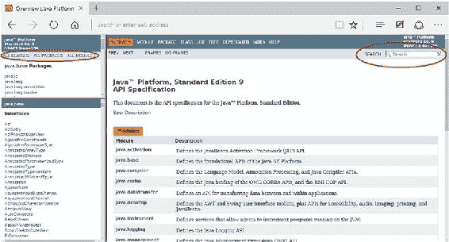
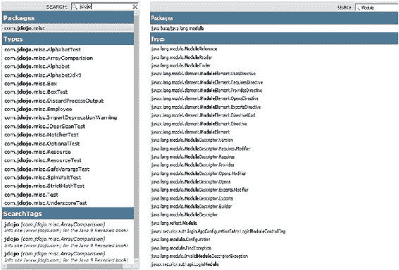

# 货币数量：225

Log4jLoggerFinder.getLogger()：[name=Log4jLogger, module=com.jdojo.logger]

输出表明 `java.base` 模块请求了一个名称为 `java.util.Currency` 的平台日志记录器。这是由于你使用了无效的货币文件所致。日志文件的内容如清单 19-8 所示，其中显示了从 `Currency` 类记录的消息。

***清单 19-8.*** logs/platform.log 文件的内容

2017-02-09 10:45:52,413 INFO com.jdojo.logger.Log4jLogger [main] 由于国家/地区代码无效，`currency.properties` 中针对 `ABADCURRENCYFILE` 的条目被忽略。

2017-02-09 10:45:52,420 ERROR com.jdojo.logger.Log4jLogger [main] 发生未知错误。

2017-02-09 10:45:52,420 INFO com.jdojo.logger.Log4jLogger [main] 仅供参考

## 后续工作

我向你展示了一个使用 Log4j 2.0 作为后端日志记录器来配置平台日志记录器的示例。这个示例在投入生产环境使用之前，还有很多工作要做。我们可以进行的一项改进是记录发出日志消息的类名。请参考清单 19-8，你会发现所有记录的日志消息都使用了相同的类名 `com.jdojo.logger.Log4jLogger` 作为日志记录器的类，这是不正确的。你从 `com.jdojo.logger.PlatformLoggerTest` 类记录了两条消息，而从 `java.util.Currency` 类记录了一条消息。如何解决这个问题？

让我们先尝试理解这个问题。日志记录器的类名由 Log4j 决定。它只是查看其 `log()` 方法的调用者，并将该类用作记录消息的类。在清单 19-3 中，两个 `log()` 方法调用了 `Log4j` 的 `log()` 方法来委托日志记录工作。Log4j 将 `com.jdojo.logger.Log4jLogger` 类视为消息的记录器，并在记录的消息中使用其名称作为日志记录器类。有两种方法可以解决这个问题：

*   在 `Log4jLogger` 类中，使用 JDK 9 新增的 **Stack-Walking API** 自行格式化消息。Stack-Walking API 将为你提供调用者的类名和其他详细信息。这将需要你更改 Log4j 配置文件中的模式布局，以便 Log4j 不会确定并在消息中包含日志记录器的类名。
*   你可以等待下一个版本的 Log4j，它*可能*会原生支持 JDK 9 平台日志记录器。在撰写本文时，Log4j 尚未发布此类公告。

第 19 章 ■ 平台与 JVM 日志记录

## 统一 JVM 日志记录

JDK 9 新增了一个命令行选项 `-Xlog`，它为你提供了一个单一访问点，用于访问从 JVM 所有组件记录的所有消息。此选项的使用语法有点复杂。在解释 `-Xlog` 选项的语法之前，我先解释一下记录的消息的详细信息。

■ **提示** 你可以将 `-Xlog:help` 选项与 `java` 命令一起使用，以打印 `-Xlog` 选项的描述。该描述包含所有选项的语法和值，并附有示例。

当 JVM 记录消息或当你查找 JVM 记录的消息时，请牢记以下几点：

*   JVM 需要识别消息所属的主题（或 JVM 组件）。例如，如果消息与垃圾回收相关，则消息应被标记为此类。一条消息可能属于多个主题。例如，一条消息可能属于垃圾回收和堆管理。因此，一条消息可能关联多个标签。
*   像任何其他日志记录工具一样，JVM 日志记录可能发生在不同级别，例如 `info`、`warning` 等。
*   你应该能够用额外的上下文信息来装饰记录的消息，例如当前日期和时间、记录消息的线程、消息使用的标签等。
*   消息应该记录在哪里？应该记录到 `stdout`、`stderr` 还是一个或多个文件？你是否应该能够为日志文件指定日志记录选项的策略，例如文件名、大小和文件轮换策略。

如果你理解了这些要点，那么是时候学习以下用于描述 JVM 日志记录的术语了：

*   标签
*   级别
*   装饰
*   输出

以下是在第 [3 章](http://dx.doi.org/10.1007/978-1-4842-2592-9_3)中创建的 `com.jdojo.Welcome` 类使用 `-Xlog` 选项运行的示例。它记录所有带有 `gc` 标签且严重级别为 `trace` 或以上的消息，输出到标准输出，并带有级别、时间和标签装饰。

C:\Java9revealed> java -Xlog:gc=trace:stdout:level,time,tags
--module-path com.jdojo.intro\dist
--module com.jdojo.intro/com.jdojo.intro.Welcome

第 19 章 ■ 平台与 JVM 日志记录

[2017-02-10T12:50:11.412-0600][trace][gc] MarkStackSize: 4096k MarkStackSizeMax: 16384k
[2017-02-10T12:50:11.427-0600][debug][gc] ConcGCThreads: 1
[2017-02-10T12:50:11.432-0600][debug][gc] ParallelGCThreads: 4
[2017-02-10T12:50:11.433-0600][debug][gc] Initialize mark stack with 4096 chunks, maximum 16384
[2017-02-10T12:50:11.436-0600][info ][gc] Using G1
Welcome to the Module System.
Module Name: com.jdojo.intro

## 消息标签

每条记录的消息都与一个或多个标签（称为标签集）相关联。以下是撰写本文时所有可用标签的列表。此列表将来可能会更改。要获取支持的标签列表，请将 `-Xlog:help` 选项与 `java` 命令一起使用。

add, age, alloc, aot, annotation, arguments, attach, barrier, biasedlocking, blocks, bot,
breakpoint, census, class, classhisto, cleanup, compaction, constraints, constantpool,
coops, cpu, cset, data, defaultmethods, dump, ergo, exceptions, exit, fingerprint, freelist,
gc, hashtables, heap, humongous, ihop, iklass, init, itables, jni, jvmti, liveness, load,
loader, logging, mark, marking, methodcomparator, metadata, metaspace, mmu, modules,
monitorinflation, monitormismatch, nmethod, normalize, objecttagging, obsolete, oopmap, os,
pagesize, patch, path, phases, plab, promotion, preorder, protectiondomain, ref, redefine,
refine, region, remset, purge, resolve, safepoint, scavenge, scrub, stacktrace, stackwalk,
start, startuptime, state, stats, stringdedup, stringtable, stackmap, subclass, survivor,
sweep, task, thread, tlab, time, timer, update, unload, verification, verify, vmoperation,
vtables, workgang, jfr, system, parser, bytecode, setting, event

如果你对记录垃圾回收和启动的消息感兴趣，可以使用 `gc` 和 `startuptime` 标签与 `-Xlog` 选项一起使用。列表中的大多数标签名称晦涩难懂，实际上，它们是为从事 JVM 开发的开发人员准备的，而不是为应用程序开发人员准备的。我找不到所有这些标签的描述。链接 [`bugs.openjdk.java.net/browse/JDK-8146948`](https://bugs.openjdk.java.net/browse/JDK-8146948) 包含一个请求为所有这些标签提供描述的错误报告。该错误已标记为已修复，但我找不到一个可以显示标签描述的选项。

■ **提示** 你可以将名为 `all` 的特殊标签与 `-Xlog` 选项一起使用，它告诉 JVM 记录所有消息，无论它们关联的标签是什么。标签的默认值是 `all`。

第 19 章 ■ 平台与 JVM 日志记录

## 消息级别

级别是日志记录的严重级别，它根据消息的严重程度确定要记录的消息。

级别按严重程度递增的顺序具有以下值：`trace`、`debug`、`info`、`warning` 和 `error`。如果你启用了严重级别 `S` 的日志记录，则所有严重级别为 `S` 及以上的消息都将被记录。例如，如果你在 `info` 级别启用日志记录，则所有 `info`、`warning` 和 `error` 级别的消息都将被记录。

■ **提示** 你可以将名为 `off` 的特殊严重级别与 `-Xlog` 选项一起使用，以禁用所有级别的日志记录。级别的默认值是 `info`。

## 消息装饰


JVM 消息在记录之前可以附加额外的信息片段。这些额外的信息片段被称为*装饰器*，它们会被添加到消息的开头。每个装饰器都用方括号——[ 和 ]——括起来。表 19-2 列出了所有装饰器及其长名称和短名称。你可以在 `-Xlog` 选项中使用长名称或短名称。

***表 19-2.** 装饰器及其长名称和短名称*

**长名称**

**短名称**

**描述**

hostname

hn

计算机名称

level

l

消息的严重级别

pid

p

进程标识符

tags

tg

与消息关联的所有标签

tid

ti

线程标识符

time

t

ISO-8601 格式的当前时间和日期

（例如，2017-02-10T18:42:58.418+0000）

timemillis

tm

以数字表示的当前时间（毫秒），其值

与 `System.currentTimeMillis()` 生成的值相同

timenanos

tn

以数字表示的当前时间（纳秒），其值

与 `System.nanoTime()` 生成的值相同

uptime

u

自 JVM 启动以来的时间，以秒和

毫秒表示（例如，9.219s）

uptimemillis

um

自 JVM 启动以来的毫秒数

uptimenanos

un

自 JVM 启动以来的纳秒数

utctime

utc

UTC 格式的当前时间和日期（例如，2017-02-

10T12:42:58.418-0600）

■ **提示** 你可以使用名为 `none` 的特殊装饰器与 `-Xlog` 选项一起使用来关闭装饰器。装饰器的默认值是 `uptime,level,tags`，按此顺序排列。

第 19 章 ■ 平台与 JVM 日志记录

消息输出目标

你可以指定三个目标之一来发送 JVM 日志：

• `stdout`

• `stderr`

• `file=<文件名>`

使用 `stdout` 和 `stderr` 值分别将 JVM 日志打印到标准输出和标准错误。默认的输出目标是 `stdout`。

使用 `file` 值来指定一个文本文件名，将日志发送到文本文件。你可以在文件名中使用 `%p` 和 `%t`，它们会分别扩展为 JVM 的 PID 和启动时间戳。例如，如果你使用 `-Xlog` 选项将 `file=jvm%p_%t.log` 指定为输出目标，那么每次运行 JVM 时，消息都会被记录到一个文件名类似如下的文件中：

• `jvm2348_2017-02-10_13-26-05.log`

• `jvm7292_2017-02-10_13-26-06.log`

每次启动 JVM 时，都会创建一个类似列表中所示的日志文件。这里，2348 和 7292 是两次运行时 JVM 的 PID。

■ **提示** 如果输出目标不是 `stdout` 和 `stderr`，则表明输出目标是文本文件。你可以直接使用 `jvm.log` 作为输出目标，而不必使用 `file=jvm.log`。

你可以为将输出发送到文本文件指定额外的选项：

• `filecount=<文件数量>`

• `filesize=<文件大小>`

这些选项用于控制每个日志文件的最大大小和日志文件的最大数量。考虑以下选项：

`file=jvm.log::filesize=1M,filecount=3`

注意使用了两个连续的冒号 (::)。我将在下一节解释它们。此选项使用 `jvm.log` 作为日志文件。日志文件的最大大小为 1M（1 MB），日志文件的最大数量为 3。

它将创建四个日志文件：`jvm.log`、`jvm.log.0`、`jvm.log.1` 和 `jvm.log.2`。当前消息记录到 `jvm.log` 文件中，当当前文件中的记录消息超过 1MB 时，其他三个文件会进行轮转。你可以使用 `K` 表示千字节，`M` 表示兆字节来指定文件大小。如果你指定了文件大小但没有包含 `K` 或 `M` 后缀，则该选项会假定单位为字节。

`-Xlog` 语法

以下是使用 `-Xlog` 选项的语法：

`-Xlog[:<内容>][:[<输出>][:[<装饰器>][:<输出选项>]]]`

与 `-Xlog` 一起使用的选项由冒号 (`:`) 分隔。所有选项都是可选的。如果 `-Xlog` 中的前面部分缺失，你必须为该部分使用一个冒号。例如，`-Xlog::stderr` 表示所有部分都使用默认值，除了 `<输出>` 部分被指定为 `stderr`。

第 19 章 ■ 平台与 JVM 日志记录

`-Xlog` 最简单的用法如下，它会将所有 JVM 消息记录到标准输出：
`java -Xlog --module-path com.jdojo.intro\dist --module com.jdojo.intro/com.jdojo.intro.Welcome`

有两个特殊的 `-Xlog` 选项：`help` 和 `disable`，可以分别使用 `-Xlog:help` 来打印 `-Xlog` 的帮助信息，以及 `-Xlog:disable` 来禁用所有 JVM 日志记录。你可能会认为，与其使用 `-Xlog:disable`，不如根本不使用 `-Xlog` 选项。你是对的。然而，`disable` 选项的存在另有原因。`-Xlog` 选项可以在同一条命令中多次使用。如果多次出现的 `-Xlog` 包含相同类型的设置，则最后一次出现的 `-Xlog` 中的设置生效。

因此，你可以先指定 `-Xlog:disable` 作为第一个选项，然后再指定另一个 `-Xlog` 来开启特定类型的日志记录。这样，你首先关闭所有默认设置，然后指定你感兴趣的选项。

`<内容>` 部分指定了要记录的消息的标签和严重级别。其语法如下：

`tag1[+tag2...][*][=level][,...]`

`<内容>` 部分中的 `+` 表示逻辑与。例如，`gc+exit` 表示记录所有标签集恰好包含两个标签——`gc` 和 `exit` 的消息。标签名称末尾的 `*` 用作通配符，表示“至少”。例如，`gc*` 表示记录所有标签集至少包含 `gc` 的消息，这将记录标签集为 `[gc]`、`[gc,exit]`、`[gc,remset,exit]` 等的消息。如果你使用 `gc+exit*`，则表示记录所有标签集至少包含 `gc` 和 `exit` 标签的消息，这将记录标签集为 `[gc,exit]`、`[gc,remset,exit]` 等的消息。你可以为每个要记录的标签名称指定严重级别。例如，`gc=trace` 记录所有标签集仅包含 `gc` 且严重级别为 `trace` 或更高的消息。你可以指定多个条件，用逗号分隔。例如，`gc=trace,heap=error` 将记录所有标签集为 `gc` 且级别为 `trace` 或更高，或者标签集为 `heap` 且级别为 `error` 的消息。

我将向你展示使用不同条件记录 JVM 消息的命令。显示的输出来自我的计算机。当你运行这些命令时，可能会得到不同的输出。以下命令指定了 `gc` 和 `startuptime` 作为标签，其他设置保留默认值：

`C:\Java9Revealed>java -Xlog:gc,startuptime --module-path com.jdojo.intro\dist --module com.jdojo.intro/com.jdojo.intro.Welcome`

`[0.017s][info][startuptime] StubRoutines generation 1, 0.0002258 secs`
`[0.022s][info][gc ] Using G1`
`[0.022s][info][startuptime] Genesis, 0.0045639 secs`
`...`

使用 `-Xlog` 等同于使用 `-Xlog:all=info:stdout:uptime,level,tags`。它将所有严重级别为 `info` 或更高的消息记录到 `stdout`，并带有装饰器 `uptime`、`level` 和 `tags`。以下命令向你展示如何使用默认设置获取 JVM 日志。显示部分输出：

`C:\Java9Revealed>java -Xlog --module-path com.jdojo.intro\dist --module com.jdojo.intro/com.jdojo.intro.Welcome`

第 19 章 ■ 平台与 JVM 日志记录

`[0.015s][info][os] SafePoint Polling address: 0x000001195fae0000`
`[0.015s][info][os] Memory Serialize Page address: 0x000001195fdb0000`
`[0.018s][info][biasedlocking] Aligned thread 0x000001195fb37f40 to 0x000001195fb38000`
`[0.019s][info][class,path ] bootstrap loader class path=C:\java9\lib\modules`
`[0.019s][info][class,path ] classpath:`
`[0.020s][info][class,path ] opened: C:\java9\lib\modules`
`[0.020s][info][class,load ] opened: C:\java9\lib\modules`
`[0.027s][info][os,thread ] Thread is alive (tid: 17724).`
`[0.027s][info][os,thread ] Thread is alive (tid: 6436).`
`[0.033s][info][gc ] Using G1`
`[0.034s][info][startuptime ] Genesis, 0.0083975 secs`
`[0.038s][info][class,load ] java.lang.Object source: jrt:/java.base`
`[0.226s][info][os,thread ] Thread finished (tid: 7584).`
`[0.226s][info][gc,heap,exit ] Heap`
`[0.226s][info][gc,heap,exit ] Metaspace used 6398K, capacity 6510K,`
`[0.226s][info][safepoint,cleanup ] mark nmethods, 0.0000057 secs`
`[0.226s][info][os,thread ] Thread finished (tid: 3660).`
`...`


以下命令会将所有至少带有 `gc` 标签且严重级别为 `debug` 或更高的消息，加上时间修饰符后记录到当前目录下名为 `gc.log` 的文件中。请注意，该命令会在标准输出上打印两行消息，这些消息来自 `Welcome` 类的 `main()` 方法。不过，我展示的是 `gc.log` 文件的部分输出，而非标准输出上打印的内容。

C:\java9revealed>java -Xlog:gc*=trace:file=gc.log:time --module-path com.jdojo.intro\dist

--module com.jdojo.intro/com.jdojo.intro.Welcome

[2017-02-11T08:40:23.942-0600] Maximum heap size 2113804288

[2017-02-11T08:40:23.942-0600] Initial heap size 132112768

[2017-02-11T08:40:23.942-0600] Minimum heap size 6815736

[2017-02-11T08:40:23.942-0600] MarkStackSize: 4096k MarkStackSizeMax: 16384k

[2017-02-11T08:40:23.966-0600] Heap region size: 1M

[2017-02-11T08:40:23.966-0600] WorkerManager::add_workers() : created_workers: 4

[2017-02-11T08:40:23.966-0600] Initialize Card Live Data

[2017-02-11T08:40:23.966-0600] ParallelGCThreads: 4

[2017-02-11T08:40:23.966-0600] WorkerManager::add_workers() : created_workers: 1

...

第 19 章 ■ 平台与 JVM 日志

以下命令记录的消息与上一条命令相同，只是记录的消息不带任何修饰符：

C:\java9revealed>java -Xlog:gc*=trace:file=gc.log:none --module-path com.jdojo.intro\dist

--module com.jdojo.intro/com.jdojo.intro.Welcome

Maximum heap size 2113804288

Initial heap size 132112768

Minimum heap size 6815736

MarkStackSize: 4096k MarkStackSizeMax: 16384k

Heap region size: 1M

WorkerManager::add_workers() : created_workers: 4

Initialize Card Live Data

ParallelGCThreads: 4

WorkerManager::add_workers() : created_workers: 1

...

以下命令记录的消息与上一条命令相同，只是它使用了一个包含 10 个文件、每个文件大小为 5MB、基础文件名为 `gc.log` 的轮转文件集：

C:\Java9Revealed>java -Xlog:gc*=trace:file=gc.log:none:filesize=5m,filecount=10

--module-path com.jdojo.intro\dist --module com.jdojo.intro/com.jdojo.intro.Welcome

以下命令会记录所有包含 `gc` 标签且严重级别为 `debug` 或更高的消息。它会关闭所有包含 `exit` 标签的消息。它不会记录同时包含 `gc` 和 `exit` 标签的消息。

消息会以默认修饰符记录到标准输出。下面展示了部分输出。

C:\Java9Revealed>java -Xlog:gc*=debug,exit*=off --module-path com.jdojo.intro\dist

--module com.jdojo.intro/com.jdojo.intro.Welcome

[0.015s][info][gc,heap] Heap region size: 1M

[0.015s][debug][gc,heap] Minimum heap 8388608 Initial heap 132120576 Maximum heap

[0.015s][debug][gc,ergo,refine] Initial Refinement Zones: green: 4, yellow: 12, red: 20, min

yellow size: 8

[0.016s][debug][gc,marking,start] Initialize Card Live Data

[0.016s][debug][gc,marking ] Initialize Card Live Data 0.024ms

[0.016s][debug][gc ] ConcGCThreads: 1

[0.018s][debug][gc,ihop ] Target occupancy update: old: 0B, new: 132120576B

[0.019s][info ][gc ] Using G1

[0.182s][debug][gc,metaspace,freelist] space @ 0x000001e7dbeb8260 704K, 99% used

[0x000001e7fe880000, 0x000001e7fedf8400, 0x000001e7fee00000, 0x000001e7ff080000)

[0.191s][debug][gc,refine ] Stopping 0

...

第 19 章 ■ 平台与 JVM 日志

以下命令会记录带有 `startuptime` 标签的消息，并使用 `hostname`、`uptime`、`level` 和 `tags` 作为修饰符。所有其他设置保持默认。它会记录 `info` 级别或更高级别的消息，并输出到标准输出。请注意命令中连续的两个冒号（`::`）。之所以需要它们，是因为我们没有指定输出目标。

C:\Java9Revealed>java -Xlog:startuptime::hostname,uptime,level,tags

--module-path com.jdojo.intro\dist --module com.jdojo.intro/com.jdojo.intro.Welcome

[0.015s][kishori][info][startuptime] StubRoutines generation 1, 0.0002574 secs

[0.019s][kishori][info][startuptime] Genesis, 0.0038339 secs

[0.019s][kishori][info][startuptime] TemplateTable initialization, 0.0000081 secs

[0.020s][kishori][info][startuptime] Interpreter generation, 0.0010698 secs


[0.032s][kishori][info][startuptime] StubRoutines generation 2, 0.0001518 secs

[0.032s][kishori][info][startuptime] MethodHandles adapters generation, 0.0000229 secs

[0.033s][kishori][info][startuptime] Start VMThread, 0.0001491 secs

[0.055s][kishori][info][startuptime] Initialize java.lang classes, 0.0224295 secs

[0.058s][kishori][info][startuptime] Initialize java.lang.invoke classes, 0.0015945 secs

[0.162s][kishori][info][startuptime] Create VM, 0.1550707 secs

欢迎使用模块系统。

模块名称：com.jdojo.intro

摘要

JDK 9 对平台类（JDK 类）和 JVM 组件的日志系统进行了全面改造。现在有一个新的 API，允许你指定一个你选择的日志框架，作为平台类日志消息的后端。同时，还新增了一个命令行选项，用于访问所有 JVM 组件的消息。

平台日志 API 允许你指定一个自定义日志记录器，所有平台类将使用该记录器来记录其消息。你可以使用现有的日志框架（如 Log4j）作为日志记录器。该 API 由 `java.lang.System.LoggerFinder` 类和 `java.lang.System.Logger` 接口组成。

`System.Logger` 接口的一个实例代表一个平台日志记录器。`System.LogFinder` 类是一个服务接口。你需要为该服务接口提供一个实现，该实现返回一个 `System.Logger` 接口的实例。你可以使用 `java.lang.System` 类中的 `getLogger()` 方法来获取一个 `System.Logger`。你应用程序中的一个模块必须包含一个 `provides` 语句，指明 `System.LogFinder` 服务接口的实现。否则，将使用默认的日志记录器。

JDK 9 允许你使用一个名为 `-Xlog` 的选项来记录来自所有组件的所有 JVM 消息。该选项允许你指定消息的类型、消息的严重级别、日志目标、日志消息的修饰以及日志文件属性。一条消息由一组标签标识。`System.Logger.Level` 枚举的常量指定了消息的严重级别。日志目标可以是 `stdout`、`stderr` 或一个文件。

**第 20 章**

**JDK 9 中的其他变更**

在本章中，你将学习：

• 下划线作为新关键字

• 改进的 try-with-resources 块语法

• 如何在匿名类中使用菱形运算符

• 如何在接口中使用私有方法

• 如何在私有方法上使用 `@SafeVarargs` 注解

• 如何丢弃子进程的输出

• 如何使用 `Math` 和 `StrictMath` 类中的新方法

• 如何使用 Optional 流以及 Optional 上的其他新操作

• 如何使用自旋等待提示

• Time API、Matcher 和 Objects 类的增强

• 如何比较数组和数组切片

• Javadoc 的增强以及如何使用其新的搜索功能

• JDK 9 中的原生桌面支持及其使用方法

• 如何在对象反序列化期间使用全局和局部过滤器

• 如何将数据从输入流传输到输出流，以及如何复制和切片缓冲区

Java SE 9 有许多大大小小的变更。大的变更包括模块系统、HTTP/2 客户端 API 等的引入。这些大的变更本身就需要一章来介绍。本章涵盖了所有对 Java 开发者来说很重要，但还不足以单独成章的所有变更。

你不需要按顺序阅读本章。每一节都涵盖一个新主题。如果你有兴趣了解某个特定主题，可以直接跳转到该主题的章节。

© Kishori Sharan 2017

K. Sharan, *Java 9 Revealed*, DOI 10.1007/978-1-4842-2592-9_20

第 20 章 ■ JDK 9 中的其他变更

本章示例的源代码位于一个名为 `com.jdojo.misc` 的模块中，其模块声明如清单 20-1 所示。

***清单 20-1.*** 名为 com.jdojo.misc 的模块的模块声明

// module-info.java

module com.jdojo.misc {

requires java.desktop;

exports com.jdojo.misc;

}


该模块读取了 `java.desktop` 模块，你需要该模块来实现特定于平台的桌面功能，这些功能在“原生桌面功能”一节中有详细描述。

下划线是一个关键字

在 JDK 9 中，下划线（`_`）是一个关键字，你不能单独将其用作单字符标识符，例如变量名、方法名、类型名等。不过，你仍然可以在多字符标识符名称中使用下划线。请参考清单 20-2 中的程序。

***清单 20-2.*** 一个将下划线用作标识符的程序

// UnderscoreTest.java

package com.jdojo.misc;

public class UnderscoreTest {

public static void main(String[] args) {

// 将下划线用作标识符。在 JDK 8 中这是一个编译时警告，在 JDK 9 中则是一个编译时错误。

int _ = 19;

System.out.println(_);

// 在多字符标识符中使用下划线。在 JDK 8 和 JDK 9 中都是允许的。

final int FINGER_COUNT = 20;

final String _prefix = "Sha";

}

}

在 JDK 8 中编译 `UnderscoreTest` 类时，会因单独将下划线用作标识符而生成两个警告——一个针对变量声明，另一个针对其在 `System.out.println()` 方法调用中的使用。每次单独使用下划线都会生成一个警告。JDK 8 会生成以下两个警告：

com.jdojo.misc\src\com\jdojo\misc\UnderscoreTest.java:8: 警告: '_' 被用作标识符

int _ = 19;

^

（在 Java SE 8 之后的版本中，可能不支持将 '_' 用作标识符）

com.jdojo.misc\src\com\jdojo\misc\UnderscoreTest.java:9: 警告: '_' 被用作标识符

System.out.println(_);

^

（在 Java SE 8 之后的版本中，可能不支持将 '_' 用作标识符）

2 个警告

第 20 章 ■ JDK 9 中的其他变更

在 JDK 9 中编译 `UnderscoreTest` 类会生成以下两个编译时错误：

com.jdojo.misc\src\com\jdojo\misc\UnderscoreTest.java:8: 错误: 自版本 9 起，'_' 是一个关键字，不能用作标识符

int _ = 19;

^

com.jdojo.misc\src\com\jdojo\misc\UnderscoreTest.java:9: 错误: 自版本 9 起，'_' 是一个关键字，不能用作标识符

System.out.println(_);

^

2 个错误

在 JDK 9 中，下划线有什么特殊含义？又在哪里使用它呢？在 JDK 9 中，你已被限制不能将其用作标识符。JDK 的设计者打算在未来的 JDK 版本中赋予它特殊含义。所以，请等到 JDK 10 或 11，才能看到它作为具有特殊含义的关键字发挥作用。请注释掉源代码中的这些行，或者整个类的代码，这样你就能无错误地编译整个 NetBeans 项目。如果源代码被注释掉了，你需要取消注释才能看到这些错误。

改进的 try-with-resources 语句

JDK 7 在 `java.lang` 包中添加了一个 `AutoCloseable` 接口：

public interface AutoCloseable {

void close() throws Exception;

}

JDK 7 还添加了一个名为 `try-with-resources` 的新语句块，它可以按照以下步骤来管理 `AutoCloseable` 对象（或资源）：

• 在语句块的开头，将资源的引用赋值给一个*新声明的*变量。
• 在语句块的主体中使用该资源。
• 当退出语句块的主体时，代表该资源的变量上的 `close()` 方法将自动为你调用。

这避免了在 JDK 7 之前使用 `finally` 块编写样板代码。以下代码片段展示了开发人员过去如何管理一个可关闭的资源，假设存在一个实现了 `AutoCloseable` 接口的 `Resource` 类：

/* JDK 7 之前 */

Resource res = null;

try{

// 创建资源

res = new Resource();

// 在此处使用 res

第 20 章 ■ JDK 9 中的其他变更

} finally {

try {

if(res != null) {

res.close();

}

} catch(Exception e) {

e.printStackTrace();

}

}

JDK 7 中的 `try-with-resources` 极大地改善了这种情况。在 JDK 7 中，你可以将之前的代码片段重写如下：

try (Resource res = new Resource()) {

// 在此处使用 res

}


这段代码会在控制流退出 `try` 块时，对 `res` 调用 `close()` 方法。你可以在 `try` 块中指定多个资源，每个资源之间用分号分隔：

try (Resource res1 = new Resource(); Resource res2 = new Resource()) {

// 在此处使用 res1 和 res2

}

当 `try` 块退出时，`res1` 和 `res2` 这两个资源的 `close()` 方法会被自动调用。资源会按照它们被指定的**相反顺序**关闭。在这个例子中，会依次调用 `res2.close()` 和 `res1.close()`。

JDK 7 和 8 要求你在 try-with-resources 块中声明引用资源的变量。如果你在方法中接收了一个资源引用作为参数，你将无法像这样编写逻辑：

void useIt(Resource res) {

// 在 JDK 7 和 8 中会导致编译时错误

try(res) {

// 在此处使用 res

}

}

为了绕过这个限制，你必须声明另一个该资源类型的新变量，并用你的参数值对其进行初始化。下面的代码片段展示了这种方法。它声明了一个名为 `res1` 的新引用变量，当 `try` 块退出时，会对其调用 `close()` 方法：

void useIt(Resource res) {

try(**Resource res1** = res) {

// 在此处使用 res1

}

}

第 20 章 ■ JDK 9 中的其他变更

JDK 9 移除了你必须为想要使用 try-with-resources 块管理的资源声明新变量的限制。现在，你可以使用一个 *final* 或 *effectively final* 的变量，该变量引用一个将由 try-with-resources 块管理的资源。如果一个变量使用 `final` 关键字显式声明，则它是 final 的：

// res 是显式 final 的

**final** Resource res = new Resource();

如果一个变量在初始化后其值从未改变，则它是 effectively final 的。在下面的代码片段中，`res` 变量是 effectively final 的，即使它没有被声明为 final。它被初始化后，就再也没有被改变过。

void doSomething() {

// res 是 effectively final 的

Resource res = new Resource();

res.useMe();

}

在 JDK 9 中，你可以这样编写：

Resource res = new Resource();

try (res) {

// 在此处使用 res

}

如果你有多个想要使用 try-with-resources 块管理的资源，可以像这样操作：

Resource res1 = new Resource();

Resource res2 = new Resource();

try (res1; res2) {

// 在此处使用 res1 和 res2

}

你可以在同一个 try-with-resources 块中混合使用 JDK 8 和 JDK 9 的方法。下面的代码片段在一个 try-with-resources 块中使用了两个预先声明的 effectively final 变量和一个新声明的变量：

Resource res1 = new Resource();

Resource res2 = new Resource();

try (res1; res2; Resource res3 = new Resource()) {

// 在此处使用 res1、res2 和 res3

}

第 20 章 ■ JDK 9 中的其他变更

自 JDK 7 起，在 try-with-resources 块内部声明的变量都是隐式 final 的。下面的代码片段显式地将这样一个变量声明为 final：

Resource res1 = new Resource();

Resource res2 = new Resource();

// 将 res3 显式声明为 final

try (res1; res2; **final** Resource res3 = new Resource()) {

// 在此处使用 res1、res2 和 res3

}

让我们看一个完整的例子。JDK 中有几个类实现了 `AutoCloseable` 接口，例如 `java.io` 包中的 `InputStream` 和 `OutputStream` 类。清单 20-3 con 包含了一个实现了 `AutoCloseable` 接口的 `Resource` 类的代码。`Resource` 类的对象可以作为资源，由 try-with-resources 块进行管理。`id` 实例变量用于追踪资源。构造函数和其他方法在被调用时只会打印一条消息。

***清单 20-3.*** 一个实现 AutoCloseable 接口的 Resource 类

// Resource.java

package com.jdojo.misc;

public class Resource implements AutoCloseable {

private final long id;

public Resource(long id) {

this.id = id;

System.out.printf("已创建资源 %d.%n", this.id);

}

public void useIt() {

System.out.printf("正在使用资源 %d.%n", this.id);

}

@Override

public void close() {


System.out.printf("Closing resource %d.%n", this.id);

}

}

清单 20-4 包含一个 `ResourceTest` 类的代码，该类演示了如何使用 JDK 9 的新特性：通过 `try-with-resources` 块，使用引用资源的 final 或 effectively final 变量来管理资源。

第 20 章 ■ JDK 9 中的其他变更

***清单 20-4.*** 用于演示 JDK 9 中 `try-catch` 块用法的 `ResourceTest` 类

// ResourceTest.java

package com.jdojo.misc;

public class ResourceTest {

public static void main(String[] args) {

Resource r1 = new Resource(1);

Resource r2 = new Resource(2);

try(r1; r2) {

r1.useIt();

r2.useIt();

r2.useIt();

}

useResource(new Resource(3));

}

public static void useResource(Resource res) {

try(res; Resource res4 = new Resource(4)) {

res.useIt();

res4.useIt();

}

}

}

已创建资源 1。

已创建资源 2。

正在使用资源 1。

正在使用资源 2。

正在使用资源 2。

正在关闭资源 2。

正在关闭资源 1。

已创建资源 3。

已创建资源 4。

正在使用资源 3。

正在使用资源 4。

正在关闭资源 4。

正在关闭资源 3。

第 20 章 ■ JDK 9 中的其他变更

匿名类中的菱形运算符

JDK 7 引入了菱形运算符（`<>`），只要编译器能够推断出泛型类型，就可以在调用泛型类的构造器时使用它。以下两条语句是等价的；第二条使用了菱形运算符：

// 显式指定泛型类型

List<String> list1 = new ArrayList**<String>** ();

// 编译器将 ArrayList<> 推断为 ArrayList<String>

List<String> list2 = new ArrayList**<>** ();

JDK 7 不允许在创建匿名类时使用菱形运算符。以下代码片段使用带有菱形运算符的匿名类来创建 `Callable<V>` 接口的实例：

// 在 JDK 7 和 8 中会导致编译时错误

Callable<Integer> c = new Callable<>() {

@Override

public Integer call() {

return 100;

}

};

上述语句在 JDK 7 和 8 中会产生以下错误：

error: cannot infer type arguments for Callable<V>

Callable<Integer> c = new Callable<>() {

^

reason: cannot use '<>' with anonymous inner classes

where V is a type-variable:

V extends Object declared in interface Callable

1 error

你可以通过指定泛型类型来替代菱形运算符，从而修复此错误：

// 在 JDK 7 和 8 中有效

Callable<Integer> c = new Callable< **Integer**>() {

@Override

public Integer call() {

return 100;

}

};

JDK 9 增加了对匿名类中菱形运算符的支持，前提是推断出的类型是可表示的（denotable）。如果推断出的类型是不可表示的（non-denotable），即使在 JDK 9 中，也不能在匿名类中使用菱形运算符。Java 编译器会使用许多无法在 Java 程序中编写的类型。

可以在 Java 程序中编写的类型称为*可表示*类型。编译器知道但无法在 Java 程序中编写的类型称为*不可表示*类型。例如，`String` 是一种可表示类型，因为你可以在程序中使用它来表示一种类型；然而，`Serializable & CharSequence` 并不是一种

第 20 章 ■ JDK 9 中的其他变更

可表示类型，尽管它对编译器来说是一种有效类型。它是一种交集类型，表示同时实现了 `Serializable` 和 `CharSequence` 这两个接口的类型。交集类型允许在泛型类型定义中使用，但不能使用这种交集类型来声明变量：

// 在 Java 代码中不允许。不能声明交集类型的变量。

**Serializable & CharSequence** var;

// 在 Java 代码中允许

class Magic<T extends **Serializable & CharSequence**> {

// 更多代码在此处

}

在 JDK 9 中，以下使用菱形运算符与匿名类的代码片段是允许的：

// 在 JDK 7 和 8 中会导致编译时错误，但在 JDK 9 中允许。

Callable<Integer> c = new Callable**<>** () {

@Override

public Integer call() {

return 100;

}

};

使用这个 `Magic` 类的定义，JDK 9 允许你像这样使用匿名类：

// 在 JDK 9 中允许。<> 被推断为 <String>。


`Magic<String> m1 = new Magic**<>** (){`

`// 更多代码在此处`

`};`

在 JDK 9 中，以下对 `Magic` 类的使用无法编译，因为编译器将泛型类型推断为一种不可表示类型的交集类型：

`// JDK 9 中的编译时错误。<> 被推断为 <Serializable & CharSequence>，`

`// 这是一种不可表示类型`

`Magic<?> m2 = new Magic<>(){`

`// 更多代码在此处`

`};`

上述代码会产生以下编译时错误：

`error: cannot infer type arguments for Magic<>`

`Magic<?> m2 = new Magic<>(){`

`^`

`reason: type argument INT#1 inferred for Magic<> is not allowed in this context`

`inferred argument is not expressible in the Signature attribute`

`where INT#1 is an intersection type:`

`INT#1 extends Object,Serializable,CharSequence`

`1 error`

第 20 章 ■ JDK 9 中的其他变更

接口中的私有方法

JDK 8 为接口引入了静态方法和默认方法。如果你在这些方法中需要多次执行相同的逻辑，你只能选择重复该逻辑，或者将逻辑移到另一个类中以隐藏实现。考虑名为 `Alphabet` 的接口，如清单 20-5 所示。

***清单 20-5.*** 一个名为 Alphabet 的接口，包含两个共享逻辑的默认方法

`// Alphabet.java`

`package com.jdojo.misc;`

`public interface Alphabet {`

`default boolean isAtOddPos(char c) {`

`if (!Character.isLetter(c)) {`

`throw new RuntimeException("Not a letter: " + c);`

`}`

`char uc = Character.toUpperCase(c);`

`int pos = uc - 64;`

`return pos % 2 == 1;`

`}`

`default boolean isAtEvenPos(char c) {`

`if (!Character.isLetter(c)) {`

`throw new RuntimeException("Not a letter: " + c);`

`}`

`char uc = Character.toUpperCase(c);`

`int pos = uc - 64;`

`return pos % 2 == 0;`

`}`

`}`

`isAtOddPos()` 和 `isAtEvenPos()` 方法检查指定字符在字母表中的位置是奇数还是偶数，假设我们只处理英文字母。该逻辑假设 `A` 和 `a` 位于位置 1，`B` 和 `b` 位于位置 2，依此类推。注意，这两个方法中的逻辑仅在返回语句上有所不同。除了最后一条语句外，这些方法的整个主体都是相同的。你会同意需要重构此逻辑。将公共逻辑移到另一个方法，并从两个方法中调用新方法将是理想的情况。然而，在 JDK 8 中你不想这样做，因为接口只支持公共方法。这样做会使第三个方法变为公共方法，从而将其暴露给外部世界，这是你不希望发生的。

JDK 9 为你解决了这个问题。它允许你在接口中声明私有方法。清单 20-6 sho 展示了使用包含两个方法所用公共逻辑的私有方法重构后的 `Alphabet` 接口版本。这次，我将接口命名为 `AlphabetJdk9`，只是为了确保我可以在源代码中包含两个版本。现有的两个方法变成了单行方法。

第 20 章 ■ JDK 9 中的其他变更

***清单 20-6.*** 一个名为 AlphabetJdk9 的接口，使用了私有方法

`// AlphabetJdk9.java`

`package com.jdojo.misc;`

`public interface AlphabetJdk9 {`

`default boolean isAtOddPos(char c) {`

`return getPos(c) % 2 == 1;`

`}`

`default boolean isAtEvenPos(char c) {`

`return getPos(c) % 2 == 0;`

`}`

`**private int getPos(char c) {**`

`**if (!Character.isLetter(c)) {**`

`**throw new RuntimeException("Not a letter: " + c);**`

`**}`

`**char uc = Character.toUpperCase(c);**`

`**int pos = uc - 64;**`

`**return pos;**`

`**}`

`}`

在 JDK 9 之前，接口中的所有方法默认都是隐式公共的。请记住这些适用于所有 Java 程序的简单规则：

• 私有方法不会被继承，因此不能被重写。

• final 方法不能被重写。

• 抽象方法会被继承，并且旨在被重写。

• 默认方法是一个实例方法，并提供默认实现。它旨在被重写。

随着 JDK 9 中私有方法的引入，在接口中声明方法时需要遵循一些规则。并非所有修饰符组合——`abstract`、`public`、`private`、`static` 和 `final`——都受支持，因为它们没有意义。表 20-1 lis 列出了 JDK 9 接口方法声明中受支持和不受支持的修饰符组合。请注意，`final` 修饰符不允许用于接口的方法声明。根据此列表，你可以在接口中拥有一个私有方法，它要么是非抽象、非默认的实例方法，要么是静态方法。

第 20 章 ■ JDK 9 中的其他变更

***表 20-1.** 接口方法声明中支持的修饰符*

| **修饰符** | **是否支持？** | **描述** |
| :--- | :--- | :--- |
| `public static` | 是 | 自 JDK 8 起支持。 |
| `public abstract` | 是 | 自 JDK 1 起支持。 |
| `public default` | 是 | 自 JDK 8 起支持。 |
| `private static` | 是 | 自 JDK 9 起支持。 |
| `private` | 是 | 自 JDK 9 起支持。这是一个非抽象实例方法。 |
| `private abstract` | 否 | 此组合没有意义。私有方法不会被继承，因此不能被重写，而抽象方法必须被重写才有用。 |
| `private default` | 否 | 此组合没有意义。私有方法不会被继承，因此不能被重写，而默认方法旨在在需要时被重写。 |

私有方法上的 @SafeVarargs

*可具体化*类型是其信息在运行时完全可用的类型，例如 `String`、`Integer`、`List` 等。

*不可具体化*类型是其信息已被编译器通过类型擦除移除的类型，例如 `List<String>`，它在编译后变为 `List`。

当你使用不可具体化类型的可变参数时，该参数的类型仅对编译器可见。编译器会擦除参数化类型，并将其替换为实际类型的数组——对于无界类型为 `Object[]`，对于有界类型则为类型上界的特定数组。

编译器无法保证在方法体内对此类不可具体化可变参数执行的操作是安全的。考虑以下方法的定义：

`<T> void print(T... args) {`

`for(T element : args) {`

`System.out.println(element);`

`}`

`}`

编译器会将 `print(T… args)` 替换为 `print(Object[] args)`。此方法体不会对 `args` 参数执行任何不安全操作。考虑以下执行不安全操作的方法声明：

`public static void unsafe(List<Long>... rolls) {`

`Object[] list = rolls;`

`list[0] = List.of("One", "Two");`

`// 不安全！！！将在运行时抛出 ClassCastException`

`Long roll = rolls[0].get(0);`

`}`

第 20 章 ■ JDK 9 中的其他变更

`unsafe()` 方法将 `rolls`（一个 `List<String>` 数组）赋值给 `Object[]`，这是可以的。它将一个 `List<String>` 存储到 `Object[]` 的第一个元素中，这也是允许的。最后一条语句编译正常，因为 `rolls[0]` 的类型被推断为 `List<Long>`，并且 `get(0)` 方法应该返回一个 `Long`。然而，运行时抛出 `ClassCastException`，因为 `rolls[0].get(0)` 返回的实际类型是 `String`，而不是 `Long`。

当你声明像 `print()` 和 `unsafe()` 这样使用不可具体化可变参数类型的方法时，Java 编译器会发出类似这样的未检查警告：

`warning: [unchecked] Possible heap pollution from parameterized vararg type List<Long>`

`public static void unsafe(List<Long>... rolls) {`

`^`

编译器会为此类方法声明生成一个警告，并为对该方法的每次调用生成一个警告。如果 `unsafe()` 方法被调用五次，你将收到六个警告（一个用于声明，五个用于调用）。你可以通过使用


在此类方法上使用 `@SafeVarargs` 注解。通过在方法声明中添加此注解，你可以向方法的使用者和编译器保证：在方法体内，你不会对不可具体化的可变参数执行任何不安全操作。你的保证足以让编译器不发出警告。然而，如果该保证在运行时被证明不成立，运行时将抛出相应类型的异常。

在 JDK 9 之前，你可以在以下可执行体（构造器和方法）上使用 `@SafeVarargs` 注解：

• 构造器
• 静态方法
• final 方法

构造器、静态方法和 final 方法都是不可重写的。仅允许在不可重写的可执行体上使用 `@SafeVarargs` 注解，其背后的理念是为了防止开发者在可重写的可执行体上使用此注解，从而违反该注解对重写可执行体的约束。假设你有一个类 X，其中包含一个方法 `m1()`，该方法带有 `@SafeVarargs` 注解。

再假设你有一个继承自类 X 的类 Y。类 Y 可能会重写继承来的方法 `m1()`，并可能包含不安全操作。这将在运行时带来意外，因为开发者可能会基于超类 X 编写代码，并且不会预期其方法 `m1()` 所承诺的任何不安全操作。

私有方法也是不可重写的，因此 JDK 9 决定也允许在私有方法上使用 `@SafeVarargs` 注解。清单 20-7 展示了一个类，其中包含一个使用了 `@SafeVarargs` 注解的私有方法。JDK 9 中允许使用 `@SafeVarargs` 注解的可执行体列表如下：

• 构造器
• 静态方法
• final 方法
• 私有方法

第 20 章 ■ JDK 9 中的其他变更

***清单 20-7.*** 在 JDK 9 的私有方法上使用 `@SafeVarargs` 注解

```java
// SafeVarargsTest.java
package com.jdojo.misc;

public class SafeVarargsTest {
    // JDK 9 中允许
    @SafeVarargs
    private <T> void print(T... args) {
        for(T element : args) {
            System.out.println(element);
        }
    }
    // 更多代码在此处
}
```

在 JDK 8 中编译此类会生成以下错误，指出 `@SafeVarargs` 不能用于非 final 方法，此处即私有方法。你需要使用 `-Xlint:unchecked` 选项编译源代码才能看到这些错误。

```
com\jdojo\misc\SafeVarargsTest.java:6: error: Invalid SafeVarargs annotation. Instance
method <T> print(T...) is not final.
    private <T> void print(T... args) {
    ^
  where T is a type-variable:
    T extends Object declared in method <T>print(T...)
```

**丢弃进程输出**

JDK 9 在 `ProcessBuilder.Redirect` 嵌套类中添加了一个名为 `DISCARD` 的新常量。其类型为 `ProcessBuilder.Redirect`。当你希望丢弃子进程的输出时，可以将其用作子进程输出流和错误流的目标。该实现通过写入操作系统特定的“空文件”来丢弃输出。清单 20-8 包含一个完整程序，演示了如何丢弃子进程的输出。

***清单 20-8.*** 丢弃进程的输出

```java
// DiscardProcessOutput.java
package com.jdojo.misc;

import java.io.IOException;

public class DiscardProcessOutput {
    public static void main(String[] args) {
        System.out.println("使用 Redirect.INHERIT:");
        startProcess(ProcessBuilder.Redirect.INHERIT);
        System.out.println("\n 使用 Redirect.DISCARD:");
        startProcess(ProcessBuilder.Redirect.DISCARD);
    }

    public static void startProcess(ProcessBuilder.Redirect outputDest) {
        try {
            ProcessBuilder pb = new ProcessBuilder()
                .command("java", "-version")
                .redirectOutput(outputDest)
                .redirectError(outputDest);
            Process process = pb.start();
            process.waitFor();
        } catch (IOException | InterruptedException e) {
            e.printStackTrace();
        }
    }
}
```

使用 Redirect.INHERIT:

```
java version "9-ea"
Java(TM) SE Runtime Environment (build 9-ea+157)
Java HotSpot(TM) 64-Bit Server VM (build 9-ea+157, mixed mode)
```

使用 Redirect.DISCARD:


`startProcess()` 方法通过使用 `-version` 参数启动 Java 程序来开启一个进程。该方法接收一个输出目标作为参数。第一次调用时，传入 `Redirect.INHERIT` 作为输出目标，这允许子进程使用标准输出和标准错误来打印消息。第二次调用时，传入 `Redirect.DISCARD` 作为输出目标，此时子进程不会产生任何输出。

StrictMath 类中的新方法

JDK 在 `java.lang` 包中包含两个类：`Math` 和 `StrictMath`。这两个类都仅由静态成员组成，并包含提供基本数值运算的方法，例如平方根、绝对值、符号、三角函数和双曲函数。为什么我们需要两个类来提供类似的操作？`Math` 类不要求在所有实现中返回相同的结果。这允许它使用本地库实现来执行操作，这些操作在不同平台上可能返回略有不同的结果。而 `StrictMath` 类则要求在所有实现中返回相同的结果。

`Math` 类中的许多方法会调用 `StrictMath` 类的方法。JDK 9 向 `Math` 和 `StrictMath` 类添加了以下静态方法：

• `long floorDiv(long x, int y)`

• `int floorMod(long x, int y)`

• `double fma(double x, double y, double z)`

• `float fma(float x, float y, float z)`

• `long multiplyExact(long x, int y)`

• `long multiplyFull(int x, int y)`

• `long multiplyHigh(long x, long y)`

第 20 章 ■ JDK 9 中的其他变更

`floorDiv()` 方法返回小于或等于 `x` 除以 `y` 的代数商的最大 `long` 值。当两个参数符号相同时，除法结果向零舍入（截断模式）。当它们符号不同时，除法结果向负无穷大舍入。当被除数为 `Long.MIN_VALUE` 且除数为 `-1` 时，该方法返回 `Long.MIN_VALUE`。

当除数为零时，会抛出 `ArithmeticException`。

`floorMod()` 方法返回向下取模的结果，其值等于

`x - (floorDiv(x, y) * y)`

向下取模结果的符号与除数 `y` 的符号相同，并且其范围在

`-abs(y) < r < +abs(y)` 之间。

`fma()` 方法对应于 IEEE 754-2008 中定义的融合乘加操作。它返回 `(a * b + c)` 的结果，如同具有无限范围和精度，并最终舍入到最接近的 `double`/`float` 值。舍入采用向最接近偶数舍入模式。请注意，`fma()` 方法返回的结果比表达式 `(a * b + c)` 更精确，因为后者涉及两次舍入误差——一次用于乘法，一次用于加法——而前者仅涉及一次舍入误差。

`multiplyExact()` 方法返回两个参数的乘积，如果结果溢出 `long` 类型，则抛出 `ArithmeticException`。

`multiplyFull()` 方法以 `long` 类型返回两个参数的精确乘积。

`multiplyHigh()` 方法以 `long` 类型返回两个 64 位参数的 128 位乘积的最高有效 64 位。当您将两个 64 位 `long` 值相乘时，结果可能是一个 128 位值。此方法返回最高有效（高位）64 位作为结果。清单 20-9 包含一个完整的程序，用于演示这些 `StrictMath` 类中新方法的使用。

***清单 20-9.*** 一个演示 StrictMath 类中新方法使用的 StrictMathTest 类

```java
// StrictMathTest.java

package com.jdojo.misc;

import static java.lang.StrictMath.*;

public class StrictMathTest {

public static void main(String[] args) {

System.out.println("Using StrictMath.floorDiv(long, int):");

System.out.printf("floorDiv(20L, 3) = %d%n", floorDiv(20L, 3));

System.out.printf("floorDiv(-20L, -3) = %d%n", floorDiv(-20L, -3));

System.out.printf("floorDiv(-20L, 3) = %d%n", floorDiv(-20L, 3));

System.out.printf("floorDiv(Long.Min_VALUE, -1) = %d%n", floorDiv(Long.MIN_VALUE, -1)); System.out.println("\nUsing StrictMath.floorMod(long, int):");
```


System.out.printf("floorMod(20L, 3) = %d%n", floorMod(20L, 3));

System.out.printf("floorMod(-20L, -3) = %d%n", floorMod(-20L, -3));

System.out.printf("floorMod(-20L, 3) = %d%n", floorMod(-20L, 3));

System.out.println("\n 使用 StrictMath.fma(double, double, double):");

System.out.printf("fma(3.337, 6.397, 2.789) = %f%n", fma(3.337, 6.397, 2.789));

第 20 章 ■ JDK 9 中的其他变更

System.out.println("\n 使用 StrictMath.multiplyExact(long, int):");

System.out.printf("multiplyExact(29087L, 7897979) = %d%n",

multiplyExact(29087L, 7897979));

try {

System.out.printf("multiplyExact(Long.MAX_VALUE, 5) = %d%n",

multiplyExact(Long.MAX_VALUE, 5));

} catch (ArithmeticException e) {

System.out.println("multiplyExact(Long.MAX_VALUE, 5) = " + e.getMessage());

}

System.out.println("\n 使用 StrictMath.multiplyFull(int, int):");

System.out.printf("multiplyFull(29087, 7897979) = %d%n", multiplyFull(29087, 7897979)); System.out.println("\n 使用 StrictMath.multiplyHigh(long, long):");

System.out.printf("multiplyHigh(29087L, 7897979L) = %d%n",

multiplyHigh(29087L, 7897979L));

System.out.printf("multiplyHigh(Long.MAX_VALUE, 8) = %d%n",

multiplyHigh(Long.MAX_VALUE, 8));

}

}

使用 StrictMath.floorDiv(long, int):

floorDiv(20L, 3) = 6

floorDiv(-20L, -3) = 6

floorDiv(-20L, 3) = -7

floorDiv(Long.Min_VALUE, -1) = -9223372036854775808

使用 StrictMath.floorMod(long, int):

floorMod(20L, 3) = 2

floorMod(-20L, -3) = -2

floorMod(-20L, 3) = 1

使用 StrictMath.fma(double, double, double):

fma(3.337, 6.397, 2.789) = 24.135789

使用 StrictMath.multiplyExact(long, int):

multiplyExact(29087L, 7897979) = 229728515173

multiplyExact(Long.MAX_VALUE, 5) = long overflow

使用 StrictMath.multiplyFull(int, int):

multiplyFull(29087, 7897979) = 229728515173

使用 StrictMath.multiplyHigh(long, long):

multiplyHigh(29087L, 7897979L) = 0

multiplyHigh(Long.MAX_VALUE, 8) = 3

第 20 章 ■ JDK 9 中的其他变更

对 ClassLoader 类的变更

JDK 9 为 `java.lang.ClassLoader` 类新增了以下构造方法和普通方法：

• `protected ClassLoader(String name, ClassLoader parent)`

• `public String getName()`

• `protected Class<?> findClass(String moduleName, String name)`

• `protected URL findResource(String moduleName, String name) throws IOException`

• `public Stream<URL> resources(String name)`

• `public final boolean isRegisteredAsParallelCapable()`

• `public final Module getUnnamedModule()`

• `public static ClassLoader getPlatformClassLoader()`

• `public final Package getDefinedPackage(String name)`

• `public final Package[] getDefinedPackages()`

这些方法具有直观的名称。本节不讨论所有这些方法。有关这些方法的描述，请参阅 API 文档。受保护的构造方法和普通方法是为创建新类加载器的开发者准备的。

类加载器可以有一个可选的名称，你可以通过 `getName()` 方法获取它。当类加载器没有名称时，该方法返回 `null`。如果存在类加载器名称，Java 运行时将把它包含在堆栈跟踪和异常消息中。这将有助于调试。

`resources()` 方法返回一个 URL 流，其中包含所有通过特定资源名称找到的资源。

每个类加载器都包含一个未命名模块，该模块包含由此类加载器从类路径加载的所有类型。`getUnnamedModule()` 方法返回该类加载器的未命名模块的引用。

静态方法 `getPlatformClassLoader()` 返回平台类加载器的引用。

Optional<T> 类中的新方法

`java.util.Optional<T>` 类在 JDK 9 中新增了三个方法：

• `void ifPresentOrElse(Consumer<? super T> action, Runnable emptyAction)`

• `Optional<T> or(Supplier<? extends Optional<? extends T>> supplier)`

• `Stream<T> stream()`

在描述这些方法并展示一个完整程序演示其用法之前，请先考虑以下 `Optional<Integer>` 列表：

`List<Optional<Integer>> optionalList = List.of(Optional.of(1),`

`Optional.empty(),`

`Optional.of(2),`

`Optional.empty(),`

`Optional.of(3));`


该列表包含五个元素，其中两个是空的 `Optional`，另外三个分别包含值 1、2 和 3。

我在后续讨论中会引用这个列表。

第 20 章 ■ JDK 9 中的其他变更

`ifPresentOrElse()` 方法允许你提供两个备选操作。如果值存在，则对该值执行指定操作；否则，执行指定的空操作。以下代码片段使用流遍历列表中的所有元素，如果 `Optional` 包含值则打印该值，如果 `Optional` 为空则打印“Empty”字符串：

optionalList.stream()

.forEach(p -> p.ifPresentOrElse(System.out::println,

() -> System.out.println("Empty")));

Empty

Empty

`or()` 方法在 `Optional` 包含值时返回该 `Optional` 本身；否则，返回由指定供应商提供的 `Optional`。以下代码片段从一个 `Optional` 列表创建流，并使用 `or()` 方法将所有空的 `Optional` 映射为包含值 0 的 `Optional`。

optionalList.stream()

.map(p -> p.or(() -> Optional.of(0)))

.forEach(System.out::println);

Optional[1]

Optional[0]

Optional[2]

Optional[0]

Optional[3]

`stream()` 方法返回一个包含 `Optional` 中值的顺序元素流。如果 `Optional` 为空，则返回一个空流。假设你有一个 `Optional` 列表，并且希望将所有存在的值收集到另一个列表中。在 Java 8 中，你可以这样实现：

// list8 将包含 1、2 和 3

List<Integer> list8 = optionalList.stream()

.filter(Optional::isPresent)

.map(Optional::get)

.collect(toList());

你必须使用 `filter` 来过滤掉所有空的 `Optional`，并将剩余的 `Optional` 映射为其值。

借助 JDK 9 中新增的 `stream()` 方法，你可以将 `filter()` 和 `map()` 操作合并为一个 `flatMap()` 操作，如下所示：

// list9 包含 1、2 和 3

List<Integer> list9 = optionalList.stream()

.flatMap(Optional::stream)

.collect(toList());

第 20 章 ■ JDK 9 中的其他变更

清单 20-10 包含一个完整的程序，演示了这些方法的使用。

***清单 20-10.*** 使用 JDK 9 中 Optional 类新增的方法

// OptionalTest.java

package com.jdojo.misc;

import java.util.List;

import java.util.Optional;

import static java.util.stream.Collectors.toList;

public class OptionalTest {

public static void main(String[] args) {

// 创建一个 Optional<Integer> 列表

List<Optional<Integer>> optionalList = List.of(

Optional.of(1),

Optional.empty(),

Optional.of(2),

Optional.empty(),

Optional.of(3));

// 打印原始列表

System.out.println("原始列表: " + optionalList);

// 使用 ifPresentOrElse() 方法

optionalList.stream()

.forEach(p -> p.ifPresentOrElse(System.out::println,

() -> System.out.println("Empty")));

// 使用 or() 方法

optionalList.stream()

.map(p -> p.or(() -> Optional.of(0)))

.forEach(System.out::println);

// 在 Java 8 中

List<Integer> list8 = optionalList.stream()

.filter(Optional::isPresent)

.map(Optional::get)

.collect(toList());

System.out.println("Java 8 中的列表: " + list8);

// 在 Java 9 中

List<Integer> list9 = optionalList.stream()

.flatMap(Optional::stream)

.collect(toList());

System.out.println("Java 9 中的列表: " + list9);

}

}

第 20 章 ■ JDK 9 中的其他变更

原始列表: [Optional[1], Optional.empty, Optional[2], Optional.empty, Optional[3]]

Empty

Empty

Optional[1]

Optional[0]

Optional[2]

Optional[0]

Optional[3]

Java 8 中的列表: [1, 2, 3]

Java 9 中的列表: [1, 2, 3]

CompletableFuture<T> 类的补充

`CompletableFuture<T>` 类（位于 `java.util.concurrent` 包中）在 JDK 9 中新增了以下方法：

• `<U> CompletableFuture<U> newIncompleteFuture()`

• `Executor defaultExecutor()`

• `CompletableFuture<T> copy()`

• `CompletionStage<T> minimalCompletionStage()`

• `CompletableFuture<T> completeAsync(Supplier<? extends T> supplier, Executor executor)`

• `CompletableFuture<T> completeAsync(Supplier<? extends T> supplier)`

• `CompletableFuture<T> orTimeout(long timeout, TimeUnit unit)`


• `CompletableFuture<T> completeOnTimeout(T value, long timeout, TimeUnit unit)`
• `static Executor delayedExecutor(long delay, TimeUnit unit, Executor executor)`
• `static Executor delayedExecutor(long delay, TimeUnit unit)`
• `static <U> CompletionStage<U> completedStage(U value)`
• `static <U> CompletableFuture<U> failedFuture(Throwable ex)`
• `static <U> CompletionStage<U> failedStage(Throwable ex)`

关于这些方法的更多信息，请查阅该类的 Javadoc。

第 20 章 ■ JDK 9 中的其他变更

**自旋等待提示**

在多线程程序中，线程经常需要协调。一个线程可能需要等待另一个线程更新一个 volatile 变量。当该 volatile 变量被更新为某个特定值时，第一个线程才能继续执行。如果等待时间可能较长，建议第一个线程通过休眠或等待来让出 CPU，并在可以恢复工作时收到通知。然而，让线程休眠或等待会产生延迟。为了缩短等待时间并减少延迟，线程通常会通过循环检查某个条件是否为真来进行等待。考虑一个类中的代码，它使用循环等待一个名为 `dataReady` 的 volatile 变量变为 `true`：

```java
volatile boolean dataReady;
...
@Override
public void run() {
    // 等待数据准备就绪
    while (!dataReady) {
        // 无代码
    }
    processData();
}

private void processData() {
    // 数据处理逻辑在此处
}
```

此代码中的 `while` 循环被称为自旋循环、忙自旋、忙等待或自旋等待。该循环会一直循环，直到 `dataReady` 变量变为 `true`。

尽管自旋等待因其不必要的资源消耗而不被推荐，但它通常是必需的。在这个例子中，其优势在于一旦 `dataReady` 变量变为 `true`，线程就会立即开始处理数据。然而，由于线程在活跃地循环，你需要为性能和功耗付出代价。

某些处理器可以接收到线程处于自旋等待状态的提示，并在可能的情况下优化资源使用。例如，x86 处理器支持 `PAUSE` 指令来指示自旋等待。该指令会使线程的下一条指令的执行延迟一小段有限的时间，从而改善资源使用。

JDK 9 在 `Thread` 类中新增了一个静态方法 `onSpinWait()`。它纯粹是向处理器发出的一个提示，表明调用线程暂时无法继续执行，因此可以优化资源使用。当底层平台不支持此类提示时，该方法的可能实现可以是空操作。

清单 20-11 con 包含了示例代码。请注意，使用自旋等待提示不会改变程序的语义。如果底层硬件支持该提示，程序性能可能会更好。

第 20 章 ■ JDK 9 中的其他变更

***清单 20-11.*** 使用静态 `Thread.onSpinWait()` 方法向处理器发送自旋等待提示的示例代码

```java
// SpinWaitTest.java
package com.jdojo.misc;

public class SpinWaitTest implements Runnable {
    private volatile boolean dataReady = false;

    @Override
    public void run() {
        // 等待数据准备就绪
        while (!dataReady) {
            // 提示自旋等待
            Thread.onSpinWait();
        }
        processData();
    }

    private void processData() {
        // 数据处理逻辑在此处
    }

    public void setDataReady(boolean dataReady) {
        this.dataReady = dataReady;
    }
}
```

**时间 API 的增强**

JDK 9 对时间 API 进行了增强，在多个接口和类中新增了许多方法。无法解释所有增强内容。我将按接口和类列出新方法并附上简要说明。如果新方法较为复杂，我会提供示例。时间 API 包含 `java.time.*` 包，这些包位于 `java.base` 模块中。

本节示例中我会使用代码片段。你可以在本书源代码的 `com.jdojo.misc` 模块中的 `com.jdojo.misc.TimeApiTest` 类中找到本节完整的程序。许多示例会打印当前日期和时间。运行这些示例时，你可能会得到不同的输出。

**Clock 类**


以下方法已添加到 Clock 类中：

static Clock tickMillis(ZoneId zone)

`tickMillis()` 方法返回一个时钟，该时钟以整毫秒为单位提供当前时刻的滴答。

该时钟使用最佳可用的系统时钟。该时钟会将精度高于毫秒的时间值截断。调用此方法等同于以下代码：

Clock.tick(Clock.system(zone), Duration.ofMillis(1))

第 20 章 ■ JDK 9 中的其他变更

Duration 类

你可以根据用途将 Duration 类中的新方法分为三类：

• 将一个持续时间除以另一个持续时间的方法

• 以特定时间单位获取持续时间的方法，以及获取持续时间的特定部分（如天、小时、秒等）的方法

• 将持续时间截断到特定时间单位的方法

我使用一个持续时间为 23 天、3 小时、45 分钟和 30 秒的例子。以下代码片段将其创建为一个 Duration 对象，并将其引用存储在名为 `compTime` 的变量中：

// 创建一个持续时间为 23 天、3 小时、45 分钟和 30 秒的对象

Duration compTime = Duration.ofDays(23)

.plusHours(3)

.plusMinutes(45)

.plusSeconds(30);

System.out.println("Duration: " + compTime);

Duration: PT555H45M30S

如输出所示，将天数乘以 24 转换为小时后，此持续时间表示 555 小时、45 分钟和 30 秒。

将一个持续时间除以另一个持续时间

此类别中只有一个方法：

long dividedBy(Duration divisor)

`dividedBy()` 方法允许你将一个持续时间除以另一个持续时间。它返回指定除数在调用该方法的持续时间中出现的次数。要知道此持续时间中包含多少个整周，你可以使用七天作为持续时间来调用 `dividedBy()` 方法。以下代码片段展示了如何计算持续时间中的整天数、整周数和整小时数：

long wholeDays = compTime.dividedBy(Duration.ofDays(1));

long wholeWeeks = compTime.dividedBy(Duration.ofDays(7));

long wholeHours = compTime.dividedBy(Duration.ofHours(7));

System.out.println("Number of whole days: " + wholeDays);

System.out.println("Number of whole weeks: " + wholeWeeks);

System.out.println("Number of whole hours: " + wholeHours);

Number of whole days: 23

Number of whole weeks: 3

Number of whole hours: 79

第 20 章 ■ JDK 9 中的其他变更

转换和检索持续时间的各部分

此类别中向 Duration 类添加了几个方法：

• long toDaysPart()

• int toHoursPart()

• int toMillisPart()

• int toMinutesPart()

• int toNanosPart()

• long toSeconds()

• int toSecondsPart()

Duration 类包含两组方法。它们被命名为 `toXxx()` 和 `toXxxPart()`，其中 Xxx 可以是 Days、Hours、Minutes、Seconds、Millis 和 Nanos。在此列表中，你可能会注意到包含了 `toDaysPart()`，但缺少了 `toDays()`。如果你发现某一组方法中缺少了某些 Xxx，这意味着这些方法在 JDK 8 中已经存在。例如，`toDays()` 方法自 JDK 8 起就已存在于 Duration 类中。

名为 `toXxx()` 的方法将持续时间转换为 Xxx 时间单位并返回整数部分。名为 `toXxxPart()` 的方法将持续时间分解为天:小时:分钟:秒:毫秒:纳秒的各个部分，并从中返回 Xxx 部分。在此示例中，`toDays()` 会将持续时间转换为天数并返回整数部分，即 23。`toDaysPart()` 会将持续时间分解为 23 天:3 小时:45 分钟:30 秒:0 毫秒:0 纳秒，并返回第一部分，即 23。让我们将相同的规则应用于 `toHours()` 和 `toHoursPart()` 方法。`toHours()` 方法会将持续时间转换为小时并返回总小时数，即 555。`toHoursPart()` 方法会将持续时间分解为各部分（如同 `toDaysPart()` 方法所做的那样），并返回小时部分，即 3。以下代码片段向你展示了一些示例：

System.out.println("toDays(): " + compTime.toDays());

System.out.println("toDaysPart(): " + compTime.toDaysPart());

System.out.println("toHours(): " + compTime.toHours());

System.out.println("toHoursPart(): " + compTime.toHoursPart());

System.out.println("toMinutes(): " + compTime.toMinutes());

System.out.println("toMinutesPart(): " + compTime.toMinutesPart());

toDays(): 23

toDaysPart(): 23

toHours(): 555

toHoursPart(): 3

toMinutes(): 33345

toMinutesPart(): 45

第 20 章 ■ JDK 9 中的其他变更

截断持续时间

此类别中向 Duration 类添加了一个方法：

Duration truncatedTo(TemporalUnit unit)

`truncatedTo()` 方法返回持续时间的副本，其中小于指定单位的逻辑时间单位被截断。指定的时间单位必须是 DAYS 或更小。指定大于 DAYS 的时间单位（如 WEEKS 和 YEARS）会抛出运行时异常。

■ **提示** `truncatedTo(TemporalUnit unit)` 方法在 JDK 8 中已存在于 LocalTime 和 Instant 类中。

以下代码片段向你展示了如何使用此方法：

System.out.println("Truncated to DAYS: " + compTime.truncatedTo(ChronoUnit.DAYS));

System.out.println("Truncated to HOURS: " + compTime.truncatedTo(ChronoUnit.HOURS));

System.out.println("Truncated to MINUTES: " + compTime.truncatedTo(ChronoUnit.MINUTES));

Truncated to DAYS: PT552H

Truncated to HOURS: PT555H

Truncated to MINUTES: PT555H45M

持续时间为 23 天:3 小时:45 分钟:30 秒:0 毫秒:0 纳秒。当你将其截断到 DAYS 时，所有小于天的部分都会被丢弃，并返回 23 天，如输出所示，这相当于 552 小时。当你截断到 HOURS 时，它会丢弃所有小于小时的部分，并返回 555 小时。将其截断到 MINUTES 会保留直到分钟的部分，并丢弃所有更小的部分，如秒和毫秒。

ofInstant() 工厂方法

Time API 的核心是效率和开发人员的便利性。在一些常用的用例中，日期和时间类型之间的转换迫使开发人员使用比必要更多的方法调用。其中两个这样的用例是：

• 将 java.util.Date 转换为 LocalDate

• 将 Instant 转换为 LocalDate 和 LocalTime

第 20 章 ■ JDK 9 中的其他变更

JDK 9 向 LocalDate 和 LocalTime 类添加了一个静态工厂方法 `ofInstant(Instant instant, ZoneId zone)`，以简化这两种类型的转换。JDK 8 中 ZonedDateTime、OffsetDateTime、LocalDateTime 和 OffsetTime 类已经拥有此工厂方法。以下代码片段展示了将 java.util.Date 转换为 LocalDate 的两种方式——JDK 8 方式和 JDK 9 方式：

// 在 JDK 8 中

Date dt = new Date();

LocalDate ld= dt.toInstant()

.atZone(ZoneId.systemDefault())

.toLocalDate();

System.out.println("Current Local Date: " + ld);

// 在 JDK 9 中

LocalDate ld2 = LocalDate.ofInstant(dt.toInstant(), ZoneId.systemDefault());

System.out.println("Current Local Date: " + ld2);

Current Local Date: 2017-02-11

Current Local Date: 2017-02-11

以下代码片段展示了将 Instant 转换为 LocalDate 和 LocalTime 的两种方式——JDK 8 方式和 JDK 9 方式：

// 在 JDK 8 中

Instant now = Instant.now();

ZoneId zone = ZoneId.systemDefault();

ZonedDateTime zdt = now.atZone(zone);

LocalDate ld3 = zdt.toLocalDate();

LocalTime lt3 = zdt.toLocalTime();

System.out.println("Local Date: " + ld3 + ", Local Time:" + lt3);

// 在 JDK 9 中

LocalDate ld4 = LocalDate.ofInstant(now, zone);

LocalTime lt4 = LocalTime.ofInstant(now, zone);

System.out.println("Local Date: " + ld4 + ", Local Time:" + lt4);

Local Date: 2017-02-11, Local Time:22:13:31.919339400

Local Date: 2017-02-11, Local Time:22:13:31.919339400

获取纪元秒数

有时你需要获取自纪元 1970-01-01T00:00:00Z 以来的秒数


来自 `LocalDate`、`LocalTime` 和 `OffsetTime`。在 JDK 8 中，`OffsetDateTime` 类包含一个用于此目的的 `toEpochSecond()` 方法。如果你想从 `ZonedDateTime` 获取自纪元以来的秒数，你必须使用其 `toOffsetDateTime()` 方法将其转换为 `OffsetDateTime`，然后使用 `OffsetDateTime` 类的 `toEpochSecond()` 方法。JDK 8 没有为 `LocalDate`、`LocalTime` 和 `OffsetTime` 类提供 `toEpochSecond()` 方法。JDK 9 添加了这些方法：

• `LocalDate.toEpochSecond(LocalTime time, ZoneOffset offset)`

• `LocalTime.toEpochSecond(LocalDate date, ZoneOffset offset)`

• `OffsetTime.toEpochSecond(LocalDate date)`

第 20 章 ■ JDK 9 中的其他变更

为什么这些类中 `toEpochSecond()` 方法的签名不同？要获取自纪元 1970-01-01T00:00:00Z 以来的秒数，你需要定义另一个时刻。一个时刻可以由三部分组成：日期、时间、时区偏移量。`LocalDate` 和 `LocalTime` 类只包含时刻三部分中的一部分。`OffsetTime` 类包含两部分——时间和偏移量。缺失的部分需要由这些类作为参数指定。因此，这些类包含的 `toEpochSecond()` 方法，其参数用于指定定义时刻所需的缺失部分。以下代码片段使用相同的时刻，通过三个类获取自纪元以来的秒数：

```java
LocalDate ld = LocalDate.of(2017, 2, 12);
LocalTime lt = LocalTime.of(9, 15, 45);
ZoneOffset offset = ZoneOffset.ofHours(6);
OffsetTime ot = OffsetTime.of(lt, offset);

long s1 = ld.toEpochSecond(lt, offset);
long s2 = lt.toEpochSecond(ld, offset);
long s3 = ot.toEpochSecond(ld);

System.out.println("LocalDate.toEpochSecond(): " + s1);
System.out.println("LocalTime.toEpochSecond(): " + s2);
System.out.println("OffsetTime.toEpochSecond(): " + s3);
```

输出：
```
LocalDate.toEpochSecond(): 1486869345
LocalTime.toEpochSecond(): 1486869345
OffsetTime.toEpochSecond(): 1486869345
```

**LocalDate 的流**

JDK 9 使得在两个给定日期之间遍历所有日期变得容易——可以一次一天，也可以一次一个给定的周期。以下两个方法已添加到 `LocalDate` 类中：

• `Stream<LocalDate> datesUntil(LocalDate endExclusive)`

• `Stream<LocalDate> datesUntil(LocalDate endExclusive, Period step)`

这些方法生成一个有序的顺序 `LocalDate` 流。流中的第一个元素是调用该方法的 `LocalDate`。`datesUntil(LocalDate endExclusive)` 方法每次将流中的元素递增一天，而 `datesUntil(LocalDate endExclusive, Period step)` 方法则按指定的步长递增。指定的结束日期是排除的。你可以对返回的流进行多种有用的计算。以下代码片段统计了 2017 年星期日的数量。请注意，代码使用 2018 年 1 月 1 日作为结束日期（排除），这将使流返回 2017 年的所有日期。

```java
long sundaysIn2017 = LocalDate.of(2017, 1, 1)
    .datesUntil(LocalDate.of(2018, 1, 1))
    .filter(ld -> ld.getDayOfWeek() == DayOfWeek.SUNDAY)
    .count();
System.out.println("Number of Sundays in 2017: " + sundaysIn2017);
```

输出：
```
Number of Sundays in 2017: 53
```

第 20 章 ■ JDK 9 中的其他变更

以下代码片段打印了 2017 年 1 月 1 日（包含）到 2022 年 1 月 1 日（排除）之间所有既是星期五又是当月 13 号的日期：

```java
System.out.println("Fridays that fall on 13th of the month between 2017 - 2021: ");
LocalDate.of(2017, 1, 1)
    .datesUntil(LocalDate.of(2022, 1, 1))
    .filter(ld -> ld.getDayOfMonth() == 13 && ld.getDayOfWeek() == DayOfWeek.FRIDAY)
    .forEach(System.out::println);
```

输出（2017 年至 2021 年（含）之间落在 13 号的星期五）：
```
2017-01-13
2017-10-13
2018-04-13
2018-07-13
2019-09-13
2019-12-13
2020-03-13
2020-11-13
2021-08-13
```

以下代码片段打印了 2017 年每个月的最后一天：

```java
System.out.println("Last Day of months in 2017:");
LocalDate.of(2017, 1, 31)
    .datesUntil(LocalDate.of(2018, 1, 1), Period.ofMonths(1))
```


.map(ld -> ld.format(DateTimeFormatter.ofPattern("EEE MMM dd, yyyy")))

.forEach(System.out::println);

2017 年各月最后一天：

2017 年 1 月 31 日 星期二

2017 年 2 月 28 日 星期二

2017 年 3 月 31 日 星期五

2017 年 4 月 30 日 星期日

2017 年 5 月 31 日 星期三

2017 年 6 月 30 日 星期五

2017 年 7 月 31 日 星期一

2017 年 8 月 31 日 星期四

2017 年 9 月 30 日 星期六

2017 年 10 月 31 日 星期二

2017 年 11 月 30 日 星期四

2017 年 12 月 31 日 星期日

第 20 章 ■ JDK 9 中的其他变更

新的格式化选项

JDK 9 为时间 API 新增了几个格式化选项。以下部分将详细描述每一项变更。

修正儒略日格式化器

你可以在日期时间格式化模式中使用小写字母 `g`，它会将日期部分格式化为一个整数形式的修正儒略日。你可以重复使用多个 `g`，例如 `ggg`，如果结果中的数字位数少于指定的 `g` 的数量，则会在结果左侧补零。网页 [`www.unicode.org/reports/tr35/tr35-41/tr35-dates.html#Date_Format_Patterns`](http://www.unicode.org/reports/tr35/tr35-41/tr35-dates.html#Date_Format_Patterns) 定义了格式化器中字母 `g` 的含义如下：

*修正儒略日。这与传统的儒略日编号有两个不同之处。首先，它以当地时区午夜而非格林尼治正午为分界点。其次，它是一个本地数字；也就是说，它依赖于本地时区。可以将其视为一个包含所有日期相关字段的单一数字。*

■ **提示** 大写字母 `G` 在 JDK 8 中被定义为日期和时间格式化器符号，它将输入格式化为 AD、Anno Domini、A、BC、Before Christ 和 B。

以下代码片段展示了如何使用修正儒略日格式化字符 `g` 来格式化一个 `ZonedDateTime`：

ZonedDateTime zdt = ZonedDateTime.now();

System.out.println("当前 ZonedDateTime: " + zdt);

System.out.println("修正儒略日 (g): " +

zdt.format(DateTimeFormatter.ofPattern("g")));

System.out.println("修正儒略日 (ggg): " +

zdt.format(DateTimeFormatter.ofPattern("ggg")));

System.out.println("修正儒略日 (gggggg): " +

zdt.format(DateTimeFormatter.ofPattern("gggggg")));

当前 ZonedDateTime: 2017-02-12T11:49:03.364431100-06:00[America/Chicago]

修正儒略日 (g): 57796

修正儒略日 (ggg): 57796

修正儒略日 (gggggg): 057796

通用时区名称

JDK 8 有两个字母 `V` 和 `z` 用于格式化日期和时间的时区。字母 `V` 生成时区 ID，例如 "America/Los_Angeles; Z; -08:30"，字母 `z` 生成时区名称，例如 Central Standard Time 和 CST。

第 20 章 ■ JDK 9 中的其他变更

JDK 9 新增了小写字母 `v` 作为格式化器符号，用于生成通用的非位置时区名称，例如 Central Time 或 CT。术语“非位置”意味着它不标识相对于 UTC 的偏移量。它指的是挂钟时间——即墙上时钟显示的时间。例如，中部时间上午 8 点在 2017 年 3 月 1 日的偏移量为 UTC-06，而在 2017 年 3 月 19 日的偏移量为 UTC-05。通用的非位置时区名称不指定时区偏移量。你可以使用两种格式——`v` 和 `vvvv`——分别生成简写形式（例如 CT）和完整形式（例如 Central Time）的通用非位置时区名称。以下代码片段展示了 `V`、`z` 和 `v` 格式化符号产生的格式化结果之间的差异： ZonedDateTime zdt = ZonedDateTime.now();

System.out.println("当前 ZonedDateTime: " + zdt);

System.out.println("使用 VV: " +

zdt.format(DateTimeFormatter.ofPattern("MM/dd/yyyy HH:mm VV")));

System.out.println("使用 z: " +

zdt.format(DateTimeFormatter.ofPattern("MM/dd/yyyy HH:mm z")));

System.out.println("使用 zzzz: " +

zdt.format(DateTimeFormatter.ofPattern("MM/dd/yyyy HH:mm zzzz")));

System.out.println("使用 v: " +

zdt.format(DateTimeFormatter.ofPattern("MM/dd/yyyy HH:mm v")));

System.out.println("使用 vvvv: " +

zdt.format(DateTimeFormatter.ofPattern("MM/dd/yyyy HH:mm vvvv")));


当前 ZonedDateTime：2017-02-12T12:30:08.975373900-06:00[America/Chicago]

使用 VV：02/12/2017 12:30 America/Chicago

使用 z：02/12/2017 12:30 CST

使用 zzzz：02/12/2017 12:30 Central Standard Time

使用 v：02/12/2017 12:30 CT

使用 vvvv：02/12/2017 12:30 Central Time

使用 Scanner 进行流操作

JDK 9 为 `java.util.Scanner` 新增了以下三个方法。每个方法都返回一个 `Stream`：

• `Stream<MatchResult> findAll(String patternString)`

• `Stream<MatchResult> findAll(Pattern pattern)`

• `Stream<String> tokens()`

`findAll()` 方法返回一个包含所有匹配结果的流。调用 `findAll(patternString)` 等同于调用 `findAll(Pattern.compile(patternString))`。`tokens()` 方法使用当前分隔符从扫描器中返回一个令牌流。清单 20-12 包含一个程序，演示了如何使用 `findAll()` 方法仅从字符串中收集单词。

***清单 20-12.*** 一个使用 Scanner 类打印字符串中单词的 ScannerTest 类

// ScannerTest.java

package com.jdojo.misc;

import java.util.List;

import java.util.Scanner;

import java.util.regex.MatchResult;

import static java.util.stream.Collectors.toList;

第 20 章 ■ JDK 9 中的其他变更

public class ScannerTest {

public static void main(String[] args) {

String patternString = "\\b\\w+\\b";

String input = "A test string,\n which contains a new line.";

List<String> words = new Scanner(input)

.findAll(patternString)

.map(MatchResult::group)

.collect(toList());

System.out.println("Input: " + input);

System.out.println("Words: " + words);

}

}

Input: A test string,

which contains a new line.

Words: [A, test, string, which, contains, a, new, line]

Matcher 类的增强

`java.util.regex.Matcher` 类在 JDK 9 中新增了几个方法：

• `Matcher appendReplacement(StringBuilder sb, String replacement)`

• `StringBuilder appendTail(StringBuilder sb)`

• `String replaceAll(Function<MatchResult,String> replacer)`

• `String replaceFirst(Function<MatchResult,String> replacer)`

• `Stream<MatchResult> results()`

JDK 8 中的 `Matcher` 类已经包含了此列表中的前四个方法。在 JDK 9 中，它们被重载了。`appendReplacement()` 和 `appendTail()` 方法之前与 `StringBuffer` 一起使用。现在它们也可以与 `StringBuilder` 一起使用。`replaceAll()` 和 `replaceFirst()` 方法之前接受一个 `String` 作为参数。在 JDK 9 中，它们被重载为接受一个 `Function<T,R>` 作为参数。

`results()` 方法以流的形式返回匹配结果，其元素类型为 `MatchResult`。你可以查询 `MatchResult` 以字符串形式获取结果。在 JDK 8 中，也可以将 `Matcher` 的结果作为流来处理。然而，其逻辑并不直接。`results()` 方法不会重置匹配器。如果你想重用匹配器，别忘了调用其 `reset()` 方法将其重置到所需位置。清单 20-13 展示了此方法的一些有趣用法。

***清单 20-13.*** 一个演示 Matcher 类中 results() 方法用法的 MatcherTest 类

// MatcherTest.java

package com.jdojo.misc;

import java.util.List;

import java.util.Set;

import java.util.regex.Matcher;

import java.util.regex.Pattern;

import static java.util.stream.Collectors.toList;

import static java.util.stream.Collectors.toSet;

第 20 章 ■ JDK 9 中的其他变更

public class MatcherTest {

public static void main(String[] args) {

// 一个匹配 7 位或 10 位电话号码的正则表达式

String regex = "\\b(\\d{3})?(\\d{3})(\\d{4})\\b";

// 一个输入字符串

String input = "1, 3342229999, 2330001, 6159996666, 123, 3340909090";

// 创建一个匹配器

Matcher matcher = Pattern.compile(regex)

.matcher(input);

// 将格式化后的电话号码收集到列表中

List<String> phones = matcher.results()

.map(mr -> (mr.group(1) == null ? "" : "(" + mr.group(1) + ") ")

+ mr.group(2) + "-" + mr.group(3))

.collect(toList());

System.out.println("Phones: " + phones);

// 重置匹配器，以便我们可以从头开始重用

matcher.reset();

// 获取不同的区号


`Set<String> areaCodes = matcher.results()`

`.filter(mr -> mr.group(1) != null)`

`.map(mr -> mr.group(1))`

`.collect(toSet());`

`System.out.println("Distinct Area Codes:: " + areaCodes);`

`}`

`}`

电话：[(334) 222-9999, 233-0001, (615) 999-6666, (334) 090-9090]

不同区号：：[334, 615]

`main()` 方法声明了两个局部变量，名为 `regex` 和 `input`。`regex` 变量包含一个用于匹配 7 位或 10 位数字的正则表达式。你将用它来在输入字符串中查找电话号码。`input` 变量存储了文本，其中嵌入了电话号码。

`// 一个用于匹配 7 位或 10 位电话号码的正则表达式`

`String regex = "\\b(\\d{3})?(\\d{3})(\\d{4})\\b";`

`// 一个输入字符串`

`String input = "1, 3342229999, 2330001, 6159996666, 123, 3340909090";`

接下来，你将正则表达式编译为一个 `Pattern` 对象并获取一个匹配器：

`// 创建一个匹配器`

`Matcher matcher = Pattern.compile(regex)`

`.matcher(input);`

第 20 章 ■ JDK 9 中的其他变更

你希望将 10 位电话号码格式化为 (nnn) nnn-nnnn，将 7 位电话号码格式化为 nnn-nnnn。最后，你希望将所有格式化后的电话号码收集到一个 `List<String>` 中。以下语句实现了这一点：

`// 将格式化后的电话号码收集到一个列表中`

`List<String> phones = matcher.results()`

`.map(mr -> (mr.group(1) == null ? "" : "(" + mr.group(1) + ") ")`

`+ mr.group(2) + "-" + mr.group(3))`

`.collect(toList());`

请注意 `map()` 方法的使用，它接收一个 `MatchResult` 并返回一个格式化为字符串的电话号码。当匹配到的是 7 位电话号码时，分组 1 将为 null。现在，你希望重用该匹配器来查找 10 位电话号码中的不同区号。你必须重置匹配器，以便下一次匹配从输入字符串的开头开始：

`// 重置匹配器，以便我们可以从头开始重用它`

`matcher.reset();`

`MatchResult` 中的第一个分组包含区号。你需要过滤掉 7 位电话号码，并将分组 1 的值收集到一个 `Set<String>` 中，以获取一组不同的区号。以下语句实现了这一点：

`// 获取不同的区号`

`Set<String> areaCodes = matcher.results()`

`.filter(mr -> mr.group(1) != null)`

`.map(mr -> mr.group(1))`

`.collect(toSet());`

**Objects 类的增强**

`java.util.Objects` 类由对对象进行操作的静态实用方法组成。通常，它们用于验证方法的参数，例如，检查方法的参数是否为 null。JDK 9 向此类添加了以下静态方法：

*   `<T> T requireNonNullElse(T obj, T defaultObj)`
*   `<T> T requireNonNullElseGet(T obj, Supplier<? extends T> supplier)`
*   `int checkFromIndexSize(int fromIndex, int size, int length)`
*   `int checkFromToIndex(int fromIndex, int toIndex, int length)`
*   `int checkIndex(int index, int length)`

JDK 8 已经有三个版本的 `requireNonNull()` 方法。该方法用于检查值是否为非 null。如果值为 null，则会抛出 `NullPointerException`。JDK 9 又添加了该方法的两个版本。

`requireNonNullElse(T obj, T defaultObj)` 方法在 `obj` 非 null 时返回 `obj`。如果 `obj` 为 null 且 `defaultObj` 非 null，则返回 `defaultObj`。如果 `obj` 和 `defaultObj` 都为 null，则会抛出 `NullPointerException`。

第 20 章 ■ JDK 9 中的其他变更

`requireNonNullElseGet(T obj, Supplier<? extends T> supplier)` 方法的工作方式与 `requireNonNullElse(T obj, T defaultObj)` 方法相同，不同之处在于前者使用一个供应者来获取默认值。如果 `obj` 非 null，则返回 `obj`。如果供应者非 null 且其返回一个非 null 值，则返回从供应者返回的值。否则，会抛出 `NullPointerException`。

名为 `checkXxx()` 的方法旨在用于检查索引或子范围是否在某个范围内。当你处理数组和集合，并且需要处理索引和子范围时，它们非常有用。如果索引或子范围超出范围，这些方法会抛出 `IndexOutOfBoundsException`。

`checkFromIndexSize(int fromIndex, int size, int length)` 方法检查指定的


子范围，即从 `fromIndex`（包含）到 `fromIndex + size`（不包含），必须位于范围 0（包含）到 `length`（不包含）之内。如果任一参数为负整数，或子范围超出范围，则会抛出 `IndexOutOfBoundsException`。如果子范围在范围内，则返回 `fromIndex`。

假设你有一个方法，它接受一个索引和大小，并返回数组或列表中的一个子范围。

你可以使用此方法来检查请求的子范围是否在数组或列表的范围内。

`checkFromToIndex(int fromIndex, int toIndex, int length)` 方法检查指定的子范围（从 `fromIndex`（包含）到 `toIndex`（不包含））是否在范围 0（包含）到 `length`（不包含）之内。如果任一参数为负整数，或子范围超出范围，则会抛出 `IndexOutOfBoundsException`。如果子范围在范围内，则返回 `fromIndex`。此方法在处理数组和列表时，对于子范围检查非常有用。

`checkIndex(int index, int length)` 方法检查指定的索引是否在范围 0（包含）到 `length`（不包含）之内。如果任一参数为负整数，或索引超出范围，则会抛出 `IndexOutOfBoundsException`。如果索引在范围内，则返回该索引。当一个方法接收一个索引并返回数组或列表中该索引处的值时，此方法非常有用。

**比较数组**

`java.util.Arrays` 类包含静态实用方法，可让你对数组执行各种操作，例如排序、比较、转换为流等。在 JDK 9 中，该类新增了几个方法，允许你比较数组和数组切片。新方法分为三类：

•   比较两个数组或其切片是否相等
•   按字典顺序比较两个数组
•   查找两个数组中第一个不匹配的索引

添加到该类的列表非常庞大。每个类别中的方法都针对所有原始类型和 `Object` 数组进行了重载。为节省篇幅，此处不一一列出。有关完整列表，请参阅 `Arrays` 类的 API 文档。在本节末尾，我将使用两个 `int` 数组来举例说明。

`equals()` 方法允许你比较两个数组是否相等。如果数组或切片中的元素数量相同，并且数组或切片中所有对应的元素对都相等，则认为两个数组相等。以下是 `int` 类型的 `equals()` 方法的两个版本：

•   `boolean equals(int[] a, int[] b)`
•   `boolean equals(int[] a, int aFromIndex, int aToIndex, int[] b, int bFromIndex, int bToIndex)`

第一个版本允许你比较两个数组是否相等，它存在于 JDK 9 之前。第二个版本允许你比较两个数组的切片是否相等，这是在 JDK 9 中新增的。`fromIndex`（包含）和 `toIndex`（不包含）参数决定了要比较的两个数组的范围。如果两个数组相等，则该方法返回 `true`，否则返回 `false`。如果两个数组都为 `null`，则认为它们相等。

第 20 章 ■ JDK 9 中的其他变更

JDK 9 新增了几个名为 `compare()` 和 `compareUnsigned()` 的方法。这两个方法按字典顺序比较数组或数组切片中的元素。`compareUnsigned()` 方法将整数值视为无符号数。`null` 数组在字典顺序上小于非 `null` 数组。两个 `null` 数组相等。

以下是 `int` 类型的 `compare()` 方法的两个版本：

•   `int compare(int[] a, int[] b)`
•   `int compare(int[] a, int aFromIndex, int aToIndex, int[] b, int bFromIndex, int bToIndex)`

如果第一个和第二个数组（或切片）相等且包含相同顺序的相同元素，则 `compare()` 方法返回 0；如果第一个数组（或切片）在字典顺序上小于第二个数组（或切片），则返回小于 0 的值；如果第一个数组（或切片）在字典顺序上大于第二个数组（或切片），则返回大于 0 的值。

`mismatch()` 方法比较两个数组或数组切片。以下是 `int` 类型的 `mismatch()` 方法的两个版本：

•   `int mismatch(int[] a, int[] b)`
•   `int mismatch(int[] a, int aFromIndex, int aToIndex, int[] b, int bFromIndex, int bToIndex)`

`mismatch()` 方法返回第一个不匹配的索引。如果没有不匹配，则返回 -1。如果任一数组为 `null`，则抛出 `NullPointerException`。清单 20-14 con 包含一个完整的程序，用于比较两个数组及其切片。该程序使用了两个 `int` 数组。

***清单 20-14.*** 使用 Arrays 类方法比较数组和数组切片

```java
// ArrayComparision.java
package com.jdojo.misc;
import java.util.Arrays;
public class ArrayComparison {
    public static void main(String[] args) {
        int[] a1 = {1, 2, 3, 4, 5};
        int[] a2 = {1, 2, 7, 4, 5};
        int[] a3 = {1, 2, 3, 4, 5};
        // 打印原始数组
        System.out.println("三个数组:");
        System.out.println("a1: " + Arrays.toString(a1));
        System.out.println("a2: " + Arrays.toString(a2));
        System.out.println("a3: " + Arrays.toString(a3));
        // 比较数组是否相等
        System.out.println("\n 使用 equals() 方法比较数组:");
        System.out.println("Arrays.equals(a1, a2): " + Arrays.equals(a1, a2));
        System.out.println("Arrays.equals(a1, a3): " + Arrays.equals(a1, a3));
        System.out.println("Arrays.equals(a1, 0, 2, a2, 0, 2): " +
                Arrays.equals(a1, 0, 2, a2, 0, 2));
        // 按字典顺序比较数组
        System.out.println("\n 使用 compare() 方法比较数组:");
        System.out.println("Arrays.compare(a1, a2): " + Arrays.compare(a1, a2));
        System.out.println("Arrays.compare(a2, a1): " + Arrays.compare(a2, a1));
        System.out.println("Arrays.compare(a1, a3): " + Arrays.compare(a1, a3));
        System.out.println("Arrays.compare(a1, 0, 2, a2, 0, 2): " +
                Arrays.compare(a1, 0, 2, a2, 0, 2));
        // 查找数组中的不匹配索引
        System.out.println("\n 使用 mismatch() 方法查找不匹配:");
        System.out.println("Arrays.mismatch(a1, a2): " + Arrays.mismatch(a1, a2));
        System.out.println("Arrays.mismatch(a1, a3): " + Arrays.mismatch(a1, a3));
        System.out.println("Arrays.mismatch(a1, 0, 5, a2, 0, 1): " +
                Arrays.mismatch(a1, 0, 5, a2, 0, 1));
    }
}
```

三个数组:
a1: [1, 2, 3, 4, 5]
a2: [1, 2, 7, 4, 5]
a3: [1, 2, 3, 4, 5]

使用 equals() 方法比较数组:
Arrays.equals(a1, a2): false
Arrays.equals(a1, a3): true
Arrays.equals(a1, 0, 2, a2, 0, 2): true

使用 compare() 方法比较数组:
Arrays.compare(a1, a2): -1
Arrays.compare(a2, a1): 1
Arrays.compare(a1, a3): 0
Arrays.compare(a1, 0, 2, a2, 0, 2): 0

使用 mismatch() 方法查找不匹配:
Arrays.mismatch(a1, a2): 2
Arrays.mismatch(a1, a3): -1
Arrays.mismatch(a1, 0, 5, a2, 0, 1): 1

**Applet API 已弃用**

Java applet 需要 Java 浏览器插件才能运行。许多浏览器供应商已经移除了对 Java 浏览器插件的支持，或者将在不久的将来移除。如果浏览器不支持 Java 插件，你就无法使用 applet，因此也就没有理由再使用 Applet API。JDK 9 弃用了 Applet API。但是，它不会在 JDK 10 中被移除。如果计划在未来的版本中移除它，开发者将提前一个版本收到通知。以下类和接口已被弃用：

•   `java.applet.AppletStub`
•   `java.applet.Applet`
•   `java.applet.AudioClip`
•   `java.applet.AppletContext`
•   `javax.swing.JApplet`



第 20 章 ■ JDK 9 中的其他变更

在 JDK 9 中，所有 AWT 和 Swing 相关的类都打包在 `java.desktop` 模块中。这些已弃用的类和接口也位于同一模块中。

`appletviewer` 工具（随 JDK 一起提供，位于其 `bin` 目录中）用于测试 applet。该工具在 JDK 9 中也被弃用。在 JDK 9 中运行该工具会打印一条弃用警告。

**Javadoc 增强**


JDK 9 对 Javadoc 的编写、生成和使用方式引入了一些增强功能。JDK 9 在 Javadoc 中支持 HTML5。默认情况下，javadoc 工具仍会生成 HTML4 格式的输出。该工具新增了一个 `-html5` 选项，用于指示你想要生成 HTML5 格式的输出：

javadoc -html5 <其他选项>

javadoc 工具位于 `JDK_HOME\bin` 目录中。使用 `--help` 选项运行该工具会打印其用法说明和所有选项。对 javadoc 工具的完整讨论超出了本书的范围。

NetBeans IDE 允许你为项目生成 Javadoc。在项目的“属性”对话框中，选择 **构建 ➤ 文档** 以获取 Javadoc 属性表，你可以在其中指定 javadoc 工具的所有选项。要生成 Javadoc，请从项目右键菜单选项中选择 **生成 Javadoc**。

JDK 9 保留了三框架或无框架的 Javadoc 布局。左上角框架包含三个链接：**所有类**、**所有包** 和 **所有模块**。**所有模块** 链接是在 JDK 9 中新增的，它会显示所有模块的列表。**所有类** 链接允许你在左下角框架中查看所有类。另外两个链接允许你查看所有包、模块中的所有包以及所有模块。图 20-1 展示了 Javadoc 页面的变化。

***图 20-1.** 三框架布局下的 Java SE 9 Javadoc*

第 20 章 ■ JDK 9 中的其他变化

你还可以查看某个模块的 Javadoc。在左上角框架中选择一个模块，点击左侧上下框架之间显示的模块名称链接，你将在右侧框架中看到该模块的文档。模块的 Javadoc 包含所有模块语句的列表，例如 `requires`、`exports` 等。

考虑这样一个场景：你正在寻找用 Java 实现某些功能的逻辑，并在互联网上找到了一段代码，这段代码使用了一个类，但没有显示导入该类的 import 语句。你可以访问 Java SE 的 Javadoc，并且想进一步了解这个类。如何获取该类的包名（这是访问该类文档所必需的）？你再次搜索互联网。这次，搜索类名，可能会得到一个指向该类 Javadoc 的链接。

或者，你可以将这段代码复制并粘贴到诸如 NetBeans 和 Eclipse 之类的 Java IDE 中，IDE 会帮助你生成 import 语句，从而给出该类的包名。不必担心在 JDK 9 中搜索类包名的不便之处。

右侧主框架还有另一个新增功能。该框架中的所有页面都在右上角显示一个**搜索框**（见图 20-1）。搜索框允许你搜索 Javadoc。javadoc 工具会准备一个可搜索的术语索引。要了解哪些内容可搜索，你需要知道哪些术语被索引了：

*   你可以搜索模块、包、类型和成员的声明名称。构造函数和方法的形参类型会被索引，但这些形参的名称不会被索引。因此，你可以搜索形参的类型。如果你在搜索框中输入 `"(String, int, int)"`，它会找到所有接受三个形参（类型分别为 String、int 和 int）的构造函数和方法列表。如果你输入 `"util"` 作为搜索词，它会显示所有在其名称中包含 `"util"` 的包、类型和成员的列表。
*   JDK 9 引入了一个新的内联 Javadoc 标签 `@index`，可用于告诉 javadoc 工具索引某个关键字。它可以在 Javadoc 中以 `{@index <关键字> <描述>}` 的形式出现，其中 `<关键字>` 是要被索引的关键字，`<描述>` 是该关键字的描述。以下 Javadoc 标签是使用 `@index` 标签和关键字 `jdojo` 的示例：`{@index jdojo Info site ([www.jdojo.com](http://www.jdojo.com/)) for the Java 9 Revealed book!}`。

此列表中未列出的所有其他内容都无法使用 Javadoc 搜索框进行搜索。当你输入搜索词时，搜索框会以列表形式显示找到的结果。结果列表分为多个类别，例如**模块**、**包**、**类型**、**成员**和**搜索标签**。**搜索标签**类别包含从使用 `@index` 标签指定的索引关键字中找到的结果。

■ **提示** Javadoc 搜索不支持正则表达式。输入的搜索关键字会在索引术语中搜索其出现的任何位置。

图 20-2 展示了带有结果列表的 Javadoc 搜索框的使用。我为 `com.jdojo.misc` 模块生成了 Javadoc，并使用它搜索 `jdojo`，如图左侧所示。我使用 Java SE 9 的 Javadoc 搜索术语 `Module`，如图右侧所示。



第 20 章 ■ JDK 9 中的其他变化

***图 20-2.** 带有关键字和搜索结果的 Javadoc 搜索框*

你可以使用**上**和**下**箭头键在搜索结果中导航。你可以通过以下两种方式之一查看搜索结果的详细信息：

*   点击某个搜索结果以打开该主题的 Javadoc。
*   当某个搜索结果通过上/下箭头键高亮显示时，按 **Enter** 键打开该主题的详细信息。

■ **提示** 你可以将 `-noindex` 选项与 javadoc 工具一起使用来禁用 Javadoc 搜索。将不会生成索引，并且在生成的 Javadoc 中也不会提供搜索框。

Javadoc 搜索是使用客户端 JavaScript 在本地执行的。服务器端没有实现计算或搜索逻辑。如果你在浏览器中禁用了 JavaScript，你将无法使用 Javadoc 搜索功能。

## 原生桌面特性

Java SE 6 通过 `java.awt.Desktop` 类添加了平台特定的桌面支持。该类支持从 Java 应用程序执行以下操作：

*   在用户默认浏览器中打开 URI
*   在用户默认邮件客户端中打开 `mailto` URI
*   使用注册的应用程序打开、编辑和打印文件

第 20 章 ■ JDK 9 中的其他变化

Java SE 9 进一步推进了平台特定的桌面支持，并为许多系统和应用程序事件通知添加了公共 API 支持（如果当前平台支持这些通知）。`java.awt.Desktop` 类仍然是处理平台特定桌面特性的核心类。为了支持如此多新的桌面特性，Java SE 9 在 `java.desktop` 模块中添加了一个新包 `java.awt.desktop`。`java.awt.Desktop` 类也新增了许多方法。这个新包包含 30 个类和接口。在 JDK 9 中，Desktop API 支持 24 种平台特定的桌面操作和通知，这些操作和通知由 `Desktop.Action` 枚举的常量定义。举几个例子，如下所示：

*   当连接的显示器进入或退出省电模式时的通知
*   当系统进入睡眠或唤醒后的通知
*   当用户会话更改（例如锁定/解锁用户会话）时的通知
*   当应用程序的状态变为或不再是前台应用程序时的通知
*   当应用程序被要求显示其“关于”对话框时的通知

你可以使用这些特性来优化应用程序的资源使用。例如，如果系统进入睡眠模式，你可以停止动画，并在系统唤醒时恢复它们。本书不可能涵盖整个 Desktop API。我将通过一个逐步示例来引导你。有关更多信息，请参考 `java.awt.Desktop` 类以及 `java.awt.desktop` 包中的类和接口的 API 文档。使用桌面特性时，典型步骤如下：

*   使用 `Desktop` 类的静态方法 `isDesktopSupported()` 检查当前平台是否支持 `Desktop` 类。如果该方法返回 `false`，则你无法使用任何桌面特性。


• 如果支持 `Desktop` 类，请使用该类的静态方法 `getDesktop()` 获取 `Desktop` 类的引用。

• 并非所有桌面功能在所有平台上都可用。请使用桌面对象上的 `isSupported(Desktop.Action action)` 方法检查特定桌面操作是否受支持。受支持的桌面操作由 `Desktop.Action` 枚举中的常量表示。

• 如果某个桌面操作受支持，您可以调用 `Desktop` 类的方法来执行该操作，例如打开文件，或者使用 `addAppEventListener(SystemEventListener listener)` 方法注册事件处理器。

■ **提示** `java.awt` 和 `java.awt.desktop` 包位于 `java.desktop` 模块中。当您使用特定于平台的桌面功能时，请确保您的模块读取了 `java.desktop` 模块。

清单 20-15 con 包含一个完整的程序，用于演示桌面功能。该应用程序注册了一个用户会话更改监听器。当用户会话更改时，应用程序会收到通知，并在标准输出上打印一条消息。您可以通过远程登录/注销，或锁定和解锁计算机来更改用户会话。您可以使用此桌面通知在用户会话停用时暂停动画等耗时处理，并在会话激活时重新启动该过程。该程序输出之后有详细说明。运行该程序时，您需要锁定和解锁计算机以查看与用户会话相关的输出。显示的输出是我在 Windows 上运行此程序，并在程序运行期间锁定和解锁计算机一次时得到的。您可能会得到不同的输出。该程序会在两分钟后自动退出。

第 20 章 ■ JDK 9 中的其他变更

***清单 20-15.*** 使用特定于平台的桌面功能

// DeskTopFrame.java

package com.jdojo.misc;

import java.awt.Desktop;

import java.awt.desktop.UserSessionEvent;

import java.awt.desktop.UserSessionListener;

import java.util.concurrent.TimeUnit;

public class DeskTopFrame {

public static void main(String[] args) {

// 检查 Desktop 类是否可用

if (!Desktop.isDesktopSupported()) {

System.out.println("当前平台不支持 Desktop。");

return;

}

System.out.println("当前平台支持 Desktop。");

// 获取桌面引用

Desktop desktop = Desktop.getDesktop();

// 检查是否支持用户会话事件通知

if (!desktop.isSupported(Desktop.Action.APP_EVENT_USER_SESSION)) {

System.out.println("当前桌面不支持用户会话通知");

return;

}

System.out.println("锁定和解锁您的会话以查看用户会话更改通知的实际效果。");

// 为用户会话更改添加事件处理器

desktop.addAppEventListener(new UserSessionListener() {

@Override

public void userSessionDeactivated(UserSessionEvent e) {

System.out.println("用户会话已停用。原因：" + e.getReason());

}

@Override

public void userSessionActivated(UserSessionEvent e) {

System.out.println("用户会话已激活。原因：" + e.getReason());

}

});

// 使当前线程休眠 2 分钟

try {

TimeUnit.SECONDS.sleep(120);

} catch (InterruptedException e) {

e.printStackTrace();

}

}

}

第 20 章 ■ JDK 9 中的其他变更

当前平台支持 Desktop。

锁定和解锁您的会话以查看用户会话更改通知的实际效果。

用户会话已停用。原因：LOCK

用户会话已激活。原因：LOCK

`main()` 方法检查当前平台上 `Desktop` 类是否可用。如果不可用，程序退出。如果可用，则获取其引用。

if (!Desktop.isDesktopSupported()) {

System.out.println("当前平台不支持 Desktop。");

return;

}

// 获取桌面引用

Desktop desktop = Desktop.getDesktop();

您希望在用户会话更改时收到通知，因此需要检查此功能是否受支持。如果不支持，程序退出。

// 检查是否支持用户会话事件通知


if (!desktop.isSupported(Desktop.Action.APP_EVENT_USER_SESSION)) {

System.out.println("当前桌面环境不支持用户会话通知");

return;

}

如果支持用户会话变更通知，你需要像这样注册一个 `UserSessionListener` 类型的事件监听器：

// 为用户会话变更添加事件处理器

desktop.addAppEventListener(new UserSessionListener() {

@Override

public void userSessionActivated(UserSessionEvent e) {

System.out.println("用户会话已激活。原因：" + e.getReason());

}

@Override

public void userSessionDeactivated(UserSessionEvent e) {

System.out.println("用户会话已停用。原因：" + e.getReason());

}

});

第 20 章 ■ JDK 9 中的其他变更

当用户会话被激活和停用时，会分别调用已注册的 `UserSessionListener` 的 `userSessionActivated()` 和 `userSessionDeactivated()` 方法。这两个方法都接收一个 `UserSessionEvent` 对象作为参数。`UserSessionEvent` 类的 `getReason()` 方法返回一个 `UserSessionEvent.Reason` 枚举，该枚举的常量定义了用户会话变更的原因。该枚举有四个常量：`CONSOLE`、`LOCK`、`REMOTE` 和 `UNSPECIFIED`。`CONSOLE` 和 `REMOTE` 常量表示用户会话分别与控制台终端和远程终端连接/断开连接的原因。`LOCK` 常量表示用户会话已被锁定或解锁的原因。顾名思义，`UNSPECIFIED` 常量表示用户会话变更的所有其他原因。清单 20-15 中的输出显示了我锁定和解锁用户会话的情况。

最后，`main()` 方法让当前线程休眠两分钟，这样你就有机会锁定和解锁你的会话，以观察程序运行。如果你移除这部分程序，程序将在没有等待你变更用户会话的情况下退出。

对象反序列化过滤器

Java 允许你序列化和反序列化对象。为了解决反序列化带来的安全风险，JDK 9 引入了对象输入过滤器的概念，该过滤器可用于验证正在反序列化的对象，如果未通过测试，则可以停止反序列化过程。对象输入过滤器是 JDK 9 新增的接口 `java.io.ObjectInputFilter` 的一个实例。过滤器可以基于以下一个或多个标准：

• 正在反序列化的数组的长度
• 正在反序列化的嵌套对象的深度
• 正在反序列化的对象引用的数量
• 正在反序列化的对象的类
• 从输入流中消耗的字节数

`ObjectInputFilter` 接口仅包含一个方法：

`ObjectInputFilter.Status checkInput(ObjectInputFilter.FilterInfo filterInfo)`

你可以指定一个全局过滤器，用于反序列化所有对象。你可以通过为对象输入流设置本地过滤器，在每个 `ObjectInputStream` 的基础上覆盖全局过滤器。你也可以不设置全局过滤器，而为每个对象输入流指定一个本地过滤器。有多种创建和指定过滤器的方法。我将逐一举例说明。本节首先介绍 JDK 9 中新增的、使用过滤器所需的类和接口：

• `ObjectInputFilter`
• `ObjectInputFilter.Config`
• `ObjectInputFilter.FilterInfo`
• `ObjectInputFilter.Status`

`ObjectInputFilter` 是一个接口，其实例代表过滤器。你可以通过在一个类中实现此接口来创建过滤器。或者，你可以使用 `ObjectInputFilter.Config` 类的 `createFilter(String pattern)` 方法从字符串中获取其实例，该方法将在下面讨论。

第 20 章 ■ JDK 9 中的其他变更

`ObjectInputFilter.Config` 是一个嵌套的静态工具类，用于两个目的：

• 获取和设置全局过滤器
• 从指定为字符串的模式创建过滤器

`ObjectInputFilter.Config` 类包含以下三个静态方法：

• `ObjectInputFilter createFilter(String pattern)`
• `ObjectInputFilter getSerialFilter()`
• `void setSerialFilter(ObjectInputFilter filter)`

`createFilter()` 方法接受一个描述过滤器的模式，并返回一个 `ObjectInputFilter` 接口的实例。以下代码片段创建了一个过滤器，指定正在反序列化的数组长度不应超过 4：

`String pattern = "maxarray=4";`
`ObjectInputFilter filter = ObjectInputFilter.Config.createFilter(pattern);`

你可以在一个过滤器中指定多个模式。它们之间用分号 (`;`) 分隔。以下代码片段从两个模式创建了一个过滤器。如果遇到长度大于 4 的数组，或者序列化对象的大小超过 1024 字节，该过滤器将拒绝对象反序列化。

`String pattern = "maxarray=4;maxbytes=1024";`
`ObjectInputFilter filter = ObjectInputFilter.Config.createFilter(pattern);`

关于指定过滤器模式有若干规则。如果你更喜欢用 Java 代码编写过滤器逻辑，你可以通过创建一个实现 `ObjectInputFilter` 接口的类，并在其 `checkInput()` 方法中编写逻辑来实现。如果你想从字符串模式创建过滤器，规则如下：有五个过滤器标准，其中四个是限制。它们是 `maxarray`、`maxdepth`、`maxrefs` 和 `maxbytes`。你可以在模式中使用 `name=value` 对来设置它们，其中 `name` 是这些关键字之一，`value` 是限制值。如果模式包含等号 (`=`)，则该模式必须使用这四个关键字之一作为名称。第五个过滤器标准用于指定类名的模式，格式如下：

`<模块名>/<完全限定类名>`

如果类在未命名模块中，则模式将与类名匹配。如果对象是数组，则使用数组组件类型的类名来匹配模式，而不是数组本身的类名。以下是匹配类名的模式的所有规则：

• 如果类名与模式匹配，则允许反序列化该对象。
• 模式开头的 `!` 字符被视为逻辑非。
• 如果模式包含斜杠 (`/`)，则斜杠之前的部分是模块名。如果模块名与类的模块名匹配，则斜杠之后的部分用作匹配类名的模式。如果模式中没有斜杠，则在匹配模式时不考虑类的模块名。
• 以 `.**` 结尾的模式匹配包及其所有子包中的任何类。
• 以 `.*` 结尾的模式匹配包中的任何类。
• 以 `*` 结尾的模式匹配以该模式为前缀的任何类。
• 如果模式等于类名，则匹配。
• 否则，模式不匹配，并且拒绝该对象。

如果你将 `"com.jdojo.**"` 设置为过滤器模式，它将允许反序列化 `com.jdojo` 包及其子包中的所有类，并拒绝反序列化所有其他类的对象。如果你将 `"!com.jdojo.**"` 设置为过滤器模式，它将拒绝反序列化 `com.jdojo` 包及其子包中的所有类，并允许反序列化所有其他类的对象。

`getSerialFilter()` 和 `setSerialFilter()` 方法用于获取和设置全局过滤器。你可以通过以下三种方式之一设置全局过滤器：

• 通过设置名为 `jdk.serialFilter` 的系统属性，其值是一系列用分号分隔的过滤器模式。
• 通过在 `java.security` 文件中设置 `jdk.serialFilter` 属性，该文件存储在 `JAVA_HOME\conf\security` 目录中。如果你使用 JDK 运行程序，请将 `JAVA_HOME` 视为 `JDK_HOME`。否则，将其视为 `JRE_HOME`。
• 通过调用 `ObjectInputFilter.Config` 类的 `setSerialFilter()` 静态方法。


以下命令在运行类时，将 `jdk.serialFilter` 系统属性作为命令行选项进行设置。此时无需担心命令的其他细节。

C:\Java9Revealed>java **-Djdk.serialFilter=maxarray=100;maxdepth=3;com.jdojo.**** --module-path com.jdojo.misc\build\classes --module com.jdojo.misc/com.jdojo.misc.ObjectFilterTest

清单 20-16 展示了 `JAVA_HOME\conf\security\java.security` 配置文件的局部内容。该文件包含更多条目。此处仅展示了一个设置过滤器的条目，其效果与设置 `jdk.serialFilter` 系统属性相同，如前述命令所示。

***清单 20-16.*** JAVA_HOME\conf\security\java.security 文件中展示 jdk.serialFilter 属性设置的条目

maxarray=100;maxdepth=3;com.jdojo.**

■ **提示** 如果同时在系统属性和配置文件中设置了过滤器，则使用系统属性中的值。

当你运行带有全局过滤器的 java 命令时，会在 stderr 上看到类似如下的消息：

Feb 17, 2017 9:23:45 AM java.io.ObjectInputFilter$Config lambda$static$0

INFO: Creating serialization filter from maxarray=20;maxdepth=3;!com.jdojo.**

这些消息会作为平台消息，通过名为 `java.io.serialization` 的记录器（针对 `java.base` 模块）进行记录。如果你指定了平台记录器（参见第 [19](http://dx.doi.org/10.1007/978-1-4842-2592-9_19) 章），这些消息将被记录到你的记录器中。其中一条消息会打印出系统属性或配置文件中设置的全局过滤器。

第 20 章 ■ JDK 9 中的其他变更

你也可以在代码中使用 `ObjectInputFilter.Config` 类的静态 `setSerialFilter()` 方法来设置全局过滤器：

// 创建一个过滤器

String pattern = "maxarray=100;maxdepth=3;com.jdojo.**";

ObjectInputFilter globalFilter = ObjectInputFilter.Config.createFilter(pattern);

// 设置一个全局过滤器

ObjectInputFilter.Config.setSerialFilter(globalFilter);

■ **提示** 全局过滤器只能设置一次。例如，如果你通过 `jdk.serialFilter` 系统属性设置了过滤器，那么在代码中调用 `Config.setSerialFilter()` 将会抛出 `IllegalStateException`。

当你使用 `Config.setSerialFilter()` 方法设置全局过滤器时，必须设置一个非空的过滤器。

这些规则的存在是为了确保通过系统属性或配置文件设置的全局过滤器不能在代码中被覆盖。

无论过滤器是通过何种方式设置的，你都可以使用 `ObjectInputFilter.Config` 类的静态 `getSerialFilter()` 方法来获取全局过滤器。如果没有全局过滤器，该方法返回 `null`。

`ObjectInputFilter.FilterInfo` 是一个嵌套的静态接口，其实例封装了当前反序列化的上下文。`ObjectInputFilter.FilterInfo` 的实例会被创建并传递给过滤器的 `checkInput()` 方法。你无需在程序中实现此接口或创建其实例。

该接口包含以下方法，你可以在自定义过滤器的 `checkInput()` 方法中使用它们来读取当前的反序列化上下文：

• `Class<?> serialClass()`

• `long arrayLength()`

• `long depth()`

• `long references()`

• `long streamBytes()`

`serialClass()` 方法返回正在被反序列化的对象的类。对于数组，它返回数组的类，而不是数组组件类型的类。当反序列化过程中没有创建新对象时，此方法返回 `null`。

`arrayLength()` 方法返回正在被反序列化的数组的长度。如果正在被反序列化的对象不是数组，则返回 `-1`。

`depth()` 方法返回正在被反序列化的对象的嵌套深度。它从 1 开始，每嵌套一层增加 1，当嵌套对象返回时减少 1。

`references()` 方法返回当前正在被反序列化的对象引用的数量。


`streamBytes()` 方法返回从对象输入流中已消耗的当前字节数。

一个对象可能通过或未通过指定的过滤条件。根据测试结果，你需要返回 `ObjectInputFilter.Status` 枚举中的以下常量之一。通常，你会在自定义过滤器类的 `checkInput()` 方法中使用这些常量作为返回值。

• `ALLOWED`

• `REJECTED`

• `UNDECIDED`

第 20 章 ■ JDK 9 中的其他变更

这些常量分别表示反序列化被允许、被拒绝以及未决定。通常，返回 `UNDECIDED` 意味着将由其他过滤器来决定当前对象的反序列化是否继续。如果你正在创建一个用于黑名单类的过滤器，可以对匹配黑名单的类返回 `REJECTED`，对其他类返回 `UNDECIDED`。清单 20-17 包含一个简单的过滤器，该过滤器基于数组长度进行过滤。

***清单 20-17.*** 一个允许反序列化指定长度数组的对象反序列化过滤器

```java
// ArrayLengthObjectFilter.java

package com.jdojo.misc;

import java.io.ObjectInputFilter;

public class ArrayLengthObjectFilter implements ObjectInputFilter {

    private long maxLenth = -1;

    public ArrayLengthObjectFilter(int maxLength) {
        this.maxLenth = maxLength;
    }

    @Override
    public Status checkInput(FilterInfo info) {
        long arrayLength = info.arrayLength();
        if (arrayLength >= 0 && arrayLength > this.maxLenth) {
            return Status.REJECTED;
        }
        return Status.ALLOWED;
    }
}
```

以下代码片段通过将数组最大长度指定为 3 来使用我们的自定义过滤器。

如果对象输入流包含长度大于 3 的数组，反序列化将失败并抛出 `java.io.InvalidClassException`。该代码未展示异常处理逻辑。

```java
ArrayLengthObjectFilter filter = new ArrayLengthObjectFilter(3);
File inputFile = ...
ObjectInputStream in = new ObjectInputStream(new FileInputStream(inputFile))) {
    in.setObjectInputFilter(filter);
    Object obj = in.readObject();
}
```

清单 20-18 包含一个名为 `Item` 的类的代码。为了简洁起见，我省略了该类的 getter 和 setter 方法。我将使用它的对象来演示反序列化过滤器。

***清单 20-18.*** 一个 Item 类，其实例将用于演示对象输入流反序列化过滤器

```java
// Item.java

package com.jdojo.misc;

import java.io.Serializable;
import java.util.Arrays;

public class Item implements Serializable {

    private int id;
    private String name;
    private int[] points;

    public Item(int id, String name, int[] points) {
        this.id = id;
        this.name = name;
        this.points = points;
    }

    /* 在此处添加 getter 和 setter 方法 */

    @Override
    public String toString() {
        return "[id=" + id + ", name=" + name + ", points=" + Arrays.toString(points) + "]";
    }
}
```

清单 20-19 包含一个名为 `ObjectFilterTest` 的类的代码，用于演示对象反序列化过程中过滤器的使用。代码后附有详细说明。

***清单 20-19.*** 一个使用多种对象反序列化过滤器的 ObjectFilterTest 类

```java
// ObjectFilterTest.java

package com.jdojo.misc;

import java.io.File;
import java.io.FileInputStream;
import java.io.FileOutputStream;
import java.io.ObjectInputFilter;
import java.io.ObjectInputFilter.Config;
import java.io.ObjectInputStream;
import java.io.ObjectOutputStream;

public class ObjectFilterTest {

    public static void main(String[] args) {
        // 输出/输入文件的相对路径
        File file = new File("serialized", "item.ser");
        // 确保目录存在
        ensureParentDirExists(file);

        // 创建一个用于序列化和反序列化的 Item 对象
        Item item = new Item(100, "Pen", new int[]{1,2,3,4});

        // 序列化 item
        serialize(file, item);

        // 打印全局过滤器
        ObjectInputFilter globalFilter = Config.getSerialFilter();
        System.out.println("全局过滤器: " + globalFilter);

        // 反序列化 item
        Item item2 = deserialize(file);
    }
}
```


System.out.println("使用全局过滤器反序列化: " + item2);

// 使用过滤器拒绝数组大小 > 2

String maxArrayFilterPattern = "maxarray=2";

ObjectInputFilter maxArrayFilter = Config.createFilter(maxArrayFilterPattern);

Item item3 = deserialize(file, maxArrayFilter);

System.out.println("使用 maxarray=2 过滤器反序列化: " + item3);

// 创建自定义过滤器

ArrayLengthObjectFilter customFilter = new ArrayLengthObjectFilter(5);

Item item4 = deserialize(file, customFilter);

System.out.println("使用自定义过滤器 (maxarray=5) 反序列化: " + item4);

}

private static void serialize(File file, Item item) {

try (ObjectOutputStream out = new ObjectOutputStream(new FileOutputStream(file))) {

out.writeObject(item);

System.out.println("序列化项目: " + item);

} catch (Exception e) {

e.printStackTrace();

}

}

private static Item deserialize(File file) {

try (ObjectInputStream in = new ObjectInputStream(new FileInputStream(file))) {

Item item = (Item)in.readObject();

return item;

} catch (Exception e) {

System.out.println("无法反序列化项目。错误: " + e.getMessage());

}

return null;

}

private static Item deserialize(File file, ObjectInputFilter filter) {

try (ObjectInputStream in = new ObjectInputStream(new FileInputStream(file))) {

// 设置传入的对象输入过滤器

in.setObjectInputFilter(filter);

Item item = (Item)in.readObject();

return item;

} catch (Exception e) {

System.out.println("无法反序列化项目。错误: " + e.getMessage());

}

return null;

}

第 20 章 ■ JDK 9 中的其他变更

private static void ensureParentDirExists(File file) {

File parent = file.getParentFile();

if(!parent.exists()) {

parent.mkdirs();

}

System.out.println("输入/输出文件为 " + file.getAbsolutePath());

}

}

ObjectFilterTest 类先序列化一个 Item 对象，然后使用不同的过滤器多次反序列化同一个 Item。ensureParentDirExists() 方法接受一个 File 对象，并确保其父目录存在，必要时会创建该目录。该方法还会打印序列化文件的路径。

serialize() 方法将指定的 Item 对象序列化到指定文件。该方法在 main() 方法中被调用一次，用于序列化一个 Item 对象。

deserialize() 方法被重载了。deserialize(File file) 版本使用全局过滤器（如果存在）反序列化存储在指定文件中的 Item 对象。deserialize(File file, ObjectInputFilter filter) 版本使用指定的过滤器反序列化存储在指定文件中的 Item 对象。请注意该方法内部对 in.setObjectInputFilter(filter) 方法调用的使用。它为 ObjectInputStream 设置了指定的过滤器。此过滤器将覆盖任何全局过滤器（如果存在）。

main() 方法打印全局过滤器，创建一个 Item 对象并序列化它，创建几个局部过滤器，然后使用不同的过滤器反序列化同一个 Item 对象。以下命令在没有全局过滤器的情况下运行 ObjectFilterTest 类。你可能会得到不同的输出。

C:\Java9Revealed>java --module-path com.jdojo.misc\build\classes

--module com.jdojo.misc/com.jdojo.misc.ObjectFilterTest

输入/输出文件为 C:\Java9Revealed\serialized\item.ser

序列化项目: [id=100, name=Pen, points=[1, 2, 3, 4]]

全局过滤器: null

使用全局过滤器反序列化: [id=100, name=Pen, points=[1, 2, 3, 4]]

无法反序列化项目。错误: filter status: REJECTED

使用 maxarray=2 过滤器反序列化: null

使用自定义过滤器 (maxarray=2) 反序列化: [id=100, name=Pen, points=[1, 2, 3, 4]]

以下命令使用全局过滤器 maxarray=1 运行 ObjectFilterTest 类，该过滤器将阻止包含超过一个元素的数组被反序列化。全局过滤器通过 jdk.serialFilter 系统属性设置。由于你使用了全局过滤器，JDK 类将在 stderr 上记录消息。我在输出中以粗体字体显示这些消息。

C:\Java9Revealed>java -Djdk.serialFilter=maxarray=1

--module-path com.jdojo.misc\build\classes


--module com.jdojo.misc/com.jdojo.misc.ObjectFilterTest

第 20 章 ■ JDK 9 中的其他变更

输入/输出文件为 C:\Java9Revealed\serialized\item.ser

序列化项: [id=100, name=Pen, points=[1, 2, 3, 4]]

**2017 年 2 月 17 日 下午 1:09:57 java.io.ObjectInputFilter$Config lambda$static$0**

**信息: 正在从 maxarray=1 创建序列化过滤器**

全局过滤器: maxarray=1

无法反序列化项。错误: 过滤器状态: REJECTED

使用全局过滤器反序列化: null

无法反序列化项。错误: 过滤器状态: REJECTED

使用 maxarray=2 过滤器反序列化: null

使用自定义过滤器 (maxarray=5) 反序列化: [id=100, name=Pen, points=[1, 2, 3, 4]]

请注意使用全局过滤器时的输出。由于 Item 对象包含一个具有四个元素的数组，全局过滤器阻止了它的反序列化。然而，您能够使用 `ArrayLengthObjectFilter` 反序列化同一个对象，因为该过滤器覆盖了全局过滤器，并允许数组中最多包含五个元素。这在输出的最后一行中显而易见。

Java I/O API 的新增内容

JDK 9 为 I/O API 添加了一些便捷方法。第一个是 `InputStream` 类中的一个新方法：

`long transferTo(OutputStream out) throws IOException`

您曾编写过从输入流读取所有字节并写入输出流的代码。现在，您无需编写循环来从输入流读取字节并写入输出流。`transferTo()` 方法会从输入流读取所有字节，并按读取顺序将这些字节顺序写入指定的输出流。该方法返回传输的字节数。

■ **提示** `transferTo()` 方法不会关闭任何一个流。当此方法返回时，输入流将处于流的末尾。

忽略异常处理和流关闭逻辑，下面是一行代码，它将 `log.txt` 文件的内容复制到 `log_copy.txt` 文件。

`new FileInputStream("log.txt").transferTo(new FileOutputStream("log_copy.txt"));`

`java.nio.Buffer` 类在 JDK 9 中新增了两个方法：

• `abstract Buffer duplicate()`

• `abstract Buffer slice()`

两个方法都返回一个 `Buffer`，该缓冲区共享原始缓冲区的内容。仅当原始缓冲区是直接缓冲区或只读缓冲区时，返回的缓冲区才会是直接缓冲区或只读缓冲区。`duplicate()` 方法返回一个 `Buffer`，其容量、限制、位置和标记值将与原始缓冲区相同。

`slice()` 方法返回一个 `Buffer`，其位置为零，容量和限制为此缓冲区中剩余的元素数量，并且标记未定义。返回缓冲区的内容从原始缓冲区的当前位置开始。这些方法返回的缓冲区独立于原始缓冲区维护它们自己的位置、限制和标记。以下代码片段展示了复制和切片缓冲区的特性：

`IntBuffer b1 = IntBuffer.wrap(new int[]{1, 2, 3, 4});`

`IntBuffer b2 = b1.duplicate();`

`IntBuffer b3 = b1.slice();`

`System.out.println("b1=" + b1);`

`System.out.println("b2=" + b2);`

`System.out.println("b2=" + b3);`

`// 将 b1 移动 1 个位置`

`b1.get();`

`IntBuffer b4 = b1.duplicate();`

`IntBuffer b5 = b1.slice();`

`System.out.println("b1=" + b1);`

`System.out.println("b4=" + b4);`

`System.out.println("b5=" + b5);`

`b1=java.nio.HeapIntBuffer[pos=0 lim=4 cap=4]`

`b2=java.nio.HeapIntBuffer[pos=0 lim=4 cap=4]`

`b2=java.nio.HeapIntBuffer[pos=0 lim=4 cap=4]`

`b1=java.nio.HeapIntBuffer[pos=1 lim=4 cap=4]`

`b4=java.nio.HeapIntBuffer[pos=1 lim=4 cap=4]`

`b5=java.nio.HeapIntBuffer[pos=0 lim=3 cap=3]`

总结

在 JDK 9 中，下划线 (`_`) 是一个关键字，您不能单独将其用作单字符标识符，例如变量名、方法名、类型名等。但是，您仍然可以在多字符标识符名称中使用下划线。

JDK 9 移除了必须为要使用 try-with-resources 块管理的资源声明新变量的限制。现在，您可以使用一个引用资源的 *final* 或 *effectively final* 变量，由 try-with-resources 块来管理。

只要推断的类型是可表示的，JDK 9 就支持在匿名类中使用菱形运算符。

您可以在接口中拥有一个私有方法，该方法可以是非抽象非默认的实例方法，也可以是静态方法。

JDK 9 允许在私有方法上使用 `@SafeVarargs` 注解。JDK 8 已经允许在构造函数、静态方法和 final 方法上使用它。

JDK 9 向 `ProcessBuilder.Redirect` 嵌套类添加了一个名为 `DISCARD` 的新常量。其类型是 `ProcessBuilder.Redirect`。当您想要丢弃子进程的输出和错误流时，可以将其用作这些流的目标。实现通过写入操作系统特定的“空文件”来丢弃输出。

JDK 9 向 `Math` 和 `StrictMath` 类添加了几个方法，以支持更多的数学运算，例如 `floorDiv(long x, int y)`、`floorMod(long x, int y)`、`multiplyExact(long x, int y)`、`multiplyFull(int x, int y)`、`multiplyHigh(long x, long y)` 等。

JDK 9 向 `java.util.Optional` 类添加了三个方法：`ifPresentOrElse()`、`or()` 和 `stream()`。

`ifPresentOrElse()` 方法允许您提供两个备选的操作方案。如果存在值，则执行一个操作。否则，执行另一个操作。`or()` 方法在存在值时返回 `Optional` 本身。否则，返回由指定供应商提供的 `Optional`。`stream()` 方法返回一个包含 `Optional` 中存在的值的顺序元素流。如果 `Optional` 为空，则返回一个空流。`stream()` 方法在 flat map 中很有用。

JDK 9 向 `Thread` 类添加了一个新的静态方法 `onSpinWait()`。它纯粹是向处理器提示调用线程暂时无法继续执行，因此可以优化资源使用。在自旋循环中使用它。

Time API 在 JDK 9 中得到了增强。`Duration`、`LocalDate`、`LocalTime` 和 `OffsetTime` 类添加了几个方法。`LocalDate` 类新增了一个 `datesUntil()` 方法，该方法以一天或给定周期的增量返回两个日期之间的日期流。Time API 中有几个新的格式化符号。

`Matcher` 类获得了几个现有方法的重载版本，这些方法以前使用 `StringBuffer`，现在支持使用 `StringBuilder`。一个名为 `results()` 的新方法返回 `Stream<MatchResult>`。`Objects` 类获得了几个新的实用方法来检查数组和集合的边界。

`java.util.Arrays` 获得了几个方法，允许您比较数组和数组切片是否相等或不匹配。

Javadoc 在 JDK 9 中得到了增强。它支持 HTML5。您可以使用新选项 `-html5` 与 `javadoc` 工具一起生成 HTML5 格式的 Javadoc。所有模块、包、类型、成员和形式参数类型的名称都被索引，并且可以使用新的搜索功能进行搜索。Javadoc 在每个主页的右上角显示一个搜索框，可用于搜索索引项。

您还可以在 Javadoc 中使用新标签 `@index`，使自定义术语可搜索。搜索是使用客户端 JavaScript 执行的，无需服务器通信。

许多浏览器供应商已经移除了对 Java 浏览器插件的支持，或者将在不久的将来移除它。考虑到这一点，JDK 9 弃用了 Applet API。`java.applet` 包中的所有类型和 `javax.swing.JApplet` 类都已被弃用。`appletviewer` 工具也已被弃用。


JDK 6 通过 `java.awt.Desktop` 类增加了对平台特定桌面功能的有限支持，例如在用户默认浏览器中打开 URI、在用户默认邮件客户端中打开 mailto URI，以及使用注册的应用程序打开、编辑和打印文件。Java SE 9 进一步推进了平台特定的桌面支持，并为许多系统和应用程序事件通知添加了公共 API 支持（如果当前平台支持这些功能）。为了支持如此多的新桌面功能，Java SE

9 在 `java.desktop` 模块中添加了一个新包 `java.awt.desktop`。`java.awt.Desktop` 类也新增了许多方法。在 JDK 9 中，Desktop API 支持 24 种平台特定的桌面操作和通知，例如当连接的显示器进入或退出省电模式时、当系统进入睡眠模式时、或系统唤醒后等通知。

为了解决反序列化带来的安全风险，JDK 9 引入了对象输入过滤器的概念，可用于验证正在反序列化的对象，如果未通过测试，则可以停止反序列化过程。对象输入过滤器是新接口 `java.io.ObjectInputFilter` 的一个实例。您可以指定一个系统范围的全局过滤器，该过滤器可在反序列化任何对象时使用。可以使用新的 `jdk.serialFilter` 系统属性、在 `JAVA_HOME\conf\security\java.security` 文件中使用名为 `jdk.serialFilter` 的属性，或使用 `ObjectInputFilter.Config` 类的 `setSerialFilter()` 方法来指定全局过滤器。可以使用 `ObjectInputStream` 的 `setObjectInputFilter()` 方法在其上设置本地过滤器，该过滤器会覆盖全局过滤器。

`java.io.InputStream` 类新增了一个名为 `transferTo(OutputStream out)` 的方法，可用于从输入流读取所有字节并将其顺序写入指定的输出流。该方法不会关闭任何一个流。`java.nio.Buffer` 类新增了两个方法——`duplicate()` 和 `slice()`——可用于复制和拼接缓冲区。复制和拼接后的缓冲区与原始缓冲区共享其内容。但它们维护自己的位置、限制和标记，独立于原始缓冲区。

**索引**

„

„ „

**A**

表示模块, 213

资源, 226

应用程序编程接口 (API) 模块

UpdateModule 类

注解, 226–228

addExports() 方法, 223

类, 212

addOpens() 方法, 223

forName() 方法, 228, 229

addReads() 方法, 224

isNamed() 方法, 213

addUses() 方法, 224

加载类, 228–231

com.jdojo.module.api.test, 225

模块层

findFirstService() 方法, 224, 225

配置, 237–238

自动模块, 88–91

createLayer() 方法, 245

创建, 238–246

defineModulesWithManyLoaders()

„

„ „

**B**

方法, 239

行为变更

defineModulesWithOneLoader()

已认可标准覆盖

方法, 240

机制, 168–169

defineModulesXxx() 方法, 239

扩展机制, 169

findModule() 方法, 241

打破模块封装

LayerInfo 类, 242

命令行选项

LayerTest 类, 243, 245

--add-exports 选项, 198–199

loadClass() 方法, 241

--add-opens 选项, 199

ModuleFinder 接口, 233–235

--add-reads 选项, 200

ModuleReference 类, 235

--module-path 选项, 202

printInfo() 方法, 242

--permit-illegal-access 选项, 200–201, 206

读取模块内容, 235–237

com.jdojo.intruder 模块, 201, 202, 205

testLayer() 方法, 245

错误消息, 203

ModuleDescriptor 类

TestNonExported 类, 201

exports 语句, 214

TestNonOpen 类, 204–205

getDescriptor() 方法, 213

清单属性, JAR

getPackages() 方法, 217

Add-Opens 属性, 209

isQualified() 方法, 214

com.jdojo.intruder.jar, 208

modifiers() 方法, 214

TestManifestAttributes, 208

ModuleBasicInfo 类, 218–221

概述, 197

open 语句, 215

构建子目录, 5

provides 语句, 215

provides() 方法, 218

requires 语句, 215–216

„

„ „

**C**

静态 read() 方法, 214

集合 API

targets() 方法, 215

背景, 333–336

版本字符串, 216–217

emptySet() 方法, 340

概述, 211–212


of() 方法，337–340, 342, 343

查询，221–222

不可修改列表，334–338

© Kishori Sharan 2017

K. Sharan 著，*Java 9 揭密*，DOI 10.1007/978-1-4842-2592-9

■ 索引

集合 API（*续*）

HTTP 请求，350

不可修改映射，342–345

主体处理，359–362

不可修改集合，339–342

创建，356–357

命令提示符，模块

HttpRequest.Builder 类，352–353

代码编写，32–33

参数，353–354

编译，33–35

POST 和 PUT 方法，355–356

目录，31–32

setHeader() 方法，354–355

执行，36–38

状态和头部，357–358

打包，35–36

timeout() 方法，354

自定义运行时映像

尾部，363

add-modules 选项，150

概述，348

bin 目录，151

Web 应用创建，350

绑定服务，151–153

WebSocket 协议

创建，148–151

构建端点，369

jimage 工具，156–158

客户端端点，366–367

jlink 工具，148–149

交换消息，370

module-path 选项，150

执行，370–374

概述，147

监听器创建，367–368

插件，153–155

服务器端点，364–366

故障排除，374

„

„ „

**D**

„

„ „

**I**

弃用

API，377–379

隐式可读性，67–71

BoxTest 类，382–386

定义，377

动态分析，389

„

„ „

**J, K, L**

FileCopier 工具类，378

ImportDeprecationWarning 类，389–390

Java 开发工具包 (JDK) 9

静态分析，386–388

-Xmodule 选项，194

抑制警告，381

@SafeVarargs 注解，472–474

JDK 9 中的更新，379–381

访问资源，177–178

dist 子目录，5

在运行时映像中，186–190

命名模块，181–186

„

„ „

**E, F, G**

附加信息，161

API，191–193

编辑-编译-执行循环 (ECEL)，250

Applet API，497–498

认可标准覆盖机制，168–169

数组，495–497

AutoCloseable 接口，463

„

„ „

**H**

访问资源前，173–177

行为变更

HTTP/2 客户端 API

认可标准覆盖

3XX 状态码，363–364

机制，168–169

抽象类和接口，349

扩展机制，169

优势，349

构建信息，161

HTTP 客户端

类加载器

认证器，350

应用，170

Cookie 管理器，350

引导，170

执行器，350

扩展，170

方法，351–352

模块列表，171, 172

代理选择器，351

类对象，180, 186

重定向策略，350

ClassLoader 类，478

请求优先级，351

CompletableFutureT 类，481

SSL 上下文，351

弃用更新，379–381

SSL 参数，351

桌面特性，500–504

■ 索引

菱形运算符，468–469

栈帧表示，396–398

丢弃过程，474–475

StackWalker 实例，398–399

格式化选项

遍历栈帧，399–403

修正儒略日，490

walk() 方法，399, 400

时区，490–491

StrictMath 类，475–477

I/O API，512–513

系统属性，162

安装 NetBeans IDE，4

系统要求，3–4

接口方法，470–472

时间 API

Javadoc，498–500

Clock 类，483

*Jigsaw，* 1

Duration 类，484–486

Jshell，1, 249

纪元秒，487–488

布局变更，165–168

LocalDate 类，488–489

lookupResource() 方法，185

ofInstant() 工厂方法，486–487

Matcher 类，492–494

try-with-resources 块，463–467

迁移路径，98–99

下划线 (_) 关键字，462–463

不可具体化类型，472

unsafe() 方法，473

对象反序列化过滤器

版本号，160–161

arrayLength() 方法，507

版本字符串，160

checkInput() 方法，505

Java Shell (JShell)，1

createFilter() 方法，505

API

depth() 方法，507

创建，303–304

getSerialFilter() 方法，506, 507

代码片段，302

ObjectFilterTest 类，509–512

代码片段事件，302, 306–310

references() 方法，507

SourceCodeAnalysis 实例，302–303

serialClass() 方法，507

用例图，303

setSerialFilter() 方法，506

工作原理，304–306

streamBytes() 方法，507

架构，251

Objects 类，494–495

自动补全特性，279–282

OptionalT 类，478–481

配置

解析字符串，162

代码片段编辑器，289–290

修补模块，193–195

文档，300–302

预发布信息，161

ECEL，250

响应式流

计算表达式，256–258

ProcessorTest 类，426

执行环境，276–278

发布者创建，415–416

反馈模式

发布者-订阅者会话，414–415

简洁模式，291

发布项目，416


自定义创建，293–297

SubmissionPublisher 类，417–419

普通模式，291

订阅者创建，419–424

静默模式，291

使用处理器，424–427

详细模式，291, 293

具体化类型，472

导入语句，268–272

资源名称，178

方法声明，272–273

ResourceTest 类，182

无受检异常，278–279

查找资源的规则，178–180

概述，249–250

Runtime.Version 类，162–165

REPL，249

ScannerTest 类，491–492

代码片段，254–255

源代码，5

命令历史，282–283

自旋等待提示，482–483

编辑，262–264

栈遍历

list 命令，258–262

调用者类，404–407

reload 命令，287–289

当前线程，399

重新运行上一个，265

权限，407–408

reset 命令，286

RETAIN_CLASS_REFERENCE 选项，396

重用会话，284–286

SHOW_HIDDEN_FRAMES 选项，396

栈跟踪，283–284

SHOW_REFLECT_FRAMES 选项，396

启动，297–300

■ 索引

Java Shell (JShell) (*续*.)

普通模块，88

退出，254

可观察模块，28–29

工具，252–254

开放模块，88

类型声明，273–276

打包模块

变量声明，265–268

在目录中，24

jimage 工具，156–158

在 JAR 中，24–25

JMOD 格式

在 JMOD 中，25

内容列表，141–142

平台模块，10, 11

创建，140–141

策略模块，10

describe 子命令，142

限定标识符，19

提取，141

可靠配置，9

hash 子命令，142–145

requires 语句，21

工具，138–140

强封装，10

JRE

未命名模块，92–93

行为变更，168–169

使用命令提示符

类加载器，169–172

编写代码，32–33

布局变更，165–168

编译，33–35

JVM 日志

目录，31–32

-Xlog 语法，455–459

执行，36–38

描述，452

打包，35–36

消息级别，454

工具模块，10

消息输出目标，455

多版本 JAR (MRJAR)

消息标签，453

属性，138

启动加载器，137

„

„ „

**M**

创建，129–135

定义，128

模块依赖

封装，136–137

可访问性类型，85

模块声明，131

声明，57–65

模块描述符，136

隐式可读性，67–71

资源/类文件，129

可选依赖，73–74

相同版本文件，137

限定导出，72–73

TimeUtil 类，130

限制，86

更新选项，134

拆分包，85–86

URL，137–138

故障排除，65–67

详细选项，133

使用反射 (*参见* 反射)

模块系统

„

„ „

**N**

聚合模块，17

应用开发，7–9

NetBeans IDE

自动模块，88–91

编写代码，50–51

声明模块，10

编译，52

JAR 文件中的代码组织，8

配置，39–42

com.jdojo.contact

执行，53–55

模块，23–24

图形选项卡，50

配置，21–22

创建 Java 项目，43–45

声明模块，17–19

模块声明，47–49

依赖，11–13

打包，52–53

反汇编类文件，99–103

项目属性，45–47

exports 语句，20–21

普通到未命名模块，93–95

模块图，13–17

模块描述符，22

„

„ „

**O**

模块名称，19

模块路径，25–27

开放模块，88

模块版本，23

可选依赖，73–74

■ 索引

„

„ „

**P, Q**

查询进程，315–318

startProcess() 方法，323, 324

打包模块

StartProcessTest 类，324–325

JAR 格式 (*参见* 多版本 JAR (MJAR))

supportsNormalTermination() 方法，329

JMOD 格式

终止进程，328–329

内容列表，141–142

创建，140–141

describe 子命令，142

„

„ „

**R**

提取，141

响应式流

hash 子命令，142–145

定义，412

工具，138–140

Java API，413

平台日志 API

onComplete() 方法，425

未来展望，451

onError() 方法，425

Log4j 配置文件，444–445

onNext() 方法，425

Log4j 库，442

处理器，412

日志查找器，447–448

ProcessorTest 类，426

模块，443–444

发布者，412

NetBeans 项目，442–443

创建发布者，415–416

概述，441

发布者-订阅者会话，414–415

系统日志记录器，445–447

发布项目，416

测试，448–451

SubmissionPublisher 类，417–419

质数检查服务

订阅者，412

checkPrimes() 方法，120

创建订阅者，419–424

com.jdojo.prime 模块，112

订阅，412

com.jdojo.prime.generic 模块，113

使用处理器，424–427

发现并加载，107–108

读取-求值-打印循环 (REPL)，1, 249

更快的服务，115–116

反射

getName() 方法，110–111, 114

com.jdojo.reflect 模块，82, 83

导入语句，108

深度反射，76–85

在遗留模式下，123–125

封装主题，74

isPrime() 方法，115

四个静态变量，76–77

newInstance() 方法，111–112

模块声明，76

provides 语句，108–109

模块图，80, 81, 84

requires 语句，113, 117–118

开放模块，74, 75

服务消费者/客户端，105

开放包，74–76

服务接口，105, 110–112

ReflectTest 类，77–78

服务提供者，105, 113–118

setAccessible 方法，74

ServiceLoader 类，106, 113

进程 API

children() 方法，327

„

„ „

**S**

command() 方法，319

服务实现

比较进程，318

服务编排，106, 107

创建，318–326

GenericPrimeChecker 类，124

当前进程，314–315

在遗留模式下，123–125

descendants() 方法，327

iterator() 方法，121

destroyForcibly() 方法，328

选择和过滤提供者，121–122

isAlive() 方法，328

stream() 方法，122

管理进程，329–331

测试，118–121

onExit() 方法，324

type() 方法，122

概述，313–314

代码片段，255

printInfo() 方法，324

命令历史，282–283

ProcessBuilder 类，318

定义，255

ProcessHandle 接口，326–328

编辑，262–264

ProcessHandle.current() 方法，319

list 命令，258–262

■ 索引

代码片段 (*续*.)

遍历栈帧，399–403

reload 命令，287–289

walk() 方法，399, 400

重新运行上一个，265

流，411

reset 命令，286

Stream 接口

重用会话，284–286

收集器，433–438

snippetEventHandler() 方法，309

dropWhile() 方法，430

栈跟踪，283–284

filter() 方法，430

启动，297–300

flatMapping() 方法，433

拆分包，85–86

iterate() 方法，431

src 子目录，5

ofNullable() 方法，430

栈，391–392

StreamTest 类，431–432

栈遍历

takeWhile() 方法，430

调用者类，404–407

当前线程，399

„

„ „

**T**

定义，392

缺点，395

故障排除

在 JDK 8 中，392–395

空包错误，65

权限，407–408

未找到错误，66

RETAIN_CLASS_REFERENCE

包不存在错误，66

选项，396

解析异常，66–67

SHOW_HIDDEN_FRAMES 选项，396

SHOW_REFLECT_FRAMES 选项，396

„

„ „

**U, V, W, X, Y, Z**

栈帧表示，396–398

StackWalker 实例，398–399

未命名到普通模块，95–98

