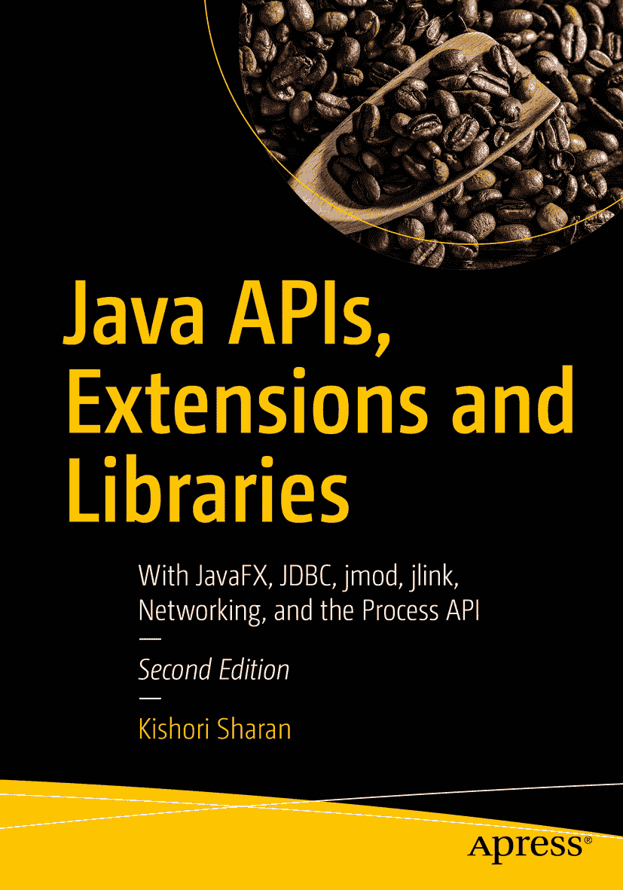

基肖里·沙兰 Java API、扩展与库 结合 JavaFX、JDBC、jmod、jlink、网络与进程 API 第 2 版

本书作者引用的任何源代码或其他补充材料，读者均可通过本书的产品页面在 GitHub 上获取，网址为 [`www.apress.com/9781484235454`](http://www.apress.com/9781484235454)。如需更详细信息，请访问 [`http://www.apress.com/source-code`](http://www.apress.com/source-code)。ISBN 978-1-4842-3545-4 电子书 ISBN 978-1-4842-3546-1 [`doi.org/10.1007/978-1-4842-3546-1`](https://doi.org/10.1007/978-1-4842-3546-1) 美国国会图书馆控制号：2018939410 © 基肖里·沙兰 2018 本作品受版权保护。出版商保留所有权利，无论是涉及全部还是部分材料，特别是翻译权、重印权、插图复用权、朗诵权、广播权、缩微胶片复制权或任何其他物理形式的复制权，以及信息存储与检索、电子改编、计算机软件或目前已知或未来开发的任何类似或不同方法的传输权。本书中可能出现商标名称、标识和图像。我们不以每次出现商标名称、标识或图像时都使用商标符号，而是仅以编辑方式使用这些名称、标识和图像，以维护商标所有者的利益，且无意侵犯商标权。本出版物中对商品名称、商标、服务标志及类似术语的使用，即使未明确标识，也不应被视为对其是否受专有权利保护的立场表达。尽管本书中的建议和信息在出版时被认为是真实准确的，但作者、编辑和出版商均不对可能出现的任何错误或遗漏承担法律责任。出版商对本书所含内容不作任何明示或暗示的保证。本书采用无酸纸印刷，通过 Springer Science+Business Media New York 向全球图书贸易发行，地址：233 Spring Street, 6th Floor, New York, NY 10013。电话：1-800-SPRINGER，传真：(201) 348-4505，电子邮件：orders-ny@springer-sbm.com，或访问 www.springeronline.com。Apress Media, LLC 是一家加利福尼亚有限责任公司，其唯一成员（所有者）是 Springer Science + Business Media Finance Inc (SSBM Finance Inc)。SSBM Finance Inc 是一家特拉华州公司。引言

## 本书的缘起

我第一次接触 Java 编程语言是在 1997 年参加的一次为期一周的 Java 培训课程中。直到 1999 年，我才有机会在项目中使用 Java。我读了两本 Java 书籍，并参加了 Java 2 程序员认证考试。我考得很好，得了 95 分。考试中答错的三道题让我意识到，我读过的那些书并没有充分涵盖所有必要主题的细节。于是我下定决心要写一本关于 Java 编程语言的书。因此，我制定了一个计划，旨在涵盖 Java 开发者在项目中有效使用 Java 编程语言以及获得认证所需的大部分主题。我最初计划用 700 到 800 页的篇幅涵盖 Java 中所有基本主题。

随着写作的深入，我意识到，一本详细涵盖大部分 Java 主题的书不可能在 700 到 800 页内完成。仅涵盖数据类型、运算符和语句的一章就长达 90 页。当时我面临一个问题：“我应该缩短书的内容，还是包含我认为 Java 开发者需要的所有细节？”我选择了在书中包含所有细节，而不是为了控制页数而缩减内容。我从未打算通过这本书赚很多钱。我也从不急于完成这本书，因为仓促可能会损害质量和覆盖面。简而言之，我写这本书是为了帮助 Java 社区理解和有效使用 Java 编程语言，而无需阅读多本同类书籍。我写这本书的计划是，为所有想要学习和掌握 Java 编程语言 intricacies 的人提供一本全面的一站式参考书。

我的一位高中老师曾告诉我们，如果想了解一栋建筑，就必须先了解构成这栋建筑的砖块、钢筋和砂浆。同样的逻辑也适用于我们生活中想要理解的大多数事物。它当然也适用于理解 Java 编程语言。如果你想精通 Java 编程语言，你必须从理解其基本构建块开始。我在整本书中都采用了这种方法，努力通过先描述基础知识来构建每个主题。在这本书中，你很少会发现一个主题在没有先了解其背景的情况下被描述。只要可能，我都试图将编程实践与我们日常生活中的活动联系起来。大多数关于 Java 编程语言的书籍要么根本不包含任何图片，要么只有很少几张。我相信这句格言：“一图胜千言。”对读者来说，一张图片能让一个主题更容易理解和记忆。我在书中加入了大量插图，以帮助读者理解和可视化内容。编程经验很少或没有经验的开发者很难将各个部分组合成一个完整的程序。考虑到这一点，本书包含了超过 200 个完整的 Java 程序，这些程序已准备好编译和运行。

我花了无数个小时为写这本书做研究。我的主要研究来源是 Java 语言规范、关于 Java 主题的白皮书和文章，以及 Java 规范请求（JSR）。我还花了不少时间阅读 Java 源代码，以更深入地了解某些 Java 主题。有时，研究一个主题需要花费几个月的时间，然后我才能写出关于该主题的第一句话。最后，摆弄 Java 程序总是很有趣，有时一玩就是几个小时，只为将它们添加到书中。

## 第二版简介

我很高兴为大家带来《Java API、扩展与库》一书的第二版。这是三卷系列丛书中的第三本。由于无法在一卷中涵盖所有 JDK 9 的变更，我已在三卷（包括本卷）的适当位置加入了 JDK 9 特有的变更。如果你只对学习 JDK 9 特有的主题感兴趣，我建议你阅读我的《Java 9 揭秘》一书（[`www.apress.com/9781484225912`](http://www.apress.com/9781484225912)），该书仅包含 JDK 9 特有的主题。本版有若干变更，具体如下。

我删除了第一版中关于小程序的章节。JDK 9 中的 Applet API 已被弃用，所有现代浏览器要么已经停止，要么即将停止对运行小程序所需的 Java 插件的支持。我认为对于任何新的开发工作，Applet API 已经过时。这就是我在本版中删除它的原因。

我在本版中新增了以下三章：进程 API（第 10 章）、打包模块（第 11 章）和自定义运行时映像（第 11 章）。

我觉得本书缺少一章关于进程 API 的内容。JDK 9 对进程 API 进行了多项增强。我认为增加一章关于进程 API 的内容对本书来说是一个很好的补充。我新增了第 10 章来介绍进程 API，包括 JDK 9 中对进程 API 的增强。

在 JDK 9 之前，Java 应用程序被打包成 JAR 文件。JDK 9 对 JAR 格式进行了多项增强。JDK 9 新增了一种称为多版本 JAR 的 JAR 类型，它可以为一个库的多个 JDK 版本打包代码。你还可以将模块打包成 JMOD 格式，这种格式可以在编译时和链接时使用。第 11 章涵盖了 JAR 格式的增强以及新的 JMOD 格式。本章还介绍了如何使用 `jmod` 工具来处理 JMOD 文件。

JDK 9 在编译时和运行时之间新增了一个阶段，称为链接阶段（或链接时）。你可以使用 JDK 9 中引入的 `jlink` 工具，将应用程序模块和 JDK 模块与其依赖项链接起来，以创建自定义运行时映像。自定义运行时映像将仅包含应用程序所需的那些模块，而不是整个 Java 运行时模块——从而减小了运行时映像的大小。第 12 章介绍了如何使用 `jlink` 工具创建自定义运行时映像。

除了这些变更之外，我还更新了第一版中的所有章节。我编辑了内容使其更流畅，更改或添加了新的示例，并更新了内容以包含 JDK 9 特有的功能。

我衷心希望本书的这一版能帮助你更好地学习 Java。

## 本书结构

这是《Java 入门系列》三卷丛书中的第三本。本书包含 12 章。

这些章节涵盖了 Java 库和扩展，例如 Swing、JavaFX、Nashorn、Java 原生接口、网络编程、JDBC、jmod 和 jlink 工具等。如果你具备中级 Java 经验，可以按任意顺序学习各章——但前三章除外，它们应按顺序阅读。Java 9 的新特性已融入各章中。第 11 章和第 12 章专门介绍 JDK 9 特有的功能。

## 目标读者

本书旨在对任何想学习 Java 编程语言的人都有用。如果你是初学者，几乎没有或完全没有 Java 编程背景，建议你在阅读本书之前，先阅读配套书籍《Java 9 基础入门（第二版）》和《Java 语言特性（第二版）》。本书包含各种复杂程度的主题。作为初学者，如果你在阅读某章某节时感到吃力，可以跳到下一节或下一章，等积累更多经验后再回头阅读。

如果你是一位具有中级或高级经验的 Java 开发者，可以直接跳到某一章或某一节。如果你阅读本书是为了获得 Java 编程语言的认证，你需要阅读几乎所有章节，并注意所有详细的描述和规则。大多数认证考试测试的是你对语言的基础知识，而非高级知识。你只需阅读那些属于认证考试范围的主题。编译并运行超过 200 个完整的 Java 程序将有助于你为认证考试做准备。

如果你是一名正在上 Java 编程语言课程的学生，你应该有选择地阅读本书的章节。你只需阅读课程大纲中涵盖的那些章节。我相信，作为一名 Java 学生，你不需要逐页阅读整本书。

## 如何使用本书

本书是掌握 Java 编程语言知识的起点，而非终点。如果你正在阅读本书，意味着你正朝着学习 Java 编程语言的正确方向前进，这将使你在学术和职业生涯中脱颖而出。然而，总有更高的目标等待你去实现，你必须不断努力才能达成。以下来自一些伟大思想家的名言或许能帮助你理解努力工作和始终保持求知欲的重要性。

> 我们所拥有的学习和知识，最多也不过是我们所无知的事物中的一小部分。——柏拉图
> 真正的知识存在于知道自己一无所知。而知道自己一无所知，这让你成为最聪明的人。——苏格拉底

建议读者在使用本书时，尽可能多地查阅 Java 编程语言的 API 文档。Java API 文档中列出了 Java 类库中所有可用内容的完整列表。你可以从甲骨文公司的官方网站 [`www.oracle.com`](http://www.oracle.com) 下载（或查看）Java API 文档。在阅读本书时，你需要自己动手编写 Java 程序进行练习。你也可以通过修改书中提供的程序来练习。如果你只是阅读本书而不通过编写自己的程序来练习，这对你的学习过程帮助不大。请记住“熟能生巧”，这在学习如何用 Java 编程时也同样适用。

## 源代码与勘误

本书的源代码可以通过点击位于 [`www.apress.com/9781484235454`](http://www.apress.com/9781484235454) 的“下载源代码”按钮进行访问。

## 问题与评论

请将所有问题与评论发送给作者，邮箱为 `ksharan@jdojo.com` 。

致谢

我要感谢我的家人和朋友们的鼓励与支持——我的母亲普拉蒂玛·德维；我的兄长詹基·沙兰和西塔·沙兰博士；我的侄子高拉夫和索拉夫；我的姐姐拉特纳；以及我的朋友卡尔提克亚·文卡特桑、拉胡尔·纳格帕尔、拉维·达特拉、马布布·乔杜里、理查德·卡斯蒂略，以及许多未在此提及的朋友。

我的妻子艾伦始终耐心地陪伴我，在我长时间伏案撰写本书时给予理解。我要感谢她在本书写作过程中给予的全部支持。

特别感谢我的朋友普里蒂·瓦苏德夫，她抽出宝贵时间，为本书中的练习题提供了解决方案。她热爱编程挑战——尤其是谷歌编程大赛。我敢打赌，她一定很享受解答本书每章练习题的过程。

我衷心感谢 Apress 出版社的优秀团队在本书出版过程中提供的支持。感谢编辑运营经理马克·鲍尔斯给予的出色协助。感谢技术审稿人曼努埃尔·乔丹·埃莱拉在审稿过程中提供的技术见解与反馈；他在纠正多处技术错误方面发挥了关键作用。最后但同样重要的是，我衷心感谢 Apress 出版社的主编史蒂夫·安格林，感谢他主动推动本书的出版。

目录 第 1 章：Swing 入门 1 什么是 Swing？ 2 最简单的 Swing 程序 3 JFrame 的组件 7 向 JFrame 添加组件 9 一些实用类 13 Point 类 13 Dimension 类 13 Insets 类 14 Rectangle 类 14 布局管理器 15 FlowLayout 16 BorderLayout 21 CardLayout 24 BoxLayout 26 GridLayout 31 GridBagLayout 33 SpringLayout 51 GroupLayout 59 空布局管理器 68 创建可重用的 JFrame 70 事件处理 72 处理鼠标事件 79 总结 82 第 2 章：Swing 组件 85 什么是 Swing 组件？ 85 JButton 90 JPanel 95 JLabel 96 文本组件 97 JTextComponent 100 JTextField 102 JPasswordField 107 JFormattedTextFi​eld 108 JTextArea 111 JEditorPane 114 JTextPane 119 验证文本输入 127 做出选择 128 JSpinner 137 JScrollBar 139 JScrollPane 140 JProgressBar 142 JSlider 143 JSeparator 145 菜单 145 JToolBar 153 JToolBar 与 Action 接口的结合 156 JTable 157 JTree 163 JTabbedPane 和 JSplitPane 169 自定义对话框 171 标准对话框 174 文件和颜色选择器 181 JFileChooser 181 JColorChooser 185 JWindow 186 使用颜色 186 使用边框 187 使用字体 190 验证组件 192 绘制组件和图形 193 即时绘制 198 双缓冲 198 JFrame 再探 200 总结 202 第 3 章：高级 Swing 205 在 Swing 组件中使用 HTML 206 Swing 中的线程模型 207 可插拔外观 215 拖放 221 多文档界面应用程序 229 Toolkit 类 232 使用 JLayer 装饰组件 234 半透明窗口 241 异形窗口 247 总结 250 第 4 章：网络编程 253 什么是网络编程？ 253 网络协议套件 255 IP 寻址方案 258 IPv4 寻址方案 258 IPv6 寻址方案 261 特殊 IP 地址 262 回环 IP 地址 262 单播 IP 地址 263 组播 IP 地址 264 任播 IP 地址 264 广播 IP 地址 264 未指定 IP 地址 265 端口号 265 Socket API 与客户端-服务器范式 266 Socket 原语 268 Bind 原语 268 Listen 原语 269 Accept 原语 269 Connect 原语 269 Send/​Sendto 原语 270 Receive/​ReceiveFrom 原语 270 Close 原语 270 表示机器地址 270 表示 Socket 地址 273 创建 TCP 服务器 Socket 274 创建 TCP 客户端 Socket 278 整合 TCP 服务器与客户端 280 使用 UDP Socket 281 创建 UDP 回显服务器 284 连接的 UDP Socket 288 UDP 组播 Socket 289 URI、URL 和 URN 292 作为 Java 对象的 URI 和 URL 295 访问 URL 的内容 299 非阻塞 Socket 编程 306 Socket 安全权限 318 异步 Socket 通道 319 设置异步服务器 Socket 通道 320 设置异步客户端 Socket 通道 327 整合服务器与客户端 330 面向数据报的 Socket 通道 332 创建数据报通道 332 设置通道选项 332 发送数据报 334 使用数据报通道进行组播 337 创建数据报通道 337 设置通道选项 337 绑定通道 337 设置组播网络接口 338 加入组播组 339 接收消息 340 关闭通道 340 延伸阅读 343 总结 343 第 5 章：JDBC API 347 什么是 JDBC API？ 348 系统要求 348 JDBC 驱动类型 349 JDBC 原生 API 驱动 349 JDBC-Net 驱动 349 JDBC 驱动 350 Apache Derby 概述 350 下载 Derby 350 安装 Derby 350 Derby 安装文件 350 配置 Derby 351 运行 Derby 服务器 351 创建数据库表 355 Oracle 数据库 356 Adaptive Server Anywhere 数据库 356 SQL Server 数据库 356 DB2 数据库 356 MySQL 数据库 357 Apache Derby 数据库 357 连接数据库 357 获取 JDBC 驱动 357 设置模块路径 358 注册 JDBC 驱动 358 构建连接 URL 360 建立数据库连接 364 设置自动提交模式 369 提交和回滚事务 369 事务隔离级别 370 脏读 370 不可重复读 370 幻读 371 JDBC 类型到 Java 类型的映射 372 了解数据库 375 执行 SQL 语句 377 执行 SQL 语句的结果 378 使用 Statement 接口 379 使用 PreparedStatemen​t 接口 386 CallableStatemen​t 接口 389 处理结果集 402 什么是 ResultSet？ 402 获取 ResultSet 406 获取 ResultSet 中的行数 412 双向可滚动 ResultSet 415 滚动 ResultSet 的行 417 了解 ResultSet 中的游标位置 420 关闭 ResultSet 420 修改 ResultSet 421 使用 ResultSet 插入行 421 使用 ResultSet 更新行 423 使用 ResultSet 删除行 426 处理来自语句的多个结果 426 从存储过程获取结果集 428 MySQL 数据库 429 Adaptive Server Anywhere 数据库 429 Oracle 数据库 429 SQL Server 数据库 430 DB2 数据库 430 Apache Derby 数据库 431 ResultSetMetaDat​a 435 使用 RowSet 437 创建 RowSet 440 使用大对象 (LOB) 462 检索 LOB 数据 464 创建 LOB 数据 465 批量更新 472 事务中的保存点 478 使用 DataSource 481 检索 SQL 警告 483 启用 JDBC 跟踪 484 总结 484 第 6 章：Java 远程方法调用 489 什么是 Java 远程方法调用？ 490 RMI 架构 491 开发 RMI 应用程序 493 编写远程接口 493 实现远程接口 494 编写 RMI 服务器程序 496 编写 RMI 客户端程序 499 分离服务器和客户端代码 500 生成 Stub 和 Skeleton 500 运行 RMI 应用程序 501 运行 RMI 注册表 502 运行 RMI 服务器 503 运行 RMI 客户端程序 503 RMI 应用程序故障排除 504 java.​rmi.​StubNotFoundExce​ption 504 java.​rmi.​server.​ExportException 505 java.​security.​AccessControlExc​eption 505 java.​lang.​ClassNotFoundExc​eption 506 调试 RMI 应用程序 507 动态类下载 508 远程对象的垃圾回收 509 总结 512 第 7 章：Java 原生接口 515 什么是 Java 原生接口？ 515 系统要求 516 JNI 入门 517 编写 Java 程序 517 编译 Java 程序 521 创建 C/​C++ 头文件 521 编写 C/​C++ 程序 523 创建共享库 524 运行 Java 程序 527 原生函数命名规则 528 数据类型映射 531 在 C/​C++ 中使用 JNI 函数 532 使用字符串 533 使用数组 536 在原生代码中访问 Java 对象 540 获取类引用 540 访问 Java 对象/​类的字段和方法 541 创建 Java 对象 547 异常处理 549 在原生代码中处理异常 550 在 Java 代码中处理异常 551 从原生代码抛出新异常 551 创建 JVM 实例 552 原生代码中的同步 557 总结 558 第 8 章：JavaFX 入门 561 什么是 JavaFX？ 561 JavaFX 的历史 563 系统要求 564 JavaFX 模块 564 JavaFX 源代码 565 JavaFX API 文档 565 你的第一个 JavaFX 应用程序 565 创建 HelloJavaFX 类 565 重写 start() 方法 566 显示舞台 567 启动应用程序 568 添加 main() 方法 570 向舞台添加场景 570 改进你的第一个 JavaFX 应用程序 572 JavaFX 应用程序的生命周期 574 终止 JavaFX 应用程序 576 什么是属性和绑定？ 576 JavaFX 中的属性和绑定 577 在 JavaFX Bean 中使用属性 580 处理属性失效事件 584 处理属性更改事件 586 JavaFX 中的属性绑定 589 可观察集合 595 事件处理 598 事件处理机制 599 创建事件过滤器和处理器 602 注册事件过滤器和处理器 603 布局面板 607 控件 614 使用 2D 形状 620 在画布上绘图 624 应用效果 626 应用变换 629 动画 632 使用时间线动画 634 FXML 637 打印 642 总结 647 第 9 章：Java 中的脚本 651 什么是 Java 中的脚本？ 651 执行你的第一个脚本 653 使用其他脚本语言 655 探索 javax.​script 包 658 ScriptEngine 和 ScriptEngineFact​ory 接口 658 AbstractScriptEn​gine 类 658 ScriptEngineMana​ger 类 658 Compilable 接口和 CompiledScript 类 658 Invocable 接口 658 Bindings 接口和 SimpleBindings 类 659 ScriptContext 接口和 SimpleScriptCont​ext 类 659 ScriptException 类 659 发现和实例化脚本引擎 659 执行脚本 660 传递参数 662 从 Java 代码向脚本传递参数 662 从脚本向 Java 代码传递参数 664 高级参数传递技术 665 绑定 665 作用域 666 定义脚本上下文 667 整合 671 使用自定义 ScriptContext 677 eval() 方法的返回值 680 引擎作用域绑定的保留键 681 更改默认 ScriptContext 682 将脚本输出发送到文件 683 在脚本中调用过程 684 在脚本中实现 Java 接口 687 使用编译脚本 691 在脚本语言中使用 Java 693 声明变量 694 导入 Java 类 694 创建和使用 Java 对象 697 使用重载的 Java 方法 698 使用 Java 数组 700 扩展 Java 类和实现接口 703 使用 Lambda 表达式 706 实现脚本引擎 707 Expression 类 708 JKScriptEngine 类 713 JKScriptEngineFa​ctory 类 715 打包 JKScript 文件 716 使用 JKScript 脚本引擎 717 jrunscript 命令行 Shell 719 语法 719 Shell 的执行模式 721 列出可用的脚本引擎 722 向 Shell 添加脚本引擎 722 使用其他脚本引擎 723 向脚本传递参数 723 jjs 命令行工具 724 Nashorn 中的 JavaFX 729 总结 732 第 10 章：进程 API 735 什么是进程 API？ 735 了解运行时环境 737 当前进程 738 查询进程状态 739 比较进程 742 创建进程 743 获取进程句柄 755 终止进程 757 管理进程权限 758 总结 760 第 11 章：打包模块 763 JAR 格式 763 什么是多版本 JAR？ 764 创建多版本 JAR 765 多版本 JAR 的规则 771 多版本 JAR 和 JAR URL 773 多版本清单属性 773 JMOD 格式 774 使用 jmod 工具 774 总结 780 第 12 章：自定义运行时镜像 783 什么是自定义运行时镜像？ 783 不再有 rt.​jar 784 创建自定义运行时镜像 784 绑定服务 788 在 jlink 工具中使用插件 790 jimage 工具 793 总结 795 索引 797 关于作者和技术审阅者 关于作者 关于技术审阅者

