# 1. Swing 简介

在本章中，你将学习：

*   什么是 Swing
*   基于字符的界面与图形用户界面的区别
*   如何开发最简单的 Swing 程序
*   什么是 `JFrame`，以及它如何由不同组件构成
*   如何向 JFrame 添加组件
*   什么是布局管理器，以及 Swing 中不同类型的布局管理器
*   如何创建可复用的框架
*   如何处理事件
*   如何处理鼠标事件，以及如何使用适配器类处理鼠标事件

本章中的所有示例程序都属于 `jdojo.swing.intro` 模块，如代码清单 1-1 所示。

```
// module-info.java
module jdojo.swing.intro {
requires java.desktop;
exports com.jdojo.swing.intro;
}
代码清单 1-1.
jdojo.swing.intro 模块的声明
```

Swing 和 AWT API 定义在 `java.desktop` 模块中。使用 Swing 的模块需要像 `jdojo.swing.intro` 模块那样读取 `java.desktop` 模块。

## 什么是 Swing？

Swing 提供了图形用户界面（GUI）组件，用于开发具有丰富图形集（如窗口、文本字段、按钮、复选框等）的 Java 应用程序。什么是 GUI？在定义 GUI 之前，我先定义一下用户界面（UI）。一个程序做三件事：

*   接收用户的输入
*   处理输入
*   产生输出

用户界面提供了一种在用户与程序之间交换信息的方式，涉及输入和输出。换句话说，用户界面定义了用户与程序之间交互的方式。使用键盘输入文本、用鼠标选择菜单项或点击按钮都可以为程序提供输入。程序的输出可以以基于字符的文本、图表（如条形图）、图片等形式显示在计算机显示器上。

你已经编写过许多 Java 程序。你见过这样的程序：用户必须以控制台输入文本的形式向程序提供输入，然后程序将输出打印到控制台。用户的输入和程序的输出都是文本形式的用户界面称为**基于字符的用户界面**。GUI 允许用户使用称为控件或小部件的图形元素，通过键盘、鼠标和其他设备与程序进行交互。

图 1-1 展示了一个程序，它允许用户输入姓名和出生日期（DOB），并通过键盘保存信息。这是一个基于字符的用户界面的例子。


图 1-1.

一个基于字符的用户界面的程序示例

图 1-2 允许用户执行相同的操作，但使用的是图形用户界面。它在一个窗口中显示了六个图形元素。它使用了两个标签（`Name:` 和 `DOB:`）、两个用户将输入 `Name` 和 `DOB` 值的文本字段，以及两个按钮（Save 和 Close）。与基于字符的用户界面相比，图形用户界面使用户与程序的交互更加容易。你能猜出本章将要开发什么样的应用程序吗？它将全部关于 GUI。GUI 开发很有趣，但比基于字符的程序开发稍微复杂一些。一旦你理解了 GUI 开发中涉及的元素，使用它就会变得很有趣。

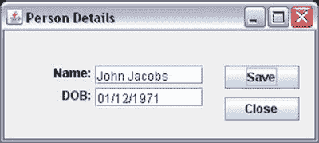

图 1-2.

一个图形用户界面的程序示例

本章试图涵盖使用 Swing 组件和顶层容器进行 GUI 开发的基础知识。对于那些之前可能没有使用过任何编程语言/工具开发 GUI 的程序员，我们已尽力解释与 GUI 相关的细节。如果你已经使用过 GUI 开发语言/工具，那么理解本章涵盖的内容会更容易。Swing 是一个庞大的主题，不可能涵盖其所有细节。它本身就值得用一本书来讲述。事实上，市面上有几本书专门介绍 Swing。

容器是一种可以容纳其他组件的组件。最高层的容器称为**顶层容器**。`JFrame`、`JDialog`、`JWindow` 和 `JApplet` 是顶层容器的例子。`JPanel` 是一个简单容器的例子。`JButton`、`JTextField` 等是组件的例子。在 Swing 应用程序中，每个组件都必须包含在一个容器内。该容器被称为组件的**父容器**，而该组件被称为容器的**子组件**。这种父子关系（或容器-被包含关系）称为**包含层次结构**。要在屏幕上显示一个组件，顶层容器必须位于包含层次结构的根节点。每个 Swing 应用程序必须至少有一个顶层容器。图 1-3 展示了一个 Swing 应用程序的包含层次结构。一个顶层容器包含一个名为“容器 1”的容器，该容器又包含一个名为“组件 1”的组件和一个名为“容器 2”的容器，而“容器 2”又包含两个名为“组件 2”和“组件 3”的组件。

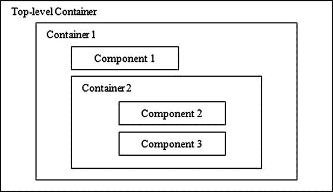

图 1-3.

Swing 应用程序中的包含层次结构


## 最简单的 Swing 程序

让我们从最简单的 Swing 程序开始。你将显示一个 `JFrame`，它是一个不包含任何组件的顶级容器。要创建并显示一个 `JFrame`，你需要执行以下操作：

*   创建一个 `JFrame` 对象。
*   使其可见。

`JFrame` 类的其中一个构造方法接受一个 `String` 参数，该参数是 `JFrame` 的标题。代表 Swing 组件的类位于 `javax.swing` 包中，`JFrame` 类也是如此。以下代码片段创建了一个 `JFrame` 对象，并将其标题设置为 `Simplest Swing`：

```
// 创建一个 JFrame 对象
JFrame frame = new JFrame("Simplest Swing");
```

当你创建一个 `JFrame` 对象时，默认情况下它是不可见的。你需要调用它的 `setVisible` `(boolean visible)` 方法使其可见。如果你向此方法传递 `true`，则 `JFrame` 变为可见；如果传递 `false`，则变为不可见。

```
// 使 JFrame 在屏幕上可见
frame.setVisible(true);
```

这就是开发你的第一个 Swing 应用程序所需做的全部工作！实际上，你可以将创建和显示 `JFrame` 这两个语句合并为一个语句，如下所示：

```
new JFrame("Simplest Swing").setVisible(true);
```

从 `main` 线程创建 `JFrame` 并使其可见并不是启动 Swing 应用程序的正确方式。不过，在你将在此处使用的简单程序中，这不会造成任何损害，因此我将继续使用这种方法，以保持代码简单易学，这样你就可以专注于正在学习的主题。此外，还需要理解 Swing 中的事件处理和线程机制，才能明白为什么需要以另一种方式启动 Swing 应用程序。第 3 章将详细解释如何启动 Swing 应用程序。创建和显示 `JFrame` 的正确方式是将 GUI 创建和使其可见的代码包装在一个 `Runnable` 中，然后将该 `Runnable` 传递给 `javax.swing.SwingUtilities` 或 `java.awt.EventQueue` 类的 `invokeLater()` 方法，如下所示：

```
import javax.swing.JFrame;
import javax.swing.SwingUtilities;
...
SwingUtilities.invokeLater(() -> new JFrame("Test").setVisible(true));
```

清单 1-2 包含了创建和显示 `JFrame` 的完整代码。当你运行此程序时，它会在屏幕的左上角显示一个 `JFrame`，如图 1-4 所示。该图显示了在 Windows 10 上运行程序时的框架。在其他平台上，框架的外观可能略有不同。本章中大多数 GUI 的截图都是在 Windows 10 上截取的。


图 1-4.

最简单的 Swing 框架

```
// SimplestSwing.java
package com.jdojo.swing.intro;
import javax.swing.JFrame;
public class SimplestSwing {
public static void main(String[] args) {
// 创建一个框架
JFrame frame = new JFrame("Simplest Swing");
// 显示框架
frame.setVisible(true);
}
}
清单 1-2.
最简单的 Swing 程序
```

这并不令人印象深刻，对吧？不要灰心。随着你对 Swing 的进一步了解，你将改进这个程序。这只是向你展示 Swing 所提供的冰山一角。

你可以调整图 1-4 中所示的 `JFrame` 的大小，使其变大。将鼠标指针放在显示的 `JFrame` 的四个边缘（左、上、右或下）或四个角中的任何一个上。当鼠标指针放在 `JFrame` 的边缘上时，它会变成调整大小的指针（两端带有箭头的线条）。然后只需拖动调整大小的鼠标指针，即可按你想要的方向调整 `JFrame` 的大小。

图 1-5 显示了调整大小后的 `JFrame`。请注意，你在创建 `JFrame` 时传递给构造方法的文本“Simplest Swing”会显示在 `JFrame` 的标题栏中。


图 1-5.

调整大小后的最简单 Swing 框架

如何退出 Swing 应用程序？当你运行清单 1-2 中列出的程序时，如何退出？当你单击标题栏中的关闭按钮（标题栏最右边带有 X 的按钮）时，`JFrame` 会被关闭。但是，程序不会退出。如果你从命令提示符运行此程序，当你关闭 `JFrame` 时，提示符不会返回。你将不得不强制退出程序，例如，如果你在 Windows 上从命令提示符运行它，可以按 Ctrl+C。那么，如何退出 Swing 应用程序呢？你可以定义 `JFrame` 的四种行为之一，以确定关闭 `JFrame` 时会发生什么。它们在 `javax.swing.WindowConstants` 接口中定义为四个常量。`JFrame` 类实现了 `WindowConstants` 接口。你可以使用 `JFrame.CONSTANT_NAME` 语法（或使用 `WindowConstants.CONSTANT_NAME` 语法）来引用所有这些常量。这四个常量如下：

*   `DO_NOTHING_ON_CLOSE`
*   `HIDE_ON_CLOSE`
*   `DISPOSE_ON_CLOSE`
*   `EXIT_ON_CLOSE`

`DO_NOTHING_ON_CLOSE` 选项在用户关闭 `JFrame` 时不执行任何操作。如果你为 `JFrame` 设置了此选项，则必须提供其他退出应用程序的方式，例如在 `JFrame` 中添加一个“退出”按钮或“退出”菜单选项。

`HIDE_ON_CLOSE` 选项在用户关闭 `JFrame` 时仅将其隐藏。这是默认行为。这就是当你单击标题栏中的关闭按钮以关闭清单 1-2 中列出的程序时发生的情况。`JFrame` 只是变得不可见，而程序仍在运行。

`DISPOSE_ON_CLOSE` 选项在用户关闭 `JFrame` 时将其隐藏并释放。释放 `JFrame` 会释放其使用的所有操作系统级资源。请注意 `HIDE_ON_CLOSE` 和 `DISPOSE_ON_CLOSE` 之间的区别。当你使用 `HIDE_ON_CLOSE` 选项时，`JFrame` 只是被隐藏，但它仍然在使用所有操作系统资源。如果你的 `JFrame` 被频繁地隐藏和显示，你可能希望使用此选项。但是，如果你的 `JFrame` 消耗大量资源，你可能希望使用 `DISPOSE_ON_CLOSE` 选项，这样在 `JFrame` 不显示时，资源可以被释放并重用。

`EXIT_ON_CLOSE` 选项会退出应用程序。设置此选项后，当 `JFrame` 关闭时，其效果就如同调用了 `System.exit()` 一样。应谨慎使用此选项。此选项将退出应用程序。如果屏幕上显示了多个 `JFrame` 或任何其他类型的窗口，为一个 `JFrame` 使用此选项将关闭所有其他窗口。请谨慎使用此选项，因为应用程序退出时可能会丢失任何未保存的数据。

你可以通过将四个常量之一传递给 `JFrame` 的 `setDefaultCloseOperation()` 方法来设置其默认关闭行为，如下所示：

```
// 当 JFrame 关闭时退出应用程序
frame.setDefaultCloseOperation(JFrame.EXIT_ON_CLOSE);
```


你用第一个示例解决了一个问题。另一个问题是，`JFrame` 显示时没有可视区域，只显示了标题栏。你需要在 `JFrame` 可见之前或之后设置其大小和位置。框架的大小由其宽度和高度（以像素为单位）定义，你可以使用 `setSize(int width, int height)` 方法进行设置。位置由 `JFrame` 左上角相对于屏幕左上角的 (x, y) 像素坐标定义。默认情况下，其位置设置为 (0, 0)，这就是 `JFrame` 显示在屏幕左上角的原因。你可以使用 `setLocation(int x, int y)` 方法设置 `JFrame` 的 (x, y) 坐标。如果想一步设置其大小和位置，请改用 `setBounds(int x, int y, int width, int height)` 方法。清单 1-3 在最简单的 Swing 程序中修复了这两个问题。

```
// RevisedSimplestSwing.java
package com.jdojo.swing.intro;
import javax.swing.JFrame;
public class RevisedSimplestSwing {
public static void main(String[] args) {
// 创建一个框架
JFrame frame = new JFrame("Revised Simplest Swing");
// 设置默认关闭行为为退出应用程序
frame.setDefaultCloseOperation(JFrame.EXIT_ON_CLOSE);
// 一次性设置 x、y、宽度和高度属性
frame.setBounds(50, 50, 200, 200);
// 显示框架
frame.setVisible(true);
}
}
清单 1-3.
修订版最简单的 Swing 程序
```

提示

你可以通过调用 `setLocationRelativeTo(Component c)` 方法并传入 `null` 参数，将 `JFrame` 居中定位。

## JFrame 的组件

你在上一节中显示了一个 `JFrame`。它看起来是空的，但实际上并非如此。当你创建一个 `JFrame` 时，会自动为你完成以下操作：

*   一个称为根窗格的容器被添加为 `JFrame` 的唯一子组件。根窗格是一个容器，它是 `JRootPane` 类的对象。你可以通过 `JFrame` 类的 `getRootPane()` 方法获取根窗格的引用。
*   两个称为玻璃窗格和分层窗格的容器被添加到根窗格中。默认情况下，玻璃窗格是隐藏的，并且位于分层窗格之上。顾名思义，玻璃窗格是透明的，即使你让它可见，也能看穿它。你可以使用玻璃窗格来阻止所有鼠标事件到达其下方层中的其他组件。你还可以使用玻璃窗格向用户显示消息，并淡出窗格后面的内容。通常，你不会使用玻璃窗格。分层窗格之所以如此命名，是因为它可以在其不同层中容纳其他容器或组件。可选地，分层窗格可以容纳一个菜单栏。但是，当你创建 `JFrame` 时，默认不会添加菜单栏。你可以分别使用 `JFrame` 类的 `getGlassPane()` 和 `getLayeredPane()` 方法获取玻璃窗格和分层窗格的引用。
*   一个称为内容窗格的容器被添加到分层窗格中。默认情况下，内容窗格是空的。这是你应该添加所有 Swing 组件（如按钮、文本字段、标签等）的容器。大多数时候，你将使用 `JFrame` 的内容窗格。你可以通过 `JFrame` 类的 `getContentPane()` 方法获取内容窗格的引用。

图 1-6 展示了 `JFrame` 的组装结构。根窗格、分层窗格和玻璃窗格覆盖了 `JFrame` 的整个可视区域。`JFrame` 的可视区域是其大小减去四个方向的内边距。容器的内边距包括容器四周边框所占用的空间：上、左、下、右。对于 `JFrame`，上内边距表示标题栏的高度。为了更好地可视化，图 1-6 将分层窗格描绘得比根窗格小。

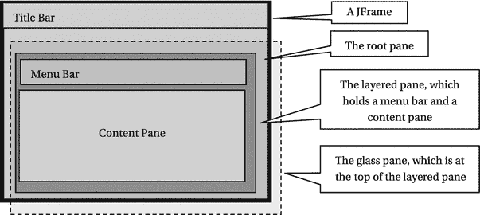

图 1-6.

JFrame 的构成

你感到困惑了吗？如果你对 `JFrame` 的所有窗格感到困惑，这里有一个更简单的解释。把 `JFrame` 想象成一个相框。相框有一个玻璃罩，`JFrame` 也有，形式就是玻璃窗格。在玻璃罩后面，你放置你的照片。那就是你的分层窗格。你可以在一个相框内放置多张照片。每张照片构成玻璃罩后面的一层。只要一张照片没有被另一张完全覆盖，你就可以看到它的全部或部分。所有不同层的照片一起构成了你相框的分层窗格。离玻璃罩最远的照片层就是你的内容窗格。通常你的相框里只放一张照片。分层窗格也是如此；默认情况下，它包含一个内容窗格。相框中的照片是感兴趣的内容，画作就放在那里。内容窗格也是如此；所有组件都放在内容窗格中。

`JFrame` 的包含层次结构如下所示。`JFrame` 位于层次结构的顶部，而菜单栏（默认不添加；此处为完整性而显示）和内容窗格位于包含层次结构的底部。

```
JFrame
根窗格
玻璃窗格
分层窗格
菜单栏
内容窗格
```

如果你仍然无法理解 `JFrame` 的所有“窗格”（读作 panes），可以稍后再回顾本节。现在，你只需要理解 `JFrame` 的一个窗格，那就是内容窗格，它容纳了 `JFrame` 的 Swing 组件。你应该将所有想要添加到 `JFrame` 的组件都添加到其内容窗格中。你可以按如下方式获取内容窗格的引用：

```
// 创建一个 JFrame
JFrame frame = new JFrame("Test");
// 获取内容窗格的引用
Container contentPane = frame.getContentPane();
```


## 向 JFrame 添加组件

本节将解释如何向 `JFrame` 的内容面板添加组件。使用容器的 `add()` 方法（注意内容面板本身也是一个容器）即可将组件添加到容器中。

```
// 将 aComponent 添加到 aContainer
aContainer.add(aComponent);
```

`add()` 方法已被重载。除了被添加的组件外，该方法的参数还取决于其他因素，例如你希望组件在容器中如何布局。下一节将讨论 `add()` 方法的所有版本。

我在此将讨论范围限定为向 `JFrame` 添加一个按钮（Swing 组件）。`JButton` 类的对象代表一个按钮。如果你使用过 Windows，一定用过消息框上的“确定”按钮以及互联网浏览器窗口上的“后退”和“前进”按钮。通常，`JButton` 包含文本，该文本也称为其标签或文本。创建 `JButton` 的方法如下：

```
// 创建一个带有“Close”文本的 JButton
JButton closeButton = new JButton("Close");
```

要将 `closeButton` 添加到 `JFrame` 的内容面板，你需要获取 `JFrame` 内容面板的引用，并调用其 `add()` 方法：

```
// 获取 JFrame 内容面板的引用 Container contentPane = frame.getContentPane();
// 调用内容面板的 add() 方法 contentPane.add(closeButton);
```

这就是向内容面板添加组件所需的全部操作。如果你想用一行代码添加 `JButton`，可以将所有三个语句合并为一个，如下所示：

```
frame.getContentPane().add(new JButton("Close"));
```

向 `JFrame` 添加组件的代码如清单 1-4 所示。运行程序时，你会得到一个 `JFrame`，如图 1-7 所示。点击“Close”按钮时不会发生任何操作，因为你尚未为其添加任何动作。

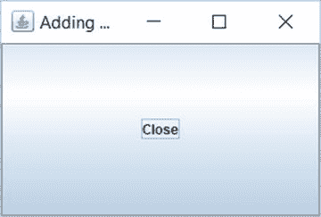

图 1-7.

一个带有文本为“Close”的 JButton 的 JFrame

```
// AddingComponentToJFrame.java
package com.jdojo.swing.intro;
import javax.swing.JFrame;
import javax.swing.JButton;
import java.awt.Container;
public class AddingComponentToJFrame {
public static void main(String[] args) {
JFrame frame = new JFrame("Adding Components to JFrame");
frame.setDefaultCloseOperation(JFrame.EXIT_ON_CLOSE);
Container contentPane = frame.getContentPane();
// 添加一个 Close 按钮
JButton closeButton = new JButton("Close");
contentPane.add(closeButton);
// 设置框架大小为 300 x 200
frame.setBounds(50, 50, 300, 200);
frame.setVisible(true);
}
}
清单 1-4.
向 JFrame 添加组件
```

这段代码完成了将带有 `Close` 文本的 `JButton` 添加到 `JFrame` 的任务。然而，`JButton` 看起来非常大，并且填满了 `JFrame` 的整个可视区域。请注意，你已使用 `setBounds()` 方法将 `JFrame` 的大小设置为宽 300 像素、高 200 像素。既然 `JButton` 填满了整个 `JFrame`，你能把 `JFrame` 的尺寸设小一点吗？或者，你能为 `JButton` 本身设置大小吗？这两种建议在这种情况下都行不通。如果你想缩小 `JFrame`，你需要猜测需要缩小多少。如果你想为 `JButton` 设置大小，那将会彻底失败；`JButton` 始终会填满 `JFrame` 的整个可视区域。这是怎么回事？要完全理解发生了什么，你需要阅读下一节关于布局管理器的内容。

Swing 为解决 `JFrame` 和 `JButton` 尺寸计算问题提供了一种神奇而快速的解决方案。`JFrame` 类的 `pack()` 方法就是那个神奇的解决方案。该方法会遍历你添加到 `JFrame` 的所有组件，确定它们的首选大小，并将 `JFrame` 的大小设置为刚好能显示所有组件。当你调用此方法时，无需再设置 `JFrame` 的大小。`pack()` 方法会为你计算并设置 `JFrame` 的大小。要解决尺寸问题，请移除对 `setBounds()` 方法的调用，改为调用 `pack()` 方法。请注意，`setBounds()` 方法之前也在设置 `JFrame` 的 (x, y) 坐标。如果你仍想将 `JFrame` 的 (x, y) 坐标设置为 (50, 50)，可以使用其 `setLocation(50, 50)` 方法。清单 1-5 包含了修改后的代码，图 1-8 显示了生成的 `JFrame`。

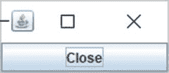

图 1-8.

经过打包的带有 JButton 的 JFrame

```
// PackedJFrame.java
package com.jdojo.swing.intro;
import javax.swing.JFrame;
import java.awt.Container;
import javax.swing.JButton;
public class PackedJFrame {
public static void main(String[] args) {
JFrame frame = new JFrame("Adding Components to JFrame");
frame.setDefaultCloseOperation(JFrame.EXIT_ON_CLOSE);
// 添加一个关闭按钮
JButton closeButton = new JButton("Close");
Container contentPane = frame.getContentPane();
contentPane.add(closeButton);
// 计算并设置框架的合适大小
frame.pack();
frame.setVisible(true);
}
}
清单 1-5.
打包 JFrame 的所有组件

到目前为止，你已经成功地向 `JFrame` 添加了一个 `JButton`。现在让我们向同一个 `JFrame` 添加另一个 `JButton`。将新按钮命名为 `helpButton`。代码将与清单 1-5 类似，只是这次你将添加两个 `JButton` 实例。清单 1-6 包含了完整的程序。图 1-9 显示了运行程序时的结果。


图 1-9.

一个带有两个按钮（Close 和 Help）的 JFrame。只有 Help 按钮可见。

```
// JFrameWithTwoJButtons.java
package com.jdojo.swing.intro;
import javax.swing.JFrame;
import java.awt.Container;
import javax.swing.JButton;
public class JFrameWithTwoJButtons {
public static void main(String[] args) {
JFrame frame = new JFrame("Adding Components to JFrame");
frame.setDefaultCloseOperation(JFrame.EXIT_ON_CLOSE);
// 添加两个按钮 - Close 和 Help
JButton closeButton = new JButton("Close");
JButton helpButton = new JButton("Help");
Container contentPane = frame.getContentPane();
contentPane.add(closeButton);
contentPane.add(helpButton);
frame.pack();
frame.setVisible(true);
}
}
清单 1-6.
向 JFrame 添加两个按钮
```

当你添加了 Help 按钮后，Close 按钮不见了。这是否意味着你只能向 `JFrame` 添加一个按钮？答案是否定的。你可以向 `JFrame` 添加任意数量的按钮。那么，你的 Close 按钮去哪了？在我回答这个问题之前，你需要了解内容面板的布局机制。

内容面板是一个容器。你可以向其中添加组件。然而，它会将内部所有组件的布局任务交给一个称为布局管理器的对象。布局管理器就是一个 Java 对象，其唯一职责是确定容器内组件的位置和大小。清单 1-6 中的示例是经过精心挑选的，旨在向你介绍布局管理器的概念。存在多种类型的布局管理器。它们在容器内定位和调整组件大小的方式上有所不同。


默认情况下，`JFrame` 的内容面板使用名为 `BorderLayout` 的布局管理器。在前一个示例中，由于 `BorderLayout` 布局组件的方式，只显示了“帮助”按钮。实际上，当你添加两个按钮时，内容面板接收了这两个按钮。为了确认这两个按钮仍在内容面板中，请在清单 1-6 的 `main()` 方法末尾添加以下代码片段，该代码会显示内容面板中的组件数量。它将在标准输出上打印一条消息：`"Content Pane has 2 components."`。每个容器都有一个 `getComponents()` 方法，该方法返回添加到其中的组件数组。

```
// 获取添加到内容面板的组件
Component[] comps = contentPane.getComponents();
// 显示内容面板有多少个组件
System.out.println("Content Pane has " + comps.length + " components.");
```

有了这些背景知识，是时候学习各种布局管理器了。当我在后面的章节讨论 `BorderLayout` 管理器时，你将解开“关闭”按钮消失之谜。但在讨论各种布局管理器之前，我将向你介绍一些在使用 Swing 应用程序时经常用到的实用类。

提示

一个组件一次只能添加到一个容器中。如果你将同一个组件添加到另一个容器，该组件会从第一个容器中移除，然后添加到第二个容器中。

## 一些实用类

在开始开发一些复杂的 Swing GUI 之前，有必要提一下一些常用的实用类。它们都是简单的类。大多数类都有一些可以在其构造函数中指定的属性，并且这些属性都有 getter 和 setter 方法。这些类位于 `java.awt` 包中。

### Point 类

顾名思义，`Point` 类的对象表示二维空间中的一个位置。二维空间中的位置由两个值表示：x 坐标和 y 坐标。以下代码片段演示了它的用法：

```
// 创建一个 Point 类的对象，其 (x, y) 坐标为 (20, 40)
Point p = new Point(20, 40);
// 获取 p 的 x 和 y 坐标
int x = p.getX();
int y = p.getY();
// 将 p 的 x 和 y 坐标设置为 (10, 60)
p.setLocation(10, 60);
```

在 Swing 中，`Point` 类的主要用途是设置和获取组件的位置（x 和 y 坐标）。例如，你可以设置 `JButton` 的位置。

```
JButton closeButton = new JButton("关闭");
// 以下两条语句效果相同。
// 你将使用其中一条语句，而不是同时使用两条。
closeButton.setLocation(10, 15);
closeButton.setLocation(new Point(10, 15));
// 获取 closeButton 的位置
Point p = closeButton.getLocation();
```

### Dimension 类

`Dimension` 类的对象封装了组件的 `width` 和 `height`。组件的 `width` 和 `height` 统称为其大小。换句话说，`Dimension` 类的对象用于表示组件的大小。

```
// 创建一个 Dimension 类的对象，宽度为 200，高度为 20
Dimension d  = new Dimension(200, 20);
// 将 closeButton 的大小设置为 200 X 20。两条语句效果相同。
// 你将使用以下两条语句中的一条。
closeButton.setSize(200, 20);
closeButton.setsize(d);
// 获取 closeButton 的大小
Dimension d2 = closeButton.getSize();
int width = d2.width;
int height = d2.height;
```

### Insets 类

`Insets` 类的对象表示容器周围留出的空间。它封装了四个属性，分别名为 `top`、`left`、`bottom` 和 `right`。它们的值表示容器四个边上留出的空间。

```
// 使用构造函数 Insets(top, left, bottom, right) 创建一个 Insets 类的对象
Insets ins = new Insets(20, 5, 5, 5);
// 获取 JFrame 的 insets
Insets ins = frame.getInsets();
int top = ins.top;
int left = ins.left;
int bottom = ins.bottom;
int right = ins.right;
```

### Rectangle 类

顾名思义，`Rectangle` 类的实例表示一个矩形。你可以通过多种方式定义一个矩形。一个 `Rectangle` 由三个属性定义：

*   左上角的 (x, y) 坐标
*   宽度
*   高度

你可以将 `Rectangle` 对象视为 `Point` 对象和 `Dimension` 对象的组合；`Point` 对象保存左上角的 (x, y) 坐标，`Dimension` 对象保存宽度和高度。你可以通过指定其属性的不同组合来创建 `Rectangle` 类的对象。

```
// 创建一个 Rectangle 对象，其左上角位于 (0, 0)，宽度和高度为零
Rectangle r1 = new Rectangle();
// 从一个 Point 对象创建一个 Rectangle 对象，宽度和高度为零
Rectangle r2 = new Rectangle(new Point(10, 10));
// 从一个 Point 对象和一个 Dimension 对象创建一个 Rectangle 对象
Rectangle r3 = new Rectangle(new Point(10, 10), new Dimension(200, 100));
// 创建一个 Rectangle 对象，指定其左上角坐标为 (10, 10)，宽度为 200，高度为 100
Rectangle r4 = new Rectangle(10, 10, 200, 100);
```

`Rectangle` 类定义了许多方法来操作 `Rectangle` 对象并查询其属性，例如其左上角的 (x, y) 坐标、宽度和高度。

`Rectangle` 类的对象定义了 Swing 组件的位置和大小。组件的位置和大小称为组件的边界。可以使用 `setBounds()` 和 `getBounds()` 这两个方法来设置和获取任何组件或容器的边界。`setBounds()` 方法已被重载，你可以指定组件的 x、y、width 和 height 属性，或者一个 `Rectangle` 对象。`getBounds()` 方法返回一个 `Rectangle` 对象。在清单 1-3 中，你使用了 `setBounds()` 方法来设置框架的 x、y、width 和 height。请注意，组件的“边界”是其位置和大小的组合。`setLocation()` 和 `setSize()` 方法的组合可以达到与 `setBounds()` 方法相同的效果。类似地，你可以使用 `getLocation()`（或 `getX()` 和 `getY()`）与 `getSize()`（或 `getWidth()` 和 `getHeight()`）的组合，而不是使用 `getBounds()` 方法。


## 布局管理器

容器使用布局管理器来计算其所有组件的位置和大小。换句话说，布局管理器的工作是计算容器中所有组件的四个属性（x、y、宽度和高度）。x 和 y 属性决定了组件在容器内的位置。宽度和高度属性决定了组件的大小。你可能会问：“为什么需要一个布局管理器来完成计算组件四个属性这么简单的任务？难道不能直接在程序中指定这四个属性，让容器用它们来显示组件吗？”答案是肯定的。你可以在程序中指定这些属性。但如果这样做，当容器调整大小时，你的组件将不会重新定位和调整大小。此外，你必须为应用程序运行的所有平台指定组件的大小，因为不同平台渲染组件的方式略有不同。假设你的应用程序以多种语言显示文本。一个 `JButton`（例如“关闭”按钮）的最佳大小在不同语言中会有所不同，你必须根据应用程序使用的语言，计算每种语言中“关闭”按钮的大小并进行设置。然而，如果你使用布局管理器，则无需考虑所有这些因素。布局管理器会为你完成这些简单但耗时的工作。

使用布局管理器是可选的。如果你不使用布局管理器，则需要自行计算并设置容器中所有组件的位置和大小。

从技术上讲，布局管理器是实现了 `LayoutManager` 接口的 Java 类的一个对象。还有另一个名为 `LayoutManager2` 的接口，它继承自 `LayoutManager` 接口。部分布局管理器类实现了 `LayoutManager2` 接口。这两个接口都在 `java.awt` 包中。

布局管理器有很多种。有些布局管理器简单且易于手动编码。有些则非常复杂，难以手动编码，它们旨在供 NetBeans 等 GUI 构建工具使用。如果没有可用的布局管理器能满足你的需求，你可以创建自己的布局管理器。互联网上可以免费获取一些有用的布局管理器。有时你需要嵌套使用它们才能达到理想效果。本节将讨论以下布局管理器：

*   `FlowLayout`
*   `BorderLayout`
*   `CardLayout`
*   `BoxLayout`
*   `GridLayout`
*   `GridBagLayout`
*   `GroupLayout`
*   `SpringLayout`

每个容器都有一个默认的布局管理器。`JFrame` 内容面板的默认布局管理器是 `BorderLayout`，而 `JPanel` 的默认布局管理器是 `FlowLayout`。布局管理器在创建容器时设置。你可以通过容器的 `setLayout()` 方法来更改其默认布局管理器。如果你不希望容器使用布局管理器，可以将 `null` 传递给 `setLayout()` 方法。容器的 `getLayout()` 方法会返回该容器当前使用的布局管理器的引用。

```
// 将 FlowLayout 设置为 JFrame 内容面板的布局管理器
JFrame frame = new JFrame("测试窗口");
Container contentPane = frame.getContentPane();
contentPane.setLayout(new FlowLayout());
// 将 BorderLayout 设置为 JPanel 的布局管理器
JPanel panel = new JPanel();
panel.setLayout(new BorderLayout());
// 获取容器的布局管理器
LayoutManager layoutManager = container.getLayout()
```

从 Java 5 开始，对 `JFrame` 调用 `add()` 和 `setLayout()` 方法会被转发到其内容面板。在 Java 5 之前，对 `JFrame` 调用这些方法会抛出运行时异常。也就是说，从 Java 5 开始，`frame.setLayout()` 和 `frame.add()` 这两个调用与调用 `frame.getContentPane().setLayout()` 和 `frame.getContentPane().add()` 效果相同。非常重要的一点是，`JFrame` 的 `getLayout()` 方法返回的是 `JFrame` 本身的布局管理器，而不是其内容面板的。为了避免这种从 `JFrame` 到其内容面板的调用转发不对称问题（部分调用被转发，部分没有），最好直接调用内容面板的方法，而不是在 `JFrame` 上调用它们。


### FlowLayout

`FlowLayout` 是最简单的布局管理器。它先水平排列组件，再垂直排列。组件按照添加到容器的顺序进行布局。在水平排列组件时，可以是从左到右，也可以是从右到左。水平布局方向取决于容器的朝向，你可以通过调用容器的 `setComponentOrientation()` 方法来设置。如果你想设置容器及其所有子组件的朝向，可以使用 `applyComponentOrientation()` 方法。以下是一段设置容器朝向的代码示例：

```
// 方法 – 1
// 将框架内容面板的朝向设置为“从右到左”
JFrame frame = new JFrame("Test");
Container pane = frame.getContentPane();
pane.setComponentOrientation(ComponentOrientation.RIGHT_TO_LEFT);
// 方法 – 2
// 将内容面板及其所有子组件的朝向设置为“从右到左”
JFrame frame = new JFrame("Test");
Container pane = frame.getContentPane();
pane.applyComponentOrientation(ComponentOrientation.RIGHT_TO_LEFT);
```

如果你的应用程序支持多语言，并且组件朝向将在运行时决定，你可能希望以更通用的方式设置组件的区域设置和朝向，而不是硬编码。你可以像这样全局设置应用程序中所有 Swing 组件的默认区域设置：

```
// "ar" 用于阿拉伯语区域设置
JComponent.setDefaultLocale(new Locale("ar"));
```

当你创建 `JFrame` 时，可以根据默认区域设置获取组件的朝向，并将其设置到框架及其子组件上。这样，你就不必为应用程序中的每个容器设置朝向。

```
// 获取默认区域设置
Locale defaultLocale = JComponent.getDefaultLocale();
// 获取默认区域设置对应的组件朝向
ComponentOrientation componentOrientation = ComponentOrientation.getOrientation(defaultLocale);
// 将组件的默认朝向应用于整个框架
frame.applyComponentOrientation(componentOrientation);
```

`FlowLayout` 会尝试将所有组件放入一行，并赋予它们首选大小。如果所有组件无法放入一行，则会另起一行。每个布局管理器都必须计算其布局所有组件所需空间的高度和宽度。`FlowLayout` 请求的宽度是所有组件首选宽度的总和。它请求的高度是容器中最高的组件的高度。它会在宽度和高度上增加额外的空间，以容纳组件之间的水平和垂直间距。清单 1-7 演示了如何为 `JFrame` 的内容面板使用 `FlowLayout`。它向内容面板添加了三个按钮。图 1-10 显示了使用 `FlowLayout` 的三个按钮的屏幕。当你水平展开框架时，按钮会显示出来，如图 1-11 所示。


图 1-11.

使用 FlowLayout 的 JFrame 水平展开后

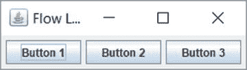

图 1-10.

使用 FlowLayout 管理器的 JFrame 中的三个按钮

```
// FlowLayoutTest.java
package com.jdojo.swing.intro;
import java.awt.Container;
import java.awt.FlowLayout;
import javax.swing.JButton;
import javax.swing.JFrame;
public class FlowLayoutTest {
public static void main(String[] args) {
JFrame frame = new JFrame("Flow Layout Test");
frame.setDefaultCloseOperation(JFrame.EXIT_ON_CLOSE);
Container contentPane = frame.getContentPane();
contentPane.setLayout(new FlowLayout());
for (int i = 1; i <= 3; i++) {
contentPane.add(new JButton("Button " + i));
}
frame.pack();
frame.setVisible(true);
}
}
清单 1-7.
使用 FlowLayout 管理器
```

默认情况下，`FlowLayout` 将所有组件在容器中居中对齐。你可以通过使用其 `setAlignment()` 方法或在构造函数中传递对齐参数来更改对齐方式，如下所示：

```
// 在创建布局管理器对象时设置对齐方式
FlowLayout flowLayout = new FlowLayout(FlowLayout.RIGHT);
// 在创建流式布局管理器后设置对齐方式
flowLayout.setAlignment(FlowLayout.RIGHT);
```

`FlowLayout` 类中定义了以下五个常量来表示五种不同的对齐方式：`LEFT`、`RIGHT`、`CENTER`、`LEADING` 和 `TRAILING`。前三个常量的定义显而易见。`LEADING` 对齐可能表示左对齐或右对齐；这取决于组件的朝向。如果组件的朝向是 `RIGHT_TO_LEFT`，则 `LEADING` 对齐表示 `RIGHT`。如果组件的朝向是 `LEFT_TO_RIGHT`，则 `LEADING` 对齐表示 `LEFT`。类似地，`TRAILING` 对齐可能表示左对齐或右对齐。如果组件的朝向是 `RIGHT_TO_LEFT`，则 `TRAILING` 对齐表示 `LEFT`。如果组件的朝向是 `LEFT_TO_RIGHT`，则 `TRAILING` 对齐表示 `RIGHT`。始终建议使用 `LEADING` 和 `TRAILING` 而不是 `RIGHT` 和 `LEFT`，这样你就不必担心组件的朝向问题。

你可以在 `FlowLayout` 类的构造函数中设置两个组件之间的间距，或者使用其 `setHgap()` 和 `setVgap()` 方法。清单 1-8 包含了向 `JFrame` 添加三个按钮的完整代码。内容面板使用具有 `LEADING` 对齐方式的 `FlowLayout`，并且 `JFrame` 的朝向设置为 `RIGHT_TO_LEFT`。当你运行程序时，`JFrame` 将如图 1-12 所示。

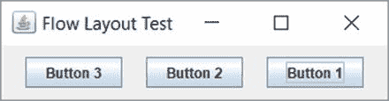

图 1-12.

具有三个按钮和自定义 FlowLayout 的 JFrame

```
// FlowLayoutTest2.java
package com.jdojo.swing.intro;
import java.awt.ComponentOrientation;
import java.awt.Container;
import java.awt.FlowLayout;
import javax.swing.JButton;
import javax.swing.JFrame;
public class FlowLayoutTest2 {
public static void main(String[] args) {
int horizontalGap = 20;
int verticalGap = 10;
JFrame frame = new JFrame("Flow Layout Test");
frame.setDefaultCloseOperation(JFrame.EXIT_ON_CLOSE);
Container contentPane = frame.getContentPane();
FlowLayout flowLayout
= new FlowLayout(FlowLayout.LEADING, horizontalGap, verticalGap);
contentPane.setLayout(flowLayout);
frame.applyComponentOrientation(ComponentOrientation.RIGHT_TO_LEFT);
for (int i = 1; i <= 3; i++) {
contentPane.add(new JButton("Button " + i));
}
frame.pack();
frame.setVisible(true);
}
}
清单 1-8.
自定义 FlowLayout
```

你必须记住，`FlowLayout` 会尝试将所有组件仅布局在一行中。因此，它不会请求能容纳所有组件的高度。相反，它请求的是容器中最高的组件的高度。为了演示这个细微之处，尝试向 `JFrame` 添加 30 个按钮，使它们无法全部放入一行。以下代码片段演示了这一点：

```
JFrame frame = new JFrame("FlowLayout");
frame.setDefaultCloseOperation(JFrame.EXIT_ON_CLOSE);
frame.getContentPane().setLayout(new FlowLayout());
for (int i = 1; i <= 30; i++) {
frame.getContentPane().add(new JButton("Button " + i));
}
frame.pack();
frame.setVisible(true);
```

`JFrame` 如图 1-13 所示。请注意，并非所有 30 个按钮都显示出来。如果你调整 `JFrame` 的大小使其高度变大，你将能够看到所有按钮，如图 1-14 所示。`FlowLayout` 会隐藏无法在一行中显示的组件。

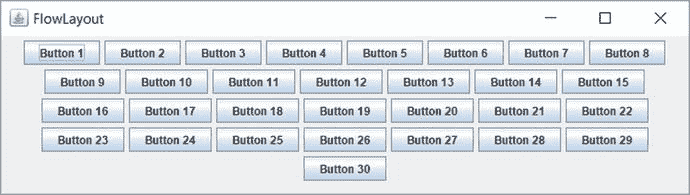

图 1-14.

调整大小后具有 30 个按钮的 JFrame


图 1-13.

一个包含 30 个按钮的 JFrame。并非所有按钮都显示出来。

`FlowLayout`的一个非常重要的特性是它试图将所有组件排列在一行中。它只要求高度足以显示最高的组件。如果你将一个使用`FlowLayout`管理器的容器嵌套在另一个也使用`FlowLayout`管理器的容器中，你将永远无法在嵌套容器中看到超过一行的内容。为了演示这一点，向一个`JPanel`中添加 30 个`JButton`实例。`JPanel`是一个空的容器，其默认布局管理器为`FlowLayout`。将`JFrame`内容面板的布局管理器设置为`FlowLayout`，并将该`JPanel`添加到`JFrame`的内容面板中。这样，你就有了一个使用`FlowLayout`的容器`JPanel`，它嵌套在另一个也使用`FlowLayout`的容器（内容面板）中。清单 1-9 包含了演示此功能的完整程序。运行该程序时，生成的`JFrame`如图 1-15 所示。即使你调整`JFrame`使其高度变大，你也始终只能看到一行按钮。


图 1-15.

嵌套的 FlowLayout 始终只显示一行

```
// FlowLayoutNesting.java
package com.jdojo.swing.intro;
import java.awt.FlowLayout;
import javax.swing.JButton;
import javax.swing.JFrame;
import javax.swing.JPanel;
public class FlowLayoutNesting {
public static void main(String[] args) {
JFrame frame = new JFrame("FlowLayout Nesting");
frame.setDefaultCloseOperation(JFrame.EXIT_ON_CLOSE);
// 将内容面板的布局设置为 FlowLayout
frame.getContentPane().setLayout(new FlowLayout());
// JPanel 是一个空的容器，其布局管理器为 FlowLayout
JPanel panel = new JPanel();
// 向 JPanel 添加 30 个 JButton
for (int i = 1; i <= 30; i++) {
panel.add(new JButton("Button " + i));
}
// 将 JPanel 添加到内容面板
frame.getContentPane().add(panel);
frame.pack();
frame.setVisible(true);
}
}
清单 1-9.
嵌套 FlowLayout 管理器
```

我想以一条说明来结束关于`FlowLayout`的讨论：由于本节讨论的局限性，它在实际应用程序中的用途非常有限。它通常用于原型设计。

### BorderLayout

`BorderLayout`将容器的空间划分为五个区域：北区、南区、东区、西区和中心区。当你向使用`BorderLayout`的容器添加组件时，需要指定要将组件添加到五个区域中的哪一个。`BorderLayout`类定义了五个常量来标识这五个区域。这些常量是`NORTH`、`SOUTH`、`EAST`、`WEST`和`CENTER`。例如，要向北部区域添加一个按钮，你可以这样写：

```
// 向容器的北部区域添加一个按钮
JButton northButton = new JButton("North");
container.add(northButton, BorderLayout.NORTH);
```

`JFrame`内容面板的默认布局是`BorderLayout`。清单 1-10 包含了向`JFrame`内容面板添加五个按钮的完整程序。生成的`JFrame`如图 1-16 所示。

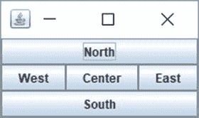

图 1-16.

BorderLayout 的五个区域

```
// BorderLayoutTest.java
package com.jdojo.swing.intro;
import java.awt.BorderLayout;
import javax.swing.JFrame;
import java.awt.Container;
import javax.swing.JButton;
public class BorderLayoutTest {
public static void main(String[] args) {
JFrame frame = new JFrame("BorderLayout Test");
frame.setDefaultCloseOperation(JFrame.EXIT_ON_CLOSE);
Container container = frame.getContentPane();
// 向 BorderLayout 的五个区域各添加一个按钮
container.add(new JButton("North"), BorderLayout.NORTH);
container.add(new JButton("South"), BorderLayout.SOUTH);
container.add(new JButton("East"), BorderLayout.EAST);
container.add(new JButton("West"), BorderLayout.WEST);
container.add(new JButton("Center"), BorderLayout.CENTER);
frame.pack();
frame.setVisible(true);
}
}
清单 1-10.
向 BorderLayout 添加组件
```

你最多只能向`BorderLayout`的一个区域添加一个组件。你可以让某些区域保持为空。如果你想向`BorderLayout`的某个区域添加多个组件，可以先将这些组件添加到一个容器中，然后将该容器添加到目标区域。

`BorderLayout`中的五个区域（北区、南区、东区、西区和中心区）方向固定，不依赖于组件的方向。还有四个常量用于指定`BorderLayout`中的区域。这些常量是`PAGE_START`、`PAGE_END`、`LINE_START`和`LINE_END`。`PAGE_START`和`PAGE_END`常量分别与`NORTH`和`SOUTH`常量相同。`LINE_START`和`LINE_END`常量的位置会根据容器的方向而变化。如果容器的方向是从左到右，则`LINE_START`等同于`WEST`，`LINE_END`等同于`EAST`。如果容器的方向是从右到左，则`LINE_START`等同于`EAST`，`LINE_END`等同于`WEST`。图 1-17 和图 1-18 展示了在不同组件方向下，`BorderLayout`各区域定位的差异。

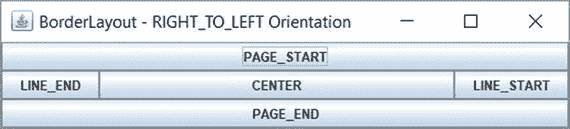

图 1-18.

当容器方向为从右到左时，BorderLayout 的区域

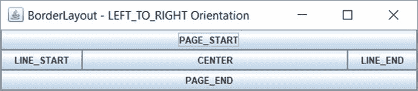

图 1-17.

当容器方向为从左到右时，BorderLayout 的区域

如果你没有为组件指定区域，它将被添加到中心区域。以下两条语句具有相同的效果：

```
// 假设容器使用 BorderLayout。
// 向容器添加按钮，不指定区域
container.add(new JButton("Close"));
// 上述语句与以下语句效果相同
container.add(new JButton("Close"), BorderLayout.CENTER);
```


我已经说明过，一个 `BorderLayout` 最多只能添加五个组件，每个区域一个。那么，如果在 `BorderLayout` 的同一个区域添加了多个组件会发生什么？也就是说，如果你编写以下代码，会发生什么？

```
// 假设 container 使用的是 BorderLayout
container.add(new JButton("关闭"), BorderLayout.NORTH);
container.add(new JButton("帮助"), BorderLayout.NORTH);
```

你会发现，`BorderLayout` 的北部区域只显示了一个按钮：最后添加的那个按钮。也就是说，北部区域只会显示“帮助”按钮。清单 1-6 中就是这种情况。你向 `JFrame` 的内容面板添加了两个按钮，分别名为“关闭”和“帮助”。由于你没有指定要将它们添加到 `BorderLayout` 的哪个区域，因此两个按钮都被添加到了中央区域。由于 `BorderLayout` 的每个区域只能有一个组件，因此“帮助”按钮替换了“关闭”按钮。这就是为什么你在运行清单 1-6 中的程序时看不到“关闭”按钮的原因。要解决这个问题，在将两个按钮添加到容器时，请为它们指定区域。

提示

如果你在由 `BorderLayout` 管理的容器中缺少某些组件，请确保你没有在同一个区域添加多个组件。如果你使用区域常量向 `BorderLayout` 添加组件，则 `PAGE_START`、`PAGE_END`、`LINE_START` 和 `LINE_END` 常量的优先级高于 `NORTH`、`SOUTH`、`EAST` 和 `WEST` 常量。也就是说，如果你使用 `add(c1, NORTH)` 和 `add(c2, PAGE_START)` 向 `BorderLayout` 添加两个组件，则 `c2` 会被使用，而不是 `c1`。

`BorderLayout` 如何计算组件的大小？它根据组件所在的区域来计算其大小。它尊重北部和南部组件的首选高度。但是，它会根据北部和南部的可用空间水平拉伸组件的宽度。也就是说，它不尊重北部和南部组件的首选宽度。它尊重东部和西部组件的首选宽度，并赋予它们垂直填充整个空间所需的高度。中央区域的组件会在水平和垂直方向上拉伸以适应该区域。也就是说，中央区域不尊重其组件的首选宽度和高度。

### CardLayout

`CardLayout` 将容器中的组件像一叠卡片一样进行布局。就像一叠卡片一样，在 `CardLayout` 中，一次只有一张卡片（最上面的那张）是可见的。它一次只让一个组件可见。你需要按照以下步骤为容器使用 `CardLayout`：

*   创建一个容器，例如 `JPanel`。

```
    JPanel cardPanel = new JPanel();
    ```

*   创建一个 `CardLayout` 对象。

```
    CardLayout cardLayout = new CardLayout();
    ```

*   为容器设置布局管理器。

```
    cardPanel.setLayout(cardLayout);
    ```

*   向容器添加组件。你需要为每个组件指定一个名称。要向 `cardPanel` 添加一个 `JButton`，请使用以下语句：

```
    cardPanel.add(new JButton("卡片 1"), "myLuckyCard");
    ```

你已经将卡片命名为 `myLuckyCard`。这个名称可以在 `CardLayout` 的 `show()` 方法中使用，以使这张卡片可见。
*   调用其 `next()` 方法来显示下一张卡片。

```
    cardLayout.next(cardPanel);
    ```

`CardLayout` 类提供了几种方法来切换组件。默认情况下，它显示第一个添加的组件。所有与切换相关的方法都将它所管理的容器作为参数。`first()` 和 `last()` 方法分别显示第一张和最后一张卡片。`previous()` 和 `next()` 方法从当前显示的卡片开始，显示上一张和下一张卡片。如果当前显示的是最后一张卡片，调用 `next()` 方法会显示第一张卡片。如果当前显示的是第一张卡片，调用 `previous()` 方法会显示最后一张卡片。

清单 1-11 演示了如何使用 `CardLayout`。图 1-19 显示了生成的 `JFrame`。当你点击“下一张”按钮时，会切换到下一张卡片。该程序向 `JFrame` 的内容面板添加了两个 `JPanel`。一个 `JPanel`（`buttonPanel`）包含“下一张”按钮，它被添加到内容面板的南部区域。请注意，默认情况下，`JPanel` 使用 `FlowLayout`。

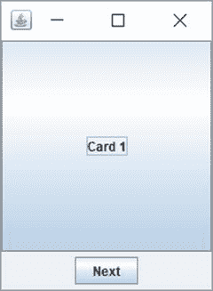

图 1-19.

CardLayout 的实际应用。点击“下一张”按钮可切换卡片。

```
// CardLayoutTest.java
package com.jdojo.swing.intro;
import java.awt.Container;
import javax.swing.JFrame;
import java.awt.CardLayout;
import javax.swing.JPanel;
import javax.swing.JButton;
import java.awt.Dimension;
import java.awt.BorderLayout;
public class CardLayoutTest {
public static void main(String[] args) {
JFrame frame = new JFrame("CardLayout 测试");
frame.setDefaultCloseOperation(JFrame.EXIT_ON_CLOSE);
Container contentPane = frame.getContentPane();
// 向内容面板添加一个包含“下一张”JButton 的 JPanel
JPanel buttonPanel = new JPanel();
JButton nextButton = new JButton("下一张");
buttonPanel.add(nextButton);
contentPane.add(buttonPanel, BorderLayout.SOUTH);
// 创建一个 JPanel 并将其布局设置为 CardLayout
final JPanel cardPanel = new JPanel();
final CardLayout cardLayout = new CardLayout();
cardPanel.setLayout(cardLayout);
// 向 cardPanel 添加五个 JButton 作为卡片
for (int i = 1; i  cardLayout.next(cardPanel));
frame.pack();
frame.setVisible(true);
}
}
清单 1-11.
CardLayout 的实际应用
```

该程序为“下一张”按钮添加了一个动作监听器。我还没有讨论如何为按钮添加动作监听器。但为了看到 `CardLayout` 的实际效果，这是必要的。我将在事件处理部分详细讨论如何为按钮添加动作。目前，只需说明你需要调用 `JButton` 类的 `addActionListener()` 方法来为其添加动作监听器即可。该方法接受一个 `ActionListener` 接口类型的对象，该接口有一个名为 `actionPerformed()` 的方法。当你点击 `JButton` 时，`actionPerformed()` 方法中的代码会被执行。切换下一张卡片的代码是调用 `cardLayout.next(cardPanel)` 方法。`ActionListener` 接口是一个函数式接口，你可以使用 lambda 表达式来创建其实例，如下所示：

```
// 为“下一张”JButton 添加动作监听器以切换下一张卡片
nextButton.addActionListener(e -> cardLayout.next(cardPanel));
```

提示

`CardLayout` 并不常用，因为除了一个组件之外，其他所有组件都对用户隐藏。`JTabbedPane` 更易于使用，它提供了与 `CardLayout` 类似的功能。我将在第 2 章讨论 `JTabbedPane`。`JTabbedPane` 是一个容器，而不是布局管理器。它将所有组件作为选项卡进行布局，并允许用户在这些选项卡之间切换。


### BoxLayout

`BoxLayout` 将容器中的组件按水平一行或垂直一列进行排列。要在程序中使用 `BoxLayout`，需要遵循以下步骤：

*   创建一个容器，例如 `JPanel`。

```
    JPanel hPanel = new JPanel();
    ```

*   创建一个 `BoxLayout` 类的对象。与其他布局管理器不同，你需要将容器传递给构造函数。同时，还需要将你要创建的盒子类型（水平或垂直）传递给其构造函数。该类有四个常量：`X_AXIS`、`Y_AXIS`、`LINE_AXIS` 和 `PAGE_AXIS`。常量 `X_AXIS` 用于创建水平 `BoxLayout`，将所有组件从左到右排列。常量 `Y_AXIS` 用于创建垂直 `BoxLayout`，将所有组件从上到下排列。另外两个常量 `LINE_AXIS` 和 `PAGE_AXIS` 与 `X_AXIS` 和 `Y_AXIS` 类似，但它们在排列组件时会使用容器的方向。

```
    // 为 hPanel 创建一个 BoxLayout，用于从左到右排列组件
    BoxLayout boxLayout = new BoxLayout(hPanel, BoxLayout.X_AXIS);
    ```

*   为容器设置布局。

```
    hPanel.setLayout(boxLayout);
    ```

*   将组件添加到容器中。

```
    hPanel.add(new JButton("Button 1"));
    hPanel.add(new JButton("Button 2"));
    ```

清单 1-12 使用水平 `BoxLayout` 显示了三个按钮，如图 1-20 所示。


图 1-20.

一个包含三个按钮的水平 BoxLayout 的 JFrame

```
// BoxLayoutTest.java
package com.jdojo.swing.intro;
import java.awt.Container;
import javax.swing.JFrame;
import javax.swing.JButton;
import javax.swing.JPanel;
import javax.swing.BoxLayout;
import java.awt.BorderLayout;
public class BoxLayoutTest {
public static void main(String[] args) {
JFrame frame = new JFrame("BoxLayout Test");
frame.setDefaultCloseOperation(JFrame.EXIT_ON_CLOSE);
Container contentPane = frame.getContentPane();
JPanel hPanel = new JPanel();
BoxLayout boxLayout = new BoxLayout(hPanel, BoxLayout.X_AXIS);
hPanel.setLayout(boxLayout);
for (int i = 1; i <= 3; i++) {
hPanel.add(new JButton("Button " + i));
}
contentPane.add(hPanel, BorderLayout.SOUTH);
frame.pack();
frame.setVisible(true);
}
}
清单 1-12.
使用水平 BoxLayout
```

`BoxLayout` 在水平布局中会尝试为所有组件提供首选宽度，在垂直布局中则提供首选高度。在水平布局中，最高组件的高度会被赋予所有其他组件。如果无法将某个组件的高度调整为与组中最高的组件一致，则会沿水平方向居中对齐该组件。你可以通过设置组件的对齐方式，或使用 `setAlignmentY()` 方法设置容器对齐方式来更改此默认对齐方式。在垂直布局中，它会尝试为所有组件提供首选高度，并尝试使所有组件的宽度与最宽的组件相同。如果无法使所有组件具有相同的宽度，则会沿其垂直中心线对齐它们。你可以通过更改组件的对齐方式，或使用 `setAlignmentX()` 方法更改容器的对齐方式来更改此默认对齐方式。

`javax.swing` 包中包含一个 `Box` 类，它使得使用 `BoxLayout` 更加容易。`Box` 是一个使用 `BoxLayout` 作为其布局管理器的容器。`Box` 类提供了静态方法来创建具有水平或垂直布局的容器。`createHorizontalBox()` 和 `createVerticalBox()` 方法分别用于创建水平盒子和垂直盒子。

```
// 创建一个水平盒子
Box hBox = Box.createHorizontalBox();
// 创建一个垂直盒子
Box vBox = Box.createVerticalBox();
```

要向 `Box` 添加组件，请使用其 `add()` 方法，如下所示：

```
// 向水平盒子添加两个按钮
hBox.add(new JButton("Button 1");
hBox.add(new JButton("Button 2");
```

`Box` 类还允许你创建不可见组件并将其添加到盒子中，以便调整两个组件之间的间距。它提供了四种类型的不可见组件：

*   粘合剂 (Glue)
*   支柱 (Strut)
*   刚性区域 (Rigid Area)
*   填充物 (Filler)

粘合剂是一种不可见的、可扩展的组件。你可以使用 `Box` 类的 `createHorizontalGlue()` 和 `createVerticalGlue()` 静态方法创建水平和垂直粘合剂。以下代码片段在水平盒子布局中的两个按钮之间使用了水平粘合剂。你也可以使用 `Box` 类的 `createGlue()` 静态方法创建一个可以在水平和垂直方向上扩展的粘合剂组件。

```
Box hBox = Box.createHorizontalBox();
hBox.add(new JButton("First"));
hBox.add(Box.createHorizontalGlue());
hBox.add(new JButton("Last"));
```

中间带有粘合剂的按钮如图 1-21 所示。图 1-22 显示了容器水平扩展后的情况。请注意两个按钮之间的水平空白空间，这是已经扩展的不可见粘合剂。


图 1-22.

调整大小后，带有两个按钮和它们之间水平粘合剂的水平盒子

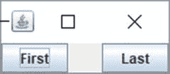

图 1-21.

带有两个按钮和它们之间水平粘合剂的水平盒子

支柱是一种具有固定宽度或固定高度的不可见组件。你可以使用 `createHorizontalStrut()` 方法创建水平支柱，该方法以像素为单位的宽度作为参数。你可以使用 `createVerticalStrut()` 方法创建垂直支柱，该方法以像素为单位的高度作为参数。

```
// 向水平盒子添加一个 100 像素的支柱
hBox.add(Box.createHorizontalStrut(100));
```

刚性区域是一种大小始终不变的不可见组件。你可以通过使用 `Box` 类的 `createRigidArea()` 静态方法来创建刚性区域。你需要向其传递一个 `Dimension` 对象来指定其宽度和高度。

```
// 向水平盒子添加一个 10x5 的刚性区域
hBox.add(Box.createRigidArea(new Dimesnion(10, 5)));
```

填充物是一种不可见的自定义组件，你可以通过指定自己的最小、最大和首选大小来创建它。`Box` 类的 `Filler` 静态嵌套类代表一个填充物。

```
// 创建一个填充物，其作用类似于粘合剂。请注意，粘合剂只是一个
// 最小和首选大小设置为零，
// 并且在两个方向上的最大大小设置为
// Short.MAX_VALUE 的填充物
Dimension minSize = new Dimension(0, 0);
Dimension prefSize = new Dimension(0, 0);
Dimension maxSize = new Dimension(Short.MAX_VALUE, Short.MAX_VALUE);
Box.Filler filler = new Box.Filler(minSize, prefSize, maxSize);
```

通过嵌套具有水平和垂直 `BoxLayout` 的盒子，你可以获得非常强大的布局。`Box` 类提供了便捷的方法来创建粘合剂、支柱和刚性区域。但是，它们都是 `Box.Filler` 类的对象。当最小和首选大小设置为零，并且在两个方向上的最大大小设置为 `Short.MAX_VALUE` 时，`Box.Filler` 对象的作用类似于粘合剂。当粘合剂的最大高度设置为零时，它起到水平粘合剂的作用。当粘合剂的最大宽度设置为零时，它起到垂直粘合剂的作用。你可以使用 `Box.Filler` 类创建水平支柱，方法是将其最小和首选大小设置为指定的宽度和零高度，并将最大大小设置为指定的宽度和 `Short.MAX_VALUE` 高度。你能想到使用 `Box.Filler` 类创建刚性区域的方法吗？对于刚性区域，所有大小（最小、首选和最大）都是相同的。以下代码片段创建了一个 10x10 的刚性区域：


```
// 创建一个 10x10 的刚性区域
Dimension d = new Dimension(10, 10); JComponent rigidArea = new Box.Filler(d, d, d);
```

清单 1-13 演示了如何使用 `Box` 类和胶水（glue）。图 1-23 显示了水平展开后的 `JFrame` 效果。当 `JFrame` 打开时，“上一页”和“下一页”按钮之间没有间隙。


图 1-23.

带胶水的 BoxLayout

```
// BoxLayoutGlueTest.java
package com.jdojo.swing.intro;
import java.awt.Container;
import javax.swing.JFrame;
import javax.swing.JButton;
import javax.swing.Box;
import java.awt.BorderLayout;
public class BoxLayoutGlueTest {
public static void main(String[] args) {
JFrame frame = new JFrame("带胶水的 BoxLayout");
frame.setDefaultCloseOperation(JFrame.EXIT_ON_CLOSE);
Container contentPane = frame.getContentPane();
Box hBox = Box.createHorizontalBox();
hBox.add(new JButton(""));
hBox.add(new JButton("最后>>"));
contentPane.add(hBox, BorderLayout.SOUTH);
frame.pack();
frame.setVisible(true);
}
}
清单 1-13.
使用 Box 类和胶水的 BoxLayout
```

### GridLayout

`GridLayout` 将组件排列在由等尺寸单元格组成的矩形网格中。每个组件恰好放置在一个单元格内。它不遵循组件的首选尺寸，而是将可用空间划分为等尺寸的单元格，并将每个组件调整为单元格的大小。

您可以指定网格的行数或列数。如果同时指定两者，则仅使用行数，列数会被自动计算。假设 `ncomponents` 是添加到容器中的组件数量，`nrows` 和 `ncols` 是指定的行数和列数。如果 `nrows` 大于零，则使用以下公式计算网格的列数：

```
ncols = (ncomponents + nrows - 1)/nrows
```

如果 `nrows` 为零，则使用以下公式计算网格的行数：

```
nrows = (ncomponents + ncols - 1)/ncols
```

您不能为 `nrows` 或 `ncols` 指定负数，并且至少其中一个必须大于零。否则会抛出运行时异常。

您可以使用 `GridLayout` 类的以下三个构造函数之一来创建 `GridLayout`：

*   `GridLayout()`
*   `GridLayout(int rows, int cols)`
*   `GridLayout(int rows, int cols, int hgap, int vgap)`

您可以指定网格的行数、列数、单元格之间的水平间距和垂直间距。您也可以使用 `setRows()`、`setColumns()`、`setHgap()` 和 `setVgap()` 方法来设置这些属性。

无参构造函数创建一个单行网格，列数与添加到容器中的组件数量相同。

```
// 创建一个单行网格布局
GridLayout gridLayout = new GridLayout();
```

第二个构造函数创建一个具有指定行数或列数的 `GridLayout`。

```
// 创建一个 5 行的网格布局。将列数指定为 0。
// 列数将被自动计算。
GridLayout gridLayout = new GridLayout(5, 0);
// 创建一个 3 列的网格布局。将行数指定为 0。
// 行数将被自动计算。
GridLayout gridLayout = new GridLayout(0, 3);
// 创建一个 2 行 3 列的网格布局。由于您为行数指定了非零值，
// 列数将被忽略，并根据组件数量自动计算。
GridLayout gridLayout = new GridLayout(2, 3);
```

第三个构造函数允许您指定行数或列数，以及两个单元格之间的水平和垂直间距。您可以创建一个三行的 `GridLayout`，单元格之间水平间距为 10 像素，垂直间距为 20 像素，如下所示：

```
GridLayout gridLayout = new GridLayout(3, 0, 10, 20);
```

清单 1-14 演示了如何使用 `GridLayout`。请注意，您无需指定组件将放置在哪个单元格中。只需将组件添加到容器中，布局管理器会自动决定其位置。

```
// GridLayoutTest.java
package com.jdojo.swing.intro;
import java.awt.GridLayout;
import javax.swing.JPanel;
import java.awt.BorderLayout;
import javax.swing.JFrame;
import java.awt.Container;
import javax.swing.JButton;
public class GridLayoutTest {
public static void main(String[] args) {
JFrame frame = new JFrame("GridLayout 测试");
frame.setDefaultCloseOperation(JFrame.EXIT_ON_CLOSE);
Container contentPane = frame.getContentPane();
JPanel buttonPanel = new JPanel();
buttonPanel.setLayout(new GridLayout(3, 0));
for (int i = 1; i <= 9; i++) {
buttonPanel.add(new JButton("按钮 " + i));
}
contentPane.add(buttonPanel, BorderLayout.CENTER);
frame.pack();
frame.setVisible(true);
}
}
清单 1-14.
使用 GridLayout
```

图 1-24 显示了一个包含三行和九个组件的 `GridLayout` 容器。图 1-25 显示了一个包含三行和七个组件的 `GridLayout` 容器。如果您调整带有 `GridLayout` 的容器大小，所有组件都会被调整大小，并且它们的大小将保持一致。尝试运行清单 1-14 中的程序来调整 `JFrame` 的大小。

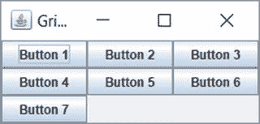

图 1-25.

包含三行和七个组件的 GridLayout

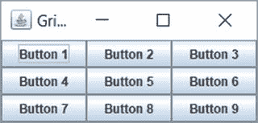

图 1-24.

包含三行和九个组件的 GridLayout

`GridLayout` 是一个易于手动编码的简单布局管理器。然而，它并不十分强大，原因有二。首先，它强制每个组件具有相同的大小；其次，您无法指定组件在网格中的行号和列号（或精确位置）。也就是说，您只能将组件添加到 `GridLayout` 中。它们会按照您添加到容器的顺序，先水平排列，再垂直排列。如果容器的方向是 `LEFT_TO_RIGHT`，组件从左到右、再从上到下排列。如果容器的方向是 `RIGHT_TO_LEFT`，组件从右到左、再从上到下排列。`GridLayout` 的一个良好用途是创建一组相同大小的按钮。例如，假设您向容器中添加了两个文本分别为 `确定` 和 `取消` 的按钮，并希望它们具有相同的大小。您可以通过将这些按钮添加到由 `GridLayout` 布局管理器管理的容器中来实现这一点。


### GridBagLayout

`GridBagLayout` 将组件布局在由行和列组成的矩形单元格网格中，这与 `GridLayout` 类似。然而，它比 `GridLayout` 强大得多。它的强大之处在于其使用上的复杂性。它不像 `GridLayout` 那样易于使用。在 `GridBagLayout` 中，你可以自定义许多属性，这使得快速学习和使用其所有功能变得困难。

它允许你自定义组件的许多属性，例如大小、对齐方式、可扩展性等。与 `GridLayout` 不同，网格中的所有单元格不必具有相同的大小。组件不必精确地放置在一个单元格中。组件可以水平或垂直地跨越多个单元格。你可以指定组件在其单元格内的对齐方式。

在使用 `GridBagLayout` 布局管理器时，会用到 `GridBagLayout` 和 `GridBagConstraints` 类。这两个类都在 `java.awt` 包中。`GridBagLayout` 类的对象定义了一个 `GridBagLayout` 布局管理器。`GridBagConstraints` 类的对象定义了 `GridBagLayout` 中组件的约束条件。组件的约束条件用于布局该组件。这些约束条件包括组件在网格中的位置、宽度、高度、在单元格内的对齐方式等。

以下代码片段创建了一个 `GridBagLayout` 类的对象，并将其设置为 `JPanel` 的布局管理器：

```
// 创建一个 JPanel 容器
JPanel panel = new JPanel();
// 将 GridBagLayout 设置为 JPanel 的布局管理器
GridBagLayout gridBagLayout = new GridBagLayout();
panel.setLayout(gridBagLayout);
```

让我们以最简单的形式使用 `GridBagLayout`：创建一个框架，将其内容窗格的布局设置为 `GridBagLayout`，并向内容窗格添加九个按钮。这在清单 1-15 中完成。图 1-26 显示了运行程序时得到的屏幕。

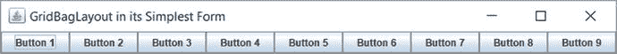

图 1-26.

GridBagLayout 中的九个按钮

```
// SimplestGridBagLayout.java
package com.jdojo.swing.intro;
import javax.swing.JFrame;
import java.awt.Container;
import javax.swing.JButton;
import java.awt.GridBagLayout;
public class SimplestGridBagLayout {
public static void main(String[] args) {
String title = "GridBagLayout in its Simplest Form";
JFrame frame = new JFrame(title);
frame.setDefaultCloseOperation(JFrame.EXIT_ON_CLOSE);
Container contentPane = frame.getContentPane();
contentPane.setLayout(new GridBagLayout());
for (int i = 1; i <= 9; i++) {
contentPane.add(new JButton("Button " + i));
}
frame.pack();
frame.setVisible(true);
}
}
清单 1-15.
以最简单形式使用的 GridBagLayout
```

起初，`GridBagLayout` 的行为似乎与 `FlowLayout` 类似。效果与使用 `FlowLayout` 相同。然而，`GridBagLayout` 与 `FlowLayout` 并不相同，尽管它能够像 `FlowLayout` 一样工作。它比 `FlowLayout` 强大得多（也更容易出错！）。当你添加九个按钮时，你并没有指定它们的单元格。你使用了 `contentPane.add(Component c)` 方法来添加按钮。结果是它将按钮一个接一个地放置在一行中。

你可以指定组件在 `GridBagLayout` 中应放置的单元格。要指定组件的单元格，你需要调用 `add(Component c, Object constraints)` 方法，其中第二个参数是 `GridBagConstraints` 类的对象。如果你没有为 `GridBagLayout` 中的组件指定约束对象，它会将组件放置在下一个单元格中。下一个单元格是用于放置前一个组件的单元格之后的那个单元格。如果你没有为 `GridBagLayout` 中的任何组件使用约束，所有组件都会放置在一行中，如图 1-26 所示。稍后当我介绍 `GridBagConstraints` 对象的 `gridx` 和 `gridy` 属性时，我会对此进行更多讨论。

让我们通过展示 `GridBagLayout` 确实是一种网格布局，并且它将组件放置在单元格网格中，来澄清对它的误解。为了证明这一点，你将在前面的示例中，将九个按钮显示在一个三行三列的单元格网格中。这次只有一个区别：你将指定按钮在网格中的单元格位置。行号和列号的组合表示单元格在网格中的位置。组件及其单元格的所有属性都使用 `GridBagConstraints` 类的对象来指定，该类有许多公共实例变量。它的 `gridx` 和 `gridy` 实例变量分别指定单元格的列号和行号。第一列由 `gridx = 0` 表示，第二列由 `gridx = 1` 表示，依此类推。第一行由 `gridy = 0` 表示，第二行由 `gridy = 1` 表示，依此类推。

网格中的第一个单元格是哪个——左上角、右上角、左下角还是右下角？这取决于容器的方向。如果容器使用 `LEFT_TO_RIGHT` 方向，则网格左上角的单元格是第一个单元格。如果容器使用 `RIGHT_TO_LEFT` 方向，则网格右上角的单元格是第一个单元格。表 1-1 和表 1-2 显示了在不同容器方向的 `GridBagLayout` 中，单元格及其对应的 `gridx` 和 `gridy` 值。这些表格仅显示了九个单元格。`GridBagLayout` 并不局限于只有九个单元格。你可以拥有任意数量的单元格。确切地说，你最多可以有 `Integer.MAX_VALUE` 行和列，这在任何应用程序中肯定都不会用到。

表 1-2.

具有 RIGHT_TO_LEFT 方向的容器中单元格的 gridx 和 gridy 值

| `gridx=2, gridy=0` | `gridx=1, gridy=0` | `gridx=0, gridy=0` |
| --- | --- | --- |
| `gridx=2, gridy=1` | `gridx=1, gridy=1` | `gridx=0, gridy=1` |
| `gridx=2, gridy=2` | `gridx=1, gridy=2` | `gridx=0, gridy=2` |

表 1-1.

具有 LEFT_TO_RIGHT 方向的容器中单元格的 gridx 和 gridy 值

| `gridx=0, gridy=0` | `gridx=1, gridy=0` | `gridx=2, gridy=0` |
| --- | --- | --- |
| `gridx=0, gridy=1` | `gridx=1, gridy=1` | `gridx=2, gridy=1` |
| `gridx=0, gridy=2` | `gridx=1, gridy=2` | `gridx=2, gridy=2` |


设置组件的 `gridx` 和 `gridy` 属性非常简单。你需要为组件创建一个约束对象，该对象是 `GridBagConstraints` 类的实例；设置其 `gridx` 和 `gridy` 属性；然后在将组件添加到容器时，将该约束对象传递给 `add()` 方法。以下代码片段展示了如何为 `JButton` 的约束设置 `gridx` 和 `gridy` 属性。当你调用 `container.add(component, constraint)` 方法时，约束对象会被复制给正在添加的组件，因此你可以修改其部分属性并复用于另一个组件。这样一来，你无需为添加到 `GridBagLayout` 的每个组件都创建新的约束对象。然而，这种方法容易出错。你可能会为一个组件设置约束，但在复用于另一个组件时忘记修改。因此，复用时请务必小心。

```
// 创建一个约束对象
GridBagConstraints gbc = new GridBagConstraints();
// 在约束对象中设置 gridx 和 gridy 属性
gbc.gridx = 0;
gbc.gridy = 0;
// 添加一个 JButton，并将约束对象作为第二个参数传递给 add() 方法
container.add(new JButton("B1"), gbc);
// 将 gridx 属性设置为 1。gridy 属性保持之前设置的 0
gbc.gridx = 1;
// 向容器中添加另一个 JButton
container.add(new JButton("B2"), gbc);
```

清单 1-16 演示了如何为组件设置 `gridx` 和 `gridy` 值（或单元格编号）。图 1-27 显示了运行程序后得到的 `JFrame`。

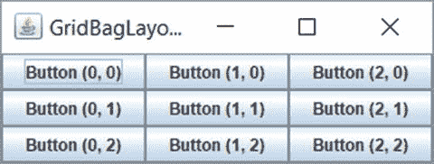

图 1-27.

一个包含九个按钮的 GridBagLayout

```
// GridBagLayoutWithgridxAndgridy.java
package com.jdojo.swing.intro;
import java.awt.GridBagLayout;
import java.awt.Container;
import javax.swing.JFrame;
import javax.swing.JButton;
import java.awt.GridBagConstraints;
public class GridBagLayoutWithgridxAndgridy {
public static void main(String[] args) {
String title = "GridBagLayout with gridx and gridy";
JFrame frame = new JFrame(title);
frame.setDefaultCloseOperation(JFrame.EXIT_ON_CLOSE);
Container contentPane = frame.getContentPane();
contentPane.setLayout(new GridBagLayout());
// 创建一个 GridBagConstraints 对象，用于设置
// 每个 JButton 的约束
GridBagConstraints gbc = new GridBagConstraints();
for (int y = 0; y < 3; y++) {
for (int x = 0; x < 3; x++) {
gbc.gridx = x;
gbc.gridy = y;
String text = "Button (" + x + ", " + y + ")";
contentPane.add(new JButton(text), gbc);
}
}
frame.pack();
frame.setVisible(true);
}
}
清单 1-16.
在 GridBagLayout 中为组件设置 gridx 和 gridy 属性
```

你可以使用 `GridBagConstraints` 对象为组件指定其他约束。`GridBagConstraints` 对象中的所有约束均通过表 1-3 列出的实例变量之一进行设置。该类还定义了许多常量，例如 `RELATIVE`、`REMAINDER` 等。请注意，所有实例变量均为小写。

表 1-3.

GridBagConstraints 类的实例变量

| 实例变量 | 默认值 | 可能的值 | 用途 |
| --- | --- | --- | --- |
| `gridx` `gridy` | `RELATIVE` | `RELATIVE` `整数` | 组件所在网格单元格的列号和行号。 |
| `gridwidth` `gridheight` | `1` | `整数` `RELATIVE` `REMAINDER` | 用于显示组件的网格单元格数量。 |
| `fill` | `NONE` | `BOTH` `HORIZONTAL` `VERTICAL` `NONE` | 指定组件如何填充分配给它的网格单元格。 |
| `ipadx` `ipady` | `0` | 整数 | 指定组件的内部填充，该填充会添加到其最小尺寸中。允许使用负整数，这将减小组件的最小尺寸。 |
| `insets` | `(0,0,0,0)` | Insets 对象 | 指定组件边缘与其网格单元格之间的外部填充。允许使用负值。 |
| `anchor` | `CENTER` | `CENTER`, `NORTH`, `NORTHEAST`, `EAST`, `SOUTHEAST`, `SOUTH`, `SOUTHWEST`, `WEST`, `NORTHWEST, PAGE_START`, `PAGE_END`, `LINE_START`, `LINE_END`, `FIRST_LINE_START`, `FIRST_LINE_END`, `LAST_LINE_START`, `LAST_LINE_END, BASELINE`, `BASELINE_LEADING`, `BASELINE_TRAILING`, `ABOVE_BASELINE`, `ABOVE_BASELINE_LEADING`, `ABOVE_BASELINE_TRAILING,BELOW_BASELINE`, `BELOW_BASELINE_LEADING`, `BELOW_BASELINE_TRAILING` | 指定组件在显示区域中的放置位置。 |
| `weightx` `weighty` | `0.0` | 正 double 值 | 指定当容器调整大小时，额外空间（水平和垂直方向）如何在网格单元格之间分配。 |

以下各节将详细讨论每个约束的效果。

#### gridx 和 gridy 约束

`gridx` 和 `gridy` 约束指定组件在网格中放置的单元格。一个组件可以水平或垂直占据多个单元格。组件占据的所有单元格合起来称为组件的显示区域。

让我们给出 `gridx` 和 `gridy` 约束的精确定义。它们指定组件显示区域的起始单元格。默认情况下，每个组件只占据一个单元格。我将在下一节讨论 `gridwidth` 和 `gridheight` 约束时，介绍如何让组件占据多个单元格。有关为组件设置 `gridx` 和 `gridy` 约束值的更多详细信息，请参考清单 1-16。

你可以为 `gridx` 和 `gridy` 约束中的一个或两个指定 `RELATIVE` 值。如果你为 `gridx` 和 `gridy` 指定了值（大于或等于零的整数），则由你决定组件放置的位置。如果你将其中一个或两个约束值指定为 `RELATIVE`，则布局管理器将确定 `gridx` 和/或 `gridy` 的值。如果你阅读 `GridBagLayout` 类的 API 文档，其中关于 `gridx` 和/或 `gridy` 的 `RELATIVE` 值的描述并不十分清晰。它只说当你将 `gridx` 和/或 `gridy` 的值指定为 `RELATIVE` 时，组件将被放置在此前添加的组件旁边。API 文档中的这个描述简直是一团浆糊！以下段落将通过示例详细描述如何设置 `gridx` 和 `gridy` 的值。

##### 情况 #1

你已经为 `gridx` 和 `gridy` 都指定了值。这是网格中的绝对定位情况。你的组件将根据你指定的 `gridx` 和 `gridy` 值进行放置。你已经在清单 1-16 中看到了这种类型的示例。


##### 案例 #2

你为 `gridx` 指定了一个值，并将 `gridy` 的值设置为 `RELATIVE`。在这种情况下，布局管理器需要确定 `gridy` 的值。让我们看一个例子。假设你有三个按钮要放置在网格中，并且你有一个 `container` 对象，其布局管理器设置为 `GridBagLayout`。以下代码片段将这三个按钮添加到网格中。图 1-28 显示了包含三个按钮的屏幕。

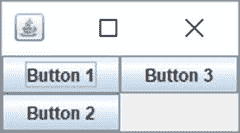

图 1-28.

指定 gridx 并将 gridy 设置为 RELATIVE

```
GridBagConstraints gbc = new GridBagConstraints();
JButton b1 = new JButton("Button 1");
JButton b2 = new JButton("Button 2");
JButton b3 = new JButton("Button 3");
gbc.gridx = 0;
gbc.gridy = 0;
container.add(b1, gbc);
gbc.gridx = 0;
gbc.gridy = GridBagConstraints.RELATIVE;
container.add(b2, gbc);
gbc.gridx = 1;
gbc.gridy = GridBagConstraints.RELATIVE ; container.add(b3, gbc);
```

按钮 `b1` 的放置没有混淆，因为你同时指定了 `gridx` 和 `gridy` 的值。它被放置在第一行（`gridy = 0`）和第一列（`gridx = 0`）。

对于按钮 `b2`，你指定了 `gridx = 0`。你希望它被放置在第一列，结果与你预期一致。你为 `b2` 将 `gridy` 指定为 `RELATIVE`。这意味着你告诉 `GridBagLayout` 通过将 `b2` 放置在第一列（`gridx = 0`）来为其找到合适的行。由于第一行在第一列已经被 `b1` 占据，`b2` 可用的下一行是第二行，因此它被放置在那里。

你为按钮 `b3` 设置了 `gridx = 1`。这意味着它应该被放置在第二列。你将其 `gridy` 指定为 `RELATIVE`。这意味着布局管理器需要在第二列中为其找到一行。由于第一行在第二列中没有放置任何组件，布局管理器将其放置在第一行。如果你将 `b3` 的 `gridx` 指定为 0，它会被放置在哪里？再次应用相同的逻辑。由于第一列在第一行和第二行已经分别有 `b1` 和 `b2`，`b3` 可用的下一行是第三行，布局管理器会将其放置在 `b2` 的正下方。

##### 案例 #3

你为 `gridy` 指定了一个值，并将 `gridx` 的值设置为 `RELATIVE`。在这种情况下，布局管理器需要确定 `gridx` 的值。也就是说，基于指定的行号值，布局管理器必须确定其列号。图 1-29 显示了当你使用以下代码片段时三个按钮的布局方式。以这种方式布局按钮的逻辑与上一个示例相同，不同之处在于这次布局管理器决定的是 `b2` 和 `b3` 的列号，而不是它们的行号。

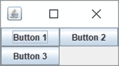

图 1-29.

在 GridBagLayout 中指定 gridy 并将 gridx 设置为 RELATIVE

```
gbc.gridx = 0;
gbc.gridy = 0;
container.add(b1, gbc);
gbc.gridx = GridBagConstraints.RELATIVE;
gbc.gridy = 0;
container.add(b2, gbc);
gbc.gridx = GridBagConstraints.RELATIVE;
gbc.gridy = 1;
container.add(b3, gbc);
```

##### 案例 #4

这是四种可能性中的最后一种，你将 `gridx` 和 `gridy` 都指定为 `RELATIVE`。布局管理器必须为正在添加的组件确定行号和列号。它将首先确定行号。组件的行将是当前行。哪一行是当前行？默认情况下，第一行（`gridy = 0`）是当前行。当你添加一个组件时，你也可以指定其 `gridwidth` 约束。它的一个值是 `REMAINDER`，这意味着这是该行中的最后一个组件。如果你将一个组件添加到第一行，并将其 `gridwidth` 设置为 `REMAINDER`，则第二行将成为当前行。一旦布局管理器确定了组件的行号（即当前行），它就会将该组件放置在该行中最后添加的组件的下一列。`gridx` 和 `gridy` 的默认值是 `RELATIVE`。现在你可以理解为什么清单 1-15 默认将所有按钮放置在第一行，该清单对所有按钮都使用了 `RELATIVE` 作为 `gridx` 和 `gridy`。由于默认的 `gridwidth` 是 1，第一行始终是当前行。每当你添加一个按钮时，第一行（当前行）被分配为其行，其列则是该行中最后添加的按钮的下一列。让我们看一些你将 `gridx` 和 `gridy` 都设置为 `RELATIVE` 的例子。

##### 示例 #1

以下代码片段布局的按钮如图 1-30 所示：


图 1-30.

将 gridx 和 gridy 都指定为 RELATIVE

```
gbc.gridx = 0;
gbc.gridy = 0;
container.add(b1, gbc);
gbc.gridx = GridBagConstraints.RELATIVE;
gbc.gridy = GridBagConstraints.RELATIVE;
container.add(b2, gbc);
gbc.gridx = GridBagConstraints.RELATIVE;
gbc.gridy = 1;
container.add(b3, gbc);
```

你通过指定 `gridx = 0` 和 `gridy = 0` 对 `b1` 使用了绝对定位。这导致 `b1` 被放置在第一行和第一列。你为 `b2` 将 `gridx` 和 `gridy` 都指定为 `RELATIVE`。布局管理器必须为 `b2` 确定行号和列号。它查看当前行，默认情况下是第一行。因此，它将 `b2` 的行号设置为 0。它发现第一列已经放置了一个组件（`b1`）。因此，它将下一列（即第二列）设置为 `b2` 的列。在这里你看到 `b2` 被放置在第一行和第二列。理解 `b3` 的放置很简单。由于你指定了其 `gridy = 1`，它被放置在第二行。其 `gridx` 是 `RELATIVE`，并且由于第二行中第一列可用，它被放置在第一列。


好的，作为一名高级文档工程师和翻译员，我将严格遵循您提供的注意事项和示例格式，将给定的英文文本翻译成中文。


##### 示例 #2

以下代码片段按照图 1-31 所示布局了这些按钮。请注意，`b1` 按钮被放置在其可用空间的中心，这是默认行为。您可以使用 `anchor` 属性自定义组件在其分配空间内的位置，我稍后会讨论这一点。

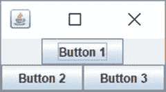

图 1-31.

将 gridx 和 gridy 指定为 RELATIVE，并将 gridwidth 指定为 REMAINDER

```
gbc.gridx = 0;
gbc.gridy = 0;
gbc.gridwidth = GridBagConstraints.REMAINDER; // 行中的最后一个组件
container.add(b1, gbc);
gbc.gridx = GridBagConstraints.RELATIVE;
gbc.gridy = GridBagConstraints.RELATIVE;
gbc.gridwidth = 1; // 重置为默认值
container.add(b2, gbc);
gbc.gridx = GridBagConstraints.RELATIVE;
gbc.gridy = 1;
container.add(b3, gbc);
```

您为 `b1` 指定了 `gridx = 0` 和 `gridy = 0`。这次，您为 `b1` 指定了 `gridwidth` 为 `REMAINDER`。这意味着 `b1` 是第一行中的最后一个组件。由于这是添加到第一行的唯一组件，它便成为该行中的第一个也是最后一个组件。在 `b1` 以其 `gridwidth` 为 `REMAINDER` 添加之后，第二行成为当前行。对于 `b2`，`gridx` 和 `gridy` 被设置为 `RELATIVE`。布局管理器会将第二行（`gridy = 1`）设置为其行号。由于在 `b2` 之前没有组件放置在第二行，它将成为该行中的第一个组件。这导致 `b2` 被放置在第二行第一列。请注意，您为 `b2` 和 `b3` 将 `gridwidth` 的值设置为 1。确定 `b3` 的位置很简单。由于您将其 `gridy` 指定为 `1`（第二行），它被放置在第二行。其 `gridx` 为 `RELATIVE`。由于 `b2` 已经在第一列，它便被放置在第二列。

#### gridwidth 和 gridheight 约束

`gridwidth` 和 `gridheight` 约束分别指定了组件显示区域的宽度和高度。两者的默认值都是 `1`。也就是说，默认情况下，一个组件被放置在一个单元格中。如果您为一个组件指定 `gridwidth = 2`，其显示区域将跨越两个单元格的宽度。如果您为一个组件指定 `gridheight = 2`，其显示区域将跨越两个单元格的高度。如果您使用过 HTML 表格，可以将 `gridwidth` 比作 `colspan`，将 `gridheight` 比作 `rowspan`，它们是 HTML 表格中单元格的属性。

您可以为 `gridwidth` 和 `gridheight` 指定两个预定义的常量。它们是 `REMAINDER` 和 `RELATIVE`。`gridwidth` 的 `REMAINDER` 值意味着该组件将从其 `gridx` 单元格跨越到该行的剩余部分。换句话说，它是该行中的最后一个组件。`gridheight` 的 `REMAINDER` 值表示它是该列中的最后一个组件。`gridwidth` 的 `RELATIVE` 值表示该组件显示区域的宽度将从其 `gridx` 开始，到该行的倒数第二个单元格结束。`gridheight` 的 `RELATIVE` 值表示该组件显示区域的高度将从其 `gridy` 开始，到倒数第二个单元格结束。让我们以 `gridwidth` 为例各举一个例子。您可以将这个概念扩展到 `gridheight`。唯一的区别在于 `gridwidth` 影响组件显示区域的宽度，而 `gridheight` 影响高度。

以下代码片段向一个容器中添加了九个按钮——第一行三个，第二行六个：

```
// 将组件扩展以填充整个单元格
gbc.fill = GridBagConstraints.BOTH;
gbc.gridx = 0;
gbc.gridy = 0;
container.add(new JButton("Button 1"), gbc);
gbc.gridx = 1;
gbc.gridy = 0;
gbc.gridwidth = GridBagConstraints.RELATIVE;
container.add(new JButton("Button 2"), gbc);
gbc.gridx = GridBagConstraints.RELATIVE; gbc.gridy = 0;
gbc.gridwidth = GridBagConstraints.REMAINDER;
container.add(new JButton("Button 3"), gbc);
// 将 gridwidth 重置为其默认值 1
gbc.gridwidth = 1;
// 在第二行放置六个 JButton
gbc.gridy = 1;
for (int i = 0; i < 6; i++) {
gbc.gridx = i;
container.add(new JButton("Button " + (i + 4)), gbc);
}
```

第一条语句对您来说是新的。它将 `GridBagConstraints` 的 `fill` 实例变量设置为 `BOTH`，这表示添加到单元格的组件将在两个方向（水平和垂直）上扩展以填充整个单元格区域。我稍后会更详细地讨论这一点。第一个按钮被放置在第一行第一列。

第二个按钮被放置在第一行第二列。其 `gridwidth` 被设置为 `RELATIVE`，这意味着它将从第二列（`gridx = 1`）跨越到该行的倒数第二列。第一行的最后一列是哪一列？您还不知道。您必须查看所有添加到 `GridBagLayout` 的组件，以找出网格中的最大行数和列数。目前，您知道第二个按钮从第二列开始，但您不知道它将在哪一列结束（或它将扩展到哪一列）。

让我们看看第三个按钮。您为其指定了 `gridy = 0`，这意味着它应该被放置在第一行。您将其 `gridx` 设置为 `RELATIVE`，这意味着它将被放置在第一行中第二个按钮之后。您将其 `gridwidth` 值设置为 `REMAINDER`，这意味着这是第一行中的最后一个组件。有一个有趣的点需要注意。第二个按钮将根据需要从第二列扩展到倒数第二列。您说第三个按钮是第一行中的最后一个组件，它应该占据剩余的单元格。结果是，由于第二个按钮的 `gridwidth` 使用了贪婪的 `RELATIVE` 值，第三个按钮始终只会剩下一个单元格（最后一个单元格）。

在第二行，您添加了六个按钮。每行的单元格总数由一行中的最大列数决定。因此，每一行（第一行和第二行）都将有六个单元格。您已将 `gridwidth` 设置为其默认值 `1`，因此第二行中的每个按钮将只占据一个单元格。在第一行中，第一个按钮占据一个单元格，第三个按钮占据一个单元格，第二个按钮占据剩余的四个单元格，如图 1-32 所示。

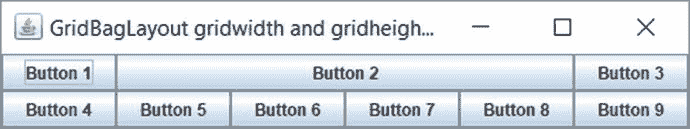

图 1-32.

指定 gridwidth 和 gridheight


#### fill 约束

`GridBagLayout` 会为每个组件分配其首选宽度和高度。列的宽度由该列中最宽的组件决定。同样，行的高度由该行中最高的组件决定。`fill` 约束值表示当组件的显示区域大于其自身大小时，组件如何水平和垂直扩展。请注意，`fill` 约束仅在组件尺寸小于其显示区域时使用。

`fill` 约束有四个可能的值：`NONE`、`HORIZONTAL`、`VERTICAL` 和 `BOTH`。其默认值为 `NONE`，表示“不调整组件大小”。值 `HORIZONTAL` 表示“水平扩展组件以填充其显示区域”。值 `VERTICAL` 表示“垂直扩展组件以填充其显示区域”。值 `BOTH` 表示“水平和垂直扩展组件以填充其显示区域”。

以下代码片段将九个按钮添加到一个三行三列的网格中，如图 1-33 所示。

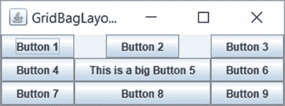

图 1-33.

在 GridBagLayout 中为组件指定 fill 约束

```
gbc.gridx = 0; gbc.gridy = 0;
container.add(new JButton("Button 1"), gbc);
gbc.gridx = 1; gbc.gridy = 0;
container.add(new JButton("Button 2"), gbc);
gbc.gridx = 2; gbc.gridy = 0;
container.add(new JButton("Button 3"), gbc);
gbc.gridx = 0; gbc.gridy = 1;
container.add(new JButton("Button 4"), gbc);
gbc.gridx = 1; gbc.gridy = 1;
container.add(new JButton("This is a big Button 5"), gbc);
gbc.gridx = 2; gbc.gridy = 1;
container.add(new JButton("Button 6"), gbc);
gbc.gridx = 0; gbc.gridy = 2;
container.add(new JButton("Button 7"), gbc);
gbc.gridx = 1; gbc.gridy = 2;
gbc.fill = GridBagConstraints.HORIZONTAL;
container.add(new JButton("Button 8"), gbc);
gbc.gridx = 2; gbc.gridy = 2;
gbc.fill = GridBagConstraints.NONE;
container.add(new JButton("Button 9"), gbc);
```

第五个按钮决定了第二列的宽度，因为它是该列中最宽的 `JButton`。请注意第一行第二列中的空白区域。之所以有空白区域，是因为第二个按钮的 `fill` 值为 `NONE`（默认值），并且第二个按钮没有扩展以占据其显示区域的整个宽度，而是保持其首选大小。再看第八个按钮。你指定了它应该水平扩展，它也确实这样做了，以匹配其显示区域的宽度。

#### ipadx 和 ipady 约束

`ipadx` 和 `ipady` 约束用于指定组件的内部填充。它们会增加组件的首选大小和最小大小。默认情况下，这两个约束都设置为零。允许使用负值。这些约束的负值会减小组件的首选大小和最小大小。如果为 `ipadx` 指定了值，组件的首选宽度和最小宽度将增加 `2*ipadx`。同样，如果为 `ipady` 指定了值，组件的首选高度和最小高度将增加 `2*ipady`。这些选项很少使用。`ipadx` 和 `ipady` 的值以像素为单位指定。

#### insets 约束

`insets` 约束指定组件周围的外部填充。它会在组件周围添加空间。你需要将 `insets` 值指定为 `java.awt.Insets` 类的对象。它有一个构造函数：`Insets(int top, int left, int bottom, int right)`。你可以为组件的所有四个边指定填充。默认情况下，`insets` 的值设置为一个 `Insets` 对象，其四个边的像素均为零。以下代码片段将九个按钮添加到一个 3X3 的网格中，所有按钮的四个边都有 5 像素的 insets。生成的布局如图 1-34 所示。请注意，你已为所有按钮指定了 `fill` 约束为 `BOTH`，但由于它们的 `insets` 约束，你仍然可以看到相邻按钮之间的间隙。`insets` 约束告诉布局管理器在组件边缘和显示区域边缘之间留出空间。

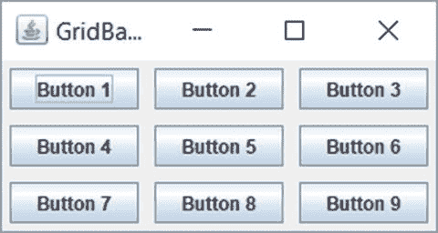

图 1-34.

在 GridBagLayout 中为组件指定 insets

```
gbc.fill = GridBagConstraints.BOTH;
gbc.insets = new Insets(5, 5, 5, 5);
int count = 1;
for (int y = 0; y < 3; y++) {
gbc.gridy = y;
for(int x = 0; x < 3; x++) {
gbc.gridx = x;
container.add(new JButton("Button " + count++), gbc);
}
}
```


#### 锚点约束

`anchor`（锚点）约束指定了当组件尺寸小于其显示区域时，组件应如何放置在该区域内。默认情况下，其值设置为`CENTER`，这意味着组件将居中显示在其显示区域内。

`GridBagConstraints`类中定义了许多常量，可用作`anchor`约束的值。所有常量可分为三类：绝对定位、基于方向和基于基线。

绝对定位的值包括`NORTH`、`SOUTH`、`WEST`、`EAST`、`NORTHWEST`、`NORTHEAST`、`SOUTHWEST`、`SOUTHEAST`和`CENTER`。图 1-35 展示了使用不同绝对锚点值时，组件在单元格内的放置方式。请注意，图中所有九个组件的`fill`约束均设置为`NONE`。


图 1-35.

绝对锚点值及其对组件在显示区域中位置的影响

基于方向的值根据容器的`ComponentOrientation`属性来使用。它们包括`PAGE_START`、`PAGE_END`、`LINE_START`、`LINE_END`、`FIRST_LINE_START`、`FIRST_LINE_END`、`LAST_LINE_START`和`LAST_LINE_END`。图 1-36 和图 1-37 展示了当容器方向设置为`LEFT_TO_RIGHT`和`RIGHT_TO_LEFT`时，使用基于方向的锚点值所产生的效果。您可能会注意到，基于方向的值会根据容器所使用的方向自动调整。

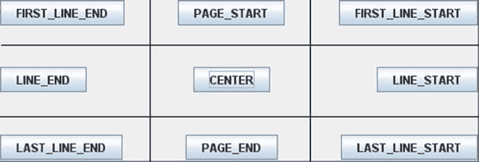

图 1-37.

当容器方向为 RIGHT_TO_LEFT 时，基于方向的锚点值及其效果

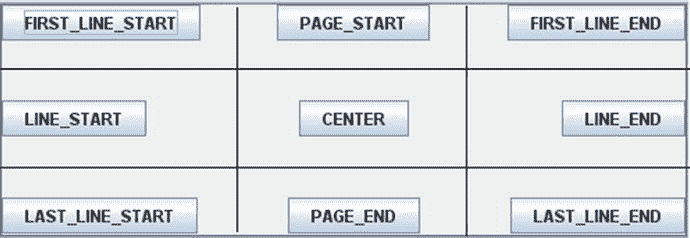

图 1-36.

当容器方向为 LEFT_TO_RIGHT 时，基于方向的锚点值及其效果

当您希望将一行中的组件沿其基线对齐时，可使用基于基线的锚点值。什么是组件的基线？基线是相对于文本而言的。它是一条假想的水平线，文本的字符就坐落在这条线上。一个组件可能具有基线。通常，组件的基线是指从其顶部边缘到其所显示文本的基线之间的像素距离。您可以通过组件的`getBaseline(int width, int height)`方法获取其基线值。请注意，您需要传入组件的宽度和高度才能获取其基线。并非每个组件都有基线。如果组件没有基线，此方法将返回`–1`。图 1-38 展示了三个组件——一个`JLabel`、一个`JTextField`和一个`JButton`——在`GridBagLayout`中沿其基线对齐排列。

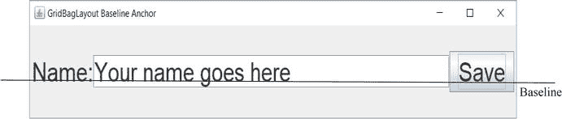

图 1-38.

一个 JLabel、一个 JTextField 和一个 JButton 沿其基线对齐

`GridBagLayout`中的每一行都可以有一个基线。图 1-38 展示了一行包含三个组件的基线。图中的一条实线水平线表示基线。请注意，这条实线水平基线是一条假想线，并非真实存在。此处仅用于演示基线的概念。只有当至少一个组件具有有效基线，并且其锚点值为`BASELINE`、`BASELINE_LEADING`或`BASELINE_TRAILING`时，`GridBagLayout`中的行才具有基线。图 1-39 展示了一些基于基线的锚点值在实际中的应用。表 1-4 列出了所有可能的值及其描述。

表 1-4.

基于基线的锚点值及描述

| 基于基线的锚点值 | 垂直对齐 | 水平对齐 |
| --- | --- | --- |
| `BASELINE` | 行基线 | 居中 |
| `BASELINE_LEADING` | 行基线 | 沿起始边缘对齐** |
| `BASELINE_TRAILING` | 行基线 | 沿结束边缘对齐*** |
| `ABOVE_BASELINE` | 底部边缘接触起始行的基线 | 居中 |
| `ABOVE_BASELINE_LEADING` | 底部边缘接触起始行的基线* | 沿起始边缘对齐** |
| `ABOVE_BASELINE_TRAILING` | 底部边缘接触起始行的基线 | 沿结束边缘对齐*** |
| `BELOW_BASELINE` | 顶部边缘接触起始行的基线* | 居中 |
| `BELOW_BASELINE_LEADING` | 顶部边缘接触起始行的基线 | 沿起始边缘对齐** |
| `BELOW_BASELINE_TRAILING` | 顶部边缘接触起始行的基线* | 沿结束边缘对齐*** |
| *起始行：术语“起始行”仅适用于组件跨越多行的情况。否则，将其理解为组件所在的行。如果某行没有基线，则组件垂直居中。 **对于`LEFT_TO_RIGHT`方向，起始边缘是左边缘；对于`RIGHT_TO_LEFT`方向，起始边缘是右边缘。 ***对于`LEFT_TO_RIGHT`方向，结束边缘是右边缘；对于`RIGHT_TO_LEFT`方向，结束边缘是左边缘。 |

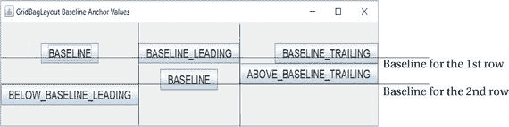

图 1-39.

一些基于基线的锚点值在实际中的应用


#### weightx 和 weighty 约束

`weightx` 和 `weighty` 约束控制容器中的额外空间如何在行和列之间分配。`weightx` 和 `weighty` 的默认值为零。它们可以取任何非负值。

图 1-40 展示了一个使用 `GridBagLayout` 并包含九个按钮的 `JFrame`。图 1-41 展示了同一个 `JFrame` 在水平和垂直方向扩展后的效果。

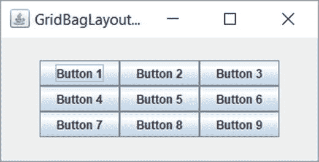

图 1-41.
调整大小后，一个包含九个按钮且使用 GridBagLayout 的 JFrame

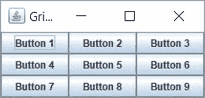

图 1-40.
一个包含九个按钮且使用 GridBagLayout 的 JFrame，无额外空间

请注意按钮组周围产生的额外空间。您已将所有按钮的 `fill` 约束设置为 `BOTH`，因此所有按钮都代表了 `GridBagLayout` 中的单元格网格。`weightx` 和 `weighty` 约束保持其默认值零。当所有组件的 `weightx` 和 `weighty` 约束都设置为零时，容器中的任何额外空间都会出现在容器边缘与单元格网格边缘之间。

`weightx` 值决定了额外水平空间在列之间的分配，而 `weighty` 值则负责在行之间分配额外垂直空间。如果所有组件具有相同的 `weightx` 和 `weighty`，则额外空间会在它们之间平均分配。图 1-42 展示了所有九个按钮的 `weightx` 和 `weighty` 都设置为 1.0 时的效果。您可以为 `weightx` 和/或 `weighty` 设置任何正值。只要它们对所有组件都相同，额外空间就会在它们之间平均分配。

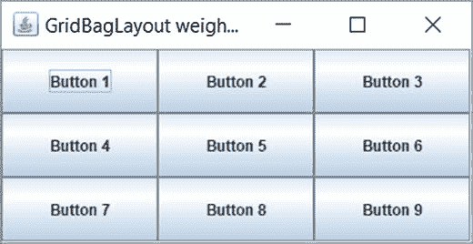

图 1-42.
调整大小后，一个包含九个按钮且使用 GridBagLayout 的 JFrame。所有按钮的 weightx 和 weighty 都设置为 1。额外空间在所有按钮的显示区域之间平均分配。

以下是基于 `weightx` 值计算每列额外空间的方法。假设一个使用 `GridBagLayout` 的容器在水平方向上扩展，产生了 `ES` 像素的额外空间。假设网格有三列三行。布局管理器会找出每列中组件 `weightx` 值的最大值。假设 `cwx1`、`cwx2` 和 `cwx3` 分别是第 1 列、第 2 列和第 3 列的 `weightx` 最大值。第 1 列将获得 `(cwx1 * ES)/(cwx1 + cwx2 + cwx3)` 的额外空间。第 2 列将获得 `(cwx2 * ES)/(cwx1 + cwx2 + cwx3)` 的额外空间。第 3 列将获得 `(cwx3 * ES)/(cwx1 + cwx2 + cwx3)` 的额外空间。为了维持单元格网格，必须使用该列中的最大 `weightx` 值来计算分配给该列的额外空间。使用 `weighty` 在单元格之间分配额外垂直空间的计算方法类似。

提示

`weightx` 和 `weighty` 约束会影响组件的显示区域大小以及组件本身的大小。通常，`weightx` 和 `weighty` 的值在 0.0 到 1.0 之间。但是，您可以使用任何非负值。组件的大小还会受到其他约束的影响，例如 `fill`、`gridwidth`、`gridheight` 等。如果您希望组件在有额外空间时能够扩展，则需要将其 `fill` 约束设置为 `HORIZONTAL`、`VERTICAL` 或 `BOTH`。您也可以在将组件添加到容器后，使用 `GridBagLayout` 类的 `setConstraints(Component c, GridBagConstraints cons)` 方法为其设置 `GridBagLayout` 中的约束。

### SpringLayout

`SpringLayout` 类（位于 `javax.swing` 包中）的实例代表一个 `SpringLayout` 管理器。回想一下，布局管理器的工作是计算容器中组件的四个属性（x、y、宽度和高度）。换句话说，它负责在容器内定位组件并计算其大小。`SpringLayout` 管理器用弹簧来表示组件的这四个属性。手动编码比较繁琐。它专为 GUI 构建工具而设计。在本节中，我将通过手动编写一些简单示例来介绍此布局的基础知识。

什么是弹簧？在 `SpringLayout` 管理器的上下文中，您可以将弹簧想象成机械弹簧，它可以被拉伸、压缩或保持正常状态。`Spring` 类的对象代表 `SpringLayout` 中的一个弹簧。一个 `Spring` 对象有四个属性：最小值、首选值、最大值和当前值。您可以将这四个属性视为其四种长度类型。弹簧在压缩最紧时具有最小值。在正常状态（既不压缩也不拉伸）下，它具有首选值。在拉伸最紧时，它具有最大值。它在任何给定时刻的值就是其当前值。当弹簧的最小值、首选值和最大值相同时，它被称为支柱。

如何创建弹簧？`Spring` 类没有公共构造函数。它包含用于创建弹簧的工厂方法。要从头开始创建弹簧或支柱，您可以使用其重载的 `constant()` 静态方法。您也可以使用组件的宽度或高度来创建弹簧。弹簧的最小值、首选值和最大值是根据组件宽度或高度的相应值设置的。以下是创建弹簧的几个示例：

```
// 创建一个 10 像素的支柱
Spring strutPadding = Spring.constant(10);
// 创建一个最小值为 10、首选值为 25、最大值为 50 的弹簧
Spring springPadding = Spring.constant(10, 25, 50);
// 根据名为 c1 的组件的宽度创建弹簧
Spring s1 = Spring.width(c1);
// 根据名为 c1 的组件的高度创建弹簧
Spring s2 = Spring.height(c1);
```

`Spring` 类包含一些实用方法，允许您操作弹簧属性。您可以使用 `sum()` 方法将两个弹簧相加来创建一个新弹簧，如下所示：

```
// 假设 s1 和 s2 是两个弹簧
Spring s3 = Spring.sum(s1, s2);
```

`sum` 的计算不是在语句执行时进行的。相反，弹簧 `s3` 存储了 `s1` 和 `s2` 的引用。每当 `s1`、`s2` 或两者都发生变化时，就会计算 `s3` 的值。在这种情况下，`s3` 的行为就像您将弹簧 `s1` 和 `s2` 串联起来一样。

您也可以通过从一个弹簧中减去另一个弹簧来创建弹簧。但是，没有名为 `subtract()` 的方法。有一个名为 `minus()` 的方法，它返回一个弹簧的负值。您可以使用 `sum()` 和 `minus()` 方法的组合来执行减法，如下所示：

```
// 执行 s1 – s2，等同于 s1 + (-s2)
Spring s4 = Spring.sum(s1, Spring.minus(s2));
```

要获取两个弹簧 `s1` 和 `s2` 的最大值，您可以使用 `Spring.max(s1, s2)`。请注意，没有对应的名为 `min()` 的方法。但是，您可以通过组合使用 `minus()` 和 `max()` 方法来模拟它，如下所示：

```
// 2 和 5 的最小值是 –2 和 –5 的最大值的负值。要获取两个弹簧 s1 和 s2 的最小值，
// 您可以使用 –s1 和 –s2 的最大值的负值
Spring min = Spring.minus(Spring.max(Spring.minus(s1), Spring.minus(s2)));
```

您还可以使用 `scale()` 方法获取另一个弹簧的分数值。例如，如果您有一个弹簧 `s1`，并且想要创建一个其值为 `s1` 的 40% 的弹簧，您可以通过将 0.40f 作为第二个参数传递给 `scale()` 方法来实现，如下所示：


```java
String fractionSpring = Spring.scale(s1, 0.40f);
```

提示

创建弹簧后，您无法更改其最小值、首选值和最大值。您可以通过使用其 `setValue()` 方法来设置其当前值。

您刚刚对弹簧进行了大量讨论。现在是时候看看它们实际运行的效果了。如何将组件添加到使用 `SpringLayout` 的容器中？最简单的形式是使用容器的 `add()` 方法来添加组件。清单 1-17 将 `JFrame` 内容面板的布局设置为 `SpringLayout`，并向其中添加了两个按钮。图 1-43 显示了运行程序时的 `JFrame`。


图 1-43.

运行 SimplestSpringLayout 类时的 JFrame

```java
// SimplestSpringLayout.java
package com.jdojo.swing.intro;
import java.awt.Container;
import javax.swing.JFrame;
import javax.swing.SpringLayout;
import javax.swing.JButton;
public class SimplestSpringLayout {
public static void main(String[] args) {
JFrame frame = new JFrame("Simplest SpringLayout");
frame.setDefaultCloseOperation(JFrame.EXIT_ON_CLOSE);
Container contentPane = frame.getContentPane();
// 将内容面板的布局设置为 SpringLayout
SpringLayout springLayout = new SpringLayout();
contentPane.setLayout(springLayout);
// 向内容面板添加两个 JButton
JButton b1 = new JButton("Button 1");
JButton b2 = new JButton("Little Bigger Button 2");
contentPane.add(b1);
contentPane.add(b2);
frame.pack();
frame.setVisible(true);
}
}
清单 1-17.
Simplest SpringLayout
```

图 1-43 显示您只能看到 `JFrame` 的标题栏。当您展开 `JFrame` 时，您会看到如图 1-44 所示的屏幕。请注意，您的两个按钮都在 `JFrame` 中。但是，它们重叠了。最简单的 `SpringLayout` 示例可能是编码最简单的；然而，看到结果却并不那么简单。

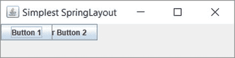

图 1-44.

运行 SimplestSpringLayout 类并展开 JFrame 后

那么，您最简单的 `SpringLayout` 示例出了什么问题？我之前提到过 `SpringLayout` 很难手动编码，现在您看到了！您在框架上使用了 `pack()` 方法来为其提供最佳大小。但是您的框架显示时没有显示区域。当您使用 `SpringLayout` 时，您必须为所有组件和容器指定 x、y、宽度和高度。这对开发人员来说工作量太大，这就是为什么我说这个布局管理器是为 GUI 构建器设计的，而不是用于手动编码。

让我们再次检查图 1-43 和图 1-44 中显示的屏幕。您会看到容器获得了位置（x 和 y），按钮获得了大小（宽度和高度）。默认情况下，`JFrame` 显示在 (0, 0) 位置，这就是您看到容器位置的方式（实际上，您的容器是内容面板）。按钮获得其默认的最小、首选和最大大小（全部设置为相同的值），这就是您在展开屏幕后看到按钮的方式。默认情况下，`SpringLayout` 将所有组件定位在容器内的 (0, 0) 处。在这种情况下，两个按钮都定位在 (0, 0)。要解决此问题，请指定两个按钮和内容面板的 x、y、宽度和高度。

`SpringLayout` 使用约束来排列组件。`Constraints` 类的对象（它是 `SpringLayout` 类的静态内部类）表示组件和容器的约束。`Constraints` 对象允许您使用其方法指定组件的 x、y、宽度和高度。所有四个属性都必须使用 `Spring` 对象来指定。当您指定这些属性时，您需要使用 `SpringLayout` 类中定义的常量之一来指定它们，这些常量列在表 1-5 中。

表 1-5.

SpringLayout 类中定义的常量

| 常量名 | 描述 |
| --- | --- |
| `NORTH` | 与 `y` 同义。它是组件的顶部边缘。 |
| `WEST` | 与 `x` 同义。它是组件的左侧边缘。 |
| `SOUTH` | 它是组件的底部边缘。其值与 `NORTH + HEIGHT` 相同。 |
| `EAST` | 它是组件的右侧边缘。与 `WEST + WIDTH` 相同。 |
| `WIDTH` | 组件的宽度。 |
| `HEIGHT` | 组件的高度。 |
| `HORIZONTAL_CENTER` | 它是组件的水平中心。与 `WEST + WIDTH/2` 相同。 |
| `VERTICAL_CENTER` | 它是组件的垂直中心。与 `NORTH + HEIGHT/2` 相同。 |
| `BASELINE` | 它是组件的基线。 |

您可以相对于容器或另一个组件设置组件的 x 和 y 约束。`Constraints` 类的对象指定组件的约束。您需要创建一个 `SpringLayout.Constraints` 类的对象，并使用其方法来设置约束值。当您将组件添加到容器时，将此约束对象传递给 `add()` 方法。清单 1-18 设置了两个按钮的 x 和 y 约束。请注意，值 (10, 20) 和 (150, 20) 是使用 `Spring` 对象指定的，并且是从内容面板的边缘测量的。图 1-45 显示了运行程序并展开 `JFrame` 后的屏幕。

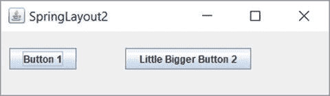

图 1-45.

为两个按钮设置 (x, y) 后展开 JFrame

```java
// SpringLayout2.java
package com.jdojo.swing.intro;
import javax.swing.SpringLayout;
import java.awt.Container;
import javax.swing.JFrame;
import javax.swing.JButton;
import javax.swing.Spring;
public class SpringLayout2 {
public static void main(String[] args) {
JFrame frame = new JFrame("SpringLayout2");
frame.setDefaultCloseOperation(JFrame.EXIT_ON_CLOSE);
Container contentPane = frame.getContentPane();
// 将内容面板的布局设置为 SpringLayout
SpringLayout springLayout = new SpringLayout();
contentPane.setLayout(springLayout);
// 向内容面板添加两个 JButton
JButton b1 = new JButton("Button 1");
JButton b2 = new JButton("Little Bigger Button 2");
// 为 b1 和 b2 创建 Constraints 对象
SpringLayout.Constraints b1c = new SpringLayout.Constraints();
SpringLayout.Constraints b2c = new SpringLayout.Constraints();
// 为 b1 和 b2 的 y 值创建一个 Spring 对象
Spring yPadding = Spring.constant(20);
// 为 b1 设置 (10, 20) 作为 (x, y)
b1c.setX(Spring.constant(10));
b1c.setY(yPadding);
// 为 b2 设置 (150, 20) 作为 (x, y)
b2c.setX(Spring.constant(150));
b2c.setY(yPadding);
// 在添加 b1 和 b2 时使用 Constraints 对象
contentPane.add(b1, b1c);
contentPane.add(b2, b2c);
frame.pack();
frame.setVisible(true);
}
}
清单 1-18.
为组件设置 x 和 y 约束
```


你尚未固定 `JFrame` 的大小。运行程序时，`JFrame` 仍会显示，但没有显示区域。至少这次两个按钮没有重叠。你为 `b2` 的 `x` 值随意选取了 150 像素。也就是说，`b2` 的左边缘距离内容面板的左边缘 150 像素。有一种方法可以指定 `b2` 的左边缘应位于距离 `b1` 右边缘指定距离的位置。要实现这一点，你需要先将 `b1` 添加到容器中。当你向容器添加组件时，`SpringLayout` 会为该组件关联一个 `Constraints` 对象，无论你是否向容器的 `add()` 方法传递了约束对象。你可以使用 `SpringLayout` 类的 `getConstraint(String edge, Component c)` 方法获取组件任意边缘的约束。以下代码片段实现了相同的功能。它将 `b1` 的 (x, y) 设置为 (10, 20)，并将 `b2` 的 (x, y) 设置为 (`b1` 的右边缘 + 5, 20)。如果你将清单 1-18 中添加两个按钮的代码替换为以下代码片段，`b2` 将出现在 `b1` 右侧 10 像素的位置：

```
// 为 b1 和 b2 的 y 值创建一个 Spring 对象
Spring yPadding = Spring.constant(20);
// 为 b1 设置 (x, y) 为 (10, 20)
b1c.setX(Spring.constant(10));
b1c.setY(yPadding);
// 先将 b1 添加到内容面板
contentPane.add(b1, b1c);
// 查询布局管理器中 b1 的 EAST 约束，即 b1 的右边缘
Spring b1Right = springLayout.getConstraint(SpringLayout.EAST, b1);
// 在 b1 的右边缘添加一个 5 像素的支柱，以定义 b2 的左边缘，并使用 b2c 的 setX() 方法进行设置
Spring b2Left = Spring.sum(b1Right, Spring.constant(5));
b2c.setX(b2Left);
b2c.setY(yPadding);
// 现在将 b2 添加到内容面板
contentPane.add(b2, b2c);
```

有一种更简单、更直观的方法来设置 `SpringLayout` 中组件的约束。首先，将所有组件添加到容器中，无需担心它们的约束，然后使用 `SpringLayout` 类的 `putConstraint()` 方法定义约束。以下是 `putConstraint()` 方法的两个版本：

*   `void putConstraint(String targetEdge, Component targetComponent, int padding, String sourceEdge,Component sourceComponent)`
*   `void putConstraint(String targetEdge, Component targetComponent, Spring padding, String sourceEdge, Component sourceComponent)`

第一个版本使用一个支柱。第三个参数（`int padding`）定义了一个固定弹簧，它将在两个组件的边缘之间充当支柱（固定距离）。第二个版本则使用弹簧代替。你可以将方法描述理解为：“`targetComponent` 的 `targetEdge` 距离 `sourceComponent` 的 `sourceEdge` 为 `padding` 距离。”例如，如果你希望 `b2` 的左边缘距离 `b1` 的右边缘 5 像素，可以调用此方法：

```
// 将 b2 的左边缘设置为距离 b1 的右边缘 5 像素
springLayout.putConstraint(SpringLayout.WEST, b2, 5,
SpringLayout.EAST, b1);
```

要将 `b1` 的左边缘（左边缘定义了 x 值）设置为距离内容面板左边缘 10 像素，你可以使用：

```
springLayout.putConstraint(SpringLayout.WEST, b1, 5,
SpringLayout.WEST, contentPane);
```

让我们回到调用 `pack()` 方法时 `JFrame` 的大小问题。你需要为内容面板的底部和右边缘设置位置，以便 `pack()` 方法能正确调整其大小。将其底部边缘设置为距离 `b1`（或 `b2`，以最接近其底部边缘的为准）底部边缘 10 像素。在此示例中，两者距离内容面板底部边缘的距离相同。将其右边缘设置为距离 `b2` 右边缘 10 像素，`b2` 是内容面板中最右侧的 `JButton`。以下代码片段实现了这一点：

```
// 设置内容面板的底部边缘
springLayout.putConstraint(SpringLayout.SOUTH, contentPane, 10,
SpringLayout.SOUTH, b1);
// 设置内容面板的右边缘
springLayout.putConstraint(SpringLayout.EAST, contentPane, 10,
SpringLayout.EAST, b2);
```

清单 1-19 包含了完整的程序，图 1-46 显示了运行程序时的 `JFrame`。

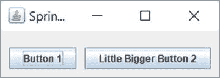

图 1-46.

使用 SpringLayout 自动调整 JFrame 大小

```
// NiceSpringLayout.java
package com.jdojo.swing.intro;
import javax.swing.JFrame;
import java.awt.Container;
import javax.swing.SpringLayout;
import javax.swing.JButton;
public class NiceSpringLayout {
public static void main(String[] args) {
JFrame frame = new JFrame("SpringLayout2");
frame.setDefaultCloseOperation(JFrame.EXIT_ON_CLOSE);
Container contentPane = frame.getContentPane();
// 将内容面板的布局设置为 SpringLayout
SpringLayout springLayout = new SpringLayout();
contentPane.setLayout(springLayout);
// 创建两个 JButton
JButton b1 = new JButton("按钮 1");
JButton b2 = new JButton("稍大一点的按钮 2");
// 添加两个 JButton，不使用任何约束
contentPane.add(b1);
contentPane.add(b2);
// 现在为两个 JButton 添加约束
// 将 b1 的 x 设置为 10
springLayout.putConstraint(SpringLayout.WEST, b1, 10,
SpringLayout.WEST, contentPane);
// 将 b1 的 y 设置为 20
springLayout.putConstraint(SpringLayout.NORTH, b1, 20,
SpringLayout.NORTH, contentPane);
// 将 b2 的 x 设置为距离 b1 右边缘 10
springLayout.putConstraint(SpringLayout.WEST, b2, 10,
SpringLayout.EAST, b1);
// 将 b1 的 y 设置为 20
springLayout.putConstraint(SpringLayout.NORTH, b2, 20,
SpringLayout.NORTH, contentPane);
/* 现在将内容面板的高度和宽度设置为 b1 底部边缘 + 10 和 b2 右边缘 + 10。
注意，内容面板高度的源是 b1，宽度的源是 b2
*/
// 设置内容面板的底部边缘
springLayout.putConstraint(SpringLayout.SOUTH, contentPane, 10,
SpringLayout.SOUTH, b1);
// 设置内容面板的右边缘
springLayout.putConstraint(SpringLayout.EAST, contentPane, 10,
SpringLayout.EAST, b2);
frame.pack();
frame.setVisible(true);
}
}
清单 1-19.
使用 SpringLayout 类的 putConstraint() 方法
```

`SpringLayout` 是一个非常强大的布局，可以模拟许多复杂的布局。以下代码片段包含更多示例。注释解释了其预期功能。

```
// 将 JButton b1 水平居中放置在内容面板顶部，你可以按如下方式设置其约束。
// 将 HORIZONTAL_CENTER 替换为
// VERTICAL_CENTER 可垂直居中 JButton
springLayout.putConstraint(SpringLayout.HORIZONTAL_CENTER, north, 0,
SpringLayout.HORIZONTAL_CENTER,                                   contentPane);
// 你可以通过将最大宽度分配给两个 JButton（b1 和 b2）来使它们宽度相同。
// 假设你已经将 b1 和 b2 JButton 添加到容器中
SpringLayout.Constraints b1c = springLayout.getConstraints(b1);
SpringLayout.Constraints b2c = springLayout.getConstraints(b2);
// 获取一个表示 b1 和 b2 宽度最大值的弹簧，并将该弹簧设置为 b1 和 b2 的宽度
Spring maxWidth = Spring.max(b1c.getWidth(), b2c.getWidth());
b1c.setWidth(maxWidth);
b2c.setWidth(maxWidth);
```


### GroupLayout

`GroupLayout` 位于 `javax.swing` 包中。它专为 GUI 构建器设计，但也足够简单，可以手动编写代码。

`GroupLayout` 使用了“组”的概念。一个组由若干元素组成。组中的元素可以是组件、间隙或另一个组。你可以将间隙视为两个组件之间的不可见区域。在使用 `GroupLayout` 之前，你必须理解“组”的概念。共有两种类型的组：

*   顺序组
*   并行组

当组中的元素按顺序一个接一个地放置时，称为顺序组。当组中的元素并行放置时，称为并行组。并行组会以四种方式之一对齐其元素：基线、居中、前导和尾随。在 `GroupLayout` 中，你需要为每个组件定义两次布局——一次沿水平轴，一次沿垂直轴。也就是说，你需要分别指定所有组件在水平方向和垂直方向上如何形成组。让我们看一些组的示例。图 1-47 展示了一个包含两个组件的组。

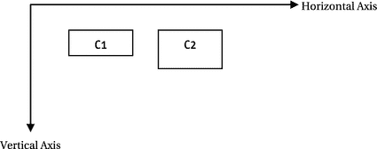

图 1-47.

两个组件 C1 和 C2 沿水平轴形成顺序组，沿垂直轴形成并行组

在图 1-47 中，两个轴仅用于讨论目的，并非布局的一部分。组件一个接一个地放置（从左到右），沿水平轴形成顺序组。它们沿垂直轴形成并行组。在垂直轴上，并行组中的两个组件沿其顶部边缘对齐。如果你在想象水平和垂直轴上的顺序组和并行组时遇到困难，可以将图 1-47 重绘为图 1-48。水平方向（从左到右）的两个虚线箭头代表 C1 和 C2，当你想象它们在水平方向上的分组时。你可以看到这两个箭头是串联的，因此 C1 和 C2 沿水平轴形成顺序组。垂直方向（从上到下，位于组件 C1 左侧）的两个虚线箭头代表 C1 和 C2，当你沿垂直轴想象它们时。你可以看到这两个箭头不是串联的，而是并行的。因此，C1 和 C2 沿垂直轴形成并行组。你需要确定并行组的对齐方式。在此例中，C1 和 C2 沿其顶部边缘对齐，这在 `GroupLayout` 术语中称为前导对齐。

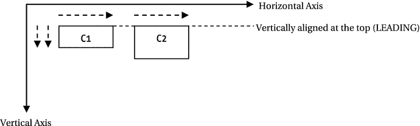

图 1-48.

组件 C1 和 C2 的分组

C1 和 C2 还有哪些其他可能的对齐方式？并行组中有四种可能的对齐方式：基线、居中、前导和尾随。如果并行组沿垂直轴出现，则四种对齐方式均有可能。如果并行组沿水平轴出现，则只有三种对齐方式（居中、前导和尾随）是可能的。沿垂直轴，前导等同于顶部边缘，尾随等同于底部边缘。沿水平轴，如果组件方向为 `LEFT_TO_RIGHT`，则前导是左边缘；如果组件方向为 `RIGHT_TO_LEFT`，则前导是右边缘。图 1-49 和图 1-50 展示了沿垂直轴和水平轴的可能对齐方式。对齐方式由虚线表示。请注意，沿垂直轴，对齐线是水平的；沿水平轴，对齐线是垂直的。`GroupLayout.Alignment` 枚举中的四个常量 `LEADING`、`TRAILING`、`CENTER` 和 `BASELINE` 用于表示这四种对齐类型。


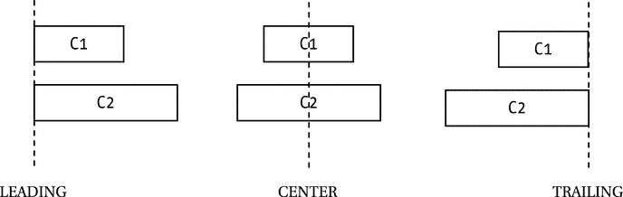

图 1-50.

在组件方向为 LEFT_TO_RIGHT 的平行组中，沿水平轴的三种可能对齐方式。对于 RIGHT_TO_LEFT 方向，LEADING 和 TRAILING 会交换边缘。

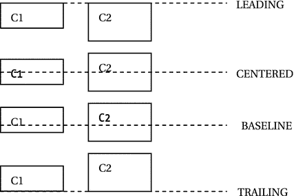

图 1-49.

在平行组中沿垂直轴的四种可能对齐方式

如何为 `GroupLayout` 创建顺序组和平行组？`GroupLayout` 类包含三个内部类：`Group`、`SequentialGroup` 和 `ParallelGroup`。`Group` 是一个抽象类，另外两个类继承自 `Group` 类。你无需直接创建这些类的对象，而是使用 `GroupLayout` 类的工厂方法来创建它们的对象。

`GroupLayout` 类提供了两个独立的方法来创建组：`createSequentialGroup()` 和 `createParallelGroup()`。从这些方法的名称可以明显看出它们创建的组类型。请注意，你需要为平行组指定对齐方式。`createParallelGroup()` 方法已被重载。无参数版本默认对齐方式为 `LEADING`。另一个版本允许你指定对齐方式。一旦有了组对象，你可以分别使用其 `addComponent()`、`addGap()` 和 `addGroup()` 方法向其中添加组件、间隙和子组。

如何使用 `GroupLayout` 管理器？以下是使用 `GroupLayout` 需要遵循的步骤。假设你需要在 `JFrame` 中放置两个按钮，如图 1-51 所示。


图 1-51.

最简单的 GroupLayout，两个按钮并排放置

假设 `JFrame` 名为 `frame`，两个 `JButtons` 分别名为 `b1` 和 `b2`。首先，你需要创建一个 `GroupLayout` 类的对象。它只有一个构造函数，该构造函数将容器引用作为参数。这意味着在创建 `GroupLayout` 类的对象之前，你需要获取要为其创建 `GroupLayout` 的容器的引用。

```
// 获取容器的引用
Container contentPane = frame.getContentPane();
// 创建一个 GroupLayout 对象
GroupLayout groupLayout = new GroupLayout(contentPane);
// 为容器设置布局管理器
contentPane.setLayout(groupLayout);
```

其次，你需要沿水平轴创建组件组（称为水平组），并使用 `setHorizontalGroup()` 方法将该组设置为 `GroupLayout`。请注意，一个组可以沿任何轴（水平和垂直）是顺序组或平行组。在你的例子中，两个按钮 `b1` 和 `b2` 沿水平轴形成一个顺序组。

```
// 创建一个顺序组
GroupLayout.SequentialGroup sGroup = groupLayout.createSequentialGroup();
// 向组中添加两个按钮
sGroup.addComponent(b1);
sGroup.addComponent(b2);
// 为 GroupLayout 设置水平组
groupLayout.setHorizontalGroup(sGroup);
```

你可以将所有步骤合并为一步，如下所示：

```
groupLayout.setHorizontalGroup(groupLayout.createSequentialGroup()
.addComponent(b1)
.addComponent(b2));
```

最后，沿垂直轴创建组件组（称为垂直组），并使用 `setVerticalGroup()` 方法将该组设置为 `GroupLayout`。两个按钮沿垂直轴形成一个平行组。你可以按如下方式完成此操作：

```
groupLayout.setVerticalGroup(
groupLayout.createParallelGroup(GroupLayout.Alignment.BASELINE)
.addComponent(b1)
.addComponent(b2));
```

提示

在 `GroupLayout` 中，不要使用容器的 `add()` 方法向容器添加组件。相反，你应该沿水平和垂直轴将组件添加到组中，然后使用 `setHorizontalGroup()` 和 `setVerticalGroup()` 方法将该组添加到 `GroupLayout`。

清单 1-20 演示了如何使用 `GroupLayout` 在 `JFrame` 中并排显示两个按钮。运行程序时，`JFrame` 将如图 1-51 所示显示。稍后我将讨论更复杂的示例。

```
// SimplestGroupLayout.java
package com.jdojo.swing.intro;
import java.awt.Container;
import javax.swing.JFrame;
import javax.swing.JButton;
import javax.swing.GroupLayout;
public class SimplestGroupLayout {
public static void main(String[] args) {
JFrame frame = new JFrame("最简单的 GroupLayout");
frame.setDefaultCloseOperation(JFrame.EXIT_ON_CLOSE);
Container contentPane = frame.getContentPane();
// 为 contentPane 创建一个 GroupLayout 类的对象
GroupLayout groupLayout = new GroupLayout(contentPane);
// 将内容面板的布局设置为 GroupLayout
contentPane.setLayout(groupLayout);
// 向内容面板添加两个 JButton
JButton b1 = new JButton("按钮 1");
JButton b2 = new JButton("稍大一点的按钮 2");
groupLayout.setHorizontalGroup(
groupLayout.createSequentialGroup()
.addComponent(b1)
.addComponent(b2));
groupLayout.setVerticalGroup(
groupLayout.createParallelGroup(GroupLayout.Alignment.BASELINE)
.addComponent(b1)
.addComponent(b2));
frame.pack();
frame.setVisible(true);
}
}
清单 1-20.
最简单的 GroupLayout
```

`GroupLayout` 还有两个值得讨论的特性：

*   它允许你在两个组件之间添加间隙。
*   它允许你指定组件、间隙和组的调整大小行为。

你可以将间隙视为一个不可见的组件。有两种类型的间隙：两个组件之间的间隙，以及组件与容器之间的间隙。你可以使用 `Group` 类的 `addGap()` 方法在两个组件之间添加间隙。你可以添加刚性间隙，也可以添加弹性间隙（类似于弹簧）。刚性间隙的大小是固定的。弹性间隙具有最小、首选和最大尺寸，并且在容器调整大小时像弹簧一样工作。要在前面的示例中在 `b1` 和 `b2` 之间添加 10 像素的刚性间隙，你可以像这样设置水平组：

```
groupLayout.setHorizontalGroup(groupLayout.createSequentialGroup()
.addComponent(b1)
.addGap(10)
.addComponent(b2));
```

有两种方法可以在两个组件之间添加间隙。它们基于间隙大小及其调整大小的能力。三种间隙类型是：

*   刚性间隙
*   弹性间隙
*   首选间隙

你可以使用 `addGap(int gapSize)` 在两个组件之间添加刚性间隙。

你可以使用 `addGap(int min, int pref, int max)` 方法在两个组件之间添加具有最小、首选和最大尺寸的弹性（类似弹簧）间隙。要添加一个最小、首选和最大尺寸分别为 5、10 和 50 的弹性间隙，你可以像这样设置水平组：

```
groupLayout.setHorizontalGroup(groupLayout.createSequentialGroup()
.addComponent(b1)
.addGap(5, 10, 50)
.addComponent(b2));
```


您可以在两个组件之间添加首选间距。在这种情况下，您可以选择指定间距的大小，或者让布局管理器为您计算。但是，您必须指定这两个组件在间距方面的关联方式。此类间距共有三种：`RELATED`、`UNRELATED` 和 `INDENT`。如果您在标签及其对应字段之间添加首选间距，则应在它们之间添加 `RELATED` 间距。例如，如果您有一个登录表单，并且想在“用户 ID：”和用于输入用户 ID 的文本字段之间添加首选间距，则应在它们之间添加 `RELATED` 间距。当两个组件属于不同组时，您可以使用 `UNRELATED` 间距。当您添加间距只是为了缩进一个组件时，您应添加 `INDENT` 间距。这三种间距由 `LayoutStyle.ComponentPlacement` 枚举中定义的三个常量 `RELATED`、`UNRELATED` 和 `INDENT` 表示。使用 `addPreferredGap()` 方法添加首选间距。以下代码片段在 `b1` 和 `b2` 之间添加了一个 `RELATED` 首选间距：

```
groupLayout.setHorizontalGroup(
groupLayout.createSequentialGroup()
.addComponent(b1)
.addPreferredGap(LayoutStyle.ComponentPlacement.RELATED)
.addComponent(b2));
```

您需要使用 `GroupLayout.SequentialGroup` 类的 `addContainerGap()` 方法来添加组件边缘与容器之间的间距。该方法已被重载。它还允许您指定间距的首选大小和最大大小。

当您在不同平台上运行应用程序时，设置硬编码的间距可能会产生问题。这就是 `GroupLayout` 提供两个方法的原因，这两个方法允许您指定希望 `GroupLayout` 根据应用程序运行所在的平台来计算首选间距。要让 `GroupLayout` 计算并设置两个组件之间的间距，您需要调用其 `setAutoCreateGaps(true)` 方法。要让它计算并设置组件与容器边缘之间的间距，您需要调用其 `setAutoCreateContainerGaps(true)` 方法。默认情况下，间距的自动计算是禁用的。将清单 1-20 中的语句

```
// 创建 GroupLayout 类的对象
GroupLayout groupLayout = new GroupLayout(contentPane);
```

替换为以下语句

```
// 创建 GroupLayout 类的对象并设置间距
GroupLayout groupLayout = new GroupLayout(contentPane);
groupLayout.setAutoCreateGaps(true);
groupLayout.setAutoCreateContainerGaps(true);
```

现在，`JFrame` 将如图 1-52 所示。您可以看到布局管理器为您添加了必要的间距。


图 1-52.

启用了自动间距的最简单 GroupLayout

`GroupLayout` 会遵循组件的最小、首选和最大尺寸。当容器调整大小时，布局管理器会向组件询问其尺寸并相应地调整它们的大小。但是，您可以通过使用 `addComponent(Component c, int min, int pref, int max)` 方法来覆盖此行为，该方法允许您指定组件的最小、首选和最大尺寸。您需要理解 `GroupLayout` 类中定义的两个常量的含义。它们是 `DEFAULT_SIZE` 和 `PREFERRED_SIZE`。它们可以在 `addComponent()` 方法中用作 `min`、`pref` 和 `max` 参数。`DEFAULT_SIZE` 意味着布局管理器应向组件询问此尺寸类型并使用它。`PREFERRED_SIZE` 意味着管理器应使用组件的首选尺寸。例如，如果您希望前面示例中的 `JButton b2` 能够扩展（默认情况下，`JButton` 具有相同的 `min`、`pref` 和 `max` 尺寸），您可以像这样将其添加到水平组中：

```
groupLayout.setHorizontalGroup(groupLayout.createSequentialGroup()
.addComponent(b1)
.addComponent(b2,
GroupLayout.PREFERRED_SIZE,
GroupLayout.PREFERRED_SIZE,
Integer.MAX_VALUE));
```

通过将 `PREFERRED_SIZE` 指定为最小尺寸和首选尺寸，您是在告诉布局管理器 `b2` 不应被缩短到低于其首选尺寸。将其最大尺寸指定为 `Integer.MAX_VALUE` 则是告诉布局管理器它可以无限扩展该按钮。要使组件不可调整大小，您可以将其所有三个尺寸都设置为与 `GroupLayout.PREFERRED_SIZE` 相同。

您可以在 `GroupLayout` 中嵌套组。让我们看一下四个按钮（命名为 `b1`、`b2`、`b3` 和 `b4`）的布局，如图 1-53 所示。

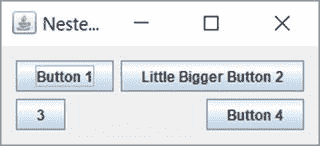

图 1-53.

GroupLayout 中的嵌套组

让我们看一下沿水平轴的组件布局。您可以看到两个并行组 (`b1`, `b3`) 和 (`b2`, `b4`)，并且这两个组是顺序放置的。让我们在伪代码中使用 `PG` 和 `SG` 分别表示并行组和顺序组。请注意，在 `PG`(`b1`, `b3`) 中，组件沿 `LEADING` 边缘（此处为左边缘）对齐，而在 `PG`(`b2`, `b4`) 中，它们沿 `TRAILING` 边缘（此处为右边缘）对齐。让我们将对齐方式插入到您的伪代码中，组将如下所示：`PGLEADING` 和 `PGTRAILING`。为了讨论这个示例，我编造了这种语法。您很快就会看到 Java 代码。如果您在想象这种排列时遇到困难，可以参考图 1-54，其中每个按钮都用一个沿水平轴的箭头表示。

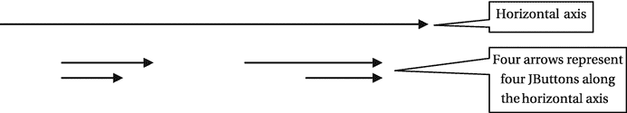

图 1-54.

四个按钮由沿水平轴的四个箭头表示

箭头的对齐方式与按钮相同。您可以观察到 `b1` 和 `b3` 的箭头是平行的，`b2` 和 `b4` 的箭头也是平行的。如果您想象这两个并行组，您可以观察到这两个组沿水平轴构成了一个顺序组。为了帮助您想象最终的排列，图 1-55 对箭头排列进行了细化。

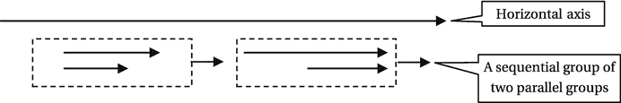

图 1-55.

四个按钮由沿水平轴的四个箭头表示

每个并行组都显示在一个虚线矩形内。从虚线矩形中出来的箭头表示这些组沿水平轴是顺序的。理解组件沿某个轴的这些并行和顺序排列可能需要一些时间。一旦您理解了，在复杂场景中使用 `GroupLayout` 就会变得非常容易。大多数情况下，您会使用 GUI 构建器工具来排列组件，并且您不必关心组的复杂性。然而，理解布局背后的概念总是有帮助的。

为了结束沿水平轴的讨论，伪代码如下所示：

```
水平组 = SG(PGLEADING, PGTRAILING)
```

类似地，您可以想象沿垂直轴的分组排列。如果您在想象这一点时遇到困难，您可以将所有四个按钮绘制为从上到下的箭头，并观察它们如何沿垂直轴形成组。以下是垂直分组排列：

```
垂直组 = SG(PGBASELINE, PGBASELINE)
```

现在，将伪代码转换为 Java 代码就很容易了，如清单 1-21 所示。


```
// NestedGroupLayout.java
package com.jdojo.swing.intro;
import java.awt.Container;
import javax.swing.JFrame;
import javax.swing.JButton;
import javax.swing.GroupLayout;
import static javax.swing.GroupLayout.Alignment.*;
public class NestedGroupLayout {
public static void main(String[] args) {
JFrame frame = new JFrame("GroupLayout 中的嵌套组");
frame.setDefaultCloseOperation(JFrame.EXIT_ON_CLOSE);
Container contentPane = frame.getContentPane();
// 将内容面板的布局设置为 GroupLayout
GroupLayout groupLayout = new GroupLayout(contentPane);
groupLayout.setAutoCreateGaps(true);
groupLayout.setAutoCreateContainerGaps(true);
contentPane.setLayout(groupLayout);
// 向内容面板添加四个 JButton
JButton b1 = new JButton("按钮 1");
JButton b2 = new JButton("稍大一点的按钮 2");
JButton b3 = new JButton("3");
JButton b4 = new JButton("按钮 4");
groupLayout.setHorizontalGroup(
groupLayout.createSequentialGroup()
.addGroup(groupLayout.createParallelGroup(LEADING)
.addComponent(b1)
.addComponent(b3))
.addGroup(groupLayout.createParallelGroup(TRAILING)
.addComponent(b2)
.addComponent(b4))
);
groupLayout.setVerticalGroup(
groupLayout.createSequentialGroup()
.addGroup(groupLayout.createParallelGroup(BASELINE)
.addComponent(b1)
.addComponent(b2))
.addGroup(groupLayout.createParallelGroup(BASELINE)
.addComponent(b3)
.addComponent(b4))
);
frame.pack();
frame.setVisible(true);
}
}
清单 1-21.
GroupLayout 中的嵌套组
```

如何让两个组件的大小相同？让我们尝试让 `b1` 和 `b3` 具有相同的大小。在使组件可调整大小时，需要考虑两件事。首先，需要考虑组的可调整大小行为。其次，需要考虑组内组件的可调整大小行为。并行组的大小等于最大元素的大小。如果考虑 `PG{LEADING](b1, b3)`，则该组的宽度将是 `b1` 的大小，因为 `b1` 是该组中最大的组件。默认情况下，`JButton` 具有固定大小。要使 `b3` 拉伸到组的大小（即 `b1` 的大小），必须将其添加到组中，并指定它可以扩展，例如 `addComponent(b3, GroupLayout.DEFAULT_SIZE, GroupLayout.DEFAULT_SIZE, Integer.MAX_VALUE)`。这将强制 `b3` 拉伸到与其组相同的大小，而该组的大小又与 `b1` 的宽度相同。如果两个组件不在同一个并行组中，要使它们大小相同，可以使用 `GroupLayout` 类的 `linkSize()` 方法。当使用 `linkSize()` 方法使组件大小相同时，无论其最小、首选和最大大小如何，这些组件都将变为不可调整大小。

```
// 使 b1、b2、b3 和 b4 大小相同
groupLayout.linkSize(b1, b2, b3, b4);
// 使 b1 和 b3 在水平方向上大小相同
groupLayout.linkSize(SwingConstants.HORIZONTAL, new Component[]{b1, b3});
```

在使用 `createParallelGroup(GroupLayout.Alignment a, boolean resizable)` 方法创建并行组时，也可以使组可调整大小。如果将可调整大小的组件放置在一个可调整大小的组中，那么当调整容器大小时，该组将调整大小，进而使组件也调整大小。

### 空布局管理器

到目前为止，您可能已经意识到布局管理器负责处理容器内组件的定位和调整大小。如果容器被调整大小，布局管理器将负责重新定位和调整其中组件的大小。如果您不想使用布局管理器，就会失去这一优势，并且需要自行负责容器内所有组件的定位和调整大小。告诉容器您不需要布局管理器很简单。只需将布局管理器设置为 `null`，如下所示：

```
// 不为 myContainer 使用布局管理器
myContainer.setLayout(null);
```

您可以将 `JFrame` 内容面板的布局管理器设置为 `null`，如下所示：

```
JFrame frame = new JFrame("无布局管理器窗口");
Container contentPane = frame.getContentPane();
contentPane.setLayout(null);
```

“空布局管理器”这个说法仅仅意味着没有布局管理器。它也被称为绝对定位。请注意，您的程序可能在不同的平台上运行。组件在不同平台上显示时，其大小可能会有所不同，而您的 `null` 布局管理器无法处理这种不一致性。当您使用 `null` 布局管理器时，请确保组件的大小足够大，以便在所有平台上都能正确显示。

清单 1-22 为 `JFrame` 的内容面板使用了 `null` 布局管理器。它向其中添加了两个按钮。它还使用 `setBounds()` 方法设置了按钮和 `JFrame` 的位置和大小。图 1-56 显示了生成的 `JFrame`。

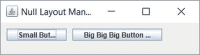

图 1-56.

使用空布局管理器的 JFrame

```
// NullLayout.java
package com.jdojo.swing.intro;
import javax.swing.JFrame;
import java.awt.Container;
import javax.swing.JButton;
public class NullLayout  {
public static void main(String[] args) {
JFrame frame = new JFrame("空布局管理器");
frame.setDefaultCloseOperation(JFrame.EXIT_ON_CLOSE);
Container contentPane = frame.getContentPane();
contentPane.setLayout(null);
JButton b1 = new JButton("小按钮 1");
JButton b2 = new JButton("大大大按钮 2...");
contentPane.add(b1);
contentPane.add(b2);
// 必须设置组件的 (x, y) 和 (width, height)
b1.setBounds(10, 10, 100, 20);
b2.setBounds(120, 10, 150, 20);
// 必须设置 JFrame 的大小，因为它使用了空布局。
// 现在，您不能使用 pack() 方法来计算其大小。
frame.setBounds(0, 0, 350, 100);
frame.setVisible(true);
}
}
清单 1-22.
使用空布局管理器
```

请注意，按钮的标签并未完全显示。这是使用 `null` 布局管理器时会遇到的问题之一。如果您尝试在运行时调整 `JFrame` 的大小，您会注意到按钮不会像使用布局管理器时那样自动调整大小。布局管理器会根据平台、文本和字体计算 `JButton` 的大小，而使用 `null` 布局管理器时，您需要自行计算（大多数情况下，您只是猜测）按钮的大小，同时考虑所有这些因素。在 Java 中使用 `null` 布局管理器并不是一个好习惯，除非您是在进行原型设计或学习 `null` 布局管理器。


## 创建可复用的 JFrame

在前面的章节中，你通过实例化 `JFrame` 类来创建 `JFrame`，并使用该类的 `main()` 方法编写构建 GUI 的代码。这些示例中的 `JFrame` 是不可复用的。到目前为止，这没有问题，因为 Swing 程序很简单，其唯一目的就是在 `JFrame` 中显示一些组件。当你开始编写更复杂的 Swing 程序时，这种编程方式将不再适用。例如，假设你想在 `JFrame` 显示后，使其中的某个 `JButton` 不可见或禁用。由于你一直将所有 `JButton` 声明为 `main()` 方法内的局部变量，一旦 `main()` 方法执行完毕，你将无法访问它们的引用。为了使你的 `JFrame` 可复用，并方便地保留添加到 `JFrame` 中的组件的引用，以便日后引用它们，你需要改变创建 `JFrame` 的方式。以下是创建 `JFrame` 的新方法。你创建自己的类，并让它继承自 `JFrame` 类，如下所示：

```
public class CustomFrame extends JFrame {
// CustomFrame 的代码写在这里
}
```

你所有的组件都在自定义类中声明为实例变量，如下所示：

```
public class CustomFrame extends JFrame {
// 声明 JFrame 中的所有组件为实例变量
JButton okButton = new JButton("确定");
JButton cancelButton = new JButton("取消");
}
```

你有一个 `initFrame()` 方法，用于将组件添加到 `JFrame` 的内容面板中。你在自定义 `JFrame` 的构造函数中调用此方法。Java 并不要求必须有 `initFrame()` 方法。这只是你为 Swing 应用程序编写代码时采用的一种约定。要显示你的 `JFrame`，你实例化你的类并使其可见。这种方法代码相似，但排列方式不同，因此你可以编写一些更正式的 Swing 程序。清单 1-23 实现了与清单 1-20 中代码相同的功能。

```
// CustomFrame.java
package com.jdojo.swing.intro;
import javax.swing.JFrame;
import javax.swing.GroupLayout.Alignment;
import javax.swing.JButton;
import java.awt.Container;
import javax.swing.GroupLayout;
public class CustomFrame extends JFrame {
// 将所有组件声明为实例变量
JButton b1 = new JButton("按钮 1");
JButton b2 = new JButton("稍大一点的按钮 2");
public CustomFrame(String title) {
super(title);
initFrame();
}
// 初始化框架并将组件添加到其中
private void initFrame() {
this.setDefaultCloseOperation(JFrame.EXIT_ON_CLOSE);
Container contentPane = this.getContentPane();
GroupLayout groupLayout = new GroupLayout(contentPane);
contentPane.setLayout(groupLayout);
groupLayout.setHorizontalGroup(
groupLayout.createSequentialGroup()
.addComponent(b1)
.addComponent(b2)
);
groupLayout.setVerticalGroup(
groupLayout.createParallelGroup(Alignment.BASELINE)
.addComponent(b1)
.addComponent(b2)
);
}
// 显示 CustomFrame
public static void main(String[] args) {
CustomFrame frame = new CustomFrame("自定义框架");
frame.pack();
frame.setVisible(true);
}
}
清单 1-23.
创建自定义 JFrame
```

## 事件处理

什么是事件？事件的字面含义如下：

> “在特定时间点发生的某件事。”

事件在 Swing 应用程序中的含义类似。Swing 中的事件是用户在特定时间点执行的操作。例如，按下按钮、在键盘上按下/释放按键、以及将鼠标移动到组件上，都是 Swing 应用程序中的事件。有时，Swing（或任何基于 GUI 的应用程序）中事件的发生也被称为“触发事件”或“激发事件”。当你说按钮上发生了点击事件时，意味着该按钮已通过鼠标、空格键或应用程序允许你按下按钮的任何其他方式被按下。有时你可以使用短语“按钮上的点击事件已被触发或激发”来表示相同的意思，即按钮已被按下。

当事件发生时，你需要对该事件做出响应。在程序中采取行动无非就是执行一段代码。响应事件的发生而采取行动称为事件处理。事件发生时执行的代码段称为事件处理器。有时事件处理器也被称为事件监听器。

如何编写事件处理器取决于事件的类型以及生成事件的组件。有时事件处理器内置于 Swing 组件中，有时你需要自己编写事件处理器。例如，当你按下 `JButton` 时，你需要自己编写事件处理器。然而，当焦点在文本字段中时，你在键盘上按下一个字母键，相应的字母就会输入到文本字段中，因为按键按下事件有一个由 Swing 提供的默认事件处理器。

事件中有三个参与者：

*   事件源
*   事件
*   事件处理器（或事件监听器）

事件源是生成事件的组件。例如，当你按下 `JButton` 时，点击事件发生在该 `JButton` 上。在这种情况下，`JButton` 就是点击事件的事件源。

事件表示在源组件上发生的操作。Swing 中的事件由一个对象表示，该对象封装了事件的详细信息，例如事件源、事件发生的时间、发生的事件类型等。表示事件的对象属于哪个类？这取决于发生的事件的类型。每种类型的事件都有一个对应的类。例如，`java.awt.event` 包中 `ActionEvent` 类的对象表示 `JButton` 的点击事件。

本章不讨论所有类型的事件。在第二章讨论组件时，我会列出组件的重要事件。在本节中，我将解释如何在 Swing 应用程序中处理任何类型的事件。

事件处理器是事件发生时执行的代码段。与事件类似，事件处理器也由一个对象表示，该对象封装了事件处理代码。表示事件处理器的对象属于哪个类？这取决于事件处理器应该处理的事件类型。事件处理器也被称为事件监听器，因为它监听源组件中事件的发生。在本章中，我将互换使用“事件处理器”和“事件监听器”这两个术语。通常，事件监听器是一个实现了特定接口的对象。事件监听器必须实现的特定接口取决于它将监听的事件类型。例如，如果你有兴趣监听 `JButton` 的点击事件（换句话说，如果你有兴趣处理 `JButton` 的点击事件），你需要一个实现了 `ActionListener` 接口的类的对象，该接口位于 `java.awt.event` 包中。


查看事件处理三个参与者的描述，你可能会觉得处理一个事件需要编写大量代码。其实不然，事件处理比看起来要简单。我将列出处理事件的步骤，并附上一个处理`JButton`点击事件的示例。以下是处理事件的步骤，这些步骤适用于处理任何 Swing 组件上的任何类型事件。

*   确定你想要处理事件的组件。假设你已经将该组件命名为`sourceComponent`。那么你的事件源就是`sourceComponent`。
*   确定你想要为源组件处理的事件。假设你感兴趣的是处理`Xxx`事件。这里的`Xxx`是一个事件名称，你需要将其替换为源组件实际存在的事件名称。回想一下，事件是由一个对象表示的。Java 的事件类命名约定可以帮助你识别出哪个类的对象代表`Xxx`事件。代表`Xxx`事件的类名为`XxxEvent`。通常，事件类位于`java.awt.event`和`javax.swing.event`包中。
*   现在该为`Xxx`事件编写一个事件监听器了。回想一下，事件监听器不过是一个实现了特定接口的类的对象。你如何知道需要在事件监听器类中实现哪个特定接口呢？这里再次用到 Java 的命名约定。对于`Xxx`事件，存在一个`XxxListener`接口，你需要在事件监听器类中实现它。通常，事件监听器接口位于`java.awt.event`和`javax.swing.event`包中。`XxxListener`接口会有一个或多个方法。`XxxListener`的所有方法都接受一个`XxxEvent`类型的参数，因为这些方法旨在处理`XxxEvent`。例如，假设你有一个`XxxListener`接口，其中包含一个名为`aMethod()`的方法，如下所示：

```
    public interface XxxListener {
    void aMethod(XxxEvent event);
    }
    ```

你的事件监听器类将如下所示。请注意，你将创建这个类。

```
    public class MyXxxEventListener implements XxxListener {
    public void aMethod(XxxEvent event) {
    // 你的事件处理代码写在这里
    }
    }
    ```

*   你几乎已经完成了。你已经确定了事件源、你感兴趣的事件以及事件监听器。只差一件事了。你需要让事件源知道，你的事件监听器有兴趣监听它的`Xxx`事件。这也称为向事件源注册事件监听器。你将事件监听器类的对象注册到事件源。在你的例子中，你将创建`MyXxxEventListener`类的一个对象。

```
    MyXxxEventListener myXxxListener = new MyXxxEventListener();
    ```

如何向事件源注册事件监听器呢？这里再次用到 Java 的命名约定。如果一个组件（事件源）支持`Xxx`事件，它将有两个方法：`addXxxListener(XxxListener listener)`和`removeXxxListener(XxxListener listener)`。当你对监听组件的`Xxx`事件感兴趣时，你调用`addXxxListener()`方法，并将一个事件监听器作为参数传入。当你不再想监听组件的`Xxx`事件时，你调用它的`removeXxxListener()`方法。要将你的`myXxxListener`对象添加为`sourceComponent`的`Xxx`事件监听器，你可以这样写：

```
    sourceComponent.addXxxListener(myXxxListener);
    ```

这就是处理`Xxx`事件所需做的全部工作。看起来你可能需要执行很多步骤来处理一个事件，但事实并非如此。你总是可以通过使用实现了`XxxListener`接口的匿名内部类，来避免编写一个新的事件监听器类。例如，你可以将之前的代码写成两条语句，如下所示：

```
// 使用匿名内部类创建一个事件监听器对象
XxxListener myXxxListener = new XxxListener() {
public void aMethod(XxxEvent event) {
// 你的事件处理代码写在这里
}
};
// 将事件监听器添加到事件源组件
sourceComponent.addXxxListener(myXxxListener);
```

如果监听器接口是一个函数式接口，你可以使用 lambda 表达式来创建它的实例。你的`XxxListener`是一个函数式接口，因为它只包含一个抽象方法。你可以避免创建冗长的匿名类，并将之前的代码重写如下：

```
// 使用 lambda 表达式添加事件监听器
sourceComponent.addXxxListener((XxxEvent event) -> {
// 你的事件处理代码写在这里
});
```

我已经讨论了足够多关于事件处理的理论。现在来看一个示例。向一个`JButton`添加事件监听器，然后将一个文本为`Close`的`JButton`添加到一个`JFrame`中。当`JButton`被按下时，`JFrame`关闭并且应用程序退出。`JButton`在被按下时会生成一个`Action`事件。一旦你知道了事件的名称（本例中是`Action`），你只需将前面通用示例中的`Xxx`替换为单词`Action`即可。你将知道处理`JButton`的`Action`事件需要使用的类和方法的名称。表 1-6 将用于处理`JButton`的`Action`事件的类/接口/方法名称与我讨论中使用的通用名称进行了比较。

表 1-6.

通用事件处理器与 JButton 的 Action 事件处理器对比

| 通用事件 Xxx | JButton 的 Action 事件 | 说明 |
| --- | --- | --- |
| `XxxEvent` | `ActionEvent` | `java.awt.event`包中`ActionEvent`类的对象代表`JButton`的`Action`事件。 |
| `XxxListener` | `ActionListener` | 实现了`ActionListener`接口的类的对象代表`JButton`的`Action`事件处理器。 |
| `addXxxListener` `(XxxListener listener)` | `addActionListener` `(ActionListener listener)` | `JButton`的`addActionListener()`方法用于向其`Action`事件添加监听器。 |
| `removeXxxListener` `(XxxListener listener)` | `removeActionListener` `(ActionListener listener)` | `JButton`的`removeActionListener()`方法用于从其`Action`事件移除监听器。 |

`ActionListener`接口很简单。它有一个名为`actionPerformed()`的方法。接口声明如下：

```
public interface ActionListener extends EventListener {
void actionPerformed(ActionEvent event);
}
```

所有事件监听器接口都继承自`java.util`包中的`EventListener`接口。`EventListener`接口是一个标记接口，它没有任何方法。它只是所有事件监听器接口的祖先。当`JButton`被按下时，其所有已注册的`Action`监听器的`actionPerformed()`方法都会被调用。

使用 lambda 表达式，以下是如何向`JButton`添加`Action`监听器：

```
// 向 closeButton 添加 ActionListener
closeButton.addActionListener(e -> System.exit(0));
```

清单 1-24 显示了一个包含`JButton`的`JFrame`。它向`JButton`添加了一个`Action`监听器。该`Action`监听器只是退出应用程序。点击`JFrame`中的关闭按钮将关闭应用程序。


```
// SimplestEventHandlingFrame.java
package com.jdojo.swing.intro;
import java.awt.FlowLayout;
import javax.swing.JFrame;
import javax.swing.JButton;
public class SimplestEventHandlingFrame extends JFrame {
JButton closeButton = new JButton("关闭");
public SimplestEventHandlingFrame() {
super("最简单的事件处理 JFrame");
this.initFrame();
}
private void initFrame() {
this.setDefaultCloseOperation(EXIT_ON_CLOSE);
// 为内容面板设置 FlowLayout
this.setLayout(new FlowLayout());
// 将“关闭”JButton 添加到内容面板
this.getContentPane().add(closeButton);
// 为 closeButton 添加 ActionListener
closeButton.addActionListener(e -> System.exit(0));
}
public static void main(String[] args) {
SimplestEventHandlingFrame frame = new SimplestEventHandlingFrame();
frame.pack();
frame.setVisible(true);
}
}
清单 1-24.
一个带有“关闭”JButton 和 Action 的 JFrame
```

我们再来看一个为 `JButton` 添加 `Action` 监听器的例子。这次，我们向一个 `JFrame` 中添加两个按钮：一个“关闭”按钮，另一个用于显示其被点击的次数。每次点击第二个按钮时，其文本都会更新以显示已被点击的次数。你需要使用一个实例变量来维护点击计数。清单 1-25 包含了完整的代码。图 1-57 展示了 `JFrame` 在初始显示时以及计数器按钮被点击三次后的状态。


图 1-57.

一个 JFrame 在初始显示时以及计数器 JButton 被点击三次后的状态

```
// JButtonClickedCounter.java
package com.jdojo.swing.intro;
import javax.swing.JFrame;
import java.awt.FlowLayout;
import java.awt.event.ActionEvent;
import javax.swing.JButton;
import java.awt.event.ActionListener;
public class JButtonClickedCounter extends JFrame {
int counter;
JButton counterButton = new JButton("已点击 #0");
JButton closeButton = new JButton("关闭");
public JButtonClickedCounter() {
super("JButton 点击计数器");
this.initFrame();
}
private void initFrame() {
this.setDefaultCloseOperation(EXIT_ON_CLOSE);
// 为内容面板设置 FlowLayout
this.setLayout(new FlowLayout());
// 将两个 JButton 添加到内容面板
this.getContentPane().add(counterButton);
this.getContentPane().add(closeButton);
// 为计数器 JButton 添加 ActionListener
counterButton.addActionListener(e -> counterButton.setText("已点击 #" + ++counter));
// 为 closeButton JButton 添加 ActionListener
closeButton.addActionListener(e -> System.exit(0));
}
public static void main(String[] args) {
JButtonClickedCounter frame = new JButtonClickedCounter();
frame.pack();
frame.setVisible(true);
}
}
清单 1-25.
一个带有两个按钮和 Action 的 JFrame
```

图 1-58 展示了处理 `Action` 事件所涉及的类和接口的类图。

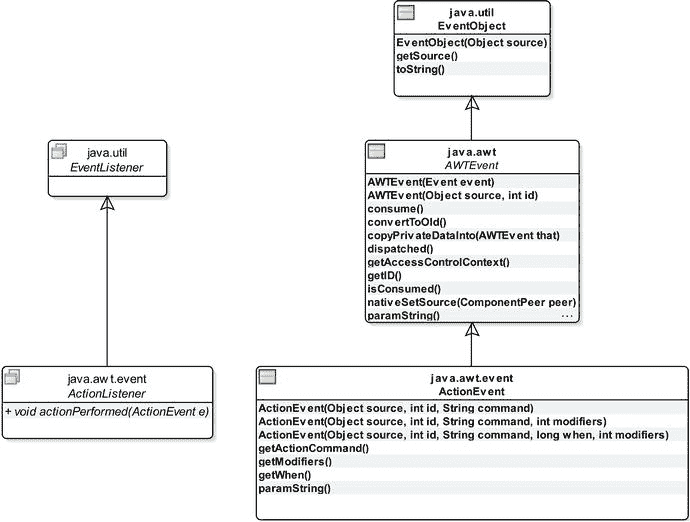

图 1-58.

与 Action 事件相关的类和接口的类图

请注意，你不需要创建 `ActionEvent` 类的对象。当 `JButton` 被按下时，它会创建一个 `ActionEvent` 类的对象，并将其传递给事件处理程序对象的 `actionPerformed()` 方法。默认情况下，`ActionEvent` 的 `getActionCommand()` 方法返回 `JButton` 的文本。你可以使用 `JButton` 的 `setActionCommand()` 方法显式设置其动作命令文本。`getModifiers()` 方法返回在动作事件期间按下的修饰键（如 Shift、Ctrl 和 Alt）的状态。修饰键是键盘上的一个键，只有与其他键组合使用时才有意义。`paramString()` 方法返回一个描述该动作事件的字符串，通常用于调试目的。

`getActionCommand()` 方法的一个用途是根据 `JButton` 上显示的文本执行某些操作。例如，你可能有一个用于在屏幕上显示或隐藏某些细节的 `JButton`。假设你想将 `JButton` 的文本显示为“显示”或“隐藏”。你可以像下面这样编写其 `Action` 监听器：

```
JButton showHideButton = new JButton("隐藏");
showHideButton.addActionListener(e -> {
if (e.getActionCommand().equals("显示")) {
// 在此处显示细节...
showHideButton.setText("隐藏");
} else {
// 在此处隐藏细节...
showHideButton.setText("显示");
}});
```

在本节中，你学习了如何为组件添加事件处理程序。这些例子都很简单，它们为 `JButton` 添加了动作事件处理程序。`ActionListener` 接口是一个函数式接口，你利用 lambda 表达式编写了动作事件监听器。Swing 是在 lambda 表达式出现之前很久就开发出来的。并非所有事件监听器接口都是函数式接口，因此你不能使用 lambda 表达式来创建它们的对象。在这些情况下，你可以使用匿名类、成员内部类，或者在你的主类中实现监听器接口。


## 处理鼠标事件

你可以在组件上处理鼠标活动（点击、进入、退出、按下和释放）。你将使用 `JButton` 来实验鼠标事件。`MouseEvent` 类的对象代表组件上的鼠标事件。现在，你可以猜到，要处理鼠标事件，你需要使用 `MouseListener` 接口。该接口的声明如下：

```
public interface MouseListener extends EventListener {
public void mouseClicked(MouseEvent e);
public void mousePressed(MouseEvent e);
public void mouseReleased(MouseEvent e);
public void mouseEntered(MouseEvent e);
public void mouseExited(MouseEvent e);
}
```

`MouseListener` 接口有五个方法。你不能使用 lambda 表达式来创建鼠标事件处理器。当特定的鼠标事件发生时，会调用 `MouseListener` 接口的其中一个方法。例如，当鼠标指针进入组件的边界时，组件上会发生鼠标进入事件，并调用鼠标监听器对象的 `mouseEntered()` 方法。当鼠标指针离开组件的边界时，会发生鼠标退出事件，并调用 `mouseExited()` 方法。其他方法的名称不言自明。

`MouseEvent` 类有许多方法，用于提供鼠标事件的详细信息：

*   `getClickCount()` 方法返回鼠标点击的次数。
*   `getX()` 和 `getY()` 方法返回事件发生时鼠标相对于组件的 x 和 y 位置。
*   `getXOnScreen()` 和 `getYOnScreen()` 方法返回事件发生时鼠标的绝对 x 和 y 位置。

假设你只对处理 `JButton` 的两种鼠标事件感兴趣：鼠标进入和鼠标退出事件。`JButton` 的文本会改变以描述该事件。鼠标事件处理代码如下：

```
mouseButton.addMouseListener(new MouseListener() {
@Override
public void mouseClicked(MouseEvent e) {
// 无需处理
}
@Override
public void mousePressed(MouseEvent e) {
// 无需处理
}
@Override
public void mouseReleased(MouseEvent e) {
// 无需处理
}
@Override
public void mouseEntered(MouseEvent e) {
mouseButton.setText("鼠标已进入！");
}
@Override
public void mouseExited(MouseEvent e) {
mouseButton.setText("鼠标已退出！");
}
});
```

在这段代码中，尽管你只对处理两种鼠标事件感兴趣，但你为 `MouseListener` 接口的所有五个方法都提供了实现。你将三个方法的主体留空了。清单 1-26 演示了 `JButton` 的鼠标进入和退出事件。当 `JFrame` 显示时，尝试将鼠标移入和移出 `JButton` 的边界，以更改其文本，指示相应的鼠标事件。

```
// HandlingMouseEvent.java
package com.jdojo.swing.intro;
import java.awt.FlowLayout;
import javax.swing.JFrame;
import javax.swing.JButton;
import java.awt.event.MouseListener;
import java.awt.event.MouseEvent;
public class HandlingMouseEvent extends JFrame {
JButton mouseButton = new JButton("尚未有鼠标移动！");
public HandlingMouseEvent() {
super("处理鼠标事件");
this.initFrame();
}
private void initFrame() {
this.setDefaultCloseOperation(EXIT_ON_CLOSE);
this.setLayout(new FlowLayout());
this.getContentPane().add(mouseButton);
// 为 JButton 添加一个 MouseListener
mouseButton.addMouseListener(new MouseListener() {
@Override
public void mouseClicked(MouseEvent e) {
}
@Override
public void mousePressed(MouseEvent e) {
}
@Override
public void mouseReleased(MouseEvent e) {
}
@Override
public void mouseEntered(MouseEvent e) {
mouseButton.setText("鼠标已进入！");
}
@Override
public void mouseExited(MouseEvent e) {
mouseButton.setText("鼠标已退出！");
}
});
}
public static void main(String[] args) {
HandlingMouseEvent frame = new HandlingMouseEvent();
frame.pack();
frame.setVisible(true);
}
}
清单 1-26.
处理鼠标事件
```

你是否总是必须为事件监听器接口的所有事件处理方法提供实现，即使你对它们并不全都感兴趣？不，不需要。Swing 设计者考虑到了这种不便，并设计了一种方法来避免它。Swing 为某些 `XxxListener` 接口包含了一个便捷类。该类名为 `XxxAdapter`。我将它们称为适配器类。`XxxAdapter` 类被声明为抽象类，并实现了 `XxxListener` 接口。`XxxAdapter` 类为 `XxxListener` 接口中的所有方法提供了空实现。以下代码片段展示了具有两个方法 `m1()` 和 `m2()` 的 `XxxListener` 接口与其对应的 `XxxAdapter` 类之间的关系。

```
public interface XxxListener {
public void m1();
public void m2();
}
public abstract class XxxAdapter implements XxxListener {
@Override
public void m1() {
// 此处未提供实现
}
@Override
public void m2() {
// 此处未提供实现
}
}
```

并非所有事件监听器接口都有对应的适配器类。声明了多个方法的事件监听器接口，才有对应的适配器类。例如，`MouseListener` 接口有一个名为 `MouseAdapter` 的适配器类。`MouseAdapter` 能为你带来什么好处？它可以为你节省几行不必要的代码。如果你只想处理少数鼠标事件，你可以创建一个继承自适配器类的匿名内部类（或常规内部类），并仅覆盖你感兴趣的方法。以下代码片段使用 `MouseAdapter` 类重写了清单 1-26 中使用的事件处理器：

```
mouseButton.addMouseListener(new MouseAdapter() {
@Override
public void mouseEntered(MouseEvent e) {
mouseButton.setText("鼠标已进入！");
}
@Override
public void mouseExited(MouseEvent e) {
mouseButton.setText("鼠标已退出！");
}
});
```

你可能会注意到，你无需担心 `MouseListener` 接口的其他三个方法，因为 `MouseAdapter` 类已经为你提供了空实现。

`ActionListener` 接口没有名为 `ActionAdapter` 的适配器类。你能猜到为什么没有 `ActionAdapter` 类吗？由于 `ActionListener` 接口只有一个方法，提供一个适配器类并不会为你节省任何按键操作。


## 摘要

Swing 是一个用于开发带图形用户界面（GUI）的 Java 应用程序的控件工具包。开发 Swing 应用程序时使用的大多数类都位于 `javax.swing` 包中。一个 GUI 由多个部分组成；每个部分代表一个向用户显示信息并允许他们与应用程序交互的图形。在基于 Swing 的 GUI 应用程序中，每个部分都称为一个组件，它是一个 Java 对象。可以包含其他组件的组件称为容器。容器和组件按层次结构排列，形成父子关系。组件包含在容器内，而该容器本身又可以包含在另一个容器中。存在两种类型的容器：顶层容器和非顶层容器。顶层容器不包含在其他容器中，可以直接显示在桌面上。例如，`JFrame` 类的一个实例代表一个顶层容器，它是一个可以拥有标题栏、菜单栏、边框和其他组件的窗口。`JButton` 类的一个实例代表一个组件。

一个顶层容器由多个层组成，例如根窗格、分层窗格、玻璃窗格和内容窗格。组件被添加到内容窗格中。

Swing 提供了布局管理器，负责在容器中布置组件。布局管理器是一个对象，负责确定容器中要显示的组件的位置和大小。每个容器都有一个默认的布局管理器。例如，`BorderLayout` 是 `JFrame` 的默认布局管理器。你可以使用容器的 `setLayout()` 方法来设置不同的布局管理器。如果某个组件的布局管理器设置为 `null`，则不使用任何布局管理器，你需要自己负责在容器中布置组件。

`FlowLayout` 是所有布局管理器中最简单的一种，它先水平布置组件，然后垂直布置。`BorderLayout` 将容器的空间划分为五个区域（北、南、东、西、中），可用于布置组件。`CardLayout` 将容器中的组件像一叠卡片一样布置，一次只显示一个组件。`BoxLayout` 将容器中的组件水平排列成一行或垂直排列成一列。`GridLayout` 将组件排列在大小相等的单元格矩形网格中，每个组件恰好占据一个单元格。`GridBagLayout` 将组件布置在由行和列组成的矩形单元格网格中，每个组件可以占据一个或多个单元格。`SpringLayout` 通过定义组件边缘之间的约束来布置组件；这些约束以弹簧（spring）的形式定义。`GroupLayout` 通过形成组件的顺序组和并行组来布置组件。

事件表示用户的操作，例如，用户点击按钮。用户通过事件与 Swing 组件交互。程序响应事件而执行操作称为事件处理。一个事件涉及三个参与者：事件源、事件和事件处理程序。事件源是生成事件的组件。事件由一个对象表示，该对象封装了导致事件发生的用户操作的详细信息。事件处理程序是特定接口的一个实例，它在事件发生时被执行。允许你处理事件的组件包含添加和移除事件处理程序的方法。事件处理中使用的类、接口和方法遵循一种命名约定，使得名称易于记忆。

问题与练习

1.  什么是 Swing？
2.  在 Swing 应用程序中，以下类的作用是什么：`Point`、`Dimension`、`Insets` 和 `Rectangle`？
3.  在 `JFrame` 中，你应该将组件添加到哪个位置：内容窗格还是玻璃窗格？
4.  补全以下代码片段中缺失的代码，该代码用于获取 `JFrame` 内容窗格的引用：

```
    JFrame frame = new JFrame("My Frame");
    Container contentPane = frame./* 在此处填写你的代码 */;
    ```

5.  `JFrame` 的 `pack()` 方法有什么作用？
6.  什么是布局管理器？为什么在 Swing 应用程序中使用布局管理器很重要？
7.  `JFrame` 内容窗格的默认布局管理器是什么？
8.  什么是 `BorderLayout`？它如何组织其组件？
9.  说出一种布局管理器的名称，该管理器将其所有组件显示在大小相等的单元格网格中。
10. 假设你向一个使用 `CardLayout` 的容器中添加了五个组件。在任何时候，该容器中会有多少个组件可见？
11. 创建一个包含 `JFrame` 和两个按钮的 Swing 应用程序。两个按钮分别标记为 `"Top"` 和 `"Bottom"`。Top 按钮应放置在 Bottom 按钮下方。当你将 `JFrame` 调高时，Top 按钮应保持在 `JFrame` 的顶部，Bottom 按钮应保持在底部，从而在两个按钮之间形成一个垂直间隙。使用 `BoxLayout` 来实现此布局。
12. 在使用 `GridBagLayout` 布局管理器时，`GridBagConstraints` 类的作用是什么？
13. 使用 `GridBagLayout` 在 `JFrame` 中显示三个按钮。第一个按钮的右下角应接触第二个按钮的左上角，第二个按钮的右下角应接触第三个按钮的右上角。
14. 在容器中布置 Swing 组件时，什么是绝对定位？如何实现它？
15. 什么是事件？当你对捕获 `JButton` 的点击事件感兴趣时，需要处理的事件类名称是什么？
16. 创建一个包含 `JButton` 的 `JFrame`。将 `JButton` 标记为 `Exit`。当 `JButton` 被按下时，向标准输出打印一条 `"Bye"` 消息并退出应用程序。

# 2. Swing 组件

在本章中，你将学习：

*   什么是 Swing 组件
*   不同类型的 Swing 组件
*   如何在文本组件中验证输入
*   如何使用菜单和工具栏
*   如何使用 `JTable` 和 `JTree` 组件编辑表格和层次数据
*   如何使用自定义和标准对话框
*   如何自定义组件的属性，例如颜色、边框、字体等
*   如何绘制组件和图形
*   如何使用即时绘制和双缓冲

本章中的所有示例程序都是 `jdojo.swing.component` 模块的成员，如清单 2-1 所示。

```
// module-info.java
module jdojo.swing.component {
requires java.desktop;
exports com.jdojo.swing.component;
}
清单 2-1.
jdojo.swing.component 模块的声明
```

Swing 和 AWT API 定义在 `java.desktop` 模块中。你使用 Swing 的模块需要读取 `java.desktop` 模块，就像 `jdojo.swing.component` 模块所做的那样。


## 什么是 Swing 组件？

Swing 提供了大量用于构建图形用户界面的组件。Swing 组件是 `JComponent` 类的一个实例。`JComponent` 类位于 `javax.swing` 包中，它是所有 Swing 组件的基类。其类层次结构如图 2-1 所示。

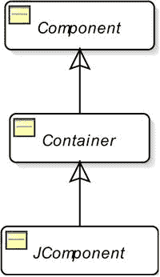

图 2-1.

JComponent 类的类层次结构

`JComponent` 类继承自 `java.awt.Container` 类，而 `Container` 类又继承自 `java.awt.Component` 类。`JComponent` 是一个抽象类，你不能直接实例化它。你必须使用它的某个子类，例如 `JButton`、`JTextField` 等。

由于 `JComponent` 类继承自 `Container` 类，每个 `JComponent` 也都可以充当容器。例如，一个 `JButton` 可以充当另一个 `JButton` 或其他 `JComponent` 的容器。除非 Swing 库提供了像 `JPanel` 这样的 `JComponent` 用作容器，否则你不会（也不需要）将 `JComponent` 用作容器。然而，这种层次结构允许你编写如下代码：

```
JButton btn = new JButton("容器 JButton");
btn.setLayout(new FlowLayout());
btn.add(new JButton("一个容器 JButton。请勿使用。"));
```

作为所有 Swing 组件的基类，`JComponent` 类提供了以下所有 Swing 组件都继承的基本功能。我将在本章后面详细讨论这些特性。

*   它提供了对工具提示的支持。工具提示是一段简短的文本，当鼠标指针在组件上停留一段时间时显示。
*   它提供了对可插拔外观的支持。组件与外观（绘制和布局）和感觉（响应用户与组件的交互，如事件处理）相关的所有方面都由一个 UI 委托对象处理。与 `JComponent` 类类似，`javax.swing.plaf` 包中的 `ComponentUI` 是用作 UI 委托对象的基类。`JComponent` 的每个子类都使用一种不同的 UI 委托对象，这些对象派生自 `ComponentUI` 类。例如，`JButton` 使用 `ButtonUI`，`JLabel` 使用 `LabelUI`，`JToolTip` 使用 `ToolTipUI` 作为 UI 委托。
*   它提供了在 Swing 组件周围添加边框的支持。边框可以是任何预定义类型（`Line`、`Bevel`、`Titled`、`Etched` 等）或自定义边框类型。
*   它提供了对无障碍访问的支持。应用程序的无障碍访问程度是指其能被不同能力（包括残障人士）的用户使用的程度。例如，它具有可以为视力受损用户以更大字体显示文本的功能。本书不涉及 Java 无障碍访问 API。
*   它提供了对双缓冲的支持，这有助于实现平滑的屏幕绘制。当组件在屏幕上被擦除和绘制时，可能会出现闪烁。为了避免闪烁，它提供了一个屏幕外缓冲区。擦除和重绘（更新组件）在屏幕外缓冲区中完成，然后将屏幕外缓冲区复制到屏幕上。
*   它提供了将键盘上的按键绑定到 Swing 组件的功能。你可以将键盘上的任何按键与一个 `ActionListener` 对象绑定到一个组件上。当按下该键时，关联的 `ActionListener` 的 `actionPerformed()` 方法将被执行。
*   它提供了在使用布局管理器时布局组件的支持。它包含获取和设置组件最小、首选和最大尺寸的方法。`JComponent` 的这三种不同尺寸设置可作为布局管理器决定 `JComponent` 尺寸的提示。
*   它允许将多个任意属性（`键-值` 对）关联到 Swing 组件并检索这些属性。`JComponent` 的 `putClientProperty()` 和 `getClientProperty()` 方法允许你处理组件属性。

表 2-1 列出了 `JComponent` 类中一些所有 Swing 组件都可用的常用方法。

表 2-1.

JComponent 类的常用方法及其描述


| 方法名称 | 描述 |
| --- | --- |
| `Border getBorder()` | 返回组件的边框，如果组件没有边框则返回 `null`。 |
| `void setBorder(Border border)` | 为组件设置边框。 |
| `Object getClientProperty(Object key)` | 返回与指定键关联的值。该值必须已通过 `putClientProperty (Object key, Object value)` 方法设置。 |
| `void putClientProperty(Object key, Object value)` | 向组件添加一个任意的键值对。 |
| `Graphics getGraphics()` | 返回组件的图形上下文对象，可用于在组件上绘制。 |
| `Dimension getMaximumSize()` `Dimension getMinimumSize()` `Dimension getPreferredSize ()` `Dimension getSize(Dimension d)` `void setMaximumSize(Dimension d)` `void setMinimumSize(Dimension d)` `void setPreferredSize(Dimension d)` `void setSize(Dimension d)` `void setSize(int width, int height)` | 获取/设置组件的最大、最小、首选和实际尺寸。调用 `getSize()` 方法时，可以传入一个 `Dimension` 对象，尺寸将被存储在该对象中并返回同一个对象。这样，该方法可以避免创建新的 `Dimension` 对象。如果传入 `null`，则会创建一个 `Dimension` 对象，将实际尺寸存储其中，并返回该对象。 |
| `String getToolTipText()` | 返回此组件的工具提示文本。 |
| `void setToolTipText(String text)` | 设置工具提示文本，当鼠标指针在组件上停留指定时间后显示。 |
| `boolean isDoubleBuffered()` | 如果组件使用双缓冲，则返回 `true`，否则返回 `false`。 |
| `void setDoubleBuffered(boolean db)` | 决定组件是否应使用双缓冲进行绘制。 |
| `boolean isFocusable()` | 如果组件可以获得焦点，则返回 `true`，否则返回 `false`。 |
| `void setFocusable(boolean focusable)` | 决定组件是否可以获得焦点。 |
| `boolean isVisible()` | 如果组件可见，则返回 `true`，否则返回 `false`。 |
| `void setVisible(boolean v)` | 设置组件可见或不可见。 |
| `boolean isEnabled()` | 如果组件已启用，则返回 `true`，否则返回 `false`。 |
| `void setEnabled(boolean e)` | 启用或禁用组件。组件默认是启用的。启用的组件会响应用户输入并生成事件。 |
| `boolean requestFocus(boolean temporary)` `boolean requestFocusInWindow()` `boolean requestFocusInWindow(boolean temporary)` | `requestFocus()` 和 `requestFocusInWindow()` 方法请求组件获得输入焦点。应优先使用 `requestFocusInWindow()` 方法而非 `requestFocus()` 方法，因为其行为在所有平台上保持一致。布尔参数指示请求是否为临时性的。如果请求注定失败，这些方法返回 `false`；如果请求将成功（除非被否决），则返回 `true`。 |
| `boolean isOpaque()` | 如果 `JComponent` 是不透明的，则返回 `true`，否则返回 `false`。 |
| `void setOpaque(boolean opaque)` | 设置 `JComponent` 的不透明度。如果 `JComponent` 是不透明的，它将绘制其边界内的每个像素。如果它是非不透明的，它可能只绘制其边界内的部分像素或不绘制任何像素，从而让后面的像素透显出来。默认情况下，`JComponent` 类将此值设置为 `false`，使其透明。然而，其子类的不透明度默认值取决于外观和具体组件。 |
| `ComponentUI getUI()` | 返回负责渲染此组件的外观委托对象。此方法是在 JDK 9 中添加到 `JComponent` 类的。 |

表 2-2 列出了一些所有 Swing 组件都可用的常用事件。每个 Swing 组件也支持一些特定事件。在讨论这些组件时，我会解释这些特定事件。请注意，除非另有说明，表 2-2 中列出的所有事件都遵循 `XxxEvent` 类、`XxxListener` 接口、`XxxAdapter` 抽象类和 `addXxxListener()` 方法的命名约定。也就是说，要处理组件的 `Xxx` 事件，你需要调用其 `addXxxListener(XxxListener l)` 方法，并传入一个实现了 `XxxListener` 接口的类的对象。`XxxListener` 接口中的所有方法都接受一个 `XxxEvent` 类型的参数。如果 `XxxListener` 中有多个方法，则存在一个对应的 `XxxAdapter` 抽象类，它实现了 `XxxListener` 接口，并为 `XxxListener` 的方法提供了空实现。

表 2-2.

所有 Swing 组件可用的部分常用事件

| 事件类名 | 事件监听器接口 | 描述 |
| --- | --- | --- |
| `ComponentEvent` | `ComponentListener` 方法：`componentShown()` `componentHidden()` `componentResized()` `componentMoved()` | 当组件的可见性、大小或位置发生改变时触发该事件。 |
| `FocusEvent` | `FocusListener` 方法：`focusGained()` `focusLost()` | 当组件获得或失去焦点时触发该事件。 |
| `KeyEvent` | `KeyListener` 方法：`keyPressed()` `keyReleased()` `keyTyped()` | 当组件拥有焦点且键盘上的按键被按下、释放或键入时触发该事件。按下和释放按键事件在按下或释放键盘上的任意键时触发。键入事件仅在键入 Unicode 字符时触发。例如，在键盘上键入字符“a”时，会依次触发按键按下、按键键入和按键释放事件。 |
| `MouseEvent` | `MouseListener` 方法：`mousePressed()` `mouseReleased()` `mouseClicked()` `mouseEntered()` `mouseExited()` | 当鼠标在组件上按下、释放和点击时，会触发鼠标按下、释放和点击事件。当鼠标进入组件的边界时，触发鼠标进入事件。当鼠标离开组件的边界时，触发鼠标离开事件。请注意，`MouseAdapter` 类实现了三个接口：`MouseListener`、`MouseMotionListener` 和 `MouseWheelListener`（参见此表中的另外两个鼠标事件）。 |
| `MouseEvent` | `MouseMotionListener` 方法：`mouseDragged()` `mouseMoved()` 注意：它在事件方法中使用 `MouseEvent` 对象作为参数。没有对应的 `MouseMotionEvent` 类。 | 当你在组件上按住鼠标按钮拖动鼠标时，触发鼠标拖动事件。即使鼠标离开组件，鼠标拖动事件也会持续触发，直到松开鼠标按钮。当你在组件上移动鼠标但未按下任何鼠标按钮时，触发鼠标移动事件。你可以使用 `MouseAdapter` 或 `MouseMotionAdapter` 抽象类为此事件编写监听器对象。 |
| `MouseWheelEvent` | `MouseWheelListener` 方法：`mouseWheelMoved()` | 当组件获得焦点且鼠标滚轮被转动时，触发鼠标滚轮移动事件。如果鼠标没有滚轮，则不会触发此事件。 |

最初，Java 提供了 AWT（抽象窗口工具包）用于构建 GUI。所有 AWT 组件都位于 `java.awt` 包中，它们使用对等体来处理其工作方式。如果你使用 AWT 创建一个按钮，操作系统会创建一个对应的按钮，称为对等体，来处理 AWT 按钮的大部分工作方式。由于每个 AWT 组件都有一个对等体，因此 AWT 组件被称为重量级组件。


Swing 在 JDK 1.2 中作为 AWT 的替代方案成为 Java 类库的一部分。大多数 Swing 组件不使用对等体，因此它们被称为轻量级组件。对于每一个 AWT 组件，你都能找到对应的 Swing 组件。Swing 还提供了一些 AWT 中没有的额外组件，例如 `JTabbedPane`。Swing 组件的名称都以 `J` 作为前缀。例如，要使用按钮组件，AWT 提供了 `Button` 类，而 Swing 提供了 `JButton` 类。要显示一个带装饰的窗口，AWT 提供了 `Frame` 类，而 Swing 提供了 `JFrame` 类。Swing 中的某些组件仍然是重量级组件。毕竟，基本的 GUI 功能始终由操作系统提供。Swing 中的所有顶层容器（`JFrame`、`JDialog`、`JWindow` 和 `JApplet`）都是重量级组件，它们拥有对等体。除顶层容器外的 Swing 组件都是轻量级组件。Swing 的轻量级组件使用其重量级容器的区域进行绘制。Swing 的轻量级组件是用 Java 编写的。

AWT 的主要缺点在于，GUI 在不同操作系统上可能看起来不同。AWT 支持所有平台上都可用的功能。由于依赖于操作系统的对等体，AWT 只能提供矩形组件。这些限制在 Swing 轻量级组件中都不存在。在 Swing 中，你可以拥有任意形状的组件，因为 Swing 使用 Java 代码绘制轻量级组件。Swing 提供了可插拔的外观和感觉，因此你不必局限于操作系统绘制 GUI 组件的方式。尽管允许，但不建议在同一应用程序中混合使用 Swing 和 AWT 组件。混合使用它们可能会导致难以调试的问题。本书仅涵盖 Swing。

在接下来的几节中，我将详细讨论几个 Swing 组件。

## JButton

`JButton` 也称为下压按钮或命令按钮。用户按下或点击 `JButton` 来执行一个操作。通常，它会显示描述其被点击时所执行操作的文本。该文本也称为标签。`JButton` 还支持显示图标。你可以使用表 2-3 中列出的构造函数之一来创建 `JButton` 的实例。

表 2-3.

JButton 类的构造函数

| 构造函数 | 描述 |
| --- | --- |
| `JButton()` | 创建一个没有标签或图标的 `JButton`。 |
| `JButton(String text)` | 创建一个 `JButton` 并将指定的文本设置为其标签。 |
| `JButton(Icon icon)` | 创建一个带有图标且没有标签的 `JButton`。 |
| `JButton(String text, Icon icon)` | 创建一个带有指定标签和图标的 `JButton`。 |
| `JButton(Action action)` | 使用一个 `Action` 对象创建 `JButton`。稍后在本节中，你将看到一个为 `JButton` 使用 `Action` 对象的示例。 |

你可以创建一个文本为 `Close` 的 `JButton`，如下所示：

```
JButton closeButton = new JButton("Close");
```

要创建一个带图标的 `JButton`，你需要有一个图像文件。图标是一个固定大小的图像。实现了 `javax.swing.Icon` 接口的类的对象代表一个图标。Swing 提供了一个非常有用的 `ImageIcon` 类，它实现了 `Icon` 接口。`ImageIcon` 类允许你在程序中从图像文件或包含 GIF、JPEG 或 PNG 图像的 URL 创建图标。以下代码片段展示了如何创建带图标的按钮：

```
// 创建图标
Icon previousIcon = new ImageIcon("C:/images/previous.gif");
Icon nextIcon = new ImageIcon("C:/images/next.gif");
// 创建带图标的按钮
JButton previousButton = new JButton("Previous", previousIcon);
JButton nextButton = new JButton("Next", nextIcon);
```

在 `ImageIcon` 类的构造函数中，你应该在文件路径中使用正斜杠（`/`）。你指定的文件路径会被转换为 URL，并且正斜杠在所有平台上都有效。此文件路径示例（`C:/images/next.gif`）适用于 Windows 平台。图 2-2 显示了一个包含三个按钮的 `JFrame`。两个按钮带有图标，一个只有文本。


图 2-2.

带有图标和文本的按钮，以及只有文本的按钮

在 Java 程序中，你大部分时间会使用的 `JButton` 事件只有一个。它被称为 `ActionEvent`。当你点击 `JButton` 时，它会被触发。`ActionListener` 接口是一个函数式接口，它只包含一个名为 `actionPerformed(ActionEvent e)` 的方法。你可以使用 lambda 表达式来表示一个 `ActionListener`。以下是你如何使用 lambda 表达式为 `closeButton` 的 `ActionEvent` 添加代码：

```
closeButton.addActionListener(() ->  {
// 处理动作事件的代码写在这里
});
```

`JButton` 支持键盘助记符，也称为键盘快捷键或键盘指示器。它是一个按键，当按下时，如果焦点位于包含该 `JButton` 的窗口中，则会激活该 `JButton`。助记键通常与修饰键（如 Alt 键）组合使用。修饰键取决于平台；但通常是 Alt 键。例如，假设你将 C 键设置为 `Close JButton` 的助记键。当你按下 Alt+C 时，Close `JButton` 就会被点击。如果在 `JButton` 文本中找到了助记键所代表的字符，则该字符的首次出现会被加下划线。以下代码片段将 C 设置为 Close `JButton` 的助记键：

```
// 将 'C' 键设置为 closeButton 的助记键
closeButton.setMnemonic('C');
// 你也可以使用以下代码来设置助记键。
// KeyEvent 类位于 java.awt.event 包中。
closeButton.setMnemonic(KeyEvent.VK_C);
```


代码展示了两种设置助记键的方法。当你不想使用字符键作为助记键时，可以采用第二种方法。例如，若要将`F3`键设置为助记键，可以使用第二种方法中的`KeyEvent.VK_F3`常量。图 2-3 展示了一个“关闭”`JButton`，其文本的第一个字符带有下划线。当你按下 Alt+C 时，“关闭”`JButton`会被激活（效果等同于用鼠标点击它）。


图 2-3.

一个以 C 作为键盘助记键的关闭按钮

表 2-4 展示了`JButton`类中常用的方法。

表 2-4.

JButton 类的常用方法

| 方法 | 描述 |
| --- | --- |
| `Action getAction()` | 返回与`JButton`关联的`Action`对象。 |
| `void setAction(Action a)` | 为`JButton`设置一个`Action`对象。调用此方法时，`JButton`的所有属性都会从指定的`Action`对象刷新。如果已设置了一个`Action`对象，新对象将替换旧对象。新的`Action`对象会被注册为`ActionListener`。任何通过`addActionListener()`方法注册到`JButton`的其他`ActionListener`仍保持注册状态。 |
| `Icon getIcon()` | 返回与`JButton`关联的`Icon`对象。 |
| `void setIcon(Icon icon)` | 为`JButton`设置一个图标。 |
| `int getMnemonic()` | 返回此`JButton`的键盘助记键。 |
| `void setMnemonic(int n)` `void setMnemonic(char c)` | 为`JButton`设置键盘助记键。 |
| `String getText()` | 返回`JButton`的文本。 |
| `void setText()` | 设置`JButton`的文本。 |

接下来，我们使用一个`Action`对象来创建`JButton`。到目前为止，你已经看到`JButton`只有四个常用属性：文本、图标、助记键和动作监听器。使用这些属性非常简单直接。那么，使用`Action`对象如何帮助你处理`JButton`呢？我们来看一个例子：假设你有一个按钮（比如“关闭”），它被放置在窗口的不同区域（比如不同的标签页）。如果这个按钮在窗口中被放置了四次，并且它们的外观和行为都必须一致，那么一个`Action`对象就能帮助你只编写一次“关闭”按钮的代码，并在多处重复使用。

`Action`封装了按钮的状态和行为。你可以在一个`Action`中设置文本、图标、助记键、工具提示文本、其他属性以及`ActionListener`，然后使用同一个`Action`来创建所有`JButton`实例。这样做的一个明显好处是，如果你想启用/禁用所有四个`JButton`，无需分别对它们进行启用/禁用操作。相反，你只需在`Action`中设置`enabled`属性，它就会启用/禁用所有`JButton`。让我们将这个用法扩展到菜单项和工具栏。在窗口中，通常需要提供一个菜单项、一个工具栏项和一个按钮来执行相同的操作。在这种情况下，你可以使用同一个`Action`来创建这三个组件（菜单项、工具栏项和按钮），以保持它们的状态同步。现在你可以体会到`Action`的好处在于代码复用以及保持多个组件状态同步。

`Action`是一个接口。`AbstractAction`类为`Action`接口提供了默认实现。`AbstractAction`是一个抽象类。你需要让你的类继承它。清单 2-2 定义了一个`CloseAction`内部类，它继承自`AbstractAction`类。

```
// ActionJButtonTest.java
package com.jdojo.swing.component;
import java.awt.FlowLayout;
import javax.swing.JFrame;
import javax.swing.JButton;
import java.awt.event.ActionEvent;
import javax.swing.AbstractAction;
import javax.swing.Action;
import java.awt.Container;
public class ActionJButtonTest extends JFrame {
// 内部类从这里开始
public class CloseAction extends AbstractAction {
public CloseAction() {
super("Close");
}
@Override
public void actionPerformed(ActionEvent event) {
System.exit(0);
}
} // 内部类在这里结束
JButton closeButton1;
JButton closeButton2;
Action closeAction = new CloseAction(); // 参见上面的内部类
public ActionJButtonTest() {
super("Using Action object with JButton");
this.initFrame();
}
private void initFrame() {
this.setDefaultCloseOperation(EXIT_ON_CLOSE);
this.setLayout(new FlowLayout());
Container contentPane = this.getContentPane();
// 使用同一个 closeAction 对象创建两个关闭按钮
closeButton1 = new JButton(closeAction);
closeButton2 = new JButton(closeAction);
contentPane.add(closeButton1);
contentPane.add(closeButton2);
}
public static void main(String[] args) {
ActionJButtonTest frame = new ActionJButtonTest();
frame.pack();
frame.setVisible(true);
}
}
清单 2-2.
使用 Action 对象创建和配置 JButton
```

`ActionJButtonTest`类创建了一个类型为`CloseAction`的`Action`对象，并使用它创建了两个按钮：`closeButton1`和`closeButton2`。`CloseAction`类将文本设置为`Close`，并在其`actionPerformed()`方法中直接退出应用程序。图 2-4 展示了运行程序时得到的`JFrame`。它显示了两个`Close`按钮。点击其中任何一个都会调用`Action`对象的`actionPerformed()`方法，从而退出应用程序。


图 2-4.

使用同一个 Action 实例创建的两个关闭按钮

如果在使用`Action`对象时想为`JButton`设置任何属性，可以通过`Action`接口的`putValue(String key, Object value)`方法来实现。例如，以下代码片段为`closeAction`对象设置了工具提示文本和助记键：

```
// 为 Action 对象设置工具提示文本
closeAction.putValue(Action.SHORT_DESCRIPTION, "Closes the application");
// 为 Action 对象设置助记键
closeAction.putValue(Action.MNEMONIC_KEY, KeyEvent.VK_C);
```

如果你使用`Action`对象配置了`JButton`，之后又直接更改了`JButton`的属性，那么更改后的属性将生效，直到你再次更改`Action`对象中的该属性。假设你使用一个`CloseAction`对象创建了两个关闭按钮。如果你调用`closeButton1.setText("Exit")`，第一个按钮将显示文本`Exit`。如果你调用`closeAction.putValue(Action.NAME, "Close/Exit")`，两个按钮都将显示文本`Close/Exit`。


## JPanel

`JPanel` 是一个可容纳其他组件的容器。您可以设置其布局管理器、边框和背景颜色。通常，您使用 `JPanel` 来对相关组件进行分组，并将其添加到另一个容器中，例如添加到 `JFrame` 的内容窗格。请注意，`JPanel` 是一个容器，但不是顶级容器，而 `JFrame` 是顶级容器。因此，在 Swing 应用程序中，您不能单独显示一个 `JPanel`，除非您将其添加到顶级容器中。有时，`JPanel` 会被插入到两个组件之间以创建间隙。您也可以将 `JPanel` 用作绘图画布，例如用于绘制线条、矩形、圆形等。

`JPanel` 的默认布局管理器是 `FlowLayout`。您可以选择在 `JPanel` 类的构造函数中指定其布局管理器。您也可以在创建它之后，通过使用其 `setLayout()` 方法来更改其布局管理器。表 2-5 列出了 `JPanel` 类的构造函数。

表 2-5.

JPanel 类的构造函数

| 构造函数 | 描述 |
| --- | --- |
| `JPanel()` | 创建一个具有 `FlowLayout` 和双缓冲的 `JPanel`。 |
| `JPanel(boolean isDoubleBuffered)` | 创建一个具有 `FlowLayout` 和指定双缓冲标志的 `JPanel`。 |
| `JPanel(LayoutManager layout)` | 创建一个具有指定布局管理器和双缓冲的 `JPanel`。 |
| `JPanel(LayoutManager layout, boolean isDoubleBuffered)` | 创建一个具有指定布局管理器和双缓冲标志的 `JPanel`。 |

以下代码片段展示了如何使用 `BorderLayout` 创建一个 `JPanel` 并向其添加四个按钮。请注意，这些按钮被添加到 `JPanel`，而该 `JPanel` 又被添加到 `JFrame` 的内容窗格。您也可以将一个 `JPanel` 添加到另一个 `JPanel` 中，以创建嵌套的、复杂的组件布局。

```
// 创建一个 JPanel 和四个按钮
JPanel buttonPanel = new JPanel(new BorderLayout());
JButton northButton = new JButton("North");
JButton southButton = new JButton("South");
JButton eastButton = new JButton("East");
JButton westButton = new JButton("west");
// 将按钮添加到 JPanel
buttonPanel.add(northButton, BorderLayout.NORTH);
buttonPanel.add(southButton, BorderLayout.SOUTH);
buttonPanel.add(eastButton, BorderLayout.EAST);
buttonPanel.add(westButton, BorderLayout.WEST);
// 将 buttonPanel 添加到 JFrame 的内容窗格，假设内容窗格的布局设置为 BorderLayout
contentPane.add(buttonPanel, BorderLayout.SOUTH);
```

## JLabel

顾名思义，`JLabel` 是一个标签，用于在屏幕上标识或描述另一个组件。它可以显示文本、图标，或同时显示两者。通常，`JLabel` 放置在其所描述组件的旁边（右侧或左侧）或顶部。图 2-5 显示了一个文本设置为 `Name:` 的 `JLabel`，它向用户指示他们应在旁边的字段中输入姓名。

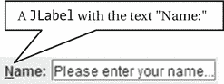

图 2-5.

一个文本为 Name: 且助记符设置为 N 的 JLabel 组件

`JLabel` 的另一个常见用途是显示图像。Swing 不包含像 `JImage` 这样的组件来显示图像。您需要使用带有 `Icon` 的 `JLabel` 来显示图像。表 2-6 列出了 `JLabel` 类的构造函数。

表 2-6.

JLabel 类的构造函数

| 构造函数 | 描述 |
| --- | --- |
| `JLabel()` | 创建一个文本为空字符串且没有图标的 `JLabel`。 |
| `JLabel(Icon icon)` | 创建一个带有图标且文本为空字符串的 `JLabel`。 |
| `JLabel(Icon icon, int horizontalAlignment)` | 创建一个带有图标和指定水平对齐方式的 `JLabel`。`JLabel` 在其显示区域内垂直居中对齐。您可以在其显示区域内指定其水平对齐方式，作为 `SwingConstants` 类中定义的以下常量之一：`LEFT`、`CENTER`、`RIGHT`、`LEADING` 或 `TRAILING`。 |
| `JLabel(String text)` | 创建一个带有指定 `text` 的 `JLabel`。这是最常用的构造函数。它在其显示区域内垂直居中，水平方向与起始边缘对齐。起始边缘由组件的方向决定。 |
| `JLabel(String text, Icon icon, int horizontalAlignment)` | 创建一个带有指定 `text`、`icon` 和水平对齐方式的 `JLabel`。 |
| `JLabel(String text, int horizontalAlignment)` | 创建一个带有指定 `text` 和水平对齐方式的 `JLabel`。 |

以下代码片段展示了一些如何创建 `JLabel` 的示例：

```
// 创建一个文本为 Name: 的 JLabel
JLabel nameLabel = new JLabel("Name:");
// 在一个 JLabel 中显示来自名为 warning.gif 文件的图像
JLabel warningImage = new JLabel(new Icon("C:/images/warning.gif"));
```

`JLabel` 不会生成任何有趣的事件。但是，它有一些有用的方法可以用来自定义它。您将非常频繁地使用以下方法：

*   `void setText(String text)`
*   `void setDisplayedMnemonic(char aChar)`
*   `void setDisplayedMnemonic(int key)`
*   `void setLabelFor(Component c)`

`setText()` 方法用于设置 `JLabel` 的文本。`setDisplayedMnemonic()` 方法用于为 `JLabel` 设置键盘助记符。如果键盘助记符是 `JLabel` 文本中出现的一个字符，则该字符会被加下划线，以给用户提示。`setLabelFor()` 方法接受对另一个组件的引用，并指示此 `JLabel` 描述该组件。`setDisplayedMnemonic()` 和 `setLabelFor()` 这两个方法协同工作。当按下 `JLabel` 的助记键时，焦点将设置到 `setLabelFor()` 方法中使用的组件。图 2-5 中显示的 `JLabel` 将其助记符设置为字符 `N`，您可以看到其文本中的字符 `N` 带有下划线。当用户按下 Alt+N 时，焦点将设置到显示在 `JLabel` 右侧的 `JTextField`。以下代码片段展示了如何创建图 2-5 中所示的组件排列：

```
// 创建一个用户可以在其中输入姓名的 JTextField
JTextField nameTextField = new JTextField("Please enter your name...");
// 创建一个 JLabel，其助记符为 N，标签关联组件为 nameTextField
JLabel nameLabel = new JLabel("Name:");
nameLabel.setDisplayedMnemonic('N');
nameLabel.setLabelFor(nameTextField);
// 将名称标签和字段添加到容器中，例如 contentPane
contentPane.add(nameLabel);
contentPane.add(nameTextField);
```

`JLabel` 类中还定义了其他方法，允许您设置/获取其在显示区域内的对齐方式以及其边界内的文本。如果您查看 `JLabel` 组件的特性，您会发现它存在的唯一目的就是描述另一个组件——一个真正利他的组件！


## 文本组件

简单来说，你可以将文本定义为一个字符序列。Swing 提供了丰富的功能来处理文本。图 2-6 展示了 Swing 中表示文本组件的类图。

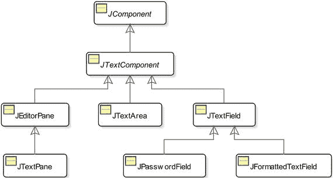

图 2-6.

Swing 中与文本相关组件的类图

Swing 提供了大量与文本相关的功能，以至于它有一个独立的包 `javax.swing.text`，其中包含了所有与文本相关的类。`JTextComponent` 类位于 `javax.swing.text` 包中。其余类则位于 `javax.swing` 包中。

Swing 提供了不同的组件来处理不同类型的文本。我们可以根据两个标准对文本组件进行分类：文本的行数和它们能处理的文本类型。根据文本组件能处理的文本行数，可以进一步分类如下：

*   单行文本组件
*   多行文本组件

单行文本组件设计用于处理一行文本，例如，用户名、密码、出生日期等。`JTextField`、`JPasswordField` 和 `JFormattedTextField` 类的实例代表单行文本组件。

多行文本组件设计用于处理多行文本，例如，评论、商店中商品的描述、文档等。`JTextArea`、`JEditorPane` 和 `JTextPane` 类的实例代表多行文本组件。

根据文本组件能处理的文本类型，可以将文本组件分类如下：

*   纯文本组件
*   样式文本组件

文本（或部分文本）的样式是指文本的显示方式，例如粗体、斜体、下划线等，以及字体和颜色。在文本组件的上下文中，纯文本意味着文本组件中包含的所有文本仅使用一种样式显示。`JTextField`、`JPasswordField`、`JFormattedTextField` 和 `JTextArea` 是纯文本组件的例子。也就是说，你不能在 `JTextArea` 中显示多行文本，其中部分文本是粗体而其他部分不是。你只能在 `JTextArea` 中以粗体字体显示全部文本，或以常规字体显示全部文本。请注意，纯文本并不意味着文本不能有样式。它意味着只有一种样式适用于整个文本（构成文本的所有字符）。

在样式文本中，你可以对文本的不同部分应用不同的样式。在样式文本中，文本的某些部分可以是粗体（或斜体、更大的字号、下划线等），而某些部分不是粗体。`JEditorPane` 和 `JTextPane` 是样式组件的例子。

所有 Swing 组件，包括 Swing 文本组件，都基于模型-视图-控制器（MVC）模式。MVC 模式使用三个组件：模型、视图和控制器。模型负责存储内容（文本）。视图负责显示内容。控制器负责响应用户操作。Swing 将视图和控制器合并为一个称为 UI 的对象，该对象负责显示内容和响应用户操作。它将模型分开，并由 `Document` 接口的一个实例表示，该接口位于 `javax.swing.text` 包中。文本组件的模型有时也被称为其文档。图 2-7 描绘了 Swing 文本组件的不同部分。

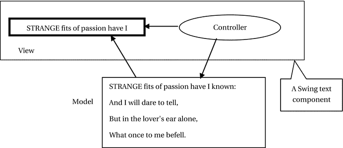

图 2-7.

Swing 文本组件的模型-视图-控制器模式的组成部分

请注意，视图可能并不总是显示文本组件的全部内容。在图 2-7 中，模型包含了威廉·华兹华斯一首诗的四行内容，而视图只显示了第一行中的几个单词。

Swing 提供了 `Document` 接口的默认实现，这使得开发人员可以轻松处理常用的文本类型。当你使用文本组件时，它会为你创建一个合适的模型（在讨论中我有时将其称为文档），该模型适合存储文本组件的内容。图 2-8 展示了 `Document` 接口以及相关类和接口的类图。图中显示的所有类和接口都位于 `javax.swing.text` 包中。

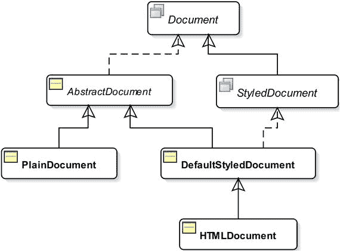

图 2-8.

文档接口及相关接口和类的类图

你可以使用 `setDocument(Document doc)` 方法为文本组件设置模型。`getDocument()` 方法返回文本组件的模型。

默认情况下，`JTextField`、`JPasswordField`、`JFormattedTextField` 和 `JTextArea` 使用 `PlainDocument` 类的实例作为其模型。如果你想自定义这些文本组件的模型，你需要创建一个继承自 `PlainDocument` 类的类，并重写其中的一些方法。

`JEditorPane` 和 `JTextPane` 的模型取决于正在编辑和/或显示的内容类型。文本组件中字符的位置使用从零开始的索引。也就是说，文本中的第一个字符位于索引 0。

### JTextComponent

`JTextComponent` 是一个抽象类。它是所有 Swing 文本组件的祖先。它包含了所有文本组件通用的功能。表 2-7 列出了 `JTextComponent` 类中包含的一些常用文本组件方法。

表 2-7.

JTextComponent 类中的常用方法


| 方法 | 描述 |
| --- | --- |
| `Keymap addKeymap(String name, Keymap parentKeymap)` | 向组件的键位映射层级结构中添加一个新的键位映射。 |
| `void copy()` | 将选中的文本复制到系统剪贴板。 |
| `void cut()` | 将选中的文本移动到系统剪贴板。 |
| `Action[] getActions()` | 返回文本编辑器的命令列表。 |
| `Document getDocument()` | 返回文本组件的模型。 |
| `Keymap getKeymap()` | 返回文本组件当前激活的键位映射。 |
| `static Keymap getKeymap (String keymapName)` | 返回与此文档关联的、名称为 `keymapName` 的键位映射。 |
| `String getSelectedText()` | 返回组件中选中的文本。如果没有选中文本或文档为空，则返回 `null`。 |
| `int getSelectionEnd()` | 返回选中文本的结束位置。 |
| `int getSelectionStart()` | 返回选中文本的起始位置。 |
| `String getText()` | 返回此文本组件中包含的文本。它返回的是组件模型中包含的文本，而非视图所显示的内容。 |
| `String getText(int offset, int length) throws BadLocationException` | 返回文本组件中包含的一部分文本，从 `offset` 位置开始，字符数等于 `length`。如果 `offset` 或 `length` 无效，则抛出 `BadLocationException`。例如，如果一个文本组件包含文本 `Hello`，那么 `getText(1, 3)` 将返回 `ell`。 |
| `TextUI getUI()` | 返回文本组件的用户界面工厂。 |
| `boolean isEditable()` | 如果文本组件可编辑，则返回 `true`。否则，返回 `false`。 |
| `void paste()` | 将系统剪贴板的内容传输到文本组件模型中。如果组件中有选中的文本，则替换该选中文本。如果没有选中内容，则在当前位置之前插入内容。如果系统剪贴板为空，则不执行任何操作。 |
| `void print()` | 显示一个打印对话框，允许您打印文本组件的内容，不包含页眉和页脚。此方法已被重载。该方法的其他版本提供了更多功能来打印文本组件的内容。 |
| `void read(Reader source, Object description) throws IOException` | 从 `source` 流中读取内容到文本组件，并丢弃组件原有的内容。`description` 是一个描述 `source` 流的对象。例如，要将文件 `test.txt` 的文本读入名为 `ta` 的 `JTextArea`，您可以编写 `FileReader fr = new FileReader("test.txt");` `ta.read(fr, "Hello");` `fr.close();` |
| `void replaceSelection(String newContent)` | 用 `newContent` 替换选中的内容。如果没有选中的内容，则插入 `newContent`。如果 `newContent` 为 `null` 或空字符串，则移除选中的内容。 |
| `void select(int start, int end)` | 选中 `start` 和 `end` 位置之间的文本。 |
| `void selectAll()` | 选中文本组件中的所有文本。 |
| `void setDocument(Document doc)` | 为文本组件设置文档（即模型）。 |
| `void setEditable(boolean editable)` | 如果 `editable` 为 `true`，则将文本组件设置为可编辑。如果 `editable` 为 `false`，则将文本组件设置为不可编辑。 |
| `void setKeymap(Keymap keymap)` | 为文本组件设置键位映射。 |
| `void setSelectionEnd(int end)` | 设置选区的结束位置。 |
| `void setSelectionStart(int start)` | 设置选区的起始位置。 |
| `void setText(String newText)` | 设置文本组件的文本。 |
| `void setUI(TextUI newUI)` | 为文本组件设置新的 UI。 |
| `void updateUI()` | 重新加载文本组件的可插拔 UI。 |
| `void write(Writer output)` | 将文本组件的内容写入由 `output` 定义的流中。例如，要将名为 `ta` 的 `JTextArea` 的文本写入名为 `test.txt` 的文件，您可以编写 `FileWriter wr = new FileWriter("test.txt");` `ta.write(wr);` `wr.close();` |

文本组件最常用的方法是 `getText()` 和 `setText(String text)`。`getText()` 方法以 `String` 形式返回文本组件的内容，而 `setText(String text)` 方法则设置参数中指定的文本组件的内容。


### JTextField

`JTextField` 可以处理（显示和/或编辑）一行纯文本。你可以通过多种方式使用其构造器来创建 `JTextField`。其构造器接受以下参数的组合：

*   一个字符串
*   列数
*   一个 `Document` 对象

字符串指定初始文本。列数指定宽度。`Document` 对象指定模型。初始文本的默认值为 `null`，列数为零，文档（或模型）是 `PlainDocument` 类的一个实例。

如果你不指定列数，其宽度将由初始文本决定。其首选宽度将足以显示整个文本。如果你指定了列数，其首选宽度将足以显示与指定列数相同数量的 `m` 字符（使用 `JTextField` 的当前字体）。表 2-8 列出了 `JTextField` 类的构造器。

表 2-8.

JTextField 类的构造器

| 构造器 | 描述 |
| --- | --- |
| `JTextField()` | 创建一个 `JTextField`，其初始文本、列数和文档均使用默认值。 |
| `JTextField(Document document, String text, int columns)` | 创建一个 `JTextField`，使用指定的 `document` 作为其模型，`text` 作为其初始文本，`columns` 作为其列数。 |
| `JTextField(int columns)` | 创建一个 `JTextField`，使用指定的 `columns` 作为其列数。 |
| `JTextField(String text)` | 创建一个 `JTextField`，使用指定的 `text` 作为其初始文本。 |
| `JTextField(String text, int columns)` | 创建一个 `JTextField`，使用指定的 `text` 作为其初始文本，`columns` 作为其列数。 |

以下代码片段使用不同的构造器创建了多个 `JTextField` 实例：

```
// 创建一个空的 JTextField
JTextField emptyTextField = new JTextField();
// 创建一个初始文本为 Hello 的 JTextField
JTextField helloTextField = new JTextField("Hello");
// 创建一个列数为 20 的 JTextField
JTextField nameTextField = new JTextField(20);
```

你可以在一个 `JTextField` 中输入多少个字符？在 `JTextField` 中可以输入的字符数没有限制。如果你想限制 `JTextField` 中的字符数，你需要自定义其模型。请注意，`JTextField` 的模型存储其内容。在查看自定义模型的实际应用之前，让我们先看看在 Swing 中为文本组件分离模型和视图的强大之处。

让我们创建两个名为 `name` 和 `mirroredName` 的 `JTextField` 实例。你将把 `mirroredName` 的模型设置为与 `name` 的模型相同。你正在做一件非常简单的事情。你对两个文本字段使用相同的模型。这使得两个字段互为镜像字段。如果你在其中之一输入文本，相同的文本会自动显示在另一个中。这是如何发生的？当你在 `JTextField` 中输入文本时，其模型会被更新。模型中的更新会向其视图（在这种情况下，两个组件充当视图）发送通知以更新自身。由于两个文本字段是具有相同模型的两个视图，因此模型中的更新（通过任一文本字段）将向两个文本字段发送通知，两者都会更新其视图以显示相同的文本。

清单 2-3 演示了如何在两个文本字段之间共享模型。运行此程序并在任一文本字段中输入一些文本。你将看到另一个文本字段会同时更新为相同的文本。

```
// MirroredTextField.java
package com.jdojo.swing.component;
import javax.swing.JFrame;
import javax.swing.JTextField;
import javax.swing.JLabel;
import java.awt.GridLayout;
import java.awt.Container;
import javax.swing.text.Document;
public class MirroredTextField extends JFrame {
JLabel nameLabel = new JLabel("Name:") ;
JLabel mirroredNameLabel = new JLabel("Mirrored Name:") ;
JTextField name = new JTextField(20);
JTextField mirroredName = new JTextField(20);
public MirroredTextField() {
super("Mirrored JTextField");
this.initFrame();
}
private void initFrame() {
this.setDefaultCloseOperation(EXIT_ON_CLOSE);
this.setLayout(new GridLayout(2, 0));
Container contentPane = this.getContentPane();
contentPane.add(nameLabel);
contentPane.add(name);
contentPane.add(mirroredNameLabel);
contentPane.add(mirroredName);
// 将 mirroredName 的模型设置为与 name 的模型相同，
// 这样它们就共享了内容的存储。
Document nameModel = name.getDocument();
mirroredName.setDocument(nameModel);
}
public static void main(String[] args) {
MirroredTextField frame = new MirroredTextField();
frame.pack();
frame.setVisible(true);
}
}
清单 2-3.
通过共享模型实现 JTextField 的镜像
```

要为 `JTextField` 拥有自己的模型，你需要创建一个新类。新类可以实现 `Document` 接口，或者继承自 `PlainDocument` 类。后一种方法更简单且最常用。清单 2-4 包含了 `LimitedCharDocument` 类的代码，该类继承自 `PlainDocument` 类。当你想要限制 `JTextField` 中的字符数时，你可以使用此类作为 `JTextField` 的模型。默认情况下，它允许用户输入无限数量的字符。你可以在其构造器中设置允许的字符数。

```
// LimitedCharDocument.java
package com.jdojo.swing.component;
import javax.swing.text.PlainDocument;
import javax.swing.text.BadLocationException;
import javax.swing.text.AttributeSet;
public class LimitedCharDocument extends PlainDocument {
private int limit = -1; // 无限制
public LimitedCharDocument(int limit) {
super();
this.limit = limit;
}
public void insertString(int offset, String str, AttributeSet a)
throws BadLocationException {
if (limit >= 0 && str != null) {
// 检查限制
int currentLength = this.getLength();
int newTextLength = str.length();
if (currentLength + newTextLength > limit) {
newString = str.substring(0, limit - currentLength);
}
}
super.insertString(offset, newString, a);
}
}
清单 2-4.
一个表示具有有限字符数的纯文档的类
```

`LimitedCharDocument` 类中的 `insertString()` 方法值得关注。`Document` 接口声明了一个 `insertString()` 方法。`PlainDocument` 类提供了此方法的默认实现。`LimitedCharDocument` 类覆盖了默认实现，并检查插入的字符串是否会超过允许的字符数。如果插入的字符串超过了允许的最大字符数，它会截断多余的字符。如果你将限制设置为负数，则允许无限数量的字符。最后，该方法简单地调用其在 `PlainDocument` 类中的实现来执行实际的操作。

每当文本被插入到 `JTextField` 中时，模型的 `insertString()` 方法就会被调用。此方法接收以下三个参数：

*   `int offset`：这是字符串在 `JTextField` 中插入的位置。第一个字符在偏移量 0 处插入，第二个在偏移量 1 处插入，依此类推。
*   `String str`：这是插入到 `JTextField` 中的字符串。当你在 `JTextField` 中输入文本时，每输入一个字符就会调用一次 `insertString()` 方法，并且此参数将只包含一个字符。但是，当你将文本粘贴到 `JTextField` 中或使用其 `setText()` 方法时，此参数可能包含多个字符。
*   `AttributeSet a`：必须与插入文本关联的属性。

你可以如下使用 `LimitedCharDocument`：


```
// 创建一个 JTextField，仅允许输入 10 个字符
Document tenCharDoc = new LimitedCharDocument(10);
JTextField t1 = new JTextField(tenCharDoc, "your name", 10);
```

还有另一种为 `JTextField` 设置文档的方法。你需要创建一个继承自 `JTextField` 的新类，并重写其 `createDefaultModel()` 方法。该方法在 `JTextField` 类中被声明为 `protected`，默认返回一个 `PlainDocument`。你可以在此方法中返回自定义文档类的实例。自定义 `JTextField` 的代码如下所示：

```
public class TenCharTextField extends JTextField {
@Override
protected Document createDefaultModel() {
// 返回一个最多允许 10 个字符的文档对象
return new LimitedCharDocument(10);
}
// 其他代码写在这里
}
```

当你需要一个容量为十个字符的 `JTextField` 时，可以使用 `TenCharTextField` 类的实例。

`createDefaultModel()` 方法是在 `JTextField` 类的构造函数中被调用的。因此，你不应该向自定义的 `JTextField` 传递参数，并在类的 `createDefaultModel()` 方法中使用该参数的值来构建模型。例如，以下代码片段不会产生预期的结果：

```
static class LimitedCharTextField extends JTextField {
private int maxChars = -1;
public LimitedCharTextField(int maxChars) {
this.maxChars = maxChars;
}
protected Document createDefaultModel() {
/* 错误地使用了 maxChars！！！当此方法被调用时，
maxChars 将具有其默认值零。此方法将在
JTextField 类的构造函数中被调用，而此时
此类的构造函数尚未开始执行。
*/
return new LimitedCharDocument(maxChars);
}
}
```

有时，你可能希望强制用户以特定格式在文本字段中输入文本，例如以 `mm/dd/yyyy` 格式输入日期，或仅输入数字。这可以通过为 `JTextField` 组件使用自定义模型来实现。Swing 包含另一个名为 `JFormattedTextField` 的文本组件，它允许你为文本字段设置格式。如果你需要一个允许用户以特定格式添加文本的组件，`JFormattedTextField` 会让工作变得容易得多。我稍后会讨论 `JFormattedTextField`。

### JPasswordField

`JPasswordField` 是一种 `JTextField`，不同之处在于它允许隐藏字段中实际显示的字符。例如，当你使用登录表单输入密码时，你不希望别人从你背后看到屏幕上的密码。默认情况下，`JPasswordField` 会为字段中的每个实际字符显示一个星号（`*`）字符。这被称为回显字符。默认的回显字符也取决于应用程序所使用的界面外观。你可以通过使用其 `setEchoChar(char newEchoChar)` 方法来设置自己的回显字符。

`JPasswordField` 类拥有与 `JTextField` 类相同的构造函数集合。你可以结合使用初始文本、列数以及一个 `Document` 对象来创建一个 `JPasswordField` 对象。

```
// 创建一个宽度为 10 个字符的密码字段
JPasswordField passwordField = new JPasswordField(10);
```

出于安全原因，`JPasswordField` 的 `getText()` 方法已被弃用。你应该改用其 `getPassword()` 方法，该方法返回一个 `char[]`。在使用完 `char[]` 后，应将其所有元素重置为零值。以下代码片段展示了如何验证在 `JPasswordField` 中输入的密码：

```
// 获取在字段中输入的密码
char c[] = passwordField.getPassword();
// 假设你有一个字符串形式的正确密码。
// 通常，你会从文件或数据库中获取它
String correctPass = "Hello";
// 不要将 c[] 中的密码转换为字符串。相反，将 correctPass
// 转换为 char[]。或者，最好一开始就将 correctPass 作为 char[] 存储。
char[] cp = correctPass.toCharArray();
// 使用 java.util.Arrays 类的 equals() 方法来比较 c 和 cp 是否相等
if (Arrays.equals(c, cp)) {
// 密码正确
} else {
// 密码错误
}
// 将字符数组中的密码置空
Arrays.fill(c, (char)0);
Arrays.fill(cp, (char)0);
```

你可以使用 `setEchoChar()` 方法设置你选择的回显字符，如下所示：

```
// 将 # 设置为回显字符
password.setEchoChar('#');
```

你可以通过将回显字符设置为零来将 `JPasswordField` 用作 `JTextField`，如下所示：

```
// 将回显字符设置为 0，这样实际的密码字符就可见了
passwordField.setEchoChar((char)0);
```

提示

你需要将 `JPasswordField` 的回显字符设置为 ASCII 值为零的字符，这样 `JPasswordField` 才会显示实际字符。如果你将回显字符设置为 `'0'`（ASCII 值为 48），则不会显示实际密码。相反，每个实际字符都会回显一个 `'0'` 字符。


### JFormattedTextField

`JFormattedTextField` 是一种 `JTextField`，它额外具备以下两种能力：

*   它允许你指定文本的编辑和/或显示格式。
*   它还允许你指定当字段中的值为 `null` 时的格式。

除了用于获取和设置字段中文本的 `getText()` 和 `setText()` 方法之外，`JFormattedTextField` 还提供了两个新方法，名为 `getValue()` 和 `setValue()`，它们允许你处理任何类型的数据，而不仅仅是文本。

`JFormattedTextField` 预配置为可处理三种数据类型：数字、日期和字符串。但是，你可以格式化任何对象以在此字段中显示。你可以通过使用其不同的构造函数（列于表 2-9 中）以多种方式设置 `JFormattedTextField` 的格式。

表 2-9.

JFormattedTextField 类的构造函数

| 构造函数 | 描述 |
| --- | --- |
| `JFormattedTextField()` | 创建一个没有格式化器的 `JFormattedTextField`。你需要使用其 `setFormatterFactory()` 或 `setValue()` 方法来设置格式化器。 |
| `JFormattedTextField(Format format)` | 创建一个 `JFormattedTextField`，它将使用指定的 `format` 来格式化字段中的文本。 |
| `JFormattedTextField(` `JFormattedTextField.AbstractFormatter formatter)` | 使用指定的格式化器创建一个 `JFormattedTextField`。 |
| `JFormattedTextField(JFormattedTextField.AbstractFormatterFactory` `factory)` | 使用指定的工厂创建一个 `JFormattedTextField`。 |
| `JFormattedTextField(` `JFormattedTextField.AbstractFormatterFactory` `factory, Object initialValue)` | 使用指定的工厂和指定的初始值创建一个 `JFormattedTextField`。 |
| `JFormattedTextField(Object value)` | 使用指定的值创建一个 `JFormattedTextField`。该字段将根据值的类自行配置以格式化该值。如果传递 `null` 作为值，则该字段无法知道需要格式化哪种类型的值，并且根本不会尝试格式化该值。 |

理解格式（format）、格式化器（formatter）和格式化器工厂（formatter factory）之间的区别是必要的。一个 `java.text.Format` 对象定义了对象以字符串形式呈现的格式。也就是说，它定义了一个对象作为字符串的样子；例如，一个日期对象以 `mm/dd/yyyy` 格式呈现时看起来像 `07/09/2008`。

格式化器由一个 `JFormattedTextField.AbstractFormatter` 对象表示，它使用一个 `java.text.Format` 对象来格式化一个对象。它的工作是将对象转换为字符串，并将字符串转换回对象。

格式化器工厂是格式化器的集合。`JFormattedTextField` 使用格式化器工厂来获取特定类型的格式化器。格式化器工厂由 `JFormattedTextField.AbstractFormatterFactory` 类的一个实例表示。

以下代码片段将 `dobField` 配置为以当前区域设置格式将其中的文本格式化为日期：

```
JFormattedTextField dobField = new JFormattedTextField();
dobField.setValue(new Date());
```

以下代码片段将 `salaryField` 配置为以当前区域设置格式显示数字：

```
JFormattedTextField salaryField = new JFormattedTextField();
salaryField.setValue(new Double(11233.98));
```

你也可以使用格式化器创建一个 `JFormattedTextField`。你需要分别使用 `DateFormatter`、`NumberFormatter` 和 `MaskFormatter` 类来格式化日期、数字和字符串。这些类位于 `javax.swing.text` 包中。

```
// 创建一个字段，以 mm/dd/yyyy 格式格式化日期
DateFormat dateFormat = new SimpleDateFormat("mm/dd/yyyy");
DateFormatter dateFormatter = new DateFormatter(dateFormat);
dobField = new JFormattedTextField(dateFormatter);
// 创建一个字段，以 $#0,000.00 格式格式化数字
NumberFormat numFormat = new DecimalFormat("$#0,000.00");
NumberFormatter numFormatter = new NumberFormatter(numFormat);
salaryField = new JFormattedTextField(numFormatter);
```

你需要使用掩码格式化器来格式化字符串。掩码格式化器使用表 2-10 中列出的特殊字符来指定掩码。

表 2-10.

用于指定掩码的特殊字符

| 字符 | 描述 |
| --- | --- |
| `#` | 一个数字。 |
| `?` | 一个字母。 |
| `A` | 一个字母或数字。 |
| `*` | 任何字符。 |
| `U` | 一个字母，小写字符映射为其对应的大写字符。 |
| `L` | 一个字母，大写字符映射为其对应的小写字符。 |
| `H` | 一个十六进制数字（A-F, a-f, 0-9）。 |
| `'` | 单引号。这是一个转义字符，用于转义任何特殊格式化字符。 |

为了让用户以 `###-##-####` 格式输入社会安全号码，你可以按如下方式创建一个 `JFormattedTextField`。请注意，构造函数 `MaskFormatter(String mask)` 会抛出 `ParseException`。

```
MaskFormatter ssnFormatter = null;
JFormattedTextField ssnField = null;
try {
ssnFormatter = new MaskFormatter("###-##-####");
ssnField = new JFormattedTextField(ssnFormatter);
} catch (ParseException e) {
e.printStackTrace();
}
```

当你使用掩码格式化器时，你只能使用在掩码中指定的那么多字符。所有非特殊字符（特殊字符列表见表 2-10）都会按其在掩码中出现的样子显示。对于掩码中的每个特殊字符，会显示一个占位符（默认为空格）。例如，如果你将掩码指定为 `"###-##-####"`，`JFormattedTextField` 会显示 `" - - "` 作为占位符。你也可以使用 `MaskFormatter` 类的 `setPlaceHolderCharacter(char placeholder)` 方法为特殊字符指定一个占位符字符。要在 SSN 字段中显示 `000-00-0000`，你需要使用 `‘0’` 作为掩码格式化器的占位符字符，如下所示：

```
ssnFormatter = new MaskFormatter("###-##-####");
ssnFormatter.setPlaceholderCharacter('0');
```

你可以在创建组件后使用 `JFormattedTextField` 的 `setFormatterFactory()` 方法来更改格式化器。例如，要在创建名为 `dobField` 的 `JFormattedTextField` 后为其设置日期格式，你可以编写：

```
DateFormatter df = new DateFormatter(new SimpleDateFormat("mm/dd/yyyy"));
DefaultFormatterFactory dff = new DefaultFormatterFactory(df, df, df, df); dobField.setFormatterFactory(dff);
```

`JFormattedTextField` 允许你指定四种类型的格式化器：

*   **空值格式化器**：当字段中的值为 `null` 时使用。
*   **编辑格式化器**：当字段获得焦点时使用。
*   **显示格式化器**：当字段未获得焦点且具有非 null 值时使用。
*   **默认格式化器**：在缺少其他三种格式化器中的任何一种时使用。

你可以通过在 `JFormattedTextField` 类的构造函数中使用格式化器工厂或调用其 `setFormatterFactory()` 方法来指定所有四种格式化器。`JFormattedTextField.AbstractFormatterFactory` 抽象类的一个实例代表一个格式化器工厂。`javax.swing.text.DefaultFormatterFactory` 类是 `JFormattedTextField.AbstractFormatterFactory` 类的一个实现。当你指定一个格式化器时，同一个格式化器会替代四种格式化器使用。当你指定一个格式化器工厂时，你可以在四种不同情况下指定不同的格式化器。


假设你有一个名为 `dobField` 的 `JFormattedTextField` 用于显示日期。当此字段获得焦点时，你希望允许用户以 `mm/dd/yyyy` 格式（例如 `07/07/2008`）编辑日期。当它失去焦点时，你希望以 `mmmm dd, yyyy` 格式（例如 `July 07, 2008`）显示日期。以下代码片段可实现此功能：

```
DateFormatter df = new DateFormatter(new SimpleDateFormat("mmmm dd, yyyy"));
DateFormatter edf = new DateFormatter(new SimpleDateFormat("mm/dd/yyyy"));
DefaultFormatterFactory ddf = new DefaultFormatterFactory(df, df, edf, df);
dobField.setFormatterFactory(ddf);
```

如果你已将 `JFormattedTextField` 配置为格式化日期，则可以使用其 `getValue()` 方法获取一个 `Date` 对象。`getValue()` 方法的返回类型是 `Object`，你需要将返回值强制转换为 `Date` 类型。你可以将光标置于字段中日期值的月、日、年、时、分、秒部分，并使用上/下箭头键更改该特定部分。如果你想在输入时覆盖字段中的值，则需要通过使用 `setOverwriteMode(true)` 方法将格式化程序设置为覆盖模式。

使用 `JFormattedTextField` 的另一个优势是可以限制字段中可输入的字符数。回想一下，在上一节中，你是通过为 `JTextField` 使用自定义文档来实现这一点的。你可以通过设置掩码格式化程序来实现相同的效果。假设你希望允许用户在字段中最多输入两个字符。你可以按如下方式实现：

```
JFormattedTextField twoCharField = new JFormattedTextField(new MaskFormatter("**"));
```

### JTextArea

`JTextArea` 可以处理多行纯文本。大多数情况下，当你在 `JTextArea` 中有多行文本时，你将需要滚动功能。`JTextArea` 本身不提供滚动功能。相反，当你需要在任何 Swing 组件中具有滚动功能时，你需要从另一个名为 `JScrollPane` 的 Swing 组件获得帮助。

你可以为 `JTextArea` 指定行数和列数，这些行数和列数用于确定其首选大小。行数用于确定其首选高度。如果你将行数设置为 `N`，这意味着其首选高度将被设置为在当前字体设置下显示 `N` 行文本。列数用于确定其首选宽度。如果你将列数设置为 `M`，这意味着其首选宽度被设置为 `M` 乘以当前字体设置下字符 `m`（小写 M）的宽度。

`JTextArea` 提供了多个构造函数，用于使用初始文本、模型、行数和列数的组合作为参数来创建 `JTextArea` 组件，如表 2-11 所示。

表 2-11.

JTextArea 类的构造函数

| 构造函数 | 描述 |
| --- | --- |
| `JTextArea()` | 使用默认模型、初始字符串为 `null`、行/列数为零创建一个 `JTextArea`。 |
| `JTextArea(Document doc)` | 使用指定的 `doc` 作为其模型创建一个 `JTextArea`。其初始字符串设置为 `null`，行/列数设置为零。 |
| `JTextArea(Document doc, String text, int rows, int columns)` | 使用其参数中指定的所有属性（模型、初始文本、行和列）创建一个 `JTextArea`。 |
| `JTextArea(int rows, int columns)` | 使用默认模型、初始字符串为 `null` 以及指定的行/列数创建一个 `JTextArea`。 |
| `JTextArea(String text)` | 使用指定的初始文本创建一个 `JTextArea`。设置默认模型，行/列数设置为零。 |
| `JTextArea(String text, int rows, int columns)` | 使用指定的文本、行和列创建一个 `JTextArea`。使用默认模型。 |

以下代码片段使用不同的初始值创建了多个 `JTextArea` 实例：

```
// 创建一个空白的 JTextArea
JTextArea emptyTextArea = new JTextArea();
// 创建一个 10 行 50 列的 JTextArea
JTextArea commentsTextArea = new JTextArea(10, 50);
// 创建一个 10 行 50 列且初始文本为 "Enter resume here" 的 JTextArea
JTextArea resumeTextArea = new JTextArea("Enter resume here", 10, 50);
```

非常重要的一点是，请记住，当你使用 `JTextArea` 时，大多数情况下你的文本大小会大于其在屏幕上的大小，因此你将需要滚动功能。要为 `JTextArea` 添加滚动功能，你需要将其添加到 `JScrollPane` 中，然后将 `JScrollPane` 添加到容器中，而不是 `JTextArea`。以下代码片段演示了这一概念。假设你有一个名为 `myFrame` 的 `JFrame`，其内容面板的布局设置为 `BorderLayout`，并且你希望在中心区域添加一个可滚动的 `JTextArea`。

```
// 创建 JTextArea
JTextArea resumeTextArea = new JTextArea("Enter resume here", 10, 50);
// 将 JTextArea 添加到 JScrollPane
JScrollPane sp = new JScrollPane(resumeTextArea);
// 获取 JFrame 内容面板的引用
Container contentPane = myFrame.getContentPane();
// 将 JScrollPane (sp) 添加到内容面板，而不是 JTextArea
contentPane.add(sp, BorderLayout.CENTER);
```

表 2-12 包含了一些 `JTextArea` 的常用方法。大多数情况下，你将使用其 `setText()`、`getText()` 和 `append()` 方法。

表 2-12.

JTextArea 的常用方法


| 方法 | 描述 |
| --- | --- |
| `void append(String text)` | 将指定的 `text` 追加到 `JTextArea` 的末尾。 |
| `int getLineCount()` | 返回 `JTextArea` 中的行数。 |
| `int getLineStartOffset(int line) throws BadLocationException` `int getLineEndOffset(int line) throws BadLocationException` | 返回指定 `line` 编号的起始和结束偏移量（也称为位置，从零开始）。如果 `line` 编号超出范围，则抛出异常。此方法在与 `getLineCount()` 方法结合使用时非常有用。你可以在循环中使用这三个方法逐行解析 `JTextArea` 中包含的文本。 |
| `int getLineOfOffset(int offset) throws BadLocationException` | 返回指定 `offset` 所在的行号。 |
| `boolean getLineWrap()` | 如果已设置自动换行，则返回 `true`。否则，返回 `false`。 |
| `int getTabSize()` | 返回一个制表符所使用的字符数。默认情况下，返回 8。 |
| `boolean getWrapStyleWord()` | 如果单词换行已设置为 `true`，则返回 `true`。否则，返回 `false`。 |
| `void insert(String text, int offset)` | 在指定的 `offset` 处插入指定的 `text`。如果模型为 `null` 或指定的 `text` 为空或 `null`，则调用此方法无效。 |
| `void replaceRange(String text, int start, int end)` | 用指定的 `text` 替换 `start` 和 `end` 位置之间的文本。 |
| `void setLineWrap(boolean wrap)` | 设置 `JTextArea` 的自动换行策略。如果自动换行设置为 `true`，则当一行超出 `JTextArea` 的宽度时，该行将被换行。如果设置为 `false`，即使行比 `JTextArea` 的宽度长，也不会换行。默认情况下，它被设置为 `false`。 |
| `void setTabSize(int size)` | 设置一个制表符将扩展到的字符数。 |
| `void setWrapStyleWord(boolean word)` | 当自动换行设置为 `true` 时，设置单词换行样式。当设置为 `true` 时，行在单词边界处换行。否则，行在字符边界处换行。默认情况下，它被设置为 `false`。 |

`JTextArea` 在其可显示区域内使用可配置的策略进行换行和单词换行。如果自动换行设置为 `true` 并且一行比组件的宽度长，则该行将被换行。默认情况下，自动换行设置为 `false`。自动换行通过 `setLineWrap(boolean lineWrap)` 方法设置。

一行可以在单词边界或字符边界处换行，这由单词换行策略决定。单词换行策略通过 `setWrapStyleWord(boolean wordWrap)` 方法设置。仅当调用了 `setLineWrap(true)` 时，调用此方法才生效。也就是说，单词换行策略定义了自动换行策略的细节。图 2-9 显示了在 `JFrame` 中显示的三个 `JTextArea` 组件。

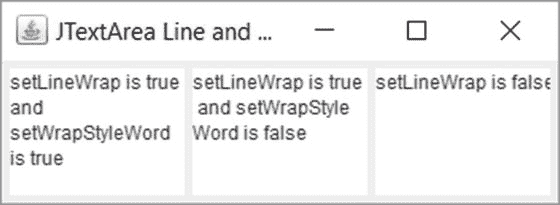

图 2-9.

JTextArea 中自动换行和单词换行的效果

对于图中的三个 `JTextArea` 组件（从左到右），自动换行和单词换行的设置分别为 (`true`, `true`)、(`true`, `false`) 和 (`false`, `true`)。第一个在单词边界处换行。第二个在字符边界处换行。第三个根本没有换行，你无法在其宽度内查看整个文本。请注意，这三个 `JTextArea` 组件都是直接添加到 `JFrame` 中的，而没有将其添加到 `JScrollPane` 中。

### JEditorPane

`JEditorPane` 是一个文本组件，旨在处理不同类型的文本。默认情况下，它知道如何处理纯文本、HTML 和富文本格式 (RTF)。尽管它旨在编辑和显示多种类型的内容，但它主要用于显示仅包含基本 HTML 元素的 HTML 文档。对 RTF 内容的支持非常基础。

`JEditorPane` 使用特定的 `EditorKit` 对象来处理特定类型的内容。如果你想在此组件中处理新类型的内容，则需要创建一个自定义的 `EditorKit` 类，该类是 `javax.swing.text.EditorKit` 类的子类。如果你仅使用此组件来显示 HTML 内容，则无需担心 `EditorKit`；该组件会为你处理与 `EditorKit` 相关的功能。使用 `JEditorPane` 显示 HTML 页面只需一行代码，如下所示：

```
// 创建一个 JEditorPane 来显示 yahoo.com 网页
JEditorPane htmlPane = new JEditorPane("http://www.yahoo.com");
```

请注意，`JEditorPane` 类的某些构造函数会抛出 `IOException`。当你指定 URL 时，必须使用 URL 的完整形式，并以协议开头。你可以通过以下三种不同方式让 `JEditorPane` 知道它需要安装哪种类型的 `EditorKit` 来处理其内容：

*   通过调用 `setContentType(String contentType)` 方法
*   通过调用 `setPage(URL url)` 或 `setPage(String url)` 方法
*   通过调用 `read(InputStream in, Object description)` 方法

`JEditorPane` 预配置为理解三种类型的内容：text/plain、text/html 和 text/rtf。你可以使用以下代码来显示文本 `Hello`，并使用 HTML 中的 `<h1>` 标签：

```
htmlPane.setContentType("text/html");
htmlPane.setText("Hello");
```

当你调用其 `setPage()` 方法时，它会使用适当的 `EditorKit` 来处理 URL 提供的内容。在以下代码片段中，`JEditorPane` 根据内容类型使用 `EditorKit`：

```
// 处理一个 HTML 页面
editorPane.setPage("http://www.yahoo.com");
// 处理一个 RTF 文件。当你使用文件协议时，可以使用三个斜杠代替一个
editorPane.setPage("file:///C:/test.rtf");
```

`JEditorPane` 将流中的内容读取到编辑器窗格中。如果其编辑器工具包已设置为处理 HTML 内容，并且指定的描述是 `javax.swing.text.html.HTMLDocument` 类型，则内容将作为 HTML 读取。否则，内容将作为纯文本读取。

当你处理 HTML 文档时，你可能希望在单击超链接时导航到不同的页面。为了使用超链接，你需要向 `JEditorPane` 添加一个超链接监听器，并在事件监听器的 `hyperlinkUpdate()` 方法中，使用 `setPage()` 方法导航到新页面。超链接上的三种操作类型之一：`ENTERED`、`EXITED` 和 `ACTIVATED`，会触发 `hyperlinkUpdate()` 方法。当鼠标进入超链接区域时发生 `ENTERED` 事件，当鼠标离开超链接区域时发生 `EXITED` 事件，当单击超链接时发生 `ACTIVATED` 事件。当你想要使用超链接导航到另一个页面时，请确保在你的超链接监听器的 `hyperlinkUpdate()` 方法中检查 `ACTIVATED` 事件。以下代码片段使用 lambda 表达式向 `JEditorPane` 添加一个 `HyperlinkListener`：

```
editorPane.addHyperlinkListener((HyperlinkEvent event) -> {
if (event.getEventType() == HyperlinkEvent.EventType.ACTIVATED) {
try {
editorPane.setPage(event.getURL());
} catch (IOException e) {
e.printStackTrace();
}
}
});
```


如果你想知道 `JEditorPane` 中何时加载了新页面，你需要添加一个属性变更监听器来监听其属性变更事件，并检查名为 `page` 的属性是否发生了变化。清单 2-5 包含了使用 `JEditorPane` 作为浏览器查看网页的完整代码。运行程序时，你可以在 URL 字段中输入网页地址，然后按 Enter 键（或点击 Go 按钮），浏览器就会显示新 URL 的内容。你也可以点击内容中的超链接来导航到另一个网页。代码简洁明了，并包含了足够的注释来帮助你理解程序逻辑。

```
// HTMLBrowser.java
package com.jdojo.swing.component;
import javax.swing.JFrame;
import java.awt.Container;
import javax.swing.JLabel;
import javax.swing.JScrollPane;
import javax.swing.Box;
import javax.swing.JEditorPane;
import javax.swing.JTextField;
import javax.swing.JButton;
import java.awt.BorderLayout;
import java.net.URL;
import javax.swing.event.HyperlinkEvent;
import java.beans.PropertyChangeEvent;
import java.net.MalformedURLException;
import java.io.IOException;
public class HTMLBrowser extends JFrame {
JLabel urlLabel = new JLabel("URL:");
JTextField urlTextField = new JTextField(40);
JButton urlGoButton = new JButton("Go");
JEditorPane editorPane = new JEditorPane();
JLabel statusLabel = new JLabel("Ready");
public HTMLBrowser(String title) {
super(title);
initFrame();
}
// 初始化 JFrame 并向其中添加组件
private void initFrame() {
this.setDefaultCloseOperation(JFrame.EXIT_ON_CLOSE);
Container contentPane = this.getContentPane();
Box urlBox = this.getURLBox();
Box editorPaneBox = this.getEditPaneBox();
contentPane.add(urlBox, BorderLayout.NORTH);
contentPane.add(editorPaneBox, BorderLayout.CENTER);
contentPane.add(statusLabel, BorderLayout.SOUTH);
}
private Box getURLBox() {
// URL 框包含一个 JLabel、一个 JTextField 和一个 JButton
Box urlBox = Box.createHorizontalBox();
urlBox.add(urlLabel);
urlBox.add(urlTextField);
urlBox.add(urlGoButton);
// 为 urlTextField 添加动作监听器，以便当用户
// 输入 url 并按下回车键时，应用程序
// 导航到新的 URL。
urlTextField.addActionListener(e -> {
String urlString = urlTextField.getText();
go(urlString);
});
// 为 Go 按钮添加动作监听器
urlGoButton.addActionListener(e -> go());
return urlBox;
}
private Box getEditPaneBox() {
// 要显示 HTML，必须将编辑器窗格设置为不可编辑。
// 否则，你会看到一个可编辑的 HTML 页面，看起来不太美观。
editorPane.setEditable(false);
// URL 框包含一个 JLabel、一个 JTextField 和一个 JButton
Box editorBox = Box.createHorizontalBox();
// 将 JEditorPane 放入 JScrollPane 中以提供滚动功能
editorBox.add(new JScrollPane(editorPane));
// 为编辑器窗格添加超链接监听器，以便当用户点击超链接时，
// 它能够导航到新页面。
editorPane.addHyperlinkListener((HyperlinkEvent event) -> {
if (event.getEventType() == HyperlinkEvent.EventType.ACTIVATED) {
go(event.getURL());
} else if (event.getEventType() == HyperlinkEvent.EventType.ENTERED) {
statusLabel.setText("请点击此链接访问页面");
} else if (event.getEventType()
== HyperlinkEvent.EventType.EXITED) {
statusLabel.setText("就绪");
}
});
// 添加属性变更监听器，以便我们可以
// 用新页面的 url 更新 URL 文本字段
editorPane.addPropertyChangeListener((PropertyChangeEvent e) -> {
String propertyName = e.getPropertyName();
if (propertyName.equalsIgnoreCase("page")) {
URL url = editorPane.getPage();
urlTextField.setText(url.toExternalForm());
}
});
return editorBox;
}
// 导航到 URL JTextField 中输入的 url
public void go() {
try {
URL url = new URL(urlTextField.getText());
this.go(url);
} catch (MalformedURLException e) {
setStatus(e.getMessage());
}
}
// 导航到指定的 URL
public void go(URL url) {
try {
editorPane.setPage(url);
urlTextField.setText(url.toExternalForm());
setStatus("就绪");
} catch (IOException e) {
setStatus(e.getMessage());
}
}
// 导航到以字符串形式指定的 URL
public void go(String urlString) {
try {
URL url = new URL(urlString);
go(url);
} catch (IOException e) {
setStatus(e.getMessage());
}
}
private void setStatus(String status) {
statusLabel.setText(status);
}
public static void main(String[] args) {
HTMLBrowser browser = new HTMLBrowser("HTML 浏览器");
browser.setSize(700, 500);
browser.setVisible(true);
// 让我们访问 yahoo.com
browser.go("http://www.yahoo.com");
}
}
清单 2-5.
使用 JEditorPane 组件的 HTML 浏览器
```

以下是程序的重要部分：

*   `getURLBox()` 方法将一个 `JLabel`、一个 `JTextField` 和一个 `JButton` 打包到一个水平框中，并将其添加到框架的北部区域。它为 `JTextField` 和 `JButton` 添加了动作监听器，以便当用户在输入新 URL 后按下 Enter 键或点击 Go 按钮时，浏览器能够导航到新的 URL。
*   `getEditPaneBox()` 方法将一个 `JEditorPane` 打包到 `JScrollPane` 中，并将其添加到框架的中心区域。它还为 `JEditorPane` 添加了一个超链接监听器和一个属性变更监听器。超链接监听器用于在用户点击超链接时导航到某个 URL。当鼠标进入和离开超链接区域时，它还会在状态栏中显示适当的帮助信息。
*   使用一个 `JLabel` 在框架的南部区域显示一条简短消息。
*   `go()` 方法已被重载，其主要工作是通过 `setPage()` 方法导航到新页面。
*   `main()` 方法用于测试。它在浏览器中显示雅虎的主页。

作为练习，你可以为浏览器添加“后退”和“前进”按钮，让用户能够在已访问的网页之间前后导航。

提示

为了以良好的格式显示 HTML 页面，你需要通过调用 `JEditorPane` 的 `setEditable(false)` 方法将其设置为不可编辑。你不应该使用 `JEditorPane` 来显示所有类型的 HTML 页面，因为它无法处理 HTML 页面中可能嵌入的各种不同元素。相反，你应该只使用它来显示包含基本 HTML 内容的页面，例如应用程序的 HTML 帮助文件。


### JTextPane

`JTextPane` 类是 `JEditorPane` 类的子类。它是一个专门用于处理包含嵌入图像和组件的样式化文档的组件。你可以为字符和段落设置属性。如果你想显示 HTML、RTF 或纯文本文档，`JEditorPane` 是最佳选择。然而，如果你需要文字处理器提供的丰富功能来编辑/显示样式化文本，则需要使用 `JTextPane`。它是一个迷你文字处理器。它始终与样式化文档配合使用，即使其内容是纯文本。本节无法讨论其所有功能；它本身就值得写一本小书。我仅简要介绍其功能，例如设置样式化文本、嵌入图像和组件。

`JTextPane` 使用样式化文档，该文档是 `StyledDocument` 接口的一个实例。`StyledDocument` 接口继承自 `Document` 接口。`DefaultStyledDocument` 是 `StyledDocument` 接口的一个实现类。`JTextPane` 使用 `DefaultStyledDocument` 作为其默认模型。Swing 文本组件中的文档由按树状结构组织的元素组成。顶层元素称为根元素。文档中的元素是 `javax.swing.text.Element` 接口的一个实例。

纯文本文档有一个根元素。根元素可以有多个子元素。每个子元素由一行文本组成。请注意，在纯文本文档中，文档中的所有字符都具有相同的属性（或格式样式）。

样式化文档有一个根元素，也称为节（section）。根元素具有分支元素，也称为段落（paragraph）。段落包含字符运行（character run）。字符运行是一组共享相同属性的连续字符。例如，“Hello world”字符串定义了一个字符运行。然而，“Hello **world**”字符串定义了两个字符运行。请注意，单词“world”是粗体字体，而“Hello”不是。这就是它们定义两个不同字符运行的原因。在样式化文档中，段落以换行符结尾，除非是最后一个段落，它不需要以换行符结尾。你可以在段落级别定义属性，例如缩进、行间距、文本对齐等。你可以在字符运行级别定义属性，例如字号、字体系列、粗体、斜体等。图 2-10 和图 2-11 分别展示了纯文本文档和样式化文档的结构。

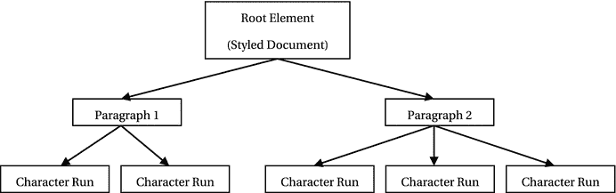

图 2-11.
样式化文档的结构

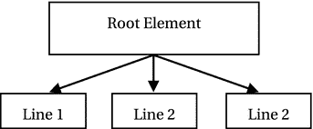

图 2-10.
纯文本文档的结构

清单 2-6 中的程序使用 `JTextPane` 开发了一个基本的文字处理器。它允许你编辑文本，并对文本应用粗体、斜体、颜色和对齐等样式。

```
// WordProcessor.java
package com.jdojo.swing.component;
import javax.swing.JFrame;
import java.awt.Container;
import javax.swing.JTextPane;
import javax.swing.JButton;
import java.awt.BorderLayout;
import javax.swing.JPanel;
import javax.swing.text.StyledDocument;
import javax.swing.text.BadLocationException;
import javax.swing.text.Style;
import javax.swing.text.StyleContext;
import javax.swing.text.StyleConstants;
import java.awt.Color;
public class WordProcessor extends JFrame {
JTextPane textPane = new JTextPane();
JButton normalBtn = new JButton("Normal");
JButton boldBtn = new JButton("Bold");
JButton italicBtn = new JButton("Italic");
JButton underlineBtn = new JButton("Underline");
JButton superscriptBtn = new JButton("Superscript");
JButton blueBtn = new JButton("Blue");
JButton leftBtn = new JButton("Left Align");
JButton rightBtn = new JButton("Right Align");
public WordProcessor(String title) {
super(title);
initFrame();
}
private void initFrame() {
this.setDefaultCloseOperation(JFrame.EXIT_ON_CLOSE);
Container contentPane = this.getContentPane();
JPanel buttonPanel = this.getButtonPanel();
contentPane.add(buttonPanel, BorderLayout.NORTH);
contentPane.add(textPane, BorderLayout.CENTER);
this.addStyles(); // 向文本窗格添加样式以供后续使用
insertTestStrings(); // 向文本窗格插入一些测试文本
}
private JPanel getButtonPanel() {
JPanel buttonPanel = new JPanel();
buttonPanel.add(normalBtn);
buttonPanel.add(boldBtn);
buttonPanel.add(italicBtn);
buttonPanel.add(underlineBtn);
buttonPanel.add(superscriptBtn);
buttonPanel.add(blueBtn);
buttonPanel.add(leftBtn);
buttonPanel.add(rightBtn);
// 为按钮添加动作事件监听器
normalBtn.addActionListener(e -> setNewStyle("normal", true));
boldBtn.addActionListener(e -> setNewStyle("bold", true));
italicBtn.addActionListener(e -> setNewStyle("italic", true));
underlineBtn.addActionListener(e -> setNewStyle("underline", true));
superscriptBtn.addActionListener(e -> setNewStyle("superscript", true));
blueBtn.addActionListener(e -> setNewStyle("blue", true));
leftBtn.addActionListener(e -> setNewStyle("left", false));
rightBtn.addActionListener(e -> setNewStyle("right", false));
return buttonPanel;
}
private void addStyles() {
// 获取默认样式
StyleContext sc = StyleContext.getDefaultStyleContext();
Style defaultContextStyle = sc.getStyle(StyleContext.DEFAULT_STYLE);
// 向文档添加一些样式，以便后续检索和使用
StyledDocument document = textPane.getStyledDocument();
Style normalStyle = document.addStyle("normal", defaultContextStyle);
// 创建粗体样式
Style boldStyle = document.addStyle("bold", normalStyle);
StyleConstants.setBold(boldStyle, true);
// 创建斜体样式
Style italicStyle = document.addStyle("italic", normalStyle);
StyleConstants.setItalic(italicStyle, true);
// 创建下划线样式
Style underlineStyle = document.addStyle("underline", normalStyle);
StyleConstants.setUnderline(underlineStyle, true);
// 创建上标样式
Style superscriptStyle = document.addStyle("superscript", normalStyle);
StyleConstants.setSuperscript(superscriptStyle, true);
// 创建蓝色样式
Style blueColorStyle = document.addStyle("blue", normalStyle);
StyleConstants.setForeground(blueColorStyle, Color.BLUE);
// 创建左对齐段落样式
Style leftStyle = document.addStyle("left", normalStyle);
StyleConstants.setAlignment(leftStyle, StyleConstants.ALIGN_LEFT);
// 创建右对齐段落样式
Style rightStyle = document.addStyle("right", normalStyle);
StyleConstants.setAlignment(rightStyle, StyleConstants.ALIGN_RIGHT);
}
private void setNewStyle(String styleName, boolean isCharacterStyle) {
StyledDocument document = textPane.getStyledDocument();
Style newStyle = document.getStyle(styleName);
int start = textPane.getSelectionStart();
int end = textPane.getSelectionEnd();
if (isCharacterStyle) {
boolean replaceOld = styleName.equals("normal");
document.setCharacterAttributes(start, end - start,
newStyle, replaceOld);
} else {
document.setParagraphAttributes(start, end - start, newStyle, false);
}
}
private void insertTestStrings() {
StyledDocument document = textPane.getStyledDocument();
try {
document.insertString(0, "Hello JTextPane\n", null);
} catch (BadLocationException e) {
e.printStackTrace();
}
}
public static void main(String[] args) {
WordProcessor frame = new WordProcessor("Word Processor");
frame.setSize(700, 500);
frame.setVisible(true);
}
}
清单 2-6.
使用 JTextPane 和 JButton 的简单文字处理器
```


这个文字处理程序虽然有些冗长，但它只执行简单且重复的操作。为了便于理解，我将程序的逻辑分解成了更小的部分。该程序的目的是展示一个`JTextPane`，用户可以在其中编辑文本，并使用一些按钮对文本应用样式。

共有八个按钮。其中五个用于格式化文本：普通、粗体、斜体、下划线和上标。蓝色按钮用于将文本颜色设置为蓝色。最后两个按钮——左对齐和右对齐——用于将段落对齐方式设置为左对齐和右对齐。

什么是样式？如何为文本和段落设置样式？简单来说，样式就是一组属性（名称-值对）。设置样式本身很简单；但你需要编写几行代码来创建样式本身。你需要将样式添加到`JTextPane`的文档以及`JTextPane`本身。你需要使用`StyledDocument`类的`addStyle(String styleName, Style parent)`方法。该方法返回一个`Style`对象。`parent`参数可以为`null`。如果不为`null`，则未指定的属性会在`parent`样式中解析。一旦你有了样式对象，就可以使用`StyleConstants`类的`setXxx()`方法在该样式中设置相应的属性。如果你感到困惑，这里有一个总结。

将样式想象成一个包含两列的表格：`name`和`value`。`StyledDocument`类的`addStyle()`方法返回一个空样式（即一个空表格）。通过使用`StyleConstants`的`setXxx()`方法，你就是在向样式（即表格）中添加新行。一旦表格中至少有一行（即至少定义了一个样式属性），你就可以根据样式的类型将该样式应用于字符或段落。请注意，你可以拥有一个空样式。空样式可用于移除某个字符范围或段落中的所有当前样式。以下代码片段创建了两个样式：第一个是`bold`，第二个是`bold + italic`。如果你将第一个样式应用于文本，它会将文本格式化为粗体字体。如果你将第二个样式应用于文本，它会将文本格式化为粗体和斜体字体。请注意，这里将`parent`样式设置为`null`。

```
// 从文本窗格获取样式化文档
StyledDocument document = textPane.getStyledDocument();
// 向文档添加一个名为"bold"的空样式
Style bold = document.addStyle("bold", null);
// 向此样式添加粗体属性
StyleConstants.setBold(bold, true);
// 从此刻起，你可以使用粗体样式
// 让我们创建一个名为 boldItalic 的粗体+斜体样式。
// 向文档添加一个名为 boldItalic 的空样式
Style boldItalic = document.addStyle("boldItalic", null);
// 向 boldItalic 样式添加粗体和斜体属性
StyleConstants.setBold(boldItalic, true);
StyleConstants.setItalic(boldItalic, true);
// 从此刻起，你可以使用 boldItalic 样式
```

将样式添加到`StyledDocument`后，你可能需要该样式对象的引用。你可以通过使用`getStyle(String styleName)`方法检索同一样式对象的引用。

```
// 从文档中获取粗体样式
Style myBoldStyle = document.getStyle("bold");
```

一旦你有了`Style`对象，就可以使用`StyledDocument`类的`setCharacterAttributes(int offset, int length, AttributeSet s, boolean replace)`和`setParagraphAttributes(int offset, int length, AttributeSet s, boolean replace)`方法将样式设置到字符范围或段落。如果`replace`参数指定为`true`，则该范围的任何旧样式都将被新样式替换。否则，新样式将与旧样式合并。

```
// 假设文本窗格中有超过五个字符。
// 使前三个字符变为粗体
document.setCharacterAttributes(0, 3, bold, false);
```

`StyleContext`对象定义了一个样式池，以便高效使用。你可以按如下方式获取默认样式集合：

```
StyleContext sc = StyleContext.getDefaultStyleContext();
Style defaultContextStyle = sc.getStyle(StyleContext.DEFAULT_STYLE);
// 让我们添加一个默认上下文样式作为普通样式的父样式。
// 我们不为普通样式添加任何额外属性
StyledDocument document = textPane.getStyledDocument();
Style normal = document.addStyle("normal", defaultContextStyle);
```

表 2-13 包含一系列重要方法及其描述，这可能有助于你理解清单 2-6 中的代码。图 2-12 展示了在输入 E = mc² 后，这个简单文字处理程序的外观。


图 2-12.

一个使用 JTextPane 和 JButtons 的简单文字处理程序

表 2-13.

WordProcessor 类的方法及其描述

| 方法 | 描述 |
| --- | --- |
| `initFrame()` | 通过向框架添加组件并设置`JFrame`的默认行为来初始化框架。 |
| `getButtonPanel()` | 返回一个`JPanel`，其中包含所有用于格式化的`JButton`。它还为所有`JButton`添加了动作监听器。 |
| `addStyles()` | 向文档添加样式。默认上下文样式被命名为“normal”，并用作所有其他样式的父样式。粗体、斜体等样式是字符级样式，而左对齐和右对齐是段落级样式。这些样式从文档中检索，以便在`setNewStyle()`方法中使用。 |
| `setNewStyle()` | 根据其`isCharacterStyle`参数指示，将样式设置到字符范围或段落范围。请注意，如果你设置了“normal”样式，你将用此样式替换整个样式。否则，你将合并样式。此逻辑由以下语句确定：`boolean replaceOld = styleName.equals("normal");` |
| `insertTestStrings()` | 使用`insertString()`方法向`JTextPane`的文档中插入一个字符串。 |
| `main()` | 创建并显示文字处理程序框架。 |

该文字处理程序没有保存功能。在实际应用中，你会提示用户输入保存位置和文件名。以下代码片段将`JTextPane`的内容保存到当前工作目录下名为`test.rtf`的文件中：

```
// 将 textPane 的内容保存到文件
FileWriter fw = new java.io.FileWriter("test.rtf");
textPane.write(fw);
fw.close();
```

`JTextPane`的`write()`方法将其文档中包含的文本作为纯文本写入。如果你想保存格式化文本，你需要使用`RTFEditorKit`对象作为其编辑器套件，并使用该编辑器套件的`write()`方法写入文件。以下代码片段展示了如何使用`RTFEditorKit`对象保存`JTextPane`中的格式化文本。请注意，`RTFEditorKit`包含一个`read()`方法，用于将格式化文本读回`JTextPane`。

```
// 在创建 JTextPane 后立即为其设置一个 RTFEditorKit
JTextPane textPane = new JTextPane();
textPane.setEditorKit(new RTFEditorKit());
// 其他代码在此处
// 将 JTextPane 中的格式化文本保存到文件
String fileName = "test.rtf";
FileOutputStream fos = new FileOutputStream(fileName);
RTFEditorKit kit = (RTFEditorKit)textPane.getEditorKit();
StyledDocument doc = textPane.getStyledDocument();
int len = doc.getLength();
kit.write(fos, doc, 0, len);
fos.close();
```

提示

如果你想保存添加到`JTextPane`中的图标和组件，你需要将`JTextPane`的文档对象序列化到文件，然后重新加载它以显示相同的内容。


你可以将任何 Swing 组件和图标添加到 `JTextPane` 中。只需将组件或图标包装到样式中，然后在 `insertString()` 方法中使用该样式即可。以下代码片段展示了如何向 `JTextPane` 添加 `JButton` 和图标：

```
// 向文档中添加一个关闭按钮
JButton closeButton = new JButton("关闭");
closeButton.addActionListener(e -> System.exit(0));
Style cs = doc.addStyle("componentStyle", null);
StyleConstants.setComponent(cs, closeButton);
// 在文本末尾插入该组件
try {
document.insertString(doc.getLength(), "关闭按钮位于", cs);
} catch (BadLocationException e) {
e.printStackTrace();
}
```

向 `JTextPane` 添加图标与添加组件类似，区别在于你需要使用 `StyleConstants` 类的 `setIcon()` 方法而非 `setComponent()` 方法，并且使用 `ImageIcon` 对象而非组件，如下所示：

```
// 向 JTextPane 添加一个图标
StyleConstants.setIcon(myIconStyle, new ImageIcon("myImageFile"));
```

提示

你也可以使用 `JTextPane` 的 `insertComponent(Component c)` 和 `insertIcon(Icon g)` 方法分别向其中插入组件和图标。

你可以通过 `AbstractDocument` 类的 `dump(PrintStream p)` 方法来查看 `JTextPane` 文档的元素结构。以下代码片段在标准输出上显示该结构：

```
// 在标准输出上显示文档结构
DefaultStyledDocument doc = (DefaultStyledDocument)textPane.getStyledDocument();
doc.dump(System.out);
```

以下是包含文本的 `JTextPane` 文档的结构转储，如图 2-12 所示。它让你了解样式化文档的结构。

```

[0,16][Hello JTextPane
]

[16,17][
]

[17,21][E=mc]

[21,22][2]

[22,23][
]

[0,23][Hello JTextPane
E=mc2
]
```

## 验证文本输入

你已经看到了在文本组件中验证文本输入的示例：使用自定义模型和使用 `JFormattedTextField`。你可以将输入验证器对象附加到任何 `JComponent`（包括文本组件）上。输入验证器对象只是一个类的实例，该类继承自名为 `InputVerifier` 的抽象类。该类的声明如下所示：

```
public abstract class InputVerifier {
public abstract boolean verify(JComponent input);
public boolean shouldYieldFocus(JComponent input) {
return verify(input);
}
}
```

你需要重写 `InputVerifier` 类的 `verify()` 方法。`verify()` 方法包含验证文本字段中输入内容的逻辑。如果文本字段中的值有效，则此方法返回 `true`，否则返回 `false`。当文本字段即将失去焦点时，会调用其输入验证器的 `verify()` 方法。只有当输入验证器的 `verify()` 方法返回 `true` 时，文本字段才会失去焦点。文本组件的 `setInputVerifier()` 方法用于附加输入验证器。以下代码片段为区号字段设置了一个输入验证器。它将焦点保持在此字段中，直到用户输入一个三位数的数字区号。如果该字段为空，则允许用户导航到其他字段。

```
// 创建一个区号 JTextField
JTextField areaCodeField = new JTextField(3);
// 为区号字段设置输入验证器
areaCodeField.setInputVerifier(new InputVerifier() {
@Override
public boolean verify(JComponent input) {
String areaCode = areaCodeField.getText();
if (areaCode.length() == 0) {
return true;
} else if (areaCode.length() != 3) {
return false;
}
try {
Integer.parseInt(areaCode);
return true;
} catch(NumberFormatException e) {
return false;
}
}
});
```

你可以使用 `setInputVerifier()` 方法为任何 `JComponent` 设置输入验证器。通常，它仅用于文本字段。作为良好的 GUI 设计实践，你应该添加一些关于有效输入值的视觉提示，以便用户了解该字段期望输入何种类型的值。例如，你可以为区号字段添加一个标签，文本为“区号（三位数字）：”，或者在用户输入无效值时显示错误消息。如果对于带有输入验证器的字段，没有关于有效值的视觉提示，用户将被困在该字段中，而不知道应该输入什么类型的值。


## 做出选择

Swing 提供了以下组件，让您可以从选项列表中进行选择：

*   `JToggleButton`
*   `JCheckBox`
*   `JRadioButton`
*   `JComboBox`
*   `JList`

可从列表中选择的选项数量范围从 2 到 N，其中 N 是大于 2 的数字。从选项列表中进行选择有多种方式：

*   选择可能是互斥的。也就是说，用户只能从选项列表中选择一项。在互斥选择中，如果用户更改了当前选择，则之前的选择会自动取消。例如，包含`Male`、`Female`和`Unknown`三个选项的性别选择列表就是互斥的。用户必须且只能选择这三个选项中的一个，而不能同时选择两个或更多。
*   有一种特殊情况，即选项数量 N 为 2。在这种情况下，选项类型为`boolean`：`true`或`false`。有时它们也被称为`Yes`/`No`选择，或`On`/`Off`选择。
*   有时用户可以从选项列表中进行多项选择。例如，您可以向用户提供一个爱好列表，用户可以从该列表中选择多个爱好。

Swing 组件使您能够向用户呈现不同类型的选项，并允许用户选择零个、一个或多个选项。图 2-13 展示了包含四个季节名称的 Swing 组件：`Spring`、`Summer`、`Fall`和`Winter`。该图展示了可用于从列表中选择选项的五种不同类型 Swing 组件的外观。图中显示的一些组件可能并非展示其选项的合适方式。例如，虽然可以使用一组复选框来显示互斥的选项列表，但这并非良好的 GUI 实践。当选项互斥时，一组单选按钮被认为比一组复选框更合适。


图 2-13.

用于从选项列表中进行选择的 Swing 组件

`JToggleButton` 是一个双状态按钮。这两个状态是选中和未选中。当您按下切换按钮时，它会在按下和未按下状态之间切换。按下是其选中状态，未按下是其未选中状态。请注意，`JButton` 与 `JToggleButton` 在工作方式和使用上有所不同。`JButton` 仅在鼠标按下时被按下，而 `JToggleButton` 则在按下和未按下状态之间切换。`JButton` 用于启动一个动作，而 `JToggleButton` 用于从可能的选项列表中选择一个选项。通常，一组 `JToggleButton` 用于让用户从互斥的选项列表中选择一个选项。当用户有一个`boolean`选择，需要指示`true`或`false`（或 Yes 或 No）时，则使用单个 `JToggleButton`。按下状态表示选择了`true`，未按下状态表示选择了`false`。

`JCheckBox` 也有两个状态：选中和未选中。当用户可以从两个或更多选项的列表中选择零个或多个选项时，使用一组 `JCheckBox`。当用户有一个`boolean`选择来指示`true`或`false`时，则使用单个 `JCheckBox`。

`JRadioButton` 也有两个状态：选中和未选中。当存在两个或更多互斥选项的列表，并且用户必须选择一个选项时，使用一组 `JRadioButton`。`JRadioButton` 从不作为独立组件用于从`true`和`false`这两个`boolean`选项中进行选择。它总是用于两个或更多选项的组中。当您需要让用户在`true`或`false`这两个布尔选项之间进行选择时，应使用 `JCheckBox`（而不是 `JRadioButton`）。

`JToggleButton`、`JCheckBox` 和 `JRadioButton` 的构造函数允许您使用不同参数的组合来创建它们。您可以使用 `Action` 对象、字符串标签、图标和`boolean`标志（用于指示是否默认选中）的组合来创建它们。默认情况下，`JToggleButton`、`JCheckBox` 和 `JRadioButton` 是未选中的。以下代码片段展示了创建它们的一些方法：

```
// 创建时不带标签和图像
JToggleButton tb1 = new JToggleButton();
JCheckBox cb1 = new JCheckBox();
JRadioButton rb1 = new JRadioButton();
// 创建时文本为 "Multi-Lingual"
JToggleButton tb2 = new JToggleButton("Multi-Lingual");
JCheckBox cb2 = new JCheckBox("Multi-Lingual");
JRadioButton rb2 = new JRadioButton("Multi-Lingual");
// 创建时文本为 "Multi-Lingual" 并默认选中
JToggleButton tb3 = new JToggleButton("Multi-Lingual", true);
JCheckBox cb3 = new JCheckBox("Multi-Lingual", true);
JRadioButton rb3 = new JRadioButton("Multi-Lingual", true);
```

要选中/取消选中 `JToggleButton`、`JCheckBox` 和 `JRadioButton`，您需要调用它们的 `setSelected()` 方法。要检查它们是否被选中，请使用它们的 `isSelected()` 方法。以下代码片段展示了如何使用这些方法：

```
tb3.setSelected(true);         // 选中 tb3
boolean b1 = tb3.isSelected(); // 将在 b1 中存储 true
tb3.setSelected(false);        // 取消选中 tb3
boolean b2 = tb3.isSelected(); // 将在 b2 中存储 false
```

如果选择是互斥的，则必须将所有选项分组到一个按钮组中。在互斥的选项组中，如果您选择了一个选项，则所有其他选项都会被取消选中。通常，您会为一组互斥的 `JRadioButton` 或 `JToggleButton` 创建一个按钮组。理论上，您也可以为 `JCheckBox` 创建一个按钮组以实现互斥选择。但是，不建议在 GUI 中使用一组互斥的 `JCheckBox`。

`ButtonGroup` 类的实例代表一个按钮组。您可以通过分别使用其 `add()` 和 `remove()` 方法，将 `JRadioButton` 或 `JToggleButton` 添加到按钮组或从中移除。最初，按钮组中的所有成员都是未选中的。要形成一个按钮组，您需要将所有互斥的选择组件添加到 `ButtonGroup` 类的对象中。您不能（实际上也无法）将 `ButtonGroup` 对象添加到容器中。您必须将所有选择组件添加到容器中。清单 2-7 包含了展示一组三个互斥 `JRadioButton` 的完整代码。


```
// ButtonGroupFrame.java
package com.jdojo.swing.component;
import java.awt.BorderLayout;
import java.awt.Container;
import javax.swing.Box;
import javax.swing.ButtonGroup;
import javax.swing.JFrame;
import javax.swing.JRadioButton;
public class ButtonGroupFrame extends JFrame {
ButtonGroup genderGroup = new ButtonGroup();
JRadioButton genderMale = new JRadioButton("Male");
JRadioButton genderFemale = new JRadioButton("Female");
JRadioButton genderUnknown = new JRadioButton("Unknown");
public ButtonGroupFrame() {
this.initFrame();
}
private void initFrame() {
this.setTitle("Mutually Exclusive JRadioButtons Group");
this.setDefaultCloseOperation(EXIT_ON_CLOSE);
// Add three gender JRadioButtons to a ButtonGroup,
// so they become mutually exclusive choices
genderGroup.add(genderMale);
genderGroup.add(genderFemale);
genderGroup.add(genderUnknown);
// Add gender radio button to a vertical Box
Box b1 = Box.createVerticalBox();
b1.add(genderMale);
b1.add(genderFemale);
b1.add(genderUnknown);
// Add the vertical box to the center of the frame
Container contentPane = this.getContentPane();
contentPane.add(b1, BorderLayout.CENTER);
}
public static void main(String[] args) {
ButtonGroupFrame bf = new ButtonGroupFrame();
bf.pack();
bf.setVisible(true);
}
}
清单 2-7.
由三个 JRadioButton 表示的互斥三选项组
```

`JComboBox<E>` 是另一种 Swing 组件，允许你从选项列表中进行单项选择。它还可以包含一个可编辑字段，让你输入新的选项值。类型参数 `E` 是其所包含元素的类型。当屏幕空间有限时，你可以使用 `JComboBox` 来代替一组 `JToggleButton`、`JCheckBox` 或 `JRadioButton`。使用 `JComboBox` 可以节省屏幕空间。但是，用户需要进行两次点击才能做出选择。首先，用户必须点击箭头按钮以在下拉列表中显示选项列表，然后他必须从列表中选择一个选项。用户还可以使用键盘上的上/下箭头键在选项列表中滚动，并在组件获得焦点时选择一个选项。你可以通过在其某个构造函数中传递选项列表来创建 `JComboBox`，如下所示：

```
// 使用字符串数组作为选项列表
String[] sList = new String[]{"Spring", "Summer", "Fall", "Winter"};
JComboBox seasons = new JComboBox(sList);
// 使用字符串向量作为选项列表
Vector sList2 = new Vector(4);
sList2.add("Spring");
sList2.add("Summer");
sList2.add("Fall");
sList2.add("Winter");
JComboBox seasons2 = new JComboBox(sList2);
```

你可以创建一个没有选项的 `JComboBox`，然后使用其方法之一向其中添加选项。它还包含从列表中移除选项以及获取所选选项值的方法。表 2-14 列出了 `JComboBox` 类的常用方法。

表 2-14.

JComboBox 类的常用方法

| 方法 | 描述 |
| --- | --- |
| `void addItem(E item)` | 将一个项目作为选项添加到列表中。会调用所添加对象的 `toString()` 方法，并将返回的字符串显示为一个选项。 |
| `E getItemAt(int index)` | 从选项列表中返回指定 `index` 处的项目。索引从零开始，到列表大小减一结束。如果指定的 `index` 超出范围，则返回 `null`。 |
| `int getItemCount()` | 返回选项列表中项目的数量。 |
| `int getSelectedIndex()` | 返回所选项目的索引。如果所选项目不在列表中，则返回 –1。请注意，对于可编辑的 `JComboBox`，你可以在字段中输入一个新值，该值可能不在选项列表中。在这种情况下，此方法将返回 –1。如果没有选择，它也返回 –1。 |
| `Object getSelectedItem()` | 返回当前选中的项目。如果没有选择，则返回 `null`。 |
| `void insertItemAt(E item, int index)` | 在列表中的指定 `index` 处插入指定的 `item`。 |
| `boolean isEditable()` | 如果 `JComboBox` 是可编辑的，则返回 `true`。否则返回 `false`。默认情况下，`JComboBox` 是不可编辑的。 |
| `void removeAllItems()` | 从列表中移除所有项目。 |
| `void removeItem(Object item)` | 从列表中移除指定的 `item`。 |
| `void removeItemAt(int index)` | 移除指定 `index` 处的项目。 |
| `void setEditable(boolean editable)` | 如果指定的 `editable` 参数为 `true`，则 `JComboBox` 是可编辑的。否则，它是不可编辑的。用户可以在可编辑的 `JComboBox` 中输入一个不在选项列表中的值。请注意，新输入的值不会添加到选项列表中。 |
| `void setSelectedIndex(int index)` | 选择列表中指定 `index` 处的项目。如果指定的 `index` 为 –1，则清除选择。如果指定的 `index` 小于 –1 或大于列表大小减一，则抛出 `IllegalArgumentException`。 |
| `void setSelectedItem(Object item)` | 选择字段中的项目。如果指定的 `item` 存在于列表中，则始终选择它。如果指定的项目不在列表中，则仅当 `JComboBox` 可编辑时，才会在字段中选择它。 |

如果你想在 `JComboBox` 中选中或取消选中某个项目时收到通知，可以为其添加一个项目监听器。每当选中或取消选中某个项目时，都会通知项目监听器。请注意，当你在 `JComboBox` 中更改选择时，它会先触发取消选中项目事件，然后触发选中事件。以下代码片段展示了如何向 `JComboBox` 添加项目监听器。你可以使用 `ItemEvent` 类的 `getItem()` 方法来找出哪个项目被选中或取消选中。

```
String[] sList = new String[]{"Spring", "Summer", "Fall", "Winter"};
JComboBox seasons = new JComboBox(sList);
// 向组合框添加项目监听器
seasons.addItemListener((ItemEvent e) -> {
Object item = e.getItem();
if (e.getStateChange() == ItemEvent.SELECTED) {
// 项目已被选中
System.out.println(item + " 已被选中");
} else if (e.getStateChange() == ItemEvent.DESELECTED) {
// 项目已被取消选中
System.out.println(item + " 已被取消选中");
}
});
```

`JList<T>` 是另一种 Swing 组件，它显示一个选项列表，并允许你从该列表中选择一个或多个选项。类型参数 `T` 是其所包含元素的类型。`JList` 与 `JComboBox` 的主要区别在于选项列表的显示方式。`JList` 可以在屏幕上显示多个选项，而 `JComboBox` 则在你点击其箭头按钮时才显示选项列表。从这个意义上说，`JList` 是 `JComboBox` 的扩展版本。`JList` 可以在一列或多列中显示选项列表。你可以像创建 `JComboBox` 一样创建 `JList`，如下所示：


```
// 使用数组创建 JList
String[] items = new String[]{"Spring", "Summer", "Fall", "Winter"};
JList list = new JList(items);
// 使用 Vector 创建 JList
Vector items2 = new Vector(4);
items2.add("Spring");
items2.add("Summer");
items2.add("Fall");
items2.add("Winter");
JList list2 = new JList(items2);
```

`JList` 本身不具备滚动功能。你必须将其添加到 `JScrollPane` 中，再将 `JScrollPane` 添加到容器中，才能获得滚动功能，示例如下：

```
myContainer.add(new JScrollPane(myJList));
```

你可以配置 `JList` 的布局方向，以三种方式排列选项列表：

*   垂直
*   水平换行
*   垂直换行

在默认的垂直排列中，`JList` 中的所有项目都使用单列多行显示。

在水平换行中，所有项目按一行多列排列。但是，如果一行无法容纳所有项目，则会根据需要添加新行来显示它们。请注意，项目可以水平从左到右或从右到左流动，具体取决于组件的方向。

在垂直换行中，所有项目按一列多行排列。但是，如果一列无法容纳所有项目，则会根据需要添加新列来显示它们。

你可以使用 `JList` 类的 `setVisibleRowCount(int visibleRows)` 方法来设置你希望在列表中无需滚动即可看到的可见行数。当你将可见行数设置为零或更少时，`JList` 将根据字段的宽度/高度及其布局方向来决定可见行数。你可以使用其 `setLayoutOrientation(int orientation)` 方法设置其布局方向，其中方向值可以是 `JList` 类中定义的三个常量之一：`JList.VERTICAL`、`JList.HORIZONTAL_WRAP` 和 `JList.VERTICAL_WRAP`。

你可以使用 `setSelectionMode(int mode)` 方法配置 `JList` 的选择模式。模式值可以是以下三个值之一。这些模式值在 `ListSelectionModel` 接口中定义为常量。

*   `SINGLE_SELECTION`
*   `SINGLE_INTERVAL_SELECTION`
*   `MUTIPLE_INTERVAL_SELECTION`

在单选模式下，你一次只能选择一个项目。如果你更改选择，之前选中的项目将被取消选中。

在单间隔选择模式下，你可以选择多个项目。但是，所选项目必须始终是连续的。假设一个 `JList` 中有十个项目，并且你选择了第七个项目。现在你可以选择列表中的第六个或第八个项目，但不能选择其他任何项目。你可以继续选择更多连续的项目。你可以使用 Ctrl 或 Shift 键与鼠标的组合来进行连续选择。

在多间隔选择模式下，你可以不受任何限制地选择多个项目。你可以使用 Ctrl 或 Shift 键与鼠标的组合来进行选择。

你可以向 `JList` 添加列表选择监听器，当选择发生变化时，它会通知你。当选择发生变化时，会调用 `ListSelectionListener` 的 `valueChanged()` 方法。在一次选择更改过程中，此方法也可能被多次调用。你需要使用 `ListSelectionEvent` 对象的 `getValueIsAdjusting()` 方法来确保选择更改已完成，如下面的代码片段所示：

```
myJList.addListSelectionListener((ListSelectionEvent e) -> {
// 确保选择更改已完成
if (!e.getValueIsAdjusting()) {
// 选择更改的逻辑写在这里
}
});
```

表 2-15 列出了 `JList` 类的常用方法。请注意，`JList` 没有直接提供获取列表大小（`JList` 中选项的数量）的方法。正如每个 Swing 组件都使用模型一样，`JList` 也是如此。它的模型是 `JListModel` 接口的一个实例。要了解 `JList` 选项列表的大小，你需要调用其模型的 `getSize()` 方法，如下所示：

表 2-15.

JList 类的常用方法

| 方法 | 描述 |
| --- | --- |
| `void clearSelection()` | 清除在 `JList` 中所做的选择。 |
| `void ensureIndexIsVisible(int index)` | 确保指定 `index` 处的项目可见。请注意，要使不可见的项目可见，必须将 `JList` 添加到 `JScrollPane` 中。 |
| `int getFirstVisibleIndex()` | 返回最小的可见索引。如果没有可见项目或列表为空，则返回 –1。 |
| `int getLastVisibleIndex()` | 返回最大的可见索引。如果没有可见项目或列表为空，则返回 –1。 |
| `int getMaxSelectionIndex()` | 返回最大的选中索引。如果没有选择，则返回 –1。 |
| `int getMinSelectionIndex()` | 返回最小的选中索引。如果没有选择，则返回 –1。 |
| `int getSelectedIndex()` | 返回最小的选中索引。如果 `JList` 选择模式是单选，则返回选中的索引。如果没有选择，则返回 –1。 |
| `int[] getSelectedIndices()` | 以 `int` 数组的形式返回所有选中项目的索引。如果没有选择，数组将包含零个元素。 |
| `E getSelectedValue()` | 返回第一个选中的项目。如果 `JList` 是单选模式，则为选中项目的值。如果 `JList` 中没有选择，则返回 `null`。 |
| `List<E> getSelectedValuesList()` | 返回所有选中项目的列表，按它们在列表中的索引升序排列。如果没有选中的项目，则返回一个空列表。 |
| `boolean isSelectedIndex(int index)` | 如果指定的 `index` 被选中，则返回 `true`。否则，返回 `false`。 |
| `boolean isSelectionEmpty()` | 如果 `JList` 中没有选择，则返回 `true`。否则，返回 `false`。 |
| `void setListData(E[] listData)` `void setListData(Vector<?> listData)` | 在 `JList` 中设置新的选项列表。 |
| `void setSelectedIndex(int index)` | 选择指定 `index` 处的项目。 |
| `void setSelectedIndices(int[] indices)` | 选择指定数组中索引处的项目。 |
| `void setSelectedValue(Object item, boolean shouldScroll)` | 如果列表中存在指定的项目，则选择它。如果第二个参数为 `true`，则滚动到该项目使其可见。 |

```
int size = myJList.getModel().getSize();
```


## JSpinner

`JSpinner` 组件结合了 `JFormattedTextField` 和可编辑 `JComboBox` 的优点。它允许你在 `JComboBox` 中设置一个选项列表，同时还可以对显示的值应用格式。它每次只从选项列表中显示一个值，并允许你输入新值。“微调器”这个名称源于它允许你通过上下箭头按钮在选项列表中向上或向下滚动。`JSpinner` 选项列表的一个特殊之处在于它必须是一个有序列表。图 2-14 展示了三个用于选择数字、日期和季节值的 JSpinner。


图 2-14.

运行中的 JSpinner 组件

由于 `JSpinner` 为各种选项列表提供了滚动功能，因此它的创建高度依赖于其模型。实际上，除非你只需要一个仅包含整数列表的简单 `JSpinner`，否则必须在构造函数中为 `JSpinner` 提供一个模型。它支持三种不同类型的有序选项列表：数字列表、日期列表以及任何其他对象的列表。它提供了三个类来创建这三种不同类型列表的模型：

*   `SpinnerNumberModel`
*   `SpinnerDateModel`
*   `SpinnerListModel`

微调器模型是 `SpinnerModel` 接口的一个实例。它定义了 `getValue()`、`setValue()`、`getPreviousValue()` 和 `getNextValue()` 方法来处理 `JSpinner` 中的值。所有这些方法都处理 `Object` 类的对象。

`SpinnerNumberModel` 类为 `JSpinner` 提供了一个模型，允许你滚动浏览一个有序的数字列表。你需要指定列表中的最小值、最大值和当前值。你还可以指定步长值，当使用 `JSpinner` 的上/下按钮时，该值用于在数字列表中逐步移动。以下代码片段创建了一个包含 1 到 10 数字列表的 `JSpinner`。它允许你以步长 1 在列表中滚动。字段的当前值设置为 5。`SpinnerNumberModel` 类还提供了一些方法，允许你在创建后获取/设置微调器模型的不同值。

```
int minValue = 1;
int maxValue = 10;
int currentValue = 5;
int steps = 1;
SpinnerNumberModel nModel = new SpinnerNumberModel(currentValue, minValue, maxValue, steps);
JSpinner numberSpinner = new JSpinner(nModel);
```

`SpinnerDateModel` 类为 `JSpinner` 提供了一个模型，允许你滚动浏览一个有序的日期列表。你需要指定开始日期、结束日期、当前值和步长。以下代码片段创建了一个 `JSpinner`，用于滚动浏览从 1950 年 1 月 1 日到 2050 年 12 月 31 日的日期列表，步长为一天。当前系统日期被设置为该字段的当前值。

```
Calendar calendar = Calendar.getInstance();
calendar.set(1950, 1, 1);
Date minValue = calendar.getTime();
calendar.set(2050, 12, 31);
Date maxValue = calendar.getTime();
Date currentValue = new Date();
int steps = Calendar.DAY_OF_MONTH; // 必须是 Calendar 字段
SpinnerDateModel dModel = new SpinnerDateModel(currentValue, minValue, maxValue, steps);
JSpinner dateSpinner = new JSpinner(dModel);
```

请注意，日期值将以默认区域设置格式显示。当你在模型上使用 `getNextValue()` 方法时，会用到步长值。一个包含日期列表的 `JSpinner` 允许你通过高亮日期字段的一部分并使用上/下按钮来滚动浏览任何显示的日期字段。假设你的 `JSpinner` 使用的日期格式是 `mm/dd/yyyy`。你可以将光标放在字段的年份部分 (`yyyy`)，然后使用上/下按钮根据年份在列表中逐步移动。

`SpinnerListModel` 类为 `JSpinner` 提供了一个模型，允许你滚动浏览一个有序的对象列表。你只需指定一个对象数组或一个 `List` 对象，`JSpinner` 就会让你按照数组或 `List` 中出现的顺序滚动浏览列表。列表中对象的 `toString()` 方法返回的 `String` 将作为 `JSpinner` 中的值显示。以下代码片段创建了一个 `JSpinner` 来显示四个季节的列表：

```
String[] seasons = new String[] {"Spring", "Summer", "Fall", "Winter"};
SpinnerListModel sModel = new SpinnerListModel(seasons);
JSpinner listSpinner = new JSpinner(sModel);
```

`JSpinner` 使用一个编辑器对象来显示当前值。它有以下三个 `static` 内部类来显示三种不同类型的有序列表：

*   `JSpinner.NumberEditor`
*   `JSpinner.DateEditor`
*   `JSpinner.ListEditor`

如果你想以特定格式显示数字或日期，则需要为 `JSpinner` 设置一个新的编辑器。数字和日期编辑器的编辑器类允许你指定格式。以下代码片段将数字格式设置为“00”，因此数字 1 到 10 显示为 `01, 02, 03...10`。它将日期格式设置为 `mm/dd/yyyy`。

```
// 将数字格式设置为 "00"
JSpinner.NumberEditor nEditor = new JSpinner.NumberEditor(numberSpinner, "00");
numberSpinner.setEditor(nEditor);
// 将日期格式设置为 mm/dd/yyyy
JSpinner.DateEditor dEditor = new JSpinner.DateEditor(dateSpinner, "mm/dd/yyyy");
dateSpinner.setEditor(dEditor);
```

提示

你可以使用 `JSpinner` 或 `SpinnerModel` 中定义的 `getValue()` 方法来获取 `JSpinner` 中的当前值，返回值为对象。`SpinnerNumberModel` 和 `SpinnerDateModel` 分别定义了 `getNumber()` 和 `getDate()` 方法，它们返回 `Number` 和 `Date` 对象。


## JScrollBar

当您想要查看一个比可用空间更大的组件时，您需要使用 `JScrollBar` 或 `JScrollPane` 组件。我将在下一节讨论 `JScrollPane`。`JScrollBar` 有一个方向属性，用于确定它是水平显示还是垂直显示。图 2-15 描绘了一个水平 `JScrollBar`。


图 2-15.

一个水平 JScrollBar

一个 `JScrollBar` 由四部分组成：两个箭头按钮（两端各一个）、一个滑块（也称为拇指块）和一个滑道。当点击箭头按钮时，滑块会在滑道上向该箭头按钮移动。您可以通过鼠标将滑块拖向任意一端。您也可以通过点击滑道来移动滑块。

您可以通过在构造函数中传递值，或者在创建 `JScrollBar` 后设置其属性，来自定义它的各种属性。表 2-16 列出了一些常用属性及其操作方法。

表 2-16.

JScrollBar 的常用属性及获取/设置这些属性的方法

| 属性 | 方法 | 描述 |
| --- | --- | --- |
| `方向` | `getOrientation()` `setOrientation()` | 确定 `JScrollBar` 是水平还是垂直。其值可以是 `JScrollBar` 类中定义的两个常量之一：`HORIZONTAL` 或 `VERTICAL`。 |
| `值` | `getValue()` `setValue()` | 滑块的位置即为它的值。初始值设置为零。 |
| `可见范围` | `getVisibleAmount()` `setVisibleAmount()` | 滑块的大小。它以与滑道大小的比例来表示。例如，如果滑道大小代表 150，而您将可见范围设置为 25，则滑块大小将是滑道大小的六分之一。其默认值为 10。 |
| `最小值` | `getMinimum()` `setMinimum()` | 它代表的最小值。默认值为零。 |
| `最大值` | `getMaximum()` `setMaximum()` | 它代表的最大值。默认值为 100。 |

以下代码片段演示了如何创建具有不同属性的 `JScrollBar`：

```
// 创建一个具有所有默认属性的 JScrollBar。其方向
// 为垂直，当前值为 0，可见范围为 10，最小值为 0，最大值为 100
JScrollBar sb1 = new JScrollBar();
// 创建一个具有默认值的水平 JScrollBar
JScrollBar sb2 = new JScrollBar(JScrollBar.HORIZONTAL);
// 创建一个水平 JScrollBar，当前值为 50，
// 可见范围为 15，最小值为 1，最大值为 150
JScrollBar sb3 = new JScrollBar(JScrollBar.HORIZONTAL, 50, 15, 1, 150);
```

`JScrollBar` 的当前值只能设置在其最小值与（最大值 – 可见范围）值之间。`JScrollBar` 本身不会为 GUI 增加任何价值。它只拥有一些属性。您可以向 `JScrollBar` 添加一个 `AdjustmentListener`，当它的值发生变化时，该监听器会收到通知。

```
// 向名为 myScrollBar 的 JScrollBar 添加一个 AdjustmentListener
myScrollBar.addAdjustmentListener((AdjustmentEvent e) -> {
if (!e.getValueIsAdjusting()) {
// 值改变时的逻辑写在这里
}
});
```

使用 `JScrollBar` 来滚动浏览一个比其显示区域更大的组件并不简单。如果您想单独使用 `JScrollBar`，则需要编写大量代码才能实现该任务。`JScrollPane` 使这项任务变得更容易。它无需编写任何额外代码即可处理滚动。

## JScrollPane

`JScrollPane` 是一个容器，可以容纳并显示最多九个组件，如图 2-16 所示。它使用自己的布局管理器，该管理器是 `JScrollPaneLayout` 类的一个对象。


图 2-16.

JScrollPane 的组件

`JScrollPane` 管理的九个组件是两个 `JScrollBar`、一个视口、一个行头、一个列头和四个角。

*   **两个 JScrollBar**：在图中，两个滚动条分别命名为 HSB 和 VSB。它们是 `JScrollBar` 类的两个实例：一个水平，一个垂直。`JScrollPane` 会为您创建并管理这两个 `JScrollBar`。您无需为此编写任何代码。您唯一需要指明的是是否需要它们，以及希望它们何时出现。
*   **一个视口**：视口是 `JScrollPane` 显示可滚动组件（例如 `JTextArea`）的区域。您可以将视口想象成一个窥视孔，通过它，您可以使用滚动条上下/左右滚动来查看组件。视口是一个 Swing 组件。`JViewport` 类的对象代表一个视口组件。`JViewport` 只是 Swing 组件的一个包装器，用于实现该组件的可滚动视图。`JScrollPane` 会为您的组件创建一个 `JViewport` 对象并在内部使用它。
*   **行头和列头**：在图中，行头缩写为 RH。行/列头是您可以在 `JScrollPane` 中使用的两个可选视口。当您使用水平滚动条时，列头会随之水平滚动。当您使用垂直滚动条时，行头会随之垂直滚动。行/列头的一个良好用途是在视口中为图片或绘图显示水平和垂直标尺。通常，您不会使用行/列头。
*   **四个角**：`JScrollPane` 中可以存在四个角。当两个组件垂直相交时，就会形成一个角。在图中，四个角分别命名为 C1、C2、C3 和 C4。这些并非 `JScrollPane` 赋予角的名称。我为了讨论方便而给它们命名。如果您添加了行头和列头，则存在角 C1。如果您添加了列头并且垂直滚动条可见，则存在角 C2。如果您添加了行头并且水平滚动条可见，则存在角 C3。如果水平和垂直滚动条都可见，则存在角 C4。您可以将任何 Swing 组件添加为角组件。唯一的限制是您不能将同一个组件添加到多个角中。请注意，添加角组件并不能保证它可见。只有当根据所讨论的规则该角存在时，角组件才会在该角可见。例如，如果您为 C4 角添加了一个角组件，那么只有当水平和垂直滚动条都可见时，它才会可见。如果其中一个或两个滚动条都不可见，则角 C4 不存在，您为该角添加的组件将不可见。

当组件尺寸大于 `JScrollPane` 尺寸时，需要某个方向（水平或垂直）的滚动条才能在视口中查看该组件。`JScrollPane` 允许您为垂直和水平滚动条设置滚动条策略。滚动条策略是控制滚动条何时出现的规则。您可以设置以下三种滚动条策略之一：


*   **按需显示**：这意味着 `JScrollPane` 应在需要时显示滚动条。当视口内的组件在水平或垂直方向上的尺寸大于其显示区域时，就需要滚动条。由 `JScrollPane` 决定何时需要滚动条，如果需要，它将使滚动条可见，否则将使其不可见。
*   **始终显示**：这意味着 `JScrollPane` 应始终显示滚动条。
*   **从不显示**：这意味着 `JScrollPane` 应从不显示滚动条。

滚动条策略由 `ScrollPaneConstants` 接口中的六个常量定义。其中三个常量用于垂直滚动条，另外三个用于水平滚动条。`JScrollPane` 类实现了 `ScrollPaneConstants` 接口，因此你也可以通过 `JScrollPane` 类来访问这些常量。定义滚动条策略的常量是 `XXX_SCROLLBAR_AS_NEEDED`、`XXX_SCROLLBAR_ALWAYS` 和 `XXX_SCROLLBAR_NEVER`，你需要根据所引用的滚动条将 `XXX` 替换为 `VERTICAL` 或 `HORIZONTAL`。垂直和水平滚动条的默认策略都是“按需显示”。以下代码片段演示了如何使用不同选项创建 `JScrollPane`：

```
// 创建一个 JScrollPane，其视口不包含组件，
// 滚动条策略默认为“按需显示”
JScrollPane sp1 = new JScrollPane();
// 创建一个 JScrollPane，其视口包含一个 JTextArea，
// 滚动条策略默认为“按需显示”
JTextArea description = new JTextArea(10, 60);
JScrollPane sp2 = new JScrollPane(description);
// 创建一个 JScrollPane，其视口包含一个 JTextArea，
// 并将两个滚动条策略都设置为“始终显示”
JTextArea comments = new JTextArea(10, 60);
JScrollPane sp3 = new JScrollPane(comments,
JScrollPane.VERTICAL_SCROLLBAR_ALWAYS,                                  JScrollPane.HORIZONTAL_SCROLLBAR_ALWAYS);
```

如前所述，当你向 `JScrollPane` 添加组件时，你是将 `JScrollPane` 添加到容器中，而不是组件本身。`JScrollPane` 的视口会保留你添加到其中的组件的引用。你可以通过查询其视口来获取 `JScrollPane` 中组件的引用，如下所示：

```
// 获取 JScrollPane sp3 的视口引用
JViewport vp = sp3.getViewport();
// 使用视口引用获取添加到 JScrollPane sp3 中的 comments JTextArea 的引用
JTextArea comments1 = (JTextArea)vp.getView();
```

如果你在创建 `JScrollPane` 时没有为其视口指定组件，之后可以使用其 `setViewportView()` 方法向视口添加组件，如下所示：

```
// 为 sp3 设置一个 JTextPane 作为视口组件
sp3.setViewportView(new JTextPane());
```

## JProgressBar

`JProgressBar` 用于显示任务的进度。它具有方向性，可以是水平或垂直的。它关联了三个值：当前值、最小值和最大值。你可以像下面这样创建一个进度条：

```
// 创建一个水平进度条，其当前值、最小值和最大值分别设置为 0、0 和 100。
JProgressBar hpBar1 = new JProgressBar();
// 创建一个水平进度条，其当前值、最小值和最大值分别设置为 20、20 和 200。
JProgressBar hpbar2 = new JProgressBar(SwingConstants.HORIZONTAL, 20, 200);
// 创建一个垂直进度条，其当前值、最小值和最大值分别设置为 5、5 和 50。
JProgressBar vpBar1 = new JProgressBar(SwingConstants.VERTICAL, 5, 50);
```

随着任务的进行，你需要使用进度条的 `setValue(int value)` 方法来设置当前值以指示进度。组件会自动更新其视觉显示以反映新值。进度的显示方式因应用程序的外观和感觉而异。有时使用实心条来显示进度，有时则使用实心矩形。你可以使用 `getValue()` 方法来获取当前值。

你还可以使用 `setStringPainted()` 方法来显示描述进度条当前值的字符串。向此方法传递 `true` 会显示字符串值，传递 `false` 则不显示。要绘制的字符串通过调用 `setString(String s)` 方法来指定。

有时任务的当前进度值是未知或不确定的。在这种情况下，你无法为进度条设置当前值。相反，你可以向用户指示任务正在执行中。你可以使用进度条的 `setIndeterminate()` 方法将其设置为不确定模式。向此方法传递 `true` 会将进度条置于不确定模式，传递 `false` 则将其置于确定模式。`JProgressBar` 组件会显示动画以指示其不确定状态。

图 2-17 显示了一个包含两个 `JProgressBar` 的 `JFrame`。水平 `JProgressBar` 处于确定模式，并显示一个字符串来描述进度。垂直 `JProgressBar` 被设置为不确定模式；请注意中间以动画形式显示的实心矩形条。


图 2-17.

JProgressBar 的实际应用


## JSlider

`JSlider` 允许您通过沿轨道滑动旋钮，以图形方式从两个整数之间的一组值中选择一个值。它具有四个重要属性：方向、最小值、最大值和当前值。方向决定了它是水平显示还是垂直显示。您可以使用 `SwingConstants.VERTICAL` 和 `SwingConstants.HORIZONTAL` 作为其方向的有效值。以下代码片段创建了一个水平 `JSlider`，其最小值为 0，最大值为 10，当前值设置为 5：

```
JSlider points = new JSlider(0, 10, 5);
```

您可以使用 `JSlider` 的 `getValue()` 方法获取其当前值。通常，用户通过将旋钮向右/左滑动（对于水平 `JSlider`）或向上/下滑动（对于垂直 `JSlider`）来设置 `JSlider` 的当前值。您也可以使用其 `setValue(int value)` 方法以编程方式设置其值。

您可以在 `JSlider` 上显示次要刻度和主要刻度。您需要设置这些刻度显示的间隔，并调用其方法启用刻度绘制，如下所示：

```
points.setMinorTickSpacing(1);
points.setMajorTickSpacing(2);
points.setPaintTicks(true);
```

您还可以在 `JSlider` 中显示沿轨道的值标签。您可以显示标准标签或自定义标签。标准标签将沿轨道显示整数值。您可以调用其 `setPaintLabels(true)` 方法以主要刻度间距显示整数值。图 2-18 显示了一个带有刻度和标准标签的 `JSlider`。


图 2-18.

一个 JSlider 组件，其最小值 = 0，最大值 = 10，当前值 = 5，次要刻度间距 = 1，主要刻度间距 = 2，刻度绘制已启用，并显示标准标签

`JSlider` 也允许您设置自定义标签。`JSlider` 上的标签使用 `JLabel` 组件显示。您需要创建一个包含 `值-标签` 对的 `Hashtable`，并使用其 `setLabelTable()` 方法来设置标签。一个 `值-标签` 对由一个 `Integer-JLabel` 对组成。以下代码片段为值 `0` 设置标签 `Poor`，为值 `5` 设置标签 `Average`，为值 `10` 设置标签 `Excellent`。设置标签表并不会显示标签。您必须调用 `setPaintLabels(true)` 方法来显示它们。图 2-19 显示了一个由以下代码片段生成的自定义标签的 `JSlider`：


图 2-19.

一个带有自定义标签的 JSlider

```
// 在 Hashtable 中创建值-标签对
Hashtable labelTable = new Hashtable();
labelTable.put(new Integer(0), new JLabel("Poor"));
labelTable.put(new Integer(5), new JLabel("Average"));
labelTable.put(new Integer(10), new JLabel("Excellent"));
// 为 JSlider 设置标签并使其可见
points.setLabelTable(labelTable);
points.setPaintLabels(true);
```

## JSeparator

当您想在两个组件或两组组件之间添加分隔符时，`JSeparator` 是一个方便使用的组件。通常，`JSeparator` 在菜单中用于分隔相关的菜单项组。您可以通过指定其方向来创建水平或垂直的 `JSeparator`。您可以在任何使用 Swing 组件的地方使用它。

```
// 创建一个水平分隔符
JSeparator hs = new JSeparator(); // 默认情况下，类型为水平
// 创建一个垂直分隔符
JSeparator vs = new JSeparator(SwingConstants.VERTICAL);
```

`JSeparator` 会自行扩展以填充布局管理器提供的大小。您可以使用 `setOrientation()` 和 `getOrientation()` 方法来设置和获取 `JSeparator` 的方向。

## 菜单

菜单组件用于以紧凑的形式向用户提供一系列操作。您也可以使用一组 `JButton` 来提供一系列操作，其中每个 `JButton` 代表一个操作。使用菜单还是一组 `JButton` 来呈现操作列表是个人偏好问题。然而，使用菜单有一个明显的优势：与一组 `JButton` 相比，它在屏幕上占用的空间要少得多。菜单通过将一个选项组折叠（或嵌套）在另一个选项下来节省空间。例如，如果您使用过文件编辑器，诸如 `New`、`Open`、`Save` 和 `Print` 等选项会嵌套在一个顶层的 `File` 菜单选项下。用户需要点击 `File` 菜单才能看到其下可用的选项列表。通常，对于一组 `JButton`，所有 `JButton` 始终对用户可见，用户很容易知道有哪些可用操作。因此，当您决定使用菜单还是 `JButton` 时，需要在空间占用和易用性之间进行一些权衡。

还有另一种菜单，称为弹出菜单。它完全不占用屏幕上的任何空间。通常，当用户点击鼠标右键时才会显示。一旦用户做出选择或在显示的弹出菜单区域外点击鼠标，它就会消失。它是一种超级紧凑的菜单组件。然而，它使用户难以知道有任何可用选项。有时，屏幕上会显示一条文本消息，提示用户需要右键单击以查看可用选项列表。`JPopupMenu` 类的对象在 Swing 中代表一个弹出菜单。现在让我们看看菜单的实际应用。

创建菜单并将其添加到 `JFrame` 是一个多步骤的过程。以下步骤详细描述了该过程。

创建一个 `JMenuBar` 类的对象，并使用其 `setJMenuBar()` 方法将其添加到 `JFrame`。`JMenuBar` 是一个空容器，用于容纳一个菜单选项列表，而 `JMenuBar` 中的每个选项代表一个选项列表。

```
// 创建一个 JMenuBar 并将其设置到 JFrame
JMenuBar menuBar = new JMenuBar();
myFrame.setJMenuBar(menuBar);
```

此时，您有一个与 `JFrame` 关联的空 `JMenuBar`。现在，您需要将选项列表（也称为顶层菜单选项）添加到 `JMenuBar`。`JMenu` 类的对象代表一个选项列表。`JMenu` 也是一个空容器，可以容纳代表选项的菜单项。您需要将菜单选项添加到 `JMenu`。`JMenu` 并不总是显示添加到其中的选项。相反，它会在用户选择该 `JMenu` 时显示它们。这就是使用菜单时获得紧凑性的地方。当您选择一个 `JMenu` 时，它会弹出一个窗口，显示其中包含的选项。一旦您从弹出窗口中选择了一个选项，或者在 `JMenu` 之外的某处点击，弹出窗口就会消失。

```
// 创建两个 JMenu（或两个顶层菜单选项）：
// File 和 Help，并将它们添加到 JMenuBar
JMenu fileMenu = new JMenu("File");
JMenu helpMenu = new JMenu("Help");
menuBar.add(fileMenu);
menuBar.add(helpMenu);
```

此时，您的 `JFrame` 将在其顶部区域显示一个菜单栏，其中包含两个选项：File 和 Help，如图 2-20 所示。如果您选择或点击 File 或 Help，此时不会发生任何事情。


图 2-20.

一个带有两个 JMenu 选项的 JMenuBar

让我们向您的 `JMenu` 添加一些选项。您希望在 File 下显示三个菜单选项：New、Open 和 Exit。您希望在 Open 和 Exit 选项之间添加一个分隔符（一条水平线作为分隔线）。`JMenuItem` 类的对象代表 `JMenu` 内部的一个选项。


```
// 创建菜单项
JMenuItem newMenuItem = new JMenuItem("新建");
JMenuItem openMenuItem = new JMenuItem("打开");
JMenuItem exitMenuItem = new JMenuItem("退出");
// 向菜单添加菜单项和分隔符
fileMenu.add(newMenuItem);
fileMenu.add(openMenuItem);
fileMenu.addSeparator();
fileMenu.add(exitMenuItem);
```

至此，您已向“文件”菜单添加了三个 `JMenuItem`。当您点击“文件”菜单时，它将显示如图 2-21 所示的选项。您可以通过键盘上的向下/向上箭头键滚动查看“文件”菜单下的选项，或使用鼠标选择其中一个。当您选择“文件”菜单下的任一选项时，不会发生任何操作，因为您尚未为其添加任何动作。


图 2-21.

一个包含三个选项的 JMenu 文件菜单

您可能希望在一个菜单项（例如“新建”选项）下拥有两个子选项。也就是说，用户可以创建两种不同的内容：保单和理赔，并且您希望这两个选项都位于“新建”选项下。您并不是要在选项内嵌套选项。“文件”菜单是 `JMenu` 类的一个实例，它代表一个选项列表，而您希望添加一个同样能显示选项列表的“新建”菜单。这很容易实现。您唯一需要理解的是，`JMenu` 代表一个选项列表，而 `JMenuItem` 仅代表单个选项。您可以将 `JMenuItem` 或 `JMenu` 添加到 `JMenu` 中。为此，您需要对前面显示的代码片段稍作修改。现在，“新建”菜单将是 `JMenu` 类的一个实例，而不是 `JMenuItem` 类。您将向“新建”菜单添加两个 `JMenuItem`。以下代码片段即可实现此功能：

```
// New 是一个 JMenu – 一个选项列表
JMenu newMenu = new JMenu("新建");
JMenuItem policyMenuItem = new JMenuItem("保单");
JMenuItem claimMenuItem = new JMenuItem("理赔");
newMenu.add(policyMenuItem);
newMenu.add(claimMenuItem);
JMenuItem openMenuItem = new JMenuItem("打开");
JMenuItem exitMenuItem = new JMenuItem("退出");
fileMenu.add(newMenu);
fileMenu.add(openMenuItem);
fileMenu.addSeparator();
fileMenu.add(exitMenuItem);
```

现在，菜单显示如图 2-22 所示。当您选择“文件”菜单时，“新建”菜单旁边会显示一个箭头，表示它包含子菜单。当您选择“新建”菜单时，它会显示两个分别标记为“保单”和“理赔”的子菜单。


图 2-22.

嵌套菜单

菜单的嵌套层级没有限制。然而，超过两层的嵌套通常不被认为是良好的 GUI 实践，因为用户需要深入多层才能找到可用选项。

使菜单生效的最后一步是为菜单项添加动作。您可以为 `JMenuItem` 添加动作监听器。当用户选择该 `JMenuItem` 时，关联的动作监听器会收到通知。以下代码片段为“退出”菜单项添加了一个动作监听器，该监听器将退出应用程序：

```
// 为退出菜单项添加动作监听器
exitMenuItem.addActionListener(e -> System.exit(0));
```

现在您已经为“退出”菜单项添加了动作。如果您选择它，应用程序将退出。类似地，您可以为其他菜单项添加动作监听器，以便在选择它们时执行相应操作。

您可以使用 `setEnabled()` 方法来启用/禁用菜单。虽然可以使菜单可见/不可见，但这并非良好实践。这会让用户难以学习应用程序。如果您始终保持所有菜单选项可用（无论是启用还是禁用状态），用户将能够通过了解菜单选项的位置来更快地使用应用程序。如果您使菜单选项可见/不可见，菜单选项的位置会不断变化，用户每次使用时都必须更加关注菜单选项的位置。

您还可以为菜单选项分配快捷键。您可以使用 `setMnemonic()` 方法，通过指定快捷键来为菜单项添加快捷键。您可以通过按下 Alt 键和快捷键的组合来调用该菜单项所代表的动作。请注意，菜单项必须可见，其助记符才能生效。例如，如果您为“新建”菜单选项设置了助记符（N 键），则必须选择“文件”菜单以使“新建”菜单选项可见，然后按 Alt+N 来调用“新建”菜单项所代表的动作。

如果您希望无论菜单项是否可见都能调用其关联动作，则需要使用 `setAccelerator()` 方法设置其加速键。以下代码片段将 E 键设置为“退出”菜单选项的助记符，并将 Ctrl+E 设置为其加速键：

```
// 将 E 设置为退出菜单的助记符，Ctrl+E 为其加速键
exitMenuItem.setMnemonic(KeyEvent.VK_E);
KeyStroke cntrlEKey = KeyStroke.getKeyStroke(KeyEvent.VK_E, ActionEvent.CTRL_MASK);
exitMenuItem.setAccelerator(cntrlEKey);
```

现在，您可以通过两种方式调用“退出”菜单选项：当它可见时，您可以按 Alt+E 组合键；或者您可以随时按 Ctrl+E 组合键。

您可以使用弹出菜单，它按需显示。创建弹出菜单类似于创建 `JMenu`。您需要创建 `JPopupMenu` 类的一个实例，它代表一个空的弹出菜单容器，然后向其中添加 `JMenuItem` 的实例。您也可以在弹出菜单中嵌套菜单，就像在 `JMenu` 中一样。

```
// 创建一个弹出菜单
JPopupMenu popupMenu = new JPopupMenu();
// 为我们的弹出菜单创建三个菜单项
JMenuItem popup1 = new JMenuItem("弹出项 1");
JMenuItem popup2 = new JMenuItem("弹出项 2");
JMenuItem popup3 = new JMenuItem("弹出项 3");
// 将菜单项添加到弹出菜单
popupMenu.add(popup1);
popupMenu.add(popup2);
popupMenu.add(popup3);
```

由于弹出菜单没有固定位置，并且是按需显示的，您需要知道在何处以及何时显示它。您需要使用其 `show()` 方法在某个位置显示它。`show()` 方法接受三个参数：调用者组件（将使用其空间来显示弹出菜单），以及弹出菜单在调用者组件上显示的 x 和 y 坐标。

```
// 显示弹出菜单
popupMenu.show(myComponent, xPos, yPos);
```

通常，当用户点击鼠标右键时显示弹出菜单。不同的外观和感觉选项使用不同的按键事件来显示弹出菜单。例如，一种外观和感觉方案在释放鼠标右键时显示它，而另一种则在按下鼠标右键时显示它。Swing 通过在 `MouseEvent` 类中提供 `isPopupTrigger()` 方法，使您能够轻松显示弹出菜单。在鼠标按下或释放事件中，您需要调用此方法。如果此方法返回 `true`，则显示弹出菜单。以下代码片段将鼠标监听器关联到一个组件，并显示弹出菜单：


```
// 创建一个鼠标监听器
MouseListener ml = new MouseAdapter() {
@Override
public void mousePressed(MouseEvent e) {
if (e.isPopupTrigger()) {
popupMenu.show(e.getComponent(), e.getX(), e.getY());
}
}
@Override
public void mouseReleased(MouseEvent e) {
if (e.isPopupTrigger()) {
popupMenu.show(e.getComponent(), e.getX(), e.getY());
}
}
};
// 为 myComponent 添加鼠标监听器
myComponent.addMouseListener(ml);
```

每当用户在 `myComponent` 上右键单击时，都会弹出一个弹出菜单。请注意，你需要在 `mousePressed()` 和 `mouseReleased()` 方法中都添加相同的代码。具体由哪个事件触发弹出菜单的显示，取决于当前的外观和风格。

清单 2-8 包含一个完整的程序，演示了如何使用菜单。该程序较长，它重复执行了创建和添加菜单项以及为其添加动作监听器的工作。

```
// JMenuFrame.java
package com.jdojo.swing.component;
import javax.swing.JFrame;
import java.awt.Container;
import javax.swing.JMenuBar;
import javax.swing.JMenu;
import javax.swing.JMenuItem;
import javax.swing.JLabel;
import java.awt.event.ActionListener;
import javax.swing.JTextArea;
import java.awt.BorderLayout;
import java.awt.event.KeyEvent;
import javax.swing.KeyStroke;
import javax.swing.JPopupMenu;
import java.awt.event.MouseAdapter;
import java.awt.event.MouseEvent;
import java.awt.event.MouseListener;
import javax.swing.JScrollPane;
public class JMenuFrame extends JFrame {
JLabel msgLabel = new JLabel("右键单击以查看弹出菜单");
JTextArea msgText = new JTextArea(10, 60);
JPopupMenu popupMenu = new JPopupMenu();
public JMenuFrame(String title) {
super(title);
initFrame();
}
// 初始化 JFrame 并向其添加组件
private void initFrame() {
this.setDefaultCloseOperation(JFrame.EXIT_ON_CLOSE);
Container contentPane = this.getContentPane();
// 添加消息标签和文本区域
contentPane.add(new JScrollPane(msgText), BorderLayout.CENTER);
contentPane.add(msgLabel, BorderLayout.SOUTH);
// 为框架设置菜单栏
JMenuBar menuBar = getCustomMenuBar();
this.setJMenuBar(menuBar);
// 创建弹出菜单并添加鼠标监听器以显示它
createPopupMenu();
}
private JMenuBar getCustomMenuBar() {
JMenuBar menuBar = new JMenuBar();
// 获取“文件”和“帮助”菜单
JMenu fileMenu = getFileMenu();
JMenu helpMenu = getHelpMenu();
// 将“文件”和“帮助”菜单添加到菜单栏
menuBar.add(fileMenu);
menuBar.add(helpMenu);
return menuBar;
}
private JMenu getFileMenu() {
JMenu fileMenu = new JMenu("文件");
// 设置 Alt-F 作为“文件”菜单的助记符
fileMenu.setMnemonic(KeyEvent.VK_F);
// 准备一个“新建”菜单项。它将包含子菜单
JMenu newMenu = getNewMenu();
fileMenu.add(newMenu);
JMenuItem openMenuItem = new JMenuItem("打开", KeyEvent.VK_O);
JMenuItem exitMenuItem = new JMenuItem("退出", KeyEvent.VK_E);
fileMenu.add(openMenuItem);
// 你可以添加一个 JSeparator，或者直接调用 fileMenu 上的便捷方法 addSeparator()
// 你可以用下面的语句替换：fileMenu.add(new JSeparator());
fileMenu.addSeparator();
fileMenu.add(exitMenuItem);
// 为“退出”菜单项添加动作监听器
exitMenuItem.addActionListener(e -> System.exit(0));
return fileMenu;
}
private JMenu getNewMenu() {
// “新建”菜单将包含两个子菜单 - “保单”和“索赔”
JMenu newMenu = new JMenu("新建");
// 向“新建”菜单添加子菜单
JMenuItem policyMenuItem = new JMenuItem("保单", KeyEvent.VK_P);
JMenuItem claimMenuItem = new JMenuItem("索赔", KeyEvent.VK_C);
newMenu.add(policyMenuItem);
newMenu.add(claimMenuItem);
return newMenu;
}
private JMenu getHelpMenu() {
JMenu helpMenu = new JMenu("帮助");
helpMenu.setMnemonic(KeyEvent.VK_H);
JMenuItem indexMenuItem = new JMenuItem("索引", KeyEvent.VK_I);
JMenuItem aboutMenuItem = new JMenuItem("关于", KeyEvent.VK_A);
// 设置 F1 作为“索引”菜单项的加速键
KeyStroke f1Key = KeyStroke.getKeyStroke(KeyEvent.VK_F1, 0);
indexMenuItem.setAccelerator(f1Key);
helpMenu.add(indexMenuItem);
helpMenu.addSeparator();
helpMenu.add(aboutMenuItem);
// 为“索引”菜单项添加动作监听器
indexMenuItem.addActionListener(e ->
msgText.append("你已选择 帮助 >> 索引 菜单项。\n"));
return helpMenu;
}
private void createPopupMenu() {
// 创建一个弹出菜单，并为框架添加鼠标监听器，
// 以便当用户单击鼠标右键时显示弹出菜单
JMenuItem popup1 = new JMenuItem("弹出项 1");
JMenuItem popup2 = new JMenuItem("弹出项 2");
JMenuItem popup3 = new JMenuItem("弹出项 3");
// 创建一个动作监听器
ActionListener al =  e -> {
JMenuItem menuItem = (JMenuItem)e.getSource();
String menuText = menuItem.getText();
String msg = "你点击了 " + menuText + " 菜单项。\n";
msgText.append(msg);
};
// 为所有弹出菜单项添加相同的动作监听器
popup1.addActionListener(al);
popup2.addActionListener(al);
popup3.addActionListener(al);
// 将菜单项添加到弹出菜单
popupMenu.add(popup1);
popupMenu.add(popup2);
popupMenu.add(popup3);
// 创建一个鼠标监听器以显示弹出菜单
MouseListener ml = new MouseAdapter() {
@Override
public void mousePressed(MouseEvent e) {
displayPopupMenu(e);
}
@Override
public void mouseReleased(MouseEvent e) {
displayPopupMenu(e);
}
};
// 为消息文本和标签添加鼠标监听器
msgText.addMouseListener(ml);
msgLabel.addMouseListener(ml);
}
private void displayPopupMenu(MouseEvent e) {
// 确保此鼠标事件应该显示弹出菜单
// 不同平台在不同鼠标事件中显示弹出菜单
if (e.isPopupTrigger()) {
this.popupMenu.show(e.getComponent(), e.getX(), e.getY());
}
}
// 显示自定义框架
public static void main(String[] args) {
JMenuFrame frame = new JMenuFrame("JMenu 和 JPopupMenu 测试");
frame.pack();
frame.setVisible(true);
}
}
清单 2-8.
使用菜单和弹出菜单
```

你也可以在菜单中使用 `JRadioButtonMenuItem` 和 `JCheckBoxMenuItem` 作为菜单项。顾名思义，它们以单选按钮和复选框的形式显示，其工作方式与单选按钮和复选框相同。你可以将任何 Swing 组件添加到 `JMenu` 中。要使用单选按钮类型的菜单项，你需要将多个 `JRadioButtonMenuItem` 组件分组到一个按钮组中，以便它们表示互斥的选择。要处理单选按钮选择的更改，你可以向 `JRadioButtonMenuItem` 添加一个 `ActionListener` 或 `ItemListener`。要处理 `JCheckBoxMenuItem` 的状态更改，你需要使用 `ItemListener`。

提示

最后，我将揭示 Swing 中菜单的秘密。Swing 中的菜单项实际上是一个按钮。啊哈！你一直在和按钮打交道，却称它们为菜单。是的，没错。`JMenuBar` 和 `JPopupMenu` 只是带有 `BoxLayout` 布局的容器。请继续尝试这些容器，设置它们的属性并向其中添加不同的 Swing 组件。`JMenuItem` 是一个简单的按钮。`JMenu` 是一个按钮，它有一个关联的容器，当你选中它时，该容器会显示出来。


## JToolBar

工具栏是一组按钮，用于在 `JFrame` 中向用户提供常用操作。通常，你会将工具栏与菜单一起提供。工具栏包含带有小图标的小按钮。通常，它只包含菜单中可用选项的一个子集。

`JToolBar` 类的对象代表一个工具栏。它充当工具栏按钮的容器。它是一个比 `JPanel` 等其他容器更智能的容器。它可以在运行时移动。它可以是可浮动的。如果它是可浮动的，它会显示一个手柄，你可以用它来移动它。你也可以使用该手柄将其弹出到单独的窗口中。以下代码片段创建了一些工具栏组件：

```
// 创建一个水平的 JToolBar
JToolBar toolBar = new JToolBar();
// 创建一个带标题的水平 JToolBar。当它在单独窗口中浮动时，
// 该标题会显示为窗口标题。
JToolBar toolBarWithTitle = new JToolBar("我的工具栏标题");
// 创建一个垂直工具栏
JToolBar vToolBar = new JToolBar(JToolBar.VERTICAL);
```

让我们向工具栏添加一些按钮。工具栏中的按钮需要比普通按钮尺寸更小。你可以通过将边距设置为零来使 `JButton` 的尺寸变小。你还应该为每个工具栏按钮添加工具提示，以便向用户快速提示其用法。

```
// 为工具栏创建一个按钮
JButton newButton = new JButton("新建");
// 将边距设置为 0 以使按钮更小
newButton.setMargin(new Insets(0, 0, 0, 0));
// 为按钮设置工具提示
newButton.setToolTipText("添加新策略");
// 将“新建”按钮添加到工具栏
toolBar.add(newButton);
```

通常，你只在工具栏按钮中显示小图标。你可以使用 `JButton` 的另一个构造函数，该构造函数仅接受一个 `Icon` 对象作为参数。最后，你需要向按钮添加动作监听器，就像你向其他 `JButton` 添加的那样。当用户单击工具栏中的按钮时，动作监听器会收到通知，并执行指定的动作。

你可以使用其 `setFloatable(boolean floatable)` 方法将工具栏设置为可浮动/不可浮动。默认情况下，工具栏是可浮动的。其 `setRollover(boolean rollOver)` 方法允许你指定是否仅在鼠标悬停在工具栏按钮上时才绘制其边框。

应将工具栏添加到 `BorderLayout` 的北、南、东或西区域，以便在不同区域中移动工具栏时效果更好。清单 2-9 在 `JFrame` 中显示了一个 `JToolBar`。图 2-23 显示了一个在其北部区域带有工具栏的 `JFrame`。图 2-24 显示了同一个 `JFrame`，其工具栏浮动在单独的窗口中。


图 2-24.

浮动在单独窗口中的 JToolBar


图 2-23.

一个在 JFrame 北部区域放置了三个 JButton 的 JToolBar

```
// JToolBarFrame.java
package com.jdojo.swing.component;
import java.awt.Container;
import javax.swing.JFrame;
import javax.swing.JToolBar;
import javax.swing.JButton;
import java.awt.Insets;
import java.awt.BorderLayout;
import javax.swing.JTextArea;
import javax.swing.JScrollPane;
public class JToolBarFrame extends JFrame {
JToolBar toolBar = new JToolBar("我的 JToolBar");
JTextArea msgText = new JTextArea(3, 45);
public JToolBarFrame(String title) {
super(title);
initFrame();
}
// 初始化 JFrame 并向其添加组件
private void initFrame() {
this.setDefaultCloseOperation(JFrame.EXIT_ON_CLOSE);
Container contentPane = this.getContentPane();
prepareToolBar();
// 将工具栏添加到北部，将 JTextArea 添加到中央
contentPane.add(toolBar, BorderLayout.NORTH);
contentPane.add(new JScrollPane(msgText), BorderLayout.CENTER);
msgText.append("使用其左侧的手柄移动工具栏");
}
private void prepareToolBar() {
Insets zeroInset = new Insets(0, 0, 0, 0);
JButton newButton = new JButton("新建");
newButton.setMargin(zeroInset);
newButton.setToolTipText("添加新策略");
JButton openButton = new JButton("打开");
openButton.setMargin(zeroInset);
openButton.setToolTipText("打开策略");
JButton exitButton = new JButton("退出");
exitButton.setMargin(zeroInset);
exitButton.setToolTipText("退出应用程序");
// 为“退出”工具栏按钮添加动作监听器
exitButton.addActionListener(e -> System.exit(0));
toolBar.add(newButton);
toolBar.add(openButton);
toolBar.addSeparator();
toolBar.add(exitButton);
toolBar.setRollover(true);
}
// 显示框架
public static void main(String[] args) {
JToolBarFrame frame = new JToolBarFrame("JToolBar 测试");
frame.pack();
frame.setVisible(true);
}
}
清单 2-9.
在 JFrame 中使用 JToolBar
```

## JToolBar 与 Action 接口的结合

`JButton`、`JMenuItem` 和 `JToolBar` 中的项这三个组件有什么共同点？它们都代表一个动作。有时，你会以菜单项、工具栏项和 `JButton` 的形式向用户提供相同的选项。如果你需要禁用你通过三个组件提供的某个选项，你会怎么做？难道你不认为你需要至少在三个地方分别禁用它们，因为它们是代表同一选项的三个不同组件吗？你可能是对的。然而，在 Swing 中，有一种更简单的方法来处理这种情况。当你需要以不同方式提供某个动作的选项时，你应该使用 `Action` 接口。你需要将选项的逻辑和属性封装在一个 `Action` 对象中，并使用该对象来构造 `JButton`、`JMenuItem` 和工具栏中的项。如果你需要禁用该选项，只需在 `Action` 对象上调用一次 `setEnabled(false)`，所有选项都将被禁用。在这种情况下，使用 `Action` 对象会让你的编程工作更轻松。

让我们看看它的实际应用。让我们创建一个继承自 `AbstractAction` 类的 `ExitAction` 类。它的 `actionPerformed()` 方法简单地退出应用程序。你可以在其构造函数中使用其 `putValue()` 方法设置一些属性，如下所示：

```
public class ExitAction extends AbstractAction {
public ExitAction(String action) {
super(action);
// 为工具栏设置工具提示文本
this.putValue(SHORT_DESCRIPTION, "退出应用程序");
// 设置助记键
this.putValue(MNEMONIC_KEY, KeyEvent.VK_E);
}
@Override
public void actionPerformed(ActionEvent e) {
System.exit(0);
}
}
```

如果你想添加一个“退出”菜单项、一个 `JButton` 和一个工具栏按钮，你可以先创建一个 `ExitAction` 类的对象，然后使用它来创建所有选项项，如下所示：

```
ExitAction exitAction = new ExitAction("退出");
JButton exitButton = new JButton(ExitAction);
JMenuItem exitMenuItem = new JMenuItem(exitAction);
JButton exitToolBarButton = new JButton(exitAction);
exitToolBarButton.setMargin(new Insets(0,0,0,0));
```

现在，你可以将 `exitButton` 添加到你的 `JFrame`，将 `exitMenuItem` 添加到你的菜单，并将 `exitToolBarButton` 添加到你的工具栏。它们的行为方式相同，因为它们共享同一个 `exitAction` 对象。如果你想在所有三个地方禁用退出选项，只需调用一次 `exitAction.setEnabled(false)` 即可。


## JTable

Swing 允许你使用 `JTable` 组件以表格形式显示和编辑数据。`JTable` 通过行和列来展示数据。你可以设置列标题的标签，还可以在运行时对表格数据进行排序。使用 `JTable` 可以简单到只需编写几行代码，也可以复杂到需要编写数百行代码。`JTable` 是一个复杂且功能强大的 Swing 组件，它值得用一整章来介绍。本节将解释使用 `JTable` 的基础知识，并提供一些关于其强大功能的提示。`JTable` 使用了 `javax.swing.table` 包中的许多其他类和接口。`JTable` 类本身位于 `javax.swing` 包中。

让我们从最简单的 `JTable` 示例开始。你可以通过使用其无参构造函数来创建一个 `JTable`。

```
JTable table = new JTable();
```

嗯，这很简单。然而，它的列、行和数据会怎样呢？你得到的只是一个没有可视化组件的空表格。稍后你将解决这些问题。

`JTable` 并不存储数据，它只负责显示数据。它使用一个模型来存储数据、列数和行数。`TableModel` 接口的实例代表了 `JTable` 的模型。`DefaultTableModel` 类是 `TableModel` 接口的一个实现。当你使用 `JTable` 类的默认构造函数时，Java 会设置一个 `DefaultTableModel` 类的实例作为其模型。如果你想添加或删除列/行，你必须操作它的模型。你可以使用 `JTable` 的 `getModel()` 方法获取其模型的引用。让我们向表格中添加两行和三列。

```
// 获取表格模型的引用
DefaultTableModel tableModel = (DefaultTableModel)table.getModel();
// 将行数设置为 2
tableModel.setRowCount(2);
// 将列数设置为 3
tableModel.setColumnCount(3);
```

让我们设置表格中某个单元格的值。你可以使用表格模型或表格本身的 `setValueAt(Object data, int row, int column)` 方法来设置单元格中的值。我们将 "John Jacobs" 设置为第一行第一列的值。请注意，第一行和第一列从 0 开始计数。

```
// 在表格模型中设置 (0, 0) 位置的值
tableModel.setValueAt("John Jacobs", 0, 0);
// 在表格中设置 (0, 0) 位置的值
// 效果与使用表格模型设置值相同
table.setValueAt("John Jacobs", 0, 0);
```

如果你将表格添加到容器中，它将如图 2-25 所示。


图 2-25.

一个具有两行三列并使用默认列标题标签的 JTable

确保你将表格添加到了 `JScrollPane` 中。注意，你得到了两行和三列。列标题的标签被设置为 A、B 和 C。你可以双击任意单元格开始编辑其中的值。要获取单元格中包含的值，你可以使用表格模型或 `JTable` 的 `getValueAt(int row, int column)` 方法。它返回一个 `Object`。你还可以通过使用 `DefaultTableModel` 类的 `addColumn()` 和 `addRow()` 方法向 `JTable` 添加更多列或行。你可以使用其模型类的 `removeRow(int row)` 方法从模型中删除一行，从而也从 `JTable` 中删除该行。

你可以使用模型的 `setColumnIdentifiers()` 方法为列标题设置自定义标签，如下所示：

```
// 将列标题存储在一个数组中
Object[] columnHeaderLabels = new Object[]{"Name", "DOB", "Gender"};
// 使用模型为表格设置列标题
tableModel.setColumnIdentifiers(columnHeaderLabels);
```

使用自定义列标题后，表格如图 2-26 所示。


图 2-26.

一个具有两行、三列和自定义列标题标签的 JTable

如果你希望列标题始终可见，则必须将 `JTable` 添加到 `JScrollPane` 中。如果不将其添加到 `JScrollPane`，当行数超过组件可用高度时，列标题将不可见。你可以使用 `JTable` 的 `getTableHeader()` 方法获取列标题组件并自行显示（例如，如果 `JTable` 在 `BorderLayout` 的中心区域，则将其放在北部区域）。你可以通过点击某行来选择该行。默认情况下，`JTable` 允许你选择多行。你可以使用 `JTable` 的 `getSelectedRow()` 方法获取第一个选中的行号，使用 `getSelectedRows()` 方法获取所有选中行的行号。`getSelectedRowCount()` 方法返回选中的行数。

你从最简单的 `JTable` 开始。然而，使用这个所谓最简单的 `JTable` 并非易事，但现在你已经掌握了使用 `JTable` 的基础知识。

让我们通过使用另一个构造函数创建 `JTable` 来重复这个示例。`JTable` 类还有另一个构造函数，它接受行数和列数作为参数。你可以创建一个具有两行三列的 `JTable`，如下所示：

```
// 创建一个具有 2 行 3 列的 JTable
JTable table = new JTable(2, 3);
```

如果你想将第一行第一列的值设置为 "John Jacobs"，则无需使用表格的模型。你可以使用 `JTable` 的 `setValueAt()` 方法来完成同样的操作。

```
table.setValueAt("John Jacobs", 0, 0);
```

这个比上一个稍微简单一些。但是，你仍然会得到默认的列标题标签 A、B 和 C。`JTable` 的另外两个构造函数允许你一次性设置行数、列数和数据。它们仅在参数类型上有所不同：一个允许你使用 `Object` 数组，另一个允许你使用 `Vector` 对象。它们的声明如下：

*   `JTable(Object[][] rowData, Object[] columnNames)`
*   `JTable(Vector rowData, Vector columnNames)`

如果你使用一个二维的 `Object` 数组来设置行数据，数组的第一个维度的大小决定了行数。如果你使用 `Vector`，`Vector` 中的元素数量决定了表格的行数。`Vector` 中的每个元素都应该是一个包含一行数据的 `Vector` 对象。以下是使用二维 `Object` 数组构造 `JTable` 的方法。图 2-27 显示了显示代码中所有数据的表格。


图 2-27.

一个具有两行、三列和数据的 JTable

```
// 准备列标题
Object[] columnNames = {"ID", "Name", "Gender" } ;
// 创建一个二维数组来包含表格数据
Object[][] rowData = new Object[][] {
{new Integer(100), "John Jacobs", "Male" },
{new Integer(101), "Barbara Gentry", "Female"}
};
// 使用数据和列标题创建一个 JTable
JTable table = new JTable(rowData, columnNames);
```

到目前为止，你的表格数据都是硬编码的。`JTable` 将所有数据视为 `String`，并且表格中的所有单元格都是可编辑的。例如，你将 ID 列的值设置为整数，但它们仍然显示为左对齐的文本。数字在单元格中应该右对齐。如果你想自定义 `JTable`，你需要为表格使用你自己的模型。回想一下，`TableModel` 接口定义了 `JTable` 的模型。以下是 `TableModel` 接口的声明：


```
public interface TableModel
public int getRowCount();
public int getColumnCount();
public String getColumnName(int columnIndex);
public Class getColumnClass(int columnIndex);
public boolean isCellEditable(int rowIndex, int columnIndex);
public Object getValueAt(int rowIndex, int columnIndex);
public void setValueAt(Object aValue, int rowIndex, int columnIndex);
public void addTableModelListener(TableModelListener l);
public void removeTableModelListener(TableModelListener l);
}
```

`AbstractTableModel`类实现了`TableModel`接口。它为`TableModel`接口中的方法提供了空实现，但并未规定数据的存储方式。如果你想实现自己的表格模型，需要让你的类继承自`AbstractTableModel`类。如果在自定义表格模型类中至少实现了以下三个方法，你将得到一个只读的表格模型：

*   `public int getRowCount();`
*   `public int getColumnCount();`
*   `public Object getValueAt(int row, int column);`

`DefaultTableModel`类继承自`AbstractTableModel`类。它为`TableModel`接口中的所有方法提供了默认实现，并使用`Vector`的`Vector`来存储表格数据。

如果使用自己的表格模型，你可以对`JTable`的工作方式拥有更强的控制力。清单 2-10 实现了一个简单的表格模型，该模型使用数组的数组来存储数据。

```
// SimpleTableModel.java
package com.jdojo.swing.component;
import javax.swing.table.AbstractTableModel;
public class SimpleTableModel extends AbstractTableModel {
private final Object[][] data = {};
private final String[] columnNames = {"ID", "Name", "Gender"};
private final Class[] columnClass = {Integer.class, String.class, String.class};
private final Object[][] rowData = new Object[][]{
{100, "John Jacobs", "Male"},
{101, "Barbara Gentry", "Female"}
};
public SimpleTableModel() {
}
@Override
public int getRowCount() {
return rowData.length;
}
@Override
public int getColumnCount() {
return columnNames.length;
}
@Override
public String getColumnName(int columnIndex) {
return columnNames[columnIndex];
}
@Override
public Class getColumnClass(int columnIndex) {
return columnClass[columnIndex];
}
@Override
public boolean isCellEditable(int rowIndex, int columnIndex) {
boolean isEditable = true;
if (columnIndex == 0) {
isEditable = false; // 使 ID 列不可编辑
}
return isEditable;
}
@Override
public Object getValueAt(int rowIndex, int columnIndex) {
return rowData[rowIndex][columnIndex];
}
@Override
public void setValueAt(Object aValue, int rowIndex, int columnIndex) {
rowData[rowIndex][columnIndex] = aValue;
}
}
清单 2-10.
实现一个简单的表格模型
```

在`getColumnClass()`方法中，你需要指定列数据的类；`JTable`将利用此信息来恰当地显示列数据。例如，它会将数字列右对齐显示。如果你为某列指定了`Boolean`类型，`JTable`会在该列的每个单元格中使用`JCheckBox`来显示`Boolean`值。请注意，通过为`columnIndex`为 0 的列在`isEditable()`方法中返回`false`，你已将 ID 列设置为不可编辑。在这个例子中，你再次硬编码了表格数据。不过，你可以从数据库、数据文件、网络或任何其他数据源读取数据。以下代码片段使用自定义模型创建了一个`JTable`：

```
// 使用 SimpleTableModel 作为表格的模型
JTable table = new JTable(new SimpleTableModel());
```

请注意，你的表格模型不允许添加和删除行/列。如果你需要这些扩展功能，最好让你的模型类继承自`DefaultTableModel`类，并自定义你想要改变的行为。

你可以通过调用`JTable`的`setAutoCreateRowSorter(true)`方法为其添加数据排序功能。点击列标题即可对该列数据进行排序。调用此方法后，`JTable`会在列标题中显示一个向上/向下的箭头，以指示该列是按升序还是降序排序。你还可以使用行过滤器，根据某些条件隐藏`JTable`中的行，如下所示：

```
// 为表格设置行排序器
TableRowSorter sorter = new TableRowSorter(table.getModel());
table.setRowSorter(sorter);
// 为表格设置 ID 过滤器
RowFilter IDFilter = new RowFilter () {
@Override
public boolean include(Entry entry) {
SimpleTableModel model = entry.getModel();
int rowIndex = entry.getIdentifier().intValue();
Integer ID = (Integer) model.getValueAt(rowIndex, 0);
if (ID.intValue() <= 100) {
return false; // 不显示 ID <= 100 的行
}
return true;
}
};
sorter.setRowFilter(IDFilter);
```

这段代码为名为`table`的`JTable`设置了一个过滤器，使得 ID 小于或等于 100 的行不被显示。`RowFilter`是一个`abstract`类；你必须重写其`include()`方法来指定过滤条件。它还有一些静态方法，可以返回不同类型的`RowFilter`对象，你可以直接与`RowSorter`对象一起使用。以下是创建行过滤器的一些示例：

```
// 创建一个过滤器，仅显示第二列（列索引为 1）中以"John"开头的行
RowFilter nameFilter = RowFilter.regexFilter("^John*", 1);
// 创建一个过滤器，仅显示第三列（列索引为 2）中值为"Female"的行
RowFilter genderFilter = RowFilter.regexFilter("^Female$", 2);
// 创建一个过滤器，仅显示第 3、5、7 列的值以"A"开头的行
RowFilter anyFilter1 = RowFilter.regexFilter("^A*", 3, 5, 7);
// 创建一个过滤器，仅显示任意列的值以"A"开头的行
RowFilter anyFilter2 = RowFilter.regexFilter("^A*");
```

你可以向`TableModel`添加一个`TableModelListener`，以监听表格模型发生的任何更改。

提示

由于篇幅限制，本节无法描述`JTable`的众多功能。它还允许你设置自定义单元格渲染器来显示单元格中的值。例如，你可以在单元格中显示单选按钮供用户选择，而不是让他们编辑纯文本值。


## JTree

`JTree` 用于以树状结构显示分层数据，如图 2-28 所示。你可以将 `JTree` 想象成倒置的真实树木。


图 2-28.

一个显示部门及其员工列表的 JTree

`JTree` 中的每一项都称为一个**节点**。在图中，部门、销售部、John 等都是节点。节点进一步分为**分支节点**或**叶节点**。如果一个节点下面可以有其他节点（称为其子节点），则它被称为**分支节点**。如果一个节点没有子节点，则称为**叶节点**。部门、销售部和信息技术部是分支节点的例子，而 John、Elaine 和 Aarav 则是叶节点的例子。在现实世界的树中，总有一个特殊的分支称为**根**。类似地，`JTree` 也总有一个特殊的分支节点，称为**根节点**。你的 `JTree` 有一个名为“部门”的根节点。在 `JTree` 中，你可以通过使用其 `setRootVisible(boolean visibility)` 方法来控制根节点的可见性。

分支节点对于其子节点来说称为**父节点**。请注意，子节点也可以是分支节点。销售部、信息技术部和广告部是部门节点的子节点。销售部节点有两个子节点：John 和 Elaine。John 和 Elaine 拥有相同的父节点，即销售部节点。

处于同一层级的节点称为**兄弟节点**。换句话说，拥有相同父节点的节点称为兄弟节点。销售部、信息技术部和广告部是兄弟节点；John 和 Elaine 是兄弟节点；Tejas 和 Aarav 是兄弟节点。在节点的语境中，**祖先**和**后代**这两个术语经常被使用。父节点的父节点，以此类推的所有节点都称为**祖先节点**。也就是说，从祖父节点开始向上的所有节点都是祖先节点。从孙子节点开始向下的所有节点都称为**后代节点**。例如，部门节点是 Elaine 节点的祖先节点，而 Elaine 节点是部门节点的后代节点。

你已经学习了足够多与 `JTree` 相关的术语。是时候看看 `JTree` 的实际应用了。与 `JTree` 相关的类位于 `javax.swing` 和 `javax.swing.tree` 包中。一个 `JTree` 由节点组成。`TreeNode` 接口的实例代表一个节点。`TreeNode` 接口声明了一些方法，这些方法提供关于节点的基本信息，例如其节点类型（分支或叶）、其父节点、其子节点等。

`MutableTreeNode` 是一个扩展了 `TreeNode` 接口的接口。它声明了额外的方法，允许你通过插入/移除子节点或更改节点对象来修改节点。`DefaultMutableTreeNode` 类是 `MutableTreeNode` 接口的一个实现。

在开始创建节点之前，你需要理解节点是 Java 对象的一种可视化表示（通常是一行文本）。换句话说，节点包装了一个对象，并且通常显示该对象的一行文本表示。节点所代表的对象称为该节点的**用户对象**。因此，在构建节点之前，你必须拥有一个节点将要代表的对象。不用担心为了构建节点而创建一个新类。你可以直接使用 `String` 来构建节点。以下代码片段创建了一些可以在 `JTree` 中使用的节点：

```
// 创建一个部门节点
DefaultMutableTreeNode root = new DefaultMutableTreeNode("部门");
// 创建一个销售部节点
DefaultMutableTreeNode sales = new DefaultMutableTreeNode("销售部");
// 创建一个 John 节点
DefaultMutableTreeNode john = new DefaultMutableTreeNode("John");
// 创建一个客户节点，假设你有一个 Customer 类。
// 在这种情况下，该节点将包装一个 Customer 对象
Customer cust101 = new Customer(101, "Joe");
DefaultMutableTreeNode c101Node = new DefaultMutableTreeNode(cust101);
// 如果你想获取节点包装的用户对象，可以使用
// DefaultMutableTreeNode 类的 getUserObject() 方法
Customer c101Back = (Customer)c101Node.getUserObject();
```

一旦你有了一个节点，就可以使用 `add()` 或 `insert()` 方法轻松地为其添加子节点。`add()` 方法将节点追加到末尾；`insert()` 方法允许你指定新节点的位置。例如，要将 `Sales` 节点作为子节点添加到 `Departments` 根节点，你可以这样写：

```
root.add(sales);
```

要将 `John` 作为子节点添加到 `sales`，你可以这样写：

```
sales.add(john);
```

一旦你准备好了节点，就可以轻松地将它们放入 `JTree` 中。你需要通过指定其根节点来创建一个 `JTree`。

```
JTree tree = new JTree(root);
```

`JTree` 类的其他构造函数允许你以不同的方式创建 `JTree`。无参构造函数除非你正在学习 `JTree`，否则不太有用。它会创建一个已添加了一些节点的 `JTree`，如果你想试验 `JTree`，这可以省去你添加节点的麻烦。你也可以通过向构造函数传递一个 `Object` 数组或 `Object` 的 `Vector` 来创建 `JTree`，这些对象将作为 `JTree` 根节点的子节点。在添加传入的对象作为其子节点之前，会先向新的 `JTree` 添加一个根节点。例如：

```
// 创建一个 JTree。它会创建一个名为 Root 的默认根节点，
// 并为 Root 添加两个子节点："One" 和 "Two"。
// 默认情况下，Root 节点不显示。
JTree tree = new JTree(new Object[]{"One", "Two"});
```

一旦你创建了 `JTree` 组件，就该将其显示在 Swing 容器中了。通常，你会将 `JTree` 添加到 `JScrollPane` 中，这样它就能拥有滚动功能。

```
myContainer.add(new JScrollPane(tree));
```

如何访问或遍历 `JTree` 节点？有两种方法可以访问 `JTree` 中的节点：使用行号和使用树路径。

一个 `JTree` 由节点组成。`JTree` 如何显示节点？回想一下，节点是 `TreeNode` 类的一个实例，它包装了任何类型的对象。因此，你可以说节点是对象的包装器。默认情况下，`JTree` 会调用节点对象的 `toString()` 方法来获取要显示的节点文本。如果你的节点包装的对象，其 `toString()` 方法没有返回有意义的字符串用于在 `JTree` 节点中显示，你可以通过创建自定义的 `JTree` 并重写其 `convertValueToText()` 方法来为该节点提供自定义字符串。在示例中，你在节点内包装了一个 `String` 对象，而 `String` 对象的 `toString()` 方法返回字符串本身。假设你想为 `Customer` 对象创建一个节点。请确保重写 `Customer` 类的 `toString()` 方法，并返回一个有意义的字符串（例如客户名称和 ID）以在 `Customer` 节点中显示。


从上到下查看`JTree`节点时，每个节点都显示在单独的水平行中。第一个节点（如果根节点可见，则为根节点）是行号零。第二个节点位于行号 1，依此类推。在图 2-28 中，Departments、Sales、John、Elaine 和 Information Technology 的行号分别为 0、1、2、3 和 4。请注意，仅当节点显示时才会为其分配行号。当节点的父节点折叠时，该节点可能不会显示。例如，Advertising 节点有一些子节点未显示，并且它们没有分配行号，因为它们的父节点 Advertising 处于折叠状态。`JTree`的`getRowCount()`方法返回可查看节点的数量。请注意，当您在`JTree`中展开和折叠节点时，可查看节点的数量会发生变化。

`TreePath`类的对象在`JTree`中唯一地表示一个节点。其结构类似于文件系统中用于表示文件的路径。文件路径通过指定从根文件夹开始的路径来唯一表示一个文件，例如/Departments/Sales/John 表示一个名为 John 的文件，该文件位于 Sales 文件夹下，而 Sales 文件夹位于 Departments 文件夹下，Departments 文件夹位于根目录下。`TreePath`对象封装了相同类型的信息来表示`JTree`中的一个节点。它包含一个从根节点开始的有序节点数组。例如，如果需要为示例中的 John 节点构造一个`TreePath`对象，可以按如下方式操作：

```
Object[] path = new Object[] {root, sales, john};
TreePath johnNodePath = new TreePath(path);
```

`TreePath`类的`getPath()`方法返回`Object`数组，`getLastPathComponent()`方法返回数组的最后一个元素，即`TreePath`对象所表示路径指向的节点的引用。通常，在处理`JTree`时，您不会构造`TreePath`对象。相反，`TreePath`对象会在`JTree`事件中提供给您。如果您使用`JTree`，表示`TreePath`对象的数组对象中的每个元素都是`TreeNode`的实例。如果您使用默认的树模型，`TreePath`将由一个`DefaultMutableTreeNode`对象数组组成。拥有指向节点的`TreePath`后，您可以按如下方式获取该节点包装的对象：

```
// 假设 path 是 TreePath 类的一个实例
// 并且它表示一个节点
DefaultMutableTreeNode node = (DefaultMutableTreeNode)path.getLastPathComponent();
Object myObject = node.getUserObject();
```

`JTree`提供了两个方法，名为`getRowForPath()`和`getPathForRow()`，用于在行号和`TreePath`之间进行转换。稍后学习`JTree`事件时，您将使用`TreePath`。

如果您不是为`JTree`的事件编写代码，您将不会拥有节点的`TreePath`（除非您存储了节点引用本身，但这并非必需）。在这种情况下，您始终可以从根节点开始，并沿着树向下导航。`JTree`的模型是`TreeModel`类的一个实例，它有一个`getRoot()`方法。一旦获得根节点的句柄，就可以使用`TreeNode`类的`children()`方法，该方法返回`TreeNode`所有子节点的枚举。以下代码片段定义了一个方法`navigateTree()`，如果您将根节点的引用传递给它，它将遍历所有树节点：

```
public void navigateTree(TreeNode node) {
if (node.isLeaf()) {
System.out.println("Got a leaf node: " + node);
return;
} else {
System.out.println("Got a branch node: " + node);
Enumeration e = node.children();
while(e.hasMoreElements()) {
TreeNode n = (TreeNode)e.nextElement();
navigateTree(n); // 递归方法调用
}
}
}
```

您可以通过单击来选择树节点。`JTree`使用选择模型来跟踪选中的节点。您需要与其选择模型交互以选择节点或获取有关选中节点的信息。选择模型是`TreeSelectionModel`接口的一个实例。`JTree`允许用户以三种不同的模式选择节点。它们由`TreeSelectionModel`接口中定义的三个常量表示：

*   `SINGLE_TREE_SELECTION`：允许用户一次只选择一个节点。
*   `CONTIGUOUS_TREE_SELECTION`：允许用户选择任意数量的连续节点。
*   `DISCONTIGUOUS_TREE_SELECTION`：允许用户选择任意数量的节点，没有任何限制。

以下代码片段演示了如何使用`JTree`选择模型的一些方法：

```
// 获取 JTree 的选择模型
TreeSelectionModel selectionModel = tree.getSelectionModel();
// 设置选择模式为不连续
selectionModel.setSelectionMode(
TreeSelectionModel.DISCONTIGUOUS_TREE_SELECTION);
// 获取选中的节点数量
int selectedCount = selectionModel.getSelectionCount();
// 获取所有选中节点的 TreePath
TreePath[] selectedPaths = selectionModel.getSelectionPaths();
```

您可以向`JTree`添加一个`TreeSelectionListener`，当节点被选中或取消选中时，该监听器将收到通知。以下代码片段演示了如何向`JTree`添加`TreeSelectionListener`：

```
// 创建一个 JTree。Java 会添加一些节点
JTree tree = new JTree();
// 向 JTree 添加选择监听器
tree.addTreeSelectionListener((TreeSelectionEvent event) -> {
TreeSelectionModel selectionModel = tree.getSelectionModel();
TreePath[] paths = event.getPaths();
for (TreePath path : paths) {
Object node = path.getLastPathComponent();
if (selectionModel.isPathSelected(path)) {
System.out.println("Selected: " + node);
} else {
// 节点被取消选中
System.out.println("DeSelected: " + node);
}
}
});
```

您可以通过单击加号或节点本身来展开节点。您可以通过单击减号或节点本身来折叠节点。当节点展开或折叠时，`JTree`会触发两个事件。它会依次触发一个树将展开事件和一个树展开事件。树将展开事件恰好在节点展开或折叠之前触发。如果您从此事件中抛出`ExpandVetoException`，则展开（或折叠）将被停止。否则，将触发树展开事件。以下代码片段演示了如何为这些事件编写代码：

```
// 添加 TreeWillExpandListener
tree.addTreeWillExpandListener(new TreeWillExpandListener() {
@Override
public void treeWillExpand(TreeExpansionEvent event) throws ExpandVetoException {
System.out.println("Will Expand: " + event.getPath());
}
@Override
public void treeWillCollapse(TreeExpansionEvent event) throws ExpandVetoException {
System.out.println("Will Collapse: " + event.getPath());
}
});
// 添加 TreeExpansionListener
tree.addTreeExpansionListener(new TreeExpansionListener() {
@Override
public void treeExpanded(TreeExpansionEvent event) {
System.out.println("Expanded: " + event.getPath());
}
@Override
public void treeCollapsed(TreeExpansionEvent event) {
System.out.println("Collapsed: " + event.getPath());
}
});
```

提示

`JTree`是一个功能强大且复杂的 Swing 组件。它允许您自定义其中的几乎所有内容。每个节点都显示在`JLabel`中。分支节点和叶节点显示的图标不同。默认图标取决于外观和感觉。您可以通过创建自己的树单元格渲染器来自定义默认图标。您还可以向`JTree`添加`TreeModelListener`，它将通知您其模型中的任何更改。您可以通过使用`setEditable(true)`方法使`JTree`可编辑。您可以通过双击来编辑节点的标签。


## JTabbedPane 与 JSplitPane

有时，由于空间限制，无法在窗口中显示所有信息。你可以使用 `JTabbedPane` 对窗口中的信息进行分组和分隔。图 2-29 展示了一个 `JFrame`，其中包含一个带有两个选项卡（标题分别为“常规信息”和“联系人”）的选项卡面板，用于显示某人的常规信息和联系信息。


图 2-29.

一个带有两个选项卡的 JTabbedPane

`JTabbedPane` 组件充当其他 Swing 组件的容器，以选项卡的形式排列它们。它可以显示带有标题、图标或两者兼有的选项卡。用户需要点击某个选项卡才能查看其内容。使用 `JTabbedPane` 的最大优势在于空间共享。在 `JTabbedPane` 中，一次只能看到一个选项卡的内容。用户可以在选项卡之间切换以查看其他选项卡的内容。

`JTabbedPane` 还允许你指定选项卡的显示位置。你可以将选项卡放置在顶部、底部、左侧或右侧。图 2-29 将选项卡显示在顶部。如果你有一个名为 `frame` 的 `JFrame`，以下代码片段将生成图 2-29 所示的框架。该代码向由两个 `JPanel` 表示的两个选项卡各添加了一个 `JLabel`。

```
JPanel generalInfoPanel = new JPanel();
JPanel contactInfoPanel = new JPanel();
JTabbedPane tabbedPane = new JTabbedPane();
generalInfoPanel.add(new JLabel("General info components go here..."));
contactInfoPanel.add(new JLabel("Contact info components go here..."));
tabbedPane.addTab("General Information", generalInfoPanel);
tabbedPane.addTab("Contacts", contactInfoPanel);
frame.getContentPane().add(tabbedPane, BorderLayout.CENTER);
```

`getTabCount()` 方法返回 `JTabbedPane` 中的选项卡数量。`JTabbedPane` 中的每个选项卡都有一个索引。第一个选项卡的索引为 0，第二个选项卡的索引为 1，依此类推。你可以使用索引获取表示某个选项卡的组件。

```
// 获取联系人选项卡的组件引用
JPanel contactsPanel = tabbedPane.getTabComponentAt(1);
```

`JSplitPane` 是一个分割器，可用于在两个组件之间分割空间。分割条可以水平或垂直显示。当可用空间小于显示两个组件所需的空间时，用户可以上下或左右移动分割条，从而使一个组件获得比另一个更多的空间。如果有足够的空间，两个组件都可以完全显示。

`JSplitPane` 类提供了许多构造方法。你可以使用其默认构造方法创建它，然后使用 `setXxxComponent(Component c)` 方法添加两个组件，其中 `Xxx` 可以是 `Top`、`Bottom`、`Left` 或 `Right`。它还允许你指定更改分割条位置时组件的重绘方式。可以是连续重绘或非连续重绘。如果是连续重绘，则在移动分割条时组件会实时重绘。如果是非连续重绘，则在你停止移动分割条时组件才会重绘。

以下代码片段展示了将两个 `JPanel` 实例添加到一个 `JSplitPane` 中，而该 `JSplitPane` 又被添加到名为 `frame` 的 `JFrame` 的内容窗格中。图 2-30 显示了生成的 `JFrame`。


图 2-30.

使用 JSplitPane 在两个组件之间分割空间

```
// 创建两个 JPanel 和一个 JSplitPane
JPanel generalInfoPanel = new JPanel();
JPanel contactInfoPanel = new JPanel();
JSplitPane splitPane = new JSplitPane();
generalInfoPanel.add(new JLabel("General info components go here..."));
contactInfoPanel.add(new JLabel("Contact info components go here..."));
// 将两个 JPanel 添加到 JSplitPane，并将 JSplitPane
// 添加到 JFrame 的内容窗格
splitPane.setLeftComponent(generalInfoPanel);
splitPane.setRightComponent(contactInfoPanel);
frame.getContentPane().add(splitPane, BorderLayout.CENTER);
```

## 自定义对话框

`JDialog` 是一个 Swing 顶级容器。它用作临时顶级容器（或弹出窗口），以辅助主窗口的工作并吸引用户的注意。这里我宽泛地使用“窗口”一词来指代 Swing 顶级容器。假设你有一个 `JFrame`，需要在其中显示某人的信息。但 `JFrame` 中可能没有足够的空间来显示该人的所有详细信息。在这种情况下，你只能在 `JFrame` 上显示基本的个人最低限度信息，并提供一个标有“人员详情”的按钮。当用户点击此按钮时，你可以打开一个 `JDialog`，显示该人的详细信息。这是使用 `JDialog` 向用户显示信息的一个示例。使用对话框窗口的另一个示例是让用户从文件系统中选择一个文件。你可以向用户显示一个对话框，让他浏览文件系统并选择一个文件。你还可以在其他场合使用 `JDialog`，如下所列：

*   当你需要确认用户的操作时：这称为**确认对话框**。例如，当用户在窗口中选择一条人员记录并尝试删除该记录时，你会显示一条确认消息：“您确定要删除此人吗？”对话框会显示两个按钮，分别标有“是”和“否”，以表示用户的选择。
*   当你需要用户输入一些信息时：这称为**输入对话框**。例如，当焦点移动到日期字段时，你可能会在 `JDialog` 中显示一个日历，并希望用户选择一个日期。输入对话框可以简单到输入/选择一个值，也可以复杂到输入多个值，例如一个人的详细信息。
*   当你需要向用户显示某些消息时：这称为**消息对话框**。例如，当用户将某些信息保存到数据库时，你希望向用户显示一条消息，指示数据库事务的状态。

创建对话框窗口非常简单：只需创建一个继承自 `JDialog` 类的新类即可。你可以像向 `JFrame` 添加组件一样，向自定义的 `JDialog` 添加任意数量的 Swing 组件。`JDialog` 使得向其中添加组件稍微容易一些。你无需获取其内容窗格的引用来设置布局管理器和添加组件。相反，你可以直接在 `JDialog` 本身上调用 `setLayout()` 和 `add()` 方法。这些方法会将调用路由到其内容窗格。默认情况下，`JDialog` 使用 `BorderLayout` 作为布局管理器。

清单 2-11 列出了一个自定义的 `JDialog`，它在 `JLabel` 中显示当前日期和时间，并包含一个“确定” `JButton`。当用户点击该 `JButton` 时，`JDialog` 会关闭。


```
// DateTimeDialog.java
package com.jdojo.swing.component;
import java.awt.BorderLayout;
import java.time.LocalDateTime;
import java.time.format.DateTimeFormatter;
import javax.swing.JButton;
import javax.swing.JDialog;
import javax.swing.JLabel;
public class DateTimeDialog extends JDialog {
JLabel dateTimeLabel = new JLabel("Datetime placeholder");
JButton okButton = new JButton("OK");
public DateTimeDialog() {
initFrame();
}
private void initFrame() {
// 关闭 JDialog 时释放所有资源
this.setDefaultCloseOperation(JDialog.DISPOSE_ON_CLOSE);
this.setTitle("当前日期和时间");
this.setModal(true);
String currentDateTimeString = getCurrentDateTimeString();
dateTimeLabel.setText(currentDateTimeString);
// 无需将组件添加到内容窗格。
// 可以直接将它们添加到 JDialog 中。
this.add(dateTimeLabel, BorderLayout.NORTH);
this.add(okButton, BorderLayout.SOUTH);
// 为“确定”按钮添加动作监听器
okButton.addActionListener(e -> DateTimeDialog.this.dispose());
}
private String getCurrentDateTimeString() {
LocalDateTime ldt = LocalDateTime.now();
DateTimeFormatter formatter
= DateTimeFormatter.ofPattern("EEEE MMMM dd, yyyy hh:mm:ss a");
String dateString = ldt.format(formatter);
return dateString;
}
}
清单 2-11.
一个显示当前日期和时间的自定义 JDialog
```

`DateTimeDialog` 类是一个自定义 `JDialog` 的简单示例。要在应用程序中使用它，你需要创建此 `JDialog` 的实例，调用 `pack()` 方法，并将其设置为可见，如下所示：

```
DateTimeDialog dateTimeDialog = new DateTimeDialog();
dateTimeDialog.pack();
dateTimeDialog.setVisible(true);
```

如果你从另一个顶级容器（例如 `JFrame` 或另一个 `JDialog`）中显示一个 `JDialog`，你可能希望将其显示在该顶级容器的中央。有时你可能希望将其显示在屏幕中央。你可以通过使用 `setLocationRelativeTo(Component c)` 方法将 `JDialog` 放置在顶级容器或屏幕的中央。如果向其传递 `null` 作为参数，则 `JDialog` 将在屏幕上居中显示。否则，它将居中显示在你作为参数传递的组件内。

```
// 在框架内居中显示 JDialog，假设 myFrame 已存在
dateTimeDialog.setLocationRelativeTo(myFrame);
// 将 JDialog 放置在屏幕中央
dateTimeDialog.setLocationRelativeTo(null);
```

你可以创建一个带有所有者的 `JDialog`，该所有者可以是另一个 `JDialog`、`JFrame` 或 `JWindow`。通过为 `JDialog` 指定所有者，你正在创建一个父子关系。当 `JDialog` 的所有者（或父级）关闭时，该 `JDialog` 也会关闭。当所有者最小化或最大化时，`JDialog` 也会最小化或最大化。带有所有者的 `JDialog` 始终显示在其所有者之上。你可以在其构造函数中指定 `JDialog` 的所有者。当你使用无参构造函数创建 `JDialog` 时，会创建一个隐藏的 `Frame` 作为其所有者。请注意，这是一个 `java.awt.Frame`，而不是 `javax.swing.JFrame`。`JFrame` 类继承自 `Frame` 类。你也可以创建一个所有者是 `null` 的 `JDialog`，在这种情况下，它没有所有者。

默认情况下，`JDialog` 是可调整大小的。如果你不希望用户调整 `JDialog` 的大小，可以通过调用其 `setResizable(false)` 方法来实现。

根据 `JDialog` 的焦点行为，它可以分为：

*   模态（Modal）
*   非模态（Modeless）

当显示模态 `JDialog` 时，它会阻止应用程序中其他已显示的窗口。换句话说，如果显示了一个模态 `JDialog`，你必须先关闭它，然后才能与该应用程序中的任何其他窗口进行交互。要使 `JDialog` 成为模态，可以使用其 `setModal(true)` 方法。`JDialog` 类的一些构造函数也允许你指定 `JDialog` 应该是模态还是非模态。

非模态 `JDialog` 不会阻止应用程序中任何其他已显示的窗口。你可以在其他窗口和非模态 `JDialog` 的实例之间切换焦点。默认情况下，`JDialog` 是非模态的。

你还可以为模态 `JDialog` 设置模态范围。一个 `JDialog` 可以具有四种模态类型之一。它们由 `java.awt.Dialog.ModalityType` 枚举中的四个常量定义：

*   `MODELESS`
*   `DOCUMENT_MODAL`
*   `APPLICATION_MODAL`
*   `TOOLKIT_MODAL`

你可以在其构造函数中或通过使用其 `setModalityType()` 方法来指定 `JDialog` 的模态类型。

`MODELESS` 模态类型意味着 `JDialog` 不会阻止任何窗口。

`DOCUMENT_MODAL` 模态类型意味着 `JDialog` 将阻止其父级层次结构（其所有者、所有者的所有者等）中的任何窗口。它不会阻止其子级层次结构（其子级、子级的子级等）中的任何窗口。假设你显示了三个窗口：`frame` 是一个 `JFrame`；`dialog1` 是一个所有者是 `frame` 的 `JDialog`；`dialog2` 是另一个所有者是 `dialog1` 的 `JDialog`。如果你为 `dialog1` 指定了 `DOCUMENT_MODAL` 模态类型，你可以与 `dialog2` 交互，但不能与 `frame` 交互。如果 `dialog2` 的模态类型是 `MODELESS`，你可以同时与 `dialog1` 和 `dialog2` 交互，因为 `dialog2` 不会阻止任何窗口。

`APPLICATION_MODAL` 模态类型意味着 `JDialog` 将阻止该 Java 应用程序中的任何窗口，但其子级层次结构中的窗口除外。

`TOOLKIT_MODAL` 模态类型意味着 `JDialog` 将阻止从同一工具包运行的所有窗口，但其子级层次结构中的窗口除外。在 Java 应用程序中，它与 `APPLICATION_MODAL` 相同。当你在使用 Java Web Start 启动的小程序或应用程序中使用它时，它非常有用。你可以将浏览器视为一个应用程序，将多个小程序视为顶级窗口。所有小程序都由同一个工具包加载。如果你在一个小程序中显示一个模态类型为 `TOOLKIT_MODAL` 的 `JDialog`，它将阻止对同一浏览器中任何其他小程序的输入。你必须为小程序授予“`toolkitModality`” `AWTPermission` 才能使用 `TOOLKIT_MODAL` 模态。对于使用 Java Web Start 启动的多个应用程序，其行为相同。

清单 2-12 包含一个用于试验 `JDialog` 模态类型的程序。使用 `dialog1Modality` 和 `dialog2Modality` 变量的不同值，观察它如何影响对其他窗口的输入阻止。

```
// JDialogModalityTest.java
package com.jdojo.swing.component;
import javax.swing.JButton;
import javax.swing.JDialog;
import javax.swing.JFrame;
import java.awt.Dialog.ModalityType;
public class JDialogModalityTest {
public static void main(String[] args) {
JFrame frame = new JFrame("我的 JFrame");
frame.setBounds(0, 0, 400, 400);
frame.setVisible(true);
final ModalityType dialog1Modality = ModalityType.DOCUMENT_MODAL;
final ModalityType dialog2Modality = ModalityType.DOCUMENT_MODAL;
final JDialog dailog1 = new JDialog(frame, "JDialog 1");
JButton openBtn = new JButton("打开 JDialog 2");
openBtn.addActionListener(e -> {
JDialog d2 = new JDialog(dailog1, "JDialog 2");
d2.setBounds(200, 200, 200, 200);
d2.setModalityType(dialog2Modality);
d2.setVisible(true);
});
dailog1.add(openBtn);
dailog1.setBounds(20, 20, 200, 200);
dailog1.setModalityType(dialog1Modality);
dailog1.setVisible(true);
}
}
清单 2-12.
试验 JDialog 的模态类型
```

`JDialog` 在 Swing 应用程序中经常使用，例如，用于向用户显示错误消息。每次需要对话框窗口时都创建一个自定义 `JDialog` 非常耗时。Swing 设计者意识到了这一点。他们为我们提供了 `JOptionPane` 类，使得在使用常用的 `JDialog` 类型时，我们的生活更加轻松。我将在下一节讨论 `JOptionPane`。


## 标准对话框

`JOptionPane` 类使您能够轻松创建和显示标准模态对话框。它包含许多静态方法，用于创建不同类型的 `JDialog`，为其填充详细信息，并将其作为模态 `JDialog` 显示。当 `JDialog` 关闭时，该方法会返回一个值，以指示用户在 `JDialog` 上的操作。请注意，`JOptionPane` 类继承自 `JComponent` 类。`JOptionPane` 类与 `JDialog` 类没有任何继承关系，只是被用作创建标准对话框的工厂。它还包含一些返回 `JDialog` 对象的方法，您可以自定义这些对象并在应用程序中使用。您可以显示以下四种标准对话框：

*   消息对话框
*   确认对话框
*   输入对话框
*   选项对话框

`JOptionPane` 类用于显示标准 `JDialog` 的静态方法名称类似于 `showXxxDialog()`。其中的 `Xxx` 可以替换为 `Message`、`Confirm`、`Input` 和 `Option`。您还可以使用这些方法的另一个版本 `showInternalXxxDialog()`，它使用 `JInternalFrame` 而不是 `JDialog` 来显示对话框详情。所有四种类型的标准对话框都接受不同类型的参数并返回不同类型的值。表 2-17 列出了这些方法的参数及其说明。

表 2-17.

与 JOptionPane 一起使用的标准参数类型及其值列表

| 参数名称 | 参数类型 | 说明 |
| --- | --- | --- |
| `parentComponent` | `Component` | `JDialog` 将居中显示在指定的父组件上。包含此组件的顶层容器将成为所显示 `JDialog` 的所有者。如果为 `null`，则 `JDialog` 将在屏幕上居中显示。 |
| `message` | `Object` | 通常，它是一个需要作为消息显示在对话框中的字符串。但是，您可以传递任何对象。如果传递一个 Swing 组件，它将直接显示在对话框中。如果传递一个 `Icon`，它将显示在 `JLabel` 中。如果传递任何其他对象，则会调用该对象的 `toString()` 方法，并显示返回的字符串。您还可以传递一个对象数组（通常是字符串数组），数组中的每个元素将垂直依次显示。 |
| `messageType` | `Int` | 表示您想要显示的消息类型。根据消息类型，对话框中会显示一个合适的图标。可用的消息类型由 `JOptionPane` 类中的以下常量定义：`ERROR_MESSAGE`、`INFORMATION_MESSAGE`、`WARNING_MESSAGE`、`QUESTION_MESSAGE`、`PLAIN_MESSAGE`。`PLAIN_MESSAGE` 类型不显示任何图标。另一个 `Icon` 类型的参数允许您指定要在对话框中显示的自定义图标。 |
| `optionType` | `Int` | 表示需要在对话框中显示的按钮。以下是 `JOptionPane` 类中定义的常量列表，您可以使用它们来获取对话框中的标准按钮：`DEFAULT_OPTION`、`YES_NO_OPTION`、`YES_NO_CANCEL_OPTION`、`OK_CANCEL_OPTION`。`DEFAULT_OPTION` 显示一个“确定”按钮。其他选项如其名称所示，显示一组按钮。您可以通过向 `showOptionDialog()` 方法提供 `options` 参数来自定义按钮的数量及其文本。 |
| `options` | `Object[]` | 此参数允许您自定义对话框中显示的按钮集。如果您在数组中传递一个 `Component` 对象，该组件将显示在按钮行中。如果您指定一个 `Icon` 对象，该图标将显示在一个 `JButton` 中。对于您传递的任何其他类型的对象，将显示一个 `JButton`，并且该 `JButton` 的文本是该对象 `toString()` 方法返回的字符串。通常，您会传递一个字符串数组作为此参数，以在对话框中显示一组自定义按钮。 |
| `title` | `String` | 显示为对话框标题的文本。如果您不传递此参数，则会提供一个默认标题。 |
| `initialValue` | `Object` | 此参数用于输入对话框。它表示输入对话框中显示的初始值。 |

通常，当用户关闭对话框时，您需要检查用户是使用哪个按钮关闭对话框的。不过，有一个例外情况，即当对话框只有一个按钮（例如“确定”按钮）时。在这种情况下，您用于显示对话框的方法要么不返回值，要么您直接忽略返回的值。以下是可用于与返回值进行相等性检查的常量列表：

*   `OK_OPTION`
*   `YES_OPTION`
*   `NO_OPTION`
*   `CANCEL_OPTION`
*   `CLOSED_OPTION`

`CLOSED_OPTION` 表示用户通过标题栏上的关闭（`X`）菜单按钮，或通过其他方式（例如在 Windows 平台上按键盘上的 Ctrl+F4 键）关闭了对话框。其他常量表示对话框上的常规按钮操作；例如，`OK_OPTION` 表示用户单击了对话框上的“确定”按钮以将其关闭。


`JOptionPane` 还允许你自定义其显示的按钮标签。你也不局限于使用标准按钮集。也就是说，你可以在对话框中显示任意数量的按钮。在这种情况下，用于显示对话框的 `JOptionPane` 方法会为第一次点击按钮返回 0，第二次点击返回 1，第三次点击返回 2，以此类推。稍后讨论 `JOptionPane` 类的 `showOptionDialog()` 方法时，你将看到一个此类示例。

你可以通过使用 `JOptionPane` 类的 `showMessageDialog()` 静态方法之一来显示一个消息对话框。消息对话框总是向用户显示某种信息，并带有一个按钮，通常为“确定”按钮。该方法不返回任何值，因为用户所能做的只是点击“确定”按钮来关闭对话框。`showMessageDialog()` 方法的签名如下所示：

*   `showMessageDialog(Component parentComponent, Object message)`
*   `showMessageDialog(Component parentComponent, Object message, String title, int messageType)`
*   `showMessageDialog(Component parentComponent, Object message, String title, int messageType, Icon icon)`

以下代码片段显示了一个消息对话框，如图 2-31 所示。


图 2-31.

使用 `JOptionPane.showMessageDialog()` 方法的信息消息对话框

```
// 显示一个信息消息对话框
JOptionPane.showMessageDialog(null, "JOptionPane is cool!", "FYI",
JOptionPane.INFORMATION_MESSAGE);
```

你可以通过使用 `showConfirmDialog()` 方法来显示一个确认对话框。使用此方法时，你需要了解用户的响应，这由该方法的返回值指示。以下代码片段显示了一个确认对话框，如图 2-32 所示，并处理了用户的响应：


图 2-32.

使用 `JOptionPane.showConfirmDialog()` 方法的确认对话框

```
// 显示一个确认对话框
int response = JOptionPane.showConfirmDialog(null,
"Are you sure you want to save the changes?",
"Confirm Save Changes",
JOptionPane.YES_NO_CANCEL_OPTION,
JOptionPane.QUESTION_MESSAGE);
switch (response) {
case JOptionPane.YES_OPTION:
System.out.println("You chose yes");
break;
case JOptionPane.NO_OPTION:
System.out.println("You chose no");
break;
case JOptionPane.CANCEL_OPTION:
System.out.println("You chose cancel");
break;
case JOptionPane.CLOSED_OPTION:
System.out.println("You closed the dialog box.");
break;
default:
System.out.println("I do not know what you did ");
}
```

你可以使用 `showInputDialog()` 方法来请求用户输入。你可以为用户输入指定一个初始值。如果你希望用户从列表中选择一个值，可以传递一个包含该列表的对象数组。UI 会在合适的组件（如 `JComboBox` 或 `JList`）中显示该列表。以下代码片段显示了一个输入对话框，如图 2-33 所示。

```
// 请求用户输入一些关于 JOptionPane 的文本
String response = JOptionPane.showInputDialog("Please enter your opinion about input dialog.");
if (response == null) {
System.out.println("You have cancelled the input dialog.");
} else {
System.out.println("You entered: " + response);
}
```

你使用的 `showInputDialog()` 方法版本返回一个 `String`，即用户在输入字段中输入的文本。如果用户取消了输入对话框，则返回 `null`。


图 2-33.

一个简单的输入对话框

以下代码片段显示了一个带有选项列表的输入对话框。用户可以从列表中选择一个选项。该对话框如图 2-34 所示。此版本的 `showInputDialog()` 方法返回一个对象，而不是字符串。


图 2-34.

一个带有选项列表的输入对话框

```
// 显示一个输入对话框，向用户展示三个选项："Cool!", "Sucks", "Don't know"。
// 默认选中的值是 "Don't know"。
JComponent parentComponent = null;
Object message = "Please select your opinion about JOptionPane";
String title = "JOptionPane Input Dialog";
int messageType = JOptionPane.INFORMATION_MESSAGE;
Icon icon = null;
Object[] selectionValues = new String[] {"Cool!", "Sucks", "Don't know"};
Object initialSelectionValue = selectionValues[2];
Object response = JOptionPane.showInputDialog(parentComponent, message,                  title, messageType, icon, selectionValues, initialSelectionValue);
if (response == null) {
System.out.println("You have cancelled the input dialog.");
} else {
System.out.println("You entered: " + response);
}
```

最后，你可以使用 `showOptionDialog()` 方法来自定义选项按钮，该方法声明如下：

```
int showOptionDialog(Component parentComponent, Object message, String title, int optionType,
int messageType, Icon icon, Object[] options, Object initialValue)
```

`options` 参数指定了用户的选项。如果你在 `options` 参数中传递组件，这些组件将作为选项显示。如果你传递任何其他对象（如字符串），则会为 `options` 数组中的每个元素显示一个按钮。

以下代码片段展示了如何在对话框中显示自定义按钮。它询问用户对 `JOptionPane` 的看法。生成的对话框如图 2-35 所示。


图 2-35.

使用 `JOptionPane.showOptionDialog()` 方法自定义选项按钮

```
JComponent parentComponent = null;
Object message = "How is JOptionPane?";
String title = "JOptionPane Option Dialog";
int messageType = JOptionPane.INFORMATION_MESSAGE;
Icon icon = null;
Object[] options = new String[] {"Cool!", "Sucks", "Don't know" };
Object initialOption = options[2];
int response = JOptionPane.showOptionDialog(null, message, title,
JOptionPane.DEFAULT_OPTION,
JOptionPane.QUESTION_MESSAGE,
icon, options, initialOption);
switch(response) {
case 0:
case 1:
case 2:
System.out.println("You selected:" + options[response]);
break;
case JOptionPane.CLOSED_OPTION:
System.out.println("You closed the dialog box.");
break;
default:
System.out.println("I don't know what you did.");
}
```

默认情况下，本节中显示的所有对话框都是不可调整大小的。让我们自定义它们，使其可调整大小。你可以通过使用 `JOptionPane` 的 `createDialog()` 方法并执行一系列步骤，来自定义由 `JOptionPane` 静态方法显示的对话框。

*   创建一个 `JOptionPane` 对象。
*   （可选）使用其方法自定义 `JOptionPane` 的属性。
*   使用 `createDialog()` 方法获取对话框的引用。
*   自定义对话框。
*   使用其 `setVisible(true)` 方法显示对话框。

以下代码片段显示了自定义的可调整大小对话框，如图 2-36 所示。


图 2-36.

使用 `JOptionPane.createDialog()` 方法的自定义对话框

```
// 使用 JOptionPane 显示一个自定义的可调整大小对话框
JOptionPane pane = new JOptionPane("JOptionPane is cool!", JOptionPane.INFORMATION_MESSAGE);
String dialogTitle = "Resizable Custom Dialog Using JOptionPane";
JDialog dialog = pane.createDialog(dialogTitle);
dialog.setResizable(true);
dialog.setVisible(true);
```


## 文件选择器与颜色选择器

Swing 内置了两个 `JDialog`，可让您更轻松地从文件系统中选择文件/目录，或以图形方式选择颜色。`JFileChooser` 允许用户从文件系统中选择文件。与您在 `JOptionPane` 中看到的静态方法不同，它提供了非静态方法，这些方法会在 `JDialog` 中创建并显示文件选择器组件。

`JColorChooser` 是一个 Swing 组件，可让您在 `JDialog` 中以图形方式选择颜色。与您在 `JOptionPane` 中看到的一样，它提供了一个静态方法，用于在 `JDialog` 中创建并显示颜色选择器组件。

提示

`JFileChooser` 类提供了非静态方法来创建和显示 `JDialog`，而 `JColorChooser` 类则为此提供了静态方法。使用静态方法或非静态方法的区别在于：非静态方法允许您自定义 `JDialog`，而静态方法只能通过其参数来自定义 `JDialog`。这意味着您可以自定义由 `JFileChooser` 显示的 `JDialog`，但无法自定义 `JColorChooser`。另一个区别是，您必须创建 `JFileChooser` 类的对象才能使用它。建议重复使用同一个 `JFileChooser` 对象，因为它会记住上次访问的目录，因此当您重复使用时，它会默认导航到上次访问的目录。

### JFileChooser

以下是在 `JDialog` 中显示文件选择器所需执行的步骤。

*   创建 `JFileChooser` 类的对象。
*   （可选）使用其方法自定义属性。您可以自定义的属性包括：是否允许用户仅选择文件、仅选择目录或两者均可；是否允许用户选择多个文件；应用文件筛选条件以根据您的标准显示文件等。
*   使用三个非静态方法之一——`showOpenDialog()`、`showSaveDialog()` 或 `showDialog()`——在 `JDialog` 中显示它。
*   检查上一步方法调用的返回值，该值为 `int` 类型。如果返回 `JFileChooser.APPROVE_OPTION`，则表示用户已做出选择。其他两个可能的返回值是 `JFileChooser.CANCEL_OPTION` 和 `JFileChooser.ERROR_OPTION`，分别表示用户取消了对话框或发生了某种错误。要获取所选文件，请调用 `getSelectedFile()` 或 `getSelectedFiles()` 方法，它们分别返回一个 `File` 对象和一个 `File` 数组。请注意，`JFileChooser` 组件仅允许您从文件系统中选择文件。它不会保存或读取文件。您可以对返回的文件引用进行任何操作。
*   您可以重复使用文件选择器对象。它会记住上次访问的文件夹。

默认情况下，`JFileChooser` 从用户的默认目录开始显示文件。您可以在其构造函数中或使用其 `setCurrentDirectory()` 方法指定初始目录。

```
// 使用默认初始目录创建文件选择器
JFileChooser fileChooser = new JFileChooser();
// 使用初始目录 C:\java9 创建文件选择器。
// 您可以根据操作系统的语法指定目录路径。
// C:\java9 使用的是 Windows 文件路径语法。
JFileChooser fileChooser = new JFileChooser("C:\\java9");
```

默认情况下，文件选择器只允许选择文件。让我们对其进行自定义，以便您可以选择文件或目录。它还应该允许多重选择。以下代码片段实现了此自定义：

```
// 允许用户选择文件和目录
fileChooser.setFileSelectionMode(JFileChooser.FILES_AND_DIRECTORIES);
// 允许多重选择
fileChooser.setMultiSelectionEnabled(true);
```

让我们显示一个打开文件选择器对话框，并检查用户是否选择了文件。如果用户做出了选择，则将文件路径打印到标准输出。以下代码片段显示了图 2-37 中所示的对话框。


图 2-37.

使用 JFileChooser 的打开文件选择器对话框

```
// 显示一个打开文件选择器
int returnValue = fileChooser.showOpenDialog(null);
if(returnValue == JFileChooser.APPROVE_OPTION) {
File selectedFile = fileChooser.getSelectedFile();
System.out.println("您选择了: " + selectedFile);
}
```

`JFileChooser` 类的所有三个方法都接受一个 `Component` 参数。它用作所显示 `JDialog` 的所有者，并用于将对话框居中。传递 `null` 作为其父组件，可将其在屏幕上居中。

请注意，在图 2-37 中，有两个按钮。一个标记为“打开”，另一个标记为“取消”。“打开”按钮称为批准按钮。对话框的标题是“打开”。当您使用 `JFileChooser` 的 `showSaveDialog()` 方法时，您会得到相同的对话框，只是按钮的文本“打开”和标题被替换为文本“保存”。您可以在显示之前自定义对话框标题和批准按钮文本，如下所示：

```
// 更改对话框的标题
fileChooser.setDialogTitle("打开一个图片文件");
// 更改按钮的文本
fileChooser.setApproveButtonText("打开文件");
```

第三个方法 `showDialog()` 允许您指定批准按钮文本和对话框标题，如下所示：


```
// 打开一个文件选择器，标题和确认按钮文本均为"Attach"
int returnValue = fileChooser.showDialog(null, "Attach");
if (returnValue == JFileChooser.APPROVE_OPTION) {
File selectedFile = fileChooser.getSelectedFile();
System.out.println("正在附加文件：" + selectedFile);
}
```

请注意，更改确认按钮的文本并不会改变方法的返回值。你仍需检查其是否返回了 `JFileChooser.APPROVE_OPTION`，以便继续获取所选文件。

提示

当你使用 `showOpenDialog()` 和 `showSaveDialog()` 方法时，确认按钮的默认文本取决于外观和风格。在 Windows 系统上，它们分别显示为“打开”和“保存”。

`JFileChooser` 允许你设置文件过滤器。文件过滤器是一组条件，文件选择器在对话框中显示文件之前会应用这些条件。文件过滤器是 `FileFilter` 类的对象，该类位于 `javax.swing.filechooser` 包中。`FileFilter` 类是一个 `abstract` 类。要创建文件过滤器，你需要创建一个继承自 `FileFilter` 类的子类，并重写 `accept()` 和 `getDescription()` 方法。当文件选择器要显示某个文件时，会调用 `accept()` 方法并传入该文件的引用。如果 `accept()` 方法返回 `true`，则显示该文件；否则不显示。以下代码片段创建并设置了一个文件过滤器，使其仅显示目录或扩展名为 `doc` 的文件。请记住，用户需要浏览文件系统，因此你必须显示目录。

```
// 创建一个文件过滤器，仅显示目录或 .doc 文件
FileFilter filter = new FileFilter() {
@Override
public boolean accept(File f) {
if (f.isDirectory()) {
return true;
}
String fileName = f.getName().toLowerCase();
if (fileName.endsWith(".doc")) {
return true;
}
return false; // 拒绝任何其他文件
}
@Override
public String getDescription() {
return "Word 文档";
}
};
// 设置文件过滤器
fileChooser.setFileFilter(filter);
int returnValue = fileChooser.showDialog(null, "Attach");
if (returnValue == JFileChooser.APPROVE_OPTION) {
// 处理文件
}
```

基于文件扩展名设置文件过滤器非常常见，因此可以通过继承自 `FileFilter` 类的 `FileNameExtensionFilter` 类直接实现。其构造函数接受文件扩展名及其描述。第二个参数是可变长度参数。请注意，文件扩展名是文件名中最后一个点之后的部分。如果文件名中没有点，则它没有扩展名。创建 `FileNameExtensionFilter` 类的对象后，你需要调用文件选择器的 `addChoosableFileFilter()` 方法来设置过滤器。以下代码片段添加了 `"java"` 和 `"jav"` 作为文件扩展名过滤器。

```
FileNameExtensionFilter extFilter =
new FileNameExtensionFilter("Java 源文件", "java", "jav");
fileChooser.addChoosableFileFilter(extFilter);
```

你可以向文件选择器添加多个文件扩展名过滤器。它们会作为文件类型显示在文件选择器的下拉列表中。如果你想限制用户只能选择你设置为文件过滤器的文件，则需要移除那个允许用户选择任何文件的过滤器，该过滤器被称为“接受所有文件过滤器”。在 Windows 上，它显示为 `"所有文件(*.*)"` 文件类型。

```
// 禁用"接受所有文件过滤器"
fileChooser.setAcceptAllFileFilterUsed(false);
```

你可以使用 `isAcceptAllFileFilterUsed()` 方法检查“接受所有文件过滤器”是否已启用，如果文件选择器正在使用此过滤器，则返回 `true`。你可以使用 `getAcceptAllFileFilter()` 方法获取“接受所有文件过滤器”的引用。以下代码片段在“接受所有文件过滤器”尚未设置时进行设置。

```
if (!fileChooser.isAcceptAllFileFilterUsed()) {     fileChooser.setAcceptAllFileFilterUsed(true);
}
```

提示

`JFileChooser` 具有许多可在应用程序中使用的功能。有时你可能希望获取某种文件类型的关联图标。你可以通过文件选择器的 `getIcon(java.io.File file)` 方法获取文件类型的关联图标，该方法返回一个 `Icon` 对象。请注意，你可以使用 `JLabel` 组件显示 `Icon` 对象。它还提供了一种机制，用于在对话框显示时监听用户执行的选择更改和其他操作。

### JColorChooser

`JColorChooser` 允许你通过对话框选择颜色。它是可定制的。你可以向默认的颜色选择器添加更多面板。你也可以将颜色选择器组件嵌入到容器中。它提供了监听用户对颜色选择器组件操作的方法。其常见用法非常简单。你需要调用其静态方法 `showDialog()`，该方法将返回一个 `java.awt.Color` 对象，代表用户选择的颜色。否则，它返回 `null`。我将在本章后面介绍 `Color` 类。

`showDialog()` 方法的签名如下。它允许你指定对话框的父组件和标题。你还可以设置初始颜色，该颜色将显示在对话框中。

*   `static Color showDialog(Component parentComponent, String title, Color initialColor)`

以下代码片段允许用户使用 `JColorChooser` 选择颜色，并在标准输出上打印一条消息：

```
// 显示颜色选择器对话框
Color color = JColorChooser.showDialog(null, "选择颜色", null);
// 检查用户是否选择了颜色
if (color == null) {
System.out.println("您已取消或关闭了颜色选择器");
} else {
System.out.println("您选择的颜色是：" + color);
}
```

## JWindow

与 `JFrame` 类似，`JWindow` 是另一个顶级容器。它就像一个无装饰的 `JFrame`。它没有标题栏、窗口菜单等功能。它不是非常常用的顶级容器。你可以将其用作启动画面，在应用程序启动时显示一次，然后在几秒钟后自动消失。有关如何在 Java 应用程序中显示启动画面的更多详细信息，请参阅 `java.awt.SplashScreen` 类的 API 文档。与 `JFrame` 一样，你可以将 Swing 组件添加到 `JWindow` 中。


## 使用颜色

`java.awt.Color` 类的对象代表一种颜色。你可以使用其 RGB（红、绿、蓝）分量来创建一个 `Color` 对象。RGB 值可以指定为 `float` 或 `int` 类型。作为 `float` 值，RGB 中每个分量的范围是 0.0 到 1.0。作为 `int` 值，RGB 中每个分量的范围是 0 到 255。还有一种与颜色相关的分量，称为 alpha。颜色的 alpha 值定义了颜色的透明度。作为 `float`，其值范围是 0.0 到 1.0；作为 `int`，其值范围是 0 到 255。alpha 值为 0.0 或 0 表示颜色完全透明，而值为 1.0 或 255 则表示完全不透明。

你可以按如下方式创建一个 `Color` 对象。请注意构造函数 `Color(int red, int green, int blue)` 中 RGB 分量的值。

```
// 创建红色
Color red = new Color(255, 0, 0);
// 创建绿色
Color green = new Color(0, 255, 0);
// 创建蓝色
Color blue = new Color(0, 0, 255);
// 创建白色
Color white = new Color(255, 255, 255);
// 创建黑色
Color black = new Color(0, 0, 0);
```

alpha 分量被隐式设置为 1.0 或 255，这意味着如果你没有为颜色指定 alpha 分量，则该颜色是不透明的。以下代码片段通过将 alpha 分量指定为 0 来创建一种透明的红色：

```
// 创建一种透明的红色。最后一个参数 0 是 alpha 值。
Color transparentRed = new Color(255, 0, 0, 0);
```

`Color` 类为常用颜色定义了许多颜色常量。例如，你不需要创建红色。相反，你可以使用 `Color.red` 或 `Color.RED` 常量。`Color.red` 常量自 Java 1.0 起就已存在。相同常量的大写版本 `Color.RED` 是在 Java 1.4 中添加的，以遵循常量的命名约定（常量名称应使用大写）。类似地，你还有 `Color.black`、`Color.BLACK`、`Color.green`、`Color.GREEN`、`Color.darkGray`、`Color.DARK_GRAY` 等。如果你有一个 `Color` 对象，可以分别使用其 `getRed()`、`getGreen()`、`getBlue()` 和 `getAlpha()` 方法来获取它的红色、绿色、蓝色和 alpha 分量。

还有另一种指定颜色的方法，即使用 HSB（色相、饱和度和亮度）分量。`Color` 类有两个方法，名为 `RGBtoHSB()` 和 `HSBtoRGB()`，它们允许你在 RGB 模型和 HSB 模型之间进行转换。

`Color` 对象与 Swing 组件的 `setBackground(Color c)` 和 `setForeground(Color c)` 方法一起使用。所有 Swing 组件都从 `JComponent` 继承这些方法。这些方法调用可能会被外观忽略。背景色是绘制组件时使用的颜色，而前景色通常是组件中显示的文本的颜色。在设置组件的背景色时，有一个重要的事情需要考虑，即透明度。如果组件是透明的，它不会在其边界内绘制像素。相反，它会让容器的像素显示出来。为了使背景色生效，你必须通过调用其 `setOpaque(true)` 方法使组件不透明。以下代码创建了一个 `JLabel`，并将其背景色设置为红色，前景色（或文本颜色）设置为黑色：

```
JLabel testLabel = new JLabel("Color Test");
// 首先使 JLabel 不透明。默认情况下，JLabel 是透明的。
testLabel.setOpaque(true);
testLabel.setBackground(Color.RED);
testLabel.setForeground(Color.BLACK);
```

提示

`Color` 类的对象是不可变的。在创建 `Color` 对象后，它没有任何方法允许你设置颜色分量值。这使得共享 `Color` 对象成为可能。

## 使用边框

Swing 允许你在组件的边缘绘制边框。边框有多种类型：

*   斜面边框
*   软斜面边框
*   蚀刻边框
*   线边框
*   标题边框
*   哑光边框
*   空边框
*   复合边框

图 2-38 展示了使用 Windows 外观时不同种类边框的显示效果。


图 2-38.

不同类型的边框

虽然你可以为任何 Swing 组件设置边框，但 Swing 组件的实现可能会忽略它。通常使用带有标题边框的 `JPanel` 来产生分组效果。许多 GUI 工具都有一个分组框 GUI 组件来对相关组件进行分组。Java 没有分组框组件。如果你需要分组效果，你需要将相关组件放置在一个 `JPanel` 内，并为其设置一个标题边框。图 2-39 显示了一个 `JPanel`，它有五个与地址相关的字段，并带有一个标题设置为 `Address` 的标题边框。


图 2-39.

使用带有标题边框的 JPanel 创建分组框效果

为 Swing 组件设置边框很容易：你需要创建一个边框对象，并使用组件的 `setBorder(Border b)` 方法。`Border` 是一个接口，由所有其实例代表特定种类边框的类实现。每种边框都有一个对应的类。你也可以通过继承 `AbstractBorder` 类来创建自定义边框。所有与边框相关的类和 `Border` 接口都在 `javax.swing.border` 包中。

`Border` 对象被设计为可共享的。虽然你可以直接使用边框类创建边框对象，但建议使用 `javax.swing.BorderFactory` 类来创建边框，以便边框对象可以被共享。`BorderFactory` 类负责边框对象的缓存和共享。你只需要使用其 `createXxxBorder()` 方法来创建特定类型的边框，其中 `Xxx` 是边框类型。表 2-18 列出了所有边框类型的边框类。

表 2-18.

可用的边框类

| 边框类型 | 边框类 |
| --- | --- |
| 斜面 | `BevelBorder` |
| 软斜面 | `SoftBevelBorder` |
| 蚀刻 | `EtchedBorder` |
| 线 | `LineBorder` |
| 标题 | `TitledBorder` |
| 哑光 | `MatteBorder` |
| 空 | `EmptyBorder` |
| 复合 | `CompoundBorder` |

以下代码片段创建了不同类型的边框：


```
// 创建斜面边框
Border bevelRaisedBorder = BorderFactory.createBevelBorder(BevelBorder.RAISED);
Border bevelLoweredBorder = BorderFactory.createBevelBorder(BevelBorder.LOWERED);
// 创建软斜面边框
Border softBevelRaisedBorder = BorderFactory.createSoftBevelBorder(BevelBorder.RAISED);
Border softBevelLoweredBorder = BorderFactory.createSoftBevelBorder(BevelBorder.LOWERED);
// 创建蚀刻边框
Border etchedRaisedBorder = BorderFactory.createEtchedBorder(EtchedBorder.RAISED);
Border etchedLoweredBorder = BorderFactory.createEtchedBorder(EtchedBorder.LOWERED);
// 创建线边框
Border lineBorder = BorderFactory.createLineBorder(Color.BLACK);
Border lineThickerBorder = BorderFactory.createLineBorder(Color.BLACK, 3);
// 创建标题边框
Border titledBorderAtTop = BorderFactory.createTitledBorder(etchedLoweredBorder,
"标题文本放在这里",                                        TitledBorder.CENTER,
TitledBorder.TOP);
Border titledBorderAtBottom = BorderFactory.createTitledBorder(etchedLoweredBorder,
"标题文本放在这里",
TitledBorder.CENTER,
TitledBorder.BOTTOM);
// 创建马赛克边框
Border matteBorder = BorderFactory.createMatteBorder(1,3,5,7, Color.BLUE);
// 创建空边框
Border emptyBorder = BorderFactory.createEmptyBorder();
// 创建复合边框
Border twoCompoundBorder = BorderFactory.createCompoundBorder(etchedRaisedBorder, lineBorder);
Border threeCompoundBorder = BorderFactory.createCompoundBorder(titledBorderAtTop,
twoCompoundBorder);
```

你可以按如下方式为组件设置边框：

```
myComponent.setBorder(matteBorder);
```

斜面边框通过为边框的内外边缘添加阴影和高光，营造出三维效果。你可以实现凸起或凹陷的效果。软斜面边框是一种边角更柔和的斜面边框。

蚀刻边框能带来雕刻般的效果。它有两种样式：凸起和凹陷。

线边框只是简单地绘制一条线。你可以指定线条的颜色和粗细。

你可以为任何类型的边框添加标题。边框的标题是文本，可以显示在边框的指定位置，例如上边框/下边框的中间位置，或上边框之上/下边框之下。你还可以指定标题文本的对齐方式、颜色和字体。请注意，使用标题边框时，必须拥有另一个边框对象。标题边框只是让你为另一种边框提供标题文本。

马赛克边框允许你使用图标装饰边框。如果没有图标，你可以指定边框的厚度。

空边框，顾名思义，不显示任何内容。你能猜到为什么需要空边框吗？边框会在组件周围添加间距。如果你只想在组件周围添加间距，可以使用空边框。空边框允许你分别为四个边指定间距。

复合边框是一种组合边框，允许你将任意两种边框合并为一个边框对象。嵌套层数没有限制。你可以通过将前两种边框创建为复合边框，然后将该复合边框与第三种边框组合，从而创建最终的复合边框，以此实现三种边框的组合。

## 使用字体

字体用于在视觉上呈现文本，例如在计算机屏幕、打印纸或任何其他设备上。`java.awt.Font` 类的对象在 Java 程序中代表一种字体。你几乎在每个程序中都在使用 `Font` 对象，而无需直接引用 `Font` 类。Java 已经为你处理了以特定字体显示文本的工作。例如，你一直在使用显示标签的按钮。为了显示按钮的标签，Java 一直使用默认字体。你可以使用 `Font` 对象为 Java 程序中显示的任何文本指定字体。在代码中使用 `Font` 对象很简单：创建一个 `Font` 类的对象，然后使用组件的 `setFont(Font f)` 方法。在使用 `Font` 类之前，我们先定义一下“字体”及相关术语。

在计算机内存中，一切都是以 0 和 1 表示的数字。因此，字符在内存中也是由 0 和 1 表示的。如何在计算机屏幕或纸张上表示一个字符呢？字符在屏幕或纸张上通过符号来呈现。表示字符的符号形状称为字形。你可以将字形视为字符的图形表示（或图像）。字符和字形之间的关系并不总是一一对应的。

一组字符的特定字形设计称为字体。请注意，字体是字符（字形）视觉呈现的设计方面，它并不指代字形的具体实现。表 2-19 列出了一些字体类别及其描述和示例文本。如果在不支持所有字体的设备（例如 Kindle）上查看，表中的示例文本可能不会以相同的字体显示。一些字体的名称包括 Times、Courier、Helvetica、Garamond 等。

表 2-19. 字体示例

| 字体类别 | 描述 | 示例文本 |
| --- | --- | --- |
| 衬线体 | 字形在笔画末端有修饰线。请注意衬线体和无衬线体每个字符末端笔画的差异。在 Windows 中，它被称为 Roman。示例：Times New Roman。 | The quick brown fox… |
| 无衬线体 | 与衬线体不同，字形没有末端修饰线。比较此类别和衬线体的文本示例。你会发现无衬线体的字形由简单的线条构成。在 Windows 中，它被称为 Swiss。示例：Arial。 | The quick brown fox… |
| 手写体 | 看起来像手写文本，单词中连续的字形通常连在一起。它通常用于书法。在 Windows 中，它被称为 Script。示例：Mistral AV。 | The quick brown fox… |
| 装饰体 | 这是一种装饰性字体。在 Windows 中，它被称为 Decorative。示例：Impact。 | The quick brown fox… |
| 等宽体 | 表示所有字符的字形宽度相同。在 Windows 中，它被称为 Modern。通常用于计算机程序。 | `The quick brown fox…` |

除了形状设计之外，字符的视觉呈现还有另外两个组成部分：样式和大小。样式指其特征，例如粗体（黑度或亮度）、斜体和常规（或罗马体）。大小以 10、12、14 等单位度量。字符的高度以磅为单位指定，1 磅等于 1/72 英寸。字符的宽度以间距指定。间距决定了一英寸内可以显示多少个字符。间距的典型值范围是 8 到 14。

现在我们来定义“字体”这个术语。字体是一组特定字体、样式和大小的字形，用于表示一组字符。你可以拥有使用相同字体但样式和大小不同的字体。这种字体的集合（相同字体但不同样式和大小）称为字体系列。例如，Times 是一个字体系列名称，包含 Times Roman、Times Bold、Times Bold Italic 等字体。


字体可根据其存储和渲染方式分为位图字体和矢量字体（也称为面向对象字体或轮廓字体）。在位图字体中，每个字符都以特定样式和大小的位图形式（表示每个像素点）存储。当需要在屏幕上渲染字符或将其打印到纸张上时，需要找到该样式和大小的字符位图并进行渲染。而在矢量字体中，几何算法定义了每个字符的形状，无需指定具体大小。当需要以特定大小渲染矢量字体的字符时，算法会针对该大小进行应用。这就是矢量字体也被称为可缩放字体的原因。TrueType 和 PostScript 是使用矢量字体的字体技术。所有 Java 实现都必须支持 TrueType 字体。

计算机上可用的字体数量可能差异很大。你的操作系统可能安装了一些字体，你可以添加一些字体，也可以删除一些字体。由于 Java 被设计为可在各种操作系统上运行，它允许你使用字体的逻辑字体族名称，并会为你找出最佳的物理（真实）字体。这样，你无需担心实际的字体名称，以及它们是否会在你程序运行的所有计算机上可用。Java 定义了五个逻辑字体族名称，并根据其运行的计算机将它们映射到物理字体族名称。这五个逻辑字体族名称如下：

*   Serif
*   SansSerif
*   Dialog
*   DialogInput
*   Monospace

创建字体对象时，你需要指定三个元素：逻辑族名称、样式和大小。以下代码片段创建了一些 `Font` 对象：

```
// 创建大小为 10 的 Serif 普通字体
Font f1 = new Font(Font.SERIF, Font.PLAIN, 10);
// 创建大小为 10 的 SansSerif 粗体字体
Font f2 = new Font(Font.SANS_SERIF, Font.BOLD, 10);
// 创建大小为 15 的 Dialog 粗体字体
Font f3 = new Font(Font.DIALOG, Font.BOLD, 15);
// 创建大小为 15 的 DialogInput 粗斜体字体
Font f4 = new Font(Font.DIALOG_INPUT, Font.BOLD|Font.ITALIC, 15);
```

`Font` 类包含了逻辑字体族名称的常量。如果你想为字体对象应用多种样式，例如同时使用粗体和斜体，你需要使用 `Font.BOLD` 和 `Font.ITALIC` 的位掩码联合，如 `Font.BOLD|Font.ITALIC`。

要为 Swing 组件设置字体，你需要使用该组件的 `setFont()` 方法，如下所示：

```
JButton closeButton = new JButton("Close");
closeButton.setFont(f4);
```

`Font` 类提供了几个方法，让你可以操作字体对象。例如，你可以分别使用 `getFamily()`、`getStyle()` 和 `getSize()` 方法来获取字体对象的族名称、样式和大小。

## 验证组件

组件可以是有效的或无效的。除非另有说明，本节中的“组件”一词也包括容器。你可以使用 `isValid()` 方法来检查组件是否有效。如果组件有效，该方法返回 `true`，否则返回 `false`。如果组件的大小和位置已被计算，并且其子组件也有效，则该组件被认为是有效的。如果组件无效，则意味着需要重新计算其大小和位置，并且需要在其容器中重新布局。

当你向容器添加/从容器移除组件时，该容器会被标记为无效。在容器首次变为可见之前，容器会被验证。容器的验证过程会计算其包含层次结构中所有子组件的大小和位置。考虑以下显示框架的代码片段：

```
MyFrame frame = new MyFrame("Test Frame");
frame.pack();
frame.setVisible(true);
```

`pack()` 方法执行两项操作：

*   首先，它计算框架所有子组件的大小和位置（即验证框架）。
*   其次，它调整框架的大小，使其子组件恰好适合其中。

代码中的 `setVisible()` 方法足够智能，不会再次验证框架，因为 `pack()` 方法已经验证了框架。如果在调用 `setVisible()` 方法之前没有调用 `pack()` 方法，那么 `setVisible()` 方法将会验证框架。

因此，组件在首次显示之前是有效的。组件是如何变为无效的呢？向容器添加/从容器移除组件会使容器无效。设置某些属性（例如组件的大小）也会使该组件无效。当组件变为无效时，其无效性会沿着包含层次结构向上传播。你也可以通过调用组件的 `invalidate()` 方法来使其无效。请注意，调用 `invalidate()` 方法会使组件无效，并且无效性会沿着包含层次结构向上传播。需要将包含层次结构中所有上层容器标记为无效的原因是，如果某个组件被重新布局（通过重新计算其大小/位置），它也会影响其他组件的大小/位置。因此，如果一个组件被无效化，那么包含层次结构中所有上层组件和容器也会被标记为无效。

如何再次验证组件呢？你需要使用组件或容器的 `validate()` 方法。与 `invalidate()` 方法不同，`validate()` 方法沿着包含层次结构向下传播，并验证调用该方法的组件下的所有子组件/容器。在调用 `validate()` 方法后，你可能需要调用 `repaint()` 方法来重绘屏幕。

你也可以重新验证组件。请注意，重新验证选项仅适用于 `JComponent`，不适用于容器。你可以通过调用组件的 `revalidate()` 方法来重新验证它。该方法会在父容器上安排一个 `validate()` 方法调用。验证的是组件的哪个父容器？是直接父容器、祖父容器还是曾祖父容器等？一个容器可以是验证根。你可以使用 `isValidateRoot()` 方法来测试容器是否为验证根。如果此方法返回 `true`，则该容器是验证根。当你在组件上调用 `revalidate()` 方法时，它会沿着包含层次结构向上查找，直到找到一个验证根容器。`JRootPane` 和 `JScrollPane` 是验证根。对验证根容器的 `validate()` 方法的调用会被安排在事件调度线程上执行。如果有多个对 `revalidate()` 的调用，它们会被合并，并且组件只会被重新验证一次。


## 绘制组件与图形

绘制机制是任何图形用户界面（GUI）的核心。你知道在屏幕上显示一个 `JFrame` 需要经历哪些步骤吗？这是一个非常复杂的过程。它通过绘制一幅图像来完成，而你在屏幕上看到的正是这幅图像，即 `JFrame`。当你在 `JFrame` 内按下 `JButton` 时，该按钮所占用的区域会使用不同的明暗和颜色重新绘制，从而给你一种按钮已被按下的感觉。大多数情况下，Swing 会在适当的时间绘制屏幕上的适当区域。但有时，你可能需要自行重新绘制 Swing 组件的某个区域。例如，当你在一个 Swing 容器可见后从中添加或移除组件时，你需要对该容器进行验证和重绘，以确保屏幕上被修改的区域能够被正确绘制。

Swing 中万物皆有管理器！你还有一个重绘管理器，它是 `RepaintManager` 类的一个实例，负责提供绘制服务。你可以通过调用组件的 `repaint()` 方法来请求重绘该组件。`repaint()` 方法是被重载的，你也可以只重绘组件的一部分，而不是整个组件。对 `repaint()` 方法的调用会被排队到事件分发线程中。如果重绘管理器在开始重绘组件时，有多个待处理的重绘请求，它只会对该组件进行一次重绘。

如何在 Swing 组件上执行自定义绘制？Swing 允许你通过回调机制在组件上执行自定义绘制。`JComponent` 类有一个名为 `paintComponent(Graphics g)` 的回调方法。`Graphics` 类位于 `java.awt` 包中，用于在组件上绘图。请注意，绘图可以在各种设备上实现，例如计算机屏幕、屏幕外图像或打印机。要为组件实现自定义绘制，需要重写其 `paintComponent()` 方法。`JComponent` 类中的 `paintComponent()` 方法负责绘制组件的背景。为了确保组件的背景能被正确绘制，你需要在自定义组件的 `paintComponent()` 方法中调用 `JComponent` 的 `paintComponent()` 方法。`paintComponent()` 方法的典型代码如下：

```
import java.awt.Graphics;
public class YourCustomSwingComponent extends ASwingComponent {
@Override
public void paintComponent(Graphics g) {
// 绘制背景
super.paintComponent(g);
// 在此处编写你的自定义绘制代码
}
}
```

每当需要重绘时，或者当程序调用 `repaint()` 方法时，组件的 `paintComponent()` 方法就会被调用。

当你对 Swing 组件调用 `repaint()` 方法时，重绘管理器可能会绘制超出你请求重绘的组件范围。在绘制一个组件之前，需要考虑许多因素。绘制组件时，组件的背景及其与其他组件的重叠区域是需要考虑的两个最重要因素。如果组件不是不透明的，则必须先绘制该组件的容器，然后才能绘制该组件。这是必要的，这样你就不会透过组件看到其杂乱的背景。如果一个组件与另一个组件重叠，则至少必须绘制重叠区域，并考虑为该重叠区域显示正确的颜色和形状。重叠区域的绘制将包括所有被重叠组件的绘制。

`Graphics` 对象拥有许多绘制几何形状和字符串的方法。你可以绘制不同的形状，例如矩形、椭圆、圆弧等。`Graphics` 对象具有许多绘制属性，例如字体、颜色、坐标系（称为平移）、裁剪区域（定义绘图区域）、要绘制的组件等。`paintComponent()` 方法参数中的 `Graphics` 对象已经设置了许多属性。例如：

*   字体被设置为组件的字体。
*   颜色被设置为组件的前景色。
*   平移被设置为组件的左上角。组件的左上角代表原点，即坐标 (0, 0)。
*   裁剪区域被设置为组件需要绘制的区域。

你可以在 `paintComponent()` 方法内部更改 `Graphics` 对象的这些属性。但是，如果你想更改平移或裁剪区域，则需要格外小心。你应该创建 `Graphics` 对象的一个副本，并使用该副本进行绘制，而不是更改原始 `Graphics` 对象的属性。你可以使用 `Graphics` 类的 `create()` 方法来创建 `Graphics` 对象的副本。确保在 `Graphics` 对象的副本上调用 `dispose()` 方法，以释放其占用的系统资源。复制和使用 `Graphics` 对象的典型逻辑如下所示：

```
public void paintComponent(Graphics g) {
// 创建传入的 Graphics 对象的副本
Graphics gCopy = g.create();
// 更改 gCopy 的属性并在此处使用它进行绘制
// 释放 Graphics 对象的副本
gCopy.dispose();
}
```

当你使用传递给 `paintComponent()` 方法的 `Graphics` 对象时，有几点需要注意。


图 2-40.

组件 `paintComponent()` 方法内图形对象使用的坐标系。它显示了一个 600X200 的 JPanel 四个角的坐标。

*   它使用笛卡尔坐标系，原点位于组件的左上角。
*   x 轴向右延伸，y 轴向下延伸，如图 2-40 所示。
*   当你使用 `Graphics` 对象绘图时，你的图形可能会超出组件的边界。但是，任何超出重绘管理器在 `Graphics` 对象中设置的裁剪区域的图形都将被忽略。实际上，在 `paintComponent()` 方法返回后，重绘管理器只会使用所绘制组件的裁剪区域来在屏幕上显示它。这就是为什么你不应该在 `paintComponent()` 方法内部更改 `Graphics` 对象的裁剪区域属性的原因。裁剪区域被设置为组件需要绘制的区域。
*   `Graphics` 对象的平移属性用于设置绘图的坐标系。传递给 `paintComponent()` 方法的 `Graphics` 对象已经设置了平移属性，因此组件的左上角代表坐标系的原点 (0,0)。如果你在 `paintComponent()` 方法内部更改了 `Graphics` 对象的平移属性，你最好清楚自己在做什么。
*   绘图是使用 `Graphics` 对象的当前颜色和字体来执行的。

`Graphics` 类中有许多方法可以让你绘制不同类型的形状，例如圆角矩形、圆弧、多边形等。表 2-20 列出了其中的一些方法。有关方法的完整列表，请参阅 `Graphics` 类的 API 文档。

表 2-20.

Graphics 类的方法


| 方法 | 描述 |
| --- | --- |
| `void drawLine(int x1, int y1, int x2, int y2)` | 从点 `(x1, y1)` 到点 `(x2, y2)` 绘制一条直线。 |
| `void drawRect(int x, int y,` `int width, int height)` | 绘制一个矩形，其左上角坐标为 `(x, y)`。指定的 `width` 和 `height` 分别为矩形的宽度和高度。 |
| `void fillRect(int x, int y,` `int width, int height)` | 与 `drawRect()` 方法相同，但有两个区别：它使用 `Graphics` 对象的当前颜色填充该区域；其宽度和高度比指定的 `width` 和 `height` 各少一个像素。 |
| `void drawOval(int x, int y, int width, int height)` | 绘制一个椭圆，该椭圆内切于一个矩形，该矩形以点 `(x, y)` 为左上角，并具有指定的宽度和高度。如果指定的宽度和高度相同，则会绘制一个圆形。 |
| `void fillOval(int x, int y, int width, int height)` | 绘制一个椭圆，并使用当前颜色填充该区域。 |
| `void drawstring(String str, int x, int y)` | 绘制指定的字符串 `str`。最左侧字符的基线位于点 `(x, y)`。 |

通常，您使用 `JPanel` 作为自定义绘图的画布。清单 2-13 中的代码展示了一个名为 `DrawingCanvas` 的类，它继承自 `JPanel` 类。在其构造函数中，设置了首选大小。它重写了 `paintComponent()` 方法来绘制一些自定义形状和字符串。图 2-41 显示了运行 `DrawingCanvas` 类时的屏幕画面。


图 2-41.

使用图形对象在自定义 JPanel 上绘制形状

```
// DrawingCanvas.java
package com.jdojo.swing.component;
import javax.swing.JPanel;
import java.awt.Graphics;
import java.awt.Dimension;
import java.awt.Graphics2D;
import java.awt.BasicStroke;
import javax.swing.JFrame;
public class DrawingCanvas extends JPanel {
public DrawingCanvas() {
this.setPreferredSize(new Dimension(600, 75));
}
@Override
public void paintComponent(Graphics g) {
// 绘制其背景
super.paintComponent(g);
// 绘制一条线
g.drawLine(10, 10, 50, 50);
// 绘制一个矩形
g.drawRect(80, 10, 40, 20);
// 绘制一个椭圆
g.drawOval(140, 10, 40, 20);
// 填充一个椭圆
g.fillOval(200, 10, 40, 20);
// 绘制一个圆形
g.drawOval(250, 10, 40, 40);
// 绘制一条弧线
g.drawArc(300, 10, 50, 50, 60, 120);
// 绘制一个字符串
g.drawString("Hello Swing!", 350, 30);
// 使用 Graphics2D 绘制一个更粗的矩形
Graphics2D g2d = (Graphics2D)g;
g2d.setStroke(new BasicStroke(4));
g2d.drawRect(450, 10, 50, 50);
}
public static void main(String[] args) {
JFrame frame = new JFrame("使用图形对象绘制示例");
frame.getContentPane().add(new DrawingCanvas());
frame.pack();
frame.setVisible(true);
}
}
清单 2-13.
用作绘图画布的自定义 JPanel
```

在运行时，您会获得一个传递给 `paintComponent()` 方法的 `Graphics2D` 类实例。`Graphics2D` 类继承自 `Graphics` 类，并拥有非常强大的 API 来绘制几何形状。例如，当您使用 `Graphics` 对象时，它会以 1.0 的笔画宽度（线宽）绘制形状。如果使用 `Graphics2D`，则可以使用自定义笔画。以下在 `DrawingCanvas` 类的 `paintComponent()` 方法中的代码片段使用 4.0 的笔画宽度来绘制一个矩形。要在 `paintComponent()` 方法内部使用 `Graphics2D` API，请将传入的 `Graphics` 对象转换为 `Graphics2D`，如下所示：

```
Graphics2D g2d = (Graphics2D)g;
g2d.setStroke(new BasicStroke(4));
g2d.drawRect(450, 10, 50, 50);
```

`JComponent` 类有一个 `getGraphics()` 方法，该方法返回该组件的 `Graphics` 对象。如果您需要在组件的 `paintComponent()` 方法之外进行绘制，可以使用此方法获取该组件的 `Graphics` 对象来进行绘制。

## 立即绘制

Swing 会在适当的时候自动重绘组件中可见的区域。您也可以通过调用组件的 `repaint()` 方法来请求重绘。对 `repaint()` 方法的调用是异步的。也就是说，它不会立即执行。它会被放入事件分发线程的队列中，并在将来的某个时间执行。有时可能需要立即进行绘制。请使用组件的 `paintImmediately()` 方法来立即执行绘制。该方法已被重载。两个版本声明如下：

*   `void paintImmediately(int x, int y, int w, int h)`
*   `void paintImmediately(Rectangle r)`

提示

如果您需要更频繁地或在循环中进行绘制，调用 `repaint()` 方法效率更高。对 `repaint()` 方法的多次调用会合并为一次调用，而对 `paintImmediately()` 方法的调用则会单独执行。


## 双缓冲

绘制屏幕组件可采用多种技术。若组件直接绘制在屏幕上，称为屏幕内绘制。若组件使用离屏缓冲区绘制，再将缓冲区内容一次性复制到屏幕，则称为双缓冲。另一种绘制技术称为页面翻转。页面翻转利用计算机显卡的视频指针（即视频内容的地址）来显示视频。与双缓冲类似，您先在离屏缓冲区中绘制待显示内容。绘制完成后，将显卡的视频指针指向该离屏缓冲区，显卡便会负责将图像显示在屏幕上。与双缓冲不同，页面翻转不会将离屏缓冲区的内容复制到屏幕缓冲区，而是直接重定向显卡到新缓冲区。双缓冲和页面翻转通过避免组件绘制时的屏幕闪烁，提供了更佳的用户体验。

Swing 使用双缓冲绘制所有组件。您可以为特定组件禁用双缓冲，但禁用时需注意：有时禁用双缓冲可能不会产生实际效果。当容器被绘制时，Swing 会检查该容器是否启用了双缓冲。如果容器启用了双缓冲，其所有子组件都将使用双缓冲。因此，仅对单个组件禁用双缓冲通常无济于事。若要禁用双缓冲，建议在组件层次结构的顶层（即 `JRootPane`）进行禁用。重绘管理器也允许您全局启用/禁用应用程序的双缓冲，如下所示：

```
RepaintManager currentManager = RepaintManager.currentManager(component);
currentManager.setDoubleBufferingEnabled(false);
```

启用双缓冲时，Swing 会创建一个离屏图像，并将该离屏图像的图形上下文传递给 `JComponent` 的 `paintComponent()` 方法。当您在 `paintComponent()` 方法中使用 `Graphics` 对象绘制任何内容时，实际上是在离屏图像上绘制。最后，Swing 会将离屏图像复制到屏幕。

双缓冲还允许您在程序中创建离屏图像。您可以绘制到该离屏图像，并在应用程序中任意位置使用它。您需要使用组件的 `createImage()` 方法来创建离屏图像。以下代码创建了一个名为 `OffScreenImagePanel` 的自定义 `JPanel`。在其 `paintComponent()` 方法中，它创建了一个离屏图像，用红色填充该图像，并使用该图像在 `JPanel` 上绘制。这是一个简单的示例，但演示了在应用程序中使用离屏图像所需的步骤。

```
public class OffScreenImagePanel extends JPanel{
public OffScreenImagePanel() {
this.setPreferredSize(new Dimension(200, 200));
}
public void paintComponent(Graphics g) {
super.paintComponent(g);
// 创建一个离屏图像并用红色填充矩形
int w = this.getWidth();
int h = this.getHeight();
Image offScreenImage = this.createImage(w, h);
Graphics imageGraphics = offScreenImage.getGraphics();
imageGraphics.setColor(Color.RED);
imageGraphics.fillRect(0, 0, w, h);
// 在 JPanel 上绘制离屏图像
g.drawImage(offScreenImage, 0, 0, null);
}
}
```

## 再探 JFrame

在本章中，您几乎在每个程序中都使用了 `JFrame`。本节将讨论 `JFrame` 的一些重要事件和属性。

您可以使用 `setExtendedState(int state)` 方法以编程方式设置 `JFrame` 的状态。状态通过 `java.awt.Frame` 类（`JFrame` 类继承自该类）中定义的常量来指定。

```
// 最大化显示 JFrame
frame.setExtendedState(JFrame.MAXIMIZED_BOTH);
```

通常，您会使用标题栏角落的状态按钮或状态菜单来更改 `JFrame` 的状态。表 2-21 列出了可用于更改 `JFrame` 状态的常量。

表 2-21. 定义 JFrame 状态的常量

| JFrame 状态常量 | 描述 |
| --- | --- |
| `NORMAL` | `JFrame` 以正常大小显示。 |
| `ICONIFIED` | `JFrame` 以最小化状态显示。 |
| `MAXIMIZED_HORIZ` | `JFrame` 水平方向最大化显示，垂直方向保持正常大小。 |
| `MAXIMIZED_VERT` | `JFrame` 垂直方向最大化显示，水平方向保持正常大小。 |
| `MAXIMIZED_BOTH` | `JFrame` 在水平和垂直方向均最大化显示。 |

有时您可能希望在 `JFrame` 或 `JDialog` 中使用默认按钮。默认按钮是 `JButton` 类的一个实例，当用户按下键盘上的某个键时会被激活。激活默认按钮的键由外观和感觉定义。通常，激活默认按钮的键是 Enter 键。您可以为 `JRootPane`（存在于 `JFrame`、`JDialog`、`JWindow`、`JApplet` 和 `JInternalFrame` 中）设置默认按钮。通常，您会将“确定”按钮设置为 `JDialog` 上的默认按钮。如果 `JRootPane` 设置了默认按钮，按下 Enter 键将激活该按钮；如果您为该按钮添加了动作事件处理器，您的代码将被执行。

```
// 创建一个 JButton
JButton okButton = new JButton("确定");
// 在此处为 okButton 添加事件处理器...
// 将 okButton 设置为默认按钮
frame.getRootPane().setDefaultButton(okButton);
```

您可以为 `JFrame` 或任何其他顶级 Swing 窗口添加窗口监听器，该监听器会通知您窗口状态的七种变化。以下代码片段为名为 `frame` 的 `JFrame` 添加了一个窗口监听器。如果您只对监听少数窗口状态变化感兴趣，可以使用 `WindowAdapter` 类代替 `WindowListener` 接口。`WindowAdapter` 类提供了 `WindowListener` 接口中所有七个方法的空实现。

```
frame.addWindowListener(new WindowListener() {
@Override
public void windowOpened(WindowEvent e) {
System.out.println("JFrame 首次变为可见");
}
@Override
public void windowClosing(WindowEvent e) {
System.out.println("JFrame 正在关闭。");
}
@Override
public void windowClosed(WindowEvent e) {
System.out.println("JFrame 已关闭。");
}
@Override
public void windowIconified(WindowEvent e) {
System.out.println("JFrame 已最小化。");
}
@Override
public void windowDeiconified(WindowEvent e) {
System.out.println("JFrame 已恢复。");
}
@Override
public void windowActivated(WindowEvent e) {
System.out.println("JFrame 已激活。");
}
@Override
public void windowDeactivated(WindowEvent e) {
System.out.println("JFrame 已停用。");
}
});
// 使用 WindowAdapter 类仅拦截窗口关闭事件
frame.addWindowListener(new WindowAdapter() {
@Override
public void windowClosing(WindowEvent e) {
System.out.println("JFrame 正在关闭。");
}
});
```

当您不再需要某个窗口（`JFrame`、`JDialog` 或 `JWindow`）时，应调用其 `dispose()` 方法，该方法会使窗口不可见并将资源释放给操作系统。请注意，`dispose()` 方法不会销毁或垃圾回收窗口对象。只要您持有窗口的引用且该引用可达，Java 就不会销毁您的窗口，您可以再次调用其 `setVisible(true)` 方法来显示它。


## 摘要

Swing 提供了大量组件用于开发 GUI 应用程序。大多数 Swing 组件都是轻量级组件，它们使用 Java 代码重新绘制，而无需使用原生对等体。`JComponent` 类是所有 Swing 组件的基类。能够包含其他组件的组件称为容器。Swing 提供了两种类型的容器：顶层容器和非顶层容器。顶层容器不包含在其他容器中，可以直接显示在桌面上。`JFrame` 类的实例代表一个顶层容器。

`JButton` 类的对象代表一个按钮。按钮也称为按压按钮或命令按钮。用户按下或点击 `JButton` 来执行一个操作。按钮可以显示文本、图标，或两者都显示。

`JPanel` 类的对象代表一个可以包含其他组件的容器。通常，`JPanel` 用于将相关组件分组在一起。`JPanel` 是一个非顶层容器。

`JLabel` 类的对象代表一个显示文本、图标或两者都显示的标签组件。通常，`JLabel` 中的文本用于描述另一个组件。

Swing 提供了几个文本组件，允许您显示和编辑不同类型的文本。`JTextField` 类的对象用于处理单行纯文本。`JTextArea` 类的对象用于处理多行纯文本。`JPasswordField` 类的对象用于处理单行文本，其中文本中的实际字符会被回显字符替换。`JFormattedTextField` 类的对象允许您处理单行纯文本，并可以指定文本的格式，例如以 `mm/dd/yyyy` 格式显示日期。`JEditorPane` 类的对象允许您处理样式文本，例如 HTML 和 RTF 格式。`JTextPane` 类的对象允许您处理包含嵌入图像和组件的样式文档。您可以为文本组件添加输入验证器，以验证用户输入的文本。`InputVerifier` 类的实例充当输入验证器。您可以使用 `JComponent` 类的 `setInputVerifier()` 方法为文本组件设置输入验证器。

Swing 提供了许多组件，允许您从项目列表中选择一个或多个项目。此类组件是 `JToggleButton`、`JCheckBox`、`JRadioButton`、`JComboBox` 和 `JList` 类的对象。`ToggleButton` 可以处于按下或未按下状态，代表一个“是/否”选择。`JCheckBox` 可用于表示“是/否”选择。有时，一组 `JCheckBox` 用于让用户选择零个或多个选项。一组 `JRadioButton` 用于向用户呈现一组互斥的选项。`ComboBox` 用于向用户提供一组互斥的选择，用户可以选择输入一个新的选择值。与其他提供选择的组件相比，`ComboBox` 在屏幕上占用的空间更少，因为它折叠了所有选项，用户必须先打开选项列表才能进行选择。`JList` 允许用户从选项列表中选择零个或多个选项。`JList` 中的所有选项对用户都是可见的。

`JSpinner` 组件结合了 `JFormattedTextField` 和可编辑 `JComboBox` 的优点。它允许您像在 `JComboBox` 中一样设置选项列表，同时还可以对显示的值应用格式。它一次只显示选项列表中的一个值。它还允许您输入新值。

`JScrollBar` 用于提供滚动功能，以便查看尺寸大于可用空间的组件。`JScrollBar` 可以垂直或水平放置。滚动是通过沿 `JScrollBar` 的轨道拖动滑块来执行的。您需要编写逻辑来使用 `JScrollBar` 组件提供滚动功能。

`ScrollPane` 是一个容器，用于包裹尺寸大于可用空间的组件。`ScrollPane` 在水平和垂直方向上提供自动滚动功能。

`JProgressBar` 用于显示任务的进度。它可以具有水平或垂直方向。它关联了三个值：当前值、最小值和最大值。如果任务的进度未知，则称 `JProgressBar` 处于不确定状态。

`JSlider` 允许您通过沿轨道滑动滑块，从两个整数之间的一组值中以图形方式选择一个值。

当您想在两个组件或两组组件之间添加分隔符时，`JSeparator` 是一个方便的组件。通常，`JSeparator` 用于菜单中，以分隔相关的菜单项组。它通常显示为一条水平或垂直的实线。

菜单组件用于以紧凑的形式向用户提供一系列操作。`JMenuBar` 类的对象代表一个菜单栏。`JMenu`、`JMenuItem`、`JCheckBoxMenuItem` 和 `JRadioButtonMenuItem` 类的对象代表菜单项。

工具栏是一组小按钮，在 `JFrame` 中向用户提供常用操作。通常，工具栏与菜单一起提供。

`JTable` 用于以表格形式显示和编辑数据。它以行和列的形式呈现数据。每列都有一个列标题。行和列使用从 0 开始的索引进行引用。

`JTree` 用于以树状结构显示层次数据。`JTree` 中的每个项目称为一个节点。有子节点的节点称为分支节点。没有子节点的节点称为叶节点。分支节点是其子节点的父节点。`JTree` 中没有父节点的第一个节点称为根节点。

`JTabbedPane` 组件充当其他 Swing 组件的容器，以选项卡的方式排列它们。它可以使用标题、图标或两者来显示选项卡。一次只能看到一个选项卡的内容。`JTabbedPane` 允许您在多个选项卡之间共享空间。

`JSplitPane` 是一个分割器，可用于在两个组件之间分割空间。分割条可以水平或垂直显示。当可用空间小于显示两个组件所需的空间时，用户可以向上/向下或向左/向右移动分割条，以便一个组件获得比另一个更多的空间。如果有足够的空间，两个组件都可以完全显示。

`JDialog` 是一个 Swing 顶层容器。它用作临时的顶层容器（或弹出窗口），以辅助主窗口的工作，吸引用户的注意或获取用户的输入。`JOptionPane` 类提供了许多静态方法，用于通过 `JDialog` 类的实例向用户显示不同类型的对话框。

`JFileChooser` 允许用户使用内置对话框从文件系统中选择文件/目录。`JColorChooser` 允许用户使用内置对话框以图形方式选择颜色。

`JWindow` 是一个无装饰的顶层容器。它不是一个常用的顶层容器，除了用作启动画面，在应用程序启动时显示一次。它会在几秒钟后自动消失。

Swing 允许您设置组件的背景色和前景色。`java.awt.Color` 类的对象代表一种颜色。您可以使用红色、绿色、蓝色和 alpha 分量，或使用色调、饱和度和亮度分量来指定颜色。`Color` 类是不可变的。它提供了几个表示常用颜色的常量，例如，`Color.RED` 和 `Color.BLUE` 常量分别代表红色和蓝色。


在 Swing 中，你可以为组件绘制边框。边框由 `Border` 接口的实例表示。存在不同类型的边框：斜面边框、软斜面边框、蚀刻边框、线边框、标题边框、哑光边框、空边框和复合边框。`BorderFactory` 类提供了创建所有类型边框的工厂方法。

Swing 允许你为组件中显示的文本设置字体。`java.awt.Font` 类的对象在 Java 程序中表示一种字体。

组件可以是有效的或无效的。如果组件无效，其 `isValid()` 方法返回 `true`。无效组件表示其位置和大小需要重新计算，并且需要重新布局。组件在首次可见之前是有效的。添加/移除组件以及更改可能改变组件位置、大小或两者的属性，可能会使组件无效。调用 `validate()` 方法可使组件重新变为有效。

Swing 允许你使用 `Graphics` 对象绘制多种类型的形状（圆形、矩形、线条、多边形等）。通常，你使用 `JPanel` 作为绘制形状的画布。

Swing 提供了两种重新绘制组件的方式：异步和同步。调用 `repaint()` 方法会异步绘制组件。调用 `paintImmediately()` 方法会立即绘制组件。

绘制组件可以在屏幕上或屏幕外进行。屏幕上的绘制可能会导致闪烁。可以使用缓冲区在屏幕外进行绘制，然后将缓冲区一次性复制到屏幕上，以避免闪烁。这种屏幕外绘制称为双缓冲，它通过在屏幕上提供平滑绘制来提供更好的用户体验。

问题与练习

1.  所有 Swing 组件的超类是什么？
2.  Swing 中哪个类表示按钮？使用 `Action` 对象在 Swing 中创建按钮有哪些优点？
3.  描述 `JPanel` Swing 组件的几种用途。
4.  你会使用哪个 Swing 组件来显示图像？
5.  创建一个登录表单，允许用户输入用户 ID 和密码。该表单应有两个按钮，分别标记为“登录”和“取消”。当点击“登录”按钮时，应显示一个对话框，让用户了解登录状态。有效的用户 ID 和密码分别是 `jdk9` 和 `letmein`。当点击“取消”按钮时，应用程序应退出。
6.  创建一个像 Windows 记事本一样的纯文本编辑器。用户应该能够将文本文件的内容加载到编辑器中，修改内容，并将更改保存到文件中。使用菜单、工具栏、`JTextArea` 和其他 Swing 组件来开发此编辑器。
7.  你会使用哪个 Swing 组件在你的应用程序中显示 HTML 页面？
8.  你会使用哪个 Swing 组件让用户编辑 RTF 格式的样式化文档？
9.  Swing 提供了以下组件让用户从项目列表中选择零个或多个项目：`JToggleButton`、`JCheckBox`、`JRadioButton`、`JComboBox` 和 `JList`。这些组件中哪些适合呈现多项选择项目（例如爱好）？如果你有一个包含 50 个州的列表，并希望用户只选择一个，你会使用这些组件中的哪一个？
10. 何时需要使用 `JScrollPane` 组件？
11. 假设你必须让用户选择一个介于 1 和 10 之间的整数。如果你没有空间限制，你会使用哪个 Swing 组件，`JSpinner` 还是 `JSlider`？
12. 何时使用 `JFileChooser` 组件？
13. 在 Swing 应用程序中，表示颜色的类的完全限定名称是什么？
14. 什么是双缓冲？
15. 假设你正在开发一个 `JFrame`，它将允许用户输入并保存一些数据。数据必须在 `JFrame` 关闭之前保存。你会捕获什么事件来编写此逻辑？

# 3. 高级 Swing

在本章中，你将学习：

*   如何在 Swing 组件中使用 HTML 格式的标签
*   关于 Swing 中的线程模型以及事件分发线程如何工作
*   如何在事件分发线程之外执行长时间运行的任务
*   如何在 Swing 中使用可插拔的外观和感觉
*   如何在 Swing 组件之间执行拖放操作
*   如何创建多文档界面（MDI）应用程序
*   如何使用 `Toolkit` 类发出蜂鸣声并了解屏幕详细信息
*   如何使用 `JLayer` 装饰 Swing 组件
*   如何创建半透明窗口
*   如何创建异形窗口

本章中的所有示例程序都是 `jdojo.swing.advanced` 模块的成员，如清单 3-1 中所声明。

```
// module-info.java
module jdojo.swing.advanced {
    requires java.desktop;
    exports com.jdojo.swing.advanced;
}
清单 3-1.
jdojo.swing.advanced 模块的声明
```

Swing 和 AWT API 在 `java.desktop` 模块中定义。使用 Swing 的模块需要像 `jdojo.swing.advanced` 模块那样读取 `java.desktop` 模块。

## 在 Swing 组件中使用 HTML

通常，你使用一种字体和颜色在一行上显示组件上的文本。如果你想在组件上使用不同的字体和颜色或多行显示文本，你可以使用 HTML 字符串作为组件的文本来实现。Swing 组件内置了对将 HTML 文本显示为其标签的支持。你可以使用 HTML 格式的字符串作为 `JButton`、`JMenuItem`、`JLabel`、`JToolTip`、`JTabbedPane`、`JTree` 等的标签，该字符串应分别以 `<html>` 和 `</html>` 标签开头和结尾。例如，如果你想在 `JButton` 上显示文本“Close Window”作为其标签（Close 使用粗体字体，Window 使用普通字体），你可以按如下方式操作：

```
JButton b1 = new JButton("Close Window");
```

大多数情况下，将 HTML 字符串放在 `<html>` 和 `</html>` 标签内即可正常工作。但是，如果 HTML 字符串中的一行以斜杠（`/`）开头，则可能无法正确显示。例如，`<html>/Close Window</html>` 将不显示任何内容，而 `<html>/Close Window <b>Problem</b></html>` 将仅显示 `Problem`。为了避免此类问题，你可以始终将 HTML 格式的字符串放在 `<body>` HTML 标签内，如 `<html><body>/Close Window</body></html>`，它将显示为 `/Close Window`。如何显示包含 HTML 标签的字符串作为标签？Swing 允许你使用组件的 `html.disable` 客户端属性禁用默认的 HTML 解释。以下代码片段禁用了 `JButton` 的 HTML 属性，并在其标签中使用了 HTML 标签：

```
JButton b3 = new JButton();
b3.putClientProperty("html.disable", Boolean.TRUE);
b3.setText("HTML is disabled");
```

你必须在禁用 `html.disable` 客户端属性之后设置组件的文本。以下代码片段展示了使用 HTML 格式字符串作为 `JButton` 文本的一些示例。当代码在 Windows XP 上运行时，这些按钮如图 3-1 所示。


图 3-1.

使用 HTML 格式的字符串作为 Swing 组件标签的文本

```
JButton b1 = new JButton();
JButton b2 = new JButton();
JButton b3 = new JButton();
b1.setText("Close Window");
b2.setText("Line 1 Line 2");
// 禁用 b3 的 HTML 文本显示
b3.putClientProperty("html.disable", Boolean.TRUE);
b3.setText("HTML is disabled");
```


## Swing 中的线程模型

Swing 中的大多数类都不是线程安全的。它们被设计为仅与单个线程配合使用。这并不意味着你不能在 Swing 应用程序中使用多线程。它只意味着你必须理解 Swing 的线程模型，才能编写线程安全的 Swing 应用程序。

Swing 的线程安全规则非常简单。它规定，一旦 Swing 组件被实现，你必须在事件调度线程上修改或访问该组件的状态。如果一个组件已经被绘制或准备好被绘制，则认为它已被实现。当你首次调用顶级容器的 `pack()`、`setVisible(true)` 或 `show()` 方法时，该容器即被实现。当一个顶级容器被实现时，其所有子组件也会被实现。

什么是事件调度线程？它是 JVM 在检测到正在处理 Swing 应用程序时自动创建的一个线程。JVM 使用此线程来执行 Swing 组件的事件处理器。假设你有一个带有动作监听器的 `JButton`。当你点击 `JButton` 时，`actionPerformed()` 方法中的代码（即 `JButton` 的点击事件处理器代码）将由事件调度线程执行。你在前面章节的示例中使用过 `JButton`。你从未关注过执行其动作监听器的 `actionPerformed()` 方法的线程。通常，在像你之前使用过的那些简单 Swing 应用程序中，你无需关心线程问题。既然你知道每个 Swing 应用程序中都存在一个事件调度线程，那么让我们来揭开它如何工作的神秘面纱。你可以在 Swing 应用程序中使用以下两个辅助类来处理其线程模型：

*   `SwingUtilities`
*   `SwingWorker`

你如何知道你的代码正在事件调度线程中执行？通过使用 `SwingUtilities` 类的静态方法 `isEventDispatchThread()`，可以非常简单判断你的代码是否在事件调度线程中执行。如果你的代码在事件调度线程中执行，则返回 `true`。否则，返回 `false`。出于调试目的，你可以在 Java 代码中的任何位置编写以下语句。如果它打印出 `true`，则意味着你的代码在事件调度线程中执行。

```
System.out.println(SwingUtilities.isEventDispatchThread());
```

考虑清单 3-2 中所示的程序。

```
// BadSwingApp.java
package com.jdojo.swing.advanced;
import javax.swing.SwingUtilities;
import java.awt.BorderLayout;
import java.awt.Container;
import javax.swing.JFrame;
import javax.swing.JComboBox;
public class BadSwingApp extends JFrame {
JComboBox combo = new JComboBox();
public BadSwingApp(String title) {
super(title);
initFrame();
}
private void initFrame() {
this.setDefaultCloseOperation(JFrame.EXIT_ON_CLOSE);
Container contentPane = this.getContentPane();
contentPane.add(combo, BorderLayout.NORTH);
// 为组合框添加一个 ItemEvent 监听器
combo.addItemListener(e ->
System.out.println("isEventDispatchThread(): " +
SwingUtilities.isEventDispatchThread()));
combo.addItem("First");
combo.addItem("Second");
combo.addItem("Third");
}
public static void main(String[] args) {
BadSwingApp badSwingApp = new BadSwingApp("A bad Swing App");
badSwingApp.pack();
badSwingApp.setVisible(true);
}
}
清单 3-2.
一个糟糕的 Swing 应用程序
```

该程序是一个简单的 Swing 应用程序，但它包含一个潜在的 bug。它在 `JFrame` 中显示一个 `JComboBox`。在 `initFrame()` 方法中，它为 `JComboBox` 添加了一个项目监听器。然后它向 `JComboBox` 添加了三个项目。该项目监听器只是打印一条消息，显示它是否由事件调度线程执行。像往常一样，你通过创建框架、打包并使其可见来运行应用程序。应用程序将以下文本打印到标准输出：

```
isEventDispatchThread(): false
```

我不是说过事件调度线程的工作是执行所有 Swing 组件的事件吗？不要失去希望，在应用程序运行时从组合框中选择另一个项目，例如 `"Second"` 或 `"Third"`。你会看到以下消息打印到标准输出：

```
isEventDispatchThread(): true
```

第一次，组合框的项目监听器事件在非事件调度线程上执行，而从第二次开始，它在事件调度线程上执行。要了解为什么在这个小应用程序中会发生这种情况，你需要知道事件调度线程何时创建，以及何时开始处理事件。事件调度线程等待由用户与 GUI 交互生成的事件。一旦 GUI 创建完成，所有用户与它的交互都会由事件调度线程自动处理。在这种情况下，“main”线程在 `main()` 方法中创建了 `BadSwingApp` 框架。当代码向 `JComboBox` 添加第一个项目时，甚至在 GUI 创建并显示之前，就触发了项目事件。由于“main”线程运行了 `BadSwingApp` 框架的创建，因此 main 线程也处理了该项目事件。这个程序存在两个问题。

首先将事件处理器添加到组件，然后在 GUI 显示之前执行会触发该事件处理器的操作，这不是一个好习惯。将一条经验法则作为准则：在 GUI 构建代码的末尾将所有事件处理器添加到组件。你可以通过在 `initFrame()` 方法中将 `addItem()` 调用移到 `addItemListener()` 调用之前来解决此问题。

你需要将所有 GUI 代码（从 GUI 构建到使其可见）都在事件调度线程上运行。这也是一个简单的操作。你需要使用 `SwingUtilities` 类的 `invokeLater(Runnable r)` 静态方法。该方法接受一个 `Runnable` 作为参数。它将 `Runnable` 安排到事件调度线程上运行。以下是启动 Swing 应用程序的正确方法。在前几章的任何示例中，你都没有遵循这种启动 Swing 应用程序的方式。你总是在 `main()` 方法中创建并显示框架，这使用了 `main` 线程来构建和显示 GUI。我没有遵循构建和显示 GUI 的正确方法，因为我的重点是演示我正在讨论的主题。现在是时候学习如何正确启动你的 Swing 应用程序了。

```
// 启动 Swing 应用程序的正确方法
SwingUtilities.invokeLater(() -> {
BadSwingApp badSwingApp = new BadSwingApp("A bad Swing App");
badSwingApp.pack();
badSwingApp.setVisible(true);
});
```

如果你将清单 3-2 的 `main()` 方法中的现有代码替换为此代码，应用程序运行时将打印 `isEventDispatchThread(): true`，因为 `SwingUtilities` 类的 `invokeLater()` 方法会将 GUI 构建代码安排到事件调度线程上运行。一旦你以这种方式启动应用程序，就能保证应用程序的所有事件处理器都将在事件调度线程上执行。调用 `SwingUtilities.invokeLater(Runnable r)` 方法将启动事件调度线程（如果尚未启动）。

`SwingUtilities.invokeLater()` 方法会立即返回，其 `Runnable` 参数的 `run()` 方法会异步执行。也就是说，其 `run()` 方法的执行被排队到事件调度线程，以便稍后执行。

`SwingUtilities` 类中还有另一个重要的静态方法，名为 `invokeAndWait(Runnable r)`。此方法是同步执行的，并且直到其 `Runnable` 参数的 `run()` 方法在事件调度线程上执行完毕后才返回。此方法可能会抛出 `InterruptedException` 或 `InvocationTargetException`。

提示


`SwingUtilities.invokeAndWait(Runnable r)` 方法不应从事件调度线程中调用，因为执行此方法调用的线程会一直等待，直到 `run()` 方法执行完毕。如果你从事件调度线程执行此方法，它将被排队到事件调度线程，而同一个线程（即事件调度线程）将会等待。在事件调度线程中执行此方法调用会生成运行时错误。

有时你可能希望使用 `SwingUtilities` 类的 `invokeAndWait()` 方法来启动 Swing 应用程序，而不是使用 `invokeLater()` 方法。例如，以下代码片段启动了一个 Swing 应用程序，并在控制台打印一条消息，表明应用程序已启动：

```
try {
SwingUtilities.invokeAndWait(() -> {
JFrame frame = new JFrame();
frame.pack();
frame.setVisible(true);
});
System.out.println("Swing 应用程序正在运行...");
/* 在此处执行一些非 Swing 相关的工作... */
} catch (Exception e) {
e.printStackTrace();
}
```

有时你可能需要在 Swing 应用程序中执行耗时的任务。如果你在事件调度线程上执行耗时任务，你的应用程序将变得无响应，这是用户所不喜欢的。你应该在事件调度线程之外的单独线程中执行长时间运行的任务。请注意，当任务完成时，你很可能想要更新 GUI 或在某个组件中显示结果，而该组件是 GUI 的一部分。这将要求你从非事件调度线程访问 Swing 组件。你可以使用 `SwingUtilities` 类的 `invokeLater()` 和 `invokeAndWait()` 方法从你的单独线程更新 Swing 组件。然而，Swing 提供了一个 `SwingWorker` 类，它使得在 Swing 应用程序中处理多线程变得容易。它负责启动一个新线程，并在新的后台线程中执行部分代码，在事件调度线程中执行另一部分代码。你需要了解 `SwingWorker` 类中的哪些方法将在新线程和事件调度线程中执行。

`SwingWorker<T,V>` 类被声明为 `abstract`。类型参数 `T` 是此类产生的结果类型，类型参数 `V` 是中间结果类型。你必须创建继承自它的自定义类。它包含几个你需要编写自定义代码的关键方法：

*   `doInBackground()`：这是你编写代码以执行耗时任务的方法。它在一个单独的工作线程中执行。如果你想发布中间结果，可以在此方法中调用 `SwingWorker` 类的 `publish()` 方法，该方法随后会调用其 `process()` 方法。请注意，你不应该在此方法中访问任何 Swing 组件，因为此方法不在事件调度线程上执行。
*   `process()`：此方法作为调用 `publish()` 方法的结果而被调用。此方法在事件调度线程上执行，你可以在此方法中自由访问任何 Swing 组件。对 `process()` 方法的一次调用可能是多次调用 `publish()` 方法的结果。以下是这两个方法的签名：`protected final void publish(V... chunks)` `protected void process(List<V> chunks)` `publish()` 方法接受可变参数。`process()` 方法将传递给 `publish()` 方法的所有参数打包在一个 `List` 中。如果多次调用 `publish()` 方法被合并，`process()` 方法会在其 `List` 参数中获取所有这些参数。
*   `done()`：当 `doInBackground()` 方法正常或异常结束时，会在事件调度线程上调用 `done()` 方法。你可以在此方法中访问 Swing 组件。默认情况下，此方法不执行任何操作。
*   `execute()`：当你想要在单独的线程中开始执行任务时，调用此方法。此方法安排 `SwingWorker` 对象在工作线程上执行。
*   `get()`：此方法返回 `doInBackground()` 方法返回的任务结果。如果 `SwingWorker` 对象尚未完成 `doInBackground()` 方法的执行，则对此方法的调用将阻塞，直到结果准备就绪。不建议在事件调度线程上调用此方法，因为它会阻塞所有事件直到返回。
*   `cancel(boolean mayInterruptIfRunning)`：如果任务仍在运行，此方法会取消该任务。如果任务尚未启动，则任务永远不会运行。请确保在 `doInBackground()` 方法中检查取消状态和任何中断，并相应地退出该方法。否则，你的进程将不会响应 `cancel()` 调用。
*   `isCancelled()`：如果进程已被取消，则返回 `true`。否则，返回 `false`。
*   `isDone()`：如果任务已完成，则返回 `true`。任务可能正常完成、通过抛出异常完成或通过取消完成。否则，返回 `false`。

提示

需要注意的是，`SwingWorker` 对象属于一次性使用类型。也就是说，你不能多次使用它。多次调用其 `execute()` 方法不会产生任何效果。

让我们开始讨论 `SwingWorker` 类的一个简单用法。假设你想执行一个耗时任务，该任务在单独的线程中计算一个数字，比如一个整数。你想通过轮询来获取处理结果。也就是说，你将定期检查进程是否已完成处理。以下是 `SwingWorker` 类的一个简单用法：

```
// 首先，创建一个自定义的 SwingWorker 类，例如 MySwingWorker。
public class MySwingWorker extends SwingWorker {
@Override
protected Integer doInBackground() throws Exception {
int result = -1;
// 编写代码以执行任务
return result;
}
}
// 创建你的 SwingWorker 类的对象并执行任务
MySwingWorker mySW = new MySwingWorker();
mySW.execute();
// 定期检查结果。你需要将 get() 调用包装在 try-catch 中以处理任何异常。
if (mySW.isDone()) {
int result = mySW.get();
}
```


清单 3-3 和清单 3-4 演示了`SwingWorker`类的工作方式。运行清单 3-4 中的代码时，会显示一个如图 3-2 所示的框架。你可以通过点击`Start`按钮启动任务，也可以随时点击`Cancel`按钮取消任务。中间结果会显示在`JLabel`中。`SwingWorkerProcessor`类很简单。它接收一个`SwingWorkerFrame`、一个计数器和一个时间间隔。它计算从 1 到计数器数值的总和。每将一个数字累加到结果后，它会休眠指定的时间间隔。它通过`process()`和`done()`方法显示中间迭代结果和最终结果。

```
// SwingWorkerProcessor.java
package com.jdojo.swing.advanced;
import javax.swing.SwingWorker;
import java.util.List;
public class SwingWorkerProcessor extends SwingWorker {
private final SwingWorkerFrame frame;
private int iteration;
private int intervalInMillis;
public SwingWorkerProcessor(SwingWorkerFrame frame, int iteration,
int intervalInMillis) {
this.frame = frame;
this.iteration = iteration;
if (this.iteration  data) {
for (int counter : data) {
frame.updateStatus(counter, iteration);
}
}
@Override
public void done() {
frame.doneProcessing();
}
}
清单 3-3.
自定义 SwingWorker 类
```


图 3-2.

演示 SwingWorker 类的使用

```
// SwingWorkerFrame.java
package com.jdojo.swing.advanced;
import javax.swing.JFrame;
import java.awt.Container;
import javax.swing.JLabel;
import javax.swing.JButton;
import java.awt.BorderLayout;
import java.util.concurrent.ExecutionException;
import javax.swing.SwingUtilities;
public class SwingWorkerFrame extends JFrame {
String startMessage = "请点击开始按钮...";
JLabel statusLabel = new JLabel(startMessage);
JButton startButton = new JButton("开始");
JButton cancelButton = new JButton("取消");
SwingWorkerProcessor processor;
public SwingWorkerFrame(String title) {
super(title);
initFrame();
}
private void initFrame() {
this.setDefaultCloseOperation(EXIT_ON_CLOSE);
Container contentPane = this.getContentPane();
cancelButton.setEnabled(false);
contentPane.add(statusLabel, BorderLayout.NORTH);
contentPane.add(startButton, BorderLayout.WEST);
contentPane.add(cancelButton, BorderLayout.EAST);
startButton.addActionListener(e -> startProcessing());
cancelButton.addActionListener(e -> cancelProcessing());
}
public void setButtonStatus(boolean canStart) {
if (canStart) {
startButton.setEnabled(true);
cancelButton.setEnabled(false);
} else {
startButton.setEnabled(false);
cancelButton.setEnabled(true);
}
}
public void startProcessing() {
setButtonStatus(false);
processor = new SwingWorkerProcessor(this, 10, 1000);
processor.execute();
}
public void cancelProcessing() {
// 取消处理
processor.cancel(true);
setButtonStatus(true);
}
public void updateStatus(int counter, int total) {
String msg = "正在处理 " + counter + " / " + total;
statusLabel.setText(msg);
}
public void doneProcessing() {
if (processor.isCancelled()) {
statusLabel.setText("处理已取消...");
} else {
try {
// 获取处理结果
int sum = processor.get();
statusLabel.setText("处理完成。总和为 " + sum);
} catch (InterruptedException | ExecutionException e) {
e.printStackTrace();
}
}
setButtonStatus(true);
}
public static void main(String[] args) {
SwingUtilities.invokeLater(() -> {
SwingWorkerFrame frame = new SwingWorkerFrame("SwingWorker 框架");
frame.pack();
frame.setVisible(true);
});
}
}
清单 3-4.
演示 SwingWorker 类如何工作的 Swing 应用程序
```

## 可插拔外观

Swing 支持可插拔外观（L&F）。你可以使用`UIManager`类的`setLookAndFeel(String lafClassName)`静态方法更改 Swing 应用程序的 L&F。该方法会抛出受检异常。该方法的`lafClassName`参数是提供 L&F 的类的完全限定名。以下代码片段使用一个通用的`catch`块处理所有类型的异常，为 Windows 设置 L&F：

```
String windowsLAF= "com.sun.java.swing.plaf.windows.WindowsLookAndFeel";
try {
UIManager.setLookAndFeel(windowsLAF);
} catch (Exception e) {
e.printStackTrace();
}
```

`javax.swing.LookAndFeel`类的实例代表一种外观。JDK 9 为`UIManager`类新增了一个`createLookAndFeel()`静态方法，该方法可根据外观名称创建`LookAndFeel`。该方法声明如下：

```
LookAndFeel createLookAndFeel(String name) throws UnsupportedLookAndFeelException
```

使用`createLookAndFeel()`方法，你可以避免像之前代码片段那样使用 L&F 的类名。以下代码片段使用 L&F 的名称“Windows”来设置 Windows L&F。下一个清单将展示如何获取所有已安装 L&F 的名称。

```
try {
UIManager.setLookAndFeel(UIManager.createLookAndFeel("Windows"));
} catch (Exception e) {
e.printStackTrace();
}
```

通常，你会在启动 Swing 应用程序之前设置 L&F。如果在 GUI 显示后更改 L&F，则需要使用`SwingUtilities`类的`updateComponentTreeUI(container)`方法更新 GUI。更改 L&F 可能会导致组件大小发生变化，你可能需要再次使用`pack()`方法重新调整容器大小。在 GUI 显示后更改应用程序的 L&F 时，最终可能需要编写以下三行代码：

```
// 假设 frame 是 JFrame 对象的引用，并且
// windowsLAF 包含 Windows L&F 的类名，
// 设置新的 L&F，更新 GUI，并调整框架大小。
UIManager.setLookAndFeel(windowsLAF);
SwingUtilities.updateComponentTreeUI(frame);
frame.pack();
```

`UIManager`类的以下两个方法返回默认 Java L&F 和系统 L&F 的类名：

*   `String getCrossPlatformLookAndFeelClassName()`
*   `String getSystemLookAndFeelClassName()`

系统 L&F 为 Swing 组件提供原生系统的 L&F，并且会因系统而异。如果你希望应用程序看起来与原生 L&F 相同，可以使用以下代码实现，而无需担心应用程序运行机器上代表系统 L&F 的类的实际名称：

```
// 设置系统（或原生）L&F
UIManager.setLookAndFeel(UIManager.getSystemLookAndFeelClassName());
```

并非总是需要为 Swing 应用程序设置 L&F。当你启动应用程序时，Swing 会自动使用默认的 Java L&F。如果对`UIManager.setLookAndFeel()`的调用失败，你的 Swing 应用程序将使用当前的 L&F，如果这是你第一次尝试设置新的 L&F，则当前 L&F 就是默认的 Java L&F。虽然可以创建自己的 L&F，但这并不容易。不过，Java 5.0 添加了 Synth L&F，以方便创建可换肤的 L&F。本书不涉及 Synth。你可以从[`https://docs.oracle.com/javase/tutorial/uiswing/lookandfeel/synth.html`](https://docs.oracle.com/javase/tutorial/uiswing/lookandfeel/synth.html)开始了解 Synth。

你可以使用`UIManager`类列出计算机上所有已安装的、可在 Swing 应用程序中使用的 L&F。清单 3-5 中的程序列出了你机器上所有可用的 L&F。输出结果是在 Windows 上运行程序时获得的；你可能会得到不同的输出。


```
// InstalledLookAndFeel.java
package com.jdojo.swing.advanced;
import javax.swing.UIManager;
import javax.swing.UIManager.LookAndFeelInfo;
public class InstalledLookAndFeel {
public static void main(String[] args) {
// 获取已安装的外观列表
LookAndFeelInfo[] lafList = UIManager.getInstalledLookAndFeels();
// 打印所有已安装外观的名称和类名
for (LookAndFeelInfo lafInfo : lafList) {
String name = lafInfo.getName();
String className = lafInfo.getClassName();
System.out.println("名称: " + name + ", 类名: " + className);
}
}
}
清单 3-5.
了解您机器上已安装的外观
```

```
名称: Metal, 类名: javax.swing.plaf.metal.MetalLookAndFeel
名称: Nimbus, 类名: javax.swing.plaf.nimbus.NimbusLookAndFeel
名称: CDE/Motif, 类名: com.sun.java.swing.plaf.motif.MotifLookAndFeel
名称: Windows, 类名: com.sun.java.swing.plaf.windows.WindowsLookAndFeel
名称: Windows Classic, 类名: com.sun.java.swing.plaf.windows.WindowsClassicLookAndFeel
```

清单 3-6 构建了一个 `JFrame`，让您可以试验当前平台已安装的外观。默认情况下，会选中当前外观。从列表中选择不同的外观，应用程序的外观会相应更改。在不同平台上，您会得到不同的外观列表。图 3-3 和图 3-4 分别展示了该应用程序在 Windows 和 Linux 上运行时的窗口。


图 3-4.

Linux 上的 InstalledLAF 窗口


图 3-3.

Windows 上的 InstalledLAF 窗口

```
// InstalledLAF.java
package com.jdojo.swing.advanced;
import java.awt.BorderLayout;
import java.awt.Container;
import java.awt.event.ItemEvent;
import java.util.Map;
import java.util.TreeMap;
import javax.swing.AbstractButton;
import javax.swing.BorderFactory;
import javax.swing.Box;
import javax.swing.ButtonGroup;
import javax.swing.JButton;
import javax.swing.JFrame;
import javax.swing.JLabel;
import javax.swing.JPanel;
import javax.swing.JRadioButton;
import javax.swing.JTextField;
import javax.swing.LookAndFeel;
import javax.swing.SwingUtilities;
import javax.swing.UIManager;
import javax.swing.UIManager.LookAndFeelInfo;
import javax.swing.border.Border;
import javax.swing.border.EtchedBorder;
public class InstalledLAF extends JFrame {
JLabel nameLbl = new JLabel("名称:");
JTextField nameFld = new JTextField(20);
JButton saveBtn = new JButton("保存");
JTextField lafClassNameFld = new JTextField();
ButtonGroup radioGroup = new ButtonGroup();
static final Map installedLAF = new TreeMap();
static {
for (LookAndFeelInfo lafInfo : UIManager.getInstalledLookAndFeels()) {
installedLAF.put(lafInfo.getName(), lafInfo.getClassName());
}
}
public InstalledLAF(String title) {
super(title);
initFrame();
}
private void initFrame() {
this.setDefaultCloseOperation(JFrame.EXIT_ON_CLOSE);
Container contentPane = this.getContentPane();
// 获取当前外观
LookAndFeel currentLAF = UIManager.getLookAndFeel();
String currentLafName = currentLAF.getName();
String currentLafClassName = currentLAF.getClass().getName();
lafClassNameFld.setText(currentLafClassName);
lafClassNameFld.setEditable(false);
// 构建面板
JPanel topPanel = buildTopPanel();
JPanel leftPanel = buildLeftPanel(currentLafName);
JPanel rightPanel = buildRightPanel();
contentPane.add(topPanel, BorderLayout.NORTH);
contentPane.add(leftPanel, BorderLayout.WEST);
contentPane.add(rightPanel, BorderLayout.CENTER);
}
private void setLAF(String lafClassName) {
try {
UIManager.setLookAndFeel(lafClassName);
SwingUtilities.updateComponentTreeUI(this);
this.pack();
} catch (Exception e) {
e.printStackTrace();
}
}
private JPanel buildTopPanel() {
JPanel panel = new JPanel();
panel.add(lafClassNameFld);
panel.setBorder(getBorder("外观类名"));
return panel;
}
private JPanel buildLeftPanel(String currentLafName) {
JPanel panel = new JPanel();
panel.setBorder(getBorder("外观名称"));
Box vBox = Box.createVerticalBox();
// 为每个已安装的外观添加一个单选按钮
for (String lafName : installedLAF.keySet()) {
JRadioButton radioBtn = new JRadioButton(lafName);
if (lafName.equals(currentLafName)) {
radioBtn.setSelected(true);
}
radioBtn.addItemListener(this::changeLAF);
vBox.add(radioBtn);
radioGroup.add(radioBtn);
}
panel.add(vBox);
return panel;
}
private JPanel buildRightPanel() {
JPanel panel = new JPanel();
panel.setBorder(getBorder("Swing 组件"));
Box hBox = Box.createHorizontalBox();
hBox.add(nameLbl);
hBox.add(nameFld);
hBox.add(saveBtn);
panel.add(hBox);
return panel;
}
private void changeLAF(ItemEvent e) {
if (e.getSource() instanceof AbstractButton) {
AbstractButton btn = (AbstractButton) e.getSource();
String lafName = btn.getText();
String lafClassName = installedLAF.get(lafName);
this.lafClassNameFld.setText(lafClassName);
this.setLAF(lafClassName);
}
}
private Border getBorder(String title) {
Border etched = BorderFactory.createEtchedBorder(EtchedBorder.LOWERED);
Border titledBorder = BorderFactory.createTitledBorder(etched, title);
return titledBorder;
}
public static void main(String[] args) {
SwingUtilities.invokeLater(() -> {
InstalledLAF lafApp = new InstalledLAF("Swing 外观");
lafApp.pack();
lafApp.setVisible(true);
});
}
}
清单 3-6.
在当前平台上试验已安装的外观
```


## 拖放

拖放（DnD）是一种在应用程序中传输数据的方式。你也可以通过剪贴板使用剪切、复制和粘贴操作来传输数据。

DnD 允许你通过拖动一个组件并将其放到另一个组件上来传输数据。被拖动的组件称为**拖动源**；它提供要传输的数据。拖动源被放置到的组件称为**放置目标**；它是数据的接收者。放置目标负责接受放置操作并导入拖动源提供的数据。数据传输通过 `Transferable` 完成。`Transferable` 是 `java.awt.datatransfer` 包中的一个接口，该包位于 `java.datatransfer` 模块中。`java.desktop` 模块会传递性地读取 `java.datatransfer` 模块，因此如果你的模块读取了 `java.desktop` 模块，你的模块也会自动读取 `java.datatransfer` 模块。DnD 机制如图 3-5 所示。


图 3-5.

DnD 中使用的数据传输机制

`Transferable` 接口包含以下三个方法：

*   `DataFlavor[] getTransferDataFlavors()`
*   `boolean isDataFlavorSupported(DataFlavor flavor)`
*   `Object getTransferData(DataFlavor flavor) throws UnsupportedFlavorException, IOException`

在学习 `Transferable` 接口的三个方法之前，你需要了解为什么需要使用 `Transferable` 对象通过 DnD 传输数据。为什么放置目标不能直接从拖动源获取数据？你可以在同一个 Java 应用程序内、两个 Java 应用程序之间、从原生应用程序到 Java 应用程序以及从 Java 应用程序到原生应用程序之间使用 DnD 传输数据。数据传输的范围非常广泛，并且支持传输多种多样的数据。`Transferable` 接口提供了一种将数据及其类型打包到一个对象中的机制。接收者可以查询此对象以了解其持有的数据类型，并在数据符合接收者要求时导入数据。`DataFlavor` 类的对象封装了数据的详细信息。我不详细讨论 `DataFlavor` 类。它包含多个用于定义数据类型的常量；例如，`DataFlavor.stringFlavor` 表示 Java 的 Unicode 字符串类。`Transferable` 接口的前两个方法提供了数据的详细信息。第三个方法将数据本身作为 `Object` 返回。放置目标将使用 `getTransferData()` 方法来获取拖动源提供的数据。

在 Swing 中使用 DnD 很容易。大多数情况下，你只需要编写一行代码即可开始使用 DnD。你只需要在组件上启用拖动功能，如下所示：

```
// 为 myComponent 启用 DnD
myComponent.setDragEnabled(true);
```

之后，你就可以开始在 `myComponent` 上使用 DnD 了。使用 DnD 是与 UI 相关的。在 Windows 平台上，你需要在拖动源上按下鼠标左键来开始拖动操作。要持续拖动拖动源，你需要在按住鼠标左键的同时移动鼠标。当鼠标指针位于放置目标上时释放鼠标左键，即可执行放置操作。在整个 DnD 过程中，用户会收到视觉反馈。

所有文本组件（`JFileChooser`、`JColorChooser`、`JList`、`JTree` 和 `JTable`）都内置了对 DnD 的拖动支持。所有文本组件和 `JColorChooser` 都内置了对 DnD 的放置支持。例如，假设你有一个名为 `nameFld` 的 `JTextField` 和一个名为 `descTxtArea` 的 `JTextArea`。要在它们之间开始使用 DnD，你需要编写以下两行代码：

```
nameFld.setDragEnabled(true);
descTxtArea.setDragEnabled(true);
```

你可以选择 `JTextField` 中的文本，将其拖动并放到 `JTextArea` 上。`JTextField` 中选中的文本会被传输到 `JTextArea`。你也可以将文本从 `JTextArea` 拖动到 `JTextField`。

数据是如何从一个文本组件传输到另一个文本组件的？它是被复制还是移动？答案取决于拖动源和用户的操作。拖动源声明其支持的操作。用户的操作决定了实际执行的操作。例如，在 Windows 平台上，简单的拖动表示 `MOVE` 操作，而按住 Ctrl 键拖动表示 `COPY` 操作，按住 Ctrl+Shift 键拖动表示 `LINK` 操作。操作由 `TransferHandler` 类中声明的常量表示：

*   `TransferHandler.COPY`
*   `TransferHandler.MOVE`
*   `TransferHandler.COPY_OR_MOVE`
*   `TransferHandler.LINK`
*   `TransferHandler.NONE`

`JList`、`JTable` 和 `JTree` 组件没有内置的放置操作。原因是当拖动源被放到这些组件上时，无法预测用户的意图。你需要编写代码来为这些组件实现放置操作。请注意，它们内置了对拖动操作的支持。DnD 会为你提供关于这些组件上放置位置的适当信息。这些组件允许你使用它们的 `setDropMode(DropMode dm)` 方法来指定放置模式。放置模式决定了在 DnD 操作期间如何跟踪放置位置。放置模式由 `java.swing.DropMode` 枚举中的常量表示，如表 3-1 所列。

表 3-1.

用于 JList、JTree 和 JTable 的 DropMode 枚举常量

| DropMode 枚举常量 | 使用的组件 | 描述 |
| --- | --- | --- |
| `ON` | `JList` `JTree` `JTable` | 使用现有项目的索引来跟踪放置位置。 |
| `INSERT` | `JList` `JTree` `JTable` | 将放置位置跟踪为数据将要插入的位置。 |
| `INSERT_COLS` | `JTable` | 根据新列将插入的列索引来跟踪放置位置。 |
| `INSERT_ROWS` | `JTable` | 根据新行将插入的行索引来跟踪放置位置。 |
| `ON_OR_INSERT` | `JList` `JTree` `JTable` | 同时以 `ON` 和 `INSERT` 方式跟踪放置位置。 |
| `ON_OR_INSERT_ROWS ON_OR_INSERT_COLS` | `JTable` | 相对于行或列跟踪 `ON` 或 `INSERT`。 |
| `USE_SELECTION` | `JList` `JTree` `JTable` | 其工作方式与 `ON` 相同。这是默认的放置模式。如果你拖动到一个已被选中的组件上，此模式会将选择更改为鼠标光标正在拖动的项目。然而，`ON` 放置模式会保持用户的选择不变，并临时选择鼠标光标拖动的项目。`ON` 是更好的用户体验选择。此选项仅出于向后兼容性而提供。 |

让我们编写一些代码来在 `JList` 上使用 DnD。你需要执行以下操作：

*   创建一个继承自 `javax.swing.TransferHandler` 类的新类。
*   在新类中重写一些方法来处理数据传输。
*   使用 `JList` 的 `setTransferHandler()` 方法来设置你的传输处理程序类的实例。

清单 3-7 包含了用于 `JList` 的自定义 `TransferHandler` 的代码。


```
// ListTransferHandler.java
package com.jdojo.swing.advanced;
import java.awt.datatransfer.DataFlavor;
import java.awt.datatransfer.StringSelection;
import java.awt.datatransfer.Transferable;
import java.awt.datatransfer.UnsupportedFlavorException;
import java.io.IOException;
import javax.swing.DefaultListModel;
import javax.swing.JComponent;
import javax.swing.JList;
import javax.swing.TransferHandler;
public class ListTransferHandler extends TransferHandler {
@Override
public int getSourceActions(JComponent c) {
return TransferHandler.COPY_OR_MOVE;
}
@Override
protected Transferable createTransferable(JComponent source) {
// 抑制未经检查的强制转换警告
@SuppressWarnings("unchecked")
JList sourceList = (JList) source;
String data = sourceList.getSelectedValue();
// 仅使用列表中第一个选中的项
Transferable t = new StringSelection(data);
return t;
}
@Override
protected void exportDone(JComponent source, Transferable data, int action) {
// 抑制未经检查的强制转换警告
@SuppressWarnings("unchecked")
JList sourceList = (JList) source;
String movedItem = sourceList.getSelectedValue();
if (action == TransferHandler.MOVE) {
// 移除被移动的项
DefaultListModel listModel
= (DefaultListModel) sourceList.getModel();
listModel.removeElement(movedItem);
}
}
@Override
public boolean canImport(TransferHandler.TransferSupport support) {
// 我们只支持拖放，不支持复制粘贴
if (!support.isDrop()) {
return false;
}
return support.isDataFlavorSupported(DataFlavor.stringFlavor);
}
@Override
public boolean importData(TransferHandler.TransferSupport support) {
// 处理粘贴操作时需要此检查
if (!this.canImport(support)) {
return false;
}
// 获取数据
Transferable t = support.getTransferable();
String data = null;
try {
data = (String) t.getTransferData(DataFlavor.stringFlavor);
if (data == null) {
return false;
}
} catch (UnsupportedFlavorException | IOException e) {
e.printStackTrace();
return false;
}
// 获取 JList 的放置位置
JList.DropLocation dropLocation = (JList.DropLocation) support.getDropLocation();
int dropIndex = dropLocation.getIndex();
// 抑制未经检查的强制转换警告
@SuppressWarnings("unchecked")
JList targetList = (JList) support.getComponent();
DefaultListModel listModel
= (DefaultListModel) targetList.getModel();
if (dropLocation.isInsert()) {
listModel.add(dropIndex, data);
} else {
listModel.set(dropIndex, data);
}
return true;
}
}
清单 3-7.
JList 的自定义 TransferHandler
```

如果你只想支持对 `JList` 的拖放操作，只需在你的传输处理器类中重写两个方法——`canImport()` 和 `importData()`。如果放置目标想要传输数据，`canImport()` 方法返回 `true`，否则返回 `false`。在你的代码中，你确保这是一个拖放操作，并且拖拽源提供的是字符串数据。请注意，如果你为一个组件设置了自定义的 `TransferHandler` 对象，同一个 `TransferHandler` 对象也会被用于剪切-复制-粘贴操作。你的代码只支持拖放操作。`importData()` 方法从 `Transferable` 对象中读取数据，并根据用户的操作在 `JList` 中插入或替换项。

`JList` 的默认 `TransferHandler` 处理拖拽动作并提供数据。然而，一旦你设置了自己的 `TransferHandler`，你就会失去默认功能，并且需要自己为你的 `TransferHandler` 添加该功能。如果你想支持拖拽动作，你需要为 `createTransferable()` 和 `getSourceActions()` 方法编写自定义代码。第一个方法将数据打包到 `Transferable` 对象中，第二个方法返回拖拽源支持的动作类型。`StringSelection` 是 `Transferable` 接口的一个实现，用于传输 Java 字符串。

如果你的拖拽源支持 `MOVE` 动作，你应该提供在移动动作后移除该项的代码。你可以在 `exportDone()` 方法中编写清理代码，如清单 3-7 所示。

清单 3-8 包含显示一个 `JTextField` 和两个 `JList` 的代码，让你可以演示 JList 的拖放功能。图 3-6 显示了运行清单 3-8 中的程序时得到的 `JFrame`。你可以在三个组件（`JTextField` 和两个 `JList`）之间使用拖放功能。代码中有一个 bug。如果你在 `JList` 中拖拽一个项并将其放置到同一个 `JList` 中，什么也不会发生。这留作练习，让你找出这个 bug 并修复它。我给你一个提示：尝试在 `ListTransferHandler` 类的 `importData()` 方法中，先将元素从同一个 `List` 中移除，然后再添加。此外，这个自定义代码只支持 `JList` 中的单选。你可以自定义 `ListTransferHandler` 类中的代码，以处理 `JList` 中的多选。


图 3-6.
一个包含几个支持拖放功能的 Swing 组件的 JFrame

```
// DragAndDropApp.java
package com.jdojo.swing.advanced;
import java.awt.BorderLayout;
import java.awt.Container;
import javax.swing.Box;
import javax.swing.DefaultListModel;
import javax.swing.DropMode;
import javax.swing.JFrame;
import javax.swing.JLabel;
import javax.swing.JList;
import javax.swing.JScrollPane;
import javax.swing.JTextField;
import javax.swing.ListSelectionModel;
import javax.swing.SwingUtilities;
public class DragAndDropApp extends JFrame {
private JLabel newLabel = new JLabel("新建:");
private JTextField newTextField = new JTextField(10);
private JLabel sourceLabel = new JLabel("源列表");
private JLabel destLabel = new JLabel("目标列表");
private JList sourceList = new JList(new DefaultListModel());
private JList destList = new JList(new DefaultListModel());
public DragAndDropApp(String title) {
super(title);
populateList();
initFrame();
}
private void initFrame() {
Container contentPane = this.getContentPane();
Box nameBox = Box.createHorizontalBox();
nameBox.add(newLabel);
nameBox.add(newTextField);
Box sourceBox = Box.createVerticalBox();
sourceBox.add(sourceLabel);
sourceBox.add(new JScrollPane(sourceList));
Box destBox = Box.createVerticalBox();
destBox.add(destLabel);
destBox.add(new JScrollPane(destList));
Box listBox = Box.createHorizontalBox();
listBox.add(sourceBox);
listBox.add(destBox);
Box allBox = Box.createVerticalBox();
allBox.add(nameBox);
allBox.add(listBox);
contentPane.add(allBox, BorderLayout.CENTER);
// 我们的列表只支持单选
sourceList.setSelectionMode(ListSelectionModel.SINGLE_SELECTION);
destList.setSelectionMode(ListSelectionModel.SINGLE_SELECTION);
// 为组件启用拖放功能
newTextField.setDragEnabled(true);
sourceList.setDragEnabled(true);
destList.setDragEnabled(true);
// 将放置模式设置为插入
sourceList.setDropMode(DropMode.INSERT);
destList.setDropMode(DropMode.INSERT);
// 设置传输处理器
sourceList.setTransferHandler(new ListTransferHandler());
destList.setTransferHandler(new ListTransferHandler());
}
public void populateList() {
DefaultListModel sourceModel
= (DefaultListModel) sourceList.getModel();
DefaultListModel destModel
= (DefaultListModel) destList.getModel();
for (int i = 0; i < 5; i++) {
sourceModel.addElement("源项 " + (i + 1));
destModel.addElement("目标项 " + (i + 1));
}
}
public static void main(String[] args) {
SwingUtilities.invokeLater(() -> {
DragAndDropApp frame = new DragAndDropApp("拖放框架");
frame.pack();
frame.setVisible(true);
});
}
}
清单 3-8.
使用拖放功能在 Swing 组件之间传输数据
```


## 多文档界面应用程序

从广义上讲，根据应用程序如何组织窗口以向用户呈现信息，可以分为三种类型。它们是：

*   单文档界面 (SDI)
*   多文档界面 (MDI)
*   选项卡式文档界面 (TDI)

在 SDI 应用程序中，任何时候都只能打开一个窗口。在 MDI 应用程序中，会打开一个主窗口（也称为父窗口），并在主窗口内打开多个子窗口。在 TDI 应用程序中，会打开一个窗口，该窗口内以选项卡形式打开多个子窗口。Microsoft 记事本是 SDI 应用程序的一个例子，Microsoft Word 97 是 MDI 应用程序的一个例子（较新版本的 Microsoft Word 是 SDI），而 Google Chrome 浏览器则是 TDI 应用程序的一个例子。

你可以使用 Swing 来开发 SDI、MDI 和 TDI 应用程序。在 MDI 应用程序中，你可以打开多个框架，这些框架将是 `JInternalFrame` 类的实例。你可以通过多种方式组织多个内部框架。例如，你可以最大化或最小化它们；你可以以平铺方式并排查看它们，或者以层叠形式查看它们。以下是你在 MDI 应用程序中将使用的四个类：

*   `JInternalFrame`
*   `JDesktopPane`
*   `DesktopManager`
*   `JFrame`

`JInternalFrame` 类的实例充当一个子窗口，它始终显示在其父窗口的区域内部。在大多数情况下，使用它就像使用 `JFrame` 一样。你将 Swing 组件添加到其内容窗格，使用 `pack()` 方法打包它们，并使用 `setVisible(true)` 方法使其可见。如果你想监听窗口事件，例如激活、停用等，你需要向 `JInternalFrame` 添加一个 `InternalFrameListener`，而不是用于 `JFrame` 的 `WindowListener`。你可以在其构造函数中或使用 setter 方法设置各种属性。以下代码片段展示了如何使用 `JInternalFrame` 类的实例：

```
String title = "A Child Window";
Boolean resizable = true;
Boolean closable = true;
Boolean maximizable = true;
Boolean iconifiable = true;
JInternalFrame iFrame =
new JInternalFrame(title, resizable, closable, maximizable, iconifiable);
// 使用 iFrame.add(...) 向 iFrame 添加组件
// 打包框架并使其可见
iFrame.pack();
iFrame.setVisible(true);
```

`JDesktopPane` 类的实例用作所有 `JInternalFrame` 类实例（子窗口）的容器（不是顶级容器）。它使用 `null` 布局管理器。你将其添加到 `JFrame`。你最好将桌面面板的引用作为实例变量存储在 `JFrame` 中，以便以后可以访问它来处理子窗口。

```
// 创建一个桌面面板
JDesktopPane desktopPane = new JDesktopPane();
// 将所有 JInternalFrame 添加到 desktopPane
desktopPane.add(iFrame);
```

你可以使用 `JDesktopPane` 的 `getAllFrames()` 方法获取添加到其中的所有 `JInternalFrame`。

```
// 获取子窗口列表
JInternalFrame[] frames = desktopPane.getAllFrames();
```

`JDesktopPane` 使用 `DesktopManager` 接口的实例来管理所有内部框架。`DefaultDesktopManager` 类是 `DesktopManager` 接口的一个实现。如果你想自定义桌面管理器管理内部框架的方式，你需要创建自己的类，继承自 `DefaultDesktopManager`。你可以使用 `JDesktopPane` 的 `setDesktopManager()` 方法设置自定义桌面管理器。桌面管理器有许多有用的方法。例如，如果你想以编程方式关闭一个内部框架，可以使用其 `closeFrame()` 方法。用户也可以通过右键菜单关闭内部框架（如果你将其设置为可关闭的话）。你可以使用桌面面板的 `getDesktopManager()` 方法获取桌面管理器的引用。

```
// 关闭名为 frame1 的内部框架
desktopPane.getDesktopManager().closeFrame(frame1);
```

`JFrame` 类用作顶级容器，并充当 `JInternalFrame` 的父窗口。它包含一个 `JDesktopPane` 的实例。请注意，`JFrame` 的 `pack()` 方法在 MDI 应用程序中不会起任何作用，因为它唯一的子组件（桌面面板）使用了 `null` 布局管理器。你必须显式设置其大小。通常，你会以最大化方式显示 `JFrame`。

清单 3-9 演示了如何开发一个 MDI 应用程序。Swing 没有提供将内部框架组织为平铺或层叠窗口的方法，而这在任何基于 Windows 的 MDI 应用程序中都是很常见的。你可以通过应用简单的逻辑来组织内部框架，并提供菜单项来使用它们，从而在 Swing MDI 应用程序中构建平铺和层叠功能。图 3-7 显示了运行清单 3-9 中的程序时显示的屏幕。


图 3-7.

在 Windows 上运行的 Swing MDI 应用程序

```
// MDIApp.java
package com.jdojo.swing.advanced;
import java.awt.BorderLayout;
import java.awt.Dimension;
import javax.swing.JDesktopPane;
import javax.swing.JFrame;
import javax.swing.JInternalFrame;
import javax.swing.JLabel;
import javax.swing.SwingUtilities;
import javax.swing.UIManager;
public class MDIApp extends JFrame {
private final JDesktopPane desktopPane = new JDesktopPane();
public MDIApp(String title) {
super(title);
initFrame();
}
public void initFrame() {
JInternalFrame frame1 = new JInternalFrame("Frame 1", true, true, true, true);
JInternalFrame frame2
= new JInternalFrame("Frame 2", true, true, true, true);
JLabel label1 = new JLabel("Frame 1 contents...");
frame1.getContentPane().add(label1);
frame1.pack();
frame1.setVisible(true);
JLabel label2 = new JLabel("Frame 2 contents...");
frame2.getContentPane().add(label2);
frame2.pack();
frame2.setVisible(true);
// JInternalFrame 的默认位置是 (0,0)。
// 设置 frame2 的位置，以便两个框架都可见
int x2 = frame1.getX() + frame1.getWidth() + 10;
int y2 = frame1.getY();
frame2.setLocation(x2, y2);
// 将两个内部框架添加到桌面面板
desktopPane.add(frame1);
desktopPane.add(frame2);
// 最后将桌面面板添加到 JFrame
this.add(desktopPane, BorderLayout.CENTER);
// 需要为 JFrame 设置最小尺寸
this.setMinimumSize(new Dimension(300, 300));
}
public static void main(String[] args) {
try {
// 设置系统外观
UIManager.setLookAndFeel(UIManager.getSystemLookAndFeelClassName());
} catch (Exception e) {
e.printStackTrace();
}
SwingUtilities.invokeLater(() -> {
MDIApp frame = new MDIApp("MDI Frame");
frame.pack();
frame.setVisible(true);
frame.setExtendedState(frame.MAXIMIZED_BOTH);
});
}
}
清单 3-9.
使用 Swing 开发 MDI 应用程序
```

当使用 MDI 应用程序时，你需要使用 `JOptionPane` 的 `showInternalXxxDialog()` 方法，而不是 `showXxxDialog()` 方法。例如，在 MDI 应用程序中，你使用 `JOptionPane.showInternalMessageDialog()` 方法而不是 `JOptionPane.showMessageDialog()`。`showInternalXxxDialog()` 版本显示的对话框始终位于顶级容器内，而 `showXxxDialog()` 版本显示的对话框可以拖拽到 MDI 应用程序顶级容器的边界之外。

提示

预先决定是要开发 SDI、MDI 还是 TDI 应用程序非常重要。从一种类型更改为另一种类型并非易事。


## Toolkit 类

Java 需要与原生系统通信以提供大部分基本 GUI 功能。它在每个平台上使用特定的类来实现这一点。`java.awt.Toolkit` 是一个抽象类。Java 在每个平台上使用 `Toolkit` 类的子类与原生工具包系统通信。`Toolkit` 类提供了一个静态的 `getDefaultToolkit()` 工厂方法，用于获取特定平台上使用的工具包对象。`Toolkit` 类包含一些有用的方法，让你能够处理屏幕尺寸和分辨率、访问系统剪贴板、发出蜂鸣声等。表 3-2 列出了 `Toolkit` 类的一些方法。该表包含会抛出 `HeadlessException` 的方法。当在不支持键盘、显示器或鼠标的环境中调用依赖于键盘、显示器或鼠标的代码时，会抛出 `HeadlessException`。

表 3-2.

java.awt.Toolkit 类的几个有用方法

| Toolkit 类的方法 | 描述 |
| --- | --- |
| `abstract void beep()` | 发出蜂鸣声。当应用程序发生严重错误时，可用于提醒用户。 |
| `static Toolkit getDefaultToolkit()` | 返回应用程序中使用的当前 `Toolkit` 实例。 |
| `abstract int getScreenResolution() throws HeadlessException` | 以每英寸点数返回屏幕分辨率。 |
| `abstract Dimension getScreenSize() throws HeadlessException` | 返回一个 `Dimension` 对象，其中包含屏幕的宽度和高度（以像素为单位）。 |
| `abstract Clipboard getSystemClipboard() throws HeadlessException` | 返回一个表示系统剪贴板的 `Clipboard` 类实例。 |

以下代码片段展示了一些如何使用 `Toolkit` 类的示例：

```
// 将名为 dataTextArea 的 JTextArea 中选中的文本复制到系统剪贴板。
// 如果没有选中文本，则发出蜂鸣声并显示一条消息。
Toolkit toolkit = Toolkit.getDefaultToolkit();
String data = dataTextArea.getSelectedText();
if (data == null || data.equals("")) {
toolkit.beep();
JOptionPane.showMessageDialog(null, "请选择要复制的文本。");
} else {
Clipboard clipboard = toolkit.getSystemClipboard();
// 将数据作为字符串打包到 Transferable 对象中
Transferable transferableData = new StringSelection(data);
clipboard.setContents(transferableData, null);
}
// 将系统剪贴板中的文本粘贴到名为 dataTextArea 的 TextArea 中。
// 如果系统剪贴板中没有文本，则发出蜂鸣声并显示一条消息。
Toolkit toolkit = Toolkit.getDefaultToolkit();
Clipboard clipboard = toolkit.getSystemClipboard();
Transferable data = clipboard.getContents(null);
if (data != null && data.isDataFlavorSupported(DataFlavor.stringFlavor)) {
try {
String text = (String)data.getTransferData(DataFlavor.stringFlavor);
dataTextArea.replaceSelection(text);
} catch (Exception e) {
e.printStackTrace();
}
} else {
toolkit.beep();
JOptionPane.showMessageDialog(null, "系统剪贴板中没有可粘贴的文本");
}
// 将 JFrame 的大小设置为屏幕大小。请注意，你也可以使用
// frame.setExtendedState(JFrame.MAXIMIZED_BOTH) 方法让 JFrame 使用全屏区域。
JFrame frame = new JFrame("我的框架");
frame.setSize(Toolkit.getDefaultToolkit().getScreenSize());
```

## 使用 JLayer 装饰组件

`JLayer` 类代表一个 Swing 组件。它用于装饰另一个组件，该组件被称为目标组件。它允许你在其装饰的组件之上执行自定义绘制。它还可以接收在其边界内生成的所有事件的通知。换句话说，`JLayer` 允许你根据其装饰的组件中发生的事件执行自定义处理。

当你使用 `JLayer` 类时，还需要使用 `LayerUI<V extends Component>` 类。`JLayer` 将其工作委托给 `LayerUI` 进行自定义绘制和事件处理。要使用 `JLayer` 执行任何有意义的操作，你需要创建 `LayerUI` 类的子类，并重写其适当的方法来编写你的代码。在 Swing 应用程序中使用 `JLayer` 需要以下步骤。

*   创建 `LayerUI` 类的子类。重写其各种方法以实现组件的自定义处理。`LayerUI` 类接受一个类型参数，即它将处理的组件的类型。
*   创建 `LayerUI` 子类的对象。
*   创建一个你想要用 `JLayer` 装饰的 Swing 组件（目标组件），例如 `JTextField`、`JPanel` 等。
*   创建 `JLayer` 类的对象，将目标组件和 `LayerUI` 子类的对象传递给其构造函数。
*   将 `JLayer` 对象添加到你的容器中，而不是目标组件。

让我们看看 `JLayer` 的实际应用。假设你想使用 `JLayer` 在 `JTextField` 组件周围绘制一个蓝色矩形边框。第一步是创建 `LayerUI` 的子类。清单 3-10 包含一个继承自 `LayerUI` 类的 `BlueBorderUI` 类的代码。它重写了 `LayerUI` 类的 `paint()` 方法。

```
// BlueBorderUI.java
package com.jdojo.swing.advanced;
import java.awt.Color;
import java.awt.Graphics;
import java.awt.Graphics2D;
import javax.swing.JComponent;
import javax.swing.JTextField;
import javax.swing.plaf.LayerUI;
public class BlueBorderUI extends LayerUI {
@Override
public void paint(Graphics g, JComponent layer) {
// 先让超类绘制组件
super.paint(g, layer);
// 创建 Graphics 对象的副本
Graphics gTemp = (Graphics2D) g.create();
// 获取层的尺寸
int width = layer.getWidth();
int height = layer.getHeight();
// 绘制一个蓝色矩形作为自定义边框
gTemp.setColor(Color.BLUE);
gTemp.drawRect(0, 0, width, height);
// 销毁 Graphics 对象的副本
gTemp.dispose();
}
}
清单 3-10.
LayerUI 类的子类，用于在层周围绘制蓝色边框
```

每当需要绘制目标组件时，都会调用 `LayerUI` 的 `paint()` 方法。`LayerUI` 类的方法接收两个参数。第一个参数是 `Graphics` 对象的引用，你可以用它来在组件上绘制。第二个参数是 `JLayer` 对象的引用，而不是目标组件。你可以使用第二个参数获取目标组件（即 `JLayer` 正在装饰的组件）的引用。你可以将第二个参数转换为 `JLayer` 类型，并使用 `JLayer` 类的 `getView()` 方法，该方法返回目标组件的引用。`paint()` 方法内部的逻辑很简单。它创建其 `Graphics` 参数的副本，并在组件周围绘制一个蓝色矩形。传递给此方法的 `Graphics` 对象已设置为绘制此组件。建议复制传入的 `Graphics` 对象，因为对传入的 `Graphics` 对象进行更改可能会导致意外结果。

现在，你可以将 `BlueBorderUI` 与 `JLayer` 一起使用，在 `JTextField` 周围绘制蓝色边框。以下代码片段展示了逻辑：


```
// 像往常一样创建一个 JTextField
JTextField firstName = new JTextField(10);
// 创建一个 BlueBorderUI 对象
LayerUI ui = new BlueBorderUI();
// 通过包装 JTextField 和 BlueBorderUI 创建一个 JLayer 对象
JLayer layer = new JLayer(firstName, ui);
// 将 layer 对象添加到容器中，例如框架的内容面板。
// 注意：添加到容器的是 layer，而不是组件本身。
contentPane.add(layer)
```

目标组件和 `LayerUI` 可以在创建 `JLayer` 时传入。如果你在创建 `JLayer` 时不知道目标组件和/或 `LayerUI`，可以稍后使用 `JLayer` 类的 `setView()` 和 `setUI()` 方法传入。`JLayer` 类的 `getView()` 和 `getUI()` 方法分别用于获取当前目标组件和 `JLayer` 的 `LayerUI` 引用。

清单 3-11 演示了如何使用 `JLayer` 在两个 `JTextField` 组件周围绘制边框。代码简单明了。运行此程序时，它会在一个 `JFrame` 中显示两个带有蓝色边框的 `JTextField` 组件。

```
// JLayerBlueBorderFrame.java
package com.jdojo.swing.advanced;
import java.awt.FlowLayout;
import javax.swing.JFrame;
import javax.swing.JLabel;
import javax.swing.JLayer;
import javax.swing.JTextField;
import javax.swing.SwingUtilities;
import javax.swing.plaf.LayerUI;
public class JLayerBlueBorderFrame extends JFrame {
private JLabel firstNameLabel = new JLabel("名字:");
private JLabel lastNameLabel = new JLabel("姓氏:");
private JTextField firstName = new JTextField(10);
private JTextField lastName = new JTextField(10);
public JLayerBlueBorderFrame(String title) {
super(title);
initFrame();
}
public void initFrame() {
this.setLayout(new FlowLayout());
this.setDefaultCloseOperation(JFrame.EXIT_ON_CLOSE);
// 创建一个 LayerUI 子类 BlueBorderUI 的对象
LayerUI ui = new BlueBorderUI();
// 将 LayerUI 和两个 JTextField 分别包装到两个 JLayer 中。
// 注意：一个 LayerUI 对象可以被多个 JLayer 共享
JLayer layer1 = new JLayer(firstName, ui);
JLayer layer2 = new JLayer(lastName, ui);
this.add(firstNameLabel);
this.add(layer1); // 将 layer1 而不是 firstName 添加到框架
this.add(lastNameLabel);
this.add(layer2); // 将 layer2 而不是 lastName 添加到框架
}
public static void main(String[] args) {
SwingUtilities.invokeLater(() -> {
JLayerBlueBorderFrame frame = new JLayerBlueBorderFrame("JLayer 测试框架");
frame.pack();
frame.setVisible(true);
});
}
}
清单 3-11.
使用 JLayer 装饰 JTextField 组件
```

让我们看一个如何使用 `JLayer` 处理目标组件事件的示例。`JLayer` 将事件处理任务委托给关联的 `LayerUI`。你需要执行以下步骤来处理 `LayerUI` 子类中的事件。

*   注册 `JLayer` 将要处理的事件。
*   在 `LayerUI` 子类的适当方法中编写事件处理代码。

你需要调用 `JLayer` 类的 `setLayerEventMask(long layerEventMask)` 方法来注册 `JLayer` 感兴趣的所有事件。此方法的 `layerEventMask` 参数必须是 `AWTEvent` 常量的位掩码。例如，如果一个名为 `layer` 的 `JLayer` 对键盘和焦点事件感兴趣，你可以像这样调用此方法：

```
int layerEventMask = AWTEvent.KEY_EVENT_MASK | AWTEvent.FOCUS_EVENT_MASK;
layer.setLayerEventMask(layerEventMask);
```

通常，`JLayer` 会在 `LayerUI` 子类的 `installUI()` 方法中注册事件。你需要在子类中重写 `LayerUI` 类的 `installUI()` 方法。当 UI 被卸载时，需要将 `JLayer` 的事件掩码设置为零。这可以在 `uninstallUI()` 方法中完成。以下代码片段展示了一个 `JLayer` 注册焦点事件并重置其事件掩码的过程：

```
public class SmartBorderUI extends LayerUI {
@Override
public void installUI(JComponent c) {
super.installUI(c);
JLayer layer = (JLayer)c;
// 注册焦点事件
layer.setLayerEventMask(AWTEvent.FOCUS_EVENT_MASK);
}
@Override
public void uninstallUI(JComponent c) {
super.uninstallUI(c);
JLayer layer = (JLayer)c;
// 重置事件掩码
layer.setLayerEventMask(0);
}
// 其他代码写在这里
}
```

当注册的事件被传递给 `JLayer` 时，关联的 `LayerUI` 的 `eventDispatched(AWTEvent event, JLayer layer)` 方法会被调用。你可能会想在 `LayerUI` 子类中重写此方法来处理所有注册的事件。从技术上讲，重写此方法来处理事件是正确的。然而，在 `LayerUI` 子类中提供事件处理代码有一种更好的方式。`LayerUI` 类的 `eventDispatched()` 方法在接收到事件时会调用一个命名恰当的方法。这些方法声明如下：

```
protected void processXxxEvent(XxxEvent e, JLayer layer)
```

这里，`Xxx` 是注册事件的名称。以下代码片段展示了事件类型的示例以及当 `JLayer` 接收到该类事件时被调用的方法声明：

```
public class SmartBorderUI extends LayerUI {
@Override
protected void processFocusEvent(FocusEvent e, JLayer layer) {
// 在此处处理焦点事件
}
@Override
protected void processKeyEvent(KeyEvent e, JLayer layer) {
// 在此处处理键盘事件
}
@Override
protected void processMouseEvent(MouseEvent e, JLayer layer) {
// 在此处处理鼠标事件
}
// 其他代码写在这里...
}
```

这就是在 `JLayer` 中处理事件所需做的全部工作。让我们改进之前的示例。这一次，`JLayer` 将在 `JTextField` 周围绘制一个边框，其颜色取决于 `JTextField` 是否获得焦点。当它获得焦点时，绘制红色边框。当它失去焦点时，绘制蓝色边框。

清单 3-12 包含了 `SmartBorderUI` 类的代码，该类继承自 `LayerUI`。它的 `paint()` 方法根据目标组件是否获得焦点来绘制红色或蓝色边框。它的 `installUI()` 方法注册焦点事件。`unInstallUI()` 方法通过将事件掩码设置为零来取消注册焦点事件。它的 `processFocusEvent()` 方法处理焦点事件。请注意，当目标组件上发生焦点事件时，会调用此方法。它调用 `repaint()` 方法，该方法进而会调用 `paint()` 方法，后者根据组件的焦点状态绘制边框。


```
// SmartBorderUI.java
package com.jdojo.swing.advanced;
import java.awt.AWTEvent;
import java.awt.Color;
import java.awt.Graphics;
import java.awt.Graphics2D;
import java.awt.event.FocusEvent;
import javax.swing.JComponent;
import javax.swing.JLayer;
import javax.swing.JTextField;
import javax.swing.plaf.LayerUI;
public class SmartBorderUI extends LayerUI {
@Override
public void paint(Graphics g, JComponent layer) {
// 先让父类绘制组件
super.paint(g, layer);
Graphics gTemp = (Graphics2D) g.create();
int width = layer.getWidth();
int height = layer.getHeight();
// 抑制未检查警告
@SuppressWarnings("unchecked")
JLayer myLayer = (JLayer) layer;
JTextField field = (JTextField) myLayer.getView();
// 当获得焦点时绘制红色矩形，否则绘制蓝色矩形
Color bColor;
if (field.hasFocus()) {
bColor = Color.RED;
} else {
bColor = Color.BLUE;
}
gTemp.setColor(bColor);
gTemp.drawRect(0, 0, width, height);
gTemp.dispose();
}
@Override
public void installUI(JComponent c) {
// 让父类完成其工作
super.installUI(c);
// 设置图层的事件掩码，表明它有兴趣监听其目标组件的焦点事件
JLayer layer = (JLayer) c;
layer.setLayerEventMask(AWTEvent.FOCUS_EVENT_MASK);
}
@Override
public void uninstallUI(JComponent c) {
// 让父类完成其工作
super.uninstallUI(c);
JLayer layer = (JLayer) c;
// 将事件掩码重置为零
layer.setLayerEventMask(0);
}
@Override
protected void processFocusEvent(FocusEvent e, JLayer layer) {
layer.repaint();
}
}
清单 3-12.
用于基于焦点装饰 JTextField 的 LayerUI 子类
```

清单 3-13 包含了将 `SmartBorderUI` 类与 `JLayer` 结合使用的代码。运行此程序时，它将显示一个包含两个 `JTextField` 组件的 `JFrame`。在两个 `JTextField` 组件之间切换焦点将改变它们的边框颜色。

```
// JLayerSmartBorderFrame.java
package com.jdojo.swing.advanced;
import java.awt.FlowLayout;
import javax.swing.JFrame;
import javax.swing.JLabel;
import javax.swing.JLayer;
import javax.swing.JTextField;
import javax.swing.SwingUtilities;
import javax.swing.plaf.LayerUI;
public class JLayerSmartBorderFrame extends JFrame {
private JLabel firstNameLabel = new JLabel("名:");
private JLabel lastNameLabel = new JLabel("姓:");
private JTextField firstName = new JTextField(10);
private JTextField lastName = new JTextField(10);
public JLayerSmartBorderFrame(String title) {
super(title);
initFrame();
}
public void initFrame() {
this.setLayout(new FlowLayout());
this.setDefaultCloseOperation(JFrame.EXIT_ON_CLOSE);
// 创建 LayerUI 子类 SmartBorderUI 的对象
LayerUI ui = new SmartBorderUI();
// 将 LayerUI 和两个 JTextField 分别包装到两个 JLayer 中
JLayer layer1 = new JLayer(firstName, ui);
JLayer layer2 = new JLayer(lastName, ui);
this.add(firstNameLabel);
this.add(layer1); // 将 layer1 而非 firstName 添加到框架
this.add(lastNameLabel);
this.add(layer2); // 将 layer2 而非 lastName 添加到框架
}
public static void main(String[] args) {
SwingUtilities.invokeLater(() -> {
JLayerSmartBorderFrame frame
= new JLayerSmartBorderFrame("JLayer 测试框架");
frame.pack();
frame.setVisible(true);
});
}
}
清单 3-13.
使用 JLayer 基于焦点装饰 JTextField 组件
```

## 半透明窗口

在讨论 Swing 中的半透明窗口之前，我们先定义三个术语：

*   **透明**
*   **半透明**
*   **不透明**

如果某物是透明的，你可以看穿它；清水是透明的。如果某物是不透明的，你无法看穿它；混凝土墙是不透明的。如果某物是半透明的，你可以看穿它，但看不清楚。如果某物是半透明的，它允许部分光线通过；塑料窗帘是半透明的。术语“透明”和“不透明”描述的是两种相反的状态，而术语“半透明”描述的是介于透明和不透明之间的状态。

你可以定义窗口（例如 `JFrame`）的半透明程度。一个 90% 半透明的窗口就是 10% 不透明的。窗口的半透明程度可以使用像素颜色分量的 alpha 值来定义。你可以使用 `Color` 类的构造函数来定义颜色的 alpha 值：

*   `Color(int red, int green, int blue, int alpha)`
*   `Color(float red, float green, float blue, float alpha)`

当颜色分量以 `int` 值指定时，`alpha` 参数的值在 0 到 255 之间。对于 `float` 类型的参数，其值在 0.0 到 1.0 之间。alpha 值为 0 或 0.0 表示透明（100% 半透明，0% 不透明）。alpha 值为 255 或 1.0 表示不透明（0% 半透明，完全不透明）。

窗口支持三种形式的半透明效果。它们由 `WindowTranslucency` 枚举中的以下三个常量表示：

*   `PERPIXEL_TRANSPARENT`：在这种半透明形式中，窗口中的每个像素要么不透明，要么透明。也就是说，像素的 alpha 值要么是 0.0，要么是 1.0。
*   `TRANSLUCENT`：在这种半透明形式中，窗口中的所有像素具有相同的半透明度，可以通过介于 0.0 和 1.0 之间的 alpha 值来定义。
*   `PERPIXEL_TRANSLUCENT`：在这种半透明形式中，窗口中的每个像素可以有自己的 alpha 值，介于 0.0 和 1.0 之间。它允许你基于每个像素来定义窗口的半透明度。

并非所有平台都支持这三种半透明形式。在使用它们之前，你必须检查程序中支持的半透明形式。否则，你的代码可能会抛出 `UnsupportedOperationException`。`GraphicsDevice` 类的 `isWindowTranslucencySupported()` 方法允许你检查平台上支持的半透明形式。清单 3-14 演示了如何检查平台上的半透明支持。此清单中的代码简短且不言自明。为了保持代码更简洁，我在后续示例中省略了检查。

```
// TranslucencySupport.java
package com.jdojo.swing.advanced;
import java.awt.GraphicsDevice;
import java.awt.GraphicsEnvironment;
import static java.awt.GraphicsDevice.WindowTranslucency.*;
public class TranslucencySupport {
public static void main(String[] args) {
GraphicsEnvironment graphicsEnv = GraphicsEnvironment.getLocalGraphicsEnvironment();
GraphicsDevice graphicsDevice = graphicsEnv.getDefaultScreenDevice();
// 打印平台支持的半透明形式
boolean isSupported
= graphicsDevice.isWindowTranslucencySupported(PERPIXEL_TRANSPARENT);
System.out.println("PERPIXEL_TRANSPARENT 支持: " + isSupported);
isSupported = graphicsDevice.isWindowTranslucencySupported(TRANSLUCENT);
System.out.println("TRANSLUCENT 支持: " + isSupported);
isSupported = graphicsDevice.isWindowTranslucencySupported(PERPIXEL_TRANSLUCENT);
System.out.println("PERPIXEL_TRANSLUCENT 支持: " + isSupported);
}
}
清单 3-14.
检查平台上的半透明支持
```

让我们看看一个均匀半透明的 `JFrame` 的实际效果。你可以使用 `setOpacity(float opacity)` 方法设置 `JFrame` 的半透明度。指定的 `opacity` 值必须在 0.0f 到 1.0f 之间。在窗口上调用此方法之前，必须满足以下三个条件：


*   平台必须支持 `TRANSLUCENT` 半透明效果。
*   窗口必须是无装饰的。你可以通过调用 `JFrame` 或 `JDialog` 上的 `setUndecorated(true)` 方法使其变为无装饰状态。
*   窗口不能处于全屏模式。你可以使用 `GraphicsDevice` 类的 `setFullScreenWindow(Window w)` 方法将窗口置于全屏模式。

如果所有条件均未满足，则将窗口的不透明度设置为 1.0f 以外的值会抛出 `IllegalComponentStateException`。

清单 3-15 演示了如何使用统一的半透明 `JFrame`。该清单中 `initFrame()` 方法里的以下两条语句对于获取半透明 `JFrame` 至关重要：

```
// 确保框架是无装饰的
this.setUndecorated(true);
// 设置 40% 的不透明度。即 60% 的半透明度。
this.setOpacity(0.40f);
```

第一条语句确保框架是无装饰的，第二条语句以不透明度的形式设置了框架的半透明度。

运行此程序时，你可以透过 `JFrame` 的显示区域看到屏幕上的内容。框架上添加了一个 `Close` 按钮用于关闭它。

```
// UniformTranslucentFrame.java
package com.jdojo.swing.advanced;
import java.awt.BorderLayout;
import javax.swing.JButton;
import javax.swing.JFrame;
import javax.swing.SwingUtilities;
public class UniformTranslucentFrame extends JFrame {
private JButton closeButton = new JButton("Close");
public UniformTranslucentFrame(String title) {
super(title);
initFrame();
}
public void initFrame() {
this.setDefaultCloseOperation(EXIT_ON_CLOSE);
// 确保框架是无装饰的
this.setUndecorated(true);
// 设置 40% 的不透明度。即 60% 的半透明度。
this.setOpacity(0.40f);
// 设置其大小
this.setSize(200, 200);
// 使其在屏幕上居中
this.setLocationRelativeTo(null);
// 添加一个按钮来关闭窗口
this.add(closeButton, BorderLayout.SOUTH);
// 点击关闭按钮时退出应用程序
closeButton.addActionListener(e -> System.exit(0));
}
public static void main(String[] args) {
SwingUtilities.invokeLater(() -> {
UniformTranslucentFrame frame
= new UniformTranslucentFrame("Translucent Frame");
frame.setVisible(true);
});
}
}
清单 3-15.
使用统一的半透明 JFrame
```

接下来，让我们看看一个逐像素半透明的 `JFrame` 的实际效果。你将通过为其显示区域内不同像素的背景颜色设置不同的 alpha 值，在 `JPanel` 内部创建一个渐变效果。你可以通过多种方式实现逐像素半透明。观察其效果最简单的方法是使用一个带有背景颜色的 `JPanel`，并将 alpha 分量设置为所需的半透明度。以下代码片段说明了这一点：

```
// 创建一个框架并设置其属性
JFrame frame = new JFrame();
frame.setUndecorated(true);
frame.setBounds(0, 0, 200, 200);
// 将框架的背景颜色全部设置为零，以便逐像素半透明生效
frame.setBackground(new Color(0, 0, 0, 0));
// 创建一个 alpha 分量为 128 的蓝色 JPanel
JPanel panel = new JPanel();
int alpha = 128;
Color bgColor = new Color(0, 0, 255, alpha);
panel.setBackground(bgColor);
// 将 JPanel 添加到框架并显示
frame.add(panel);
frame.setVisible(true);
```

代码中有两点不同。首先，它将框架的背景颜色所有颜色分量都设置为 0，以实现逐像素半透明。其次，它将 `JPanel` 的背景颜色（包含 alpha 分量）设置为 128。你可以向 `JFrame` 添加另一个 `JPanel`，其背景颜色使用不同的 alpha 分量。这样，`JFrame` 上就会有两个区域，其像素使用不同的半透明度。

如果你使用 `GradientPaint` 类的对象来绘制你的 `JPanel`，你可以获得更炫酷的效果。`GradientPaint` 对象使用线性渐变图案填充 `Shape`。它要求你指定两个点 p1 和 p2，以及每个点的颜色 c1 和 c2。p1 和 p2 之间连线上的颜色将从 c1 按比例变化到 c2。

清单 3-16 包含了一个自定义 `JPanel` 的代码，它使用 `GradientPaint` 对象来绘制其区域。`JPanel` 的背景颜色在其构造函数中指定。它重写了 `paintComponent()` 以提供自定义的绘制效果。渐变颜色图案由 `Graphics2D` 提供。该方法检查是否拥有 `Graphics2D` 对象。起始点 p1 是 `JPanel` 的左上角。起始点的颜色 c1 与构造函数中传入的颜色相同，其 alpha 分量使用 255。第二个点 p2 是 `JPanel` 的右上角，使用相同的颜色，但 alpha 分量为零。这将使 `JPanel` 产生从左侧边缘不透明逐渐过渡到右侧边缘透明的渐变效果。你可以通过更改这两个点及其 alpha 分量值来尝试获得不同的渐变图案。它将 `GradientPaint` 对象设置为 `Graphics2D` 对象的 `Paint` 对象，并调用 `fillRect()` 方法来绘制 `JPanel` 的区域。

```
// TranslucentJPanel.java
package com.jdojo.swing.advanced;
import java.awt.Color;
import java.awt.GradientPaint;
import java.awt.Graphics;
import java.awt.Graphics2D;
import java.awt.Paint;
import javax.swing.JPanel;
public class TranslucentJPanel extends JPanel {
private int red = 240;
private int green = 240;
private int blue = 240;
public TranslucentJPanel(Color bgColor) {
this.red = bgColor.getRed();
this.green = bgColor.getGreen();
this.blue = bgColor.getBlue();
}
@Override
protected void paintComponent(Graphics g) {
if (g instanceof Graphics2D) {
int width = this.getWidth();
int height = this.getHeight();
float startPointX = 0.0f;
float startPointY = 0.0f;
float endPointX = width;
float endPointY = 0.0f;
Color startColor = new Color(red, green, blue, 255);
Color endColor = new Color(red, green, blue, 0);
// 创建一个 GradientPaint 对象
Paint paint = new GradientPaint(startPointX, startPointY,
startColor,
endPointX, endPointY,
endColor);
Graphics2D g2D = (Graphics2D) g;
g2D.setPaint(paint);
g2D.fillRect(0, 0, width, height);
}
}
}
清单 3-16.
使用逐像素半透明实现渐变颜色效果的自定义 JPanel
```

清单 3-17 包含了在 `JFrame` 中观察逐像素半透明效果的代码。它添加了三个 `TranslucentJPanel` 类的实例，其背景颜色分别为红色、绿色和蓝色。并添加了一个 `Close` 按钮用于关闭框架。


```
// PerPixelTranslucentFrame.java
package com.jdojo.swing.advanced;
import java.awt.Color;
import java.awt.GridLayout;
import javax.swing.JButton;
import javax.swing.JFrame;
import javax.swing.SwingUtilities;
public class PerPixelTranslucentFrame extends JFrame {
private JButton closeButton = new JButton("关闭");
public PerPixelTranslucentFrame(String title) {
super(title);
initFrame();
}
public void initFrame() {
this.setDefaultCloseOperation(EXIT_ON_CLOSE);
// 确保框架无装饰
this.setUndecorated(true);
// 将背景色的所有分量设为 0，以启用逐像素半透明效果
this.setBackground(new Color(0, 0, 0, 0));
// 设置其大小
this.setSize(200, 200);
// 使其在屏幕上居中
this.setLocationRelativeTo(null);
this.getContentPane().setLayout(new GridLayout(0, 1));
// 创建并添加三个具有不同颜色渐变效果的 JPanel
this.add(new TranslucentJPanel(Color.RED));
this.add(new TranslucentJPanel(Color.GREEN));
this.add(new TranslucentJPanel(Color.BLUE));
// 添加一个用于关闭窗口的按钮
this.add(closeButton);
closeButton.addActionListener(e -> System.exit(0));
}
public static void main(String[] args) {
SwingUtilities.invokeLater(() -> {
PerPixelTranslucentFrame frame
= new PerPixelTranslucentFrame("逐像素半透明框架");
frame.setVisible(true);
});
}
}
清单 3-17.
在 JFrame 中使用逐像素半透明效果
```

图 3-8 显示了程序运行时的 `JFrame`。请注意框架中的渐变效果。从左到右，每个面板的半透明程度逐渐增加。图中显示的文本并非 `JFrame` 的一部分。这些文本是在 `JFrame` 显示时，背景中显示的内容。你可以透过 `JFrame` 的半透明部分看到它们。


图 3-8.

一个使用逐像素半透明效果的 JFrame

## 异形窗口

Swing 允许你创建自定义形状的窗口，例如圆形的 `JFrame`、椭圆形的 `JDialog` 等。你可以通过 `Window` 类的 `setShape(Shape s)` 方法为窗口赋予自定义形状。窗口的形状仅受限于你的想象力。你可以使用 `java.awt.geom` 包中的类，通过组合多个形状来创建新形状。以下代码片段创建了一个形状，该形状由一个位于矩形上方的椭圆组成。最后，它将自定义形状设置给一个 `JFrame`。

```
// 创建一个椭圆位于矩形上方的形状
Ellipse2D.Double ellipse = new Ellipse2D.Double(0, 0, 200, 100);
Rectangle2D.Double rect = new Rectangle2D.Double(0, 100, 200, 200);
// 将椭圆和矩形合并为一个 Path2D 对象，以获得新形状
Path2D path = new Path2D.Double();
path.append(rect, true);
path.append(ellipse, true);
// 创建一个 JFrame
JFrame frame = new JFrame("一个自定义形状的 JFrame");
// 将自定义形状设置给 JFrame
Frame.setShape(path);
```

一个 `Window` 在屏幕上拥有一个矩形区域。如果你为窗口赋予自定义形状，其部分区域可能会被裁剪掉。异形窗口中不属于自定义形状的部分既不可见也不可点击。图 3-9 显示了一个自定义形状的窗口，其中椭圆位于矩形上方。该窗口包含一个“关闭”按钮。椭圆四个角周围的区域既不可见也不可点击。


图 3-9.

一个自定义形状的窗口，椭圆位于矩形上方

使用异形窗口必须满足以下三个条件：

*   平台必须支持 `PERPIXEL_TRANSPARENT` 半透明效果。
*   窗口必须是无装饰的。你可以通过调用 `JFrame` 或 `JDialog` 的 `setUndecorated(true)` 方法使其无装饰。
*   窗口不能处于全屏模式。你可以使用 `GraphicsDevice` 类的 `setFullScreenWindow(Window w)` 方法将窗口置于全屏模式。

清单 3-18 包含的代码显示了一个异形 `JFrame`，即图 3-9 中所示的窗口。

```
// ShapedFrame.java
package com.jdojo.swing.advanced;
import java.awt.BorderLayout;
import java.awt.geom.Path2D;
import java.awt.geom.Ellipse2D;
import java.awt.geom.Rectangle2D;
import javax.swing.JButton;
import javax.swing.JFrame;
import javax.swing.SwingUtilities;
public class ShapedFrame extends JFrame {
private JButton closeButton = new JButton("关闭");
public ShapedFrame() {
initFrame();
}
public void initFrame() {
// 确保框架无装饰
this.setUndecorated(true);
this.setDefaultCloseOperation(EXIT_ON_CLOSE);
this.setSize(200, 200);
// 创建一个椭圆位于矩形上方的形状
Ellipse2D.Double ellipse = new Ellipse2D.Double(0, 0, 200, 100);
Rectangle2D.Double rect = new Rectangle2D.Double(0, 100, 200, 200);
// 将椭圆和矩形合并为一个 Path2D 对象，并
// 将其设置为 JFrame 的形状
Path2D path = new Path2D.Double();
path.append(rect, true);
path.append(ellipse, true);
this.setShape(path);
// 添加一个关闭按钮以关闭框架
this.add(closeButton, BorderLayout.SOUTH);
closeButton.addActionListener(e -> System.exit(0));
}
public static void main(String[] args) {
SwingUtilities.invokeLater(() -> {
// 显示自定义形状的框架
ShapedFrame frame = new ShapedFrame();
frame.setLocationRelativeTo(null);
frame.setVisible(true);
});
}
}
清单 3-18.
使用自定义形状的 JFrame
```

本清单中 `initFrame()` 方法内的以下代码部分值得关注：

```
// 确保框架无装饰
this.setUndecorated(true);
// 创建一个椭圆位于矩形上方的形状
Ellipse2D.Double ellipse = new Ellipse2D.Double(0, 0, 200, 100);
Rectangle2D.Double rect = new Rectangle2D.Double(0, 100, 200, 200);
// 将椭圆和矩形合并为一个 Path2D 对象，并
// 将其设置为 JFrame 的形状
Path2D path = new Path2D.Double();
path.append(rect, true);
path.append(ellipse, true);
this.setShape(path);
```

第一条语句确保 `JFrame` 是无装饰的。创建了两个形状：一个椭圆和一个矩形。它们的坐标和大小被设置为使椭圆位于矩形上方。使用 `Path2D.Double` 对象将椭圆和矩形连接成一个自定义的 `Shape` 对象。`Path2D` 是 `java.awt.geom` 包中的一个抽象类。它声明了两个静态内部类：`Path2D.Double` 和 `Path2D.Float`，分别用于以双精度和单精度浮点数存储形状的坐标。`Shape` 是 `java.awt` 包中声明的接口。`Path2D` 类实现了 `Shape` 接口。请注意，`Window` 类中的 `setShape()` 方法接受一个 `Shape` 作为参数。`Path2D` 类的 `append()` 方法将指定 `Shape` 对象的几何形状追加到路径中。`append()` 方法的第二个参数是一个指示符，表示是否希望用线段连接两个形状。如果为 `true`，则对 `moveTo()` 方法的调用会被转换为对 `lineTo()` 方法的调用。在这种情况下，此参数值为 `true` 并无实际意义。请探索 `java.awt.geom` 包中的类，以了解更多你可以在 Java 应用程序中使用的有趣形状。


## 摘要

Swing 组件内置了对将 HTML 文本显示为标签的支持。你可以使用 HTML 格式的字符串作为 `JButton`、`JMenuItem`、`JLabel`、`JToolTip`、`JTabbedPane`、`JTree` 等组件的标签，该 HTML 字符串应分别以 `<html>` 和 `</html>` 标签开头和结尾。如果你不希望 Swing 将包含在 HTML 标签中的文本解释为组件的 HTML，可以通过在组件上调用 `putClientProperty("html.disable", Boolean.TRUE)` 方法来禁用此功能。

Swing 组件并非线程安全。你应该在称为事件调度线程的单个线程中更新组件的状态。所有组件的事件处理器都在事件调度线程中执行。Swing 会自动创建事件调度线程。Swing 提供了一个名为 `SwingUtilities` 的工具类来处理事件调度线程；其 `invokeLater(Runnable r)` 方法会将指定的 `Runnable` 调度到事件调度线程上执行。在事件调度线程上构建 Swing GUI 并显示它是安全的。如果此方法由事件调度线程执行，`SwingUtilities` 类的 `isEventDispatchThread()` 方法将返回 `true`。

在事件调度线程上运行长时间运行的任务会使你的 GUI 无响应。Swing 提供了一个 `SwingWorker` 类，用于在工作线程（即非事件调度线程的线程）上执行长时间运行的任务。`SwingWorker` 类提供了在事件调度线程上发布任务结果的功能，从而可以安全地更新 Swing 组件。

Swing 支持可插拔的外观和感觉（L&F）。它自带了一些预定义的 L&F。你可以使用 `UIManager.setLookAndFeel()` 方法为你的应用程序设置新的 L&F。

拖放（DnD）是一种在应用程序组件之间传输数据的方式。Swing 支持 Swing 组件之间以及 Swing 组件与原生组件之间的 DnD。使用 DnD，你可以在两个组件之间复制、移动和链接数据。

使用 Swing，你可以开发一个多文档界面（MDI）应用程序，该应用程序由桌面管理器管理的多个框架组成。MDI 应用程序中的框架可以以不同的方式排列；例如，它们可以分层排列、层叠排列、并排放置等。

Swing 提供了一个 `Toolkit` 类的实例来与原生系统通信。该类包含许多有用的方法，例如发出蜂鸣声、获取屏幕分辨率和尺寸等。

Swing 允许你拥有半透明窗口。半透明性可以定义为窗口中所有像素相同，也可以基于每个像素定义。

在 Swing 中，你不仅限于使用矩形窗口。它还允许你创建异形窗口。异形窗口可以是任何形状，例如圆形、椭圆形或任何自定义形状。

问题与练习

1.  创建一个带有 `Close` 标签的 `JButton`。该标签应使用 HTML 格式化为斜体和粗体字体。
2.  创建一个带有 `<html>Use the <b> tag for bold</html>` 标签的 `JButton`。请注意，标签包含 HTML 标签，并且这些标签应按照标签中所示显示。
3.  如何检查你的代码是否在事件调度线程中运行？
4.  比较并对比 `SwingUtilities` 类的 `invokeLater()` 和 `invokeAndWait()` 方法的使用。
5.  当你想在非事件调度线程中运行长时间运行的任务并在 Swing 应用程序中发布任务结果时，你需要使用哪个 Swing 工具类？
6.  如何为 Swing 应用程序设置系统（或原生）外观和感觉？
7.  什么是拖放（DnD）？创建一个包含 `JTextArea` 的应用程序。用户应该能够从任何其他应用程序（如互联网浏览器）拖放文本到 `JTextArea` 中，并且拖动的文本应插入到 `JTextArea` 中。
8.  什么是 SDI、MDI 和 TDI 应用程序？每种类型各举一个例子。
9.  何时使用 `JInternalFrame` 和 `JDesktopPane` 类的实例？
10. `DesktopManager` 在 Swing 应用程序中的作用是什么？
11. `java.awt.Toolkit` 类的实例提供了哪些功能？
12. 编写一个使用 `Toolkit` 类的程序，将屏幕尺寸打印到标准输出。
13. 何时在你的 Swing 应用程序中使用 `JLayer`？

# 4. 网络编程

在本章中，你将学习：

*   什么是网络编程
*   什么是网络协议套件
*   什么是 IP 地址以及不同的 IP 寻址方案
*   特殊 IP 地址及其用途
*   什么是端口号以及如何使用它们
*   使用 TCP 和 UDP 客户端与服务器套接字进行远程计算机之间的通信
*   URI、URL 和 URN 的定义以及如何在 Java 程序中表示它们
*   如何使用非阻塞套接字
*   如何使用异步套接字通道
*   面向数据报的套接字通道和多播数据报通道

本章中的所有示例程序都是 `jdojo.net` 模块的成员，如清单 4-1 中所声明。

```
// module-info.java
module jdojo.net {
    exports com.jdojo.net;
}
清单 4-1.
jdojo.net 模块的声明
```

本章前几节旨在为没有计算机科学背景的读者快速概述与网络技术相关的基础知识。如果你理解 IP 地址、端口号和网络协议套件等术语，可以跳过这些章节，从“套接字 API 与客户端-服务器范式”部分开始阅读。


## 什么是网络编程？

网络是由两台或更多计算机或其他类型的电子设备（如打印机）连接而成的群体，其目标是共享信息。连接到网络的每个设备称为节点。连接到网络的计算机称为主机。Java 中的网络编程涉及编写 Java 程序，以促进网络上不同计算机上运行的进程之间的信息交换。

Java 使得编写网络程序变得简单。向另一台计算机上运行的进程发送消息，就像向本地文件系统写入数据一样简单。同样，接收从另一台计算机上运行的进程发送的消息，就像从本地文件系统读取数据一样简单。本章中的大多数程序都涉及通过网络读写数据，它们与文件 I/O 类似。有关文件 I/O 的更多详细信息，请参阅《Beginning Java 9 Language Features》一书中的第 7 章至第 10 章。在本章中，你将学习一些有助于网络上两台计算机之间通信的新类。

要理解或编写本章中的 Java 程序，你不需要具备高级的网络技术知识。本章涵盖了网络通信中涉及的几个方面的高级细节。

网络可以根据不同的标准进行分类。根据网络覆盖的地理区域，分类如下：

*   **局域网（LAN）**：覆盖小范围区域，例如一栋建筑或一个建筑群。
*   **园区网（CAN）**：覆盖一个园区，例如大学校园，互联该园区内的多个局域网。
*   **城域网（MAN）**：覆盖的地理区域比局域网更大，通常覆盖一个城市。
*   **广域网（WAN）**：覆盖更大的地理区域，例如一个国家的一个地区或世界上不同国家的多个地区。

当两个或多个网络使用路由器（也称为网关）连接时，称为互联网络，由此产生的组合网络称为互联网络，简称为 internet（注意 internet 中的小写 i）。全球互联网络，即连接了世界上所有网络的整体，被称为 Internet（注意 Internet 中的大写 I）。

根据拓扑结构（网络中节点的排列方式），网络可以分为星型、树型、环型、总线型、混合型等。

根据网络用于传输数据的技术，它可以分为以太网、LocalTalk、光纤分布式数据接口（FDDI）、令牌环网、异步传输模式（ATM）等。

我不会详细介绍不同类型的网络。请参考任何标准的网络教材，以详细了解网络和网络技术。

计算机上两个进程之间的通信很简单，它通过操作系统定义的进程间通信来实现。当互联网上两台不同计算机上运行的两个进程需要通信时，这是一项非常繁琐的任务。在这两个进程开始通信之前，你需要考虑通信的许多方面。需要考虑的一些要点如下：

*   两台计算机可能使用不同的技术，例如不同的操作系统、不同的硬件等。
*   它们可能位于两个使用不同网络技术的不同网络上。
*   它们可能被许多其他使用不同技术的网络隔开。也就是说，两台计算机并不在直接互联的两个网络上。你不仅需要考虑两个网络，还需要考虑数据从一台计算机传输到另一台计算机必须经过的所有网络。
*   它们可能相距几英里，或者位于地球的两端。如何在不担心两台计算机之间距离的情况下高效地传输信息？
*   一台计算机可能无法理解另一台计算机发送的信息。
*   通过网络发送的信息可能被复制、延迟或丢失。接收方和发送方应如何处理这些异常情况？

简单来说，网络上的两台计算机使用消息（0 和 1 的序列）进行通信。必须有明确定义的规则来处理前面提到的问题（以及更多问题）。处理特定任务的一组规则称为协议。处理网络通信涉及许多类型的任务。每个特定任务都定义了一个协议。有一组协议（也称为协议栈）共同用于处理网络通信。

## 网络协议栈

现代网络被称为分组交换网络，因为它们以称为数据包的数据块形式传输数据。每个数据包独立于其他数据包进行传输。这使得从同一台计算机到同一目的地使用不同路由传输数据包变得容易。然而，如果一台计算机向远程计算机发送两个数据包，而第二个数据包在第一个之前到达，这可能会成为问题。因此，每个数据包除了目标地址外，还有一个数据包编号。有规则用于重新排列在目标计算机上乱序到达的数据包。以下讨论试图解释网络通信中用于处理数据包的一些机制。

图 4-1 展示了一个分层协议栈，称为互联网参考模型或 TCP/IP 分层模型。这是使用最广泛的协议栈。模型中的每一层都执行一个明确定义的任务。拥有分层协议模型的主要优点是任何一层都可以在不影响其他层的情况下进行更改。可以在不更改其他层的情况下向任何层添加新协议。


图 4-1.

互联网协议栈，展示其五个协议层

每一层只了解其正上方和正下方的层。每一层有两个接口——一个用于其上层，一个用于其下层。例如，传输层有到应用层和互联网层的接口。也就是说，传输层只知道如何与应用层和互联网层通信。它对网络接口层或物理层一无所知。

用户应用程序（例如 Java 程序）使用应用层与远程应用程序通信。用户应用程序必须指定它想要用来与远程应用程序通信的协议。应用层中的协议定义了格式化消息以及将含义关联到消息中包含的信息（例如消息类型，描述它是请求还是响应等）的规则。应用层格式化消息后，它将消息交给传输层。应用层中协议的例子包括超文本传输协议（HTTP）、文件传输协议（FTP）、Gopher、远程通信网络（Telnet）、简单邮件传输协议（SMTP）和网络新闻传输协议（NNTP）。


传输层协议负责处理消息从一台计算机上的一个应用程序传输到远程计算机上另一个应用程序的方式。它控制数据流、数据传输过程中的错误处理以及两个应用程序之间的连接。例如，一个用户应用程序可能将一大块数据交给传输层，以传输给远程应用程序。远程计算机可能无法一次性处理如此大量的数据。传输层的职责是每次向远程计算机传递适量的数据，以便远程应用程序能够根据其处理能力来处理数据。通过网络传输到远程计算机的数据可能会因各种原因在途中丢失。传输层的职责是重新传输丢失的数据。请注意，应用层只将待传输的数据传递给传输层一次。是传输层（而非应用层）在传输过程中跟踪已送达和丢失的数据。可能有多个应用程序在运行，它们都使用不同的协议，并与不同的远程应用程序交换信息。传输层的职责是正确地将发送给远程应用程序的消息传递过去。例如，你可能正在使用 HTTP 协议从一个远程 Web 服务器浏览互联网，同时使用 FTP 协议从另一个 FTP 服务器下载文件。你的计算机正在从两台远程计算机接收消息，这些消息是发送给你计算机上运行的两个不同应用程序的——一个 Web 浏览器用于接收 HTTP 数据，一个 FTP 应用程序用于接收 FTP 数据。传输层的职责是将传入的数据传递给相应的应用程序。你可以看到协议栈的不同层在网络数据传输中扮演着不同的角色。根据所使用的传输层协议，传输层会向消息添加相关信息，并将其传递给下一层，即互联网层。传输层中使用的协议示例包括传输控制协议（TCP）、用户数据报协议（UDP）和流控制传输协议（SCTP）。

互联网层从传输层接收消息，并准备一个适合在互联网上发送的数据包。它包含互联网协议（IP）。由 IP 准备的数据包也称为 IP 数据报。它由一个头部和一个数据区以及其他信息片段组成。头部包含发送方的 IP 地址、目标 IP 地址、生存时间（TTL，一个整数）、头部校验和以及协议中指定的许多其他信息。IP 将消息准备成数据报，这些数据报已准备好通过互联网传输。IP 数据报头部中的 TTL 指定了一个 IP 数据报在被丢弃之前可以继续传输多长时间（以路由器数量计）。它的大小是一个字节，其值可以在 1 到 255 之间。当一个 IP 数据报在前往目的地的途中到达一个路由器时，路由器会将 TTL 值减 1。如果减后的值为零，路由器会丢弃该数据报，并使用互联网控制消息协议（ICMP）向发送方发送一条错误消息。如果 TTL 值仍然为正数，路由器会将数据报转发给下一个路由器。IP 使用一种地址方案，为每台计算机分配一个唯一的地址。这个地址称为 IP 地址。我将在下一节详细讨论 IP 地址方案。互联网层将 IP 数据报交给下一层，即网络接口层。互联网层中的协议示例包括互联网协议（IP）、互联网控制消息协议（ICMP）、互联网组管理协议（IGMP）和互联网协议安全（IPsec）。

网络接口层准备一个要在网络上传输的数据包。这个数据包称为帧。网络接口层直接位于物理层之上，物理层涉及硬件。请注意，IP 层使用 IP 地址来识别网络上的目的地。IP 地址是一个虚拟地址，完全在软件中维护。硬件不知道 IP 地址，也不知道如何使用 IP 地址传输帧。必须向硬件提供需要传输帧的目标的硬件地址，也称为媒体访问控制（MAC）地址。该层从 IP 地址解析出目标硬件地址，并将其放入帧头部。它将帧交给物理层。网络接口层中的协议示例包括开放最短路径优先（OSPF）、点对点协议（PPP）、点对点隧道协议（PPTP）和第二层隧道协议（L2TP）。

物理层由硬件组成。它负责将信息比特转换为信号，并通过线缆传输信号。

提示

数据包是一个通用术语，用于表示网络编程中独立的数据块。协议栈的每一层也使用特定的术语来表示其处理的数据包。例如，数据包在 TCP 层称为段；在 IP 层称为数据报；在网络接口层和物理层称为帧。每一层在准备通过网络传输的数据包时，都会向从上一层接收到的数据包添加一个头部（有时也添加一个尾部）。当每一层从下一层接收到数据包时，会执行相反的操作。它从数据包中移除头部；如果需要，执行一些操作；然后将数据包交给上一层。

当一个由应用程序发送的数据包到达远程计算机时，它必须按相反的顺序通过相同的协议层。每一层将移除其头部，执行一些操作，并将数据包传递给紧邻的上一层。最后，数据包以与发送方计算机上应用程序开始时相同的格式到达远程应用程序。图 4-2 显示了数据包从发送方和接收方计算机的传输过程。P1、P2、P3 和 P4 是同一数据的不同格式的数据包。目的地的一个协议层从紧邻的下一层接收到与发送方计算机上同一协议层传递给紧邻下一层相同的数据包。


图 4-2.

数据包通过发送方和接收方计算机上的协议层进行传输


## IP 寻址方案

IP 使用一种称为 IP 地址的唯一地址，将 IP 数据报路由到目的地。IP 地址唯一标识一台计算机与一台路由器之间的连接。通常，人们认为 IP 地址标识一台计算机。然而，需要强调的是，它标识的是计算机与路由器之间的连接，而不仅仅是计算机本身。路由器也会被分配一个 IP 地址。一台计算机可以通过多个路由器连接到多个网络，并且计算机与路由器之间的每个连接都会有一个唯一的 IP 地址。在这种情况下，该计算机将被分配多个 IP 地址，这种计算机被称为多宿主机。多宿主技术提高了计算机网络连接的可用性。如果一个网络连接失败，计算机可以使用其他可用的网络连接。

一个 IP 地址包含两部分——网络标识符（我称之为前缀）和主机标识符（我称之为后缀）。前缀在互联网上唯一标识一个网络；后缀在该网络内唯一标识一台主机。只要前缀不同，两台主机可以拥有后缀相同的 IP 地址。

互联网协议有两个版本——IPv4（或简称为 IP）和 IPv6，其中 v4 和 v6 代表版本 4 和版本 6。IPv6 也被称为下一代互联网协议（IPng）。请注意，没有 IPv5。当 IP 处于鼎盛时期时，其版本为 4。在 IPng 被分配版本号 6 之前，版本 5 已经被分配给另一个名为互联网流协议（ST）的协议。

IPv4 和 IPv6 都使用 IP 地址来标识网络上的主机。然而，这两个版本的寻址方案差异很大。接下来的两节将解释 IPv4 和 IPv6 所使用的寻址方案。

由于 IP 地址必须是唯一的，其分配由一个名为互联网号码分配局（IANA）的组织控制。IANA 为属于某个组织的每个网络分配一个唯一地址。该组织使用网络地址和一个唯一编号来为网络上的每台主机形成一个唯一的 IP 地址。IANA 将 IP 地址分配划分给五个区域互联网注册管理机构（RIR）组织，这些组织在特定区域分配 IP 地址，如表 4-1 所列。你可以从 IANA 网站 [`www.iana.com`](http://www.iana.com) 找到更多关于如何在你的区域获取网络地址的信息。

表 4-1.

用于分配网络 IP 地址的区域互联网注册管理机构

| 区域互联网注册管理机构名称 | 覆盖区域 |
| --- | --- |
| 非洲网络信息中心（AfriNIC） | 非洲地区 |
| 亚太网络信息中心（APNIC） | 亚太地区 |
| 美国互联网号码注册局（ARIN） | 北美地区 |
| 拉丁美洲和加勒比互联网地址注册局（LACNIC） | 拉丁美洲及部分加勒比岛屿 |
| 欧洲 IP 网络协调中心（RIPE NCC） | 欧洲、中东和中亚 |

### IPv4 寻址方案

IPv4（或简称为 IP）使用一个 32 位数字来表示 IP 地址。一个 IP 地址包含两部分——前缀和后缀。前缀标识一个网络，后缀标识该网络上的一个主机，如图 4-3 所示。


图 4-3.

IPv4 寻址方案

人类很难记住二进制格式的 32 位数字。IPv4 允许你使用四个十进制数字的替代形式。每个十进制数字的范围是 0 到 255。程序负责将十进制数字转换为计算机将使用的 32 位二进制数字。IPv4 的十进制数字格式称为点分十进制格式，因为使用点号来分隔两个十进制数字。每个十进制数字代表 32 位数字中 8 位所包含的值。例如，二进制格式的 IPv4 地址 `11000000101010000000000111100111` 可以表示为点分十进制格式的 `192.168.1.231`。将二进制 IPv4 转换为其等效十进制数的过程如图 4-4 所示。在 `192.168.1.231` 中，`192.168.1` 部分标识网络地址（前缀），`231` 部分（后缀）标识该网络上的主机。


图 4-4.

IPv4 地址的二进制和十进制格式的组成部分

你怎么知道 `192.168.1` 在 IPv4 地址 `192.168.1.231` 中代表前缀？有一个规则规定了 IPv4 中前缀和后缀的值。我将在本节后面讨论网络类别类型时，讨论如何识别 IPv4 中的前缀和后缀。

IPv4 地址如何在其 32 位中划分前缀和后缀？IPv4 地址空间被划分为五类，称为网络类别，分别命名为 `A`、`B`、`C`、`D` 和 `E`。类别类型定义了 32 位中有多少位将用于表示 IP 地址的网络地址部分。前缀中的前导位（或若干位）定义了 IP 地址的类别。这也被称为自标识或有类 IP 地址，因为你可以通过查看 IP 地址来判断它属于哪个类别。

表 4-2 列出了 IPv4 中的五个网络类别及其特征。IP 地址中的前导位标识网络的类别。例如，如果一个 IP 地址看起来像 `0XXX`，其中 `XXX` 是 32 位中的最后 31 位，则它属于 `A` 类网络；如果一个 IP 地址看起来像 `110XXX`，其中 `XXX` 是 32 位中的最后 29 位，则它属于 `C` 类网络。`A` 类网络只能有 `128` 个，每个网络可以有 `16777214` 台主机。`A` 类网络可以拥有的主机数量非常大，一个网络不太可能拥有那么多主机。在 `C` 类网络中，一个网络可以拥有的最大主机数限制为 254。

表 4-2.

有类寻址方案中的五类 IPv4

| 网络类别 | 前缀 | 后缀 | 前缀中的前导位 | 网络数量 | 每个网络的主机数量 |
| --- | --- | --- | --- | --- | --- |
| `A` | 8 位 | 24 位 | `0` | `128` | `16777214` |
| `B` | 16 位 | 16 位 | `10` | `16384` | `65534` |
| `C` | 24 位 | 8 位 | `110` | `2097152` | `254` |
| `D` | 未定义 | 未定义 | `1110` | 未定义 | 未定义 |
| `E` | 未定义 | 未定义 | `1111` | 未定义 | 未定义 |


如果一个组织被分配了一个 `C` 类网络地址，但只有 10 台主机需要接入该网络，会发生什么情况？该网络中 IP 地址的其余插槽将保持未使用状态。请记住，IP 地址中的主机（或后缀）部分在网络（前缀部分）内必须是唯一的。另一方面，如果一个组织需要将 300 台计算机连接到一个网络，它需要获取两个 `C` 类网络地址，因为获取一个可容纳 `65534` 台主机的 `B` 类网络地址，同样会浪费大量 IP 地址。

请注意，如果分配给后缀的位数是 `N`，则可使用的主机数量为 `2` ^(`N`) `- 2`。两种位模式——全 0 和全 1——不能用于主机地址。它们用于特殊目的。这就是 `C` 类网络最多只能有 254 台主机，而不是 256 台的原因。`D` 类地址用作多播地址。`E` 类地址被保留。

互联网的快速增长以及大量 IP 地址未被使用，促使人们采用一种新的寻址方案。该方案仅基于一个标准——人们应该能够在 IP 地址的前缀和后缀部分之间使用任意边界，而不是使用预定义的 8、16 和 24 位边界。这将使未使用的地址保持在最低限度。例如，如果一个组织需要一个只有 20 台主机的网络的网络号，该组织可以只使用 27 位前缀和 5 位后缀。

有两个术语，称为子网划分和超网划分，用于描述后缀中的某些位用于前缀，以及前缀中的某些位用作后缀的情况。当后缀中的位用作前缀时，本质上是以牺牲主机地址为代价来创建更多的网络地址。这些额外的网络地址称为子网。子网划分是通过使用一个称为子网掩码或地址掩码的数字来实现的。子网掩码是一个 32 位数字，用于从 IP 地址计算网络地址。使用子网掩码消除了网络类别必须预定义 IP 地址网络号部分的限制。对 IP 地址和子网掩码执行逻辑 `AND` 运算，以计算网络号。在这种寻址方案中，IP 地址总是与其子网掩码一起指定。IP 地址后跟一个斜杠和子网掩码。例如，`140.10.11.9/255.255.0.0` 表示一个 IP 地址为 `140.10.11.9`，子网掩码为 `255.255.0.0`。可以使用任何子网掩码，其四个十进制部分的范围从 0 到 255。在此示例中，`140.10.11.9` 是一个 `B` 类地址。`B` 类地址使用 16 位作为前缀，16 位作为后缀。让我们从后缀中取出 6 位并将其添加到前缀中。现在，前缀是 22 位，后缀只有 10 位。通过这样做，你以牺牲主机号为代价创建了额外的网络号。为了在这种子网划分方案中描述一个 IP 地址，你需要使用子网掩码 `255.255.252.0`。如果你使用此子网掩码将 IP 地址写为 `140.10.11.9/255.255.252.0`，则网络地址计算为 `140.10.8.0`，如下所示：

```
IP 地址:   10001100 00001010 00001011 00001001
子网掩码:  11111111 11111111 11111100 00000000

逻辑 AND:  10001100 00001010 00001000 00000000
(140)     (10)      (8)      (0)
```

无类别域间路由选择 (CIDR) 是另一种 IPv4 寻址方案，其中 IPv4 地址被指定为四个点分十进制数，后跟一个斜杠和另一个十进制数，例如 `192.168.1.231/24`，其中最后一个数字 `24` 表示 32 位 IPv4 地址中的前缀长度（或用于网络号的位数）。请注意，CIDR 寻址方案允许你在 32 位 IPv4 中的任意位位置定义前缀/后缀边界。通过将位从前缀移动到后缀，你可以组合多个网络并增加每个网络的主机数量。这称为超网划分。你可以使用 CIDR 表示法创建超网以及子网。

IPv4 寻址方案中的某些 IP 地址被保留用于广播和多播 IP 地址。我将在本章后面讨论广播和多播。


### IPv6 寻址方案

IPv6 是 IP 协议的新版本，也是 IPv4 的继任者。在快速发展的互联网世界中，IPv4 的地址空间正面临枯竭。IPv6 旨在提供足够的地址空间，以便在未来几十年内，世界上的每台计算机都能获得一个唯一的 IP 地址。以下是 IPv6 的一些主要特性：

*   IPv6 使用 128 位数字作为 IP 地址，而 IPv4 使用 32 位数字。
*   其 IP 数据包的头部格式与 IPv4 不同。IPv4 每个数据报只有一个头部，而 IPv6 每个数据报有一个基本头部，后跟多个可变长度的扩展头部。
*   IPv6 支持比 IPv4 更大的数据报。
*   在 IPv4 中，路由器执行 IP 数据包的分片。在 IPv6 中，应由发送主机执行数据包分片，而非路由器。这意味着使用 IPv6 的主机必须预先知道路径的最大传输单元（MTU），即通往目标主机的所有网络所允许的最大数据包大小的最小值。当 IP 数据报需要进入一个传输容量比其离开的网络更小的网络时，就会发生分片。在 IPv4 中，分片由检测到路由中存在较低传输容量网络的路由器执行。由于 IPv6 只允许主机执行分片，因此主机必须发现能够通过从源主机到目标主机的所有可能路由的最小尺寸数据报。
*   IPv6 支持在头部中为数据报指定路由信息，以便路由器可以利用该信息通过特定路由来转发数据报。此功能有助于传递时间关键型信息。
*   IPv6 是可扩展的。可以向 IPv6 数据报添加任意数量的扩展头部，这些头部可以以新的方式进行解释。

IPv6 使用 128 位 IP 地址。它使用一种易于理解的表示法以文本形式表示 IP 地址。这 128 位被分成 8 个字段，每个字段 16 位。每个字段以十六进制形式书写，并用冒号分隔。以下是 IPv6 地址的一些示例：

*   `F6DC:0:0:4015:0:BA98:C0A8:1E7`
*   `F6DC:0:0:7678:0:0:0:A21D`
*   `F6DC:0:0:0:0:0:0:A21D`
*   `0:0:0:0:0:0:0:1`

IPv6 地址中经常有许多字段的值为零，尤其是所有 IPv4 地址。IPv6 地址表示法允许您使用两个连续的冒号来压缩连续的零值字段。在一个地址中，您只能使用两个冒号来压缩连续的零值字段一次。可以使用零压缩技术重写上述 IPv6 地址：

*   `F6DC::4015:0:BA98:C0A8:1E7`
*   `F6DC:0:0:7678::A21D`
*   `F6DC::A21D`
*   `::1`

请注意，在第二个地址 `F6DC:0:0:7678::A21D` 中，我们只能压缩两组连续零值字段中的一组。将其重写为 `F6DC::7678::A21D` 是无效的，因为它多次使用了两个冒号。您可以使用两个冒号来压缩连续的零值字段，这些字段可能出现在地址字符串的开头、中间或结尾。如果一个地址全部为零，您可以简单地将其表示为 `::`。

您还可以在 IPv6 地址中混合使用十六进制和十进制格式。当您有一个 IPv4 地址并希望以 IPv6 格式书写时，这种表示法非常有用。您可以按照前面描述的方式，使用十六进制表示法书写前六个 16 位字段，并对最后两个 16 位字段使用 IPv4 的点分十进制表示法。混合表示法的形式为 `X:X:X:X:X:X:D.D.D.D`，其中 `X` 是十六进制数字，`D` 是十进制数字。您可以使用此表示法重写之前的 IPv6 地址，如下所示：

*   `F6DC::4015:0:BA98:192.168.1.231`
*   `F6DC:0:0:7678::0.0.162.29`
*   `F6DC::0.0.162.29`
*   `::0.0.0.1`

与 IPv4 不同，IPv6 不基于网络类别分配 IP 地址。与 IPv4 一样，它使用 CIDR 地址，因此 IP 地址中前缀和后缀之间的边界可以在任意比特位指定。例如，`::1` 可以用 CIDR 表示法表示为 `::1/128`，其中 128 是前缀长度。

提示

当 IPv6 地址作为 URL 的一部分出现在字面字符串中时，应将其括在方括号（`[]`）中。此规则不适用于 IPv4。例如，如果您使用 IPv4 地址访问环回地址上的 Web 服务器，可以使用类似 [`http://127.0.0.1/index.html`](http://127.0.0.1/index.html) 的 URL。在 IPv6 地址表示法中，您需要使用类似 `http://[::1]/index.html` 的 URL。在使用前，请确保您的浏览器支持 URL 中的 IPv6 地址表示法。

## 特殊 IP 地址

某些 IP 地址用于特殊目的。其中一些 IP 地址如下：

*   环回 IP 地址
*   单播 IP 地址
*   多播 IP 地址
*   任播 IP 地址
*   广播 IP 地址
*   未指定 IP 地址

以下各节将详细描述这些特殊 IP 地址的用途。

### 环回 IP 地址

测试或运行网络程序至少需要两台通过网络连接的计算机。有时，在项目开发阶段测试网络程序时，建立网络可能不可行或不理想。IP 的设计者意识到了这一需求。IP 寻址方案中有一项规定，即将 IP 地址视为环回地址，以便仅使用一台计算机就能测试网络程序。当协议栈中的互联网层检测到 IP 数据报的目标地址是环回 IP 地址时，它不会将数据包传递给其下方的协议层（即网络接口层）。相反，它会回转（或环回，因此得名环回地址）并将数据包路由回同一台计算机的传输层。传输层将像处理来自远程主机的数据包一样，将数据包传递给同一主机上的目标进程。环回 IP 地址使得使用一台计算机测试网络程序成为可能。图 4-5 描绘了 IP 如何处理目标地址为环回 IP 地址的互联网数据包。该数据包永远不会离开源计算机。它被互联网层拦截并路由回其起始的同一台计算机。


图 4-5.

目标地址为环回 IP 地址的互联网数据包，由互联网层中的互联网协议路由回同一台计算机

环回 IP 地址是保留地址，IP 协议不得将目标地址为环回 IP 地址的数据包转发到网络接口层。

在 IPv4 寻址方案中，`127.X.X.X` 块被保留用于环回地址，其中 `X` 是 0 到 255 之间的十进制数字。通常，`127.0.0.1` 在 IPv4 中被用作环回地址。但是，您并不局限于仅使用 `127.0.0.1` 作为唯一的环回地址。如果需要，您也可以使用 `127.0.0.2` 或 `127.3.5.11` 作为有效的环回地址。通常，名称 `localhost` 被映射到计算机上的环回地址 `127.0.0.1`。

在 IPv6 寻址方案中，只有一个环回地址，足以对网络程序执行任何本地测试。它是 `0:0:0:0:0:0:0:1` 或简写为 `::1`。

### 单播 IP 地址

单播是网络上两台计算机之间的一对一通信，其中 IP 数据包被传送到单个远程主机。单播 IP 地址标识网络上的唯一主机。IPv4 和 IPv6 都支持单播 IP 地址。


### 组播 IP 地址

组播是一种一对多的通信方式，其中一台计算机发送一个 IP 数据包，该数据包会被传送到多台远程计算机。组播允许你实现群组交互的概念，例如音频或视频会议，其中一台计算机向组内的所有计算机发送信息。使用组播代替多个单播的好处在于，发送方只发送数据包的一个副本。只要可能，数据包的一个副本就会在网络中传输。如果数据包的接收者位于多个网络上，则在需要时复制数据包，并且每个数据包副本会独立路由。最终，每个接收者都会收到一个单独的数据包副本。组播是群组成员之间一种高效的通信方式，因为它减少了网络流量。

一个 IP 数据包只有一个目标 IP 地址。那么，如何使用组播将 IP 数据包传送到多个主机呢？IP 在其地址空间中包含一些地址作为组播地址。如果一个数据包的目标地址是组播地址，该数据包将被传送到多个主机。组播数据包传送的概念类似于某项活动的群组成员资格。当一个群组形成时，该群组会被赋予一个群组 ID。任何发送到该群组 ID 的信息都会被传送给所有群组成员。在组播通信中，会使用一个组播 IP 地址（类似于群组 ID）。组播数据包的目标地址就是该组播地址。每个感兴趣的主机都会向本地路由器注册其 IP 地址，表明它对该组播地址上的通信感兴趣。主机与本地路由器之间的注册过程通过互联网组管理协议（IGMP）完成。当路由器收到一个带有组播地址的数据包时，它会将该数据包的一个副本传送给每个在该路由器上注册了该组播地址的主机。接收者可以随时通过通知路由器来选择离开该组播组。

一个组播数据包在到达接收主机之前，可能会经过许多路由器。一个组播数据包的所有接收者可能不在同一个网络上。有许多协议，例如距离向量组播路由协议（DVMRP），用于处理组播数据包的路由。

IPv4 和 IPv6 都支持组播寻址。在 IPv4 中，`D` 类网络地址用于组播。也就是说，在 IPv4 的组播地址中，最高的四位是 `1110`。在 IPv6 中，组播地址的前 8 位被设置为 1。也就是说，IPv6 中的组播地址总是以 `FF` 开头。例如，`FF0X:0:0:0:0:0:2:0000` 是 IPv6 中的一个组播地址。

### 任播 IP 地址

任播是一种从群组到其中一员的通信方式，其中一台计算机向一组计算机发送数据包，但该数据包只被传送到该组中的恰好一台计算机。IPv4 不支持任播。IPv6 支持任播。在任播中，同一个地址被分配给多台计算机。当路由器收到一个目标地址为任播地址的数据包时，它会将该数据包传送到最近的一台计算机。当一个服务已在多台主机上复制，并且你希望向客户端提供最近主机上的服务时，任播非常有用。有时，任播地址也被称为集群地址。任播地址是从单播地址空间中使用的。你无法通过查看位排列来区分单播地址和任播地址。当同一个单播地址被分配给多台主机时，它就被视为任播地址。请注意，路由器必须知道哪些主机被分配了任播地址，这样它才能将目标地址为该任播地址的数据包传送到最近的主机之一。

### 广播 IP 地址

广播是一种一对所有的通信方式，其中一台计算机发送一个数据包，该数据包会被传送到网络上的所有计算机。IPv4 将一些地址指定为广播地址。当所有 32 位都设置为 1 时，就形成了一个广播地址，该数据包会被传送到本地子网上的所有主机。当主机地址中的所有位都设置为 1，并且指定了一个网络地址时，就形成了该指定网络号的广播地址。例如，`255.255.255.255` 是本地子网的广播地址，而 `192.168.1.255` 是网络 `192.168.1.0` 的广播地址。IPv6 没有广播地址。在 IPv6 中，你需要使用组播地址作为广播地址。

### 未指定 IP 地址

IPv4 中的 `0.0.0.0` 和 IPv6 中的 `::`（注意 `::` 表示所有位都设置为零的 128 位 IPv6 地址）被称为未指定地址。主机使用此地址作为源地址，以表明它还没有 IP 地址，例如在启动过程中尚未被分配 IP 地址时。


## 端口号

端口号是一个 16 位的无符号整数，取值范围从 0 到 65535。有时端口号也简称为端口。一台计算机上运行着许多进程，这些进程与远程计算机上运行的其他进程进行通信。当传输层从网络层接收到一个传入的数据包时，它需要知道该数据包应被递送到这台计算机上的哪个进程（运行在应用层）。端口号是一个逻辑编号，传输层用它来识别计算机上数据包的目标进程。

每个到达传输层的数据包都带有一个协议；例如，传输层中的 TCP 协议处理程序处理 TCP 数据包，而传输层中的 UDP 协议处理程序处理 UDP 数据包。

在应用层，一个进程会为它想要与远程进程通信的每个通信通道使用一个独立的协议。一个进程会为它针对特定协议打开的每个通信通道使用一个唯一的端口号，并将该端口号注册到传输层中对应的特定协议模块。因此，对于特定协议而言，端口号必须是唯一的。例如，进程 P1 可以为 TCP 协议使用端口号 1988，而另一个名为 P2 的进程可以在同一台计算机上为 UDP 协议使用相同的端口号 1988。主机上的一个进程使用远程进程的协议和端口号来向该远程进程发送数据。

计算机上的一个进程是如何开始与远程进程通信的呢？例如，当你访问雅虎网站时，你只需输入[`http://www.yahoo.com`](http://www.yahoo.com)作为网页地址。在这个网页地址中，`http`表示应用层协议，它使用 TCP 作为传输层协议，而[`www.yahoo.com`](http://www.yahoo.com)是机器名，它会通过域名系统（DNS）解析为一个 IP 地址。由[`www.yahoo.com`](http://www.yahoo.com)标识的机器可能运行着许多进程，这些进程可能都使用`http`协议。你的网页浏览器连接到的是[`www.yahoo.com`](http://www.yahoo.com)上的哪个进程呢？由于很多人使用雅虎网站，它需要在一个众所周知的端口上运行其`http`服务，这样每个人都可以使用该端口连接到它。通常，`http`网页服务器运行在端口 80。你可以使用[`http://www.yahoo.com:80`](http://www.yahoo.com:80)，这与使用[`http://www.yahoo.com`](http://www.yahoo.com)是相同的。并非总是必须将`http`网页服务器运行在端口 80。如果你没有将`http`网页服务器运行在端口 80，那么想要使用你`http`服务的人必须知道你所使用的端口。IANA 负责推荐哪些端口号用于众所周知的服务。IANA 将端口号分为三个范围：

*   知名端口：0 - 1023
*   注册端口：1024 - 49151
*   动态和/或私有端口：49152 - 65535

知名端口号被全球最常用的服务（如 HTTP、FTP 等）所使用。表 4-3 列出了一些用于知名应用层协议的知名端口。通常，你需要在计算机上拥有管理员权限才能使用知名端口。

表 4-3.

用于部分应用层协议的知名端口列表

| 应用层协议 | 端口号 |
| --- | --- |
| `echo` | `7` |
| `FTP` | `21` |
| `Telnet` | `23` |
| `SMTP` | `25` |
| `HTTP` | `80` |
| `HTTPS` | `443` |
| `POP3` | `110` |
| `NNTP` | `119` |

一个组织（或用户）可以在注册端口范围内向 IANA 注册一个端口号，供某个应用程序使用。例如，端口 1099（TCP/UDP）已被注册用于 RMI 注册表（RMI 代表远程方法调用）。

任何应用程序都可以使用动态/私有端口号范围内的端口号。


## Socket API 与客户端-服务器范式

我尚未开始讨论使 Java 程序能够实现网络通信的 Java 类。在本节中，我将介绍套接字以及两个远程主机之间网络通信中使用的客户端-服务器范式。

在前面的章节中，我简要介绍了不同的底层协议及其职责。现在是时候向上移动到协议栈，讨论应用层与传输层之间的交互了。应用程序如何利用这些协议与远程应用程序通信？操作系统提供了一种称为套接字的应用程序编程接口（API），它允许两个远程应用程序利用协议栈中的底层协议进行通信。套接字并不是另一层协议。它是传输层与应用层之间的接口。它为这两层之间提供了一种标准的通信方式，进而为两个远程应用程序之间提供了一种标准的通信方式。套接字有两种类型：

*   面向连接的套接字
*   无连接的套接字

面向连接的套接字也称为流套接字。无连接的套接字也称为数据报套接字。请注意，在互联网上，数据始终是使用 IP 数据报一次一个数据报地从一台主机发送到另一台主机。

传输控制协议（TCP）用于传输层，是提供面向连接套接字最广泛使用的协议之一。应用程序将数据交给 TCP 套接字，TCP 负责将数据流式传输到目标主机。TCP 负责处理通信双方的所有问题，如排序、分片、组装、丢失数据检测、重复数据传输等，这给应用程序一种印象，即数据像连续的字节流一样从源应用程序流向目标应用程序。使用 TCP 套接字的两台主机之间在硬件层面不存在物理连接。这一切都在软件中实现。有时它也被称为虚拟连接。两个套接字的组合唯一地定义了一个连接。

在面向连接的套接字通信中，客户端和服务器各自在其端创建一个套接字，建立连接，然后交换信息。TCP 负责处理数据传输过程中可能出现的错误。TCP 也被称为可靠的传输层协议，因为它保证数据的交付。如果由于某些原因无法交付数据，它会将错误情况通知发送方应用程序。发送数据后，它会等待接收方的确认，以确保数据到达目的地。然而，TCP 提供的可靠性是有代价的。与无连接协议相比，其开销要大得多，并且速度更慢。TCP 确保发送方发送的数据量是接收方缓冲区大小能够处理的。它还处理网络上的流量拥塞。当检测到流量拥塞时，它会减慢数据传输速度。Java 支持 TCP 套接字。

用户数据报协议（UDP）用于传输层，是提供无连接套接字最广泛使用的协议。它不可靠，但速度更快。它允许你发送有限大小的数据——一次一个数据包，这与 TCP 不同，TCP 允许你以任意大小的流形式发送数据，并处理将其分割成适当大小数据包的细节。使用 UDP 发送数据时，不保证数据交付。然而，它仍然在许多应用程序中使用，并且运行良好。发送方将 UDP 数据包发送到目的地后就不再理会。如果接收方收到了，它就收到了。否则，接收方无法知道曾有一个 UDP 数据包发送给它。你可以将 TCP 和 UDP 中使用的通信与电话和邮寄信件中使用的通信进行比较。电话交谈是可靠的，并且在通信双方之间提供确认。当你邮寄一封信时，你不知道收件人何时收到，或者他是否收到了。UDP 和 TCP 之间还有另一个重要区别。UDP 不保证数据的顺序。也就是说，如果你使用 UDP 向目的地发送五个数据包，这五个数据包可能以任意顺序到达。然而，TCP 保证数据包将按照发送的顺序交付。Java 支持 UDP 套接字。

应该使用哪种协议：TCP 还是 UDP？这取决于应用程序的使用方式。如果数据完整性至关重要，你应该使用 TCP。如果速度优先于较低的数据完整性，你应该使用 UDP。例如，文件传输应用程序应该使用 TCP，而视频会议应用程序应该使用 UDP。如果你丢失了几个像素的视频数据，对视频会议来说影响不大，可以继续进行。然而，如果在传输文件时丢失了几个字节的数据，该文件可能完全无法使用。

两个远程应用程序如何开始通信？哪个应用程序发起通信？应用程序如何知道远程应用程序有兴趣与其通信？你是否曾拨打过公司的客服号码与客服代表通话？如果你曾与公司的客服代表交谈过，那么你已经体验过两个远程应用程序的通信。在本节中，我将借用公司客服的机制来解释远程通信。你和公司的代表位于两个远程地点。你需要一项服务，而公司提供该服务。换句话说，你是客户端，公司是服务提供者（或服务器）。你不知道何时需要公司的服务。公司提供一个客服电话号码，以便你可以联系公司。公司还做了一件事。公司必须做什么才能为你提供服务？你能猜到吗？它在你给它的电话号码处等待你的来电。通信必须在你和公司之间进行，而公司已经通过被动等待你的电话，在通信中向前迈出了一步。一旦你拨通公司的号码，连接就建立了，你与公司的代表交换信息。最后，双方挂断电话，终止通信。使用套接字的网络通信类似于你与公司代表之间的通信。如果你理解了这个通信示例，理解套接字就很容易了。

两个远程应用程序使用一对套接字进行通信。任何通信都需要两个端点。套接字是通信通道每一端的通信端点。通过一对套接字的通信遵循典型的客户端-服务器通信范式。一个应用程序创建一个套接字并被动等待被另一个远程应用程序联系。等待远程应用程序联系它的应用程序称为服务器应用程序，或简称为服务器。另一个应用程序创建一个套接字并启动与等待中的服务器应用程序的通信。这称为客户端应用程序，或简称为客户端。在客户端和服务器能够交换信息之前，还必须执行许多其他步骤。例如，服务器必须公布其位置和其他自身详细信息，以便客户端可以联系它。

套接字会经历不同的状态。每个状态标志着一个事件。正是套接字的状态告诉你套接字能做什么和不能做什么。通常，套接字的生命周期由表 4-4 中列出的八个原语描述。

表 4-4. 典型套接字原语及其描述

| 原语 | 描述 |
| --- | --- |
| `Socket` | 创建一个套接字，应用程序将其用作通信端点。 |
| `Bind` | 将本地地址关联到套接字。本地地址包括一个 IP 地址和一个端口号。端口号必须是 0 到 65535 之间的数字。对于计算机上套接字所使用的协议，该端口号应是唯一的。例如，如果一个 TCP 套接字使用端口 12456，一个 UDP 套接字也可以使用相同的端口号 12456。 |
| `Listen` | 定义其等待客户端请求的队列大小。仅由面向连接的服务器套接字执行。 |
| `Accept` | 等待客户端请求到达。仅由面向连接的服务器套接字执行。 |
| `Connect` | 尝试与正在等待 `accept` 原语的服务器套接字建立连接。由面向连接的客户端套接字执行。 |
| `Send/Sendto` | 发送数据。通常 `send` 表示面向连接套接字上的发送操作，`Sendto` 表示无连接套接字上的发送操作。 |
| `Receive/ReceiveFrom` | 接收数据。它们是 `Send` 和 `Sendto` 的对应操作。 |
| `Close` | 关闭连接 |

以下各节将详细阐述每个套接字原语。


### Socket 原语

服务器通过指定 socket 的类型（流式 socket 或数据报 socket）来创建它。

### 绑定原语

`bind` 原语将 socket 关联到一个本地 IP 地址和一个端口号。请注意，一台主机可以有多个 IP 地址。一个 socket 可以绑定到主机的其中一个 IP 地址，也可以绑定到所有 IP 地址。将 socket 绑定到主机所有可用的 IP 地址也称为绑定到通配符地址。绑定会为该 socket 保留端口号。其他任何 socket 都不能使用该端口号进行通信。绑定的端口将被传输层协议（TCP 以及 UDP）用于路由发往该 socket 的数据。我将在本节稍后部分详细解释传输层与 socket 之间的数据传输。目前，只需理解在绑定时，socket 告诉传输层：“这是我的 IP 地址和端口号，如果你收到任何发往此地址的数据，请将其传递给我。” socket 绑定的 IP 地址和端口号分别称为该 socket 的本地地址和本地端口。

### 监听原语

服务器通知操作系统将 socket 置于被动模式，以便等待传入的客户端请求。此时，服务器尚未准备好接受任何客户端请求。服务器还会为 socket 指定一个等待队列大小。当客户端通过此 socket 联系服务器时，客户端请求会被放入该队列。初始时，队列为空。如果客户端通过此 socket 联系服务器时等待队列已满，客户端的请求将被拒绝。

### 接受原语

服务器通知操作系统，此 socket 已准备好接受客户端请求。如果服务器使用的是无连接传输层协议（如 UDP）的 socket，则不会执行此步骤。此步骤针对 TCP 服务器 socket 执行。当 socket 向操作系统发送接受消息时，它会阻塞，直到收到客户端的新连接请求。

### 连接原语

只有面向连接的客户端 socket 才会执行此步骤。这是 socket 通信中最重要的阶段。客户端 socket 向服务器 socket 发送请求以建立连接。服务器 socket 已发出 `accept` 并一直在等待客户端请求到达。客户端 socket 会发送服务器 socket 的 IP 地址和端口号。回想一下，服务器 socket 在开始监听并接受来自外部的连接之前，会先绑定一个 IP 地址和一个端口号。客户端 socket 在发送请求的同时，还会发送其自身的 IP 地址以及它已绑定的端口号。

此时出现一个重要问题。传输层（如 TCP）如何知道来自客户端的报文（以连接请求的形式）必须交给服务器 socket？在绑定阶段，socket 会指定其本地 IP 地址和本地端口号，以及远程 IP 地址和远程端口号。如果服务器 socket 只想接受来自特定远程主机 IP 地址和端口号的连接，它可以这样做。通常，服务器 socket 会接受来自任何客户端的连接，并将其远程地址指定为未指定的 IP 地址和零端口号。服务器 socket 会将五条信息——本地 IP 地址、本地端口号、远程 IP 地址、远程端口号以及一个缓冲区——传递给传输层。传输层将它们存储在一个称为传输控制块（TCB）的特殊结构中，以备将来使用。当来自外部的报文到达传输层时，它会根据传入报文中包含的四条信息（<源 IP 地址、源端口号、目的 IP 地址、目的端口号>）查找其 TCB。回想一下，客户端会在每个 TCP 报文中向服务器发送源地址和目的地址。传输层尝试查找与源地址和目的地址关联的缓冲区。如果找到缓冲区，它会将传入的数据传输到该缓冲区，并通知 socket 缓冲区中有其信息。如果服务器 socket 接受来自任何客户端的请求（远程地址全为零），则来自任何客户端的数据都将被路由到其缓冲区。

一旦服务器 socket 检测到来自客户端的请求，它会使用远程客户端的地址信息创建一个新的 socket。新的 socket 使用 <本地 IP 地址、本地端口号（与服务器 socket 的端口号相同）、远程 IP 地址和远程端口号> 进行绑定，并创建一个新的缓冲区绑定到这些组合地址。实际上，一个 socket 会创建两个缓冲区：一个用于传入数据，一个用于传出数据。此时，服务器 socket 让新 socket 与请求连接的客户端 socket 进行通信。服务器 socket 本身可以关闭（不再接受客户端连接请求），也可以重新开始等待以接受另一个客户端的连接请求。

在两个 socket（一个客户端和一个服务器）之间建立连接后，它们可以交换信息。TCP 连接支持全双工连接。也就是说，数据可以同时在两个方向上发送或接收。

客户端 socket 在尝试连接到服务器之前，就知道其本地 IP 地址、本地端口号、远程 IP 地址和远程端口号。在客户端，TCB 的创建遵循类似的规则。

一旦客户端和服务器 socket 就位，两个 socket（客户端 socket 和专用于该客户端的服务器 socket）就定义了一个连接。

服务器 socket 就像坐在办公室（服务器）前台接待处的接待员。客户进来首先与接待员交谈。连接请求从客户端到达服务器，并首先联系服务器 socket。接待员将客户交给另一位员工。此时，接待员与该客户的工作就结束了。她继续工作，等待迎接下一位来到办公室的客户。与此同时，第一个客户可以根据需要继续与另一位员工交谈。类似地，服务器 socket 创建一个新的 socket，并将该新 socket 分配给客户端以进行进一步通信。一旦服务器 socket 将新 socket 分配给客户端，它与该客户端的工作就结束了。它将等待来自另一个客户端的另一个传入连接请求。请注意，除了许多其他细节外，一个 socket 关联着五条重要信息：协议、本地 IP 地址、本地端口号、远程 IP 地址和远程端口号。

### 发送/Sendto 原语

这是 socket 发送数据的阶段。

### 接收/ReceiveFrom 原语

这是 socket 接收数据的阶段。

### 关闭原语

是时候说再见了。最后，服务器和客户端 socket 关闭连接。

后续章节将讨论支持不同类型 socket 以促进网络编程的 Java 类。与网络编程相关的 Java 类位于 `java.net`、`javax.net` 和 `javax.net.ssl` 包中。


## 表示机器地址

互联网协议使用机器的 IP 地址来传送数据包。在程序中使用 IP 地址并不总是那么容易，因为它是数字格式。你可能能够记住并使用 IPv4 地址，因为它们只有四个十进制数字。而记忆和使用 IPv6 地址则稍微困难一些，因为它们采用十六进制格式，包含八个数字。每台计算机也有一个名称，例如 [`www.yahoo.com`](http://www.yahoo.com)。在程序中使用计算机名称会让你的工作轻松很多。Java 提供了相应的类，让你可以在 Java 程序中使用计算机名称或 IP 地址。如果你使用计算机名称，Java 会负责通过域名系统（DNS）将该计算机名称解析为其 IP 地址。

`InetAddress` 类的对象代表一个 IP 地址。它有两个子类：`Inet4Address` 和 `Inet6Address`，分别代表 IPv4 和 IPv6 地址。`InetAddress` 类没有公共构造器。它提供了以下工厂方法来创建其对象。这些方法如下所示——它们都会抛出受检异常 `UnknownHostException`：

*   `static InetAddress[] getAllByName(String host)`
*   `static InetAddress getByAddress(byte[] addr)`
*   `static InetAddress getByAddress(String host, byte[] addr)`
*   `static InetAddress getByName(String host)`
*   `static InetAddress getLocalHost()`
*   `static InetAddress getLoopbackAddress()`

`host` 参数指的是标准格式的计算机名称或 IP 地址。`addr` 参数指的是 IP 地址的各部分，以字节数组形式表示。如果你指定一个 IPv4 地址，`addr` 必须是一个包含 4 个元素的 `byte` 数组。对于 IPv6 地址，它应该是一个包含 16 个元素的 `byte` 数组。`InetAddress` 类负责使用 DNS 将主机名解析为 IP 地址。

有时一台主机可能有多个 IP 地址。`getAllByName()` 方法会以 `InetAddress` 对象数组的形式返回所有地址。

通常，你会使用这些工厂方法之一创建一个 `InetAddress` 类的对象，然后在创建套接字和建立连接时将该对象传递给其他方法。以下代码片段演示了它的一些用法。当你使用 `InetAddress` 类或其子类时，需要处理异常。

```
// 获取雅虎网络服务器的 IP 地址
InetAddress yahooAddress = InetAddress.getByName("www.yahoo.com");
// 获取回环 IP 地址
InetAddress loopbackAddress = InetAddress.getByName(null);
/* 获取本地主机的地址。通常，名称 "localhost" 会
映射到回环地址。这里，我们尝试获取的是执行此代码的
本地计算机的 IP 地址，而不是回环地址。
*/
InetAddress myComputerIPAddress = InetAddress.getLocalHost();
```

以下代码片段展示了如何打印执行该代码的计算机的名称和 IP 地址：

```
try {
InetAddress addr = InetAddress.getLocalHost();
System.out.println("我的计算机名称: " + addr.getHostName());
System.out.println("我的计算机 IP 地址: " + addr.getHostAddress());
} catch (UnknownHostException e) {
e.printStackTrace();
}
```

清单 4-2 演示了 `InetAddress` 类及其一些方法的使用。当你运行该程序时，可能会得到不同的输出。

```
// InetAddressTest.java
package com.jdojo.net;
import java.io.IOException;
import java.net.InetAddress;
public class InetAddressTest {
public static void main(String[] args) {
// 打印 www.yahoo.com 的地址详情
printAddressDetails("www.yahoo.com");
// 打印回环地址详情
printAddressDetails(null);
// 使用 IPv6 格式打印回环地址详情
printAddressDetails("::1");
}
public static void printAddressDetails(String host) {
System.out.println("主机名: " + host);
try {
InetAddress addr = InetAddress.getByName(host);
System.out.println("主机 IP 地址: " + addr.getHostAddress());
System.out.println("规范主机名: " + addr.getCanonicalHostName());
int timeOutinMillis = 10000;
System.out.println("isReachable(): " + addr.isReachable(timeOutinMillis));
System.out.println("isLoopbackAddress(): " + addr.isLoopbackAddress());
} catch (IOException e) {
e.printStackTrace();
} finally {
System.out.println("-------------------------------\n");
}
}
}
主机名: www.yahoo.com
主机 IP 地址: 98.138.252.39
规范主机名: media-router-fp2.prod.media.vip.ne1.yahoo.com
isReachable(): true
isLoopbackAddress(): false

主机名: null
主机 IP 地址: 127.0.0.1
规范主机名: 127.0.0.1
isReachable(): true
isLoopbackAddress(): true

主机名: ::1
主机 IP 地址: 0:0:0:0:0:0:0:1
规范主机名: 0:0:0:0:0:0:0:1
isReachable(): true
isLoopbackAddress(): true

清单 4-2.
演示 InetAddress 类的使用
```

## 表示套接字地址

一个套接字地址包含两部分：一个 IP 地址和一个端口号。`InetSocketAddress` 类的对象代表一个套接字地址。你可以使用以下构造器来创建 `InetSocketAddress` 类的对象：

*   `InetSocketAddress(InetAddress addr, int port)`
*   `InetSocketAddress(int port)`
*   `InetSocketAddress(String hostname, int port)`

所有构造器都会尝试将主机名解析为 IP 地址。如果主机名无法解析，该套接字地址将被标记为未解析，你可以使用 `isUnresolved()` 方法进行测试。如果你不希望此类在创建对象时解析地址，可以使用以下工厂方法来创建套接字地址：

```
static InetSocketAddress createUnresolved(String host, int port)
```

`InetSocketAddress` 类的 `getAddress()` 方法返回一个 `InetAddress`。如果主机名未解析，`getAddress()` 方法返回 `null`。如果你将一个未解析的 `InetSocketAddress` 对象与套接字一起使用，则在绑定过程中会尝试解析该主机名。

清单 4-3 展示了如何创建已解析和未解析的 `InetSocketAddress` 对象。当你运行该程序时，可能会得到不同的输出。

```
// InetSocketAddressTest.java
package com.jdojo.net;
import java.net.InetSocketAddress;
public class InetSocketAddressTest {
public static void main(String[] args) {
InetSocketAddress addr1 = new InetSocketAddress("::1", 12889);
printSocketAddress(addr1);
InetSocketAddress addr2 = InetSocketAddress.createUnresolved("::1", 12881);
printSocketAddress(addr2);
}
public static void printSocketAddress(InetSocketAddress sAddr) {
System.out.println("套接字地址: " + sAddr.getAddress());
System.out.println("套接字主机名: " + sAddr.getHostName());
System.out.println("套接字端口: " + sAddr.getPort());
System.out.println("isUnresolved(): " + sAddr.isUnresolved());
System.out.println();
}
}
套接字地址: /0:0:0:0:0:0:0:1
套接字主机名: 0:0:0:0:0:0:0:1
套接字端口: 12889
isUnresolved(): false
套接字地址: null
套接字主机名: ::1
套接字端口: 12881
isUnresolved(): true
清单 4-3.
创建 InetSocketAddress 对象
```


## 创建 TCP 服务器套接字

`ServerSocket` 类的对象代表一个 TCP 服务器套接字。`ServerSocket` 对象用于接受来自远程客户端的连接请求。`ServerSocket` 类提供了多个构造器。你可以使用无参构造器创建一个未绑定的服务器套接字，然后使用其 `bind()` 方法将其绑定到本地端口和本地 IP 地址。以下代码片段展示了如何创建服务器套接字：

```
// 创建一个未绑定的服务器套接字
ServerSocket serverSocket = new ServerSocket();
// 创建一个套接字地址对象
InetSocketAddress endPoint = new InetSocketAddress("localhost", 12900);
// 设置等待队列大小为 100
int waitQueueSize = 100;
// 将服务器套接字绑定到 localhost 的 12900 端口，等待队列大小为 100
serverSocket.bind(endPoint, waitQueueSize);
```

`ServerSocket` 类中没有与 `listen` 套接字原语对应的独立 `listen()` 方法。其 `bind()` 方法负责指定套接字的等待队列大小。

你可以通过使用 `ServerSocket` 类的以下任一构造器，将 `create`、`bind` 和 `listen` 操作合并为一步。等待队列大小的默认值为 50。本地 IP 地址的默认值是通配符地址，这意味着服务器机器的所有 IP 地址。

*   `ServerSocket(int port)`
*   `ServerSocket(int port, int waitQueueSize)`
*   `ServerSocket(int port, int waitQueueSize, InetAddress bindAddr)`

你可以将套接字创建和绑定步骤合并到一个语句中，如下所示：

```
// 在 12900 端口创建一个服务器套接字，等待队列大小为 100
// 位于 localhost 回环地址
ServerSocket serverSocket = new ServerSocket(12900, 100, InetAddress.getByName("localhost"));
```

一旦服务器套接字创建并绑定完成，它就可以接受来自远程客户端的传入连接请求了。要接受远程连接请求，你需要在服务器套接字上调用 `accept()` 方法。`accept()` 方法调用会阻塞，直到远程客户端的请求到达其等待队列。当服务器套接字收到连接请求时，它会从请求中读取远程 IP 地址和远程端口号，并创建一个新的活动套接字。新创建的活动套接字的引用会从 `accept()` 方法返回。`Socket` 类的对象代表这个新的活动套接字。`accept()` 方法返回一个新的活动套接字，因为它不像服务器套接字那样是被动等待远程请求的。它是一个活动套接字，因为它是为了与远程客户端进行主动通信而创建的。有时这个活动套接字也被称为连接套接字，因为它处理连接上的数据传输。

```
// 等待新的远程连接请求
Socket activeSocket = serverSocket.accept();
```

一旦服务器套接字从 `accept()` 方法调用返回，服务器应用程序中的套接字数量就增加一个。你拥有一个被动服务器套接字和一个新的活动套接字。这个新的活动套接字是服务器端用于新客户端连接的端点。此时，你需要使用这个新的活动套接字来处理与客户端的通信。

现在，你可以在由新套接字表示的连接上读写数据了。一个 Java TCP 套接字提供全双工连接。它允许你从连接读取数据，也允许你向连接写入数据。为此，`Socket` 类包含两个方法：`getInputStream()` 和 `getOutputStream()`。`getInputStream()` 方法返回一个 `InputStream` 对象，你可以用它从连接读取数据。`getOutputStream()` 方法返回一个 `OutputStream` 对象，你可以用它向连接写入数据。你使用 `InputStream` 和 `OutputStream` 对象的方式，就像在本地文件系统上读写文件一样。我假设你熟悉 Java I/O。如果你不熟悉 Java I/O，请在继续本节之前参考《Beginning Java 9 Language Features》一书中的第 7 章。不过，你仍然可以在本章后面的部分阅读关于 UDP 套接字的内容。当你在连接上完成数据读写后，关闭 `InputStream/OutputStream`，最后关闭套接字。以下代码片段从客户端读取一条消息，并将该消息回显给客户端。请注意，服务器和客户端必须在开始通信之前就消息格式达成一致。以下代码片段假设客户端每次发送一行文本：

```
// 从套接字的输入和输出流创建缓冲读取器和缓冲写入器，
// 这样我们可以一次读取/写入一行
BufferedReader br = new BufferedReader(new InputStreamReader(activeSocket.getInputStream()));
BufferedWriter bw = new BufferedWriter(new OutputStreamWriter(activeSocket.getOutputStream()));
```

你可以像使用它们从文件读取或写入文件一样使用 `br` 和 `bw`。尝试从输入流读取会阻塞，直到连接上有数据可用。

```
// 从连接读取一行文本
String inMsg = br.readLine();
// 向输出缓冲区写入一些文本
bw.write("Hello from server");
bw.flush();
```

最后，使用套接字的 `close()` 方法关闭连接。关闭套接字也会关闭其输入和输出流。实际上，你可以关闭三者（输入流、输出流或套接字）中的任何一个，另外两个将自动关闭。尝试在已关闭的套接字上读写会抛出 `java.net.SocketException`。你可以使用其 `isClosed()` 方法检查套接字是否已关闭，如果套接字已关闭，该方法返回 `true`。

```
// 关闭套接字
activeSocket.close();
```

提示

一旦关闭套接字，就不能再重复使用它。在使用新套接字之前，必须创建一个新的套接字并绑定它。

服务器处理两种工作：接受新的连接请求和响应已连接的客户端。如果响应客户端所需时间非常短，你可以使用如下所示的策略：

```
ServerSocket serverSocket = 在此处创建服务器套接字;
while(true) {
Socket activeSocket = serverSocket.accept();
// 在此处处理 activeSocket 上的客户端请求
}
```

这种策略一次只处理一个客户端。它仅适用于并发传入连接数量非常低，并且客户端请求响应时间非常短的情况。如果客户端请求需要很长时间才能响应，所有其他客户端将不得不等待才能被服务。

另一种处理多个客户端请求的策略是在单独的线程中处理每个客户端的请求，这样服务器可以同时为多个客户端提供服务。以下伪代码概述了此策略：

```
ServerSocket serverSocket = 在此处创建服务器套接字;
while(true) {
Socket activeSocket = serverSocket.accept();
Runnable runnable = () -> {
// 在此处处理 activeSocket 上的客户端请求
};
new Thread(runnable).start(); // 启动一个新线程
}
```


当为并发客户端连接创建的线程过多时，这种策略就会失效。另一种在大多数情况下都行之有效的策略是使用线程池来服务所有客户端连接。如果线程池中的所有线程都在忙于服务客户端，那么请求就需要等待，直到某个线程空闲下来才能被处理。

清单 4-4 包含了一个回显服务器的完整代码。它会为每个客户端请求创建一个新线程来处理。现在你可以运行这个回显服务器程序了。不过，由于还没有客户端程序与之连接，它暂时不会有什么实际作用。在下一节学习如何创建 TCP 客户端套接字之后，你将看到它的实际运行效果。

```
// TCPEchoServer.java
package com.jdojo.net;
import java.io.BufferedReader;
import java.io.BufferedWriter;
import java.io.IOException;
import java.io.InputStreamReader;
import java.io.OutputStreamWriter;
import java.net.InetAddress;
import java.net.ServerSocket;
import java.net.Socket;
public class TCPEchoServer {
public static void main(String[] args) {
try {
// 创建一个服务器套接字
ServerSocket serverSocket
= new ServerSocket(12900, 100, InetAddress.getByName("localhost"));
System.out.println("服务器已启动，地址为: " + serverSocket);
// 在无限循环中持续接受客户端连接
while (true) {
System.out.println("正在等待连接...");
// 接受一个连接
final Socket activeSocket = serverSocket.accept();
System.out.println("收到来自 " + activeSocket + " 的连接");
// 创建一个新线程来处理这个新连接
Runnable runnable = () -> handleClientRequest(activeSocket);
new Thread(runnable).start(); // 启动一个新线程
}
} catch (IOException e) {
e.printStackTrace();
}
}
public static void handleClientRequest(Socket socket) {
BufferedReader socketReader = null;
BufferedWriter socketWriter = null;
try {
// 为套接字创建缓冲读取器和写入器
socketReader
= new BufferedReader(new InputStreamReader(socket.getInputStream()));
socketWriter
= new BufferedWriter(new OutputStreamWriter(socket.getOutputStream()));
String inMsg = null;
while ((inMsg = socketReader.readLine()) != null) {
System.out.println("收到来自客户端的消息: " + inMsg);
// 将收到的消息回显给客户端
String outMsg = inMsg;
socketWriter.write(outMsg);
socketWriter.write("\n");
socketWriter.flush();
}
} catch (IOException e) {
e.printStackTrace();
} finally {
try {
socket.close();
} catch (IOException e) {
e.printStackTrace();
}
}
}
}
清单 4-4.
基于 TCP 套接字的回显服务器
```

## 创建 TCP 客户端套接字

`Socket` 类的对象代表一个 TCP 客户端套接字。你已经了解了 `Socket` 类的对象如何与 TCP 服务器套接字协同工作。对于服务器套接字，你从服务器套接字的 `accept()` 方法返回值中获取一个 `Socket` 类的对象。对于客户端套接字，你需要执行三个步骤：创建、绑定和连接。`Socket` 类提供了许多构造函数，允许你指定远程 IP 地址和端口号。这些构造函数会将套接字绑定到本地主机和一个可用的端口号。以下代码片段展示了如何创建一个 TCP 客户端套接字：

```
// 创建一个客户端套接字，绑定到本地主机的任意可用端口，
// 并连接到远程 IP 192.168.1.2 的 3456 端口
Socket socket = new Socket("192.168.1.2", 3456);
// 创建一个未绑定的客户端套接字，然后绑定并连接它
Socket socket = new Socket();
socket.bind(new InetSocketAddress("localhost", 14101));
socket.connect(new InetSocketAddress("localhost", 12900));
```

一旦你获得了一个已连接的 `Socket`，就可以分别使用 `getInputStream()` 和 `getOutputStream()` 方法来获取其输入和输出流。你可以像使用输入输出流读写文件一样，通过该连接进行读写操作。

清单 4-5 包含了一个回显客户端应用程序的完整代码。它接收用户输入，将输入发送给清单 4-4 中列出的回显服务器，并将服务器的响应打印到标准输出。回显服务器和回显客户端这两个应用程序必须就它们将要交换的消息格式达成一致。它们每次交换一行文本。需要注意的是，你必须在通过连接发送的每条消息后附加一个换行符，因为你使用的是 `BufferedReader` 类的 `readLine()` 方法，该方法只有在遇到换行符时才会返回。客户端应用程序必须使用与服务器套接字接受连接时相同的 IP 地址和端口号。

```
// TCPEchoClient.java
package com.jdojo.net;
import java.io.BufferedReader;
import java.io.BufferedWriter;
import java.io.IOException;
import java.io.InputStreamReader;
import java.io.OutputStreamWriter;
import java.net.Socket;
public class TCPEchoClient {
public static void main(String[] args) {
Socket socket = null;
BufferedReader socketReader = null;
BufferedWriter socketWriter = null;
try {
// 创建一个将连接到本地主机 12900 端口的套接字。
// 注意，服务器也必须在本地主机的 12900 端口上运行。
socket = new Socket("localhost", 12900);
System.out.println("客户端套接字已启动，地址为 "
+ socket.getLocalSocketAddress());
// 使用套接字的输入和输出流创建缓冲读取器和写入器
socketReader
= new BufferedReader(new InputStreamReader(socket.getInputStream()));
socketWriter
= new BufferedWriter(new OutputStreamWriter(socket.getOutputStream()));
// 为用户输入创建一个缓冲读取器
BufferedReader consoleReader
= new BufferedReader(new InputStreamReader(System.in));
String promptMsg = "请输入一条消息 (输入 Bye 退出):";
String outMsg = null;
System.out.print(promptMsg);
while ((outMsg = consoleReader.readLine()) != null) {
if (outMsg.equalsIgnoreCase("bye")) {
break;
}
// 在发送给服务器的消息后添加一个新行，
// 因为服务器每次只读取一行。
socketWriter.write(outMsg);
socketWriter.write("\n");
socketWriter.flush();
// 读取并显示来自服务器的消息
String inMsg = socketReader.readLine();
System.out.println("服务器: " + inMsg);
System.out.println(); // 打印一个空行
System.out.print(promptMsg);
}
} catch (IOException e) {
e.printStackTrace();
} finally {
// 最后关闭套接字
if (socket != null) {
try {
socket.close();
} catch (IOException e) {
e.printStackTrace();
}
}
}
}
}
清单 4-5.
基于 TCP 套接字的回显客户端
```


## 整合 TCP 服务器与客户端

图 4-6 展示了三个客户端连接至一台服务器的配置。每个连接由两个 `Socket` 对象表示，分别位于两端。服务器中的 `ServerSocket` 对象持续等待来自客户端的连接请求。


图 4-6.

使用 ServerSocket 和 Socket 对象的客户端-服务器配置

清单 4-4 和清单 4-5 列出了 TCP 回显服务器与客户端应用的完整程序。你需要先运行 `TCPEchoServer` 类，再运行 `TCPEchoClient` 类。服务器应用等待客户端应用连接。客户端应用提示用户在控制台输入文本消息。用户输入文本消息并按下 `Enter` 键后，客户端应用将该文本发送至服务器。服务器将相同的消息回传给客户端。两个应用都会将对话详情输出到标准输出。以下是回显服务器和回显客户端的输出示例。你可以运行多个 `TCPEchoClient` 应用实例。服务器应用会在单独的线程中处理每个客户端连接。

以下是服务器应用的输出示例：

```
Server started at: ServerSocket[addr=localhost/127.0.0.1,port=0,localport=12900]
Waiting for a connection ...
Received a connection from Socket[addr=/127.0.0.1,port=1698,localport=12900]
Waiting for a connection ...
Received from client: Hello
```

以下是客户端应用的输出示例：

```
Started client socket at /127.0.0.1:53498
Please enter a message (Bye to quit):Hello
Server: Hello
Please enter a message (Bye to quit):Bye
```

## 使用 UDP 套接字

基于 UDP 的套接字是无连接的，且基于数据报，而 TCP 套接字则是面向连接的，且基于流。无连接套接字的影响在于，两个套接字（客户端和服务器）在通信前不会建立连接。回想一下，TCP 有一个服务器套接字，其唯一功能是监听来自远程客户端的连接请求。由于 UDP 是无连接协议，因此在使用 UDP 时不会存在服务器套接字。在 TCP 套接字中，客户端与服务器之间流式数据传输的印象是由传输层的 TCP 凭借其面向连接的特性产生的。TCP 维护了连接两端正在传输数据的状态。UDP 作为无连接协议的含义是，每一端（客户端和服务器）在发送或接收数据块时，彼此之间没有任何预先的通信信息。在使用 UDP 的通信中，发送到同一目的地的每个数据块都独立于之前发送的数据。使用 UDP 发送的数据块称为数据报或 UDP 数据包。每个 UDP 数据包包含数据、目标 IP 地址和目标端口号。UDP 是一种不可靠的协议，因为它不保证数据包能够送达预期接收方，也不保证数据包的送达顺序。

提示

尽管 UDP 是无连接协议，但你可以在应用中基于 UDP 构建面向连接的通信。你需要编写逻辑来处理丢包、数据包乱序送达等问题。TCP 在传输层提供了所有这些特性，你的应用无需为此担忧。

使用 UDP 套接字编写应用比使用 TCP 套接字更简单。你只需处理两个类：

*   `DatagramPacket`
*   `DatagramSocket`

`DatagramPacket` 类的对象代表一个 UDP 数据报，它是通过 UDP 套接字进行数据传输的单位。`DatagramSocket` 类的对象代表一个 UDP 套接字，用于发送或接收数据报包。以下是使用 UDP 套接字需要执行的步骤：

*   创建 `DatagramSocket` 类的对象，并将其绑定到本地 IP 地址和本地端口号。
*   创建 `DatagramPacket` 类的对象，用于保存目标地址和待传输的数据。
*   使用 `DatagramSocket` 类的 `send(DatagramPacket packet)` 方法将数据报包发送到其目的地。在接收端，使用 `receive(DatagramPacket packet)` 方法读取数据报包。

你可以使用其中一个构造函数来创建 `DatagramSocket` 类的对象。所有这些构造函数都会创建套接字并将其绑定到本地 IP 地址和本地端口号。请注意，UDP 套接字没有远程 IP 地址和远程端口号，因为它从未连接到远程套接字。它可以接收来自任何 UDP 套接字的数据报包，或向任何 UDP 套接字发送数据报包。

```
// 创建一个绑定到本地主机 15900 端口的 UDP 套接字
DatagramSocket udpSocket = new DatagramSocket(15900, "localhost");
```

`DatagramSocket` 类提供了一个 `bind()` 方法，允许你将套接字绑定到本地 IP 地址和本地端口号。通常你不需要使用此方法，因为正如你刚才所做的那样，你可以在其构造函数中指定需要绑定的套接字地址。


一个`DatagramPacket`包含三部分内容：目标 IP 地址、目标端口号以及数据。`DatagramPacket`类的构造函数分为两类。其中一类构造函数用于创建接收数据包的`DatagramPacket`对象，只需指定缓冲区大小、偏移量和该缓冲区中的数据长度。另一类构造函数用于创建发送数据包的`DatagramPacket`对象，需要同时指定目标地址和数据。如果创建`DatagramPacket`时未指定目标地址，之后可以通过`setAddress()`和`setPort()`方法进行设置。

用于创建接收数据包的`DatagramPacket`类构造函数如下：

*   `DatagramPacket(byte[] buffer, int length)`
*   `DatagramPacket(byte[] buffer, int offset, int length)`

用于创建发送数据包的`DatagramPacket`类构造函数如下：

*   `DatagramPacket(byte[] buffer, int length, InetAddress address, int port)`
*   `DatagramPacket(byte[] buffer, int offset, int length, InetAddress address, int port)`
*   `DatagramPacket(byte[] buffer, int length, SocketAddress address)`
*   `DatagramPacket(byte[] buffer, int offset, int length, SocketAddress address)`

以下代码片段演示了创建数据报包的几种方式：

```
// 创建一个接收 1024 字节数据的包
byte[] data = new byte[1024];
DatagramPacket packet = new DatagramPacket(data, data.length);
// 创建一个缓冲区大小为 1024 的包，但它将从偏移量 8 开始接收数据
// （偏移量为 0 表示数组的第一个元素），并且只接收 32 字节的数据。
byte[] data2 = new byte[1024];
DatagramPacket packet2 = new DatagramPacket(data2, 8, 32);
// 创建一个发送 1024 字节数据的包，目标地址为"localhost"，端口为 15900。
// 发送前需要填充 data3 数组。
byte[] data3 = new byte[1024];
DatagramPacket packet3 = new DatagramPacket(data3, 1024,
InetAddress.getByName("localhost"), 15900);
// 创建一个发送 1024 字节数据的包，目标地址为"localhost"，端口为 15900。
// 发送前需要填充 data4 数组。此代码通过调用包的方法来设置目标地址，
// 而不是在构造函数中指定。
byte[] data4 = new byte[1024];
DatagramPacket packet4 = new DatagramPacket(data4, 1024);
packet4.setAddress(InetAddress.getByName("localhost"));
packet4.setPort(15900);
```

理解数据包中的数据始终具有指定的偏移量和长度至关重要。从数据包读取数据时，需要使用这两条信息。假设`receivedPacket`对象引用代表一个从远程 UDP 套接字接收到的`DatagramPacket`。`DatagramPacket`类的`getData()`方法返回数据包的缓冲区（一个字节数组）。数据包的缓冲区可能大于从远程客户端接收到的数据大小。在这种情况下，必须使用偏移量和长度从缓冲区中读取接收到的数据，而不触及缓冲区中的垃圾数据。如果数据包的缓冲区大小小于接收到的数据大小，多余的字节会被静默忽略。应使用类似以下代码来读取套接字接收到的数据。关键在于，应使用接收缓冲区中从指定`offset`开始、长度为`length`属性所指示字节数的数据。

```
// 获取数据包的缓冲区、偏移量和长度
byte[] dataBuffer = receivedPacket.getData();
int offset = receivedPacket.getOffset();
int length = receivedPacket.getLength();
// 使用偏移量和长度将接收到的数据复制到 receivedData 数组中，
// 该数组将包含所有有效数据
byte[] receivedData = new byte[length];
System.arraycopy(dataBuffer, offset, receivedData, 0, length);
```

创建 UDP 套接字（包括客户端和服务器端）就像创建`DatagramSocket`类的对象一样简单。可以使用其`send()`方法发送数据包，使用`receive()`方法从远程套接字接收数据包。`receive()`方法会阻塞，直到有数据包到达。你需要向`receive()`方法提供一个空的数据报包，套接字会用从远程套接字接收到的信息填充该数据包。如果提供的数据报包的数据缓冲区大小小于接收到的数据报包的大小，接收到的数据会被静默截断以适配提供的数据报包。如果提供的数据报包的数据缓冲区大小大于接收到的数据报包，套接字会将接收到的数据复制到提供的数据缓冲区中，从其`offset`和`length`属性指示的段开始，而不触及缓冲区的其他部分。请注意，可用的数据缓冲区大小并非字节数组的大小，而是由`length`属性定义的。例如，假设有一个数据报包，其字节数组有 32 个元素，偏移量为 2，数据缓冲区长度为 8。如果将这个数据报包传递给`receive()`方法，最多会复制 8 字节的接收数据。数据将从缓冲区中的第三个元素复制到第十一个元素，分别由偏移量 2 和长度 8 指示。

```
// 创建一个绑定到本地主机 15900 端口的 UDP 套接字
DatagramSocket socket = new DatagramSocket(15900, InetAddress.getByName("localhost"));
// 发送一个数据包，假设你有一个数据报包 p
socket.send(p);
// 接收一个数据包
DatagramPacket p2 = new DatagramPacket(new byte[1024], 1024);
socket.receive(p2);
```


## 创建 UDP 回显服务器

使用 UDP 创建回显服务器非常简单，仅需四行核心代码。请按照以下步骤创建 UDP 回显服务器：

*   创建一个 `DatagramSocket` 对象来表示 UDP 套接字。
*   创建一个 `DatagramPacket` 对象来接收来自远程客户端的数据包。
*   调用套接字的 `receive()` 方法等待数据包到达。
*   调用套接字的 `send()` 方法，并传入你收到的同一个数据包。当服务器收到 UDP 数据包时，该数据包已包含发送方的地址。你无需修改数据包中的任何内容即可将相同消息回显给发送方。当你准备发送数据报包时，需要设置目标地址。当数据包到达目的地时，它包含其发送方的地址。这在接收方需要响应数据报包发送方时非常有用。

以下代码片段展示了如何编写 UDP 回显服务器：

```
DatagramSocket socket = new DatagramSocket(15900);
DatagramPacket packet = new DatagramPacket(new byte[1024], 1024);
while(true) {
// 接收数据包
socket.receive(packet);
// 将同一数据包发送回发送方
socket.send(packet);
}
```

清单 4-6 包含了 UDP 回显服务器相同代码的扩展版本。它包含了前面展示的基本逻辑，此外还包含了错误处理代码，并在标准输出上打印数据包的详细信息。

```
// UDPEchoServer.java
package com.jdojo.net;
import java.io.IOException;
import java.net.DatagramPacket;
import java.net.DatagramSocket;
import java.net.InetAddress;
public class UDPEchoServer {
public static void main(String[] args) {
final int LOCAL_PORT = 15900;
final String SERVER_NAME = "localhost";
try {
DatagramSocket udpSocket
= new DatagramSocket(LOCAL_PORT, InetAddress.getByName(SERVER_NAME));
System.out.println("已在 " + udpSocket.getLocalSocketAddress() + " 创建 UDP 服务器套接字...");
// 在循环中等待消息，并将相同消息回显给发送方
while (true) {
System.out.println("正在等待 UDP 数据包到达...");
// 准备一个数据包来保存接收到的数据
DatagramPacket packet = new DatagramPacket(new byte[1024], 1024);
// 接收数据包
udpSocket.receive(packet);
// 打印数据包详细信息
displayPacketDetails(packet);
// 将同一数据包回显给发送方
udpSocket.send(packet);
}
} catch (IOException e) {
e.printStackTrace();
}
}
public static void displayPacketDetails(DatagramPacket packet) {
// 获取消息
byte[] msgBuffer = packet.getData();
int length = packet.getLength();
int offset = packet.getOffset();
int remotePort = packet.getPort();
InetAddress remoteAddr = packet.getAddress();
String msg = new String(msgBuffer, offset, length);
System.out.println("收到数据包：[IP 地址=" + remoteAddr + ", 端口=" + remotePort + ", 消息=" + msg + "]");
}
}
清单 4-6.
基于 UDP 套接字的回显服务器
```

清单 4-7 包含了客户端应用程序的程序，该程序使用 UDP 套接字向 UDP 回显服务器发送/接收消息。请注意，客户端和服务器每次只交换一行文本。

```
// UDPEchoClient.java
package com.jdojo.net;
import java.io.BufferedReader;
import java.io.InputStreamReader;
import java.net.DatagramPacket;
import java.net.DatagramSocket;
import java.net.InetAddress;
import java.net.UnknownHostException;
public class UDPEchoClient {
public static void main(String[] args) {
DatagramSocket udpSocket = null;
BufferedReader br = null;
try {
// 在本地主机上使用可用端口创建 UDP 套接字
udpSocket = new DatagramSocket();
String msg = null;
// 创建缓冲读取器以获取用户输入
br = new BufferedReader(new InputStreamReader(System.in));
String promptMsg = "请输入消息（输入 Bye 退出）：";
System.out.print(promptMsg);
while ((msg = br.readLine()) != null) {
if (msg.equalsIgnoreCase("bye")) {
break;
}
// 准备发送到服务器的数据包
DatagramPacket packet = UDPEchoClient.getPacket(msg);
// 将数据包发送到服务器
udpSocket.send(packet);
// 等待来自服务器的数据包
udpSocket.receive(packet);
// 显示从服务器接收到的数据包详细信息
displayPacketDetails(packet);
System.out.print(promptMsg);
}
} catch (Exception e) {
e.printStackTrace();
} finally {
// 关闭套接字
if (udpSocket != null) {
udpSocket.close();
}
}
}
public static void displayPacketDetails(DatagramPacket packet) {
byte[] msgBuffer = packet.getData();
int length = packet.getLength();
int offset = packet.getOffset();
int remotePort = packet.getPort();
InetAddress remoteAddr = packet.getAddress();
String msg = new String(msgBuffer, offset, length);
System.out.println("[服务器 IP 地址=" + remoteAddr + ", 端口=" + remotePort + "]：" + msg);
// 添加换行
System.out.println();
}
public static DatagramPacket getPacket(String msg) throws UnknownHostException {
// 我们将发送和接受长度为 1024 字节的消息。
// 更长的消息将被截断
final int PACKET_MAX_LENGTH = 1024;
byte[] msgBuffer = msg.getBytes();
int length = msgBuffer.length;
if (length > PACKET_MAX_LENGTH) {
length = PACKET_MAX_LENGTH;
}
DatagramPacket packet = new DatagramPacket(msgBuffer, length);
// 设置目标地址和端口号
int serverPort = 15900;
final String SERVER_NAME = "localhost";
InetAddress serverIPAddress = InetAddress.getByName(SERVER_NAME);
packet.setAddress(serverIPAddress);
packet.setPort(serverPort);
return packet;
}
}
清单 4-7.
基于 UDP 套接字的回显客户端
```

要测试 UDP 回显应用程序，你需要运行 `UDPEchoServer` 和 `UDPEchoClient` 类。你需要先运行服务器。客户端应用程序会提示你输入消息。输入文本消息并按 Enter 键将该消息发送到服务器。服务器将回显相同的消息。两个应用程序都会在标准输出上显示正在交换的消息。它们还会显示数据包的详细信息，例如发送方的 IP 地址和端口号。服务器应用程序使用端口号 15900，客户端应用程序使用计算机上任何可用的 UDP 端口。如果出现错误，则表示端口号 15900 已被占用，因此你需要在服务器程序中更改端口号，并在客户端程序中使用新的端口号来寻址数据包。该服务器设计为一次处理多个客户端。你可以运行 `UDPEchoClient` 类的多个实例。请注意，服务器运行在一个无限循环中，你必须手动停止服务器应用程序。

以下是服务器控制台上的示例日志：

```
已在 /127.0.0.1:15900 创建 UDP 服务器套接字...
正在等待 UDP 数据包到达...
收到数据包：[IP 地址=/127.0.0.1, 端口=61119, 消息=Hello]
正在等待 UDP 数据包到达...
收到数据包：[IP 地址=/127.0.0.1, 端口=61119, 消息=Nice talking to you]
正在等待 UDP 数据包到达...
```

以下是客户端控制台上的示例日志：

```
请输入消息（输入 Bye 退出）：Hello
[服务器 IP 地址=localhost/127.0.0.1, 端口=15900]：Hello
请输入消息（输入 Bye 退出）：Nice talking to you
[服务器 IP 地址=localhost/127.0.0.1, 端口=15900]：Nice talking to you
请输入消息（输入 Bye 退出）：Bye
```


## 已连接的 UDP 套接字

UDP 套接字不像 TCP 套接字那样支持端到端连接。`DatagramSocket`类包含一个`connect()`方法。该方法允许应用程序将 UDP 数据包的发送和接收限制到特定 IP 地址的特定端口号。请参考以下代码片段：

```
InetAddress localIPAddress = InetAddress.getByName("192.168.11.101");
int localPort = 15900;
DatagramSocket socket = new DatagramSocket(localPort, localIPAddress);
// 将套接字连接到远程地址
InetAddress remoteIPAddress = InetAddress.getByName("192.168.12.115");
int remotePort = 17901;
socket.connect(remoteIPAddress, remotePort);
```

该套接字绑定到本地 IP 地址`192.168.11.101`和本地 UDP 端口号`15900`。它连接到了远程 IP 地址`192.168.12.115`和远程 UDP 端口号`17901`。这意味着`socket`对象只能用于向/从运行在 IP 地址`192.168.12.115`、端口号`17901`的另一个 UDP 套接字发送/接收数据报包。在 UDP 套接字上调用了`connect()`方法后，你无需再为发出的数据报包设置目标 IP 地址和端口号。该套接字会自动将`connect()`方法调用中使用的目标 IP 地址和端口号添加到所有发出的数据包中。如果你在发送数据包前确实提供了目标地址，套接字会确保数据包中提供的目标地址与`connect()`方法调用中使用的远程地址相同。否则，`send()`方法将抛出`IllegalArgumentException`。

使用 UDP 套接字的`connect()`方法有两个优点：

*   它会在每次发送数据包时设置发出数据包的目标地址。
*   它将套接字的通信限制为仅与`connect()`方法调用中使用的 IP 地址所对应的远程主机进行通信。

现在你明白了 UDP 套接字是无连接的，并且使用 UDP 套接字时并没有真正的连接。`DatagramSocket`类中的`connect()`方法并未为 UDP 套接字提供任何形式的连接。相反，它对于将通信限制到特定的远程 UDP 套接字非常有用。

## UDP 多播套接字

Java 支持 UDP 多播套接字，它可以接收发送到多播 IP 地址的数据报包。`MulticastSocket`类的对象代表一个多播套接字。使用`MulticastSocket`套接字与使用`DatagramSocket`类似，但有一个区别——多播套接字基于组成员关系。创建并绑定多播套接字后，你需要调用其`joinGroup(InetAddress multiCastIPAddress)`方法，使该套接字成为由指定多播 IP 地址`multiCastIpAddress`定义的多播组的成员。一旦成为多播组的成员，任何发送到该组的数据报包都将被传递到此套接字。一个多播组可以有多个成员。一个多播套接字可以是多个多播组的成员。如果某个成员决定不再接收来自某个组的多播数据包，它可以通过调用`leaveGroup(InetAddress multiCastIPAddress)`方法离开该组。

在 IPv4 中，范围从`224.0.0.0`到`239.255.255.255`的任何 IP 地址都可用作发送数据报包的多播地址。IP 地址`224.0.0.0`是保留地址，不应在你的应用程序中使用。多播 IP 地址不能用作数据报包的源地址，这意味着你不能将套接字绑定到多播地址。

套接字本身不必是多播组的成员即可向多播地址发送数据报包。

Java 7 为`DatagramChannel`类增加了 IP 多播功能。关于如何使用数据报通道进行 IP 多播，请参考本章后面的“使用数据报通道进行多播”一节。请注意，`DatagramChannel`类是在 Java 1.4 中添加的，当时它不具备 IP 多播功能。

清单 4-8 包含一个程序，该程序创建了一个多播套接字，用于接收发送到 230.1.1.1 多播 IP 地址的数据报包。

```
// UDPMultiCastReceiver.java
package com.jdojo.net;
import java.io.IOException;
import java.net.DatagramPacket;
import java.net.InetAddress;
import java.net.MulticastSocket;
public class UDPMultiCastReceiver {
public static void main(String[] args) {
int mcPort = 18777;
String mcIPStr = "230.1.1.1";
MulticastSocket mcSocket = null;
InetAddress mcIPAddress = null;
try {
mcIPAddress = InetAddress.getByName(mcIPStr);
mcSocket = new MulticastSocket(mcPort);
System.out.println("多播接收器运行于:"
+ mcSocket.getLocalSocketAddress());
// 加入组
mcSocket.joinGroup(mcIPAddress);
DatagramPacket packet = new DatagramPacket(new byte[1024], 1024);
while (true) {
System.out.println("等待多播消息...");
mcSocket.receive(packet);
String msg = new String(packet.getData(),
packet.getOffset(),
packet.getLength());
System.out.println("[多播接收器] 收到:" + msg);
}
} catch (Exception e) {
e.printStackTrace();
} finally {
if (mcSocket != null) {
try {
mcSocket.leaveGroup(mcIPAddress);
mcSocket.close();
} catch (IOException e) {
e.printStackTrace();
}
}
}
}
}
清单 4-8.
一个接收 UDP 多播消息的 UDP 多播套接字
```

清单 4-9 包含一个程序，该程序向同一个多播地址发送消息。请注意，你可以运行`UDPMulticastReceiver`类的多个实例，它们都将成为同一个多播组的成员。当你运行`UDPMulticastSender`类时，它会向该组发送一条消息，组内的所有成员都会收到该消息的一个副本。`UDPMulticastSender`类使用`DatagramSocket`（而非`MulticastSocket`）来发送多播消息。

```
// UDPMultiCastSender.java
package com.jdojo.net;
import java.net.DatagramPacket;
import java.net.DatagramSocket;
import java.net.InetAddress;
public class UDPMultiCastSender {
public static void main(String[] args) {
int mcPort = 18777;
String mcIPStr = "230.1.1.1";
DatagramSocket udpSocket = null;
try {
// 创建一个数据报套接字
udpSocket = new DatagramSocket();
// 准备一条消息
InetAddress mcIPAddress = InetAddress.getByName(mcIPStr);
byte[] msg = "Hello multicast socket".getBytes();
DatagramPacket packet = new DatagramPacket(msg, msg.length);
packet.setAddress(mcIPAddress);
packet.setPort(mcPort);
udpSocket.send(packet);
System.out.println("已发送一条多播消息。");
System.out.println("正在退出应用程序");
} catch (Exception e) {
e.printStackTrace();
} finally {
if (udpSocket != null) {
try {
udpSocket.close();
} catch (Exception e) {
e.printStackTrace();
}
}
}
}
}
清单 4-9.
一个 UDP 数据报套接字，多播发送器应用程序
```

要观察多播的实际运行，请先运行一个或多个`UDPMulticastReceiver`类的实例，然后运行一个`UDPMulticastSender`类的实例。以下是运行`UDPMulticastReceiver`类时的示例输出。请注意，当`UDPMulticastSender`运行时，该程序会收到一条多播消息。

```
多播接收器运行于:0.0.0.0/0.0.0.0:18777
等待多播消息...
[多播接收器] 收到:Hello multicast socket
等待多播消息...
```

以下是运行`UDPMulticastSender`类时的示例输出：

```
已发送一条多播消息。
正在退出应用程序
```


## URI、URL 与 URN

统一资源标识符（URI）是一串用于标识资源的字符序列。RFC 3986（请求评议）定义了 URI 的通用语法。该 RFC 的全文可在 [`http://www.ietf.org/rfc/rfc3986.txt`](http://www.ietf.org/rfc/rfc3986.txt) 获取。资源标识符可以通过位置、名称或两者结合来标识资源。本节概述 URI。若您对 URI 的细节感兴趣，建议阅读 RFC 3986。

使用位置来标识资源的 URI 称为统一资源定位符（URL）。例如，[`http://www.yahoo.com/index.html`](http://www.yahoo.com/index.html) 是一个 URL，它标识了主机 [`www.yahoo.com`](http://www.yahoo.com) 上名为 `index.html` 的文档。另一个 URL 示例是 `mailto:ksharan@jdojo.com`，其中 `mailto` 协议指示解析它的应用程序打开一个电子邮件客户端，向 URL 中指定的电子邮件地址发送邮件。在这种情况下，URL 并非定位资源，而是标识电子邮件的详细信息。您还可以使用 `mailto` 协议设置电子邮件的主题和正文部分。因此，URL 并不总是意味着资源的位置。有时资源可能是抽象的，就像 `mailto` 协议的情况。一旦使用 URL 定位到资源，您就可以对该资源执行某些操作，例如检索、更新或删除。操作执行的细节取决于 URL 中使用的方案（scheme）。URL 仅标识资源位置和定位方案的部分，而非可对资源执行的任何操作的细节。

使用名称来标识资源的 URI 称为统一资源名称（URN）。例如，`URN:ISBN:978-1-4302-6661-7` 是一个 URN，它使用国际标准书号（ISBN）命名空间来标识一本书。

URL 和 URN 是 URI 的子集。因此，关于 URI 的讨论同样适用于 URL 和 URN。URI 的详细语法取决于其使用的方案。在本节中，我将介绍 URI 的通用语法，它通常是一个 URL。下一节将探讨 Java 程序中用于表示 URI 和 URL 的 Java 类。

URI 可以是绝对 URI 或相对 URI。相对 URI 总是在另一个绝对 URI（称为基础 URI）的上下文中进行解释。换句话说，您必须有一个绝对 URI 才能使相对 URI 有意义。绝对 URI 具有以下通用格式：

```
<方案>:<方案特定部分>
```

`<方案特定部分>` 取决于 `<方案>`。例如，`http` 方案使用一种格式，而 `mailto` 方案使用另一种格式。URI 的另一种通用形式如下。通常（但不一定）它表示一个 URL。

```
<方案>://<权限>/<路径>?<查询>#<片段>
```

这里，`<方案>` 表示访问资源的方法。它是协议名称，例如 `http`、`ftp` 等。我们都使用术语“协议”来指代 URI 规范中所谓的“方案”。如果术语“方案”让您感到困惑，您可以在本节中将其理解为“协议”。URI 中 `<方案>` 和 `<路径>` 部分是必需的。所有其他部分都是可选的。`<路径>` 部分可以是空字符串。

`<权限>` 部分表示服务器名称（或 IP 地址）或方案特定的注册表。如果 `<权限>` 部分表示服务器名称，它可以写成 `<用户信息>@主机:端口` 的形式。如果 URI 中存在 `<权限>`，它将以两个正斜杠开头；这是一个可选部分。例如，标识机器本地文件系统中文件的 URL 使用 `file` 方案，如 `file:///c:/documents/welcome.doc`。

URI 语法在其 `<路径>` 部分使用分层语法，用于定位服务器上的资源。`<路径>` 的多个部分由正斜杠（`/`）分隔。

`<查询>` 部分表示通过执行指定查询来获取资源。它由名称-值对组成，用与号（`&`）分隔。名称和值用等号（=）分隔。例如，`id=123&rate=5.5` 是一个查询，包含两个部分：`id` 和 `rate`。`id` 的值为 `123`，`rate` 的值为 `5.5`。

`<片段>` 部分标识一个次级资源，通常是 URI 其他部分所标识的主资源的子集。

以下是一个 URI 示例，并分解为各个部分：

```
URI:       http://www.jdojo.com/java/intro.html?id=123#conclusion
方案:      http
权限:      www.jdojo.com
路径:      /java/intro.html
查询:      id=123
片段:      conclusion
```

该 URI 表示一个 URL，指向 [`www.jdojo.com`](http://www.jdojo.com) 服务器上名为 `intro.html` 的文档。方案 `http` 表示可以使用 `http` 协议检索该文档。查询 `id=123` 表示通过执行此查询来获取文档。片段部分 `conclusion` 可由使用该文档的不同应用程序以不同方式解释。对于 HTML 文档，片段部分由 Web 浏览器解释为主文档的一部分。

并非 URI 的所有部分都是必需的。哪些部分是必需的，哪些部分是可选的，取决于所使用的方案。使用 URI 标识资源的目标之一是使其具有普遍可读性。因此，有一组明确定义的字符可用于表示 URI。URI 语法使用一些具有特殊含义的保留字符，它们只能用于 URI 的特定部分。在其他部分，保留字符需要进行转义。字符转义是通过使用百分号后跟其十六进制格式的 ASCII 值来实现的。例如，空格的 ASCII 值十进制为 32，十六进制为 20。如果要在 URI 中使用空格字符，必须使用 `%20`，这是空格的转义形式。由于百分号用作转义字符的一部分，因此必须在 URI 中使用 `%25` 来表示 `%` 字符（25 是十进制数 37 的十六进制值。`%` 的 ASCII 值十进制为 37）。例如，如果要在查询中使用值 5.2%，以下是一个无效的 URI：

`http://www.jdojo.com/details?rate=5.2%`

要使其成为有效的 URI，需要将百分号字符转义为 `%25`，如下所示：

[`http://www.jdojo.com/details?rate=5.2%25`](http://www.jdojo.com/details?rate=5.2%25)

理解相对 URI 的用法很重要。相对 URI 总是在绝对 URI（称为基础 URI）的上下文中进行解释。绝对 URI 以方案开头。相对 URI 会继承其基础 URI 的某些部分。让我们考虑一个指向 HTML 文档的 URI，如下所示：

[`http://www.jdojo.com/java/intro.html`](http://www.jdojo.com/java/intro.html)

该 URI 引用的文档是 `intro.html`。其路径为 `/java/intro.html`。假设两个名为 `brief_intro.html` 和 `detailed_intro.html` 的文档（物理上或逻辑上）位于与 `intro.html` 相同的路径层次结构中。以下是这三个文档的绝对 URI：

*   [`http://www.jdojo.com/java/intro.html`](http://www.jdojo.com/java/intro.html)
*   [`http://www.jdojo.com/java/brief_intro.html`](http://www.jdojo.com/java/brief_intro.html)
*   [`http://www.jdojo.com/java/detailed_intro.html`](http://www.jdojo.com/java/detailed_intro.html)


如果你已经处于 `intro.html` 的上下文中，那么使用其他两个文档的名称而非其绝对 URI 来引用它们会更容易。那么，处于 `intro.html` 的上下文中是什么意思呢？当你使用 [`http://www.jdojo.com/java/intro.html`](http://www.jdojo.com/java/intro.html) 这个 URI 来标识一个资源时，它包含三个部分：协议（`http`）、服务器名称（[`www.jdojo.com`](http://www.jdojo.com)）和文档路径（`/java/intro.html`）。该路径表明文档位于 `java` 路径层级下，而该层级又位于路径层级的根目录。所有细节——协议、服务器名称、路径详情（不包括文档名称本身 `intro.html`）——共同构成了 `intro.html` 文档的上下文。如果你查看前面列出的另外两个文档的 URI，你会发现它们的所有细节都与 `intro.html` 相同。换句话说，你可以认为另外两个文档的上下文与 `intro.html` 相同。在这种情况下，以 `intro.html` 文档的绝对 URI 作为基础 URI，另外两个文档的相对 URI 就是它们的名称：`brief_intro.html` 和 `detailed_intro.html`。可以列举如下：

*   基础 URI：[`http://www.jdojo.com/java/intro.html`](http://www.jdojo.com/java/intro.html)
*   相对 URI：`brief_intro.html`
*   相对 URI：`detailed_intro.html`

在列表中，这两个相对 URI 从基础 URI 继承了协议、服务器名称和路径层级。需要强调的是，如果不指定其基础 URI，相对 URI 就毫无意义。

当必须使用相对 URI 时，必须将其解析为等效的绝对 URI。URI 规范制定了解析相对 URI 的规则。我将讨论一些最常用的相对 URI 形式及其解析方法。有两个特殊字符用于定义 URI 的 `<path>` 部分，它们分别是单个点号和两个点号。单个点号表示当前路径层级，两个点号表示向上一级路径层级。你一定在文件系统中见过这两组字符，它们分别表示当前目录和父目录。你可以认为它们在 URI 中的含义相同，但 URI 并不假定任何目录层级结构。在 URI 中，路径被视为层级结构，并且它完全不与文件系统的层级结构绑定。然而，在实际应用中，当你处理基于 Web 的应用程序时，URL 通常会被映射到文件系统的层级结构。在 URI 的规范化形式中，点号会被适当地替换。例如，`s://sn/a/./b` 会被规范化为 `s://sn/a/b`，而 `s://sn/a/../b` 会被规范化为 `s://sn/b`。非规范化形式和规范化形式指向同一个 URL。规范化形式去除了多余的字符。仅凭查看两个 URI，你无法判断它们是否指向同一个资源。在比较它们是否相等之前，必须先对它们进行规范化。在比较过程中，协议、服务器名称和十六进制数字被视为不区分大小写。以下是解析相对 URI 的一些规则：

*   如果 URI 以协议开头，则视为绝对 URI。
*   如果相对 URI 以权限（authority）开头，则从其基础 URI 继承协议。
*   如果相对 URI 是空字符串，则等同于基础 URI。
*   如果相对 URI 仅包含片段部分，则解析后的 URI 使用新的片段。如果基础 URI 原本有片段，则会被相对 URI 的片段替换。否则，相对 URI 的片段会被添加到基础 URI 中。
*   相对 URI 的路径不以正斜杠（`/`）开头。如果基础 URI 有路径，则移除基础 URI 中路径的最后一个组成部分，并追加相对 URI。请注意，路径的最后一个组成部分可能是一个空字符串，例如在 [`http://www.abc.com/`](http://www.abc.com/) 中。
*   如果相对 URL 以路径开头，而该路径又以正斜杠（`/`）开头，则基础 URI 的路径会被相对 URI 的路径替换。

表 4-5 包含了使用这些规则的示例。表中的示例符合 Java URI 和 URL 类遵循的规则。Java 规则在少数情况下与 URI 规范中设定的规则略有偏差。

表 4-5. 使用基础 URI 将相对 URI 解析为绝对 URI 的示例

| 基础 URI | 相对 URI | 解析后的相对 URI | 相对 URI 描述 |
| --- | --- | --- | --- |
| `h://sn/a/b/c` | `http://sn2/foo` | `h://sn2/foo` | 这是一个绝对 URI。 |
| `h://sn/a/b/c` | `//sn2/h/k` | `h://sn2/h/k` | 它以权限开头。 |
| `h://sn/a/b/c` |   | `h://sn/a/b/c` | 这是一个空字符串。 |
| `h://sn/a/b/c` | `#k` | `h://sn/a/b/c#k` | 它仅包含片段。 |
| `h://sn/a/b/c#a` | `#k` | `h://sn/a/b/c#k` | 它仅包含片段。 |
| `h://sn/a/b/` | `foo` | `h://sn/a/b/foo` | 路径不以 / 开头。 |
| `h://sn/a/b/c` | `foo` | `h://sn/a/b/foo` | 路径不以 / 开头。 |
| `h://sn/a/b/c?d=3` | `foo` | `h://sn/a/b/foo` | 路径不以 / 开头。 |
| `h://sn/` | `foo` | `h://sn/foo` | 路径不以 / 开头。 |
| `h://sn` | `foo` | `h://sn/foo` | 路径不以 / 开头。 |
| `h://sn/a/b/` | `/foo` | `h://sn/foo` | 路径以 / 开头。 |
| `h://sn/a/b/c` | `/foo` | `h://sn/foo` | 路径以 / 开头。 |
| `h://sn/a/b/c?d=3` | `/foo` | `h://sn/foo` | 路径以 / 开头。 |
| `h://sn/` | `/foo` | `h://sn/foo` | 路径以 / 开头。 |
| `h://sn` | `/foo` | `h://sn/foo` | 路径以 / 开头。 |

提示

你也可以使用主机名或 IP 地址作为 URI 中的权限。IPv4 可以使用其点分十进制格式，例如 [`http://192.168.10.178/docs/toc.html`](http://192.168.10.178/docs/toc.html) 。IPv6 必须用方括号括起来，例如 `http://[1283::8:800:200C:A43A]/docs/toc.html`。


## URI 和 URL 作为 Java 对象

Java 将 URI 和 URL 表示为对象。它提供了以下四个类，供你在 Java 程序中将 URI 和 URL 作为对象使用：

*   `java.net.URI`
*   `java.net.URL`
*   `java.net.URLEncoder`
*   `java.net.URLDecoder`

`URI` 类的对象代表一个 URI。`URL` 类的对象代表一个 URL。`URLEncoder` 和 `URLDecoder` 是工具类，用于帮助编码和解码 URI 字符串。我将在后续章节中介绍其他用于检索 URL 所标识资源的 Java 类。

`URI` 类有许多构造器，允许你通过 URI 的各个部分（方案、权限、路径、查询和片段）的组合来创建 `URI` 对象。如果你用于构造 `URI` 对象的字符串可能不符合 URI 规范，所有构造器都会抛出一个受检异常 `URISyntaxException`。

```
// 创建一个 URI 对象
URI baseURI = new URI("http://www.yahoo.com");
// 使用相对 URI 字符串创建 URI，并使用 baseURI 解析它
URI relativeURI = new URI("welcome.html");
URI resolvedRelativeURI = baseURI.resolve(relativeURI);
```

清单 4-10 演示了如何在 Java 程序中使用 `URI` 类。

```
// URITest.java
package com.jdojo.net;
import java.net.URI;
import java.net.URISyntaxException;
public class URITest {
public static void main(String[] args) {
String baseURIStr = "http://www.jdojo.com/javaintro.html?"
+ "id=25&rate=5.5%25#foo";
String relativeURIStr = "../sports/welcome.html";
try {
URI baseURI = new URI(baseURIStr);
URI relativeURI = new URI(relativeURIStr);
// 相对于基础 URI 解析相对 URI
URI resolvedURI = baseURI.resolve(relativeURI);
printURIDetails(baseURI);
printURIDetails(relativeURI);
printURIDetails(resolvedURI);
} catch (URISyntaxException e) {
e.printStackTrace();
}
}
public static void printURIDetails(URI uri) {
System.out.println("URI:" + uri);
System.out.println("Normalized:" + uri.normalize());
String parts = "[Scheme=" + uri.getScheme()
+ ", Authority=" + uri.getAuthority()
+ ", Path=" + uri.getPath()
+ ", Query:" + uri.getQuery()
+ ", Fragment:" + uri.getFragment() + "]";
System.out.println(parts);
System.out.println();
}
}
URI:http://www.jdojo.com/javaintro.html?id=25&rate=5.5%25#foo
Normalized:http://www.jdojo.com/javaintro.html?id=25&rate=5.5%25#foo
[Scheme=http, Authority=www.jdojo.com, Path=/javaintro.html, Query:id=25&rate=5.5%, Fragment:foo]
URI:../sports/welcome.html
Normalized:../sports/welcome.html
[Scheme=null, Authority=null, Path=../sports/welcome.html, Query:null, Fragment:null]
URI:http://www.jdojo.com/../sports/welcome.html
Normalized:http://www.jdojo.com/../sports/welcome.html
[Scheme=http, Authority=www.jdojo.com, Path=/../sports/welcome.html, Query:null, Fragment:null]
清单 4-10.
演示 java.net.URI 类使用的示例类
```

你也可以使用 `URI` 对象的 `toURL()` 方法从中获取一个 `URL` 对象，如下所示：

```
URL baseURL = baseURI.toURL();
```

你还可以使用 `URI` 类的 `create(String str)` 静态方法创建 `URI` 对象。`create()` 方法不会抛出受检异常。它会抛出一个运行时异常。因此，使用它不会强制你处理异常。只有在你确定 URI 字符串格式正确时，才应使用此方法。

```
URI uri2 = URI.create("http://www.yahoo.com");
```

`java.net.URL` 类的实例在 Java 程序中代表一个 URL。尽管每个 URL 也是一个 URI，但 Java 并未让 `URL` 类继承自 `URI` 类。Java 使用术语“协议”来指代 URI 规范中的“方案”部分。你可以通过提供一个包含 URL 所有部分的拼接字符串，或者分别提供各个部分来创建 URL 对象。如果你提供的用于创建 URL 对象的字符串无效，`URL` 类的构造器将抛出一个受检异常 `MalformedURLException`。

清单 4-11 演示了如何创建 `URL` 对象。`URL` 类允许你使用其一个构造器，通过相对 URL 和基础 URL 来创建绝对 URL。

```
// URLTest.java
package com.jdojo.net;
import java.net.URL;
public class URLTest {
public static void main(String[] args) {
String baseURLStr = "http://www.ietf.org/rfc/rfc3986.txt";
String relativeURLStr = "rfc2732.txt";
try {
URL baseURL = new URL(baseURLStr);
URL resolvedRelativeURL = new URL(baseURL, relativeURLStr);
System.out.println("Base URL:" + baseURL);
System.out.println("Relative URL String:" + relativeURLStr);
System.out.println("Resolved Relative URL:" + resolvedRelativeURL);
} catch (Exception e) {
e.printStackTrace();
}
}
}
Base URL:http://www.ietf.org/rfc/rfc3986.txt
Relative URL String:rfc2732.txt
Resolved Relative URL:http://www.ietf.org/rfc/rfc2732.txt
清单 4-11.
演示 java.net.URL 类使用的示例类
```

通常，你创建 `URL` 对象是为了检索该 URL 所标识的资源。请注意，只要 URL 在文本上格式正确，并且处理该 URL 的协议可用，你就可以创建 `URL` 类的对象。在 Java 程序中成功创建 `URL` 对象并不能保证该资源在 URL 指定的服务器上存在。`URL` 类提供了可以与其他类结合使用的方法，以检索 URL 所标识的资源。

`URL` 类会确保它能够处理 URL 字符串中指定的协议。例如，除非你开发并提供一个名为 `ppp` 的协议处理器，否则它不会允许你使用 `ppp://`[`www.sss.com/`](http://www.sss.com/) 这样的字符串创建 `URL` 对象。我将在下一节介绍如何检索 URL 所标识的资源。

有时你无法预先知道 URL 字符串的各个部分。你会在运行时从程序的其他部分或用户那里获取 URL 的各个部分作为输入。在这种情况下，你需要先对 URL 的各个部分进行编码，然后才能使用它们创建 `URL` 对象。有时你会得到一个已编码形式的字符串，并希望对其进行解码。一个已编码的字符串会将所有受限字符进行适当的转义。

`URLEncoder` 和 `URLDecoder` 类分别用于编码和解码字符串。`URLEncoder.encode(String source, String encoding)` 静态方法用于使用指定的编码对源字符串进行编码。`URLDecoder.decode(String source, String encoding)` 静态方法用于使用指定的编码对源字符串进行解码。以下代码片段展示了如何编码/解码字符串。通常，你编码/解码的是 URL 查询部分中名称-值对的值部分。请注意，你绝不应该尝试对整个 URL 字符串进行编码。否则，它会编码一些保留字符，例如正斜杠，导致生成的 URL 字符串无效。

```
String source = "this is a test for 2.5% and &" ;
String encoded = URLEncoder.encode(source, "utf-8");
String decoded = URLDecoder.decode(encoded, "utf-8");
System.out.println("Source: " + source);
System.out.println("Encoded: " + encoded);
System.out.println("Decoded: " + decoded);
Source: this is a test for 2.5% and &
Encoded: this+is+a+test+for+2.5%25+and+%26
Decoded: this is a test for 2.5% and &
```


## 访问 URL 的内容

`A` URL 使用一种协议来与托管其内容的远程应用程序进行通信。例如，URL [`http://www.yahoo.com/index.html`](http://www.yahoo.com/index.html) 使用了 `http` 协议。在 URL 中，你需要指定协议套件中应用层所使用的协议。当需要访问 URL 的内容时，计算机会使用协议套件中较低层（传输层、互联网层等）的某些协议与远程主机进行通信。`http` 应用层协议在较低层使用 `TCP/IP` 协议。在分布式应用中，经常需要检索（或读取）由 URL 标识的资源（可能是文本、HTML 内容、图像文件、音频/视频文件或任何其他类型的信息）。虽然每次读取 URL 内容时都可以打开一个套接字，但对程序员来说，这既耗时又繁琐。毕竟，程序员需要一种比编写重复代码更高效的方法来处理这种看似常规的任务。Java 的设计者意识到了这一需求，并提供了一种非常简单（是的，非常简单）的方法来从 URL 读取数据或向 URL 写入数据。本节将探讨从 URL 读取数据或向 URL 写入数据的一些方法，从非常简单到相当复杂。

当数据在协议套件中从一层传递到另一层时，每一层都会向数据添加一个头部。由于 URL 使用应用层协议，因此它也包含自己的头部。头部的格式取决于所使用的协议。当 `http` 请求发送到远程主机时，源主机的应用层会向数据添加 `http` 头部。远程主机有一个处理 `http` 协议的应用层，它使用头部信息来解释内容。总之，一个 URL 数据将包含两部分：头部部分和内容部分。`URL` 类以及其他一些类允许你读取和写入 URL 的头部和内容部分。我将从读取 URL 内容的最简单情况开始。

在从 URL 读取数据或向 URL 写入数据之前，你需要有一个可以访问的有效 URL。你可以读取互联网上任何公开可用的 URL 的内容。在本次讨论中，我使用网站 [`http://www.httpbin.org/`](http://www.httpbin.org/) 上的一个 URL，该网站提供了多个用于测试目的的 URL。该网站提供了多个用于测试的端点。请访问该网站以获取完整的端点列表。表 4-6 包含了两个这样的端点，你将在本节的示例中使用它们。

表 4-6.

示例中使用的 [`www.httpbin.org`](http://www.httpbin.org) 上的有用端点

| URL | 描述 |
| --- | --- |
| [`http://www.httpbin.org/get`](http://www.httpbin.org/get) | 接受 HTTP `GET` 请求，并以 JSON 格式返回传递给此 URL 的参数。如果你向此端点传递一个值为 1969 的 year 参数，你的 URL 将如下所示：[`http://www.httpbin.org/get?year=1069`](http://www.httpbin.org/get?year=1069) |
| [`http://www.httpbin.org/post`](http://www.httpbin.org/post) | 接受 HTTP `POST` 请求，并以 JSON 格式返回传递给此 URL 的相同 `POST` 数据。 |

`URL` 类允许你仅通过编写两行代码来读取 URL 的内容（而非头部），如下所示：

```
URL url = new URL("your URL string goes here");
InputStream ins = url.openStream();
```

清单 4-12 包含了完整的程序，该程序读取 URL [`http://httpbin.org/get?year=1969`](http://httpbin.org/get?year=1969) 的内容。输出显示服务器在 `args` 对象中返回了传递的 `GET` 参数（year=1969）。如果你想使用 `POST` 方法向 URL 发送请求，则需要使用 `URLConnection` 类，我将在后面解释。为了便于阅读，我对输出进行了格式化。

```
// SimpleURLContentReader.java
package com.jdojo.net;
import java.io.BufferedReader;
import java.io.IOException;
import java.io.InputStreamReader;
import java.net.URL;
public class SimpleURLContentReader {
public static void main(String[] args) {
String urlStr = "http://httpbin.org/get?year=1969";
String content = getURLContent(urlStr);
System.out.println(content);
}
public static String getURLContent(String urlStr) {
BufferedReader br = null;
try {
URL url = new URL(urlStr);
// 将输入流包装到 BufferedReader 中
br = new BufferedReader(new InputStreamReader(url.openStream()));
StringBuilder sb = new StringBuilder();
String msg = null;
while ((msg = br.readLine()) != null) {
sb.append(msg);
sb.append("\n"); // 追加一个新行
}
return sb.toString();
} catch (IOException e) {
e.printStackTrace();
} finally {
if (br != null) {
try {
br.close();
} catch (IOException e) {
e.printStackTrace();
}
}
}
// 如果执行到这里，说明发生了错误
return null;
}
}
{
"args": {
"year": "1969"
},
"headers": {
"Accept": "text/html, image/gif, image/jpeg, *; q=.2, */*; q=.2",
"Connection": "close",
"Host": "httpbin.org",
"User-Agent": "Java/9"
},
"origin": "50.58.251.82",
"url": "http://httpbin.org/get?year=1969"
}
清单 4-12.
一个简单的 URL 内容读取器程序
```

一旦获得输入流，你就可以用它来读取 URL 的内容。另一种读取 URL 内容的方法是使用 `URL` 类的 `getContent()` 方法。由于 `getContent()` 可以返回任何类型的内容，因此其返回类型是 `Object` 类型。在使用对象的内容之前，你需要检查它返回的是哪种类型的对象。例如，它可能返回一个 `InputStream` 对象，在这种情况下，你需要从输入流中读取数据。以下是 `getContent()` 方法的两个版本：

*   `final Object getContent() throws IOException`
*   `final Object getContent(Class[] classes) throws IOException`

该方法的第二个版本允许你传递一个类类型数组。它会尝试将内容对象转换为你按指定顺序传递给它的类之一。如果内容对象与任何类型都不匹配，它将返回 `null`。你仍然需要编写 `if` 语句来了解 `getContent()` 方法返回的对象类型，如下所示：

```
URL baseURL = new URL ("your url string goes here");
Class[] c = new Class[] {String.class, BufferedReader.class, InputStream.class};
Object content = baseURL.getContent(c);
if (content == null) {
// 内容不属于这三种类型中的任何一种
} else if (content instanceof String) {
// 你得到了一个字符串
} else if (content instanceof BufferedReader) {
// 你得到了一个读取器
} else if (content instanceof InputStream) {
// 你得到了一个输入流
}
```

如果你使用 `openStream()` 或 `getContent()` 方法读取 URL 的内容，`URL` 类会在内部处理使用套接字的许多复杂性。这种方法的缺点是你无法控制连接设置。你无法使用这种方法向 URL 写入数据。此外，你也无法访问 URL 中所用协议的头部信息。别担心；Java 提供了另一个名为 `URLConnection` 的类，它允许你以简单明了的方式完成这些操作。

`URLConnection` 是一个抽象类，你不能直接创建它的对象。你需要使用 URL 对象的 `openConnection()` 方法来获取一个 `URLConnection` 对象。`URL` 类将处理 `URLConnection` 对象的创建，该对象将适合处理 URL 中使用的协议的数据。以下代码片段展示了如何使用 `URLConnection` 对象从 URL 读取数据和向 URL 写入数据：


```
URL url = new URL("your URL string goes here");
// 获取连接对象
URLConnection connection = url.openConnection();
// 表明你将向该连接写入数据
connection.setDoOutput(true);
// 获取用于写入/读取数据的输出/输入流
OutputStream ous = connection.getOutputStream();
InputStream ins = connection.getInputStream(); // 注意：请阅读下方说明
```

`URL` 类的 `openConnection()` 方法返回一个 `URLConnection` 对象，该对象尚未连接到 URL 源。在连接之前，你必须为此对象设置所有与连接相关的参数。例如，如果你想向 URL 写入数据，必须在连接之前调用连接对象的 `setDoOutput(true)` 方法。当你调用 `URLConnection` 对象的 `connect()` 方法时，它才会建立连接。然而，当你调用需要连接的方法时，它会隐式地建立连接。例如，向 URL 写入数据以及读取 URL 的数据或标头字段，如果 `URLConnection` 对象尚未连接，则会自动建立连接。

如果你想在使用 `URLConnection` 读取和写入 URL 数据时避免出现问题，必须遵循以下几点：

*   当你仅从 URL 读取数据时，可以使用其 `getInputStream()` 方法获取输入流。使用输入流读取数据。它将使用 `GET` 方法向远程主机发送请求。也就是说，如果你要向 URL 传递一些参数，必须通过向 URL 添加查询部分来实现。
*   如果你既要向 URL 写入数据，又要从中读取数据，则必须在连接之前调用 `setDoOutput(true)`。在开始读取数据之前，必须完成向 URL 写入数据。向 URL 写入数据会将请求方法更改为 `POST`。在完成向 URL 写入数据之前，你甚至无法获取输入流。实际上，`getInputStream()` 方法会向远程主机发送一个请求。你的意图是向远程主机发送数据并读取远程主机的响应。这一点可能变得非常棘手。下面使用一段代码片段进行更详细的说明，假设 `connection` 是一个 `URLConnection` 对象：

```
    // 错误 – 1. 获取输入和输出流
    // 你必须先获取输出流
    InputStream ins = connection.getInputStream();
    OutputStream ous = connection.getOutputStream();
    // 错误 – 2. 获取输出和输入流
    // 你必须先获取输出流并完成写入
    // 然后才能获取输入流
    OutputStream ous = connection.getOutputStream();
    InputStream ins = connection.getInputStream();
    // 正确。获取输出流并完成操作。
    // 然后，获取输入流并读取数据。
    OutputStream ous = connection.getOutputStream();
    // 在此处编写使用 ous 对象写入数据的逻辑。确保
    // 在调用 getInputStream() 方法之前完成数据写入
    // 如下所示
    InputStream ins = connection.getInputStream();
    // 编写读取数据的逻辑
    ```

*   使用 `getInputStream()` 方法和读取标头字段（使用任何方法，例如 `getHeaderField(String headerName)`）具有相同的效果。URL 的服务器同时提供标头和内容。`URLConnection` 必须发送请求才能获取它们。

清单 4-13 包含了向/从 [`http://www.httpbin/post`](http://www.httpbin/post) URL 写入/读取数据的完整代码。

```
// URLConnectionReaderWriter.java
package com.jdojo.net;
import java.io.BufferedReader;
import java.io.BufferedWriter;
import java.io.IOException;
import java.io.InputStream;
import java.io.InputStreamReader;
import java.io.OutputStream;
import java.io.OutputStreamWriter;
import java.io.UnsupportedEncodingException;
import java.net.URL;
import java.net.URLConnection;
import java.net.URLEncoder;
import java.util.Map;
public class URLConnectionReaderWriter {
public static String getURLContent(String urlStr, String input) {
BufferedReader br = null;
BufferedWriter bw = null;
try {
URL url = new URL(urlStr);
URLConnection connection = url.openConnection();
// 必须调用 setDoOutput(true) 以表明你将向连接写入数据。
// 默认情况下，该值为 false。
// 默认情况下，setDoInput() 设置为 true。
connection.setDoOutput(true);
// 现在，连接到远程对象
connection.connect();
// 在读取响应之前，先向 URL 写入数据
OutputStream ous = connection.getOutputStream();
bw = new BufferedWriter(new OutputStreamWriter(ous));
bw.write(input);
bw.flush();
bw.close();
// 必须放在写入数据之后。否则，会导致错误，
// 因为如果执行了写入操作，则必须在写入之后执行读取操作。
printRequestHeaders(connection);
InputStream ins = connection.getInputStream();
// 将输入流包装到读取器中
br = new BufferedReader(new InputStreamReader(ins));
StringBuilder sb = new StringBuilder();
String msg = null;
while ((msg = br.readLine()) != null) {
sb.append(msg);
sb.append("\n"); // 追加一个新行
}
return sb.toString();
} catch (IOException e) {
e.printStackTrace();
} finally {
if (br != null) {
try {
br.close();
} catch (IOException e) {
e.printStackTrace();
}
}
}
// 如果执行到这里，表示发生了错误
return null;
}
public static void printRequestHeaders(URLConnection connection) {
Map headers = connection.getHeaderFields();
System.out.println("请求标头为：");
System.out.println(headers);
System.out.println();
}
public static void main(String[] args) {
// 将 URL 更改为指向你的 Web 服务器上的 echo_params.jsp 页面
String urlStr = "http://www.httpbin.org/post";
String query = null;
try {
// 对查询进行编码。我们只需要对 name 参数的值进行编码。
// 其他名称和值没有问题
query = "id=789&name=" + URLEncoder.encode("John & Co.", "utf-8");
// 获取内容并在控制台上显示
String content = getURLContent(urlStr, query);
System.out.println("从服务器返回的数据为：");
System.out.println(content);
} catch (UnsupportedEncodingException e) {
e.printStackTrace();
}
}
}
请求标头为：
{null=[HTTP/1.1 200 OK], X-Processed-Time=[0.000935077667236], Server=[meinheld/0.6.1], Access-Control-Allow-Origin=[*], Access-Control-Allow-Credentials=[true], Connection=[keep-alive], Content-Length=[462], Date=[Wed, 03 Jan 2018 19:37:10 GMT], Via=[1.1 vegur], X-Powered-By=[Flask], Content-Type=[application/json]}
从服务器返回的数据为：
{
"args": {},
"data": "",
"files": {},
"form": {
"id": "789",
"name": "John & Co."
},
"headers": {
"Accept": "text/html, image/gif, image/jpeg, *; q=.2, */*; q=.2",
"Connection": "close",
"Content-Length": "24",
"Content-Type": "application/x-www-form-urlencoded",
"Host": "www.httpbin.org",
"User-Agent": "Java/9"
},
"json": null,
"origin": "50.58.251.82",
"url": "http://www.httpbin.org/post"
}
清单 4-13.
一个向/从 URL 写入/读取数据的 URL 读取器/写入器类
```

这次，你使用 `POST` 方法向 URL 发送数据。请注意，你发送的数据已使用 `URLEncoder` 类进行了编码。你只需要对 name 字段的值（即 `"John & Co."`）进行编码，因为该值中的 & 符号会与查询字符串中的名称-值对分隔符冲突。该程序包含大量注释，以警告你如果更改任何语句的顺序可能带来的风险。


该程序会打印 `java.util.Map` 对象中返回的所有标头信息。`URLConnection` 类提供了多种获取标头字段值的方法。对于常用的标头，它提供了直接方法。例如，名为 `getContentLength()`、`getContentType()` 和 `getContentEncoding()` 的方法分别返回表示 URL 内容长度、类型和编码的标头字段值。如果你知道标头字段名称或其索引，可以使用 `getHeaderField(String headerName)` 或 `getHeaderField(int headerIndex)` 方法来获取其值。`getHeaderFields()` 方法返回一个 `Map` 对象，其键代表标头字段名称，值代表标头字段值。读取标头字段时需谨慎，因为它对 `URLConnection` 对象的影响与读取内容相同。如果你想向 URL 写入数据，必须先写入数据，然后才能读取标头字段。

Java 允许你使用 `jar` 协议读取 JAR 文件的内容。假设你有一个名为 `myclasses.jar` 的 JAR 文件，其中包含一个路径为 `myfolder/Abc.class` 的类文件。你可以从 URL 获取 `JarURLConnection`，并使用其方法访问 JAR 文件数据。请注意，你只能从 URL 读取 JAR 文件内容，不能向 JAR 文件 URL 写入数据。以下代码片段展示了如何获取 `JarURLConnection` 对象。你需要使用其方法来获取 JAR 特定的数据。

```
String str = "jar:http://www.abc.com/myclasses.jar!/myfolder/Abc.class";
URL url = new URL(str);
JarURLConnection connection = (JarURLConnection) url.openConnection();
// 使用连接对象访问任何与 jar 相关的数据。
```

提示

你在本节中已经阅读了许多关于使用 `URLConnection` 对象的警告。这里还有一条：一个 `URLConnection` 对象只能用于一个请求。它遵循“获取-使用-丢弃”的概念。如果你希望多次向 URL 写入或读取数据，必须每次都单独调用 URL 的 `openConnection()` 方法。

## 非阻塞套接字编程

在前面的章节中，我解释了 TCP 和 UDP 套接字。`Socket` 和 `ServerSocket` 类的 `connect()`、`accept()`、`read()` 和 `write()` 方法会阻塞，直到操作完成。例如，如果客户端套接字调用 `read()` 方法从服务器读取数据，其线程会阻塞，直到数据可用。如果你能在客户端套接字上调用 `read()` 方法，然后开始做其他事情，直到服务器数据到达，那岂不是很好？当服务器数据可用时，客户端套接字会收到通知，并在适当的时候读取数据。套接字编程中你面临的另一个大问题是服务器应用程序的可扩展性。在前面的章节中，我建议你需要创建一个新线程来处理每个客户端连接，或者拥有一个线程池来处理所有客户端连接。无论哪种方式，你都需要在程序中创建和维护一堆线程。如果服务器程序无需处理线程就能处理多个客户端，那岂不是很好？非阻塞套接字通道提供了所有这些优秀特性。一如既往，好的特性都有其代价；非阻塞套接字通道也不例外。它有一定的学习曲线。你已经习惯了按顺序执行任务的编程方式。使用非阻塞套接字通道，你需要改变对程序中任务执行方式的思维模式。改变思维模式需要时间。你的程序将执行多个不会按顺序执行的任务。如果你是第一次学习 Java，可以跳过本节，等你在编写复杂 Java 程序方面积累更多经验后再回来学习。

假设你已经很好地掌握了使用 `ServerSocket` 和 `Socket` 类进行套接字编程的知识。同时假设你对使用缓冲区和通道的 Java 新输入/输出有基本的了解。本节使用了 `java.nio`、`java.nio.channels` 和 `java.nio.charset` 包中的一些类。

让我们从比较阻塞和非阻塞套接字通信中涉及的类开始。表 4-7 列出了阻塞和非阻塞套接字应用程序中使用的主要类。

表 4-7.

阻塞与非阻塞套接字编程中涉及的类对比

| 阻塞套接字通信中使用的类 | 非阻塞套接字通信中使用的类 |
| --- | --- |
| `ServerSocket` | `ServerSocketChannel` `ServerSocket` 类仍在后台存在。 |
| `Socket` | `SocketChannel` `Socket` 类仍在后台存在。 |
| `InputStream` `OutputStream` | 不存在对应的类。使用 `SocketChannel` 来读取/写入数据。 |
| 不存在对应的类。 | `Selector` |
| 不存在对应的类。 | `SelectionKey` |

你将主要使用 `ServerSocketChannel` 对象在服务器中接受新的连接请求，而不是使用 `ServerSocket`。`ServerSocket` 并未消失，它仍在后台发挥作用。如果你需要内部使用的 `ServerSocket` 对象的引用，可以通过 `ServerSocketChannel` 对象的 `socket()` 方法获取。你可以将 `ServerSocketChannel` 对象视为 `ServerSocket` 对象的包装器。

你将使用 `SocketChannel` 在客户端和服务器之间进行通信，而不是使用 `Socket`。`Socket` 对象仍在后台发挥作用。你可以通过 `SocketChannel` 类的 `socket()` 方法获取 `Socket` 对象的引用。你可以将 `SocketChannel` 对象视为 `Socket` 对象的包装器。


在开始讨论非阻塞套接字用于提供更高效、可扩展应用接口的机制之前，先看一个现实世界的例子会很有帮助。我们来讨论一下快餐店点餐和供餐的方式。假设这家餐厅在任何时候最多接待十位顾客，最少为零位。一位顾客来到餐厅，点餐，然后拿到食物。这家餐厅应该雇佣多少服务员呢？最好的情况下，它可能只需要一名服务员，就能处理所有顾客的点餐和供餐。最坏的情况下，它可以有十名服务员——一名服务员专门服务一位顾客。在后一种情况下，如果餐厅里只有三位顾客，那么七名服务员就会闲置。

让我们在餐厅管理上采取折中方案。厨房里安排几名厨师负责烹饪，柜台安排一名服务员负责接单。顾客来了，在柜台向服务员点餐，顾客拿到一个订单号，然后离开柜台。柜台服务员将订单传给厨房里的一名厨师，然后开始接待下一位顾客。此时，顾客在等待餐品准备期间可以自由地做其他事情。柜台服务员正在处理其他顾客。厨房里的厨师们正忙着根据订单准备食物。没有人需要等待任何人。一旦订单中的某个餐品准备好了，柜台服务员就从厨师那里接过餐品，并呼叫订单号，让下该订单的顾客来取餐。顾客可能会分多次拿到他的食物。他可以先吃已经拿到手的食物，同时他订单中剩余的食物正在厨房里准备。这种架构是餐厅里能拥有的最高效的架构。它能让每个人大部分时间都保持忙碌，并高效地利用资源。这正是非阻塞套接字通道所遵循的方法。

另一种方法是：顾客进来，点餐，一直等到他的订单完成并拿到食物，然后下一位顾客再点餐，以此类推。这是阻塞套接字所遵循的方法。如果你理解了快餐店高效利用资源的方法，你就能轻松理解非阻塞套接字通道。在接下来的讨论中，我将把餐厅例子中的人员与非阻塞套接字中使用的对象进行类比。

首先，我们来讨论服务器端的情况。服务器端就是你的餐厅。在柜台与所有顾客打交道的人被称为选择器（selector）。选择器是`Selector`类的一个对象。它的唯一工作就是与外部世界交互。它位于与服务器交互的远程客户端和服务器内部组件之间。远程客户端永远不会与服务器内部工作的对象直接交互，就像餐厅里的顾客永远不会直接与厨房里的厨师交互一样。图 4-7 展示了非阻塞套接字通道通信的架构。它显示了选择器在架构中的位置。


图 4-7.

非阻塞客户端-服务器套接字的架构

你不能直接使用构造函数创建选择器对象。你需要调用它的`open()`静态方法来获取一个选择器对象，如下所示：

```
// 获取一个选择器对象
Selector selector = Selector.open();
```

`ServerSocketChannel`用于监听来自客户端的新连接请求。同样，你不能使用构造函数创建新的`ServerSocketChannel`对象。你需要调用它的`open()`静态方法，如下所示：

```
// 获取一个服务器套接字通道
ServerSocketChannel ssChannel = ServerSocketChannel.open();
```

默认情况下，服务器套接字通道或套接字通道是阻塞通道。你需要对其进行配置，使其成为非阻塞通道，如下所示：

```
// 将服务器套接字通道配置为非阻塞
ssChannel.configureBlocking(false);
```

你的服务器套接字通道需要绑定到一个本地 IP 地址和一个本地端口号，这样远程客户端才能联系它以建立新连接。你可以使用它的`bind()`方法来绑定服务器套接字通道。`bind()`方法是在 Java 7 中添加到`ServerSocketChannel`和`SocketChannel`中的。在 Java 7 之前，你需要在与通道关联的套接字上调用`bind()`方法。

```
InetAddress hostIPAddress = InetAddress.getByName("localhost");
int port = 19000;
// Java 7 之前
ssChannel.socket().bind(new InetSocketAddress(hostIPAddress, port));
// Java 7 及以后
ssChannel.bind(new InetSocketAddress(hostIPAddress, port));
```

现在要执行最关键的一步。服务器套接字必须向选择器注册自己，表明对某种操作感兴趣。这就像餐厅里的披萨师傅让柜台服务员知道，他已经准备好为顾客制作披萨，并且当有披萨订单时，需要通知他。你可以向选择器注册通道的操作有四种。它们被定义为`SelectionKey`类中的整数常量，列在表 4-8 中。

表 4-8.

选择器识别的操作

| 操作类型 | 值（SelectionKey 类中的常量） | 谁可以注册此操作 | 描述 |
| --- | --- | --- | --- |
| `Connect` | `OP_CONNECT` | 客户端的 `SocketChannel` | 选择器将通知连接操作的进度。 |
| `Accept` | `OP_ACCEPT` | 服务端的 `ServerSocketChannel` | 当客户端请求新连接到达时，选择器将通知。 |
| `Read` | `OP_READ` | 客户端和服务端的 `SocketChannel` | 当通道准备好读取一些数据时，选择器将通知。 |
| `Write` | `OP_WRITE` | 客户端和服务端的 `SocketChannel` | 当通道准备好写入一些数据时，选择器将通知。 |

`ServerSocketChannel`仅用于监听接受新的客户端连接请求，因此，它只能注册一种操作，如下所示：

```
// 将服务器套接字通道注册到选择器，用于接受操作
ssChannel.register(selector, SelectionKey.OP_ACCEPT);
```

`ServerSocketChannel`的`register()`方法返回一个`SelectionKey`类型的对象。你可以将这个对象视为向选择器注册的证书。如果你以后需要使用这个键对象，可以将其存储在一个变量中。本例中忽略了它。选择器拥有你的键（注册详情）的副本，它将在未来使用它来通知你通道已准备好的任何操作。

此时，你的选择器已准备好拦截传入的客户端连接请求，并将其传递给服务器套接字通道。假设此时一个客户端尝试连接到服务器套接字通道。选择器和服务器套接字通道之间的交互是如何进行的呢？当选择器检测到有一个已注册的键准备好执行某个操作时，它会将该键（`SelectionKey`类的对象）放入一个单独的组中，称为就绪集（ready set）。一个`java.util.Set`对象代表一个就绪集。你可以通过调用`Selector`对象的`select()`方法来确定处于就绪状态的键的数量。

```
// 获取就绪集中的键数量
int readyCount = selector.select();
```

一旦你在就绪集中至少获得了一个就绪键，你需要获取该键并查看详细信息。你可以像这样从就绪集中获取所有就绪键：

```
// 获取就绪键的集合
Set readySet = selector.selectedKeys();
```


请注意，您注册一个键用于一个或多个操作。您需要查看键的详细信息，以了解其是否已准备好执行特定操作。如果一个键已准备好接受新的连接请求，其 `isAcceptable()` 方法将返回 `true`。如果一个键已准备好进行连接操作，其 `isConnectable()` 方法将返回 `true`。如果一个键已准备好进行读写操作，其 `isReadable()` 和 `isWritable()` 方法将返回 `true`。您可能会发现，每种操作类型都有一个检查就绪状态的方法。当您处理就绪集合时，还需要从就绪集合中移除该键。以下是在服务器应用程序中处理就绪集合的典型代码。在服务器应用程序中，无限循环是典型的做法，因为一旦处理完当前的就绪集合，您需要继续寻找下一个就绪集合。

```
while(true) {
// 获取就绪集合中键的数量。如果就绪键的数量
// 大于零，则处理就绪集合中的每个键。
}
```

以下代码片段展示了可用于处理就绪集合中所有键的典型逻辑：

```
SelectionKey key = null;
Iterator iterator = readySet.iterator();
while (iterator.hasNext()) {
// 获取下一个就绪的选择键对象
key = (SelectionKey)iterator.next();
// 从就绪集合中移除该键
iterator.remove();
// 根据操作处理该键
if (key.isAcceptable()) {
// 处理新连接
}
if (key.isReadable()) {
// 从通道读取
}
if (key.isWritable()) {
// 写入通道
}
}
```

如何在服务器套接字通道上接受来自远程客户端的连接请求？其逻辑类似于使用 `ServerSocket` 对象接受远程连接请求。`SelectionKey` 对象持有注册它的 `ServerSocketChannel` 的引用。您可以通过 `SelectionKey` 对象的 `channel()` 方法获取其 `ServerSocketChannel` 对象。您需要调用 `ServerSocketChannel` 对象的 `accept()` 方法来接受新的连接请求。`accept()` 方法返回一个 `SocketChannel` 类的对象，该对象用于与远程客户端进行通信（读写）。您需要将新的 `SocketChannel` 对象配置为非阻塞套接字通道。您需要理解的最重要的一点是，新的 `SocketChannel` 对象必须向选择器注册读、写或两者操作，才能开始在连接通道上读取/写入数据。以下代码片段展示了接受远程连接请求的逻辑：

```
ServerSocketChannel ssChannel = (ServerSocketChannel)key.channel();
SocketChannel sChannel = (SocketChannel)ssChannel.accept();
sChannel.configureBlocking(false);
// 仅注册读操作。您的消息很小，并且您会在读取后立即将其写回
// 给客户端。
sChannel.register(key.selector(), SelectionKey.OP_READ);
```

如果您希望将套接字通道向选择器注册为读和写操作，可以按如下方式操作：

```
// 注册读和写操作
sChannel.register(key.selector(), SelectionKey.OP_READ | SelectionKey.OP_WRITE);
```

一旦您的套接字通道向选择器注册，当它从远程客户端接收到任何数据，或者当您可以在其通道上向远程客户端写入数据时，它都会通过选择器的就绪集合得到通知。

如果套接字通道上有数据可用，则此套接字通道的 `key.isReadable()` 将返回 `true`。典型的读取操作如下所示。您必须对 Java NIO（新输入/输出）有基本的了解，才能使用通道和缓冲区读取数据。

```
SocketChannel sChannel = (SocketChannel) key.channel();
ByteBuffer buffer = ByteBuffer.allocate(1024);
int bytesCount = sChannel.read(buffer);
String msg = "";
if (bytesCount > 0) {
buffer.flip();
Charset charset = Charset.forName("UTF-8");
CharsetDecoder decoder = charset.newDecoder();
CharBuffer charBuffer = decoder.decode(buffer);
msg = charBuffer.toString();
System.out.println("Received Message: " + msg);
}
```

如果您可以向通道写入数据，选择器会将关联的键放入其就绪集合中，该键的 `isWritable()` 方法将返回 `true`。同样，您需要了解 Java NIO 才能使用 `ByteBuffer` 对象在通道上写入数据。

```
SocketChannel sChannel = (SocketChannel)key.channel();
String msg = "message to be sent to remote client goes here";
ByteBuffer buffer = ByteBuffer.wrap(msg.getBytes());
sChannel.write(buffer);
```

客户端发生的情况很容易理解。您首先获取一个选择器对象，然后通过调用 `SocketChannel.open()` 方法获取一个 `SocketChannel` 对象。此时，您需要在连接到服务器之前将套接字通道配置为非阻塞。现在，您可以将套接字通道向选择器注册。通常，您会向选择器注册连接、读取和写入操作。处理选择器的就绪集合的方式与您在服务器应用程序中处理选择器的就绪集合的方式相同。读取和写入通道的代码与服务器端代码类似。以下代码片段展示了客户端应用程序中使用的典型逻辑：

```
InetAddress serverIPAddress = InetAddress.getByName("localhost");
int port = 19000;
InetSocketAddress serverAddress = new InetSocketAddress(serverIPAddress, port);
// 获取一个选择器
Selector selector = Selector.open();
// 创建并配置客户端套接字通道
SocketChannel channel = SocketChannel.open();
channel.configureBlocking(false);
// 连接到服务器
channel.connect(serverAddress);
// 为连接、读取和写入操作注册通道
int operations = SelectionKey.OP_CONNECT | SelectionKey.OP_READ | SelectionKey.OP_WRITE;
channel.register(selector, operations);
// 在此处处理选择器的就绪集合
```

当您在客户端 `SocketChannel` 上获得连接操作时，这可能意味着连接成功或失败。您可以调用 `SocketChannel` 对象的 `finishConnect()` 方法来完成连接过程。如果连接失败，`finishConnect()` 调用将抛出 `IOException`。通常，您按如下方式处理连接操作：

```
if (key.isConnectable()) {
try {
// 对 finishConnect() 的调用在循环中进行，因为对于您的通道来说它是非阻塞的
while(channel.isConnectionPending()) {
channel.finishConnect();
}
} catch (IOException e) {
// 取消通道向选择器的注册
key.cancel();
e.printStackTrace();
}
}
```

现在是时候使用这些通道构建一个回声客户端应用程序和一个回声服务器应用程序了。清单 4-14 和清单 4-15 分别包含了用于回声服务器和回声客户端的非阻塞套接字通道的完整代码。

您需要先运行 `NonBlockingEchoServer` 类，然后运行一个或多个 `NonBlockingEchoClient` 类的实例。它们的工作方式与您的另外两个回声客户端-服务器程序类似。请注意，这次，您在客户端应用程序中输入消息后，可能不会立即看到来自服务器的消息。客户端应用程序向服务器发送消息，并且不会等待消息被回声返回。相反，它会在套接字通道收到来自选择器的通知时处理服务器消息。因此，有可能一次从服务器收到两条回声返回的消息。在这些示例中，为了保持代码简单易读，异常处理已被省略。


```
// NonBlockingEchoServer.java
package com.jdojo.net;
import java.io.IOException;
import java.net.InetAddress;
import java.net.InetSocketAddress;
import java.nio.ByteBuffer;
import java.nio.CharBuffer;
import java.nio.channels.SelectionKey;
import java.nio.channels.Selector;
import java.nio.channels.ServerSocketChannel;
import java.nio.channels.SocketChannel;
import java.nio.charset.Charset;
import java.nio.charset.CharsetDecoder;
import java.util.Iterator;
import java.util.Set;
public class NonBlockingEchoServer {
public static void main(String[] args) throws Exception {
InetAddress hostIPAddress = InetAddress.getByName("localhost");
int port = 19000;
// 获取一个选择器
Selector selector = Selector.open();
// 获取一个服务器套接字通道
ServerSocketChannel ssChannel = ServerSocketChannel.open();
// 将服务器套接字通道设置为非阻塞模式，并绑定到一个地址
ssChannel.configureBlocking(false);
ssChannel.socket().bind(new InetSocketAddress(hostIPAddress, port));
// 将服务器套接字通道注册到选择器上，用于接受操作，
// 这样当有新的连接请求到达时，它就能收到通知
ssChannel.register(selector, SelectionKey.OP_ACCEPT);
// 现在我们将在一个循环中持续等待，处理到达服务器的任何类型的请求
// ——连接、读取或写入请求。如果收到连接请求，我们将接受该请求，
// 并将一个新的套接字通道注册到选择器上，用于读取和写入操作。
// 如果收到读取或写入请求，我们将把该请求转发给已注册的通道。
while (true) {
if (selector.select() > 0) {
// 获取已就绪键的集合
Set<SelectionKey> selectedKeys = selector.selectedKeys();
Iterator<SelectionKey> iterator = selectedKeys.iterator();
while (iterator.hasNext()) {
SelectionKey key = iterator.next();
// 从集合中移除该键，以免重复处理
iterator.remove();
if (key.isAcceptable()) {
processAccept(key);
} else if (key.isReadable()) {
String msg = processRead(key);
echoMsg(key, msg);
}
}
}
}
}
public static void processAccept(SelectionKey key) throws IOException {
// 此方法调用表示我们收到了一个新的连接请求。接受
// 该连接请求，并将新的套接字通道注册到选择器上，
// 以便客户端可以在新通道上进行通信
ServerSocketChannel ssChannel = (ServerSocketChannel)key.channel();
SocketChannel sChannel = (SocketChannel) ssChannel.accept();
sChannel.configureBlocking(false);
// 仅注册读取操作。我们的消息很小，一旦读取完毕，
// 就会立即将其写回给客户端
sChannel.register(key.selector(), SelectionKey.OP_READ);
}
public static String processRead(SelectionKey key) throws Exception {
SocketChannel sChannel = (SocketChannel) key.channel();
ByteBuffer buffer = ByteBuffer.allocate(1024);
int bytesCount = sChannel.read(buffer);
String msg = "";
if (bytesCount > 0) {
buffer.flip();
Charset charset = Charset.forName("UTF-8");
CharsetDecoder decoder = charset.newDecoder();
CharBuffer charBuffer = decoder.decode(buffer);
msg = charBuffer.toString();
System.out.println("收到的消息: " + msg);
}
return msg;
}
public static void echoMsg(SelectionKey key, String msg) throws IOException {
SocketChannel sChannel = (SocketChannel) key.channel();
ByteBuffer buffer = ByteBuffer.wrap(msg.getBytes());
sChannel.write(buffer);
}
}
清单 4-14.
一个非阻塞套接字通道回显服务器程序
```

```
// NonBlockingEchoClient.java
package com.jdojo.net;
import java.io.BufferedReader;
import java.io.IOException;
import java.io.InputStreamReader;
import java.net.InetAddress;
import java.net.InetSocketAddress;
import java.nio.ByteBuffer;
import java.nio.CharBuffer;
import java.nio.channels.SelectionKey;
import java.nio.channels.Selector;
import java.nio.channels.SocketChannel;
import java.nio.charset.Charset;
import java.nio.charset.CharsetDecoder;
import java.util.Iterator;
import java.util.Set;
public class NonBlockingEchoClient {
private static BufferedReader userInputReader = null;
public static void main(String[] args) throws Exception {
InetAddress serverIPAddress = InetAddress.getByName("localhost");
int port = 19000;
InetSocketAddress serverAddress = new InetSocketAddress(serverIPAddress, port);
// 获取一个选择器
Selector selector = Selector.open();
// 创建并配置一个客户端套接字通道
try (SocketChannel channel = SocketChannel.open()) {
channel.configureBlocking(false);
channel.connect(serverAddress);
// 将通道注册到选择器上，用于连接、读取和写入操作
int operations
= SelectionKey.OP_CONNECT | SelectionKey.OP_READ | SelectionKey.OP_WRITE;
channel.register(selector, operations);
userInputReader = new BufferedReader(new InputStreamReader(System.in));
while (true) {
if (selector.select() > 0) {
boolean doneStatus = processReadySet(selector.selectedKeys());
if (doneStatus) {
break;
}
}
}
}
}
public static boolean processReadySet(Set readySet) throws Exception {
SelectionKey key = null;
Iterator iterator = null;
iterator = readySet.iterator();
while (iterator.hasNext()) {
// 获取下一个已就绪的选择键对象
key = (SelectionKey) iterator.next();
// 从已就绪键集合中移除该键
iterator.remove();
if (key.isConnectable()) {
boolean connected = processConnect(key);
if (!connected) {
return true; // 退出
}
}
if (key.isReadable()) {
String msg = processRead(key);
System.out.println("[服务器]: " + msg);
}
if (key.isWritable()) {
String msg = getUserInput();
if (msg.equalsIgnoreCase("bye")) {
return true; // 退出
}
processWrite(key, msg);
}
}
return false; // 尚未完成
}
public static boolean processConnect(SelectionKey key) {
SocketChannel channel = (SocketChannel) key.channel();
try {
// 由于通道是非阻塞的，因此在循环中调用 finishConnect()
while (channel.isConnectionPending()) {
channel.finishConnect();
}
} catch (IOException e) {
// 取消通道在选择器上的注册
key.cancel();
e.printStackTrace();
return false;
}
return true;
}
public static String processRead(SelectionKey key) throws Exception {
SocketChannel sChannel = (SocketChannel) key.channel();
ByteBuffer buffer = ByteBuffer.allocate(1024);
sChannel.read(buffer);
buffer.flip();
Charset charset = Charset.forName("UTF-8");
CharsetDecoder decoder = charset.newDecoder();
CharBuffer charBuffer = decoder.decode(buffer);
String msg = charBuffer.toString();
return msg;
}
public static void processWrite(SelectionKey key, String msg) throws IOException {
SocketChannel sChannel = (SocketChannel) key.channel();
ByteBuffer buffer = ByteBuffer.wrap(msg.getBytes());
sChannel.write(buffer);
}
public static String getUserInput() throws IOException {
String promptMsg = "请输入一条消息（输入 Bye 退出）: ";
System.out.print(promptMsg);
String userMsg = userInputReader.readLine();
return userMsg;
}
}
清单 4-15.
一个非阻塞套接字通道回显客户端程序
```


## Socket 安全权限

您可以使用 `java.net.SocketPermission` 类的实例来控制 Java 程序使用套接字的访问权限。在 Java 策略文件中授予套接字权限的通用格式如下：

```
grant {
permission java.net.SocketPermission "target", "actions";
};
```

目标（target）的格式为 `<主机名>:<端口范围>`。操作（actions）的可能值为 `accept`、`connect`、`listen` 和 `resolve`。

`listen` 操作仅在主机名使用 "localhost" 时才有意义。`resolve` 操作指的是 DNS 查找，如果其他三个操作中的任何一个存在，则隐含此操作。

主机名可以是 DNS 名称或 IP 地址。您可以在 DNS 主机名中使用星号 (*) 作为通配符。如果使用星号，它必须作为 DNS 名称中最左边的字符。如果主机名仅由一个星号组成，则表示任何主机。主机名 "localhost" 指的是本地机器。您可以使用不同的格式来表示主机名的端口范围，如表 4-9 所述。此处，N1 和 N2 表示端口号（0 到 65535），并假定 N1 小于 N2。表 4-9 列出了用于表示端口范围的格式。

表 4-9.

java.net.SocketPermission 安全设置的 <端口范围> 格式

| 端口范围值 | 描述 |
| --- | --- |
| N1 | 仅一个端口号——N1 |
| N1-N2 | 从 N1 到 N2 的端口号 |
| N1- | 从 N1 及更大的端口号 |
| -N1 | 从 N1 及更小的端口号 |

以下是在 Java 策略文件中使用 `java.net.SocketPermission` 的示例：

```
// 授予所有代码库
grant {
// 允许连接到 192.168.10.123 的 5000 端口
permission java.net.SocketPermission "192.168.10.123:5000", "connect";
// 允许连接到任何主机的 80 端口
permission java.net.SocketPermission "*:80", "connect";
// 允许 localhost 上端口 >= 1024 的所有套接字权限
permission java.net.SocketPermission "localhost:1024-", "listen, accept, connect";
};
```

## 异步套接字通道

Java 7 增加了对异步套接字操作（如 connect、read 和 write）的支持。异步套接字操作通过以下两个套接字通道类执行：

*   `java.nio.channels.AsynchronousServerSocketChannel`
*   `java.nio.channels.AsynchronousSocketChannel`

`AsynchronousServerSocketChannel` 充当服务器套接字，监听新的传入客户端连接。一旦它接受一个新的客户端连接，客户端和服务器之间的交互由两端的 `AsynchronousSocketChannel` 处理。异步套接字通道的设置与同步套接字非常相似。两者设置的主要区别在于，异步套接字操作的请求会立即返回，并在操作完成时通知请求者；而在同步套接字操作中，套接字操作的请求会阻塞，直到操作完成。由于异步套接字通道操作的异步特性，处理套接字操作完成或失败的代码会稍微复杂一些。

在异步套接字通道中，您可以使用异步套接字通道类的方法之一来请求操作。该方法会立即返回。您稍后会收到操作完成或失败的通知。允许您请求异步操作的方法被重载了。其中一个版本返回一个 `Future` 对象，让您可以检查请求操作的状态。有关使用 `Future` 对象的详细信息，请参阅《Beginning Java Language Features》（ISBN: 978-1-4302-6658-7）一书的第 6 章。这些方法的另一个版本允许您传递一个 `CompletionHandler`。当请求的操作成功完成时，会调用 `CompletionHandler` 的 `completed()` 方法。当请求的操作失败时，会调用 `CompletionHandler` 的 `failed()` 方法。以下代码片段演示了处理请求的异步套接字操作完成/失败的两种方法。它展示了服务器套接字通道如何异步接受客户端连接。

```
/* 使用 Future 对象 */
// 获取一个服务器套接字通道实例
AsynchronousServerSocketChannel server = 获取一个服务器实例...;
// 将套接字绑定到主机和端口
server.bind(your_host, your_port);
// 开始接受一个新的客户端连接。注意 accept()
// 方法通过返回一个 Future 对象来立即返回
Future result = server.accept();
// 通过调用 Future 对象的 get() 方法等待新的客户端连接。
// 或者，您可以使用其 isDone() 方法定期轮询 Future 对象
AsynchronousSocketChannel newClient = result.get();
// 在此处处理 newClient，并再次调用 server.accept() 以
// 接受另一个客户端连接
/* 使用 CompletionHandler 对象 */
// 获取一个服务器套接字通道实例
AsynchronousServerSocketChannel server = 获取一个服务器实例...;
// 将套接字绑定到主机和端口
server.bind(your_host, your_port);
// 开始接受一个新的客户端连接。accept() 方法立即返回。
// 在请求的操作完成或失败时，将调用 ConnectionHandler 的
// completed() 或 failed() 方法
YourAnyClass attach = ...; // 获取一个附件
server.accept(attach, new ConnectionHandler());
```

此版本的 `accept()` 方法接受任何类的对象作为附件。它可以是 `null` 引用。该附件被传递给完成处理器的 `completed()` 和 `failed()` 方法，在本例中，完成处理器是 `ConnectionHandler` 的一个对象。`ConnectionHandler` 类可能如下所示。

```
private static class ConnectionHandler
implements CompletionHandler {
@Override
public void completed(AsynchronousSocketChannel client, YourAnyClass attach) {
// 在此处处理新的客户端连接，并再次开始
// 接受一个新的客户端连接
}
@Override
public void failed(Throwable e, YourAnyClass attach) {
// 在此处处理失败情况
}
}
```

在本节中，我将详细讨论以下三个步骤。在讨论过程中，我将构建一个包含回声服务器和客户端的应用程序。客户端将异步地向服务器发送消息，服务器将异步地将消息回显给客户端。假设您熟悉缓冲区和通道的使用。

*   设置异步服务器套接字通道
*   设置异步客户端套接字通道
*   让异步服务器和客户端套接字通道运行起来


### 设置异步服务器套接字通道

`AsynchronousServerSocketChannel` 类的实例用作异步服务器套接字通道，用于监听新的客户端连接。一旦与客户端建立连接，就会使用 `AsynchronousSocketChannel` 类的实例与客户端通信。`AsynchronousServerSocketChannel` 类的静态 `open()` 方法会返回一个尚未绑定的 `AsynchronousServerSocketChannel` 类对象。

```
// 创建一个异步服务器套接字通道对象
AsynchronousServerSocketChannel server = AsynchronousServerSocketChannel.open();
// 将服务器绑定到本地主机和端口 8989
String host = "localhost";
int port = 8989;
InetSocketAddress sAddr = new InetSocketAddress(host, port);
server.bind(sAddr);
```

此时，可以通过调用服务器套接字通道的 `accept()` 方法来接受新的客户端连接，如下所示。代码使用了两个类：`Attachment` 和 `ConnectionHandler`，稍后会进行说明。

```
// 准备附件
Attachment attach = new Attachment();
attach.server = server;
// 接受新连接
server.accept(attach, new ConnectionHandler());
```

通常，服务器应用程序会无限期运行。你可以通过在 `main()` 方法中让主线程等待，使服务器应用程序永远运行，如下所示：

```
try {
// 无限期等待，直到有人中断主线程
Thread.currentThread().join();
} catch (InterruptedException e) {
e.printStackTrace();
}
```

你将使用完成处理程序机制来处理服务器套接字通道的完成/失败通知。以下 `Attachment` 类的对象将用作完成处理程序的附件。附件对象用于传递服务器套接字的上下文，该上下文可能在完成处理程序的 `completed()` 和 `failed()` 方法中使用。

```
class Attachment {
AsynchronousServerSocketChannel server;
AsynchronousSocketChannel client;
ByteBuffer buffer;
SocketAddress clientAddr;
boolean isRead;
}
```

你需要一个 `CompletionHandler` 实现来处理 `accept()` 调用的完成。我们将你的类命名为 `ConnectionHandler`，如下所示：

```
private static class ConnectionHandler
implements CompletionHandler {
@Override
public void completed(AsynchronousSocketChannel client, Attachment attach) {
try {
// 获取客户端地址
SocketAddress clientAddr = client.getRemoteAddress();
System.out.format("接受来自 %s 的连接%n", clientAddr);
// 接受另一个连接
attach.server.accept(attach, this);
// 通过调用异步读取来处理客户端连接
Attachment newAttach = new Attachment();
newAttach.server = attach.server;
newAttach.client = client;
newAttach.buffer = ByteBuffer.allocate(2048);
newAttach.isRead = true;
newAttach.clientAddr = clientAddr;
// 创建一个新的完成处理程序，用于从新客户端读取和写入
ReadWriteHandler readWriteHandler = new ReadWriteHandler();
// 从客户端读取
client.read(newAttach.buffer, newAttach, readWriteHandler);
}
catch (IOException e) {
e.printStackTrace();
}
}
@Override
public void failed(Throwable e, Attachment attach) {
System.out.println("接受连接失败。");
e.printStackTrace();
}
}
```

`ConnectionHandler` 类很简单。在其 `failed()` 方法中，它打印异常堆栈跟踪。在其 `completed()` 方法中，它打印一条消息，表明已建立新的客户端连接，并通过再次调用服务器套接字上的 `accept()` 方法开始监听另一个新的客户端连接。请注意，在 `completed()` 方法内部的另一个 `accept()` 方法调用中复用了附件。它再次使用了同一个 `CompletionHandler` 对象。请注意，`attach.server.accept(attach, this)` 方法调用使用了关键字 `this` 来引用完成处理程序的同一个实例。最后，它准备了一个新的 `Attachment` 类实例，该实例封装了处理（读取和写入）新客户端连接的详细信息，并调用客户端套接字上的 `read()` 方法来从客户端读取数据。请注意，`read()` 方法使用了另一个完成处理程序，它是 `ReadWriteHandler` 类的一个实例。`ReadWriteHandler` 的代码如下：

```
private static class ReadWriteHandler implements CompletionHandler {
@Override
public void completed(Integer result, Attachment attach) {
if (result == -1) {
try {
attach.client.close();
System.out.format("停止监听客户端 %s%n", attach.clientAddr);
} catch (IOException ex) {
ex.printStackTrace();
}
return;
}
if (attach.isRead) {
// 已完成对客户端的读取
// 准备缓冲区以便从中读取
attach.buffer.flip();
int limits = attach.buffer.limit();
byte bytes[] = new byte[limits];
attach.buffer.get(bytes, 0, limits);
Charset cs = Charset.forName("UTF-8");
String msg = new String(bytes, cs);
// 打印来自客户端的消息
System.out.format("客户端 %s 说：%s%n", attach.clientAddr, msg);
// 让我们将相同的消息回显给客户端
attach.isRead = false; // 这是一个写入操作
// 准备缓冲区以便再次读取
attach.buffer.rewind();
// 再次写入客户端
attach.client.write(attach.buffer, attach, this);
} else {
// 已完成对客户端的写入。执行另一次从客户端的读取。
attach.isRead = true;
// 准备缓冲区以便填充数据
attach.buffer.clear();
// 执行从客户端的读取
attach.client.read(attach.buffer, attach, this);
}
}
@Override
public void failed(Throwable e, Attachment attach) {
e.printStackTrace();
}
}
```

`completed()` 方法的第一个参数 `result` 是从客户端读取或写入客户端的字节数。其值为 -1 表示流结束，在这种情况下，客户端套接字将被关闭。如果读取操作完成，它会在标准输出上显示读取的文本，并将相同的文本写回客户端。如果对客户端的写入操作完成，它会对同一客户端执行读取操作。

清单 4-16 包含了异步服务器套接字通道的完整代码。它使用了三个内部类：一个用于附件，一个用于连接完成处理程序，一个用于读/写完成处理程序。现在可以运行 `AsyncEchoServerSocket` 类。但是，它不会执行任何工作，因为它需要一个客户端连接到它，以便回显从客户端发送的消息。你将在下一节中开发异步客户端套接字通道，然后在后续章节中，你将一起测试服务器和客户端套接字通道。


```markdown

```
// AsyncEchoServerSocket.java
package com.jdojo.net;
import java.io.IOException;
import java.net.SocketAddress;
import java.nio.ByteBuffer;
import java.nio.charset.Charset;
import java.net.InetSocketAddress;
import java.nio.channels.CompletionHandler;
import java.nio.channels.AsynchronousSocketChannel;
import java.nio.channels.AsynchronousServerSocketChannel;
public class AsyncEchoServerSocket {
private static class Attachment {
AsynchronousServerSocketChannel server;
AsynchronousSocketChannel client;
ByteBuffer buffer;
SocketAddress clientAddr;
boolean isRead;
}
private static class ConnectionHandler implements
CompletionHandler {
@Override
public void completed(AsynchronousSocketChannel client, Attachment attach) {
try {
// 获取客户端地址
SocketAddress clientAddr = client.getRemoteAddress();
System.out.format("接受来自 %s 的连接%n", clientAddr);
// 接受另一个连接
attach.server.accept(attach, this);
// 通过异步读取处理客户端连接
ReadWriteHandler rwHandler = new ReadWriteHandler();
Attachment newAttach = new Attachment();
newAttach.server = attach.server;
newAttach.client = client;
newAttach.buffer = ByteBuffer.allocate(2048);
newAttach.isRead = true;
newAttach.clientAddr = clientAddr;
client.read(newAttach.buffer, newAttach, rwHandler);
} catch (IOException e) {
e.printStackTrace();
}
}
@Override
public void failed(Throwable e, Attachment attach) {
System.out.println("接受连接失败。");
e.printStackTrace();
}
}
private static class ReadWriteHandler
implements CompletionHandler {
@Override
public void completed(Integer result, Attachment attach) {
if (result == -1) {
try {
attach.client.close();
System.out.format(
"停止监听客户端 %s%n",
attach.clientAddr);
} catch (IOException ex) {
ex.printStackTrace();
}
return;
}
if (attach.isRead) {
// 对客户端的读取已完成。
// 准备缓冲区以便从中读取
attach.buffer.flip();
int limits = attach.buffer.limit();
byte bytes[] = new byte[limits];
attach.buffer.get(bytes, 0, limits);
Charset cs = Charset.forName("UTF-8");
String msg = new String(bytes, cs);
// 打印来自客户端的消息
System.out.format("位于 %s 的客户端说：%s%n", attach.clientAddr, msg);
// 让我们将相同的消息回显给客户端
attach.isRead = false; // 这是一个写操作
// 准备缓冲区以便再次读取
attach.buffer.rewind();
// 写入客户端
attach.client.write(attach.buffer, attach, this);
} else {
// 对客户端的写入已完成。执行另一次读取。
attach.isRead = true;
// 准备缓冲区以便填充数据
attach.buffer.clear();
// 从客户端执行读取
attach.client.read(attach.buffer, attach, this);
}
}
@Override
public void failed(Throwable e, Attachment attach) {
e.printStackTrace();
}
}
public static void main(String[] args) {
try (AsynchronousServerSocketChannel server
= AsynchronousServerSocketChannel.open()) {
// 将服务器绑定到本地主机和端口 8989
String host = "localhost";
int port = 8989;
InetSocketAddress sAddr
= new InetSocketAddress(host, port);
server.bind(sAddr);
// 显示服务器已就绪的消息
System.out.format("服务器正在监听 %s%n", sAddr);
// 准备附件
Attachment attach = new Attachment();
attach.server = server;
// 接受新连接
server.accept(attach, new ConnectionHandler());
try {
// 等待主线程被中断
Thread.currentThread().join();
} catch (InterruptedException e) {
e.printStackTrace();
}
} catch (IOException e) {
e.printStackTrace();
}
}
}
清单 4-16.
使用异步服务器套接字通道的服务器应用程序
```

```


### 设置异步客户端套接字通道

在客户端应用程序中，`AsynchronousSocketChannel` 类的实例被用作异步客户端套接字通道。`AsynchronousSocketChannel` 类的静态 `open()` 方法会返回一个已打开的 `AsynchronousSocketChannel` 类型通道，该通道尚未连接到服务器套接字通道。通道的 `connect()` 方法用于连接到服务器套接字通道。以下代码片段展示了如何创建异步客户端套接字通道并将其连接到服务器套接字通道。它使用一个 `Future` 对象来处理与服务器连接的完成。

```
// 创建一个异步套接字通道
AsynchronousSocketChannel channel = AsynchronousSocketChannel.open();
// 将通道连接到服务器
String serverName = "localhost";
int serverPort = 8989;
SocketAddress serverAddr = new InetSocketAddress(serverName, serverPort);
Future result = channel.connect(serverAddr);
System.out.println("正在连接到服务器...");
// 等待连接完成
result.get();
// 现在已连接到服务器
System.out.println("已连接到服务器...");
```

一旦客户端套接字通道连接到服务器，你就可以开始使用通道的 `read()` 和 `write()` 方法异步地从服务器读取数据以及向服务器写入数据。这两种方法都允许你使用 `Future` 对象或 `CompletionHandler` 对象来处理操作的完成。你将使用如下所示的 `Attachment` 类将上下文传递给完成处理器：

```
class Attachment {
AsynchronousSocketChannel channel;
ByteBuffer buffer;
Thread mainThread;
boolean isRead;
}
```

在 `Attachment` 类中，`channel` 实例变量保存了对客户端通道的引用。`buffer` 实例变量保存了对数据缓冲区的引用。你将使用同一个数据缓冲区进行读取和写入操作。`mainThread` 实例变量保存了对应用程序主线程的引用。当客户端通道完成操作时，你可以中断等待中的主线程，从而使客户端应用程序终止。`isRead` 实例变量指示操作是读取还是写入。如果为 `true`，则表示是读取操作。否则，就是写入操作。

清单 4-17 包含了异步客户端套接字通道的完整代码。它使用了两个内部类，分别名为 `Attachment` 和 `ReadWriteHandler`。`Attachment` 类的实例被用作 `read()` 和 `write()` 异步操作的附件。`ReadWriteHandler` 类的实例被用作 `read()` 和 `write()` 操作的完成处理器。其 `getTextFromUser()` 方法会提示用户在标准输入中输入一条消息，并返回用户输入的消息。完成处理器的 `completed()` 方法会检查操作是读取还是写入。如果是读取操作，它会在标准输出上打印从服务器读取到的文本。然后提示用户输入另一条消息。如果用户输入 `Bye`，它会通过中断等待中的主线程来终止应用程序。请注意，当程序退出 `try` 块时，通道会自动关闭，因为它是在 `main()` 方法中的 `try-with-resources` 块内打开的。

```
// AsyncEchoClientSocket.java
package com.jdojo.net;
import java.io.BufferedReader;
import java.io.IOException;
import java.io.InputStreamReader;
import java.net.InetSocketAddress;
import java.net.SocketAddress;
import java.nio.ByteBuffer;
import java.nio.charset.Charset;
import java.util.concurrent.Future;
import java.nio.channels.CompletionHandler;
import java.util.concurrent.ExecutionException;
import java.nio.channels.AsynchronousSocketChannel;
public class AsyncEchoClientSocket {
private static class Attachment {
AsynchronousSocketChannel channel;
ByteBuffer buffer;
Thread mainThread;
boolean isRead;
}
private static class ReadWriteHandler implements CompletionHandler {
@Override
public void completed(Integer result, Attachment attach) {
if (attach.isRead) {
attach.buffer.flip();
// 获取从服务器读取的文本
Charset cs = Charset.forName("UTF-8");
int limits = attach.buffer.limit();
byte bytes[] = new byte[limits];
attach.buffer.get(bytes, 0, limits);
String msg = new String(bytes, cs);
// 从服务器读取完成
System.out.format("服务器响应: %s%n", msg);
// 提示用户输入另一条消息
msg = this.getTextFromUser();
if (msg.equalsIgnoreCase("bye")) {
// 中断主线程，以便程序终止
attach.mainThread.interrupt();
return;
}
// 准备缓冲区以便再次填充
attach.buffer.clear();
byte[] data = msg.getBytes(cs);
attach.buffer.put(data);
// 准备缓冲区以便读取
attach.buffer.flip();
attach.isRead = false; // 这是一个写入操作
// 向服务器写入
attach.channel.write(attach.buffer, attach, this);
} else {
// 向服务器写入完成。执行另一次从服务器的读取操作
attach.isRead = true;
// 准备缓冲区以便填充
attach.buffer.clear();
// 从服务器读取
attach.channel.read(attach.buffer, attach, this);
}
}
@Override
public void failed(Throwable e, Attachment attach) {
e.printStackTrace();
}
private String getTextFromUser() {
System.out.print("请输入一条消息 (输入 Bye 退出):");
String msg = null;
BufferedReader consoleReader
= new BufferedReader(new InputStreamReader(System.in));
try {
msg = consoleReader.readLine();
} catch (IOException e) {
e.printStackTrace();
}
return msg;
}
}
public static void main(String[] args) {
// 使用 try-with-resources 打开一个通道
try (AsynchronousSocketChannel channel = AsynchronousSocketChannel.open()) {
// 将客户端连接到服务器
String serverName = "localhost";
int serverPort = 8989;
SocketAddress serverAddr = new InetSocketAddress(serverName, serverPort);
Future result = channel.connect(serverAddr);
System.out.println("正在连接到服务器...");
// 等待连接完成
result.get();
// 现在已连接到服务器
System.out.println("已连接到服务器...");
// 开始从服务器读取和向服务器写入
Attachment attach = new Attachment();
attach.channel = channel;
attach.buffer = ByteBuffer.allocate(2048);
attach.isRead = false;
attach.mainThread = Thread.currentThread();
// 将 "Hello" 消息放入缓冲区
Charset cs = Charset.forName("UTF-8");
String msg = "Hello";
byte[] data = msg.getBytes(cs);
attach.buffer.put(data);
attach.buffer.flip();
// 向服务器写入
ReadWriteHandler readWriteHandler = new ReadWriteHandler();
channel.write(attach.buffer, attach, readWriteHandler);
// 让此线程永远等待自身终止，直到被中断
attach.mainThread.join();
} catch (ExecutionException | IOException e) {
e.printStackTrace();
} catch (InterruptedException e) {
System.out.println("已与服务器断开连接。");
}
}
}
清单 4-17.
一个异步客户端套接字通道
```

### 将服务器和客户端整合在一起

至此，你的异步服务器和客户端程序已经准备就绪。你需要按照以下步骤来运行服务器和客户端。


#### 运行服务器应用程序

运行清单 4-16 中列出的 `AsyncEchoServerSocket` 类。您应该在标准输出上看到如下消息：

```
Server is listening at localhost/127.0.0.1:8989
```

如果看到此消息，请继续执行下一步。如果未看到此消息，很可能是端口 8989 正被其他进程占用。在这种情况下，您应该会看到以下错误消息：

```
java.net.BindException: Address already in use: bind
```

如果您收到 `"Address already in use"` 错误消息，则需要将 `AsyncEchoServerSocket` 类中的端口值从 8989 更改为其他值，然后重新尝试运行 `AsyncEchoServerSocket` 类。如果您更改了服务器程序中的端口号，则还必须更改客户端程序中的端口号，以匹配服务器端口号。服务器套接字通道在一个端口上监听，客户端必须连接到服务器正在监听的同一端口。

#### 运行客户端应用程序

在执行此步骤之前，请确保您已成功完成上一步。运行一个或多个清单 4-17 中列出的 `AsyncEchoClientSocket` 类的实例。如果客户端应用程序能够成功连接到服务器，您应该在标准输出上看到以下消息：

```
Connecting to the server...
Connected to the server...
Server Responded: Hello
Please enter a message (Bye to quit):
```

当您尝试运行 `AsyncEchoClientSocket` 类时，可能会收到以下错误消息：

```
Connecting to the server...
java.util.concurrent.ExecutionException: java.io.IOException: The remote system refused the network connection.
```

通常，此错误消息表示以下问题之一：

*   服务器未运行。如果是这种情况，请确保服务器正在运行。
*   客户端尝试连接到与服务器监听的主机和端口不同的主机和端口。如果是这种情况，请确保服务器和客户端使用相同的主机名（或 IP 地址）和端口号。

您需要手动停止服务器程序，例如在 Windows 的命令提示符下按 Ctrl+C 键。

## 面向数据报的套接字通道

`java.nio.channels.DatagramChannel` 类的实例表示一个数据报通道。默认情况下，它是阻塞的。您可以使用 `configureBlocking(false)` 方法将其配置为非阻塞。

要创建 `DatagramChannel`，您需要调用其 `open()` 静态方法之一。如果要将其用于 IP 多播，则需要将多播组的地址类型（或协议族）作为参数传递给其 `open()` 方法。`open()` 方法创建一个未连接的 `DatagramChannel`。如果您希望数据报通道仅向特定远程主机发送和接收数据报，则需要使用其 `connect()` 方法将通道连接到该特定主机。未连接的数据报通道可以向任何远程主机发送数据报，并从任何远程主机接收数据报。以下各节概述了使用数据报通道发送/接收数据报通常所需的步骤。

### 创建数据报通道

您可以使用 `DatagramChannel` 类的 `open()` 方法创建数据报通道。以下代码片段显示了创建数据报通道的三种不同方式：

```
// 创建一个新的数据报通道以发送/接收数据报
DatagramChannel channel = DatagramChannel.open();
// 创建一个数据报通道以从使用 IPv4 地址类型的多播组接收数据报
DatagramChannel ipv4MulticastChannel = DatagramChannel.open(StandardProtocolFamily.INET);
// 创建一个数据报通道以从使用 IPv6 地址类型的多播组接收数据报
DatagramChannel iPv6MulticastChannel = DatagramChannel.open(StandardProtocolFamily.INET6);
```

### 设置通道选项

您可以使用 `DatagramChannel` 类的 `setOption()` 方法设置通道选项。某些选项必须在将通道绑定到特定地址之前设置，而某些选项可以在绑定之后设置。`setOption()` 方法是在 Java 7 中添加到 `DatagramChannel` 类的。如果您使用的是较早的 Java 版本，则需要使用 `socket()` 方法获取 `DatagramSocket` 引用，并使用 `DatagramSocket` 类的方法之一来设置通道选项。以下代码片段显示了如何设置通道选项。套接字选项在 `StandardSocketOptions` 类中定义为常量。有关所有类型套接字都支持的套接字选项的完整列表，请参阅 `StandardSocketOptions` 类的 Javadoc。表 4-10 包含了 `DatagramChannel` 支持的套接字选项及其说明的列表。

提示

JDK9 为 `Socket`、`ServerSocket` 和 `DatagramSocket` 类添加了三个方法：`setOption()`、`getOption()` 和 `supportedOptions()`。这些方法允许您设置套接字选项、查询套接字选项的值以及获取套接字支持的一组套接字选项。有关如何使用这些方法的更多详细信息，请参阅这些类的 Javadoc。

要将多个套接字绑定到同一个套接字地址，您需要为套接字设置 `SO_REUSEADDR` 选项，如下所示：

表 4-10.

标准套接字选项

| 套接字选项名称 | 描述 |
| --- | --- |
| `SO_SNDBUF` | 套接字发送缓冲区的大小（以字节为单位）。其值为 `Integer` 类型。 |
| `SO_RCVBUF` | 套接字接收缓冲区的大小（以字节为单位）。其值为 `Integer` 类型。 |
| `SO_REUSEADDR` | 对于数据报套接字，它允许多个程序绑定到同一地址。其值为 `Boolean` 类型。使用数据报通道进行 IP 多播时应启用此选项。 |
| `SO_BROADCAST` | 允许传输广播数据报。其值为 `Boolean` 类型。 |
| `IP_TOS` | 互联网协议（IP）头中的服务类型（ToS）八位组。其值为 `Integer` 类型。 |
| `IP_MULTICAST_IF` | 用于互联网协议（IP）多播数据报的网络接口。其值为 `NetworkInterface` 类型的引用。 |
| `IP_MULTICAST_TTL` | 互联网协议（IP）多播数据报的生存时间。其值为 `Integer` 类型，范围为 0 到 255。 |
| `IP_MULTICAST_LOOP` | 互联网协议（IP）多播数据报的回环。其值为 `Boolean` 类型。 |

```
// Java 7 及更高版本
channel.setOption(StandardSocketOptions.SO_REUSEADDR, true)
// Java 7 之前
DatagramSocket socket = channel.socket();
socket.setReuseAddress(true);
```

#### 绑定数据报通道

使用 `DatagramChannel` 类的 `bind()` 方法将数据报通道绑定到特定的本地地址和端口。如果您使用 `null` 作为绑定地址，此方法将自动将套接字绑定到可用的地址。`bind()` 方法是在 Java 7 中添加到 `DatagramChannel` 类的。如果您使用的是较早的 Java 版本，则可以使用其底层套接字来绑定数据报通道。以下代码片段显示了如何绑定数据报通道：

```
/* Java 7 及更高版本 */
// 自动将通道绑定到任何可用地址
channel.bind(null);
// 将通道绑定到 "localhost" 和端口 8989
InetSocketAddress sAddr = new InetSocketAddress("localhost", 8989);
channel.bind(sAddr);
/* Java 7 之前 */
// 获取套接字引用
DatagramSocket socket = channel.socket();
// 自动将通道绑定到任何可用地址
socket.bind(null);
// 将通道绑定到 "localhost" 和端口 8989
InetSocketAddress sAddr = new InetSocketAddress("localhost", 8989);
socket.bind(sAddr);
```


### 发送数据报

要向远程主机发送数据报，请使用 `DatagramChannel` 类的 `send()` 方法。该方法接受一个 `ByteBuffer` 和一个远程 `SocketAddress`。如果你在未绑定的数据报通道上调用 `send()` 方法，`send()` 方法会自动将该通道绑定到一个可用的地址。

```
// 准备要发送的消息
String msg = "Hello";
ByteBuffer buffer = ByteBuffer.wrap(msg.getBytes());
// 将远程地址和端口打包成一个对象
InetSocketAddress serverAddress = new InetSocketAddress("localhost", 8989);
// 向远程主机发送消息
channel.send(buffer, serverAddress);
```

`DatagramChannel` 类的 `receive()` 方法允许数据报通道从远程主机接收数据报。此方法要求你提供一个 `ByteBuffer` 来接收数据。接收到的数据会被复制到指定的 `ByteBuffer` 的当前位置。如果 `ByteBuffer` 的可用空间小于接收到的数据，多余的数据会被静默丢弃。`receive()` 方法返回远程主机的地址。如果数据报通道处于非阻塞模式，`receive()` 方法会立即返回 `null`。否则，它会一直等待，直到接收到一个数据报。

```
// 准备一个 ByteBuffer 来接收数据
ByteBuffer buffer = ByteBuffer.allocate(1024);
// 等待从远程主机接收数据
SocketAddress remoteAddress = channel.receive(buffer);
```

#### 关闭通道

最后，使用其 `close()` 方法关闭数据报通道。

```
// 关闭通道
channel.close();
```

清单 4-18 包含一个充当回显服务器的程序。清单 4-19 包含一个充当客户端的程序。回显服务器等待来自远程客户端的消息。它会将接收到的来自远程客户端的消息原样返回。你需要在启动客户端程序之前启动回显服务器程序。你可以同时运行多个客户端程序。下面展示了客户端和服务器程序的示例输出。

```
// DGCEchoServer.java
package com.jdojo.net;
import java.io.IOException;
import java.net.InetSocketAddress;
import java.net.SocketAddress;
import java.nio.ByteBuffer;
import java.nio.channels.DatagramChannel;
public class DGCEchoServer {
public static void main(String[] args) {
// 创建一个数据报通道并将其绑定到本地主机的 8989 端口
try (DatagramChannel server = DatagramChannel.open()) {
InetSocketAddress sAddr = new InetSocketAddress("localhost", 8989);
server.bind(sAddr);
ByteBuffer buffer = ByteBuffer.allocate(1024);
// 无限循环等待客户端发送数据
while (true) {
System.out.println("Waiting for a message from"
+ " a remote host at " + sAddr);
// 等待客户端发送消息
SocketAddress remoteAddr = server.receive(buffer);
// 准备缓冲区以读取消息
buffer.flip();
// 将缓冲区数据转换为字符串
int limits = buffer.limit();
byte bytes[] = new byte[limits];
buffer.get(bytes, 0, limits);
String msg = new String(bytes);
System.out.println("Client at " + remoteAddr + " says: " + msg);
// 重用缓冲区以将消息回显给客户端
buffer.rewind();
// 将消息发送回客户端
server.send(buffer, remoteAddr);
// 准备缓冲区以接收下一条消息
buffer.clear();
}
} catch (IOException e) {
e.printStackTrace();
}
}
}
Waiting for a message from a remote host at localhost/127.0.0.1:8989
Client at /127.0.0.1:62644 says: Hello
Waiting for a message from a remote host at localhost/127.0.0.1:8989
清单 4-18.
基于数据报通道的回显服务器
```

```
// DGCEchoClient.java
package com.jdojo.net;
import java.io.IOException;
import java.net.InetSocketAddress;
import java.nio.ByteBuffer;
import java.nio.channels.DatagramChannel;
public class DGCEchoClient {
public static void main(String[] args) {
// 创建一个新的数据报通道
try (DatagramChannel client = DatagramChannel.open()) {
// 将客户端绑定到任何可用的本地地址和端口
client.bind(null);
// 为服务器准备一条消息
String msg = "Hello";
ByteBuffer buffer = ByteBuffer.wrap(msg.getBytes());
InetSocketAddress serverAddress = new InetSocketAddress("localhost", 8989);
// 向服务器发送消息
client.send(buffer, serverAddress);
// 重用缓冲区以接收服务器的响应
buffer.clear();
// 等待服务器响应
client.receive(buffer);
// 准备缓冲区以读取消息
buffer.flip();
// 将缓冲区转换为字符串
int limits = buffer.limit();
byte bytes[] = new byte[limits];
buffer.get(bytes, 0, limits);
String response = new String(bytes);
// 在标准输出上打印服务器消息
System.out.println("Server responded: " + response);
} catch (IOException e) {
e.printStackTrace();
}
}
}
Server responded: Hello
清单 4-19.
基于数据报通道的客户端程序
```

## 使用数据报通道进行多播

Java 7 为数据报通道增加了对 IP 多播的支持。对接收多播数据报感兴趣的数据报通道会加入一个多播组。发送到多播组的数据报会被传递给其所有成员。以下各节概述了设置一个对接收多播数据报感兴趣的客户端应用程序通常所需的步骤。

### 创建数据报通道

按如下方式创建一个数据报通道以使用特定的多播地址类型。在你的应用程序中，你将使用 IPv4 或 IPv6，而不是两者都使用。

```
// 对于 IPv4 寻址方案，需要使用 INET 协议族
DatagramChannel client = DatagramChannel.open(StandardProtocolFamily.INET);
// 对于 IPv6 寻址方案，需要使用 INET6 协议族
DatagramChannel client = DatagramChannel.open(StandardProtocolFamily.INET6);
```

### 设置通道选项

使用 `setOption()` 方法设置客户端通道的选项，如下所示：

```
// 允许其他套接字重用相同的地址
client.setOption(StandardSocketOptions.SO_REUSEADDR, true);
```

### 绑定通道

按如下所示将客户端通道绑定到本地地址和端口：

```
int MULTICAST_PORT = 8989;
client.bind(new InetSocketAddress(MULTICAST_PORT));
```


### 设置多播网络接口

设置套接字选项 `IP_MULTICAST_IF`，该选项指定客户端通道将加入多播组时所使用的网络接口。

```
// 获取名为 "eth1" 的网络接口的引用
NetworkInterface interf = NetworkInterface.getByName("eth1");
// 设置 IP_MULTICAST_IF 选项
client.setOption(StandardSocketOptions.IP_MULTICAST_IF, interf);
```

清单 4-20 包含一个完整的程序，用于打印您机器上所有可用网络接口的名称。它还会打印每个网络接口是否支持多播以及是否已启用。当您在机器上运行此代码时，可能会得到不同的输出。您需要使用一个支持多播且已启用的可用网络接口的名称。例如，如输出所示，名为 `eth2` 的网络接口在我的机器上已启用并支持多播，因此我使用 `eth2` 作为处理多播消息的网络接口。

```
// ListNetworkInterfaces.java
package com.jdojo.net;
import java.net.NetworkInterface;
import java.net.SocketException;
import java.util.Enumeration;
public class ListNetworkInterfaces {
public static void main(String[] args) {
try {
Enumeration e = NetworkInterface.getNetworkInterfaces();
while (e.hasMoreElements()) {
NetworkInterface nif = e.nextElement();
System.out.println("Name: " + nif.getName()
+ ", Supports Multicast: " + nif.supportsMulticast()
+ ", isUp(): " + nif.isUp());
}
} catch (SocketException ex) {
ex.printStackTrace();
}
}
}
Name: lo, Supports Multicast: true, isUp(): true
Name: eth0, Supports Multicast: true, isUp(): false
Name: net0, Supports Multicast: true, isUp(): false
Name: wlan0, Supports Multicast: true, isUp(): false
Name: net1, Supports Multicast: true, isUp(): false
Name: wlan1, Supports Multicast: true, isUp(): false
Name: wlan2, Supports Multicast: true, isUp(): false
Name: eth1, Supports Multicast: true, isUp(): false
Name: wlan3, Supports Multicast: true, isUp(): false
Name: wlan4, Supports Multicast: true, isUp(): false
Name: eth2, Supports Multicast: true, isUp(): true
Name: eth3, Supports Multicast: true, isUp(): false
Name: eth4, Supports Multicast: true, isUp(): false
Name: eth5, Supports Multicast: true, isUp(): false
Name: eth6, Supports Multicast: true, isUp(): false
Name: wlan5, Supports Multicast: true, isUp(): false
Name: wlan6, Supports Multicast: true, isUp(): false
Name: wlan7, Supports Multicast: true, isUp(): false
Name: wlan8, Supports Multicast: true, isUp(): false
Name: wlan9, Supports Multicast: true, isUp(): false
Name: wlan10, Supports Multicast: true, isUp(): false
Name: wlan11, Supports Multicast: true, isUp(): false
Name: wlan12, Supports Multicast: true, isUp(): false
Name: wlan13, Supports Multicast: true, isUp(): false
Name: wlan14, Supports Multicast: true, isUp(): false
Name: wlan15, Supports Multicast: true, isUp(): false
Name: wlan16, Supports Multicast: true, isUp(): false
Name: wlan17, Supports Multicast: true, isUp(): false
清单 4-20.
列出机器上可用的网络接口
```

### 加入多播组

现在是时候使用 `join()` 方法加入多播组了，如下所示。请注意，您必须为组使用一个多播 IP 地址。

```
String MULTICAST_IP = "239.1.1.1";
// 在 interf 接口上加入多播组
InetAddress group = InetAddress.getByName(MULTICAST_IP);
MembershipKey key = client.join(group, interf);
```

`join()` 方法返回一个 `MembershipKey` 类的对象，该对象表示数据报通道与多播组的成员关系。如果数据报通道不再有兴趣接收多播数据报，它可以使用 `key` 的 `drop()` 方法从多播组中删除其成员关系。

提示

数据报通道可能决定只从选定的源接收多播数据报。您可以使用 `MembershipKey` 类的 `block(InetAddress source)` 方法来阻止来自指定 `source` 地址的多播数据报。其 `unblock(InetAddress source)` 方法允许您解除对先前被阻止的源地址的阻止。

### 接收消息

此时，接收发往多播组的数据报只需在通道上调用 `receive()` 方法，如下所示：

```
// 准备一个缓冲区来接收来自多播组的消息
ByteBuffer buffer = ByteBuffer.allocate(1048);
// 等待从多播组接收消息
client.receive(buffer);
```

当您完成通道操作后，可以按如下方式从组中删除其成员关系：

```
// 我们不再有兴趣从该组接收多播消息。
// 因此，我们需要删除通道在该组中的成员关系
key.drop();
```

### 关闭通道

最后，您需要使用其 `close()` 方法关闭通道，如下所示：

```
// 关闭通道
client.close();
```

要向多播组发送消息，您不需要是该多播组的成员。您可以使用 `DatagramChannel` 类的 `send()` 方法向多播组发送数据报。

清单 4-21 包含一个类，该类包含三个常量，这些常量将在后续的两个类中用于构建多播应用程序。这些常量包含多播 IP 地址、多播端口号以及将在后续示例中使用的多播网络接口名称。请确保 `MULTICAST_INTERFACE_NAME` 常量的值 `eth1` 是您机器上支持多播且已启用的网络接口名称。您可以通过运行清单 4-20 中的程序来获取机器上所有网络接口的列表。

```
// DGCMulticastUtil.java
package com.jdojo.net;
public class DGCMulticastUtil {
public static final String MULTICAST_IP = "239.1.1.1";
public static final int MULTICAST_PORT = 8989;
/* 您需要将以下网络接口名称 "eth2" 更改为
您机器上支持多播且已启用的网络接口名称。
请运行 ListNetworkInterfaces 类以
获取您机器上所有可用网络接口的列表。
*/
public static final String MULTICAST_INTERFACE_NAME = "eth2";
}
清单 4-21.
基于 DatagramChannel 的多播客户端程序
```

清单 4-22 包含一个程序，该程序作为成员加入一个多播组。它等待来自多播组的消息到达，打印该消息，然后退出。清单 4-23 包含一个向多播组发送消息的程序。您可以运行 `DGCMulticastClient` 类的多个实例，然后运行 `DGCMulticastServer` 类。所有客户端实例都应在标准输出上接收并打印相同的消息。


```
// DGCMulticastClient.java
package com.jdojo.net;
import java.io.IOException;
import java.net.InetAddress;
import java.net.InetSocketAddress;
import java.net.NetworkInterface;
import java.net.StandardProtocolFamily;
import java.net.StandardSocketOptions;
import java.nio.ByteBuffer;
import java.nio.channels.DatagramChannel;
import java.nio.channels.MembershipKey;
public class DGCMulticastClient {
public static void main(String[] args) {
MembershipKey key = null;
// 创建、配置并绑定客户端数据报通道
try (DatagramChannel client = DatagramChannel.open(StandardProtocolFamily.INET)) {
// 获取网络接口的引用
NetworkInterface interf
= NetworkInterface.getByName(DGCMulticastUtil.MULTICAST_INTERFACE_NAME);
client.setOption(StandardSocketOptions.SO_REUSEADDR, true);
client.bind(new InetSocketAddress(DGCMulticastUtil.MULTICAST_PORT));
client.setOption(StandardSocketOptions.IP_MULTICAST_IF, interf);
// 在指定接口上加入多播组
InetAddress group = InetAddress.getByName(DGCMulticastUtil.MULTICAST_IP);
key = client.join(group, interf);
// 向用户打印一些有用的信息
System.out.println("已加入多播组:" + key);
System.out.println("正在等待来自多播组的消息....");
// 准备一个数据缓冲区，用于接收来自多播组的消息
ByteBuffer buffer = ByteBuffer.allocate(1048);
// 等待接收来自多播组的消息
client.receive(buffer);
// 将 ByteBuffer 中的消息转换为字符串
buffer.flip();
int limits = buffer.limit();
byte bytes[] = new byte[limits];
buffer.get(bytes, 0, limits);
String msg = new String(bytes);
System.out.format("多播消息:%s%n", msg);
} catch (IOException e) {
e.printStackTrace();
} finally {
// 从多播组中退出
if (key != null) {
key.drop();
}
}
}
}
已加入多播组:
正在等待来自多播组的消息....
多播消息:Hello from multicast!
清单 4-22.
基于 DatagramChannel 的多播客户端程序
```

```
// DGCMulticastServer.java
package com.jdojo.net;
import java.io.IOException;
import java.net.InetSocketAddress;
import java.net.NetworkInterface;
import java.net.StandardSocketOptions;
import java.nio.ByteBuffer;
import java.nio.channels.DatagramChannel;
public class DGCMulticastServer {
public static void main(String[] args) {
// 获取一个数据报通道对象作为服务器
try (DatagramChannel server = DatagramChannel.open()) {
// 将服务器绑定到任意可用的本地地址
server.bind(null);
// 设置用于发送多播数据的网络接口
NetworkInterface interf
= NetworkInterface.getByName(DGCMulticastUtil.MULTICAST_INTERFACE_NAME);
server.setOption(StandardSocketOptions.IP_MULTICAST_IF, interf);
// 准备一条要发送到多播组的消息
String msg = "Hello from multicast!";
ByteBuffer buffer = ByteBuffer.wrap(msg.getBytes());
// 获取要发送数据的目标多播组引用
InetSocketAddress group = new InetSocketAddress(DGCMulticastUtil.MULTICAST_IP,
DGCMulticastUtil.MULTICAST_PORT);
// 将消息发送到多播组
server.send(buffer, group);
System.out.println("已发送多播消息: " + msg);
} catch (IOException e) {
e.printStackTrace();
}
}
}
已发送多播消息: Hello from multicast!
清单 4-23.
基于 DatagramChannel 的多播程序，用于向多播组发送消息
```

## 延伸阅读

Java 中的网络编程是一个庞大的主题。已有几本专门针对此主题的书籍。本章仅涵盖 Java 中可用的网络编程支持的基础知识。Java 还支持使用安全套接字层（SSL）协议的安全套接字通信。用于安全套接字通信编程的类位于 `javax.net.ssl` 包中。本章不涉及 SSL 套接字。我也没有涵盖你可以在 Java 程序中使用的许多套接字选项。如果你想在 Java 中进行高级网络编程，建议你在完成本章后，阅读一本专门介绍 Java 网络编程的书籍。


## 摘要

网络是由两台或更多计算机或其他类型的电子设备（如打印机）组成的群体，它们连接在一起，目的是共享信息。连接到网络的每个设备都称为节点。连接到网络的计算机称为主机。Java 中的网络编程涉及编写 Java 程序，以促进网络上不同计算机上运行的进程之间的信息交换。

两个远程主机之间的通信是通过一个称为互联网参考模型或 TCP/IP 分层模型的分层协议套件来执行的。该协议套件由五层组成，分别称为应用层、传输层、互联网层、网络接口层和物理层。用户应用程序（如 Java 程序）使用应用层与远程应用程序通信。传输层协议处理消息从一台计算机上的一个应用程序传输到远程计算机上的另一个应用程序的方式。互联网层从传输层接收消息，并准备一个适合通过互联网发送的数据包。它包含互联网协议（IP）。由 IP 准备的数据包也称为 IP 数据报，它由一个头部和一个数据区域以及其他信息片段组成。网络接口层准备一个要在网络上传输的数据包。该数据包称为帧。网络接口层位于物理层之上，物理层涉及硬件。物理层由硬件组成。它负责将信息位转换为信号，并通过线路传输信号。

IP 地址唯一标识计算机与路由器之间的连接。互联网协议有两个版本——IPv4（或简称为 IP）和 IPv6，其中 v4 和 v6 代表版本 4 和版本 6。IPv6 也称为下一代互联网协议（IPng）。在 Java 程序中，`InetAddress` 类的对象表示一个 IP 地址。`InetAddress` 类有两个子类，`Inet4Address` 和 `Inet6Address`，它们分别表示 IPv4 和 IPv6 地址。

端口号是一个 16 位无符号整数，范围从 0 到 65535，用于唯一标识特定协议的一个进程。

`InetSocketAddress` 类的对象表示一个套接字地址，它结合了一个 IP 地址和一个端口号。

`ServerSocket` 类的对象表示一个用于接受来自远程主机连接的 TCP 服务器套接字。`Socket` 类的对象表示一个服务器/客户端套接字。客户端和服务器应用程序使用 `Socket` 类的对象交换信息。`Socket` 类提供了 `getInputStream()` 和 `getOutputStream()` 方法，分别用于获取套接字的输入流和输出流。套接字的输入流用于从套接字读取数据，套接字的输出流用于向套接字写入数据。

`DatagramPacket` 类的对象表示一个 UDP 数据报，它是通过 UDP 套接字进行数据传输的单位。`DatagramSocket` 类的对象表示一个 UDP 服务器/客户端套接字。

统一资源标识符（URI）是一个标识资源的字符序列。使用位置来标识资源的 URI 称为统一资源定位符（URL）。使用名称来标识资源的 URI 称为统一资源名称（URN）。URL 和 URN 是 URI 的子集。在 Java 中，`java.net.URI` 类的对象表示一个 URI。在 Java 中，`java.net.URL` 类的对象表示一个 URL。Java 提供了用于访问由 URL 标识的内容的类。

Java 使用 `java.nio.channels` 包中的 `ServerSocketChannel`、`SocketChannel`、`Selector` 和 `SelectionKey` 类支持非阻塞套接字通道。

Java 还通过 `java.nio.channels` 包中的 `AsynchronousServerSocketChannel` 和 `AsynchronousSocketChannel` 类支持异步套接字通道。

Java 通过 `DatagramChannel` 类支持面向数据报的套接字通道。数据报通道也支持 IP 多播。

问题与练习

1.  Java 中的网络编程是什么？  
2.  网络类型有哪些：LAN、CAN、MAN 和 WAN？  
3.  什么是网络协议？  
4.  什么是 IP 地址？一台计算机可以有多个 IP 地址吗？  
5.  在 IPv4 和 IPv6 中，分别使用多少字节来表示一个 IP 地址？描述以 IPv4 和 IPv6 格式表示 IP 地址的文本格式。  
6.  你有一个 `0.0.0.0` 的 IP 地址，它是 IPv4 格式。你将如何将此 IP 地址重写为 IPv6 格式？  
7.  描述以下地址类型的用途：环回 IP 地址、单播 IP 地址、多播 IP 地址、任播 IP 地址、广播 IP 地址和未指定 IP 地址。  
8.  什么是端口号，为什么使用它？  
9.  什么是套接字？面向连接的套接字和无连接套接字有什么区别？给出一个支持这些类型套接字的协议示例。  
10. `InetAddress` 类的实例表示什么？编写一个程序，打印运行该程序的计算机的计算机名称和 IP 地址。  
11. `InetSocketAddress` 类的实例表示什么？  
12. `ServerSocket` 和 `Socket` 类的实例表示什么？  
13. `DatagramSocket` 和 `DatagramPacket` 类的实例表示什么？  
14. UDP 套接字不像 TCP 套接字那样支持端到端连接。表示 UDP 套接字的 `DatagramSocket` 类包含一个 `connect()` 方法。这个 `connect()` 方法的目的是什么？  
15. `MulticastSocket` 类的实例表示什么？套接字是否必须是多播组的成员才能向多播地址发送数据报包？  
16. 什么是 URI、URL 和 URN？如何在 Java 程序中表示它们？


# 5. JDBC API

在本章中，您将学习：

*   什么是 JDBC API
*   JDBC 驱动程序的类型
*   Apache Derby 数据库简介
*   如何使用 JDBC 驱动程序连接数据库
*   什么是事务隔离级别
*   JDBC 数据类型到 Java 数据类型的映射
*   如何在 Java 程序中执行 SQL 语句并处理结果
*   如何使用行集、批量更新和大对象（LOB）
*   如何检索 SQL 警告并启用 JDBC 跟踪

本章中的所有示例程序都是 `jdojo.jdbc` 模块的成员，如清单 5-1 所示。

```
// module-info.java
module jdojo.jdbc {
requires java.sql.rowset;
exports com.jdojo.jdbc;
}
清单 5-1.
jdojo.jdbc 模块的声明
```

JDBC API 相关的 Java 类和接口位于 `java.sql` 和 `java.sql.rowset` 模块中。它们中的大多数位于 `java.sql` 模块中。`javax.sql.RowSet` 接口位于 `java.sql` 模块中。定义特定类型 `RowSet`（例如 `JdbcRowSet`、`CachedRowSet` 等）的其他接口位于 `java.sql.rowset` 模块中。`java.sql.rowset` 模块传递性地读取 `java.sql` 模块。因此，如果您的模块需要使用 `java.sql` 和 `java.sql.rowset` 模块中的类型，您的模块只需读取 `java.sql.rowset` 模块即可。在示例中，我使用了两个模块中的类型，因此 `jdojo.jdbc` 模块仅读取 `java.sql.rowset` 模块。如果您的模块仅使用 `java.sql` 模块中的类型，则您的模块应仅读取 `java.sql` 模块。

从 JDK9 开始，您无需在代码中引用 JDBC 驱动程序类。JDBC 驱动程序作为服务提供者自动加载。要使用 JDBC 驱动程序，您只需在运行时将驱动程序的模块化 JAR 或 JAR 放置在模块路径上即可。JDK9 中的服务提供者机制将自动为您加载和注册 JDBC 驱动程序。

我在示例中使用 Apache Derby 数据库。您需要将 Apache Derby 或您的数据库（例如 Oracle）的 JDBC 驱动程序放置在模块路径上。我使用了 `derby.jar`，它包含 Apache Derby 数据库的 JDBC 驱动程序，通过将其放置在模块路径上作为自动模块使用。`derby.jar` 文件随本书源代码一起提供，位于 `Java9APIsAndModules\jdbc_driver` 目录中。

## 什么是 JDBC API？

JDBC API 提供了一个标准的、与数据库无关的接口，用于与任何表格数据源进行交互。大多数情况下，它用于与关系数据库管理系统（RDBMS）进行交互。然而，使用 JDBC API，也可以与任何表格数据源（例如 Excel 电子表格、平面文件等）进行交互。通常，您使用 JDBC API 来连接数据库、查询数据和更新数据。它还允许您使用与数据库无关的语法在数据库中执行 SQL 存储过程。

使用数据库的主要目的是管理业务数据。每个数据库都为开发人员提供以下三项内容来管理数据：

*   标准 SQL 语法
*   标准 SQL 语法的扩展，称为专有 SQL 语法
*   专有编程语言

例如，Oracle 数据库使用 PL/SQL 作为编程语言，您可以使用它来编写存储过程、函数和触发器。Microsoft SQL Server 使用 Transact-SQL (T-SQL) 作为编程语言来编写存储过程、函数和触发器。如果您想要处理数据库中的一组行，您需要了解使用特定数据库相关语言处理游标的语法和逻辑。使用 JDBC API 可以减轻您学习不同语法以在不同数据库中处理游标的痛苦。它要求您使用标准 SQL 语法编写查询（`SELECT` 语句）。它提供了 Java API，以与数据库无关的方式处理该查询的结果集。

使用 JDBC API 访问数据库中的数据，隐藏了不同类型数据库之间存在的实现差异。它通过使用接口定义其大部分 API，并让数据库供应商（或任何第三方供应商）提供这些接口的实现来实现数据库透明性。供应商提供的用于与特定数据库交互的实现类集合称为 JDBC 驱动程序。存在针对不同数据库（或同一数据库）的不同类型的 JDBC 驱动程序。它们的实现方式不同。一些 JDBC 驱动程序是用纯 Java 编写的。对于纯 Java 实现的 JDBC 驱动程序，您只需将供应商提供的类包含在应用程序模块路径或 `CLASSPATH` 中即可。一些 JDBC 驱动程序需要在客户端机器上安装专有软件才能与数据库交互。下一节将讨论 JDBC 驱动程序类型。

## 系统要求

本章全部关于使用 Java 程序与数据库交互。您必须能够访问数据库，例如 Oracle 数据库、Microsoft SQL Server、Sybase 数据库、DB2、MySQL、Apache Derby 等。您还需要为您的数据库准备一个 JDBC 驱动程序。一些 JDBC 驱动程序不需要特殊安装。相反，您可以通过将提供的 JDBC 驱动程序文件（通常是一个 JAR 文件）放置在应用程序的模块路径或 `CLASSPATH` 中来使用它们。如果您无法访问数据库和所需的 JDBC 驱动程序，您将无法运行本章列出的示例。所有主要数据库供应商都从其官方网站免费提供 JDBC 驱动程序下载。必要时，本章将提供在少数 DBMS（MySQL、Apache Derby、Oracle 数据库、DB2、Microsoft SQL Server 和 Sybase Adaptive Server Anywhere）中创建数据库对象和例程的语法和脚本。如果您使用此处未列出的 DBMS 来运行本章中的 JDBC 程序，则需要参考您的 DBMS 文档以了解创建数据库对象的语法。

## JDBC 驱动程序的类型

您可以在 Java 程序中使用三种类型的 JDBC 驱动程序。图 5-1 显示了这些 JDBC 驱动程序的架构。本节将简要描述这些类型的 JDBC 驱动程序。


图 5-1.

JDBC 驱动程序的架构 注意

在 Java 8 之前，JDBC API 还提供了一种称为 JDBC-ODBC 桥接器的 JDBC 驱动程序。该驱动程序在 Java 8 中被移除。

### JDBC 本地 API 驱动程序

JDBC 本地 API 驱动程序使用特定于 DBMS 的本地库来执行所有数据库操作。它将 JDBC 调用转换为特定于 DBMS 的调用，并且 DBMS 本地库与数据库通信。您必须安装特定于 DBMS 的客户端软件才能使用此类型的驱动程序。此类型的驱动程序依赖于平台。

### JDBC-Net 驱动程序

JDBC-Net 驱动程序是用纯 Java 编写的。它需要一个服务器来与数据库一起工作。该驱动程序将 JDBC 调用转换为网络协议，并将调用传递给服务器。服务器将网络调用转换为特定于 DBMS 的调用。在客户端机器上运行的 JDBC 驱动程序不知道服务器将使用何种技术（或 DBMS 驱动程序类型）来执行数据库活动。服务器可以使用不同类型的数据库驱动程序连接到不同的数据库，这对客户端来说是透明的。它是一个与平台无关的驱动程序。客户端机器只需要包含使用该驱动程序所需的 Java 类。客户端机器上无需额外安装。


### JDBC 驱动程序

JDBC 驱动程序也被称为直接连接数据库的纯 Java 驱动程序。它完全由 Java 语言编写，能够将 JDBC 调用转换为特定于 DBMS 的调用，并直接发送到数据库。这是应用程序中最易于使用的驱动程序类型。你只需将驱动程序 JAR 或模块化 JAR 文件与应用程序一同包含即可。所有主流 DBMS 供应商都提供此类 JDBC 驱动程序。

在撰写本文时，我尚未发现任何已转换为 Java 9 模块的 JDBC 驱动程序。你可以将 JDBC 驱动程序 JAR 作为自动模块使用，并让你的模块读取该自动模块。你需要将 JDBC JAR 放置在模块路径上。

## Apache Derby 简要概述

你需要访问一个关系型数据库才能运行本章中的示例。如果你没有数据库可用，可以使用 Apache Derby（简称 Derby），它是一个开源的关系型数据库。后续章节将说明如何下载、安装和使用 Derby。

提示

JDK7 和 JDK8 曾附带一份名为 Java DB 的 Derby 数据库副本。Derby 文件被复制到 `JDK_HOME\db` 目录下。JDK9 已停止附带 Java DB。如果你已安装 JDK9 并希望使用 Derby，则需要自行下载并安装 Derby 数据库。

Derby 是一个基于 Java 编程语言和 SQL 的关系型数据库管理系统。在接下来的章节中，我将讨论让你快速上手 Derby 所需的最基本信息，例如如何启动、停止以及运行 SQL 命令。

### 下载 Derby

你可以从 [`https://db.apache.org/derby/derby_downloads.html`](https://db.apache.org/derby/derby_downloads.html) 下载 Derby。请下载 10.14.1.0 或更高版本。有四种类型的发行版可供下载：`bin`、`lib`、`lib-debug` 和 `src`。请下载包含文档的 `bin` 发行版。下载文件以 ZIP 或 TAR 格式提供。请根据你的操作系统选择文件类型进行下载，例如，Windows 选择 ZIP 文件，类 UNIX 操作系统选择 TAR 文件。

### 安装 Derby

安装 Derby 非常简单，只需将下载的文件解压到你选择的目录中即可。我在 Windows 上将其解压到了 `C:\` 目录下。我创建了一个名为 `C:\apache\derby` 的目录，用于存放所有 Derby 数据库文件，并在后续讨论中将此目录称为 `DERBY_HOME`。

### Derby 安装文件

Derby 安装目录主要组织如下：

```
C:\apache\derby (DERBY_HOME)
-bin
-doc
-javadoc
-lib
```

`bin` 子目录包含许多用于操作 Derby 数据库的命令文件。例如，`startNetworkServer.bat` 文件用于在 Windows 上启动网络 Derby 数据库服务器，`startNetworkServer` 用于在 UNIX 上启动网络 Derby 数据库服务器；你可以在 Windows 上使用 `ij.bat` 命令，在 UNIX 上使用 `ij` 命令来启动 `ij` 工具，这是一个用于操作 Derby 数据库的交互式 SQL 命令行工具。

`doc` 目录包含 HTML 和 PDF 格式的数据库文档。例如，你可以使用 `docs\pdf\getstart\getstartderby.pdf` 文件来学习 Derby 的基础知识。`javadoc` 目录包含 JDBC 驱动程序和数据库工具类的 Javadoc。

`lib` 子目录包含所有用于操作 Derby 数据库的 JAR 文件。

### 配置 Derby

通常，你不需要配置 Derby。如果在启动数据库或从命令行运行 SQL 命令时遇到任何错误，你需要设置以下环境变量：

*   将 `DERBY_HOME` 环境变量设置为 Derby 数据库文件复制到的目录。
*   将 `JAVA_HOME` 环境变量设置为 `JDK_HOME` 目录。
*   将 `JDK_HOME\bin` 目录包含在 `PATH` 环境变量中。

当你使用 Derby 服务器和客户端应用程序时，需要将一些 Derby 库包含在模块路径中。所有库都是位于 `DERBY_HOME\lib` 目录下的 JAR 文件。表 5-1 列出了这些库。

表 5-1.

Derby 服务器和客户端应用程序中使用的库

| 库名称 | 描述 |
| --- | --- |
| `derby.jar` | 包含 Derby 数据库引擎代码。用于 Derby 以嵌入式模式运行。对于以服务器模式运行的 Derby，服务器端需要此文件。 |
| `derbytools.jar` | 运行所有 Derby 工具（如 `ij` 和 `dblook`）所需。 |
| `derbyrun.jar` | 用于启动 Derby 工具的可执行 JAR 文件。在 `CLASSPATH` 中包含此文件，也会将 `derby.jar`、`derbyclient.jar`、`derbytools.jar`、`derbynet.jar` 文件包含在 `CLASSPATH` 中。 |
| `derbynet.jar` | 包含 Derby 网络服务器代码。启动 Derby 网络服务器所需。 |
| `derbyclient.jar` | 包含 Derby 网络客户端 JDBC 驱动程序。Java 应用程序通过网络连接到 Derby 服务器时需要此文件。 |

### 运行 Derby 服务器

Derby 可以以两种模式运行：

*   嵌入式模式
*   服务器模式

在嵌入式模式下，Derby 在运行 Java 应用程序的同一个 JVM 内为单个用户 Java 应用程序启动。Java 应用程序负责启动和停止 Derby 数据库。这是使用 JDBC API 学习数据库编程最合适的模式。你无需进行任何设置即可在此模式下使用 Derby。我将在后面详细说明如何使用此模式。除非另有说明，本章中的所有示例均使用在此模式下运行的 Derby。

在服务器模式下，Derby 可以通过网络被多个用户同时使用。Derby 在单独的 JVM 中运行。在单独 JVM 中运行的应用程序可以连接到以此模式运行的 Derby。

你可以使用命令提示符或 NetBeans IDE 进行 Derby 管理。以下部分将对两者进行说明。


#### 使用命令提示符

使用以下命令以服务器模式启动 Derby：

```
C:\apache\derby\bin>startNetworkServer
Sat Jan 06 13:31:44 CST 2018 : Security manager installed using the Basic server security policy.
Sat Jan 06 13:31:44 CST 2018 : Apache Derby Network Server - 10.14.1.0 - (1808820) started and ready to accept connections on port 1527
```

启动服务器时，您可能会遇到 `AccessControlException` 错误。错误信息可能如下所示：

```
java.security.AccessControlException: access denied ("java.net.SocketPermission" "localhost:1527" "listen,resolve")
```

要解决 `AccessControlException` 错误，您可以使用 `-noSecurityManager` 选项启动服务器，从而不安装安全管理器，具体如下：

```
C:\apache\derby\bin>startNetworkServer -noSecurityManager
Sat Jan 06 13:32:40 CST 2018 : Apache Derby Network Server - 10.14.1.0 - (1808820) started and ready to accept connections on port 1527
```

您也可以通过授予服务器启动的主机和端口的 `listen` 和 `resolve` 权限来解决 `AccessControlException` 错误，具体操作是在 `JRE_HOME\lib\security\java.policy` 文件中进行配置。`java.policy` 文件中的以下条目授予了所需的权限：

```
grant {
permission java.net.SocketPermission "localhost:1527", "listen";
};
```

默认情况下，在服务器模式下，Derby 在 localhost（或回环 IP 地址）和端口 `1527` 上启动。如果您希望从其他计算机访问 Derby，则需要在命令行或属性文件中配置一些属性。配置 Derby 属性最简单的方法是在命令行中设置它们。以下命令启动 Derby 服务器，使其监听 `myhost` 的 `1537` 端口：

```
c:\apache\derby\bin>startNetworkServer -h myhost -p 1537
```

您也可以使用 `java` 命令来启动 Derby 服务器。以下命令启动 Derby 服务器，并额外设置了 `CLASSPATH` 和 `derby.system.home` 属性：

```
C:\apache\derby\bin>java --class-path C:\apache\derby\lib\derbynet.jar
-Dderby.system.home=C:\Java9APIsAndModules org.apache.derby.drda.NetworkServerControl
start -h localhost
```

您可以在一个名为 `derby.properties` 的文本文件中设置 Derby 属性，该文件应位于由 `derby.system.home` 属性指定的目录中。您可以在启动 Derby 服务器时指定 `derby.system.home` 属性。如果未指定 `derby.system.home` 属性，则默认为当前工作目录。当您创建新的 Derby 数据库时，该数据库将在 `derby.system.home` 目录中指定的目录下创建。如果您想使用数据库名称连接到现有数据库，则该数据库需要作为 `derby.system.home` 内的一个子目录存在。Derby 也允许您使用平台相关的完整文件路径来指定要连接的数据库。

如果您已将本书的源代码解压到 `C:\Java9APIsAndModules` 目录中，则可以将 `derby.system.home` 设置为 `C:\Java9APIsAndModules` 目录，本书示例的 Derby 数据库文件将存储在此处。我在源代码的 `Java9APIsAndModules` 目录中包含了一个名为 `beginningJavaDB` 的 Derby 数据库。如果您选择在不同的目录中使用 Derby 数据库，只需为 `derby.system.home` 属性指定一个不同的值即可。

将 `derby.drda.host` 属性设置为您希望以服务器模式启动 Derby 的主机名或 IP 地址。如果将此属性设置为 `0.0.0.0`，Derby 将监听所有网络接口。将 `derby.drda.portNumber` 属性设置为监听不同于默认端口 1527 的端口。清单 5-2 显示了设置自定义主机和端口号的 `derby.properties` 文件的内容。

```
