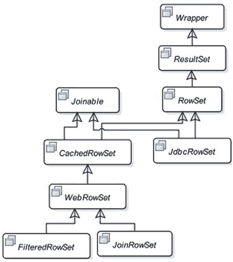
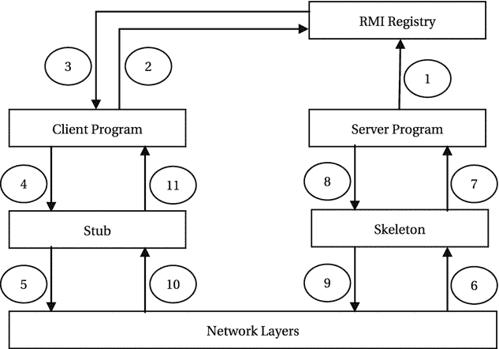
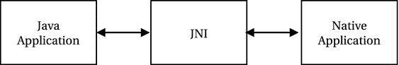

# Set 1528 as the port number
derby.drda.portNumber=1528
Listing 5-2.
The Contents of a Sample derby.properties File
```

使用以下命令停止以服务器模式运行的 Apache Derby。请注意，您需要使用一个单独的命令提示符来运行此命令。

```
c:\apache\derby\bin> stopNetworkServer
Sat Jan 06 13:52:28 CST 2018 : Apache Derby Network Server - 10.14.1.0 - (1808820) shutdown
```

提示

Derby 数据库服务器可以包含多个数据库。Derby 中的数据库是可移植的。每个数据库的文件都存储在一个单独的目录中。移动 Derby 数据库就像移动该数据库的目录一样简单。该目录的名称与数据库名称相同。默认情况下，所有数据库目录都存储在 `derby.system.home` 属性指定的目录中。

启动 Derby 服务器后，您可以使用 `ij` 命令行工具连接到它并执行 SQL 命令。`ij` 工具位于 `DERBY_HOME\bin` 目录中。假设 Derby 服务器在 localhost 的 1527 端口上运行，以下命令启动 `ij` 工具，连接到名为 `beginningJavaDB` 的 Derby 数据库，然后退出 `ij` 工具。数据库的用户 ID 和密码将是 `app` 和 `app`。

```
C:\Java9APIsAndModules>C:\apache\derby\bin\ij
ij version 10.14
ij> connect 'jdbc:derby://localhost:1527/beginningJavaDB;create=true;user=app;password=app;
ij> exit;
C:\Java9APIsAndModules>
```

您需要指定一个连接 URL 来连接到数据库。URL 中的 `create=true` 属性指定，如果名为 `beginningJavaDB` 的数据库尚不存在，Derby 需要创建一个。Derby 会在哪里查找名为 `beginningJavaDB` 的数据库？Derby 会在您启动 Derby 服务器时由 `derby.system.home` 属性指定的目录下查找名为 `beginningJavaDB` 的子目录。您之前已将 `C:\Java9APIsAndModules` 指定为 `derby.system.home` 属性。因此，Derby 将查找名为 `C:\Java9APIsAndModules\beginningJavaDB` 的目录，该目录存储了 `beginningJavaDB` 数据库的文件。如果名为 `beginningJavaDB` 的数据库在 `C:\Java9APIsAndModules` 中不存在，Derby 将为您创建一个新数据库。如果您未指定 `derby.system.home` 属性，则当前目录是 `derby.system.home` 属性的默认值。在前面的连接 URL 中，您也可以按如下方式指定数据库的完整路径：

```
C:\Java9APIsAndModules> C:\apache\derby\bin\ij
ij version 10.14
ij> connect 'jdbc:derby://localhost:1527/C:/Java9APIsAndModules/db/beginningJavaDB;create=true;user=app;password=app';
ij> exit;
C:\Java9APIsAndModules>
```

如果您想以嵌入式模式使用 Derby 数据库，则无需启动 Derby 服务器。以下命令设置 `derby.system.home` 属性并启动 `ij` 工具。请注意，该命令是在一行内输入的。启动 `ij` 工具后，我以嵌入式模式连接到了 `beginningJavaDB` 数据库。在运行以下命令之前，请确保停止 Derby 数据库（如果它正在运行）：

```
C:\apache\derby\bin>java --class-path c:\apache\derby\lib\derbyrun.jar -Dderby.system.home=C:\Java9APIsAndModules org.apache.derby.tools.ij
ij version 10.14
ij> connect 'jdbc:derby:beginningJavaDB';
ij> exit;
C:\apache\derby\bin>
```

您也可以在不设置 `derby.system.home` 属性的情况下，使用 `ij` 命令以嵌入式模式连接到您的 Derby 数据库。在这种情况下，当前目录将作为 `derby.system.home`。上述命令序列可以按如下方式重新运行。请注意，我将当前目录从 `C:\apache\derby` 更改为了 `C:\Java9APISAndMoudles`，我的 Derby 数据库就存储在那里。


```
C:\Java9APIsAndModules>C:\apache\derby\bin\ij
ij 版本 10.14
ij> connect 'jdbc:derby:beginningJavaDB;create=true;user=app;password=app';
ij> exit;
C:\Java9APIsAndModules>
```

现在你已经知道如何创建并连接到 Derby 数据库。如果要在 Derby 数据库中运行任何 SQL 语句，你需要在 `ij` 工具上执行这些 SQL。

## 创建数据库表

使用 JDBC API 的主要目的是操作数据库中表所包含的数据。你可以使用 SQL 语句 `SELECT`、`INSERT`、`UPDATE` 和 `DELETE` 来操作表中的数据，这些语句会直接引用表名。有时你可能不会在 JDBC 调用中直接引用表名，而是通过 JDBC API 执行存储过程，由存储过程来使用表名。无论如何，在使用 JDBC 时最终都会用到表。在本章的大部分内容中，你将主要使用一个表，并将其命名为 `person`。当需要使用 JDBC 处理特定类型的数据库操作时，你可能会沿途创建更多的表。假设你已经在所选数据库中创建了一个名为 `person` 的表。该表的描述如表 5-2 所示。

表 5-2.

名为 Person 的数据库表的通用描述

| 列名 | 数据类型 | 长度 | 是否允许空值 | 备注 |
| --- | --- | --- | --- | --- |
| `person_id` | `integer` |   | `否` | `主键` |
| `first_name` | `string` | `20` | `否` |   |
| `last_name` | `string` | `20` | `否` |   |
| `gender` | `string` | `1` | `否` |   |
| `dob` | `date` |   | `是` |   |
| `income` | `double` |   | `是` |   |

此表中显示的列数据类型是通用的。你需要使用特定于你的 DBMS 的数据类型。例如，对于 `first_name` 列，你可以在 Oracle 数据库中使用 `varchar2(20)` 数据类型，在 SQL Server 数据库中使用 `varchar(20)` 数据类型。类似地，对于 `person_id` 列，你可以在 Oracle 数据库中使用 `number(8, 0)` 数据类型，在 SQL Server 数据库中使用 `int` 数据类型。

每个 DBMS 都提供一个工具（基于字符、图形或两者兼具），让你能够操作数据库对象，如表、存储过程、函数等。例如，你可以使用 Oracle 的 Oracle SQL*PLUS 工具、Microsoft 的 SQL Server Management Studio 工具、Sybase 的 Adaptive Server Anywhere (ASA) 交互式 SQL 工具等。

以下各节展示了在不同数据库中创建 `person` 表的数据库脚本。你需要查阅数据库文档，了解如何运行脚本来创建 `person` 表。

注意

所有数据库脚本（例如用于创建表和存储过程的脚本）均位于本书源代码的 `dbscripts\<DBMS-Name>` 目录下，其中 `<DBMS-Name>` 是 DBMS 的名称，例如 Oracle、DB2 等。

### Oracle 数据库

```
create table person (
person_id number(8,0) not null,
first_name varchar2(20) not null,
last_name varchar2(20) not null,
gender char(1) not null,
dob date,
income number(10,2),
constraint pk_person primary key(person_id)
);
```

### Adaptive Server Anywhere 数据库

```
create table person (
person_id integer not null default null,
first_name varchar(20) not null default null,
last_name varchar(20) not null default null,
gender char(1) not null default null,
dob date null default null,
income double null default null,
primary key (person_id)
);
```

### SQL Server 数据库

```
create table person (
person_id int NOT NULL,
first_name varchar(20) NOT NULL,
last_name varchar(20) NOT NULL,
gender char(1) NOT NULL,
dob datetime NULL,
income decimal(10,2) NULL,
constraint pk_person primary key (person_id)
);
```

### DB2 数据库

```
create table person (
person_id integer not null,
first_name varchar(20) not null,
last_name varchar(20) not null,
gender character (1)  not null,
dob date,
income double,
constraint pk_person_id primary key (person_id)
);
```

### MySQL 数据库

```
create table person (
person_id integer not null primary key,
first_name varchar(20) not null,
last_name varchar(20) not null,
gender char(1) not null,
dob datetime null,
income double null
);
```

### Apache Derby 数据库

```
create table person (
person_id integer not null,
first_name varchar(20) not null,
last_name varchar(20) not null,
gender char(1) not null,
dob date,
income double,
primary key(person_id)
);
```

你可以运行稍后清单 5-6 中显示的程序，在 Apache Derby 中创建 `person` 表。要在其他数据库中创建 `person` 表，你可能需要修改程序中的 `CREATE TABLE` 语法。

## 连接数据库

以下是在 Java 程序中连接数据库需要遵循的步骤。

*   获取 JDBC 驱动程序，并在运行 Java 程序时将其添加到模块路径中。
*   在 JDK8 或更早版本中，向 `DriverManager` 注册 JDBC 驱动程序。从 JDK9 开始，你无需执行此步骤。如果你将 JDBC 驱动程序的模块化 JAR 或 JAR 放置在模块路径上，JDK9 中的服务提供者机制将自动为你加载并注册 JDBC 驱动程序。
*   构造连接 URL。
*   使用 `DriverManager` 的 `getConnection()` 静态方法建立连接。

以下各节将详细描述这些步骤。

### 获取 JDBC 驱动程序

在使用 JDBC 连接数据库之前，你需要拥有该数据库的 JDBC 驱动程序。你可以从数据库供应商处获取 JDBC 驱动程序。例如，如果你使用的是 Oracle DBMS，可以从其官方网站 [`www.oracle.com`](http://www.oracle.com) 下载 JDBC 驱动程序。所有支持 JDBC 的数据库供应商都会允许你从其官方网站免费下载其 DBMS 的 JDBC 驱动程序。通常，JDBC 驱动程序被打包在一个或多个 JAR/ZIP 文件中。

如果你使用的是 Apache Derby，则在安装 Derby 时，JDBC 驱动程序已复制到你的机器上。使用 Derby 数据库无需下载任何额外的 JDBC 驱动程序。Derby 的 JDBC 驱动程序 JAR 文件可以在 `DERBY_HOME\lib` 目录中找到。有关使用 Derby 需要哪个 JAR 文件的更多详细信息，请参考表 5-1。

### 设置模块路径

如果你使用 JDBC 驱动程序，则在运行 Java 程序时，需要将 JDBC 驱动程序的 JAR 文件放置在模块路径中。如果你在代码中使用了供应商特定的 JDBC 类，则在编译时也需要将 JDBC 驱动程序的 JAR 文件放置在模块路径上。

如果你使用 Derby，请参考表 5-1 了解在你的情况下需要使用的 JAR 文件。要运行本章中所有以嵌入式模式使用 Derby 的示例，你需要在模块路径中包含 `derby.jar` 文件。`derby.jar` 文件是以嵌入式模式使用 Derby 所需的 JDBC 驱动程序。如果你通过网络连接到 Derby，则需要在模块路径中包含 `derbyclient.jar` 文件。


### 注册 JDBC 驱动程序

此步骤在 JDK8 及更早版本中是必需的。如果你在模块模式下使用 JDK9，则无需执行此步骤。如果你在传统模式下使用 JDK9——即将所有应用程序 JAR 放在 `CLASSPATH` 上——则需要执行此步骤。

你需要注册要用于连接数据库的 JDBC 驱动程序。JDBC 驱动程序通过 `java.sql.DriverManager` 类进行注册。

什么是 JDBC 驱动程序？从技术上讲，JDBC 驱动程序是一个实现了 `java.sql.Driver` 接口的类。DBMS 供应商会提供 JDBC 驱动程序类以及该驱动程序可能使用的任何其他类。在向 `DriverManager` 注册 JDBC 驱动程序之前，你必须知道该 JDBC 驱动程序类的名称。如果你不知道驱动程序类的名称，请参阅你的 DBMS 的 JDBC 驱动程序文档。

在下一节中，我将列出一些 DBMS 的驱动程序类名称。该名称可能因 DBMS 版本或驱动程序类供应商而异。有时，不同的供应商会为同一个 DBMS 提供驱动程序。不同的供应商将使用不同的驱动程序类名称和不同的连接 URL 格式来连接到同一个 DBMS。

为什么需要向 `DriverManager` 注册 JDBC 驱动程序？Java 不知道如何连接到数据库。它依赖 JDBC 驱动程序来连接数据库。可以将 JDBC 驱动程序视为一个 Java 类，`DriverManager` 将使用该类的对象来连接数据库。问题是，“`DriverManager` 如何知道你想要使用哪个 JDBC 驱动程序来连接数据库？”当然，它本身无法知道 JDBC 驱动程序。因此，向 `DriverManager` 注册驱动程序就是告诉 `DriverManager` 你的 JDBC 驱动程序类名称。通过注册 JDBC 驱动程序，你是在告诉 `DriverManager`，如果你要求它建立与数据库的连接，它需要尝试使用此驱动程序。你可以向 `DriverManager` 注册多个 JDBC 驱动程序吗？可以。你可以注册多个 JDBC 驱动程序。当你需要建立与数据库的连接时，必须向 `DriverManager` 传递一个连接 URL。`DriverManager` 将连接 URL 逐一传递给所有已注册的驱动程序，并要求它们使用你在连接 URL 中提供的信息连接到数据库。如果某个驱动程序识别出该连接 URL，它就会连接到数据库并将连接返回给 `DriverManager`。`java.sql.Connection` 接口的实例在 Java 程序中表示一个数据库连接。如果没有已注册的驱动程序识别出连接 URL，`DriverManager` 将抛出一个 `SQLException`，说明找不到合适的驱动程序。

有三种方法可以向 `DriverManager` 注册 JDBC 驱动程序：

*   通过设置 `jdbc.drivers` 系统属性
*   通过将驱动程序类加载到 JVM 中
*   通过使用 `DriverManager` 类的 `registerDriver()` 方法

#### 设置 jdbc.drivers 系统属性

你可以使用 `jdbc.drivers` 系统属性注册 JDBC 驱动程序类名称。你可以在计算机上全局设置此属性；你可以在运行应用程序时在命令行上传递此属性，或者你可以在应用程序中使用 `System.setProperty()` 方法设置此属性。每个要注册的驱动程序之间用冒号分隔。以下是一些示例：

```
// 在 Java 代码中注册 Sybase 和 Oracle 驱动程序
String drivers = "com.sybase.jdbc2.jdbc.SybDriver:oracle.jdbc.driver.OracleDriver";
System.setProperty("jdbc.drivers", drivers);
// 将要注册的驱动程序名称作为命令行参数传递。
// 以下命令在一行中输入。
java -Djdbc.drivers=com.sybase.jdbc2.jdbc.SybDriver:oracle.jdbc.driver.OracleDriver  com.jdojo.jdbc.Test
```

#### 加载驱动程序类

你可以创建驱动程序类的对象。当驱动程序类被加载到 JVM 中时，它会向 `DriverManager` 注册自身。要加载一个类，你可以使用 `Class.forName("driver class name")` 方法，或者按如下方式创建该类的对象：

```
// 注册 Oracle JDBC 驱动程序
new oracle.jdbc.driver.OracleDriver();
// 使用 Class.forName() 方法注册 Oracle JDBC 驱动程序。
// 异常处理已被省略。
Class.forName("oracle.jdbc.driver.OracleDriver")
// 注册 Apache Derby 嵌入式驱动程序
new org.apache.derby.jdbc.EmbeddedDriver();
// 注册 Apache Derby 网络客户端驱动程序
new org.apache.derby.jdbc.ClientDriver();
```

你不需要保留驱动程序对象的引用，因为目标是将驱动程序类加载到 JVM 中。当驱动程序类被加载到 JVM 中时，驱动程序类的静态初始化器会被执行，在该初始化器中，驱动程序类会向 `DriverManager` 注册自身。

#### 使用 registerDriver() 方法

你可以使用 JDBC 驱动程序类的对象调用 `DriverManager` 类的 `registerDriver(java.sql.Driver driver)` 静态方法来注册 JDBC 驱动程序。

```
// 向 DriverManager 注册 Oracle JDBC 驱动程序
DriverManager.registerDriver(new oracle.jdbc.driver.OracleDriver());
// 注册 Apache Derby 嵌入式驱动程序
DriverManager.registerDriver(new org.apache.derby.jdbc.EmbeddedDriver());
// 注册 Apache Derby 网络客户端驱动程序
DriverManager.registerDriver(new org.apache.derby.jdbc.ClientDriver());
```

你可以遵循这三种方法之一来注册 JDBC 驱动程序。第一种方法提供了更大的灵活性。它允许你在不更改 Java 代码的情况下更改 JDBC 驱动程序。你还可以使用系统属性或命令行参数指定连接 URL（将在下一节讨论）。这样，你不仅可以更换 JDBC 驱动程序，还可以在不修改 Java 代码的情况下更换不同的 DBMS。


### 构建连接 URL

数据库连接通过连接 URL 建立。连接 URL 的格式取决于数据库管理系统（DBMS）和 JDBC 驱动程序。连接 URL 由三部分组成，各部分之间用冒号分隔。定义连接 URL 的语法如下：

```
<协议>:<子协议>:<数据源详情>
```

`<协议>` 部分始终设置为 `jdbc`。`<子协议>` 部分由供应商指定。`<数据源详情>` 部分特定于 DBMS，用于定位数据库。在某些情况下，你也可以在 URL 的最后一部分指定一些连接属性。以下是使用 Oracle 的瘦 JDBC 驱动程序连接到 Oracle DBMS 的连接 URL 示例：

```
jdbc:oracle:thin:@localhost:1521:chanda
```

与往常一样，协议部分是 `jdbc`。子协议部分是 `oracle:thin`，它标识供应商为 Oracle 公司，以及它将使用的驱动程序类型为 `thin`。数据源详情部分是 `@localhost:1521:chanda`。它包含三个子部分。`@localhost` 标识服务器名称，此处为 `localhost`。你可以改用 Oracle 数据库服务器的 IP 地址或机器名。接着，它包含 Oracle 传输网络子层（TNS）监听器运行的端口号。最后一部分是 Oracle 的实例名称，本例中为 `chanda`。以下是另一个连接 URL 示例，用于标识 Derby 服务器中的数据库：

```
jdbc:derby://192.168.1.3:1527/beginningJavaDB;create=true
```

与往常一样，协议部分是 `jdbc`。子协议部分是 `derby`，标识 Derby DBMS。`192.168.1.3:1527` 部分是 Derby 服务器运行的机器 IP 地址和端口号。数据库名称是 `beginningJavaDB`。最后一部分 `create=true` 是连接属性，表示如果名为 `beginningJavaDB` 的数据库不存在，则创建一个以此名称命名的新数据库。

以下各节描述了一些 DBMS 的连接 URL 格式。你需要访问供应商的官方网站下载特定的 JDBC 驱动程序。你也可以在供应商的网站上获取有关使用 JDBC 驱动程序的详细信息。

#### Oracle 数据库

```
DBMS: Oracle 10g
供应商: Oracle 公司
网站: http://www.oracle.com
驱动程序类型: JDBC 驱动程序（thin - 纯 Java）
URL 格式: jdbc:oracle:thin:@<主机>:<端口>:<实例>
URL 示例: jdbc:oracle:thin:@localhost:1521:chanda
驱动程序类: oracle.jdbc.driver.OracleDriver
```

它 100% 用 Java 实现。如果你使用 Oracle 瘦驱动程序，则无需安装任何 Oracle 特定的配置软件。如果你在 applet 中使用 JDBC 连接到 Oracle 数据库，则应使用此驱动程序：

```
DBMS: Oracle 10g
供应商: Oracle 公司
网站: http://www.oracle.com
驱动程序类型: JDBC 本地驱动程序（OCI - Oracle 调用接口）
URL 格式: jdbc:oracle:oci:@<TNS 别名>
URL 示例: jdbc:oracle:oci:@orcl
驱动程序类: oracle.jdbc.driver.OracleDriver
```

你需要安装 Oracle 客户端软件才能使用 OCI 驱动程序。JDBC 驱动程序将标准 JDBC 调用转换为 OCI 调用，然后发送到数据库。URL 的 `<TNS 别名>` 部分来自 `tnsnames.ora` 文件中的条目。`tnsnames.ora` 文件中典型的 TNS 别名条目如下所示：

```
ORCL =
(DESCRIPTION =
(ADDRESS = (PROTOCOL = TCP)(HOST = HYE6754)(PORT = 1521))
(CONNECT_DATA =
(SERVER = DEDICATED)
(SERVICE_NAME = orcl)
)
)
```

Oracle JDBC 驱动程序还允许你将 TNS 别名的完整文本指定为 JDBC 连接 URL 的一部分，如下所示：

```
String dbURL="jdbc:oracle:oci:@(DESCRIPTION =" +
"(ADDRESS = (PROTOCOL = TCP)(HOST = HYE6754)(PORT = 1521))" +
"(CONNECT_DATA =(SERVER = DEDICATED)(SERVICE_NAME = orcl)))";
```

#### Adaptive Server Anywhere 数据库

```
DBMS: Adaptive Server Anywhere 9.0
驱动程序类型: JDBC 驱动程序（纯 Java）
供应商: Sybase 公司
网站: http://www.sybase.com
URL 格式: jdbc:sybase:Tds:<主机>:<端口>
URL 示例: jdbc:sybase:Tds:localhost:2638
驱动程序类: com.sybase.jdbc2.jdbc.SybDriver
```

#### SQL Server 数据库

你可以使用以下两个 JDBC 驱动程序中的任意一个连接到 SQL Server 数据库：

```
// 驱动程序 #1
DBMS: SQL Server
供应商: 微软公司
网站: http://www.microsoft.com
驱动程序类型: JDBC 驱动程序（纯 Java）
URL 格式: jdbc:SQLserver://<主机>:<端口>;Database=<数据库>
URL 示例: jdbc:SQLserver://HYE6754:1433;Database=chanda
驱动程序类: com.microsoft.SQLserver.jdbc.SQLServerDriver
// 驱动程序 #2
DBMS: SQL Server
供应商: SourceForge 公司
网站: http://www.sourceforge.net
驱动程序类型: JDBC 驱动程序（纯 Java）
URL 格式: jdbc:jtds:<服务器类型>://<主机>:<端口>/<数据库>;<属性>
URL 示例: jdbc:jtds:sqlserver://HYE6754:1433/chanda
驱动程序类: net.sourceforge.jtds.jdbc.Driver
```

当你使用驱动程序 #2 时，可以指定 `sqlserver` 或 `sybase` 作为 `<服务器类型>`，以分别连接到 SQL Server 或 Sybase DBMS。`<属性>` 是一个以逗号分隔的 `属性=值` 对列表，其中 `属性` 是数据库属性的名称，`值` 是其值。例如，如果你想在 URL 中指定用户和密码，可以使用 `<属性>` 为 `user=myuserid;password=mysecretpassword`。

URL 的 `<端口>`、`<数据库>` 和 `<属性>` 部分是可选的。如果你不指定它们，将使用它们的默认值。`<端口>` 的默认值对于 SQL Server 是 1433，对于 Sybase 是 7100。

#### MySQL 数据库

```
DBMS: MySQL Server 5.0
供应商: Oracle 公司
网站: http://www.oracle.com
驱动程序类型: JDBC 驱动程序（纯 Java）
URL 格式: jdbc:mySQL://<主机>:<端口>/<数据库>?<属性>
URL 示例: jdbc:mySQL://HYE6754:3306/chanda
驱动程序类: com.mySQL.jdbc.Driver
```

对于 MySQL 数据库，连接 URL 中的大部分部分是可选的。例如，你可以将 MySQL 的最短连接 URL 用作 `jdbc:mySQL://`，所有其他部分将采用其默认值。`<服务器>` 和 `<端口>` 的默认值分别是 `localhost` 和 `3306`。你可以提供以逗号分隔的 `<服务器>:<端口>` 值列表，用作故障转移服务器。如果你不提供 `<数据库>` 的值，可以在建立连接后调用 `Connection` 对象上的 `setCatalog("catalog name")` 方法，或者在所有查询中提供目录名称。在示例 URL 中，你已将 `chanda` 指定为你的数据库。`<属性>` 是一个以 & 符号分隔的 `名称=值` 对列表。例如，你可以通过连接 URL 传递用户 ID 和密码，如下所示。它使用 `app` 作为用户 ID，`app` 作为密码。

```
jdbc:mySQL://localhost:3306/chanda?user=app&password=app.
```

#### DB2 数据库

```
DBMS: DB2
供应商: IBM
网站: http://www.ibm.com
驱动程序类型: JDBC 驱动程序（纯 Java）
URL 格式: jdbc:db2://<主机>:<端口>/<数据库>:<属性>
URL 示例: jdbc:db2://localhost:50000/chandaDB
驱动程序类: com.ibm.db2.jcc.DB2Driver
```

你可以使用 `jdbc:db2:` 或 `jdbc:db2j:net:` 作为 URL 的起始部分。如果 URL 以 `jdbc:db2:` 开头，表示连接的是 DB2 UDB 系列中的服务器。如果 URL 以 `jdbc:db2j:net:` 开头，表示连接的是远程 IBM^((R)) Cloudscape^((TM)) 服务器。URL 中的 `<属性>` 部分是一个以逗号分隔的 `名称=值` 对列表，用于数据库连接的属性。例如，以下 URL 分别将 `user` 和 `password` 属性指定为 `admin` 和 `secret`：

```
jdbc:db2://localhost:5021/chandaDB:user=admin;password=secret;
```

有关可以在 JDBC 连接 URL 中设置的属性的更多详细信息，请访问 IBM 的官方网站。


#### Apache Derby 数据库

```
DBMS: Apache Derby
Web Site: http://db.apache.org/derby/
Driver Type: JDBC Driver (Pure Java)
URL Format: jdbc:derby://<host>:<port>/<database>;
URL Example: jdbc:derby://localhost:1527/beginningJavaDB;create=true
Driver Class: org.apache.derby.jdbc.ClientDriver
```

默认用户名和密码分别为 `app` 和 `app`。指定属性 `create=true` 可在数据库不存在时创建一个空数据库。Apache Derby 还有其他类型的 JDBC 驱动程序。当 Apache Derby 作为服务器运行，且你的应用程序作为客户端访问它时，客户端驱动程序允许你连接到它。你也可以在应用程序运行的同一个 JVM 中启动 Apache Derby，这样你的应用程序和 Apache Derby 将在同一进程中运行。当 Apache Derby 与你的应用程序在同一进程中运行时，你可以使用嵌入式 JDBC 驱动程序访问数据库。

加载嵌入式 Apache Derby 的 JDBC 驱动程序会启动 Apache Derby 数据库。以下是以嵌入式模式启动 Apache Derby 并连接到名为 `beginningJavaDB` 的数据库的连接 URL 示例：

```
jdbc:derby:beginningJavaDB
```

回想一下，Apache Derby 数据库有一个与数据库名称同名的目录。JDBC 驱动程序如何通过此连接 URL 找到 `beginningJavaDB` 目录？它将使用 `derby.system.home` 属性指定的目录。如果未指定该属性，它将使用当前目录。以下 Java 命令通过指定 `derby.system.home` 属性来启动 Java 应用程序：

```
java -Dderby.system.home=C:\myDatabases com.jdojo.jdbc.MyApp
```

如果在 `MyApp` 类中使用数据库名称，则会在 `C:\myDatabases` 目录中搜索该数据库。

你也可以在连接 URL 中指定数据库目录的完整路径。以下连接 URL 在 Windows 上指定了数据库的完整路径：

```
jdbc:derby:C:/myDatabases/beginningJavaDB
```

在数据库完整路径中，你可以在 Windows 和 UNIX 上使用正斜杠作为路径分隔符。

如果你的数据库目录位于 `CLASSPATH` 中，你可以使用 `classpath` 子协议构建连接 URL，如下所示：

```
jdbc:derby:classpath:beginningJavaDB
```

该连接 URL 将在 `CLASSPATH` 中查找 `beginningJavaDB` 目录。如果你的数据库位于 `CLASSPATH` 中某个目录下的 `test` 目录中，你可以按如下方式构建连接 URL：

```
jdbc:derby:classpath:test/beginningJavaDB
```

Apache Derby 在指定连接 URL 方面非常灵活。它还允许你从 JAR/ZIP 文件访问只读数据库。以下连接 URL 在 `C:\myDatabases.jar` 文件的 test 目录下查找 `beginningJavaDB` 数据库：

```
jdbc:derby:jar:(C:/myDatabases.jar)test/beginningJavaDB
```

### 建立数据库连接

现在是时候连接到数据库了。你需要使用 `DriverManager` 类的 `getConnection()` 静态方法来建立与数据库的连接。它返回一个 `java.sql.Connection` 接口的实例，该实例代表数据库连接。`getConnection()` 方法接受连接 URL、用户 ID、密码以及使用 `java.util.Properties` 对象传递的任意数量的名称-值对。`getConnection()` 方法已被重载：

*   `Connection getConnection(String url) throws SQLException`
*   `Connection getConnection(String url, Properties info) throws SQLException`
*   `Connection getConnection(String url, String user, String password) throws SQLException`

你会发现，对于使用 JDBC 驱动程序对数据库进行的几乎每个操作，都需要处理 `java.sql.SQLException` 异常，这很烦人。它是一个受检异常，编译器会强制你通过将代码放在 `try-catch` 块中或使用 `throws` 子句来处理它。即使你只编写一行代码，最终也需要使用 `try-catch` 块。你将创建一个包含一些静态方法的工具类，用于处理这些异常的一行代码。每当你需要使用该一行代码的功能时，你将使用工具类方法，而不是直接使用 JDBC 方法。这种方法将避免本章示例中出现臃肿的代码。

以下代码片段建立了与 Derby 嵌入式模式下运行的名为 `beginningJavaDB` 的数据库的连接：

```
// 注册 JDBC 驱动程序 - 在 JDK9 模块模式下不需要
Driver derbyEmbeddedDriver = new org.apache.derby.jdbc.EmbeddedDriver();
DriverManager.registerDriver(derbyEmbeddedDriver);
// 准备连接 URL
String dbURL = "jdbc:derby:beginningJavaDB;create=true;user=app;password=app";
Connection conn = null;
try {
conn = DriverManager.getConnection(dbURL, "app", "app");
System.out.println("成功连接到数据库");
// 在此处执行数据库活动...
} catch(SQLException e) {
e.printStackTrace();
} finally {
if (conn != null) {
try {
// 关闭连接
conn.close();
} catch (SQLException e) {
e.printStackTrace();
}
}
}
```

`Connection` 接口继承自 `java.lang.AutoCloseable` 接口。这意味着你也可以使用 `try-with-resource` 块来获取 `Connection`，当控制权退出 `try` 块时，该连接将自动关闭。你可以使用 `try-with-resources` 块重写之前的代码片段，如下所示：

```
// 注册 JDBC 驱动程序 - 在 JDK9 模块模式下不需要
Driver derbyEmbeddedDriver = new org.apache.derby.jdbc.EmbeddedDriver();
DriverManager.registerDriver(derbyEmbeddedDriver);
// 准备连接 URL
String dbURL = "jdbc:derby:beginningJavaDB;create=true";
try (Connection conn = DriverManager.getConnection(dbURL, "app", "app")) {
System.out.println("成功连接到数据库");
// 在此处执行数据库活动...
} catch (SQLException e) {
e.printStackTrace();
}
```

如果你需要连接到任何其他数据库，你需要更改两件事：你注册的 JDBC 驱动程序和连接 URL。驱动程序和连接 URL 都是特定于 DBMS 的。注意代码中使用了 `try-catch-finally` 块。当你完成数据库连接后，需要使用 `Connection` 对象的 `close()` 方法关闭它。`Connection` 对象的 `close()` 方法会抛出 `SQLException`，这迫使你使用另一个 `try-catch` 块。在典型的 Java 程序中，你不会在连接到数据库后立即关闭连接。你将使用 `Connection` 对象执行一些数据库活动，然后关闭连接。


清单 5-3 包含了一个`JDBCUtil`类的代码，你将在本章中使用该类来处理数据库连接。它的所有方法都是静态的，用于建立和关闭数据库连接、关闭`Statement`、关闭`ResultSet`、提交事务、回滚事务等。我将在本章后面讨论`Statement`和`ResultSet`对象。请注意，`JDBCUtil`类使用`app`和`app`作为用户 ID 和密码来连接嵌入式 Derby 数据库。如果你想使用不同的用户 ID 和密码进行连接，你需要在`getConnection()`方法中修改它们。

```
// JDBCUtil.java
package com.jdojo.jdbc;
import java.sql.Connection;
import java.sql.DriverManager;
import java.sql.ResultSet;
import java.sql.SQLException;
import java.sql.Statement;
public class JDBCUtil {
public static Connection getConnection() throws SQLException {
// 该 URL 特定于 JDBC 驱动程序和你要连接的数据库
String dbURL = "jdbc:derby:beginningJavaDB;create=true";
// 设置用户 ID 和密码
String userId = "app";
String password = "app";
// 获取连接
Connection conn = DriverManager.getConnection(dbURL, userId, password);
// 关闭自动提交
conn.setAutoCommit(false);
return conn;
}
public static void closeConnection(Connection conn) {
try {
if (conn != null) {
conn.close();
}
} catch (SQLException e) {
e.printStackTrace();
}
}
public static void closeStatement(Statement stmt) {
try {
if (stmt != null) {
stmt.close();
}
} catch (SQLException e) {
e.printStackTrace();
}
}
public static void closeResultSet(ResultSet rs) {
try {
if (rs != null) {
rs.close();
}
} catch (SQLException e) {
e.printStackTrace();
}
}
public static void commit(Connection conn) {
try {
if (conn != null) {
conn.commit();
}
} catch (SQLException e) {
e.printStackTrace();
}
}
public static void rollback(Connection conn) {
try {
if (conn != null) {
conn.rollback();
}
} catch (SQLException e) {
e.printStackTrace();
}
}
public static void main(String[] args) {
Connection conn = null;
try {
conn = JDBCUtil.getConnection();
System.out.println("已连接到数据库。");
} catch (SQLException e) {
e.printStackTrace();
} finally {
JDBCUtil.closeConnection(conn);
}
}
}
已连接到数据库。
清单 5-3.
一个用于处理数据库的工具类
```

要连接数据库，你将使用`JDBCUtil.getConnection()`方法。要关闭连接，你将使用`JDBCUtil.closeConnection()`方法。`getConnection()`方法使用了 Apache Derby 特定的 JDBC 驱动类和连接 URL 格式。你必须修改`getConnection()`方法中的代码，使其与你想要连接的数据库管理系统（DBMS）相匹配。在运行本章其他示例之前，你能够成功运行`JDBCUtil`类并确保能够连接到 DBMS，这一点非常重要。

初学者最常见的错误之一是没有将 JDBC 驱动的 Java 类（通常是一个 JAR/ZIP 文件）包含在模块路径中。请确保你的 JDBC 驱动相关的 JAR 文件已包含在模块路径中，并在模块声明中使用`requires`语句声明对 JDBC 驱动模块的依赖，该模块将作为自动模块使用。例如，将`derby.jar`文件包含在模块路径中，以使用 Apache Derby 嵌入式 JDBC 驱动。以下命令用于运行`JDBCUtil`类。该命令假设你已将本书的源代码解压到`C:\Java9APIsAndModules`目录，该目录也是你的当前目录。该命令应在一行内输入。为了便于阅读，我将其分多行显示。

```
C:\Java9APIsAndModules>java --module-path dist\jdojo.jdbc.jar;jdbc_driver\derby.jar
--module jdojo.jdbc/com.jdojo.jdbc.JDBCUtil
已连接到数据库。
```

如果你连接的是 Derby 以外的数据库，上述命令中`--module-path`选项的值将使用你数据库的 JDBC JAR 文件路径，而不是`derby.jar`文件。

建立数据库连接对初学者来说可能非常令人沮丧。清单 5-4 中的程序打印了在 JDK9 中以模块模式自动加载的所有 JDBC 驱动的详细信息。JDK9 在`DriverManager`类中添加了一个静态的`drivers()`方法，该方法返回当前加载的`Stream<Driver>`。我在运行`PrintJDBCDrivers`类时已将`derby.jar`放在模块路径上。运行时将`derby.jar` JAR 作为自动模块使用，你可以在输出中看到`derby`作为派生的模块名称。如果你在输出中没有看到你的 JDBC 驱动，请尝试将驱动的 JAR 放在模块路径上并重新运行此类。

```
// PrintJDBCDrivers.java
package com.jdojo.jdbc;
import java.sql.Driver;
import java.sql.DriverManager;
public class PrintJDBCDrivers {
public static void main(String[] args) {
System.out.println("已加载的 JDBC 驱动列表：");
DriverManager.drivers()
.forEach(PrintJDBCDrivers::print);
}
public static void print(Driver driver) {
String className = driver.getClass().getName();
String moduleName = driver.getClass().getModule().getName();
int majorVersion = driver.getMajorVersion();
int minorVersion = driver.getMinorVersion();
boolean jdbcCompliant = driver.jdbcCompliant();
System.out.println("驱动类名：" + className);
System.out.println("驱动模块名：" + moduleName);
System.out.println("驱动主版本号：" + majorVersion);
System.out.println("驱动次版本号：" + minorVersion);
System.out.println("驱动 jdbcCompliant：" + jdbcCompliant);
System.out.println("----------------------------------------");
}
}
已加载的 JDBC 驱动列表：
驱动类名：org.apache.derby.jdbc.AutoloadedDriver
驱动模块名：derby
驱动主版本号：10
驱动次版本号：14
驱动 jdbcCompliant：true

清单 5-4.
已加载的 JDBC 驱动的详细信息
```

## 设置自动提交模式

当你连接数据库时，`Connection`对象的自动提交属性默认设置为`true`。如果连接处于自动提交模式，SQL 语句在成功执行后会自动提交。如果连接不处于自动提交模式，你必须调用`Connection`对象的`commit()`或`rollback()`方法来提交或回滚事务。通常，在 JDBC 应用程序中，你会禁用连接的自动提交模式，这样应用程序中的逻辑就能控制事务的最终结果。要禁用自动提交模式，你需要在建立连接后调用`Connection`对象的`setAutoCommit(false)`方法。如果连接 URL 允许你设置自动提交模式，你也可以将其作为连接 URL 的一部分进行指定。在`JDBCUtil.getConnection()`方法中，你在获取`Connection`对象后将连接的自动提交模式设置为`false`。

```
// 获取连接
Connection conn = DriverManager.getConnection(dbURL, userId, password);
// 关闭自动提交
conn.setAutoCommit(false);
```

如果你为连接启用了自动提交模式，则不能使用其`commit()`和`rollback()`方法。在已启用自动提交模式的`Connection`对象上调用`commit()`和`rollback()`方法会抛出`SQLException`。JDBC 还允许你在事务中使用保存点，以便对事务进行部分回滚。我将在本章后面提供一个使用保存点的示例。

如果在事务中间调用`setAutoCommit()`方法来更改连接的自动提交模式，则事务会在此时被提交。通常，你会在连接到数据库后立即设置连接的自动提交模式。


## 提交与回滚事务

如果禁用了连接的自动提交模式，可以使用 `commit()` 或 `rollback()` 方法来提交或回滚事务。执行数据库事务的 JDBC 应用程序中的典型伪代码如下所示：

```
Connection conn  = 获取连接;
// 禁用自动提交模式
conn.setAutoCommit(false);
// 在此处执行数据库事务活动
IF 事务成功 THEN
// 提交事务
conn.commit();
ELSE
// 回滚事务
conn.rollback();
END IF
conn.close(); // 关闭连接
```

错误处理代码未显示。通常，`try-catch` 或 `try-catch-finally` 块会替代 `IF` 语句。

## 事务隔离级别

在多用户数据库中，您经常会遇到以下两个术语：

*   数据并发性
*   数据一致性

数据并发性是指多个用户同时使用相同数据的能力。数据一致性是指当多个用户同时操作数据时所维护的数据准确性。随着数据并发性的增加（即更多用户处理相同数据），必须注意维护所需的数据一致性级别。数据库通过使用锁以及将一个事务与另一个事务隔离来维护数据一致性。一个事务与另一个事务的隔离程度取决于所需的数据一致性级别。让我们来看三种现象，在支持多个并发事务的多用户环境中，数据一致性可能会受到损害。

### 脏读

在脏读中，一个事务读取了另一个事务未提交的数据。考虑以下步骤序列，由于脏读导致数据不一致：

*   事务 A 在表中插入一个新行，但尚未提交。
*   事务 B 读取了事务 A 插入的未提交行。
*   事务 A 回滚了更改。
*   此时，事务 B 中留下了不存在的行的数据。

### 不可重复读

在不可重复读中，当事务重新读取数据时，发现数据已被另一个已提交的事务修改。考虑以下步骤序列，由于不可重复读导致数据不一致：

*   事务 A 读取一行。
*   事务 B 修改或删除同一行并提交更改。
*   事务 A 重新读取同一行，发现该行已被修改或删除。

### 幻读

在幻读中，当事务重新执行相同的查询时，发现更多满足查询条件的数据。考虑以下步骤序列，由于幻读导致数据不一致：

*   事务 A 执行一个查询（假设为 Q），发现 X 行匹配该查询。
*   事务 B 插入一些满足查询 Q 条件的行并提交。
*   事务 A 重新执行相同的查询（Q），发现 Y 行（Y > X）匹配该查询。

请注意，不可重复读和幻读之间的区别在于：前者发现行在两次读取之间发生了变化，而后者发现匹配相同查询的行数变多了。

ANSI SQL-92 标准根据前面描述的三种数据一致性情况定义了四种事务隔离级别。每种隔离级别定义了允许或不允许哪些类型的数据不一致。四种事务隔离级别如下：

*   读未提交
*   读已提交
*   可重复读
*   可序列化

表 5-3 显示了四种隔离级别和三种允许的情况。由 DBMS 决定如何实现这些隔离级别。DBMS 可能提供额外的隔离级别。不同的 DBMS 实现相同隔离级别的方式可能略有不同。请查阅您的 DBMS 文档，以了解您的 DBMS 支持的隔离级别的更多详细信息。

表 5-3.

ANSI SQL-92 定义的四种隔离级别

| 隔离级别 | 脏读 | 不可重复读 | 幻读 |
| --- | --- | --- | --- |
| 读未提交 | 允许 | 允许 | 允许 |
| 读已提交 | 不允许 | 允许 | 允许 |
| 可重复读 | 不允许 | 不允许 | 允许 |
| 可序列化 | 不允许 | 不允许 | 不允许 |

Java 在 `Connection` 接口中定义了以下四个常量，对应于 ANSI SQL-92 标准定义的四种隔离级别：

*   `TRANSACTION_READ_UNCOMMITTED`
*   `TRANSACTION_READ_COMMITTED`
*   `TRANSACTION_REPEATABLE_READ`
*   `TRANSACTION_SERIALIZABLE`

您可以使用 `Connection` 接口的 `setTransactionIsolation(int level)` 方法为数据库连接设置事务的隔离级别。

```
// 获取一个 Connection 对象
Connection conn = 获取一个连接对象...;
// 将事务隔离级别设置为读已提交
conn.setTransactionIsolation(Connection.TRANSACTION_READ_COMMITTED);
```

您可以使用 `Connection` 接口的 `getTransactionIsolation()` 方法获取该连接当前的事务隔离级别设置。默认事务隔离级别取决于 JDBC 驱动程序。您还可以使用 `DatabaseMetaData` 接口的以下三个方法来更深入地了解 DBMS 支持的事务隔离级别。方法名称不言自明。

*   `int getDefaultTransactionIsolation() throws SQLException`
*   `boolean supportsTransactions() throws SQLException`
*   `boolean supportsTransactionIsolationLevel(int level) throws SQLException`

`Connection` 接口定义了一个 `TRANSACTION_NONE` 常量，用于指示 JDBC 驱动程序不支持事务，并且它不是符合 JDBC 规范的驱动程序。此常量不与 `setTransactionIsolation()` 方法一起使用。`getTransactionIsolation()` 方法可能返回此常量。您可以随时更改 `Connection` 对象的事务隔离级别。但是，如果在事务正在进行时更改连接的事务隔离级别，其效果取决于 JDBC 驱动程序。


## JDBC 类型到 Java 类型的映射

JDBC API 允许你在 Java 环境中访问和操作数据，而这些数据最终存储在数据库中。数据库使用其自身的数据类型，而 Java 也使用其自身的数据类型。表 5-4 列出了 JDBC 数据类型与 Java 数据类型之间的映射关系。

表 5-4.

JDBC 与 Java 之间的数据类型映射

| JDBC 类型 | Java 类型 |
| --- | --- |
| `ARRAY` | `java.sql.Array` |
| `BIGINT` | `long` |
| `BINARY` | `byte[]` |
| `BIT` | `boolean` |
| `BLOB` | `java.sql.Blob` |
| `BOOLEAN` | `boolean` |
| `CHAR` | `String` |
| `CLOB` | `java.sql.Clob` |
| `DATALINK` | `java.net.URL` |
| `DATE` | `java.sql.Date` |
| `DATE` | `java.time.LocalDate` |
| `DECIMAL` | `java.math.BigDecimal` |
| `DISTINCT` | `底层类型的映射` |
| `DOUBLE` | `double` |
| `FLOAT` | `double` |
| `INTEGER` | `int` |
| `JAVA_OBJECT` | `底层 Java 类` |
| `LONGNVARCHAR` | `String` |
| `LONGVARBINARY` | `byte[]` |
| `LONGVARCHAR` | `String` |
| `NCHAR` | `String` |
| `NCLOB` | `java.sql.NClob` |
| `NUMERIC` | `java.math.BigDecimal` |
| `NVARCHAR` | `String` |
| `NULL` | `NULL` SQL 值 |
| `REAL` | `float` |
| `REF` | `java.sql.Ref` |
| `REF_CURSOR` | `Java.sql.ResultSet` |
| `ROWID` | `java.sql.RowId` |
| `SMALLINT` | `short` |
| `SQLXML` | `java.sql.SQLXML` |
| `STRUCT` | `java.sql.Struct` |
| `TIME` | `java.sql.Time` |
| `TIME` | `java.time.LocalTime` |
| `TIME_WITH_TIMEZONE` | `java.time.OffsetTime` |
| `TIMESTAMP` | `java.sql.Timestamp` |
| `TIMESTAMP_WITH_TIMEZONE` | `java.time.OffsetDateTime` |
| `TINYINT` | `byte` |
| `VARBINARY` | `byte[]` |
| `VARCHAR` | `String` |

Java 8 新增了名为 `REF_CURSOR`、`TIME_WITH_TIMEZONE` 和 `TIMESTAMP_WITH_TIMEZONE` 的 JDBC 类型。在 Java 8 之前，你可以使用 `java.sql` 包中的 `Date`、`Time` 和 `Timestamp` 类来处理日期、时间和时间戳 JDBC 类型。在 Java 8 中，与日期和时间相关的 JDBC 类型也已映射到 `java.time` 包中新的日期和时间类。例如，你可以使用 `java.sql.Date` 或 `java.time.LocalDate` 对象来表示 `DATE` JDBC 类型。如果你对 JDBC `DATE` 类型使用来自 `java.time` 包的日期和时间相关对象，则需要将它们作为对象使用，并使用 `getObject()` 和 `setObject()` 等方法来获取和设置它们的值。`java.sql` 包中的 `Date`、`Time` 和 `Timestamp` 类已添加了几个方法，以方便 SQL 日期/时间与 `java.time` 包中的新日期/时间之间的转换。

表中 `JDBC 类型` 列中列出的所有值都定义为 `Types` 类中的常量。Java 8 新增了一个名为 `JDBCType` 的枚举类型，它包含与 `Types` 类中常量同名的常量。`JDBCType` 枚举继承自同样在 Java 8 中添加的 `SQLType` 接口。当方法的参数中需要数据类型时，在旧方法中你会看到参数类型为 `int`，并且你需要传递 `Type` 类中的一个常量。Java 8 已重载了其中一些方法，改为使用 `JDBCType` 枚举。只要可能，请使用 `JDBCType` 枚举中的常量来表示数据类型，以保证类型安全。

如果你必须在 Java 代码中引用 JDBC 类型，则需要使用 `Types` 类中相应的常量。例如，假设你需要为 `PreparedStatement` 中的参数设置一个 `null` 值。该参数类型为 `int` 类型。`PreparedStatement` 接口提供了一个 `setNull()` 方法，如下所示：

```
void setNull(int parameterIndex, int sqlType) throws SQLException
```

`setNull()` 方法的第二个参数接受 `sqlType`，它是 JDBC 数据类型，由 `java.sql.Types` 类中的常量定义。假设 `PreparedStatement` 中该参数的索引为 2。你将按如下所示调用 `setNull()` 方法：

```
myPreparedStmt.setNull(2, java.sql.Types.INTEGER);
```

该表还告诉你需要使用的 Java 变量类型，以便从数据库读取数据。假设数据库表中的一列被声明为 `varchar(20)`。表 5-4 将 JDBC `VARCHAR` 数据类型映射到 Java `String` 类型。这意味着你需要在 Java 程序中使用 `String` 引用类型变量来保存数据库中 `VARCHAR` 类型的值。假设你正在使用 `ResultSet` 从数据库表中读取 `first_name` 列的值，该列被声明为 `varchar(20)`。你的代码将类似于以下内容：

```
String firstName = myResultSet.getString("first_name");
```

本章在获取、设置或更新跨越 `JDBC-JAVA` 边界的数据时，将全程使用此表中显示的映射。在 JDBC 程序中处理数据时，你将使用三组方法：`getXxx()`、`setXxx()` 和 `updateXxx()`，其中 `Xxx` 表示一种数据类型，例如 `int`、`String`、`Date` 等。这些方法存在于本章使用的许多接口中，例如 `PreparedStatement`、`ResultSet` 等。

`getXxx()` 方法用于将数据从 JDBC 环境读取到 Java 程序。`setXxx()` 方法用于在 Java 程序中设置一个值，该值最终将被传递到 JDBC 环境。`updateXxx()` 方法用于更新从 JDBC 环境检索到的数据元素，更新后的值将再次传递到 JDBC 环境。例如，你使用 `getInt()`、`setInt()` 和 `updateInt()` 来读取、设置和更新数据库中类型为 `INTEGER` 的值，该值在 Java 代码中表示为 `int` 数据类型的值。你可以使用 `getObject()`、`setObject()` 和 `updateObject()` 方法来处理所有数据类型，前提是提供给这些方法的参数与实际数据类型赋值兼容。只要可能，JDBC API 会在内部执行隐式数据类型转换。例如，如果 JDBC 类型映射到 Java 中的 short 类型，你可以使用 `getShort()` 方法来读取其值。如果你使用 `getInt()` 方法来读取 short 值，则该 short 值会被隐式转换为 `int`。另一个例子是使用 `getString()` 方法读取 JDBC `INTEGER` 值。假设你想从结果集中读取一个 `INTEGER` 类型列 `person_id` 的值。你可以使用以下两个语句中的任何一个。在第二个语句中，JDBC 驱动程序将执行从 `int` 到 `String` 的隐式转换。

```
int personIdInt = myResultSet.getInt("person_id");
String personIdStr = myResultSet.getString("person_id");
```


## 了解数据库

不同数据库管理系统（DBMS）对同一数据库功能的支持方式可能不同，甚至完全不支持。有时，JDBC 驱动程序可能会对底层 DBMS 支持的功能进行封装。`DatabaseMetaData` 接口的实例能为你提供关于 DBMS 通过 JDBC 驱动程序所支持功能的详细信息。JDBC 驱动程序的供应商会提供 `DatabaseMetaData` 接口的实现类。你可以使用 `Connection` 对象的 `getMetaData()` 方法获取 `DatabaseMetaData` 实例，如下所示：

```
// 获取一个 Connection 对象
Connection conn = JDBCUtil.getConnection();
// 获取一个 DatabaseMetaData 实例
DatabaseMetaData dbmd = conn.getMetaData();
```

清单 5-5 包含了完整的代码，用于打印你所连接数据库的一些信息。输出结果显示了关于 Derby 数据库的信息、支持的功能以及 JDBC 驱动程序。你可能会得到不同的输出结果。

```
// DatabaseMetaDataTest.java
package com.jdojo.jdbc;
import java.sql.Connection;
import java.sql.SQLException;
import java.sql.DatabaseMetaData;
public class DatabaseMetaDataTest {
public static void main(String[] args) {
Connection conn = null;
try {
conn = JDBCUtil.getConnection();
// 获取 DatabaseMetaData 对象
DatabaseMetaData dbmd = conn.getMetaData();
System.out.println("关于数据库...");
String dbName = dbmd.getDatabaseProductName();
String dbVersion = dbmd.getDatabaseProductVersion();
String dbURL = dbmd.getURL();
System.out.println("数据库名称: " + dbName);
System.out.println("数据库版本: " + dbVersion);
System.out.println("数据库 URL: " + dbURL);
System.out.printf("%n 关于 JDBC 驱动程序...%n");
String driverName = dbmd.getDriverName();
String driverVersion = dbmd.getDriverVersion();
System.out.println("驱动程序名称: " + driverName);
System.out.println("驱动程序版本: " + driverVersion);
System.out.printf("%n 关于 JDBC 驱动程序支持的功能...%n");
boolean ansi92BiEntry = dbmd.supportsANSI92EntryLevelSQL();
boolean ansi92Intermediate = dbmd.supportsANSI92IntermediateSQL();
boolean ansi92Full = dbmd.supportsANSI92FullSQL();
boolean supportsBatchUpdates = dbmd.supportsBatchUpdates();
System.out.println("支持入门级 ANSI92 SQL: " + ansi92BiEntry);
System.out.println("支持中级 ANSI92 SQL: " + ansi92Intermediate);
System.out.println("支持完全级 ANSI92 SQL: "  + ansi92Full);
System.out.println("支持批量更新: " + supportsBatchUpdates);
} catch (SQLException e) {
e.printStackTrace();
} finally {
JDBCUtil.closeConnection(conn);
}
}
}
关于数据库...
数据库名称: Apache Derby
数据库版本: 10.14.1.0 - (1808820)
数据库 URL: jdbc:derby:db/beginningJavaDB
关于 JDBC 驱动程序...
驱动程序名称: Apache Derby Embedded JDBC Driver
驱动程序版本: 10.14.1.0 - (1808820)
关于 JDBC 驱动程序支持的功能...
支持入门级 ANSI92 SQL: true
支持中级 ANSI92 SQL: false
支持完全级 ANSI92 SQL: false
支持批量更新: true
清单 5-5.
使用 DatabaseMetaData 对象了解 DBMS
```

`DatabaseMetaData` 接口有许多方法用于获取数据库信息。更多详细信息请参考该接口的 API 文档。通常，工具会使用此接口向用户展示 DBMS 支持的功能。如果你正在开发一个可能使用不同 DBMS 和 JDBC 驱动程序的 JDBC 项目，你将需要使用 `DatabaseMetaData` 实例，以便在运行时告知用户你的应用程序基于他们使用的 JDBC 驱动程序和 DBMS 所支持的功能。

## 执行 SQL 语句

你可以使用 JDBC 驱动程序执行不同类型的 SQL 语句。根据 SQL 语句在 DBMS 中执行的工作类型，可以将其分类如下：

*   **数据定义语言（DDL）语句**：DDL 语句的示例包括 `CREATE TABLE`、`ALTER TABLE` 等。
*   **数据操作语言（DML）语句**：DML 语句的示例包括 `SELECT`、`INSERT`、`UPDATE`、`DELETE` 等。
*   **数据控制语言（DCL）语句**：DCL 语句的示例包括 `GRANT` 和 `REVOKE`。
*   **事务控制语言（TCL）语句**：TCL 语句的示例包括 `COMMIT`、`ROLLBACK`、`SAVEPOINT` 等。

你可以使用不同类型的 JDBC 语句对象来执行 DDL、DML 和 DCL 语句。`Statement` 接口的实例在 Java 程序中代表一条 SQL 语句。你可以使用 `Connection` 对象的方法来执行 TCL 语句。Java 使用三种不同的接口来表示不同格式的 SQL 语句：

*   `Statement`
*   `PreparedStatement`
*   `CallableStatement`

`PreparedStatement` 接口继承自 `Statement` 接口，`CallableStatement` 接口继承自 `PreparedStatement` 接口。你完全无需担心这些接口的实现细节。JDBC 驱动程序的供应商会提供这些接口的实现类。你只需要知道在 `Connection` 对象上调用哪个方法来获取特定类型的 `Statement` 对象即可。

如果你有一个字符串形式的 SQL 语句，可以使用 `Statement` 对象来执行它。该 SQL 语句可能返回结果集，也可能不返回。通常，`SELECT` 语句会返回一个包含零条或多条记录的结果集。字符串格式的 SQL 语句每次执行时都会被编译。

如果你希望预编译一条 SQL 语句一次并多次执行，可以使用 `PreparedStatement`。它允许你指定一个使用占位符的字符串形式的 SQL 语句。在执行语句之前，你需要提供占位符的值。使用 `PreparedStatement` 优于使用 `Statement`，原因有以下三点：

*   字符串形式的 SQL 语句可能容易受到使用 SQL 注入技术的黑客攻击。考虑一个简单的 SQL 注入示例，如下面的 `getSQL()` 方法代码所示：

```
    public String getSQL(String personID) {
    String SQL = "select * from person where person_id = " + personId;
    return SQL;
    }
    ```

该方法接受一个 `personId` 并返回一个 `SELECT` 语句。如果此方法被调用为 `getSQL("101")`，则没有任何问题。你将得到如下所示的 SQL 语句：

```
    select * from person where person_id = 101
    ```

假设 `person_id` 是 `person` 表的主键，此查询最多从数据库返回一条记录。然而，如果此方法被调用为 `getSQL("101 or 1 = 1")`，它将返回如下 `SELECT` 语句：

```
    select * from person where person_id = 101 or 1 = 1
    ```

在生产数据库中执行此语句是危险的。它会将 `person` 表中的所有记录返回给客户端，这可能带来安全风险。它还可能导致数据库服务器和/或应用服务器性能下降，从而可能导致其他用户的服务被拒绝。`PreparedStatement` 使用占位符以字符串格式构建 SQL。上述 `SELECT` 语句将编写如下：

```
    String pSQL = "select * from person where person_id = ?";
    ```


请注意语句中问号的使用。问号被用作占位符，其值稍后通过`PreparedStatement`的方法提供。使用`PreparedStatement`可以消除 SQL 注入的威胁。
*   `PreparedStatement`通过一次编译语句并多次执行，提高了 JDBC 应用程序的性能。
*   `PreparedStatement`允许你使用 Java 数据类型在 SQL 语句中提供值，而不是使用字符串。例如，假设你想编写一个查询，获取出生日期晚于 1970 年 1 月 1 日的人员记录。你可以编写如下查询：

```
    select * from person where dob > '1970-01-01'
    ```

然而，此查询并非在所有数据库中都能正确执行。它假设日期字面量可以按`yyyy-mm-dd`格式指定。不同的数据库对日期字符串字面量使用不同的格式。如果你使用`PreparedStatement`，可以按如下方式重写此查询：

```
    select * from person where dob > ?
    ```

你可以使用`java.sql.Date`对象为`dob`条件指定值，JDBC 驱动程序将负责将其转换为数据库管理系统特定的日期数据类型值。

你可以使用`CallableStatement`对象来执行数据库中的存储过程或函数。存储过程可能会返回结果集。

接下来，我们将在后续章节中逐一介绍这三种类型的`Statement`对象。

### 执行 SQL 语句的结果

当你执行 SQL 语句时，数据库管理系统可能返回零个或多个结果。结果可能包括更新计数（即数据库中受影响的记录数）或结果集（一组记录）。

当你执行`SELECT`语句时，它会返回一个结果集。当你执行`UPDATE`或`DELETE`语句时，它会返回一个更新计数，即该 SQL 语句在数据库中影响的记录数。

当你执行存储过程时，它可能返回多个更新计数以及多个结果集。当 SQL 执行可能返回更新计数和结果集的混合结果时，处理结果就变得比较棘手。JDBC 驱动程序允许你按照结果从数据库返回的顺序获取它们。有关如何处理多个结果集和更新计数的完整讨论和示例，请参阅本章后面的“处理来自语句的多个结果”部分。

### 使用 Statement 接口

你可以使用`Statement`来执行任何类型的 SQL 语句，前提是该 SQL 语句受 JDBC 驱动程序和数据库管理系统支持。通常，你使用其三个方法之一：`execute()`、`executeUpdate()`和`executeQuery()`来执行 SQL 语句。这些方法已被重载。以下是它们接受 SQL 字符串作为参数的版本列表：

*   `boolean execute(String SQL) throws SQLException`
*   `int executeUpdate(String SQL) throws SQLException`
*   `ResultSet executeQuery(String SQL) throws SQLException`

在我讨论在代码中应该使用`Statement`对象的这三个方法中的哪一个之前，以下是使用`Statement`对象执行 SQL 语句的步骤：

*   获取一个`Connection`对象。

```
    Connection conn = JDBCUtil.getConnection();
    ```

*   使用`Connection`对象的`createStatement()`方法创建一个`Statement`对象。

```
    Statement stmt = conn.createStatement();
    ```

*   通过调用`Statement`对象的三个方法之一来执行一条或多条 SQL 语句。

```
    // 将每个人的收入增加 10%
    String sql = "update person set income = income * 1.1";
    int rowsUpdated = stmt.executeUpdate(sql);
    // 使用 stmt 执行其他 SQL 语句
    ```

*   关闭`Statement`对象以释放资源。

```
    stmt.close();
    ```

*   提交事务。

```
    conn.commit();
    ```

`Statement`接口中的`execute()`方法是一个通用方法，可用于执行任何类型的 SQL 语句。通常，它用于执行不返回结果集的 SQL 语句，例如`CREATE TABLE`这样的 DDL 语句。`execute()`方法的返回值指示返回结果集的状态。如果第一个结果是`ResultSet`对象，则返回`true`。如果第一个结果是更新计数，或者数据库管理系统没有返回任何结果，则返回`false`。

`executeUpdate()`方法用于执行更新数据库中数据的 SQL 语句，例如`INSERT`、`UPDATE`和`DELETE`语句。它返回语句执行后在数据库中影响的行数。你也可以使用此方法执行其他类型的 SQL 语句，例如不返回任何内容的`CREATE TABLE`语句。当 SQL 语句不返回任何内容时，该方法返回零。你不应使用此方法执行`SELECT`语句。

提示

Java 8 新增了`executeLargeUpdate()`方法，其工作方式与`executeUpdate()`方法相同，只是它返回`long`而不是`int`。当你预计更新计数会超过`Integer.MAX_VALUE`时，请使用此方法。

`executeQuery()`方法专为执行仅生成一个结果集的 SQL 语句而设计。它最适合执行`SELECT`语句。虽然你可以使用`Statement`接口的此方法执行产生结果集的存储过程，但你应该改用专门设计的`CallableStatement`接口的`execute()`方法来执行存储过程。

`Statement`对象执行存储在字符串中的 SQL 语句。数据库有自己的数据类型。如何以字符串格式传递所有内容？有时你可能需要在 SQL 语句中使用一些无法以字符串格式表示的对象，例如二进制大对象。你可以使用`PreparedStatement`来更好地控制准备 SQL 语句，这些语句无法以字符串格式表示。

最常见的是，你会在以字符串格式表示日期、时间和时间戳值时遇到问题。假设你想将所有出生日期大于 1970 年 1 月 25 日的人员的收入增加 20%。你的`update`语句可能如下所示：

```
String sql = "update person " +
"set income = income * 1.2 " +
"where dob > '1970-01-25'";
```


并非所有数据库管理系统（DBMS）都能将 `'1970-01-25'` 识别为日期。JDBC 为日期、时间和时间戳数据类型定义了转义序列。其形式如下：

```
{ ''}
```

表 5-5 列出了你需要在 SQL 字符串中使用的日期、时间和时间戳转义序列的格式及示例。

表 5-5.

日期、时间和时间戳数据类型的 JDBC 转义序列

| 数据类型 | <type> | <value> 格式 | 示例 |
| --- | --- | --- | --- |
| `Date` | `d` | `yyyy-mm-dd` | `{d '1970-01-25'}` |
| `Time` | `t` | `hh:mm:ss` | `{t '01:09:50'}` |
| `Timestamp` | `ts` | `yyyy-mm-dd hh:mm:ss.f...` | `{ts '1970-01-25 01:09:50'}` |
| 时间戳格式中的 (`.f...`) 部分表示秒的小数部分，这是可选的。`yyyy` – 四位数的年份 `mm` - 两位数的月份 `dd` – 两位数的日期 `hh` – 小时 `mm` – 分钟 `ss` – 秒 `f` – 秒的小数部分 |

JDBC 驱动程序会将 SQL 语句中的转义序列转换为数据库所需的正确格式。你可以使用日期转义序列重写之前的 `update` 语句，如下所示：

```
String sql = "update person " +
"set income = income * 1.2 " +
"where dob > {d '1970-01-25'}";
```

本章中的大多数示例都使用了数据库中的 `person` 表。假设你已经在所使用的数据库中创建了 `person` 表。`person` 表的通用定义如表 5-2 所示。如果你尚未创建该表，可以运行清单 5-6 中的程序。该程序使用了适用于 Derby 数据库的 `CREATE TABLE` 语法。如果你使用的不是 Derby 数据库，请在运行程序前修改语法。当 `person` 表成功创建时，程序会打印以下消息：

```
Person table created.
```

如果 `person` 表已存在，对于 Apache Derby，程序会打印以下错误消息：

```
Table/View 'PERSON' already exists in Schema 'APP'.
```

对于非 Derby 的 DBMS，错误消息可能有所不同，但含义相同，即 `person` 表已存在于数据库中。

```
// CreatePersonTable.java
package com.jdojo.jdbc;
import java.sql.Connection;
import java.sql.SQLException;
import java.sql.Statement;
public class CreatePersonTable {
public static void main(String[] args) {
Connection conn = null;
try {
conn = JDBCUtil.getConnection();
// 创建 SQL 字符串
String SQL = "create table person ( "
+ "person_id integer not null, "
+ "first_name varchar(20) not null, "
+ "last_name varchar(20) not null, "
+ "gender char(1) not null, "
+ "dob date, "
+ "income double,"
+ "primary key(person_id))";
Statement stmt = null;
try {
stmt = conn.createStatement();
stmt.executeUpdate(SQL);
} finally {
JDBCUtil.closeStatement(stmt);
}
// 提交事务
JDBCUtil.commit(conn);
System.out.println("Person table created.");
} catch (SQLException e) {
System.out.println(e.getMessage());
JDBCUtil.rollback(conn);
} finally {
JDBCUtil.closeConnection(conn);
}
}
}
清单 5-6.
在数据库中创建 Person 表
```

清单 5-7 包含了在 `person` 表中插入三条记录的完整代码。请注意，它使用了 `JDBCUtil` 类（参见清单 5-3）的实用方法来执行某些操作，例如获取 `Connection` 对象、关闭 `Statement` 对象、提交/回滚事务等。如果你多次运行清单 5-7 中的程序，它会打印一条错误消息，指出你试图在 `person` 表中插入重复键，因为你已将 `person_` `id` 定义为表的主键，并且每次运行程序时，它都会插入相同的 `person_id` 值集合。

```
// InsertPersonTest.java
package com.jdojo.jdbc;
import java.sql.Connection;
import java.sql.SQLException;
import java.sql.Statement;
public class InsertPersonTest {
public static void main(String[] args) {
Connection conn = null;
try {
conn = JDBCUtil.getConnection();
// 插入 3 条人员记录
insertPerson(conn, 101, "John", "Jacobs", "M", "{d '1970-01-01'}", 60000);
insertPerson(conn, 102, "Donna", "Duncan", "F", "{d '1960-01-01'}", 70000);
insertPerson(conn, 103, "Buddy", "Rice", "M", "{d '1975-01-01'}", 45000);
// 提交事务
JDBCUtil.commit(conn);
System.out.println("Inserted persons successfully.");
} catch (SQLException e) {
System.out.println(e.getMessage());
JDBCUtil.rollback(conn);
} finally {
JDBCUtil.closeConnection(conn);
}
}
public static void insertPerson(Connection conn, int personId,
String firstName, String lastName, String gender, String dob,
double income) throws SQLException {
// 创建 SQL 字符串
String SQL = "insert into person "
+ "(person_id, first_name, last_name,"
+ " gender, dob, income) "
+ "values "
+ "(" + personId + ", "
+ "'" + firstName + "'" + ", "
+ "'" + lastName + "'" + ", "
+ "'" + gender + "'" + ", "
+ dob + ", "
+ income + ")";
Statement stmt = null;
try {
stmt = conn.createStatement();
stmt.executeUpdate(SQL);
} finally {
JDBCUtil.closeStatement(stmt);
}
}
}
清单 5-7.
使用 Statement 对象执行 SQL INSERT 语句
```

所有数据库字符串都用单引号括起来。在清单 5-7 中，你在 `insertPerson()` 方法内将所有字符串（如名字和姓氏）都用单引号括了起来。我特意为人员使用了简单的名字和姓氏，例如 `John`、`Donna` 和 `Jacobs`。尝试插入一个像 `Bill O'Reilly` 这样的名字。请注意，姓氏 (`O'Reilly`) 包含一个单引号。当字符串包含单引号时，你需要向数据库传递两个连续的单引号。向 `insertPerson()` 方法传递包含单引号的名字会因此失败。Java 9 在 `Statement` 接口中添加了以下四个默认方法来处理此问题：

*   `String enquoteLiteral(String val) throws SQLException`
*   `String enquoteNCharLiteral(String val) throws SQLException`
*   `String enquoteIdentifier(String identifier, boolean alwaysQuote) throws SQLException`
*   `boolean isSimpleIdentifier(String identifier) throws SQLException`

`enquoteLiteral()` 方法返回其参数，并用单引号括起来，同时将参数中的单引号替换为两个单引号。例如，如果你想将姓氏 `O'Reilly` 发送到数据库，你需要在 `insert` 语句中使用 `'O''Reilly'`。你可以通过如下方式使用 `enquoteLiteral()` 方法来实现：

```
Connection conn = JDBCUtil.getConnection();
Statement stmt =  conn.createStatement();
// 对姓氏进行转义以发送到数据库
String lastName = "O'Reilly";
String dbLastName = stmt.enquoteLiteral(lastName);
System.out.println("lastName: " + lastName);
System.out.println("dbLastName: " + dbLastName);
// 更多代码...
lastName: O'Reilly
dbLastName: 'O''Reilly'
```

`enquoteNCharLiteral()` 方法返回一个字符串，该字符串表示一个用单引号括起来并以大写字母 N 为前缀的国家字符集字面量。例如，对于参数 `O'Reilly`，它将返回 `N'O''Reilly'`。

数据库也使用标识符，即赋予数据库对象的名称。`isSimpleIdentifier()` 方法允许你测试给定的字符串是否为简单的数据库标识符。`enquoteIdentifier()` 方法允许你将给定的标识符用双引号括起来。有关这些方法的更多详细信息，请参阅 `Statement` 接口的 Javadoc。


你可以使用 `Statement` 对象执行任何其他 SQL 语句，例如 `UPDATE` 或 `DELETE` 语句。清单 5-8 和清单 5-9 演示了如何使用 `Statement` 对象执行 `UPDATE` 和 `DELETE` 语句。

```
// UpdatePersonTest.java
package com.jdojo.jdbc;
import java.sql.Connection;
import java.sql.SQLException;
import java.sql.Statement;
public class UpdatePersonTest {
public static void main(String[] args) {
Connection conn = null;
try {
conn = JDBCUtil.getConnection();
// 给所有人加薪 5%
giveRaise(conn, 5.0);
// 提交事务
JDBCUtil.commit(conn);
System.out.println("成功更新人员记录。");
} catch (SQLException e) {
System.out.println(e.getMessage());
JDBCUtil.rollback(conn);
} finally {
JDBCUtil.closeConnection(conn);
}
}
public static void giveRaise(Connection conn, double percentRaise) throws SQLException {
String SQL = "update person set income = income + income * " + (percentRaise / 100);
Statement stmt = null;
try {
stmt = conn.createStatement();
int updatedCount = stmt.executeUpdate(SQL);
// 打印更新了多少条记录
System.out.println("已为 " + updatedCount + " 人加薪。");
} finally {
JDBCUtil.closeStatement(stmt);
}
}
}
清单 5-8.
使用 Statement 对象执行 SQL UPDATE 语句
```

```
// DeletePersonTest.java
package com.jdojo.jdbc;
import java.sql.Connection;
import java.sql.SQLException;
import java.sql.Statement;
public class DeletePersonTest {
public static void main(String[] args) {
Connection conn = null;
try {
conn = JDBCUtil.getConnection();
// 删除 person_id = 101 的人员
deletePerson(conn, 101);
// 提交事务
JDBCUtil.commit(conn);
} catch (SQLException e) {
System.out.println(e.getMessage());
JDBCUtil.rollback(conn);
} finally {
JDBCUtil.closeConnection(conn);
}
}
public static void deletePerson(Connection conn, int personId) throws SQLException {
String SQL = "delete from person where person_id = " + personId;
Statement stmt = null;
try {
stmt = conn.createStatement();
int deletedCount = stmt.executeUpdate(SQL);
// 打印删除了多少条人员记录
System.out.println("已删除 " + deletedCount + " 人。");
} finally {
JDBCUtil.closeStatement(stmt);
}
}
}
清单 5-9.
使用 Statement 对象执行 SQL DELETE 语句
```

### 使用 PreparedStatement 接口

`PreparedStatement` 接口继承自 `Statement` 接口。在执行 SQL 语句时，`PreparedStatement` 比 `Statement` 更受推荐。前者会预编译 SQL 语句（前提是 DBMS 支持 SQL 语句预编译）。如果同一语句被执行多次，它会重用预编译后的 SQL 语句。它允许你准备一条 SQL 语句（以字符串形式），并使用占位符来表示输入参数。

SQL 字符串中的问号是输入参数的占位符，其值将在语句执行前提供。假设你想使用 `PreparedStatement` 在 `person` 表中插入一条记录。你的 SQL 字符串格式如下：

```
String sql = "insert into person " +
"(person_id, first_name, last_name, gender, dob, income) " +
"values " +
"(?, ?, ?, ?, ?, ?)";
```

在这个例子中，六个问号各自是一个值的占位符。第一个问号是 `person_id` 的占位符，第二个是 `first_name` 的占位符，以此类推。每个占位符都有一个索引。SQL 字符串中的第一个占位符索引为 1，第二个占位符索引为 2，依此类推。请注意，占位符的索引从 1 开始，而不是 0。

你可以使用 `Connection` 对象的 `prepareStatement()` 方法来创建 `PreparedStatement`。`prepareStatement()` 方法已被重载。其最简单的形式是接受一个 SQL 字符串，如下所示：

```
String sql = "你的 SQL 语句写在这里";
Connection conn = JDBCUtil.getConnection();
// 为 sql 获取一个 PreparedStatement
PreparedStatement pstmt = conn.prepareStatement(sql);
```

下一步是使用 `PreparedStatement` 接口的 `setXxx()` 方法逐个为占位符提供值，其中 `Xxx` 是占位符的数据类型。`setXxx()` 方法接受两个参数：第一个是占位符的索引，第二个是占位符的值。`setXxx()` 方法的第二个参数必须与 `Xxx`（即占位符的数据类型）兼容。如果你想为 `INSERT` 语句的六个占位符设置值，以便在 `person` 表中插入一条记录，可以按如下方式操作：

```
pstmt.setInt(1, 301);        // person_id
pstmt.setString(2, "Tom");   // 名字
pstmt.setString(3, "Baker"); // 姓氏
pstmt.setString(4, "M");     // 性别
/* 将 dob 设置为 1970 年 1 月 25 日。这次，你对数据类型有更多的控制权。
你需要使用 java.sql.Date 数据类型来设置 dob。
你可以使用 valueOf() 静态方法从字符串格式的日期获取 java.sql.Date 对象
*/
java.sql.Date dob = java.sql.Date.valueOf("1970-01-25");
pstmt.setDate(5, dob);     // dob
pstmt.setDouble(6, 45900); // income
```

现在是时候将带有占位符值的 SQL 语句发送到数据库了。你可以使用 `PreparedStatement` 的 `execute()`、`executeUpdate()` 和 `executeQuery()` 方法之一来执行其中的 SQL 语句。这些方法不接受任何参数。回想一下，`Statement` 接口有相同的方法，但它们接受 SQL 字符串作为参数。`PreparedStatement` 接口添加了三个同名但不接受参数的方法，因为它在创建时就已经获取了 SQL 字符串。

```
// 执行 pstmt 中的 INSERT 语句
pstmt.executeUpdate();
```


如何重用 `PreparedStatement`？只需重新填充占位符的值，并再次调用其 `execute()` 方法之一即可。当你再次对 `PreparedStatement` 调用 `setXxx()` 方法时，之前为指定占位符设置的值会被新值覆盖。`PreparedStatement` 在执行后仍会保留为其占位符设置的值。因此，如果要在多次执行中为某个占位符设置相同的值，只需为该占位符设置一次值即可。如果要清除所有占位符的值，可以使用 `PreparedStatement` 的 `clearParameters()` 方法。以下代码片段为所有六个占位符重新设置了值，并执行了该语句：

```
// 为占位符设置新值
pstmt.setInt(1, 401);        // person_id
pstmt.setString(2, "Pam");   // 名
pstmt.setString(3, "Baker"); // 姓
pstmt.setString(4, "F");     // 性别
pstmt.setDate(5, java.sql.Date.valueOf("1970-01-25")); // 出生日期
pstmt.setDouble(6, 25900);   // 收入
// 执行 pstmt 中的 INSERT 语句以插入另一行
pstmt.executeUpdate();
```

当你在 `PreparedStatement` 对象中完成语句执行后，需要使用其 `close()` 方法将其关闭。

```
// 关闭 PreparedStatement
pstmt.close();
```

清单 5-10 演示了如何使用 `PreparedStatement` 对象执行 `INSERT` SQL 语句。请注意，此示例重用了 `PreparedStatement` 来向 `person` 表中插入两条记录。

```
// PreparedStatementTest.java
package com.jdojo.jdbc;
import java.sql.Connection;
import java.sql.Date;
import java.sql.PreparedStatement;
import java.sql.SQLException;
import java.sql.Types;
public class PreparedStatementTest {
public static void main(String[] args) {
Connection conn = null;
PreparedStatement pstmt = null;
try {
conn = JDBCUtil.getConnection();
pstmt = getInsertSQL(conn);
// 需要以 java.sql.Date 对象获取出生日期
Date dob = Date.valueOf("1970-01-01");
// 插入两条人员记录
insertPerson(pstmt, 401, "Sara", "Jain", "F", dob, 0.0);
insertPerson(pstmt, 501, "Su", "Chi", "F", null, 10000.0);
// 提交事务
JDBCUtil.commit(conn);
System.out.println("成功更新人员记录。");
} catch (SQLException e) {
System.out.println(e.getMessage());
JDBCUtil.rollback(conn);
} finally {
JDBCUtil.closeStatement(pstmt);
JDBCUtil.closeConnection(conn);
}
}
public static void insertPerson(PreparedStatement pstmt,
int personId, String firstName, String lastName,
String gender, Date dob, double income) throws SQLException {
// 设置所有输入参数
pstmt.setInt(1, personId);
pstmt.setString(2, firstName);
pstmt.setString(3, lastName);
pstmt.setString(4, gender);
// 如果出生日期为空，则正确设置其值
if (dob == null) {
pstmt.setNull(5, Types.DATE);
} else {
pstmt.setDate(5, dob);
}
pstmt.setDouble(6, income);
// 执行语句
pstmt.executeUpdate();
}
public static PreparedStatement getInsertSQL(Connection conn) throws SQLException {
String SQL = "insert into person "
+ "(person_id, first_name, last_name, gender, dob, income) "
+ "values "
+ "(?, ?, ?, ?, ?, ?)";
PreparedStatement pstmt = conn.prepareStatement(SQL);
return pstmt;
}
}
清单 5-10.
使用 PreparedStatement 对象执行 INSERT 语句
```

提示

在将字符串值发送到数据库之前，你无需将其用单引号括起来，也无需将单引号替换为两个单引号。`PreparedStatement` 的 `setXxx()` 方法会为你处理这些。回想一下，在使用 `Statement` 处理字符串时，你必须执行这些操作。

### CallableStatement 接口

`CallableStatement` 接口继承自 `PreparedStatement` 接口。`CallableStatement` 用于调用数据库中的 SQL 存储过程或函数。你也可以使用 `Statement` 对象调用存储过程或函数。然而，使用 `CallableStatement` 是更推荐的方式。

JDBC API 使得使用标准语法调用 SQL 存储过程和函数成为可能。不同的 DBMS 可能使用不同的语法来执行存储过程。如果你使用 JDBC API 调用存储过程，只需学习一种在所有 DBMS 中执行存储过程的标准方法即可。JDBC 规范为存储过程/函数定义了一种转义序列，以便在数据库中执行它们。

要查明你的 DBMS 是否支持存储过程，可以调用 `DatabaseMetaData` 对象的 `supportsStoredProcedures()` 方法。如果 DBMS 支持存储过程，则返回 `true`；否则返回 `false`。JDBC 驱动程序可能允许你使用相同的语法调用 DBMS 函数。要了解是否可以使用相同的语法调用 DBMS 函数，请使用 `DatabaseMetaData` 对象的 `supportsStoredFunctionsUsingCallSyntax()` 方法。如果返回 `true`，则可以使用相同的语法调用数据库函数。从现在开始，我使用术语“存储过程”来指代数据库存储过程和函数。

调用存储过程的一般语法如下：

```
{? = call <procedure_name>(<param1>, <param2>, <param3>, ...)}
```

对存储过程的调用放在大括号（`{}`）内。第一个问号是存储过程返回值的占位符。返回值的占位符后跟 `= call`。如果存储过程不返回值，则省略 `? =` 部分。`<procedure_name>` 是存储过程的名称。如果存储过程接受参数，则参数列表放在过程名称后的括号内。如果存储过程不接受任何参数，则省略 `<procedure_name>` 后的左括号、参数列表和右括号。表 5-6 列出了一些使用调用存储过程的一般语法的示例。

表 5-6.

使用存储过程转义语法调用数据库存储过程的示例

| 存储过程描述 | 调用存储过程的语法 |
| --- | --- |
| 不接受参数。不返回值。 | `{call <procedure_name>}` |
| 接受两个 `IN` 参数。不返回值。 | `{call <procedure_name>(?, ?)}` |
| 接受两个 `IN` 和一个 `OUT` 参数。不返回值。 | `{call <procedure_name>(?, ?, ?)}` |
| 不接受参数。返回一个值。 | `{? = call <procedure_name>}` |
| 接受两个 `IN` 参数。返回一个值。 | `{? = call <procedure_name>(?, ?)}` |
| 接受两个 `IN` 和一个 `OUT` 参数。返回一个值。 | `{? = call <procedure_name>(?, ?, ?)}` |

每个问号（作为返回值或参数的占位符）都有一个索引。从左数第一个问号的索引为 1，从左数第二个问号的索引为 2，依此类推。存储过程可能接受不同类型的参数：`IN`、`OUT` 和 `INOUT`。你可以对所有类型的参数使用占位符（问号）。仅通过查看使用占位符的 SQL 字符串，你无法区分参数的类型。你需要知道哪个占位符是 `IN`、`OUT` 或 `INOUT` 参数类型，并相应地处理它们。接下来的三节将描述如何在 `CallableStatement` 中处理 `IN`、`OUT` 和 `INOUT` 参数类型。


#### 使用 IN 参数

`IN` 参数类型意味着调用者在调用存储过程时必须为该参数传递一个值。在执行 `CallableStatement` 之前，你必须调用某个 `setXxx()` 方法来为所有 `IN` 类型参数设置值。否则，当你尝试执行一个包含未设置值的 `IN` 参数的 `CallableStatement` 时，将会收到错误。

假设一条 SQL 语句中有两个 `IN` 参数，它们的占位符分别位于索引 1 和索引 2。索引 1 处的 `IN` 参数是 `int` 类型，索引 2 处的是 `double` 类型。你的代码逻辑将类似于下面所示的代码：

```
CallableStatement cstmt = prepare the call...;
// 设置索引 1 处 IN 参数的值
cstmt.setInt(1, 101);
// 设置索引 2 处 IN 参数的值
cstmt.setDouble(2, 22.56);
// 在此处执行语句
```

#### 使用 OUT 参数

`OUT` 参数类型意味着调用者必须为该参数向存储过程传递一个占位符，存储过程将设置该值，调用者可以在存储过程执行完毕后读取该值。在执行 `CallableStatement` 之前，你必须通过调用 `CallableStatement` 的 `registerOutParameter(int placeholderIndex, int sqlType)` 或 `registerOutParameter(int parameterIndex, java.sql.SQLType sqlType)` 方法来注册一个 `OUT` 参数。执行存储过程后，你需要使用某个 `getXxx()` 方法来读取 `OUT` 参数的值。

假设一条 SQL 语句中有一个位于索引 2 且类型为 `double` 的 `OUT` 参数。以下是注册并读取其值的方法：

```
CallableStatement cstmt = prepare the call...;
// 注册索引 2 处的 OUT 参数
cstmt.registerOutParameter(2, java.sql.Types.DOUBLE);
// 在此处执行语句
// 读取 OUT 参数的值
double outParamValue = cstmt.getDouble(2);
```

#### 使用 INOUT 参数

`INOUT` 参数的作用相当于 `IN` 和 `OUT` 参数类型的组合。调用者可以使用 `INOUT` 参数类型向存储过程传递一个值。存储过程在执行期间会更改 `INOUT` 参数的值，调用者可以在存储过程执行完毕后读取由存储过程设置的值。在执行存储过程之前，你必须使用 `CallableStatement` 接口的 `registerOutParameter(int placeholderIndex, int sqlType)` 或 `registerOutParameter(int parameterIndex, java.sql.SQLType sqlType)` 方法来注册 `INOUT` 参数。你需要使用 `CallableStatement` 的某个 `setXxx()` 方法来为 `INOUT` 参数设置值。存储过程执行后，你需要使用 `CallableStatement` 的某个 `getXxx()` 方法来读取从存储过程传回的值。

假设一条 SQL 语句中有一个位于索引 1 且类型为 `double` 的 `INOUT` 参数。以下是注册它、向其传递值并读取其值的方法：

```
CallableStatement cstmt = prepare the call...;
// 注册索引 1 处的 INOUT 参数
cstmt.registerOutParameter(1, java.sql.Types.DOUBLE);
// 为 INOUT 参数设置值 55.78
cstmt.setDouble(1, 55.78);
// 在此处执行语句
// 读取 INOUT 参数的值
double inOutParamValue = cstmt.getDouble(1);
```

#### 返回参数是 OUT 参数类型

如果存储过程返回一个值，并且你想要捕获该返回值，则必须使用 `CallableStatement` 接口的 `registerOutParameter()` 方法将其占位符（第一个问号）注册为 `OUT` 参数。如果调用语法中存在返回值占位符，它始终是第一个 `OUT` 参数，并且在 `registerOutParameter()` 和 `getXxx()` 方法中你需要使用 1 作为其索引。

#### 执行 CallableStatement

在执行存储过程之前，你需要通过调用 `Connection` 对象的 `prepareCall()` 方法来准备一个 `CallableStatement`。`prepareCall()` 方法接受一个 SQL 字符串作为参数。以下代码片段展示了如何准备一个 `CallableStatement`：

```
Connection conn = JDBCUtil.getConnection();
String SQL = "{call myProcedure}";
CallableStatement cstmt = conn.prepareCall(SQL);
```

`CallableStatement` 接口没有添加任何执行 SQL 语句的新方法。要执行 SQL 语句，你需要调用以下三个不带参数的方法之一。这三个方法都继承自 `PreparedStatement` 接口。

*   `execute()`
*   `executeUpdate()`
*   `executeQuery()`

在 `CallableStatement` 对象中执行 SQL 语句所需使用的方法，取决于存储过程执行后返回的内容。

*   如果它返回混合结果（结果集和更新计数），请使用 `execute()` 方法。
*   如果它返回更新计数，请使用 `executeUpdate()` 方法。
*   如果它返回一个 `ResultSet`，请使用 `executeQuery()` 方法。

让我们看一些调用具有不同类型参数以及有/无返回值的存储过程的示例。

##### 示例 #1

存储过程：`process_salary`

说明：它不接受任何参数，也不返回任何值。

```
Connection conn = JDBCUtil.getConnection();
String sql = "{call process_salary}";
CallableStatement cstmt = conn.prepareCall(sql);
cstmt.execute();
```

##### 示例 #2

存储过程：`give_raise(integer person_id IN, double raise IN)`

说明：它接受两个 `IN` 参数，不返回任何值。

```
Connection conn = JDBCUtil.getConnection();
String sql = "{call give_raise(?, ?)}";
CallableStatement cstmt = conn.prepareCall(sql);
// 为索引 1 处的 person_id 参数设置值
cstmt.setInt(1, 101);
// 为索引 2 处的 raise 参数设置值
cstmt.setDouble(2, 4.5);
// 执行存储过程
cstmt.execute();
```

##### 示例 #3

存储过程：`get_employee_count(integer dept_id IN) RETURNS integer`

说明：它接受一个 `IN` 参数，并返回一个整数值。

```
Connection conn = JDBCUtil.getConnection();
String sql = "{? = call get_employee_count(?)}";
CallableStatement cstmt = conn.prepareCall(sql);
// 将第一个占位符（返回值）注册为 OUT 参数
cstmt.registerOutParameter(1, java.sql.Types.INTEGER);
// 为索引 2 处的 dept_id 参数设置值
cstmt.setInt(2, 1001);
// 执行存储过程
cstmt.execute();
// 读取返回值——我们的第一个 OUT 参数索引为 1
int employeeCount = cstmt.getInt(1);
System.out.println("员工数量是 " + employeeCount);
```


##### 示例 #4

存储过程：`give_raise(person_id int IN, raise double IN, old_income double OUT, new_income double OUT)`

注释：它接受两个`IN`参数和两个`OUT`参数。

```
Connection conn = JDBCUtil.getConnection();
String sql = "{call give_raise(?, ?, ?, ?)}";
CallableStatement cstmt = conn.prepareCall(sql);
// 注册 OUT 参数：old_income（索引 3），new_income（索引 4）
cstmt.registerOutParameter(3, Types.DOUBLE);
cstmt.registerOutParameter(4, Types.DOUBLE);
// 为索引 1 的 person_id 和索引 2 的 raise 设置值
cstmt.setInt(1, 1001);
cstmt.setDouble(2, 4.5);
// 执行存储过程
cstmt.execute();
// 读取 OUT 参数 old_income（索引 3）和 new_income（索引 4）的值
double oldIncome = cstmt.getDouble(3);
double newIncome = cstmt.getDouble(4);
System.out.println("旧收入:" + oldIncome);
System.out.println("新收入:" + newIncome);
```

提示

你可以使用字面值或占位符为`IN`参数传递值。如果为`IN`参数使用占位符，则需要在执行存储过程之前使用`setXxx()`方法设置其值。建议为`IN`参数使用占位符，并使用`setXxx()`方法设置其值。例如，假设有一个存储过程`process_person(integer person_id IN)`接受一个`IN`类型参数。你可以将调用语法准备为`"{call process_person(1001)}"`或`"{call process_person(?)}"`。对于后一种情况，你需要使用`setInt(1, 1001)`方法为`person_id`参数设置值。

让我们讨论一个示例，其中你在数据库中创建一个存储过程，并在 Java 程序中使用`CallableStatement`调用它。你创建一个名为`give_raise`的存储过程。它接受两个名为`person_id`和`raise`的`IN`参数。它接受两个`OUT`参数，用于传回某个`person_id`的旧收入和新收入值。如果该人的收入为`null`，则将其收入设置为`20000`。如果未找到该人，则在两个`OUT`参数中都传回`null`。

以下是针对某些 DBMS 的`give_raise`过程的 SQL 脚本。你需要为你的 DBMS 运行该脚本，然后才能运行清单 5-12 中的程序。如果你没有找到所用 DBMS 的脚本，可以通过查看以下任何语法与你熟悉的 DBMS 的代码，轻松地为你的 DBMS 编写代码。本章稍后你将看到一个生成结果集的存储过程示例。

#### Adaptive Server Anywhere 数据库

```
create procedure give_raise(IN @person_id integer, IN @raise double,
OUT @old_income double, OUT @new_income double)
begin
select @old_income = null, @new_income = null;
if exists(select null from person where person_id = @person_id) then
select income into @old_income
from person
where person_id = @person_id;
if @old_income is null then
select 20000.00 into @new_income;
else
select @old_income * (1 + @raise/100) into @new_income;
end if;
update person
set income = @new_income
where person_id = @person_id;
end if;
end;
```

#### MySQL 数据库

```
DELIMITER $$
DROP PROCEDURE IF EXISTS give_raise $$
CREATE PROCEDURE give_raise(in person_id_param int, in raise double,
out old_income double, out new_income double)
BEGIN
set old_income = null, new_income = null;
if exists(select null from person where person_id=person_id_param) then
select income into old_income
from person
where person_id = person_id_param;
if old_income is null then
select 20000.00 into new_income;
else
select old_income * (1 + raise/100) into new_income;
end if;
update person
set income = new_income
where person_id = person_id_param;
end if;
END $$
DELIMITER ;
```

#### Oracle 数据库

```
create or replace procedure give_raise(person_id_param number,
raise_param number,
old_income out number,
new_income out number)
is
person_count number;
begin
old_income := null;
new_income := null;
select count(*)
into person_count
from person
where person_id = person_id_param;
if person_count = 1 then
select income into old_income
from person
where person_id = person_id_param;
if old_income is null then
new_income := 20000.00;
else
new_income := old_income * (1 + raise_param/100) ;
end if;
update person
set income = new_income
where person_id = person_id_param;
end if;
end give_raise;
```

#### SQL Server 数据库

```
-- 如果存储过程已存在则删除
IF EXISTS (
SELECT *
FROM INFORMATION_SCHEMA.ROUTINES
WHERE SPECIFIC_SCHEMA = N'dbo'
AND SPECIFIC_NAME = N'give_raise'
)
DROP PROCEDURE dbo.give_raise
GO
CREATE PROCEDURE dbo.give_raise
@person_id int,
@raise decimal(5, 2),
@old_income decimal(10, 2) OUTPUT,
@new_income decimal(10, 2) OUTPUT
AS
BEGIN
SET NOCOUNT OFF
SELECT @old_income = null,  @new_income = null;
IF EXISTS (SELECT null FROM person WHERE person_id = @person_id)
BEGIN
SELECT @old_income = income
FROM person
WHERE person_id = @person_id;
IF @old_income is null
SELECT @new_income = 20000.00;
ELSE
SELECT @new_income = @old_income * (1 + @raise/100);
update person
set income = @new_income
WHERE person_id = @person_id;
END;
END;
GO
```

#### DB2 数据库

```
create procedure give_raise(IN person_id_param int,
IN raise_param double,
OUT old_income double,
OUT new_income double)
language sql
begin
declare person_count int;
set old_income = null;
set new_income = null;
select count(*) into person_count
from person
where person_id = person_id_param;
if person_count = 1 then
select income into old_income
from person
where person_id = person_id_param;
if old_income is null then
set new_income =  20000.00;
else
set new_income = old_income * (1 + raise_param/100) ;
end if;
update person
set income = new_income
where person_id = person_id_param;
end if;
end
@
```

注意：在此语法中，`@`用作创建存储过程的语句终止符。


#### Derby 数据库

Derby 允许你使用 Java 编程语言编写存储过程。在 Derby 中，你可以将类的静态方法用作存储过程。要获取执行存储过程的数据库连接引用，需要将 `jdbc:default:connection` 作为连接 URL 传递给 `DriverManager`。清单 5-11 包含了 `JavaDBGiveRaiseSp` 类的代码，其 `giveRaise()` 静态方法将用作存储过程。在将此方法用作存储过程之前，你需要完成一些设置工作，具体如下所述。现在，只需编译该类并将其包含在模块路径中即可。

```
// JavaDBGiveRaiseSp.java
package com.jdojo.jdbc;
import java.sql.SQLException;
import java.sql.PreparedStatement;
import java.sql.Connection;
import java.sql.DriverManager;
import java.sql.ResultSet;
public class JavaDBGiveRaiseSp {
public static void giveRaise(int personId, double raise,
double[] oldIncomeOut, double[] newIncomeOut) throws SQLException {
double oldIncome = 0.0;
double newIncome = 0.0;
// 必须使用以下 URL 来获取调用此方法的 Connection 对象的引用
String dbURL = "jdbc:default:connection";
Connection conn = DriverManager.getConnection(dbURL);
String sql = "select income from person where person_id = ?";
PreparedStatement pstmt = conn.prepareStatement(sql);
pstmt.setInt(1, personId);
ResultSet rs = pstmt.executeQuery();
if (!rs.next()) {
return;
}
oldIncome = rs.getDouble("income");
if (rs.wasNull()) {
newIncome = 20000.00;
} else {
newIncome = oldIncome * (1 + raise / 100);
}
String updateSql = "update person "
+ "set income = ? "
+ "where person_id = ?";
PreparedStatement updateStmt = conn.prepareStatement(updateSql);
updateStmt.setDouble(1, newIncome);
updateStmt.setInt(2, personId);
updateStmt.executeUpdate();
// 关闭语句
updateStmt.close();
oldIncomeOut[0] = oldIncome;
newIncomeOut[0] = newIncome;
}
}
清单 5-11.
Apache Derby 中 give_raise 存储过程的 Java 代码
```

编写完存储过程的 Java 代码后，你需要在 Derby 数据库中创建该存储过程。使用以下命令创建 `give_raise` 存储过程：

```
--创建存储过程的命令
CREATE PROCEDURE give_raise(IN person_id integer, IN raise double, OUT old_income Double, OUT new_income Double)
PARAMETER STYLE JAVA
LANGUAGE JAVA
MODIFIES SQL DATA
EXTERNAL NAME 'com.jdojo.jdbc.JavaDBGiveRaiseSp.giveRaise';
```

你可以使用 `ij` 命令行工具执行该命令。有关如何在 Derby 中执行 SQL 命令的更多详细信息，请参阅本章前面的“Apache Derby 简要概述”部分。以下命令序列展示了如何使用 `ij` 工具在名为 `APP` 的模式中创建此过程：

```
C:\Java9APIsAndModules>ij
ij version 10.14
ij> connect 'jdbc:derby:beginningJavaDB;user=app;password=app';
ij> CREATE PROCEDURE give_raise(IN person_id integer, IN raise double, OUT old_income Double, OUT new_income Double)
PARAMETER STYLE JAVA
LANGUAGE JAVA
MODIFIES SQL DATA
EXTERNAL NAME 'com.jdojo.jdbc.JavaDBGiveRaiseSp.giveRaise';
0 rows inserted/updated/deleted
ij> exit;
C:\Java9APIsAndModules>
```

要使 `give_raise` 存储过程在 Derby 中正常工作，你需要将 `JavaDBGiveRaiseSp` 类打包成 JAR 文件后安装到数据库中。有关如何将 Java JAR 安装到数据库中的详细信息，请参阅 Derby 文档。另一种（更简单的）让 Derby 能够使用 Java 存储过程代码的方法是将该类包含在用户的 `CLASSPATH` 或应用程序的模块路径中。如果你使用 NetBeans IDE 运行本章中的示例，或者已将 `jdojo.jdbc.jar` 包含在模块路径中，则无需执行此步骤。`JavaDBGiveRaiseSp` 类已包含在 NetBeans 项目中，因此，当在 NetBeans IDE 内部运行示例时，该类已在模块路径中。

清单 5-12 展示了执行存储过程 `give_raise` 的完整代码。你可以通过在其 `main()` 方法中使用不同的 `person_id` 和 `raise` 值来运行 `CallableStatementTest` 类。

```
// CallableStatementTest.java
package com.jdojo.jdbc;
import java.sql.CallableStatement;
import java.sql.Connection;
import java.sql.SQLException;
import java.sql.Types;
public class CallableStatementTest {
public static void main(String[] args) {
Connection conn = null;
try {
conn = JDBCUtil.getConnection();
// 给 person_id 为 101 的员工加薪 5%
giveRaise(conn, 102, 5.0);
// 给一个虚拟的 person_id 加薪 5%
giveRaise(conn, -100, 5.0);
// 提交事务
JDBCUtil.commit(conn);
} catch (SQLException e) {
System.out.println(e.getMessage());
JDBCUtil.rollback(conn);
} finally {
JDBCUtil.closeConnection(conn);
}
}
public static void giveRaise(Connection conn, int personId, double raise)
throws SQLException {
String SQL = "{call give_raise(?, ?, ?, ?)}";
CallableStatement cstmt = null;
try {
// 准备调用
cstmt = conn.prepareCall(SQL);
// 设置 IN 参数
cstmt.setInt(1, personId);
cstmt.setDouble(2, raise);
// 注册 OUT 参数
cstmt.registerOutParameter(3, Types.DOUBLE);
cstmt.registerOutParameter(4, Types.DOUBLE);
// 执行存储过程
int updatedCount = cstmt.executeUpdate();
// 读取 OUT 参数值
double oldIncome = cstmt.getDouble(3);
boolean oldIncomeisNull = cstmt.wasNull();
double newIncome = cstmt.getDouble(4);
boolean newIncomeisNull = cstmt.wasNull();
// 显示结果
System.out.println("更新的记录数: " + updatedCount);
System.out.println("旧收入: " + oldIncome + ", 新收入: " + newIncome);
System.out.println("旧收入是否为 null: " + oldIncomeisNull + ", 新收入是否为 null: " + newIncomeisNull);
} finally {
JDBCUtil.closeStatement(cstmt);
}
}
}
清单 5-12.
使用 CallableStatement 调用存储过程
```

## 处理结果集

通过执行数据库中的 SQL `SELECT` 语句获得的一组行称为结果集。JDBC 允许你在数据库中执行 `SELECT` 语句，并在 Java 程序中使用 `ResultSet` 接口的实例处理返回的结果集。以下各节将讨论使用 JDBC API 处理结果集的不同方法。


### 什么是 ResultSet？

当你在数据库中执行查询（一条 `SELECT` 语句）时，它会以结果集的形式返回匹配的记录。你可以将结果集视为按行和列排列的数据。`SELECT` 语句决定了结果集中包含的行数和列数。一个 `Statement`（或 `PreparedStatement`、`CallableStatement`）会将查询结果作为 `ResultSet` 对象返回。这里我使用了两个短语：“结果集”和“`ResultSet`”。“结果集”指的是以行和列形式呈现的数据，而“`ResultSet`”指的是实现了 `ResultSet` 接口的类的实例，它允许你访问和操作这些数据。`ResultSet` 还包含结果集中列属性的信息，例如列的数据类型、列名等。

`ResultSet` 维护一个游标，该游标指向结果集中的一行。它的工作方式类似于数据库程序中的游标。你可以将游标滚动到结果集中的特定行，以访问或操作该行的列值。游标一次只能指向一行。它在某一时刻指向的行称为当前行。有多种方法可以将 `ResultSet` 的游标移动到结果集中的某一行。我稍后会讨论移动游标的所有不同方式。

在查看示例之前，需要讨论 `ResultSet` 的以下三个属性：

*   `Scrollability`（可滚动性）
*   `Concurrency`（并发性）
*   `Holdability`（可保持性）

`Scrollability` 决定了 `ResultSet` 在行间滚动的能力。默认情况下，`ResultSet` 只能向前滚动。当你拥有一个仅向前滚动的 `ResultSet` 时，你可以将游标从第一行移动到最后一行。一旦移动到最后一行，你就无法重用该 `ResultSet`，因为你无法在仅向前滚动的 `ResultSet` 中向后滚动。你也可以创建一个既能向前又能向后滚动的 `ResultSet`。我将这种 `ResultSet` 称为双向可滚动 `ResultSet`。双向可滚动 `ResultSet` 还有另一个属性，称为更新敏感性。它决定了当你在行间滚动时，底层数据库的更改是否会反映在结果集中。滚动敏感的 `ResultSet` 会向你显示数据库中所做的更改，而滚动不敏感的 `ResultSet` 则不会显示在你打开 `ResultSet` 之后数据库中所做的更改。`ResultSet` 接口中的以下三个常量用于指定 `ResultSet` 的可滚动性：

*   `TYPE_FORWARD_ONLY`：允许 `ResultSet` 仅向前滚动。
*   `TYPE_SCROLL_SENSITIVE`：允许 `ResultSet` 向前和向后滚动。它使底层数据库中由其他事务或同一事务中的其他语句所做的更改对 `ResultSet` 可见。这种类型的 `ResultSet` 能够感知通过其他方式对其数据所做的更改。
*   `TYPE_SCROLL_INSENSITIVE`：允许 `ResultSet` 向前和向后滚动。在滚动时，它不会使底层数据库中由其他事务或同一事务中的其他语句所做的更改对 `ResultSet` 可见。这种类型的 `ResultSet` 在打开时确定其数据集，并且除非通过该 `ResultSet` 本身，否则通过任何其他方式更新该数据集都不会改变它。如果你想获取最新的数据，必须重新执行查询。

`Concurrency` 指的是 `ResultSet` 更新数据的能力。默认情况下，`ResultSet` 是只读的，不允许你更新其数据。如果你想通过 `ResultSet` 更新数据库中的数据，你需要向 JDBC 驱动程序请求一个可更新的结果集。`ResultSet` 接口中的以下两个常量用于指定 `ResultSet` 的并发性：

*   `CONCUR_READ_ONLY`：使结果集为只读。
*   `CONCUR_UPDATABLE`：使结果集可更新。

`Holdability` 指的是在与其关联的事务提交后，`ResultSet` 的状态。当事务提交时，`ResultSet` 可能会被关闭或保持打开状态。`ResultSet` 的 `holdability` 默认值取决于 JDBC 驱动程序。它使用 `ResultSet` 接口中定义的以下两个常量之一来指定：

*   `HOLD_CURSORS_OVER_COMMIT`：在事务提交后保持 `ResultSet` 打开。
*   `CLOSE_CURSORS_AT_COMMIT`：在事务提交后关闭 `ResultSet`。

在使用这些属性之前，你需要查阅 JDBC 驱动程序的文档以确认其支持情况。你可以使用 `DatabaseMetaData` 接口的以下三种方法来获取 JDBC 驱动程序对 `ResultSet` 所支持属性的信息。回想一下，你可以使用 `Connection` 对象的 `getMetaData()` 方法获取 `DatabaseMetaData` 对象。

*   `supportsResultSetType()`
*   `supportsResultSetConcurrency()`
*   `supportsResultSetHoldability()`

清单 5-13 演示了如何使用这些方法来检查这些 `ResultSet` 属性。对这些方法的调用被放置在 `try-catch` 块中以捕获 `Throwable`，因为某些 JDBC 驱动程序在不支持某个功能时会抛出运行时异常。输出结果针对的是 Derby DBMS。当你连接到不同的 DBMS 时，可能会得到不同的输出。


```java
// SupportedResultSetProperties.java
package com.jdojo.jdbc;
import java.sql.Connection;
import java.sql.DatabaseMetaData;
import static java.sql.ResultSet.CLOSE_CURSORS_AT_COMMIT;
import static java.sql.ResultSet.CONCUR_READ_ONLY;
import static java.sql.ResultSet.CONCUR_UPDATABLE;
import static java.sql.ResultSet.HOLD_CURSORS_OVER_COMMIT;
import static java.sql.ResultSet.TYPE_FORWARD_ONLY;
import static java.sql.ResultSet.TYPE_SCROLL_INSENSITIVE;
import static java.sql.ResultSet.TYPE_SCROLL_SENSITIVE;
import java.sql.SQLException;
public class SupportedResultSetProperties {
public static void main(String[] args) {
Connection conn = null;
try {
conn = JDBCUtil.getConnection();
DatabaseMetaData dbmd = conn.getMetaData();
System.out.println("支持的结果集滚动性。");
printScrollabilityInfo(dbmd);
System.out.println();
System.out.println("支持的结果集并发性。");
printConcurrencyInfo(dbmd);
System.out.println();
System.out.println("支持的结果集保持性。");
printHoldabilityInfo(dbmd);
} catch (SQLException e) {
e.printStackTrace();
} finally {
JDBCUtil.closeConnection(conn);
}
}
public static void printScrollabilityInfo(DatabaseMetaData dbmd) {
try {
boolean forwardOnly = dbmd.supportsResultSetType(TYPE_FORWARD_ONLY);
boolean scrollSensitive = dbmd.supportsResultSetType(TYPE_SCROLL_SENSITIVE);
boolean scrollInsensitive = dbmd.supportsResultSetType(TYPE_SCROLL_INSENSITIVE);
System.out.println("仅向前: " + forwardOnly);
System.out.println("滚动敏感: " + scrollSensitive);
System.out.println("滚动不敏感: " + scrollInsensitive);
} catch (SQLException e) {
System.out.println("无法获取滚动性信息。");
System.out.println("错误信息:" + e.getMessage());
}
}
public static void printConcurrencyInfo(DatabaseMetaData dbmd) {
try {
boolean forwardOnlyReadOnly
= dbmd.supportsResultSetConcurrency(TYPE_FORWARD_ONLY,
CONCUR_READ_ONLY);
boolean forwardOnlyUpdatable
= dbmd.supportsResultSetConcurrency(TYPE_FORWARD_ONLY,
CONCUR_UPDATABLE);
boolean scrollSensitiveReadOnly
= dbmd.supportsResultSetConcurrency(
TYPE_SCROLL_SENSITIVE,
CONCUR_READ_ONLY);
boolean scrollSensitiveUpdatable
= dbmd.supportsResultSetConcurrency(
TYPE_SCROLL_SENSITIVE,
CONCUR_UPDATABLE);
boolean scrollInsensitiveReadOnly
= dbmd.supportsResultSetConcurrency(TYPE_SCROLL_INSENSITIVE,
CONCUR_READ_ONLY);
boolean scrollInsensitiveUpdatable
= dbmd.supportsResultSetConcurrency(TYPE_SCROLL_INSENSITIVE,
CONCUR_UPDATABLE);
System.out.println("滚动仅向前且并发只读: "
+ forwardOnlyReadOnly);
System.out.println("滚动仅向前且并发可更新: "
+ forwardOnlyUpdatable);
System.out.println("滚动敏感且并发只读: "
+ scrollSensitiveReadOnly);
System.out.println("滚动敏感且并发可更新: "
+ scrollSensitiveUpdatable);
System.out.println("滚动不敏感且并发只读: "
+ scrollInsensitiveReadOnly);
System.out.println("滚动不敏感且"
+ "并发可更新: "
+ scrollInsensitiveUpdatable);
} catch (SQLException e) {
System.out.println("无法获取并发性信息。");
System.out.println("错误信息:" + e.getMessage());
}
}
public static void printHoldabilityInfo(DatabaseMetaData dbmd) {
try {
boolean holdOverCommit
= dbmd.supportsResultSetHoldability(HOLD_CURSORS_OVER_COMMIT);
boolean closeAtCommit
= dbmd.supportsResultSetHoldability(CLOSE_CURSORS_AT_COMMIT);
System.out.println("提交后保持: " + holdOverCommit);
System.out.println("提交时关闭: " + closeAtCommit);
} catch (SQLException e) {
System.out.println("无法获取并发性信息。");
System.out.println("错误信息:" + e.getMessage());
}
}
}
支持的结果集滚动性。
仅向前: true
滚动敏感: false
滚动不敏感: true
支持的结果集并发性。
滚动仅向前且并发只读: true
滚动仅向前且并发可更新: true
滚动敏感且并发只读: false
滚动敏感且并发可更新: false
滚动不敏感且并发只读: true
滚动不敏感且并发可更新: true
支持的结果集保持性。
提交后保持: true
提交时关闭: true
清单 5-13.
检查 JDBC 驱动程序支持的 ResultSet 属性
```


### 获取 ResultSet

你可以使用 `Statement`、`PreparedStatement` 或 `CallableStatement` 从数据库中获取结果集。在简单情况下，你可以调用 `Statement` 或 `PreparedStatement` 对象的 `executeQuery()` 方法，并传入一个返回 `ResultSet` 的 `SELECT` 语句。以下是获取一个仅向前可滚动结果集的典型方式：

```
Connection conn = JDBCUtil.getConnection();
Statement stmt = conn.createStatement();
String sql = "select person_id, first_name, last_name, dob, income from person";
// 执行查询以获取结果集
ResultSet rs = stmt.executeQuery(sql);
/* 使用 rs 变量处理结果集... */
```

从 `executeQuery()` 方法返回的 `ResultSet` 已经处于打开状态，并且可以立即循环遍历以获取相关数据。最初，游标指向结果集中第一行之前的位置。你必须将游标移动到一个有效行，才能访问该行的列值。`ResultSet` 的 `next()` 方法用于将游标移动到下一行。当第一次调用 `next()` 方法时，它会将游标移动到结果集中的第一行。

考虑 `next()` 方法的返回值非常重要。它返回一个 `boolean` 值。如果游标定位到一个有效行，则返回 `true`。否则，返回 `false`。如果你在空的 `ResultSet` 上第一次调用 `next()` 方法，它将返回 `false`，因为没有可以移动到的有效行。如果当前行是结果集中的最后一行，调用 `next()` 方法会将游标定位到最后一行之后，并且 `next()` 方法将返回 `false`。处理仅向前可滚动 `ResultSet` 对象的典型代码片段如下：

```
ResultSet rs = 获取一个结果集对象;
// 通过调用 next() 方法将游标移动到下一行
while(rs.next()) {
// 在此处处理 rs 中的当前行
}
// 完成对 ResultSet 的操作
```

当游标位于仅向前可滚动 `ResultSet` 的最后一行之后时，除了使用其 `close()` 方法关闭它之外，你无法对该 `ResultSet` 进行任何操作。仅向前可滚动对象就像一个“创建-使用-丢弃”的条目。你也不能重新打开一个 `ResultSet`。要再次遍历结果集数据，你必须重新执行查询并获取一个新的 `ResultSet`。然而，对于双向可滚动的 `ResultSet` 来说情况有所不同，它允许你根据需要多次遍历行。稍后你将了解双向可滚动 `ResultSet` 对象。

程序退出 `while` 循环后，游标指向结果集中最后一行之后的行。最后一行之后的行和第一行之前的行是什么？它们只是两个虚构的行。它们在现实中并不存在。`ResultSet` 游标的这两个位置让你在想要多次循环遍历结果集，或者在你的方法中接收到一个 `ResultSet` 对象作为参数时，能够做出决策。当你没有创建 `ResultSet` 时，你必须正确了解游标位置，以便按特定顺序处理行。`ResultSet` 接口的以下四个方法可以让你知道游标是在第一行之前、在第一行上、在最后一行上，还是在最后一行之后。

*   `boolean isBeforeFirst() throws SQLException`
*   `boolean isFirst() throws SQLException`
*   `boolean isLast() throws SQLException`
*   `boolean isAfterLast() throws SQLException`

这些方法名不言自明。对于仅向前可滚动的 `ResultSet`，对这些方法的支持是可选的。通常，你不需要为仅向前可滚动的 `ResultSet` 使用这些方法。

`ResultSet` 对象允许你使用其 `getXxx()` 方法之一从其当前行读取列的值，其中 `Xxx` 是该列的数据类型。JDBC 支持的每种 `Xxx` 数据类型都有一个对应的 `getXxx()` 方法。例如，要从列中读取 `int`、`double`、`String`、`Object` 和 `Blob` 值，你可以分别使用 `ResultSet` 接口的 `getInt()`、`getDouble()`、`getString()`、`getObject()` 和 `getBlob()` 方法。你必须在 `getXxx()` 方法中指定要读取其值的列的索引或名称。`getXxx()` 方法是被重载的。一个版本接受一个 `int` 参数，允许你使用列索引；另一个版本接受一个 `String` 参数，允许你使用列标签。如果查询中没有指定列标签，你可以指定列名。结果集中的第一列索引为 1。假设你有以下查询的 `ResultSet`：

```
select person_id as "Person ID", first_name, last_name from person
```

在 `ResultSet` 中，`person_id` 列的列索引为 1，`first_name` 列的列索引为 2，`last_name` 列的列索引为 3。你为 `person_id` 列指定了 `Person ID` 作为列标签。你没有为 `first_name` 和 `last_name` 列指定列标签。要获取 `person_id` 列的值，你需要使用 `getInt(1)` 或 `getInt("PERSON ID")`。要获取 `first_name` 列的值，你需要使用 `getString(2)` 或 `getString("first_name")`。

提示

在 `getXxx()` 方法中使用列标签或名称时不区分大小写。也就是说，你可以使用 `getInt("person id")` 或 `getInt("PERSON ID")` 来获取 `person_id` 列的值。在本章中，我使用术语“列名”来指代列标签或名称。

以下代码片段展示了如何读取结果集中当前行的列值：

```
Connection conn = JDBCUtil.getConnection();
Statement stmt = conn.createStatement();
String sql = "select person_id, first_name, last_name, dob, income from person";
ResultSet rs = stmt.executeQuery(sql);
// 逐个将游标移动到下一行
while(rs.next()) {
// 处理 rs 中的当前行
int personId = rs.getInt("person_id");
String firstName = rs.getString("first_name");
String lastName = rs.getString("last_name");
java.sql.Date dob = rs.getDate("dob");
double income = rs.getDouble("income");
// 对列值进行一些操作
}
```

你可以使用列索引重写 `while` 循环内的代码如下：

```
while(rs.next()) {
// 处理 rs 中的当前行
int personId = rs.getInt(1);
String firstName = rs.getString(2);
String lastName = rs.getString(3);
java.sql.Date dob = rs.getDate(4);
double income = rs.getDouble(5);
// 对列值进行一些操作
}
```

在 `ResultSet` 的 `getXxx()` 方法中使用列索引还是列名是个人偏好问题。有时你可能无法预先知道列的名称，例如当用户向你传递一个要执行的查询时，你必须使用结果集中的数据。当你不知道列名时，应该使用列索引。你可以使用 `ResultSetMetaData` 对象获取 `ResultSet` 中的列名。更多详细信息，请参阅“ResultSetMetaData”部分。


好的，作为一名高级文档工程师和翻译员，我将严格遵循您提供的注意事项和示例格式，将给定的英文文本翻译成中文。


在 `ResultSet` 中，当某一列的值为 `null` 时，`getXxx()` 方法会返回 `Xxx` 数据类型的默认值。例如，对于数值数据类型（`int`、`double`、`byte` 等），当列的值为 `null` 时，`getXxx()` 方法会返回零。返回数据类型的默认值而不是返回 `null` 的原因是，在 Java 中，基本数据类型不能为 `null`。当列的值为 `null` 时，`getXxx()` 方法对于 `boolean` 数据类型会返回 `false`。如果 `Xxx` 是引用类型，则 `getXxx()` 返回 `null`。如果你想了解通过 `getXxx()` 方法读取的列值是否为 `null`，你需要在调用 `getXxx()` 方法后立即调用 `wasNull()` 方法。如果 `wasNull()` 方法返回 `true`，则表示结果集中该列的值为 `null`。如果 `wasNull()` 方法返回 `false`，则表示结果集中该列的值不为 `null`。请注意，`wasNull()` 方法不接受任何参数，它返回的是最后一次使用 `getXxx()` 方法读取的列的 `null` 值状态。以下是一个演示检查列 `null` 值的代码片段：

```
ResultSet rs = get a result set object;
java.sql.Date dob = rs.getDate("dob");
if (rs.wasNull()) {
System.out.println("DOB is null");
} else {
System.out.println("DOB is " + dob);
}
```

`ResultSet` 对象的 `getDate()` 方法返回一个 `java.sql.Date` 对象。`java.sql.Date` 类的 `toString()` 方法返回一个 `yyyy-mm-dd` 格式的字符串。如果你需要将日期值转换为任何其他格式，你需要使用 `java.text.SimpleDateFormat` 类的对象来格式化你的日期值。`ResultSet` 的 `getTime()` 和 `getTimestamp()` 方法分别返回一个 `java.sql.Time` 对象和一个 `java.sql.Timestamp` 对象。`java.sql.Time` 类的 `toString()` 方法返回一个 `hh:mm:ss` 格式的字符串。`java.sql.Timestamp` 类的 `toString()` 方法返回一个 `yyyy-mm-dd hh:mm:ss.fffffffff` 格式的字符串。

让我们看一个使用 `Statement` 和 `PreparedStatement` 对象处理 `ResultSet` 的完整示例。清单 5-14 演示了如何在数据库中执行查询并处理结果。

```
// QueryPersonTest.java
package com.jdojo.jdbc;
import java.sql.Connection;
import java.sql.PreparedStatement;
import java.util.Date;
import java.sql.ResultSet;
import java.sql.SQLException;
import java.sql.Statement;
import java.text.SimpleDateFormat;
import static java.sql.ResultSet.TYPE_SCROLL_SENSITIVE;
import static java.sql.ResultSet.CONCUR_UPDATABLE;
public class QueryPersonTest {
// Will be used to format dates
private static final SimpleDateFormat sdf = new SimpleDateFormat("MM/dd/yyyy");
public static void main(String[] args) {
Connection conn = null;
try {
conn = JDBCUtil.getConnection();
System.out.println("Using Statement Object...");
useStatement(conn, 101);
useStatement(conn, 102);
System.out.println("Using PreparedStatement Object...");
usePreparedStatement(conn, 101);
usePreparedStatement(conn, 102);
// Commit the transaction
JDBCUtil.commit(conn);
} catch (SQLException e) {
System.out.println(e.getMessage());
JDBCUtil.rollback(conn);
} finally {
JDBCUtil.closeConnection(conn);
}
}
public static void useStatement(Connection conn,int personId) throws SQLException {
String SQL = "select person_id, first_name, last_name, "
+ " gender, dob, income from person "
+ " where person_id = " + personId;
Statement stmt = null;
ResultSet rs = null;
try {
stmt = conn.createStatement(TYPE_SCROLL_SENSITIVE, CONCUR_UPDATABLE);
rs = stmt.executeQuery(SQL);
printResultSet(rs);
} finally {
// Closing the Statement closes the associated ResultSet
JDBCUtil.closeStatement(stmt);
}
}
public static void usePreparedStatement(Connection conn, int personId) throws SQLException {
String SQL = "select person_id, first_name, last_name, "
+ " gender, dob, income from person "
+ " where person_id = ?";
PreparedStatement pstmt = null;
ResultSet rs = null;
try {
pstmt = conn.prepareStatement(SQL);
// Set the IN parameter for person_id
pstmt.setInt(1, personId);
// Execute the query
rs = pstmt.executeQuery();
printResultSet(rs);
} finally {
// Closing the Statement closes the ResultSet
JDBCUtil.closeStatement(pstmt);
}
}
public static void printResultSet(ResultSet rs) throws SQLException {
while (rs.next()) {
int personId = rs.getInt("person_id");
String firstName = rs.getString("first_name");
String lastName = rs.getString("last_name");
String gender = rs.getString("gender");
Date dob = rs.getDate("dob");
boolean isDobNull = rs.wasNull();
double income = rs.getDouble("income");
boolean isIncomeNull = rs.wasNull();
// Format the dob in MM/dd/YYYY format
String formattedDob = null;
if (!isDobNull) {
formattedDob = formatDate(dob);
}
System.out.print("Person ID:" + personId);
System.out.print(", First Name:" + firstName);
System.out.print(", Last Name:" + lastName);
System.out.print(", Gender:" + gender);
if (isDobNull) {
System.out.print(", DOB:null");
} else {
System.out.print(", DOB:" + formattedDob);
}
if (isIncomeNull) {
System.out.println(", Income:null");
} else {
System.out.println(", Income:" + income);
}
}
}
public static String formatDate(Date dt) {
if (dt == null) {
return "";
}
String formattedDate = sdf.format(dt);
return formattedDate;
}
}
清单 5-14.
使用 Statement 和 PreparedStatement 获取并处理 ResultSet
```

`useStatement()` 方法接受一个 `Connection` 对象和一个人员 ID 作为参数。它使用 `Statement` 将人员详细信息检索到 `ResultSet` 中。它调用 `printResultSet()` 方法来打印 `ResultSet` 中的所有行。你的 `ResultSet` 最多只有一行，因为 `person_id` 是 `person` 表中的主键，并且你在查询的 `WHERE` 子句中使用了它。请注意 `printResultSet()` 方法中，游标如何在 `while` 循环中移动，以及如何使用适当的 `getXxx()` 方法读取每一列的值。`dob` 列的值在打印之前会被格式化为 `mm/dd/yyyy` 格式。

`usePreparedStatement()` 方法使用 `PreparedStatement` 对象来执行查询。请注意，你必须在 `PreparedStatement` 上使用 `setXxx()` 方法来设置查询的输入参数。代码使用 `pstmt.setInt(1, personId)` 来设置查询 `WHERE` 子句中的人员 ID 值。

`main()` 方法调用这两个方法来打印同一个人员 ID 的详细信息。在这个例子中，你并没有从 `PreparedStatement` 的预编译中受益，因为你为每个人员 ID 分别调用了这个方法。如果你想多次使用不同的输入执行同一个 `PreparedStatement`，你可以在程序中存储 `PreparedStatement` 的引用并重用它。这个例子的目的是向你展示如何使用 `PreparedStatement` 来处理查询，我尽量使程序逻辑尽可能简单。

### 获取 ResultSet 中的行数

你如何知道 `ResultSet` 中的行数？简单的答案是，`ResultSet` 并不知道它包含多少行。`ResultSet` 接口中没有返回结果集中行数的方法。

`ResultSet` 接口包含一个 `getRow()` 方法，该方法返回 `ResultSet` 中的当前行号。如果没有当前行（例如，游标在第一行之前或最后一行之后），则返回零。在仅向前滚动的 `ResultSet` 中，对 `getRow()` 方法的支持是可选的。可以说，`getRow()` 方法对于确定 `ResultSet` 对象中的行数没有帮助。你需要应用一些自定义逻辑来获取结果集中的行数。以下是一些可以用来获取结果集中行数的方法。它们都有各自的缺点。


#### 遍历所有行

该方法在获取 `ResultSet` 后，使用 `next()` 方法循环遍历所有行。它维护一个计数器变量，每次循环迭代时该变量递增 1。退出循环后，计数器变量中即包含 `ResultSet` 中的行数。以下代码片段展示了这一逻辑：

```
ResultSet rs = get a result set object;
// 将 rowCount 初始化为 0
int rowCount = 0;
while(rs.next()) {
// 将 rowCount 递增 1
rowCount++;
// 处理当前行的结果集数据
}
// 现在，rowCount 变量包含了 rs 中的行数
System.out.println("Row Count: " + rowCount);
```

如果你在处理结果集的行之前就需要知道其中的行数，这种逻辑会迫使你获取两次结果集：一次用于获取行数，一次用于处理行。在获取第一个结果集和第二个结果集之间，数据库中的数据可能发生变化，这会导致第一次执行得到的行数失效。只有当你需要在遍历完所有行之后才获取结果集中的行数时，这种方法才是万无一失的。

#### 执行单独的查询

该方法通过执行一个单独的查询来获取结果集中的行数。假设你想知道执行如下查询所返回的结果集中的行数：

```
select person_id, first_name, last_name, gender, dob, income
from person
where dob > {d '1970-01-25'}
```

要获取此查询返回的行数，你可以执行如下查询：

```
select count(*)
from person
where dob > {d '1970-01-25'}
```

结果集中第一行第一列的值将给出主查询返回的行数。然而，这种方法存在同样的缺陷：在两个查询执行之间，数据库中的行可能会发生变化。

#### 使用双向可滚动 ResultSet

在这种方法中，你需要创建一个可以向前和向后两个方向滚动的 `ResultSet` 对象。你可以在创建 `Statement` 对象时指定 `ResultSet` 的可滚动属性。有关创建可双向滚动的 `ResultSet` 对象的更多详细信息，请参阅下一节。请确保你的 JDBC 驱动程序支持可双向滚动的 `ResultSet`。获取 `ResultSet` 后，调用其 `last()` 方法将游标移动到结果集中的最后一行。当游标位于最后一行时，调用 `getRow()` 方法。`getRow()` 方法将返回最后一行的行号，该行号即为结果集中的行数。如果你在获取行数后还想处理结果集，可以调用其 `beforeFirst()` 方法将游标滚动到第一行之前，然后启动一个 `while` 循环再次处理结果集中的行。

JDBC 驱动程序可能不支持可双向滚动的 `ResultSet`。在这种情况下，它可能返回一个仅向前滚动的 `ResultSet`。在获取 `ResultSet` 后，在对其调用 `last()` 方法之前，检查它是否支持双向滚动非常重要。如果对仅向前滚动的 `ResultSet` 调用 `last()` 方法，它将抛出 `SQLException`。你可以通过调用 `ResultSet` 对象的 `getType()` 方法来获取其可滚动属性。清单 5-15 演示了这种获取结果集中行数的方法。

```
// ResultSetRowCountTest.java
package com.jdojo.jdbc;
import java.sql.Connection;
import java.sql.ResultSet;
import java.sql.SQLException;
import java.sql.Statement;
import static java.sql.ResultSet.CONCUR_READ_ONLY;
import static java.sql.ResultSet.TYPE_SCROLL_INSENSITIVE;
public class ResultSetRowCountTest {
public static void main(String[] args) {
Connection conn = null;
Statement stmt = null;
try {
// 获取一个连接
conn = JDBCUtil.getConnection();
// 请求一个双向可滚动的 ResultSet
stmt = conn.createStatement(TYPE_SCROLL_INSENSITIVE,
CONCUR_READ_ONLY);
String SQL = "select person_id, first_name, last_name, dob, "
+ "income from person";
// 执行查询
ResultSet rs = stmt.executeQuery(SQL);
// 确保你得到了一个双向的 ResultSet
int cursorType = rs.getType();
if (cursorType == ResultSet.TYPE_FORWARD_ONLY) {
System.out.println("JDBC 驱动程序返回了一个仅向前滚动的游标。");
} else {
// 将游标移动到最后一行
rs.last();
// 获取最后一行的行号，即行数
int rowCount = rs.getRow();
System.out.println("行数: " + rowCount);
// 将游标置于第一行之前，以便
// 再次处理所有行
rs.beforeFirst();
}
// 处理结果集
while (rs.next()) {
System.out.println("人员 ID: " + rs.getInt(1));
}
} catch (SQLException e) {
e.printStackTrace();
} finally {
JDBCUtil.closeStatement(stmt);
JDBCUtil.commit(conn);
JDBCUtil.closeConnection(conn);
}
}
}
清单 5-15.
获取双向可滚动 ResultSet 中的行数
```


### 双向可滚动结果集

你可以通过使用 `Connection` 的不同方法创建 `Statement`、准备 `PreparedStatement` 或准备 `CallableStatement` 时指定滚动性属性，来请求一个支持双向可滚动 `ResultSet` 的 JDBC 驱动程序。以下是 `Connection` 接口中那些允许你隐式或显式指定 `ResultSet` 对象滚动性属性的方法列表。方法声明中的 `throws` 子句已被省略。它们都会抛出 `SQLException`。

*   `Statement createStatement()`
*   `Statement createStatement(int scrollability, int concurrency)`
*   `Statement createStatement(int scrollability, int concurrency, int holdability)`
*   `PreparedStatement prepareStatement(String SQL)`
*   `PreparedStatement prepareStatement(String SQL, int scrollability, int concurrency)`
*   `PreparedStatement prepareStatement(String SQL, int scrollability, int concurrency, int holdability)`
*   `CallableStatement prepareCall(String SQL)`
*   `CallableStatement prepareCall(String SQL, int scrollability, int concurrency)`
*   `CallableStatement prepareCall(String SQL, int scrollability, int concurrency, int holdability)`

并非所有 JDBC 驱动程序都支持结果集的全部三种滚动性类型。不过，所有驱动程序至少都支持仅向前结果集。`ResultSet` 滚动性的默认值是 `TYPE_FORWARD_ONLY`。当你通过这些方法之一指定结果集的滚动性时，如果 JDBC 驱动程序不支持该滚动性类型，驱动程序不会生成错误。相反，它会返回一个滚动性类型与所请求类型最接近的结果集。如果你为 `ResultSet` 指定的滚动性不是仅向前，那么最好使用 `getType()` 方法检查返回的 `ResultSet` 的滚动性类型。以下代码片段展示了如何测试 `ResultSet` 的滚动性属性：

```
Connection conn = JDBCUtil.getConnection();
// 请求一个双向、不敏感于更改的 ResultSet
Statement stmt = conn.createStatement(ResultSet.TYPE_SCROLL_INSENSITIVE,
ResultSet.CONCUR_READ_ONLY);
String SQL = "your select statement goes here";
// 获取一个结果集
ResultSet rs = stmt.executeQuery(SQL);
// 让我们看看 JDBC 驱动程序返回了什么类型的结果集
int cursorType = rs.getType();
if (cursorType == ResultSet.TYPE_FORWARD_ONLY) {
System.out.println("ResultSet is TYPE_FORWARD_ONLY");
} else if (cursorType == ResultSet.TYPE_SCROLL_SENSITIVE) {
System.out.println("ResultSet is TYPE_SCROLL_SENSITIVE");
} else if (cursorType == ResultSet.TYPE_SCROLL_INSENSITIVE) {
System.out.println("ResultSet is TYPE_SCROLL_INSENSITIVE");
}
```

`ResultSet` 并发性的默认值是只读，由常量 `ResultSet.CONCUR_READ_ONLY` 表示。你只能从具有只读并发性的 `ResultSet` 中读取数据。如果你想使用 `ResultSet` 更新数据，例如更改列的值、插入新行或删除现有行，你必须拥有一个并发性为 `ResultSet.CONCUR_UPDATABLE` 的 `ResultSet`。并非所有 JDBC 驱动程序都支持可更新并发性。你可以请求一个你希望具有可更新并发性的 `ResultSet` 的 JDBC 驱动程序。如果 JDBC 驱动程序不支持，它将返回一个只读的 `ResultSet`。你可以按如下方式检查 `ResultSet` 对象的并发性：

```
Connection conn = JDBCUtil.getConnection();
// 请求一个双向、不敏感于更改且并发性为 CONCUR_UPDATABLE 的 ResultSet
Statement stmt = conn.createStatement(ResultSet.TYPE_SCROLL_INSENSITIVE,
ResultSet.CONCUR_UPDATABLE);
String SQL = "your select statement goes here";
// 获取一个结果集
ResultSet rs = stmt.executeQuery(SQL);
// 让我们看看 JDBC 驱动程序返回了什么类型的并发性
int concurrency = rs.getConcurrency();
if (concurrency == ResultSet.CONCUR_READ_ONLY) {
System.out.println("ResultSet is CONCUR_READ_ONLY");
} else if (concurrency == ResultSet.CONCUR_UPDATABLE) {
System.out.println("ResultSet is CONCUR_UPDATABLE");
}
```

JDBC 驱动程序决定了 `ResultSet` 保持性的默认值。不同的 JDBC 驱动程序对此属性有不同的默认值。你可以使用 `ResultSet` 的 `getHoldability()` 方法检查 `ResultSet` 的保持性。你也可以使用 `Connection` 的 `getHoldability()` 方法来获取 `ResultSet` 对象的此属性。以下是检查 `ResultSet` 保持性的方法：

```
Connection conn = JDBCUtil.getConnection();
// 请求一个双向、不敏感于更改、并发性为 CONCUR_UPDATABLE
// 且保持性为 HOLD_CURSORS_OVER_COMMIT 的 ResultSet
Statement stmt = conn.createStatement(ResultSet.TYPE_SCROLL_INSENSITIVE,
ResultSet.CONCUR_UPDATABLE,
ResultSet.HOLD_CURSORS_OVER_COMMIT);
String SQL = "your select statement goes here";
// 获取一个结果集
ResultSet rs = stmt.executeQuery(SQL);
// 让我们看看 JDBC 驱动程序返回了什么类型的保持性
int holdability = conn.getHoldability(); // Java 1.4 及更高版本
//int holdability = rs.getHoldability(); // Java 6 及更高版本
if (holdability == ResultSet.HOLD_CURSORS_OVER_COMMIT) {
System.out.println("ResultSet is HOLD_CURSORS_OVER_COMMIT");
} else if (holdability == ResultSet.CLOSE_CURSORS_AT_COMMIT) {
System.out.println("ResultSet is CLOSE_CURSORS_AT_COMMIT");
}
```

提示

`getType()`、`getConcurrency()` 和 `getHoldability()` 方法会抛出 `SQLException`，你需要在代码中处理该异常。


### 滚动遍历 ResultSet 的行

`ResultSet` 接口中有许多方法可以让你将游标位置移动到结果集中的某一行。游标可能指向两组行。一组行由两个虚拟行组成——一个在第一行之前，一个在最后一行之后。另一组行由与查询匹配的行组成。表 5-7 展示了 `ResultSet` 的行和列结构。当 `ResultSet` 被创建时，其游标位于第一行之前，如表中 `>` 所示。

表 5-7.

ResultSet 的行和列结构

|   | 列 1 | 列 2 | 列 3 | 列 4 | 列 5 | 列 6 |
| --- | --- | --- | --- | --- | --- | --- |
| 第一行之前 > | 一个虚拟行 |
| --- | --- |
| 第 1 行 | `101` | `John` | `Jacobs` | `M` | `01/01/1970` | `45000.00` |
| 第 2 行 | `102` | `Donna` | `Duncan` | `F` | `01/01/1960` | `35000.00` |
| 第 3 行 | `102` | `Buddy` | `Rice` | `M` | `01/01/1965` | `25000.00` |
| 最后一行之后 | 一个虚拟行 |

该表显示了结果集中与查询条件匹配的三行数据。请注意，`ResultSet` 不会一次性检索查询的所有行。`ResultSet` 从数据库检索的行数取决于 JDBC 驱动程序。它可能选择每次从数据库中检索一行。你可以使用 `ResultSet` 的 `setFetchSize(int fetchSize)` 方法向 JDBC 驱动程序提供一个提示，以便在需要更多行时从数据库中获取指定数量的行。`ResultSet` 何时需要从数据库获取更多行？如果你将游标定位到其缓存中不存在的行，`ResultSet` 就需要获取更多行。例如，调用 `ResultSet` 的 `next()` 方法可能会触发从数据库获取数据。假设一个 `ResultSet` 每次获取 10 条记录。如果你第一次调用 `next()` 方法，它将获取并缓存 10 条记录，在后续九次调用其 `next()` 方法时，它将从缓存中提供行。`ResultSet` 获取和缓存行取决于 JDBC 驱动程序和底层 DBMS。

你可以使用 `ResultSet` 的 `getRow()` 方法来获取游标当前所在行的行号。如果游标位于第一行之前或最后一行之后，`getRow()` 方法将返回零。

如果你有一个可滚动性设置为仅向前（forward-only）的 `ResultSet` 对象，你只能使用其 `next()` 方法来移动游标，该方法将游标向前移动一行。一旦游标位于最后一行之后，调用 `next()` 方法将无效。如果 `next()` 方法定位到从查询返回的行，则返回 `true`。否则，返回 `false`。

如果 `ResultSet` 具有双向可滚动性，你有很多方法可以改变其游标位置。`next()` 方法也可以用于这种类型的 `ResultSet`，将游标从当前位置向前移动一行。所有游标移动方法可以分为两类：

*   相对游标移动方法
*   绝对游标移动方法

相对游标移动方法相对于游标的当前位置向前或向后移动游标。此类方法有两种类型：一种是从当前位置向前或向后移动一行，另一种是向前或向后移动指定数量的行。此类游标移动的一个示例是从当前位置移动到下一行/上一行。表 5-8 列出了相对游标移动方法，其类别显示为 `Relative`。

绝对游标移动方法将游标移动到特定行，与当前游标位置无关。此类方法有两种类型：一种是接受行号以将游标移动到该行（例如行号 8），另一种是将游标移动到已知位置，例如最后一行。此类游标移动的示例包括将游标移动到第八行、第一行、最后一行、第一行之前或最后一行之后等。表 5-8 列出了绝对游标移动方法，其类别显示为 `Absolute`。表中的所有方法都会抛出 `SQLException`。

提示

你只能在仅向前可滚动的 `ResultSet` 中使用 `next()` 方法来移动游标。在仅向前可滚动的 `ResultSet` 上使用任何其他方法都会抛出异常。所有游标移动方法都可以与双向可滚动的 `ResultSet` 一起使用。请谨慎使用 `last()` 方法。此方法调用将强制 JDBC 驱动程序从数据库检索所有行。如果 DBMS 不支持双向可滚动游标，JDBC 驱动程序将不得不在客户端缓存所有行。对于非常大的结果集，这可能会对应用程序的性能产生不利影响。

表 5-8.

ResultSet 接口的游标移动方法


| 方法 | 类别 | 描述 |
| --- | --- | --- |
| `boolean next()` | `相对` | 将光标从当前位置向前移动一行。如果光标定位到结果集中的有效行，则返回 `true`。如果光标位于最后一行之后，则返回 `false`。如果在光标已位于最后一行之后时调用此方法，可能会抛出异常或返回 `false`。此行为取决于 JDBC 驱动程序。 |
| `boolean previous()` | `相对` | 这是 `next()` 方法的对应方法。它将光标从当前位置向后移动一行。如果光标定位到结果集中的有效行，则返回 `true`。如果光标位于第一行之前，则返回 `false`。 |
| `boolean relative(int rows)` | `相对` | 将光标从当前位置向前或向后移动指定的 `rows` 行数。`rows` 为正值（例如 `relative(5)`）则向前移动光标。`rows` 为负值（例如 `relative(-5)`）则向后移动光标。调用 `relative(0)` 无效果。调用 `relative(1)` 和 `relative(-1)` 的效果分别等同于调用 `next()` 和 `previous()`。如果指定的移动行数超出了行的范围（包括第一行之前和最后一行之后），光标将根据移动方向定位到第一行之前或最后一行之后。如果光标定位到有效行，则返回 `true`，否则返回 `false`。某些 JDBC 驱动程序在调用此方法且光标未定位到有效行时（例如位于第一行之前或最后一行之后）会抛出 `SQLException`，而另一些驱动程序则直接返回 `false`。 |
| `boolean first()` | `绝对` | 将光标移动到结果集中的第一行。如果光标定位到第一行，则返回 `true`。如果结果集为空，则返回 `false`。 |
| `boolean last()` | `绝对` | 将光标移动到结果集中的最后一行。如果光标定位到最后一行，则返回 `true`。如果结果集为空，则返回 `false`。 |
| `void beforeFirst()` | `绝对` | 将光标定位到第一行之前。对空结果集调用此方法无效果。 |
| `void afterLast()` | `绝对` | 将光标定位到最后一行之后。对空结果集调用此方法无效果。 |
| `boolean absolute(int row)` | `绝对` | 将光标移动到指定的 `row` 行号。该方法接受正数和负数行号。如果指定正数行号，则从开头开始计数。如果指定负数行号，则从末尾开始计数。假设结果集中有 10 行。调用 `absolute(1)` 会将光标定位到第一行。调用 `absolute(2)` 会将光标定位到第二行。调用 `absolute(-1)` 会将光标定位到从末尾数起的第一行，即最后一行。调用 `absolute(-2)` 会将光标定位到倒数第二行。在包含 10 行的结果集中，调用 `absolute(8)` 和 `absolute(-3)` 的效果相同，都将光标定位到第八行。调用 `absolute(0)` 会将光标定位到第一行之前。如果光标定位到有效行，则返回 `true`，否则返回 `false`。任何尝试将光标移动到有效行范围之外的操作，都会根据移动方向将光标定位到第一行之前或最后一行之后。调用 `absolute(1)` 等同于调用 `first()`。调用 `absolute(-1)` 等同于调用 `last()`。 |

### 了解 ResultSet 中的光标位置

`ResultSet` 中的五个方法可以让你了解光标当前所在的位置。如果光标位于特定位置，其中四个方法会返回布尔值 `true`。这些方法是 `isBeforeFirst()`、`isFirst()`、`isLast()` 和 `isAfterLast()`。这些方法名不言自明。如果在空结果集上调用它们，则返回 `false`。第五个方法名为 `getRow()`，它以 `int` 类型返回当前行号。如果光标位于第一行之前、最后一行之后或结果集为空，则返回 0。

### 关闭 ResultSet

你可以通过调用 `ResultSet` 的 `close()` 方法来关闭它。对已关闭的 `ResultSet` 调用 `close()` 方法无效果。

```
ResultSet rs = 获取一个结果集对象;
// 处理 rs 对象...
// 关闭结果集
rs.close();
```

关闭 `ResultSet` 会释放与其关联的资源。在以下情况下，`ResultSet` 也会被隐式关闭：

*   当生成 `ResultSet` 的 `Statement` 被关闭时，`ResultSet` 会自动关闭。
*   当 `Statement` 被重新执行时，其先前打开的 `ResultSet` 会被关闭。
*   如果 `Statement` 生成多个结果集，检索下一个结果集会关闭先前检索到的 `ResultSet`。
*   如果是仅向前滚动的 `ResultSet`，JDBC 驱动程序可能会在其 `next()` 方法返回 `false` 时选择将其关闭，作为优化的一部分。一旦仅向前滚动的 `ResultSet` 的 `next()` 方法返回 `false`，你就无法再对该 `ResultSet` 执行任何操作。

你不能对已关闭的 `ResultSet` 执行任何操作，除了调用其 `close()` 或 `isClosed()` 方法。调用任何其他方法都会抛出 `SQLException`。然而，当 `ResultSet` 对象关闭时，并非一切都丢失了。你仍然可以获取已关闭 `ResultSet` 的以下信息：

*   如果在结果集打开时从中访问了 `Blob`、`Clob`、`NClob` 或 `SQLXML` 对象，这些对象在 `ResultSet` 关闭后仍然有效。它们至少在事务持续期间有效。
*   如果在结果集打开时从中获取了 `ResultSetMetaData` 对象，你仍然可以使用它来获取关于结果集的元数据信息。以下代码片段展示了正确和错误的语句顺序：

    ```
    ResultSet rs = 获取一个结果集对象;
    ResultSetMetaData rsmd = rs.getMetaData();
    rs.close(); // rs 已关闭
    // 你仍然可以使用 rsmd 对象获取关于 rs 的信息
    System.out.println("列数:" + rsmd.getColumnCount());
    // 由于 rs 已关闭，只能对其使用 isClosed() 和 close() 方法。
    ResultSetMetaData rsmd = rs.getMetaData(); // 错误
    ```

## 对 ResultSet 进行修改

你可以使用 `ResultSet` 对数据库表执行插入、更新和删除操作。为了对 `ResultSet` 执行更新，`ResultSet` 对象的并发模式必须为 `ResultSet.CONCUR_UPDATABLE`。在 `ResultSet` 中插入新行和更新现有行是一个两步过程，而删除行则是一个一步过程。在两步过程中，你需要先在 `ResultSet` 中进行更改，然后调用其方法之一将更改发送到数据库。在一步过程中，对 `ResultSet` 的更改会自动传播到数据库。


### 使用 ResultSet 插入一行

到目前为止，你只知道结果集中有两个虚拟行：第一行之前和最后一行之后的行。然而，`ResultSet` 中还存在另一个虚拟行，称为**插入行**。你可以将此行视为一个空的新行，它充当你要插入的新行的暂存区域。你可以使用 `ResultSet` 的 `moveToInsertRow()` 方法将光标定位到插入行。当光标移动到插入行时，它会记住之前的位置。你可以调用 `moveToCurrentRow()` 方法将光标从插入行移回之前当前的行。因此，插入新行的第一步是将光标移动到插入行。

```
// 将光标移动到插入行以添加新行
rs.moveToInsertRow();
```

此时，暂存区域中已插入一个新行，并且所有列的值都未定义。此时调用 `getXxx()` 方法读取列值可能会抛出异常。一旦光标定位到插入行，你需要使用 `ResultSet` 的某个 `updateXxx()` 方法为所有列（至少为非空列）设置值，其中 `Xxx` 是列的数据类型。`updateXxx()` 方法的第一个参数是列索引或列名，第二个参数是列值。如果你想使用 `ResultSet` 在 `person` 表中插入新行，你的 `updateXxx()` 方法调用将如下所示：

```
// 不设置 dob 和 income 以使用它们的 null 值
rs.updateInt("person_id", 501);
rs.updateString("first_name", "Richard");
rs.updateString("last_name", "Castillo");
rs.updateString("gender", "M");
```

一旦你更新了某列的值，就可以使用 `getXxx()` 方法从 `ResultSet` 中检索新值。

新行的操作尚未完成。你必须将更改发送到数据库，新行才能成为 `ResultSet` 的一部分。你可以通过调用 `ResultSet` 接口的 `insertRow()` 方法将新插入的行发送到数据库，如下所示：

```
// 将更改发送到数据库
rs.insertRow();
```

调用 `insertRow()` 方法可能会也可能不会使插入的行成为数据库中的永久行。如果 `Connection` 启用了自动提交模式，则 `insertRow()` 调用也会提交你的事务。在这种情况下，新行将永久成为数据库的一部分。如果 `Connection` 禁用了自动提交模式，你可以通过提交事务使插入永久生效，或通过回滚事务取消插入。请注意，提交或回滚事务将提交或回滚所有待处理的活动，而不仅仅是新插入的行。

将插入的行发送到数据库后，你可以通过调用 `moveToCurrentRow()` 方法移动到之前当前的行。在调用 `moveToInsertRow()` 方法之后、调用 `insertRow()` 方法之前移动到另一行，会丢弃新行。

清单 5-16 演示了如何使用 `ResultSet` 插入新行。在 `addRow()` 方法中获取 `ResultSet` 后，它会检查该结果集是否可更新。如果 `ResultSet` 不可更新，它会打印一条消息表明这一点，并且不执行任何操作。最后，它会打印结果集中的所有行。打印的记录也包括新行。请注意，你没有更新新行的 `dob` 和 `income` 列的值，当 JDBC 驱动程序在 `person` 表中插入新行时，会为它们使用 `null` 值。如果在同一数据库中多次运行该程序，则会打印一条错误消息，因为程序将尝试插入具有相同 `person_id` 的人员记录，从而导致表中出现重复行。

```
// ResultSetInsert.java
package com.jdojo.jdbc;
import java.sql.Connection;
import java.sql.ResultSet;
import java.sql.SQLException;
import java.sql.Statement;
import static java.sql.ResultSet.CONCUR_UPDATABLE;
import static java.sql.ResultSet.TYPE_FORWARD_ONLY;
public class ResultSetInsert {
public static void main(String[] args) {
Connection conn = null;
try {
conn = JDBCUtil.getConnection();
// 添加新行
addRow(conn);
// 提交事务
JDBCUtil.commit(conn);
} catch (SQLException e) {
System.out.println(e.getMessage());
JDBCUtil.rollback(conn);
} finally {
JDBCUtil.closeConnection(conn);
}
}
public static void addRow(Connection conn) throws SQLException {
String SQL = "select person_id, first_name, "
+ "last_name, gender, dob, income  "
+ "from person";
Statement stmt = null;
try {
stmt = conn.createStatement(TYPE_FORWARD_ONLY,
CONCUR_UPDATABLE);
// 获取结果集
ResultSet rs = stmt.executeQuery(SQL);
// 确保你的结果集是可更新的
int concurrency = rs.getConcurrency();
if (concurrency != ResultSet.CONCUR_UPDATABLE) {
System.out.println("JDBC 驱动程序不支持"
+ "可更新的结果集。");
return;
}
// 首先向 ResultSet 插入新行
rs.moveToInsertRow();
rs.updateInt("person_id", 501);
rs.updateString("first_name", "Richard");
rs.updateString("last_name", "Castillo");
rs.updateString("gender", "M");
// 将新行发送到数据库
rs.insertRow();
// 移回当前行
rs.moveToCurrentRow();
// 打印结果集中的所有行
while (rs.next()) {
System.out.print("人员 ID: " + rs.getInt("person_id")
+ ", 名字: " + rs.getString("first_name")
+ ", 姓氏: " + rs.getString("last_name"));
System.out.println();
}
} finally {
JDBCUtil.closeStatement(stmt);
}
}
}
清单 5-16.
使用 ResultSet 插入新行
```


### 使用 ResultSet 更新行

以下是更新 `ResultSet` 中现有行的步骤。

*   将光标移动到结果集中的有效行。请注意，你只能更新现有行的数据。显然，如果你想更新某行中的数据，光标不应位于第一行之前或最后一行之后。
*   调用列的 `updateXxx()` 方法来更新该列的值。
*   如果你不想继续使用 `updateXxx()` 方法调用所做的更改，则需要调用 `ResultSet` 的 `cancelRowUpdates()` 方法来取消这些更改。
*   当你完成更新当前行的所有列值后，调用 `updateRow()` 方法将更改发送到数据库。如果 `Connection` 启用了自动提交模式，更改将被提交。否则，你需要手动将更改提交到数据库。
*   如果在调用 `updateRow()` 之前将光标移动到另一行，则使用 `updateXxx()` 方法调用所做的所有更改都将被丢弃。
*   还有另一种方式会丢失对行中列的更新。如果在调用 `updateXxx()` 之后、调用 `updateRow()` 之前调用了 `refreshRow()` 方法，你的更改将会丢失，因为 JDBC 驱动程序会从数据库刷新该行的数据。

清单 5-17 演示了如何使用 `ResultSet` 更新一行。它将每个收入非空的人的收入提高 10%。如果一个人的收入为 `null`，则将其收入更新为 10000.00。

```
// ResultSetUpdate.java
package com.jdojo.jdbc;
import java.sql.Connection;
import java.sql.ResultSet;
import static java.sql.ResultSet.CONCUR_UPDATABLE;
import static java.sql.ResultSet.TYPE_FORWARD_ONLY;
import java.sql.SQLException;
import java.sql.Statement;
public class ResultSetUpdate {
public static void main(String[] args) {
Connection conn = null;
try {
conn = JDBCUtil.getConnection();
// 给每个人加薪 10%
giveRaise(conn, 10.0);
// 提交事务
JDBCUtil.commit(conn);
} catch (SQLException e) {
System.out.println(e.getMessage());
JDBCUtil.rollback(conn);
e.printStackTrace();
} finally {
JDBCUtil.closeConnection(conn);
}
}
public static void giveRaise(Connection conn, double raise) throws SQLException {
String SQL = "select person_id, first_name, last_name, "
+ "income from person";
Statement stmt = null;
try {
stmt = conn.createStatement(TYPE_FORWARD_ONLY, CONCUR_UPDATABLE);
// 获取结果集
ResultSet rs = stmt.executeQuery(SQL);
// 确保我们的结果集是可更新的
int concurrency = rs.getConcurrency();
if (concurrency != CONCUR_UPDATABLE) {
System.out.println("JDBC 驱动程序不支持可更新的结果集。");
return;
}
// 给每个人加薪
while (rs.next()) {
double oldIncome = rs.getDouble("income");
double newIncome = 0.0;
boolean incomeWasNull = rs.wasNull();
if (incomeWasNull) {
// 空收入从 10000.00 开始
newIncome = 10000.00;
} else {
// 增加收入
newIncome = oldIncome + oldIncome * (raise / 100.0);
}
// 用新值更新收入列
rs.updateDouble("income", newIncome);
// 打印更改的详细信息
int personId = rs.getInt("person_id");
String firstName = rs.getString("first_name");
String lastName = rs.getString("last_name");
System.out.println(firstName + " " + lastName
+ " (person id=" + personId
+ ") income changed from "
+ (incomeWasNull? "null" : String.valueOf(oldIncome))
+ " to " + newIncome);
// 将更改发送到数据库
rs.updateRow();
}
} finally {
JDBCUtil.closeStatement(stmt);
}
}
}
清单 5-17.
使用 ResultSet 更新数据
```

### 使用 ResultSet 删除行

从 `ResultSet` 中删除行比更新和插入行更简单。以下是删除行的步骤。

*   将光标定位到有效行。
*   调用 `ResultSet` 的 `deleteRow()` 方法来删除当前行。

`deleteRow()` 方法会从 `ResultSet` 中删除该行，同时也会从数据库中删除该行。除了回滚事务之外，没有其他方法可以取消删除操作。如果 `Connection` 启用了自动提交模式，`deleteRow()` 将永久地从数据库中删除该行。从 `ResultSet` 对象中删除一行的典型代码如下：

```
ResultSet rs = 获取一个可更新的结果集对象;
// 滚动到要删除的行，例如第一行
rs.next();
// 删除当前行
rs.delete(); // 该行从结果集和数据库中删除
// 根据你的处理逻辑提交或回滚更改
```


## 处理语句返回的多个结果

有时执行一条 SQL 语句可能会返回多个结果。通常，执行存储过程会得到多个结果。这些结果包括更新计数和结果集。例如，如果你执行一个更新了一些记录并返回一个结果集的存储过程，你会得到两个结果：第一个是更新计数，第二个是结果集。某些数据库管理系统允许你禁止返回更新计数。例如，你可以在 SQL Server 数据库管理系统的存储过程中使用 `SET NOCOUNT ON` 和 `SET NOCOUNT OFF` 选项来禁用或启用更新计数结果。请查阅你的数据库管理系统文档，了解可用于禁止返回更新计数的选项。

如果一条语句可能返回多个结果，请使用 `Statement` 的 `execute()` 方法。你需要处理四件事来应对多个结果。你可能知道也可能不知道结果返回的顺序。首先需要考虑的是 `execute()` 方法的返回值。你需要使用 `Statement` 的以下三个方法来访问所有结果：

*   `getMoreResults()`
*   `getUpdateCount()`
*   `getResultSet()`

`execute()` 方法可能生成多个结果，也可能不生成任何结果。你必须一次读取一个结果。在读取结果之前，必须先滚动到该结果。`execute()` 方法会滚动到第一个结果（如果存在）。如果第一个结果是 `ResultSet`，则 `execute()` 方法返回 `true`。如果第一个结果是更新计数或没有结果，则返回 `false`。你可以通过调用 `Statement` 的 `getResultSet()` 方法来检索 `ResultSet` 结果。你可以通过调用 `Statement` 的 `getUpdateCount()` 方法来检索更新计数。

你可以通过调用 `Statement` 的 `getMoreResults()` 方法滚动到下一个结果。如果滚动到 `ResultSet` 结果，`getMoreResults()` 方法返回 `true`。如果滚动到更新计数结果或没有更多结果，则返回 `false`。

处理多个结果的规则是不是很令人困惑？那么，如何判断是否还有更多结果需要处理呢？这有点棘手。你需要编写几行代码来处理执行语句返回的多个结果。以下代码片段整合了相关逻辑。它使用了 `CallableStatement`。你也可以使用 `Statement` 或 `PreparedStatement`。以下逻辑不依赖于多个结果的顺序或数量：

```
Callable cstmt = 获取一个可调用语句对象;
boolean hasResultSet = cstmt.execute();
int updateCount = cstmt.getUpdateCount();
while (hasResultSet || updateCount != -1) {
if (hasResultSet) {
// 游标指向一个 ResultSet
ResultSet rs = cstmt.getResultSet();
// 在此处处理结果集
System.out.println("获取到一个结果集");
} else {
System.out.println("获取到一个更新计数: " + updateCount);
}
// 将游标移动到下一个结果
hasResultSet = cstmt.getMoreResults();
// 获取新的更新计数
updateCount = cstmt.getUpdateCount();
}
// 当执行到此处时，所有结果都已处理完毕。
```

提示

当你调用 `getMoreResults()` 方法时，先前通过 `getResultSet()` 方法获取的结果集将被关闭。如果你想保留先前访问的结果集，可以使用另一个版本的 `getMoreResults()` 方法，该方法接受一个参数，允许你指定如何处理打开的 `ResultSet` 对象。关闭语句将关闭所有结果集。

## 从存储过程获取结果集

我已经详细介绍了如何处理执行 `SELECT` 语句生成的结果集（参见清单 5-14）。存储过程也可以生成结果集。在大多数数据库中，在存储过程中生成结果集很容易，只需在存储过程中编写一条 `SELECT` 语句即可。以下是在 Adaptive Server Anywhere 数据库管理系统中创建一个返回结果集的存储过程的示例。该存储过程名为 `get_person_details`。它接受一个整数类型的参数，该参数是 `person_id` 的值。为了返回结果集，它简单地根据传入的 `person_id` 从 `person` 表中选择列。

```
-- Adaptive Server Anywhere 9.0
create procedure get_person_details(@person_id integer)
as
begin
select person_id, first_name, last_name, gender, dob, income
from person
where person_id = @person_id
end
```

在 Oracle 数据库中，在存储过程内部生成结果集略有不同。你需要在 Oracle 数据库中使用 `REF CURSOR` 类型来生成结果集。首先，我们来看一个处理由非 Oracle 数据库管理系统的存储过程生成的结果集的示例。请查阅你的数据库管理系统及其 JDBC 文档，了解它如何支持在存储过程内部生成结果集。在本节末尾，你将看到一个使用 Oracle 数据库管理系统在存储过程中生成结果集的示例。

本节包含用于在某些数据库管理系统中创建 `get_person_details` 存储过程的数据库脚本。如果你正在使用这些数据库管理系统之一，则需要在运行本节中的示例之前，为你的数据库管理系统运行该脚本。如果你的数据库管理系统未列出，你可以复制该逻辑并在你的数据库管理系统中创建一个生成结果集的 `get_person_details` 存储过程。

如果你的存储过程只生成一个结果集，那么处理该结果集就很简单。以下是处理来自存储过程的一个结果集的步骤：

*   使用 JDBC 标准语法以字符串格式构建存储过程调用。

    ```
    String sql = "{call get_person_details(?)}";
    ```

*   使用上一步创建的 SQL 语法准备一个 `CallableStatement`。

    ```
    CallableStatement cstmt = conn.prepareCall(sql);
    ```

*   设置需要传递给存储过程的任何 `IN` 参数。在你的例子中，你将向存储过程传递一个 `person_id`，并且需要将 `person_id` 设置为 `IN` 参数。

    ```
    cstmt.setInt(1, 101);
    ```

*   调用 `CallableStatement` 对象的 `executeQuery()` 方法，该方法将返回存储过程生成的结果集作为 `ResultSet`。

    ```
    ResultSet rs = cstmt.executeQuery();
    ```

*   像往常一样处理 `ResultSet` 对象，遍历其行并使用 `getXxx()` 方法读取列值。

提示

如果你的存储过程返回多个结果集，则需要使用 `CallableStatement` 接口的 `execute()` 方法，而不是 `executeQuery()` 方法。有关如何处理存储过程生成的多个结果集的更多详细信息，请参阅“处理语句返回的多个结果”部分。

以下是在不同数据库管理系统中创建 `get_person_details` 存储过程的数据库脚本。

### MySQL 数据库

```
DELIMITER $$
DROP PROCEDURE IF EXISTS get_person_details $$
CREATE PROCEDURE get_person_details(in person_id_param int)
BEGIN
select person_id, first_name, last_name, gender, dob, income
from person
where person_id = person_id_param;
END $$
DELIMITER ;
```

### Adaptive Server Anywhere 数据库

```
create procedure get_person_details(@person_id integer)
as
begin
select person_id, first_name, last_name, gender, dob, income
from person
where person_id = @person_id
end
```


### Oracle 数据库

```
CREATE OR REPLACE
PACKAGE JDBC_TEST_PKG
AS
type person_cursor_type is ref cursor;
END JDBC_TEST_PKG;
create or replace PROCEDURE GET_PERSON_DETAILS
( person_id_param IN NUMBER,
person_cursor OUT jdbc_test_pkg.person_cursor_type
)
AS
BEGIN
open person_cursor for
select person_id, first_name, last_name, gender, dob, income
from person
where person_id = person_id_param;
END GET_PERSON_DETAILS;
```

### SQL Server 数据库

```
-- 如果存储过程已存在，则删除
IF EXISTS (
SELECT *
FROM INFORMATION_SCHEMA.ROUTINES
WHERE SPECIFIC_SCHEMA = N'dbo'
AND SPECIFIC_NAME = N'get_person_details'
)
DROP PROCEDURE dbo.get_person_details
GO
CREATE PROCEDURE dbo.get_person_details
@person_id int
AS
BEGIN
SELECT person_id, first_name, last_name, gender, dob, income
FROM person
WHERE person_id = @person_id;
END;
GO
```

### DB2 数据库

```
create procedure get_person_details(in person_id_param int)
result sets 1
language sql
begin
declare c1 cursor with return for
select person_id, first_name, last_name, gender, dob, income
from person
where person_id = person_id_param;
open c1;
end
@
```

在此语法中，`@` 符号用作语句终止符。

### Apache Derby 数据库

对于 Apache Derby 数据库，你需要将存储过程编写为 Java 类中的一个方法，如清单 5-18 所示。

```
// JavaDBGetPersonDetailsSp.java
package com.jdojo.jdbc;
import java.sql.Connection;
import java.sql.DriverManager;
import java.sql.PreparedStatement;
import java.sql.ResultSet;
import java.sql.SQLException;
public class JavaDBGetPersonDetailsSp {
public static void getPersonDetails(int personId, ResultSet[] personDetailRs)
throws SQLException {
// 必须使用以下 URL 来获取调用此方法的 Connection 对象的引用。
String dbURL = "jdbc:default:connection";
Connection conn = DriverManager.getConnection(dbURL);
String sql = "select person_id, first_name, "
+ "last_name, gender, dob, income "
+ "from person "
+ "where person_id = ?";
PreparedStatement pstmt = conn.prepareStatement(sql);
pstmt.setInt(1, personId);
ResultSet rs = pstmt.executeQuery();
personDetailRs[0] = rs;
/* 不要在此处关闭 pstmt 或 rs。它们应由此存储过程的调用者处理和关闭。
*/
}
}
清单 5-18.
Apache Derby 中 get_person_details 存储过程的 Java 代码
```

在 Derby 数据库中创建 `get_person_details` 存储过程的命令如下。有关在 Derby 中使用存储过程的更多详细信息，请参考清单 5-11 以及包含该清单的章节中的相关步骤。

```
-- 创建存储过程的命令
CREATE PROCEDURE get_person_details(IN person_id integer)
PARAMETER STYLE JAVA
LANGUAGE JAVA
READS SQL DATA
DYNAMIC RESULT SETS 1
EXTERNAL NAME 'com.jdojo.jdbc.JavaDBGetPersonDetailsSp.getPersonDetails';
```

以下是在 Derby 中创建 `get_person_details` 存储过程的命令序列：

```
C:\Java9APIsAndModules>ij
ij version 10.14
ij> connect 'jdbc:derby:beginningJavaDB;user=app;password=app';
ij> CREATE PROCEDURE get_person_details(IN person_id integer)
PARAMETER STYLE JAVA
LANGUAGE JAVA
READS SQL DATA
DYNAMIC RESULT SETS 1
EXTERNAL NAME 'com.jdojo.jdbc.JavaDBGetPersonDetailsSp.getPersonDetails';
ij> exit;
C:\Java9APIsAndModules>
```

清单 5-19 包含了执行存储过程并处理其生成的结果集的完整代码。它使用 `QueryPersonTest` 类（参见清单 5-14）的 `printResultSet()` 静态方法来打印人员详细信息。此程序适用于在服务器端原生支持结果集的数据库。请参考本节后面的示例，了解如何处理 Oracle 数据库中存储过程生成的结果集。

```
// StoredProcedureResultSetTest.java
package com.jdojo.jdbc;
import java.sql.CallableStatement;
import java.sql.Connection;
import java.sql.ResultSet;
import java.sql.SQLException;
public class StoredProcedureResultSetTest {
public static void main(String[] args) {
Connection conn = null;
try {
conn = JDBCUtil.getConnection();
// 打印 person_id 为 101 的详细信息
printPersonDetails(conn, 101);
JDBCUtil.commit(conn);
} catch (SQLException e) {
System.out.println(e.getMessage());
JDBCUtil.rollback(conn);
} finally {
JDBCUtil.closeConnection(conn);
}
}
public static void printPersonDetails(Connection conn, int personId)
throws SQLException {
String SQL = "{ call get_person_details(?) }";
CallableStatement cstmt = null;
try {
cstmt = conn.prepareCall(SQL);
// 设置 IN 参数
cstmt.setInt(1, personId);
ResultSet rs = cstmt.executeQuery();
// 处理结果集
QueryPersonTest.printResultSet(rs);
} finally {
JDBCUtil.closeStatement(cstmt);
}
}
}
清单 5-19.
处理存储过程生成的结果集
```

现在，我们仅针对 Oracle 数据库进行操作。以下是处理 Oracle 数据库中存储过程生成的结果集所需的步骤。

*   使用 JDBC 标准语法以字符串格式构建存储过程调用。对于 Oracle 存储过程，你将有一个额外的 `OUT` 参数。在 Oracle 数据库中，存储过程将通过该 `OUT` 参数传回一个 `REF CURSOR` 类型的引用。在你的场景中，第一个参数是 `IN` 类型，用于传递 `person_id`。第二个参数是 `OUT` 参数，类型为 `oracle.jdbc.OracleTypes.CURSOR`。请注意，你必须在 `CLASSPATH` 中包含 Oracle JDBC 驱动程序的 JAR 文件，才能使用 `oracle.jdbc.OracleTypes.CURSOR` 接口。

```
    String sql = "{call get_person_details(?, ?)}";
    ```

*   使用上一步创建的 SQL 语法准备一个 `CallableStatement`。

```
    CallableStatement cstmt = conn.prepareCall(sql);
    ```

*   设置需要传递给存储过程的任何 `IN` 参数。在你的场景中，你将向存储过程传递一个 `person_id`，并且需要将该 `person_id` 设置为 `IN` 参数。将 `OUT` 参数注册为 `oracle.jdbc.OracleTypes.CURSOR` 类型。

```
    cstmt.setInt(1, 101);
    cstmt.registerOutParameter(2, oracle.jdbc.OracleTypes.CURSOR);
    ```

*   调用 `CallableStatement` 对象的 `execute()` 方法。

```
    cstmt.execute();
    ```

*   使用 `getObject()` 方法获取通过第二个 `OUT` 参数传回的 `ResultSet`，并将其强制转换为 `ResultSet`。

```
    ResultSet rs = (ResultSet)cstmt.getObject(2);
    ```

*   像往常一样处理 `ResultSet`，遍历其行并使用其 `getXxx()` 方法读取列值。

清单 5-20 包含了在 Oracle 数据库中执行 `get_person_details` 存储过程并处理其生成的结果集的完整代码。请确保你拥有 `JDBCUtil.getConnection()` 方法（参见清单 5-3），该方法返回一个到 Oracle 数据库的连接。在运行清单 5-20 中的程序之前，你还必须按照本节中针对 Oracle 的说明，在 Oracle 数据库中编译必要的包和过程。请注意，你需要取消注释 `printPersonDetails()` 方法中的以下语句：

```
//cstmt.registerOutParameter(2, oracle.jdbc.OracleTypes.CURSOR);
```

我将其注释掉是为了让整个类能够编译。你需要将 Oracle JDBC 驱动程序 JAR 文件添加到模块路径中，并修改 `jdojo.jdbc` 模块的声明，使其能够读取 Oracle JDBC JAR 定义的自动模块。否则，在取消注释此语句后，代码将无法编译。


```
// OracleStoredProcedureResultSetTest.java
package com.jdojo.jdbc;
import java.sql.CallableStatement;
import java.sql.Connection;
import java.sql.ResultSet;
import java.sql.SQLException;
public class OracleStoredProcedureResultSetTest {
public static void main(String[] args) {
Connection conn = null;
try {
conn = JDBCUtil.getConnection();
// 打印 person_id 为 101 的详细信息
printPersonDetails(conn, 101);
JDBCUtil.commit(conn);
} catch (SQLException e) {
System.out.println(e.getMessage());
JDBCUtil.rollback(conn);
} finally {
JDBCUtil.closeConnection(conn);
}
}
public static void printPersonDetails(Connection conn, int personId)
throws SQLException {
String sql = "{ call get_person_details(?, ?) }";
CallableStatement cstmt = null;
try {
cstmt = conn.prepareCall(sql);
// 设置 IN 参数
cstmt.setInt(1, personId);
/* 在将 Oracle JDBC 驱动程序添加到模块路径后，
取消注释以下语句。
将第二个参数注册为 OUT 参数，
该参数将返回 REF CURSOR（即 ResultSet）
*/
//cstmt.registerOutParameter(2, oracle.jdbc.OracleTypes.CURSOR);
// 执行存储过程
cstmt.execute();
// 从 OUT 参数获取结果集
ResultSet rs = (ResultSet) cstmt.getObject(2);
// 处理结果集
QueryPersonTest.printResultSet(rs);
} finally {
JDBCUtil.closeStatement(cstmt);
}
}
}
清单 5-20.
在 Oracle 数据库中处理来自存储过程的 ResultSet
```

许多数据库支持 `REF CURSOR` 类型。Java 8 在 JDBC API 中通过添加 `JDBCType.REF_CURSOR` 枚举常量（该常量在 Java 中表示 `REF CURSOR` 数据类型）直接支持了 `REF CURSOR` 数据类型。使用此 JDBC 类型，您将能够在 Java 程序中处理 `REF CURSOR` 类型，而无需使用专有的 JDBC 类。例如，您可以在 `printPersonDetails()` 方法中按如下方式注册 `REF CURSOR` 数据库类型的 `OUT` 参数：

```
cstmt.registerOutParameter(2, JDBCType.REF_CURSOR);
```

注意

在撰写本文时，`JDBCType.REF_CURSOR` 类型尚未在 Oracle JDBC 驱动程序中实现。如果您使用此类型注册 `REF CURSOR` 数据库类型，将会收到一个运行时错误，错误消息提示此数据类型尚未实现。请使用 `DatabaseMetaData` 接口的 `supportsRefCursors()` 方法（该方法在 Java 8 中添加）来了解数据库是否支持 `REF CURSOR`。

## ResultSetMetaData

`ResultSet` 包含执行查询返回的数据行以及关于列的详细信息。其中包含的关于结果集中列的信息称为结果集元数据。`ResultSetMetaData` 接口的实例表示结果集元数据。您可以通过调用 `ResultSet` 的 `getMetaData()` 方法来获取 `ResultSetMetaData`。

```
ResultSet rs = 获取结果集对象;
ResultSetMetaData rsmd = rs.getMetaData();
```

`ResultSetMetaData` 包含关于结果集中所有列的大量信息。`ResultSetMetaData` 中除 `getColumnCount()` 之外的所有方法都接受结果集中的列索引作为参数。它包含列的表名、名称、标签、数据库数据类型、Java 中的类名、是否可为空、精度等信息。它还包含结果集中的列数。其 `getTableName()` 方法返回列的表名；`getColumnName()` 方法返回列的名称；`getColumnLabel()` 方法返回列的标签；`getColumnTypeName()` 方法返回数据库中的列类型；`getColumnClassName()` 方法返回用于表示该列数据的 Java 类。其 `getColumnCount()` 方法返回结果集中的列数。

列标签是一种适合打印的文本，在查询中位于列名之后。以下查询将 `"Person ID"` 用作 `person_id` 列的列标签。`first_name` 列没有指定标签。

```
select person_id as "Person ID", first_name from person
```

如果此查询用于结果集，则调用 `getColumnLabel(1)` 方法将返回 `"Person ID"`，而 `getColumnName(1)` 将返回 `person_id`。如果查询中未指定列标签，则 `getColumnLabel()` 方法返回列名。

清单 5-21 演示了如何使用 `ResultSetMetaData` 对象来了解更多关于结果集的信息。输出结果针对 Derby 数据库。当您使用不同的 JDBC 驱动程序时，可能会得到不同的输出，因为数据库列类型到 JDBC 列类型的映射取决于 JDBC 驱动程序。

```
// ResultSetMetaDataTest.java
package com.jdojo.jdbc;
import java.sql.Connection;
import java.sql.ResultSet;
import java.sql.ResultSetMetaData;
import java.sql.SQLException;
import java.sql.Statement;
public class ResultSetMetaDataTest {
public static void main(String[] args) {
Connection conn = null;
try {
conn = JDBCUtil.getConnection();
String sql = "select person_id as \"Person ID\", "
+ "first_name as \"First Name\", "
+ "gender as Gender, "
+ "dob as \"Birth Date\", "
+ "income as Income "
+ "from person";
// 打印结果集元数据
printMetaData(conn, sql);
JDBCUtil.commit(conn);
} catch (SQLException e) {
System.out.println(e.getMessage());
JDBCUtil.rollback(conn);
} finally {
JDBCUtil.closeConnection(conn);
}
}
public static void printMetaData(Connection conn, String SQL)
throws SQLException {
Statement stmt = conn.createStatement();
try {
ResultSet rs = stmt.executeQuery(SQL);
ResultSetMetaData rsmd = rs.getMetaData();
int columnCount = rsmd.getColumnCount();
System.out.println("列数:" + columnCount);
for (int i = 1; i <= columnCount; i++) {
System.out.println("索引:" + i
+ ", 名称:" + rsmd.getColumnName(i)
+ ", 标签:" + rsmd.getColumnLabel(i)
+ ", 类型名称:" + rsmd.getColumnTypeName(i)
+ ", 类名:" + rsmd.getColumnClassName(i));
}
} finally {
JDBCUtil.closeStatement(stmt);
}
}
}
列数:5
索引:1, 名称:Person ID, 标签:Person ID, 类型名称:INTEGER, 类名:java.lang.Integer
索引:2, 名称:First Name, 标签:First Name, 类型名称:VARCHAR, 类名:java.lang.String
索引:3, 名称:GENDER, 标签:GENDER, 类型名称:CHAR, 类名:java.lang.String
索引:4, 名称:Birth Date, 标签:Birth Date, 类型名称:DATE, 类名:java.sql.Date
索引:5, 名称:INCOME, 标签:INCOME, 类型名称:DOUBLE, 类名:java.lang.Double
清单 5-21.
使用 ResultSetMetaData 对象获取关于 ResultSet 的信息
```

如果您需要编写通用代码来处理任何或未知的结果集，您会发现 `ResultSetMetaData` 不可或缺。例如，假设您想开发一个 Swing 应用程序，允许用户输入查询，然后在 `JTable` 中显示查询数据。要构建 `JTable`，您必须知道结果集中的列数。您可以使用 `ResultSetMetaData` 的 `getColumnCount()` 方法来了解结果集中的列数。您还可以使用此对象中提供的许多其他方法来构建合适的 `JTable`。


## 使用 RowSet

`RowSet` 接口的实例是结果集的包装器。`RowSet` 接口继承自 `ResultSet` 接口。简单来说，`RowSet` 是一个 Java 对象，它包含来自表格数据源的一组行。表格数据源可以是数据库、平面文件、电子表格等。`RowSet` 接口位于 `javax.sql` 包中。以下是 `RowSet` 相对于 `ResultSet` 的优势：

*   `RowSet` 使 JDBC 编程更简单。使用 `ResultSet` 时，必须同时处理 `Connection` 和 `Statement`。`RowSet` 向开发者隐藏了使用 `Connection` 和 `Statement` 的复杂性。您只需处理一个对象，即 `RowSet`。
*   `ResultSet` 不可序列化（`Serializable`），因此无法通过网络发送或保存到磁盘以供日后使用。`RowSet` 是可序列化的（`Serializable`）。
*   `ResultSet` 始终与数据源保持连接。`RowSet` 无需始终与其数据源保持连接。它可以在需要时（例如检索/更新数据源中的数据）连接到数据库。
*   `RowSet` 默认是可滚动的和可更新的。
*   `RowSet` 的两个特性——可序列化和无连接性——使其在瘦客户端环境（如移动设备或 Web 应用程序）中非常有用。瘦客户端不需要拥有 JDBC 驱动程序。它可以从中间层获取断开连接的 `RowSet` 中的数据。它可以修改数据并将修改后的 `RowSet` 发送回中间层，中间层可以连接到数据源并更新数据。还有一种用于 Web 的 `RowSet` 类型，可与 XML 数据一起使用。
*   `ResultSet` 使用数据库作为其数据源。使用 `RowSet` 时，您不限于仅使用数据库作为数据源。您可以实现一个 `RowSet` 来使用任何表格数据源。
*   `RowSet` 遵循 JavaBeans 模型进行属性设置和事件通知，这使得可以使用支持 JavaBeans 开发的视觉工具来开发 `RowSet`。
*   `RowSet` 还支持在检索数据后对数据进行过滤。在 `ResultSet` 中无法进行数据过滤。如果使用 `ResultSet`，则必须在查询中使用 `WHERE` 子句来在数据库本身中过滤数据。
*   `RowSet` 使得在从数据源检索数据后，可以根据列的值连接两个或多个数据集。一个数据集可以从数据库检索，另一个可以从平面文件检索。使用 `ResultSet` 时，这根本不可能实现。使用 `ResultSet` 时，可以通过填充 `ResultSet` 的查询中的 SQL 连接来连接多个数据集。

您还需要了解使用 `RowSet` 的一些缺点：

*   特定的 `RowSet` 实现可能会在内存中缓存数据。使用此类 `RowSet` 时需要小心。不应使用这些 `RowSet` 获取大量数据。否则，可能会降低应用程序的速度。
*   当对数据源应用更改时，由于 `RowSet` 中缓存了数据，`RowSet` 中的数据与数据源中的数据之间出现数据不一致的可能性更大。

`javax.sql.rowset` 包中的以下接口定义了五种类型的行集：

*   `JdbcRowSet`
*   `CachedRowSet`
*   `WebRowSet`
*   `FilteredRowSet`
*   `JoinRowSet`

注意

`javax.sql.RowSet` 接口位于 `java.sql` 模块中。定义特定类型 `RowSet` 的其他接口（例如 `JdbcRowSet`、`CachedRowSet` 等）位于 `java.sql.rowset` 模块中。`java.sql.rowset` 模块传递性地读取 `java.sql` 模块。因此，如果您的模块需要使用 `java.sql` 和 `java.sql.rowset` 模块中的类型，您的模块只需读取 `java.sql.rowset` 模块即可。

每种类型的行集都具有适合特定需求的功能。所有这些行集接口都直接或间接继承自 `RowSet` 接口。`RowSet` 接口继承自 `ResultSet` 接口。因此，`ResultSet` 接口中的所有方法在所有类型的行集中也都可用。图 5-2 描绘了行集接口的类图。



图 5-2.

定义行集的接口的类图

谁提供行集接口的实现类？通常，数据库供应商应提供实现类。他们可以将其作为 JDBC 驱动程序的一部分或作为单独的捆绑包提供。第三方也可以提供行集实现类。作为开发者，您也可以提供行集实现以满足特定需求。

### 创建 RowSet

`RowSetFactory` 接口的实例允许您创建不同类型的 `RowSet`，而无需关心行集实现类。要获取 `RowSetFactory`，您需要使用 `RowSetProvider` 类的 `newFactory()` 静态方法。`RowSetFactory` 接口有五个方法来创建五种类型的行集。这些方法命名为 `createXxxRowSet()`，其中 `Xxx` 可以是 `Cached`、`Filtered`、`Jdbc`、`Join` 和 `Web`。例如，您将使用 `RowSetFactory` 的 `createJdbcRowSet()` 方法来创建 `JdbcRowSet`。以下代码片段展示了如何创建 `JdbcRowSet`：

```
import java.sql.SQLException;
import javax.sql.rowset.JdbcRowSet;
import javax.sql.rowset.RowSetFactory;
import javax.sql.rowset.RowSetProvider;
...
JdbcRowSet jdbcRs = null;
try {
// 获取 RowSetFactory 实现
RowSetFactory rsFactory = RowSetProvider.newFactory();
// 创建一个 JdbcRowSet 对象
jdbcRs = rsFactory.createJdbcRowSet();
// 在此处使用 jdbcRs
} catch (SQLException e) {
e.printStackTrace();
} finally {
if (jdbcRs != null) {
try {
// 关闭 RowSet
jdbcRs.close();
} catch (SQLException e) {
e.printStackTrace();
}
}
}
```

`RowSetProvider` 类的 `newFactory()` 方法按如下方式搜索 `RowSetFactory` 接口的实现类：

*   它查找 `javax.sql.rowset.RowSetFactory` 系统属性的值。您可以在命令行中指定此属性值。以下命令在运行 `com.jdojo.jdbc.Test` 类时将此属性值设置为 `com.jdojo.MyRowSetFactoryImpl` 类：

    ```
    java -Djavax.sql.rowset.RowSetFactory=com.jdojo.MyRowSetFactoryImpl
    --module-path dist --module jdojo.jdbc/com.jdojo.jdbc.Test
    ```

*   服务提供者 API 在运行时所有可用的 JAR 中查找 `META-INF/services/javax.sql.rowset.RowSetFactory` 下的类名。
*   它查找 `RowSetFactory` 接口的平台默认实现。

`RowSetProvider` 类还有另一个名为 `newFactory(String factoryClassName, ClassLoader cl)` 的静态方法，它允许您指定要使用的 `RowSetFactory` 实现的类名。当运行时存在多个 `RowSetFactory` 提供者并且您想使用特定的一个时，此方法很有用。假设您创建了一个名为 `com.jdojo.jdbc.MyRowSetFactory` 的类，该类实现了 `RowSetFactory` 接口。以下代码片段展示了如何使用此版本的 `newFactory()` 方法来使用您自己的 `RowSetFactory` 类实现：

```
String factoryClassName = "com.jdojo.jdbc.MyRowSetFactory";
// 使用 null 作为第二个参数以使用当前线程的上下文类加载器
RowSetFactory factory = RowSetProvider.newFactory(factoryClassName, null);
// 创建一个 JdbcRowSet
JdbcRowSet jdbcRs = factory.createJdbcRowSet();
```


#### 设置 RowSet 连接属性

`RowSet` 是一个 JavaBeans 组件。你可以在设计时使用可视化开发工具设置其属性，也可以在运行时设置其属性。通常，`RowSet` 需要连接到数据源以检索和更新数据。你可以通过 JDBC URL 或数据源名称来设置 `RowSet` 的数据库连接属性。当你使用 JDBC URL 时，`RowSet` 将使用 JDBC 驱动程序连接到向 `DriverManager` 类注册的数据库。你可以按如下方式设置 `RowSet` 对象的 JDBC 连接属性：

```
// 在此处向 DriverManager 注册 JDBC 驱动程序...
// 创建一个 RowSet
RowSet rs = 创建一个 RowSet;
// 设置 RowSet 的连接属性
rs.setUrl("jdbc:derby:beginningJavaDB");
rs.setUsername("app");
rs.setPassword("app");
```

你不需要自行建立数据库连接。`RowSet` 会在需要时负责建立连接。

或者，你也可以为 `RowSet` 设置一个数据源名称。它将使用 JNDI 服务查找该数据源名称，以获取用于连接数据库的 `DataSource` 对象。

```
RowSet rs = 创建一个 RowSet;
rs.setDataSourceName("jdbc/myTestDB");
```

你需要设置数据源名称或 JDBC URL 其中之一。如果两者都设置了，将使用最后设置的非空值来连接数据库。

并非所有 `RowSet` 都需要连接数据库。例如，如果你使用 `RowSet` 通过网络发送数据，则无需设置其连接属性。但是，如果 `RowSet` 需要与数据库交互，则必须在调用该 `RowSet` 任何需要数据库连接的方法之前设置这些属性。

#### 为 RowSet 设置命令

你在上一节中了解到，使用 `RowSet` 时无需担心 `Connection`。使用 `RowSet` 的好处不止于此。当你使用 `RowSet` 时，也无需担心 `Statement`、`PreparedStatement` 和 `CallableStatement`。但是，你必须指定一个命令，该命令将为 `RowSet` 生成结果集。该命令将以 SQL `SELECT` 语句或存储过程调用的字符串形式提供。你可以使用问号作为占位符，表示希望在运行时传递给命令的任何参数。要在运行时设置参数值，你需要使用 `RowSet` 接口的 `setXxx(int paramIndex, Xxx paramValue)` 方法之一。在 `RowSet` 的命令中使用参数与在 `PreparedStatement` 中使用参数相同。以下代码片段包含了一些为 `RowSet` 对象设置命令的示例：

```
RowSet rs = 创建一个 RowSet;
/* 示例 1 */
// 从 person 表中选择所有行的命令
String sqlCommand = "select person_id, first_name, last_name from person";
// 将命令设置到 RowSet 对象
rs.setCommand(sqlCommand);
/* 示例 2 */
// 从 person 表中选择行的命令，带有两个参数，用于指定收入范围
String sqlCommand = "select person_id, first_name, last_name, income " +
"from person " +
"where income between ? and ?";
// 将命令设置到 RowSet 对象
rs.setCommand(sqlCommand);
// 设置收入范围在 20000.0 和 30000.0 之间
rs.setDouble(1, 20000.0);
rs.setDouble(2, 30000.0);
/* 示例 3 */
// 执行一个接受两个参数（收入范围）的存储过程的命令。
// getPersons() 存储过程会产生一个结果集。
String sqlCommand = "{call getPersons(?, ?)}";
// 将命令设置到 RowSet 对象
rs.setCommand(sqlCommand);
// 设置收入范围在 20000.0 和 30000.0 之间
rs.setDouble(1, 20000.0);
rs.setDouble(2, 30000.0);
```

#### 用数据填充 RowSet

可以通过多种方式用数据填充 `RowSet`：

*   执行命令，例如 SQL `SELECT` 或存储过程
*   向其提供一个 `ResultSet`，它将从提供的 `ResultSet` 中读取所有数据
*   将 XML 数据读入其中
*   使用任何其他自定义方法

如果你想通过执行命令来用数据填充 `RowSet`，则需要调用其 `execute()` 方法，如下所示：

```
// 执行其命令以填充 RowSet
rs.execute();
```

执行 `execute()` 方法后，`RowSet` 中就包含了数据，你需要滚动到某一行来读取/更新其列的值。其他填充 `RowSet` 的方法取决于 `RowSet` 的类型。我将在描述特定类型 `RowSet` 的章节中简要讨论每种类型的一个示例。

#### 滚动遍历 RowSet 的行

简单来说，`RowSet` 是 `ResultSet` 的一个包装器。它继承了 `ResultSet` 接口中的所有游标移动方法。默认情况下，所有 `RowSet` 都是双向可滚动和可更新的。但是，请检查你的 `RowSet` 的实现文档，以了解它是否对可滚动性或可更新性施加了任何限制。以下代码片段展示了一个典型的 `while` 循环，用于滚动遍历所有行并从行中读取某些列的值。这与你一直用来滚动遍历 `ResultSet` 对象的方法相同。

```
RowSet rs = 创建一个 RowSet;
...
while(rs.next()) {
// 从当前行读取 person_id 和 first_name 的值
int personID = rs.getInt("person_id");
String firstName = rs.getString("first_name");
// 在此处执行其他处理
}
```

#### 更新 RowSet 中的数据

更新 `RowSet` 中的数据类似于更新 `ResultSet` 中的数据。要更新列的值，你需要将游标移动到某一行，使用 `updateXxx()` 方法之一为列设置新值，然后调用 `RowSet` 的 `updateRow()` 方法使更改在 `RowSet` 中永久生效。

要插入新行，你需要通过调用 `RowSet` 的 `moveToInsertRow()` 方法将游标移动到插入行。你需要使用 `updateXxx()` 方法之一为插入行中的列设置值。最后，调用 `RowSet` 的 `insertRow()` 方法。

要删除行，你需要将游标移动到要删除的行，然后调用 `RowSet` 的 `deleteRow()` 方法。

对 `RowSet` 对象所做的更改如何以及何时传播到数据库，取决于 `RowSet` 的类型。我将在接下来的几节中讨论更新不同类型的 `RowSet`。

提示

你可以通过调用 `RowSet` 的 `setReadOnly(true)` 方法将其设置为只读。


#### RowSetUtil 类

在使用行集（rowset）的示例中，你需要重复使用一些代码，例如提供数据库连接属性、获取 `RowSetFactory` 实例以及打印 `RowSet` 的行。清单 5-22 包含了本节将使用的 `RowSetUtil` 类的完整代码。其 `setConnectionParameters()` 方法为 Derby JDBC 驱动程序设置连接参数。`getRowSetFactory()` 方法返回一个 `RowSetFactory` 实例。`printPersonRecord()` 方法用于打印 `RowSet` 中的记录，前提是该 `RowSet` 至少包含 `person` 表中的 `person_id`、`first_name` 和 `last_name` 列。

```
// RowSetUtil.java
package com.jdojo.jdbc;
import java.sql.SQLException;
import javax.sql.RowSet;
import javax.sql.rowset.RowSetFactory;
import javax.sql.rowset.RowSetProvider;
public class RowSetUtil {
public static void setConnectionParameters(RowSet rs) throws SQLException {
// 设置行集的数据库连接属性
String dbURL = "jdbc:derby:beginningJavaDB;create=true;";
String userId = "app";
String password = "app";
rs.setUrl(dbURL);
rs.setUsername(userId);
rs.setPassword(password);
}
public static RowSetFactory getRowSetFactory() {
try {
RowSetFactory factory = RowSetProvider.newFactory();
return factory;
} catch (SQLException e) {
throw new RuntimeException(e);
}
}
// 打印每条人员记录的 ID 和姓名
public static void printPersonRecord(RowSet rs) throws SQLException {
while (rs.next()) {
int personId = rs.getInt("person_id");
String firstName = rs.getString("first_name");
String lastName = rs.getString("last_name");
System.out.println("行 #" + rs.getRow() + ":"
+ " 人员 ID:" + personId
+ ", 名:" + firstName
+ ", 姓:" + lastName);
}
System.out.println();
}
}
清单 5-22.
一个用于辅助处理 RowSet 的工具类
```

#### JdbcRowSet

`JdbcRowSet` 也被称为连接行集，因为它始终保持一个数据库连接。你可以将 `JdbcRowSet` 视为 `ResultSet` 的一个轻量级包装器。正如 `ResultSet` 始终维护一个数据库连接一样，`JdbcRowSet` 也是如此。它增加了一些方法，让你可以配置连接行为。你可以使用其 `setAutoCommit()` 方法来启用或禁用连接的自动提交模式。你可以使用其 `commit()` 和 `rollback()` 方法来提交或回滚对其数据所做的更改。

JDBC 驱动程序或底层数据库可能不支持双向可滚动和可更新的结果集。在这种情况下，`JdbcRowSet` 实现可能会提供此类功能。清单 5-23 使用 `JdbcRowSet` 从 `person` 表中读取指定范围内所有 `person_id` 的记录。请注意，代码尝试使用 `RowSet` 的 `last()` 方法来打印检索到的行数。最后，它使用 `RowSetUtil` 类的 `printPersonRecord()` 方法来打印行集中的记录。

```
// JdbcRowSetTest.java
package com.jdojo.jdbc;
import java.sql.SQLException;
import javax.sql.rowset.JdbcRowSet;
import javax.sql.rowset.RowSetFactory;
public class JdbcRowSetTest {
public static void main(String[] args) {
RowSetFactory factory = RowSetUtil.getRowSetFactory();
// 使用 try-with-resources 块
try (JdbcRowSet jdbcRs = factory.createJdbcRowSet()) {
// 设置连接参数
RowSetUtil.setConnectionParameters(jdbcRs);
// 设置命令和输入参数
String sqlCommand = "select person_id, first_name, "
+ "last_name from person "
+ "where person_id between ? and ?";
jdbcRs.setCommand(sqlCommand);
jdbcRs.setInt(1, 101);
jdbcRs.setInt(2, 301);
// 检索数据
jdbcRs.execute();
// 滚动到最后一行以获取行数。如果底层 JdbcRowSet 实现
// 不支持双向滚动结果集，则可能抛出异常。
try {
jdbcRs.last();
System.out.println("行数: " + jdbcRs.getRow());
// 将游标定位到第一行之前
jdbcRs.beforeFirst();
} catch (SQLException e) {
System.out.println("JdbcRowSet 实现"
+ "仅支持单向滚动");
}
// 打印行集中的记录
RowSetUtil.printPersonRecord(jdbcRs);
} catch (SQLException e) {
e.printStackTrace();
}
}
}
清单 5-23.
使用 JdbcRowSet 从表中读取记录
```

使用 `JdbcRowSet` 更新数据与使用 `ResultSet` 更新数据类似。确保你已适当设置了行集的自动提交模式。对于 `JdbcRowSet`，所有方法都将在 `JdbcRowSet` 对象上使用，而不是在 `ResultSet` 上。

清单 5-24 包含了检索一条人员记录并将其收入更新为 65000.00 的完整代码。请注意，你必须在更新列的值之后、滚动到另一行之前调用 `JdbcRowSet` 的 `updateRow()` 方法。否则，你的更改将会丢失，就像在 `ResultSet` 中更新数据时丢失一样。对于 `JdbcRowSet`，你无法直接访问 `Connection` 对象。你需要使用 `JdbcRowSet` 对象的 `commit()` 和 `rollback()` 方法来提交和回滚对数据库的更改。

```
// JdbcRowSetUpdateTest.java
package com.jdojo.jdbc;
import java.sql.SQLException;
import javax.sql.rowset.JdbcRowSet;
import javax.sql.rowset.RowSetFactory;
public class JdbcRowSetUpdateTest {
public static void main(String[] args) {
RowSetFactory factory = RowSetUtil.getRowSetFactory();
// 使用 try-with-resources 块
try (JdbcRowSet jdbcRs = factory.createJdbcRowSet()) {
// 设置连接参数
RowSetUtil.setConnectionParameters(jdbcRs);
// 将自动提交模式设置为 false
jdbcRs.setAutoCommit(false);
// 设置命令和输入参数
String sqlCommand = "select person_id, first_name, "
+ "last_name, income from person "
+ "where person_id = ?";
jdbcRs.setCommand(sqlCommand);
jdbcRs.setInt(1, 101);
// 检索数据
jdbcRs.execute();
// 如果检索到一行，则将第一行的 income 列更新为 65000.00
if (jdbcRs.next()) {
int personId = jdbcRs.getInt("person_id");
jdbcRs.updateDouble("income", 65000.00);
jdbcRs.updateRow();
// 提交更改
jdbcRs.commit();
System.out.println("人员 ID=" + personId + " 的收入已设置为 "
+ "65000.00");
} else {
System.out.println("未找到人员记录。");
}
} catch (SQLException e) {
e.printStackTrace();
}
}
}
清单 5-24.
在 JdbcRowSet 中更新数据
```


#### CachedRowSet

`CachedRowSet` 也被称为离线行集，因为它在不需要数据库连接时会与数据库断开连接。它仅在需要与数据库交互期间保持数据库连接，一旦操作完成，便会断开连接。例如，它会在需要检索或更新数据时连接到数据库。

它会检索命令生成的所有数据，并将数据缓存在内存中。需要注意不要在 `CachedRowSet` 中检索大量数据，否则可能会降低应用程序的性能。它提供了一项名为分页的新功能，允许你分块处理大量数据。你将在本节中看到一个分页示例。

`CachedRowSet` 始终是可序列化、可滚动和可更新的。你可以将其保存到磁盘或通过网络发送。并非所有 `CachedRowSet` 都需要连接到数据源。例如，你可以在 `CachedRowSet` 中检索数据，并将其副本发送到另一个应用程序，该应用程序无需数据库连接即可读取/更新 `CachedRowSet` 中的数据。当另一个应用程序完成对 `CachedRowSet` 的操作后，它可以将更新后的行集发送回服务器。`CachedRowSet` 在另一个应用程序中使用时无需保持数据库连接。你可以使用以下四种方法之一来填充 `CachedRowSet` 对象中的数据：

*   `void execute() throws SQLException`
*   `void execute(Connection conn) throws SQLException`
*   `void populate(ResultSet data) throws SQLException`
*   `void populate(ResultSet rs, int startRow) throws SQLException`

如果你已经为 `CachedRowSet` 设置了数据库连接属性，则可以使用 `execute()` 方法。它将使用已设置的连接属性连接到数据库，并执行命令以填充行集数据。`execute()` 方法的另一个版本接受一个 `Connection` 对象，该连接将用于填充 `CachedRowSet` 的数据。使用 `populate()` 方法可以用 `ResultSet` 中的数据填充 `CachedRowSet`。`populate()` 方法的另一个版本接受一个起始行号，从该行开始将 `ResultSet` 中的行读取到 `CachedRowSet` 中。

在使用 `CachedRowSet` 的 `populate()` 方法时，需要注意一些限制。此方法使用提供数据的 `ResultSet`。在将 `ResultSet` 传递给此方法之前，你可能已将游标移动到了特定行。例如，假设在将 `ResultSet` 传递给 `populate()` 方法时，游标位于第十行。那么当你调用第一个版本的 `populate()` 方法时会发生什么？它会尝试读取 `ResultSet` 对象中的所有行，还是会从第十一行开始读取数据？当你调用第二个版本的 `populate()` 方法，并指定从第 5 行开始，而当前行是第 10 行时，又会发生什么？`CachedRowSet` 接口中这些方法的 Java 文档并未提供这些情况下的任何信息。具体细节由实现类决定。但是，如果你只是检索 `ResultSet` 对象并将其传递给任一版本的 `populate()` 方法，其行为将符合预期。

你可以使用 `size()` 方法获取 `CachedRowSet` 中的行数。请注意，对于 `JdbcRowSet`，你需要将游标移动到最后一行，并调用其 `getRow()` 方法来获取其中的行数。由于 `CachedRowSet` 将所有行缓存在内存中，因此它可以随时提供所有行的计数。请注意，`size()` 方法不适用于 `JdbcRowSet`。

```
// 获取 CachedRowSet 中的行数
int rowCount = myCachedRowSet.size();
```

清单 5-25 演示了如何使用 `CachedRowSet` 从数据库检索行。这类似于使用 `JdbcRowSet`，不同之处在于你可以使用其 `size()` 方法来获取检索到的行数。`CachedRowSet` 始终是双向可滚动的。

```
// CachedRowSetTest.java
package com.jdojo.jdbc;
import java.sql.SQLException;
import javax.sql.rowset.CachedRowSet;
import javax.sql.rowset.RowSetFactory;
public class CachedRowSetTest {
public static void main(String[] args) {
RowSetFactory factory = RowSetUtil.getRowSetFactory();
// 使用 try-with-resources 块
try (CachedRowSet cachedRs = factory.createCachedRowSet()) {
// 设置连接参数
RowSetUtil.setConnectionParameters(cachedRs);
String sqlCommand = "select person_id, first_name, last_name "
+ "from person "
+ "where person_id between 101 and 501";
cachedRs.setCommand(sqlCommand);
cachedRs.execute();
// 打印缓存行集中的记录
System.out.println("行数: " + cachedRs.size());
RowSetUtil.printPersonRecord(cachedRs);
} catch (SQLException e) {
e.printStackTrace();
}
}
}
清单 5-25.
使用 CachedRowSet 检索数据
```

`CachedRowSet` 提供了一项名为分页的附加功能，允许你分块检索命令生成的行。一次检索到的行块称为一页。你可以将一页视为一组行，由你决定该组中的行数。一页中的最大行数称为页面大小。`CachedRowSet` 允许你通过调用其 `setPageSize(int size)` 方法来设置页面大小。假设 `CachedRowSet` 的命令生成了 500 行。通过调用其 `setPageSize(90)`，它一次最多将检索 90 行。当你调用其 `execute()` 方法时，它将检索前 90 行。要检索接下来的 90 行，你需要调用其 `nextPage()` 方法。当它检索完五页（450 行）后，调用 `nextPage()` 将检索剩余的 50 行。它还提供了一个 `previousPage()` 方法来检索上一页。你可以使用 `CachedRowSet` 的 `nextPage()` 和 `previousPage()` 方法来分块检索和处理大型结果集。如果还有更多页需要检索，这两个方法都返回 `true`。否则，它们返回 `false`。通常，在使用分页功能时，你会使用 `do-while` 循环和 `while` 循环。外层的 `do-while` 循环用于翻页，内层的 `while` 循环用于遍历当前页中的行。以下代码片段展示了使用分页功能的 `CachedRowSet` 的典型处理逻辑：

```
CachedRowSet cachedRs = 在此处创建并设置缓存行集的属性;
// 将页面大小设置为 90
cachedRs.setPagesize(90);
// 检索第一页
cachedRs.execute();
do {
// 处理页面中的每一行
while(cachedRs.next()) {
// 在此处处理一行...
}
// 检索下一页的行
} while (cachedRs.nextPage());
```

清单 5-26 包含了演示 `CachedRowSet` 分页功能的完整代码。它使用页面大小 2 一次一页地检索 `person` 表中的所有记录。通常，你不会在程序中检索表中的所有行。`person` 表只有几行。我这样做仅出于演示目的，以保持代码更简单和更短。


```
// CachedRowSetPagingTest.java
package com.jdojo.jdbc;
import java.sql.SQLException;
import javax.sql.rowset.CachedRowSet;
import javax.sql.rowset.RowSetFactory;
public class CachedRowSetPagingTest {
public static void main(String[] args) {
RowSetFactory factory = RowSetUtil.getRowSetFactory();
// 使用 try-with-resources 块
try (CachedRowSet cachedRs = factory.createCachedRowSet()) {
// 设置连接参数
RowSetUtil.setConnectionParameters(cachedRs);
// 设置命令和页面大小
String sqlCommand = "select person_id, first_name, last_name "
+ "from person";
cachedRs.setCommand(sqlCommand);
cachedRs.setPageSize(2); // 页面大小为 2
// 执行命令
cachedRs.execute();
int pageCounter = 1;
// 逐页检索并打印人员记录
do {
System.out.println("第 #" + pageCounter
+ " 页 (行数=" + cachedRs.size() + ")");
// 打印当前页中的记录
RowSetUtil.printPersonRecord(cachedRs);
// 页面计数加 1
pageCounter++;
} while (cachedRs.nextPage());
} catch (SQLException e) {
e.printStackTrace();
}
}
}
清单 5-26.
使用 CachedRowSet 的分页功能
```

您可以更新 `CachedRowSet` 中的数据，并将更改保存回数据库。对于 `CachedRowSet`，将更改保存到数据库的过程与 `JdbcRowSet` 不同。有两个主要原因使得 `CachedRowSet` 的保存过程略有不同。首先，它与数据库断开连接，您不希望频繁连接数据库。其次，更新后的数据可能与数据库中存储的数据发生冲突。

在 `CachedRowSet` 中插入、更新和删除行的过程与 `JdbcRowSet` 相同。更改当前行的值后，您需要调用 `updateRow()` 方法。与 `JdbcRowSet` 不同，当您调用 `updateRow()` 方法时，`CachedRowSet` 不会将更改发送到数据库。您使用 `insertRow()` 和 `deleteRow()` 方法的方式与使用 `ResultSet` 或 `JdbcRowSet` 时相同。当与 `CachedRowSet` 一起使用时，这些方法不会将更改发送到数据库。

在对 `CachedRowSet` 进行更改后，您可以通过调用其 `acceptChanges()` 方法将更改发送到数据库。如果您已将 `commit-on-accept-change` 值设置为 `true`，则此方法可能会提交更改。您需要参考 `CachedRowSet` 的实现细节，了解如何设置 `commit-on-accept-change` 值。如果设置为 `false`，则需要使用 `CachedRowSet` 的 `commit()` 或 `rollback()` 方法来提交或回滚更改。

`CachedRowSet` 必须处理其自身数据与数据库数据之间可能存在的冲突。例如，您可能从数据库中检索了一行，更改了数据，并将更改长时间保留在 `CachedRowSet` 中。当您准备保存更改时，另一个用户可能已在您之前更改了同一行的值。`CachedRowSet` 使用同步提供程序对象来与数据库同步更改。它使用另一个对象（同步解析器）来解决在同步过程中检测到的任何冲突。当在 `acceptChanges()` 方法调用期间检测到冲突时，它会抛出 `SyncProviderException`。您可以使用 `SyncProviderException` 对象的 `getSyncResolver()` 方法获取同步解析器对象，该对象是 `SyncResolver` 接口的实例。`SyncResolver` 对象允许您浏览所有冲突，并将存在冲突的行中的值更改为新的已解析值。当检测到冲突时，您需要使用 `SyncResolver` 对象的 `setResolvedValue()` 方法来设置已解析的值。

清单 5-27 演示了如何更新 `CachedRowSet`。当检测到冲突时，它不会为数据元素设置已解析的值，而只是打印有关冲突的详细信息。

```
// CachedRowSetUpdateTest.java
package com.jdojo.jdbc;
import java.sql.SQLException;
import javax.sql.rowset.CachedRowSet;
import javax.sql.rowset.RowSetFactory;
import javax.sql.rowset.spi.SyncProviderException;
import javax.sql.rowset.spi.SyncResolver;
import static javax.sql.rowset.spi.SyncResolver.DELETE_ROW_CONFLICT;
import static javax.sql.rowset.spi.SyncResolver.INSERT_ROW_CONFLICT;
import static javax.sql.rowset.spi.SyncResolver.UPDATE_ROW_CONFLICT;
public class CachedRowSetUpdateTest {
public static void main(String[] args) throws SQLException {
RowSetFactory factory = RowSetUtil.getRowSetFactory();
CachedRowSet cachedRs = factory.createCachedRowSet();
try {
// 为 CachedRowSet 设置连接参数
RowSetUtil.setConnectionParameters(cachedRs);
String sqlCommand = "select person_id, first_name, last_name, "
+ "gender, dob, income "
+ "from person "
+ "where person_id between 101 and 301";
cachedRs.setKeyColumns(new int[]{1});
cachedRs.setCommand(sqlCommand);
cachedRs.execute();
// 打印缓存行集中的记录
System.out.println("更新前");
System.out.println("行数: " + cachedRs.size());
RowSetUtil.printPersonRecord(cachedRs);
// 将第一行的收入更新为 23000.00
if (cachedRs.size() > 0) {
updateRow(cachedRs, 1, 23000.00);
}
// 插入新行
insertNewRow(cachedRs);
// 将更改发送到数据库
cachedRs.acceptChanges();
System.out.println("更新后");
System.out.println("行数: " + cachedRs.size());
cachedRs.beforeFirst();
RowSetUtil.printPersonRecord(cachedRs);
} catch (SyncProviderException spe) {
// 当 acceptChanges() 检测到冲突时
SyncResolver resolver = spe.getSyncResolver();
// 打印冲突的详细信息
printConflicts(resolver, cachedRs);
} catch (SQLException e) {
e.printStackTrace();
} finally {
if (cachedRs != null) {
try {
cachedRs.close();
} catch (SQLException e) {
e.printStackTrace();
}
}
}
}
public static void insertNewRow(CachedRowSet cachedRs) throws SQLException {
// 将光标移动到插入行
cachedRs.moveToInsertRow();
// 设置新行中各列的值
cachedRs.updateInt("person_id", 751);
cachedRs.updateString("first_name", "Mason");
cachedRs.updateString("last_name", "Baker");
cachedRs.updateString("gender", "M");
cachedRs.updateDate("dob", java.sql.Date.valueOf("2006-01-02"));
cachedRs.updateDouble("income", 0.00);
// 在行集中插入新行。在调用 acceptChanges() 方法之前，
// 它不会被发送到数据库
cachedRs.insertRow();
// 必须移回当前行
cachedRs.moveToCurrentRow();
}
public static void updateRow(CachedRowSet cachedRs, int row, double newIncome)
throws SQLException {
// 设置新行中各列的值
cachedRs.absolute(row);
cachedRs.updateDouble("income", newIncome);
cachedRs.updateRow();
}
public static void printConflicts(SyncResolver resolver, CachedRowSet cachedRs) {
try {
while (resolver.nextConflict()) {
int status = resolver.getStatus();
String operation = "无";
if (status == INSERT_ROW_CONFLICT) {
operation = "插入";
} else if (status == UPDATE_ROW_CONFLICT) {
operation = "更新";
} else if (status == DELETE_ROW_CONFLICT) {
operation = "删除";
}
// 从数据库获取 person_id
Object oldPersonId = resolver.getConflictValue("person_id");
// 从缓存行集中获取 person ID
int row = resolver.getRow();
cachedRs.absolute(row);
Object newPersonId = cachedRs.getObject("person_id");
// 使用 setResolvedValue() 方法为列设置已解析的值
// resolver.setResolvedValue(columnName,resolvedValue);
System.out.println("在第 #" + row
+ " 行检测到冲突，发生在 " + operation + " 操作期间。"
+ " 数据库中的 person_id 是 " + oldPersonId
+ "，行集中的 person_id 是 " + newPersonId);
}
} catch (SQLException e) {
e.printStackTrace();
}
}
}
清单 5-27.
更新 CachedRowSet 并检测冲突
```


#### WebRowSet

`WebRowSet`接口继承自`CachedRowSet`接口。它在`CachedRowSet`的基础上增加了两个功能：

*   从 XML 文档中读取数据和元数据
*   将数据和元数据导出到 XML 文档

它新增的两个用于提供 XML 支持的方法是`readXML()`和`writeXML()`。这两个方法都有重载形式。它们接受基于流或基于字符的源/目标。使用`readXML()`方法从源（`java.io.InputStream`或`java.io.Reader`）读取 XML 数据、属性和元数据到`WebRowSet`中，使用`writeXML()`方法将`WebRowSet`对象中的数据、属性和元数据写入目标，该目标可以是`java.io.OutputStream`或`java.io.Writer`。以下代码片段展示了如何将`WebRowSet`的内容和属性导出为字符串：

```
WebRowSet webRs = get a web rowset with data...;
// 创建一个 StringWriter 对象来保存导出的 XML
StringWriter sw = new StringWriter();
// 将 webRs 的 XML 表示写入 sw
webRs.writeXml(sw);
// 从 sw 获取 String 对象
String webRsXML = sw.toString();
```

此时，`webRsXML`包含了`webRs`对象的 XML 表示。你可以将其传递给应用程序的另一个模块，在那里你可以重新创建具有相同数据、属性和元数据的`WebRowSet`。以下代码片段展示了如何将 XML 文档导入到`WebRowSet`中：

```
// 从 XML 字符串创建一个 StringReader 对象
StringReader sr = new StringReader(webRsXML);
// 创建一个空的 WebRowSet 对象
RowSetFactory factory = RowSetUtil.getRowSetFactory();
WebRowSet newWebRs = factory.createWebRowSet();
// 将 XML 内容导入（或读取）到新的空 WebRowSet 中
newWebRs.readXml(sr);
```

此时，`webRs`和`newWebRs`处于相同状态。`WebRowSet`可以轻松地将其内容导出为 XML，并将 XML 文档导入其中。你可以使用这些过程来获取 XML 文档并将其发送到另一个应用程序，该应用程序不需要与数据库建立 JDBC 连接。当另一个应用程序完成对`WebRowSet`的修改后，它可以将其导出为 XML 文档，并传递给另一个具有 JDBC 连接的应用程序，以便将更改与数据库同步。

从`WebRowSet`导出的 XML 包含三组信息：属性、元数据和数据。属性指的是为行集设置的属性。元数据包含有关行集中列的信息，例如列数、列名、列数据类型等。XML 中的数据部分包含行集中的原始数据和更改后的数据。

清单 5-28 演示了如何将`WebRowSet`对象导出为 XML。你将在该清单的输出中找到三个元素：`<properties>`、`<metadata>`和`<data>`。该程序更改了行集中检索到的第一行的姓氏。你可能会注意到，行集会跟踪其数据中所做的更改，如第一行存在`<updateRow>`元素所示。由于输出内容较大，此处省略。

```
// WebRowSetXMLTest.java
package com.jdojo.jdbc;
import java.io.StringWriter;
import java.sql.SQLException;
import javax.sql.rowset.RowSetFactory;
import javax.sql.rowset.WebRowSet;
public class WebRowSetXMLTest {
public static void main(String[] args) {
RowSetFactory factory = RowSetUtil.getRowSetFactory();
// 使用 try-with-resources 块
try (WebRowSet webRs = factory.createWebRowSet()) {
// 设置 WebRowSet 的连接参数
RowSetUtil.setConnectionParameters(webRs);
String sqlCommand = "select person_id, first_name, last_name "
+ "from person "
+ "where person_id between ? and ?";
webRs.setCommand(sqlCommand);
webRs.setInt(1, 101);
webRs.setInt(2, 102);
webRs.execute();
// 更改第一条记录的姓氏
if (webRs.first()) {
webRs.updateString("last_name", "Who knows?");
}
// 获取 WebRowSet 的 XML 表示
StringWriter sw = new StringWriter();
webRs.writeXml(sw);
String webRsXML = sw.toString();
// 打印从 WebRowSet 导出的 XML
System.out.println(webRsXML);
} catch (SQLException e) {
e.printStackTrace();
}
}
}
清单 5-28.
将 WebRowSet 的状态导出为 XML 文档
```

谁来决定`WebRowSet`实现应理解的 XML 格式？如果所有`WebRowSet`实现都使用不同的 XML 格式，那么使用一种实现从`WebRowSet`导出的 XML 将无法导入到使用另一种实现的`WebRowSet`对象中。为了避免这种可移植性问题，Oracle 为标准`WebRowSet` XML 的格式提供了一个 XML 模式。该模式可在[`http://java.sun.com/xml/ns/jdbc/webrowset.xsd`](http://java.sun.com/xml/ns/jdbc/webrowset.xsd)获取。标准的`WebRowSet`实现应使用此模式来导出和导入`WebRowSet`实现，以确保与其他实现的可移植性。


#### FilteredRowSet

`FilteredRowSet` 接口继承自 `WebRowSet` 接口。它在客户端为行集提供过滤功能。你可以通过在 SQL 命令中使用 `WHERE` 子句（该命令在数据库中执行）来对行集应用过滤器。`FilteredRowSet` 允许你在从数据库检索数据后，对行集中的行进行过滤。你可以将 `FilteredRowSet` 视为一个行集，它允许你根据一组条件（称为过滤器）来查看其中的行。为行集设置过滤器并不会从行集中删除行，而是只允许你访问那些满足过滤条件的行。该过滤器同样适用于对行集中的行进行插入、更新和删除操作。你只能读取、插入、更新和删除满足过滤条件的行。你可以随时重置过滤器，以查看行集中的所有行。过滤器是实现 `javax.sql.rowset.Predicate` 接口的类的对象。该接口包含以下方法：

*   `boolean evaluate(RowSet rs)`
*   `boolean evaluate(Object value, int colIndex) throws SQLException`
*   `boolean evaluate(Object value, String colName) throws SQLException`

如果某行的 `evaluate()` 方法返回 `true`，则该行可见。否则，它将被过滤掉，你无法访问它。所有三个版本的 `evaluate()` 方法都在内部被调用。Oracle 提供的行集参考实现并未提供 `Predicate` 接口的实现。我将在本节中讨论 `Predicate` 接口的一种实现。

`FilteredRowSet` 接口新增了两个方法，一个用于设置过滤器，一个用于获取过滤器：

*   `Predicate getFilter()`
*   `void setFilter(Predicate filter) throws SQLException`

`setFilter()` 方法为行集设置一个过滤器。将 `null` 设置为过滤器会重置（或移除）`FilteredRowSet` 上的过滤器，并使所有行都可访问。你可以按如下方式为 `FilteredRowSet` 设置过滤器：

```
// 创建一个 FilteredRowSet
FilteredRowSet filteredRs = 创建一个过滤后的行集;
// 设置属性并检索行集中的数据
// 创建一个过滤器
Predicate filter = 创建一个过滤器对象;
// 设置过滤器
filteredRs.setFilter(filter);
// 在此处处理过滤后的行集
// 移除过滤器
filteredRs.setFilter(null);
```

清单 5-29 包含实现范围过滤器的代码。它基于一个数值列的范围。

```
// RangeFilter.java
package com.jdojo.jdbc;
import java.sql.SQLException;
import javax.sql.RowSet;
import javax.sql.rowset.Predicate;
public class RangeFilter implements Predicate {
private final int columnIndex;
private final String columnName;
private final double min;
private final double max;
public RangeFilter(int columnIndex, String columnName, double min, double max) {
this.columnIndex = columnIndex;
this.columnName = columnName;
this.min = min;
this.max = max;
}
@Override
public boolean evaluate(RowSet rs) {
// 确保有有效的行号进行评估
try {
if (rs.getRow() = min && num = min && num = min && num <= max);
}
return showRow;
}
}
清单 5-29.
Predicate 接口的一种实现
```

假设 `person_id` 是你的行集中的第一列，并且你只想查看 `person_id` 在 101 到 501 之间的行。你可以使用 `RangeFilter` 类的对象为行集设置过滤器，如下所示：

```
FilteredRowSet filteredRs = 获取一个过滤后的行集...;
Predicate filter = new RangeFilter(1, "person_id", 101, 501);
filteredRs.setFilter(filter);
```

`RangeFilter` 类是 `Predicate` 接口的一个简单实现。你需要一个更复杂的实现，以便在生产环境中使用。例如，你可能允许基于多个列的过滤条件。

清单 5-30 演示了如何使用 `FilteredRowSet`。该程序的输出将取决于 `person` 表中的数据。`FilteredRowSet` 并不能替代在 SQL `SELECT` 中使用过滤器（使用 `WHERE` 子句）。你不应该在 `FilteredRowSet` 中检索大量行然后设置过滤器，这可能会降低应用程序性能。你应该在程序中获得一个断开连接（或缓存）的行集，并且无法控制其检索过程时使用它。如果你的 `FilteredRowSet` 不表示数据库表中的行（例如，你正在从平面文件检索数据），它也非常有用。

```
// FilteredRowSetTest.java
package com.jdojo.jdbc;
import java.sql.SQLException;
import javax.sql.rowset.Predicate;
import javax.sql.rowset.FilteredRowSet;
import javax.sql.rowset.RowSetFactory;
public class FilteredRowSetTest {
public static void main(String[] args) {
RowSetFactory factory = RowSetUtil.getRowSetFactory();
// 使用 try-with-resources 块
try (FilteredRowSet filteredRs = factory.createFilteredRowSet()) {
// 设置连接参数
RowSetUtil.setConnectionParameters(filteredRs);
// 准备、设置并执行命令
String sqlCommand = "select person_id, first_name, last_name from person";
filteredRs.setCommand(sqlCommand);
filteredRs.execute();
// 打印检索到的记录
System.out.println("过滤前 - 行数: " + filteredRs.size());
RowSetUtil.printPersonRecord(filteredRs);
// 设置一个过滤器
Predicate filter = new RangeFilter(1, "person_id", 101, 102);
filteredRs.setFilter(filter);
// 打印检索到的记录
System.out.println("过滤后 - 行数: " + filteredRs.size());
filteredRs.beforeFirst();
RowSetUtil.printPersonRecord(filteredRs);
} catch (SQLException e) {
e.printStackTrace();
}
}
}
清单 5-30.
使用 FilteredRowSet
```


#### JoinRowSet

`JoinRowSet` 接口继承自 `WebRowSet` 接口。它提供了将两个或多个断开连接的行集合并（或连接）成一个行集的能力。在查询中，使用 SQL `JOIN` 将两个或多个表中的行连接起来。`JoinRowSet` 允许你在两个或多个行集之间实现 SQL `JOIN`，而无需在查询中使用 SQL `JOIN`。

使用 `JoinRowSet` 很简单。你可以在多个行集中检索数据：`CachedRowSet`、`WebRowSet` 或 `FilteredRowSet`。创建一个空的 `JoinRowSet`，并通过调用其 `addRowSet()` 方法将所有行集添加到其中。添加到 `JoinRowSet` 的第一个行集将成为建立连接时的参考行集。你可以在行集中单独指定 `JOIN` 列，也可以在将行集添加到 `JoinRowSet` 时指定。

SQL `JOIN` 有五种标准类型：

*   `INNER_JOIN`
*   `LEFT_OUTER_JOIN`
*   `RIGHT_OUTER_JOIN`
*   `FULL_JOIN`
*   `CROSS_JOIN`

`JoinRowSet` 允许你在行集之间建立上述所有 SQL `JOIN`。除了 `CROSS_JOIN`（它返回行集中行的笛卡尔积）之外，所有其他连接都基于连接行集中的匹配列。有两种指定匹配列的方法：

*   如果参与 `JOIN` 的行集实现了 `Joinable` 接口，你可以使用其 `setMatchColumn()` 方法之一来指定 `JOIN` 列。`Joinable` 接口定义了多个版本的 `setMatchColumn()` 方法以及其他用于处理 `JOIN` 列的方法。
*   你可以在将行集添加到 `JoinRowSet` 时，使用其 `addRowSet()` 方法之一来设置 `JOIN` 列。

`JoinRowSet` 接口的实现可能不支持所有五种 `JOIN` 类型。你可以使用 `JoinRowSet` 接口的以下五种方法来检查某个实现是否支持特定的 SQL `JOIN` 类型：

*   `boolean supportsInnerJoin()`
*   `boolean supportsLeftOuterJoin()`
*   `boolean supportsRightOuterJoin()`
*   `boolean supportsFullJoin()`
*   `boolean supportsCrossJoin()`

你可以使用 `JoinRowSet` 的 `setJoinType()` 方法指定 `JOIN` 类型，该方法接受五个 `JOIN` 常量之一：`INNER_JOIN`、`LEFT_OUTER_JOIN`、`RIGHT_OUTER_JOIN`、`FULL_JOIN` 和 `CROSS_JOIN`。默认情况下，它使用 `INNER_JOIN`，该类型基于匹配列的相等性。

你至少需要两个行集才能使用 `JoinRowSet`。让一个 `JoinRowSet` 只保存来自一个行集的行是没有意义的。它的名称 `"Join"` 本身就暗示它代表了至少两个行集之间的 `JOIN`。连接行集中列的名称或索引不必相同。连接列的数据类型也不必相同。但是，数据类型必须使得它们的值可以进行比较。

在前面的示例中，你只使用了 `person` 表。你仍然可以只使用一个表，基于 `person_id` 列形成 SQL `JOIN`。你的第一个行集将从 `person` 表中选择 `person_id` 和 `first_name`。第二个行集将从 `person` 表中选择 `person_id` 和 `last_name`。你将使用 `INNER_JOIN`（这是 `JoinRowSet` 的默认连接类型）基于 `person_id` 连接这两个行集。清单 5-31 展示了如何使用 `JoinRowSet` 实现这一点。

```
// JoinRowSetTest.java
package com.jdojo.jdbc;
import java.sql.SQLException;
import javax.sql.rowset.CachedRowSet;
import javax.sql.rowset.JoinRowSet;
import javax.sql.rowset.RowSetFactory;
public class JoinRowSetTest {
public static void main(String[] args) {
RowSetFactory factory = RowSetUtil.getRowSetFactory();
// 使用 try-with-resources 块
try (CachedRowSet cachedRs1 = factory.createCachedRowSet();
CachedRowSet cachedRs2 = factory.createCachedRowSet();
JoinRowSet joinRs = factory.createJoinRowSet()) {
// 设置连接参数
RowSetUtil.setConnectionParameters(cachedRs1);
RowSetUtil.setConnectionParameters(cachedRs2);
String sqlCommand1 = "select person_id, first_name "
+ "from person "
+ "where person_id in (101, 102)";
String sqlCommand2 = "select person_id, last_name "
+ "from person "
+ "where person_id in (101, 102, 103)";
cachedRs1.setCommand(sqlCommand1);
cachedRs2.setCommand(sqlCommand2);
cachedRs1.execute();
cachedRs2.execute();
// 为 cachedRs1 和 cachedRs2 创建一个 JoinRowSet
// 基于 person_id 列连接它们
joinRs.addRowSet(cachedRs1, "person_id");
joinRs.addRowSet(cachedRs2, "person_id");
System.out.println("行数: " + joinRs.size());
RowSetUtil.printPersonRecord(joinRs);
} catch (SQLException e) {
e.printStackTrace();
}
}
}
清单 5-31.
使用 JoinRowSet 建立 SQL JOIN
```

你只能将非空行集添加到 `JoinRowSet`。向 `JoinRowSet` 添加空行集会抛出 `SQLException`。`JoinRowSet` 可以基于多个列实现 SQL `JOIN`。添加到 `JoinRowSet` 的行集数量没有限制。但是，应注意不要向 `JoinRowSet` 添加太多包含大量行的行集。这可能会因为需要对大量行执行 `JOIN` 操作而降低应用程序的速度。

`JoinRowSet` 的 `toCachedRowSet()` 方法返回一个 `CachedRowSet`，该对象表示基于 `JoinRowSet` 中建立的 `JOIN` 的行。返回的 `CachedRowSet` 不包含通过 `JoinRowSet` 对数据所做的任何更改。你可以像使用 `CachedRowSet` 一样，对 `JoinRowSet` 中的数据进行修改，并将更改应用回数据库。在调用 `acceptChanges()` 方法之前，请确保为 `JoinRowSet` 设置了必需的属性。例如，你需要设置其数据库连接属性、命令等，以便它拥有将更改应用到数据库所需的信息。


## 处理大对象 (LOB)

JDBC API 支持处理存储在数据库中的大对象。大对象的类型可以是以下之一。

*   二进制大对象 (Blob)
*   字符大对象 (Clob)
*   国家字符大对象 (NClob)

LOB 列的数据通常不直接存储在数据库表中。数据库会将 LOB 的数据存储在别处，而在表中仅存储一个指向该数据位置的引用（或指针）。存储在表中的 LOB 引用也称为定位器。LOB 列的数据是与表一起存储还是存储在别处，由 DBMS 根据某些标准决定。例如，DBMS 可能决定：如果 LOB 的大小小于 10KB，则将其存储在表中；如果它变得更大，则将其存储在别处，而表中仅存储一个定位器。当你检索 LOB 类型列的数据时，JDBC 驱动程序通常只检索该 LOB 的定位器。当你需要实际数据时，需要对定位器执行更多操作来获取数据。通常，LOB 的定位器包含比单纯指向实际数据的指针更多的信息，例如它知道数据的长度。

`Blob` 用于存储二进制数据。`Clob` 用于存储字符数据。`NClob` 用于存储 Unicode 字符数据。请查阅你的 DBMS 文档，了解其用于 `Blob`、`Clob` 和 `NClob` 类型 LOB 的数据类型名称。Oracle DBMS 使用与 `Blob`、`Clob` 和 `NClob` 相同的名称作为可用于定义表列的数据类型。JDBC API 允许你分别使用 `java.sql.Blob`、`java.sql.Clob` 和 `java.sql.NClob` 接口来处理 `Blob`、`Clob` 和 `NClob` 数据类型。

你将通过一个使用 `Blob` 和 `Clob` 数据类型的示例来学习。该示例将使用 Derby 数据库。Derby 分别通过其 Blob 和 Clob 数据库数据类型支持 LOB 的 Blob 和 NClob 类型。

让我们创建一个名为 `person_detail` 的表，该表用于将个人的图片存储为 Blob，并将其纯文本简历存储在 Clob 列中。以下是在 Derby 中创建该表的脚本：

```
create table person_detail (
person_detail_id integer not null,
person_id integer not null,
picture blob,
resume clob,
primary key (person_detail_id),
foreign key (person_id) references person(person_id)
);
```

假设 `JDBCUtil.getConnection()` 方法已配置为返回一个连接到 Derby 数据库的 `Connection` 对象，你可以运行清单 5-32 中的程序来在 Derby 中创建 `person_detail` 表。如果你使用的不是 Derby 数据库，请修改清单 5-32 中程序的 `CREATE TABLE` 脚本，以匹配你数据库的语法。

```
// CreatePersonDetailTable.java
package com.jdojo.jdbc;
import java.sql.Connection;
import java.sql.SQLException;
import java.sql.Statement;
public class CreatePersonDetailTable {
public static void main(String[] args) {
Connection conn = null;
try {
conn = JDBCUtil.getConnection();
// 创建 SQL 字符串
String SQL = "create table person_detail( "
+ "person_detail_id integer not null, "
+ "person_id integer not null, "
+ "picture blob, "
+ "resume clob, "
+ "primary key (person_detail_id), "
+ "foreign key (person_id) references person(person_id))";
Statement stmt = null;
try {
stmt = conn.createStatement();
stmt.executeUpdate(SQL);
} finally {
JDBCUtil.closeStatement(stmt);
}
// 提交事务
JDBCUtil.commit(conn);
System.out.println("person_detail 表创建成功。");
} catch (SQLException e) {
System.out.println(e.getMessage());
JDBCUtil.rollback(conn);
} finally {
JDBCUtil.closeConnection(conn);
}
}
}
清单 5-32.
在 Apache Derby 中创建 person_detail 表
```

### 检索 LOB 数据

你可以分别使用 `ResultSet` 接口的 `getBlob()`、`getClob()` 和 `getNClob()` 方法从结果集中检索 Blob、Clob 和 NClob 列的数据。这些方法分别返回 `java.sql.Blob`、`java.sql.Clob` 和 `java.sql.NClob` 接口的对象。这些接口包含许多方法，允许你查询 LOB 对象并操作它们所代表的数据。以下代码片段从 `person_detail` 表中读取 `person_detail_id` 等于 1001 的行：

```
Connection conn = JDBCUtil.getConnection();
String SQL = "select person_id, picture, resume " +
"from person_detail " +
"where person_detail_id = ?";
PreparedStatement pstmt = null;
pstmt = conn.prepareStatement(SQL);
pstmt.setInt(1, 1001);
ResultSet rs = pstmt.executeQuery();
while(rs.next()) {
int personId = rs.getInt("person_id");
Blob pictureBlob = rs.getBlob("picture");
Clob resumeClob = rs.getClob("resume");
}
```

从 `ResultSet` 获取 `Blob` 或 `Clob` 对象后，你需要读取数据。`Blob` 和 `Clob` 接口包含一个 `length()` 方法，该方法返回 `Blob` 对象中的字节数以及 `Clob` 对象中的字符数。`NClob` 接口继承自 `Clob` 接口。关于 `Clob` 接口的讨论也适用于 `NClob` 接口。如果你想将 `Blob` 的数据读入字节数组，并将 `Clob` 的数据读入 `String` 对象，可以按以下方式操作。请注意，`Blob` 和 `Clob` 接口的 `length()` 方法返回一个 `long` 值。

```
// 将图片读入字节数组
int pictureLength = (int) pictureBlob.length();
byte[] pictureData = pictureBlob.getBytes(1, pictureLength);
// 将简历读入字符串
int resumeLength = (int) resumeClob.length();
String resume = resumeClob.getSubString(1, resumeLength);
```

在 `Blob` 接口的 `getBytes(int start, int length)` 方法中，第一个参数是你想要开始读取的 `Blob` 中字节的起始位置，第二个参数是你想要读取的字节数。`Blob` 中第一个字节的位置是 1，而不是 0。类似地，`Clob` 接口的 `getSubString(int start, int length)` 方法接受 `Clob` 中字符的起始位置和要返回的字符数。`Clob` 中第一个字符的位置是 1，而不是 0。

提示

在 JDBC 程序中，任何上下文中使用起始位置时都要小心。在 JDBC API 中，索引从 1 开始；而在 Java 的其他部分（如数组）中，索引从 0 开始。

大多数情况下，你不会将 `Blob` 和 `Clob` 的数据读入数组或 `String` 对象。它们可能包含大量数据。`Blob` 和 `Clob` 接口允许你分别使用 `InputStream` 和 `Reader` 分块读取它们的数据。通常，你会从 `Blob` 和 `Clob` 对象中读取数据，并将其存储到磁盘上的文件中。操作方式如下。`Blob` 接口包含一个 `getBinaryStream()` 方法，该方法返回一个 `InputStream`。你可以使用该 `InputStream` 读取 `Blob` 中包含的数据。类似地，`Clob` 接口包含一个 `getCharacterStream()` 方法，该方法返回一个 `Reader`。你可以使用该 `Reader` 读取 `Clob` 中包含的字符。

```
// 读取图片数据并保存到文件
String pictureFilePath = "c:\\mypicture.bmp";
FileOutputStream fos = new FileOutputStream(pictureFilePath);
InputStream in = pictureBlob.getBinaryStream();
int b = -1;
while((b = in.read()) != -1) {
fos.write((byte)b);
}
fos.close();
// 读取简历数据并保存到文件
String resumeFilePath = "c:\\myresume.txt";
FileWriter fw = new FileWriter(resumeFilePath);
Reader reader = resumeClob.getCharacterStream();
int b = -1;
while((b = reader.read()) != -1) {
fw.write((char)b);
}
fw.close();
```


### 创建 LOB 数据

在上一节中，你学习了如何将数据库中的 LOB 数据读取到 Java 程序中。在本节中，你将学习如何在 Java 程序中创建 LOB，并将 LOB 数据发送到数据库，以将其存储在表的列中。`Connection` 接口包含三个用于创建 LOB 的方法：

*   `Blob createBlob() throws SQLException`
*   `Clob createClob() throws SQLException`
*   `NClob createNClob() throws SQLException`

你可以使用其中一个方法来创建特定类型的空 LOB。例如，要在数据库中存储图片和简历，你可以按如下方式创建 `Blob` 和 `Clob`：

```
Connection conn = JDBCUtil.getConnection();
Blob pictureBlob = conn.createBlob();
Clob resumeClob = conn.createClob();
```

一旦你获得了 `Blob` 和 `Clob`，有两种方式可以向它们写入数据。你可以使用 `Blob` 的 `setBytes()` 方法向其写入数据，该方法接受你希望写入的 `Blob` 中的位置，以及字节数组形式的数据。你也可以使用 `OutputStream` 向 `Blob` 写入数据。你需要调用其 `setBinaryStream()` 方法，该方法接受写入数据的起始位置，并返回一个 `OutputStream`。你需要使用该 `OutputStream` 向 `Blob` 写入数据。以下是这两个方法的签名：

*   `int setBytes(long pos, byte[] bytes) throws SQLException`
*   `OutputStream setBinaryStream(long pos) throws SQLException`

以下代码片段展示了如何向 `Blob` 写入数据。它从一个存储图片的文件中读取数据，并将所有字节写入一个 `Blob`。`while` 循环每次从文件中读取一个字节，以使代码简单易读。在实际程序中，你会一次读取和写入更大的数据块。

```
// 获取 Blob 对象的输出流，用于将图片数据写入其中。
int startPosition = 1; // 从开头开始写入
OutputStream out = pictureBlob.setBinaryStream(startPosition);
// 准备从文件读取
String picturePath = "picture.jpg";
FileInputStream fis = new FileInputStream(picturePath);
// 从文件读取并写入 Blob 对象
int b = -1;
while ((b = fis.read()) != -1) {
out.write(b);
}
fis.close();
out.close();
```

`Clob` 接口提供了以下三种向 `Clob` 对象写入数据的方法：

*   `int setString(long pos, String str) throws SQLException`
*   `int setString(long pos, String str, int offset, int len) throws SQLException`
*   `Writer setCharacterStream(long pos) throws SQLException`

`setString()` 方法允许你在指定位置向其中写入一个 `String`。`setString()` 方法的第二个版本允许你指定源字符串中开始读取的偏移量，以及要从源字符串中读取的字符数。`setCharacterStream()` 方法返回一个 `Writer`，你可以使用它以 Unicode 字符向 `Clob` 写入数据。`Clob` 接口还包含一个 `setAsciiStream()` 方法，该方法返回一个 `OutputStream`，你可以使用它来写入 ASCII 编码的字符。

以下代码片段展示了如何向 `Clob` 写入数据。它从一个存储文本格式简历的文件中读取数据，并将所有字符写入一个 `Clob`。`while` 循环每次从文件中读取一个字符，以使代码简单易读。在实际程序中，你会一次读取和写入更大的字符块。

```
// 获取 Clob 对象的字符输出流，用于将简历数据写入其中。
int startPosition = 1; // 从开头开始写入
Writer writer = resumeClob.setCharacterStream(startPosition);
// 准备从文件读取
String resumePath = "resume.txt";
FileReader fr = new FileReader(resumePath);
// 从文件读取并写入 Clob 对象
int b = -1;
while ((b = fr.read()) != -1) {
writer.write(b);
}
fr.close();
writer.close();
```

最后，是将 LOB 数据写入数据库的时候了。你可以使用 `PreparedStatement` 接口的 `setBlob()` 和 `setClob()` 方法来设置 `Blob` 和 `Clob` 数据，如下所示：

```
Connection conn = JDBCUtil.getConnection();
String sql = "insert into person_detail " +
"(person_detail_id, person_id, picture, resume) " +
"values " +
"(?, ?, ?, ?)";
PreparedStatement pstmt = conn.prepareStatement(sql);
pstmt.setInt(1, 1);   // 设置 person_detail_id
pstmt.setInt(2, 101); // 设置 person_id
Blob pictureBlob = conn.createBlob();
// 在此处向 pictureBlob 对象写入数据
pstmt.setBlob(3, pictureBlob);
Clob resumeClob = conn.createClob();
// 在此处向 resumeClob 对象写入数据
pstmt.setClob(4, resumeClob);
// 将记录插入数据库
pstmt.executeUpdate();
```

`ResultSet` 接口也包含 `updateBlob()` 和 `updateClob()` 方法，你可以使用它们通过 `ResultSet` 更新 `Blob` 和 `Clob` 对象。`Blob` 和 `Clob` 对象可能需要大量资源。使用完它们后，你需要通过调用它们的 `free()` 方法来释放它们所持有的资源。

提示

在 `PreparedStatement` 中设置 `Blob` 对象数据的另一种方法是使用其 `setBinaryStream()` 和 `setObject()` 方法。在 `PreparedStatement` 中设置 `Clob` 对象数据的另一种方法是使用其 `setAsciiStream()`、`setCharacterStream()` 或 `setObject()` 方法。

清单 5-33 包含了完整的代码，展示了如何在包含 `Blob` 和 `Clob` 列的表中插入一条记录。该代码已在 Derby 中测试通过。它从名为 `picture.jpg` 的文件中读取图片数据，并从名为 `resume.txt` 的文件中读取简历数据。本书源码的 `Java9APIsAndModules` 目录中提供了示例图片文件和简历文件。运行程序时，假定这两个文件都位于当前目录。如果文件不存在，程序会打印一条消息，其中包含它们的预期完整路径。如果你想使用不同的文件，请更改 `main()` 方法中的文件路径。该程序在 `person_detail` 表中插入一条记录，然后检索相同的数据并将其保存到本地磁盘的当前目录中。多次运行该程序会打印一条错误消息，因为它会尝试在 `person_detail` 表中插入一条重复记录。每次运行程序时，都会检索人员详细信息。


```java
// LOBTest.java
package com.jdojo.jdbc;
import java.io.FileInputStream;
import java.io.FileNotFoundException;
import java.io.FileOutputStream;
import java.io.FileReader;
import java.io.FileWriter;
import java.io.IOException;
import java.io.InputStream;
import java.io.OutputStream;
import java.io.Reader;
import java.io.Writer;
import java.nio.file.Files;
import java.nio.file.Path;
import java.nio.file.Paths;
import java.sql.Blob;
import java.sql.Clob;
import java.sql.Connection;
import java.sql.PreparedStatement;
import java.sql.ResultSet;
import java.sql.SQLException;
public class LOBTest {
public static void main(String[] args) {
Connection conn = null;
try {
conn = JDBCUtil.getConnection();
// 在 person_detail 表中插入一条记录。假设 picture.jpg 和 resume.txt 文件位于工作目录中
String inPicturePath = "picture.jpg";
String inResumePath = "resume.txt";
// 确保文件存在
ensureFileExistence(inPicturePath);
ensureFileExistence(inResumePath);
try {
// 插入一条 person_detail 记录
insertPersonDetail(conn, 1, 101, inPicturePath, inResumePath);
// 提交事务
JDBCUtil.commit(conn);
System.out.println("成功插入人员详细信息");
} catch (SQLException e) {
System.out.print("插入人员详细信息失败: ");
System.out.println(e.getMessage());
JDBCUtil.rollback(conn);
}
// 这些文件将在当前目录中创建
String outPicturePath = "out_picture.jpg";
String outResumePath = "out_resume.txt";
try {
// 读取 person_detail 记录
retrievePersonDetails(conn, 1, outPicturePath, outResumePath);
// 提交事务
JDBCUtil.commit(conn);
System.out.println("成功检索并保存人员详细信息。");
} catch (SQLException e) {
System.out.print("检索人员详细信息失败: ");
System.out.println(e.getMessage());
JDBCUtil.rollback(conn);
}
} catch (Exception e) {
System.out.println(e.getMessage());
JDBCUtil.rollback(conn);
} finally {
JDBCUtil.closeConnection(conn);
}
}
public static void insertPersonDetail(Connection conn, int personDetailId,
int personId, String pictureFilePath, String resumeFilePath) throws SQLException {
String SQL = "insert into person_detail "
+ "(person_detail_id, person_id, picture, resume) "
+ "values "
+ "(?, ?, ?, ?)";
PreparedStatement pstmt = null;
try {
pstmt = conn.prepareStatement(SQL);
pstmt.setInt(1, personDetailId);
pstmt.setInt(2, personId);
// 设置图片数据
if (pictureFilePath != null) {
// 首先需要创建一个 Blob 对象
Blob pictureBlob = conn.createBlob();
readInPictureData(pictureBlob, pictureFilePath);
pstmt.setBlob(3, pictureBlob);
}
// 设置简历数据
if (resumeFilePath != null) {
// 首先需要创建一个 Clob 对象
Clob resumeClob = conn.createClob();
readInResumeData(resumeClob, resumeFilePath);
pstmt.setClob(4, resumeClob);
}
pstmt.executeUpdate();
} catch (IOException | SQLException e) {
throw new SQLException(e);
} finally {
JDBCUtil.closeStatement(pstmt);
}
}
public static void retrievePersonDetails(Connection conn, int personDetailId,
String picturePath, String resumePath) throws SQLException {
String SQL = "select person_id, picture, resume "
+ "from person_detail "
+ "where person_detail_id = ?";
PreparedStatement pstmt = null;
try {
pstmt = conn.prepareStatement(SQL);
pstmt.setInt(1, personDetailId);
ResultSet rs = pstmt.executeQuery();
while (rs.next()) {
int personId = rs.getInt("person_id");
Blob pictureBlob = rs.getBlob("picture");
if (pictureBlob != null) {
savePicture(pictureBlob, picturePath);
pictureBlob.free();
}
Clob resumeClob = rs.getClob("resume");
if (resumeClob != null) {
saveResume(resumeClob, resumePath);
resumeClob.free();
}
}
} catch (IOException | SQLException e) {
throw new SQLException(e);
} finally {
JDBCUtil.closeStatement(pstmt);
}
}
public static void readInPictureData(Blob pictureBlob, String pictureFilePath)
throws FileNotFoundException, IOException, SQLException {
// 获取 Blob 对象的输出流，用于将图片数据写入其中。
int startPosition = 1; // 从开头开始写入
try (OutputStream out = pictureBlob.setBinaryStream(startPosition);
FileInputStream fis = new FileInputStream(pictureFilePath)) {
// 从文件读取并写入 Blob 对象
int b = -1;
while ((b = fis.read()) != -1) {
out.write(b);
}
}
}
public static void readInResumeData(Clob resumeClob,
String resumeFilePath)
throws FileNotFoundException, IOException, SQLException {
// 获取 Clob 对象的字符输出流，用于将简历数据写入其中。
int startPosition = 1; // 从开头开始写入
try (Writer writer = resumeClob.setCharacterStream(startPosition)) {
FileReader fr = new FileReader(resumeFilePath);
// 从文件读取并写入 Clob 对象
int b = -1;
while ((b = fr.read()) != -1) {
writer.write(b);
}
fr.close();
}
}
public static void savePicture(Blob pictureBlob, String filePath)
throws SQLException, IOException {
try (FileOutputStream fos = new FileOutputStream(filePath)) {
InputStream in = pictureBlob.getBinaryStream();
int b = -1;
while ((b = in.read()) != -1) {
fos.write((byte) b);
}
}
}
public static void saveResume(Clob resumeClob, String filePath)
throws SQLException, IOException {
try (FileWriter fw = new FileWriter(filePath)) {
Reader reader = resumeClob.getCharacterStream();
int b = -1;
while ((b = reader.read()) != -1) {
fw.write((char) b);
}
}
}
public static void ensureFileExistence(String filePath) {
Path path = Paths.get(filePath);
if (!Files.exists(path)) {
throw new RuntimeException("文件 " + path.toAbsolutePath() + " 不存在");
}
}
}
清单 5-33.
读写数据库列中的 Blob 和 Clob 数据
```


## 批量更新

你已看到使用 `Statement`、`PreparedStatement` 和 `CallableStatement` 接口的示例，这些接口允许你一次向数据库发送一个 SQL 命令（或存储过程调用）。JDBC API 包含一个批量更新功能，允许你以批处理（即一次打包）方式向数据库发送多个更新命令以执行。批量更新能显著提升性能。可在批量更新中使用的更新命令包括 SQL `INSERT`、`UPDATE`、`DELETE` 以及存储过程。批处理中的命令不应产生结果集，否则 JDBC 驱动程序将抛出 `SQLException`。命令应生成一个更新计数，用于指示该命令执行后数据库中受影响的行数。

如果你使用 `Statement` 来执行一批命令，则同一批中可以包含异构命令。例如，一个命令可以是 SQL `INSERT` 语句，另一个命令可以是 SQL `UPDATE` 语句。

如果你使用 `PreparedStatement` 或 `CallableStatement` 来执行一批命令，则你将使用多组输入参数来执行同一个命令。用于批量更新的 `CallableStatement` 必须返回更新计数，且不应产生结果集，否则 JDBC 驱动程序将抛出 `SQLException`。

提示

批量更新是一个可选功能，可能由 JDBC 驱动程序提供。如果 JDBC 驱动程序支持批量更新，则 `DatabaseMetaData` 对象的 `supportsBatchUpdates()` 方法将返回 `true`。你可以通过 `Connection` 对象的 `getMetaData()` 方法获取 `DatabaseMetaData` 对象。执行批量更新时应关闭自动提交模式，这样你就能提交或回滚整个批处理。如果自动提交模式处于开启状态，当批处理中某个命令执行出错时，提交行为将取决于 JDBC 驱动程序的实现。

如何批量执行多个命令？这是一个多步骤的过程。

*   通过 `Connection` 的适当方法创建 `Statement`、`PreparedStatement` 或 `CallableStatement`。此时，执行单个命令与使用批量命令并无区别。
*   使用 `addBatch()` 方法向批处理中添加命令。每种语句对象内部都维护着一个批处理命令列表。`addBatch()` 方法会将一个命令添加到该内部批处理命令列表中。对于你想要打包在一起执行的批处理中的每个命令，都需要调用一次 `addBatch()` 方法。
*   如果你想清空批处理命令列表而不执行它们，可以调用 `Statement` 的 `clearBatch()` 方法来实现。
*   使用 `executeBatch()` 方法将批处理命令一次性发送到数据库执行。

理解 `Statement` 接口的 `executeBatch()` 方法的行为非常重要。如果批处理中的所有命令都成功执行，它将返回一个 `int[]`。该数组包含的元素数量与批处理中的命令数量相同。数组中的每个元素包含从该命令返回的更新计数。数组中元素的顺序与批处理中命令的顺序相同。有时，批处理中的某个命令可能执行成功，但 JDBC 驱动程序无法获取更新计数值。在这种情况下，数组中会返回 `Statement.SUCCESS_NO_INFO` 值。

Java 8 为 `Statement` 接口新增了 `executeLargeBatch()` 方法，其工作方式与 `executeBatch` 方法相同，区别在于它返回的是 `long[]` 而非 `int[]`。当你预期批处理中任何命令的更新计数可能超过 `Integer.MAX_VALUE` 时，应使用此方法。

如果批处理中的某个命令执行失败，JDBC 驱动程序会抛出 `BatchUpdateException`。驱动程序可以选择在失败后继续执行批处理中的后续命令，也可以在首次失败时停止批处理执行。如何知道批处理中哪个命令失败了？当抛出 `BatchUpdateException` 时，你可以使用其 `getUpdateCounts()` 方法，该方法返回一个 `int[]`。该更新计数数组包含批处理中已执行命令的更新计数。如果 JDBC 驱动程序不顾失败而执行了批处理中的所有命令，则返回的数组将包含与批处理中命令数量相同的元素。如果某个命令失败，其在数组中对应的值将为 `Statement.EXECUTE_FAILED`。如果 `BatchUpdateException` 对象的 `getUpdateCounts()` 方法返回的元素数量少于批处理中的命令数量，则意味着 JDBC 驱动程序在首次失败后停止了后续命令的处理。

以下代码片段展示了如何使用 `Statement` 执行批量更新：

```
Connection conn = JDBCUtil.getConnection();
Statement stmt = conn.createStatement();
// 添加批量更新命令
stmt.addBatch("insert into t1...");
stmt.addBatch("insert into t2...");
stmt.addBatch("update t3 set...");
stmt.addBatch("delete from t4...");
// 执行批量更新
int[] updateCount = null;
try {
    updateCount = stmt.executeBatch();
    System.out.println("批处理执行成功。");
} catch (BatchUpdateException e) {
    System.out.println("批处理失败。");
}
```

以下代码片段展示了如何使用 `PreparedStatement` 执行批量更新。如果使用 `CallableStatement`，逻辑相同，只是 SQL 字符串的构造方式不同。`PreparedStatement` 接口中的 `addBatch()` 方法不接受任何参数。

```
String sql = "delete from person where person_id = ?";
Connection conn = JDBCUtil.getConnection();
PreparedStatement pstmt = conn.prepareStatement(sql);
/* 向批处理中添加两个命令 */
// 命令 #1：设置输入参数并将其添加到批处理中。
pstmt.setInt(1, 201);
pstmt.addBatch();
// 命令 #2：设置输入参数并将其添加到批处理中。
pstmt.setInt(1, 301);
pstmt.addBatch();
// 执行批量更新
int[] updateCount = null;
try {
    updateCount = pstmt.executeBatch();
    System.out.println("批处理执行成功。");
} catch (BatchUpdateException e) {
    System.out.println("批处理失败。");
}
```

清单 5-34 包含完整代码，演示了如何使用批量更新。它还展示了如何处理从 `executeUpdate()` 方法和 `BatchUpdateException` 返回的批量更新结果。`insertPersonStatement()` 和 `insertPersonPreparedStatement()` 方法完成相同的工作：第一个使用 `Statement`，第二个使用 `PreparedStatement`。在 `main()` 方法中，对 `insertPersonPreparedStatement()` 方法的调用已被注释。你需要使用其中一种方法，但不能同时使用。


```
// BatchUpdateTest.java
package com.jdojo.jdbc;
import java.sql.Connection;
import java.sql.SQLException;
import java.sql.Statement;
import java.sql.BatchUpdateException;
import java.sql.PreparedStatement;
import java.sql.Types;
import java.sql.Date;
public class BatchUpdateTest {
public static void main(String[] args) {
Connection conn = null;
try {
conn = JDBCUtil.getConnection();
// 准备数据
int[] personIds = {801, 901};
String[] firstNames = {"Matt", "Greg"};
String[] lastNames = {"Flower", "Rice"};
String[] genders = {"M", "M"};
String[] dobString = {"{d '1960-04-01'}", "{d '1962-03-01'}"};
double[] incomes = {56778.00, 89776.00};
// 使用 Statement 对象进行批量更新
insertPersonStatement(conn, personIds, firstNames,
lastNames, genders, dobString, incomes);
// 使用 PreparedStatement 对象进行批量更新
/*
java.sql.Date[] dobDate = {Date.valueOf("1960-04-01"),
Date.valueOf("1962-03-01") };
insertPersonPreparedStatement(conn, personIds,
firstNames,lastNames, genders, dobDate, incomes);
*/
// 提交事务
JDBCUtil.commit(conn);
} catch (SQLException e) {
System.out.println(e.getMessage());
JDBCUtil.rollback(conn);
} finally {
JDBCUtil.closeConnection(conn);
}
}
public static void insertPersonStatement(Connection conn, int[] personId,
String[] firstName, String[] lastName, String[] gender, String[] dob,
double[] income) throws SQLException {
int[] updatedCount = null;
Statement stmt = null;
try {
stmt = conn.createStatement();
for (int i = 0; i = 0) {
System.out.println("命令 #" + (i + 1)
+ ": 成功。更新计数=" + value);
} else if (value >= Statement.SUCCESS_NO_INFO) {
System.out.println("命令 #" + (i + 1)
+ ": 成功。更新计数=未知");
} else if (value >= Statement.EXECUTE_FAILED) {
System.out.println("命令 #" + (i + 1) + ": 失败");
}
}
}
}
清单 5-34.
使用 JDBC API 的批量更新功能
```

## 事务中的保存点

数据库事务由一个或多个更改组成，这些更改作为一个工作单元。事务中的保存点就像一个标记，用于标记事务中的某个点，以便在需要时可以将事务回滚（或撤销）到该点。让我们以在 `person` 表中插入五条记录为例，如下所示：

```
Connection conn = JDBCUtil.getConnection();
Statement stmt = conn.createStatement();
stmt.execute("insert into person..."); // 插入 1
stmt.execute("insert into person..."); // 插入 2
stmt.execute("insert into person..."); // 插入 3
stmt.execute("insert into person..."); // 插入 4
stmt.execute("insert into person..."); // 插入 5
```

此时，你只有两个选择：要么提交事务，这将把所有五条记录插入到 `person` 表中；要么回滚事务，这样五条记录都不会被插入。你可以执行提交或回滚，如下所示：

```
conn.commit(); // 保存所有五条记录
```

或者

```
conn.rollback(); // 不保存任何一条记录
```

保存点允许你在任意两个 `INSERT` 语句之间设置一个标记。`Savepoint` 接口的对象表示事务中的一个保存点。要在事务中标记一个保存点，你只需调用 `Connection` 的 `setSavepoint()` 方法。`setSavepoint()` 方法已被重载。一个版本不接受任何参数，另一个版本接受一个字符串，该字符串是保存点的名称。`setSavepoint()` 方法返回一个 `Savepoint` 对象，这就是你的标记，你必须保留它以备将来使用。让我们使用在每个 `INSERT` 语句之后设置保存点的方式重写之前的逻辑。

```
Connection conn = JDBCUtil.getConnection();
Statement stmt = conn.createStatement();
stmt.execute("insert into person...");     // 插入 1
Savepoint sp1 = conn.setSavepoint();       // 保存点 1
stmt.execute("insert into person...");     // 插入 2
Savepoint sp2 = conn.setSavepoint();       // 保存点 2
stmt.execute("insert into person...");     // 插入 3
Savepoint sp3 = conn.setSavepoint();       // 保存点 3
stmt.execute("insert into person...");     // 插入 4
Savepoint sp4 = conn.setSavepoint();       // 保存点 4
stmt.execute("insert into person...");     // 插入 5
```

此时，如果你想撤销对 `person` 表的这五次插入中的任何一次，你就可以对事务进行更精细的控制。现在你可以使用 `Connection` 的另一个版本的 `rollback()` 方法，该方法接受一个 `Savepoint` 对象。如果你想撤销保存点 4 之后所做的所有更改，可以按如下方式操作：

```
// 仅回滚插入 5
conn.rollback(sp4);
```

如果你想撤销保存点 2 之后所做的所有更改，可以按如下方式操作：

```
// 回滚插入 3、4 和 5
conn.rollback(sp2);
```

如果你回滚到保存点 1，则事务中只会保留第一次插入。在回滚到某个保存点之后，你能改变主意吗？假设，在你调用 `conn.rollback(sp2)` 之后，你意识到自己犯了一个错误，你只想回滚插入 4 和 5，而不是插入 3。调用 `conn.rollback(sp2)` 将回滚三次插入：3、4 和 5。在回滚到保存点 2 之后，你还有办法只回滚到保存点 3 吗？不行。在这种情况下，你没有其他选择。一旦你回滚到某个保存点（例如 `spx`），在该保存点 `spx` 之后创建的所有保存点都会被释放，并且你不能再引用它们。如果你引用一个已释放的保存点，JDBC 驱动程序将抛出 `SQLException`。以下代码片段将抛出 `SQLException`：

```
conn.rollback(sp2); // 将释放 sp3 和 sp4
conn.rollback(sp3); // 将抛出异常。sp3 已被释放。
```

请注意，当你将事务回滚到某个保存点时，该保存点本身不会被释放。当你调用 `conn.rollback(sp2)` 时，保存点 `sp2` 仍然有效。之后你可以添加更多保存点，并再次回滚到保存点 `sp2`。

你还可以通过调用 `Connection` 的 `releaseSavepoint(Savepoint sp)` 方法来显式释放一个保存点。释放一个保存点也会释放该保存点之后创建的所有后续保存点。例如，调用 `conn.releaseSavepoint(sp2)` 将释放保存点 `sp2`、`sp3` 和 `sp4`。当事务被提交或完全回滚时，事务中的所有保存点都会被释放。如果你使用已通过上述任何方式释放的保存点，JDBC 驱动程序将抛出 `SQLException`。清单 5-35 展示了如何在事务中使用保存点。

提示

你可以通过使用 `DatabaseMetaData` 对象的 `supportsSavepoints()` 方法来检查 JDBC 驱动程序是否支持保存点。

```
// SavePointTest.java
package com.jdojo.jdbc;
import java.sql.Connection;
import java.sql.SQLException;
import java.sql.PreparedStatement;
import java.sql.Savepoint;
public class SavePointTest {
public static void main(String[] args) {
Connection conn = null;
try {
// 连接到数据库
conn = JDBCUtil.getConnection();
conn.setAutoCommit(false);
// SQL 语句
String SQL = "update person "
+ "set income = ? "
+ "where person_id = ?";
PreparedStatement pstmt = conn.prepareStatement(SQL);
pstmt.setDouble(1, 20000);
pstmt.setInt(2, 101);
pstmt.execute();
// 设置一个保存点
Savepoint sp1 = conn.setSavepoint();
// 将收入改为 25000 并再次执行 SQL
pstmt.setDouble(1, 25000);
pstmt.execute();
// 设置一个保存点
Savepoint sp2 = conn.setSavepoint();
// 在此处执行更多数据库更改。将事务回滚到保存点 sp1，
// 以便 person_id 为 101 的收入将保持设置为
// 20000，而不是 25000
conn.rollback(sp1);
// 提交事务
JDBCUtil.commit(conn);
} catch (SQLException e) {
System.out.println(e.getMessage());
JDBCUtil.rollback(conn);
} finally {
JDBCUtil.closeConnection(conn);
}
}
}
清单 5-35.
在事务中使用保存点
```


## 使用 DataSource

你需要一个 `Connection` 来与数据库通信。到目前为止，你一直使用 `DriverManager` 类来获取 `Connection`。你需要向 `DriverManager` 注册数据库驱动程序，并指定数据库连接属性的详细信息。所有这些操作都必须在位于主应用程序逻辑中的 Java 代码中完成。如果任何与数据库连接相关的内容发生变化，你就必须修改处理建立数据库连接的代码。

JDBC API 提供了另一种在 Java 应用程序中获取 `Connection` 的方法。你可以使用 `javax.sql.DataSource` 接口来获取数据库连接。在这种处理数据库连接的替代方式中，事情被分为两个逻辑模块：连接管理和连接消费。

*   一个模块负责在服务器上配置和部署 `DataSource` 对象，该服务器允许使用 Java 命名和目录接口（JNDI）服务进行查找。配置涉及设置 `DataSource` 对象的属性，这些属性将用于建立与数据库的连接，例如服务器名称、端口号、网络协议等。部署涉及将配置好的 `DataSource` 对象通过赋予其一个逻辑名称存储在 JNDI 服务器上。部署也称为绑定，因为一个 `DataSource` 对象被绑定到一个逻辑名称。通常，系统管理员执行此步骤。赋予 `DataSource` 对象的逻辑名称会告知需要查找该 `DataSource` 对象的开发人员。通常，你在使用 J2EE 技术的应用服务器中使用 `DataSource`。应用服务器会为你提供一个 GUI 工具来配置和部署 `DataSource` 对象。
*   需要 `Connection` 的 Java 应用程序使用 `DataSource` 的逻辑名称，通过 JNDI API 执行查找。查找操作返回一个 `DataSource` 接口的实例。你可以使用其 `getConnection()` 方法从 `DataSource` 对象获取 `Connection` 对象。`getConnection()` 方法被重载了。一个版本不接受参数，另一个版本接受 `userId` 和 `password` 作为参数。`getConnection()` 方法的工作方式类似于 `DriverManager` 类的 `getConnection()` 方法。开发人员执行此步骤。

通常，你在服务器上配置和部署一个 `DataSource`，该服务器可通过 JNDI 服务使用。以下是一个示例代码片段，你可以使用它以编程方式配置和部署 `DataSource`。它创建了一个由 MYSQL JDBC 驱动程序提供的 `DataSource`。

```
import com.mySQL.jdbc.jdbc2.optional.MySQLDataSource;
import javax.naming.InitialContext;
import javax.naming.Context;
...
// 创建一个 DataSource 对象
MySQLDataSource mds = new MySQLDataSource();
mds.setServerName("localhost");
mds.setPortNumber(3306);
mds.setUser("app");
mds.setPassword("app");
// 获取初始上下文
Context ctx = new InitialContext();
// 将 DataSource 对象绑定（或注册）到逻辑名称 "jdbc/mydb" 下
ctx.bind("jdbc.mydb", mds);
```

需要数据库连接的 Java 应用程序将使用绑定时所赋予 `DataSource` 的逻辑名称执行查找。以下是当你需要 `Connection` 对象时需要编写的典型 Java 代码片段：

```
import javax.sql.DataSource;
import java.sql.Connection;
import javax.naming.InitialContext;
import javax.naming.Context;
...
// 获取初始上下文
Context ctx = new InitialContext();
// 使用逻辑名称 "jdbc/mydb" 查找 DataSource
DataSource ds = (DataSource)ctx.lookup("jdbc/mydb");
// 从 DataSource 对象获取 Connection 对象
Connection conn = ds.getConnection();
// 执行其他与数据库相关的任务...
// 关闭连接
conn.close()
```

JDBC API 还提供了另外两种类型的数据源接口：

*   `javax.sql.ConnectionPoolDataSource`
*   `javax.sql.XADataSource`

`ConnectionPoolDataSource` 接口包含一个 `getPooledConnection()` 方法，该方法返回一个 `PooledConnection` 接口的实例。`XADataSource` 接口包含一个 `getXAConnection()` 方法，该方法返回一个 `XAConnection` 接口的实例。

`ConnectionPoolDataSource` 接口的实现提供了连接池功能，以提高应用程序的性能。基本的 `DataSource` 实现在从中获取 `Connection` 对象时建立连接，并在 `Connection` 对象关闭时断开与数据库的连接。`ConnectionPoolDataSource` 实现维护了一个数据库连接池。当需要数据库连接时，它会从池中提供一个连接。当数据库连接关闭时，它并不会物理上断开 `Connection` 对象与数据库的连接。相反，它会将连接对象返回到池中以供重用。建立数据库连接是一个耗时的过程。通过在应用程序中使用 `ConnectionPoolDataSource` 来使用连接池，可以极大地提高应用程序的性能。当你可以与数据库建立的连接数量有限时，连接池机制也很有用。在这种情况下，你可以维护一个有限数量连接的池，用户将轮流使用这些连接。

`XADataSource` 接口的实现提供了对分布式事务的支持，这些事务涉及多个数据库。事务管理器与 `XADataSource` 对象一起用于管理分布式事务。通常，`XADataSource` 也支持连接池。

JDK 9 为现有接口添加了几个接口和方法，以支持连接构建器、分片键等，这些都被添加到 JDBC API 中。JDBC 驱动程序的供应商需要一些时间来提供对这些新功能的支持。JDK 9 新功能的总结如下：

*   一个新的 `ConnectionBuilder` 接口允许你构建一个 `Connection`。`ConnectionBuilder` 是从 `DataSource` 对象创建的。
*   新的 `ShardingKey` 和 `ShardingKeyBuilder` 接口允许你处理分片数据库。将数据集水平分区到多个独立数据库称为分片。每个这样的数据库称为一个分片。所有分片共同构成一个逻辑数据库，称为分片数据库（SDB）。分片键是一个分区键。`ShardingKey` 接口的实例表示一个分片键。你可以使用 `ShardingKeyBuilder` 创建一个 `ShardingKey`。`ShardingKeyBuilder` 是通过 `DataSource` 的 `createShardingKeyBuilder()` 方法从 `DataSource` 获取的。
*   你可以使用 `Connection` 接口的 `setShardingKey()` 方法为 `Connection` 设置一个 `ShardingKey`。`Connection` 上的分片键决定了执行数据库操作的分片。
*   你可以使用 `DatabaseMetaData` 接口的 `supportsSharding()` 方法来检查你的数据库是否支持分片。如果你的数据库支持分片，该方法返回 `true`；否则返回 `false`。
*   `Connection` 接口新增了两个名为 `beginRequest()` 和 `endRequest()` 的默认方法。这些方法旨在供连接池管理器使用，而非开发人员。这些方法是对 JDBC 驱动程序的提示，用于指示一个独立工作单元的开始和结束。


## 检索 SQL 警告

有时，数据库管理系统（DBMS）会发出 SQL 警告，而不是抛出异常。SQL 警告表示数据库交互已完成，但并非一切正常。JDBC API 允许你使用 `java.sql.SQLWarning` 对象检索 DBMS 发出的 SQL 警告。`SQLWarning` 类继承自 `SQLException` 类。`SQLWarning` 存储了 SQL 警告链。SQL 警告可能针对 `Connection`、`Statement`（包括 `PreparedStatement` 和 `CallableStatement`）或 `ResultSet` 发出。你可以使用这些对象的 `getWarnings()` 方法检索与它们关联的第一个警告对象。如果某个对象上没有报告任何警告，该方法将返回 `null`。一旦你在这些对象上调用 `getWarnings()` 方法，它们的警告就会被清除。你也可以通过调用它们的 `clearWarnings()` 方法来清除警告。请注意，这些对象必须处于打开状态才能访问其上报告的警告。一旦你执行或重新执行 `Statement`，其警告将被重置。以下代码片段可用于打印任何对象（`Connection`、`Statement` 或 `ResultSet`）上报告的警告详情：

```
// 检查警告。
// 这里的 xxx 是 Connection、Statement 或 ResultSet 对象
SQLWarning warning = xxx.getWarnings();
while(warning != null) {
int errorCode = warning.getErrorCode();
String sqlState = warning.getSQLState();
String warningMsg = warning.getMessage();
// 打印详情
System.out.println("警告: " + warningMsg +
"SQL 状态: " + sqlState +
"错误代码:" + errorCode);
// 获取下一个警告
warning = warning.getNextWarning();
}
```

## 启用 JDBC 跟踪

你可以启用 JDBC 跟踪，将 JDBC 活动记录到 `PrintWriter` 中。如果你使用 `DriverManager` 连接数据库，可以使用 `DriverManager` 的 `setLogWriter(PrintWriter out)` 静态方法来设置日志写入器。如果你使用 `DataSource`，则可以使用其 `setLogWriter(PrintWriter out)` 方法来设置日志写入器。将日志写入器设置为 `null` 会禁用 JDBC 跟踪。以下代码片段在 Windows 上设置了一个日志写入器，写入到 `C:\jdbc.log` 文件：

```
// 将日志写入器设置为文件 c:\jdbc.log
PrintWriter pw = new PrintWriter("C:\\jdbc.log");
DriverManager.setLogWriter(pw);
```

当你在启用 Java 安全性的情况下调用 `DriverManager` 类的 `setLogWriter()` 方法时，Java 会检查 `java.sql.SQLPermission`。你可以在安全策略文件中授予执行代码此权限。以下是安全策略文件中一个条目的示例，该条目授予在 `DriverManager` 上执行 `setLogWriter()` 方法的权限：

```
grant {
permission java.sql.SQLPermission "setLog";
};
```

## 总结

JDBC API 提供了一个标准的、与数据库无关的接口，用于与任何表格数据源交互，包括关系数据库管理系统（RDBMS），例如 Oracle、SQL Server、DB2、Apache Derby、MySQL 等。JDBC 驱动程序有助于在 Java 程序中连接数据库。JDK/JRE 不包含任何 JDBC 驱动程序。JDBC 驱动程序由 DBMS 供应商提供。JDBC API 中的类和接口位于 `java.sql` 和 `java.sql.rowset` 模块中。

`DriverManager` 类有助于注册 JDBC 驱动程序以连接到不同类型的数据库。当传入数据库连接属性（如服务器位置、协议、数据库名称、用户 ID、密码等）时，`DriverManager` 使用已注册的 JDBC 驱动程序连接到数据库，并返回一个 `Connection` 接口的实例，该实例表示与数据库的连接。

你可以使用 `Connection` 的 `getMetaData()` 方法获取 `DatabaseMetaData`。`DatabaseMetaData` 包含有关数据库的信息，例如数据库支持的功能、数据库中的所有表等。

JDBC API 提供了 SQL 类型和 Java 类型之间的映射。JDBC 驱动程序执行这两种类型之间的转换。这隐藏了不同数据库中数据类型名称及其内部表示的差异。例如，无论你使用哪种 DBMS，都可以在 Java 程序中使用 `java.sql.Date` 对象来表示 SQL 日期值。JDBC 驱动程序将负责将 `java.sql.Date` 中的值转换为特定于 DBMS 的日期值，反之亦然。

`Statement` 用于从 Java 程序执行字符串形式的 SQL 语句。SQL 语句返回的结果集在 Java 程序中作为 `ResultSet` 接口的实例提供。

`PreparedStatement` 用于执行带参数的 SQL 语句。SQL 语句被预编译，以便在重复使用相同 SQL 语句但使用不同参数时提供更快的执行速度。在 SQL 语句中使用输入参数作为占位符还可以防止黑客使用 SQL 注入进行攻击。

`CallableStatement` 用于调用数据库中的 SQL 存储过程或函数。不同的 DBMS 使用不同的语法来调用存储过程和函数。JDBC API 提供了一种与 DBMS 无关的语法，用于使用 `CallableStatement` 调用存储过程和函数。

`ResultSet` 表示按行和列定义的表格数据。通常，你通过执行从数据库返回结果集的 SQL 语句来获取 `ResultSet`。`ResultSet` 可以仅向前滚动，也可以向前和向后滚动。所有 JDBC 驱动程序至少支持仅向前滚动的 `ResultSet`。`ResultSet` 也可用于更新数据库中的数据。

`RowSet` 是 `ResultSet` 的包装器。`RowSet` 隐藏了使用 `ResultSet` 所涉及的复杂性。`JdbcRowSet`（也称为连接行集）始终保持数据库连接。`CachedRowSet`（也称为断开连接的行集）仅在需要时使用数据库连接。`WebRowSet` 是一种 `CachedRowSet`，支持从 XML 文档导入数据并将其数据导出到 XML 文档。`FilteredRowSet` 是一种 `WebRowSet`，在客户端提供过滤功能。`JoinRowSet` 是一种 `WebRowSet`，提供将两个或多个断开连接的行集合并（或连接）到一个行集中的能力。

JDBC 支持处理数据库大对象，通常称为 Blob、Clob 和 NClob。


为了获得更佳性能，你可以使用 JDBC API 的批量更新功能，一次性向数据库发送多条 SQL 命令。`Statement`、`PreparedStatement` 和 `CallableStatement` 接口均支持批量更新。`Statement` 的 `addBatch()` 方法用于向批处理中添加一条 SQL 命令。`executeBatch()` 方法会将批处理中的所有 SQL 命令发送到数据库执行。

一个数据库事务由一个或多个作为工作单元的更改组成。事务中的保存点是一个标记，用于标记事务中的某个点，以便在需要时可以将事务回滚到该标记点。`Savepoint` 接口的实例代表一个保存点。你可以使用 `Connection` 的 `setSavepoint()` 方法在事务中创建一个保存点。你可以在 `Connection` 的 `rollback()` 方法中指定一个保存点，以将事务回滚到指定的保存点。

JDK9 为现有接口添加了几个新接口和新方法，以支持 JDBC API 的连接构建器和分片键。新的 `ShardingKey` 和 `ShardingKeyBuilder` 接口让你能够处理分片数据库。将数据集水平分区到多个独立数据库称为分片。每个这样的数据库称为一个分片。所有分片共同构成一个逻辑数据库，称为分片数据库（SDB）。分片键是一个分区键。`ShardingKey` 接口的实例代表一个分片键。你可以使用 `ShardingKeyBuilder` 创建一个 `ShardingKey`。`ShardingKeyBuilder` 是通过 `DataSource` 的 `createShardingKeyBuilder()` 方法获得的。你可以使用 `Connection` 的 `setShardingKey()` 方法为其设置一个 `ShardingKey`。`Connection` 上的分片键决定了执行数据库操作的分片。你可以使用 `DatabaseMetaData` 接口的 `supportsSharding()` 方法来检查你的数据库是否支持分片。如果你的数据库支持分片，该方法返回 `true`；否则，返回 `false`。

DBMS 可能会发出 SQL 警告，而不是抛出异常。`SQLWarning` 类的实例代表一组 SQL 警告。SQL 警告嵌套在一个 `SQLWarning` 对象中。使用 `Connection`、`Statement` 和 `ResultSet` 的 `getWarnings()` 方法获取与它们关联的 SQL 警告。使用 `SQLWarning` 类的 `getNextWarning()` 方法从集合中检索下一个 SQL 警告。

你可以启用 JDBC 跟踪，将 JDBC 活动记录到 `PrintWriter` 对象中。你可以使用 `DriverManager` 的 `setLogWriter(PrintWriter out)` 静态方法来设置日志写入器。

问题与练习

1.  什么是 JDBC API？
2.  什么是 JDBC 驱动程序？
3.  `DriverManager` 在 JDBC 应用程序中的作用是什么？如何加载 JDBC 驱动程序？
4.  `Connection` 接口的实例代表什么？列举 `Connection` 在 Java 应用程序中的几种用途。
5.  描述用于建立 JDBC 连接的连接 URL 的语法。
6.  什么是 `Connection` 的自动提交模式？如何禁用 `Connection` 的自动提交模式？
7.  何时使用 `DatabaseMetaData` 接口？
8.  编写一段代码片段，检查数据库是否支持使用 JDBC 语法调用存储过程。假设 `conn` 是一个包含数据库连接引用的变量。
9.  假设你在 Java 程序中以字符串形式获得了一条 SQL 语句。你会使用哪个对象——`Statement`、`PreparedStatement` 还是 `CallableStatement`——来执行该 SQL 语句？
10. 列举在 Java 程序中使用 `Statement` 执行 SQL 语句的至少两个缺点。
11. 何时使用 `PreparedStatement`？列举使用 `PreparedStatement` 的几个优点。
12. 何时使用 `CallableStatement`？列举使用 `CallableStatement` 的几个优点。
13. 编写两段代码片段——一次使用 `Statement`，一次使用 `PreparedStatement`——用于更新 `person` 表中 `person_id` 列值为 101 的行的 `dob` 列。`dob` 列的数据类型是 date。`dob` 列应设置为 1968 年 1 月 12 日。你的代码应适用于所有支持 date 列的数据库，无论它们使用何种格式存储日期值。
14. 为什么使用 `CallableStatement`？
15. 什么是 `ResultSet`？简要描述 `ResultSet` 的可滚动性、并发性和可保持性。
16. `ResultSet` 的 `getRow()` 方法返回什么？
17. `ResultSet` 的 `next()` 方法的返回值是什么？如何解释该返回值？
18. 如何确定 `ResultSet` 中返回的某列值为 `null`？
19. 描述使用 `ResultSet` 向表中插入记录所需执行的典型步骤顺序。
20. 如何使用 `ResultSet` 从表中删除一条记录？
21. `ResultSetMetaData` 的用途是什么？
22. 什么是行集？简要描述以下行集：`JdbcRowSet`、`CachedRowSet`、`WebRowSet`、`FilteredRowSet` 和 `JoinRowSet`。
23. 假设你想在 Java 程序中读取存储在数据库中的图片。你将使用哪种 Java 类型来读取图片数据？
24. 在数据库术语中，什么是保存点、回滚和提交？如何在 Java 程序中使用 JDBC 执行这些操作？
25. 如何在 JDBC 应用程序中启用 SQL 跟踪？

# 6. Java 远程方法调用

在本章中，你将学习：

*   什么是 Java 远程方法调用（RMI）以及 RMI 架构
*   如何开发和打包 RMI 服务器和客户端应用程序
*   如何启动 `rmiregistry`、RMI 服务器和客户端应用程序
*   如何对 RMI 应用程序进行故障排除和调试
*   RMI 应用程序中的动态类下载
*   RMI 应用程序中远程对象的垃圾回收

一个 RMI 应用程序包含属于以下三个部分的类和接口：

*   服务器部分
*   客户端部分
*   公共部分，该部分同时存在于客户端和服务器中

在本章中，你将把示例应用程序的三个部分打包成三个模块，分别命名为 `jdojo.rmi.common`、`jdojo.rmi.server` 和 `jdojo.rmi.common`。这些模块的声明如清单 6-1、清单 6-2 和清单 6-3 所示。

```
// module-info.java
module jdojo.rmi.common {
requires java.rmi;
exports com.jdojo.rmi.common;
}
清单 6-1.
jdojo.rmi.common 模块的声明
```

```
// module-info.java
module jdojo.rmi.server {
requires java.rmi;
requires jdojo.rmi.common;
exports com.jdojo.rmi.server;
}
清单 6-2.
jdojo.rmi.server 模块的声明
```

```
// module-info.java
module jdojo.rmi.client {
requires java.rmi;
requires jdojo.rmi.common;
exports com.jdojo.rmi.client;
}
清单 6-3.
jdojo.rmi.client 模块的声明
```

RMI 相关的类和接口位于 `java.rmi` 模块中。包含 RMI 程序的模块需要读取 `java.rmi` 模块。`jdojo.rmi.common` 模块包含服务器和客户端应用程序将使用的类型，这就是 `jdojo.rmi.server` 和 `jdojo.rmi.client` 模块读取 `jdojo.rmi.common` 模块的原因。


## 什么是 Java 远程方法调用？

Java 支持多种应用程序架构，这些架构决定了应用程序代码的部署和执行方式及位置。在最简单的应用程序架构中，所有 Java 代码都位于单台机器上，由一个 JVM 管理所有 Java 对象及其交互。这是一个独立应用程序的示例，其所需的一切就是一台能够启动 JVM 的机器。Java 还支持分布式应用程序架构，其中应用程序的代码和执行可以分布在多台机器上。

Java 支持小程序（applets），其中 Java 类部署在 Web 服务器上。Applet API 已在 JDK9 中弃用，大多数浏览器也已停止支持运行小程序所需的 Java 插件。小程序类由 Web 浏览器下载到客户端机器，并在客户端机器上运行的 JVM 内执行。在小程序的情况下，Java 代码仍然在单个 JVM 内执行。在第 4 章中，你学习了 Java 网络编程，其中涉及至少两个在不同机器上运行的 JVM，它们分别执行客户端和服务器套接字的 Java 代码。通常，套接字用于在两个应用程序之间传输数据。在套接字编程中，客户端程序可以向服务器程序发送消息。服务器程序创建一个 Java 对象，调用该对象上的方法，并将方法调用的结果返回给客户端程序。最后，客户端程序使用套接字读取结果。在这种情况下，客户端能够调用位于不同 JVM 中的 Java 对象上的方法。这种可能性为新的应用程序架构（称为分布式编程）打开了大门，在这种架构中，应用程序可以利用多台机器、运行多个 JVM 来处理业务逻辑。虽然使用套接字编程可以调用位于不同 JVM（也可能在不同机器上）的对象上的方法，但编码并不容易。为了实现这一点，Java 提供了一种称为 Java 远程方法调用（Java RMI）的独立机制。

Java RMI 使 Java 应用程序能够调用远程 JVM 中 Java 对象上的方法。我使用术语“远程对象”来指代由某个 JVM 创建和管理的 Java 对象，该 JVM 不同于管理调用该“远程对象”方法的 Java 代码的 JVM。通常，远程对象还意味着它由运行在不同于访问它的机器上的 JVM 管理。然而，一个 Java 对象要成为远程对象，并不要求它必须存在于不同机器的 JVM 中。出于学习目的，你将使用一台机器在一个 JVM 中部署远程对象，并在另一个 JVM 中启动另一个应用程序来访问该远程对象。RMI 让你能够像对待本地对象一样对待远程对象。在内部，它使用套接字来处理对远程对象的访问并调用其方法。

一个 RMI 应用程序由两个程序组成：一个客户端和一个服务器，它们运行在两个不同的 JVM 中。服务器程序创建 Java 对象，并使远程客户端程序能够访问这些对象以调用其上的方法。客户端程序需要知道服务器上远程对象的位置，以便能够调用它们的方法。服务器程序创建一个远程对象，并将其引用注册（或绑定）到 RMI 注册表。RMI 注册表是一种名称服务，用于将远程对象引用绑定到一个名称，这样客户端就可以通过在注册表中进行基于名称的查找来获取远程对象的引用。RMI 注册表在与服务器程序分离的进程中运行。它作为一个名为 `rmiregistry` 的工具提供。当你在机器上安装 JDK/JRE 时，它会被复制到 JDK/JRE 安装目录下的 `bin` 子目录中。

在客户端程序获取远程对象的远程引用后，它使用该引用调用方法，就像它是本地对象的引用一样。RMI 技术负责处理在另一台机器上不同 JVM 中运行的服务器程序中，对远程引用调用方法的细节。在 RMI 应用程序中，Java 代码是围绕接口编写的。服务器程序包含接口的实现。客户端程序使用接口以及远程对象引用来调用存在于服务器 JVM 中的远程对象上的方法。所有支持 Java RMI 的 Java 库类都位于 `java.rmi` 包及其子包中。


## RMI 架构

图 6-1 以简化形式展示了 RMI 架构。图中的矩形框代表 RMI 应用程序中的一个组件。箭头线表示消息从一个组件沿箭头方向发送到另一个组件。标有数字 1 到 11 的椭圆代表典型 RMI 应用程序中发生的步骤序列。本节将详细解释这些步骤。



图 6-1.

RMI 架构

假设你已经开发了 RMI 应用程序所需的所有 Java 类和接口。在本节中，我将带你了解运行 RMI 应用程序时涉及的所有步骤。你将在接下来的几节中开发每个步骤所需的 Java 代码。

RMI 应用程序的第一步是在服务器中创建一个 Java 对象。该对象将用作远程对象。还需要执行一个额外的步骤，将普通的 Java 对象转换为远程对象。这一步称为导出远程对象。当普通 Java 对象被导出为远程对象时，它就准备好接收/处理来自远程客户端的调用。导出过程会产生一个远程对象引用（也称为存根）。远程引用了解导出对象的详细信息，例如其位置以及可远程调用的方法。此步骤在图中未标注。它发生在服务器程序内部。当此步骤完成时，远程对象已在服务器中创建，并准备好接收远程方法调用。

下一步由服务器执行，将远程引用注册（或绑定）到 RMI 注册表。服务器为其注册到 RMI 注册表的每个远程引用选择一个唯一名称。远程客户端需要使用相同的名称在 RMI 注册表中查找远程引用。这在图中标记为 #1。当此步骤完成时，RMI 注册表已注册了远程对象引用，并且有兴趣在远程对象上调用方法的客户端可以向 RMI 注册表请求其引用。

提示

出于安全原因，RMI 注册表和服务器必须运行在同一台机器上，以便服务器可以将远程引用注册到 RMI 注册表。如果不施加此限制，黑客可能会从其自己的机器上将有害的 Java 对象注册到你的 RMI 注册表中。

此步骤涉及客户端与 RMI 注册表之间的交互。通常，客户端和 RMI 注册表运行在两台不同的机器上。客户端向 RMI 注册表发送查找远程引用的请求。客户端使用名称在 RMI 注册表中查找远程引用。该名称与服务器在步骤 #1 中用于将远程引用绑定到 RMI 注册表的名称相同。查找步骤在图中标记为 #2。RMI 注册表将远程引用（或存根）返回给客户端，在图中标记为步骤 #3。如果 RMI 注册表中没有使用客户端在查找请求中使用的名称绑定远程引用，则 RMI 注册表会抛出 `NotBoundException`。如果此步骤成功完成，客户端已收到远程对象的远程引用（或存根）。

在此步骤中，客户端在存根上调用一个方法。如图中步骤 #4 所示。此时，存根连接到服务器并传输在远程对象上调用方法所需的信息，例如方法名称、方法参数等。存根了解服务器位置以及如何在服务器上联系远程对象的详细信息。此步骤在图中标记为步骤 #5。网络级别的许多不同层参与将信息从存根传输到服务器。

骨架是客户端存根在服务器端的对应物。它的工作是接收存根发送的数据。如图中步骤 #6 所示。骨架接收到数据后，将数据重新组装成更有意义的格式，并在远程对象上调用方法，如图中步骤 #7 所示。一旦服务器上的远程方法调用结束，骨架接收方法调用的结果（步骤 #8），并通过网络层将信息传回存根（步骤 #9）。存根接收远程方法调用的结果（步骤 #10），重新组装结果，并将结果传递给客户端程序（步骤 #11）。

步骤 #4 到 #11 可以重复执行，以在同一个远程对象上调用相同或不同的方法。如果客户端想要在不同的远程对象上调用方法，则必须先执行步骤 #2 和 #3，然后才能发起远程方法调用。

在 RMI 应用程序中，典型的做法是客户端首先联系 RMI 注册表以获取远程对象的存根。如果客户端需要服务器中运行的另一个远程对象的存根，它可以通过调用其已有的存根上的方法来获取。请注意，远程对象的方法也可以将存根返回给远程客户端。这样，远程客户端可能只在启动时在 RMI 注册表中执行一次查找。你为 RMI 应用程序编写的 Java 代码与非 RMI 应用程序的代码没有区别，除了在 RMI 注册表中查找远程对象引用之外。

## 开发 RMI 应用程序

本节将引导你完成编写 Java 代码以开发 RMI 应用程序的步骤。你将开发一个远程工具 RMI 应用程序，该应用程序允许你执行三件事：从服务器回显消息、从服务器获取当前日期和时间，以及将两个整数相加。编写 RMI 应用程序涉及以下步骤：

*   编写远程接口。
*   在类中实现远程接口。此类的对象充当远程对象。
*   编写服务器程序。它创建实现远程接口的类的对象，并将其注册到 RMI 注册表。
*   编写访问服务器上远程对象的客户端程序。


### 编写远程接口

远程接口与任何其他 Java 接口类似，其方法旨在供运行在不同 JVM 中的远程客户端调用。它有以下四个特殊要求：

*   必须扩展标记接口 `Remote`。
*   远程接口中的所有方法都必须抛出 `RemoteException` 或其超类异常，例如 `IOException` 或 `Exception`。`RemoteException` 是一个受检异常。远程方法也可以抛出任意数量的其他特定于应用程序的异常。
*   远程方法可以接受远程对象的引用作为参数。它也可以返回远程对象的引用作为其返回值。如果远程接口中的方法接受或返回远程对象引用，则参数或返回类型必须声明为 `Remote` 类型，而不是实现 `Remote` 接口的类的类型。
*   远程接口在其方法的参数或返回值中只能使用三种数据类型。它可以是原始类型、远程对象或可序列化的非远程对象。远程对象通过引用传递，而非远程的可序列化对象则通过副本传递。如果对象的类实现了 `java.io.Serializable` 接口，则该对象是可序列化的。

你将把远程接口命名为 `RemoteUtility`。清单 6-4 包含了 `RemoteUtility` 远程接口的代码，该接口是 `jdojo.rmi.common` 模块的成员。它包含三个方法：`echo()`、`getServerTime()` 和 `add()`，它们提供了你预期的三种功能。

```
// RemoteUtility.java
package com.jdojo.rmi.common;
import java.rmi.Remote;
import java.rmi.RemoteException;
import java.time.ZonedDateTime;
public interface RemoteUtility extends Remote {
// 将字符串消息回显给客户端
String echo(String msg) throws RemoteException;
// 向客户端返回当前日期和时间
ZonedDateTime getServerTime() throws RemoteException;
// 将两个整数相加并将结果返回给客户端
int add(int n1, int n2) throws RemoteException;
}
清单 6-4.
RemoteUtility 接口
```

### 实现远程接口

此步骤涉及创建一个实现远程接口的类。你将把该类命名为 `RemoteUtilityImpl`。它将实现 `RemoteUtility` 远程接口，并为三个方法提供实现：`echo()`、`getServerTime()` 和 `add()`。你可以在此类中拥有任意数量的其他方法。唯一必须做的是为 `RemoteUtility` 远程接口中定义的所有方法提供实现。远程客户端将只能调用此类的远程方法。如果你在此类中定义了远程接口中定义的方法之外的方法，则这些方法不可用于远程方法调用。但是，你可以使用这些额外的方法来实现远程方法。清单 6-5 包含了 `RemoteUtilityImpl` 类的代码，该类是 `jdojo.rmi.server` 模块的成员。

```
// RemoteUtilityImpl.java
package com.jdojo.rmi.server;
import com.jdojo.rmi.common.RemoteUtility;
import java.time.ZonedDateTime;
public class RemoteUtilityImpl implements RemoteUtility {
public RemoteUtilityImpl() {
}
@Override
public String echo(String msg) {
return msg;
}
@Override
public ZonedDateTime getServerTime() {
return ZonedDateTime.now();
}
@Override
public int add(int n1, int n2) {
return n1 + n2;
}
}
清单 6-5.
RemoteUtility 远程接口的实现类
```

远程对象实现类非常简单。它实现了 `RemoteUtility` 接口，并为该接口的三个方法提供了实现。请注意，`RemoteUtilityImpl` 类中的这些方法并未声明抛出 `RemoteException`。要求所有远程方法声明抛出 `RemoteException` 是针对远程接口的，而不是针对实现远程接口的类。

编写远程接口的实现类有两种方式。一种方式是继承自 `java.rmi.server.UnicastRemoteObject` 类。另一种方式是不继承任何类，或继承自 `UnicastRemoteObject` 类以外的任何类。清单 6-5 采用了后一种方式。它没有让 `RemoteUtilityImpl` 类继承自任何类。

如果远程接口的实现类继承自 `UnicastRemoteObject` 类或其他类，会有什么不同？远程接口的实现类用于创建远程对象，这些对象的方法会被远程调用。此类的对象必须经过导出过程，使其适用于远程方法调用。`UnicastRemoteObject` 类的构造器会自动为你导出对象。因此，如果你的实现类继承自 `UnicastRemoteObject` 类，它将在后续整个过程中为你省去一个步骤。有时你的实现类必须继承自另一个类，这将迫使你不能继承自 `UnicastRemoteObject` 类。需要注意的一点是，`UnicastRemoteObject` 类的构造器会抛出 `RemoteException`。如果你让远程对象实现类继承自 `UnicastRemoteObject` 类，则实现类的构造器必须在其声明中抛出 `RemoteException`。

清单 6-6 通过继承自 `UnicastRemoteObject` 类重写了 `RemoteUtilityImpl` 类。此实现中有两处新内容——它在类声明中使用了 `extends` 子句，并在构造器声明中使用了 `throws` 子句。其他所有内容保持不变。我将在本章后面编写服务器程序时讨论使用清单 6-5 和清单 6-6 中所示的 `RemoteUtilityImpl` 类实现的区别。

```
// RemoteUtilityImpl.java
package com.jdojo.rmi.server;
import com.jdojo.rmi.common.RemoteUtility;
import java.rmi.RemoteException;
import java.rmi.server.UnicastRemoteObject;
import java.time.ZonedDateTime;
public class RemoteUtilityImpl extends UnicastRemoteObject implements RemoteUtility {
// 必须抛出 RemoteException
public RemoteUtilityImpl() throws RemoteException {
}
@Override
public String echo(String msg) {
return msg;
}
@Override
public ZonedDateTime getServerTime() {
return ZonedDateTime.now();
}
@Override
public int add(int n1, int n2) {
return n1 + n2;
}
}
清单 6-6.
通过继承 UnicastRemoteObject 类重写 RemoteUtilityImpl 类
```

### 编写 RMI 服务器程序

服务器程序的职责是创建远程对象并使其可供远程客户端访问。服务器程序执行以下操作：

*   安装安全管理器。
*   创建并导出远程对象。
*   向 RMI 注册表应用程序注册远程对象。

后续章节将详细讨论这些步骤。


#### 安装安全管理器

你需要确保服务器代码在安全管理器下运行。如果未在安全管理器下运行，RMI 程序将无法从远程位置下载 Java 类。没有安全管理器，它只能使用本地 Java 类。在 RMI 服务器和 RMI 客户端中，程序都可能需要从远程位置下载类文件。稍后你将看到从远程位置下载 Java 类的示例。当你在安全管理器下运行 Java 程序时，还必须通过 Java 策略文件控制对特权资源的访问。以下代码片段展示了如何在尚未安装安全管理器时进行安装。你可以使用 `java.lang.SecurityManager` 类或 `java.rmi.RMISecurityManager` 类的对象来安装安全管理器。

```
SecurityManager secManager = System.getSecurityManager();
if (secManager == null) {
System.setSecurityManager(new SecurityManager());
}
```

安全管理器通过策略文件控制对特权资源的访问。你需要设置适当的权限才能访问 Java RMI 应用程序中使用的资源。在本示例中，你将授予所有代码所有权限。但是，在生产环境中，你应该使用适当控制的策略文件。需要在策略文件中添加以下条目以授予所有权限：

```
grant {
permission java.security.AllPermission;
};
```

通常，Java 策略文件位于计算机上用户的主目录中，文件名为 `.java.policy`。请注意，文件名以点开头。

#### 创建并导出远程对象

RMI 服务器程序执行的下一步是创建实现远程接口的类的对象，该对象将作为远程对象。在你的案例中，你将创建一个 `RemoteUtilityImpl` 类的对象：

```
RemoteUtilityImpl remoteUtility = new RemoteUtilityImpl();
```

你需要导出远程对象，以便远程客户端可以调用其远程方法。如果你的远程对象类（本例中为 `RemoteUtility` 类）继承自 `UnicastRemoteObject` 类，则无需导出它。创建它时会自动导出。如果你的远程对象类未继承自 `UnicastRemoteObject` 类，则需要使用 `UnicastRemoteObject` 类的 `exportObject()` 静态方法之一显式导出它。导出远程对象时，你可以指定它监听远程方法调用的端口号。默认情况下，它监听端口 0，这是一个匿名端口。以下语句导出一个远程对象：

```
int port = 0;
RemoteUtility remoteUtilityStub =
(RemoteUtility) UnicastRemoteObject.exportObject(remoteUtility, port);
```

`exportObject()` 方法返回导出的远程对象的引用，也称为存根或远程引用。你需要保留存根的引用，以便将其注册到 RMI 注册表中。

#### 注册远程对象

服务器程序执行的最后一步是使用名称将远程对象引用注册（或绑定）到 RMI 注册表。RMI 注册表是一个提供名称服务的独立应用程序。要将远程引用注册到 RMI 注册表，必须首先定位它。RMI 注册表在特定端口的机器上运行。默认情况下，它在端口 1099 上运行。定位注册表后，需要调用其 `bind()` 方法来绑定远程引用。你也可以使用其 `rebind()` 方法，如果指定名称已存在旧绑定，该方法将替换它。使用的名称是一个 `String`。你将使用名称 `MyRemoteUtility` 作为远程引用的名称。最好遵循命名约定来绑定 RMI 注册表中的引用对象，以避免名称冲突。

```
Registry registry = LocateRegistry.getRegistry("localhost", 1099);
String name = "MyRemoteUtility";
registry.rebind(name, remoteUtilityStub);
```

编写服务器程序所需的就是这些。清单 6-7 包含了 RMI 服务器的完整代码，它是 `jdojo.rmi.server` 模块的成员。它假设 `RemoteUtilityImpl` 类未继承自 `UnicastRemoteObject` 类，如清单 6-5 所示。

```
// RemoteServer.java
package com.jdojo.rmi.server;
import com.jdojo.rmi.common.RemoteUtility;
import java.rmi.RemoteException;
import java.rmi.registry.LocateRegistry;
import java.rmi.registry.Registry;
import java.rmi.server.UnicastRemoteObject;
public class RemoteServer {
public static void main(String[] args) {
SecurityManager secManager = System.getSecurityManager();
if (secManager == null) {
System.setSecurityManager(new SecurityManager());
}
try {
RemoteUtilityImpl remoteUtility = new RemoteUtilityImpl();
// 将对象导出为远程对象
int port = 0; // 匿名端口
RemoteUtility remoteUtilityStub
= (RemoteUtility) UnicastRemoteObject.exportObject(remoteUtility, port);
// 定位注册表
Registry registry = LocateRegistry.getRegistry("localhost", 1099);
// 将导出的远程引用绑定到注册表
String name = "MyRemoteUtility";
registry.rebind(name, remoteUtilityStub);
System.out.println("远程服务器已就绪...");
} catch (RemoteException e) {
e.printStackTrace();
}
}
}
清单 6-7.
一个 RMI 远程服务器程序
```

如果你使用清单 6-6 中列出的 `RemoteUtilityImpl` 类实现，则需要修改清单 6-7 中的代码。`try-catch` 块中的代码将更改为如下代码。所有其他代码保持不变。

```
RemoteUtilityImpl remoteUtility = new RemoteUtilityImpl();
// 无需导出对象
// 定位注册表
Registry registry = LocateRegistry.getRegistry("localhost", 1099);
// 将导出的远程引用绑定到注册表
String name = "MyRemoteUtility";
registry.rebind(name, remoteUtility);
System.out.println("远程服务器已就绪...");
```

你尚未准备好启动服务器程序。我将在后续部分讨论如何启动 RMI 应用程序。

出于安全原因，你只能从与 RMI 注册表运行在同一台机器上的 RMI 服务器程序将远程引用绑定到 RMI 注册表。否则，黑客可能能够将任意且可能有害的远程引用绑定到你的 RMI 注册表。默认情况下，`LocateRegistry` 类的 `getRegistry()` 静态方法返回一个存根，用于在同一台机器的端口 1099 上运行的注册表。你可以使用以下代码在服务器程序中定位注册表。

```
// 获取本地机器端口 1099 上的注册表存根
Registry registry = LocateRegistry.getRegistry();
```

请注意，调用 `LocateRegistry.getRegistry()` 方法不会尝试连接到注册表应用程序。它只是返回注册表的存根。后续对此存根的调用，如 `bind()`、`rebind()` 或任何其他方法调用，才会尝试连接到注册表应用程序。


### 编写 RMI 客户端程序

RMI 客户端程序调用远程服务器上存在的远程对象的方法。客户端程序必须做的第一件事是知道远程对象的位置。创建并知道远程对象位置的是 RMI 服务器程序。服务器程序负责发布远程对象的位置细节，以便客户端能够定位并使用它。服务器程序通过将远程对象绑定到 RMI 注册表并为其命名（在您的案例中名为 `MyRemoteUtility`）来发布其位置细节。客户端程序联系 RMI 注册表并执行基于名称的查找以获取远程引用。获取远程引用后，客户端程序调用远程引用上的方法，这些方法在服务器上执行。通常，RMI 客户端程序执行以下操作：

*   确保它在安全管理器下运行。`SecurityManager secManager = System.getSecurityManager();` `if (secManager == null) {` `System.setSecurityManager(new SecurityManager());` `}`
*   定位服务器绑定远程引用的注册表。您必须知道运行 RMI 注册表的机器名称或 IP 地址以及端口号。在真实的 RMI 程序中，您不会在客户端程序中使用 `localhost` 来定位注册表。相反，RMI 注册表将运行在另一台机器上。在本示例中，您将在同一台机器上运行所有三个程序——RMI 注册表、服务器和客户端。`// 定位注册表` `Registry registry = LocateRegistry.getRegistry("localhost", 1099);`
*   它使用 `Registry` 接口的 `lookup()` 方法在注册表中执行查找。它将绑定的远程引用的名称传递给 `lookup()` 方法，并获取远程引用（或存根）。请注意，`lookup()` 方法必须使用与服务器绑定/重新绑定远程引用时相同的名称。`lookup()` 方法返回一个 `Remote` 对象。您必须将其强制转换为远程接口的类型。以下代码片段将从 `lookup()` 方法返回的远程引用强制转换为 `RemoteUtility` 接口类型：`String name = "MyRemoteUtility";` `RemoteUtility remoteUtilStub = (RemoteUtility) registry.lookup(name);`
*   它调用远程引用（或存根）上的方法。客户端程序将 `remoteUtilStub` 引用视为对本地对象的引用。对其进行的任何方法调用都会发送到服务器执行。所有远程方法都会抛出 `RemoteException`。在调用任何远程方法时，您必须处理 `RemoteException`。`// 调用 echo() 方法` `String reply = remoteUtilStub.echo("来自 RMI 客户端的问候。");`

清单 6-8 包含了客户端程序的完整代码，该程序是 `jdojo.rmi.client` 模块的成员。现在不要运行此程序。您将在接下来的几个小节中逐步运行您的 RMI 应用程序。您可能会注意到编写 RMI 代码并不复杂。复杂的是 RMI 中不同组件的连接。

```
// RemoteClient.java
package com.jdojo.rmi;
清单 6-8.
一个 RMI 远程客户端程序
```

## 分离服务器和客户端代码

在 RMI 应用程序中，将服务器和客户端程序的代码分开非常重要。服务器程序需要包含以下三个组件：

*   远程接口
*   远程接口的实现类
*   服务器程序

客户端程序需要包含以下两个组件：

*   远程接口
*   客户端程序

从本章一开始，您就已经为这种客户端-服务器代码分离做好了准备。为了实现这一点，您将把 `jdojo.rmi.server` 和 `jdojo.rmi.common` 模块部署到服务器机器上，并将 `jdojo.rmi.client` 和 `jdojo.rmi.common` 模块部署到客户端机器上。在后续运行 RMI 应用程序的部分中，我将这些模块化 JAR 分别称为 `jdojo.rmi.server.jar`、`jdojo.rmi.client.jar` 和 `jdojo.rmi.common.jar`。

## 生成存根和骨架

当使用 `UnicastRemoteObject` 类导出远程对象时，RMI 需要一个存根类。您可以执行以下两种操作之一：

*   您可以使用 `UnicastRemoteObject` 类来继承您的远程接口实现类，这将自动导出您的远程对象。
*   您可以使用 `UnicastRemoteObject` 类的 `exportObject()` 方法显式导出远程对象。

无论哪种情况，当导出远程对象时，RMI 都需要一个存根类。在 Java 5 之前，您需要执行一个额外的步骤来为您的远程接口实现类生成存根类。这是通过使用 JDK 安装目录的 `bin` 子目录中包含的 `rmic` 命令来完成的。运行此命令时，需要传递远程接口实现类的完全限定名称，如下所示：

```
rmic com.jdojo.rmi.server.RemoteUtilityImpl
```

您可能需要适当设置 `CLASSPATH` 环境变量，以便 `rmic` 能够找到您指定为其参数的那个类。上述命令将在 `RemoteUtilityImpl.class` 文件所在的同一文件夹中生成以下两个类文件：

*   `RemoteUtilityImpl_Stub.class`
*   `RemoteUtilityImpl_Skel.class`

您需要将这两个类文件包含在 `jdojo.rmi.server.jar` 文件中。请注意，仅当您使用的 Java 版本低于 Java 5 时才需要此步骤。如果您的客户端程序运行在低于 Java 5 的版本上，而您的服务器运行在 Java 5 或更高版本上，您也需要执行此步骤。如果您有兴趣查看为这两个类文件生成的 Java 源代码，可以在 `rmic` 命令中使用 `–keep`（或 `-keepgenerated`）选项，这将为这些类生成 Java 源文件。以下命令将生成四个文件——两个 `.class` 文件和两个 `.java` 文件。

```
rmic –keep com.jdojo.rmi.server.RemoteUtilityImpl
```

## 运行 RMI 应用程序

您需要按照以下特定顺序启动 RMI 应用程序中涉及的所有程序：

*   运行 RMI 注册表。
*   运行 RMI 服务器程序。
*   运行 RMI 客户端程序。

如果在运行任何程序时遇到问题，请参考本章后面的“RMI 应用程序故障排除”部分。

您的服务器和客户端程序使用了安全管理器。在成功运行 RMI 应用程序之前，您必须正确配置 Java 策略文件。出于学习目的，您可以授予 RMI 应用程序所有安全权限。您可以通过创建一个名为 `rmi.policy` 的文本文件（您可以使用任何其他文件名）并输入以下内容来实现，该内容授予所有代码所有权限：

```
grant {
permission java.security.AllPermission;
};
```

当您运行 RMI 客户端或服务器程序时，需要使用 `java.security.policy` JVM 选项将 `rmi.policy` 文件设置为您的 Java 安全策略文件。假设您已将 `rmi.policy` 文件保存在 Windows 的 `C:\mypolicy` 文件夹中。

```
java -Djava.security.policy=file:///C:/mypolicy/rmi.policy 
```

这种设置 Java 策略文件的方法具有临时效果。它仅应用于学习目的。在生产环境中，您需要设置细粒度的安全性。


### 运行 RMI 注册表

RMI 注册表应用程序随 JDK/JRE 安装包一同提供。它被复制到相应安装主文件夹的 `bin` 子文件夹中。在 Windows 平台上，它是 `rmiregistry.exe` 可执行文件。你可以通过使用命令提示符启动 `rmiregistry` 应用程序来运行 RMI 注册表。它接受一个端口号作为运行参数。默认情况下，它在 1099 端口上运行。以下命令在 Windows 上使用命令提示符在 1099 端口启动它：

```
C:\java9\bin> rmiregistry
```

以下命令在 8967 端口启动 RMI 注册表：

```
C:\java9\bin> rmiregistry 8967
```

`rmiregistry` 应用程序不会在提示符上打印任何启动消息。通常，它作为后台进程启动。

很可能，该命令在你的机器上无法正常工作。使用此命令，你将能够成功启动 `rmiregistry`。但是，当你在下一节运行 RMI 服务器应用程序时，你会遇到 `ClassNotFoundException`。`rmiregistry` 应用程序需要访问 RMI 服务器应用程序中使用的一些类（已注册的类）。有三种方法可以使这些类对 `rmiregistry` 可用：

*   适当设置 `CLASSPATH`。
*   将 `java.rmi.server.codebase` JVM 属性设置为包含 `rmiregistry` 所需类的 URL。
*   将名为 `java.rmi.server.useCodebaseOnly` 的 JVM 属性设置为 `false`。从 JDK 7u21（以及 JDK 6u45 和 JDK 5u45）开始，此属性默认设置为 `true`。早期版本默认设置为 `false`。如果此属性设置为 `false`，`rmiregistry` 可以从服务器下载所需的类文件。

以下命令在启动 `rmiregistry` 之前，将包含服务器类和公共接口的 JAR 包添加到 `CLASSPATH`：

```
C:\java9\bin> SET CLASSPATH= C:\Java9APIsAndModules\dist\jdojo.rmi.common.jar;C:\Java9APIsAndModules\dist\jdojo.rmi.server.jar
C:\java9\bin> rmiregistry
```

除了设置 `CLASSPATH` 来使类对 `rmiregistry` 可用之外，你还可以设置 `java.rmi.server.codebase` JVM 属性，该属性是一个以空格分隔的 URL 列表，如下所示：

```
C:\java9\bin> rmiregistry -J-Djava.rmi.server.codebase=file:///C:/Java9APIsAndModules/dist/jdojo.rmi.common.jar file:///C:/Java9APIsAndModules/dist/jdojo.rmi.server.jar
```

以下命令重置 `CLASSPATH` 并将 JVM 的 `java.rmi.server.useCodebaseOnly` 属性设置为 `false`，以便 `rmiregistry` 将从 RMI 服务器下载任何所需的类文件。使用此命令，你的示例将正常工作：

```
C:\java9\bin> SET CLASSPATH=
C:\java9\bin> rmiregistry -J-Djava.rmi.server.useCodebaseOnly=false
```

### 运行 RMI 服务器

在运行 RMI 服务器之前，必须确保 RMI 注册表正在运行。回想一下，服务器在安全管理器下运行，该管理器要求你在 Java 策略文件中授予执行某些操作的权限。确保你已在策略文件中输入了所需的授权。你可以使用以下命令来运行服务器程序。命令文本应在一行内输入；此处为了清晰起见，分多行显示。命令文本中的每个部分应由空格分隔，而不是换行符。在命令中，你需要更改 JAR 和策略文件的路径，以反映它们在你机器上的路径。

```
C:\Java9APIsAndModules>java
--module-path dist\jdojo.rmi.common.jar;dist\jdojo.rmi.server.jar
-Djava.security.policy=file:///C:/mypolicy/rmi.policy
-Djava.rmi.server.codebase=file:///C:/Java9APIsAndModules/dist/jdojo.rmi.common.jar
--module jdojo.rmi.server/com.jdojo.rmi.server.RemoteServer
Remote server is ready...
```

你需要设置 `java.rmi.server.codebase` 属性。RMI 注册表和客户端程序在需要下载它们没有的类文件时会使用此属性。此属性的值是一个 URL，它可以指向本地文件系统、Web 服务器、FTP 服务器或任何其他资源。该 URL 可以指向一个 JAR 文件（就像本例中那样），也可以指向一个目录。如果指向目录，URL 必须以正斜杠结尾。以下命令使用一个文件夹作为其代码库。如果 RMI 注册表和客户端需要任何类文件，它们将尝试从 URL `file:///C:/myrmi/classes/` 下载类文件。

```
java -Djava.rmi.server.codebase=file:///C:/myrmi/classes/ 
```

你也可以将 `java.rmi.server.codebase` 属性设置为指向一个 Web 服务器，你可以在那里存储必要的类文件，如下所示：

```
java -Djava.rmi.server.codebase=http://www.jdojo.com/rmi/classes/ 
```

如果你将类文件存储在多个位置，你可以用空格分隔所有位置，如下所示：

```
java -Djava.rmi.server.codebase="http://www.jdojo.com/rmi/classes/
ftp://www.jdojo.com/rmi/some/classes/c.jar" 
```

它指定了一个位置作为目录，另一个位置作为 JAR 文件。一个使用 `http` 协议，另一个使用 `ftp` 协议。这两个值由空格分隔，并且它们应在一行内，而不是像显示的那样在两行。当你运行服务器或客户端程序时，可能会发生 `ClassNotFoundException`，这很可能是由 `java.rmi.server.codebase` 属性设置不正确，或者根本没有设置此属性引起的。

### 运行 RMI 客户端程序

在 RMI 注册表和服务器应用程序成功启动后，就可以启动 RMI 客户端应用程序了。你可以使用以下命令来运行客户端程序：

```
C:\Java9APIsAndModules>java
--module-path dist\jdojo.rmi.common.jar;dist\jdojo.rmi.client.jar
-Djava.rmi.server.codebase=file:///C:/Java9APIsAndModules/dist/jdojo.rmi.common.jar
-Djava.security.policy=file:///C:/mypolicy/rmi.policy
--module jdojo.rmi.client/com.jdojo.rmi.client.RemoteClient
Echo Message: Hello, Echo reply: Hello
Server Time: 2018-01-05T07:55:59.922783500-06:00[America/Chicago]
101 + 207 = 308
```

对于此示例，你在运行上述命令时不必包含 `java.rmi.server.codebase` 选项。但是，如果你的客户端程序在远程方法中使用参数，并且这些参数类型的类文件在服务器上不可用，那么你将需要包含此选项。在这种情况下，服务器将从指定的 `java.rmi.server.codebase` 选项下载这些类文件。

当客户端程序成功运行时，你应该能够在控制台上看到输出。当你运行程序时，你可能会得到不同的输出，因为它会打印运行服务器应用程序的服务器机器的当前日期和时间以及时区信息。

## RMI 应用程序故障排除

在你第一次能够成功运行 RMI 应用程序之前，很可能会遇到许多错误。本节列出了一些你可能遇到的错误。它还将列出这些错误的一些可能原因以及一些可能的解决方案。不可能列出你在尝试运行 RMI 应用程序时可能遇到的所有错误。你应该能够通过查看错误的堆栈打印信息来找出大部分错误。


### java.rmi.StubNotFoundException

当你尝试运行服务器程序时，可能会遇到 `StubNotFoundException`。异常堆栈跟踪信息类似于以下内容：

```
java.rmi.StubNotFoundException: Stub class not found: com.jdojo.rmi.RemoteUtilityImpl_Stub; nested exception is: java.lang.ClassNotFoundException: com.jdojo.rmi.RemoteUtilityImpl_Stub
at sun.rmi.server.Util.createStub(Util.java:292)...
```

此异常可能由多种原因引起。以下是一些你可以查找并修复的原因：

*   你可能正在使用 Java 5 之前的 Java 版本运行服务器程序。你必须使用 `rmic` 命令创建存根和骨架，并在运行服务器程序时使其对 JVM 可访问。有关更多详细信息，请参阅“生成存根和骨架”部分。
*   当你导出远程对象且未传递端口号时，可能会遇到此错误：`RemoteUtility remoteUtilityStub =` `(RemoteUtility)UnicastRemoteObject.exportObject(remoteUtility);` 如果你未向 `UnicastRemoteObject` 类的 `exportObject()` 方法传递端口号来导出远程对象，则必须首先使用 `rmic` 命令生成存根和骨架。有关更多详细信息，请参阅“生成存根和骨架”部分。另一种解决方法是向 `exportObject()` 方法传递一个端口号。端口号 0（零）表示匿名端口。`RemoteUtility remoteUtilityStub =` `(RemoteUtility)UnicastRemoteObject.exportObject(remoteUtility,0);`

### java.rmi.server.ExportException

当你尝试运行 `rmiregistry` 应用程序或服务器应用程序时，可能会遇到 `ExportException`。如果你在尝试运行 `rmiregistry` 应用程序时遇到此异常，其堆栈跟踪信息类似于以下所示：

```
java.rmi.server.ExportException:Port already in use: 1099; nested exception is:
java.net.BindException: Address already in use: JVM_Bind...
```

它表明端口号 1099（在你的情况下可能是一个不同的数字）已被占用。也许你已经启动了在端口 1099 上运行的 `rmiregistry` 应用程序（这是 `rmiregistry` 应用程序的默认端口号），或者有其他应用程序正在使用端口 1099。你可以通过以下两种方法之一来解决此问题：

*   停止使用端口 1099 的应用程序，然后在端口 1009 上启动 `rmiregistry` 应用程序。
*   在 1099 以外的端口上启动 `rmiregistry` 应用程序。

如果你在运行服务器程序时遇到 `ExportException`，则是由远程对象的导出过程失败引起的。导出过程失败的原因有很多。以下异常堆栈跟踪（显示部分跟踪信息）是由两次导出同一个远程对象引起的：

```
java.rmi.server.ExportException: object already exported
at sun.rmi.transport.ObjectTable.putTarget(ObjectTable.java:189)
at sun.rmi.transport.Transport.exportObject(Transport.java:92)...
```

检查你的服务器程序，确保只导出远程对象一次。一个常见的错误是让远程对象实现类继承自 `UnicastRemoteObject` 类，同时又使用 `UnicastRemoteObject` 类的 `exportObject()` 方法来导出远程对象。当你让远程对象的实现类继承自 `UnicastRemoteObject` 类时，你创建的远程对象会被自动导出。如果你尝试使用 `exportObject()` 方法再次导出它，就会遇到此异常。在讨论远程接口实现类时，我已经强调过这一点几次了。在开发 RMI 应用程序时，请记住这句话：“犯错是程序员，惩罚是 Java。”即使是 RMI 程序设置中的一个小错误，也可能需要花费数小时来检测和修复。

### java.security.AccessControlException

当你的 Java 策略文件没有运行 RMI 应用程序所必需的 `grant` 条目时，你会遇到此异常。以下是异常的局部堆栈跟踪信息，该异常在你尝试运行服务器程序，并且它尝试将远程对象绑定到 RMI 注册表时发生：

```
java.security.AccessControlException: access denied (java.net.SocketPermission 127.0.0.1:1099 connect,resolve)...
```

注册表、服务器和客户端之间的通信是通过套接字进行的。出于安全考虑，你必须在 Java 策略文件中授予适当的套接字权限，以便 RMI 应用程序的三个组件能够相互通信。大多数与安全相关的异常都可以通过在 Java 策略文件中授予适当的权限来解决。


### java.lang.ClassNotFoundException

当 Java 运行时找不到所需的类文件时，就会抛出 `ClassNotFoundException` 异常。到目前为止，你一定多次遇到过这个异常。大多数情况下，当 `CLASSPATH` 设置不当时，就会收到此异常。在 RMI 应用程序中，此异常可能是另一个异常的原因。以下堆栈跟踪显示抛出了 `java.rmi.ServerException` 异常，其根本原因在于 `ClassNotFoundException` 异常：

```
java.rmi.ServerException: RemoteException occurred in server thread; nested exception is:
java.rmi.UnmarshalException: error unmarshalling arguments; nested exception is:
java.lang.ClassNotFoundException: com.jdojo.rmi.RemoteUtility
...
Caused by: java.lang.ClassNotFoundException: com.jdojo.rmi.RemoteUtility
at java.net.URLClassLoader$1.run(URLClassLoader.java:220)
at java.net.URLClassLoader$1.run(URLClassLoader.java:209)
```

当运行服务器或客户端应用程序时，如果 `java.rmi.server.codebase` 选项设置不当或根本未设置，就会抛出此类异常。

当服务器程序启动时未使用 `java.rmi.server.codebase` 选项，并且 `rmiregistry` 应用程序运行时未设置 `CLASSPATH`，就会抛出此异常。当你尝试使用 `rmiregistry` 应用程序绑定/重新绑定远程引用时，服务器应用程序会将远程引用发送给 `rmiregistry` 应用程序。`rmiregistry` 应用程序必须先加载该类，然后才能在其 JVM 中将该远程引用表示为 Java 对象。此时，`rmiregistry` 将尝试从服务器启动时使用 `java.rmi.server.codebase` 属性指定的位置下载所需的类文件。

如果在运行客户端程序时遇到此异常，请确保在运行客户端程序时设置了 `java.rmi.server.codebase` 属性。

请在运行服务器和客户端程序时检查 `CLASSPATH` 和 `java.rmi.server.codebase` 属性，以避免此异常。

当运行客户端程序时，如果服务器无法找到在服务器端解组客户端调用所需的某些类定义，就会抛出 `ClassNotFoundException`。以下是该异常的示例部分堆栈跟踪：

```
java.rmi.ServerException: RemoteException occurred in server thread; nested exception is: java.rmi.UnmarshalException: error unmarshalling arguments; nested exception is: java.lang.ClassNotFoundException: com.jdojo.rmi.client.Square
at sun.rmi.server.UnicastServerRef.dispatch(UnicastServerRef.java:336)
at sun.rmi.transport.Transport$1.run(Transport.java:159)...
```

远程接口中定义的远程方法可能接受一个参数，该参数可能是接口或类类型。客户端可能传递一个实现了该接口的类的对象，或者传递一个属于远程接口方法签名中定义类型的子类的对象。如果服务器上不存在该类定义，服务器将尝试使用客户端应用程序中设置的 `java.rmi.server.codebase` 属性来下载该类。你需要确保导致此错误的类（异常堆栈跟踪显示类名为 `com.jdojo.rmi.client.Square`）要么位于服务器 JVM 的 `CLASSPATH` 中，要么在运行远程客户端时设置了 `java.rmi.server.codebase` 属性，以便服务器可以下载此类。

## 调试 RMI 应用程序

你可以通过将名为 `java.rmi.server.logCalls` 的 JVM 属性设置为 `true` 来为 RMI 服务器应用程序启用 RMI 日志记录。默认情况下，它被设置为 `false`。以下命令启动你的 `RemoteServer` 应用程序，并将 `java.rmi.server.logCalls` 属性设置为 `true`：

```
C:\Java9APIsAndModules>java
--module-path dist\jdojo.rmi.common.jar;dist\jdojo.rmi.server.jar
-Djava.rmi.server.logCalls=true
-Djava.security.policy=file:///C:/mypolicy/rmi.policy
-Djava.rmi.server.codebase=file:///C:/Java9APIsAndModules/dist/jdojo.rmi.common.jar
--module jdojo.rmi.server/com.jdojo.rmi.server.RemoteServer
```

当服务器 JVM 的 `java.rmi.server.logCalls` 属性设置为 `true` 时，所有对服务器的传入调用以及执行传入调用期间抛出的任何异常的堆栈跟踪都会被记录到标准错误输出中。

RMI 运行时还允许你将服务器应用程序中的传入调用记录到文件中，无论服务器 JVM 的 `java.rmi.server.logCalls` 属性设置为何值。你可以使用 `java.rmi.server.RemoteServer` 类的 `setLog(OutputStream out)` 静态方法将所有传入调用详细信息记录到文件中。通常，你会在服务器程序代码的开头设置用于日志记录的文件输出流，例如在 `com.jdojo.rmi.server.RemoteServer` 类的 `main()` 方法中的第一条语句。以下代码片段启用了远程服务器应用程序中到 `C:\rmilogs\rmi.log` 文件的调用日志记录。你可以通过在 `setLog()` 方法中使用 `null` 作为 `OutputStream` 来禁用调用日志记录。

```
try {
java.io.OutputStream os = new java.io.FileOutputStream("C:\\rmilogs\\rmi.log");
java.rmi.server.RemoteServer.setLog(os);
} catch (FileNotFoundException e) {
System.err.println("Could not enable incoming calls logging.");
e.printStackTrace();
}
```

当服务器上安装了安全管理器时，启用文件日志记录的运行代码必须具有 `java.util.logging.LoggingPermission`，且权限目标为 `"control"`。Java 策略文件中的以下授权条目将授予此权限。你还需要在 Java 策略文件中授予对日志文件（本例中为 `C:\\rmilogs\\rmi.log`）的 `"write"` 权限。

```
grant {
permission java.io.FilePermission "c:\\rmilogs\\rmi.log", "write";
permission java.util.logging.LoggingPermission "control";
};
```

如果你想获取有关 RMI 客户端应用程序的调试信息，请在启动 RMI 客户端应用程序时将非标准的 `sun.rmi.client.logCalls` 属性设置为 `true`。它将在标准错误输出上显示调试信息。由于此属性不属于公共规范的一部分，它可能会在未来的版本中被移除。有关调试选项的更多详细信息，请参考 RMI 规范。你可以在 [`https://docs.oracle.com/javase/8/docs/technotes/guides/rmi/faq.html`](https://docs.oracle.com/javase/8/docs/technotes/guides/rmi/faq.html) 找到 RMI 规范。

如果你在编译和运行 RMI 应用程序时仍然遇到问题，可以参考网页 [`https://docs.oracle.com/javase/8/docs/technotes/guides/rmi/faq.html`](https://docs.oracle.com/javase/8/docs/technotes/guides/rmi/faq.html) 。该网页提供了处理 RMI 应用程序时常见问题的解答。


## 动态类下载

JVM 在创建类的对象之前会加载该类的定义。它使用类加载器在运行时加载类。类加载器是 `java.lang.ClassLoader` 类的一个实例。类加载器必须定位到类的字节码，然后才能将其定义加载到 JVM 中。Java 类加载器能够从任何位置（例如本地文件系统和网络）加载类的字节码。一个 JVM 中可能存在多个类加载器，它们可以是系统定义的，也可以是自定义的。

JVM 在启动时会创建一个类加载器，称为引导类加载器。引导类加载器负责加载 JVM 基本功能所需的初始类。类加载器基于父子关系组织成树状结构。引导类加载器没有父加载器。所有其他类加载器都以引导类加载器作为其直接或间接的父加载器。在典型的类加载过程中，当要求某个类加载器加载类的字节码时，它会请求其父加载器来加载该类，父加载器再请求其自身的父加载器，依此类推，直到引导类加载器收到加载该类的请求。如果所有父类加载器都无法加载该类，那么最初收到加载请求的类加载器将尝试加载该类。

RMI 运行时使用一个特殊的 RMI 类加载器，负责加载 RMI 应用程序中的类。当对象在 RMI 应用程序中从一个 JVM 传递到另一个 JVM 时，发送方 JVM 必须序列化并编排该对象，而接收方 JVM 必须反序列化并解编该对象。发送方 JVM 会将 `java.rmi.server.codebase` 属性的值添加到对象的序列化流中。当对象流在另一端被接收时，接收方 JVM 必须使用类加载器加载该对象的类定义，然后才能将对象流转换为 Java 对象。JVM 指示 RMI 类加载器加载它以流形式接收到的对象的类定义。该类加载器会尝试从其 JVM 的 `CLASSPATH` 中加载类定义。如果使用 `CLASSPATH` 未找到该类定义，类加载器会使用对象流中的 `java.rmi.server.codebase` 属性值来加载类定义。

请注意，`java.rmi.server.codebase` 属性在一个 JVM 中设置，并用于在另一个 JVM 中下载类定义。此属性可以在运行 RMI 服务器或客户端程序时设置。当一方（服务器或客户端）将对象传输给另一方，而另一方没有表示所接收对象类定义的字节码时，发送方必须在发送对象时设置 `java.rmi.server.codebase` 属性，以便接收端可以使用此属性下载类字节码。`java.rmi.server.codebase` 属性的值是一个以空格分隔的 URL 列表。

从安全角度来看，从 RMI 服务器下载代码到客户端可能是可以的。但有时，从客户端下载代码到服务器可能被认为不安全。默认情况下，从远程 JVM 下载类是禁用的。RMI 允许您通过使用 `java.rmi.server.useCodebaseOnly` 属性来启用/禁用此功能。默认情况下，它被设置为 `true`。如果设置为 `true`，JVM 的类加载器将仅从本地 `CLASSPATH` 或本地设置的 `java.rmi.server.codebase` 属性加载类。也就是说，如果设置为 `true`，类加载器将不会从接收到的对象流中读取 `java.rmi.server.codebase` 的值来下载类定义。相反，它会在其 JVM 的 `CLASSPATH` 中查找类定义，并使用设置为其自身 JVM 的 `java.rmi.server.codebase` 属性值的 URL。也就是说，当 `java.rmi.server.useCodebaseOnly` 属性设置为 `true` 时，RMI 类加载器会忽略从发送方 JVM 在对象流中发送的 `codebase` 值。属性名 `useCodebaseOnly` 似乎用词不当。如果将其命名为 `useLocallySetCodebaseOnly`，可能会更好地传达其含义。以下是在运行 RMI 服务器时设置此属性的方法：

```
java –Djava.rmi.server.codebase="http://www.myurl.com/rmiclasses"
-Djava.rmi.server.useCodebaseOnly=true

com.jdojo.rmi.RemoteServer
```

提示

从 JDK 7u21（以及 JDK 6u45 和 JDK 5u45）开始，`java.rmi.server.codebase` 属性的默认值被设置为 `true`。其默认值以前是 `false`。这意味着，默认情况下，应用程序不允许从其他 JVM 下载类。

将 `java.rmi.server.useCodebaseOnly` 属性设置为 `true` 有两个含义：

*   如果服务器需要某个类作为来自客户端的远程调用的一部分，它将始终在其 `CLASSPATH` 中查找，或者使用您为服务器程序设置的 `java.rmi.server.codebase` 的值。在前面的示例中，服务器中的所有类必须在其 `CLASSPATH` 中或位于 URL [`http://www.myurl.com/rmiclasses`](http://www.myurl.com/rmiclasses) 处找到。
*   如果客户端需要在远程方法调用中使用新的类类型，则服务器必须预先知道该新类类型，因为服务器永远不会使用客户端关于从何处下载所需新类的指令（通过在客户端设置 `java.rmi.server.codebase` 属性）。这意味着您必须使远程客户端将使用的新类在服务器的 `CLASSPATH` 中可用，或者在指定为服务器 `java.rmi.server.codebase` 属性的 URL 处可用。当远程方法接受一个接口类型，并且客户端发送了一个实现该接口的类的对象时，可能会出现这种情况。在这种情况下，服务器可能没有与客户端相同的该接口新实现的定义。

如果您为运行 RMI 客户端应用程序的 JVM 将 `java.rmi.server.useCodebaseOnly` 属性设置为 `true`，则前面的论点同样适用于运行 RMI 客户端应用程序。如果此属性为客户端应用程序设置为 `true`，则必须使所有必需的类对客户端可用，方法是将它们放在其 `CLASSPATH` 中，或者将它们放在 URL 处并在客户端将 URL 设置为 `java.rmi.server.codebase` 属性的值。


## 远程对象的垃圾回收

在 RMI 应用程序中，远程对象在服务器端的 JVM 中创建。RMI 注册表和远程客户端会持有远程对象的引用。远程对象是否会被垃圾回收？如果会，它何时以及如何被回收？本地对象的垃圾回收很简单。本地对象在同一 JVM 中创建和引用。垃圾回收器很容易判断出本地对象在 JVM 中不再被引用。

在 RMI 应用程序中，你需要一个能够追踪远程 JVM 中远程对象引用的垃圾回收器。假设一个 RMI 服务器创建了一个`RemoteUtilityImpl`类的远程对象，并且有五个客户端获取了它的远程引用。RMI 注册表也是一个客户端，它会在绑定/重新绑定过程中获取远程引用。服务器何时以及如何回收这个被五个客户端引用的`RemoteUtilityImpl`类的唯一对象？

拥有远程对象的服务器 JVM，以及五个不同客户端的 JVM 必须进行交互，这样当服务器 JVM 中的远程对象不再被任何远程客户端使用时，它才能被垃圾回收。为了便于讨论，我们暂且忽略服务器 JVM 中对该远程对象的本地引用。远程客户端与 RMI 服务器之间的交互依赖于许多不可靠的因素。例如，网络可能中断，导致远程客户端无法与服务器通信。第二个考虑因素是，谁发起远程客户端与服务器之间的交互？是服务器不断询问远程客户端是否持有有效的远程引用？还是远程客户端不断告知服务器它仍持有有效的远程引用？客户端与服务器之间的交互责任由双方共同承担。远程客户端需要向服务器更新其远程引用的存活状态。如果服务器在特定时间段内未收到任何客户端的消息，它会单方面决定将该远程对象作为未来垃圾回收的候选对象。

RMI 垃圾回收器基于引用计数。每个引用计数都有一个关联的租约。租约有一个有效的时间段。当远程客户端（包括 RMI 注册表）获取到远程对象的引用时，它会向服务器上的 RMI 运行时发送一条消息，请求为该远程对象引用获取租约。服务器会为该客户端授予一个指定时间段的租约。服务器将该远程对象的引用计数加一，并将租约发回给客户端。默认情况下，RMI 服务器为远程对象授予 10 分钟的租约。现在，可能出现以下几种情况：

*   客户端可能在获取租约的时间段内就完成了对远程对象引用的使用。
*   客户端可能希望将租约续期一段更长的时间。
*   客户端崩溃。服务器未收到客户端的任何消息，并且客户端获取的远程引用租约到期。

我们来看看每种情况。客户端在三种不同情况下会向服务器发送消息。第一次是在它首次获取远程引用时。它告知服务器它持有了该远程对象的引用。第二次是当它想要续期远程引用的租约时。第三次是当它完成对远程引用的使用时。实际上，当客户端应用程序中的远程引用被垃圾回收时，它会向服务器发送一条消息，告知它已完成对该远程对象的使用。在内部，远程客户端向服务器发送的消息只有两种类型：dirty（脏）和 clean（清理）。发送 dirty 消息是为了获取租约，发送 clean 消息是为了移除/取消租约。远程客户端通过`java.rmi.dgc.DGC`接口的`dirty()`和`clean()`方法向服务器发送这两类消息。作为开发者，除了可以自定义租约时间段外，你无法控制这些消息的发送或接收。租约时间段控制着这些消息发送到服务器的频率。

当客户端完成对远程对象引用的使用时，它会向服务器发送一条消息告知已完成。该消息在客户端 JVM 中的远程引用被垃圾回收时发送。因此，在客户端程序代码中，一旦使用完远程引用，就立即将其设置为`null`非常重要。否则，即使远程客户端不再使用该远程对象，服务器也会一直持有它。你无法控制这条从远程客户端发送到服务器的消息的时机。你能做的加快此消息发送的唯一方法，就是将客户端代码中的远程对象引用设置为`null`，这样垃圾回收器会尝试回收它，并向服务器发送一条 clean 消息。

RMI 运行时负责追踪远程客户端 JVM 中远程引用的租约。当租约过期时间过半时，远程客户端会向服务器发送租约续期请求，并获取续期后的租约。当远程客户端的某个远程引用租约被续期后，服务器会追踪租约的过期时间，并且不会垃圾回收该远程对象。理解设置远程引用租约时间段的重要性至关重要。如果设置得太短，频繁续约将消耗大量网络带宽。如果设置得太长，当客户端已完成对远程引用的使用但未通知服务器取消租约时，服务器会长时间保持该远程对象存活。稍后我将讨论如何在 RMI 应用程序中设置租约时间段值。

如果服务器在租约到期后，未收到远程客户端关于其已获取的远程引用租约的任何消息，它就会简单地取消该租约，并将该远程对象的引用计数减一。服务器做出的这一单方面决定，对于处理行为异常的远程客户端（未告知服务器已完成对远程引用的使用）或任何可能阻止远程客户端与服务器通信的网络/系统故障情况至关重要。

当所有客户端都完成对某个远程对象引用的使用时，其在服务器上的引用计数将降为零。当远程客户端的租约到期或已向服务器发送 clean 消息时，即视为该客户端已完成对该远程引用的使用。在这种情况下，RMI 运行时将使用弱引用来引用该远程对象，因此，如果该远程对象没有本地引用，它就可能被垃圾回收。


默认情况下，租期设置为 10 分钟。你可以在启动 RMI 服务器时，使用`java.rmi.dgc.leaseValue`属性来设置租期。租期的值以毫秒为单位指定。以下命令以 5 分钟（300000 毫秒）的租期启动服务器程序。命令文本应写在一行上，两部分之间用空格分隔，而不是像所示那样换行；为了清晰起见，我使用换行符分隔了命令的两部分。

```
java -Djava.rmi.dgc.leaseValue=300000 
```

除了设置租期时间外，其他一切均由 RMI 运行时处理。RMI 运行时还会为你提供一条关于远程对象垃圾收集的信息。它可以告诉你远程对象的引用计数何时降为零。如果远程对象持有某些资源，并且你希望在没有任何远程客户端引用它时释放这些资源，那么收到此通知非常重要。要获取此通知，你需要在远程对象实现类中实现`java.rmi.server.Unreferenced`接口。其声明如下：

```
public interface Unreferenced {
void unreferenced()
|
```

当远程对象的远程引用计数变为零时，会调用`unreferenced()`方法。如果你希望在示例中为`RemoteUtility`远程对象获取通知，则需要修改`RemoteUtilityImpl`类的声明，如清单 6-9 所示。

```
// RemoteUtilityImpl.java
package com.jdojo.rmi.server;
import com.jdojo.rmi.common.RemoteUtility;
import java.rmi.server.Unreferenced;
import java.time.ZonedDateTime;
public class RemoteUtilityImpl implements RemoteUtility, Unreferenced {
public RemoteUtilityImpl() {
}
@Override
public String echo(String msg) {
return msg;
}
@Override
public ZonedDateTime getServerTime() {
return ZonedDateTime.now();
}
@Override
public int add(int n1, int n2) {
return n1 + n2;
}
@Override
public void unreferenced() {
System.out.println("RemoteUtility unreferenced at: " + ZonedDateTime.now());
}
}
清单 6-9.
实现了 Unreferenced 接口的 RemoteUtilityImpl 类的修改版本
```

你可能会注意到，这次`RemoteUtilityImpl`类实现了`Unreferenced`接口，并提供了`unreferenced()`方法的实现，该方法会在其引用计数变为零时向标准输出打印一条包含时间的消息。`unreferenced()`方法将由 RMI 运行时调用。要测试`unreferenced()`方法是否被调用，你可以先启动 RMI 注册表应用程序，然后启动 RMI 服务器应用程序。RMI 注册表会不断续订远程对象的租期。只要 RMI 注册表在运行，你就永远不会看到`unreferenced()`方法被调用。你需要关闭 RMI 注册表应用程序，并等待远程对象引用的租期到期，或者在你关闭 RMI 注册表时由其取消租期。RMI 注册表关闭后，你将在服务器程序的标准输出上看到由`unreferenced()`方法打印的消息。

RMI 注册表应仅用作启动远程客户端的引导手段。之后，远程客户端可以通过对另一个远程对象的方法调用来接收远程对象的引用。如果远程客户端通过对远程对象的远程方法调用接收到了远程对象引用，则该远程对象的引用无需在 RMI 注册表中注册。在这种情况下，当最后一个远程客户端使用完远程引用后，服务器将垃圾回收该远程对象，而不是在它绑定到 RMI 注册表时将其保留在内存中。

## 总结

Java 远程方法调用（RMI）允许在一个 JVM 中运行的程序调用在另一个 JVM 中运行的 Java 对象上的方法。RMI 提供了一套 API，用于使用 Java 编程语言开发分布式应用程序。

一个 RMI 应用程序涉及在三个 JVM 中运行的三个应用程序：`rmiregistry`应用程序、一个服务器应用程序和一个客户端应用程序。`rmiregistry`应用程序随 JDK 一起提供。你需要负责开发服务器和客户端应用程序。服务器应用程序创建称为远程对象的 Java 对象，并将它们注册到`rmiregistry`中，以便客户端后续进行名称查找。客户端应用程序使用逻辑名称在`rmiregistry`中查找远程对象，并获取远程对象的引用。客户端应用程序在远程对象引用上调用方法，该方法被发送到服务器应用程序，以便在远程对象上执行该方法。方法调用的结果从服务器应用程序发送回客户端应用程序。

一个 RMI 应用程序必须遵循一些规则来开发远程通信中涉及的类和接口。你需要创建一个接口（称为远程接口），该接口必须继承自`Remote`接口。接口中的所有方法都必须包含一个`throws`子句，该子句至少抛出`RemoteException`。远程对象的类必须实现远程接口。服务器应用程序创建实现远程接口的类的对象，导出该对象以赋予其真实远程对象的状态，并将其注册到`rmiregistry`中。客户端应用程序只需要远程接口。

如果这三个应用程序中的任何一个需要本地不可用的类，它们可以在运行时动态下载这些类。要使 JVM 能够动态下载类，必须将`java.rmi.server.useCodebaseOnly`属性设置为`false`。默认情况下，它被设置为`true`，这会禁用 JVM 中类的动态下载。除了远程对象引用之外，JVM 还会收到一个名为`java.rmi.server.codebase`的属性的值，该属性是一个 URL 列表，JVM 可以从这些 URL 下载（如果其自身的`java.rmi.server.useCodebaseOnly`属性设置允许的话）处理远程对象引用所需的类。

RMI 应用程序中有多个组件协同工作，这使得调试变得困难。你可以通过将 JVM 属性`java.rmi.server.logCalls`设置为`true`来运行 RMI 服务器，从而记录对 RMI 服务器的所有调用。对服务器的所有调用都将记录到标准错误中。你也可以将 RMI 服务器调用记录到文件中。

RMI 为在 RMI 服务器中运行的远程对象提供自动垃圾收集。远程对象的垃圾收集基于引用计数和租期。当客户端应用程序获取远程对象的引用时，它也会从服务器应用程序获得该远程对象的租期。租期在一段时间内有效。只要客户端应用程序持有远程对象引用，它就会定期续订租期。服务器应用程序会跟踪远程对象的引用计数和租期。当客户端应用程序使用完远程引用后，它会向服务器应用程序发送一条消息，服务器应用程序将远程对象的引用计数减 1。当服务器应用程序中远程对象的引用计数减少到零时，该远程对象将被垃圾回收。

问题与练习


1.  什么是 Java 远程方法调用（RMI）？
2.  每个远程接口必须扩展的接口的完全限定名称是什么？
3.  在 RMI 服务器程序中，创建远程对象后，需要执行哪些步骤才能使客户端能够使用该远程对象？
4.  什么是 RMI 注册表，它位于何处？
5.  在 RMI 应用程序中，RMI 注册表和 RMI 服务器可以部署到两台不同的机器上吗？如果答案是否定的，请说明原因。
6.  描述 RMI 客户端程序调用远程对象上的方法所需执行的典型步骤序列。
7.  RMI 应用程序涉及三个应用层：客户端、RMI 注册表和服务器。这些应用程序必须按什么顺序运行？
8.  `rmic` 工具有什么用途？是否需要为你开发的所有 RMI 应用程序使用此工具？
9.  描述在运行 RMI 客户端和服务器应用程序时，使用 `java.rmi.server.codebase` 命令行选项的作用。
10. 在运行 RMI 服务器程序时，使用 `java.rmi.server.logCalls=true` 命令行选项会产生什么效果？
11. 如何将 RMI 服务器应用程序中的远程调用记录到文件中？
12. 在运行 RMI 应用程序时，使用 `java.rmi.server.useCodebaseOnly=true` 命令行选项会产生什么效果？
13. 简要解释远程对象是如何被垃圾回收的。
14. 描述当远程对象不再被引用时，如何获得通知的步骤。

# 7. Java 本地接口

在本章中，你将学习：

*   什么是 Java 本地接口（JNI）
*   如何编写使用本地方法的 Java 程序
*   如何编写 C++ 程序来实现本地方法
*   如何在 Windows 和 Linux 上为 Java 中使用的本地方法实现创建共享库
*   Java 类型与 JNI 类型之间的数据类型映射
*   如何在本地代码中处理 Java 字符串和数组
*   如何在本地代码中创建 Java 对象、访问这些对象的字段和方法
*   本地代码中的异常处理
*   如何将 JVM 嵌入到本地代码中
*   如何使用 JNI 在本地代码中处理线程同步

本章中的所有示例程序都是 `jdojo.jni` 模块的成员，如清单 7-1 所示。

```
// module-info.java
module jdojo.jni {
    exports com.jdojo.jni;
}
清单 7-1.
jdojo.jni 模块的声明
```

## 什么是 Java 本地接口？

Java 本地接口（JNI）是一种编程接口，用于促进 Java 代码与用本地语言（如 C、C++、FORTRAN 等）编写的代码之间的交互。JNI 支持直接从 Java 调用 C 和 C++ 函数。如果你需要使用任何其他语言（如 FORTRAN）编写的本地代码，可以使用 C/C++ 包装函数从 Java 调用它。交互可以是双向的。Java 代码可以调用本地代码，反之亦然，如图 7-1 所示。你可以访问 [`https://docs.oracle.com/javase/9/docs/specs/jni/`](https://docs.oracle.com/javase/9/docs/specs/jni/) 获取 JNI 规范。



图 7-1.
JNI 架构

Java 使用本地方法调用本地代码。Java 上下文中的本地方法是在 Java 中声明并在本地语言（如 C/C++）中实现的方法。本地方法实现被编译成共享库，由 JVM 加载。共享库在 Windows 上称为动态链接库（DLL），在 UNIX 上称为共享对象（SO）。Java 方法和本地方法在 Java 程序中的调用方式相同。Java 程序被编译成一种称为字节码的独立于平台的格式。本地代码被编译成依赖于平台的格式。因此，如果 Java 应用程序使用本地代码，它将无法移植到其他平台，除非你在所有平台上开发相同的共享库。有时你可能会在本地代码中访问特定于平台的功能，这些功能从 Java 应用程序中使用；在这种情况下，你应该意识到你的 Java 应用程序无法在其他平台上运行。

当 Java 通过其类库提供了丰富的功能集时，为什么有人会使用 JNI？可能有必要使用 JNI 在 Java 中访问本地代码，原因如下：

*   如果 Java 应用程序需要实现一些无法使用 Java API 实现的特定于平台的功能。
*   你可能已经有用本地语言编写的遗留代码，并且希望在 Java 应用程序中重用它们。
*   你正在开发一个时间关键的 Java 应用程序，其中 Java 代码的性能不如预期。你可以将 Java 代码中时间关键的部分移到本地代码中。

你应该将使用 JNI 视为 Java 应用程序的最后手段。你必须探索使用 Java API 实现所需功能的所有可能性。使用 JNI 还会改变开发应用程序所需的技能组合。要么让从事 Java 应用程序的开发人员接受本地语言（C/C++）培训，要么将了解本地语言的新开发人员引入团队。在 Java 应用程序中使用本地代码会使应用程序稳定性降低，并容易受到安全风险的影响，因为本地代码在 JVM 外部运行。

我在本章中使用 C++ 来实现本地方法。你也可以使用 C 语言。本章中列出的所有 C++ 代码示例只需稍作修改即可移植到 C 语言。每当需要在 C++ 代码中进行修改以将其转换为 C 时，我都会指出 C++ 代码和 C 代码之间的差异。

## 系统要求

你需要一个可以创建共享库的 C 或 C++ 编译器。你还需要在计算机上安装 JDK 以生成 C/C++ 头文件。本章中引用的本地代码是使用 `g++` 编译器作为 Windows 平台上的 C++ 编译器开发的。使用 JDK9 来编译和运行 Java 代码。但是，使用 `g++` 作为 C++ 编译器并不是运行任何示例的必要条件。你可以使用任何其他 C/C++ 编译器在你的平台上创建共享库。

## JNI 入门

使用 JNI 开发 Java 应用程序涉及以下步骤：

*   编写 Java 程序
*   编译 Java 程序
*   创建 C/C++ 头文件
*   编写 C/C++ 程序
*   创建共享库
*   运行 Java 程序

后续章节将详细讨论每个步骤。


### 编写 Java 程序

使用 JNI 的 Java 程序与纯 Java 程序仅在两个方面有所不同：

*   加载共享库
*   声明原生方法

在 Java 调用原生方法之前，必须加载包含原生方法实现的共享库。共享库通过 `java.lang.System` 类的 `loadLibrary(String libraryNameWithoutExtension)` 静态方法加载，如下所示：

```
// 加载名为 beginningjava 的共享库
System.loadLibrary("beginningjava");
```

你也可以使用 `java.lang.Runtime` 类的 `loadLibrary()` 方法来加载共享库。在内部，`System` 类的 `loadLibrary()` 方法会调用 `Runtime` 类的 `loadLibrary()` 方法。上述代码可以重写如下：

```
// 加载共享库
Runtime.getRuntime().loadLibrary("beginningjava");
```

请注意，你需要向 `loadLibrary()` 方法传递一个不带任何平台特定前缀和文件扩展名的共享库名称。例如，如果你的共享库文件名在 Windows 上是 `beginningjava.dll`，在 UNIX 上是 `libbeginningjava.so`，或者在 Mac 上是 `libbeginningjava.dylib`，你需要使用 `beginningjava` 作为共享库名称。`loadLibrary()` 方法会根据平台为你的共享库名称添加前缀和后缀。这样，如果你打算在不同平台上运行相同的 Java 代码，就无需更改加载共享库的 Java 代码。

`System` 类的 `mapLibraryName(String libName)` 静态方法接受库名称，并返回该平台上映射后的共享库名称。有时，你的共享库一切正确，但 `System` 类的 `loadLibrary()` 方法却找不到该库。这通常发生在你为共享库指定了错误名称时。当 Java 运行时为共享库名称添加前缀和后缀时，它会生成一个与你为共享库指定的名称不同的名称。当你遇到如下所示的 `UnsatisfiedLinkError` 时，请运行清单 7-2 中的程序，以了解 Java 运行时期望的正确共享库名称。该程序的输出在不同平台上会有所不同。

```
java.lang.UnsatisfiedLinkError: no beginningjava in java.library.path
at java.base/java.lang.ClassLoader.loadLibrary(ClassLoader.java:2541)
at java.base/java.lang.Runtime.loadLibrary0(Runtime.java:873)
at java.base/java.lang.System.loadLibrary(System.java:1857)
...
```

```
// MappedSharedLibraryName.java
package com.jdojo.jni;
public class LibraryNameMapper {
public static void main(String[] args) {
String libName = "beginningjava";
String mappedName = System.mapLibraryName(libName);
System.out.println("共享库名称: " + libName);
System.out.println("映射后的共享库名称: " + mappedName);
}
}
清单 7-2.
了解平台上的映射共享库名称
```

你也可以使用 `System` 或 `Runtime` 类的 `load()` 方法来加载共享库。`load()` 方法接受带有文件扩展名的共享库绝对路径。如果 Windows 平台上的 `beginningjava.dll` 文件位于 `C:\Java9APIsAndModules\jni` 目录中，则调用 `load()` 方法如下所示：

```
// 加载共享库
System.load("C:\\Java9APIsAndModules\\jni\\beginningjava.dll");
```

请注意，使用 `load()` 方法会强制你使用共享库的绝对路径和文件扩展名，这会使你的 Java 代码无法移植到其他平台。在本章的示例中，你将使用 `System` 类的 `loadLibrary()` 方法来加载共享库。如果无法加载特定库，`load()` 和 `loadLibrary()` 方法会抛出 `java.lang.UnsatisfiedLinkError`。

`loadLibrary()` 方法仅通过库名称如何找到文件系统中的共享库文件？你有两种方法可以让 JVM 知道共享库的位置：

*   将包含共享库的目录添加到 Windows 的 `PATH` 环境变量或 UNIX 的 `LD_LIBRARY_PATH` 环境变量中。
*   使用 `java.library.path` JVM 属性作为命令行选项，指定包含共享库的目录（或多个目录，在 Windows 上用分号分隔，在 UNIX 上用冒号分隔）。以下命令假设 `beginningjava` 共享库位于 `C:\Java9APIsAndModules\jni\lib` 目录中：

```
    java -Djava.library.path=C:\Java9APIsAndModules\jni\lib 
    ```

Java 中使用的原生方法没有用 Java 编写的方法体，因为其实现存在于原生代码中。但是，在使用原生方法之前，你需要在 Java 中声明它。它使用 `native` 关键字进行声明。Java 代码中的原生方法声明以分号结尾。以下代码片段声明了一个名为 `hello()` 的原生方法，该方法不接受参数并返回 `void`。

```
public class Test {
// 声明一个名为 hello() 的原生方法
public native void hello();
}
```

在 Java 代码中调用原生方法与调用任何其他 Java 方法相同：

```
Test test = new Test();
test.hello();
```

你可以将原生方法声明为 `public`、`private`、`protected` 或包级访问权限。原生方法可以声明为静态或非静态。你可以在一个 Java 类中拥有任意数量的原生方法。

你不能将原生方法声明为抽象。接口中也不允许使用原生方法。抽象方法意味着该方法缺少实现，并且将在 Java 中实现，而原生方法意味着该方法缺少实现，并且在原生代码中实现。同时将方法声明为 `native` 和 `abstract` 会使得不清楚该方法的实现应该在哪里寻找——是在 Java 代码中还是在原生代码中。这就是方法声明不能同时使用 `abstract` 和 `native` 这两个修饰符的原因。

`native` 关键字只能用于声明方法。你不能将字段声明为 `native`。以下代码片段声明了两个名为 `WillCompile` 和 `WontCompile` 的类。`WillCompile` 类包含 `native` 关键字的有效用法，而 `WontCompile` 类演示了 `native` 关键字的无效用法。

```
public class WillCompile {
public native void m1();
private native void m2();
protected native void m3();
native void m4();
public static native void m5();
public native int m6(String str);
// 一个非原生方法（纯 Java 方法）
public int add(int a, int b) {
return a + b;
}
}
// Java 类中 native 关键字非法使用的示例
public class WontCompile {
// 字段不能是 native
private native String name;
// 方法不能同时是 abstract 和 native
public abstract native String getName();
}
```

现在你已经准备好编写 Java 代码来调用你的第一个原生方法了。你将原生方法命名为 `hello()`。它不接受任何参数，也不返回任何值。稍后你将用 C++ 实现它，它将向标准输出打印一条消息 `Hello JNI`。清单 7-3 包含了 `HelloJNI` 类的完整代码。

```
// HelloJNI.java
package com.jdojo.jni;
public class HelloJNI {
static {
// 仅使用名称加载共享库
System.loadLibrary("beginningjava");
}
// 声明原生方法
public native void hello();
public static void main(String[] args) {
// 创建一个 HelloJNI 对象
HelloJNI helloJNI = new HelloJNI();
// 调用原生方法
helloJNI.hello();
}
}
清单 7-3.
一个使用名为 hello() 的原生方法的 HelloJNI 类
```

`HelloJNI` 类执行了三项操作：


*   它在静态初始化器中加载一个名为 `beginningjava` 的共享库（在 Windows 上是 `beginningjava.dll`，在类 UNIX 操作系统上是 `libbeginningjava.so`）。请注意，在编写和编译 `HelloJNI` 类时，你不需要拥有 `beginningjava` 共享库。该共享库在运行 `HelloJNI` 类时才需要。

```
    static {
    System.loadLibrary("beginningjava ");
    }
    ```

*   它声明了一个名为 `hello()` 的本地方法，该方法稍后将用 C++ 实现。

```
    public native void hello();
    ```

Java 编译器将编译包含 `hello()` 本地方法声明的 `HelloJNI` 类，而无需实现该方法的本地代码。该方法的实现将在运行时被调用时才需要。
*   它在 `main()` 方法中创建了一个 `HelloJNI` 类的对象，并调用了该对象的 `hello()` 方法。

```
    HelloJNI helloJNI = new HelloJNI();
    helloJNI.hello();
    ```

`HelloJNI` 类的代码很简单。在 Java 代码中使用本地方法时，你无需做任何特殊处理。不过，你现在还不能运行这个类，因为当你运行它时，它会寻找一个包含 `hello()` 方法本地代码的 `beginningjava` 共享库，而你尚未编写该库。如果你现在尝试运行这个类，将会得到以下错误：

```
java.lang.UnsatisfiedLinkError: no beginningjava in java.library.path
at java.base/java.lang.ClassLoader.loadLibrary(ClassLoader.java:2541)
at java.base/java.lang.Runtime.loadLibrary0(Runtime.java:873)
at java.base/java.lang.System.loadLibrary(System.java:1857)
at jdojo.jni/com.jdojo.jni.HelloJNI.(HelloJNI.java:7)
```

### 编译 Java 程序

编译使用本地方法的 Java 程序与编译其他任何 Java 程序相同。编译 `HelloJNI` 类时无需任何特殊设置。你可以像这样使用 `javac` 命令进行编译：

```
javac HelloJNI.java
```

此命令将生成一个 `HelloJNI.class` 文件，其中包含 `HelloJNI` 类的类定义，其完全限定名为 `com.jdojo.jni.HelloJNI`。请确保你拥有 `HelloJNI.class` 文件，因为执行下一步需要它。

### 创建 C/C++ 头文件

在开始用 C/C++ 编写本地方法的代码之前，你需要生成一个头文件，该文件将包含你的方法在 C/C++ 中的声明。在编写 C/C++ 代码来实现你的 `hello()` 本地方法时，你将使用这个头文件。`hello()` 方法在 Java 和 C/C++ 中的方法签名差异很大。你无需担心如何用 C/C++ 编写方法签名的细节，Java 运行时会用到这些签名。Java 编译器会为你生成 C/C++ 签名。

JDK 包含一个名为 `javah` 的特殊工具，其唯一目的是为 Java 本地方法创建 C/C++ 头文件。JDK8 为 Java 编译器（`javac` 命令行工具）添加了一个 `-h` 选项，用于生成头文件。JDK9 已弃用 `javah` 工具，并计划在未来的版本中移除。我将向你展示如何使用 `javac` 编译器的 `-h` 选项生成头文件。

当你编译 Java 源代码时，可以使用 `-h` 选项为正在编译的类中的所有本地方法生成 C/C++ 头文件。你需要使用 `-h` 选项指定一个目录路径，生成的头文件将存储在该目录中。以下命令编译 `HelloJNI` 类，并为该类中的 `hello()` 方法生成一个 C/C++ 头文件。该头文件将被放置在 `jni\headers\jdojo.jni` 目录中：

```
C:\Java9APIsAndModules>javac -h jni\headers\jdojo.jni -d build\modules\jdojo.jni src\jdojo.jni\classes\com\jdojo\jni\HelloJNI.java
```

此命令生成一个名为 `com_jdojo_jni_HelloJNI.h` 的头文件。默认情况下，生成的文件名基于类的完全限定名。类名中的点被替换为下划线。`com_jdojo_jni_HelloJNI.h` 文件的内容如清单 7-4 所示。

```
/* DO NOT EDIT THIS FILE - it is machine generated */
#include 
/* Header for class com_jdojo_jni_HelloJNI */
#ifndef _Included_com_jdojo_jni_HelloJNI
#define _Included_com_jdojo_jni_HelloJNI
#ifdef __cplusplus
extern "C" {
#endif
/*
* Class:     com_jdojo_jni_HelloJNI
* Method:    hello
* Signature: ()V
*/
JNIEXPORT void JNICALL Java_com_jdojo_jni_HelloJNI_hello
(JNIEnv *, jobject);
#ifdef __cplusplus
}
#endif
#endif
清单 7-4.
com_jdojo_jni_HelloJNI.h 文件的内容
```

你无需担心头文件中的细节。你只需要为你的本地 `hello()` 方法生成的方法签名。Java 代码中的方法签名 `void hello()` 已被转换为以下 C/C++ 代码的方法签名：

```
JNIEXPORT void JNICALL Java_com_jdojo_jni_HelloJNI_hello (JNIEnv *, jobject);
```

`JNIEXPORT` 和 `JNICALL` 是两个宏。关键字 `void` 表示该 `native` 方法不返回任何值。`javac` 命令使用一条规则来生成头文件中本地方法的名称。在本例中，方法名是 `Java_com_jdojo_jni_HelloJNI_hello`。我稍后会讨论命名规则的细节。尽管 Java 代码中 `hello()` 方法的声明不接受任何参数，但头文件中的本地方法声明接受两个参数。请将其视为一条规则：本地语言中的所有本地方法声明将比 Java 代码中声明的参数数量多接受两个额外参数。这些额外参数作为该方法的第一个和第二个参数添加到本地语言中。第一个参数是一个指向 `JNIEnv` 类型对象的指针，该对象是一个函数指针表，用于促进本地环境与 Java 环境之间的交互。第二个参数的类型是 `jobject` 或 `jclass`。如果本地方法在 Java 代码中被声明为非静态，则第二个参数的类型为 `jobject`，它是对调用该本地方法的 Java 对象的引用。

这类似于 Java 中每个非静态方法内部可用的 `this` 引用。由于 Java 中的本地 `hello()` 方法被声明为非静态，因此第二个参数类型为 `jobject`。如果本地方法在 Java 中被声明为静态，则第二个参数的类型将为 `jclass`，并且它是对 JVM 中调用该本地方法的类对象的引用。

在此步骤结束时，你应该拥有一个名为 `com_jdojo_jni_HelloJNI.h` 的头文件，其内容如清单 7-4 所示。


### 编写 C/C++ 程序

清单 7-5 包含了你需要为 `hello()` 原生方法编写的 C/C++ 代码。C++ 的源代码文件名为 `hellojni.cpp`。在本例中，如果你选择使用 C 语言，代码将是相同的。请注意，`hello` 是你在 Java 代码中为原生方法起的名称，而在 C/C++ 中，它被命名为 `Java_com_jdojo_jni_HelloJNI_hello`。

```
// hellojni.cpp
#include 
#include 
#include "com_jdojo_jni_HelloJNI.h"
JNIEXPORT void JNICALL Java_com_jdojo_jni_HelloJNI_hello(JNIEnv *env, jobject obj) {
printf("Hello JNI\n");
return;
}
清单 7-5.
hello() 原生方法的 C/C++ 实现
```

该程序使用了三个 C/C++ 编译器预处理 `include` 指令来包含三个头文件：`stdio.h`、`jni.h` 和 `com_jdojo_jni_HelloJNI.h`。包含 `stdio.h` 是为了使用标准输入/输出功能，`jni.h` 是为了使用与 JNI 相关的功能，而 `com_jdojo_jni_HelloJNI.h` 则是为了包含与你的 `hello()` 原生方法相关的功能。

当你安装 JDK 时，`jni.h` 文件会被复制到 `JDK_HOME\include` 目录。例如，如果你将 JDK 安装在 `C:\java9`，那么 `jni.h` 文件将位于 `C:\java9\include` 目录下。在 `JDK_HOME\include` 目录下会创建一个子目录。该子目录的名称取决于平台。在 Windows 上名为 `win32`，在 Linux 上名为 `linux`，等等。在 Windows 上编译 `hellojni.cpp` 文件时，你需要将以下两个目录作为包含路径选项。请根据你的平台使用列表中第二个路径对应的特定目录：

*   `C:\java9\include`
*   `C:\java9\include\win32`

你可以将 `com_jdojo_jni_HelloJNI.h` 文件放在你机器上的任何目录中。在编译 `hellojni.cpp` 文件时，你需要将包含此文件的目录添加到 `include` 路径选项中。

函数签名是从 `com_jdojo_jni_HelloJNI.h` 头文件中复制过来的。我将两个参数命名为 `env` 和 `obj`。你在代码中为这些参数使用什么名称并不重要。

```
JNIEXPORT void JNICALL Java_com_jdojo_jni_HelloJNI_hello (JNIEnv *env, jobject obj)
```

你通过添加两条语句来提供原生方法的实现。第一条语句使用 `printf()` 函数在标准输出上打印一条消息 `Hello JNI`，第二条语句从函数返回，如下所示：

```
printf("Hello JNI\n");
return;
```

### 创建共享库

在本节中，你将把 `hellojni.cpp` 文件编译成一个名为 `beginningjava` 的共享库。该共享库在 Windows 上是一个名为 `beginningjava.dll` 的文件，在类 UNIX 操作系统上是一个名为 `beginningjava.so` 的文件。你的操作系统可能对共享库使用不同的文件扩展名。有许多编译器可用于从 C/C++ 代码创建共享库。本节将解释如何在以下平台上创建共享库：

*   在 Windows 上，使用名为 `g++` 的 GNU C++ 编译器，也称为 MinGW 编译器（Minimalist GNU for Windows）
*   在 Fedora Linux 上，使用名为 `g++` 的 GNU C++ 编译器

要创建共享库，你可以在命令提示符下使用 C/C++ 编译器，或者使用集成开发环境（IDE），例如 Windows 上的 Microsoft Visual Studio 或 Windows 和 Linux 上的 NetBeans。请注意，NetBeans 不自带 C/C++ 编译器。你需要下载一个编译器，例如 MinGW 或 Cygwin，才能使用 NetBeans IDE 创建共享库。

#### 在 Windows 上创建共享库

以下部分描述了如何在 Windows 上安装名为 `g++` 的 MinGW C++ 编译器，以及如何通过命令提示符使用它来创建名为 `beginningjava.dll` 的共享库。

##### 安装 MinGW C/C++ 编译器

按照以下步骤安装 MinGW 编译器：

1.  32 位和 64 位的 MinGW 编译器分别可在 [`https://sourceforge.net/projects/mingw/`](https://sourceforge.net/projects/mingw/) 和 [`https://sourceforge.net/projects/mingw-w64/`](https://sourceforge.net/projects/mingw-w64/) 获取。请根据你的机器安装其中一个编译器。当你安装 64 位编译器时，请确保在初始安装对话框中选择架构为 x86_64。  
2.  假设你已经将 MinGW 安装在 `C:\MinGW` 目录下。如果你将 MinGW 安装在其他目录，请在本文后续讨论中将此目录路径替换为你的安装目录路径。  
3.  将 `C:\MinGW\bin` 目录添加到系统 `PATH` 环境变量中。如果你没有设置系统 `PATH` 环境变量，你也可以通过在命令提示符下设置 `PATH` 环境变量来使用 MinGW。  
4.  确认你的机器上存在 `C:\MinGW\bin\g++.exe` 文件。`g++` 是 MinGW 使用的 C++ 编译器，`gcc` 是 C 编译器。本章将使用 C++ 代码和 g++ 编译器来编译 C++ 代码。


##### 使用 g++ 命令

你需要使用 `g++` 命令来创建共享库。创建共享库需要以下几种类型的文件：

*   包含 C++ 代码的 C++ 源文件。在本例中，该文件名为 `hellojin.cpp`，如清单 7-5 所示。
*   清单 7-4 中所示的 `com_jdojo_jni_HelloJNI.h` 头文件。
*   位于 `JDK_HOME\include` 和 `JDK_HOME\include\win32` 目录中的 JNI 相关头文件，其中 `JDK_HOME` 是你安装 JDK 的目录。

你可以向 `g++` 编译器传递多个选项。以下命令展示了创建共享库所需的最少选项：

```
g++ -Wl,--kill-at -shared –I -o  
```

其中，

*   `-Wl,<option>` 用于向链接器传递选项。`<option>` 是一个以逗号分隔的链接器选项列表。在此命令中，你向链接器传递了 `--kill-at` 选项，用于在符号导出前去除符号中的 `stdcall` 后缀（`@nn`）。如果你未指定此选项，在运行使用该共享库的 Java 程序时，将会遇到 `java.lang.UnsatisfiedLinkError` 错误。
*   `–shared` 选项表示你想要创建一个共享库。
*   `–I<include-dir>` 选项用于指定包含头文件（`.h` 文件）的目录。你可以为每个目录重复使用此选项一次。
*   `–o <output-file>` 选项指定输出文件名。在本例中，你将使用名为 `beginningjava.dll` 的输出文件。
*   `<source-files>` 是一个以空格分隔的 C++ 源文件列表。

为了简化生成共享库的命令语法，我假设你的机器上存在以下目录和文件：

*   `C:\Java9APIsAndModules\jni\src\hellojni.cpp`
*   `C:\Java9APIsAndModules\jni\headers\jdojo.jni\com_jdojo_jni_HelloJNI.h`
*   `C:\java9\include`
*   `C:\java9\include\win32`

以下命令将在 `C:\Java9APIsAndModules\jni\lib` 目录中生成 `beginingjava.dll` 文件。为清晰起见，命令的每个部分显示在单独的行中；你应该在一行内输入整个命令。

```
C:\> g++ -Wl,--kill-at -shared
-IC:/java9/include
-IC:/java9/include/win32
-IC:/Java9APIsAndModules/jni/headers/jdojo.jni
-o C:/Java9APIsAndModules/jni/lib/beginningjava.dll
C:/Java9APIsAndModules/jni/src/hellojni.cpp
```

请注意文件路径中使用了正斜杠。在 Windows 上使用 `g++` 命令时，你可以使用正斜杠或反斜杠作为路径分隔符。请修改命令中的路径，使其与你机器上这些文件和目录的路径匹配。

如果你尚未将 `PATH` 环境变量设置为 `C:\MinGW\bin` 目录，则在运行 `g++` 命令时可能会收到以下错误：

```
'g++' is not recognized as an internal or external command,operable program or batch file
```

注意

在 Windows 上，如果你想将 NetBeans IDE 与 MinGW 一起使用，请参考以下链接获取设置说明：[`https://netbeans.org/community/releases/80/cpp-setup-instructions.html`](https://netbeans.org/community/releases/80/cpp-setup-instructions.html) 。

#### 在 Linux 上创建共享库

以下部分介绍如何在 Fedora Linux 上安装名为 `g++` 的 GNU C++ 编译器，以及如何在终端上使用它来创建名为 `beginningjava.so` 的共享库。

##### 安装 MinGW C/C++ 编译器

在 Linux 上安装 `g++` 编译器很简单。在 Linux 终端上运行以下命令即可安装 `g++` 编译器：

```
$ yum install gcc-c++
```

运行该命令时，你可能会收到以下消息：

```
$ yum install gcc-c++
You need to be root to perform this command.
$
```

如果你收到此消息，则需要以 root 身份登录才能安装编译器。使用 `su –` 命令以 root 身份登录，在提示时输入 root 密码，然后运行 `yum` 命令。

```
$ su –
Password: Enter Your Password Here
