# yum install gcc-c++
```

在安装过程中，`yum` 命令会多次提示你确认下载编译器设置文件。当出现这些提示时，你需要回答“是”。如果 `g++` 编译器已安装在你的机器上，`yum` 命令将打印一条相应的消息。

在 Linux 上安装 `g++` 编译器就是这么简单。

##### 使用 g++ 命令

你需要使用 `g++` 命令来创建共享库。创建共享库需要以下几种类型的文件：

*   包含 C++ 代码的 C++ 源文件。在本例中，该文件名为 `hellojni.cpp`，如清单 7-5 所示。
*   清单 7-4 中所示的 `com_jdojo_jni_HelloJNI.h` 头文件。
*   位于 `JDK_HOME/include` 和 `JDK_HOME/include/win32` 目录中的 JNI 相关头文件，其中 `JDK_HOME` 是你安装 JDK 的目录。

你可以向 `g++` 编译器传递多个选项。以下命令展示了创建共享库所需的最少选项：

```
g++ -shared –I -o  -fPIC 
```

其中，

*   `–shared` 选项表示你想要创建一个共享库。
*   `–I<include-dir>` 选项用于指定包含头文件（`.h` 文件）的目录。你可以为每个目录重复使用此选项一次。
*   `–o <output-file>` 选项指定输出文件名。在你的例子中，你将使用输出文件名 `beginningjava.so`。
*   `-fPIC` 选项用于生成适合在共享库中使用的、与位置无关的代码（PIC），前提是目标机器支持。
*   `<source-files>` 是一个以空格分隔的 C++ 源文件列表。

为了简化生成共享库的命令语法，我假设你的机器上存在以下目录和文件：

*   `/home/ksharan/Java9APIsAndModules/jni/src/hellojni.cpp`
*   `/home/ksharan/ Java9APIsAndModules/jni/headers/jdojo.jni/com_jdojo_jni_HelloJNI.h`
*   `/home/ksharan/java9/include`
*   `/home/ksharan/java9/include/linux`

以下命令在 `/home/ksharan/slib` 目录中生成 `beginingjava.so` 文件。为清晰起见，命令的每个部分显示在单独的行中；你应该在一行内输入整个命令。

```
$ g++ -shared
-I/home/ksharan/java9/include
-I/home/ksharan/java9/include/linux
-I/home/ksharan/Java9APIsAndModules/jni/headers/jdojo.jni
-o /home/ksharan/Java9APIsAndModules/jni/lib/libbeginningjava.so
-fPIC
/home/ksharan/Java9APIsAndModules/jni/src/hellojni.cpp
```

请修改命令中的路径，使其与你机器上这些文件和目录的路径匹配。

注意

在 Linux 上，如果你想将 NetBeans IDE 与 g++ 编译器一起使用，请参考以下链接获取设置说明：[`https://netbeans.org/community/releases/80/cpp-setup-instructions.html`](https://netbeans.org/community/releases/80/cpp-setup-instructions.html) 。


### 运行 Java 程序

在继续运行 Java 类之前，请确保您已成功创建共享库（Windows 上的 `beginningjava.dll` 文件，以及类 UNIX 操作系统上的 `beginningjava.so` 文件）。如果无法创建共享库，您可以使用本书源代码附带的共享库。这些共享库位于名为 `cplusplus` 的目录中。

现在，您可以准备运行 `HelloJNI` Java 类了，如清单 7-3 所示。假设您已将 `beginningjava` 共享库文件放置在 `C:\myjni\lib` 目录中。在 Windows 上，使用以下命令运行 `HelloJNI` 类：

```
C:\Java9APIsAndModules>java -Djava.library.path=jni\lib --module-path build\modules --module jdojo.jni/com.jdojo.jni.HelloJNI
```

```
Hello JNI
```

`-Djava.library.path=jni\lib` 选项指示 JVM 在 `C:\Java9APIsAndModules\jni\lib` 目录中查找共享库。如果上述命令成功运行，它将在标准输出上打印一条消息 `Hello JNI`。

您可以在 Linux 上使用以下命令运行 `HelloJNI` 类。该命令应在一行内输入。为了清晰起见，此处将其分为多行显示。该命令假设 `/home/ksharan/Java9APIsAndModules/dist` 目录包含 `jdojo.jni` 模块的模块化 JAR 文件（例如 `jdojo.jni.jar`），并且 `/home/ksharan/Java9APIsAndModules/jni/lib` 目录包含 `libbeginningjava.so` 共享库。

```
[/home/ksharan/Java9APIsAndModules] $ java -Djava.library.path=./jni/lib
--module-path ./dist
--module jdojo.jni/com.jdojo.jni.HelloJNI
```

```
Hello JNI
```

## 原生函数命名规则

编译器使用（通过 `-h` 选项）一种基于名称改编（name mangling）的命名规则，用于在 C/C++ 头文件中生成本地方法名。Java 运行时使用相同的规则，将 Java 本地方法名解析为共享库中的原生函数名。采用名称改编规则是为了确保为原生函数生成的名称是有效的 C/C++ 名称，且不会发生名称冲突。您可以将名称改编理解为简单地将无效字符替换为构成有效函数名的字符。原生函数名基于以下部分生成，各部分之间用下划线连接：

*   方法名以单词 `Java` 开头。
*   包含本地方法声明的 Java 类的包名的改编后完全限定名。下划线用作包/子包分隔符。
*   Java 中的本地方法名。
*   对于重载的本地方法，后跟两个下划线以及改编后的方法签名。

Java 运行时为原生函数使用两个名称——短名称和长名称。短名称不使用两个下划线后跟改编后的方法签名。Java 运行时首先在共享库中搜索短名称。如果未找到具有短名称的函数，则使用长名称进行搜索。改编后的名称使用表 7-1 中所示的转换表。

表 7-1. 名称改编过程中使用的转义序列

| 原始字符 | 替换字符 |
| --- | --- |
| 任何非 ASCII 的 Unicode 字符 | `_0xxxx` 注意，`_oxxxx` 中使用的字母均为小写，例如 `_0abcd` |
| `_` (下划线) | `_1` |
| `;` (分号) | `_2` |
| `` (左方括号) | `_3` |

诸如分号和左方括号之类的字符可能作为 Java 内部使用的方法参数签名的一部分出现。表 [7-2 展示了 `.Java` 代码中的方法声明以及 Java 内部使用的方法签名的几个示例。

表 7-2. Java 方法声明与内部使用方法签名的示例

| 方法声明 | 内部使用方法签名 |
| --- | --- |
| `public static void javaPrintMsg(java.lang.String)` | `(Ljava/lang/String;)V` |
| `public void javaCallBack()` | `()V` |
| `public static void main(java.lang.String[])` | `(Ljava/lang/String;)V` |

如果您声明了一个 `java.lang.String` 类型的参数，它在内部会被用作 `Ljava/lang/String;`。要了解 Java 内部使用的方法的签名，您需要使用带有 `-s` 选项的 `javap` 命令。以下命令将打印 `com.jdojo.jni.HelloJNI` 类中所有方法的方法签名。您可以使用 `-private` 选项来打印包括 `private` 方法在内的所有方法的签名。

```
javap -s -private com.jdojo.jni.HelloJNI
```

如果您需要在原生代码的 JNI 函数中使用 Java 方法的方法签名，您应该运行 `javap` 命令来获取签名，而不是手动输入。您可以学习构成 Java 内部使用的方法签名的规则。但是，使用 `javap` 命令可以轻松获取此信息。让我们考虑一个 `Test` 类中一些本地方法的声明，如[清单 7-6 所示。

```
// Test.java
package com.jdojo.jni;
public class Test {
private native void sayHello();
private native void printMsg(String msg);
private native int[] increment(int[] num, int incrementValue);
private native double myMethod(int i, String s[], String ss);
private native double myMethod(double i, String s[], String ss);
private native double myMethod(short i, String s[], String ss);
}
清单 7-6. 包含一些本地方法声明的 Test 类
```

如果您使用 `-h` 选项编译 `Test` 类并运行命令，您将得到一个 `com_jdojo_jni_Test.h` 头文件，其内容如清单 7-7 所示。

```
/* 不要编辑此文件 - 它是机器生成的 */
#include 
/* 用于类 com_jdojo_jni_Test 的头文件 */
#ifndef _Included_com_jdojo_jni_Test
#define _Included_com_jdojo_jni_Test
#ifdef __cplusplus
extern "C" {
#endif
/*
* 类:     com_jdojo_jni_Test
* 方法:    sayHello
* 签名: ()V
*/
JNIEXPORT void JNICALL Java_com_jdojo_jni_Test_sayHello
(JNIEnv *, jobject);
/*
* 类:     com_jdojo_jni_Test
* 方法:    printMsg
* 签名: (Ljava/lang/String;)V
*/
JNIEXPORT void JNICALL Java_com_jdojo_jni_Test_printMsg
(JNIEnv *, jobject, jstring);
/*
* 类:     com_jdojo_jni_Test
* 方法:    increment
* 签名: ([II)[I
*/
JNIEXPORT jintArray JNICALL Java_com_jdojo_jni_Test_increment
(JNIEnv *, jobject, jintArray, jint);
/*
* 类:     com_jdojo_jni_Test
* 方法:    myMethod
* 签名: (I[Ljava/lang/String;Ljava/lang/String;)D
*/
JNIEXPORT jdouble JNICALL Java_com_jdojo_jni_Test_myMethod__I_3Ljava_lang_String_2Ljava_lang_String_2
(JNIEnv *, jobject, jint, jobjectArray, jstring);
/*
* 类:     com_jdojo_jni_Test
* 方法:    myMethod
* 签名: (D[Ljava/lang/String;Ljava/lang/String;)D
*/
JNIEXPORT jdouble JNICALL Java_com_jdojo_jni_Test_myMethod__D_3Ljava_lang_String_2Ljava_lang_String_2
(JNIEnv *, jobject, jdouble, jobjectArray, jstring);
/*
* 类:     com_jdojo_jni_Test
* 方法:    myMethod
* 签名: (S[Ljava/lang/String;Ljava/lang/String;)D
*/
JNIEXPORT jdouble JNICALL Java_com_jdojo_jni_Test_myMethod__S_3Ljava_lang_String_2Ljava_lang_String_2
(JNIEnv *, jobject, jshort, jobjectArray, jstring);
#ifdef __cplusplus
}
#endif
#endif
清单 7-7. 为类 com.jdojo.jni.Test 生成的头文件
```

您可以查看为不同本地方法声明生成的原生函数名。不必担心函数参数使用的数据类型。我将在下一节介绍 Java 与原生语言之间的数据类型映射。


## 数据类型映射

JNI 定义了 Java 与原生函数中所用数据类型之间的映射关系。表 7-3 列出了 Java 与原生 C/C++ 语言之间基本数据类型的映射。请注意，你只需在 Java 基本数据类型名称前加上 `j`，即可得到 C/C++ 中对应的数据类型名称。JNI 还定义了一种名为 `jsize` 的数据类型，用于存储长度，例如数组或字符串的长度。

表 7-3.

Java 基本数据类型与 JNI 原生数据类型之间的映射

| Java 基本类型 | 原生基本类型 | 描述 |
| --- | --- | --- |
| `boolean` | `jboolean` | 无符号 8 位 |
| `byte` | `jbyte` | 有符号 8 位 |
| `char` | `jchar` | 无符号 16 位 |
| `double` | `jdouble` | 64 位 |
| `float` | `jfloat` | 32 位 |
| `int` | `jint` | 有符号 32 位 |
| `long` | `jlong` | 有符号 64 位 |
| `short` | `jshort` | 有符号 16 位 |
| `void` | `void` | 不适用 |

JNI 为 Java 引用类型定义了对应的引用类型。在 JNI 中，不可能为 Java 中可创建的所有引用类型都定义单独的类型。所有 Java 引用类型都可以映射到名为 `jobject` 的 JNI 引用类型。JNI 提供了一些专门的引用类型，用于表示 Java 中常用的引用类型；例如，JNI 中的 `jstring` 表示 Java 中的 `java.lang.String`。表 7-4 列出了 Java 与 JNI 之间的引用类型映射。

表 7-4.

Java 与 JNI 之间的引用类型映射

| Java 引用类型 | JNI 类型 |
| --- | --- |
| 任意 Java 对象 | `jobject` |
| `java.lang.String` | `jstring` |
| `java.lang.Class` | `jclass` |
| `java.lang.Throwable` | `jthrowable` |

JNI 定义了单独的引用类型来表示 Java 数组。`jarray` 类型是一种通用数组类型，可表示任何 Java 数组类型。对于 Java 中的每种数组类型，都有一种专门的数组类型。在 JNI 中，数组类型的命名方式类似于 `jxxxArray`，其中 `xxx` 可以是 `object`、`boolean`、`byte`、`char`、`double`、`float`、`int`、`long` 和 `short`。例如，C/C++ 中的 `jintArray` 表示 Java 中的 `int` 数组。请注意，Java 中的所有引用类型数组都由 C/C++ 中的 `jobjectArray` 类型表示。

在使用 JNI 编写 C/C++ 代码时，你还会遇到另一种名为 `jvalue` 的类型。它是 C/C++ 中定义的一个联合体类型，如下所示：

```
typedef union jvalue {
jboolean z;
jbyte    b;
jchar    c;
jshort   s;
jint     i;
jlong    j;
jfloat   f;
jdouble  d;
jobject  l;
} jvalue
```

请注意，`jvalue` 联合体类型在 Java 中没有对应的类型。通常，`jvalue` 类型被定义为 JNI API 中内置函数的参数类型。

## 在 C/C++ 中使用 JNI 函数

JNI 函数允许你在原生代码中访问 JVM 数据结构和对象。有时，它们允许你转换在 Java 与原生环境之间传递的特定格式的数据。所有原生函数的第一个参数始终是指向 `JNIEnv` 的指针，而 `JNIEnv` 本身又是指向所有 JNI 函数指针表的指针。

对于 `JNIEnv` 类型，你始终可以调用两个版本的函数：一个用于 C，一个用于 C++。C 版本的函数接受指向 `JNIEnv` 的指针作为第一个参数，而 C++ 版本则没有这个第一个参数。C 和 C++ 中同一方法的两个版本调用方式不同。以下代码片段展示了在 C 和 C++ 中调用 JNI 函数的区别，假设 `FuncXxx` 是函数名，`env` 是指向 `JNIEnv` 类型的指针：

```
// C 风格
(*env)->FuncXxx(env, );
// C++ 风格
env->FuncXxx();
```

本章使用 C++ 方式调用 JNI 函数。你可以参考前面的代码片段，轻松地将代码转换为 C 风格。

作为一个具体示例，以下是 `GetStringUTFChars()` JNI 函数的函数签名，该函数允许你将 Java 字符串转换为 UTF-8 字符串格式：

```
// GetStringUTFChars() JNI 函数的 C 版本
const char * GetStringUTFChars(JNIEnv *env, jstring string, jboolean *isCopy);
// GetStringUTFChars() JNI 函数的 C++ 版本
const char * GetStringUTFChars(jstring string, jboolean *isCopy);
```

如果你想在 C 或 C++ 中调用此函数，你的代码将如下所示：

```
// C 代码
const char *utfMsg = (*env)->GetStringUTFChars(env, msg, iscopy);
// C++ 代码
const char *utfMsg = env->GetStringUTFChars(msg, iscopy);
```


## 处理字符串

Java 与 C/C++ 中字符串的表示方式不同。在 Java 中，字符串表示为 16 位 Unicode 字符序列；而在 C/C++ 中，字符串是指向以空字符结尾的字符序列的指针。原生代码中的 `jstring` 引用类型代表 `java.lang.String` 类的一个实例，该类是一个 16 位 Unicode 字符序列。JNI 提供了将 Java 字符串转换为原生字符串以及反向转换的函数。其中一组字符串函数处理 UTF-8 字符串，另一组处理 Unicode 字符串。当 Java 将字符串传递给原生代码时，你必须在原生代码中将该字符串转换为原生格式（UTF-8 或 Unicode）后才能使用。将字符串从原生代码返回给 Java 时也遵循同样的逻辑。你必须将原生字符串转换为 `jstring` 实例，然后才能将其返回给 Java。

让我们从一个示例开始，该示例中你将把一个字符串从 Java 代码传递给 C/C++ 代码。C/C++ 代码会将 Java 字符串转换为原生 UTF-8 格式，并使用 `printf()` 函数将其打印到标准输出。Java 中的原生方法声明如下：

*   `public native void printMsg(String msg);`
*   `public native String getMsg();`

`printMsg()` 方法接受一个 Java 字符串，其原生函数会将其打印到标准输出。`getMsg()` 方法将一个原生字符串返回给 Java，Java 会将其打印到标准输出。清单 7-8 包含了声明这两个原生方法的 Java 代码。请注意，静态初始化加载了你在上一节中创建的名为 `beginningjava` 的共享库。这次，你需要在共享库中包含新原生方法的 C++ 代码。

```
// JNIStringTest.java
package com.jdojo.jni;
public class JNIStringTest {
static {
System.loadLibrary("beginningjava");
}
public native void printMsg(String msg);
public native String getMsg();
public static void main(String[] args) {
JNIStringTest stringTest = new JNIStringTest();
String javaMsg = "Hello from Java to JNI";
stringTest.printMsg(javaMsg);
String nativeMsg = stringTest.getMsg();
System.out.println(nativeMsg);
}
}
清单 7-8.
在 Java 与原生函数之间传递字符串
```

以下是 C/C++ 中 `printMsg()` 和 `getMsg()` 的原生函数声明：

*   `JNIEXPORT void JNICALL Java_com_jdojo_jni_JNIStringTest_printMsg(JNIEnv *env, jobject obj, jstring msg);`
*   `JNIEXPORT jstring JNICALL Java_com_jdojo_jni_JNIStringTest_getMsg(JNIEnv *env, jobject obj);`

请注意，原生函数中的前两个参数类型为 `JNIEnv` 和 `jobject`。`printMsg()` 函数包含第三个参数，类型为 `jstring`，其返回类型为 `void`。`getMsg()` 函数仅包含两个标准参数，并返回一个 `jstring`。

要将 `jstring` 转换为 UTF-8 原生字符串，你需要使用 `GetStringUTFChars()` JNI 函数，该函数可以通过 `JNIEnv` 引用访问。`GetStringUTFChars()` JNI 函数有两个版本：一个用于 C，一个用于 C++。

`GetStringUTFChars()` 函数将 Java 字符串（在 C/C++ 代码中为 `jstring`）转换为 UTF-8 格式，并返回指向转换后的 UTF-8 字符串的指针。如果失败，则返回 `NULL`。`GetStringUTFChars()` 函数可能需要在内存中复制原始 Java 字符串对象，以便将其转换为 UTF-8 格式。该函数的 `isCopy` 参数（一个指向 `boolean` 变量的指针）可用于检查此函数是否必须复制原始 Java 字符串。如果 `isCopy` 不为 `NULL`，则在复制了 Java 字符串时将其设置为 `JNI_TRUE`，否则设置为 `JNI_FALSE`。使用完此函数的返回值后，必须调用 `ReleaseStringUTFChars()` 方法来释放内存。该方法的 C 和 C++ 风格签名如下：

```
// C 风格
void ReleaseStringUTFChars(JNIEnv *env, jstring string, const char *utf);
// C++ 风格
void ReleaseStringUTFChars(jstring string, const char *utf);
```

清单 7-9 包含了 C++ 中 `printMsg()` 和 `getMsg()` 原生方法的实现。代码位于本书源代码的 `jnistringtest.cpp` 文件中。`getMsg()` 的代码很简单。它使用 `NewStringUTF()` JNI 函数从原生字符串获取 Java 字符串。

```
// jnistringtest.cpp
#include 
#include 
#include "com_jdojo_jni_JNIStringTest.h"
JNIEXPORT void JNICALL Java_com_jdojo_jni_JNIStringTest_printMsg
(JNIEnv *env, jobject obj, jstring msg) {
const char *utfMsg;
jboolean *iscopy = NULL;
// 获取 UTF 字符串
utfMsg = env->GetStringUTFChars(msg, iscopy);
if (utfMsg == NULL) {
printf("无法将 Java 字符串转换为 UTF-8 字符串。\n");
return;
}
// 将消息打印到标准输出
printf("%s\n", utfMsg);
// 释放内存
env->ReleaseStringUTFChars(msg, utfMsg);
}
JNIEXPORT jstring JNICALL Java_com_jdojo_jni_JNIStringTest_getMsg
(JNIEnv *env, jobject obj) {
const char *utfMsg = "Hello from JNI to Java";
jstring javaString = env->NewStringUTF(utfMsg);
return javaString;
}
清单 7-9.
jnistringtest.cpp 文件的内容
```

使用 `-h` 选项编译 `JNIStringTest` 类，以生成 C++ 头文件 `com_jdojo_jni_JNIStringTest.h`。你需要为你的平台重新生成 `beginningjava` 共享库，以包含 `jnistringtest.cpp` 文件中的函数。`Java9APIsAndModules\cplusplus\src` 目录包含所有 C++ 头文件和 C++ 代码。该目录包含一个 `build_dll.bat` 文件和一个 `build_so.sh` 文件。这些文件将在 Windows 和 Linux 上构建 `beginningjava` 共享库。在运行它们之前，你需要验证这些脚本中使用的路径。对于后续示例，我假设你在运行包含原生方法的 Java 程序之前，为你的平台重新创建了共享库。

现在你可以运行清单 7-8 中列出的 `JNIStringTest` 类了。它将生成以下输出：

```
Hello from JNI to Java
Hello from Java to JNI
```

你可以使用 `GetStringUTFLength(jstring string)` JNI 函数获取 `jstring` 以 UTF-8 格式表示时所需的字节长度。JNI 还提供了让你处理 Unicode 原生字符串的函数。Unicode 字符串函数的命名与 UTF 字符串函数类似，只是去掉了 "UTF" 字样。例如，要获取 `jstring` 的 Unicode 字符长度，你可以使用 `GetStringLength()` 函数，而不是 `GetStringUTFLength()` 函数。要从 Unicode 字符构造一个新的 Java `String`（即 `jstring`），你可以使用 `NewString()` JNI 函数，而不是 `NewStringUTF()` JNI 函数（后者从 UTF-8 原生字符串创建 Java 字符串）。有时你可能需要将 `jstring` 中的 Java 字符串转换为原生编码，反之亦然。你可以使用 `java.lang.String` 类，它拥有丰富的构造函数和方法，可以让你将一种编码的字符串转换为字节数组，反之亦然。我将在后续章节中介绍如何在原生代码中访问 Java 类。


## 使用数组

JNI 允许你将基本类型或引用类型的数组从 Java 传递到原生代码，反之亦然。你不能在原生代码中直接访问或操作 Java 数组。你需要使用 JNI 函数在原生代码中操作 Java 数组。JNI 为基本类型数组和引用类型数组提供了不同的函数集。有些函数对两种类型都通用。本节中使用的所有与数组相关的方法都采用 C++ 版本。将 `JNIEnv *env` 作为第一个参数添加到这些方法中，即可获得对应的 C 版本。

`GetArrayLength()` 方法返回基本类型或引用类型数组的长度。其声明如下：

```
jsize GetArrayLength(jarray array)
```

你可以使用 `New<Xxx>Array()` 方法来创建基本类型数组，其中 `<Xxx>` 是 `Boolean`、`Byte`、`Char`、`Double`、`Float`、`Int`、`Long` 或 `Short` 这些基本类型之一。你需要将基本类型数组的长度作为参数传递给此方法。如果无法创建数组，它将返回 `NULL`。以下代码片段创建了一个长度为 10 的 `int` 数组和一个长度为 10 的 `double` 数组：

```
jintArray iArray = env->NewIntArray(10);
jdoubleArray dArray = env->NewDoubleArray(10);
```

你可以使用 `Get<Xxx>ArrayElements()` 来获取基本类型数组的内容，其中 `<Xxx>` 是 `Boolean`、`Byte`、`Char`、`Double`、`Float`、`Int`、`Long` 或 `Short` 这些基本类型之一。其声明如下：

```
*GetArrayElements( array, jboolean *isCopy)
```

这里，`<RRR>` 是 JNI 原生数据类型，例如 `jint` 或 `jdouble`，而 `<AAA>` 是 JNI 数组类型，例如 `jintArray`、`jdoubleArray` 等。`isCopy` 参数指示返回的数组元素是否是原始数组的副本。如果 `isCopy` 不为 `NULL`，则当创建了原始数组的副本时，它被设置为 `JNI_TRUE`；如果没有创建原始数组的副本，则设置为 `JNI_FALSE`。你也可以在原生代码中对数组元素进行更改，这些更改将反映到原始数组中。在使用完通过此方法获取的元素后，你需要释放它们。你需要使用 `Release<Xxx>ArrayElements()` 方法来释放数组元素，其声明如下：

```
void ReleaseArrayElements( array,  *elems, jint mode)
```

最后一个名为 `mode` 的参数指示如何释放在原生代码中用于数组元素的缓冲区。其值可以是 0、`JNI_COMMIT` 或 `JNI_ABORT`。0 表示复制回内容并释放 `elems` 缓冲区；`JNI_COMMIT` 表示复制回内容，但不释放 `elems` 缓冲区；`JNI_ABORT` 表示释放缓冲区而不复制回可能的更改。以下代码片段在原生代码中访问一个 Java `int` 数组，并将其所有元素值打印到标准输出：

```
jintArray num = /* 获取一个 Java 数组... */;
const jsize count = env->GetArrayLength(num);
jboolean isCopy;
jint *intNum = env->GetIntArrayElements(num, &isCopy);
for (jsize i = 0; i < count; i++) {
    // 处理 intNum[i]...
}
env->ReleaseIntArrayElements(num, intNum, JNI_ABORT);
```

原生代码中的引用类型 Java 数组处理方式不同。你可以使用 `NewObjectArray()` 函数来创建一个新的引用类型数组。该方法声明如下：

```
jobjectArray NewObjectArray(jsize length, jclass elementClass, jobject initialElement)
```

请注意，你需要使用数组元素的类类型对象来创建引用数组。最后一个参数是初始元素，数组的所有元素都将使用该元素进行初始化。

与基本类型数组不同，你不需要获取引用类型数组的元素来访问它们。你可以使用 `GetObjectArrayElement()` 函数一次访问一个元素。你可以使用 `SetObjectArrayElement()` 函数来设置引用类型数组元素的值。这些方法的声明如下：

*   `jobject GetObjectArrayElement(jobjectArray array, jsize index)`
*   `void SetObjectArrayElement(jobjectArray array, jsize index, jobject value)`

让我们来看一个在 JNI 应用程序中使用数组的示例。清单 7-10 包含的 Java 代码声明了三个使用数组的原生方法。

```
// JNIArrayTest.java
package com.jdojo.jni;
import java.util.Arrays;
public class JNIArrayTest {
    static {
        System.loadLibrary("beginningjava");
    }
    // 三个原生方法声明
    public native int sum(int[] num);
    public native String concat(String[] str);
    public native int[] increment(int[] num, int incrementBy);
    public static void main(String[] args) {
        JNIArrayTest test = new JNIArrayTest();
        int[] num = {1, 2, 3, 4, 5};
        String[] str = {"One", "Two", "Three", "Four", "Five"};
        System.out.println("原始数字数组: " + Arrays.toString(num));
        System.out.println("原始字符串数组: " + Arrays.toString(str));
        int sum = 0;
        sum = test.sum(num);
        System.out.println("总和: " + sum);
        String concatenatedStr = test.concat(str);
        System.out.println("连接后的字符串: " + concatenatedStr);
        int increment = 5;
        int[] incrementedNum = test.increment(num, increment);
        System.out.println("增量: " + increment);
        System.out.println("增量后的数字数组: " + Arrays.toString(incrementedNum));
    }
}
清单 7-10.
在原生代码中访问和操作数组的示例
```

`sum()` 原生方法接受一个 `int` 数组，并返回其所有元素的总和（类型为 `int`）。调用 `sum()` 方法时，注意不要在 `int` 数组中传递大数字，否则结果可能会溢出。`concat()` 原生方法接受一个 `String` 数组。它将数组中的所有元素连接起来，并返回一个 `String` 对象。`increment()` 原生方法接受一个 `int` 数组和一个 `int` 数字。它返回一个新的 `int` 数组，其中包含原始数组的所有元素，每个元素都增加了指定的数字。`main()` 方法包含测试这三个原生方法的代码。

清单 7-11 包含了 `jniarraytest.cpp` 文件中三个原生方法的 C++ 实现。`concat()` 方法的实现假设 `String` 数组中所有元素的长度不超过 500 字节。关于如何将 C++ 源文件包含到共享库中，请参考前一节。


```
// jniarraytest.cpp
#include 
#include 
#include "com_jdojo_jni_JNIArrayTest.h"
JNIEXPORT jint JNICALL Java_com_jdojo_jni_JNIArrayTest_sum
(JNIEnv *env, jobject obj, jintArray num) {
jint sum = 0;
const jsize count = env->GetArrayLength(num);
jboolean isCopy;
jint *intNum = env->GetIntArrayElements(num, &isCopy);
for (jsize i = 0; i ReleaseIntArrayElements(num, intNum, JNI_ABORT);
return sum;
}
JNIEXPORT jstring JNICALL Java_com_jdojo_jni_JNIArrayTest_concat
(JNIEnv *env, jobject obj, jobjectArray strArray) {
const int MAX_LENGTH = 500;
char dest[MAX_LENGTH];
for (int i = 0; i GetArrayLength(strArray);
for (jsize i = 0; i GetObjectArrayElement(strArray, i);
const char *tempStr = env->GetStringUTFChars(strElement, NULL);
if (tempStr == NULL) {
printf("Could not convert Java string to UTF-8 string.\n");
return NULL;
}
// Concatenate tempStr to dest
strcat(dest, tempStr);
// Release the memory used by tempStr
env->ReleaseStringUTFChars(strElement, tempStr);
// Delete the local reference of jstring
env->DeleteLocalRef(strElement);
}
jstring returnStr = env->NewStringUTF(dest);
return returnStr;
}
JNIEXPORT jintArray JNICALL Java_com_jdojo_jni_JNIArrayTest_increment
(JNIEnv *env, jobject obj, jintArray num, jint incrementBy) {
const jsize count = env->GetArrayLength(num);
jboolean isCopy;
jint *intNum = env->GetIntArrayElements(num, &isCopy);
jintArray modifiedNumArray = env->NewIntArray(count);
jboolean isNewArrayCopy;
jint *modifiedNumElements =
env->GetIntArrayElements(modifiedNumArray, &isNewArrayCopy);
for (jint i = 0; i  ReleaseIntArrayElements(num, intNum, JNI_COMMIT);
}
if (isNewArrayCopy == JNI_TRUE) {
env -> ReleaseIntArrayElements(modifiedNumArray,
modifiedNumElements,
JNI_COMMIT);
}
return modifiedNumArray;
}
清单 7-11.
jniarraytest.cpp 文件内容，包含 sum()、concat() 和 increment() 原生方法的 C++ 实现
```

通过使用 `-h` 选项编译 `JNIArrayTest` 类，为其原生方法生成 C++ 头文件，并为你所在的平台重新生成 `beginningjava` 共享库。运行如清单 7-10 所示的 `JNIArrayTest` 类将产生以下输出。

```
原始数字数组：[1, 2, 3, 4, 5]
原始字符串数组：[One, Two, Three, Four, Five]
总和：15
拼接后的字符串：OneTwoThreeFourFive
增量值：5
递增后的数字数组：[6, 7, 8, 9, 10]
```

## 在原生代码中访问 Java 对象

你可以通过多种方式在原生代码中使用 Java 对象。你可以：

*   在原生代码中创建 Java 对象。
*   从原生代码访问 JVM 中已有的 Java 对象和类。
*   在原生代码中访问/修改 Java 对象的字段。
*   从原生代码调用 Java 对象的实例方法和静态方法。

以下各节描述了在原生代码中使用 Java 对象所需的步骤。

### 获取类引用

`jclass` 类型的实例在原生代码中代表一个类对象。如果你调用一个在 Java 类中声明为 `static` 和 `native` 的原生函数，你的原生函数总是将类对象的引用作为第二个参数获取。有时你可能有一个 `jobject` 类型的 Java 对象引用，并希望获取其类对象引用。你需要使用 `GetObjectClass()` JNI 函数来获取 Java 对象的类对象引用，如下所示：

```
jobject obj = /* 获取 Java 对象的引用... */;
jclass cls = env->GetObjectClass(obj);
```

使用 `FindClass(JNIEnv *env, const char *className)` JNI 函数，通过类名获取类对象的引用。你需要在 `FindClass()` 方法中使用类的完全限定名，并将包名中的点替换为正斜杠。如果你试图获取数组的类对象引用，则需要使用数组类签名。要获取 `java.lang.String` 类的类对象引用，你需要使用 `java/lang/String` 作为类名。要获取 `int[]` 的类对象引用，你需要使用 `[I` 作为类名。要了解数组类型类的正确签名，你可以在该数组类型的类中声明一个字段，并使用带有 `–s` 和 `–private` 选项的 `javap` 命令。以下代码片段演示了如何获取一些 Java 引用类型的类对象引用：

```
jclass cls;
// 获取 java.lang.String 类对象的引用
cls = env->FindClass("java/lang/String");
// 获取 int[] 数组类对象的引用
cls = env->FindClass("[I");
// 获取 int[][] 数组类对象的引用
cls = env->FindClass("[[I");
// 获取 String[] 数组类对象的引用。注意签名中的分号
cls = env->FindClass("[Ljava/lang/String;");
```

从 JDK9 开始，类是模块的成员。你可以使用 `GetModule()` JNI 函数获取类的 `java.lang.Module` 对象的引用。该函数签名如下：

```
object GetModule(JNIEnv *env, jclass cls);
```

该函数返回该类所属模块的 `java.lang.Module` 对象。如果该类不在命名模块中，则返回该类类加载器的未命名模块。如果该类代表数组类型，则此函数返回元素类型的 `Module` 对象。如果该类代表原始类型或 `void`，则返回 `java.base` 模块的 `Module` 对象。


### 访问 Java 对象/类的字段和方法

在原生代码中访问 Java 对象/类的字段之前，必须先获取字段 ID。你需要使用 `GetFieldID()` JNI 函数来获取实例字段的字段 ID，并使用 `GetStaticFieldID()` JNI 函数来获取静态字段的字段 ID。这些方法的签名如下：

*   `jfieldID GetFieldID(jclass cls, const char *name, const char *sig)`
*   `jfieldID GetStaticFieldID(jclass cls, const char *name, const char *sig)`

`cls` 参数是定义该实例/静态字段的类对象的引用。`name` 参数是字段的名称。`sig` 参数是字段的签名。你需要使用带有 `–s` 和 `–private` 选项的 `javap` 命令来获取类中定义的字段的签名。

你需要使用 `Get<Xxx>Field()` JNI 函数来获取实例字段的值，并使用 `GetStatic<Xxx>Field()` JNI 函数来获取静态字段的值，其中 `<Xxx>` 是字段的类型，其值可以是 `Boolean`、`Byte`、`Char`、`Double`、`Float`、`Int`、`Long`、`Short` 或 `Object`。`Set<Xxx>Field()` 和 `SetStatic<Xxx>Field()` JNI 函数分别用于设置实例字段和静态字段的值。这些方法的声明如下，其中 `<RRR>` 是原生数据类型，例如，如果 `<Xxx>` 是 `int`，则 `<RRR>` 是 `jint`：

*   `<RRR> Get<Xxx>Field(jobject obj, jfieldID fieldID)`
*   `<RRR> GetStatic<Xxx>Field(jclass clazz, jfieldID fieldID)`
*   `void Set<Xxx>Field(jobject obj, jfieldID fieldID, <RRR> value)`
*   `void SetStatic<Xxx>Field(jclass clazz, jfieldID fieldID, <RRR> value)`

假设 `obj` 是 `jobject` 的一个实例（即一个 Java 对象引用），而 `cls` 是其类引用。在 `cls` 所代表的类中，有两个 `int` 类型的字段：`num` 和 `count`。`num` 字段是实例字段，`count` 字段是静态字段。以下代码片段展示了如何在原生代码中访问这两个字段并将其值加 1：

```
// 获取 num 和 count 字段的字段 ID
jfieldID numFieldId = env->GetFieldID(cls, "num", "I");
jfieldID countFieldId = env->GetStaticFieldID(cls, "count", "I");
// 获取字段值
jint numValue = env->GetIntField(obj, numFieldId);
jint countValue = env->GetStaticIntField(cls, countFieldId);
// 将值加 1 并设置回字段
numValue = numValue + 1;
countValue = countValue + 1;
env->SetIntField(obj, numFieldId, numValue);
env->SetStaticIntField(cls, countFieldId, countValue);
```

在原生代码中使用 Java 对象/类的方法的步骤与使用其字段类似。在访问方法之前，你需要获取方法的 ID。你可以分别使用 `GetMethodID()` 和 `GetStaticMethodID()` JNI 函数来获取实例方法和静态方法的 ID。它们的声明如下：

*   `jmethodID GetMethodID(jclass clazz, const char *name, const char *sig)`
*   `jmethodID GetStaticMethodID(jclass clazz, const char *name, const char *sig)`

方法的 `name` 是其简单名称，其签名可以使用带有 `–s` 和 `–private` 选项的 `javap` 命令获取。以下代码片段展示了如何从 Java 类的几个方法中获取方法 ID，假设 `cls` 代表类对象引用：

```
jmethodID methodID
// 方法为 "void objectCallBack()"
methodID = env->GetMethodID(cls, "objectCallBack", "()V");
// 方法为 "static void classCallBack()"
methodID = env->GetStaticMethodID(cls, "classCallBack", "()V");
// 方法为 "int getLength(String str)"
methodID = env->GetMethodID(cls, "getLength", "(Ljava/lang/String;)I");
// 方法为 "int[] increment(int[], int)"
methodID = env->GetMethodID(cls, "increment", "([II)[I");
```

调用实例方法或静态方法很简单。你需要使用一个对象/类、方法 ID 以及方法参数（如果有的话）来调用方法。你可以使用以下任一方法来调用对象的实例方法：

*   `<RRR> Call<Xxx>Method(jobject obj, jmethodID methodID, arg1, arg2...)`
*   `<RRR> Call<Xxx>MethodA(jobject obj, jmethodID methodID, const jvalue *args)`
*   `<RRR> Call<Xxx>MethodV(jobject obj, jmethodID methodID, va_list args)`

这里，方法名中的 `<Xxx>` 是方法的返回类型，它可以是 `Boolean`、`Byte`、`Char`、`Double`、`Float`、`Int`、`Long`、`Short`、`Object` 或 `Void`。`<RRR>` 是方法的返回类型，根据对应的 `<Xxx>` 值，它可以是 `jboolean`、`jbyte`、`jchar`、`jdouble`、`jfloat`、`jint`、`jlong`、`jshort`、`jobject` 或 `void`。`Call<Xxx>Method()`、`Call<Xxx>MethodA()` 和 `Call<Xxx>MethodV()` 之间的区别在于你向方法传递参数的方式。`Call<Xxx>Method()` 方法允许你以逗号分隔的列表形式向方法传递参数。`Call<Xxx>MethodA()` 方法允许你以 `jvalue` 类型数组的形式向方法传递参数。`Call<Xxx>MethodV()` 方法允许你以 `va_list` 的形式向方法传递参数。以下代码片段展示了如何调用实例方法，假设 `obj` 是 `jobject` 类型的引用，且方法 ID 为 `methodID`：

```
// 方法为 "void m1()"
env->CallVoidMethod(obj, methodID);
// 方法为 "void m2(int a)"
env->CallVoidMethod(obj, methodID, 109);
// 方法为 "int m2(double a)"
jint value = env->CallIntMethod(obj, methodID, 109.23);
```

调用静态方法与调用实例方法类似。你需要使用类对象引用来调用静态方法。你需要使用以下 JNI 函数之一来调用静态方法。请注意，用于调用 `static` 方法的 JNI 函数名称中包含单词 `Static`。

*   `<RRR> CallStatic<Xxx>Method(jclass cls, jmethodID methodID, arg1, arg2...)`
*   `<RRR> CallStatic<Xxx>MethodA(jclass cls, jmethodID methodID, jvalue *args)`
*   `<RRR> CallStatic<Xxx>MethodV(jclass cls, jmethodID methodID, va_list args)`

JNI 允许你在其类层次结构中的任何类上调用对象的实例方法。当你使用 `Call<Xxx>Method()` 函数时，它会使用对象的类来调用该方法。考虑以下类层次结构：

```
// A.java
package com.jdojo.jni;
public class A {
public int m1() {
return 1;
}
}
// B.java
package com.jdojo.jni;
public class B extends A {
@Override
public int m1() {
return 3;
}
}
// C.java
package com.jdojo.jni;
public class C extends B {
@Override
public int m1() {
return 3;
}
}
```

类 `B` 和 `C` 重写了 `m1()` 方法。如果你使用 `CallIntMethod()` 来调用类 `C` 对象的 `m1()` 方法，它将调用类 `C` 中的 `m1()` 方法并返回 3。JNI 允许你使用类 `C` 的对象来调用类 `A` 或类 `B` 中的 `m1()` 方法。要从其超类中调用对象上的方法，你需要使用以下 JNI 方法之一：

*   `<RRR> CallNonvirtual<Xxx>Method(jobject obj, jclass cls, jmethodID methodID, arg1, arg2...)`
*   `<RRR> CallNonvirtual<Xxx>MethodA(jobject obj, jclass cls, jmethodID methodID, const jvalue *args)`
*   `<RRR> CallNonvirtual<Xxx>MethodV(jobject obj, jclass cls, jmethodID methodID, va_list args)`

在这些方法版本中，你需要使用对象及其类的引用。`methodID` 必须使用需要调用该方法的类来获取。例如，以下代码片段在类 `C` 的对象上调用了类 `B` 中的 `m1()` 方法。该代码还创建了一个类 `C` 的对象。


```
// 获取类 B 和类 C 的引用
jclass bCls = env->FindClass("com/jdojo/jni/B");
jclass cCls = env->FindClass("com/jdojo/jni/C");
// 获取类 C 构造器的方法 ID
jmethodID cConstrctorID = env->GetMethodID(cCls, "", "()V");
// 创建类 C 的对象
jobject cObject = env->NewObject(cCls, cConstrctorID);
// 获取类 B 中 m1() 方法的方法 ID
jmethodID bMethodID = env->GetMethodID(bCls, "m1", "()I");
// 使用类 C 的对象调用类 B 中的 m1() 方法
jint h = env->CallNonvirtualIntMethod(cObject, bCls, bMethodID);
// 将打印 2，这是类 B 中 m1() 方法返回的值
printf("%i\n", h);
```

让我们来看一个在原生代码中访问 Java 对象字段和方法的完整示例。清单 7-12 包含 Java 代码，其中名为 `JNIJavaObjectAccessTest` 的类包含两个字段 `num` 和 `count`。它还包含两个名为 `objectCallBack()` 和 `classCallBack()` 的方法。你将在原生代码中访问这些字段和方法。该类有一个名为 `callBack()` 的原生方法。`callBack()` 原生方法将 `num` 和 `count` 字段加 1，并调用 `objectCallBack()` 和 `classCallBack()` 方法。在运行 `JNIJavaObjectAccessTest` 类之前，你需要生成 `com_jdojo_jni_JNIJavaObjectAccessTest.h` C++ 头文件以及包含 `jnijavaobjectaccesstest.cpp` 文件内容的共享库，如清单 7-13 所示。

```
// JNIJavaObjectAccessTest.java
package com.jdojo.jni;
public class JNIJavaObjectAccessTest {
static {
System.loadLibrary("beginningjava");
}
private int num = 10;
private static int count = 1001;
public void objectCallBack() {
System.out.println("Inside objectCallBack() method.");
}
public static void classCallBack() {
System.out.println("Inside classCallBack() method.");
}
public native void callBack();
@Override
public int hashCode() {
return -9999;
}
public static void main(String[] args) {
JNIJavaObjectAccessTest test = new JNIJavaObjectAccessTest();
System.out.println("Before calling native method...");
System.out.println("num = " + test.num);
System.out.println("count = " + count);
// Call native method
test.callBack();
System.out.println("After calling native method...");
System.out.println("num = " + test.num);
System.out.println("count = " + count);
}
}
清单 7-12.
从原生代码访问 Java 对象/类的字段和方法
```

```
Before calling native method...
num = 10
count = 1001
Inside objectCallBack() method.
Inside classCallBack() method.
After calling native method...
num = 11
count = 1002
```

```
// jnijavaobjectaccesstest.cpp
#include 
#include 
#include "com_jdojo_jni_JNIJavaObjectAccessTest.h"
JNIEXPORT void JNICALL Java_com_jdojo_jni_JNIJavaObjectAccessTest_callBack
(JNIEnv *env, jobject obj) {
jclass cls;
// 获取对象的类引用
cls = env->GetObjectClass(obj);
if (cls == NULL) {
return;
}
// 访问字段
jfieldID numFieldId = env->GetFieldID(cls, "num", "I");
jfieldID countFieldId = env->GetStaticFieldID(cls, "count", "I");
jint numValue = env->GetIntField(obj, numFieldId);
jint countValue = env->GetStaticIntField(cls, countFieldId);
numValue = numValue + 1;
countValue = countValue + 1;
env->SetIntField(obj, numFieldId, numValue);
env->SetStaticIntField(cls, countFieldId, countValue);
// 调用实例方法
jmethodID instanceMethodID = env->GetMethodID(cls, "objectCallBack", "()V");
if (instanceMethodID != 0) {
env->CallVoidMethod(obj, instanceMethodID);
}
// 调用静态方法
jmethodID staticMethodID = env->GetStaticMethodID(cls, "classCallBack", "()V");
if (staticMethodID != 0) {
env->CallStaticVoidMethod(cls, staticMethodID);
}
return;
}
清单 7-13.
jnijavaobjectsaccesstest.cpp 文件的内容，其中包含在 JNIJavaObjectAccessTest 类中声明的 callBack() 原生方法的 C++ 实现
```

### 创建 Java 对象

JNI 允许你在原生代码中创建 Java 对象，可以不调用任何构造器，也可以通过调用特定的构造器。你需要使用 `AllocObject()` JNI 函数为 Java 对象分配内存，而不调用其任何构造器。请注意，所有实例字段将根据其数据类型具有默认值。当你使用 `AllocObject()` JNI 函数时，实例字段不会被初始化，也不会调用任何实例初始化器。以下是为 Java 中的类对象分配内存的代码片段：

```
jclass cls = 获取类引用;
jobject obj = env->AllocObject(cls);
if (obj == NULL) {
// 对象无法创建。处理错误情况。
}
```

你可以通过调用 Java 类的特定构造器来创建 Java 对象，使用以下 JNI 函数之一。这些函数的区别仅在于如何传递构造器的参数。

*   `jobject NewObject(jclass clazz, jmethodID methodID, arg1, arg2...)`
*   `jobject NewObjectA(jclass clazz, jmethodID methodID, const jvalue *args)`
*   `jobject NewObjectV(jclass clazz, jmethodID methodID, va_list args)`

`methodID` 参数是你要调用的构造器的方法 ID。当你想要获取类构造器的方法 ID 时，有一个特殊的字符串用作方法名。你需要使用 `<init>` 或 `$init$` 作为构造器的方法名。考虑名为 `IntWrapper` 的类的代码，如清单 7-14 所示。

```
// IntWrapper.java
package com.jdojo.jni;
public class IntWrapper {
private int value = -1;
public IntWrapper() {
}
public IntWrapper(int value) {
this.value = value;
}
public int getValue() {
return value;
}
}
清单 7-14.
用于演示在原生代码中创建 Java 对象的示例类
```

你可以在原生 C++ 代码中获取 `IntWrapper` 类的引用，如下所示：

```
jclass wrapperCls = env->FindClass("com/jdojo/jni/IntWrapper");
```

以下 C++ 代码在不调用构造器的情况下为 `IntWrapper` 对象分配内存：

```
jobject wrapperObject = env->AllocObject(wrapperCls);
```

此时，`wrapperObject` 存在于内存中，其实例字段 `value` 仍然具有默认值 0。如果你此时对 `wrapperObject` 调用 `getValue()` 方法，它将返回 `0`，而不是你可能期望的 `–1`。

如果你想通过调用 Java 类的某个构造器来创建对象，则需要使用 `NewObject()` JNI 函数。以下代码片段通过调用 `IntWrapper` 类的无参构造器来创建该类的对象。构造器的签名取决于它接受的参数数量和类型。对于无参构造器，签名是 `()V`。如果构造器接受一个 `int` 参数，其签名将是 `(I)V`。你可以通过使用带有 `–s` 选项的 `javap` 命令来获取类构造器的签名。如果你还想包含 `private` 成员的签名，请使用 `–private` 选项与 `javap` 一起使用。

```
// 获取类 IntWrapper 默认构造器的方法 ID
jmethodID mid = env->GetMethodID(wrapperCls, "", "()V");
// 使用默认构造器创建类 IntWrapper 的对象
jobject wrapperObject = env->NewObject(wrapperCls, mid);
```

此时，如果你对 `wrapperObject` 调用 `getValue()` 方法，它将返回 -1，这是 `value` 实例字段的初始值。当调用构造器时，所有实例字段都会被初始化。

以下代码片段调用了 `IntWrapper` 类的第二个版本的构造器，该构造器接受一个 `int` 参数。它将 `999` 作为参数值传递给构造器 `IntWrapper(int value)`。


```
// 获取类 IntWrapper 的构造器方法 ID
jmethodID wrapperConstrctorID = env->GetMethodID(wrapperCls, "","(I)V");
// 创建 IntWrapper 类的对象，并将 999 传递给构造器
jobject wrapperObject = env->NewObject(wrapperCls, wrapperConstrctorID, 999);
```

此时，如果你对 `wrapperObject` 调用 `getValue()` 方法，它将返回 `999`，该值是在其创建时通过构造器设置的。

提示

JNI 函数 `AllocObject()` 和 `NewObject()` 只能用于创建非数组引用类型的对象。你需要使用 JNI 函数 `NewObjectArray()` 来创建特定类型的数组。

## 异常处理

JNI 允许你在原生代码中处理异常。原生代码可以检测并处理因调用 JNI 函数而在 JVM 中抛出的异常。原生代码也可以抛出异常，该异常可以传播到 Java 代码。原生代码中的异常处理机制与 Java 代码不同。当在 Java 代码中抛出异常时，控制权会立即转移到能够处理该异常的最近的 `catch` 块。当在原生代码执行期间抛出异常时，原生代码会继续执行，并且该异常会保持待处理状态，直到控制权返回到 Java 代码。一旦有异常待处理，除了释放原生资源的函数外，你不应执行任何其他 JNI 函数。有两种方法可以检测原生代码中 JNI 函数调用是否导致了异常：

*   通过检查函数的特殊返回值
*   通过检查函数返回后是否发生了异常

如果发生异常，某些 JNI 函数会返回一个特殊值。例如，如果你调用 `FindClass()` JNI 函数但未找到该类，则可能会抛出以下四种异常之一：`ClassFormatError`、`ClassCircularityError`、`NoClassDefFoundError` 或 `OutOfMemoryError`。如果抛出这四种异常中的任何一种，`FindClass()` JNI 函数会返回 `NULL` 作为特殊值。你应该在调用 `FindClass()` JNI 函数后立即检查返回值是否为 `NULL`，并编写代码来处理异常。通常，你将控制权返回给调用者，以便调用者可以处理异常，如下所示：

```
jclass cls = env->FindClass("abc/xyz/NonExistentClass");
if (cls == NULL) {
/*
* 在此处释放你持有的任何资源并返回。此时异常处于待处理状态。
* 当控制权返回到 Java 代码时，该异常将被抛出。
*/
return;
}
```

在某些情况下，无法从 JNI 函数返回特殊值来指示发生了异常。假设你在原生代码中访问一个 Java 数组，并且超出了数组的边界。在这种情况下，JVM 会抛出 `ArrayIndexOutOfBoundsException` 类型的异常。你可能会调用一个 Java 对象的方法，而该方法中发生了异常。在这种情况下，你需要在此类 JNI 函数调用之后立即使用 `ExceptionOccurred()` 或 `ExceptionCheck()` JNI 函数来检查是否发生了异常。这些函数具有以下签名：

*   `jthrowable ExceptionOccurred()`
*   `jboolean ExceptionCheck()`

如果在函数调用期间发生了异常，`ExceptionOccurred()` 函数会返回该异常对象的引用。否则，它返回 `NULL`。如果在函数调用期间发生了异常，`ExceptionCheck()` 函数返回 `JNI_TRUE`。否则，它返回 `JNI_FALSE`。以下代码片段演示了如何使用这些函数。你只需要使用这两个函数中的一个，无需同时使用。

```
// 使用 ExceptionOccurred() 方法
// 调用一个可能抛出异常的 JNI 函数
jthrowable e = env->ExceptionOccurred();
if (e != NULL) {
/*
* 释放你持有的任何资源并返回。此时异常处于待处理状态。
* 当控制权返回到 Java 代码时，该异常将被抛出。
*/
return;
}
// 使用 ExceptionCheck() 方法
// 调用一个可能抛出异常的 JNI 函数
jboolean gotException = env->ExceptionCheck();
if (gotException) {
/*
* 释放你持有的任何资源并返回。此时异常处于待处理状态。
* 当控制权返回到 Java 代码时，该异常将被抛出。
*/
return;
}
```

一旦检测到原生代码中发生了异常，你有三个选择：

*   清除异常并在原生代码中处理它。
*   将控制权返回给 Java 代码，让 Java 代码处理异常。
*   清除异常，在原生代码中处理它，然后从原生代码抛出一个新的异常，供 Java 代码处理。

以下各节将解释处理异常的三种方法。

### 在原生代码中处理异常

你可以清除异常并在原生代码中处理异常情况。使用 `ExceptionClear()` JNI 函数来清除待处理的异常，如下所示：

```
// 调用一个可能抛出异常的 JNI 函数
jboolean gotException = env->ExceptionCheck();
if (gotException) {
// 清除异常
env->ExceptionClear();
// 编写一些代码来处理异常情况
}
```

一旦你清除了异常，该异常就不再处于待处理状态。

### 在 Java 代码中处理异常

你可以使用 `return` 语句将控制权返回给调用者，让调用者处理异常，如下所示：

```
// 调用一个可能抛出异常的 JNI 函数
jboolean gotException = env->ExceptionCheck();
if (gotException) {
/*
* 释放你持有的任何资源并返回。此时异常处于待处理状态。
* 当控制权返回到调用者时，该异常将被抛出。
*/
return;
}
```

### 从原生代码抛出新的异常

你可以在原生代码中处理异常，清除异常，然后抛出一个新的异常。请注意，从原生代码抛出异常并不会将控制权转移回 Java 代码。你必须编写诸如 `return` 语句之类的代码来将控制权转移回 Java 代码，这样你抛出的异常才能在 Java 中被处理。你可以使用以下两个 JNI 函数之一在原生代码中抛出异常。这两个函数在成功时返回零，在失败时返回负整数。

*   `jint Throw(jthrowable obj)`
*   `jint ThrowNew(jclass clazz, const char *message)`

`Throw()` 函数接受一个 `jthrowable` 对象。`ThrowNew()` 函数接受异常类的引用和一条消息。以下代码片段展示了如何使用 `ThrowNew()` 函数抛出一个 `java.lang.Exception`：

```
if (someErrorConditionIsTrue) {
jclass cls = env->FindClass("java/lang/Exception");
// 在此处检查异常（省略）
env->ThrowNew(cls, "你的错误信息放在这里");
return;
}
```

提示

如果你想在原生代码中打印异常的堆栈跟踪，可以使用 `ExceptionDescribe()` JNI 函数。它会在标准错误输出上打印异常堆栈跟踪。如果你想从原生代码引发致命错误，可以使用 `FatalError(const char *msg)` JNI 函数。`FatalError()` 函数不会返回，JVM 也无法从该错误中恢复。在 Java 代码中声明的原生方法也可以像 Java 非原生方法一样使用 `throws` 子句。以下是 Java 类内部有效的原生方法声明：

```
public native int myMethod() throws Exception;
```


## 创建 JVM 实例

到目前为止，你已经了解了使用原生代码的 Java 应用程序。现在，你将看到相反的情况，即一个使用 Java 代码的原生应用程序。为什么要在原生应用程序中使用 Java 代码？你可能出于以下原因希望在原生应用程序中使用 Java 代码：

*   你可能已经有一个用 Java 编写的应用程序，并希望使用现有的代码。
*   Java 提供了丰富的类库。你可能希望在原生应用程序中利用 Java 类库的优势。

JNI API 中允许你在原生代码中创建和加载 JVM 的部分被称为**调用 API**。JNI 允许你将 JVM 嵌入到原生应用程序中。也就是说，你可以从原生应用程序中创建一个 JVM，并像在 Java 应用程序中一样使用 Java 类。在原生代码中创建 JVM 只需几行代码。你需要做的就是准备好要传递给 JVM 的初始参数，然后调用 `JNI_CreateJavaVM()` 调用 API 函数来创建 JVM。

传递给 JVM 的初始参数是一个 `JavaVMInitArgs` 结构体，其定义如下：

```
typedef struct JavaVMInitArgs {
jint version;
jint nOptions;
JavaVMOption *options;
jboolean ignoreUnrecognized;
} JavaVMInitArgs;
```

`version` 字段指示 JNI 版本，必须至少设置为 `JNI_VERSION_1_2`。随 JDK9 发布的 JNI 版本是 `JNI_VERSION_9`。`nOptions` 字段设置为要传递给 JVM 的选项数量。`options` 字段是一个 `JavaVMOption` 结构体数组，其定义如下：

```
typedef struct JavaVMOption {
char *optionString;
void *extraInfo;
} JavaVMOption;
```

如果 `ignoreUnrecognized` 设置为 `JNI_TRUE`，则 `JNI_CreateJavaVM()` 函数将忽略无法识别的选项。如果设置为 `JNI_FALSE`，则 `JNI_CreateJavaVM()` 函数在遇到无法识别的选项时会立即返回 `JNI_ERR`。

`JavaVMOption` 结构体中的 `optionString` 字段是一个字符串，表示以默认平台编码传递给 JVM 的选项值。

`extraInfo` 字段用于特殊类型的 JVM 参数。它表示用于重定向 JVM 消息、JVM 退出钩子或 JVM 中止钩子的函数钩子。`extraInfo` 字段表示的钩子类型取决于 `optionString` 字段的值。如果 `optionString` 字段的值为 `vfprintf`、`exit` 或 `abort`，则 `extraInfo` 字段分别表示 JVM 消息重定向钩子、JVM 退出钩子或 JVM 中止钩子。请注意，`vfprintf` 钩子仅将 JVM 消息重定向到该钩子。它不会将 `System.out` 和 `System.err` 消息重定向到该钩子。如果你在原生代码中设置了 `vsprintf` 钩子，并在 Java 代码中使用了 `System.out/System.err` 的 `print()/println()` 方法，这些消息将不会被重定向到你的 `vfprintf` 钩子。你需要使用 `System` 类的 `setOut()` 和 `setErr()` 方法来重定向 `System.out` 和 `System.err` 消息。JVM 的退出钩子在 JVM 正常终止时被调用，例如通过在 Java 代码中调用 `System.exit(int exitCode)` 方法。JVM 的中止钩子在 JVM 异常终止时被调用。

以下代码片段展示了如何使用不同的 VM 钩子填充 `extraInfo` 字段。首先，定义了三个函数，它们将作为三种类型的钩子。请注意，这些函数必须具有与以下代码片段中所示相同的签名：

```
jint JNICALL jvmMsgRedirection_hook(FILE *stream, const char *format, va_list args) {
// 你可以在此处记录 VM 消息。将 VM 消息打印到标准输出。
return vfprintf(stdout, format, args);
}
void JNICALL jvmExit_hook(jint code) {
// 你可以在此处进行一些清理工作
printf("VM exited with exit code %i\n", code);
}
void JNICALL jvmAbort_hook() {
printf("VM was aborted\n");
}
JavaVMOption jvmOption[3];
// 添加 JVM 钩子
options[0].optionString = "vfprintf";
options[0].extraInfo = jvmMsgRedirection_hook;
options[1].optionString = "exit";
options[1].extraInfo = jvmExit_hook;
options[2].optionString = "abort";
options[2].extraInfo = jvmAbort_hook;
```

以下代码片段展示了如何使用 JVM 的初始参数填充 `JavaVMInitArgs` 结构体。它只设置了两个参数：`java.class.path` 和 `java.library.path`。如果需要，你可以设置更多 JVM 参数。

```
// 在 JavaVMOption 结构体中填充 JVM 选项
const jint MAX_OPTIONS = 2; // 将向 JVM 传递两个参数
JavaVMOption options[MAX_OPTIONS];
// 我们的第一个参数是 java.class.path（JVM 的 CLASSPATH）
options[0].optionString = "-Djava.class.path=.;c:\\myjni\\classes";
// 我们的第二个参数是 java.library.path（查找共享库的 PATH）
options[1].optionString = "-Djava.library.path=c:\\myjni\\libs";
// 使用选项详细信息填充 JavaVMInitArgs 结构体
JavaVMInitArgs vm_args;
vm_args.version  = JNI_VERSION_9;
vm_args.nOptions = MAX_OPTIONS;
vm_args.options  = options;
vm_args.ignoreUnrecognized = true;
```

一旦你在 `JavaVMInitArgs` 结构体中准备好了 JVM 参数，只需调用一个 JNI 函数即可在原生代码中创建 JVM。`JNI_CreateJavaVM()` JNI 函数接受三个参数。第一个参数是指向代表 JVM 的 `JavaVM` 结构体的指针。第二个参数是指向 `JNIEnv` 结构体的指针，即 JNI 接口。第三个参数是传递给 JVM 的初始参数。以下代码片段展示了如何在原生代码中创建 JVM。你需要检查 `JNI_CreateJavaVM()` 函数可能返回的任何错误。如果无法创建 JVM，它将返回 `JNI_ERR`。

```
JNIEnv *env;
JavaVM *jvm;
long status;
status = JNI_CreateJavaVM(&jvm, (void**)&env, &vm_args);
if (status == JNI_ERR) {
printf("Could not create VM. Exiting application...\n");
return 1;
}
```

一旦你获得了 `JNIEnv` 结构体，就可以使用它来查找类、创建该类的对象以及在该对象上执行任何方法。事实上，它允许你使用 JNI 访问整个 JVM。使用完 JVM 后，你需要销毁它。

```
// 销毁 JVM
jvm->DestroyJavaVM();
```

清单 7-15 包含一个 `EmbeddedJVMJNI` 类的代码，该类带有一个 `printMsg()` 静态方法，用于将消息打印到标准输出。稍后，你将在原生代码中创建一个 JVM 并调用 `printMsg()` 方法。

```
// EmbeddedJVMJNI.java
package com.jdojo.jni;
public class EmbeddedJVMJNI {
public static void printMsg(String msg) {
System.out.println(msg);
}
}
清单 7-15.
一个 EmbeddedJVMJNI Java 类
```

清单 7-16 中列出的 C++ 控制台应用程序创建了一个 JVM 并调用了 `EmbeddedJVMJNI` 类的 `printMsg()` 方法。本书的源代码包含 `createjvm.cpp` 文件中的 C++ 代码。该程序允许你将 `CLASSPATH` 指定为命令行参数。如果你没有指定 `CLASSPATH`，它将使用当前目录作为 `CLASSPATH`。


```
// createjvm.cpp
#include 
#include 
#include 
int main(int argc, char **argv) {
std::string classpath("");
if (argc FindClass(className);
if (cls == NULL) {
// 打印异常堆栈并销毁 JVM
env->ExceptionDescribe();
jvm->DestroyJavaVM();
return 1;
}
if (cls != NULL) {
jmethodID mid = env->GetStaticMethodID(cls, "printMsg",
"(Ljava/lang/String;)V");
if (mid != NULL) {
jstring m = env->NewStringUTF("Hello from C++...\n");
env->CallStaticVoidMethod(cls, mid, m);
if (env->ExceptionCheck()) {
env->ExceptionDescribe();
env->ExceptionClear();
}
}
}
// 销毁 JVM
jvm->DestroyJavaVM();
return 0;
}
清单 7-16.
在原生应用中创建 JVM 的 createjvm.cpp 文件内容
```

你需要将 `createjvm.cpp` 文件编译成可执行文件。编译此程序时，需要提供 `jvm.lib` 文件的路径，该文件在 Windows 上位于 `JAVA_HOME\lib` 目录中。假设你已在 Windows 上将 JDK 安装在 `C:\java9`，则可以使用以下命令创建 `createjvm.exe` 文件：

```
C:\Java9APIsAndModules\cplusplus\src> g++ -IC:/java9/include -IC:/java9/include/win32
-o createjvm
createjvm.cpp
C:/java9/lib/jvm.lib
```

该命令应在一行内输入，此处为便于阅读而分多行显示。命令的前两行与之前创建共享库时相同。`–o` 选项用于指定可执行输出文件的名称，此处为 `createjvm`。最后一个选项是需要静态链接的库 `jvm.lib` 的路径。

以下命令将在 Linux 上创建 `createjvm` 可执行文件，假设你已将 JDK 安装在 `/home/ksharan/java9` 目录中：

```
[/home/ksharan/Java9APIsAndModules/cplusplus/src] $ g++ -I/home/ksharan/java9/include
-I/home/ksharan/java9/include/linux
-o createjvm
createjvm.cpp
/home/ksharan/java9/lib/server/libjvm.so
```

在 Windows 上，运行 `createjvm.exe` 应用程序时，它会查找 `jvm.dll` 共享库，该库位于 `JRE_HOME\bin\server` 目录中。你需要将包含 `jvm.dll` 文件的目录添加到 `PATH` 环境变量中。

```
C:\Java9APIsAndModules\cplusplus\src> SET PATH=C:\java9\bin\server;%PATH%
C:\Java9APIsAndModules\cplusplus\src> createjvm C:\Java9APIsAndModules\dist\jdojo.jni.jar
```

```
Hello from C++...
```

运行 `createjvm.exe` 文件时，你可能会遇到以下错误：

```
Exception in thread "main" java.lang.NoClassDefFoundError: com/jdojo/jni/EmbeddedJVMJNI
Caused by: java.lang.ClassNotFoundException: com.jdojo.jni.EmbeddedJVMJNI
...
```

该错误表明 `CLASSPATH` 未正确设置，JVM 无法找到 `EmbeddedJVMJNI` 类。使用上述命令，会在 `C:\Java9APIsAndModules\dist\jdojo.jni.jar` 文件中搜索该类。要修复此错误，请使用正确的 `CLASSPATH` 参数运行 `createjvm` 应用程序。

在 Linux 上，你需要设置 `LD_LIBRARY_PATH`，以便在运行 `createjvm` 应用程序时能够找到 `libjvm.so` 文件。可以按如下方式设置：

```
[/home/ksharan/Java9APIsAndModules/cplusplus/src] $ export LD_LIBRARY_PATH=/home/ksharan/java9/lib/server
```

现在，你可以按如下方式运行 `createjvm` 应用程序：

```
[/home/ksharan/Java9APIsAndModules/cplusplus/src] $ ./createjvm /home/ksharan/Java9APIsAndModules/dist/jdojo.jni.jar
```

```
Hello from C++...
```

该命令将在 `/home/ksharan/Java9APIsAndModules/dist/jdojo.jni.jar` 文件中搜索 `com/jdojo/jni/EmbeddedJVMJNI.class`。

## 原生代码中的同步

JNI 提供了两个函数 `MonitorEnter()` 和 `MonitorExit()`，用于在多线程环境中同步对原生代码的访问。这两个函数成对使用，其作用等同于在 Java 代码中使用 `synchronized` 关键字。这些函数的声明如下：

*   `jint MonitorEnter(jobject obj)`
*   `jint MonitorExit(jobject obj)`

两个函数在成功时返回 0（`jni.h` 头文件中将 `JNI_OK` 定义为 0），失败时返回负数。你必须检查它们的返回值以正确处理代码同步。以下是使用同步的示例 Java 代码：

```
Object someObject = 获取一个 Java 对象的引用;
// 其他逻辑在此处
synchronized(someObject) {
// 同步代码在此处
}
```

等效的原生代码如下：

```
jobject someObject = 获取一个 Java 对象的引用;
// 其他逻辑在此处
jint enterStatus = env->MonitorEnter(someObject);
if (enterStatus != JNI_OK) {
// 在此处处理错误情况
}
// 同步代码在此处
jint exitStatus = env->MonitorExit(someObject);
if (exitStatus != JNI_OK ) {
// 在此处处理错误情况
}
```

JNI 没有提供与 Java 的 `wait()` 和 `notify()` 等效的函数来辅助线程同步。但是，你始终可以从原生代码中调用这两个 Java 方法。


## 摘要

Java 本地接口（JNI）是一种编程接口，用于促进 Java 程序与用 C、C++、FORTRAN 等本地语言编写的程序之间的交互。JNI 使得在 Java 代码中使用方法并在 C 或 C++ 等本地语言中实现该方法成为可能。JNI 还允许将 JVM 嵌入到可以访问 Java 类库的本地应用程序中。

在 Java 中使用但用本地语言实现的方法称为本地方法，它使用关键字 `native` 声明。Java 中的 `native` 方法没有方法体，其方法体由分号表示。`native` 方法的实现是用本地语言编写并编译成共享库。共享库通过 `java.library.path` JVM 选项提供给 Java 运行时，或者位于 `PATH` 环境变量中。

`javah` 命令用于生成本地语言所需的头文件。它接受包含本地方法的类的完全限定类名作为参数。

JNI 定义了 Java 和本地代码中使用的数据类型之间的映射。例如，`jboolean`、`jchar`、`jint` 等是 Java 中 `boolean`、`char`、`int` 等基本数据类型的本地等价类型。本地代码中的 `jclass`、`jobject` 和 `jstring` 类型映射到 Java 中的 `Class`、`Object` 和 `String` 类。

JNI 提供了促进字符串在 Java 和本地表示之间转换的函数。它还提供了特殊函数来访问 Java 数组的长度和数组元素。

JNI 还允许你在本地代码中创建 Java 对象。你也可以在本地代码中访问 Java 对象的字段和方法。

Java 中的 `Throwable` 类型映射到本地代码中的 `jthrowable` 类型。JNI 允许你在本地代码中处理异常。本地代码可以检测并处理因调用 JNI 函数而在 JVM 中抛出的异常。本地代码也可以抛出异常，该异常可以传播到 Java 代码。当本地代码执行期间抛出异常时，本地代码会继续执行，并且异常保持待处理状态，直到控制权返回到 Java 代码。

JNI 允许你将 JVM 嵌入到本地应用程序中，从而使其能够完全访问丰富的 Java 类库。JNI API 中允许你在本地代码中创建和加载 JVM 的部分称为调用 API。JVM 是使用调用 API 提供的 `JNI_CreateJavaVM()` 方法在本地代码中创建的。

在多线程环境中，可以通过使用两个名为 `MonitorEnter()` 和 `MonitorExit()` 的 JNI 函数来同步对本地代码中临界区的访问。这两个函数配合使用，其作用等同于在 Java 代码中使用 `synchronized` 关键字。

问题与练习

1.  什么是 JNI？
2.  使用 `System` 类的 `load()` 和 `loadLibrary()` 方法加载共享库有什么区别？
3.  Java 基本类型的 JNI 等价数据类型是什么？
4.  用于表示 `java.lang.String`、`java.lang.Class`、`java.lang.Throwable` 类以及任何 Java 类的对象的 JNI 等价数据类型是什么？
5.  假设你在 C++ 本地代码中有一个名为 `myObject` 的变量，它包含一个对象的引用。如何使用 JNI 函数获取该对象的类的引用？
6.  你使用哪个 JNI 函数通过类名获取 Java 类的引用？
7.  你使用哪个 JNI 函数获取 Java 类的 `Module` 对象的引用？
8.  使用 `AllocObject()` 和 `NewObject()` JNI 函数创建 Java 类的对象有什么区别？
9.  什么是调用 API？
10. 描述 JNI 中的异常处理。
11. 列出支持本地代码中线程同步的 JNI 函数。

# 8. JavaFX 简介

在本章中，你将学习：

*   什么是 JavaFX
*   如何编写简单的 JavaFX 程序
*   JavaFX 中的属性、绑定和可观察集合
*   事件处理
*   使用布局面板、控件、2D 形状以及在画布上绘图
*   应用效果、变换和动画
*   使用 FXML 在 JavaFX 应用程序中构建 UI
*   在 JavaFX 中打印节点

JavaFX 是一个庞大的主题，它本身值得用一本书来阐述。本章是一个入门章节，旨在向你展示 JavaFX 提供的功能。这些主题均未全面涵盖。本章中的所有示例程序都是 `jdojo.javafx` 模块的成员，如代码清单 8-1 所示。

```
// module-info.java
module jdojo.javafx {
requires javafx.controls;
requires javafx.fxml;
exports com.jdojo.javafx;
}
代码清单 8-1.
jdojo.javafx 模块的声明
```


## 什么是 JavaFX？

JavaFX 是一个基于 Java 的开源 GUI 框架，用于开发富客户端应用程序。它与市场上的其他框架（如 Apache Flex 和 Microsoft Silverlight）类似。在 Java 平台的 GUI 开发技术领域，JavaFX 也是 Swing 的继任者。JavaFX 库作为公共 Java API 提供。JavaFX 包含多项特性，使其成为开发富客户端应用程序的首选：

*   JavaFX 使用 Java 编写，使您能够利用 Java 的所有特性，例如多线程、泛型、Lambda 表达式等。您可以使用任何您喜欢的 Java 编辑器（如 NetBeans）来编写、编译、运行、调试和打包您的 JavaFX 应用程序。
*   JavaFX 通过其库支持数据绑定。
*   JavaFX 代码可以使用任何支持 JVM 的脚本语言编写，例如 Visage、Groovy、Scala、Nashorn 等。
*   JavaFX 提供了两种构建用户界面的方式：使用 Java 代码和使用 FXML。FXML 是一种基于 XML 的可编写脚本的标记语言，用于声明式地定义用户界面。您可以从 [`http://gluonhq.com/products/scene-builder`](http://gluonhq.com/products/scene-builder) 下载适用于 Java 9 的 Scene Builder 工具。
*   JavaFX 提供丰富的多媒体支持，例如播放音频和视频。它利用了平台上可用的编解码器。
*   JavaFX 允许您在应用程序中嵌入 Web 内容。
*   JavaFX 为应用效果和动画提供了开箱即用的支持，这对于开发游戏应用程序非常重要。在 JavaFX 中，您只需编写几行代码即可实现复杂的动画。

JavaFX 平台由以下组件组成，以利用 Java 原生库以及平台上可用的硬件和软件。这些组件的排列如图 8-1 所示。


图 8-1.

构成 JavaFX 平台的组件

*   JavaFX 公共 API
*   Quantum 工具包
*   Prism
*   Glass 窗口工具包
*   媒体引擎
*   Web 引擎

JavaFX 中的 GUI 是作为场景图构建的。场景图是一组称为节点的可视化元素，它们以树状层次结构排列。场景图是使用公共 JavaFX API 构建的。场景图中的节点可以处理用户输入和手势。它们可以具有效果、变换和状态。场景图中的节点类型包括简单的用户界面控件，例如按钮、文本字段、2D 和 3D 形状、图像、媒体（音频和视频）、Web 内容、图表等。

Prism 是一个硬件加速的图形管线，用于渲染场景图。如果平台上没有硬件加速渲染可用，则使用 Java 2D 作为回退渲染机制。例如，在使用 Java 2D 进行渲染之前，JavaFX 会尝试在 Windows 上使用 DirectX，在 Mac、Linux 和嵌入式平台上使用 OpenGL。

Glass 窗口工具包使用原生操作系统提供图形和窗口服务，例如窗口和计时器。该工具包还负责管理事件队列。在 JavaFX 中，事件队列由一个称为 JavaFX 应用程序线程的单一操作系统级别线程管理。所有用户输入事件都在 JavaFX 应用程序线程上分发。JavaFX 要求活动场景图只能在 JavaFX 应用程序线程上修改。

Prism 使用一个独立于 JavaFX 应用程序线程的单独线程进行渲染。它通过在处理下一帧的同时渲染当前帧来加速渲染过程。当场景图被修改时（例如，在文本字段中输入文本），Prism 需要重新渲染场景图。场景图与 Prism 的同步是通过一个称为脉冲事件的事件来完成的。当场景图被修改并且需要重新渲染时，一个脉冲事件会被排入 JavaFX 应用程序线程的队列。脉冲事件表明场景图与 Prism 中的渲染层不同步，并且应该渲染 Prism 层的最新帧。脉冲事件被限制在每秒最多 60 帧。

媒体引擎负责在 JavaFX 中提供媒体支持，例如播放音频和视频。它利用了平台上可用的编解码器。媒体引擎使用一个单独的线程来处理媒体帧，并使用 JavaFX 应用程序线程将这些帧与场景图同步。媒体引擎基于 GStreamer，这是一个开源的多媒体框架。

Web 引擎负责处理嵌入在场景图中的 Web 内容（HTML）。Prism 负责渲染 Web 内容。Web 引擎基于 Webkit，这是一个开源的 Web 浏览器引擎。它支持 HTML5、层叠样式表、JavaScript 和文档对象模型。

Quantum 工具包是对低级组件（如 Prism、Glass、媒体引擎和 Web 引擎）的抽象。它还促进了低级组件之间的协调。

## JavaFX 的历史

JavaFX 最初由 Seebeyond 公司的 Chris Oliver 开发，当时称为 F3（Form Follows Function）。F3 是一种用于轻松开发 GUI 应用程序的 Java 脚本语言。它提供了声明式语法、静态类型、类型推断、数据绑定、动画、2D 图形、Swing 组件等特性。Seebeyond 被 Sun Microsystems 收购，F3 于 2007 年更名为 JavaFX。Oracle 于 2010 年收购了 Sun Microsystems。Oracle 于 2013 年将 JavaFX 开源。

JavaFX 的第一个版本于 2008 年第四季度发布。JavaFX 的当前版本是 9.0。JavaFX 的版本号从 2.2 跳到了 8.0。从 Java 8 开始，Java SE 和 JavaFX 的版本号相同。未来，Java SE 和 JavaFX 的主要版本将同时发布，并且它们的版本将保持同步。例如，JavaFX 9 与 Java SE 9 一起发布，JavaFX 10 将与 Java SE 10 一起发布，依此类推。

表 8-1 列出了 JavaFX 的发布版本。从 Java SE 8 的发布开始，JavaFX 成为 Java SE 运行时的一部分，您无需进行任何额外设置即可编译和运行您的 JavaFX 程序。

表 8-1.

JavaFX 发布版本

| 发布日期 | 版本 | 备注 |
| --- | --- | --- |
| 2008 年第四季度 | JavaFX 1.0 | 这是 JavaFX 的初始版本。它使用一种称为 JavaFX Script 的声明式语言来编写 JavaFX 代码。 |
| 2009 年第一季度 | JavaFX 1.1 | 引入了对 JavaFX Mobile 的支持。 |
| 2009 年第二季度 | JavaFX 1.2 |   |
| 2010 年第二季度 | JavaFX 1.3 |   |
| 2010 年第三季度 | JavaFX 1.3.1 |   |
| 2011 年第四季度 | JavaFX 2.0 | 放弃了对 JavaFX Script 和 JavaFX Mobile 的支持。它使用 Java 编程语言来编写 JavaFX 代码。 |
| 2012 年第二季度 | JavaFX 2.1 | 引入了对仅限桌面的 MacOS 的支持。 |
| 2012 年第三季度 | JavaFX 2.2 |   |
| 2014 年第一季度 | JavaFX 8.0 | JavaFX 版本从 2.2 跳到了 8.0。从 Java 8 开始，JavaFX 和 Java SE 的版本将保持一致。 |
| 2017 年第三季度 | JavaFX 9.0 | 与 Java SE 9 一同发布。 |

## 系统要求

要使用本章中的示例，您需要安装 JDK9。编译和运行本章中的程序不需要 NetBeans IDE。但是，NetBeans IDE 具有用于创建、运行和打包 JavaFX 应用程序的特殊功能，这使得使用 NetBeans 开发 JavaFX 应用程序更加容易。您可以使用任何其他 IDE，例如 Eclipse、JDeveloper、IntelliJ IDEA 等，或者仅使用命令提示符来编译和运行 JavaFX 程序。


## JavaFX 模块

随着 JDK9 的发布，JavaFX API 也实现了模块化。表 8-2 列出了所有 JavaFX 模块及其简要说明。你需要在模块中读取的 JavaFX 模块，取决于你在应用程序中需要使用的 JavaFX 功能。

表 8-2.

JavaFX 模块

| 模块名称 | 描述 |
| --- | --- |
| `javafx.base` | 定义了 JavaFX UI 工具包的基础 API，包括用于绑定、属性、集合和事件的 API。 |
| `javafx.controls` | 定义了 JavaFX UI 工具包可用的 UI 控件、图表和皮肤。 |
| `javafx.fxml` | 定义了 JavaFX UI 工具包的 FXML API。 |
| `javafx.graphics` | 定义了 JavaFX UI 工具包的核心场景图 API，例如布局容器、应用程序生命周期、形状、变换、画布、输入、绘制、图像处理和效果。它还定义了用于动画、CSS、并发、几何、打印和窗口的 API。 |
| `javafx. media` | 定义了用于播放媒体和音频内容的 API。 |
| `javafx.swing` | 定义了用于 JavaFX/Swing 互操作的 API，允许在同一应用程序中混合使用 Swing 和 JavaFX 组件。 |
| `javafx.web` | 定义了用于加载和显示 Web 内容的 API。 |

## JavaFX 源代码

经验丰富的开发者有时会倾向于查看 JavaFX 库的源代码，以了解其内部实现机制。Oracle 提供了 JavaFX 源代码。JDK9 将源代码复制到了 `JDK_HOME\lib` 目录下。文件名为 `src.zip`。将文件解压到一个目录中，然后使用你喜欢的 Java 编辑器打开源代码。该文件包含了 JDK 和 JavaFX 的源代码。

## JavaFX API 文档

从 JDK9 开始，JavaFX API 文档已包含在 JDK 的 API 文档中。你可以通过 [`https://docs.oracle.com/javase/9/docs/api/overview-summary.html`](https://docs.oracle.com/javase/9/docs/api/overview-summary.html) 访问 JDK9 的在线 API 文档。

## 你的第一个 JavaFX 应用程序

你的第一个 JavaFX 应用程序将在窗口中显示文本 `Hello JavaFX`。你将采用逐步递增的方法来开发你的第一个 JavaFX 应用程序，即尽可能少地添加代码行，并了解代码的作用及其必要性。接下来的几节将引导你完成这些步骤。

### 创建 HelloJavaFX 类

一个 JavaFX 应用程序是一个必须继承自 `Application` 类的类。`Application` 类位于 `javafx.application` 包中，该包又位于 `javafx.graphics` 模块中。因此，你的模块必须直接或通过传递依赖间接读取 `javafx.graphics` 模块。你将把类命名为 `HelloFXApp`，并将其存储在 `com.jdojo.javafx` 包中，该包位于 `jdojo.``javafx` 模块内。请注意，清单 8-1 包含了 `jdojo.javafx` 模块的声明。

```
// HelloFXApp.java
package com.jdojo.javafx;
import javafx.application.Application;
public class HelloFXApp extends Application {
// 应用程序逻辑写在这里
}
```

该程序包含一个包声明、一个 `import` 语句和一个类声明。代码中没有任何类似 JavaFX 的内容。它看起来和其他任何 Java 代码一样。然而，通过让 `HelloFXApp` 类继承自 `Application` 类，你已经满足了 JavaFX 应用程序的一个要求。此时，`HelloFXApp` 类还无法编译。

### 重写 start() 方法

如果你尝试编译 `HelloFXApp class`，将会出现以下编译时错误：

```
HelloFXApp 不是抽象的，并且没有覆盖 Application 中的抽象方法 start(Stage)
```

错误信息表明 `Application` 类包含一个抽象方法 `start(Stage stage)`，而 `HelloFXApp` 类尚未覆盖该方法。作为一名 Java 开发者，你知道接下来该怎么做：要么将 `HelloFXApp` 类声明为抽象类，要么为 `start()` 方法提供实现。你需要在这个类中为 `start()` 方法提供实现。`Application` 类中的 `start()` 方法声明如下：

```
public abstract void start(Stage stage) throws java.lang.Exception
```

以下是你的应用程序的修订代码：

```
// HelloFXApp.java
package com.jdojo.javafx;
import javafx.application.Application;
import javafx.stage.Stage;
public class HelloFXApp extends Application {
@Override
public void start(Stage stage) {
// 启动应用程序的逻辑写在这里
}
}
```

在修订后的代码中，你做了两件事：

*   添加了一个 `import` 语句，用于从 `javafx.stage` 包中导入 `Stage` 类。
*   实现了 `start()` 方法。该方法的 `throws` 子句被省略了，根据 Java 中方法重写的规则，这是允许的。

`start()` 方法是 JavaFX 应用程序的入口点。它由 JavaFX 应用程序启动器调用。请注意，`start()` 方法接收一个 `Stage` 类的实例，该实例被称为应用程序的主舞台。你可以根据需要创建更多的舞台。然而，主舞台始终由 JavaFX 运行时为你创建。

提示

每个 JavaFX 应用程序类都必须继承自 `Application` 类，并为 `start(String stage)` 方法提供实现。

### 显示舞台

与现实世界中的舞台类似，JavaFX 舞台用于显示一个场景。场景包含视觉元素——例如文本、形状、图像、控件、动画、效果等——用户可以与这些元素进行交互，这与所有基于 GUI 的应用程序一样。

在 JavaFX 中，主舞台是场景的容器。舞台的外观和感觉会根据应用程序运行的环境而有所不同。你无需根据环境采取任何操作，因为 JavaFX 运行时为你处理了所有细节。

由应用程序启动器创建的主舞台没有场景。你将在下一节中为你的舞台创建一个场景。

你必须显示舞台才能看到其场景中包含的视觉元素。使用 `show()` 方法来显示舞台。你也可以使用 `setTitle()` 方法为舞台设置标题。`HelloFXApp` 类的修订代码如下：

```
// HelloFXApp.java
package com.jdojo.javafx;
import javafx.application.Application;
import javafx.stage.Stage;
public class HelloFXApp extends Application {
@Override
public void start(Stage stage) {
// 为舞台设置标题
stage.setTitle("Hello JavaFX Application");
// 显示舞台
stage.show();
}
}
```


### 启动应用程序

现在可以运行你的第一个 JavaFX 应用程序了。你可以使用以下两种选项之一来运行 JavaFX 应用程序：

*   启动 JavaFX 应用程序时，类中不必包含 `main()` 方法。当你运行一个继承自 `Application` 类的 Java 类时，如果被运行的类不包含 `main()` 方法，`java` 命令将启动 JavaFX 应用程序。
*   在 JavaFX 应用程序类中包含一个 `main()` 方法。在 `main()` 方法内部，调用 `Application` 类的 `launch()` 静态方法来启动 JavaFX 应用程序。`launch()` 方法接受一个 `String` 数组作为参数，该数组是传递给 JavaFX 应用程序的参数。

如果你使用第一个选项，则无需为 `HelloFXApp` 类编写任何额外代码。如果你使用第二个选项，则包含 `main()` 方法的 `HelloFXApp` 类的修改后代码将如清单 8-2 所示。

```
// HelloFXApp.java
package com.jdojo.javafx;
import javafx.application.Application;
import javafx.stage.Stage;
public class HelloFXApp extends Application {
public static void main(String[] args) {
// 启动 JavaFX 应用程序
Application.launch(args);
}
@Override
public void start(Stage stage) {
stage.setTitle("Hello JavaFX Application");
stage.show();
}
}
清单 8-2.
一个没有场景的 JavaFX 应用程序
```

`main()` 方法调用 `launch()` 方法，该方法将执行一些设置工作，然后调用 `HelloFXApp` 类的 `start()` 方法。你的 `start()` 方法会设置主舞台的标题并显示该舞台。

在准备运行第一个 JavaFX 应用程序之前，你还需要执行一个步骤。为了启动你的应用程序，JavaFX 需要访问并实例化 `HelloFXApp` 类的对象，这发生在 `javafx.graphics` 模块内部。你必须将包含 JavaFX 应用程序启动类的包至少导出到 `javafx.graphics` 模块。`HelloFXApp` 类位于 `com.jdojo.javafx` 包中。你的模块（`jdojo.javafx`）必须将 `com.jdojo.javafx` 包至少导出到 `javafx.graphics` 包。

假设 `jdojo.javafx` 模块的声明如下，该声明并未将 `com.jdojo.javafx` 包导出到 `javafx.graphics` 模块：

```
module jdojo.javafx {
requires javafx.graphics;
}
```

让我们尝试使用以下命令运行 `HelloFXApp` 类，这将导致一个错误：

```
C:\Java9APIsAndModules>java --module-path dist --module jdojo.javafx/com.jdojo.javafx.HelloFXApp
Exception in Application constructor
...
Caused by: java.lang.RuntimeException: Unable to construct Application instance: class com.jdojo.javafx.HelloFXApp
...
Caused by: java.lang.IllegalAccessException: class com.sun.javafx.application.LauncherImpl (in module javafx.graphics) cannot access class com.jdojo.javafx.HelloFXApp (in module jdojo.javafx) because module jdojo.javafx does not export com.jdojo.javafx to module javafx.graphics
...
```

你需要仔细阅读错误信息以了解原因。它指出 `javafx.graphics` 模块无法访问 `HelloFXApp` 类，因为 `jdojo.javafx` 模块没有导出 `com.jdojo.javafx` 包。要修复此错误，你需要在 `jdojo.javafx` 模块的声明中添加以下语句之一：

```
// 将 com.jdojo.javafx 包导出到 javafx.graphics 模块
exports com.jdojo.javafx to javafx.graphics;
// 将 com.jdojo.javafx 包导出到所有其他模块
exports com.jdojo.javafx;
```

`jdojo.javafx` 模块将 `com.jdojo.javafx` 包导出到所有其他模块，如清单 8-1 所示。当你运行 `HelloFXApp` 类时，将显示一个带有标题栏的窗口，如图 8-2 所示。


图 8-2.

一个没有场景的 JavaFX 舞台

窗口的主区域是空的。这是舞台显示其场景的内容区域。由于你的舞台还没有场景，你会看到一个空白区域。标题栏显示你在 `start()` 方法中设置的标题。

你可以使用窗口标题栏中的“关闭”菜单选项来关闭应用程序。在 Windows 上使用 Alt+F4 关闭窗口。你也可以使用平台提供的任何其他选项来关闭窗口。

提示

`Application` 类的 `launch()` 方法在所有窗口关闭或应用程序通过 `Platform.exit()` 方法退出之前不会返回。`Platform` 类位于 `javafx.application` 包中。

到目前为止，你还没有看到 JavaFX 中任何令人兴奋的东西。你需要等到下一节创建场景时才能看到。

### 添加 main() 方法

如前一节所述，Java 启动器（`java` 命令）不需要 `main()` 方法来启动 JavaFX 应用程序。如果你要运行的类继承自 `Application` 类，`java` 命令会自动为你调用 `Application.launch()` 方法来启动 JavaFX 应用程序。

如果你使用 NetBeans IDE 创建 JavaFX 项目，并且通过运行 JavaFX 项目来运行应用程序，则无需 `main()` 方法来启动 JavaFX 应用程序。但是，当你将 JavaFX 应用程序类作为文件运行时，例如，选择 `HelloFXApp` 文件，右键单击它，然后从菜单中选择“运行文件”选项，NetBeans IDE 要求你具有 `main()` 方法。某些 IDE 仍然需要 `main()` 方法来启动 JavaFX 应用程序。本章中的所有示例都包含将启动 JavaFX 应用程序的 `main()` 方法。


### 向舞台添加场景

`Scene` 类的实例（位于 `javafx.scene` 包中）代表一个场景。一个舞台包含一个场景。一个场景包含可视化内容。

场景的内容以树状层次结构排列。层次结构的顶部是根节点。根节点可以包含子节点，子节点又可以包含它们自己的子节点，依此类推。创建场景必须有一个根节点。你将使用 `VBox` 作为根节点。`VBox` 代表垂直布局框，它会垂直排列其子节点。

```
VBox root = new VBox();
```

提示

任何继承自 `javafx.scene.Parent` 类的节点都可以用作场景的根节点。有几种节点，称为布局面板或容器——例如 `VBox`、`HBox`、`Pane`、`FlowPane`、`GridPane`、`TilePane` 等——可以用作根节点。`Group` 是一个特殊的容器，用于将子节点组合在一起。

一个可以拥有子节点的节点会提供一个 `getChildren()` 方法，该方法返回其子节点的 `ObservableList`。要向节点添加子节点，只需将子节点添加到 `ObservableList` 中。以下代码片段将一个 `Text` 节点添加到 `VBox`：

```
// 创建一个 VBox 节点
VBox root = new VBox();
// 创建一个 Text 节点
Text msg = new Text("Hello JavaFX");
// 将 Text 节点作为子节点添加到 VBox
root.getChildren().add(msg);
```

`Scene` 类包含多个构造器。你将使用允许指定根节点和场景大小的那个构造器。以下语句创建了一个场景，以 `VBox` 为根节点，宽度为 300 像素，高度为 50 像素：

```
// 创建一个场景
Scene scene = new Scene(root, 300, 50);
```

你需要通过调用 `Stage` 类的 `setScene()` 方法将场景设置到舞台。

```
// 将场景设置到舞台
stage.setScene(scene);
```

就是这样。你已经完成了第一个包含场景的 JavaFX 程序。清单 8-3 包含了完整的程序。该程序显示一个窗口，如图 8-3 所示。


图 8-3.

一个包含带有 Text 节点的场景的 JavaFX 应用程序

```
// HelloFXApp.java
package com.jdojo.javafx;
import javafx.application.Application;
import javafx.scene.Scene;
import javafx.scene.layout.VBox;
import javafx.scene.text.Text;
import javafx.stage.Stage;
public class HelloFXApp extends Application {
public static void main(String[] args) {
Application.launch(args);
}
@Override
public void start(Stage stage) {
Text msg = new Text("Hello JavaFX");
VBox root = new VBox();
root.getChildren().add(msg);
Scene scene = new Scene(root, 300, 50);
stage.setScene(scene);
stage.setTitle("Hello JavaFX Application");
stage.show();
}
}
清单 8-3.
一个包含带有 Text 节点的场景的 JavaFX 应用程序
```

## 改进你的第一个 JavaFX 应用程序

JavaFX 的能力远不止你目前所见。让我们增强第一个应用程序，添加一些更多的用户界面元素，例如按钮和文本字段。这一次，用户将能够与应用程序交互。使用 `Button` 类的实例来创建一个按钮，如下所示：

```
// 创建一个带有 "Exit" 文本的按钮
Button exitBtn = new Button("Exit");
```

JavaFX 控件的类位于 `javafx.controls` 模块中。`javafx.controls` 模块传递性地读取 `javafx.graphics` 模块，而 `javafx.graphics` 模块又传递性地读取 `java.base` 模块。如果你的模块（在本章中为 `jdojo.javafx` 模块）读取了 `javafx.controls` 模块，则你的模块无需显式读取 `javafx.graphics` 和 `javafx.base` 模块。

当按钮被点击时，会触发一个 `ActionEvent`。你可以添加一个 `ActionEvent` 处理器来处理该事件。使用 `setOnAction()` 方法为按钮设置一个 `ActionEvent` 处理器。以下语句为按钮设置了一个 `ActionEvent` 处理器。该处理器会终止应用程序。你可以使用 lambda 表达式或匿名类来设置 `ActionEvent` 处理器。以下代码片段展示了两种方法：

```
// 使用 lambda 表达式
exitBtn.setOnAction(e -> Platform.exit());
// 使用匿名类
import javafx.event.ActionEvent;
import javafx.event.EventHandler;
...
exitBtn.setOnAction(new EventHandler() {
@Override
public void handle(ActionEvent e) {
Platform.exit();
}
});
```

清单 8-4 中的程序展示了如何向场景添加更多节点。该程序使用 `Label` 类的 `setStyle()` 方法将 `Label` 的填充颜色设置为蓝色。我稍后会简要讨论在 JavaFX 中使用 CSS。

```
// ImprovedHelloFXApp.java
package com.jdojo.javafx;
import javafx.application.Application;
import javafx.application.Platform;
import javafx.scene.Scene;
import javafx.scene.control.Button;
import javafx.scene.control.Label;
import javafx.scene.control.TextField;
import javafx.scene.layout.VBox;
import javafx.stage.Stage;
public class ImprovedHelloFXApp extends Application {
public static void main(String[] args) {
Application.launch(args);
}
@Override
public void start(Stage stage) {
Label nameLbl = new Label("Enter your name:");
TextField nameFld = new TextField();
Label msg = new Label();
msg.setStyle("-fx-text-fill: blue;");
// 创建按钮
Button sayHelloBtn = new Button("Say Hello");
Button exitBtn = new Button("Exit");
// 为 Say Hello 按钮添加事件处理器
sayHelloBtn.setOnAction(e -> {
String name = nameFld.getText();
if (name.trim().length() > 0) {
msg.setText("Hello " + name);
} else {
msg.setText("Hello there");
}
});
// 为 Exit 按钮添加事件处理器
exitBtn.setOnAction(e -> Platform.exit());
// 创建根节点
VBox root = new VBox();
// 设置子节点之间的垂直间距为 5 像素
root.setSpacing(5);
// 向根节点添加子节点
root.getChildren().addAll(nameLbl, nameFld, msg, sayHelloBtn, exitBtn);
Scene scene = new Scene(root, 350, 150);
stage.setScene(scene);
stage.setTitle("Improved Hello JavaFX Application");
stage.show();
}
}
清单 8-4.
在 JavaFX 应用程序中与用户交互
```

改进后的 HelloFX 应用程序显示一个窗口，如图 8-4 所示。该窗口包含两个标签、一个文本字段和两个按钮。使用 `VBox` 作为场景的根节点。在文本字段中输入一个名字，然后点击 Say Hello 按钮查看问候消息。不输入名字直接点击 Say Hello 按钮会显示消息 `Hello there`。应用程序在 `Label` 控件中显示消息。点击 Exit 按钮退出应用程序。

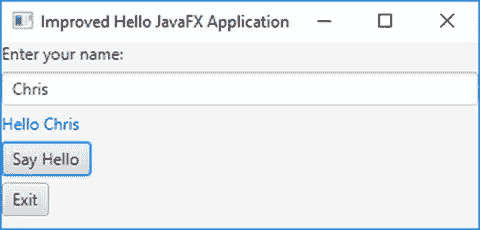

图 8-4.

一个包含两个标签、一个文本字段和两个按钮的 JavaFX 应用程序


## JavaFX 应用程序的生命周期

JavaFX 运行时创建了多个线程，用于在应用程序的不同阶段执行不同的任务。本节仅关注那些在应用程序生命周期中用于调用 `Application` 类方法的线程。JavaFX 运行时创建了（除其他线程外）两个名为：

*   JavaFX-Launcher
*   JavaFX Application Thread

的线程。

`Application` 类的 `launch()` 静态方法会创建这些线程。在 JavaFX 应用程序的生命周期内，JavaFX 运行时按顺序调用 JavaFX 应用程序类的以下方法：

*   无参构造器
*   `init()` 方法
*   `start()` 方法
*   `stop()` 方法

JavaFX 运行时在 JavaFX Application Thread 上创建指定应用程序类的实例。

JavaFX-Launcher 线程调用应用程序类的 `init()` 方法。`Application` 类中 `init()` 方法的实现是空的。你可以在你的应用程序类中重写此方法。不允许在 JavaFX-Launcher 线程上创建 `Stage` 或 `Scene`。它们必须在 JavaFX Application Thread 上创建。因此，你不能在 `init()` 方法内部创建 `Stage` 或 `Scene`。尝试这样做会抛出运行时异常。在 `init()` 方法中创建 UI 控件（例如按钮、形状等）是允许的。

JavaFX Application Thread 调用应用程序类的 `start(Stage stage)` 方法。请注意，`Application` 类中的 `start()` 方法被声明为 `abstract`，你必须在你的应用程序类中重写此方法。

此时，`launch()` 方法会等待 JavaFX 应用程序结束。

当应用程序结束时，JavaFX Application Thread 会调用应用程序类的 `stop()` 方法。`Application` 类中 `stop()` 方法的默认实现是空的。你需要在你的应用程序类中重写此方法，以便在应用程序停止时执行你的逻辑。

清单 8-5 中的程序演示了 JavaFX 应用程序的生命周期。它显示了一个带有“退出”按钮的舞台。当舞台显示时，你将看到输出的前三行。你需要通过单击“退出”按钮关闭舞台，才能看到输出的最后一行。

```
// FXLifeCycleApp.java
package com.jdojo.javafx;
import javafx.application.Application;
import javafx.application.Platform;
import javafx.scene.Group;
import javafx.scene.Scene;
import javafx.scene.control.Button;
import javafx.stage.Stage;
public class FXLifeCycleApp extends Application {
public FXLifeCycleApp() {
String name = Thread.currentThread().getName();
System.out.println("FXLifeCycleApp() constructor: " + name);
}
public static void main(String[] args) {
Application.launch(args);
}
@Override
public void init() {
String name = Thread.currentThread().getName();
System.out.println("init() method: " + name);
}
@Override
public void start(Stage stage) {
String name = Thread.currentThread().getName();
System.out.println("start() method: " + name);
// 向场景中添加一个退出按钮
Button exitBtn = new Button("Exit");
exitBtn.setOnAction(e -> Platform.exit());
Scene scene = new Scene(new Group(exitBtn), 300, 100);
stage.setScene(scene);
stage.setTitle("JavaFX Application Lifecycle");
stage.show();
}
@Override
public void stop() {
String name = Thread.currentThread().getName();
System.out.println("stop() method: " + name);
}
}
FXLifeCycleApp() constructor: JavaFX Application Thread
init() method: JavaFX-Launcher
start() method: JavaFX Application Thread
stop() method: JavaFX Application Thread
清单 8-5.
JavaFX 应用程序的生命周期
```

## 终止 JavaFX 应用程序

JavaFX 应用程序可以被显式或隐式地终止。你可以通过调用 `Platform` 类的 `exit()` 静态方法来显式终止 JavaFX 应用程序。当在 `start()` 方法之后或之内调用此方法时，会调用 `Application` 类的 `stop()` 方法，然后 JavaFX Application Thread 被终止。此时，如果只有守护线程在运行，JVM 将退出。如果 `Platform.exit()` 方法是从 `Application` 类的构造器或 `init()` 方法中调用的，则可能不会调用 `Application` 类的 `stop()` 方法。

当最后一个窗口关闭时，JavaFX 应用程序可能会被隐式终止。可以使用 `Platform` 类的静态方法 `setImplicitExit(boolean implicitExit)` 来开启或关闭此行为。向此方法传递 `true` 会开启此行为。传递 `false` 会关闭此行为。默认情况下，此行为是开启的。这就是到目前为止大多数示例中，当你关闭窗口时应用程序会终止的原因。当此行为开启时，在终止 JavaFX Application Thread 之前会调用 `Application` 类的 `stop()` 方法。终止 JavaFX Application Thread 并不总是会终止 JVM。只有当所有正在运行的非守护线程都终止时，JVM 才会终止。如果 JavaFX 应用程序的隐式终止行为被关闭，你必须调用 `Platform` 类的 `exit()` 方法来终止应用程序。


## 什么是属性和绑定？

属性是类的一个公开可访问的属性，它会影响类的状态、行为或两者兼有。尽管属性是公开可访问的，但其使用（读取/写入）会调用隐藏了实际实现的方法来访问数据。属性是可观察的，因此当它的值发生变化时，相关方会收到通知。属性可以是只读、只写或读写。只读属性有 getter 但没有 setter。只写属性有 setter 但没有 getter。读写属性既有 getter 也有 setter。

与 C# 等其他编程语言不同，Java 在语言层面并不支持属性。Java 对属性的支持是通过 JavaBeans API 和设计模式来实现的。有关 Java 中属性的更多详细信息，请参考 JavaBeans 规范，该规范可从 [`www.oracle.com/technetwork/java/javase/documentation/spec-136004.html`](http://www.oracle.com/technetwork/java/javase/documentation/spec-136004.html) 下载。

在编程中，“绑定”一词有多种使用场景。在这里，我将在数据绑定的上下文中对其进行定义。数据绑定定义了程序中数据元素（通常是变量）之间的关系，以保持它们同步。在 GUI 应用程序中，数据绑定经常用于将数据模型中的元素与相应的 UI 元素同步。考虑以下语句，假设 `x`、`y` 和 `z` 是数值变量：

```
x = y + z;
```

该语句定义了 `x`、`y` 和 `z` 之间的绑定。当该语句执行时，`x` 的值与 `y` 和 `z` 的值之和同步。绑定还具有时间因素。在此语句中，`x` 的值绑定到 `y` 和 `z` 的和，并且仅在语句执行时有效。在语句执行前后，`x` 的值可能不等于 `y` 和 `z` 的和。有时，我们希望绑定在一段时间内保持有效。考虑以下使用 `listPrice`、`discounts` 和 `taxes` 定义绑定的语句：

```
soldPrice = listPrice - discounts + taxes;
```

对于这种情况，我们希望绑定永远有效，这样每当 `listPrice`、`discounts` 或 `taxes` 发生变化时，售价都能被正确计算。在此绑定中，`listPrice`、`discounts` 和 `taxes` 被称为依赖项，并且可以说 `soldPrice` 绑定到了 `listPrice`、`discounts` 和 `taxes`。

为了使绑定正常工作，必须在依赖项发生变化时通知它。支持绑定的编程语言提供了一种机制，可以向依赖项注册监听器。当依赖项失效或发生变化时，所有监听器都会收到通知。绑定在收到此类通知时，可能会与它的依赖项同步自身。

绑定可以是急切绑定或惰性绑定。在急切绑定中，当依赖项发生变化时，绑定变量会立即重新计算。在惰性绑定中，当依赖项发生变化时，绑定变量不会重新计算；它会在下次读取其值时重新计算。与急切绑定相比，惰性绑定性能更好。

绑定可以是单向的或双向的。单向绑定仅在一个方向上起作用：依赖项的变化会传播到绑定变量。双向绑定在两个方向上都起作用，其中绑定变量和依赖项彼此保持值同步。通常，双向绑定仅在两个变量之间定义。例如，双向绑定 `x = y` 和 `y = x` 声明 `x` 和 `y` 的值始终相同。

从数学上讲，无法在多个变量之间唯一地定义双向绑定。在前面的例子中，售价绑定是一个单向绑定。如果你想将其变为双向绑定，当售价发生变化时，无法唯一地计算出标价、折扣和税费的值。在另一个方向上存在无限多种可能性。

具有 GUI 的应用程序为用户提供 UI 控件，例如文本字段、复选框、按钮等，以操作数据。UI 控件中显示的数据必须与底层数据模型同步，反之亦然。在这种情况下，需要双向绑定来保持 UI 和数据模型同步。


## JavaFX 中的属性与绑定

JavaFX 通过属性与绑定 API 支持属性、事件和绑定。JavaFX 对属性的支持相比 JavaBeans 属性是一次巨大的飞跃。JavaFX 中的所有属性都是可观察的，可以观察其失效和值的变化。你可以拥有读写属性或只读属性。所有读写属性都支持绑定。JavaFX 中的属性可以表示一个值或一组值的集合。

在 JavaFX 中，属性是对象。每种类型的属性都有一个属性类层次结构。例如，`IntegerProperty`、`DoubleProperty` 和 `StringProperty` 类分别表示 `int`、`double` 和 `String` 类型的属性。这些类是 `abstract`（抽象）的。它们有两种实现类：一种用于表示读写属性，另一种用于表示只读属性的包装器。例如，`SimpleDoubleProperty` 和 `ReadOnlyDoubleWrapper` 类是具体类，其对象分别用作 `double` 类型的读写属性和只读属性。以下是一个创建初始值为 100 的 `IntegerProperty` 的示例：

```
IntegerProperty counter = new SimpleIntegerProperty(100);
```

属性类提供两对 getter 和 setter 方法：

*   `get()` 和 `set()` 方法
*   `getValue()` 和 `setValue()` 方法

`get()` 和 `set()` 方法分别用于获取和设置属性的值。对于原始类型属性，它们处理原始类型值。例如，对于 `IntegerProperty`，`get()` 方法的返回类型和 `set()` 方法的参数类型是 `int`。`getValue()` 和 `setValue()` 方法处理对象类型；例如，对于 `IntegerProperty`，它们的返回类型和参数类型是 `Integer`。

对于引用类型属性，例如 `StringProperty` 和 `ObjectProperty<T>`，两对 getter 和 setter 都处理对象类型。也就是说，`StringProperty` 的 `get()` 和 `getValue()` 方法都返回一个 `String`，而 `set()` 和 `setValue()` 方法都接受一个 `String` 参数。由于原始类型的自动装箱，使用哪个版本的 getter 和 setter 并不重要。`getValue()` 和 `setValue()` 方法的存在是为了帮助你以对象类型编写通用代码。

以下代码片段使用了 `IntegerProperty` 及其 `get()` 和 `set()` 方法。`counter` 属性是一个读写属性，因为它是 `SimpleIntegerProperty` 类的对象。

```
IntegerProperty counter = new SimpleIntegerProperty(1);
int counterValue = counter.get();
System.out.println("Counter:" + counterValue);
counter.set(2);
counterValue = counter.get();
System.out.println("Counter:" + counterValue);
Counter:1
Counter:2
```

处理只读属性有点棘手。`ReadOnlyXxxWrapper` 类包装了 `Xxx` 类型的两个属性：一个只读属性和一个读写属性。这两个属性是同步的。它的 `getReadOnlyProperty()` 方法返回一个 `ReadOnlyXxxProperty` 对象。以下代码片段展示了如何创建一个只读的 `Integer` 属性：

```
// 创建一个只读包装器属性
ReadOnlyIntegerWrapper idWrapper = new ReadOnlyIntegerWrapper(100);
// 获取只读包装器属性对象的只读版本
ReadOnlyIntegerProperty id = idWrapper.getReadOnlyProperty();
System.out.println("idWrapper:" + idWrapper.get());
System.out.println("id:" + id.get());
// 更改值
idWrapper.set(101);
System.out.println("idWrapper:" + idWrapper.get());
System.out.println("id:" + id.get());
idWrapper:100
id:100
idWrapper:101
id:101
```

`idWrapper` 属性是读写的，而 `id` 属性是只读的。当 `idWrapper` 中的值改变时，`id` 中的值会自动改变。要在类中定义一个只读属性，你可以将 `idWrapper` 声明为私有实例变量。如果需要在类外部使用其值，则返回 `id`，这样外部世界可以读取该值但无法更改它。

你可以使用七种表示单个值的属性类型。这些属性的基类命名为 `XxxProperty`，只读基类命名为 `ReadOnlyXxxProperty`，包装器类命名为 `ReadOnlyXxxWrapper`。每种类型的 `Xxx` 值列于表 8-3 中。

表 8-3.

包装单个值的属性类

| 类型 | Xxx 值 |
| --- | --- |
| `int` | `Integer` |
| `long` | `Long` |
| `float` | `Float` |
| `double` | `Double` |
| `boolean` | `Boolean` |
| `String` | `String` |
| `Object` | `Object` |

一个属性对象包装了三部分信息：

*   包含它的 bean 的引用
*   一个名称
*   一个值

当你创建属性对象时，可以提供这三部分信息中的全部或都不提供。具体属性类（命名为 `SimpleXxxProperty` 和 `ReadOnlyXxxWrapper`）提供了四个构造函数，允许你提供这些信息的组合。以下是 `SimpleIntegerProperty` 类的构造函数：

*   `SimpleIntegerProperty()`
*   `SimpleIntegerProperty(int initialValue)`
*   `SimpleIntegerProperty(Object bean, String name)`
*   `SimpleIntegerProperty(Object bean, String name, int initialValue)`

初始值的默认值取决于属性的类型。对于数值类型为零，对于 `boolean` 类型为 `false`，对于引用类型为 `null`。

属性对象可以是 bean 的一部分，也可以是独立对象。指定的 `bean` 是包含该属性的 bean 对象的引用。对于独立属性对象，它可以是 `null`。其默认值为 `null`。

属性的名称就是它的名字。如果未提供，则默认为空字符串。

以下代码片段创建了一个作为 bean 一部分的属性对象，并设置了所有三个值：

```
public class Person {
private StringProperty name = new SimpleStringProperty(this, "name", "Li");
// 此处添加 Person 类的更多代码
}
```

`SimpleStringProperty` 类构造函数的第一个参数是 `this`，即 `Person` bean 的引用；第二个参数 `"name"` 是属性的名称；第三个参数 `"Li"` 是属性的值。

每个属性类都包含 `getBean()` 和 `getName()` 方法，分别返回 bean 引用和属性名称。


### 在 JavaFX Bean 中使用属性

在上一节中，你了解了将 JavaFX 属性作为独立对象使用。在本节中，你将在类中使用它们来定义属性。让我们创建一个包含三个属性（`ISBN`、`title` 和 `price`）的 `Book` 类。

在 JavaFX 中，你不会将类的属性声明为原始类型之一。相反，你会使用 JavaFX 属性类之一。`Book` 类的 `title` 属性将按如下方式声明。它像往常一样被声明为 `private`。

```
public class Book {
private StringProperty title = new SimpleStringProperty(this, "title", "Unknown");
}
```

你需要为属性声明一个 `public` 的 getter，按照惯例，它被命名为 `XxxProperty`，其中 `Xxx` 是属性的名称。该 getter 返回属性的引用。对于你的 `title` 属性，getter 将被命名为 `titleProperty`，如下所示：

```
public class Book {
private StringProperty title = new SimpleStringProperty(this, "title", "Unknown");
public final StringProperty titleProperty() {
return title;
}
}
```

`Book` 类的声明可以很好地处理 `title` 属性，如下面的代码片段所示，该代码片段设置并获取一本书的标题：

```
Book beginningJava8 = new Book();
beginningJava9.titleProperty().set("Beginning Java 9");
String title = beginningJava9.titleProperty().get();
```

根据 JavaFX 设计模式（并非出于任何技术要求），JavaFX 属性具有与 JavaBean 中的 getter 和 setter 类似的 getter 和 setter。getter 的返回类型和 setter 的参数类型与属性值的类型相同。`title` 属性的 `getTitle()` 和 `setTitle()` 方法声明如下：

```
public class Book {
private StringProperty title = new SimpleStringProperty(this, "title", "Unknown");
public final StringProperty titleProperty() {
return title;
}
public final String getTitle() {
return title.get();
}
public final void setTitle(String title) {
this.title.set(title);
}
}
```

请注意，`getTitle()` 和 `setTitle()` 方法在内部使用 `title` 属性对象来获取和设置标题值。

提示

在 JavaFX 中，按照惯例，类属性的 getter 和 setter 被声明为 `final`。添加了使用 JavaBeans 命名约定的额外 getter 和 setter，以使该类与使用旧 JavaBeans 命名约定来识别类属性的旧工具和框架互操作。

以下代码片段显示了为 `Book` 类声明只读 `ISBN` 属性的方式：

```
public class Book {
private ReadOnlyStringWrapper ISBN = new ReadOnlyStringWrapper(this, "ISBN", "Unknown");
public final String getISBN() {
return ISBN.get();
}
public final ReadOnlyStringProperty ISBNProperty() {
return ISBN.getReadOnlyProperty();
}
// 此处为 Book 类的更多代码...
}
```

请注意关于只读 `ISBN` 属性声明的以下几点：

*   它使用 `ReadOnlyStringWrapper` 类而不是 `SimpleStringProperty` 类。
*   没有用于属性值的 setter。你可以声明一个；但是，它必须是 `private` 的。
*   属性值的 getter 的工作方式与读写属性相同。
*   `ISBNProperty()` 方法使用 `ReadOnlyStringProperty` 作为返回类型，而不是 `ReadOnlyStringWrapper`。它从包装器对象获取属性对象的只读版本并返回该版本。

对于 `Book` 类的用户来说，其 `ISBN` 属性是只读的。但是，它可以在内部更改，并且更改将自动反映在属性对象的只读版本中。清单 8-6 显示了 `Book` 类的完整代码。

```
// Book.java
package com.jdojo.javafx;
import javafx.beans.property.DoubleProperty;
import javafx.beans.property.ReadOnlyStringProperty;
import javafx.beans.property.ReadOnlyStringWrapper;
import javafx.beans.property.SimpleDoubleProperty;
import javafx.beans.property.SimpleStringProperty;
import javafx.beans.property.StringProperty;
public class Book {
private StringProperty title = new SimpleStringProperty(this, "title", "Unknown");
private DoubleProperty price = new SimpleDoubleProperty(this, "price", 0.0);
private ReadOnlyStringWrapper ISBN = new ReadOnlyStringWrapper(this, "ISBN", "Unknown");
public Book() {
}
public Book(String title, double price, String ISBN) {
this.title.set(title);
this.price.set(price);
this.ISBN.set(ISBN);
}
public final String getTitle() {
return title.get();
}
public final void setTitle(String title) {
this.title.set(title);
}
public final StringProperty titleProperty() {
return title;
}
public final double getprice() {
return price.get();
}
public final void setPrice(double price) {
this.price.set(price);
}
public final DoubleProperty priceProperty() {
return price;
}
public final String getISBN() {
return ISBN.get();
}
public final ReadOnlyStringProperty ISBNProperty() {
return ISBN.getReadOnlyProperty();
}
}
清单 8-6.
一个包含一个只读属性和两个读写属性的 Book 类
```

清单 8-7 测试了 `Book` 类的属性。它创建一个 `Book` 对象，打印详细信息，更改一些属性，然后再次打印详细信息。请注意 `printDetails()` 方法中 `ReadOnlyProperty` 参数类型的使用。所有属性类都直接或间接地实现了 `ReadOnlyProperty` 接口。属性实现类的 `toString()` 方法返回一个格式良好的字符串，其中包含属性的所有相关信息。我没有使用属性对象的 `toString()` 方法，因为我想向你展示 JavaFX 属性的不同方法的使用。

```
// BookPropertyTest.java
package com.jdojo.javafx;
import javafx.beans.property.ReadOnlyProperty;
public class BookPropertyTest {
public static void main(String[] args) {
Book book = new Book("Beginning Java 9", 49.99, "148422843X");
System.out.println("创建 Book 对象后...");
// 打印属性详细信息
printDetails(book.titleProperty());
printDetails(book.priceProperty());
printDetails(book.ISBNProperty());
// 更改书的属性
book.setTitle("Learn JavaFX 8");
book.setPrice(59.99);
System.out.println("\n 更改 Book 属性后...");
// 打印属性详细信息
printDetails(book.titleProperty());
printDetails(book.priceProperty());
printDetails(book.ISBNProperty());
}
public static void printDetails(ReadOnlyProperty p) {
String name = p.getName();
Object value = p.getValue();
Object bean = p.getBean();
String beanClassName = (bean == null) ? "null" : bean.getClass().getSimpleName();
String propClassName = p.getClass().getSimpleName();
System.out.print(propClassName);
System.out.print("[Name:" + name);
System.out.print(", Bean Class:" + beanClassName);
System.out.println(", Value:" + value + "]");
}
}
创建 Book 对象后...
SimpleStringProperty[Name:title, Bean Class:Book, Value:Beginning Java 9]
SimpleDoubleProperty[Name:price, Bean Class:Book, Value:49.99]
ReadOnlyPropertyImpl[Name:ISBN, Bean Class:Book, Value:148422843X]
更改 Book 属性后...
SimpleStringProperty[Name:title, Bean Class:Book, Value:Learn JavaFX 8]
SimpleDoubleProperty[Name:price, Bean Class:Book, Value:59.99]
ReadOnlyPropertyImpl[Name:ISBN, Bean Class:Book, Value:148422843X]
清单 8-7.
一个用于测试 Book 类属性的 BookPropertyTest 类
```


### 处理属性失效事件

当属性的值首次从有效状态变为无效状态时，该属性会生成一个失效事件。JavaFX 中的属性采用惰性求值机制。如果某个已失效的属性因其值再次变化而再次失效，则不会生成失效事件。当失效属性被重新计算（例如通过调用其 `get()` 或 `getValue()` 方法）时，它会变为有效状态。

清单 8-8 是一个演示属性何时生成失效事件的程序。该程序包含足够的注释，可帮助您理解其逻辑。

```
// InvalidationTest.java
package com.jdojo.javafx;
import javafx.beans.Observable;
import javafx.beans.property.IntegerProperty;
import javafx.beans.property.SimpleIntegerProperty;
public class InvalidationTest {
public static void main(String[] args) {
// 创建一个属性
IntegerProperty counter = new SimpleIntegerProperty(100);
// 使用方法引用为 counter 属性添加一个失效监听器。
// 当 counter 属性变为无效时，将调用此类的 invalidated() 方法。
counter.addListener(InvalidationTest::invalidated);
System.out.println("更改 counter 值之前-1");
counter.set(101);
System.out.println("更改 counter 值之后-1");
/*
* 此时 counter 属性已失效，对其值的进一步更改将不会生成任何失效事件。
*/
System.out.println("\n 更改 counter 值之前-2");
counter.set(102);
System.out.println("更改 counter 值之后-2");
// 通过调用 get() 方法使 counter 属性重新生效
int value = counter.get();
System.out.println("Counter 值 = " + value);
/*
* 此时 counter 属性已生效，对其值的进一步更改将生成失效事件。
*/
// 尝试设置相同的值
System.out.println("\n 更改 counter 值之前-3");
counter.set(102);
System.out.println("更改 counter 值之后-3");
// 尝试设置不同的值
System.out.println("\n 更改 counter 值之前-4");
counter.set(103);
System.out.println("更改 counter 值之后-4");
}
public static void invalidated(Observable prop) {
System.out.println("Counter 已失效。");
}
}
更改 counter 值之前-1
Counter 已失效。
更改 counter 值之后-1
更改 counter 值之前-2
更改 counter 值之后-2
Counter 值 = 102
更改 counter 值之前-3
更改 counter 值之后-3
更改 counter 值之前-4
Counter 已失效。
更改 counter 值之后-4
清单 8-8.
测试 JavaFX 属性的失效事件
```

程序开始时，创建了一个名为 `counter` 的 `IntegerProperty`，并为其添加了一个失效监听器。

```
// 创建 counter 属性
IntegerProperty counter = new SimpleIntegerProperty(100);
// 为 counter 属性添加一个失效监听器
counter.addListener(InvalidationTest::invalidated);
```

当您创建一个属性对象时，它是有效的。当您将 `counter` 属性更改为 101 时，它会触发一个失效事件。此时，`counter` 属性变为无效。当您将其值更改为 102 时，它不会触发失效事件，因为它已经处于无效状态。您使用 `get()` 方法读取 `counter` 的值，这使其重新变为有效。现在，您将 `counter` 设置为相同的值 102，这不会触发失效事件，因为其值实际上并未改变；其值已经是 102。`counter` 属性仍然有效。最后，您将其值更改为一个不同的值，果然，一个失效事件被触发了。

提示

您不限于只为属性添加一个失效监听器。您可以根据需要添加任意数量的失效监听器。如果您不再需要某个失效监听器，请务必通过调用属性的 `removeListener()` 方法将其移除；否则，可能会导致内存泄漏。


### 处理属性变更事件

您可以注册一个 `ChangeListener` 来接收关于属性变更事件的通知。每当属性值发生变化时，都会触发一个属性变更事件。`ChangeListener` 的 `changed()` 方法接收三个值：

*   属性对象的引用
*   属性的旧值
*   属性的新值

您将运行一个与上一节中测试失效事件类似的测试用例，用于测试属性变更事件。清单 8-9 包含演示为属性生成的变更事件的程序。

```
// ChangeTest.java
package com.jdojo.javafx;
import javafx.beans.property.IntegerProperty;
import javafx.beans.property.SimpleIntegerProperty;
import javafx.beans.value.ObservableValue;
public class ChangeTest {
public static void main(String[] args) {
// 创建一个计数器属性
IntegerProperty counter = new SimpleIntegerProperty(100);
// 为计数器属性添加一个变更监听器
counter.addListener(ChangeTest::changed);
System.out.println("更改计数器值-1 之前");
counter.set(101);
System.out.println("更改计数器值-1 之后");
System.out.println("\n 更改计数器值-2 之前");
counter.set(102);
System.out.println("更改计数器值-2 之后");
// 尝试设置相同的值
System.out.println("\n 更改计数器值-3 之前");
counter.set(102); // 不会触发变更事件。
System.out.println("更改计数器值-3 之后");
// 尝试设置不同的值
System.out.println("\n 更改计数器值-4 之前");
counter.set(103);
System.out.println("更改计数器值-4 之后");
}
public static void changed(ObservableValue prop,
Number oldValue,
Number newValue) {
System.out.print("计数器已变更: ");
System.out.println("旧值 = " + oldValue + ", 新值 = " + newValue);
}
}
更改计数器值-1 之前
计数器已变更: 旧值 = 100, 新值 = 101
更改计数器值-1 之后
更改计数器值-2 之前
计数器已变更: 旧值 = 101, 新值 = 102
更改计数器值-2 之后
更改计数器值-3 之前
更改计数器值-3 之后
更改计数器值-4 之前
计数器已变更: 旧值 = 102, 新值 = 103
更改计数器值-4 之后
清单 8-9.
测试 JavaFX 属性的变更事件
```

程序开始时创建了一个名为 `counter` 的 `IntegerProperty`。

```
// 创建一个计数器属性
IntegerProperty counter = new SimpleIntegerProperty(100);
```

添加 `ChangeListener` 有点技巧。`IntegerPropertyBase` 类中的 `addListener()` 方法声明如下：

```
void addListener(ChangeListener listener)
```

如果您使用泛型，那么 `IntegerProperty` 的 `ChangeListener` 必须根据 `Number` 类或 `Number` 类的超类来编写。为 `counter` 属性添加 `ChangeListener` 的三种方法如下。代码使用了匿名类，我最后将其转换为 lambda 表达式。

```
// 方法-1：使用泛型和 Number 类
counter.addListener(new ChangeListener() {
@Override
public void changed(ObservableValue prop,
Number oldValue,
Number newValue) {
System.out.print("计数器已变更: ");
System.out.println("旧值 = " + oldValue + ", 新值 = " + newValue);
}});
// 方法-2：使用泛型和 Object 类
counter.addListener(new ChangeListener() {
@Override
public void changed(ObservableValue prop,
Object oldValue,
Object newValue) {
System.out.print("计数器已变更: ");
System.out.println("旧值 = " + oldValue + ", 新值 = " + newValue);
}});
// 方法-3：不使用泛型。可能会产生编译时警告。
counter.addListener(new ChangeListener() {
@Override
public void changed(ObservableValue prop,
Object oldValue,
Object newValue) {
System.out.print("计数器已变更: ");
System.out.println("旧值 = " + oldValue + ", 新值 = " + newValue);
}});
```

清单 8-9 使用了第一种使用泛型的方法；如您所见，`ChangeTest` 类中 `changed()` 方法的签名与方法-1 中的 `changed()` 方法签名匹配。您使用了带有方法引用的 lambda 表达式来添加 `ChangeListener`，如下所示：

```
// 使用方法引用添加变更监听器
counter.addListener(ChangeTest::changed);
```

输出显示，当属性值发生更改时，会触发属性变更事件。使用相同的值调用 `set()` 方法不会触发属性变更事件。

与生成失效事件不同，属性对其值采用急切求值来生成变更事件，因为它必须将新值传递给属性变更监听器。


### JavaFX 中的属性绑定

在 JavaFX 中，绑定是一个求值为某个值的表达式。该绑定由一个或多个可观察值（称为其依赖项）组成。绑定会观察其依赖项的变化，并在需要时自动重新计算其值。JavaFX 对所有绑定都采用惰性求值。当绑定被初始定义或其依赖项发生变化时，其值会被标记为无效。无效绑定的值会在下次请求时计算，通常使用其 `get()` 或 `getValue()` 方法。JavaFX 中的所有属性类都内置了对绑定的支持。

让我们讨论一个 JavaFX 中绑定的简单示例。考虑以下表示两个整数 `x` 和 `y` 之和的表达式：

```
x + y
```

表达式 `x + y` 表示一个绑定，它有两个依赖项：`x` 和 `y`。你可以给它起个名字叫 `sum`，如下所示：

```
sum = x + y
```

要在 JavaFX 中实现此逻辑，你需要创建两个 `IntegerProperty` 变量：`x` 和 `y`：

```
IntegerProperty x = new SimpleIntegerProperty(100);
IntegerProperty y = new SimpleIntegerProperty(200);
```

以下语句创建了一个名为 `sum` 的绑定，它表示 `x` 和 `y` 的和：

```
NumberBinding sum = x.add(y);
```

绑定有一个 `isValid()` 方法，如果绑定有效则返回 `true`，否则返回 `false`。你可以使用 `intValue()`、`longValue()`、`floatValue()` 和 `doubleValue()` 方法分别以 `int`、`long`、`float` 和 `double` 类型获取 `NumberBinding` 的值。清单 8-10 中的程序展示了如何创建和使用绑定。

```
// BindingTest.java
package com.jdojo.javafx;
import javafx.beans.binding.NumberBinding;
import javafx.beans.property.IntegerProperty;
import javafx.beans.property.SimpleIntegerProperty;
public class BindingTest {
public static void main(String[] args) {
// 创建两个属性 x 和 y
IntegerProperty x = new SimpleIntegerProperty(100);
IntegerProperty y = new SimpleIntegerProperty(200);
// 创建一个绑定：sum = x + y
NumberBinding sum = x.add(y);
System.out.println("创建 sum 后：");
System.out.println("sum.isValid(): " + sum.isValid());
// 让我们获取 sum 的值，这样它会计算其值并变为有效
int value = sum.intValue();
System.out.println("\n 请求值后：");
System.out.println("sum.isValid(): " + sum.isValid());
System.out.println("sum = " + value);
// 改变 x 的值
x.set(250);
System.out.println("\n 改变 x 后：");
System.out.println("sum.isValid(): " + sum.isValid());
// 再次获取 sum 的值
value = sum.intValue();
System.out.println("\n 请求值后：");
System.out.println("sum.isValid(): " + sum.isValid());
System.out.println("sum = " + value);
}
}
创建 sum 后：
sum.isValid(): false
请求值后：
sum.isValid(): true
sum = 300
改变 x 后：
sum.isValid(): false
请求值后：
sum.isValid(): true
sum = 450
清单 8-10.
在 JavaFX 中使用简单绑定
```

当创建 `sum` 绑定时，它是无效的，并且不知道自己的值。这从输出中可以明显看出。一旦你使用 `sum.intValue()` 方法请求其值，它就会计算自己的值并将自身标记为有效。当你更改其某个依赖项时，它会变为无效，直到你再次请求其值。

提示

绑定会在内部向其所有依赖项添加失效监听器。当任何依赖项变为无效时，绑定会将自己标记为无效。无效绑定并不意味着其值已更改。它只意味着当下次请求该值时，需要重新计算其值。

在 JavaFX 中，你也可以将属性绑定到绑定。回想一下，绑定是一个与其依赖项自动同步的表达式。根据这个定义，绑定属性是其值基于表达式计算的属性，当依赖项发生变化时，该属性会自动同步。假设你有三个属性：x、y 和 z，如下所示：

```
IntegerProperty x = new SimpleIntegerProperty(10);
IntegerProperty y = new SimpleIntegerProperty(20);
IntegerProperty z = new SimpleIntegerProperty(60);
```

你可以使用 `Property` 接口的 `bind()` 方法将属性 `z` 绑定到表达式 `x + y`，如下所示：

```
// 将 z 绑定到 x + y
z.bind(x.add(y));
```

请注意，你不能编写 `z.bind(x + y)`，因为 `+` 运算符不知道如何将两个 `IntegerProperty` 对象的值相加。你需要使用绑定 API 来创建绑定表达式。

现在，当 `x`、`y` 或两者都发生变化时，`z` 属性会变为无效。下次你请求 `z` 的值时，它会重新计算表达式 `x.add(y)` 以获取其值。

你可以使用 `Property` 接口的 `unbind()` 方法来解绑一个绑定属性。对未绑定或从未绑定的属性调用 `unbind()` 方法没有效果。你可以如下解绑 `z` 属性：

```
// 解绑 z 属性
z.unbind();
```

解绑后，属性会像普通属性一样行为，独立维护其值。换句话说，解绑属性会断开该属性与其依赖项之间的链接。清单 8-11 展示了如何将属性绑定到由其他属性组成的表达式。

```
// BoundProperty.java
package com.jdojo.javafx;
import javafx.beans.property.IntegerProperty;
import javafx.beans.property.SimpleIntegerProperty;
public class BoundProperty {
public static void main(String[] args) {
// 创建三个属性
IntegerProperty x = new SimpleIntegerProperty(10);
IntegerProperty y = new SimpleIntegerProperty(20);
IntegerProperty z = new SimpleIntegerProperty(60);
// 创建绑定 z = x + y
z.bind(x.add(y));
System.out.println("绑定 z 后：Bound = "
+ z.isBound() + ", z = " + z.get());
// 改变 x 和 y
x.set(15);
y.set(19);
System.out.println("改变 x 和 y 后：Bound = "
+ z.isBound() + ", z = " + z.get());
// 解绑 z
z.unbind();
// 不会影响 z 的值，因为 z 不再绑定到 x 和 y
x.set(100);
y.set(200);
System.out.println("解绑 z 后：Bound = "
+ z.isBound() + ", z = " + z.get());
}
}
绑定 z 后：Bound = true, z = 30
改变 x 和 y 后：Bound = true, z = 34
解绑 z 后：Bound = false, z = 34
清单 8-11.
将属性绑定到表达式
```

绑定具有方向性，即变化传播的方向。JavaFX 支持两种类型的属性绑定：单向绑定和双向绑定。单向绑定仅在一个方向上工作；依赖项的变化会传播到绑定属性，反之则不然。双向绑定在两个方向上工作；依赖项的变化会反映在属性中，反之亦然。

`Property` 接口的 `bind()` 方法在属性和 `ObservableValue`（可能是一个复杂表达式）之间创建单向绑定。`bindBidirectional()` 方法在属性与另一个相同类型的属性之间创建双向绑定。

前面示例中的语句 `z.bind(x.add(y))` 创建了一个单向绑定。在单向绑定中，绑定属性不能被更改。其值始终使用其依赖项计算。尝试更改单向绑定属性的值会抛出 `RuntimeException`。

双向绑定在两个方向上工作。它有一些限制。它只能在相同类型的属性之间创建。也就是说，双向绑定只能是 x = y 和 y = x 的类型，其中 x 和 y 是相同类型。


```
// 创建两个名为 x 和 y 的属性
IntegerProperty x = new SimpleIntegerProperty(10);
IntegerProperty y = new SimpleIntegerProperty(20);
// 在 x 和 y 之间创建双向绑定
x.bindBidirectional(y);
// 现在，x 和 y 的值都是 20。当 x 或 y 发生变化时，x 和 y 的值始终相同。
// 移除 x 和 y 之间的双向绑定
x.unbindBidirectional(y);
// 现在，x 和 y 各自独立地维护自己的值。
```

在 JavaFX 应用程序中，绑定被大量用于将 UI 元素的属性绑定到其他 UI 元素或数据模型的属性上。让我们看一个使用绑定的 JavaFX GUI 应用程序示例。你将创建一个屏幕，其中包含一个居中显示的圆形。该圆形的圆周将触及屏幕较近的两侧。如果屏幕的宽度和高度相同，则圆形的圆周将触及屏幕的所有四个侧边。

在不使用绑定的情况下，开发一个带有居中圆形的屏幕是一项繁琐的任务。`javafx.scene.shape` 包中的 `Circle` 类表示一个圆形。它有三个属性：`centerX`、`centerY` 和 `radius`，类型均为 `DoubleProperty`。`centerX` 和 `centerY` 属性定义了圆心坐标 (x, y)。`radius` 属性定义了圆形的半径。默认情况下，圆形以黑色填充。你可以按如下方式创建一个 `centerX`、`centerY` 和 `radius` 均设置为默认值 0.0 的圆形：

```
Circle c = new Circle();
```

接下来，将圆形添加到一个组中，并创建一个以该组为根节点的场景，如下所示：

```
Group root = new Group(c);
Scene scene = new Scene(root, 150, 150);
```

以下绑定将根据场景的大小来定位和调整圆形的大小：

```
// 圆心始终位于场景的中心
c.centerXProperty().bind(scene.widthProperty().divide(2));
c.centerYProperty().bind(scene.heightProperty().divide(2));
// 圆形的半径始终是场景宽度和高度中较小值的一半
c.radiusProperty().bind(Bindings.min(scene.widthProperty(), scene.heightProperty())
.divide(2));
```

前两个绑定分别将圆形的 `centerX` 和 `centerY` 绑定到场景宽度和高度的一半。第三个绑定将圆形的 `radius` 绑定到场景宽度和高度中较小值的一半（参见 `divide(2)`）。仅此而已！绑定 API 神奇地实现了在应用程序运行时保持圆形居中。

清单 8-12 包含了完整的程序。图 8-5 显示了程序初始运行时的屏幕。尝试调整窗口大小，你会注意到圆心始终位于场景的中间。


图 8-5.

一个在场景中居中的圆形

```
// CenteredCircle.java
package com.jdojo.javafx;
import javafx.application.Application;
import javafx.beans.binding.Bindings;
import javafx.scene.Group;
import javafx.scene.Scene;
import javafx.scene.shape.Circle;
import javafx.stage.Stage;
public class CenteredCircle extends Application {
public static void main(String[] args) {
Application.launch(args);
}
@Override
public void start(Stage stage) {
Circle c = new Circle();
Group root = new Group(c);
Scene scene = new Scene(root, 100, 100);
// 将圆形的 centerX、centerY 和 radius 绑定到场景的属性
c.centerXProperty().bind(scene.widthProperty().divide(2));
c.centerYProperty().bind(scene.heightProperty().divide(2));
c.radiusProperty().bind(Bindings.min(scene.widthProperty(),
scene.heightProperty())
.divide(2));
// 设置舞台属性并使其可见
stage.setTitle("一个居中的圆形");
stage.setScene(scene);
stage.sizeToScene();
stage.show();
}
}
清单 8-12.
使用绑定 API 使圆形在场景中居中
```

## 可观察集合

JavaFX 中的可观察集合是 Java 集合框架中集合的扩展。集合框架包含 `List`、`Set` 和 `Map` 接口。JavaFX 添加了以下三种类型的可观察集合，可以观察其内容的变化：

*   可观察列表
*   可观察集
*   可观察映射

JavaFX 通过以下三个新接口支持可观察集合：

*   `ObservableList<E>`
*   `ObservableSet<E>`
*   `ObservableMap<K,V>`

这些 JavaFX 接口继承自 `java.util` 包中的 `List`、`Set` 和 `Map`。除了继承自 Java 集合接口外，JavaFX 集合接口还继承了 `Observable` 接口。所有 JavaFX 可观察集合接口和类都位于 `javafx.collections` 包中，该包属于 `javafx.base` 模块。图 8-6 显示了表示可观察集合的接口的部分类图。

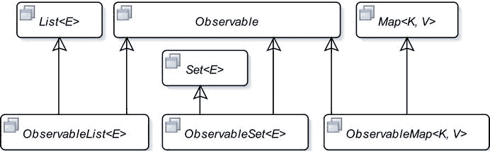

图 8-6.

JavaFX 中可观察集合接口的部分类图

JavaFX 中的可观察集合有两个额外的特性：

*   它们支持失效通知，因为它们继承自 `Observable` 接口。
*   它们支持更改通知。你可以注册更改监听器，当集合内容发生变化时会收到通知。

`FXCollections` 类是一个用于处理 JavaFX 集合的工具类。它由所有静态方法组成。JavaFX 不公开列表、集和映射的实现类。你需要使用 `FXCollections` 类中的工厂方法来创建 `ObservableList`、`ObservableSet` 和 `ObservableMap` 接口的对象。以下代码片段展示了如何创建可观察集合：

```
// 创建一个包含两个元素的可观察列表
ObservableList list = FXCollections.observableArrayList("One", "Two");
// 创建一个包含两个元素的可观察集
ObservableSet set = FXCollections.observableSet("one", "two");
// 创建一个可观察映射并向其添加两个键值对
ObservableMap map = FXCollections.observableHashMap();
map.put("one", 1);
map.put("two", 2);
```

你可以向可观察集合添加失效监听器和更改监听器。向可观察集合添加 `InvalidationListener` 与向属性添加 `InvalidationListener` 的方式相同，你已在上一节中看到。每种类型的可观察集合都有其自己的更改监听器类型：

*   `ListChangeListener<E>` 接口的实例表示 `ObservableList<E>` 的更改监听器。
*   `SetChangeListener<E>` 接口的实例表示 `ObservableSet<E>` 的更改监听器。
*   `MapChangeListener<K,V>` 接口的实例表示 `ObservableMap<K,V>` 的更改监听器。

使用可观察集合的 `addListener()` 方法向其添加更改监听器。所有可观察集合的更改监听器接口都声明了一个名为 `Change` 的静态内部类，该类封装了相应类型集合中的更改。例如，有一个 `ListChangeListener.Change<E>` 静态内部类用于封装 `ObservableList<E>` 中的更改。更改监听器会收到一个 `Change` 类的实例。你需要使用 `Change` 类的 `next()` 方法来遍历所有更改。`Change` 类包含多个方法，用于提供对集合所做更改的详细信息。以下代码片段展示了如何向 `ObservableList` 和 `ObservableSet` 添加更改监听器：


```
// 创建一个包含两个元素的 ObservableList
ObservableList list = FXCollections.observableArrayList("One", "Two");
// 为列表添加一个变更监听器
list.addListener((ListChangeListener.Change change) -> {
System.out.println("列表已发生变更。");
});
// 创建一个 ObservableSet
ObservableSet set = FXCollections.observableSet("one", "two");
// 为集合添加一个变更监听器
set.addListener((SetChangeListener.Change change) -> {
System.out.println("列表已发生变更。");
});
```

让我们看一个详细的示例，了解如何处理 `ObservableList` 中的变更。监听 `ObservableList` 的变更有点棘手。列表可能发生多种类型的变更。有些变更是互斥的，而有些则可以与其他变更同时发生。列表中的元素可以被排列、更新、替换、添加和删除。清单 8-13 包含一个完整的程序，展示了如何检测 `ObservableList` 中的变更。添加变更监听器后，程序会对列表进行操作，每次操作都会通知监听器，从输出结果中可以明显看出这一点。该程序经过简化，以保持简洁和可读性。`ListChangeListener.Change` 对象包含有关列表变更的所有详细信息，例如受影响的区间、添加和删除的大小等。

```
// ObservableListTest.java
package com.jdojo.javafx;
import javafx.collections.FXCollections;
import javafx.collections.ListChangeListener;
import javafx.collections.ObservableList;
public class ObservableListTest {
public static void main(String[] args) {
// 创建一个包含一些元素的列表
ObservableList list = FXCollections.observableArrayList("one", "two");
System.out.println("创建列表后：" + list);
// 为列表添加一个 ChangeListener
list.addListener(ObservableListTest::onChanged);
// 向列表添加更多元素
list.addAll("three", "four");
System.out.println("执行 addAll() 后 - 列表：" + list);
// 现在有四个元素。移除索引 1（包含）到索引 3（不包含）的中间两个元素
list.remove(1, 3);
System.out.println("执行 remove() 后 - 列表：" + list);
// 仅保留元素 "one"
list.retainAll("one");
System.out.println("执行 retainAll() 后 - 列表：" + list);
// 替换列表中的第一个元素
list.set(0, "ONE");
System.out.println("执行 set() 后 - 列表：" + list);
}
public static void onChanged(ListChangeListener.Change change) {
while (change.next()) {
if (change.wasPermutated()) {
System.out.println("检测到排列变更。");
} else if (change.wasUpdated()) {
System.out.println("检测到更新变更。");
} else if (change.wasReplaced()) {
System.out.println("检测到替换变更。");
} else {
if (change.wasRemoved()) {
System.out.println("检测到移除变更。");
} else if (change.wasAdded()) {
System.out.println("检测到添加变更。");
}
}
}
}
}
创建列表后：[one, two]
检测到添加变更。
执行 addAll() 后 - 列表：[one, two, three, four]
检测到移除变更。
执行 remove() 后 - 列表：[one, four]
检测到移除变更。
执行 retainAll() 后 - 列表：[one]
检测到替换变更。
执行 set() 后 - 列表：[ONE]
清单 8-13.
检测 ObservableList 中的变更
```

## 事件处理

通常，术语“事件”用于描述感兴趣的事件发生。在 GUI 应用程序中，事件是用户与应用程序交互的发生。鼠标点击、键盘按键按下等是 JavaFX 应用程序中事件的示例。JavaFX 中的事件由 `javafx.event.Event` 类或其任何子类的对象表示。JavaFX 中的每个事件都有三个属性：

*   事件源
*   事件目标
*   事件类型

当事件发生时，通常通过执行一段代码来执行某些处理。响应事件而执行的代码段称为事件处理器或事件过滤器。稍后我会澄清事件处理器和事件过滤器之间的区别。现在，将两者都视为一段代码，我将它们统称为事件处理器。当您想要处理 UI 元素的事件时，需要向该 UI 元素添加事件处理器。当 UI 元素检测到事件时，它会执行您的事件处理器。

调用事件处理器的 UI 元素是这些事件处理器的事件源。当事件发生时，它会经过一系列事件分发器。事件源是事件分发器链中的当前元素。当事件在事件分发器链中从一个分发器传递到另一个分发器时，事件源会发生变化。

事件目标是事件的最终目的地。事件目标决定了事件在处理过程中传播的路径。假设鼠标点击发生在 `Circle` 节点上。在这种情况下，`Circle` 节点就是鼠标点击事件的事件目标。

事件类型描述了所发生事件的类型。事件类型以分层方式定义。每个事件类型都有一个名称和一个超类型。

JavaFX 中所有事件共有的这三个属性由三个不同类的对象表示。特定事件定义了额外的事件属性；例如，表示鼠标事件的事件类添加了属性来描述鼠标光标的位置、鼠标按钮的状态等。

表 8-4 列出了事件处理中涉及的类和接口。JavaFX 有一个事件传递机制，它定义了事件发生和处理的细节。

表 8-4.
事件处理中涉及的类

| 名称 | 类/接口 | 描述 |
| --- | --- | --- |
| `Event` | 类 | 此类的实例表示一个事件。`Event` 类存在多个子类来表示特定类型的事件。 |
| `EventTarget` | 接口 | 此接口的实例表示一个事件目标。 |
| `EventType` | 类 | 此类的实例表示一个事件类型，例如鼠标按下、鼠标释放、鼠标移动等。 |
| `EventHandler` | 接口 | 此接口的实例表示一个事件处理器或事件过滤器。当为其注册的事件发生时，会调用其 `handle()` 方法。 |

### 事件处理机制

当事件发生时，会执行几个步骤作为事件处理的一部分：

*   事件目标选择
*   事件路径构建
*   事件路径遍历

#### 事件目标选择

事件处理的第一步是选择事件目标。回想一下，事件目标是事件的最终目标节点。事件目标根据事件类型进行选择。对于鼠标事件，事件目标是鼠标光标所在的节点。鼠标光标处可能有多个节点。例如，您可以将一个圆形放在一个矩形之上。鼠标光标处最顶层的节点被选为事件目标。

键盘事件的事件目标是拥有焦点的节点。节点如何获得焦点取决于节点的类型。例如，`TextField` 可以通过在内部点击鼠标或使用焦点遍历键（如 Windows 操作系统上的 Tab 或 Shift-Tab）来获得焦点。像 `Circle`、`Rectangle` 等形状默认情况下不会获得焦点。如果您希望它们接收键盘事件，可以通过调用 `Node` 类的 `requestFocus()` 方法为它们赋予焦点。


#### 事件路由构建

事件通过事件调度链中的事件调度器进行传播。事件调度链即为事件路由。事件的初始路由和默认路由由事件目标决定。默认事件路由由从舞台到事件目标节点的容器-子节点路径组成。

假设你在一个 `HBox` 中放置了一个 `Circle` 和一个 `Rectangle`，并且该 `HBox` 是某个 `Stage` 的 `Scene` 的根节点。当你点击 `Circle` 时，`Circle` 成为事件目标。`Circle` 会构建默认事件路由，即从舞台到事件目标（`Circle`）的路径。

实际上，事件路由由与节点关联的事件调度器组成。然而，出于所有实际理解和应用的目的，你可以将事件路由视为由节点组成的路径。通常，你不会直接处理事件调度器。

图 8-7 展示了鼠标点击事件的事件路由。事件路由上的节点以灰色背景填充显示。事件路由上的节点由实线连接。请注意，当 `Circle` 被点击时，场景图中包含的 `Rectangle` 并不在事件路径上。

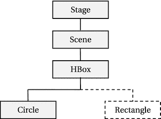

图 8-7. 事件的默认事件路由构建

事件调度链（或事件路由）有头部和尾部。在此例中，`Stage` 和 `Circle` 分别是事件调度链的头部和尾部。初始事件路由可能会随着事件处理的进行而修改。通常（但不一定），在事件遍历步骤中，事件会两次经过其路由上的所有节点，如下一节所述。

#### 事件路由遍历

事件路由遍历包含两个阶段：

*   捕获阶段
*   冒泡阶段

事件会两次经过其路由上的每个节点：一次在捕获阶段，一次在冒泡阶段。你可以为节点注册特定事件类型的事件过滤器和事件处理器。事件过滤器在事件于捕获阶段经过节点时执行。事件处理器在事件于冒泡阶段经过节点时执行。事件过滤器和处理器会接收到当前节点的引用作为事件源。当事件从一个节点传播到另一个节点时，事件源会不断变化。然而，从事件路由遍历开始到结束，事件目标始终保持不变。

在路由遍历过程中，节点可以在事件过滤器或处理器中消费事件，从而完成事件的处理。消费事件只需在事件对象上调用 `consume()` 方法。当事件被消费时，事件处理会停止，即使路由中的某些节点尚未被遍历。

##### 事件捕获阶段

在捕获阶段，事件从其事件调度链的头部传播到尾部。图 8-8 展示了本例中针对 `Circle` 的鼠标点击事件在捕获阶段的传播过程。图中的箭头表示事件传播的方向。当事件经过一个节点时，该节点上注册的事件过滤器会被执行。请注意，事件捕获阶段仅执行当前节点的事件过滤器，而不执行事件处理器。


图 8-8. 事件捕获阶段

在此例中，假设没有任何事件过滤器消费该事件，则 `Stage`、`Scene`、`HBox` 和 `Circle` 的事件过滤器会按顺序执行。

你可以为一个节点注册多个事件过滤器。如果节点在其某个事件过滤器中消费了事件，那么该节点上尚未执行的其他事件过滤器仍会在事件处理停止前执行。假设你为本例中的 `Scene` 注册了五个事件过滤器，并且第一个执行的事件过滤器消费了该事件。在这种情况下，`Scene` 的其他四个事件过滤器仍会执行。在执行完 `Scene` 的第五个事件过滤器后，事件处理才会停止，事件不会继续传播到剩余节点（`HBox` 和 `Circle`）。

在事件捕获阶段，你可以拦截针对节点子节点的事件（并提供通用响应）。例如，你可以为本例中的 `Stage` 添加鼠标点击事件的事件过滤器，以拦截其所有子节点的所有鼠标点击事件。你可以通过在父节点的事件过滤器中消费事件，来阻止事件到达其目标。例如，如果你在 `Stage` 的过滤器中消费了鼠标点击事件，那么该事件将不会到达其目标（例如 `Circle`）。

##### 事件冒泡阶段

在冒泡阶段，事件从其事件调度链的尾部传播到头部。图 8-9 展示了本例中针对 `Circle` 的鼠标点击事件在冒泡阶段的传播过程。

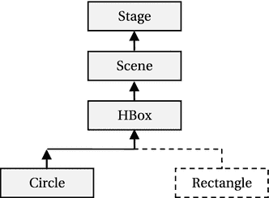

图 8-9. 事件冒泡阶段

图中的箭头表示事件传播的方向。当事件经过一个节点时，该节点上注册的事件处理器会被执行。请注意，事件冒泡阶段执行当前节点的事件处理器，而事件捕获阶段执行事件过滤器。

在此例中，假设没有任何事件过滤器消费该事件，则 `Circle`、`HBox`、`Scene` 和 `Stage` 的事件处理器会按顺序执行。请注意，事件冒泡阶段从事件目标开始，向上传播到父子层次结构中最顶层的父节点。

你可以为一个节点注册多个事件处理器。如果节点在其某个事件处理器中消费了事件，那么该节点上尚未执行的其他事件处理器仍会在事件处理停止前执行。假设你为本例中的 `Circle` 注册了五个事件处理器，并且第一个执行的事件处理器消费了该事件。在这种情况下，`Circle` 的其他四个事件处理器仍会执行。在执行完 `Circle` 的第五个事件处理器后，事件处理才会停止，事件不会继续传播到剩余节点（`HBox`、`Scene` 和 `Stage`）。

通常，事件处理器会注册到目标节点，以提供对事件的特定响应。有时，事件处理器会安装在父节点上，为其所有子节点提供默认的事件响应。如果事件目标决定对事件提供特定响应，它可以通过添加事件处理器并消费事件来实现，从而在事件冒泡阶段阻止事件到达父节点。

让我们讨论一个简单的例子。假设你想在用户点击窗口内的任意位置时显示一个消息框。你可以为窗口注册一个事件处理器来显示消息框。当用户点击窗口内的圆形时，你想显示一条特定的消息。你可以为圆形注册一个事件处理器来提供特定消息并消费事件。这样，当圆形被点击时，会提供特定的事件响应；而对于其他节点，窗口则提供默认的事件响应。


### 创建事件过滤器和处理器

创建事件过滤器和处理器就像创建实现 `EventHandler` 接口的类对象一样简单。在 Java 8 之前，你需要使用内部类来创建事件过滤器和处理器。

```
EventHandler aHandler = new EventHandler() {
@Override
public void handle(MouseEvent e) {
// 事件处理代码写在这里
}
};
```

从 Java 8 开始，使用 lambda 表达式是创建事件过滤器和处理器的最佳选择，如下所示：

```
EventHandler aHandler = e -> {
// 事件处理代码写在这里
};
```

本章将使用 lambda 表达式来创建事件过滤器和处理器。如果你不熟悉 Java 8 中的 lambda 表达式，建议你至少学习一下基础知识，以便能够理解事件处理代码。以下代码片段创建了一个 `MouseEvent` 处理器，它会打印发生的鼠标事件类型。

```
EventHandler mouseEventHandler =
e -> System.out.println("鼠标事件类型: " + e.getEventType());
```

### 注册事件过滤器和处理器

如果某个节点对处理特定类型的事件感兴趣，你需要为该节点注册这些事件类型的事件过滤器和处理器。当事件发生时，已注册的事件过滤器和处理器的 `handle()` 方法将按照前面章节讨论的规则被调用。如果该节点不再对处理这些事件感兴趣，你需要从该节点注销事件过滤器和处理器。注册和注销事件过滤器和处理器也分别称为添加和移除事件过滤器和处理器。JavaFX 提供了两种向节点注册和注销事件过滤器和处理器的方法：

*   使用 `addEventFilter()`、`addEventHandler()`、`removeEventFilter()` 和 `removeEventHandler()` 方法
*   使用 `onXxx` 便捷属性

你可以分别使用 `addEventFilter()` 和 `addEventHandler()` 方法向节点注册事件过滤器和处理器。这些方法定义在 `Node` 类、`Scene` 类和 `Window` 类中。某些类（如 `MenuItem` 和 `TreeItem`）可以作为事件目标，但它们并非继承自 `Node` 类。这些方法的声明如下：

*   `<T extends Event> void addEventFilter(EventType<T> eventType, EventHandler<? super T> eventFilter)`
*   `<T extends Event> void addEventHandler(EventType<T> eventType, EventHandler<? super T> eventHandler)`

这些方法接受两个参数。第一个参数是事件类型，第二个参数是 `EventHandler` 接口的一个实例。

你可以使用以下代码片段处理 `Circle` 的鼠标点击事件：

```
import javafx.scene.shape.Circle;
import javafx.event.EventHandler;
import javafx.scene.input.MouseEvent;
...
// 创建一个圆形
Circle circle = new Circle (100, 100, 50);
// 创建一个 MouseEvent 过滤器
EventHandler mouseEventFilter =
e -> System.out.println("鼠标事件过滤器已被调用。");
// 创建一个 MouseEvent 处理器
EventHandler mouseEventHandler =
e -> System.out.println("鼠标事件处理器已被调用。");
// 为圆形注册鼠标点击事件的 MouseEvent 过滤器和处理器
circle.addEventFilter(MouseEvent.MOUSE_CLICKED, mouseEventFilter);
circle.addEventHandler(MouseEvent.MOUSE_CLICKED, mouseEventHandler);
```

这段代码创建了两个 `EventHandler` 对象，它们会向标准输出打印一条消息。在这个阶段，它们还不是事件过滤器或处理器，只是两个 `EventHandler` 对象。请注意，给引用变量命名并打印包含“过滤器”和“处理器”字样的消息，并不会改变它们作为过滤器和处理器的状态。最后两条语句将其中一个 `EventHandler` 对象注册为事件过滤器，另一个注册为事件处理器；两者都注册为鼠标点击事件。

`Node`、`Scene` 和 `Window` 类包含用于存储某些选定事件类型的事件处理器的事件属性。属性名称使用事件类型模式，命名为 `onXxx`。例如，`onMouseClicked` 属性存储鼠标点击事件类型的事件处理器，`onKeyTyped` 属性存储按键输入事件的事件处理器，以此类推。你可以使用这些属性的 `setOnXxx()` 方法来为节点注册事件处理器。例如，使用 `setOnMouseClicked()` 方法注册鼠标点击事件的事件处理器，使用 `setOnKeyTyped()` 方法注册按键输入事件的事件处理器，等等。各个类中的 `setOnXxx()` 方法被称为注册事件处理器的便捷方法。

关于 `onXxx` 便捷属性，你需要记住以下几点：

*   它们仅支持注册事件处理器，不支持事件过滤器。如果需要注册事件过滤器，请使用 `addEventFilter()` 方法。
*   它们仅支持为一个节点注册一个事件处理器。为一个节点注册多个事件处理器可以使用 `addEventHandler()` 方法。
*   这些属性仅存在于节点类型的常用事件中。例如，`onMouseClicked` 属性存在于 `Node` 和 `Scene` 类中，但不存在于 `Window` 类中；`onShowing` 属性存在于 `Window` 类中，但不存在于 `Node` 和 `Scene` 类中。

以下代码片段展示了如何使用便捷的 `onMouseClicked` 属性为圆形设置事件处理器：

```
// 创建一个圆形
Circle circle = new Circle (100, 100, 50);
// 创建一个 MouseEvent 处理器
EventHandler eventHandler =
e -> System.out.println("鼠标事件处理器已被调用。");
// 使用 onMouseClicked 便捷事件属性的 setter 方法注册处理器
circle.setOnMouseClicked(eventHandler);
```

以下代码片段展示了如何使用 `Button` 类的 `setOnAction()` 便捷方法为 `Button` 添加一个 `ActionEvent` 处理器：

```
// 创建一个按钮
Button exitBtn = new Button("退出");
// 为退出按钮添加事件处理器
exitBtn.setOnAction(e -> Platform.exit());
```

便捷事件属性没有提供单独的方法来注销事件处理器。将属性设置为 `null` 即可注销已注册的事件处理器。

```
// 注销圆形的鼠标点击事件处理器
circle.setOnMouseClicked(null);
```

定义了 `onXxx` 事件属性的类也定义了 `getOnXxx()` getter 方法，该方法返回已注册事件处理器的引用。如果没有设置事件处理器，getter 方法将返回 `null`。

清单 8-14 包含一个演示事件路由和处理机制的程序。它还展示了如何消费事件及其效果。图 8-10 显示了运行程序时的屏幕画面。


图 8-10.

处理与消费事件


```
// EventHandling.java
package com.jdojo.javafx;
import javafx.application.Application;
import javafx.event.EventHandler;
import javafx.geometry.Insets;
import javafx.scene.Scene;
import javafx.scene.control.CheckBox;
import javafx.scene.input.MouseEvent;
import static javafx.scene.input.MouseEvent.MOUSE_CLICKED;
import javafx.scene.layout.HBox;
import javafx.scene.paint.Color;
import javafx.scene.shape.Circle;
import javafx.scene.shape.Rectangle;
import javafx.stage.Stage;
public class EventHandling extends Application {
private CheckBox consumeEventCbx = new CheckBox("在圆形处消耗鼠标点击事件");
public static void main(String[] args) {
Application.launch(args);
}
@Override
public void start(Stage stage) {
Circle circle = new Circle(50, 50, 50);
circle.setFill(Color.CORAL);
Rectangle rect = new Rectangle(100, 100);
rect.setFill(Color.TAN);
HBox root = new HBox();
root.setPadding(new Insets(20));
root.setSpacing(20);
root.getChildren().addAll(circle, rect, consumeEventCbx);
Scene scene = new Scene(root);
// 为所有节点注册鼠标点击事件处理器，矩形和复选框除外
EventHandler handler = e -> handleEvent(e);
EventHandler circleMeHandler = e -> handleEventforCircle(e);
stage.addEventHandler(MOUSE_CLICKED, handler);
scene.addEventHandler(MOUSE_CLICKED, handler);
root.addEventHandler(MOUSE_CLICKED, handler);
circle.addEventHandler(MOUSE_CLICKED, circleMeHandler);
stage.setScene(scene);
stage.setTitle("事件处理");
stage.show();
}
public void handleEvent(MouseEvent e) {
print(e);
}
public void handleEventforCircle(MouseEvent e) {
print(e);
if (consumeEventCbx.isSelected()) {
e.consume();
}
}
public void print(MouseEvent e) {
String type = e.getEventType().getName();
String source = e.getSource().getClass().getSimpleName();
String target = e.getTarget().getClass().getSimpleName();
// 获取鼠标相对于事件源的坐标
double x = e.getX();
double y = e.getY();
System.out.println("类型=" + type + ", 目标=" + target
+ ", 源=" + source
+ ", 位置(" + x + ", " + y + ")");
}
}
清单 8-14.
处理与消耗事件
```

该程序将一个`Circle`、一个`Rectangle`和一个`CheckBox`添加到一个`HBox`中。`HBox`是一种容器，它将其子节点水平排列在一行上。`HBox`作为根节点添加到场景中。事件处理器被添加到`Stage`、`Scene`、`HBox`和`Circle`上。请注意，为了简化程序逻辑，您为`Circle`使用了不同的事件处理器。当选中`CheckBox`时，`Circle`的事件处理器会消耗鼠标点击事件，从而阻止事件向上传播到`HBox`、`Scene`和`Stage`。如果未选中`CheckBox`，则`Circle`上的鼠标点击事件会从`Circle`向上传播到`HBox`、`Scene`和`Stage`。运行程序，使用鼠标点击场景的不同区域以查看效果。请注意，即使您点击的是`Circle`外部的点，`HBox`、`Scene`和`Stage`的鼠标点击事件处理器也会被执行，因为它们位于被点击节点的事件分发链中。

点击`CheckBox`不会执行`HBox`、`Scene`和`Stage`的鼠标点击事件处理器，而点击`Rectangle`则会。您能想到这种行为的原因吗？原因很简单。`CheckBox`有一个默认的事件处理器（用于鼠标按下事件），该处理器会执行默认操作并消耗事件，从而阻止事件向上传播到事件分发链。而`Rectangle`不会消耗事件，因此允许事件向上传播到事件分发链。

提示

事件目标在事件过滤器中消耗事件不会影响任何其他事件过滤器的执行。但是，它会阻止事件冒泡阶段的发生。在最顶层节点（即事件分发链的头部）的事件处理器中消耗事件，对事件处理没有影响。

## 布局面板

您可以使用两种类型的布局来排列场景图中的节点：

*   静态布局
*   动态布局

在静态布局中，节点的位置和大小只计算一次，并且在调整窗口大小时保持不变。当窗口大小与节点最初布局时的大小一致时，用户界面看起来效果最佳。

在动态布局中，每当用户操作导致节点的位置、大小或两者同时发生变化时，场景图中的节点都会重新布局。通常，改变一个节点的位置或大小会影响场景图中其他节点的位置和大小。动态布局会在调整窗口大小时强制重新计算部分或全部节点的位置和大小。

静态布局和动态布局各有优缺点。静态布局让开发者完全控制用户界面的设计。它允许您按照自己的意愿利用可用空间。动态布局需要更多的编程工作，并且逻辑要复杂得多。通常，支持 GUI 的编程语言（如 JavaFX）通过库来支持动态布局。库解决了动态布局的大部分用例。如果它们不能满足您的需求，您就必须付出艰苦努力来推出自己的动态布局。

布局面板是一个包含其他节点的节点，这些节点被称为其子节点（或子节点）。布局面板的职责是在需要时对其子节点进行布局。布局面板也称为容器或布局容器。

布局面板具有一个布局策略，用于控制布局面板如何布局其子节点。例如，布局面板可以水平、垂直或以任何其他方式布局其子节点。容器的布局策略是一组用于计算其子节点位置和大小的规则。节点有三种类型的大小，称为首选大小、最小大小和最大大小。大多数容器会尝试为其子节点提供首选大小。节点的实际（或当前）大小可能与其首选大小不同。节点的当前大小取决于窗口大小、容器的布局策略以及节点的扩展和收缩策略等。

JavaFX 包含多个容器类。图 8-11 显示了容器类的类图。容器类是`Parent`类的直接或间接子类。

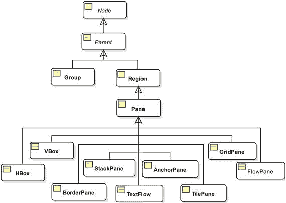

图 8-11.

JavaFX 中容器类的类图

`Group`允许您对其所有子节点集体应用效果和变换。`Group`类位于`javafx.scene`包中。

`Region`类的子类用于布局子节点。它们可以使用 CSS 设置样式。`Region`类及其大多数子类位于`javafx.scene.layout`包中。

确实，容器必须是`Parent`类的子类。然而，并非所有`Parent`类的子类都是容器。例如，`Button`类是`Parent`类的子类；但它是一个控件，而不是容器。节点必须添加到容器中才能成为场景图的一部分。容器根据其布局策略对其子节点进行布局。如果您不希望容器管理某个节点的布局，则需要将该节点的`managed`属性设置为`false`。

一个节点一次只能是一个容器的子节点。如果将一个节点添加到某个容器时，它已经是另一个容器的子节点，则该节点会先被从第一个容器中移除，然后再添加到第二个容器中。通常，为了创建复杂的布局，需要嵌套容器。也就是说，您可以将一个容器作为子节点添加到另一个容器中。

`Parent`类包含三个用于获取容器子节点列表的方法：


*   `protected ObservableList<Node> getChildren()`
*   `public ObservableList<Node> getChildrenUnmodifiable()`
*   `protected <E extends Node> List<E> getManagedChildren()`

`getChildren()` 方法返回一个可修改的 `ObservableList`，其中包含容器的子节点。如果你想向容器添加节点，只需将节点添加到此列表中。这是容器类中最常用的方法。从本章的第一个程序开始，你一直在使用此方法向 `Group`、`HBox`、`VBox` 等容器添加子节点。

请注意 `getChildren()` 方法的 `protected` 访问权限。如果 `Parent` 类的子类不希望成为容器，它将保持此方法的访问权限为 `protected`。例如，`Button` 和 `TextField` 等控件相关类将此方法保持为 `protected`，因此你不能向它们添加子节点。容器类会重写此方法并将其设为 `public`。例如，`Group` 和 `Pane` 类将此方法公开为 `public`。

`getChildrenUnmodifiable()` 方法在 `Parent` 类中被声明为 `public`。它返回一个只读的 `ObservableList` 子节点列表。它在两种情况下很有用：

*   你需要将容器的子节点列表传递给一个不应修改该列表的方法。
*   你想了解一个非容器的控件由什么组成。

`getManagedChildren()` 方法具有 `protected` 访问权限。容器类不会将其公开为 `public`。它们在内部使用此方法，在布局期间获取受管理的子节点列表。你将使用此方法来推出你自己的容器类。

表 8-5 包含了 JavaFX 中容器类的简要描述。本章不可能讨论所有类型的容器。在本节中，我将展示一些使用示例。

表 8-5.

JavaFX 中的容器类

| 容器类 | 描述 |
| --- | --- |
| `Group` | 对其所有子节点集体应用效果和变换。 |
| `Pane` | 用于对其子节点进行绝对定位。 |
| `HBox` | 在单行中水平排列子节点。 |
| `VBox` | 在单列中垂直排列子节点。 |
| `FlowPane` | 在行或列中水平或垂直排列子节点。如果它们无法容纳在单行或单列中，则会在指定的宽度或高度处换行。 |
| `BorderPane` | 将布局区域划分为顶部、右侧、底部、左侧和中心区域，并将其每个子节点放置在五个区域之一中。 |
| `StackPane` | 以从后到前的堆叠方式排列子节点。 |
| `TilePane` | 在统一大小的单元格网格中排列子节点。 |
| `GridPane` | 在可变大小的单元格网格中排列子节点。 |
| `AnchorPane` | 通过将子节点的边缘锚定到布局区域的边缘来排列子节点。 |
| `TextFlow` | 布局富文本，其内容可能包含多个 `Text` 节点。 |

容器旨在包含子节点。你可以在创建容器对象时或创建之后向容器添加子节点。所有容器类都提供接受可变参数 `Node` 类型参数的构造函数，以添加初始子节点集。一些容器提供构造函数来添加初始子节点集并设置容器的初始属性。

你也可以在容器创建后的任何时间向容器添加子节点。容器将其子节点存储在一个可观察列表中，可以使用 `getChildren()` 方法检索该列表。向容器添加节点就像向该可观察列表添加节点一样简单。以下代码片段展示了如何在创建 `HBox` 时以及创建之后向其添加子节点。

```
// 创建两个按钮
Button okBtn = new Button("确定");
Button cancelBtn = new Button("取消");
// 创建一个 HBox，包含两个按钮作为其子节点
HBox hBox1 = new HBox(okBtn, cancelBtn);
// 创建一个 HBox，包含两个按钮，它们之间水平间距为 20px
double hSpacing = 20;
HBox hBox2 = new HBox(hSpacing, okBtn, cancelBtn);
// 创建一个空的 HBox，然后向其中添加两个按钮
HBox hBox3 = new HBox();
hBox3.getChildren().addAll(okBtn, cancelBtn);
```

提示

当你需要向容器添加多个子节点时，请使用 `ObservableList` 的 `addAll()` 方法，而不是多次使用 `add()` 方法。

清单 8-15 中的程序展示了如何使用 `BorderPane`、`HBox` 和 `VBox` 来排列 UI 元素，如图 8-12 所示。

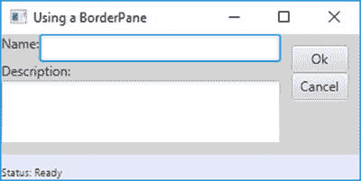

图 8-12.

一个 BorderPane，在其顶部、右侧、底部和中心区域使用了一些控件

```
// BorderPaneTest.java
package com.jdojo.javafx;
import javafx.application.Application;
import javafx.geometry.Insets;
import javafx.scene.Node;
import javafx.scene.Scene;
import javafx.scene.control.Button;
import javafx.scene.control.Label;
import javafx.scene.control.TextArea;
import javafx.scene.control.TextField;
import javafx.scene.layout.BorderPane;
import javafx.scene.layout.HBox;
import javafx.scene.layout.Priority;
import javafx.scene.layout.VBox;
import javafx.stage.Stage;
public class BorderPaneTest extends Application {
public static void main(String[] args) {
Application.launch(args);
}
@Override
public void start(Stage stage) {
// 将顶部和左侧子节点设置为 null
Node top = null;
Node left = null;
// 构建中心区域的内容节点
VBox center = getCenter();
// 创建右侧子节点
Button okBtn = new Button("确定");
Button cancelBtn = new Button("取消");
// 使确定和取消按钮大小相同
okBtn.setMaxWidth(Double.MAX_VALUE);
VBox right = new VBox(okBtn, cancelBtn);
right.setStyle("-fx-padding: 10;");
// 创建底部子节点
Label statusLbl = new Label("状态: 就绪");
HBox bottom = new HBox(statusLbl);
BorderPane.setMargin(bottom, new Insets(10, 0, 0, 0));
bottom.setStyle("-fx-background-color: lavender;"
+ "-fx-font-size: 7pt;"
+ "-fx-padding: 10 0 0 0;");
BorderPane root = new BorderPane(center, top, right, bottom, left);
root.setStyle("-fx-background-color: lightgray;");
Scene scene = new Scene(root);
stage.setScene(scene);
stage.setTitle("使用 BorderPane");
stage.show();
}
private VBox getCenter() {
// 一个 HBox 中包含一个标签和一个文本字段
Label nameLbl = new Label("姓名:");
TextField nameFld = new TextField();
HBox.setHgrow(nameFld, Priority.ALWAYS);
HBox nameFields = new HBox(nameLbl, nameFld);
// 一个标签和一个文本区域
Label descLbl = new Label("描述:");
TextArea descText = new TextArea();
descText.setPrefColumnCount(20);
descText.setPrefRowCount(5);
VBox.setVgrow(descText, Priority.ALWAYS);
// 将所有控件放入一个 VBox 中
VBox center = new VBox(nameFields, descLbl, descText);
return center;
}
}
清单 8-15.
使用 BorderPane 容器
```

请注意清单 8-15 中容器对 `setStyle()` 方法的使用。你可以使用 CSS 自定义 JavaFX 中容器和控件的视觉外观。JavaFX 中的 CSS 属性的命名和工作方式类似于用于自定义浏览器中 HTML 内容的 CSS 属性。JavaFX 中的 CSS 属性以 `-fx-` 开头，例如，用于指定字体大小的 CSS 属性名称是 `-fx-font-size`。你也可以使用 CSS 文件为 JavaFX 应用程序设置样式。清单 8-16 展示了如何通过向场景的根节点添加样式，为场景添加内边距和圆角蓝色边框。图 8-13 显示了窗口中生成的场景。


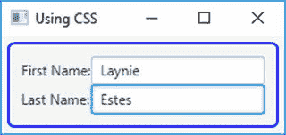

图 8-13.

使用 CSS 为场景添加内边距和圆角蓝色边框

```
// CSSTest.java
package com.jdojo.javafx;
import javafx.application.Application;
import javafx.scene.Scene;
import javafx.scene.control.Label;
import javafx.scene.control.TextField;
import javafx.scene.layout.GridPane;
import javafx.stage.Stage;
public class CSSTest extends Application {
public static void main(String[] args) {
Application.launch(args);
}
@Override
public void start(Stage stage) {
TextField fNameFld = new TextField();
Label fNameLbl = new Label("First Name:");
TextField lNameFld = new TextField();
Label lNameLbl = new Label("Last Name:");
GridPane root = new GridPane();
root.addRow(0, fNameLbl, fNameFld);
root.addRow(1, lNameLbl, lNameFld);
// Set a CSS for the GridPane
root.setStyle("-fx-padding: 10;"
+ "-fx-border-style: solid inside;"
+ "-fx-border-width: 2;"
+ "-fx-border-insets: 5;"
+ "-fx-border-radius: 5;"
+ "-fx-border-color: blue;");
Scene scene = new Scene(root);
stage.setScene(scene);
stage.setTitle("Using CSS");
stage.show();
}
}
清单 8-16.

使用 CSS 为场景添加内边距和圆角蓝色边框
```

在 JavaFX 中使用 CSS 是一个庞大的主题。本章不会详细讨论 JavaFX 中的 CSS。请参考以下网页获取 CSS 参考指南，其中列出了所有可通过 CSS 设置样式的节点的全部 CSS 属性：[`https://docs.oracle.com/javase/9/docs/api/javafx/scene/doc-files/cssref.html`](https://docs.oracle.com/javase/9/docs/api/javafx/scene/doc-files/cssref.html)。

## 控件

JavaFX 允许你使用 GUI 组件创建应用程序。一个带有 GUI 的应用程序执行三项任务：

*   通过键盘、鼠标等输入设备接收用户输入。
*   处理输入（或根据输入执行操作）。
*   显示输出。

用户界面提供了一种在应用程序与用户之间以输入和输出形式交换信息的手段。使用键盘输入文本、用鼠标选择菜单项以及点击按钮，都是向 GUI 应用程序提供输入的示例。应用程序则通过文本、图表、对话框等方式在计算机显示器上显示输出。

用户通过称为控件或组件的图形元素与 GUI 应用程序进行交互。按钮、标签、文本字段、文本区域、单选按钮和复选框都是控件的几个例子。键盘、鼠标和触摸屏等设备用于向控件提供输入。控件也可以向用户显示输出。控件会生成事件，这些事件表示用户与控件之间发生了某种交互。例如，使用鼠标或空格键按下按钮会生成一个动作事件，表示用户已按下该按钮。

JavaFX 提供了一套丰富的、易于使用的基础控件和高级控件。控件通常被添加到布局面板中，由布局面板来定位和调整它们的大小。不可能讨论所有控件。我将列出 JavaFX 中的大部分控件，并简要说明它们的功能。

JavaFX 中的每个控件都由一个类的实例表示。如果多个控件共享基本特性，它们会继承自一个共同的基类。控件类位于 `javafx.scene.control` 包中。一个控件类是 `Control` 类的直接或间接子类，而 `Control` 类又继承自 `Region` 类。回想一下，`Region` 类继承自 `Parent` 类。因此，从技术上讲，`Control` 也是一个 `Parent`。

一个 `Parent` 可以拥有子节点。通常，一个控件由另一个节点（有时是多个节点）组成，该节点是其子节点。控件类不会通过 `getChildren()` 方法暴露其子节点列表，因此你不能向它们添加任何子节点。

控件类通过 `getChildrenUnmodifiable()` 方法暴露其内部不可修改的子节点列表，该方法返回一个 `ObservableList<Node>`。使用控件时，你不需要了解控件的内部子节点。但是，如果你需要其子节点列表，`getChildrenUnmodifiable()` 方法可以为你提供。

图 8-14 展示了一些常用控件类的类图。控件类的列表比类图中显示的要多得多。表 8-6 包含了 JavaFX 中大部分控件的列表及其简要说明。

表 8-6.

JavaFX 控件


| 控件 | 描述 |
| --- | --- |
| `Label` | 一个不可编辑的文本控件，通常用于显示另一个控件的标签。 |
| `Button` | 表示一个命令按钮控件。它可以显示文本和图标。激活时会生成一个 `ActionEvent`。 |
| `ButtonBar` | 表示一组按操作系统特定顺序排列的按钮。 |
| `Hyperlink` | 表示一个超链接控件，外观类似于网页中的超链接。激活时会生成一个 `ActionEvent`。 |
| `MenuButton` | 外观像按钮，行为像菜单。激活时，会以弹出菜单的形式显示一个选项列表。要在选择菜单选项时执行命令，需要将 `ActionEvent` 处理器添加到添加到 `MenuButton` 的 `MenuItem` 上。 |
| `ToggleButton` | 表示一个双状态按钮控件。两种状态为选中和未选中。 |
| `RadioButton` | 表示一个单选按钮。用于从选项列表中提供互斥的选择。 |
| `CheckBox` | 表示一个三状态选择控件。三种状态为已选中、未选中和未定义。 |
| `ChoiceBox` | 允许用户从一小组预定义项中选择一个项目。 |
| `ComboBox` | `ChoiceBox` 控件的高级版本。它具有许多功能，例如可编辑性、更改列表中项目的外观等，这些是 `ChoiceBox` 所不具备的。 |
| `ListView` | 为用户提供从项目列表中选择多个项目的能力。通常，列表中的所有或多个项目始终对用户可见。 |
| `ColorPicker` | 允许用户从标准调色板中选择颜色，或以图形方式定义自定义颜色。 |
| `DatePicker` | 允许用户从日历弹出窗口中选择日期。 |
| `TextField` | 表示一个单行文本输入控件。 |
| `PasswordField` | 表示一个用于输入密码或敏感文本的单行文本输入控件，实际文本会被屏蔽。 |
| `TextArea` | 表示一个多行文本输入控件。 |
| `ProgressIndicator` | 用于在圆形区域内显示任务的进度。 |
| `ProgressBar` | 用于在矩形区域内显示任务的进度。 |
| `Spinner` | 表示一个单行文本字段，允许用户从有序序列中选择一个数字或对象值。 |
| `TitledPane` | 用于显示内容（通常是一组控件），带有一个可包含标题文本和图形的标题栏。它可以处于展开或折叠状态。在折叠状态下，仅标题栏可见。在展开状态下，内容和标题栏均可见。 |
| `Accordion` | 用作一组 `TitledPane` 控件的容器，其中一次只有一个 `TitledPane` 可见。 |
| `Pagination` | 用于通过将单个大内容分成称为页面的较小块来显示，例如搜索结果。 |
| `Tooltip` | 用于当鼠标悬停在控件上时，在弹出窗口中短暂显示关于该控件的附加信息。 |
| `ScrollBar` | 用于为控件添加滚动功能。 |
| `ScrollPane` | 提供节点的可滚动视图。 |
| `Separator` | 用于分隔两组控件的水平或垂直线。 |
| `Slider` | 用于通过沿轨道滑动滑块（或旋钮）以图形方式从数值范围中选择一个数值。 |
| `MenuBar` | 一个水平条，用作菜单的容器。 |
| `Menu` | 包含一个可操作项目的列表，这些项目按需显示，例如通过点击它。 |
| `MenuItem` | 表示 `menu` 中的一个可操作选项。 |
| `ContextMenu` | 一个弹出控件，按需显示菜单项列表。 |
| `ToolBar` | 用于显示一组节点，这些节点提供屏幕上常用的操作项。 |
| `TabPane` | 显示由 `Tab` 类实例表示的多个标签页。一次仅有一个标签页的内容可见。 |
| `Tab` | 表示 `TabPane` 中的一个标签页。 |
| `HTMLEditor` | 在 JavaFX 中提供富文本编辑功能。 |
| `FileChooser` | 允许您以图形方式从文件系统中选择文件。 |
| `DirectoryChooser` | 允许您使用平台相关的目录对话框选择目录。 |
| `TableView` | 用于使用行和列显示和编辑表格数据。 |
| `TreeView` | 用于显示和编辑按树状结构排列的分层数据。 |
| `TreeTableView` | `TableView` 和 `TreeView` 控件的组合。提供向下钻取表格的能力。 |
| `WebView` | 显示一个网页。 |


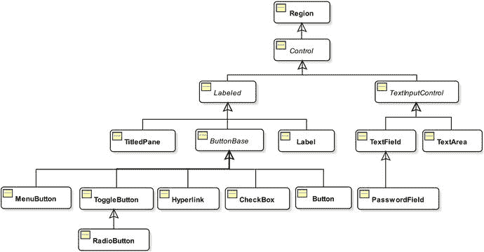

图 8-14.

JavaFX 中控制类的部分类图

清单 8-17 使用 JavaFX 控件创建了一个表单，用于输入人员详细信息，如名字、姓氏、出生日期和性别，如图 8-15 所示。输入数据并点击“保存”按钮，即可在窗口底部的 `TextArea` 中显示输入的数据。该表单使用了以下控件：

*   两个 `TextField` 控件实例，用于输入名字和姓氏。
*   一个 `DatePicker` 控件，用于输入出生日期。
*   一个 `ChoiceBox` 控件，用于选择性别。
*   一个 `Button` 控件，用于保存数据。
*   一个 `Button` 控件，用于关闭窗口。
*   一个 `TextArea` 控件，用于在点击“保存”按钮时显示输入的数据。

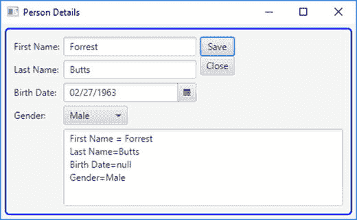

图 8-15.

使用 JavaFX 控件输入人员详细信息的表单

```
// PersonView.java
package com.jdojo.javafx;
import javafx.application.Application;
import javafx.scene.Scene;
import javafx.scene.control.Button;
import javafx.scene.control.ChoiceBox;
import javafx.scene.control.DatePicker;
import javafx.scene.control.Label;
import javafx.scene.control.TextArea;
import javafx.scene.control.TextField;
import javafx.scene.layout.GridPane;
import javafx.scene.layout.VBox;
import javafx.stage.Stage;
public class PersonView extends Application {
// Labels
Label fNameLbl = new Label("First Name:");
Label lNameLbl = new Label("Last Name:");
Label bDateLbl = new Label("Birth Date:");
Label genderLbl = new Label("Gender:");
// Fields
TextField fNameFld = new TextField();
TextField lNameFld = new TextField();
DatePicker bDateFld = new DatePicker();
ChoiceBox genderFld = new ChoiceBox();
TextArea dataFld = new TextArea();
// Buttons
Button saveBtn = new Button("Save");
Button closeBtn = new Button("Close");
public static void main(String[] args) {
Application.launch(args);
}
@Override
public void start(Stage stage) throws Exception {
// Populate the gender choice box
genderFld.getItems().addAll("Male", "Female", "Unknown");
// Set the preferred rows and columns for the text area
dataFld.setPrefColumnCount(30);
dataFld.setPrefRowCount(5);
GridPane grid = new GridPane();
grid.setHgap(5);
grid.setVgap(5);
// Place the controls in the grid
grid.add(fNameLbl, 0, 0);  // column=0, row=0
grid.add(lNameLbl, 0, 1);  // column=0, row=1
grid.add(bDateLbl, 0, 2);  // column=0, row=2
grid.add(genderLbl, 0, 3); // column=0, row=3
grid.add(fNameFld, 1, 0);  // column=1, row=0
grid.add(lNameFld, 1, 1);  // column=1, row=1
grid.add(bDateFld, 1, 2);  // column=1, row=2
grid.add(genderFld, 1, 3); // column=1, row=3
grid.add(dataFld, 1, 4, 3, 2); // column=1, row=4, colspan=3, rowspan=3
// Add buttons and make them the same width
VBox buttonBox = new VBox(saveBtn, closeBtn);
saveBtn.setMaxWidth(Double.MAX_VALUE);
closeBtn.setMaxWidth(Double.MAX_VALUE);
grid.add(buttonBox, 2, 0, 1, 2); // column=2, row=0, colspan=1, rowspan=2
// Show the data in the text area when the Save button is clicked
saveBtn.setOnAction(e -> showData());
// Close the window when the Close button is clicked
closeBtn.setOnAction(e -> stage.hide());
// Set a CSS for the GridPane to add a padding and a blue border
grid.setStyle("-fx-padding: 10;"
+ "-fx-border-style: solid inside;"
+ "-fx-border-width: 2;"
+ "-fx-border-insets: 5;"
+ "-fx-border-radius: 5;"
+ "-fx-border-color: blue;");
Scene scene = new Scene(grid);
stage.setScene(scene);
stage.setTitle("Person Details");
stage.sizeToScene();
stage.show();
}
private void showData() {
String data = "First Name = " + fNameFld.getText()
+ "\nLast Name=" + lNameFld.getText()
+ "\nBirth Date=" + bDateFld.getValue()
+ "\nGender=" + genderFld.getValue();
dataFld.setText(data);
}
}
清单 8-17.
使用 JavaFX 控件创建输入人员详细信息的表单
```

## 使用 2D 形状

JavaFX 提供了多种类型的节点来绘制不同形状，例如线条、圆形、矩形等。你可以将形状添加到场景图中。你可以绘制 2D 和 3D 形状。在本节中，我将向你展示如何绘制 2D 形状。在 JavaFX 中使用 3D 形状需要一定的学习曲线。由于篇幅限制，本书不讨论 3D 形状。所有 2D 形状类都位于 `javafx.scene.shape` 包中。表示 2D 形状的类继承自抽象的 `Shape` 类，如图 8-16 所示。

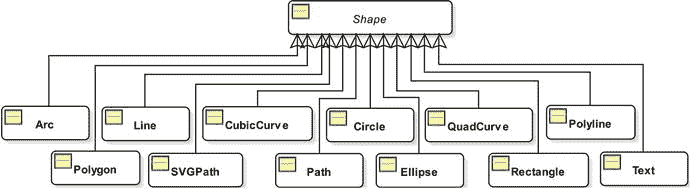

图 8-16.

2D 形状的类图

形状具有由其属性定义的大小和位置。例如，`width` 和 `height` 属性定义了矩形的大小；`radius` 属性定义了圆形的大小；`x` 和 `y` 属性定义了矩形左上角的位置；`centerX` 和 `centerY` 属性定义了圆的中心。

形状在布局期间不会由其父节点调整大小。形状的大小仅在其大小相关属性发生变化时才会改变。你可能会看到类似“JavaFX 形状不可调整大小”的说法。这意味着形状在布局期间不能由其父节点调整大小。它们只能通过更改其属性来调整大小。

形状具有内部区域和描边。用于定义形状内部区域和描边的所有属性都在 `Shape` 类中声明。`fill` 属性指定填充形状内部的颜色。默认的 `fill` 是 `Color.BLACK`。`stroke` 属性指定轮廓描边的颜色，默认为 `null`，但 `Line`、`Polyline` 和 `Path` 除外，它们的默认 `stroke` 颜色为 `Color.BLACK`。

`Shape` 类包含一个 `smooth` 属性，默认为 `true`。其值为 `true` 表示应使用抗锯齿提示来渲染形状。如果将其设置为 `false`，则不会使用抗锯齿提示，这可能导致形状边缘不够清晰。

清单 8-18 中的程序创建了一个圆形、一个矩形、一条直线、一个表示平行四边形的多边形、一个表示六边形的折线，以及一个带弦的弧。这些形状如图 8-17 所示。请注意关于此程序中创建形状的以下几点：

*   它创建了一个半径为 40px 的圆形。
*   它创建了一个宽度为 100px、高度为 75px 的矩形。
*   它创建了一条从 (0, 0) 到 (50, 50) 的直线。
*   它通过连接四个点：(30.0, 0.0)、(130.0, 0.0)、(100.00, 50.0) 和 (0.0, 50.0) 创建了一个表示平行四边形的多边形。多边形通过连接第一个点和最后一个点自动闭合。
*   它创建了一个表示六边形的折线。折线与多边形类似，区别在于它不会自动闭合。请注意，在折线构造函数中，第一个点 (100.0, 0.0) 和最后一个点 (100.0, 0.0) 是相同的，因此它是闭合的。
*   它使用 `Arc` 类的构造函数 `Arc(double centerX, double centerY, double radiusX, double radiusY, double startAngle, double length)` 创建了一个弧。弧可以是弦形、圆形或开放形。该程序使用 `ArcType.CHORD` 作为弧类型，通过一条直线（弦）连接弧上的两个端点。

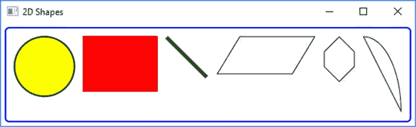

图 8-17.

JavaFX 中的一些 2D 形状


```
// ShapeTest.java
package com.jdojo.javafx;
import javafx.application.Application;
import javafx.scene.Scene;
import javafx.scene.layout.HBox;
import javafx.scene.paint.Color;
import javafx.scene.shape.Arc;
import javafx.scene.shape.ArcType;
import javafx.scene.shape.Circle;
import javafx.scene.shape.Line;
import javafx.scene.shape.Polygon;
import javafx.scene.shape.Polyline;
import javafx.scene.shape.Rectangle;
import javafx.stage.Stage;
public class ShapeTest extends Application {
public static void main(String[] args) {
Application.launch(args);
}
@Override
public void start(Stage stage) {
// 创建一个圆形，填充黄色，黑色描边，宽度为 2.0 像素
Circle circle = new Circle(40);
circle.setFill(Color.YELLOW);
circle.setStroke(Color.BLACK);
circle.setStrokeWidth(2.0);
// 创建一个矩形
Rectangle rect = new Rectangle(100, 75);
rect.setFill(Color.RED);
// 创建一条直线
Line line = new Line(0, 0, 50, 50);
line.setStrokeWidth(5.0);
line.setStroke(Color.GREEN);
// 创建一个平行四边形
Polygon parallelogram = new Polygon();
parallelogram.getPoints().addAll(30.0, 0.0,
130.0, 0.0,
100.00, 50.0,
0.0, 50.0);
parallelogram.setFill(Color.AZURE);
parallelogram.setStroke(Color.BLACK);
// 创建一个六边形
Polyline hexagon = new Polyline(100.0, 0.0,
120.0, 20.0,
120.0, 40.0,
100.0, 60.0,
80.0, 40.0,
80.0, 20.0,
100.0, 0.0);
hexagon.setFill(Color.WHITE);
hexagon.setStroke(Color.BLACK);
// 一个弦弧，无填充，有描边
Arc arc = new Arc(0, 0, 50, 100, 0, 90);
arc.setFill(Color.TRANSPARENT);
arc.setStroke(Color.BLACK);
arc.setType(ArcType.CHORD);
// 将所有形状添加到一个 HBox 中
HBox root = new HBox(circle, rect, line, parallelogram, hexagon, arc);
root.setSpacing(10);
root.setStyle("-fx-padding: 10;"
+ "-fx-border-style: solid inside;"
+ "-fx-border-width: 2;"
+ "-fx-border-insets: 5;"
+ "-fx-border-radius: 5;"
+ "-fx-border-color: blue;");
Scene scene = new Scene(root);
stage.setScene(scene);
stage.setTitle("2D 形状");
stage.show();
}
}
清单 8-18.
在 JavaFX 中使用 2D 形状
```

`Path` 类，以及许多其他类（如 `MoveTo`、`LineTo`、`HLineTo` 和 `VLineTo`），可用于在 JavaFX 中绘制非常复杂的形状。JavaFX 还支持使用 `SVGPath` 类，通过编码字符串中的路径数据来支持可缩放矢量图形（SVG）。SVG 规范可在 [`www.w3.org/TR/SVG`](http://www.w3.org/TR/SVG) 找到。以字符串格式构建路径数据的详细规则可在 [`www.w3.org/TR/SVG/paths.html`](http://www.w3.org/TR/SVG/paths.html) 找到。JavaFX 部分支持 SVG 规范。本书不详细介绍如何使用 `Path` 和 `SVGPath` 类创建 2D 形状。清单 8-19 展示了如何使用 `Path` 和 `SVGPath` 类创建三角形，如图 8-18 所示。有关如何使用这些类的详细信息，请参阅 JavaFX API 文档。


图 8-18.

使用 Path 和 SVGPath 类创建三角形

```
// PathTest.java
package com.jdojo.javafx;
import javafx.application.Application;
import javafx.scene.Scene;
import javafx.scene.layout.HBox;
import javafx.scene.paint.Color;
import javafx.scene.shape.LineTo;
import javafx.scene.shape.MoveTo;
import javafx.scene.shape.Path;
import javafx.scene.shape.SVGPath;
import javafx.stage.Stage;
public class PathTest extends Application {
public static void main(String[] args) {
Application.launch(args);
}
@Override
public void start(Stage stage) {
// 使用 Path 创建一个三角形
Path pathTriangle = new Path(new MoveTo(50, 0),
new LineTo(0, 50),
new LineTo(100, 50),
new LineTo(50, 0));
pathTriangle.setFill(Color.LIGHTGRAY);
pathTriangle.setStroke(Color.BLACK);
// 使用 SVGPath 创建一个三角形
SVGPath svgTriangle = new SVGPath();
svgTriangle.setContent("M50, 0 L0, 50 L100, 50 Z");
svgTriangle.setFill(Color.LIGHTGRAY);
svgTriangle.setStroke(Color.BLACK);
// 将所有形状添加到一个 HBox 中
HBox root = new HBox(pathTriangle, svgTriangle);
root.setSpacing(10);
root.setStyle("-fx-padding: 10;"
+ "-fx-border-style: solid inside;"
+ "-fx-border-width: 2;"
+ "-fx-border-insets: 5;"
+ "-fx-border-radius: 5;"
+ "-fx-border-color: blue;");
Scene scene = new Scene(root);
stage.setScene(scene);
stage.setTitle("使用 Path 和 SVGPath 类的 2D 形状");
stage.show();
}
}
清单 8-19.
使用 Path 和 SVGPath 类创建 2D 形状
```


## 在画布上绘图

通过 `javafx.scene.canvas` 包，JavaFX 提供了 Canvas API，该 API 提供了一个绘图表面，可以使用绘图命令绘制形状、图像和文本。该 API 还提供了对绘图表面的像素级访问，您可以在表面上写入任何像素。该 API 包含以下两个类：

*   `Canvas`
*   `GraphicsContext`

画布是一个用作绘图表面的位图图像。`Canvas` 类的实例代表一个画布。它继承自 `Node` 类。因此，画布是一个可以添加到场景图中的节点，并且可以对其应用效果和变换。`Canvas` 有一个与之关联的图形上下文，用于向 `Canvas` 发出绘图命令。`GraphicsContext` 类的实例代表一个图形上下文。

`Canvas` 类包含两个构造器。无参构造器创建一个空的 `Canvas`。之后，您可以使用其 `width` 和 `height` 属性设置画布的大小。另一个构造器将 `Canvas` 的 `width` 和 `height` 作为参数。以下代码片段展示了如何创建画布：

```
// 创建一个宽度和高度为零的 Canvas
Canvas canvas = new Canvas();
// 设置画布大小
canvas.setWidth(400);
canvas.setHeight(200);
// 创建一个 400X200 的画布
Canvas canvas = new Canvas(400, 200);
```

创建 `Canvas` 后，您需要使用 `getGraphicsContext2D()` 方法获取其图形上下文，如下所示：

```
// 获取画布的图形上下文
GraphicsContext gc = canvas.getGraphicsContext2D();
```

所有绘图命令都作为方法在 `GraphicsContext` 类中提供。超出 `Canvas` 边界的绘图将被裁剪。`Canvas` 使用一个缓冲区。绘图命令将必要的参数推送到缓冲区。需要注意的是，在将 `Canvas` 添加到场景图之前，您应该从任何一个线程使用图形上下文。一旦 `Canvas` 被添加到场景图，图形上下文应仅在 JavaFX 应用程序线程上使用。

清单 8-20 中的程序展示了如何在画布上绘制圆角矩形、椭圆和文本。图 8-19 显示了包含所有绘图的画布。`strokeRoundRect(double x, double y, double w, double h, double arcWidth, double arcHeight)` 方法用于绘制圆角矩形；`fillOval(double x, double y, double w, double h)` 方法用于绘制填充椭圆。`strokeText(String text, double x, double y)` 方法用于绘制文本。


图 8-19.

在画布上绘制的矩形、椭圆和文本

```
// CanvasTest.java
package com.jdojo.javafx;
import javafx.application.Application;
import javafx.scene.Scene;
import javafx.scene.canvas.Canvas;
import javafx.scene.canvas.GraphicsContext;
import javafx.scene.layout.Pane;
import javafx.scene.paint.Color;
import javafx.stage.Stage;
public class CanvasTest extends Application {
public static void main(String[] args) {
Application.launch(args);
}
@Override
public void start(Stage stage) {
// 创建一个画布
Canvas canvas = new Canvas(300, 100);
// 获取画布的图形上下文
GraphicsContext gc = canvas.getGraphicsContext2D();
// 设置线宽和填充颜色
gc.setLineWidth(2.0);
gc.setFill(Color.RED);
// 绘制一个圆角矩形
gc.strokeRoundRect(10, 10, 50, 50, 10, 10);
// 填充一个椭圆
gc.fillOval(70, 10, 50, 20);
// 绘制文本
gc.strokeText("Hello Canvas", 150, 20);
Pane root = new Pane();
root.getChildren().add(canvas);
Scene scene = new Scene(root);
stage.setScene(scene);
stage.setTitle("在画布上绘图");
stage.show();
}
}
清单 8-20.
在画布上绘图
```

## 应用效果

效果是一种过滤器，它接受一个或多个图形输入，对输入应用算法，并产生输出。通常，效果应用于节点以创建视觉上吸引人的用户界面。效果的示例包括阴影、模糊、扭曲、发光、反射、混合、不同类型的照明等。JavaFX 库提供了几个与效果相关的类。效果是一个条件特性。如果平台上不可用，应用于节点的效果将被忽略。图 8-20 显示了四个使用投影、模糊、发光和辉光效果的 `Text` 节点。


图 8-20.

具有不同效果的文本节点

在 JavaFX 中为节点应用效果很容易。`Node` 类包含一个 `effect` 属性，该属性指定应用于节点的效果。默认情况下，它为 `null`。要应用效果，请创建特定效果类的对象，并使用 `setEffect()` 方法将其设置到节点。以下代码片段将投影效果应用于 `Text` 节点：

```
Text t1 = new Text("投影");
t1.setFont(Font.font(24));
t1.setEffect(new DropShadow());
```

`Effect` 类的实例代表一个效果。`Effect` 类是所有效果类的抽象基类。所有效果类都在 `javafx.scene.effect` 包中。清单 8-21 中的程序创建了 `Text` 节点并对其应用效果。`Text` 节点如图 8-20 所示。

```
// EffectTest.java
package com.jdojo.javafx;
import javafx.application.Application;
import javafx.scene.Scene;
import javafx.scene.effect.Bloom;
import javafx.scene.effect.BoxBlur;
import javafx.scene.effect.DropShadow;
import javafx.scene.effect.Glow;
import javafx.scene.layout.HBox;
import javafx.scene.layout.StackPane;
import javafx.scene.paint.Color;
import javafx.scene.shape.Rectangle;
import javafx.scene.text.Font;
import javafx.scene.text.FontWeight;
import javafx.scene.text.Text;
import javafx.stage.Stage;
public class EffectTest extends Application {
public static void main(String[] args) {
Application.launch(args);
}
@Override
public void start(Stage stage) {
Text t1 = new Text("投影！");
t1.setFont(Font.font(24));
t1.setEffect(new DropShadow());
Text t2 = new Text("模糊！");
t2.setFont(Font.font(24));
t2.setEffect(new BoxBlur());
Text t3 = new Text("发光！");
t3.setFont(Font.font(24));
t3.setEffect(new Glow());
Text t4 = new Text("辉光！");
t4.setFont(Font.font("Arial", FontWeight.BOLD, 24));
t4.setFill(Color.WHITE);
t4.setEffect(new Bloom(0.10));
// 将具有辉光效果的 Text 节点堆叠在 Rectangle 上
Rectangle rect = new Rectangle(100, 30, Color.GREEN);
StackPane spane = new StackPane(rect, t4);
HBox root = new HBox(t1, t2, t3, spane);
root.setSpacing(20);
root.setStyle("-fx-padding: 10;"
+ "-fx-border-style: solid inside;"
+ "-fx-border-width: 2;"
+ "-fx-border-insets: 5;"
+ "-fx-border-radius: 5;"
+ "-fx-border-color: blue;");
Scene scene = new Scene(root);
stage.setScene(scene);
stage.setTitle("应用效果");
stage.show();
}
}
清单 8-21.
将效果应用于节点
```

提示

应用于 `Group` 的效果将应用于其所有子节点。也可以将多个效果链接起来，其中一个效果的输出成为链中下一个效果的输入。


## 应用变换

变换是坐标空间中的点到自身的映射，它保持点之间的距离和方向。可以对坐标空间中的点应用多种类型的变换。JavaFX 支持以下类型的变换：

*   平移
*   旋转
*   剪切
*   缩放
*   仿射

抽象类 `Transform` 的实例代表了 JavaFX 中的一种变换。`Transform` 类包含了所有节点变换类型通用的方法和属性。它提供了用于创建特定类型变换的工厂方法。图 8-21 展示了代表不同类型变换的类的类图。类的名称与其提供的变换类型相匹配。所有类都位于 `javafx.scene.transform` 包中。

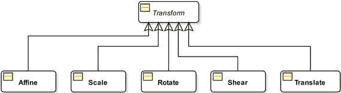

图 8-21.

变换相关类的类图

仿射变换是一种广义的变换，它保持点、直线和平面的性质。平行线在变换后仍然保持平行。它可能不保持直线间的角度和点之间的距离。但是，直线上点之间的距离比例保持不变。平移、缩放、位似变换、相似变换、反射、旋转和剪切都是仿射变换的例子。

`Affine` 类的实例代表一个仿射变换。该类对于初学者来说不易使用。它的使用需要高级数学知识，例如矩阵。如果你需要特定类型的变换，请使用特定的子类，例如 `Translate`、`Shear` 等，而不是使用通用的 `Affine` 类。你也可以组合多个单独的变换来创建一个更复杂的变换。

使用变换很简单。然而，有时会令人困惑，因为创建和应用变换有多种方式。创建 `Transform` 实例有两种方法：

*   使用 `Transform` 类的某个工厂方法，例如，使用 `translate()` 方法创建 `Translate` 对象，使用 `rotate()` 方法创建 `Rotate` 对象等。
*   使用特定的类来创建特定类型的变换，例如，使用 `Translate` 类进行平移，使用 `Rotate` 类进行旋转等。

以下两个 `Translate` 对象都表示相同的平移：

```
double tx = 20.0;
double ty = 10.0;
// 使用 Transform 类中的工厂方法
Translate translate1 = Transform.translate(tx, ty);
// 使用 Translate 类构造器
Translate translate2 = new Translate(tx, ty);
```

对节点应用变换有两种方法：

*   使用 `Node` 类中的特定属性。例如，使用 `Node` 类的 `translateX`、`translateY` 和 `translateZ` 属性对节点应用平移。请注意，你不能通过这种方式应用剪切变换。
*   使用节点的 `transforms` 序列。`Node` 类的 `getTransforms()` 方法返回一个 `ObservableList<Transform>`。用所有 `Transform` 对象填充此列表。这些 `Transform` 将按顺序应用。你只能使用此方法应用剪切变换。

这两种应用 `Transforms` 的方法工作方式略有不同。我将在讨论特定类型的变换时讨论这些差异。有时可以同时使用这两种方法来应用变换，在这种情况下，`transforms` 序列中的变换会在节点属性上设置的变换之前应用。

以下代码片段对一个 `Rectangle` 应用了三种变换——剪切、缩放和平移：

```
// 创建一个矩形
Rectangle rect = new Rectangle(100, 50, Color.LIGHTGRAY);
// 使用 Rectangle 的 transforms 序列应用变换
Transform shear = Transform.shear(2.0, 1.2);
Transform scale = Transform.scale(1.1, 1.2);
rect.getTransforms().addAll(shear, scale);
// 使用 Node 类的 translateX 和 translateY 属性应用平移
rect.setTranslateX(10);
rect.setTranslateY(10);
```

剪切和缩放变换是使用 `transforms` 序列应用的。平移是使用 `Node` 类的 `translateX` 和 `translateY` 属性应用的。`transforms` 序列中的变换（剪切和缩放）按顺序应用，随后是平移。讨论所有类型的变换超出了本书的范围。更多详细信息，请参考 Java API 文档。

清单 8-22 展示了如何对矩形应用平移、旋转、缩放和剪切变换。它创建了两个大小相同且位于同一位置的矩形。这些矩形使用不同的填充颜色来区分它们。对黄色填充的矩形应用了平移、旋转、缩放和剪切变换。对浅灰色填充的矩形未应用任何变换。图 8-22 显示了这两个矩形。


图 8-22.

两个矩形，一个应用了变换，一个未应用变换

```
// TransformationTest.java
package com.jdojo.javafx;
import javafx.application.Application;
import javafx.scene.Scene;
import javafx.scene.layout.Pane;
import javafx.scene.paint.Color;
import javafx.scene.shape.Rectangle;
import javafx.scene.transform.Rotate;
import javafx.scene.transform.Scale;
import javafx.scene.transform.Shear;
import javafx.scene.transform.Translate;
import javafx.stage.Stage;
public class TransformationTest extends Application {
public static void main(String[] args) {
Application.launch(args);
}
@Override
public void start(Stage stage) {
Rectangle rect1 = new Rectangle(100, 50, Color.LIGHTGRAY);
rect1.setStroke(Color.BLACK);
Rectangle rect2 = new Rectangle(100, 50, Color.YELLOW);
rect2.setStroke(Color.BLACK);
// 对 rect2 应用平移、旋转、缩放和剪切变换
Translate translate = new Translate(50, 10);
Rotate rotate = new Rotate(30, 0, 0);
Scale scale = new Scale(0.5, 0.5);
Shear shear = new Shear(0.5, 0.5);
rect2.getTransforms().addAll(translate, rotate, scale, shear);
Pane root = new Pane(rect1, rect2);
root.setPrefSize(200, 100);
Scene scene = new Scene(root);
stage.setScene(scene);
stage.setTitle("应用变换");
stage.show();
}
}
清单 8-22.
对节点应用变换
```


## 动画

在现实世界中，动画意味着通过快速连续显示图像而产生的某种运动。例如，当你观看电影时，你看到的图像变化如此之快，以至于你产生了运动的错觉。

在 JavaFX 中，动画被定义为随时间改变节点的属性。如果改变的属性决定了节点的位置，那么 JavaFX 中的动画就会产生电影中那种运动的错觉。并非所有动画都必须涉及运动；例如，随时间改变 `Shape` 的 `fill` 属性就是一种不涉及运动的 JavaFX 动画。

要理解动画是如何执行的，理解一些关键概念很重要：

*   时间线
*   关键帧
*   关键值
*   插值器

动画是在一段时间内执行的。时间线表示动画过程中的时间推进，并在给定时刻关联一个关键帧。关键帧表示在时间线上的特定时刻，被动画化节点的状态。一个关键帧具有关联的关键值。关键值表示节点某个属性的值，以及要使用的插值器。

假设你想在 10 秒内将一个场景中的圆从左侧水平移动到右侧。图 8-23 显示了该圆在几个位置的状态。粗水平线代表时间线。实线轮廓的圆代表时间线上特定时刻的关键帧。与关键帧关联的关键值显示在顶行。例如，第五秒关键帧处圆的 `translateX` 属性值为 500，在图中显示为 `tx=500`。

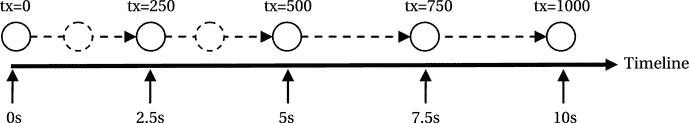

图 8-23.

使用时间线沿水平线对圆进行动画化

时间线、关键帧和关键值由开发者提供。在你的示例中，你有五个关键帧。如果 JavaFX 只在这五个时刻显示五个关键帧，动画看起来会不连贯。为了提供平滑的动画，JavaFX 需要在时间线上的任意时刻插值圆的位置。也就是说，JavaFX 需要在两个连续的关键帧之间创建中间关键帧。JavaFX 借助插值器来完成此操作。默认情况下，它使用线性插值器，该插值器随时间线性地改变被动画化的属性。也就是说，如果时间线上的时间经过了 x%，那么属性的值将是初始值和最终目标值之间的 x%。在图中，虚线轮廓的圆是由 JavaFX 使用插值器创建的。

提供动画的类位于 `javafx.animation` 包中，但 `Duration` 类除外，它位于 `javafx.util` 包中。图 8-24 显示了动画相关类的类图。

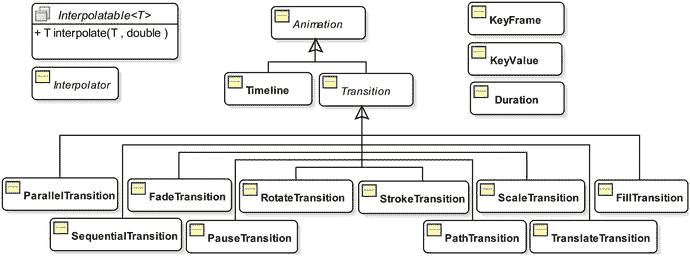

图 8-24.

动画中使用的核心类的类图

抽象的 `Animation` 类代表一个动画。它包含所有类型动画共用的属性和方法。JavaFX 支持两种类型的动画：

*   时间线动画
*   过渡

在时间线动画中，你创建一个时间线并向其添加关键帧。JavaFX 使用插值器创建中间关键帧。`Timeline` 类的实例代表一个时间线动画。这种类型的动画需要你编写更多代码，但它能让你拥有更多控制权。

有几种常见的动画类型，例如，沿路径移动节点、随时间改变节点的不透明度等。这些类型的动画被称为过渡。它们使用内部时间线执行。`Transition` 类的实例代表一个过渡动画。`Transition` 类有多个子类来支持特定类型的过渡。例如，`FadeTransition` 类通过随时间改变节点的不透明度来实现淡入淡出效果动画。你创建 `Transition` 类某个子类的实例，然后指定要动画化的属性的初始值和最终值以及动画的持续时间。JavaFX 负责创建时间线并执行动画。这种类型的动画更易于使用。

有时你可能希望顺序或并行地执行多个过渡。`SequentialTransition` 和 `ParallelTransition` 类分别允许你顺序和并行地执行一组过渡。

`Duration` 类位于 `javafx.util` 包中。它表示以毫秒、秒、分钟和小时为单位的时间长度。它是一个不可变类。`Duration` 表示动画每个周期的时间量。`Duration` 可以表示正持续时间或负持续时间。

`KeyValue` 类的实例代表一个关键值，该值在动画期间的特定时间间隔内被插值。它封装了三件事：

*   一个目标
*   目标的一个结束值
*   一个插值器

目标是 `WritableValue`，这使得所有 JavaFX 属性都可以成为目标。结束值是时间间隔结束时目标的值。插值器用于计算中间关键帧。

关键帧定义了节点在时间线上指定点的目标状态。目标状态由与该关键帧关联的关键值定义。一个关键帧封装了四件事：

*   时间线上的一个时刻
*   一组 `KeyValue`
*   一个名称
*   一个 `ActionEvent` 处理器

关键帧关联的时间线上的时刻由一个 `Duration` 定义，该 `Duration` 是时间线上关键帧的偏移量。`KeyValue` 集合定义了该关键帧的目标的结束值。关键帧可以选择性地拥有一个名称，该名称可用作提示点，以便在动画期间跳转到它所定义的时刻。`Animation` 类的 `getCuePoints()` 方法返回 `Timeline` 上提示点的 `ObservableMap`。你可以选择性地将 `ActionEvent` 处理器附加到 `KeyFrame`。当动画期间关键帧的时间到达时，会调用 `ActionEvent` 处理器。`KeyFrame` 类的实例代表一个关键帧。


### 使用时间线动画

时间线动画用于对节点的任意属性进行动画处理。`Timeline` 类的实例代表一个时间线动画。使用时间线动画涉及以下步骤：

*   构建关键帧
*   使用关键帧创建一个 `Timeline` 对象
*   设置动画属性
*   使用 `play()` 方法运行动画

你可以在创建 `Timeline` 对象时或之后向其添加关键帧。时间线将所有关键帧保存在一个 `ObservableList<KeyFrame>` 中。`getKeyFrames()` 方法返回此列表的引用。你可以随时修改关键帧列表。如果时间线动画已在运行，你需要停止并重新启动它，以便加载修改后的关键帧列表。`Timeline` 类包含几个构造方法：

*   `Timeline()`
*   `Timeline(double targetFramerate)`
*   `Timeline(double targetFramerate, KeyFrame… keyFrames)`
*   `Timeline(KeyFrame… keyFrames)`

无参构造方法创建一个没有关键帧的时间线，动画以最佳速率运行。其他构造方法允许你指定动画的目标帧率（即每秒帧数）以及关键帧。请注意，关键帧添加到时间线的顺序并不重要。时间线会根据它们的时间偏移量对其进行排序。

清单 8-23 中的程序启动了一个时间线动画，该动画使文本在场景中从右向左无限循环滚动。图 8-25 显示了该动画的截图。


图 8-25.

使用时间线动画滚动文本

```
// ScrollingText.java
package com.jdojo.javafx;
import javafx.animation.KeyFrame;
import javafx.animation.KeyValue;
import javafx.animation.Timeline;
import javafx.application.Application;
import javafx.geometry.VPos;
import javafx.scene.Scene;
import javafx.scene.layout.Pane;
import javafx.scene.text.Font;
import javafx.scene.text.Text;
import javafx.stage.Stage;
import javafx.util.Duration;
public class ScrollingText extends Application {
public static void main(String[] args) {
Application.launch(args);
}
@Override
public void start(Stage stage) {
Text msg = new Text("JavaFX animation is cool!");
msg.setTextOrigin(VPos.TOP);
msg.setFont(Font.font(24));
Pane root = new Pane(msg);
root.setPrefSize(500, 70);
Scene scene = new Scene(root);
stage.setScene(scene);
stage.setTitle("Scrolling Text");
stage.show();
/* 设置一个时间线动画 */
// 获取场景宽度和文本宽度
double sceneWidth = scene.getWidth();
double msgWidth = msg.getLayoutBounds().getWidth();
// 创建初始和最终关键帧
KeyValue initKeyValue = new KeyValue(msg.translateXProperty(), sceneWidth);
KeyFrame initFrame = new KeyFrame(Duration.ZERO, initKeyValue);
KeyValue endKeyValue = new KeyValue(msg.translateXProperty(), -1.0 * msgWidth);
KeyFrame endFrame = new KeyFrame(Duration.seconds(3), endKeyValue);
// 创建一个 Timeline 对象
Timeline timeline = new Timeline(initFrame, endFrame);
// 让动画无限循环运行
timeline.setCycleCount(Timeline.INDEFINITE);
// 启动动画
timeline.play();
}
}
清单 8-23.
使用时间线动画滚动文本节点
```

执行动画的逻辑在 `start()` 方法中。该方法首先创建一个 `Text` 对象、一个包含该 `Text` 对象的 `Pane`，并为舞台设置一个场景。显示舞台后，它设置一个动画。首先，它获取场景和 `Text` 对象的宽度。

```
double sceneWidth = scene.getWidth();
double msgWidth = msg.getLayoutBounds().getWidth();
```

创建了两个关键帧：一个对应时间 = 0 秒，另一个对应时间 = 3 秒。动画使用 `Text` 对象的 `translateX` 属性来改变其水平位置，使其看起来像是在滚动。在零秒时，`Text` 位于场景宽度处，因此不可见。在三秒时，它被放置在场景左侧，距离等于其自身长度，因此同样不可见。

```
KeyValue initKeyValue = new KeyValue(msg.translateXProperty(), sceneWidth);
KeyFrame initFrame = new KeyFrame(Duration.ZERO, initKeyValue);
KeyValue endKeyValue = new KeyValue(msg.translateXProperty(), -1.0 * msgWidth);
KeyFrame endFrame = new KeyFrame(Duration.seconds(3), endKeyValue);
```

使用两个关键帧创建了一个 `Timeline` 对象。

```
Timeline timeline = new Timeline(initFrame, endFrame);
```

默认情况下，动画只运行一次。也就是说，文本将从右向左滚动一次，然后动画停止。你可以设置动画的循环次数，即动画需要运行的次数。通过将循环次数设置为 `Timeline.INDEFINITE`，可以让动画无限循环运行，如下所示：

```
timeline.setCycleCount(Timeline.INDEFINITE);
```

最后，通过调用 `play()` 方法启动动画。

```
timeline.play();
```

这个例子有一个缺陷。当场景宽度改变时，滚动文本不会更新其初始水平位置。你可以通过在场景宽度变化时更新初始关键帧来解决此问题。将以下语句附加到清单 8-23 的 `start()` 方法中。它为场景的 `width` 属性添加了一个 `ChangeListener`，用于更新关键帧并重新启动动画。

```
scene.widthProperty().addListener( (prop, oldValue , newValue) -> {
KeyValue kv = new KeyValue(msg.translateXProperty(), scene.getWidth());
KeyFrame kf = new KeyFrame(Duration.ZERO, kv);
timeline.stop();
timeline.getKeyFrames().clear();
timeline.getKeyFrames().addAll(kf, endFrame);
timeline.play();
});
```

也可以仅使用一个关键帧来创建时间线动画。该关键帧被视为最后一个关键帧。时间线会使用正在动画处理的属性的当前值来合成一个初始关键帧（对应时间 = 0 秒）。要查看效果，请将清单 8-23 中的语句

```
Timeline timeline = new Timeline(initFrame, endFrame);
```

替换为以下语句

```
Timeline timeline = new Timeline(endFrame);
```

时间线将使用 `Text` 对象的 `translateX` 属性的当前值（即 0.0）创建一个初始关键帧。这次，文本的滚动方式不同。滚动开始时，文本位于 0.0 位置，然后向左滚动，直至移出场景。


## FXML

FXML 是一种基于 XML 的语言，用于构建 JavaFX 应用程序的用户界面。你可以使用 FXML 构建整个场景或场景的一部分。FXML 允许应用程序开发者将构建 UI 的逻辑与业务逻辑分离。如果应用程序的 UI 部分发生变化，你无需重新编译 JavaFX 代码；只需使用文本编辑器修改 FXML 并重新运行应用程序即可。你仍然使用 Java 编程语言中的 JavaFX 来编写业务逻辑。FXML 文档是一种 XML 文档。理解 FXML 需要具备 XML 的基础知识。

JavaFX 场景图是一个 Java 对象的层次结构。XML 格式非常适合存储表示某种层次结构的信息。因此，使用 FXML 来存储场景图非常直观。

在 JavaFX 应用程序中，通常使用 FXML 来构建场景图。然而，FXML 的用途并不仅限于构建场景图。它还可以构建 Java 对象的层次结构图。事实上，它甚至可以用于创建单个对象，例如，一个 `Person` 类的对象。

让我们快速预览一下 FXML 文档的样子。你将创建一个简单的 UI，它由一个包含 `Label` 和 `Button` 的 `VBox` 组成。清单 8-24 包含了你熟悉的、用于构建该 UI 的 JavaFX 代码。清单 8-25 包含了用于构建相同 UI 的 FXML 版本。

```
import javafx.scene.layout.VBox;
import javafx.scene.control.Label;
import javafx.scene.control.Button;
VBox root = new VBox();
root.getChildren().addAll(new Label("FXML is cool"),
new Button("Say Hello"));
清单 8-24.
在 JavaFX 中构建对象图
```

```

清单 8-25.
在 FXML 中构建对象图
```

`FXML` 中的第一行是 XML 解析器使用的标准 XML 声明。它在 FXML 中是可选的。如果省略，则假定版本为 1，编码为 UTF-8。接下来的三行是 import 语句，对应于 Java 代码中的 `import` 语句。表示 UI 的元素（例如 `VBox`、`Label` 和 `Button`）的名称与 JavaFX 类的名称相同。`<children>` 标签指定了 `VBox` 的子元素。`Label` 和 `Button` 的 text 属性通过各自元素的 text 属性来指定。

FXML 文档只是一个文本文件。通常，文件名具有 `.fxml` 扩展名，例如 `hello.fxml`。例如，你可以在 Windows 上使用记事本创建 FXML 文档。如果你使用过 XML，就会知道在文本编辑器中编辑大型 XML 文档并不容易。有一个名为 Scene Builder 的可视化编辑器可用于编辑 FXML 文档。你可以从 [`http://gluonhq.com/products/scene-builder`](http://gluonhq.com/products/scene-builder) 下载适用于 Java 9 的 Scene Builder 工具。本书不讨论 Scene Builder 的使用。

在本节中，我将介绍 FXML 的基础知识。你将使用 FXML 开发一个简单的 JavaFX 应用程序。该应用程序包含以下内容：

*   一个 `VBox`
*   一个 `Label`
*   一个 `Button`

`VBox` 的 `spacing` 设置为 10px。`Label` 和 `Button` 的 `text` 属性分别设置为“FXML is cool!”和“Say Hello”。当按钮被点击时，标签中的文本将更改为“Hello from FXML!”。图 8-26 显示了该应用程序显示的两个窗口实例。


图 8-26.

使用 FXML 创建场景图的两个窗口实例

清单 8-26 中的程序是此示例应用程序的 JavaFX 实现，它使用 Java 编程语言构建 UI。

```
// SayHelloFX.java
package com.jdojo.javafx;
import javafx.application.Application;
import javafx.event.ActionEvent;
import javafx.scene.Scene;
import javafx.scene.control.Button;
import javafx.scene.control.Label;
import javafx.scene.layout.VBox;
import javafx.stage.Stage;
public class SayHelloFX extends Application {
private Label msgLbl = new Label("FXML is coll!");
private Button sayHelloBtn = new Button("Say Hello");
public static void main(String[] args) {
Application.launch(args);
}
@Override
public void start(Stage stage) {
// 设置标签的首选宽度
msgLbl.setPrefWidth(150);
// 设置按钮的 ActionEvent 处理器
sayHelloBtn.setOnAction(this::sayHello);
VBox root = new VBox(10);
root.getChildren().addAll(msgLbl, sayHelloBtn);
root.setStyle("-fx-padding: 10;"
+ "-fx-border-style: solid inside;"
+ "-fx-border-width: 2;"
+ "-fx-border-insets: 5;"
+ "-fx-border-radius: 5;"
+ "-fx-border-color: blue;");
Scene scene = new Scene(root);
stage.setScene(scene);
stage.setTitle("Hello FXML");
stage.show();
}
public void sayHello(ActionEvent e) {
msgLbl.setText("Hello from FXML!");
}
}
清单 8-26.
FXML 示例应用程序的 JavaFX 版本
```

现在，让我们构建清单 8-26 中程序的另一个版本，该版本将使用 FXML 构建 UI。创建一个 FXML 文件 `sayhello.fxml`，其内容如清单 8-27 所示。清单 8-27 是你的示例的 FXML 文档。它将为图 8-26 中所示的场景创建根元素。将 `sayhello.fxml` 文件保存在 `resources/fxml` 目录中，该目录包含 `jdojo.javafx` 模块的源代码。在本书的源代码中，该文件位于 `Java9APIsAndModules\src\jdojo.javafx\classes\resources\fxml\sayhello.fxml`。

```

-fx-padding: 10;
-fx-border-style: solid inside;
-fx-border-width: 2;
-fx-border-insets: 5;
-fx-border-radius: 5;
-fx-border-color: blue;

function sayHello() {
msgLbl.setText("Hello from FXML!");
}

清单 8-27.
sayhello.fxml 文件的内容
```

你已经设置了 `VBox` 的 `spacing` 属性，以及 `Label` 和 `Button` 控件的 `fx:id` 属性。你使用 `<style>` 属性元素设置了 `VBox` 的 `style` 属性。你也可以选择使用 style 属性或属性元素来设置样式。你使用了属性元素，因为样式值是一个很大的字符串，如果分成多行输入会更易读。`<fx:script>` 元素定义了一个包含一个函数 `sayHello()` 的脚本块。该函数设置了由 `msgLbl fx:id` 属性标识的 `Label` 的 text 属性。你将 `sayHello()` 函数设置为 `Button` 的 `onAction` 属性，因此当 `Button` 被点击时，`sayHello()` 函数将被执行。

要从 FXML 构建 UI，你需要将其加载到 JavaFX 程序中。加载 FXML 由 `FXMLLoader` 类的实例执行，该类位于 `javafx.fxml` 包中。

`FXMLLoader` 类提供了几个构造函数，允许你指定用于加载文档的位置、字符集、资源包等。你至少需要指定 FXML 文档的位置，它是一个 `URL`。该类包含一个 `load()` 方法来执行文档的实际加载。以下代码片段从模块 `jdojo.javafx` 加载一个 FXML 文档。请注意，代码中引用的 `this` 是 `jdojo.javafx` 模块中某个类的对象的引用。

```
// 构建定位 FXML 文件的 URL
URL fxmlUrl = this.getClass()
.getResource("/resources/fxml/sayhello.fxml");
// 创建一个 FXMLLoader 对象并设置其位置，即 FXML 内容的 URL
FXMLLoader loader = new FXMLLoader();
loader.setLocation(fxmlUrl);
// 加载 FXML，它将返回一个 VBox
VBox root = loader.load();
```


`load()` 方法具有泛型返回类型。在前面的代码片段中，你通过在调用 `load()` 方法时明确指定类型（`loader.<VBox>load()`），表明你期望从 FXML 文档中获取一个 `VBox` 实例。如果你愿意，也可以省略泛型参数，如下所示：

```
// load() 方法的返回类型将被推断为 VBox
VBox root = loader.load();
```

`FXMLLoader` 类支持使用 `InputStream` 加载 FXML 文档。以下代码片段演示了如何使用 `InputStream` 加载同一个 FXML 文档：

```
InputStream fxmlStream = this.getClass()
.getResourceAsStream("/resources/fxml/sayhello.fxml");
FXMLLoader loader = new FXMLLoader();
VBox root = loader.load(fxmlStream);
```

在内部，`FXMLLoader` 通过流读取文档，这可能会抛出 `IOException`。`FXMLLoader` 类中所有版本的 `load()` 方法都会抛出 `IOException`。为了保持代码简洁，我在这些代码片段中省略了异常处理。在你的应用程序中，你需要处理这个异常。

加载完 FXML 文档后，下一步该做什么？此时，FXML 的作用已经结束，你的 JavaFX 代码应该接管控制权。

清单 8-28 中的程序包含了该示例的 JavaFX 代码。它加载了存储在 `sayhello.fxml` 文件中的 FXML 文档。程序从 `jdojo.javafx` 模块中加载该文档。加载器返回一个 `VBox`，并将其设置为场景的根节点。其余代码与你之前使用的相同。请注意 `start()` 方法声明中的一个区别：该方法声明它可能会抛出 `IOException`，你必须添加这个声明，因为你在方法内部调用了 `FXMLLoader` 的 `load()` 方法。运行该程序时，它会显示一个窗口，如图 8-26 所示。点击按钮，`Label` 的文本将会改变。

```
// SayHelloFXML.java
package com.jdojo.javafx;
import javafx.application.Application;
import javafx.fxml.FXMLLoader;
import java.io.IOException;
import java.io.InputStream;
import java.net.URL;
import javafx.scene.Scene;
import javafx.scene.layout.VBox;
import javafx.stage.Stage;
public class SayHelloFXML extends Application {
public static void main(String[] args) {
Application.launch(args);
}
@Override
public void start(Stage stage) throws IOException {
// 为 FXML 文档构建一个 URL
URL fxmlUrl = this.getClass()
.getResource("/resources/fxml/sayhello.fxml");
// 加载 FXML 文档
VBox root = FXMLLoader.load(fxmlUrl);
Scene scene = new Scene(root);
stage.setScene(scene);
stage.setTitle("Hello FXML");
stage.show();
}
}
清单 8-28.
使用 FXML 构建 GUI
```

FXML 提供的功能远不止你在本例中看到的这些。使用 FXML，你可以将 UI 元素绑定到 JavaFX 中的变量、进行数据绑定和事件处理、创建自定义控件等。讨论这些功能超出了本书的范围。

## 打印

JavaFX 通过 `javafx.print` 包中的 Print API 支持打印节点。该 API 包含以下类以及一些枚举（未列出）：

*   `Printer`
*   `PrinterAttributes`
*   `PrintResolution`
*   `PrinterJob`
*   `JobSettings`
*   `Paper`
*   `PaperSource`
*   `PageLayout`
*   `PageRange`

这些类的实例代表了打印过程的不同组件。例如，`Printer` 代表可用于打印作业的打印机；`PrinterJob` 代表一个可以发送给 `Printer` 进行打印的打印作业；`Paper` 代表打印机上可用的纸张尺寸等。

Print API 支持打印可能已附加或未附加到场景图的节点。一个常见的需求是打印网页的内容，而不是包含该网页的 `WebView` 节点。`javafx.scene.web.WebEngine` 类包含一个 `print(PrinterJob job)` 方法，该方法打印的是网页的内容，而不是 `WebView` 节点。

如果在打印过程中修改了节点，打印出的节点可能显示不正确。请注意，打印一个节点可能会跨越多个脉冲事件，导致正在打印的内容发生并发更改。为确保正确打印，请确保在打印过程中不修改正在打印的节点。

节点可以在任何线程上打印，包括 JavaFX 应用程序线程。建议将大型、耗时的打印作业提交到后台线程，以保持 UI 的响应性。

Print API 中的类是 final 的，因为它们代表了现有的打印设备属性。其中大多数不提供公共构造函数，因为你无法凭空制造一个打印设备。相反，你需要使用类中的工厂方法来获取它们的引用。

`Printer.getAllPrinters()` 静态方法返回机器上已安装打印机的可观察列表。请注意，该方法返回的打印机列表可能会随时间变化，因为可能会安装新打印机或移除旧打印机。使用 `Printer` 的 `getName()` 方法获取该 `Printer` 所代表的打印机的名称。以下代码片段列出了运行该代码的机器上所有已安装的打印机。你可能会得到不同的输出。

```
import javafx.collections.ObservableSet;
import javafx.print.Printer;
...
ObservableSet allPrinters = Printer.getAllPrinters();
for(Printer p : allPrinters) {
System.out.println(p.getName());
}
Brother HL-L2380DW series Printer
Fax
Microsoft Print to PDF
Microsoft XPS Document Writer
Send To OneNote 2013
```

`Printer.getDefaultPrinter()` 方法返回默认的 `Printer`。如果没有安装打印机，该方法可能返回 `null`。默认打印机可能会在机器上更改。因此，该方法每次调用可能返回不同的打印机，并且返回的打印机在一段时间后可能失效。以下代码片段展示了如何获取默认打印机：

```
Printer defaultPrinter = Printer.getDefaultPrinter();
if (defaultPrinter != null) {
String name = defaultPrinter.getName();
System.out.println("默认打印机名称: " + name);
} else {
System.out.println("未安装打印机。");
}
```

打印一个节点很简单：创建一个 `PrinterJob` 并调用其 `printPage()` 方法，传入要打印的节点。使用默认打印机和所有默认设置打印一个节点只需要三行代码：

```
PrinterJob printerJob = PrinterJob.createPrinterJob();
printerJob.printPage(myNode); // myNode 是要打印的节点
printerJob.endJob();
```

在实际应用程序中，你需要处理错误，因此前面的代码重写如下：


```
// 为默认打印机创建一个打印任务
PrinterJob printerJob = PrinterJob.createPrinterJob();
if (printerJob != null) {
// 打印节点
boolean printed = printerJob.printPage(node);
if (printed) {
// 结束打印任务
printerJob.endJob();
} else {
System.out.println("打印失败。");
}
} else {
System.out.println("无法创建打印任务。");
}
```

你可以使用 `PrinterJob` 类的 `createPrinterJob()` 静态方法来创建一个打印任务。该方法有重载形式，如下所示：

*   `PrinterJob createPrinterJob()`
*   `PrinterJob createPrinterJob(Printer printer)`

无参方法会为默认打印机创建一个打印任务。你可以使用该方法的另一个版本来为指定的打印机创建打印任务。

你可以通过调用 `PrinterJob` 的 `setPrinter()` 方法来更改其对应的打印机。如果新打印机不支持当前的打印任务设置，这些设置会自动重置以适配新打印机。

```
// 为打印任务设置一台新打印机
printerJob.setPrinter(myNewPrinter);
```

将打印机的值设置为 `null` 将使用默认打印机。使用 `PrinterJob` 类中的以下 `printPage()` 方法之一来打印节点：

*   `boolean printPage(Node node)`
*   `boolean printPage(PageLayout pageLayout, Node node)`

该方法的第一个版本仅将要打印的节点作为参数。它使用任务的默认页面布局进行打印。第二个版本允许你指定一个页面布局来打印节点。如果打印成功，该方法返回 `true`。否则，返回 `false`。

打印完成后，调用 `endJob()` 方法。如果任务可以成功假脱机到打印机队列，该方法返回 `true`。否则，返回 `false`，这可能表示任务无法假脱机或已经完成。任务成功完成后，该任务不能再被重复使用。

你可以使用 `PrinterJob` 的 `cancelJob()` 方法来取消打印任务。打印可能不会立即取消，例如，当一页正在打印中时。取消操作会尽快执行。在以下情况下，该方法不会产生任何效果：

*   该任务已被请求取消。
*   该任务已经完成。
*   该任务出现错误。

`PrinterJob` 类包含一个只读的 `jobStatus` 属性，用于指示打印任务的当前状态。该状态由 `PrinterJob.JobStatus` 枚举中的以下常量之一定义：

*   `NOT_STARTED`
*   `PRINTING`
*   `CANCELED`
*   `DONE`
*   `ERROR`

`NOT_STARTED` 状态表示一个新任务。在此状态下，可以配置任务并启动打印。`PRINTING` 状态表示任务已请求打印至少一页，并且尚未终止打印。在此状态下，无法配置任务。

其他三种状态，`CANCELED`、`DONE` 和 `ERROR`，表示任务的终止状态。一旦任务处于这些状态之一，就不应再重复使用。当状态变为 `CANCELED` 或 `ERROR` 时，无需调用 `endJob()` 方法。当打印成功并且调用了 `endJob()` 方法时，会进入 `DONE` 状态。

清单 8-29 中的程序展示了如何打印节点。它显示了一个 `TextArea`，你可以在其中输入文本。提供了两个按钮：一个打印 `TextArea` 节点，另一个打印整个场景。当启动打印时，打印任务的状态会显示在一个标签中。`print()` 方法中的代码与你之前在示例中看到的代码相同。该方法包含了在标签中显示任务状态的逻辑。该程序显示一个如图 8-27 所示的窗口。运行程序，在 `TextArea` 中输入文本，然后点击两个按钮之一进行打印。

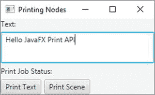

图 8-27.

一个允许用户在 TextArea 和场景中打印文本的窗口

```
// PrintingNodes.java
package com.jdojo.javafx;
import javafx.application.Application;
import javafx.print.PrinterJob;
import javafx.scene.Node;
import javafx.scene.Scene;
import javafx.scene.control.Button;
import javafx.scene.control.Label;
import javafx.scene.control.TextArea;
import javafx.scene.layout.HBox;
import javafx.scene.layout.VBox;
import javafx.stage.Stage;
public class PrintingNodes extends Application {
private Label jobStatus = new Label();
public static void main(String[] args) {
Application.launch(args);
}
@Override
public void start(Stage stage) {
VBox root = new VBox(5);
Label textLbl = new Label("文本:");
TextArea text = new TextArea();
text.setPrefRowCount(10);
text.setPrefColumnCount(20);
text.setWrapText(true);
// 打印 TextArea 节点的按钮
Button printTextBtn = new Button("打印文本");
printTextBtn.setOnAction(e -> print(text));
// 打印整个场景的按钮
Button printSceneBtn = new Button("打印场景");
printSceneBtn.setOnAction(e -> print(root));
HBox jobStatusBox
= new HBox(5, new Label("打印任务状态:"), jobStatus);
HBox buttonBox = new HBox(5, printTextBtn, printSceneBtn);
root.getChildren().addAll(textLbl, text, jobStatusBox, buttonBox);
Scene scene = new Scene(root);
stage.setScene(scene);
stage.setTitle("打印节点");
stage.show();
}
private void print(Node node) {
jobStatus.textProperty().unbind();
jobStatus.setText("正在创建打印任务...");
// 为默认打印机创建一个打印任务
PrinterJob job = PrinterJob.createPrinterJob();
if (job != null) {
// 显示打印任务状态
jobStatus.textProperty().bind(job.jobStatusProperty().asString());
// 打印节点
boolean printed = job.printPage(node);
if (printed) {
// 结束打印任务
job.endJob();
} else {
jobStatus.textProperty().unbind();
jobStatus.setText("打印失败。");
}
} else {
jobStatus.setText("无法创建打印任务。");
}
}
}
清单 8-29.
打印节点
```

打印 API 提供了更多打印功能，例如显示打印对话框。有关更多详细信息，请参阅 `javafx.print` 包中类的 JavaFX API 文档。


## 摘要

JavaFX 是一个基于 Java 的开源 GUI 框架，用于开发富客户端应用程序。它是 Java 平台 GUI 开发技术领域中 Swing 的继任者。

与 JDK9 一同发布的 JavaFX API 已被模块化为以下模块：`javafx.base`、`javafx.controls`、`javafx.fxml`、`javafx.graphics`、`javafx.media`、`javafx.swing` 和 `javafx.web`。这些模块包含在 JDK/JRE 9 中。JDK9 API 文档也包含了这些模块的文档。

JavaFX 中的 GUI 显示在一个舞台（stage）中。舞台是 `Stage` 类的一个实例。在桌面应用程序中，舞台是一个窗口；在 Web 应用程序中，舞台是浏览器中的一个区域。一个舞台包含一个场景（scene）。一个场景包含一组以树状结构排列的节点（图形）。

一个 JavaFX 应用程序继承自 `Application` 类。JavaFX 运行时创建第一个舞台，称为主舞台，并调用应用程序类的 `start()` 方法，同时传递主舞台的引用。开发者需要向舞台添加一个场景，并使舞台可见。

使用 JavaFX UI 的 JavaFX 应用程序必须将包含应用程序类的包导出到至少 `javafx.graphics` 模块。

JavaFX 支持属性类，其实例用于表示类的属性。属性支持单向和双向绑定。如果属性绑定到一个表达式，属性值会自动与表达式的值同步。属性支持失效和更改通知。感兴趣的一方可以注册这些通知。当属性失效或其值发生变化时，他们会收到通知。当属性的依赖项发生变化时，属性会失效。

JavaFX 提供了可观察的列表、集合和映射，它们是 `ObservableList`、`ObservableSet` 和 `ObservableMap` 接口的实例。可以观察它们的失效和变化。`FXCollections` 类包含用于创建此类可观察集合实例的工厂方法。

JavaFX 支持 UI 元素的事件处理。您可以为 UI 元素注册事件处理器。当事件发生时，您注册的事件处理器将被执行。

JavaFX 提供了布局面板，它们是节点的容器。它们以特定方式排列节点。例如，`HBox` 布局面板通过将节点水平放置在一行中来排列它们，而 `VBox` 布局面板通过将节点垂直放置在一列中来排列它们。JavaFX 提供了丰富的控件集，例如 `Button`、`ButtonBar`、`Label`、`ChoiceBox`、`ComboBox`、`TextField`、`DatePicker`、`Spinner` 等。`HTMLEditor` 控件提供了编辑富文本的功能。`WebView` 节点用于显示网页内容。

JavaFX 为绘制 2D 和 3D 形状提供了广泛支持。它提供了 Canvas API，用于使用绘图命令在画布上绘制 2D 形状。Canvas API 还允许您访问（读取和写入）画布表面上的像素。

您只需编写几行代码，即可对场景中的节点应用效果、变换和动画。JavaFX 支持 FXML，这是一种基于 XML 的标记语言，用于构建 JavaFX 应用程序的 GUI。您可以使用打印 API 打印节点和网页内容。

## 问题与练习

1.  什么是 JavaFX？
2.  您的 JavaFX 应用程序类必须继承的类的完全限定名称是什么？
3.  要运行带有 UI 组件的 JavaFX 应用程序，您的模块必须将包含 JavaFX 应用程序类的包导出到至少一个 JavaFX 模块。该 JavaFX 模块的名称是什么？
4.  您的 JavaFX 应用程序类需要重写的 `start()` 方法的签名是什么？
5.  您是否需要为应用程序类包含一个 `public static void main(String[] args)` 方法来运行您的 JavaFX 应用程序？
6.  什么是舞台？主舞台是如何创建的？您如何显示一个舞台？
7.  什么是场景？如何向舞台添加场景？
8.  解释 JavaFX 应用程序的生命周期，包括在每个阶段执行代码所涉及的线程。
9.  解释 JavaFX 应用程序可能终止的两种方式。
10. 编写一个简单的 JavaFX 程序，包含以下节点：一个 `Label`、一个 `TextField`、一个 `Button` 和一个 `Circle`。`TextField` 包含初始值 100，这是 `Circle` 的半径（以像素为单位）。当用户更改 `TextField` 中的值时，应重新绘制 `Circle` 以反映新的半径。所有节点应始终可见。也就是说，您需要调整屏幕大小以容纳 `Circle`。
11. 编写一个程序，使用 JavaFX 可观察列表，将列表中所有整数的总和打印到标准输出。当列表的元素发生变化时，打印新的总和。
12. 什么是事件捕获和事件冒泡阶段？如果您想禁用一个节点及其所有子节点上的特定类型事件，您将编写哪种处理器：事件过滤器还是事件处理器？
13. 修改本章源代码中的 `EventHandling` 类。添加另一个带有标签“禁用鼠标点击”的 `CheckBox`。当选中此 `CheckBox` 时，整个舞台的鼠标点击事件被禁用。您无法使用鼠标点击两个 `CheckBox` 节点或任何其他节点。当您取消选中 `CheckBox` 时，鼠标点击事件应像示例程序中那样工作。（提示：尝试同时禁用鼠标按下事件以禁用 `CheckBox` 节点的选择。）
14. 标准按钮（例如“是”、“否”和“取消”）在不同操作系统上以不同的顺序显示。您必须将两个按钮（“是”和“否”）打包到一个水平栏中，其中按钮的顺序取决于操作系统。说出您将用来实现此目的的控件名称。
15. `Group` 节点的用途是什么？说出两个充当容器的面板名称。
16. 命名并定义五个 UI 控件。
17. JavaFX 支持哪些类型的形状——仅 2D、仅 3D，还是两者都支持？
18. JavaFX 中 `Canvas` 的用途是什么？
19. JavaFX 中的效果、变换和动画是什么？
20. 什么是 FXML？
21. 编写一个程序，打印默认打印机名称。如果没有安装默认打印机，则应打印消息 `"未找到打印机"`。

# 9. Java 中的脚本编写

在本章中，您将学习：

*   什么是 Java 中的脚本编写
*   如何从 Java 执行脚本以及如何向脚本传递参数
*   `ScriptContext` 如何在执行脚本时使用
*   如何在脚本中使用 Java 编程语言
*   如何实现脚本引擎
*   如何使用 `jrunscript` 和 `jjs` 命令行工具执行脚本

除非另有说明，本章中的所有示例程序都是 `jdojo.script` 模块的成员，如清单 9-1 中所声明。

```
// module-info.java
module jdojo.script {
    requires java.scripting;
    exports com.jdojo.script;
}
清单 9-1.
jdojo.script 模块的声明
```

JDK 中的脚本支持位于 `java.scripting` 模块中。使用 Java 脚本 API 的模块需要像 `jdojo.script` 模块那样读取 `java.scripting` 模块。


## Java 中的脚本是什么？

有些人认为 Java 虚拟机（JVM）只能执行用 Java 编程语言编写的程序，但事实并非如此。JVM 执行的是与语言无关的字节码。只要程序能被编译成 Java 字节码，JVM 就能执行用任何编程语言编写的程序。

脚本语言是一种编程语言，它提供了编写脚本的能力，这些脚本由称为脚本引擎（或解释器）的运行时环境进行求值（或解释）。脚本是一系列字符，使用脚本语言的语法编写，并作为由解释器执行的程序的源代码。解释器解析脚本，生成中间代码（即程序的内部表示），并执行中间代码。解释器将脚本中使用的变量存储在称为符号表的数据结构中。

通常，与编译型编程语言不同，脚本语言中的源代码（称为脚本）不会被编译，而是在运行时被解释。然而，用某些脚本语言编写的脚本可能会被编译成可由 JVM 运行的 Java 字节码。

Java 6 为 Java 平台增加了脚本支持，允许 Java 应用程序执行用 Rhino JavaScript、Groovy、Jython、JRuby、Nashorn JavaScript 等脚本语言编写的脚本。它支持双向通信，还允许脚本访问宿主应用程序创建的 Java 对象。Java 运行时和脚本语言运行时可以相互通信并利用彼此的特性。

Java 中的脚本语言支持是通过 Java 脚本 API 实现的。Java 脚本 API 中的所有类和接口都位于 `javax.script` 包中，该包属于 `java.scripting` 模块。

在 Java 应用程序中使用脚本语言有几个优点：

*   大多数脚本语言是动态类型的，这使得编写程序更简单。
*   它们提供了一种更快速开发和测试小型应用程序的方式。
*   最终用户可以进行定制。
*   脚本语言可能提供 Java 中没有的领域特定功能。

脚本语言也有一些缺点。例如，动态类型有利于编写更简单的代码；然而，当类型被错误解释，导致你必须花费大量时间调试时，它就变成了一个缺点。

Java 中的脚本支持让你能够两全其美：它允许你使用 Java 编程语言开发应用程序中静态类型、可扩展且高性能的部分，同时使用适合其他部分领域特定需求的脚本语言。

我在本章中频繁使用“脚本引擎”这个术语。脚本引擎是一个执行用脚本语言编写的程序的软件组件。通常（但不一定），脚本引擎是脚本语言解释器的一种实现。几种脚本语言的解释器已经用 Java 实现。它们暴露了编程接口，以便 Java 程序可以与它们交互。

JDK7 附带了一个名为 Rhino JavaScript 的脚本引擎。JDK8 将 Rhino JavaScript 引擎替换为一个更轻量、更快的脚本引擎，名为 Nashorn JavaScript。本章讨论的是 Nashorn JavaScript，而不是 Rhino JavaScript。

ECMAScript（ES）是由欧洲计算机制造商协会（ECMA）为脚本语言制定的语言规范。ES 有多种实现，例如 JavaScript、JScript 和 Nashorn JavaScript。你可以在 [`http://www.ecma-international.org/publications/standards/Ecma-262.htm`](http://www.ecma-international.org/publications/standards/Ecma-262.htm) 获取 ECMAScript 的最新信息。ECMAScript 的最新版本是 ECMAScript 8（ES8）或 ECMAScript 2017。JDK 8u40 中的 Nashorn JavaScript 增加了对三个 ES6 特性的支持：`let`、`const` 和块作用域。在 JDK9 中，Nashorn JavaScript 部分支持 ECMAScript 6（ES6）或 ECMAScript 2015。JDK9 中支持的 ES6 特性如下：

*   模板字符串
*   `let`、`const` 和块作用域
*   迭代器和 `for..of` 循环
*   `Map`、`Set`、`WeakMap` 和 `WeakSet`
*   `Symbol`
*   二进制和八进制字面量

提示

Nashorn 中的 ES6 支持默认未启用。你需要向 Nashorn 引擎传递 `--language=es6` 参数以启用 ES6 支持。以下命令展示了如何从命令行启用 Nashorn 中的 ES6 支持：

```
java -Dnashorn.args=--language=es6 
```

Java 包含一个名为 `jrunscript` 的命令行 shell，可用于以交互模式或批处理模式运行脚本。`jrunscript` shell 是与脚本语言无关的；默认语言是 Nashorn。我将在本章后面详细讨论 `jrunscript` shell。JDK8 包含了另一个名为 `jjs` 的命令行工具，它调用 Nashorn 引擎并提供 Nashorn 特定的命令行选项。如果你正在使用 Nashorn，你应该优先使用 `jjs` 命令行工具而不是 `jrunscript`。我将在本章后面讨论 `jjs` 命令行工具。

Java 可以执行任何提供了脚本引擎实现的脚本语言编写的脚本。例如，Java 可以执行用 Nashorn JavaScript、Rhino JavaScript、Groovy、Jython、JRuby 等编写的脚本。本章中的示例使用 Nashorn JavaScript 语言。

在本章中，“Nashorn”、“Nashorn 引擎”、“Nashorn JavaScript”、“Nashorn JavaScript 引擎”、“Nashorn 脚本语言”和“JavaScript”这些术语被同义使用。


## 执行你的第一个脚本

在本节中，你将使用 Nashorn 在标准输出上打印一条消息。使用其他脚本语言打印消息的步骤相同，但有一个区别：你需要使用特定脚本语言的代码来打印消息。要在 Java 中运行脚本，你需要执行以下三个步骤：

*   创建一个脚本引擎管理器。
*   从脚本引擎管理器中获取一个脚本引擎实例。
*   调用脚本引擎的 `eval()` 方法来执行脚本。

脚本引擎管理器是 `ScriptEngineManager` 类的一个实例。

```
// 创建一个脚本引擎管理器
ScriptEngineManager manager = new ScriptEngineManager();
```

`ScriptEngine` 接口的一个实例代表 Java 程序中的一个脚本引擎。`ScriptEngineManager` 的 `getEngineByName(String engineShortName)` 方法返回一个脚本引擎实例。要获取 Nashorn 引擎的实例，请使用 `JavaScript` 作为引擎的简称，如下所示：

```
// 获取 Nashorn 引擎的引用
ScriptEngine engine = manager.getEngineByName("JavaScript");
```

提示

脚本引擎的简称是区分大小写的。有时一个脚本引擎有多个简称。Nashorn 引擎有以下简称：`nashorn`、`Nashorn`、`js`、`JS`、`JavaScript`、`javascript`、`ECMAScript` 和 `ecmascript`。你可以使用这些引擎简称中的任何一个，通过 `ScriptEngineManager` 类的 `getEngineByName()` 方法来获取其实例。

在 Nashorn 中，`print()` 函数在标准输出上打印一条消息。Nashorn 中的字符串字面量是用单引号或双引号括起来的字符序列。以下代码片段将一个 Nashorn 脚本存储在一个 Java `String` 对象中，该脚本向标准输出打印 `Hello Scripting!`：

```
// 将 Nashorn 脚本存储在 String 中
String script = "print('Hello Scripting!')";
```

如果你想在 Nashorn 中使用双引号来括起字符串字面量，语句将如下所示：

```
// 将 Nashorn 脚本存储在 String 中
String script = "print(\"Hello Scripting!\")";
```

要执行脚本，你需要将脚本传递给脚本引擎的 `eval()` 方法。脚本引擎在运行脚本时可能会抛出 `ScriptException`。因此，在调用 `ScriptEngine` 的 `eval()` 方法时，你需要处理此异常。以下代码片段执行存储在 `script` 变量中的脚本：

```
try {
engine.eval(script);
} catch (ScriptException e) {
e.printStackTrace();
}
```

清单 9-2 包含了在标准输出上打印消息的完整程序代码。

```
// HelloScripting.java
package com.jdojo.script;
import javax.script.ScriptEngine;
import javax.script.ScriptEngineManager;
import javax.script.ScriptException;
public class HelloScripting {
public static void main(String[] args) {
// 创建一个脚本引擎管理器
ScriptEngineManager manager = new ScriptEngineManager();
// 从管理器获取一个 Nashorn 脚本引擎
ScriptEngine engine = manager.getEngineByName("JavaScript");
// 将 Nashorn 脚本存储在 String 中
String script = "print('Hello Scripting!')";
try {
// 执行脚本
engine.eval(script);
} catch (ScriptException e) {
e.printStackTrace();
}
}
}
清单 9-2.
使用 Nashorn 在标准输出上打印消息
```

```
Hello Scripting!
```

## 使用其他脚本语言

在 Java 程序中使用除 Nashorn 之外的脚本语言非常简单。在使用脚本引擎之前，你只需要完成一项任务：将特定脚本引擎的 JAR 文件包含在你的应用程序模块路径中。脚本引擎的实现者会提供这些 JAR 文件。

JDK9 服务提供者机制将列出所有其模块化 JAR 或 JAR 文件已包含在应用程序模块路径中的脚本引擎。`ScriptEngineFactory` 接口的实例用于创建和描述脚本引擎。脚本引擎的提供者为 `ScriptEngineFactory` 接口提供实现。`ScriptEngineManager` 的 `getEngineFactories()` 方法返回所有可用脚本引擎工厂的 `List<ScriptEngineFactory>`。`ScriptEngineFactory` 的 `getScriptEngine()` 方法返回 `ScriptEngine` 的一个实例。工厂的其他几个方法返回关于引擎的元数据。

清单 9-3 展示了如何打印所有可用脚本引擎的详细信息。输出显示 JRuby 的脚本引擎是可用的。它之所以可用，是因为我已经将包含 JRuby 脚本引擎的 `jruby.jar` 文件添加到了我机器上的模块路径中。你可以从 [`http://www.jruby.org/`](http://www.jruby.org/) 下载 JRuby 脚本引擎。当你已将脚本引擎的 JAR 文件包含在模块路径中，并且想知道脚本引擎的简称时，此程序会很有帮助。运行程序时，你可能会得到不同的输出。如果你只对使用 Nashorn 感兴趣，则无需在机器上安装任何东西。Nashorn 脚本引擎随 JDK9 一起提供。

```
// ListingAllEngines.java
package com.jdojo.script;
import java.util.List;
import javax.script.ScriptEngineFactory;
import javax.script.ScriptEngineManager;
public class ListingAllEngines {
public static void main(String[] args) {
ScriptEngineManager manager = new ScriptEngineManager();
// 获取所有可用引擎的列表
List list = manager.getEngineFactories();
// 打印每个引擎的详细信息
for (ScriptEngineFactory f : list) {
System.out.println("引擎名称:" + f.getEngineName());
System.out.println("引擎版本:" + f.getEngineVersion());
System.out.println("语言名称:" + f.getLanguageName());
System.out.println("语言版本:" + f.getLanguageVersion());
System.out.println("引擎简称:" + f.getNames());
System.out.println("MIME 类型:" + f.getMimeTypes());
System.out.println("----------------------------");
}
}
}
清单 9-3.
列出所有可用的脚本引擎
```

```
引擎名称:JSR 223 JRuby Engine
引擎版本:9.1.15.0
语言名称:ruby
语言版本:jruby 9.1.15.0
引擎简称:[ruby, jruby]
MIME 类型:[application/x-ruby]

引擎名称:Oracle Nashorn
引擎版本:9.0.1
语言名称:ECMAScript
语言版本:ECMA - 262 Edition 5.1
引擎简称:[nashorn, Nashorn, js, JS, JavaScript, javascript, ECMAScript, ecmascript]
MIME 类型:[application/javascript, application/ecmascript, text/javascript, text/ecmascript]

```

清单 9-4 展示了如何使用 JavaScript、Groovy、Jython 和 JRuby 在标准输出上打印消息。如果某个脚本引擎不可用，程序会打印一条相应的消息。你可能会得到不同的输出。


```
// HelloEngines.java
package com.jdojo.script;
import javax.script.ScriptEngine;
import javax.script.ScriptEngineManager;
import javax.script.ScriptException;
public class HelloEngines {
public static void main(String[] args) {
// 获取脚本引擎管理器
ScriptEngineManager manager = new ScriptEngineManager();
// 尝试在 Nashorn、Groovy、Jython 和 JRuby 中执行脚本
execute(manager, "JavaScript", "print('Hello JavaScript')");
execute(manager, "Groovy", "println('Hello Groovy')");
execute(manager, "jython", "print 'Hello Jython'");
execute(manager, "jruby", "puts('Hello JRuby')");
}
public static void execute(ScriptEngineManager manager, String engineName, String script) {
// 尝试获取引擎
ScriptEngine engine = manager.getEngineByName(engineName);
if (engine == null) {
System.out.println(engineName + " 不可用。");
return;
}
// 如果执行到这里，说明引擎已安装。因此，运行脚本
try {
engine.eval(script);
} catch (ScriptException e) {
e.printStackTrace();
}
}
}
清单 9-4.
使用不同脚本语言在标准输出上打印消息
```

```
Hello JavaScript
Groovy is not available.
jython is not available.
Hello JRuby
```

有时你可能想玩玩脚本语言，但不知道在标准输出上打印消息的语法。`ScriptEngineFactory` 类包含一个名为 `getOutputStatement(String toDisplay)` 的方法，你可以用它来查找在标准输出上打印文本的语法。以下代码片段展示了如何获取 Nashorn 的语法：

```
// 获取 Nashorn 的脚本引擎工厂
ScriptEngineManager manager = new ScriptEngineManager();
ScriptEngine engine = manager.getEngineByName("JavaScript");
ScriptEngineFactory factory = engine.getFactory();
// 获取脚本
String script = factory.getOutputStatement("\"Hello JavaScript\"");
System.out.println("语法: " + script);
// 评估脚本
engine.eval(script);
```

```
语法: print("Hello JavaScript")
Hello JavaScript
```

对于其他脚本语言，请使用它们的引擎工厂来获取语法。

## 探索 javax.script 包

Java 中的 Java 脚本 API 由少量类和接口组成。它们位于 `java.scripting` 模块的 `javax.script` 包中。本节简要描述此包中的类和接口。我将在后续章节中讨论它们的用法。

### ScriptEngine 和 ScriptEngineFactory 接口

`ScriptEngine` 接口是 Java 脚本 API 中的主要接口，其实例有助于执行以特定脚本语言编写的脚本。

`ScriptEngine` 接口的实现者也会提供 `ScriptEngineFactory` 接口的实现。`ScriptEngineFactory` 执行两项任务：

*   创建脚本引擎的实例。
*   提供有关脚本引擎的信息，例如引擎名称、版本、语言等。

### AbstractScriptEngine 类

`AbstractScriptEngine` 是一个抽象类。它为 `ScriptEngine` 接口提供了部分实现。除非你正在实现一个脚本引擎，否则不会直接使用此类。

### ScriptEngineManager 类

`ScriptEngineManager` 类为脚本引擎提供了发现和实例化机制。它还维护一个键值对映射，作为 `Bindings` 接口的实例，存储由其创建的所有脚本引擎共享的状态。

### Compilable 接口和 CompiledScript 类

`Compilable` 接口可以由脚本引擎选择性地实现，该接口允许编译脚本以便重复执行而无需重新编译。

`CompiledScript` 类被声明为抽象类。它由脚本引擎的提供者扩展。它以编译形式存储脚本，可以重复执行而无需重新编译。请注意，使用 `ScriptEngine` 重复执行脚本会导致每次重新编译脚本，从而降低性能。脚本引擎不需要支持脚本编译。如果支持脚本编译，它必须实现 `Compilable` 接口。

### Invocable 接口

`Invocable` 接口可以由脚本引擎选择性地实现，该接口允许调用先前已编译脚本中的过程、函数和方法。

### Bindings 接口和 SimpleBindings 类

实现 `Bindings` 接口的类的实例是一个键值对映射，其限制是键必须是非空、非空的 `String`。它扩展了 `java.util.Map` 接口。`SimpleBindings` 类是 `Bindings` 接口的一个实现。

### ScriptContext 接口和 SimpleScriptContext 类

`ScriptContext` 接口的实例充当 Java 主机应用程序和脚本引擎之间的桥梁。它用于将 Java 主机应用程序的执行上下文传递给脚本引擎。脚本引擎在执行脚本时可能会使用上下文信息。脚本引擎可以将其状态存储在实现 `ScriptContext` 接口的类的实例中，该实例可能对 Java 主机应用程序可访问。

`SimpleScriptContext` 类是 `ScriptContext` 接口的一个实现。

### ScriptException 类

`ScriptException` 类是一个异常类。如果在执行、编译或调用脚本期间发生错误，脚本引擎会抛出 `ScriptException`。该类包含三个有用的方法：`getLineNumber()`、`getColumnNumber()` 和 `getFileName()`。这些方法报告发生错误的脚本的行号、列号和文件名。`ScriptException` 类重写了 `Throwable` 类的 `getMessage()` 方法，并在其返回的消息中包含行号、列号和文件名。


### 发现与实例化脚本引擎

你可以使用 `ScriptEngineFactory` 或 `ScriptEngineManager` 来创建脚本引擎。那么，究竟是谁负责创建脚本引擎：`ScriptEngineFactory`、`ScriptEngineManager`，还是两者都负责？简单来说，`ScriptEngineFactory` 始终负责创建脚本引擎的实例。接下来的问题是：“`ScriptEngineManager` 的作用是什么？”

`ScriptEngineManager` 使用服务提供者机制来定位所有可用的脚本引擎工厂。服务提供者机制已在本书三卷系列的第二卷的[第 14 章](https://doi.org/10.1007/978-1-4842-3546-1_14)中介绍过。

`ScriptEngineManager` 会定位并实例化所有可用的 `ScriptEngineFactory` 类。你可以使用 `ScriptEngineManager` 类的 `getEngineFactories()` 方法获取所有工厂类实例的列表。当你调用管理器的某个方法（例如通过名称获取引擎的 `getEngineByName(String shortName)` 方法）来根据条件获取脚本引擎时，管理器会搜索所有工厂以匹配该条件，并返回匹配的脚本引擎引用。如果没有工厂能提供匹配的引擎，管理器将返回 `null`。有关列出所有可用工厂并描述它们能创建的脚本引擎的更多详细信息，请参阅清单 9-3。

现在你知道了，`ScriptEngineManager` 并不创建脚本引擎的实例。相反，它会查询所有可用的工厂，并将由工厂创建的脚本引擎的引用返回给调用者。

为了使讨论更完整，我们为脚本引擎的创建方式增加一点变化。你可以通过三种方式创建脚本引擎的实例：

*   直接实例化脚本引擎类。
*   直接实例化脚本引擎工厂类，并调用其 `getScriptEngine()` 方法。
*   使用 `ScriptEngineManager` 类的某个 `getEngineByXxx()` 方法。

建议使用 `ScriptEngineManager` 类来获取脚本引擎的实例。这种方法允许由同一管理器创建的所有引擎共享一个状态，该状态是一组以 `Bindings` 接口实例形式存储的键值对。`ScriptEngineManager` 实例存储此状态。使用这种方法还能让你的代码无需了解实际的脚本引擎/工厂实现类。

提示

一个应用程序中可能存在多个 `ScriptEngineManager` 类的实例。在这种情况下，每个 `ScriptEngineManager` 实例都会维护一个其创建的所有引擎所共有的状态。也就是说，如果两个引擎是由 `ScriptEngineManager` 类的两个不同实例获取的，那么除非你通过编程方式实现，否则这些引擎将不会共享其管理器所维护的公共状态。

## 执行脚本

`ScriptEngine` 可以执行 `String` 和 `Reader` 中的脚本。使用 `Reader`，你可以执行存储在网络上或文件中的脚本。使用 `ScriptEngine` 的 `eval()` 方法的以下某个版本来执行脚本：

*   `Object eval(String script)`
*   `Object eval(Reader reader)`
*   `Object eval(String script, Bindings bindings)`
*   `Object eval(Reader reader, Bindings bindings)`
*   `Object eval(String script, ScriptContext context)`
*   `Object eval(Reader reader, ScriptContext context)`

`eval()` 方法的第一个参数是脚本的来源。第二个参数允许你将主机应用程序的信息传递给脚本引擎，这些信息可以在脚本执行期间使用。

在清单 9-2 中，你看到了如何使用 `String` 通过 `eval()` 方法的第一个版本来执行脚本。在本节中，你将把脚本存储在文件中，并使用 `Reader` 对象作为脚本的来源，这将使用 `eval()` 方法的第二个版本。下一节将讨论 `eval()` 方法的其他四个版本。通常，脚本文件的扩展名为 `.js`。

清单 9-5 显示了名为 `helloscript.js` 的文件内容。它只包含一条 Nashorn 语句，用于在标准输出上打印一条消息。

```
// 打印一条消息
print('Hello from JavaScript!');
清单 9-5.
helloscript.js 文件的内容
```

清单 9-6 中的 Java 程序执行存储在 `helloscript.js` 文件中的脚本，该文件应存储在当前目录的 `scripts` 子目录中。如果找不到脚本文件，程序将打印期望的 `helloscript.js` 文件的完整路径。如果在执行脚本文件时遇到问题，请尝试在 `main()` 方法中使用绝对路径，例如在 Windows 上使用 `C:\scripts\helloscript.js`，假设 `helloscript.js` 文件保存在 `C:\scripts` 目录中。本章示例中使用的所有脚本都位于源代码的 `Java9APIsAndModules\scripts` 目录下。

```
// ReaderAsSource.java
package com.jdojo.script;
import java.io.IOException;
import java.io.Reader;
import java.nio.file.Files;
import java.nio.file.Path;
import java.nio.file.Paths;
import javax.script.ScriptEngine;
import javax.script.ScriptEngineManager;
import javax.script.ScriptException;
public class ReaderAsSource {
public static void main(String[] args) {
// 构造脚本文件路径
String scriptFileName = "scripts/helloscript.js";
Path scriptPath = Paths.get(scriptFileName);
// 确保脚本文件存在。如果不存在，则打印脚本文件的完整路径并终止程序。
if (!Files.exists(scriptPath)) {
System.out.println(scriptPath.toAbsolutePath() + " 不存在。");
return;
}
// 获取 Nashorn 脚本引擎
ScriptEngineManager manager = new ScriptEngineManager();
ScriptEngine engine = manager.getEngineByName("JavaScript");
try {
// 为脚本文件获取一个 Reader
Reader scriptReader = Files.newBufferedReader(scriptPath);
// 执行文件中的脚本
engine.eval(scriptReader);
} catch (IOException | ScriptException e) {
e.printStackTrace();
}
}
}
清单 9-6.
执行存储在文件中的脚本
```

```
Hello from JavaScript!
```

在实际应用程序中，你应该将所有脚本存储在文件中，这样可以在不修改和重新编译 Java 代码的情况下修改脚本。在本章的大多数示例中，你不会遵循此规则；你会将脚本存储在 `String` 对象中，以保持代码简短明了。

## 传递参数

Java 脚本 API 允许你将参数从主机环境（Java 应用程序）传递到脚本引擎，反之亦然。在本节中，你将了解主机应用程序与脚本引擎之间参数传递机制的技术细节。


### 从 Java 代码向脚本传递参数

Java 程序可以向脚本传递参数。Java 程序也可以在脚本执行后访问脚本中声明的全局变量。我们来讨论一个简单的示例，展示 Java 程序如何向脚本传递参数。请参考清单 9-7 中的程序，该程序向脚本传递了一个参数。

```
// PassingParam.java
package com.jdojo.script;
import javax.script.ScriptEngine;
import javax.script.ScriptEngineManager;
import javax.script.ScriptException;
public class PassingParam {
public static void main(String[] args) {
// 获取 Nashorn 引擎
ScriptEngineManager manager = new ScriptEngineManager();
ScriptEngine engine = manager.getEngineByName("JavaScript");
// 将脚本存储在一个字符串中。这里，msg 是一个变量
// 我们并未在脚本中声明它
String script = "print(msg)";
try {
// 在引擎中存储一个名为 msg 的参数
engine.put("msg", "Hello from the Java program");
// 执行脚本
engine.eval(script);
} catch (ScriptException e) {
e.printStackTrace();
}
}
}
清单 9-7.
从 Java 程序向脚本传递参数
```

```
Hello from the Java program
```

该程序将脚本存储在一个 `String` 中，如下所示：

```
// 将脚本存储在一个字符串中
String script = "print(msg)";
```

在该语句中，脚本为：

```
print(msg)
```

请注意，`msg` 是 `print()` 函数调用中使用的一个变量。脚本并未声明 `msg` 变量或为其赋值。如果你尝试在不告知引擎 `msg` 变量是什么的情况下执行此脚本，引擎将抛出一个异常，指出它不理解名为 `msg` 的变量的含义。这正是从 Java 程序向脚本引擎传递参数这一概念发挥作用的地方。

你可以通过多种方式向脚本引擎传递参数。最简单的方法是使用脚本引擎的 `put(String paramName, Object paramValue)` 方法，该方法接受两个参数：

*   第一个参数是参数的名称，需要与脚本中的变量名匹配。
*   第二个参数是参数的值。

在你的例子中，你想向脚本引擎传递一个名为 `msg` 的参数，其值是一个 `String`。调用 `put()` 方法的代码如下：

```
// 在引擎中存储 msg 参数的值
engine.put("msg", "Hello from Java program");
```

请注意，你必须在调用 `eval()` 方法之前调用引擎的 `put()` 方法。在你的例子中，当引擎尝试执行 `print(msg)` 时，它将使用你传递给引擎的 `msg` 参数的值。

大多数脚本引擎允许你将传递给它的参数名称用作脚本中的变量名。你在清单 9-7 中传递名为 `msg` 的参数值并将其用作脚本中的变量名时，就看到了这种示例。脚本引擎可能对脚本中变量的声明有要求，例如，在 PHP 中变量名必须以 `$` 前缀开头，在 JRuby 中全局变量名包含 `$` 前缀。如果你想向 JRuby 脚本传递一个名为 `msg` 的参数，你的代码将如下所示：

```
// 获取 JRuby 脚本引擎
ScriptEngineManager manager = new ScriptEngineManager();
ScriptEngine engine = manager.getEngineByName("jruby");
// 在 JRuby 脚本中必须使用 $ 前缀
String script = "puts($msg)";
// 向 JRuby 引擎传递 msg 参数时未使用 $ 前缀
engine.put("msg", "Hello from Java");
// 执行脚本
engine.eval(script);
```

传递给脚本的 Java 对象的属性和方法可以在脚本中访问，就像在 Java 代码中访问它们一样。不同的脚本语言使用不同的语法来访问脚本中的 Java 对象。例如，你可以在清单 9-7 所示的示例中使用表达式 `msg.toString()`，输出结果将相同。在这种情况下，你正在调用变量 `msg` 的 `toString()` 方法。将清单 9-7 中为 `script` 变量赋值的语句更改为以下内容并运行程序，将产生相同的输出：

```
String script = "println(msg.toString())";
```

### 从脚本向 Java 代码传递参数

脚本引擎可以使其全局作用域中的变量对 Java 代码可用。`ScriptEngine` 的 `get(String variableName)` 方法用于在 Java 代码中访问这些变量。它返回一个 Java `Object`。全局变量的声明方式取决于脚本语言。以下代码片段在 JavaScript 中声明了一个全局变量并为其赋值：

```
// 在 Nashorn 中声明一个名为 year 的变量
var year = 1969;
```

清单 9-8 包含一个程序，展示了如何从 Java 代码访问 Nashorn 中的全局变量。

```
// AccessingScriptVariable.java
package com.jdojo.script;
import javax.script.ScriptEngine;
import javax.script.ScriptEngineManager;
import javax.script.ScriptException;
public class AccessingScriptVariable {
public static void main(String[] args) {
// 获取 Nashorn 引擎
ScriptEngineManager manager = new ScriptEngineManager();
ScriptEngine engine = manager.getEngineByName("JavaScript");
// 编写一个脚本，声明一个名为 year 的全局变量并
// 为其赋值 1969。
String script = "var year = 1969";
try {
// 执行脚本
engine.eval(script);
// 从引擎中获取 year 全局变量
Object year = engine.get("year");
// 打印变量 year 的类名和值
System.out.println("year's class: "  + year.getClass().getName());
System.out.println("year's value: " + year);
} catch (ScriptException e) {
e.printStackTrace();
}
}
}
清单 9-8.
在 Java 代码中访问脚本全局变量
```

```
year's class: java.lang.Integer
year's value: 1969
```

该程序在脚本中声明了一个全局变量 `year` 并为其赋值 `1969`，如下所示：

```
String script = "var num = 1969";
```

当脚本执行时，引擎将 `year` 变量添加到其状态中。在 Java 代码中，使用引擎的 `get()` 方法来检索 `year` 变量的值，如下所示：

```
Object year = engine.get("year");
```

当在脚本中声明 `year` 变量时，你并未指定其数据类型。脚本变量值到适当 Java 对象的转换会自动执行。在此例中，值 `1969` 被评估为 `Integer`。

## 高级参数传递技术

要理解参数传递机制的细节，必须清楚理解三个术语：绑定（bindings）、作用域（scope）和上下文（context）。这些术语起初可能会令人困惑。本节通过以下步骤解释参数传递机制：

*   首先，定义这些术语。
*   其次，定义这些术语之间的关系。
*   第三，解释如何在 Java 代码中使用它们。


### 绑定

`Bindings` 是一组键值对，其中所有键必须是非空、非 null 的字符串。在 Java 代码中，`Bindings` 是 `Bindings` 接口的一个实例。`SimpleBindings` 类是 `Bindings` 接口的一个实现。脚本引擎可以提供自己的 `Bindings` 接口实现。

提示

如果你熟悉 `java.util.Map` 接口，就很容易理解 `Bindings`。`Bindings` 接口继承自 `Map<String,Object>` 接口。因此，`Bindings` 本质上就是一个 `Map`，只是其键必须是非空、非 null 的字符串。

清单 9-9 展示了如何使用 `Bindings`。它创建了一个 `SimpleBindings` 实例，向其中添加一些键值对，检索键的值，删除一个键值对等操作。`Bindings` 接口的 `get()` 方法在键不存在或键存在但其值为 `null` 时返回 `null`。如果要测试键是否存在，需要调用其 `contains()` 方法。

```
// BindingsTest.java
package com.jdojo.script;
import javax.script.Bindings;
import javax.script.SimpleBindings;
public class BindingsTest {
public static void main(String[] args) {
// 创建一个 Bindings 实例
Bindings params = new SimpleBindings();
// 添加一些键值对
params.put("msg", "Hello");
params.put("year", 1969);
// 获取值
Object msg = params.get("msg");
Object year = params.get("year");
System.out.println("msg = " + msg);
System.out.println("year = " + year);
// 从 Bindings 中移除 year
params.remove("year");
year = params.get("year");
boolean containsYear = params.containsKey("year");
System.out.println("year = " + year);
System.out.println("params contains year = " + containsYear);
}
}
清单 9-9.
使用 Bindings 对象
```

```
msg = Hello
year = 1969
year = null
params contains year = false
```

你不会单独使用 `Bindings`。通常，你会用它来将参数从 Java 代码传递给脚本引擎。`ScriptEngine` 接口包含一个 `createBindings()` 方法，该方法返回一个 `Bindings` 接口的实例。这个方法让脚本引擎有机会返回其专用 `Bindings` 接口实现的实例。你可以像下面这样使用这个方法：

```
// 获取 Nashorn 引擎
ScriptEngineManager manager = new ScriptEngineManager();
ScriptEngine engine = manager.getEngineByName("JavaScript");
// 不要直接实例化 SimpleBindings 类。
// 使用引擎的 createBindings() 方法来创建 Bindings。
Bindings params = engine.createBindings();
// 像往常一样使用 params
```

### 作用域

接下来我们讨论下一个术语：作用域。作用域用于 `Bindings`。`Bindings` 的作用域决定了其键值对的可见性。你可以有多个 `Bindings` 分布在多个作用域中。然而，一个 `Bindings` 只能出现在一个作用域中。如何为 `Bindings` 指定作用域呢？我稍后会介绍。

使用 `Bindings` 的作用域可以让你按层次顺序为脚本引擎定义参数变量。如果在引擎状态中搜索一个变量名，会先搜索优先级较高的 `Bindings`，然后再搜索优先级较低的 `Bindings`。返回的是该变量第一个找到的值。Java 脚本 API 定义了两个作用域。它们在 `ScriptContext` 接口中被定义为两个 `int` 常量。它们是：

*   `ScriptContext.ENGINE_SCOPE`
*   `ScriptContext.GLOBAL_SCOPE`

引擎作用域的优先级高于全局作用域。如果你向两个 `Bindings`（一个在引擎作用域，一个在全局作用域）中添加了具有相同键的键值对，那么每当需要解析与键同名的变量时，将使用引擎作用域中的键值对。

理解 `Bindings` 作用域的角色非常重要，因此我再用一个类比来解释它。想象一个 Java 类有两组变量：一组包含类中的所有实例变量，另一组包含方法中的所有局部变量。这两组变量及其值就是两个 `Bindings`。这些 `Bindings` 中的变量类型定义了作用域。仅为了讨论方便，我定义两个作用域：实例作用域和局部作用域。当执行一个方法时，会先在局部作用域的 `Bindings` 中查找变量名，因为局部变量的优先级高于实例变量。如果在局部作用域的 `Bindings` 中找不到变量名，则会在实例作用域的 `Bindings` 中查找。当执行脚本时，`Bindings` 及其作用域扮演着类似的角色。


### 定义脚本上下文

脚本引擎在上下文中执行脚本。你可以将上下文视为脚本执行的环境。Java 宿主应用程序向脚本引擎提供两样东西：脚本以及脚本需要执行的上下文。`ScriptContext` 接口的实例代表脚本的上下文。`SimpleScriptContext` 类是 `ScriptContext` 接口的一个实现。脚本上下文由四个组件组成：

*   一组 `Bindings`，其中每个 `Bindings` 都与一个不同的作用域相关联
*   一个供脚本引擎读取输入的 `Reader`
*   一个供脚本引擎写入输出的 `Writer`
*   一个供脚本引擎写入错误输出的错误 `Writer`

上下文中的 `Bindings` 集合用于向脚本传递参数。上下文中的读取器和写入器分别控制脚本的输入源和输出目标。例如，通过将文件写入器设置为写入器，你可以将脚本的所有输出发送到文件。

每个脚本引擎都维护一个默认的脚本上下文，并使用它来执行脚本。到目前为止，你已经在没有提供脚本上下文的情况下执行了几个脚本。在这些情况下，脚本引擎使用的是它们的默认脚本上下文来执行脚本。在本节中，我将介绍如何单独使用 `ScriptContext`。在下一节中，我将介绍如何在脚本执行期间将 `ScriptContext` 传递给 `ScriptEngine`。

你可以使用 `SimpleScriptContext` 类创建 `ScriptContext` 接口的实例：

```
// 创建一个脚本上下文
ScriptContext ctx = new SimpleScriptContext();
```

`SimpleScriptContext` 类的实例维护两个 `Bindings` 实例：一个用于引擎作用域，一个用于全局作用域。当你创建 `SimpleScriptContext` 实例时，引擎作用域中的 `Bindings` 会被创建。要使用全局作用域的 `Bindings`，你需要创建一个 `Bindings` 接口的实例。

默认情况下，`SimpleScriptContext` 类将上下文的输入读取器、输出写入器和错误写入器分别初始化为标准输入 `System.in`、标准输出 `System.out` 和标准错误输出 `System.err`。你可以使用 `ScriptContext` 接口的 `getReader()`、`getWriter()` 和 `getErrorWriter()` 方法分别从 `ScriptContext` 获取读取器、写入器和错误写入器的引用。还提供了设置方法来设置读取器和写入器。以下代码片段展示了如何获取读取器和写入器。它还展示了如何将写入器设置为 `FileWriter`，以便将脚本输出写入文件。

```
// 从脚本上下文获取读取器和写入器
Reader inputReader = ctx.getReader();
Writer outputWriter = ctx.getWriter();
Writer errWriter = ctx.getErrorWriter();
// 将所有脚本输出写入 out.txt 文件
Writer fileWriter = new FileWriter("out.txt");
ctx.setWriter(fileWriter);
```

创建 `SimpleScriptContext` 后，你可以开始将键值对存储到引擎作用域的 `Bindings` 中，因为当你创建 `SimpleScriptContext` 对象时，引擎作用域中会创建一个空的 `Bindings`。`setAttribute()` 方法用于向 `Bindings` 添加键值对。你必须提供键名、值以及 `Bindings` 的作用域。以下代码片段添加了三个键值对。

```
// 向引擎作用域绑定添加三个键值对
ctx.setAttribute("year", 1969, ScriptContext.ENGINE_SCOPE);
ctx.setAttribute("month", 9, ScriptContext.ENGINE_SCOPE);
ctx.setAttribute("day", 19, ScriptContext.ENGINE_SCOPE);
```

如果你想向全局作用域的 `Bindings` 添加键值对，你需要先创建并设置 `Bindings`，如下所示：

```
// 向上下文添加一个全局作用域的 Bindings
Bindings globalBindings = new SimpleBindings();
ctx.setBindings(globalBindings, ScriptContext.GLOBAL_SCOPE);
```


现在，你可以使用 `setAttribute()` 方法向全局作用域的 `Bindings` 中添加键值对，如下所示：

```
// 向全局作用域绑定中添加两个键值对
ctx.setAttribute("year", 1982, ScriptContext.GLOBAL_SCOPE);
ctx.setAttribute("name", "Boni", ScriptContext.GLOBAL_SCOPE);
```

此时，你可以直观地看到 `ScriptContext` 实例的状态，如图 9-1 所示。

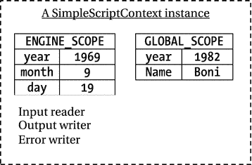

图 9-1.

SimpleScriptContext 类实例的示意图

你可以对 `ScriptContext` 执行多种操作。可以使用 `setAttribute(String name, Object value, int scope)` 方法为已存储的键设置不同的值。可以使用 `removeAttribute(String name, int scope)` 方法移除指定键和作用域的键值对。可以使用 `getAttribute(String name, int scope)` 方法获取指定作用域中键的值。

`ScriptContext` 最有趣的功能是，你可以使用其 `getAttribute(String name)` 方法在不指定作用域的情况下检索键值对。`ScriptContext` 会首先在引擎作用域的 `Bindings` 中搜索该键。如果在引擎作用域中未找到，则会搜索全局作用域的 `Bindings`。如果在这些作用域中找到了该键，则返回最先找到该键的作用域中的对应值。如果两个作用域中都不包含该键，则返回 `null`。

在你的示例中，你将名为 `year` 的键同时存储在了引擎作用域和全局作用域中。以下代码片段会从引擎作用域中返回键 `year` 对应的值 `1969`，因为引擎作用域会被优先搜索。`getAttribute()` 方法的返回类型是 `Object`。

```
// 在不指定作用域的情况下获取键 year 的值。
// 它会从引擎作用域的 Bindings 中返回 1969。
int yearValue = (Integer) ctx.getAttribute("year");
```

你将名为 `name` 的键仅存储在了全局作用域中。如果你尝试检索其值，会先搜索引擎作用域，但不会找到匹配项。随后，会搜索全局作用域并返回值 `"Boni"`，如下所示：

```
// 在不指定作用域的情况下获取名为 name 的键的值。
// 它会从全局作用域的 Bindings 中返回 "Boni"。
String nameValue = (String) ctx.getAttribute("name");
```

你也可以检索特定作用域中键的值。以下代码片段从引擎作用域和全局作用域中检索键“`year`”的值：

```
// 将 1969 赋值给 engineScopeYear，将 1982 赋值给 globalScopeYear
int engineScopeYear = (Integer) ctx.getAttribute("year", ScriptContext.ENGINE_SCOPE);
int globalScopeYear = (Integer) ctx.getAttribute("year", ScriptContext.GLOBAL_SCOPE);
```

提示

Java Scripting API 仅定义了两个作用域：引擎作用域和全局作用域。`ScriptContext` 接口的子接口可以定义额外的作用域。`ScriptContext` 接口的 `getScopes()` 方法会以 `List<Integer>` 的形式返回支持的作用域列表。请注意，作用域是用整数表示的。`ScriptContext` 接口中的两个常量——`ENGINE_SCOPE` 和 `GLOBAL_SCOPE`——分别被赋值为 100 和 200。当在多个作用域的多个 `Bindings` 中搜索一个键时，会优先搜索整数值较小的作用域。由于引擎作用域的值 100 小于全局作用域的值 200，因此当你未指定作用域时，会首先在引擎作用域中搜索该键。

清单 9-10 展示了如何使用实现了 `ScriptContext` 接口的类的实例。请注意，在你的应用程序中，你不会单独使用 `ScriptContext`。它是在脚本执行期间由脚本引擎使用的。大多数情况下，你通过 `ScriptEngine` 和 `ScriptEngineManager` 间接操作 `ScriptContext`，这些内容将在下一节详细讨论。

```
// ScriptContextTest.java
package com.jdojo.script;
import java.util.List;
import javax.script.Bindings;
import javax.script.ScriptContext;
import javax.script.SimpleBindings;
import javax.script.SimpleScriptContext;
import static javax.script.ScriptContext.ENGINE_SCOPE;
import static javax.script.ScriptContext.GLOBAL_SCOPE;
public class ScriptContextTest {
public static void main(String[] args) {
// 创建一个脚本上下文
ScriptContext ctx = new SimpleScriptContext();
// 获取脚本上下文支持的作用域列表
List scopes = ctx.getScopes();
System.out.println("支持的作用域: " + scopes);
// 向引擎作用域绑定中添加三个键值对
ctx.setAttribute("year", 1969, ENGINE_SCOPE);
ctx.setAttribute("month", 9, ENGINE_SCOPE);
ctx.setAttribute("day", 19, ENGINE_SCOPE);
// 向上下文中添加一个全局作用域的 Bindings
Bindings globalBindings = new SimpleBindings();
ctx.setBindings(globalBindings, GLOBAL_SCOPE);
// 向全局作用域绑定中添加两个键值对
ctx.setAttribute("year", 1982, GLOBAL_SCOPE);
ctx.setAttribute("name", "Boni", GLOBAL_SCOPE);
// 在不指定作用域的情况下获取 year 的值
int yearValue = (Integer) ctx.getAttribute("year");
System.out.println("yearValue = " + yearValue);
// 获取 name 的值
String nameValue = (String) ctx.getAttribute("name");
System.out.println("nameValue = " + nameValue);
// 从引擎作用域和全局作用域获取 year 的值
int engineScopeYear = (Integer) ctx.getAttribute("year", ENGINE_SCOPE);
int globalScopeYear = (Integer) ctx.getAttribute("year", GLOBAL_SCOPE);
System.out.println("engineScopeYear = " + engineScopeYear);
System.out.println("globalScopeYear = " + globalScopeYear);
}
}
清单 9-10.
使用 ScriptContext 接口的实例
```

```
支持的作用域: [100, 200]
yearValue = 1969
nameValue = Boni
engineScopeYear = 1969
globalScopeYear = 1982
```


### 整合运用

在本节中，我将向你展示 `Bindings` 及其作用域、`ScriptContext`、`ScriptEngine`、`ScriptEngineManager` 以及宿主应用如何协同工作。重点在于如何使用 `ScriptEngine` 和 `ScriptEngineManager` 来操作存储在不同作用域 `Bindings` 中的键值对。

`ScriptEngineManager` 在其 `Bindings` 中维护一组键值对。它允许你通过以下方法操作这些键值对：

*   `void put(String key, Object value)`
*   `Object get(String key)`
*   `void setBindings(Bindings bindings)`
*   `Bindings getBindings()`

`put()` 方法向 `Bindings` 中添加一个键值对。`get()` 方法返回指定键的值；如果未找到该键，则返回 `null`。可以使用 `setBindings()` 方法替换引擎管理器的 `Bindings`。`getBindings()` 方法返回 `ScriptEngineManager` 的 `Bindings` 引用。

默认情况下，每个 `ScriptEngine` 都有一个 `ScriptContext`，称为其默认上下文。回想一下，除了读取器和写入器之外，`ScriptContext` 还有两个 `Bindings`：一个在引擎作用域，一个在全局作用域。当创建 `ScriptEngine` 时，其引擎作用域的 `Bindings` 为空，而其全局作用域的 `Bindings` 引用的是创建它的 `ScriptEngineManager` 的 `Bindings`。

默认情况下，由同一个 `ScriptEngineManager` 创建的所有 `ScriptEngine` 实例共享该 `ScriptEngineManager` 的 `Bindings`。在同一个 Java 应用程序中可以存在多个 `ScriptEngineManager` 实例。在这种情况下，由同一个 `ScriptEngineManager` 创建的所有 `ScriptEngine` 实例，在其默认上下文中，都将该 `ScriptEngineManager` 的 `Bindings` 作为其全局作用域的 `Bindings` 进行共享。

以下代码片段创建了一个 `ScriptEngineManager`，并用它创建了三个 `ScriptEngine` 实例：

```
// 创建一个 ScriptEngineManager
ScriptEngineManager manager = new ScriptEngineManager();
// 使用同一个 ScriptEngineManager 创建三个 ScriptEngine
ScriptEngine engine1 = manager.getEngineByName("JavaScript");
ScriptEngine engine2 = manager.getEngineByName("JavaScript");
ScriptEngine engine3 = manager.getEngineByName("JavaScript");
```

现在，让我们向 `ScriptEngineManager` 的 `Bindings` 中添加三个键值对，并向每个 `ScriptEngine` 的引擎作用域 `Bindings` 中添加两个键值对。

```
// 向管理器的 Bindings 中添加三个键值对
manager.put("K1", "V1");
manager.put("K2", "V2");
manager.put("K3", "V3");
// 向每个引擎添加两个键值对
engine1.put("KE11", "VE11");
engine1.put("KE12", "VE12");
engine2.put("KE21", "VE21");
engine2.put("KE22", "VE22");
engine3.put("KE31", "VE31");
engine3.put("KE32", "VE32");
```

图 9-2 展示了执行上述代码片段后 `ScriptEngineManager` 和三个 `ScriptEngine` 的状态示意图。从图中可以明显看出，所有 `ScriptEngine` 的默认上下文都将 `ScriptEngineManager` 的 `Bindings` 作为其全局作用域的 `Bindings` 进行共享。

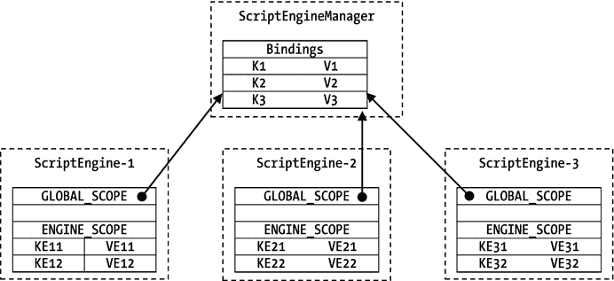

图 9-2.

由同一个 ScriptEngineManager 创建的三个 ScriptEngine 的示意图

可以通过以下方式修改 `ScriptEngineManager` 中的 `Bindings`：

*   使用 `ScriptEngineManager` 的 `put()` 方法
*   通过 `ScriptEngineManager` 的 `getBindings()` 方法获取 `Bindings` 的引用，然后对该 `Bindings` 使用 `put()` 和 `remove()` 方法
*   通过 `ScriptEngine` 的 `getBindings()` 方法获取其默认上下文中全局作用域 `Bindings` 的引用，然后对该 `Bindings` 使用 `put()` 和 `remove()` 方法

当修改 `ScriptEngineManager` 中的 `Bindings` 时，由该 `ScriptEngineManager` 创建的所有 `ScriptEngine` 的默认上下文中的全局作用域 `Bindings` 也会被修改，因为它们共享同一个 `Bindings`。

每个 `ScriptEngine` 的默认上下文都单独维护一个引擎作用域的 `Bindings`。要向 `ScriptEngine` 的引擎作用域 `Bindings` 中添加键值对，请使用其 `put()` 方法，如下所示：

```
ScriptEngine engine1 = null; // 获取一个引擎
// 向 engine1 默认上下文的引擎作用域 Bindings 中添加一个键为 "engineName"、值为 "Engine-1" 的键值对
engine1.put("engineName", "Engine-1");
```

`ScriptEngine` 的 `get(String key)` 方法从其引擎作用域的 `Bindings` 中返回指定 `key` 的值。以下语句返回 `"Engine-1"`，即 `engineName` 键对应的值。

```
String eName = (String) engine1.get("engineName");
```

要获取 `ScriptEngine` 默认上下文中全局作用域 `Bindings` 的键值对，需要两步操作。首先，你需要使用其 `getBindings()` 方法获取全局作用域 `Bindings` 的引用，如下所示：

```
Bindings e1Global = engine1.getBindings(ScriptContext.GLOBAL_SCOPE);
```

现在，你可以使用 `e1Global` 引用来修改引擎的全局作用域 `Bindings`。以下语句向 `e1Global Bindings` 中添加了一个键值对：

```
e1Global.put("id", 89999);
```

由于所有 `ScriptEngine` 共享全局作用域的 `Bindings`，这段代码会将键 `"id"` 及其值添加到由创建 `engine1` 的同一个 `ScriptEngineManager` 创建的所有 `ScriptEngine` 的默认上下文的全局作用域 `Bindings` 中。不建议使用上述代码修改 `ScriptEngineManager` 中的 `Bindings`。你应该使用 `ScriptEngineManager` 引用来修改 `Bindings`，这会使代码的读者更清晰地理解逻辑。清单 9-11 演示了本节讨论的概念。

```
// GlobalBindings.java
package com.jdojo.script;
import javax.script.ScriptEngine;
import javax.script.ScriptEngineManager;
import javax.script.ScriptException;
public class GlobalBindings {
public static void main(String[] args) {
ScriptEngineManager manager = new ScriptEngineManager();
// 向管理器的 Bindings 中添加两个数字 - 由其所有引擎共享
manager.put("n1", 100);
manager.put("n2", 200);
// 创建两个 JavaScript 引擎，并在引擎默认上下文的引擎作用域中添加引擎名称
ScriptEngine engine1 = manager.getEngineByName("JavaScript");
engine1.put("engineName", "Engine-1");
ScriptEngine engine2 = manager.getEngineByName("JavaScript");
engine2.put("engineName", "Engine-2");
// 执行一个脚本，该脚本将两个数字相加并打印结果
String script = "var sum = n1 + n2; print(engineName + ' - Sum = ' + sum)";
try {
// 在两个引擎中执行脚本
engine1.eval(script);
engine2.eval(script);
// 现在为每个引擎设置不同的 n2 值
engine1.put("n2", 1000);
engine2.put("n2", 2000);
// 再次在两个引擎中执行脚本
engine1.eval(script);
engine2.eval(script);
} catch (ScriptException e) {
e.printStackTrace();
}
}
}
清单 9-11.
使用由同一个 ScriptEngineManager 创建的引擎的全局和引擎作用域 Bindings
```

```
Engine-1 - Sum = 300
Engine-2 - Sum = 300
Engine-1 - Sum = 1100
Engine-2 - Sum = 2100
```


一个 `ScriptEngineManager` 向其 `Bindings` 中添加了两个键值对，键分别为 `n1` 和 `n2`。随后创建了两个 `ScriptEngine`；它们各自向自己的引擎作用域 `Bindings` 中添加了一个名为 `engineName` 的键。执行脚本时，脚本中 `engineName` 变量的值取自 `ScriptEngine` 的引擎作用域。脚本中变量 `n1` 和 `n2` 的值则从 `ScriptEngine` 的全局作用域 `Bindings` 中获取。首次执行脚本后，每个 `ScriptEngine` 都向自己的引擎作用域 `Bindings` 中添加了一个键为 `n2` 但值不同的键值对。当第二次执行脚本时，变量 `n1` 的值从引擎的全局作用域 `Bindings` 中获取，而变量 `n2` 的值则从引擎作用域 `Bindings` 中获取，如输出所示。

关于由 `ScriptEngineManager` 创建的所有 `ScriptEngine` 所共享的全局作用域 `Bindings` 的故事尚未结束。它可能变得极其复杂和令人困惑！现在，我们将重点关注使用 `ScriptEngineManager` 类的 `setBindings()` 方法和 `ScriptEngine` 接口的效果。请考虑以下代码片段：

```
// 创建一个 ScriptEngineManager 和两个 ScriptEngine
ScriptEngineManager manager = new ScriptEngineManager();
ScriptEngine engine1 = manager.getEngineByName("JavaScript");
ScriptEngine engine2 = manager.getEngineByName("JavaScript");
// 向 manager 添加两个键值对
manager.put("n1", 100);
manager.put("n2", 200);
```

图 9-3 显示了执行此脚本后引擎管理器及其引擎的状态。此时，`ScriptEngineManager` 中只存储了一个 `Bindings`，两个 `ScriptEngine` 都将其引用为各自的全局作用域 `Bindings`。

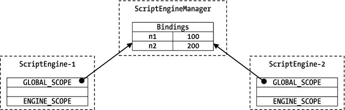

图 9-3.

ScriptEngineManager 和两个 ScriptEngine 的初始状态

现在，让我们创建一个新的 `Bindings`，并使用 `ScriptEngineManager` 的 `setBindings()` 方法将其设置为该管理器的 `Bindings`，如下所示：

```
// 创建一个 Bindings，向其添加两个键值对，并将其设置为 manager 的新 Bindings
Bindings newGlobal = new SimpleBindings();
newGlobal.put("n3", 300);
newGlobal.put("n4", 400);
manager.setBindings(newGlobal);
```

图 9-4 显示了执行上述代码片段后 `ScriptEngineManager` 和两个 `ScriptEngine` 的状态。请注意，`ScriptEngineManager` 有了一个新的 `Bindings`，而两个 `ScriptEngine` 仍然引用旧的 `Bindings` 作为它们的全局作用域 `Bindings`。

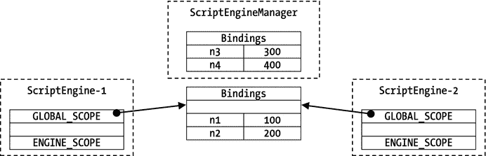

图 9-4.

为 ScriptEngineManager 设置新的 Bindings 后，ScriptEngineManager 和两个 ScriptEngine 的状态

此时，对 `ScriptEngineManager` 的 `Bindings` 所做的任何更改都不会反映到两个 `ScriptEngine` 的全局作用域 `Bindings` 中。你仍然可以对两个 `ScriptEngine` 共享的 `Bindings` 进行更改，并且这两个 `ScriptEngine` 都能看到彼此所做的更改。

现在，创建一个新的 `ScriptEngine`，如下所示：

```
// 创建一个新的 ScriptEngine
ScriptEngine engine3 = manager.getEngineByName("JavaScript");
```

回想一下，`ScriptEngine` 在创建时会获得一个全局作用域 `Bindings`，并且该 `Bindings` 与 `ScriptEngineManager` 的 `Bindings` 相同。执行上述语句后，`ScriptEngineManager` 和三个 `ScriptEngine` 的状态如图 9-5 所示。

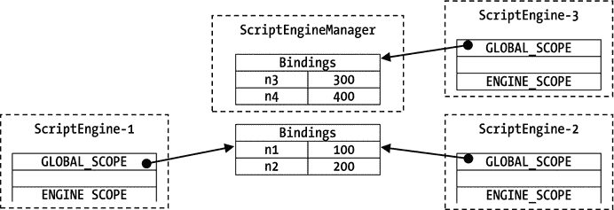

图 9-5.

创建第三个 ScriptEngine 后，ScriptEngineManager 和三个 ScriptEngine 的状态

关于 `ScriptEngine` 全局作用域所谓的“全局性”，还有另一个转折点。这次，你将使用 `ScriptEngine` 的 `setBindings()` 方法来设置其全局作用域 `Bindings`。

```
// 为 engine1 的全局作用域设置一个新的 Bindings
Bindings newGlobalEngine1 = new SimpleBindings();
newGlobalEngine1.put("n5", 500);
newGlobalEngine1.put("n6", 600);
engine1.setBindings(newGlobalEngine1, ScriptContext.GLOBAL_SCOPE);
```

图 9-6 显示了执行以下代码片段后 `ScriptEngineManager` 和三个 ScriptEngine 的状态。

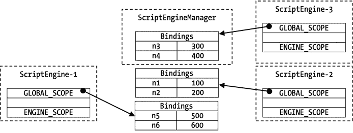

图 9-6.

为 engine1 设置新的全局作用域绑定后，ScriptEngineManager 和三个 ScriptEngine 的状态

提示

默认情况下，`ScriptEngineManager` 创建的所有 `ScriptEngine` 都共享其 `Bindings` 作为它们的全局作用域 `Bindings`。如果你使用 `ScriptEngine` 的 `setBindings()` 方法来设置其全局作用域 `Bindings`，或者使用 `ScriptEngineManager` 的 `setBindings()` 方法来设置其 `Bindings`，就会打破本节讨论的“全局性”链条。为了保持“全局性”链条的完整性，你应该始终使用 `ScriptEngineManager` 的 `put()` 方法向其 `Bindings` 中添加键值对。要从 `ScriptEngineManager` 创建的所有 `ScriptEngine` 的全局作用域中移除一个键值对，你需要使用 `ScriptEngineManager` 的 `getBindings()` 方法获取 `Bindings` 的引用，然后对该 `Bindings` 使用 `remove()` 方法。


## 使用自定义 ScriptContext

在上一节中，您看到每个 `ScriptEngine` 都有一个默认脚本上下文。`ScriptEngine` 的 `get()`、`put()`、`getBindings()` 和 `setBindings()` 方法操作的是其默认的 `ScriptContext`。当 `ScriptEngine` 的 `eval()` 方法未指定 `ScriptContext` 时，将使用引擎的默认上下文。`ScriptEngine` 的 `eval()` 方法的以下两个版本使用其默认上下文来执行脚本：

*   `Object eval(String script)`
*   `Object eval(Reader reader)`

您可以将一个 `Bindings` 传递给 `eval()` 方法的以下两个版本：

*   `Object eval(String script, Bindings bindings)`
*   `Object eval(Reader reader, Bindings bindings)`

这些版本的 `eval()` 方法不使用 `ScriptEngine` 的默认上下文。它们使用一个新的 `ScriptContext`，其引擎作用域的 `Bindings` 是传递给这些方法的那个，而全局作用域的 `Bindings` 与引擎默认上下文的相同。请注意，这两个版本的 `eval()` 方法不会改动 `ScriptEngine` 的默认上下文。

您可以将一个 `ScriptContext` 传递给 `eval()` 方法的以下两个版本：

*   `Object eval(String script, ScriptContext context)`
*   `Object eval(Reader reader, ScriptContext context)`

这些版本的 `eval()` 方法使用指定的上下文来执行脚本。它们不会改动 `ScriptEngine` 的默认上下文。

这三组 `eval()` 方法允许您使用不同的隔离级别来执行脚本：

*   第一组允许所有脚本共享默认上下文。
*   第二组允许脚本使用不同的引擎作用域 `Bindings`，并共享全局作用域 `Bindings`。
*   第三组允许脚本在隔离的 `ScriptContext` 中执行。

清单 9-12 展示了如何使用不同版本的 `eval()` 方法在不同的隔离级别下执行脚本。

```
// CustomContext.java
package com.jdojo.script;
import javax.script.Bindings;
import javax.script.ScriptContext;
import javax.script.ScriptEngine;
import javax.script.ScriptEngineManager;
import javax.script.ScriptException;
import javax.script.SimpleScriptContext;
import static javax.script.SimpleScriptContext.ENGINE_SCOPE;
import static javax.script.SimpleScriptContext.GLOBAL_SCOPE;
public class CustomContext {
public static void main(String[] args) throws ScriptException {
ScriptEngineManager manager = new ScriptEngineManager();
ScriptEngine engine = manager.getEngineByName("JavaScript");
// 将 n1 添加到 manager 的 Bindings 中，该 Bindings 将作为所有引擎的全局作用域 Bindings 被共享
manager.put("n1", 100);
// 准备脚本
String script = "var sum = n1 + n2;"
+ "print(msg + "
+ "' n1=' + n1 + ', n2=' + n2 + "
+ "', sum=' + sum);";
// 将 n2 添加到引擎默认上下文的引擎作用域中
engine.put("n2", 200);
engine.put("msg", "使用默认上下文：");
engine.eval(script);
// 使用 Bindings 执行脚本
Bindings bindings = engine.createBindings();
bindings.put("n2", 300);
bindings.put("msg", "使用 Bindings：");
engine.eval(script, bindings);
// 使用 ScriptContext 执行脚本
ScriptContext ctx = new SimpleScriptContext();
Bindings ctxGlobalBindings = engine.createBindings();
ctx.setBindings(ctxGlobalBindings, GLOBAL_SCOPE);
ctx.setAttribute("n1", 400, GLOBAL_SCOPE);
ctx.setAttribute("n2", 500, ENGINE_SCOPE);
ctx.setAttribute("msg", "使用 ScriptContext：", ENGINE_SCOPE);
engine.eval(script, ctx);
// 再次使用默认上下文执行脚本，以证明默认上下文未受影响
engine.eval(script);
}
}
清单 9-12.
使用不同的隔离级别执行脚本
```

```
使用默认上下文： n1=100, n2=200, sum=300
使用 Bindings： n1=100, n2=300, sum=400
使用 ScriptContext： n1=400, n2=500, sum=900
使用默认上下文： n1=100, n2=200, sum=300
```

该程序使用了三个名为 `msg`、`n1` 和 `n2` 的变量。它显示存储在 `msg` 变量中的值。`n1` 和 `n2` 的值相加，并显示总和。脚本会打印出计算总和时使用的 `n1` 和 `n2` 的值。`n1` 的值存储在 `ScriptEngineManager` 的 `Bindings` 中，该 `Bindings` 被所有 `ScriptEngine` 的默认上下文共享。`n2` 的值存储在默认上下文和自定义上下文的引擎作用域中。脚本使用引擎的默认上下文执行了两次，一次在开头，一次在结尾，以证明在 `eval()` 方法中使用自定义的 `Bindings` 或 `ScriptContext` 不会影响 `ScriptEngine` 默认上下文中的 `Bindings`。该程序在其 `main()` 方法中声明了一个 `throws` 子句，以使代码更简洁。

## eval() 方法的返回值

`ScriptEngine` 的 `eval()` 方法返回一个 `Object`，它是脚本中的最后一个值。如果脚本中没有最后一个值，则返回 `null`。依赖脚本中的最后一个值既容易出错，又令人困惑。以下代码片段展示了在 Nashorn 中使用 `eval()` 方法返回值的一些示例。代码中的注释指出了 `eval()` 方法返回的值。

```
Object result = null;
// 将 3 赋值给 result
result = engine.eval("1 + 2;");
// 将 7 赋值给 result
result = engine.eval("1 + 2; 3 + 4;");
// 将 6 赋值给 result
result = engine.eval("1 + 2; 3 + 4; var v = 5; v = 6;");
// 将 7 赋值给 result
result = engine.eval("1 + 2; 3 + 4; var v = 5;");
// 将 null 赋值给 result
result = engine.eval("print(1 + 2)");
```

最好不要依赖 `eval()` 方法的返回值。您应该将一个 Java 对象作为参数传递给脚本，并让脚本将脚本的返回值存储在该对象中。执行 `eval()` 方法后，您可以查询该 Java 对象以获取返回值。

清单 9-13 包含一个包装整数的 `Result` 类的代码。您将把一个 `Result` 类的对象传递给脚本，脚本会将返回值存储在其中。脚本执行完毕后，您可以在 Java 代码中读取存储在 `Result` 对象中的整数值。`Result` 需要声明为 public，以便脚本引擎可以访问它。

```
// Result.java
package com.jdojo.script;
public class Result {
private int val = -1;
public void setValue(int x) {
val = x;
}
public int getValue() {
return val;
}
}
清单 9-13.
一个包装整数的 Result 类
```

清单 9-14 中的程序展示了如何将一个 `Result` 对象传递给脚本，该脚本会用值填充 `Result` 对象。该程序在 `main()` 方法的声明中包含一个 `throws` 子句，以使代码保持简洁。

```
// ResultBearingScript.java
package com.jdojo.script;
import javax.script.ScriptEngine;
import javax.script.ScriptEngineManager;
import javax.script.ScriptException;
public class ResultBearingScript {
public static void main(String[] args) throws ScriptException {
// 获取 Nashorn 引擎
ScriptEngineManager manager = new ScriptEngineManager();
ScriptEngine engine = manager.getEngineByName("JavaScript");
// 将一个 Result 对象传递给脚本。脚本会将脚本的结果存储在该 result 对象中
Result result = new Result();
engine.put("result", result);
// 将脚本存储在一个字符串中
String script = "3 + 4; result.setValue(101);";
// 执行脚本，该脚本使用传入的 Result 对象来返回值
engine.eval(script);
// 使用 result 对象从脚本中获取返回值
int returnedValue = result.getValue(); // 将会是 101
System.out.println("返回的值是 " + returnedValue);
}
}
清单 9-14.
在 Result 对象中收集脚本的返回值
```

```
返回的值是 101
```


## 引擎作用域绑定的保留键

通常，引擎作用域 `Bindings` 中的键代表脚本变量。部分键是保留的，具有特殊含义。它们的值可能由引擎的实现传递给引擎。实现可以定义额外的保留键。

表 9-1 包含了所有保留键的列表。这些键也在 `ScriptEngine` 接口中被声明为常量。脚本引擎的实现不需要将所有此类键都传递给引擎作用域绑定中的引擎。作为开发者，你不应该使用这些键将参数从 Java 应用程序传递给脚本引擎。

表 9-1.

引擎作用域绑定的保留键

| 键 | ScriptEngine 接口中的常量 | 键值的含义 |
| --- | --- | --- |
| `"javax.script.argv"` | `ScriptEngine.ARGV` | 用于传递一个 `Object` 数组，以传递一组位置参数。 |
| `"javax.script.engine"` | `ScriptEngine.ENGINE` | 脚本引擎的名称。 |
| `"javax.script.engine_version"` | `ScriptEngine.ENGINE_VERSION` | 脚本引擎的版本。 |
| `"javax.script.filename"` | `ScriptEngine.FILENAME` | 用于传递作为脚本来源的文件或资源的名称。 |
| `"javax.script.language"` | `ScriptEngine.LANGUAGE` | 脚本引擎所支持的语言的名称。 |
| `"javax.script.language_version"` | `ScriptEngine.LANGUAGE_VERSION` | 引擎所支持的脚本语言的版本。 |
| `"javax.script.name"` | `ScriptEngine.NAME` | 脚本语言的简短名称。 |

## 更改默认的 ScriptContext

你可以分别使用 `ScriptEngine` 的 `getContext()` 和 `setContext()` 方法来获取和设置其默认上下文，如下所示：

```
ScriptEngineManager manager = new ScriptEngineManager();
ScriptEngine engine = manager.getEngineByName("JavaScript");
// 获取 ScriptEngine 的默认上下文
ScriptContext defaultCtx = engine.getContext();
// 在此处使用 defaultCtx
// 创建一个新的上下文
ScriptContext ctx = new SimpleScriptContext();
// 在此处配置 ctx
// 将 ctx 设置为引擎的新默认上下文
engine.setContext(ctx);
```

请注意，为 `ScriptEngine` 设置新的默认上下文不会使用 `ScriptEngineManager` 的 `Bindings` 作为其全局作用域 `Bindings`。如果你希望新的默认上下文使用 `ScriptEngineManager` 的 `Bindings`，则需要显式设置，如下所示：

```
// 创建一个新的上下文
ScriptContext ctx = new SimpleScriptContext();
// 将 ctx 的全局作用域 Bindings 设置为与 manager 的 Bindings 相同
ctx.setBindings(manager.getBindings(), ScriptContext.GLOBAL_SCOPE);
// 将 ctx 设置为引擎的新默认上下文
engine.setContext(ctx);
```

## 将脚本输出发送到文件

你可以自定义脚本执行的输入源、输出目标和错误输出目标。你需要为用于执行脚本的 `ScriptContext` 设置适当的读取器和写入器。以下代码片段会将脚本输出写入当前目录下名为 `jsoutput.txt` 的文件中：

```
// 创建一个 FileWriter
FileWriter writer = new FileWriter("jsoutput.txt");
// 获取引擎的默认上下文
ScriptContext defaultCtx = engine.getContext();
// 为引擎的默认上下文设置输出写入器
defaultCtx.setWriter(writer);
```

该代码为 `ScriptEngine` 的默认上下文设置了一个自定义输出写入器，该写入器将在使用默认上下文的脚本执行期间被使用。如果你希望为特定的脚本执行使用自定义输出写入器，则需要使用自定义的 `ScriptContext` 并设置其写入器。

提示

为 `ScriptContext` 设置自定义输出写入器不会影响 Java 应用程序标准输出的目标。要重定向 Java 应用程序的标准输出，你需要使用 `System.setOut()` 方法。

清单 9-15 展示了如何将脚本执行的输出写入名为 `jsoutput.txt` 的文件。该程序会在标准输出上打印输出文件的完整路径。当你运行该程序时，可能会得到不同的输出。你需要在文本编辑器中打开输出文件以查看脚本的输出。

```
// CustomScriptOutput.java
package com.jdojo.script;
import java.io.File;
import java.io.FileWriter;
import java.io.IOException;
import javax.script.ScriptContext;
import javax.script.ScriptEngine;
import javax.script.ScriptEngineManager;
import javax.script.ScriptException;
public class CustomScriptOutput {
public static void main(String[] args) {
// 获取 Nashorn 引擎
ScriptEngineManager manager = new ScriptEngineManager();
ScriptEngine engine = manager.getEngineByName("JavaScript");
// 打印输出文件的绝对路径
File outputFile = new File("jsoutput.txt");
System.out.println("脚本输出将被写入 "
+ outputFile.getAbsolutePath());
try (FileWriter writer = new FileWriter(outputFile)) {
// 为引擎设置自定义输出写入器
ScriptContext defaultCtx = engine.getContext();
defaultCtx.setWriter(writer);
// 执行一个脚本
String script = "print('Hello custom output writer')";
engine.eval(script);
} catch (IOException | ScriptException e) {
e.printStackTrace();
}
}
}
清单 9-15.
将脚本输出写入文件
```

```
脚本输出将被写入 C:\Java9APIsAndMdoules\jsoutput.txt
```


## 在脚本中调用过程

脚本语言通常允许创建过程、函数和方法。Java 脚本 API 让您能够从 Java 应用程序中调用这些过程、函数和方法。在本节中，我使用术语“过程”来统指过程、函数和方法。当讨论的上下文需要时，我会使用具体的术语。

并非所有脚本引擎都必须支持过程调用。Nashorn JavaScript 引擎支持过程调用。如果某个脚本引擎支持此功能，则该脚本引擎类的实现必须实现 `Invocable` 接口。在调用过程之前，开发者有责任检查脚本引擎是否实现了 `Invocable` 接口。调用过程分为四个步骤：

*   检查脚本引擎是否支持过程调用。
*   将引擎引用强制转换为 `Invocable` 类型。
*   评估包含过程源代码的脚本。
*   使用 `Invocable` 接口的 `invokeFunction()` 方法来调用过程和函数。使用 `invokeMethod()` 方法来调用在脚本语言中创建的对象的成员方法。

以下代码片段执行检查，确认脚本引擎实现类是否实现了 `Invocable` 接口：

```
// 获取 Nashorn 引擎
ScriptEngineManager manager = new ScriptEngineManager();
ScriptEngine engine = manager.getEngineByName("JavaScript");
// 确保脚本引擎实现了 Invocable 接口
if (engine instanceof Invocable) {
System.out.println("支持调用过程。");
} else {
System.out.println("不支持调用过程。");
}
```

第二步是将引擎引用强制转换为 `Invocable` 接口类型。

```
Invocable inv = (Invocable)engine;
```

第三步是评估脚本，以便脚本引擎编译并存储过程的编译形式，供后续调用。以下代码片段执行此步骤：

```
// 声明一个名为 add 的函数，用于相加两个数字
String script = "function add(n1, n2) { return n1 + n2; }";
// 评估该函数。调用 eval() 并不会调用该函数，只是编译它。
engine.eval(script);
```

最后一步是调用过程或函数。

```
// 调用 add 函数，并传入 30 和 40 作为函数参数。
// 这就像在脚本中调用了 add(30, 40) 一样。
Object result = inv.invokeFunction("add", 30, 40);
```

`invokeFunction()` 的第一个参数是过程或函数的名称。第二个参数是一个可变参数，用于指定传递给过程或函数的参数。`invokeFunction()` 方法返回过程或函数返回的值。

清单 9-16 展示了如何调用一个函数。它调用了一个用 Nashorn JavaScript 编写的函数。

```
// InvokeFunction.java
package com.jdojo.script;
import javax.script.Invocable;
import javax.script.ScriptEngine;
import javax.script.ScriptEngineManager;
import javax.script.ScriptException;
public class InvokeFunction {
public static void main(String[] args) {
ScriptEngineManager manager = new ScriptEngineManager();
ScriptEngine engine = manager.getEngineByName("JavaScript");
// 确保脚本引擎实现了 Invocable 接口
if (!(engine instanceof Invocable)) {
System.out.println("不支持调用过程。");
return;
}
// 将引擎引用强制转换为 Invocable 类型
Invocable inv = (Invocable) engine;
try {
String script = "function add(n1, n2) { return n1 + n2; }";
// 首先评估脚本
engine.eval(script);
// 调用 add 函数两次
Object result1 = inv.invokeFunction("add", 30, 40);
System.out.println("结果 1 = " + result1);
Object result2 = inv.invokeFunction("add", 10, 20);
System.out.println("结果 2 = " + result2);
} catch (ScriptException | NoSuchMethodException e) {
e.printStackTrace();
}
}
}
清单 9-16.
调用用 Nashorn JavaScript 编写的函数
```

```
结果 1 = 70
结果 2 = 30
```

面向对象或基于对象的脚本语言可能允许您定义对象及其方法。您可以使用 `Invocable` 接口的 `invokeMethod()` 方法来调用此类对象的方法，该方法声明如下：

```
Object invokeMethod(Object objectRef, String name, Object... args)
```

第一个参数是对象的引用，第二个参数是您想要在该对象上调用的方法名称，第三个参数是一个可变参数，用于向被调用的方法传递参数。

清单 9-17 演示了如何在 Nashorn JavaScript 中创建的对象上调用方法。请注意，该对象是在 Nashorn 脚本内部创建的。要从 Java 调用该对象的方法，您需要通过脚本引擎获取该对象的引用。程序评估一个脚本，该脚本创建了一个带有 `add()` 方法的对象，并将其引用存储在一个名为 `calculator` 的变量中。`engine.get("calculator")` 方法将 `calculator` 对象的引用返回给 Java 代码。

```
// InvokeMethod.java
package com.jdojo.script;
import javax.script.Invocable;
import javax.script.ScriptEngine;
import javax.script.ScriptEngineManager;
import javax.script.ScriptException;
public class InvokeMethod {
public static void main(String[] args) {
// 获取 Nashorn 引擎
ScriptEngineManager manager = new ScriptEngineManager();
ScriptEngine engine = manager.getEngineByName("JavaScript");
// 确保脚本引擎实现了 Invocable 接口
if (!(engine instanceof Invocable)) {
System.out.println("不支持调用方法。");
return;
}
// 将引擎引用强制转换为 Invocable 类型
Invocable inv = (Invocable) engine;
try {
// 声明一个带有 add() 方法的全局对象
String script = "var calculator = new Object();"
+ "calculator.add = function add(n1, n2){return n1 + n2;}";
// 首先评估脚本
engine.eval(script);
// 获取在脚本中创建的 calculator 对象引用
Object calculator = engine.get("calculator");
// 在 calculator 对象上调用 add() 方法
Object result = inv.invokeMethod(calculator, "add", 30, 40);
System.out.println("结果 = " + result);
} catch (ScriptException | NoSuchMethodException e) {
e.printStackTrace();
}
}
}
清单 9-17.
在 Nashorn JavaScript 中创建的对象上调用方法
```

```
结果 = 70
```

提示

使用 `Invocable` 接口可以重复执行过程、函数和方法。评估包含过程、函数和方法的脚本时，引擎会存储中间代码，这有助于在重复执行时提升性能。


## 在脚本中实现 Java 接口

Java 脚本 API 允许你在脚本语言中实现 Java 接口。Java 接口的方法可以在脚本中使用顶层过程或对象的实例方法来实现。在脚本语言中实现 Java 接口的好处是，你可以在 Java 代码中使用该接口的实例，就像该接口是用 Java 实现的一样。你可以将接口的实例作为参数传递给 Java 方法。`Invocable` 接口的 `getInterface()` 方法用于获取在脚本中实现的 Java 接口的实例。该方法有两个版本：

*   `<T> T getInterface(Class<T> cls)`
*   `<T> T getInterface(Object obj, Class<T> cls)`

第一个版本用于获取一个 Java 接口的实例，该接口的方法在脚本中作为顶层过程实现。接口类型作为参数传递给此方法。假设你有一个 `Calculator` 接口，如清单 9-18 所示，它有两个方法：`add()` 和 `subtract()`。

```
// Calculator.java
package com.jdojo.script;
public interface Calculator {
int add (int n1, int n2);
int subtract (int n1, int n2);
}
清单 9-18.
一个 Calculator 接口
```

考虑以下用 JavaScript 编写的两个顶层函数：

```
function add(n1, n2) {
return n1 + n2;
}
function subtract(n1, n2) {
return n1 - n2;
}
```

这两个函数为 `Calculator` 接口的两个方法提供了实现。在这些函数被 JavaScript 引擎编译后，你可以按如下方式获取 `Calculator` 接口的实例：

```
// 将引擎引用转换为 Invocable 类型
Invocable inv = (Invocable) engine;
// 获取 Calculator 接口的引用
Calculator calc = inv.getInterface(Calculator.class);
if (calc == null) {
System.err.println("未找到 Calculator 接口实现。");
} else {
// 使用 calc 调用 add() 和 subtract() 方法
}
```

你可以按如下方式对两个数字进行加法运算：

```
int sum = calc.add(15, 10);
```

清单 9-19 展示了如何在 Nashorn 中使用顶层过程实现 Java 接口。请查阅脚本语言的文档，了解它如何支持此功能。

```
// UsingInterfaces.java
package com.jdojo.script;
import javax.script.Invocable;
import javax.script.ScriptEngine;
import javax.script.ScriptEngineManager;
import javax.script.ScriptException;
public class UsingInterfaces {
public static void main(String[] args) {
// 获取 Nashorn 引擎
ScriptEngineManager manager = new ScriptEngineManager();
ScriptEngine engine = manager.getEngineByName("JavaScript");
// 确保脚本引擎实现了 Invocable 接口
if (!(engine instanceof Invocable)) {
System.out.println("脚本中的接口实现不受支持。");
return;
}
// 将引擎引用转换为 Invocable 类型
Invocable inv = (Invocable) engine;
// 创建 add() 和 subtract() 函数的脚本
String script = "function add(n1, n2) { return n1 + n2; } "
+ "function subtract(n1, n2) { return n1 - n2; }";
try {
// 编译脚本，该脚本将存储在引擎中
engine.eval(script);
// 获取接口实现
Calculator calc = inv.getInterface(Calculator.class);
if (calc == null) {
System.err.println("未找到 Calculator 接口实现。");
return;
}
int result1 = calc.add(15, 10);
System.out.println("add(15, 10) = " + result1);
int result2 = calc.subtract(15, 10);
System.out.println("subtract(15, 10) = " + result2);
} catch (ScriptException e) {
e.printStackTrace();
}
}
}
清单 9-19.
在脚本中使用顶层函数实现 Java 接口
```

```
add(15, 10) = 25
subtract(15, 10) = 5
```

`getInterface()` 方法的第二个版本用于获取一个 Java 接口的实例，该接口的方法作为对象的实例方法实现。它的第一个参数是在脚本语言中创建的对象的引用。该对象的实例方法实现了作为第二个参数传入的接口类型。以下 Nashorn 代码创建了一个对象，其实例方法实现了 `Calculator` 接口：

```
// 创建一个对象
var calc = new Object();
// 向 calc 对象添加 add() 和 subtract() 方法
calc.add = function add(n1, n2) {
return n1 + n2;
};
calc.subtract = function subtract(n1, n2) {
return n1 - n2;
};
```

当脚本对象的实例方法实现了 Java 接口的方法时，你需要执行一个额外的步骤。在获取接口实例之前，你需要先获取脚本对象的引用，如下所示：

```
// 获取全局脚本对象 calc 的引用
Object calc = engine.get("calc");
// 获取 Calculator 接口的实现
Calculator calculator = inv.getInterface(calc, Calculator.class);
```

清单 9-20 展示了如何使用 Nashorn 将 Java 接口的方法作为对象的实例方法来实现。

```
// ScriptObjectImplInterface.java
package com.jdojo.script;
import javax.script.Invocable;
import javax.script.ScriptEngine;
import javax.script.ScriptEngineManager;
import javax.script.ScriptException;
public class ScriptObjectImplInterface {
public static void main(String[] args) {
// 获取 Nashorn 引擎
ScriptEngineManager manager = new ScriptEngineManager();
ScriptEngine engine = manager.getEngineByName("JavaScript");
// 确保引擎实现了 Invocable 接口
if (!(engine instanceof Invocable)) {
System.out.println("脚本中的接口实现不受支持。");
return;
}
// 将引擎引用转换为 Invocable 类型
Invocable inv = (Invocable) engine;
String script = "var calc = new Object(); "
+ "calc.add = function add(n1, n2) {return n1 + n2; }; "
+ "calc.subtract = function subtract(n1, n2) {return n1 - n2;};";
try {
// 编译并将脚本存储在引擎中
engine.eval(script);
// 获取全局脚本对象 calc 的引用
Object calc = engine.get("calc");
// 获取 Calculator 接口的实现
Calculator calculator = inv.getInterface(calc, Calculator.class);
if (calculator == null) {
System.err.println("未找到 Calculator 接口实现。");
return;
}
int result1 = calculator.add(15, 10);
System.out.println("add(15, 10) = " + result1);
int result2 = calculator.subtract(15, 10);
System.out.println("subtract(15, 10) = " + result2);
} catch (ScriptException e) {
e.printStackTrace();
}
}
}
清单 9-20.
在脚本中将 Java 接口的方法作为对象的实例方法实现
```

```
add(15, 10) = 25
subtract(15, 10) = 5
```


## 使用编译后的脚本

脚本引擎可能允许编译脚本并重复执行。执行编译后的脚本可以提高应用程序的性能。脚本引擎可以以 Java 类、Java 类文件或特定于语言的形式编译和存储脚本。

并非所有脚本引擎都需要支持脚本编译。支持脚本编译的脚本引擎必须实现 `Compilable` 接口。Nashorn 引擎支持脚本编译。以下代码片段检查脚本引擎是否实现了 `Compilable` 接口：

```
// 获取脚本引擎引用
ScriptEngineManager manager = new ScriptEngineManager();
ScriptEngine engine = manager.getEngineByName("YOUR_ENGINE_NAME");
if (engine instanceof Compilable) {
System.out.println("支持脚本编译。");
} else {
System.out.println("不支持脚本编译。");
}
```

一旦知道脚本引擎实现了 `Compilable` 接口，就可以将其引用转换为 `Compilable` 类型，如下所示：

```
// 将引擎引用转换为 Compilable 类型
Compilable comp = (Compilable) engine;
```

`Compilable` 接口包含两个方法：

*   `CompiledScript compile(String script) throws ScriptException`
*   `CompiledScript compile(Reader script) throws ScriptException`

这两个版本的方法仅在脚本来源的类型上有所不同。第一个版本接受脚本作为 `String`，第二个版本接受脚本作为 `Reader`。

`compile()` 方法返回一个 `CompiledScript` 类的对象。`CompiledScript` 是一个抽象类。脚本引擎的提供者提供此类的具体实现。`CompiledScript` 与创建它的 `ScriptEngine` 相关联。`CompiledScript` 类的 `getEngine()` 方法返回与之关联的 `ScriptEngine` 的引用。

要执行编译后的脚本，需要调用 `CompiledScript` 类的以下 `eval()` 方法之一：

*   `Object eval() throws ScriptException`
*   `Object eval(Bindings bindings) throws ScriptException`
*   `Object eval(ScriptContext context) throws ScriptException`

不带任何参数的 `eval()` 方法使用脚本引擎的默认脚本上下文来执行编译后的脚本。另外两个版本的工作方式与 `ScriptEngine` 接口的 `eval()` 方法在向其传递 `Bindings` 或 `ScriptContext` 时相同。

清单 9-21 展示了如何编译脚本并执行它。它使用不同的参数两次执行相同的编译脚本。

```
// CompilableTest .java
package com.jdojo.script;
import javax.script.Bindings;
import javax.script.Compilable;
import javax.script.CompiledScript;
import javax.script.ScriptEngine;
import javax.script.ScriptEngineManager;
import javax.script.ScriptException;
public class CompilableTest {
public static void main(String[] args) {
// 获取 Nashorn 引擎
ScriptEngineManager manager = new ScriptEngineManager();
ScriptEngine engine = manager.getEngineByName("JavaScript");
if (!(engine instanceof Compilable)) {
System.out.println("不支持脚本编译。");
return;
}
// 将引擎引用转换为 Compilable 类型
Compilable comp = (Compilable) engine;
try {
// 编译脚本
String script = "print(n1 + n2)";
CompiledScript cScript = comp.compile(script);
// 将 n1 和 n2 脚本变量存储在 Bindings 中
Bindings scriptParams = engine.createBindings();
scriptParams.put("n1", 2);
scriptParams.put("n2", 3);
cScript.eval(scriptParams);
// 使用不同的 n1 和 n2 值再次执行脚本
scriptParams.put("n1", 9);
scriptParams.put("n2", 7);
cScript.eval(scriptParams);
} catch (ScriptException e) {
e.printStackTrace();
}
}
}
清单 9-21.
使用编译后的脚本
```

```

```

## 在脚本语言中使用 Java

脚本语言允许在脚本中使用 Java 类库。每种脚本语言都有自己使用 Java 类的语法。讨论所有脚本语言的语法是不可能的，也超出了本书的范围。在本节中，我将讨论在 Nashorn 中使用某些 Java 构造的语法。有关 Nashorn 的完整介绍，请参考网站 [`https://docs.oracle.com/javase/9/nashorn/`](https://docs.oracle.com/javase/9/nashorn/) 。

### 声明变量

在脚本语言中声明变量与 Java 无关。通常，脚本语言允许你为变量赋值而无需声明它们。变量的类型根据它们存储的值的类型在运行时确定。

在 Nashorn 中，关键字 `var` 用于声明变量。如果愿意，可以在变量声明中省略关键字 `var`。以下代码片段声明了两个变量并为其赋值：

```
// 使用 var 关键字声明一个名为 msg 的变量
var msg = "Hello";
// 不使用关键字 var 声明一个名为 greeting 的变量
greeting = "Hello";
```

你可以在 Nashorn 中使用 `const` 和 `let` 关键字来声明常量和作用域变量：

```
// 将 PI 声明为常量
const PI = 3.14;
print("PI = " + PI);
let x = 100;
{
let x = 200;
print("Inner: x = " + x); // 此处 x 为 200
}
print("Outer: x = " + x); // 此处 x 为 100
```

你必须在 Nashorn 中启用 ES6 才能成功执行上述代码片段，因为 `const` 和 `let` 是 ES6 特性。你需要向 Nashorn 引擎传递 `--language=es6` 以启用 ES6 特性。以下命令展示了如何在命令行中执行此操作：

```
C:\Java9APIsAndModules>java --module-path dist -Dnashorn.args=--language=es6
--module jdojo.script/com.jdojo.script.Test
```

### 导入 Java 类

在 Nashorn 中有四种方法可以在脚本中导入 Java 类：

*   使用 `Packages` 全局对象
*   使用 Java 全局对象的 `type()` 函数
*   使用 `importPackage()` 和 `importClass()` 函数
*   在 `with` 子句中使用 `JavaImporter` 对象

以下各节详细描述了在脚本中导入 Java 类的四种方法。

#### 使用 Packages 全局对象

Nashorn 将所有 Java 包定义为名为 `Packages` 的全局变量的属性。例如，`java.lang` 和 `javax.swing` 包可以分别引用为 `Packages.java.lang` 和 `Packages.javax.swing`。以下代码片段在 Nashorn 中使用了 `java.util.List` 和 `javax.swing.JFrame`：

```
// 创建一个 List
var list1 = new Packages.java.util.ArrayList();
// 创建一个 JFrame
var frame1 = new Packages.javax.swing.JFrame("Test");
```

Nashorn 将 `java`、`javax`、`org`、`com`、`edu` 和 `net` 声明为全局变量，它们分别是 `Packages.java`、`Packages.javax`、`Packages.org`、`Packages.com`、`Packages.edu` 和 `Packages.net` 的别名。本书示例中的类名以前缀 `com` 开头，例如 `com.jdojo.script.Test`。要在 JavaScript 代码中使用此类名，你可以使用 `Packages.com.jdojo.script.Test` 或 `com.jdojo.script.Test`。但是，如果类名不是以这些预定义前缀之一开头，则必须使用 `Packages` 全局变量来访问它；例如，如果你的类名是 `p1.Test`，则需要在 JavaScript 代码中使用 `Packages.p1.Test` 来访问它。以下代码片段使用了 `java` 和 `javax` 作为 `Packages.java` 和 `Packages.javax` 的别名：

```
// 创建一个 List
var list2 = new java.util.ArrayList();
// 创建一个 JFrame
var frame2 = new javax.swing.JFrame("Test");
```


#### 使用 Java 全局对象

在 Java 7 的 Rhino JavaScript 中，也支持将包作为 `Packages` 对象的属性进行访问。使用 `Packages` 对象速度较慢且容易出错。Nashorn 定义了一个名为 `Java` 的新全局对象，其中包含许多用于处理 Java 包和类的实用函数。如果你使用的是 Java 8 或更高版本，则应使用 `Java` 对象而非 `Packages` 对象。`Java` 对象的 `type()` 函数可将 Java 类型导入脚本。你需要传入要导入的 Java 类型的完全限定名。在 Nashorn 中，以下代码片段导入了 `java.util.ArrayList` 类并创建了其对象：

```
// 导入 java.util.ArrayList 类型，并将其称为 ArrayList
var ArrayList = Java.type("java.util.ArrayList");
// 创建一个 ArrayList 类型的对象
var list = new ArrayList();
```

在代码中，你将 `Java.type()` 函数返回的导入类型称为 `ArrayList`，这也是所导入类的名称。这样做是为了让下一条语句读起来就像是用 Java 编写的一样。第二条语句的读者会知道你在创建一个 `ArrayList` 类的对象。不过，你可以为导入的类型指定任何你想要的名称。以下代码片段导入了 `java.util.ArrayList` 并将其称为 `MyList`：

```
// 导入 java.util.ArrayList 类型，并将其称为 MyList
var MyList = Java.type("java.util.ArrayList");
// 创建一个 MyList 类型的对象
var list2 = new MyList();
```

#### 使用 importPackage() 和 importClass() 函数

Rhino JavaScript 允许在脚本中使用 Java 类型的简单名称。Rhino JavaScript 有两个内置函数，分别名为 `importPackage()` 和 `importClass()`，用于导入一个包中的所有类以及一个包中的某个类。出于兼容性考虑，Nashorn 保留了这些函数。要在 Nashorn 中使用这些函数，你需要使用 `load()` 函数从 `mozilla_compat.js` 文件中加载兼容性模块。以下代码片段使用这些函数重写了之前的逻辑：

```
// 加载兼容性模块。这在 Nashorn 中是必需的，在 Rhino 中则不需要。
load("nashorn:mozilla_compat.js");
// 从 java.util 包中导入 ArrayList 类
importClass(java.util.ArrayList);
// 从 javax.swing 包中导入所有类
importPackage(javax.swing);
// 使用类的简单名称
var list1 = new ArrayList();
var frame1 = new JFrame("Test");
```

JavaScript 不会自动导入 `java.lang` 包中的所有类，因为 JavaScript 中同名的类（例如 `String`、`Object`、`Number` 等）会与 `java.lang` 包中的类名冲突。要使用 `java.lang` 包中的某个类，你可以导入它，或者使用 `Packages` 或 `Java` 变量来使用其完全限定名。你不能导入 `java.lang` 包中的所有类。以下代码片段会生成一个错误，因为 `String` 类名已在 JavaScript 中定义：

```
// 加载兼容性模块。这在 Nashorn 中是必需的，在 Rhino 中则不需要。
load("nashorn:mozilla_compat.js");
importClass(java.lang.String); // 错误
```

如果你想使用 `java.lang.String` 类，你需要使用其完全限定名。以下代码片段使用了内置的 JavaScript `String` 类和 `java.lang.String` 类：

```
var javaStr = new java.lang.String("Hello"); // Java String 类
var jsStr = new String("Hello");             // JavaScript String 类
```

如果 `java.lang` 包中的类名与 JavaScript 顶层类名不冲突，你可以使用 `importClass()` 函数导入该 Java 类。例如，你可以使用以下代码片段来使用 `java.lang.System` 类：

```
// 加载兼容性模块。这在 Nashorn 中是必需的，在 Rhino 中则不需要。
load("nashorn:mozilla_compat.js");
importClass(java.lang.System);
var jsStr = new String("Hello");
System.out.println(jsStr);
```

在此代码片段中，`jsStr` 是一个 JavaScript `String`，它被传递给了接受 `java.lang.String` 类型的 `System.out.println()` Java 方法。在这种情况下，JavaScript 会自动处理从 JavaScript 类型到 Java 类型的转换。

#### 使用 JavaImporter 对象

在 JavaScript 中，你可以在 `with` 子句中使用 `JavaImporter` 对象引用来使用类的简单名称。`JavaImporter` 类的构造函数接受一个 Java 包和类的列表。你可以像这样创建一个 `JavaImporter` 对象：

```
// 从 java.lang 包中导入所有类
var langPkg = new JavaImporter(Packages.java.lang);
// 从 java.lang 和 java.util 包中导入所有类，以及从 javax.swing 包中导入 JFrame 类
var pkg2 = JavaImporter(java.lang, java.util, javax.swing.JFrame);
```

注意第一条语句中使用了 `new` 运算符。第二条语句没有使用 `new` 运算符。这两条语句在 JavaScript 中都是有效的。

以下代码片段创建了一个 `JavaImporter` 对象并在 `with` 子句中使用了它：

```
// 为 java.lang 和 java.util 包创建一个 Java 导入器
var javaLangAndUtilPkg = JavaImporter(java.lang, java.util);
// 在 with 子句中使用导入的类型
with (javaLangAndUtilPkg) {
var list = new ArrayList();
list.add("one");
list.add("two");
System.out.println("Hello");
System.out.println("List is " + list);
}
```

```
Hello
List is [one, two]
```

### 创建和使用 Java 对象

在脚本中使用 `new` 运算符和构造函数来创建新的 Java 对象。以下代码片段在 Nashorn 中创建了一个 `String` 对象：

```
// 创建一个 Java String 对象
var javaString = new java.lang.String("A Java string");
```

在大多数脚本语言中，访问 Java 对象的方法和属性是类似的。某些脚本语言允许你使用属性名来调用对象上的 getter 和 setter 方法。以下 Nashorn 代码片段创建了一个 `java.util.Date` 对象，并使用属性名和方法名访问了该对象的方法：

```
var dt = new java.util.Date();
var year = dt.year + 1900;
var month = dt.month + 1;
var date = dt.getDate();
print("Date:" + dt);
print("Year:" + year + ", Month:" + month + ", Day:" + date);
```

```
Date:Fri Jan 19 20:50:32 CST 2018
Year:2018, Month:1, Day:19
```

在使用 JavaScript 时，理解不同类型的 `String` 对象非常重要。一个 `String` 对象可能是 JavaScript `String` 对象或 Java `java.lang.String` 对象。JavaScript 为其 `String` 类定义了一个 `length` 属性，而 Java 为其 `java.lang.String` 类定义了一个 `length()` 方法。以下代码片段展示了创建和访问 JavaScript `String` 与 Java `java.lang.String` 对象长度的区别：

```
// JavaScript String
var jsStr = new String("Hello JavaScript String");
print("JavaScript String: " + jsStr);
print("JavaScript String Length: " + jsStr.length);
// Java String
var javaStr = new java.lang.String("Hello Java String");
print("Java String: " + javaStr);
print("Java String Length: " + javaStr.length());
```

```
JavaScript String: Hello JavaScript String
JavaScript String Length: 23
Java String: Hello Java String
Java String Length: 17
```


### 使用重载的 Java 方法

Java 在编译时解析重载方法调用。也就是说，Java 编译器会确定代码运行时将要调用的方法签名。考虑清单 9-22 中所示的 `PrintTest` 类代码。第二行可能会得到不同的输出。

```
// PrintTest.java
package com.jdojo.script;
public class PrintTest {
public void print(String str) {
System.out.println("print(String): " + str);
}
public void print(Object obj) {
System.out.println("print(Object): " + obj);
}
public void print(Double num) {
System.out.println("print(Double): " + num);
}
public static void main(String[] args) {
PrintTest pt = new PrintTest();
Object[] list = new Object[]{"Hello", new Object(), 10.5};
for (Object arg : list) {
pt.print(arg);
}
}
}
清单 9-22.
在 Java 中使用重载方法
```

```
print(Object): Hello
print(Object): java.lang.Object@affc70
print(Object): 10.5
```

当运行 `PrintTest` 类时，对 `print()` 方法的三次调用都调用了 `PrintTest` 类的同一个版本 `print(Object)`。在编译代码时，Java 编译器将调用 `pt.print(arg)` 视为对 `print()` 方法的调用，其参数类型为 `Object`（即 `arg` 的类型），因此将此调用绑定到 `print(Object)` 方法。

在脚本语言中，变量的类型在运行时确定，而非编译时。脚本语言的解释器会根据方法调用中参数的运行时类型，适当地解析重载方法调用。以下 JavaScript 代码的输出显示，对 `PrintTest` 类的 `print()` 方法的调用是在运行时根据参数类型解析的：

```
// 在 JavaScript 中
var pt = new com.jdojo.script.PrintTest();
var list = ["Hello", new Object(), 10.5];
for (var i = 0; i < list.length; ++i) {
pt.print(list[i]);
}
```

```
print(String): Hello
print(Object): [object Object]
print(Double): 10.5
```

JavaScript 允许你显式选择重载方法的特定版本。你可以通过对象引用传递要调用的重载方法的签名。以下代码片段选择了 `print(Object)` 版本：

```
// 在 JavaScript 中
var pt = new com.jdojo.script.PrintTest();
pt"print(java.lang.Object)"; // 调用 print(Object)
pt"print(java.lang.Double)"; // 调用 print(Double)
```

```
print(Object): 10.5
print(Double): 10.5
```

### 使用 Java 数组

在 Rhino 和 Nashorn 中，在 JavaScript 中创建 Java 数组的方式有所不同。在 Rhino 中，你需要使用 `java.lang.reflect.Array` 类的 `newInstance()` 静态方法来创建 Java 数组。Nashorn 也支持这种语法。以下代码片段展示了如何使用 Rhino 语法创建和访问 Java 数组：

```
// 创建一个包含 2 个元素的 java.lang.String 数组，填充它，并打印元素。
// 在 Rhino 中，你可以将 java.lang.String 作为第一个参数，但在 Nashorn 中，
// 你需要改用 java.lang.String.class。
var strArray = java.lang.reflect.Array.newInstance(java.lang.String.class, 2);
strArray[0] = "Hello";
strArray[1] = "Array";
for(var i = 0; i < strArray.length; i++) {
print(strArray[i]);
}
```

```
Hello
Array
```

要创建基本类型数组，你需要使用其对应包装类的 `TYPE` 常量，如下所示：

```
// 创建一个包含 2 个元素的 int 数组，填充它，并打印元素
var intArray = java.lang.reflect.Array.newInstance(java.lang.Integer.TYPE, 2);
intArray[0] = 100;
intArray[1] = 200;
for(var i = 0; i < intArray.length; i++) {
print(intArray[i]);
}
```

```

```

Nashorn 支持一种创建 Java 数组的新语法。首先，使用 `Java.type()` 方法创建适当的 Java 数组类型，然后使用熟悉的 `new` 运算符创建数组。以下代码片段展示了如何在 Nashorn 中创建一个包含两个元素的 `String[]`：

```
// 获取 java.lang.String[] 类型
var StringArray = Java.type("java.lang.String[]");
// 创建一个包含 2 个元素的 String[] 数组
var strArray = new StringArray(2);
strArray[0] = "Hello";
strArray[1] = "Array";
for(var i = 0; i < strArray.length; i++) {
print(strArray[i]);
}
```

```
Hello
Array
```

Nashorn 支持以相同方式创建基本类型数组。以下代码片段在 Nashorn 中创建了一个包含两个元素的 `int[]`：

```
// 获取 int[] 类型
var IntArray = Java.type("int[]");
// 创建一个包含 2 个元素的 int[] 数组
var intArray = new IntArray(2);
intArray[0] = 100;
intArray[1] = 200;
for(var i = 0; i < intArray.length; i++) {
print(intArray[i]);
}
```

```

```

当期望使用 Java 数组时，你可以使用 JavaScript 数组。JavaScript 会执行从 JavaScript 数组到 Java 数组的必要转换。假设你有一个 `PrintArray` 类，如清单 9-23 所示，其中包含一个接受 `String` 数组作为参数的 `print()` 方法。

```
// PrintArray.java
package com.jdojo.script;
public class PrintArray {
public void print(String[] list) {
System.out.println("Inside print(String[] list):");
for(String s : list) {
System.out.println(s);
}
}
}
清单 9-23.
一个 PrintArray 类
```

以下 JavaScript 代码片段将一个 JavaScript 数组传递给 `PrintArray.print(String[])` 方法。JavaScript 负责将原生数组转换为 `String` 数组，如输出所示。

```
// 创建一个 JavaScript 数组并用三个字符串填充
var names = new Array();
names[0] = "Rhino";
names[1] = "Nashorn";
names[2] = "JRuby";
// 创建 PrintArray 类的对象
var pa = new com.jdojo.script.PrintArray();
// 将 JavaScript 数组传递给 PrintArray.print(String[] list) 方法
pa.print(names);
```

```
Inside print(String[] list):
Rhino
Nashorn
JRuby
```

Nashorn 支持使用 `Java.to()` 和 `Java.from()` 函数在 Java 和 JavaScript 数组之间进行数组类型转换。`Java.to()` 函数将 JavaScript 数组类型转换为 Java 数组类型。该函数将数组对象作为第一个参数，目标 Java 数组类型作为第二个参数。目标数组类型可以指定为字符串或类型对象。以下代码片段将 JavaScript 数组转换为 Java `String[]`：


```
// 创建一个 JavaScript 数组，并用三个整数填充
var personIds = [100, 200, 300];
// 将 JavaScript 整数数组转换为 Java String[]
var JavaStringArray = Java.to(personIds, "java.lang.String[]")
```

如果省略 `Java.to()` 函数中的第二个参数，JavaScript 数组将被转换为 Java `Object[]`。

`Java.from()` 函数将 Java 数组类型转换为 JavaScript 数组。该函数以 Java 数组作为参数。以下代码片段展示了如何将 Java `int[]` 转换为 JavaScript 数组：

```
// 创建一个 Java int[]
var IntArray = Java.type("int[]");
var personIds = new IntArray(3);
personIds[0] = 100;
personIds[1] = 200;
personIds[2] = 300;
// 将 Java int[] 数组转换为 JavaScript 数组
var jsArray = Java.from(personIds);
// 打印 JavaScript 数组中的元素
for(var i = 0; i < jsArray.length; i++) {
print(jsArray[i]);
}
```

```

```

看起来 Nashorn 无法将 Java `String[]` 转换为 JavaScript 数组。在以下脚本中尝试这样做会导致如下所示的错误：

```
// 创建一个 Java String 对象
var str = new java.lang.String("Rhino,Nashorn,JRuby");
var strDelimiter = new java.lang.String(",");
var strArray = str.split(strDelimiter);
// 将 Java String[] 数组转换为 JavaScript 数组
var jsArray = Java.from(strArray); // Nashorn 在此处抛出 ScriptException
// 打印 JavaScript 数组中的元素
for(var i = 0; i < jsArray.length; i++) {
print(jsArray[i]);
}
```

```
javax.script.ScriptException: TypeError: Can only convert Java arrays and lists to JavaScript arrays. Cant convert object of type {0}. in  at line number 8...
```

提示

可以从 JavaScript 函数向 Java 代码返回 JavaScript 数组。你需要在 Java 代码中提取原生数组的元素，因此需要在 Java 中使用 JavaScript 特定的类。不建议采用这种方法。你应该将 JavaScript 数组转换为 Java 数组，并从 JavaScript 函数返回 Java 数组，这样 Java 代码就只处理 Java 类。

### 扩展 Java 类与实现接口

JavaScript 允许你在 JavaScript 中扩展 Java 类并实现 Java 接口。以下各节描述了实现这一目标的不同方法。

#### 使用脚本对象

你需要创建一个脚本对象，其中包含接口方法的实现，并使用 `new` 运算符将其传递给 Java 接口的构造函数。在 Java 中，接口没有构造函数，不能与 `new` 运算符一起使用。然而，JavaScript 允许你这样做。

让我们实现清单 9-18 中所示的 `Calculator` 接口。以下语句创建了一个脚本对象，该对象实现了 `add()` 和 `subtract()` 方法。请注意，这两个方法的实现之间用逗号分隔。方法名称与其实现之间用冒号分隔。

```
var calFuncObj =  {
add: function (n1, n2) {
return n1 + n2;
},
subtract: function (n1, n2) {
return n1 - n2;
}
};
```

以下语句创建了 `Calculator` 接口的一个实现：

```
var calc = new com.jdojo.script.Calculator(calFuncObj);
```

现在你可以像使用 `Calculator` 接口的实现一样使用 `calc` 对象，如下所示：

```
var n1 = 15;
var n2 = 10;
var result1 = calc.add(n1, n2);
var result2 = calc.subtract(n1, n2);
print(n1 + " + " + n2 + " = " + result1);
print(n1 + " - " + n2 + " = " + result2);
```

```
15 + 10 = 25
15 - 10 = 5
```

#### 使用类似匿名类的语法

此方法使用的语法与在 Java 中创建匿名类的语法非常相似。以下语句实现了 Java `Calculator` 接口并创建了该实现的一个实例：

```
var calc = new com.jdojo.script.Calculator() {
add: function (n1, n2) {
return n1 + n2;
},
subtract: function (n1, n2) {
return n1 - n2;
}
};
```

现在你可以像之前一样使用 `calc` 对象。

#### 使用 JavaAdapter 对象和 Java.extend() 函数

JavaScript 允许你使用 `JavaAdapter` 类实现多个接口并扩展一个类。然而，JDK 捆绑的 Rhino JavaScript 实现覆盖了 `JavaAdapter` 的实现，这仅允许你实现一个接口；它不允许你扩展一个类。`JavaAdapter` 构造函数的第一个参数是要实现的接口，第二个参数是实现方法的脚本对象。要在 Nashorn 中使用 `JavaAdapter` 对象，你需要加载 Rhino 兼容性模块。以下代码片段使用 `JavaAdapter` 实现了 `Calculator` 接口：

```
// 需要在 Nashorn 中加载兼容性模块。
// 在 Rhino 中不需要以下 load() 调用。
load("nashorn:mozilla_compat.js");
var calFuncObj =  {
add: function (n1, n2) {
return n1 + n2;
},
subtract: function (n1, n2) {
return n1 - n2;
}
};
var calc = new JavaAdapter(com.jdojo.script.Calculator, calFuncObj);
```

现在你可以像之前一样使用 `calc` 对象。

Nashorn 提供了一种更好的方式，允许你使用 `Java.extend()` 函数扩展一个类并实现多个接口。在 `extend()` 函数中，你最多可以传递一个类类型和多个接口类型。它返回一个组合了所有传入类型的类型。你需要使用前面讨论的类似匿名类的语法来为新类型的抽象方法提供实现，或覆盖被扩展类型的现有方法。以下代码片段使用 `Java.extend()` 方法实现了 `Calculator` 接口：

```
// 获取 Calculator 接口类型
var CalculatorType = Java.type("com.jdojo.script.Calculator");
// 获取一个扩展了 Calculator 类型的类型
var CalculatorExtender = Java.extend(CalculatorType);
// 使用类似匿名类的语法实现 CalculatorExtender 中的抽象方法
var calc = new CalculatorExtender() {
add: function (n1, n2) {
return n1 + n2;
},
subtract: function (n1, n2) {
return n1 - n2;
}
};
var n1 = 15;
var n2 = 10;
var result1 = calc.add(n1, n2);
var result2 = calc.subtract(n1, n2);
print(n1 + " + " + n2 + " = " + result1);
print(n1 + " - " + n2 + " = " + result2);
```

```
15 + 10 = 25
15 - 10 = 5
```

#### 使用 JavaScript 函数

有时 Java 接口只有一个方法。在这些情况下，你可以传递一个 JavaScript 函数对象来代替接口的实现。Java 中的 `Runnable` 接口只有一个方法 `run()`。当你在 JavaScript 中需要使用 `Runnable` 接口的实例时，可以传递一个 JavaScript 函数对象。

以下代码片段展示了如何创建 `Thread` 对象并启动它。在 `Thread` 类的构造函数中，传递了一个 JavaScript 函数对象 `myRunFunc`，而不是 `Runnable` 接口的实例。

```
function myRunFunc() {
print("A thread is running.");
}
// 调用 Thread(Runnable) 构造函数，并传递 myRunFunc 函数对象，该对象将作为 Runnable 接口 run() 方法的实现。
var thread = new java.lang.Thread(myRunFunc);
thread.start();
```

```
A thread is running.
```

在 ES6 箭头函数中（JDK9 中的 Nashorn 支持该特性），你可以将前面的代码片段重写如下。该语法类似于 Java 中 lambda 表达式的语法。运行以下代码时，请确保在 Nashorn 中启用 ES6。

```
// 使用箭头函数创建 Runnable 接口的实例
var thread = new java.lang.Thread(() => print("A thread is running."));
thread.start();
```

```
A thread is running.
```


### 使用 Lambda 表达式

JavaScript 支持可用作 lambda 表达式的匿名函数。以下是一个匿名函数，它接受一个数字作为参数并返回其平方：

```
function (n) {
return n * n;
}
```

以下是一个在 JavaScript 中使用匿名函数作为 lambda 表达式创建 `Runnable` 对象的示例。该 `Runnable` 对象用于 `Thread` 类的构造函数中。

```
var Thread = Java.type("java.lang.Thread");
// 使用 Runnable 对象创建一个 Thread。该 Runnable
// 对象是通过匿名函数作为 lambda 表达式创建的。
var thread = new Thread(function() {
print("Hello Thread");
});
// 启动线程
thread.start();
```

使用 lambda 表达式的 JavaScript 代码对应的 Java 代码如下：

```
// 使用 Runnable 对象创建一个 Thread。该 Runnable 对象是
// 通过 lambda 表达式创建的。
Thread thread = new Thread(() -> {
System.out.println("Hello Thread");
});
// 启动线程
thread.start();
```

## 实现脚本引擎

实现一个功能完备的脚本引擎并非易事，这超出了本书的讨论范围。本节旨在为你提供一个简要但完整的概述，说明实现脚本引擎所需的设置。在本节中，你将实现一个名为 `JKScript` 引擎的简单脚本引擎。它将按照以下规则计算算术表达式：

*   它将计算由两个操作数和一个运算符组成的算术表达式。
*   表达式可以有两个数字字面量、两个变量，或者一个数字字面量和一个变量作为操作数。数字字面量必须采用十进制格式。不支持十六进制、八进制和二进制数字字面量。
*   表达式中的算术运算仅限于加、减、乘、除。
*   它将识别 `+`、`-`、`*` 和 `/` 作为算术运算符。
*   引擎将返回一个 `Double` 对象作为表达式的结果。
*   表达式中的操作数可以通过引擎的全局作用域或引擎作用域绑定传递给引擎。
*   它应允许从 `String` 对象和 `java.io.Reader` 对象执行脚本。但是，`Reader` 的内容应仅包含一个表达式。
*   它不会实现 `Invocable` 和 `Compilable` 接口。

根据这些规则，你的脚本引擎的一些有效表达式如下：

*   `10 + 90`
*   `10.7 + 89.0`
*   `+10 + +90`
*   `num1 + num2`
*   `num1 * num2`
*   `78.0 / 7.5`

脚本 API 使用服务提供者机制来发现脚本引擎。服务类型是 `javax.script.ScriptEngineFactory` 接口。你的脚本引擎必须为此服务类型提供实现。你将把脚本引擎打包到一个名为 `jdojo.jkscript` 的独立模块中，如清单 9-24 所示。

```
// module-info.java
module jdojo.jkscript {
requires java.scripting;
provides javax.script.ScriptEngineFactory with com.jdojo.jkscript.JKScriptEngineFactory;
}
清单 9-24.
jdojo.jkscript 模块的声明
```

该模块读取 `java.scripting` 模块，因为它需要使用该模块中的类型。该模块提供了 `javax.script.ScriptEngineFactory` 服务接口的实现，即 `com.jdojo.jkscript.JKScriptEngineFactory` 类。你不需要导出模块的任何包，因为其他模块不应直接访问此模块中的任何类型。

作为 `JKScript` 脚本引擎实现的一部分，你将开发表 9-2 中列出的三个类。在后续章节中，你将开发这些类。

表 9-2.
为 JKScript 脚本引擎开发的类

| 类 | 描述 |
| --- | --- |
| `Expression` | `Expression` 类是脚本引擎的核心。它负责解析和计算算术表达式。它在 `JKScriptEngine` 类的 `eval()` 方法内部使用。 |
| `JKScriptEngine` | `ScriptEngine` 接口的实现。它扩展了实现 `ScriptEngine` 接口的 `AbstractScriptEngine` 类。`AbstractScriptEngine` 类为 `ScriptEngine` 接口的多个版本的 `eval()` 方法提供了标准实现。你需要实现以下两个版本的 `eval()` 方法：`Object eval(String, ScriptContext)` `Object eval(Reader, ScriptContext)` |
| `JKScriptEngineFactory` | `ScriptEngineFactory` 接口的实现。这是 `javax.script.ScriptEngineFactory` 服务接口的服务提供者。 |


### 表达式类

`Expression` 类包含了解析和计算算术表达式的主要逻辑。清单 9-25 包含了 `Expression` 类的完整代码。

```
// Expression.java
package com.jdojo.jkscript;
import java.util.regex.Matcher;
import java.util.regex.Pattern;
import javax.script.ScriptContext;
public class Expression {
private String exp;
private ScriptContext context;
private String op1;
private char op1Sign = '+';
private String op2;
private char op2Sign = '+';
private char operation;
private boolean parsed;
public Expression(String exp, ScriptContext context) {
if (exp == null || exp.trim().equals("")) {
throw new IllegalArgumentException(this.getErrorString());
}
this.exp = exp.trim();
if (context == null) {
throw new IllegalArgumentException("ScriptContext cannot be null.");
}
this.context = context;
}
public String getExpression() {
return exp;
}
public ScriptContext getScriptContext() {
return context;
}
public Double eval() {
// 解析表达式
if (!parsed) {
this.parse();
this.parsed = true;
}
// 提取操作数的值
double op1Value = getOperandValue(op1Sign, op1);
double op2Value = getOperandValue(op2Sign, op2);
// 计算表达式
Double result = null;
switch (operation) {
case '+':
result = op1Value + op2Value;
break;
case '-':
result = op1Value - op2Value;
break;
case '*':
result = op1Value * op2Value;
break;
case '/':
result = op1Value / op2Value;
break;
default:
throw new RuntimeException("Invalid operation:" + operation);
}
return result;
}
private double getOperandValue(char sign, String operand) {
// 检查操作数是否为 double 类型
double value;
try {
value = Double.parseDouble(operand);
return sign == '-' ? -value : value;
} catch (NumberFormatException e) {
// 忽略此异常。操作数格式无法转换为 double 值。
}
// 检查操作数是否为绑定变量
Object bindValue = context.getAttribute(operand);
if (bindValue == null) {
throw new RuntimeException(operand + " is not found in the script context.");
}
if (bindValue instanceof Number) {
value = ((Number) bindValue).doubleValue();
return sign == '-' ? -value : value;
} else {
throw new RuntimeException(operand + " must be bound to a number.");
}
}
public void parse() {
// 支持的表达式形式为 v1 op v2，其中 v1 和 v2
// 是变量名或数字，op 可以是 +、-、* 或 /
// 为预期的表达式准备模式
String operandSignPattern = "([+-]?)";
String operandPattern = "([\\p{Alnum}\\p{Sc}_.]+)";
String whileSpacePattern = "([\\s]*)";
String operationPattern = "([+*/-])";
String pattern = "^" + operandSignPattern + operandPattern
+ whileSpacePattern + operationPattern + whileSpacePattern
+ operandSignPattern + operandPattern + "$";
Pattern p = Pattern.compile(pattern);
Matcher m = p.matcher(exp);
if (!m.matches()) {
// 表达式格式不符合预期
throw new IllegalArgumentException(this.getErrorString());
}
// 获取操作数-1
String temp = m.group(1);
if (temp != null && !temp.equals("")) {
this.op1Sign = temp.charAt(0);
}
this.op1 = m.group(2);
// 获取操作符
temp = m.group(4);
if (temp != null && !temp.equals("")) {
this.operation = temp.charAt(0);
}
// 获取操作数-2
temp = m.group(6);
if (temp != null && !temp.equals("")) {
this.op2Sign = temp.charAt(0);
}
this.op2 = m.group(7);
}
private String getErrorString() {
return "Invalid expression[" + exp + "]"
+ "\nSupported expression syntax is: op1 operation op2"
+ "\n where op1 and op2 can be a number or a bind variable"
+ " , and operation can be +, -, *, and /.";
}
@Override
public String toString() {
return "Expression: " + this.exp + ", op1 Sign = "
+ op1Sign + ", op1 = " + op1 + ", op2 Sign = "
+ op2Sign + ", op2 = " + op2 + ", operation = " + operation;
}
}
清单 9-25.
解析并计算算术表达式的表达式类
```

`Expression` 类被设计用于解析和计算如下形式的算术表达式：

```
op1 operation op2
```

其中，`op1` 和 `op2` 是两个操作数，可以是十进制格式的数字或变量，而 `operation` 可以是 `+`、`-`、`*` 或 `/`。

`Expression` 类的建议用法如下：

```
Expression exp = new Expression(expression, scriptContext);
Double value = exp.eval();
```

接下来，让我们详细讨论 `Expression` 类的重要组件。

#### 实例变量

实例变量 `exp` 和 `context` 分别表示表达式和用于计算该表达式的 `ScriptContext`。它们通过该类的构造器传入。

实例变量 `op1` 和 `op2` 分别表示表达式中的第一个和第二个操作数。实例变量 `op1Sign` 和 `op2Sign` 分别表示第一个和第二个操作数的符号，可以是 `+` 或 `-`。操作数及其符号在使用 `parse()` 方法解析表达式时被填充。

实例变量 `operation` 表示要对操作数执行的算术运算（+、-、* 或 /）。

实例变量 `parsed` 用于跟踪表达式是否已被解析。`parse()` 方法会将其设置为 `true`。

#### 构造器

构造器接受一个表达式和一个 `ScriptContext`，确保它们不为 `null`，并将它们存储在实例变量中。在将表达式存储到实例变量 `exp` 之前，它会去除表达式首尾的空白字符。

#### parse() 方法

`parse()` 方法将表达式解析为操作数和运算符。它使用正则表达式来解析表达式文本。该正则表达式期望表达式文本采用以下形式：

*   第一个操作数的可选符号 `+` 或 `-`
*   第一个操作数，可由字母数字字符、货币符号、下划线和十进制小数点的组合构成
*   任意数量的空白字符
*   一个运算符符号，可以是 `+`、`-`、`*` 或 `/`
*   第二个操作数的可选符号 `+` 或 `-`
*   第二个操作数，可由字母数字字符、货币符号、下划线和十进制小数点的组合构成

正则表达式 `([+-]?)` 将匹配操作数的可选符号。正则表达式 `([\\p{Alnum}\\p{Sc}_.]+)` 将匹配一个操作数，该操作数可以是十进制数字或名称。正则表达式 `([\\s]*)` 将匹配任意数量的空白字符。正则表达式 `([+*/-])` 将匹配一个运算符符号。所有正则表达式都用括号括起来以形成组，这样你就可以捕获表达式中匹配的部分。

如果表达式与正则表达式匹配，`parse()` 方法会将匹配结果存储到相应的实例变量中。

请注意，用于匹配操作数的正则表达式并不完美。它会允许一些无效情况，例如操作数包含多个小数点等。不过，对于此演示目的，它已经足够了。

#### getOperandValue() 方法

此方法在表达式解析后的求值过程中使用。如果操作数是一个 `double` 数字，它会应用操作数的符号并返回该值。否则，它会在 `ScriptContext` 中查找操作数的名称。如果在 `ScriptContext` 中未找到操作数的名称，它会抛出一个 `RuntimeException`。如果在 `ScriptContext` 中找到了操作数的名称，它会检查该值是否为数字。如果该值是数字，它会应用符号后返回该值；否则，它会抛出一个 `RuntimeException`。

`getOperandValue()` 方法不支持十六进制、八进制和二进制格式的操作数。例如，像 “0x2A + 0b1011” 这样的表达式不会被当作包含两个 `int` 字面量操作数的表达式处理。留给读者自行增强此方法，以支持十六进制、八进制和二进制格式的数字字面量。


#### eval() 方法

`eval()` 方法会对表达式进行求值，并返回一个 `double` 类型的值。首先，如果表达式尚未被解析，它会先进行解析。请注意，多次调用 `eval()` 方法只会解析表达式一次。它会获取两个操作数的值，执行运算，然后返回表达式的值。

### JKScriptEngine 类

清单 9-26 包含了 `JKScript` 脚本引擎的实现。其 `eval(String, ScriptContext)` 方法包含了主要逻辑：

```
Expression exp = new Expression(script, context);
Object result = exp.eval();
```

它创建了一个 `Expression` 类的对象。然后调用 `Expression` 对象的 `eval()` 方法，该方法对表达式进行求值并返回结果。

`eval(Reader`, `ScriptContext)` 方法从 `Reader` 中读取所有行，将它们拼接起来，并将得到的 `String` 传递给 `eval(String, ScriptContext)` 方法以对表达式进行求值。请注意，`Reader` 中只能包含一个表达式。一个表达式可以跨越多行。`Reader` 中的空白字符将被忽略。

```
// JKScriptEngine.java
package com.jdojo.jkscript;
import java.io.BufferedReader;
import java.io.IOException;
import java.io.Reader;
import javax.script.AbstractScriptEngine;
import javax.script.Bindings;
import javax.script.ScriptContext;
import javax.script.ScriptEngineFactory;
import javax.script.ScriptException;
import javax.script.SimpleBindings;
public class JKScriptEngine extends AbstractScriptEngine {
private final ScriptEngineFactory factory;
public JKScriptEngine(ScriptEngineFactory factory) {
this.factory = factory;
}
@Override
public Object eval(String script, ScriptContext context) throws ScriptException {
try {
Expression exp = new Expression(script, context);
Object result = exp.eval();
return result;
} catch (Exception e) {
throw new ScriptException(e.getMessage());
}
}
@Override
public Object eval(Reader reader, ScriptContext context) throws ScriptException {
// 从 Reader 中读取所有行
BufferedReader br = new BufferedReader(reader);
String script = "";
try {
String str;
while ((str = br.readLine()) != null) {
script = script + str;
}
} catch (IOException e) {
throw new ScriptException(e);
}
// 使用 eval() 的 String 版本
return eval(script, context);
}
@Override
public Bindings createBindings() {
return new SimpleBindings();
}
@Override
public ScriptEngineFactory getFactory() {
return factory;
}
}
清单 9-26.
JKScript 脚本引擎的实现
```

### JKScriptEngineFactory 类

清单 9-27 包含了 `JKScript` 引擎的 `ScriptEngineFactory` 接口的实现。其部分方法返回 `"Not Implemented"` 字符串，因为你不支持这些方法所暴露的功能。`JKScriptEngineFactory` 类中的代码是不言自明的。可以通过 `ScriptEngineManager` 使用 `jks`、`JKScript` 或 `jkscript` 名称（如 `getNames()` 方法中所编码的）来获取 `JKScript` 引擎的实例。

```
// JKScriptEngineFactory.java
package com.jdojo.jkscript;
import java.util.List;
import javax.script.ScriptEngine;
import javax.script.ScriptEngineFactory;
public class JKScriptEngineFactory implements ScriptEngineFactory {
@Override
public String getEngineName() {
return "JKScript Engine";
}
@Override
public String getEngineVersion() {
return "1.0";
}
@Override
public List getExtensions() {
return List.of("jks");
}
@Override
public List getMimeTypes() {
return List.of("text/jkscript");
}
@Override
public List getNames() {
return List.of("jks", "JKScript", "jkscript");
}
@Override
public String getLanguageName() {
return "JKScript";
}
@Override
public String getLanguageVersion() {
return "1.0";
}
@Override
public Object getParameter(String key) {
switch (key) {
case ScriptEngine.ENGINE:
return getEngineName();
case ScriptEngine.ENGINE_VERSION:
return getEngineVersion();
case ScriptEngine.NAME:
return getEngineName();
case ScriptEngine.LANGUAGE:
return getLanguageName();
case ScriptEngine.LANGUAGE_VERSION:
return getLanguageVersion();
case "THREADING":
return "MULTITHREADED";
default:
return null;
}
}
@Override
public String getMethodCallSyntax(String obj, String m, String[] p) {
return "Not implemented";
}
@Override
public String getOutputStatement(String toDisplay) {
return "Not implemented";
}
@Override
public String getProgram(String[] statements) {
return "Not implemented";
}
@Override
public ScriptEngine getScriptEngine() {
return new JKScriptEngine(this);
}
}
清单 9-27.
JKScript 脚本引擎的 ScriptEngineFactory 实现
```

### 打包 JKScript 文件

要让其他人使用你的 JKScript 引擎，你只需提供 `jdojo.jkscript` 模块的模块化 JAR 文件即可。该模块化 JAR 文件包含在本书的源代码中，位于 `Java9APIsAndModules\dist\jdojo.jkscript.jar`。

### 使用 JKScript 脚本引擎

现在是时候测试你的 JKScript 脚本引擎了。第一步也是最重要的一步，是将你在上一节创建的 `jdojo.jkscript.jar` 添加到应用程序的模块路径中。之后，使用 JKScript 脚本引擎与使用任何其他脚本引擎并无区别。

以下代码片段使用 `JKScript` 作为名称创建了 JKScript 脚本引擎的一个实例。你也可以使用它的其他名称：`jks` 和 `jkscript`。

```
// 创建 JKScript 引擎
ScriptEngineManager manager = new ScriptEngineManager();
ScriptEngine engine = manager.getEngineByName("JKScript");
if (engine == null) {
System.out.println("JKScript 引擎不可用。");
System.out.println("请将 jkscript.jar 添加到 CLASSPATH。");
} else {
// 评估你的 JKScript
}
```

清单 9-28 包含一个程序，该程序使用 JKScript 脚本引擎来评估不同类型的表达式。存储在 `String` 对象和文件中的表达式都会被执。一些表达式使用数字字面量，另一些则使用绑定变量，这些变量的值通过引擎默认 `ScriptContext` 的引擎作用域和全局作用域中的绑定传递。请注意，此程序期望在当前目录下存在一个名为 `jkscript.txt` 的文件，该文件包含一个 `JKScript` 脚本引擎能够理解的算术表达式。如果该脚本文件不存在，程序会在标准输出上打印一条消息，其中包含期望的脚本文件路径。最后一行输出可能有所不同。


```
// JKScriptTest.java
package com.jdojo.script;
import java.io.FileNotFoundException;
import java.io.IOException;
import java.io.Reader;
import java.nio.file.Files;
import java.nio.file.Path;
import java.nio.file.Paths;
import javax.script.ScriptEngine;
import javax.script.ScriptEngineManager;
import javax.script.ScriptException;
public class JKScriptTest {
public static void main(String[] args) throws FileNotFoundException, IOException {
// 创建 JKScript 引擎
ScriptEngineManager manager = new ScriptEngineManager();
ScriptEngine engine = manager.getEngineByName("JKScript");
if (engine == null) {
System.out.println("JKScript 引擎不可用。");
System.out.println("请将 jkscript.jar 添加到 CLASSPATH。");
return;
}
// 以字符串形式测试脚本
testString(manager, engine);
// 以 Reader 形式测试脚本
testReader(manager, engine);
}
public static void testString(ScriptEngineManager manager, ScriptEngine engine) {
try {
// 使用带数字字面量的简单表达式
String script = "12.8 + 15.2";
Object result = engine.eval(script);
System.out.println(script + " = " + result);
script = "-90.0 - -10.5";
result = engine.eval(script);
System.out.println(script + " = " + result);
script = "5 * 12";
result = engine.eval(script);
System.out.println(script + " = " + result);
script = "56.0 / -7.0";
result = engine.eval(script);
System.out.println(script + " = " + result);
// 使用全局作用域绑定变量
manager.put("num1", 10.0);
manager.put("num2", 20.0);
script = "num1 + num2";
result = engine.eval(script);
System.out.println(script + " = " + result);
// 使用全局和引擎作用域绑定。将使用引擎作用域中的 num1
// 和全局作用域中的 num2。
engine.put("num1", 70.0);
script = "num1 + num2";
result = engine.eval(script);
System.out.println(script + " = " + result);
// 尝试混合数字字面量和绑定。将使用引擎作用域绑定中的 num1
script = "10 + num1";
result = engine.eval(script);
System.out.println(script + " = " + result);
} catch (ScriptException e) {
e.printStackTrace();
}
}
public static void testReader(ScriptEngineManager manager,
ScriptEngine engine) {
try {
Path scriptPath = Paths.get("jkscript.txt").toAbsolutePath();
if (!Files.exists(scriptPath)) {
System.out.println(scriptPath + " 脚本文件不存在。");
return;
}
try (Reader reader = Files.newBufferedReader(scriptPath);) {
Object result = engine.eval(reader);
System.out.println("脚本文件 " + scriptPath + " 的结果 = " + result);
}
} catch (ScriptException | IOException e) {
e.printStackTrace();
}
}
}
清单 9-28.
使用 JKScript 脚本引擎
```

```
12.8 + 15.2 = 28.0
-90.0 - -10.5 = -79.5
5 * 12 = 60.0
56.0 / -7.0 = -8.0
num1 + num2 = 30.0
num1 + num2 = 90.0
10 + num1 = 80.0
C:\Java9APIsAndModules\jkscript.txt 的结果 = 88.0
```

## jrunscript 命令行 Shell

JDK 包含一个名为 `jrunscript` 的命令行脚本 Shell。它与脚本引擎无关，可用于评估任何脚本，包括您的 JKScript。您可以在 `JAVA_HOME\bin` 目录中找到此 Shell，其中 `JAVA_HOME` 是您安装 JDK 的目录。在本节中，我将讨论如何使用 `jrunscript` Shell 通过不同的脚本引擎来评估脚本。

### 语法

使用 `jrunscript` Shell 的语法如下：

```
jrunscript [选项] [参数]
```

`[选项]` 和 `[参数]` 都是可选的。但是，如果同时指定两者，`[选项]` 必须位于 `[参数]` 之前。表 9-3 列出了 `jrunscript` Shell 的所有可用选项。

表 9-3.
jrunscript Shell 的选项

| 选项 | 描述 |
| --- | --- |
| `-classpath <路径>` | 用于指定 `CLASSPATH`。 |
| `-cp <路径>` | 与选项 `-classpath` 相同。 |
| `-D<名称>=<值>` | 为 Java 运行时设置系统属性。 |
| `-J<标志>` | 将指定的 `<标志>` 传递给运行 `jrunscript` 的 JVM。您可以使用此选项指定任何 JVM 选项，例如 `--module-path` 和 `-Dnashorn.args=--language=es6`。 |
| `-l <语言>` | 允许您指定要使用的脚本语言。默认情况下，JDK6 和 JDK7 使用 Rhino JavaScript。在 JDK8 中，Nashorn 是默认引擎。如果您想使用 JavaScript 以外的语言，例如 JKScript，则需要使用 `-cp` 或 `-classpath` 选项来包含包含脚本引擎的 JAR 文件。 |
| `-e <脚本>` | 执行指定的脚本。通常用于执行单行脚本。 |
| `-encoding <编码>` | 指定读取脚本文件时使用的字符编码。 |
| `-f <脚本文件>` | 以批处理模式评估指定的 `<脚本文件>`。 |
| `-f -` | 允许您以交互模式评估脚本。它从标准输入读取脚本并执行。 |
| `-help, -?` | 输出帮助信息并退出。 |
| `-q` | 列出所有可用的脚本引擎并退出。仅当您使用 `-cp` 或 `-classpath` 选项包含其 JAR 文件时，JavaScript 以外的脚本引擎才可用。 |

命令的 `[参数]` 部分是一个参数列表，其解释取决于是否使用了 `-e` 或 `-f` 选项。传递给脚本的参数在脚本内部以名为 `arguments` 的数组形式提供。表 9-4 列出了参数与 `-e` 或 `-f` 选项一起使用时的解释。

表 9-4.
[参数] 与 -e 或 -f 选项组合时的解释

| -e 或 -f 选项 | 参数 | 解释 |
| --- | --- | --- |
| `是` | `是` | 如果指定了 `-e` 或 `-f` 选项，所有参数都将作为脚本参数传递给脚本。 |
| `否` | `是` | 如果指定了参数但没有 `-e` 或 `-f` 选项，则第一个参数被视为要运行的脚本文件。其余参数（如果有）将作为脚本参数传递给脚本。 |
| `否` | `否` | 如果缺少参数和 `-e` 或 `-f` 选项，Shell 将以交互模式工作，在该模式下，Shell 交互式地执行在标准输入中输入的脚本。 |

### Shell 的执行模式

您可以在以下三种模式下使用 `jrunscript` Shell：

*   单行模式
*   批处理模式
*   交互模式

#### 单行模式

`-e` 选项允许您以单行模式使用 Shell。它执行一行脚本。以下命令使用 Nashorn 引擎在标准输出上打印一条消息：

```
C:\Java9APIsAndModules>jrunscript -e "print('Hello Nashorn!')"
```

```
Hello Nashorn!
```

在单行模式下，整个脚本必须在一行内输入。但是，单行脚本可以包含多个语句。

#### 批处理模式

`-f` 选项允许您以批处理模式使用 Shell。它执行一个脚本文件。考虑一个名为 `nashorntest.js` 的脚本文件，如清单 9-29 所示。

```
// 打印一条消息
print("Hello Nashorn!");
// 添加两个整数并打印值
var x = 10;
var y = 20;
var z = x + y;
print(x + " + " + y + " = " + z);
清单 9-29.
用 Nashorn JavaScript 编写的 nashorntest.js 脚本文件
```

以下命令以批处理模式运行 `nashorntest.js` 文件中的脚本。如果 `nashorntest.js` 文件不在当前目录中，您可能需要指定其完整路径。

```
C:\Java9APIsAndModules>jrunscript -f nashorntest.js
Hello Nashorn!
10 + 20 = 30
```


#### 交互模式

在交互模式下，Shell 会读取并评估在标准输入中输入的脚本。有两种方式可以在交互模式下使用 Shell：

*   不使用 `-e` 或 `-f` 选项且不带参数
*   使用 `-f -` 选项

以下命令不使用任何选项和参数即可进入交互模式。按下回车键会让 Shell 评估输入的脚本。

```
c:\Java9APIsAndModules>jrunscript
nashorn> print("Hello Interactive mode!");
Hello Interactive mode!
nashorn> var num = 190;
nashorn> print("num is " + num);
num is 190
nashorn> exit();
```

以下命令序列展示了如何在交互模式下运行 `jrunscript` 时启用 ES6 的有限特性。该脚本使用了 `const` 关键字（Nashorn 中实现的 ES6 特性之一）来声明一个常量。

```
C:\Java9APIsAndModules>jrunscript -J-Dnashorn.args=--language=es6
nashorn> const PI = 3.14;
nashorn> print("PI = " + PI);
PI = 3.14
nashorn> exit();
```

### 列出可用的脚本引擎

`jrunscript` Shell 是一个与脚本语言无关的 Shell。你可以用它来运行任何脚本语言的脚本，只要该脚本引擎的 JAR 文件可用。默认情况下，Nashorn JavaScript 引擎是可用的。要列出所有可用的脚本引擎，可以使用 `-q` 选项，如下所示：

```
C:\Java9APIsAndModules>jrunscript -q
```

```
Language ECMAScript ECMA - 262 Edition 5.1 implementation "Oracle Nashorn" 9.0.1
```

关于如何向 Shell 添加脚本引擎，请参考下一节。

### 向 Shell 添加脚本引擎

如何让除 Nashorn JavaScript 引擎之外的其他脚本引擎对 Shell 可用？要让某个脚本引擎对 Shell 可用，你需要使用 `-classpath` 或 `-cp` 选项提供该脚本引擎的 JAR 文件列表。如果你有一个模块化 JAR，可以使用 `-J--module-path` 来指定模块化 JAR 所在的模块路径。以下命令通过在 `-J--module-path` 选项中指定 `jdojo.jkscript.jar` 的路径，使 `JKScript` 可用。请注意，Nashorn 引擎默认始终可用。该命令使用 `-q` 选项列出所有可用的脚本引擎。

```
C:\Java9APIsAndModules>jrunscript -J--module-path=dist\jdojo.jkscript.jar -q
```

```
Language ECMAScript ECMA - 262 Edition 5.1 implementation "Oracle Nashorn" 9.0.1
Language JKScript 1.0 implementation "JKScript Engine" 1.0
```

### 使用其他脚本引擎

你可以通过 `-l` 选项指定脚本引擎名称来使用其他脚本引擎。你必须使用 `-cp` 或 `-classpath` 选项，或者 `-J--module-path` 选项来指定脚本引擎的模块化 JAR 或 JAR 文件，这样 Shell 才能访问该引擎。以下命令在交互模式下使用 `JKScript` 引擎：

```
C:\Java9APIsAndModules>jrunscript -J--module-path=dist\jdojo.jkscript.jar -l JKScript
jks> 10 + 30
40.0
jks> +89.7 + -9.7
80.0
jks>
```

### 向脚本传递参数

`jrunscript` Shell 允许向脚本传递参数。这些参数通过一个名为 `arguments` 的数组提供给脚本。你可以在脚本中以特定语言的方式访问 `arguments` 数组。以下命令传递了三个参数 `10`、`20` 和 `30`，并打印第一个参数的值。

```
C:\Java9APIsAndModules>jrunscript -e "print('First argument is ' + arguments[0])" 10 20 30
```

```
First argument is 10
```

考虑清单 9-30 中所示的 Nashorn JavaScript 文件 `nashornargstest.js`，它会打印传递给脚本的参数数量及其值。

```
// nashornargstest.js
print("Number of arguments:" + arguments.length);
print("Arguments are ") ;
for(var i = 0; i < arguments.length; i++) {
print(arguments[i]);
}
Listing 9-30.
一个用 Nashorn JavaScript 编写的 nashornargstest.js 文件，用于打印命令行参数
```

以下命令使用 `jrunscript` Shell 运行 `nashornargstest.js` 文件。

```
C:\Java9APIsAndModules>jrunscript scripts/nashornargstest.js
```

```
Number of arguments:0
Arguments are
```

```
C:\Java9APIsAndModules>jrunscript scripts/nashornargstest.js 10 20 30
```

```
Number of arguments:3
Arguments are

```

如果你想从 Java 应用程序运行 `nashornargstest.js` 文件，你需要向引擎传递一个名为 `arguments` 的参数。名为 `arguments` 的参数是由 Shell 自动传递给脚本的，而不是由 Java 应用程序传递的。


## jjs 命令行工具

为了使用 Nashorn 脚本引擎，JDK8 引入了一个名为 `jjs` 的新命令行工具。该命令位于 `JDK_HOME\bin` 目录中。该命令可用于运行文件中的脚本，或在交互模式下运行在命令行输入的脚本。它也可用于执行 shell 脚本。调用该命令的语法如下：

```
jjs   
```

其中，

*   `<options>` 是 `jjs` 命令的选项。选项之间用空格分隔。
*   `<script-files>` 是由 Nashorn 引擎解释的脚本文件列表。
*   `<-- arguments>` 是传递给脚本或交互式 shell 的参数列表。参数在双连字符后指定，并可通过 `arguments` 属性访问。

表 9-5 列出了 `jjs` 工具的一些常用选项。要打印所有选项的列表，请使用 `–xhelp` 选项运行该工具，如下所示：

表 9-5.

jjs 命令行工具的选项

| 选项 | 描述 |
| --- | --- |
| `-classpath <path> 或 -cp <path>` | 指定 `CLASSPATH`。 |
| `--add-modules <modules>` | 指定要解析的根模块。 |
| `--module-path <path>` | 指定模块路径。 |
| `--language=[es5&#124;es6]` | 指定要使用的 ECMAScript 语言版本。默认版本是 ES5。 |
| `-D<name>=<value>` | 为 Java 运行时设置系统属性。可重复此选项以设置多个运行时属性值。 |
| `-J<flag>` | 将指定的 `<flag>` 传递给 JVM。 |
| `-scripting` | 启用 shell 脚本功能。 |
| `-strict` | 启用 `strict` 模式，在该模式下脚本使用 ECMAScript 5.1 标准执行。 |
| `-fx` | 将脚本作为 JavaFX 应用程序启动。 |
| `-doe 或 –dump-on-error` | 指定此选项时，将打印错误的完整堆栈跟踪。默认情况下，会打印简短的错误消息。 |
| `-v 或 –version` | 打印 Nashorn 引擎的版本。 |
| `-fv 或 –fullversion` | 打印 Nashorn 引擎的完整版本。 |
| `-t=<timezone> 或 –timezone=<timezone>` | 设置脚本执行的时区。默认时区是 Chicago/America（中部时区）。 |
| `-help, -h` | 输出帮助信息并退出。 |
| `-xhelp` | 打印扩展帮助。 |

```
jjs –xhelp
```

如果你在未指定任何选项或脚本文件的情况下运行 `jjs`，它将以交互模式运行。脚本会在你输入时被解释。Nashorn 中的字符串可以用单引号或双引号括起来。以下是在交互模式下使用 `jjs` 工具的一些示例。你可以执行 `quit()` 或 `exit()` 函数退出 `jjs` 工具。

```
C:\Java9APIsAndModules>jjs
jjs> "Hello jjs";
Hello jjs
jjs> "Hello".toLowerCase();
hello
jjs> var list = [1, 2, 3, 4, 5];
jjs> var sum = 0;
jjs> for each(x in list) { sum = sum + x };

jjs> quit();
C:\Java9APIsAndModules>
```

在 JDK9 中，`jjs` 工具使用 `jline2`，这是一个用于处理控制台输入的 Java 库。在 `jjs` shell 中，你可以使用：

*   上下箭头键浏览输入历史
*   向前和向后删除输入
*   左右箭头键在输入中移动
*   Ctrl+K 删除行尾内容，Ctrl+Y 恢复该行
*   Tab 键补全

以下是将参数传递给 `jjs` 工具的示例。前五个自然数作为参数传递给 `jjs` 工具，随后通过 `arguments` 属性访问它们。请注意，必须在双连字符和第一个参数之间添加一个空格。

```
C:\Java9APIsAndModules>jjs -- 1 2 3 4 5
jjs> for each (x in arguments) print(x);

jjs> quit();
C:\Java9APIsAndModules>
```

考虑清单 9-31 中的脚本。该脚本已保存在名为 `stream.js` 的文件中。该脚本处理一个整数列表。该列表可以作为命令行参数传递给脚本。如果未传递参数，则使用前五个自然数作为列表。它计算列表中奇数的平方和。它会打印列表和总和。

```
// stream.js
var list;
if (arguments.length == 0) {
list = [1, 2, 3, 4, 5];
} else {
list = arguments;
}
print("List of numbers: " + list);
var sumOfSquaredOdds = list.filter(function(n) {return n % 2 == 1;})
.map(function(n) {return n * n;})
.reduce(function(sum, n) {return sum + n;}, 0);
print("Sum of the squares of odd numbers: " + sumOfSquaredOdds);
Listing 9-31.
A Script to Compute the Sum of the Squares of Odd Integers in a List
```

使用 `jjs` 工具，你可以按如下方式运行 `stream.js` 文件中的脚本。假设 `stream.js` 文件位于当前目录的 `scripts` 目录中。否则，你需要指定文件的完整路径。

```
C:\Java9APIsAndModules>jjs scripts/stream.js
List of numbers: 1,2,3,4,5
Sum of the squares of odd numbers: 35
C:\Java9APIsAndModules>jjs scripts/stream.js -- 10 11 12 13 14 15
List of numbers: 10,11,12,13,14,15
Sum of the squares of odd numbers: 515
C:\Java9APIsAndModules>
```

`jjs` 工具可以在脚本模式下调用，该模式允许你运行 shell 命令。你可以使用 `–scripting` 选项以脚本模式启动 `jjs` 工具。shell 命令用反引号括起来。以下是在脚本模式下使用 `jjs` 工具运行 `date` 和 `ls` shell 命令的示例。当我在 Windows 10 命令提示符下运行以下命令时，我必须使用管理员身份运行命令提示符才能看到诸如 `date` 和 `ls` 等命令的输出。

```
C:\Java9APIsAndModules>jjs -scripting
jjs> `date`
Sat Jan 20 22:42:26 CDT 2018
jjs> `ls`
stream.js
test.js
jjs> quit()
C:\Java9APIsAndModules >
```

你可以将 shell 命令的输出捕获到一个变量中。脚本模式允许在双引号括起来的字符串中进行表达式替换。请注意，表达式替换功能在单引号括起来的字符串中不可用。表达式用 `${expression}` 括起来。以下命令将 `date` shell 命令的值捕获到一个变量中，并使用表达式替换将日期值嵌入到字符串中。请注意，在示例中，当字符串用单引号括起来时，表达式替换不起作用：

```
c:\>jjs -scripting
jjs> var today = `date`
jjs> "Today is ${today}"
Sat Jan 20 22:42:26 CDT 2018
jjs> 'Today is ${today}'
Today is ${today}
jjs> quit()
c:\>
```

你也可以使用脚本模式执行存储在文件中的 shell 脚本，如下所示：

```
C:\> jjs –scripting myscript.js
```

`jjs` 工具支持在脚本文件中使用 heredoc，这些文件可以在脚本模式下运行。heredoc 也称为 here document、here-string 或 here-script。它是一个多行字符串，其中保留空白字符。heredoc 以双尖括号（`<<`）和一个分隔标识符开始。通常，`EOF` 或 `END` 用作分隔标识符。但是，你可以使用任何其他未在脚本中其他地方用作标识符的标识符。多行字符串从结束行开始。字符串以相同的分隔标识符结束。以下是在 Nashorn 中使用 heredoc 的示例：

```
var str = <<EOF
This is a multi-line string using the heredoc syntax.
Bye Heredoc!
EOF
```

清单 9-32 包含在 Nashorn 中使用 heredoc 的脚本。`$ARG` 属性仅在脚本模式下定义，其值是使用 `jjs` 工具传递给脚本的参数。


```
// heredoc.js
var str = <<EOF
This is a multiline string.
Number of arguments passed to this
script is ${$ARG.length}
Arguments are ${$ARG}
Bye Heredoc!
EOF
print(str);
清单 9-32. 使用 Heredoc 格式化多行字符串的 heredoc.js 文件内容
```

你可以按如下方式执行 `heredoc.js` 脚本文件：

```
C:\Java9APIsAndModules>jjs -scripting scripts/heredoc.js
This is a multiline string.
Number of arguments passed to this
script is 0
Arguments are
Bye Heredoc!
C:\Java9APIsAndModules>jjs -scripting scripts/heredoc.js -- Kishori Sharan
This is a multiline string.
Number of arguments passed to this
script is 2
Arguments are Kishori,Sharan
Bye Heredoc!
C:\Java9APIsAndModules>
```

有关 Nashorn 中 shell 脚本的更多信息，请参阅 [`https://docs.oracle.com/javase/9/nashorn/nashorn-and-shell-scripting.htm`](https://docs.oracle.com/javase/9/nashorn/nashorn-and-shell-scripting.htm) 。

## Nashorn 中的 JavaFX

Nashorn 的 `jjs` 命令行工具允许你从脚本中使用 JavaFX。你需要在 JavaScript 中创建一个 `start()` 函数，就像在 Java 中启动 JavaFX 应用程序一样。其余部分由 Nashorn 处理。你也可以为 JavaFX 应用程序声明 `init()` 和 `stop()` 函数。你可以使用 JavaFX 类的完全限定名，或者使用 `Java.type()` 函数导入它们。以下代码片段展示了在 JavaFX 中创建 `Label` 的两种方法：

```
// 使用 Label 类的完全限定名
var msg = new javafx.scene.control.Label("Hello JavaFX!");
// 使用 Java.type() 函数
var Label = Java.type("javafx.scene.control.Label");
var msg = new Label("Hello JavaFX!");
```

为所有 JavaFX 类键入完全限定名可能很繁琐。脚本难道不应该比 Java 代码更简短吗？Nashorn 提供了一种简化 JavaFX 脚本的方法。它包含几个脚本文件，这些文件以简单名称导入 JavaFX 类型。你需要使用 `load()` 方法加载这些脚本文件，以便在脚本中使用 JavaFX 类的简单名称。Nashorn 包含一个 `fx:controls.js` 脚本文件，该文件将所有 JavaFX 控件类以其简单类名导入。表 9-6 列出了脚本文件及其导入的类/包。

表 9-6.

Nashorn 脚本文件及其导入的类/包

| Nashorn 脚本文件 | 导入的类/包 |
| --- | --- |
| `fx:base.js` | `javafx.stage.Stage` `javafx.scene.Scene` `javafx.scene.Group` `javafx/beans` `javafx/collections` `javafx/events` `javafx/util` |
| `fx:graphics.js` | `javafx/animation` `javafx/application` `javafx/concurrent` `javafx/css` `javafx/geometry` `javafx/print` `javafx/scene` `javafx/stage` |
| `fx:controls.js` | `javafx/scene/chart` `javafx/scene/control` |
| `fx:fxml.js` | `javafx/fxml` |
| `fx:web.js` | `javafx/scene/web` |
| `fx:media.js` | `javafx/scene/` `media` |
| `fx:swing.js` | `javafx/embed/swing` |
| `fx:swt.js` | `javafx/embed/swt` |

以下代码片段展示了如何加载此脚本文件并使用 `javafx.scene.control.Label` 类的简单名称：

```
// 导入所有 JavaFX 控件类名
load("fx:controls.js")
// 使用 Label 控件的简单名称
var msg = new Label("Hello JavaFX!");
```

清单 9-33 包含一个 JavaFX 应用程序的代码。将代码保存在名为 `hellojavafx.js` 的文件中。

```
// hellojavafx.js
// 加载 Nashorn 预定义脚本以导入 JavaFX 特定类和包
load("fx:base.js")
load("fx:controls.js")
load("fx:graphics.js")
// 定义 JavaFX 应用程序类的 start() 方法
function start(stage) {
var nameLbl = new Label("Enter your name:");
var nameFld = new TextField();
var msg = new Label();
msg.setStyle("-fx-text-fill: blue;");
// 创建按钮
var sayHelloBtn = new Button("Say Hello");
var exitBtn = new Button("Exit");
// 为 Say Hello 按钮添加事件处理器
sayHelloBtn.onAction = function() {
var name = nameFld.getText();
if (name.trim().length() > 0) {
msg.text = "Hello " + name;
} else {
msg.text = "Hello there";
}
};
// 为 Exit 按钮添加事件处理器
exitBtn.onAction = function() {
Platform.exit();
};
// 创建根节点
var root = new VBox();
// 设置子节点之间的垂直间距为 5px
root.spacing = 5;
// 向根节点添加子节点
root.children.addAll(nameLbl, nameFld, msg, sayHelloBtn, exitBtn);
// 设置舞台的场景和标题
stage.scene = new Scene(root, 350, 150);
stage.title = "Hello JavaFX from Nashorn";
// 显示舞台
stage.show();
}
清单 9-33.
使用 Nashorn 脚本的 JavaFX 应用程序
```

这是第 8 章中定义为 `ImprovedHelloFXApp` Java 类的 JavaFX 应用程序的 Nashorn 脚本等价物。Nashorn 版本的代码编写起来更简单。在脚本中，你可以使用 Java 类的属性来调用其方法。例如，在 Java 中编写：

```
root.setSpacing(5);
```

在 Nashorn JavaScript 中，你可以这样写：

```
root.spacing = 5;
```

为按钮添加事件处理器也更简单。你可以将匿名函数设置为按钮的事件处理器。请注意，你可以使用 `onAction` 属性来设置事件处理器，而不是调用 `Button` 类的 `setOnAction()` 方法。以下代码片段展示了如何为按钮设置 `ActionEvent` 处理器：

```
// 为 Say Hello 按钮添加事件处理器
sayHelloBtn.onAction = function() {
// 处理 ActionEvent 的脚本代码写在这里
};
```

要运行 JavaFX 应用程序，你需要使用 `–fx` 选项启动 `jjs` 工具。以下命令启动 JavaFX 应用程序，该应用程序显示一个窗口，如图 9-7 所示。输入一个名称并单击 Say Hello 按钮以查看消息。单击 Exit 按钮退出应用程序。

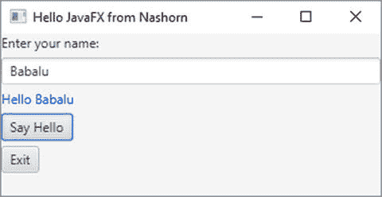

图 9-7.

使用 Nashorn 脚本创建的 JavaFX 窗口

```
C:\Java9APIsAndModules>jjs -fx scripts/hellojavafx.js
```

`jjs` 命令行工具使得处理 JavaFX 应用程序变得非常容易。你只需一行代码即可在 JavaFX 窗口中显示消息。Nashorn 创建了一个名为 `$STAGE` 的全局变量，它是 JavaFX 应用程序主舞台的引用。请注意，仅当你使用带有 `–fx` 选项的 `jjs` 工具时，`$STAGE` 全局变量才在脚本中可用。清单 9-34 展示了最简单的 JavaFX 应用程序的代码，该应用程序在 JavaFX 窗口中显示一个带有消息的 `Label`。将其保存在名为 `simplestfxapp.js` 的文件中。请注意，你不再需要为 `start()` 方法创建函数。你甚至不需要在 `$STAGE` 变量上调用 `show()` 方法。Nashorn 会自动显示舞台。

```
// simplestfxapp.js
$STAGE.scene = new javafx.scene.Scene(new javafx.scene.control.Label("Hello JavaFX Scripting"));
清单 9-34.
在 Nashorn 脚本中使用 $STAGE 全局变量
```

以下命令将运行最简单的 JavaFX 应用程序，该应用程序显示一个窗口，如图 9-8 所示。


图 9-8.

使用 Nashorn 脚本的最简单 JavaFX 应用程序

```
C:\Java9APIsAndModules>jjs -fx scripts/simplestfxapp.js
```


## 摘要

脚本语言是一种编程语言，它使你能够编写由称为脚本引擎（或解释器）的运行时环境评估（或解释）的脚本。脚本是使用脚本语言的语法编写的一系列字符，并作为由解释器执行的程序的源代码。Java 脚本 API 允许你从 Java 应用程序执行用任何可编译为 Java 字节码的脚本语言编写的脚本。JDK6 和 JDK7 附带了一个名为 Rhino JavaScript 引擎的脚本引擎。在 JDK8 中，Rhino JavaScript 引擎已被名为 Nashorn 的脚本引擎取代。

脚本使用脚本引擎执行，该引擎是 `ScriptEngine` 接口的一个实例。`ScriptEngine` 接口的实现者还提供了 `ScriptEngineFactory` 接口的实现，其工作是创建脚本引擎的实例并提供有关脚本引擎的详细信息。`ScriptEngineManager` 类为脚本引擎提供了一种发现和实例化机制。`ScriptManager` 维护一个键值对映射，作为 `Bindings` 接口的一个实例，该映射由其创建的所有脚本引擎共享。

你可以执行包含在 `String` 或 `Reader` 中的脚本。`ScriptEngine` 的 `eval()` 方法用于执行脚本。你可以使用 `ScriptContext` 将参数传递给脚本。传递的参数可以是脚本引擎本地的、脚本执行本地的，或者是由 `ScriptManager` 创建的所有脚本引擎全局共享的。使用 Java 脚本 API，你还可以执行用脚本语言编写的过程和函数。如果脚本引擎支持，你还可以预编译脚本，并从 Java 重复执行脚本以获得更好的性能。

你可以使用 Java 脚本 API 实现自己的脚本引擎。你需要为 `ScriptEngine` 和 `ScriptEngineFactory` 接口提供实现。你需要以特定方式打包你的脚本引擎代码，以便 `ScriptManager` 在运行时可以发现该引擎。

Java 8 附带两个名为 `jrunscript` 和 `jjs` 的命令行工具。它们位于 `JDK_HOME\bin` 目录中。它们用于在命令行上运行脚本。`jrunscript` 工具是脚本语言中立的；它可以用于执行任何脚本语言（如 Nashorn、JRuby、groovy 等）编写的脚本。`jjs` 工具用于运行 Nashorn 脚本及其扩展；你可以使用 `jjs` 工具运行 shell 命令、脚本和 Java 应用程序。

问题与练习

1.  什么是脚本语言？  
2.  哪个 JDK 模块包含脚本 API？  
3.  什么是 Nashorn JavaScript？  
4.  与 JDK9 捆绑在一起的脚本引擎的名称是什么？  
5.  简要描述以下类和接口的用途：`ScriptEngineFactory`、`ScriptEngine`、`ScriptEngineManager`、`Compilable`、`Invocable`、`Bindings`、`ScriptContext` 和 `ScriptException`。  
6.  `ScriptEngine` 的 `eval()` 方法有什么用途？  
7.  编写一个程序，在其中使用 `SimpleScriptContext` 类创建 `ScriptContext` 接口的一个实例。在引擎作用域和全局作用域中存储一些属性，检索相同的属性，并打印它们的值。  
8.  如何向全局作用域和引擎作用域添加属性？  
9.  如何将由 `ScriptEngine` 执行的脚本的输出发送到文件？  
10. 编写一段代码片段，检查 `ScriptEngine` 是否支持编译脚本。  
11. 编写部分 `java` 命令，在其中启用 Nashorn 中的 ES6 支持。  
12. 如何使用 `Packages` 对象和 `Java.type()` 函数将 Java 类型导入 Nashorn JavaScript？  
13. 使用 `java.util.List` 接口的 `of()` 方法创建一个包含两个字符串的不可修改列表，并打印列表中的值。使用 Nashorn JavaScript 编写代码。  
14. 创建一个 `int` 数组。向数组中添加两个元素，值分别为 100 和 300。打印数组中的元素——每个元素占一行。使用 Nashorn JavaScript 编写代码。  
15. 如果你想推出自己的脚本引擎，你必须提供其实现的服务接口的名称是什么？  
16. `jrunscript` 和 `jjs` 工具是什么？  
17. 如何启动 `jjs` 工具以便执行 shell 脚本？  
18. 如何退出 `jjs` 工具？

# 10. 进程 API

在本章中，你将学习：

*   什么是进程 API
*   如何与运行 Java 应用程序的当前进程交互
*   如何创建原生进程
*   如何获取有关新进程的信息
*   如何获取有关当前进程的信息
*   如何获取有关所有系统进程的信息
*   如何设置创建、查询和管理原生进程的权限

本章中的所有示例程序都是 `jdojo.process` 模块的成员，如清单 10-1 所示。

```
// module-info.java
module jdojo.process {
    exports com.jdojo.process;
}
清单 10-1.
jdojo.process 模块的声明
```


## 什么是进程 API？

进程 API 由一系列类和接口组成，让你能够在 Java 程序中操作原生进程。使用该 API，你可以：

*   从 Java 代码创建新的原生进程。
*   获取原生进程的进程句柄，无论这些进程是由 Java 代码还是其他方式创建的。
*   销毁正在运行的原生进程。
*   查询进程的活动状态及其他属性。
*   获取进程的子进程列表及其父进程。
*   获取原生进程的进程 ID（PID）。
*   获取新创建进程的输入、输出和错误流。
*   等待进程终止。
*   在进程终止时执行任务。

进程 API 规模较小，由表 10-1 中列出的类和接口组成。我将在后续章节中通过示例详细解释这些类和接口。

表 10-1.

为 JKScript 脚本引擎开发的类

| 类/接口 | 描述 |
| --- | --- |
| `Runtime` | 这是一个单例类，其唯一实例代表 Java 应用程序的运行时环境。 |
| `ProcessBuilder` | `ProcessBuilder` 类的实例保存了一组进程属性。调用其 `start()` 方法会启动一个原生进程，并返回一个代表该原生进程的 `Process` 类实例。你可以多次调用其 `start()` 方法；每次调用都会使用 `ProcessBuilder` 实例中保存的属性启动一个新进程。 |
| `ProcessBuilder.Redirect` | 这是一个静态嵌套类，代表进程输入的来源或进程输出的目标。它是在 JDK9 中新增的。 |
| `Process` | 这是一个抽象类，其实例代表由当前 Java 程序通过 `ProcessBuilder` 的 `start()` 方法或 `Runtime` 的 `exec()` 方法启动的原生进程。 |
| `ProcessHandle` | 这是一个接口，其实例代表原生进程的句柄，无论这些进程是由当前 Java 程序还是其他方式启动的。你可以使用此句柄控制并查询原生进程的状态。它是在 JDK9 中新增的。 |
| `ProcessHandle.Info` | `ProcessHandle.Info` 接口的实例代表进程属性的快照。它是在 JDK9 中新增的。 |

在 Java 9 之前，进程 API 仍然缺乏对操作原生进程的基本支持，例如获取进程的 PID 和所有者、进程的启动时间、进程已使用的 CPU 时间、当前正在运行的原生进程数量等。请注意，在 Java 9 之前，你可以启动原生进程并处理其输入、输出和错误流。但是，你无法操作并非由你启动的原生进程，也无法查询进程的详细信息。为了更深入地操作原生进程，Java 开发人员不得不使用 Java 原生接口（JNI）编写原生代码。Java 9 提供了这些操作原生进程所急需的功能。

Java 9 在进程 API 中新增了一个名为 `ProcessHandle` 的接口。`ProcessHandle` 接口的实例标识一个原生进程；它允许你查询进程状态并管理进程。

比较一下 `Process` 类和 `ProcessHandle` 接口。`Process` 类的实例代表由当前 Java 程序启动的原生进程，而 `ProcessHandle` 接口的实例则代表一个原生进程，无论它是由当前 Java 程序还是其他方式启动的。在 Java 9 中，`Process` 类新增了几个方法，这些方法在新的 `ProcessHandle` 接口中同样可用。`Process` 类包含一个 `toHandle()` 方法，该方法返回一个 `ProcessHandle`。

`ProcessHandle.Info` 接口的实例代表进程属性的快照。请注意，不同操作系统对进程的实现方式不同，因此它们的属性也各不相同。进程的状态可能随时发生变化，例如，每当进程获得更多 CPU 时间时，其使用的 CPU 时间就会增加。要获取进程的最新信息，你需要在需要时使用 `ProcessHandle` 接口的 `info()` 方法，该方法将返回一个新的 `ProcessHandle.Info` 接口实例。

本章中的所有示例均在 Windows 10 上运行。如果你在自己的机器上使用 Windows 10 或其他操作系统运行这些程序，可能会得到不同的输出。


## 了解运行时环境

每个 Java 应用程序都有一个 `Runtime` 类的实例，它允许你查询当前 Java 应用程序所运行的运行时环境并与之交互。`Runtime` 类是一个单例类。你可以通过该类的 `getRuntime()` 静态方法获取其唯一实例：

```
// 获取 Runtime 实例
Runtime runtime = Runtime.getRuntime();
```

使用 `Runtime`，你可以了解当前 JVM 可使用的最大内存、JVM 中当前已分配的内存以及 JVM 中的空闲内存。以下是三个允许你以字节为单位查询 JVM 内存的方法：

*   `long maxMemory()`
*   `long totalMemory()`
*   `long freeMemory()`

JVM 会惰性地分配内存。`maxMemory()` 方法返回 JVM 可以分配的最大内存量。如果没有最大内存限制，该方法返回 `Long.MAX_VALUE`。

`totalMemory()` 方法返回 JVM 在其可分配的最大内存中当前已分配的内存。当 JVM 需要更多内存时，它会分配更多内存，而 `totalMemory()` 方法将返回当前已分配的内存。JVM 最多可以分配 `maxMemory()` 方法返回的内存大小。

`freeMemory()` 方法返回 JVM 当前已分配内存中未使用的部分。如何了解 JVM 已使用的内存？以下公式将给出 JVM 在特定时间点使用的内存：

```
已用内存 = 总内存 - 空闲内存
```

使用 `availableProcessors()` 方法获取 JVM 可用的处理器数量。

使用 `version()` 方法获取一个 `Runtime.Version` 对象，该对象表示 Java 运行时环境的版本。`version()` 方法是在 JDK9 中添加到 `Runtime` 类的。有关 JDK9 中新的 JDK/JRE 版本控制方案的更多详细信息，请参阅 `Runtime.Version` 类的 Javadoc。清单 10-2 展示了 `Runtime` 类在查询 Java 运行时环境方面的一些应用。你可能会得到不同的输出。

```
// QueryingRuntime.java
package com.jdojo.process;
public class QueryingRuntime {
public static void main(String[] args) {
// 获取 Runtime 实例
Runtime rt = Runtime.getRuntime();
// 获取 JVM 内存
long maxMemory = rt.maxMemory();
long totalMemory = rt.totalMemory();
long freeMemory = rt.freeMemory();
long usedMemory = totalMemory - freeMemory;
System.out.format("最大内存 = %d, 总内存 = %d,"
+ "空闲内存 = %d, 已用内存 = %d.%n",
maxMemory, totalMemory, freeMemory, usedMemory);
// 打印 JVM 可用的处理器数量
int processors = rt.availableProcessors();
System.out.format("处理器数量 = %d%n", processors);
// 打印 Java 运行时的版本
Runtime.Version version = rt.version();
System.out.format("处理器数量 = %s%n", version);
}
}
清单 10-2.
查询 Java 运行时环境
```

```
最大内存 = 2113929216, 总内存 = 132120576,空闲内存 = 125994760, 已用内存 = 6125816.
处理器数量 = 4
处理器数量 = 9.0.1+11
```

你可以使用 `Runtime` 类的 `gc()` 方法调用垃圾回收。`System.gc()` 静态方法是 `Runtime.getRuntime().gc()` 的便捷方法。

你可以使用 `Runtime` 类的 `exit(int status)` 方法终止 JVM。`System.exit()` 静态方法是 `Runtime.getRuntime().exit()` 的便捷方法。按照惯例，`status` 的非零值表示 JVM 异常终止。你可以使用 `Runtime` 类的 `halt()` 方法强制终止 JVM。

你可以使用 `Runtime` 类的 `addShutdownHook(Thread hook)` 和 `removeShutdownHook(Thread hook)` 方法向 JVM 添加和移除关闭钩子。关闭钩子是一个已初始化但未启动的线程。当 JVM 终止时，它会启动注册为关闭钩子的线程。

使用其重载的 `exec()` 方法之一来启动一个原生进程。你应该使用 `ProcessBuilder` 类来启动原生进程。`Runtime` 类的 `exec()` 方法内部使用 `ProcessBuilder` 类。

## 当前进程

`ProcessHandle` 接口的 `current()` 静态方法返回当前进程的句柄。请注意，此方法返回的当前进程始终是正在执行代码的 Java 进程。

```
// 获取当前进程的句柄
ProcessHandle current = ProcessHandle.current();
```

一旦获取了当前进程的句柄，你就可以使用 `ProcessHandle` 接口的方法来获取有关该进程的详细信息。有关如何获取当前进程信息的示例，请参阅下一节。

提示

你不能杀死当前进程。尝试使用 `ProcessHandle` 接口的 `destroy()` 或 `destroyForcibly()` 方法杀死当前进程会导致 `IllegalStateException`。


## 查询进程状态

你可以使用 `ProcessHandle` 接口中的方法来查询进程的状态。表 10-2 列出了该接口中常用的方法及其简要说明。请注意，其中许多方法返回的是进程在快照创建时的状态快照。由于进程是异步创建、运行和销毁的，因此无法保证稍后使用其属性时，进程仍处于相同状态。

表 10-2.

ProcessHandle 接口中的方法

| 方法 | 描述 |
| --- | --- |
| `static Stream<ProcessHandle> allProcesses()` | 返回操作系统中当前进程可见的所有进程的快照。 |
| `Stream<ProcessHandle> children()` | 返回当前进程的直接子进程的快照。使用 `descendants()` 方法可以获取所有层级的子进程列表，例如，子进程、孙进程、曾孙进程等。 |
| `static ProcessHandle current()` | 返回当前进程的 `ProcessHandle`，即执行此方法调用的 Java 进程。 |
| `Stream<ProcessHandle> descendants()` | 返回进程的后代进程的快照。与仅返回进程直接后代的 `children()` 方法进行比较。 |
| `boolean destroy()` | 请求终止进程。如果成功请求终止进程，则返回 `true`，否则返回 `false`。能否终止进程取决于操作系统的访问控制。 |
| `boolean destroyForcibly()` | 请求强制终止进程。如果成功请求终止进程，则返回 `true`，否则返回 `false`。强制终止会立即结束进程，而正常终止则允许进程进行清理后关闭。能否终止进程取决于操作系统的访问控制。 |
| `ProcessHandle.Info info()` | 返回进程信息的快照。 |
| `boolean isAlive()` | 如果此 `ProcessHandle` 所代表的进程尚未终止，则返回 `true`，否则返回 `false`。请注意，在成功请求终止进程后的一段时间内，此方法可能仍返回 `true`，因为进程是异步终止的。 |
| `static Optional<ProcessHandle> of(long pid)` | 返回一个现有本地进程的 `Optional<ProcessHandle>`。如果具有指定 `pid` 的进程不存在，则返回空的 `Optional`。 |
| `CompletableFuture <ProcessHandle> onExit()` | 返回一个用于进程终止的 `CompletableFuture <ProcessHandle>`。你可以使用返回的对象添加一个任务，该任务将在进程终止时执行。对当前进程调用此方法会抛出 `IllegalStateException`。 |
| `Optional<ProcessHandle> parent()` | 返回父进程的 `Optional<ProcessHandle>`。 |
| `long pid()` | 返回进程的本地进程 ID（PID），该 ID 由操作系统分配。请注意，操作系统可能会重用 PID，因此具有相同 PID 的两个进程句柄可能不代表同一个进程。 |
| `boolean supportsNormalTermination()` | 如果 `destroy()` 的实现能够正常终止进程，则返回 `true`。 |

表 10-3 列出了 `ProcessHandle.Info` 嵌套接口的方法和描述。该接口的实例包含进程的快照信息。你可以使用 `ProcessHandle` 接口或 `Process` 类的 `info()` 方法获取 `ProcessHandle.Info`。该接口中的所有方法都返回一个 `Optional`。

表 10-3.

ProcessHandle.Info 接口中的方法

| 方法 | 描述 |
| --- | --- |
| `Optional<String[]> arguments()` | 返回进程的参数。进程在启动后可能会更改传递给它的原始参数。在这种情况下，此方法返回更改后的参数。 |
| `Optional<String> command()` | 返回进程的可执行文件路径名。 |
| `Optional<String> commandLine()` | 这是一个便捷方法，用于组合进程的命令和参数。如果 `command()` 和 `arguments()` 方法都返回非空的 `Optional`，则通过组合这两个方法返回的值来返回进程的命令行。 |
| `Optional<Instant> startInstant()` | 返回进程的启动时间。如果操作系统不返回启动时间，则返回空的 `Optional`。 |
| `Optional<Duration> totalCpuDuration()` | 返回进程使用的总 CPU 时间。请注意，进程可能运行很长时间，但使用的 CPU 时间却很少。 |
| `Optional<String> user()` | 返回进程的用户。 |

现在是时候看看 `ProcessHandle` 和 `ProcessHandle.Info` 接口的实际应用了。清单 10-3 包含一个名为 `CurrentProcessInfo` 的类的代码。其 `printInfo()` 方法接受一个 `ProcessHandle` 作为参数，并打印该进程的详细信息。我们也会在其他示例中使用此方法来打印进程的详细信息。`main()` 方法获取当前运行进程（即一个 Java 进程）的句柄，并打印其详细信息。你得到的输出可能不同。以下输出是在 Windows 10 上运行该程序时生成的。

```
// CurrentProcessInfo.java
package com.jdojo.process;
import java.time.Duration;
import java.time.Instant;
import java.time.ZoneId;
import java.time.ZonedDateTime;
import java.util.Arrays;
public class CurrentProcessInfo {
public static void main(String[] args) {
// 获取当前进程的句柄
ProcessHandle current = ProcessHandle.current();
// 打印进程详细信息
printInfo(current);
}
public static void printInfo(ProcessHandle handle) {
// 获取进程 ID
long pid = handle.pid();
// 进程是否仍在运行
boolean isAlive = handle.isAlive();
// 获取其他进程信息
ProcessHandle.Info info = handle.info();
String command = info.command().orElse("");
String[] args = info.arguments()
.orElse(new String[]{});
String commandLine = info.commandLine().orElse("");
ZonedDateTime startTime = info.startInstant()
.orElse(Instant.now())
.atZone(ZoneId.systemDefault());
Duration duration = info.totalCpuDuration()
.orElse(Duration.ZERO);
String owner = info.user().orElse("Unknown");
long childrenCount = handle.children().count();
// 打印进程详细信息
System.out.printf("PID: %d%n", pid);
System.out.printf("IsAlive: %b%n", isAlive);
System.out.printf("Command: %s%n", command);
System.out.printf("Arguments: %s%n", Arrays.toString(args));
System.out.printf("CommandLine: %s%n", commandLine);
System.out.printf("Start Time: %s%n", startTime);
System.out.printf("CPU Time: %s%n", duration);
System.out.printf("Owner: %s%n", owner);
System.out.printf("Children Count: %d%n", childrenCount);
}
}
清单 10-3.
一个打印当前进程详细信息的 CurrentProcessInfo 类
```

```
PID: 13420
IsAlive: true
Command: C:\java9\bin\java.exe
Arguments: []
CommandLine:
Start Time: 2018-01-21T12:48:14.406-06:00[America/Chicago]
CPU Time: PT0.625S
Owner: kishori\ksharan
Children Count: 1
```


## 比较进程

比较两个进程是否相等或排序是件棘手的事。你不能依赖 PID 来判断进程是否相等。操作系统会在进程终止后重用 PID。你可以同时检查进程的启动时间和 PID；如果两者都相同，那么这两个进程可能是同一个。`ProcessHandle` 接口默认实现的 `equals()` 方法会检查以下三项信息来判断两个进程是否相等：

*   两个进程的 `ProcessHandle` 接口的实现类必须相同。
*   进程必须具有相同的 PID。
*   进程必须是在同一时间启动的。

提示

使用 `ProcessHandle` 接口中 `compareTo()` 方法的默认实现来进行排序并不是很有用。它比较的是两个进程的 PID。

## 创建进程

你需要使用 `ProcessBuilder` 类的实例来启动一个新的原生进程。`ProcessBuilder` 管理着一组原生进程的属性。一旦你为进程设置了所有属性，就可以调用其 `start()` 方法来启动一个新的原生进程。存储在 `ProcessBuilder` 中的属性将用于启动新进程。你可以多次调用 `start()` 方法，使用存储在 `ProcessBuilder` 中的属性来启动新进程。`start()` 方法返回一个代表新原生进程的 `Process` 类实例。你可以使用以下构造函数之一来创建 `ProcessBuilder` 类的实例：

*   `ProcessBuilder(String... command)`
*   `ProcessBuilder(List<String> command)`

这些构造函数允许你指定操作系统程序和参数。假设你想在 Windows 上运行位于 `C:\java9\bin` 目录下的 `java.exe` 程序，命令如下：

```
C:\java9\bin\java.exe --version
```

你可以像这样创建一个 `ProcessBuilder` 来表示此命令：

```
ProcessBuilder pb = new ProcessBuilder("C:\\java9\\bin\\java.exe", "--version");
```

使用 `ProcessBuilder` 类的方法，你可以管理进程的以下属性：

*   命令
*   环境
*   工作目录
*   标准 I/O（`stdin`、`stdout` 和 `stderr`）
*   标准错误流的重定向属性

命令就是一个字符串列表，代表外部程序及其参数。你可以在 `ProcessBuilder` 类的构造函数中设置命令。以下方法允许你检索命令字符串并设置更多命令字符串。

*   `List<String> command()`
*   `ProcessBuilder command(String... command)`

不带任何参数的 `command()` 方法返回已在 `ProcessBuilder` 中设置的命令字符串。带有可变参数 `varargs` 的 `command()` 方法允许你添加更多命令字符串。以下代码片段创建了一个 `ProcessBuilder` 用于在 Windows 上启动 JVM。它使用 `command()` 方法来设置命令属性。

```
ProcessBuilder pb = new ProcessBuilder()
.command("C:\\java9\\bin\\java.exe",
"--module-path",
"myModulePath",
"--module",
"myModule/className");
```

环境是一组依赖于系统的键值对。它被初始化为从 `System.getEnv()` 静态方法返回的 `Map<String,String>` 的一个副本。你需要使用 `ProcessBuilder` 类的 `environment()` 方法来获取 `Map<String,String>`，并向该映射中添加键值对。以下代码片段展示了如何为 `ProcessBuilder` 设置环境属性：

```
ProcessBuilder pb = new ProcessBuilder("mycommand");
Map env = pb.environment();
env.put("arg1", "value1");
env.put("arg2", "value2");
```

默认情况下，新进程的工作目录将是当前 Java 进程的工作目录，该目录通常由系统属性 `user.dir` 命名。`ProcessBuilder` 类中的以下方法允许你获取和设置工作目录：

*   `File directory()`
*   `ProcessBuilder directory(File directory)`

以下代码片段展示了如何在 Windows 上将工作目录设置为 `C:\mydir`：

```
ProcessBuilder pb = new ProcessBuilder("myCommand")
.directory(new File("C:\\mydir"));
```


`ProcessBuilder`的`start()`方法创建的新进程是当前进程的子进程，当前进程即运行该代码的 Java 进程。换言之，当前 Java 进程是新创建进程的父进程。新进程没有用于标准 I/O（`stdin`、`stdout`和`stderr`）的终端或控制台。默认情况下，新进程的 I/O 通过管道连接到父进程。你可以通过调用`ProcessBuilder`的`inheritIO()`方法，选择将新进程的标准 I/O 设置为其父进程的相同 I/O。`ProcessBuilder`类中有多个`redirectXxx()`方法，用于自定义新进程的标准 I/O，例如，将标准错误流设置到文件，以便将所有错误记录到文件中。

配置完进程的所有属性后，可以调用`start()`来启动进程：

```
// 启动一个新进程
Process newProcess = pb.start();
```

你可以多次调用`ProcessBuilder`类的`start()`方法，以使用先前存储的相同属性启动多个进程。这样做的好处是性能更优，你可以创建一个`ProcessBuilder`实例并重复使用它来多次启动同一个进程。

你可以使用`Process`类的`toHandle()`方法获取进程的进程句柄：

```
// 获取进程句柄
ProcessHandle handle = newProcess.toHandle();
```

你可以使用进程句柄来销毁进程、等待进程结束，或查询进程的状态和属性，例如其子进程、后代、父进程、使用的 CPU 时间等。你获取到的进程信息以及对进程的控制能力，取决于操作系统的访问控制。

要编写能在所有操作系统上运行的创建进程的示例，需要一些技巧。如果你能运行本书中的其他示例，说明你的机器上已安装了 JDK9。你可以使用机器上的`java`程序来启动示例中的其他进程。你可以使用当前进程（即当前正在运行的`java`程序）的命令属性来获取机器上 Java 程序的路径，这样示例就能在所有平台上运行。

让我们来看几个使用 Java 程序创建原生进程的示例。你可以分别使用`--version`和`-version`选项，将 Java 产品版本信息打印到标准输出和标准错误，如下所示：

```
java --version
```

```
java 9.0.1
Java(TM) SE Runtime Environment (build 9.0.1+11)
Java HotSpot(TM) 64-Bit Server VM (build 9.0.1+11, mixed mode)
```

```
java -version
```

```
java version "9.0.1"
Java(TM) SE Runtime Environment (build 9.0.1+11)
Java HotSpot(TM) 64-Bit Server VM (build 9.0.1+11, mixed mode)
```

在前面的输出中，你看不到输出打印位置有任何区别。两个输出都打印到同一个控制台，因为默认情况下，标准输出和标准错误都映射到控制台。然而，当你尝试在程序中捕获这两个命令的输出时，就会看到区别。

清单 10-4 展示了一个程序，它运行`java --version`命令，将 Java 产品信息打印到标准输出。

```
// PipedIO.java
package com.jdojo.process;
import java.io.IOException;
public class PipedIO {
public static void main(String[] args) {
// 获取启动此程序的 java 程序的路径
String javaPath = ProcessHandle.current()
.info()
.command().orElse(null);
if(javaPath == null) {
System.out.println("无法获取 java 命令的路径。");
return;
}
// 配置 ProcessBuilder
ProcessBuilder pb = new ProcessBuilder(javaPath,  "--version");
try {
// 启动一个新的 java 进程
Process p = pb.start();
} catch (IOException e) {
e.printStackTrace();
}
}
}
清单 10-4.
捕获原生进程的输出
```


当你运行 `ProcessIO` 类程序时，它不会打印任何内容。输出去了哪里？该程序创建了一个新进程，并且该进程的标准输出通过管道连接到了父进程。如果你想访问输出，你需要从相应的管道中读取。当新进程的标准 I/O 通过管道连接到父进程时，你可以使用 `Process` 类的以下方法来获取新进程的 I/O 流：

*   `OutputStream getOutputStream()`
*   `InputStream getInputStream()`
*   `InputStream getErrorStream():`

`getOutputStream()` 方法返回的 `OutputStream` 连接到新进程的标准输入流。向此输出流写入数据将通过管道传输到新进程的标准输入。

`getInputStream()` 方法返回的 `InputStream` 连接到新进程的标准输出。如果你想捕获新进程的标准输出，你需要从这个输入流中读取。

`getErrorStream()` 方法返回的 `InputStream` 连接到新进程的标准错误。如果你想捕获新进程的标准错误，你需要从这个输入流中读取。有时，你可能希望将标准输出和标准错误的输出合并到一个目标。这样可以提供输出和错误的精确顺序，便于排查问题。你可以调用 `ProcessBuilder` 的 `redirectErrorStream(true)` 方法，将写入标准错误的数据发送到标准输出。稍后我会展示此类示例。

提示

你可以选择将新进程的标准 I/O 重定向到其他目标，例如文件，在这种情况下，`getOutputStream()`、`getInputStream()` 和 `getErrorStream()` 方法将返回 `null`。

清单 10-5 中的程序修复了 `PipedIO` 类中无法获取任何输出的问题。它读取并打印通过管道写入标准输出流的数据。

```
// CapturePipedIO.java
package com.jdojo.process;
import java.io.BufferedReader;
import java.io.IOException;
import java.io.InputStreamReader;
public class CapturePipedIO {
public static void main(String[] args) {
// 获取启动此程序的 java 命令的路径
String javaPath = ProcessHandle.current()
.info()
.command().orElse(null);
if (javaPath == null) {
System.out.println("无法获取 java 命令的路径。");
return;
}
// 配置 ProcessBuilder
ProcessBuilder pb = new ProcessBuilder(javaPath, "--version");
try {
// 启动一个新的 java 进程
Process p = pb.start();
// 读取并打印进程的标准输出流
try (BufferedReader input =
new BufferedReader(new InputStreamReader(p.getInputStream()))) {
String line;
while ((line = input.readLine()) != null) {
System.out.println(line);
}
}
} catch (IOException e) {
e.printStackTrace();
}
}
}
清单 10-5.
捕获原生进程的输出
```

```
java 9.0.1
Java(TM) SE Runtime Environment (build 9.0.1+11)
Java HotSpot(TM) 64-Bit Server VM (build 9.0.1+11, mixed mode)
```

如果你使用 `-version` 选项运行 `java` 命令，输出会写入标准错误。如果你将清单 10-5 中的选项从 `--version` 改为 `-version`，你将再次无法获得任何输出，因为输出将通过管道传输到标准错误流。你有两种方法来解决这个问题：

*   在程序中，从 `Process` 的 `getErrorStream()` 方法返回的 `InputStream` 中读取，而不是从 `getInputStream()` 方法返回的 `InputStream` 中读取。
*   将错误流重定向到标准输出流，并继续从标准输出中读取。

以下代码片段使用 `java -version` 命令创建了一个 `ProcessBuilder`，并将错误流重定向到标准输出：

```
// 配置 ProcessBuilder
ProcessBuilder pb = new ProcessBuilder(javaPath, "-version")
.redirectErrorStream(true);
```

如果你将清单 10-5 中创建 `ProcessBuilder` 的语句替换为此语句，你的程序将正常工作。

新进程也可以继承父进程的标准 I/O。如果你想将新进程的所有 I/O 目标设置为与当前进程相同，请使用 `ProcessBuilder` 的 `inheritIO()` 方法，如下所示：

```
// 配置 ProcessBuilder 以继承父进程的 I/O
ProcessBuilder pb = new ProcessBuilder(javaPath,  "--version")
.inheritIO();
```

如果你将清单 10-4 中的代码修改为与上述代码片段一致，你将看到输出。

`ProcessBuilder.Redirect` 嵌套类表示由 `ProcessBuilder` 创建的新进程的输入源和输出目标。该类定义了以下三个 `ProcessBuilder.Redirect` 类型的常量：

*   `ProcessBuilder.Redirect DISCARD`：丢弃新进程的输出。此常量在 JDK9 中添加。
*   `ProcessBuilder.Redirect.INHERIT`：表示新进程的输入源或输出目标将与当前进程相同。
*   `ProcessBuilder.Redirect.PIPE`：表示新进程将通过管道连接到当前进程，这是默认设置。

你还可以使用 `Process.Redirect` 类的以下方法将新进程的输入和输出重定向到文件：

*   `ProcessBuilder.Redirect appendTo(File file)`
*   `ProcessBuilder.Redirect from(File file)`
*   `ProcessBuilder.Redirect to(File file)`

在前面的代码片段中，你看到了如何使用 `ProcessBuilder` 类的 `inheritIO()` 方法让新进程拥有与当前进程相同的标准 I/O。你可以将那段代码重写如下：

```
// 配置 ProcessBuilder 以继承父进程的 I/O
ProcessBuilder pb = new ProcessBuilder(javaPath, "--version")
.redirectInput(ProcessBuilder.Redirect.INHERIT)
.redirectOutput(ProcessBuilder.Redirect.INHERIT)
.redirectError(ProcessBuilder.Redirect.INHERIT);
```

以下代码片段将新进程的标准输出重定向到当前目录下名为 `java_product_details.txt` 的文件。

```
// 配置 ProcessBuilder
ProcessBuilder pb = new ProcessBuilder(javaPath, "--version")
.redirectOutput(ProcessBuilder.Redirect.to(
new File("java_product_details.txt")));
```

让我们看一个稍微复杂一点的例子，它将探索更多关于新原生进程的信息。清单 10-6 包含一个名为 `Job` 的类的代码。其 `main()` 方法期望两个参数：睡眠间隔和睡眠持续时间（以秒为单位）。如果未传递这些参数，该方法将使用 5 秒和 60 秒作为默认值。在第一部分中，该方法尝试提取第一个和第二个参数（如果指定）。在第二部分中，它使用 `ProcessHandle.current()` 方法获取执行此方法的当前进程的进程句柄。它读取当前进程的 PID 并打印一条包含 PID、睡眠间隔和睡眠持续时间的消息。最后，它启动一个 `for` 循环，并持续休眠指定的睡眠间隔，直到达到睡眠持续时间。在循环的每次迭代中，它都会打印一条消息。


```
// Job.java
package com.jdojo.process;
import java.io.IOException;
import java.util.ArrayList;
import java.util.List;
import java.util.concurrent.TimeUnit;
import java.util.stream.Collectors;
/**
* 此类的实例用作一个任务，该任务按固定间隔休眠，直至达到最大持续时间。
* 运行此类时，可通过第一个参数指定休眠间隔（秒），通过第二个参数指定休眠持续时间（秒）。
* 默认休眠间隔为 5 秒，默认休眠持续时间为 60 秒。如果这些值小于零，则使用零代替。
*/
public class Job {
// 任务休眠间隔
public static final long DEFAULT_SLEEP_INTERVAL = 5;
// 任务休眠持续时间
public static final long DEFAULT_SLEEP_DURATION = 60;
public static void main(String[] args) {
long sleepInterval = DEFAULT_SLEEP_INTERVAL;
long sleepDuration = DEFAULT_SLEEP_DURATION;
// 获取传入的休眠间隔
if (args.length >= 1) {
sleepInterval = parseArg(args[0], DEFAULT_SLEEP_INTERVAL);
if (sleepInterval = 2) {
sleepDuration = parseArg(args[1], DEFAULT_SLEEP_DURATION);
if (sleepDuration 
List cmd = new ArrayList();
// 按顺序添加命令组件
addJvmPath(cmd);
addModulePath(cmd);
addClassPath(cmd);
addMainClass(cmd);
// 添加运行类的参数
cmd.add(String.valueOf(sleepInterval));
cmd.add(String.valueOf(sleepDuration));
// 构建进程属性
ProcessBuilder pb = new ProcessBuilder()
.command(cmd)
.inheritIO();
String commandLine = pb.command()
.stream()
.collect(Collectors.joining(" "));
System.out.println("使用的命令:\n" + commandLine);
// 启动进程
Process p = null;
try {
p = pb.start();
} catch (IOException e) {
e.printStackTrace();
}
return p;
}
/**
* 用于解析传递给 JVM 的参数，这些参数随后会传递给 main()方法。
*
* @param valueStr 参数的字符串值
* @param defaultValue 如果 valueStr 不是整数，则使用此默认值
* @return 如果 valueStr 是整数，则返回其 long 值；否则返回 defaultValue
*/
private static long parseArg(String valueStr,
long defaultValue) {
long value = defaultValue;
if (valueStr != null) {
try {
value = Long.parseLong(valueStr);
} catch (NumberFormatException e) {
// 无需操作
}
}
return value;
}
/**
* 将 JVM 路径添加到命令列表中。它首先尝试使用当前进程的 command 属性；
* 如果失败，则依赖 java.home 系统属性。
*
* @param cmd 命令列表
*/
private static void addJvmPath(List cmd) {
// 首先尝试获取运行当前 JVM 的命令
String jvmPath = ProcessHandle.current()
.info()
.command().orElse("");
if (jvmPath.length() > 0) {
cmd.add(jvmPath);
} else {
// 尝试使用 java.home 系统属性组合 JVM 路径
final String FILE_SEPARATOR = System.getProperty("file.separator");
jvmPath = System.getProperty("java.home")
+ FILE_SEPARATOR + "bin"
+ FILE_SEPARATOR + "java";
cmd.add(jvmPath);
}
}
/**
* 将模块路径添加到命令列表中。
*
* @param cmd 命令列表
*/
private static void addModulePath(List cmd) {
String modulePath
= System.getProperty("jdk.module.path");
if (modulePath != null && modulePath.trim().length() > 0) {
cmd.add("--module-path");
cmd.add(modulePath);
}
}
/**
* 将类路径添加到命令列表中。
*
* @param cmd 命令列表
*/
private static void addClassPath(List cmd) {
String classPath = System.getProperty("java.class.path");
if (classPath != null && classPath.trim().length() > 0) {
cmd.add("--class-path");
cmd.add(classPath);
}
}
/**
* 将主类添加到命令列表中。根据 Job 类是在命名模块还是未命名模块中加载，
* 添加 module/className 或仅添加 className。
*
* @param cmd 命令列表
*/
private static void addMainClass(List cmd) {
Class cls = Job.class;
String className = cls.getName();
Module module = cls.getModule();
if (module.isNamed()) {
String moduleName = module.getName();
cmd.add("--module");
cmd.add(moduleName + "/" + className);
} else {
cmd.add(className);
}
}
}
清单 10-6.
名为 Job 的类的声明
```

`Job`类包含一个`startProcess(long sleepInterval, long sleepDuration)`方法，该方法用于启动一个新进程。它会启动一个 JVM，并将`Job`类作为主类。它将休眠间隔和持续时间作为参数传递给 JVM。该方法尝试构建一条命令，从`JDK_HOME\bin`目录启动`java`命令。如果`Job`类是在命名模块中加载的，它将构建如下命令：

```
JDK_HOME\bin\java --module-path 
--module jdojo.process/com.jdojo.process.Job  
```

如果`Job`类是在未命名模块中加载的，它将尝试构建如下命令：

```
JDK_HOME\bin\java -class-path  com.jdojo.process.Job  
```

`startProcess()`方法会打印用于启动进程的命令，尝试启动该进程，并返回进程引用。

`addJvmPath()`方法将 JVM 路径添加到命令列表中。它尝试获取当前 JVM 进程的命令，用作新进程的 JVM 路径。如果无法获取，则尝试从`java.home`系统属性构建该路径。

`Job`类包含多个实用方法，用于组合命令的各个部分以及解析传递给`main()`方法的参数。请参阅它们的 Javadoc 以获取描述。

如果你想启动一个运行 15 秒、每 5 秒唤醒一次的新进程，可以使用`Job`类的`startProcess()`方法：

```
// 启动一个运行 15 秒的进程
Process p = Job.startProcess(5, 15);
```

你可以使用在清单 10-3 中创建的`CurrentProcessInfo`类的`printInfo()`方法打印进程详细信息：

```
// 获取当前进程的句柄
ProcessHandle handle = p.toHandle();
// 打印进程详细信息
CurrentProcessInfo.printInfo(handle);
```

你可以使用`ProcessHandle`的`onExit()`方法的返回值，在进程终止时运行一个任务。

```
CompletableFuture future = handle.onExit();
// 进程终止时打印一条消息
future.thenAccept((ProcessHandle ph) -> {
System.out.printf("任务 (pid=%d) 已终止。%n", ph.pid());
});
```

你可以像这样等待新进程终止：

```
// 等待进程终止
future.get();
```

在此示例中，`future.get()`将返回进程的`ProcessHandle`。我没有使用返回值，因为我已经在`handle`变量中拥有了它。

清单 10-7 包含`StartProcessTest`类的代码，该代码展示了如何使用`Job`类创建新进程。在其`main()`方法中，它创建了一个新进程，打印进程详细信息，向进程添加了一个关闭任务，等待进程终止，然后再次打印进程详细信息。请注意，该进程运行了 15 秒，但仅使用了 0.359375 秒的 CPU 时间，因为大部分时间进程的主线程都在休眠。你可能会得到不同的输出。该输出是在 Windows 10 上运行程序时生成的。


```
// StartProcessTest.java
package com.jdojo.process;
import java.util.concurrent.CompletableFuture;
import java.util.concurrent.ExecutionException;
public class StartProcessTest {
public static void main(String[] args) {
// 启动一个运行 15 秒的进程
Process p = Job.startProcess(5, 15);
if (p == null) {
System.out.println("无法创建新进程。");
return;
}
// 获取当前进程的句柄
ProcessHandle handle = p.toHandle();
// 打印进程详细信息
CurrentProcessInfo.printInfo(handle);
CompletableFuture future = handle.onExit();
// 进程终止时打印消息
future.thenAccept((ProcessHandle ph) -> {
System.out.printf("任务 (pid=%d) 已终止。%n", ph.pid());
});
try {
// 等待进程完成
future.get();
} catch (InterruptedException | ExecutionException e) {
e.printStackTrace();
}
// 再次打印进程详细信息
CurrentProcessInfo.printInfo(handle);
}
}
清单 10-7. 创建新进程的 StartProcessTest 类
```

```
使用的命令：
C:\java9\bin\java.exe --module-path C:\Java9APIsAndModules\build\modules\jdojo.process; --module jdojo.process/com.jdojo.process.Job 5 15
PID: 10160
IsAlive: true
命令：C:\java9\bin\java.exe
参数：[]
命令行：
启动时间：2018-01-21T20:46:07.100-06:00[America/Chicago]
CPU 时间：PT0S
所有者：kishori\ksharan
子进程数：1
任务 (pid=10160) 信息：睡眠间隔=5 秒，睡眠时长=15 秒。
任务 (pid=10160) 即将休眠 5 秒。
任务 (pid=10160) 即将休眠 5 秒。
任务 (pid=10160) 即将休眠 5 秒。
任务 (pid=10160) 已终止。
PID: 10160
IsAlive: false
命令：
参数：[]
命令行：
启动时间：2018-01-21T20:46:07.100-06:00[America/Chicago]
CPU 时间：PT0.8125S
所有者：kishori\ksharan
子进程数：0
```

## 获取进程句柄

获取原生进程句柄有多种方式。对于由 Java 代码创建的进程，可以通过 `Process` 类的 `toHandle()` 方法获取 `ProcessHandle`。原生进程也可以在 JVM 外部创建。`ProcessHandle` 接口包含以下用于获取原生进程句柄的方法：

*   `static Optional<ProcessHandle> of(long pid)`
*   `static ProcessHandle current()`
*   `Optional<ProcessHandle> parent()`
*   `Stream<ProcessHandle> children()`
*   `Stream<ProcessHandle> descendants()`
*   `static Stream<ProcessHandle> allProcesses()`

静态方法 `of()` 为指定的 `pid` 返回一个 `Optional<ProcessHandle>`。如果不存在具有此 `pid` 的进程，则返回一个空的 `Optional`。要使用此方法，你需要知道进程的 PID：

```
// 获取 pid 为 1234 的进程句柄
Optional handle = ProcessHandle.of(1234L);
```

静态方法 `current()` 返回当前进程的句柄，该进程始终是执行代码的 Java 进程。你已经在清单 10-3 中看到了一个示例。

`parent()` 方法返回父进程的句柄。如果进程没有父进程或无法获取父进程，则返回一个空的 `Optional`。

`children()` 方法返回该进程所有直接子进程的快照。不保证此方法返回的进程仍然存活。请注意，不存活的进程没有子进程。

`descendants()` 方法返回该进程所有子进程（直接或间接）的快照。

`allProcesses()` 方法返回该进程可见的所有进程的快照。不保证在处理流时，流中包含操作系统中所有进程。在拍摄快照后，进程可能已终止或创建。以下代码片段按 PID 排序并打印所有进程的 PID：

```
System.out.printf("所有进程的 PID：%n");
ProcessHandle.allProcesses()
.map(ph -> ph.pid())
.sorted()
.forEach(System.out::println);
```

你可以计算所有正在运行进程的不同类型的统计信息。你还可以在 Java 中创建一个任务管理器，显示所有正在运行的进程及其属性。清单 10-8 展示了如何获取运行时间最长的进程详细信息以及使用 CPU 时间最多的进程。我通过比较进程的启动时间来获取运行时间最长的进程，通过比较总 CPU 时长来获取使用 CPU 时间最多的进程。你可能会得到不同的输出。我在 Windows 10 上运行该程序时得到了以下输出。

```
// ProcessStats.java
package com.jdojo.process;
import java.time.Duration;
import java.time.Instant;
public class ProcessStats {
public static void main(String[] args) {
System.out.printf("CPU 使用时间最长的用户进程：%n");
ProcessHandle.allProcesses()
.max(ProcessStats::compareCpuTime)
.ifPresent(CurrentProcessInfo::printInfo);
System.out.printf("%n 运行时间最长的进程：%n");
ProcessHandle.allProcesses()
.max(ProcessStats::compareStartTime)
.ifPresent(CurrentProcessInfo::printInfo);
}
public static int compareCpuTime(ProcessHandle ph1,
ProcessHandle ph2) {
return ph1.info()
.totalCpuDuration()
.orElse(Duration.ZERO)
.compareTo(ph2.info()
.totalCpuDuration()
.orElse(Duration.ZERO));
}
public static int compareStartTime(ProcessHandle ph1, ProcessHandle ph2) {
return ph1.info()
.startInstant()
.orElse(Instant.now())
.compareTo(ph2.info()
.startInstant()
.orElse(Instant.now()));
}
}
清单 10-8. 计算进程统计信息
```

```
CPU 使用时间最长的用户进程：
PID: 5808
IsAlive: true
命令：C:\Windows\explorer.exe
参数：[]
命令行：
启动时间：2018-01-15T22:17:12.521-06:00[America/Chicago]
CPU 时间：PT1H21M38.3125S
所有者：kishori\ksharan
子进程数：10
运行时间最长的进程：
PID: 0
IsAlive: false
命令：
参数：[]
命令行：
启动时间：2018-01-21T20:49:47.757303400-06:00[America/Chicago]
CPU 时间：PT0S
所有者：未知
子进程数：162
```

## 终止进程

你可以使用 `ProcessHandle` 接口和 `Process` 类的 `destroy()` 或 `destroyForcibly()` 方法终止进程。如果终止进程的请求成功，这两个方法都返回 `true`，否则返回 `false`。`destroy()` 方法请求正常终止，而 `destroyForcibly()` 方法请求强制终止。在发出终止进程请求后的短暂时间内，`isAlive()` 方法可能仍返回 `true`。

提示

你不能终止当前进程。对当前进程调用 `destroy()` 或 `destroyForcibly()` 方法会抛出 `IllegalStateException`。操作系统的访问控制可能会阻止进程被终止。

进程的正常终止允许进程干净地退出。进程的强制终止会立即终止进程。进程是否支持正常终止取决于具体实现。你可以使用 `ProcessHandle` 接口和 `Process` 类的 `supportsNormalTermination()` 方法来检查进程是否支持正常终止。如果进程支持正常终止，该方法返回 `true`，否则返回 `false`。

调用这些方法之一来终止一个已经终止的进程不会产生任何效果。当进程终止时，从 `Process` 类的 `onExit()` 返回的 `CompletableFuture<Process>` 以及从 `ProcessHandle` 接口的 `onExit()` 返回的 `CompletableFuture<ProcessHandle>` 会变为 `completed` 状态。


## 管理进程权限

在前几节的示例中，我假设没有安装 Java 安全管理器。如果安装了安全管理器，则需要授予适当的权限才能启动、管理和查询原生进程：

*   如果要创建新进程，需要拥有 `FilePermission(cmd,"execute")` 权限，其中 `cmd` 是用于创建进程的命令的绝对路径。如果 `cmd` 不是绝对路径，则需要拥有 `FilePermission("<<ALL FILES>>","execute")` 权限。
*   要使用 `ProcessHandle` 接口中的方法查询原生进程的状态并销毁进程，应用程序需要拥有 `RuntimePermission ("manageProcess")` 权限。

清单 10-9 包含一个程序，该程序获取进程计数并创建一个新进程。它在没有安全管理器和有安全管理器的情况下重复执行这两项任务。

```
// ManageProcessPermission.java
package com.jdojo.process;
import java.util.concurrent.ExecutionException;
public class ManageProcessPermission {
public static void main(String[] args) {
// 获取进程计数
long count = ProcessHandle.allProcesses().count();
System.out.printf("进程计数: %d%n", count);
// 启动一个新进程
Process p = Job.startProcess(1, 3);
try {
p.toHandle().onExit().get();
} catch (InterruptedException | ExecutionException e) {
System.out.println(e.getMessage());
}
// 安装安全管理器
SecurityManager sm = System.getSecurityManager();
if (sm == null) {
System.setSecurityManager(new SecurityManager());
System.out.println("已安装安全管理器。");
}
// 获取进程计数
try {
count = ProcessHandle.allProcesses().count();
System.out.printf("进程计数: %d%n", count);
} catch (RuntimeException e) {
System.out.println("无法获取进程计数: " + e.getMessage());
}
// 启动一个新进程
try {
p = Job.startProcess(1, 3);
p.toHandle().onExit().get();
} catch (InterruptedException | ExecutionException
| RuntimeException e) {
System.out.println("无法启动新进程: " + e.getMessage());
}
}
}
清单 10-9.
使用安全管理器管理进程
```

假设您尚未更改任何 Java 策略文件，请使用以下命令尝试运行 `ManageProcessPermission` 类：

```
C:\Java9APIsAndModules>java --module-path dist
--module jdojo.process/com.jdojo.process.ManageProcessPermission
```

```
进程计数: 161
使用的命令:
C:\java9\bin\java.exe --module-path dist --module jdojo.process/com.jdojo.process.Job 1 3
作业 (pid=15328) 信息: 休眠间隔=1 秒, 休眠时长=3 秒。
作业 (pid=15328) 即将休眠 1 秒。
作业 (pid=15328) 即将休眠 1 秒。
作业 (pid=15328) 即将休眠 1 秒。
已安装安全管理器。
无法获取进程计数: 访问被拒绝 ("java.lang.RuntimePermission" "manageProcess")
无法启动新进程: 访问被拒绝 ("java.lang.RuntimePermission" "manageProcess")
```

您可能会得到不同的输出。输出表明，在安装安全管理器之前，您能够获取进程计数并创建新进程。安装安全管理器后，Java 运行时在请求进程计数和创建新进程时抛出异常。要解决此问题，您需要授予以下权限：

*   `"manageProcess" RuntimePermission`，这将允许应用程序查询原生进程并创建新进程。
*   Java 命令路径上的 `"execute" FilePermission`，这将允许启动 JVM。
*   系统属性 `"jdk.module.path"` 和 `"java.class.path"` 上的 `"read" PropertyPermission`，以便 `Job` 类在构建启动 JVM 的命令行时可以读取这些属性。

清单 10-10 包含一个脚本，用于向所有代码授予这四项权限。您需要将此脚本添加到您机器上的 `JDK_HOME\conf\security\java.policy` 文件中。Java 启动器的路径是 `C:\\java9\\bin\\java.exe`，仅当您在 `C:\java9` 目录中安装了 JDK9 时，此路径在 Windows 上才有效。对于所有其他平台和 JDK 安装，请修改此路径以指向您机器上正确的 Java 启动器。

```
grant {
permission java.lang.RuntimePermission "manageProcess";
permission java.io.FilePermission "C:\\java9\\bin\\java.exe", "execute";
permission java.util.PropertyPermission "jdk.module.path", "read";
permission java.util.PropertyPermission "java.class.path", "read";
};
清单 10-10.
JDK_HOME|conf\security\java.policy 文件的附录
```

如果使用相同的命令再次运行 `ManageProcessPermission` 类，您应该会得到类似于以下的输出：

```
C:\Java9APIsAndModules>java --module-path dist
--module jdojo.process/com.jdojo.process.ManageProcessPermission
```

```
进程计数: 164
使用的命令:
C:\java9\bin\java.exe --module-path dist --module jdojo.process/com.jdojo.process.Job 1 3
作业 (pid=2916) 信息: 休眠间隔=1 秒, 休眠时长=3 秒。
作业 (pid=2916) 即将休眠 1 秒。
作业 (pid=2916) 即将休眠 1 秒。
作业 (pid=2916) 即将休眠 1 秒。
已安装安全管理器。
进程计数: 164
使用的命令:
C:\java9\bin\java.exe --module-path dist --module jdojo.process/com.jdojo.process.Job 1 3
作业 (pid=12440) 信息: 休眠间隔=1 秒, 休眠时长=3 秒。
作业 (pid=12440) 即将休眠 1 秒。
作业 (pid=12440) 即将休眠 1 秒。
作业 (pid=12440) 即将休眠 1 秒。
```


## 摘要

Process API 由用于处理原生进程的类和接口组成。自 1.0 版本起，Java SE 就通过 `Runtime` 和 `Process` 类提供了 Process API。它允许你创建新的原生进程、管理其 I/O 流以及销毁它们。后续的 Java SE 版本对该 API 进行了改进。直到 Java 9 之前，开发者不得不编写原生代码来获取进程 ID、用于启动进程的命令等基本信息。Java 9 新增了一个名为 `ProcessHandle` 的接口，它代表一个进程句柄。你可以使用进程句柄来查询和管理原生进程。

以下类和接口构成了 Process API：`Runtime`、`ProcessBuilder`、`ProcessBuilder.Redirect`、`Process`、`ProcessHandle` 和 `ProcessHandle.Info`。

`Runtime` 类的 `exec()` 方法用于启动一个原生进程。`ProcessBuilder` 类的 `start()` 方法比 `Runtime` 类的 `exec()` 方法更受推荐，用于启动进程。`ProcessBuilder.Redirect` 类的实例代表进程的输入源或进程的输出目标。

默认情况下，新进程的标准 I/O 通过管道连接到当前进程。你需要读取和写入与管道关联的流，才能访问新进程的标准 I/O。你可以选择将新进程的标准 I/O 设置为与当前进程相同，或者将 I/O 重定向到其他源/目标（例如文件）。

`Process` 类的实例代表由 Java 程序创建的原生进程。

`ProcessHandle` 接口的实例代表由 Java 程序或其他方式创建的进程；它是在 Java 9 中添加的，并提供了多种查询和管理进程的方法。`ProcessHandle.Info` 接口的实例代表进程的快照信息；可以通过 `Process` 类或 `ProcessHandle` 接口的 `info()` 方法获取。如果你有一个 `Process` 实例，可以使用其 `toHandle()` 方法来获取一个 `ProcessHandle`。

`ProcessHandle` 接口的 `onExit()` 方法返回一个 `CompletableFuture<ProcessHandle>`，用于进程的终止。你可以使用返回的对象添加一个任务，该任务将在进程终止时执行。请注意，你不能在当前进程上使用此方法。

如果安装了安全管理器，应用程序需要拥有 `"manageProcess" RuntimePermission` 来查询和管理原生进程，并且需要拥有从 Java 代码启动的进程的命令文件的 `"execute" FilePermission`。

问题与练习

1.  什么是 Process API？
2.  `Runtime` 类的实例代表什么？
3.  如何获取 `Runtime` 类的实例？
4.  如何使用 `ProcessBuilder` 类？该类的哪个方法用于启动一个新的原生进程？
5.  `Process` 类的实例代表什么？
6.  `ProcessHandle` 接口的实例代表什么？如何从 `Process` 获取 `ProcessHandle`？
7.  如何获取代表正在运行的 Java 程序的当前进程的句柄？
8.  `ProcessHandle.Info` 接口的实例代表什么？
9.  由 `ProcessBuilder` 类的 `start()` 方法创建的新进程的默认标准 I/O 是什么？
10. 能否使用 Process API 终止当前 Java 程序？

# 11. 打包模块

在本章中，你将学习：

*   打包 Java 模块的不同格式
*   JAR 格式的增强
*   什么是多版本 JAR
*   如何创建和使用多版本 JAR
*   什么是 JMOD 格式
*   如何使用 `jmod` 工具处理 JMOD 文件
*   如何创建、提取和描述 JMOD 文件
*   如何列出 JMOD 文件的内容
*   如何在 JMOD 文件中记录模块的哈希值以进行依赖验证

模块可以打包成不同的格式，以便在三个阶段（编译时、链接时和运行时）中使用。并非所有格式在所有阶段都受支持。JDK9 支持以下格式来打包模块：

*   展开目录
*   JAR 格式
*   JMOD 格式
*   JIMAGE 格式

展开目录和 JAR 格式在 JDK9 之前就已支持。JDK9 对 JAR 格式进行了增强，以支持模块化 JAR 和多版本 JAR。JDK9 引入了两种新的模块打包格式：JMOD 格式和 JIMAGE 格式。本章将讨论 JAR 格式的增强以及 JMOD 格式。第 12 章将详细介绍 JIMAGE 格式以及 `jlink` 工具。

## JAR 格式

第一卷的第 3 章介绍了模块化 JAR 的基础知识。第二卷的第 8 章介绍了如何使用 `jar` 工具的大部分选项，以及如何以编程方式处理模块化 JAR。`jar` 工具还用于列出 JAR 文件中的条目，以及提取和更新 JAR 文件的内容。`jar` 工具在 JDK9 之前就支持这些操作，并且在 JDK9 中这些操作没有新增内容。在本章中，我将介绍 JAR 格式新增的一个特性，称为多版本 JAR。


### 什么是多版本 JAR？

作为一名经验丰富的 Java 开发者，你一定使用过 Spring 框架、Hibernate 等 Java 库/框架。你可能正在使用 Java 8，但这些库可能仍在使用 Java 6 或 Java 7。为什么库开发者不能使用最新版本来利用 JDK 的新特性呢？原因之一是并非所有库用户都使用最新的 JDK。将库更新到较新版本的 JDK 意味着强制所有库用户迁移到那个较新的 JDK，这在实践中是不可行的。针对不同 JDK 维护和发布库是打包代码时的另一个痛点。通常，你会为不同的 JDK 找到单独的库 JAR。JDK9 通过为库开发者提供一种打包库代码的新方式解决了这个问题——使用一个单一的 JAR，其中包含同一个库版本，适用于多个 JDK。这样的 JAR 被称为多版本 JAR。

多版本 JAR（MRJAR）包含同一个库版本（提供相同的 API），适用于多个 JDK 版本。也就是说，你可以拥有一个作为 MRJAR 的库，它既适用于 JDK8 也适用于 JDK9。MRJAR 中的代码将包含在 JDK8 和 JDK9 下编译的类文件。用 JDK9 编译的类可以利用 JDK9 提供的 API，而用 JDK8 编译的类则提供使用 JDK8 编写的相同库 API。

MRJAR 扩展了 JAR 已有的目录结构。一个 JAR 包含一个根目录，其所有内容都位于其中。它包含一个 `META-INF` 目录，用于存储关于该 JAR 的元数据。通常，一个 JAR 包含一个 `META-INF/MANIFEST.MF` 文件，其中包含其属性。一个典型 JAR 中的条目如下所示：

```
- jar-root
- C1.class
- C2.class
- C3.class
- C4.class
- META-INF
- MANIFEST.MF
```

该 JAR 包含四个类文件和一个 `MANIFEST.MF` 文件。MRJAR 扩展了 `META-INF` 目录，用于存储特定于某个 JDK 版本的类。`META-INF` 目录包含一个 `versions` 子目录，该子目录下可能包含许多子目录——每个子目录的名称与 JDK 主版本号相同。例如，对于特定于 JDK9 的类，可能存在 `META-INF/versions/9` 目录；对于特定于 JDK10 的类，可能存在名为 `META-INF/versions/10` 的目录，等等。一个典型的 MRJAR 可能包含以下条目：

```
- jar-root
- C1.class
- C2.class
- C3.class
- C4.class
- META-INF
- MANIFEST.MF
- versions

- C2.class
- C5.class

- C1.class
- C2.class
- C6.class
```

如果此 MRJAR 在不支持 MRJAR 的环境中使用，它将被视为一个常规 JAR——将使用根目录中的内容，而 `META-INF/versions/9` 和 `META-INF/versions/10` 中的所有其他内容将被忽略。因此，如果此 MRJAR 与 JDK8 一起使用，则只会使用四个类：`C1`、`C2`、`C3` 和 `C4`。

当此 MRJAR 在 JDK9 中使用时，有五个类生效：`C1`、`C2`、`C3`、`C4` 和 `C5`。将使用 `META-INF/versions/9` 目录中的 `C2` 类，而不是根目录中的 `C2` 类。在这种情况下，MRJAR 表明它为 JDK9 提供了一个更新版本的 `C2` 类，该版本覆盖了根目录中为 JDK8 或更早版本提供的 `C2` 版本。JDK9 版本还添加了一个名为 `C5` 的新类。

类似地，对于 JDK 版本 10，MRJAR 覆盖了类 `C1` 和 `C2`，并包含一个名为 `C6` 的新类。

在单个 MRJAR 中针对多个 JDK 版本时，MRJAR 中的搜索过程与常规 JAR 不同。在 MRJAR 中搜索资源或类文件使用以下规则：

*   根据使用 MRJAR 的环境确定 JDK 的主版本号。假设 JDK 的主版本号为 `N`。
*   要定位名为 `R` 的资源或类文件，将从版本 `N` 对应的目录开始，搜索 `META-INF/versions` 目录下特定于平台的子目录。
*   如果在子目录 `N` 中找到 `R`，则返回它。否则，继续搜索低于 `N` 版本的子目录。此过程会持续遍历 `META-INF/versions` 目录下的所有子目录。
*   如果在 `META-INF/versions/N` 子目录中未找到 `R`，则在 MRJAR 的根目录中搜索 `R`。

让我们使用之前展示的 MRJAR 结构来举个例子。假设程序正在查找 `C3.class`，并且当前 JDK 版本是 10。搜索将从 `META-INF/versions/10` 开始，在那里找不到 `C3.class`。搜索继续在 `META-INF/versions/9` 中进行，也找不到 `C3.class`。然后搜索继续在根目录中进行，在那里找到了 `C3.class`。

再举一个例子，假设你想在 JDK 版本为 10 时查找 `C2.class`。搜索从 `META-INF/versions/10` 开始，在那里找到了 `C2.class` 并返回。

再举一个例子，假设你想在 JDK 版本为 9 时查找 `C2.class`。搜索从 `META-INF/versions/9` 开始，在那里找到了 `C2.class` 并返回。

再举一个例子，假设你想在 JDK 版本为 8 时查找 `C2.class`。没有名为 `META-INF/versions/8` 的 JDK8 特定目录。因此，搜索从根目录开始，在那里找到了 `C2.class` 并返回。

提示

在 JDK9 中，所有处理 JAR 的工具——例如 `java`、`javac` 和 `javap`——都已修改为支持多版本 JAR。处理 JAR 的 API 也已更新以处理多版本 JAR。


### 创建多版本 JAR 文件

一旦你了解了在特定 JDK 版本上搜索资源或类文件时，MRJAR 中各目录的搜索顺序，就很容易理解类和资源是如何被找到的。JDK 版本特定目录的内容有一些规则。我将在后续章节中描述这些规则。在本节中，我将重点介绍如何创建 MRJAR。

要运行此示例，你需要在机器上安装 JDK8 和 JDK9。如果你没有 JDK8，任何除 JDK9 之外的 JDK 也可以。对于除版本 8 之外的 JDK，你需要更改示例中的代码，以便代码能在你的 JDK 上编译。

我将使用一个 MRJAR 来存储应用程序的 JDK8 和 JDK9 版本。该应用程序包含以下两个类：

*   `com.jdojo.mrjar.Main`
*   `com.jdojo.mrjar.TimeUtil`

`Main` 类创建 `TimeUtil` 类的对象并调用其方法。`Main` 类可用作运行应用程序的 `main` 类。`TimeUtil` 类包含一个 `getLocalDate(Instant now)` 方法，该方法接受一个 `Instant` 作为参数，并在当前时区中解释该瞬时值，返回一个 `LocalDate`。JDK9 为 `LocalDate` 类添加了一个新方法，名为 `ofInstant(Instant instant, ZoneId zone)`。我们将更新应用程序以使用 JDK9，从而利用 JDK9 中的这个新方法，并保留使用 JDK8 Time API 实现相同目的的旧应用程序。

本书的源代码包含两个 NetBeans 项目。`Java9APIsAndModules` 目录下的主 NetBeans 项目包含一个名为 `jdojo.mrjar` 的模块，用于 JDK9。`Java9APIsAndModules\jdojo.mrjar.jdk8` 目录包含一个名为 `jdojo.mrjar.jdk8` 的 NetBeans 项目，其中包含 JDK8 的代码。

清单 11-1 和清单 11-2 分别包含了 JDK8 的 `TimeUtil` 和 `Main` 类的代码。这些项目的源代码很简单，因此我不再提供解释。我本可以将 `TimeUtil` 类中的 `getLocalDate()` 方法设为静态方法。我将其保留为实例方法，以便你可以在输出（稍后讨论）中看到实例化的是哪个版本的类。当你运行 `Main` 类时，它会打印当前的本地日期，当你运行此示例时，日期可能会有所不同。

```
// TimeUtil.java
package com.jdojo.mrjar;
import java.time.Instant;
import java.time.LocalDate;
import java.time.ZoneId;
public class TimeUtil {
public TimeUtil() {
System.out.println("正在创建 JDK 8 版本的 TimeUtil...");
}
public LocalDate getLocalDate(Instant now) {
return now.atZone(ZoneId.systemDefault())
.toLocalDate();
}
}
清单 11-1.
用于 JDK8 的 TimeUtil 类
```

```
// Main.java
package com.jdojo.mrjar;
import java.time.Instant;
import java.time.LocalDate;
public class Main {
public static void main(String[] args) {
System.out.println("在 JDK 8 版本的 Main.main() 内部...");
TimeUtil t = new TimeUtil();
LocalDate ld = t.getLocalDate(Instant.now());
System.out.println("本地日期: " + ld);
}
}
在 JDK 8 版本的 Main.main() 内部...
正在创建 JDK 8 版本的 TimeUtil...
本地日期: 2018-01-22
清单 11-2.
用于 JDK8 的 Main 类
```

我们将所有 JDK9 类放在一个名为 `jdojo.mrjar` 的模块中，其模块声明如清单 11-3 所示。清单 11-4 和清单 11-5 分别包含了 JDK9 的 `TimeUtil` 和 `Main` 类的代码。

```
// module-info.java
module jdojo.mrjar {
exports com.jdojo.mrjar;
}
清单 11-3.
名为 com.jdojo.mrjar 的模块的模块声明
```

```
// TimeUtil.java
package com.jdojo.mrjar;
import java.time.Instant;
import java.time.LocalDate;
import java.time.ZoneId;
public class TimeUtil {
public TimeUtil() {
System.out.println("正在创建 JDK 9 版本的 TimeUtil...");
}
public LocalDate getLocalDate(Instant now) {
return LocalDate.ofInstant(now, ZoneId.systemDefault());
}
}
清单 11-4.
用于 JDK9 的 TimeUtil 类
```

```
// Main.java
package com.jdojo.mrjar;
import java.time.Instant;
import java.time.LocalDate;
public class Main {
public static void main(String[] args) {
System.out.println("在 JDK 9 版本的 Main.main() 内部...");
TimeUtil t = new TimeUtil();
LocalDate ld = t.getLocalDate(Instant.now());
System.out.println("本地日期: " + ld);
}
}
在 JDK 9 版本的 Main.main() 内部...
正在创建 JDK 9 版本的 TimeUtil...
本地日期: 2018-01-22
清单 11-5.
用于 JDK9 的 Main 类
```

我已经展示了在 JDK8 和 JDK9 上运行 `Main` 类时将获得的输出。然而，此示例的目的不是单独运行这两个类，而是将它们全部打包到一个 MRJAR 中，然后从该 MRJAR 运行它们，我马上就会向你展示这一点。

`jar` 工具在 JDK9 中得到了增强，以支持创建 MRJAR。在 JDK9 中，`jar` 工具接受一个名为 `--release` 的新选项。其语法如下：

```
jar  --release N 
```

这里，`N` 是一个 JDK 主版本号，例如 JDK9 的 9。`N` 的值必须大于或等于 9。`--release N` 选项之后的所有文件都将被添加到 MRJAR 中的 `META-INF/versions/N` 目录中。

以下命令创建一个名为 `jdojo.mrjar.jar` 的 MRJAR，并将其放置在 `C:\Java9APIsAndModules\mrjars` 目录中。在运行以下命令之前，请确保输出目录（本例中为 `mrjars`）已存在。

```
C:\Java9APIsAndModules>jar --create --file mrjars\jdojo.mrjar.jar
-C jdojo.mrjar.jdk8\build\classes .
--release 9 -C build\modules\jdojo.mrjar .
```

请注意此命令中 `--release 9` 选项的使用。来自 `build\modules\jdojo.mrjar` 目录的所有文件都将被添加到 MRJAR 中的 `META-INF/versions/9` 目录。来自 `jdojo.mrjar.jdk8\build\classes` 目录的所有文件都将被添加到 MRJAR 的根目录。MRJAR 中的条目将如下所示：

```
- jar-root
- com
- jdojo
- mrjar
- Main.class
- TimeUtil.class
- META-INF
- MANIFEST.MF
- versions

- module-info.class
- com
- jdojo
- mrjar
- Main.class
- TimeUtil.class
```

在创建 MRJAR 时，将 `--verbose` 选项与 `jar` 工具一起使用非常有帮助。该选项会打印出许多有用的信息，有助于诊断错误。以下是相同的命令，但添加了 `--verbose` 选项。输出显示了哪些文件被复制以及它们的位置：

```
C:\Java9APIsAndModules>jar --create --verbose --file mrjars\jdojo.mrjar.jar
-C jdojo.mrjar.jdk8\build\classes .
--release 9 -C build\modules\jdojo.mrjar .
added manifest
added module-info: META-INF/versions/9/module-info.class
adding: com/(in = 0) (out= 0)(stored 0%)
adding: com/jdojo/(in = 0) (out= 0)(stored 0%)
adding: com/jdojo/mrjar/(in = 0) (out= 0)(stored 0%)
adding: com/jdojo/mrjar/Main.class(in = 1098) (out= 591)(deflated 46%)
adding: com/jdojo/mrjar/TimeUtil.class(in = 884) (out= 503)(deflated 43%)
adding: META-INF/versions/9/(in = 0) (out= 0)(stored 0%)
adding: META-INF/versions/9/com/(in = 0) (out= 0)(stored 0%)
adding: META-INF/versions/9/com/jdojo/(in = 0) (out= 0)(stored 0%)
adding: META-INF/versions/9/com/jdojo/mrjar/(in = 0) (out= 0)(stored 0%)
adding: META-INF/versions/9/com/jdojo/mrjar/Main.class(in = 1326) (out= 688)(deflated 48%)
adding: META-INF/versions/9/com/jdojo/mrjar/TimeUtil.class(in = 814) (out= 470)(deflated 42%)
```

假设你想为 JDK 版本 8、9 和 10 创建一个 MRJAR。以下命令将完成此任务，假设 `jdojo.mrjar.jdk10\modules\jdojo.mrjar` 目录包含特定于 JDK10 的类：


```
C:\Java9APIsAndModules>jar --create --verbose --file mrjars\jdojo.mrjar.jar
-C jdojo.mrjar.jdk8\build\classes .
--release 9 -C build\modules\jdojo.mrjar .
--release 10 -C jdojo.mrjar.jdk10\modules\jdojo.mrjar .
```

你可以使用 `--list` 选项来验证 MRJAR 中的条目，如下所示：

```
C:\Java9APIsAndModules>jar --list --file mrjars\jdojo.mrjar.jar
META-INF/
META-INF/MANIFEST.MF
META-INF/versions/9/module-info.class
com/
com/jdojo/
com/jdojo/mrjar/
com/jdojo/mrjar/Main.class
com/jdojo/mrjar/TimeUtil.class
META-INF/versions/9/
META-INF/versions/9/com/
META-INF/versions/9/com/jdojo/
META-INF/versions/9/com/jdojo/mrjar/
META-INF/versions/9/com/jdojo/mrjar/Main.class
META-INF/versions/9/com/jdojo/mrjar/TimeUtil.class
```

假设你有一个包含 JDK8 资源和类文件的 JAR，并且你想通过添加 JDK9 的资源和类文件来将其更新为 MRJAR。你可以使用 `--update` 选项更新 JAR 的内容来实现。以下命令创建了一个仅包含 JDK8 文件的 JAR：

```
C:\Java9APIsAndModules>jar --create --file mrjars\jdojo.mrjar.jar
-C jdojo.mrjar.jdk8\build\classes .
```

以下命令将该 JAR 更新为 MRJAR：

```
C:\Java9APIsAndModules>jar --update --file mrjars\com.jdojo.mrjar.jar
--release 9 -C com.jdojo.mrjar.jdk9\build\classes .
C:\Java9APIsAndModules>jar --update --file mrjars\jdojo.mrjar.jar
--release 9 -C build\modules\jdojo.mrjar .
```

来看看这个 MRJAR 的实际效果。以下命令运行 `com.jdojo.mrjar` 包中的 `Main` 类，并将 MRJAR 放置在类路径上。这里使用 JDK8 来运行该类。

```
C:\Java9APIsAndModules>C:\java8\bin\java -classpath mrjars\jdojo.mrjar.jar com.jdojo.mrjar.Main
Inside JDK 8 version of Main.main()...
Creating JDK 8 version of TimeUtil...
Local Date: 2018-01-22
```

输出显示，`Main` 和 `TimeUtil` 这两个类都来自 MRJAR 的根目录，因为 JDK8 不支持 MRJAR。以下命令使用模块路径运行同一个类。这里使用 JDK9 来运行该命令：

```
C:\Java9APIsAndModules>C:\java9\bin\java --module-path mrjars\jdojo.mrjar.jar
--module jdojo.mrjar/com.jdojo.mrjar.Main
Inside JDK 9 version of Main.main()...
Creating JDK 9 version of TimeUtil...
Local Date: 2018-01-22
```

输出显示，`Main` 和 `TimeUtil` 这两个类都来自 MRJAR 的 `META-INF/versions/9` 目录，因为 JDK9 支持 MRJAR，并且该 MRJAR 包含这些类针对 JDK9 的版本。

让我们对这个 MRJAR 稍作改动。创建一个内容相同，但 `META-INF/versions/9` 目录中没有 `Main.class` 文件的 MRJAR。在实际场景中，只有 `TimeUtil` 类在应用程序的 JDK9 版本中发生了变化，因此无需为 JDK9 打包 `Main` 类。JDK8 的 `Main` 类也可以在 JDK9 上使用。以下命令打包了我们上次做的所有内容，除了 JDK9 的 `Main` 类。生成的 MRJAR 命名为 `jdojo.mrjar2.jar`。

```
C:\Java9APIsAndModules>jar --create --file mrjars\jdojo.mrjar2.jar
-C jdojo.mrjar.jdk8\build\classes .
--release 9
-C build\modules\jdojo.mrjar module-info.class
-C build\modules\jdojo.mrjar com\jdojo\mrjar\TimeUtil.class
```

你可以使用以下命令验证新 MRJAR 的内容：

```
C:\Java9APIsAndModules>jar --list --file mrjars\jdojo.mrjar2.jar
META-INF/
META-INF/MANIFEST.MF
META-INF/versions/9/module-info.class
com/
com/jdojo/
com/jdojo/mrjar/
com/jdojo/mrjar/Main.class
com/jdojo/mrjar/TimeUtil.class
META-INF/versions/9/com/jdojo/mrjar/TimeUtil.class
```

如果你在 JDK8 上运行 `Main` 类，你将得到与之前相同的输出。但是，在 JDK9 上运行它会得到不同的输出：

```
C:\Java9APIsAndModules>C:\java9\bin\java --module-path mrjars\jdojo.mrjar2.jar
--module jdojo.mrjar/com.jdojo.mrjar.Main
Inside JDK 8 version of Main.main()...
Creating JDK 9 version of TimeUtil...
Local Date: 2018-01-22
```

输出显示，`Main` 类来自 JAR 根目录，而 `TimeUtil` 类来自 `META-INF/versions/9` 目录。请注意，你会得到不同的本地日期值。它会打印你机器上的当前日期。

### 多版本 JAR 的规则

在创建多版本 JAR 时，你需要遵循一些规则。如果出错，`jar` 工具会打印错误信息。有时，错误信息并不直观。正如我所建议的，最好使用 `--verbose` 选项运行 `jar` 工具，以获取有关错误的更多详细信息。

大多数规则都基于一个事实：一个 MRJAR 包含一个库（或应用程序）的某个版本针对多个 JDK 平台的 API。例如，你有一个名为 `jdojo-lib-1.0.jar` 的 MRJAR，它可能包含名为 `jdojo-lib` 的库的 API 版本 1.0，并且该库可能使用 JDK8 和 JDK9 的 API。这意味着，当这个 MRJAR 在 JDK8 的类路径上、JDK9 的类路径上或 JDK9 的模块路径上使用时，它应该提供相同的 API（就公共类型及其公共成员而言）。如果 MRJAR 在 JDK8 和 JDK9 上提供不同的 API，那么它就不是一个有效的 MRJAR。以下部分描述了一些规则。

#### 模块化多版本 JAR

一个 MRJAR 可以是一个模块化 JAR，在这种情况下，它可以在根目录、一个或多个版本化目录中，或两者的组合中包含一个模块描述符 `module-info.class`。版本化描述符必须与根模块描述符相同，但以下情况除外：

*   版本化描述符可以对 `java.*` 和 `jdk.*` 模块具有不同的非传递性 `requires` 语句。
*   不同的模块描述符不能对非 JDK 模块具有不同的非传递性 `requires` 语句。
*   版本化描述符可以具有不同的 `uses` 语句。

这些规则基于这样一个事实：允许更改实现细节，但不允许更改 API 本身。允许更改非 JDK 模块的 `requires` 语句被视为对 API 的更改——这要求你为不同版本的 JDK 拥有不同的用户定义模块。这就是不允许这样做的原因。

一个模块化 MRJAR 不需要在根目录中包含模块描述符。这就是我们在上一节示例中的情况。我们在根目录中没有模块描述符，但在 `META-INF/versions/9` 目录中有一个。这种安排使得在一个 MRJAR 中同时包含 JDK8 的非模块化代码和 JDK9 的模块化代码成为可能。


#### 模块化多版本 JAR 与封装

如果在版本化目录中添加了根目录中不存在的新公共类型，则在创建 MRJAR 时会收到错误。假设在我们的示例中，你为 JDK 9 添加了一个名为`Test`的公共类。如果`Test`类位于`com.jdojo.mrjar`包中，它将被模块导出，并且可供 MRJAR 外部的代码使用。请注意，根目录不包含`Test`类，因此此 MRJAR 为 JDK 8 和 JDK 9 提供了不同的公共 API。在这种情况下，为 JDK 9 在`com.jdojo.mrjar`包中添加一个公共的`Test`类，在创建 MRJAR 时将会生成错误。

继续使用同一个示例，假设你为 JDK 9 将`Test`类添加到了`com.jdojo.test`包中。请注意，该模块并未导出此包。当你在模块路径上使用此 MRJAR 时，外部代码将无法访问`Test`类。从这个意义上说，此 MRJAR 为 JDK 8 和 JDK 9 提供了相同的公共 API。然而，这里有一个陷阱！你也可以在 JDK 9 中将此 MRJAR 放置在类路径上，在这种情况下，外部代码可以访问`Test`类——这违反了模块封装原则，也违反了 MRJAR 应在不同 JDK 版本间提供相同公共 API 的规则。因此，在 MRJAR 中向模块的未导出包添加公共类型也是不允许的。如果你尝试这样做，将会收到类似如下的错误信息：

```
entry: META-INF/versions/9/com/jdojo/test/Test.class, contains a new public class not found in base entries
invalid multi-release jar file mrjars\jdojo.mrjar.jar deleted
```

有时，为了支持更新版本的 JDK，需要为同一个库添加更多类型。这些类型必须添加以支持更新的实现。你可以通过向 MRJAR 的版本化目录中添加包私有类型来实现这一点。在此示例中，如果你将`Test`类设为非公共类，则可以为 JDK 9 添加它。

#### 多版本 JAR 与引导类加载器

引导类加载器不支持多版本 JAR，例如，使用`-Xbootclasspath/a`选项指定 MRJAR。支持此功能会使引导类加载器的实现因一个很少需要的特性而变得复杂。

#### 相同版本的文件

MRJAR 应在版本化目录中包含同一文件的不同版本。如果某个资源或类文件在不同平台版本中相同，则该文件应仅添加到根目录一次。目前，如果`jar`工具在多个版本化目录中看到内容相同的条目，它会发出警告。

### 多版本 JAR 与 JAR URL

在 MRJAR 出现之前，JAR 中的所有资源都位于根目录下。当你从类加载器请求资源时（`ClassLoader.getResource("com/jdojo/mrjar/TimeUtil.class")`），返回的 URL 类似于以下格式：

```
jar:file:/C:/Java9APIsAndModules/mrjars/jdojo.mrjar.jar! com/jdojo/mrjar/TimeUtil.class
```

使用 MRJAR 后，资源可能从根目录或版本化目录返回。如果你在 JDK 9 上查找`TimeUtil.class`文件，URL 将如下所示：

```
jar:file:/C:/Java9APIsAndModules/mrjars/jdojo.mrjar.jar!/META-INF/versions/9/com/jdojo/mrjar/TimeUtil.class
```

如果你现有的代码期望资源的`jar` URL 采用特定格式，或者你手动编写了类似的`jar` URL，那么使用 MRJAR 时可能会得到意想不到的结果。如果你正在将 JAR 重新打包为 MRJAR，则需要重新检查代码并进行修改，使其能与 MRJAR 协同工作。

### 多版本清单属性

MRJAR 在其`MANIFEST.MF`文件中包含一个特殊的属性条目：

```
Multi-Release: true
```

`Multi-Release`属性由`jar`工具为 MRJAR 添加。如果此属性的值为`true`，则表示该 JAR 是一个多版本 JAR。如果其值为`false`或缺少该属性，则它不是多版本 JAR。该属性被添加到清单文件的主节中。

一个名为`MULTI_RELEASE`的新常量已被添加到`java.util.jar`包中的`Attributes.Name`类，用于表示清单文件中的新属性`Multi-Release`。因此，`Attributes.Name.MULTI_RELEASE`常量在 Java 代码中代表`Multi-Release`属性的值。

## JMOD 格式

JDK 9 引入了一种名为 JMOD 的新格式，用于打包模块。JMOD 文件旨在处理比 JAR 文件更多的内容类型。JMOD 文件可以打包本地代码、配置文件、本地命令和其他类型的数据。在撰写本文时，JMOD 格式基于 ZIP 格式，但未来将会改变。JDK 9 模块以 JMOD 格式打包，供你在编译时和链接时使用。JMOD 格式在运行时不受支持。你可以在`JDK_HOME\jmods`目录中找到 JMOD 格式的 JDK 模块，其中`JDK_HOME`是你安装 JDK 9 的目录。你可以将自己的模块打包成 JMOD 格式。JMOD 格式的文件具有`.jmod`扩展名。例如，名为`java.base`的平台模块已打包在`java.base.jmod`文件中。

JMOD 文件可以包含本地代码，这在运行时动态提取和链接有点棘手。这就是 JMOD 文件在编译时和链接时受支持，但在运行时不受支持的原因。

### 使用 jmod 工具

JDK 9 附带了一个名为`jmod`的新工具。它位于`JDK_HOME\bin`目录中。它可以用于创建 JMOD 文件、列出 JMOD 文件的内容、打印模块的描述以及记录所用模块的哈希值。使用`jmod`工具的一般语法如下：

```
jmod   
```

你必须将以下子命令之一与`jmod`命令一起使用：

*   `create`
*   `extract`
*   `list`
*   `describe`
*   `hash`

`list`和`describe`子命令不接受任何选项。`<jmod-file>`是你正在创建的 JMOD 文件，或者是你想要描述的现有 JMOD 文件。表 11-1 包含了该工具支持的选项列表。

表 11-1.

jmod 工具的选项列表


| 选项 | 描述 |
| --- | --- |
| `--class-path <路径>` | 指定类路径，其中包含待打包的类。`<路径>` 可以是 JAR 文件路径列表，或包含应用程序类的目录路径。`<路径>` 中的内容将被复制到 JMOD 文件中。 |
| `--cmds <路径>` | 指定包含本地命令的目录列表，这些命令需要被复制到 JMOD 文件中。 |
| `--config <路径>` | 指定包含用户可编辑配置文件的目录列表，这些文件需要被复制到 JMOD 文件中。 |
| `--dir <路径>` | 指定目标目录，用于提取指定 JMOD 文件的内容。 |
| `--do-not-resolve-by-default` | 如果使用此选项创建 JMOD 文件，则该 JMOD 文件中的模块将从默认根模块集中排除。要解析此类模块，必须使用 `--add-modules` 命令行选项将其添加到默认根模块集中。 |
| `--dry-run` | 对模块进行哈希计算的预演。使用此选项会计算并打印哈希值，但不会将其记录在 JMOD 文件中。 |
| `--exclude <模式列表>` | 排除与提供的逗号分隔模式列表匹配的文件，每个元素使用以下形式之一：`<glob 模式>`、`glob:<glob 模式>` 或 `regex:<正则表达式模式>`。 |
| `--hash-modules <正则表达式模式>` | 计算并记录哈希值，以将打包的模块与匹配给定 `<正则表达式模式>` 且直接或间接依赖它的模块关联起来。哈希值记录在正在创建的 JMOD 文件中，或记录在使用 `jmod hash` 命令指定的模块路径上的 JMOD 文件或模块化 JAR 中。 |
| `--help, -h` | 打印 `jmod` 命令的用法描述和所有选项列表。 |
| `--header-files <路径>` | 指定路径列表作为 `<路径>`，其中包含需要复制到 JMOD 文件的本地代码头文件。 |
| `--help-extra` | 打印 `jmod` 工具支持的额外选项的帮助信息。 |
| `--legal-notices <路径>` | 指定需要复制到 JMOD 文件的法律声明的存放位置。 |
| `--libs <路径>` | 指定包含需要复制到 JMOD 文件的本地库的目录列表。 |
| `--main-class <类名>` | 指定用于运行应用程序的主类名。 |
| `--man-pages <路径>` | 指定手册页的存放位置。 |
| `--module-version <版本>` | 指定要记录在 `module-info.class` 文件中的模块版本。 |
| `--module-path <路径>,` `-p <路径>` | 指定用于查找待哈希模块的模块路径。 |
| `--target-platform <平台>` | `<平台>` 以 `<操作系统>-<架构>` 的形式指定，例如 `windows-amd64` 和 `linux-amd64`。该选项指定目标操作系统和架构，这些信息将被记录在 `module-info.class` 文件的 `ModuleTarget` 属性中。 |
| `--version` | 打印 `jmod` 工具的版本。 |
| `--warn-if-resolved <原因>` | 向 `jmod` 工具指定一个提示，如果解析的模块已被弃用、标记为待移除或处于孵化状态，则发出警告。`<原因>` 的值可以是以下三种之一：`deprecated`、`deprecated-for-removal` 或 `incubating`。 |
| `@<文件名>` | 从指定文件中读取选项。 |

以下各节详细说明如何使用 `jmod` 命令。本章中使用的所有命令都应在一行内输入。有时，为了在书中清晰展示，我会将它们显示在多行上。

#### 创建 JMOD 文件

你可以使用 `jmod` 工具的 `create` 子命令创建 JMOD 文件。JMOD 文件的内容即一个模块的内容。假设存在以下目录和文件：

```
C:\Java9APIsAndModules\jmods
C:\Java9APIsAndModules\dist\jdojo.javafx.jar
```

以下命令在 `C:\Java9APIsAndModules\jmods` 目录中创建一个 `jdojo.javafx.jmod` 文件。该 JMOD 文件的内容来自 `jdojo.javafx.jar` 文件。

```
C:\Java9APIsAndModules>jmod create --class-path dist\jdojo.javafx.jar jmods\jdojo.javafx.jmod
```

通常，JMOD 文件的内容来自一组包含模块编译后代码的目录。以下命令创建一个 `jdojo.javafx.jmod` 文件。其内容来自 `build\modules\jdojo.javafx` 目录。该命令使用 `--module-version` 选项设置模块版本，该版本将被记录在 `build\modules\jdojo.javafx` 目录下的 `module-info.class` 文件中。在运行以下命令之前，请确保删除上一步创建的 JMOD 文件。

```
C:\Java9APIsAndModules>jmod create --module-version 1.0
--class-path build\modules\jdojo.javafx jmods\jdojo.javafx.jmod
```

你能用这个 JMOD 文件做什么？你可以将其放在模块路径上，以便在编译时使用。你可以将其与 `jlink` 工具一起使用，以创建可用于运行应用程序的自定义运行时映像。请记住，你不能在运行时使用 JMOD 文件。如果你尝试通过将 JMOD 文件放在模块路径上来在运行时使用它，你将收到以下错误：

```
Error occurred during initialization of VM
java.lang.module.ResolutionException: JMOD files not supported: jmods\jdojo.javafx.jmod
...
```

#### 提取 JMOD 文件内容

你可以使用 `extract` 子命令提取 JMOD 文件的内容。以下命令将 `jmods\jdojo.javafx.jmod` 文件的内容提取到名为 `extracted` 的目录中。

```
C:\Java9APIsAndModules>jmod extract --dir extracted jmods\jdojo.javafx.jmod
```

如果不使用 `--dir` 选项，JMOD 文件的内容将被提取到当前目录中。

#### 列出 JMOD 文件内容

你可以使用 `jmod` 工具的 `list` 子命令打印 JMOD 文件中所有条目的名称。以下命令列出了你在上一节中创建的 `jdojo.javafx.jmod` 文件的内容：

```
C:\Java9APIsAndModules>jmod list jmods\jdojo.javafx.jmod
classes/module-info.class
classes/com/jdojo/javafx/BindingTest.class
...
classes/resources/fxml/sayhello.fxml
```

以下命令列出了 `java.base` 模块的内容，该模块以名为 `java.base.jmod` 的 JMOD 文件形式提供。该命令假设你已将 JDK9 安装在 `C:\java9` 目录中。输出超过 120 页。这里显示部分输出。请注意，JMOD 文件在内部将不同类型的内容存储在不同的目录中。

```
C:\Java9APIsAndModules>jmod list C:\java9\jmods\java.base.jmod
classes/module-info.class
classes/java/nio/file/WatchEvent.class
classes/java/nio/file/WatchKey.class
bin/java.exe
bin/javaw.exe
native/amd64/jvm.cfg
native/java.dll
conf/net.properties
conf/security/java.policy
conf/security/java.security
...
```

#### 描述 JMOD 文件

你可以使用 `jmod` 工具的 `describe` 子命令描述 JMOD 文件中包含的模块。以下命令描述了 `jdojo.javafx.jmod` 文件中包含的模块：

```
C:\Java9APIsAndModules>jmod describe jmods\jdojo.javafx.jmod
jdojo.javafx@1.0
exports com.jdojo.javafx
requires java.base mandated
requires javafx.controls
requires javafx.fxml
contains resources.fxml
```

你可以使用此命令描述平台模块。以下命令描述了 `java.sql.jmod` 中包含的模块，假设你已将 JDK9 安装在 `C:\java9` 目录中：

```
C:\Java9APIsAndModules>jmod describe C:\java9\jmods\java.sql.jmod
java.sql@9.0.1
exports java.sql
exports javax.sql
exports javax.transaction.xa
requires java.base mandated
requires java.logging transitive
requires java.xml transitive
uses java.sql.Driver
platform windows-amd64
```


#### 记录模块哈希值

你可以使用 `jmod` 工具的 `hash` 子命令，在 JMOD 文件所含模块的 `module-info.class` 文件中记录其他模块的哈希值。这些哈希值将用于后续的依赖验证。假设你有四个模块，分别位于四个 JMOD 文件中：

*   `jdojo.prime`
*   `jdojo.prime.faster`
*   `jdojo.prime.probable`
*   `jdojo.prime.client`

假设你想将这些模块分发给客户，并确保模块代码保持不变。你可以通过在 `jdojo.prime` 模块中记录 `jdojo.prime.faster`、`jdojo.prime.probable` 和 `jdojo.prime.client` 模块的哈希值来实现这一点。让我们看看如何实现。

为了计算其他模块的哈希值，`jmod` 工具需要找到这些模块。你需要使用 `--module-path` 选项来指定模块路径，该路径下可以找到其他模块。你还需要使用 `--hash-modules` 选项来指定需要记录哈希值的模块的模式列表。

提示

当你将模块打包为模块化 JAR 时，也可以对 `jar` 工具使用 `--hash-modules` 和 `--module-path` 选项来记录依赖模块的哈希值。

使用以下四个命令为这四个模块创建 JMOD 文件。请注意，我在创建 `com.jdojo.prime.client.jmod` 文件时使用了 `--main-class` 选项。在讨论 `jlink` 工具的第 12 章中，我会再次使用它。如果在运行这些命令时出现“文件已存在”错误，请从 `jmods` 目录中删除现有的 JMOD 文件并重新运行命令。

```
C:\Java9APIsAndModules>jmod create --module-version 1.0
--class-path build\modules\jdojo.prime jmods\jdojo.prime.jmod
C:\Java9APIsAndModules>jmod create --module-version 1.0
--class-path build\modules\jdojo.prime.faster jmods\jdojo.prime.faster.jmod
C:\Java9APIsAndModules>jmod create --module-version 1.0
--class-path build\modules\jdojo.prime.probable jmods\jdojo.prime.probable.jmod
C:\Java9APIsAndModules>jmod create --module-version 1.0
--class-path build\modules\jdojo.prime.client jmods\jdojo.prime.client.jmod
```

现在，你可以使用以下命令，在 `jdojo.prime` 模块中记录所有名称以 `"jdojo.prime."` 开头的模块的哈希值：

```
C:\Java9APIsAndModules>jmod hash --module-path jmods --hash-modules jdojo.prime.? jmods\jdojo.prime.jmod
Hashes are recorded in module jdojo.prime
```

让我们查看记录在 `com.jdojo.prime` 模块中的哈希值。以下命令将打印模块描述以及记录在 `com.jdojo.prime` 模块中的哈希值：

```
C:\Java9APIsAndModules>jmod describe jmods\jdojo.prime.jmod
jdojo.prime@1.0
exports com.jdojo.prime
requires java.base mandated
uses com.jdojo.prime.PrimeChecker
provides com.jdojo.prime.PrimeChecker with com.jdojo.prime.impl.genericprimechecker
contains com.jdojo.prime.impl
hashes jdojo.prime.client SHA-256 5950eccd247f32586ce95e9849f520f4b9f54bc520d7969c396dc4f93805121b
hashes jdojo.prime.faster SHA-256 553822453a53e3884e264cfa12848be32d3f0b9a5df506aa57ba4443dfcbdc6a
hashes jdojo.prime.probable SHA-256 a1b8b081f2f15a205d62313de97ee285ed845895c8ef3c52b53a16370dd3b2d5
```

你也可以在使用 `create` 子命令创建新的 JMOD 文件时记录其他模块的哈希值。假设三个模块 `jdojo.prime.faster`、`jdojo.prime.probable` 和 `jdojo.prime.client` 存在于模块路径上，你可以使用以下命令创建 `jdojo.prime.jmod` 文件，该文件也会记录这三个模块的哈希值：

```
C:\Java9APIsAndModules>jmod create --module-version 1.0
--module-path jmods
--hash-modules jdojo.prime.?
--class-path build\modules\jdojo.prime jmods\jdojo.prime.jmod
```

你可以对 JMOD 文件进行哈希处理过程的试运行，此时会打印哈希值，但不会记录。试运行选项有助于在不创建 JMOD 文件的情况下确保所有设置正确。以下命令序列将引导你完成整个过程。首先，删除上一步中创建的 `jmods\jdojo.prime.jmod` 文件。

以下命令创建 `jmods\jdojo.prime.jmod` 文件，但不记录任何其他模块的哈希值：

```
C:\Java9APIsAndModules>jmod create --module-version 1.0
--module-path jmods
--class-path build\modules\jdojo.prime jmods\jdojo.prime.jmod
```

以下命令试运行 `hash` 子命令。它会计算并打印与 `--hash-modules` 选项中指定的正则表达式匹配的其他模块的哈希值。不会在 `jmods\jdojo.javafx.jmod` 文件中记录任何哈希值。

```
C:\Java9APIsAndModules>jmod hash --dry-run --module-path jmods --hash-modules jdojo.prime.? jmods\jdojo.prime.jmod
Dry run:
jdojo.prime
hashes jdojo.prime.client SHA-256 5950eccd247f32586ce95e9849f520f4b9f54bc520d7969c396dc4f93805121b
hashes jdojo.prime.faster SHA-256 553822453a53e3884e264cfa12848be32d3f0b9a5df506aa57ba4443dfcbdc6a
hashes jdojo.prime.probable SHA-256 a1b8b081f2f15a205d62313de97ee285ed845895c8ef3c52b53a16370dd3b2d5
```

以下命令验证了上一条命令没有在 JMOD 文件中记录任何哈希值：

```
C:\Java9APIsAndModules>jmod describe jmods\jdojo.prime.jmod
jdojo.prime@1.0
exports com.jdojo.prime
requires java.base mandated
uses com.jdojo.prime.PrimeChecker
provides com.jdojo.prime.PrimeChecker with com.jdojo.prime.impl.genericprimechecker
contains com.jdojo.prime.impl
```

你将在第 12 章中使用 `jlink` 工具创建自定义运行时镜像时，再次看到 JMOD 文件的实际应用。


## 摘要

JDK9 支持四种打包模块的格式：展开目录、JAR 文件、JMOD 文件和 JIMAGE 文件。JDK9 对 JAR 格式进行了增强，以支持模块化 JAR 和多版本 JAR。多版本 JAR 允许你将同一版本的库或应用程序打包，使其面向不同版本的 JDK。例如，一个多版本 JAR 可能包含库 1.2 版本的代码，其中既有面向 JDK8 的代码，也有面向 JDK9 的代码。当该多版本 JAR 在 JDK8 上使用时，将使用面向 JDK8 的库代码；当它在 JDK9 上使用时，则将使用面向 JDK9 的库代码。特定于 JDK 版本 `N` 的文件存储在多版本 JAR 的 `META-INF\versions\N` 目录中。所有 JDK 版本通用的文件则存储在根目录中。对于不支持多版本 JAR 的环境，此类 JAR 会被视为普通 JAR。在多版本 JAR 中，文件的搜索顺序有所不同——所有以当前平台主版本号命名的版本化目录会在根目录之前被搜索。

JMOD 文件旨在处理比 JAR 文件更多的内容类型。它们可以打包原生代码、配置文件、原生命令以及其他类型的数据。在撰写本文时，JMOD 格式基于 ZIP 格式，但未来将会改变。JDK9 模块以 JMOD 格式打包，供你在编译时和链接时使用。JMOD 格式在运行时不受支持。你可以使用 `jmod` 工具来处理 JMOD 文件。

问题与练习

1.  你可以使用哪些格式来打包你的模块？
2.  什么是多版本 JAR？
3.  描述多版本 JAR 的结构。
4.  当一个多版本 JAR 在不理解多版本 JAR 的 JDK 版本（例如 JDK8）上使用时，会发生什么？
5.  描述在多版本 JAR 中查找资源时的搜索顺序。
6.  描述多版本 JAR 的局限性。
7.  对于多版本 JAR，其 `META-INF\MANIFEST.MF` 文件中存在的属性名称是什么？
8.  什么是 `jmod` 工具，它位于何处？
9.  什么是 JMOD 格式，它比 JAR 格式好在哪里？
10. Java 从 JDK9 开始支持三个阶段：编译时、链接时和运行时。JMOD 格式在哪些阶段受支持？
11. 假设你有一个名为 `jdojo.test.jmod` 的 JMOD 文件。请写出使用 `jmod` 工具描述此 JMOD 文件中存储的模块的命令。
12. JDK 模块以 JMOD 格式存放的位置在哪里？

# 12. 自定义运行时镜像

在本章中，你将学习：

*   什么是自定义运行时镜像和 JIMAGE 格式
*   如何使用 `jlink` 工具创建自定义运行时镜像
*   如何指定运行存储在自定义镜像中的应用程序的命令名称
*   如何将插件与 `jlink` 工具一起使用

## 什么是自定义运行时镜像？

在 JDK9 之前，Java 运行时镜像是一个巨大的单体工件——这增加了下载时间、启动时间和内存占用。单体 JRE 使得在内存较小的设备上使用 Java 变得不可能。如果你将 Java 应用程序部署到云端，你需要为使用的内存付费；通常情况下，单体 JRE 使用的内存比实际需要的多，从而导致你为云服务支付更多费用。Java 8 中引入的紧凑配置文件（compact profiles）朝着减小 JRE 大小（从而减小运行时内存占用）迈出了一步，它允许你将 JRE 的一个子集打包到一个称为紧凑配置文件的自定义运行时镜像中。

Java 9 采用了一种整体性的方法来打包运行时镜像。JDK 已经被模块化。你的应用程序代码也作为模块进行打包。在 Java 9 中，你可以创建一个自定义运行时，其中包含你的应用程序模块以及你的应用程序所使用的那些 JDK 模块。你还可以在运行时镜像中打包原生命令。创建运行时镜像的另一个好处是，你只需要向应用程序用户交付一个包——即运行时镜像。他们不再需要下载和安装单独的 JRE 包来运行你的应用程序。

运行时镜像以一种称为 JIMAGE 的特殊格式存储，该格式针对空间和速度进行了优化。JIMAGE 格式仅在运行时受支持。它是一种用于在 JDK 中存储和索引模块、类及资源的容器格式。从 JIMAGE 文件中搜索和加载类比从 JAR 和 JMOD 文件中快得多。JIMAGE 格式是 JDK 内部的，开发者很少需要直接与 JIMAGE 文件交互。

JIMAGE 格式预计会随着时间的推移而显著演变，因此其内部细节不会向开发者公开。JDK9 附带了一个名为 `jimage` 的工具，可用于探索 JIMAGE 文件。我将在本章的单独一节中详细介绍该工具。

提示

你使用 `jlink` 工具来创建自定义运行时镜像，该镜像使用一种名为 JIMAGE 的新文件格式来存储模块。JDK9 附带了 `jimage` 工具，让你可以探索 JIMAGE 文件的内容。

## 不再有 rt.jar

如果你的代码期望运行时镜像存储在名为 `rt.jar` 的文件中，请注意：JDK 运行时在 JDK9 之前存储在 `rt.jar` 中，但在 JDK9 中已不再如此。当你将应用程序迁移到 JDK9 时，这可能会破坏你的代码。

## 创建自定义运行时镜像

你可以使用 `jlink` 工具创建一个特定于平台的自定义运行时镜像。该运行时镜像将包含指定的应用程序模块及其依赖项，以及仅包含所需的平台模块，从而减小运行时镜像的大小。这对于运行在内存较小的嵌入式设备上的应用程序非常有用。`jlink` 工具位于 `JDK_HOME\bin` 目录中。运行 `jlink` 工具的一般语法如下：

```
jlink  --module-path  --add-modules  --output 
```

这里，`<options>` 包括零个或多个 `jlink` 的选项，如表 12-1 所列。`<modulepath>` 是模块路径，平台模块和应用程序模块位于其中。模块可以是模块化 JAR、展开目录和 JMOD 文件。`<mods>` 是要添加到镜像中的模块列表，由于对其他模块的传递依赖，这可能会导致添加额外的模块。`<path>` 是输出目录，生成的运行时镜像将存储在此处。

表 12-1. jlink 工具的选项列表


| 选项 | 描述 |
| --- | --- |
| `--add-modules <mod>,<mod>…` | 指定要解析的根模块列表。所有已解析的模块都将被添加到运行时映像中。 |
| `--bind-services` | 在链接过程中执行完整的服务绑定。如果添加的模块包含 `uses` 语句，`jlink` 将扫描模块路径上的所有模块，以将 `uses` 语句中指定的服务的所有服务提供者模块包含到运行时映像中。 |
| `-c, --compress <0&#124;1&#124;2>[:filter=<pattern-list>]` | 指定输出映像中所有资源的压缩级别。`0` 表示常量字符串共享，`1` 表示 ZIP 压缩，`2` 表示两者兼有。可以指定一个可选的 `<pattern-list>` 过滤器来列出要包含的文件模式。 |
| `--disable-plugin <plugin-name>` | 禁用指定的插件。 |
| `--endian <little&#124;big>` | 指定生成的运行时映像的字节顺序。默认值为本机平台的字节顺序。 |
| `-h, --help` | 打印 `jlink` 工具的使用说明和所有选项列表。 |
| `--ignore-signing-information` | 当已签名的模块化 JAR 被链接到映像中时，抑制致命错误。已签名的模块化 JAR 的相关文件的签名不会被复制到运行时映像中。 |
| `--launcher <command>=<module>` | 指定模块的启动器命令。`<command>` 是你想要生成的用于启动应用程序的命令名称，例如 `runmyapp`。该工具将创建一个名为 `<command>` 的脚本/批处理文件来运行 `<module>` 中记录的主类。 |
| `--launcher <command>=<module>/<main-class>` | 指定模块和主类的启动器命令。`<command>` 是你想要生成的用于启动应用程序的命令名称，例如 `runmyapp`。该工具将创建一个名为 `<command>` 的脚本/批处理文件来运行 `<module>` 中的 `<main-class>`。 |
| `--limit-modules <mod>,<mod>` | 将可观察模块限制为指定模块的传递闭包中的模块，加上主模块（如果指定），以及使用 `--add-modules` 选项指定的任何其他模块。 |
| `--list-` `plugins` | 列出可用的插件。 |
| `-p, --module-path <modulepath>` | 指定模块路径，平台模块和应用程序模块将在此路径下被查找并添加到运行时映像中。 |
| `--no-header-files` | 排除本机代码的包含头文件。 |
| `--no-man-pages` | 排除手册页。 |
| `--output <path>` | 指定生成的运行时映像的位置。 |
| `--save-opts <filename>` | 将 `jlink` 选项保存到指定的文件中。 |
| `-G, --strip-debug` | 从输出映像中剥离调试信息。 |
| `--suggest-providers [<service-name>,...]` | 如果未指定服务名称，则建议将为添加的模块链接的所有服务的提供者名称。如果指定一个或多个服务名称，则建议指定服务名称的提供者。此选项可在创建映像之前使用，以了解使用 `--bind-services` 选项时将包含哪些服务。 |
| `-v, --` `verbose` | 打印详细输出。 |
| `--version` | 打印 `jlink` 工具的版本。 |
| `@<filename>` | 从指定文件读取选项。 |

让我们创建一个运行时映像，其中包含用于素数检查器应用程序的四个模块以及所需的平台模块（仅包含 `java.base` 模块）。素数检查应用程序是在本书第二卷的第 [14](https://doi.org/10.1007/978-1-4842-3546-1_14) 章中创建的，我在该章中解释了如何实现服务。我将素数检查器应用程序的源代码包含在了本书的源代码中。这些模块是 `jdojo.prime`、`jdojo.prime.faster`、`jdojo.prime.probable` 和 `jdojo.prime.client`。你可以选择任何其他模块来创建自定义运行时映像。

请注意，以下命令仅包含素数检查器应用程序中的三个模块。第四个模块 `jdojo.prime` 将被添加，因为这三个模块依赖于 `jdojo.prime` 模块。该命令假设你已经将所有四个模块打包成 JMOD 格式并存储在 `jmods` 目录中。以 JMOD 格式打包模块在第 11 章中介绍过。命令后面的文本包含解释。

```
C:\Java9APIsAndModules>jlink --module-path jmods;C:\java9\jmods
--add-modules jdojo.prime.client,jdojo.prime.faster,jdojo.prime.probable
--launcher runprimechecker=jdojo.prime.client/com.jdojo.prime.client.Main
--output image\primechecker
```

在我解释此命令的所有选项之前，让我们验证运行时映像是否已成功创建。该命令应该将运行时映像复制到 `C:\Java9APIsAndModules\image\primechecker` 目录。运行以下命令以验证运行时映像包含五个模块：

```
C:\Java9APIsAndModules>image\primechecker\bin\java --list-modules
```

```
java.base@9
jdojo.prime@1.0
jdojo.prime.client@1.0
jdojo.prime.faster@1.0
jdojo.prime.probable@1.0
```

如果你得到的输出与此处显示的类似，则说明运行时映像已正确创建。输出中 `@` 符号后面显示的模块版本号可能与你不同。

`--``module-path` 选项指定了两个目录——`jmods` 和 `C:\java9\jmods`。我将素数检查器应用程序的四个 JMOD 文件保存在 `C:\Java9APIsAndModules\jmods` 目录中。模块路径中的第一个元素让 `jlink` 工具找到所有应用程序模块。我将 JDK9 安装在 `C:\java9` 目录中，因此模块路径中的第二个元素让该工具找到平台模块。如果你不指定第二部分，则会收到错误：

```
Error: Module java.base not found, required by jdojo.prime.probable
```

`--``add-modules` 选项指定了素数检查器应用程序的三个模块。你可能想知道为什么我们没有使用此选项指定名为 `jdojo.prime` 的第四个模块。此列表包含根模块，而不仅仅是包含在运行时映像中的模块。`jlink` 工具将传递性地解析这些根模块的所有依赖项，并将所有已解析的依赖模块包含到运行时映像中。这三个模块依赖于 `jdojo.prime` 模块，该模块将通过定位其在模块路径上而被解析，因此将被包含在运行时映像中。该映像还将包含 `java.base` 模块，因为所有应用程序模块都隐式依赖于它。

`--output` 选项指定运行时映像将被复制到的目录。该命令会将运行时映像复制到 `C:\Java9APIsAndModules\image\primechecker` 目录。输出目录包含子目录和一个名为 `release` 的文件。`release` 文件包含 JDK 版本以及链接到此映像的所有 JDK 和用户模块的列表。表 12-2 包含每个目录内容的描述。

表 12-2.

jlink 工具的选项列表

| 目录 | 描述 |
| --- | --- |
| `bin` | 包含可执行文件。在 Windows 上，它还包含动态链接的本机库（`.dll` 文件）。 |
| `conf` | 包含可编辑的配置文件，例如 `.properties` 和 `.policy` 文件。 |
| `include` | 包含 C/C++ 头文件。 |
| `legal` | 包含法律声明。 |
| `lib` | 包含添加到运行时映像的模块以及其他文件。在 Mac、Linux 和 Solaris 上，它还将包含系统的动态链接本机库。 |


你在 `jlink` 命令中使用了 `--launcher` 选项。你指定了 `runprimechecker` 作为命令名称，`jdojo.prime.client` 作为模块名称，以及 `com.jdojo.prime.client.Main` 作为该模块中的主类名称。`--launcher` 选项会让 `jlink` 创建一个特定于平台的可执行文件，例如在 Windows 系统的 `bin` 目录下生成一个 `runprimechecker.bat` 文件。你可以使用这个可执行文件来运行你的应用程序。该文件的内容仅仅是运行此模块中主类的一个包装器。你可以使用此文件来运行应用程序：

```
C:\Java9APIsAndModules>image\primechecker\bin\runprimechecker
Using default service provider:
3 is a prime.
4 is not a prime.
121 is not a prime.
977 is a prime.
Using faster service provider:
3 is a prime.
4 is not a prime.
121 is not a prime.
977 is a prime.
Using probable service provider:
3 is a prime.
4 is not a prime.
121 is not a prime.
977 is a prime.
```

你也可以使用 `java` 命令来启动你的应用程序，该命令由 `jlink` 工具复制到了 `bin` 目录中：

```
C:\Java9APIsAndModules>image\primechecker\bin\java --module jdojo.prime.client/com.jdojo.prime.client.Main
```

此命令的输出将与上一个命令相同。请注意，你无需指定模块路径。链接器 `jlink` 工具在创建运行时镜像时已经处理了模块路径。当你运行生成的运行时镜像中的 `java` 命令时，它知道在哪里可以找到这些模块。

## 绑定服务

在上一节中，你为素数服务客户端应用程序创建了一个运行时镜像。你必须使用 `--add-modules` 选项指定你想要包含在镜像中的所有服务提供者模块的名称。在本节中，我将向你展示如何使用 `jlink` 工具的 `--bind-services` 选项来自动绑定服务。这次，你需要将模块（即 `jdojo.prime.client` 模块）添加到模块图中。`jlink` 工具将处理其余的事情。`jdojo.prime.client` 模块读取了 `jdojo.prime` 模块，因此将前者添加到模块图中也会解析后者。以下命令打印了运行时镜像的建议服务提供者列表。下面显示了部分输出。

```
C:\Java9APIsAndModules>jlink --module-path jmods;C:\java9\jmods --add-modules jdojo.prime.client --suggest-providers
```

```
...
jdojo.prime file:///C:/Java9APIsAndModules/jmods/jdojo.prime.jmod
uses com.jdojo.prime.PrimeChecker
jdojo.prime.client file:///C:/Java9APIsAndModules/jmods/jdojo.prime.client.jmod
jdojo.prime.faster file:///C:/Java9APIsAndModules/jmods/jdojo.prime.faster.jmod
jdojo.prime.probable file:///C:/Java9APIsAndModules/jmods/jdojo.prime.probable.jmod
...
Suggested providers:
jdojo.prime provides com.jdojo.prime.PrimeChecker used by jdojo.prime
jdojo.prime.faster provides com.jdojo.prime.PrimeChecker used by jdojo.prime
jdojo.prime.probable provides com.jdojo.prime.PrimeChecker used by jdojo.prime
...
```

该命令仅将 `jdojo.prime.client` 模块指定给了 `--add-modules` 选项。`jdojo.prime` 和 `java.base` 模块被解析，因为 `jdojo.prime.client` 模块读取了它们。所有已解析的模块都会被扫描以查找 `uses` 语句，随后，模块路径中的所有模块都会被扫描，以查找 `uses` 语句中指定服务的服务提供者。所有找到的服务提供者都会被打印出来。

提示

你可以为 `--suggest-providers` 选项指定参数。如果你使用它时不带参数，请确保将其放在命令的末尾。否则，`--suggest-providers` 选项之后的选项将被解释为其参数，你将收到错误。

以下命令将 `com.jdojo.prime.PrimeChecker` 作为服务名称指定给 `--suggest-providers` 选项，以打印为此服务找到的所有服务提供者：

```
C:\Java9APIsAndModules>jlink --module-path jmods;C:\java9\jmods --add-modules jdojo.prime.client --suggest-providers com.jdojo.prime.PrimeChecker
```

```
Suggested providers:
jdojo.prime provides com.jdojo.prime.PrimeChecker used by jdojo.prime
jdojo.prime.faster provides com.jdojo.prime.PrimeChecker used by jdojo.prime
jdojo.prime.probable provides com.jdojo.prime.PrimeChecker used by jdojo.prime
```

使用与之前描述相同的逻辑，找到了所有三个服务提供者。让我们创建一个包含所有三个服务提供者的新运行时镜像。以下命令可以完成此任务：

```
C:\Java9APIsAndModules>jlink --module-path jmods;C:\java9\jmods
--add-modules jdojo.prime.client
--launcher runprimechecker=jdojo.prime.client/com.jdojo.prime.client.Main
--bind-services
--output image\primecheckerservice
```

将此命令与上一节中使用的命令进行比较。这次，你只使用 `--add-modules` 选项指定了一个模块。也就是说，你无需指定服务提供者模块的名称。你使用了 `--bind-services` 选项，因此添加的模块中引用的所有服务提供者都会自动添加到运行时镜像中。你指定了一个名为 `image\primecheckerservice` 的新输出目录。以下命令运行新创建的运行时镜像：

```
C:\Java9APIsAndModules>image\primecheckerservice\bin\runprimechecker
```

```
Using default service provider:
3 is a prime.
4 is not a prime.
121 is not a prime.
977 is a prime.
Using faster service provider:
3 is a prime.
4 is not a prime.
121 is not a prime.
977 is a prime.
Using probable service provider:
3 is a prime.
4 is not a prime.
121 is not a prime.
977 is a prime.
```

输出证明，模块路径中的所有三个素数检查服务提供者都已自动添加到运行时镜像中。

在上一个命令中使用 `--bind-services` 选项时有一个陷阱。比较 `image\primechecker` 和 `image\primecheckerservice` 目录的大小，它们分别是 173MB 和 36MB。你确实使用了一个更短的命令。然而，运行时镜像的大小却增加了 280%！你肯定不希望这样。问题在于使用 `--bind-services` 选项解析了所有服务，包括 `java.base` 模块。你并不想解析除 `jdojo.prime` 模块中定义的 `com.jdojo.prime.PrimeChecker` 服务之外的任何服务。你可以通过使用 `--limit-modules` 选项将可观察模块的范围限制为以下五个模块来实现这一点：

*   `java.base`
*   `jdojo.prime`
*   `jdojo.prime.faster`
*   `jdojo.prime.probable`
*   `jdojo.prime.client`

以下命令是上一个命令的修订版。此命令使用了 `--limit-modules`。请注意，你没有将 `jdojo.prime.client` 模块包含在 `--limit-modules` 中，因为该模块已经在 `--add-modules` 中了。将其包含在 `--limit-modules` 的模块列表中不会产生任何区别。这次，你的运行时镜像将是 36MB，与第一次一样。

```
C:\Java9APIsAndModules>jlink --module-path jmods;C:\java9\jmods
--add-modules jdojo.prime.client --compress 2
--strip-debug
--launcher runprimechecker=jdojo.prime.client/com.jdojo.prime.client.Main
--bind-services
--limit-modules java.base,jdojo.prime,jdojo.prime.faster,jdojo.prime.probable
--output image\image\primecheckercompactservice
```


## 使用 jlink 工具的插件

`jlink` 工具采用插件架构来创建运行时镜像。它会将所有类、本地库和配置文件收集到一组资源中，并构建一个转换器管道，这些转换器是通过命令行选项指定的插件。资源被送入管道，管道中的每个转换器都会对资源进行某种转换，转换后的资源再传递给下一个转换器。最后，`jlink` 将转换后的资源送入镜像构建器。

JDK9 随 `jlink` 工具附带了几个插件。这些插件定义了命令行选项。要使用某个插件，你需要使用其对应的命令行选项。你可以使用 `--list-plugins` 选项运行 `jlink` 工具，以打印所有可用插件及其描述和命令行选项的列表：

```
C:\Java9APIsAndModules>jlink --list-plugins
```

```
可用插件列表：
插件名称：class-for-name
选项：--class-for-name
描述：类优化：将 Class.forName 调用转换为常量加载。
插件名称：compress
选项：--compress=[:filter=]
描述：压缩输出镜像中的所有资源。
级别 0：无压缩
级别 1：常量字符串共享
级别 2：ZIP。
可以指定一个可选的过滤器来列出要包含的文件模式。
插件名称：dedup-legal-notices
选项：--dedup-legal-notices=[error-if-not-same-content]
描述：对所有法律声明进行去重。如果指定了 error-if-not-same-content，
则当两个同名文件内容不同时会报错。
插件名称：exclude-files
选项：--exclude-files= 要排除的文件
描述：指定要排除的文件。例如：**.java,glob:/java.base/lib/client/**
插件名称：exclude-jmod-section
选项：--exclude-jmod-section=
其中  是 "man" 或 "headers"。
描述：指定要排除的 JMOD 部分。
插件名称：exclude-resources
选项：--exclude-resources= 要排除的资源
描述：指定要排除的资源。例如：**.jcov,glob:**/META-INF/**
插件名称：generate-jli-classes
选项：--generate-jli-classes=@filename[:ignore-version=]
描述：指定一个文件，列出要预生成的 java.lang.invoke 类。
默认情况下，此插件可能使用内置的类列表进行预生成。
如果此插件在不同于所创建镜像的运行时版本上运行，则默认会禁用代码生成以保证正确性——添加 ignore-version=true 可覆盖此行为。
插件名称：include-locales
选项：--include-locales=[,]*
描述：BCP 47 语言标签，以逗号分隔，允许 RFC 4647 中定义的区域匹配。
例如：en,ja,*-IN
插件名称：order-resources
选项：--order-resources= 按优先级顺序排列的路径。如果指定了 @file，
则每一行应为要排序路径的精确匹配。
描述：对资源进行排序。例如：**/module-info.class,@classlist,/java.base/java/lang/**
插件名称：release-info
选项：--release-info=|add:=:=:...|del:
描述： 选项是从提供的文件加载发布属性。
add: 是向发布文件添加属性。
可以传递任意数量的 = 对。
del: 是删除发布文件中的键列表。
插件名称：strip-debug
选项：--strip-debug
描述：从输出镜像中剥离调试信息。
插件名称：strip-native-commands
选项：--strip-native-commands
描述：从镜像中排除本地命令（例如 java/java.exe）。
插件名称：system-modules
选项：--system-modules=retainModuleTarget
描述：模块描述符的快速加载（始终启用）。
插件名称：vm
选项：--vm=
描述：选择输出镜像中的 HotSpot VM。默认为 all。
对于需要  的选项，该值将是一个逗号分隔的元素列表，每个元素使用以下形式之一：

glob:
regex:
@ 其中 filename 是包含要使用的模式的文件名，每行一个模式。
```

以下命令使用了 `compress` 和 `strip-debug` 插件。`compress` 插件会压缩镜像，从而减小镜像大小。我使用了压缩级别 2 以获得最大压缩率。`strip-debug` 插件会从 Java 代码中移除调试信息，从而进一步减小镜像大小。

```
C:\Java9APIsAndModules>jlink --module-path jmods;C:\java9\jmods
--add-modules jdojo.prime.client,jdojo.prime.faster,jdojo.prime.probable
--compress 2
--strip-debug
--launcher runprimechecker=jdojo.prime.client/com.jdojo.prime.client.Main
--output image\primecheckercompact
```

输出被复制到了 `image\primecheckercompact` 目录。新镜像的大小为 33MB，而之前在 `image\primechecker` 目录中创建的镜像大小为 36MB。由于你使用了这两个插件，镜像大约紧凑了 39%。

提示

在撰写本文时，插件 API 仍严格处于实验阶段，且插件的执行顺序尚未定义。在其早期实现中，`jlink` 工具也支持自定义插件，但后来被移除了。


## jimage 工具

Java 运行时将 JDK 运行时映像存储在 JIMAGE 文件中。该文件名为 `modules`，位于 `JAVA_HOME\lib` 目录下，其中 `JAVA_HOME` 可以是你的 `JDK_HOME` 或 `JRE_HOME`。JDK9 还附带了一个 `jimage` 工具，用于探索 JIMAGE 文件的内容。该工具可以：

*   从 JIMAGE 文件中提取条目
*   打印存储在 JIMAGE 文件中的内容摘要
*   打印条目列表，例如它们的名称、大小、偏移量等
*   验证类文件

`jimage` 工具存储在 `JDK_HOME\bin` 目录中。该命令的一般格式如下：

```
jimage <子命令> <选项> <jimage-文件列表>
```

其中，`<子命令>` 是表 12-3 中列出的子命令之一。`<选项>` 是表 12-4 中列出的一个或多个选项；`<jimage-文件列表>` 是一个以空格分隔的 JIMAGE 文件列表，用于指定要探索的文件。

表 12-4.

与 jimage 工具一起使用的选项列表

| 选项 | 描述 |
| --- | --- |
| `--dir <目录名>` | 为 `extract` 子命令指定目标目录，JIMAGE 文件中的条目将被提取到该目录。 |
| `-h`, `--help` | 打印 `jimage` 工具的使用信息。 |
| `--include <模式列表>` | 指定用于过滤条目的模式列表。模式列表的值是一个逗号分隔的元素列表，每个元素使用以下形式之一： • `<glob-模式>` • `glob:<glob-模式>` • `regex:<正则表达式模式>` |
| `--verbose` | 与 `list` 子命令一起使用时，打印条目详细信息，如大小、偏移量和压缩级别。 |
| `--version` | 打印 `jimage` 工具的版本信息。 |

表 12-3.

与 jimage 工具一起使用的子命令列表

| 子命令 | 描述 |
| --- | --- |
| `extract` | 将指定 JIMAGE 文件中的所有条目提取到当前目录。使用 `--dir` 选项为提取的条目指定另一个目录。 |
| `info` | 打印指定 JIMAGE 文件头部中包含的详细信息。 |
| `list` | 打印指定 JIMAGE 文件中所有模块及其条目的列表。使用 `--verbose` 选项可以包含条目的详细信息，例如其大小、偏移量以及条目是否被压缩。 |
| `verify` | 打印指定 JIMAGE 文件中未通过类验证的 `.class` 条目列表。 |

我将展示几个使用 `jimage` 命令的示例。示例使用存储在我电脑上 `C:\java9\lib\modules` 的 JDK9 运行时映像。当你运行这些示例时，需要将此映像位置替换为你自己的。你也可以在这些示例中使用由 `jlink` 工具创建的任何自定义运行时映像。

以下命令从运行时映像中提取所有条目，并将它们复制到 `extracted_jdk` 目录。该命令需要几秒钟才能完成。

```
C:\Java9APIsAndModules>jimage extract --dir extracted_jdk C:\java9\lib\modules
```

以下命令将 JDK 运行时映像中所有扩展名为 `.png` 的映像条目提取到 `extracted_images` 目录中：

```
C:\Java9APIsAndModules>jimage extract --include regex:.+\.png
--dir extracted_images C:\java9\lib\modules
```

以下命令列出运行时映像中的所有条目。显示部分输出：

```
C:\Java9APIsAndModules>jimage list C:\java9\lib\modules
```

```
jimage: C:\java9\lib\modules
Module: java.activation
META-INF/mailcap.default
META-INF/mimetypes.default
...
Module: java.annotations.common
javax/annotation/Generated.class
...
```

以下命令列出运行时映像中的所有条目以及条目的详细信息。注意使用了 `--verbose` 选项。显示部分输出。

```
C:\Java9APIsAndModules>jimage list --verbose C:\java9\lib\modules
```

```
jimage: C:\java9\lib\modules
Module: java.activation
Offset     Size   Compressed Entry
34214466    292            0 META-INF/mailcap.default
34214758    562            0 META-INF/mimetypes.default
...
Module: java.annotations.common
Offset     Size   Compressed Entry
34296622    678            0 javax/annotation/Generated.class
...
```

以下命令打印无效的类文件列表。你可能想知道如何使类文件无效。通常，你不会拥有无效的类文件——但黑客会！然而，为了运行这个示例，我需要有一个无效的类文件。我使用了一个简单的想法——获取一个有效的类文件，在文本编辑器中打开它，然后部分随机地删除其内容，使其成为无效的类文件。我将一个已编译类文件的内容复制到 `Main2.class` 文件中，并删除了其中的一些内容，使其成为无效的类。我将 `Main2.class` 文件添加到 `jdojo.prime.client` 模块中，与 `Main.class` 位于同一目录。我为此示例使用之前的命令为素数检查应用程序重新创建了运行时映像。如果你使用 JDK 自带的 Java 运行时映像，你将看不到任何输出，因为 JDK 运行时映像中的所有类文件都是有效的。

```
C:\Java9APIsAndModules>jimage verify image\primechecker\lib\modules
```

```
jimage: primechecker\lib\modules
Error(s) in Class: /jdojo.prime.client/com/jdojo/prime/client/Main2.class
```

## 总结

在 JDK9 中，运行时映像以一种称为 JIMAGE 的特殊格式存储，该格式针对空间和速度进行了优化。JIMAGE 格式仅在运行时支持。它是一种用于在 JDK 中存储和索引模块、类及资源的容器格式。从 JIMAGE 文件中搜索和加载类比从 JAR 和 JMOD 文件中快得多。JIMAGE 格式是 JDK 内部的，开发者很少需要直接与 JIMAGE 文件交互。

JDK9 附带了一个名为 `jlink` 的工具，它允许你为应用程序创建 JIMAGE 格式的运行时映像，该映像将包含应用程序模块以及应用程序使用的那些平台模块。`jlink` 工具可以从存储在模块 JAR、展开目录和 JMOD 文件中的模块创建运行时映像。JDK9 附带了一个名为 `jimage` 的工具，可用于探索 JIMAGE 文件的内容。

问题与练习

1.  什么是自定义 Java 运行时映像？  
2.  什么是 JIMAGE 格式？  
3.  什么是 `jlink` 工具？  
4.  为什么在 `jlink` 工具中使用 `--launcher` 选项？  
5.  在 `jlink` 工具中使用或不使用 `--bind-services` 选项会产生什么效果？  
6.  `jlink` 工具的插件是什么？  
7.  如何列出 `jlink` 可用的插件？  
8.  说出两个 `jlink` 插件。  
9.  你可以在 `jlink` 中使用自定义插件吗？  
10. 什么是 `jimage` 工具？描述 `jimage` 工具的以下四个子命令的用途：`extract`、`info`、`list` 和 `verify`。


索引 A 抽象窗口工具包 (AWT) AccessControlException Action 接口 Adaptive Server Anywhere 数据库 仿射变换 Alpha 应用程序编程接口 (API) 异步套接字通道 客户端应用程序 Attachment 类 ReadWriteHandler 类 CompletionHandler 类 服务器端应用程序 AsyncEchoServerSocket 类 Attachment 类 CompletionHandler 类 ConnectionHandler 类 ReadWriteHandler 类 自动提交模式 AWT 参见抽象窗口工具包 (AWT) B BatchUpdateException 命令 斜角边框 双向绑定 二进制大对象 (Blob) 绑定 位图字体 引导加载程序 启动类加载器 BorderLayout 边框 斜角边框 类 复合边框 创建 种类 空边框 蚀刻边框 分组效果 线边框 哑光边框 类型 ButtonGroup 字节码 C CachedRowSet acceptChanges() 方法 execute() 方法 JdbcRowSet 方法，填充数据 页面大小 分页 populate() 方法 size() 方法 SyncResolver 接口 更新与检测冲突 CallableStatement 接口 Adaptive Server Anywhere 数据库 DatabaseMetaData 对象 DB2 数据库 Derby 数据库 执行 通用语法，调用存储过程 INOUT 参数 IN 参数 MySQL 数据库 Oracle 数据库 OUT 参数 返回参数 SQL Server 数据库 存储过程和函数 校园网 (CAN) Canvas，绘图 基于字符的用户界面 字符大对象 (Clob) 无类域间路由 (CIDR) close() 方法 集群寻址 Color 类 颜色选择器 commit() 方法 紧凑配置文件 比较进程 Compilable 接口 CompiledScript，compile() 方法 ComponentListener 复合边框 确认对话框 连接行集 ConnectionPoolDataSource 接口 Connection 套接字 包含层次结构 内容面板 自定义运行时镜像，创建 jdojo.prime jdojo.prime.client jdojo.prime.faster jdojo.prime.probable jlink 工具 素数检查器应用程序 自定义 ScriptContext D 数据并发 数据一致性 数据控制语言 (DCL) Statement 数据定义语言 (DDL) Statement 数据报 数据报通道 绑定 客户端应用程序 close() 方法 回显服务器 多播 绑定 close() 方法 创建 DGCMulticastClient 类 DGCMulticastServer 类 join() 方法 网络接口 receive() 方法 send() 方法 setOption() 方法 网络接口 open() 方法 receive() 方法 send() 方法 setOption() 方法 数据报套接字 数据操作语言 (DML) Statement DataSource DB2 数据库 依赖关系 Derby 配置 derby.properties 文件 描述 下载 安装 库 运行，模式 服务器模式 对话框 自定义 确认 显示当前日期和时间 输入 消息 模态性 模态 模型 标准 createDialog() 方法 参数列表 常量列表 showConfirmDialog() 方法 showInputDialog() 方法 showMessageDialog() 方法 showOptionDialog() 方法 静态方法 距离向量多播路由协议 (DVMRP) 域名系统 (DNS) 双缓冲 拖放 (DnD) 机制 canImport() 和 importData() 方法 自定义 TransferHandler 数据传输机制 放置模式 exportDone() 方法 JFrame JList、JTree 和 JTable myComponent Swing 组件 Transferable 接口 TransferHandler 类 绘制形状 DrawingCanvas getGraphics() 方法 Graphics 类，方法 Graphics2D 类 动态链接库 (DLL) E 急切绑定 回显字符 ECMAScript (ES) 空边框 引擎作用域绑定，保留键 enquoteIdentifier() 方法 enquoteLiteral() 方法 enquoteNCharLiteral() 方法 蚀刻边框 eval() 方法 evaluate() 方法 事件处理 ActionEvent 类 ActionListener 接口 类和接口 调度链 事件监听器/事件处理器 EventListener 接口 事件源 过滤器和处理器 通用 vs. 动作 getActionCommand() 方法 JButton 监听器接口 路由遍历 冒泡阶段 捕获阶段 源 目标 选择 触发事件 类型 execute() 方法 executeQuery() 方法 executeUpdate() 方法 F 文件选择器 accept() 方法 addChoosableFileFilter() 方法 对话框 isAcceptAllFileFilterUsed() 方法 在 JDialog 中 setCurrentDirectory() 方法 showDialog() 方法 showSaveDialog() 方法 文件传输协议 (FTP) FilteredRowSet Font 类 对象 面向对象的字体 轮廓字体 间距 setFont() 方法 字样 四角 Frame FXML，用户界面 构建 GUI 构建 UI 对象图 URL 位置 使用 G getBindings() 方法 getConnection() 方法 getMetaData() 方法 get(String key) 方法 getTransactionIsolation() 方法 getXxx() 方法 give_raise 存储过程 玻璃面板 Glass Windowing Toolkit 字形 Gopher 图形用户界面 (GUI) 控件，组件 H HTML 浏览器页面 超文本传输协议 (HTTP) I 即时绘制 IN 参数 INOUT 参数 国际标准书号 (ISBN) 互联网号码分配局 (IANA) 互联网控制消息协议 (ICMP) 互联网组管理协议 (IGMP) 互联网协议 (IP) 下一代互联网协议 (IPng) 互联网协议安全 (IPsec) 互联网参考模型 互联网流协议 (ST) 互联网络 插值器 解释器 Invocable 接口，invokeMethod() 方法 调用 API C++ 控制台应用程序 EmbeddedJVMJNI 类，printMsg() 静态方法 JavaVMInitArgs 结构 JavaVMoption 结构 printMsg() 方法 setout() 和 setErr() 方法 version 字段 IP 地址 任播 广播 定义 InetAddress 类 IPv4 IPv6 回环 机器地址 多播 区域互联网注册机构 (RIR) 组织 单播 未指定 isSimpleIdentifier() 方法 J JAR 格式，多版本 Java 数组 Java.from() 函数 Java.to() 函数 Java.type() 方法 PrintArray 类 java.base 模块 JavaFX 动画 类图 插值器 关键帧 关键值 时间线 过渡 绑定 双向绑定 圆形居中 急切绑定 isValid() 方法 NumberBinding 方法 unbind() 方法 单向 画布，绘图 组件 玻璃窗口工具包 媒体引擎 Prism Quantum 工具包 场景图 Web 引擎 容器类 参见布局面板 控件 定义 2D 形状 类图 代码实现 路径和 SVGpath 类 效果 事件处理 类和接口 调度链 过滤器和处理器 路由遍历 源 目标 类型 特性 FXML 构建 GUI 构建 UI 对象图 URL 位置 使用 GUI 组件 控件 HelloJavaFX 类 getChildren() 方法 launch() 方法 main() 方法 scene 类 setOnAction() 方法 setScene() 方法 setStyle() 方法 setTitle() 方法 start() 方法 文本节点 历史 布局面板 BorderPane 类图 容器类 动态布局 父类 setStyle() 方法 静态布局 使用 CSS 生命周期 代码实现 init() 方法 launch() 方法 start() 方法 stop() 方法 模块 新版本 可观察集合 addListener() 方法 类图 内容 FXCollections 类 接口 InvalidationListener 属性 next() 方法 ObservableList ObservableSet 打印节点 属性 更改事件 计数器 get() 和 set() 方法 getReadOnlyProperty() 方法 idWrapper 属性 IntegerProperty 失效事件 ISBN 属性，Book 类 printDetails() 方法 removeListener() 方法 SimpleIntegerProperty 标题属性，Book 类 toString() 方法 源代码 变换 仿射 类图 应用于节点 旋转 类 缩放 类 剪切 类 平移 类 JavaFX 应用程序线程 javah 工具，C/C++ 头文件 Java 接口实现 Calculator 接口 getInterface() 方法 实例方法 java.lang.AutoCloseable 接口 java.lang.ClassNotFoundException Java 命名和目录接口 (JNDI) 服务 Java 本地接口 (JNI) 架构 数组 C/C++ 函数 头文件 创建 程序实现 类库 编译 定义 动态链接库 (DLL) 异常处理 Exceptioncheck() 函数 ExceptionClear() 函数 ExceptionDescribe() 函数 ExceptionOccurred() 函数 FatalError() 函数 FindClass() 函数 return 语句 ThrowNew() 函数 JVM 创建 参见调用 API 映射 原始数据类型 引用类型 MonitorEnter() 函数 MonitorExit() 函数 命名规则 头文件 javah 命令 混淆 方法签名 方法参数签名 测试类 对象 参见 Java 对象 程序实现 抽象方法 loadLibrary() 方法 load() 方法 本地方法 共享库 创建 在 Linux 上 运行命令 在 Windows 上 字符串 同步 MonitorEnter() MonitorExit() 系统要求 Java 对象 类引用 FindClass() 函数 GetObjectClass() 函数 创建 AllocObject() 函数 getValue() 方法 methodID 参数 wrapperObject 字段访问 cls 参数 GetField() 函数 GetStaticField() 函数 JNIJavaObjectAccessTest 类 callBack() 方法 方法 callIntMethod() CallMethod() 函数 GetMethodID() GetStaticMethodID() 实例方法 javap 命令 静态方法 Java 原始数据类型 vs. 本地数据类型 Java 远程方法调用 (Java RMI) 架构 客户端程序 组件 调试 java.rmi.server.logCalls setLog() 方法 分布式编程 动态类下载 java.rmi.server.codebase 属性 垃圾收集器 清理消息 脏消息 引用计数 unreferenced() 方法 弱引用 生成存根类 远程接口 客户端程序 实现 方法 要求 服务器程序 远程对象 RMI 应用程序 RMI 客户端程序 RMI 注册表 应用程序 RMI 服务器 服务器程序 组件 故障排除 java.lang.ClassNotFoundException java.rmi.server.ExportException java.rmi.StubNotFoundException java.security.AccessControlException UnicastRemoteObject 类 java.rmi.server.ExportException java.rmi.StubNotFoundException 端口号 Java 运行时环境 垃圾回收 getRuntime() 静态方法 查询运行时类 addShutdownHook 方法 removeShutdownHook 方法 System.exit() 静态方法 version() 方法 java.security.AccessControlException java.sql.Connection 接口 java.sql.SQLException Java 虚拟机 (JVM) Javax.script 包 AbstractScriptEngine 类 Bindings 接口 Compilable 接口 CompiledScript 类 getEngineFactories() 方法 Invocable 接口 ScriptContext 接口 ScriptEngine 接口 ScriptEngineFactory 接口 ScriptEngineManager 类 ScriptException 类 SimpleBindings 类 JButton ActionListener 接口 Action 对象 actionPerformed() 方法 CloseAction 类 构造函数 ImageIcon 类 键盘助记符 方法 修饰键 JCheckBox JColorChooser JComboBox JComponent 类 可访问性 AWT 边框 类层次结构 ComponentEvent 容器 FocusEvent 重量级组件 键绑定 KeyEvent 布局管理器 轻量级组件 外观 方法和描述 MouseEvent MouseWheelEvent 对等体 putClientProperty() 和 getClientProperty() 方法 工具提示 JDBC API 自动提交模式 批量更新 BatchUpdateException 命令 CallableStatement 接口 编码实现 命令，多步骤过程 executeBatch() 方法 PreparedStatement 接口 Statement 接口 commit() 方法 数据库表 Adaptive Server Anywhere 数据库 Apache Derby DB2 数据库 描述 MySQL 数据库 Oracle 数据库 person SQL Server 数据库 SQL 语句 SELECT、INSERT、UPDATE 和 DELETE DataSource 数据类型映射，JDBC 和 Java 定义 Java 类和接口 jdojo.jdbc 模块 LOB 参见大对象 (LOB) Oracle 数据库 ResultSet 参见 ResultSet rollback() 方法 RowSets 参见 RowSets 保存点，数据库事务 SQL 警告 系统要求 跟踪 事务隔离级别 JDBC 驱动程序 架构 数据库连接 Adaptive Server Anywhere 数据库 Apache Derby 数据库 DB2 数据库 JAR 文件 加载，驱动程序类 模块路径 MySQL 数据库 Oracle 数据库 Oracle DBMS registerDriver() 方法 注册 SQL Server 数据库 系统属性 URL DatabaseMetaData 接口 执行，SQL 语句 参见 SQL 语句 数据库连接 getConnection() 方法 java.sql.DriverManager 类 类型 JDBC-本地 API 驱动程序 JDBC-Net 驱动程序 JdbcRowSet JEditorPane EditorKit 对象 HTML 浏览器 hyperlinkUpdate() 方法 setPage() 方法 JFileChooser accept() 方法 addChoosableFileFilter() 方法 对话框 isAcceptAllFileFilterUsed() 方法 在 JDialog 中 setCurrentDirectory() 方法 showDialog() 方法 showSaveDialog() 方法 JFormattedTextField 类 优点 构造函数 格式化器 默认 显示 编辑 工厂 掩码 null getValue() 方法 setFormatterFactory() 方法 JFrame 组件 add() 方法 BorderLayout closeButton 关闭按钮 包含层次结构 内容面板 玻璃面板 Help 按钮 JButton 分层窗格 布局管理器 pack() 方法 根窗格 setBounds() 方法 创建 DISPOSE_ON_CLOSE 选项 DO_NOTHING_ON_CLOSE 选项 EXIT_ON_CLOSE 选项 HIDE_ON_CLOSE 选项 JFrame.CONSTANT_NAME 语法 程序实现 调整大小 setDefaultCloseOperation() 方法 setSize()方法 setVisible () 方法 String 参数 WindowsConstants 接口 可重用 创建 自定义 创建 initFrame() 方法 main() 方法 jimage 工具 JIMAGE 文件 选项 子命令 verbose 选项 jjs 命令行工具 $ARG 属性 –xhelp 选项 EOF/END 标识符 exit() 函数 ${expression} JavaFX ActionEvent 处理器 类/包 –fx 选项 hellojavafx.js Label 创建 –scripting 选项 $STAGE 全局变量 stream.js 语法 JKScriptEngine 类 JKScriptEngineFactory 类 JKScript 脚本引擎 JLabel 构造函数 setDisplayedMnemonic() 方法 setLabelFor() 方法 setText() 方法 jlink 工具 内存 模块路径 选项 add-modules 选项 bind-services 选项 launcher 选项 limit-modules 选项 list-modules 插件 命令行选项 compress 插件 list-plugins 选项 运行时镜像 创建 strip-debug 插件 JList getSize() 方法 水平换行 JComboBox JScrollPane 方法 多间隔选择模式 setSelectionMode() 方法 setVisibleRowCount() 方法 单间隔选择模式 单选模式 垂直参数 垂直换行 JMenu JMenuBar JMenuItem JMOD 格式 create describe extract list record hashes 模块 工具 JoinRowSet JOptionPane createDialog() 方法 参数列表 常量列表 showConfirmDialog() 方法 showInputDialog() 方法 showMessageDialog() 方法 showOptionDialog() 方法 静态方法 JPanel 使用 BorderLayout 构造函数 FlowLayout JPasswordField 类 回显字符 getText() 和 getPassword() 方法 setEchoChar() 方法 JProgressBar JRadioButton jrunscript 命令行 shell 参数数组 参数列表 批处理模式 -cp/-classpath 选项 交互模式 JKScript 和 jython 脚本引擎 单行模式 语法 类型 JScrollBar JScrollPane 使用不同选项创建 四个角 JScrollBars 策略 行/列标题 视口 JSeparator JSlider JSpinner 组件 编辑器对象 SpinnerDateModel SpinnerListModel SpinnerModel 接口 SpinnerNumberModel JSplitPane JTabbedPane JTable AbstractTableModel 接口 addColumn() 和 addRow() 方法 构造函数 自定义模型 getColumnClass() 方法 getModel() 方法 getSelectedRowCount() 方法 getSelectedRow() 方法 getTableHeader() 方法 无参构造函数 setAutoCreateRowSorter() setColumnIdentifiers() 方法 简单表格模型 TableModel 接口 JTextArea 类 代码实现 构造函数 JScrollPane 方法 setWrapStyleWord() 方法 JTextComponent 类 JTextField 类 构造函数 createDefaultModel() 方法 insertString() 方法 JFormattedTextField LimitedCharDocument 镜像 命名 name 和 mirroredName PlainDocument 类 JTextPane 类 addStyle() 方法 属性 按钮 dump() 方法 insertString() 方法 方法 纯文本文档 根元素 RTFEditorKit 对象 StyleContext 对象 样式化文档 StyledDocument 接口 文字处理器 write() 方法 JToggleButton JToolBar action 接口 创建按钮 JFrame JTree 祖先 分支节点 DefaultMutableTreeNode 后代 getPath() 方法 getRowCount() 方法 叶节点 MutableTreeNode navigateTree() 节点 父节点 兄弟节点 toString() 方法 树展开事件 TreeNode TreeSelectionListener TreeSelectionModel 接口 树将展开事件 jvalue 类型 JVM 的内存，查询 freeMemory() 方法 maxMemory() 方法 totalMemory() 方法 JWindow K 键盘助记符/键盘快捷键/键盘指示符 关键帧 关键值 L 大对象 (LOB) Blob Blob 和 Clob 数据 数据库列 Clob Clob 接口 Connection 接口 数据检索 定位器 NClob OutputStream PreparedStatement 接口 ResultSet 接口 表创建，Derby 类型 布局管理器 BorderLayout 关闭按钮 代码实现 容器 方向 帮助按钮 BoxLayout 代码实现 容器对齐 填充 胶水 刚性区域 静态方法 struct CardLayout actionPerformed() 方法 addActionListener() 方法 类方法 代码实现 FlowLayout 代码实现 组件方向 JFrame 按钮 嵌套 setAlignment() 方法 setHgap() 方法 setVgap() 方法 GridBagConstraints anchor 约束 gridx 和 gridy 约束 实例变量 ipadx 约束 ipady 约束 GridBagLayout 代码实现 contentPane.add() 方法 fill 约束 insets 约束 weightx 和 weighty 约束 GridLayout 代码实现 构造函数 容器 GroupLayout addComponent() 方法 addContainerGap() 方法 addGap() 方法 createParallelGroup 方法 分组对齐 JFrame 前导对齐 linkSize() 方法 嵌套组 并行 并行组 ParallelGroup 顺序组 setHorizontalGroup() 方法 setVerticalGroup() 方法 null 片段代码 SpringLayout 代码实现 常量 constant() 静态方法 pack() 方法 putConstraint() 方法 scale() 方法 设置 x 和 y 约束 strut subtract() 方法 sum() 方法 布局面板 BorderPane 类图 动态布局 父类 setStyle() 方法 静态布局 使用 CSS 惰性绑定 length() 方法 线边框 活动远程引用 Locator M 哑光边框 最大传输单元 (MTU) 媒体访问控制 (MAC) 媒体引擎 消息对话框 城域网 (MAN) 模态性 模型 模型-视图-控制器 (MVC) 模式 修饰键 MouseAdapter 多版本 JAR 创建 定义 清单属性 模块化 模块化封装规则 MySQL 数据库 N 名称混淆过程 Nashorn 引擎 国家字符大对象 (NClob) 嵌套菜单 网络新闻传输协议 (NNTP) 网络编程 异步套接字通道 客户端应用程序 服务器端应用程序 阻塞 vs. 非阻塞 类 客户端-服务器范式 通信 数据报通道 参见数据报通道 数据传输 定义 finishConnect() 方法 主机 互联网 互联网络 IP 地址 任播 广播 InetAddress 类 IPv4 IPv6 回环 机器地址 多播 区域互联网注册机构 (RIR) 组织 单播 未指定 isReadable() 和 isWritable() 方法 局域网 (LAN) 非阻塞套接字 架构 ByteBuffer 对象 回显客户端 回显服务器 操作 SelectionKey 对象 ServerSockeChannel 端口号 应用层 IANA 协议套件 就绪集 SelectionKey 类 选择器 套接字 accept 原语 bind 原语 close 原语 无连接套接字 面向连接套接字 connect 原语 数据报套接字 生命周期 listen 原语 receive/receiveFrom 原语 安全权限 send/sendto 原语 SocketChannel.open() 方法 拓扑 传输控制协议 (TCP) 客户端套接字 服务器端套接字 统一资源标识符 (URI) http 方案 Java 对象 统一资源定位符 (URL) openConnection() 方法 Reader/Writer 类 统一资源名称 (URN) 用户数据报协议 (UDP) connect() 方法 虚拟连接 网络协议套件 应用层 互联网层 互联网参考模型 网络接口层 分组交换网络 物理层 TCP/IP 分层模型 传输数据包 传输层 newFactory() 方法 O 可观察集合 addListener() 方法 类图 内容 FXCollections 类 接口 InvalidationListener 属性 ObservableList ObservableSet 屏幕外缓冲区 屏幕上绘制 Oracle 数据库 OUT 参数 P 打包模块 JAR 格式 JMOD 格式 分组交换网络 分页 绘制机制 Graphics 对象 paintComponent() 方法 repaint() 方法 RepaintManager 类 parse() 方法 传递参数 对等体 弹出菜单 PreparedStatement 接口 prepareStatement() 方法 素数检查器应用程序 add-modules 选项 JMOD 格式 module-path 选项 Prism 进程 API 类/接口定义 ProcessBuilder 类 command() 方法 environment() 方法 inheritIO() 方法 管理属性 ProcessBuilder.Redirect 常量 redirect 方法 redirectErrorStream 方法 start() 方法 Process 类 toHandle() 方法 进程创建，start() 方法 进程终止 destroyForcibly() 方法 destroy() 方法 supportsNormalTermination() 方法 ProcessHandle 类 allProcesses() 方法 children() 方法 current() 静态方法 descendants() 方法 onExit() 方法 parent() 方法 toHandle() 方法 ProcessHandle.Info 接口方法 ProcessHandle 接口 current() 静态方法 句柄，本地进程，方法 方法 进程 ID (PID) ProcessIO 类 getInputStream() 方法 getOutputStream() 方法 put() 方法 Q Quantum 工具包 R 记录模块哈希 registerDriver() 方法 关系数据库管理系统 (RDBMs) 远程接口 远程方法 UnicastRemoteObject 类 远程方法调用 (RMI) 应用程序模块 jdojo.rmi.client jdojo.rmi.common jdojo.rmi.server 保留键 引擎作用域绑定 ResultSet 绝对游标 双向可滚动 getHoldability() 方法 getRow() 方法 getType() 方法 last() 方法 行数 只读并发 SQLException throws 子句 close() 方法 并发 当前行 游标移动方法 DatabaseMetaData 接口 deleteRow() 方法 executeQuery() 方法 getMetaData() 方法 getRow() 方法 getXxx() 方法 保持性 insertRow() 方法 isBeforeFirst()、isFirst()、isLast() 和 isAfterLast() 方法 main() 方法 next() 方法 Person ID PreparedStatement 属性 查询执行 相对游标移动 ResultSetMetaData 参见 ResultSetMetaData 行和列，结构 可滚动性 SELECT 语句 statement CallableStatement execute() 方法 getMoreResults() 方法 getResultSet() 方法 getUpdateCount() 方法 存储过程 参见存储过程 toString() 方法 updateRow() 方法 usePreparedStatement() 方法 useStatement() 方法 wasNull() 方法 while 循环 ResultSetMetaData getColumnCount() 方法 getMetaData() 方法 信息 Person ID Rhino JavaScript RMI 架构 导出 RMI 注册表 存根 RMI 客户端程序 lookup() 方法 远程对象，位置 RMI 注册表 RMI 服务器程序 exportObject() 方法 rebind() 方法 注册远程对象 getRegistry() 方法 安全管理器安装 Java 策略文件 rollback() 方法 根元素 根窗格 RowSets 优点 类图 命令 创建数据库连接属性 缺点 断开连接的行集 参见 CachedRowSet execute() 方法 FilteredRowSet JdbcRowSet JoinRowSet RowSetFactory RowSetUtil 类 可滚动性 类型 更新数据 WebRowSet RowSetUtil 类 运行时镜像 JIMAGE 格式 jimage 工具 模块 服务提供者 S 可缩放字体 参见矢量字体 场景图 脚本上下文 绑定 组件 FileWriter getAttribute() 方法 getScopes() 方法 全局作用域 接口 setAttribute() 方法 SimpleScriptContext 类 脚本引擎 算术表达式 规则 自定义 ScriptContext 默认 ScriptContext getContext() 方法 setContext() 方法 发现和实例化 eval() 方法 Expression 类 eval() 方法 getOperandValue() 方法 实例变量 parse() 方法 helloscript.js 实现类 JKScriptEngine 类 JKScriptEngineFactory 类 JKScript 脚本引擎 ScriptEngineManager 键值对 setBindings() 方法 脚本语言 优点 编译脚本 定义 缺点 eval() 方法 getEngineFactories() 方法 Invocable 接口 invokeFunction() 方法 java 在匿名类创建 数组 Calculator 接口 子句 全局变量 importClass() 函数 importPackage() 函数 JavaAdapter 对象 Java.extend() 方法 JavaImporter 对象 lambda 表达式 方法重载 Runnable 接口 String 对象创建 type() 函数 变量声明 Java 接口 参见 Java 接口实现 javax.script 包 参见 Javax.script 包 jsoutput.txt Nashorn JavaScript 传递参数 绑定 java 代码到脚本 put() 方法 作用域 脚本上下文 参见脚本上下文 ScriptEngineManager 脚本到 Java 代码 print() 函数 ScriptEngineFactory 类 ScriptEngineManager 类 安全管理器，进程权限 管理 ManageProcessPermission 类 查询 启动 段 分隔符 setAsciiStream() 方法 setBinaryStream() 方法 setBytes() 方法 setCharacterStream() 方法 setFilter() 方法 setJoinType() 方法 setNull() 方法 setSavepoint() 方法 setString() 方法 分片数据库 (SDB) 简单邮件传输协议 (SMTP) 滑动旋钮 套接字 SQL JOIN 类型 SQL Server 数据库 SQL 语句 CallableStatement 接口 参见 CallableStatement 接口 DCL DDL DML 接口 PreparedStatement 接口 执行结果 Statement 接口 日期、时间和时间戳转义序列 默认方法 DELETE enquoteIdentifier() 方法 enquoteLiteral() 方法 enquoteNCharLiteral() 方法 execute execute() 方法 executeQuery() 方法 executeUpdate() 方法 insertPerson() 方法 isSimpleIdentifier() 方法 person 表 字符串 UPDATE TCL 存储过程 CallableStatement 接口 DBMS Derby IN 参数 INOUT 参数 OUT 参数 通用语法 调用 get_person_details Adaptive Server Anywhere 数据库 DB2 数据库 DBMS Derby 数据库 MySQL 数据库 Oracle 数据库 SQL Server 数据库 处理步骤 Oracle DBMS T-SQL 流控制传输协议 (SCTP) 流套接字 supportsStoredProcedures() 方法 Swing 基于字符的用户界面 容器 包含层次结构 DnD 事件处理 参见事件处理 GUI HTML invokeLater() 方法 JLayer，组件装饰 BlueBorderUI 类 BlueBorderUI 方法 eventDispatched() 方法 事件处理任务 getView() 和 getUI() 方法 JTextField 组件 LayerUI 类 paint() 方法 processFocusEvent() 方法 setLayerEventMask 方法 uninstallUI() 方法 布局管理器 参见布局管理器 MDI 应用程序 DesktopManager 接口 JDesktopPane 类 JFrame 类 JInternalFrame 类 鼠标事件处理器 ActionListener 接口 适配器类 代码实现 JButton 方法 MouseAdapter MouseListener 接口 可插拔外观 SDI 应用程序 异形窗口 最简单的程序 参见 JFrame TDI 应用程序 线程机制 线程模型 参见线程模型 Toolkit 类 半透明窗口 initFrame() 方法 isWindowTranslucencySupported() 方法 JFrame JPanel 逐像素半透明 setOpacity(float opacity) 方法 半透明和不透明 透明 WindowTranslucency 枚举 用户界面 (UI) 工具类 dimension 类 insets 类 point 类 rectangle 类 Swing 组件 ButtonGroup Color 类 自定义对话框 模态性 模态模型 对话框，自定义 确认 显示当前日期和时间 输入 消息 JButton 参见 JButton JCheckBox JComboBox JComponent 类 参见 JComponent 类 jdojo.swing.component 模块 JEditorPane EditorKit 对象 HTML 浏览器 hyperlinkUpdate() 方法 setPage() 方法 JFormattedTextField 参见 JFormattedTextField JFrame JLabel 构造函数 setDisplayedMnemonic() 方法 setLabelFor() 方法 setText() 方法 JList 参见 JList JOptionPane 参见 JOptionPane JPanel 构造函数 FlowLayout 使用 BorderLayout JPasswordField 回显字符 getText() 和 getPassword() 方法 setEchoChar() 方法 JProgressBar JRadioButton JScrollBar JScrollPane 参见 JScrollPane JSeparator JSlider JSpinner 参见 JSpinner JSplitPane JTabbedPane JTable 参见 JTable JTextArea 代码实现 构造函数 JScrollPane 方法 setWrapStyleWord() 方法 JTextComponent JTextField 参见 JTextField 类 JTextPane 参见 JTextPane 类 JToggleButton JToolBar 创建按钮 JFrame JTree 参见 JTree JWindow 选择列表 菜单 JMenu JMenuBar JMenuItem 嵌套 弹出菜单 setAccelerator() 方法 setMnemonic() 方法 show() 方法 文本组件 参见文本组件 验证 invalidate() 方法 isValid() 方法 pack() 方法 revalidate() 方法 setVisible() 方法 符号表 System.setProperty() 方法 T 任务进度 电信网络 (Telnet) 文本组件 类图 文档接口 getDocument() 方法 JEditorPane 和 JTextPane JTextArea 多行文本组件 MVC 模式 纯文本组件 单行文本组件 样式化文本组件 文本输入，验证 创建区号 JTextField setInputVerifier() 方法 verify() 方法 Thread 类 线程模型 actionPerformed() 方法 initFrame() 方法 invokeAndWait() 方法 invokeLater() 和 invokeAndWait() 方法 isEventDispatchThread() 方法 JComboBox JVM SwingUtilities 类 SwingUtilities.invokeLater() 方法 SwingWorker 类 时间线动画 toCachedRowSet() 方法 事务控制语言 (TCL) Statement 事务隔离级别，JDBC API ANSI SQL-92 标准 数据并发 数据一致性 脏读 getTransactionIsolation() 方法 不可重复读 幻读 Transact-SQL (T-SQL) 传输控制块 (TCB) 传输控制协议 (TCP) 客户端套接字 服务器端套接字 传输网络子系统 (TNS) 字样 U 单向绑定 统一资源标识符 (URI) ASCII 值 分层语法规则 规范 统一资源定位符 (URL) 内容读取器 getContent() 方法 Java 对象 TCP/IP 协议 URLConnection 类 URLEncoder 和 URLDecoder 类 统一资源名称 (URN) updateXxx() 方法 用户数据报协议 (UDP) connect() 方法 DatagramPacket DatagramSocket 类 回显服务器 getData() 方法 receive() 方法 多播套接字 套接字 用户界面 (UI) V 验证组件 invalidate() 方法 isValid() 方法 pack() 方法 revalidate() 方法 setVisible() 方法 矢量字体 W Web 引擎 WebRowSet 广域网 (WAN) 文字处理器 X, Y, Z XADataSource 接口
