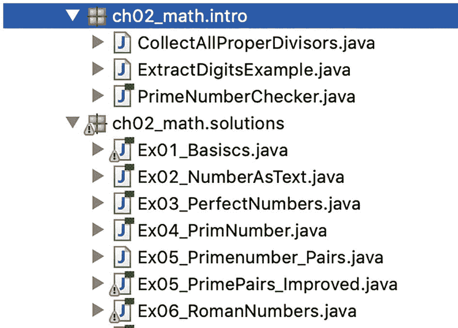

# 一、介绍

欢迎使用本工作簿！在你开始之前，我想简要地概述一下你在阅读它时可以期待什么。

这本书涵盖了广泛的与实践相关的主题，以不同难度的练习为代表。这些练习(在很大程度上)是相互独立的，可以按照任何顺序解决，这取决于你的心情或兴趣。

除了练习之外，你还会找到相应的答案，包括对用于解决方案的算法的简短描述和实际的源代码，在关键点上有注释。

## 1.1 各章的结构

每一章都有相同的结构，所以你会很快找到路。

### 导言

每章以对主题的介绍开始，以使那些可能还不熟悉主题领域的读者或让你对接下来的任务有正确的情绪。

### 练习

简介之后是一系列练习和以下结构:

*   任务:每个练习首先会有一个作业。在此，用几句话描述了要实现的期望功能。通常，方法签名已经作为解决方案的线索包含在内。

*   **示例**:补充示例几乎总是用于说明输入和预期结果。对于一些非常简单的任务，主要是为了了解一个 API，例子有时会被省略。

通常，输入参数的不同赋值以及预期结果显示在表格中，例如，如下所示:

<colgroup><col class="tcol1 align-left"> <col class="tcol2 align-left"> <col class="tcol3 align-left"></colgroup> 
| 

输入一个 <sup>**1 个**</sup>

 | 

输入 B

 | 

结果

 |
| --- | --- | --- |
| [1, 2, 4, 7, 8] | [2, 3, 7, 9] | [2, 7] |

以下符号样式适用于规范:

*   “AB”代表文本规格

*   真/假代表布尔值

*   123 代表数值

*   [值 1，值 2，....]表示集合，如集合或列表，但也表示数组

*   {关键字 1:值 1，关键字 2:值 2，...}描述地图

### 解决方案

这些解决方案遵循下面描述的结构。

*   **任务定义及实例**:首先，我把任务描述再重复一遍，这样你就不用在任务和解决方案之间不断来回翻转了。相反，解决方案的描述是独立的。

*   **算法**:所选算法的描述如下。对于教学，我有时会有意识地提出一个错误的方法或一个非最优的解决方案，然后发现缺陷，反复改进。事实上，这种或那种强力解决方案有时甚至是可用的，但是提供了优化潜力。举例来说，我会在相应的时候提出，有时简单得惊人，但往往非常有效的改进。

*   **考试**:有些任务相当简单，或者只是为了习惯语法或 API 功能。为此，在 JShell 中直接执行几个调用似乎就足够了。这就是为什么我不使用单元测试的原因。如果解决方案的图形化表示更好(例如，显示数独板)，并且相应的单元测试可能更难理解，这同样适用。

然而，算法变得越复杂，存在的错误来源就越多，例如，错误的索引值、意外或遗漏的否定，或者忽略的边缘情况。因此，在单元测试的帮助下检查功能是有意义的——在本书中，由于篇幅的原因，只对重要的输入进行检查。伴随资源包含了超过 90 个单元测试和大约 750 个测试用例——这是一个很好的开始。然而，在实践中，如果可能的话，单元测试和测试用例的网络应该更加庞大。

## 1.2 Eclipse 项目的基本结构

包含的 Eclipse 项目紧密地遵循了这本书的结构。它为每个相关章节(那些有练习的章节)提供了一个单独的包，比如`ch02_math`或`ch08_recursion_advanced`。我非常不同于包的命名约定，因为我认为下划线，在这种情况下，是一种可读的符号。

各个介绍中的一些源代码片段位于名为`intro`的子包中。所提供的(示例)解决方案被收集在它们自己的名为`solutions`的子包中，这些类根据任务命名如下:`Ex<No>_<taskdescription>.java`。

整个项目遵循 Maven 标准目录结构。因此，您将在`src/main/java`下找到源代码，在`src/test/java`下找到测试。

**来源——**`src/main/java`:图 1-1 显示第二章的轮廓；



图 1-1

第二章的大纲

**测试类别-**`src/test/java`:图 1-2 显示了一些相关的测试；


图 1-2

相关测试

在各个章节中开发的所有便利的实用方法都以实用类的形式包含在所提供的 Eclipse 项目中。例如，在第五章中，你实现了一些有用的方法，包括`swap()`和`find()`(都在 5.1.1 节中描述)。然后它们被组合成一个名为`ArrayUtils`的类，这个类存储在它自己的子包`util`中——对于数组这一章，它在子包`ch05_arrays.util`中。这同样适用于其他章节和主题。

## 1.3 单元测试的基本框架

为了不超出本书的范围，举例说明的单元测试只显示了测试方法，而没有显示测试类和导入。为了向您提供一个基本框架，您可以在其中插入测试方法，并作为您自己实验的起点，一个典型的测试类如下所示:

```java
import static org.junit.jupiter.api.Assertions.assertEquals;
import static org.junit.jupiter.api.Assertions.assertTrue;

import java.time.LocalDate;

import org.junit.jupiter.api.Test;
import org.junit.jupiter.params.ParameterizedTest;
import org.junit.jupiter.params.provider.CsvSource;
import org.junit.jupiter.params.provider.ValueSource;
import org.junit.jupiter.params.provider.MethodSource;

public class SomeUnitTests
{
    @ParameterizedTest(name = "value at pos {index} ==> {0} should be perfect")
    @ValueSource(ints = { 6, 28, 496, 8128 } )
    void testIsPerfectNumberSimple(int value)
    {
        assertTrue(Ex03_PerfectNumbers.isPerfectNumberSimple(value));
    }

    @ParameterizedTest
    @CsvSource({"2017-01-01, 2018-01-01, 53", "2019-01-01, 2019-02-07, 5"})
    void testAllSundaysBetween(LocalDate start, LocalDate end, int expected)
    {
        var result = Ex09_CountSundaysExample.allSundaysBetween(start, end);

        assertEquals(expected, result.count());
    }

    @ParameterizedTest(name = "calcPrimes({0}) = {1}")
    @MethodSource("argumentProvider")
    void testCalcPrimesBelow(int n, List<Integer> expected)
    {
        List<Integer> result = Ex04_PrimNumber.calcPrimesBelow(n);

        assertEquals(expected, result);
    }

    // if parameters are lists of values => Stream<Arguments>
    static Stream<Arguments> argumentProvider()
    {
        return Stream.of(Arguments.of(2, List.of(2)),
                         Arguments.of(3, List.of(2, 3)),
                         Arguments.of(10, List.of(2, 3, 5, 7)),
                         Arguments.of(15, List.of(2, 3, 5, 7, 11, 13)));
    }
}

```

除了允许以简单方式测试多个值组合的导入和广泛使用的参数化测试之外，此处显示了通过`@CsvSource`和`@MethodSource`结合`Stream<Arguments>`提供测试输入。详情请见附录 b。

## 1.4 编程风格说明

在讨论过程中，不时有人提出这样一个问题:某些东西是否应该做得更紧凑。这就是为什么我想提前提及本书中使用的编程风格。

### 1.4.1 关于源代码紧凑性的思考

对我来说，编程时最重要的事情，尤其是本书中的实现，是容易理解和清晰的结构。这导致了简化的可维护性和可变性。因此，所示的实现被编程为尽可能容易理解，并避免使用例如更复杂表达式的`?`-操作符。对于`(x < y) ? x : y`这种简单的东西当然是可以接受的。遵循这些规则，并不是每个构造都是最大限度紧凑的，但结果是，它是可以理解的。我喜欢这本书的这一方面。在实践中，这通常比可维护性差但编程更紧凑更容易接受。

### 1.4.2 示例 1

让我们看一个小例子来说明。首先，检查用于反转字符串内容的易读、易懂的变体，它也很好地展示了递归终止和下降的两个重要元素:

```java
static String reverseString(final String input)
{
    // recursive termination
    if (input.length() <= 1)
        return input;

    final char firstChar = input.charAt(0);
    final String remaining = input.substring(1);

    // recursive descent
    return reverseString(remaining) + firstChar;
}

```

以下更紧凑的变型不具备这些优势:

```java
static String reverseStringShort(final String input)
{
    return input.length() <= 1 ? input :
           reverseStringShort(input.substring(1)) + input.charAt(0);
}

```

简单想想这两种方法中的哪一种是你觉得可以安全地进行后续更改的。如果您想添加单元测试呢？如何找到合适的值集和检查？

请记住，上面的变体是由 JVM 自动转换成类似于下面的变体，要么在编译期间(转换成字节码)，要么在以后的执行和优化期间——只是在编程期间具有更好的可读性。

### 例 2

让我举另一个例子来说明我的观点。关于下面的方法`countSubstrings()`，它计算一个字符串在另一个字符串中出现的次数，对于两个输入“helloha”和“ha”，它返回结果 2。

首先，您可以合理、直接地实现它，如下所示:

```java
static int countSubstrings(final String input, final String valueToFind)
{
    // recursive termination
    if (input.length() < valueToFind.length())
        return 0;

    int count;
    String remaining;

    // does the text start with the search string?
    if (input.startsWith(valueToFind))
    {
        // match: continue the search for the found
        // term after the occurrence
        remaining = input.substring(valueToFind.length());
        count = 1;
    }
    else
    {
        // remove first character and search again
        remaining = input.substring(1);
        count = 0;
    }

    // recursive descent
    return countSubstrings(remaining, valueToFind) + count;
}

```

让我们来看看如何才能简洁地认识到这一点:

```java
static int countSubstringsShort(final String input, final String valueToFind)
{
    return input.length() < valueToFind.length() ? 0 :
           (input.startsWith(valueToFind) ? 1 : 0) +
           countSubstringsShort(input.substring(1), valueToFind);
}

```

您希望改变这种方法还是之前显示的方法？

对了，下面那个还包含一个细微的功能偏差！对于“XXXX”和“XX”的输入，第一个变体总是*消耗*字符并找到两个出现。然而，下限一次只移动一个字符，因此找到三个出现的位置。

此外，将先前实现的通过整个搜索字符串前进的功能集成到第二变体中将导致更晦涩的源代码。另一方面，通过简单地调整上面的`substring(valueToFind.length())`调用，你可以很容易地只移动一个字符，然后甚至从`if`中取出这个功能。

### 1.4.4 对`final`和`var`的思考

通常我更喜欢将不可变变量标记为`final`。在本书中，我不时地省略这一点，特别是在单元测试中，以使它们尽可能简短。另一个原因是，JShell 并不是在任何地方都支持`final`关键字，但幸运的是在重要的地方，即对于参数和局部变量。

**局部变量类型推理(** `var` **)** 从 Java 10 开始，所谓的局部变量类型推理就有了，更好的说法是`var`。这允许省略变量定义左侧的显式类型规范，前提是编译器可以从赋值右侧的定义中确定局部变量的具体类型:

```java
var name = "Peter";                // var => String
var chars = name.toCharArray();    // var => char[]

var mike = new Person("Mike", 47); // var => Person
var hash = mike.hashCode();        // var => int

```

特别是在通用容器的上下文中，局部变量类型推理显示了它的优势:

```java
// var => ArrayList<String>
var names = new ArrayList<String>();
names.add("Tim");
names.add("Tom");
names.add("Jerry");

// var => Map<String, Long>
var personAgeMapping = Map.of("Tim", 47L, "Tom", 12L,
                              "Michael", 47L, "Max", 25L);

```

**约定:** `var` **如果可读性更强**只要不影响可理解性，我会在适当的地方使用`var`，让源代码更短更清晰。然而，如果类型规范对于理解更重要，我更喜欢具体类型，避免`var`——但是界限是模糊的。

**约定:final 或 var** 还有一点注意:虽然可以组合`final`和`var`两个词，但我不喜欢这种风格，也不喜欢使用其中一个。

### 1.4.5 关于方法可见性的注释

您可能想知道为什么给出的方法通常不标记为`public`。本书中介绍的方法通常不带可见性修饰符，因为它们主要在定义它们的包和上下文中被调用。因此，可以毫无问题地调用它们来进行附带的单元测试，并且可以用于 JShell 中的实验。有时我会从练习的实现中提取一些辅助方法，以获得更好的结构和可读性。这些然后通常是`private`，相应地表达这种情况。

事实上，我在专用的实用程序类中组合了最重要的实用程序方法，对于其他包，它们当然是允许访问的`public`和`static`。

### 1.4.6 阻止列表中的注释

请注意，清单中有各种块注释，这些注释是为了便于理解。建议谨慎使用这样的注释，并且在实践中最好将单独的源代码部分提取到方法中。然而，对于本书的例子来说，这些评论只是作为参考点，因为介绍或呈现的事实对于读者来说可能仍然是新的和不熟悉的。

```java
// create process
final String command = "sleep 60s";
final String commandWin = "cmd timeout 60";
final Process sleeper = Runtime.getRuntime().exec(command);
//    ...

// Process => ProcessHandle
final ProcessHandle sleeperHandle = ProcessHandle.of(sleeper.pid()).
                                    orElseThrow(IllegalStateException::new);
//    ...

```

### 1.4.7 格式化的想法

清单中使用的格式与 Oracle 的编码惯例略有不同。 <sup>1</sup> 我赞同斯科特·安布勒的观点， <sup>2</sup> 特别建议(开)括号各占一行。为此，我创建了一个名为`Michaelis_CodeFormat`的特殊格式。这被集成到项目下载中。

## 1.5 尝试示例和解决方案

基本上，我更喜欢使用尽可能容易理解的结构，而不是特殊 Java 版本的花哨语法或 API 特性。如果文本中没有明确提到，这些示例和解决方案甚至可以在以前的 LTS 版本 Java 11 上使用。然而，在少数例外情况下，我使用现代和当前 Java 17 LTS 的语法扩展，因为它们使日常编程生活更加容易和愉快。

【Java 17 预览版的特殊特性由于 Java 发布间隔时间很短，只有六个月，一些特性会以预览版的形式呈现给开发者社区。如果要使用它们，必须在 ide 和构建工具中设置某些参数。这对于编译和执行都是必要的，大致如下例所示:

```java
java --enable-preview -cp build/libs/Java17Examples.jar \
     java17.SwitchExamples

```

I 在我的书 *Java 中提供了有关 Java 14 的更多详细信息–版本 9 到 14 中的新增功能:模块化、语法和 API 增强功能* [Ind20b]。

**尝试使用 JShell、Eclipse，并作为 JUnit 测试**在许多情况下，您可以将显示的源代码片段复制到 JShell 中并执行它们。或者，您可以在随书附带的 Eclipse 项目中找到所有相关的资料。程序可以通过`main()`方法启动，或者——如果有的话——通过相应的单元测试启动。

## 1.6 行动起来:探索 Java 挑战

因此，现在已经有了足够的序言，您可能已经对练习中的第一个挑战感到兴奋了。因此，我希望你会喜欢这本书，并在解决练习和实验算法的同时获得一些新的见解。

如果您需要复习 JUnit、JShell 或 O-notation，您可能想先看看附录。

<aside aria-label="Footnotes" class="FootnoteSection" epub:type="footnotes">Footnotes 1

[`www.oracle.com/java/technologies/javase/codeconventions-contents.html`](http://www.oracle.com/java/technologies/javase/codeconventions-contents.html)

  2

[`www.ambysoft.com/essays/javaCodingStandards.html`](http://www.ambysoft.com/essays/javaCodingStandards.html)

 </aside>