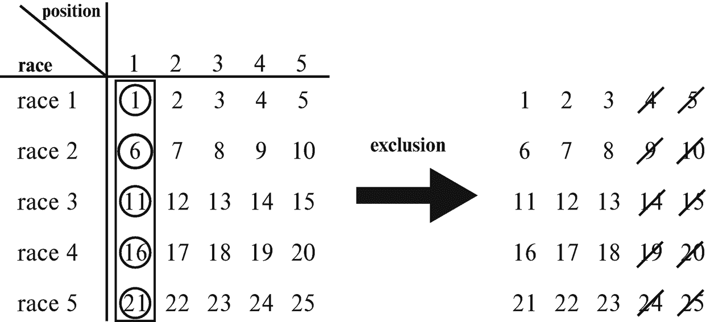
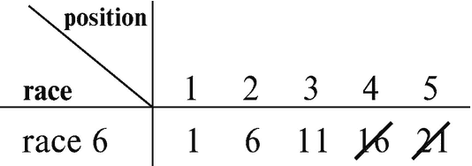

# 11.结论和补充文献

现在，已经到了练习册的末尾，我们得出结论。然而，在我们看补充文献之前，我将提出另外两个难题。

## 11.1 结论

通过阅读这本书，尤其是通过解决和实施练习，你应该已经获得了丰富的经验。有了这些知识，日常实践中的各种任务现在应该更容易完成了。当然，如果你不只是遵循给出的解决方案，而且还要试验和修改它们，你会获益最大。

### 11.1.1 每章的经验教训

让我们回顾一下每一章和每一个主题都教了些什么，以及你应该学了些什么。

**数学**关于基础数学知识的章节介绍了模运算符，这是非常重要的，例如，用于提取数字和计算校验和。组合学的练习已经展示了小技巧是如何轻松地将运行时间减少几个数量级的。此外，素数提供了一些有趣的方面，例如，他们的计算变量。回想起来，这可能比最初想象的要容易得多。一般来说，对于每一个问题，算法和方法应该被粗略地理解，因为这样，例如，即使分解成质因数也失去了它可能的恐怖。

递归的介绍性章节为很好的理解打下了基础。许多练习扩大了你的知识面。此外，在接下来的章节中，你能够有效地运用所学的基础知识。一个主要的例子是树上的各种算法，这些算法通常可以很容易地递归表达——迭代，例如，后序遍历已经很有挑战性了，而使用递归，这是毫不费力的。

然而，您也认识到简单递归不仅有优势，而且由于运行时间长，有时需要一些耐心。在递归的高级章节中，你用记忆和回溯极大地扩展了你的工具箱。这可以让你提高性能，解决有趣的难题，如数独或 n 皇后问题。找到走出迷宫的方法也是可能的。所有这些都需要更多的编程工作，但实现起来不会太复杂。

字符串几乎是每个程序不可或缺的一部分。除了简单的回文检查或字符串反转任务之外，一些任务可以通过使用合适的辅助数据结构来大大简化，比如检查格式良好的大括号、将单词转换成莫尔斯电码等等。总的来说，这里已经很明显，由于你在不同领域有了更多的基础知识，解决问题变得越来越容易。

**数组**就像字符串一样，数组是许多程序中的基本构建块。特别是，避免棘手的一个接一个的错误是很重要的。在这一章中，你创建了一些小的辅助方法，如果使用得当，可以使算法更容易理解。对于二维数组，您学习了如何对方向建模，以及如何用模式填充区域。更具挑战性的任务是螺旋遍历以及删除和填充珠宝或扫雷操场。最后，您开发了一些合并数组的功能。这是合并排序的基本组件。

**日期处理**虽然在 Java 8 之前，日期值的处理相当麻烦，但是日期和时间 API 让它变得很方便。除了 API 的基础，你还学习了计算，特别是基于`TemporalAdjuster-`的*时间机器*的各种可能性。使用适当的助手方法甚至可以全面地实现日历页面的输出。

基本数据结构本章加深了你对基本数据结构的了解，比如列表、集合和映射。这些知识在商业应用中是必不可少的。但它们不仅可以单独使用，也可以组合使用，对于解决许多任务都很有用，比如从列表中删除重复项。另外，比如魔三角的任务，训练抽象思维。一个小细节是对 Excel 本身的自动完成进行编程。令人惊讶的是，这会产生一个多么优雅的实现。

**二叉树**大概这本书最复杂的题目就是二叉树了。因为集合框架没有提供它们，所以可能不是每个 Java 开发人员都熟悉它们。然而，因为二叉树适合优雅地解决许多问题，这一章给出了一个介绍。这些练习帮助你了解二叉树及其可能性。除了像旋转这样简单的事情之外，例如数学计算，也可以用二叉树来非常灵活地表示和处理。令人困惑的是最不常见祖先的确定。对于检查完整性和二叉树的图形输出来说尤其如此。

**搜索和排序**如今，你几乎不会自己编写一个搜索或排序算法。尽管如此，处理一次这个问题对算法理解还是有帮助的。虽然简单实现的运行时间通常为 *O* ( *n* 2 )，但这通常可以通过合并排序和快速排序减少到*O*(*n**log*(*n*))。看到一个固定范围的价值观如何产生重大影响是很有趣的。运行时间为 *O* ( *n* )的桶排序在这些约束条件下发挥了它的优势。

### 值得注意的是

在提出解决方案时，我有时会故意展示一个错误的方法或一个次优的暴力变体，以展示在进行改进时的学习效果。同样，在日常工作中，迭代地进行通常是更可取的，因为需求可能不是 100 %精确的，新的请求会出现，等等。因此，从任务的可理解的实现开始是一个好主意，这允许它在以后被修改而没有任何问题。甚至可以接受采用一种尚未达到最佳的解决方案，以一种概念上正确的方式处理问题。

#### 关于维修性的思考

我们还观察到以下情况:源代码被阅读的次数通常比它被编写的次数多得多。想想你的日常工作。通常，您不是从绿地开始，而是用一些功能扩展现有系统或修复一个 bug。如果原程序作者选择了可理解的解决方案和程序结构，你会很感激。理想情况下，即使是单元测试也是一个安全网。

让我们回到发展上来。确保您提前考虑了问题，而不是直接从实现开始。你对一个问题思考得越有条理、越精确，你的实现就越清晰。一旦*一分钱一分货*，创建或改进一个可理解的、结构良好的解决方案通常不是太大的一步。然而，如果您过早地将一个实现简单地作为源代码开始，那么不幸的是，这往往会以灾难和失败而告终。因此，有些东西仍然是半生不熟的，以有意义的方式添加功能变得更加困难。

我喜欢指出，尤其是可追溯性和后来简化的可维护性在编程中非常重要。这通常是通过小的、可理解的、实用的构件来实现的。由于潜在的(大概也是唯一的)最低限度的较差性能以及较低的紧凑性，这通常比相当确定的较差的可维护性更容易接受。

#### 关于表演的思考

请记住，在当今的分布式应用程序世界中，单个指令或未优化的方法对性能的影响可以忽略不计。相比之下，过于频繁或过于细粒度的 REST 调用或数据库访问可能会对算法的执行时间产生更严重的影响，因为算法还没有优化到最后一个细节。请注意:我的陈述主要适用于业务应用程序中自己编写的功能。然而，对于经历数百万次(或更多)调用的框架和算法来说，内在美可能没有它们的性能重要。在这两个极端之间可能总会有某种权衡:要么是紧凑和性能优化，要么是可以理解但有时有点慢。

#### 单元测试的优势

即使只创建简单的程序，人们也经常会再次注意到以下事实:如果您纯粹基于控制台输出来测试算法的实现，错误通常会被忽略——主要是针对特殊情况、限制等。此外，没有支持单元测试，人们倾向于较少考虑类和方法签名的接口。但这恰恰有助于提高其他人的可管理性。从 JUnit 5 开始，编写单元测试变得非常有趣和流畅。这主要是由于令人愉快和有益的参数化测试。

通过阅读这本书并回顾解决方案，除了所涉及的主题中的技能之外，您应该已经对单元测试有了很好的理解。更重要的是，在开发解决方案时，当单元测试通过时，会有一种安全感。

## 11.2 谜题

在您处理了各种各样的编程难题之后，我向您呈现两个与编程无关的最终难题。尽管如此，通过回答这些问题，你可以学到很多解决问题的策略。有时候，有些事情一开始看起来不可能，然后就有了直截了当的解决办法。如果你喜欢，试试下面的谜题:

*   黄金包:检测假货

*   赛马:决定最快的三匹马

### 11.2.1 黄金包:检测假货

这个拼图大概是 10 个黄金袋子，每个袋子里装 10 个硬币，每个硬币重 10g。因此，每个金袋应重 100 克。参见图 [11-1](#Fig1) 。

图 11-1

黄金包

但是一个冒名顶替者把装在袋子里的金币换成了赝品，每枚 9 克而不是 10 克，比假的要轻一些。找到只有一次称重的装有假货的金袋子。然而，你可以从任何一个袋子里取出不同数量的硬币，然后一起称重。

#### 解决办法

起初，这项任务听起来几乎不可能，因为不允许多次称重和分隔。稍加思考，你可能会想出下面这个窍门:把袋子排成一行，从 1 到 10 给它们编号。现在基于位置工作，从每个相应的袋子中放入与位置匹配的硬币，然后一起称重，如图 [11-2](#Fig2) 所示。

图 11-2

称量金币

如果没有假货，结果将如下:

        1 × 10 + 2 × 10 + 3 × 10 + 4 × 10 + 5 × 10 + 6 × 10 + 7 × 10 + 8 × 10 + 9 × 10 + 10 × 10

    =    10 + 20 + 30 + 40 + 50 + 60 + 70 + 80 + 90 + 100

    =    550

让我们假设袋子 5 装有假货，看看结果:

1×10+2×10+3×10+4×10+**5**×**9**+6×10+7×10+8×10+9×10+10×10

= 10+20+30+40+**45**+60+70+80+90+100

    =    545

现在让我们假设袋子 2 包含假货，并确定结果:

1×10+**2**×**9**+3×10+4×10+5×10+6×10+7×10+8×10+9×10+10×10

= 10+**18**+30+40+50+60+70+80+90+100

    =    548

据此，您可以根据与 550 的差异来识别相应的包:

*550 重量=位置*

### 11.2.2 赛马:决定最快的三匹马

这个谜题是关于解决以下问题:有 25 匹赛马出售，你想买最快的三匹。有一个最多可容纳五匹马的跑道。尽管如此，你既没有秒表，也没有其他测量时间的方法。然而，这些马可以在比赛中相互竞争，你可能会注意到顺序。在这些限制下，你如何确定最快的三个，你如何进行？你最多要用哪些马组织几场比赛？

作为一种简化，让我们在这里假设马不会因为比赛而筋疲力尽，在每场比赛中以完全相同的速度奔跑，并且没有两匹马是相同的速度(就像在照片结束时一样，总是有顺序和赢家)。

#### 解决办法

在这里，你也必须首先考虑通过一个聪明的排除程序来安排正确的比赛，并且尽可能的少。事实上，只需要七场比赛就可以决定最快的三匹马。你如何着手此事？

首先，你让五匹马在任意五场比赛中相互竞争，从而决定这些比赛的获胜者。为了更好的可追溯性，所有的马都有一个 1 到 25 之间的数字，这通常与位置无关。在图 [11-3](#Fig3) 中，为了更好的区分，我使用了数字。也可以用 A，B，C，...但是你需要进一步区分比赛的获胜者。

因此，您可以从所有五场比赛中确定获胜者，并可以通过排除程序直接将第四名和第五名的所有马匹从您的下一场比赛中删除。

图 11-3

比赛 1 至 5

结果，剩下 15 匹马，如果你想相互比较，在这五场比赛之后，至少还需要三场比赛。然而，根据我的声明，总共七场比赛就足够了，因此仍然只允许两场比赛。因此，你仍然必须减少要比较的马的数量。

**第二步**要让剩下的 15 匹马少得多，你需要再进行一场比赛，所有的获胜者都要参加。为什么呢？到目前为止，你只知道群体内部的一些事情，但不知道群体之间的事情。为了获得一些关于获胜者相对速度的信息，你让他们互相比赛。同样，后两匹马不可能是最快的三匹马。见图 [11-4](#Fig4) 。

图 11-4

胜利者的竞赛

但是，这将自动排除编号为 17 和 18 的马(比编号为 16 的马慢)以及编号为 22 和 23 的马(比编号为 21 的马慢)作为候选马。

**第 3 步**你在矩阵中标记排除项，然后结合获得的知识进行下一个排除项。要做到这一点，您需要在马的矩阵中插入一个表示“快于”的>符号。因为 1 号马在冠军赛中也赢了，你确定 1 号马肯定是最快的。见图 [11-5](#Fig5) 。

图 11-5

赛马最佳 9 人

然而，还剩下 9 匹马——实际上只有 8 匹，因为 1 号马是最快的。这意味着至少还有两场比赛。现在让我们考虑一下。你知道前几场比赛的顺序。由于您只想确定最快的三匹马，编号为 8、12 和 13 的马被淘汰，现在剩下五匹马，即编号为 2、3、6、7 和 11 的马。见图 [11-6](#Fig6) 。

图 11-6

赛马的最终排斥

因此，你只需要让其他的马(也就是 2、3、6、7 和 11)互相竞争。这场比赛的冠军和亚军是总的第二和第三匹马。这导致以下可能的组合作为最终结果:

*   1, 2, 3

*   1, 2, 6

*   1, 6, 2

*   1, 6, 7

*   1, 6, 11

## 11.3 补充文献

在本书中，我的主要意图是为您提供一些编程练习和脑筋急转弯，以及解决它们的娱乐时间。如果这些任务在大多数时候对你来说是可以很好解决的，你会发现下面的各种书籍是补充读物。

有趣的是，当处理一个话题时，人们总是会碰到以前不知道的文献。有些书启发了我，我想推荐给你。我按主题对这些书进行了分类，这应该是进一步行动的良好开端。

### 11.3.1 算法和数据结构介绍

有各种各样的书可以帮助你开始学习算法和数据结构。我可以推荐以下内容或不同的观点:

*   ***搜索算法***【BHA 16】Aditya y . Bhargava 著。一本小而精的书，它提供了一个可读性强、易懂且有趣的介绍，并配有许多插图。然而，这些例子是用 Python 编写的。

*   数据结构和算法的常识指南 【文 17】杰伊·文格罗著。一本精彩的，易于理解的书，从算法和数据结构开始。广泛的插图使它容易跟随算法的步骤。同样，示例是用 Python 编写的。

*   ***用 Java 解决数据结构和算法中的问题***【jai 18】赫曼特·贾恩著。在这里列出的书籍中，这本书是最全面的，在主题方面远远超过了以前的书。然而，它提供了更少的解释性插图，也不像其他的那样直观。这本书有助于(直接)理解解决方案，因为 Java 用于实现。

### 基础书籍

如果你喜欢更科学地深入算法和数据结构的主题，从零开始学习，喜欢更正式一点的东西，那么看看下面的书:

*   ***算法***【sed 11】作者罗伯特·塞奇威克。这本书为你提供了一个易于阅读和理解的主题介绍。早在 20 世纪 90 年代，我在大学学习的时候，就有一个旧版本陪伴着我。

*   ***Java 中面向对象设计模式的数据结构和算法***【pre 00】Bruno r . Preiss。这本书提供了常见数据结构的坚实概述，并展示了如何用 Java 实现它们。因为它是在 2000 年编写的，所以没有使用泛型。然而，关于 Java 和数据结构，它是我最喜欢的。

*   ***数据结构和使用 Java 解决问题**T3【Wei 10】马克·艾伦·维斯著。马克·艾伦·维斯的这本书提供了一个比前面提到的稍微更实用的方法。由于是在 2010 年出版，它使用了更现代的概念，比如泛型来实现数据结构。*

### 11.3.3 专门研究面试问题

除了前面提到的基础书籍，还有一些主要关注面试问题或小型编程任务的书籍:

*   ***前 30 名 Java 面试编码任务***【urb 18】作者马修·厄本。如果你没有很多时间，并且对背景信息不感兴趣，这本小册子绝对适合你。它使用单元测试来检查实现；不幸的是，它基于 JUnit 4，而不是更新的 JUnit 5。

*   ***日常编码问题***【MW19】亚历克斯·米勒和劳伦斯·吴。这是另一本书，提供了大量的信息和练习，包括算法和数据结构的解决方案。它专注于日常的小型编程任务，并且基于 Python。

### 11.3.4 顶级公司工作面试的补充材料

为了准备在一家顶级公司，即亚马逊、苹果、脸书、谷歌和微软的面试，我推荐以下几本书作为我的书的补充。其中一些书更深入，提供更棘手的任务或更多的背景知识。此外，他们都描述了面试过程本身以及如何准备面试。

*   ***破解编码采访***【MCD 16】盖尔·拉克曼·麦克道尔。这是一本非常有能力的作者写的伟大的书。不过，最好事先看一本关于算法的书，这样你更容易理解其中的解释。某些任务的难度在某些方面具有挑战性。

*   ***编程访谈曝光***【mkg 18】作者:约翰·蒙根、诺亚·金德勒、埃里克·吉古尔。除了算法和数据结构，这本书还涵盖了诸如并发性、设计模式和数据库等主题。它包含较少的练习，但很好的解释。这些解决方案以不同的编程语言呈现。

*   Adnan Aziz、Tsung-Hsien Lee 和 Amit Prakash 的***【Java 编程元素访谈】***【ALP 15】。这本书涵盖了许多不同的主题，尤其是数据结构和算法。