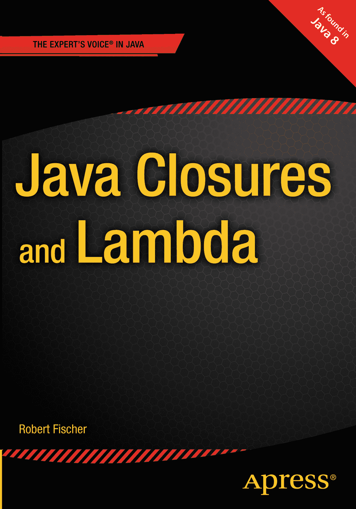

罗伯特·费舍尔 Java 闭包与 Lambda

ISBN 978-1-4302-5998-5e-ISBN 978-1-4302-5999-2 DOI 10.1007/978-1-4302-5999-2 © Apress 2015 Java 闭包与 Lambda 常务董事：Welmoed Spahr 首席编辑：Steve Anglin 开发编辑：Deidre Miller 技术审校：John Zukowski 编辑委员会：Steve Anglin, Gary Cornell, Louise Corrigan, Jonathan Gennick, Robert Hutchinson, Michelle Lowman, James Markham, Matthew Moodie, Jeff Olson, Jeffrey Pepper, Douglas Pundick, Ben Renow-Clarke, Gwenan Spearing, Matt Wade, Steve Weiss 协调编辑：Mark Powers 文字编辑：Karen Jameson 排版：SPi Global 索引编制：SPi Global 插图制作：SPi Global 封面设计：Anna Ishchenko 本书通过 Springer Science+Business Media New York 在全球图书贸易中发行，地址：233 Spring Street, 6th Floor, New York, NY 10013。电话：1-800-SPRINGER，传真：(201) 348-4505，电子邮件：`orders-ny@springer-sbm.com`，或访问 [`www.springeronline.com`](http://www.springeronline.com/)。Apress Media, LLC 是一家加利福尼亚有限责任公司，其唯一成员（所有者）是 Springer Science + Business Media Finance Inc (SSBM Finance Inc)。SSBM Finance Inc 是一家特拉华州公司。如需了解翻译相关信息，请发送电子邮件至 `rights@apress.com`，或访问 [`www.apress.com`](http://www.apress.com/)。Apress 及 friends of ED 图书可批量购买，用于学术、企业或促销用途。大多数图书也提供电子书版本和许可证。更多信息，请参阅我们的特殊批量销售–电子书许可网页：[`www.apress.com/bulk-sales`](http://www.apress.com/bulk-sales)。作者在本文中引用的任何源代码或其他补充材料，读者可在 [`www.apress.com/9781430259985`](http://www.apress.com/9781430259985) 获取。有关如何找到本书源代码的详细信息，请访问 [`www.apress.com/source-code/`](http://www.apress.com/source-code/)。本作品受版权保护。出版商保留所有权利，无论是整体还是部分材料，特别是翻译、重印、重用插图、朗诵、广播、以缩微胶卷或任何其他物理方式复制，以及电子改编、计算机软件或通过目前已知或今后开发的类似或不同方法进行传输或信息存储与检索。在本出版物中使用通用描述性名称、注册商标名称、商标、服务标志等，即使没有明确声明，也不意味着这些名称不受相关保护法律和法规的约束，因此可自由用于一般用途。出版商、作者和编辑假定本书中的建议和信息在出版之日是真实准确的。出版商、作者或编辑均不对本文所含材料或可能存在的任何错误或遗漏提供明示或暗示的保证。此为献词。关于作者

 罗伯特·费舍尔是一名软件开发人员、开源软件贡献者、技术评论员和工程经理。他在并发、JVM 字节码、Groovy、Grails 和 Gradle 以及函数式编程等技术主题方面拥有广泛的咨询、写作和演讲经验。罗伯特拥有杜克大学的神学硕士学位；担任 Webonise Lab 的工程副总裁；与妻子、狗和女儿居住在北卡罗来纳州达勒姆市。

关于技术审校

 约翰·祖科夫斯基目前是全球最大旅游网站 TripAdvisor（[`www.tripadvisor.com`](http://www.tripadvisor.com/)）的软件工程师。他从事 Java 技术开发已有二十年，并撰写了十本与 Java 相关的书籍。他的著作涵盖 Apress 出版的 Java 6、Java Swing、Java Collections 和 JBuilder，O'Reilly 出版的 Java AWT，以及 Sybex 出版的 Java 入门教程。他居住在马萨诸塞州波士顿郊外，拥有约翰霍普金斯大学软件工程硕士学位。您可以在 Twitter 上关注他：[`http://twitter.com/javajohnz`](http://twitter.com/javajohnz)。

引言

这本书是我多年莽撞探索和惨痛教训的结晶。故事要从我从 C++ 转向 perl 说起。与 C++ 的低级操作和繁琐管理相比，perl 编程语言强大得惊人。（它“慢”这一点从未困扰过我——我宁愿编写强大、有效的慢代码，也不愿编写脆弱、有漏洞的快代码。）在 perl 的世界里，有一种“匿名子程序”的概念，可以传递和操作。你还可以直接操作符号表。符号表是程序可用的函数名称集合。通过这两点，我意识到我可以进行更高级别的编码：我可以编写返回子程序的子程序，并将它们存储到符号表中，从而让我的代码在运行时编写代码。在 perl 中，这些子程序工厂被称为“模板函数”。我接着编写了一些真正难以阅读——但确实强大——的 perl 代码。

我与我的朋友兼导师布莱恩·赫特分享了这一发现。他是一位经验丰富的资深开发者，似乎见多识广。布莱恩告诉我，我所做的事情叫做“函数式编程”，并鼓励我研究真正的函数式语言，特别是 OCaml 及其衍生语言 JoCaml。我立刻被吸引了。到 2008 年，我在明尼苏达州 Ruby 用户组（Ruby.MN）做了题为“为什么 Ruby 开发者应该学习 OCaml”的演讲。¹ 与当时标准的编码方式相比，函数式编程具有真正令人难以置信的力量。此外，我的数学背景与函数式编程非常契合：状态不变意味着我可以对程序运用与数学方程相同的推理方式。我当时认为，一种函数式编程语言将会崛起，并从根本上改变编程的意义，就像 Java 崛起并使面向对象编程无处不在一样。但到目前为止，这还没有发生。

下一章随着 Groovy 编程语言的兴起而到来。Groovy 的 MetaClass 功能为我提供了一种在 perl 中执行相同技巧的方法，但这种方式利用了所有现有的 Java 代码。这真是鱼与熊掌兼得。所有那些为 Java 存在的开源软件，以及所有在 JVM 上积累的技术专长，终于可以与这些“函数式特技”相结合。这并非函数式编程——我在互联网上因为这么说而惹了不少麻烦——但它确实从函数式编程中借鉴了一些强大的技巧。我们将在第 1 章中深入探讨当时的情况。

当 Java 7 推出时，它引入了 `invokedynamic` 关键字（我们将在第 8 章中介绍）。该关键字被标榜为对动态语言的支持，但我认清了它的本质：JVM 对同样那些函数式技巧的支持。在 Java 本身中无法实现同样的函数式技巧，这已不再有任何技术上的理由。然而，Java 语言的语法却无法跟上其底层实现的步伐。我们不得不一直等到 Java 8。随着 Java 8 的到来，我们终于将 lambda 引入了 Java 语言本身，并同时为一些最强大的函数式技巧提供了基础支持。

这是一次真正令人兴奋的语言变革。我认为它对 Java 语言的变革意义，不亚于当初面向对象编程的引入，并且它表明，那些在 Perl 中曾显得深奥却令人印象深刻的函数式技巧，如今已真正准备好成为行业标准实践。这就是为什么这本书如此关键：毫不夸张地说，学习本书的内容将帮助你在整个职业生涯中进行编程。迟早，你将不得不学会驾驭 lambda 的力量。不妨从现在开始。

致谢

非写作人士很难体会撰写一本书所付出的巨大工作量。从长期忍受煎熬的出版商，到只能在惨淡屏幕光线下见到你的家人，再到听你反复谈论而厌倦的朋友，写作确实是一项集体事业。封面上印着作者的名字，但真正让这本书得以问世的，是作者背后的一群支持者。

对于本书，Apress 的团队由 Steve Anglin、Anamika Panchoo、Mark Powers 及其编辑团队组成。感谢他们给予我撰写本书的机会，并感谢他们在整个过程中的耐心。他们让这本书的外观和可读性都比我独自完成时更好，而你现在能看到它，正是因为他们付出的努力。

感谢我的朋友、导师兼博客合著者 Brian Hurt，他在二十世纪末就富有远见地认识到函数式编程是二十一世纪初的变革性技术。这只是他多次让我及早走上正确道路的其中一次。

还要感谢 JRuby 大师 Charlie Nutter（又名：Headius），他非常包容一位年轻、充满幻想、对 Ruby 并无热爱但对 JRuby 底层的 JVM 技术有浓厚兴趣的开发者。

更广泛地说，感谢那些让编程看起来很酷的各种技术社区，以及我在那里结识的朋友们。感谢对象技术用户组（OTUG）、Ruby.MN、Groovy.MN、NFJS 和 TriJug。特别感谢 Hamlet d'Arcy、Ted Naleid、Shaun Jurgemeyer、Ben Edwards、Jesse O'Neill-Oine、Scott Vlamnick、Ryan Applegate、Brian Sletten 和 David Hussman。

感谢我的另一位母亲，她很好地提醒了我，生活中还有比编程更重要的事情。如果这本书中有什么魅力、优雅和智慧，那都是因为她证明了，一个人既可以是个极客，也可以拥有社交技能。

感谢我的父母，他们那台 Apple Macintosh 是我弄坏的第一台电脑，他们无数次在深夜把我从电脑前赶开，多到我不愿去回忆。他们恰到好处地禁止我使用电脑，反而让它变得无比诱人。计算机通过软件构建的魔法世界，从未失去它的魅力。

感谢我的妻子 Ashley，她给了我时间写这本书，即使那时我们的孩子正在度过她的第一年。没有她的支持，我无法完成这本书。

目录 第 1 章：Java 8：一个全新的 Java 1 Java 8 让 Java 重回前沿 3 Java 一直都有函数式编程 6 Java 8 不仅仅是语法糖 8 Java 8 是函数式编程语言吗？ 9 理论到此为止，开始实践！ 10 第 2 章：理解 Java 8 中的 Lambda 表达式 11 Java 8 的 Lambda 语法 11 作为闭包的 Lambda 表达式 13 无参数和多参数的 Lambda 表达式 14 无返回值的 Lambda 表达式 18 具有复杂主体的 Lambda 表达式 18 显式类型声明的 Lambda 表达式 19 作为运算符的 Lambda 表达式 19 作为谓词的 Lambda 表达式 20 具有基本类型参数的 Lambda 表达式 20 将方法转换为 Lambda 表达式 21 将静态方法转换为 Lambda 表达式 21 将构造器转换为 Lambda 表达式 22 将实例方法转换为 Lambda 表达式 22 指定稍后使用的方法 23 作为接口实现的 Lambda 表达式 23 默认方法 24 静态方法 25 函数式接口辅助方法 25 Function.identity() 和 UnaryOperator.identity() 26 Function.compose 和 Function.andThen 26 Consumer.andThen 26 Predicate.and 和 Predicate.or 27 Predicate.isEqual 27 Predicate.negate 27 BinaryOperator.minBy 和 BinaryOperator.maxBy 27 Lambda 最佳实践 28 使用接口 28 使用方法引用 28 内联定义 Lambda 表达式 28 Lambda 表达式应始终是线程安全的 28 不要使用 Null 29 不要释放 Zalgo 29 从简单部分构建复杂性 31 善用类型和编译器 31 第 3 章：Lambda 的领域：集合、映射和流 33 Lambda 表达式与函数式编程 33 函数式迭代 37 使用 Lambda 表达式操作集合和映射 38 过滤集合和映射 38 映射集合和映射 39 映射计算 41 流 44 流的创建 45 流的映射和过滤 45 流的收集、处理或归约 47 基本类型流 48 Lambda 领域回顾 49 第 4 章：使用 Lambda 进行 I/O 操作 51 临时文件与中间空洞 52 通过输入进行异常处理：传入异常处理器 52 通过输出进行异常处理：捕获执行结果 55 使用我们的临时文件函数 61 读取目录中所有文件的所有行 62 使用创造性展平进行复杂流处理 63 流式处理目录中所有文件的所有行 65 总结 69 第 5 章：使用 Lambda 进行数据访问 71 表示中间查询结果 73 打印结果 76 将 ResultSet 映射到流 77 方法一：使用流构建器构建流 78 方法二：使用 Stream.of 和 Stream.flatMap 构建流 79 方法三：使用 AbstractSpliterator 构建流 81 方法四：从迭代器构建流 89 整合所有内容 92 第 6 章：Lambda 并发 95 Lambda 表达式与经典 Java 线程 98 Lambda 表达式与执行器 100 Lambda 表达式与 ThreadPoolExecutor 102 Lambda 表达式与 Fork/Join 106 流并行 107 结论 110 第 7 章：Lambda 表达式与遗留代码 111 资源与异常 111 通过抛出非受检异常处理资源 114 通过异常处理调用者处理资源 118 使用结果对象处理资源 123 桥接集合与流 127 桥接数组与流 130 使接口更友好于 Lambda 131 通过 Lambda 实现抽象类 133 透明的 Optional 技巧 135 逆向开发 137 第 8 章：Java 字节码中的 Lambda 表达式 139 你好，字节码 140 字节码中的方法引用 145 字节码中的绑定实例方法引用 147 字节码中的自由实例方法引用 149 内联 Lambda 定义与 Lambda 提升 150 结论 152 附录 A：范式概览 153 命令式编程范式 156 面向对象编程范式 161 后函数式编程范式 177 其他编程范式 190 逻辑/数学 190 同像性 190 声明式 191 响应式 191 基于栈的（串联式） 192 后现代 192 范式、风格与后函数式编程 192 索引 195 内容速览 第 1 章：Java 8：一个全新的 Java 1   第 2 章：理解 Java 8 中的 Lambda 表达式 11   第 3 章：Lambda 的领域：集合、映射和流 33   第 4 章：使用 Lambda 进行 I/O 操作 51   第 5 章：使用 Lambda 进行数据访问 71   第 6 章：Lambda 并发 95   第 7 章：Lambda 表达式与遗留代码 111   第 8 章：Java 字节码中的 Lambda 表达式 139   附录 A：范式概览 153   索引 195   脚注 1

[`http://www.youtube.com/watch?v=2T5syww4Nn4`](http://www.youtube.com/watch?v=2T5syww4Nn4)

