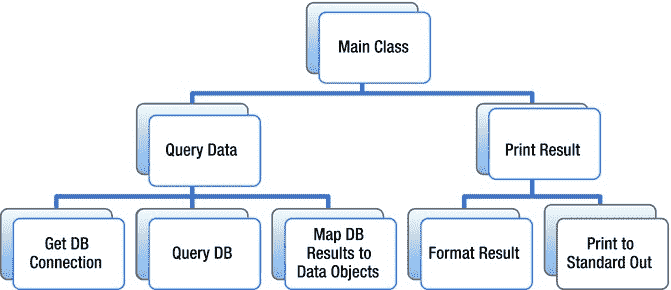
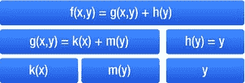

# 1. Java 8：一个全新的 Java

本书探讨的是 Java 8 中的 Lambda 表达式（闭包）。然而，更重要的是，它关乎 Java 所演变出的全新语言形态。这场变革并未公开宣扬，也未曾大张旗鼓，但它确已发生。在全新的 Java 8 世界中，你依然可以继续编写老旧的 Java 代码，但除非你跟上这场变革，否则你将越来越多地发现那些被称为“Java”的代码，其语言、语法和习惯对你而言却显得陌生。

本书旨在帮助你踏入这个激动人心的新世界。你应该渴望加入这个勇敢的 Java 8 新世界，因为它将真正让你编写出更简洁、更易读、性能更优的代码：同时实现这三项优势实属罕见，但 Java 8 中的 Lambda 表达式恰恰带来了这一切。

为了准确理解新 Java 的来龙去脉，让我回溯历史。很久以前，在 Java 的一个旧版本中，我团队的一名成员编写了一段代码，用于克隆一个列表，但排除了原始列表中可能存在的所有空元素。该成员的实现如清单 1-1 所示。技术负责人看到那段代码后并不满意，于是将其重写为清单 1-2，代码虽然更长，但可读性更强，效率也更高。

**清单 1-1. cloneWithoutNulls(List) 的原始实现**

`public static <A> List<A> cloneWithoutNulls(final List<A> list) {`

`List<A> out = new ArrayList<A>(list);`

`while(out.remove(null)) {}`

`return out;`

`}`

**清单 1-2. cloneWithoutNulls(List) 的改进实现**

`public static <A> List<A> cloneWithoutNulls(final List<A> list) {`

`List<A> out = new ArrayList<A>(list.size());`

`for(A elt : list) {`

`if(elt != null) out.add(e);`

`}`

`return out;`

`}`

这时，我成为了这段代码的负责人。我按照自己认为更易读的方式重新实现了该方法。我借助了 Apache 的 Commons-Collections 库。由此产生了清单 1-3 中的实现。可读性提升是因为 Commons-Collections 提供了一种方式来表达：“给我集合中所有满足某个谓词的元素。”¹ 由于他们拥有这种谓词基础设施，你可以简洁地表达这个想法。我当时以为自己在代码的清晰度和简化方面取得了真正的进展。此外，如果我们将来需要增加另一个过滤条件，也很容易扩展 `Predicate` 来实现。

**清单 1-3. cloneWithoutNulls(List) 的 Apache Commons-Collections 实现**

`public static <A> List<A> cloneWithoutNulls(final List<A> list) {`

`Collection<A> nonNulls = CollectionUtils.select(list, PredicateUtils.notNullPredicate());`

`return new ArrayList<>(nonNulls);`

`}`

不幸的是，当新的热门库——Google 的 Guava——取代了该项目中的 Apache Commons-Collections 时，问题出现了。Guava 也包含一个 `Predicate` 基础设施，但其包名、继承树和 API 与 Commons-Collections 的 `Predicate` 基础设施完全不同。因此，我们不得不将方法改为清单 1-4 中的新代码。

**清单 1-4. cloneWithoutNulls(List) 的 Google Guava 实现**

`public static <A> List<A> cloneWithoutNulls(final List<A> list) {`

`Collection<A> nonNulls = Collections2.filter(list, Predicates.notNull());`

`return new ArrayList<>(nonNulls);`

`}`

问题在于，`Predicate` 基础设施虽然有用，但 Java 核心并未包含它，因此像 Guava 和 Apache Commons 这样的标准库扩展最终都构建了自己的实现。当然，这些实现彼此之间互不兼容。其他 JVM 语言也开始提供它们自己的（普遍互不兼容的）实现。随着 Java 8 的到来，我们终于拥有了该基础设施的规范实现，以及更多其他特性。这段代码直接转换后的 Java 8 版本如清单 1-5 所示。

**清单 1-5. cloneWithoutNulls(List) 的 Java 8 Predicate 实现**

`public static <A> List<A> cloneWithoutNulls(final List<A> list) {`

`List<A> toReturn = new ArrayList<>(list);`

`toReturn.removeIf(Predicate.isEqual(null));`

`return toReturn;`

`}`

但这些谓词并非 Java 8 引入的全部内容。有一种全新的语法可以简洁地表达这个想法：参见清单 1-6。那个右箭头？那是 Java 8 最激动人心的新特性的一个例子：它就是 Lambda 表达式。但这还远不止于此。你将越来越多地看到类似清单 1-7 的 Java 代码。在这个例子中，我们有一个接口（`Comparator`），它包含静态方法和实例方法，并且出现了一些涉及双冒号的奇怪现象。这是怎么回事？这就是 Java 8 的变革，也是本书的全部内容。

**清单 1-6. cloneWithoutNulls(List) 的 Java 8 Lambda 实现**

`public static <A> List<A> cloneWithoutNulls(final List<A> list) {`

`List<A> toReturn = new ArrayList<>(list);`

`toReturn.removeIf(it -> it == null);`

`return toReturn;`

`}`

**清单 1-7. 定义 Java 8 Comparator 的示例**

`Comparator c =`

`Comparator`

`.comparing(User::getLastName)`

`.thenComparing(User::getFirstName);`

## Java 8 将 Java 重新带回前沿

软件开发之所以激动人心，是因为其核心问题尚未解决：软件开发中的实践、流程和工具始终处于不断演进和发展的状态。这一点可以从主流编程范式的变迁中看出：在 80 年代末到 90 年代，所有问题的答案都是对象；而现在，程序员需要更丰富的表达方式来编写代码。

在过去十年间，程序员开始更多地借鉴一种名为“函数式编程”的范式。面向对象范式关注的是对象，而对象拥有行为；函数式编程则关注动词（函数），这些动词作用于名词（参数）。面向对象编程构建了一套对象交互的机制，而函数式编程则构建了一个通过复合函数来解析的函数。

面向对象程序可以想象成一个企业环境。你有一位 CEO（“主类”），他发布高层指令。下属们接手这些指令。尽管这些下属各自拥有一些数据（自己电脑上的文件、办公桌上的便利贴），但他们大多会将任务委派给自己的下属。沿着这个链条向下，下属变得越来越技术化（实现细节化），链条末端则执行最后一项精确的工作。然后，操作的结果（要么是异常，要么是返回值）会沿着下属链条向上传递回 CEO，CEO 随后可能再发布另一条指令。

然而，函数式程序是以数学为模型的。其理念是：应用程序的输入是函数的参数，应用程序的输出是函数返回的值。面向对象中的下属可能包含自身状态，而数学函数是无状态的：它们总是返回相同的值，并且没有副作用。数学函数与其说是一种行为，不如说是一种永恒真理的陈述：`"f(2)"` 并不意味着“将 2 应用于 f”，而是“当 f 的参数绑定到 2 时的值”。在函数式编程中，目标是让应用程序中的所有函数都像这些数学函数一样运作。这个函数可能由其他函数定义，但程序最终是一个单一的函数应用，而不是一系列执行命令。

尽管函数式编程和面向对象编程在理论上是等价的，但某些解决方案在一种范式下比另一种范式表达得更自然：对于给定的问题，每种范式下的直观解决方案可能大相径庭。在本章开头给出的例子中，面向对象要求我们创建一个“Predicate”对象，其行为是当参数不为 null 时返回 true。在函数式编程中，我们只需提供一个函数，当参数不为 null 时返回 true：不需要一个对象来持有该行为。在这种情况下，函数式编程是更直观的解决方案，因为没有状态，没有需要封装的内容，继承也毫无意义。

在 21 世纪初期，许多有远见的开发者看到了函数式编程风格的价值。这种风格与当时正在流行的许多开发技术（如测试驱动开发）融合得特别好，并且在高度分布式或高度并发的环境中尤其有用。人们遇到的许多问题——例如如何在线路上不仅发送数据，还发送命令——在函数式编程风格中都有自然的解决方案。一些技术权威人士，包括鄙人，曾预测会出现一种新的函数式编程语言，使 Java 过时，就像 Java 使 C++ 过时一样。显然，这在 Java 虚拟机上并没有发生。²

实际发生的情况比我们预期的更奇怪。并没有出现纯粹的函数式编程语言，而是新的面向对象语言占据了开发环境。这些语言虽然无疑是面向对象的，但也整合了函数式编程风格的技术和能力。在这些混合语言中，开发者可以像在函数式语言中一样使用函数，但这些函数可以拥有状态，使它们更像对象。Ruby、Groovy、Scala 和 JavaScript 都是这类语言的例子。多年之后，Java 现在也通过 Java 8 加入了这一行列。从 Java 8 开始，Java 将其中一些流行技术整合到了核心 Java 语言本身中。

在函数式编程范式中，最流行的技术之一是 lambda，它更非正式地被称为闭包。³ Lambda 是一组可以保存为变量、在程序中传递、并在稍后（可能多次）执行的指令。要理解这意味着什么，考虑一个简单的 `for` 循环，如清单 1-8 所示：当程序执行遇到这个循环时，它会立即执行循环，然后继续。想象一下，你可以将循环存储到一个变量中，然后传递它，稍后在某个遥远的位置执行它，比如清单 1-9 中的虚构代码。这就是 lambda 允许你做的事情；Java 8 中这段代码的版本见清单 1-10。

**清单 1-8. 简单循环**

`for(Object it : list) {`

`System.out.println(it);`

`}`

**清单 1-9. 存储一个简单循环（非真实代码）**

`// 这不是 Java 代码`

`Loop printObjects = for(Object it : list) {`

`System.out.println(it);`

`}`

**清单 1-10. 在 Java 8 中存储一个简单循环**

`Consumer<Iterable> printObjects = list -> {`

`for(Object it : list) {`

`System.out.println(it);`

`}`

`};`

`// 需要说明的是，以下是用更地道的 Java 8 代码实现的相同结果：`

`Consumer<Iterable> printObjects = list -> list.forEach(System.out::println);`

这看起来可能是一个相对较小的语言特性，但引入 lambda 的影响如此重大，以至于 lambda 无法成为 Java 7 的 Project Coin⁴ 的一部分，反而成为了 Java 8 的驱动特性。这个语言特性之所以如此重要，是因为它启用了一种与构成 Java 程序的对象交互的新方式：现在，我们可以在不引用对象的情况下拥有行为；我们可以在不先定义名词的情况下定义动词。

本书的其余部分将探讨这一新语言特性的影响，以及我们如何改变编写 Java 代码的方式以利用这一变化。结果将是代码在两个层面上都更具函数式风格：既更面向函数，也运行得更好。原因在于，我们现在可以在某些非常常见的情况下更直接、更简洁地表达我们的意图，并且我们拥有一个强大的新工具来将代码分解成更易于维护的部分。为了理解这是如何工作的，让我们转向 Java 中一个非常具体且可能很熟悉的情况。

## Java 一直都有函数式编程

如果你问起 Java 8 和 Lambda 表达式，可能会听到有人说 Java 8 让在 Java 中“进行函数式编程”成为可能。然而事实是，Java 一直都能进行函数式编程：只是它一直被伪装着，用起来很别扭。Lambda 表达式的作用就是揭开这层伪装，让直接使用函数变得更加容易。虽然我可以通过抽象论证（很多人也这么做）来解释这一点，但最好的方式还是通过一个实际的 Java 代码示例，以及它随着 Lambda 表达式的引入而发生的变化来展示。

我们将从数据库访问领域选取示例，因为这是我最熟悉的领域。在对象关系映射（ORM）框架⁵的兴衰以及其他数据访问工具（如 JOOQ⁶）的创新之前，Spring 的 JDBC 支持库中就已经有了备受尊敬的 `JdbcTemplate`⁷。这个类——借助一系列广泛的接口和支持类——使开发者能够避免与数据库交互时的编码开销，让开发者和代码都专注于相关且有趣的部分。

`JdbcTemplate` 通过一种称为“控制反转”的模式来实现这一点。其基本思想是，你可以让某个库来执行样板代码，然后将相关的上下文回调给客户端代码，从而摆脱样板代码。“控制”被“反转”了，因为通常调用一个库会将控制权交给该库，但在这里，库将控制权交还给了调用者⁸。

在 Java 8 之前，以这种方式使用 `JdbcTemplate` 的一个标准示例如清单 1-11 所示。语句的样板创建、语句的执行、结果集的迭代、对象的关闭以及错误的处理，全部由 `JdbcTemplate` 管理。`JdbcTemplate` 调用的参数填补了空白：第一个参数提供的 SQL 用于准备语句；第二个参数传递的接口实现用于分配参数；第三个参数传递的接口实现用于消费结果集的每一行。

Java 8 引入的 Lambda 表达式使这类代码编写起来更加容易、更加简洁、更具表现力。Java 8 的示例如清单 1-12 所示。使用 Lambda 表达式将代码从 16 行缩减到了 4 行。这是如何做到的？为什么 Java 曾经需要这种开销，而 Lambda 表达式的引入又如何实现了更短的代码？

**清单 1-11. Lambda 表达式出现前 JdbcTemplate 的使用示例**

`jdbcTemplate.query("SELECT bar FROM Foo WHERE baz = ?",`

`new PreparedStatementSetter() {`

`@Override`

`public void setValues(PreparedStatement ps)`

`throws SQLException`

`{`

`ps.setString(1, "some value for baz");`

`}`

`},`

`new RowMapper<SomeModel>() {`

`@Override`

`public SomeModel mapRow(ResultSet rs, int rowNum)`

`throws SQLException`

`{`

`return new SomeModel(rs.getInt(1));`

`}`

`}`

`);`

**清单 1-12. 使用 Lambda 表达式的 JdbcTemplate 示例**

`jdbcTemplate.query("SELECT bar FROM Foo WHERE baz = ?",`

`ps -> ps.setString(1, "some value for baz"),`

`(rs, rowNum) -> new SomeModel(rs.getInt(1))`

`);`

随着 Java 8 的到来，Java 扩展了其语法范畴。Java 诞生之初，它就是一种前沿编程范式——面向对象编程——的前沿实现。Java 坚定地走向了面向对象编程，这意味着你不再考虑“实现函数”，而是考虑“定义行为”。从概念上讲，程序中的所有活动都是对象的行为⁹，相似的对象则实现接口。理论上，这鼓励了代码复用和可测试性：一个优秀的面向对象编程团队会为这些接口定义离散、可扩展、经过充分实践和测试的实现。而我们上面使用的匿名内部类既不可复用，也完全不离散。因此，它们与面向对象范式背道而驰，并牺牲了其主要优势¹⁰。

但如果匿名内部类如此糟糕，为什么每个人在这种情况下都使用它们呢？原因在于逻辑具有极强的上下文相关性，因此不太适合复用。此外，定义额外的类型与其说能澄清问题，不如说会因创建“意大利面条式代码”而增加混淆；调用栈会在各种源文件中进进出出，使开发者难以理解程序流程。因此，这些匿名内部类是面向对象范式下的最佳解决方案，但它们显然并不理想。

根本问题在于，在面向对象范式中，无法直接表达：“给我一种方法，让我能在我将要创建的 JDBC Statement 实例上分配参数。”这正是 `JdbcTemplate` 想要的，但这并非面向对象式的问题。`JdbcTemplate` 必须做的是定义一个接口，而用户必须定义一个满足该接口的函数。这意味着 `JdbcTemplate` 在要求：“给我一个满足特定 API 契约的对象，我可以触发它来在我将要创建的 JDBC Statement 上分配参数。”由于要求一个对象就需要一个类型，因此要求一个对象就带来了匿名内部类的语法开销。

Java 8 中的 Lambda 表达式实际上跳出了面向对象范式，因此允许语法精确地表达 `JdbcTemplate` 所要求的内容。函数式范式没有创建面向对象程序所具有的丰富且描述性的 API¹¹，但作为交换，代码本身变得更加简洁和自表达。这也是 Java 虚拟机上许多替代语言所使用的相同权衡，而现在 Java 也加入了这一行列¹²。

不过，这个示例中还隐藏着一个巧妙的功能，它使得 Java 对函数式编程的处理变得非常有趣。你注意到了吗？请注意，我们在图 1-11 和图 1-12 中调用的 `JdbcTemplate` 代码是相同的，而且这段代码在 Java 8 之前就已存在，是在 Lambda 表达式成为 Java 规范一部分之前编写的。在一种情况下，我们必须通过匿名内部类指定传入的类型；在另一种情况下，我们根本没有指定任何类型，但编译器仍然推断出了我们意图使用的类型。编译器不仅推断出了我们实现的接口，还推断出了我们传入的参数类型，从而大大减少了代码中的噪音。

这种能力被称为类型推断，是一项极其强大的编程语言特性。从历史上看，Java 在类型推断方面做得很少。泛型引入了一些非常有限的类型推断。Java 7 的 Project Coin 为我们提供了空泛型（`<>`），例如 `"List<Integer> ints = new ArrayList<>();"`，这也是有限类型推断的一个例子。Java 8 引入了大幅扩展的类型推断能力，尤其是在 Java 的 lambda 表达式方面。在 Java 8 中，任何时候你可以传递一个包含单个方法的接口，你都可以传递一个作为该方法实现的函数，编译器会推断出你所指的类型。¹³

这种类型推断允许 API 作者使用丰富的、面向对象的 API 风格。API 可以通过有意义的接口（附带有用的文档和信息量丰富的函数名）为开发者及其工具提供提示。与此同时，API 的使用者可以简单地传入这些接口的函数式实现，就像我们传入一个 `PreparedStatementSetter` 作为 `"ps -> ps.setString(1, "some value for baz")"` 一样。这意味着 Java 为我们提供了两全其美的方案。我们既获得了描述性的面向对象 API，并为可复用的实现留出了空间；也允许具有强上下文逻辑的用户传入简洁的内联实现。这是 Java 函数式编程能力中一个非常巧妙、非常有用且被严重低估的特性。

遗留 API 被自动升级以支持函数式调用风格，这一事实很好地证明了 Java 一直具备函数式编程能力。然而在此之前，这些能力需要混乱的语法粘合剂；占主导地位的面向对象范式阻碍了 Java 内部存在的函数式编程能力。随着 Java 8 的到来，那些隐藏在 Java 面向对象外壳之下的有效函数式编程技术终于得以展现。

## Java 8 不仅仅是语法糖

就我们目前所见，lambda 表达式只是表达匿名内部类的一种更简洁的方式。虽然这既强大又实用，但还不足以成为整本书的立论基础。本章开头所宣传的那场革命在哪里呢？

当这些函数与遍布 SDK 的新 API 相遇时，革命就发生了。大多数更改都集成到了现有的类或包中，但有一个非常引人注目的新增内容。其中一个新 API 引入了“流”（stream）的概念，它有点像迭代器（Iterator），又有点像升级版的读取器（Reader）。流为函数式语法变化施展其魔力提供了一个巨大的舞台。

为了处理流，让我们回到 `JdbcTemplate` 的例子。在那个例子中，第二个参数是一个 `RowMapper` 接口的实现，负责将数据库返回的结果转换为结果对象的集合。此时无法过滤掉某些结果；尝试这样做需要采用一些技巧，比如返回 `null`，然后在最后过滤掉这些空值。对结果进行分区或从中计算统计数据也并不简单。将元素作为一个整体来处理并不容易，而处理任何特定元素都需要将整个结果集加载到内存中。仔细想想，结果集和模型集合实际上都是处理数据库结果的一种相当笨拙的方式。

流重新定义了标准的 Java 处理模型。你的程序不是直接操作数据，而是构建一组关于如何处理流的指令。这些指令的范围可以从简单的过滤和转换规则，到复杂的 map/reduce 结构，以及介于两者之间的所有内容。它们通过将函数传递给 `Stream` 对象的方法来工作。

例如，在 FunJava 库中¹⁴，有一个类似 `JdbcTemplate` 的类，它将结果作为 `ResultMap` 对象的流提供。这些对象是从数据库中提取的原始 JDBC 对象类型，按列名和列索引进行索引。你想对数据做什么完全取决于你。好消息是，JVM 会自动优化流处理，以降低内存负载并提高并发进程效率：这意味着 JVM 可以免费从你的代码中榨取效率！

假设你查询了数据库，并且由于某种原因，你无法在数据库中进行合理的 SQL 操作，而必须以编程方式完成。（我希望这听起来像是假设性的。）也许你想找出名字为“Robert”的人的薪资统计信息。使用 FunJava 库实现此功能的流代码如清单 1-13 所示。这个例子演示了 lambda 表达式和流如何协同工作，以生成富有表现力的代码。JVM 也有很大的自由度来实现该代码，这使其能够代表我们进行显著的优化。在第 3 章中，我们将进一步探索流的能力，并深入了解这些优化具体是什么。

**清单 1-13.** 使用流处理数据库结果

`funConnection.queryToStream("/* SQL HERE */")`

  `.filter(it -> it.get("firstName").equals("Robert"))`

  `.collect(Collectors.summarizingInt(it -> it.getSalary()));`

## Java 8 是函数式编程语言吗？

既然 Java 从函数式编程中借鉴了如此强大的特性，这是否意味着 Java 成为了一门函数式编程语言？我接触过的许多开发者都将“学习一门函数式编程语言”列入了他们的愿望清单¹⁵，那么，学习用地道的 Java 8 编码，是否算作学习了一门函数式编程语言呢？

Scala 的创始人马丁·奥德斯基曾对“函数式编程语言”的定义发表过看法¹⁶。随着 Java 8 的引入，Java 现在显然具备了所有这些特性。然而，正如马丁对 Scala 的评论，地道的 Java 8 代码仍然与函数式编程语言中的地道代码有显著差异¹⁷。马丁用来描述这类语言的术语是“后函数式”，这个说法相当贴切：Java 8 将 Java 带入了后函数式语言的行列。

讨论“函数式编程”的难点之一在于，它是一种编程策略。有些语言能更自然地表达这种策略，但任何语言都可以进行函数式编程，就像任何语言都可以进行面向对象编程一样¹⁸。这意味着我们其实一直都能在 Java 中进行函数式编程。

事实上，许多进入 Java 生态系统的创新，本质上都是披着面向对象外衣的函数式编程手法。这正是我们在控制反转示例中所看到的：那些为 `JdbcTemplate` 提供回调的接口实现，实际上只是传递函数的一种面向对象方式。`JdbcTemplate` 需要的仅仅是那个函数。在面向对象的世界里，我们需要创建一个结构来支持它；而在函数式世界中，我们可以直接传入函数。Lambda 表达式让我们能够用更自然的语言来表达这些编程策略。

然而，由于 Java 8 代码看起来并不像更纯粹的函数式编程语言中的地道代码，因此学习那些函数式编程语言仍然大有裨益。所以，如果学习一门函数式编程语言仍在你的待办清单上，请坚持下去¹⁹。当你真正学会那门语言时，你将接触到它的新思想，并对什么是“自然”产生新的认识。Java 8 让你能够将这些新思想和新的感知力带回 Java 世界，而不会感到束缚，也不会觉得语言阻碍了你实现目标。

Java 8 并没有让 Java 成为一门“函数式编程语言”。但它确实让你能够更自然地在 Java 中进行函数式编程。Java 8 是 Java 的一次巨大演进，使其成为一门灵活且多范式的语言，并让 Java 与 Groovy、Scala、Ruby 和 Clojure 等其他 JVM 编程语言的先驱者具备了竞争力。

## 理论到此为止；开始实践！

Java 8 的 Lambda 表达式如此自然地融入 Java 语法，并且易于阅读，这令人印象深刻。本章正是利用这一点，以非正式和间接的方式介绍了 Lambda 表达式；我们通过将 Lambda 与虚构的 Java 代码以及传统的 Java 代码进行比较，逐步学习了 Lambda 的基础知识。我们还花了大量时间从高层次审视 Lambda 的本质，以及它们如何影响 Java 这门语言的性质。

在下一章中，我们将从技术角度深入探讨 Lambda 是什么，既包括计算机科学理论的角度，也包括 Java 实现的角度。我们将扩展示例，看看如何执行更酷的操作，并开始在最基础的层面上与流进行交互，以揭示它们真正的工作原理。简而言之，好戏即将上演。

脚注 1

不幸的是，它们对列表（Lists）没有同样的能力，所以我不得不做一些工作来获得正确的类型。

2

这种情况发生在苹果平台上，Swift 正在取代 Objective-C。同样值得注意的是，Clojure 在 JVM 领域做出了英勇的努力。我的一些同行会通过指出 Scala 的相对成功来为自己辩护，但 Scala 实际上并不是一门函数式编程语言：[`http://blog.enfranchisedmind.com/2009/05/scala-not-functional/`](http://blog.enfranchisedmind.com/2009/05/scala-not-functional/)。

3

我们稍后会深入探讨“闭包”与“Lambda”这两个术语的区别。通常，开发者将它们视为同义词也完全没问题。Java 偏好“Lambda”，而 Java 虚拟机上的大多数其他语言则偏好“闭包”。值得注意的是，Ruby 有七种“Lambda”和“闭包”的变体，这导致了对该编程语言的一次相当有趣的探索：[`http://innig.net/software/ruby/closures-in-ruby`](http://innig.net/software/ruby/closures-in-ruby)。

4

Project Coin 是一个“小改动”项目（明白了吗？）。引入 Lambda 最初是作为一点语法糖提出的，但很快人们就意识到，拥有 Lambda 将对 Java SDK 的 API 产生深远的影响。

5

例如，Hibernate。

6

[`http://www.jooq.org/`](http://www.jooq.org/)。

7

API 地址：[`http://bit.ly/jdbcTemplate`](http://bit.ly/jdbcTemplate)。

8

“控制反转”模式更通用的版本是“中间空洞”模式。[`http://blog.enfranchisedmind.com/2007/07/the-hole-in-the-middle-pattern/`](http://blog.enfranchisedmind.com/2007/07/the-hole-in-the-middle-pattern/)。

9

静态方法是这条规则的明显例外，尽管你可以将类的静态成员视为实现了一个单例对象。Scala 的“object”关键字最好地体现了这种思维方式。

10

此时值得指出的是，内部类——包括匿名内部类——并非 Java 1.0 规范的一部分。它们是在 Java 1.1 中引入的。

11

对于 `PreparedStatementSetter` 接口的实现应该做什么，还有疑问吗？

12

由于 Java 根深蒂固的面向对象特性，该语言本身在处理这种权衡时仍显得有些笨拙：例如，`java.util.function` 文档指出，将 lambda 称为“这个函数”而非“此对象所代表的函数”是可以接受的。尽管如此，lambda 是从函数式编程范式借鉴而来的强大特性，并且很好地融入了 Java 8。

13

当然，这种说法也存在一些边界情况，尤其是在调用具有相似接口类型结构的方法重载时。我们稍后会讨论这些边界情况。

14

[`http://github.com/webonise/funjava`](http://github.com/webonise/funjava) 。

15

作者承认这可能是选择偏差。

16

[`http://www.scala-lang.org/old/node/4960`](http://www.scala-lang.org/old/node/4960) 。

17

例如，Haskell、OCaml、Lisp。

18

例如，如果你想了解用 C 语言实现的面向对象编程，可以查看 GMP 库的 C API。

19

我建议你花一两个晚上学习一下 OCaml。

