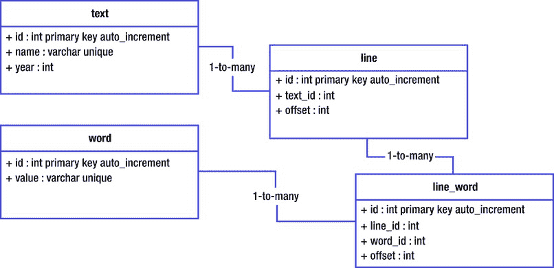
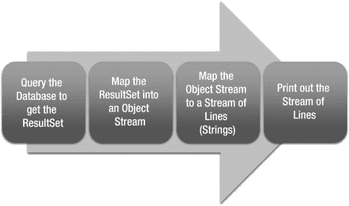

# 5. 使用 Lambda 进行数据访问

在上一章中，我们了解了 Lambda 如何帮助我们处理文件和流。在本章中，我们将探讨如何与数据库进行交互。早在第 1 章中，我们就看到了 Lambda 如何通过简化回调接口的实现来帮助 Spring 的 JDBCTemplate。在第 3 章中，我们介绍了流，而在第 4 章中，我们看到了流如何简化文件数据的处理。在本章中，我们将详细了解如何使用 Java 的数据访问结构（`java.sql` 包）。这还将让我们有机会认识 Java 8 标准库中的另一个新数据结构：分割迭代器（spliterator）。

如果我们要进行数据访问，就需要处理一个具有一定规模的数据库。在本章中，我们将使用一个 H2 内存数据库，其中包含莎士比亚所有作品中的所有单词索引。这些单词按行号进行组织。这意味着我们有一个 `text` 表、一个 `line` 表、一个 `word` 表，以及一个连接 `line` 和 `word` 的 `line_word` 表。这些表的 UML 图如下所示：

该数据库的数据来源于古腾堡计划提供的文本，网址为 [`http://www.gutenberg.org/ebooks/100`](http://www.gutenberg.org/ebooks/100)。总共有 38 个文本（十四行诗被归为一个文本）。大约有 113,000 行，约 36,000 个不同的单词，以及近百万个单词的使用实例。虽然按照企业标准，这仍然是一个相对较小的数据库，但它已经足够大，会拖慢处理速度，需要一些特殊处理。我们将在附录 A 中逐步介绍如何加载该数据库，届时会对比命令式、面向对象和后函数式方法。在本章中，我们将从一个已填充数据的数据库开始，并逐步深入。

在数据库加载完毕并准备就绪后，让我们思考如何（以及为什么）将流引入其中。从一个简单的需求开始：我们希望打印出所有单词的使用情况，每行一个，并附带所有相关的元数据。例如，如果你正在为 Hadoop 的 MapReduce 运行生成输入数据，就可能需要这样做。我们将要运行的 SQL（以及一些示例结果）如下：

`SELECT t.name, l."offset", w."value", lw."offset"`

`FROM "text" t, word w`

`INNER JOIN line l ON (t.id = l.text_id)`

`INNER JOIN line_word lw ON (lw.line_id = l.id AND lw.word_id = w.id)`

| 文本标题 | 行偏移量 | 单词 | 单词偏移量 |
| --- | --- | --- | --- |
| 情人的怨诉 | 328 | Betray | 5 |
| 冬天的故事 | 3326 | interpose | 5 |
| 维洛那二绅士 | 2041 | expedition | 7 |
| 终成眷属 | 23 | Second | 12 |
| 安东尼与克莉奥佩特拉 | 3840 | solemnity | 7 |

既然我们可以利用 Lambda，那么如何处理这个查询呢？我们可以将问题分解为下面流程中的步骤。通过使用流，这四个步骤中的每一个都可以独立开发。流实例及其元素类型将把这些独立开发的步骤连接起来。因此，我们可以按任意顺序开发这些步骤，最后再将它们组合在一起。如果我们有多个开发人员，我们甚至可以将不同的步骤分配给不同的开发人员，每个步骤都与前一个步骤相关联。所以，流和 Lambda 不仅使执行过程更加异步和并发，也使开发过程如此。我们将通过从中间开始，逐步推进到末尾，然后再填充前端并将所有部分整合在一起来证明这一点。

## 表示中间查询结果

Java 的标准 SQL 库将查询的结果集表示为 `java.sql.ResultSet`。结果集提供了一组流式结果，因此我们将使用 `java.util.function.Stream` 以函数式方式表示它。但是，该流的元素类型是什么呢？传统上，答案是一个 Java Bean，查询结果中的每个字段都成为 Java Bean 的一个属性：你需要为 SQL 查询中的所有四个字段提供 getter 和 setter 方法。然而，在 Lambda 的世界中，我们将改用不可变的 Java 对象，如清单 5-1 所示。

**清单 5-1. 表示结果的 Java 对象**

`/**`

`* 用于存储查询单词使用数据库结果的函数式友好类。`

`*/`

`public class WordUsage {`

`private final String textName;`

`private final int lineOffset;`

`private final String word;`

`private final int wordOffset;`

`public WordUsage(`

`final String textName, final int lineOffset,`

`final String word, final int wordOffset`

`) {`

`this.textName = textName;`

`this.lineOffset = lineOffset;`

`this.word = word;`

`this.wordOffset = wordOffset;`

`}`

`public String getTextName() {`

`return textName;`

`}`

`public WordUsage withTextName(String textName) {`

`return new WordUsage(textName, lineOffset, word, wordOffset);`

`}`

`public int getLineOffset() {`

`return lineOffset;`

`}`

`public WordUsage withLineOffset(int lineOffset) {`

`return new WordUsage(textName, lineOffset, word, wordOffset);`

`}`

`public String getWord() {`

`return word;`

`}`

`public WordUsage withWord(String word) {`

`return new WordUsage(textName, lineOffset, word, wordOffset);`

`}`

`public int getWordOffset() {`

`return wordOffset;`

`}`

`public WordUsage withWordOffset(int wordOffset) {`

`return new WordUsage(textName, lineOffset, word, wordOffset);`

`}`

`}`

清单 5-1 中 Java Bean 的不可变性非常重要，因为流可以快速（并且通常透明地）切换到多线程处理。Java 内存模型并不保证在线程 A 中构造但在线程 B 中访问的对象，其字段一定完整。如果你在一个线程中构造对象并在另一个线程中访问它，任何给定的字段访问都可能返回 `null`，即使你在构造函数中为其赋值。原因在于不同线程维护着各自独立的内存空间，如果每当线程修改字段时，Java 虚拟机都必须遍历整个树并复制对象，那将带来显著的性能损失。关于这一点，最令人头疼的是，这条规则很少有人理解，而且错误可能直到系统处于负载状态时才会出现，此时系统会抛出一个毫无帮助的 `NullPointerException`，而它出现在本不该出现的地方。这对于可怜的开发人员来说简直是调试的噩梦，尤其是在并发性被隐藏的情况下。

为了解决这个问题，Java 虚拟机为你提供了三种选择。首先，你可以对你访问的每个对象使用同步块。这种方法既笨拙又容易出错。另外两种选择是使用 `volatile` 或 `final` 注解字段，这两种方法都能解决内存管理问题。`volatile` 关键字告诉 Java，每次访问该字段时，运行时都需要将其线程本地缓存与数据源进行核对。这会对性能造成一定影响，但只要对象的字段本身是线程安全的，它就能正常工作。`final` 关键字告诉 Java，该字段的值不能改变，因此你在某一时刻找到的值就是未来的值。由于字段值不能改变，运行时就不需要将字段复制到缓存中，也无需将缓存与数据源进行核对。除了能在没有 `volatile` 性能损失的情况下解决内存管理问题外，它还使得对象更容易推理，因为类的每个实例都有一个固定、永久的数值。如果对象的字段值不改变，那么其他线程就无法破坏你的线程对该对象的推理，因此即使在多线程环境中，你也可以假装自己处于单线程执行状态。

旧式 Java 对象被称为 POJO（“Plain Old Java Objects”，普通老式 Java 对象），而这种新的不可变风格的对象有时被称为 PIJO（“Plain Immutable Java Objects”，普通不可变 Java 对象），读作“PEE-johs”。就我个人而言，我更喜欢 FuJI（“Functional Java Instances”，函数式 Java 实例）这个术语。

请注意，FuJI 比 POJO 更适合与流（streams）配合使用。POJO 的 setter 方法类型是接收一个参数并返回 void，而 FuJI 的“setter”方法则返回被修改的类型。这意味着你可以将 setter 作为流中的映射（mapping）来使用。例如，如果你想为流中的所有条目将文本名称设置为同一个值，FuJI 代码明显比 POJO 代码更短、更易读，如清单 5-2 所示。

**清单 5-2. 为 POJO 流与 FuJI 流的每个元素赋值**

`import java.util.stream.*;`

`public class Listing2 {`

`public static void main(String[] args) {`

`// 为 POJO 流设置常量值`

`Stream<PojoWordUsage> pojos = Stream.of(/* 在此处插入 POJO */);`

`pojos.map(pojo -> {`

`pojo.setTextName("New Text Name");`

`return pojo;`

`}`

`);`

`// 为 FuJI 流设置常量值`

`Stream<WordUsage> fujis = Stream.of(/* 在此处插入 FuJI */);`

`fujis.map(fuji -> fuji.withTextName("New Text Name"));`

`}`

`}`

如果你有一个模板对象，并希望使用流分配的数据进行处理，那么 FuJI 的效率要高得多：相关代码见清单 5-3。在这种情况下，我们有一个 POJO，我们不断为其赋值，只要保证流是单线程的，并且与对象分配在同一个线程中执行，这很可能就能正常工作。另一方面，FuJI 会在流的每次传递中生成对象的新实例，无论流可能有多并发，这都能正常工作。FuJI 代码也恰好更短、更易读。

**清单 5-3. 将输入数据流映射到模板 POJO 与模板 FuJI**

`import java.util.stream.*;`

`public class Listing3 {`

`public static void main(String[] args) {`

`WordUsage template = new WordUsage("some text", 0, "word", 1);`

`PojoWordUsage pojoTemplate = new PojoWordUsage("some text", 0, "word", 1);`

`Stream<Integer> lineOffsets = Stream.of(/* 在此处插入行偏移量 */);`

`// 使用 POJO 模板（非线程安全）`

`Stream<PojoWordUsage> assignedPojos = lineOffsets.map(offset -> {`

`pojoTemplate.setLineOffset(offset);`

`return pojoTemplate;`

`}`

`);`

`// 使用 FuJI 模板（线程安全）`

`Stream<WordUsage> assignedFujis =`

`lineOffsets.map(template::withLineOffset);`

`}`

`}`

## 打印结果

要实现打印行的功能，我们只需要知道我们正在处理一个 WordUsage 实例的流。如果我们知道我们在处理一个流，并且知道 WordUsage 类的定义，那么我们就可以实现下一步。我们不需要更多细节。这种区分是面向对象软件承诺的一部分，并且在这个后函数式世界中确实已经实现。之所以能够实现，是因为流为应用程序的控制流提供了一种抽象。以前，Java 为数据提供了抽象。现在，通过流，你可以将控制流本身传递给应用程序的一部分，而应用程序的那部分决定如何处理它。

在这种情况下，我们将接收处理后的 WordUsage 实例，并且我们负责首先将 WordUsage 实例转换为制表符分隔值（TSV）输出格式，然后将生成的流传递到某处以打印输出。打印输出字符串实例的流相当简单，所以我们将其留到最后处理。首先，让我们弄清楚如何转换 WordUsage 实例。我们可以采用两种简单的方法，我们将对两者都进行考虑。

如果我们有能力修改 WordUsage 类，那么我们可以直接将该方法添加到类中。然后，生成的方法可以作为映射函数传递到流中。我们将添加到 WordUsage 类的方法如下所示：

`public String toTSV() {`

`return String.format("%s\t%d\t%s\t%d",`

`textName, lineOffset, word, wordOffset);`

`}`

给定一个 WordUsage 实例的流，我们只需将 `WordUsage::toTSV` 作为映射函数传入。这将指示流将实例方法应用于流的每个元素。如果 WordUsage 实例的流名为 `source`，那么映射调用将如下所示：

`source.map(WordUsage::toTSV)`

这无疑是最简单的方法，并且它将如何将 WordUsage 转换为 TSV 的实现细节保留在 WordUsage 类本身内部。这将有助于防止“代码腐烂”，即代码随着时间的推移而功能退化。代码腐烂的一个主要原因是调用代码站点对被调用对象做出了假设。这些假设在当前时刻可能成立，但如果类发生了变化，你可能不会明显意识到需要更改代码。为了了解这是如何发生的，让我们考虑我们的替代方法：使用 lambda 将 WordUsage 映射为 TSV。

在这种情况下，原本成为 `toTSV()` 方法的代码将被内联定义。这种方法通常是刚接触后函数式语言的非函数式程序员以及最近发现并迷恋上 lambda 的 Java 开发者的默认选择。如果 WordUsage 实例的源流名为 `source`，那么内联 lambda 将如下所示：

`source.map(wordUsage ->`

`String.format("%s\t%d\t%s\t%d",`

`wordUsage.getTextName(), wordUsage.getLineOffset(),`

`wordUsage.getWord(), wordUsage.getWordOffset()`

`)`

`);`

这在当前情况下可以正常工作。但它不如方法版本易读，因为你无法使用语义化的 `toTSV` 方法名。如果开发者想弄清楚输出值是 TSV，他必须能够读取格式字符串，然后识别出那是 TSV。因此，方法方法具有这个优势。但这种方法还有一个更大（但更微妙）的问题。

假设我们将 WordUsage 改为包含一个“段落编号”。对于十四行诗，这将是十四行诗编号。对于戏剧，这将是幕号，序言材料的段落编号为 0。实现这一功能的人会进入 WordUsage，并更新该类，使其在整个代码中使用段落编号，然后所有测试都会通过，该类看起来也一切正常。我们的 lambda 代码也能正常编译和执行，所有测试都会通过。但最终的数据会被破坏：对于任何给定的文本，在行偏移量 1、单词偏移量 1 处，看起来会有两个不同的单词。除非有人分析和验证数据，否则根本无法检测到这种破坏。曾几何时，代码运行得很好。但由于代码随时间发生了变化，代码不再正常工作。这就是代码腐化。

我们在这里看到的是面向对象封装原则的优势。事实上，我们 WordUsage 实例上的 getter 方法在精神上（即使技术上并非如此）违反了封装原则：它们直接暴露了类的实现细节。我们有可能在未来的某个时候更改这些实现细节，但任何重大的更改——例如添加一个新字段并重新定义现有字段的含义——都会招致代码腐化。

这里的教训是，lambda 表达式是强大的工具。然而，比 lambda 表达式本身更强大的是 Java 8 将面向对象最佳实践（如封装）与函数式行为（如映射流元素）相结合的能力。这就是后函数式语言在正确使用时如此强大的原因：它确实融合了两种范式的最佳之处。

现在我们已经将 WordUsage 实例的流转换为制表符分隔值（TSV）字符串的流，我们需要将它们打印出来。这很简单：我们将获取一个 `PrintWriter` 或 `PrintStream` 实例，然后让流对每个元素执行其 `println` 方法。在我们的例子中，我们将使用 `System.out` 作为我们的 `PrintStream` 实例，并使用 `output` 作为字符串元素的输出流。在这种情况下，生成的代码如下所示：

`output.forEach(System.out::println);`

这演示了如何使用给定实例的方法作为 lambda 表达式：我们实际上是将 `System.out` 这个特定实例，以及在该特定实例上调用 `println` 的操作，转换成了一个 lambda 表达式。这对于一对冒号来说，承担了相当多的功能，而这正是 Java 8 的强大之处。有了这些基础，我们可以回到起点：从数据库下载。

## 将 ResultSet 映射到 Stream

将 `ResultSet` 实例映射到 `Stream` 实例的任务并不像我们可能希望的那么简单。如果我们看一下 Stream 类，它是一个接口。如果它是一个像 Iterator 类那样小巧且定义明确的接口，我们可以直接实现一个桥接。不幸的是，它是一个庞大的接口，包含一些非常棘手（且模棱两可）的定义，因此我们不会想直接实现它。我们将探讨四种将 ResultSet 桥接到 Stream 的实现方法：

*   使用 `Stream.Builder` 预先构建一个流。
*   使用 `Stream.of` 和 `Stream.flatMap` 按需构建流。
*   实现基于 `Spliterators.AbstractSpliterator` 的 `Stream`。
*   将 `ResultSet` 映射到 `Iterator`，再映射到 `Spliterator`，最后映射到 `Stream`。

这四种方法各有优缺点，我们将在考虑其实现时看到。所有四种方法的结果都将是一个 WordUsage 实例的 Stream，并且该流可以立即接入我们在本章其他部分完成的所有工作。

在每种情况下，我们都需要将当前 ResultSet 行映射到 WordUsage 实例。这部分实现在所有方法中都是相同的，因此我们将其作为静态方法直接添加到 WordUsage 类中，并从那里引用它。这将使代码示例更明显地专注于基础设施。该方法如清单 5-4 所示。有了这个方法，我们就可以开始我们的四种实现了。

**清单 5-4. 从 ResultSet 映射 WordUsage 的方法**

`/**`

`* 基于结果集的当前行返回此类的一个新实例。`

`* 结果集中的结果预期如下：`

`* 
`

`* <b>1.</b> 文本的字符串标题 `

`* <b>2.</b> 文本内的行偏移量 `

`* <b>3.</b> 单词本身 `

`* <b>4.</b> 行内的单词偏移量 `

`*`

`* @param rs 应读取其当前行的结果集；`

`*           绝不为 {@code null}。`

`* @return 从查询结果构造的 {@link WordUsage}。`

`*/`

`public static WordUsage fromResultSet(ResultSet rs) throws SQLException {`

  `Objects.requireNonNull(rs, "要读取的结果集");`

  `return new WordUsage(`

      `rs.getString(1),  // 标题`

      `rs.getInt(2),     // 行偏移量`

      `rs.getString(3),  // 单词`

      `rs.getInt(4)      // 单词偏移量`

  `);`

`}`

### 方法一：使用 Stream Builder 构建流

动态构建 Stream 的最简单方法是使用 `Stream.Builder`。Stream.Builder 类遵循标准的“构建器”设计模式。这种设计模式是一个具有两个阶段的对象：累积阶段和构建阶段。对象从累积阶段开始。在此阶段，它接收元素。在某个时刻，会调用一个触发方法，将构建器转换为构建阶段。在构建阶段，构建器充当工厂，生成所需类的实例。

在我们的例子中，我们将向 Stream.Builder 提供 WordUsage 实例。我们将通过以熟悉的方式遍历结果集、构造实例并将它们传入来实现。所有这些都发生在调用代码的执行线程中，并且一个完全填充的流被返回给调用者。如果在填充此流时出现任何异常，它将直接传播给调用者。Stream.Builder 方法的代码如清单 5-5 所示。

**清单 5-5. 使用 Stream Builder 将 ResultSet 转换为 Stream**

`public static Stream<WordUsage> createStream(ResultSet rs)`

  `throws SQLException`

`{`

  `Stream.Builder<WordUsage> builder = Stream.builder();`

  `while (rs.next()) {`

    `WordUsage usage = WordUsage.fromResultSet(rs);`

    `builder.add(usage);`

  `}`

  `return builder.build();`

`}`

这种方法的主要优点是 Java 开发人员非常熟悉。这是构建集合的标准方式。它的另一个主要优点是，由流构建器构建的流非常灵活，允许并行执行和其他后台优化。最后，这种方法还使得对 ResultSet 和流进行推理变得非常容易：你知道一旦此方法返回，就不会出现数据访问或数据转换错误，并且结果集（及其资源）可以在方法返回时关闭。

这种方法的主要缺点是它非常消耗资源。它会占用执行线程，在该线程读取完所有结果之前，阻止该线程执行任何其他操作。它还会占用内存，因为整个流必须先缓冲到内存中，然后才能处理其中的任何部分。如果数据集很小，这两个缺点都不明显，但随着数据集变大，它们会变得更加严重。对于即使是中等大小的数据集（例如我们的数据集），这也不是一个好的选择。然而，对于较小的数据集，这种方法的简单性很可能胜过其低效性。

### 方法二：使用 Stream.of 和 Stream.flatMap 构建流

当我们试图从 ResultSet 迁移到 Stream 时，问题在于难以进入 Stream API。本方法通过构建一个仅包含 ResultSet 的单元素流来进入 Stream API。随后，我们将使用上一章学到的 `Stream.flatMap` 方法，将 ResultSet 展开为结果对象。

在此方法中，由单个元素构成的流将通过 `Stream.of(resultSet)` 构建。`Stream.of` 方法接受任意数量的参数，并会构建一个高效流，其中包含按参数顺序排列的元素。与 `Stream.Builder` 方法不同（后者可以在构建器启动后，在运行时确定并传入对象），`Stream.of` 的所有元素都必须在调用该方法时立即提供。

为了将单个 ResultSet 流转换为映射后的元素，我们将使用 `Stream.flatMap`。正如我们在上一章所见，这允许源流中的每个元素被映射到结果流中的零个或多个元素。在我们的场景中，源流中的单个 ResultSet 元素会被映射为 ResultSet 中每一行对应的一个 WordUsage 元素。

这里我们面临的问题是，需要保持 ResultSet 处于打开状态，直到所有行都被处理完毕。为了在适当时机关闭 ResultSet，我们可以使用 `Stream.onClose(Runnable)`。此方法允许你挂载一个回调，该回调会在流关闭时执行。虽然不常用，但它确实能让你将资源管理的责任委托给流本身。这对于保持代码整洁，以及避免在代码库的调用中传递资源非常有用。

使用 `Stream.onClose(Runnable)` 的一个注意事项是，你需要使用返回的 `Stream`。一些 Java 开发者会通过 onClose 注册处理器，并认为流实例本身已被修改。实际情况可能确实如此。然而，Stream API 允许流实现返回一个附加了处理器的全新实例，因此你需要确保使用的是那个返回的实例。

现在我们可以将所有内容整合起来。我们将使用 Stream.of 创建一个包含 ResultSet 的单元素流。该流会注册 ResultSet，以便流在关闭时能关闭 ResultSet。我们将有一个 flatMap 调用，其中会传入迭代和流构建代码：这段代码将与上一节中的代码类似。具体代码见清单 5-6。

**清单 5-6. 使用 Stream.of 和 Stream.flatMap 将 ResultSet 转换为 Stream**

`public static Stream<WordUsage> createStream(ResultSet resultSet)`

`throws SQLException`

`{`

`Stream<ResultSet> rsStream = Stream.of(resultSet).onClose(() -> {`

`try {`

`resultSet.close();`

`} catch (SQLException ignore) {}`

`}`

`);`

`return rsStream.flatMap(rs -> {`

`Stream.Builder<WordUsage> builder = Stream.builder();`

`try {`

`while (rs.next()) {`

`WordUsage usage = WordUsage.fromResultSet(rs);`

`builder.add(usage);`

`}`

`} catch (SQLException sqle) {`

`// TODO 处理异常`

`}`

`return builder.build();`

`}`

`);`

`}`

这种方法有许多优点。ResultSet 只有在流实际被使用时才会被处理，这将从 ResultSet 读取数据的昂贵操作推迟到真正需要时才执行。读取数据时产生的异常会从调用者的流程转移到流的流程中，这对它们来说是更合适的位置。最终生成的流仍然是来自 Stream.Builder 的高度优化流，这是一个重要的回报。最后，流处理的所有设置工作都可以在执行结果集和处理之前完成，这将简化执行流程。

这种方法的缺点是，即使它是延迟处理的，它仍然是一个资源消耗大户。所有结果都必须先缓存到内存中，然后才能处理其中任何一个。此外，在处理任何结果之前，必须完整读取 ResultSet。这意味着我们无法利用等待数据库处理和网络延迟的时间来处理已经到达的结果。我们希望尽快开始处理，这正是接下来几种替代方案发挥作用的地方。

#### 使用基于结果的错误处理来映射 ResultSet

清单 5-6 中这种方法的另一个问题是错误处理：我们会抛出一个 SQLException 实例，但我们该如何处理它呢？在清单 5-6 中，我们留下了一个 TODO 并默默地吞掉了它。我们可以将其包装在 RuntimeException 中并抛出这个非受检异常，但这样我们就忽略了一个几乎肯定需要处理的异常，并且可能会在这个过程中搞乱我们的类型。我们可以使用 FunJava 库中的 `funjava.Result` 类型来解决这个问题。

在上一章中，我们开始使用 `Funjava Result` 类型来捕获错误处理，并将其作为流流程中明确的一部分。我们可以再次利用这个结果。我们的 createStream 方法不仅接受一个 ResultSet，还需要调用者提供一个错误处理器。我们不会在流的 `onClose` 处理器中注册关闭操作，而是在处理流程中立即执行关闭。调用者将提供错误处理的实现，我们将使用 ResultErrorHandler 类来应用它，就像我们在上一章中看到的那样。结果是该方法的一个更健壮的实现，如清单 5-7 所示。

**清单 5-7. 使用 Result 类型实现更健壮的 Stream.of 和 Stream.flatMap 转换**

`public static Stream<WordUsage> createStream(`

  `ResultSet resultSet, Consumer<Exception> errorHandler`

`)`

    `throws SQLException {`

  `return Stream.of(resultSet).flatMap(rs -> {`

        `Stream.Builder<Result<WordUsage>> builder = Stream.builder();`

        `try {`

          `while (rs.next()) {`

            `try {`

              `WordUsage usage = WordUsage.fromResultSet(rs);`

              `builder.add(Result.of(usage));`

            `} catch(SQLException sqle) {`

              `builder.add(Result.of(sqle));`

            `}`

          `}`

        `} catch (SQLException sqle) {`

          `builder.add(Result.of(sqle));`

        `} finally {`

          `try {`

            `rs.close();`

          `} catch (SQLException sqle) {`

            `builder.add(Result.of(sqle));`

          `}`

        `}`

        `return builder.build();`

      `}`

  `).flatMap(new ResultErrorHandler<>(errorHandler));`

`}`

### 方法三：使用 AbstractSpliterator 构建流

在前两种方法中，我们都在内存中构建了结果流，然后返回整个流。这意味着我们必须等待所有 I/O 操作完成才能开始处理，并且必须同时将所有结果存储在内存中。如果你的数据量足够大，以至于需要使用外部数据库，那么这些特性在解决方案中可能就无法接受了。本方案以及下一个方案都提供了一种替代方法。这些方案会将结果集的迭代过程集成到流处理本身中，这意味着结果可以分批处理。

本方案将遵循更传统的 Java 方法：如果你想实现一个接口，就找到实现了该接口的抽象类，并通过扩展该抽象类来构建你的实现。然而，并没有一个现成的 `AbstractStream` 可以继承。相反，我们需要深入一层。这就是我们遇到 `Spliterator` 的地方。

Java 8 引入了一种名为 `Spliterator` 的新类型。`Spliterator` 类似于迭代器，其职责是生成一个元素序列。与迭代器一样，元素序列可以是有限的，也可以是无限的，但通常是有限的。迭代器和 `Spliterator` 之间的主要区别在于，`Spliterator` 具有“拆分”的能力。拆分 `Spliterator` 的概念是，将一个 `Spliterator` 分成两个，原始 `Spliterator` 返回一部分元素，新的 `Spliterator` 返回另一部分元素。

假设你有一个包含英文字母“A”到“Z”的 `Spliterator`。你可以从你的 `Spliterator` 中取出“A”、“B”和“C”，然后进行拆分。此时，原始 `Spliterator` 可能开始只提供剩余的辅音字母（“d”、“f”、“g”、“h”、“j”……），并返回一个新的 `Spliterator` 用于处理剩余的元音字母（“e”、“i”、“u”……）。这两个 `Spliterator` 将完全独立，可以以任何顺序执行，彼此之间没有任何依赖关系。规则是，拆分过程中不能丢失任何元素，并且拆分后的 `Spliterator` 不能重复产生任何元素。

在 Java 8 中，`Spliterator` 提供将成为流元素的元素。所有各种流操作实际上都是对 `Spliterator` 及其产生的元素进行的操作。你可以通过将 `Spliterator` 实例传递给 `StreamSupport.stream(Spliterator, boolean)` 方法来从 `Spliterator` 生成流。第二个参数指定生成的流是“并行”还是“顺序”：并行流允许以任意顺序操作元素，并同时操作多个元素；顺序流则始终在调用者的线程内执行，并且会在处理下一个元素之前完成对前一个元素的处理。如果前一个元素可能会改变后一个元素的解释方式，那么你必须创建一个顺序流。如果元素能够被独立处理，那么你应该创建一个并行流。默认情况下，Java 中的流是顺序的，因为这是最安全的做法。但是，如果可能的话，你应该通过调用 `stream.parallel()` 并使用返回的流来使用并行流。清单 5-8 给出了这些不同模式的具体示例。

**清单 5-8\. 并行流与顺序流运行结果对比**

`import java.util.stream.*;`

`public class Listing8 {`

`public static void main(String[] args) throws Exception {`

`IntStream stream;`

`// 顺序流——通常是默认模式`

`stream = IntStream.range(1, Integer.MAX_VALUE);`

`stream.sequential().mapToObj(i -> {`

`System.out.println("Mapping " + i + " to string");`

`return Integer.toString(i);`

`}`

`).forEach(System.out::println);`

`/* 示例输出片段`

`Mapping 34438924 to string`

`34438924`

`Mapping 34438925 to string`

`34438925`

`Mapping 34438926 to string`

`34438926`

`Mapping 34438927 to string`

`34438927`

`Mapping 34438928 to string`

`34438928`

`Mapping 34438929 to string`

`34438929`

`Mapping 34438930 to string`

`34438930`

`*/`

`// 并行流——通常需要显式调用 .parallel()`

`stream = IntStream.range(1, Integer.MAX_VALUE);`

`stream.parallel().mapToObj(i -> {`

`System.out.println("Mapping " + i + " to string");`

`return Integer.toString(i);`

`}`

`).forEach(System.out::println);`

`/* 示例输出采样`

`Mapping 298035702 to string`

`298035702`

`Mapping 298035703 to string`

`298035703`

`Mapping 298035704 to string`

`298035704`

`Mapping 298035705 to string ¬ 线程切换`

`Mapping 405565 to string`

`405565`

`Mapping 405566 to string`

`405566`

`Mapping 405567 to string`

`405567`

`*/`

`}`

`}`

在 Java 8 中有多种方式实现分割器（spliterator）。创建分割器的大部分功能都包含在 `Spliterators`（注意末尾的“s”）类中。另一种常见的创建分割器的方式是从一个流开始，然后调用 `stream.spliterator()`。最后一种常见的创建分割器的方式是从迭代器构建，我们将在下一节中探讨。在本节中，我们将使用 `Spliterators` 类中提供的 `AbstractSpliterator` 基类来实现一个分割器。然后，我们将利用该结果来构建流。

对于 `AbstractSpliterator` 基类，需要实现的核心方法是 `tryAdvance`。该方法接收一个 `Consumer` 参数，该参数代表下游行为。代码负责将任何新生成的元素传递给该消费者。如果生成了新元素，则方法返回 `true`；如果已耗尽，则返回 `false`。

我们不希望将此代码直接绑定到特定的实现中。这样做有两个原因：首先，我们希望简化类并保持代码中清晰的职责划分；其次，通过保持专注，我们将创建一段有价值的可复用代码。在这种情况下，我们的类可以依赖用户来指定转换逻辑。由于 `ResultSet` 类型上几乎所有有趣的方法都会抛出 `SQLException`，因此我们不能使用简单的函数式接口：相反，我们将提供一个会抛出 `SQLException` 的抽象方法，然后在我们的 `tryAdvance` 方法中处理该异常。假设我们的类将 `ResultSet` 存储在一个名为 `resultSet` 的字段中，那么最终的方法如清单 5-9 所示。

**清单 5-9. ResultSetSpliterator 的 tryAdvance 方法**

`/**`

`* 给定一个位于当前行的 {@link ResultSet} 实例，返回该行的`

`* {@code RESULT_T} 实例。`

`* 此代码不应调用 {@link java.sql.ResultSet#next()} 或`

`* 以其他方式改变结果集：应将其视为只读。`

`*`

`* @param resultSet 要加载的结果集。`

`* @return 结果实例。`

`* @throws SQLException 如果发生错误。`

`*/`

`protected abstract RESULT_T processRow(ResultSet resultSet)`

`throws SQLException;`

`/**`

`* 如果存在剩余元素，则对其执行给定操作，`

`* 返回 {@code true}；否则返回 {@code false}。如果此`

`* Spliterator 是 {@link #ORDERED} 的，则按遇到顺序对`

`* 下一个元素执行操作。操作抛出的异常会传递给调用者。`

`*`

`* @param action 要执行的操作`

`* @return 如果进入此方法时没有剩余元素，则返回 {@code false}，`

`* 否则返回 {@code true}。`

`* @throws NullPointerException 如果指定的操作为 null`

`*/`

`@Override`

`public boolean tryAdvance(final Consumer<? super RESULT_T> action) {`

`Objects.requireNonNull(action, "要执行的操作");`

`try {`

`if (resultSet.isClosed() || !resultSet.next()) {`

`return false;`

`}`

`RESULT_T result = processRow(resultSet);`

`if (result == null) {`

`throw new NullPointerException("processRow 返回了 null");`

`} else {`

`action.accept(result);`

`return true;`

`}`

`} catch (SQLException sqle) {`

`throw new RuntimeException("处理结果集时发生 SQL 异常",`

`sqle);`

`}`

`}`

该类的构造函数需要扩展 `AbstractSpliterator` 构造函数。该构造函数接受两个参数：分割器的预估大小和分割器的特性。分割器的预估大小顾名思义：即对返回元素数量的粗略估计。如果完全不知道分割器的大小，则使用魔法值 `Long.MAX_VALUE`。第二个参数是分割器的特性，通过它你可以向运行时建议如何使用你的分割器。

特性有多种，它们被当作位域来处理。其中最重要的两个是 `IMMUTABLE` 和 `CONCURRENT`，它们指定了分割器与数据源之间的关系。如果分割器对数据源的视图不可更改，则分割器应指定 `IMMUTABLE`。我们的 `ResultSet` 分割器就属于这种情况，因为 SQL 查询的结果无法更改。或者，如果分割器对数据源的视图可以被并发修改，则分割器应指定 `CONCURRENT`。这适用于操作线程安全集合或内存映射文件的分割器。

分割器还可以拥有其他一些特性。与互斥的 `IMMUTABLE` 和 `CONCURRENT` 不同，这些特性更加独立：以下特性之间互不排斥。最重要的是 `ORDERED`。该特性保证元素将按“遭遇顺序”处理，即分割器的迭代顺序。如果你将 `ORDERED` 传递给分割器，你将得到一个类似于顺序流的 API——实现中仍有一些并行化的余地，但不多。如果你指定了 `ORDERED`，还可以指定 `SORTED`。如果你的分割器是 `SORTED`，那么要么分割器附带了一个比较器，要么元素根据其自然顺序排序。这允许对排序进行一些优化，也允许分割器的结果被并行处理后再按顺序排序。`DISTINCT` 标志表示分割器的每个元素都与其他元素不同。这表示无需额外工作来过滤重复值，例如在 `Stream.distinct()` 中。`NONNULL` 特性断言分割器的任何结果都不会为 null，这允许绕过一些安全检查。最后，`SIZED` 和 `SUBSIZED` 特性都断言分割器的预估大小是准确的。`SUBSIZED` 额外保证从该分割器拆分出的分割器本身也是 `SIZED` 和 `SUBSIZED` 的：换句话说，`SUBSIZED` 意味着不仅已知元素总数，而且如果元素被拆分到不同的分割器中，部分大小也是已知的。

在我们的案例中，每一行都会创建一个实例，因此我们可以使用 `NONNULL` 特性。由于通常最好避免使用 `null`，我们可以直接在类中实现这一点。在我们的特定案例中，我们还知道每个生成的 `WordUsage` 实例都与其他实例不同，因此我们可以使用 `DISTINCT` 特性。然而，这并非适用于所有 SQL 查询。我们不知道将要创建的实例总数，因此不能使用 `SIZED`。我们当前的查询也没有任何排序，并且确实不需要排序，因此我们不会使用 `ORDERED`。最后，SQL 查询的结果在我们的迭代过程中无法修改，因此我们可以返回 `IMMUTABLE` 选项。确定这些之后，我们可以构建构造函数，从而得到清单 5-10 中的类。

**清单 5-10\. 带构造函数的 ResultSetSpliterator**

`import java.sql.ResultSet;`

`import java.sql.SQLException;`

`import java.util.*;`

`import java.util.function.*;`

`/**`

`* 一个遍历{@link java.sql.ResultSet}的{@link java.util.Spliterator}。当结果集耗尽时，`

`* 它将被自动关闭。实现类必须实现`

`* {@link #processRow(java.sql.ResultSet)} 来`

`* 指定如何将一行转换为结果对象。`

`*/`

`public abstract class ResultSetSpliterator<RESULT_T>`

`extends Spliterators.AbstractSpliterator<RESULT_T>`

`{`

`private static final int CHARACTERISTICS =`

`Spliterator.IMMUTABLE | Spliterator.DISTINCT | Spliterator.NONNULL;`

`private final ResultSet resultSet;`

`/**`

`* 构造函数。`

`*`

`* @param resultSet 要处理的结果集；不能为 {@code null}。`

`* @param additionalCharacteristics 除`

`{@link java.util.Spliterator#IMMUTABLE}`

`*                                 和 {@link java.util.Spliterator#NONNULL} 之外的相关特性，`

`*                                 如果没有则为 {@code 0}`

`*/`

`public ResultSetSpliterator(`

`final ResultSet resultSet,`

`final int additionalCharacteristics`

`) {`

`super(Long.MAX_VALUE, CHARACTERISTICS | additionalCharacteristics);`

`Objects.requireNonNull(resultSet, "result set");`

`this.resultSet = resultSet;`

`}`

`// 此处后续代码请参见清单 5-9`

`}`

现在只剩下一个问题需要解决：关闭 ResultSet。如果用户将 ResultSet 传入此对象，然后关闭了 ResultSet，那么这个 spliterator 可能尚未被调用。我们在 streams 中曾遇到过这个问题，当时我们使用 onClose 回调来处理它。与 streams 不同，spliterators 没有“被关闭”的概念，因此我们必须自己构建这个功能。我们希望的是，当我们完成对 ResultSet 的处理后，它能够被关闭。ResultSet 也可能持有一个 Statement 或 Connection，因此我们也希望让用户能够选择关闭这些资源。为了支持这一点，我们的构造函数将接受可变数量的 AutoCloseable 实例，并且当我们耗尽结果集时，将关闭它们。这涉及到添加一个 `doClose()` 方法，并在 ResultSet 耗尽时调用该方法。更新后的类结果如清单 5-11 所示。

清单 5-11\. 完整的 ResultSetSpliterator 类

`import java.sql.ResultSet;`

`import java.sql.SQLException;`

`import java.util.*;`

`import java.util.function.*;`

`/**`

`* 一个遍历 {@link java.sql.ResultSet} 的 {@link java.util.Spliterator}。`

`* 当结果集耗尽时，它将被自动关闭。`

`* 实现类必须扩展 {@link #processRow(java.sql.ResultSet)} 来`

`* 指定如何将一行转换为结果对象。`

`*/`

`public abstract class ResultSetSpliterator<RESULT_T>`

`extends Spliterators.AbstractSpliterator<RESULT_T>`

`{`

`private static final int CHARACTERISTICS =`

`Spliterator.IMMUTABLE | Spliterator.NONNULL;`

`private final ResultSet resultSet;`

`private final AutoCloseable[] toClose;`

`/**`

`* 构造函数。`

`*`

`* @param resultSet 要处理的结果集；不能为 {@code null}。`

`* @param additionalCharacteristics 除`

`*                                 {@link java.util.Spliterator#IMMUTABLE}`

`*                                 和 {@link java.util.Spliterator#NONNULL} 之外的相关特性，`

`*                                 如果没有则为 {@code 0}`

`* @param toClose 可选的额外自动关闭资源（例如`

`*                {@link java.sql.Connection}），在结果集`

`*                耗尽时关闭；可以为 {@code null}`

`*                （等同于空数组）。`

`*/`

`public ResultSetSpliterator(`

`final ResultSet resultSet, final int additionalCharacteristics,`

`final AutoCloseable… toClose`

`) {`

`super(Long.MAX_VALUE, CHARACTERISTICS | additionalCharacteristics);`

`Objects.requireNonNull(resultSet, "result set");`

`this.resultSet = resultSet;`

`if (toClose == null) {`

`this.toClose = new AutoCloseable[0];`

`} else {`

`this.toClose = toClose;`

`}`

`}`

`/**`

`* 给定一个位于当前行的 {@link ResultSet} 实例，返回该行的`

`* {@code RESULT_T} 实例。`

`* 此代码不应调用 {@link java.sql.ResultSet#next()} 或`

`* 以其他方式改变结果集：应将其`

`* 视为只读。`

`*`

`* @param resultSet 要加载的结果集。`

`* @return 结果实例。`

`* @throws SQLException 如果发生错误。`

`*/`

`protected abstract RESULT_T processRow(ResultSet resultSet)`

`throws SQLException;`

`/**`

`* 如果存在剩余元素，则对其执行给定操作，`

`* 返回 {@code true}；否则返回 {@code false}。如果此`

`* Spliterator 是 {@link #ORDERED}，则按遇到顺序对`

`* 下一个元素执行操作。操作抛出的异常`

`* 会传递给调用者。`

`*`

`* @param action 要执行的操作`

`* @return 如果进入此方法时没有剩余元素则返回 {@code false}，`

`* 否则返回 {@code true}。`

`* @throws NullPointerException 如果指定的操作为 null`

`*/`

`@Override`

`public boolean tryAdvance(final Consumer<? super RESULT_T> action) {`

`Objects.requireNonNull(action, "要执行的操作");`

`try {`

`if (resultSet.isClosed() || !resultSet.next()) {`

`doClose();`

`return false;`

`}`

`RESULT_T result = processRow(resultSet);`

`if (result == null) {`

`throw new NullPointerException("processRow 返回了 null");`

`} else {`

`action.accept(result);`

`return true;`

`}`

`} catch (SQLException sqle) {`

`throw new RuntimeException(`

`"处理结果集时发生 SQL 异常", sqle);`

`}`

`}`

`private void doClose() {`

`try {`

`if (resultSet != null && !resultSet.isClosed()) resultSet.close();`

`} catch (SQLException ignore) {}`

`for (int i = 0; i < toClose.length; i++) {`

`try {`

`AutoCloseable closeMe = toClose[i];`

`toClose[i] = null;`

`if (closeMe != null && closeMe != resultSet) closeMe.close();`

`} catch (Exception ignore) {}`

`}`

`}`

`}`

我们的工具类终于构建完成，现在可以为 WordUsage 查询构建 stream 了。我们只需声明一个 ResultSetSpliterator 实例，将其 ResultSet 处理委托给我们的 `WordUsage.fromResultSet` 工具方法。由于我们每次都会返回一个不同的 WordUsage，因此可以传入 DISTINCT 特性。我们还将 ResultSet 的 connection 传给它，这样一旦 spliterator 耗尽，它就会关闭连接。构建好该 spliterator 后，我们将传入该 spliterator 以生成一个并行 stream。最终的代码如清单 5-12 所示。

清单 5-12\. 使用 ResultSetSpliterator 生成新 Stream

`public static Stream<WordUsage> createStream(`

`Connection conn, ResultSet resultSet`

`) throws SQLException {`

`Spliterator<WordUsage> usages =`

`new ResultSetSpliterator<WordUsage>(`

`resultSet, Spliterator.DISTINCT, conn`

`) {`

`@Override`

`protected WordUsage processRow(final ResultSet resultSet)`

`throws SQLException`

`{`

`return WordUsage.fromResultSet(resultSet);`

`}`

`};`

`Stream<WordUsage> stream = StreamSupport.stream(usages, true);`

`return stream;`

`}`

### 方法四：从迭代器构建流

尽管构建一个可拆分迭代器（spliterator）很有教育意义，但工作量也很大。如果你不需要那种程度的控制，你可以从迭代器构建一个可拆分迭代器，然后再从那里构建流。有两个桥接方法可以从迭代器获取可拆分迭代器：`Spliterators.spliterator(Iterator, long, int)` 和 `Spliterators.spliteratorUnknownSize(Iterator, int)`。前者在你已知将要迭代的元素数量时使用；后者则在你不知道数量时使用。前者的效率明显高于后者，因此如果你能提前确定数量，请务必使用前者。在这两种情况下，你都需要将可拆分迭代器的特性作为最后一个参数传入。

为 ResultSet 构建迭代器比构建可拆分迭代器要简单得多。因此，我们的迭代器实现是清单 5-11 中可拆分迭代器实现的一个简化版本。唯一需要注意的是，可拆分迭代器中的单个 `tryAdvance` 方法在迭代器类中分成了两个不同的方法：`hasNext()` 和 `next()`。因此，我们需要能够存储一些状态，以判断是否还有下一个元素。这是一个三态变量：它可以是 true、false 或 unknown。这是 `null` 为数不多的合理用途之一：通过使用 Boolean 类型，我们可以获得这三种状态。我们的迭代器实现如清单 5-13 所示。

**清单 5-13. ResultSetIterator 实现**

`import java.sql.ResultSet;`

`import java.sql.SQLException;`

`import java.util.*;`

`/**`

`* 一个遍历 {@link java.sql.ResultSet} 的 {@link java.util.Iterator}。`

`* 当结果集耗尽时，`

`* 它将被自动关闭。实现类应扩展`

`* {@link #processRow(java.sql.ResultSet)} 以`

`* 指定如何将一行转换为结果对象。`

`*/`

`public abstract class ResultSetIterator<RESULT_T>`

`implements Iterator<RESULT_T>`

`{`

`private final ResultSet resultSet;`

`private final AutoCloseable[] toClose;`

`private volatile Boolean hasNext = null;`

`/**`

`* 构造函数。`

`*`

`* @param resultSet 要处理的结果集；不能为 {@code null}。`

`* @param toClose   可选的额外自动关闭资源（例如`

`*                 {@link java.sql.Connection}），在结果集耗尽时关闭；`

`*                 可以为 {@code null}（等同于空数组）。`

`*/`

`public ResultSetIterator(final ResultSet resultSet, final AutoCloseable... toClose) {`

`Objects.requireNonNull(resultSet, "result set");`

`this.resultSet = resultSet;`

`if (toClose == null) {`

`this.toClose = new AutoCloseable[0];`

`} else {`

`this.toClose = toClose;`

`}`

`}`

`/**`

`* 给定一个位于当前行的 {@link java.sql.ResultSet} 实例，`

`* 返回该行的 {@code RESULT_T} 实例。`

`* 此代码不应调用 {@link java.sql.ResultSet#next()} 或`

`* 以其他方式改变结果集：应将其视为只读。`

`*`

`* @param resultSet 要加载的结果集。`

`* @return 结果实例。`

`* @throws java.sql.SQLException 如果发生错误。`

`*/`

`protected abstract RESULT_T processRow(ResultSet resultSet)`

`throws SQLException;`

`private void doClose() {`

`try {`

`if (!resultSet.isClosed()) resultSet.close();`

`} catch (SQLException ignore) {}`

`for (int i = 0; i < toClose.length; i++) {`

`try {`

`AutoCloseable closeMe = toClose[i];`

`toClose[i] = null;`

`if (closeMe != null && closeMe != resultSet) closeMe.close();`

`} catch (Exception ignore) {}`

`}`

`}`

`/**`

`* 如果迭代还有更多元素，则返回 {@code true}。`

`* （换句话说，如果 {@link #next} 会返回一个元素而不是抛出异常，则返回 {@code true}。）`

`*`

`* @return 如果迭代还有更多元素，则返回 {@code true}。`

`*/`

`@Override`

`public boolean hasNext() {`

`try {`

`if (hasNext == null) {`

`hasNext = !resultSet.isClosed() && resultSet.next();`

`}`

`} catch (SQLException sqle) {`

`throw new RuntimeException(`

`"无法确定是否还有下一个元素", sqle`

`);`

`}`

`if (!hasNext) doClose();`

`return hasNext;`

`}`

`/**`

`* 返回迭代中的下一个元素。`

`*`

`* @return 迭代中的下一个元素`

`* @throws java.util.NoSuchElementException 如果迭代没有更多元素`

`*/`

`@Override`

`public RESULT_T next() {`

`if (!hasNext()) {`

`throw new NoSuchElementException("没有剩余元素");`

`}`

`try {`

`return processRow(resultSet);`

`} catch (SQLException sqle) {`

`throw new RuntimeException("处理元素时出错", sqle);`

`} finally {`

`hasNext = null;`

`}`

`}`

`}`

有了这个迭代器，现在用户需要负责在创建可拆分迭代器时知道要传入哪些特性。我们从上一节看到，可以传入 `DISTINCT`、`IMMUTABLE` 和 `NONNULL`。一旦创建了可拆分迭代器，我们将像上次一样将其传入 `StreamSupport.stream`。此代码见清单 5-14。

**清单 5-14. 从 ResultSetIterator 创建流**

`public static Stream<WordUsage> createStream(`

`Connection conn, ResultSet resultSet`

`) throws SQLException {`

`Iterator<WordUsage> usages =`

`new ResultSetIterator<WordUsage>(resultSet, conn) {`

`@Override`

`protected WordUsage processRow(final ResultSet resultSet)`

`throws SQLException`

`{`

`return WordUsage.fromResultSet(resultSet);`

`}`

`};`

`Spliterator<WordUsage> spliterator =`

`Spliterators.spliteratorUnknownSize(usages,`

`Spliterator.NONNULL | Spliterator.DISTINCT | Spliterator.IMMUTABLE`

`);`

`Stream<WordUsage> stream = StreamSupport.stream(spliterator, true);`

`return stream;`

`}`

在这种情况下，这个最终解决方案与之前的解决方案一样快。从 API 的角度来看，我们将理解和决定特性的责任转移给了用户，并迫使他调用 `Spliterators.spliteratorUnknownSize`。这两点都不是最优的，但也算不上繁重。考虑到这种情况，这是我在代码中会采用的解决方案。但它并非在所有情况下都适用。

具体来说，如果你能非常高效地进行拆分，那么你应该实现自己的可拆分迭代器。如果你能以智能且高效的方式拆分工作负载，那么提供你自己的 `Spliterator.trySplit` 实现将是一个巨大的优势。一个 `ResultSet` —— 以及任何其他类型的单流处理，比如任何 `java.io.Stream` —— 并不会给你提供太多可操作的空间。但如果你确实遇到了可以在 `trySplit` 上发挥聪明才智的情况，那么当然要实现你自己的 `Spliterator`。

## 整合所有内容

我们终于准备好将所有内容整合在一起：流及其各个组成部分。我们将使用 `ResultSetSpliterator` 实现，因为它已经存在且拥有最友好的用户 API。然后，我们将使用 `WordUsage.toTSV()` 方法将其映射为制表符分隔的值。最后，我们将把制表符分隔的值作为字符串打印到标准输出。相关代码见清单 5-15。

**清单 5-15\. 带映射和打印输出的查询**

`import java.sql.Connection;`

`import java.sql.ResultSet;`

`import java.sql.SQLException;`

`import java.util.*;`

`import java.util.stream.*;`

`public class Listing15 {`

  `public static void main(String[] args) throws Exception {`

    `Database.createDatabase();`

    `Connection conn = Database.getConnection();`

    `Stream<WordUsage> stream = createStream(conn, Database.queryResults(conn));`

    `stream.map(WordUsage::toTSV).forEach(System.out::println);`

  `}`

  `public static Stream<WordUsage> createStream(`

    `Connection conn, ResultSet resultSet`

  `) throws SQLException {`

    `Spliterator<WordUsage> usages =`

      `new ResultSetSpliterator<WordUsage>(`

        `resultSet, Spliterator.DISTINCT, conn`

      `)`

    `{`

      `@Override`

      `protected WordUsage processRow(final ResultSet resultSet)`

        `throws SQLException`

      `{`

        `return WordUsage.fromResultSet(resultSet);`

      `}`

    `};`

    `Stream<WordUsage> stream = StreamSupport.stream(usages, true);`

    `return stream;`

  `}`

`}`

用极少的代码实现了强大的功能。它还具有极强的可扩展性，并且非常清晰地展示了处理步骤在工作流中的位置，以及哪些是工作流、哪些是步骤的实现。这是一个绝佳的例子，展示了 Java 8 强大且富有表现力的后函数式编程风格，即使需要与丑陋且难以处理的遗留代码交互时也是如此。

