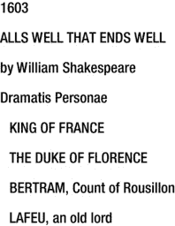

# 范式概览

许多书籍、文章和讨论都会对编程语言范式大加赞赏，比较和对比“命令式”、“面向对象”和“函数式”，却没有解释它们究竟是什么。更糟糕的是，当人们试图解释这些特定风格时，结果往往相当模糊。本附录将通过以三种不同方式实现相同的功能，概述后函数式编程中的三种主要范式：我们将使用一个数据库设置过程作为常见问题，并展示如何在每种不同范式中解决该问题。所有这些都将在 Java 中直接完成，因此你可以看到当 Java 被强制严格遵循单一范式时是什么样子。在本章末尾，我们将重点介绍一些额外的编程范式和风格，以便你至少熟悉这些术语。

我们将要设置的数据库是我们在第 5 章中使用的数据库。这是一个按行索引的、包含莎士比亚所有作品中使用过的单词的集合。该数据库如图 A-1 所示。数据来自古腾堡计划文本 [`http://www.gutenberg.org/ebooks/100`](http://www.gutenberg.org/ebooks/100)。要创建此数据库，我们必须执行以下步骤：

创建模式，包括表。  
解析并插入莎士比亚作品文件。应跳过空行和注释。  
需要识别文本分隔符（即新文本开始的位置），并创建文本条目。  
需要解析每一行，并创建行条目。  
需要解析行中的每个单词。如果该单词之前不存在，则需要创建单词条目。  
需要创建一个 line_word 条目。  

大多数文本分隔符看起来像图 A-2 中给出的示例：它是出版日期、标题，然后是“by William Shakespeare”。然而，十四行诗是编号的，因此它们遵循略有不同的格式。这种格式如图 A-3 所示。“THE SONNETS”是标题，当我们看到该标题时，我们需要开始寻找仅包含数字的行——这些行表示新十四行诗的开始。因此，解析十四行诗的文本与其他所有文本略有不同，这增加了一层复杂性。

这不是一个非常困难的问题，但它足够复杂，以至于我们可以看到不同的范式如何以不同的方式处理问题。这些范式在理论上都是等价的：也就是说，不存在一个范式能解决而另一个范式不能解决的问题。然而，每种范式最适合解决特定类型的问题。当你看到这些范式在实际工作中时，很容易看出这些差异。

图 A-3.

十四行诗开始

图 A-2.

一个示例文本开始

图 A-1.

数据库布局

## 命令式编程范式

最初的计算机编程语言是汇编语言。这些是奇怪且低级的语言，可以说它们本身就是一个范式。一旦计算机程序员开始在更高的抽象层次上工作，他们发明的第一批语言就是命令式的。这里的“命令式”一词源于人类语言结构：在句子“捡起那个垃圾”中，命令“捡起”是祈使语气。命令式是执行某些动作的命令。命令式编程语言是一种执行指令系统的语言。如果这听起来像是对所有编程语言的描述，那是因为几乎所有最流行的编程语言都属于这种类型，因此你可以在整个职业生涯中编写命令式（或接近命令式）的代码。

Java 本质上是面向对象的，但很多 Java 代码看起来可能非常命令式。命令式编程是人们思考问题的一种自然方式：即使是引言中给出的伪代码也隐含着命令式。因为它如此自然，程序员很容易从对如何解决问题的直觉理解直接进入一系列指令，完全绕过设计阶段。结果就是命令式代码。这种方法对于简单的脚本非常有效，尤其是当这些脚本模仿人类交互时。这就是为什么像 perl、bash 和 Power Shell 这样的命令式语言在 shell 脚本中占主导地位的原因。

你可以通过查看方法来识别 Java 中的命令式代码。一个明显的标志是代码库是否以静态方法为主：如果是，那么你很可能看到的是非常命令式的代码。命令式代码也倾向于使用带有许多参数的长方法，并且这些方法往往会调用其他带有许多参数的长方法。其本质是应用程序的整个状态（包括各种异常情况的信号）都在被传递。在命令式语言中，一切都需要了解关于一切的一切。

对于命令式实现，我们将从执行模式创建开始。完成后，我们将准备在执行过程中使用的所有语句。完成后，我们将加载文本流。然后，对于文本流中的每一行，我们将进入一个大的 if-else 块。该块将负责确定我们在处理过程中的位置，以及如何处理当前行。如果我们在十四行诗部分并且该行只是一个数字，我们将在数据库中创建代表新十四行诗的新文本。否则，如果该行是一个年份，表示新文本的开始，我们将检查我们是否在十四行诗部分，并适当处理。否则，如果我们在注释中，我们将滚动到注释。否则，如果是结尾，我们将记录我们肯定不再处于十四行诗部分。否则，我们将把该行拆分成单词，并将每个单词存储到数据库中。此代码在清单 A-1 中给出。

清单 A-1. 命令式数据库加载

`import java.io.BufferedReader;`

`import java.io.IOException;`

`import java.io.InputStream;`

`import java.io.InputStreamReader;`

`import java.sql.*;`

`import java.util.*;`

`import java.util.concurrent.*;`

`import java.util.function.*;`

`import java.util.regex.*;`

`public class Database {`

`private static final String SOURCE = "shakespeare.txt";`

`private static final String SCHEMA = "shakespeare";`

`private static final Predicate<String> IS_WHITESPACE =`

`Pattern.compile("^\\s*$").asPredicate();`

`private static final Predicate<String> IS_YEAR =`

`Pattern.compile("¹(5|6)\\d\\d$").asPredicate();`

`private static final Predicate<String> IS_COMMENT_START =`

`Pattern.compile("^<<").asPredicate();`

`private static final Predicate<String> IS_COMMENT_END =`

`Pattern.compile(">>$").asPredicate();`

`private static final Predicate<String> IS_THE_END =`

`Pattern.compile("^THE\\s+END$").asPredicate();`

`private static final Predicate<String> IS_DIGITS =`

`Pattern.compile("^\\d+$").asPredicate();`

`private static final Predicate<String> IS_AUTHOR =`

`Pattern.compile("^by\\s+William\\s+Shakespeare$").asPredicate();`

`private static final String SONNETS_TITLE = "THE SONNETS";`

`private static final Pattern BAD_CHARS =`

`Pattern.compile("\uFEFF|\\p{Cntrl}"); // BOMs and control characters`

`public static Connection getConnection() throws SQLException {`

`return DriverManager.getConnection(`

`"jdbc:h2:mem:shakespeare;INIT=CREATE SCHEMA IF NOT EXISTS " +`

`SCHEMA + "\\; " +`

`"SET SCHEMA " + SCHEMA + ";DB_CLOSE_DELAY=-1", "sa", ""`

`);`

`}`

`/**`

`* 通过解析 {@link #SOURCE} 创建数据库，并将其内容填充到`

`* 通过 {@link #getConnection()} 方法连接的数据库中。`

`*/`

`public static void createDatabase() throws Exception {`

`final Map<String, Integer> wordMap = new HashMap<>();`

`final ExecutorService executor = Executors.newCachedThreadPool();`

`try (Connection conn = getConnection()) {`

`Statement stmt = conn.createStatement();`

`stmt.execute("DROP SCHEMA " + SCHEMA);`

`stmt.execute("CREATE SCHEMA " + SCHEMA);`

`stmt.execute("SET SCHEMA " + SCHEMA);`

`stmt.execute("CREATE TABLE \"text\" (" +`

`"id INT PRIMARY KEY AUTO_INCREMENT, name VARCHAR UNIQUE, year INT)");`

`stmt.execute("CREATE TABLE line (" +`

`"id INT PRIMARY KEY AUTO_INCREMENT, text_id INT, \"offset\" INT)");`

`stmt.execute("CREATE TABLE word (" +`

`"id INT PRIMARY KEY AUTO_INCREMENT, \"value\" VARCHAR UNIQUE)");`

`stmt.execute("CREATE TABLE line_word (" +`

`"id INT PRIMARY KEY AUTO_INCREMENT, line_id INT, word_id INT, " +`

`"\"offset\" INT)"`

`);`

`PreparedStatement createBook = conn.prepareStatement(`

`"INSERT INTO \"text\" (name, year) VALUES (?,?)",`

`Statement.RETURN_GENERATED_KEYS`

`);`

`PreparedStatement createLine = conn.prepareStatement(`

`"INSERT INTO line (text_id, \"offset\") VALUES (?,?)",`

`Statement.RETURN_GENERATED_KEYS`

`);`

`PreparedStatement createWord = conn.prepareStatement(`

`"INSERT INTO word (\"value\") VALUES (?)",`

`Statement.RETURN_GENERATED_KEYS`

`);`

`PreparedStatement createLineWord = conn.prepareStatement(`

`"INSERT INTO line_word " +`

`" (line_id, word_id, \"offset\") " +`

`" VALUES (?,?,?)",`

`Statement.NO_GENERATED_KEYS`

`);`

`try (InputStream stream =`

`Database.class.getClassLoader().getResourceAsStream(SOURCE)`

`) {`

`assert stream != null : "在 " + SOURCE + " 未找到资源";`

`BufferedReader reader = new BufferedReader(`

`new InputStreamReader(stream, "UTF-8"));`

`String line;`

`int textId = 0;`

`int lineOffset = 0;`

`boolean inTheSonnets = false;`

`while ((line = nextLine(reader)) != null) {`

`if (inTheSonnets && IS_DIGITS.test(line)) {`

`textId = doCreateBook(createBook, "Sonnet #" + line,`

`1609, executor);`

`lineOffset = 0;`

`} else if (IS_YEAR.test(line)) {`

`String year = line;`

`String title = nextLine(reader);`

`String author = nextLine(reader);`

`assert IS_AUTHOR.test(author) : (title + " " + year +`

`" 未提供正确的作者: " + author);`

`inTheSonnets = SONNETS_TITLE.equalsIgnoreCase(title);`

`if (!inTheSonnets) {`

`textId = doCreateBook(createBook, title,`

`Integer.parseInt(year), executor);`

`lineOffset = 0;`

`}`

`} else if (IS_COMMENT_START.test(line)) {`

`while (`

`(line = nextLine(reader)) != null &&`

`!IS_COMMENT_END.test(line)`

`) {`

`continue;`

`}`

`assert line != null : "未找到结束注释";`

`} else if (IS_THE_END.test(line)) {`

`inTheSonnets = false;`

`} else {`

`assert (textId != 0) : "正在处理，但未提供标题";`

`lineOffset += 1;`

`createLine.setInt(1, textId);`

`createLine.setInt(2, lineOffset);`

`boolean createdLine = createLine.executeUpdate() == 1;`

`assert createdLine : "无法创建行";`

`ResultSet rs = createLine.getGeneratedKeys();`

`boolean hasNext = rs.next();`

`assert hasNext :`

`"获取行 " + textId + "-" + lineOffset + " 的生成键时无结果";`

`int lineId = rs.getInt(1);`

`rs.close();`

`String[] words = line.split("\\s+");`

`for (int i = 0; i < words.length; i++) {`

`int wordOffset = i + 1;`

`String word = words[i];`

`word = word.replaceAll("(?!')\\p{Punct}", "");`

`final int wordId;`

`if (wordMap.containsKey(word)) {`

`wordId = wordMap.get(word);`

`} else {`

`createWord.setString(1, word);`

`boolean createdWord = createWord.executeUpdate() == 1;`

`assert createdWord : "无法创建单词: " + word;`

`rs = createWord.getGeneratedKeys();`

`hasNext = rs.next();`

`assert hasNext : "已创建单词但仍无法找到它!";`

`String newWord = word;`

`executor.submit(() ->`

`System.out.println("新单词: " + newWord));`

`wordId = rs.getInt(1);`

`rs.close();`

`wordMap.put(word, wordId);`

`}`

`createLineWord.setInt(1, lineId);`

`createLineWord.setInt(2, wordId);`

`createLineWord.setInt(3, wordOffset);`

`boolean createdLineWord = createLineWord.executeUpdate() == 1;`

`assert createdLineWord : "无法创建行-单词关联";`

`}`

`}`

`}`

`}`

`} finally {`

`executor.shutdown();`

`executor.awaitTermination(1L, TimeUnit.MINUTES);`

`}`

`}`

`/**`

`* 返回下一行`

`*/`

`public static String nextLine(BufferedReader reader) throws IOException {`

`String line;`

`while ((line = reader.readLine()) != null) {`

`line = BAD_CHARS.matcher(line).replaceAll("");`

`line = line.trim();`

`if (line.isEmpty() || IS_WHITESPACE.test(line)) {`

`continue;`

`} else {`

`break;`

`}`

`}`

`return line;`

`}`

`private static int doCreateBook(`

`PreparedStatement createBook, String title, int year,`

`ExecutorService executor`

`) throws SQLException {`

`createBook.setString(1, title);`

`createBook.setInt(2, year);`

`boolean createdBook = createBook.executeUpdate() == 1;`

`assert createdBook : "无法创建书籍";`

`ResultSet rs = createBook.getGeneratedKeys();`

`boolean hasNext = rs.next();`

`assert hasNext : "获取 " + title + " 的生成键时无结果";`

`int textId = rs.getInt(1);`

`rs.close();`

`executor.submit(() -> System.out.println(title));`

`return textId;`

`}`

`public static void main(String[] args) throws Exception {`

`createDatabase();`

`}`

`}`

这段代码完成的任务相对简单，但已经变得难以理解。这揭示了命令式代码的问题：其语义结构有限。虽然发生了很多事情，但并未向读者传达这些事件发生的原因。相反，脚本的繁琐细节完全暴露在一种基本无结构的指令流中。

尽管命令式编程存在明显的缺点，但在许多场景下它仍然非常有用。由于命令式代码编写速度很快，因此非常适合用途清晰简单的短小代码片段。例如，单元测试在 Java 中几乎都是命令式的。Java 中的大多数方法体也是命令式的，这也是保持方法体简短的部分动机。其他语言和上下文也使命令式范式更为自然，例如用于系统管理脚本的 bash 或 perl。总的来说，如果你能毫不费力地将整个逻辑记在脑中，那么命令式风格是一个不错的选择。

## 面向对象编程范式

命令式编程范式在可维护性、可组合性和可重用性方面带来了诸多挑战。正是这些挑战催生了该范式的一个改进版本，即面向对象范式。实际上，从诞生之初，Java 就是面向对象编程的典型代表。在命令式编程中，你的应用程序是一系列指令。而在面向对象编程中，你的应用程序仍然是一系列指令，但应用程序在决定调用哪些指令时可以相当智能。应用程序为一系列指令（即对象）提供了许多容器，程序员在运行时指定要调用哪个容器中的指令。在面向对象范式中，一个命令式程序可以被看作是一个拥有一个全局对象的程序，所有方法都位于该单一对象上。

面向对象编程是命令式编程的衍生，但它带来了许多优势。最大的优势在于你可以封装状态：不再需要所有东西都了解其他所有东西的一切。相反，开发者可以将所有相关信息捕获到单个对象内部，并公开使用该状态的指令，同时不暴露该状态本身。面向对象编程的其他优势都源于这种封装技巧：例如，我可以指定一个关于你必须实现的指令的契约，然后你可以提供任何你喜欢的实现来满足该契约。

尽管 Java 本质上是一种面向对象的编程语言，但并非所有 Java 代码都是面向对象的。你会通过大量小型、可扩展的类型来识别面向对象的 Java 代码，这些类型被组合在一起以构建更高级的对象。方法将是对象属性的薄包装器，只附带最少的业务逻辑用于委托。在面向对象编程中，每个类都像一个懒惰的管理者：它尽可能快地将工作委托给其下属。

为了实现我们的面向对象解决方案，我们将把问题分解为多个对象，每个对象只做一小部分工作，然后委托给另一个对象。因此，我们将从一个 `ShakespeareLineIterator` 开始，它将遍历文本的行。这个迭代器将被传递给一个 `ShakespeareAnthologyParser`，后者负责将迭代的行分解为文本。每个文本将被传递给一个 `ShakespeareTextParser`，后者负责解析文本。它将有一个方法，返回一个 `ShakespeareText` 实例的集合。这些 `ShakespeareText` 实例将各自提供其标题，以及一系列 `ShakespeareLine` 实例。这些行中的每一行将包含一系列 `ShakespeareWord` 实例。这些类的代码见清单 A-2。

**清单 A-2. 面向对象文本解析**

`### ShakespeareLineIterator.java`

`import java.io.*;`

`import java.util.*;`

`import java.util.function.*;`

`import java.util.regex.*;`

`/**`

`* 遍历莎士比亚选集，提供选集中的各行。`

`*/`

`public class ShakespeareLineIterator implements Iterator<String> {`

`private static final String SOURCE = "shakespeare.txt";`

`private static final Predicate<String> IS_WHITESPACE =`

`Pattern.compile("^\\s*$").asPredicate();`

`private static final Pattern BAD_CHARS =`

`Pattern.compile("\uFEFF|\\p{Cntrl}"); // BOM 和控制字符`

`private static final Predicate<String> IS_COMMENT_START =`

`Pattern.compile("^<<").asPredicate();`

`private static final Predicate<String> IS_COMMENT_END =`

`Pattern.compile(">>$").asPredicate();`

`private final BufferedReader reader;`

`private volatile boolean closed = false;`

`private volatile String nextElement = null;`

`private volatile IOException exception = null;`

`/**`

`* 构造该类的一个实例，该实例从打包的莎士比亚全集文本中读取数据。`

`*`

`* @throws IOException 如果访问时出现异常`

`*                     资源。`

`*/`

`public ShakespeareLineIterator() throws IOException {`

`InputStream inputStream =`

`ShakespeareLineIterator.class`

`.getClassLoader()`

`.getResourceAsStream(SOURCE);`

`this.reader =`

`new BufferedReader(`

`new InputStreamReader(`

`inputStream, "UTF-8"`

`)`

`);`

`}`

`private void explodeIfException() {`

`if (exception != null) {`

`throw new UncheckedIOException("读取流时出错", exception);`

`}`

`}`

`/**`

`* 返回文本的下一行，过滤掉空白字符、错误字符、注释等。`

`* 将 {@link #nextElement} 赋值为下一行，如果没有剩余行则赋值为 {@code null}。`

`*/`

`private String nextLine() {`

`explodeIfException();`

`if (closed) return nextElement = null;`

`try {`

`String line;`

`while ((line = reader.readLine()) != null) {`

`line = BAD_CHARS.matcher(line).replaceAll("");`

`line = line.trim();`

`if (line.isEmpty() || IS_WHITESPACE.test(line)) {`

`continue;`

`} else {`

`break;`

`}`

`}`

`if (line != null && IS_COMMENT_START.test(line)) {`

`while ((line = reader.readLine()) != null) {`

`if (IS_COMMENT_END.test(line)) break;`

`}`

`if (line != null) return nextLine();`

`}`

`if (line == null) {`

`reader.close();`

`closed = true;`

`}`

`return nextElement = line;`

`} catch (IOException ioe) {`

`this.exception = ioe;`

`explodeIfException();`

`throw new IllegalStateException("此代码不应被执行！");`

`}`

`}`

`/**`

`* 如果迭代还有更多元素，则返回 {@code true}。`

`* （换句话说，如果 {@link #next} 会返回一个元素而不是抛出异常，则返回 {@code true}。）`

`*`

`* @return 如果迭代还有更多元素，则返回 {@code true}`

`*/`

`@Override`

`public boolean hasNext() {`

`explodeIfException();`

`if (nextElement != null) return true;`

`if (closed) return false;`

`if (nextLine() != null) return true;`

`return false;`

`}`

`/**`

`* 返回迭代中的下一个元素。`

`*`

`* @return 迭代中的下一个元素`

`* @throws java.util.NoSuchElementException 如果迭代没有更多元素`

`*/`

`@Override`

`public String next() {`

`explodeIfException();`

`if (nextElement != null || nextLine() != null) {`

`String toReturn = nextElement;`

`nextElement = null;`

`return toReturn;`

`}`

`throw new NoSuchElementException("没有更多行可读取！");`

`}`

`/**`

`* 提供 {@link #next()} 将返回的元素，但不推进迭代器。`

`*`

`* @return 下一个元素是什么，如果没有下一个元素则返回 {@code null}`

`*/`

`public String peek() {`

`explodeIfException();`

`if (nextElement != null) return nextElement;`

`if (closed) return null;`

`return nextLine();`

`}`

`}`

`### ShakespeareAnthologyParser.java`

`import java.io.IOException;`

`import java.util.*;`

`import java.util.function.*;`

`import java.util.regex.*;`

`/**`

`* 负责将莎士比亚选集解析为文本。`

`*/`

`public class ShakespeareAnthologyParser {`

`private static final Predicate<String> IS_YEAR =`

`Pattern.compile("¹(5|6)\\d\\d$").asPredicate();`

`private static final Predicate<String> IS_AUTHOR =`

`Pattern.compile("^by\\s+William\\s+Shakespeare$").asPredicate();`

`private static final Predicate<String> IS_THE_END =`

`Pattern.compile("^THE\\s+END$").asPredicate();`

`private static final Predicate<String> IS_DIGITS =`

`Pattern.compile("^\\d+$").asPredicate();`

`private static final String SONNETS_TITLE = "THE SONNETS";`

`/**`

`* 基于内存中的莎士比亚选集解析文本。`

`*`

`* @return 解析后的文本`

`* @throws IOException 如果在读取文本时发生异常`

`*/`

`public Collection<ShakespeareText> parseTexts() throws IOException {`

`List<ShakespeareText> texts = new ArrayList<>();`

`ShakespeareLineIterator lines = new ShakespeareLineIterator();`

`while (lines.hasNext()) {`

`int year = parseYear(lines);`

`String title = parseTitle(lines);`

`parseAuthor(lines);`

`if (SONNETS_TITLE.equalsIgnoreCase(title)) {`

`texts.addAll(parseSonnets(lines));`

`} else {`

`texts.add(parseText(title, year, lines));`

`}`

`}`

`return texts;`

`}`

`private ShakespeareText parseText(`

`final String title, final int year,`

`final ShakespeareLineIterator lines`

`) {`

`List<ShakespeareLine> parsedLines = new ArrayList<>();`

`int lineNumber = 0;`

`String line;`

`while (lines.hasNext() && !IS_THE_END.test(line = lines.next())) {`

`lineNumber += 1;`

`parsedLines.add(new ShakespeareLine(lineNumber, line));`

`}`

`return new ShakespeareText(title, year, parsedLines);`

`}`

`private Collection<ShakespeareSonnet> parseSonnets(`

`final ShakespeareLineIterator lines`

`) {`

`List<ShakespeareSonnet> sonnets = new ArrayList<>();`

`while (lines.hasNext() && !IS_THE_END.test(lines.peek())) {`

`sonnets.add(parseSonnet(lines));`

`}`

`if (lines.hasNext()) lines.next(); // 跳过“结束”标记`

`return sonnets;`

`}`

`private ShakespeareSonnet parseSonnet(final ShakespeareLineIterator lines) {`

`List<ShakespeareLine> parsedLines = new ArrayList<>();`

`int number = parseSonnetNumber(lines);`

`int lineNumber = 0;`

`while (`

`lines.hasNext() &&`

`!IS_DIGITS.test(lines.peek()) &&`

`!IS_THE_END.test(lines.peek())`

`) {`

`lineNumber += 1;`

`parsedLines.add(new ShakespeareLine(lineNumber, lines.next()));`

`}`

`return new ShakespeareSonnet(number, parsedLines);`

`}`

`private static int parseSonnetNumber(ShakespeareLineIterator lines) {`

`String number = lines.next();`

`boolean isNumber = IS_DIGITS.test(number);`

`assert isNumber : "期望一个十四行诗编号，但得到：" + number;`

`return Integer.parseInt(number);`

`}`

`private static String parseTitle(ShakespeareLineIterator lines) {`

`String title = lines.next();`

`boolean isTitle = title != null && !title.isEmpty();`

`isTitle = isTitle && !IS_AUTHOR.test(title);`

`isTitle = isTitle && !IS_THE_END.test(title);`

`isTitle = isTitle && !IS_YEAR.test(title);`

`assert isTitle : "期望一个标题，但得到：" + title;`

`return title;`

`}`

`private static String parseAuthor(ShakespeareLineIterator lines) {`

`String author = lines.next();`

`boolean isAuthor = IS_AUTHOR.test(author);`

`assert isAuthor : "期望作者，但得到：" + author;`

`return author;`

`}`

`private static int parseYear(ShakespeareLineIterator lines) {`

`String year = lines.next();`

`boolean isYear = IS_YEAR.test(year);`

`assert isYear : "期望年份，但得到：" + year;`

`return Integer.parseInt(year);`

`}`

`}`

`### ShakespeareText.java`

`import java.util.*;`

`/**`

`* 代表莎士比亚一部作品的对象。`

`*/`

`public class ShakespeareText {`

`private final String name;`

`private final int year;`

`private final List<ShakespeareLine> lines;`

`public ShakespeareText(String name, int year, List<ShakespeareLine> lines) {`

`Objects.requireNonNull(name, "作品名称");`

`this.name = name;`

`if (year < 1500 || year > 1699) {`

`throw new IllegalArgumentException(`

`"为 " + name + " 提供的年份严重错误：" + year`

`);`

`}`

`this.year = year;`

`Objects.requireNonNull(lines, "行内容");`

`if (lines.isEmpty()) {`

`throw new IllegalArgumentException("为 " + name + " 提供了空的行内容");`

`}`

`this.lines = lines;`

`}`

`public String getName() {`

`return name;`

`}`

`public int getYear() {`

`return year;`

`}`

`public List<ShakespeareLine> getLines() {`

`return lines;`

`}`

`}`

`### ShakespeareSonnet.java`

`import java.util.*;`

`/**`

`* {@link ShakespeareText} 的一个特例，包含十四行诗的特定信息。`

`*/`

`public class ShakespeareSonnet extends ShakespeareText {`

`public ShakespeareSonnet(int number, List<ShakespeareLine> lines) {`

`super("十四行诗 #" + number, 1609, lines);`

`if (number < 1 || number > 175) {`

`throw new IllegalArgumentException(`

`"为十四行诗提供的编号严重错误：" + number`

`);`

`}`

`}`

`}`

`### ShakespeareLine.java`

`import java.util.*;`

`/**`

`* 由 RCFischer 于 14/11/11 创建。`

`*/`

`public class ShakespeareLine {`

`private final int position;`

`private final String[] words;`

`public ShakespeareLine(final int textPosition, final String line) {`

`Objects.requireNonNull(line, "行内容");`

`words = line.split("\\s+");`

`if(textPosition < 1) {`

`throw new IllegalArgumentException(`

`"无效的文本位置：" + textPosition`

`);`

`}`

`this.position = textPosition;`

`}`

`public int getTextPosition() {`

`return position;`

`}`

`public List<ShakespeareWord> getWords() {`

`List<ShakespeareWord> swords = new ArrayList<>();`

`for(int i = 0; i < words.length; i++) {`

`swords.add(new ShakespeareWord(i+1, words[i]));`

`}`

`return swords;`

`}`

`}`

`### ShakespeareWord.java`

`import java.util.*;`

`/**`
`* 表示莎士比亚作品中某一行内的一个单词位置。`
`*/`

`public class ShakespeareWord {`

`private final int linePosition;`

`private final String word;`

`public ShakespeareWord(final int linePosition, final String word) {`

`if (linePosition < 1) {`

`throw new IllegalArgumentException("行位置错误: " + linePosition);`

`}`

`this.linePosition = linePosition;`

`Objects.requireNonNull(word, "word");`

`this.word = word;`

`}`

`public int getLinePosition() {`

`return linePosition;`

`}`

`public String getWord() {`

`return word;`

`}`

`}`

至此，我们仍然只解析了内容。我们还需要将其加载到数据库中。为此，我们将创建一个`TextDatabase`类。它包含一个用于配置数据库模式的方法，以及另一个用于根据`ShakespeareText`集合加载数据库的方法。当然，这个方法会立即委托给`TextDatabaseTextLoader`实例，该实例负责加载文本。它会进一步委托给`TextDatabaseLineLoader`实例，该实例负责加载一行。接着，它会再委托给`TextDatabaseWordLoader`实例，该实例负责加载单词。然后，所有数据就都加载完成了！所有这些类的代码（以及一个用于测试的`Main`类）见清单 A-3。

清单 A-3\. 面向对象的数据库加载

`### Main.java`

`import java.sql.Connection;`

`import java.sql.ResultSet;`

`import java.sql.SQLException;`

`import java.sql.Statement;`

`import java.util.*;`

`public class Main {`

`public static void printDatabaseSizing(Connection conn) throws SQLException {`

`System.out.println("数据量统计");`

`System.out.println("--------");`

`Statement stmt = conn.createStatement();`

`for (String table : new String[]{"\"text\"", "line", "word", "line_word"})`

`{`

`try (ResultSet rs = stmt.executeQuery("SELECT COUNT(*) FROM " + table)) {`

`boolean hasNext = rs.next();`

`assert hasNext : "表 " + table + " 的计数查询无结果";`

`System.out.println(table + " => " + rs.getInt(1));`

`}`

`}`

`}`

`public static ResultSet queryResults(Connection conn) throws SQLException {`

`return conn.createStatement().executeQuery(`

`"SELECT t.name, l.\"offset\", w.\"value\", lw.\"offset\" " +`

`"FROM \"text\" t, word w " +`

`"INNER JOIN line l ON (t.id = l.text_id) " +`

`"INNER JOIN line_word lw ON (" +`

`"lw.line_id = l.id AND lw.word_id = w.id" +`

`")"`

`);`

`}`

`public static void printWordUsages(Connection conn) throws SQLException {`

`int lineNumber = 0;`

`try (ResultSet rs = queryResults(conn)) {`

`String lastText = null;`

`int lastLine = -1;`

`while (rs.next()) {`

`if (lineNumber % 20 == 0) {`

`System.out.println("文本\t 行偏移\t 单词\t 单词偏移");`

`System.out.println("----\t----\t----\t----");`

`}`

`lineNumber += 1;`

`String text = rs.getString(1);`

`if (!text.equals(lastText)) {`

`lastText = text;`

`}`

`int lineOffset = rs.getInt(2);`

`String word = rs.getString(3);`

`int wordOffset = rs.getInt(4);`

`if (lineOffset != lastLine) {`

`lastLine = lineOffset;`

`}`

`System.out.println(`

`String.format("%s\t%d\t%s\t%d", text, lineOffset, word, wordOffset));`

`}`

`}`

`}`

`public static void main(String[] args) throws Exception {`

`ShakespeareAnthologyParser textParser = new ShakespeareAnthologyParser();`

`Collection<ShakespeareText> texts = textParser.parseTexts();`

`TextDatabase db = new TextDatabase("shakespeare");`

`db.createDatabase();`

`db.insertTexts(texts);`

`printWordUsages(db.getConnection());`

`printDatabaseSizing(db.getConnection());`

`}`

`}`

`### TextDatabase.java`

`import java.sql.Connection;`

`import java.sql.DriverManager;`

`import java.sql.SQLException;`

`import java.sql.Statement;`

`import java.util.*;`

`/**`
`* 表示用于存储文本、文本行及单词的数据库。`
`*/`

`public class TextDatabase {`

`private final String schema;`

`/**`

`* 定义一个文本库，该文本库将在给定的模式上运行。`

`*`

`* @param schema 要操作的模式；不能为 {@code null}。`

`*/`

`public TextDatabase(String schema) {`

`Objects.requireNonNull(schema, "schema name");`

`this.schema = schema;`

`}`

`/**`

`* 提供到文本数据库的新连接。`

`*/`

`public Connection getConnection() throws SQLException {`

`return DriverManager.getConnection(`

`"jdbc:h2:mem:shakespeare;INIT=CREATE SCHEMA IF NOT EXISTS " +`

`schema + "\\; " +`

`"SET SCHEMA " + schema + ";DB_CLOSE_DELAY=-1",`

`"sa", ""`

`);`

`}`

`/**`

`* 创建数据库，如果模式之前存在则将其删除。`

`*/`

`public void createDatabase() throws SQLException {`

`try (Connection conn = getConnection()) {`

`try (Statement stmt = conn.createStatement()) {`

`stmt.execute("DROP SCHEMA " + schema);`

`stmt.execute("CREATE SCHEMA " + schema);`

`stmt.execute("SET SCHEMA " + schema);`

`}`

`TextDatabaseTextLoader.createTables(conn);`

`}`

`}`

`public void insertTexts(Collection<ShakespeareText> texts)`

`throws SQLException`

`{`

`try (Connection conn = getConnection()) {`

`try (`

`TextDatabaseTextLoader textLoader = new TextDatabaseTextLoader(conn)`

`) {`

`for (ShakespeareText text : texts) {`

`textLoader.insertText(text);`

`}`

`}`

`}`

`}`

`}`

`### TextDatabaseTextLoader.java`

`import java.sql.*;`

`import java.util.*;`

`/**`

`* 负责加载文本。`

`*/`

`public class TextDatabaseTextLoader implements AutoCloseable {`

`private final PreparedStatement createBook;`

`private final TextDatabaseLineLoader lineLoader;`

`public TextDatabaseTextLoader(Connection conn) throws SQLException {`

`Objects.requireNonNull(conn, "connection for loading texts");`

`createBook = conn.prepareStatement(`

`"INSERT INTO \"text\" (name, year) VALUES (?,?)",`

`Statement.RETURN_GENERATED_KEYS`

`);`

`lineLoader = new TextDatabaseLineLoader(conn);`

`}`

`/**`

`* 创建用于填充文本的表。`

`*`

`* @param conn 要使用的连接；不能为 {@code null}`

`*/`

`public static void createTables(final Connection conn) throws SQLException {`

`Objects.requireNonNull(conn, "connection");`

`try (Statement stmt = conn.createStatement()) {`

`stmt.execute(`

`"CREATE TABLE \"text\" " +`

`"(id INT PRIMARY KEY AUTO_INCREMENT, name VARCHAR UNIQUE, year INT)"`

`);`

`}`

`TextDatabaseLineLoader.createTables(conn);`

`}`

`public void insertText(ShakespeareText text) throws SQLException {`

`int textId = insertTextRecord(text.getName(), text.getYear());`

`for (ShakespeareLine line : text.getLines()) {`

`lineLoader.insertLine(textId, line);`

`}`

`}`

`private int insertTextRecord(String title, int year) throws SQLException {`

`createBook.setString(1, title);`

`createBook.setInt(2, year);`

`boolean createdBook = createBook.executeUpdate() == 1;`

`assert createdBook : "Could not create book";`

`try (ResultSet rs = createBook.getGeneratedKeys()) {`

`boolean hasNext = rs.next();`

`assert hasNext : "No result when getting generated keys for " + title;`

`return rs.getInt(1);`

`}`

`}`

`public void close() throws SQLException {`

`createBook.close();`

`lineLoader.close();`

`}`

`}`

`### TextDatabaseLineLoader.java`

`import java.sql.*;`

`import java.util.*;`

`/**`

`* 负责将行加载到数据库中。`

`*/`

`public class TextDatabaseLineLoader implements AutoCloseable {`

`private final PreparedStatement createLine;`

`private final TextDatabaseWordLoader wordLoader;`

`public TextDatabaseLineLoader(final Connection conn) throws SQLException {`

`Objects.requireNonNull(conn, "connection");`

`createLine = conn.prepareStatement(`

`"INSERT INTO line (text_id, \"offset\") VALUES (?,?)",`

`Statement.RETURN_GENERATED_KEYS`

`);`

`wordLoader = new TextDatabaseWordLoader(conn);`

`}`

`public static void createTables(final Connection conn) throws SQLException {`

`try (Statement stmt = conn.createStatement()) {`

`stmt.execute("CREATE TABLE line " +`

`"(id INT PRIMARY KEY AUTO_INCREMENT, text_id INT, \"offset\" INT)"`

`);`

`}`

`TextDatabaseWordLoader.createTables(conn);`

`}`

`public void insertLine(int textId, ShakespeareLine line)`

`throws SQLException`

`{`

`int lineId = insertLineRecord(textId, line.getTextPosition());`

`for (ShakespeareWord word : line.getWords()) {`

`wordLoader.insertWord(lineId, word);`

`}`

`}`

`private int insertLineRecord(final int textId, final int textPosition)`

`throws SQLException`

`{`

`createLine.setInt(1, textId);`

`createLine.setInt(2, textPosition);`

`boolean createdLine = createLine.executeUpdate() == 1;`

`assert createdLine : "Could not create line";`

`try (ResultSet rs = createLine.getGeneratedKeys()) {`

`boolean hasNext = rs.next();`

`assert hasNext :`

`"No result when getting generated keys for line in text id " +`

`textId + ", " + "offset " + textPosition;`

`return rs.getInt(1);`

`}`

`}`

`public void close() throws SQLException {`

`createLine.close();`

`wordLoader.close();`

`}`

`}`

`### TextDatabaseWordLoader.java`

`import java.sql.*;`

`import java.util.*;`

`/**`

`* 负责将单词加载到数据库中`

`*/`

`public class TextDatabaseWordLoader implements AutoCloseable {`

`private final PreparedStatement createWord;`

`private final PreparedStatement createLineWord;`

`private final Map<String, Integer> wordIds = new HashMap<>();`

`public TextDatabaseWordLoader(final Connection conn) throws SQLException {`

`Objects.requireNonNull(conn, "connection");`

`createWord = conn.prepareStatement(`

`"INSERT INTO word (\"value\") VALUES (?)",`

`Statement.RETURN_GENERATED_KEYS`

`);`

`createLineWord = conn.prepareStatement(`

`"INSERT INTO line_word " +`

`" (line_id, word_id, \"offset\") " +`

`" VALUES (?,?,?)",`

`Statement.NO_GENERATED_KEYS`

`);`

`}`

`public static void createTables(final Connection conn) throws SQLException {`

`try (Statement stmt = conn.createStatement()) {`

`stmt.execute("CREATE TABLE word " +`

`"(id INT PRIMARY KEY AUTO_INCREMENT, \"value\" VARCHAR UNIQUE)"`

`);`

`stmt.execute("CREATE TABLE line_word " +`

`"(id INT PRIMARY KEY AUTO_INCREMENT, line_id INT, word_id INT, " +`

`"\"offset\" INT)"`

`);`

`}`

`}`

`public void insertWord(final int lineId, final ShakespeareWord word)`

`throws SQLException`

`{`

`int wordId = determineWordId(word.getWord());`

`createLineWord.setInt(1, lineId);`

`createLineWord.setInt(2, wordId);`

`createLineWord.setInt(3, word.getLinePosition());`

`boolean createdLineWord = createLineWord.executeUpdate() == 1;`

`assert createdLineWord : "Could not create line-word";`

`}`

`private int determineWordId(String word) throws SQLException {`

`if(wordIds.containsKey(word)) {`

`return wordIds.get(word);`

`} else {`

`int wordId = insertWordRecord(word);`

`wordIds.put(word, wordId);`

`return wordId;`

`}`

`}`

`private int insertWordRecord(String word) throws SQLException {`

`createWord.setString(1, word);`

`boolean createdWord = createWord.executeUpdate() == 1;`

`assert createdWord : "Could not create word: " + word;`

`try(ResultSet rs = createWord.getGeneratedKeys()) {`

`boolean hasWord = rs.next();`

`assert hasWord : "Created word but still could not find it!";`

`return rs.getInt(1);`

`}`

`}`

`public void close() throws SQLException {`

`createWord.close();`

`createLineWord.close();`

`}`

`}`

面向对象编程的主要难点应该显而易见：在这种范式下，我们的任务需要大量代码，并且存在大量相互协作的部件。在命令式代码中，我们只见树木不见森林：实现细节变得混乱，干扰了对整体图景的把握。面向对象编程旨在通过整理这些“树木”来解决这个问题。实现细节清晰了很多，但仍然容易迷失方向。对于新开发者来说，进入一个面向对象项目却对系统如何工作感到茫然，是一种常见体验，尤其是当系统没有一个明显的入口点（例如 main 方法）时。问题在于很难追踪应用的流程：很难理解这些部件在系统执行过程中是如何相互交互的。例如，单词加载器需要一个行 ID，但如果你是系统新手，很可能不清楚那个行 ID 是什么，或者它是如何计算出来的。

这并不是说面向对象编程不好。如果你需要一个高度模块化、高度解耦的系统，它就是完美的范式。像接口和抽象基类这样的工具允许你提供清晰的契约，同时对你的使用者保持友好。如果你需要一个高度可测试的系统，它也是一种极好的方法：测试驱动开发等实践源于面向对象语言并非巧合。可测试性的优势来自于功能完全包含在单个对象内，因此可以将该对象视为其独立的微观现实世界。面向对象模型也比命令式或其他一些范式更适合并发执行，因为更清晰的关注点分离提供了明确的断点。借鉴函数式编程的关键实践使得面向对象的并发更加出色：正是这一发现催生了后函数式范式。

## 后函数式编程范式

面向对象编程曾被誉为编程领域的一次重大革命，它确实在提高大型代码库的可维护性和可重用性方面做出了巨大贡献。然而，可变性成为了面向对象编程中的一个主要问题。另一个常见问题源于数据和流程的混合：面向对象范式的基础仍然是命令式范式，但数据的封装也导致了对作用于这些数据的逻辑的模糊化。这两个问题都通过将底层执行模型从命令式改为函数式来解决：也就是说，不再考虑执行一系列步骤，而是考虑应用转换和映射。这催生了后函数式编程范式。

后函数式编程使得推理你的面向对象应用变得更加容易。通过严格限制可变性并专注于组合小型转换，我们可以最大限度地减少面向对象编程的缺点，同时利用其优势。从技术上讲，后函数式范式脱离了命令式范式，因此程序员关心的是实现什么，而不是如何执行。这产生了语义更丰富的代码，同时也让运行时环境可以自由决定执行转换的最佳方式。其结果是几乎无需成本就能提升性能，尤其是在并发环境中执行时。

如果你读过这本书，那么你应该能够识别出 Java 中的后函数式代码。无处不在的流和 lambda 使用是明显的标志。`final` 关键字的使用是另一个主要线索，尤其是当该关键字出现在大量非常小的类中时，每个类都对数据执行非常有限且非常精确的转换。在 Java 8 之前，后函数式 Java 代码的关键标志是集合推导：即接收一个集合并对其执行某些用户指定操作的方法。

为了实现我们的后函数式解决方案，我们将首先通过在一个 DDL 语句流中执行每个字符串来构建我们的模式。这将使我们的数据库进入正确的格式。然后，我们将获取文集文本作为一个流，并从该流中过滤掉不需要的元素。现在我们有了一个干净的流和一个已初始化的数据库，因此我们的目标是生成一个要插入数据库的数据流。中间形式将是一个来自输入的行的流。因此，我们将从一个字符串流，到一个已解析行的流，再到一个要插入数据库的单词流。然后，这最终形式可以被插入到数据库中。实现此功能的代码见清单 A-4。

清单 A-4. 后函数式数据库加载

`### Main.java`

`import java.sql.*;`

`import java.util.*;`

`public class Main {`

`public static void printDatabaseSizing(Database database)`

`throws SQLException`

`{`

`System.out.println("SIZES");`

`System.out.println("-----");`

`try (Connection conn = database.getConnection()) {`

`Statement stmt = conn.createStatement();`

`for (String table : new String[]{`

`"\"text\"", "line", "word", "line_word"`

`}) {`

`try (ResultSet rs = stmt.executeQuery(`

`"SELECT COUNT(*) FROM " + table)`

`) {`

`boolean hasNext = rs.next();`

`assert hasNext : "No result in count from table " + table;`

`System.out.println(table + " => " + rs.getInt(1));`

`}`

`}`

`}`

`}`

`public static ResultSet queryResults(Connection conn) throws SQLException {`

`return conn.createStatement().executeQuery(`

`"SELECT t.name, l.\"offset\", w.\"value\", lw.\"offset\" " +`

`"FROM \"text\" t, word w " +`

`"INNER JOIN line l ON (t.id = l.text_id) " +`

`"INNER JOIN line_word lw ON " +`

`" (lw.line_id = l.id AND lw.word_id = w.id)"`

`);`

`}`

`public static void printWordUsages(Database database) throws SQLException {`

`int lineNumber = 0;`

`try (Connection conn = database.getConnection()) {`

`try (ResultSet rs = queryResults(conn)) {`

`String lastText = null;`

`int lastLine = -1;`

`while (rs.next()) {`

`if (lineNumber % 20 == 0) {`

`System.out.println("text\tline-offset\tword\tword-offset");`

`System.out.println("----\t-----------\t----\t-----------");`

`}`

`lineNumber += 1;`

`String text = rs.getString(1);`

`if (!text.equals(lastText)) {`

`lastText = text;`

`}`

`int lineOffset = rs.getInt(2);`

`String word = rs.getString(3);`

`int wordOffset = rs.getInt(4);`

`if (lineOffset != lastLine) {`

`lastLine = lineOffset;`

`}`

`System.out.println(String.format(`

`"%s\t%d\t%s\t%d", text, lineOffset, word, wordOffset));`

`}`

`}`

`}`

`}`

`public static void main(String[] args) throws Exception {`

`Database database = new Database();`

`database.initializeDb();`

`new ShakespeareTextSource().getStream().sequential()`

`.map(new TextMapper())`

`.filter(Optional::isPresent).map(Optional::get)`

`// 在更长的示例中，下一行可能会被拆分为`

`// 不同的中间形式，用于提供文本 ID、行 ID 和单词 ID。`

`.map(new DatabaseLineMapper(database))`

`.forEach(database::insertLine);`

`printWordUsages(database);`

`printDatabaseSizing(database);`

`}`

`}`

`### Database.java`

`import java.sql.*;`

`import java.util.*;`

`import java.util.function.*;`

`/**`

`* 表示存储文本信息的数据库`

`*/`

`public class Database {`

`private static final String SCHEMA = "shakespeare";`

`public Connection getConnection() throws SQLException {`

`return DriverManager.getConnection(`

`"jdbc:h2:mem:shakespeare;INIT=CREATE SCHEMA IF NOT EXISTS " + SCHEMA`

`+ "\\; SET SCHEMA " + SCHEMA + ";DB_CLOSE_DELAY=-1", "sa", ""`

`);`

`}`

`public void initializeDb() throws SQLException {`

`try (Connection c = getConnection()) {`

`try (Statement stmt = c.createStatement()) {`

`BiFunction<SQLException, String, SQLException> exec = (ex, s) -> {`

`// 如果有异常，则返回该异常（暂不处理）`

`if (ex != null) return ex;`

`// 执行此命令`

`try {`

`stmt.execute(s);`

`return null;`

`} catch (SQLException e) {`

`return e;`

`}`

`};`

`// 如何管理多个异常`

`BinaryOperator<SQLException> pickNonnull = (e1, e2) -> {`

`if (e1 == null) return e2;`

`if (e2 == null) return e1;`

`e1.addSuppressed(e2);`

`return e1;`

`};`

`// 执行语句`

`SQLException e = Arrays.asList(`

`"DROP SCHEMA " + SCHEMA,`

`"CREATE SCHEMA " + SCHEMA,`

`"SET SCHEMA " + SCHEMA,`

`"CREATE TABLE \"text\" " +`

`" (id INT PRIMARY KEY AUTO_INCREMENT, name VARCHAR UNIQUE, " +`

`"  year INT)",`

`"CREATE TABLE line " +`

`"(id INT PRIMARY KEY AUTO_INCREMENT, text_id INT, " +`

`" \"offset\" INT)",`

`"CREATE TABLE word " +`

`"(id INT PRIMARY KEY AUTO_INCREMENT, " +`

`" \"value\" VARCHAR UNIQUE)",`

`"CREATE TABLE line_word " +`

`" (id INT PRIMARY KEY AUTO_INCREMENT, line_id INT, " +`

`"  word_id INT, \"offset\" INT)"`

`).stream().reduce(null, exec, pickNonnull);`

`// 如果出现异常，则抛出该异常`

`if (e != null) throw e;`

`}`

`}`

`}`

`/**`

`* 将数据库行插入到数据库中。`

`*`

`* @param databaseLine 要插入的行；绝不能为 {@code null}。`

`*/`

`public void insertLine(final DatabaseLine databaseLine) {`

`Objects.requireNonNull(databaseLine, "database line");`

`try (Connection conn = getConnection()) {`

`PreparedStatement createLineWord = conn.prepareStatement(`

`"INSERT INTO line_word " +`

`" (line_id, word_id, \"offset\") " +`

`" VALUES (?,?,?)",`

`Statement.NO_GENERATED_KEYS`

`);`

`createLineWord.setInt(1, databaseLine.getLineId());`

`int[] words = databaseLine.getWords();`

`for (int i = 0; i < words.length; i++) {`

`createLineWord.setInt(2, words[i]);`

`createLineWord.setInt(3, i + 1);`

`boolean createdLineWord = createLineWord.executeUpdate() == 1;`

`assert createdLineWord : "无法创建行-单词关联";`

`}`

`} catch (SQLException sqle) {`

`throw new RuntimeException("插入数据库行时出错", sqle);`

`}`

`}`

`}`

`### ShakespeareTextSource.java`

`import java.io.BufferedReader;`

`import java.io.IOException;`

`import java.io.InputStream;`

`import java.io.InputStreamReader;`

`import java.util.concurrent.atomic.*;`

`import java.util.function.*;`

`import java.util.regex.*;`

`import java.util.stream.*;`

`/**`

`* 莎士比亚文本的源文件`

`*/`

`public class ShakespeareTextSource {`

`private static final String SOURCE = "shakespeare.txt";`

`/**`

`* 提供内存中选集的一个读取器。此读取器不执行任何过滤。`

`*`

`* @return 内存中选集的读取器；绝不会是 {@code null}`

`* @throws IOException 如果检索内存中选集时出现异常`

`*/`

`public BufferedReader getReader() throws IOException {`

`InputStream inputStream =`

`this.getClass()`

`.getClassLoader()`

`.getResourceAsStream(SOURCE);`

`return new BufferedReader(new InputStreamReader(inputStream, "UTF-8"));`

`}`

`private static UnaryOperator<String> filterBadChars() {`

`Pattern BAD_CHARS =`

`Pattern.compile("\uFEFF|\\p{Cntrl}"); // BOM 和控制字符`

`return string -> BAD_CHARS.matcher(string).replaceAll("");`

`}`

`private static Predicate<String> notInComment() {`

`final Predicate<String> IS_COMMENT_START =`

`Pattern.compile("^<<").asPredicate();`

`final Predicate<String> IS_COMMENT_END =`

`Pattern.compile(">>$").asPredicate();`

`final AtomicBoolean inComment = new AtomicBoolean(false);`

`return line -> {`

`if (IS_COMMENT_START.test(line)) {`

`inComment.set(true);`

`return false;`

`} else if (inComment.get() && IS_COMMENT_END.test(line)) {`

`inComment.set(false);`

`return false;`

`} else {`

`return !inComment.get();`

`}`

`};`

`}`

`private static Predicate<String> notEmptyOrWhitespace() {`

`return Pattern.compile("^\\s*$").asPredicate().negate();`

`}`

`/**`

`* 提供文本源的顺序流。该流会过滤掉坏字符、空白行和注释。每行也会被修剪。`

`*`

`* @return 一个必须按顺序处理的流`

`* @throws IOException 如果获取资源时出现异常`

`*/`

`public Stream<String> getStream() throws IOException {`

`return getReader().lines()`

`.sequential()`

`.map(filterBadChars())`

`.map(String::trim)`

`.filter(notEmptyOrWhitespace())`

`.filter(notInComment())`

`;`

`}`

`}`

`### TextLine.java`

`import java.util.*;`

`/**`

`* 表示文本中一行的类`

`*/`

`public class TextLine {`

`private final String title;`

`private final int lineNumber;`

`private final String line;`

`private final int year;`

`public TextLine(`

`final String title, final int year,`

`final int lineNumber, final String line`

`) {`

`Objects.requireNonNull(title, "title");`

`this.title = title;`

`if (lineNumber < 1) {`

`throw new IllegalArgumentException(`

`"行偏移量必须为正数，但实际为 " + lineNumber);`

`}`

`this.lineNumber = lineNumber;`

`Objects.requireNonNull(line, "line");`

`if (line.isEmpty()) {`

`throw new IllegalArgumentException(`

`"行内容为空，位于 " + title + "，行号 " + lineNumber);`

`}`

`this.line = line;`

`if (year < 1500 || year > 1699) {`

`throw new IllegalArgumentException("年份严重偏离： " + year);`

`}`

`this.year = year;`

`}`

`public String getTitle() {`

`return title;`

`}`

`public int getLineNumber() {`

`return lineNumber;`

`}`

`public String getLine() {`

`return line;`

`}`

`public int getYear() {`

`return year;`

`}`

`public List<String> getWords() {`

`return Arrays.asList(line.split("\\s+"));`

`}`

`}`

`### TextMapper.java`

`import java.util.*;`

`import java.util.function.*;`

`import java.util.regex.*;`

`/**`

`* 一个映射器，假定按顺序遍历文本选集。`

`*/`

`public class TextMapper implements java.util.function.Function<String, Optional<TextLine>> {`

`private volatile String currentTitle;`

`private volatile int currentYear;`

`private volatile int currentOffset = 0;`

`private volatile boolean inSonnets = false;`

`private static final Optional<TextLine> SKIP_THIS_LINE = Optional.empty();`

`private static final Predicate<String> IS_YEAR =`

`Pattern.compile("¹(5|6)\\d\\d$").asPredicate();`

`private static final Predicate<String> IS_AUTHOR =`

`Pattern.compile("^by\\s+William\\s+Shakespeare$").asPredicate();`

`private static final Predicate<String> IS_DIGITS =`

`Pattern.compile("^\\d+$").asPredicate();`

`private static final Predicate<String> IS_THE_END =`

`Pattern.compile("^THE\\s+END$").asPredicate();`

`private static final String SONNETS_TITLE = "THE SONNETS";`

`/**`

`* 创建一个文本行，如果字符串不对应于某一行，则返回 {@link java.util.Optional#empty()}。`

`*`

`* @param s 函数参数`

`* @return 函数结果`

`*/`

`@Override`

`public Optional<TextLine> apply(final String s) {`

`if (s == null || s.isEmpty()) return SKIP_THIS_LINE;`

`// 跳过作者行`

`if (IS_AUTHOR.test(s)) return SKIP_THIS_LINE;`

`// 跳过“THE END”行，并标记文本结束`

`if (IS_THE_END.test(s)) {`

`currentOffset = Integer.MIN_VALUE;`

`currentTitle = null;`

`inSonnets = false;`

`return SKIP_THIS_LINE;`

`}`

`// 如果是年份，下一行应为标题`

`if (IS_YEAR.test(s)) {`

`currentYear = Integer.parseInt(s);`

`currentTitle = null;`

`return SKIP_THIS_LINE;`

`}`

`// 如果正在查找标题，那么现在找到了！`

`if (currentTitle == null || (inSonnets && IS_DIGITS.test(s))) {`

`if (inSonnets) {`

`currentTitle = "Sonnet #" + s;`

`} else {`

`currentTitle = s;`

`inSonnets = SONNETS_TITLE.equalsIgnoreCase(s);`

`}`

`currentOffset = 0;`

`return SKIP_THIS_LINE;`

`}`

`// 普通行`

`currentOffset += 1;`

`return Optional.of(`

`new TextLine(currentTitle, currentYear, currentOffset, s)`

`);`

`}`

`}`

`### DatabaseLineMapper.java`

`import java.sql.*;`

`import java.util.*;`

`import java.util.concurrent.*;`

`import java.util.function.*;`

`/**`

`* 负责将文本行映射到数据库行。`

`*/`

`public class DatabaseLineMapper implements Function<TextLine, DatabaseLine> {`

`private final ConcurrentMap<String, Integer> textIds =`

`new ConcurrentHashMap<>();`

`private final ConcurrentMap<Integer, ConcurrentMap<Integer, Integer>>`

`textLineIds = new ConcurrentHashMap<>();`

`private final ConcurrentMap<String, Integer> wordIds =`

`new ConcurrentHashMap<>();`

`private final Database database;`

`public DatabaseLineMapper(Database database) throws SQLException {`

`Objects.requireNonNull(database, "database");`

`this.database = database;`

`}`

`private int computeTextId(String title, int year) {`

`try (Connection conn = database.getConnection()) {`

`PreparedStatement createBook = conn.prepareStatement(`

`"INSERT INTO \"text\" (name, year) VALUES (?,?)",`

`Statement.RETURN_GENERATED_KEYS`

`);`

`createBook.setString(1, title);`

`createBook.setInt(2, year);`

`boolean createdBook = createBook.executeUpdate() == 1;`

`assert createdBook : "无法创建书籍";`

`try (ResultSet rs = createBook.getGeneratedKeys()) {`

`boolean hasNext = rs.next();`

`assert hasNext : "获取 " + title + " 的生成键时无结果";`

`return rs.getInt(1);`

`}`

`} catch (SQLException e) {`

`throw new RuntimeException(`

`"计算文本 ID 时出错: " + title, e);`

`}`

`}`

`private int computeLineId(final int textId, final int lineNumber) {`

`try (Connection conn = database.getConnection()) {`

`PreparedStatement createLine = conn.prepareStatement(``

`"INSERT INTO line (text_id, \"offset\") VALUES (?,?)",`

`Statement.RETURN_GENERATED_KEYS`

`);`

`createLine.setInt(1, textId);`

`createLine.setInt(2, lineNumber);`

`boolean createdLine = createLine.executeUpdate() == 1;`

`assert createdLine : "无法创建行";`

`try (ResultSet rs = createLine.getGeneratedKeys()) {`

`boolean hasNext = rs.next();`

`assert hasNext :`

`"获取行 " + textId + "-" + lineNumber + " 的生成键时无结果";`

`return rs.getInt(1);`

`}`

`} catch (SQLException e) {`

`throw new RuntimeException("计算行 ID 时出错: "`

`+ textId + " - " + lineNumber, e);`

`}`

`}`

`private int computeWordId(final String word) {`

`try (Connection conn = database.getConnection()) {`

`PreparedStatement createWord = conn.prepareStatement(`

`"INSERT INTO word (\"value\") VALUES (?)",`

`Statement.RETURN_GENERATED_KEYS`

`);`

`createWord.setString(1, word);`

`boolean createdWord = createWord.executeUpdate() == 1;`

`assert createdWord : "无法创建单词: " + word;`

`try (ResultSet rs = createWord.getGeneratedKeys()) {`

`boolean hasNext = rs.next();`

`assert hasNext : "已创建单词但仍无法找到！";`

`return rs.getInt(1);`

`}`

`} catch (SQLException e) {`

`throw new RuntimeException(`

`"计算单词 ID 时出错: " + word, e);`

`}`

`}`

`/**`

`* 将此函数应用于给定参数。`

`*`

`* @param textLine 函数参数`

`* @return 函数结果`

`*/`

`@Override`

`public DatabaseLine apply(final TextLine textLine) {`

`// 获取文本 ID`

`int textId = lookupTextId(textLine);`

`// 获取行 ID`

`int lineId = lookupLineId(textId, textLine);`

`// 获取单词 ID`

`int[] words = textLine.getWords().parallelStream()`

`.mapToInt(this::lookupWord)`

`.toArray();`

`return new DatabaseLine(lineId, words);`

`}`

`private int lookupWord(final String word) {`

`return wordIds.computeIfAbsent(word, this::computeWordId);`

`}`

`private int lookupLineId(int textId, final TextLine textLine) {`

`ConcurrentMap<Integer, Integer> lineIds =`

`textLineIds.computeIfAbsent(textId, i -> new ConcurrentHashMap());`

`return lineIds.computeIfAbsent(`

`textLine.getLineNumber(),`

`i -> this.computeLineId(textId, i)`

`);`

`}`

`private int lookupTextId(final TextLine textLine) {`

`return textIds.computeIfAbsent(`

`textLine.getTitle(),`

`s -> this.computeTextId(s, textLine.getYear())`

`);`

`}`

`}`

`### DatabaseLine.java`

`import java.util.*;`

`/**`

`* 数据库所理解的文本行。`

`*/`

`public class DatabaseLine {`

`private final int lineId;`

`private final int[] words;`

`public DatabaseLine(final int lineId, final int[] words) {`

`this.lineId = lineId;`

`Objects.requireNonNull(words, "words");`

`if (words.length == 0) {`

`throw new IllegalArgumentException("该行中没有单词！");`

`}`

`this.words = words;`

`}`

`public int getLineId() {`

`return lineId;`

`}`

`public int[] getWords() {`

`return words;`

`}`

`}`

这段代码实现了与纯面向对象方案相同的功能，但代码量显著减少，处理流程也更加清晰。如果你想在某个环节插入额外的处理（例如将查找文本 ID、行 ID 和单词 ID 分为不同的步骤），那么插入点显而易见。面向对象与函数式模型的结合使得代码更加简洁、可读性更强。

这种处理方式的一个更高级、更利于并行的版本，可以将文本生成为一个包含标题、年份以及带有偏移量的行流的对象。然后，该对象可以被映射到文本 ID，其行流可以并行映射为行 ID、单词 ID，最后存入数据库。这将是一个两阶段的方法：第一阶段将选集中的行解析为这些文本对象的流，第二阶段则处理每个文本对象及其行流。如果需要，这将是该方法的自然演进。

后函数式方法有两个主要缺点，它们都源于你必须以类型、类型之间的映射以及像`.map`和`.filter`这样的钩子函数来思考。第一个困难是，这需要更抽象、更高阶的思维方式，因此你会花更多时间在纸上涂涂画画，而不是编写代码。有些开发者对此感到非常不适，因为他们只想以思维的速度持续产出代码。这种方法的另一个困难在于，当解决方案不适合逐元素处理时，例如我们关于年份指示标题的规则。在这种情况下，我们被迫顺序执行，并且必须处理可变状态，这重新引入了面向对象代码中一些固有的问题。

另一方面，如果你希望编写一个执行流程清晰、同时仍能获得面向对象代码主要优势的并发程序，那么后函数式范式正是你所需要的。只要你的应用程序——甚至是你负责的应用程序片段——具有清晰的流程，并且流程中的各个步骤之间存在明确的映射关系，那么这就是一个绝佳的范式。这种情况非常常见，这也是为什么在 Java 中引入 lambda 表达式和后函数式编程如此令人兴奋，也正是本书存在的原因。

## 其他编程范式

上述三种范式——命令式、面向对象和后函数式——是 Java 8 良好支持的三种范式。然而，还有许多其他编程范式存在，了解其中一些主流范式非常重要。学习新的范式有助于你从不同角度思考问题，这意味着你能更好地解决问题。更重要的是，了解其他范式能让你与来自不同背景的开发者进行交流，这将帮助你避免在知识和职业上陷入停滞。在程序员职业生涯的几年后，可能会悄然滋生一种停滞感：对特定工具集的熟悉和相对满意，会导致错误地认为这些工具（及其衍生品）定义了整个世界。如果你开始有这种想法，以下是一些帮助你摆脱这种陷阱的方法。

### 逻辑/数学范式

大多数对“函数式编程”的引用指的都是这种范式。在这种范式中，程序是一组数学函数，程序员的工作是定义和操作这些函数本身。在应用程序中流动的数据在很大程度上是无关紧要的：函数是基于这些数据的类型和形状来定义的。这些函数如何应用的具体实现细节则留给运行时或编译器处理。我是通过编程语言 OCaml（它是元语言 ML 的一个衍生品）接触到逻辑/数学范式的。如果你想看看这种方法在并发方面表现如何，可以了解一下 JoCaml 语言，它是连接演算（即 fork/join）与 OCaml 的结合体。Haskell 可能是当前这种范式的典型代表，Erlang 也很有说服力。这种范式还包括 Mathematica 和其他“计算机代数系统”，以及 Coq 和其他“交互式定理证明器”。

当输入/输出（I/O）只是工作中的附带部分，并且可以快速抽象掉时，这种范式效果非常好。如果你大部分时间都花在对纯粹内部定义和操作的数据进行繁重处理上，那么这种范式能很好地确保你的代码快速、安全地执行。

### 同像性范式

这被认为是函数式编程的另一种形式，尽管它与逻辑/数学范式截然不同。相反，同像性范式源于可计算性理论的数学基础。（对于数学爱好者来说，同像性编程就是将 lambda 演算作为一种编程语言。）在同像性编程语言中，程序会处理自身，对应用程序执行机械化的归约，直到只剩下答案为止。

这是一个让人难以理解的概念，但很容易看到它的实际应用。为了演示，首先假设我定义了这样一个转换规则：

`对于所有 x，将 sq(x) 替换为 x*x。`

请注意，我并不是在定义一个函数或任何语义：这不是函数的定义。我是在说，当在程序中遇到一组特定的字符时，我们应该将它们替换为另一组不同的字符。现在，假设我再定义几个转换规则：

`对于所有 f x y z，将 map(f (x y z)) 替换为 (f(x) f(y) f(z))。`

`对于所有 x y z，将 sum(x y z) 替换为 x+y+z。`

再次强调，这是一个直接的文本替换规则。当你看到那个奇怪的“`map`”单词后跟一些括号时，就将其及其括号替换为一组特定的字符。同样，当你看到那个奇怪的“`sum`”单词后跟一些括号时，就将其及其括号替换为另一组特定的字符。基于此，我们可以有下面这个简单的程序。

`初始程序 > sum(map(sq (1 2 3)))`

`归约 1 > sum(sq(1) sq(2) sq(3))`

`归约 2 > sum(1*1 2*2 3*3)`

`归约 3 > sum(1   4   9  )`

`归约 4 > 1+4+9`

`归约 5 > 14`

这里唯一发生的“执行”是算术运算。其他所有内容都只是简单的文本转换。这对你来说可能看起来很奇怪，但这实际上是一种极其强大的编程方式。无可争议的主流同像性编程语言是 Lisp。基于宏的语言，如 (La)TeX 和一些预处理器，也属于这种范式。在这些语言中，其力量来源于这些文本转换的灵活性以及重新定义和操作它们的能力。这使得代码非常易于操作：早在 Ruby 提供开放类、JavaScript 允许你定义 `undefined` 之前，Lisp 和 (La)TeX 就已经有了猴子补丁。在同像性程序中，如果你想重新定义或操作任何给定的宏，这都不是什么大问题。这使得同像性编程语言对于构建面向开发者的工具和接口特别有用，因为开发者倾向于进行这类修改，并且愿意承担失败时的后果。

### 声明式范式

这种范式备受诟病，经常被忽视，但它很可能也是所有编程范式中应用最广泛、使用最多的。当你听到有人说 HTML 或 CSS“不是真正的编程语言”时，那是因为他们忽视了声明式范式。在声明式范式中，程序员只是声明事物的存在，而由程序的消费者来决定如何处理它。UI 编程语言绝大多数是声明式的，配置文件（例如 Spring 上下文文件）和优秀构建工具的构建脚本也是如此。如果你经历过 21 世纪初面向方面编程（AOP）的热潮，那么你可能会认识到 AOP 是一种声明式编程。近年来 Java 中对“可选类型系统”和“注解驱动配置”的兴趣，正是将声明式范式引入 Java 的努力。

声明式范式适用于任何你只想创建和配置许多组件的情况。这些组件可能相互关联，也可能彼此独立；无论如何，组件只是被声明为存在。对组件的任何定制或逻辑都应限于配置属性。通常可以在这里或那里偷偷插入一些代码片段，或者使用事件、回调或钩子，但这些是通往其他范式（通常是命令式或响应式范式）的逃生出口。

### 响应式

在响应式范式中，程序放弃了主导权。程序不再由贯穿应用的流程或执行的函数构成，而是由事件处理器组成。当满足特定条件时，该条件对应的事件处理器就会被执行。响应式编程目前备受关注，这也让 Erlang 等编程语言以及 Akka 和 RxJava 等库获得了更多关注。响应式编程范式在前端 JavaScript 中也很常见，尽管有时不太容易识别出来。

响应式编程的优势在于，你完全无需担心执行过程，这便消除了一整类可能产生错误的地方。此外，运行时环境可以进行大幅优化，因为它在决定如何执行代码方面拥有极大的自由度。其中一个例子是，（从概念上讲）很容易将响应式程序分布到各种其他机器上，这使得它非常适用于云端环境。

### 基于栈的（串联式）

从某种程度上说，基于栈的范式是一种命令式编程。基于栈的编程是一系列按顺序执行的指令。然而，这些指令都操作一个栈：整个程序就是在操作这个栈。这个栈中同时包含命令和数据，它们被压入和弹出，这使得基于栈的编程更接近于同像性编程，而非传统的命令式编程。我遇到过的最有趣的基于栈的编程语言是 Factor，但遗憾的是它似乎发展艰难。Java 虚拟机字节码本身也是一种基于栈的编程语言，这使得基于栈的范式可以说是 JVM 生态系统的“原生”或“自然”范式。

### 后现代

有许多尝试旨在创建元评论并探索编程语言的边界，我将它们统称为“后现代”编程语言。Perl 编程语言的发明者拉里·沃尔曾著名地将 Perl 称为“后现代”语言，意指你可以用多种不同的范式来使用它。还有其他一些语言致力于让你能够以任何你喜欢的范式进行编码：在 JVM 上，Scala 就属于这种类型。它无疑是后函数式的，但它也允许你以声明式风格进行编码（参见 ScalaCheck），并且拥有许多高级特性，其主要目的是支持“内部领域特定语言”和替代性（无点）风格。

除了这种高度灵活的后现代语言流派之外，还有达达主义流派的后现代编程语言：这些语言以自我指涉的方式嘲弄编程语言的概念。Whitespace 就是这类语言的完美例子。在 Whitespace 中，只有空白字符是有意义的：任何非空白字符都被视为注释，编译器会忽略它们。整个语言由空格、制表符、回车符和其他空白字符组成。另一个例子是 Brainf#ck，它旨在成为一种功能完备但编译器尽可能小的语言：结果就是，它实际上无法用于任何有意义的开发。它有一个衍生语言 Ook!，号称是专为猩猩设计的编程语言。

## 范式、风格与后函数式编程

学习一门编程语言并不容易。这几乎像是一种入会仪式，尤其是对于那些比较深奥的编程语言来说。深入理解一种新的编程语言范式，确实是一种变革性的体验。这意味着，那些致力于学习一门新语言和新范式的人，会对此投入巨大，并深受其影响。不幸的是，有些人——通常是年轻男性，尤其包括早年间的鄙人——倾向于围绕这种来之不易且具有变革性的知识，形成小团体和精英主义。根据经验，这很容易做到，甚至是在不经意间。同样根据经验，让我告诉你：这是一条糟糕的路。

重要的是要记住，这些工具仅仅是工具而已。有些时候你需要一种工具，有些时候你需要另一种。有时你需要射钉枪，有时你需要羊角锤。智慧更在于知道何时使用哪种工具。在 Java 8 中引入后函数式编程，就像是将射钉枪引入了一个只有羊角锤的世界：对于许多任务来说，后函数式编程会更高效，效果也更好。然而，有些时候你仍然需要使用面向对象编程：在我们的类比中，有些时候你仍然需要使用羊角锤。

你会有自己的风格、自己的偏好，以及自己对什么是“自然解决方案”的理解。其他人也有他们自己的风格、偏好和理解。正是这种认识催生了后现代编程语言。不幸的是，试图让一种语言成为所有人的万能钥匙，最终只会是一团糟。然而，在任何团队的共同理解以及编程语言的边界之内，仍然存在着大量的自由。这种自由是宝贵的：它让团队中的每个程序员都能发挥出自己最大的效率。所以，请珍惜拥有独特风格的自由，也请珍惜他人拥有同样自由的权利。

这也为体验新事物创造了机会。你永远、永远不要拒绝深入接触一种新做事方式的机会。持续让自己沉浸其中，直到它不再显得异常奇怪、不必要的困难或不可理喻的愚蠢。那时，你就成为了一名更好的程序员：当你变得更广博时，你就变得更优秀了。

索引 A
AbstractSpliterator 构造函数
IMMUTABLE 和 CONCURRENT 新流生成
NONNULL 特性
ORDERED 和 SORTED
并行与顺序
ResultSetSpliterator 类
SIZED 和 SUBSIZED 特性
tryAdvance 方法
B
BinaryOperator.maxBy 方法
BinaryOperator.minBy 方法
C
受检异常
computeIfAbsent 方法
并发
ExecutorService 优势
Callable 接口
futures.parallelStream() 源码
ThreadPoolExecutor 参见 (参见 ThreadPoolExecutor)
ForkJoinPool 类
素数生成流并行
Thread 类
D, E
数据访问
不可变 Java 对象
Java 虚拟机
映射与打印输出
多线程处理
POJO 与 FuJI 流
结果打印输出
ResultSet 映射
AbstractSpliterator 参见 (参见 AbstractSpliterator)
迭代器 参见 (参见 Iterator)
基于结果的结果错误处理
Stream Builder
Stream.of 和 Stream.flatMap
WordUsage 模板
POJO 与模板 FuJI
UML 图
声明式范式
默认方法
F
flatMap 函数
forEach 方法
FuJI
函数式接口
辅助方法
BinaryOperator.maxBy
BinaryOperator.minBy
Consumer.andThen
Function.andThen
Function.compose
Function.identity()
Predicate.and 和 Predicate.or
Predicate.isEqual
Predicate.negate
UnaryOperator.identity()
函数式编程, JdbcTemplate
FunFile. getLinesInDirectory(boolean) 方法
FunFile.listFiles(boolean) 方法
G
getOrDie() 方法
H
资源处理
关闭的输入流
closeException
异常处理调用者
flatMap 方法
Optional 类
单方法接口
java.lang.AutoCloseable
操作
Result 对象
非受检异常
IOExceptions
未处理异常
hasResult() 方法
同像性范式
I
ifPresent 和 ifNotPresent 方法
命令式编程范式
定义
命令式数据库加载
输入/输出 (I/O)
复杂流处理
FunFile.getLines()
FunFile. getLinesInDirectory(boolean) 方法
FunFile.listFiles(boolean) 方法
getLines() 方法
java.nio.file.Files 类
字符串实例流
临时文件
错误回调
Consumer 接口
异常行为
错误异常
File.createTempFile(String,String) 调用
file.delete() 调用
function.apply 调用
getOrDie() 方法
hasResult() 方法
“中间空洞”模式
ifPresent 和 ifNotPresent 方法
null
NullPointerException
Optional 类
result 类
Return 类
构造函数
标准行为
临时文件创建
when 方法
Walk 方法
迭代器
DISTINCT, IMMUTABLE, 和 NONNULL 实现
流创建
J, K
Java 8 闭包
匿名内部类
封装函数
Lambda 演算
Lava 8
比较器
编译器
复杂主体创建
并发编程
构造函数
显式类型
for 循环
函数式接口
辅助方法
BinaryOperator.maxBy
BinaryOperator.minBy
Consumer.andThen
Function.andThen
Function.compose
Function.identity()
Predicate.and 和 Predicate.or
Predicate.isEqual
Predicate.negate
UnaryOperator.identity()
函数式编程 API
前沿编程范式
数学函数
Scala
类型推断
FunJava 库
identityFunction() 实现
Commons-Collections, cloneWithoutNulls(List)
Google Guava, cloneWithoutNulls(List)
Lambda
原始谓词
精炼内联
实例方法
接口实现
默认方法
lambda 转换
单一抽象方法
静态方法
目标类型
接口
方法引用
多参数
NullPointerException
面向对象程序
运算符
偏函数应用
applyPartial 方法
consumer 和 BiConsumer
柯里化方法
greetFolks 方法
谓词
原始参数
RowMapper 接口
软件开发规范
静态方法
Stream 对象
测试驱动开发
类型特定方法
Zalgo
零参数函数
Java 字节码
访问标志
类文件
常量池
构造函数定义
内联 lambda
java.lang.String. Object
javap 命令
lambda 提升
局部变量
main 方法
方法引用
绑定实例
自由实例
getSupplier 方法
invokedynamic 指令
lambdiseMe 方法
metafactory 方法
静态方法
Object 类
基于栈的语言
L, M, N
Lambda 并发
经典 Java 线程
ExecutorService
Fork/Join
素数生成流并行
ThreadPoolExecutor
一堆变量
代码实现
构造函数接口实现
限制
语义变量
threadFactory 和 handler 内联
Lambda 领域
集合与映射
computeIfAbsent 方法
computeIfPresent 方法
compute 方法
count 方法
默认值
过滤
List.replaceAll 方法
函数式迭代
forEach 方法
for 循环
Map.forEach
后函数式语言
函数式编程
Collection API
理解
Function<T,U>:T
I/O 流
Library 和 Book 类
流
收集与处理
创建
Iterator API
生命周期
映射与过滤
原始类型
归约流
Lava 8
遗留代码
抽象方法
数组与流
集合与流
数组
Collector 实现
ImmutableList 和 ImmutableSet
顺序/并行流
线程安全集合
目标
接口
可选值
资源 参见 (参见 资源处理)
List.replaceAll 方法
逻辑/数学范式
O
面向对象编程范式
数据库加载
定义
接口与抽象基类
文本解析
P, Q
纯不可变 Java 对象 (PIJO)
后函数式编程范式
数据库加载
定义
缺点
后现代编程语言
R
响应式范式
S
ShakespeareAnthologyParser
ShakespeareTextParser
单一抽象方法
十四行诗
Spliterator
基于栈的范式
静态方法
流并行
T
制表符分隔值 (TSV)
ThreadPoolExecutor
一堆变量
代码实现
构造函数接口实现
限制
语义变量
threadFactory 和 handler 内联
TSV() 方法
U, V
非受检异常
W, X, Y
when 方法
Z
Zalgo
