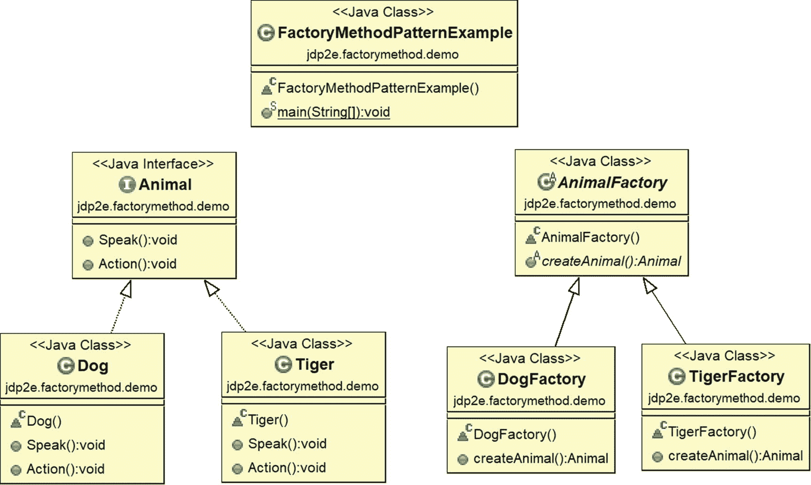
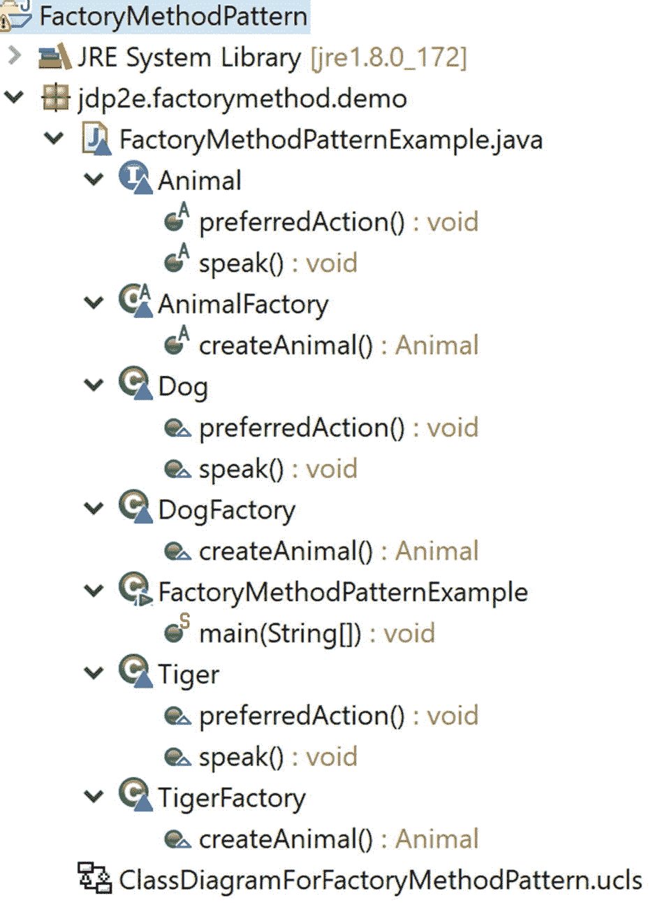
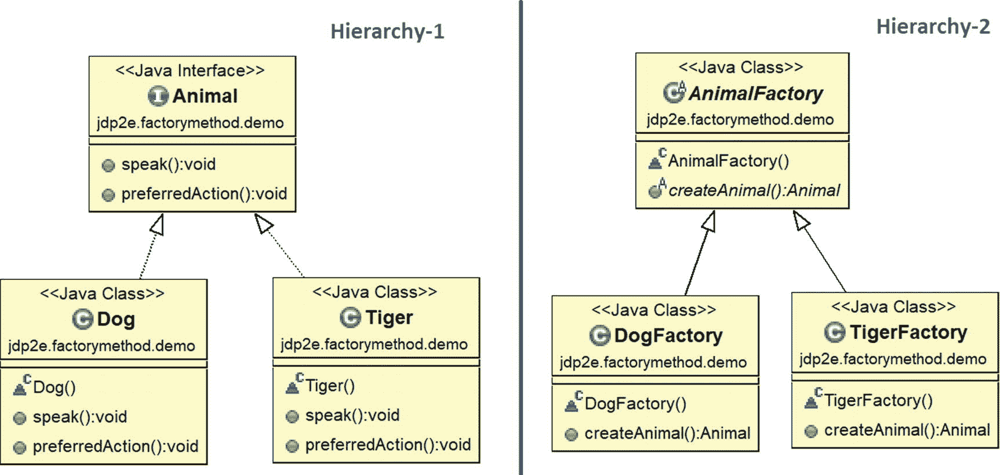

# 四、工厂方法模式

本章涵盖了工厂方法模式。

## GoF 定义

定义一个创建对象的接口，但是让子类决定实例化哪个类。工厂方法让一个类将实例化推迟到子类。

### 要记住的要点

要理解这种模式，我建议你去第二十四章，其中涵盖了简单工厂模式。简单工厂模式并不直接属于四人组设计模式，所以我将该模式的讨论放在本书的第二部分。如果从简单的工厂模式开始，工厂方法模式会更有意义。

## 概念

在这里，您从定义应用程序基本结构的抽象 creator 类(creator)开始开发。从这个抽象类派生的子类执行实际的实例化过程。当你开始用下面的例子思考这个模式时，这个概念对你来说就有意义了。

## 真实世界的例子

考虑一家汽车制造公司，该公司生产不同型号的汽车，业务运营良好。基于汽车的模型，不同的零件被制造和组装。

在不久的将来，客户可以选择更好的型号，公司应该为这种变化做好准备。如果公司需要为一个新型号做一个全新的设置，只需要几个新功能，这可能会极大地影响其利润率。因此，该公司应该以这样一种方式建立工厂，使其能够为即将到来的车型生产零件。

## 计算机世界的例子

假设您正在构建一个需要支持两个不同数据库的应用程序，比如 Oracle 和 SQL Server。因此，无论何时向数据库中插入数据，都要创建特定于 SQL Server 的连接(SqlServerConnection `)`或特定于 Oracle server 的连接(OracleConnection `)`),然后才能继续。如果你把这些代码放到`if-else`(或 switch)语句中，你可能需要重复很多代码。这种代码不容易维护，因为每当需要支持新类型的连接时，都需要重新打开代码并进行修改。工厂方法模式专注于解决应用程序开发中的类似问题。

注由于简单工厂模式是工厂方法模式的最简单形式，所以您可以考虑这里的相同示例。因此，java.text.NumberFormat 类的静态 getInstance()方法就是这种类型的一个例子。Java . net . urlstreamhandlerfactory 接口的 createURLStreamHandler(字符串协议)是此类别中的另一个示例。您可以将 ftp、http 等作为不同的协议进行传递，该方法将返回特定协议的 URLStreamHandler。

## 说明

我继续讨论第二十四章中提到的简单工厂模式。所以，我会努力改进实现。为了简单起见，我将这个实现中的所有类放在一个文件中。因此，您不需要为单独的类创建任何单独的文件夹。我建议你参考相关评论，以便更好地理解。

### 类图

图 4-1 显示了工厂方法模式的类图。



图 4-1

类图

### 包资源管理器视图

图 4-2 显示了程序的高层结构。



图 4-2

包资源管理器视图

### 履行

下面是实现。

```java
package jdp2e.factorymethod.demo;
interface Animal
{
       void speak();
       void preferredAction();
}
class Dog implements Animal
{
       public void speak()
       {
              System.out.println("Dog says: Bow-Wow.");
       }
       public void preferredAction()
       {
              System.out.println("Dogs prefer barking...\n");
       }
}
class Tiger implements Animal
{
       public void speak()
       {
              System.out.println("Tiger says: Halum.");
       }
       public void preferredAction()
       {
              System.out.println("Tigers prefer hunting...\n");
       }
}

abstract class AnimalFactory
{
/*Remember that the GoF definition says "....Factory method lets a class defer instantiation to subclasses."
In our case, the following method will create a Tiger or Dog but at this point it does not know whether it will get a Dog or a Tiger. This decision will be taken by the subclasses i.e. DogFactory or TigerFactory. So,in this implementation, the following method is playing the role of a factory (of creation)*/
       public abstract Animal createAnimal();
}
class DogFactory extends AnimalFactory
{
       public Animal createAnimal()
       {
              //Creating a Dog
              return new Dog();
       }
}
class TigerFactory extends AnimalFactory
{
       public Animal createAnimal()
       {
              //Creating a Tiger
              return new Tiger();
       }
}

class FactoryMethodPatternExample {
       public static void main(String[] args) {
              System.out.println("***Factory Pattern Demo***\n");
              // Creating a Tiger Factory
              AnimalFactory tigerFactory =new TigerFactory();
              // Creating a tiger using the Factory Method
              Animal aTiger = tigerFactory.createAnimal();
              aTiger.speak();
              aTiger.preferredAction();

              // Creating a DogFactory
              AnimalFactory dogFactory = new DogFactory();
              // Creating a dog using the Factory Method
              Animal aDog = dogFactory.createAnimal();
              aDog.speak();
              aDog.preferredAction();
       }
}

```

### 输出

这是输出。

```java
***Factory Pattern Demo***

Tiger says: Halum.
Tigers prefer hunting...

Dog says: Bow-Wow.
Dogs prefer barking...

```

### 修改的实现

在这个实现中，AnimalFactory 类是一个抽象类。因此，让我们利用使用抽象类的优势。假设您希望一个子类遵循一个可以从其父类(或基类)强加的规则。所以，我在下面的设计中测试这样一个场景。

以下是该设计的主要特征。

*   只有 AnimalFactory 被修改如下(即，我引入了一个新的`makeAnimal()`方法)。

*   客户端代码适应了这些变化:

```java
//Modifying the AnimalFactory class.
abstract class AnimalFactory
{
    public Animal makeAnimal()
    {
      System.out.println("I am inside makeAnimal() of AnimalFactory.You cannot ignore my rules.");
        /*
        At this point, it doesn't know whether it will get a Dog or a Tiger. It will be decided by the subclasses i.e.DogFactory or TigerFactory.But it knows that it will Speak and it will have a preferred way of Action.
        */
        Animal animal = createAnimal();
        animal.speak();
        animal.preferredAction();
        return animal;
    }

/*Remember that the GoF definition says "....Factory method lets a class defer instantiation to subclasses."
In our case, the following method will create a Tiger or Dog but at this point it does not know whether it will get a Dog or a Tiger.
This decision will be taken by the subclasses i.e. DogFactory or TigerFactory. So,in this implementation, the following method is playing the role of a factory (of creation)*/
     public abstract Animal createAnimal();
}

```

```java
class ModifiedFactoryMethodPatternExample {
       public static void main(String[] args) {
              System.out.println("***Modified Factory Pattern Demo***\n");
              // Creating a Tiger Factory
              AnimalFactory tigerFactory =new TigerFactory();
              // Creating a tiger using the Factory Method
              Animal aTiger = tigerFactory.makeAnimal();
              //aTiger.speak();
              //aTiger.preferredAction();

              // Creating a DogFactory
              AnimalFactory dogFactory = new DogFactory();
              // Creating a dog using the Factory Method
              Animal aDog = dogFactory.makeAnimal();
              //aDog.speak();
              //aDog.preferredAction();

       }
}

```

### 修改输出

这是修改后的输出。

```java
***Modified Factory Pattern Demo***

I am inside makeAnimal() of AnimalFactory.You cannot ignore my rules.

Tiger says: Halum.
Tigers prefer hunting...

I am inside makeAnimal() of AnimalFactory.You cannot ignore my rules.

Dog says: Bow-Wow.
Dogs prefer barking...

```

### 分析

在每种情况下，您都会看到消息(或警告):“您不能忽略我的规则”

## 问答环节



图 4-3

我们例子中的两个类层次结构

1.  **为什么将** **CreateAnimal()方法** **从客户端代码中分离出来？**

    这是我的真实意图。我希望子类创建专门化的对象。如果你仔细观察，你会发现只有这个“创造性的部分”在不同的产品中是不同的。我将在简单工厂模式的问答环节中详细讨论这一点(参见第二十四章)。

2.  使用这样的工厂有什么好处？
    *   您将会变化的代码与不会变化的代码分离开来(也就是说，使用简单工厂模式的优势仍然存在)。这种技术有助于您轻松维护代码。

    *   您的代码不是紧密耦合的；因此，您可以随时在系统中添加新的类，如 Lion、Beer 等，而无需修改现有的体系结构。所以，你遵循了“修改时封闭，扩展时开放”的原则。

3.  使用这样的工厂有哪些挑战？

    如果您需要处理大量的类，那么您可能会遇到维护开销。

4.  我发现工厂模式支持两个并行的层次结构。这是正确的吗？

    接得好。是的，从类图(见图 4-3 )可以明显看出，这种模式支持并行的类层次结构。

因此，在本例中，AnimalFactory、DogFactory 和 TigerFactory 位于一个层次结构中，而 Animal、Dog 和 Tiger 位于另一个层次结构中。因此，创作者和他们的创作/产品是平行运行的两个层次。

1.  我应该总是用抽象关键字来标记工厂方法，这样子类就可以完成它们。这是正确的吗？

    不。如果创建者没有子类，您可能会对默认的工厂方法感兴趣。在这种情况下，不能用 abstract 关键字标记工厂方法。

    为了展示工厂方法模式的真正威力，您可能需要遵循类似的设计，这里实现了类似的设计。

2.  在我看来，工厂方法模式和简单工厂没有太大区别。这是正确的吗？

    如果你看看这两章的例子中的子类，你可能会发现一些相似之处。但是你不应该忘记工厂方法模式的关键目标是它提供了一个框架，通过这个框架不同的子类可以生产不同的产品。但是在一个简单的工厂中，您不能像使用工厂方法模式那样改变产品。把简单工厂想象成一次性交易*但是最重要的是，你的创造部分不会因为修改而关闭。每当你想添加一个新东西时，你需要在你的简单工厂模式的工厂类中添加一个`if/else`块或者一个 switch 语句。*

     *在这种情况下，记住 GoF 的定义:*工厂方法让一个类将实例化推迟到子类。*因此，在我们简单的工厂模式演示中，您只使用了一个具体的类(`SimpleFactory)`)。您不需要覆盖`createAnimal()`方法，并且没有子类参与最终的决策/产品制作过程。但是如果你试图*编码到一个抽象类(或者接口)*，这总是被认为是一个好的实践，并且这个机制提供了你在抽象类中放置一些常见行为的灵活性。*

 *### 注意

在简单工厂模式中，您只需将实例化逻辑从客户端代码中分离出来。在这种情况下，它知道它可以创建其对象的所有类。另一方面，当使用工厂方法模式时，您将对象创建委托给子类。还有，工厂方法事先对产品子类没有绝对的把握。

1.  在工厂方法模式中，我可以简单地使用一种子类化机制(即使用继承)，然后实现工厂方法(在父类中定义)。这是正确的吗？

    如果您想严格遵循 GoF 定义，这个问题的答案是肯定的。但重要的是要注意，在许多应用程序/实现中，没有使用抽象类或接口；例如，在 Java 中，XML reader 对象是这样使用的:

```java
//Some code before…
XMLReader xmlReader1 = XMLReaderFactory.createXMLReader();
//Some code after

```

XMLReaderFactory 是 Java 中的最终类。所以，你不能继承它。

但是当您使用 SAXParserFactory 时，如下所示，您使用的是一个抽象类 SAXParserFactory。

```java
//some code before….
SAXParserFactory factory = SAXParserFactory.newInstance();
              SAXParser parser = factory.newSAXParser();
              XMLReader xmlReader2 = parser.getXMLReader();
//Some code after

```*