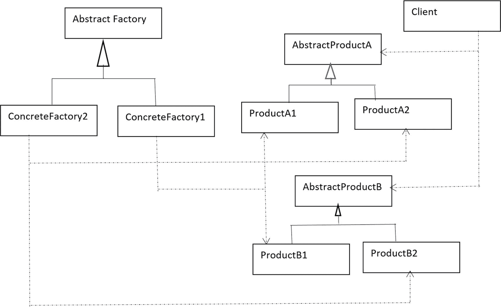
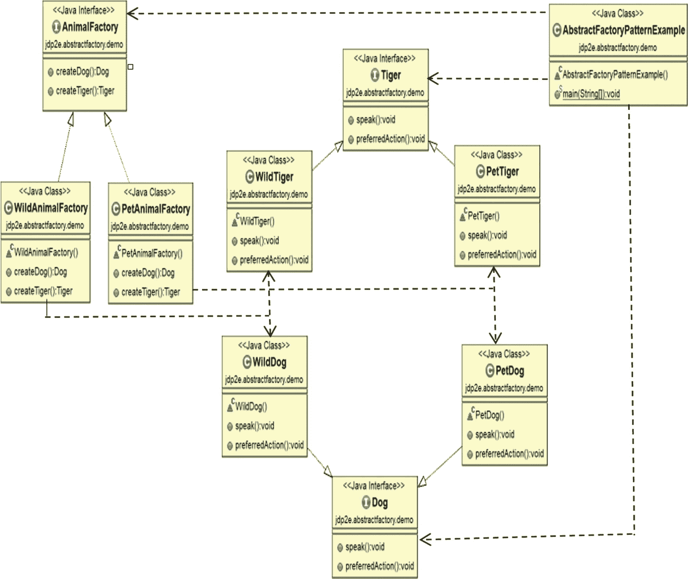
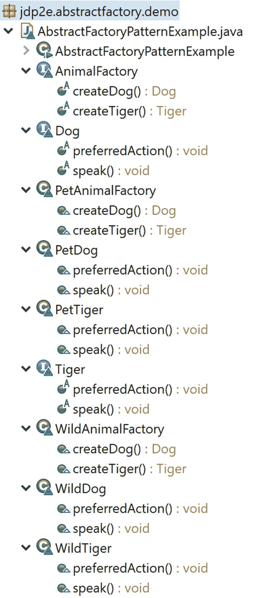
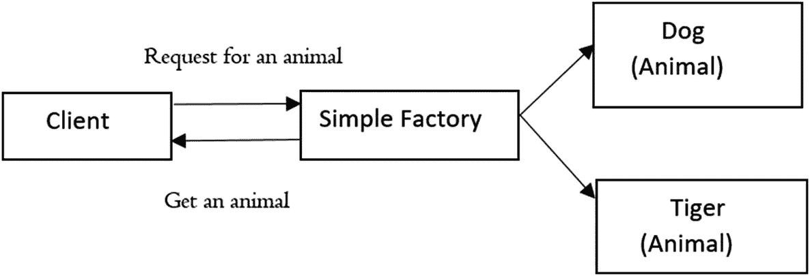
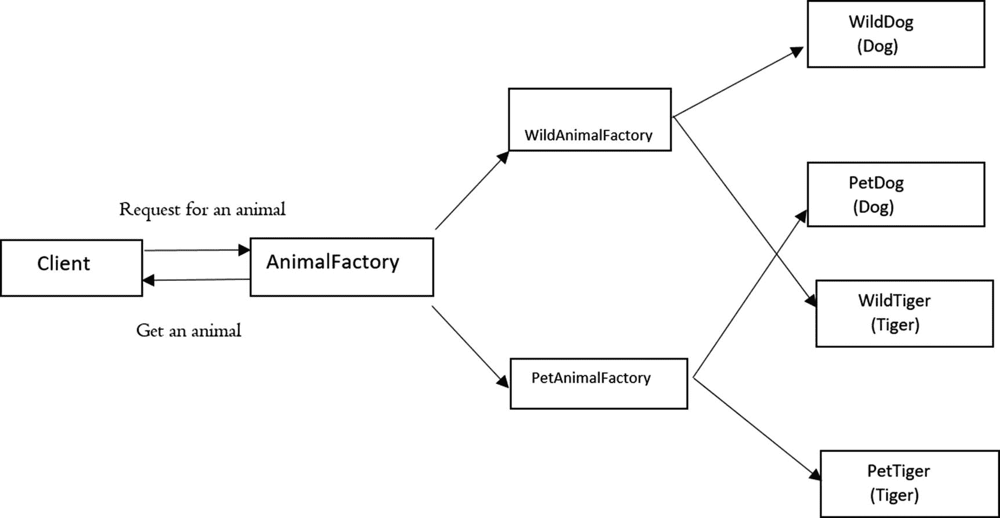

# 五、抽象工厂模式

本章涵盖了抽象工厂模式。

## GoF 定义

提供一个接口，用于创建相关或依赖对象的系列，而无需指定它们的具体类*。*

### 注意

为了更好地理解这种模式，我建议您从第二十四章(简单工厂模式)开始，然后学习第四章(工厂方法模式)。简单工厂模式并不直接属于四人组设计模式，所以关于该模式的讨论放在本书的第二部分。

## 概念

这基本上是一个工厂的工厂，提供了比工厂方法模式更高的抽象层次。这种模式帮助我们交换特定的实现，而不改变使用它们的代码，甚至在运行时。

这种模式提供了一种封装一组具有共同主题的单个工厂的方法。这里，类不直接创建对象；相反，它将任务委托给工厂对象。

简单工厂方法模式创建一组相关的对象。类似地，由于抽象工厂基本上是工厂的工厂，它返回创建一组相关对象的工厂。(我将在“问答”部分详细讨论这些差异。)

## 真实世界的例子

假设我们用两张不同的桌子装饰房间:一张是木制的，一张是钢制的。对于木桌，我们需要去找木匠，对于另一张桌子，我们需要去五金商店。两者都是桌子工厂，所以基于我们的需求，我们决定我们需要什么样的工厂。

在这种背景下，你可能会考虑两家不同的汽车制造公司:本田和福特。本田制造诸如 CR-V、Jazz、布里奥等车型。福特生产不同的车型，如野马、菲戈、Aspire 等等。所以，如果你想买一辆 Jazz，你必须去本田展厅，但是如果你喜欢 Figo，你就去福特展厅。

## 计算机世界的例子

为了理解这个模式，我将扩展工厂方法模式中的需求。在工厂方法模式中，我们有两个工厂:一个创建狗，另一个创建老虎。但是现在，你想把狗和老虎进一步分类。你可以通过这些工厂选择家养动物(狗或老虎)或野生动物(狗或老虎)。为了满足这个需求，我引进了两个混凝土工厂:野生动物工厂和动物工厂。野生动物工厂负责创造野生动物，动物工厂负责创造家养动物或宠物。

### 注意

javax . XML . parsers . documentbuilderfactory 的 newInstance()方法是 JDK 中抽象工厂模式的一个例子。javax . XML . transform . transformer factory 的 newInstance()方法是这种情况下的另一个例子。如果你熟悉 C#，你可能会注意到 ADO.NET 已经实现了类似的概念来建立到数据库的连接。

## 说明

维基百科描述了抽象工厂模式的典型结构( [`https://en.wikipedia.org/wiki/Abstract_factory_pattern`](https://en.wikipedia.org/wiki/Abstract_factory_pattern) )，类似于图 5-1 所示。



图 5-1

抽象工厂模式的典型例子

在我们的实现中，我将遵循类似的结构。因此，在下面的实现中，我使用了两个具体的工厂:WildAnimalFactory 和 PetAnimalFactory。他们负责创造具体的产品，狗和老虎。WildAnimalFactory 制造野生动物(野狗和野生老虎)，PetAnimalFactory 制造家养宠物(宠物狗和宠物老虎)。为了便于参考，参与者及其角色总结如下。

*   *AnimalFactory* :在下面的实现中被当作抽象工厂的接口。

*   *WildAnimalFactory* :实现 AnimalFactory 接口的具体工厂。它创造了野狗和野生老虎。

*   *PetAnimalFactory* :另一个实现 AnimalFactory 接口的具体工厂。它创造了宠物狗和宠物老虎。

*   *老虎*和*狗*:两个接口，在本例中被视为抽象产品。

*   *派蒂格*、*派蒂格*、*野虎*、*野狗*:以下实现中的具体产品。

这里客户端代码寻找动物(狗和老虎)。当我们使用抽象工厂的具体实例来构造类时，可以看到这种模式的一种常见用法。我也一样。注意，client 类包含 AnimalFactory 的组合实现。您可以在下面的实现中探索宠物和野生动物的构造过程。

### 类图

图 5-2 显示了类图。



图 5-2

类图

### 包资源管理器视图

图 5-3 显示了程序的高层结构。



图 5-3

包资源管理器视图

### 履行

下面是实现。

```java
package jdp2e.abstractfactory.demo;

interface Dog
{
      void speak();
      void preferredAction();
}

interface Tiger
{
      void speak();
      void preferredAction();
}

//Types of Dogs-wild dogs and pet dogs

class WildDog implements Dog
{
      @Override
      public void speak()
      {
            System.out.println("Wild Dog says loudly: Bow-Wow.");

      }
      @Override
      public void preferredAction()
      {
            System.out.println("Wild Dogs prefer to roam freely in jungles.\n");

      }
}
class PetDog implements Dog
{
      @Override
      public void speak()
      {
                System.out.println("Pet Dog says softly: Bow-Wow.");
      }
      @Override
      public void preferredAction()
      {
            System.out.println("Pet Dogs prefer to stay at home.\n");

      }
}
//Types of Tigers-wild tigers and pet tigers

class WildTiger implements Tiger
{
      @Override
      public void speak()
      {
            System.out.println("Wild Tiger says loudly: Halum.");

      }
      @Override
      public void preferredAction()
      {
            System.out.println("Wild Tigers prefer hunting in jungles.\n");

      }
}
class PetTiger implements Tiger
{
      @Override
      public void speak()
      {
            System.out.println("Pet Tiger says softly: Halum.");

      }
      @Override
      public void preferredAction()
      {
            System.out.println("Pet Tigers play in the animal circus.\n");
      }
}

//Abstract Factory
interface AnimalFactory
{
      Dog createDog();
      Tiger createTiger();
}
//Concrete Factory-Wild Animal Factory
class WildAnimalFactory implements AnimalFactory
{
      @Override
      public Dog createDog()
      {
            return new WildDog();
      }
      @Override
      public Tiger createTiger()
      {
            return new WildTiger();
      }

}
//Concrete Factory-Pet Animal Factory

class PetAnimalFactory implements AnimalFactory
{
      @Override
      public Dog createDog()
      {
            return new PetDog();
      }
      @Override
      public Tiger createTiger()
      {
            return new PetTiger();
      }
}
//Client
class AbstractFactoryPatternExample {

      public static void main(String[] args) {
            AnimalFactory myAnimalFactory;
            Dog myDog;
            Tiger myTiger;
            System.out.println("***Abstract Factory Pattern Demo***\n");
            //Making a wild dog through WildAnimalFactory
            myAnimalFactory = new WildAnimalFactory();
            myDog = myAnimalFactory.createDog();
            myDog.speak();
            myDog.preferredAction();
            //Making a wild tiger through WildAnimalFactory
            myTiger = myAnimalFactory.createTiger();
            myTiger.speak();
            myTiger.preferredAction();

            System.out.println("******************");

            //Making a pet dog through PetAnimalFactory
            myAnimalFactory = new PetAnimalFactory();
            myDog = myAnimalFactory.createDog();
            myDog.speak();
            myDog.preferredAction();
            //Making a pet tiger through PetAnimalFactory

            myTiger = myAnimalFactory.createTiger();
            myTiger.speak();
            myTiger.preferredAction();

      }

}

```

### 输出

这是输出。

```java
***Abstract Factory Pattern Demo***

Wild Dog says loudly: Bow-Wow.
Wild Dogs prefer to roam freely in jungles.

Wild Tiger says loudly: Halum.
Wild Tigers prefer hunting in jungles.

******************
Pet Dog says softly: Bow-Wow.
Pet Dogs prefer to stay at home.

Pet Tiger says softly: Halum.
Pet Tigers play in the animal circus.

```

## 问答环节

1.  **我看到狗和老虎的接口都包含同名的方法(两个接口都包含 speak()和****preferredation()方法** **)。它是强制性的吗？**

    不，你可以为你的方法使用不同的名字。此外，这些接口中方法的数量可以不同。但是我在本书中介绍了一个简单的工厂模式和工厂方法模式。你可能对它们之间的相似或不同之处感兴趣。所以，我从一个例子开始，不断修改。这就是为什么我在这个例子中保留了 s `peak()`和 preferred `Action()`方法。注意这些方法在简单工厂模式(参见第二十四章)和工厂方法模式(参见第四章)中都有使用。

2.  使用这样的抽象工厂有什么挑战？
    *   抽象工厂的任何变化都迫使我们传播对具体工厂的修改。如果你遵循的设计理念是将*编程为接口，而不是实现*，你需要为此做好准备。这是开发人员始终牢记的关键原则之一。在大多数情况下，开发人员不想改变他们的抽象工厂。

    *   整体架构可能看起来很复杂。此外，在某些情况下，调试变得很棘手。

3.  如何区分简单工厂模式和工厂方法模式或抽象工厂模式？

    我在第四章的“问答”部分讨论了简单工厂模式和工厂方法模式的区别。

    让我们用下面的图表来修改所有三个工厂。

### 简单工厂模式**代码片段**

下面是代码片段。

```java
Animal preferredType=null;
SimpleFactory simpleFactory = new SimpleFactory();
// The code that will vary based on users preference.
preferredType = simpleFactory.createAnimal();

```

图 5-4 显示了如何在简单工厂模式中获取动物对象。



图 5-4

简单工厂模式

### 工厂方法模式**代码片段**

下面是代码片段。

```java
// Creating a Tiger Factory
AnimalFactory tigerFactory =new TigerFactory();
// Creating a tiger using the Factory Method
Animal aTiger = tigerFactory.createAnimal();

//...Some code in between...

// Creating a DogFactory
AnimalFactory dogFactory = new DogFactory();
// Creating a dog using the Factory Method
Animal aDog = dogFactory.createAnimal();

```

图 5-5 显示了如何在工厂方法模式中获取动物对象。


图 5-5

工厂方法模式

### 抽象工厂模式**代码片段**

下面是代码片段。

```java
AnimalFactory myAnimalFactory;
Dog myDog;
Tiger myTiger;
System.out.println("***Abstract Factory Pattern Demo***\n");
//Making a wild dog through WildAnimalFactory
myAnimalFactory = new WildAnimalFactory();
myDog = myAnimalFactory.createDog();
//Making a wild tiger through WildAnimalFactory
myTiger = myAnimalFactory.createTiger();

//Making a pet dog through PetAnimalFactory
myAnimalFactory = new PetAnimalFactory();
myDog = myAnimalFactory.createDog();
//Making a pet tiger through PetAnimalFactory
myTiger = myAnimalFactory.createTiger();
myTiger.speak();
myTiger.preferredAction();

```

图 5-6 展示了如何在抽象工厂方法模式中获取动物对象。



图 5-6

抽象工厂方法模式

### 结论

使用简单工厂，您可以将不同于其他代码的代码分离出来(基本上，您可以将客户端代码解耦)。这种方法有助于您轻松管理代码。这种方法的另一个主要优点是客户端不知道对象是如何创建的。因此，它同时促进了安全性和抽象性。但是会违反开闭原则。

您可以使用工厂方法模式来克服这个缺点，该模式允许子类决定如何完成实例化过程。换句话说，您将对象创建委托给实现工厂方法来创建对象的子类。

抽象工厂基本上是工厂的工厂。它创建相关对象的系列，但是它不依赖于具体的类。

我试图保持彼此接近的简单例子。工厂方法促进继承；它们的子类需要实现工厂方法来创建对象。抽象工厂模式促进了对象组合，在这种模式下，您可以使用抽象工厂的具体实例来组合类。

这些工厂都通过减少对具体类的依赖来促进松散耦合。

1.  在所有这些工厂例子中，你都避免使用参数化的构造函数。这是故意的吗？

    在许多应用程序中，您会看到参数化构造函数的使用；许多专家更喜欢这种方法。但是我的重点纯粹是在设计上，所以，我忽略了参数化构造函数的使用。但是如果您是参数化构造函数的爱好者，让我们稍微修改一下实现，以便您可以对其余部分做同样的事情。

### 修改后的插图

假设您希望您的工厂用指定的颜色初始化 tigers，客户端可以选择这些颜色。

让我们修改以下几段代码(更改以粗体显示)。

### 修改的实现

下面是修改后的实现。

```java
package jdp2e.abstractfactory.questions_answers;

interface Dog
{
      void speak();
      void preferredAction();
}

interface Tiger
{
      void speak();
      void preferredAction();
}

//Types of Dogs-wild dogs and pet dogs
class WildDog implements Dog
{
      @Override
      public void speak()
      {
            System.out.println("Wild Dog says loudly: Bow-Wow.");

      }
      @Override
      public void preferredAction()
      {
            System.out.println("Wild Dogs prefer to roam freely in jungles.\n");

      }
}
class PetDog implements Dog
{
      @Override
      public void speak()
      {
            System.out.println("Pet Dog says softly: Bow-Wow.");
      }
      @Override
      public void preferredAction()
      {
            System.out.println("Pet Dogs prefer to stay at home.\n");

      }
}
//Types of Tigers-wild tigers and pet tigers
class WildTiger implements Tiger
{
      public WildTiger(String color)
      {
            System.out.println("A wild tiger with "+ color+ " is created.");
      }
      @Override
      public void speak()
      {
            System.out.println("Wild Tiger says loudly: Halum.");

      }
      @Override
      public void preferredAction()
      {
            System.out.println("Wild Tigers prefer hunting in jungles.\n");

      }
}
class PetTiger implements Tiger
{
      public PetTiger(String color)
      {
            System.out.println("A pet tiger with "+ color+ " is created.");
      }
      @Override
      public void speak()
      {
            System.out.println("Pet Tiger says softly: Halum.");

      }
      @Override
      public void preferredAction()
      {
            System.out.println("Pet Tigers play in the animal circus.\n");
      }
}

//Abstract Factory
interface AnimalFactory
{
      Dog createDog();
      Tiger createTiger(String color);
}
//Concrete Factory-Wild Animal Factory
class WildAnimalFactory implements AnimalFactory
{
      @Override
      public Dog createDog()
      {
            return new WildDog();
      }
      @Override
      public Tiger createTiger(String color)
      {
            return new WildTiger(color);
      }

}
//Concrete Factory-Pet Animal Factory
class PetAnimalFactory implements AnimalFactory
{
      @Override
      public Dog createDog()
      {
            return new PetDog();
      }
      @Override
      public Tiger createTiger(String color)
      {
            return new PetTiger(color);
      }
}
//Client

class AbstractFactoryPatternModifiedExample {
          public static void main(String[] args) {
            AnimalFactory myAnimalFactory;
            Dog myDog;
            Tiger myTiger;
            System.out.println("***Abstract Factory Pattern Demo***\n");
            //Making a wild dog through WildAnimalFactory
            myAnimalFactory = new WildAnimalFactory();
            myDog = myAnimalFactory.createDog();
            myDog.speak();
            myDog.preferredAction();
            //Making a wild tiger through WildAnimalFactory
            //myTiger = myAnimalFactory.createTiger();
            myTiger = myAnimalFactory.createTiger("white and black stripes");
            myTiger.speak();
            myTiger.preferredAction();

            System.out.println("******************");

            //Making a pet dog through PetAnimalFactory
            myAnimalFactory = new PetAnimalFactory();
            myDog = myAnimalFactory.createDog();
            myDog.speak();
            myDog.preferredAction();
            //Making a pet tiger through PetAnimalFactory
            myTiger = myAnimalFactory.createTiger("golden and cinnamon stripes");
            myTiger.speak();
            myTiger.preferredAction();

      }

}

```

### 修改输出

这是修改后的输出。

```java
***Abstract Factory Pattern Demo***

Wild Dog says loudly: Bow-Wow.
Wild Dogs prefer to roam freely in jungles.

A wild tiger with white and black stripes is created.

Wild Tiger says loudly: Halum.
Wild Tigers prefer hunting in jungles.

******************
Pet Dog says softly: Bow-Wow.
Pet Dogs prefer to stay at home.

A pet tiger with golden and cinnamon stripes is created.

Pet Tiger says softly: Halum.
Pet Tigers play in the animal circus.

```