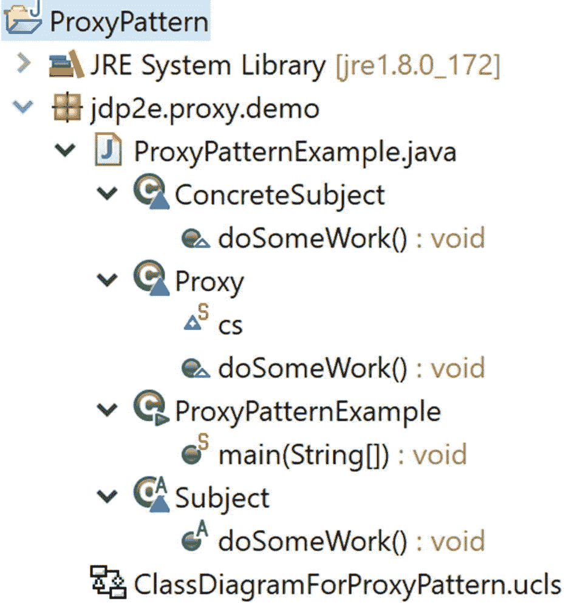

# 六、代理模式

本章介绍代理模式。

## GoF 定义

为另一个对象提供代理或占位符，以控制对它的访问。

## 概念

代理基本上是预期对象的替代品。由于许多因素，访问原始对象并不总是可能的。例如，创建它的成本很高，它需要受到保护，它位于远程位置，等等。代理设计模式在类似的情况下可以帮助我们。当一个客户端处理一个代理对象时，它假设它正在与实际的对象进行对话。因此，在这种模式中，您可能希望使用一个可以作为其他东西的接口的类。

## 真实世界的例子

在教室里，当一个学生缺席时，他最好的朋友可能会在点名时试图模仿他的声音，以试图让他的朋友出席。

## 计算机世界的例子

在编程领域，创建一个复杂对象(重对象)的多个实例是很昂贵的。因此，只要有需要，就可以创建多个指向原始对象的代理对象。这种机制还可以帮助节省系统/应用程序内存。ATM 可以实现这种模式来保存可能存在于远程服务器上的银行信息的代理对象。

### 注意

在 java.lang.reflect 包中，可以有一个代理类和一个支持类似概念的 InvocationHandler 接口。 *java.rmi.** 包还提供了一些方法，通过这些方法，一个 java 虚拟机上的对象可以调用驻留在不同 Java 虚拟机上的对象的方法。

## 说明

在下面的程序中，我调用了代理对象的`doSomework()`方法，而代理对象又调用了 ConcreteSubject 对象的`doSomework()`方法。当客户端看到输出时，他们不知道代理对象完成了任务。

### 类图

图 [6-1](#Fig1) 为类图。


图 6-1

类图

### 包资源管理器视图

图 [6-2](#Fig2) 显示了程序的高层结构。



图 6-2

包资源管理器视图

### 履行

下面是实现。

```java
package jdp2e.proxy.demo;

// Abstract class Subject
abstract class Subject
{
      public abstract void doSomeWork();
}
// ConcreteSubject class
class ConcreteSubject extends Subject
{
      @Override
      public void doSomeWork()
      {
            System.out.println("doSomeWork() inside ConcreteSubject is invoked.");
      }
}

/**
 * Proxy Class: It will try to invoke the doSomeWork()
 * of a ConcreteSubject instance
 */
Class Proxy extends  Subject
{
      static Subject cs;
      @Override
      public void doSomeWork()
      {
            System.out.println("Proxy call happening now...");
            //Lazy initialization:We'll not instantiate until the method is //called

            if (cs == null)
            {
                   cs = new ConcreteSubject();
            }
            cs.doSomeWork();

      }
}

/**
 * The client is talking to a ConcreteSubject instance
 * through a proxy method.
 */
public class ProxyPatternExample {
      public static void main(String[] args) {
            System.out.println("***Proxy Pattern Demo***\n");
            Proxy px = new Proxy();
            px.doSomeWork();

      }
}

```

### 输出

这是输出。

```java
***Proxy Pattern Demo***

Proxy call happening now...
doSomeWork() inside ConcreteSubject is invoked.

```

## 问答环节

1.  有哪些不同类型的代理？

    These are the common types:
    *   *远程代理*。隐藏位于不同地址空间的实际对象。

    *   *虚拟代理*。执行优化技术，例如根据需求创建重物。

    *   *保护代理*。处理不同的访问权限。

    *   *智能参考*。当客户端访问对象时，执行额外的内务处理工作。典型的操作是计算在特定时刻对实际对象的引用次数。

2.  **You could create the ConcreteSubject instance in the proxy class constructor, as follows.**

    ```java
    class Proxy extends  Subject
    {
          static Subject cs;
          public Proxy()
          {
                //Instantiating inside the constructor
                cs = new ConcreteSubject();
          }

          @Override
          public void doSomeWork()
          {
                System.out.println("Proxy call happening now...");
                cs.doSomeWork();
          }
    }

    ```

    这是正确的吗？

    是的，你可以这样做。但是如果您遵循这种设计，无论何时实例化一个代理对象，您都需要实例化一个 ConcreteSubject 类的对象。所以，这个过程最终可能会产生不必要的对象。您可以简单地用下面这段代码和相应的输出进行测试。

### 替代实现

下面是替代实现。

```java
package jdp2e.proxy.questions_answers;

//Abstract class Subject
abstract class Subject
{
      public abstract void doSomeWork();
}
//ConcreteSubject class
class ConcreteSubject extends Subject
{
      @Override
      public void doSomeWork()
      {
            System.out.println("doSomeWork() inside ConcreteSubject is invoked");
      }
}

/**
 * Proxy Class
 * It will try to invoke the doSomeWork() of a ConcreteSubject instance *
 */
class Proxy extends  Subject
{
      static Subject cs;
      static int count=0;//A counter to track the number of instances
      public Proxy()
      {
            //Instantiating inside the constructor

            cs = new ConcreteSubject();
            count ++;
      }

      @Override
      public void doSomeWork()
      {
            System.out.println("Proxy call happening now...");
            //Lazy initialization:We'll not instantiate until the method is //called
            /*if (cs == null)
            {
                   cs = new ConcreteSubject();
                   count ++;
             }*/
             cs.doSomeWork();
      }
}

/**
  * The client is talking to a ConcreteSubject instance
 * through a proxy method.
 */
public class ProxyPatternQuestionsAndAnswers {
      public static void main(String[] args) {
             System.out.println("***Proxy Pattern Demo without lazy instantiation***\n");
             //System.out.println("***Proxy Pattern Demo with lazy instantiation***\n");
             Proxy px = new Proxy();
             px.doSomeWork();
             //2nd proxy instance
             Proxy px2 = new Proxy();
             px2.doSomeWork();

             System.out.println("Instance Count="+Proxy.count);
      }
}

```

### 没有惰性实例化的输出

这是输出。

```java
***Proxy Pattern Demo without lazy instantiation***

Proxy call happening now...
doSomeWork() inside ConcreteSubject is invoked
Proxy call happening now...
doSomeWork() inside ConcreteSubject is invoked
Instance Count=2

```

### 分析

请注意，您已经创建了两个代理实例。

现在，用惰性实例化来尝试我们之前的方法。(删除代理构造函数，取消惰性实例化的注释)。

### 延迟实例化输出

这是输出。

```java
***Proxy Pattern Demo with lazy instantiation***

Proxy call happening now...
doSomeWork() inside ConcreteSubject is invoked
Proxy call happening now...
doSomeWork() inside ConcreteSubject is invoked

Instance Count=1

```

### 分析

注意，这次您只创建了一个代理实例。

1.  **但是在这种** **的懒惰实例化技术** **中，你可能会在多线程应用中创建不必要的对象。这是正确的吗？**

    是的。在这本书里，我只展示简单的插图，所以我忽略了那部分。在关于单例模式的讨论中，我分析了一些处理多线程环境的替代方法。在这种情况下，你可以参考这些讨论。(例如，在这个特定的场景中，您可以实现同步技术、锁定机制或智能代理等等，以确保在授予对特定对象的访问权限之前锁定该对象。)

2.  你能举一个远程代理的例子吗？

    假设，你想调用一个对象的方法，但是该对象运行在不同的地址空间(例如，不同的位置或不同的计算机，等等。).你是如何进行的？在远程代理的帮助下，您可以调用代理对象上的方法，该方法又将调用转发给远程计算机上运行的实际对象。这种类型的需求可以通过众所周知的机制来实现，如 ASP.NET、CORBA、C# 的 WCF(3.0 版本以上)或 Java 的 RMI(远程方法调用)。

    Figure [6-3](#Fig3) demonstrates a simple remote proxy structure.

    

    图 6-3

    一个简单的远程代理图

3.  什么时候可以使用虚拟代理？

    它可以用来避免多次加载一个非常大的图像。

4.  **什么时候可以使用保护代理？**

    组织中的安全团队可以实现保护代理来阻止对特定网站的互联网访问。

考虑下面的例子，它基本上是前面描述的代理模式实现的修改版本。为了简单起见，我们假设目前只有三个注册用户可以使用`doSomeWork()`代理方法。除此之外，如果任何其他用户(比如 Robin)试图调用该方法，系统将拒绝这些尝试。你必须同意，当系统将拒绝这种不必要的访问；制作代理对象毫无意义。因此，如果避免在代理类构造函数中实例化 ConcreteSubject 的对象，就可以很容易地避免创建这类额外的对象。

现在来看一下修改后的实现。

### 已修改的包资源管理器视图

图 [6-4](#Fig4) 显示了修改后的程序高层结构。


图 6-4

已修改的包资源管理器视图

### 修改的实现

下面是修改后的实现。

```java
package jdp2e.proxy.modified.demo;

import java.util.ArrayList;
import java.util.Arrays;
import java.util.List;

//Abstract class Subject
abstract class Subject
{
       public abstract void doSomeWork();
}
//ConcreteSubject class
class ConcreteSubject extends Subject
{
       @Override
       public void doSomeWork()
       {
              System.out.println("doSomeWork() inside ConcreteSubject is invoked.");
       }
}

/**
 * Proxy Class:It will try to invoke the doSomeWork()
 * of a ConcreteSubject instance
 */
class ModifiedProxy extends  Subject
{
       static Subject cs;
       String currentUser;
       List<String> registeredUsers;
       //Or, simply create this mutable list in one step
       /*List<String> registeredUsers=new ArrayList<String>(Arrays.asList( "Admin","Rohit","Sam"));*/
       public ModifiedProxy(String currentUser)
       {
              //Registered users are Admin, Rohit and Sam only

.
              registeredUsers = new ArrayList<String>();
              registeredUsers.add("Admin");
              registeredUsers.add("Rohit");
              registeredUsers.add("Sam");
              this.currentUser = currentUser;
       }
       @Override
       public void doSomeWork()
       {
              System.out.println("\n Proxy call happening now...");
              System.out.println(currentUser+" wants to invoke a proxy method.");
              if (registeredUsers.contains(currentUser))
              {
                     //Lazy initialization:We'll not instantiate until the
                     //method is called
                     if (cs == null)
                     {
                            cs = new ConcreteSubject();
                     }
                     //Allow the registered user to invoke the method
                     cs.doSomeWork();
              }
              else
              {
                     System.out.println("Sorry "+ currentUser+ " , you do not have access rights.");
              }
       }
}

/**
 * The client is talking to a ConcreteSubject instance

 * through a proxy method.
 */
public class ModifiedProxyPatternExample {

       public static void main(String[] args) {
              System.out.println("***Modified Proxy Pattern Demo***\n");
              //Admin is an authorized user
              ModifiedProxy px1 = new ModifiedProxy("Admin");
              px1.doSomeWork();
              //Robin is an unauthorized user
              ModifiedProxy px2 = new ModifiedProxy("Robin");
              px2.doSomeWork();

       }

}

```

### 修改输出

这是修改后的输出。

1.  代理就像装饰者一样。这是正确的吗？

    您可以实现一个类似于 decorators 的保护代理，但是您不应该忘记它的意图。装饰者专注于增加职责，但是代理专注于控制对对象的访问。代理的类型和实现各不相同。另外，一般来说，代理在相同的接口上工作，但是装饰者可以在扩展的接口上工作。所以，如果你能记住他们的用途，在大多数情况下，你就能清楚地把他们和装修工区分开来。

2.  代理人有哪些缺点？

    If you are careful enough in your implementation, the pros are much greater than the cons, but
    *   您可以提出您对响应时间的担忧。因为您没有直接与实际对象对话，所以通过这些代理的响应时间可能会更长。

    *   您需要为代理维护额外的代码。

    *   代理可以隐藏对象的实际响应，这在特殊情况下可能会造成混乱。

```java
***Modified Proxy Pattern Demo***

Proxy call happening now...
Admin wants to invoke a proxy method.
doSomeWork() inside ConcreteSubject is invoked.

Proxy call happening now...
Robin wants to invoke a proxy method.

Sorry Robin, you do not have access rights.

```