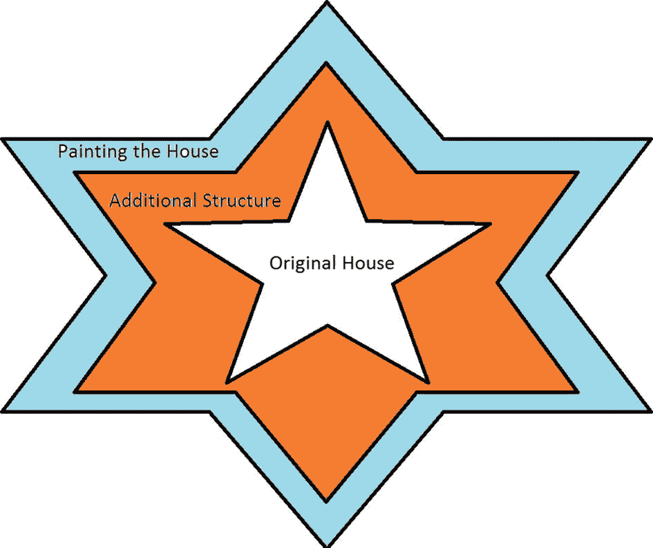
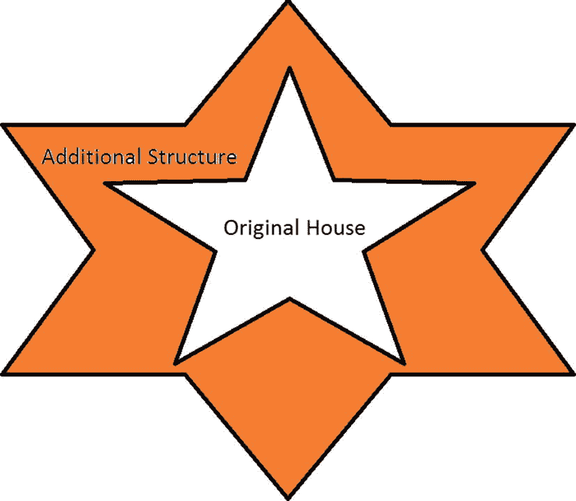
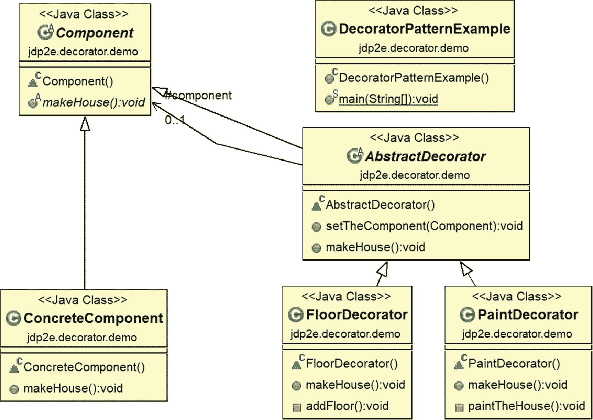
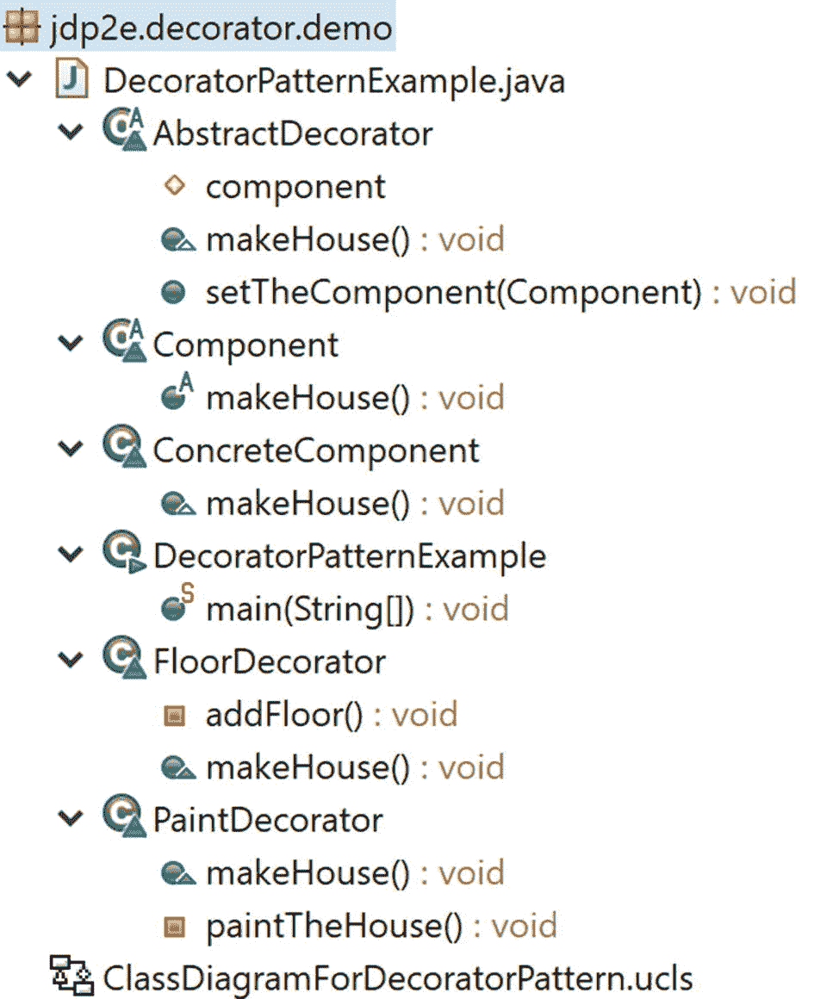
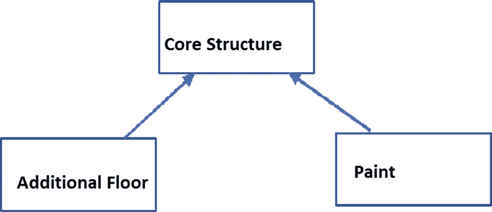
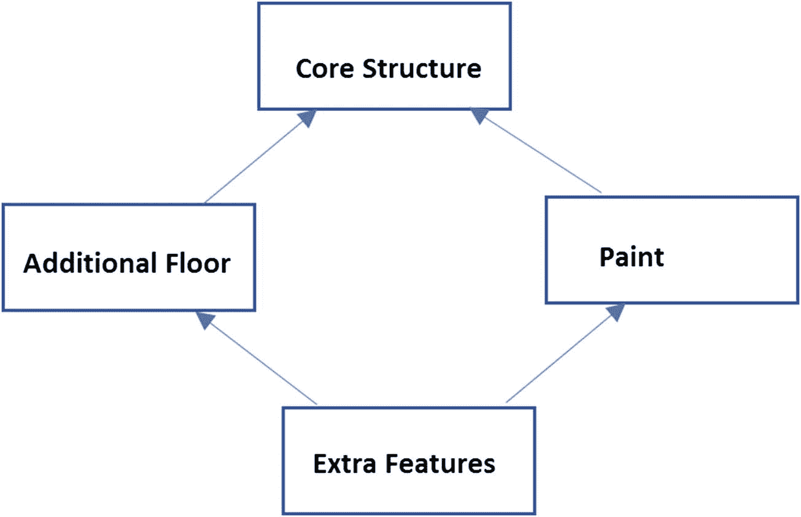

# 七、装饰模式

本章涵盖了装饰模式。

## GoF 定义

动态地将附加责任附加到对象上。Decorators 为扩展功能提供了子类化的灵活替代方案。

## 概念

这种模式说，类必须为修改而关闭，但为扩展而打开；也就是说，可以在不干扰现有功能的情况下添加新功能。当我们想给一个特定的对象而不是整个类添加特殊的功能时，这个概念非常有用。在这个模式中，我们尝试使用对象组合的概念来代替继承。所以，当我们掌握了这种技术，我们就可以在不影响底层类的情况下向对象添加新的职责。

## 真实世界的例子

假设你已经拥有一栋房子。现在你决定在它的上面再建一层楼。您可能不希望更改底层(或现有楼层)的体系结构，但可能希望在不影响现有体系结构的情况下更改新添加楼层的体系结构设计。

图 7-1 ，图 7-2 ，图 7-3 说明了这个概念。



图 7-3

从现有的装饰者中创建一个额外的装饰者(并粉刷房子)



图 7-2

有装修工的原始房屋(新结构建立在原始结构之上)


图 7-1

原始房屋

### 注意

情况 3 是可选的。您可以使用已经修饰过的对象来以这种方式增强行为，或者您可以创建一个新的 decorator 对象并将所有新的行为放入其中。

## 计算机世界的例子

假设在一个基于 GUI 的工具包中，我们想要添加一些边框属性。我们可以通过继承来做到这一点。但它不能被视为最终的解决方案，因为用户不能从一开始就对这种创造拥有绝对的控制权。所以在这种情况下核心选择是静态的。

装饰者以灵活的方式进入画面。他们提倡动态选择的概念，例如，我们可以将组件包围在另一个对象中。封闭对象被称为*装饰器*。它必须符合它所修饰的组件的接口。它将请求转发给组件。它可以在转发之前或之后执行附加操作。这个概念可以增加无限的责任。

### 注意

您可以注意到装饰模式在两者的 I/O 流实现中的使用。NET 框架和 Java。例如，java.io.BufferedOutputStream 类可以修饰任何 java.io.OutputStream 对象。

## 说明

浏览下面的例子。这里我们从未试图修改核心的`makeHouse()`方法。我们创建了两个额外的装饰器:ConcreteDecoratorEx1 和 ConcreteDecoratorEx2 来满足我们的需求，但是我们保持了原来的结构不变。

### 类图

图 7-4 显示了装饰器模式的类图。



图 7-4

类图

### 包资源管理器视图

图 7-5 显示了程序的高层结构。



图 7-5

包资源管理器视图

### 履行

下面是实现。

```java
package jdp2e.decorator.demo;
abstract class Component
{
    public abstract void makeHouse();

}
class ConcreteComponent extends Component
{
    public void makeHouse()
    {
        System.out.println("Original House is complete. It is closed for modification.");
    }
}

abstract class AbstractDecorator extends Component
{
    protected Component component ;
    public void setTheComponent(Component c)
    {
        component = c;
    }
    public void makeHouse()
    {
        if (component != null)
        {
            component.makeHouse();//Delegating the task

        }
    }
}
//A floor decorator
class FloorDecorator extends AbstractDecorator
{
    public  void makeHouse()
    {
        super.makeHouse();
        //Decorating now.
        System.out.println("***Floor decorator is in action***");
        addFloor();
        /*You can put additional stuffs as per your need*/
    }
    private void addFloor()
    {
        System.out.println("I am making an additional floor on top of it.");
    }
}
//A paint decorator
class PaintDecorator extends AbstractDecorator
{
    public void makeHouse()
    {
        super.makeHouse();
        //Decorating now.
        System.out.println("***Paint decorator is in action now***");
        paintTheHouse();
        //You can add additional stuffs as per your need

    }
    private void paintTheHouse()
    {
        System.out.println("Now I am painting the house.");
    }
}

public class DecoratorPatternExample {

    public static void main(String[] args) {
        System.out.println("***Decorator pattern Demo***\n");
        ConcreteComponent withoutDecorator = new ConcreteComponent();
        withoutDecorator.makeHouse();
        System.out.println("_________________");

        //Using a decorator to add floor
        System.out.println("Using a Floor decorator now.");
        FloorDecorator floorDecorator = new FloorDecorator();
        floorDecorator.setTheComponent(withoutDecorator);
        floorDecorator.makeHouse();
        System.out.println("_________________");

        //Using a decorator to add floor to original house and then
        //paint it.
        System.out.println("Using a Paint decorator now.");
        PaintDecorator paintDecorator = new PaintDecorator();
        //Adding results from floor decorator
        paintDecorator.setTheComponent(floorDecorator);
        paintDecorator.makeHouse();
        System.out.println("_________________");
    }
}

```

### 输出

这是输出。

```java
***Decorator pattern Demo***

Original House is complete. It is closed for modification.
_________________
Using a Floor decorator now.
Original House is complete. It is closed for modification.
***Floor decorator is in action***
I am making an additional floor on top of it.
_________________
Using a Paint decorator now.
Original House is complete. It is closed for modification.
***Floor decorator is in action***
I am making an additional floor on top of it.
***Paint decorator is in action now***
Now I am painting the house.
_________________

```

## 问答环节



图 7-6

等级继承

1.  你能解释一下组合是如何促进一种动态行为，而继承却不能吗？

    我们知道，当派生类从父类继承时，它只继承基类当时的行为。尽管不同的子类可以以不同的方式扩展基类/父类，但这种类型的绑定在编译时是已知的，所以选择本质上是静态的。但是您在示例中使用组合概念的方式允许您尝试动态行为。

    当我们设计一个父类时，我们可能对*客户在后期阶段*可能想要什么样的额外责任没有足够的了解。我们的约束是我们不应该频繁地修改现有的代码。在这种情况下，对象组合不仅远远超过了继承，还确保了我们不会将错误引入到现有的架构中。

    最后，在这种情况下，你必须记住一个关键的设计原则:*类应该对扩展开放，但对修改关闭。*

2.  使用装潢师的关键 **优势** **是什么？**
    *   现有的结构没有被改动，所以您不会在那里引入错误。

    *   新的功能可以很容易地添加到现有的对象。

    *   您不需要在初始设计阶段预测/实现所有支持的功能。您可以增量开发(例如，一个接一个地添加装饰对象来支持增量需求)。你必须承认这样一个事实，如果你首先创建一个复杂的类，然后你试图扩展它的功能，这将是一个乏味的过程。

3.  **整体设计模式与继承有何不同？**

    您可以通过简单地附加或分离 decorators 来添加或删除职责。但是对于简单的继承机制，您需要为新的职责创建一个新的类。所以，有可能你最终会得到一个复杂的系统。

    再次考虑这个例子。假设你想加一层新地板，粉刷房子，做一些额外的工作。为了满足这一需求，您从 decorator2 开始，因为它已经提供了向现有架构添加地板的支持，然后您可以对其进行绘制。因此，您可以添加一个简单的包装器来完成这些额外的职责。

    但是如果你从继承开始，那么你可能有多个子类(例如，一个用于添加地板，一个用于粉刷房子)。图 7-6 显示了层次继承。

如果你需要一个具有额外功能的额外涂漆地板，你可能最终会得到如图 7-7 所示的设计。



图 7-7

一个类(额外特性)需要从多个基类继承

现在你感受到了钻石效应的热度，因为在包括 Java 在内的许多编程语言中，多个父类是不允许的。

在这种情况下，即使您考虑多级继承，您会发现总体上继承机制比装饰模式更具挑战性和耗时，并且它可能会在您的应用程序中产生重复的代码。最后，您必须记住，继承机制只提倡编译时绑定(而不是动态绑定)。

1.  **为什么多级** **传承** **不能在以前的背景下得分更高？**

    让我们假设*油漆*类是从*附加层*派生出来的，而附加层又是从*核心架构*派生出来的。现在，如果您的客户想在不增加地板的情况下粉刷房子，decorator 模式肯定优于继承机制，因为您可以简单地在现有的只支持粉刷的系统中添加一个 decorator。

2.  为什么要创建一个只有单一职责的类？你可以创建一个子类，简单地添加一个地板，然后进行绘画。在这种情况下，你会得到更少的子类。这种理解正确吗？

    如果你熟悉扎实的原理，你就知道有一个原理叫*单责*。这一原则背后的思想是，每个类都应该对软件中的一部分功能负责。当您使用单一责任原则时，装饰模式非常有效，因为您可以简单地动态添加/删除责任。

3.  **与此格局相关的** **劣势** **有哪些？**

    我相信，如果你足够小心的话，并没有显著的劣势。但是你必须意识到这样一个事实，如果你在系统中创建了太多的装饰器，那么维护和调试将会很困难。因此，在这种情况下，它会造成不必要的混乱。

4.  在示例中，AbstractDecorator 类中没有抽象方法。这怎么可能？

    在 Java 中，你可以拥有一个没有任何抽象方法的抽象类，但反之则不然；也就是说，如果一个类包含至少一个抽象方法，那么这个类本身就是不完整的，你必须用 abstract 关键字来标记它。

    Let’s revisit the AbstractDecorator class in the comment shown in bold.

    ```java
    abstract class AbstractDecorator extends Component
    {
        protected Component component ;
        public void setTheComponent(Component c)
        {
            component = c;
        }
        public void makeHouse()
        {
          if (component != null)
            {
             component.makeHouse();//Delegating the task
            }
        }
    }

    ```

    您可以看到，我将任务委托给了一个具体的 decorator，因为我只想使用和实例化具体的 decorator。

    同样，在这个例子中，您不能简单地实例化一个`AbstractDecorator`实例，因为它用 abstract 关键字标记。

    The following line creates the *Cannot instantiate the type AbstractDecorator* compilation error.

    ```java
    AbstractDecorator abstractDecorator = new AbstractDecorator();

    ```


1.  **In your example, instead of using concrete decorators, you could use the concept of polymorphism in the following way to generate the same output.**

    ```java
    System.out.println("Using a Floor decorator now."); //FloorDecorator floorDecorator = new FloorDecorator();

    AbstractDecorator floorDecorator = new FloorDecorator();

    floorDecorator.setTheComponent(withoutDecorator);
    floorDecorator.makeHouse();

    //Using a decorator to add floor to original house and then paint //it.
    System.out.println("Using a Paint decorator now.");
    //PaintDecorator paintDecorator = new PaintDecorator();

    AbstractDecorator paintDecorator = new PaintDecorator();

    //Adding results from decorator1
    paintDecorator.setTheComponent(floorDecorator);
    paintDecorator.makeHouse();

    System.out.println("_________________");

    ```

    这是正确的吗？

    是的。

2.  **只对动态绑定强制使用 decorators 吗？**

    不可以。静态和动态绑定都可以使用。但是动态绑定是它的强项，所以我集中在这上面。您可能会注意到，GoF 定义也只关注动态绑定。

3.  你使用装饰者来包装你的核心架构。这是正确的吗？

    是的。装饰器是扩展应用程序核心功能的包装器代码。但是当你使用它们的时候，核心架构是不变的。