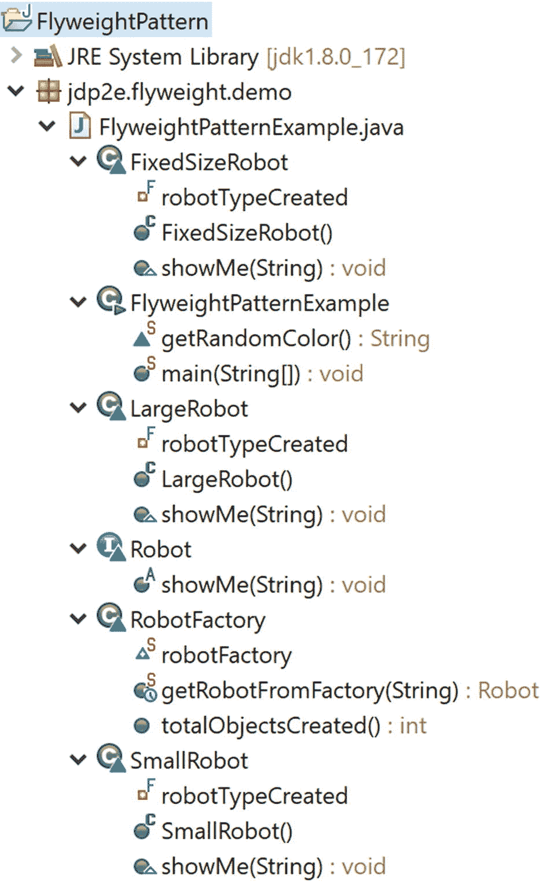
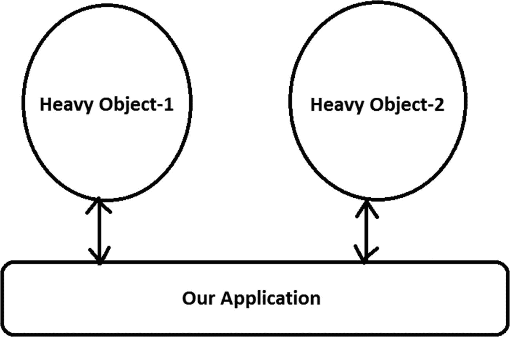
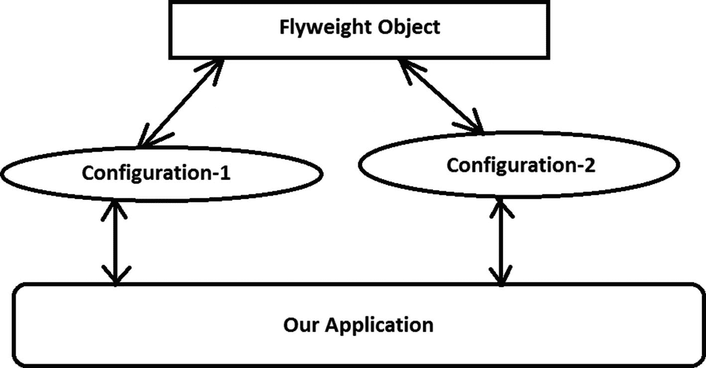

# 十、享元模式

这一章涵盖了 flyweight 模式。

## GoF 定义

使用共享来有效地支持大量细粒度的对象。

## 概念

在他们的名著*设计模式:可重用面向对象软件的元素* (Addison-Wesley，1995)中，四人组(g of)对享元做了如下描述:

> flyweight 是一个可以同时在多个上下文中使用的共享对象。在每个上下文中，flyweight 充当一个独立的对象——它与未共享的对象实例没有区别。Flyweights 不能对它们运行的环境做出假设。

当你考虑享元模式时，你需要记住以下几点:

*   当您需要大量相似的对象时，这种模式非常有用，这些对象只有几个参数是唯一的，而大部分内容是通用的。

*   飞锤是一个物体。它试图通过与其他类似对象尽可能多地共享数据来最小化内存使用。共享对象可以允许以最小的成本在精细的粒度上使用它们。

*   在这种情况下使用两个常用术语:外在的和内在的。一个*内在*状态被存储/共享在 flyweight 对象中，并且它独立于 flyweight 的上下文。另一方面，外在状态随着 flyweight 的上下文而变化，这就是为什么它们不能被共享。客户端对象维护外在状态，它们需要将这种状态传递给一个 flyweight。请注意，如果需要，客户端也可以在使用 flyweights 时动态计算外部状态。

*   专家建议，在实现这种模式时，我们应该使固有状态不可变。

## 真实世界的例子

假设你有笔。可以更换不同的笔芯，用不同的颜色书写。因此，没有笔芯的笔被认为是具有内在数据的飞锤，而有笔芯的笔被认为是外在数据。

再考虑一个例子。假设一家公司需要为员工打印名片。那么，这个过程从哪里开始呢？该公司可以创建一个带有公司徽标、地址等的通用模板(内部)，然后在卡片上添加每个员工的特定联系信息(外部)。

## 计算机世界的例子

假设您想创建一个网站，让不同的用户可以用他们喜欢的计算机语言(如 Java、C++、C# 等)编译和执行程序。如果你需要在短时间内为每个用户建立一个独特的环境，你的网站将会超负荷，服务器的响应时间将会变得非常慢，没有人会有兴趣使用你的网站。因此，您不必为每个用户创建一个新的编程环境，而是可以在他们之间创建一个公共的编程环境(支持不同的编程语言，有/没有微小的变化)。为了检查现有的/可用的编程环境，并决定是否需要创建一个新的环境，您可以维护一个工厂。

考虑另一个例子。假设在一个电脑游戏中，你有大量的参与者，他们的核心结构是相同的，但是他们的外表不同(例如，不同的状态、颜色、武器等等。)因此，假设您需要创建(或存储)所有这些具有所有这些变化/状态的对象，内存需求将是巨大的。因此，不用存储所有这些对象，您可以用这样的方式设计您的应用程序，即创建具有公共属性的这些实例(具有内在状态的 flyweights ),并且您的客户机对象维护所有这些变化(外在状态)。如果你能成功地实现这个概念，你就可以宣称你在应用程序中遵循了 flyweight 设计模式。

这种模式的另一个常见用途是在字处理器中用图形表示字符。

### 注意

在 Java 中，当您使用包装类(如 java.lang.Integer、java.lang.Short、java.lang.Byte 和 java.lang.Character)时，您可能会注意到这种模式的使用，其中静态方法 valueof()复制了一个工厂方法。(值得记住的是，一些包装器类，如 java.lang.Double 和 java.lang.Float，*不遵循这种模式。)弦池是享元的另一个例子。*

## 说明

在下面的例子中，我使用了三种不同类型的对象:小型、大型和固定大小的机器人。这些机器人有两种状态:“robotTypeCreated”和“color”。第一个可以在“相似”的对象之间共享，所以它是一个*内在*状态。第二个(颜色)由客户端提供，它随上下文而变化。因此，在这个例子中，它是一个*非本征*态。

对于固定尺寸的机器人，客户提供哪种颜色并不重要。对于这些机器人，我忽略了外在状态，所以你可以得出结论，这些固定大小的机器人代表了*非共享享元*。

在这个实现中，robotFactory 类缓存这些 flyweights，并提供一个获取它们的方法。

最后，这些对象是相似的。因此，一旦一个特定的机器人被创建，你不希望从头开始重复这个过程。相反，下一次向前，你将尝试使用这些飞锤来满足你的需求。现在，仔细阅读带有注释的代码，以便随时参考。

### 类图

图 [10-1](#Fig1) 为类图。


图 10-1

类图

### 包资源管理器视图

图 [10-2](#Fig2) 显示了程序的高层结构。



图 10-2

包资源管理器视图

### 履行

下面是实现。

```java
package jdp2e.flyweight.demo;

import java.util.Map;
import java.util.HashMap;
import java.util.Random;

interface Robot
{
    //Color comes from client.It is extrinsic.
    void showMe(String color);
}
//A shared flyweight implementation
class SmallRobot implements Robot
{
    /*
     * Intrinsic state.
     * It is not supplied by client.
     * So, it is independent of the flyweight’s context.
     * This can be shared across.
     * These data are often immutable.
     */
    private final String robotTypeCreated;
    public SmallRobot()
    {
           robotTypeCreated="A small robot created";
           System.out.print(robotTypeCreated);
    }
    @Override
    public void showMe(String color)
    {
        System.out.print(" with " +color + " color");
    }
}
//A shared flyweight implementation
class LargeRobot implements Robot
{
    /*
     * Intrinsic state.
     * It is not supplied by client

.
     * So, it is independent of the flyweight’s context.
     * This can be shared across.
     * These data are often immutable.
     */
    private final String robotTypeCreated;
    public LargeRobot()
    {
        robotTypeCreated="A large robot created";
        System.out.print(robotTypeCreated);
    }
    @Override
    public void showMe(String color)
    {
        System.out.print(" with " + color + " color");

    }
}
//An unshared flyweight implementation
class FixedSizeRobot implements Robot
{
    /*
     * Intrinsic state.
     * It is not supplied by client.
     * So, it is independent of the flyweight’s context.
     * This can be shared acorss.
     */
    private final String robotTypeCreated;
    public FixedSizeRobot()
    {
        robotTypeCreated="A robot with a fixed size created";
        System.out.print(robotTypeCreated);
    }
    @Override
    //Ingoring the extrinsic state argument
    //Since it is an unshared flyweight
    public void showMe(String color)
    {
        System.out.print(" with " + " blue (default) color");
    }
}

class RobotFactory
{
    static Map<String, Robot> robotFactory = new HashMap<String, Robot>();
    public int totalObjectsCreated()
    {
        return robotFactory.size();
    }

    public static synchronized Robot getRobotFromFactory(String robotType) throws Exception
    {
        Robot robotCategory = robotFactory.get(robotType);
        if(robotCategory==null)
        {
            switch (robotType)
            {
            case "small":
                System.out.println("We do not have Small Robot at present.So we are creating a small robot now.") 

;
                robotCategory = new SmallRobot();
                break;
            case "large":
                System.out.println("We do not have Large Robot at present.So we are creating a large robot now.");
                robotCategory = new LargeRobot();
                break;

            case "fixed":
                System.out.println("We do not have fixed size at present. So we are creating a fixed size robot now.");
                robotCategory = new FixedSizeRobot();
                break;
            default:
                throw new Exception(" Robot Factory can create only small ,large or fixed size robots");
            }
            robotFactory.put(robotType,robotCategory);
        }
        else
        {
            System.out.print("\n \t Using existing "+ robotType +" robot and coloring it" );
        }
        return robotCategory;
    }
}

public class FlyweightPatternExample {

    public static void main(String[] args) throws Exception {
        RobotFactory robotFactory = new RobotFactory();
        System.out.println("\n***Flyweight Pattern Example ***\n");
        Robot myRobot;
        //Here we are trying to get 3 Small type robots
        for (int i = 0; i < 3; i++)
        {
            myRobot = RobotFactory.getRobotFromFactory("small");
            /*
            Not required to add sleep().But it is included to
            increase the probability of getting a new random number
            to see the variations in the output

.
             */
            Thread.sleep(1000);
            //The extrinsic property color is supplied by the client code.
            myRobot.showMe(getRandomColor());
        }
        int numOfDistinctRobots = robotFactory.totalObjectsCreated();
        System.out.println("\n Till now, total no of distinct robot objects created: " + numOfDistinctRobots);

        //Here we are trying to get 5 Large type robots
        for (int i = 0; i < 5; i++)
        {
            myRobot = RobotFactory.getRobotFromFactory("large");
            /*
            Not required to add sleep().But it is included to
            increase the probability of getting a new random number
            to see the variations in the output.
             */
            Thread.sleep(1000);
            //The extrinsic property color is supplied by the client code.
            myRobot.showMe(getRandomColor());
        }
        numOfDistinctRobots = robotFactory.totalObjectsCreated();
        System.out.println("\n Till now, total no of distinct robot objects created: " + numOfDistinctRobots);

        //Here we are trying to get 4 fixed sizerobots
        for (int i = 0; i < 4; i++)
        {
            myRobot = RobotFactory.getRobotFromFactory("fixed");
            /*
            Not required to add sleep().But it is included to
            increase the probability of getting a new random number
            to see the variations in the output.
             */
            Thread.sleep(1000);
            //The extrinsic property color is supplied by the client code.
            myRobot.showMe(getRandomColor());
        }
        numOfDistinctRobots = robotFactory.totalObjectsCreated();
        System.out.println("\n Till now, total no of distinct robot objects created: " + numOfDistinctRobots);
    }

    static String getRandomColor()

    {
        Random r = new Random();
        /* I am simply checking the random number generated that can be either an even number or an odd number. And based on that we are choosing the color. For simplicity, I am using only two colors-red and green
         */
        int random = r.nextInt();
        if (random % 2 == 0)
        {
            return "red";
        }
        else
        {
            return "green";
        }
    }

}

```

### 输出

这是第一次运行输出。

```java
***Flyweight Pattern Example ***

We do not have Small Robot at present.So we are creating a small robot now.
A small robot created with green color
      Using existing small robot and coloring it with green color
      Using existing small robot and coloring it with red color
 Till now, total no of distinct robot objects created: 1
We do not have Large Robot at present.So we are creating a large robot now.
A large robot created with green color
      Using existing large robot and coloring it with red color
      Using existing large robot and coloring it with green color
      Using existing large robot and coloring it with green color
      Using existing large robot and coloring it with green color
 Till now, total no of distinct robot objects created: 2
We do not have fixed size at present.So we are creating a fixed size robot now.
A robot with a fixed size created with  blue (default) color
      Using existing fixed robot and coloring it with  blue (default) color
      Using existing fixed robot and coloring it with  blue (default) color
      Using existing fixed robot and coloring it with  blue (default) color
 Till now, total no of distinct robot objects created: 3

```

这是第二次运行的输出。

```java
***Flyweight Pattern Example ***

We do not have Small Robot at present.So we are creating a small robot now.
A small robot created with red color
      Using existing small robot and coloring it with green color
      Using existing small robot and coloring it with green color
 Till now, total no of distinct robot objects created: 1
We do not have Large Robot at present.So we are creating a large robot now.
A large robot created with red color
      Using existing large robot and coloring it with green color
      Using existing large robot and coloring it with green color
      Using existing large robot and coloring it with red color
      Using existing large robot and coloring it with green color
 Till now, total no of distinct robot objects created: 2
We do not have fixed size at present.So we are creating a fixed size robot now.
A robot with a fixed size created with  blue (default) color
      Using existing fixed robot and coloring it with  blue (default) color

      Using existing fixed robot and coloring it with  blue (default) color
      Using existing fixed robot and coloring it with  blue (default) color
 Till now, total no of distinct robot objects created: 3

```

### 分析

*   输出会有变化，因为在这个实现中，我随机选择了颜色。

*   固定大小机器人的颜色永远不会改变，因为外部状态(颜色)被忽略以表示非共享的享元。

*   客户需要与 12 个机器人(3 个小机器人，5 个大机器人，4 个固定大小的机器人)一起玩，但是这些需求只由三个不同的模板对象(每个类别一个)来满足，并且这些是动态配置的。

## 问答环节

1.  我注意到了单例模式和享元模式之间的一些相似之处。你能突出他们之间的主要区别吗？

    单例模式帮助您在系统中只维护一个必需的对象。换句话说，一旦创建了所需的对象，就不能再创建更多。您需要重用现有的对象。

    flyweight 模式通常关注大量相似(可能很重)的对象，因为它们可能会占用很大的内存块。因此，您尝试创建一个较小的模板对象集，可以动态配置它来完成重对象的创建。这些更小的可配置对象被称为享元对象。您可以在应用程序中重用它们，以显示您有许多大型对象。这种方法有助于减少大块内存的消耗。基本上，享元让一个人看起来像很多人。这就是为什么 GoF 告诉我们:*flyweight 是一个共享对象，可以同时在多个上下文中使用。flyweight 在每个上下文中充当一个独立的对象——它与没有共享的对象实例*没有什么区别。

    Figure [10-3](#Fig3) visualizes the core concepts of the flyweight pattern before using flyweights.

    

    图 10-3

    在使用飞锤之前

    Figure [10-4](#Fig4) shows the design after using flyweights.

    

    图 10-4

    使用飞锤后

    In Figure [10-4](#Fig4), you can see that
    *   重对象 1 = Flyweight 对象(共享)+配置 1(非固有和非共享)

    *   重对象 2 = Flyweight 对象(共享)+配置 2(非固有和非共享)

通过组合内部和外部状态，flyweight 对象提供了完整的功能。

1.  **您能观察到多线程带来的影响吗？**

    如果您在多线程环境中使用新的操作符创建对象，您可能最终会得到多个不需要的对象(类似于单例模式)。补救措施类似于在单例模式中处理多线程环境的方式。

2.  **使用 flyweight 设计模式的** **优势** **有哪些？**
    *   您可以减少可同等控制的重物的内存消耗。

    *   您可以减少系统中“完全但相似的对象”的总数。

    *   您可以提供一种集中的机制来控制许多“虚拟”对象的状态。

3.  **使用享元设计模式有哪些** **挑战** **？**
    *   在这种模式中，您需要花时间来配置这些享元。配置时间会影响应用程序的整体性能。

    *   要创建 flyweights，需要从现有对象中提取一个公共模板类。这个额外的编程层可能很棘手，有时很难调试和维护。

    *   您可以看到，一个类的逻辑实例的行为不能与其他实例不同。

    *   flyweight 模式通常与 singleton 工厂实现相结合，为了保护这种独特性，需要额外的成本(例如，您可以选择同步方法或双重检查锁定，但它们都是高成本的操作)。

4.  我可以拥有不可共享的 flyweight 接口吗？

    是的。flyweight 接口不会强制要求它总是可共享的。在某些情况下，您可能有不可共享的 flyweight，具体的 flyweight 对象作为子对象。在我们的例子中，您看到了使用固定大小的机器人来使用不可共享的享元。

5.  由于 flyweights 的内在数据是相同的，我可以分享它们。这是正确的吗？

    是的。

6.  客户如何处理这些享元的外部数据？

    他们需要将信息(状态)传递给享元。客户端要么管理数据，要么实时计算数据。

7.  外部数据不可共享。这是正确的吗？

    是的。

8.  你说我应该努力使内在状态不变。我怎样才能做到这一点？

    是的，为了线程安全，专家建议您实现它。在这种情况下，它已经实现了。在 Java 中，你必须记住字符串对象本质上是不可变的。

    此外，您可能会注意到，在具体的 flyweights (SmallRobot、LargeRobot、FixedSizeRobot)中，没有 setter 方法来设置/修改 robotTypeCreated 的值。当您只通过构造函数提供数据并且没有 setter 方法时，您遵循的是一种促进不变性的方法。

9.  您已经用固有状态 robotTypeCreated 标记了 final 关键字，以实现不变性。这是正确的吗？

    你需要记住*最终*和*不变性*不是同义词。在设计模式的上下文中，单词*不变性*通常意味着一旦创建，就不能改变对象的状态。尽管关键字 final 可以应用于一个类、一个方法或一个字段，但目的是不同的。

    final 字段可以帮助您构造一个线程安全的不可变对象，而无需同步，并且它在多线程环境中提供了安全性。所以，我在这个例子中使用了它。这个概念在 [`https://docs.oracle.com/javase/specs/jls/se7/html/jls-17.html#jls-17.5-110`](https://docs.oracle.com/javase/specs/jls/se7/html/jls-17.html%2523jls-17.5-110) 一文中有详细描述。

10.  ****getRobotFromFactory()方法** **在这里被同步以提供线程安全。这种理解正确吗？****

     **没错。在单线程环境中，这不是必需的。**
***   getRobotFromFactory()方法在这里是静态的。这是强制性的吗？

    不，你也可以实现一个非静态的工厂方法。您可能经常会注意到 flyweight 模式实现的单例工厂的存在。

     *   **“机器人工厂”的** **在这个实现中的作用是什么？**

    它缓存了 flyweights，并提供了获取它们的方法。在这个例子中，有许多可以共享的对象。因此，将它们存放在一个中心位置总是一个好主意。

     **