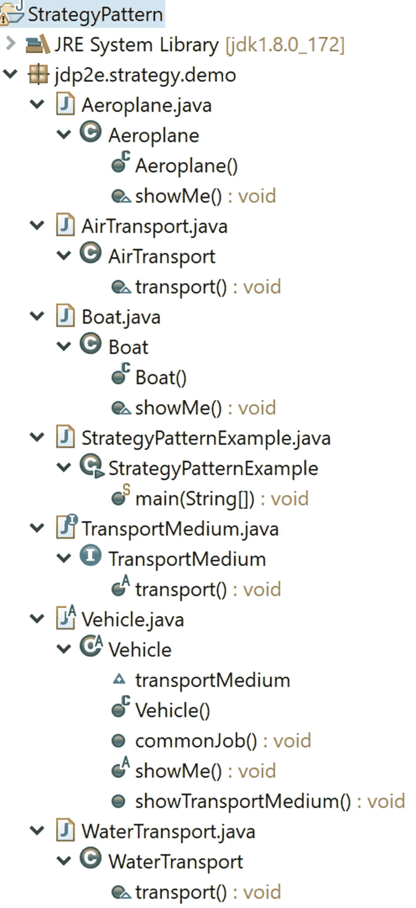

# 十五、策略模式

本章涵盖了策略模式。

## GoF 定义

定义一系列算法，封装每一个算法，并使它们可以互换。策略让算法独立于使用它的客户端而变化。

## 概念

假设有一个应用程序，其中有多个算法，每个算法都可以执行特定的任务。客户端可以动态地选择这些算法中的任何一个来满足其当前的需求。

策略模式建议您在单独的类中实现这些算法。当你将一个算法封装在一个单独的类中时，你称之为*策略*。使用策略对象的对象通常被称为*上下文对象*。这些“算法”在一些应用中也被称为*行为*。

## 真实世界的例子

通常在足球比赛结束时，如果 A 队以 1 比 0 领先 B 队，他们不会进攻，而是采取防守来保持领先。另一方面，B 队全力以赴去扳平比分。

## 计算机世界示例

假设你有一个整数列表，你想对它们进行排序。你通过使用各种算法来做到这一点；例如，冒泡排序、合并排序、快速排序、插入排序等等。所以，你可以有很多不同的排序算法。现在，您可以在单独的类中实现这些变体(算法),并在客户端代码中传递这些类的对象来对整数列表进行排序。

### 注意

在这种情况下，可以考虑 java.util.Comparator 接口。您可以实现这个接口，并提供具有不同算法的比较器的多个实现，以便使用 *compare()* 方法进行各种比较。该比较结果可以进一步用于各种分类技术。在这种情况下，比较器接口扮演策略接口的角色。

## 说明

在您继续之前，让我们记住以下几点。

*   策略模式鼓励你使用对象组合而不是子类化。所以，它建议你不要在不同的子类中覆盖父类行为。相反，您将这些行为放在共享一个公共接口的单独的类中(称为*策略*)。

*   客户端类只决定使用哪种算法；上下文类并不决定这一点。

*   上下文对象包含策略对象接口类型的引用变量。所以，你可以通过改变情境中的策略来获得不同的行为。

在下面的实现中，Vehicle 类是一个扮演上下文角色的抽象类。船和飞机是 Vehicle 类的两个具体实现。你知道它们与不同的行为相关联:一个通过水传播，另一个通过空气传播。

这些行为被分为两个具体的类:空运和水运。这些类共享一个公共接口 TransportMedium。因此，这些具体的类扮演着策略类的角色，不同的行为通过`transport()`方法实现来反映。

在 Vehicle 类中，有一个方法叫做`showTransportMedium()`。使用这种方法，我将任务委托给相应的行为类。因此，一旦选择了策略，就可以调用相应的行为。请注意，在 Vehicle 类中，有一个名为`commonJob()`的方法，它不应该在将来发生变化，因此它的行为不会被视为易变行为。

### 类图

图 15-1 为类图。


图 15-1

类图

### 包资源管理器视图

图 15-2 显示了程序的高层结构。



图 15-2

包资源管理器视图

### 履行

下面是实现。

`// Vehicle.java`

```java
package jdp2e.strategy.demo;

//Context class
public abstract class Vehicle
{
    /*A context object contains reference variable/s for the strategy object/s interface type.*/
    TransportMedium transportMedium;
    public Vehicle()
    {

    }
    public void showTransportMedium()
    {
        //Delegate the task to the //corresponding behavior class.
        transportMedium.transport();
    }
    //The code that does not vary.
    public void commonJob()
    {
        System.out.println("We all can be used to transport");
    }
    public abstract void showMe();

}

// Boat.java

package jdp2e.strategy.demo;

public class Boat extends Vehicle
{
    public Boat()
    {
        transportMedium= new WaterTransport();
    }
    @Override
    public void showMe() {
        System.out.println("I am a boat.");

    }
}
// Aeroplane.java

package jdp2e.strategy.demo;

public class Aeroplane extends Vehicle
{
    public Aeroplane()
    {
        transportMedium= new AirTransport();
    }

    @Override
    public void showMe() {
        System.out.println("I am an aeroplane.");

    }
}
// TransportMedium.java
package jdp2e.strategy.demo;

public interface TransportMedium
{
    public void transport();
}
//WaterTransport.java
package jdp2e.strategy.demo;
//This class represents an algorithm/behavior

.
public class WaterTransport implements TransportMedium
{
    @Override
    public void transport()
    {
        System.out.println("I am transporting in water.");
    }
}
//AirTransport.java
package jdp2e.strategy.demo;
//This class represents an algorithm/behavior.
public class AirTransport implements TransportMedium
{
    @Override
    public void transport()
    {
        System.out.println("I am transporting in air.");
    }
}

// StrategyPatternExample.java

package jdp2e.strategy.demo;

//Client code

public class StrategyPatternExample {

    public static void main(String[] args) {
        System.out.println("***Strategy Pattern Demo***");
        Vehicle vehicleContext=new Boat();
        vehicleContext.showMe();
        vehicleContext.showTransportMedium();
        System.out.println("________");

        vehicleContext=new Aeroplane();
        vehicleContext.showMe();
        vehicleContext.showTransportMedium();

    }

}

```

### 输出

这是输出。

```java
***Strategy Pattern Demo***
I am a boat.
I am transporting in water.
________
I am an aeroplane.
I am transporting in air.

```

## 问答环节

1.  你为什么要通过避免这些行为的简单子类化来使这个例子复杂化呢？

    在面向对象的编程中，您可能更喜欢使用多态性的概念，这样您的代码就可以在运行时挑选预期的对象(在不同的对象类型中)，而不改变您的代码。

    当你熟悉设计模式时，大多数情况下，你更喜欢组合而不是继承。

    策略模式帮助您将组合与多态性结合起来。我们来考察一下这背后的原因。

    It is assumed that you try to use the following guidelines in any application you write:
    *   将变化很大的代码与没有变化的代码部分分开。

    *   尽量保持不同部件独立(便于维护)。

    *   尽可能地重复使用它们。

遵循这些指导方针，我使用了组合来提取和封装代码的易变/可变部分，以便整个任务可以轻松处理，并且您可以重用它们。

但是当你使用继承时，你的父类可以提供一个默认的实现，然后派生类修改它(Java 称之为*覆盖它*)。下一个派生类可以进一步修改实现，所以您基本上是将任务分散到不同的级别，这可能会在将来导致严重的维护和可扩展性问题。我们来考察这样一个案例。

让我们假设您的 vehicle 类具有以下结构。

```java
abstract class Vehicle

{
    //Default implementation
    public void showTransportMedium()
    {
        System.out.println("I am transporting in air.");
    }
    //The code that does not vary.
    public void commonJob()
    {
        System.out.println("We all can be used to transport");
    }
    public abstract void showMe();
}

```

所以，做一个具体的车辆实现，像这样:

```java
class Aeroplane extends Vehicle
{
    @Override
    public void showMe() {
        System.out.println("I am an aeroplane.");

    }
}

```

并在客户端类中使用以下代码行。

```java
Aeroplane aeroplane=new Aeroplane();
aeroplane.showMe();
aeroplane.showTransportMedium();

```

您将收到以下输出:

```java
I am an aeroplane.
I am transporting in air.

```

到目前为止，看起来不错。现在假设您已经引入了另一个类 Boat，如下所示。

```java
class Boat extends Vehicle

{
    @Override
    public void showMe() {
        System.out.println("I am a boat.");

    }
}

```

在客户端类中使用以下代码行(新行以粗体显示)。

```java
Aeroplane aeroplane=new Aeroplane();
aeroplane.showMe();
aeroplane.showTransportMedium();

Boat boat=new Boat();

boat.showMe();

boat.showTransportMedium();

```

您会收到以下输出。

```java
I am an aeroplane.
I am transporting in air.

I am a boat.

I am transporting in air.

```

你可以看到你的船正在向空中移动。为了防止这种糟糕的情况，您需要适当地覆盖它。

现在进一步假设你需要引入另一个类，快艇，它也可以在水中高速运输。你需要警惕这样的情况:

```java
class Boat extends Vehicle

{
    @Override
    public void showMe()
    {
        System.out.println("I am a boat.");

    }
    @Override
    public void showTransportMedium() {
        System.out.println("I am transporting in water.");

    }
}
class SpeedBoat extends Vehicle
{
    @Override
    public void showMe() {
        System.out.println("I am a speedboat.");

    }
    @Override
    public void showTransportMedium() {
        System.out.println("I am transporting in water with high speed.");
    }
}

```

您可以看到，如果您将任务分散到不同的类(及其子类)中，从长远来看，维护会变得非常昂贵。如果您想经常适应类似的变化，您会经历很多痛苦，因为您需要在每种情况下不断更新`showTransportMedium()`方法。

1.  如果是这种情况，您可以创建一个单独的接口 TransportInterface，并将 showTransportMedium()方法放在该接口中。现在，任何想要获取该方法的类也可以实现该接口。这种理解正确吗？

    Yes, you can do that. But this is what the code looks like:

    ```java
    abstract class Vehicle
    {
        //The code that does not vary.
        public void commonJob()
        {
            System.out.println("We all can be used to transport");
        }
        public abstract void showMe();
    }
    interface TransportInterface
    {
        void showTransportMedium();
    }
    class Aeroplane extends Vehicle implements TransportInterface
    {
        @Override
        public void showMe() {
            System.out.println("I am an aeroplane.");

        }
        @Override
        public void showTransportMedium() {
            System.out.println("I am transporting in air.");
        }
    }
    class Boat extends Vehicle implements TransportInterface
    {
        @Override
        public void showMe()
        {
            System.out.println("I am a boat.");

        }

        @Override
        public void showTransportMedium() {
            System.out.println("I am transporting in water.");

        }
    }

    ```

    您可以看到每个类及其子类可能需要为`showTransportMedium()`方法提供自己的实现。所以，你不能重用你的代码，这和继承一样糟糕。

2.  你能在你的实现中修改运行时的默认行为吗？

    Yes, you can. Let’s introduce a special vehicle that can transport in both water and air, as follows.

    ```java
    public class SpecialVehicle extends Vehicle
    {
        public SpecialVehicle()
        {
            //Initialized with AirTransport
            transportMedium= new AirTransport();
        }

        @Override
        public void showMe()
        {
            System.out.println("I am a special vehicle who can transport both in air and water.");
        }
    }

    ```

    And add a setter method in the Vehicle class(changes are shown in bold).

    ```java
    //Context class
    public abstract class Vehicle
    {
        //A context object contains reference variable/s
        //for the strategy object/s interface type
        TransportMedium transportMedium;
        public Vehicle()
        {

        }
        public void showTransportMedium()
        {
            //Delegate the task to the corresponding behavior class.
            transportMedium.transport();
        }
        //The code that does not vary.
        public void commonJob()
        {
            System.out.println("We all can be used to transport");
        }
        public abstract void showMe();

        //Additional code to explain the answer of question no 3 in
        //the "Q&A session"

        public void setTransportMedium(TransportMedium transportMedium)
        {
            this.transportMedium=transportMedium;
        }

    }

    ```

    To test this, add a few lines of code in the client class, as well.

    ```java
    //Client code
    public class StrategyPatternExample {

        public static void main(String[] args) {
            System.out.println("***Strategy Pattern Demo***");
            Vehicle vehicleContext=new Boat();
            vehicleContext.showMe();
            vehicleContext.showTransportMedium();
            System.out.println("________");

            vehicleContext=new Aeroplane();
            vehicleContext.showMe();
            vehicleContext.showTransportMedium();
            System.out.println("________");

            //Additional code to explain the answer of question no
            //3 in the "Q&A session"
            vehicleContext=new SpecialVehicle();
            vehicleContext.showMe();
            vehicleContext.showTransportMedium();
            System.out.println("- - - - -");
            //Changing the behavior of Special vehicle
            vehicleContext.setTransportMedium(new WaterTransport());
            vehicleContext.showTransportMedium();

        }
    }

    ```

    Now if you execute this modified program, you get the following output.

    ```java
    ***Strategy Pattern Demo***
    ***Strategy Pattern Demo***
    I am a boat.
    I am transporting in water.
    ________
    I am an aeroplane.
    I am transporting in air.
    ________

    I am a special vehicle who can transport both in air and water.

    I am transporting in air.

    - - - - -

    I am transporting in water.

    ```

    初始行为在稍后阶段被动态修改。

3.  可以用抽象类代替接口吗？

    是的。在某些情况下，您可能希望将常见行为放在抽象类中，这是合适的。我在关于构建器模式的“问答环节”中详细讨论了它。

4.  **使用策略设计模式的关键** **优势** **是什么？**
    *   这种模式使你的类独立于算法。这里，一个类在运行时动态地将算法委托给策略对象(封装了算法)。所以，你可以简单地说，算法的选择在编译时是不受约束的。

    *   更容易维护您的代码库。

    *   它很容易扩展。(在这种情况下，请参考对问题 2 和 3 的答复。)

5.  **与策略设计模式相关的主要挑战是什么？**
    *   上下文类的添加导致我们的应用程序中有更多的对象。

    *   应用程序的用户必须了解不同的策略；否则，输出可能会让他们大吃一惊。因此，在客户端代码和不同策略的实现之间存在着紧密的耦合。

    *   当您引入一个新的行为/算法时，您可能还需要更改客户端代码。