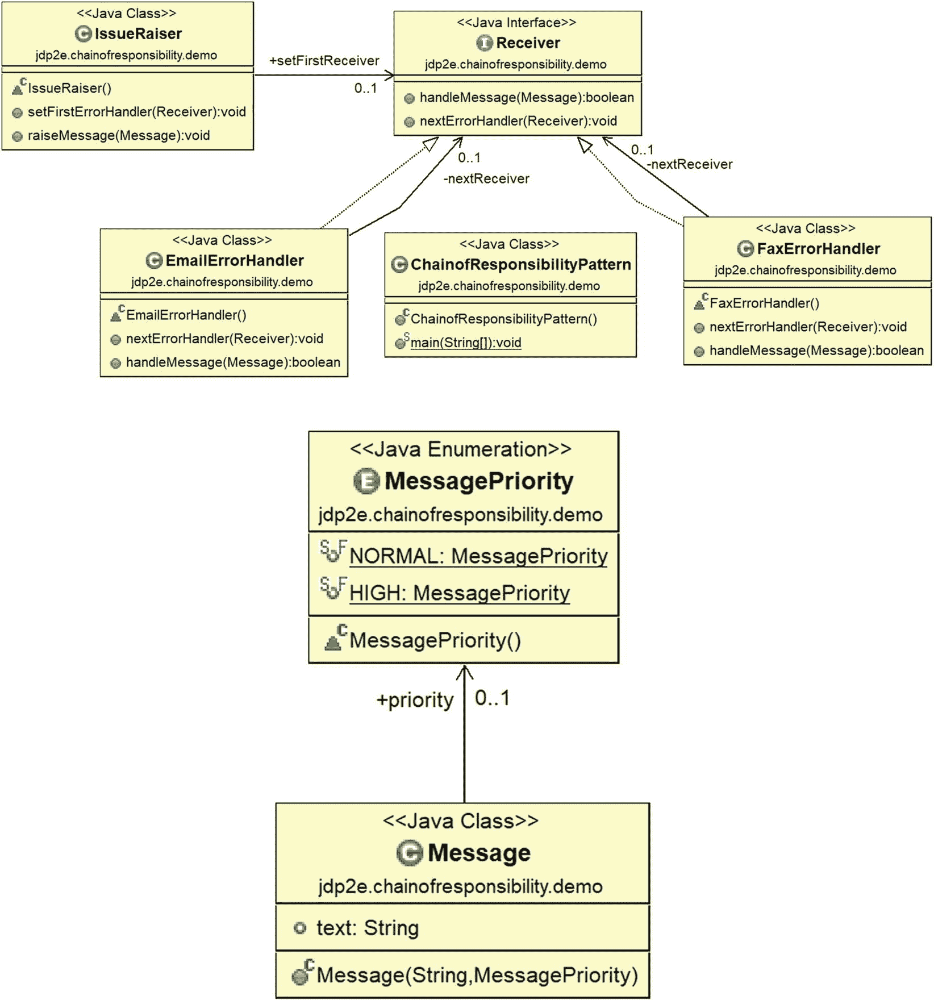

# 二十二、责任链模式

本章涵盖了责任链模式。

## GoF 定义

通过给多个对象一个处理请求的机会，避免将请求的发送方耦合到接收方。链接接收对象，并沿着链传递请求，直到有对象处理它。

## 概念

在这个模式中，您形成了一个对象链，链中的每个对象都处理一种特定的请求。如果一个对象不能完全处理请求，它会将请求传递给链中的下一个对象。同样的过程可以继续，直到到达链的末端。这种请求处理机制为您提供了在链的末端添加新处理对象(处理程序)的灵活性。图 22-1 描绘了这样一个有 N 个处理器的链。


图 22-1

责任链模式的概念

## 真实世界的例子

*   每个组织都雇佣了客户服务主管，他们直接接收来自客户的反馈或投诉。如果员工不能正确回答客户的问题，他们会将这些问题/上报转发给组织中的相应部门。这些部门不会试图同时解决一个问题。在调查的第一阶段，看似负责的部门会对案件进行分析，如果他们认为问题应该移交给另一个部门，他们就会这样做。

*   当病人去医院时，也会发生类似的情况。一个部门的医生可以将病人转到另一个部门做进一步诊断。

## 计算机世界的例子

考虑一个可以发送电子邮件和传真的软件应用程序(例如打印机)。因此，客户可以报告传真问题或电子邮件问题。让我们假设这些问题是由处理程序处理的。因此，您引入了两种不同类型的错误处理程序:`EmailErrorHandler`和`FaxErrorHandler`。你可以假设`EmailErrorHandler`只处理邮件错误；它不能修复传真错误。以类似的方式，`FaxErrorHandler`处理传真错误，而不关心电子邮件错误。

因此，您可能会形成这样的一个链:每当应用程序发现一个错误时，它都会发出一个标签并转发该错误，希望其中一个处理程序会处理它。让我们假设请求首先到达`FaxErrorhandler`。如果这个处理程序同意错误是传真问题，它就处理它；否则，处理程序将问题转发给`EmailErrorHandler`。

注意，链以`EmailErrorHandler`结束。但是如果您需要处理不同类型的问题——例如，身份验证问题(可能由于安全漏洞而发生),您可以创建一个名为`AuthenticationErrorHandler`的处理程序，并将其放在`EmailErrorHandler`之后。现在，如果一个`EmailErrorHandler`不能完全解决问题，它会将问题转发给`AuthenticationErrorHandler`，这个链就此结束。

### 注意

您可以在您的应用程序中自由地以任何顺序放置这些处理程序。

因此，底线是处理链可能会在以下任何场景中结束。

*   这些处理程序中的任何一个都可以完全处理请求，然后控制权就回来了。

*   一个处理程序不能完全处理请求，所以它将请求传递给下一个处理程序。这样，你就到达了链条的末端。因此，请求在那里处理。但是如果请求不能在那里得到处理，就不能进一步传递。(对于这种情况，您可能需要特别小心。)

当您在 Java 应用程序中使用多个 catch 块实现异常处理机制时，您会注意到类似的机制。如果一个异常发生在一个`try`块中，第一个 catch 块试图处理它。如果它不能处理那种类型的异常，下一个`catch`块会尝试处理它，并且遵循相同的机制，直到异常被处理程序(`catch`块)正确处理。如果应用程序中的最后一个 catch 块无法处理它，就会在这个链之外引发一个异常。

### 注意

在 java.util.logging.Logger 中，您可以看到支持类似概念的 log()方法的不同重载版本。

另一个内置支持可以在 javax.Servlet.Filter 中的 doFilter (ServletRequest 请求、ServletResponse 响应、FilterChain 链)接口方法中看到。

## 说明

让我们考虑一下在计算机世界的例子中讨论的场景。让我们进一步假设，在下面的例子中，您可以处理来自电子邮件或传真支柱的普通和高优先级问题。

### 类图

图 22-2 为类图。



图 22-2

类图

### 包资源管理器视图

图 22-3 显示了程序的高层结构。


图 22-3

包资源管理器视图

### 履行

下面是实现。

```java
package jdp2e.chainofresponsibility.demo;

enum MessagePriority
{
    NORMAL,
    HIGH
}
class Message
{
    public String text;
    public MessagePriority priority;
    public Message(String msg, MessagePriority p)
    {
        text = msg;
        this.priority = p;
    }
}

interface Receiver
{
    boolean handleMessage(Message message);
    void nextErrorHandler(Receiver nextReceiver);
}
class IssueRaiser
{
    public Receiver setFirstReceiver;
    public void setFirstErrorHandler(Receiver firstErrorHandler)
    {
        this.setFirstReceiver = firstErrorHandler;
    }
    public void raiseMessage(Message message)
    {
        if (setFirstReceiver != null)
            setFirstReceiver.handleMessage(message);
    }
}
// FaxErrorHandler class
class FaxErrorHandler implements Receiver
{
    private Receiver nextReceiver;
    @Override
    public void nextErrorHandler(Receiver nextReceiver)
    {
        this.nextReceiver = nextReceiver;
    }
    @Override
    public boolean handleMessage(Message message)
    {
        if (message.text.contains("Fax"))
        {
            System.out.println(" FaxErrorHandler processed " +message.priority +" priority issue :"+ message.text);
            return true;
        }
        else
        {
            if (nextReceiver != null)
                nextReceiver.handleMessage(message);
        }
        return false;
    }
}
// EmailErrorHandler class
class EmailErrorHandler implements Receiver

{
    private Receiver nextReceiver;
    @Override
    public void nextErrorHandler(Receiver nextReceiver)
    {
        this.nextReceiver = nextReceiver;
    }
    @Override
    public boolean handleMessage(Message message)
    {
        if (message.text.contains("Email"))
        {
            System.out.println(" EmailErrorHandler processed "+message.priority+ " priority issue: "+message.text);
            return true;
        }
        else
        {
            if (nextReceiver != null)
                nextReceiver.handleMessage(message);
        }
        return false;
    }
}
//Client code
public class ChainofResponsibilityPattern {

    public static void main(String[] args) {
        System.out.println("\n ***Chain of Responsibility Pattern Demo***\n");
        /* Forming the chain as IssueRaiser->FaxErrorhandler->EmailErrorHandler

*/
        Receiver faxHandler, emailHandler;
        //Objects of the chains
        IssueRaiser issueRaiser = new IssueRaiser();
        faxHandler = new FaxErrorHandler();
        emailHandler = new EmailErrorHandler();
        //Making the chain
        //Starting point:IssueRaiser will raise issues and set the first
        //handler
        issueRaiser.setFirstErrorHandler(faxHandler);
        //FaxErrorHandler will pass the error to EmailHandler if needed.
        faxHandler.nextErrorHandler(emailHandler);
        //EmailErrorHandler will be placed at the last position in the chain
        emailHandler.nextErrorHandler(null);

        Message m1 = new Message("Fax is going slow.", MessagePriority.NORMAL);
        Message m2 = new Message("Emails are not reaching.", MessagePriority.HIGH);
        Message m3 = new Message("In Email, CC field is disabled always.", MessagePriority.NORMAL);
        Message m4 = new Message("Fax is not reaching destinations.", MessagePriority.HIGH);

        issueRaiser.raiseMessage(m1);
        issueRaiser.raiseMessage(m2);
        issueRaiser.raiseMessage(m3);
        issueRaiser.raiseMessage(m4);
    }

}

```

### 输出

这是输出。

```java
***Chain of Responsibility Pattern Demo***

 FaxErrorHandler processed NORMAL priority issue :Fax is going slow.
 EmailErrorHandler processed HIGH priority issue: Emails are not reaching.
 EmailErrorHandler processed NORMAL priority issue: In Email, CC field is disabled always.
 FaxErrorHandler processed HIGH priority issue :Fax is not reaching destinations.

```

## 问答环节

1.  在示例中，消息优先级的目的是什么？

    接得好。实际上，您可以忽略它们，因为为了处理程序的简单，您只需搜索单词 *email* 或 *fax* 。添加这些优先级是为了美化代码。但是，您可以创建一个不同类型的链，根据优先级来处理消息，而不是对电子邮件和传真使用单独的处理程序。在这种情况下，可以更有效地利用这些优先级。

2.  使用责任链设计模式的优势是什么？
    *   您可以有多个对象来处理一个请求。(请注意，如果一个处理程序不能处理整个请求，它可能会将责任转发给链中的下一个处理程序)。

    *   链的节点可以动态添加或删除。另外，你可以打乱顺序。例如，如果您注意到大多数问题都与电子邮件处理有关，那么您可以将 EmailErrorHandler 作为链中的第一个处理程序，以节省应用程序的平均处理时间。

    *   处理程序不需要知道链中的下一个处理程序将如何处理请求。它只关注自己的处理机制。

    *   在这种模式中，您提倡松耦合，因为它将(请求的)发送者与接收者分离。

3.  使用责任链设计模式的相关挑战是什么？
    *   不能保证请求会被处理(全部或部分),因为您可能会到达链的末端；但是有可能您还没有找到任何显式的接收者来处理请求。

    *   对于这种设计，调试可能会变得棘手。

4.  你如何处理已经到达链末端，但是请求根本没有被处理的情况？

    一个简单的解决办法就是使用`try` / `catch`(或者`try` / `finally`或者`try` / `catch` / `finally`)积木。您可以将处理程序放在这些结构中。您可能会注意到一个`try`模块也可以与多个`catch`模块相关联。

    最后，如果没有人能够处理这个请求，您可以用适当的消息引发一个异常，并在您想要的`catch`块中捕获这个异常以引起您的注意(或者用一些不同的方式处理它)。

    GoF 在类似的背景下谈到了 Smalltalk 的自动转发机制`doesNotUnderstand`。如果消息找不到合适的处理程序，它会在`doesNotUnderstand`实现中被捕获，该实现可以被覆盖以在对象的后继中转发消息，将其记录在文件中，并将其存储在队列中以供以后处理，或者您可以简单地执行任何其他预期的操作。但是您必须注意，在默认情况下，该方法会引发一个需要以适当方式处理的异常。

5.  简而言之，如果一个处理程序不能完全处理请求，它将把它传递给下一个处理程序。这是正确的吗？

    是的。

6.  观察者模式和责任链模式之间似乎有相似之处。这是正确的吗？

    在观察者模式中，所有注册用户并行获得通知；但是在责任链模式中，链中的对象以连续的方式被一个接一个地通知。这个过程一直持续到一个对象完全处理完通知为止(或者到达链的末尾)。我在第十四章的“问答环节”中用图表展示了这些对比。