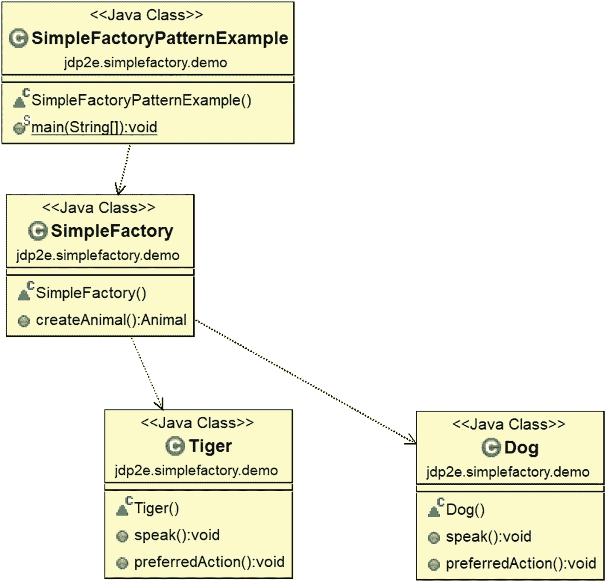
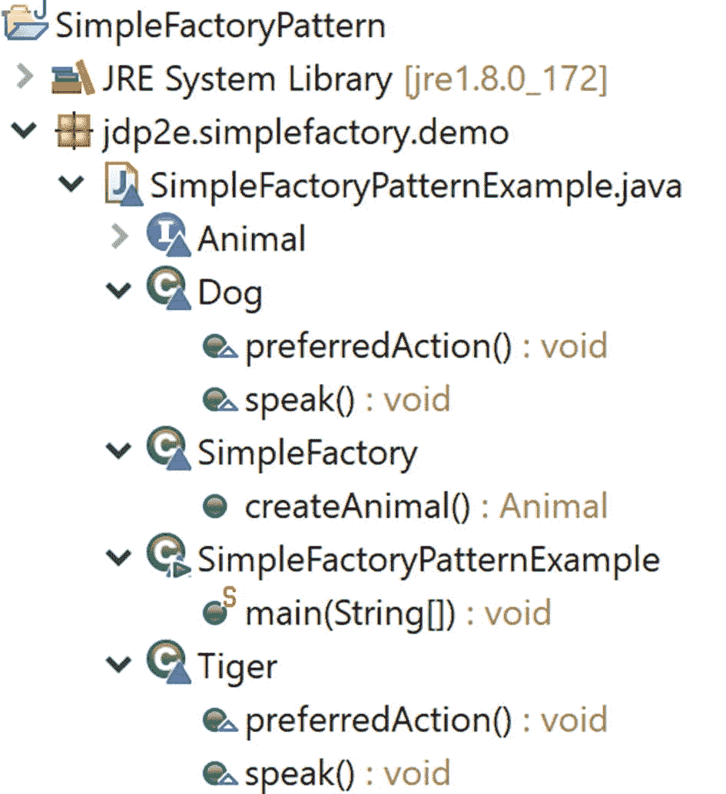

# 二十四、简单工厂模式

本章介绍简单工厂模式。

## 目的

在不向客户端公开实例化逻辑的情况下创建对象。

## 概念

在面向对象编程中，工厂是一种可以创建其他对象的特殊对象。可以通过多种方式调用工厂，但最常见的是，它使用一种可以返回具有不同原型的对象的方法。任何可以帮助创建这些新对象的子程序都被认为是一个工厂。使用工厂方法的最终目的是从应用程序的消费者那里抽象出对象创建机制(或过程)。

## 真实世界的例子

考虑一家制造不同型号汽车的汽车制造公司。他们必须有一个不同生产单位的工厂。其中一些单位可以生产所有型号通用的零件，而其他单位则专用于生产特定型号的零件。当他们制造最终产品时，他们将特定型号的零件与通用零件组装在一起。从客户的角度来看，汽车是由汽车厂制造的；客户不知道汽车是如何制造的。但是如果你进一步调查，你会发现基于汽车的模型，工厂的一个生产单元改变零件。例如，一个特定的汽车型号可以只支持手动变速箱，而另一个型号可以同时支持自动和手动变速箱。因此，基于汽车的模型，汽车工厂为汽车制造特殊的变速箱。

考虑一个更简单的例子。当孩子向他/她的父母要玩具时，孩子不知道父母将如何满足他/她的需求。在这种情况下，父母被认为是他们小孩的工厂。现在站在家长的角度思考。父母可以自己制作玩具或从商店购买玩具来逗孩子开心。

## 计算机世界的例子

简单工厂模式在软件应用程序中非常常见，但是在我们进一步讨论之前，您必须记住以下几点。

*   在 GoF 的著名著作中，简单工厂并不被视为标准设计模式，但是这种方法对于您编写的任何应用程序来说都是常见的，您需要将变化很大的代码与没有变化的代码部分分开。假设您在编写的任何应用程序中都尝试遵循这种方法。

*   简单工厂被认为是工厂方法模式(或抽象工厂模式)的最简单形式。因此，您可以假设任何遵循工厂方法模式或抽象工厂模式的应用程序也支持简单工厂模式的设计目标的概念。

### 注意

java.text.NumberFormat 类的静态 getInstance()方法就是这种类型的一个例子。

让我们按照我在一个常见用例中讨论的这个模式的实现来看。

## 说明

以下是以下实现的重要特征。

*   在这个例子中，有两种动物:狗和老虎。对象创建过程取决于用户的输入。

*   我假设他们每个人都会说话，他们更喜欢做一些动作。

*   SimpleFactory 是工厂类，simpleFactory(注意“s”不是大写的)是该类的对象。在客户端代码(SimpleFactoryPatternExample 类)中，您会看到下面一行。

```java
preferredType = simpleFactory.createAnimal();

```

这意味着要获得 preferredType 对象，需要调用 simpleFactory 对象的`createAnimal()`方法。因此，使用这种方法，您不需要在客户端代码中直接使用“new”操作符来获取对象。

*   我将变化的代码与最不可能变化的代码分开。这种方法有助于消除系统中的紧密耦合。(如何？遵循“问答环节”部分。)

### 注意

在某些应用程序中，您可能会注意到，在建议使用参数化构造函数的地方，这种模式有一点变化。因此，在那些应用程序中，要获得 preferredType 对象，您可能需要使用类似于这行的代码:preferred type = simple factory . create animal(" Tiger ")。

### 类图

图 24-1 显示了简单工厂模式的类图。



图 24-1

类图

### 包资源管理器视图

图 24-2 显示了程序的高层结构。



图 24-2

包资源管理器视图

### 履行

下面是实现。

```java
package jdp2e.simplefactory.demo;
import java.util.Scanner;//Available Java5 onwards

interface Animal
{
    void speak();
    void preferredAction();
}
class Dog implements Animal
{
    public void speak()
    {
        System.out.println("Dog says: Bow-Wow.");
    }
    public void preferredAction()
    {
        System.out.println ("Dogs prefer barking...");
    }
}
class Tiger implements Animal
{
    public void speak()

    {
        System.out.println("Tiger says: Halum.");
    }
    public void preferredAction()
    {
        System.out.println("Tigers prefer hunting...");
    }
}
class SimpleFactory
{
    public Animal createAnimal()
    {
        Animal intendedAnimal=null;
        System.out.println("Enter your choice( 0 for Dog, 1 for Tiger)");
        /* To suppress the warning message:Resource leak:'input' is never closed. So,the following line is optional in this case*/
        @SuppressWarnings("resource")
        Scanner input=new Scanner(System.in);
        int choice=Integer.parseInt(input.nextLine());
        System.out.println("You have entered :"+ choice);
        switch (choice)
        {
        case 0:
            intendedAnimal = new Dog();
            break;
        case 1:
            intendedAnimal = new Tiger();
            break;
        default:
            System.out.println("You must enter either 0 or 1");
            //We'll throw a runtime exception for any other choices.
            throw new IllegalArgumentException(" Your choice tries to create an unknown Animal");
        }

        return intendedAnimal;
    }
}
//A client is interested to get an animal who can speak and perform an

//action.
class SimpleFactoryPatternExample
{
    public static void main(String[] args)     {
        System.out.println("*** Simple Factory Pattern Demo***\n");
        Animal preferredType=null;
        SimpleFactory simpleFactory = new SimpleFactory();
        // The code that will vary based on users preference.
        preferredType = simpleFactory.createAnimal();
        //The codes that do not change frequently.
        //These animals can speak and prefer to do some specific actions.
        preferredType.speak();
        preferredType.preferredAction();

    }
}

```

### 输出

这是输出。

#### 案例 1。用户输入:0

```java
*** Simple Factory Pattern Demo***

Enter your choice( 0 for Dog, 1 for Tiger)
0
You have entered :0
Dog says: Bow-Wow.
Dogs prefer barking...

```

#### 案例 2。用户输入:1

```java
*** Simple Factory Pattern Demo***

Enter your choice( 0 for Dog, 1 for Tiger) 

1
You have entered :1
Tiger says: Halum.
Tigers prefer hunting...

```

#### 案例 3。不需要的用户输入:2

```java
*** Simple Factory Pattern Demo***

Enter your choice( 0 for Dog, 1 for Tiger)
2
You have entered :2
You must enter either 0 or 1Exception in thread "main"
java.lang.IllegalArgumentException:  Your choice tries to create an unknown Animal
    at jdp2e.simplefactory.demo.SimpleFactory.createAnimal(SimpleFactoryPatternExample.java:54)
    at jdp2e.simplefactory.demo.SimpleFactoryPatternExample.main(SimpleFactoryPatternExample.java:68)

```

## 问答环节

1.  在这个例子中，客户通过简单工厂委托对象的创建。但是相反，他们可以用“new”操作符直接创建对象。这是正确的吗？

    No. These are the key reasons behind the preceding design.
    *   一个重要的面向对象设计原则是将代码中最有可能发生变化的部分与其余部分分开。

    *   在这种情况下，只有“对象创建部分”不同。我假设这些动物必须说话和执行动作，并且我不需要改变客户端内部的那部分代码。因此，在将来，如果您需要修改创建过程，您只需要更改 SimpleFactory 类的`createAnimal()`方法。这些修改不会影响客户端代码。

    *   “你是如何创造物体的？”隐藏在客户端代码中。这种抽象提高了安全性。

    *   这种方法可以帮助您避免在客户端代码中使用大量的`if/else`块(或 switch 语句),因为它们会让您的代码看起来很笨拙。

2.  与此模式相关的挑战是什么？
    *   随着时间的推移，决定实例化哪个对象变得复杂。在这些情况下，您应该更喜欢工厂方法模式。

    *   如果你想添加一个新的动物或者删除一个已有的动物，你需要修改工厂类的`createAnimal()`方法。这种方法显然违反了坚实原则的开闭原则(基本上是说你的代码应该对扩展开放，但对修改关闭)。

### 注意

罗伯特·c·马丁提倡坚实的原则。你可以在 [`https://en.wikipedia.org/wiki/SOLID`](https://en.wikipedia.org/wiki/SOLID) 了解他们。

1.  **I learned that programming with an abstract class or interface is always a better practice. So, to make a better implementation, you could write something like this:**

    ```java
    abstract class ISimpleFactory
    {
        public abstract IAnimal createAnimal() throws IOException;
    }
    class SimpleFactory extends ISimpleFactory
    {

    ```

    ```java
        //rest of the code
    }

    ```

    这是正确的吗？

    是的。用抽象类或接口编程总是更好的做法。这种方法可以防止您将来进行更改，因为任何新添加的类都可以简单地实现接口，并通过多态在体系结构中安顿下来。但是如果你仅仅依赖于具体的类，当你想在架构中集成一个新的类时，你需要改变你的代码，在这种情况下，*你违反了规则，即你的代码应该被关闭以进行修改*。

    所以，你的理解是正确的。您可以使用这样的结构使它成为一个更好的程序。但最终，你会学到工厂方法模式(见第四章第四章)，在这里你需要将实例化过程推迟到子类。因此，在这种情况下，建议你用抽象类或接口来编写程序。

2.  能否让工厂类(SimpleFactory)成为静态的？

    不可以。在 Java 中，不允许用顶级类来标记单词 *static* 。换句话说，按照设计，编译器总是抱怨 Java 中的顶级静态类。