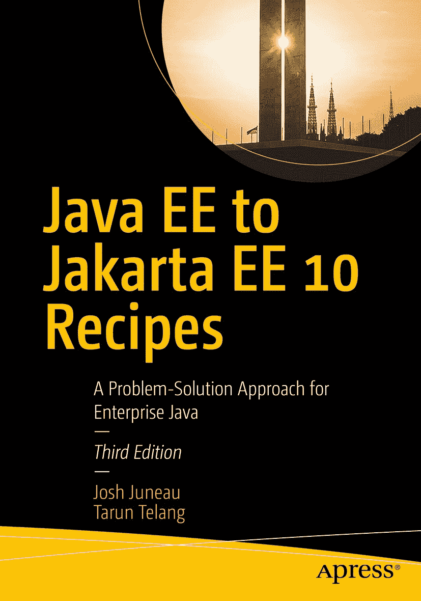

**J**ava EE 到 Jakarta EE 10 实战

问题解决方案指南

面向企业级 Java

第三版

Josh Juneau

Tarun Telang

***Java EE 到 Jakarta EE 10 实战：面向企业级 Java 的问题解决方案指南***

Josh Juneau

Tarun Telang

美国伊利诺伊州欣克利

印度特伦甘纳邦海得拉巴

平装书 ISBN-13：978-1-4842-8078-2

电子书 ISBN-13：978-1-4842-8079-9

[`doi.org/10.1007/978-1-4842-8079-9`](https://doi.org/10.1007/978-1-4842-8079-9)

版权所有 © 2022 Josh Juneau 与 Tarun Telang

本作品受版权保护。出版商保留所有权利，无论是全部还是部分材料，特别是翻译、重印、重用插图、朗诵、广播、微缩胶片复制或任何其他物理方式，以及信息存储与检索、电子改编、计算机软件，或现在已知或以后开发的类似或不同方法的权利。

本书中可能出现商标名称、标识和图像。我们不会在每次出现商标名称、标识或图像时都使用商标符号，而是仅以编辑方式使用这些名称、标识和图像，以维护商标所有者的利益，且无意侵犯商标权。

本出版物中使用的商品名称、商标、服务标记及类似术语，即使未被标识为如此，也不应被视为对其是否受专有权利保护的看法表达。

尽管本书中的建议和信息在出版时被认为是真实准确的，但作者、编辑和出版商均不对可能出现的任何错误或遗漏承担法律责任。出版商对本书所含内容不作任何明示或暗示的保证。

Apress Media 有限责任公司董事总经理：Welmoed Spahr

收购编辑：Steve Anglin

开发编辑：Laura Berendson

协调编辑：Mark Powers

封面设计：eStudioCalamar

封面图片：Said Alamri 提供于 Unspl[ash (www.unsplash.com](https://www.unsplash.com)) 全球图书贸易由 Apress Media, LLC 发行，地址：1 New York Plaza, New York, NY 10004, U.S.A. 电话：1-800-SPRINGER，传真：(201) 348-4505，电子邮件：[orders-ny@springer-sbm.com](https://orders-ny@springer-sbm.com)，或访[问 www.](https://www.springeronline.com) [springeronline.com. A](https://www.springeronline.com)press Media, LLC 是一家加利福尼亚有限责任公司，其唯一成员（所有者）是 Springer Science + Business Media Finance Inc (SSBM Finance Inc)。SSBM Finance Inc 是一家特拉华州公司。

如需翻译信息，请发送电子邮件至 [booktranslations@springernature.com](https://booktranslations@springernature.com)；如需重印、平装本或音频版权，请发送电子邮件至 [bookpermissions@springernature.com。](https://bookpermissions@springernature.com)

Apress 图书可批量购买用于学术、企业或促销用途。大多数图书也提供电子书版本和许可证。更多信息，请参考我们的印刷版和电子版批量销售网页：[`www.apress.com/bulk-sales。`](http://www.apress.com/bulk-sales)

作者在本书中引用的任何源代码或其他补充材料均可供读者在 GitHub 上获取 ([`github.com/Apress)。`](https://github.com/Apress) 更多详细信息，请访问 [`www.`](http://www.apress.com/source-code) [apress.com/source- code。](http://www.apress.com/source-code)

采用无酸纸印刷

*谨以此书献给我的妻子 Angela 和我的五个孩子：Kaitlyn、Jacob、Matthew、* *Zachary 和 Lucas。你们是我的快乐和灵感源泉。同时也献给全世界的众多*

*Java 开发者。我希望这些实战方案能引导你们开发出*

*未来复杂的解决方案。*

*—Josh Juneau*

*谨以此书献给我的祖父母、父母、妻子 Nikita 和儿子 Vihan。*

*他们一直是我灵感和鼓励的源泉。也献给所有* *努力让我们的星球变得更美好的软件和技术创造者。*

*—Tarun Telang*

**目录**

关于作者 ����������������������������������������������������������������������������������������������xxxvii 关于技术审校 ������������������������������������������������������������������������������������xxxix 致谢 �������������������������������������������������������������������������������������������������� xli 引言 ���������������������������������������������������������������������������������������������������������� xliii

■[第 1 章：Jakarta Servlets ����������������������������������������������������������������������������������� 1](https://doi.org/10.1007/978-1-4842-8079-9_1)

[1-1. 设置 Jakarta EE 应用服务器 .............................................................. 2](https://doi.org/10.1007/978-1-4842-8079-9_1#Sec1)

[问题 .................................................................................................................................................. 2](https://doi.org/10.1007/978-1-4842-8079-9_1#Sec2)

[解决方案................................................................................................................................................... 2](https://doi.org/10.1007/978-1-4842-8079-9_1#Sec500)

[工作原理 ........................................................................................................................................... 3](https://doi.org/10.1007/978-1-4842-8079-9_1#Sec3)

[1-2. 开发一个 Servlet ................................................................................................. 4](https://doi.org/10.1007/978-1-4842-8079-9_1#Sec4)

[问题 .................................................................................................................................................. 4](https://doi.org/10.1007/978-1-4842-8079-9_1#Sec5)

[解决方案................................................................................................................................................... 4](https://doi.org/10.1007/978-1-4842-8079-9_1#Sec6)

[工作原理 ........................................................................................................................................... 7](https://doi.org/10.1007/978-1-4842-8079-9_1#Sec7)

[1-3. 打包、编译和部署一个 Servlet ........................................................ 8](https://doi.org/10.1007/978-1-4842-8079-9_1#Sec8)

[问题 .................................................................................................................................................. 8](https://doi.org/10.1007/978-1-4842-8079-9_1#Sec9)

[解决方案................................................................................................................................................... 8](https://doi.org/10.1007/978-1-4842-8079-9_1#Sec10)

[工作原理 ........................................................................................................................................... 9](https://doi.org/10.1007/978-1-4842-8079-9_1#Sec12)

[1-4. 无需 web.xml 注册 Servlet ................................................................... 11](https://doi.org/10.1007/978-1-4842-8079-9_1#Sec13)

[问题 ................................................................................................................................................ 11](https://doi.org/10.1007/978-1-4842-8079-9_1#Sec14)

[解决方案................................................................................................................................................. 11](https://doi.org/10.1007/978-1-4842-8079-9_1#Sec15)


[工作原理 ......................................................................................................................................... 12](https://doi.org/10.1007/978-1-4842-8079-9_1#Sec16)

v

■ 目录

[1-5. 使用 Servlet 显示动态内容 ............................................................................................ 13](https://doi.org/10.1007/978-1-4842-8079-9_1#Sec17)

[问题 ................................................................................................................................................ 13](https://doi.org/10.1007/978-1-4842-8079-9_1#Sec18)

[解决方案................................................................................................................................................. 13](https://doi.org/10.1007/978-1-4842-8079-9_1#Sec19)

[工作原理 ......................................................................................................................................... 15](https://doi.org/10.1007/978-1-4842-8079-9_1#Sec20)

[1-6. 处理请求与响应 ......................................................................................................... 15](https://doi.org/10.1007/978-1-4842-8079-9_1#Sec21)

[问题 ................................................................................................................................................ 15](https://doi.org/10.1007/978-1-4842-8079-9_1#Sec22)

[解决方案................................................................................................................................................. 15](https://doi.org/10.1007/978-1-4842-8079-9_1#Sec23)

[工作原理 ......................................................................................................................................... 17](https://doi.org/10.1007/978-1-4842-8079-9_1#Sec24)

[1-7. 监听 Servlet 容器事件 ................................................................................................ 18](https://doi.org/10.1007/978-1-4842-8079-9_1#Sec25)

[问题 ................................................................................................................................................ 18](https://doi.org/10.1007/978-1-4842-8079-9_1#Sec26)

[解决方案................................................................................................................................................. 18](https://doi.org/10.1007/978-1-4842-8079-9_1#Sec27)

[工作原理 ......................................................................................................................................... 21](https://doi.org/10.1007/978-1-4842-8079-9_1#Sec28)

[1-8. 设置初始化参数 ......................................................................................................... 22](https://doi.org/10.1007/978-1-4842-8079-9_1#Sec29)

[问题 ................................................................................................................................................ 22](https://doi.org/10.1007/978-1-4842-8079-9_1#Sec30)

[解决方案 #1............................................................................................................................................ 22](https://doi.org/10.1007/978-1-4842-8079-9_1#Sec31)

[解决方案 #2............................................................................................................................................ 23](https://doi.org/10.1007/978-1-4842-8079-9_1#Sec32)

[工作原理 ......................................................................................................................................... 23](https://doi.org/10.1007/978-1-4842-8079-9_1#Sec33)

[1-9. 过滤 Web 请求 ........................................................................................................... 24](https://doi.org/10.1007/978-1-4842-8079-9_1#Sec34)

[问题 ................................................................................................................................................ 24](https://doi.org/10.1007/978-1-4842-8079-9_1#Sec35)


[解决方案................................................................................................................................................. 24](https://doi.org/10.1007/978-1-4842-8079-9_1#Sec36)

[工作原理................................................................................................................................................. 25](https://doi.org/10.1007/978-1-4842-8079-9_1#Sec37)

[1-10. 监听属性变化........................................................................................................ 26](https://doi.org/10.1007/978-1-4842-8079-9_1#Sec38)

[问题....................................................................................................................................................... 26](https://doi.org/10.1007/978-1-4842-8079-9_1#Sec39)

[解决方案................................................................................................................................................. 26](https://doi.org/10.1007/978-1-4842-8079-9_1#Sec40)

[工作原理................................................................................................................................................. 27](https://doi.org/10.1007/978-1-4842-8079-9_1#Sec41)

[1-11. 为会话应用监听器................................................................................................ 28](https://doi.org/10.1007/978-1-4842-8079-9_1#Sec42)

[问题....................................................................................................................................................... 28](https://doi.org/10.1007/978-1-4842-8079-9_1#Sec43)

[解决方案................................................................................................................................................. 28](https://doi.org/10.1007/978-1-4842-8079-9_1#Sec44)

[工作原理................................................................................................................................................. 30](https://doi.org/10.1007/978-1-4842-8079-9_1#Sec45)

vi

■ 目录

[1-12. 管理会话属性........................................................................................................ 30](https://doi.org/10.1007/978-1-4842-8079-9_1#Sec46)

[问题....................................................................................................................................................... 30](https://doi.org/10.1007/978-1-4842-8079-9_1#Sec47)

[解决方案................................................................................................................................................. 31](https://doi.org/10.1007/978-1-4842-8079-9_1#Sec48)

[工作原理................................................................................................................................................. 32](https://doi.org/10.1007/978-1-4842-8079-9_1#Sec49)

[1-13. 下载文件............................................................................................................... 33](https://doi.org/10.1007/978-1-4842-8079-9_1#Sec50)

[问题....................................................................................................................................................... 33](https://doi.org/10.1007/978-1-4842-8079-9_1#Sec51)

[解决方案................................................................................................................................................. 33](https://doi.org/10.1007/978-1-4842-8079-9_1#Sec52)

[工作原理................................................................................................................................................. 35](https://doi.org/10.1007/978-1-4842-8079-9_1#Sec53)

[1-14. 分发请求............................................................................................................... 36](https://doi.org/10.1007/978-1-4842-8079-9_1#Sec54)

[问题....................................................................................................................................................... 36](https://doi.org/10.1007/978-1-4842-8079-9_1#Sec55)


[解决方案................................................................................................................................................. 36](https://doi.org/10.1007/978-1-4842-8079-9_1#Sec56)

[工作原理................................................................................................................................................. 40](https://doi.org/10.1007/978-1-4842-8079-9_1#Sec57)

[1-15. 重定向到不同站点...................................................................................................... 41](https://doi.org/10.1007/978-1-4842-8079-9_1#Sec58)

[问题....................................................................................................................................................... 41](https://doi.org/10.1007/978-1-4842-8079-9_1#Sec59)

[解决方案................................................................................................................................................. 41](https://doi.org/10.1007/978-1-4842-8079-9_1#Sec60)

[工作原理................................................................................................................................................. 42](https://doi.org/10.1007/978-1-4842-8079-9_1#Sec61)

[1-16. 在浏览器中安全维护状态........................................................................................... 42](https://doi.org/10.1007/978-1-4842-8079-9_1#Sec62)

[问题....................................................................................................................................................... 42](https://doi.org/10.1007/978-1-4842-8079-9_1#Sec63)

[解决方案................................................................................................................................................. 42](https://doi.org/10.1007/978-1-4842-8079-9_1#Sec64)

[工作原理................................................................................................................................................. 44](https://doi.org/10.1007/978-1-4842-8079-9_1#Sec65)

[1-17. 完成 Servlet 任务..................................................................................................... 46](https://doi.org/10.1007/978-1-4842-8079-9_1#Sec66)

[问题....................................................................................................................................................... 46](https://doi.org/10.1007/978-1-4842-8079-9_1#Sec67)

[解决方案................................................................................................................................................. 46](https://doi.org/10.1007/978-1-4842-8079-9_1#Sec68)

[工作原理................................................................................................................................................. 47](https://doi.org/10.1007/978-1-4842-8079-9_1#Sec69)

[1-18. 使用非阻塞 I/O 进行读写........................................................................................ 47](https://doi.org/10.1007/978-1-4842-8079-9_1#Sec70)

[问题....................................................................................................................................................... 47](https://doi.org/10.1007/978-1-4842-8079-9_1#Sec71)

[解决方案................................................................................................................................................. 47](https://doi.org/10.1007/978-1-4842-8079-9_1#Sec72)

[工作原理................................................................................................................................................. 51](https://doi.org/10.1007/978-1-4842-8079-9_1#Sec73)

vii

■ 目录

[1-19. 将资源从服务器推送到客户端................................................................................... 53](https://doi.org/10.1007/978-1-4842-8079-9_1#Sec74)

[问题....................................................................................................................................................... 53](https://doi.org/10.1007/978-1-4842-8079-9_1#Sec75)

[解决方案................................................................................................................................................. 53](https://doi.org/10.1007/978-1-4842-8079-9_1#Sec76)

[工作原理................................................................................................................................................. 54](https://doi.org/10.1007/978-1-4842-8079-9_1#Sec77)

■[第 2 章：Jakarta 服务器页面 ������������������������������������������������������������������������� 55](https://doi.org/10.1007/978-1-4842-8079-9_2)

[2-1. 创建一个简单的 Jakarta 服务器页面.......................................................................... 55](https://doi.org/10.1007/978-1-4842-8079-9_2#Sec1)

[问题....................................................................................................................................................... 55](https://doi.org/10.1007/978-1-4842-8079-9_2#Sec2)

[解决方案................................................................................................................................................. 56](https://doi.org/10.1007/978-1-4842-8079-9_2#Sec3)

[工作原理................................................................................................................................................. 57](https://doi.org/10.1007/978-1-4842-8079-9_2#Sec4)

[2-2. 将 Java 嵌入 Jakarta 服务器页面............................................................................. 59](https://doi.org/10.1007/978-1-4842-8079-9_2#Sec5)

[问题....................................................................................................................................................... 59](https://doi.org/10.1007/978-1-4842-8079-9_2#Sec6)

[解决方案................................................................................................................................................. 59](https://doi.org/10.1007/978-1-4842-8079-9_2#Sec7)

[工作原理................................................................................................................................................. 59](https://doi.org/10.1007/978-1-4842-8079-9_2#Sec8)

[2-3. 将业务逻辑与视图代码分离........................................................................................ 61](https://doi.org/10.1007/978-1-4842-8079-9_2#Sec9)

[问题....................................................................................................................................................... 61](https://doi.org/10.1007/978-1-4842-8079-9_2#Sec10)

[解决方案................................................................................................................................................. 61](https://doi.org/10.1007/978-1-4842-8079-9_2#Sec11)

[工作原理................................................................................................................................................. 62](https://doi.org/10.1007/978-1-4842-8079-9_2#Sec12)

[2-4. 生成或设置值............................................................................................................... 63](https://doi.org/10.1007/978-1-4842-8079-9_2#Sec13)

[问题....................................................................................................................................................... 63](https://doi.org/10.1007/978-1-4842-8079-9_2#Sec14)

[解决方案................................................................................................................................................. 63](https://doi.org/10.1007/978-1-4842-8079-9_2#Sec15)

[工作原理................................................................................................................................................. 65](https://doi.org/10.1007/978-1-4842-8079-9_2#Sec16)

[2-5. 在条件表达式中调用函数............................................................................................ 66](https://doi.org/10.1007/978-1-4842-8079-9_2#Sec17)


[问题 ................................................................................................................................................ 66](https://doi.org/10.1007/978-1-4842-8079-9_2#Sec18)

[解决方案................................................................................................................................................. 66](https://doi.org/10.1007/978-1-4842-8079-9_2#Sec19)

[工作原理 ......................................................................................................................................... 69](https://doi.org/10.1007/978-1-4842-8079-9_2#Sec20)

[2-6. 创建 Jakarta 服务器页面文档 ............................................................. 71](https://doi.org/10.1007/978-1-4842-8079-9_2#Sec21)

[问题 ................................................................................................................................................ 71](https://doi.org/10.1007/978-1-4842-8079-9_2#Sec22)

[解决方案................................................................................................................................................. 71](https://doi.org/10.1007/978-1-4842-8079-9_2#Sec23)

[工作原理 ......................................................................................................................................... 72](https://doi.org/10.1007/978-1-4842-8079-9_2#Sec24)

viii

■ 目录

[2-7. 在 Jakarta 表达式语言中嵌入表达式 ...................................... 73](https://doi.org/10.1007/978-1-4842-8079-9_2#Sec25)

[问题 ................................................................................................................................................ 73](https://doi.org/10.1007/978-1-4842-8079-9_2#Sec26)

[解决方案................................................................................................................................................. 73](https://doi.org/10.1007/978-1-4842-8079-9_2#Sec27)

[工作原理 ......................................................................................................................................... 75](https://doi.org/10.1007/978-1-4842-8079-9_2#Sec28)

[2-8. 在多个页面中访问参数 ................................................................ 78](https://doi.org/10.1007/978-1-4842-8079-9_2#Sec29)

[问题 ................................................................................................................................................ 78](https://doi.org/10.1007/978-1-4842-8079-9_2#Sec30)

[解决方案................................................................................................................................................. 78](https://doi.org/10.1007/978-1-4842-8079-9_2#Sec31)

[工作原理 ......................................................................................................................................... 80](https://doi.org/10.1007/978-1-4842-8079-9_2#Sec32)

[2-9. 创建自定义 Jakarta 服务器标签 ................................................................... 81](https://doi.org/10.1007/978-1-4842-8079-9_2#Sec33)

[问题 ................................................................................................................................................ 81](https://doi.org/10.1007/978-1-4842-8079-9_2#Sec34)

[解决方案................................................................................................................................................. 81](https://doi.org/10.1007/978-1-4842-8079-9_2#Sec35)

[工作原理 ......................................................................................................................................... 84](https://doi.org/10.1007/978-1-4842-8079-9_2#Sec36)

[2-10. 将其他 Jakarta 服务器页面包含到页面中 ............................................... 85](https://doi.org/10.1007/978-1-4842-8079-9_2#Sec37)

[问题 ................................................................................................................................................ 85](https://doi.org/10.1007/978-1-4842-8079-9_2#Sec38)

[解决方案................................................................................................................................................. 85](https://doi.org/10.1007/978-1-4842-8079-9_2#Sec39)

[工作原理 ......................................................................................................................................... 86](https://doi.org/10.1007/978-1-4842-8079-9_2#Sec40)

[2-11. 为数据库记录创建输入表单..................................................... 87](https://doi.org/10.1007/978-1-4842-8079-9_2#Sec41)

[问题 ................................................................................................................................................ 87](https://doi.org/10.1007/978-1-4842-8079-9_2#Sec42)

[解决方案................................................................................................................................................. 87](https://doi.org/10.1007/978-1-4842-8079-9_2#Sec43)

[工作原理 ......................................................................................................................................... 91](https://doi.org/10.1007/978-1-4842-8079-9_2#Sec44)

[2-12. 在页面内循环遍历数据库记录 .............................................. 93](https://doi.org/10.1007/978-1-4842-8079-9_2#Sec45)

[问题 ................................................................................................................................................ 93](https://doi.org/10.1007/978-1-4842-8079-9_2#Sec46)

[解决方案................................................................................................................................................. 94](https://doi.org/10.1007/978-1-4842-8079-9_2#Sec47)

[工作原理 ......................................................................................................................................... 98](https://doi.org/10.1007/978-1-4842-8079-9_2#Sec48)

[2-13. 处理 Jakarta 服务器页面中的错误 .............................................................. 99](https://doi.org/10.1007/978-1-4842-8079-9_2#Sec49)

[问题 ................................................................................................................................................ 99](https://doi.org/10.1007/978-1-4842-8079-9_2#Sec50)

[解决方案................................................................................................................................................. 99](https://doi.org/10.1007/978-1-4842-8079-9_2#Sec51)

[工作原理 ....................................................................................................................................... 100](https://doi.org/10.1007/978-1-4842-8079-9_2#Sec52)

ix

■ 目录

[2-14. 在页面中禁用脚本片段 .............................................................................. 101](https://doi.org/10.1007/978-1-4842-8079-9_2#Sec53)

[问题 .............................................................................................................................................. 101](https://doi.org/10.1007/978-1-4842-8079-9_2#Sec54)

[解决方案............................................................................................................................................... 102](https://doi.org/10.1007/978-1-4842-8079-9_2#Sec55)

[工作原理 ....................................................................................................................................... 102](https://doi.org/10.1007/978-1-4842-8079-9_2#Sec56)

[2-15. 在页面中忽略 Jakarta 表达式语言 ................................................ 102](https://doi.org/10.1007/978-1-4842-8079-9_2#Sec57)


[问题 .............................................................................................................................................. 102](https://doi.org/10.1007/978-1-4842-8079-9_2#Sec58)

[解决方案 #1.......................................................................................................................................... 102](https://doi.org/10.1007/978-1-4842-8079-9_2#Sec59)

[解决方案 #2.......................................................................................................................................... 102](https://doi.org/10.1007/978-1-4842-8079-9_2#Sec60)

[解决方案 #3.......................................................................................................................................... 103](https://doi.org/10.1007/978-1-4842-8079-9_2#Sec61)

[工作原理 ....................................................................................................................................... 103](https://doi.org/10.1007/978-1-4842-8079-9_2#Sec62)

■[第 3 章：Jakarta Server Faces ����������������������������������������������������������������������� 105](https://doi.org/10.1007/978-1-4842-8079-9_3)

[3-1. 编写一个简单的 Jakarta Server Faces 应用程序 .............................................. 106](https://doi.org/10.1007/978-1-4842-8079-9_3#Sec1)

[问题 .............................................................................................................................................. 106](https://doi.org/10.1007/978-1-4842-8079-9_3#Sec2)

[解决方案 #1.......................................................................................................................................... 106](https://doi.org/10.1007/978-1-4842-8079-9_3#Sec3)

[项目依赖 ......................................................................................................................... 107](https://doi.org/10.1007/978-1-4842-8079-9_3#Sec4)

[显示 Jakarta Server Faces 控制器字段值 .................................................................. 107](https://doi.org/10.1007/978-1-4842-8079-9_3#Sec5)

[检查 Jakarta Server Faces 控制器 ................................................................................. 108](https://doi.org/10.1007/978-1-4842-8079-9_3#Sec6)

[分解 Jakarta Server Faces 应用程序 ........................................................................... 109](https://doi.org/10.1007/978-1-4842-8079-9_3#Sec7)

[3-2. 编写控制器类 ..................................................................................... 111](https://doi.org/10.1007/978-1-4842-8079-9_3#Sec8)

[问题 .............................................................................................................................................. 111](https://doi.org/10.1007/978-1-4842-8079-9_3#Sec9)

[解决方案............................................................................................................................................... 111](https://doi.org/10.1007/978-1-4842-8079-9_3#Sec10)

[控制器类 .................................................................................................................................. 111](https://doi.org/10.1007/978-1-4842-8079-9_3#Sec11)

[Jakarta Server Faces 视图 ................................................................................................................. 113](https://doi.org/10.1007/978-1-4842-8079-9_3#Sec12)

[工作原理 ....................................................................................................................................... 114](https://doi.org/10.1007/978-1-4842-8079-9_3#Sec13)

[作用域 ................................................................................................................................................ 115](https://doi.org/10.1007/978-1-4842-8079-9_3#Sec14)

[3-3. 使用组件构建复杂的 Jakarta Server Faces 视图 ................ 117](https://doi.org/10.1007/978-1-4842-8079-9_3#Sec15)

[问题 .............................................................................................................................................. 117](https://doi.org/10.1007/978-1-4842-8079-9_3#Sec16)

[解决方案............................................................................................................................................... 117](https://doi.org/10.1007/978-1-4842-8079-9_3#Sec17)

[工作原理 ....................................................................................................................................... 121](https://doi.org/10.1007/978-1-4842-8079-9_3#Sec18)

x

■ 目录

[3-4. 在 Jakarta Server Faces 页面中显示消息 .......................................... 123](https://doi.org/10.1007/978-1-4842-8079-9_3#Sec19)

[问题 .............................................................................................................................................. 123](https://doi.org/10.1007/978-1-4842-8079-9_3#Sec20)

[解决方案............................................................................................................................................... 123](https://doi.org/10.1007/978-1-4842-8079-9_3#Sec21)

[工作原理 ....................................................................................................................................... 126](https://doi.org/10.1007/978-1-4842-8079-9_3#Sec22)

[3-5. 无需重新编译即可更新消息 ............................................................ 127](https://doi.org/10.1007/978-1-4842-8079-9_3#Sec23)

[问题 .............................................................................................................................................. 127](https://doi.org/10.1007/978-1-4842-8079-9_3#Sec24)

[解决方案............................................................................................................................................... 127](https://doi.org/10.1007/978-1-4842-8079-9_3#Sec25)

[工作原理 ....................................................................................................................................... 130](https://doi.org/10.1007/978-1-4842-8079-9_3#Sec26)

[3-6. 基于条件进行导航 ....................................................................... 130](https://doi.org/10.1007/978-1-4842-8079-9_3#Sec27)

[问题 .............................................................................................................................................. 130](https://doi.org/10.1007/978-1-4842-8079-9_3#Sec28)

[解决方案............................................................................................................................................... 131](https://doi.org/10.1007/978-1-4842-8079-9_3#Sec29)

[工作原理 ....................................................................................................................................... 136](https://doi.org/10.1007/978-1-4842-8079-9_3#Sec30)

[3-7. 验证用户输入 ............................................................................................. 138](https://doi.org/10.1007/978-1-4842-8079-9_3#Sec31)

[问题 .............................................................................................................................................. 138](https://doi.org/10.1007/978-1-4842-8079-9_3#Sec32)

[解决方案............................................................................................................................................... 138](https://doi.org/10.1007/978-1-4842-8079-9_3#Sec33)

[工作原理 ....................................................................................................................................... 141](https://doi.org/10.1007/978-1-4842-8079-9_3#Sec34)


[3-8. 立即计算页面表达式 ........................................................................................................................... 143](https://doi.org/10.1007/978-1-4842-8079-9_3#Sec35)

[问题 .......................................................................................................................................................... 143](https://doi.org/10.1007/978-1-4842-8079-9_3#Sec36)

[解决方案 ................................................................................................................................................... 143](https://doi.org/10.1007/978-1-4842-8079-9_3#Sec37)

[工作原理 ................................................................................................................................................... 145](https://doi.org/10.1007/978-1-4842-8079-9_3#Sec38)

[3-9. 向方法传递页面参数 ....................................................................................................................... 145](https://doi.org/10.1007/978-1-4842-8079-9_3#Sec39)

[问题 .......................................................................................................................................................... 145](https://doi.org/10.1007/978-1-4842-8079-9_3#Sec40)

[解决方案 ................................................................................................................................................... 145](https://doi.org/10.1007/978-1-4842-8079-9_3#Sec41)

[工作原理 ................................................................................................................................................... 149](https://doi.org/10.1007/978-1-4842-8079-9_3#Sec42)

[3-10. 在表达式中使用运算符和保留字 ................................................................................................... 150](https://doi.org/10.1007/978-1-4842-8079-9_3#Sec43)

[问题 .......................................................................................................................................................... 150](https://doi.org/10.1007/978-1-4842-8079-9_3#Sec44)

[解决方案 ................................................................................................................................................... 150](https://doi.org/10.1007/978-1-4842-8079-9_3#Sec45)

[工作原理 ................................................................................................................................................... 152](https://doi.org/10.1007/978-1-4842-8079-9_3#Sec46)

xi

■ 目录

[3-11. 创建可添加书签的 URL .................................................................................................................. 153](https://doi.org/10.1007/978-1-4842-8079-9_3#Sec47)

[问题 .......................................................................................................................................................... 153](https://doi.org/10.1007/978-1-4842-8079-9_3#Sec48)

[解决方案 ................................................................................................................................................... 153](https://doi.org/10.1007/978-1-4842-8079-9_3#Sec49)

[工作原理 ................................................................................................................................................... 155](https://doi.org/10.1007/978-1-4842-8079-9_3#Sec50)

[3-12. 显示对象列表 .................................................................................................................................. 156](https://doi.org/10.1007/978-1-4842-8079-9_3#Sec51)

[问题 .......................................................................................................................................................... 156](https://doi.org/10.1007/978-1-4842-8079-9_3#Sec52)

[解决方案 ................................................................................................................................................... 156](https://doi.org/10.1007/978-1-4842-8079-9_3#Sec53)

[工作原理 ................................................................................................................................................... 158](https://doi.org/10.1007/978-1-4842-8079-9_3#Sec54)

[3-13. 创建页面模板 .................................................................................................................................. 160](https://doi.org/10.1007/978-1-4842-8079-9_3#Sec55)

[问题 .......................................................................................................................................................... 160](https://doi.org/10.1007/978-1-4842-8079-9_3#Sec56)

[解决方案 ................................................................................................................................................... 160](https://doi.org/10.1007/978-1-4842-8079-9_3#Sec57)

[工作原理 ................................................................................................................................................... 161](https://doi.org/10.1007/978-1-4842-8079-9_3#Sec58)

[3-14. 应用模板 .......................................................................................................................................... 165](https://doi.org/10.1007/978-1-4842-8079-9_3#Sec59)

[问题 .......................................................................................................................................................... 165](https://doi.org/10.1007/978-1-4842-8079-9_3#Sec60)

[解决方案 ................................................................................................................................................... 165](https://doi.org/10.1007/978-1-4842-8079-9_3#Sec61)

[托管 Bean 控制器：AuthorController ........................................................................................................ 167](https://doi.org/10.1007/978-1-4842-8079-9_3#Sec65)

[工作原理 ................................................................................................................................................... 169](https://doi.org/10.1007/978-1-4842-8079-9_3#Sec66)

[应用模板 ................................................................................................................................................... 169](https://doi.org/10.1007/978-1-4842-8079-9_3#Sec67)

[3-15. 将资源整合进来 .............................................................................................................................. 171](https://doi.org/10.1007/978-1-4842-8079-9_3#Sec68)

[问题 .......................................................................................................................................................... 171](https://doi.org/10.1007/978-1-4842-8079-9_3#Sec69)

[解决方案 ................................................................................................................................................... 171](https://doi.org/10.1007/978-1-4842-8079-9_3#Sec70)

[工作原理 ................................................................................................................................................... 173](https://doi.org/10.1007/978-1-4842-8079-9_3#Sec71)

■[第 4 章：高级 Jakarta Server Faces 技术 ................................................................................................ 175](https://doi.org/10.1007/978-1-4842-8079-9_4)

[4-1. 组件与标签入门 ............................................................................................................................... 176](https://doi.org/10.1007/978-1-4842-8079-9_4#Sec1)

[通用组件标签属性 ................................................................................................................................... 178](https://doi.org/10.1007/978-1-4842-8079-9_4#Sec2)

[通用 JavaScript 组件标签 ........................................................................................................................ 178](https://doi.org/10.1007/978-1-4842-8079-9_4#Sec3)

[将组件绑定到属性 ................................................................................................................................... 179](https://doi.org/10.1007/978-1-4842-8079-9_4#Sec4)

[本章的项目文件夹结构 ........................................................................................................................... 180](https://doi.org/10.1007/978-1-4842-8079-9_4#Sec5)

xii

■ 目录


[4-2. 创建输入表单 ......................................................................................... 181](https://doi.org/10.1007/978-1-4842-8079-9_4#Sec6)

[问题 .............................................................................................................................................. 181](https://doi.org/10.1007/978-1-4842-8079-9_4#Sec7)

[解决方案............................................................................................................................................... 181](https://doi.org/10.1007/978-1-4842-8079-9_4#Sec8)

[托管 Bean：Contact.java .............................................................................................................. 182](https://doi.org/10.1007/978-1-4842-8079-9_4#Sec10)

[托管 Bean 控制器：ContactController.java .............................................................................. 183](https://doi.org/10.1007/978-1-4842-8079-9_4#Sec11)

[工作原理 ....................................................................................................................................... 185](https://doi.org/10.1007/978-1-4842-8079-9_4#Sec12)

[4-3. 从页面内调用操作 .................................................................... 187](https://doi.org/10.1007/978-1-4842-8079-9_4#Sec13)

[问题 .............................................................................................................................................. 187](https://doi.org/10.1007/978-1-4842-8079-9_4#Sec14)

[解决方案............................................................................................................................................... 187](https://doi.org/10.1007/978-1-4842-8079-9_4#Sec15)

[托管 Bean：Subscription.java ...................................................................................................... 188](https://doi.org/10.1007/978-1-4842-8079-9_4#Sec18)

[托管 Bean 控制器：ContactController.java .............................................................................. 189](https://doi.org/10.1007/978-1-4842-8079-9_4#Sec19)

[工作原理 ....................................................................................................................................... 190](https://doi.org/10.1007/978-1-4842-8079-9_4#Sec20)

[4-4. 显示输出 .................................................................................................. 192](https://doi.org/10.1007/978-1-4842-8079-9_4#Sec21)

[问题 .............................................................................................................................................. 192](https://doi.org/10.1007/978-1-4842-8079-9_4#Sec22)

[解决方案............................................................................................................................................... 193](https://doi.org/10.1007/978-1-4842-8079-9_4#Sec23)

[托管 Bean：ContactController.java ............................................................................................... 194](https://doi.org/10.1007/978-1-4842-8079-9_4#Sec25)

[工作原理 ....................................................................................................................................... 195](https://doi.org/10.1007/978-1-4842-8079-9_4#Sec26)

[4-5. 添加表单验证 ......................................................................................... 199](https://doi.org/10.1007/978-1-4842-8079-9_4#Sec28)

[问题 .............................................................................................................................................. 199](https://doi.org/10.1007/978-1-4842-8079-9_4#Sec29)

[解决方案 #1.......................................................................................................................................... 199](https://doi.org/10.1007/978-1-4842-8079-9_4#Sec30)

[解决方案 #2.......................................................................................................................................... 200](https://doi.org/10.1007/978-1-4842-8079-9_4#Sec31)

[解决方案 #3.......................................................................................................................................... 200](https://doi.org/10.1007/978-1-4842-8079-9_4#Sec32)

[工作原理 ....................................................................................................................................... 202](https://doi.org/10.1007/978-1-4842-8079-9_4#Sec33)

[4-6. 向页面添加选择列表 ................................................................................. 205](https://doi.org/10.1007/978-1-4842-8079-9_4#Sec34)

[问题 .............................................................................................................................................. 205](https://doi.org/10.1007/978-1-4842-8079-9_4#Sec35)

[解决方案............................................................................................................................................... 205](https://doi.org/10.1007/978-1-4842-8079-9_4#Sec36)

[托管 Bean 控制器：ContactController.java .............................................................................. 206](https://doi.org/10.1007/978-1-4842-8079-9_4#Sec38)

[工作原理 ....................................................................................................................................... 208](https://doi.org/10.1007/978-1-4842-8079-9_4#Sec39)

[填充选择列表 ................................................................................................................. 209](https://doi.org/10.1007/978-1-4842-8079-9_4#Sec40)

[关于每种组件类型 ....................................................................................................... 210](https://doi.org/10.1007/978-1-4842-8079-9_4#Sec41)

xiii

■ 目录

[4-7. 向页面添加图形 ............................................................................. 210](https://doi.org/10.1007/978-1-4842-8079-9_4#Sec42)

[问题 .............................................................................................................................................. 210](https://doi.org/10.1007/978-1-4842-8079-9_4#Sec43)

[解决方案............................................................................................................................................... 210](https://doi.org/10.1007/978-1-4842-8079-9_4#Sec44)

[工作原理 ....................................................................................................................................... 210](https://doi.org/10.1007/978-1-4842-8079-9_4#Sec45)

[托管 Bean：Book.java .................................................................................................................. 211](https://doi.org/10.1007/978-1-4842-8079-9_4#Sec46)

[4-8. 向视图添加复选框 .............................................................................. 212](https://doi.org/10.1007/978-1-4842-8079-9_4#Sec47)

[问题 .............................................................................................................................................. 212](https://doi.org/10.1007/978-1-4842-8079-9_4#Sec48)

[解决方案............................................................................................................................................... 212](https://doi.org/10.1007/978-1-4842-8079-9_4#Sec49)

[托管 Bean 控制器 ................................................................................................................. 212](https://doi.org/10.1007/978-1-4842-8079-9_4#Sec51)

[工作原理 ....................................................................................................................................... 215](https://doi.org/10.1007/978-1-4842-8079-9_4#Sec52)


[4-9. 向视图添加单选按钮 ................................................................................ 216](https://doi.org/10.1007/978-1-4842-8079-9_4#Sec53)

[问题 ...................................................................................................................................................... 216](https://doi.org/10.1007/978-1-4842-8079-9_4#Sec54)

[解决方案 ............................................................................................................................................... 216](https://doi.org/10.1007/978-1-4842-8079-9_4#Sec55)

[托管 Bean ............................................................................................................................................ 217](https://doi.org/10.1007/978-1-4842-8079-9_4#Sec57)

[工作原理 ............................................................................................................................................... 218](https://doi.org/10.1007/978-1-4842-8079-9_4#Sec58)

[4-10. 显示数据集合 ....................................................................................... 218](https://doi.org/10.1007/978-1-4842-8079-9_4#Sec59)

[问题 ...................................................................................................................................................... 218](https://doi.org/10.1007/978-1-4842-8079-9_4#Sec60)

[解决方案 ............................................................................................................................................... 219](https://doi.org/10.1007/978-1-4842-8079-9_4#Sec61)

[CSS ......................................................................................................................................................... 220](https://doi.org/10.1007/978-1-4842-8079-9_4#Sec63)

[托管 Bean ............................................................................................................................................ 221](https://doi.org/10.1007/978-1-4842-8079-9_4#Sec64)

[工作原理 ............................................................................................................................................... 222](https://doi.org/10.1007/978-1-4842-8079-9_4#Sec65)

[4-11. 实现文件上传 ....................................................................................... 225](https://doi.org/10.1007/978-1-4842-8079-9_4#Sec66)

[问题 ...................................................................................................................................................... 225](https://doi.org/10.1007/978-1-4842-8079-9_4#Sec67)

[解决方案 ............................................................................................................................................... 225](https://doi.org/10.1007/978-1-4842-8079-9_4#Sec68)

[工作原理 ............................................................................................................................................... 227](https://doi.org/10.1007/978-1-4842-8079-9_4#Sec69)

[4-12. 使用 Ajax 验证输入 ................................................................................ 227](https://doi.org/10.1007/978-1-4842-8079-9_4#Sec70)

[问题 ...................................................................................................................................................... 227](https://doi.org/10.1007/978-1-4842-8079-9_4#Sec71)

[解决方案 ............................................................................................................................................... 227](https://doi.org/10.1007/978-1-4842-8079-9_4#Sec72)

xiv

■ 目录

[4-13. 无需页面重载即可提交页面 .................................................................... 234](https://doi.org/10.1007/978-1-4842-8079-9_4#Sec73)

[问题 ...................................................................................................................................................... 234](https://doi.org/10.1007/978-1-4842-8079-9_4#Sec74)

[解决方案 ............................................................................................................................................... 235](https://doi.org/10.1007/978-1-4842-8079-9_4#Sec75)

[工作原理 ............................................................................................................................................... 235](https://doi.org/10.1007/978-1-4842-8079-9_4#Sec76)

[4-14. 进行部分页面更新 ................................................................................. 236](https://doi.org/10.1007/978-1-4842-8079-9_4#Sec77)

[问题 ...................................................................................................................................................... 236](https://doi.org/10.1007/978-1-4842-8079-9_4#Sec78)

[解决方案 ............................................................................................................................................... 236](https://doi.org/10.1007/978-1-4842-8079-9_4#Sec79)

[工作原理 ............................................................................................................................................... 236](https://doi.org/10.1007/978-1-4842-8079-9_4#Sec80)

[4-15. 将 Ajax 功能应用于一组组件 .............................................................. 237](https://doi.org/10.1007/978-1-4842-8079-9_4#Sec81)

[问题 ...................................................................................................................................................... 237](https://doi.org/10.1007/978-1-4842-8079-9_4#Sec82)

[解决方案 ............................................................................................................................................... 237](https://doi.org/10.1007/978-1-4842-8079-9_4#Sec83)

[工作原理 ............................................................................................................................................... 240](https://doi.org/10.1007/978-1-4842-8079-9_4#Sec84)

[4-16. 自定义 Ajax 功能处理 ............................................................................ 241](https://doi.org/10.1007/978-1-4842-8079-9_4#Sec85)

[问题 ...................................................................................................................................................... 241](https://doi.org/10.1007/978-1-4842-8079-9_4#Sec86)

[解决方案 ............................................................................................................................................... 241](https://doi.org/10.1007/978-1-4842-8079-9_4#Sec87)

[工作原理 ............................................................................................................................................... 242](https://doi.org/10.1007/978-1-4842-8079-9_4#Sec88)

[4-17. 监听系统级事件 ..................................................................................... 244](https://doi.org/10.1007/978-1-4842-8079-9_4#Sec89)

[问题 ...................................................................................................................................................... 244](https://doi.org/10.1007/978-1-4842-8079-9_4#Sec90)

[解决方案 ............................................................................................................................................... 244](https://doi.org/10.1007/978-1-4842-8079-9_4#Sec91)

[工作原理 ............................................................................................................................................... 245](https://doi.org/10.1007/978-1-4842-8079-9_4#Sec92)

[4-18. 监听组件事件 ......................................................................................... 246](https://doi.org/10.1007/978-1-4842-8079-9_4#Sec93)

[问题 ...................................................................................................................................................... 246](https://doi.org/10.1007/978-1-4842-8079-9_4#Sec94)


[解决方案............................................................................................................................................... 246](https://doi.org/10.1007/978-1-4842-8079-9_4#Sec95)

[工作原理 ............................................................................................................................................... 247](https://doi.org/10.1007/978-1-4842-8079-9_4#Sec96)

[4-19. 开发页面流程 ................................................................................................ 248](https://doi.org/10.1007/978-1-4842-8079-9_4#Sec97)

[问题 .................................................................................................................................................. 248](https://doi.org/10.1007/978-1-4842-8079-9_4#Sec98)

[解决方案............................................................................................................................................... 248](https://doi.org/10.1007/978-1-4842-8079-9_4#Sec99)

[工作原理 ............................................................................................................................................... 251](https://doi.org/10.1007/978-1-4842-8079-9_4#Sec100)

xv

■ 目录

[4-20. 从服务器向所有客户端广播消息 ..................................................................... 254](https://doi.org/10.1007/978-1-4842-8079-9_4#Sec105)

[问题 .................................................................................................................................................. 254](https://doi.org/10.1007/978-1-4842-8079-9_4#Sec106)

[解决方案............................................................................................................................................... 254](https://doi.org/10.1007/978-1-4842-8079-9_4#Sec107)

[工作原理 ............................................................................................................................................... 257](https://doi.org/10.1007/978-1-4842-8079-9_4#Sec108)

[4-21. 以编程方式搜索组件 ...................................................................................... 258](https://doi.org/10.1007/978-1-4842-8079-9_4#Sec109)

[问题 .................................................................................................................................................. 258](https://doi.org/10.1007/978-1-4842-8079-9_4#Sec110)

[解决方案 #1.......................................................................................................................................... 258](https://doi.org/10.1007/978-1-4842-8079-9_4#Sec111)

[解决方案 #2.......................................................................................................................................... 258](https://doi.org/10.1007/978-1-4842-8079-9_4#Sec112)

[工作原理 ............................................................................................................................................... 259](https://doi.org/10.1007/978-1-4842-8079-9_4#Sec113)

■[第 5 章：Jakarta MVC ������������������������������������������������������������������������������������� 261](https://doi.org/10.1007/978-1-4842-8079-9_5)

[项目结构 .................................................................................................................... 262](https://doi.org/10.1007/978-1-4842-8079-9_5#Sec1)

[5-1. 为 Jakarta MVC 框架配置应用程序 ................................................................... 263](https://doi.org/10.1007/978-1-4842-8079-9_5#Sec2)

[问题 .................................................................................................................................................. 263](https://doi.org/10.1007/978-1-4842-8079-9_5#Sec3)

[解决方案............................................................................................................................................... 263](https://doi.org/10.1007/978-1-4842-8079-9_5#Sec4)

[工作原理 ............................................................................................................................................... 269](https://doi.org/10.1007/978-1-4842-8079-9_5#Sec5)

[5-2. 使数据可用于应用程序 ...................................................................................... 269](https://doi.org/10.1007/978-1-4842-8079-9_5#Sec6)

[问题 .................................................................................................................................................. 269](https://doi.org/10.1007/978-1-4842-8079-9_5#Sec7)

[解决方案 #1.......................................................................................................................................... 270](https://doi.org/10.1007/978-1-4842-8079-9_5#Sec8)

[解决方案 #2.......................................................................................................................................... 273](https://doi.org/10.1007/978-1-4842-8079-9_5#Sec9)

[工作原理 ............................................................................................................................................... 277](https://doi.org/10.1007/978-1-4842-8079-9_5#Sec10)

[5-3. 编写控制器类 ................................................................................................... 280](https://doi.org/10.1007/978-1-4842-8079-9_5#Sec11)

[问题 .................................................................................................................................................. 280](https://doi.org/10.1007/978-1-4842-8079-9_5#Sec12)

[解决方案............................................................................................................................................... 280](https://doi.org/10.1007/978-1-4842-8079-9_5#Sec13)

[工作原理 ............................................................................................................................................... 281](https://doi.org/10.1007/978-1-4842-8079-9_5#Sec14)

[5-4. 使用模型向视图暴露数据 ................................................................................. 283](https://doi.org/10.1007/978-1-4842-8079-9_5#Sec15)

[问题 .................................................................................................................................................. 283](https://doi.org/10.1007/978-1-4842-8079-9_5#Sec16)

[解决方案............................................................................................................................................... 283](https://doi.org/10.1007/978-1-4842-8079-9_5#Sec17)

[工作原理 ............................................................................................................................................... 284](https://doi.org/10.1007/978-1-4842-8079-9_5#Sec18)

xvi

■ 目录

[5-5. 利用 CDI 暴露数据 ........................................................................................... 285](https://doi.org/10.1007/978-1-4842-8079-9_5#Sec19)

[问题 .................................................................................................................................................. 285](https://doi.org/10.1007/978-1-4842-8079-9_5#Sec20)

[解决方案............................................................................................................................................... 285](https://doi.org/10.1007/978-1-4842-8079-9_5#Sec21)

[工作原理 ............................................................................................................................................... 287](https://doi.org/10.1007/978-1-4842-8079-9_5#Sec22)

[5-6. 向用户提供消息反馈 ........................................................................................ 288](https://doi.org/10.1007/978-1-4842-8079-9_5#Sec23)

[问题 .................................................................................................................................................. 288](https://doi.org/10.1007/978-1-4842-8079-9_5#Sec24)


[解决方案............................................................................................................................................... 288](https://doi.org/10.1007/978-1-4842-8079-9_5#Sec25)

[工作原理 ............................................................................................................................................... 290](https://doi.org/10.1007/978-1-4842-8079-9_5#Sec26)

[5 -7. 插入与更新数据 ................................................................................. 291](https://doi.org/10.1007/978-1-4842-8079-9_5#Sec27)

[问题 .............................................................................................................................................. 291](https://doi.org/10.1007/978-1-4842-8079-9_5#Sec28)

[解决方案............................................................................................................................................... 291](https://doi.org/10.1007/978-1-4842-8079-9_5#Sec29)

[工作原理 ............................................................................................................................................... 292](https://doi.org/10.1007/978-1-4842-8079-9_5#Sec30)

■[第 6 章：基于 Jakarta EE 的 JDBC ���������������������������������������������������������������������� 295](https://doi.org/10.1007/978-1-4842-8079-9_6)

[6 -1. 项目结构 ................................................................................................... 296](https://doi.org/10.1007/978-1-4842-8079-9_6#Sec1)

[6 -2. 获取数据库驱动并添加到 CLASSPATH ........................ 297](https://doi.org/10.1007/978-1-4842-8079-9_6#Sec2)

[问题 .............................................................................................................................................. 297](https://doi.org/10.1007/978-1-4842-8079-9_6#Sec3)

[解决方案............................................................................................................................................... 297](https://doi.org/10.1007/978-1-4842-8079-9_6#Sec4)

[工作原理 ............................................................................................................................................... 298](https://doi.org/10.1007/978-1-4842-8079-9_6#Sec5)

[6 -3. 连接数据库 ..................................................................................... 299](https://doi.org/10.1007/978-1-4842-8079-9_6#Sec6)

[问题 .............................................................................................................................................. 299](https://doi.org/10.1007/978-1-4842-8079-9_6#Sec7)

[工作原理 ............................................................................................................................................... 303](https://doi.org/10.1007/978-1-4842-8079-9_6#Sec10)

[6 -4. 处理数据库连接异常 .......................................................... 305](https://doi.org/10.1007/978-1-4842-8079-9_6#Sec11)

[问题 .............................................................................................................................................. 305](https://doi.org/10.1007/978-1-4842-8079-9_6#Sec12)

[解决方案............................................................................................................................................... 306](https://doi.org/10.1007/978-1-4842-8079-9_6#Sec13)

[工作原理 ............................................................................................................................................... 306](https://doi.org/10.1007/978-1-4842-8079-9_6#Sec14)

[6 -5. 简化连接管理 ................................................................... 306](https://doi.org/10.1007/978-1-4842-8079-9_6#Sec15)

[问题 .............................................................................................................................................. 306](https://doi.org/10.1007/978-1-4842-8079-9_6#Sec16)

[解决方案............................................................................................................................................... 306](https://doi.org/10.1007/978-1-4842-8079-9_6#Sec17)

[工作原理 ............................................................................................................................................... 310](https://doi.org/10.1007/978-1-4842-8079-9_6#Sec18)

xvii

■ 目录

[6 -6. 查询数据库............................................................................................. 310](https://doi.org/10.1007/978-1-4842-8079-9_6#Sec19)

[问题 .............................................................................................................................................. 310](https://doi.org/10.1007/978-1-4842-8079-9_6#Sec20)

[解决方案............................................................................................................................................... 310](https://doi.org/10.1007/978-1-4842-8079-9_6#Sec21)

[工作原理 ............................................................................................................................................... 311](https://doi.org/10.1007/978-1-4842-8079-9_6#Sec22)

[6 -7. 执行 CRUD 操作 ................................................................................ 313](https://doi.org/10.1007/978-1-4842-8079-9_6#Sec23)

[问题 .............................................................................................................................................. 313](https://doi.org/10.1007/978-1-4842-8079-9_6#Sec24)

[解决方案............................................................................................................................................... 313](https://doi.org/10.1007/978-1-4842-8079-9_6#Sec25)

[工作原理 ............................................................................................................................................... 315](https://doi.org/10.1007/978-1-4842-8079-9_6#Sec26)

[6 -8. 防止 SQL 注入 ....................................................................................... 316](https://doi.org/10.1007/978-1-4842-8079-9_6#Sec27)

[问题 .............................................................................................................................................. 316](https://doi.org/10.1007/978-1-4842-8079-9_6#Sec28)

[解决方案............................................................................................................................................... 316](https://doi.org/10.1007/978-1-4842-8079-9_6#Sec29)

[工作原理 ............................................................................................................................................... 319](https://doi.org/10.1007/978-1-4842-8079-9_6#Sec30)

[6 -9. 利用 Java 对象进行数据库访问 .......................................................... 322](https://doi.org/10.1007/978-1-4842-8079-9_6#Sec31)

[问题 .............................................................................................................................................. 322](https://doi.org/10.1007/978-1-4842-8079-9_6#Sec32)

[解决方案............................................................................................................................................... 322](https://doi.org/10.1007/978-1-4842-8079-9_6#Sec33)

[工作原理 ............................................................................................................................................... 326](https://doi.org/10.1007/978-1-4842-8079-9_6#Sec34)

[6 -10. 查询与存储大对象 ................................................................... 327](https://doi.org/10.1007/978-1-4842-8079-9_6#Sec35)


[问题 .............................................................................................................................................. 327](https://doi.org/10.1007/978-1-4842-8079-9_6#Sec36)

[解决方案............................................................................................................................................... 327](https://doi.org/10.1007/978-1-4842-8079-9_6#Sec37)

[工作原理 ....................................................................................................................................... 330](https://doi.org/10.1007/978-1-4842-8079-9_6#Sec38)

■[第 7 章：对象关系映射��������������������������������������������������������������� 333](https://doi.org/10.1007/978-1-4842-8079-9_7)

[7-1. 创建实体 ................................................................................................. 334](https://doi.org/10.1007/978-1-4842-8079-9_7#Sec1)

[问题 .............................................................................................................................................. 334](https://doi.org/10.1007/978-1-4842-8079-9_7#Sec2)

[解决方案............................................................................................................................................... 334](https://doi.org/10.1007/978-1-4842-8079-9_7#Sec3)

[工作原理 ....................................................................................................................................... 337](https://doi.org/10.1007/978-1-4842-8079-9_7#Sec4)

[7-2. 映射数据类型 .............................................................................................. 338](https://doi.org/10.1007/978-1-4842-8079-9_7#Sec5)

[问题 .............................................................................................................................................. 338](https://doi.org/10.1007/978-1-4842-8079-9_7#Sec6)

[解决方案............................................................................................................................................... 339](https://doi.org/10.1007/978-1-4842-8079-9_7#Sec7)

[工作原理 ....................................................................................................................................... 341](https://doi.org/10.1007/978-1-4842-8079-9_7#Sec8)

xviii

■ 目录

[7-3. 创建持久化单元 .................................................................................. 342](https://doi.org/10.1007/978-1-4842-8079-9_7#Sec9)

[问题 .............................................................................................................................................. 342](https://doi.org/10.1007/978-1-4842-8079-9_7#Sec10)

[解决方案............................................................................................................................................... 342](https://doi.org/10.1007/978-1-4842-8079-9_7#Sec11)

[工作原理 ....................................................................................................................................... 343](https://doi.org/10.1007/978-1-4842-8079-9_7#Sec12)

[7-4. 使用数据库序列创建主键值 ................................................................... 345](https://doi.org/10.1007/978-1-4842-8079-9_7#Sec13)

[问题 .............................................................................................................................................. 345](https://doi.org/10.1007/978-1-4842-8079-9_7#Sec14)

[解决方案............................................................................................................................................... 345](https://doi.org/10.1007/978-1-4842-8079-9_7#Sec15)

[工作原理 ....................................................................................................................................... 347](https://doi.org/10.1007/978-1-4842-8079-9_7#Sec16)

[7-5. 使用多个属性生成主键 ........................................................................ 349](https://doi.org/10.1007/978-1-4842-8079-9_7#Sec17)

[问题 .............................................................................................................................................. 349](https://doi.org/10.1007/978-1-4842-8079-9_7#Sec18)

[解决方案 #1.......................................................................................................................................... 349](https://doi.org/10.1007/978-1-4842-8079-9_7#Sec19)

[解决方案 #2.......................................................................................................................................... 351](https://doi.org/10.1007/978-1-4842-8079-9_7#Sec20)

[工作原理 ....................................................................................................................................... 353](https://doi.org/10.1007/978-1-4842-8079-9_7#Sec21)

[7-6. 定义一对一关系 ..................................................................................... 355](https://doi.org/10.1007/978-1-4842-8079-9_7#Sec22)

[问题 .............................................................................................................................................. 355](https://doi.org/10.1007/978-1-4842-8079-9_7#Sec23)

[解决方案............................................................................................................................................... 355](https://doi.org/10.1007/978-1-4842-8079-9_7#Sec24)

[工作原理 ....................................................................................................................................... 357](https://doi.org/10.1007/978-1-4842-8079-9_7#Sec25)

[7-7. 定义一对多和多对一关系 ....................................................................... 358](https://doi.org/10.1007/978-1-4842-8079-9_7#Sec26)

[问题 .............................................................................................................................................. 358](https://doi.org/10.1007/978-1-4842-8079-9_7#Sec27)

[解决方案............................................................................................................................................... 358](https://doi.org/10.1007/978-1-4842-8079-9_7#Sec28)

[工作原理 ....................................................................................................................................... 360](https://doi.org/10.1007/978-1-4842-8079-9_7#Sec29)

[7-8. 定义多对多关系 .................................................................................... 362](https://doi.org/10.1007/978-1-4842-8079-9_7#Sec30)

[问题 .............................................................................................................................................. 362](https://doi.org/10.1007/978-1-4842-8079-9_7#Sec31)

[解决方案............................................................................................................................................... 362](https://doi.org/10.1007/978-1-4842-8079-9_7#Sec32)

[工作原理 ....................................................................................................................................... 364](https://doi.org/10.1007/978-1-4842-8079-9_7#Sec33)

[7-9. 使用命名查询进行查询 .......................................................................... 365](https://doi.org/10.1007/978-1-4842-8079-9_7#Sec34)

[问题 .............................................................................................................................................. 365](https://doi.org/10.1007/978-1-4842-8079-9_7#Sec35)

[解决方案............................................................................................................................................... 365](https://doi.org/10.1007/978-1-4842-8079-9_7#Sec36)


[工作原理 ....................................................................................................................................... 367](https://doi.org/10.1007/978-1-4842-8079-9_7#Sec37)

xix

■ 目录

[7-10. 对实体字段执行验证 ........................................................................................ 367](https://doi.org/10.1007/978-1-4842-8079-9_7#Sec38)

[问题 .............................................................................................................................................. 367](https://doi.org/10.1007/978-1-4842-8079-9_7#Sec39)

[解决方案............................................................................................................................................... 367](https://doi.org/10.1007/978-1-4842-8079-9_7#Sec40)

[工作原理 ....................................................................................................................................... 369](https://doi.org/10.1007/978-1-4842-8079-9_7#Sec41)

[7-11. 自动生成数据库模式对象 ................................................................................ 369](https://doi.org/10.1007/978-1-4842-8079-9_7#Sec42)

[问题 .............................................................................................................................................. 369](https://doi.org/10.1007/978-1-4842-8079-9_7#Sec43)

[解决方案............................................................................................................................................... 369](https://doi.org/10.1007/978-1-4842-8079-9_7#Sec44)

[工作原理 ....................................................................................................................................... 373](https://doi.org/10.1007/978-1-4842-8079-9_7#Sec45)

[7-12. 映射日期时间值 ............................................................................................... 374](https://doi.org/10.1007/978-1-4842-8079-9_7#Sec46)

[问题 .............................................................................................................................................. 374](https://doi.org/10.1007/978-1-4842-8079-9_7#Sec47)

[解决方案............................................................................................................................................... 374](https://doi.org/10.1007/978-1-4842-8079-9_7#Sec48)

[工作原理 ....................................................................................................................................... 375](https://doi.org/10.1007/978-1-4842-8079-9_7#Sec49)

[7-13. 多次使用同一注解 ............................................................................................ 375](https://doi.org/10.1007/978-1-4842-8079-9_7#Sec50)

[问题 .............................................................................................................................................. 375](https://doi.org/10.1007/978-1-4842-8079-9_7#Sec51)

[解决方案............................................................................................................................................... 375](https://doi.org/10.1007/978-1-4842-8079-9_7#Sec52)

[工作原理 ....................................................................................................................................... 376](https://doi.org/10.1007/978-1-4842-8079-9_7#Sec53)

■[第 8 章：Jakarta 企业 Bean ���������������������������������������������������������������� 379](https://doi.org/10.1007/978-1-4842-8079-9_8)

[8-1. 获取实体管理器 .................................................................................................. 380](https://doi.org/10.1007/978-1-4842-8079-9_8#Sec1)

[问题 .............................................................................................................................................. 380](https://doi.org/10.1007/978-1-4842-8079-9_8#Sec2)

[解决方案 #1.......................................................................................................................................... 380](https://doi.org/10.1007/978-1-4842-8079-9_8#Sec3)

[解决方案 #2.......................................................................................................................................... 380](https://doi.org/10.1007/978-1-4842-8079-9_8#Sec4)

[工作原理 ....................................................................................................................................... 380](https://doi.org/10.1007/978-1-4842-8079-9_8#Sec5)

[8-2. 开发无状态会话 Bean ......................................................................................... 382](https://doi.org/10.1007/978-1-4842-8079-9_8#Sec6)

[问题 .............................................................................................................................................. 382](https://doi.org/10.1007/978-1-4842-8079-9_8#Sec7)

[解决方案 #1.......................................................................................................................................... 382](https://doi.org/10.1007/978-1-4842-8079-9_8#Sec8)

[解决方案 #2.......................................................................................................................................... 383](https://doi.org/10.1007/978-1-4842-8079-9_8#Sec9)

[工作原理 ....................................................................................................................................... 385](https://doi.org/10.1007/978-1-4842-8079-9_8#Sec10)

[8-3. 开发有状态会话 Bean ......................................................................................... 387](https://doi.org/10.1007/978-1-4842-8079-9_8#Sec11)

[问题 .............................................................................................................................................. 387](https://doi.org/10.1007/978-1-4842-8079-9_8#Sec12)

[解决方案............................................................................................................................................... 387](https://doi.org/10.1007/978-1-4842-8079-9_8#Sec13)

[工作原理 ....................................................................................................................................... 391](https://doi.org/10.1007/978-1-4842-8079-9_8#Sec14)

xx

■ 目录

[8-4. 将会话 Bean 与 Jakarta Server Faces 结合使用 ...................................................... 393](https://doi.org/10.1007/978-1-4842-8079-9_8#Sec15)

[问题 .............................................................................................................................................. 393](https://doi.org/10.1007/978-1-4842-8079-9_8#Sec16)

[解决方案............................................................................................................................................... 393](https://doi.org/10.1007/978-1-4842-8079-9_8#Sec17)

[工作原理 ....................................................................................................................................... 395](https://doi.org/10.1007/978-1-4842-8079-9_8#Sec18)

[8-5. 持久化对象 ........................................................................................................ 396](https://doi.org/10.1007/978-1-4842-8079-9_8#Sec19)

[问题 .............................................................................................................................................. 396](https://doi.org/10.1007/978-1-4842-8079-9_8#Sec20)

[解决方案............................................................................................................................................... 396](https://doi.org/10.1007/978-1-4842-8079-9_8#Sec21)

[工作原理 ....................................................................................................................................... 396](https://doi.org/10.1007/978-1-4842-8079-9_8#Sec22)


[8-6. 更新对象 ................................................................................................................................ 397](https://doi.org/10.1007/978-1-4842-8079-9_8#Sec23)

[问题 ................................................................................................................................................ 397](https://doi.org/10.1007/978-1-4842-8079-9_8#Sec24)

[解决方案 ........................................................................................................................................... 397](https://doi.org/10.1007/978-1-4842-8079-9_8#Sec25)

[工作原理 ........................................................................................................................................... 397](https://doi.org/10.1007/978-1-4842-8079-9_8#Sec26)

[8-7. 返回数据以在表格中显示 ................................................................................................... 397](https://doi.org/10.1007/978-1-4842-8079-9_8#Sec27)

[问题 ................................................................................................................................................ 397](https://doi.org/10.1007/978-1-4842-8079-9_8#Sec28)

[解决方案 #1 ..................................................................................................................................... 398](https://doi.org/10.1007/978-1-4842-8079-9_8#Sec29)

[解决方案 #2 ..................................................................................................................................... 399](https://doi.org/10.1007/978-1-4842-8079-9_8#Sec30)

[工作原理 ........................................................................................................................................... 400](https://doi.org/10.1007/978-1-4842-8079-9_8#Sec31)

[8-8. 创建单例 Bean ................................................................................................................... 401](https://doi.org/10.1007/978-1-4842-8079-9_8#Sec32)

[问题 ................................................................................................................................................ 401](https://doi.org/10.1007/978-1-4842-8079-9_8#Sec33)

[解决方案 ........................................................................................................................................... 401](https://doi.org/10.1007/978-1-4842-8079-9_8#Sec34)

[工作原理 ........................................................................................................................................... 403](https://doi.org/10.1007/978-1-4842-8079-9_8#Sec35)

[8-9. 调度定时器服务 ................................................................................................................... 404](https://doi.org/10.1007/978-1-4842-8079-9_8#Sec36)

[问题 ................................................................................................................................................ 404](https://doi.org/10.1007/978-1-4842-8079-9_8#Sec37)

[解决方案 #1 ..................................................................................................................................... 404](https://doi.org/10.1007/978-1-4842-8079-9_8#Sec38)

[解决方案 #2 ..................................................................................................................................... 404](https://doi.org/10.1007/978-1-4842-8079-9_8#Sec39)

[工作原理 ........................................................................................................................................... 405](https://doi.org/10.1007/978-1-4842-8079-9_8#Sec40)

[8-10. 执行可选的事务生命周期回调 ......................................................................................... 407](https://doi.org/10.1007/978-1-4842-8079-9_8#Sec41)

[问题 ................................................................................................................................................ 407](https://doi.org/10.1007/978-1-4842-8079-9_8#Sec42)

[解决方案 ........................................................................................................................................... 408](https://doi.org/10.1007/978-1-4842-8079-9_8#Sec43)

[工作原理 ........................................................................................................................................... 408](https://doi.org/10.1007/978-1-4842-8079-9_8#Sec44)

xxi

■ 目录

[8-11. 确保有状态会话 Bean 不被钝化 ................................................................................... 409](https://doi.org/10.1007/978-1-4842-8079-9_8#Sec45)

[问题 ................................................................................................................................................ 409](https://doi.org/10.1007/978-1-4842-8079-9_8#Sec46)

[解决方案 ........................................................................................................................................... 409](https://doi.org/10.1007/978-1-4842-8079-9_8#Sec47)

[工作原理 ........................................................................................................................................... 410](https://doi.org/10.1007/978-1-4842-8079-9_8#Sec48)

[8-12. 标识本地和远程接口 ......................................................................................................... 410](https://doi.org/10.1007/978-1-4842-8079-9_8#Sec49)

[问题 ................................................................................................................................................ 410](https://doi.org/10.1007/978-1-4842-8079-9_8#Sec50)

[解决方案 ........................................................................................................................................... 410](https://doi.org/10.1007/978-1-4842-8079-9_8#Sec51)

[工作原理 ........................................................................................................................................... 410](https://doi.org/10.1007/978-1-4842-8079-9_8#Sec52)

[8-13. 从企业 Bean 异步处理消息 ............................................................................................. 412](https://doi.org/10.1007/978-1-4842-8079-9_8#Sec53)

[问题 ................................................................................................................................................ 412](https://doi.org/10.1007/978-1-4842-8079-9_8#Sec54)

[解决方案 ........................................................................................................................................... 412](https://doi.org/10.1007/978-1-4842-8079-9_8#Sec55)

[工作原理 ........................................................................................................................................... 413](https://doi.org/10.1007/978-1-4842-8079-9_8#Sec56)

■[第 9 章：Jakarta 持久化查询语言 .......................................................................................... 415](https://doi.org/10.1007/978-1-4842-8079-9_9)

[9-1. 查询实体的所有实例 ........................................................................................................... 415](https://doi.org/10.1007/978-1-4842-8079-9_9#Sec1)

[问题 ................................................................................................................................................ 415](https://doi.org/10.1007/978-1-4842-8079-9_9#Sec2)

[解决方案 ........................................................................................................................................... 415](https://doi.org/10.1007/978-1-4842-8079-9_9#Sec3)

[工作原理 ........................................................................................................................................... 416](https://doi.org/10.1007/978-1-4842-8079-9_9#Sec4)

[9-2. 设置参数以过滤查询结果 ................................................................................................... 418](https://doi.org/10.1007/978-1-4842-8079-9_9#Sec5)


[问题 .............................................................................................................................................. 418](https://doi.org/10.1007/978-1-4842-8079-9_9#Sec6)

[解决方案 #1.......................................................................................................................................... 418](https://doi.org/10.1007/978-1-4842-8079-9_9#Sec7)

[工作原理 ....................................................................................................................................... 419](https://doi.org/10.1007/978-1-4842-8079-9_9#Sec8)

[9 -3. 返回单个对象 ..................................................................................... 420](https://doi.org/10.1007/978-1-4842-8079-9_9#Sec9)

[问题 .............................................................................................................................................. 420](https://doi.org/10.1007/978-1-4842-8079-9_9#Sec10)

[解决方案............................................................................................................................................... 420](https://doi.org/10.1007/978-1-4842-8079-9_9#Sec11)

[工作原理 ....................................................................................................................................... 421](https://doi.org/10.1007/978-1-4842-8079-9_9#Sec12)

[9 -4. 创建原生查询 ........................................................................................ 421](https://doi.org/10.1007/978-1-4842-8079-9_9#Sec13)

[问题 .............................................................................................................................................. 421](https://doi.org/10.1007/978-1-4842-8079-9_9#Sec14)

[解决方案 #1.......................................................................................................................................... 421](https://doi.org/10.1007/978-1-4842-8079-9_9#Sec15)

[解决方案 #2.......................................................................................................................................... 422](https://doi.org/10.1007/978-1-4842-8079-9_9#Sec16)

[工作原理 ....................................................................................................................................... 423](https://doi.org/10.1007/978-1-4842-8079-9_9#Sec17)

xxii

■ 目录

[9 -5. 查询多个实体 ............................................................................ 424](https://doi.org/10.1007/978-1-4842-8079-9_9#Sec18)

[问题 .............................................................................................................................................. 424](https://doi.org/10.1007/978-1-4842-8079-9_9#Sec19)

[解决方案 #1.......................................................................................................................................... 424](https://doi.org/10.1007/978-1-4842-8079-9_9#Sec20)

[解决方案 #2.......................................................................................................................................... 425](https://doi.org/10.1007/978-1-4842-8079-9_9#Sec21)

[工作原理 ....................................................................................................................................... 425](https://doi.org/10.1007/978-1-4842-8079-9_9#Sec22)

[9 -6. 调用 Jakarta Persistence 查询语言聚合函数 ..................... 428](https://doi.org/10.1007/978-1-4842-8079-9_9#Sec23)

[问题 .............................................................................................................................................. 428](https://doi.org/10.1007/978-1-4842-8079-9_9#Sec24)

[解决方案............................................................................................................................................... 428](https://doi.org/10.1007/978-1-4842-8079-9_9#Sec25)

[工作原理 ....................................................................................................................................... 428](https://doi.org/10.1007/978-1-4842-8079-9_9#Sec26)

[9 -7. 原生调用数据库存储过程 .................................................... 429](https://doi.org/10.1007/978-1-4842-8079-9_9#Sec27)

[问题 .............................................................................................................................................. 429](https://doi.org/10.1007/978-1-4842-8079-9_9#Sec28)

[解决方案............................................................................................................................................... 429](https://doi.org/10.1007/978-1-4842-8079-9_9#Sec29)

[工作原理 ....................................................................................................................................... 430](https://doi.org/10.1007/978-1-4842-8079-9_9#Sec30)

[9 -8. 连接以检索多个实体的实例 ............................................ 430](https://doi.org/10.1007/978-1-4842-8079-9_9#Sec31)

[问题 .............................................................................................................................................. 430](https://doi.org/10.1007/978-1-4842-8079-9_9#Sec32)

[解决方案............................................................................................................................................... 430](https://doi.org/10.1007/978-1-4842-8079-9_9#Sec33)

[工作原理 ....................................................................................................................................... 431](https://doi.org/10.1007/978-1-4842-8079-9_9#Sec34)

[9 -9. 连接以检索所有行（无论是否匹配）............................................... 431](https://doi.org/10.1007/978-1-4842-8079-9_9#Sec35)

[问题 .............................................................................................................................................. 431](https://doi.org/10.1007/978-1-4842-8079-9_9#Sec36)

[解决方案............................................................................................................................................... 431](https://doi.org/10.1007/978-1-4842-8079-9_9#Sec37)

[工作原理 ....................................................................................................................................... 432](https://doi.org/10.1007/978-1-4842-8079-9_9#Sec38)

[9 -10. 应用 Jakarta Persistence 查询语言函数表达式............. 432](https://doi.org/10.1007/978-1-4842-8079-9_9#Sec39)

[问题 .............................................................................................................................................. 432](https://doi.org/10.1007/978-1-4842-8079-9_9#Sec40)

[解决方案............................................................................................................................................... 432](https://doi.org/10.1007/978-1-4842-8079-9_9#Sec41)

[工作原理 ....................................................................................................................................... 433](https://doi.org/10.1007/978-1-4842-8079-9_9#Sec42)

[9 -11. 强制查询执行而非使用缓存............................................... 434](https://doi.org/10.1007/978-1-4842-8079-9_9#Sec43)

[问题 .............................................................................................................................................. 434](https://doi.org/10.1007/978-1-4842-8079-9_9#Sec44)

[解决方案............................................................................................................................................... 435](https://doi.org/10.1007/978-1-4842-8079-9_9#Sec45)


[工作原理 ....................................................................................................................................... 435](https://doi.org/10.1007/978-1-4842-8079-9_9#Sec46)

xxiii

■ 目录

[9-12. 执行批量更新和删除 ................................................................ 436](https://doi.org/10.1007/978-1-4842-8079-9_9#Sec47)

[问题 .............................................................................................................................................. 436](https://doi.org/10.1007/978-1-4842-8079-9_9#Sec48)

[解决方案............................................................................................................................................... 436](https://doi.org/10.1007/978-1-4842-8079-9_9#Sec49)

[工作原理 ....................................................................................................................................... 437](https://doi.org/10.1007/978-1-4842-8079-9_9#Sec50)

[9-13. 检索实体子类 .............................................................................. 438](https://doi.org/10.1007/978-1-4842-8079-9_9#Sec51)

[问题 .............................................................................................................................................. 438](https://doi.org/10.1007/978-1-4842-8079-9_9#Sec52)

[解决方案............................................................................................................................................... 438](https://doi.org/10.1007/978-1-4842-8079-9_9#Sec53)

[工作原理 ....................................................................................................................................... 439](https://doi.org/10.1007/978-1-4842-8079-9_9#Sec54)

[9-14. 使用 ON 条件进行连接 ................................................................................. 439](https://doi.org/10.1007/978-1-4842-8079-9_9#Sec55)

[问题 .............................................................................................................................................. 439](https://doi.org/10.1007/978-1-4842-8079-9_9#Sec56)

[解决方案............................................................................................................................................... 439](https://doi.org/10.1007/978-1-4842-8079-9_9#Sec57)

[工作原理 ....................................................................................................................................... 440](https://doi.org/10.1007/978-1-4842-8079-9_9#Sec58)

[9-15. 使用流处理查询结果 ..................................................................... 441](https://doi.org/10.1007/978-1-4842-8079-9_9#Sec59)

[问题 .............................................................................................................................................. 441](https://doi.org/10.1007/978-1-4842-8079-9_9#Sec60)

[解决方案............................................................................................................................................... 441](https://doi.org/10.1007/978-1-4842-8079-9_9#Sec61)

[工作原理 ....................................................................................................................................... 441](https://doi.org/10.1007/978-1-4842-8079-9_9#Sec62)

[9-16. 转换属性数据类型 .......................................................................... 442](https://doi.org/10.1007/978-1-4842-8079-9_9#Sec63)

[问题 .............................................................................................................................................. 442](https://doi.org/10.1007/978-1-4842-8079-9_9#Sec64)

[解决方案............................................................................................................................................... 442](https://doi.org/10.1007/978-1-4842-8079-9_9#Sec65)

[工作原理 ....................................................................................................................................... 443](https://doi.org/10.1007/978-1-4842-8079-9_9#Sec66)

■第 10 章：[Jakarta Bean Validation ����������������������������������������������������������������� 445](https://doi.org/10.1007/978-1-4842-8079-9_10)

[10-1. 使用内置约束验证字段 .................................................................. 446](https://doi.org/10.1007/978-1-4842-8079-9_10#Sec1)

[问题 .............................................................................................................................................. 446](https://doi.org/10.1007/978-1-4842-8079-9_10#Sec2)

[解决方案 #1.......................................................................................................................................... 446](https://doi.org/10.1007/978-1-4842-8079-9_10#Sec3)

[解决方案 #2.......................................................................................................................................... 446](https://doi.org/10.1007/978-1-4842-8079-9_10#Sec4)

[工作原理 ....................................................................................................................................... 447](https://doi.org/10.1007/978-1-4842-8079-9_10#Sec5)

[10-2. 编写自定义约束验证器 ................................................................. 449](https://doi.org/10.1007/978-1-4842-8079-9_10#Sec6)

[问题 .............................................................................................................................................. 449](https://doi.org/10.1007/978-1-4842-8079-9_10#Sec7)

[解决方案............................................................................................................................................... 449](https://doi.org/10.1007/978-1-4842-8079-9_10#Sec8)

[工作原理 ....................................................................................................................................... 450](https://doi.org/10.1007/978-1-4842-8079-9_10#Sec9)

xxiv

■ 目录

[10-3. 在类级别进行验证 ............................................................................... 450](https://doi.org/10.1007/978-1-4842-8079-9_10#Sec10)

[问题 .............................................................................................................................................. 450](https://doi.org/10.1007/978-1-4842-8079-9_10#Sec11)

[解决方案............................................................................................................................................... 450](https://doi.org/10.1007/978-1-4842-8079-9_10#Sec12)

[工作原理 ....................................................................................................................................... 452](https://doi.org/10.1007/978-1-4842-8079-9_10#Sec13)

[10-4. 验证参数 ......................................................................................... 453](https://doi.org/10.1007/978-1-4842-8079-9_10#Sec14)

[问题 .............................................................................................................................................. 453](https://doi.org/10.1007/978-1-4842-8079-9_10#Sec15)

[解决方案............................................................................................................................................... 453](https://doi.org/10.1007/978-1-4842-8079-9_10#Sec16)

[工作原理 ....................................................................................................................................... 453](https://doi.org/10.1007/978-1-4842-8079-9_10#Sec17)

[10-5. 构造函数验证 ......................................................................................... 454](https://doi.org/10.1007/978-1-4842-8079-9_10#Sec18)


[问题 .............................................................................................................................................. 454](https://doi.org/10.1007/978-1-4842-8079-9_10#Sec19)

[解决方案............................................................................................................................................... 454](https://doi.org/10.1007/978-1-4842-8079-9_10#Sec20)

[工作原理 ....................................................................................................................................... 454](https://doi.org/10.1007/978-1-4842-8079-9_10#Sec21)

[10 -6. 验证返回值 ..................................................................................... 455](https://doi.org/10.1007/978-1-4842-8079-9_10#Sec22)

[问题 .............................................................................................................................................. 455](https://doi.org/10.1007/978-1-4842-8079-9_10#Sec23)

[解决方案............................................................................................................................................... 455](https://doi.org/10.1007/978-1-4842-8079-9_10#Sec24)

[工作原理 ....................................................................................................................................... 455](https://doi.org/10.1007/978-1-4842-8079-9_10#Sec25)

[10 -7. 定义动态验证错误消息 .................................................... 456](https://doi.org/10.1007/978-1-4842-8079-9_10#Sec26)

[问题 .............................................................................................................................................. 456](https://doi.org/10.1007/978-1-4842-8079-9_10#Sec27)

[解决方案............................................................................................................................................... 456](https://doi.org/10.1007/978-1-4842-8079-9_10#Sec28)

[工作原理 ....................................................................................................................................... 456](https://doi.org/10.1007/978-1-4842-8079-9_10#Sec29)

[10 -8. 手动调用验证器引擎 .............................................................. 457](https://doi.org/10.1007/978-1-4842-8079-9_10#Sec30)

[问题 .............................................................................................................................................. 457](https://doi.org/10.1007/978-1-4842-8079-9_10#Sec31)

[解决方案............................................................................................................................................... 457](https://doi.org/10.1007/978-1-4842-8079-9_10#Sec32)

[工作原理 ....................................................................................................................................... 458](https://doi.org/10.1007/978-1-4842-8079-9_10#Sec33)

[10 -9. 分组验证约束 .......................................................................... 458](https://doi.org/10.1007/978-1-4842-8079-9_10#Sec34)

[问题 .............................................................................................................................................. 458](https://doi.org/10.1007/978-1-4842-8079-9_10#Sec35)

[解决方案............................................................................................................................................... 458](https://doi.org/10.1007/978-1-4842-8079-9_10#Sec36)

[工作原理 ....................................................................................................................................... 460](https://doi.org/10.1007/978-1-4842-8079-9_10#Sec37)

xxv

■ 目录

■第 11 章：[Jakarta 上下文与依赖注入 ���������������������������������� 461](https://doi.org/10.1007/978-1-4842-8079-9_11)

[11 -1. 注入上下文 Bean 或其他对象 ..................................................... 462](https://doi.org/10.1007/978-1-4842-8079-9_11#Sec1)

[问题 .............................................................................................................................................. 462](https://doi.org/10.1007/978-1-4842-8079-9_11#Sec2)

[解决方案............................................................................................................................................... 462](https://doi.org/10.1007/978-1-4842-8079-9_11#Sec3)

[工作原理 ....................................................................................................................................... 463](https://doi.org/10.1007/978-1-4842-8079-9_11#Sec4)

[11 -2. 将 Bean 绑定到 Web 视图 ............................................................................ 464](https://doi.org/10.1007/978-1-4842-8079-9_11#Sec5)

[问题 .............................................................................................................................................. 464](https://doi.org/10.1007/978-1-4842-8079-9_11#Sec6)

[解决方案............................................................................................................................................... 464](https://doi.org/10.1007/978-1-4842-8079-9_11#Sec7)

[工作原理 ....................................................................................................................................... 467](https://doi.org/10.1007/978-1-4842-8079-9_11#Sec8)

[11 -3. 为注入分配特定 Bean .............................................................. 467](https://doi.org/10.1007/978-1-4842-8079-9_11#Sec9)

[问题 .............................................................................................................................................. 467](https://doi.org/10.1007/978-1-4842-8079-9_11#Sec10)

[解决方案............................................................................................................................................... 468](https://doi.org/10.1007/978-1-4842-8079-9_11#Sec11)

[工作原理 ....................................................................................................................................... 469](https://doi.org/10.1007/978-1-4842-8079-9_11#Sec12)

[11 -4. 确定 Bean 的作用域 ............................................................................. 470](https://doi.org/10.1007/978-1-4842-8079-9_11#Sec13)

[问题 .............................................................................................................................................. 470](https://doi.org/10.1007/978-1-4842-8079-9_11#Sec14)

[解决方案............................................................................................................................................... 470](https://doi.org/10.1007/978-1-4842-8079-9_11#Sec15)

[工作原理 ....................................................................................................................................... 472](https://doi.org/10.1007/978-1-4842-8079-9_11#Sec16)

[11 -5. 注入非 Bean 对象 ................................................................................ 473](https://doi.org/10.1007/978-1-4842-8079-9_11#Sec17)

[问题 .............................................................................................................................................. 473](https://doi.org/10.1007/978-1-4842-8079-9_11#Sec18)

[解决方案............................................................................................................................................... 473](https://doi.org/10.1007/978-1-4842-8079-9_11#Sec19)

[工作原理 ....................................................................................................................................... 475](https://doi.org/10.1007/978-1-4842-8079-9_11#Sec20)


[11-6. 忽略类 ................................................................................................................ 476](https://doi.org/10.1007/978-1-4842-8079-9_11#Sec21)

[问题 .............................................................................................................................................. 476](https://doi.org/10.1007/978-1-4842-8079-9_11#Sec22)

[解决方案 #1 .......................................................................................................................................... 476](https://doi.org/10.1007/978-1-4842-8079-9_11#Sec23)

[解决方案 #2 .......................................................................................................................................... 477](https://doi.org/10.1007/978-1-4842-8079-9_11#Sec24)

[工作原理 ....................................................................................................................................... 477](https://doi.org/10.1007/978-1-4842-8079-9_11#Sec25)

[11-7. 处理生产者字段 .................................................................................................. 478](https://doi.org/10.1007/978-1-4842-8079-9_11#Sec26)

[问题 .............................................................................................................................................. 478](https://doi.org/10.1007/978-1-4842-8079-9_11#Sec27)

[解决方案 ............................................................................................................................................... 478](https://doi.org/10.1007/978-1-4842-8079-9_11#Sec28)

[工作原理 ....................................................................................................................................... 478](https://doi.org/10.1007/978-1-4842-8079-9_11#Sec29)

xxvi

■ 目录

[11-8. 在部署时指定替代实现 ...................................................................................... 478](https://doi.org/10.1007/978-1-4842-8079-9_11#Sec30)

[问题 .............................................................................................................................................. 478](https://doi.org/10.1007/978-1-4842-8079-9_11#Sec31)

[解决方案 ............................................................................................................................................... 478](https://doi.org/10.1007/978-1-4842-8079-9_11#Sec32)

[工作原理 ....................................................................................................................................... 479](https://doi.org/10.1007/978-1-4842-8079-9_11#Sec33)

[11-9. 注入 Bean 并获取元数据 .................................................................................... 479](https://doi.org/10.1007/978-1-4842-8079-9_11#Sec34)

[问题 .............................................................................................................................................. 479](https://doi.org/10.1007/978-1-4842-8079-9_11#Sec35)

[解决方案 ............................................................................................................................................... 479](https://doi.org/10.1007/978-1-4842-8079-9_11#Sec36)

[工作原理 ....................................................................................................................................... 479](https://doi.org/10.1007/978-1-4842-8079-9_11#Sec37)

[11-10. 调用和处理事件 ................................................................................................ 480](https://doi.org/10.1007/978-1-4842-8079-9_11#Sec38)

[问题 .............................................................................................................................................. 480](https://doi.org/10.1007/978-1-4842-8079-9_11#Sec39)

[解决方案 ............................................................................................................................................... 480](https://doi.org/10.1007/978-1-4842-8079-9_11#Sec40)

[工作原理 ....................................................................................................................................... 483](https://doi.org/10.1007/978-1-4842-8079-9_11#Sec41)

[11-11. 拦截方法调用 ................................................................................................... 484](https://doi.org/10.1007/978-1-4842-8079-9_11#Sec42)

[问题 .............................................................................................................................................. 484](https://doi.org/10.1007/978-1-4842-8079-9_11#Sec43)

[解决方案 ............................................................................................................................................... 484](https://doi.org/10.1007/978-1-4842-8079-9_11#Sec44)

[工作原理 ....................................................................................................................................... 486](https://doi.org/10.1007/978-1-4842-8079-9_11#Sec45)

[11-12. 引导 Java SE 环境 ............................................................................................ 486](https://doi.org/10.1007/978-1-4842-8079-9_11#Sec46)

[问题 .............................................................................................................................................. 486](https://doi.org/10.1007/978-1-4842-8079-9_11#Sec47)

[解决方案 ............................................................................................................................................... 487](https://doi.org/10.1007/978-1-4842-8079-9_11#Sec48)

[工作原理 ....................................................................................................................................... 487](https://doi.org/10.1007/978-1-4842-8079-9_11#Sec49)

[11-13. 增强方法的业务逻辑 ........................................................................................ 488](https://doi.org/10.1007/978-1-4842-8079-9_11#Sec50)

[问题 .............................................................................................................................................. 488](https://doi.org/10.1007/978-1-4842-8079-9_11#Sec51)

[解决方案 ............................................................................................................................................... 488](https://doi.org/10.1007/978-1-4842-8079-9_11#Sec52)

[工作原理 ....................................................................................................................................... 490](https://doi.org/10.1007/978-1-4842-8079-9_11#Sec53)

■第 12 章：[Jakarta Messaging ........................................................................................ 491](https://doi.org/10.1007/978-1-4842-8079-9_12)

[12-1. 创建 Jakarta Messaging 资源 ............................................................................. 492](https://doi.org/10.1007/978-1-4842-8079-9_12#Sec1)

[问题 .............................................................................................................................................. 492](https://doi.org/10.1007/978-1-4842-8079-9_12#Sec2)

[工作原理 ....................................................................................................................................... 493](https://doi.org/10.1007/978-1-4842-8079-9_12#Sec4)

xxvii

■ 目录

[12-2. 创建会话 ............................................................................................................ 495](https://doi.org/10.1007/978-1-4842-8079-9_12#Sec5)

[问题 .............................................................................................................................................. 495](https://doi.org/10.1007/978-1-4842-8079-9_12#Sec6)

[解决方案 ............................................................................................................................................... 495](https://doi.org/10.1007/978-1-4842-8079-9_12#Sec7)


[工作原理 ....................................................................................................................................... 496](https://doi.org/10.1007/978-1-4842-8079-9_12#Sec9)

[12 -3. 创建并发送消息 ....................................................................... 496](https://doi.org/10.1007/978-1-4842-8079-9_12#Sec10)

[问题 .............................................................................................................................................. 496](https://doi.org/10.1007/978-1-4842-8079-9_12#Sec11)

[工作原理 ....................................................................................................................................... 498](https://doi.org/10.1007/978-1-4842-8079-9_12#Sec15)

[12 -4. 接收消息 ........................................................................................... 500](https://doi.org/10.1007/978-1-4842-8079-9_12#Sec16)

[问题 .............................................................................................................................................. 500](https://doi.org/10.1007/978-1-4842-8079-9_12#Sec17)

[工作原理 ....................................................................................................................................... 501](https://doi.org/10.1007/978-1-4842-8079-9_12#Sec21)

[12 -5. 过滤消息.............................................................................................. 502](https://doi.org/10.1007/978-1-4842-8079-9_12#Sec22)

[问题 .............................................................................................................................................. 502](https://doi.org/10.1007/978-1-4842-8079-9_12#Sec23)

[解决方案............................................................................................................................................... 502](https://doi.org/10.1007/978-1-4842-8079-9_12#Sec24)

[工作原理 ....................................................................................................................................... 504](https://doi.org/10.1007/978-1-4842-8079-9_12#Sec26)

[12 -6. 检查消息队列 ............................................................................... 504](https://doi.org/10.1007/978-1-4842-8079-9_12#Sec27)

[问题 .............................................................................................................................................. 504](https://doi.org/10.1007/978-1-4842-8079-9_12#Sec28)

[解决方案............................................................................................................................................... 504](https://doi.org/10.1007/978-1-4842-8079-9_12#Sec29)

[工作原理 ....................................................................................................................................... 505](https://doi.org/10.1007/978-1-4842-8079-9_12#Sec31)

[12 -7. 创建持久化消息订阅者 .............................................................. 505](https://doi.org/10.1007/978-1-4842-8079-9_12#Sec32)

[问题 .............................................................................................................................................. 505](https://doi.org/10.1007/978-1-4842-8079-9_12#Sec33)

[解决方案............................................................................................................................................... 506](https://doi.org/10.1007/978-1-4842-8079-9_12#Sec34)

[工作原理 ....................................................................................................................................... 509](https://doi.org/10.1007/978-1-4842-8079-9_12#Sec41)

[12 -8. 延迟消息投递 ................................................................................. 510](https://doi.org/10.1007/978-1-4842-8079-9_12#Sec42)

[问题 .............................................................................................................................................. 510](https://doi.org/10.1007/978-1-4842-8079-9_12#Sec43)

[解决方案............................................................................................................................................... 510](https://doi.org/10.1007/978-1-4842-8079-9_12#Sec44)

[工作原理 ....................................................................................................................................... 510](https://doi.org/10.1007/978-1-4842-8079-9_12#Sec45)

xxviii

■ 目录

■第 13 章：[RESTful Web 服务 �������������������������������������������������������������������� 511](https://doi.org/10.1007/978-1-4842-8079-9_13)

[13 -1. 开发 RESTful Web 服务 ..................................................................... 512](https://doi.org/10.1007/978-1-4842-8079-9_13#Sec1)

[问题 .............................................................................................................................................. 512](https://doi.org/10.1007/978-1-4842-8079-9_13#Sec2)

[解决方案 #1.......................................................................................................................................... 512](https://doi.org/10.1007/978-1-4842-8079-9_13#Sec3)

[解决方案 #2.......................................................................................................................................... 513](https://doi.org/10.1007/978-1-4842-8079-9_13#Sec4)

[工作原理 ....................................................................................................................................... 515](https://doi.org/10.1007/978-1-4842-8079-9_13#Sec5)

[13 -2. 使用 REST 进行消费与生产 ................................................................. 517](https://doi.org/10.1007/978-1-4842-8079-9_13#Sec6)

[问题 .............................................................................................................................................. 517](https://doi.org/10.1007/978-1-4842-8079-9_13#Sec7)

[解决方案............................................................................................................................................... 517](https://doi.org/10.1007/978-1-4842-8079-9_13#Sec8)

[工作原理 ....................................................................................................................................... 520](https://doi.org/10.1007/978-1-4842-8079-9_13#Sec12)

[13 -3. 过滤请求与响应 ...................................................................... 521](https://doi.org/10.1007/978-1-4842-8079-9_13#Sec13)

[问题 .............................................................................................................................................. 521](https://doi.org/10.1007/978-1-4842-8079-9_13#Sec14)

[解决方案............................................................................................................................................... 521](https://doi.org/10.1007/978-1-4842-8079-9_13#Sec15)

[工作原理 ....................................................................................................................................... 522](https://doi.org/10.1007/978-1-4842-8079-9_13#Sec16)

[13 -4. 异步处理长时间运行的操作 ...................................... 524](https://doi.org/10.1007/978-1-4842-8079-9_13#Sec21)

[问题 .............................................................................................................................................. 524](https://doi.org/10.1007/978-1-4842-8079-9_13#Sec22)

[解决方案............................................................................................................................................... 524](https://doi.org/10.1007/978-1-4842-8079-9_13#Sec23)


[工作原理 ....................................................................................................................................... 525](https://doi.org/10.1007/978-1-4842-8079-9_13#Sec24)

[13-5. 从服务器推送单向异步更新 .................................... 526](https://doi.org/10.1007/978-1-4842-8079-9_13#Sec25)

[问题 .............................................................................................................................................. 526](https://doi.org/10.1007/978-1-4842-8079-9_13#Sec26)

[解决方案............................................................................................................................................... 526](https://doi.org/10.1007/978-1-4842-8079-9_13#Sec27)

[工作原理 ....................................................................................................................................... 528](https://doi.org/10.1007/978-1-4842-8079-9_13#Sec28)

[13-6. 作为客户端接收服务器推送事件 ........................................................... 529](https://doi.org/10.1007/978-1-4842-8079-9_13#Sec29)

[问题 .............................................................................................................................................. 529](https://doi.org/10.1007/978-1-4842-8079-9_13#Sec30)

[解决方案............................................................................................................................................... 529](https://doi.org/10.1007/978-1-4842-8079-9_13#Sec31)

[工作原理 ....................................................................................................................................... 530](https://doi.org/10.1007/978-1-4842-8079-9_13#Sec32)

xxix

■ 目录

■第 14 章：[WebSocket 与 JSON ������������������������������������������������������������������� 531](https://doi.org/10.1007/978-1-4842-8079-9_14)

[14-1. 创建 WebSocket 端点 .......................................................................... 531](https://doi.org/10.1007/978-1-4842-8079-9_14#Sec1)

[问题 .............................................................................................................................................. 531](https://doi.org/10.1007/978-1-4842-8079-9_14#Sec2)

[解决方案............................................................................................................................................... 532](https://doi.org/10.1007/978-1-4842-8079-9_14#Sec3)

[工作原理 ....................................................................................................................................... 532](https://doi.org/10.1007/978-1-4842-8079-9_14#Sec4)

[14-2. 向 WebSocket 端点发送消息 ..................................................... 532](https://doi.org/10.1007/978-1-4842-8079-9_14#Sec5)

[问题 .............................................................................................................................................. 532](https://doi.org/10.1007/978-1-4842-8079-9_14#Sec6)

[解决方案............................................................................................................................................... 533](https://doi.org/10.1007/978-1-4842-8079-9_14#Sec7)

[工作原理 ....................................................................................................................................... 534](https://doi.org/10.1007/978-1-4842-8079-9_14#Sec8)

[14-3. 构建 JSON 对象 ....................................................................................... 537](https://doi.org/10.1007/978-1-4842-8079-9_14#Sec9)

[问题 .............................................................................................................................................. 537](https://doi.org/10.1007/978-1-4842-8079-9_14#Sec10)

[解决方案............................................................................................................................................... 538](https://doi.org/10.1007/978-1-4842-8079-9_14#Sec11)

[工作原理 ....................................................................................................................................... 539](https://doi.org/10.1007/978-1-4842-8079-9_14#Sec12)

[14-4. 将 JSON 对象写入磁盘 ............................................................................. 540](https://doi.org/10.1007/978-1-4842-8079-9_14#Sec13)

[问题 .............................................................................................................................................. 540](https://doi.org/10.1007/978-1-4842-8079-9_14#Sec14)

[解决方案............................................................................................................................................... 540](https://doi.org/10.1007/978-1-4842-8079-9_14#Sec15)

[工作原理 ....................................................................................................................................... 541](https://doi.org/10.1007/978-1-4842-8079-9_14#Sec16)

[14-5. 从输入源读取 JSON .................................................................. 541](https://doi.org/10.1007/978-1-4842-8079-9_14#Sec17)

[问题 .............................................................................................................................................. 541](https://doi.org/10.1007/978-1-4842-8079-9_14#Sec18)

[解决方案............................................................................................................................................... 541](https://doi.org/10.1007/978-1-4842-8079-9_14#Sec19)

[工作原理 ....................................................................................................................................... 542](https://doi.org/10.1007/978-1-4842-8079-9_14#Sec20)

[14-6. 在 JSON 与 Java 对象之间进行转换 ..................................................... 543](https://doi.org/10.1007/978-1-4842-8079-9_14#Sec22)

[问题 .............................................................................................................................................. 543](https://doi.org/10.1007/978-1-4842-8079-9_14#Sec23)

[解决方案............................................................................................................................................... 543](https://doi.org/10.1007/978-1-4842-8079-9_14#Sec24)

[工作原理 ....................................................................................................................................... 545](https://doi.org/10.1007/978-1-4842-8079-9_14#Sec25)

[14-7. 使用 JSON-B 进行自定义映射 ........................................................................... 546](https://doi.org/10.1007/978-1-4842-8079-9_14#Sec26)

[问题 .............................................................................................................................................. 546](https://doi.org/10.1007/978-1-4842-8079-9_14#Sec27)

[解决方案............................................................................................................................................... 546](https://doi.org/10.1007/978-1-4842-8079-9_14#Sec28)

[工作原理 ....................................................................................................................................... 546](https://doi.org/10.1007/978-1-4842-8079-9_14#Sec29)

xxx

■ 目录

[14-8. 替换 JSON 文档中的指定元素 ......................................... 548](https://doi.org/10.1007/978-1-4842-8079-9_14#Sec30)

[问题 .............................................................................................................................................. 548](https://doi.org/10.1007/978-1-4842-8079-9_14#Sec31)


[解决方案............................................................................................................................................... 548](https://doi.org/10.1007/978-1-4842-8079-9_14#Sec32)

[工作原理 ....................................................................................................................................... 550](https://doi.org/10.1007/978-1-4842-8079-9_14#Sec33)

■第 15 章：[Jakarta 安全 ���������������������������������������������������������������������������� 551](https://doi.org/10.1007/978-1-4842-8079-9_15)

[15-1. 在 GlassFish 中设置应用程序用户和组 ....................................... 551](https://doi.org/10.1007/978-1-4842-8079-9_15#Sec1)

[问题 .............................................................................................................................................. 551](https://doi.org/10.1007/978-1-4842-8079-9_15#Sec2)

[解决方案............................................................................................................................................... 552](https://doi.org/10.1007/978-1-4842-8079-9_15#Sec3)

[工作原理 ....................................................................................................................................... 554](https://doi.org/10.1007/978-1-4842-8079-9_15#Sec4)

[15-2. 执行基本的 Web 应用程序授权 ................................................ 555](https://doi.org/10.1007/978-1-4842-8079-9_15#Sec5)

[问题 .............................................................................................................................................. 555](https://doi.org/10.1007/978-1-4842-8079-9_15#Sec6)

[工作原理 ....................................................................................................................................... 559](https://doi.org/10.1007/978-1-4842-8079-9_15#Sec9)

[15-3. 开发带有自定义身份验证验证的程序化登录表单](https://doi.org/10.1007/978-1-4842-8079-9_15#Sec10)

[...................................................................................................................... 561](https://doi.org/10.1007/978-1-4842-8079-9_15#Sec10)

[问题 .............................................................................................................................................. 561](https://doi.org/10.1007/978-1-4842-8079-9_15#Sec11)

[解决方案............................................................................................................................................... 561](https://doi.org/10.1007/978-1-4842-8079-9_15#Sec12)

[工作原理 ....................................................................................................................................... 571](https://doi.org/10.1007/978-1-4842-8079-9_15#Sec18)

[15-4. 使用数据库凭据通过安全 API 进行身份验证 ...................... 572](https://doi.org/10.1007/978-1-4842-8079-9_15#Sec19)

[问题 .............................................................................................................................................. 572](https://doi.org/10.1007/978-1-4842-8079-9_15#Sec20)

[解决方案............................................................................................................................................... 573](https://doi.org/10.1007/978-1-4842-8079-9_15#Sec21)

[工作原理 ....................................................................................................................................... 577](https://doi.org/10.1007/978-1-4842-8079-9_15#Sec22)

[15-5. 在 Jakarta Server Faces 应用程序中管理页面访问 ................... 579](https://doi.org/10.1007/978-1-4842-8079-9_15#Sec23)

[问题 .............................................................................................................................................. 579](https://doi.org/10.1007/978-1-4842-8079-9_15#Sec24)

[解决方案............................................................................................................................................... 579](https://doi.org/10.1007/978-1-4842-8079-9_15#Sec25)

[工作原理 ....................................................................................................................................... 580](https://doi.org/10.1007/978-1-4842-8079-9_15#Sec26)

[15-6. 在 GlassFish 中配置 LDAP 身份验证 ............................................. 581](https://doi.org/10.1007/978-1-4842-8079-9_15#Sec27)

[问题 .............................................................................................................................................. 581](https://doi.org/10.1007/978-1-4842-8079-9_15#Sec28)

[解决方案............................................................................................................................................... 581](https://doi.org/10.1007/978-1-4842-8079-9_15#Sec29)

[工作原理 ....................................................................................................................................... 582](https://doi.org/10.1007/978-1-4842-8079-9_15#Sec30)

xxxi

■ 目录

[15-7. 在 GlassFish 中配置自定义安全证书 ................................ 583](https://doi.org/10.1007/978-1-4842-8079-9_15#Sec31)

[问题 .............................................................................................................................................. 583](https://doi.org/10.1007/978-1-4842-8079-9_15#Sec32)

[解决方案............................................................................................................................................... 583](https://doi.org/10.1007/978-1-4842-8079-9_15#Sec33)

[工作原理 ....................................................................................................................................... 584](https://doi.org/10.1007/978-1-4842-8079-9_15#Sec34)

■第 16 章：[并发与批处理 ������������������������������������������������������������������ 587](https://doi.org/10.1007/978-1-4842-8079-9_16)

[16-1. 在应用服务器中创建用于异步处理任务的资源](https://doi.org/10.1007/978-1-4842-8079-9_16#Sec1)

[........................................................................................................ 587](https://doi.org/10.1007/978-1-4842-8079-9_16#Sec1)

[问题 .............................................................................................................................................. 587](https://doi.org/10.1007/978-1-4842-8079-9_16#Sec2)

[解决方案 #1.......................................................................................................................................... 588](https://doi.org/10.1007/978-1-4842-8079-9_16#Sec3)

[解决方案 #2.......................................................................................................................................... 589](https://doi.org/10.1007/978-1-4842-8079-9_16#Sec4)

[工作原理 ....................................................................................................................................... 591](https://doi.org/10.1007/978-1-4842-8079-9_16#Sec5)

[16-2. 配置和创建报告任务 .......................................................... 591](https://doi.org/10.1007/978-1-4842-8079-9_16#Sec6)

[问题 .............................................................................................................................................. 591](https://doi.org/10.1007/978-1-4842-8079-9_16#Sec7)

[解决方案............................................................................................................................................... 591](https://doi.org/10.1007/978-1-4842-8079-9_16#Sec8)


[工作原理 ....................................................................................................................................... 594](https://doi.org/10.1007/978-1-4842-8079-9_16#Sec9)

[16 -3. 同时运行多个任务 ........................................................................................ 595](https://doi.org/10.1007/978-1-4842-8079-9_16#Sec10)

[问题 .............................................................................................................................................. 595](https://doi.org/10.1007/978-1-4842-8079-9_16#Sec11)

[解决方案............................................................................................................................................... 595](https://doi.org/10.1007/978-1-4842-8079-9_16#Sec12)

[工作原理 ....................................................................................................................................... 597](https://doi.org/10.1007/978-1-4842-8079-9_16#Sec13)

[16 -4. 在任务中使用事务 ........................................................................................ 598](https://doi.org/10.1007/978-1-4842-8079-9_16#Sec14)

[问题 .............................................................................................................................................. 598](https://doi.org/10.1007/978-1-4842-8079-9_16#Sec15)

[解决方案............................................................................................................................................... 598](https://doi.org/10.1007/978-1-4842-8079-9_16#Sec16)

[工作原理 ....................................................................................................................................... 599](https://doi.org/10.1007/978-1-4842-8079-9_16#Sec17)

[16 -5. 在计划时间运行并发任务 .............................................................................. 599](https://doi.org/10.1007/978-1-4842-8079-9_16#Sec18)

[问题 .............................................................................................................................................. 599](https://doi.org/10.1007/978-1-4842-8079-9_16#Sec19)

[解决方案............................................................................................................................................... 600](https://doi.org/10.1007/978-1-4842-8079-9_16#Sec20)

[工作原理 ....................................................................................................................................... 601](https://doi.org/10.1007/978-1-4842-8079-9_16#Sec21)

[16 -6. 创建线程实例 .............................................................................................. 602](https://doi.org/10.1007/978-1-4842-8079-9_16#Sec22)

[问题 .............................................................................................................................................. 602](https://doi.org/10.1007/978-1-4842-8079-9_16#Sec23)

[解决方案............................................................................................................................................... 602](https://doi.org/10.1007/978-1-4842-8079-9_16#Sec24)

[工作原理 ....................................................................................................................................... 604](https://doi.org/10.1007/978-1-4842-8079-9_16#Sec25)

xxxii

■ 目录

[16 -7. 创建面向项目的批处理流程 .......................................................................... 604](https://doi.org/10.1007/978-1-4842-8079-9_16#Sec26)

[问题 .............................................................................................................................................. 604](https://doi.org/10.1007/978-1-4842-8079-9_16#Sec27)

[解决方案............................................................................................................................................... 604](https://doi.org/10.1007/978-1-4842-8079-9_16#Sec28)

[工作原理 ....................................................................................................................................... 607](https://doi.org/10.1007/978-1-4842-8079-9_16#Sec29)

■第 17 章： [Jakarta NoSQL ������������������������������������������������������������������������������� 609](https://doi.org/10.1007/978-1-4842-8079-9_17)

[17 -1. 配置 Jakarta NoSQL ................................................................................... 610](https://doi.org/10.1007/978-1-4842-8079-9_17#Sec1)

[问题 .............................................................................................................................................. 610](https://doi.org/10.1007/978-1-4842-8079-9_17#Sec2)

[解决方案............................................................................................................................................... 610](https://doi.org/10.1007/978-1-4842-8079-9_17#Sec3)

[工作原理 ....................................................................................................................................... 612](https://doi.org/10.1007/978-1-4842-8079-9_17#Sec4)

[17 -2. 为文档数据库编写查询 .................................................................................. 613](https://doi.org/10.1007/978-1-4842-8079-9_17#Sec5)

[问题 .............................................................................................................................................. 613](https://doi.org/10.1007/978-1-4842-8079-9_17#Sec6)

[解决方案............................................................................................................................................... 613](https://doi.org/10.1007/978-1-4842-8079-9_17#Sec7)

[工作原理 ....................................................................................................................................... 614](https://doi.org/10.1007/978-1-4842-8079-9_17#Sec8)

[17 -3. 在面向文档的数据库中插入、更新和删除 .................................................... 615](https://doi.org/10.1007/978-1-4842-8079-9_17#Sec9)

[问题 .............................................................................................................................................. 615](https://doi.org/10.1007/978-1-4842-8079-9_17#Sec10)

[解决方案............................................................................................................................................... 615](https://doi.org/10.1007/978-1-4842-8079-9_17#Sec11)

[工作原理 ....................................................................................................................................... 617](https://doi.org/10.1007/978-1-4842-8079-9_17#Sec15)

[17 -4. 使用键值数据库 ........................................................................................... 619](https://doi.org/10.1007/978-1-4842-8079-9_17#Sec16)

[问题 .............................................................................................................................................. 619](https://doi.org/10.1007/978-1-4842-8079-9_17#Sec17)

[解决方案............................................................................................................................................... 619](https://doi.org/10.1007/978-1-4842-8079-9_17#Sec18)

[工作原理 ....................................................................................................................................... 620](https://doi.org/10.1007/978-1-4842-8079-9_17#Sec19)

■第 18 章： [Jakarta EE 应用服务器 ������������������������������������������������������� 621](https://doi.org/10.1007/978-1-4842-8079-9_18)

[18 -1. 安装并启动 GlassFish ............................................................................... 621](https://doi.org/10.1007/978-1-4842-8079-9_18#Sec1)


[问题 .............................................................................................................................................. 621](https://doi.org/10.1007/978-1-4842-8079-9_18#Sec2)

[解决方案............................................................................................................................................... 621](https://doi.org/10.1007/978-1-4842-8079-9_18#Sec3)

[工作原理 ....................................................................................................................................... 622](https://doi.org/10.1007/978-1-4842-8079-9_18#Sec4)

[18 -2. 更改管理员用户密码 ........................................................................................ 623](https://doi.org/10.1007/978-1-4842-8079-9_18#Sec5)

[问题 .............................................................................................................................................. 623](https://doi.org/10.1007/978-1-4842-8079-9_18#Sec6)

[解决方案............................................................................................................................................... 623](https://doi.org/10.1007/978-1-4842-8079-9_18#Sec7)

xxxiii

■ 目录

[18 -3. 部署 WAR 文件 .................................................................................................. 623](https://doi.org/10.1007/978-1-4842-8079-9_18#Sec8)

[问题 .............................................................................................................................................. 623](https://doi.org/10.1007/978-1-4842-8079-9_18#Sec9)

[解决方案............................................................................................................................................... 623](https://doi.org/10.1007/978-1-4842-8079-9_18#Sec10)

[工作原理 ....................................................................................................................................... 624](https://doi.org/10.1007/978-1-4842-8079-9_18#Sec11)

[18 -4. 添加数据库资源 .................................................................................................. 624](https://doi.org/10.1007/978-1-4842-8079-9_18#Sec12)

[问题 .............................................................................................................................................. 624](https://doi.org/10.1007/978-1-4842-8079-9_18#Sec13)

[解决方案............................................................................................................................................... 625](https://doi.org/10.1007/978-1-4842-8079-9_18#Sec14)

[工作原理 ....................................................................................................................................... 628](https://doi.org/10.1007/978-1-4842-8079-9_18#Sec15)

[18 -5. 添加基于表单的身份验证 .................................................................................. 629](https://doi.org/10.1007/978-1-4842-8079-9_18#Sec16)

[问题 .............................................................................................................................................. 629](https://doi.org/10.1007/978-1-4842-8079-9_18#Sec17)

[解决方案............................................................................................................................................... 630](https://doi.org/10.1007/978-1-4842-8079-9_18#Sec18)

[工作原理 ....................................................................................................................................... 634](https://doi.org/10.1007/978-1-4842-8079-9_18#Sec19)

[18 -6. 将微服务部署到 GlassFish ............................................................................... 635](https://doi.org/10.1007/978-1-4842-8079-9_18#Sec20)

[问题 .............................................................................................................................................. 635](https://doi.org/10.1007/978-1-4842-8079-9_18#Sec21)


[解决方案............................................................................................................................................... 636](https://doi.org/10.1007/978-1-4842-8079-9_18#Sec22)

[工作原理............................................................................................................................................... 640](https://doi.org/10.1007/978-1-4842-8079-9_18#Sec23)

■第 19 章：[部署到容器 ����������������������������������������������������������������� 643](https://doi.org/10.1007/978-1-4842-8079-9_19)

[19-1. 创建 Docker 镜像并运行 Java ................................................................ 644](https://doi.org/10.1007/978-1-4842-8079-9_19#Sec1)

[问题 .............................................................................................................................................. 644](https://doi.org/10.1007/978-1-4842-8079-9_19#Sec2)

[解决方案............................................................................................................................................... 644](https://doi.org/10.1007/978-1-4842-8079-9_19#Sec3)

[工作原理............................................................................................................................................... 646](https://doi.org/10.1007/978-1-4842-8079-9_19#Sec4)

[19-2. 利用官方 Payara Docker 镜像将镜像部署到 Payara 服务器 .......... 647](https://doi.org/10.1007/978-1-4842-8079-9_19#Sec5)

[问题 .............................................................................................................................................. 647](https://doi.org/10.1007/978-1-4842-8079-9_19#Sec6)

[解决方案............................................................................................................................................... 647](https://doi.org/10.1007/978-1-4842-8079-9_19#Sec7)

[工作原理............................................................................................................................................... 647](https://doi.org/10.1007/978-1-4842-8079-9_19#Sec8)

[19-3. 创建运行基本 Jakarta EE 应用的 Docker 容器 .................................. 648](https://doi.org/10.1007/978-1-4842-8079-9_19#Sec9)

[问题 .............................................................................................................................................. 648](https://doi.org/10.1007/978-1-4842-8079-9_19#Sec10)

[解决方案............................................................................................................................................... 648](https://doi.org/10.1007/978-1-4842-8079-9_19#Sec11)

[工作原理............................................................................................................................................... 649](https://doi.org/10.1007/978-1-4842-8079-9_19#Sec12)

xxxiv

■ 目录

[19-4. 启用容器间的通信 ................................................................................ 649](https://doi.org/10.1007/978-1-4842-8079-9_19#Sec13)

[问题 .............................................................................................................................................. 649](https://doi.org/10.1007/978-1-4842-8079-9_19#Sec14)

[解决方案............................................................................................................................................... 649](https://doi.org/10.1007/978-1-4842-8079-9_19#Sec15)

[工作原理............................................................................................................................................... 650](https://doi.org/10.1007/978-1-4842-8079-9_19#Sec16)

■附录 A：使用 Apache NetBeans IDE 进行 Jakarta EE 开发 �������������������� 653

A-1. 在 NetBeans 中配置应用服务器 ................................................................ 653

A-2. 创建 NetBeans Java Web 项目 ................................................................. 658

A-3. 创建 Jakarta Server Faces 应用文件 ....................................................... 660

A-4. 开发实体类 ............................................................................................. 664

A-5. 使用 Jakarta 持久化查询语言 ................................................................. 665

A-6. 使用 HTML5 ............................................................................................. 665

索引 ��������������������������������������������������������������������������������������������������������������������� 669

xxxv

**关于作者**

**Josh Juneau** 从事软件和数据库系统开发已有多年。自职业生涯伊始，数据库应用开发与复杂 Web 应用便一直是其工作重心。早期，他成为 Oracle 数据库管理员，并采用 PL/SQL 语言执行管理任务及开发 Oracle 数据库应用。为了构建更复杂的解决方案，他开始将 Java 融入 PL/SQL 应用，随后又使用 Java 开发独立应用和 Web 应用。Josh 早期的 Java Web 应用利用 JDBC 与后端数据库交互。后来，他将框架（包括 Java EE、Spring 和 JBoss Seam）引入企业级解决方案。如今，他主要使用 Java EE 开发企业级 Web 解决方案。

他通过使用 Jython 和 Groovy 等其他 JVM 语言开发应用，拓展了对 JVM 的认知。2006 年，Josh 成为《Jython Monthly》新闻通讯的编辑和出版人。2008 年底，他开始制作一个专注于 Jython 编程语言的播客。Josh 是《The Definitive Guide to Jython》、《Oracle PL/SQL Recipes》和《Java 7 Recipes》的主要作者，这些书均由 Apress 出版。

此后，他继续为 Apress 撰写 Java 相关书籍，包括其最新著作《Java 9 Recipes》。他是 Oracle《Java Magazine》的活跃撰稿人，并有机会在 Java 用户组和会议上发表演讲。

他担任应用开发人员和系统分析师，同时也是芝加哥 Java 用户组的贡献者。Josh 是 Apache NetBeans 提交者和 Java Champion。他参与 JCP，并曾是 Jakarta Faces 专家组的一员，参与 Java EE 8 的开发。Josh 有一位贤惠的妻子和五个孩子，他非常珍惜与家人共度的时光。想了解更多 Josh 的信息，请关注他的博客，网址为[`jj-blogger.blogspot.com`](http://jj-blogger.blogspot.com)。您也可以在 Twitter 上通过@javajuneau 关注他。

**Tarun Telang** 是一位实践型技术专家，在设计和实现多层、高度可扩展的软件应用方面拥有丰富经验。他曾任职于微软、Oracle、Polycom 和 SAP 等多家知名公司。他在架构和开发商业应用方面拥有超过 17 年的经验。

他的职业生涯始于 SAP 的企业 Java 开发人员，在那里他为大型公司开发分布式应用软件。他从企业会话 Bean 和消息驱动 Bean 入手，并利用 Java 管理扩展（JMX）技术对企业应用的配置和管理进行监控。

他迅速掌握了各种企业技术，如 Enterprise Beans、Java Management

Extensions、Servlets 和 Server Pages 技术。在成为开发人员的第一年，他就获得了 Java 平台标准版 6 的 Sun 认证程序员资格，以及 SAP NetWeaver Java Web 应用服务器（一个符合 Java EE 5 标准的应用服务器）的 SAP 认证开发顾问资格。


他还精通 XML 技术，如 XSLT 和 XSD，并利用这些技术，通过会话 Bean 和消息驱动 Bean 开发了多个解决方案，以处理跨多个系统的面向消息的通信。2007 年，Tarun 因其在 SAP 开发者社区中关于新兴技术的文章和博客文章，以及推广创新解决方案，被授予 SAP 导师和社区影响者称号。他经常撰写关于 Java 及相关技术的文章。Tarun 还创作了多门在线课程，其中包括一门关于 YAML 数据序列化语言的畅销课程。

xxxvii

■ 关于作者

他曾在多个开发者大会上发表技术演讲，包括 SAP TechEd 和 Great Indian Developer Summit。他在会议上发表关于软件技术的演讲已有超过 15 年，并积极发表技术论文和博客，以帮助大家更好地掌握软件技术的基础知识。Tarun 还使用 Spring 框架的微服务架构开发了基于云的视频会议应用程序，并拥有使用持久化 API 和 Hazelcast 框架构建基于 REST 的服务的工作经验。

后来，他领导了多个端到端云端解决方案的开发，使用了包括微服务和面向服务架构在内的多种架构模式。Tarun 在 Web、移动和云技术方面积累了专业知识。他还精通应用敏捷方法论，包括以用户为中心和移动优先的设计，用于管理跨地域的跨职能团队项目。

Tarun 曾在加拿大和德国工作，目前与妻子和孩子居住在印度海得拉巴。您可以通过 LinkedIn 或 Twitter（@taruntelang）关注他。

xxxviii


**关于技术审校**

**Manuel Jordan Elera** 是一位自学成才的开发者和研究员，他喜欢学习新技术用于自己的实验并创建新的集成。Manuel 曾获得 Springy Award – Community Champion 和 Spring Champion 2013 奖项。在闲暇时间，他阅读圣经并用吉他作曲。Manuel 以 dr_pompeii 之名闻名。他为 Apress 技术审校了多本书籍，包括 *Pro Spring MVC with WebFlux* (2020), *Pro Spring Boot 2* (2019), *Rapid Java Persistence and Microservices* (2019), *Java Language Features* (2018), *Spring Boot 2 Recipes* (2018), 以及 *Java APIs, Extensions and Libraries* (2018)。阅读他关于许多 Spring 技术的 13 篇详细教程，可以通过他的博客 [www.manueljordanelera.blogspot.com](http://www.manueljordanelera.blogspot.com) 联系他，并在 Twitter 上关注他，账号 @dr_pompeii。

xxxix

**致谢**

致我的妻子 Angela：我依然对你感到惊叹，并将永远如此。再次感谢你激励我，并让我在事业上不断前进。你一直是我的支柱，我感激你所做的一切。

致我的孩子们，Kaitlyn, Jacob, Matthew, Zachary 和 Lucas – 我非常爱你们，我珍惜我们在一起的每一刻。我希望你们能找到生活中的热情，并像我享受与你们在一起的每一天一样享受每一天。我希望我能让时间慢下来……你们成长得太快了！

我要感谢我的家人对我职业生涯的持续支持。我还要感谢我的同事们，让我能够指导组织的应用程序开发工作，并构建成功的解决方案，使我们不断前进。

致 Apress 的朋友们 – 我感谢你们再次给我机会与他人分享我的知识。我特别感谢 Jonathan Gennick 对我工作的持续支持，并持续提供指导，为我们的读者制作有用的内容。我还要感谢 Jill Balzano 在协调这个项目以及我之前许多其他项目方面所做的出色工作。最后，我要感谢 Apress 所有参与本书工作的其他人。

致 Java 社区 – 再次感谢你们帮助 Java 平台成为应用程序开发如此创新和有效的领域。我特别要感谢 Java EE 社区中那些通过 EE4J、Eclipse 工作组、Java EE Guardians 以及其他 Java EE 和 Jakarta EE 的演讲者、作者和布道者，为推动事情发展做出贡献的人。致芝加哥 Java 用户组的成员们，我要感谢你们帮助芝加哥成为 Java 专业知识的最佳地点之一。我还要感谢我的 Java OffHeap 播客的同伴们 – Freddy Guime, Bob Paulin, Michael Minella 和 Jeff Palmer – 你们让我始终参与所有 Java 技术，并且每月有机会见面讨论 Java 是我的荣幸。

—Josh Juneau

我要感谢我的妻子 Nikita 和儿子 Vihan，在我撰写本书的过程中给予我的耐心和爱。我感激所有在我职业生涯每个阶段不断鼓励我成长的导师和朋友。

我要感谢我的父母，他们引导我走向正确的技术方向，并始终支持我的每一步，即使我决定做一些与他们期望完全不同的事情。

同样重要的是，如果没有他们，我可能不会成为一名开发者并拥有如此出色的职业生涯。最后，再次感谢我的妻子（也是灵魂伴侣）Nikita。与一个不仅在职业上而且在个人方面都能激励你、挑战你的人在一起，这种感觉太棒了。谢谢你一直在我身边！

我要特别感谢 Josh Juneau（合著者）和 Manuel Jordan Elera（技术审校）在本书中做出的无可挑剔的工作。我也非常感谢 Steve Anglin、Mark Powers 以及 Apress Media (apress.com) 的每一位，感谢他们为本书出版提供的支持。

最后但同样重要的是，我要感谢您，读者，感谢您花时间阅读本书。我希望它能帮助您成为更好的 Jakarta EE 开发者。

—Tarun Telang

xli

**引言**

Java 平台是世界上最流行的应用程序开发平台之一。这个平台非常流行，以至于存在多个不同的 Java 版本，可用于开发在多种环境中运行的应用程序。从开发桌面、移动或 Web 应用程序到操作系统，开发者可以利用 Java 创建几乎任何解决方案。Java 在构建 Web 和企业应用程序方面变得极其流行，它以其安全性、可靠性等优势提供 Web 服务。

企业 Java（目前称为 Jakarta 企业版）是构建和部署企业应用程序最广泛采用的平台。自 1997 年诞生以来，它已经走过了漫长的道路。它最初是作为 Java 2 平台标准版（J2SE）的扩展开始的，并逐渐演变成一个模块化的编程模型，包含许多支持中间件技术的不同规范。Sun Microsystems 最初于 1999 年将其作为 Java 2 平台企业版（J2EE）发布。J2EE 的第一个版本旨在使用 JSP 作为在 Web 浏览器上渲染 HTML 页面的视图技术，以及使用 Servlet 在服务器端处理 Java 代码，来构建基于组件的 n 层分布式客户端-服务器应用程序。

尽管有多个企业框架可用于在 Java 平台上开发可靠和安全的应用程序，但将特定解决方案标准化以最小化定制并帮助采用围绕 Java 企业开发的行业标准是有意义的。该平台最初包含少量用于标准化的规范，包括 Java Servlet、Java Server Pages、RMI、Java 数据库连接（JDBC）、Java 消息服务 API（JMS）、Java 事务 API（JTA）和企业 JavaBean。


J2EE 应用的早期开发存在显著的学习曲线，并且由于需要大量 XML 配置而显得繁琐。尽管存在这些障碍，但由于 Java 的普及及其众所周知的安全优势，它仍然在大型组织和公司中流行起来。

2001 年，J2EE 1.3 发布，为平台增加了更多规范，包括 Java 服务器页面标准标签库（JSTL）和 Java 认证与授权服务（JAAS）。其他规范，如 Java Servlet，也在 J2EE 1.3 版本中得到了增强，为平台带来了渐进式的改进。

2003 年 J2EE 1.4 的发布标志着 Java 企业版的一个重要里程碑，因为许多新规范被添加到平台中，为更多 Java 技术提供了标准。J2EE 1.4 标志着 J2EE 1.1 的 Web 服务、Java Server Faces 以及用于 XML 解决方案的 Java API（如 JAXP、JAXR 等）的首次迭代。尽管 J2EE 1.4 版本包含了许多规范，但它仍被认为“难以学习”、“繁琐”且“效率不高”。在接下来的几年里，J2EE 被重新设计，试图使其更易于学习和用于构建现代 Web 应用程序。虽然 XML 是一种出色的配置手段，但它可能难以管理和维护，因此配置成为下一个版本要解决的重点问题。诸如企业 JavaBean（EJB）之类的技术包含一些冗余特性，使得 EJB 编码耗时且管理复杂，因此对 EJB 进行彻底改革也势在必行。

2006 年 5 月，Sun Microsystems 发布了 Java EE 5，摒弃了 J2EE 这个缩写，改名为 Java EE。Java EE 5 平台显著更易于使用和维护，因为它引入了诸如注解之类的特性，大大减少了 XML 配置的数量。现在可以通过注解注入配置。这使得 EJB 更易于开发，并且 Java 持久化 API（JPA）成为对象关系映射的一项有市场价值的技术。因此，Java 企业版已成为企业开发中广泛采用且成熟的平台。

在收购 Sun Microsystems 之后，Oracle 公司于 2009 年发布了 Java EE 6，使配置和 API 更加简单，并为平台增加了更多规范。引入了诸如上下文和依赖注入（CDI）以及 Bean 验证等规范，极大地改变了平台的面貌并简化了开发流程。

Java EE 7（2013 年发布）继续加强和现代化该平台，增加了 WebSockets 和 JSON-P 规范。在 Java EE 7 版本中，Java Server Faces 和 EJB 等规范也得到了增强，增加了更多功能以提高生产力和功能性，并更好地适用于更现代的 Web 解决方案。

时间线上接下来发生的事情对 Java EE 平台来说是一个决定性的变革。Java EE 8 计划于 2015 年开始，构成该平台的许多规范也开始运作。Java EE 8 的重点是继续在整个 API 中实现与 Java SE 8 的兼容性，并继续使 API 更易于使用。另一个重点是创建新的规范，以便更容易地使用 Java EE 开发微服务。

2015 年底，许多规范的进展停滞不前，整个平台全面陷入停顿。少数规范，如 Java Server Faces、CDI 和 JSON-B 继续推进，而其他许多规范则陷入僵局。社区开始担忧 Java EE 的未来，并且有一种看法认为 Oracle 将终止它。Oracle 对 Java EE 8 的进展保持沉默，不确定性弥漫在空气中。大约在同一时期，Java EE Guardians 组织成立，其重点是试图让 Oracle 就该平台的未来方向发表声明，并使该平台开源，而不是放弃它。大约在同一时间，Microprofile 项目也作为多个 Java EE 容器供应商的合作努力而启动，专注于为 Java EE 平台提供一个真正的微服务配置文件。

2016 年底，Oracle 改变了 Java EE 8 的方向，移除了一些先前计划的规范更新，并增加了其他内容。为了在 2017 年发布最终版本，人们重新努力推动 Java EE 8 向前发展，致力于打造一个更好的平台来构建基于微服务的应用程序。Java EE 8 版本于 2017 年秋季最终确定，其中包括对许多规范的更新。然而，为了按时发布，Oracle 放弃了一些计划用于增强微服务开发的规范，包括 MVC 和健康检查 API。

就在 Java EE 8 发布之前，Oracle 宣布他们将开源 Java EE。不久之后，Oracle 还宣布将把所有的 Java EE 源代码（针对每个底层规范）以及所有文档和 TCK（技术兼容性工具包）贡献给 Eclipse 基金会。2017 年底，EE4J（Eclipse Enterprise for Java）项目成立，每个规范的转移工作也随之开始。

2018 年初，开源 EE4J 项目下的平台新名称定为 Jakarta EE。平台供应商使用 TCK 来测试其 Jakarta EE 实现与 Jakarta EE 规范的兼容性。TCK 提供了一套全面的测试，确保所有规范特性的实现都是正确且一致的。一旦 Oracle 转移了所有规范源代码、文档和 TCK，Jakarta EE 8 就成为第一个与 Java EE 8 对等的版本。

2020 年 11 月，Eclipse 基金会发布了 Jakarta EE 9。它不包含对平台的任何重大更改。最重要的里程碑是将所有 API 从 `*.javax*` 命名空间迁移到 `*.jakarta*` 命名空间，因为由于商标限制，不允许修改 `*.javax*` 命名空间。

2021 年 2 月，Eclipse 基金会发布了 Jakarta EE 9.1。Jakarta EE 9.1 在 Jakarta EE 9 的基础上增加了对 Java SE 11 的支持。Jakarta EE 平台现在旨在提供企业级的云原生开发特性。它计划通过每个新版本改进和简化其企业级 API。

Jakarta EE 10 是 `*.jakarta*` 命名空间迁移后的第一个主要 Jakarta EE 版本。它也是自 Java 社区流程（JCP）过渡到 Eclipse 基金会以来的第三个 Jakarta EE 版本。此版本的关键主题围绕 CDI 对齐、Java SE 对齐以及缩小标准化差距等特性。随着 Jakarta EE 10 的发布，其中一些组件规范对其 API 进行了重大更改，需要从上一个版本进行主版本升级。同时，许多其他组件规范引入了二进制兼容的更新，只需要进行次版本更新。

Jakarta EE 平台包含了所有组件规范。它针对需要 Jakarta EE 全部功能的企业应用程序。相比之下，以下配置文件规范包含了专注于开发 Web 平台和微服务架构的各个规范。

Jakarta EE Web Profile 是 Jakarta EE 平台的一个子集，它提供了开发 Web 平台所需的最基本组件集合。


Jakarta EE Core Profile 是 Jakarta EE 平台的一个子集，它提供了一个更小、更轻量级的运行时环境，用于开发云原生应用。它仅包含最核心的 API 和组件，非常适合需要快速启动和较小体积的微服务。

从 Jakarta EE 8 迁移到 10 的过程中，社区增加了许多新功能。我在下面列出了一些比较有趣的功能。

HTTP/2 现在默认对所有 Servlet 和 Filter 启用。它使用多路复用连接来同时处理多个请求，而不是串行处理，从而显著降低了相对于 HTTP 1.1 的延迟。

现在，你可以直接将环境属性注入到应用程序中，并且可以使用应用程序上下文来配置资源。它允许你在单个位置配置资源，例如 RESTful Web 服务或模型-视图-控制器（MVC）等组件的类和模板，而不是分散在多个部署描述符中。

如果上述新功能还不够，那么与 Jakarta EE 8 相比，此版本的 Jakarta EE 在性能上也有显著提升。Jakarta EE 10 可与 Java SE 11 配合使用，充分利用了 JVM 和平台库中的最新优化。

本书重点介绍 Jakarta EE 10 版本。在本书中，我将把该平台称为 Jakarta EE。本书将整体介绍该平台，涉及构成 Jakarta EE 的大多数广泛使用的规范。你将通过实际案例和解决方案，学习如何使用每个主要规范。本书将涵盖已增强的 API，为平台新手提供完整的介绍。它还包含介绍平台最新特性的方案，以便经验丰富的企业级 Java 开发人员可以跳过那些入门概念，深入研究更新的内容。

我每天都在使用 Jakarta EE，并且对平台所涉及的技术充满热情。我希望这本书能激发你对整个平台的热情，并提高你的生产力。

**本书读者对象**

希望无需阅读冗长的手册和费力寻找技术就能开发出有效且经过验证的解决方案的 Java 开发人员，将受益于本书。初级 Java 程序员会发现本书有助于学习该平台的各种不同解决方案，而高级开发人员则会喜欢这种问题-解决方案方法的便捷性，从而快速拓宽他们对平台最新技术的了解。

本书面向有兴趣学习 Jakarta 企业版（Jakarta EE）开发的 Java 开发人员，以及已经了解 Java EE/Jakarta EE 但希望了解 Jakarta EE 10 中包含的新功能信息的开发人员。Jakarta EE 开发新手可以阅读本书，它将帮助他们从零开始，快速上手并运行。希望用 Jakarta EE 10 提供的最新功能更新自己技能库的中高级 Java 开发人员，也可以阅读本书，快速更新和刷新他们的技能。它还可以作为正在将应用程序从 Java EE 迁移到 Jakarta EE 的组织的开发人员的指南。

**本书结构**

本书的结构使得读者无需从头到尾通读。实际上，它的结构允许开发人员选择他们想阅读的主题，并直接跳转到这些主题。每个方案都包含一个待解决的问题、一个或多个解决方案，以及关于解决方案如何工作的详细解释。虽然某些方案可能建立在其他方案中讨论过的概念之上，但它们会包含适当的引用，以便开发人员可以找到对解决方案有益的其他相关方案。本书旨在让开发人员能够快速上手并运行一个解决方案，以便他们能及时回家吃晚饭。

**约定**

在整本书中，我保持了一致的风格来呈现 Java 代码、SQL、命令行文本和结果。当文本中出现代码片段、SQL、保留字或代码片段时，它们将以等宽 Courier 字体呈现，例如这个（可工作的）示例：

```java
public class MyExample {
    public static void main(String[] args){
        System.out.println("Jakarta EE is excellent!");
    }
}
```

**下载代码**

本书中示例的代码可在 `github.com/apress/javaEE-to-jakartaEE10-recipes` 获取。

> **注意** 本书的源代码可能会随着时间的推移而发生变化，以提供结合了 Jakarta EE 最新功能的新实现。也就是说，如果在源代码中发现任何问题，请通过本书的 Github 仓库提交，代码将相应地进行调整。

**测试 Jakarta EE 应用程序项目**

测试对于项目的成功极其重要且必不可少。话虽如此，我想通过我的测试 Jakarta EE 应用程序项目的方法，为你指明正确的方向。

当然，测试是符合“多多益善”原则的目标之一，因此我认为采用多管齐下的方法进行测试非常重要。最明显的测试是，你必须测试应用程序的用户界面，并确保应用程序 UI 和业务逻辑在用户测试期间按预期运行。这可能是最简单的测试，因为它只需要对 Web 应用程序中的每个表单进行用户文档化测试。在用户测试开始之前，应该进行自动化单元测试和 UI 测试。所谓自动化单元测试，我指的是使用像 JUnit (https://junit.org/junit5/) 这样的框架来测试应用程序的业务逻辑。可以将此类测试配置为在每次构建和编译项目时运行。

自动化 UI 测试可以通过使用诸如 Arquillian (https://arquillian.org/) 之类的测试 API 以及像 Graphene (http://arquillian.org/arquillian-graphene/) 这样的附加组件来实现。

我的方法是利用 Arquillian 通过 JUnit 进行所有单元测试的配置和协调，并通过 Graphene 进行自动化 UI 测试的编排。

虽然这个主题太大，无法在本节中涵盖，但我想向你推荐一些在线资源，你可以使用它们开始对 Jakarta EE 应用程序项目进行 Arquillian 测试。通过阅读文档 (https://arquillian.org/docs/) 来充分理解 Arquillian 框架非常重要。

最困难的部分之一是用正确的依赖项设置 Maven POM 文件。你可以在此处找到用于设置带有 Graphene 扩展的 Arquillian 的示例 POM 文件依赖项列表：https://arquillian.org/guides/getting_started/#add_the_arquillian_apis。一旦依赖项设置好，创建每次构建项目时都会执行的测试就非常容易了。


Arquillian 测试文件本质上是一个 Java 类，其中包含 JUnit（或其他测试框架）的测试，并在 Arquillian 框架下运行。该框架允许为每个测试类设置自定义部署包，仅打包运行单个测试所需的依赖项。然后，可以将此部署包部署到正在运行的应用服务器容器中，也可以部署到嵌入式容器中。根据我的经验，部署到现有服务器（通常是我本地机器上用于开发的同一台服务器）的成功率最高。

Graphene 扩展可用于编写应用程序特定页面上的 Web 交互代码。

你可以编写完成 Web 表单（例如点击按钮）的代码，并测试指定的结果。

请使用以下链接中的指南开始使用 Arquillian 和 Graphene：

• *入门指南* ([`arquillian.org/guides/getting_started/`](http://arquillian.org/guides/getting_started/))*：了解如何将 Arquillian 测试套件添加到你的项目，并创建你的第一个 Arquillian 测试。

• *入门指南：重复与迭代* ([`arquillian.org/guides/getting_`](http://arquillian.org/guides/getting_started_rinse_and_repeat/)

[*started_rinse_and_repeat/*](http://arquillian.org/guides/getting_started_rinse_and_repeat/))：学习如何使用远程容器测试更复杂的 Jakarta EE 项目。

• *使用 ShrinkWrap 创建可部署归档文件* ([`arquillian.org/guides/`](http://arquillian.org/guides/shrinkwrap_introduction/)

[*shrinkwrap_introduction/*](http://arquillian.org/guides/shrinkwrap_introduction/))*：使用 ShrinkWrap 创建归档文件，以便更轻松地测试 Jakarta EE 部署。

• *使用 Graphene 进行功能测试* ([`arquillian.org/guides/functional_`](http://arquillian.org/guides/functional_testing_using_graphene/)

[*testing_using_graphene/*](http://arquillian.org/guides/functional_testing_using_graphene/))*：学习如何使用 Arquillian Graphene 扩展执行功能测试。

xlvii

**第 1 章**

**Jakarta Servlets**

Jakarta Servlets（原 Java Servlets）是用于构建动态 Web 应用程序的技术。1997 年，Sun Microsystems 发布了 Servlet 的第一个版本。自那时起，它经历了重大的演变，每个新版本都变得更加强大且更易于使用。Jakarta EE 10 包含了 Jakarta Servlets 的 6.0 版本。

Jakarta Servlets 是所有 Jakarta EE 应用程序的基础。然而，开发者可以利用 Servlet 框架，例如 Jakarta Server Pages（原 Java Server Pages 或 JSP）和 Jakarta Server Faces（原 Java Server Faces 或 JSF）。这两个框架都在后台使用 Servlet 容器将页面编译成 Jakarta Servlets。尽管如此，对 Jakarta Servlet 技术的基本理解对于任何从事基于 Java 的 Web 应用程序开发的人来说都是非常有益的。

Jakarta Servlets 是响应请求并符合 Jakarta Servlet API 的 Java 类。它们可以响应各种类型的请求，但主要是为响应基于 Web 的请求而编写的。Servlet 必须部署到 Servlet 容器（无论是完整的应用服务器还是微容器）中才能使用。Servlet API 提供了多个用于在 Web 容器中启用 Servlet 功能的对象。这些对象包括请求和响应对象、pageContext 以及许多其他对象。

当这些对象被正确使用时，它们使 Servlet 能够执行基于 Web 的应用程序所需的几乎任何任务。

动态 Web 应用程序是指那些根据用户输入而变化的应用程序。这与静态 Web 应用程序形成对比，在静态 Web 应用程序中，内容通常被视为不变且由 Web 服务器管理员决定。由于 Servlet 是用 Java 编写的，因此可以在 Servlet 类中使用任何有效的 Java 代码。这使得 Jakarta Servlets 能够与其他 Java 类、Web 容器、底层文件服务器等进行交互。

Jakarta EE 8 带来了 Servlet 4.0 规范；这是一次围绕从 HTTP 1.1 升级到 HTTP/2 的重大修订。更新版本的 HTTP 协议带来了许多增强功能，包括请求/响应多路复用、服务器推送、二进制帧和流优先级。一些功能增强是在底层进行的，这意味着不需要 API 增强来支持它们。其他功能，例如服务器推送，则为开发者暴露了新的 API。

Servlet 5.0 作为 Jakarta EE 9 的一部分发布，使用了 Eclipse EE 规范流程。它包括从 *javax.** 命名空间到 *jakarta.** 命名空间的迁移。然而，它在功能上与 Servlet 4.0 相同。

Jakarta EE 10 正在采用微服务优先的策略，将容器作为其主要部署载体。这意味着应用程序预计将被拆分为多个服务组件。Servlets 非常适合这种方法，因为它们具有可扩展性，并且能够以最小的开销处理许多并发请求。

本章将带你开始开发和部署 Servlets。你将学习开发 Servlets 的基础知识、如何将它们与客户端 Web 会话一起使用，以及如何将 Servlet 链接到另一个应用程序。在此过程中，你将学习使用 Jakarta EE 平台下最新版 Java Servlet API 的标准，这使 Servlet 开发现代化，并使其比过去几年更加简单和高效。

© Josh Juneau 和 Tarun Telang 2022

J. Juneau 和 T. Telang, *Java EE 到 Jakarta EE 10 实战*[, https://doi.org/10.1007/978-1-4842-8079-9_1](https://doi.org/10.1007/978-1-4842-8079-9_1#DOI)

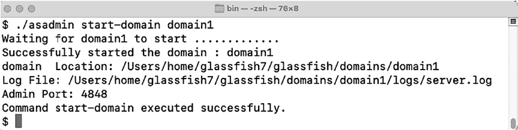

第 1 章 ■ Jakarta ServletS

首先，你需要安装 Eclipse GlassFish 应用服务[器 (https://glassfish.org/)](https://glassfish.org/)

或 Payara 服务器 ([`www.payara.fish/)，这`](https://www.payara.fish/)两个都是健壮的 Servlet 容器，用于部署你复杂的 Jakarta EE 应用程序。

在本书中，我将仅使用 Eclipse GlassFish 来分享解决方案。由于 Payara 服务器主要基于 GlassFish，如果需要，你可以轻松地切换到它。

你将学习开发 Servlets 的基础知识、如何将它们与客户端 Web 会话一起使用，以及如何将 Servlet 链接到另一个应用程序。在此过程中，你将学习使用最新版 Jakarta Servlet API 的标准，这使 Servlet 开发现代化，并使其更加简单和高效。

1-1. 设置 Jakarta EE 应用服务器

问题

你想要设置一个环境，用于部署和运行 Jakarta Servlets 及其他 Jakarta EE

技术。

解决方案

从 GlassFish 网站[ (https://](https://glassfish.org/)

[glassfish.org/) 下](https://glassfish.org/)载并安装 Eclipse GlassFish 应用服务器。本书使用的版本是开源版 *7.0.0*，可以从下载页面 ([`projects.eclipse.org/projects/ee4j.glassfish/`](http://projects.eclipse.org/projects/ee4j.glassfish/downloads) 下载。


[下载页面](http://projects.eclipse.org/projects/ee4j.glassfish/downloads)。导航至推广目录，获取一份 *glassfish-7.x.x.zip* 副本，其中 x.x 代表 MINOR.PATCH 版本号。将下载的文件解压到工作站上的某个目录中。我将该目录称为 /JAVA_DEV/glassfish7。GlassFish 发行版预装了一个名为 *domain1* 的域，以便开发者能够快速启动并运行。解压 *.zip* 文件后，你可以打开命令提示符或终端，使用以下语句启动 GlassFish 来启动该域：

/JAVA_DEV/glassfish7/bin/asadmin start-domain domain1

域将启动，并准备就绪可供使用。你将看到服务器输出，类似于图 1-1 所示。

***图 1-1.** 启动 GlassFish 服务器的命令*

启动后，可以通过管理控制台或命令行停止该域：

/JAVA_DEV/glassfish7/bin/asadmin stop-domain domain1

现在，你将看到服务器输出，类似于图 1-2 所示。

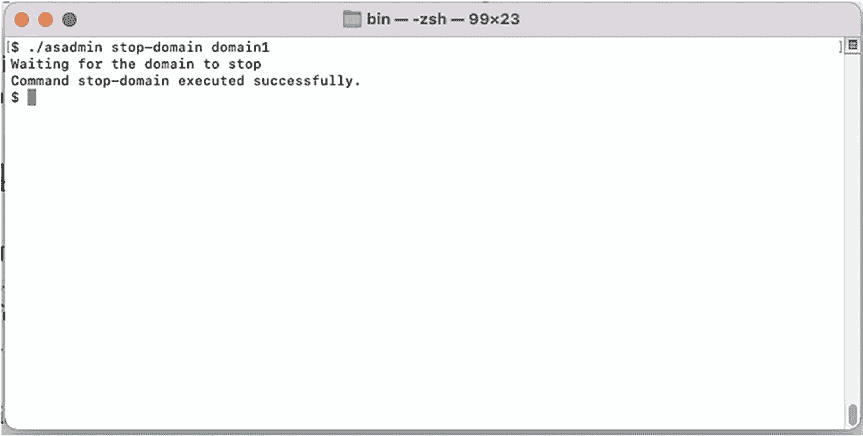

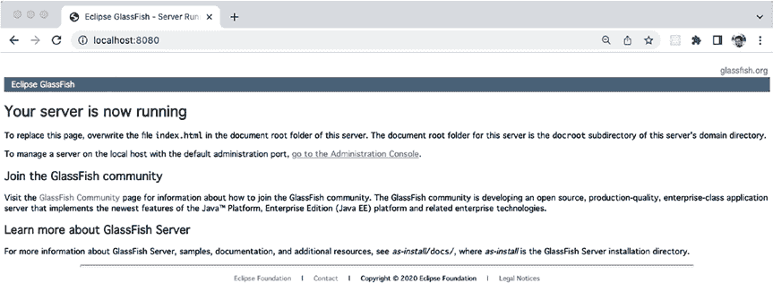

第 1 章 ■ Jakarta ServletS

***图 1-2.** 停止 GlassFish 服务器的命令*

工作原理

Jakarta EE 应用程序的开发始于一个符合 Jakarta EE 标准的应用服务器。一个符合 Jakarta EE 标准的服务器包含所有必要的组件，为部署和托管企业级 Java 应用程序提供稳健的环境。GlassFish 7 应用服务器是 Jakarta EE 10（完整平台和 Web 配置文件）的兼容实现。

安装 GlassFish 应用服务器非常简单。安装过程包括下载一个归档文件并将其解压到你的机器上。完成此操作后，应用服务器在启动时将使用你本地安装的 Java 开发工具包 (JDK)。服务器启动后，你可以打开浏览器并导航至 http://localhost:8080 查看 Eclipse GlassFish 启动页面来验证这一点。

图 1-3 展示了 GlassFish 启动页面的截图。

***图 1-3.** GlassFish 启动页面*

第 1 章 ■ Jakarta ServletS

安装 GlassFish 应用服务器是为企业开发 Java 应用程序的第一步。其他应用服务器，例如 *Payara*、*WildFly*、*Apache TomEE* 和 *Open Liberty*，也非常适合开发和产品使用。

GlassFish 为使用 Jakarta EE 开始开发提供了极佳的环境。许多服务器也提供开源选项，并且它们是 Jakarta EE 的兼容实现。

1-2\. 开发一个 Servlet

问题

你希望开发一个能够使用动态内容的网页。

解决方案

开发一个 Jakarta Servlet 类，编译它，并将其部署在兼容的 Jakarta Servlet 容器（例如 Eclipse GlassFish）中。在此示例中，将创建一个简单的 servlet，用于在网页上显示动态内容。以下示例演示了如何编写一个将显示 HTML 内容的 servlet。在此示例中，内容是硬编码的，但可以轻松修改以从数据库或外部属性文件中提取动态内容：

package org.jakartaeerecipe.chapter01.recipe01_02;

import jakarta.servlet.annotation.*;

import jakarta.servlet.http.*;

import java.io.*;

public class SimpleServlet extends HttpServlet {

private String message;

@Override

public void init() {

message = "Welcome to Java EE to Jakarta EE 10 Recipes!";

}

/**

* 处理 HTTP

* <code>GET</code> 和

* <code>POST</code> 方法的请求。

*

* @param request servlet 请求

* @param response servlet 响应

* @throws ServletException 如果发生特定于 servlet 的错误

* @throws IOException 如果发生 I/O 错误

*/

protected void processRequest(HttpServletRequest request, HttpServletResponse response)

throws ServletException, IOException {


```markdown

response.setContentType("text/html;charset=UTF-8");

try (PrintWriter out = response.getWriter()) {

第 1 章 ■ Jakarta ServletS

// 在此处放置页面输出

out.printf("""

<html>

<head>

<title>简单 Servlet</title>

</head>

<body>

<h2>位于 %s 的简单 Servlet</h2>

<br/>%s

</body>

</html>

""", request.getContextPath(), message);

}

}

/**

* 处理 HTTP GET 请求

*

* @param request servlet 请求

* @param response servlet 响应

* @throws ServletException 如果发生特定于 servlet 的错误

* @throws IOException 如果发生 I/O 错误

*/

@Override

protected void doGet(HttpServletRequest request, HttpServletResponse response)

throws ServletException, IOException {

processRequest(request, response);

}

/**

* 处理 HTTP POST 请求

*

* @param request servlet 请求

* @param response servlet 响应

* @throws ServletException 如果发生特定于 servlet 的错误

* @throws IOException 如果发生 I/O 错误

*/

@Override

protected void doPost(HttpServletRequest request, HttpServletResponse response)

throws ServletException, IOException {

processRequest(request, response);

}

}

以下代码是 Web 部署描述符（*web.xml*）。部署描述符必须放置在位于 Web 源根目录的 *WEB-INF* 文件夹中。在技巧 1-4 中，你将学习如何省略 servlet 配置并从 web.xml 文件进行映射，从而使 servlet 的开发、部署和维护更加容易。

<?xml version="1.0" encoding="UTF-8"?>

<web-app

第 1 章 ■ Jakarta ServletS

xsi:schemaLocation="https://jakarta.ee/xml/ns/jakartaee https://jakarta.ee/xml/ns/

jakartaee/web-app_5_0.xsd"

version="5.0">

<servlet>

<servlet-name>SimpleServlet</servlet-name>

<servlet-class>org.jakartaeerecipe.chapter01.recipe01_02.SimpleServlet

</servlet-class>

</servlet>

<servlet-mapping>

<servlet-name>SimpleServlet</servlet-name>

<url-pattern>/SimpleServlet</url-pattern>

</servlet-mapping>

<welcome-file-list>

<welcome-file>/SimpleServlet </welcome-file>

</welcome-file-list>

</web-app>

要编译该 servlet，请使用 `javac` 命令行工具或 Java 集成开发环境（IDE），例如 Apache NetBeans。以下行摘自命令行，它将 `SimpleServlet.java` 文件编译成一个类文件。首先，进入包含 `SimpleServlet.java` 文件的目录。然后，执行以下命令：

javac -cp /JAVA_DEV/glassfish7/glassfish/modules/jakarta.servlet-api.jar SimpleServlet.java

请注意，前面示例中的路径使用了 `jakarta.servlet-api.jar` 文件，该文件是 GlassFish 7.0.x 的一部分。一旦 servlet 代码被编译成 Java 类文件，就可以打包部署到 servlet 容器中了。

■ **注意** 你可能需要考虑安装一个集成开发环境（IDE）来提高开发效率。有几种非常好的 IDE 可供开发者使用，请务必选择一个包含你认为对开发最重要和最有用的功能的 IDE。我建议安装以下任一 IDE 的最新版本：IntelliJ IDEA（终极版）、Apache NetBeans 或用于企业 Java 和 Web 开发的 Eclipse IDE。

Apache NetBeans 是一个由 Apache 维护的开源 IDE，它支持 Java 行业提供的所有前沿特性，包括使用 Jakarta EE 进行开发、OpenJFX 支持等。

IntelliJ IDEA 终极版是一个用于开发计算机软件的 Java 集成开发环境（IDE），由 JetBrains 开发，具有代码分析、重构、版本控制系统集成、单元测试和代码检查等功能。

Eclipse IDE 是一个用于多种语言编程的跨平台集成开发环境（IDE）。它主要用 Java 编写，主要用于开发 Java 应用程序，但也可用于开发其他编程语言的应用程序，包括 C++、PHP、Python 和 Ruby。

所有这些 IDE 都支持 Jakarta EE 应用程序的开发。使用哪一个取决于个人偏好。

在本书中，我将使用 IntelliJ IDEA 终极版，但相同的概念也适用于 NetBeans 或 Eclipse IDE。

第 1 章 ■ Jakarta ServletS

工作原理

Jakarta Servlets 为开发者提供了使用请求-响应编程模型设计应用程序的灵活性。它在 Java 平台上微服务和 Web 应用程序的开发中扮演着关键角色。可以创建不同类型的 servlet，每种类型都旨在提供不同的功能。第一种类型称为 GenericServlet，它提供与协议无关的服务和功能。第二种类型 HttpServlet 是 GenericServlet 的子类，它利用 HTTP 提供功能和响应。本技巧的解决方案演示了后一种类型的 servlet，因为它会显示一个结果供用户在 Web 浏览器中查看。

Servlet 遵循一个生命周期来处理请求和发布结果。首先，Jakarta Servlet 容器调用 servlet 的构造函数。每个 servlet 的构造函数必须不接受任何参数。接下来，容器调用 servlet 的 `init()` 方法，该方法负责初始化 servlet。一旦 servlet 被初始化，它就可以使用了。此时，servlet 可以开始处理请求。每个 servlet 都包含一个 `service()` 方法，该方法处理发出的请求并将其分派给适当的请求处理方法。实现 `service()` 方法是可选的。最后，容器调用 servlet 的 `destroy()` 方法，该方法负责终结 servlet 并将其停止服务。

每个 servlet 类都必须实现 `jakarta.servlet.Servlet` 接口或扩展另一个实现了该接口的类。在本技巧的解决方案中，名为 `SimpleServlet` 的 servlet 扩展了 `HttpServlet` 类，该类提供了处理 HTTP 过程的方法。在此场景中，浏览器客户端请求从容器发送到 servlet；然后 servlet 的 `service()` 方法将 `HttpServletRequest` 对象分派给 `HttpServlet` 提供的适当方法。也就是说，`HttpServlet` 类提供了 `doGet()`、`doPut()`、`doPost()` 和 `doDelete()` 方法来处理 HTTP 请求。最常用的方法是 `doGet()` 和 `doPost()`。`HttpServlet` 类是抽象的，因此必须对其进行子类化，然后为其方法提供实现。表 1-1 描述了 `HttpServlet` 可用的每个方法。

***表 1-1.** HttpServlet 方法*

**方法名称**

**描述**

doGet

用于处理 HTTP GET 请求。发送到 servlet 的输入必须包含在 URL 地址中。例如：`?publisher=Apress&topic=JakartaEE10`

doPost

用于处理 HTTP POST 请求。输入可以通过 HTML 表单字段发送到 servlet

doPut

用于处理 HTTP PUT 请求

doDelete

用于处理 HTTP DELETE 请求

doHead

用于处理 HTTP HEAD 请求

doOptions

由容器调用以允许处理 OPTIONS 请求

doTrace

由容器调用以处理 TRACE 请求

getLastModified

返回 `HttpServletRequest` 对象最后被修改的时间

init

初始化 servlet

service

由 servlet 容器在 `init()` 方法之后调用。它允许 servlet 响应请求

destroy

终结 servlet

getServletInfo

提供有关 servlet 的信息

第 1 章 ■ Jakarta ServletS

```


Servlet 通常在其方法实现中执行某些处理，然后向客户端返回响应。`HttpServletRequest` 对象可用于处理通过请求发送的参数。例如，如果 HTML 表单包含一些发送到服务器的输入字段，这些字段将包含在 `HttpServletRequest` 对象中。`HttpServletResponse` 对象用于向客户端浏览器发送响应。Servlet 中的 `doGet()` 和 `doPost()` 方法都接受相同的参数，即 `HttpServletRequest` 和 `HttpServletResponse` 对象。

■ **注意**：`doGet()` 方法用于拦截 HTTP GET 请求，而 `doPost()` 用于拦截 HTTP POST 请求。通常，`doGet()` 方法用于在向客户端显示之前准备请求，而 `doPost()` 方法用于处理请求并从 HTML 表单收集信息。

在本方案的解决方案中，`doGet()` 和 `doPost()` 方法都将 `HttpServletRequest` 和 `HttpServletResponse` 对象传递给 `processRequest()` 方法以进行进一步处理。在 `processRequest()` 方法中，`HttpServletResponse` 对象用于设置响应的内容类型并获取 `PrintWriter` 对象的句柄。以下代码行展示了如何实现这一点，假设引用 `HttpServletResponse` 对象的标识符是 `response`：

```java
response.setContentType("text/html;charset=UTF-8");
PrintWriter out = response.getWriter();
```

`GenericServlet` 可用于为 Web 应用程序提供服务。这种类型的 Servlet 通常用于记录事件，因为它实现了 `log()` 方法。`GenericServlet` 实现了 `Servlet` 和 `ServletConfig` 接口，要编写一个通用 Servlet，只需重写 `service()` 方法。

1-3. 打包、编译和部署 Servlet

问题

您已经编写了一个 Jakarta Servlet，现在想要打包并部署它以供使用。

解决方案

编译源代码，设置可部署的应用程序，并将内容复制到 GlassFish 部署目录中。在命令行中，使用 `javac` 命令编译源代码：

```bash
javac -cp /JAVA_DEV/glassfish7/glassfish/modules/jakarta.servlet-api.jar SimpleServlet.java
```

类编译完成后，将其与 `web.xml` 部署描述符一起部署，并遵循适当的目录结构。

快速入门

要快速开始打包、编译和部署本章 Servlet 方案的示例应用程序到 GlassFish 7.0，请遵循以下步骤：

第 1 章 ■ Jakarta Servlet

1.  创建一个名为 `SimpleServlet` 的应用程序，方法是创建一个名为 `SimpleServlet` 的目录。

2.  在 `SimpleServlet` 目录内创建 `WEB-INF`、`WEB-INF/classes` 和 `WEB-INF/lib` 目录。

3.  将第 1 章的源代码（以 `org` 目录开头）复制到您创建的 `WEB-INF/classes` 目录中，并将 `web` 文件夹的内容复制到 `SimpleServlet` 目录的根目录下。

4.  将源代码 `recipe01_01` 目录中的 `web.xml` 文件复制到您创建的 `WEB-INF` 目录中。

5.  从 Jakarta Mail 网站 [`eclipse-ee4j.github.io/mail/`](https://eclipse-ee4j.github.io/mail/) 下载 Jakarta Mail API 代码，并将 `jakarta.mail.jar` 文件复制到您创建的 `WEB-INF/lib` 目录中。此 API 将在后续方案中用于发送邮件。

6.  通过执行以下命令，将您在步骤 5 中下载的 `jakarta.mail.jar` 文件包含到您的 `CLASSPATH` 中：
    ```bash
    CLASSPATH=${CLASSPATH}:/PATH_TO_PROJECT/SimpleServlet/WEB-INF/lib
    ```

7.  在命令提示符下，切换目录到您在步骤 2 中创建的 `classes` 目录。使用命令 `javac org\jakartaeerecipe\chapter01\recipe1_x\*.java` 编译每个方案，其中 `x` 等于方案编号。

8.  将您的 `SimpleServlet` 应用程序目录复制到 GlassFish 的 `/JAVA_DEV/glassfish7/glassfish/domains/domain1/autodeploy` 目录。


通过启动浏览器并访问 http://localhost:8080/JakartaEERecipes_Chapter01-1.0-SNAPSHOT/<servlet_name> 来测试应用程序，其中 <servlet_name> 对应每个配方中的 Servlet 名称。

工作原理

要编译源代码，你可以使用自己喜欢的 Java 开发环境，例如 Apache NetBeans ([`netbeans.apache.org/`](http://netbeans.apache.org/))、Eclips[e IDE (www.eclipse.org/eclipseide/](https://www.eclipse.org/eclipseide/)) 或 IntelliJ IDEA ([www.](https://www.jetbrains.com/idea/)[jetbrains.com/idea/), or y](https://www.jetbrains.com/idea/)ou can use the command line. 如果你使用命令行，必须确保你使用的 `javac` 命令与你将用于运行 Servlet 容器的 Java 版本相关联。在本示例中，Java SE 17 的安装路径如下：

/Library/Java/JavaVirtualMachines/jdk-17.0.1.jdk/Contents/Home

■ **注意** 用于编译的 Java JDK 取决于部署所使用的应用服务器容器。在撰写本文时，大多数容器都与 JDK 17 兼容。

如果你使用的是不同的操作系统和/或安装位置，此路径在你的环境中可能有所不同。为确保你使用的是位于此路径的 Java 运行时，请将 `JAVA_HOME` 环境变量设置为该路径。在 OS X 和 *nix 操作系统上，你可以通过打开终端并输入以下内容来设置环境变量：


第 1 章 ■ Jakarta ServletS

export JAVA_HOME=/Library/Java/JavaVirtualMachines/jdk-17.0.1.jdk/Contents/Home

如果你使用的是 Windows，请在命令行中使用 `SET` 命令来设置 `JAVA_HOME` 环境变量：

set JAVA_HOME=C:\your-java-se-path\

接下来，编译你的 Java Servlet 源代码，并确保在你的 `CLASSPATH` 中包含与你的 Servlet 容器一起打包的 `jakarta.servlet-api.jar` 文件（对于 Tomcat，请使用 `servlet-api.jar`）。你可以通过使用 `javac` 命令的 `-cp` 标志来设置 `CLASSPATH`。应在包含源代码的同一目录下的命令行中执行以下命令。在本例中，源文件名为 *SimpleServlet.java*：

javac -cp /path_to_jar/jakarta.servlet-api.jar SimpleServlet.java

接下来，通过创建一个目录并以你的应用程序命名来打包你的应用程序。在本例中，创建一个目录并将其命名为 *SimpleServlet*。在该目录中，创建另一个名为 *WEB-INF* 的目录。进入 *WEB-INF* 目录，再创建一个名为 `classes` 的目录。最后，在 `classes` 目录中创建目录以复制你的 Java Servlet 包结构。对于本配方，*SimpleServlet.java* 类位于 Java 包 `org.jakartaeerecipe.chapter01.recipe01_01` 中，因此在 `classes` 目录中为每个包创建一个目录。在 *WEB-INF* 中创建最后一个目录并将其命名为 *lib*；任何包含外部库的 JAR 文件都应放在 `lib` 目录中。最终，你的目录结构应如下所示：

SimpleServlet

**└──** WEB-INF

**├──** classes

**│** **└──** org

**│** **└──** jakartaeerecipe

**│** **└──** chapter01

**│** **└──** recipe01_03

**│** **└──** SimpleServlet.class

**├──** lib

**│** **└──** jakarta.mail.jar

**└──** web.xml

将你的 `web.xml` 部署描述符放在 `WEB-INF` 目录中，并将编译后的 `SimpleServlet.class` 文件放在 `recipe01_03` 目录中。现在，可以将 `SimpleServlet` 目录的全部内容复制到你的应用服务器容器的部署目录中，以便部署应用程序。如果使用 Tomcat，请重新启动应用服务器，并启动 URL http://localhost:8080/SimpleServlet/SimpleServlet 以查看 Servlet 的运行情况，如图 1-4 的屏幕截图所示。

***图 1-4.** SimpleServlet 输出*

第 1 章 ■ Jakarta ServletS

■ **注意** 如果使用集成开发环境或构建工具（如 Maven），则生成目录并将文件放入正确位置的所有手动工作都会自动完成。通常，强烈建议使用 IDE，因为它可以提高生产力并减少出错的机会。

1-4. 无需 web.xml 注册 Servlet

问题

在 `web.xml` 文件中注册 Servlet 很繁琐，你希望完全无需修改 `web.xml` 即可部署 Servlet。

解决方案

使用 `@WebServlet` 注解来注册 Servlet，并省略 `web.xml` 注册。这将减轻每次向应用程序添加 Servlet 时都需要修改 `web.xml` 文件的需要。以下是对配方 1-2 中使用的 `SimpleServlet` 类的改编，其中包含了 `@WebServlet` 注解并演示了其用法：

package org.jakartaeerecipe.chapter01.recipe01_04;

import jakarta.servlet.annotation.*;

import jakarta.servlet.http.*;

import java.io.*;

@WebServlet(name = "SimpleServletNoDescriptor", urlPatterns = {"/

SimpleServletNoDescriptor"})

public class SimpleServletNoDescriptor extends HttpServlet {

private String message;

@Override

public void init() {

message = "Look ma, no WEB-XML!";

}

protected void processRequest(HttpServletRequest request,

HttpServletResponse response) throws ServletException, IOException {

response.setContentType("text/html;charset=UTF-8");

try(PrintWriter out = response.getWriter()) {

out.printf("""

<html>

<head>

<title>Servlet SimpleServlet</title>

</head>


第 1 章 ■ Jakarta ServletS

<body>

<h2>Servlet SimpleServlet at %s</h2>

<br/>%s

</body>

</html>

""", request.getContextPath(), message);

}

}

@Override

protected void doGet(HttpServletRequest request, HttpServletResponse response)

throws ServletException, IOException {

processRequest(request, response);

}

@Override

protected void doPost(HttpServletRequest request, HttpServletResponse response)

throws ServletException, IOException {

processRequest(request, response);

}

}

最终，该 Servlet 将可以通过 URL 访问，就像它在 `web.xml` 中注册一样。你应该会看到页面加载，如图 1-5 所示。

***图 1-5.** SimpleServletNoDescriptor 输出*

■ **注意** 删除 `web.xml` 文件中任何现有的 Servlet 映射，以使用 `@WebServlet` 注解。

工作原理

有几种方法可以向 Web 容器注册 Servlet。第一种方法是使用 `web.xml` 部署描述符注册它们，如配方 1-1 所示。第二种方法是使用 `@WebServlet` 注解，它提供了一种更简单的技术来将 Servlet 映射到 URL。`@WebServlet` 注解放在类声明之前，它接受表 1-2. 中列出的元素。

第 1 章 ■ Jakarta ServletS

***表 1-2.** @WebServlet 注解元素*

**元素**

**描述**

description

Servlet 的描述

displayName

Servlet 的显示名称

initParams

接受一个 `@WebInitParam` 注解列表

largeIcon

Servlet 的大图标

loadOnStartup

Servlet 的启动加载顺序

name

Servlet 名称

smallIcon

Servlet 的小图标

urlPatterns

调用 Servlet 的 URL 模式

asyncSupported

Servlet 是否支持异步操作模式

在本配方的解决方案中，`@WebServlet` 注解将名为 `SimpleServletNoDescriptor` 的 Servlet 类映射到 URL 模式 `/SimpleServletNoDescriptor`，并且还将该 Servlet 命名为 `SimpleServletNoDescriptor`：

@WebServlet(name="SimpleServletNoDescriptor", urlPatterns={"/SimpleServletNoDescriptor"})

1-5. 使用 Servlet 显示动态内容

问题

你希望向网页显示一些可能根据服务器端活动或用户输入而变化的内容。

解决方案


在你的 Servlet 中定义一个字段，用于包含要显示的动态内容。通过使用 `PrintWriter println()` 方法，将包含该字段的内容追加到页面上，从而发布动态内容。以下示例 Servlet 声明了一个 `Date` 字段，并在每次页面加载时将其更新为当前日期：

```java
package org.jakartaeerecipe.chapter01.recipe01_05;

import java.io.*;
import java.util.Date;
import jakarta.servlet.annotation.*;
import jakarta.servlet.http.*;

@WebServlet(name = "CurrentDateAndTime", urlPatterns = {"/CurrentDateAndTime"})
public class CurrentDateAndTime extends HttpServlet {

    Date currDateAndTime = new Date();

    protected void processRequest(HttpServletRequest request, HttpServletResponse response)
            throws ServletException, IOException {
        response.setContentType("text/html;charset=UTF-8");
        synchronized(currDateAndTime){
            currDateAndTime = new Date();
        }
        try (PrintWriter out = response.getWriter()) {
            out.printf("""
                <html>
                <head>
                <title>Servlet Current Date And Time</title>
                </head>
                <body>
                <h1>Servlet CurrentDateAndTime at %s</h1><br/>
                The current date and time is: %s
                </body>
                </html>""", request.getContextPath(), currDateAndTime);
        }
    }

    @Override
    protected void doGet(HttpServletRequest request, HttpServletResponse response)
            throws ServletException, IOException {
        processRequest(request, response);
    }

    @Override
    protected void doPost(HttpServletRequest request, HttpServletResponse response)
            throws ServletException, IOException {
        processRequest(request, response);
    }
}
```

■ **注意** Servlet 是多线程的，许多客户端请求可能同时使用同一个 Servlet。当字段被声明为 Servlet 类成员（而非方法内部）时，就像你对 `currDateAndTime` 所做的那样，你必须确保在任何时刻只有一个客户端请求能够操作该字段。你可以通过对字段的使用进行同步来实现这一点，如 `processRequest()` 方法所示。为了最小化延迟，你应该同步尽可能小的代码块。该 Servlet 的输出结果将是当前的日期和时间。

```java
synchronized( currDateAndTime ) {
    currDateAndTime = new Date();
}
```


工作原理

Java Servlet 如此有用的原因之一，是它们允许在网页上显示动态内容。这些内容可以来自服务器本身、数据库、另一个网站或任何其他可通过网络访问的资源。如果你过一段时间后刷新网页，你会看到当前时间动态更新为你当前的时间。Servlet 不是静态网页；它们是动态的，这可以说是它们最大的优势。

在本方案的解决方案中，使用了一个 Servlet 来显示服务器上的当前时间和日期。

当 Servlet 被处理时，会调用 `doGet()` 方法，该方法随后调用 `processRequest()` 方法，并传入请求和响应对象。因此，`processRequest()` 方法是主要工作发生的地方。`processRequest()` 方法通过调用 `response.getWriter()` 方法创建一个 `PrintWriter`，并使用该 `PrintWriter` 在生成的网页上显示内容。接着，通过创建一个新的 `Date` 并将其赋值给 `currDateAndTime` 字段，从服务器获取当前的日期和时间。

最后，`processRequest()` 方法通过 `out.println()` 方法发送网页内容，同时 `currDateAndTime` 字段的内容也被拼接成一个字符串，一并发送给 `out.println()`。

每次处理 Servlet 时，它都会显示调用 Servlet 时的当前日期和时间，因为每次请求都会创建一个新的 `Date`。

这个例子只是浅尝辄止地展示了 Jakarta Servlet 的能力。虽然显示当前日期和时间很简单，但你可以修改该逻辑，以显示 Servlet 中包含的任何字段的内容。无论是显示 Servlet 容器执行计算结果的 `int` 字段，还是包含某些信息的 `String` 字段，可能性都是无限的。图 1-6 显示了此页面的输出。

***图 1-6.** CurrentDateAndTime Servlet 输出*

1-6. 处理请求和响应

问题

你想要创建一个接受用户输入并根据接收到的输入提供响应的 Web 表单。

解决方案

创建一个基于标准 HTML 的 Web 表单，当点击提交按钮时，调用一个 Servlet 来处理最终用户的输入并发布响应。为了研究这种技术，你将看到两段不同的代码。以下代码是用于生成输入表单的 HTML。这段代码存在于文件 `recipe01_06.html` 中。请浏览至 `/chapter01/recipe01_06.html` 来运行示例。请特别注意 `<form>` 和 `<input>` 标签。你会看到表单的 `action` 参数列出了 Servlet 名称 `MathServlet`：

```html
<html>
<head>
<title>Simple Math Servlet</title>
</head>
<body>
<h1>This is a simple Math Servlet</h1>
<form method="POST" action="../MathServlet">
<label for="numa">Enter Number A: </label>
<input type="text" id="numa" name="numa"/><br><br>
<label for="numb">Enter Number B: </label>
<input type="text" id="numb" name="numb"/><br/><br/>
<input type="submit" value="Submit Form"/>
<input type="reset" value="Reset Form"/>
</form>
</body>
</html>
```

接下来，查看名为 `MathServlet` 的 Servlet 的以下代码。这是接收前面列出的 HTML 代码输入、相应处理并发布响应的 Java 代码：

```java
package org.jakartaeerecipe.chapter01.recipe01_06;

import jakarta.servlet.annotation.*;
import jakarta.servlet.http.*;
import jakarta.servlet.ServletException;
import java.io.*;

@WebServlet(name="MathServlet", urlPatterns={"/MathServlet"})
public class MathServlet extends HttpServlet {

    @Override
    public void doPost(HttpServletRequest req, HttpServletResponse res)
            throws IOException, ServletException {
        res.setContentType("text/html");
        // 将输入参数值存储到字符串中
        String numA = req.getParameter("numa");
        String numB = req.getParameter("numb");
        int solution = 0;

        try (PrintWriter out = res.getWriter()) {
            try {
                solution= Integer.valueOf(numA) + Integer.valueOf(numB);
            } catch (java.lang.NumberFormatException ex) {
                // 如果抛出异常，则显示错误信息
                out.println("Please use numbers only...try again.");
                return;
            }

            out.printf("""
                <html>
                <head>
                <title>Test Math Servlet</title>
                </head>
                <body>
                Solution: %d + %d = %d
                <br/>
                <a href='recipe01_05.html'>Add Two More Numbers</a>
                </body>
                </html>""", numA, numB, solution);
        }
    }
}
```

■ **注意** 要运行此示例，请将前面的 HTML 代码复制到你的 `JakartaEERecipes_Chapter01` 应用程序的 Web 根目录下的一个名为 `recipe01_06.html` 的 HTML 文件中，然后在浏览器中输入以下地址：`http://localhost:8080/JakartaEERecipes_Chapter01-1.0-SNAPSHOT/chapter01/recipe01_06.html`。这假设你为应用服务器安装使用了默认端口号。

工作原理


Servlet 能够轻松创建遵循请求与响应生命周期的 Web 应用程序。它们可以在同一段代码中提供 HTTP 响应并处理业务逻辑。处理业务逻辑的能力使得 Servlet 比标准 HTML 代码强大得多。本方案演示了用于处理请求和发送响应的标准 Servlet 结构。一个 HTML Web 表单包含发送给 Servlet 的参数。Servlet 随后以某种方式处理这些参数，并发布客户端可见的响应。对于 `HttpServlet` 对象而言，客户端是 Web 浏览器，响应则是一个网页。

***图 1-7.** 调用 MathServlet 的 HTML 表单*

可以通过嵌入在 HTML `<form>` 中的 HTML `<input>` 标签来获取 HTML 表单中的值。在本方案的解决方案中，接受两个值作为输入，并通过它们的 `id` 属性 `numa` 和 `numb` 来引用它们。表单中还有另外两个 `<input>` 标签；一个用于将值提交给表单的 `action`，另一个用于将表单字段重置为空白。表单的 `action` 是


第 1 章 ■ Jakarta ServletS

表单值将作为参数传递到的 Servlet 的名称。在本例中，`action` 设置为 `MathServlet`。`<form>` 标签还接受一种表单处理方法，即 `GET` 或 `POST`。在示例中，使用了 `POST` 方法，因为表单数据正在被发送到 `action`；在这种情况下，数据被发送到 `MathServlet`。当然，您可以创建任意复杂的 HTML 表单，然后以相同的方式将数据发送到任何 Servlet。这个例子相对基础；它旨在让您了解处理是如何执行的。

`<form>` 的 `action` 属性表明应使用 `MathServlet` 来处理表单中包含的值。`MathServlet` 名称可以通过 `web.xml` 部署描述符或 `@WebServlet` 注解映射回 `MathServlet` 类。查看 `MathServlet` 代码，可以看到实现了一个 `doPost()` 方法来处理 `POST` 表单值的处理。`doPost()` 方法接受 `HttpServletRequest` 和 `HttpServletResponse` 对象作为参数。HTML 表单中包含的值嵌入在 `HttpServletRequest` 对象中。要获取这些值，需要调用请求对象的 `getParameter()` 方法，并传入您想要获取的输入参数的 `id`。在本方案的解决方案中，这些值被获取并存储在局部 `String` 字段中：
`String numA = req.getParameter("numa");`
`String numB = req.getParameter("numb");`

***图 1-8.** MathServlet 输出*

一旦获取了这些值，就可以根据需要对其进行处理。在本例中，这些 `String` 值被转换为 `int` 值，然后相加得到一个总和，并存储在一个 `int` 字段中。该字段随后作为响应呈现在结果网页上：

`int solution = Integer.valueOf(numA) + Integer.valueOf(numB);`

如前所述，HTML 表单可以复杂得多，包含任意数量的 `<input>` 字段。同样，Servlet 也可以对这些字段值执行更复杂的处理。

这个例子仅仅是冰山一角，可能性是无限的。基于 Servlet 的 Web 框架，如 Jakarta Server Pages 和 Jakarta Server Faces，隐藏了将表单值传递给 Servlet 和处理响应的许多复杂性。然而，幕后使用的仍然是相同的基本框架。

1-7. 监听 Servlet 容器事件

问题

您希望能够监听应用程序启动和关闭事件。

解决方案

创建一个 Servlet 上下文事件监听器，以便在应用程序启动或关闭时发出警报。以下解决方案演示了上下文监听器的代码，该监听器将记录应用程序启动和关闭事件，并发送电子邮件警报此类事件：

第 1 章 ■ Jakarta ServletS


package org.jakartaeerecipe.chapter01.recipe01_07;

import java.util.Properties;

import jakarta.mail.*;

import jakarta.mail.internet.*;

import jakarta.servlet.*;

import jakarta.servlet.annotation.WebListener;

@WebListener

public class StartupShutdownListener implements ServletContextListener {

private final String TAG = "StartupShutdownListener: ";

@Override

public void contextInitialized(ServletContextEvent event) {

System.out.println(TAG + "Servlet 启动...");

System.out.println(TAG + event.getServletContext().getServerInfo());

System.out.println(TAG + System.currentTimeMillis());

sendEmail("Servlet 上下文已初始化");

}

@Override

public void contextDestroyed(ServletContextEvent event) {

System.out.println(TAG + "Servlet 关闭...");

System.out.println(TAG + event.getServletContext().getServerInfo());

System.out.println(TAG + System.currentTimeMillis());

// 如果邮件发送失败，请查看 server.log 中的错误信息

sendEmail("Servlet 上下文已被销毁...");

}

/**

* 此实现使用 GMail 的 SMTP 服务器

* @param message 要在邮件中发送的文本

*/

private void sendEmail(String message) {

String smtpHost = "smtp.someserver.com"; // 例如 smtp.smtp2go.com

String smtpUsername = "username"; // SMTP 服务器的用户名

String smtpPassword = "password"; // SMTP 服务器的密码

String from = "fromaddress@domain.com"; // 发件人邮箱地址

String to = "toaddress@domain.com"; // 收件人邮箱地址

int smtpPort = 2525; // SMTP 服务器端口

System.out.println(TAG + "正在发送邮件...");

try {

// 在此处发送邮件

// 设置 SMTP 主机地址

Properties props = new Properties();

props.put("mail.smtp.host", smtpHost);


第 1 章 ■ Jakarta Servlet

props.put("mail.smtp.auth", "true");

props.put("mail.smtp.starttls.enable", "false");

// 创建一些属性并获取默认的 Session

Session session = Session.getInstance(props);

// 创建一条消息

Message msg = new MimeMessage(session);

// 设置发件人和收件人地址

InternetAddress addressFrom = new InternetAddress(from);

msg.setFrom(addressFrom);

InternetAddress[] address = new InternetAddress[1];

address[0] = new InternetAddress(to);

msg.setRecipients(Message.RecipientType.TO, address);

msg.setSubject( TAG + "Servlet 容器正在关闭");

// 添加页脚

msg.setContent(msg, "text/plain");

Transport transport = session.getTransport("smtp");

transport.connect(smtpHost, smtpPort, smtpUsername, smtpPassword);

Transport.send(msg, smtpUsername, smtpPassword);

} catch (jakarta.mail.MessagingException ex) {

System.out.println(TAG + e.getMessage());

}

System.out.println(TAG + "邮件已成功发送");

}

}

■ **注意** 要运行此示例，请确保已按照本章前面的配方 1-2 所述添加了 `jakarta.mail.jar`。

一旦 Servlet 成功初始化，它应该在 GlassFish 服务器日志文件中生成相应的日志消息，该文件位于以下位置：

JAVA_DEV/glassfish7/glassfish/domain/domain1/logs/server.log

您也可以通过 IntelliJ IDEA 的 *Services* ➤ *GlassFish Log* 查看此日志；参见图 1-9。

***图 1-9.** 使用 IntelliJ IDEA 的 Services 选项卡查看 GlassFish 日志*

第 1 章 ■ Jakarta Servlet

工作原理

有时，了解应用服务器容器中何时发生某些事件是很有用的。这个概念在许多不同的场景下都很有用，但最常用于在启动时初始化应用程序，或在关闭后清理应用程序。可以将 Servlet 监听器注册到应用程序，以指示其何时启动或关闭。因此，通过监听此类事件，Servlet 可以在事件发生时执行某些操作。

要创建一个基于容器事件执行操作的监听器，您必须开发一个实现 `ServletContextListener` 接口的类。需要实现的方法是 `contextInitialized()` 和 `contextDestroyed()`。这两个方法都接受一个 `ServletContextEvent` 作为参数。


参数，它们会在 Servlet 容器初始化或关闭时分别被自动调用。要将监听器注册到容器中，可以使用以下技术之一：

• 使用 `@WebListener` 注解，如本配方的解决方案所示。

• 在 `web.xml` 应用部署描述符中注册监听器。

• 使用 `ServletContext` 中定义的 `addListener()` 方法。

例如，要在 `web.xml` 中注册此监听器，需要添加以下 XML 代码行：

<listener>

<listener-class> org.jakartaeerecipe.chapter01.recipe01_06.StartupShutdownListener</

listener-class>

</listener>

两种方式没有优劣之分。只有在某些情况下需要禁用监听器时，在应用部署描述符（`web.xml`）中注册监听器才会更有帮助。另一方面，如果使用 `@WebListener` 注册监听器，要禁用它，必须移除注解并重新编译代码。而修改 Web 部署描述符则不需要重新编译任何代码。

监听器有多种类型，类实现的接口决定了监听器的类型。例如，在本配方的解决方案中，该类实现了 `ServletContextListener` 接口。这样就创建了一个用于监听 Servlet 上下文事件的监听器。然而，如果该类实现了 `HttpSessionListener`，它将成为 HTTP 会话事件的监听器。以下是监听器接口的完整列表：

`jakarta.servlet.ServletRequestListener`

`jakarta.servlet.ServletRequestAttributeListener`

`jakarta.servlet.ServletContextListener`

`jakarta.servlet.ServletContextAttributeListener`

`jakarta.servlet.http.HttpSessionListener`

`jakarta.servlet.http.HttpSessionAttributeListener`

`jakarta.servlet.http.HttpSessionIdListener`

也可以创建一个实现多个监听器接口的监听器。要了解更多关于监听不同情况（如属性更改）的信息，请参阅配方 1-10。

第 1 章 ■ Jakarta ServletS

1-8. 设置初始化参数

问题

您正在编写的 Servlet 需要能够在初始化时接受一个或多个参数。

解决方案 #1

使用 `@WebInitParam` 注解设置 Servlet 初始化参数。以下代码设置了一个等于字符串值的初始化参数：

```java
package org.jakartaeerecipe.chapter01.recipe01_08;

import java.io.*;

import jakarta.servlet.*;

import jakarta.servlet.annotation.*;

import jakarta.servlet.http.*;

@WebServlet(name="SimpleServletCtx1", urlPatterns={"/SimpleServletCtx1"}, initParams={ @WebInitParam(name="name", value="Duke") })

public class SimpleServletCtx1 extends HttpServlet {

    @Override

    public void doGet(HttpServletRequest req, HttpServletResponse res)

            throws IOException, ServletException {

        response.setContentType("text/html");

        try (PrintWriter out = response.getWriter()) {

            out.printf("""

                    <html>

                    <head>

                    <title> Simple Servlet Context Example</title>

                    </head>

                    <body>

                    <p>This is a simple servlet to demonstrate context!

                    Hello %s </p>

                    </body>

                    </html>

                    """, getServletConfig().getInitParameter("name"));

        }

    }

}
```

要使用本书的源码执行此示例，请在 Web 浏览器中加载以下 URL：`http://localhost:8080/JakartaEERecipes_Chapter01-1.0-SNAPSHOT/SimpleServletCtx1`。生成的网页将显示如图 1-10 所示的文本。

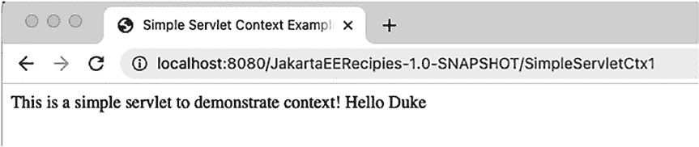

第 1 章 ■ Jakarta ServletS

***图 1-10.** SimpleServletCtx1 Servlet 输出*

解决方案 #2

将初始化参数放在 `web.xml` 部署描述符文件中。以下代码行摘自 `SimpleServlet` 应用的 `web.xml` 部署描述符。它们包含了初始化参数的名称和值：

```xml
<web-app>

    <servlet>

        <servlet-name>SimpleServletCtx1</servlet-name>

        <servlet-class> org.jakartaeerecipe.chapter01.recipe01_08.SimpleServletCtx1

        </servlet-class>

        <init-param>

            <param-name>name</param-name>

            <param-value>Duke</param-value>

        </init-param>

...
```


</servlet>

...

</web-app>

工作原理

通常情况下，需要为 Servlet 设置初始化参数以初始化某些值。Servlet 可以接受任意数量的初始化参数，并且有几种设置方式。第一种解决方案是使用 `@WebInitParam` 注解来标注 Servlet 类，如解决方案 #1 所示；第二种设置初始化参数的方式是在 `web.xml` 部署描述符中声明该参数，如解决方案 #2 所示。两种方式均可生效；然而，使用 `@WebInitParam` 的解决方案基于较新的 Jakarta Servlet 5.0 API。因此，解决方案 #1 是更现代的方法，但解决方案 #2 对于沿用旧模型或使用旧版 Servlet 发布版本仍然有效。

要使用 `@WebInitParam` 注解，必须将其嵌入到 `@WebServlet` 注解中。

因此，Servlet 必须通过 `@WebServlet` 注解（而非在 `web.xml` 文件中）向 Web 应用注册。有关通过 `@WebServlet` 注解注册 Servlet 的更多信息，请参阅配方 1-4。

`@WebInitParam` 注解接受一个名称-值对作为初始化参数。在本配方的解决方案中，参数名称为 `name`，值为 `Duke`：

`@WebInitParam(name="name", value="Duke")`

第 1 章 ■ Jakarta Servlet

设置完成后，可以通过调用 `getServletConfig().getInitializationParameter()` 并传入参数名称，在代码中使用该参数。

注解具有简化开发的优点，并且使 Servlet 更易于作为单一包进行维护，而无需在 Servlet 和部署描述符之间来回切换。然而，这些优点是以编译为代价的，因为要使用 `@WebInitParam` 注解更改初始化参数的值，必须重新编译代码。

使用 `web.xml` 部署描述符时则不存在这种情况。在确定设置初始化参数的标准之前，最好先评估你的应用场景。

1-9. 过滤 Web 请求

问题

你希望在访问应用时，如果使用了指定的 URL，则调用某些处理逻辑。例如，如果使用特定 URL 访问你的应用，你希望记录用户的 IP 地址。

解决方案

创建一个 Servlet 过滤器，当使用指定的 URL 格式访问应用时，该过滤器将被处理。

在本例中，当使用符合 `/*` 格式的 URL 时，过滤器将被执行。此格式适用于应用中的任何 URL。因此，任何页面都会导致该 Servlet 被调用。

```java
package org.jakartaeerecipe.chapter01.recipe01_09;

import java.io.IOException;

import jakarta.servlet.*;

import jakarta.servlet.annotation.WebFilter;

@WebFilter("/*")

public class LoggingFilter implements Filter {

    private FilterConfig filterConfig = null;

    @Override
    public void init(FilterConfig filterConf) {
        this.filterConf = filterConf;
    }

    @Override
    public void doFilter(ServletRequest request,
                         ServletResponse response,
                         FilterChain chain)
            throws IOException, ServletException {
        String userIP = request.getRemoteHost();
        System.out.println("Visitor User IP: " + userAddy);
        chain.doFilter(request, response);
    }

    @Override
    public void destroy() {
        throw new UnsupportedOperationException("Not supported yet.");
    }
}
```

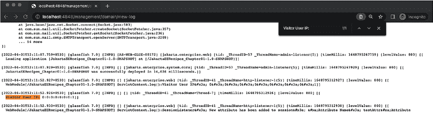

第 1 章 ■ Jakarta Servlet

工作原理

Web 过滤器对于预处理请求以及在访问给定 URL 时调用特定功能非常有用。过滤器并非直接调用位于给定 URL 的 Servlet，而是任何包含相同 URL 模式的过滤器都将在 Servlet 之前被调用。这在许多情况下都很有帮助，其中最有用的可能是执行日志记录、身份验证或其他在后台运行且无需用户交互的服务。


过滤器必须实现 `jakarta.servlet.Filter` 接口。该接口包含的方法包括 `init`、`destroy` 和 `doFilter`。`init` 和 `destroy` 方法由容器调用。`doFilter` 方法用于实现过滤器类的任务。从本方案的解决方案可以看出，过滤器类可以访问 `ServletRequest` 和 `ServletResponse` 对象。这意味着可以捕获请求，并从中获取信息。这也意味着，如果需要，可以对请求进行修改。

例如，在使用身份验证过滤器后，将用户名包含在请求中。

如果你想要链式调用过滤器，或者对于给定的 URL 模式存在多个过滤器，它们将按照在 `web.xml` 部署描述符中配置的顺序被调用。如果每个 URL 模式使用多个过滤器，最好手动配置过滤器，而不是使用 `@WebFilter` 注解。要手动配置 `web.xml` 文件以包含过滤器，请使用 `<filter>` 和 `<filter-mapping>` XML 元素及其相关的子元素标签。以下摘录展示了如何在 `web.xml` 配置文件中手动配置过滤器：

<filter>

<filter-name>LoggingFilter</filter-name>

<filter-class>LoggingFilter</filter-class>

</filter>

<filter-mapping>

<filter-name>LoggingFilter</filter-name>

<url-pattern>/*</url-pattern>

</filter-mapping>

当然，`@WebFilter` 注解会为您处理配置，因此在这种情况下不需要手动配置。

■ **注意** 如果过滤器调用了链中的下一个实体，则每个过滤器服务方法必须在与应用到该 Servlet 的所有过滤器相同的线程中运行。

除了 IDE 中的“服务”选项卡外，还可以通过浏览器访问以下 URL 来查看 GlassFish 服务器日志：

http://localhost:4848/management/domain/view-log

图 1-11 的截图演示了如何通过查看服务器日志来验证过滤器的功能。

***图 1-11.** GlassFish 服务器日志*

第 1 章 ■ Jakarta Servlet

1-10. 监听属性更改

问题

您希望能够在 Servlet 属性被添加、移除或更新时，在 Servlet 内执行某个操作。

解决方案

创建一个属性监听器 Servlet，用于监听诸如属性被添加、移除或修改等事件，并在这些事件发生时调用某个操作。以下类通过实现 `HttpSessionAttributeListener` 并监听 HTTP 会话中添加、移除或替换的属性来演示此技术：

package org.jakartaeerecipe.chapter01.recipe01_10;

import jakarta.servlet.*;

import jakarta.servlet.annotation.WebListener;

import jakarta.servlet.http.*;

@WebListener

public final class AttributeListener implements ServletContextListener,

HttpSessionAttributeListener {

private ServletContext context = null;

@Override

public void attributeAdded(HttpSessionBindingEvent se) {

HttpSession session = se.getSession();

String id = session.getId();

String name = se.getName();

String value = (String) se.getValue();

String message = new StringBuffer("新属性已添加到会话：\n")

.append("属性名称：").append(name).append("\n")

.append("属性值：").append(value).toString();

log(message);

}

@Override

public void attributeRemoved(HttpSessionBindingEvent se) {

HttpSession session = se.getSession();

String id = session.getId();

String name = se.getName();

if (name == null) {

name = "未知";

}

String value = (String) se.getValue();

String message = new StringBuffer("属性已从会话中移除：\n").

append(id).append("\n")

.append("属性名称：").append(name).append("\n").append("属性值：")

第 1 章 ■ Jakarta Servlet

.append(value).toString();

log(message);

}

@Override

public void attributeReplaced(HttpSessionBindingEvent se) {

String name = se.getName();

if (name == null) {

name = "未知";

}

String value = (String) se.getValue();


```java
String message = new StringBuffer("Attribute has been replaced: \n ").append(name).
toString();

log(message);

}

private void log(String message) {

if (context != null) {

context.log("SessionListener: " + message);

} else {

System.out.println("SessionListener: " + message);

}

}

@Override

public void contextInitialized(ServletContextEvent event) {

this.context = event.getServletContext();

log("contextInitialized()");

}

@Override

public void contextDestroyed(ServletContextEvent event) {

}

}
```

在此示例中，消息将显示在服务器日志文件中，指示属性何时被添加、移除或替换。

## 工作原理

在某些情况下，了解属性何时被设置或属性值被设置为什么是很有用的。本配方的解决方案演示了如何创建属性监听器来获取这些信息。要创建 Servlet 监听器，必须实现一个或多个 Servlet 监听器接口。要监听 HTTP 会话属性更改，请实现 `HttpSessionAttributeListener`。这样一来，监听器将实现 `attributeAdded`、`attributeRemoved` 和 `attributeReplaced` 方法。这些方法中的每一个都接受 `HttpSessionBindingEvent` 作为参数，它们的实现分别定义了当 HTTP 会话属性被添加、移除或更改时将发生什么。

在本配方的解决方案中，您可以看到上一段中列出的三个方法都包含类似的实现。在每个方法内部，都会对 `HttpSessionBindingEvent` 进行查询并将其分解为字符串值，这些字符串值表示导致监听器响应的属性的 ID、名称和值。例如，在 `attributeAdded` 方法中，从 `HttpSessionBindingEvent` 获取会话，然后通过使用 `getSession` 检索会话 ID。属性信息可以直接从 `HttpSessionBindingEvent` 使用 `getId` 和 `getName` 方法获取，如下代码行所示：

```java
HttpSession session = se.getSession();
String id = session.getId();
String name = se.getName();
String value = (String) se.getValue();
```

获取这些值后，应用程序可以对它们执行任何需要的操作。在本配方中，属性 ID、名称和会话 ID 被简单地记录并打印出来：

```java
String message = new StringBuffer("New attribute has been added to session: \n")
.append("Attribute Name: ").append(name).append("\n")
.append("Attribute Value:").append(value).toString();
log(message);
```

`attributeReplaced` 和 `attributeRemoved` 方法的主体包含类似的功能。最终，在每个方法内部都使用相同的例程来获取属性名称和值，然后对这些值执行某些操作。

有几种不同的选项可用于向容器注册监听器。`@WebListener` 注解是最简单的方法，使用它的唯一缺点是，如果需要移除监听器注解，则需要重新编译代码。监听器可以在 Web 部署描述符中注册，也可以使用 `ServletContext` 中包含的 `addListener` 方法之一进行注册。

尽管本配方中的示例没有执行任何改变生命周期的事件，但它确实演示了如何创建和使用属性监听器。在现实世界中，如果应用程序需要捕获每个登录用户的用户名，或者在设置指定属性时需要发送电子邮件，那么这样的监听器就会变得非常有用。

请注意，可以使用诸如 `ServletRequestAttributeListener` 或 `ServletContextAttributeListener` 之类的接口开发更复杂的解决方案，这些接口分别可用于接收有关 `ServletRequest` 或 `ServletContext` 属性更改的事件。

## 1-11. 将会话监听器应用于会话

### 问题

您希望监听会话的创建和销毁，以便能够计算应用程序当前包含的活动会话数量，并为每个会话执行一些初始化操作。

### 解决方案

创建一个会话监听器，并相应地实现 `sessionCreated` 和 `sessionDestroyed` 方法。在以下示例中，使用一个 Servlet 来跟踪活动会话。每当有人使用应用程序时，计数器就会加一。同样，每当有人离开应用程序时，计数器就会减一：

```java
package org.jakartaeerecipe.chapter01.recipe01_11;

import jakarta.servlet.annotation.WebListener;
import jakarta.servlet.http.*;

@WebListener
public class SessionListener implements HttpSessionListener {

    private int numberOfSessions;

    public SessionListener() {
        numberOfSessions = 0;
    }

    public int getNumberOfSessions() {
        return numberOfSessions;
    }

    @Override
    public void sessionCreated(HttpSessionEvent event) {
        HttpSession session = event.getSession();
        session.setMaxInactiveInterval(60);
        session.setAttribute("testAttr", "testVal");
        synchronized (this) {
            numberOfSessions++;
        }
        System.out.println("Session created, current count: " + numberOfSessions);
    }

    @Override
    public void sessionDestroyed(HttpSessionEvent event) {
        HttpSession session = event.getSession();
        synchronized (this) {
            numberOfSessions--;
        }
        System.out.println("Session destroyed, current count: " + numberOfSessions);
        System.out.println("The attribute value: " + session.getAttribute(("testAttr")));
    }
}
```

每当有新访客访问应用程序时，就会启动一个新会话，并设置 `testAttr`。当会话超时时，它将被销毁，并且为该会话设置的所有属性都将被移除。

在此示例中，消息将显示在服务器日志文件中，如图 1-12 所示，指示会话何时被创建或销毁。

***图 1-12.** GlassFish 服务器日志查看器输出*

## 工作原理

跟踪 Web 应用程序用户的一种有意义的方法是在其 `HttpSession` 对象中放置值。使用 Jakarta Servlet，可以设置会话属性，这些属性将在 `HttpSession` 的生命周期内存在。一旦会话失效，这些属性将被移除。要设置会话监听器，请创建一个 Jakarta Servlet，使用 `@WebListener` 注解对其进行注解，并实现 `jakarta.servlet.http.HttpSessionListener`。这样做将强制实现 `sessionCreated` 和 `sessionDestroyed` 方法，会话的魔力就发生在这里。

在本配方的示例中，`sessionCreated` 方法首先通过调用 `HttpSessionEvent` 对象的 `getSession` 方法获取当前 `HttpSession` 对象的句柄。该句柄被分配给一个名为 `session` 的 `HttpSession` 变量。现在，您已经用会话对象初始化了该变量，就可以使用它来设置生命周期，并放置那些将随会话生命周期共存亡的属性。示例中执行的第一个会话配置是将最大非活动生命周期设置为 60（秒），超过此时间后，Servlet 容器将使会话失效。接下来，在会话中设置一个名为 `testAttr` 的属性，并赋予其值 `testVal`：

```java
HttpSession session = arg.getSession();
session.setMaxInactiveInterval(60);
session.setAttribute("testAttr", "testVal");
```

声明了一个名为 `numberOfSessions` 的 Servlet 内部字段，每次启动新会话时，该字段都会递增。在 `session.setAttribute()` 调用之后，计数器在同步语句内递增。最后，向服务器日志打印一条消息，指示已创建新会话，并提供总的活动会话计数。

■ **注意** 将递增操作放在同步语句内有助于避免该字段的并发问题。有关 Java 同步和并发的更多信息，请参阅在线文档。


[`docs.oracle.com/javase/tutorial/essential/concurrency/locksync.html`](http://docs.oracle.com/javase/tutorial/essential/concurrency/locksync.html).

一旦达到最大非活动秒数，就会在会话上调用 `sessionDestroyed` 方法。在此示例中，该方法将在非活动 60 秒后被调用。在 `sessionDestroyed` 方法内部，另一个同步语句将 `numberOfSessions` 字段值减一，然后在服务器日志中打印几行内容，指示会话已被销毁，并提供新的活动会话总数。

会话监听器可用于设置 Cookie 和执行其他有用的策略，以帮助管理用户体验。它们易于使用且功能强大。

1-12. 管理会话属性

问题

当用户访问您的网站时，您希望在每个会话的基础上维护有关单个会话的一些信息。

第 1 章 ■ Jakarta Servlet

解决方案

使用会话属性来保留基于会话的信息。为此，请使用 `HttpServletRequest` 对象获取对会话的访问权限，然后相应地使用 `getAttribute()` 和 `setAttribute()` 方法。在以下场景中，使用 HTML 页面捕获用户的电子邮件地址，然后将该电子邮件地址放入会话属性中。然后，Jakarta Servlet 在应用程序的不同页面中使用该属性以维护状态。

以下代码演示了在此场景中 HTML 表单（`recipe01_12.html`）可能的样子：

```html
<html lang="en">

<head>

<title></title>

<meta http-equiv="Content-Type" content="text/html; charset=UTF-8">

</head>

<body>

<h1>提供用于此交易的电子邮件地址</h1>

</br>

<form method="POST" action="SessionServlet">

<label for="email">电子邮件</label>

<input type="email" id="email" name="email" formnovalidate="false" required/>

<br/></br>

<input type="submit" value="提交"/>

</form>

</body>

</html>
```

接下来，当表单提交时，将启动名为 `SessionServlet`（使用 URL 模式 `/SessionServlet`）的 Jakarta Servlet。所有表单输入值都会传递给 `SessionServlet` 并进行相应处理。

```java
package org.jakartaeerecipe.chapter01.recipe01_12;

import java.io.*;

import jakarta.servlet.*;

import jakarta.servlet.annotation.WebServlet;

import jakarta.servlet.http.*;

@WebServlet(name="SessionServlet", urlPatterns={"/SessionServlet"})

public class SessionServlet extends HttpServlet {

    @Override

    public void doPost (HttpServletRequest req, HttpServletResponse res)

            throws ServletException, IOException {

        // 获取 Session 对象

        HttpSession session = req.getSession(true);

        // 设置会话属性

        String email = (String)

                session.getAttribute ("session.email");

        if (email == null) {

            email = req.getParameter("email");

            session.setAttribute ("session.email", email);

        }

        

        // 第 1 章 ■ Jakarta Servlet

        String sessionId = session.getId();

        res.setContentType("text/html");

        try (PrintWriter out = response.getWriter()) {

            out.printf("""

                    <html>

                    <head>

                    <title>使用会话</title>

                    </head>

                    <body>

                    <h1>会话测试</h1>

                    您的电子邮件地址是：%s <br/>

                    您的会话 ID：%s

                    </body>

                    </html>""", email, sessionId);

        }

    }

}
```

最后，原始 HTML 表单中输入的电子邮件地址被捕获，并在应用程序的不同页面中使用。

***图 1-13.** SessionServlet 输出*

工作原理

自 Web 开发之初，会话属性就被用于保留有关用户会话的重要信息。在使用 Jakarta Servlet 进行开发时，这一概念同样适用，并且 Servlet 使得设置和获取属性值变得容易。所有 `HttpServlet` 类都必须实现 `doGet` 或 `doPost` 方法以处理 Web 应用程序事件。在此过程中，这些方法可以访问作为参数传递给它们的 `HttpServletRequest` 对象。可以从 `HttpServletRequest` 中获取 `HttpSession` 对象，因此，可以根据需要使用它来检索和设置属性。


在本方案的解决方案中，使用了一个 HTTP 会话属性来存储电子邮件地址。随后，在整个应用程序的不同 Servlet 类中，通过获取会话对象并检索该属性值来使用该地址：

// 获取会话对象

HttpSession session = req.getSession(true);

// 设置一个会话属性

String email = (String)

session.getAttribute ("session.email");

第 1 章 ■ Jakarta ServletS

if (email == null) {

email = req.getParameter("email");

session.setAttribute ("session.email", email);

}

只要会话保持有效，任何属性都将保留在 `HttpSession` 对象中。在页面之间跳转时，会话 ID 将保持一致。你可以看到，本方案的解决方案获取并打印了当前会话 ID 以供参考。在 `HttpSession` 中使用属性是在不同部分之间传递数据以维护会话状态的一种好方法。

1-13. 下载文件

问题

你希望让你的 Servlet 应用程序具备下载指定文件的能力。

解决方案

编写一个 Servlet，它接受所选文件的名称和路径，然后读取该文件并将其流式传输给文件请求者。以下网页可用于选择要由 Servlet 下载的文件。尽管以下 HTML（recipe01_13.html）包含一个静态类型的文件名，但它完全可以包含来自数据库或其他来源的动态文件列表：

<html>

<head>

<meta charset="UTF-8">

</head>

<body>

<h1>点击下方链接以下载文件。</h1>

<br/>

<a href="DownloadServlet?filename=downloadTest.txt">下载测试文件</a>

<br/>

</body>

</html>

■ **注意** 对于本方案中的示例，你可以在根目录中（与 WEB-INF 文件夹相邻）创建并编辑一个文件，将其命名为 `downloadTest.txt`，以查看 Servlet 将数据传输到你的浏览器客户端。

当用户点击前一个 HTML 网页上呈现的链接时，将使用以下 Servlet 来下载指定文件，方法是将 `HttpServletRequest` 和 `HttpServletResponse` 对象以及应下载的文件传递给它：

package org.jakartaeerecipe.chapter01.recipe01_13;

import jakarta.servlet.*;

import jakarta.servlet.http.*;

import jakarta.servlet.annotation.*;

第 1 章 ■ Jakarta ServletS

import java.io.IOException;

import java.io.InputStream;

@WebServlet(name = "DownloadServlet", value = "/DownloadServlet")

public class DownloadServlet extends HttpServlet {

/**

* 处理 HTTP

* <code>GET</code> 方法。

*

* @param request servlet 请求

* @param response servlet 响应

* @throws ServletException 如果发生特定于 servlet 的错误

* @throws IOException 如果发生 I/O 错误

*/

@Override

protected void doGet(HttpServletRequest request, HttpServletResponse response)

throws ServletException, IOException {

// 从包含要下载文件名的表单中读取参数

String fileToDownload = request.getParameter("filename");

// 使用给定的文件调用下载方法

System.err.println("正在下载文件...");

doDownload(request, response, fileToDownload);

}

/**

* 将文件发送到输出流。

*

* @param request 请求

* @param response 响应

* @param originalFile 浏览器应接收到的文件名。

*/

private void doDownload( HttpServletRequest request, HttpServletResponse response,

String originalFile) throws IOException {

final int BYTES = 1024;

int length;

ServletOutputStream outStream = response.getOutputStream();

ServletContext context = getServletConfig().getServletContext();

response.setContentType((context.getMimeType( originalFile ) != null) ?

context.getMimeType( originalFile ) : "text/plain" );

response.setHeader("Content-Disposition", "attachment; filename=\"" + originalFile

+ "\"" );

InputStream in = context.getResourceAsStream("/" + originalFile);

byte[] bbuf = new byte[BYTES];

while ((in != null) && ((length = in.read(bbuf)) != -1))

{

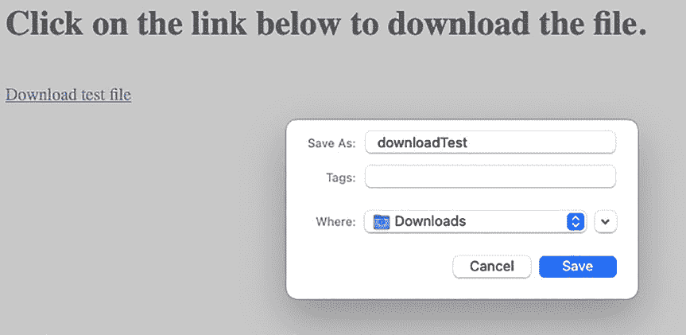

第 1 章 ■ Jakarta ServletS

outStream.write(bbuf,0,length);

}

outStream.flush();

outStream.close();

}

/**


* 返回 Servlet 的简短描述。

*

* @return 包含 Servlet 描述的字符串

*/

@Override

public String getServletInfo() {

return "简短描述";

}

}

该 Servlet 不会生成响应；当用户点击下载文件的链接时，它只会将指定文件下载到最终用户。

***图 1-14.** DownloadServlet 输出*

工作原理

文件下载几乎是所有 Web 应用程序的基本任务。按照本方案提供的步骤操作，可以轻松实现此任务。本方案中的示例演示了一个简单场景：用户可以访问网页，点击要下载的文件，然后文件会从服务器检索并复制到其计算机上。此示例中的 HTML 非常简单，它列出了一个 URL 链接，该链接会调用 Servlet 并传递要下载的文件名。当用户点击链接时，文件名会作为名为 `filename` 的参数传递给 `/DownloadServlet`。点击链接后，会调用 Servlet 的 `doGet` 方法。`doGet` 方法中执行的第一项任务是从调用网页读取 `filename` 参数。然后，该信息连同 `HttpServletRequest` 和 `HttpServletResponse` 对象一起传递给 `doDownload` 方法。

在 `doDownload` 方法中，从 `HttpServletResponse` 对象获取 `ServletOutputStream`，并获取 `ServletContext` 以供后续使用。要下载文件，Servlet 必须提供与要下载文件类型匹配的响应类型。它还必须在响应头中指明包含附件。因此，`doDownload` 方法要执行的第一项任务是适当地设置 `HttpServletResponse`：

```java
response.setContentType( (context.getMimeType( originalFile ) != null) ?
context.getMimeType( originalFile ) : "text/plain" );
response.setHeader( "Content-Disposition", "attachment; filename=\"" + originalFile + "\"" );
```

在此例中，文件名 `originalFile` 用于获取文件的 MIME 类型。如果文件的 MIME 类型为 null，则返回 `text/plain`。同时，通过在 `Content-Disposition` 中将文件名作为附件附加，在响应头中设置附件。接下来，`doDownload` 方法通过调用 `ServletContext` 的 `getResourceAsStream` 方法并传递文件名，获取对要下载文件的引用。这将返回一个 `InputStream` 对象，可用于读取指定文件的内容。然后创建一个字节缓冲区，用于在读取文件时获取数据块。最后一项实际任务是读取文件内容并将其复制到输出流。这通过一个 `while` 循环完成，该循环将持续从 `InputStream` 读取，直到所有内容处理完毕。使用循环读取数据块并写入输出流：

```java
while ((in != null) && ((length = in.read(bbuf)) != -1))
{
    outStream.write(bbuf,0,length);
}
```

最后，调用 `ServletOutputStream` 对象的 `flush` 方法清除内容，然后关闭它以释放资源。然而，使用 Jakarta Servlet 下载文件的魔力可能被此示例掩盖，因为此示例中使用的是静态文件作为下载源。在实际应用中，HTML 页面可能包含数据库中的文件列表，当用户选择要下载的文件时，Servlet 会相应地处理该文件，甚至在必要时从数据库中提取文件。

1-14. 分发请求

问题

您希望编写一个 Servlet，根据需要完成的任务将请求分发给其他 Servlet。此外，您希望在不将客户端重定向到其他站点的情况下分发请求，因此浏览器中的 URL 不应改变。

解决方案


创建一个请求分发器 Servlet，它将决定需要完成哪个任务，然后将请求发送到适当的 Servlet 来执行该任务。以下示例通过一个 HTML 表单演示了这一概念，该表单接受用户输入的两个数字，并允许用户决定服务器应执行哪种类型的数学运算。Servlet 处理请求时，首先确定应执行哪种数学运算，然后将请求分派给适当的 Servlet 来执行任务。

以下 HTML 表单接受用户输入的两个数字，并允许他们选择要对这两个数字执行哪种数学运算：

<html>

<head>

<title></title>

<meta http-equiv="Content-Type" content="text/html; charset=UTF-8">

</head>

<body>

<h1>请求分发示例</h1>

<p>执行数学运算。输入两个待计算的数字，然后选择要执行的运算类型。</p>

<form method="POST" action="MathDispatcher">

<label for="numa">输入数字 A：</label>

<input type="text" id="numa" name="numa"/><br><br>

<label for="numb">输入数字 B：</label>

<input type="text" id="numb" name="numb"/><br/><br/>

<select id="eval" name="eval">

<option value="add">相加</option>

<option value="subtract">相减</option>

<option value="multiply">相乘</option>

<option value="divide">相除</option>

</select>

<input type="submit" value="提交表单"/>

<input type="reset" value="重置表单"/>

</form>

</body>

</html>

接下来的代码是 Servlet，它将根据 `matheval` 字段的值相应地分发请求：

package org.jakartaeerecipe.chapter01.recipe01_14;

import java.io.IOException;

import jakarta.servlet.*;

import jakarta.servlet.annotation.WebServlet;

import jakarta.servlet.http.*;

@WebServlet(name = "MathDispatcher", urlPatterns = {"/MathDispatcher"})

public class MathDispatcher extends HttpServlet {

/**

* 处理 HTTP

* <code>POST</code> 方法。

*

* @param request  servlet 请求

* @param response servlet 响应

* @throws ServletException 如果发生特定于 servlet 的错误

* @throws IOException      如果发生 I/O 错误

*/

@Override

protected void doPost(HttpServletRequest request, HttpServletResponse response)

throws ServletException, IOException {

System.out.println("进入 Servlet...");

// 将输入参数值存储到字符串中

String eval = request.getParameter("eval");

ServletContext sc = getServletConfig().getServletContext();

RequestDispatcher rd = null;

switch(eval){

case "add" -> rd = sc.getRequestDispatcher("/AddServlet");

case "subtract" -> rd = sc.getRequestDispatcher("/SubtractServlet");

case "multiply" -> rd = sc.getRequestDispatcher("/MultiplyServlet");

case "divide" -> rd = sc.getRequestDispatcher("/DivideServlet");

}

rd.forward(request, response);

}

/**

* 返回 servlet 的简短描述。

*

* @return 包含 servlet 描述的字符串

*/

@Override

public String getServletInfo() {

return "简短描述";

}

}

接下来是请求将被分发到的其中一个 Servlet 的示例。以下是 `AddServlet` 的代码，它将两个数字相加并将结果返回给用户：

package org.jakartaeerecipe.chapter01.recipe01_14;

import java.io.*;

import jakarta.servlet.ServletException;

import jakarta.servlet.annotation.WebServlet;

import jakarta.servlet.http.*;

@WebServlet(name = "AddServlet", urlPatterns = {"/AddServlet"})

public class AddServlet extends HttpServlet {

/**

* 处理 HTTP

* <code>GET</code> 和

* <code>POST</code> 方法的请求。

*

* @param request  servlet 请求

* @param response servlet 响应

* @throws ServletException 如果发生特定于 servlet 的错误

* @throws IOException      如果发生 I/O 错误

*/

protected void processRequest(HttpServletRequest request, HttpServletResponse response)

throws ServletException, IOException {

response.setContentType("text/html;charset=UTF-8");


// 将输入参数值存储到字符串中

String numA = request.getParameter("numa");

String numB = request.getParameter("numb");

int sum = Integer.valueOf(numA) + Integer.valueOf(numB);

try (PrintWriter out = response.getWriter())

{

out.printf("""<html>

<head>

<title>数字之和</title>");

</head>

<body>

<h1>总和：%s </h1>

<br/>

<a href=recipe01_14.html>再试一次</a>

</body>

</html>""", sum);

}

/**

* 处理 HTTP

* <code>GET</code> 方法。

*

* @param request  servlet 请求

* @param response servlet 响应

* @throws ServletException 如果发生特定于 servlet 的错误

* @throws IOException      如果发生 I/O 错误

*/

@Override

protected void doGet(HttpServletRequest request, HttpServletResponse response)

throws ServletException, IOException {

processRequest(request, response);

}

/**

* 处理 HTTP

* <code>POST</code> 方法。

*

* @param request  servlet 请求

* @param response servlet 响应

* @throws ServletException 如果发生特定于 servlet 的错误

* @throws IOException      如果发生 I/O 错误

*/

@Override

protected void doPost(HttpServletRequest request, HttpServletResponse response)

throws ServletException, IOException {

第 1 章 ■ Jakarta ServletS

processRequest(request, response);

}

/**

* 返回 servlet 的简短描述。

*

* @return 包含 servlet 描述的字符串

*/

@Override

public String getServletInfo() {

return "简短描述";

}

}

其他每个 servlet 都与 AddServlet 非常相似，只是数学运算不同。

要查看完整的代码清单，请参阅本书的源代码。

工作原理

有时，向最终用户隐藏请求转发是一个好主意。其他时候，将请求从一个 servlet 移交给另一个 servlet 以便进行另一种类型的处理也是合理的。这只是在 servlet 内执行请求分派时很有用的两个例子。转发请求与分派请求不同，因为转发请求是在客户端移交请求，而分派请求是在服务器端移交请求。这种差异可能非常大，因为最终用户对服务器端的分派一无所知，而当请求在客户端转发时，浏览器会被重定向到不同的 URL。

分派请求是一项简单的任务。执行此操作的工具直接内置于 ServletContext 中，因此一旦获得对 ServletContext 的引用，只需调用 getRequestDispatcher 方法即可获得可用于分派请求的 RequestDispatcher 对象。调用 getRequestDispatcher 方法时，传入一个包含要移交请求的 servlet 名称的字符串。实际上，可以通过将资源的适当 URL 以字符串格式传递给 getRequestDispatcher 方法，为应用程序中的任何有效 HTTP 资源获取 RequestDispatcher 对象。因此，如果你更愿意分派到 JSP 或 HTML 页面，也可以这样做。获得 RequestDispatcher 对象后，通过将 HttpServletRequest 和 HttpServletResponse 对象传递给它来调用其 forward 方法。forward 方法执行移交请求的任务：

rd = sc.getRequestDispatcher("/AddServlet");

rd.forward(request, response);

在本示例中，你可以将请求分派到不同的 servlet 以执行特定任务。一旦移交，获得请求的 servlet 负责向客户端提供响应。在这种情况下，servlet 返回指定数学运算的结果。

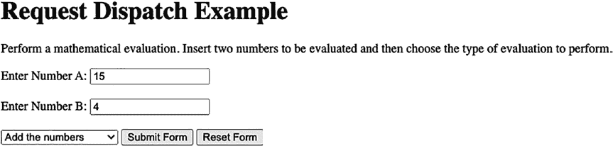


第 1 章 ■ Jakarta ServletS

***图 1-15.** 用于调用 MathDispatcher servlet 的 HTML 表单*

***图 1-16.** AddServlet servlet 输出*

1-15. 重定向到不同的站点

问题

当访问应用程序中的特定 URL 时，你需要将浏览器重定向到另一个 URL。

解决方案


使用 `HttpServletResponse` 对象的 `sendRedirect()` 方法，可以从 Servlet 重定向到另一个 URL。在以下示例中，当使用与 `/redirect` 模式匹配的 URL 时，Servlet 会将浏览器重定向到另一个站点：

```java
import java.io.IOException;

import jakarta.servlet.*;

import jakarta.servlet.annotation.WebServlet;

import jakarta.servlet.http.*;

@WebServlet(name="RedirectServlet", urlPatterns={"/redirect"})

public class RedirectServlet extends HttpServlet {

@Override

protected void doGet(HttpServletRequest req, HttpServletResponse res)

throws IOException, ServletException {

String site = "http://www.apress.com";

res.sendRedirect(site);

}

}
```

在此示例中，Servlet 会将浏览器重定向到 [www.apress.com 网站](http://www.apress.com)。

第 1 章 ■ Jakarta Servlet

工作原理

在某些情况下，Web 应用程序需要将流量重定向到同一应用程序或另一个应用程序中的其他站点或 URL。对于此类情况，可以使用 `HttpServletResponse` 的 `sendRedirect` 方法。

`sendRedirect` 方法接受一个字符串格式的 URL，然后将 Web 浏览器重定向到该 URL。由于 `sendRedirect` 接受基于字符串的 URL，因此也可以轻松构建动态 URL。

例如，某些应用程序可能会根据用户传递的特定参数重定向到不同的 URL。在这种情况下，动态生成 URL 的代码可能如下所示：

```java
String redirectUrl = null;

if(parameter.equals("SOME STRING")

redirectUrl = "/" + urlPathA;

else

redirectUrl = "/" + urlPathB;

res.sendRedirect(redirectUrl);
```

`sendRedirect()` 方法也可用于创建 Web 菜单和其他页面项的控制，这些项可以将 Web 流量发送到不同的位置。

■ **注意** 与 Servlet 链式调用不同，这种简单的重定向不会将 `HttpRequest` 对象传递给目标地址。

1-16. 在浏览器中安全地维护状态

问题

你需要在浏览器中为应用程序保存用户的状态。

解决方案

使用“仅 HTTP”浏览器 Cookie 来保存状态。在以下示例中，一个 Servlet 用于将一些会话信息放入浏览器中的 Cookie 中。然后调用另一个 Servlet，该 Servlet 读取 Cookie 信息并将其显示给用户。以下 Servlet 演示了如何使用 Jakarta Servlet 在浏览器中存储 Cookie：

```java
package org.jakartaeerecipe.chapter01.recipe01_16;

import java.io.*;

import jakarta.servlet.ServletException;

import jakarta.servlet.annotation.WebServlet;

import jakarta.servlet.http.*;

@WebServlet(name = "SetCookieServlet", urlPatterns = {"/SetCookieServlet"}) 
public class SetCookieServlet extends HttpServlet {

protected void processRequest(HttpServletRequest request, HttpServletResponse response)

throws ServletException, IOException {

response.setContentType("text/html;charset=UTF-8");

PrintWriter out = response.getWriter();


第 1 章 ■ Jakarta Servlet

Cookie cookie = new Cookie("sessionId","12345");

cookie.setHttpOnly(true);

cookie.setMaxAge(-30);

response.addCookie(cookie);

try {

out.println("""<html>

<head>

<title>设置 Cookie</title>

</head>

<body>

<h1>Servlet SetCookieServlet 正在向浏览器设置 Cookie</h1>

<br/><br/>

<a href='DisplayCookieServlet'>显示 Cookie 内容。</a>

</body>

</html>""");

} finally {

out.close();

}

}

@Override

protected void doGet(HttpServletRequest request, HttpServletResponse response)

throws ServletException, IOException {

processRequest(request, response);

}

@Override

protected void doPost(HttpServletRequest request, HttpServletResponse response)

throws ServletException, IOException {

processRequest(request, response);

}

}
```

***图 1-17.** SetCookieServlet Servlet 的输出*

接下来的代码清单演示了一个 Servlet，它读取浏览器中的 Cookie 并打印其内容：

```java
package org.jakartaeerecipe.chapter01.recipe01_16;

import java.io.*;

import jakarta.servlet.ServletException;

import jakarta.servlet.annotation.WebServlet;

import jakarta.servlet.http.*;
```


第 1 章 ■ Jakarta ServletS

@WebServlet(name = "DisplayCookieServlet", urlPatterns = {"/DisplayCookieServlet"}) public class DisplayCookieServlet extends HttpServlet {

protected void processRequest(HttpServletRequest request, HttpServletResponse response)

throws ServletException, IOException {

response.setContentType("text/html;charset=UTF-8");

Cookie[] cookies = request.getCookies();

try (PrintWriter out = response.getWriter()) {

out.print("""

<html>

<head>

<title>显示 Cookie</title>

</head>

<body>

""");

for(Cookie cookie:cookies){

out.printf("""

<p>Cookie 名称: %s <br/>

值: %s

</p>

""", cookie.getName(), cookie.getValue());

}

out.println("</body>");

out.println("</html>");

}

}

@Override

protected void doGet(HttpServletRequest request, HttpServletResponse response)

throws ServletException, IOException {

processRequest(request, response);

}

@Override

protected void doPost(HttpServletRequest request, HttpServletResponse response)

throws ServletException, IOException {

processRequest(request, response);

}

}

工作原理

使用 Cookie 在浏览器中存储数据是一项已实践多年的技术。自 Servlet 3.0 API 起，将 Cookie 标记为仅 HTTP 的功能已可用。这使得 Cookie 能够防范客户端脚本攻击，从而更加安全。任何标准 Servlet 都可以创建 Cookie 并将其放入当前会话中。同样，同一会话中的任何 Servlet 都可以读取或更新会话的 Cookie 值。在本示例中，使用了两个 Servlet 来演示 Cookie 的工作方式。第一个 Servlet 负责创建新 Cookie 并将其设置到浏览器会话中。第二个 Servlet 负责向用户显示 Cookie 的内容。

要创建 Cookie，只需实例化一个新的`jakarta.servlet.http.Cookie`对象，并为其分配名称和值。在实例化时将名称和值同时传递给 Cookie 构造函数即可完成赋值，也可以通过将值传递给 Cookie 的`setName`和`setValue`方法来实现。

第 1 章 ■ Jakarta ServletS

Cookie 实例化后，可以设置属性来配置 Cookie。在本示例中，调用了 Cookie 的`setMaxAge`和`setHttpOnly`方法，用于设置 Cookie 的生命周期并确保其能防范客户端脚本。有关 Cookie 属性的完整列表，请参考表 1-3。最后，通过将 Cookie 传递给响应对象的`addCookie`方法将其放入响应中：

Cookie cookie = new Cookie("sessionId","12345");

cookie.setHttpOnly(true);

cookie.setMaxAge(-30);

response.addCookie(cookie);

***表 1-3.** Cookie 属性方法*

**属性**

**描述**

setComment

设置描述 Cookie 的注释

setDomain

指定 Cookie 所属的域

setHttpOnly

将 Cookie 标记为仅 HTTP

setMaxAge

设置 Cookie 的最大生命周期。负值表示 Cookie 将在会话结束时过期

setPath

指定客户端应返回 Cookie 的路径

setSecure

指示 Cookie 仅应通过安全协议发送

setValue

为 Cookie 赋值

setVersion

指定 Cookie 将遵循的 Cookie 协议版本

示例中的第二个 Servlet DisplayCookieServlet 负责读取并显示会话的 Cookie 值。当调用 DisplayCookieServlet 时，会调用其`processRequest`方法，该方法通过调用`response.getCookies()`获取响应对象中的 Cookie，并将结果设置为 Cookie 对象数组：

Cookie[] cookies = request.getCookies();

现在可以遍历 Cookie 对象数组以获取每个 Cookie 并打印其内容。

Servlet 通过使用 for 循环并打印每个 Cookie 的名称和值来实现这一点：

for(Cookie cookie:cookies){

out.printf(""""

<p>

Cookie 名称: %s <br/>

值: %s


</p>

""", cookie.getName(), cookie.getValue());

}


第 1 章 ■ Jakarta Servlet

图 1-18 展示了 DisplayCookie Servlet 的输出结果。

***图 1-18.** DisplayCookieServlet Servlet 输出结果*

1-17. 完成 Servlet 任务

问题

你希望当 Servlet 不再使用时，它能自动清理某些资源。

解决方案

该问题的解决方案分为两步。首先，在 Servlet 的 destroy 方法中编写执行清理工作的代码。其次，如果存在可能长时间运行的方法，应对其进行编码，使其能够感知关闭事件，并在必要时停止并返回，以便 Servlet 能够干净地关闭。

以下代码片段是 destroy 方法的一个小示例。在该代码中，它被用于初始化局部变量，并设置 beingDestroyed 布尔值以指示 Servlet 正在关闭：

...

/**

* 用于终结 Servlet

*/

@Override

public void destroy() {

// 告知 Servlet 正在关闭

setBeingDestroyed(true);

// 执行任何清理工作

thisString = null;

}

...

destroy 方法中的代码可以成功完成 Servlet 的全面清理，但如果存在长时间运行的任务，则必须通知其关闭。以下代码片段代表了一个长时间运行的任务。一旦通过 beingDestroyed 值变为 true 指示关闭，该任务应停止处理：

for (int x = 0; (x <= 100000 && !isBeingDestroyed()); x++) {

doSomething();

}

第 1 章 ■ Jakarta Servlet

■ **注意** 如果你想在调用 destroy 方法之前执行清理工作，可以创建一个返回 void 的 public、protected 或 private 方法，并使用@preDestroy 注解进行标记。@preDestroy 注解标记了一个在组件从容器中移除之前被调用的方法。该方法不得抛出受检异常。

工作原理

Servlet 的终结非常重要，特别是当 Servlet 使用某些可能导致内存泄漏的资源、使用可重用资源（如数据库连接）或需要为另一个会话持久化某些值时。在这种情况下，最好在 Servlet 的 destroy 方法中执行清理工作。每个 Servlet 都包含一个 destroy 方法（可以被实现以重载默认行为），一旦 Servlet 容器确定某个 Servlet 应停止服务，就会调用该方法。

当 Servlet 的所有 service 方法都停止运行后，destroy 方法会被调用。然而，如果存在长时间运行的 service 方法，则可以设置一个服务器宽限期，当达到宽限期时，将导致任何正在运行的 service 被关闭。如前所述，destroy 方法是清理资源的理想场所。然而，destroy 方法也是帮助清理长时间运行服务后的好地方。可以通过设置一个特定于 Servlet 的局部变量来指示 Servlet 正在被销毁，并让长时间运行的服务定期检查该变量的状态来实现清理。如果该变量指示 destroy 方法已被调用，则服务应停止执行。

1-18. 使用非阻塞 I/O 进行读写

问题

你希望以异步、非阻塞的方式进行 I/O 读写。

解决方案

使用 Servlet 3.1 版本中引入的非阻塞 I/O API。要使用该技术，在执行非阻塞读取时实现 ReadListener 接口，在执行非阻塞写入时实现 WriteListener 接口。

然后，可以将实现类注册到 ServletInputStream 或 ServletOutputStream，以便当监听器发现可以无阻塞地读取或写入 Servlet 内容时，执行读取或写入操作。

以下源代码来自位于源文件 org.jakartaeerecipe.chapter01.recipe01_07.AcmeReadListenerImpl.java 中的 ReadListener 实现，它们演示了如何...


实现 ReadListener：

package org.jakartaeerecipe.chapter01.recipe01_07;

import java.io.IOException;

import java.util.logging.*;

import jakarta.servlet.*;

public class AcmeReadListenerImpl implements ReadListener {

第 1 章 ■ Jakarta ServletS

private ServletInputStream is = null;

private AsyncContext async = null;

public AcmeReadListenerImpl(ServletInputStream in, AsyncContext ac) {

this.is = in;

this.async = ac;

System.out.println("读取监听器已初始化");

}

@Override

public void onDataAvailable() {

System.out.println("数据可用");

try {

StringBuilder sb = new StringBuilder();

int len = -1;

byte b[] = new byte[1024];

while (is.isReady()

&& (len = is.read(b)) != -1) {

String data = new String(b, 0, len);

System.out.println(data);

}

} catch (IOException ex) {

Logger.getLogger(AcmeReadListenerImpl.class.getName()).log(Level.SEVERE,

null, ex);

}

}

@Override

public void onAllDataRead() {

System.out.println("所有数据已读取");

async.complete();

}

@Override

public void onError(Throwable throwable) {

System.out.println("错误: " + throwable);

async.complete();

}

}

接下来，通过将监听器注册到 `ServletInputStream`（对于 ReadListener）或 `ServletOutputStream`（对于 WriteListener）来使用它。在本例中，我将展示一个使用 `AcmeReadListenerImpl` 类的 Servlet。以下类的源代码位于 `org.jakartaeerecipe.chapter01.recipe01_07.AcmeReaderExample.java` 文件中：

package org.jakartaeerecipe.chapter01.recipe01_07;

import java.io.IOException;

import java.io.PrintWriter;

import jakarta.servlet.*;

第 1 章 ■ Jakarta ServletS

import jakarta.servlet.annotation.WebServlet;

import jakarta.servlet.http.*;

@WebServlet(urlPatterns = {"/AcmeReaderServlet"}, asyncSupported = true)

public class AcmeReaderServlet extends HttpServlet {

protected void processRequest(HttpServletRequest request, HttpServletResponse response)

throws ServletException, IOException {

response.setContentType("text/html;charset=UTF-8");

try (PrintWriter output = response.getWriter()) {

AsyncContext asyncCtx = request.startAsync();

ServletInputStream input = request.getInputStream();

input.setReadListener(new **AcmeReadListenerImpl**(input, asyncCtx));

} catch (Exception ex) {

System.out.println("发生异常: " + ex);

}

}

// Http Servlet 方法 ...

...

}

我们需要的最后一段代码是调用 `AcmeReaderServlet` 的 Servlet，它传递需要处理的消息。在本例中，服务器上的一个文件作为输入传递给 `AcmeReaderServlet`，然后通过 `AcmeReadListenerImpl` 类进行异步处理。

以下代码取自 `org.jakartaeerecipe.chapter01.recipe01_07.ReaderExample.java`： package org.jakartaeerecipe.chapter01.recipe01_07;

import java.io.*;

import java.net.*;

import java.util.logging.*;

import jakarta.servlet.*;

import jakarta.servlet.annotation.WebServlet;

import jakarta.servlet.http.*;

@WebServlet(name = "ReaderExample", urlPatterns = {"/ReaderExample"})

public class ReaderExample extends HttpServlet {

protected void processRequest(HttpServletRequest request, HttpServletResponse response)

throws ServletException, IOException {

response.setContentType("text/html;charset=UTF-8");

String filename = "/WEB-INF/test.txt";

ServletContext context = getServletContext();

InputStream in = context.getResourceAsStream(filename);

try (PrintWriter out = response.getWriter()) {

String path = "http://"

+ request.getServerName()

+ ":"

+ request.getServerPort()

+ request.getContextPath()

+ **"/AcmeReaderServlet**";

out.println("""<html>

<head>

第 1 章 ■ Jakarta ServletS

<title>Jakarta EE 10 入门 - Servlet 读取器示例</title>

</head>

<body>

<h1>Servlet ReaderExample 位于 %s</h1>

调用端点: %s

<br>

""", request.getContextPath(), path);

out.flush();

URL url = new URL(path);

HttpURLConnection conn = (HttpURLConnection) url.openConnection();

conn.setChunkedStreamingMode(2);

conn.setDoOutput(true);

conn.connect();

if (in != null) {

InputStreamReader inReader = new InputStreamReader(in);

BufferedReader reader = new BufferedReader(inReader);


```java
String text = "";

out.println("Beginning Read");

try (BufferedWriter output = new BufferedWriter(new OutputStreamWriter(conn.

getOutputStream()))) {

out.println("got the output...beginning loop");

while ((text = reader.readLine()) != null) {

out.println("reading text: " + text);

out.flush();

output.write(text);

Thread.sleep(1000);

output.write("Ending example now..");

out.flush();

}

output.flush();

output.close();

}

}

out.println("Review the Glassfish server log for messages...");

out.println("</body>");

out.println("</html>");

} catch (InterruptedException | IOException ex) {

Logger.getLogger(ReaderExample.class.getName()).log(Level.SEVERE, null, ex);

}

}

// Http Servlet Methods ...

...

}
```

当访问该 Servlet 时，将执行对 `test.txt` 文件的异步非阻塞读取，其文本内容将显示在服务器日志中。

第 1 章 ■ Jakarta Servlet

工作原理

自 Servlet 技术诞生以来，在请求处理过程中仅允许传统的（阻塞式）输入/输出。在 Servlet 3.1 版本中，引入了非阻塞 I/O API，使得 Servlet 能够无阻塞地进行读写操作。这意味着在读写操作进行的同时，可以执行其他任务，无需等待。

为了实现非阻塞 I/O 解决方案，Servlet 3.1 版本为 `ServletInputStream` 和 `ServletOutputStream` 添加了编程接口，以及两个事件监听器：`ReadListener` 和 `WriteListener`。`ReadListener` 和 `WriteListener` 接口通过回调方法使 Servlet I/O 处理以非阻塞方式进行，这些回调方法在可以无阻塞地读取或写入 Servlet 内容时被调用。使用 `ServletInputStream.setReadListener(ServletInputStream, AsyncContext)` 方法向 `ServletInputStream` 注册一个 `ReadListener`，并使用 `ServletInputStream.setWriteListener(ServletOutputStream, AsyncContext)` 方法注册一个 `WriteListener`。以下代码行演示了如何向 `ServletInputStream` 注册一个 `ReadListener` 实现：

```java
AsyncContext context = request.startAsync();
ServletInputStream input = request.getInputStream();
input.setReadListener(new ReadListenerImpl(input, context));
```

■ **注意** 在 Servlet 3.0 中，引入了 `AsyncContext` 来表示在 Servlet 请求上发起的异步操作的执行上下文。要使用异步上下文，Servlet 应被注解为 `@WebServlet`，并且该注解的 `asyncSupported` 属性必须设置为 `true`。`@WebFilter` 注解也包含 `asyncSupported()` 属性。

在向 `ServletInputStream` 注册监听器后，可以通过调用 `ServletInputStream.isReady()` 和 `ServletInputStream.isFinished()` 方法来检查非阻塞读取的状态。

例如，一旦 `ServletInputStream.isReady()` 方法返回 `true`，就可以开始读取，如下所示：

```java
while (is.isReady() && (b = input.read()) != -1)) {
    len = is.read(b);
    String data = new String(b, 0, len);
}
```

要创建 `ReadListener` 或 `WriteListener`，必须重写三个方法：`onDataAvailable()`、`onAllDataRead()` 和 `onError()`。当有数据可读或可写时，会调用 `onDataAvailable()` 方法；当所有数据都已读取或写入完毕后，会调用 `onAllDataRead()` 方法；如果遇到错误，则会调用 `onError()` 方法。本方案解决方案中的 `AcmeReadListenerImpl` 代码演示了如何重写这些方法。

在 `onAllDataRead()` 方法中调用 `AsyncContext.complete()` 方法，以指示读取已完成并提交响应。该方法也在 `onError()` 实现中被调用，以便读取能够完成，因此，在 `onError()` 方法体内执行任何清理工作以确保不泄漏资源等非常重要。

要实现 `WriteListener`，请使用 `ServletOutputStream.canWrite` 方法，该方法确定是否能够以非阻塞方式写入数据。`WriteListener` 实现类必须重写以下方法：`onWritePossible()` 和 `onError()`。当可以进行非阻塞写入时，会调用 `onWritePossible()` 方法。写入实现应在此方法体内进行。`onError()` 方法与其对应的 `ReadListener` 实现非常相似，因为它是在发生错误时被调用的。


第 1 章 ■ Jakarta Servlet

以下代码行演示了如何向 `ServletOutputStream` 注册一个 `WriteListener`：

```java
AsyncContext context = request.startAsync();
ServletOutputStream os = response.getOutputStream();
os.setWriteListener(new WriteListenerImpl(os, context));
```

`WriteListener` 实现类必须包含对 `onWritePossible()` 和 `onError()` 的重写方法。以下是 `WriteListener` 实现类的示例：

```java
import jakarta.servlet.AsyncContext;
import jakarta.servlet.ServletOutputStream;
import jakarta.servlet.WriteListener;

public class WriteListenerImpl implements WriteListener {
    ServletOutputStream os;
    AsyncContext context;

    public WriteListenerImpl(ServletOutputStream out, AsyncContext ctx){
        this.os = out;
        this.context = ctx;
        System.out.println("Write Listener Initialized");
    }

    @Override
    public void onWritePossible() {
        System.out.println("Now possible to write...");
        // Write implementation here...
    }

    @Override
    public void onError(Throwable throwable) {
        System.out.println("Error occurred");
        context.complete();
    }
}
```

■ **注意** 在大多数情况下，`ReadListener` 和 `WriteListener` 实现类可以嵌入到调用它们的 Servlet 中。在本书的示例中，为了演示目的，它们被拆分成了单独的类。

非阻塞 I/O API 有助于使 Servlet API 符合当前的 Web 标准，同时使得创建以异步方式良好运行的基于 Web 的应用程序成为可能。

***图 1-19.** DisplayCookieServlet Servlet 输出*

第 1 章 ■ Jakarta Servlet

1-19. 从服务器向客户端推送资源

问题

您希望在用户访问 Web 应用程序中的特定页面时，自动将资源推送到客户端，而不是发送多个请求。

解决方案

使用 Servlet HTTP/2 推送 API 在页面加载之前推送资源。这将导致所有资源都包含在单个响应中，而不是像 HTTP 1.1 实现中那样需要多个响应。在以下示例中，创建了一个 `PushBuilder`，然后在加载页面之前将一些静态类型的资源推送到客户端：

```java
@WebServlet(name = "PushServlet", urlPatterns = {"/PushServlet"})
public class PushServlet extends HttpServlet {

    protected void processRequest(HttpServletRequest request,
                                  HttpServletResponse response) throws ServletException, IOException {
        response.setContentType("text/html;charset=UTF-8");
        try (PrintWriter out = response.getWriter()) {
            out.printf("""<html>
<head>
<title>Push Servlet</title>");
</head>
<body>
<h1>Servlet PushServlet at %s!</h1>
</body>
</html>""",request.getContextPath());
        }
    }

    @Override
    protected void doGet(HttpServletRequest request, HttpServletResponse response)
            throws ServletException, IOException {
        System.out.println("In the servlet");
        if (request.getRequestURI().equals("/JakartaEERecipes/PushServlet")
                && request.getPushBuilder() != null) {
            System.out.println("Pushing resources");
            PushBuilder builder =
                    request.newPushBuilder().path("/resources/images/jakartaee10recipes.png");
            builder.path("/resources/images/jakartaee10recipes.png");
            builder.push();
        }
        processRequest(request, response);
    }
    . . .
}
```

第 1 章 ■ Jakarta Servlet

工作原理


从 Web 提供内容的一个显著问题始终是请求与响应的生命周期。HTTP 1.1 需要多个 TCP 连接发出并行请求，才能加载包含 JavaScript 文件和图像等各种资源的页面内容。这不仅会导致严重的性能问题，还会耗尽网络资源。HTTP/2 则根本不同，它是完全多路复用的，而非有序且阻塞的。它还允许使用单个连接并行发出请求，从而显著提升性能并大幅减少网络资源占用。HTTP/2 的其他区别包括：使用头部压缩来减少开销，并允许服务器主动向活跃客户端推送资源。本示例中涵盖了 HTTP/2 的后一项特性，即由服务器推送资源，而非让客户端自行获取每个所需资源。

`PushBuilder` 接口随 Servlet 4.0 引入，后者是 Java EE 8 和 Jakarta EE 平台的一部分。`PushBuilder` 用于基于 `HttpServletRequest` 构建推送请求。获取 `PushBuilder` 后，可通过 `path()` 方法添加资源，这些资源将在目标页面处理期间被推送给客户端。在示例中，使用 `path` 方法添加了一个 PNG 图像资源。然而，应用程序可以编码为：特定页面所需的任何资源都可以抢先推送给客户端并加载到浏览器缓存中。获取 `PushBuilder` 后，可根据需要多次使用。加载完所有资源后，调用 `PushBuilder.push()` 方法执行推送操作。

资源推送完成后，将加载被调用的页面来处理资源，判断哪些资源已被缓存，哪些需要从服务器推送加载。

如果客户端浏览器缓存中已有该资源，则会返回一个 `RST_STREAM` 以指示服务器无需发送该资源。

**第 2 章**

**Jakarta Server Pages**

与 Jakarta Servlet API 相比，Jakarta Server Pages Web 框架为 Java Web 开发者的生产力带来了巨大提升。Jakarta Server Pages 是一个允许 Web 开发者快速创建动态在线内容的框架。它可以包含可扩展标记语言（XML）或超文本标记语言（HTML），甚至可以在 *scriptlet*（脚本代码片段）中嵌入 Java 代码。Jakarta Server Pages 框架易于掌握，允许开发者快速生成动态内容，同时还能使用他们偏好的 HTML 编辑器创建美观的网站。Jakarta Server Pages 开发于多年前，至今仍是至关重要的 Java Web 技术之一。尽管它随着时间的推移不断演进，但许多应用程序仍在使用其旧版本。

如今，动态 Web 内容的开发已变得更加稳定，用于创建 Web 应用程序的技术在未来也更容易维护。标记与业务逻辑的分离正变得越来越重要。早期版本的 Jakarta Server Pages 通常以 Java 和 XML 语法混合编写。而如今的 Jakarta Server Pages 相比其前身或其他竞争性 Web 框架，要求标记与业务逻辑之间有更清晰的区分。

Web 环境的这些变化已被更新版本的 Jakarta Server Pages 所适应，它为开发者提供了更多自由，无需嵌入任何 Java 代码，而是利用页面内的标记和自定义标签来创建高度动态的内容。

本章将向您展示 Jakarta Server 开发的方方面面。从创建一个简单的 Jakarta Server 应用程序开始，您将学习如何从头开始使用 Jakarta Server 技术开发应用程序，并充分利用该技术所提供的生产力和强大功能。本章还涉及高级技术，例如开发自定义 Jakarta Server 标签以及利用条件标签调用 Java 函数。本章中的示例为您奠定了坚实的基础，使您能够开始使用 Jakarta Server Pages 开发应用程序。

■ **注意** 在使用基于 Java 的 Web 技术（如 Jakarta Server Pages）进行开发时，利用集成开发环境（IDE）可以节省大量时间。请参阅本书附录，了解如何在 NetBeans IDE 中开发 Jakarta Server Pages 应用程序。

2-1. 创建一个简单的 Jakarta Server Page

问题

您希望使用 HTML 标记开发一个能够包含动态内容的网页。

© Josh Juneau 和 Tarun Telang 2022
J. Juneau 和 T. Telang，《Java EE 到 Jakarta EE 10 实战》[，https://doi.org/10.1007/978-1-4842-8079-9_2](https://doi.org/10.1007/978-1-4842-8079-9_2#DOI)

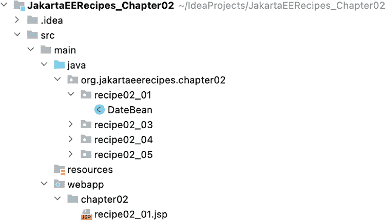

第 2 章 ■ Jakarta Server Pages

解决方案

使用 Jakarta Server Pages 创建一个结合标准标记与嵌入在标记中的 Java 代码块的网页。在 `/webapp` 文件夹内创建一个名为 `recipe02_01.jsp` 的 jsp 文件。

项目文件夹结构如图 2-1 所示，供您参考。

***图 2-1.** IntelliJ IDEA 项目文件夹结构*

以下 Jakarta Server Page 标记演示了如何在页面中包含动态代码：

```jsp
<%@page contentType="text/html" pageEncoding="UTF-8"%>
<!DOCTYPE html>
<html>
<head>
<meta http-equiv="Content-Type" content="text/html; charset=UTF-8">
<title>Jakarta Server Page 示例</title>
</head>
<body>
<jsp:useBean id="dateBean" scope="application" class="org.jakartaeerecipe.chapter02.
recipe02_01.DateBean"/>
Hello World!<br/>
当前日期是：${dateBean.currentDate}!
</body>
</html>
```


第 2 章 ■ Jakarta Server Pages

该代码使用一个 JavaBean 将当前日期拉取到页面中。以下 Java 代码是 Jakarta Server Page 代码所使用的 JavaBean：

```java
package org.jakartaeerecipe.chapter02.recipe02_01;
import java.util.Date;
public class DateBean {
    private Date currentDate = new Date();
    /**
     * @return the currentDate
     */
    public Date getCurrentDate() {
        return currentDate;
    }
    /**
     * @param currentDate the currentDate to set
     */
    public void setCurrentDate(Date currentDate) {
        this.currentDate = currentDate;
    }
}
```

输出结果将如图 2-2 所示。当然，当您运行代码时，页面将显示当前日期。

***图 2-2.** Jakarta Server Pages 示例 02-01 输出*

工作原理

Jakarta Server Pages 技术通过提供一组标签和值表达式，将动态 Java 字段暴露给网页，从而使得开发能够同时利用静态和动态 Web 内容的网页变得简单。使用 Jakarta Server Page 技术，页面开发者可以访问底层的 JavaBean 类，在客户端和服务器之间传递内容。在本示例中，使用 Jakarta Server Page 来显示从服务器上的 JavaBean 类获取的当前日期和时间。因此，当用户在浏览器中访问该 Jakarta Server Page 时，将显示服务器上的当前时间和日期。


一个标准基于 HTML 的 Jakarta 服务器页面应具有.jsp 扩展名。其他类型的 Jakarta 服务器页面包含不同的扩展名；其中一种是具有.jspx 扩展名的 Jakarta 服务器页面文档类型。Jakarta 服务器页面文档是一种基于 XML 的格式良好的 Jakarta 服务器页面。您可以在配方 2-6 中了解更多关于 Jakarta 服务器页面文档的信息。Jakarta 服务器页面可以包含 HTML 标记、特殊的 Jakarta 服务器页面标签、页面指令、JavaScript、嵌入式 Java 代码等。此示例包含`<jsp:useBean>`标签，以及一个用于显示 JavaBean 中字段内容的值表达式。`<jsp:useBean>`标签用于包含对将在 Jakarta 服务器页面标记中引用的 Java 类的引用。在本例中，被引用的类名为`org.jakartaeerecipe.chapter02.recipe02_01.DateBean`，并且在页面内将作为`dateBean`被引用。有关`<jsp:useBean>`标签的完整描述，请参考配方 2-3。

<jsp:useBean id="dateBean" scope="application" class="org.jakartaeerecipe.chapter02.
recipe02_01.DateBean"/>

由于`<jsp:useBean>`标签包含对`DateBean` Java 类的引用，包含该标签的 Jakarta 服务器页面可以使用该类中包含的任何公共字段或方法，或者通过公共“getter”方法访问私有字段。这一点通过使用表达式语言值表达式来演示，该表达式包含在`${}`字符中。要了解更多关于 Jakarta 表达式语言表达式的信息，请参见配方 2-4。在示例中，名为`currentDate`的 JavaBean 字段的值显示在页面上。

私有字段的值通过公共“getter”方法`getCurrentDate`自动检索。

当前日期是：${dateBean.currentDate}!

**JAKARTA 服务器页面的生命周期**

Jakarta 服务器页面的生命周期与 Java servlet 的生命周期非常相似。这是因为 Jakarta 服务器页面在后台由一个特殊的 servlet 转换为 servlet（`HttpJspBase`类）。当请求发送到 Jakarta 服务器页面时，该特殊 servlet 会检查以确保 Jakarta 服务器页面的 servlet 不比页面本身更旧。如果是，则 Jakarta 服务器页面会重新转换为 servlet 类并进行编译。Jakarta 服务器页面到 servlet 的转换是自动的，这使得 Jakarta 服务器页面非常高效。

当 Jakarta 服务器页面被转换时，会自动创建一个名称类似于`0002f<name>_jsp.java`的 servlet，其中`<name>`是 Jakarta 服务器页面的名称。如果在转换过程中出现错误，这些错误将在显示 Jakarta 服务器页面响应时显示。

在转换为 Java servlet 的过程中，Jakarta 服务器页面的不同部分会被区别对待。

如果 Jakarta 服务器页面的 servlet 尚不存在，则容器会执行以下操作：

• 模板数据被转换为代码。
• Jakarta 服务器页面脚本元素被插入到 Jakarta 服务器页面的 servlet 类中。
• `<jsp:XXX .../>`元素被转换为方法调用。

转换后，其生命周期与 servlet 生命周期类似：

1. 加载 servlet 类
2. 实例化 servlet 类
3. 通过调用`jspInit`方法初始化 servlet 实例

本配方仅包含关于 Jakarta 服务器页面技术可能性的入门知识。要了解更多关于该技术以及使用 Jakarta 服务器页面时的最佳实践，请继续阅读本章中的其他配方。

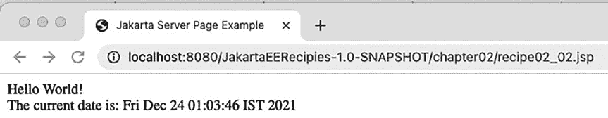

**2-2. 将 Java 嵌入到 Jakarta 服务器页面中**

**问题**

您希望将一些 Java 代码嵌入到标准的 Jakarta 服务器页面网页中，以实现动态内容创建。

**解决方案**

使用 Jakarta 服务器页面脚本元素将 Java 代码嵌入到页面中，然后显示 Java 字段内容。在`/webapp`文件夹内创建一个名为`recipe02_02.jsp`的 jsp 文件。以下 Jakarta 服务器页面代码演示了如何导入 Java `Date`类，然后使用它来获取当前日期，而无需使用服务器端的 JavaBean 类：

<%@page import="java.util.Date"%>
<%@page contentType="text/html" pageEncoding="UTF-8"%>
<%! Date currDate = null; %>
<% currDate = new Date(); %>
<html>
<head>
<meta http-equiv="Content-Type" content="text/html; charset=UTF-8">
<title>Jakarta 服务器页面示例</title>
</head>
<body>
Hello World!<br/>
当前日期是：<%= currDate %>
</body>
</html>

此页面将显示托管 Jakarta 服务器页面应用程序的服务器上的当前系统日期。图 2-3 显示了本配方的输出。

***图 2-3.** Jakarta 服务器页面配方 02-02 输出*

**工作原理**

在 Jakarta 服务器页面中使用脚本元素允许您将 Java 代码直接嵌入到网页中。然而，需要注意的是，这并不是 Web 开发的最佳方法。脚本元素编程曾被认为是使用 Jakarta 服务器页面技术编写 Web 应用程序的最佳方式之一。但是，当需要对 Jakarta 服务器页面进行维护活动，或者向使用脚本元素的 Jakarta 服务器页面代码库引入新开发人员时，噩梦就开始了，因为为了调试问题，开发人员必须搜索嵌入在 HTML 以及 Java 类本身中的脚本。有时，能够将 Java 代码直接嵌入到页面中仍然很方便，即使只是为了测试，这就是为什么我在此配方中展示如何做到这一点。

更好的方法是将业务逻辑与视图代码分离，您在配方 2-1 中已经看到，并且在后续配方中也会看到。

在此示例中，当前日期通过 Java `Date`类被引入到 Jakarta 服务器页面中。一个新的`Date`实例被赋值给名为`currDate`的字段。使用以下行通过导入页面指令将`java.util.Date`类导入到 Jakarta 服务器页面中：

<%@page import="java.util.Date"%>

`currDate`的声明是在声明脚本元素中完成的。声明脚本元素以字符序列`<%!`开头，以字符序列`%>`结尾。从示例中摘录，`currDate`字段在以下代码行中声明：

<%! Date currDate = null; %>

声明中包含的任何内容都会直接进入生成的 Jakarta 服务器页面 servlet 类的`jspService()`方法，为整个 servlet 创建一个全局声明以供使用。任何变量或方法都可以在声明的字符序列内声明。

■ **注意** 声明仅在 Jakarta 服务器页面最初转换为 servlet 时执行一次。如果 Jakarta 服务器页面上的任何代码发生更改，它将再次转换为 servlet，届时声明将再次被评估。如果您希望每次浏览器加载 Jakarta 服务器页面时都执行代码，请不要将其放在声明中。

在本配方的示例中，您可以看到没有使用 Jakarta 服务器页面标签来引用服务器端的 JavaBean 类来创建`Date`类的新实例，这是因为实例化是在 Jakarta 服务器页面代码中，在称为*脚本片段*的字符序列`<% %>`之间直接完成的。


脚本片段（Scriptlets）的语法与声明基本相同，区别在于其起始字符序列中不包含感叹号。脚本片段用于嵌入你希望在请求处理阶段、每次加载 Jakarta 服务器页面时运行的任何 Java 代码。在翻译阶段，脚本片段中包含的所有内容都会被放入翻译后的 Jakarta 服务器页面 Servlet 中一个名为 `_jspService` 的方法内，并且该方法会在每次请求该 Jakarta 服务器页面时执行。脚本片段是在 Jakarta 服务器页面中使用嵌入式 Java 代码最常见的地方。由于在此示例中，你希望每次加载页面时都显示当前日期，因此在脚本片段中实例化了新的 `Date` 类并将其赋值给 `currDate` 变量：

<% currDate = new Date(); %>

稍后在 Jakarta 服务器页面中，使用表达式来显示 `currDate` 字段，该表达式由 `<%=` 和 `%>` 字符序列括起来。表达式用于显示内容，当处理请求时，表达式中的任何内容都会自动转换为字符串。字符串转换后，它会作为输出显示在页面上：

当前日期和时间是：<%= currDate %>

第 2 章 ■ Jakarta 服务器页面

■ **注意** 如果表达式中的代码无法转换为字符串，将会发生异常。

虽然在 Jakarta 服务器页面中嵌入 Java 代码是可行的，但在 Java 社区中这种做法并不被提倡，因为模型-视图-控制器（MVC）范式能使代码更加清晰。要了解如何在不使用脚本元素的情况下编写 Jakarta 服务器页面应用程序，请参阅下一个示例，即配方 2-3。

2-3. 将业务逻辑与视图代码分离

问题

你希望将业务逻辑与用于在 Web 应用程序中创建视图的代码分离开来。

解决方案

将业务逻辑分离到一个 JavaBean 类中，并使用 Jakarta 服务器页面标签将逻辑整合到视图中。在以下示例中，从 Jakarta 服务器页面内部引用了一个 JavaBean，并且该 JavaBean 的其中一个字段显示在页面上。每次刷新页面时，字段值都会更新，因为页面调用了底层 JavaBean 字段的 getter 方法，而字段正是在该方法中初始化的。

在 `/webapp` 文件夹内创建一个名为 `recipe02_03.jsp` 的 jsp 文件。以下 Jakarta 服务器页面标记包含对名为 `RandomBean` 的 JavaBean 的引用，并在页面上显示该 bean 的一个字段：

<%@page contentType="text/html" pageEncoding="UTF-8"%>

<html>

<head>

<title>配方 2-3：将业务逻辑与视图代码分离</title>

</head>

<body>

<jsp:useBean id="randomBean" scope="application"

class="org.jakartaeerecipe.chapter02.recipe02_03.RandomBean"/>

显示一个随机数！<br/>

您的随机数是 ${randomBean.randomNumber}。刷新页面查看另一个随机数！

</body>

</html>

接下来的代码是 Jakarta 服务器页面代码中引用的 JavaBean 类，即 `RandomBean`：package org.jakartaeerecipe.chapter02.recipe02_03;

import java.util.Random;

public class RandomBean {

Random randomGenerator = new Random();

private int randomNumber = 0;

/**

* @return randomNumber

*/

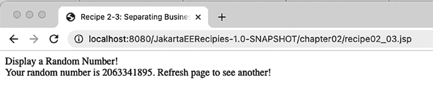

第 2 章 ■ Jakarta 服务器页面

public int getRandomNumber() {

randomNumber = randomGenerator.nextInt();

return randomNumber;

}

}

要执行上述代码，请在浏览器中打开 URL `http://localhost:8080/JakartaEERecipies-1.0-SNAPSHOT/chapter02/recipe02_03.jsp`。页面的输出结果类似于图 2-4，但每次加载页面时随机数都会不同。

***图 2-4.** Jakarta 服务器页面配方 02-03 输出*

工作原理

有时，将 Java 代码直接嵌入 Jakarta 服务器页面会很有帮助，并且可以满足需求。然而，在大多数情况下，将任何 Java 代码与用于创建 Web 视图的标记代码分离开来是一个好主意。这样做可以使维护更容易，并允许页面开发者专注于创建美观的网页，而不是在 Java 代码中摸索。在某些组织中，Java 开发者可以编写服务器端的业务逻辑代码，而 Web 开发者则可以专注于视图。在当今的许多组织中，同一个人同时执行这两项任务，使用 MVC 方法有助于分离逻辑并提高生产力。

在 Jakarta 服务器页面的早期，将 Java 直接嵌入 Jakarta 服务器页面被认为是最佳方式，但随着时间的推移，MVC 范式流行起来，Jakarta 服务器页面也随之更新。作为最佳实践，使用 Jakarta 服务器页面标签将 Java 代码与页面标记分离开来是很好的做法。在示例中，`<jsp:useBean>` 元素用于引用服务器端的 JavaBean 类，以便该类中的公共字段和方法，以及通过公共“getter”方法访问的私有字段，都可以整合到 Jakarta 服务器页面中。`jsp:useBean` 元素要求你提供一个 ID 和一个作用域，以及一个类名或 beanName。在示例中，`id` 属性设置为 `randomBean`，并且此 ID 用于在 Jakarta 服务器页面中引用该 bean。`scope` 属性设置为 `application`，这意味着该 bean 可以被应用程序中的任何 Jakarta 服务器页面使用。表 2-1 显示了所有可能的作用域及其含义。`class` 属性设置为 Java 类的完全限定名，该类将通过 `id` 属性设置的名称（在本例中为 `randomBean`）进行引用。

第 2 章 ■ Jakarta 服务器页面

***表 2-1.** jsp:useBean 元素作用域*

**作用域**

**描述**

page（默认）

该 bean 可以在包含 `jsp:useBean` 元素的同一个 Jakarta 服务器页面中使用

request

该 bean 可以在处理同一请求的任何 Jakarta 服务器页面中使用

session

该 bean 可以在与创建该 bean 的 Jakarta 服务器页面处于同一会话中的任何 Jakarta 服务器页面中使用。创建该 bean 的页面必须有一个 `session="true"` 的页面指令

application

该 bean 可以在与创建它的 Jakarta 服务器页面处于同一应用程序中的任何 Jakarta 服务器页面中使用

在页面中添加了 `jsp:useBean` 元素后，就可以在 Jakarta 服务器页面中使用 JavaBean 属性，并且可以从页面调用公共方法。该示例演示了如何使用 `${ }` 表示法显示 JavaBean 属性的值。JavaBean 中任何包含“getter”和“setter”方法的变量都可以通过在 `${` 和 `}` 字符序列之间引用类成员字段来从 Jakarta 服务器页面访问，这更广为人知的名称是 Jakarta 表达式语言表达式。要了解更多关于 Jakarta 表达式语言表达式的信息，请参阅配方 2-4。以下来自示例的摘录演示了如何显示 JavaBean 中的 `randomNumber` 字段：您的随机数是 ${randomBean.randomNumber}。刷新页面查看另一个随机数！

在 Jakarta 服务器页面技术中，将业务逻辑与视图逻辑分离的关键是 `jsp:useBean` 元素。这将允许你在 Jakarta 服务器页面中使用 JavaBean 类，而无需将代码直接嵌入页面。将业务逻辑与视图代码分离有助于将来更容易地维护代码，并使代码更易于理解。

2-4. 获取或设置值

问题

你希望在 Jakarta 服务器页面中显示 JavaBean 的值。此外，你希望能够在 Jakarta 服务器页面中设置值。

解决方案


在 `/webapp` 文件夹内创建一个名为 `recipe02_04.jsp` 的 JSP 文件。使用 Jakarta 表达式语言（Jakarta Expression Language）的 `${bean.value}` 语法，在 Jakarta 服务器页面中暴露 Bean 中的值。在以下 Jakarta 服务器页面代码中，将使用一个名为 `EasyBean` 的 Java 类来保存用户输入到文本字段中的值。随后，将从 Bean 中读取该值，并使用 Jakarta 表达式语言将其显示在页面上。

以下代码展示了一个包含输入表单的 Jakarta 服务器页面，并显示输入到文本框中的值：

```jsp
<%@page contentType="text/html; charset=UTF-8"%>

<html>

<head>

<title>配方 2-4：获取或设置值</title>

</head>

<body>

<jsp:useBean id="easyBean" scope="page" class="org.jakartaeerecipe.chapter02.recipe02_04.EasyBean"/>

<jsp:setProperty name="easyBean" property="*"/>

<form method="post">

使用下面的输入文本框设置值，然后点击提交。

<br/><br/>

<label for="fieldValue">设置字段值：</label>

<input id="fieldValue" name="fieldValue" type="text" size="30"/>

<br/>

字段中当前包含的值为：

<jsp:getProperty name="easyBean" property="fieldValue"/>

<input type="submit">

</form>

</body>

</html>
```

接下来，在 `/src` 文件夹内创建 JavaBean 类，该类用于保存页面所使用的值；代码如下所示：

```java
package org.jakartaeerecipe.chapter02.recipe02_04;

public class EasyBean implements java.io.Serializable {

    private String fieldValue;

    public EasyBean(){
        fieldValue = null;
    }

    /**
     * @return the fieldValue
     */
    public String getFieldValue() {
        return fieldValue;
    }

    /**
     * @param fieldValue the fieldValue to set
     */
    public void setFieldValue(String fieldValue) {
        this.fieldValue = fieldValue;
    }

}
```

这个简单的示例演示了如何输入一个值，将其“设置”到 Bean 变量中，然后显示在页面上。要查看此页面，请在浏览器中打开 URL `http://localhost:8080/JakartaEERecipies-1.0-SNAPSHOT/chapter02/recipe02_04.jsp`。输出结果将如图 2-5 所示。

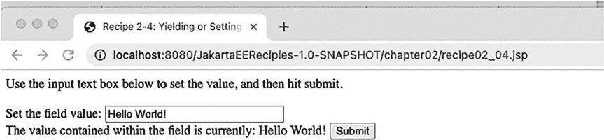

***图 2-5.** Jakarta 服务器页面配方 02-04 的输出*

**工作原理**

也许最有用的 Web 结构之一就是输入表单，它允许用户在页面的文本框或其他输入结构中输入信息，并将其提交给服务器进行处理。Jakarta 服务器页面使得从 HTML 表单提交值变得非常容易，同样，将数据显示回页面也非常简单。为此，需要在 Java 类中声明一个字段，并提供访问器方法（即 getter 和 setter），以便其他类可以将值保存到该字段，并获取当前存储在该字段中的值。

有时，包含带有访问器方法的字段的 Java 类被称为 JavaBean *类*。这些类也可以包含其他用于执行任务的方法，但最佳实践是尽可能保持 Bean 的简单性。JavaBean 类还应实现 `java.io.Serializable`，以便它们可以轻松地存储为字节流并恢复。

在本配方的示例中，一个名为 `EasyBean` 的 Java 类包含一个名为 `fieldValue` 的私有字段。访问器方法 `getFieldValue` 和 `setFieldValue` 分别用于获取和存储 `fieldValue` 中的值。这些访问器方法被声明为 `public`，因此它们可以从另一个 Java 类或 Jakarta 服务器页面中使用。Jakarta 服务器页面使用 `jsp:useBean` 元素来获取对 `EasyBean` 类的引用。作用域设置为 `page`，以便该类只能在包含 `jsp:useBean` 元素的 Jakarta 服务器页面内使用。表 2-1（可在上一个配方中找到）列出了可与 `jsp:useBean` 元素一起使用的不同作用域：

```jsp
<jsp:useBean id="easyBean" scope="page" class="org.jakartaeerecipe.chapter02.recipe02_04.EasyBean"/>
```


接下来，在 Jakarta 服务器页面中定义了一个使用 POST 方法的 HTML 表单，其中包含一个名为 `fieldValue` 的输入字段，允许用户输入一段文本，该文本将在表单提交时作为请求参数提交。请注意，示例中的表单没有指定 action 属性；这意味着将使用相同的 URL 进行表单提交，并且同一个 Jakarta 服务器页面将用于表单提交，并在表单提交后再次显示。由于该 Jakarta 服务器页面在页面上指定了 `jsp:useBean` 元素，因此当页面提交时，所有请求参数都将发送到该 bean。确保输入到 `fieldValue` 输入文本字段中的值存储到 Java 类中的 `fieldValue` 变量中的关键在于在表单中使用 `jsp:setProperty` 元素。`jsp:setProperty` 元素允许使用相应的 setter 方法在 JavaBean 类中设置一个或多个属性。在示例中，`<jsp:useBean>` 用于实例化 `EasyBean` Java 类，而 `<jsp:setProperty>` 用于将 `fieldValue` 输入文本框中输入的值设置到 `EasyBean` 类中的 `fieldValue` 变量。`jsp:setProperty` 的 `name` 属性必须等于 `jsp:useBean` 的 `id` 属性值。`jsp:setProperty` 的 `property` 属性可以等于您想要在 bean 中设置的 Java 类中的字段名称，也可以使用通配符 `*` 将所有输入字段提交给 bean。`jsp:setProperty` 的 `value` 属性可用于为属性指定一个静态值。以下示例摘录展示了如何使用 `jsp:setProperty` 标签：

<jsp:setProperty name="easyBean" property="*"/>

第 2 章 ■ Jakarta 服务器页面

■ **注意** Jakarta 服务器页面元素的顺序非常重要。`<jsp:useBean>` 必须位于 `<jsp:setProperty>` 之前，因为 `jsp:useBean` 元素负责实例化其对应的 Java 类。由于 Jakarta 服务器页面是从页面顶部向下执行的，因此在指定 `jsp:useBean` 之前，任何元素都无法使用该 bean。

当用户在输入字段中输入值并提交请求时，该值将作为请求参数提交给与该页面的 `jsp:useBean` 元素对应的 Java 类。有几种不同的方法可以显示已填充到 JavaBean 字段中的数据。示例演示了如何使用 `jsp:getProperty` 元素来显示 `fieldValue` 变量的值。

`<jsp:getProperty>` 元素必须指定一个 `name` 属性，该属性对应于 `jsp:useBean` 元素中指定的 Java 类的 id。它还必须指定一个 `property` 属性，该属性对应于您想要显示的 JavaBean 属性的名称。以下示例摘录演示了 `jsp:getProperty` 标签的使用：

<jsp:getProperty name="easyBean" property="fieldValue"/>

也可以使用 Jakarta 表达式语言表达式来显示 JavaBean 属性的值，方法是使用 `jsp:useBean` 元素中指定的 id 以及属性名称。要尝试此操作，您可以将 `jsp:getProperty` 元素替换为以下 Jakarta 表达式语言表达式：`${easyBean.fieldValue}`

与使用 servlet 相比，Jakarta 服务器框架使得使用 Java 技术开发 Web 应用程序变得更加容易。如本例所示的输入表单展示了 Jakarta 服务器页面与标准 servlet 编码相比效率有多高。与任何事物一样，servlet 和 Jakarta 服务器页面技术在您的工具箱中都有其用武之地。对于创建简单的数据输入表单，Jakarta 服务器页面无疑更胜一筹。

2-5\. 在条件表达式中调用函数

问题

您希望在 Jakarta 服务器页面中使用 Java 函数来执行条件求值。


然而，你并不希望将 Java 代码直接嵌入到 Jakarta Server Page 中。

解决方案

将函数编写在 JavaBean 类中，然后通过 `<jsp:useBean>` 标签将该 Bean 注册到 Jakarta Server Page。接着，你需要在标签库描述符（TLD）中注册该函数，以便它能通过标签在 Jakarta Server Page 上使用。最后，为注册了该函数的 TLD 设置一个页面指令，并在页面中使用该函数标签。在接下来的示例中，一个 Jakarta Server Page 将使用一个函数来告知用户给定的 Java 类型是否为原始类型。用户将在文本框中输入一个字符串值，该值将被提交到 JavaBean 的一个字段。然后，该字段的内容将与 Java 原始类型列表进行比较，以确定是否匹配。如果输入到字段中的值是原始类型，将向用户显示一条消息。以下是该项目的文件夹结构：

第 2 章 ■ Jakarta Server Pages

**├──** src

├── main

│ ├── java

│ │ └── org

│ │ └── jakartaeerecipe

│ │ ├── chapter02

│ │ │ ├── recipe02_05

│ │ │ │ └── ConditionalClass.java

│ └── webapp

│ ├── WEB-INF

│ │ ├── tlds

│ │ │ ├── functions.tld

│ │ └── web.xml

│ ├── chapter02

│ ├── recipe02_05.jsp

以下代码是包含函数实现的 Java 类，该函数将在 Jakarta Server Page 中使用。该 Bean 还包含一个字段，用于在 Jakarta Server Page 中设置和获取用户输入的值：

package org.jakartaeerecipe.chapter02.recipe02_05;

import java.io.Serializable;

import java.util.*;

public class ConditionalClass implements Serializable {

private String typename = null;

public static Set<String> javaTypes = new HashSet<>();

public ConditionalClass() {

javaTypes.add("byte");

javaTypes.add("short");

javaTypes.add("int");

javaTypes.add("long");

javaTypes.add("float");

javaTypes.add("double");

javaTypes.add("boolean");

javaTypes.add("char");

}

public static boolean isPrimitive(String value){

return javaTypes.contains(value.toLowerCase());

}

/**

* @return the typename

*/

public String getTypename() {

return typename;

}

第 2 章 ■ Jakarta Server Pages

/**

* @param typename the typename to set

*/

public void setTypename(String typename) {

this.typename = typename;

}

}

字段 `typename` 将在 Jakarta Server Page 中用于设置用户输入的值，并检索该值以传递给名为 `isPrimitive()` 的函数，该函数用于将给定值与 Java 原始类型列表进行比较。接下来是用于注册该函数的 TLD 列表，以便它可以在 Jakarta Server Page 中作为标签使用。为简单起见，TLD 文件命名为 `functions.tld`，并放置在 `/webapp` 文件夹中：

<?xml version="1.0" encoding="UTF-8"?>

<taglib

xsi:schemaLocation="http://java.sun.com/xml/ns/javaee

http://java.sun.com/xml/ns/javaee/web-jsptaglibrary_2_1.xsd"

version="2.1" >

<tlib-version>1.0</tlib-version>

<short-name>fct</short-name>

<uri>functions</uri>

<function>

<name>isPrimitive</name>

<function-class>org.jakartaeerecipe.chapter02.recipe02_05.ConditionalClass

</function-class>

<function-signature>boolean isPrimitive(java.lang.String)</function-signature>

</function>

</taglib>

最后是 Jakarta Server Page 代码，其中包含使用 TLD 的页面指令以及通过标签对 `isPrimitive()` 函数的条件调用：

<%@ page contentType="text/html;charset=UTF-8" %>

<%@ taglib uri="http://java.sun.com/jsp/jstl/core"

prefix="c" %>

<%@ taglib uri="/WEB-INF/tlds/functions.tld" prefix="fct" %>

<html>

<head>

<title>配方 2-5：在表达式中调用函数</title>

</head>

<body>

<form method="get">

<label for="typename">

请说出一种 Java 原始类型名称：

</label>

<input type="text" id="typename" name="typename" size="40"/>

<br/>

<input type="submit">

</form>

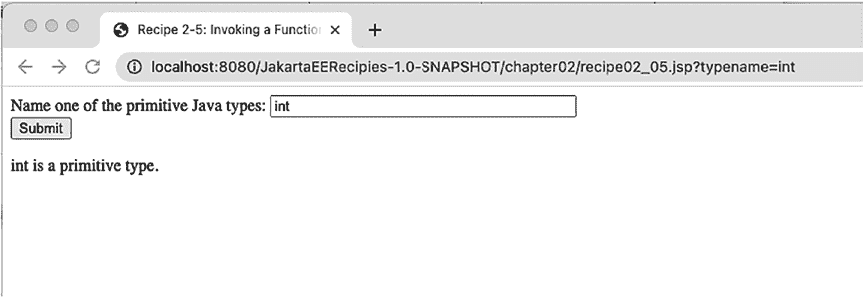

第 2 章 ■ Jakarta Server Pages

<jsp:useBean id="conditionalBean" scope="page" class="org.jakartaeerecipe.chapter02.

recipe02_05.ConditionalClass"/>

<jsp:setProperty name="conditionalBean" property="typename"/>

<c:if test="${fct:isPrimitive(conditionalBean.typename)}">

${ conditionalBean.typename } 是一个原始类型。

</c:if>

<c:if test="${conditionalBean.typename ne null and !fct:isPrimitive(conditionalBean.

typename)}">

${ conditionalBean.typename } 不是一个原始类型。

</c:if>

</body>

</html>

遵循本解决方案中使用的策略，你可以创建一个可通过 Jakarta Server Page 标签在页面中使用的条件测试。输出结果如图 2-6 所示。

***图 2-6.** Jakarta Server Pages 配方 02-05 输出*

工作原理

Jakarta 表达式语言函数必须使用 `public static` 修饰符声明，以便框架能够执行它。在本配方中，函数 `isPrimitive` 被声明为 `public static`，它返回一个布尔值，指示用户是否键入了 Java 原始类型的名称。

使函数可通过 Jakarta Server Page 访问的下一步是将其注册到 TLD 中。在示例中，创建了一个名为 `functions.tld` 的 TLD。如果你的应用程序中已有自定义 TLD，则可以将函数注册到其中，而无需额外创建一个。

本例中的 TLD 有一个 `short-name` 属性 `fct`，该属性将在 Jakarta Server Page 标签中使用。要实际注册该函数，你必须在 TLD 中创建一个 `function` 元素，提供函数名称，指明函数所在的类，最后指定函数签名：

<function>

<name>isPrimitive</name>

<function-class>org.jakartaeerecipe.chapter02.recipe02_05.ConditionalClass

</function-class>

<function-signature>boolean isPrimitive(java.lang.String)</function-signature>

</function>

第 2 章 ■ Jakarta Server Pages

现在，该函数已准备好可在 Jakarta Server Page 中使用。要使该函数可通过 Jakarta Server Page 访问，请通过包含一个 `taglib` 指令来注册包含该 `function` 元素的 TLD，并指定该 TLD 的 `uri` 和 `prefix`。`uri` 是 TLD 的路径，`prefix` 应与 TLD 的 `short-name` 元素中给出的名称匹配。以下摘自本例 Jakarta Server Page 的代码片段显示了 `taglib` 指令：

<%@ taglib uri="/WEB-INF/tlds/functions.tld" prefix="fct" %>

现在，通过在 Jakarta Server Page 中指定标签库前缀以及函数在 TLD 中注册的名称，即可通过 Jakarta 表达式语言表达式访问该函数。示例中的 Jakarta 表达式语言表达式调用该函数，并传递 `typename` 参数。`isPrimitive` 函数用于确定 `typename` Bean 字段中包含的文本是否等于某个 Java 原始类型：

<c:if test="${fct:isPrimitive(conditionalBean.typename)}" >

本配方中的解决方案还使用了 Jakarta 标准标签库核心。根据所使用的服务器环境，这可能需要单独下载。Jakarta 标准标签库为 Jakarta Server Page API 提供的标准标签集提供了扩展。有关 Jakarta 标准标签库的更多信息，请参考在线文档，该文档可在 [https://](https://jakarta.ee/specifications/tags/2.0/jakarta-tags-spec-2.0.pdf)

[jakarta.ee/specifications/tags/2.0/jakarta- tags- spec- 2.0.pdf](https://jakarta.ee/specifications/tags/2.0/jakarta-tags-spec-2.0.pdf) 找到。


Jakarta 标准标签库的 `<c:if>` 标签可用于测试条件，当条件测试返回真值时，执行其开始和结束标签之间的标记。不出所料，`<c:if>` 标签包含一个 `test` 属性，该属性指定一个 Jakarta 表达式语言表达式，用于指示需要执行的测试。在示例中，`isPrimitive` 函数在 Jakarta 表达式语言表达式中被调用，并传入 bean 的值。如果测试返回真值，则会打印一条消息，指示给定值等于一个 Java 原始类型。示例中第一个 `<c:if>` 测试之后是另一个测试，这次它测试以确保属性值不等于 `null`，并且不是 Java 原始类型。表达式语言用于通过 `ne` 表达式判断属性值是否等于 `null`。`and` 表达式将第一个和第二个条件表达式在 Jakarta 表达式语言表达式中结合在一起，这意味着两个表达式都必须求值为真值才能满足条件。如果两个条件都满足，则用户指定的值不是 Java 原始类型，并会打印相应的消息：

```jsp
<c:if test="${conditionalBean.typename ne null and !fct:isPrimitive(conditionalBean.typename)}" >
    ${ conditionalBean.typename } is not a primitive type.
</c:if>
```

以下是 `pom.xml` 文件中将 Jakarta 标准标签库支持添加到项目中的代码片段：

```xml
<dependency>
    <groupId>jakarta.servlet.jsp.jstl</groupId>
    <artifactId>jakarta.servlet.jsp.jstl-api</artifactId>
    <version>2.0.0</version>
    <scope>compile</scope>
</dependency>
```

第 2 章 ■ Jakarta 服务器页面

只需几个简单的步骤即可创建一个用于 Jakarta 服务器页面的条件函数。首先，在 JavaBean 类中，必须创建一个返回布尔值的 `public static` 函数。其次，创建一个 TLD，该文件将通过 Jakarta 服务器页面标签使该函数可用。最后，在 Jakarta 服务器页面中使用自定义标签，并结合 Jakarta 标准标签库的条件测试标签，根据条件显示内容。

2-6. 创建 Jakarta 服务器页面文档

问题

您希望确保 Jakarta 服务器页面代码遵循 XML 标准，并且仅包含有效的 HTML 和 Jakarta 服务器页面标签，而不是使用标准的 HTML 格式。

解决方案

创建 Jakarta 服务器页面文档，而不是标准的 Jakarta 服务器页面。Jakarta 服务器页面文档是基于 XML 的标准 Jakarta 服务器页面文档表示形式，符合 XML 标准。以下 Jakarta 服务器页面文档包含与配方 2-4 的 Jakarta 服务器页面代码相同的代码，但改用 Jakarta 服务器页面文档格式。如您所见，差异不大，因为创建标准 Jakarta 服务器页面文档时已经使用了格式良好的标签。该页面也以 `jspx` 扩展名保存，而不是 `jsp`：

```jsp
<html version="2.0">
<head>
    <title>Recipe 2-4: Yielding or Setting Values</title>
</head>
<body>
    <jsp:directive.page contentType="text/html" pageEncoding="UTF-8"/>
    <jsp:useBean id="easyBean" class="org.jakartaeerecipe.chapter02.recipe02_04.EasyBean"/>
    <jsp:setProperty name="easyBean" property="*"/>
    <form method="post">
        Use the input text box below to set the value, and then hit submit.
        <br/><br/>
        <label for="fieldValue">Set the field value: </label>
        <input id="fieldValue" name="fieldValue" type="text" size="30"/>
        <br/>
        The value contained within the field is currently:
        <jsp:getProperty name="easyBean" property="fieldValue"/>
        <input type="submit"/>
    </form>
</body>
</html>
```

此 Jakarta 服务器页面文档将产生与 `recipe02_04.jsp` 中相同的输出。但是，将强制使用格式良好的文档，这将排除在页面中使用脚本元素。

第 2 章 ■ Jakarta 服务器页面

工作原理


正如配方 2-3 中所预示的，将业务逻辑与标记代码分离可能因多种原因而至关重要。标准的 Jakarta 服务器页面可以遵循 MVC 范式，但并非强制要求。有时，通过严格遵循格式良好的 XML 文档（仅使用 Jakarta 服务器页面标签与服务器端 Java 类交互）来强制分离业务逻辑是合理的。格式良好意味着文档应只有一个根元素，并且每个起始标签都必须有对应的结束标签。创建 Jakarta 服务器页面文档是一种解决方案，因为此类文档强制使用格式良好的 XML，并且不允许在 Jakarta 服务器页面中使用脚本元素。仍然可以使用 `<jsp:expression/>` 标签或值表达式在 Jakarta 服务器页面文档的主体中显示脚本表达式的值，如配方 2-8 所示。

多个 Jakarta 服务器页面标签可用于与 Java 类通信、执行 Jakarta 服务器页面特定功能，并使标记易于理解。因此，基于现代 Jakarta 服务器页面的应用程序应使用格式良好的 Jakarta 服务器页面文档，利用这些 Jakarta 服务器页面标签，而不是在整个标记中嵌入脚本元素。表 2-2 描述了不同 Jakarta 服务器页面标签的功能。

***表 2-2.** Jakarta 服务器页面标签*

**标签**

**描述**

<jsp:attribute>

为 Jakarta 服务器页面定义属性

<jsp:body>

定义元素主体

<jsp:declaration>

定义页面声明

<jsp:directive>

定义页面包含和页面指令

<jsp:doBody>

执行由调用 Jakarta 服务器页面用于调用标签的 Jakarta 服务器页面标签的主体

<jsp:element>

动态生成 XML 元素

<jsp:expression>

插入脚本语言表达式的值，并转换为字符串

<jsp:forward>

将请求转发到另一个页面。新页面可以是 HTML、Jakarta 服务器页面或 Servlet

<jsp:getProperty>

获取 bean 属性的值并将其放入页面

<jsp:include>

在页面中包含另一个 Jakarta 服务器页面或 Web 资源

<jsp:invoke>

调用指定的 Jakarta 服务器页面片段

<jsp:output>

指定文档类型声明

<jsp:plugin>

使用指定的插件执行 Applet 或 Bean

<jsp:root>

定义标准元素和标签库命名空间

<jsp:scriptlet>

必要时将代码片段嵌入页面

<jsp:setProperty>

将指定值设置到 bean 属性中

<jsp:text>

包含模板数据

<jsp:useBean>

使用名称引用并实例化（如果需要）JavaBean 类，并提供作用域

第二章 ■ Jakarta 服务器页面

创建格式良好的 Jakarta 服务器页面可以带来更简单的开发、更易于维护以及更好的整体设计。由于这一点非常重要，本章剩余的配方将使用 Jakarta 服务器页面文档格式。

2-7\. 在 Jakarta 表达式语言中嵌入表达式

问题

您希望在 Jakarta 服务器页面中使用一些条件表达式和/或算术运算，而不使用脚本元素嵌入 Java 代码。

解决方案

在 Jakarta 服务器页面标签中使用 Jakarta 表达式语言表达式来执行条件和/或算术表达式。本解决方案将介绍两个 Jakarta 表达式语言表达式的示例。

第一个示例演示了如何使用 Jakarta 表达式语言表达式执行条件逻辑。请注意，此例中还使用了 Jakarta 标准标签库标签库，以便在表达式结果为 true 时在页面上有条件地显示消息：

<html

version="2.0">

<jsp:directive.page contentType="text/html" pageEncoding="UTF-8"/>

<head>

<title>配方 2-7：在 Jakarta 表达式语言中嵌入表达式</title>

</head>

<body>

<h1>条件表达式</h1>

<p>

页面的以下部分将仅显示结果为 true 的条件表达式。

</p>

<c:if test="${1 + 1 == 2}">


条件表达式 (1 + 1 == 2) 的结果为 TRUE。

<br/>

</c:if>

<c:if test="${'x' == 'y'}">

条件表达式 (x == y) 的结果为 TRUE。

<br/>

</c:if>

<c:if test="${(100/10) gt 5}">

条件表达式 ((100/10) > 5) 的结果为 TRUE。

<br/>

</c:if>

<c:if test="${20 mod 3 eq 2}">

条件表达式 (20 mod 3 eq 2) 的结果为 TRUE。

<br/>

</c:if>

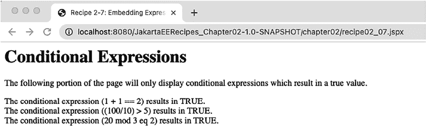

第 2 章 ■ Jakarta 服务器页面

</body>

</html>

此 Jakarta 服务器页面将显示以下输出：

...

条件表达式 (1 + 1 == 2) 的结果为 TRUE。

条件表达式 ((100/10) > 5) 的结果为 TRUE。

条件表达式 (20 mod 3 eq 2) 的结果为 TRUE。

...

输出结果如图 2-7 所示。

***图 2-7.** Jakarta 服务器页面配方 02-07 的输出*

算术表达式也可以使用 Jakarta 表达式语言进行计算。以下 Jakarta 服务器页面代码演示了在 Jakarta 表达式语言中使用算术运算的一些示例：

<html version="2.0">

<head>

<title>配方 2-7：在 Jakarta 表达式语言中嵌入表达式</title>

</head>

<body>

<h1>算术表达式</h1>

<p>以下表达式演示了如何使用 Jakarta 表达式语言执行算术运算。</p>

10 - 4 = ${10 - 4}<br/>

85 / 15 = ${85 / 15}<br/>

847 divided by 6 = ${847 div 6}<br/>

</body>

</html>

上述 Jakarta 服务器页面将显示以下输出：

...

10 - 4 = 6

85 / 15 = 5.666666666666667

847 divided by 6 = 141.16666666666666

...

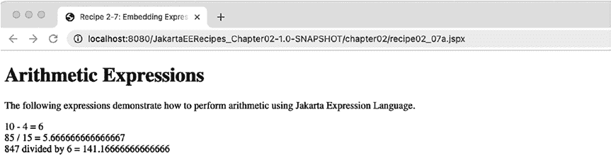

第 2 章 ■ Jakarta 服务器页面

输出结果如图 2-8 所示。

***图 2-8.** Jakarta 服务器页面配方 02-07a 的输出*

工作原理

Jakarta 服务器页面技术使得处理表达式变得简单。条件页面渲染可以通过结合使用 Jakarta 表达式语言值表达式（包含在 `${ }` 字符序列中）和 Jakarta 标准标签库标签来实现。算术表达式也可以使用 Jakarta 表达式语言表达式来执行。为简化操作，表达式语言包含可用于帮助构成表达式的关键字或字符。本配方的示例包含了使用 Jakarta 标准标签库 `<c:if>` 标签的各种表达式和条件页面渲染。

在示例中显示的第一个 Jakarta 服务器页面中，有一些条件页面渲染的示例。要使用 `<c:if>` 标签执行条件测试，必须确保在 Jakarta 服务器页面中导入 Jakarta 标准标签库。为此，请添加对 Jakarta 标准标签库的导入，并将其分配给一个字符或字符串。在以下配方摘录中，Jakarta 标准标签库被分配给字符 `c`：

<html

version="2.0">

Jakarta 表达式语言值表达式包含在 `${` 和 `}` 字符序列之间。

这些字符内的任何内容都将被视为 Jakarta 表达式语言，因此语法必须正确，否则 Jakarta 服务器页面将无法编译成 servlet，并会抛出错误。所有使用 `${ }` 语法的表达式都会立即求值，并且它们是只读表达式。

也就是说，不能使用此语法的任何表达式将值设置到 JavaBean 属性中。Jakarta 服务器页面引擎首先对表达式求值，然后将其转换为字符串，最后将值返回给标签处理器。值表达式中可以引用四种类型的对象。它们是 JavaBean 组件、集合、枚举类型和隐式对象。如果使用 JavaBean 组件，则必须使用 `jsp:useBean` 元素（参见配方 2-3）在 Jakarta 服务器页面中注册该 JavaBean。


详细信息）。集合或枚举类型也可以通过已在页面中注册的 JavaBean 进行引用。隐式对象是指那些允许访问页面上下文、作用域变量以及其他类似对象的对象。表 2-3 列出了可以从 Jakarta 表达式语言表达式中引用的不同隐式对象。

第 2 章 ■ Jakarta 服务器页面

***表 2-3.** Jakarta 服务器页面隐式对象*

**对象**

**类型**

**描述**

pageContext

Context

提供对页面上下文及各种子对象的访问

servletContext

Page context

Jakarta 服务器页面 Servlet 和 Web 组件的上下文

session

Page context

客户端的会话对象

request

Page context

触发页面执行的请求

response

Page context

Jakarta 服务器页面返回的响应

param

N/A

负责将参数名称映射到值

paramValues

N/A

将请求参数映射到值的数组

header

N/A

负责将标头名称映射到值

headerValues

N/A

将标头名称映射到值的数组

cookie

N/A

将 Cookie 名称映射到单个 Cookie

initParam

N/A

将上下文初始化参数映射到值

pageScope

Scope

映射页面作用域变量

requestScope

Scope

映射请求作用域变量

sessionScope

Scope

映射会话作用域变量

applicationScope

Scope

映射应用程序作用域变量

以下是一些使用 JavaBean 组件、集合、枚举类型和隐式对象的表达式示例：

// 显示名为 elTester 的 JavaBean 中名为 myVar 的变量的值

${ elTester.myVar }

// 与上一行功能相同

${ elTester["myVar"] }

// 计算枚举类型，其中 myEnum 是 MyEnum 的一个实例

${ myEnum == "myValue" }

// 引用枚举中名为 getTestVal() 的 getter 方法

${ myEnum.testVal}

// 引用名为 elTester 的 JavaBean 中名为 myCollection 的集合

${ elTester.myCollection }

// 获取名为 "testParam" 的参数

${ param.testParam } // 等同于：request.getParameter("testParam")

// 获取名为 "testAttr" 的会话属性

${ sessionScope.testAttr } // 等同于：session.getAttribute("testAttr")

第 2 章 ■ Jakarta 服务器页面

在示例中，`<c:if>` 标签用于测试一系列值表达式，并根据条件显示页面内容。`<c:if>` 的 `test` 属性用于注册测试条件，如果测试条件返回 `true` 结果，则显示 `<c:if>` 起始和结束标签之间的内容。

以下示例摘录演示了如何执行测试：

<c:if test="${'x' == 'y'}">

条件表达式 (x == y) 的结果为 TRUE。

<br/>

</c:if>

Jakarta 表达式语言表达式可以包含一系列保留字，这些保留字可用于帮助计算表达式。例如，以下表达式使用 `gt` 保留字返回一个值，指示 100/10 的计算结果是否大于 5：

<c:if test="${(100/10) gt 5}">

条件表达式 ((100/10) > 5) 的结果为 TRUE。

<br/>

</c:if>

表 2-4 列出了所有 Jakarta 服务器页面 Jakarta 表达式语言表达式保留字及其含义。

***表 2-4.** Jakarta 表达式语言表达式保留字*

**保留字**

**描述**

and

组合表达式，如果所有表达式都计算为 true，则返回 true

or

组合表达式，如果其中一个表达式计算为 true，则返回 true

not

对表达式取反

eq

等于

ne

不等于

lt

小于

gt

大于

le

小于或等于

ge

大于或等于

true

真值

false

假值

null

空值

instanceof

用于测试一个对象是否是另一个对象的实例

empty

确定列表或集合是否为空

div

除以

mod

取模

第 2 章 ■ Jakarta 服务器页面

算术表达式由本示例中的第二个示例演示。以下算术运算符可以在表达式中使用：


• +（加法）、-（二元和一元）、*（乘法）、/ 和 div（除法）、% 和 mod（取模）
• and、&&、or、||、not、!
• ==、!=、<、>、<=、>=
• X ? Y : Z（三元条件运算符）

关于在 Jakarta Server Pages 中使用 Jakarta 表达式语言表达式，已有整本书的章节进行过论述。本技巧仅涉及值表达式的一些可能性。熟悉表达式的最佳方法是创建一个测试用的 Jakarta Server Page，并尝试使用各种可用选项。

2-8\. 在多个页面中访问参数

问题

你希望从 Web 应用的多个页面中访问某个参数。

解决方案

创建一个输入表单，将参数提交到请求对象中，然后利用请求对象在另一个页面中检索这些值。在接下来的示例中，包含输入表单的 Jakarta Server Page 通过将 HTML 表单的 `action` 属性设置为将使用这些参数的 Jakarta Server Page 的值，将值传递给另一个 Jakarta Server Page。在本例中，接收参数的 Jakarta Server Page 仅显示参数值，但也可以执行其他操作。

以下 Jakarta Server Page 代码演示了如何使用输入表单将参数保存到请求对象中，并将其传递给名为 `recipe02_08b.jspx` 的页面：

```html
<html >
<jsp:directive.page contentType="text/html" pageEncoding="UTF-8"/>
<head>
<style>div {
  padding: 10px;
}</style>
<title>技巧 2-8：在多个页面中访问参数</title>
</head>
<body>
<h1>传递参数</h1>
<p>以下参数将被传递给下一个 Jakarta Server。</p>
<form method="get" action="recipe02_08b.jspx">
<div>
  <label for="param1">参数 1：</label>
  <input id="param1" name="param1" type="text" value="1"/>
</div>
<div>
  <label for="param2">参数 2：</label>
  <input id="param2" name="param2" type="text" value="2 + 0"/>
</div>
<div>
  <label for="param3">参数 3：</label>
  <input id="param3" name="param3" type="text" value="three"/>
</div>
<div>
  <input type="submit" value="前往下一页"/>
</div>
</form>
</body>
</html>
```

下一个 Jakarta Server Page 代码接收参数并显示其值：

```html
<html version="2.0">
<jsp:directive.page contentType="text/html" pageEncoding="UTF-8"/>
<head>
<title>技巧 2-8：在多个页面中访问参数</title>
</head>
<body>
<h1>传递参数</h1>
<p>以下参数是从原始 Jakarta Server Pages 传递过来的。</p>
<form method="post" action="recipe02_08a.jspx">
参数 1：<jsp:expression>request.getParameter("param1") </jsp:expression>
<br/>
参数 2：<jsp:expression> request.getParameter("param2") </jsp:expression>
<br/>
参数 3：<jsp:expression> request.getParameter("param3") </jsp:expression>
<br/>
或者使用值表达式
<br/>
参数 1：${ param.param1 }
<br/>
参数 2：${ param.param2 }
<br/>
参数 3：${ param.param3 }
<br/>
<input type="submit" value="返回页面 1"/>
</form>
</body>
</html>
```

如你所见，可以使用几种不同的方式来显示参数值。这两种方式都会显示相同的结果。

工作原理

请求参数是 Web 应用最有用的特性之一。当用户在 Web 表单中输入数据并提交表单时，请求中会包含输入到表单中的参数。参数也可以静态嵌入到网页中，或附加到 URL 上，然后发送给接收的 Servlet 或 Jakarta Server Page。请求参数中包含的数据随后可以插入到数据库中、在另一个 Jakarta Server Page 上重新显示、用于执行计算，或用于其他各种用途。Jakarta Server 技术提供了一种简单的机制，用于在其他 Jakarta Server Pages 中使用请求参数，本技巧中的示例演示了如何实现这一点。

■ **注意** 请求参数始终会被转换为字符串值。


请注意，在示例中，第一个 Jakarta Server Page 使用了一个简单的 HTML 表单来获取用户输入的值并将其提交到请求中。该表单的外观如图 2-9. 另一个 Jakarta Server Page 所示，名为 recipe02_08b.jspx 的页面被设置为表单的 action 属性，因此当表单提交时，它会将请求发送至 recipe02_08b.jspx。第一个 Jakarta Server Page 上的输入字段同时指定了 id 属性和 name 属性，尽管只有 name 属性是必需的。输入字段的名称将用于引用输入的值，作为请求参数。

■ **注意** 始终包含 id 属性是一种良好的编程实践。ID 对于通过 DOM 进行操作以及通过 JavaScript 等脚本语言引用元素非常有用。

在本例中，接收动作页面 recipe02_08b.jspx 可以调用 response.getParameter()，传入参数名称（输入字段名称）来获取对应文本字段中输入的值。为了符合 Jakarta Server 文档标准，包含 response.getParameter() 调用的脚本片段必须用 `<jsp:expression>` 标签括起来。以下摘录展示了如何实现：

参数 1：<jsp:expression>request.getParameter("param1") </jsp:expression>

或者，可以使用 Jakarta 表达式语言表达式，它包含对隐式 param 对象的引用，并以相同方式获取请求参数。当调用表达式 `${param.param1}` 时，Jakarta Server 引擎会对其进行求值，并将其转换为 response.getParameter("param1")。以下摘录展示了 Jakarta 表达式语言表达式的这种用法：

参数 1：${ param.param1 }

两种技术执行相同的任务：获取指定的请求参数并将其显示在页面上。输出结果如图 2-10. 所示。

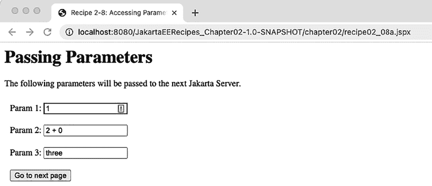

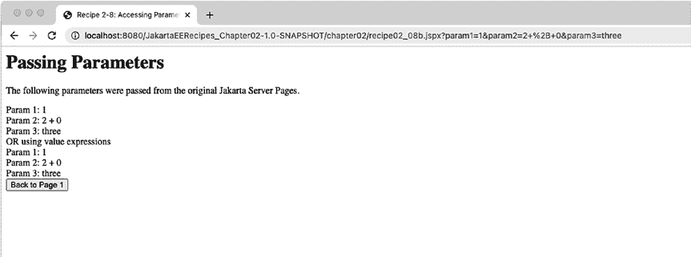

第 2 章 ■ Jakarta Server Pages

***图 2-9.** Jakarta Server Pages 配方 02-08a 输出*

***图 2-10.** Jakarta Server Pages 配方 02-08b 输出*

2-9. 创建自定义 Jakarta Server 标签

问题

您希望创建一个 Jakarta Server 标签，为您的应用程序提供自定义功能。

解决方案

使用 Jakarta Server 2.0 *简单标签支持* 创建自定义 Jakarta Server 标签。假设您想创建一个自定义标签，该标签会在放置标签的 Jakarta Server 页面中插入一个签名。该自定义标签将打印一个默认签名，但它也接受一个 authorName 属性，如果提供了该属性，则会在签名中包含指定的作者姓名。首先，您需要定义一个继承 SimpleTagSupport 类的 Java 类。该类将为您的标签提供实现。以下代码是一个名为 Signature 的类的实现，它为自定义标签提供了实现：81

第 2 章 ■ Jakarta Server Pages

package org.jakartaeerecipe.chapter02.recipe02_09;

import jakarta.servlet.jsp.JspException;

import jakarta.servlet.jsp.JspWriter;

import jakarta.servlet.jsp.PageContext;

import jakarta.servlet.jsp.tagext.SimpleTagSupport;

public class Signature extends SimpleTagSupport {

private String authorName = null;

/**

* @param authorName 要设置的 authorName

*/

public void setAuthorName(String authorName) {

this.authorName = authorName;

}

@Override

public void doTag() throws JspException {

PageContext pageContext = (PageContext) getJspContext();

JspWriter out = pageContext.getOut();

try {

if(authorName != null){

out.println("Written by " + authorName);

out.println("<br/>");

}

out.println("Published by Apress");

} catch (Exception e) {

System.out.println(e);

}

}

}

以下是此项目的文件夹结构：

├── src

│ └── main

│ └── java

│ │ └── org

│ │ └── jakartaeerecipe

│ │ └── chapter02

│ │ └──recipe02_09

│ │ └── Signature.java

│ └── webapp

│ ├── WEB-INF

│ │ ├── tlds

│ │ │ └── signature.tld

│ │ └── web.xml

│ ├── chapter02


│ │ ├── recipe02_09.jspx

│ └── index.jsp

├── pom.xml

第 2 章 ■ Jakarta 服务器页面

■ **注意** 要编译以下代码，需要将 `jakarta.servlet.jsp-api.jar` 添加到类路径中：  
`cd recipe02_09`  
`javac -cp ...\glassfish\modules\jakarta.servlet.jsp-api.jar *.java`

接下来，需要创建一个 TLD 文件，将 Signature 类标签实现映射到标签。`signature.tld` 是包含自定义标签映射的 TLD 源文件，其代码如下：

```xml
<?xml version="1.0" encoding="UTF-8"?>

<taglib version="2.1" xmlns:xsi="http://www.
w3.org/2001/XMLSchema-instance" xsi:schemaLocation="http://java.sun.com/xml/ns/javaee http://java.sun.com/xml/ns/javaee/web-jsptaglibrary_2_1.xsd">

<tlib-version>1.0</tlib-version>

<short-name>cust</short-name>

<uri>custom</uri>

<tag>

<name>signature</name>

<tag-class>org.jakartaeerecipe.chapter02.recipe02_09.Signature</tag-class>

<body-content>empty</body-content>

<attribute>

<name>authorName</name>

<rtexprvalue>true</rtexprvalue>

<required>false</required>

</attribute>

</tag>

</taglib>
```

一旦类实现和 TLD 准备就绪，就可以在 Jakarta 服务器页面中使用该标签。以下 Jakarta 服务器代码取自 `recipe_02_09.jspx`，它使用了自定义标签：

```html
<html
>

<jsp:directive.page contentType="text/html" pageEncoding="UTF-8"/>

<head>

<title>配方 2-9：创建自定义 Jakarta 服务器标签</title>

</head>

<body>

<h1>自定义 Jakarta 服务器标签</h1>

<p>自定义 Jakarta 服务器标签用作此页面的页脚。</p>

<br/>

<cust:signature authorName="Josh Juneau and Tarun Telang"/>

</body>

</html>
```

现在，自定义标签的输出将显示在 Jakarta 服务器页面中 `cust:signature` 元素所在的位置。输出结果如图 2-11 所示。

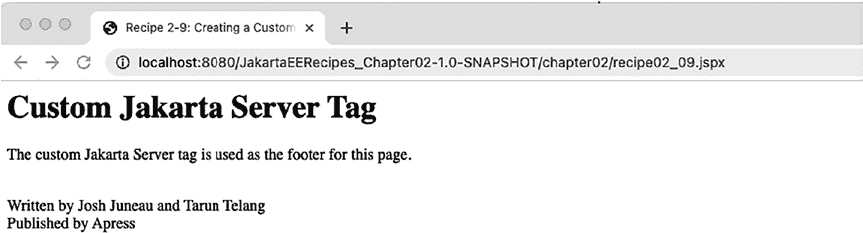

第 2 章 ■ Jakarta 服务器页面

***图 2-11.** Jakarta 服务器页面配方 02-09 输出*

工作原理

JSP 2.0 最有用的新特性之一就是引入了 `SimpleTagSupport` 类，它为开发者提供了一种创建自定义标签的简便方法。在 2.0 版本发布之前，创建自定义标签需要更多的工作，因为开发者必须在标签的实现类中提供更多的代码来实现标签。`SimpleTagSupport` 类为开发者处理了大部分实现工作，因此唯一需要做的就是实现 `doTag` 方法，以便为自定义标签提供实现。

在本配方的示例中，创建了一个自定义标签，它会在 Jakarta 服务器页面中标签所在的位置打印一个签名。要创建自定义标签实现，需要创建一个继承 `SimpleTagSupport` 类的 Java 类，并为 `doTag` 方法提供实现。示例类还包含一个名为 `authorName` 的字段，该字段将在 TLD 中映射为自定义标签的一个属性。在 `doTag` 方法中，通过调用 `getJspContext` 方法获取 Jakarta 服务器页面上下文的句柄。`getJspContext` 是 `SimpleTagSupport` 中为你实现的一个自定义方法，可以轻松获取 Jakarta 服务器页面上下文。接下来，为了能够写入 Jakarta 服务器输出，通过调用 `PageContext` 的 `getOut` 方法获取 `JspWriter` 的句柄：

```java
PageContext pageContext = (PageContext) getJspContext();
JspWriter out = pageContext.getOut();
```

`doTag` 中的后续代码通过一系列对 `out.println` 的调用来实现写入 Jakarta 服务器输出的功能。传递给 `out.println` 的任何内容都将显示在页面上。请注意，在示例中，会检查 `authorName` 字段是否包含空值。如果不包含空值，则将其显示在页面上；否则，将其省略。因此，如果 Jakarta 服务器页面中的标签包含 `authorName` 属性的值，则该值将被打印在页面上。`out.println` 代码包含在 `try-catch` 块中，以防出现任何异常。


■ **注意**：要让你的标签支持脚本片段，你需要使用*经典标签处理器*。经典标签处理器在 Jakarta Server 2.0 时代之前就已存在，至今仍可与简单标签处理器一起使用。简单标签处理器围绕 `doTag()` 方法展开，而经典标签处理器则涉及 `doStartTag()` 和 `doEndTag()` 方法以及其他方法。由于简单标签处理器可以与经典标签处理器共存，因此在同一个应用程序中，既可以利用简单标签方法，也可以使用一些更复杂的经典标签方法。这有助于从经典标签处理器向简单标签处理器的过渡。有关这两个 API 之间差异的更多信息，请搜索关键词 *Simple vs. Classic Tag Handlers* 查阅相关在线文档。

第 2 章 ■ Jakarta Server Pages

至此，标签的实现就完成了。为了通过标签名称将实现类映射到文档对象模型（DOM），TLD 文件中必须包含指向该类的映射。在示例中，创建了一个名为 `custom.tld` 的 TLD 文件，其中包含了该类的映射。`short-name` 元素指定了在 Jakarta Server Page 中引用该标签时必须使用的名称。`uri` 元素指定了 TLD 的名称，并在 Jakarta Server Page 中用于引用 TLD 文件本身。TLD 的核心内容包含在 `tag` 元素中。`name` 元素用于指定标签的名称，它将在 Jakarta Server Page 中与 `short-name` 元素结合使用，以提供完整的标签名称。`tag-class` 元素提供了实现该标签的类的名称，而 `body-content` 则指定一个值，用于指示 Jakarta Server Page 的主体内容是否可供标签实现类使用。在本示例中，该值设置为 `empty`。要为标签指定属性，必须在 TLD 中添加 `attribute` 元素，其中包含 `name`、`rtexprvalue` 和 `required` 元素。`attribute` 的 `name` 元素指定了属性的名称，`rtexprvalue` 指示该属性是否可以包含 Jakarta 表达式语言表达式，`required` 则指示该属性是否为必需。

要在 Jakarta Server Page 中使用该标签，必须将 `custom.tld` TLD 映射到页面中，这可以通过 Jakarta Server 文档的 `<html>` 元素或标准 Jakarta Server 中的 `taglib` 指令来实现。以下两行代码展示了这两种方式的区别：

<!—Jakarta Server Document 语法 -->

<html

. . .（更多 taglib 指令） . . .>

<!—Jakarta Server 语法 -->

<%@taglib prefix="cust" uri="custom" %>

要在页面中使用该标签，只需指定 TLD 的 `short-name` 以及标签实现的映射名称和任何你想要提供的属性：

<cust:signature authorName="Josh Juneau and Tarun Telang"/>

在 Jakarta Server 中创建自定义标签比过去更加容易。自定义标签使开发者能够定义自定义操作和/或内容，这些操作和内容可以通过标签（而非脚本片段）在 Jakarta Server Page 中访问。自定义标签有助于开发者遵循 MVC 架构，将代码与业务逻辑分离。

2-10. 将其他 Jakarta Server Pages 包含到一个页面中

问题

你希望将页眉或页脚的内容放在单独的 Jakarta Server Page 中，然后通过引用的方式将它们引入到 Jakarta Server Pages 中，而不是在每个 Jakarta Server 中重复编写相同的页眉或页脚。

解决方案

使用 `<jsp:include>` 标签将其他静态或动态页面嵌入到你的 Jakarta Server Page 中。以下示例演示了如何在一个页面中包含另外两个 Jakarta Server Pages。其中一个 Jakarta Server Page 用于构建页面的页眉，另一个用于构建页脚。下面的页面展示了主 Jakarta Server Page，它使用 `<jsp:include>` 标签包含了另外两个页面。

第 2 章 ■ Jakarta Server Pages


名为 recipe02_10-header.jspx 和 recipe02_10-footer.jspx 的 JSPX 文件被包含在主 Jakarta Server Page 的正文中，以提供页面的页眉和页脚部分：

<html >

<jsp:directive.page contentType="text/html" pageEncoding="UTF-8"/>

<head>

<title>配方 2-10：将其他 Jakarta Server Pages 包含到页面中</title>

</head>

<body>

<jsp:include page="recipe02_10-header.jspx" />

<h1>这是主 Jakarta Server Page 的正文。</h1>

<p>

此页面的页眉和页脚都是作为独立的 Jakarta Server Pages 创建的。

</p>

<jsp:include page="recipe02_10-footer.jspx"/>

</body>

</html>

接下来是构成页面页眉的 Jakarta Server 代码。它并不复杂，但仍然是一个独立的 Jakarta Server Page：

<html >

<jsp:directive.page contentType="text/html" pageEncoding="UTF-8"/>

<p>这是页面页眉</p>

</html>

以下 Jakarta Server 代码构成了页面页脚：

<html >

<jsp:directive.page contentType="text/html" pageEncoding="UTF-8"/>

<p>这是页面页脚</p>

</html>

最终，这三个页面组合成一个包含页眉、正文和页脚的单一页面。

该页面的输出将如图 2-12. 所示。

工作原理

包含其他 Jakarta Server Pages 有助于提高开发人员的工作效率并减少维护时间。

使用此技术，开发人员可以提取出现在多个页面中的任何 Jakarta Server 特性，并将它们放入一个独立的 Jakarta Server Page 中。这样做将允许在需要更新这些特性之一时，实现单点维护。

要在 Jakarta Server Page 中包含另一个页面，请使用 `<jsp:include>` 标签。`<jsp:include>` 标签允许嵌入静态文件或其他 Web 组件。该标签包含一个 page 属性，用于指定相对 URL 或一个表达式，该表达式的结果是要包含在页面中的另一个文件或 Web 组件。

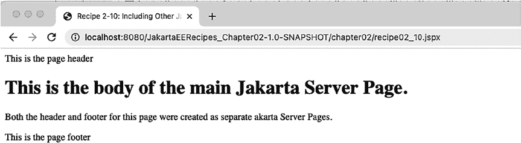

第 2 章 ■ Jakarta Server Pages

***图 2-12.** Jakarta Server Pages 配方 02-10 输出*

■ **注意** 该标签还有一个可选的 flush 属性，可以设置为 true 或 false，以指示在包含页面之前是否应刷新输出缓冲区。flush 属性的默认值为 false。

可选地，如果被包含的资源是动态的，可以在 `<jsp:include>` 的开始和结束标签之间放置 `<jsp:param>` 子句，以向该资源传递一个或多个名称-值对。执行此技术的示例如下代码行所示。在以下几行中，一个名称为 bookAuthor、值为 Juneau 的参数被传递给了页眉 Jakarta Server Page：

<jsp:include page="header.jspx">

<jsp:param name="bookAuthor" value="Juneau and Telang"/>

</jsp:include>

在 Jakarta Server Page 中包含其他内容的能力提供了一种封装资源和静态内容的方法。这允许开发人员创建一次内容，并将其包含在许多页面中。

2-11\. 为数据库记录创建输入表单

问题

您想要创建一个 Jakarta Server Page，用于输入信息，这些信息将作为数据库记录插入。

解决方案

创建一个输入表单，并使用 Jakarta servlet 操作方法将值插入数据库。此解决方案需要一个 Jakarta Server Pages 文档和一个 Jakarta servlet 来完成数据库输入表单。在以下示例中，在 Jakarta Server 文档中创建了一个输入表单，用于填充名为 RECIPES 的数据库表中的记录。当用户在表单的文本字段中输入信息并单击“提交”按钮时，将调用一个执行数据库插入事务的 servlet。

第 2 章 ■ Jakarta Server Pages

以下代码是用于为数据库应用程序创建输入表单的 Jakarta Server 文档：

<html

version="2.0">

<jsp:directive.page contentType="text/html" pageEncoding="UTF-8"/>

<head>

<title>配方 2-11：为数据库记录创建输入表单</title>


</head>

<body>

<h1>配方输入表单</h1>

<p>

请使用下方的文本字段输入配方详情。

</p>

<form method="POST" action="../RecipeServlet">

<label for="recipeNumber">配方编号：</label><br/>

<input id="recipeNumber" type="number" name="recipeNumber"/><br/>

<label for="name">配方名称：</label><br/>

<input type="text" name="name" size="30"/><br/>

<label for="description">配方描述：</label><br/>

<textarea name="description" rows="5" cols="50"> 在此处输入描述...

</textarea><br/>

<label for="text">配方文本：</label><br/>

<textarea id="text" name="text" rows="10" cols="50"> 在此处输入文本...

</textarea><br/><br/>

<input type="submit"/><input type="reset"/>

</form>

</body>

</html>

接下来是一个名为 `RecipeServlet` 的 servlet 代码。它负责从 Jakarta Server 文档输入表单中读取请求参数，并将这些字段插入到数据库中：

package org.jakartaeerecipe.chapter02.recipe02_11;

import java.io.*;

import java.sql.*;

import javax.servlet.ServletException;

import javax.servlet.annotation.WebServlet;

import javax.servlet.http.*;

@WebServlet(name = "RecipeServlet", urlPatterns = {"/RecipeServlet"})

public class RecipeServlet extends HttpServlet {

/**

* 处理 HTTP

* <code>GET</code> 和

* <code>POST</code> 方法的请求。

*

第 2 章 ■ Jakarta Server Pages

* @param request servlet 请求

* @param response servlet 响应

* @throws ServletException 如果发生特定于 servlet 的错误

* @throws IOException 如果发生 I/O 错误

*/

protected void processRequest(HttpServletRequest request, HttpServletResponse response)

throws ServletException, IOException {

response.setContentType("text/html;charset=UTF-8");

PrintWriter out = response.getWriter();

int result = -1;

try {

/*

* TODO 在此处对请求参数执行验证

*/

result = insertRow (request.getParameter("recipeNumber"),

request.getParameter("name"),

request.getParameter("description"),

request.getParameter("text"));

out.println("""

<html>

<head>

<title>Servlet RecipeServlet</title>

</head>

<body>

""");

out.printf("<h1>Servlet RecipeServlet at " + request.getContextPath() + "</h1>"); out.println("<br/><br/>");

if(result > 0){

out.println("""

<font color='green'>记录成功插入！</font>

<br/><br/>

<a href='/JakartaEERecipes_Chapter02-1.0-SNAPSHOT/chapter02/recipe02_11.jspx'>

插入另一条记录

</a>

""");

} else {

out.println("""

<font color='red'>记录未插入！</font>"

<br/><br/>

<a href='/JakartaEERecipes_Chapter02-1.0-SNAPSHOT/chapter02/recipe02_11.jspx'>

重试

</a>

""");

}

out.println("</body>");

out.println("</html>");

} finally {

out.close();

}

}

第 2 章 ■ Jakarta Server Pages

public int insertRow(String recipeNumber,

String name,

String description,

String text) {

String sql = "INSERT INTO RECIPES VALUES(" +

"RECIPES_SEQ.NEXTVAL,?,?,?,?)";

PreparedStatement stmt = null;

int result = -1;

try {

CreateConnection createConn = new CreateConnection();

Connection conn = createConn.getConnection();

stmt = (PreparedStatement) conn.prepareStatement(sql);

stmt.setString(1, recipeNumber);

stmt.setString(2, name);

stmt.setString(3, description);

stmt.setString(4, text);

// 返回行数，如果不成功则返回 0

result = stmt.executeUpdate();

if (result > 0){

System.out.println("-- 记录已创建 --");

} else {

System.out.println("!! 记录未创建 !!");

}

} catch (SQLException e) {

e.printStackTrace();

} finally {

if (stmt != null) {

try {

stmt.close();

} catch (SQLException ex) {

ex.printStackTrace();

}

}

}

return result;

}

@Override

protected void doGet(HttpServletRequest request, HttpServletResponse response)

throws ServletException, IOException {

processRequest(request, response);

}

@Override

protected void doPost(HttpServletRequest request, HttpServletResponse response)

throws ServletException, IOException {

processRequest(request, response);

}

}

如果请求成功，记录将被插入到数据库中，用户将能够点击链接以添加另一条记录。当然，在实际应用中，您可能希望在输入表单内或服务器端 Java 代码中使用 JavaScript 编写一些验证逻辑，以帮助确保数据库的完整性。

第 2 章 ■ Jakarta Server Pages

工作原理

几乎每个企业应用程序的一项基本任务就是使用数据库输入表单。数据库输入表单使最终用户能够轻松地将数据填充到数据库表中。当使用 Jakarta Server 技术以及 servlet 时，此操作可以变得相当简单。

Apache Derby 数据库预装在 GlassFish 服务器中，位于以下目录：

JAVA_DEV/glassfish7/javadb

要运行本配方的代码，您需要首先创建一个新数据库。Apache Derby 数据库附带了一个交互式 SQL 脚本工具 `ij`。您可以通过进入以下目录从命令提示符启动它：`JAVA_DEV/glassfish7/javadb/bin`

然后运行 `ij` 命令。您应该会看到如下输出：

ij version 10.5

ij>

要创建一个名为 `acmedb` 的新数据库，您可以使用 `connect` 命令并提供 `create=true`：`ij> connect 'jdbc:derby:/path/to/database/acmedb;create=true;`

您可以将 `/path/to/database` 替换为您项目文件夹中的数据库文件夹。接下来，使用以下命令创建一个数据库表：

ij> create table RECIPE >

( ID INTEGER not null

> constraint RECIPE_PK primary key,

> NAME VARCHAR(30) not null,

> DESCRIPTION VARCHAR(250),

> TEXT VARCHAR(1000)

> );

表创建完成后，您可以通过执行以下命令断开与数据库的连接：`ij > disconnect;`

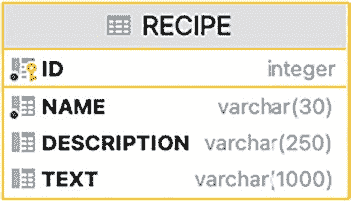

第 2 章 ■ Jakarta Server Pages

图 2-13 展示了通过上述命令创建的表的表结构。

***图 2-13.** RECIPE 表的表结构*

正如您在本配方的示例中所见，编写 Jakarta Server 输入表单非常直接，可以使用基本 HTML 进行编码。关键在于设置一个 Java servlet 来接收提交的请求，并使用该 servlet 处理记录。这提供了一种将 Web 内容与应用程序逻辑分离的简便机制。

在示例中，一个名为 `recipe02_11.jspx` 的 Jakarta Server 文档包含一个标准的 HTML 表单，其方法为 `POST`，动作为 `/JakartaEERecipes/RecipeServlet`。输入表单包含四个字段，这些字段映射到最终将插入数据的数据库列。输入标签包含四个对应字段的名称（`recipeNumber`、`name`、`description` 和 `text`），这些字段将在提交时传递给表单动作。如您所见，唯一与 Java 代码相关的引用是包含在表单动作属性中的 servlet 名称。

名为 `RecipeServlet` 的 Java servlet 负责获取通过 Jakarta Server 文档提交的请求参数，对其进行相应验证（示例中未显示），并将其插入到数据库中。当页面提交时，`RecipeServlet` 被调用，并且由于 HTML 动作方法为 `POST`，请求被发送到 `doPost` 方法。`doGet` 和 `doPost` 方法实际上都只是名为 `processRequest` 的处理方法的包装方法，该方法负责大部分工作。`processRequest` 方法负责获取请求参数、将其插入数据库，并向客户端发送响应。


首先通过调用 `response.getWriter()` 声明并创建一个 `PrintWriter` 对象，因为该对象稍后将用于协助构建发送给客户端的响应。接着，声明一个名为 `result` 的 `int` 类型变量并初始化为 `-1`。此变量将用于判断 SQL 插入操作是否成功。完成这些声明后，打开一个 `try-catch` 代码块，`try` 块的第一行是调用 `insertRow` 方法，并将请求参数作为值传入。`result` 变量将接收 `insertRows` 方法执行后返回的 `int` 值，该值用于指示插入是否成功：

```java
result = insertRow(request.getParameter("recipeNumber"),
                   request.getParameter("name"),
                   request.getParameter("description"),
                   request.getParameter("text"));
```

因此，一条 SQL 插入语句被赋值给名为 `sql` 的字符串，并使用 `PreparedStatement` 格式进行设置。SQL 字符串中的每个问号都对应一个参数，在执行 SQL 时这些参数将被替换到字符串中：

```java
String sql = "INSERT INTO RECIPES VALUES(" + "RECIPES_SEQ.NEXTVAL,?,?,?,?)";
```

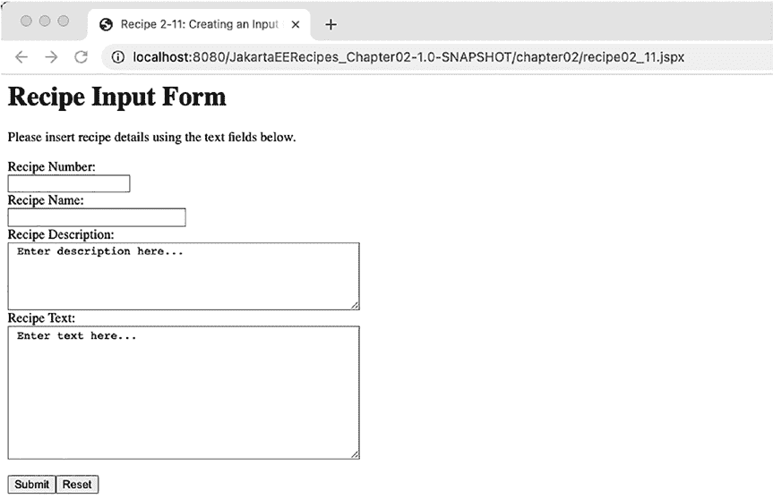

第 2 章 ■ Jakarta Server Pages

接下来，初始化 `PreparedStatement` 和 `int` 值，然后打开一个 `try-catch-finally` 代码块，该块将包含 SQL 插入代码。在块内，通过调用名为 `CreateConnection` 的辅助类创建一个 `Connection` 对象。如果你想了解更多关于这个辅助类的信息，可以阅读第 7 章关于 JDBC 的内容。目前，你只需要知道 `CreateConnection` 会返回一个数据库连接，该连接可用于操作数据库。如果由于某种原因连接失败，将执行 `catch` 块，随后执行 `finally` 块。从成功的连接中创建一个 `PreparedStatement` 对象，并将包含数据库插入操作的 SQL 字符串赋值给它。然后，依次将每个请求参数值设置为 `PreparedStatement` 的参数。最后，调用 `PreparedStatement` 的 `executeUpdate` 方法，该方法执行数据库插入操作。`executeUpdate` 的返回值被赋值给 `result` 变量，然后返回给 `processRequest` 方法。一旦控制权返回给 `processRequest`，就会使用一系列 `PrintWriter` 语句创建 Servlet 响应。如果插入成功，则显示一条表示成功的消息。

同样，如果插入失败，则显示一条表示失败的消息。

***图 2-14.** Jakarta Server Pages recipe 02-11 的输出*

图 2-14 显示了 该配方的输出。使用 Jakarta Server 开发数据库输入表单相当容易。为了保持 MVC 结构，使用 Java Servlet 处理请求和数据库逻辑是最佳选择。

2-12. 在页面内循环遍历数据库记录

问题

你希望在 Jakarta Server Page 上显示数据库表中的记录。

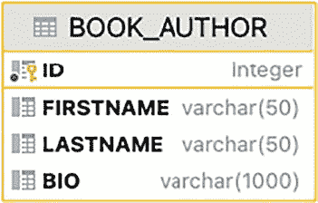

第 2 章 ■ Jakarta Server Pages

解决方案

将数据库逻辑封装在 Java 类中，并从 Jakarta Server Page 中访问它。使用 Jakarta 标准标签库的 `c:forEach` 元素来遍历数据库行并在页面上显示它们。在这种情况下，将使用两个 Java 类来处理数据。其中一个类将代表你从数据库中查询的表，并且它包含该表中每个列的字段。另一个 JavaBean 类将用于包含查询数据库的数据库业务逻辑。以下是项目结构：

```
.
├── src
│   └── main
│       ├── java
│       │   └── org
│       │       └── jakartaeerecipe
│       │           └── chapter02
│       │               └── recipe02_12
│       │                   ├── Author.java
│       │                   └── AuthorBean.java
│       └── webapp
│           ├── WEB-INF
│           │   └── web.xml
│           └── chapter02
│               └── recipe02_12.jspx
└── pom.xml
```


本示例将展示 BOOK_AUTHORS 数据库表中每位作者的姓名。该表应按照图 2-15 中的结构创建。

***图 2-15.** BOOK_AUTHOR 表的表结构*

以下是创建该表的 SQL 命令：

create table BOOK_AUTHOR

(

ID INTEGER not null

constraint BOOK_AUTHOR_PK

primary key,

FIRSTNAME VARCHAR(50),

LASTNAME VARCHAR(50),

BIO VARCHAR(1000)

);

您还可以使用以下命令创建一个序列来自动生成 ID：

create sequence book_author_s

start with 1

increment by 1;

接下来，您可以运行以下 INSERT 语句向 BOOK_AUTHOR 表中填充数据： insert into BOOK_AUTHOR (ID, FIRSTNAME, LASTNAME, BIO) values (

next value for book_author_s,

'Josh',

'Juneau'

'Author of Apress Books',

);

insert into BOOK_AUTHOR (ID, FIRSTNAME, LASTNAME, BIO) values (

next value for book_author_s,

'Tarun',

'Telang'

'Author of Apress Books',

);

以下代码用于创建 Jakarta Server 文档，该文档将使用基于标准 HTML 的表格以及 Jakarta 标准标签库的 `<c:forEach>` 标签来遍历行，从而显示表中的数据：

<html

version="2.0">

<jsp:directive.page contentType="text/html" pageEncoding="UTF-8"/>

<jsp:useBean id="authorBean" scope="session" class="org.jakartaeerecipe.chapter02.

recipe02_12.AuthorBean"/>

<head>

<title>配方 2-12：在页面内遍历数据库记录</title>

</head>

<body>

<h1>作者</h1>

<p>

以下列出了 Josh Juneau 参与编写的书籍的作者。

</p>

<table border="1">

<c:forEach items="${authorBean.authorList }" var="author">

<tr>

<td> ${ author.first } ${ author.last }</td>

</tr>

</c:forEach>

</table>

</body>

</html>

如您所见，`<c:forEach>` 用于遍历 `${authorBean.authorList}` 中包含的项目。列表中的每个项目都是一个 `Author` 类型的对象。以下 Java 代码是 `Author` 类的代码，用于保存表中每一行包含的数据：

package org.jakartaeerecipe.chapter02.recipe02_12;

public class Author implements java.io.Serializable {

private int id;

private String first;

private String last;

public Author(){

id = -1;

first = null;

last = null;

}

/**

* @return the id

*/

public int getId() {

return id;

}

/**

* @param id the id to set

*/

public void setId(int id) {

this.id = id;

}

/**

* @return the first

*/

public String getFirst() {

return first;

}

/**

* @param first the first to set

*/

public void setFirst(String first) {

this.first = first;

}

/**

* @return the last

*/

public String getLast() {

return last;

}

/**

* @param last the last to set

*/

public void setLast(String last) {

this.last = last;

}

}

最后，Jakarta Server 文档引用了一个名为 `AuthorBean` 的 JavaBean，它包含查询数据并将其作为列表返回给 Jakarta Server 页面的业务逻辑。以下代码包含在 `AuthorBean` 类中：

package org.jakartaeerecipe.chapter02.recipe02_12;

import java.sql.Connection;

import java.sql.PreparedStatement;

import java.sql.ResultSet;

import java.sql.SQLException;

import java.util.ArrayList;

import java.util.List;

import org.jakartaeerecipe.common.CreateConnection;

public class AuthorBean implements java.io.Serializable {

public static Connection conn = null;

private List authorList = null;

public List queryAuthors(){

String sql = "SELECT ID, FIRST, LAST FROM BOOK_AUTHOR";

List<Author> authorList = new ArrayList<>();

PreparedStatement stmt = null;

ResultSet rs = null;

int result = -1;

try {

CreateConnection createConn = new CreateConnection();

conn = createConn.getConnection();

stmt = (PreparedStatement) conn.prepareStatement(sql);

// 返回行数，如果不成功则返回 0

rs = stmt.executeQuery();

while (rs.next()){

Author author = new Author();

author.setId(rs.getInt("ID"));

author.setFirst(rs.getString("FIRST"));

author.setLast(rs.getString("LAST"));

authorList.add(author);

}

} catch (SQLException e) {

e.printStackTrace();

} finally {

if (stmt != null) {

try {

stmt.close();

} catch (SQLException ex) {

ex.printStackTrace();

}

}

}

return authorList;

}

public List getAuthorList(){

authorList = queryAuthors();

return authorList;

}

}

表中记录包含的作者姓名将显示在页面上。图 2-16 显示了本配方生成的输出截图：

***图 2-16.** 配方 2-12 的输出*

工作原理

几乎所有的企业应用程序都会执行某种数据库查询。数据库查询的结果通常以表格形式显示。本配方中的示例演示了如何查询数据库并将结果返回给 Jakarta Server 页面，以便在标准 HTML 表格中显示。此示例中的 Jakarta Server 页面使用 Jakarta 标准标签库的 `c:forEach` 元素来遍历数据库查询的结果。请注意，使用 Jakarta Server 开发此类数据库查询的方法不止一种；然而，本配方中演示的格式最推荐用于生产环境。

如前所述，本配方中的 Jakarta Server 页面结合使用了 `jsp:useBean` 元素和 `c:forEach` 元素来遍历数据库查询的结果。查询数据库的逻辑位于服务器端的 JavaBean 类中，该类在页面上的 `jsp:useBean` 元素中被引用。在示例中，JavaBean 名为 `AuthorBean`，它负责查询名为 `AUTHORS` 的数据库表，并用查询结果填充一个 `Author` 对象列表。当 `c:forEach` 元素被评估，且其 `items` 属性设置为 `${authorBean.authorList}` 时，它会调用名为 `getAuthorList` 的 JavaBean 方法，因为 Jakarta Server 表达式总是在方法调用背后附加“get”，并将方法名的首字母大写。当调用 `getAuthorList` 方法时，`authorList` 字段会通过调用 `queryAuthors` 来填充。`queryAuthors` 方法利用 Java 数据库连接（JDBC）数据库调用从 `AUTHORS` 表中获取作者。数据库查询返回的每一行都会创建一个新的 `Author` 对象，并且每个新的 `Author` 对象依次被添加到 `authorList` 中。最后，填充好的 `authorList` 包含多个 `Author` 对象，并被返回给 Jakarta Server 页面，然后使用 `c:forEach` 元素进行遍历。

`c:forEach` 元素包含一个名为 `var` 的属性，该属性应设置为一个字符串，该字符串将代表正在遍历的列表中的每个元素。然后，在 `c:forEach` 元素的开始和结束标签之间使用 `var` 来引用列表中的每个元素，打印每位作者的姓名。

本配方提供了一些关于如何将 Jakarta 标准标签库标签的强大功能与 JDBC 等其他技术相结合以产生非常有用结果的见解。要了解有关 Jakarta Server 中不同 Jakarta 标准标签库标签的更多信息，请访问 [www.oracle.com/technetwork/java/jstl-137486.html](http://www.oracle.com/technetwork/java/jstl-137486.html) 上的在线文档。要了解有关 JDBC 的更多信息，请阅读本书的第 7 章。

2-13\. 在 Jakarta Server 页面中处理错误

问题

您希望在 Jakarta Server 页面遇到错误时显示一个格式良好的错误页面。

解决方案


创建一个标准错误页面，并在 Jakarta Server Page 中发生异常时将控制权转发到该错误页面。以下采用 `.jsp` 格式（而非 `.jspx`）的 Jakarta Server Page 演示了一个标准错误页面，用于在 Jakarta Server Pages 应用程序中发生错误时显示。如果应用程序中的任何 Jakarta Server Page 发生异常，将显示以下错误页面。

■ **注意**：本配方案例中的解决方案使用了 Jakarta 标准标签库的 `fmt` 库，该库提供了便捷的格式化功能，支持文本本地化以及日期和数字格式化。文本本地化功能允许设置区域设置，从而根据用户区域设置将文本格式化为不同语言。用于日期处理的标签使开发者能够轻松地在 Jakarta Server Page 中格式化日期和时间，并提供解析数据输入中的日期和时间的方法。最后，数字格式化标签提供了一种在页面中格式化和解析数字数据的方法。要了解更多关于 `fmt` Jakarta 标准标签库的信息，请参考在线文档：[`jakarta.ee/specifications/tags/2.0/tagdocs`](https://jakarta.ee/specifications/tags/2.0/tagdocs)。

[specifications/tags/2.0/tagdocs/](https://jakarta.ee/specifications/tags/2.0/tagdocs)

<%@page contentType="text/html" pageEncoding="UTF-8"%>

<%@ page isErrorPage="true" %>

<%@ taglib uri="http://java.sun.com/jsp/jstl/core"

prefix="c" %>

<%@ taglib uri="http://java.sun.com/jsp/jstl/fmt"

prefix="fmt" %>

<!DOCTYPE html>

<html>

<head>

<title>Jakarta Server Pages - 错误页面</title>

</head>

<body>

<h1>遇到错误</h1>

<br/>

<br/>

第 2 章 ■ Jakarta Server Pages

<p>

应用程序遇到以下错误：

<br/>

<fmt:message key="ServerError"/>: ${pageContext.errorData.statusCode}

</p>

</body>

</html>

例如，如果名为 `param` 的参数为 null，以下 Jakarta Server 页面将产生一个错误（`NullPointerException`）。如果发生这种情况，将显示指定的错误页面：

<html

version="2.0">

<jsp:directive.page contentType="text/html" pageEncoding="UTF-8"/>

<jsp:directive.page errorPage="recipe02_13_errorPage.jsp"/>

<head>

<title>配方 2-13：处理 Jakarta Server 错误</title>

</head>

<body>

<h1>此页面存在错误</h1>

<p>

这将产生一个错误：

<jsp:scriptlet>

if (request.getParameter("param").equals("value")) {

System.out.println("test");

}

</jsp:scriptlet>

</p>

</body>

</html>

工作原理

用户在使用应用程序时最烦人的问题之一就是遇到错误。通常会显示一条冗长、难看的堆栈跟踪信息，而用户完全不知道如何解决该错误。当此类错误发生时，最好显示一个用户友好的错误页面。Jakarta Server 技术允许通过向每个可能产生错误的 Jakarta Server Page 添加页面指令来指定错误页面。该指令应指定一个错误页面，当包含该指令的页面产生错误时，将显示该页面。

本配方案例中的第二个 Jakarta Server 文档演示了一个 Jakarta Server Page，如果页面中请求的参数为 null，则会抛出错误。如果发生这种情况且未指定错误页面，则会显示 `NullPointerException` 错误消息。

然而，此 Jakarta Server 页面通过使用以下语法在页面指令中指定了一个错误页面：

<jsp:directive.page errorPage="recipe02_13_errorPage.jsp"/>

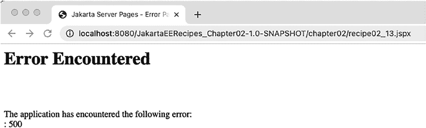

第 2 章 ■ Jakarta Server Pages

当示例页面发生错误时，将显示 `recipe02_13.errorPage.jsp`。输出结果如图 2-17 所示。本配方案例中列出的第一个 Jakarta Server 文档包含了 `recipe02_13.errorPage.jsp` 页面的源代码。它被标记为错误页面，因为它包含了一个指示该属性的页面指令：

<%@ page isErrorPage="true" %>


错误页面能够通过使用 `pageContext` 隐式对象来确定错误代码、状态、异常以及其他一系列信息。在示例中，`${pageContext.errorData.statusCode}` 表达式用于显示异常的状态码。表 2-5 展示了可以从 `pageContext` 对象中获取的其他可能信息。

***表 2-5.** pageContext 隐式对象异常信息*

**表达式**

**值**

pageContext.errorData

提供对错误信息的访问

pageContext.exception

返回异常对象的当前值

pageContext.errorData.requestURI

返回请求 URI

pageContext.errorData.servletName

返回被调用的 Servlet 名称

pageContext.errorData.statusCode

返回错误状态码

pageContext.errorData.throwable

返回导致错误的可抛出对象

在任何应用程序中提供用户友好的错误页面，都有助于为最终用户创造更易用、功能更全面的体验。Jakarta Server 和 Java 技术提供了强大的异常处理机制，可以在异常发生时帮助用户和管理员。

***图 2-17.** Jakarta Server Pages 配方 02-13 输出*

2-14\. 在页面中禁用脚本片段

问题

您希望确保 Java 代码无法嵌入到 Web 应用程序的 Jakarta Server Pages 中。

第 2 章 ■ Jakarta Server Pages

解决方案

将 Web 部署描述符中的 `scripting-invalid` 元素设置为 `true`。以下来自 `web.xml` 部署描述符的摘录演示了如何执行此操作：

<jsp-config>

<jsp-property-group>

<scripting-invalid>true</scripting-invalid>

</jsp-property-group>

</jsp-config>

工作原理

在鼓励使用模型-视图-控制器架构的环境中工作时，禁止在 Jakarta Server Pages 和文档中使用脚本片段可能非常有用。当 Jakarta Server 2.1 发布时，它提供了解决方案来帮助开发者将 Java 代码从 Jakarta Server Pages 中移出，并放入其应属的服务器端 Java 类中。在 Jakarta Server 的早期，页面中充斥着脚本片段和标记。这使得开发者难以将业务逻辑与内容分离，并且很难找到好的工具来有效开发此类页面。Jakarta Server 2.1 引入了标签，使得在 Jakarta Server Pages 中消除脚本片段的使用成为可能，这有助于维护 MVC 架构的使用。

要禁止在应用程序的 Jakarta Server Pages 中使用脚本片段，请在要强制执行此规则的应用程序的 `web.xml` 文件中添加 `jsp-config` 元素。添加一个 `jsp-property-group` 子元素以及 `scripting-invalid` 元素。`scripting-invalid` 元素的值应设置为 `true`。

2-15\. 在页面中忽略 Jakarta 表达式语言

问题

您希望关闭 Jakarta Server Page 中的 Jakarta 表达式语言表达式转换，以便旧版应用程序能够原样传递表达式。

解决方案 #1

通过在表达式前使用 `\` 字符来转义页面中的 Jakarta 表达式语言表达式。例如，以下表达式将被忽略，因为 `\` 字符出现在它们之前：

\${elBean.myProperty}

\${2 + 4}

解决方案 #2

在应用程序的 `web.xml` 文件中配置一个 Jakarta Server Pages 属性组。在 `web.xml` 文件中，`<jsp-property-group>` 元素可以包含子元素，这些子元素描述了 Jakarta Server Page 如何评估指定的项目。通过包含 `<el-ignored>true</el-ignored>` 元素，应用程序 Jakarta Server 文档中的所有 Jakarta 表达式语言都将被忽略并视为字面量。以下来自 `web.xml` 的摘录演示了此功能：

第 2 章 ■ Jakarta Server Pages

<jsp-property-group>

<el-ignored>true</el-ignored>

</jsp-property-group>

解决方案 #3

包含一个包含 `isELIgnored` 属性并将其设置为 `true` 的页面指令。可以将以下页面指令放置在给定 Jakarta Server 文档的顶部，以允许将每个 Jakarta 表达式语言表达式视为字面量：

<jsp:directive.page isELIgnored="true"/>

或者在标准的 Jakarta Server Pages 中：

<%@ page isELIgnored="true" %>

工作原理

可能存在需要关闭 Jakarta 表达式语言表达式评估的情况。这种情况最常发生在使用旧版 Jakarta Server 技术的遗留应用程序中；当时 Jakarta 表达式语言表达式尚不可用。有几种不同的方法可以关闭 Jakarta 表达式语言表达式的评估，本配方演示了每一种方法。

在本配方的第一个解决方案中，演示了转义技术。可以通过将 `\` 字符直接放在表达式前来转义 Jakarta 表达式语言表达式，如示例所示。这样做将导致 Jakarta Server 解释器将该表达式视为字符串字面量，页面上的输出将是表达式本身，而不是其评估结果。本配方的第二个解决方案演示了向 `web.xml` 部署描述符添加 `jsp-property-group` 以忽略 Jakarta 表达式语言。通过包含 `isELIgnored` 元素并为其提供 `true` 值，应用程序中的所有 Jakarta 表达式语言都将被忽略。最后，最后一个解决方案演示了如何通过包含将 `isELIgnored` 属性设置为 `true` 的页面指令，在逐个页面的基础上忽略 Jakarta 表达式语言。

每种忽略 Jakarta 表达式语言的不同解决方案都允许覆盖应用程序的不同部分。您选择的解决方案应取决于您希望在应用程序中忽略 Jakarta 表达式语言的广泛程度。

**第 3 章**

**Jakarta Server Faces**

Jakarta Server Faces 于 2004 年由 Sun Microsystems 以 Java Server Faces 的名称发布。它旨在使 Web 应用程序创建更简单，并使用服务器端渲染。它是对 Jakarta Server Pages 框架的改进，具有更结构化的开发周期，并且在使用现代 Web 技术方面具有更大的灵活性。Jakarta Server Faces 框架构建在模型-视图-控制器架构之上，并使用 XML 文件构建视图，使用 Java 类处理应用程序逻辑。Jakarta Server Faces 框架还支持注解以简化视图构建。

Jakarta Server Faces 框架是请求驱动的，这意味着它响应来自客户端的请求，每个请求都由一个名为 `FacesServlet` 的特殊 Servlet 处理。`FacesServlet` 负责构建组件树、处理事件、确定接下来要处理哪个视图以及渲染响应。`faces-config.xml` 文件是 Jakarta Server Faces 1.x 的特定资源文件，用于定义应用程序信息，例如导航规则、监听器注册等。虽然 `faces-config.xml` 文件在 Jakarta Server Faces 2.x 中仍然有用，但现代 Jakarta Server Faces 版本已专注于通过限制 XML 配置并使用注解来使事情更易于使用。`faces-config.xml` 是一个指定 Jakarta Server Faces 配置的 XML 文件。它通常位于 Web 应用程序的 `WEB-INF` 目录中。

该框架非常强大，包括与 Ajax 等技术的轻松集成，并使开发动态内容变得毫不费力。Jakarta Server Faces 与数据库配合良好，使用 RESTful 数据调用、JDBC 或 EJB 技术与后端交互。JavaBean，称为 Jakarta Server Faces *控制器类* 或 *控制器*，用于应用程序业务逻辑并支持每个视图中的动态内容。


它们可以遵循不同的生命周期，具体取决于所指定的作用域。视图可以调用 Bean 中的方法来执行数据操作和表单处理等操作。也可以在 Bean 中声明属性并在视图中公开，这提供了一种便捷的方式，可以在视图中提供动态内容或传递请求值。Jakarta Server Faces 允许开发者使用预先存在的验证和转换标签来自定义应用程序，这些标签可用于视图中的组件，以验证或转换数据。构建自定义验证器以及可应用于视图中组件的自定义组件也很容易。

本章包含的秘籍对于刚开始使用 Jakarta Server Faces 的开发者以及希望通过一些最新的 Jakarta Server Faces 技术来巩固框架基础知识的开发者都很有用。您将学习如何创建控制器类、使用标准组件以及处理页面导航。还有一些秘籍涵盖了有用的技术，例如构建自定义验证器和创建可添加书签的 URL。这些秘籍经过精炼，包含了最前沿的技术，并提供了使用它们的最实用的方法。学习完本章的秘籍后，您将能够构建标准的 Jakarta Server Faces 应用程序，并为其添加一些自定义功能。

© Josh Juneau 和 Tarun Telang 2022

J. Juneau 和 T. Telang, *Java EE 到 Jakarta EE 10 秘籍*[, https://doi.org/10.1007/978-1-4842-8079-9_3](https://doi.org/10.1007/978-1-4842-8079-9_3#DOI)

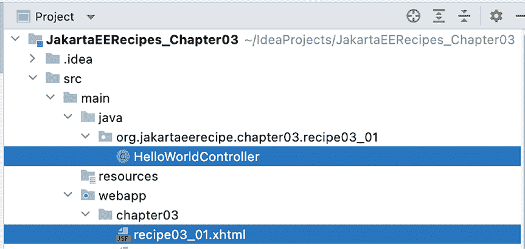

第 3 章 ■ Jakarta Server Faces

■ **注意** 许多人更喜欢在集成开发环境 (IDE) 中工作以提高生产力。要开始学习如何使用 NetBeans IDE 创建新的 Jakarta Server Faces 项目并进行管理，请参阅本书的附录。

3-1\. 编写一个简单的 Jakarta Server Faces 应用程序

问题

您希望通过创建一个简单的 Jakarta Server Faces 应用程序来快速上手并运行。

解决方案 #1

创建一个简单的 Jakarta Server Faces Web 应用程序，该应用程序由一个 XHTML 页面、一个称为支持 Bean 的简单 Java 类以及一个激活 Jakarta Server Faces 的 Bean 组成。本秘籍中的应用程序仅显示一条在支持 Bean 中初始化的消息。图 3-1 显示了 此解决方案的项目结构。

***图 3-1.** 项目文件夹结构*

■ **注意** 建议您使用 Java IDE 来简化工作。有许多优秀的 IDE 可供选择。您可以选择自己喜欢的 IDE，并按照其关于使用 Jakarta Server Faces 的说明进行操作。

第 3 章 ■ Jakarta Server Faces

项目依赖项

以下是来自 pom.xml 的片段，显示了此项目所需的依赖项：

<dependencies>

<dependency>

<groupId>jakarta.faces</groupId>

<artifactId>jakarta.faces-api</artifactId>

<version>4.0.0</version>

<scope>provided</scope>

</dependency>

<dependency>

<groupId>jakarta.platform</groupId>

<artifactId>jakarta.jakartaee-api</artifactId>

<version>10.0.0</version>

</dependency>

</dependencies>

显示 Jakarta Server Faces 控制器字段值

以下位于 \webapp\chapter03\recipe03_01.xhtml 文件中的代码构成了将用于显示 Jakarta Server Faces 支持 Bean 字段值的 XHTML 视图：

<?xml version='1.0' encoding='UTF-8' ?>

<!DOCTYPE html>

<html >

<h:head>

<title>秘籍 3-1：一个简单的 Jakarta Server Faces 应用程序</title>

</h:head>

<h:body>

<p>

这个简单的应用程序利用了一个请求作用域的 Jakarta Server Faces

控制器类

来显示下面的消息。如果您更改

控制器类构造函数中的消息，然后重新编译应用程序，

新消息就会出现。

<br/>

<br/>

#{helloWorldController.hello}

<br/>

或者

<br/>

<h:outputText id="helloMessage" value="#{helloWorldController.hello}"/>

</p>

</h:body>

</html>


如您所见，Jakarta Server Faces 页面使用了 Jakarta Server Faces 表达式；

`#{helloWorldController.hello}` 在表达式中被引用，同时还有要暴露的字段。

第 3 章 ■ Jakarta Server Faces

此外，请确保您的 `web.xml` 配置文件如下所示：

<?xml version="1.0" encoding="UTF-8"?>

<web-app

xsi:schemaLocation="https://jakarta.ee/xml/ns/jakartaee https://jakarta.ee/xml/ns/

jakartaee/web-app_5_0.xsd" version="5.0">

<context-param>

<param-name>jakarta.faces.CONFIG_FILES</param-name>

<param-value>/faces-config.xml</param-value>

</context-param>

<servlet>

<servlet-name>Faces Servlet</servlet-name>

<servlet-class>jakarta.faces.webapp.FacesServlet</servlet-class>

<load-on-startup>1</load-on-startup>

</servlet>

<servlet-mapping>

<servlet-name>Faces Servlet</servlet-name>

<url-pattern>*.xhtml</url-pattern>

</servlet-mapping>

</web-app>

检查 Jakarta Server Faces 控制器

以下代码是 `HelloWorldController` 的代码，它是本示例的 Jakarta Server Faces 控制器：

package org.jakartaeerecipe.chapter03.recipe03_01;

import jakarta.enterprise.context.RequestScoped;

import jakarta.inject.Named;

@Named

@RequestScoped

public class HelloWorldController {

private String hello = "Hello World!";

public String getHello() {

return hello;

}

}

■ **注意** 在 JSF 2.0 之前，为了启用 JSF Servlet 来翻译 XHTML 页面，您需要确保 `web.xml` 文件包含一个指示 `jakarta.faces.webapp.FacesServlet` 类及其关联的 `servlet-mapping` URL 的 `servlet` 元素。如果您使用的是 Servlet 3.x 容器，`FacesServlet` 会自动为您映射，因此无需调整 `web.xml` 配置。

要在浏览器中加载应用程序，请访问 `http://localhost:8080/JakartaEERecipes_Chapter03-1.0-SNAPSHOT/chapter03/recipe03_01.xhtml`，您将看到如图 3-2 所示的文本。

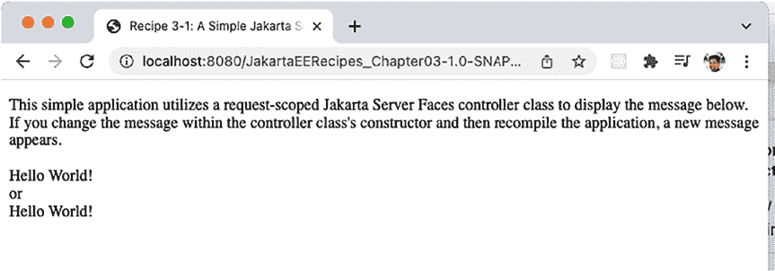

第 3 章 ■ Jakarta Server Faces

***图 3-2.** 生成的 Jakarta Server Faces 视图页面*

剖析 Jakarta Server Faces 应用程序

现在，我们来谈谈您阅读本示例的真正原因……即构建 Jakarta Server Faces 应用程序的说明！一个 Jakarta Server Faces 应用程序由以下部分组成：

• 如果它使用或维护的是基于 Jakarta Server Faces 1.x 编写的 Jakarta Server Faces 应用程序，则包含负责将 `FacesServlet` 实例映射到 URL 路径的 `web.xml` 部署描述符。

• 一个或多个使用 Jakarta Server Faces 组件来提供页面布局的网页（可能使用也可能不使用 Facelets 视图技术）。通常，这些网页被称为“视图”。

• 视图中的 Jakarta Server Faces 组件标签。

• 一个或多个控制器类，这些类是简单的、轻量级的容器管理对象，负责支持页面结构和基本服务。

• 可选地，一个或多个配置文件（如 `faces-config.xml`），可用于定义导航规则以及配置 Bean 和其他自定义对象。

• 可选地，支持对象，如监听器、转换器或自定义组件。

• 可选地，用于 Jakarta Server Faces 视图的自定义标签。

**JAKARTA SERVER FACES 应用程序的生命周期**

Jakarta Server Faces 视图处理生命周期包含六个阶段。这些阶段如下：

1.  恢复视图
2.  应用请求值
3.  处理验证
4.  更新模型值

第 3 章 ■ Jakarta Server Faces

5.  调用应用程序
6.  渲染响应

恢复视图是 Jakarta Server Faces 生命周期的第一个阶段，负责构建视图。然后，组件树使用组件树的 `decode` 方法将请求参数应用于每个对应的组件值。这发生在应用请求值阶段。在此阶段，任何值转换错误都将被添加到 `FacesContext` 中，以便在渲染响应阶段作为错误消息显示。接下来，所有


验证过程已执行。在处理验证阶段，每个注册了验证器的组件都会被检查，局部值会与验证规则进行比较。如果出现任何验证错误，则会进入渲染响应阶段，并显示相应的验证错误信息。

如果处理验证阶段顺利通过且无错误，则进入更新模型值阶段。在此阶段，树结构中包含局部值的每个对应输入组件都会设置控制器类的属性。同样，如果发生任何错误，则会进入渲染响应阶段，并显示相应的错误信息。在更新模型值阶段成功完成后，应用程序级事件将在调用应用程序阶段进行处理。此类事件包括页面提交或重定向到其他页面。最后，进入渲染响应阶段，页面将呈现给用户。如果应用程序使用的是 Jakarta Server Pages，那么 Jakarta Server Faces 实现会允许 Jakarta Server Pages 容器来渲染页面。

本教程中的示例使用了这些部分中最少的部分。要运行该示例，如果它运行在 Jakarta Server Faces 2\. *x* 之前的版本环境中，你需要确保 `web.xml` 文件包含正确的 Jakarta Server Faces 配置。你需要有一个支持 bean，它声明了在 Jakarta Server Faces 视图中暴露的字段，以及使其正常工作所需的必要访问器方法。最后，你需要有一个 XHTML Jakarta Server Faces 视图页面，其中包含暴露支持 bean 中声明的字段的 Jakarta Server Faces 表达式。支持 bean 是 UI 背后的模型。它包含应用程序中用于用数据填充其视图的属性。JSF

容器通过按需实例化这些对象，并使用以“#”为前缀的名称，通过 Jakarta 表达式语言表达式将它们注入实例变量来管理这些对象。

支持 bean 类与 Jakarta Server Page 的 JavaBean 非常相似，它为特定页面提供应用程序逻辑，这样 Java 代码就不需要嵌入到视图代码中。在 Jakarta Server Faces 视图中使用的组件（也称为 Jakarta Server Faces 标签）被映射到 Jakarta Server Faces 支持 bean 中包含的服务器端字段和方法。在示例中，Jakarta Server Faces 控制器类名为 `HelloWorldController`，并声明了一个名为 `hello` 的字段，通过 `getHello()` 方法向公众公开。当请求包含对 bean 引用的页面时，Jakarta Server Faces bean 类会被实例化和初始化，其作用域决定了支持 bean 的生命周期。在本示例中，支持 bean 通过

`@RequestScoped` 注解包含请求作用域。因此，其生命周期是单个请求的生命周期，并且每次发出请求时都会重新实例化。在本例中，即当示例中的页面被重新加载时。要了解有关控制器类可用的作用域和注解的更多信息，请参阅配方 3-2。

Jakarta Server Faces 技术利用了一个称为 Facelets 的 Web 视图声明框架。Facelets 使用一组特殊的 XML 标签，其风格类似于标准的 Jakarta Server Faces 标签，来帮助构建组件化的 Web 视图。虽然本示例未使用 Facelets，但它是 Jakarta Server Faces 视图技术的重要组成部分。Facelets 页面通常使用 XHTML，这是一种由格式良好的 XML 组件组成的 HTML 页面。本教程中的示例 Jakarta Server Faces 视图结构良好，它包含两个 Jakarta 表达式语言表达式，负责实例化控制器

110

第三章 ■ Jakarta Server Faces

类并显示 `hello` 字段的内容。当 Jakarta 表达式语言表达式


`#{helloWorldController.hello}` 由 `FacesServlet` 进行翻译，它会调用 `HelloWorldController` 的 `getHello()` 方法。

在本入门配方中，您接触到了大量信息。本配方中的简单示例为使用 Jakarta Server Faces 技术提供了一个良好的起点。请继续学习本章中的其他配方，以更全面地了解用于开发 Jakarta Server Faces Web 应用程序的各个组件。

3-2\. 编写控制器类

问题

您希望在 Jakarta Server Faces 应用程序的 Web 页面中使用一个服务器端 Java 类。

解决方案

开发一个 Jakarta Server Faces 控制器类，这是一个轻量级的容器管理组件，它将为您的 Jakarta Server Faces 应用程序 Web 页面提供应用逻辑。本配方中的示例是一个 Jakarta Server Faces 视图和一个 Jakarta Server Faces 控制器类。该应用程序计算用户输入的两个数字，然后根据用户的选择对它们进行加、减、乘或除运算。以下代码是控制器类，负责为用户输入的每个数字声明字段，以及为计算结果声明一个字段。控制器类还负责创建一个字符串列表，该列表将显示在 Jakarta Server Faces 视图中的 `h:selectOneMenu` 元素内，并保留用户选择的值。

尽管这个控制器类看起来做了很多工作，但实现起来非常简单！控制器类实际上是一个功能增强的普通 Java 对象（POJO），其中包含一些可以从 Jakarta Server Faces 视图组件调用的方法。

控制器类

以下代码是用于计算示例的控制器类。该类名为 `CalculationController`，在 Jakarta Server Faces 视图中以 `calculationController` 的形式被引用。Jakarta Server Faces 在其命名约定中采用“约定优于配置”的原则。默认情况下，Jakarta Server Faces 视图可以包含 Jakarta 表达式语言，该语言通过指定类名（首字母小写）来引用控制器类。

```java
package org.jakartaeerecipe.chapter03.recipe03_02;

import java.io.Serializable;

import java.util.*;

import jakarta.enterprise.context.SessionScoped;

import jakarta.faces.application.FacesMessage;

import jakarta.faces.context.FacesContext;

import jakarta.faces.model.SelectItem;

import jakarta.inject.Named;

@Named

@SessionScoped

public class CalculationController implements Serializable {

    private int num1;

    private int num2;

    private int result;

    private String calculationType;

    private static final String ADDITION = "Addition";

    private static final String SUBTRACTION = "Subtraction";

    private static final String MULTIPLICATION = "Multiplication";

    private static final String DIVISION = "Division";

    List<SelectItem> calculationList;

    /**
     * Creates a new instance of CalculationController
     */
    public CalculationController() {
        // 初始化变量
        num1 = 0;
        num2 = 0;
        result = 0;
        calculationType = null;
        // 初始化 SelectOneMenu 的值列表
        populateCalculationList();
        System.out.println("initialized the bean!");
    }

    // getters and setters
    // ...

    private void populateCalculationList(){
        calculationList = new ArrayList<>();
        calculationList.add(new SelectItem(ADDITION));
        calculationList.add(new SelectItem(SUBTRACTION));
        calculationList.add(new SelectItem(MULTIPLICATION));
        calculationList.add(new SelectItem(DIVISION));
    }

    public void performCalculation() {
        switch (getCalculationType()) {
            case ADDITION -> setResult(num1 + num2);
            case SUBTRACTION -> setResult(num1 - num2);
            case MULTIPLICATION -> setResult(num1 * num2);
            case DIVISION -> {
                try {
                    setResult(num1 / num2);
                } catch (Exception ex) {
                    FacesMessage facesMsg = new FacesMessage(FacesMessage.SEVERITY_ERROR,
                            "Invalid Calculation", "Invalid Calculation");
                    FacesContext.getCurrentInstance().addMessage(null, facesMsg);
                }
            }
        }
    }
}
```

接下来是构成 Web 页面的视图，该视图将显示给用户。视图在 XHTML 文档中构成，是一个格式良好的 XML。

Jakarta Server Faces 视图

该视图包含 Jakarta Server Faces 组件，这些组件显示为文本框，用户可以在其中输入信息；一个供用户选择的不同计算类型的选取列表；一个负责显示计算结果的组件；以及一个用于提交表单值的 `h:commandButton` 组件：

```html
<html
xmlns:h="http://xmlns.jcp.org/jsf/html"
xmlns:f="http://xmlns.jcp.org/jsf/core">
<h:head>
    <meta http-equiv="Content-Type" content="text/html; charset=UTF-8"/>
    <title>Recipe 3-2: Writing a Jakarta Server Faces Managed Bean</title>
</h:head>
<h:body>
    <f:view>
        <h2>Perform a Calculation</h2>
        <p>
            Use the following form to perform a calculation on two numbers.
            <br/>
            Enter
            the numbers in the two text fields below, and select a calculation to
            <br/>
            perform, then hit the Calculate button.
            <br/>
            <br/>
            <h:messages errorStyle="color: red" infoStyle="color: green"
                        globalOnly="true"/>
            <br/>
            <h:form id="calculationForm">
                Number1:
                <h:inputText id="num1" value="#{calculationController.num1}"/>
                <br/>
                Number2:
                <h:inputText id="num2" value="#{calculationController.num2}"/>
                <br/>
                <br/>
                Calculation Type:
                <h:selectOneMenu id="calculationType" value="#{calculationController.calculationType}">
                    <f:selectItems value="#{calculationController.calculationList}"/>
                </h:selectOneMenu>
                <br/>
                <br/>
                Result:
                <h:outputText id="result" value="#{calculationController.result}"/>
                <br/>
                <br/>
                <h:commandButton action="#{calculationController.performCalculation()}"
                                 value="Calculate"/>
            </h:form>
        </p>
    </f:view>
</h:body>
</html>
```

生成的 Jakarta Server Faces 视图在显示给用户时如图 3-3 所示。

***图 3-3.** 生成的 Jakarta Server Faces 视图页面*

工作原理

Jakarta Server Faces 控制器类负责为基于 Jakarta Server Faces 的 Web 应用程序提供应用逻辑。就像 JavaBean 之于 Jakarta Server Pages 一样，控制器类是 Jakarta Server Faces 视图的支柱。它们也被称为*支持 bean* 或*托管 bean*，因为通常每个 Jakarta Server Faces 视图对应一个 Jakarta Server Faces 控制器类。

自 Jakarta Server Faces 技术引入以来，控制器类发生了一些变化。过去，每个控制器类都需要在 `faces-config.xml` 配置文件中进行配置，并且对于某些应用服务器，还需要在 `web.xml` 文件中进行配置。从 JSF 2.0 版本开始，控制器类的使用变得更加简单，编写功能强大的 Jakarta Server Faces 应用程序也比以往任何时候都更容易。本配方侧重于较新的控制器类技术。

`@Named(value="calculationController")`

本配方的示例演示了 Jakarta Server Faces 控制器类的许多最重要特性。视图组件以 `calculationController` 的形式引用控制器类。默认情况下，Jakarta Server Faces 控制器类可以在 Jakarta Server Faces 视图中使用 bean 类的名称（首字母小写）进行引用。控制器类必须使用 `@Named` 注解进行标注，以将其标记为可注入的 CDI bean。使用 `@Named` 注解，可以更改在视图中引用 bean 的字符串。在示例中，`calculationController` 也作为传递给 `@Named` 注解的名称使用，但它本可以轻松地改为其他字符串。`@Named` 注解应放在类声明之前。

`calculationList.add(new SelectItem(ADDITION));`


`jakarta.faces.model.SelectItem` 类是一个便捷类，用于封装可选择组件（如下拉列表）中单个项目的通用信息。`SelectItem` 用于将一组相关项目组合在一起。在此，下拉列表组件由 `SelectItem` 对象数组表示。

作用域

示例中的 Bean 将在首次被会话访问时初始化，并在会话销毁时销毁。它是一个与会话“共存”的控制器类。Bean 的作用域通过在类声明之前的类上添加注解来配置。每个可用作用域都有不同的注解可供使用。在本例中，注解为 `@SessionScoped`，表示该控制器类为会话作用域。所有可能的控制器类作用域均列于表 3-1 中。

***表 3-1.** 控制器类作用域*

**作用域注解**

**描述**

`@ApplicationScoped`

指定 Bean 为应用程序作用域。在应用程序启动时初始化，在应用程序关闭时销毁。具有此作用域的控制器类在同一应用程序内对所有应用程序构造可用。

`@RequestScoped`

指定 Bean 在 Web 应用程序上下文中为请求作用域。在向该 Bean 发出 HTTP 请求时初始化，在请求完成时销毁。

`@SessionScoped`

指定 Bean 在 Web 应用程序上下文中为会话作用域。在会话中首次访问时初始化，在会话结束时销毁。对同一会话中发出的所有 Servlet 请求可用。

`@ConversationScoped`

指定 Bean 为对话作用域。对话是一系列逐步发生的 HTTP 请求和响应，旨在完成一个流程。此应用程序作用域特定于 Web 应用程序上下文。在对话开始时初始化，在对话结束时销毁。具有此作用域的控制器在对话的整个生命周期内可用，并属于单个 HTTP 会话。如果 HTTP 会话结束，则在会话期间创建的所有对话上下文都将被销毁。

（续）

第三章 ■ Jakarta 服务器面

***表 3-1.*** （续）

**作用域注解**

**描述**

`@Singleton`

这是一个伪作用域，意味着它不像其他 CDI 作用域那样被代理。此作用域指定整个应用程序中仅存在该 Bean 的一个实例。

`@Dependent`

这是一个伪作用域，意味着它不像其他 CDI 作用域那样被代理。使用此作用域的 Bean 的行为与包含任何其他作用域的控制器类不同。

`@TransactionScoped`

使用此作用域注解的 Bean 的生命周期表示其生命周期将持续到活动事务结束。当 CDI Bean 在会话中首次使用带有此注解的控制器时，将在整个事务中使用同一实例。

`@FlowScoped`

此作用域的 Bean 用于 Jakarta 服务器面流程的上下文中。该 Bean 将在流程作用域内首次被访问时实例化，并在流程完成后销毁。

`@ViewScoped`

此作用域表示该 Bean 将在 Jakarta 服务器面视图的整个生命周期内保持可用。

`@Named` 注解向应用程序服务器容器指明该类是一个 CDI Bean。在 Jakarta 服务器面 2.0 之前，控制器类必须在 `faces-config.xml` 文件中声明，并且在 Jakarta 服务器面 2.2+ 之前，它们使用 `@ManagedBean` 进行注解。注解的添加使得 Jakarta 服务器面控制器类无需 XML 配置。需要注意的是，控制器类实现了 `java.io.Serializable`；所有控制器类都应指定为可序列化，以便在必要时可由容器持久化到磁盘。

控制器中声明的字段应指定为 `private`，以遵循面向对象的方法。


要使某个字段对公众可访问并能在 Jakarta Server Faces 视图中使用，应为其声明访问器方法。任何拥有对应“getter”和“setter”的字段都被称为 Jakarta Server Faces 控制器类的*属性*。通过在 Jakarta Server Faces 视图中使用左值 Jakarta 表达式语言表达式（即表达式包含在 `#{` 和 `}` 字符序列中，并且可读可写），这些属性可供使用。左值表达式可以指定目标，而右值表达式则不能。例如，要访问控制器类中声明的 `num1` 字段，Jakarta Server Faces 视图可以使用 `#{calculationController.num1}` 表达式，正如你在示例的 Jakarta Server Faces 视图代码中所见。

Jakarta Server Faces 控制器类中包含的任何公共方法都可以通过相同的 Jakarta 表达式语言语法从 Jakarta Server Faces 视图中访问，即指定 `#{beanName.methodName}` 作为表达式。在本配方的示例中，控制器类的 `performCalculation` 方法通过使用 `h:commandButton` Jakarta Server Faces 组件从 Jakarta Server Faces 视图中调用。该组件的 action 属性等于将调用 Jakarta Server Faces 控制器类方法的 Jakarta 表达式语言表达式。要了解更多关于 Jakarta Server Faces 组件以及如何在视图中使用它们的信息，请参阅配方 3-3 和第 5 章。

<h:commandButton action="#{calculationController.performCalculation}" value="计算"/>

■ **注意** 此示例的输入表单标签不包含 action 属性。Jakarta Server Faces 表单不包含 action 属性，因为视图中的 Jakarta Server Faces 组件负责指定操作方法，而不是表单本身。这使得它基于组件，并增加了灵活性和简洁性。

第 3 章 ■ Jakarta Server Faces

Jakarta Server Faces 控制器类是 Jakarta Server Faces Web 框架的基本组成部分。它们为使用 Java 平台开发动态、健壮且复杂的 Web 应用程序提供了手段。

3-3. 使用组件构建复杂的 Jakarta Server Faces 视图

问题

你想创建一个由预捆绑组件组成的复杂用户界面。

解决方案

在你的 Jakarta Server Faces 视图中使用捆绑的 Jakarta Server Faces 组件。Jakarta Server Faces 组件包含捆绑的应用程序逻辑和视图结构，包括样式和 JavaScript 操作，只需在视图中添加标签即可在应用程序中使用。在以下示例中，使用了多个 Jakarta Server Faces 组件来创建一个视图，该视图显示 Apress 书籍的作者，并允许将新作者添加到列表中。图像应存在于文件夹结构中，如图 3-4 所示。

***图 3-4.** 项目文件夹结构*

第 3 章 ■ Jakarta Server Faces

以下代码来自 recipe03_03.xhtml，即 Jakarta Server Faces 视图的 XHTML 文件：

<html>

<h:head>

<title>配方 3-3：使用组件构建复杂的 Jakarta Server Faces 视图</title>

</h:head>

<h:body>

<h:form id="componentForm">

<h1>Jakarta Server Faces 组件，创建复杂页面</h1>

<p>

此页面的视图完全由 Jakarta Server Faces 标准组件构成。

<br/>如你所见，Jakarta Server Faces 开箱即用，捆绑了许多有用的组件。

<br/>

</p>

<p>书籍推荐：Java EE 到 Jakarta EE 10 配方

<br/>

<h:graphicImage id="jakartaee10recipes" library="image" name="jakartaee10recipes.png"

width="350px"/>

<br/>

<h:dataTable id="authorTable" value="#{authorController.authorList}"

var="author">

<f:facet name="header">

Java EE 到 Jakarta EE 10 配方作者

</f:facet>

<h:column>

<h:outputText id="authorName" value="#{author.first} #{author.last}"/>

</h:column>

</h:dataTable>

<br/>

<br/>

<p>


使用以下表单将作者添加到列表中。

</p>

<h:outputLabel for="newAuthorFirst" value="新作者名："/>

<h:inputText id="newAuthorFirst" value="#{authorController.newAuthorLast}"/>

<br/>

<h:outputLabel for="newAuthorLast" value="新作者姓："/>

<h:inputText id="newAuthorLast" value="#{authorController.newAuthorLast}"/>

<br/>

<h:inputTextarea id="bio" cols="20" rows="5"

value="#{authorController.bio}"/>

<br/>

<br/>

<h:commandButton id="addAuthor" action="#{authorController.addAuthor}"

value="添加作者"/>

<br/>

第 3 章 ■ Jakarta Server Faces

<br/>

</p>

</h:form>

</h:body>

</html>

此示例使用了一个名为 `AuthorController` 的 Jakarta Server Faces 控制器类。该控制器类声明了视图中暴露的几个属性，同时还声明并填充了一个作者列表，该列表在页面中通过 Jakarta Server Faces 的 `h:dataTable` 组件显示：

package org.jakartaeerecipe.chapter03.recipe03_03;

import java.io.Serializable;

import java.util.ArrayList;

import java.util.List;

import jakarta.enterprise.context.SessionScoped;

import jakarta.inject.Named;

@Named(value = "authorController")

@SessionScoped

public class AuthorController implements Serializable {

private String newAuthorFirst;

private String newAuthorLast;

private String bio;

private List<Author> authorList;

/**

* 创建 RecipeController 的新实例

*/

public AuthorController() {

populateAuthorList();

}

private void populateAuthorList(){

System.out.println("正在初始化作者列表");

authorList = new ArrayList<>();

authorList.add(new Author("Josh", "Juneau", null));

authorList.add(new Author("Tarun", "Telang", null));

System.out.println("作者列表大小：" +authorList.size());

}

public void addAuthor() {

getAuthorList().add(

new Author(this.getNewAuthorFirst(),

this.getNewAuthorLast(),

this.getBio()));

}

// getter 和 setter 方法

// ...

}

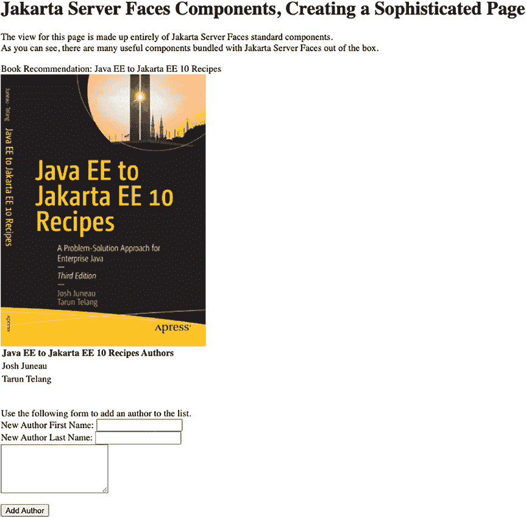

第 3 章 ■ Jakarta Server Faces

最后，`Author` 类用于保存加载到 `authorList` 实例变量中的 `Author` 对象实例。以下是 `Author` 类的代码：

package org.jakartaeerecipe.chapter03.recipe03_03;

public record Author ( private String getFirst, private String getLast, private String

getBio) implements Serializable {

}

生成的网页将类似于图 3-5 所示的页面。

***图 3-5.** 复杂的 Jakarta Server Faces 视图示例*

第 3 章 ■ Jakarta Server Faces

工作原理

Jakarta Server Faces 视图由格式良好的 XML 组成，是 HTML 和 Jakarta Server Faces 组件标签的混合体。任何格式良好的 HTML 都可以在 Jakarta Server Faces 视图中使用，但组件是 Jakarta Server Faces 与控制器类实例通信的手段。Jakarta Server Faces 内置了一些组件，可用于向视图添加图像、文本区域、按钮、复选框等。此外，还有几个非常优秀的组件库，其中包含可在应用程序中使用的额外 Jakarta Server Faces 组件。本示例旨在让您全面了解 Jakarta Server Faces 组件及其工作原理。

您可以通过阅读第 5 章的示例，了解更多关于 Jakarta Server Faces 组件以及使用外部组件库的详细信息。

在 Jakarta Server Faces 视图中使用组件的第一步是在页面上声明标签库。这通常在页面顶部的 HTML 元素内完成。本示例在页面顶部附近的 HTML 元素内同时声明了 Jakarta Server Faces 核心组件库和 Jakarta Server Faces HTML 组件库。这两个库是标准的 Jakarta Server Faces 组件库，应在每个 Jakarta Server Faces 视图中声明：

...

<html

>

...

声明库后，可以通过指定库命名空间以及要使用的组件，在视图中使用该库中的组件。例如，要指定一个用于显示文本的 HTML 元素，请使用 Jakarta Server Faces 的 `h:outputText` 组件标签以及各种组件属性。

在 JSF 2.0 之前，必须将 Jakarta Server Faces 视图及其所有组件都包含在 `f:view` 标签中。自 Jakarta Server Faces 2.0 起，不再需要该标签，因为底层的 Facelets 视图技术默认已成为每个 Jakarta Server Faces 视图的一部分，因此它会自动处理视图的指定。然而，`f:view` 元素对于指定区域设置、内容类型或编码仍然有用。有关这些功能使用的更多信息，请参阅在线文档：[https://](https://javadoc.io/doc/jakarta.faces/jakarta.faces-api/latest/index.html)

[javadoc.io/doc/jakarta.faces/jakarta.faces- api/latest/index.html](https://javadoc.io/doc/jakarta.faces/jakarta.faces-api/latest/index.html)。

`<h:head>` 和 `<h:body>` 标签可用于指定 Jakarta Server Faces Web 视图的头部和主体。不过，使用标准的 HTML `<head>` 和 `<body>` 标签也是可以的。一些 Java IDE 在编写 Jakarta Server Faces 视图时会自动使用 `<h:head>` 和 `<h:body>` 代替标准 HTML 标签。一个重要的注意事项是，必须将要作为 HTML 输入表单处理的任何内容用 `<h:form>` Jakarta Server Faces 标签括起来。该标签包含一个 Jakarta Server Faces 表单，并在未指定方法时默认使用 POST 方法渲染一个 HTML 表单。Jakarta Server Faces 表单标签不需要 action 属性，因为 Jakarta Server Faces 控制器类的操作是通过使用 Jakarta Server Faces 操作组件（如 `h:commandButton` 或 `h:commandLink`）之一来调用的。

■ **提示** 始终为 `h:form` 标签指定一个 id，因为在页面渲染时，表单 id 会作为前缀添加到所有 Jakarta Server Faces 组件标签的 id 中。例如，如果表单 id 为 `myform`，其中包含一个 id 为 `mytag` 的组件标签，那么该组件 id 将渲染为 `myform:mytag`。如果您不指定 id，则会自动为您生成一个。如果您想使用 JavaScript 处理任何页面组件，则需要为 `h:form` 指定一个 id，否则将永远无法以编程方式访问它们。

第 3 章 ■ Jakarta Server Faces

■ **注意** 本示例快速概述了标准 Jakarta Server Faces 组件中的一部分。有关 Jakarta Server Faces 组件及其用法的深入解释，请参阅第 4 章。

标准 Jakarta Server Faces 组件库包含多种组件，示例中使用了其中的一部分。`h:graphicImage` 标签可用于在页面上放置图像，并在需要时使用 Jakarta Server Faces 控制器类。`h:graphicImage` 标签被渲染为 HTML 组件，并且与所有其他 Jakarta Server Faces 组件一样，它在其属性中接受 Jakarta 表达式语言表达式，从而允许渲染动态图像。在本示例中，使用 `url` 属性指定了一个静态图像，但也可以使用表达式，通过 Jakarta Server Faces 控制器类字段来指定。`library` 属性用于指定资源（本例中为图像）所在的目录：

<h:graphicImage id="jakartaee10recipes" library="image" name="jakartaee10recipes.png"

width="350px"/>


`h:outputLabel` 标签在渲染视图时，可用于读取控制器类的属性并显示其值。它们会作为视图中对应字段的标签进行渲染。该示例为 `h:outputLabel` 组件使用了静态值，但如有需要，也可以包含 Jakarta Server Faces 表达式。`h:outputText` 组件同样可用于读取控制器类的属性并显示其值。该组件在页面上渲染基本文本。`h:outputLabel` 和 `h:outputText` 的区别在于它们会被渲染成不同的 HTML 标签。这两个组件的 `value` 属性都可以接受 Jakarta Server Faces 控制器类的表达式。

在示例中，使用 `h:inputText` 组件在页面上显示了一些文本字段，该组件会渲染一个输入字段。`h:inputText` 的 `value` 属性可以设置为 Jakarta Server Faces 控制器类的字段，从而将文本字段绑定到相应的控制器类属性。例如，示例中包含一个 `h:inputText` 组件，其 `value` 为 `#{authorController.newAuthorFirst}`，这会将组件绑定到 `AuthorController` 类中的 `newAuthorFirst` 属性。如果该字段包含值，则在页面渲染时，文本字段中会显示该值。如果在相应的文本字段中输入值并提交表单，该值将通过其 setter 方法设置到 `newAuthorFirst` 字段中。`h:inputText` 标签允许对控制器类属性进行读写操作，因为它使用了左值 Jakarta 表达式语言表达式。`h:inputTextarea` 标签与 `h:inputText` 非常相似，工作方式相同，但它渲染的是文本区域而非文本字段。

`h:commandButton` 组件用于在页面上渲染一个提交按钮。其 `action` 属性可以设置为 Jakarta Server Faces 控制器类的方法。当按下按钮时，将执行相应的控制器类方法，并提交表单。请求将被发送到 `FacesServlet` 控制器，并且页面上的所有属性都将被设置。有关 Jakarta Server Faces 生命周期的更多详细信息，请参阅配方 3-1。示例中使用的 `h:commandButton` 的 `action` 属性为 `#{authorController.addAuthor}`，这将调用 `AuthorController` 类中的 `addAuthor` 方法。从该方法可以看出，当它被调用时，会利用在相应的 `h:inputText` 组件中为 `newAuthorFirst`、`newAuthorLast` 和 `bio` 字段填充的值，向 `authorList` 中添加一个新的 `Author` 对象。以下摘自示例 Jakarta Server Faces 视图的代码片段列出了 `h:commandButton` 组件：

<h:commandButton id="addAuthor" action="#{authorController.addAuthor}"

value="Add Author"/>

示例中最后一个需要解释的组件是 `h:dataTable`。这个 Jakarta Server Faces 组件会被渲染成一个 HTML 表格，它使开发者能够用来自控制器类的数据集合动态填充表格。在示例中，`h:dataTable` 的 `value` 属性被设置为控制器类属性 `#{authorController.authorList}`，该属性映射到一个填充了 `Author` 对象的实例列表。`dataTable` 的 `var` 属性包含一个字符串，用于引用表格每一行中包含的不同对象。在示例中，`var` 属性被设置为 `author`，因此在 `dataTable` 中引用 `#{author.first}` 将返回当前 `Author` 对象的 `first` 属性的值。示例中的 `dataTable` 有效地打印出了 `authorList` 中每个 `Author` 对象的 `first` 和 `last` 名称。这只是对 Jakarta Server Faces `dataTable` 组件工作原理的快速概述。更多详细信息，请参考配方 3-12。

随着您更多地构建 Jakarta Server Faces 视图，您将非常熟悉组件库。这些标签将变得得心应手，您将能够为您的应用程序构建高度复杂的视图。要了解每个组件的更多信息，请参考此 Javadoc 链接：[`javadoc.io/doc/jakarta.faces/jakarta.faces-api/latest/index.html`](https://javadoc.io/doc/jakarta.faces/jakarta.faces-api/latest/index.html)。将外部的 Jakarta Server Faces 组件库与 Ajax 结合使用来更新组件，才是真正的锦上添花！您将在第 5 章中学习更多关于如何锦上添花以及创建美观且用户友好的视图的知识！

3-4. 在 Jakarta Server Faces 页面中显示消息

问题

您需要为应用程序用户在屏幕上显示一条信息消息。

解决方案

将 `h:messages` 组件添加到您的 Jakarta Server Faces 视图中，并使用 `FacesMessage` 对象在视图的控制器类中根据需要创建消息。以下 Jakarta Server Faces 视图摘自文件 `/webapp/chapter03/recipe03_04.xhtml`；它包含一个 `h:messages` 组件标签，该标签将渲染在相应页面的控制器类中使用 `FacesContext` 注册的任何消息。它还包含一个绑定到 `h:inputText` 字段的 `h:message` 组件。`h:message` 组件可以显示特定于相应文本字段的消息：

<?xml version='1.0' encoding='UTF-8' ?>

<!DOCTYPE html>

<html

>

<h:head>

<meta http-equiv="Content-Type" content="text/html; charset=UTF-8"/>

<title>配方 3-4：在 Jakarta Server Faces 中显示消息</title>

</h:head>

<h:body>

<h:form id="componentForm">

<h1>Jakarta Server Faces 消息</h1>

<p>

此页面下方包含一个 Jakarta Server Faces 消息组件。一旦 bean 被初始化，

它将显示来自 Jakarta Server Faces 托管 bean 的消息。

</p>

<h:messages errorStyle="color: red" infoStyle="color: green" globalOnly="true"/>

<br/>

<br/>

在此处输入单词 Java：

<h:inputText id="javaText" value="#{messageController.javaText}"/>

<h:message for="javaText" errorStyle="color: red" infoStyle="color: green"/>

<br/><br/>

<h:commandButton id="addMessage" action="#{messageController.newMessage}"

value="新消息"/>

</h:form>

</h:body>

</html>

此示例中的控制器类名为 `MessageController`。它将在初始化时创建一条 Jakarta Server Faces 消息，然后每次调用 `newMessage` 方法时，都会显示另一条消息。此外，如果在与 `h:inputText` 标签对应的文本字段中输入文本 *java*，则会为该组件显示一条成功消息。否则，如果在该字段中输入了不同的值或该字段留空，则会显示一条错误消息。以下是 `MessageController` 的代码：

package org.jakartaeerecipe.chapter03.recipe03_04;

import java.util.Date;

import jakarta.enterprise.context.SessionScoped;

import jakarta.faces.application.FacesMessage;

import jakarta.faces.context.FacesContext;

import jakarta.inject.Named;

@Named

@SessionScoped

public class MessageController implements java.io.Serializable {

int hitCounter = 0;

private String javaText;

/**

* 创建 MessageController 的新实例

*/

public MessageController() {

javaText = null;

FacesMessage facesMsg = new FacesMessage(FacesMessage.SEVERITY_INFO, "托管 Bean

已初始化", null);

FacesContext.getCurrentInstance().addMessage(null, facesMsg);

}

public void newMessage(){

String hitMessage;

hitCounter++;

if(hitCounter > 1){

hitMessage = hitCounter + " 次";

} else {

hitMessage = hitCounter + " 次";

}

Date currDate = new Date();

FacesMessage facesMsg = new FacesMessage(FacesMessage.SEVERITY_ERROR,

"您已经按了那个按钮 " + hitMessage + "！当前日期

和时间："

+ currDate, null);


`FacesContext.getCurrentInstance().addMessage(null, facesMsg);`

`FacesMessage javaTextMsg;`

`if (getJavaText().equalsIgnoreCase("java")){`

`javaTextMsg = new FacesMessage(FacesMessage.SEVERITY_INFO,`

`"做得好，这是正确的文本！", null);`

`} else {`

`javaTextMsg = new FacesMessage(FacesMessage.SEVERITY_ERROR,`

`"抱歉，这不是正确的文本！", null);`

`}`

`FacesContext.getCurrentInstance().addMessage("componentForm:javaText", javaTextMsg);`

`}`

`/**`

`* @return the javaText`

`*/`

`public String getJavaText() {`

`return javaText;`

`}`

`/**`

`* @param javaText the javaText to set`

`*/`

`public void setJavaText(String javaText) {`

`this.javaText = javaText;`

`}`

`}`

如果消息是错误消息，页面将以红色文本显示；如果是信息性消息，则以绿色文本显示。在此示例中，初始化消息以绿色打印，更新消息以红色打印。在浏览器中输入 URL `http://localhost:8080/JakartaEERecipes_Chapter03-1.0-SNAPSHOT/chapter03/recipe03_04.xhtml`，将显示如图 3-6 所示的输出。

***图 3-6.** 生成的 Jakarta Server Faces 视图*

第 3 章 ■ Jakarta Server Faces

工作原理

向应用程序用户传递消息始终是一个好主意，尤其是在用户需要执行某些操作时。Jakarta Server Faces 框架提供了一个简单的 API，允许从 Jakarta Server Faces 控制器类向视图添加消息。要使用该 API，请将 `h:message` 组件添加到视图中，用于显示绑定到特定组件的消息；并将 `h:messages` 组件添加到视图中，用于显示未绑定到特定组件的消息。`h:message` 组件包含许多可用于自定义消息输出和其他内容的属性。

可以通过在 `h:message` 的 `for` 属性中指定同一视图中某个组件的 ID，将其绑定到该组件。`h:message` 组件最重要的属性如下：

• `id`：指定组件的唯一标识符
• `rendered`：指定是否渲染消息
• `errorStyle`：指定应用于错误消息的 CSS 样式
• `errorClass`：指定应用于错误消息的 CSS 类
• `infoStyle`：指定应用于信息性消息的 CSS 样式
• `infoClass`：指定应用于信息性消息的 CSS 类
• `for`：指定消息所属的组件

有关 `h:message` 组件所有可用属性的列表，请参阅在线文档。在本配方的示例中，`h:message` 组件绑定到 ID 为 `javaText` 的 `h:inputText` 组件。当页面提交时，将调用 `MessageController` 类中的 `newMessage` 方法。

此示例中使用该方法生成要在页面上显示的消息。如果在 `javaText` 属性中输入的文本与 `Java` 匹配，则页面上将打印一条成功消息。要创建消息，需要生成一个 `jakarta.faces.application.FacesMessage` 类的实例，并传递三个参数，分别对应消息严重性、消息摘要和消息详情。创建 `FacesMessage` 对象时可以不传递任何参数，但通常更高效的做法是在实例化时将消息传递给构造函数。创建 `FacesMessage` 对象的一般格式如下：

`new FacesMessage(FacesMessage.severity severity, String summary, String detail)`

通过传递 `FacesMessage` 类中的静态字段来指定消息严重性。表 3-2 显示了可能的消息严重性值及其描述。

***表 3-2.** FacesMessage 严重性值*

**严重性**

**描述**

`SEVERITY_ERROR`

表示发生了错误

`SEVERITY_FATAL`

表示发生了严重错误

`SEVERITY_INFO`

表示信息性消息，而非错误

`SEVERITY_WARN`

表示可能发生了错误


在示例中，如果为 `javaText` 属性输入的值等于 `Java`，则会创建一条信息性消息。否则，将创建一条错误消息。无论哪种情况，一旦消息创建完成，就需要使用 `FacesContext.getCurrentInstance()` 将其传递到当前上下文中。

第 3 章 ■ Jakarta Server Faces

`addMessage(String componentId, FacesMessage message)`。在示例中，调用该方法时传递了组件 ID `componentForm:javaText`。这指向 Jakarta Server Faces 视图中 ID 为 `javaText` 的组件（`h:inputText` 组件）。`componentForm` 标识符属于包含 `h:inputText` 组件的表单（`h:form` 组件），因此实际上 `h:inputText` 组件是嵌套在 `h:form` 组件中的。要引用嵌套组件，请使用冒号作为分隔符组合组件 ID。以下是示例中的摘录，演示了如何创建消息并将其发送到 `h:message` 组件：

```java
FacesMessage javaTextMsg = new FacesMessage(FacesMessage.SEVERITY_ERROR,
"抱歉，这不是正确的文本！", null);
FacesContext.getCurrentInstance().addMessage("componentForm:javaText", javaTextMsg);
```

`h:messages` 组件可用于显示与视图相关的所有消息，也可以通过使用 `globalOnly` 属性仅显示非组件相关的消息。`h:messages` 的所有其他属性与 `h:message` 组件非常相似。通过为 `globalOnly` 属性指定 `true` 值，您是在告诉组件忽略任何特定于组件的消息。因此，任何发送到特定组件的 `FacesMessage` 都不会由 `h:messages` 显示。在示例中，由 `h:messages` 显示的消息生成方式与特定于组件的消息相同，只是没有指定消息所属的特定组件。以下摘录演示了向 `h:messages` 组件发送错误消息。请注意，传递给 `FacesMessage` 调用的最后一个参数是 `null` 值。此参数应为 `clientId` 规范，通过将其设置为 `null`，您表示没有指定的客户端标识符。因此，该消息应为全局消息，而不是绑定到特定组件。

```java
FacesMessage facesMsg = new FacesMessage(FacesMessage.SEVERITY_ERROR,
"您已按下该按钮 " + hitMessage + "！当前日期和时间："
+ currDate, null);
FacesContext.getCurrentInstance().addMessage(null, facesMsg);
```

在应用程序中，在适当的时间显示适当的消息非常重要。通过使用 `FacesMessages` 对象，并利用 `h:message` 或 `h:messages` 组件显示它们，您可以确保应用程序用户充分了解应用程序状态。

3-5. 无需重新编译即可更新消息

问题

您希望将消息指定在属性文件中，以便可以即时编辑，而不是将消息硬编码到控制器类中。

解决方案

创建一个资源包或属性文件，并在其中指定您的消息。然后从资源包中检索消息并将其添加到 `FacesMessages` 对象中，而不是硬编码字符串值。在下面的示例中，使用资源包来指定要在页面上显示的消息。如果您需要随时更改消息，只需修改资源包并重新加载浏览器中的页面，无需重新部署整个应用程序或更改任何代码。

第 3 章 ■ Jakarta Server Faces

以下代码摘自文件（`/webapp/chapter03/recipe03_05.xhtml`）；这是一个 Jakarta Server Faces 视图，其中包含用于显示来自相应控制器类消息的 `h:messages` 组件：

```xml
<?xml version='1.0' encoding='UTF-8' ?>
<!DOCTYPE html>
<html
>
<h:head>
<meta http-equiv="Content-Type" content="text/html; charset=UTF-8"/>
<title>配方 3-5：指定可更新消息</title>
</h:head>
```


<h:body>

<h:form id="componentForm">

<h1>使用资源包</h1>

<p>

下方消息来自一个资源包。添加 `h:outputText` 组件到页面仅用于实例化本示例中的 bean。若要更改消息，只需修改资源包中对应的消息，然后刷新页面即可。

</p>

<h:outputText id="exampleProperty" value="#{exampleController.exampleProperty}"/>

<br/>

<h:messages errorStyle="color: red" infoStyle="color: green" globalOnly="true"/>

</h:form>

</h:body>

</html>

接下来，控制器类负责创建消息并通过 `FacesContext` 将其发送到 `h:messages` 组件。以下是 `ExampleController` 的源代码，它是本示例中 Jakarta Server Faces 视图的控制器类：

package org.jakartaeerecipe.chapter03.recipe03_05;

import java.util.ResourceBundle;

import jakarta.enterprise.context.RequestScoped;

import jakarta.faces.application.FacesMessage;

import jakarta.faces.context.FacesContext;

import jakarta.inject.Named;

@Named(value="exampleController")

@RequestScoped

public class ExampleController {

private String exampleProperty;

/**

* 创建 ExampleController 的新实例

*/

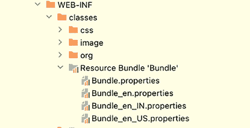

第 3 章 ■ Jakarta Server Faces

public ExampleController() {

exampleProperty = "用于实例化 bean。";

FacesMessage facesMsg = new FacesMessage(FacesMessage.SEVERITY_INFO,

ResourceBundle.getBundle("/org/jakartaeerecipe/chapter03/Bundle").

getString("ExampleMessage"), null);

FacesContext.getCurrentInstance().addMessage(null, facesMsg);

}

/**

* @return exampleProperty

*/

public String getExampleProperty() {

return exampleProperty;

}

/**

* @param exampleProperty 要设置的 exampleProperty

*/

public void setExampleProperty(String exampleProperty) {

this.exampleProperty = exampleProperty;

}

}

资源包的位置如图 3-7 所示。

***图 3-7.** 国际化后包含消息的资源包*

包含消息的资源包由控制器类读取以获取消息。

如果你想更新消息，无需重新编译任何代码即可完成：

