# 这是一个示例资源包文件

ExampleMessage=此消息可通过更新消息包来更改！

当页面加载时，`h:outputText` 组件会实例化 `ExampleController`，后者进而创建用于在屏幕上显示消息的 `FacesMessage` 对象。

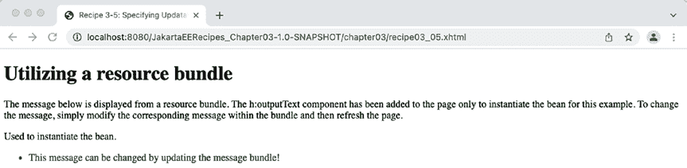

第 3 章 ■ Jakarta Server Faces

工作原理

通常，能够更新自定义系统消息或用户消息而非硬编码它们是非常有用的。这在某些特定消息中包含的自定义信息未来可能发生变化的情况下尤为实用。能够简单地以文本格式更新消息，而不是编辑代码、重新编译和重新部署应用程序，这非常方便。使用资源包可以创建可更新的消息。资源包本质上是一个属性文件，包含名称-值对。向资源包添加自定义消息时，需为消息指定合适的名称，然后将自定义消息作为属性的值部分添加。应用程序随后可以通过名称查找该属性并使用其值。在本例中，该值是一个字符串，用于创建 `FacesMessage` 实例。

在示例中，资源包包含一个名为 `ExampleMessage` 的属性及其对应的值。当 Jakarta Server Faces 视图加载到浏览器时，`ExampleController` 类被实例化，从而执行其构造函数。创建一个 `FacesMessage` 实例，生成类型为 `FacesMessage.SEVERITY_INFO` 的消息，并读取资源包以获取 `ExampleMessage` 属性的值。以下摘录演示了如何从资源包中获取指定的消息值：

ResourceBundle.getBundle("/org/jakartaeerecipe/chapter03/Bundle").


getString("ExampleMessage"), null);

消息创建后，会被添加到当前 `FacesContext` 实例中，随后在页面渲染时显示出来。使用资源包来指定消息可以大大简化工作，因为您不再需要重新编译代码来更新这些消息。此功能在国际化中也非常有用，因为它可用于存储特定于区域设置的资源。图 3-8 展示了本配方的输出结果。

***图 3-8.** 生成的 Jakarta Server Faces 视图*

3-6. 基于条件进行导航

问题

您的 Jakarta Server Faces 应用程序包含多个页面，并且您希望设置它们之间的导航。

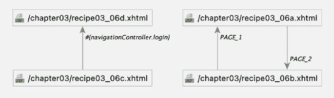

第 3 章 ■ Jakarta Server Faces

解决方案

利用以下技术之一在 Jakarta Server Faces 应用程序中执行导航：

• 通过使用 Jakarta Server Faces 控制器类方法以及相应的 `faces-config.xml` 配置文件来使用显式导航，以控制应用程序的导航。

• 使用隐式导航，在控制器类中指定要渲染的下一个视图，从操作方法中以 `String` 格式返回视图的名称。

• 使用隐式导航，通过将视图名称指定为组件标签的 `action` 属性，完全绕过控制器类。

本配方中的示例由四个 Jakarta Server Faces 视图组成，每个视图都包含调用导航到另一个视图的 `h:commandButton` 组件。这些 `h:commandButton` 组件链接到视图对应控制器类 `NavigationController` 中的方法。图 3-9 展示了不同 Jakarta Server Faces 视图之间的导航示意图。

***图 3-9.** 不同 Jakarta Server Faces 视图之间的页面导航示意图* 此处列出的第一个视图 (`recipe03_06a.xhtml`) 包含两个 `h:commandButton` 组件，每个组件都调用控制器类 `NavigationController` 中的一个方法。第一个按钮使用显式 Jakarta Server Faces 导航，第二个按钮使用隐式导航：

<?xml version='1.0' encoding='UTF-8' ?>

<!DOCTYPE html>

<html
   xmlns:h="http://xmlns.jcp.org/jsf/html"
>

<h:head>

<meta http-equiv="Content-Type" content="text/html; charset=UTF-8"/>

<title>配方 3-6</title>

</h:head>

<h:body>

<h:form id="componentForm">

<h1>Jakarta Server Faces 导航 - 页面 1</h1>

<p>

点击下面的提交按钮将跳转到页面 #2。

</p>

<br/>

第 3 章 ■ Jakarta Server Faces

<h:commandButton id="navButton" action="#{navigationController.pageTwo}"

value="前往页面 2"/>

<br/>

<br/>

<h:commandButton id="navButton2" action="#{navigationController.nextPage}"

value="隐式导航到页面 3"/>

</h:form>

</h:body>

</html>

第二个 Jakarta Server Faces 视图 (`recipe03_06b.xhtml`) 的源代码非常相似，只是在视图的 `h:commandButton` 组件的 `action` 属性中指定了不同的控制器类方法：

<?xml version='1.0' encoding='UTF-8' ?>

<!DOCTYPE html>

<html
   xmlns:h="http://xmlns.jcp.org/jsf/html"
>

<h:head>

<meta http-equiv="Content-Type" content="text/html; charset=UTF-8"/>

<title>配方 3-6 Jakarta Server Faces 导航</title>

</h:head>

<h:body>

<h:form id="componentForm">

<h1>Jakarta Server Faces 导航 - 页面 2</h1>

<p>

点击下面的提交按钮将跳转到页面 #1。

</p>

<br/>

<h:commandButton id="navButton" action="#{navigationController.pageOne}"

value="前往页面 1"/>

</h:form>

</h:body>

</html>

第三个 Jakarta Server Faces 视图 (`recipe03_06c.xhtml`) 包含一个 `h:commandButton` 组件，该组件调用控制器类操作并使用条件导航，根据 `faces-config.xml` 中的条件结果渲染页面：

<?xml version='1.0' encoding='UTF-8' ?>

<!DOCTYPE html>

<html
   xmlns:h="http://xmlns.jcp.org/jsf/html"
>

<h:head>

<meta http-equiv="Content-Type" content="text/html; charset=UTF-8"/>

<title>配方 3-6 Jakarta Server Faces 导航</title>

</h:head>

<h:body>


<h:form id="componentForm">

<h1>Jakarta Server Faces 导航 - 第 3 页</h1>

<p>

第 3 章 ■ Jakarta Server Faces

下方的按钮将利用条件导航将用户带到下一页。应用程序将使用身份验证来测试条件导航。

</p>

<br/>

<h:commandButton id="loginButton" action="#{navigationController.login}"

value="登录操作"/>

</h:form>

</h:body>

</html>

最后，导航示例应用程序中的第四个 Jakarta Server Faces 视图（recipe03_06d.xhtml）包含一个 `h:commandButton`，它调用一个方法并使用隐式导航返回到第三个 Jakarta Server Faces 视图，直接在 `action` 属性中指定视图名称，完全绕过了控制器类：

<?xml version='1.0' encoding='UTF-8' ?>

<!DOCTYPE html>

<html

>

<h:head>

<meta http-equiv="Content-Type" content="text/html; charset=UTF-8"/>

<title>配方 3-6 Jakarta Server Faces 导航</title>

</h:head>

<h:body>

<h:form id="componentForm">

<h1>Jakarta Server Faces 导航 - 第 4 页</h1>

<p>

点击下方的提交按钮将使用条件导航规则将您带到第 1 页。

</p>

<br/>

<h:commandButton id="navButton2" action="recipe03_06c"

value="隐式导航到第 3 页"/>

</h:form>

</h:body>

</html>

现在让我们看看 `NavigationController` 的源代码清单。它包含了在每个页面的 `h:commandButton` 的 `action` 属性中指定的方法。其中一些方法返回一个 `String` 值，而另一些则不返回。然而，在方法被调用之后，`FacesServlet` 会处理请求，并在需要时遍历 `faces-config.xml` 配置文件，以确定要渲染的下一个视图：

package org.jakartaeerecipe.chapter03.recipe03_06;

import jakarta.inject.Named;

import jakarta.enterprise.context.RequestScoped;

@Named(value = "navigationController")

@RequestScoped

public class NavigationController implements java.io.Serializable{

第 3 章 ■ Jakarta Server Faces

private boolean authenticated = false;

/**

* 创建 NavigationController 的一个新实例

*/

public NavigationController() {

}

public String pageOne(){

return "PAGE_1";

}

public String pageTwo(){

return "PAGE_2";

}

/**

* 利用隐式导航，可以从操作方法返回一个页面名称，

* 而不是在 faces-config.xml 中列出导航规则。

* @return 页面名称

*/

public String nextPage(){

// 执行某些任务，然后隐式列出要渲染的页面

return "recipe03_06c";

}

/**

* 演示条件导航的使用

*/

public void login(){

// 如果需要，执行某些任务，然后返回布尔值

setAuthenticated(true);

System.out.println("Here");

}

/**

* @return 认证状态

*/

public boolean isAuthenticated() {

return authenticated;

}

/**

* @param authenticated 要设置的认证状态

*/

public void setAuthenticated(boolean authenticated) {

this.authenticated = authenticated;

}

}

导航的核心是 `/WEB-INF/faces-config.xml` 文件。它指定了在相应结果之后应显示哪个视图。其中两条导航规则使用标准的 Jakarta Server Faces 导航，最后一条导航规则使用条件导航：

<?xml version='1.0' encoding='UTF-8'?>

<faces-config version="3.0"

xsi:schemaLocation="https://jakarta.ee/xml/ns/jakartaee

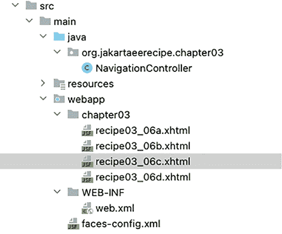

第 3 章 ■ Jakarta Server Faces

https://jakarta.ee/xml/ns/jakartaee/web-facesconfig_3_0.xsd">

<navigation-rule>

<from-view-id>/chapter03/recipe03_06a.xhtml</from-view-id>

<navigation-case>

<from-outcome>PAGE_2</from-outcome>

<to-view-id>/chapter03/recipe03_06b.xhtml</to-view-id>

</navigation-case>

</navigation-rule>

<navigation-rule>

<from-view-id>/chapter03/recipe03_06b.xhtml</from-view-id>

<navigation-case>

<from-outcome>PAGE_1</from-outcome>

<to-view-id>/chapter03/recipe03_06a.xhtml</to-view-id>

</navigation-case>

</navigation-rule>

<navigation-rule>

<navigation-case>

<from-action>#{navigationController.login}</from-action>

<if>#{navigationController.authenticated}</if>

<to-view-id>/chapter03/recipe03_06d.xhtml</to-view-id>

<redirect/>

</navigation-case>


</navigation-rule>

</faces-config>

项目文件夹结构如图 3-10 所示。

***图 3-10.** 项目文件夹结构*

第 3 章 ■ Jakarta Server Faces

工作原理

构建 Web 应用程序时最艰巨的任务之一，就是确定整体的页面导航。

许多 Web 框架都采用了 XML 配置文件来组织页面导航。这是 Java Server Faces Web 框架使用的一种技术，导航 XML 被放置在 Jakarta Server Faces 应用程序的 `faces-config.xml` 配置文件中。当使用标准导航时，Jakarta Server Faces 会利用导航规则，根据页面操作的结果来确定要渲染哪个视图。

如果使用标准的 Jakarta Server Faces 导航，当页面操作发生时，与该操作关联的控制器类方法可以返回一个字符串值。然后，该值会使用 `faces-config.xml` 文件中定义的导航规则进行评估，并用于确定接下来要渲染哪个页面。

标准导航基础设施在大多数情况下都能很好地工作，但在某些情况下，直接在控制器类中列出要渲染的下一个页面，而不是在配置文件中制定导航规则，会更有意义。当调用控制器类操作时，它可以返回一个视图的名称（不带 `.xhtml` 后缀）。这种导航是在 Jakarta Server Faces 2.0 发布时引入的，被称为*隐式导航*。如解决方案的第四个示例所示，你也可以通过为组件标签的操作属性指定不带后缀的视图名称来执行隐式导航。

Jakarta Server Faces 2.0 还引入了另一种导航类型，它允许在 `faces-config.xml` 导航规则中使用 Jakarta 表达式语言表达式，从而将导航提升到了一个新的水平。条件导航允许在导航规则中指定一个 `<if>` 元素，该元素对应一个 Jakarta 表达式语言条件。如果条件评估为真，则渲染指定的视图。

导航规则由位于 `faces-config.xml` 描述符中的 XML 构建而成，每条规则都有一个根元素 `navigation-rule`。在每个规则结构中，`from-view-id` 元素应包含调用操作方法的视图名称。`from-view-id` 元素之后应跟一系列 `navigation-case`。每个 `navigation-case` 包含一个 `from-outcome` 元素，该元素应设置为一个字符串值，该字符串值与后续操作方法返回的字符串值相对应。例如，当示例中调用 `pageOne` 方法时，会返回字符串 `"PAGE_1"`，并且该字符串应在 `faces-config.xml` 文件的 `navigation-case` 中的 `from-outcome` 元素内指定。最后，`to-view-id` 元素应跟在 `navigation-case` 中的 `from-outcome` 元素之后，并且如果操作方法返回了 `from-outcome` 中的字符串，则该元素应指定要渲染哪个视图。以下摘录显示了允许应用程序从页面 1 导航到页面 2 的标准导航规则：

<navigation-rule>

<from-view-id>/chapter03/recipe03_06a.xhtml</from-view-id>

<navigation-case>

<from-outcome>PAGE_1</from-outcome>

<to-view-id>/chapter03/recipe03_06b.xhtml</to-view-id>

</navigation-case>

</navigation-rule>

隐式导航不需要声明任何 XML 导航规则。通过 `h:commandButton` 调用的操作方法会返回一个字符串，该字符串等于接下来应渲染的视图的名称。在示例中，视图 1 上的第二个 `h:commandButton` 调用了 `nextPage` 控制器类方法，该方法返回了应渲染的下一个视图的名称：

public String nextPage(){

// 执行某些任务，然后隐式列出要渲染的页面

return "recipe03_06c";

}


如果你想使用隐式导航，可以完全绕过控制器类，直接在 `h:commandButton` 或 `h:commandLink` 的 `action` 属性中指定要直接渲染的视图名称。示例中的第四个 Jakarta Server Faces 视图演示了这种技术。

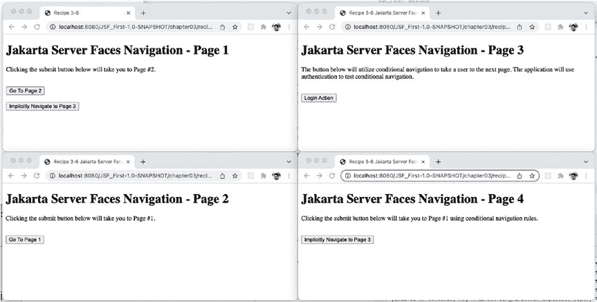

第 3 章 ■ Jakarta Server Faces

示例中的第三个视图名为 `recipe03_05c.xhtml`，演示了条件导航。其 `h:commandButton` 的 `action` 调用了 `NavigationController` 类中的 `login` 方法。在该示例中，该方法不包含太多业务逻辑，但它确实将 bean 的 `authenticated` 字段设置为 `true`。假设有人输入了错误的密码且未能通过身份验证；在这种情况下，`authenticated` 字段将被设置为 `false`。执行 `login` 方法后，会解析 `faces-config.xml` 文件以确定要渲染的下一个视图，条件导航规则利用 Jakarta 表达式语言来指定导航条件。`from-action` 元素被设置为用于调用 `login` 方法的 Jakarta 表达式语言，并且指定了一个 `<if>` 元素，通过 Jakarta Server Faces EL 引用 `navigationController.authenticated` 字段。如果该字段等于 `true`，则将渲染 `to-view-id` 元素中指定的视图。请注意，需要 `<redirect/>` 来告知 Jakarta Server Faces 重定向到 `<to-view-id>` 元素中列出的视图，因为 Jakarta Server Faces 使用重定向而非转发：

<navigation-rule>

<navigation-case>

<from-action>#{navigationController.login}</from-action>

<if>#{navigationController.authenticated}</if>

<to-view-id>/chapter03/recipe03_06d.xhtml</to-view-id>

<redirect/>

</navigation-case>

</navigation-rule>

</faces-config>

标准的 Jakarta Server Faces 导航在大多数情况下提供了足够的灵活性，其架构也比其他 Web 框架复杂得多。然而，在 Jakarta Server Faces 2.0 中，引入了两种新的导航技术，即*隐式导航*和*条件导航*。随着这些新技术的加入，Jakarta Server Faces 导航变得更加健壮且易于管理。要查看此配方的输出，请在浏览器中导航至 URL `http://localhost:8080/JakartaEERecipes_Chapter03-1.0-SNAPSHOT/chapter03/recipe03_06a.xhtml`，即可看到如图 3-11 所示的输出。

***图 3-11.** 生成的 Jakarta Server Faces 视图*

第 3 章 ■ Jakarta Server Faces

3-7. 验证用户输入

问题

你希望为应用程序添加验证 Jakarta Server Faces 表单中输入数据的能力。

解决方案

在任何需要验证的文本字段组件或其他输入组件上注册 Jakarta Server Faces 验证器。在适用的情况下使用预定义的 Jakarta Server Faces 验证器，并在需要时创建自定义验证器类。本配方的示例对两个 `h:inputText` 组件使用了预定义验证器，以确保输入的值具有适当的长度。第三个文本字段添加了一个自定义验证器，负责确保文本包含指定的字符串。这三个字段构成了一个员工输入表单，当输入员工信息且数据验证成功时，会创建一个新的 `Employee` 对象并将其添加到员工列表中。视图中的 `h:dataTable` 元素用于在存在员工时显示员工列表。这或许不是最贴近实际的示例，但你可以应用基本理念来验证自己应用程序中的实际需求。

以下列表是构建员工输入表单的 Jakarta Server Faces 视图（`\webapp\chapter03\recipe03_07.xhtml`），包括每个输入文本字段的验证标签：

<html>

<h:head>

<title>配方 3-7：验证数据</title>

</h:head>

<h:body>

<h:form id="employeeForm">

<h1>Java 开发者员工信息</h1>

<br/>


<h:messages globalOnly="true" errorStyle="color: red" infoStyle="color: green"/>

<br/>

<h:dataTable id="empTable" var="emp"

border="1" value="#{employeeController.employeeList}"

rendered="#{employeeController.employeeList.size() > 0}">

<f:facet name="header">

当前员工

</f:facet>

<h:column id="empNameCol">

<f:facet name="header">员工</f:facet>

<h:outputText id="empName" value="#{emp.employeeFirst}

#{emp.employeeLast}"/>

</h:column>

<h:column id="titleCol">

<f:facet name="header">职位</f:facet>

<h:outputText id="title" value="#{emp.employeeTitle}"/>

</h:column>

</h:dataTable>

第 3 章 ■ Jakarta Server Faces

<p>

请使用下方表单输入员工信息。

</p>

<h:panelGrid columns="3">

<h:outputLabel for="employeeFirst" value="名：" />

<h:inputText id="employeeFirst" value="#{employeeController.employeeFirst}">

<f:validateLength minimum="3" maximum="30"/>

</h:inputText>

<h:message for="employeeFirst" errorStyle="color:red"/>

<h:outputLabel for="employeeLast" value="姓：" />

<h:inputText id="employeeLast" value="#{employeeController.employeeLast}">

<f:validateLength minimum="3" maximum="30"/>

</h:inputText>

<h:message for="employeeLast" errorStyle="color:red"/>

<h:outputLabel for="employeeTitle" value="职位（必须是 Java 相关职位）："/>

<h:inputText id="employeeTitle" value="#{employeeController.employeeTitle}">

<f:validator validatorId="employeeTitleValidate" />

</h:inputText>

<h:message for="employeeTitle" errorStyle="color:red"/>

</h:panelGrid>

<h:commandButton id="employeeInsert" action="#{employeeController.

insertEmployee}"

value="插入员工"/>

</h:form>

</h:body>

</html>

视图中的第三个 `h:inputText` 组件使用了自定义验证器。`f:validator` 标签用于指定自定义验证器，其 `validatorId` 属性用于指定对应的验证器类。

以下清单是名为 `EmployeeTitleValidate` 的 Java 代码，即该文本字段的自定义验证类：

package org.jakartaeerecipe.chapter03.recipe03_07;

import jakarta.faces.application.FacesMessage;

import jakarta.faces.component.UIComponent;

import jakarta.faces.context.FacesContext;

import jakarta.faces.validator.FacesValidator;

import jakarta.faces.validator.Validator;

import jakarta.faces.validator.ValidatorException;

@FacesValidator("employeeTitleValidator")

public class EmployeeTitleValidate implements Validator {

@Override

public void validate(FacesContext facesContext, UIComponent uiComponent, Object value)

throws ValidatorException {

checkTitle(value);

}

private void checkTitle(Object value) {

String title = value.toString();

第 3 章 ■ Jakarta Server Faces

if (!title.contains("Java")) {

String messageText = "职位名称不包含 Java 字样";

throw new ValidatorException(new FacesMessage(FacesMessage.SEVERITY_ERROR,

messageText, messageText));

}

}

}

■ **注意** 自 Jakarta Server Faces 2.3 起，可以将资源注入验证器类。用户生成的验证器类也可以注入到其他资源中。

现在让我们来看一下包含验证标签的 Jakarta Server Faces 视图所对应的 Jakarta Server Faces 控制器类。控制器类名为 `EmployeeController`，其中的动作方法 `insertEmployee` 用于将包含有效数据的新的 `Employee` 对象添加到 `ArrayList` 中：

package org.jakartaeerecipe.chapter03.recipe03_07;

import java.io.Serializable;

import java.util.ArrayList;

import java.util.List;

import jakarta.enterprise.context.SessionScoped;

import jakarta.faces.application.FacesMessage;

import jakarta.faces.context.FacesContext;

import jakarta.inject.Named;

@Named(value="employeeController")

@SessionScoped

public class EmployeeController implements Serializable {

private String employeeFirst;

private String employeeLast;

private String employeeTitle;

private List <Employee> employeeList;

public EmployeeController(){

employeeList = new ArrayList();

}

public void insertEmployee(){

Employee emp = new Employee(employeeFirst,

employeeLast,

employeeTitle);

employeeList.add(emp);


```java
FacesMessage facesMsg = new FacesMessage(FacesMessage.SEVERITY_INFO, "员工
成功添加", null);
FacesContext.getCurrentInstance().addMessage(null, facesMsg);
}
// getters 和 setters
// ....
}
```

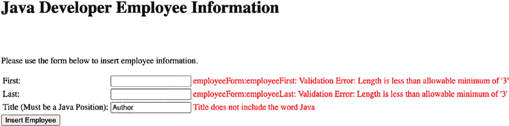

第 3 章 ■ Jakarta Server Faces

以下是 Employee 类的代码，它是一个简单的纯旧式 Java 对象（POJO）类。

```java
package org.jakartaeerecipe.chapter03.recipe03_07;

public record Employee(String getEmployeeFirst, String getEmployeeLast, String
getEmployeeTitle) {
}
```

最终，如果用户尝试输入员工名字或姓氏时使用了无效长度，或输入了不包含 *Java* 一词的职位，验证器将抛出异常。当用户输入验证失败时，错误消息会显示在包含无效条目的组件旁边。本配方的输出结果如图 3-12 所示。

***图 3-12.** 生成的 Jakarta Server Faces 视图*

工作原理

Jakarta Server Faces 框架包含许多功能，使开发者能够更方便地自定义应用程序。验证器就是这些功能之一，因为它们可用于固化应用程序数据，并确保在将数据存储到数据库或其他数据存储之前数据是正确的。Jakarta Server Faces 框架内置了大量已实现的验证器。要使用这些预定义的验证器，只需在视图中的组件标签内嵌入相应的验证器标签，即可验证该组件的数据值。有时，标准验证器无法满足需求。在这种情况下，Jakarta Server Faces 提供了一种开发自定义验证器类的方法，这些类可以像预定义验证器一样在视图中使用。

在本配方的示例中，两个 `h:inputText` 组件包含了用于验证输入值长度的标准 Jakarta Server Faces 验证器。`f:validateLength` 标签可以嵌入到组件中用于字符串长度验证，该标签的 `minimum` 和 `maximum` 属性可以分别设置最小和最大字符串长度。如前所述，Jakarta Server Faces 内置了大量此类预定义验证器。开发者只需将验证器标签嵌入到需要验证的组件中即可。表 3-3 列出了所有标准验证器标签及其功能。有关每个验证器属性的详细信息，请参阅在线文档。

第 3 章 ■ Jakarta Server Faces

***表 3-3.** 标准验证器*

**验证器标签**

**描述**

validateLength

检查字符串长度

validateLongRange

检查数值范围

validateDoubleRange

检查浮点数值范围

validateRequired

确保输入字段不为空（也可替代在输入字段组件标签上使用 required 属性）

validateRegex

根据给定的正则表达式模式验证组件

通常，对于特定组件，可能需要进行其他类型的验证。在这种情况下，开发自定义验证器类可能是最佳选择。许多开发者不愿编写自己的验证器，因为乍看之下这似乎是一项艰巨的任务。然而，Jakarta Server Faces 2.0 在使自定义验证器类更易于编写和理解方面取得了长足进步。

要创建自定义验证器类，需要实现 `jakarta.faces.validator.Validator` 接口。使用 `@FacesValidator` 注解标注验证器类，并指定用于在 `f:validator` 标签中注册验证器的字符串。在示例中，用于引用验证器类的名称是 `employeeTitleValidate`。唯一的要求是验证器类必须重写 `validate` 方法，自定义验证逻辑就写在该方法中。`validate` 方法具有以下签名：


public void validate(FacesContext facesContext, UIComponent uiComponent, Object value)

throws ValidatorException

利用传入方法的参数，你可以获取当前的 `FacesContext`、被验证组件的句柄以及该组件的值。在示例中，从 `validate` 方法内部调用了一个辅助方法，用于检查组件的值，并确保其中包含单词 *Java*。如果验证未通过，则会创建并抛出 `ValidatorException`。如果验证失败，放置在 `ValidatorException` 中的消息将显示在被验证组件旁边。以下摘自验证类的代码演示了如何创建并抛出 `ValidatorException`：

throw new ValidatorException(new FacesMessage(FacesMessage.SEVERITY_ERROR,

messageText, messageText));

那么，验证何时发生？这是验证器的关键，不是吗？答案是立即发生，在请求被发送到控制器类动作方法之前。任何验证都发生在 *Process Validations* 阶段，如果视图中的一个或多个被验证组件抛出了 `ValidatorException`，则处理过程停止，请求不会被发送到动作方法。当用户点击提交按钮时，首先进行验证，如果一切正常，则请求被传递给动作方法。

■ **注意** 验证输入组件是否包含值的一种方法是使用 `required` 属性。可以将输入组件标签的 `required` 属性设置为 `true`，以强制为该组件输入一个值。

第 3 章 ■ Jakarta Server Faces

在 Jakarta Server Faces 视图中使用标准验证器验证组件，确实可以节省开发人员的时间，并提高应用程序数据的可用性和精确性。创建自定义验证器的能力允许为任何场景执行验证。请积极地在应用程序的所有输入表单上使用验证，并创建自定义验证器以使用独特的技术执行验证。您的应用程序用户会感激的！

3-8\. 立即评估页面表达式

问题

您希望某些 Jakarta Server Faces 组件值被立即评估，而不是等到表单提交时。

解决方案

为组件标签的 `immediate` 属性指定 `true`，同时指定组件的 `onchange` 属性并将其设置为 `submit()`。这将导致当组件的值发生变化时立即提交输入表单，并且 Jakarta Server Faces 将跳过渲染响应阶段，并在应用请求值 Jakarta Server Faces 生命周期阶段执行所有指定了 `immediate` 属性为 `true` 的组件。本配方的示例使用了一个员工表单。

第一个和最后一个 `h:inputText` 组件不会等到表单提交，而是在它们的值发生变化时，在应用请求值阶段立即被评估和验证。以下是名为 `/webapp/chapter03/recipe03_08.xhtml` 的 Jakarta Server Faces 视图的源代码：

<html

>

<h:head>

<title>配方 3-8 立即视图评估</title>

</h:head>

<h:body>

<h:form id="employeeForm">

<h1>Java 开发人员员工信息</h1>

<br/>

<h:messages globalOnly="true" errorStyle="color: red" infoStyle="color: green"/>

<br/>

<h:dataTable id="empTable" var="emp"

border="1" value="#{employeeController.employeeList}"

rendered="#{employeeController.employeeList.size() > 0}">

<f:facet name="header">

当前员工

</f:facet>

<h:column id="empNameCol">

<f:facet name="header">员工</f:facet>

<h:outputText id="empName" value="#{emp.employeeFirst}

#{emp.employeeLast}"/>

</h:column>

<h:column id="titleCol">

<f:facet name="header">职位</f:facet>

<h:outputText id="title" value="#{emp.employeeTitle}"/>

第 3 章 ■ Jakarta Server Faces

</h:column>

</h:dataTable>

<p style="width: 40%;">

请使用下面的表单插入员工信息。第一个和最后一个文本字段将在应用请求值阶段导致立即评估，而中间的文本字段将导致标准评估，并在调用应用阶段进行验证。

<br/><br/>

要测试，请尝试在第一个文本字段中仅插入一个字符，然后按 Tab 键切换到下一个字段。您应该会看到立即的结果。

</p>

<h:panelGrid columns="3">

<h:outputLabel for="employeeFirst" value="名: " />

<h:inputText id="employeeFirst" **immediate="true" onchange="submit()"**

value="#{employeeController.employeeFirst}">

<f:validateLength minimum="3" maximum="30"/>

</h:inputText>

<h:message for="employeeFirst" errorStyle="color:red"/>

<h:outputLabel for="employeeLast" value="姓: " />

<h:inputText id="employeeLast" value="#{employeeController.employeeLast}">

<f:validateLength minimum="3" maximum="30"/>

</h:inputText>

<h:message for="employeeLast" errorStyle="color:red"/>

<h:outputLabel for="employeeTitle" value="职位 (必须是 Java 职位): "/>

<h:inputText id="employeeTitle" **immediate="true"**

value="#{employeeController.employeeTitle}">

<f:validator validatorId="employeeTitleValidator" />

</h:inputText>

<h:message for="employeeTitle" errorStyle="color:red"/>

</h:panelGrid>

<h:commandButton id="employeeInsert" action="#{employeeController.

insertEmployee}"

value="插入员工"/>

</h:form>

</h:body>

</html>

如您所见，id 为 `employeeFirst` 和 `employeeTitle` 的 `h:inputText` 组件同时指定了 `immediate="true"` 和 `onchange="submit()"` 属性。这两个属性导致这些组件被立即验证，而不是在调用 `h:commandButton` 动作时验证。本配方的输出如图 3-13 所示。

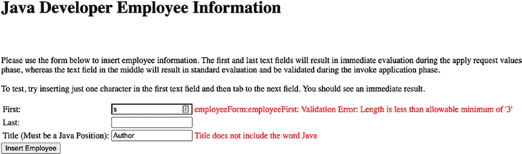

第 3 章 ■ Jakarta Server Faces

***图 3-13.** 生成的 Jakarta Server Faces 视图*

工作原理

立即发生的事件处理在您不想为了处理输入而验证整个表单，而是希望选定的组件被立即验证的情况下非常有用。

如配方 3-1 所述，当处理 Jakarta Server Faces 视图时，会执行多个阶段。因此，当提交表单时，调用应用阶段会启动视图组件的事件处理器，并进行验证。当组件的 `immediate` 属性设置为 `true` 时，该组件的事件处理器会在应用请求值阶段执行，该阶段发生在通常进行组件验证的处理验证阶段之前。这允许对指定组件进行立即验证响应，如果需要，可以立即显示错误消息。

如前所述，如果您希望某个组件被立即评估，请为其指定 `immediate` 属性并将其设置为 `true`。这将导致该组件在应用请求值阶段被评估和验证。当您同时指定 `onclick` 属性并将其设置为 `submit()` 时，真正的乐趣就来了，这会导致当组件的值发生变化时提交表单。如此指定属性将导致视图中任何具有 `immediate` 属性设置为 `true` 的组件在组件值发生变化时被验证。

■ **注意** `immediate` 属性在 `commandButton` 组件上也很有用，例如在您不希望进行任何表单处理的情况下，比如您想设置一个取消按钮或其他按钮来绕过表单处理。

3-9\. 将页面参数传递给方法

问题

您希望通过表达式语言 (EL) 从 Jakarta Server Faces 视图内部将参数（例如 `lastName`）传递给控制器类方法。

解决方案


使用标准 Jakarta 表达式语言表达式调用控制器类方法，并将要传递给方法的参数括在括号内。在本配方的示例中，使用 `h:dataTable` 组件在视图中显示 `Author` 对象列表。`h:dataTable` 中的每一行都包含一个 `h:commandLink` 组件，该组件在被选中时会调用 Jakarta Server Faces 控制器类方法。`h:commandLink` 显示当前行的作者姓名，并在点击时调用 `AuthorController` 类的 `displayAuthor` 方法，同时传递当前行所显示作者的姓氏。在 `displayAuthor` 方法中，遍历作者列表，找到包含与传递给方法的参数相同姓氏的元素。然后，当前作者会显示在后续页面中，该页面使用隐式导航进行渲染。

以下源代码是名为 `recipe03_09a.xhtml` 的 Jakarta Server Faces 视图，它使用 `h:dataTable` 组件显示作者列表：

```html
<html>
<h:head>
<title>配方 3-9：向方法传递页面参数</title>
</h:head>
<h:body>
<h:form id="componentForm">
<h1>作者列表</h1>
<p>
以下是作者列表。点击作者的姓氏可获取关于该作者的更多信息。
</p>
<h:graphicImage id="java9recipes" style="width: 10%; height: 20%"
library="image" name="java9recipes.png"/>
<br/>
<h:dataTable id="authorTable" border="1" value="#{authorTableController.authorList}"
var="author">
<f:facet name="header">
Java 9 配方作者
</f:facet>
<h:column>
<h:commandLink id="authorName" action="#{authorTableController.displayAuthor(author.last)}"
value="#{author.first} #{author.last}"/>
</h:column>
</h:dataTable>
<br/>
<br/>
</h:form>
</h:body>
</html>
```

接下来的代码是上述 Jakarta Server Faces 视图的控制器类。该控制器类在实例化时使用 `Author` 对象填充一个 `ArrayList`：

```java
package org.jakartaeerecipes.chapter03.recipe03_09;

import java.io.Serializable;
import java.util.ArrayList;
import java.util.List;
import jakarta.enterprise.context.SessionScoped;
import jakarta.inject.Named;

@Named(value = "authorTableController")
@SessionScoped
public class AuthorController implements Serializable {

    private List<Author> authorList = null;
    private final String juneauBio = "这是 Josh Juneau 的简介";
    private final String telangBio = "这是 Tarun Telang 的简介";
    private Author current;
    private String authorLast;

    /**
     * 创建一个新的 RecipeController 实例
     */
    public AuthorController() {
        super();
        authorLast = null;
        populateAuthorList();
    }

    private void populateAuthorList() {
        if(authorList == null){
            System.out.println("正在初始化作者列表");
            authorList = new ArrayList<>();
            authorList.add(new Author("Josh", "Juneau", juneauBio));
            authorList.add(new Author("Tarun", "Telang", telangBio));
        }
    }

    public String displayAuthor(String last){
        for(Author author:authorList){
            if(author.getLast().equals(last)){
                current = author;
                break;
            }
        }
        return "recipe03_09b";
    }

    // getters and setters
    // ....
}
```

页面的输出应如图 3-14 所示。

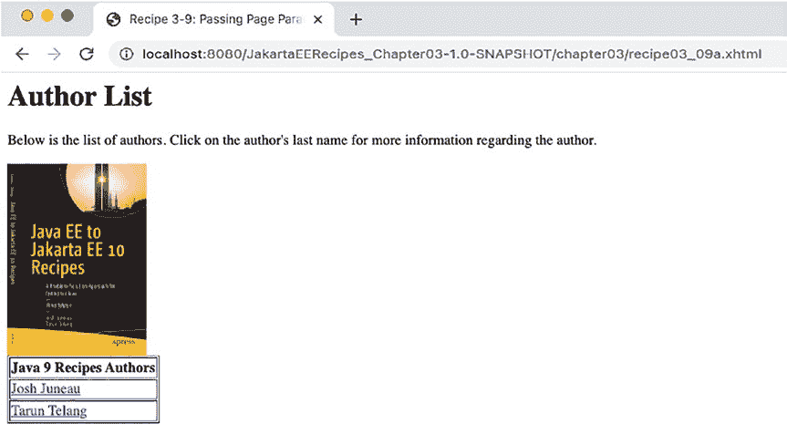

***图 3-14.** 生成的 Jakarta Server Faces 视图*

`Author` 类与配方 3-3 中使用的 `Author` 普通 Java 对象（POJO）相同。有关 `Author` 类的源代码，请参考该配方。最后，以下代码是名为 `recipe03_09b.xhtml` 的 Jakarta Server Faces 视图，即每位作者的详细信息视图。当在第一个视图的 `h:dataTable` 组件中点击作者姓名时，会调用该组件对应的控制器类方法，然后渲染此视图以显示所选作者的信息：

```html
<html>
<h:head>
<meta http-equiv="Content-Type" content="text/html; charset=UTF-8"/>
<title>配方 3-9：向方法传递页面参数</title>
</h:head>
<h:body>
<h:form id="componentForm">
```


<h1>#{authorTableController.current.first} #{authorTableController.current.last}</h1>

<p>

<h:graphicImage library="image" name="jakartaee10recipes.png"

id="jakartaee10recipes" style="width: 10%; height: 20%"/>

<br/>

#{authorTableController.current.bio}

</p>

<h:link value="返回列表" outcome="recipe03_09a"/>

</h:form>

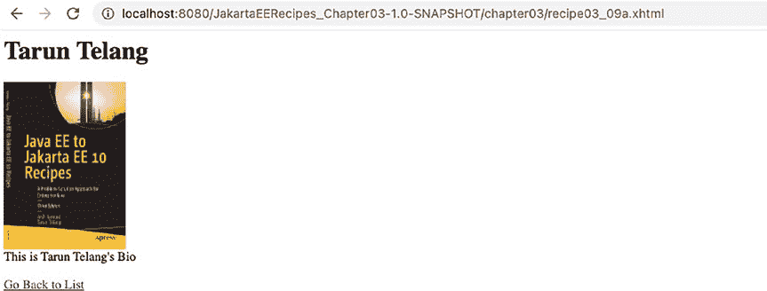

第 3 章 ■ Jakarta Server Faces

</h:body>

</html>

点击作者姓名，将跳转至一个页面，其输出结果如图 3-15 所示。

***图 3-15.** 生成的 Jakarta Server Faces 视图*

工作原理

2.0 版本包含了许多增强功能，使得 Jakarta Server Faces 开发者的工作比以往更加轻松。其中一项增强功能就是能够从 Jakarta Server Faces 视图内向控制器类方法传递参数。正如本配方的示例所示，你可以像在 Java 中调用任何带参数的方法一样，通过将参数括在方法名后的括号内，在 Jakarta 表达式语言结构中向方法传递参数。没有比这更简单的了！

让我们来看看使这个示例运转起来的代码行。第一个 Jakarta Server Faces 视图显示了一个作者姓名表格，每个姓名都使用 `h:commandLink` 组件显示。`h:commandLink` 组件的 `value` 属性设置为作者姓名，`action` 属性设置为 Jakarta Server Faces EL，该 EL 调用一个名为 `displayAuthor` 的控制器类操作方法。请注意，在调用控制器类方法时，作者的姓氏的 Jakarta 表达式语言作为字符串参数传递。

<h:dataTable id="authorTable" border="1" value="#{authorTableController.authorList}"

var="author">

<f:facet name="header">

Java 9 Recipes 作者

</f:facet>

<h:column>

<h:commandLink id="authorName" action="#{authorTableController.displayAuthor(author.last)}"

value="#{author.first} #{author.last}"/>

</h:column>

</h:dataTable>

第 3 章 ■ Jakarta Server Faces

控制器类中的 `displayAuthor` 方法接受一个字符串参数值，即作者的姓氏，然后在作者列表中查找包含相同姓氏的 `Author` 对象。

找到后，一个名为 `current` 的类字段被设置为与匹配列表元素对应的 `Author` 对象。

随后的 Jakarta Server Faces 视图利用当前的作者信息显示内容。

在 Jakarta Server Faces 2.0 之前，开发者无法从视图内向控制器类方法传递参数。这使得执行此类技术变得稍微困难一些，并且通常需要编写更多的代码。

3-10. 在表达式中使用运算符和保留字

问题

你希望在 Jakarta Server Faces 视图中执行一些算术运算并组合表达式。

解决方案

Jakarta Server Faces Jakarta 表达式语言表达式可以使用标准算术运算符进行算术运算。还可以利用一些 Jakarta Server Faces EL 保留字来组合两个或多个表达式。在以下示例（recipe03_10.xhtml）中，使用了一些 Jakarta 表达式语言表达式在页面上显示数学结果。算术运算和保留字的使用体现在下面的表达式中：

<html>

<h:head>

<title>配方 3-10：算术运算和保留字</title>

</h:head>

<h:body>

<h:form id="componentForm">

<h1>Jakarta Server Faces 中的算术运算和保留字（Jakarta 表达式语言）</h1>

<p>

以下示例使用 Jakarta 表达式语言执行一些算术运算。

</p>

1 + 1 = #{1 + 1}

<br/>

<h:outputText value="20 / 5 = #{20 / 5}"/>

<br/>

<h:outputText rendered="#{1 + 1 eq 2}" value="1 + 1 确实等于 2"/>

<br/>

<h:outputText rendered="#{5 * 4 != 20}" value="5 * 4 等于 20 吗？"/>

<br/>

<h:outputText rendered="#{5 * 5 eq 25 and 1 + 1 eq 2}" value="组合一些表达式"/>

<br/>

</h:form>

</h:body>

</html>

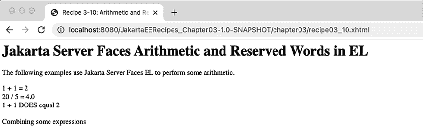

第 3 章 ■ Jakarta Server Faces


部分表达式包含名为 `EvaluationController` 的 Bean 的控制器类引用。

该控制器类的清单如下：

```java
package org.jakartaeerecipe.chapter03.recipe03_10;

import jakarta.enterprise.context.RequestScoped;

import jakarta.inject.Named;

@Named(value = "evaluationController")

@RequestScoped

public class EvaluationController {

    private boolean field1 = true;

    /**
     * Creates a new instance of EvaluationController
     */
    public EvaluationController() {
    }

    /**
     * @return the field1
     */
    public boolean isField1() {
        return field1;
    }

    /**
     * @param field1 the field1 to set
     */
    public void setField1(boolean field1) {
        this.field1 = field1;
    }
}
```

生成的页面将如图 3-16 所示。

***图 3-16.** 生成的 Jakarta Server Faces 视图*

第 3 章 ■ Jakarta Server Faces

工作原理

可以在 Jakarta 表达式语言表达式中使用标准算术运算，并使用保留字组合表达式。所有标准算术运算符在 EL 中都是有效的，但有一些不同之处。例如，你可以使用 `eq` 保留字符来编写表达式 `#{1 + 1 eq 2}`，而不是编写 `#{1 + 1 = 2}` 这样的表达式。类似地，`!=` 符号可用于指定某个值不等于另一个值，但在此示例中，使用了新的保留字。表 3-4 描述了所有这些保留字。

***表 3-4.** Jakarta 表达式语言保留字*

| **保留字**    | **描述**                     |
| :------------ | :--------------------------- |
| `and`         | 组合两个或多个表达式         |
| `div`         | 用于除法                     |
| `empty`       | 用于引用空列表               |
| `eq`          | 等于                         |
| `false`       | 布尔值 false                 |
| `ge`          | 大于或等于                   |
| `gt`          | 大于                         |
| `instanceof`  | 用于评估对象是否为另一个实例 |
| `le`          | 小于或等于                   |
| `lt`          | 小于                         |
| `mod`         | 取模                         |
| `ne`          | 不等于                       |
| `not`         | 用于取反                     |
| `null`        | 评估空值                     |
| `or`          | 组合两个或多个表达式         |
| `true`        | 布尔值 true                  |

表 3-5 列出了可在 Jakarta 表达式语言表达式中使用的可用运算符，按优先级顺序排列。

第 3 章 ■ Jakarta Server Faces

***表 3-5.** 用于表达式的运算符*

| **运算符**                                                    |
| :------------------------------------------------------------ |
| `[]`                                                          |
| `()`                                                          |
| `- (一元)`, `not`, `!`, `empty`                               |
| `*`, `/`, `div`, `%`, `mod`                                   |
| `+`, `- (二元)`                                               |
| `<`, `>`, `<=`, `>=`, `lt`, `gt`, `le`, `ge`                 |
| `==`, `!`, `eq`, `ne`                                         |
| `&&`, `and`                                                   |
| `\|\|`, `or`                                                  |
| `?`, `:`                                                      |

3-11. 创建可书签化的 URL

问题

你希望应用程序能够支持通过 URL 链接来显示特定对象。例如，你想使用一个 GET URL，如 `http://localhost:8080/JakartaEERecipes_Chapter03-1.0-SNAPSHOT/chapter03/recipe03_11.xhtml?authorLast=Juneau`，来显示一个包含指定姓氏作者信息的页面。

解决方案

通过 `f:viewParam` 标签（它是 `f:metadata` 标签的子标签）定义参数，为要创建可书签化 URL 的 Jakarta Server Faces 视图添加视图参数。这样做将允许页面通过包含请求参数的 URL 进行访问，这些参数可用于记录标识。在此示例中，视图通过 `f:viewParam` 标签包含了一个视图参数，允许在请求视图时指定作者的姓氏。在以下示例中，对配方 3-9 中创建的控制器类进行了修改，添加了一个名为 `authorLast` 的新属性，以适应新的视图参数。

名为 `\webapp\chapter03\recipe03_11.xhtml` 的视图的源代码如下所示。它们与名为 `recipe03_09b.xhtml` 的视图非常相似，不同之处在于它们包含一个 `f:viewParam` 元素，该元素被包含在开闭的 `f:metadata` 元素之间：

```html
<html xmlns="http://www.w3.org/1999/xhtml"
      xmlns:h="http://xmlns.jcp.org/jsf/html"
      xmlns:f="http://xmlns.jcp.org/jsf/core">
    <h:head>
        <title>Recipe 3-11: Creating Bookmarkable URLs</title>
    </h:head>
    <h:body>
        <f:metadata>
            <f:viewParam name="authorLast" value="#{authorTableController.authorLast}"/>
        </f:metadata>
        <h:form id="componentForm">
            <h1>#{authorTableController.current.first} #{authorTableController.current.last}</h1>
            <p>
                <h:graphicImage id="java9recipes" library="image" style="width: 10%; height: 20%" name="java9recipes.png"/>
                <br/>
                #{authorTableController.current.bio}
            </p>
            <h:link value="Go Back to List" outcome="recipe03_09a"/>
        </h:form>
    </h:body>
</html>
```

与此示例相关的 `AuthorController` 类的代码如下所示：

```java
@Named(value = "authorController")
@SessionScoped
public class AuthorController implements Serializable {
    ...
    private String authorLast;
    ...
    /**
     * @return the authorLast
     */
    public String getAuthorLast() {
        return authorLast;
    }

    /**
     * @param authorLast the authorLast to set
     */
    public void setAuthorLast(String authorLast) {
        displayAuthor(authorLast);
    }
}
```

如前所述，此控制器中包含了一个名为 `authorLast` 的属性。该属性使得示例中列出的 Jakarta Server Faces 视图能够通过 GET URL 接受名为 `authorLast` 的请求参数，并在请求页面时将其传递给 Bean。最后，访问该视图并请求作者 Josh Juneau 详细信息的 URL 如下：`http://localhost:8080/JakartaEERecipes_Chapter03-1.0-SNAPSHOT/chapter03/recipe03_11.xhtml?authorLast=Juneau`

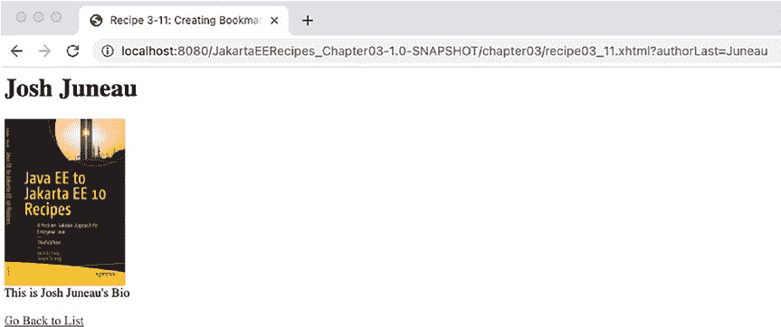

第 3 章 ■ Jakarta Server Faces

图 3-17 显示了输出结果。

***图 3-17.** 生成的 Jakarta Server Faces 视图*

工作原理

过去，Jakarta Server Faces 应用程序有一个弱点，即它们需要一个启动视图，该视图创建了访问应用程序的入口点。这为应用程序提供了一个视图，用于设置应用程序会话的初始状态。虽然这个概念很好，因为每个用户会话都会从一个初始化的应用程序状态开始，但它阻止了通过 URL 直接链接记录的能力。有时，能够将视图链接到包含请求参数的 URL 是非常有用的，这样可以在无需用户进一步交互的情况下，将匹配给定参数的记录返回给视图；例如，假设一个网站包含关于一本书的信息，并希望包含一个 URL 来了解更多关于该书作者的信息。直接链接到包含该作者信息的视图，比将用户重定向到一个需要他们手动搜索作者的网站要好得多。

此类 URL 也称为*可书签化* URL，因为该 URL 包含了发出请求所需的所有状态。因此，它们允许 Web 应用程序的用户为直接访问应用程序中的特定点而将 URL 加入书签。

Jakarta Server Faces 2.0 引入了包含视图参数的能力，增加了视图接受请求参数的能力。利用基于 GET 的 URL，可以将请求参数及其值附加到 URL 末尾，包含新视图参数的视图可以在响应呈现之前将参数传递给控制器类。然后，Bean 可以接受参数值，并在呈现响应之前查询数据库或搜索其他数据集合，以找到与给定值匹配的记录。

要在视图中包含一个或多个视图参数，必须向视图添加开闭的 `f:metadata` 元素，并在它们之间嵌入所需数量的 `f:viewParam` 元素。`f:viewParam` 元素包含两个必须具有值的属性，即 `name` 和 `value` 属性。`name` 属性指定请求参数的名称，即你希望它在可书签化 URL 中显示的名称；`value` 属性指定应映射到该请求参数的控制器类字段。在本配方的示例中，Jakarta Server Faces 视图包含一个视图参数，允许在请求视图时指定作者的姓氏。在以下示例中，对配方 3-9 中创建的控制器类进行了修改，添加了一个名为 `authorLast` 的新属性，以适应新的视图参数。

第 3 章 ■ Jakarta Server Faces


一个名为 `authorLast` 的视图参数，以及控制器类中关联的 `authorLast` 字段包含一个 setter 方法，该方法在页面被请求时被调用。以下视图摘录展示了添加元数据和视图参数的代码行：

<f:metadata>

<f:viewParam name="authorLast" value="#{authorTableController.authorLast}"/>

</f:metadata>

添加视图参数后，可以通过包含 `authorLast` 请求参数的 URL 来请求页面，如下所示：

[`my-server.com/JakartaEERecipes/chapter03/chapter03_11.xhtml?authorLast=Juneau`](http://my-server.com/JakartaEERecipes/chapter03/chapter03_11.xhtml?authorLast=Juneau)

当页面被请求时，视图参数的值会调用控制器类中的 `setAuthorLast` 方法，该方法随后会搜索与给定请求参数值匹配的姓氏的作者记录：

...

public void setAuthorLast(String authorLast) {

displayAuthor(authorLast);

}

...

在 Jakarta Server Faces 2.0 中添加视图参数使得创建可书签化的 URL 变得容易。这使得应用程序更加灵活，并能立即产生结果，而无需用户在产生结果之前浏览多个页面。

3-12. 显示对象列表

问题

你希望在渲染的 Jakarta Server Faces 页面中显示一个对象列表。

解决方案

使用 Jakarta Server Faces 的 `h:dataTable` 组件来显示列表对象，遍历列表中的每个对象并显示指定的值。`h:dataTable` 组件高度可定制，可以配置为以多种布局显示内容。以下 Jakarta Server Faces 视图包含两个 `h:dataTable` 组件，用于显示 *Java 9 Recipes* 书籍的作者，这些作者信息来自之前菜谱中开发的控制器类。视图中的第一个表格直接显示了每位作者的姓名，并已格式化为交替行颜色。第二个表格为每个对应的列表元素包含两行，第一行显示作者姓名，第二行显示其简介：

<html>

<h:head>

<title>菜谱 3-12：显示对象列表</title>

<link href="#{facesContext.externalContext.requestContextPath}/css/styles.css"

rel="stylesheet" type="text/css" />

</h:head>

<h:body>

第 3 章 ■ Jakarta Server Faces

<h:form id="componentForm">

<p>

<h:graphicImage id="java9recipes" style="width: 10%; height: 20%"

library="image" name="java9recipes.png"/>

<br/>

#{authorTableController.current.bio}

</p>

<h:dataTable id="authorTable" border="1"

value="#{authorTableController.authorList}"

styleClass="authorTable"

rowClasses="authorTableOdd, authorTableEven"

var="author">

<f:facet name="header">

Java 9 Recipes 作者

</f:facet>

<h:column>

<h:outputText id="authorName" value="#{author.first} #{author.last}"/>

</h:column>

</h:dataTable>

<br/><br/>

<h:dataTable id="authorTable2" border="1" value="#{authorTableController.

authorList}"

var="author" width="500px;">

<f:facet name="header">

Java 9 Recipes 作者

</f:facet>

<h:column>

<h:panelGrid columns="2" border="1" width="100%">

<h:outputText id="authorFirst" value="#{author.first}"

style="width: 50%"/>

<h:outputText id="authorLast" value="#{author.last}"

style="width:50%"/>

</h:panelGrid>

<h:outputText id="authorBio" value="#{author.bio}"/>

</h:column>

</h:dataTable>

</h:form>

</h:body>

</html>

该示例利用层叠样式表来帮助格式化表格的颜色。样式表的源代码如下：

.authorTable{

border-collapse:collapse;

}

.authorTableOdd{

text-align:center;

background:none repeat scroll 0 0 #CCFFFF;

border-top:1px solid #BBBBBB;

}

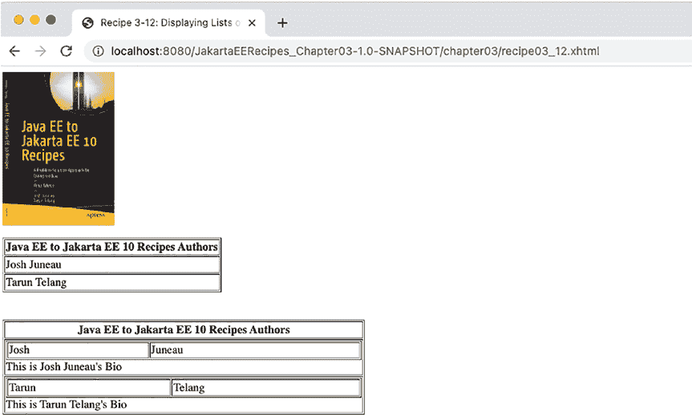

第 3 章 ■ Jakarta Server Faces

.authorTableEven{

text-align:center;

background:none repeat scroll 0 0 #99CCFF;

border-top:1px solid #BBBBBB;

}

生成的页面应类似于图 3-18。

***图 3-18.** Jakarta Server Faces dataTable 组件示例*

工作原理


Jakarta Server Faces 的 `h:dataTable` 组件可用于在页面中显示对象列表。渲染时，会构建一个 HTML 表格，并用每个列表元素或数据记录的数据填充表格单元格。`h:dataTable` 可以遍历数据集合，将其以列格式布局，包括列标题，并能够使用层叠样式表 (CSS) 自定义外观。该组件包含许多重要属性，如表 3-6 所列。其中最重要的可能是 `value` 和 `var` 属性。`value` 属性指定要遍历的数据集合，`var` 属性列出一个字符串，该字符串将用于引用表格的每一行。该集合通常来自控制器类，例如本配方的示例。`value` 属性的合法数据类型是 `Array`、`DataModel`、`List` 和 `Result`。`var` 属性在每个列中用于引用相应行对象中的特定字段。

第 3 章 ■ Jakarta Server Faces

***表 3-6. DataTable 属性***

**属性**

**描述**

`id`

组件的 ID

`border`

表示边框粗细的整数；0 为默认值

`bgcolor`

表格的背景颜色

`cellpadding`

单元格边框与其内容之间的内边距

`cellspacing`

单元格内的间距

`width`

表格的总宽度，以像素或百分比指定

`first`

要显示集合中的第一个条目

`rows`

要显示的总行数

`styleClass`, `captionClass`,

CSS 属性

`headerClass`, `footerClass`,

`rowClasses`, `columnClasses`

`rendered`

指示组件是否将被渲染的布尔值

`h:dataTable` 可以包含任意数量的列，每个列都在 Jakarta Server Faces 视图中的 `h:dataTable` 组件内指定。嵌套的 `h:column` 元素包含每个列的输出。一个列可以包含几乎任何有效的组件或 HTML，甚至嵌入的 `dataTable`。`h:column` 通常不指定任何属性，但它始终包含一个表达式或硬编码值用于显示：

`<h:column>my column value</h:column>`

或

`<h:column>#{myTable.myColValue}</h:column>`

通常，HTML 表格中的列包含标题。您可以通过在 `h:dataTable` 内、列规范之外嵌入 `f:facet` 元素，或在每个 `h:column` 内通过将 `name` 属性指定为 `header` 来向 `h:dataTable` 或单个列添加标题。`f:facet` 元素还可以为 `name` 属性指定 `caption`，以便为表格添加标题。以下示例摘录演示了一个包含所有这些功能的 `h:dataTable`：

`<h:dataTable id="authorTable" border="1"`

`value="#{authorTableController.authorList}"`

`styleClass="authorTable"`

`rowClasses="authorTableOdd, authorTableEven"`

`var="author">`

`<f:facet name="header">`

`Java EE to Jakarta EE 10 Recipes Authors`

`</f:facet>`

`<h:column>`

`<h:outputText id="authorName" value="#{author.first} #{author.last}"/>`

`</h:column>`

`</h:dataTable>`

第 3 章 ■ Jakarta Server Faces

在示例中，您可以看到 `h:dataTable` 的 `value` 属性被列为 `#{authorTableController.authorList}`，这是在控制器类中声明的 `Author` 对象列表。`var` 属性建立了一个名为 `author` 的变量，该变量引用当前正在从作者列表中处理的作者。然后，可以在每个 `h:column` 中访问 `author` 变量，以显示与当前列表元素关联的数据。

使表格更易于阅读和理解的一个重要部分是可用于设置表格样式的 CSS。`h:dataTable` 支持各种属性，允许您将外部定义的 CSS 类应用于表格，具体来说，是 `styleClass`、`captionClass`、`headerClass`、`footerClass`、`rowClasses` 和 `columnClasses` 属性。每个属性都可以包含用于格式化的 CSS 类规范。示例演示了此功能。

3-13. 创建页面模板

问题

您希望应用程序中的每个 Jakarta Server Faces 视图都遵循相同的结构。

此外，您希望能够为每个视图重用相同的布局。

解决方案

使用 Facelets 视图定义语言创建页面模板。Facelets 是 Jakarta Server Faces 的一部分，您可以使用它以熟练的方式为视图创建高度复杂的布局。本配方中演示的模板将用于定义应用程序内所有页面的标准布局。本章的演示应用程序是一个书店网站。该网站将在屏幕左侧显示多个书名，顶部显示页眉，底部显示页脚，中间显示主视图。当在左侧菜单中点击书名时，中间视图会发生变化，显示所选书籍的作者列表。

要创建模板，您必须首先开发一个新的 XHTML 视图文件，然后向其添加适当的 HTML/Jakarta Server Faces/XML 标记。一旦模板应用于一个或多个 Jakarta Server Faces 视图，其他视图的内容将替换模板中的 `ui:insert` 元素。以下源代码是一个名为 `/webapp/chapter03/layout/custom_template.xhtml` 的模板；这是将用于应用程序中所有视图的模板：

`<html`

`>`

`<h:head>`

`<meta http-equiv="Content-Type" content="text/html; charset=UTF-8" />`

`<h:outputStylesheet library="css" name="default.css"/>`

`<h:outputStylesheet library="css" name="cssLayout.css"/>`

`<h:outputStylesheet library="css" name="styles.css"/>`

`<title>#{faceletsAuthorController.storeName}</title>`

`</h:head>`

`<h:body>`

`<div id="top">`

`<h2>#{faceletsAuthorController.storeName}</h2>`

`</div>`

`<div>`

`<div id="left">`

`<h:form id="navForm">`

第 3 章 ■ Jakarta Server Faces

`<h:commandLink action="#{faceletsAuthorController.`

`populateJavaRecipesAuthorList}" >Jakarta EE Fundamentals </h:commandLink>`

`<br/>`

`<br/>`

`<h:commandLink action="#{faceletsAuthorController.populateJakarta`

`EERecipesAuthorList}">Jakarta EE 10 Recipes </h:commandLink>`

`</h:form>`

`</div>`

`<div id="content" class="left_content">`

`<ui:insert name="content">Content</ui:insert>`

`</div>`

`</div>`

`<div id="bottom" style="position: absolute;width: 100%;bottom: 20px;"> Written by Josh Juneau and Tarun Telang, Apress Author`

`</div>`

`</h:body>`

`</html>`

该模板定义了应用程序视图的整体结构。但是，它使用 CSS 样式表来声明模板中每个 `<div>` 元素的格式。名为 `default.css` 的样式表应包含在应用程序的 `resources` 目录中，以便视图可以访问它。有关 `resources` 目录的更多详细信息，请参阅配方 3-15。

■ **注意** 如果您使用的是 NetBeans IDE，CSS 样式表可以自动为您生成。

模板中还使用了几个 Jakarta 表达式语言表达式。Jakarta 表达式语言引用了一个名为 `AuthorController` 的 Jakarta Server Faces 控制器，该控制器由 `faceletsAuthorController` 引用。虽然此类的源代码对于整个应用程序非常重要，但您将等到配方 3-15 再查看该代码，因为它不参与应用程序模板布局。

工作原理


为了打造统一的应用程序体验，所有视图应保持连贯，即外观相似且功能一致。开发网页模板的想法已存在多年，但遗憾的是，许多模板实现会在每个应用程序页面上包含重复的标记。虽然为每个独立网页复制相同的布局是可行的，但这会带来维护上的噩梦。当需要更新页面标题中的某个链接时会发生什么？如果模板在每个页面上都被复制，这种难题将迫使开发人员访问并手动更新应用程序的每个网页。Facelets 视图定义语言为开发视图模板提供了强大的解决方案，这也是使用 Jakarta Server Faces 技术的主要优势之一。

Facelets 允许将单个模板应用于应用程序中的一个或多个视图。这意味着开发人员可以创建一个视图来构建模板的页眉、页脚及其他部分，然后该视图可应用于任意数量的、负责包含主要视图内容的其他视图。这种技术缓解了诸如更改页面标题中单个链接之类的问题，因为现在只需用新链接更新模板，应用程序中的所有其他视图就会自动反映这一更改。


第 3 章 ■ Jakarta Server Faces

要使用 Facelets 创建模板，需创建一个 XHTML 视图，声明所需的命名空间，然后相应地添加 HTML、Jakarta Server Faces 和 Facelets 标签来设计你想要的布局。模板可以被视为网页视图的“外壳”，因为它可以在其内部包含任意数量的其他视图。同样，任意数量的 Jakarta Server Faces 视图都可以应用相同的模板，因此应用程序的整体外观和感觉将保持一致。图 3-19 直观地展示了应用程序模板的概念。

***图 3-19.** Facelets 模板与客户端的可视化表示*

你可能已经注意到，本方案示例的视图列表中包含一些带有 `ui:` 前缀的标签。这些是负责控制视图布局的 Facelets 标签。要使用这些 Facelets 标签，你需要在模板的 `<html>` 元素中为 Facelets 标签库声明 XML 命名空间。请注意，标准 Jakarta Server Faces 标签库的 XML 命名空间也在此处指定：

<html

>

...

■ **注意** Facelets 模板必须包含 `<html>`、`<head>` 或 `<h:head>`，以及 `<body>` 或 `<h:body>` 元素，因为它们为每个使用该模板的视图定义了整体布局。每个使用 Facelets 模板的视图被称为一个组合。一个模板可以被多个组合或视图使用。实际上，在组合中，`<ui:composition>` 开始和结束标签之外的所有内容都会被忽略。

你将在下一个方案中了解更多相关信息！

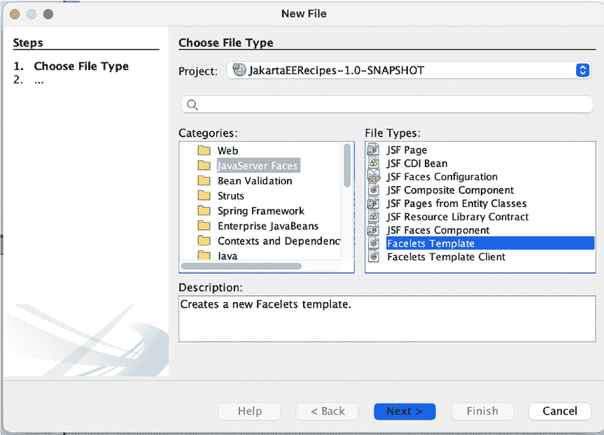

第 3 章 ■ Jakarta Server Faces

Facelets 包含几个可用于控制页面流程和布局的特殊标签。表 3-7（在方案 3-15 中）列出了对控制页面流程和布局有用的 Facelets 标签。本方案示例的模板中唯一使用的 Facelets 标签是 `ui:insert`。`ui:insert` 标签包含一个 `name` 属性，该属性设置为将包含在视图中的相应 `ui:define` 元素的名称。

查看本方案的源代码，你可以看到以下 `ui:insert` 标签：

<ui:insert name="content">Content</ui:insert>

如果使用该模板的视图（也称为模板客户端）指定了一个 `ui:define` 标签，其名称与 `ui:insert` 的 `name` 相同，那么放置在 `ui:define` 开始和结束标签之间的任何内容都将被插入到视图中的该位置。但是，如果模板客户端不包含与 `ui:insert` 标签同名的 `ui:define` 标签，则会显示模板中 `ui:insert` 开始和结束标签之间的内容。

可以通过 IDE（如 NetBeans）创建模板，以便更直观地呈现你想要实现的布局。要在 NetBeans 中创建 Facelets 模板，请右键单击要放置模板的项目文件夹，然后从上下文菜单中选择“新建”➤“其他”以打开“新建文件”窗口。打开后，从“类别”菜单中选择“JavaServer Faces”，然后从文件类型中选择“Facelets 模板”，如图 3-20 所示。

***图 3-20.** 在 NetBeans 中创建 Facelets 模板*

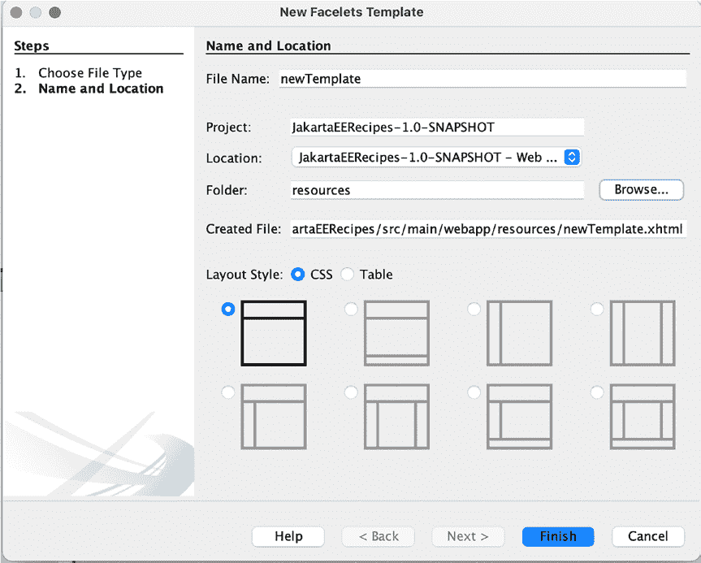

第 3 章 ■ Jakarta Server Faces

选择“Facelets 模板”文件类型后，单击“下一步”按钮打开“新建 Facelets 模板”窗口（见图 3-21）。此窗口允许你选择要为应用程序视图组合的整体布局，以及选择模板的位置和名称。

***图 3-21.** NetBeans 中的“新建 Facelets 模板”窗口*

选择好布局并填写其他选项后，模板将在 NetBeans 代码编辑器中打开，你可以开始将模板应用于 Jakarta Server Faces 视图客户端（参见方案 3-15）。使用像 NetBeans 提供的向导这样的工具会很有帮助，因为你可以创建时选择模板的可视化表示。

总之，Facelets 模板由 HTML 和 Jakarta Server Faces 标记组成，用于定义页面布局。模板的各个部分可以通过 `ui:insert` 标签指定页面内容的显示位置。模板中包含 `ui:insert` 标签的任何区域都可以从模板客户端插入内容。

第 3 章 ■ Jakarta Server Faces

3-14. 应用模板

问题

你已经为 Jakarta Server Faces 网页视图创建了一个模板，并希望将其应用于应用程序的视图。

解决方案

在每个将使用该模板的视图中使用 `ui:composition` 标签。`ui:composition` 标签应用于调用模板，并且应在需要插入内容的位置放置 `ui:define` 标签。以下列表演示了如何将 Facelets 模板应用于各种视图。

视图 #1：recipe03_14a.xhtml

recipe03_14a.xhtml 是书店应用程序中用于显示 *Java EE to Jakarta EE 10 Recipes* 一书作者的视图标记。模板应用于该视图，并且视图中使用了单独的 `ui:define` 标签来指定应插入到页面/视图中的内容：

<html

>

<body>

<ui:composition template="./layout/custom_template.xhtml">

<ui:define name="top"/>

<ui:define name="left"/>

<ui:define name="content">

<h:form id="componentForm">

<h1>Java EE to Jakarta EE 10 Recipes 作者列表</h1>

<p>

以下是作者列表。点击作者的姓氏可获取更多关于该作者的信息。

</p>

<h:graphicImage id="javarecipes" style="width: 100px; height: 120px"

library="image" name="java9recipes.png"/>

<br/><br/>

<h:dataTable id="authorTable" border="1" value="#{faceletsAuthor

Controller.authorList}"

var="author">

<f:facet name="header">

Java EE to Jakarta EE 10 Recipes 作者

</f:facet>

<h:column>

<h:commandLink id="authorName" action="#{faceletsAuthorControll

er.displayAuthor(author.last)}"

value="#{author.first} #{author.last}"/>

</h:column>

</h:dataTable>

</h:form>

</ui:define>

第 3 章 ■ Jakarta Server Faces

<ui:define name="bottom">底部 </ui:define>

</ui:composition>

</body>

</html>

视图 #2：recipe03_14b.xhtml


以下是摘自 recipe03_14b.xhtml 文件的内容，其中包含书店应用程序中第二个视图的源代码。该视图用于列出 *Java EE 到 Jakarta EE 10 Recipes* 一书的作者。此文件中的代码与 recipe03_15a 摘录中的代码基本相同：

...

<h:form id="componentForm">

<h1>《Java EE 到 Jakarta EE 10 Recipes》作者列表</h1>

<p>

以下是作者列表。点击作者的姓氏可查看关于该作者的更多信息。

</p>

<h:graphicImage id="akartaee10recipes" library="image" style="width: 100px; height: 120px" name="jakartaee10recipes.png"/>

<br/><br/>

<h:dataTable id="authorTable" border="1" value="#{faceletsAuthor

Controller.authorList}"

var="author">

<f:facet name="header">

《Java EE 到 Jakarta EE 10 Recipes》作者

</f:facet>

<h:column>

<h:commandLink id="authorName" action="#{faceletsAuthor

Controller.displayAuthor(author.last)}"

value="#{author.first} #{author.last}"/>

</h:column>

</h:dataTable>

...

视图 #3：recipe03_14c.xhtml

Recipe03_14c.xhtml 包含书店应用程序中另一个列表视图的源代码。该视图负责显示单个作者的详细信息。同样，模板被应用于此页面：

<html

>

<h:head>

<title>配方 3-14：Facelets 页面模板</title>

</h:head>

<h:body>

第 3 章 ■ Jakarta Server Faces

<ui:composition template="./layout/custom_template.xhtml">

<ui:define name="top">

</ui:define>

<ui:define name="left">

</ui:define>

<ui:define name="content">

<h:form id="componentForm">

<h1>#{faceletsAuthorController.current.first}

#{faceletsAuthorController.current.last}</h1>

<p>

#{faceletsAuthorController.current.bio}

</p>

</h:form>

</ui:define>

<ui:define name="bottom">

底部

</ui:define>

</ui:composition>

</h:body>

</html>

托管 Bean 控制器：AuthorController

当然，所有业务逻辑和导航都发生在 Jakarta Server Faces 控制器类中。AuthorController 是处理书店应用程序所有逻辑的 Bean。请注意，`@Named` 注解指定了一个字符串值 `faceletsAuthorController`，该值用于在视图中引用此 Bean：

package org.jakartaeerecipe.chapter03.recipe03_14;

import java.io.Serializable;

import java.util.*;

import jakarta.annotation.PostConstruct;

import jakarta.enterprise.context.SessionScoped;

import jakarta.inject.Named;

@Named(value = "faceletsAuthorController")

@SessionScoped

public class AuthorController implements Serializable {

private List<Author> authorBookList;

private List<Author> completeAuthorList;

private List<Author> authorList;

private String storeName = "Acme Bookstore";

private Author current;

private String authorLast;

/**

* 使用 @PostConstruct 注解的方法在控制器类创建时被调用。

*/

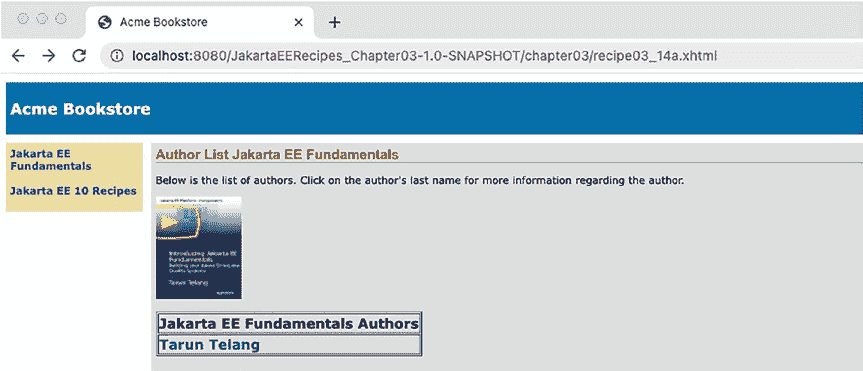

第 3 章 ■ Jakarta Server Faces

@PostConstruct

public void init(){

populateJavaRecipesAuthorList();

}

public String populateJakartaFundamentalsAuthorList() {

authorList = null;

authorList = new ArrayList<>();

authorList.add(new Author("Tarun", "Telang", telangBio));

return "recipe03_14a";

}

public String populateJakarta EERecipesAuthorList() {

System.out.println("正在初始化作者列表");

authorList = new ArrayList<>();

authorList.add(new Author("Josh", "Juneau", juneauBio));

authorList.add(new Author("Tarun", "Telang", telangBio));

return "recipe03_14b";

}

public String displayAuthor(String last) {

for (Author author : authorList) {

if (author.getLast().equals(last)) current = author

}

return "recipe03_14c";

}

// getters 和 setters

// ...

}

最终，整个应用程序将如图 3-22 所示。要从源代码运行该应用程序，请将 WAR 文件分发部署到您的应用服务器，然后在浏览器中加载以下 URL：http://your-server:port_number/Jakarta EERecipes/faces/chapter03/

chapter03_14a.xhtml。

***图 3-22.** 使用 Facelets 模板的应用程序*

第 3 章 ■ Jakarta Server Faces

工作原理


在 Jakarta Server Faces 应用中为单个视图应用 Facelets 模板相当简单。使用模板的视图被称为*模板客户端*。如配方 3-14 所述，视图模板可以在模板上任何可能插入视图内容的位置指定单独的 `ui:insert` 标签及其 `name` 属性。`ui:insert` 标签中的 `name` 属性将与模板客户端中 `ui:define` 标签的 `name` 属性配对，以确定插入的内容。

■ **注意** 如配方 3-14 所述，每个使用 Facelets 模板的视图都可以称为一个组合（composition），也可以称为模板客户端。需要注意的是，模板客户端（或组合）包含一对开闭的 `<ui:composition>` 标签。这些标签之外的所有内容在渲染时实际上会被忽略，因为会使用模板主体来代替。你也可以在模板客户端中省略 `<html>` 标签，而仅使用 `<ui:composition>` 标签来打开和关闭视图。有关示例，请参见“使用 <ui:composition> 打开/关闭模板客户端”边栏。

**使用 <UI:COMPOSITION> 打开/关闭模板客户端**

通常，模板客户端视图会使用开闭的 `<html>` 标签，如本配方解决方案中的示例视图所示。然而，由于 `<ui:composition>` 标签之外的所有内容在渲染时都会被忽略，你可以完全省略这些标签。有时使用 `<ui:composition>` 标签来打开和关闭模板客户端会很有用。但是，某些页面编辑器可能无法处理此类代码，或者会显示错误，因为视图的根元素不包含 `<html>` 元素。以下是一个使用 `<ui:composition>` 作为模板客户端开闭元素的示例：

<ui:composition

xmlns:h=http://xmlns.jcp.org/jsf/html

template="./layout/custom_template.xhtml">

<<与本配方解决方案中视图示例的代码相同>>

</ui:composition>

请使用最适合您应用的技术！请记住，Jakarta Server Faces 和 Facelets 会以相同方式处理每个视图，并且您可以通过指定 `<ui:composition>` 作为根元素来节省几行代码。

**应用模板**

可以通过在视图的 `ui:composition` 标签的 `template` 属性中指定模板，将其应用于视图。例如，本示例中的所有视图都指定了相同的模板，如下摘录所示：

<ui:composition template="./layout/custom_template.xhtml">

第 3 章 ■ Jakarta Server Faces

示例中的模板名为 `custom_template.xhtml`，模板路径为 `./layout/`。`ui:composition` 标签应封装 Facelets 视图中的所有其他标记。所有要使用该模板的视图都必须指定 `ui:composition` 标签。Facelets 还附带了许多其他有用的 Facelets 模板标签，如表 3-7 所述。

***表 3-7.** Facelets 页面控制与模板标签*

**标签**

**描述**

`ui:component`

定义一个模板组件，并为该组件指定一个文件名

`ui:composition`

定义一个页面组合，并封装所有其他 Jakarta Server Faces 标记

`ui:debug`

创建一个调试组件，该组件在渲染时捕获调试信息，即组件树的状态和应用程序中的作用域变量

`ui:define`

定义由模板插入到页面中的内容

`ui:decorate`

装饰页面的各个部分

`ui:fragment`

定义一个模板片段，与 `ui:component` 非常相似，区别在于标签外的所有内容不会被忽略

`ui:include`

允许在视图中封装并重用另一个 XHTML 页面

`ui:insert`

将内容插入到模板中

`ui:param`

向包含的文件或模板传递参数

`ui:repeat`

遍历数据集合

`ui:remove`

从页面中移除内容

`ui:define` 标签封装了将插入到模板中 `ui:insert` 标签位置的内容。`ui:define` 标签根据两个标签共有的 `name` 属性值与模板的 `ui:insert` 标签进行匹配。从本示例的第一个视图列表可以看出，第一个 `ui:define` 标签为 `name` 属性指定了 `top`，这将与模板中 `name` 属性等于 `top` 的 `ui:insert` 标签相对应。但模板中并没有指定这样的标签！这没关系；`ui:define` 和 `ui:insert` 标签之间不必一一对应。视图可以指定任意数量的 `ui:define` 标签，如果它们与模板中的任何 `ui:insert` 标签都不对应，则会被忽略。同样，模板可以指定任意数量的 `ui:insert` 标签，如果它们与模板客户端视图中的 `ui:define` 标签不对应，则会显示模板在该位置定义的内容。

再看同一个视图，另一个 `ui:define` 标签包含一个值为 `content` 的 `name` 属性，该标签确实与模板中一个同样具有 `name` 属性值为 `content` 的 `ui:insert` 标签相对应。

以下摘录取自模板，显示了与视图中具有相同 `name` 属性的 `ui:define` 标签相对应的 `ui:insert` 标签。您可以在配方 3-14 中查看模板的完整列表。

<div id="content" class="left_content">

<ui:insert name="content">Content</ui:insert>

</div>

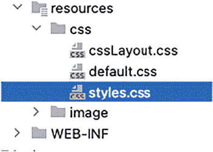

第 3 章 ■ Jakarta Server Faces

如您所见，定义一个可应用于应用中多个视图的视图模板非常强大。Facelets 模板技术为定义此类模板提供了非常强大的解决方案，可实现一致的页面布局和可重用的页面代码。

**3-15. 将资源纳入其中**

**问题**

您希望在视图中包含资源，例如 CSS、图像和 JavaScript 代码，以便应用中的每个视图都能访问使用。例如，与其硬编码图像的 URL，不如引用图像位置，让应用在运行时动态创建指向该图像位置的 URL。

**解决方案**

创建一个资源目录，并可选地在资源目录内创建子文件夹，以存放应用将使用的资源。放置在资源文件夹子目录中的任何 CSS 文件、图像等，都可以通过 Jakarta Server Faces 组件的 `library` 属性在 Jakarta Server Faces 视图中引用，而无需指定资源的完整路径。在以下示例中，使用层叠样式表来设置应用中作者表格的样式。在本配方中，您将使用之前配方中应用于 `h:dataTable` 的 `styles.css` 样式表。

样式表声明将位于 `custom_template.xhtml` 模板中，您将使用 `h:outputStylesheet` 组件而不是 `<link>` 标签。事实上，所有 `<link>` 标签都将被移除，并替换为 `h:outputStylesheet` 组件，以利用资源文件夹。

正确设置后，目录结构应如图 3-23 所示。

***图 3-23.** 使用资源目录*

以下列表是更新后的 `custom_template.xhtml`，因为它现在使用 `h:outputStylesheet` 组件而不是 `<link>` 标签。请注意，`library` 属性被指定为 `css`。

<html>

第 3 章 ■ Jakarta Server Faces

<body>

<ui:composition template="./layout/custom_template.xhtml">

<ui:define name="content">

<h:form id="componentForm">

<h1>Jakarta EE 基础作者列表</h1>

<p>

以下是作者列表。点击作者的姓氏可获取有关该作者的更多信息。

</p>

<h:graphicImage id="javarecipes"

library="image" style="width: 100px; height: 120px"

name="java9recipes.png"/>

<br/>


<h:dataTable id="authorTable" border="1" value="#{faceletsAuthorControl ler.authorList}"

styleClass="authorTable"

rowClasses="authorTableOdd, authorTableEven"

var="author">

<f:facet name="header">

Java 9 Recipes 作者

</f:facet>

<h:column>

<h:commandLink id="authorName" action="#{faceletsAuthorControll

er.displayAuthor(author.last)}"

value="#{author.first} #{author.last}"/>

</h:column>

</h:dataTable>

<br/>

<br/>

</h:form>

</ui:define>

</ui:composition>

</body>

</html>

用于在 Acme Bookstore 应用程序视图中列出作者的 `h:dataTable` 组件现在可以使用 `styles.css` 中列出的样式。以下摘自名为 `recipe03_16.xhtml` 的 XHTML 文档的片段演示了应用了样式的 `h:dataTable` 组件：

<h:dataTable id="authorTable" border="1" value="#{faceletsAuthorController.authorList}"

styleClass="authorTable"

rowClasses="authorTableOdd, authorTableEven"

var="author">

<f:facet name="header">

Java 9 Recipes 作者

</f:facet>

<h:column>

<h:commandLink id="authorName"

action="#{faceletsAuthorController.displayAuthor(author.last)}"

value="#{author.first} #{author.last}"/>

</h:column>

</h:dataTable>

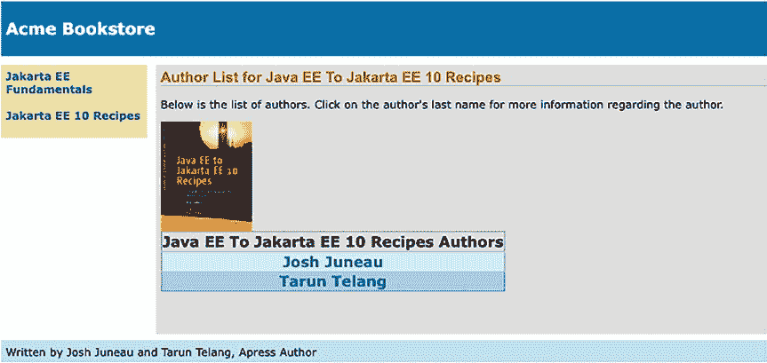

第 3 章 ■ Jakarta Server Faces

在页面上渲染时，该表格现在应如图 3-24 所示。

***图 3-24.** 应用了样式的作者表格*

**工作原理**

向 Jakarta Server Faces 应用程序添加资源很容易，因为在声明资源时无需担心引用静态路径。自 Jakarta Server Faces 2.0 发布以来，`resources` 文件夹可用于列出子文件夹（也称为*库*），资源可以放置在这些子文件夹中。现在，可以使用资源的 Jakarta Server Faces 组件内置了 `library` 属性。这允许为这些组件指定特定的库，以便组件知道在哪里找到它所需的资源。

要使用新的 `resources` 文件夹，请在应用程序 Web 目录的根目录下创建一个文件夹，并将其命名为 `resources`。然后，该 `resources` 文件夹可以包含子文件夹，这些子文件夹将成为可在 Jakarta Server Faces 组件中使用的库。例如，子文件夹可以命名为 `css` 和 `images`，然后这些名称可以指定给使用此类资源的 Jakarta Server Faces 组件的 `library` 属性。以下是供参考的项目结构：

├── pom.xml

└── src

└── main

├── java

├── org

│ └── jakartaeerecipe

│ └── chapter03

│ └── recipe03_15

│ ├── Author.java

│ ├── AuthorController.java

│ ├── Book.java

│ └── Chapter.java

└── webapp

├── WEB-INF

第 3 章 ■ Jakarta Server Faces

│ ├── beans.xml

│ ├── faces-config.xml

│ └── web.xml

├── chapter03

│ ├── layout

│ │ └── custom_template.xhtml

│ ├── recipe03_15a.xhtml

│ ├── recipe03_15b.xhtml

│ └──recipe03_15c.xhtml

└── resources

├── css

│ ├── cssLayout.css

│ ├── default.css

│ └── styles.css

└── image

├── jakartaee10recipes.png

└── jakartaee9fundamentals.jpeg

在示例中，层叠样式表被放置在 `resources/css` 文件夹中，然后通过使用 `h:outputStylesheet` 组件并指定 `css` 库来引用它们，如下所示：

<h:outputStylesheet library="css" name="default.css"/>

其他资源也可以放置在这样的库中。`h:graphicImage` 组件也包含 `library` 属性，因此书籍的图像可以移动到名为 `resources/image` 的文件夹中，然后 `h:graphicImage` 标签可以像这样引用图像：

<h:graphicImage id="jakartaee10recipes"

library="image" style="width: 100px; height: 120px"

name=" jakartaee10recipes.jpeg"/>

从 Web 应用程序的页面中引用资源文件一直是一个挑战。要做到这一点，开发人员需要知道资源的准确路径，有时如果文件夹名称更改或应用程序部署在不同的服务器环境中，路径可能会失效。Jakarta Server Faces 2.0 中 `resources` 文件夹的使用以及新的 `library` 属性大大降低了管理此类资源的复杂性。

**第 4 章**

**高级 Jakarta Server Faces**

Jakarta Server Faces（以前称为 JSF 或 Java Server Faces）框架允许开发人员利用一系列视图构建应用程序，每个视图都有一系列组件。该框架就像一个拼图，每个组件都必须安装到正确的位置，才能使整个系统平稳运行。在这些拼图块中，还融入了用于创建无缝用户界面体验的高级功能。

组件只是拼图的一部分。组件是构成 Jakarta Server Faces 视图的构建块。使用 Jakarta Server Faces 框架的优势之一是在视图中可用的组件非常丰富。组件是可以在 XHTML 视图中使用的标签。

组件类似于标准的 HTML 标签；它们包含一组属性、一个开始标签和一个结束标签，并且组件通常可以包含在其他组件中。组件也可以用 Java 代码编写，它们的标签可以绑定到驻留在 Jakarta Server Faces 托管 bean（也称为控制器类）中的 Java 代码。Jakarta Server Faces 框架自带几个标准组件。

Jakarta Server Faces 用户界面拼图的另一个重要部分是与后端业务逻辑的无缝集成。可以在后台独立于其他正在运行的任务运行的任务称为异步任务。JavaScript 是最流行的现代浏览器语言，用于在 Web 应用程序中实现异步任务。Ajax 是一组技术，允许您使用 JavaScript 在后台执行异步任务，将响应从客户端浏览器发送到服务器，然后将响应发送回客户端。该响应用于更新页面的文档对象模型（DOM）。增强应用程序以利用此类异步请求和响应可以极大地改善整体用户体验。Jakarta Server Faces 框架允许开发人员通过使用 Ajax 和 HTML5 等技术创建丰富的用户体验。这些技术背后的许多实现细节可以通过使用 Jakarta Server Faces 组件对开发人员隐藏。因此，开发人员只需要关心如何使用 Jakarta Server Faces 组件标签并将其与服务器端属性关联起来。

本章深入探讨了如何将 Ajax 与 Jakarta Server Faces Web 框架结合使用。在此过程中，您将学习如何美化应用程序，使用户界面更丰富、更友好，使其行为更像桌面应用程序。您还将学习如何监听不同的组件阶段和系统事件，从而进一步自定义应用程序功能。

本章深入介绍了基本组件，并提供了相关配方，使您能够立即在应用程序中使用它们。本章主要介绍 Jakarta Server Faces 标准组件库。本章中的每个配方都从头到尾相互构建。在本章结束时，您将为 Acme Bookstore 创建一个完整的、功能齐全的新闻通讯页面。

以下部分快速概述了 Jakarta Server Faces 标准组件和相关的通用组件标签，这在您学习配方时会派上用场。

© Josh Juneau 和 Tarun Telang 2022


J. Juneau 和 T. Telang 著，《从 Java EE 到 Jakarta EE 10 实战指南》[，https://doi.org/10.1007/978-1-4842-8079-9_4](https://doi.org/10.1007/978-1-4842-8079-9_4#DOI)

第 4 章 ■ 高级 Jakarta Server Faces

4-1\. 组件与标签入门

表 4-1 列出了 Jakarta Server Faces 框架中可用的组件。

***表 4-1.** Jakarta Server Faces HTML 组件*

**组件**

**标签**

**描述**

UIColumn

h:column

表示 dataTable 组件中的一列数据

UICommand

h:commandButton

提交表单

h:commandLink

链接页面或操作

h:commandScript

提供从 Jakarta Server Faces 视图通过 Ajax 调用任意服务器端方法的能力

UIData

h:dataTable

表示用于遍历数据集合的表格

UIForm

h:form

表示一个输入表单

UIGraphic

h:graphicImage

显示图像

UIInput

h:inputHidden

在表单中包含一个隐藏变量

h:inputSecret

允许文本输入，但不显示实际文本

h:inputText

允许文本输入

h:inputTextarea

允许多行文本输入

UIOutcomeTarget h:link

链接到另一个页面或位置

UIMessage

h:message

显示一条本地化消息

UIMessages

h:messages

显示多条本地化消息

UIOutput

h:outputFormat

显示一条格式化的本地化消息

h:outputLabel

为指定字段显示标签

h:outputLink

链接到另一个页面或位置

UIPanel

h:panelGrid

显示一个表格

h:panelGroup

对组件进行分组

UISelectBoolean h:selectBooleanCheckbox 显示一个布尔选择项

UISelectItem

h:selectItem

表示供选择的项目列表中的一个项目

UISelectItems

h:selectItems

表示供选择的项目列表

UISelectMany

h:selectManyCheckbox

显示一组允许用户进行多项选择的复选框

h:selectManyListbox

允许用户从列表中选择多个项目

h:selectManyMenu

允许用户从下拉菜单中选择多个项目

UISelectOne

h:selectOneListbox

允许用户从列表中选择单个项目

h:selectOneMenu

允许用户从下拉菜单中选择单个项目

h:selectOneRadio

允许用户从一组选项中选择一个项目

第 4 章 ■ 高级 Jakarta Server Faces

Jakarta Server Faces 提供了几个核心标签，可用于为组件提供更多功能。例如，这些标签可以嵌入到 Jakarta Server Faces 组件标签内部，并指定可用于转换组件显示或用作输入值的规则。

核心标签的其他用途包括：为选择组件提供选项列表、验证输入，以及提供操作和事件监听器。表 4-2 描述了 Jakarta Server Faces 核心标签。

***表 4-2.** Jakarta Server Faces 核心标签*

**标签**

**功能**

f:actionListener

向组件注册一个操作监听器方法

f:phaseListener

向页面注册一个 PhaseListener

f:setPropertyActionListener

注册一个特殊的表单提交操作监听器

f:valueChangeListener

向组件注册一个值变更监听器

f:converter

向组件注册一个任意转换器

f:convertDateTime

向组件注册一个 DateTimeConverter 实例

f:convertNumber

向组件注册一个 NumberConverter

f:facet

向特定的父容器添加一个嵌套组件

f:metadata

向父组件注册一个特定的 facet

f:selectItem

封装列表中的一个项目

f:selectItems

封装列表中的所有项目

f:websocket

提供通过 WebSocket 向视图接收消息的能力

f:validateDoubleRange

向组件注册一个 DoubleRangeValidator

f:validateLength

向组件注册一个 LengthValidator

f:validateLongRange

向组件注册一个 LongRangeValidator

f:validator

向组件注册一个自定义验证器

f:validateRegex

向组件注册一个 RegExValidator（JSF 2.0）

f:validateBean

将对本地值的验证委托给 BeanValidator（JSF 2.0）

f:validateWholeBean

对整个 bean 或类进行验证委托

f:validateRequired

确保父组件中存在一个值


■ **注意**：第 4 章中用于运行应用程序的常见源代码和已完成的类均包含在 `org.jakartaeerecipe.chapter04` 包中，本章中的一个或多个示例将使用该包中的类。

第 4 章 ■ 高级 Jakarta Server Faces

通用组件标签属性

每个标准 Jakarta Server Faces 组件标签都包含一组属性，必须指定这些属性以将其与其他组件唯一区分、将组件注册到受管 Bean 等。有一组属性是所有组件标签共有的，本节将列出这些属性及其说明。*除 id 之外的所有属性*都可以使用 Jakarta 表达式语言指定：

• `binding`：可以为该属性指定一个受管 Bean 属性，并可用于将标签绑定到受管 Bean 中的组件实例。这样做可以让你在受管 Bean 中以编程方式控制该组件。

• `id`：此属性可设置为唯一标识该组件。如果你未指定 `id` 属性的值，则 Jakarta Server Faces 将自动生成一个。视图中的每个组件必须具有唯一的 `id` 属性，否则在渲染页面时将生成错误。我建议你手动为每个组件标签指定 `id` 属性的值，因为这样在需要时，可以轻松地从脚本语言或受管 Bean 中静态引用该标签。如果你让 Jakarta Server Faces 自动填充此属性，它每次可能都不同，并且你将永远无法从脚本语言中静态引用该标签。

• `immediate`：对于输入和命令组件，可以将此属性设置为 `true`，以便在应用请求参数值时强制处理验证、转换和事件。

• `rendered`：`rendered` 属性可用于指定是否应渲染该组件。此属性通常在绑定到返回布尔结果的受管 Bean 属性的 Jakarta 表达式语言中指定。该表达式必须是一个右值表达式，意味着它是只读的，不能设置值。

• `style`：此属性允许将 CSS 样式应用于该组件。当组件作为输出渲染时，将应用指定的样式。

• `styleClass`：此属性允许将 CSS 样式类应用于该组件。当组件作为输出渲染时，将应用指定的样式。

• `value`：此属性标识给定组件的值。对于某些组件，`value` 属性用于将标签绑定到受管 Bean 属性。在这种情况下，为组件指定的值将从受管 Bean 属性中读取或设置。其他组件，例如 `commandButton` 组件，使用 `value` 属性为给定组件指定标签。

通用 JavaScript 组件标签

表 4-3 列出了许多组件共享的几个属性，这些属性使 JavaScript 功能能够与组件交互。

第 4 章 ■ 高级 Jakarta Server Faces

***表 4-3.** 通用组件属性*

**属性**

**描述**

`onblur`

当组件失去焦点时应执行的 JavaScript 代码

`onchange`

当组件失去焦点且值发生变化时应执行的 JavaScript 代码

`ondblclick`

当组件被双击时应执行的 JavaScript 代码

`onfocus`

当组件获得焦点时应执行的 JavaScript 代码

`onkeydown`

当用户按下某个键且组件处于焦点时应执行的 JavaScript 代码

`onkeypress`

当用户按下某个键且组件处于焦点时应执行的 JavaScript 代码

`onkeyup`

当按键操作完成且组件处于焦点时应执行的 JavaScript 代码

`onmousedown`


当用户点击鼠标按钮且组件处于焦点时应执行的 JavaScript 代码

onmouseout

当用户将鼠标移离组件时应执行的 JavaScript 代码

onmouseover

当用户将鼠标移至组件上时应执行的 JavaScript 代码

onmousemove

当用户在组件内移动鼠标时应执行的 JavaScript 代码

onmouseup

当鼠标按钮点击完成且组件处于焦点时应执行的 JavaScript 代码

onselect

当组件被用户选中时应执行的 JavaScript 代码

将组件绑定到属性

所有 Jakarta Server Faces 组件都可以绑定到受管 bean 的属性。具体做法是：在受管 bean 中为要绑定的组件类型声明一个属性，然后使用组件的 `binding` 属性引用该属性。例如，以下 `dataTable` 组件被绑定到一个受管 bean 属性，然后在 bean 内部对其进行操作。

在视图中：

<h:dataTable id="myTable" binding="#{myBean.myTable}" value="#{myBean.myTableCollection}"/>

在 bean 中：

// 为此属性提供 getter 和 setter 方法

private jakarta.faces.component.UIData myTable;

...

myTable.setRendered(true);

...

第 4 章 ■ 高级 Jakarta Server Faces

在某些情况下，绑定可能非常有用，尤其是当您需要在重新渲染视图之前以编程方式操作组件的状态时。例如，如果用户已经提交了表单，您可能需要禁用一个按钮。或者，您可能需要根据下拉菜单的选择来设置文本字段的值。

在这两种情况下，绑定都是实现所需结果的最佳方式。通过绑定，您可以在重新渲染视图之前以编程方式操作组件树。

本章的项目文件夹结构

包含本章配方的源代码按照以下文件夹结构组织：

└── src

│ ├── main

│ │ ├── java

│ │ │ └── org

│ │ │ └── jakartaee10recipe

│ │ │ ├── chapter04

│ │ │ │ ├── recipe04_01

│ │ │ │ │ ├── Contact.java

│ │ │ │ │ └── ContactController.java

│ │ │ │ ├── recipe04_02

...

...

│ └── converter

│ │ │ ├── LowerConverter.java

│ │ │ └── UpperConverter.java

│ │ └── webapp

├── WEB-INF

│ ├── beans.xml

│ ├── faces-config.xml

│ └── web.xml

├── chapter04

│ ├── book.xhtml

│ ├── exampleFlow

│ │ ├── endingFlow.xhtml

│ │ ├── exampleFlow-flow.xml

│ │ ├── exampleFlow.xhtml

│ │ └── intermediateFlow.xhtml

│ ├── home.xhtml

│ ├── layout

│ │ └── custom_template_search.xhtml

│ ├── manageAccount.xhtml

│ ├── recipe04_01.xhtml

│ ├── recipe04_02.xhtml

│ ├── recipe04_03.xhtml

...

...

第 4 章 ■ 高级 Jakarta Server Faces

└── resources

├── css

│ ├── cssLayout.css

│ ├── default.css

│ └── styles.css

└── image

├── ajaxloading.png

├── book.png

├── jakartaeefundamentals.jpeg

控制器类或支持 bean 按照以下约定放置在 `src/main/java/<package>` 文件夹结构中的相应包内：

org.jakartaee10recipe.chapter04.recipe04_<xx>

所有 xhtml 文件都放置在 `/webapp/chapter04/` 文件夹中，并按照以下约定命名：

recipe04_<xx>.xhtml

此处，`<xx>` 可替换为配方编号，例如 `01`，使文件名变为 `recipe04_01.xhtml`。

`\webapp\resources` 文件夹包含样式表和图像等资源。

4-2\. 创建输入表单

问题

您希望向应用程序中的表单添加输入字段。

解决方案

通过在父表单组件内包含子输入组件来创建输入表单。有四个 Jakarta Server Faces 组件允许文本输入。这些组件是 `inputText`、`inputSecret`、`inputHidden` 和 `inputTextarea`。这些组件中的任何一个或全部都可以放置在表单组件内，以创建接受文本输入的输入表单。


在本示例中，你将创建一个用于注册 Acme 书店新闻通讯的输入表单。用户可输入名字、姓氏、电子邮件地址、密码以及一段简短的个人兴趣描述。

视图：recipe04_01.xhtml

以下代码用于构建输入表单布局的视图文件 recipe04_01.xhtml：

<html>

<f:view>

<h:messages globalOnly="true" errorStyle="color: red" infoStyle="color: green"/>

<h:form id="contactForm">

第 4 章 ■ 高级 Jakarta Server Faces

<h1>订阅新闻通讯</h1>

<p>请在下方输入你的信息，以便加入 Acme 书店新闻通讯列表。

</p><br/>

<label for="first">名字：</label>

<h:inputText id="first" size="40" value="#{contactController.current.

first}"/><br/><br/>

<label for="last">姓氏：</label>

<h:inputText id="last" size="40" value="#{contactController.current.

last}"/><br/><br/>

<label for="email">电子邮件：</label>

<h:inputText id="email" size="40" value="#{contactController.current.

email}"/><br/><br/>

<label for="password">输入网站访问密码：</label>

<h:inputSecret id="password" size="40" value="#{contactController.current.

password}"/><br/><br/>

<label for="description">输入你的书籍兴趣</label>

<br/><br/>

<h:inputTextarea id="description" rows="5" cols="100" value="#{contactController.

current.description}"/>

<br/><br/>

<h:commandButton id="contactSubmit" action="#{contactController.subscribe}"

value="保存"/>

</h:form>

</f:view>

</html>

■ **注意** 从示例中可以看出，HTML 可以与 Jakarta Server Faces 组件标签混合使用。本示例中使用了 HTML 的 label 标签为每个输入组件指定标签。在示例 4-3 中，你将学习用于渲染标签的 Jakarta Server Faces 组件。

要了解 commandButton 组件的工作原理，请参见示例 4-2。

托管 Bean：Contact.java

每个包含输入表单的视图都需要有一个关联的托管 Bean，对吧？Bean 类的名称是 Contact：

package com.jakartaeerecipe.chapter04;

import java.io.Serializable;

public class Contact implements Serializable {

private String first;

private String last;

private String password;

private String description;

第 4 章 ■ 高级 Jakarta Server Faces

private String email;

public String getFirst() { return first; }

public String getLast() { return last; }

public String getPassword() { return password; }

public String getEmail() { return email; }

public String getDescription() { return description; }

public void setFirst(String first) { this.first = first; }

public void setLast(String last) { this.last = last; }

public void setPassword(String password) { this.password = password; }

public void setDescription(String description) { this.description = description; }

public void setEmail(String email) { this.email = email; }

}

托管 Bean 控制器：ContactController.java

托管 Bean 控制器类的名称是 ContactController。在本例中，它的作用域为 **RequestScoped**。以下是 ContactController 类的代码摘录：

package com.jakartaeerecipe.chapter04;

import jakarta.enterprise.context.RequestScoped;

import jakarta.faces.application.FacesMessage;

import jakarta.faces.context.FacesContext;

import jakarta.inject.Named;

@RequestScoped

@Named(value = "contactController")

public class ContactController {

private Contact current;

/**

* 获取 Contact 对象的当前实例

* @return Contact

*/

第 4 章 ■ 高级 Jakarta Server Faces

public Contact getCurrent(){

if (current == null){

current = new Contact();

}

return current;

}

/**

* 将订阅者添加到新闻通讯列表

* @return String

*/

public String subscribe(){

// 尚未实现，将在第 7 章中添加到数据库表

FacesMessage facesMsg = new FacesMessage(FacesMessage.SEVERITY_INFO,

"成功为 " + getCurrent().

getEmail() + " 订阅新闻通讯", null);

FacesContext.getCurrentInstance().addMessage(null, facesMsg);

return "SUBSCRIBE";

}

/**

* 导航方法

* @return String

*/


public String add(){

return "ADD_SUBSCRIBER";

}

}

■ **注意** 目前，点击“提交”按钮后，除了在屏幕上显示一条漂亮的“成功”消息外，不会发生任何其他操作。在本书的后续章节中，我们将重新审视 subscribe 方法，并添加在底层数据库中创建记录的代码。输入屏幕渲染后应如图 4-1 所示。可以通过在浏览器中访问 URL http://localhost:8080/JakartaEERecipes_Chapter04-1.0-SNAPSHOT/chapter04/recipe04_01.xhtml 来执行代码。

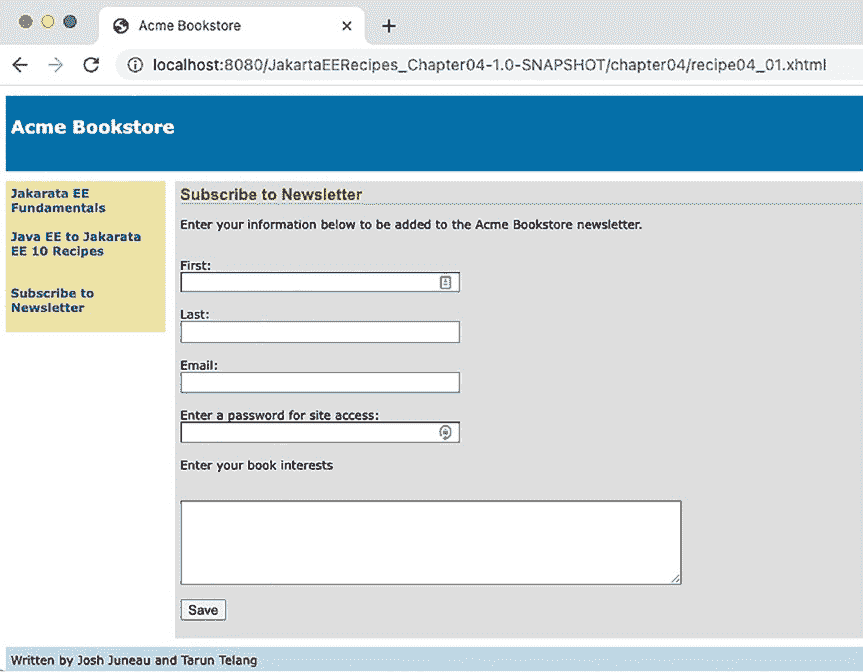

第 4 章 ■ 高级 Jakarta Server Faces

***图 4-1.** 用于订阅 Acme Bookstore 新闻通讯的 Jakarta Server Faces 输入表单*

工作原理

Java Server Faces 框架附带了一系列标准组件，可在 Jakarta Server Faces 视图中使用。有四个标准组件可用于捕获文本输入：`inputText`、`inputSecret`、`inputHidden` 和 `inputTextarea`。这些组件标签，以及所有其他标准的 Jakarta Server Faces 组件标签，共享一组通用属性和一些每个特定标签独有的属性。要了解有关通用属性的更多信息，请参阅本章引言中的相关部分。

在本配方中，我将详细介绍每个输入组件的具体细节。`h:view` 组件用于定义视图的内容。它决定了应用程序中将显示什么内容以及数据的外观。通过 `h:form` 标签指定的表单组件，用于在 Jakarta Server Faces 视图中创建输入表单。要在表单中处理的每个组件都应包含在开闭 `h:form` 标签之间。每个表单通常至少包含一个命令组件，例如 `commandButton`。一个视图可以包含多个表单组件，并且只有包含在表单中的组件才会在表单提交时被处理。

第 4 章 ■ 高级 Jakarta Server Faces

■ **注意** 我建议你始终为每个组件指定 `id` 属性。最重要的是，为表单组件指定 `id` 属性。如果你没有为给定的 Jakarta Server Faces 组件指定 `id` 属性，则会自动为你生成一个。自动生成 Jakarta Server Faces 组件 ID 会阻止从脚本语言（如 JavaScript）或受管 Bean 中静态引用组件的能力。例如，在本配方的示例中，表单 `id` 属性设置为 `contactForm`，第一个 `inputText` 组件的 `id` 设置为 `first`。这允许你通过将表单 ID 附加到组件 ID 来从脚本语言或受管 Bean 中静态引用该组件。在示例中，你可以将第一个组件引用为 `contactForm:first`。

每个输入标签都支持表 4-4 中显示的属性列表，此外还支持本章引言中已列出的通用组件属性。

***表 4-4.** 输入组件标签属性*

| **属性** | **描述** |
| :--- | :--- |
| converter | 允许将转换器应用于组件的数据 |
| converterMessage | 指定当注册的转换器失败时将显示的消息 |
| dir | 指定组件显示的文本方向（*LTR* 用于指示从左到右，*RTL* 用于指示从右到左） |
| immediate | 标志，指示如果此组件被用户激活，应立即向感兴趣的监听器和操作发送通知（即在应用请求值阶段），而不是等到调用应用程序阶段 |
| label | 指定可用于组件标识的名称 |
| lang | 允许为渲染的标记指定语言代码 |
| required | 接受布尔值，指示用户是否必须为给定组件输入值 |
| requiredMessage | 指定如果用户未为*必需*组件输入值时要显示的错误消息 |
| validator | 允许将验证器应用于组件 |
| valueChangeListener | 允许将受管 Bean 方法绑定用于事件处理目的。当组件发生更改时将调用该方法 |

`inputText` 组件用于在渲染页面中生成一个单行文本框。`inputText` 组件的 `value` 属性通常绑定到受管 Bean 属性，以便在处理表单时可以检索或设置该属性的值。在配方示例中，第一个 `inputText` 组件绑定到名为 `first` 的受管 Bean 属性。为组件值指定了 Jakarta 表达式语言表达式 `#{contactController.current.first}`，因此如果受管 Bean 的 `first` 属性包含值，则该值将显示在 `inputText` 组件中。同样，当提交表单时，在组件中输入的任何值都将保存在受管 Bean 的 `first` 属性中。

第 4 章 ■ 高级 Jakarta Server Faces

`inputSecret` 组件在渲染页面中生成一个单行文本框，当在组件中输入文本时，文本不会显示；而是用星号代替输入的每个字符。此组件使用户可以输入私人文本（例如密码），而不会在屏幕上显示给其他人阅读。`inputSecret` 组件的工作方式与 `inputText` 组件完全相同，只是用星号隐藏了文本。在示例中，`inputSecret` 组件的值通过 `#{contactController.current.password}` 表达式绑定到名为 `password` 的受管 Bean 属性。

`inputTextarea` 组件用于在渲染页面中生成一个多行文本框。因此，该组件有几个额外的属性可用于指示文本区域的大小。`inputTextarea` 具有 `rows` 和 `cols` 属性，分别允许开发人员指定组件在页面上应占用的行数（高度）和列数（宽度）。除了这两个属性外，`inputTextarea` 组件的工作方式与 `inputText` 组件非常相似。在示例中，`inputTextarea` 组件的 `value` 属性指定为 `#{contactController.current.description}`，因此当提交表单时，`description` 属性将填充组件的内容。

我尚未讨论的输入组件是 `inputHidden` 组件。此组件用于在表单中放置一个隐藏的输入字段。它的工作方式与 `inputText` 组件相同，只是它不会在页面上渲染给用户看。`inputHidden` 组件的值可以像其他组件一样绑定到受管 Bean 属性。你可以使用此类组件在表单之间传递隐藏令牌。

利用 Jakarta Server Faces 标准输入组件，可以使用 Jakarta Server Faces Jakarta 表达式语言表达式将值绑定到受管 Bean 属性。这使得开发人员可以更轻松地从输入表单提交值进行处理。Jakarta Server Faces 框架为你处理了这些开销，而不是从页面检索参数、将它们分配给变量然后进行处理。虽然我没有在本配方中涵盖所有输入组件属性的用法，但我将在后续的配方中，在构建 Acme Bookstore 新闻通讯订阅页面时介绍更多内容。

4-3\. 从页面内调用操作

问题

你想从应用程序页面上的按钮或链接触发服务器端方法的调用。

解决方案


在你的视图中使用 commandButton 或 commandLink 组件来调用受管 Bean 控制器中的操作方法。命令组件允许用户在受管 Bean 中调用操作。命令组件将页面上的按钮和链接直接绑定到操作方法，使开发者能够将更多时间用于思考应用程序的开发，而减少对 Java Servlet 处理生命周期的关注。

在本配方的示例中，为 Acme Bookstore 的新闻通讯页面添加了一个按钮和一个链接。添加到页面上的按钮将用于提交输入表单进行处理，而链接则允许用户登录应用程序并管理其订阅和书店账户。

■ **注意** 本配方不涉及任何身份验证或安全功能；它仅专注于在受管 Bean 中调用操作。有关身份验证的更多信息，请参见第 15 章。

第 4 章 ■ 高级 Jakarta Server Faces

视图：manageAccount.xhtml

以下代码用于管理账户视图。当用户点击管理订阅链接时，会显示此页面。源代码来自名为 manageAccount.xhtml 的文件：

<html

>

<f:view>

<h:outputLabel value="管理账户"/>

</f:view>

</html>

视图：recipe04_02.xhtml

将以下代码添加到此新命令组件的新闻通讯订阅视图末尾。

完整源代码位于名为 recipe04_02.xhtml 的文件中。

...

<h:commandLink id="manageAccount" action="#{contactController.manage}" value="管理订阅"/>

...

受管 Bean：Subscription.java

此受管 Bean 包含 Subscription 的 List 实现；以下是此类的代码：package com.jakartaeerecipe.chapter04;

import java.io.Serializable;

import java.util.*;

public class Subscription implements Serializable {

private List<Contact> subscriptionList;

Subscription() {

subscriptionList = new ArrayList<>();

}

public List<Contact> getSubscriptionList() {

return subscriptionList;

}

public void setSubscriptionList(List<Contact> subscriptionList) {

this.subscriptionList = subscriptionList;

}

}

第 4 章 ■ 高级 Jakarta Server Faces

受管 Bean 控制器：ContactController.java

包含操作方法的受管 Bean 名为 ContactController，它在配方 4-1 中创建。以下代码摘录自 ContactController 类，展示了为本配方对方法所做的更新。

■ **注意** ContactController 的完整实现位于 org.jakartaeerecipe.chapter05 包中。

@RequestScoped

@Named(value= "contactController")

public class ContactController {

...

private Subscription subscription;

public Subscription getSubscription() {

if (subscription == null) {

subscription = new Subscription();

}

return subscription;

}

...

/**

* 向新闻通讯添加订阅者

* @return String

*/

public String subscribe(){

// 目前使用列表实现，

// 但将在第 7 章中添加到数据库表

// 将当前联系人添加到订阅列表

subscription.getSubscriptionList().add(current);

FacesMessage facesMsg = new FacesMessage(FacesMessage.SEVERITY_INFO,

"成功订阅新闻通讯，邮箱为 " + getCurrent().

getEmail(), null);

FacesContext.getCurrentInstance().addMessage(null, facesMsg);

return "SUBSCRIBE";

}

...

/**

* 此方法将允许用户导航到 manageAccount 视图。

* 此方法稍后将移至另一个专注于身份验证的受管 Bean 中。

* @return

*/

public String manage(){

return "/chapter04/manageAccount.xhtml";

}

...

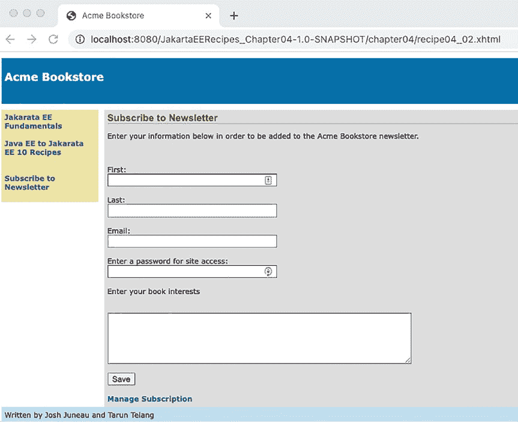

第 4 章 ■ 高级 Jakarta Server Faces

当视图被渲染时，生成的页面如图 4-2 所示。可以通过在浏览器中访问 URL http://localhost:8080/JakartaEERecipes_Chapter04- 1.0- SNAPSHOT/chapter04/recipe04_02.xhtml 来执行代码。

***图 4-2.** 在视图中使用命令组件*

工作原理


命令组件使得 Jakarta Server Faces 与使用 Jakarta Server Pages 技术截然不同。在许多其他技术中，表单动作用于处理请求参数并执行所需的业务逻辑。而借助 Jakarta Server Faces 的命令组件，Java 方法可以直接绑定到按钮或链接上，并在组件被激活（点击按钮或链接）时被调用。在本配方的示例中，同时使用了 commandButton 和 commandLink 组件。commandButton 组件用于提交表单请求参数以进行处理，而 commandLink 组件则绑定到一个动作方法，该方法会执行重定向到另一个应用程序页面。

命令组件拥有一些值得注意的属性。这些属性及其描述分别列于表 4-5 和 4-6 中。

第 4 章 ■ 高级 Jakarta Server Faces

***表 4-5.** commandButton 组件附加属性*

**属性**

**描述**

action

表达式，指定一个受管 Bean 动作方法，该方法将在用户激活组件时被调用

actionListener 表达式，指定一个受管 Bean 动作方法，该方法将在组件被激活时收到通知。动作方法应为 public 类型，接受一个 ActionEvent 参数，并返回 void 类型

class

可应用于组件的 CSS 样式类

dir

文本方向指示（LTR，从左到右；RTL，从右到左）

disabled

布尔值，指示组件是否被禁用

image

将显示在按钮上的图像的绝对或相对 URL

immediate

标志，指示如果用户激活此组件，应立即向感兴趣的监听器和动作发送通知（即在应用请求值阶段），而不是等待直到调用应用程序阶段

label

组件的名称

lang

用于生成组件标记的语言代码

readonly

布尔值，指示组件是否为只读

rendererType

渲染器实例的标识符

tabindex

索引值，指示将组件置于焦点所需的 Tab 键按下次数

title

当鼠标悬停在组件上时显示的工具提示

transient

布尔值，指示组件是否应包含在组件树的状态中

type

指示要创建的按钮类型。值为 submit（默认）、reset 和 button

***表 4-6.** commandLink 组件附加属性*

**属性**

**描述**

action

EL 表达式，指定一个受管 Bean 动作方法，该方法将在用户激活组件时被调用

accessKey

将焦点转移到组件的访问键值

cords

屏幕上热点的位置和形状

dir

文本方向指示（LTR，从左到右；RTL，从右到左）

disabled

指定一个布尔值，指示组件是否被禁用

hreflang

超链接所指定资源的语言代码

（*续*）

第 4 章 ■ 高级 Jakarta Server Faces

***表 4-6.*** （*续*）

**属性**

**描述**

immediate

标志，指示如果用户激活此组件，应立即向感兴趣的监听器和动作发送通知（即在应用请求值阶段），而不是等待直到调用应用程序阶段

lang

用于生成组件标记的语言代码

rel

从当前文档到超链接所指定锚点的关系

rev

从此超链接到当前文档的反向锚点

shape

屏幕上热点的形状

tabindex

索引值，指示将组件置于焦点所需的 Tab 键按下次数

target

一个框架的名称，通过超链接检索到的资源将显示在该框架中

title

当鼠标悬停在组件上时显示的工具提示

type

指示要创建的按钮类型。值为 submit（默认）、reset 和 button

charset


超链接所指向资源的字符编码

本示例中的 commandButton 和 commandLink 组件仅指定了最少的属性。也就是说，它们都指定了 id、action 和 value 属性。id 属性用于唯一标识每个组件。action 属性设置为 Jakarta Server Faces EL，将组件绑定到其托管 bean 的操作方法。commandButton 组件的 action 属性为 `#{contactController.subscribe}`，这意味着当页面上的按钮被点击时，将调用 ContactController 类的 subscribe 方法。commandLink 的 action 属性为 `#{contactController.manage}`，这意味着当链接被点击时，将调用 ContactController 类的 manage 方法。每个组件还指定了一个 value 属性，该属性设置为渲染时按钮或链接上显示的文本。

如您所见，示例中仅使用了可用属性中的一小部分。然而，这些组件可以通过使用其他可用属性进行自定义。例如，可以指定一个 actionListener 方法，该方法会将托管 bean 方法绑定到组件，当组件被激活时，该方法将被调用。可以为以 on 开头的每个属性指定 JavaScript 函数，从而提供实现客户端功能的能力。

命令组件极大地改变了 Jakarta EE Web 应用程序开发的格局。它们允许从用户页面内部直接访问 Java 方法，并为处理请求参数提供了一种简便的方法。

4-4. 显示输出

问题

您希望在应用程序页面中显示来自托管 bean 属性的文本。

第 4 章 ■ 高级 Jakarta Server Faces

解决方案

将 Jakarta Server Faces 输出组件集成到您的视图中。输出组件用于在页面上显示静态或动态文本，以及表达式语言算术的结果。

标准 Jakarta Server Faces 组件库包含五个用于渲染输出的组件：outputLabel、outputText、outputFormat、outputLink 和 link。Acme Bookstore 在书店通讯应用程序外观中使用了所有这些组件。

视图：recipe04_03.xhtml

在以下示例中，通讯订阅视图已被重写，以使用一些输出组件：

...

<h:outputLabel for="first" value="名字："/>

<h:inputText id="first" size="40" value="#{contactController.current.first}">

<f:validateRequired/>

<f:validateLength minimum="2" maximum="40"/>

</h:inputText><br/><br/>

<h:outputLabel for="last" value="姓氏："/>

<h:inputText id="last" size="40" value="#{contactController.current.last}">

<f:validateRequired/>

<f:validateLength minimum="2" maximum="40"/>

</h:inputText><br/><br/>

<h:outputLabel for="email" value="电子邮件："/>

<h:inputText id="email" size="40" value="#{contactController.current.email}">

<f:validateRequired/>

<f:validateRegex pattern=""/>

</h:inputText><br/>

<h:outputLabel for="password" value="输入站点访问密码："/>

<h:inputSecret id="password" size="40" value="#{contactController.current.

password}"/>

<f:validateRegex pattern=""/>

</h:inputSecret>

<br/><br/>

<h:outputLabel for="description" value="输入您感兴趣的书籍"/>

<br/>

<h:inputTextarea id="description" rows="5" cols="100" value="#{contactController.

current.description}"/>

<br/>

<h:commandButton id="contactSubmit" action="#{contactController.subscribe}"

value="保存"/>

<br/><br/>

<h:outputFormat value="购物车包含书籍 {0}、{1}、{2}">

<f:param value="Jakarta EE 基础"/>

<f:param value="Java 17 基础入门"/>

<f:param value="Jakarta EE 10 实战"/>

</h:outputFormat>

<br/><br/>

<h:commandLink id="manageAccount" action="#{contactController.manage}" value="管理订阅"/>

第 4 章 ■ 高级 Jakarta Server Faces

<br/><br/>

<h:outputLink id="homeLink" value="home.xhtml">


<h:outputText value="用户主页"/>

<f:param name="username" value="#{contactController.current.email}"/>

</h:outputLink>

</h:form>

</f:view>

</html>

托管 Bean：ContactController.java

在本章的各篇配方中，ContactController 托管 Bean 已被修改，以便随着配方的推进融入新功能。在本篇配方中，ContactController 新增了一个属性，用于存储新闻简报的描述信息。

■ **注意** 硬编码的新闻简报描述在生产应用中并非良策。此处仅用于演示目的。在生产应用中，使用资源包或数据库存储来保存文本字符串是更可行的方案。

以下摘自 ContactController 类的源代码展示了本例中相关的代码：

...

private String newsletterDescription;

public ContactController() {

current = null;

newsletterDescription = "请在下方输入您的信息，以便加入 Acme 书店新闻简报。";

}

...

public String getNewsletterDescription() {

return newsletterDescription;

}

public void setNewsletterDescription(String newsletterDescription) {

this.newsletterDescription = newsletterDescription;

}

...

生成的页面如图 4-3 所示。请注意，文本内容相同，因为它只是从托管 Bean 属性中读取了相同的文本。另外，页面底部新增了一个名为“主页”的链接。可通过在浏览器中访问以下 URL 来执行代码：http://localhost:8080/JakartaEERecipes_Chapter04-1.0-SNAPSHOT/chapter04/recipe04_03.xhtml。

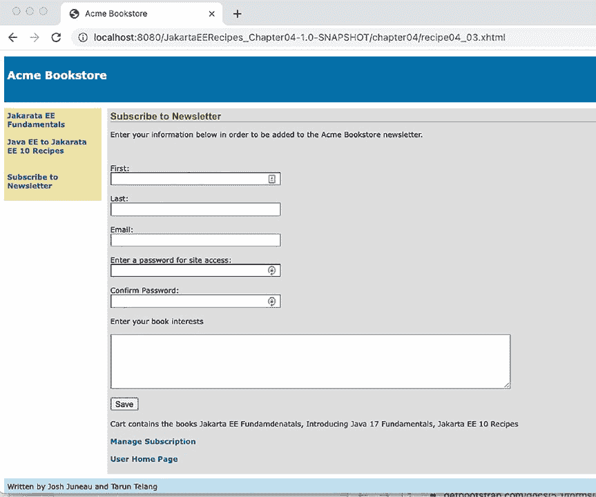

第 4 章 ■ 高级 Jakarta Server Faces

***图 4-3.** 在视图中使用输出组件*

工作原理

输出组件可用于显示托管 Bean 中生成的输出，或渲染指向其他资源的链接。在许多情况下，它们对于在 Web 视图中显示动态输出非常有用。本例演示了五种输出组件类型中的三种：outputText、outputLink 和 outputLabel。每个组件都共享一组通用属性，这些属性列于表 4-7 中。

第 4 章 ■ 高级 Jakarta Server Faces

***表 4-7.** 通用输出组件属性（未在引言中列出）*

**属性**

**描述**

class

用于样式设置的 CSS 类

converter

注册到组件的转换器

dir

文本方向（LTR：从左到右；RTL：从右到左）

escape

布尔值，指示是否转义 XML 和 HTML 敏感字符

lang

生成组件标记时使用的语言代码

parent

父组件

title

组件的工具提示文本

transient

布尔值，指示组件是否应包含在组件树的状态中

■ **注意** 自 JSF 2.0 发布以来，outputText 组件的重要性有所降低，因为 Facelets 视图定义语言会隐式地将内联内容包裹在类似的输出组件中。因此，在 JSF 2.0 中，仅当需要使用某些标签属性进行渲染、调用 JavaScript 等操作时，才有必要使用 outputText 标签。

本例中的 outputText 组件包含值 #{contactController.newsletterDescription}，用于显示 ContactController 中 newsletterDescription 属性的内容。在 h:outputText 标签中只能指定通用输出组件属性。因此，可以使用 class 或 style 等属性为组件显示的文本应用样式。如果组件包含 HTML 或 XML，可将 escape 属性设置为 true 以指示应转义这些字符。

outputFormat 组件与 outputText 组件共享相同的属性集。outputFormat 组件可用于渲染参数化文本。因此，如果需要修改文本字符串的不同部分，可以通过使用 Jakarta Server Faces 参数（通过 f:param 标签）来实现。例如，假设您想列出某人在 Acme 书店购买的书籍名称，可以像下面这样使用 outputFormat 组件：

<h:outputFormat value="购物车包含书籍 {0}、{1}、{2}">

<f:param value="Jakarta EE 基础"/>

<f:param value="Java 17 基础入门"/>

<f:param value="Jakarta EE 10 配方"/>

</h:outputFormat>

outputLink 和 outputLabel 组件各自可以指定一些其他属性，这些属性在前文讨论的输出组件中不可用。这些额外属性分别列于表 4-8（outputLink）和表 4-9（outputLabel）中。outputLink 组件可用于创建锚点或链接，当用户点击该链接时，会重定向到另一个页面。在本例中，outputLink 组件用于将用户重定向到名为 home.xhtml 的视图。outputLink 组件的值可以设置为静态页面名称（如本例所示），也可以包含对应托管 Bean 属性的表达式。还可以通过 outputLink 组件向另一个页面传递参数，方法是在 h:outputLink 的开始和结束标签之间嵌套 f:param 标签，如下所示：

第 4 章 ■ 高级 Jakarta Server Faces

<h:outputLink id="homeLink" value="home.xhtml">

<h:outputText value="用户主页"/>

<f:param name="username" value="#{contactController.current.email}"/>

</h:outputLink>

***表 4-8.** outputLink 额外属性*

**属性**

**描述**

accessKey

将焦点转移到组件的访问键值

binding

将此组件链接到支持 Bean 中属性的值表达式

charset

此超链接所指定资源的字符编码

cords

屏幕上热点的位置和形状

dir

文本方向指示（LTR：从左到右；RTL：从右到左）

disabled

指定一个布尔值，指示组件是否被禁用

fragment

页面片段的标识符，当目标页面渲染时应将焦点移至该片段

hreflang

超链接所指定资源的语言代码

lang

用于生成组件标记的语言代码

rel

当前文档到超链接所指定锚点的关系

rev

此超链接到当前文档的反向锚点

shape

屏幕上热点的形状

tabindex

指示将组件聚焦所需的 Tab 键按下次数的索引值

target

用于显示通过超链接检索到的资源的框架名称

title

鼠标悬停在组件上时显示的工具提示

type

要创建的按钮类型。值为 submit（默认）、reset 和 button

***表 4-9.** outputLabel 额外属性*

**属性**

**描述**

accessKey

将焦点转移到组件的访问键值

binding

将此组件链接到支持 Bean 中属性的值表达式

dir

文本方向指示（LTR：从左到右；RTL：从右到左）

escape

指示是否必须转义 HTML 和 XML 标记中敏感字符的标志

for

此元素作为标签的组件的客户端标识符

lang

用于生成组件标记的语言代码

tabindex

指示将组件聚焦所需的 Tab 键按下次数的索引值

title

鼠标悬停在组件上时显示的工具提示

type

要创建的按钮类型。值为 submit（默认）、reset 和 button

第 4 章 ■ 高级 Jakarta Server Faces


上一个示例在页面渲染时会产生一个文本为*用户主页*的链接。

它将生成以下 HTML 链接，其中 emailAddress 对应于 Jakarta 表达式语言表达式 #{contactController.current.email}：

<a href="home.xhtml?username=emailAddress">主页</a>

视图：home.xhtml

以下是 home.xhtml 的代码。Jakarta 表达式语言表达式

#{param['username']} 可用于读取上一个代码片段中传递的参数值：

<html

>

<f:view>

<h:outputLabel value="你好 #{param['username']}"/>

</f:view>

</html>

类似地，除了在页面上将链接显示为文本外，还可以通过嵌入 graphicImage 组件来使用图像（详见配方 4-6）。

outputLabel 组件会渲染一个 HTML <label> 标签，其使用方式与 outputText 组件大致相同。在示例中，outputLabel 组件的值都使用了静态文本，但如果更适合应用程序，它们也可以利用 Jakarta 表达式语言表达式来使用受管 bean 的属性值。

本配方中要介绍的最后一个输出组件是 link 组件。它是在 Jakarta Server Faces 2.0 版本中引入的，使得向页面添加链接的任务变得更加简单。outputLink 和 link 组件产生的结果类似，但 link 组件有一些不同的属性，使其行为略有不同。h:link 标签的 value 属性指定了链接在页面上渲染时应使用的标签或文本，而 outcome 属性则指定了应链接到的页面。以下 link 组件的示例与本配方中 outputLink 组件的示例产生相同的输出：

<h:link id="homeLink" value="首页" outcome="home"/> 参数和图像也可以像 outputLink 一样嵌入到 h:link 标签中。link 组件还包含一些自定义属性，如表 4-10 所列。

***表 4-10.** link 组件附加属性*

**属性**

**描述**

charset

超链接所指定资源的字符编码

cords

屏幕上热点的位置和形状，通常用于生成包含多个链接的地图或图像时

disabled

指示该组件不应接收焦点的标志

fragment

点击链接时应聚焦的页面片段的标识符。该标识符附加在 # 字符之后

（*续*）

第四章 ■ 高级 Jakarta Server Faces

***表 4-10.*** （*续*）

**属性**

**描述**

hreflang

此链接指定资源的语言

includeviewparams 布尔值，指示重定向时是否包含页面参数

outcome

用于解析导航案例的逻辑结果

rel

当前文档与链接指定资源之间的关系

rev

从此链接指定的锚点到当前文档的反向链接

shape

屏幕上热点的形状

target

显示链接资源的框架名称

type

链接资源的內容类型

本配方提供了 Jakarta Server Faces 标准输出组件的高级概述。在 Jakarta Server Faces 2.0+ 中，需要注意的是，你可以直接包含一个 Jakarta 表达式语言表达式，而无需使用输出组件来在页面中显示文本。然而，在某些情况下，这些组件仍然非常有用，使其成为你技术储备中重要的一组组件。

4-5. 添加表单验证

问题

为了确保通过表单提交的是有效数据，你需要在输入字段中加入一些验证。

解决方案 #1

尽可能在视图的输入组件上使用 Jakarta Server Faces 预构建的验证器标签。Jakarta Server Faces 附带了一些预构建的验证器，可以通过将验证器标签嵌入到要验证的组件中，将其应用于视图内的组件。以下代码摘录自一个 Jakarta Server Faces 视图，该视图定义了 Acme Bookstore 应用程序新闻通讯订阅页面的布局。源代码可以在名为 recipe04_04.xhtml 的视图中找到，该摘录演示了将预构建的验证器应用于一些 inputText 组件：

...

<h:outputLabel for="first" value="名： "/>

<h:inputText id="first" size="40" value="#{contactController.current.first}">

<f:validateLength minimum="1" maximum="40"/>

</h:inputText><br/>

<h:message id="firstError" for="first" errorStyle="color:red"/><br/>

<h:outputLabel for="last" value="姓： "/>

<h:inputText id="last" size="40" value="#{contactController.current.last}">

<f:validateLength minimum="1" maximum="40"/>

</h:inputText><br/>

<h:message id="lastError" for="last" errorStyle="color:red"/><br/>

...

第四章 ■ 高级 Jakarta Server Faces

在上面的代码摘录中，你可以看到 f:validateLength 验证器标签已嵌入到不同的 inputText 组件中。当表单提交时，这些验证器将应用于 inputText 组件字段中的值，如果未满足约束条件，将返回一条错误消息。

解决方案 #2

通过使用验证注解来注解受管 bean 字段，利用 Jakarta Server Faces Bean 验证。

可以通过使用所需的验证注解来注解属性字段声明，从而在受管 bean 内部执行验证。当表单提交时，将执行 Bean 验证。

■ **注意** 如果你使用 validationGroups 来委托本地值的验证给 Bean 验证 API，则可以在视图的组件中嵌入一个 f:validateBean 标签。如果你使用 f:validateBean，validationGroups 属性将作为一个过滤器，指示应强制执行哪些约束。

以下代码摘录自 Jakarta Server Faces 视图，该视图定义了 Acme Bookstore 应用程序新闻通讯订阅页面的布局。源代码可以在名为 recipe04_04.xhtml 的视图中找到。

...

<h:outputLabel for="email" value="电子邮件： "/>

<h:inputText id="email" size="40" value="#{contactController.current.email}"/><br/>

<h:message id="emailError" for="email" errorStyle="color:red"/>

...

接下来是 Contact 受管 bean 的一个摘录，演示了将验证注解应用于 email 属性字段声明：

...

@Pattern(regexp = "[a-zA-Z0-9]+@[a-zA-Z0-9]+\\.[a-zA-Z0-9]+", message = "电子邮件格式无效。")

private String email;

...

当表单提交时，将对 email 字段进行验证。如果输入到 inputText 组件中的值与注解中指定的正则表达式不匹配，则相应的消息组件中将显示该消息。

解决方案 #3

在受管 bean 中创建一个自定义验证器方法，并通过为组件的 validator 属性指定适当的 Jakarta 表达式语言，将该方法注册到输入组件。以下代码摘录自 Jakarta Server Faces 视图，该视图定义了 Acme Bookstore 应用程序新闻通讯订阅页面的布局。源代码可以在名为 recipe04_04.xhtml 的视图中找到，该摘录演示了通过为 validator 属性指定自定义验证器方法，将其应用于一个组件：

...

<h:outputLabel for="password" value="输入用于站点访问的密码： "/>

<h:inputSecret id="password" size="40" redisplay="true" value="#{contactController.current.

password}"/>

<br/>

<h:outputLabel for="passwordConfirm" value="确认密码： "/>

<h:inputSecret id="passwordConfirm" size="40"


redisplay="true" validator="#{contactController.validatePassword}"/>

<br/>

<h:message id="passwordConfirmError" for="passwordConfirm" style="color:red"/>

...

■ **注意** 如果你能跳出思维定式，就会发现前面的代码片段非常适合创建为一个复合组件！如果创建了复合组件，只需在表单中添加一个类似 `<custom:passwordValidate>` 的标签即可。有关开发复合组件的更多详细信息，请参阅配方 4-4。

`validator` 属性指定了 `ContactController` 托管 bean 中的 `validatePassword` 方法。以下摘录自 `ContactController`，展示了验证器方法的实现：

...

/**

* 自定义验证器，确保密码字段内容匹配

* @param context

* @param component

* @param value

*/

public void validatePassword(FacesContext context,

UIComponent component,

Object value){

Map <String, String> map = context.getExternalContext().getRequestParameterMap();

String passwordText = (String) map.get(("contactForm:password"));

String confirmPassword = value.toString();

if (!passwordText.equals(confirmPassword)) {

throw new ValidatorException(new FacesMessage("Passwords do not match"));

}

}

...

当表单提交时，`validatePassword` 方法将在“处理验证”阶段被调用。该方法将读取 `password` 和 `passwordConfirm` 字段的值，如果它们不匹配，则会抛出一个异常。例如，如果新闻订阅页面的输入表单在没有任何值的情况下提交，那么页面应被重新渲染，并看起来像图 4-4。可以通过在浏览器中访问 URL `http://localhost:8080/JakartaEERecipes_Chapter04-1.0-SNAPSHOT/chapter04/recipe04_04.xhtml` 来执行代码。

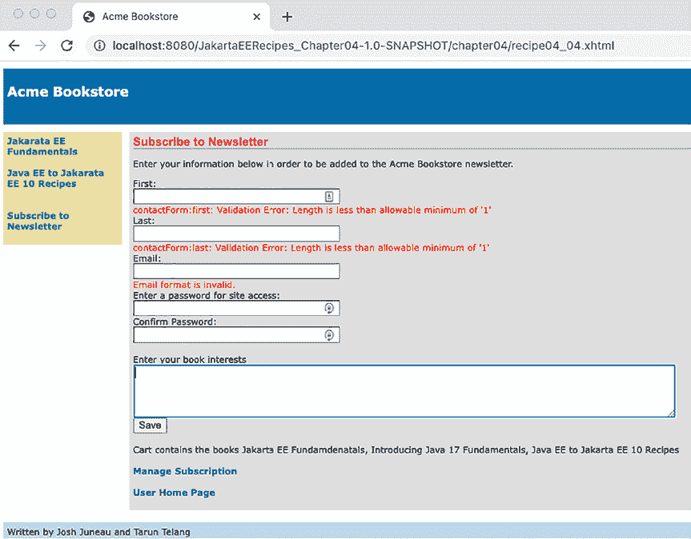

第 4 章 ■ 高级 Jakarta Server Faces

***图 4-4.** 输入字段上的验证错误*

工作原理

有几种不同的方法可以对表单输入字段应用验证。对输入组件应用验证最简单的方法是使用 Jakarta Server Faces 自带的预构建验证器标签。有一些预构建的标签用于验证指定长度、范围等的数据。有关验证器标签的完整列表，请参阅本章引言中的表 4-2。你也可以选择使用 Bean 验证对输入组件应用验证。Bean 验证要求在托管 bean 中的属性声明上放置验证注解。另一种可能的验证方法是创建一个自定义验证方法，并在输入组件的 `validator` 属性中指定该方法。本节将简要概述每个预构建的验证标签，介绍 Bean 验证的基础知识，并演示如何构建自定义验证方法。

■ **注意** 可以创建一个实现 `Validator` 接口的类来执行验证。更多信息，请参阅配方 3-7。

第 4 章 ■ 高级 Jakarta Server Faces

无论你选择实现哪种验证方案，验证都发生在 Jakarta Server Faces 生命周期的“处理验证”阶段。当表单通过命令组件或 Ajax 请求提交时，树中组件上注册的所有验证器都会被处理。组件属性中指定的规则将与组件的本地值进行比较。此时，如果任何验证失败，消息将返回给相应的消息组件并显示给用户。

要使用预构建的验证标签，必须将它们嵌入到输入组件的开始和结束标签之间，并根据你在解决方案 #1 中想要设置的验证参数指定属性。在本配方中，你学习了如何使用 `f:validateLength` 验证器标签，该标签允许对指定长度的组件数据进行验证。`minimum` 和 `maximum` 属性分别设置为最小字符串长度和最大字符串长度。

`f:validateLongRange` 验证器可用于检查输入的数值范围。`f:validateLongRange` 的 `minimum` 和 `maximum` 属性分别用于确定输入的值是否落在下限和上限范围内。

与 `f:validateLongRange` 类似的是 `f:validateDoubleRange` 验证器，它用于验证浮点值的范围。同样，`f:validateDoubleRange` 的 `minimum` 和 `maximum` 属性分别用于确定输入的值是否落在下限和上限范围内。

Jakarta Server Faces 2.0 版本新增了 `f:validateRequired` 验证器，用于确保输入字段不为空。此验证器不需要任何属性；只需将其嵌入到组件标签内，即可确保该组件不会包含空值。

Jakarta Server Faces 2.0 版本附带的另一个新验证器是 `f:validateRegex` 验证器。此验证器使用正则表达式模式来确定输入的值是否与指定的模式匹配。验证器的 `pattern` 属性用于指定正则表达式模式，如本配方解决方案 #1 的示例所示。

在解决方案 #2 中，演示了 Jakarta Server Faces Bean 验证，这也是 Jakarta Server Faces 2.0 版本的一个新特性。Bean 验证允许你使用约束注解来注解托管 bean 字段，这些注解指示应执行的验证类型。当提交包含引用这些字段的输入组件的表单时，验证会自动在注解字段上执行。可以应用于 bean 字段的标准约束注解有几种，列在表 4-11 中。每个注解接受不同的属性；更多详细信息请参阅在线文档。

***表 4-11.** 用于 Bean 验证的约束注解*

**注解**

**描述**

@AssertFalse 被注解的元素必须为 false

@AssertTrue

被注解的元素必须为 true

@DecimalMax

被注解的元素必须是一个十进制数，其值小于或等于指定的最大值

@DecimalMin

被注解的元素必须是一个十进制数，其值大于或等于指定的最小值

@Digits

被注解的元素必须是可接受范围内的数字

@Email

被注解的元素必须符合电子邮件地址的格式

@Future

被注解的元素必须是将来的日期

@Max

被注解的元素必须是一个数字，其值小于或等于指定的最大值

( *续*)

第 4 章 ■ 高级 Jakarta Server Faces

***表 4-11.*** ( *续*)

**注解**

**描述**

@Min

被注解的元素必须是一个数字，其值大于或等于指定的最小值

@Negative

被注解的元素必须是一个负数

@NotBlank

被注解的元素在去除任何尾随或前导空白后不能为 null 或空白

@NotEmpty

被注解的元素不能为 null 或空

@NotNull

被注解的元素不能为 null

@Null

被注解的元素必须为 null

@Past

被注解的元素必须是过去的日期

@Pattern

被注解的元素必须匹配正则注解的正则表达式中指定的模式

@Positive

被注解的元素必须是一个正数

@Size

被注解的元素必须在指定的边界之间


使用 Bean 验证时，引用带注解的 Bean 字段的输入组件可以包含 `f:validateBean` 标签来自定义行为。`f:validateBean` 标签的 `validationGroups` 注解可用于指定可用于验证该组件的验证组。例如，这样的解决方案可能类似于以下内容：

<h:inputText id="email" size="40" value="#{contactController.current.email}">

<f:validateBean/>

</h:inputText>

■ **注意** 验证组定义了可用于验证的约束子集。验证组由一个空的 Java 接口表示。然后，该接口名称可以应用于 Bean 类中的注解约束，以便将这些约束分配给特定组。例如，以下字段使用了 `@Size` 和 `@Email` 验证约束进行注解。

@Size(min=2, max=30)

@Email

private String email;

当使用 `f:validateBean` 标签时，指定组中包含的任何约束注解都将应用于该字段进行验证。

第 4 章 ■ 高级 Jakarta Server Faces

使用 Bean 验证时，如果字段验证失败，可以显示自定义错误消息。要添加自定义消息，请在注解中包含 `message` 属性，以及您希望显示的错误消息。最佳实践是，错误消息应从消息包中提取，以便无需更改代码即可更新。

解决方案 #3 的示例演示了如何使用自定义验证器方法对输入组件执行验证。输入组件的 `validator` 属性可以引用一个托管 Bean 方法，该方法没有返回类型，并接受 `FacesContext`、`UIComponent` 和 `Object`。该方法可以利用这些参数分别访问当前的 `FacesContext`、正在验证的 `UIComponent` 以及对象中包含的当前值。如果值未通过验证，验证逻辑可以抛出 `jakarta.faces.validator.ValidatorException`，然后通过异常向用户返回一条消息。在该示例中，名为 `validatePassword` 的方法用于比较两个密码字段的内容，以确保它们匹配。该方法中的前两行代码用于获取 ID 为 `password` 的组件的值，并将其保存到局部变量中。实际的验证逻辑将该值与传入参数的 `Object` 值（即正在验证的组件的当前值）进行比较，以确定是否匹配。如果不匹配，则抛出带有相应消息的 `ValidationException`。然后，该消息将显示在与正在验证的组件相对应的消息组件中。

如本方案开头所述，有几种验证输入的方法。它们之间没有优劣之分；其使用取决于应用程序的需求。如果您经常更改验证模式，那么您可能希望坚持使用预构建的验证器标签，这样您就不需要为了更改验证而重新编译代码。另一方面，如果您知道您的验证不会改变，那么使用 Bean 验证技术可能会更容易。无论哪种情况，使用 Ajax 都可以使验证变得更加容易，该主题将在第 5 章中介绍。

4-6\. 向页面添加选择列表

问题

您希望为页面上的某些输入字段提供可供选择的选项列表。

解决方案

根据应用程序所需的列表类型，使用 Jakarta Server Faces 的 `selectOneMenu`、`selectManyMenu`、`selectOneListbox` 或 `selectManyListbox` 组件。这些选择组件中的每一个都允许从特定值集合中进行单项或多项选择。本方案的示例将添加到 Acme Bookstore 的新闻通讯订阅页面。该书店应用程序将允许客户从下拉列表中选择他们的职业，并从多选列表中选择一个或多个他们想要订阅的新闻通讯。由于他们只需为职业选择一个选项，因此使用了 `selectOneMenu`。但是，由于可以选择多个新闻通讯，因此 `selectManyListbox` 是最佳选择。

视图：recipe04_05.xhtml

以下摘录自名为 `recipe04_05.xhtml` 的 Jakarta Server Faces 视图，它演示了这些组件的用法：

...

<h:outputLabel for="occupation" value="职业: "/>

<h:selectOneMenu id="occupation" value="#{contactController.current.occupation}">

<f:selectItem itemLabel="" itemValue=""/>

第 4 章 ■ 高级 Jakarta Server Faces

<f:selectItems value="#{contactController.occupationList}"/>

</h:selectOneMenu>

<br/><br/>

<h:outputLabel for="newsletterList" value="新闻通讯:"/>

<h:selectManyListbox id="newsletterList" value="#{contactController.current.

newsletterList}">

<f:selectItems value="#{contactController.allNewsletters}"/>

</h:selectManyListbox>

...

托管 Bean 控制器：ContactController.java

这些组件绑定到 `ContactController` 托管 Bean 中的属性。以下摘录自 `ContactController`，显示了属性的声明及其相应的初始化方法：

@RequestScoped

@Named(value="contactController")

public class ContactController {

...

public ContactController() {

current = null;

newsletterDescription = "请在下方输入您的信息，以便添加到 Acme Bookstore 的新闻通讯列表中。";

subscription = new Subscription();

populateNewsletterList();

populateOccupationList();

}

...

// 托管 Bean 属性的声明

private List<String> occupationList;

private Map<String, Object> newsletterList;

...

// 填充对象的示例

private void populateOccupationList(){

occupationList = new ArrayList();

occupationList.add("作者");

occupationList.add("IT 专业人士");

}

// 填充对象的示例

private void populateNewsletterList(){

allNewsletters = new LinkedHashMap<String,Object>();

allNewsletters = new LinkedHashMap<String,Object>();

allNewsletters.put("Java 17 基础入门", "Java");

allNewsletters.put("Jakarta EE 基础", "Jakarta EE");

allNewsletters.put("构建高性能 Java 17 应用程序", "GraalVM");

allNewsletters.put("每周新书", "新书");

}

第 4 章 ■ 高级 Jakarta Server Faces

/**

* @return the occupationList

*/

public List<String> getOccupationList() {

return occupationList;

}

/**

* @param occupationList the occupationList to set

*/

public void setOccupationList(List<String> occupationList) {

this.occupationList = occupationList;

}

public Map<String, Object> getAllNewsletters() {

return allNewsletters;

}

public void setAllNewsletters(Map<String, Object> allNewsletters) {

this.allNewsletters = allNewsletters;

}

以下摘录自 `Contact`，显示了属性的声明及其相应的访问器方法：

...

/**

* @return the newsletterList

*/

public Map<String,Object> getNewsletterList() {

return newsletterList;

}

/**

* @param newsletterList the newsletterList to set

*/

public void setNewsletterList(Map<String,Object> newsletterList) {

this.newsletterList = newsletterList;

}

...

新更新的新闻通讯订阅页面应如图 4-5 所示。可以通过在浏览器中访问 URL `http://localhost:8080/JakartaEERecipes_Chapter04-1.0-SNAPSHOT/chapter04/recipe04_05.xhtml` 来执行代码。

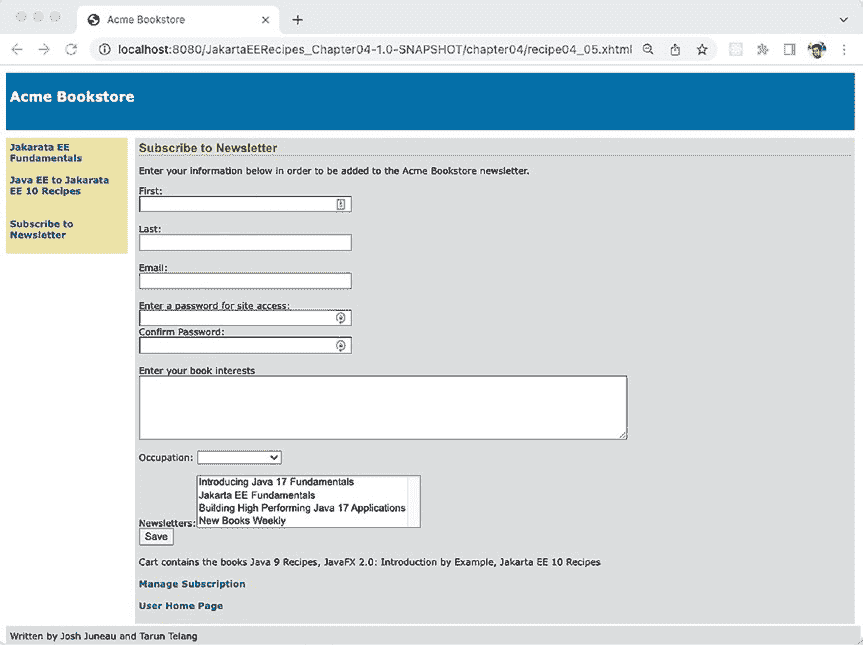


第 4 章 ■ 高级 Jakarta Server Faces

***图 4-5.** 包含值列表的选择组件*

工作原理

为确保数据完整性，尽可能使用预填充数据的输入组件始终是个好主意。这样做既能确保用户不会在文本框中输入各种格式的自由文本值，也能为用户提供便捷的选项选择。利用选择组件可为用户提供可供选择的值列表，允许进行单项或多项选择。标准 Jakarta Server Faces 组件库提供了四个接受数据列表的输入组件，用户可从中选择一项或多项。这些选择组件分别是：selectOneListbox、selectManyListbox、selectOneMenu 和 selectManyMenu。每个组件都共享一组通用属性。表 4-12 列出了表 4-2 中未展示的那些通用属性。

第 4 章 ■ 高级 Jakarta Server Faces

***表 4-12.** 选择组件属性*

**属性**

**描述**

accesskey

访问键，按下时将焦点转移到该组件

dir

文本方向指示（LTR：从左到右；RTL：从右到左）

disabled

布尔值，指示组件是否被禁用

disabledClass

应用于禁用选项渲染标签的 CSS 样式类

enabledClass

应用于启用选项渲染标签的 CSS 样式类

label

组件的本地化用户可读名称

lang

描述组件生成标记中所用语言的代码

size

始终显示的可用选项数量（selectManyListbox）

tabindex

指示将组件聚焦所需 Tab 键按下次数的索引值

title

鼠标悬停在组件上时显示的工具提示

填充选择列表

在深入探讨这四个组件及其工作原理之前，需要重点说明：每个组件都显示一个数据集合，并使用`f:selectItem`或`f:selectItems`标签来指定该数据集。如果要单独列出每个数据项，则应使用`f:selectItem`标签。一个`f:selectItem`标签代表值集合中的一个元素。`f:selectItem`标签包含多个属性，但这里只讨论其中一些重要的属性。每个`f:selectItem`标签至少应包含`itemValue`和`itemLabel`属性，分别指定元素的值和要显示的标签。这些属性接受 Jakarta 表达式语言表达式或文本字符串。在示例中，`itemValue`和`itemLabel`属性都留空，这将为第一个菜单选项渲染一个空选项。当用户从列表中选择一个选项时，`itemValue`属性值将被设置到相应的选择组件值中。

`f:selectItems`标签可用于指定组件应使用的数据集合。可以在受管 Bean 中构建一个`SelectItem`对象列表，并将其指定给`f:selectItems`标签。与`f:selectItem`标签类似，该标签也可使用多个属性，这里将介绍其中关键属性。`itemValue`和`itemLabel`属性也可为`f:selectItems`标签指定，分别对应值列表或映射以及字符串标签。但最常见的是指定`value`属性，引用一个包含对象集合或数组的受管 Bean 属性。该集合或数组可以包含任何有效的 Java 对象，在示例中，使用`LinkedHashMap`来填充`newsletterList`属性。也可以填充单个`SelectItem`对象，然后将其加载到列表中供`f:selectItems`标签使用。以下代码行展示了如何填充新闻通讯集合：

private void populateNewsletterList(){

allNewsletters = new LinkedHashMap<String,Object>();

allNewsletters.put("Introducing Java 17 Fundamentals", "Java");

allNewsletters.put("Jakarta EE Fundamentals", "Jakarta EE");

allNewsletters.put("Building High Performing Java 17 Applications", "GraalVM"); allNewsletters.put("New Books Weekly", "New Books");

}

第 4 章 ■ 高级 Jakarta Server Faces

关于各组件类型

`selectOneMenu`可能是最常用的选择组件，它将数据集合渲染为下拉列表。用户可以从菜单中选择一个条目，所选条目将被设置到为组件`value`属性指定的受管 Bean 属性中。在本节示例中，值设置为`#{contactController.current.occupation}`，因此当从列表中选择一个条目时，它将被设置到当前选中的`Contact`对象的`occupation`字段中。

`selectOneListbox`允许用户从数据列表中选择一个值。用户可以在屏幕上的列表框中看到至少几个条目，并从列表框中选择一个选项。`selectOneListbox`包含一个名为`collectionType`的额外属性，允许使用字面值指定集合类型。

`selectManyMenu`和`selectManyListbox`组件都允许用户在选择列表中选择多个选项。示例演示了如何使用`selectManyListbox`组件，允许用户从列表中选择多个新闻通讯。使用这些组件的主要区别在于，组件的受管 Bean 属性值必须能够接受多个值。在示例中，`selectManyListbox`组件值引用了`Contact`类的`newsletterList`字段。`newsletterList`字段被声明为`String`对象列表，因此当用户从`newsletterList`中选择多个值时，所有选择都可以存储在当前的`Contact`对象中。

在本节示例中，使用了两个组件来显示可供选择的选项列表。一个组件允许用户从集合中选择一个值，并以下拉列表形式显示选项；另一个组件允许用户选择多个值，并在列表框中显示选项。

4-7. 向页面添加图形

问题

您希望将图形整合到站点模板或其他选定的应用程序页面中。

解决方案

将要显示的图像放入应用程序`webapp`文件夹内`resources`文件夹的库中，然后使用`graphicImage`组件显示它们。Acme Bookstore 应用程序的`book.xhtml`视图包含商店中每本书的图片。为了渲染图片，书籍图片名称从`Book`受管 Bean 的`image`字段中获取。以下摘自`book.xhtml`的代码片段演示了如何使用`h:graphicImage`标签：

<h:graphicImage id="bookImage" library="image"

style="width: 100px; height: 120px" name="#{book.image}"/>

工作原理

自 Jakarta Server Faces 诞生以来，`graphicImage`组件就一直用于显示图像。

通过使用`graphicImage`组件的`library`属性，Jakarta Server Faces 视图可以引用图像资源，而无需指定图像文件的完整路径。在本节解决方案中，为`library`属性指定的值是`image`，这意味着图像可以在`\webapp\resource\image`文件夹中找到。它还提供了在需要时接受 Jakarta 表达式语言属性的便利性，从而可以根据相应受管 Bean 属性中的当前值动态加载图像。`graphicImage`组件使得动态和静态显示图像都变得简单。

受管 Bean: Book.java


这个托管 Bean 封装了书籍图片名称；以下是该类的代码：package com.jakartaeerecipe.chapter04;

import jakarta.inject.Named;

@Named(value = "book")

public class Book {

private String image;

public Book(){

image = "book.png";

}

public String getImage() {

return image;

}

public void setImage(String image) {

this.image = image;

}

}

`h:graphicImage` 标签支持许多属性，这些属性超出了标准 Jakarta Server Faces 组件属性的范围，如表 4-13 所列。

***表 4-13.** graphicImage 组件专用属性*

**属性**

**描述**

alt

组件所渲染元素的替代文本描述

dir

文本方向指示（LTR，从左到右；RTL，从右到左）

height

覆盖图片的高度

ismap

布尔值，指示图片是否用作服务器端图像映射

lang

描述组件生成标记中所用语言的代码

longdesc

指向元素所代表图片的详细描述的 URI

title

关于组件所生成标记元素的建议标题信息

usemap

客户端图像映射的名称，该元素为此映射提供图片

width

覆盖图片的宽度

第 4 章 ■ 高级 Jakarta Server Faces

当本配方的示例页面被渲染时，位于应用程序 `resources/image` 目录中、与标签上 `name` 属性对应的图片将被显示。如果用户从菜单中选择了一本不同的书，那么该书的图片将使用同一个 `graphicImage` 组件显示，因为图片指定的名称可以根据托管 Bean 中当前选中的书籍对象而改变。

通过在视图中使用 `graphicImage`，你可以让图片具备标准 Jakarta Server Faces 组件的动态特性。要查看此示例代码的实际效果，请参考配方 4-17。

4-8\. 向视图添加复选框

问题

你需要向应用程序视图添加复选框字段。

解决方案

在视图中使用 `selectOneCheckbox` 和 `selectManyCheckbox` 组件。这些组件允许你通过简单地勾选复选框表示真值、取消勾选表示假值，来指定一个布尔值作为输入。

视图：recipe04_07.xhtml

以下代码摘录自名为 `recipe04_07.xhtml` 的视图，演示了这些组件的使用：

...

<h:outputLabel for="notifyme" value="您是否希望接收其他促销邮件？"/>

<h:selectBooleanCheckbox id="notifyme"

value="#{contactController.current.receiveNotifications}"/>

<br/><br/>

<h:outputLabel for="notificationTypes"

value="您对接收哪种类型的通知感兴趣？"/>

<h:selectManyCheckbox id="notificationTypes" value="#{contactController.current.

notificationType}">

<f:selectItems value="#{contactController.notificationTypes}"/>

</h:selectManyCheckbox>

...

托管 Bean 控制器

每个组件都绑定到一个 `Contact` 对象，因此当表单提交时，如果数据有效，当前的 `Contact` 对象将接收这些数据。以下列表包含更新后的 `Contact` 类的摘录，该类用于保存联系人的信息。完整列表请参见源代码中 `org.jakartaeerecipe.chapter04` 包内的 `Contact.java` 源文件。

第 4 章 ■ 高级 Jakarta Server Faces

...

private boolean receiveNotifications;

private Map<String, Object> notificationType;

...

/**

* @return the receiveNotifications

*/

public boolean isReceiveNotifications() {

return receiveNotifications;

}

/**

* @param receiveNotifications the receiveNotifications to set

*/

public void setReceiveNotifications(boolean receiveNotifications) {

this.receiveNotifications = receiveNotifications;

}

/**

* @return the notificationTypes

*/

public Map<String, Object> getNotificationTypes() {

return notificationTypes;

}

/**

* @param notificationTypes the notificationTypes to set

*/


public void setNotificationTypes(Map<String, Object> notificationTypes) {

this.notificationTypes = notificationTypes;

}

拼图的最后一块是绑定到 `h:selectManyCheckbox` 组件内嵌的 `f:selectItems` 标签上的通知类型列表。这些列表绑定到 `ContactController` 托管 Bean 中名为 `notificationTypes` 的属性。以下清单包含了该类的相关摘录：

...

// 声明

private Map<String, String> notificationTypes;

...

/**

* 创建 ContactController 的新实例

*/

public ContactController() {

current = null;

newsletterDescription = "请在下方输入您的信息，以便添加到 Acme Bookstore 的新闻通讯列表中。";

subscription = new Subscription();

populateOccupationList();

populateNewsletterList();

// 在构造函数中调用 populateNotificationTypes 方法进行填充

populateNotificationTypes();

}

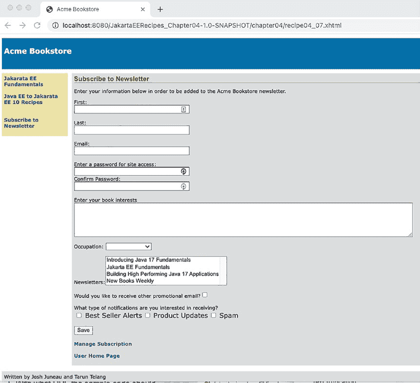

第 4 章 ■ 高级 Jakarta Server Faces

private void populateNotificationTypes() {

notificationTypes = new HashMap<>();

notificationTypes.put("产品更新", "1");

notificationTypes.put("畅销书提醒", "2");

notificationTypes.put("垃圾邮件", "3");

}

...

Acme Bookstore 应用程序最终的新闻通讯订阅输入界面（包含新的复选框组件）将如图 4-6 所示。您可以在浏览器中访问 URL http://localhost:8080/JakartaEERecipes_Chapter04-1.0-SNAPSHOT/chapter04/recipe04_07.xhtml 来执行此代码。

***图 4-6.** 在页面中集成复选框*

第 4 章 ■ 高级 Jakarta Server Faces

工作原理

复选框在应用程序中非常常见，因为它们为用户提供了一种输入布尔值的简便方法。复选框要么被选中，要么未被选中，选中的框对应 `true` 值，未选中的框对应 `false` 值。Jakarta Server Faces 标准组件库提供了几种不同的复选框选择组件，即 `selectBooleanCheckbox` 和 `selectManyCheckbox`。`selectBooleanCheckbox` 在页面上渲染一个带有 `type="checkbox"` 的单个 HTML 输入元素，而 `selectManyCheckbox` 组件则渲染多个带有 `type="checkbox"` 的 HTML 输入元素。与所有 Jakarta Server Faces 组件一样，复选框选择组件除了通用的 Jakarta Server Faces 组件属性外，还共享一组标准属性，这些属性列在表 4-14 中。

***表 4-14.** 复选框选择组件属性*

**属性**

**描述**

accessKey

访问键，按下时将焦点转移到该元素

border

围绕包含选项列表的表格绘制的边框宽度（`selectManyCheckbox`）

dir

文本方向指示（LTR，从左到右；RTL，从右到左）

disabled

布尔值，指示该元素是否应接收焦点或包含在提交中

label

组件的本地化用户可显示名称

lang

描述组件生成标记中所用语言的代码

layout

要创建的选项列表的方向（`selectManyCheckbox`）

readonly

布尔值，指示组件是否为只读

tabindex

索引值，指示将组件带入焦点所需的 Tab 键按下次数

title

鼠标悬停在组件上时显示的工具提示

`selectBooleanCheckbox` 组件的值属性 Jakarta 表达式语言表达式应对应于托管 Bean 中的一个布尔属性。在本示例中，`selectBooleanCheckbox` 的值设置为 `#{contactController.current.receiveNotifications}`，这是当前 `Contact` 对象中的一个布尔字段，指示该联系人是否希望接收通知。如果用户勾选了该组件的复选框，则 `receiveNotifications` 字段的值将设置为 `true`；否则，将设置为 `false`。`value` 属性是唯一必需的属性。


然而，通常情况下，`valueChangeListener` 属性被设置为托管 Bean 中的一个方法，当组件的值发生变化时，该方法会被调用。这在使用 Ajax 表单提交时最为有用，这样客户端可以立即看到 `ValueChangeEvent` 的结果，而无需等待表单重新渲染。

`selectManyCheckbox` 组件在页面上显示一个或多个复选框。该组件的 `value` 属性应对应一个字符串数组。组件中包含的每个复选框都有一个对应的字符串值。现在你可能会想，字符串和布尔值有什么关系？实际上，数组中的每个字符串对应页面上的一个复选框，当某个复选框被选中时，与该复选框对应的字符串就会被添加到数组中。如果没有选中任何复选框，则数组中不会添加任何字符串。因此，字符串的存在即表示与该字符串值对应的复选框已被选中。

■ 第四章 ■ 高级 Jakarta Server Faces

要添加复选框，可以为每个复选框使用单独的 `f:selectItem` 标签，或者使用 `f:selectItems` 标签添加一组复选框。如果你使用 `f:selectItem`，那么 `itemValue` 属性应设置为与该复选框对应的字符串值，而 `itemLabel` 属性则设置为复选框的标签。在示例中，使用了 `f:selectItems` 标签来为组件填充复选框。示例中的 `f:selectItems` 标签包含一个 `value` 属性，该属性设置为 `#{contactController.notificationTypes}`，对应于 `ContactController` 类中的 `notificationTypes` 字段。

如果你查看 `notificationTypes` 字段，会发现它被声明为 `Map<String, Object>` 类型，数组中的每个元素将对应一个复选框。当 `ContactController` 类被实例化时，会调用 `populateNotificationTypes` 方法，该方法用每个复选框的值填充这个映射。以下是 `populateNotificationTypes` 方法的代码清单。映射中的每个元素对应一个复选框：

```java
private void populateNotificationTypes() {
    notificationTypes = new HashMap<>();
    notificationTypes.put("Product Updates", "1");
    notificationTypes.put("Best Seller Alerts","2");
    notificationTypes.put("Spam", "3");
}
```

复选框使用户能够轻松地为给定选项指示真或假（选中或未选中）的值。Jakarta Server Faces 复选框选择组件有助于组织页面上的内容，并且由于用户无需输入自由文本，它们提供了一种确保数据完整性的好方法。

**4-9. 向视图添加单选按钮**

**问题**

你想在页面上以单选按钮的形式显示一组项目，并允许用户仅选择其中一个。

**解决方案**

在页面上使用单选按钮，为用户提供从一组选项中选择一个的选项。当你希望一次性在屏幕上显示所有选项，但只允许选择一个时，单选按钮通常是一个很好的解决方案。在本技巧中，Acme Bookstore 希望在新闻通讯订阅页面上添加一个单选按钮，以确定订阅者是男性还是女性。

**视图：recipe04_08.xhtml**

以下摘录自名为 `recipe04_08.xhtml` 的 Jakarta Server Faces 视图，它演示了 `selectOneRadio` 组件：

```xhtml
...
<h:outputLabel for="gender" value="Gender: "/>
<h:selectOneRadio id="gender" value="#{contactController.current.gender}">
    <f:selectItem itemValue="M" itemLabel="Male"/>
    <f:selectItem itemValue="F" itemLabel="Female"/>
</h:selectOneRadio>
<br/><br/>
```


■ 第四章 ■ 高级 Jakarta Server Faces

```xhtml
<h:message id="genderError"
          for="gender"
          errorStyle="color:red"/>
<br/>
...
```

**托管 Bean**

该组件绑定到 `Contact` 类中一个名为 `gender` 的托管 Bean 属性。以下代码清单包含 `Contact` 类的摘录，展示了为整合新字段所做的更新：

```java
...
private String gender;
...
/**
 * @return the gender
 */
public String getGender() {
    return gender;
}

/**
 * @param gender the gender to set
 */
public void setGender(String gender) {
    this.gender = gender;
}
...
```

当 `selectOneRadio` 组件在屏幕上渲染时，它会为每个可用选项添加一个单选按钮。更新后的 Acme Bookstore 新闻通讯页面如图 4-7 所示。你可以通过访问浏览器中的 URL `http://localhost:8080/JakartaEERecipes_Chapter04-1.0-SNAPSHOT/chapter04/recipe04_08.xhtml` 来执行代码。

***图 4-7.** 使用 selectOneRadio 组件*

■ 第四章 ■ 高级 Jakarta Server Faces

**工作原理**

单选按钮与复选框非常相似，它们都为用户提供针对指定页面值的开或关选项。使用单选按钮的附加价值在于，它们可以轻松地在屏幕上同时显示多个选项，并允许用户仅选择其中一个。如果用户尝试选择另一个选项，则当前选中的项目将变为未选中状态，从而强制用户只能选择一个选项。

Jakarta Server Faces 的 `selectOneRadio` 组件用于在页面上渲染单选按钮，其工作方式与 `selectManyCheckbox` 组件（参见技巧 4-7）非常相似。

`selectOneRadio` 拥有与 `selectBooleanCheckbox` 组件相同的所有属性。有关这些属性的列表，请参见表 4-14。`selectOneRadio` 组件还包含许多额外的属性，如表 4-15 所列。

***表 4-15.** selectOneRadio 属性（除表 4-14 所列之外）*

| **属性** | **描述** |
| :--- | :--- |
| disabledClass | 应用于禁用选项的渲染标签的 CSS 样式类 |
| group | 指定该组件所属的单选按钮组 |
| enabledClass | 应用于启用选项的渲染标签的 CSS 样式类 |

要使用 `selectOneRadio` 组件，`value` 属性应设置为一个字符串。在示例中，`selectOneRadio` 组件的值设置为当前 `Contact` 对象中的 `gender` 字段。当选中其中一个单选按钮时，与该按钮对应的字符串值将被设置到该字段中。

单选按钮的填充方式与 `selectManyCheckbox` 组件（参见技巧 4-7）类似，可以使用 `f:selectItem` 标签或 `f:selectItems` 标签。在示例中，使用了两个 `f:selectItem` 标签来为组件添加两个单选按钮；`itemValue` 属性是提交给所选按钮的字符串，而 `itemLabel` 属性是显示在相应按钮旁边的字符串。

如果你想使用 `f:selectItems` 标签来填充一组单选按钮，则 `f:selectItems` 的 `value` 属性应设置为一个托管 Bean 属性，该属性声明为字符串数组、映射或 `SelectItem` 对象列表。要查看示例，请回顾技巧 4-7 中关于 `selectManyCheckbox` 组件的示例。

■ **注意** 在 Jakarta Server Faces 2.3 中，为该组件添加了 `group` 属性。此属性允许将单选按钮单独放置在视图中，同时仍能与同一组中的所有其他按钮共享选择。

单选按钮是一种向用户显示多个选项并允许他们选择一个的简单方法。如果你理解了 `selectManyCheckbox` 组件的工作原理，那么 `selectOneRadio` 与之非常相似。

**4-10. 显示数据集合**

**问题**

你希望在 Jakarta Server Faces 应用程序页面中显示一个数据集合。

■ 第四章 ■ 高级 Jakarta Server Faces

**解决方案**


使用 `dataTable` 组件来展示数据集合。`dataTable` 组件可用于遍历数据集合，为每一行对象提供一个句柄，以便在需要时查询列数据或直接显示。在本示例中，书籍页面正在更新，以显示所选书籍的目录。目录将在一个经过可读性定制的 `dataTable` 组件中展示。

视图：recipe04_09.xhtml

以下列表展示了名为 `recipe04_09.xhtml` 的视图，它是 `book.xhtml` 视图的一个不完整快照：

<html>

<h:head>

<meta http-equiv="content-type" content="text/html; charset=UTF-8"/>

<title>Acme 书店</title>

</h:head>

<h:body>

<ui:composition template="./layout/custom_template_search.xhtml">

<ui:define name="content">

<h:form id="componentForm">

<h1>#{ch4AuthorController.currentBook.title} 的作者列表</h1>

<p>

以下是作者列表。点击作者的姓氏可获取更多关于该作者的信息。

</p>

<h:graphicImage id="javarecipes" library="image"

style="width: 100px; height: 120px"

name="#{ch4AuthorController.currentBook.image}"/>

<br/>

<h:dataTable id="authorTable" border="1"

value="#{ch4AuthorController.authorList}"

var="author">

<f:facet name="header">

#{ch4AuthorController.currentBook.title} 作者

</f:facet>

<h:column >

<h:commandLink id="authorName" action="#{ch4AuthorController.

displayAuthor(author.last)}"

value="#{author.first} #{author.last}"/>

</h:column>

</h:dataTable>

<br/><br/>

<h:dataTable id="bookDetail" border="1"

value="#{ch4AuthorController.currentBook.chapters}"

var="book" style="width:100%"

rowClasses="tocTableOdd, tocTableEven" columnClasses="col1">

第 4 章 ■ 高级 Jakarta Server Faces

<f:facet name="header">

#{ch4AuthorController.currentBook.title} 详情

</f:facet>

<h:column >

<f:facet name="header">

章节

</f:facet>

<h:outputText value="#{book.chapterNumber}"/>

</h:column>

<h:column>

<f:facet name="header">

标题

</f:facet>

<h:outputText value="#{book.title}"/>

</h:column>

</h:dataTable>

<br/>

<br/>

</h:form>

</ui:define>

</ui:composition>

</h:body>

</html>

CSS

`dataTable` 使用了一些 CSS 样式类以使其更易于阅读。以下摘录来自 Acme 书店应用程序样式表 `styles.css`，其中包含了表格所使用的样式。`styles.css` 样式表链接到了视图，因为它被声明为模板中的一个资源。

.tocTableOdd{

background: #c0c0c0;

}

.tocTableEven{

background: #e0e0e0;

}

.col1{

text-indent: 15px;

font-weight: bold;

}

■ **注意** 在 Jakarta Server Faces 2.3 中，`dataTable` 新增了一个 `rowClass` 属性，该属性接受 Jakarta 表达式语言来访问当前行。因此，可以实现类似以下的功能：

<h:dataTable id="bookDetail" border="1"

value="#{ch4AuthorController.currentBook.chapters}"

第 4 章 ■ 高级 Jakarta Server Faces

var="book" style="width:100%"

rowClass="#{book eq 'Java EE to Jakarta EE 10 Recipes ' ? style1:style2}"

columnClasses="col1">

`h:column` 在 Jakarta Server Faces 2.3 中新增了一个 `styleClass` 属性。该属性允许你将指定的样式应用于单个列。

托管 Bean

为了适配新表格，应用程序中添加了一个名为 `Chapter` 的类。`Chapter` 类是一个对象，它将包含每本书中每个章节的编号、标题和描述。每本书的每个章节都需要实例化一个 `Chapter` 对象。要查看列表，请参见源码中的 `org.jakartaeerecipe.chapter04.Chapter` 类。为了填充每本书的 `Chapter` 对象，`AuthorController` 托管 Bean 已进行了更新。以下摘录来自 `AuthorController` 托管 Bean，展示了章节是如何填充到 `Book` 对象中的。

■ **注意** 该示例演示了在 Java 类中硬编码字符串的做法。这通常不是一个好主意，对于企业级应用程序来说，使用数据库或资源包来获取字符串是更合适的选择。


@PostConstruct

public void init(){

authorLast = null;

populateAuthors();

populateJakartaFundamentalsAuthorList();

}

...

public void populateAuthors(){

...

Book book1 = new Book("Java EE 到 Jakarta EE 10 实战", "book.png");

book1 = addChapters1(book1);

...

}

...

private Book addChapters1(Book book){

Chapter chapter1 = new Chapter(1, "什么是 Jakarta EE", null);

Chapter chapter2 = new Chapter(2, "历史", null);

Chapter chapter3 = new Chapter(3, "Jakarta EE 的必要性及其指导原则", null);

Chapter chapter4 = new Chapter(4, "规范", null);

Chapter chapter5 = new Chapter(5, "规范概述", null);

Chapter chapter6 = new Chapter(6, "测试兼容性工具包 (TCK)", null);

Chapter chapter7 = new Chapter(7, "兼容实现", null);

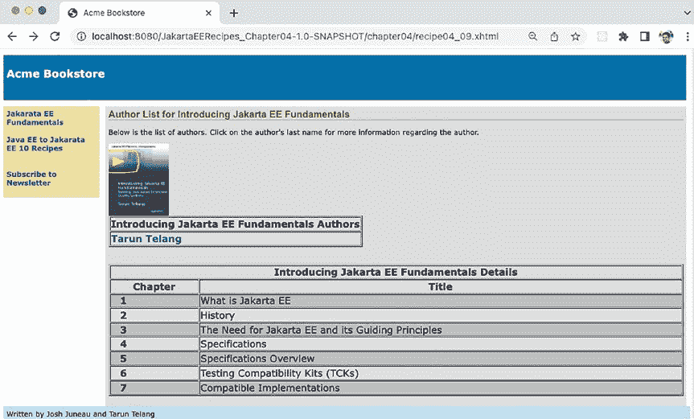

第 4 章 ■ 高级 Jakarta Server Faces

List <Chapter> chapterList = new ArrayList<>();

chapterList.add(chapter1);

chapterList.add(chapter2);

chapterList.add(chapter3);

chapterList.add(chapter4);

chapterList.add(chapter5);

chapterList.add(chapter6);

chapterList.add(chapter7);

book.setChapters(chapterList);

return book;

}...

书籍页面上生成的目录将如图 4-8 所示。可以通过在浏览器中访问 URL http://localhost:8080/JakartaEERecipes_Chapter04- 1.0- SNAPSHOT/chapter04/

recipe04_09.xhtml 来执行该代码。

***图 4-8.** 使用 dataTable 组件*

工作原理

Jakarta Server Faces 的 dataTable 组件可用于以统一方式显示数据集合。该组件易于使用，并且允许灵活地处理数据集合中的每个字段。还有其他显示数据集合的方式，例如使用 ui-repeat Facelets 标签或 panelGrid 组件，但如果表格不需要进行*极致*定制，dataTable 能让开发者的工作变得轻松。

第 4 章 ■ 高级 Jakarta Server Faces

dataTable 组件包含多种属性，可用于自定义表格的外观和风格，以及一些行为特征。这些属性均列于表 4-16 中。每个 dataTable 还包含列组件，这些组件通过 h:column 标签在 dataTable 组件内部声明。与任何其他 Jakarta Server Faces 标签一样，h:column 标签也有许多对应的属性，如表 4-17 所示。

***表 4-16.** dataTable 属性*

**属性**

**描述**

bgcolor

表格背景颜色的名称或代码

bodyrows

逗号分隔的行索引列表，用于指定应开始新 <tbody> 元素的行

border

表格周围边框的宽度（像素）

captionClass

空格分隔的 CSS 样式类列表，将应用于为表格生成的任何标题

captionStyle

渲染标题时应用的 CSS 样式

cellpadding

定义用户代理应在每个单元格边框与其内容之间留出多少空间

cellspacing

定义用户代理应在表格左侧与最左列之间、表格顶部与最顶行顶部之间，以及表格右侧和底部之间留出多少空间。同时指定单元格之间应留出多少空间

columnClasses

逗号分隔的 CSS 样式列表，将应用于表格的列。也可以为任何单个列指定空格分隔的类列表

columns

在开始新行之前要渲染的列数

dir

文本方向指示（LTR，从左到右；RTL，从右到左）

footerClass

空格分隔的 CSS 样式类列表，将应用于为表格生成的任何页脚

frame

指定表格周围边框的哪些边可见的代码

headerClass

空格分隔的 CSS 样式类列表，将应用于为表格生成的任何页眉

lang


描述组件生成标记中所用语言的代码

rowClass

接受 Jakarta 表达式语言以访问行，可用于将 CSS 样式类应用于指定行

rowClasses

以逗号分隔的 CSS 样式类列表，这些类将应用于表格的行。也可以为每一行指定一个以空格分隔的类列表

rules

指定哪些规则将出现在表格单元格之间的代码。有效值包括 none、groups、rows、cols 和 all

summary

针对非可视化媒体渲染的用户代理，对表格用途和结构的摘要

title

关于为组件生成的标记元素的建议标题信息

width

整个表格的宽度

第 4 章 ■ 高级 Jakarta Server Faces

***表 4-17.** h:column 属性*

**属性**

**描述**

footerClass

将应用于列页脚的 CSS 类

headerClass

将应用于列标题的 CSS 类

styleClass

允许将 CSS 类应用于单个列

描述 dataTable 最简单的方式是逐步讲解一个示例。本方案的解决方案包含一个 Jakarta Server Faces 视图，其中使用了两个 dataTable 组件。第一个 dataTable 的 id 属性为 authorTable，第二个 dataTable 的 id 属性为 bookTable。您最感兴趣的是第二个 dataTable，其 id 属性为 bookTable，尽管第一个 dataTable 的功能大致相同。bookTable 组件用于遍历 Chapter 对象的集合，并显示当前选中书籍对应的章节编号和标题。dataTable 的 value 属性设置为 #{ch4AuthorController.currentBook.chapters}，这对应于 AuthorController 托管 bean 中的一个 List<String> 属性。一个 dataTable 可以遍历多种不同的集合类型，包括列表、DataModel 和数组。从 Jakarta Server Faces 2.2 版本开始，通用的 Collection 接口也得到了支持。dataTable 组件的 var 属性用于指定一个句柄，允许在行级别访问集合数据。这意味着如果需要，您可以精确地定位到数据集合的特定字段。dataTable 标签本身不显示任何内容；它必须嵌入列组件才能显示内容。dataTable 中的每个 h:column 标签在渲染时都对应于结果表格中的一列。例如，如果您查看 id 为 bookDetail 的 dataTable 中的第一个 h:column 标签，它包含一个嵌入的 outputText 组件，该组件指定了 value 为 #{book.chapterNumber}。这一特定列用于显示章节编号，该编号是 Chapter 对象中的一个字段，对应于 currentBook 对象的 chapters 列表。

列组件可以包含任何有效的 Jakarta Server Faces 组件，也可以包含与集合中数据字段相对应的纯 Jakarta Server Faces Jakarta 表达式语言。如果您查看 id 属性为 authorTable 的 dataTable，您会看到其中一列使用了 commandLink 组件。这种情况很常见，因为您可能希望从表格单元格内链接到当前选中行的数据。id 为 authorTable 的 dataTable 就包含了一个很好的示例。表格中的 commandLink 包含一个 action 属性，该属性指定了 AuthorController 类中的一个方法，并且当前选中行的值 lastName 作为参数传递给该方法。底层方法使用该参数检索选中行的所有数据，并在另一个视图中显示：

<h:commandLink id="authorName" action="#{ch4AuthorController.displayAuthor(author.last)}"

value="#{author.first} #{author.last}"/>

要在表格上放置页眉或页脚，您必须使用 f:facet 标签将一个 facet 嵌入到表格中。


`f:facet` 标签包含许多典型的 Jakarta Server Faces 组件属性，但对该组件而言，一个突出的属性是 `name` 属性。`name` 属性用于指定该标签属于哪种类型的 facet，对于 `dataTable` 组件而言，这些名称是 `header` 和 `footer`。要创建表格的页眉或页脚，只需在 `dataTable` 组件内嵌入 `f:facet` 标签，并指定 facet 的名称（即要创建的 facet 类型）。

■ **注意** 可用于 `dataTable` 集合的一种独特数据类型是 `DataModel`。要能够显示行号，请使用 `DataModel`。

第 4 章 ■ 高级 Jakarta Server Faces

当需要显示数据集合时，`dataTable` 组件会非常有用。使用 `dataTable` 的一个缺点是它没有提供过多的可定制性。然而，扩展 `dataTable` 的功能以满足特定需求是完全可行的。

有许多第三方组件库正是为此而生；它们提供了扩展的 `dataTable`，具有排序、行展开、内联编辑等功能。要了解更多关于使用这些自定义 `dataTable` 组件的信息，请参阅第 7 章。

4-11. 实现文件上传

问题

你想为应用程序添加一个文件上传组件。

解决方案

使用 Jakarta Server Faces 文件上传组件为你的应用程序创建一个基于 Ajax 或非 Ajax 的文件上传系统。要使用 `inputFile` 组件，它必须放置在一个 Jakarta Server Faces 表单内，该表单的 `enctype` 属性设置为 `multipart/form-data`，并且不指定 `id` 属性。`h:form` 元素包含 `enctype` 和 `prependId` 属性，可分别用于指定这些要求。一个 Jakarta Server Faces 命令组件或 `f:ajax` 标签应设置为托管 Bean 中的一个操作方法，该方法将把文件保存到磁盘。

以下 Jakarta Server Faces 视图演示了在非 Ajax 解决方案中使用 `inputFile` 组件：

```xml
<h:form prependId="false" enctype="multipart/form-data">
    Choose a file to upload to the server: <br/>
    <h:inputFile id="uploadFile" value="#{ajaxBean.file}"/>
    <br/> <h:commandButton action="#{ajaxBean.uploadFile()}" value="Upload File"/>
</h:form>
```

通过 `commandButton` 调用的 `uploadFile` 方法的源代码如下：

```java
@Named(value = "ajaxBean")
@SessionScoped
public class AjaxBean implements Serializable {
    private Part file = null;
    public AjaxBean() { }
    // getters and setters
    // ...
    public void uploadFile() {
        try(InputStream is = file.getInputStream();) {
            byte[] b = new byte[1024];
            is.read(b);
            String fileName = file.getName();
            FileOutputStream os = new FileOutputStream("/Java_Dev/" + fileName);
        } catch (IOException ex) {
            Logger.getLogger(AjaxBean.class.getName()).log(Level.SEVERE, null, ex);
        }
    }
}
```

请注意，在示例中，路径 `/Java_Dev/` 表示上传文件将保存到的操作系统路径或目录。项目文件结构如图 4-9 所示。

```
main
├── java
│   └── org
│       └── jakartaeerecipe
│           └── chapter04
│               └── recipe04_11
│                   └── AjaxBean.java
└── webapp
    ├── WEB-INF
    │   └── web.xml
```

***图 4-9.** 项目文件结构*

可以通过在浏览器中访问 URL `http://localhost:8080/JakartaEERecipes_Chapter04-1.0-SNAPSHOT/chapter04/recipe04_10.xhtml` 来执行代码。图 4-10 显示了输出效果。

***图 4-10.** 使用 dataTable 组件*

第 4 章 ■ 高级 Jakarta Server Faces

工作原理

Jakarta Server Faces 2.2 包含一个新的文件上传组件，该组件依赖于新的 Servlet 3.1 文件上传支持。文件上传支持可以启用 Ajax 或非 Ajax。`inputFile` 组件可以与 `f:ajax` 标签一起使用，也可以不使用，因此文件可以在页面刷新（非 Ajax）或不刷新（Ajax）的情况下上传。


以下代码演示了如何为包含 `inputFile` 组件的表单设置属性：

<h:form prependId="false" enctype="multipart/form-data">

`inputFile` 组件的 `value` 属性被设置为 `jakarta.servlet.http` 类型的一个变量。

该变量位于 `AjaxBean` 托管 Bean 中的 `Part` 部分，而 `commandButton` 的 `action` 属性被设置为该托管 Bean 的 `uploadFile` 方法。要使解决方案利用 Ajax，只需在 `commandButton` 中嵌入一个 `f:ajax` 标签，该标签会调用底层的托管 Bean 方法。

在 Jakarta Server Faces 中增加原生文件上传组件是非常受欢迎的。多年来，Jakarta Server Faces 开发者一直不得不依赖第三方库来处理文件上传流程。需要第三方集成的组件范围正在缩小，而默认的 Jakarta Server Faces 组件工具集已足够完善，成为标准企业应用程序的唯一需求。

4-12. 使用 Ajax 验证输入

问题

您希望验证表单文本字段中输入的值，但希望这些值能立即被评估，而不是在表单提交之后。

解决方案

通过在要验证其值的每个组件中嵌入 `f:ajax` 标签来对字段执行验证。为 `event` 和 `render` 属性指定适当的值，以便在字段失去焦点时触发 Ajax 验证，并且任何验证错误都会立即被识别。以下列表是 Acme Bookstore 应用程序新闻通讯订阅页面的 Jakarta Server Faces 视图。它已更新为使用 Ajax 验证，以便验证立即发生，无需在显示相应错误之前提交表单：

<ui:composition

template="layout/custom_template_search.xhtml">

<ui:define name="content">

<h:messages globalOnly="true" errorStyle="color: red" infoStyle="color: green"/>

<h:form id="contactForm">

<h1>订阅新闻通讯</h1>

<p>

<h:outputText id="newsletterSubscriptionDesc" value="#{ch3contactController.

newsletterDescription}"/>

</p>

第 4 章 ■ 高级 Jakarta Server Faces

<br/>

<h:panelGrid columns="2" bgcolor="" border="0">

<h:panelGroup>

<h:outputLabel for="first" value="名: "/><br/>

<h:inputText id="first" size="40" value="#{ch3contactController.current.

first}">

<f:validateLength minimum="1" maximum="40"/>

<f:ajax event="blur" render="firstError"/>

</h:inputText>

</h:panelGroup>

<h:panelGroup>

<h:outputLabel for="last" value="姓: "/><br/>

<h:inputText id="last" size="40" value="#{ch3contactController.

current.last}">

<f:validateLength minimum="1" maximum="40"/>

<f:ajax event="blur" render="lastError"/>

</h:inputText>

</h:panelGroup>

<h:message id="firstError"

for="first"

errorStyle="color:red"/>

<h:message id="lastError"

for="last"

errorStyle="color:red"/>

<h:panelGroup>

<h:outputLabel for="email" value="电子邮件: "/><br/>

<h:inputText id="email" size="40" value="#{ch3contactController.current.

email}">

<f:ajax event="blur" render="emailError"/>

</h:inputText>

</h:panelGroup>

<h:panelGroup/>

<h:message id="emailError"

for="email"

errorStyle="color:red"/>

<h:panelGroup/>

<h:selectOneRadio title="性别" id="gender" value="#{ch3contactController.

current.gender}">

<f:selectItem itemValue="M" itemLabel="男"/>

<f:selectItem itemValue="F" itemLabel="女"/>

</h:selectOneRadio>

<h:panelGroup>

<h:outputLabel for="occupation" value="职业: "/><br/>

<h:selectOneMenu id="occupation" value="#{ch3contactController.current.

occupation}">

<f:selectItems value="#{ch3contactController.occupationList}"/>

</h:selectOneMenu>

</h:panelGroup>

<h:message id="genderError"

for="gender"

errorStyle="color:red"/>

第 4 章 ■ 高级 Jakarta Server Faces

</h:panelGrid>

<br/>

<h:panelGrid columns="2" bgcolor="" border="0">

<h:panelGroup>

<h:outputLabel for="description" value="输入您的图书

兴趣"/><br/>

<h:inputTextarea id="description" rows="5" cols="75"

value="#{ch3contactController.current.description}"/>

<br/>


<h:outputLabel for="password" value="输入网站访问密码："/><br/>

<h:inputSecret id="password" size="40" value="#{ch3contactController.current.password}">

<f:validateRequired/>

<f:ajax event="blur" render="passwordError"/>

</h:inputSecret><br/>

<h:outputLabel for="passwordConfirm" value="确认密码："/><br/>

<h:inputSecret id="passwordConfirm" size="40"

value="#{ch3contactController.passwordConfirm}"

validator="#{ch3contactController.validatePassword}">

<f:ajax event="blur" render="passwordConfirmError"/>

</h:inputSecret>

<h:message id="passwordError"

for="password"

style="color:red"/>

<br/>

<h:message id="passwordConfirmError"

for="passwordConfirm"

style="color:red"/>

<br/>

<hr/>

<br/>

</h:panelGroup>

</h:panelGrid>

<h:panelGrid columns="3">

<h:panelGroup>

<h:outputLabel for="newsletterList" value="新闻简报：" style=" "/>

<h:selectManyListbox id="newsletterList" value="#{ch3contactController.current.newsletterList}">

<f:selectItems value="#{ch3contactController.allNewsletters}"/>

</h:selectManyListbox>

</h:panelGroup>

<h:panelGroup/>

<h:panelGroup>

<h:panelGrid columns="1">

<h:panelGroup>

<h:outputLabel for="notifyme" value="您是否希望接收其他促销邮件？"/>

<h:selectBooleanCheckbox id="notifyme"

第 4 章 ■ 高级 Jakarta Server Faces

value="#{ch3contactController.current.receiveNotifications}"/>

</h:panelGroup>

<h:panelGroup/>

<hr/>

<h:panelGroup/>

<h:panelGroup>

<h:outputLabel for="notificationTypes"

value="您对接收哪种类型的通知感兴趣？"/>

<br/>

<h:selectManyCheckbox id="notificationTypes"

value="#{ch3contactController.current.notificationType}">

<f:selectItems value="#{ch3contactController.notificationTypes}"/>

</h:selectManyCheckbox>

</h:panelGroup>

</h:panelGrid>

</h:panelGroup>

</h:panelGrid>

<hr/>

<br/>

<h:commandButton id="contactSubmit" action="#{ch3contactController.subscribe}"

value="保存"/>

<h:panelGrid columns="2" width="400px;">

<h:commandLink id="manageAccount" action="#{ch3contactController.manage}"

value="管理订阅"/>

<h:outputLink id="homeLink" value="home.xhtml">首页</h:outputLink>

</h:panelGrid>

</h:form>

</ui:define>

</ui:composition>

一旦通过在其中嵌入`f:ajax`标签对输入组件进行了“Ajax 化”，那么在字段间切换（触发每个字段的`onBlur`事件）将得到一个类似于图 4-11 的表单。您可以通过在浏览器中访问 URL http://localhost:8080/JakartaEERecipes_Chapter04-1.0-SNAPSHOT/chapter04/recipe04_11.xhtml 来执行此代码。

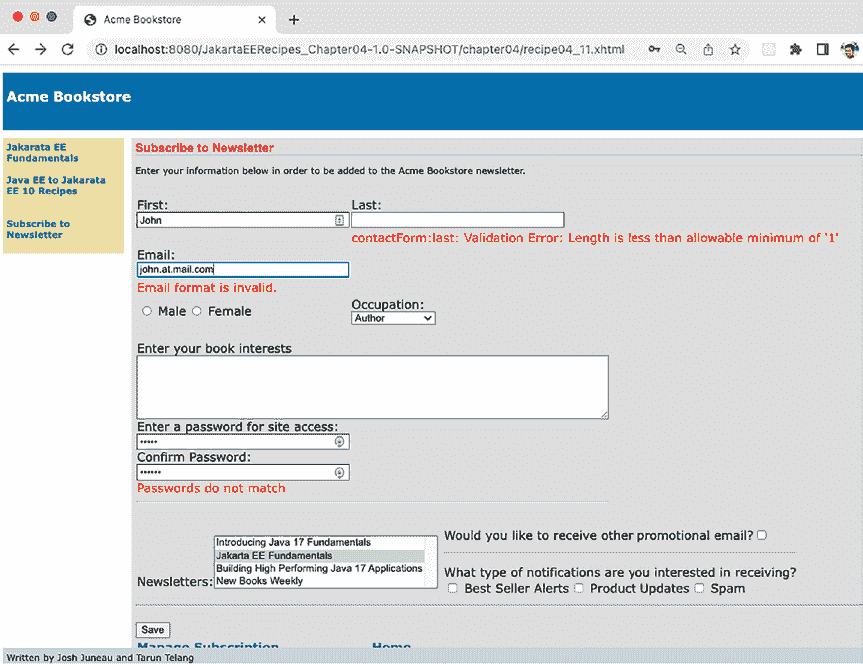

第 4 章 ■ 高级 Jakarta Server Faces

***图 4-11.** 使用`f:ajax`标签进行 Ajax 验证*

在 JSF 2.0 之前的版本中，执行即时验证需要手动编写 JavaScript 代码或使用第三方组件库。`f:ajax`标签随 2.0 版本的发布被添加到 Jakarta Server Faces 工具集中，它带来了使用标准或第三方组件轻松为 Jakarta Server Faces 视图添加即时验证（以及其他异步处理）的能力。`f:ajax`标签可以嵌入到任何 Jakarta Server Faces 输入组件中，以立即增强该组件，为其添加 Ajax 功能。这为开发者带来了诸多好处，因为不再需要手动编写 JavaScript 来执行客户端验证。它还允许验证在服务器端（在 Jakarta Server Faces 控制器类中的 Java 代码内）异步进行，实现了客户端与服务器之间的无缝交互，并向客户端生成即时响应。

其结果是构建出一个丰富的现代 Web 应用程序，其行为方式与原生桌面应用程序非常相似。现在，验证可以在最终用户眼前即时完成，无需为了修复所有可能的问题而多次提交页面。

第 4 章 ■ 高级 Jakarta Server Faces


要使用 `f:ajax` 标签，只需将其嵌入到任何 Jakarta Server Faces 组件中即可。`f:ajax` 可以指定多个属性，如表 4-18 所述。如果未指定某个属性，则会使用其默认值。`f:ajax` 标签完全可以不包含任何属性，如果这样做，则嵌入该 `f:ajax` 标签的组件的默认属性值将生效。

***表 4-18.** f:ajax 标签属性*

**属性**

**描述**

`delay`

以毫秒为单位指定的值，对应于从客户端队列向服务器发送 Ajax 请求之间的延迟时间。可以指定值 `none` 来禁用此功能

`disabled`

指示标签状态的布尔值。值为 `true` 表示不应渲染 Ajax 行为，值为 `false` 表示应渲染 Ajax 行为。默认值为 `false`

`event`

一个字符串，用于标识 Ajax 动作应应用的事件类型。如果指定，它必须是受支持的组件事件之一。默认值是触发 Ajax 行为的父组件的 Ajax 请求的事件。对于 `ActionSource` 组件，默认事件是 `action`；对于 `EditableValueHolder` 组件，默认事件是 `valueChange`

`execute`

一个集合，用于标识要在服务器上执行的一组组件。此属性的值可以指定为以空格分隔的组件标识符字符串，也可以指定为 `ValueExpression`（Jakarta 表达式语言）。默认值为 `@this`，即 Ajax 行为的父组件

`immediate`

布尔值，指示是否在生命周期的早期处理输入值。如果为 `true`，则这些值将被处理，并且它们对应的事件将在“应用请求值”阶段广播；否则，事件将在“调用应用程序”阶段广播

`listener`

当 `AjaxBehaviorEvent` 已为监听器广播时，所调用的监听器方法的名称

`onevent`

用于处理 UI 事件的 JavaScript 函数名称

`onerror`

用于处理错误的 JavaScript 函数名称

`resetValues`

如果为 `true`，则此特定的 Ajax 事务将重置这些值

`render`

一个集合，用于标识 Ajax 行为完成时要在客户端渲染的组件。此属性的值可以指定为以空格分隔的组件标识符字符串，也可以指定为 `ValueExpression`（Jakarta 表达式语言）。默认值为 `@none`，表示 Ajax 行为完成时不渲染任何组件

`f:ajax` 标签的 `execute` 和 `render` 属性可以指定多个关键字，分别用于指示哪些组件在服务器上为 Ajax 行为执行，或者哪些组件在 Ajax 行为完成后重新渲染。表 4-19 列出了可以为这两个属性指定的值。

第 4 章 ■ 高级 Jakarta Server Faces

***表 4-19.** f:ajax 标签 execute 和 render 属性值*

**属性值**

**描述**

`@all`

所有组件标识符都在服务器上执行，并且一旦 Ajax 行为完成，所有组件标识符都会重新渲染

`@form`

包含该组件的表单

`@none`

无组件标识符（`render` 属性的默认值）

`@this`

Ajax 行为的父组件

`@child(n)`

基础组件的第 n 个子组件

`@composite`

基础组件最近的复合组件祖先

`@id(id)`

基础组件下所有具有指定 id 的组件后代

`@namingcontainer`

基础组件最近的 `NamingContainer` 祖先

`@next`

视图中基础组件之后的下一个组件

`@parent`

基础组件的父组件

`@previous`

基础组件的前一个组件

`@root`

`UIViewRoot`

组件 ID

以空格分隔的单个组件标识符列表


解析为字符串标识符集合的 Jakarta 表达式语言表达式

在本配方的示例中，一个 `f:ajax` 标签被嵌入到表单内的许多输入组件中。这些组件都已实现 Ajax 化，即作为组件值输入的数据现在将能够使用与 JSF 关联的 JavaScript 资源库进行处理。在幕后，JavaScript 资源库的 `jsf.ajax.request()` 方法会收集每个已 Ajax 化的组件的数据，并将请求发送到 Java Server Faces 生命周期。实际上，数据被发送到控制器类属性，而无需以传统方式提交页面。

请注意，`event` 属性指定了一个将用于触发 Ajax 行为的 JavaScript 事件。可以为 `event` 属性指定的 JavaScript 事件与父组件标签上可用的 JavaScript 事件属性相同，但 `on` 前缀已被移除。例如，如果希望在 `inputText` 组件失去焦点时对其执行 Ajax 行为，则应为 `f:ajax` 的 `event` 属性指定 `blur`，而不是 `onBlur`。将此概念应用于示例，当用户离开名字或姓氏字段时，将立即使用它们关联的 `f:validate` 标签进行验证，因为 `f:ajax` 标签已嵌入其中，并且 `f:ajax` 标签上的 `event` 被指定为 `blur`。当 Ajax 行为（本例中为验证）完成时，在 `f:ajax` 的 `render` 属性中指定标识符的组件将被重新渲染。对于名字和姓氏的 `inputText` 字段，它们关联的消息组件将被重新渲染，显示验证过程中可能发生的任何错误。

**使用动作监听器**

可以将动作监听器绑定到 `f:ajax` 标签，以便在触发动作时调用监听器方法。为什么要绑定动作监听器？这样做有很多原因。例如，假设您想捕获用户正在文本字段中输入的文本。您可以通过将控制器类中的动作方法绑定到 `inputText` 字段对应 `f:ajax` 标签的 `listener` 属性，然后从动作方法中的 `AjaxBehaviorEvent` 对象获取当前组件的值来实现。例如，假设您想测试密码的复杂性，并显示一条相应的消息，指示密码是否足够强。

第 4 章 ■ 高级 Jakarta Server Faces

密码的 `inputSecret` 组件可以修改为包含一个 `f:ajax` 标签，其 `event` 指定为 `keyup`，`listener` 指定为 `#{ch3ContactController.passwordStrength}`，如下所示：在视图中：

```xhtml
<h:outputLabel for="password" value="输入站点访问密码："/>
<h:inputSecret id="password" size="40"
               value="#{ch3ContactController.current.password}">
    <f:validateRequired/>
    <f:ajax event="keyup" listener="#{ch3ContactController.passwordStrength}"
            render="passwordStrengthMessage"/>
</h:inputSecret>
...
```

在控制器中：

```java
...
private String passwordStrengthMessage;
...
public void passwordStrength(AjaxBehaviorEvent event){
    UIInput password = (UIInput) event.getComponent();
    boolean isStrong = false;
    String input = password.getValue().toString();
    if(input.matches("((?=.*\\d)(?=.*[a-z])(?=.*[A-Z]).{6,})")) {
        isStrong = true;
    }
    if(isStrong == true){
        setPasswordStrengthMessage("密码强度高");
    } else {
        setPasswordStrengthMessage("密码强度弱");
    }
}
```

此示例中的代码将创建一个监听器事件，当用户输入值时，该事件会检查当前输入是否满足安全密码的给定标准。然后会向用户显示一条消息，告知他们密码是否安全。

使用 `f:ajax` 标签可以轻松地向 Jakarta Server Faces 组件添加 Ajax 行为。在 `f:ajax` 标签出现之前，通常使用特殊的第三方 JavaScript 库在 Jakarta Server Faces 视图中实现类似的行为。`f:ajax` 带来的好处是允许开发者在选择使用 Ajax 行为时，无需编写一行 JavaScript 代码。

**4-13. 无需页面重载即可提交页面**

**问题**

您希望使输入表单能够提交输入字段进行处理，而无需重新加载页面。本质上，您希望您的 Web 应用程序输入表单的反应更像桌面应用程序，而不是在页面之间导航来处理数据。

第 4 章 ■ 高级 Jakarta Server Faces

**解决方案**

在视图的命令组件中嵌入一个 `<f:ajax/>` 标签，以便在不提交页面的情况下调用 CDI 控制器类动作。启用 `f:ajax` 来更新视图中的消息组件，以便可以显示处理产生的任何错误或成功消息。在此示例中，Acme Bookstore 的新闻通讯订阅页面将被更改，以便使用 Ajax 提交表单，并且 `commandButton` 组件在不以传统方式提交表单的情况下进行处理。以下摘录自配方 `recipe03_06.xhtml` 的新闻通讯订阅表单源，演示了如何向表单中的动作组件添加 Ajax 功能：

```xhtml
...
<h:commandButton id="contactSubmit" action="#{ch3ContactController.subscribe}" value="保存">
    <f:ajax event="action" execute="@form" render="@all"/>
</h:commandButton>
<h:panelGrid columns="2" width="400px;">
...
```

当按钮或链接被点击时，JavaScript 将在后台用于处理请求，以便立即显示结果，无需刷新页面。

**工作原理**

传统上，Web 应用程序的用户体验遵循“点击、等待、页面刷新”的模式。虽然这种体验并非特别糟糕，但它不如原生桌面应用程序中常见的即时响应那样好。在 Web 应用程序中使用 Ajax 有助于创建更统一的用户体验，使 Web 应用程序能够像原生桌面应用程序一样产生“即时”响应。字段验证（在配方 4-13 中介绍）是即时反馈的绝佳候选，但即时响应效果好的另一个领域是表单提交时。

`f:ajax` 标签可以嵌入到动作组件中，以便在幕后使用 JavaScript 调用相应的动作方法。`f:ajax` 标签包含许多属性，涵盖在表 4-18 中（参见配方 4-13），这些属性可用于在指定事件发生时调用 Ajax 行为，并在该 Ajax 行为完成时重新渲染视图组件。请参考表 4-19 查看可以为 `f:ajax` 标签的 `execute` 和 `render` 属性指定的值。


在本示例中，标识符为 `contactSubmit` 的 `commandButton` 组件包含一个 `f:ajax` 标签，该标签将 `event` 属性指定为 `action`，`execute` 属性指定为 `@form`，`render` 属性指定为 `@all`。这意味着当按钮被调用时，`ch3ContactController.subscribe` 方法将使用 JavaScript 异步调用，并将表单中的所有输入组件值发送到服务器（控制器类）进行处理。当 Ajax 行为（`subscribe` 方法）完成时，视图中的所有组件都将被重新渲染。通过重新渲染视图中的所有组件，这些消息组件可以显示因验证失败或表单提交成功而排队的任何消息。在 Ajax 行为期间，可以只处理或渲染指定的组件；要了解更多相关信息，请参阅配方 4-15。

■ **注意** 当 `f:ajax` 标签嵌入在 `UICommand` 组件中时，`event` 属性的默认值为 `action`。然而，在本示例的代码中为了保持一致性，明确指定了该属性。

第 4 章 ■ 高级 Jakarta Server Faces

4-14. 进行部分页面更新

问题

您希望仅使用 Ajax 事件执行页面的一部分，然后在 Ajax 行为完成时渲染相应部分的组件。

解决方案

使用 `f:ajax` 标签为您希望执行并在 Ajax 行为完成时渲染的组件添加 Ajax 功能。对于 `f:ajax` 标签的 `execute` 属性，仅指定与这些组件对应的组件标识符，或 `@form`、`@this` 或其他 `execute` 关键字。同样，在 `render` 属性中仅指定相应消息组件的组件标识符。

假设 Acme 书店希望执行新闻简报订阅表单值的提交，并且仅在提交完成时更新表单的全局消息。以下 `commandButton` 组件将仅执行其所在的表单以及标识符为 `newsletterSubscriptionMsgs` 的组件：

...

<h:commandButton id="contactSubmit" action="#{ch3ContactController.subscribe}" value="保存">

<f:ajax event="action" execute="@form" render="newsletterSubscriptionMsgs"/>

</h:commandButton>

...

当按钮被点击时，当前表单组件值将随请求一起被处理，并且 `ContactController` 控制器类的 `subscribe()` 方法将被调用。一旦 `subscribe()` 方法完成，表单中包含标识符 `newsletterSubscriptionMsgs` 的组件（在本例中是一个消息组件）将被重新渲染。

■ **注意** 对于 Acme 书店的新闻简报订阅表单，在完成时进行部分页面渲染是一个坏主意。这是因为如果表单中的值未正确验证，表单将永远不会被提交。在这种情况下，如果某些表单值未正确验证，那么当点击保存按钮时页面上将不会显示任何内容，因为 `subscribe` 方法永远不会被调用。

如果 `f:ajax` 标签的 `render` 属性设置为 `@all`，那么所有验证失败的组件都会显示相应的错误消息。这个例子应该能说明，为了达到您想要的结果，处理页面适当的部分是多么重要。

工作原理

`f:ajax` 标签使得执行部分页面更新变得简单。为此，请为 `f:ajax` 的 `execute` 属性指定您希望执行的组件的标识符。如本配方示例中所述，假设您只想执行页面的一部分，而不是给定页面上的所有组件。您可以通过识别视图中希望执行的组件，将它们指定在 `f:ajax` 的 `execute` 属性中，然后在 Ajax 行为完成时渲染相应的消息组件来实现。如果 `f:ajax` 的 `execute` 属性未指定任何内容，则 `f:ajax` 标签必须嵌入在一个组件内部，在这种情况下，父组件将被执行。这就是 `f:ajax` 的 `execute` 属性的默认行为。在示例中，`f:ajax` 标签的 `execute` 属性指定了 `@form` 关键字，而不是特定的组件 ID。如前所述，可以为 `f:ajax` 标签的 `execute` 和 `render` 属性指定多个关键字。这些关键字列在表 4-19 中，该表描述了 `@form` 关键字表示当 Ajax 行为发生时，与给定 `f:ajax` 标签位于同一表单中的所有组件都将被执行。因此，在本示例中，当按钮被点击时，新闻简报订阅表单中的所有字段都将被发送到控制器类进行处理。

`render` 属性也是如此，一旦 Ajax 行为完成，为 `f:ajax` 标签的 `render` 属性指定的任何组件都将被重新渲染。因此，如果由于 `f:ajax` 方法调用的结果，在处理组件时发生验证，则可以在验证失败后在页面上显示相应的验证失败消息。任何组件都可以被重新渲染，并且可以为 `execute` 属性指定的相同关键字也可以用于 `render` 属性。在示例中，一旦 Ajax 行为完成，`newsletterSubscriptionMsgs` 组件就会被渲染。

4-15. 将 Ajax 功能应用于一组组件

问题

您希望将 Ajax 功能应用于一组输入组件，而不是分别应用于每个组件。

解决方案

将您希望应用 Ajax 功能的任何组件包含在一个 `f:ajax` 标签内。`f:ajax` 标签可以是一个或多个 Jakarta Server Faces 组件的父标签，在这种情况下，每个子组件都会继承给定的 Ajax 行为。将 Ajax 功能应用于多个组件的操作在以下代码清单中进行了演示。在以下示例摘录中，Acme 书店应用程序的新闻简报订阅视图进行了调整，使得每个包含验证器的 `inputText` 组件都被一个单独的 `f:ajax` 标签包围。鉴于每个 `inputText` 组件都包含在同一个 `f:ajax` 标签内，`f:ajax` 的 `render` 属性已被设置为指定组中每个相应 `inputText` 字段的消息组件：

<ui:define name="content">

<h:form id="contactForm">

<h1>订阅新闻简报</h1>

<p>

<h:outputText id="newsletterSubscriptionDesc"

value="#{ch3ContactController.newsletterDescription}"/>

</p>

<br/>

<h:messages id="newsletterSubscriptionMsgs" globalOnly="true" errorStyle="color: red" infoStyle="color: green"/>

<br/>

<f:ajax event="blur" render="firstError lastError emailError genderError

passwordError passwordConfirmError">

<h:panelGrid columns="2" bgcolor="" border="0">

<h:panelGroup>

<h:outputLabel for="first" value="名: "/>

第 4 章 ■ 高级 Jakarta Server Faces

<h:inputText id="first" size="40" value="#{ch3ContactController.current.

first}">

<f:validateLength minimum="1" maximum="40"/>

</h:inputText>

</h:panelGroup>

<h:panelGroup>

<h:outputLabel for="last" value="姓: "/>

<h:inputText id="last" size="40" value="#{ch3ContactController.

current.last}">

<f:validateLength minimum="1" maximum="40"/>

</h:inputText>


</h:panelGroup>

<h:message id="firstError"

for="first"

errorStyle="color:red"/>

<h:message id="lastError"

for="last"

errorStyle="color:red"/>

<h:panelGroup>

<h:outputLabel for="email" value="电子邮件："/>

<h:inputText id="email" size="40" value="#{ch3ContactController.current.

email}">

</h:inputText>

</h:panelGroup>

<h:panelGroup/>

<h:message id="emailError"

for="email"

errorStyle="color:red"/>

<h:panelGroup/>

<h:selectOneRadio title="性别" id="gender" value="#{ch3ContactController.

current.gender}">

<f:selectItem itemValue="M" itemLabel="男"/>

<f:selectItem itemValue="F" itemLabel="女"/>

</h:selectOneRadio>

<h:panelGroup>

<h:outputLabel for="occupation" value="职业："/>

<h:selectOneMenu id="occupation" value="#{ch3ContactController.current.

occupation}">

<f:selectItems value="#{ch3ContactController.occupationList}"/>

</h:selectOneMenu>

</h:panelGroup>

<h:message id="genderError"

for="gender"

errorStyle="color:red"/>

</h:panelGrid>

<br/>

<h:outputLabel for="description" value="输入您感兴趣的书籍"/>

<br/>

<h:inputTextarea id="description" rows="5" cols="75"

value="#{ch3ContactController.current.description}"/>

<br/>

第 4 章 ■ 高级 Jakarta Server Faces

<h:panelGrid columns="2">

<h:outputLabel for="password" value="输入站点访问密码："/>

<h:inputSecret id="password" size="40" value="#{ch3ContactController.

current.password}">

<f:validateRequired/>

<f:ajax event="keyup" listener="#{ch3ContactController.

passwordStrength}" render="passwordStrengthMessage"/>

</h:inputSecret>

<h:outputLabel for="passwordConfirm" value="确认密码："/>

<h:inputSecret id="passwordConfirm" size="40" value="#{ch3ContactController.

passwordConfirm}"

validator="#{ch3ContactController.validatePassword}">

</h:inputSecret>

</h:panelGrid>

<h:panelGroup>

<h:outputText id="passwordStrengthMessage" value="#{ch3ContactController.

passwordStrengthMessage}"/>

<h:message id="passwordError"

for="password"

style="color:red"/>

</h:panelGroup>

<br/>

<h:message id="passwordConfirmError"

for="passwordConfirm"

style="color:red"/>

<br/>

<hr/>

<br/>

<h:panelGrid columns="3">

<h:panelGroup>

<h:outputLabel for="newsletterList" value="新闻通讯：" style=" "/>

<h:selectManyListbox id="newsletterList" value="#{ch3ContactController.

current.newsletterList}">

<f:selectItems value="#{ch3ContactController.newsletterList}"/>

</h:selectManyListbox>

</h:panelGroup>

<h:panelGroup/>

<h:panelGroup>

<h:panelGrid columns="1">

<h:panelGroup>

<h:outputLabel for="notifyme" value="您是否希望接收

其他促销邮件？"/>

<h:selectBooleanCheckbox id="notifyme"

value="#{ch3ContactController.current.receiveNotifications}"/>

</h:panelGroup>

<h:panelGroup/>

<hr/>

<h:panelGroup/>

<h:panelGroup>

<h:outputLabel for="notificationTypes" value="您对接收哪种类型的

通知感兴趣？"/>

<br/>

第 4 章 ■ 高级 Jakarta Server Faces

<h:selectManyCheckbox id="notifyTypes"

value="#{ch3ContactController.current.notificationType}">

<f:selectItems value="#{ch3ContactController.

notificationTypes}"/>

</h:selectManyCheckbox>

</h:panelGroup>

</h:panelGrid>

</h:panelGroup>

</h:panelGrid>

<hr/>

<br/>

</f:ajax>

<h:commandButton id="contactSubmit" action="#{ch3ContactController.subscribe}"

value="保存">

<f:ajax event="action" execute="@form" render="@all"/>

</h:commandButton>

<h:panelGrid columns="2" width="400px;">

<h:commandLink id="manageAccount" action="#{ch3ContactController.manage}"

value="管理订阅">

<f:ajax event="action" execute="@this" render="@all"/>

</h:commandLink>

<h:outputLink id="homeLink" value="home.xhtml">首页</h:outputLink>

</h:panelGrid>

</h:form>

</ui:define>

当页面被渲染时，每个组件将根据其关联的验证规则独立响应。

也就是说，如果某个组件的验证失败，则只会显示与该验证失败的组件相对应的消息组件，尽管在 `f:ajax` 的 `render` 属性中指定的每个组件都会被重新渲染。


■ **注意**：由于指定了全局的 `f:ajax` 标签，密码组件现在可以执行两个 Ajax 请求。其中一个用于验证字段是否为空，另一个用于确保给定的密码字符串强度足够。

工作原理

将多个组件分组到同一个 Ajax 行为下有其优势。例如，如果出于某种原因需要调整该行为，只需对 Ajax 行为进行一次修改，组内的所有组件即可受益于这一调整。然而，`f:ajax` 标签足够智能，能够使每个组件仍然利用各自独立的功能（如验证或操作），因此每个组件仍可拥有自定义的 Ajax 行为。要将组件分组到单个 `f:ajax` 标签下，它们必须作为 `f:ajax` 标签的子元素添加到视图中。也就是说，所有子组件都必须包含在 `f:ajax` 的起始和结束标签之间。所有被包含的组件随后将使用 Ajax，通过 JavaScript 以异步方式向服务器发送请求。

在本示例中，新闻简报订阅视图中的几个 `inputText` 组件被封装在一个 `f:ajax` 标签内，以便在它们失去焦点时，使用服务器端 Bean 验证对其值进行验证。用于分组组件的 `f:ajax` 标签的 `event` 属性设置为 `blur`，其 `render` 属性包含基于字符串的标识符，这些标识符对应于组内每个组件所对应的消息组件。当 Ajax 行为完成时，使用空格分隔的组件 ID 列表重新渲染每个消息组件，并显示因验证而产生的任何错误。

4-16. Ajax 功能的自定义处理

问题

您希望为应用程序视图中的 Jakarta Server Faces 组件自定义 Ajax 处理过程。

解决方案

编写用于处理请求的 JavaScript，并利用 `jsf.ajax.request()` 函数以及 Jakarta Server Faces 组件的标准 JavaScript 事件处理属性之一。

以下示例是 Acme Bookstore 应用程序中新闻简报订阅页面的 Jakarta Server Faces 视图。之前用于验证 `inputText` 字段（配方 3-1）的所有 `f:ajax` 标签已被移除，每个 `inputText` 组件的 `onblur` 属性被设置为使用 `jsf.ajax.request()` 方法，以实现组件的 Ajax 化。以下摘录自名为 `recipe04_15.xhtml` 的视图，代表更新后的新闻简报订阅 Jakarta Server Faces 视图：

...

<h:outputScript name="jsf.js" library="jakarta.faces" target="head"/>

<h1>订阅新闻简报</h1>

<p>

<h:outputText id="newsletterSubscriptionDesc"

value="#{ch3ContactController.

newsletterDescription}"/>

</p>

<br/>

<h:messages id="newsletterSubscriptionMsgs" globalOnly="true"

errorStyle="color: red" infoStyle="color: green"/>

<br/>

<h:panelGrid columns="2" bgcolor="" border="0">

<h:panelGroup>

<h:outputLabel for="first" value="名："/>

<h:inputText id="first" size="40" value="#{ch3ContactController.

current.first}"

onblur="jsf.ajax.request(this, event, {execute:

'first', render: 'firstError'});

return false;">

<f:validateLength minimum="1" maximum="40"/>

</h:inputText>

</h:panelGroup>

<h:panelGroup>

<h:outputLabel for="last" value="姓："/>

<h:inputText id="last" size="40" value="#{ch3ContactController.

current.last}"

onblur="jsf.ajax.request(this, event, {execute:

'last', render: 'lastError'});

return false;">

<f:validateLength minimum="1" maximum="40"/>

</h:inputText>

</h:panelGroup>

<h:message id="firstError"

for="first"

errorStyle="color:red"/>

<h:message id="lastError"

for="last"

errorStyle="color:red"/>

<h:panelGroup>

<h:outputLabel for="email" value="邮箱："/>

<h:inputText id="email" size="40" value="#{ch3ContactController.

current.email}"

onblur="jsf.ajax.request(this, event, {execute:

'email', render: 'emailError'});

return false;"/>

</h:panelGroup>

<h:panelGroup/>

<h:message id="emailError"

for="email"

errorStyle="color:red"/>

<h:panelGroup/>

...

■ **注意**：`<h:panelGroup/>` 标签用于在网格中添加一个占位面板组，以保持间距。

使用此技术，为 `onblur` 事件指定 Ajax 行为的 `inputText` 组件将在失去焦点时异步验证其值。如果需要使用任何自定义 JavaScript 代码，可以将其添加到对 `jsf.ajax.request()` 的同一内联 JavaScript 调用中。

■ **注意**：无法使用 `jsf.ajax.request()` 技术调用 CDI 控制器的方法，因此无法通过 Ajax 请求显式调用监听器。

工作原理

JavaScript API 方法 `jsf.ajax.request()` 可以被 Facelets 应用程序直接访问，使开发者比使用 `f:ajax` 标签拥有更多的控制权。在后台，`f:ajax` 标签会被转换为对 `jsf.ajax.request()` 的调用，并通过标签的属性传递参数。要使用此技术，必须在视图中包含 `jsf.js` 库。应在视图中包含一个 Jakarta Server Faces 的 `outputScript` 标签，指定 `jsf.js` 作为脚本名称，`jakarta.faces` 作为库。本示例中的 `jsf.js` 脚本将放置在视图的 `<head>` 部分，这是通过为 `outputScript` 标签的 `target` 属性指定 `head` 来实现的。以下示例摘录展示了该标签应如何编写：

<h:outputScript name="jsf.js" library="jakarta.faces" target="head"/>

■ **注意**：为避免嵌套 ID，建议在手动使用 `jsf.ajax.request()` 时，为 `h:form` 属性指定 `prependId="false"`。例如，表单标签应如下所示：

<h:form prependId="false">

`jsf.ajax.request()` 方法可以内联调用，如本示例所示，并且可以从给定组件的任何 JavaScript 事件属性中调用。调用该 JavaScript 方法的格式如下：

jsf.ajax.request(component, event,{execute:'id or keyword', render:'id or keyword'});

通常，当使用内联调用发出请求时，第一个参数指定为 `this` 关键字，表示应传递当前组件。`event` 关键字作为第二个参数传递，它同时传递了当前发生在组件上的事件。最后，传递一个名称-值对映射，分别指定 `execute` 和 `render` 属性以及组件标识符或关键字，这些标识符或关键字分别表示执行完成后应执行和渲染的内容。

■ **注意**：您还可以通过指定 `@ResourceDependency` 注解，从控制器类中使用 `jsf.ajax.request` 方法，如下所示：

@ResourceDependency(name="jsf.js" library="jakarta.faces" target="head")

以下代码可通过在浏览器中输入 URL `http://localhost:8080/JakartaEERecipes_Chapter04-1.0-SNAPSHOT/chapter04/recipe04_15.xhtml` 来运行。本配方的最终输出应如图 4-12 所示。

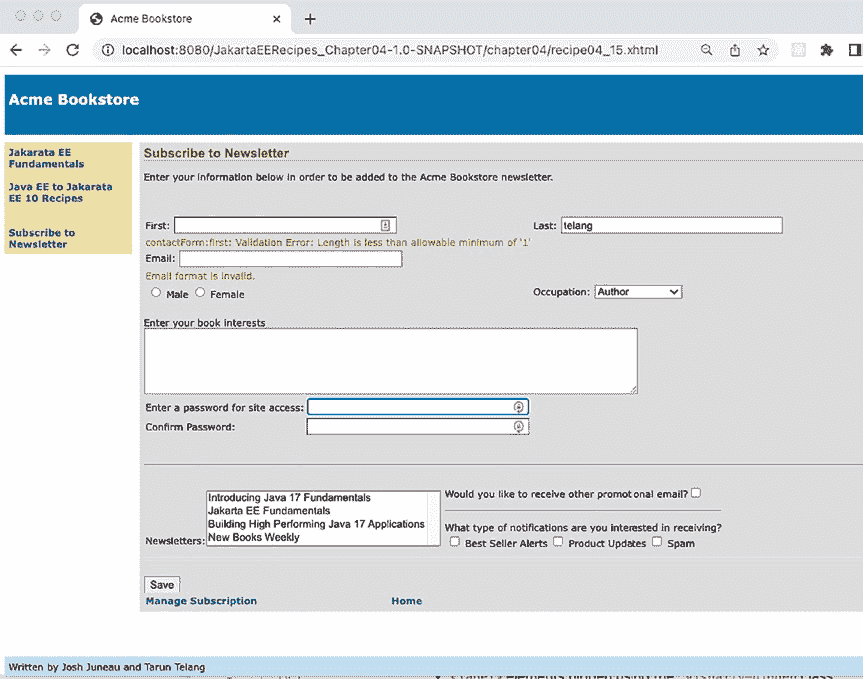

***图 4-12.** 配方输出*

4-17. 监听系统级事件

问题

您希望在应用程序中发生系统级事件时调用一个方法。

解决方案


通过实现 `SystemEventListener` 接口并重写 `processEvent(SystemEvent event)` 和 `isListenerForSource(Object source)` 方法，创建一个系统事件监听器类。根据需求实现这些方法以执行所需的事件处理。以下代码展示了一个名为 `BookstoreAppListener` 的类，它在应用程序启动或关闭时被调用：

```java
public class BookstoreAppListener implements SystemEventListener {

    @Override
    public void processEvent(SystemEvent event) throws AbortProcessingException {
        if (event instanceof PostConstructApplicationEvent) {
            System.out.println("应用程序已构建完成...");
        }
        if (event instanceof PreDestroyApplicationEvent) {
            System.out.println("应用程序正在销毁...");
        }
    }

    @Override
    public boolean isListenerForSource(Object source) {
        return (source instanceof Application);
    }
}
```

接下来，必须在 `faces-config.xml` 文件中注册系统事件监听器。以下摘录来自 Acme Bookstore 应用程序的 `faces-config.xml` 文件：

```xml
...
<application>
    <system-event-listener>
        <system-event-listener-class>
            org.jakartaeerecipes.chapter03.recipe03_10.BookstoreAppListener
        </system-event-listener-class>
        <system-event-class>
            jakarta.faces.event.PostConstructApplicationEvent
        </system-event-class>
    </system-event-listener>
    <system-event-listener>
        <system-event-listener-class>
            org.jakartaeerecipes.chapter03.recipe03_10.BookstoreAppListener
        </system-event-listener-class>
        <system-event-class>
            jakarta.faces.event.PreDestroyApplicationEvent
        </system-event-class>
    </system-event-listener>
</application>
...
```

当应用程序启动时，服务器日志中会显示消息“应用程序已构建完成...”。当应用程序关闭时，服务器日志中会显示消息“应用程序正在销毁...”。

**工作原理**

在应用程序启动时执行某些任务的能力有时非常有用。例如，假设你希望在每次应用程序启动时向应用程序管理员发送一封电子邮件。你可以通过在一个实现 `SystemEventListener` 接口的类中执行发送电子邮件的任务来实现这一点。实现 `SystemEventListener` 的类必须重写两个方法：`processEvent(SystemEvent event)` 和 `isListenerForSource(Object source)`。`processEvent()` 方法是实际执行操作的地方，因为你的自定义代码应放置在该方法中。

每当系统事件发生时，`processEvent()` 方法就会被调用。在此方法中，你需要执行检查以确定发生了哪种类型的事件，从而只处理相关的事件。要确定发生的事件，请对 `SystemEvent` 对象执行 `instanceof()` 检查。在示例中，使用了两个 `if` 语句来确定发生的事件类型，并为每种事件打印不同的消息。如果事件类型是 `PostConstructApplicationEvent`，则表示应用程序正在构建。否则，如果事件类型是 `PreDestroyApplicationEvent`，则表示应用程序即将销毁。`PostConstructApplicationEvent` 事件在应用程序构建完成后被调用，而 `PreDestroyApplicationEvent` 则在应用程序销毁之前被调用。

在 `SystemEventListener` 类中必须重写的另一个方法是 `isListenerForSource()`。如果此监听器实例对接收来自 `source` 参数所引用实例的事件感兴趣，则此方法必须返回 `true`。由于示例类是为监听应用程序的系统事件而构建的，因此如果 `source` 参数是 `Application` 的实例，则返回 `true`。

编写完系统事件监听器类后，需要将其注册到


应用。在示例中，你需要同时监听 `PostConstructApplicationEvent` 和 `PreDestroyApplicationEvent`，因此需要在 `faces-config.xml` 文件中为每个事件添加一个 `system-event-listener` 元素。在 `system-event-listener` 元素内部，通过 `system-event-listener-class` 元素指定事件监听器类的名称，并通过 `system-event-class` 元素指定事件的名称。

4-18. 监听组件事件

问题

你想在指定的组件事件发生时调用一个监听器方法。例如，你想监听一个组件的渲染事件。

解决方案

在你想要监听事件的组件内嵌入一个 `f:event` 标签。`f:event` 标签允许组件根据当前的组件状态调用控制器类的监听器方法。例如，当一个组件正在被渲染或验证时，可以调用一个指定的监听器方法。在本配方的示例中，一个 `outputText` 组件被添加到 Acme Bookstore 应用的图书视图中，用于指明当前图书是否在用户的购物车中。当 `outputText` 组件被渲染时，会调用一个组件监听器，检查购物车的当前状态，看图书是否在其中。如果在购物车中，`outputText` 组件将渲染一条消息说明这一点；如果不在，`outputText` 组件将渲染一条消息说明它不在购物车中。

以下摘录来自一个名为 `recipe04_17.xhtml` 的视图，它是该应用图书视图的一个衍生版本。它演示了在组件中使用 `f:event` 标签。请注意，`outputText` 组件不包含 `value` 属性，因为该值将在事件监听器中设置：

...

<h:outputText id="isInCart" style="font-style: italic;">

<f:event type="preRenderComponent" listener="#{ch3CartController.isBookInCart}"/>

</h:outputText>

...

第 4 章 ■ 高级 Jakarta Server Faces

`CartController` 类包含一个名为 `isBookInCart(ComponentSystemEvent)` 的方法。视图中的 `f:event` 标签通过 `CartController` 的控制器名称 `ch3CartController` 引用此监听器方法。该监听器方法负责构造将在 `outputText` 组件中显示的文本：

public void isBookInCart(ComponentSystemEvent event) {

UIOutput output = (UIOutput) event.getComponent();

if (cart != null) {

if (searchCart(authorController.getCurrentBook().getTitle()) > 0) {

output.setValue("This book is currently in your cart.");

} else {

output.setValue("This book is not in your cart.");

}

} else {

output.setValue("This book is not in your cart.");

}

}

工作原理

Jakarta Server Faces 应用中发生的一切都由应用生命周期控制。

作为生命周期的一部分，Jakarta Server Faces 组件在其整个生命周期中会经历不同的阶段。可以向 Jakarta Server Faces 组件添加监听器，以便在某个阶段开始或结束时执行不同的任务。创建组件监听器需要解决两个问题：嵌入在组件中的标签（你的监听器将为其执行任务）以及监听器方法本身。要向组件添加监听器，应将 `f:event` 标签嵌入到将被检查的组件的开始和结束标签之间。`f:event` 标签包含几个属性，但只有两个是必须使用的：`type` 和 `listener`。`type` 属性指定要监听的事件类型，`listener` 属性指定当该事件发生时要调用的控制器类监听器方法。可以为 `name` 属性指定的有效值包括 `preRenderComponent`、`postAddToView`、`preValidate` 和 `postValidate`。除了这些事件值之外，任何扩展了 `jakarta.faces.event.ComponentSystemEvent` 的 Java 类也可以为 `name` 属性指定。

监听器方法必须接受一个 `ComponentSystemEvent` 对象。在示例中，监听器检查购物车是否为空，如果为空，则会为 `outputText` 组件的 `value` 设置一条指示购物车为空的消息。否则，如果购物车不为空，该方法会遍历购物车中的图书列表，查看当前选中的图书是否在购物车中。然后，一条指示图书是否在购物车中的消息会被添加到 `outputText` 组件的 `value` 中。通过监听器，组件的实际值被修改了。这种技术可以以多种方式用于修改组件以适应特定情况的需求。

你可以通过在浏览器中访问以下 URL 来运行以下代码：`http://localhost:8080/JakartaEERecipes_Chapter04-1.0-SNAPSHOT/chapter04/recipe04_16.xhtml`。本配方的最终结果应类似于图 4-13。

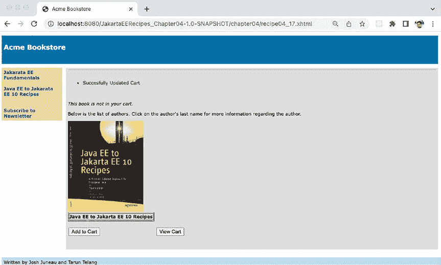

第 4 章 ■ 高级 Jakarta Server Faces

***图 4-13.** 配方 4-17 的输出*

4-19. 开发页面流

问题

你想在应用中开发一个页面流，使这些页面能够相互共享信息。

解决方案

使用 Faces Flow 技术定义一个页面流。该解决方案允许一组定义的视图相互关联，共享一组公共数据，而流外部的视图无法访问流的数据。流还有自己的一套导航逻辑，因此它们几乎就像应用中的一个子程序。为了使应用能够使用 Faces Flow，应在 `faces-config.xml` 文件中添加一个 `<flow-definition>` 部分。该部分可以为空，因为导航逻辑可以放在流的单独配置文件中。以下 `faces-config.xml` 文件演示了如何为应用启用 Faces Flow：

<faces-config version="3.0"

xsi:schemaLocation="https://jakarta.ee/xml/ns/jakartaee

https://jakarta.ee/xml/ns/jakartaee/web-facesconfig_3_0.xsd">

...

第 4 章 ■ 高级 Jakarta Server Faces

<flow-definition>

</flow-definition>

...

</faces-config>

属于某个流的视图应与应用的其他视图分开，并放置到应用 Web 目录根目录下的一个文件夹中。包含流视图的文件夹应命名为与流标识符相同的名称。导航和配置代码包含在位于流视图目录内的一个单独的 XML 配置文件中，该文件命名为 `flowname-flow.xml`，其中 `flowname` 是流标识符。以下配置文件演示了一个由 `exampleFlow` 标识的非常基本的流的配置。关于流配置中可使用的不同元素的更多信息，请参阅“工作原理”部分：

<faces-config version="3.0"

xsi:schemaLocation="https://jakarta.ee/xml/ns/jakartaee

https://jakarta.ee/xml/ns/jakartaee/web-

facesconfig_3_0.xsd">

<flow-definition id="exampleFlow">

</flow-definition>

</faces-config>

属于该流的视图应与流配置文件一起存放在流文件夹内。每个视图都可以访问一个专用于促进该流的控制器类。流共享一个上下文，该上下文在流被访问时开始，在流退出时结束。以下视图演示了一个名为 `exampleFlow` 的流的入口点。此示例视图可以在本书源码的 `recipes04_18.xhtml` 文件中找到：

<ui:composition

template="layout/custom_template_search.xhtml">

<ui:define name="content">

<h:messages globalOnly="true" errorStyle="color: red" infoStyle="color: green"/>

<h:form id="flowForm">

<p>

Faces Flow 示例

</p>

<h:commandButton value="开始流" action="exampleFlow"/>

<h:commandButton value="留在此处" action="stay"/>

</h:form>

</ui:define>

</ui:composition>


接下来，让我们看一个访问专用于流程的控制器类的视图。在下面的视图中，访问了名为 `FlowBean` 的控制器类以调用一个方法，该方法将返回一个隐式导航字符串，将应用程序引导至流程中的下一个视图。请注意，此视图还访问了 `facesContext.application.flowHandler`，我将在“工作原理”部分进一步讨论：

<h:body>

<f:view>

<h:form>

第 4 章 ■ 高级 Jakarta Server Faces

<p>

这是流程的第一个视图。

<br/><br/>

流程 ID: #{facesContext.application.flowHandler.currentFlow.id}

<br/>

<h:commandLink value="跳转到流程中的另一个视图" action="#{flowBean.

navMethod()}"/>

</p>

</h:form>

</f:view>

</h:body>

流程中的每个后续视图也可以访问流程控制器类的资源。最后，我们来看一下包含在 `org.jakartaeerecipes.chapter03.FlowBean` 中的代码，这是专用于该流程的控制器类：

import jakarta.faces.flow.FlowScoped;

import jakarta.inject.Named;

@Named

@FlowScoped("exampleFlow")

public class FlowBean implements java.io.Serializable {

    private String flowValue;

    private String parameter1;

    /**

     * 创建 FlowBean 的新实例

     */

    public FlowBean() {

    }

    /**

     * 初始化流程

     */

    public void initializeIt(){

        System.out.println("初始化流程...");

    }

    /**

     * 结束流程

     */

    public void finalizeIt(){

        System.out.println("结束流程...");

    }

    public String navMethod(){

        return "intermediateFlow";

    }

    public String testMethod(){

        return "intermediate";

    }

    public String endFlow(){

        return "endingFlow";

    }

    /**

     * @return flowValue

     */

第 4 章 ■ 高级 Jakarta Server Faces

    public String getFlowValue() {

        return flowValue;

    }

    /**

     * @param flowValue 要设置的 flowValue

     */

    public void setFlowValue(String flowValue) {

        this.flowValue = flowValue;

    }

    /**

     * @return parameter1

     */

    public String getParameter1() {

        return parameter1;

    }

    /**

     * @param parameter1 要设置的 parameter1

     */

    public void setParameter1(String parameter1) {

        this.parameter1 = parameter1;

    }

}

本解决方案快速概述了在 Jakarta Server Faces 应用程序中创建流程所需的文件。在下一节中，我将更详细地介绍这些特性。

工作原理

自 Web 应用程序诞生以来，会话管理一直是一个难以攻克的难题。Web 流程指的是将一组相互关联的 Web 视图组合在一起，并且这些视图必须能够在流程内的每个视图之间共享信息。许多 Web 框架都试图通过创建不同的解决方案来解决这个问题，以促进跨多个视图的数据共享。通常，会话变量、请求参数和 Cookie 的混合使用被作为一种拼凑式的解决方案。

自 JSF 2.2 以来，采用了一种解决方案来将多个 Jakarta Server Faces 视图相互绑定，使它们能够彼此共享信息。该解决方案被称为 faces 流程；它允许一组相互关联的视图属于一个流程实例，并且信息可以在属于该流程实例的所有视图之间共享。流程包含独立的导航，这些导航仅与流程本身相关，而非整个应用程序。因此，流程导航可以以 XML 格式或通过代码来定义。一个流程包含一个单一的入口点，并且可以从应用程序内的任何位置调用。

定义流程

如本解决方案中所述，使用流程特性的 Jakarta Server Faces 应用程序的 `faces-config.xml` 文件必须包含一个 `<flow-definition>` 部分。`faces-config.xml` 文件的这一部分可以包含特定于应用程序中一个或多个流程的信息。然而，就本解决方案而言，解决方案使用了一个单独的 XML 配置文件来配合流程使用。两种方式都可行；语法略有不同，因为特定于流程的 XML 配置文件使用了一个新的 Jakarta Server Faces 标签库来访问特定于流程的配置标签。

第 4 章 ■ 高级 Jakarta Server Faces

■ **注意** 要了解更多关于使用 `faces-config.xml` 文件进行流程配置的信息，请参考在线文档 ([`eclipse- ee4j.github.io/jakartaee- tutorial/#navigation- model`](https://eclipse-ee4j.github.io/jakartaee-tutorial/#navigation-model))。

即使流程没有使用 `faces-config.xml` 文件来定义流程配置，也必须存在 `<flow-definition>` 部分，以告知 Jakarta Server Faces 运行时应用程序中使用了流程。

特定于流程的配置文件以及所有与流程相关的视图应位于同一文件夹中，该文件夹位于应用程序 Web 目录的根目录下。文件夹的名称应与流程标识符相同。

如解决方案中所述，流程配置文件的命名应为 `flowname-flow.xml`，其中 `flowname` 与流程标识符相同。

流程控制器类

一个流程包含其自己的控制器类，该类使用 `@FlowScoped` 注解进行标注，这与 `@SessionScoped` 不同，因为数据只能被属于该流程的其他视图（ViewNodes）访问。`@FlowScoped` 注解依赖于上下文和依赖注入（CDI），因为 `FlowScoped` 是一个 CDI 作用域，它会使运行时将带有 `@FlowScoped` 注解的类视为处于指定流程的作用域内。`@FlowScoped` bean 维护着一个生命周期，该生命周期随流程实例的开始而开始，随其结束而结束。单个应用程序可以存在多个流程实例，如果用户在一个浏览器标签页中启动一个流程，然后打开另一个标签页，则新标签页中将启动一个新的流程实例。此解决方案解决了围绕会话和允许用户打开多个标签页的标准浏览器的许多遗留问题。为了维护独立的流程实例，Jakarta Server Faces 使用 `ClientId` 来区分多个实例。

每个流程可以包含一个初始化器和一个终结器（即，分别在进入流程时调用的方法和退出流程时调用的方法）。要声明初始化器，请在流程配置 `<flow-definition>` 内指定一个名为 `<initializer>` 的子元素。初始化器元素可以是一个 EL 表达式，用于声明控制器类的初始化方法，如下所示：

...

<initializer>#{flowBean.initializeIt}></initializer>

...

类似地，可以在流程配置中指定一个 `<finalizer>` 元素，以定义退出流程时将调用的方法。以下演示了如何将终结器设置为声明控制器类终结器方法的 EL 表达式：

...

<finalizer>#{flowBean.finalizeIt}></finalizer>

...

流程可以包含仅能通过流程节点访问的方法调用和变量值。这些方法和变量应放置在 `FlowScoped` bean 中，其使用方式与标准控制器类的方法和变量相同。主要区别在于，在 `FlowScoped` bean 中定义的任何方法或变量仅对单个流程实例可用。

第 4 章 ■ 高级 Jakarta Server Faces

导航流程视图节点


流程包含其自身的导航规则，这些规则可以在 `faces-config.xml` 文件或单独的流程配置文件中定义。这些规则可以很简单，实现逐页导航，也可以包含条件逻辑。在导航规则中可以指定一系列元素，这些元素将有助于实现条件导航。表 4-20 列出了这些不同的元素及其功能说明。

***表 4-20.** 流程导航元素*

**元素**

**描述**

view

导航至标准 Jakarta Server Faces 视图

switch

表示一个或多个条件评估为真或假的 EL 表达式。如果为真，则导航至指定的视图节点

flow-return

由流程调用者决定的结果

flow-call

表示对另一个流程的调用；创建一个嵌套流程

method-call

任意方法调用，可调用返回导航结果的方法

以下导航序列是一个包含条件逻辑的流程导航示例，使用了表 4-20 中列出的元素：

<flow-definition>

<start-node>exampleFlow</start-node>

<switch id="startNode">

<navigation-case>

<if>#{flowBean.someCondition}</if>

<from-outcome>newView</from-outcome>

</navigation-case>

</switch>

<view id="oneFlow">

<vdl-document>oneFlow.xhtml</vdl-document>

</view>

<flow-return id="exit">

<navigation-case>

<from-outcome>exitFlow</from-outcome>

</navigation-case>

</flow-return>

<finalizer>#{flowBean.finalizeIt}</finalizer>

</flow-definition>

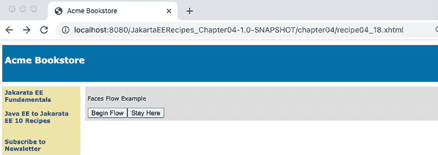

第 4 章 ■ 高级 Jakarta Server Faces

流程表达式语言

流程包含一个名为 `facesFlowScope` 的新表达式语言变量。此变量与当前流程关联，是一个可用于存储流程内任意值的映射。键值对可以通过 Jakarta Server Faces 视图或控制器类中的 Java 代码进行存储和读取。例如，要显示特定映射键的内容，可以使用以下代码：该键的内容为：#{facesFlowScope.myKey}

要执行此代码，请在浏览器中访问以下 URL：

http://localhost:8080/JakartaEERecipes_Chapter04- 1.0- SNAPSHOT/chapter04/recipe04_18.xhtml

页面加载后，浏览器中的输出将类似于图 4-14。

***图 4-14.** 配方 4-18 的输出*

4-20\. 从服务器向所有客户端广播消息

问题

您的组织构建了一个 Jakarta EE 应用程序，并且有多个客户端正在使用它。您希望能够从服务器发送一条消息，并将该消息同时分发给所有客户端。

解决方案

使用 `f:websocket` 标签（该标签随 JSF 2.3 版本发布）向所有正在监听的客户端发送消息。以下示例包含一个客户端视图，其中包含一个文本框、一个发送按钮和一个 `f:websocket` 标签。用户可以在文本框中输入消息并点击发送按钮，输入的消息将被发送到当前正在监听同一通道的所有其他客户端：

<html

>

<head>

</head>

<body>

<ui:composition template="layout/custom_template_search.xhtml">

<ui:define name="content">

第 4 章 ■ 高级 Jakarta Server Faces

<h:messages globalOnly="true" errorStyle="color: red" infoStyle="color: green"/>

<h:form id="webSocketForm">

<script type="text/javascript">

function messageListener(message) {

document.getElementById("messageDiv").innerHTML += message +

"<br/>";

}

</script>

<p>

Websocket 集成示例

</p>

<p>

在下面的框中输入文本并按下发送按钮。这将向所有已连接的客户端发送一条消息。

</p>

<h:inputText id="websocketMessageText" value="#{bookstoreController.

messageText}"/>

<br/>

<h:commandButton id="sendMessage" action="#{bookstoreController.

sendMessage}" value="发送">

<f:ajax/>

</h:commandButton>

<br/>

<f:websocket channel="messagePusher" onmessage="messageListener" />


<div id="messageDiv"/>

</h:form>

</ui:define>

</ui:composition>

</body>

</html>

以下代码展示了 messagePusher 通道和 bookstoreController.sendMessage() 方法的后端代码：

import java.util.Date;

import jakarta.enterprise.context.ApplicationScoped;

import jakarta.faces.push.Push;

import jakarta.faces.push.PushContext;

import jakarta.inject.Inject;

import jakarta.inject.Named;

@Named("bookstoreController")

@ApplicationScoped

public class BookstoreController {

private Date dayAndTime = null;

private int counter;

@Inject

@Push(channel="messagePusher")

private PushContext push;

private String messageText;

. . .

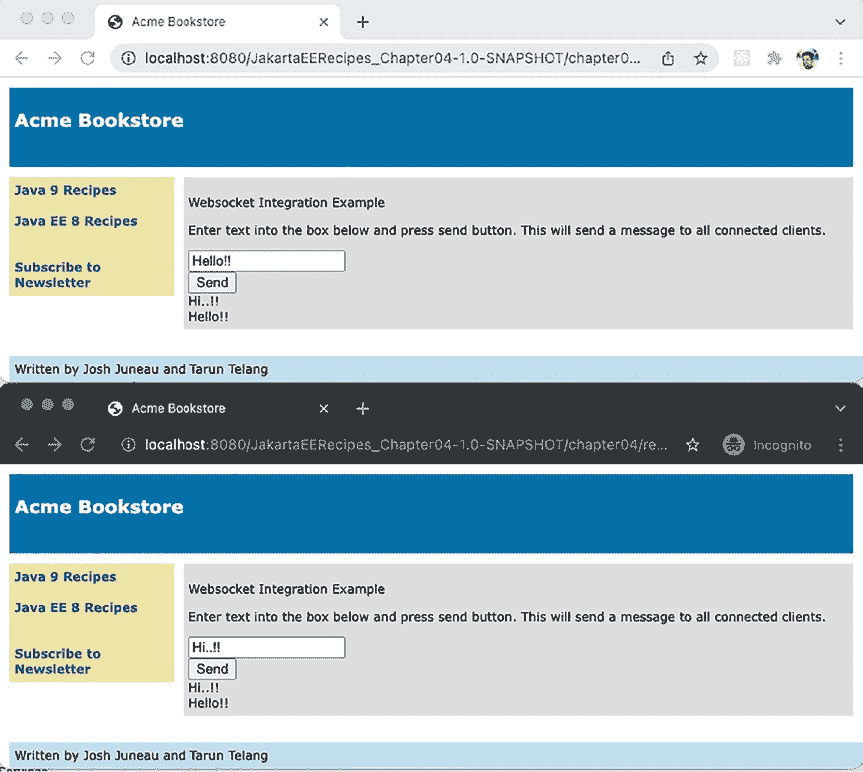

第 4 章 ■ 高级 Jakarta Server Faces

/**

* 向所有 WebSocket 客户端发起通知。

*/

public void sendMessage(){

System.out.println("sending message");

push.send(messageText);

messageText = null;

}

. . .

}

最终的解决方案如下所示。如果用户输入内容并点击发送，所有（同一视图上的）监听客户端都将收到该消息。可以通过在浏览器中访问 URL http://localhost:8080/JakartaEERecipes_Chapter04-1.0-SNAPSHOT/chapter04/recipe04_19.xhtml 来执行此代码。该配方的输出结果如图 4-15 所示。

***图 4-15.** 在 Jakarta Server Faces 中使用 WebSocket 向已连接的客户端发送消息* 256

第 4 章 ■ 高级 Jakarta Server Faces

工作原理

WebSocket 已成为客户端与服务器通信的标准协议。实现 WebSocket 解决方案有多种不同方式。可以利用诸如 Atmosphere 之类的框架来开发 WebSocket，或者自 Java EE 7 发布以来，也可以使用原生的 WebSocket 支持。Jakarta Server Faces WebSocket 对这两种方法都提供支持。JSF 2.3 中的支持涵盖了这两种实现，因此提供了一定的灵活性。要启用此支持，必须在 `web.xml` 部署描述符中指定 `jakarta.faces.ENABLE_WEBSOCKET_ENDPOINT` 上下文参数，并将其值设置为 `true`，如下所示：

<context-param>

<param-name>jakarta.faces.ENABLE_WEBSOCKET_ENDPOINT</param-name>

<param-value>true</param-value>

</context-param>

`f:websocket` 标签在 Jakarta Server Faces 客户端视图中启用了对 WebSocket 的支持。该标签包含一个必需的 `channel` 属性，它是一个 `ValueExpression`，用于列出 WebSocket 客户端将监听的通道。该标签还包含一个必需的 `onmessage` 属性，它也是一个 `ValueExpression`，用于指定在接收到 WebSocket 消息时要执行的 JavaScript 函数的名称。在示例中，可以看到通道被设置为 `messagePusher`，这意味着服务器必须向名为 `messagePusher` 的通道发送消息，才能成功发送给此客户端。`message` 属性被设置为 `messageListener`，如果查看已添加到视图中的 JavaScript 源代码，可以看到它包含一个名为 `messageListener` 的函数。当接收到消息时，会执行此函数。在此示例中，该函数仅将消息打印到视图中 ID 为 `messageDiv` 的 `div` 元素中。此示例中 JavaScript 函数的签名仅接受消息本身。然而，如果需要，JavaScript 函数也可以接受通道名称和事件参数。

`f:websocket` 标签还包含许多其他有用的属性。虽然这些参数是可选的，但在某些情况下可能会用到：

*   `onclose`：指定在消息关闭时调用的 JavaScript 函数。
*   `scope`：用于限制消息传播的范围。如果设置为 `session`，此属性将消息限制为仅限当前会话中具有相同 WebSocket 通道的所有客户端视图。
*   `port`：如果需要，指定非 HTTP 端口的 TCP 端口号。

现在让我们看一下服务器端的实现。此配方的解决方案使用了一个新的 `PushContext`，它被注入到一个 `ApplicationScoped` bean 中。此 `PushContext` 用于向所有监听客户端发送消息，并且可以通过包含 `@Push` 注解及其上下文将其注入到任何 CDI bean 中。通道的名称可以通过 `@Push` 注解上的可选 `channel` 属性来指定；否则，它将假定与 `PushContext` 标识符相同的名称。在示例中，`PushContext` 被简单地命名为“push”。这是所有客户端必须监听的通道。

要发送消息，请调用 `PushContext` 的 `send()` 方法，并传入要广播的消息。该消息将被编码为 JSON，并传递给客户端上 JavaScript 函数的 `message` 参数，该函数对应于 `f:websocket` 的 `onmessage` 属性中指定的函数。消息可以由任意数量的容器组成，包括纯字符串、`List`、`Map`、`Object` 等。

第 4 章 ■ 高级 Jakarta Server Faces

4-21. 以编程方式搜索组件

问题

您希望使用表达式语言或 Java 代码在 Jakarta Server Faces 视图中查找特定组件或一组组件。您可能希望获取组件访问权限的原因有很多，例如以编程方式调用组件或从视图中的另一个组件引用它们。

解决方案 #1

通过使用表达式语言或从 Java 代码以编程方式，利用 Jakarta Server Faces 组件搜索框架。在以下示例中，使用关键的 Jakarta Server Faces 搜索术语通过表达式语言更新了一个 Jakarta Server Faces `panelGrid` 组件。`f:ajax` 标签包含一个指定 `@parent` 的 `render` 属性，指示一旦 Ajax 过程完成，应重新渲染父组件：

<h:panelGrid columns="2">

<h:outputLabel for="password" value="输入站点访问密码："/>

<h:inputSecret id="password" size="40" value="#{ch3ContactController.current.password}">

<f:validateRequired/>

<f:ajax event="blur" render="@parent"/>

</h:inputSecret>

<h:panelGroup/>

<h:message id="passwordError"

for="password"

style="color:red"/>

<h:outputLabel for="passwordConfirm" value="确认密码："/>

<h:inputSecret id="passwordConfirm" size="40" value="#{ch3ContactController.passwordConfirm}"

validator="#{ch3ContactController.validatePassword}">

<f:ajax event="blur" render="@parent"/>

</h:inputSecret>

<h:panelGroup/>

<h:message id="passwordConfirmError"

for="passwordConfirm"

style="color:red"/>

</h:panelGrid>

解决方案 #2

利用编程 API 从服务器端 CDI 控制器类中搜索组件。在以下解决方案中，使用 Jakarta Server Faces 视图中的一个按钮来调用 CDI bean 中的操作方法。该操作方法仅演示了编程搜索表达式 API。在操作方法中，通过显式 ID 查找组件：

第 4 章 ■ 高级 Jakarta Server Faces

public void findById() {

FacesContext context = FacesContext.getCurrentInstance();

SearchExpressionContext searchContext = SearchExpressionContext.createSearchExpressionContext(context, context.getViewRoot());

context.getApplication()

.getSearchExpressionHandler()

.resolveComponent(

searchContext,

"passwordConfirm",

(ctx, target) -> out.print(target.getId()));

}

工作原理


多年来，Jakarta Server Faces 开发者在视图中通过 ID 引用组件时一直面临困难。如果尝试简单地通过 ID 查找组件，可能会遇到几个问题。首先，如果没有为 Jakarta Server Faces 组件显式分配 ID，那么 `FacesServlet` 会自动分配一个。在这种情况下，ID 在运行时之前是未知的，因此几乎不可能使用 EL 或在 Java 代码中引用该组件。其次，即使为 Jakarta Server Faces 组件分配了静态 ID，Jakarta Server Faces 视图的嵌套架构和 Jakarta Server Faces 组件树也会导致每个父组件的 ID 被添加到子组件 ID 的前面。这可能导致组件 ID 过长，有时甚至难以维护。

此外，即使通过添加父 ID 前缀可以轻松识别指定组件，某些组件（例如嵌套在表格中的组件）在运行时仍会被分配动态 ID。

已有许多第三方库开发了解决方案来应对此问题。OmniFaces 和 PrimeFaces 是其中使用最广泛的。将 Jakarta Server Faces 搜索表达式 API 添加到 Jakarta Server Faces 核心中，显著减少了为获取视图中 Jakarta Server Faces 组件访问权限所需的工作量。当组件嵌套在视图中的其他组件深处，或者如前所述是 `dataTable` 的一部分时，情况尤其如此。搜索表达式 API 允许利用关键字以动态方式搜索组件树，而不是硬编码那些未来可能更改的静态 ID。

在 JSF 2.3 之前，有四个抽象搜索关键字可用于获取对组件的引用，即 `@all`、`@this`、`@form` 和 `@none`。此外，只能在 `f:ajax` 标签中执行 EL 搜索表达式。这是一个相当大的限制，而 JSF 2.3 极大地扩展了此功能。请参考表 4-21 了解搜索关键字。搜索表达式 API 新增了以下功能：

• 关键字和搜索表达式可以以编程方式使用。

• 增加了更多关键字。

• 关键字接受参数。

• 关键字是可扩展的，并且可以链式使用。

第 4 章 ■ 高级 Jakarta Server Faces

***表 4-21.** 搜索关键字*

**关键字**

**描述**

`@child(n)`

基础组件的第 n 个子组件

`@composite`

基础组件最近的复合组件

`@id(id)`

基础组件中 ID 与指定值匹配的最近后代组件

`@namingcontainer`

基础组件最近的命名容器

`@next`

视图中基础组件之后的下一个组件

`@parent`

基础组件的父组件

`@previous`

基础组件的前一个组件

`@root`

`UIViewRoot`

该解决方案演示了如何使用 `@parent` 关键字查找组件，但也可以使用其他任何关键字，并将它们串联起来以查找所需的组件。

JSF 2.3 的另一个新特性是编程式搜索表达式 API。这使得从控制器类内部获取组件的访问权限成为可能。解决方案中的第二个清单演示了如何使用编程式 API。要使用该 API，首先创建一个 `SearchExpressionContext`，稍后将其作为参数传递以帮助查找组件。其次，调用 `FacesContext` 通过 `getApplication()` 获取对应用程序的引用，然后调用 `getSearchExpressionHandler().resolveComponent()`，并传入 `SearchExpressionContext`、搜索表达式字符串以及找到组件时要调用的函数。这可用于通过编程式 API 搜索任何组件。

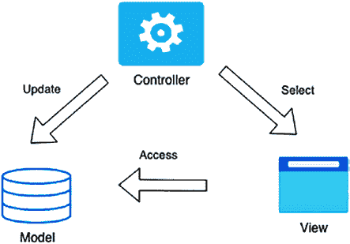

**第 5 章**

**Jakarta MVC**

多年来，Jakarta EE 已从一个以 Servlet 为中心的平台发展成为一个支持多种不同方法创建 Web 和企业应用程序的平台。在企业 Java 的早期，人们专注于开发 Servlet 来构建前端以及集成层和业务层。

这是因为它主要关注组件导向。Jakarta Server Pages 使事情变得更加动态。开发者现在可以将工作负载分配给专注于 HTML 标记和 Jakarta Server Pages 标签以生成前端的团队，以及专注于应用程序逻辑的团队。Jakarta Server Faces 则更进一步，它遵循模型-视图-控制器模式，将代码逻辑与页面标记完全分离，创建了三个不同的层级。这种设计模式使开发更具逻辑性，长期维护也更加容易。模型-视图-控制器模式的架构如图 5-1 所示。

***图 5-1.** Jakarta MVC 架构*

Jakarta Server Faces 是用于构建企业应用程序的成熟且健壮的技术；该框架在某种程度上缺乏灵活性，因为您必须遵循许多理念。例如，Jakarta Server Faces 有一个必须遵循的生命周期。生命周期的某些阶段可以跳过，但最终 `Faces` Servlet 仍然保留了一定程度的控制权。Jakarta MVC 框架将模型-视图-控制器的关注点又向前推进了一步。它允许开发者遵循三层架构，而无需强制特定的行为。MVC 框架最初计划作为 JSR 371 包含在 Jakarta EE 8 中，但后来为了减少包含的新规范数量，它被从平台中移除。然而，Oracle 将 MVC 1.0 的所有权移交给了社区，社区随后将该规范转移到了 Eclipse 基金会。

© Josh Juneau 和 Tarun Telang 2022

J. Juneau 和 T. Telang, *Java EE 到 Jakarta EE 10 实战*[, https://doi.org/10.1007/978-1-4842-8079-9_5](https://doi.org/10.1007/978-1-4842-8079-9_5#DOI)

第 5 章 ■ Jakarta MVC

在本章中，我将讨论 Jakarta MVC 应用程序的配置；如何开发控制器、模型和视图；以及如何将它们整合在一起。该框架构建在 Jakarta RESTful Web Services 之上，因此许多关键组件是相同的。因此，在本章中您还将学习一些 Jakarta RESTful Web Services API 的基础知识。正如我常说的，如果您拥有更多工具，就能完成更多种类的任务。应用程序开发也是如此，像 Jakarta Server Faces 这样的框架非常适合开发某些应用程序，但 Jakarta MVC 可能更适合开发其他应用程序。阅读本章后，您将更好地理解 Jakarta MVC 所提供的不同之处。您应该能够深入使用 Jakarta MVC 框架进行开发，因为我将使用 Apache NetBeans IDE 从头到尾引导您完成一个 Jakarta MVC 应用程序的开发。

项目结构

本章的代码按以下结构组织：

├── Bookstore.iml

├── pom.xml

└── src

└── main

├── java

│ └── org

│ └── jakartaeerecipe

│ └── bookstore

│ ├── ApplicationConfig.java

│ ├── container

│ │ ├── BookAuthorContainer.java

│ │ ├── BookContainer.java

│ │ └── Messages.java

│ ├── controller

│ │ ├── BookAuthorController.java

│ │ └── BookController.java

│ ├── entity

│ │ ├── AuthorWork.java

│ │ ├── Book.java

│ │ ├── BookAuthor.java

│ │ └── Chapter.java

│ ├── service

│ │ ├── AbstractFacade.java

│ │ ├── BookAuthorFacadeREST.java

│ │ ├── BookAuthorService.java

│ │ ├── BookFacadeREST.java

│ │ └── BookService.java

│ └── session

│ ├── AbstractFacade.java

│ └── BookAuthorFacade.java

第 5 章 ■ Jakarta MVC

├── resources

│ └── META-INF

│ ├── beans.xml

│ └── persistence.xml

└── webapp

├── WEB-INF


│ ├── views
│ │ ├── book.jsp
│ │ ├── bookAuthor.jsp
│ │ ├── bookAuthor.xhtml
│ │ ├── books.xhtml
│ └── web.xml
└── glassfish-web.xml

5-1. 为 Jakarta MVC 框架配置应用程序

问题

您希望创建一个 Jakarta MVC 应用程序项目。因此，您需要配置项目以使用 Jakarta MVC API（Jakarta MVC 的一种实现）。

解决方案

将适当的配置文件添加到项目中，并相应地配置 Jakarta RESTful Web Services。在本章中，我将介绍使用 Maven 作为项目构建系统，但您也可以轻松地使用其他构建系统（如 Gradle）进行配置。Jakarta MVC 应用程序的配置与使用 Jakarta RESTful Web Services 规范的应用程序非常相似。首先，让我们在 Apache NetBeans 中创建一个新项目。创建一个 Maven Web 应用程序项目，并将其命名为 Bookstore，如图 5-2 和 5-3 所示。

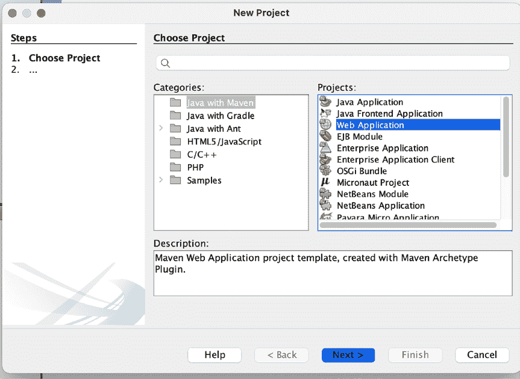

第 5 章 ■ Jakarta MVC

***图 5-2.** 新建项目*

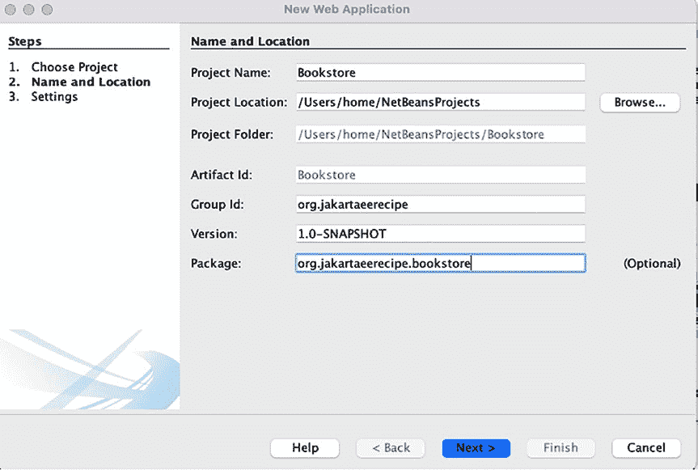

第 5 章 ■ Jakarta MVC

***图 5-3.** 新建 Maven Web 应用程序：名称和位置*

接下来，请务必选择 Jakarta EE Web 或符合 Jakarta EE 标准的应用程序服务器进行部署，然后选择与您的应用程序服务器 Jakarta EE 版本相对应的 Jakarta EE 版本。

点击“完成”创建项目。项目创建完成后，生成一个 beans.xml 文件。为此，右键单击项目，然后点击“新建” ➤ “其他…”，如图 5-4 所示。

然后，在图 5-5 所示的对话框中，从“类别”中选择“上下文和依赖注入”，并从“文件类型”中选择“beans.xml (CDI 配置文件)”。

接下来，接受默认设置，将其创建在 WEB-INF 目录下并保留名称 beans.xml，最后点击“完成”。

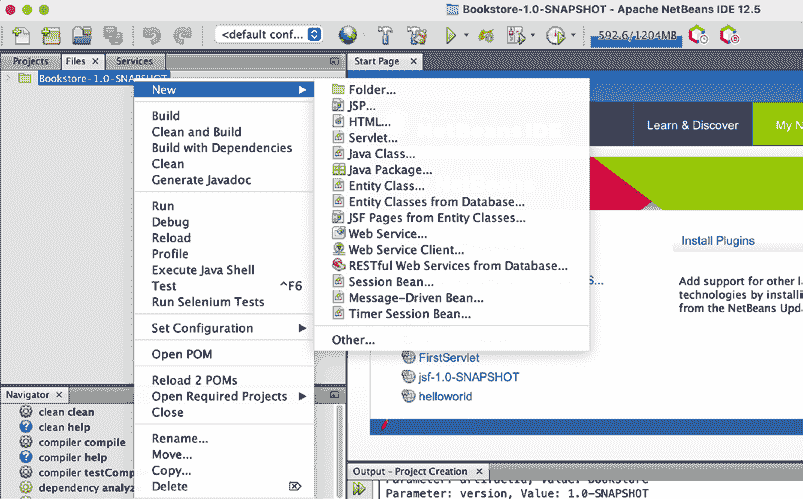

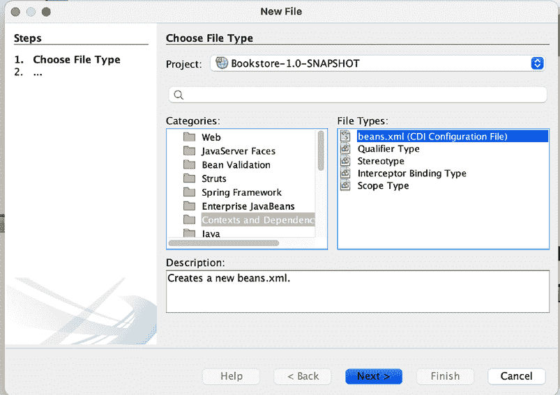

第 5 章 ■ Jakarta MVC

***图 5-4.** 新建文件：其他…*

***图 5-5.** 新建文件：beans.xml (CDI 配置文件)*

第 5 章 ■ Jakarta MVC

接下来，将所需的依赖项添加到 POM 文件中。为此，右键单击项目，然后从上下文菜单中选择“打开 POM”。打开 POM 文件后，添加 Jakarta MVC API 的依赖项：

<dependencies>
<dependency>
<groupId>jakarta.platform</groupId>
<artifactId>jakarta.jakartaee-web-api</artifactId>
<version>10.0.0-RC1</version>
<scope>provided</scope>
</dependency>
<dependency>
<groupId>jakarta.mvc</groupId>
<artifactId>jakarta.mvc-api</artifactId>
<version>2.0.0</version>
</dependency>
<dependency>
<groupId>org.eclipse.krazo</groupId>
<artifactId>krazo-core</artifactId>
<version>2.0.1</version>
</dependency>
<dependency>
<groupId>org.eclipse.krazo</groupId>
<artifactId>krazo-jersey</artifactId>
<version>2.0.1</version>
</dependency>
</dependencies>

`jakarta.mvc-api` 包含了 MVC 规范 2.0 中定义的 API，而 `krazo-core` 是其实现。

对于 GlassFish，由于其底层的 RESTful Web Service 提供者是 Jersey，您需要将 `krazo-jersey` 作为适配器添加到依赖中。如果您的应用程序服务器使用其他 RESTful Web Services 实现（如 RESTEasy 和 cxf），则需要将此依赖项替换为相应的适配器。

最后，需要配置应用程序以使用 Jakarta RESTful Web Services。为此，在 `org.jakartaeerecipe.bookstore` 包中创建一个 `ApplicationConfig` 类，方法是选择“文件” ➤ “新建” ➤ “Java 类”，如图 5-6 所示。

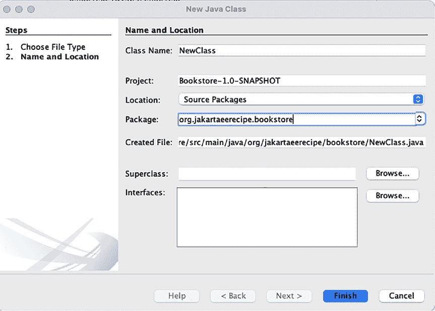

第 5 章 ■ Jakarta MVC

***图 5-6.** 创建 ApplicationConfig 类*

`ApplicationConfig` 类用于将 RESTful Web 服务映射到 URI。`@ApplicationPath` 注解用于配置 URI 的路径。以下代码显示了此类的源代码：
```java
package org.jakartaeerecipe.bookstore;

import java.util.*;
import jakarta.mvc.security.Csrf;
import jakarta.ws.rs.*;

@ApplicationPath("controller")
public class ApplicationConfig extends Application {
    @Override
    public Map<String, Object> getProperties() {
        final Map<String, Object> map = new HashMap<>();
        map.put(Csrf.CSRF_PROTECTION, Csrf.CsrfOptions.EXPLICIT);
        return map;
    }
}
```
一旦这些配置完成，您就可以开始编写 Jakarta MVC 应用程序了。

第 5 章 ■ Jakarta MVC

工作原理

Jakarta MVC 框架需要对项目进行一些简单的配置，以引入所需的依赖项并正确配置 CDI 和 Jakarta RESTful Web Services。在本方案中，我展示了如何进行这些配置，现在让我们看看为什么需要它们。如前所述，Jakarta RESTful Web Services 配置应位于一个扩展 `jakarta.ws.rs.core.Application` 的类中，该类定义了 Jakarta RESTful Web Services 应用程序的组件和元数据。

Jakarta MVC 框架构建在 Jakarta RESTful Web Services API 之上，因此此配置是必需的，以便能够生成控制器类（更多详细信息请参见方案 5-3）。

在解决方案中，我将扩展 `jakarta.ws.rs.core.Application` 类的类命名为 `ApplicationConfig`。从代码中可以看出，通过扩展 `Application` 类，我们可以重写 `getProperties()` 方法来提供特定于应用程序的配置。在这种情况下，我添加了 CSRF（跨站请求伪造）保护，这是一个标准的安全特性（请参见方案 5-8）。`getProperties()` 方法应返回一个 `Map<String, Object>`。最后，该类应使用 `@ApplicationPath` 进行注解，并且控制器（或 Jakarta RESTful Web Services 类）的 URI 映射应作为字符串传递。在本例中，路径是 `"controller"`，访问控制器类的 URL 应转换为 `http://localhost:8080/Bookstore/controller/`。

Jakarta MVC 的依赖项必须在 Maven POM 文件中引用。在这种情况下，存在依赖项，并且期望 Jakarta EE 完整版或 Web 版配置文件也是一个依赖项。

■ **注意** Jakarta EE 有不同的配置文件可用。Web 配置文件包含较少的用于开发 Web 项目的依赖项，而完整配置文件包含所有 Jakarta EE 依赖项。使用 Jakarta EE 10，我们有了一个新的配置文件，称为核心配置文件，专为小型运行时设计。它包含面向微服务和提前编译的规范。

Jakarta MVC 所需的依赖项是 `jakarta.mvc-api` 和 `krazo`，后者是参考实现。最后，确保为上下文和依赖注入创建一个 `beans.xml` 配置文件。此配置文件允许指定如何发现 CDI bean。出于本示例的目的，接受默认的注解发现模式，如下所示：

```xml
<?xml version="1.0" encoding="UTF-8"?>
<beans
    xsi:schemaLocation="https://jakarta.ee/xml/ns/jakartaee https://jakarta.ee/xml/ns/jakartaee/beans_3_0.xsd"
    bean-discovery-mode="annotated">
</beans>
```
本方案逐步介绍了创建 Jakarta MVC 项目所需的配置。在接下来的方案中，我将介绍如何将项目构建成一个功能完备的 Web 应用程序。

5-2. 为应用程序提供数据

问题

您需要为应用程序获取现有数据，并且希望轻松地使这些数据可用于您的 Web 视图。

第 5 章 ■ Jakarta MVC

解决方案 #1

利用 Jakarta Persistence API 和 Jakarta Enterprise Beans 从数据库向应用程序提供数据。在本章中，我们将使用 Apache Derby 数据库。首先，创建实体类，将每个数据库表映射到相应的 Java 对象。有关生成实体类的更多详细信息，请参见第 8 章。


针对本章所开发的应用，将为本书中使用的多个数据库表生成实体类。在本方案中，仅生成一个实体类作为演示。不过，如果你查看示例应用的源代码，会发现应用内使用的每个表都对应一个实体类。

由于该应用将用于在线书店，因此应用所使用的数据库表与作者和书籍相关。在本方案中，我们将为 `BOOK_AUTHOR` 数据库表生成实体类。简单来说，实体类将数据库表的每一列映射到对应的类成员。以下是 `BookAuthor` 实体类的代码：

```java
package org.jakartaeerecipe.bookstore.entity;

import java.io.Serializable;

import java.math.BigInteger;

import java.util.*;

import jakarta.persistence.*;

import jakarta.validation.constraints.*;

@Entity

@Table(name = "BOOK_AUTHOR")

public class BookAuthor implements Serializable {

private static final long serialVersionUID = 1L;

@Id

@Basic(optional = false)

@Column(name = "ID")

private BigInteger id;

@Size(max = 30)

@Column(name = "LASTNAME")

private String last;

@Size(max = 30)

@Column(name = "FIRSTNAME")

private String first;

@Lob

@Column(name = "BIO")

private String bio;

@ManyToMany

@JoinTable(name="AUTHOR_WORK",

joinColumns=

@JoinColumn(name="AUTHOR_ID", referencedColumnName="ID"),

inverseJoinColumns=

@JoinColumn(name="BOOK_ID", referencedColumnName="ID"))

private Set<Book> books;

public BookAuthor() {

}

public BookAuthor(BigDecimal id) {

this.id = id;

}

...

// getters and setters

...

@Override

public int hashCode() {

int hash = 0;

hash += (id != null ? id.hashCode() : 0);

return hash;

}

@Override

public boolean equals(Object object) {

if (!(object instanceof BookAuthor)) {

return false;

}

BookAuthor other = (BookAuthor) object;

if ((this.id == null && other.id != null) || (this.id != null && !this.

id.equals(other.id))) {

return false;

}

return true;

}

@Override

public String toString() {

return "org.jakartaeerecipe.bookstore.entity.BookAuthor[ id=" + id + " ]";

}

}
```

为每个数据库表创建实体类后，需要为它们分别开发 Jakarta 企业 Bean 外观（会话 Bean）类。为此，首先创建一个包来存放所有会话 Bean 类。在本例中，创建一个名为 `org.jakartaeerecipes.bookstore.session` 的包。接着，为已创建的每个实体类创建一个会话 Bean 类。要为 `BookAuthor` 类创建会话 Bean，请在新创建的包中创建一个类；如果使用 Apache NetBeans，则右键单击新包，选择“新建” ➤ “来自实体类的会话 Bean”。将 Bean 命名为 `BookAuthorFacade`。如果使用 Apache NetBeans，将生成两个类，其中一个是名为 `AbstractFacade` 的抽象类。该抽象类将被应用创建的每个会话 Bean 继承，其中包含一组可在所有会话 Bean 中使用的通用方法。

如果从头开始创建会话 Bean，则需要为每个 Bean 创建这些方法，或者使用类似的技术为 Bean 提供通用实现，类似于 `AbstractFacade`。

无论选择哪种技术，都需要为应用生成持久化单元。这是一个 XML 配置文件，用于包含数据库的连接配置。通常，持久化单元包含用于连接到应用服务器容器内已定义数据源的 Java 命名和目录接口（JNDI）信息。在本例中，如果使用 Apache NetBeans，请右键单击项目并选择“创建持久化单元”来创建持久化单元。选择 Apache NetBeans 中已为数据库配置的现有数据源。

第 5 章 ■ Jakarta MVC


以下代码是 `AbstractFacade` 的内容，由 Apache NetBeans 自动生成：

package org.jakartaeerecipe.bookstore.session;

import jakarta.persistence.*;

import jakarta.persistence.criteria.*;

import java.util.List;

public abstract class AbstractFacade<T> {

private final Class<T> entityClass;

public AbstractFacade(Class<T> entityClass) {

this.entityClass = entityClass;

}

protected abstract EntityManager getEntityManager();

public void create(T entity) {

getEntityManager().persist(entity);

}

public void edit(T entity) {

getEntityManager().merge(entity);

}

public void remove(T entity) {

getEntityManager().remove(getEntityManager().merge(entity));

}

public T find(Object id) {

return getEntityManager().find(entityClass, id);

}

public List findAll() {

CriteriaQuery<Object> cq = getEntityManager().getCriteriaBuilder().createQuery();

cq.select(cq.from(entityClass));

return getEntityManager().createQuery(cq).getResultList();

}

public List findRange(int[] range) {

CriteriaQuery<Object> cq = getEntityManager().getCriteriaBuilder().createQuery();

cq.select(cq.from(entityClass));

Query q = getEntityManager().createQuery(cq);

q.setMaxResults(range[1] - range[0] + 1);

q.setFirstResult(range[0]);

return q.getResultList();

}

public int count() {

CriteriaQuery<Object> cq = getEntityManager().getCriteriaBuilder().createQuery();

Root<T> rt = cq.from(entityClass);

cq.select(getEntityManager().getCriteriaBuilder().count(rt));

Query q = getEntityManager().createQuery(cq);

return ((Long) q.getSingleResult()).intValue();

}

}

第 5 章 ■ Jakarta MVC

接下来，我们来看为 `BookAuthorFacade` 生成的代码。这段代码同样由 Apache NetBeans 自动生成，当然，如果你愿意，也可以手动创建：

package org.jakartaeerecipes.bookstore.session;

import jakarta.ejb.Stateless;

import org.jakartaeerecipe.bookstore.entity.BookAuthor;

import jakarta.persistence.EntityManager;

import jakarta.persistence.PersistenceContext;

@Stateless

public class BookAuthorFacade extends AbstractFacade<BookAuthor> {

@PersistenceContext(unitName = "default")

private EntityManager em;

public BookAuthorFacade() {

super(BookAuthor.class);

}

@Override

protected EntityManager getEntityManager() {

return em;

}

}

解决方案 #2

利用 RESTful Web 服务为你的应用程序获取数据。如解决方案 #1 所述，创建实体类，将每个数据库表映射到对应的 Java 对象。实体类创建完成后，为每个实体类开发 REST 服务类。如果使用 Apache NetBeans 等 IDE，只需点击几下即可生成这些 RESTful Web 服务，因为大多数 IDE 都提供了自动生成选项。否则，只需创建一个普通 Java 对象（POJO）并添加相应注解，即可开发 RESTful 服务类。

首先，创建一个新包，命名为 `org.jakartaeerecipe.bookstore.service`。接着，在新创建的包中创建 RESTful 类。在 Apache NetBeans IDE 中，右键点击该包，选择“新建…” ➤ “Web 服务” ➤ “来自实体类的 RESTful Web 服务”，然后点击“下一步”。当“来自实体类的新 RESTful Web 服务”对话框显示时，选择 `org.jakartaeerecipes.entity.BookAuthor` 类。在下一个界面中，将资源包修改为 `org.jakartaeerecipes.bookstore.service`，如图 5-7 所示。最后，点击“完成”创建该类。

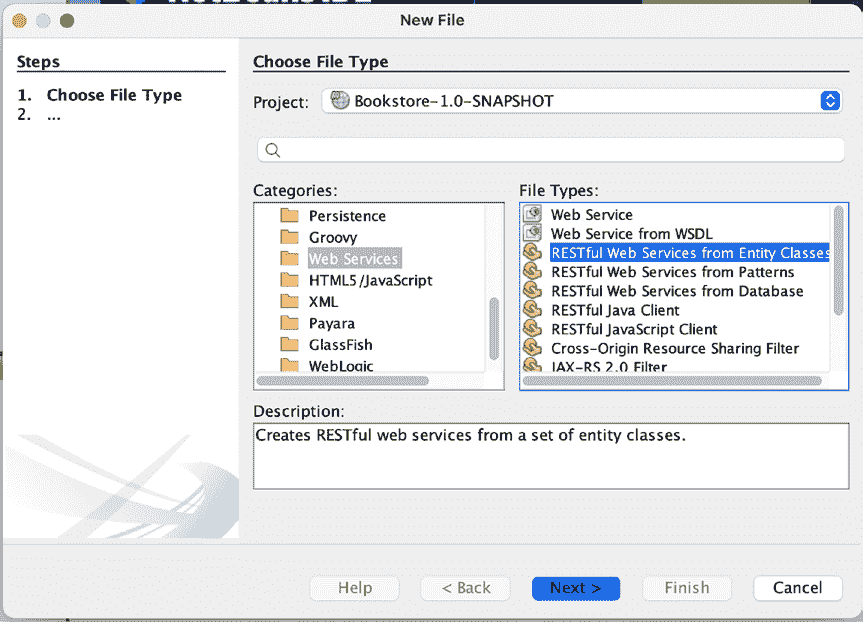

第 5 章 ■ Jakarta MVC

***图 5-7.** 在 Apache NetBeans IDE 中从实体类创建 RESTful Web 服务*

与 Jakarta Enterprise Beans 的创建类似，RESTful Web 服务的创建也提供了可用于对数据库执行创建、读取、更新和删除操作的方法。此外，由于这些方法被注解为 REST 服务，因此可以通过 REST 客户端调用它们。以下代码展示了 `BookAuthor` 实体的 RESTful Web 服务类。该类名为 `BookAuthorFacadeREST`


由 NetBeans IDE 生成，或者如果从头开始创建，也可以使用不同的名称：

package org.jakartaeerecipe.bookstore.service;

import java.math.BigDecimal;

import java.util.List;

import jakarta.ejb.Stateless;

import jakarta.persistence.*;

import jakarta.ws.rs.*;

import org.jakartaeerecipe.bookstore.entity.BookAuthor;

@Stateless

@Path("org.jakartaeerecipe.bookstore.entity.bookauthor")

public class BookAuthorFacadeREST extends AbstractFacade<BookAuthor> {

@PersistenceContext(unitName = "BookStore_1.0PU")

private EntityManager em;

第 5 章 ■ Jakarta MVC

public BookAuthorFacadeREST() {

super(BookAuthor.class);

}

@POST

@Override

@Consumes({MediaType.APPLICATION_XML, MediaType.APPLICATION_JSON})

public void create(BookAuthor entity) {

super.create(entity);

}

@PUT

@Path("{id}")

@Consumes({MediaType.APPLICATION_XML, MediaType.APPLICATION_JSON})

public void edit(@PathParam("id") BigDecimal id, BookAuthor entity) {

super.edit(entity);

}

@DELETE

@Path("{id}")

public void remove(@PathParam("id") BigDecimal id) {

super.remove(super.find(id));

}

@GET

@Path("{id}")

@Produces({MediaType.APPLICATION_XML, MediaType.APPLICATION_JSON})

public BookAuthor find(@PathParam("id") BigDecimal id) {

return super.find(id);

}

@GET

@Override

@Produces({MediaType.APPLICATION_XML, MediaType.APPLICATION_JSON})

public List<BookAuthor> findAll() {

return super.findAll();

}

@GET

@Path("{from}/{to}")

@Produces({MediaType.APPLICATION_XML, MediaType.APPLICATION_JSON})

public List<BookAuthor> findRange(@PathParam("from") Integer from, @PathParam("to") Integer to) {

return super.findRange(new int[]{from, to});

}

@GET

@Path("count")

@Produces(MediaType.TEXT_PLAIN)

public String countREST() {

return String.valueOf(super.count());

}

@Override

protected EntityManager getEntityManager() {

return em;

}

}

第 5 章 ■ Jakarta MVC

要了解更多关于生成 RESTful Web 服务及相关注解的信息，请参阅第 13 章。一旦创建了 RESTful Web 服务，其他应用程序就可以调用它以获取各种格式的数据，包括 XML、JSON、纯文本或其他媒介。Jakarta MVC 应用程序可以利用 JAX-RS 客户端调用 RESTful Web 服务来获取数据。

这可以通过生成一个包含 Jakarta RESTful Web 服务客户端和 Web 服务调用的服务类来实现，以获取数据。

首先，在 `org.jakartaeerecipe.bookstore.service` 包中创建一个类，并将其命名为 `BookAuthorService`。这将是一个会话作用域的 CDI Bean（有关 CDI 的详细信息，请参阅第 11 章），它会在 Bean 构造时创建一个客户端，然后根据需要加载数据以供应用程序使用。在下一节介绍 Jakarta MVC 控制器的内容中，我将演示如何从控制器类中调用此服务类以获取数据。

以下代码展示了 `BookAuthorService` 类的最终成品：

package org.jakartaeerecipe.bookstore.service;

import java.util.List;

import jakarta.annotation.PostConstruct;

import jakarta.enterprise.context.SessionScoped;

import jakarta.ws.rs.client.*;

import jakarta.ws.rs.core.GenericType;

import org.jakartaeerecipe.bookstore.entity.BookAuthor;

@SessionScoped

public class BookAuthorService implements java.io.Serializable {

Client jaxRsClient;

private List<BookAuthor> bookAuthorList;

final String hostUri = "http://localhost:8080/BookStore/bookstore";

public BookAuthorService(){

}

@PostConstruct

public void init(){

// 构造一个 Jakarta RESTful Web 服务客户端

jaxRsClient = ClientBuilder.newClient();

loadData();

}

private void loadData(){

bookAuthorList = jaxRsClient.target(hostUri + "/org.jakartaeerecipe.bookstore.

entity.bookauthor/findAll")

.request("application/xml")

.get(new GenericType<List<BookAuthor>>() {

}

);

}

/**

* @return bookAuthorList

*/

public List<BookAuthor> getBookAuthorList() {

第 5 章 ■ Jakarta MVC

if(bookAuthorList == null){

loadData();

}

return bookAuthorList;

}

/**

* @param bookAuthorList

*/

public void setBookAuthorList(List<BookAuthor> bookAuthorList) {

this.bookAuthorList = bookAuthorList;

}

}

该服务类可用于加载数据并为我们的应用程序获取数据集。此类以后可以根据需要修改，以提供用于创建、更新和删除数据的 RESTful Web 服务方法。

工作原理

大多数企业应用程序都会处理数据。Jakarta MVC 应用程序也不例外，因为数据通常扮演着重要角色。为 Jakarta MVC 应用程序获取数据的方式与许多其他 Java Web 应用程序非常相似，RESTful Web 服务或 Jakarta Enterprise Beans 是一些很好的选择。请记住，这些并不是将数据拉取到 Jakarta MVC 应用程序的唯一选择。由于 Jakarta MVC 框架提供了一种非常灵活的设计模式，它允许开发者在过程中做出多种选择。因此，当然也可以使用其他方法，例如 JDBC 或自建的数据访问对象（DAO）来协调与数据库的工作。本方案展示了两种最标准的方法。

Jakarta MVC 基于模型-视图-控制器（Model-View-Controller）设计模式，该模式将应用程序分为三个组件：模型（Model）、视图（View）和控制器（Controller）。

容器被注入到控制器中。控制器可以访问所有服务。它负责处理所有传入的请求，并将其映射到相应的操作。它还从模型中检索数据，并将其传递给视图。然后，视图使用这些数据生成响应，并发送回用户。

在解决方案 #1 中，我展示了如何基于现有（或新）数据库表创建实体类，然后编写一个 Jakarta Enterprise Beans 外观，与实体类协同工作以处理数据。这是迄今为止将数据强制转换为 Java 对象最标准的方法之一，其历史可以追溯到 J2EE 时代。在 J2EE 时代，开发人员需要编写重量级的 EJB 解决方案和大量的 XML 才能完成如今使用带有注解的简单 POJO 即可实现的功能。

使用 Jakarta Enterprise Beans 与使用实体类将数据库表映射到 Java 对象是相辅相成的。要了解更多关于实体类的使用，请参阅第 6 章，其中讨论了对象关系映射。一旦构建了实体类，就很容易创建一个 Jakarta Enterprise Beans，用于与实体类协同工作以编排数据。由于第 8 章专门介绍了 Jakarta Enterprise Beans 的使用，您可以查阅该章以获取有关创建和使用它们的更多信息。本方案的重点是展示如何在 Jakarta MVC 应用程序中使用这些选项。可以将 Jakarta Enterprise Beans 的使用与 Jakarta MVC 控制器类绑定，以根据需要获取和操作数据。在下一节中，您将了解更多关于 Jakarta MVC 控制器类的信息。

第 5 章 ■ Jakarta MVC


方案二展示了如何利用实体类将 Java 对象映射到数据库表，但改用 RESTful 服务类来获取数据。该方案演示了如何创建提供数据的 RESTful Web 服务，同时也展示了如何创建一个可用于调用 RESTful Web 服务获取数据的 Jakarta RESTful Web Services 客户端服务类。在这两种方案中，Jakarta RESTful Web Services 和 Web 服务客户端很可能不属于同一个应用程序。通常，一个应用程序或微服务会从数据库获取数据，并通过 Web 服务提供给其他消费者；而其他应用程序或微服务则作为消费者，使用 Jakarta RESTful Web Services 客户端从 Web 服务获取数据。我在此应用程序中同时演示 Web 服务和客户端，仅出于示例目的。

由于第 13 章完整介绍了 RESTful Web 服务，我将引导您参考该章节以获取更多信息。让我们聚焦于如何为我们的 MVC 应用程序使用 Jakarta RESTful Web Services 客户端从 Web 服务中收集数据。通常，MVC 控制器（参见下一个方案）会调用 Jakarta RESTful Web Services 客户端来获取应用程序所需的数据。在方案二中，创建了一个简单的客户端，用于从 Web 服务获取`BookAuthor`实体列表并将其加载到本地列表中。`BookAuthorService`类是一个会话作用域的 CDI Bean，因此它使用了`@SessionScoped`（`jakarta.enterprise.context.SessionScoped`）注解。由于此类可能需要保存到磁盘以存储会话数据，因此必须使其可序列化。接下来，声明一个`jakarta.ws.rs.client.Client`和一个`List<BookAuthor>`，以便创建客户端并将`BookAuthor`对象列表存储在会话中。该类应在 Bean 创建时创建客户端并加载数据，因此其中一个方法应使用`@PostConstruct`注解，以便在 Bean 构造时自动调用。在本例中，`init()`方法在构造时被调用，允许客户端向`org.jakartaeerecipe.bookstore.entity.bookauthor` Web 服务发起 RESTful 服务调用，以获取所有记录并将其存储到`bookAuthorList`中。图 5-8 展示了 Jakarta MVC 框架的关键组件以及它们之间的交互方式。

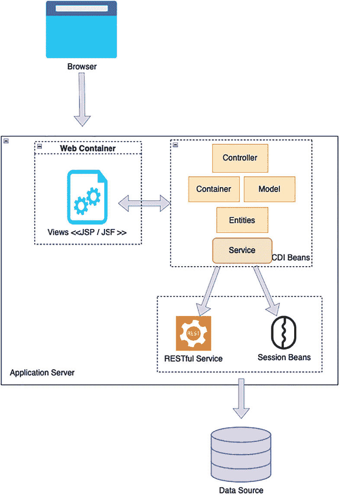

第 5 章 ■ Jakarta MVC

***图 5-8.** Jakarta MVC 的层次结构*

第 5 章 ■ Jakarta MVC

尽管本方案不直接涉及 Jakarta MVC 应用程序方法论，但它是为应用程序获取数据这一拼图中的重要一环。在下一个方案中，我将直接深入探讨 Jakarta MVC 控制器类，它是 Jakarta MVC 应用程序业务逻辑的核心。

5-3. 编写控制器类

问题

您希望为 Jakarta MVC 应用程序编排导航和业务逻辑。

解决方案

开发 Jakarta MVC 控制器类，为应用程序提供业务逻辑和导航逻辑。首先，创建一个新包来存放应用程序的控制器。在本例中，我将包命名为`org.jakartaeerecipe.bookstore.controller`。同时，创建一个包来存放将用作应用程序内数据传输对象的类。将此包命名为`org.jakartaeerecipe.bookstore.container`。在创建控制器类之前，需要在新创建的`org.jakartaeerecipe.bookstore.container`包中创建一个容器，并将其命名为`BookAuthorContainer`。该类仅是一个会话作用域的 CDI Bean，用于持有`BookAuthor`对象的实例，并将其暴露给应用程序的 Web 视图。`BookAuthorContainer`的源代码应如下所示：

```java
package org.jakartaeerecipe.bookstore.container;

import java.util.List;

import jakarta.enterprise.context.SessionScoped;

import jakarta.inject.Inject;

import jakarta.inject.Named;

import org.jakartaeerecipe.bookstore.entity.BookAuthor;

@Named

@SessionScoped

public class BookAuthorContainer implements java.io.Serializable {

    private BookAuthor bookAuthor;

    private List<BookAuthor> bookAuthorList;

    public BookAuthorContainer(){

    }

    // ... Getters and Setters ...

}
```

接下来，在`org.jakartaeerecipe.bookstore.controller`包中创建一个名为`BookAuthorController`的类，并使用`@Path("/bookAuthor")`和`@Controller`注解对该控制器类进行标注。然后，创建一个返回类型为`String`的公共方法，命名为`getBookAuthors`，该方法不接受任何参数。使用`@GET`注解标注该方法，并在该方法中查询数据以加载`BookAuthor`列表，最后返回字符串`"bookAuthor.jsp"`。以下源代码展示了`BookAuthorController`类的代码：

第 5 章 ■ Jakarta MVC

```java
package org.jakartaeerecipe.bookstore.controller;

import java.util.List;

import jakarta.inject.Inject;

import jakarta.ws.rs.Path;

import jakarta.mvc.annotation.Controller;

import jakarta.ws.rs.GET;

import org.jakartaeerecipe.bookstore.entity.BookAuthor;

import org.jakartaeerecipe.bookstore.service.BookAuthorService;

@Path("/bookAuthor")

@Controller

public class BookAuthorController {

    @Inject
    private BookAuthorService bookAuthorService;

    public BookAuthorController(){
    }

    @GET
    public String getBookAuthors(){
        // 获取作者列表
        return "bookAuthor.jsp";
    }
}
```

如果加载了包含`@Path`注解所指示路径的 URI，则会加载`bookAuthor.jsp`视图。

工作原理

Jakarta MVC 控制器类用于将业务逻辑绑定到视图，并处理请求和响应。控制器类是 CDI 控制器，包含多个注解，因为 Jakarta MVC 控制器外观基于 Jakarta RESTful Web Services API。每个控制器类都通过`jakarta.mvc.annotation.Controller`注解进行标识。`jakarta.ws.rs.Path`注解应用于控制器类级别，以指示将通过 Web 应用程序访问控制器类方法的 URI。例如，由于只有一个方法，该控制器类可以通过匹配以下格式的 URI 进行访问：

`http://localhost:8080/BookStore/controller/bookAuthor`

需要注意的是，控制器类的注解方式与 Jakarta RESTful Web Services 类相同。Jakarta MVC 框架中的控制器是使用与实现 Jakarta RESTful Web 服务类相同的注解来实现的。也就是说，当使用上述 URI 访问应用程序时，由于应用程序路径为`/BookStore/`，且匹配的`@Path`注解指定了`/bookAuthor`作为匹配路径，因此会调用`BookAuthor` CDI 控制器。调用时，GET 请求由`getBookAuthors()`方法处理，因为该方法使用了`@GET`注解且未指定路径。`@GET`注解用于指示 HTTP GET 方法。由于此控制器只有一个使用`@GET`注解的控制器方法，因此默认路径将调用该唯一方法。如果控制器中有多个方法，则每个方法还需要使用`@Path`注解来指示调用每个方法所需的子路径。Jakarta MVC 控制器应利用其他 HTTP 方法，例如`@PUT`和`@POST`，用于在数据库中插入或更新记录。

第 5 章 ■ Jakarta MVC

在示例中，当调用`getBookAuthors()`方法时，会调用`BookAuthorService`，进而调用`getBookAuthorList()`方法并加载本地的`bookAuthors`列表。接下来，加载到列表中的数据将通过视图进行访问。本方案省略了数据加载过程，但将在方案 5-5 中更详细地介绍。


最后需要注意的一个重要细节是，`getBookAuthorList()` 方法的返回值是响应返回后将要渲染的下一个视图。控制器方法的默认返回类型是 `text/html`，但可以通过 `@Produces` 注解进行更改。控制器方法返回的字符串即为视图路径。在本例中，接下来将加载 `bookAuthor.jsp` 视图。可以通过多种方式提供到下一个视图的导航，而返回下一个视图的名称是第一种技术。

控制器方法也可以将返回类型设为 `void`，在这种情况下，该方法必须使用 `@View("returnViewName")` 注解。如下所示，基于字符串的视图名称作为属性传递给该注解。这种技术可以轻松地将导航逻辑与业务逻辑分离：

```java
@GET
@View("bookAuthor.jsp")
public void getBookAuthors(){
    // 获取作者信息
}
```

下一种技术涉及返回一个 `Viewable` 对象，代码如下所示。`Viewable` 提供了灵活性，尤其是在希望实现非标准视图引擎的情况下：

```java
@GET
public Viewable getBookAuthors(){
    // 获取作者信息
    return new Viewable("bookAuthor.jsp");
}
```

控制导航的最后一种技术是返回一个响应对象，该对象提供了大量信息，因为它可以根据不同情况包含不同的响应码：

```java
@GET
public Response getBookAuthors(){
    // 获取作者信息
    return Response.status(Response.Status.OK).entity("bookAuthor.jsp").build();
}
```

如前所述，Jakarta MVC 控制器类与 Jakarta RESTful Web Services 类非常相似，因为它们都使用常见的注解。在示例中，控制器类仅用作 Jakarta MVC 控制器，但控制器类也可以成为混合类，同时包含 Jakarta RESTful Web Services 方法。为此，需要将 `@Controller` 注解移动到每个 Jakarta MVC 方法上，而不是放在类级别。`jakarta.mvc.annotation.View` 注解也可以应用于类级别或方法级别。如前所述，它指向控制器方法的视图。

控制器方法定义了 Jakarta MVC 应用程序的业务逻辑。控制器利用注解并为请求-响应生命周期提供支持。最后，控制器负责返回响应，包括向应用程序视图返回数据。

第 5 章 ■ Jakarta MVC

5-4. 使用模型向视图公开数据

问题

您希望从数据源获取数据，并使其在应用程序视图中可用。

解决方案

在控制器类中注入并使用 Models API。在以下示例中，当访问控制器的 URI 路径时，会调用 `getBookAuthors()` 方法，该方法从 Web 服务获取数据（更多信息请参见配方 5-2），并使用模型填充数据以供视图使用：

```java
package org.jakartaeerecipe.bookstore.controller;

import java.util.List;
import jakarta.inject.Inject;
import jakarta.mvc.Models;
import jakarta.ws.rs.Path;
import jakarta.mvc.annotation.Controller;
import jakarta.ws.rs.GET;
import org.jakartaeerecipe.bookstore.entity.BookAuthor;
import org.jakartaeerecipe.bookstore.service.BookAuthorService;

@Path("/bookAuthor")
@Controller
public class BookAuthorController {

    @Inject
    private Models models;

    @Inject
    private BookAuthorService bookAuthorService;

    public BookAuthorController(){
    }

    @GET
    public String getBookAuthors(){
        List<BookAuthor> bookAuthors = bookAuthorService.getBookAuthorList();
        models.put("bookauthors", bookAuthors);
        return "bookAuthor.jsp";
    }
}
```

包含在 `bookAuthor.jsp` JSP 视图中的 JSP 视图标记如下所示：

```jsp
<%@ page contentType="text/html;charset=UTF-8" language="java" %>
<%@ taglib prefix="c" uri="http://java.sun.com/jsp/jstl/core" %>
<!DOCTYPE html>
<html>
<head>
<meta http-equiv="Content-Type" content="text/html; charset=UTF-8">
```


<title>使用 JSP 视图的 Jakarta MVC 示例</title>

</head>


第 5 章 ■ Jakarta MVC

<body>

<h1>图书作者</h1>

<table class="table table-striped">

<colgroup>

<col style="width: 80%;" />

</colgroup>

<thead>

<tr>

<th class="text-left">作者</th>

</tr>

</thead>

<tbody>

<c:forEach var="bookAuthor" items="${bookauthors}">

<tr>

<td class="text-center">

${bookAuthor.last}

</td>

</tr>

</c:forEach>

</tbody>

</table>

</body>

</html>

通过在浏览器中打开 URL http://localhost:8080/JakartaEE_Chapter05-1.0-SNAPSHOT/views/bookAuthor.xhtml 即可执行该代码。给定示例数据集后，简单视图的结果将如图 5-9 所示。

***图 5-9.** bookAuthor.jsp 结果示例*

工作原理

Models API 必须包含在 Jakarta MVC 框架的每个实现中。本质上，Models API 提供了一个 `jakarta.mvc.Models` 映射，用于存储带有键标识符的数据集，作为键/值对暴露给下一个渲染的视图。Models API 的 `HashMap` 遵循以下格式：

Map<String, Object> model = new HashMap<String, Object>();

第 5 章 ■ Jakarta MVC

在示例中，Models 映射通过 CDI `@Inject` 注入到控制器类中。注入后，模型可用于存储待暴露的数据。一个 `List<BookAuthor>` 被放入 Models 映射中，如下所示：

models.put("bookauthors", bookAuthors);

模型通过 `bookauthors` 键暴露给视图。在示例 JSP 视图中，`${bookauthors}` 表达式在 JSTL `c:if` 标签内使用，以在表格中显示记录：

<c:forEach var="bookAuthor" items="${bookauthors}">

<tr>

<td class="text-center">

${bookAuthor.last}

</td>

</tr>

</c:forEach>

如示例所示，Models API 非常易于使用。然而，它并非暴露数据的首选方法，因为 CDI 更受青睐。通常首选 CDI，因为它比 Models API 提供了更大的灵活性。配方 5-5 将深入探讨如何利用 CDI Bean 来暴露数据。

5-5. 利用 CDI 暴露数据

问题

您希望将数据从控制器暴露到视图中，但不想使用 Jakarta MVC Models 来实现。相反，您希望利用 CDI 的强大功能将数据暴露给视图。

解决方案

利用 CDI 模型将数据返回给视图。使用 CDI 是将数据暴露给视图的首选技术。在本配方中，一个 CDI Bean 被注入到控制器中，然后用于存储数据。该 CDI Bean 是会话作用域的，因此放入 Bean 中的数据将在整个 Web 会话期间持续存在。以下代码是用于暴露数据的 CDI Bean：

package org.jakartaeerecipe.bookstore.container;

import java.util.List;

import jakarta.enterprise.context.SessionScoped;

import jakarta.inject.Named;

import org.jakartaeerecipe.bookstore.entity.Book;

@Named

@SessionScoped

public class BookContainer implements java.io.Serializable {

private Book book;

private List<Book> bookList;

public BookContainer(){

}

第 5 章 ■ Jakarta MVC

...

// Getters and setters

...

}

接下来，控制器类利用 CDI Bean 存储数据并使其对视图可用：

@Path("/book")

@Controller

public class BookController {

@Inject

private BookContainer bookContainer;

public BookController() {

}

/**

* 使用 <code>BookService</code> 查询所有图书，然后

* 返回到 <code>book.jsp</code> JSP 页面。

* @return

*/

@GET

public String getBooks(){

Book book = new Book();

book.setTitle("Jakarta EE Recipes");

bookContainer.setBook(book);

return "book.jsp";

}

以下是 `book.jsp` 视图的标记。从示例中可以看出，该视图简单地显示了加载到 CDI Bean 中的图书名称：

<%@page contentType="text/html" pageEncoding="UTF-8"%>

<!DOCTYPE html>

<html>

<head>

<meta http-equiv="Content-Type" content="text/html; charset=UTF-8">

<title>Jakarta EE Recipes：配方 5-5</title>

</head>

<body>

<h1>图书列表</h1>

在 BookController 中加载的图书：${bookContainer.book.title}


</body>

</html>

要执行此代码，请在浏览器中打开 http://localhost:8080/JakartaEERecipes_Chapter05-1.0-SNAPSHOT/views/bookAuthor.jsp。图 5-10 展示了本秘籍中提供的代码的输出结果。


第 5 章 ■ Jakarta MVC

***图 5-10.** book.jsp 结果示例*

工作原理

向 Jakarta MVC 应用程序的 Web 视图公开数据的首选技术是利用上下文和依赖注入（CDI）Bean。CDI 是一种将许多 Java EE 和 Jakarta EE 技术绑定在一起的规范。CDI 是一个包含许多细节的大型规范，但对该规范的深入解释超出了本秘籍的范围。有关 CDI 的更多详细信息，请参阅第 11 章。CDI 的功能之一是连接 Bean，从而有效地使数据和作用域能够在类之间以及应用程序的后端和前端视图之间共享。

就 Jakarta MVC 框架而言，其核心关注点之一是在后端代码和前端视图之间共享上下文对象的能力。在这个简单的示例中，CDI Bean 只是一个名为 `BookContainer` 的 `SessionScoped` 容器。如代码所示，`BookContainer` 类使用了 `@Named` 注解，这将其标记为 CDI Bean，并使其能够通过使用首字母小写的类名注入到其他类中。在这种情况下，该 Bean 将通过名称 `bookContainer` 进行注入。`@Named` 注解接受一个基于字符串的别名，可以在注入时从视图中调用该类。`BookContainer` 类还使用了 `@SessionScoped` 注解，该注解定义了 Bean 的作用域。其他可用的作用域选项包括 `@RequestScoped`、`@ApplicationScoped` 和 `@ConversationScoped`。

`BookController` 通过使用 `@Inject` 注解注入 Bean 的实例，从而利用该 Bean 的上下文代理。该 Bean 在 `getBooks()` 方法中使用，因为它接受一个已填充了标题和描述的 `Book` 实例。也可以在 CDI Bean 中定义不同的类字段，并直接向其中填充数据，以将其公开给视图或其他类。一旦数据被填充，就可以使用表达式语言从视图中访问 `BookController` Bean，或者将同一个 Bean 实例注入到另一个类中并使其可访问。在此示例中，控制器方法 `getBooks()` 仅返回要加载的下一个视图的名称 `books.jsp`。`books.jsp` JSP 视图通过注入名称 `${bookContainer.book.title}` 引用 Bean 来访问书籍的标题。

CDI 对于管理 Jakarta EE 应用程序中类的上下文实例非常强大。在 Jakarta MVC 应用程序中使用 CDI 将数据公开给视图，可以实现与使用 Models API 相同的功能，并且如果需要，还允许在其他类中使用这些数据。

第 5 章 ■ Jakarta MVC

5-6. 向用户提供消息反馈

问题

您希望在请求处理后向用户显示反馈。

解决方案

利用 CDI Bean，以屏幕上显示的消息形式轻松地向用户提供反馈。在以下场景中，书店中的所有书籍都会被加载并显示在 `book.jsp` 视图中。一个名为 `Messages` 的 `RequestScoped` CDI Bean 用于封装存储信息或错误消息的逻辑。在控制器类中，使用 `info` 字段将一条指示已加载书籍数量的消息设置到 Bean 中。然后，该 Bean 可在视图中显示。

首先，来看一下名为 `Messages` 的 CDI Bean：

```java
package org.javaee8recipes.bookstore.container;

import jakarta.enterprise.context.RequestScoped;

import jakarta.inject.Named;

import java.util.ArrayList;

import java.util.Collections;

import java.util.List;

/**
```


* 该类封装了向用户显示的消息。可以有一条

* 信息消息和多条错误消息。控制器可以使用此类

* 来排队等待渲染的消息。该类展示了如何将命名的 CDI Bean

* 用作视图的模型。是否在规范中包含类似这样的类

* 尚未决定。

*/

@Named

@RequestScoped

public class Messages {

private String info;

private final List<String> errors = new ArrayList<>();

public Messages addError(String error) {

errors.add(error);

return this;

}

public List<String> getErrors() {

return Collections.unmodifiableList(errors);

}

public String getInfo() {

return info;

}

public void setInfo(String info) {

this.info = info;

}

}

第 5 章 ■ Jakarta MVC

用于加载图书列表并提供消息的控制器类代码如下：

@Inject

private Messages messages;

...

@GET

@Path("/books")

public String displayBookListing() {

bookList = bookService.getBookList();

bookContainer.setBookList(bookList);

messages.setInfo("There are " + bookList.size() + " books in the library."); return "book.jsp";

}

随后的 book.jsp 视图标记如下：

<%@page contentType="text/html" pageEncoding="UTF-8"%>

<!DOCTYPE html>

<html>

<head>

<meta http-equiv="Content-Type" content="text/html; charset=UTF-8">

<link href="${pageContext.request.contextPath}/webjars/bootstrap/3.3.4/dist/css/

bootstrap.css" rel="stylesheet">

<script src="${pageContext.request.contextPath}/webjars/bootstrap/3.3.4/dist/js/

bootstrap.js"></script>

<title>Jakarta EE 实战指南</title>

</head>

<body>

<h1>图书列表</h1>

在 BookController 中加载的图书：${bookContainer.book.title}

<br/><br/>

<c:if test="${messages.info != null}">

<div class="alert alert-success" role="alert">

${messages.info}

</div>

</c:if>

<c:if test="${not empty messages.errors}">

<div class="alert alert-danger" role="alert">

<ul class="list-unstyled">

<c:forEach var="error" items="${messages.errors}">

<li>${error}</li>

</c:forEach>

</ul>

</div>

</c:if>

<br/>

<table class="table table-striped">

<colgroup>

<col style="width: 80%;" />

</colgroup>


第 5 章 ■ Jakarta MVC

<thead>

<tr>

<th class="text-left">图书</th>

</tr>

</thead>

<tbody>

<c:forEach var="book" items="${bookContainer.bookList}">

<tr>

<td class="text-center">

${book.title}

</td>

</tr>

</c:forEach>

</tbody>

</table>

</body>

</html>

工作原理

可以利用 CDI Bean 轻松地从控制器显示消息。如配方 5-5 所示，可以将 CDI Bean 注入到控制器类中，将数据设置到控制器中，然后在后续视图中使其可用。在本配方的示例中，创建了一条包含 bookList 中图书数量的消息作为字符串，然后将其分配给 Messages Bean 的 info 字段：messages.setInfo("There are " + bookList.size() + " books in the library."); 当加载 book.jsp 视图时，使用 ${messages.info} 格式的表达式语言在视图中显示该消息。在视图中，使用 `<c:if>` 标签有条件地显示信息性消息（如果存在），或者如果存在错误消息，则显示错误消息。如果用户看到错误消息，通常让该消息以红色文本或粗体文本突出显示会有所帮助。如果用户看到消息中的有用信息，那么以绿色文本或类似方式显示该消息可能会有所帮助。在这种情况下，Jakarta MVC 框架可以利用现有的 JavaScript API 来提供良好的消息格式化。该示例利用 Bootstrap JavaScript 库根据类型很好地显示消息。要运行代码，请在浏览器中打开 URL http://localhost:8080/JakartaEERecipes_Chapter05-1.0-SNAPSHOT/views/book.jsp，如图 5-11 所示。

***图 5-11.** 使用 Bootstrap 良好显示的消息*

第 5 章 ■ Jakarta MVC

5-7\. 插入和更新数据

问题

您希望使用表单来插入或更新数据。

解决方案


创建控制器方法时，需根据方法用途分别使用 `@PUT` 或 `@POST` 注解，前者用于更新操作，后者用于插入操作。以下摘自 `book.jsp` 的标记代码包含一个用于创建新图书记录的表单。请注意，在以下示例中，提交时调用的操作将通过 "/create" 路径启动 RESTful Web 服务：

<form action="${pageContext.request.contextPath}/bookstore/book/create" method="POST"

class="form-inline">

<div class="panel panel-default">

<div class="panel-heading">

<h3 class="panel-title">图书信息</h3>

</div>

<div class="panel-body">

<div class="form-group">

<label for="subject">标题</label>

<input type="text" class="form-control" id="title" name="title"

placeholder="标题"

value="${book.title}" autofocus>

</div>

</div>

</div>

<br/><br/>

<div class="form-group">

<label for="description">描述：</label>

<br/>

<textarea cols="100" rows="4" class="form-control" id="description"

name="description" placeholder="描述">

${book.description}

</textarea>

</div>

<br/><br/>

<button type="submit" class="btn btn-primary">创建</button>

</form>

表单中的提交操作会调用名为 `createItem()` 的控制器方法，该方法获取通过表单提交的数据，并利用 Jakarta RESTful Web Services 将数据插入数据库：

@POST

@Path("/create")

@Controller

public String createItem(@BeanParam @Valid Book form) {

// 创建新图书

// 获取图书列表以统计记录数，用于填充 ID

bookList = bookService.getBookList();

第 5 章 ■ Jakarta MVC

form.setId(new BigDecimal(bookList.size() + 1));

Book entity = new Book();

entity.setId(form.getId());

entity.setTitle(form.getTitle());

entity.setDescription(form.getDescription());

bookService.create(entity);

return displayBookListing();

}

方法执行完毕后，图书列表会刷新，因为 `createItem()` 的最后一行调用了 `displayBookListing()`，该方法执行以下代码：

@GET

@Path("/books")

public String displayBookListing() {

bookList = bookService.getBookList();

bookContainer.setBookList(bookList);

messages.setInfo("图书馆中共有 " + bookList.size() + " 本书。"); System.out.println("图书数量：" + bookList.size());

return "book.jsp";

}

最终视图 `http://localhost:8080/JakartaEERecipes_Chapter05-1.0-SNAPSHOT/views/book.jsp` 将显示新创建的图书，并出现在图书列表中，如上一节配方中的图 5-11 所示。

工作原理

Jakarta MVC 框架的核心理念是**完全控制**与**易用性**。本示例完美诠释了这些理念，展示了开发者如何掌控整个请求处理生命周期，而框架则让这一切变得简单易行。要创建或更新数据，需使用 HTML 表单将表单数据提交给控制器方法。在本例中，表单使用 JSP 标记编写，提交操作会调用名为 `createItem()` 的 RESTful 控制器方法。`createItem()` 方法的签名返回一个 `String`，用于指定完成后渲染的下一个视图，并接受一个 `Book` 类型的参数。请注意，该参数使用了 `@BeanParam` 和 `@Valid` 注解。`@BeanParam` 注解表示 `Book` 类包含一些用于指定字段的表单参数注解。

具体来说，在本例中，`Book` 实体类包含以下内容：

public class Book implements Serializable {

private static final long serialVersionUID = 1L;

@Id

@GeneratedValue(strategy = GenerationType.SEQUENCE,

generator = "book_s_generator")

@SequenceGenerator(name = "book_s_generator", sequenceName = "book_s",

allocationSize = 1)

@Basic(optional = false)

// @NotNull

@Column(name = "ID")

private BigDecimal id;

第 5 章 ■ Jakarta MVC

//@Size(max = 150)

**@FormParam(value="title")**

@Column(name = "TITLE")

protected String title;

//@Size(max = 500)

@Column(name = "IMAGE")

private String image;

@FormParam(value="description")

@Lob

@Column(name = "DESCRIPTION")

private String description;


因此，`@BeanParam` 注解会检查 Book 对象中的注入注解并相应地设置它们。`@Valid` 注解表示应对此对象调用 Bean 验证处理。在方法调用时（表单提交），Bean 验证将执行，并有助于防止提交错误数据。

一旦启动，图书列表将从 BookService 获取，该列表将用于统计图书数量。此数字用于递增一个数值，以生成正在创建的新记录的主键。然后创建新的 Book 实体，相应地设置值，接着调用 `create()` 方法来持久化数据。数据持久化后，通过调用 `displayBookListing()` 再次查询数据库，然后返回响应并显示 `book.jsp` 视图。

**第 6 章**

**使用 Jakarta EE 进行 JDBC 编程**

Java 数据库连接（JDBC）API 是通过 Java 访问关系型数据库管理系统（RDBMS）的标准。它已使用多年，可用于开发所有类型的 Java 应用程序，包括桌面应用、独立应用和 Web 应用。几乎所有重要的应用程序都使用 RDBMS 来存储和检索数据。因此，对于所有类型的应用程序开发者来说，学习如何使用 JDBC 非常重要。

企业应用程序开发已证明，当开发者直接使用 Java 对象而不是进行数据库访问时，效率更高。尽管 JDBC API 在企业应用程序和微服务的开发中仍然非常主流，但许多开发者已开始采用对象关系映射编程接口作为标准。将 Java 对象映射到数据库表的最简单方法之一是将 JDBC 逻辑封装到包含私有方法的类中，这些私有方法用于执行数据库访问，并通过使用对象而非 SQL 的公共方法来暴露这些方法。本章包含一些示例，演示了将 JDBC 逻辑与普通业务逻辑分离的技术，有时也称为创建数据访问对象。

有关最新 JDBC 版本的新功能和增强功能的完整列表，请访问在线文档：[`docs.oracle.com/en/database/oracle/oracle-database/21/jjdbc/index.html`](https://docs.oracle.com/en/database/oracle/oracle-database/21/jjdbc/index.html)。在阅读完本章包含的示例后，您应该能够熟练地在 Java Web 应用程序中使用 JDBC。

■ **注意** 本章已完全重写了 Acme Bookstore 应用程序，以便使用 Oracle 数据库，而不是简单的 Java 数据列表。在运行本章示例之前，请先在您的数据库中运行 `create_database.sql` 脚本。此外，您需要在 `db_props.properties` 文件和/或本章的代码示例中为您的数据库提供必要的数据库连接属性。如果您使用的是其他数据库供应商，您应该能够相应地调整 SQL 以使其适用于该数据库。要访问使用数据库的 Acme Bookstore 应用程序，请务必将 `JakartaEERecipes_Chapter06` Web 应用程序部署到您的 Eclipse GlassFish 或 Payara 应用服务器，并访问 URL `http://localhost:8080/JakartaEERecipes_Chapter06-1.0-SNAPSHOT/faces/chapter06/home.xhtml`。本章通常会引用 Eclipse GlassFish 服务器（也称为 GlassFish），尽管大多数引用对于 Payara 服务器是相同的。

© Josh Juneau 和 Tarun Telang 2022

J. Juneau 和 T. Telang，*Java EE 到 Jakarta EE 10 实战*，[`doi.org/10.1007/978-1-4842-8079-9_6`](https://doi.org/10.1007/978-1-4842-8079-9_6#DOI)

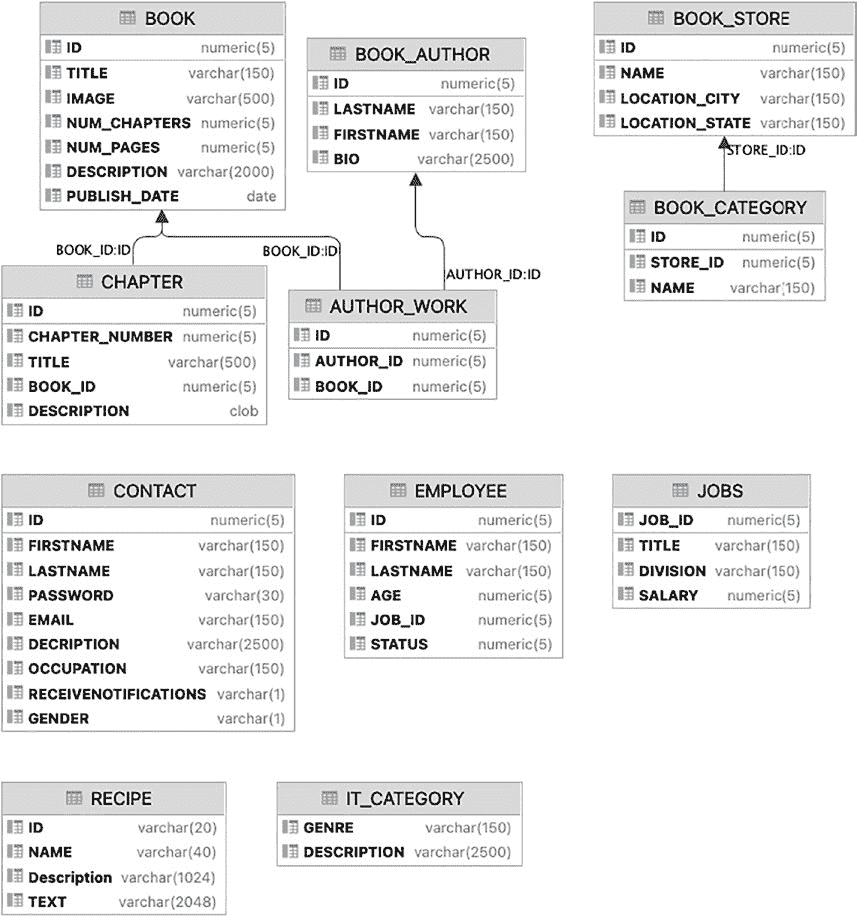

第 6 章 ■ 使用 Jakarta EE 进行 JDBC 编程

6-1\. 项目结构

表示本章所用数据库模型的实体关系（ER）图如图 6-1 所示。

***图 6-1.** 数据库模型的 ER 图*

第 6 章 ■ 使用 Jakarta EE 进行 JDBC 编程

以下是包含本章示例的项目代码结构。用于创建表和向数据库表中插入记录的 SQL 脚本位于 *sql* 文件夹中。

.├── pom.xml

└── src

└── main

├── java

│ ├── db_props.properties

│ └── org

│ └── jakartaeerecipe

│ └── chapter06

│ ├── CreateConnection.java

│ ├── dao

│ │ ├── AuthorDAO.java

│ │ └── ChapterDAO.java

│ ├── entity

│ │ ├── Author.java

│ │ ├── Book.java

│ │ ├── BookAuthor06.java

│ │ ├── Chapter.java

│ │ └── key

│ │ ├── AuthorWorkEmbedded.java

│ │ ├── AuthorWorkPKEmbedded.java

│ │ └── AuthorWorkPKNonEmbedded.java

│ ├── recipe06_02

│ …

└── sql

└── create_database.sql

6-2\. 获取数据库驱动程序并将其添加到 CLASSPATH

问题

您需要能够从应用程序中使用数据库，因此需要获取驱动程序并为应用程序配置数据库。

解决方案

为您要使用的数据库下载相应的驱动程序，并将其添加到应用程序的 CLASSPATH 中。在此解决方案中，我假设您将开发一个企业级 Web 应用程序并将其部署到 GlassFish 应用服务器。该应用程序将使用 Oracle 数据库进行持久化。在这种情况下，建议下载最新的 Oracle 数据库 297

第 6 章 ■ 使用 Jakarta EE 进行 JDBC 编程

Java 数据库连接（JDBC）驱动程序。在撰写本文时，该驱动程序是 `ojdbc8.jar`，但您可以在 [www.oracle.com/database/technologies/appdev/jdbc-ucp-21-4c-patched-downloads.html](http://www.oracle.com/database/technologies/appdev/jdbc-ucp-21-4c-patched-downloads.html) 找到最新版本。或者，可以通过以下 Maven 坐标将其用作 Maven 依赖项：

<!-- https://mvnrepository.com/artifact/com.oracle.database.jdbc/ojdbc11 -->

<dependency>

<groupId>com.oracle.database.jdbc</groupId>

<artifactId>ojdbc11</artifactId>

<version>21.4.0.0.1</version>

</dependency>

您的应用程序的驱动程序可能不同，具体取决于您计划使用的数据库。例如，要使用 PostgreSQL 数据库，您需要从 [`jdbc.postgresql.org/`](https://jdbc.postgresql.org/) 下载驱动程序。

下载了数据库所需的驱动程序后，将它们添加到应用程序的 CLASSPATH 中。如果使用 IDE，您可以相应地调整应用程序项目的项目属性，以包含包含数据库驱动程序的 JAR 文件。如果您从命令行或终端工作，可以通过发出以下命令之一将驱动程序添加到 CLASSPATH，具体取决于您使用的操作系统平台。

在基于 Unix 的系统或 OS X 上使用以下命令：

export CLASSPATH=/<jar 的路径>/ojdbc11.jar

在 Windows 上使用以下命令：

set CLASSPATH=C:\<jar 的路径>\ojdbc11.jar

将 `<jar 的路径>` 替换为您计算机上 ojdbc jar 文件的实际路径。

您现在应该能够从应用程序中使用数据库了，但要部署到 GlassFish 应用服务器，您需要使数据库驱动程序对 GlassFish 可用。您可以通过将包含数据库驱动程序的 JAR 文件复制到 GlassFish 的 lib 目录来实现此目的。重新启动应用服务器实例，您就可以部署数据库应用程序了。

工作原理


从应用程序中操作任何数据库的第一步，都是为所选的具体数据库供应商配置数据库驱动程序。无论你决定使用 Apache Derby、MySQL、PostgreSQL、Oracle、Microsoft SQL 还是其他数据库，大多数数据库都提供了相应的 JDBC 驱动程序。此驱动程序必须添加到应用程序的 CLASSPATH 中，如果使用了集成开发环境（IDE），还需添加到 IDE 项目的 CLASSPATH 中。如果通过命令行或终端操作，每次打开新会话时都需要设置 CLASSPATH。如果使用 IDE，通常可以保存设置，只需配置一次即可。将数据库驱动程序添加到应用程序或项目 CLASSPATH 后，就可以开始操作数据库了。

当需要将应用程序部署到服务器时，必须确保服务器能够访问该数据库驱动程序。你只需将数据库的驱动程序 JAR 文件添加到 lib 目录并重启服务器即可。完成此操作后，就可以部署基于 JDBC 的应用程序，或者为数据库设置数据库连接池。有关如何使用标准 JDBC 连接从应用程序内部连接到数据库，或如何通过 GlassFish 或 Payara 应用服务器设置 JDBC 连接池的更多信息，请参阅配方 6-2。

第 6 章 ■ 使用 Jakarta EE 进行 JDBC 编程

6-3. 连接到数据库

问题

你需要连接到数据库，以便应用程序能够执行数据库事务。

解决方案 #1

在应用程序内部执行 JDBC 连接到数据库。通过创建一个新的 Connection 对象，然后加载特定数据库所需的驱动程序来实现。Connection 对象准备就绪后，调用其 getConnection() 方法。以下代码演示了如何获取与 Oracle 数据库的连接：

public class OracleConnection {

private final String HOST = "myHost"; // 数据库主机名

private final String PORT = "1521"; // 数据库端口

private final String DB = "myDatabase"; // 数据库名称

private final String USER = "user"; // 数据库用户名

private final String PASSWORD = "password"; // 数据库密码

public static Connection getConnection() throws SQLException {

Connection conn = null;

String jdbcUrl = "jdbc:oracle:thin:@" + HOST + ":"

+ PORT + ":" + DB;

conn = DriverManager.getConnection(jdbcUrl, USER, PASSWORD);

System.out.println("Successfully connected");

return conn;

}

public static void main(String[] args) throws SQLException {

getConnection();

}

}

此示例中展示的方法返回一个已准备好用于数据库访问的 Connection 对象。编译并执行上述 Java 类后，控制台应打印消息 “Successfully connected”。

解决方案 #2

在应用服务器内配置一个数据库连接池，并从应用程序中连接到该连接池。

使用 DataSource 对象来创建连接池。DataSource 对象必须已在应用服务器环境中正确实现并部署。DataSource 对象实现并部署后，应用程序即可使用它来获取数据库连接。

■ **注意** 连接池是由应用服务器（容器管理的连接池）分配的一组相同的数据库连接，供应用程序用于各个客户端会话。

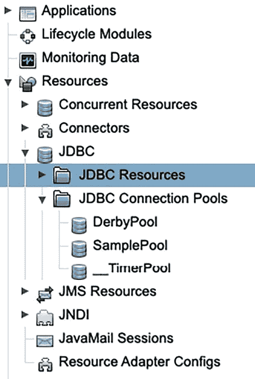

第 6 章 ■ 使用 Jakarta EE 进行 JDBC 编程

要使用 GlassFish 管理控制台创建连接池，首先通过访问 http://localhost:4848（假设你与服务器在同一台机器上，并且你的 GlassFish 安装使用默认端口号），使用安装时指定的凭据登录控制台。

成功登录控制台后，单击“资源”下的“JDBC”菜单，然后展开“JDBC 连接池”菜单，如图 6-2 所示。

***图 6-2.** 在 GlassFish 管理控制台中显示 JDBC 连接池* 单击“JDBC 连接池”屏幕上的“新建”按钮，它将导航至“新建 JDBC 连接池（步骤 1/2）”屏幕。在此处，你可以命名连接池、选择资源类型以及选择数据库驱动程序供应商。在本示例中，我使用的是 Oracle Database 12c。因此，条目应如图 6-3 所示进行指定，不过你可以将连接池名称更改为你喜欢的名称。

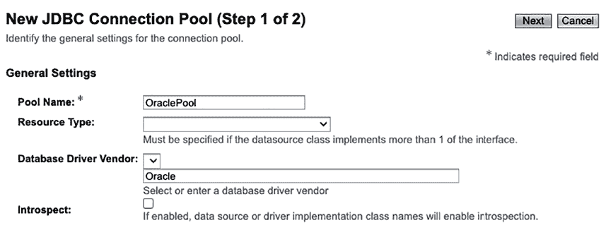

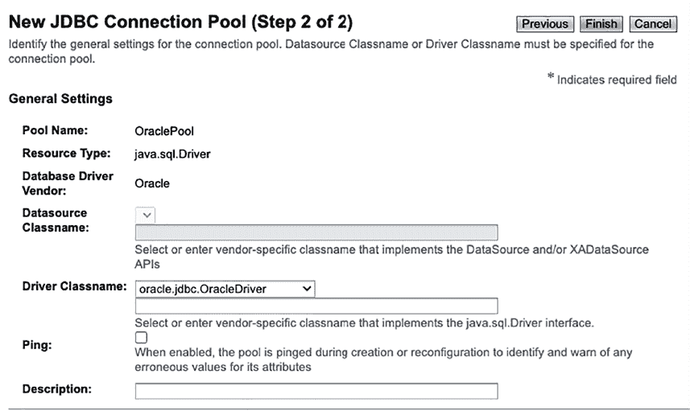

第 6 章 ■ 使用 Jakarta EE 进行 JDBC 编程

***图 6-3.** 创建 GlassFish JDBC 连接池*

当下一个屏幕打开时，它应自动包含你的 Oracle 数据库 DataSource 类名映射，即 oracle.jdbc.pool.OracleDataSource。如果看起来不像图 6-4，那么你可能尚未将 ojdbc8.jar 数据库驱动程序放入应用服务器的 **lib** 目录。请务必选中“Ping”选项旁边的“已启用”复选框。

***图 6-4.** 数据源类名自动填充*

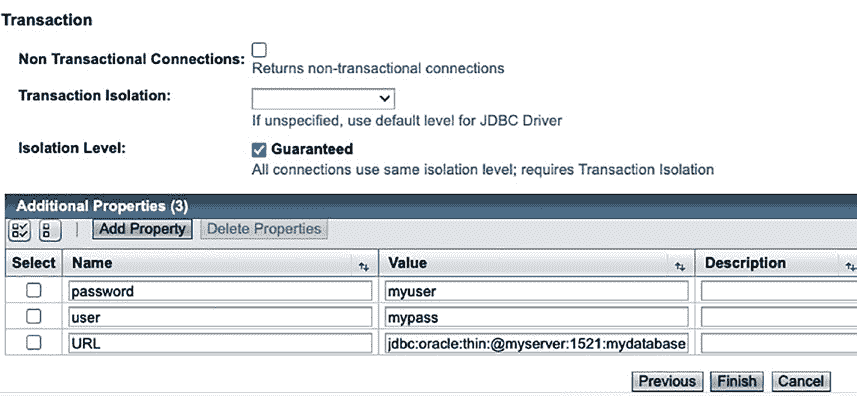

第 6 章 ■ 使用 Jakarta EE 进行 JDBC 编程

最后，向下滚动到第二个屏幕的底部，并选中“附加属性”表中的所有属性，但 User、Password 和 URL 属性除外。请根据你要连接的数据库为这些属性指定信息，如图 6-5 所示。相应填写后，单击“完成”按钮。

***图 6-5.** 为你的数据库填充附加属性*

单击“完成”后，你应该会看到一条消息，指示“ping”已成功。现在，你可以通过单击左侧树形菜单中的“JDBC 资源”菜单来设置 JDBC 资源。当“JDBC 资源”屏幕出现时，单击“新建...”按钮。为你的资源输入一个 JNDI 名称，以 jdbc/ 开头，然后为你刚刚创建的数据库连接池选择连接池名称。屏幕应类似于图 6-6。相应填写后，单击“确定”按钮以完成资源的创建。

■ **注意** JNDI 是一种通信技术，允许应用程序在应用服务器容器内按名称与服务进行通信 (https://docs.oracle.com/javase/jndi/tutorial/getStarted/overview/index.html)。

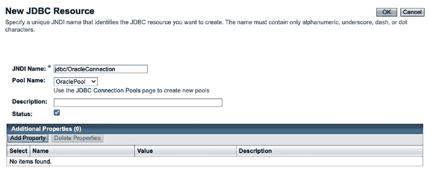

第 6 章 ■ 使用 Jakarta EE 进行 JDBC 编程

***图 6-6.** 创建 JDBC 资源*

你可以使用以下代码通过 DataSource 对象获取数据库连接：

public static Connection getDSConnection() {

Connection conn = null;

try {

Context ctx = new InitialContext();

DataSource ds = (DataSource)ctx.lookup("jdbc/OracleConnection");

conn = ds.getConnection();

} catch (NamingException | SQLException ex) {

ex.printStackTrace();

}

return conn;

}

请注意，在 DataSource 实现中唯一需要的信息是一个有效的 DataSource 对象的名称。获取数据库连接所需的所有信息都在应用服务器内部进行管理。

工作原理

你有几种选项可用于创建 Java 应用程序中使用的数据库连接。如果你正在编写独立或桌面应用程序，通常标准 JDBC 连接是最佳选择。然而，如果处理企业级或基于 Web 的应用程序，DataSource 对象可能是正确的选择。本配方的解决方案 #1 涵盖了前一种选项，它是在独立环境中创建数据库连接的最简单方法。我将首先通过解决方案 #1 介绍 JDBC 连接的创建。


一旦确定了要使用的数据库，就需要为所选数据库供应商及其版本获取正确的驱动程序。有关获取驱动程序并将其放入 `CLASSPATH` 以供使用的更多信息，请参阅配方 6-1。将 JAR 文件放入 `CLASSPATH` 后，就可以使用 JDBC `DriverManager` 来获取与数据库的连接。

第 6 章 ■ 使用 Jakarta EE 的 JDBC

■ **注意** 从 JDBC 4.0 版本开始，包含在 `CLASSPATH` 中的驱动程序会自动加载到 `DriverManager` 对象中。如果你使用的是 4.0 之前的 JDBC 版本，则需要手动加载驱动程序。

要使用 `DriverManager` 获取与数据库的连接，需要向其传递一个包含 JDBC URL 的字符串。JDBC URL 由数据库供应商名称、托管数据库的服务器名称、数据库名称、数据库端口号，以及有权访问所需模式的有效数据库用户名和密码组成。很多时候，用于创建 JDBC URL 的值可以从属性文件中获取，这样在需要时可以轻松更改这些值。要了解有关使用属性文件存储连接值的更多信息，请参阅配方 6-4。用于为解决方案 #1 创建 JDBC URL 的代码如下所示：

```java
String jdbcUrl = "jdbc:oracle:thin:@" + this.hostname + ":" +
this.port + ":" + this.database;
```

一旦所有变量都被替换到字符串中，它将类似于以下内容：`jdbc:oracle:thin:@hostname:1521:database`

创建 JDBC URL 后，可以将其传递给 `DriverManager.getConnection()` 方法以获取 `java.sql.Connection` 对象。如果传递给 `getConnection()` 方法的信息不正确，将抛出 `java.sql.SQLException`；否则，将返回一个有效的 `Connection` 对象。

■ **注意** 示例中 `jdbcUrl` 连接字符串的前缀 `jdbc:oracle:thin` 表示你将使用位于 `ojdbc11.jar` 中的 Oracle 驱动程序。`DriverManager` 负责建立关联。

如果在应用程序服务器（如 GlassFish）上运行，获取连接的首选方式是使用 `DataSource`。要使用 `DataSource` 对象，你需要有一个应用程序服务器来部署它。任何符合规范的应用程序服务器，如 Apache TomEE、GlassFish、Oracle WebLogic 或 Open Liberty 都可以。像 Payara Micro 这样的微服务容器也可以与 `DataSource` 配合使用。大多数应用程序服务器都包含一个管理 Web 界面，可用于轻松部署 `DataSource` 对象，例如本配方的解决方案 #2 中通过 GlassFish 演示的那样。但是，你也可以通过使用如下所示的代码手动部署 `DataSource` 对象：

```java
org.jakartaeerecipes.chapter5.recipe05_02.FakeDataSourceDriver ds =
    new org.jakartaeerecipes.chapter5.recipe05_02.FakeDataSourceDriver();
ds.setServerName("my-server");
ds.setDatabaseName("JakartaEERecipes");
ds.setDescription("Database connection for Jakarta EE 8 Recipes");
```

这段代码实例化了一个代表新 `DataSource` 驱动类的类，然后根据要注册的数据库设置属性。此处演示的 `DataSource` 代码通常用于在应用程序服务器中注册 `DataSource`，或用于访问 JNDI 服务器。如果你使用基于 Web 的管理工具来部署 `DataSource`，应用程序服务器通常会在后台完成这项工作。大多数数据库供应商会随其 JDBC 驱动程序一起提供 `DataSource` 驱动程序，因此如果正确的 JAR 文件位于应用程序或服务器的 `CLASSPATH` 中，它应该能被识别并可供使用。

一旦 `DataSource` 被实例化并配置好，下一步就是向 JNDI 命名服务注册该 `DataSource`。

以下代码演示了如何使用 JNDI 注册 `DataSource`：

```java
try {
    Context ctx = new InitialContext();
```


DataSource ds =

(DataSource) ctx.bind("jdbc/OracleConnection");

} catch (NamingException ex) {

ex.printStackTrace();

}

一旦 DataSource 部署完成，任何部署到同一应用服务器的应用程序都可以访问它。使用 DataSource 对象的美妙之处在于，你的应用程序代码无需知道数据库的任何连接信息（例如用户凭证）；它只需要知道 DataSource 的名称。按照惯例，DataSource 的名称以 `jdbc/` 前缀开头，后跟一个标识符。要查找 DataSource 对象，需要使用 `InitialContext` 对象。`InitialContext` 会检查应用服务器中所有可用的 DataSource，如果找到则返回一个有效的 DataSource；否则，它将抛出 `java.naming.NamingException` 异常。在方案 #2 中，你可以看到 `InitialContext` 返回一个必须强制转换为 DataSource 的对象：

Context ctx = new InitialContext();

DataSource ds = (DataSource)ctx.lookup("jdbc/OracleConnection");

如果 DataSource 是一个连接池缓存，那么当应用程序请求连接时，应用服务器会发送池中的一个可用连接。以下代码行从 DataSource 返回一个 Connection 对象：

Connection conn = ds.getConnection();

当然，如果无法获得有效连接，则会抛出 `java.sql.SQLException` 异常。DataSource 技术优于手动指定所有详细信息并将其传递给 `DriverManager`，因为数据库连接信息只存储在一个地方：应用服务器或微服务容器中，而不是每个应用程序内部。一旦部署了有效的 DataSource，它就可以被多个应用程序使用。

当你的应用程序获得有效连接后，就可以用它来操作数据库。要了解有关使用 Connection 对象操作数据库的更多信息，请参阅本章中关于数据库操作的相关内容。

6-4. 处理数据库连接异常

问题

你的应用程序中的数据库活动抛出了异常。你需要处理该 SQL 异常，以防止应用程序崩溃。

第 6 章 ■ 使用 Jakarta EE 的 JDBC

解决方案

使用 `try-catch` 块来捕获并处理 JDBC 连接或 SQL 查询抛出的任何 SQL 异常。以下代码演示了如何实现 `try-catch` 块以捕获 SQL 异常：

try {

// 执行数据库任务

} catch (java.sql.SQLException){

// 执行异常处理

}

工作原理

可以使用标准的 `try-catch` 块来捕获 `java.sql.SQLException` 异常。如果不处理这些异常，你的代码将无法编译，并且为了防止应用程序在抛出这些异常时崩溃，处理它们是一个好主意。几乎所有针对 `java.sql.Connection` 对象执行的操作都需要进行错误处理，以确保数据库异常得到正确处理。你需要确保在完成操作且不再使用 Connection 对象后关闭连接。同样，关闭 `java.sql.Statement` 对象以清理内存分配也是一个好主意。

由于 Statement 和 Connection 对象需要关闭，通常使用 `try-with-resource` 来确保所有资源都得到妥善处理。你很可能看到类似以下风格的 JDBC 代码：

try (Connection conn = DriverManager.getConnection(jdbcUrl)) {

// 执行数据库任务

} catch (java.sql.SQLException ex) {

// 执行异常处理

}

适当的异常处理有时会使 JDBC 代码编写起来相当繁琐，但它也能确保需要数据库访问的应用程序不会失败，从而导致数据丢失。

6-5. 简化连接管理

问题

你的应用程序需要使用数据库。为了操作数据库，你需要打开一个连接。


与其每次需要访问数据库时都编写打开数据库连接的逻辑，不如简化连接过程。

解决方案

编写一个类来处理应用程序内的所有连接管理。这样做将允许你调用该类来获取连接，而不是每次需要访问数据库时都设置一个新的 `Connection` 对象。执行以下步骤为你的 JDBC 应用程序设置一个连接管理环境：

第 6 章 ■ 使用 Jakarta EE 的 JDBC

1.  创建一个名为 `CreateConnection.java` 的类，该类将封装应用程序的所有连接逻辑。
2.  创建一个属性文件来存储你的连接信息。将该文件放在指定位置，以便 `CreateConnection` 类可以加载它。
3.  使用 `CreateConnection` 类来获取你的数据库连接。

■ **注意** 如果使用应用服务器，你可以通过容器管理的连接池来处理类似的解决方案。但是，如果应用程序未部署到应用服务器容器中，那么构建一个如本解决方案中的连接管理工具是一个很好的替代方案。

以下代码是 `org.jakartaeerecipes.chapter06.CreateConnection` 类，可用于集中式连接管理：

```java
package org.jakartaeerecipes.chapter06;

import java.io.File;
import java.io.FileInputStream;
import java.io.FileNotFoundException;
import java.io.IOException;
import java.io.InputStream;
import java.nio.file.FileSystems;
import java.nio.file.Files;
import java.sql.Connection;
import javax.sql.DataSource;
import java.sql.DriverManager;
import java.sql.SQLException;
import java.util.Properties;
import javax.naming.Context;
import javax.naming.InitialContext;
import javax.naming.NamingException;

public final class CreateConnection {

    static Properties props = new Properties();
    static String hostname = null;
    static String port = null;
    static String database = null;
    static String username = null;
    static String password = null;
    static String jndi = null;

    public CreateConnection() {
    }

    public static void loadProperties() {
        // 如果主机名已加载则返回
        if(hostname != null){
            return;
        }

        try(InputStream in = Files.newInputStream(FileSystems.getDefault().getPath(System.
                getProperty("user.dir")
                + File.separator + "db_props.properties"));) {
            // 在项目 src 目录的根目录中查找属性文件
            System.out.println(FileSystems.getDefault().getPath(System.
                    getProperty("user.dir")
                    + File.separator + "db_props.properties"));
            props.load(in);
        } catch (IOException ex) {
            ex.printStackTrace();
        }

        hostname = props.getProperty("host_name");
        port = props.getProperty("port_number");
        database = props.getProperty("db_name");
        username = props.getProperty("username");
        password = props.getProperty("password");
        jndi = props.getProperty("jndi");
        System.out.println(hostname);
    }

    public static Connection getConnection() throws SQLException {
        Connection conn = null;
        String jdbcUrl = "jdbc:oracle:thin:@" + hostname + ":"
                + port + ":" + database;
        conn = DriverManager.getConnection(jdbcUrl, username, password);
        System.out.println("Successfully connected");
        return conn;
    }

    public static Connection getDSConnection() {
        Connection conn = null;
        try {
            Context ctx = new InitialContext();
            DataSource ds = (DataSource) ctx.lookup(jndi);
            conn = ds.getConnection();
        } catch (NamingException | SQLException ex) {
            ex.printStackTrace();
        }
        return conn;
    }

    public static void main(String[] args) {
        Connection conn = null;
        try {
            CreateConnection.loadProperties();
            System.out.println("Beginning connection..");
            conn = CreateConnection.getConnection();
            //performDbTask();
        } catch (java.sql.SQLException ex) {
            ex.printStackTrace();
        } finally {
            if (conn != null) {
                try {
                    conn.close();
                } catch (SQLException ex) {
                    ex.printStackTrace();
                }
            }
        }
    }
}
```

接下来，以下代码行是用于获取数据库连接的属性文件应包含内容的示例。在此示例中，属性文件名为 `db_props.properties`：

```
host_name=your_db_server_name
db_name=your_db_name
username=db_username
password=db_username_password
port_number=db_port_number
jndi=jndi_connection_string
```

最后，使用 `CreateConnection` 类为你的应用程序获取连接。以下代码演示了这一概念：

```java
Connection conn = null;
try {
    CreateConnection.loadProperties();
    System.out.println("Beginning connection..");
    conn = CreateConnection.getConnection();
    //performDbTask();
} catch (java.sql.SQLException ex) {
    System.out.println(ex);
} finally {
    if (conn != null) {
        try {
            conn.close();
        } catch (SQLException ex) {
            ex.printStackTrace();
        }
    }
}
```

■ **注意** 你可以更新此代码以使用 `try-with-resources` 语法来消除 `finally` 块的要求。但是，我展示此语法是为了演示如何确保 `Connection` 对象被关闭，如果你没有使用 `try-with-resources` 的话。

要运行代码进行测试，请执行 `org.jakartaeerecipes.chapter06.CreateConnection` 类，因为它包含一个用于测试目的的 `main` 方法。

第 6 章 ■ 使用 Jakarta EE 的 JDBC

工作原理

在数据库应用程序中获取连接可能涉及大量代码。此外，如果每次需要获取连接时都重新输入代码，该过程容易出错。通过将数据库连接逻辑封装在单个类中，你可以在每次需要连接到数据库时重用相同的连接代码。这提高了你的生产力，减少了输入错误的可能性，并且还增强了可管理性，因为如果你需要进行更改，可以在一个地方进行，而不是在多个不同的位置。

创建一种策略性的连接方法对你以及将来可能需要维护你代码的其他人都有好处。尽管在使用应用服务器或 JNDI 时，数据源是管理数据库连接的首选技术，但本配方的解决方案演示了如何使用标准的 JDBC `DriverManager` 连接。使用 `DriverManager` 的一个安全问题是，你需要将数据库凭据存储在某个地方供应用程序使用。将这些凭据以明文形式存储在任何地方都是不安全的，将它们嵌入到应用程序代码中也是不安全的，因为代码将来可能会被反编译。如解决方案所示，使用一个位于磁盘上的属性文件来存储数据库凭据。假设此属性文件在部署到服务器之前的某个时刻会被加密。

如解决方案所示，代码从属性文件中读取数据库凭据、主机名、数据库名称和端口号。然后将这些信息拼接起来形成一个 JDBC URL，`DriverManager` 可以使用该 URL 来获取与数据库的连接。一旦获取到连接，就可以在任何地方使用它，然后关闭它。类似地，如果使用已部署到应用服务器的 `DataSource`，则可以使用属性文件来存储 JNDI 连接。这是使用 `DataSource` 获取数据库连接所需的唯一信息。对于开发人员来说，这两种连接类型之间的唯一区别是为了获取 `Connection` 对象而调用的方法名称，在示例中分别是 `getDSConnection()` 或 `getConnection()`。


您可以开发一个 JDBC 应用程序，但这样用于获取连接的代码就需要在整个程序中硬编码。而本方案则能将所有获取连接的代码封装到单个类中，使开发者无需为此操心。这种技术还能让代码更易于维护。例如，如果应用程序最初使用 DriverManager 部署，但后来需要改用 DataSource，只需修改极少量代码即可。

6-6\. 查询数据库

问题

公司数据库中有一个包含作者信息的表，您需要查询该表以检索记录。

解决方案

使用配方 6-2 或 6-4 中介绍的技术之一获取 JDBC 连接；然后使用`java.sql.Connection`对象创建`Statement`对象。`java.sql.Statement`对象包含`executeQuery`方法，可用于解析文本字符串并查询数据库。执行查询后，您可以将查询结果检索到`ResultSet`对象中。以下示例摘自`org.jakartaeerecipes.chapter06.dao.AuthorDAO`类，它查询名为`BOOK_AUTHOR`的数据库表，并将结果打印到服务器日志：

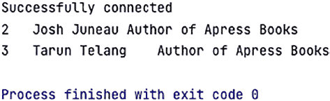

第 6 章 ■ 使用 Jakarta EE 的 JDBC

```java
public void queryBookAuthor() {

    final String qry = "select id, first, last, bio from book_author";

    CreateConnection.loadProperties();

    try (Connection conn = CreateConnection.getConnection();

         Statement stmt = conn.createStatement();

         ResultSet rs = stmt.executeQuery(qry)) {

        while (rs.next()) {

            int author_id = rs.getInt("ID");

            String first_name = rs.getString("FIRSTNAME");

            String last_name = rs.getString("LASTNAME");

            String bio = rs.getString("BIO");

            System.out.println(author_id + "\t" + first_name

                    + " " + last_name + "\t" + bio);

        }

    } catch (SQLException e) {

        e.printStackTrace();

    }

}
```

针对本书附带的数据库模式执行此方法，考虑到每个作者记录的`BIO`列均为空，将产生如图 6-7 所示的结果。

***图 6-7.** AuthorDAO 类的 queryBookAuthor()方法的输出*

**工作原理**

对数据库执行的最常见操作之一就是查询。使用 JDBC 执行数据库查询相当简单，尽管每次执行查询时都需要使用一些样板代码。首先，您需要为要查询的数据库和模式获取一个`Connection`对象。您可以使用配方 6-2 中的解决方案之一来完成此操作。接下来，您需要构建一个查询并将其存储为字符串格式。然后通过调用`loadProperties()`方法加载`CreateConnection`属性，这确保使用`db_props.properties`文件来填充数据库连接信息。接着，使用`try-with-resources`子句创建查询数据库所需的对象。由于这些对象是在`try-with-resources`中实例化的，因此一旦不再使用，它们将自动关闭。然后使用`Connection`对象创建`Statement`。您的查询字符串将传递给`Statement`对象的`executeQuery`方法，以实际查询数据库：

第 6 章 ■ 使用 Jakarta EE 的 JDBC

```java
String qry = "select ID, FIRSTNAME, LASTNAME, BIO from book_author";

CreateConnection.loadProperties();

try (Connection conn = CreateConnection.getConnection();

     Statement stmt = conn.createStatement();

     ResultSet rs = stmt.executeQuery(qry);) {

    . . .
```

如您所见，`Statement`对象的`executeQuery`方法接受一个字符串并返回一个`ResultSet`对象。`ResultSet`对象使处理查询结果变得容易，您可以按任何顺序获取所需的信息。如果您查看下一行代码，会在`ResultSet`对象上创建一个`while`循环。此循环将继续调用`ResultSet`对象的`next`方法，每次迭代获取查询返回的下一行。在本例中，`ResultSet`对象名为`rs`，因此只要`rs.next()`返回`true`，循环就会继续处理。一旦处理完所有返回的行，`rs.next()`将返回`false`，表示没有更多行需要处理。

在`while`循环内，处理每一行返回的数据。每次遍历都会解析`ResultSet`对象以获取指定列名的值。请注意，如果预期列返回字符串，则必须调用`ResultSet`的`getString()`方法，并以字符串格式传递列名。类似地，如果预期列返回整数，则应调用`ResultSet`的`getInt()`方法，并以字符串格式传递列名。其他数据类型也是如此。这些方法将返回相应的列值。在本配方的解决方案示例中，这些值被存储到局部变量中：

```java
int author_id = rs.getInt("ID");

String first_name = rs.getString("FIRSTNAME");

String last_name = rs.getString("LASTNAME");

String bio = rs.getString("BIO");
```

获取列值后，您可以对存储在局部变量中的值进行任何操作。在本例中，它们通过`System.out.println()`方法打印出来。

请注意，此示例中使用了`try-catch-finally`块。尝试查询数据库时可能会抛出`java.sql.SQLException`（例如，如果`Connection`对象未正确获取，或者您尝试查询的数据库表不存在）。您必须提供异常处理来处理这些情况下的错误。因此，所有数据库处理代码都应放在`try`块内。然后`catch`块处理`SQLException`，因此如果抛出异常，将使用`catch`块内的代码进行处理。听起来很简单，对吧？确实如此，但每次执行数据库查询时都必须这样做。这意味着大量的样板代码。在`finally`块内，您会看到如果`Statement`和`Connection`对象不为`null`，则它们会被关闭。

■ **注意** 执行这些任务还会带来处理`java.sql.SQLException`的开销。如果尝试关闭一个`null`对象，可能会发生这种情况。关闭打开的语句和连接始终是一个好习惯。这将有助于确保系统能够根据需要重新分配资源，并对数据库保持尊重。尽快关闭连接非常重要，以便其他进程可以重用它们。

第 6 章 ■ 使用 Jakarta EE 的 JDBC

6-7\. 执行 CRUD 操作

问题

您需要能够从企业应用程序中执行标准数据库操作。也就是说，您需要能够创建、检索、更新和删除（CRUD）数据库记录。

解决方案

创建一个`Connection`对象，并使用配方 6-2 中提供的解决方案之一获取数据库连接；然后使用从`java.sql.Connection`对象获取的`java.sql.Statement`对象执行 CRUD 操作。以下代码取自`org.jakartaeerecipes.chapter06.recipe05_06.AuthorDAOStandard.java`，演示了如何使用 JDBC 对`BOOK_AUTHORS`表执行每种 CRUD 操作（查询/检索操作除外，因为该操作已在配方 6-5 中介绍）。


■ **注意** 本示例演示了使用字符串拼接来创建 SQL 语句，而非使用 PreparedStatement 的替换变量。这种做法并不安全，因为变量可能包含恶意值，从而危及数据库安全。本示例的解决方案展示了使用字符串拼接创建 SQL 语句的做法，以便您了解可用的不同选项。有关使用 PreparedStatement 对象以及比字符串拼接更安全的替代方案，请参见示例 6-7。

private void performCreate(String first, String last, String bio) {

String sql = "INSERT INTO BOOK_AUTHOR VALUES("

+ "BOOK_AUTHOR_S.NEXTVAL, "

+ "'" + last + "', "

+ "'" + first + "', "

+ "'" + bio + "')";

try (Connection conn = CreateConnection.getConnection();

PreparedStatement stmt = conn.prepareStatement(sql)) {

// 返回行数，若不成功则返回 0

int result = stmt.executeUpdate();

if (result > 0) {

System.out.println("-- 记录已创建 --");

} else {

System.out.println("!! 记录未创建 !!");

}

} catch (SQLException e) {

e.printStackTrace();

}

}

private void performUpdate(String first, String last, String bio) {

String sql = "UPDATE BOOK_AUTHOR "

+ "SET BIO = '" + bio + "' "

+ "WHERE LASTNAME = '" + last + "' "

+ "AND FIRSTNAME = '" + first + "'";

第 6 章 ■ 使用 Jakarta EE 的 JDBC

try (Connection conn = CreateConnection.getConnection();

PreparedStatement stmt = conn.prepareStatement(sql)) {

int result = stmt.executeUpdate();

if (result > 0) {

System.out.println("-- 记录已更新 --");

} else {

System.out.println("!! 记录未更新 !!");

}

} catch (SQLException e) {

e.printStackTrace();

}

}

private void performDelete(String first, String last) {

String sql = "DELETE FROM BOOK_AUTHOR WHERE LASTNAME = '" + last + "' "

+ "AND FIRSTNAME = '" + first + "'";

try (Connection conn = CreateConnection.getConnection();

PreparedStatement stmt = conn.prepareStatement(sql)) {

int result = stmt.executeUpdate();

if (result > 0) {

System.out.println("-- 记录已删除 --");

} else {

System.out.println("!! 记录未删除 !!");

}

} catch (SQLException e) {

e.printStackTrace();

}

}

■ **注意** 如果您仔细阅读代码，会发现每当向数据库传递字符串数据时，都会先调用其 `toUpperCase` 方法将其转换为大写。这是为了帮助维护数据库中所有数据的大写标准格式。

执行以下 `main` 方法将产生如下结果：

public static void main(String[] args) {

AuthorDAO authorDao = new AuthorDAO();

authorDao.queryBookAuthor();

authorDao.performCreate("Nikita", "Goswami", "N/A");

authorDao.performUpdate("Nikita", "Goswami", "Nikita’s Bio");

authorDao.queryBookAuthor();

authorDao.performDelete("Nikita", "Goswami");

}

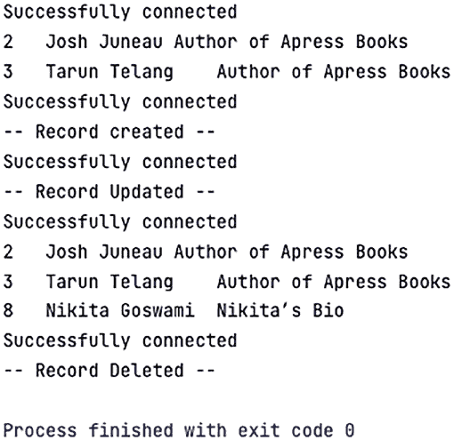

第 6 章 ■ 使用 Jakarta EE 的 JDBC

运行该类的 `main` 方法得到的结果应如图 6-8 所示。

***图 6-8.** AuthorDAO 类的输出*

工作原理

执行几乎所有数据库任务时，都使用相同的基本代码格式。格式如下：

1. 在 `try` 子句中获取数据库连接。
2. 在 `try` 子句中通过连接创建语句。
3. 使用语句执行数据库任务。
4. 对数据库任务的结果进行处理。
5. 关闭语句（如果使用完毕，也关闭数据库连接）。

如果使用 `try-with-resources` 子句，此步骤将自动为您完成，如本示例解决方案所示。

使用 JDBC 执行查询与使用数据操作语言（DML）的主要区别在于，根据要执行的操作，您需要在 `Statement` 对象上调用不同的方法。要执行查询，需要调用 `Statement` 的 `executeQuery` 方法。要执行 DML 任务（如插入、更新和删除），请调用 `executeUpdate` 方法。


本方案中的 `performCreate` 方法演示了向数据库插入记录的操作。要向数据库中插入记录，你需要构建一个字符串格式的 SQL 插入语句。执行插入操作时，需将该 SQL 字符串传递给 `Statement` 对象的 `executeUpdate` 方法。如果插入成功，将返回一个整数值，指明已插入的行数。

如果插入操作未成功执行，则可能返回零，或者抛出 `SQLException` 异常，表明语句或数据库连接存在问题。

第 6 章 ■ 使用 Jakarta EE 进行 JDBC 操作

本方案中的 `performUpdate` 方法演示了更新数据库表中一条或多条记录的操作。首先，你需要构建一个字符串格式的 SQL 更新语句。接着，要执行更新操作，需将该 SQL 字符串传递给 `Statement` 对象的 `executeUpdate` 方法。如果更新成功执行，将返回一个整数值，指明已更新的记录数。如果更新操作未成功执行，则可能返回零，或者抛出 `SQLException` 异常，表明语句或数据库连接存在问题。

本方案涵盖的最后一个数据库操作是删除操作。方案中的 `performDelete` 方法演示了如何从数据库中删除记录。首先，你需要构建一个字符串格式的 SQL 删除语句。接着，要执行删除操作，需将该 SQL 字符串传递给 `Statement` 对象的 `executeUpdate` 方法。如果删除成功，将返回一个整数值，指明已删除的行数。否则，如果删除失败，将返回零，或者抛出 `SQLException` 异常，表明语句或数据库连接存在问题。

几乎每个数据库应用程序都会在某个时刻使用至少一种 CRUD 操作。如果你在 Java 应用程序中处理数据库，这是你需要了解的一项基本 JDBC 知识。即使你不直接使用 JDBC API，了解这些基础知识也是有益的。

6-8. 防止 SQL 注入

问题

你的应用程序执行数据库任务。为了降低 SQL 注入攻击的风险，你需要确保没有未经过滤的文本字符串被附加到 SQL 语句中并针对数据库执行。

■ **提示** 预编译语句不仅提供针对 SQL 注入攻击的保护。它们还提供了一种集中化并更好地控制应用程序内所用 SQL 的方法，并带来性能上的好处。与其创建同一查询的多个可能不同的版本，不如将查询创建为一次预编译语句，然后从代码中的许多不同位置调用它。对查询逻辑的任何更改只需在准备该语句的地方进行即可。

■ **注意** 针对本方案中 Acme Bookstore 应用程序使用的每个数据库表，都已创建了数据访问对象（DAO）。这些 DAO 类用于对 Acme Bookstore 应用程序的每个表执行 CRUD 操作。这些 CRUD 操作利用 `PreparedStatement` 来增加安全性并提升应用程序性能。

解决方案

利用 `PreparedStatement` 来执行数据库任务。`PreparedStatement` 向数据库管理系统（DBMS）发送的是预编译的 SQL 语句，而不是纯文本字符串。以下代码演示了如何使用 `java.sql.PreparedStatement` 对象执行数据库查询和数据库更新。以下代码摘录自一个新的数据访问对象 `org.jakartaeerecipes.chapter06.dao.AuthorDAO`，该对象在执行 SQL 语句时使用 `PreparedStatement` 对象，而不是字符串拼接：

第 6 章 ■ 使用 Jakarta EE 进行 JDBC 操作

. . .

```java
public Author performFind(int id) {

    String qry = "SELECT ID, LASTNAME, FIRSTNAME, BIO "
            + "FROM BOOK_AUTHOR "
            + "WHERE ID = ?";
    Author author = null;
    CreateConnection.loadProperties();
    try (Connection conn = CreateConnection.getConnection();
         PreparedStatement stmt = conn.prepareStatement(qry)) {
        stmt.setInt(1, id);
        try (ResultSet rs = stmt.executeQuery();) {
            if (rs.next()) {
                int author_id = rs.getInt("ID");
                String first_name = rs.getString("FIRSTNAME");
                String last_name = rs.getString("LASTNAME");
                String bio = rs.getString("BIO");
                author = new Author(author_id,
                        first_name,
                        last_name,
                        bio);
            }
        }
    } catch (SQLException e) {
        e.printStackTrace();
    }
    return author;
}

public List<Author> performFind(String first, String last) {

    String qry = "SELECT ID, LASTNAME, FIRSTNAME, BIO "
            + "FROM BOOK_AUTHOR "
            + "WHERE LASTNAME = ? "
            + "AND FIRSTNAME = ?";
    List authorList = new ArrayList();
    try (Connection conn = CreateConnection.getConnection();
         PreparedStatement stmt = conn.prepareStatement(qry)) {
        stmt.setString(1, last);
        stmt.setString(2, first);
        try (ResultSet rs = stmt.executeQuery();) {
            while (rs.next()) {
                int author_id = rs.getInt("ID");
                String first_name = rs.getString("FIRST");
                String last_name = rs.getString("LAST");
                String bio = rs.getString("BIO");
                Author author = new Author(author_id,
                        firstName,
                        lastName,
                        bio);
                authorList.add(author);
            }
        }
    } catch (SQLException e) {
        e.printStackTrace();
    }
    return authorList;
}

private void performCreate(String first, String last, String bio) {

    String sql = "INSERT INTO BOOK_AUTHOR VALUES("
            + "BOOK_AUTHOR_S.NEXTVAL, ?, ?, ?)";
    try (Connection conn = CreateConnection.getConnection();
         PreparedStatement stmt = conn.prepareStatement(sql)) {
        stmt.setString(1, last);
        stmt.setString(2, first);
        stmt.setString(3, bio);
        // Returns row-count or 0 if not successful
        int result = stmt.executeUpdate();
        if (result > 0) {
            System.out.println("-- Record created --");
        } else {
            System.out.println("!! Record NOT Created !!");
        }
    } catch (SQLException e) {
        e.printStackTrace();
    }
}

private void performUpdate(int id, String first, String last, String bio) {

    String sql = "UPDATE BOOK_AUTHOR "
            + "SET bio = ?,"
            + " last = ?,"
            + " first = ? "
            + "WHERE ID = ?";
    try (Connection conn = CreateConnection.getConnection();
         PreparedStatement stmt = conn.prepareStatement(sql)) {
        stmt.setString(1, bio);
        stmt.setString(2, last);
        stmt.setString(3, first);
        stmt.setInt(4, id);
        int result = stmt.executeUpdate();
        if (result > 0) {
            System.out.println("-- Record Updated --");
        } else {
            System.out.println("!! Record NOT Updated !!");
        }
    } catch (SQLException e) {
        e.printStackTrace();
    }
}

private void performDelete(int id) {

    String sql = "DELETE FROM BOOK_AUTHOR WHERE ID = ?";
    try (Connection conn = CreateConnection.getConnection();
         PreparedStatement stmt = conn.prepareStatement(sql)) {
        stmt.setInt(1, id);
        int result = stmt.executeUpdate();
        if (result > 0) {
            System.out.println("-- Record Deleted --");
        } else {
            System.out.println("!! Record NOT Deleted!!");
        }
    } catch (SQLException e) {
        e.printStackTrace();
    }
}
```

. . .

前面展示的方法展示了使用 `PreparedStatement` 对象，而不是使用标准的 JDBC `Statement` 对象和字符串拼接来将变量附加到 SQL 语句中。

工作原理

虽然标准的 JDBC 语句也能完成任务，但严酷的现实是它们可能不安全且难以使用。例如，如果使用动态 SQL 语句查询数据库，并且用户接受的字符串被赋值给变量并与预期的 SQL 拼接在一起，就可能会发生糟糕的情况。


字符串。在大多数普通情况下，用户接受的字符串会被拼接，然后按预期用于查询数据库。然而，攻击者可能会决定在字符串中放置恶意代码（即*SQL 注入*），这些代码随后会通过标准的 Statement 对象被无意中发送到数据库。使用 PreparedStatements 可以防止恶意字符串被拼接到 SQL 字符串中并传递给 DBMS。PreparedStatements 使用替换变量而非拼接来使 SQL 字符串动态化。它们也是预编译的，这意味着在 SQL 发送到 DBMS 之前，会形成一个有效的 SQL 字符串。此外，PreparedStatements 可以帮助你的应用程序获得更好的性能，因为如果同一个 SQL 需要运行多次，每个会话只需编译一次。之后，替换变量可以互换，但 PreparedStatement 可以非常快速地执行 SQL。

让我们看看 PreparedStatement 在实践中是如何工作的。如果你查看本方案示例中的代码，可以看到在 `performFind()` 方法中查询了数据库表 `BOOK_AUTHOR`，将作者的 ID 作为替换变量发送，并检索匹配记录的结果。SQL 字符串如下所示：

```java
String qry = "SELECT ID, LASTNAME, FIRSTNAME, BIO "
    + "FROM BOOK_AUTHOR "
    + "WHERE ID = ?";
```

除了字符串末尾的问号（?）之外，SQL 文本看起来一切正常。

在 SQL 字符串中放置问号表示在执行 SQL 时，将使用一个替换变量来代替该问号。

使用 PreparedStatement 的下一步是声明一个 `PreparedStatement` 类型的变量。你可以通过下面这行代码看到这一点：

```java
PreparedStatement stmt = null;
```

现在，PreparedStatement 已经声明完毕，可以投入使用了。然而，使用 PreparedStatement 可能会也可能不会抛出异常。因此，任何对 PreparedStatement 的使用都应该放在 try-catch 块中，以便能够优雅地处理任何异常。例如，如果数据库连接因某种原因不可用，或者 SQL 字符串无效，就可能会发生异常。与其因为此类问题导致应用程序崩溃，最好在 catch 块中明智地处理异常。下面的 try-catch 块包含了将 SQL 字符串发送到数据库并检索结果所需的代码：

```java
try (Connection conn = CreateConnection.getConnection();
     PreparedStatement stmt = conn.prepareStatement(qry)) {

    stmt.setInt(1, id);

    try (ResultSet rs = stmt.executeQuery();) {
        if (rs.next()) {
            int author_id = rs.getInt("ID");
            String first_name = rs.getString("FIRST");
            String last_name = rs.getString("LAST");
            String bio = rs.getString("BIO");
            author = new Author(author_id,
                                first_name,
                                last_name,
                                bio);
        }
    }

} catch (SQLException e) {
    e.printStackTrace();
}
```

首先，你可以看到使用 Connection 对象来实例化一个 PreparedStatement 对象。SQL 字符串在创建时被传递给 PreparedStatement 对象的构造函数。接下来，PreparedStatement 对象用于为 SQL 字符串中的任何替换变量设置值。如你所见，示例中使用 PreparedStatement 的 `setString()` 方法将位置 1 的替换变量设置为 `id` 变量的内容。替换变量的位置与 SQL 字符串中问号（?）的位置相关联。字符串中的第一个问号分配给第一个位置，第二个问号分配给第二个位置，依此类推。问号的数量必须等于替换变量的数量，否则将抛出错误。

如果有多个替换变量需要赋值，则需要多次调用 PreparedStatement 的设置方法，依次为每个变量赋值，直到所有变量都被处理完毕。

PreparedStatements 可以接受多种不同数据类型的替换变量。例如，如果要将 Date 值赋给一个替换变量，则需要调用 `setDate(position, variable)` 方法。请参阅在线文档或你的 IDE 的代码补全功能，以获取可用于使用 PreparedStatement 对象分配替换变量的完整方法集。

也可以使用命名参数，而不是索引。要使用此技术，请为每个替换变量提供一个以冒号为前缀的名称，而不是问号。以下几行代码演示了命名参数：

```java
String qry = "SELECT ID, LAST, FIRST, BIO "
    + "FROM BOOK_AUTHOR "
    + "WHERE LAST = :last "
    + "AND FIRST = :first";

List authorList = new ArrayList();

try (Connection conn = CreateConnection.getConnection();
     PreparedStatement stmt = conn.prepareStatement(qry)) {

    stmt.setString("last", last);
    stmt.setString("first", first);

    try (ResultSet rs = stmt.executeQuery();) {
        . . .
```

一旦所有变量都赋值完毕，就可以执行 SQL 字符串了。PreparedStatement 对象包含一个 `executeQuery()` 方法，用于执行代表查询的 SQL 字符串。`executeQuery()` 方法返回一个 ResultSet 对象，其中包含针对特定 SQL 查询从数据库中获取的结果。接下来，可以遍历 ResultSet 以获取从数据库中检索到的值。有两种不同的方法可以从 ResultSet 中检索结果。

可以使用位置分配来检索结果，方法是调用 ResultSet 对象的相应 getter 方法并传递列值的位置，或者可以将要获取的列值的字符串标识符传递给 getter 方法。如果传递位置，则由列名在 SQL 字符串中出现的顺序决定。在示例中，使用基于字符串的列标识符来获取值。从示例中可以看出，将列标识符传递给适当的 getter 方法将检索到该值。当从 ResultSet 中获取记录值后，它们被存储到局部变量中。一旦收集完某个作者的所有变量，它们就被存储到一个 Author 对象中，该对象最终将从方法中返回。当然，如果替换变量设置不正确，或者 SQL 字符串有问题，则会抛出异常。这将导致 catch 块中包含的代码被执行。

如果你没有像解决方案中演示的那样使用 try-with-resources 子句，那么在使用完 PreparedStatements 后，应确保通过关闭语句来进行清理。一个好的做法是将所有清理代码放在一个 finally 块中，以确保即使抛出异常也能执行。例如，用于清理未使用的 Statement 和 Connection 对象的 finally 块可能如下所示：

```java
finally {
    if (stmt != null) {
        try {
            stmt.close();
        } catch (SQLException ex) {
            ex.printStackTrace();
        }
    }
    if (conn != null) {
        try {
            conn.close();
            conn = null;
        } catch (SQLException ex) {
            ex.printStackTrace();
        }
    }
    return author;
}
```


可以看到，实例化的 `PreparedStatement` 对象 `stmt` 会被检查是否为 `NULL`。如果不是，则通过调用 `close()` 方法将其关闭。仔细阅读本方案中的代码，你会发现类似的代码也用于处理数据库的插入、更新和删除语句。这些情况的唯一区别在于，调用的是 `PreparedStatement` 的 `executeUpdate()` 方法，而不是 `executeQuery()` 方法。`executeUpdate()` 方法会返回一个 `int` 值，表示受 SQL 语句影响的行数。

使用 `PreparedStatement` 对象优于使用 JDBC `Statement` 对象。这是因为前者更安全，性能也更好。它们还能让你的代码更易于理解和维护。

第 6 章 ■ 使用 Jakarta EE 进行 JDBC 操作

6-9. 利用 Java 对象进行数据库访问

问题

你的应用程序需要与底层数据库交互，以存储和检索数据。你更希望使用 Java 对象来编写业务逻辑，而不是直接使用 JDBC 和 SQL 来执行数据库操作。

解决方案

为每个数据库表创建一个数据访问对象（DAO），用于执行那些繁琐的 JDBC 和 SQL 工作。在 DAO 内部，创建外观方法，这些方法接受 Java 对象作为参数，这些对象代表该 DAO 所对应数据库表中的单条数据记录。使用 Java 对象将记录数据传入和传出 DAO，而 DAO 则将这些对象拆解，并在标准 SQL 语句中使用其中的数据字段。

以下类片段展示了针对 `AUTHOR` 数据库表的数据访问对象，该表用于存储图书作者数据（此 DAO 中包含一个 `main` 方法，仅用于测试目的）：

■ **注意** 完整的源代码清单，请参考 `org.jakartaeerecipes.chapter06.dao` 包中的 `AuthorDAO` 类，该类位于 JakartaEERecipes NetBeans 项目中。

...

public class AuthorDAO {

    public AuthorDAO() {

    }

    public void queryBookAuthor() {
        String qry = "select id, first, last, bio from book_author";
        CreateConnection.loadProperties();
        try (Connection conn = CreateConnection.getConnection();
             Statement stmt = conn.createStatement();
             ResultSet rs = stmt.executeQuery(qry);) {
            while (rs.next()) {
                int author_id = rs.getInt("ID");
                String first_name = rs.getString("FIRST");
                String last_name = rs.getString("LAST");
                String bio = rs.getString("BIO");
                System.out.println(author_id + "\t" + first_name
                        + " " + last_name + "\t" + bio);
            }
        } catch (SQLException e) {
            e.printStackTrace();
        }
    }

    public List<Author> obtainCompleteAuthorList() {
        String qry = "select id, first, last, bio from book_author";
        List<Author> authors = new ArrayList();
        CreateConnection.loadProperties();
        try (Connection conn = CreateConnection.getConnection();
             Statement stmt = conn.createStatement();
             ResultSet rs = stmt.executeQuery(qry);) {
            while (rs.next()) {
                int author_id = rs.getInt("ID");
                String first_name = rs.getString("FIRST");
                String last_name = rs.getString("LAST");
                String bio = rs.getString("BIO");
                Author author = new Author(author_id, first_name,
                        last_name, bio);
                authors.add(author);
            }
        } catch (SQLException e) {
            e.printStackTrace();
        }
        return authors;
    }

    public Author performFind(int id) {
        String qry = "SELECT ID, LAST, FIRST, BIO "
                + "FROM BOOK_AUTHOR "
                + "WHERE ID = ?";
        Author author = null;
        CreateConnection.loadProperties();
        try (Connection conn = CreateConnection.getConnection();
             PreparedStatement stmt = conn.prepareStatement(qry)) {
            stmt.setInt(1, id);
            try (ResultSet rs = stmt.executeQuery();) {
                if (rs.next()) {
                    int author_id = rs.getInt("ID");
                    String first_name = rs.getString("FIRST");
                    String last_name = rs.getString("LAST");
                    String bio = rs.getString("BIO");
                    author = new Author(author_id,
                            first_name,
                            last_name,
                            bio);
                }
            }
        } catch (SQLException e) {
            e.printStackTrace();
        }
        return author;
    }

    public List<Author> performFind(String first, String last) {
        String qry = "SELECT ID, LAST, FIRST, BIO "
                + "FROM BOOK_AUTHOR "
                + "WHERE LAST = ? "
                + "AND FIRST = ?";


```java
List authorList = new ArrayList();

try (Connection conn = CreateConnection.getConnection();

PreparedStatement stmt = conn.prepareStatement(qry)) {

stmt.setString(1, last);

第 6 章 ■ 使用 Jakarta EE 的 JDBC

stmt.setString(2, first);

try (ResultSet rs = stmt.executeQuery();) {

while (rs.next()) {

int author_id = rs.getInt("ID");

String first_name = rs.getString("FIRST");

String last_name = rs.getString("LAST");

String bio = rs.getString("BIO");

Author author = new Author(author_id,

first_name,

last_name,

bio);

authorList.add(author);

}

}

} catch (SQLException e) {

e.printStackTrace();

}

return authorList;

}

private void performCreate(String first, String last, String bio) {

String sql = "INSERT INTO BOOK_AUTHOR VALUES("

+ "BOOK_AUTHOR_S.NEXTVAL, ?, ?, ?)";

try (Connection conn = CreateConnection.getConnection();

PreparedStatement stmt = conn.prepareStatement(sql)) {

stmt.setString(1, last);

stmt.setString(2, first);

stmt.setString(3, bio);

// 返回行数，若不成功则返回 0

int result = stmt.executeUpdate();

if (result > 0) {

System.out.println("-- 记录已创建 --");

} else {

System.out.println("!! 记录未创建 !!");

}

} catch (SQLException e) {

e.printStackTrace();

}

}

private void performUpdate(int id, String first, String last, String bio) {

String sql = "UPDATE BOOK_AUTHOR "

+ "SET bio = ?,"

+ " last = ?,"

+ " first = ? "

+ "WHERE ID = ?";

try (Connection conn = CreateConnection.getConnection();

PreparedStatement stmt = conn.prepareStatement(sql)) {

stmt.setString(1, bio);

stmt.setString(2, last);

stmt.setString(3, first);

stmt.setInt(4, id);

int result = stmt.executeUpdate();

第 6 章 ■ 使用 Jakarta EE 的 JDBC

if (result > 0) {

System.out.println("-- 记录已更新 --");

} else {

System.out.println("!! 记录未更新 !!");

}

} catch (SQLException e) {

e.printStackTrace();

}

}

private void performDelete(int id) {

String sql = "DELETE FROM BOOK_AUTHOR WHERE ID = ?";

try (Connection conn = CreateConnection.getConnection();

PreparedStatement stmt = conn.prepareStatement(sql)) {

stmt.setInt(1, id);

int result = stmt.executeUpdate();

if (result > 0) {

System.out.println("-- 记录已删除 --");

} else {

System.out.println("!! 记录未删除!!");

}

} catch (SQLException e) {

e.printStackTrace();

}

}

/**

* 返回 BOOK_AUTHOR_S 序列中的下一个 ID

*

* @return

*/

public int getNextId() {

String qry = "select book_author_s.currval as ID from dual";

int returnId = -1;

CreateConnection.loadProperties();

try (Connection conn = CreateConnection.getConnection();

Statement stmt = conn.createStatement();

ResultSet rs = stmt.executeQuery(qry);) {

while (rs.next()) {

int author_id = rs.getInt("ID");

returnId = author_id + 1;

}

} catch (SQLException e) {

e.printStackTrace();

}

return returnId;

}

/**

* 将 Author 对象插入 BOOK_AUTHOR 表的门面方法

*

* @param author

*/

第 6 章 ■ 使用 Jakarta EE 的 JDBC

public void insert(Author author) {

performCreate(author.getFirst(),

author.getLast(),

author.getBio());

}

/**

* 更新 BOOK_AUTHOR 表中 Author 对象的门面方法

*

* @param author

*/

public void update(Author author) {

this.performUpdate(author.getId(), author.getFirst(), author.getLast(), author.

getBio());

}

/**

* 从 BOOK_AUTHOR 表中删除 Author 对象的门面方法

*

* @param args

*/

public void delete(Author author) {

performDelete(author.getId());

}

public static void main(String[] args) {

AuthorDAO authorDao = new AuthorDAO();

authorDao.queryBookAuthor();

authorDao.performCreate("Joe", "Blow", "N/A");

// 查找名为 Joe Blow 的作者并存储在 authList 中

List<Author> authList = authorDao.performFind("Joe", "Blow");

// 更新名为 Joe Blow 的作者的个人简介

for (Author auth : authList) {

auth.setBio("New Bio");

authorDao.update(auth);

}

authorDao.queryBookAuthor();

// 删除名为 Joe Blow 的作者

for (Author auth : authList) {

authorDao.delete(auth);

}

}

}

工作原理

将不同类型的工作分离到应用程序代码库中的不同类中，对开发者来说是有益的。就像在 Java Web 应用程序中将 Web 视图与 Java 代码分离一样，你也应该将 JDBC 与用于执行业务逻辑的类分离开来。你是否曾经需要维护或调试一个充斥着业务逻辑和 SQL 语句的类？那简直是一场噩梦！通过将代码分解成更小、更易于管理的部分来简化代码，通常可以使维护和调试对开发者来说更加容易。将 JDBC 和特定于数据库的代码与应用程序中的其他业务逻辑分离的想法也遵循同样的概念。创建专门用于访问数据库的数据访问对象，可以让开发者针对 Java 对象而非数据库表进行编码。

DAO 并不是标准的 Java 企业对象。没有用于创建 DAO 的框架。

DAO 只是一个类，它包含了与应用程序中单个数据库表交互所需的所有 JDBC 代码。如果需要使用 20 个数据库表，那么就应该有同样数量的 DAO。一个 DAO 至少应包含八个不同的方法。对于可能发生的四种数据库事务（即 CREATE、READ、UPDATE 和 DELETE），每种至少应有一个方法。这些方法将包含特定的 JDBC 代码，用于连接数据库、执行 JDBC 调用，然后关闭连接。DAO 还应包含四个门面方法，这些方法将直接被包含业务逻辑的类使用。这些方法应接受与 DAO 所对应的数据库表相关的 Java 对象，并将对象分解为单独的字段，然后传递给 JDBC 方法以执行实际的数据库事务。

在本方案的解决方案中，`AuthorDAO` 类包含的方法超过了八个。这是因为在数据库中有不止一种方式可以搜索作者记录，因此该类中有不止一个查找方法。提供了几个不同的 `performFind()` 方法，每个方法都有不同的方法签名。这些方法允许根据 ID 或姓名查找作者。一旦在数据库中找到匹配的作者记录，就会使用标准的 JDBC 方法检索该记录的值，并将其存储到新的 `Author` 对象中的相应字段中。最后，向调用者返回一个 `Author` 对象列表或单个 `Author` 对象。这些查找方法包含 `public` 修饰符，因此托管 bean 可以直接调用它们来检索 `Author` 对象列表或单个 `Author` 对象。

`performCreate()`、`performUpdate()` 和 `performDelete()` 方法是私有的，因此它们只能被同一类中的其他方法访问。`insert`、`update` 和 `delete` 方法接受 `Author` 对象，并负责按字段分解 `Author` 对象，然后将适当的字段传递给相应的私有方法，以执行数据库操作。例如，bean 可以调用 `AuthorDAO` 的 `insert` 方法，并传递一个 `Author` 对象。然后 `insert` 方法调用 `performCreate` 方法，将 `Author` 对象的字段按各自位置传递。每个 CRUD 操作都可以以相同的方式执行，从而允许业务逻辑直接与 `Author` 对象交互，而不是处理 SQL。

6-10. 查询和存储大对象

问题

你正在开发的应用程序需要存储可以包含无限数量字符的文本字符串。

解决方案


由于需要存储的字符串大小不受限制，最好使用字符大对象（CLOB）数据类型来存储数据。以下是创建 CHAPTER 表的 SQL 脚本：

```sql
create table CHAPTER
(
    ID NUMERIC(5) not null
        primary key,
    CHAPTER_NUMBER NUMERIC(5),
    TITLE VARCHAR(500),
    BOOK_ID NUMERIC(5)
        constraint FK_CHAPTER_BOOK_ID
            references BOOK,
    DESCRIPTION CLOB
);
```

以下示例中的代码演示了如何将 CLOB 加载到数据库中以及如何查询它。以下摘录来自 `org.jakartaeerecipes.chapter06.dao.ChapterDAO` 类中的两个方法。

让我们看看如何从数据库中读取 CLOB 列的值。`readClob()` 方法查询数据库，从 CHAPTER 数据库表中读取 `CHAPTER_NUMBER`、`TITLE` 和 `DESCRIPTION` 列。CLOB 列 `DESCRIPTION` 的长度会与章节编号、标题和描述一起打印到命令行：

```java
public void readClob() {
    String qry = "select chapter_number, title, description from chapter";
    Clob theClob = null;
    try (Connection conn = CreateConnection.getConnection();
         PreparedStatement stmt = conn.prepareStatement(qry)) {
        try (ResultSet rs = stmt.executeQuery()) {
            while (rs.next()) {
                int chapterNumber = rs.getInt(1);
                String title = rs.getString(2);
                theClob = rs.getClob(3);
                System.out.println("Clob length: " + theClob.length());
                System.out.println(chapterNumber + " - " + title + ": ");
                java.io.InputStream in =
                    theClob.getAsciiStream();
                int i;
                while ((i = in.read()) > -1) {
                    System.out.print((char) i);
                }
                System.out.println();
            }
        }
    } catch (IOException | SQLException ex) {
        ex.printStackTrace();
    }
}
```

该代码可以作为独立应用程序运行。运行该方法后，输出结果将类似于图 6-9，具体取决于数据库中存储的记录。

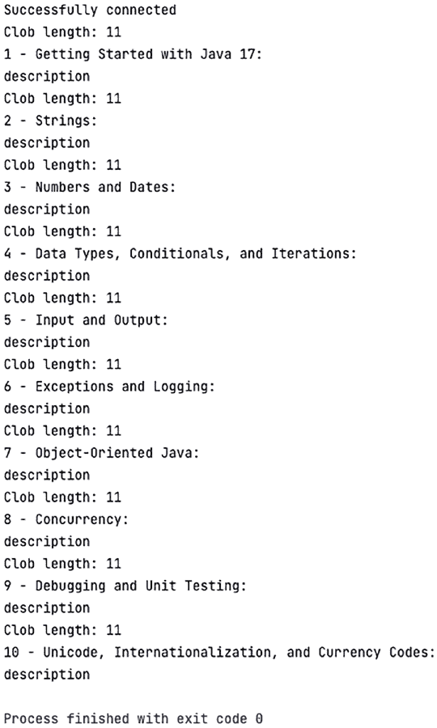

***图 6-9.** ChapterDAO 类的输出*

那么如何将 CLOB 值插入数据库呢？下一个方法接受 CHAPTER 表记录中每个字段的值，构造 CLOB 内容，最后执行插入操作：

```java
private void performCreate(int chapterNumber, int bookId, String title, String
                           description) {
    String sql = "INSERT INTO CHAPTER VALUES("
        + "CHAPTER_S.NEXTVAL, ?, ?, ?, ?)";
    Clob textClob = null;
    CreateConnection.loadProperties();
    try (Connection conn = CreateConnection.getConnection();
         PreparedStatement stmt = conn.prepareStatement(sql)) {
        textClob = conn.createClob();
        textClob.setString(1, description);
        stmt.setInt(1, chapterNumber);
        stmt.setString(2, title);
        stmt.setClob(3, textClob);
        stmt.setInt(4, bookId);
        // 返回行数，如果不成功则返回 0
        int result = stmt.executeUpdate();
        if (result > 0) {
            System.out.println("-- 记录已创建 --");
        } else {
            System.out.println("!! 记录未创建 !!");
        }
    } catch (SQLException e) {
        e.printStackTrace();
    }
}
```

**工作原理**

如果你的应用程序需要存储字符串值，你需要知道这些字符串可能变得多大。大多数数据库在 VARCHAR 字段的存储大小上都有上限。例如，Oracle 数据库的上限是 4000 字节，任何超过该长度的内容都会被截断。如果你需要存储大量文本，请在数据库中使用 CLOB 字段。

在 Java 代码中，CLOB 的处理方式与字符串略有不同。事实上，刚开始使用它时可能会觉得有点奇怪，因为你必须通过 `Connection` 来创建 CLOB。

■ **注意** 实际上，CLOB 和 BLOB（二进制大对象）并不存储在定义它们的 Oracle 表中。相反，表中列存储的是大对象（LOB）定位器。Oracle 可能会将 CLOB 放在数据库服务器上的一个单独文件中。当 Java 创建 `Clob` 对象时，它可以用于保存数据以更新数据库中特定的 LOB 位置，或者从数据库中特定的 LOB 位置检索数据。

让我们看看本方案中包含的 `performCreate()` 方法。如你所见，`Clob` 对象是使用 `Connection` 对象的 `createClob()` 方法创建的。创建 `Clob` 后，你可以使用 `setString()` 方法设置其内容，该方法需要传入位置（指示将字符串放在哪里）和字符串文本本身：

```java
textClob = conn.createClob();
textClob.setString(1, "This will be the recipe text in clob format");
```

创建并填充 `Clob` 后，只需使用 `PreparedStatement` 的 `setClob()` 方法将其传递给数据库。在本例中，`PreparedStatement` 像往常一样通过调用 `executeUpdate()` 方法向 CHAPTER 表执行数据库插入操作。查询 CLOB 也同样直接。如本方案中包含的 `readClob()` 方法所示，设置了一个 `PreparedStatement` 查询，并将结果检索到 `ResultSet` 中。使用 `Clob` 和 `String` 的唯一区别在于，你必须将 `Clob` 加载到 `Clob` 类型中。调用 `Clob` 对象的 `getString()` 方法会返回一个看起来奇怪的字符串文本，它表示一个 `Clob` 对象。因此，调用 `Clob` 对象的 `getAsciiStream()` 方法将返回存储在 `Clob` 中的实际数据。本方案中使用了这种技术。

尽管 CLOB 使用起来相当简单，但准备它们需要多几个步骤。最好相应地规划你的应用程序，并尝试估计你使用的数据库字段是否可能因为大小限制而需要成为 CLOB。适当的规划将防止你以后回过头来更改标准的基于字符串的代码以使其适用于 CLOB。

**第 7 章**

**对象关系映射**

多年来，Java 数据库连接（JDBC）API 一直是 Java Web 和桌面应用程序处理数据库的标准。随着时间的推移，获取数据存储和应用程序内处理数据的技术不断发展，许多组织开始开发自己的更方便处理数据的策略。开发人员通常发现，处理关系数据时，使用 Java 对象比使用结构化查询语言（SQL）更容易。本章讨论了一些用于将 SQL 封装到单独的工具类中并将其从开发人员那里抽象出来的技术，以便他们可以使用 Java 对象而不是 SQL。这种策略被称为*对象关系映射*（ORM）策略，如今有许多组织提供了几种著名的 ORM 策略。

对象关系映射（ORM）工具有助于开发人员使用 Java 对象而不是 SQL 来处理关系数据。有许多不同的 ORM 工具可用。其中最著名的 ORM 策略包括 Hibernate、Oracle TopLink（[www.oracle.com/middleware/technologies/top-link.html](http://www.oracle.com/middleware/technologies/top-link.html)）和 EclipseLink。


为了规范行业，Jakarta Persistence 已被视为在 Java 和 Jakarta EE 领域向前推进所应采用的策略。Jakarta Persistence 包含了许多最初在 Hibernate 和 TopLink 等 ORM 策略中引入的特性。事实上，许多不同 ORM 项目的顶级代表共同制定了用于生成 Jakarta Persistence API 的 Java 规范请求（JSR），为 Java 企业开发者提供了一种标准、高效且高生产力的方式，以便在 Java 应用程序中操作底层关系型数据库管理系统（RDBMS）。Jakarta Persistence API 允许开发者从多种 Java 持久化提供者中进行选择，以使用他们最熟悉的配置，而无需在应用程序中包含多个第三方库或自定义项。一些可能的提供者如下：

• *EclipseLink* ([www.eclipse.org/eclipselink/](https://www.eclipse.org/eclipselink/))：默认的 Jakarta Persistence API 实现

• *Hibernate* ([`hibernate.org`](https://hibernate.org))：一个流行的 Java ORM 工具

• *OpenJPA* ([`openjpa.apache.org/`](https://openjpa.apache.org/))：Jakarta Persistence 的一个开源实现

• *MyBatis* ([`mybatis.org`](https://mybatis.org))：一个易于使用的 SQL 映射框架

• *Oracle TopLink* ([www.oracle.com/middleware/technologies/top-link.html](http://www.oracle.com/middleware/technologies/top-link.html))：由 Oracle 创建的高级 ORM 工具

对象关系映射是将 Java 对象映射到数据库表的过程，使得数据库表的每一列都映射到 Java 对象中的一个字段或属性。用于映射数据库表的 Java 对象被称为*实体类*，本章将重点介绍实体类的创建和使用。相关技巧将涵盖创建类和执行标准数据库事务等主题。你将学习如何配置数据库连接，如何利用 Jakarta Persistence API 在不使用 SQL 的情况下持久化和检索对象，以及如何以有意义且高效的方式将对象相互关联。

ORM 编程不仅抽象了开发者直接操作数据库的实现细节，还提供了一种标准机制，用于在来自多个供应商的数据库上部署应用程序。Jakarta Persistence API 负责将代码转换为 SQL 语句，因此一旦使用 Jakarta Persistence API 编写了应用程序，它就可以在几乎任何底层数据库上部署。

■ **注意** 本章中的技巧是否可用取决于你选择的 Jakarta Persistence API 提供者。例如，不同的提供者可能包含不同的元数据注解集。我不会列出每个技巧中可用的每个注解，而是会引导你查阅一些非常好的资源，以了解所有可能使用的注解以及最常用的提供者。虽然大多数注解在所有提供者中是通用的，但每个提供者都有一些自定义注解。

EclipseLink: [www.eclipse.org/eclipselink/documentation/](https://www.eclipse.org/eclipselink/documentation/)

Hibernate: [`docs.jboss.org/hibernate/orm/6.0/javadocs/`](https://docs.jboss.org/hibernate/orm/6.0/javadocs/)

TopLink: [www.oracle.com/middleware/technologies/top-link.html](http://www.oracle.com/middleware/technologies/top-link.html)

本章的源代码位于 `org.jakartaeerecipe.chapter07` 包中。

要运行本章的示例，请将应用程序部署到应用服务器，然后访问 URL `http://localhost:8080/JakartaEERecipes/faces/chapter07/home.xhtml`。需要注意的是，本章的示例无法在没有其他技术（如 Enterprise JavaBean，将在第 8 章中介绍）的情况下在 Web 应用程序中运行。因此，本章中的许多示例使用独立的 Java 类进行测试。

7-1. 创建实体

问题

你想创建一个可以映射到数据库表的 Java 对象，以便该类可用于持久化，而不是使用 JDBC。

解决方案

针对特定的数据库表创建一个实体类。为底层数据表中的每一列声明持久化字段或属性，并使用注解将这些字段映射到指定的列。为实体中声明的每个持久化字段或属性提供 getter 和 setter 方法，以便其他类可以访问其内容。

以下代码是一个名为 `BookAuthor` 的实体类，它将 `BOOK_AUTHOR` 数据库表映射到一个标准的 Java 对象，以便在应用程序中使用：

```java
package org.jakartaeerecipe.chapter07.entity;

import java.io.Serializable;
import java.math.BigDecimal;
import jakarta.persistence.*;
import jakarta.validation.constraints.NotNull;
import jakarta.validation.constraints.Size;

@Entity
@Table(name = "BOOK_AUTHOR")
public class BookAuthor implements Serializable {
    private static final long serialVersionUID = 1L;
    @Id
    @Basic(optional = false)
    @NotNull
    @Column(name = "ID")
    private BigDecimal id;
    @Size(max = 30)
    @Column(name = "LAST")
    private String last;
    @Size(max = 30)
    @Column(name = "FIRST")
    private String first;
    @Lob
    @Column(name = "BIO")
    private String bio;

    public BookAuthor() {
    }

    public BookAuthor(BigDecimal id) {
        this.id = id;
    }

    // ... getters and setters ...

    @Override
    public int hashCode() {
        int hash = 0;
        hash += (id != null ? id.hashCode() : 0);
        return hash;
    }

    @Override
    public boolean equals(Object object) {
        if (!(object instanceof BookAuthor))
            return false;
        BookAuthor other = (BookAuthor) object;
        if ((this.id == null && other.id != null) || (this.id != null && !this.id.equals(other.id)))
            return false;
        return true;
    }

    @Override
    public String toString() {
        return "BookAuthor[ id=" + id + " ]";
    }

    public static void main(String[] args) {
        EntityManagerFactory emf = Persistence.createEntityManagerFactory("JakartaEERecipes_LOCAL");
        EntityManager em = emf.createEntityManager();
        try {
            EntityTransaction transaction = em.getTransaction();
            transaction.begin();
            Query query = em.createQuery("SELECT b FROM BookAuthor b");
            List<BookAuthor> authorList = (List<BookAuthor>) query.getResultList();
            for (BookAuthor author : authorList) {
                System.out.print("Name:" + author.getFirstname() + " " + author.getLastname());
                System.out.println();
            }
            transaction.commit();
        } catch (Exception e) {
            e.printStackTrace();
        }
    }
}
```

实体本身不能单独用于访问数据库。至少需要一个持久化单元才能连接数据库并使用实体类执行事务。要了解更多关于创建持久化单元的信息，请参考技巧 7-3。

图 7-1 显示了上述代码的输出。

***图 7-1.** 执行 BookAuthor.main() 方法的输出*

工作原理

作为一名面向对象的开发者，有时处理代表数据的对象比处理数据变量并编写 SQL 来直接操作底层数据存储更有意义。


将对象映射到数据库表的概念通常被称为*对象关系映射*。Java 持久化 API 利用 ORM，通过使用称为*实体类*的对象类来存储和检索数据库中的数据。实体类是一个 Java 对象，它代表底层的一个数据库表。

■ **注意** 在 EJB 3.0 之前，使用 XML 文件而非注解来管理实体类的元数据。如今你仍然可以使用 XML 描述符来管理元数据，但我不会在本书中介绍如何操作。大多数注解可用于有选择地覆盖类中的默认值。

实体类通常使用驼峰命名法（所有单词首字母大写）来分隔表名中的不同单词，其名称通常与底层数据库表名相同。例如，`BOOK_AUTHOR` 数据库表对应的 Java 实体类名为 `BookAuthor`。实体的名称可以与底层数据库表的名称不同。然而，标准做法是将实体类命名为与表名相同。在实体类名称必须与数据库表名称不同的情况下，可以使用 `@Table` 注解来标注实体类，并提供底层数据表的名称。每个实体类都必须通过指定 `jakarta.persistence.Entity` 注解来进行标注。在示例中，`BookAuthor` 实体类只指定了那些必需的注解。如果实体的名称需要与数据库表名不同，则可以按如下方式使用 `@Table` 注解：

...

@Entity

@Table(name = "BOOK_AUTHOR")

...

实体类必须有一个公共的或受保护的无参构造函数。通常建议通过实现 `java.io.Serializable` 接口来使实体类可序列化，因为这样做可以确保实体类能够按值传递，并在需要时持久化到磁盘。所有实体类必须为底层数据库表中的每一列以及该实体可能与其他实体存在的每个关系包含私有的或受保护的实例变量。（要了解更多关于实体关系的信息，请参阅配方 7-6、7-7 和 7-8。）所有将映射到 Java 实体类的数据库表都必须包含一个主键字段，并且实体类中映射到该主键列的对应实例变量必须使用 `@Id` 注解进行标注。每个映射到数据库列的实例变量都可以使用 `@Column` 注解进行标注，以指定底层数据库列的名称。但是，如果未指定 `@Column` 注解，则变量名应与数据库列名完全一致，并使用驼峰命名法来分隔列名中的单词。为了表明某个特定的数据库列及其映射的实例变量不能包含 `NULL` 值，可以使用 `@NotNull` 注解对该变量进行标注。

在本配方的示例中使用的另一个值得一提的注解是 `@Size`，它用于指定 `String` 变量的最大长度。该长度值应与对应数据库列的大小一致。此外，`@Lob` 注解可用于表明底层数据库数据类型是一个大对象。还有其他注解可用于进一步自定义实体类；请参阅本章引言中关于你正在使用的 Jakarta Persistence API 提供商的链接，以了解更多关于所有可用注解的信息。表 7-1 总结了创建实体类时最常用的注解。这些注解将在本配方的解决方案中介绍。

第 7 章 ■ 对象关系映射

***表 7-1.** 创建实体类的常用注解*

**注解**

**描述**

@Entity

将一个普通 Java 对象（POJO）类指定为实体，以便它可以与


持久化服务。对于需要存储在关系数据库中的类，此注解是必需的。

@Table

指定与实体关联的主表名称（可选）

@Id

指定实体的主键的一个或多个持久化字段或属性。没有 `@Id` 字段的 `@Entity` 会导致错误

@Basic

指示一个字段应映射到表列，无需任何额外处理。其 `fetch` 属性默认将字段的获取类型配置为 `EAGER`。当实体被加载时，字段中的数据会被立即获取，即从数据库中检索并存储在内存中。它也可以设置为 `LAZY` 以实现懒加载。字段中的数据仅在需要时才会从数据库中检索。这有助于通过避免不必要的数据库查询来提高性能

@Column

如果列名不直观、与现有数据模型不兼容，或在数据库中作为列名无效，则使用不同的名称关联持久化属性

正如本方案解决方案中所述，实体类不能单独使用。它是处理底层数据源的完整解决方案的一部分。实体类可以轻松地将 Java 对象映射到数据库表。它们应与 Jakarta 企业 Beans 类（第 8 章）和上下文与依赖注入（CDI）结合使用，或与持久化单元（方案 7-3）独立使用，以执行数据库操作。一个利用 Jakarta Server Faces 框架的完整 Java EE 解决方案也可以使用托管 Bean 直接与 Jakarta 企业 Beans 或 Jakarta RESTful Web 服务客户端交互，而这些客户端再通过实体类执行工作。

■ **注意** 您可能想知道为什么在示例中重写了 `hashCode()` 和 `equals()` 方法。

`equals()` 方法存在于每个 Java 对象中，用于确定对象标识。每个实体类都需要包含这些方法的实现，以便区分不同的对象。两个实体对象很可能指向数据库表中的同一行。`equals()` 方法可以判断两个实体是否指向同一行。此外，所有彼此相等的 Java 对象应具有相同的 `hashCode`。在实体类中，重写这些方法以确定对象是否代表同一数据库表行非常重要。

7-2\. 映射数据类型

问题

您希望将数据库表列与实体类字段进行映射，但不确定应在类中为字段声明哪些数据类型。

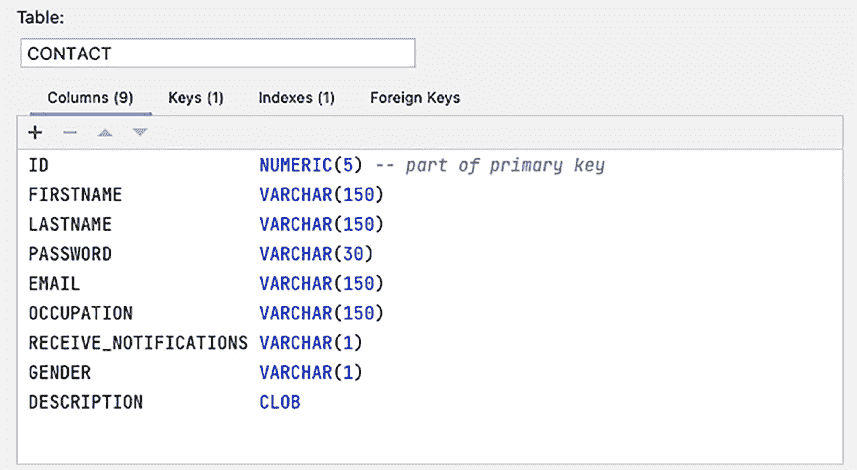

第 7 章 ■ 对象关系映射

■ **注意** 瞬态字段或属性不能包含映射注解。瞬态字段或属性不会持久化到数据库。

解决方案

在实体类中为列声明实例变量时，将数据库表列数据类型映射为 Java 语言规范中的等效数据类型。只要数据库列数据类型与包含指定列值的 Java 数据类型匹配，Jakarta EE 容器就会相应地转换数据库值。为了演示数据类型映射，将为 Acme Bookstore 的 CONTACT 数据库表编写一个实体类。CONTACT 表的描述如图 7-2 所示。

***图 7-2.** 联系人表模式定义*

相应的实体类名为 Contact，其类清单如下所示，演示了如何将每个数据库列类型匹配到适当的 Java 数据类型：

package org.jakartaeerecipe.chapter07.recipe07_02;

...

@Entity

@Table(name = "CONTACT")

public class Contact implements Serializable {

private static final long serialVersionUID = 1L;

@Id

@Basic(optional = false)

@NotNull

第 7 章 ■ 对象关系映射

@Column(name = "ID")

private BigDecimal id;

@Size(max = 50)

@Column(name = "FIRSTNAME")

private String first;

@Size(max = 50)


@Column(name = "LASTNAME")
private String last;

@Size(max = 150)
@Column(name = "EMAIL")
private String email;

@Size(max = 30)
@Column(name = "PASSWORD")
private String password;

@Lob
@Column(name = "DESCRIPTION")
private String description;

@Size(max = 150)
@Column(name = "OCCUPATION")
private String occupation;

@Size(max = 1)
@Column(name = "RECEIVE_NOTIFICATIONS")
private String receivenotifications;

@Size(max = 1)
@Column(name = "GENDER")
private String gender;

public Contact() { } // 默认构造函数

...

// getter 和 setter 方法

...

@Override
public int hashCode() {
...
}

@Override
public boolean equals(Object object) {
...
}

@Override
public String toString() {
return "org.jakartaeerecipe.chapter07.entity.Contact[ id=" + id + " ]";
}

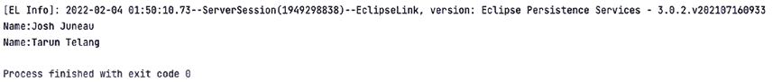

第 7 章 ■ 对象关系映射

public static void main(String[] args) {
EntityManagerFactory emf = Persistence.createEntityManagerFactory("JakartaEERecip
es_LOCAL");
EntityManager em = emf.createEntityManager();
queryAllContacts(em);
}

private static void queryAllContacts(EntityManager em) {
try {
EntityTransaction transaction = em.getTransaction();
transaction.begin();
Query query = em.createQuery("SELECT c FROM Contact c");
List<Contact> contactList = (List<Contact>) query.getResultList();
for (Contact contact : contactList) {
System.out.print("Name:" + contact.getFirst() + " " + contact.getLast()); System.out.println();
}
transaction.commit();
}catch (Exception e) {
e.printStackTrace();
}
}
}

指定正确的映射数据类型非常重要，因为如果操作不当，后续可能会出现错误。数值数据类型尤其容易出现这种情况。

上述程序的输出结果如图 7-3 所示。

***图 7-3.** Recipe07_02 的输出结果*

工作原理

要创建一个用于表示数据库表的 Java 类，必须将表的每一列映射到一个类实例变量。在此过程中，必须为变量分配一个与数据库列数据类型相对应的数据类型。在某些情况下，多个 Java 数据类型可以映射到单个数据库列的数据类型。但在其他情况下，数据库列的数据类型必须与特定的 Java 数据类型匹配。表 7-2 列出了不同的 Java 数据类型及其关联的数据库数据类型。如果您在工作中使用 Oracle 以外的其他数据库，请参阅该数据库的文档，以纠正与 Oracle 所用数据类型之间的任何差异。

MySQL 数据映射文档：[`dev.mysql.com/doc/connector- j/8.0/en/`](https://dev.mysql.com/doc/connector-j/8.0/en/connector-j-reference-type-conversions.html)
[connector- j- reference- type- conversions.html](https://dev.mysql.com/doc/connector-j/8.0/en/connector-j-reference-type-conversions.html)

第 7 章 ■ 对象关系映射

***表 7-2.** Oracle 数据库与 Java 数据类型映射*

**Oracle 数据类型**
**Java 数据类型**

BINARY_INTEGER, NATURAL, NATURALN, PLS_INTEGER, POSITIVE,
int
POSITIVEN, SIGNTYPE, INT, INTEGER

CHAR, CHARACTER, VARCHAR2 LONG, STRING, VARCHAR
java.lang.String

RAW, LONG RAW
byte[]

DEC, DECIMAL, NUMBER
java.math.BigDecimal

DOUBLE PRECISION, FLOAT
double

SMALLINT
int

REAL
float

DATE
java.sql.Timestamp
java.sql.Date

TIMESTAMP (或衍生类型)
java.sql.Timestamp

BOOLEAN
boolean

CLOB
java.sql.Clob

BLOB
java.sql.Blob

VARRAY
java.sql.Array

REF CURSOR
java.sql.ResultSet

正确映射数据类型是创建实体类中非常重要的一步，因为错误的映射可能导致数值精度不准确等问题。在将实体类映射到数据库表时，使用正确的数据类型可能因数据库供应商而异，但表 7-2 应该可以轻松地从 Oracle 数据类型转换为您选择的 RDBMS 的数据类型。

7-3. 创建持久化单元

问题

您希望使用实体类来执行数据库事务。因此，您需要配置应用程序的数据库连接。

解决方案

创建一个持久化单元来配置数据库连接，然后使用该持久化单元与给定的实体类执行事务。持久化单元可以使用在应用服务器内配置的数据库连接池，也可以利用本地 JDBC 配置来获取数据库连接。在本例中，我将演示如何使用本地 JDBC 配置，因为该示例将作为独立应用程序运行，而不是部署到应用服务器上。

第 7 章 ■ 对象关系映射

以下持久化单元配置为创建本地 JDBC 连接，而不是使用 Jakarta Persistence API 进行连接。但是，您可以在本配方的“工作原理”部分了解更多关于配置持久化单元以使用在应用服务器内配置的数据库连接池的信息。以下代码来自名为 `persistence.xml` 的文件，该文件位于本章的 `src/main/resource/META-INF` 目录中：

<?xml version="1.0" encoding="UTF-8"?>
<persistence
xsi:schemaLocation="https://jakarta.ee/xml/ns/persistence https://jakarta.ee/
xml/ns/persistence/persistence_3_0.xsd"
version="3.0">
<persistence-unit name="JakartaEERecipesLOCAL" transaction- type="RESOURCE_LOCAL">
<class>org.jakartaeerecipe.entity.BookAuthor</class>
<properties>
<property name="jakarta.persistence.jdbc.user" value="username"/>
<property name="jakarta.persistence.jdbc.password" value="password"/>
<property name="jakarta.persistence.jdbc.url" value="jdbc:derby://<hostname>:
<port>/<database>"/>
<!-- JDBC 驱动类 -->
<property name="jakarta.persistence.jdbc.driver" value="org.apache.derby.jdbc.
ClientDriver"/>
</properties>
</persistence-unit>
</persistence>

工作原理

要与数据库交互，应用程序需要具备连接数据库的能力。通常，数据库连接对应于数据库中的单个用户名/密码。持久化上下文 XML 文件（在我们的例子中是 `persistence.xml` 文件）中存放着 Java Persistence API 的连接信息。一个持久化上下文可以包含多个数据库连接的配置。每个连接配置被称为一个*持久化单元*，每个单元都有一个唯一的名称，用于在应用程序类中标识该连接。`persistence.xml` 文件可以作为 Web 归档 (WAR) 或企业归档 (EAR) 文件的一部分打包，也可以打包到 JAR 文件中，然后与 WAR 或 EAR 一起打包。如果与 EAR 文件一起打包，它应位于 `META-INF` 目录中。如果使用 WAR 文件，`persistence.xml` 文件应打包在 `resources/META-INF` 目录中。最后，如果打包到 JAR 文件中，该 JAR 应位于 WAR 的 `WEB-INF/lib` 目录或 EAR 的库目录中。

如前所述，每个 `persistence.xml` 文件可以包含多个数据库配置，即多个持久化单元。每个持久化单元包含将用于连接的 Jakarta Persistence 提供程序类型、事务类型（JTA 或 RESOURCE_LOCAL）、用于持久化的类（实体类）以及数据库连接的具体信息。在本节中，我将分解为配方解决方案配置的持久化单元，并描述每个部分。


每个持久化单元的核心是 `persistence-unit` 元素，该元素包含 `name` 和 `transaction-type` 属性。每个持久化单元都有一个名称；在示例中，名称为 `JakartaEERecipesLOCAL`，应用程序代码通过此名称获取对持久化单元的引用。持久化单元的 `transaction-type` 属性指示将创建 Java 事务 API 实体管理器（用于应用服务器内部）还是 Resource-Local 实体管理器（用于独立应用程序）。

第 7 章 ■ 对象关系映射

接下来，在示例中，您将看到一系列在单独的 `class` 元素中列出的类。在 `persistence-unit` 元素内，可以标识零个或多个类供持久化单元使用。这些类是将映射到底层数据库表的实体类。如果使用 `RESOURCE_LOCAL` 事务类型，则每个实体类都必须在持久化单元中列出。如果使用 JTA（部署到 WAR 或 EAR 文件中的应用服务器内），则容器负责识别实体类，它们无需在持久化单元中列出。如果实体类未在持久化单元中标识且事务类型为 `RESOURCE_LOCAL`，则该实体类将无法在应用程序中使用。

■ **注意** 持久化单元还可以包含一个 `<exclude-unlisted-classes>` 元素，该元素应设置为布尔值。此元素用于指示在使用 JTA 时，是否必须通过持久化单元内的 `<class>` 元素列出类，默认值为 FALSE。如果应用程序中使用了两个或多个数据源，并且每个数据源应仅使用指定的实体类，则将此元素设置为 TRUE 可能是有意义的。

`properties` 元素应包含定义数据库连接的子元素。

具体来说，用户名、密码和数据库 URL 在 `properties` 元素的子属性中标识。对于 `RESOURCE_LOCAL` 持久化单元，以下几点成立：

• 属性 `jakarta.persistence.jdbc.username` 应用于标识连接的数据库用户名。
• 属性 `jakarta.persistence.jdbc.password` 应用于标识连接的数据库用户密码。
• 属性 `jakarta.persistence.jdbc.url` 应用于标识连接的数据库 URL。

Java 事务 API 连接的属性则不同。实际上，对于 JTA，可以不指定任何属性。相反，可以使用名为 `jta-data-source` 的元素来指定已在应用服务器内配置的数据库连接的 JNDI 名称。例如，假设数据库连接在应用服务器内配置为 `jdbc/DBConnection`。此外，假设您要将 WAR 文件部署到 GlassFish 应用服务器，并将使用 JTA 而不是 `RESOURCE_LOCAL`。如果是这种情况，持久化单元可能如下所示：

<persistence-unit name="JakartaEERecipesJTA" transaction-type="JTA">
    <jta-data-source>jdbc/DBConnection</jta-data-source>
    <properties/>
</persistence-unit>

■ **注意** JTA 示例中没有列出任何类，因为应用服务器会自动识别供持久化单元使用的实体类。但是，在某些情况下，列出类可能是有用的，如前一条注释所述。

要使用持久化单元，必须首先获取一个 `EntityManagerFactory` 对象。可以通过调用 `Persistence.createEntityManagerFactory` 方法并传入要获取连接的持久化单元的字符串名称来获取 `EntityManagerFactory` 对象。一旦获取了 `EntityManagerFactory` 对象，就可以创建并使用 `EntityManager` 对象来开始数据库事务。通过持久化单元获取连接的方式类似于以下代码：

...
EntityManagerFactory emf = Persistence.createEntityManagerFactory("JakartaEERecipesLOCAL");
EntityManager em = emf.createEntityManager();
try {
    EntityTransaction entr = em.getTransaction();
    entr.begin();
    Query query = em.createNamedQuery("BookAuthor.findAll");
    ...

■ **注意** 前面的示例使用 `createNamedQuery` 方法来替换命名查询，而不是内联编写 Java 持久化查询语言 (JPQL)。有关更多信息，请参阅配方 7-9。

`persistence.xml` 配置文件包含应用程序用于与数据库交互的数据库连接信息。如果您使用 Jakarta 持久化 API，您将非常熟悉创建持久化单元，无论是使用本地 JDBC 连接还是应用服务器连接池。

7-4. 使用数据库序列创建主键值

问题

您的数据库包含用于为数据库表记录生成主键值的序列。您的应用程序需要使用这些数据库序列，以便在创建和持久化对象时分配主键值。

解决方案

使用 `@SequenceGenerator` 注解实体类的主键字段，然后将其与实体生成器关联，以便利用数据库序列填充数据库表列值。在以下示例中，`BookAuthor` 实体已更新为使用 `BOOK_AUTHOR_S` 数据库序列来创建主键值。因此，`id` 字段已相应地进行注解：

package org.jakartaeerecipe.chapter07.entity;
...
@Entity
@Table(name = "BOOK_AUTHOR")
// 命名查询在配方 7-9 中介绍
@NamedQuery(name = "BookAuthor08.findAll", query = "SELECT b FROM BookAuthor08 b")
@NamedQuery(name = "BookAuthor08.findById", query = "SELECT b FROM BookAuthor08 b WHERE b.id = :id")
@NamedQuery(name = "BookAuthor08.findByLast", query = "SELECT b FROM BookAuthor08 b WHERE b.last = :last")
@NamedQuery(name = "BookAuthor08.findByFirst", query = "SELECT b FROM BookAuthor08 b WHERE b.first = :first")
public class BookAuthor implements Serializable {
    private static final long serialVersionUID = 1L;
    @Id
    @Basic(optional = false)
    @SequenceGenerator(name="book_author_s_generator", sequenceName="book_author_s", initialValue=1, allocationSize=1)
    @GeneratedValue(strategy=GenerationType.SEQUENCE, generator="book_author_s_generator")
    @NotNull
    @Column(name = "ID")
    private BigDecimal id;
    ...

当一个新的 `BookAuthor` 对象被持久化到数据库时，`BOOK_AUTHOR_S` 的下一个序列值将用作新数据库记录的主键值。一旦为本地 JDBC 数据库连接配置了持久化上下文（有关详细信息，请参阅配方 7-3），就可以运行类 `org.jakartaeerecipe.chapter07.recipe07_04.SequenceTest.java` 来测试序列生成的主键。以下摘录取自 `SequenceTest` 类，演示了如何向数据库添加新的 `BookAuthor` 对象：

...
EntityManagerFactory emf = Persistence.createEntityManagerFactory("JakartaEERecipesLOCAL");
EntityManager em = emf.createEntityManager();
try {
    EntityTransaction entr = em.getTransaction();
    entr.begin();
    BookAuthor author = new BookAuthor();
    author.setFirst("JOE");
    author.setLast("TESTER");
    author.setBio("An author test account.");
    boolean successful = false;
    try {
        em.persist(author);
        successful = true;
    } finally {
        if (successful){
            entr.commit();
        } else {
            entr.rollback();
        }
    }
    Query query = em.createNamedQuery("BookAuthor.findAll");
    List authorList = query.getResultList();
    Iterator authorIterator = authorList.iterator();
    while (authorIterator.hasNext()) {
        author = (BookAuthor) authorIterator.next();
        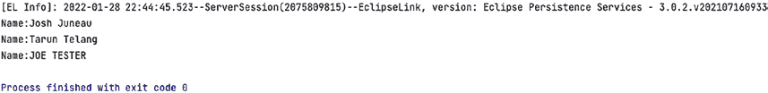
        第 7 章 ■ 对象关系映射


System.out.print("Name:" + author.getFirstname() + " " + author.getLastname()); System.out.println();

}

} catch (Exception ex){

ex.printStackTrace();;

} finally {

em.close();

}

...

■ **注意** 本示例演示了数据库事务的使用。事务允许一次性执行整个流程序列。如果其中一个流程发生故障，则事务中的所有流程都将失败，并且对数据库的更改将被回滚。否则，如果事务中的所有流程都成功完成，则它们将被提交到数据库。在多个数据库事件相互依赖的情况下，事务非常有用。

执行上述代码将生成如图 7-4 所示的输出。

***图 7-4.** Recipe07_04 的输出*

工作原理

在许多情况下，通过数据库序列为数据库表记录生成主键值是合理的。利用 Jakarta Persistence API，可以通过在实体类中结合使用 `@SequenceGenerator` 和 `@GeneratedValue` 注解来实现这一点。每个映射到实体类的数据库表都必须有一个主键值，而使用数据库序列来获取这些值出于多种原因都是合理的。例如，在某些情况下，应用程序管理员需要知道下一个、当前或最后一个用于主键值的数字是什么。通过使用数据库序列，只需一次查询即可收集有关下一个、当前或最后一个数字的信息。

`@SequenceGenerator` 注解应直接放置在实体类中主键字段或属性声明之前，或者可以放置在实体类声明之前。请注意，其他注解可以放置在 `@SequenceGenerator` 注解和实际变量声明之间。`@SequenceGenerator` 注解接受有关用于主键生成的数据库序列的值。更具体地说，该注解接受以下属性：

• name（必需）：生成器的名称（此名称可以是任意值）
• sequenceName（可选）：用于获取主键值的数据库序列的名称
• initialValue（可选）：序列对象的初始值
• allocationSize（可选）：从序列分配数字时的增量大小

第 7 章 ■ 对象关系映射

`@GeneratedValue` 注解用于指定实体的主键生成策略。与 `@SequenceGenerator` 属性一样，它可以放置在实体类中主键字段或属性声明之前，或者可以放置在实体类声明之前。它用于指定生成实体类主键的方式。三个选项如下：

• 实体类将在插入新记录之前自行生成主键值。
• 实体类将使用数据库序列进行键生成。
• 实体类将通过其他方式生成键。

可以为 `@GeneratedValue` 注解指定的属性如下：

• generator（可选）：这是由 `@SequenceGenerator` 注解指定的要使用的主键生成器的名称。除非使用 `@TableGenerator`，否则此名称必须与为 `@SequenceGenerator` 注解提供的 name 属性匹配。默认值为持久化提供程序提供的 ID 生成器。
• strategy（可选）：这是持久化提供程序将用于为带注解的字段或实体类生成主键的主键生成策略。如果未提供，则默认为 AUTO。

`@GeneratedValue` 的 strategy 属性可以接受四种不同的 `jakarta.persistence.GenerationType` 枚举值：

• AUTO：指示持久化提供程序应为特定数据库选择合适的策略


• IDENTITY：表示持久化提供程序必须使用数据库标识列（identity column）为实体分配主键。

• SEQUENCE：表示持久化提供程序必须使用数据库序列列（sequence column）为实体分配主键。

• TABLE：表示持久化提供程序必须使用底层数据库表为实体分配主键，以确保提供唯一值。

在本示例中，为 `@SequenceGenerator` 注解的 `sequenceName` 属性指定了 `BOOK_AUTHOR_S` 数据库序列，生成器的名称为 `book_author_s_generator`。请注意，`@GeneratedValue` 的 `name` 属性必须与 `@SequenceGenerator` 注解中的名称匹配；这一点非常重要！一旦指定，当新对象被持久化时，实体类将自动从数据库序列中获取下一个值。

■ **注意** 还有其他生成键值的选项，例如 `AUTO`、`IDENTITY` 和 `TABLE`。这些策略在不同情况下可能有效。有关使用其他选项的更多信息，请参阅 Jakarta EE 在线文档：[`javaee.github.io/`](https://javaee.github.io/)。

第 7 章 ■ 对象关系映射

7-5\. 使用多个属性生成主键

问题

某个特定的数据库表不包含主键。由于 Java 持久化 API 要求使用主键将实体类映射到数据库表，因此需要将两个或多个表列的值合并起来，为每条记录创建一个主键。

解决方案 #1

通过开发一个嵌入式复合主键类，并使用 `jakarta.persistence.EmbeddedId` 和 `jakarta.persistence.Id` 类注解在实体中标记复合键字段，来创建复合主键。考虑用于 Acme Bookstore 应用程序的 `AUTHOR_WORK` 数据库表。假设 `AUTHOR_WORK` 数据库表不包含主键列。

可以根据其 `BOOK_ID` 和 `AUTHOR_ID` 列为每条记录生成一个主键。以下实体类是 `AuthorWork` 实体。它没有使用 `ID` 列作为主键，而是将 `bookId` 和 `authorId` 列一起使用，以构成一个复合主键：

```java
package org.jakartaeerecipe.chapter07.entity;

import java.io.Serializable;
import java.math.BigInteger;
import jakarta.persistence.*;
import jakarta.validation.constraints.NotNull;
import org.jakartaeerecipe.chapter07.entity.key.AuthorWorkPKEmbedded;

@Entity
@Table(name = "AUTHOR_WORK")
@NamedQuery(name = "AuthorWork.findAll", query = "SELECT a FROM AuthorWork a")
public class AuthorWorkEmbedded implements Serializable {

    private static final long serialVersionUID = 1L;

    // 如果表包含多个列来组成主键，可以使用嵌入式 ID 代替标准 ID。
    // 要使用非可嵌入主键，请注释掉此字段及其 getter 和 setter 方法。
    @EmbeddedId
    private AuthorWorkPKEmbedded embeddedId;

    public AuthorWorkEmbedded(BigInteger bookId, BigInteger authorId) {
        this.embeddedId = new AuthorWorkPKEmbedded(bookId, authorId);
    }

    /**
     * @return the embeddedId
     */
    public AuthorWorkPKEmbedded getEmbeddedId() {
        return embeddedId;
    }

    /**
     * @param embeddedId the embeddedId to set
     */
    public void setEmbeddedId(AuthorWorkPKEmbedded embeddedId) {
        this.embeddedId = embeddedId;
    }
}
```

要使用嵌入式主键，必须创建一个类，其中包含将主键 ID 映射到组成它的列的逻辑。在本例中，`AuthorWorkPKEmbedded` 类用于此目的，如下所示：

```java
package org.jakartaeerecipe.chapter07.entity.key;

import java.io.Serializable;
import java.math.BigInteger;
import jakarta.persistence.Embeddable;

/**
 * AuthorWork 的可嵌入主键类
 */
@Embeddable
public class AuthorWorkPKEmbedded implements Serializable {

    private static final long serialVersionUID = 1L;

    @Column(name = "AUTHOR_ID")
```


private BigInteger authorId;

@Column(name = "BOOK_ID")

private BigInteger bookId;

public AuthorWorkPKEmbedded() { }

public AuthorWorkPKEmbedded(BigInteger bookId, BigInteger authorId){

this.bookId = bookId;

this.authorId = authorId;

}

...

// getters and setters

...

public int hashCode() {

return bookId.hashCode() + authorId.hashCode();

}

public boolean equals(Object obj) {

if (obj == this) {

return true;

}

if (!(obj instanceof AuthorWorkPKEmbedded)) {

return false;

}

第 7 章 ■ 对象关系映射

AuthorWorkPKEmbedded pk = (AuthorWorkPKEmbedded) obj;

return (((Objects.equals(bookId, ((AuthorWorkPKEmbedded) obj).getBookId())))

&& ((Objects.equals(authorId, ((AuthorWorkPKEmbedded) obj).

getAuthorId()))));

}

■ **注意** 尽管上述示例不是一个实体类，但其成员值会被持久化。即使这些成员没有被标注为`@Basic`，它们仍然会被持久化。

在复合主键类中，`hashCode()`和`equals()`方法都必须存在。

解决方案 #2

通过开发一个非嵌入式的复合主键类来创建复合主键，并在实体类中用`@Id`注解标注两个或更多列。此外，如果使用非嵌入式主键类，则必须通过`@IdClass`注解来指定该非嵌入式主键类，从而将实体类标识为使用此类主键。

考虑用于 Acme Bookstore 应用程序的`AUTHOR_WORK`数据库表。假设`AUTHOR_WORK`数据库表不包含主键列。那么，可以根据其`BOOK_ID`和`AUTHOR_ID`列为每条记录生成一个主键，因为这两列组合起来可以为每条记录形成一个唯一值。以下实体类是`AuthorWork`实体的定义。

它不使用`ID`列作为主键，而是将`bookId`和`authorId`两列组合起来形成一个复合主键：

package org.jakartaeerecipe.chapter07.entity;

import java.io.Serializable;

import java.math.BigInteger;

import jakarta.persistence.*;

import org.jakartaeerecipe.chapter07.entity.key.AuthorWorkPKNonEmbedded;

@IdClass(AuthorWorkPKNonEmbedded.class)

@Entity

@Table(name = "AUTHOR_WORK_LEGACY")

@NamedQuery(name = "AuthorWork.findAll", query = "SELECT a FROM AuthorWork a") public class AuthorWorkNonEmbedded implements Serializable {

private static final long serialVersionUID = 1L;

@Id

@Column(name = "BOOK_ID")

private BigInteger bookId;

@Id

@Column(name= "AUTHOR_ID")

private BigInteger authorId;

第 7 章 ■ 对象关系映射

public AuthorWorkNonEmbedded() {

}

public AuthorWorkNonEmbedded(BigInteger bookId, BigInteger authorId) {

this.bookId = bookId;

this.authorId = authorId;

}

...

// getters and setters

...

}

关联的非可嵌入主键类名为`AuthorWorkPKNonEmbedded`。该类的代码如下：

package org.jakartaeerecipe.chapter07.entity.key;

import java.io.Serializable;

import java.math.BigInteger;

public class AuthorWorkPKNonEmbedded implements Serializable {

private BigInteger bookId;

private BigInteger authorId;

public AuthorWorkPKNonEmbedded() {

}

...

// getters and setters

...

public int hashCode() {

return bookId.hashCode() + authorId.hashCode();

}

public boolean equals(Object obj) {

if (obj == this) {

return true;

}

if (!(obj instanceof AuthorWorkPKEmbedded)) {

return false;

}

if (obj == null) {

return false;

}

AuthorWorkPKEmbedded pk = (AuthorWorkPKEmbedded) obj;

return (((bookId == ((AuthorWorkPKEmbedded) obj).getBookId()))

&& ((authorId == ((AuthorWorkPKEmbedded) obj).getAuthorId())));

}

}

■ **注意** 尽管`AuthorWorkPKNonEmbedded`类不是一个实体，但其成员值会被持久化。

第 7 章 ■ 对象关系映射

工作原理

在某些情况下，数据库表可能不包含单一主键值来唯一标识每一行。在处理遗留数据库时，这种情况经常发生。在 Java 持久化 API 中，所有实体类都必须包含一个可用于唯一标识对象的主键。

为了克服处理不包含单一主键值的表时的这一障碍，可以使用复合主键来唯一标识一个对象。

复合主键由实体类中的两个或多个字段或属性组成，这些字段或属性可以组合起来创建一个唯一标识符。可以将其理解为执行数据库查询并尝试返回仅匹配特定条件的记录。在这种情况下，你通常需要在 SQL 的`WHERE`子句中包含多个关系。在实体类中创建复合主键基本上也是同样的概念，即你是在告诉 Jakarta Persistence 使用复合键中指定的所有字段或属性来唯一标识一个对象。

有几种不同的技术（可嵌入和不可嵌入）可用于开发复合主键。这两种技术相似之处在于它们都需要创建一个单独的类来组成主键，但不同之处在于主键在实体类中的标注方式。实际上，这两种技术中的单独主键类几乎可以完全相同地创建，唯一的例外是可嵌入主键类必须使用`@Embeddable`进行注解，如本配方的解决方案#1 所示。使用可嵌入主键类的实体应仅包含一个主键，并且该主键的数据类型应与可嵌入主键类相同。也就是说，主键类应使用`private`修饰符在实体中声明，并与其他所有持久化属性和字段一起，且应使用`@Id`注解来表明它是主键。以下来自解决方案#1 的摘录展示了如何实现：

@EmbeddedId

private AuthorWorkPKEmbedded embeddedId;

包含嵌入式主键的实体类应包含一个构造函数，该构造函数为用于主键的每个持久化字段或属性接受一个参数。在构造函数内部，应使用传入的参数实例化可嵌入主键类的一个新实例。使用可嵌入主键的实体类应包含主键字段或属性的访问器方法。然而，与大多数实体类不同，`hashCode()`和`equals()`方法并不存在于实体类中，因为它们位于主键类内部。现在，我已经介绍了使用可嵌入主键的实体类的具体细节，让我们来看看可嵌入主键类本身是如何工作的。

用于创建可嵌入主键的主键类应包含对每个将用于组成关联实体类主键的持久化字段或属性的声明。当然，这些字段或属性应设为私有，并且应有相应的 getter 和 setter 方法来访问这些字段。可嵌入主键类应使用`@Embeddable`进行注解。它可以包含两个构造函数：一个无参构造函数，以及另一个可选的构造函数，该构造函数为组成主键的每个持久化字段或属性接受一个参数。还记得使用可嵌入主键的实体类不包含`hashCode()`方法吗？这是因为该方法位于主键类中，它只是将组成主键的每个字段的哈希码相加，并返回总和。


主键类中最重要的部分是 `equals()` 方法，因为它用于判断某个对象或数据库记录是否唯一匹配关联的主键。`equals()` 方法应接受一个 `Object` 类型的参数，该参数是与当前主键对象进行比较的对象。随后，对该对象进行比较，以确定它是否与当前主键对象相等；如果相等，则返回 `true`。如果不相等，则进一步判断该对象是否与可嵌入主键类属于同一类型；如果不是同一类型，则返回 `false`。如果该对象为 `NULL`，同样返回 `false`。最后，如果根据已测试的条件仍未返回布尔值，则将该对象强制转换为主键类的同一类型对象，并将其每个字段或属性与当前主键类中的对应项进行比较。如果相等，则返回 `true`；如果不相等，则返回 `false`。以下代码演示了 `equals()` 方法：

```java
public boolean equals(Object obj) {

if (obj == this) {

return true;

}

if (!(obj instanceof AuthorWorkPKEmbedded)) {

return false;

}

if (obj == null) {

return false;

}

AuthorWorkPKEmbedded pk = (AuthorWorkPKEmbedded) obj;

return (((bookId == ((AuthorWorkPKEmbedded) obj).getBookId()))

&& ((authorId == ((AuthorWorkPKEmbedded) obj).getAuthorId())));

}
```

解决方案 #2 涵盖了非嵌入主键的使用。有时，生成非可嵌入主键比使用嵌入主键更受青睐，因为有些人认为这样生成的实体类更易于阅读。非可嵌入主键的整体构造基本相同，但存在一些细微差异。例如，在开发非可嵌入主键的主键类时，该类上不需要 `@Embeddable` 注解。从解决方案 #2 的代码中可能注意到的另一个区别是，只使用了一个构造函数。当然，仍然可以创建一个可选的第二个构造函数，该构造函数接受用于组成主键的每个持久化字段或属性的参数。

大多数差异出现在实体类本身。要使用非嵌入复合主键，实体类必须使用 `@IdClass` 注解，并指定用于构造复合主键的类。在解决方案 #2 中，`@IdClass` 如下所示：

```java
@IdClass(AuthorWorkPKNonEmbedded.class)
```

使用非可嵌入复合主键的实体类的另一个主要区别是，不再使用 `@Id` 注解将单个持久化字段或属性声明为 ID，而是将用于组成实体主键的两个或多个字段或属性直接声明在实体内部，并分别对它们进行注解。其余实现与使用嵌入复合主键的实体相同。

选择使用哪种类型的复合键完全取决于个人偏好。许多人使用非可嵌入主键来使实体类更易于理解，因为它比使用可嵌入复合主键的实体类更接近标准实体类。最终，两者都会产生相同的结果，并允许为那些不包含单个主键字段的数据库表创建实体类。

第 7 章 ■ 对象关系映射

7-6. 定义一对一关系

问题

应用程序使用的数据库表中包含的数据与另一个表中的数据记录存在一对一引用关系。因此，你希望在应用程序中的两个实体对象之间创建一对一关系。

解决方案

通过将每个实体类本身声明为彼此内部的持久化字段或属性（使用“拥有”关系），并用 `@OneToOne` 注解这些字段，来创建具有一对一关系的两个表之间的关联。例如，假设 `AUTHOR` 数据库表中的每条记录都可以与另一个名为 `AUTHOR_DETAIL` 表中的记录相关联，反之亦然。`AUTHOR_DETAIL` 表包含作者的联系信息，因此，实际上这些表具有一对一关系。为了在实体类内部将它们相互关联起来，请在关联到相应实体类的字段或属性上指定 `@OneToOne` 注解。为了能够从任一表中获取完整的作者信息，需要创建一个双向的一对一关系。

■ **注意** 一对一映射可以是单向的或双向的。单向映射仅在拥有实体上包含对应实体类的 `@OneToOne` 注解，而双向映射则根据关联类型包含 `@ManyToOne`、`@OneToMany` 或 `@ManyToMany` 注解。

如果一个实体包含对另一个实体对象的引用（该引用指向实体本身），则这种关系称为*拥有*关系。另一方面，如果一个实体通过主键值引用另一个实体，则这种关系称为*非拥有*关系。

在本解决方案中，`Author` 实体将包含一个指向 `AuthorDetail` 实体的 `@OneToOne` 引用，以创建双向的一对一映射。在以下来自 `Author` 实体的代码片段中，`Author` 实体是拥有实体：

```java
...

@Entity

@Table(name = "AUTHOR")

public class Author implements Serializable {

private static final long serialVersionUID = 1L;

@Id

@Basic(optional = false)

@SequenceGenerator(name="author_s_generator",

sequenceName="author_s", initialValue=1, allocationSize=1)

@GeneratedValue(strategy=GenerationType.SEQUENCE,

generator="author_s_generator")

@NotNull

@Column(name = "ID")

private BigDecimal id;

@Size(max = 30)

@Column(name = "LAST")

private String last;

@Size(max = 30)

@Column(name = "FIRST")

private String first;

@Lob

@Column(name = "BIO")

private String bio;

@OneToOne

private AuthorDetail authorId;

public Author() { }

...
```

接下来是 `AUTHOR_DETAIL` 表的实体类片段。当然，它名为 `AuthorDetail`，并包含对 `Author` 实体类的引用：

```java
...

@Entity

@Table(name = "AUTHOR_DETAIL")

public class AuthorDetail implements Serializable {

private static final long serialVersionUID = 1L;

@Id

@Basic(optional = false)

@SequenceGenerator(name="author_detail_s_generator",sequenceName="author__detail_s", initialValue=1, allocationSize=1)

@GeneratedValue(strategy=GenerationType.SEQUENCE,

generator="author_detail_s_generator")

@NotNull

@Column(name = "ID")

private BigDecimal id;

@Size(max = 200)

@Column(name = "ADDRESS1")

private String address1;

@Size(max = 200)

@Column(name = "ADDRESS2")

private String address2;

@Size(max = 250)

@Column(name = "CITY")

private String city;

@Size(max = 2)

@Column(name = "STATE")

private String state;

@Size(max = 10)

@Column(name = "ZIP")

private String zip;

@Column(name = "START_DATE")

@Temporal(TemporalType.DATE)

private Date startDate;

@Lob

@Column(name = "NOTES")

private String notes;

**@OneToOne(optional=false, mappedBy="authorDetail")**

**private Author authorId;**

public AuthorDetail() {

}

...
```

工作原理

在关系型数据库的世界中，一个表依赖于另一个表的情况并不罕见。


当一个表中的记录与另一个表中的记录存在一一对应关系时，应配置一个表的实体类与另一个表的实体类建立一一对应关系。操作对象与操作数据库记录略有不同，但概念基本相同。在数据库中，使用唯一标识符将一个表与另一个表关联起来。例如，在本例中，`AUTHOR_DETAIL` 表包含一个名为 `AUTHOR_ID` 的字段，该字段必须包含 `AUTHOR` 数据库表中的 ID，才能将两条记录映射在一起。被拥有实体关系的工作方式略有不同，它使用实体对象本身（而非 ID 号）来映射到另一个实体。

在实体类之间创建双向的一对一关系时，每个实体类必须将另一个实体类声明为持久化字段或属性，然后使用 `@OneToOne` 注解指定关系类型。`@OneToOne` 注解用于指定实体之间的一对一关系。该注解包含以下可选属性：

• `cascade`：必须级联到关联目标的操作（例如，删除）。默认值：无操作。
• `fetch`：关联应延迟加载还是立即获取。默认值：`EAGER`。
• `optional`：关联是否为可选的。例如，实体是否可以在没有关联的情况下持久化？默认值：`true`。
• `mappedBy`：拥有关系的字段。默认值：`""`。

在本方案的解决方案中，`AuthorDetail` 实体在声明 `Author` 字段之前指定了 `@OneToOne` 注解，并设置了 `mappedBy` 和 `optional` 属性。`mappedBy` 属性设置为 `authorDetail`，因为这将作为映射字段，而 `optional` 属性设置为 `false`。

第 7 章 ■ 对象关系映射

另一方面，`Author` 实体在声明 `AuthorDetail` 字段之前指定了 `@OneToOne` 注解，且未指定任何属性。在实际使用中，当这些实体被使用时，将强制实施双向映射。这意味着，如果没有对应的 `Author` 对象，`AuthorDetail` 对象就无法存在。

7-7. 定义一对多和多对一关系

问题

您希望将两个实体类相互关联，使得一个实体对象可以包含对多个其他实体对象的引用。

解决方案

通过在拥有对象中引用另一个实体类的字段或属性上指定 `@OneToMany` 注解，并在非拥有实体中引用拥有对象的字段或属性上指定 `@ManyToOne` 注解，来定义两个实体之间的关系。例如，假设您允许一个 `Author` 对象包含多个不同的地址或 `AuthorDetail` 对象。实际上，一个 `Author` 可以根据需要包含任意数量的地址。在这种情况下，每个 `AuthorDetail` 对象对应一个 `Author` 对象。同样，每个 `Author` 对象也可以对应多个 `AuthorDetail` 对象。

在下面的代码清单中，我将演示 `Author` 和 `AuthorDetail` 对象之间的一对多关系。首先，让我们看看 `Author` 对象，它也被称为*拥有*对象。这个实体类可以包含对多个不同 `AuthorDetail` 对象的引用：

```java
@Entity
@Table(name = "AUTHOR")
public class Author implements Serializable {
    private static final long serialVersionUID = 1L;
    @Id
    @Basic(optional = false)
    @SequenceGenerator(name="author_s_generator",sequenceName="author_s", initialValue=1, allocationSize=1)
    @GeneratedValue(strategy=GenerationType.SEQUENCE, generator="author_s_generator")
    @NotNull
    @Column(name = "ID")
    private BigDecimal id;
    @Size(max = 30)
    @Column(name = "LAST")
    private String last;
    @Size(max = 30)
    @Column(name = "FIRST")
    private String first;
    @Lob
    @Column(name = "BIO")
}
```


private String bio;

@OneToMany(mappedBy="author")

private Set<AuthorDetail> authorDetail;

public Author() { }

...

接下来，我将展示非拥有方对象，即 AuthorDetail 类。一个 Author 对象中可能包含多个 AuthorDetail 对象：

public class AuthorDetail implements Serializable {

private static final long serialVersionUID = 1L;

@Id

@Basic(optional = false)

@SequenceGenerator(name="author_detail_s_generator",sequenceName="author__detail_s", initialValue=1, allocationSize=1)

@GeneratedValue(strategy=GenerationType.SEQUENCE,

generator="author_detail_s_generator")

@NotNull

@Column(name = "ID")

private BigDecimal id;

@Size(max = 200)

@Column(name = "ADDRESS1")

private String address1;

@Size(max = 200)

@Column(name = "ADDRESS2")

private String address2;

@Size(max = 250)

@Column(name = "CITY")

private String city;

@Size(max = 2)

@Column(name = "STATE")

private String state;

@Size(max = 10)

@Column(name = "ZIP")

private String zip;

@Column(name = "START_DATE")

@Temporal(TemporalType.DATE)

private Date startDate;

@Lob

@Column(name = "NOTES")

private String notes;

第 7 章 ■ 对象关系映射

@ManyToOne

private Author author;

public AuthorDetail() { }

...

■ **注意** 要运行 `org.jakartaeerecipe.chapter07.recipe07_07.RecipeTest.java` 示例，请务必将本示例的两个实体类添加到 `persistence.xml` 上下文文件中。同时，请确保注释掉持久化上下文中其他同名的实体，因为单个持久化上下文中不能存在重复的实体。

工作原理

最常见的数据库表关系是一对多或多对一关系，即一个表中的记录可能与另一个表中的一条或多条记录相关联。考虑本解决方案中的场景：单个 AUTHOR 表记录可能在 AUTHOR_DETAIL 表中拥有一条或多条地址记录。在实体类中定义这种关系很容易，因为可以使用注解来指示关系。

在实体中创建一对多关系时，与“一条记录可对应另一表中多条记录”的表相对应的实体称为*拥有方*实体。而与“可能包含多条与另一表中单条记录相关联的记录”的数据库表相对应的实体称为*非拥有方*实体。拥有方实体类应为其关联的实体声明一个持久化字段或属性，并且可能拥有多个关联对象。由于可能存在多个非拥有方实体对象，拥有方实体必须声明一个非拥有方对象的 Set，并使用 `@OneToMany` 注解进行指示。`@OneToMany` 注解的 `mappedBy` 属性应设置为非拥有方实体中用于声明多对一关系的名称。在示例中，Author 实体与 AuthorDetail 存在一对多关系。

因此，Author 实体按如下方式声明关系：

@OneToMany(mappedBy="author")

private Set<AuthorDetail> authorDetail;

另一端则是多对一关系。在示例中，多个 AuthorDetail 对象可能关联到一个 Author 对象。因此，应在 AuthorDetail 实体类中为 Author 实体定义一个多对一关系。这通过为 Author 实体声明一个持久化字段或属性，并使用 `@ManyToOne` 注解指示关系来实现，如下所示：

@ManyToOne

private Author author;

在处理实体时，包含一个或多个 AuthorDetail 对象的 Set 应持久化到单个 Author 对象中。以下代码演示了如何在应用程序中使用一对多关系：

EntityManagerFactory emf = Persistence.createEntityManagerFactory("JakartaEERecipesLOCAL"); EntityManager em = emf.createEntityManager();

try {

em.getTransaction().begin();

第 7 章 ■ 对象关系映射

Author author = new Author();


author.setFirst("JOE");

author.setLast("TESTER");

author.setBio("一个作者测试账户。");

Set detailSet = new HashSet<AuthorDetail>();

AuthorDetail detail = new AuthorDetail();

detail.setAddress1("地址 1");

detail.setAddress2("地址 2");

detail.setCity("无人之地");

detail.setState("ZZ");

detail.setZip("12345");

detail.setNotes("这是一个测试详情");

detailSet.add(detail);

AuthorDetail detail2 = new AuthorDetail();

detail.setAddress1("地址 1");

detail.setAddress2("地址 2");

detail.setCity("无人之地");

detail.setState("ZZ");

detail.setZip("12345");

detail.setNotes("这是一个测试详情");

detailSet.add(detail2);

em.persist(author);

em.getTransaction().commit();

} catch (Exception ex){

ex.printStackTrace();

} finally{

if (em != null){

em.close();

}

}

@OneToMany 注解包含以下可选属性：

• cascade：必须级联到关联目标的操作（例如，删除）。默认值：无操作

• fetch：关联应该被延迟加载还是必须立即获取。默认值：EAGER

• orphanRemoval：是否对已从关系中移除的实体应用移除操作，并将移除操作级联到这些实体。默认值：False

• targetedEntity：作为关联目标的实体类。默认值：""

第 7 章 ■ 对象关系映射

@ManyToMany 注解包含以下可选属性：

• cascade：必须级联到关联目标的操作（例如，删除）。默认值：无操作

• fetch：关联应该被延迟加载还是必须立即获取。默认值：EAGER

• targetedEntity：作为关联目标的实体类。默认值：""

7-8\. 定义多对多关系

问题

你的数据库中存在这样的情况：一个表中的多条记录可能与另一个表中的多条记录相关联。你希望为这些表定义实体关系。

解决方案

通过在每个实体类中声明一个字段或属性，该字段或属性对应另一端实体类的 Set 对象，从而在两个表之间创建多对多关联。使用 @ManyToMany 注解来指定关系，并通过在非拥有方实体的 @ManyToMany 注解上指定 mappedBy 属性来标记关系的拥有方。因此，类 org.jakartaeerecipe.chapter07.recipe07_08.Book 是对应 BOOK 数据库表的实体类，它将在 BookAuthor 对象的 Set 声明上包含 @ManyToMany 注解。数据库中的映射表将“自动地”填充来自实体的关联映射。接下来是 Book 类（“拥有方”实体）的部分代码：

@Entity

@Table(name = "BOOK")

@NamedQuery(name = "Book.findAll", query = "SELECT b FROM Book b")

public class Book implements Serializable {

private static final long serialVersionUID = 1L;

@Id

@Basic(optional = false)

@SequenceGenerator(name="book_s_generator",sequenceName="book_s", initialValue=1, allocationSize=1)

@GeneratedValue(strategy=GenerationType.SEQUENCE,

generator="book_s_generator")

@NotNull

@Column(name = "ID")

private BigDecimal id;

@Size(max = 150)

@Column(name = "TITLE")

private String title;

@Size(max = 500)

@Column(name = "IMAGE")

private String image;

第 7 章 ■ 对象关系映射

@Lob

@Column(name = "DESCRIPTION")

private String description;

@ManyToMany

private Set<BookAuthorMany> bookAuthors;

BookAuthor 类使用相同的概念映射到 Book 类。唯一的区别是它在 @ManyToOne 注解中包含了一个 mappedBy 属性，以指明拥有方表的关系：

@Entity

@Table(name = "BOOK_AUTHOR")

@NamedQueries({

@NamedQuery(name = "BookAuthor.findAll", query = "SELECT b FROM BookAuthor b"),

@NamedQuery(name = "BookAuthor.findById", query = "SELECT b FROM BookAuthor b WHERE

b.id = :id"),

@NamedQuery(name = "BookAuthor.findByLast", query = "SELECT b FROM BookAuthor b WHERE

b.last = :last"),


@NamedQuery(name = "BookAuthor.findByFirst", query = "SELECT b FROM BookAuthor b WHERE

b.first = :first")})

public class BookAuthorMany implements Serializable {

private static final long serialVersionUID = 1L;

@Id

@Basic(optional = false)

@SequenceGenerator(name="book_author_s_generator",sequenceName="book_author_s", initialValue=1, allocationSize=1)

@GeneratedValue(strategy=GenerationType.SEQUENCE,

generator="book_author_s_generator")

@NotNull

@Column(name = "ID")

private BigDecimal id;

@Size(max = 30)

@Column(name = “LAST”)

private String last;

@Size(max = 30)

@Column(name = "FIRST")

private String first;

@Lob

@Column(name = "BIO")

private String bio;

@ManyToMany(mappedBy="bookAuthors")

private Set<Book> books;

第 7 章 ■ 对象关系映射

■ **注意** 为了避免在 JakartaEE Recipes 源码中出现冲突的实体类，`BookAuthor` 实体已被命名为 `BookAuthorMany`。同一应用程序中不能存在名称重复的实体。

工作原理

数据库中，两个或多个不同的表之间可能存在多对多关系。以本示例中的情况为例，一本书可能有多位作者，一位作者也可能撰写过多本书。因此，包含书籍的数据库表和包含作者的数据库表通过多对多关系相互关联。通过使用 `@ManyToMany` 注解，可以轻松地将实体类关联起来，形成多对多关系。`@ManyToMany` 注解用于表示一个实体与带有该注解的持久化字段或属性之间存在多对多关联。

要创建这种关联，多对多关系中的每个实体都应声明一个字段或属性，用于存放关联实体对象的 `Set` 集合。在本示例中，`Book` 实体应声明一个 `BookAuthor` 对象的 `Set` 集合，反之亦然。然后，使用 `@ManyToMany` 对该声明进行注解，并根据需要添加必要的属性来建立关联。`@ManyToMany` 注解包含以下可选属性：

• `targetEntity`：关联的目标实体类。仅当未使用 Java 泛型定义集合值关系属性时，才需要此属性。
• `cascade`：必须级联到关联目标的操作。
• `fetch`：关联是应延迟加载还是立即获取。默认值为 `jakarta.persistence.FetchType.LAZY`。
• `mappedBy`：拥有该关系的字段。如果关系是单向的，则不需要此属性。

因此，在创建任一类型的对象时，可以使用已用 `@ManyToMany` 注解的持久化字段或属性，持久化一个关联实体对象的 `Set` 集合。以下示例演示了如何创建一个具有多对多关系的实体（摘自 `org.jakartaeerecipe.chapter07.recipe07_08.RecipeTest` 类）：

EntityManagerFactory emf = Persistence.createEntityManagerFactory("JakartaEERecipesLOCAL"); EntityManager em = emf.createEntityManager();

try {

em.getTransaction().begin();

Book book1 = new Book();

book1.setTitle("新书 1");

Book book2 = new Book();

book2.setTitle("新书 2");

BookAuthorMany author1 = new BookAuthorMany();

author1.setFirst("JOE");

author1.setLast("作者 1");

BookAuthorMany author2 = new BookAuthorMany();

author2.setFirst("MARYJJOE");

author2.setLast("作者 2");

Set authors = new HashSet();

authors.add(author1);

第 7 章 ■ 对象关系映射

authors.add(author2);

Set books = new HashSet();

books.add(book1);

books.add(book2);

book1.setBookAuthor(authors);

author1.setBooks(books);

em.persist(author1);

em.persist(book1);

em.getTransaction().commit();

} catch (Exception ex){

// 生产环境中请使用日志框架，例如 log4j

System.err.println(ex);

} finally{

if (em != null){

em.close();

}

}

当创建包含多对多关联的实体对象时，会在一个映射表中插入一条记录，该记录包含每个关联表记录的主键。你可以选择使用 `@JoinTable` 注解并指定表名来命名映射表。如果未使用 `@JoinTable` 注解，则映射表名将由两个实体类的名称拼接而成，并以拥有方实体开头。因此，在本示例中，映射表名为 `BOOK_BOOK_AUTHOR`，它包含一个用于存储每个表关联记录主键的字段。

7-9. 使用命名查询进行查询

问题

你希望为一个实体类定义一个或多个可以通过名称调用的预定义查询，而不是向持久化单元发出 SQL 或 Jakarta 持久化查询。

解决方案

为一个实体类指定单个命名查询或一组命名查询。为每个命名查询提供一个名称，以便可以通过该名称调用它们。在本示例中，将向 `BookAuthor` 实体类添加一组命名查询，然后可以使用这些命名查询通过另一个类来查询该实体类。我们将基于一个 `persistence.xml` 文件创建 `EntityManagerFactory` 和数据库连接，该文件获取到数据库的本地 JDBC 连接。以下摘录自 `BookAuthor` 实体，演示了如何将命名查询与实体类关联：

@Entity

@Table(name = "BOOK_AUTHOR")

@NamedQuery(name = "BookAuthor.findAll", query = "SELECT b FROM BookAuthor b")

@NamedQuery(name = "BookAuthor.findById", query = "SELECT b FROM BookAuthor b WHERE

b.id = :id")

@NamedQuery(name = "BookAuthor.findByLast", query = "SELECT b FROM BookAuthor b WHERE b.last

= :last")

第 7 章 ■ 对象关系映射

@NamedQuery(name = "BookAuthor.findByFirst", query = "SELECT b FROM BookAuthor b WHERE

b.first = :first")

public class BookAuthor implements Serializable {

private static final long serialVersionUID = 1L;

@Id

@Basic(optional = false)

@SequenceGenerator(name="book_author_s_generator",sequenceName="book_author_s", initialValue=1, allocationSize=1)

@GeneratedValue(strategy=GenerationType.SEQUENCE,

generator="book_author_s_generator")

@NotNull

@Column(name = "ID")

private BigDecimal id;

@Size(max = 30)

@Column(name = "LAST")

private String last;

@Size(max = 30)

@Column(name = "FIRST")

private String first;

@Lob

@Column(name = "BIO")

private String bio;

public BookAuthor() { }

...

在另一个类中，可以通过名称调用已在 `BookAuthor` 实体中注册的命名查询。以下摘录自 `org.jakartaeerecipe.chapter07.recipe07_09.RecipeTest` 类，演示了如何调用命名查询：

EntityManagerFactory emf = Persistence.createEntityManagerFactory("JakartaEERecipesLOCAL"); EntityManager em = emf.createEntityManager();

try {

EntityTransaction entr = em.getTransaction();

entr.begin();

Query query = em.createNamedQuery("BookAuthor.findAll");

List authorList = query.getResultList();

Iterator authorIterator = authorList.iterator();

while (authorIterator.hasNext()) {

BookAuthor author = (BookAuthor) authorIterator.next();

System.out.print("姓名:" + author.getFirst() + " " + author.getLast());

System.out.println();

}

} catch (Exception ex){

System.err.println(ex);

}

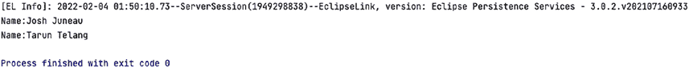

第 7 章 ■ 对象关系映射

图 7-5 将是本示例的输出结果。

***图 7-5.** 示例 7-9 的输出结果*

工作原理


命名查询包含在实体类中，由通过元数据指定的静态 Jakarta Persistence 查询组成。一个给定的实体类可以包含零个或多个命名查询。命名查询通过 `@NamedQuery` 注解表达，该注解包含两个属性：`name` 和 `query`。`@NamedQuery` 注解的 `name` 属性用于为查询指定一个基于字符串的名称，而 `query` 属性用于指定针对该实体的静态查询。如果一个实体包含一组命名查询注解，那么可以为每个查询重复使用 `@NamedQuery` 注解。

命名查询中的 Jakarta Persistence 查询语言可以包含零个或多个绑定变量，这些变量可以在调用命名查询时被替换为值。要使用命名查询，必须首先获取到数据库的活动连接。要了解更多关于通过 `EntityManagerFactory` 获取数据库活动连接的信息，请参考配方 7-3。一旦获取到活动数据库连接，就可以调用 `EntityManager` 对象的 `createNamedQuery` 方法，并传入你想要执行的命名查询的基于字符串的名称。该调用会返回一个 `Query` 对象，可用于获取查询结果。

在本配方的示例中，你可以看到对 `BookAuthor` 实体进行了查询，返回了一个 `BookAuthor` 对象列表。使用一个简单的 `while` 循环来遍历该对象列表，并将每个 `BookAuthor` 对象的名和姓打印到 `System.out`。

**7-10. 对实体字段执行验证**

**问题**

你希望为实体类中的特定字段指定验证规则，以防止无效数据被插入数据库。

**解决方案**

在实体类中包含 Bean 验证约束。Bean 验证约束是应用于实体类持久化字段或属性的注解。Bean 验证机制提供了许多可以放置在字段或属性上的注解，以便以不同方式验证数据。

在以下示例中，`AuthorWork` 实体已被增强，为 `id`、`address1`、`state` 和 `zip` 字段包含了 Bean 验证：

```java
...

@Entity
@Table(name = "AUTHOR_DETAIL")
public class AuthorDetailBeanValidation implements Serializable {

    private static final long serialVersionUID = 1L;

    @Id
    @Basic(optional = false)
    @SequenceGenerator(name="author_detail_s_generator", sequenceName="author__detail_s", initialValue=1, allocationSize=1)
    @GeneratedValue(strategy=GenerationType.SEQUENCE, generator="author_detail_s_generator")
    @NotNull
    @Column(name = "ID")
    private BigDecimal id;

    @Size(max = 200)
    @Pattern(regexp="", message="Invalid Address")
    @Column(name = "ADDRESS1")
    private String address1;

    @Size(max = 200)
    @Column(name = "ADDRESS2")
    private String address2;

    @Size(max = 250)
    @Column(name = "CITY")
    private String city;

    @Size(max = 2)
    @Column(name = "STATE")
    @Pattern(regexp="^(?-i:A[LKSZRAEP]|C[AOT]|D[EC]|F[LM]|G[AU]|HI|I[ADLN]|K[SY]|LA|M[ADEHINOPST]|N[CDEHJMVY]|O[HKR]|P[ARW]|RI|S[CD]|T[NX]|UT|V[AIT]|W[AIVY])$", message="Invalid State")
    private String state;

    @Size(max = 10)
    @Column(name = "ZIP")
    @Pattern(regexp="^\\d{5}\\p{Punct}?\\s?(?:\\d{4})?$", message="Invalid Zip Code")
    private String zip;

    @Column(name = "START_DATE")
    @Temporal(TemporalType.DATE)
    private Date startDate;

    @Lob
    @Column(name = "NOTES")
    private String notes;

    @ManyToOne
    private AuthorBeanValidation author;

    ...
}
```

如果尝试插入不符合验证规则的值，该对象将不会被持久化，并且会显示与 Bean 验证注解相对应的消息。

**工作原理**

在处理用户输入时，采用数据验证策略始终是一个好主意，特别是当数据将被持久化到数据库或其他数据存储中以备后用的时候。Java Persistence API 允许在实体类内部进行 Bean 验证，开发者可以直接将验证规则放置在持久化字段或属性上。默认情况下，在 `PrePersist`、`PreUpdate` 和 `PreRemove` 生命周期事件发生后，持久化提供程序会自动对包含 Bean 验证注解约束的实体调用验证过程。此时，任何不符合给定验证约束的值都会导致实体停止持久化并显示一条关联消息。

Bean 验证的细节是相同的，无论它是在普通的 Java 对象（POJO）上还是在实体类上。对于实体类，持久化字段或属性都可以使用所需的 Bean 验证约束进行注解。要查看可能的 Bean 验证约束注解列表，请参考第 10 章。

在本配方的示例中，`@NotNull` 和 `@Pattern` 注解被指定在 `AuthorDetail` 实体的持久化属性上。具体来说，`id` 字段使用 `@NotNull` 注解，尝试为该字段输入 `NULL` 值将导致验证失败。`state` 和 `zip` 字段包含 `@Pattern` 注解，以及相应的正则表达式和失败消息。如果这些字段的值不符合指定的正则表达式，那么分配给 `@Pattern` 注解的 `message` 属性的消息将通过 Jakarta Server Faces 视图中与被验证字段对应的 `h:message` 组件显示。如果你想对给定的字段或属性应用一组正则表达式模式怎么办？可以使用 `@Pattern.List` 语法来实现，该列表将包含一个逗号分隔的 `@Pattern` 注解列表。以下代码行演示了这种技术：

```java
@Pattern.List({
    @Pattern(regexp="regex-pattern", message="Error Message"),
    @Pattern(regexp="another regex-pattern", message="Error Message 2")
})
```

Bean 验证是确保无效数据不会提交到数据存储的好方法。然而，如今大多数高级桌面或 Web 应用程序会使用多层验证来提升用户体验。很多时候，Web 应用程序首先使用 JavaScript 字段验证，这样用户无需提交页面就能在屏幕上看到验证错误。如果使用 Jakarta Server Faces 或其他 Web 框架，某些组件允许直接访问 Bean 验证，在这种情况下，给定字段或属性的 Ajax 提交会在后台进行，从而无需提交页面即可完成 Bean 验证。无论你采取何种策略，实体类中的 Bean 验证都很重要，并且应该成为你武器库中的一个便捷工具。

**7-11. 自动生成数据库模式对象**

**问题**

你正在开发一个应用程序，并希望自动将你的实体类生成到底层数据库的表中。

**解决方案**

使用 EJB 3.2 中引入的自动模式生成。模式生成由 `persistence.xml` 单元的对象-关系元数据决定，除非提供了用于生成的自定义脚本。应用程序开发者可以将脚本打包为持久化单元的一部分，或者提供脚本位置的 URL 用于模式生成。这些脚本的执行可以在数据库模式创建或删除时进行，或者两者都进行。


由容器本身执行，或者容器可以指示持久化提供程序负责脚本的执行。本配方的“工作原理”部分中的表 7-3 列出了用于配置模式生成的不同 `persistence.xml` 或 `EntityManagerFactory` 属性。这些属性作为 `Map` 参数从容器传递给 `PersistenceProvider` 的 `generateSchema` 方法或 `createContainerEntityManagerFactory` 方法。

***表 7-3.** 模式生成属性*

**属性**

**用途**

`schema-generation-action`

控制持久化提供程序在对象生成和销毁方面采取的操作。**值**：`none`、`create`、`drop-and-create` 和 `drop`

`schema-generation-target`

控制模式是在数据库内创建，还是创建数据定义语言（DDL）脚本，或者两者都创建。**值**：`database`、`scripts` 和 `database-and-scripts`

`ddl-create-script-target`，

如果 `schema-generation-target` 指定了脚本生成，则控制写入脚本的目标位置。写入器已为持久化提供程序预配置。**值**：`java.io.Writer`（例如，`MyWriter.class`）或 URL 字符串

`ddl-drop-script-target`

`ddl-create-script-source`，

指定读取 DDL 脚本的位置。读取器已为持久化提供程序预配置。**值**：`java.io.Reader`（例如，`MyReader.class`）或 URL 字符串

`ddl-drop-script-source`

`sql-load-script-source`

指定 SQL 批量加载脚本的文件位置。**值**：`java.io.Reader`（例如，`MyReader.class`）或 URL 字符串

`schema-generation-connection`

用于执行模式生成的 JDBC 连接

`database-product-name`，

如果需要生成脚本，则需要此属性。值从 JDBC `DatabaseMetaData` 获取

`database-major-version`，

`database-minor-version`

`create-database-schemas`

持久化提供程序除了创建数据库对象（如表、序列、约束等）之外，是否还需要创建模式。**值**：`true` 和 `false`

要定义需要生成的不同对象，请相应地注解实体类。标准的实体类注解（`@Table`、`@Id` 等）决定了创建哪些对象以及它们的结构。有关在实体类中指定注解以生成模式对象的更多信息，请参考本配方“工作原理”部分中表 7-4 列出的注解。

第 7 章 ■ 对象关系映射

***表 7-4.** 模式生成注解*

**注解**

**描述**

**元素**

`@Table`

用于生成表。默认情况下，表名由实体名生成，实体名默认使用类名

`@SecondaryTable`

创建一个辅助表，用于将实体状态的映射分区到多个表中

`@CollectionTable`

为元素集合的映射创建一个集合表。可以使用 `@Column`、`@AttributeOverride` 和 `@AssociationOverride` 注解来覆盖 `@CollectionTable` 的映射

`@JoinTable`

用于关联的映射。默认情况下，为多对多关系和单向一对多关系的映射创建连接表

`@TableGenerator`

用于存储生成的主键值

`@Column`

确定表中列的名称和配置

`unique`、`nullable`、`columnDefinition`、`table`、`length`、`precision`、`scale`、`name`

`@MapKeyColumn`

当键为基本类型时，指定映射的键列的名称

`unique`、`nullable`、`columnDefinition`、`table`、`length`、`precision`、`scale`

`@Enumerated`，

控制为枚举类型的基本属性生成的是字符串值列还是整数值列，因此会影响这些类型的默认列映射

`@MapKeyEnumerated`

`@Temporal`，

控制为时态类型的基本属性生成的是日期值列、时间值列还是时间戳值列，因此会影响这些类型的默认列映射

`@MapKeyTemporal`

`@Lob`

指定将持久化属性映射到数据库大对象类型

`@OrderColumn`

指定生成一个列，用于维护在元素集合、一对多或多对多关系中表示的列表的持久化顺序

`name`、`nullable`、`columnDefinition`

`@DiscriminatorColumn`

为 `SINGLE_TABLE` 映射策略生成，并且提供程序可以选择性地为 `JOINED` 继承策略生成

`@Version`

指定生成一个列，用作实体的乐观锁

`@Id`

指定一个数据库主键列。使用 `@Id` 注解会导致创建一个由相应列组成的主键

`@EmbeddedId`

指定一个嵌入式属性，其对应的列构成数据库主键。使用 `@EmbeddedId` 注解会导致创建一个由相应列组成的主键

`@GeneratedValue`

指示一个应具有自动生成值的主键。如果指定了策略，并且目标数据库支持该策略，则提供程序必须使用它

`@JoinColumn`

`@JoinColumn` 注解通常用于指定外键映射

`name`、`referencedColumnName`、`unique`、`nullable`、`columnDefinition`、`table`、`foreignKey`

`@MapKeyJoinColumn`

指定对作为元素集合或由映射值组成的关系中的映射键的实体的外键映射

`name`、`referencedColumnName`、`unique`、`nullable`、`columnDefinition`、`table`、`foreignKey`

`@PrimaryKeyJoinColumn`

指定将主键列用作外键。此注解用于指定 `JOINED` 映射策略，以及在一对一关系映射中将辅助表连接到主表

`@ForeignKey`

在 `@JoinColumn`、`@JoinColumns`、`@MapKeyJoinColumn`、`@MapKeyJoinColumns`、`@PrimaryKeyJoinColumn` 和 `@PrimaryKeyJoinColumns` 注解中使用，以指定或覆盖外键约束

`@SequenceGenerator`

创建一个用于 ID 生成的数据库序列

`@Index`

生成一个由指定列组成的索引

`@UniqueConstraint`

为给定表生成唯一约束

第 7 章 ■ 对象关系映射

工作原理

模式生成指的是创建底层数据库表、视图、约束和其他数据库工件。在 Java EE 7 版本之前，模式生成只能通过使用诸如 NetBeans 或 Eclipse 之类的 IDE 来自动化。然而，EE 7 版本通过允许为应用程序配置适当的 `persistence.xml` 文件来实现模式生成的自动化，从而朝着打破这种对 IDE 的依赖迈出了一步。

模式生成可以直接应用于数据库，也可以生成可以手动应用于数据库的 SQL 脚本（或两者兼有），具体取决于为应用程序配置了哪些选项。模式生成可以在应用程序部署之前发生，也可以在作为应用程序部署和初始化的一部分创建 `EntityManagerFactory` 时发生。为了执行模式生成，容器可以独立于持久化单元的实体管理器工厂和/或在其之前调用 `PersistenceProvider` 的 `generateSchema` 方法。`createContainerEntityManagerFactory` 调用可以接受额外信息，以使得模式结构的生成作为实体管理器工厂创建或初始化过程的一部分发生。此外，此信息可以确定是直接操作数据库，还是创建 SQL 脚本，或者两者都进行。


■ **注意** 模式生成在 Java SE 环境中的托管容器（例如 Web 应用服务器）之外也可用。要在 Java SE 环境中执行模式生成，应用程序可以调用 `Persistence` 的 `generateSchema` 方法（该方法独立于实体管理器工厂的创建，或在其创建之前调用），也可以向 `createEntityManagerFactory` 方法传递信息，以便在创建实体管理器工厂时一并生成模式。

表 7-3 列出了可在 `persistence.xml` 文件中指定的、用于自动化模式生成的不同模式生成属性。

在编程层面，模式生成由放置在实体类中的一系列注解决定。`@Table` 注解表示实体与底层数据库表的映射。默认情况下，会为每个顶级实体生成一个表，并根据该实体的指定属性包含相应的列。因此，`@Column` 和 `@JoinColumn` 注解用于为表生成这些列。列的顺序并非由 `@Column` 或 `@JoinColumn` 注解的顺序决定。如果列的顺序很重要，则必须提供数据定义语言（DDL）脚本来生成表。其他注解和注解属性（例如 `@Id`）在模式生成中也扮演着重要角色。表 7-4 列出了参与模式生成的不同注解，并附有简要说明以及可填充的元素，以便进一步控制生成的模式。

根据表 7-4，有几个注解是专门为方便模式生成而创建的。这些新注解是 `@Index` 和 `@ForeignKey`，其中 `@Index` 负责为指定的列生成索引。`@ForeignKey` 用于在表上定义外键。

以下是从 *persistence.xml* 中摘录的内容，用于在模式生成过程中启用表的创建：

<property name="jakarta.persistence.schema-generation.database.action" value="create"/>

<property name="jakarta.persistence.schema-generation.create-source" value="metadata"/> 添加上述属性将导致数据库模式对象的自动生成。

第 7 章 ■ 对象关系映射

7-12\. 映射日期时间值

问题

您希望使用日期时间 API 将 Java `LocalDate` 值持久化到数据库中。

解决方案

使用 JPA 2.2 对日期时间 API 的支持来处理 `LocalDate`。由于 JPA 2.2 维护版本支持 Java 日期时间 API，因此可以利用 Java 8 中引入的日期和时间对象进行持久化，而无需使用 `@Temporal` 注解。以下实体类演示了如何实现这一功能：

public class Book implements Serializable {

private static final long serialVersionUID = 1L;

@Id

@Basic(optional = false)

@Column(name = "ID")

private BigDecimal id;

@Size(max = 150)

@Column(name = "TITLE")

protected String title;

@Size(max = 500)

@Column(name = “IMAGE”)

private String image;

@Lob

@Column(name = "DESCRIPTION")

private String description;

@Column(name = "PUBLISH_DATE")

private LocalDate publishDate;

@ManyToMany(mappedBy="books")

private Set<BookAuthor> authors;

@OneToMany(mappedBy="book", cascade=CascadeType.ALL)

private List<Chapter> chapters = null;

public Book() { }

...

}

如您所见，实体类包含一个 `LocalDate` 字段，该字段没有包含任何特殊注解。

第 7 章 ■ 对象关系映射

工作原理

当 Java 8 最初发布时，Java EE 和 JPA 并不支持更新的日期时间 API。因此，为了使用较新的日期和时间对象，必须开发一个转换器来执行新日期时间对象与 `java.util.Date` 之间的自动转换。自 JPA 2.2 维护版本以来，这个问题得到了缓解，因为 Java 日期时间 API 已得到官方支持，使得持久化包含日期和时间值的字段比以往任何时候都更加容易。

要将包含日期的数据库列映射到 Java 对象，只需使用 `@Column` 注解对该列进行注解，如果需要，可以指定列名。不再需要 `@Temporal` 注解。将以下数据类型之一应用于类字段：

• java.time.LocalDate

• java.time.LocalTime

• java.time.LocalDateTime

• java.time.OffsetTime

• java.time.OffsetDateTime

就是这么简单！Jakarta Persistence API 的日期时间支持提供了在 Java EE 应用程序中使用该 API 的能力，而无需转换器。它还减少了代码量，因为不再需要 `@Temporal`。

7-13\. 多次使用同一注解

问题

您希望在给定类中多次使用同一个注解。例如，假设您想在一个类中使用多个 `@PersistenceContext` 注解。

解决方案

利用 JPA 2.2 提供的 Java 8 可重复注解支持。这种新增支持提供了在许多情况下使用可重复注解的能力。在以下示例中，`@NamedQuery` 注解在同一个类中被多次使用。在 JPA 2.2 之前，如果不先将这些注解分组到一个容器注解中，这是行不通的：

@Entity

@Table(name = "EMPLOYEE")

@XmlRootElement

@NamedQuery(name = "Employee.findAll", query = "SELECT e FROM Employee e")

@NamedQuery(name = "Employee.findById", query = "SELECT e FROM Employee e WHERE e.id = :id")

@NamedQuery(name = "Employee.findByFirst", query = "SELECT e FROM Employee e WHERE e.first =

:first")

@NamedQuery(name = "Employee.findByLast", query = "SELECT e FROM Employee e WHERE e.last

= :last")

@NamedQuery(name = "Employee.findByAge", query = "SELECT e FROM Employee e WHERE e.age

= :age")

@NamedStoredProcedureQuery(name = "createEmp", procedureName = "CREATE_EMP") 375

第 7 章 ■ 对象关系映射

public class Employee implements Serializable {

private static final long serialVersionUID = 1L;

// @Max(value=?) @Min(value=?)//如果您知道十进制字段的范围，请考虑使用这些注解来强制执行字段验证

@Id

@Basic(optional = false)

//@NotNull

@Column(name = "ID")

private BigDecimal id;

@Size(max = 30)

@Column(name = "FIRSTNAME")

private String first;

@Size(max = 30)

@Column(name = "LASTNAME")

private String last;

@Column(name = “AGE”)

private BigInteger age;

@ManyToOne(optional = false)

@JoinColumn(name = "JOB_ID", nullable = false)

private Jobs job;

@Column(name = "STATUS")

private String status;

public Employee() { }

...

}

工作原理

可重复注解支持随 Java 8 的发布而引入 Java 平台。这使得可以在代码段中多次使用同一个注解。注解默认是不可重复的；注解类必须使用 `@Repeatable` 注解指定为可重复。因此，并非所有注解都可以在类中多次使用。以下注解在 Java EE 8 版本中被设为可重复：

• AssociationOverride

• AttributeOverride

• Convert

• JoinColumn

• MapKeyJoinColumn

• NamedEntityGraph

第 7 章 ■ 对象关系映射

• NamedNativeQuery

• NamedQuery

• NamedStoredProcedureQuery

• PersistenceContext

• PersistenceUnit

• PrimaryKeyJoinColumn

• SecondaryTable

• SqlResultSetMapping

如前所述，注解必须通过使用 `@Repeatable` 标记来指定为可重复。


`@Repeatable` 注解。因此，如果你创建了一个自定义注解并希望使其可重复，那么你可以这样做。

**第 8 章**

**Jakarta 企业 Beans**

Jakarta 企业 Beans 的创建是为了将视图层与数据库访问层和业务层分离。在 Jakarta EE 应用中，所有数据库（EntityManager）访问和业务逻辑都可以在 Jakarta 企业 Beans 中完成，并且在过去的几个版本中，它们的使用已经变得非常简单。Jakarta 企业 Beans 用于协调实体相关的数据库任务，而 Jakarta Server Faces CDI 控制器（也称为控制器类）用于直接与 Jakarta Server Faces 视图或网页交互。CDI Beans 用于在视图层和业务层之间提供外观。

Jakarta 企业 Beans 部署到管理 Bean 生命周期的应用服务器容器中。该容器还为 Jakarta 企业 Beans 提供事务管理和安全性等功能。Jakarta 企业 Beans 是可移植的，这意味着它们可以部署到不同的应用服务器容器中。这为 Jakarta 企业 Beans 开发者带来了好处，因为单个 Jakarta 企业 Beans 可以在多个应用中使用。此外，由于使用 Java 持久化查询语言（Java Persistence Query Language，详见第 9 章）而非常规 SQL 来执行数据库操作，Jakarta 企业 Beans 还缓解了修改应用以适配多个数据库的问题。因此，如果一个应用是在某个数据库上开发的，它可以移植到另一个数据库，而无需重写任何 SQL。

有三种类型的 Jakarta 企业 Beans 可供使用：无状态、有状态和消息驱动。本章将介绍前两种，消息驱动 Beans（MDB）将在介绍 Jakarta 消息服务的第 12 章中介绍。无状态会话 Beans 最常用，因为它们用于快速事务，并且不维护任何会话状态。另一方面，有状态 Beans 用于需要在多个客户端请求之间维护会话状态的情况。

本章包含一些技巧，帮助你熟悉有状态和无状态会话 Beans。你将学习如何从 Jakarta Server Faces CDI 控制器客户端访问 Jakarta 企业 Beans，并在 Jakarta Server Faces 视图或网页中显示 Jakarta 企业 Beans 从数据库查询到的内容。此外，还有一些技巧涵盖了有用的策略，例如使用 Bean 定时器和创建单例会话 Beans。

■ **注意** 近年来，由于 CDI Beans 现在可以替代它们，Jakarta 企业 Beans 可能被视为较老的技术。

© Josh Juneau 和 Tarun Telang 2022

J. Juneau 和 T. Telang，*Java EE 到 Jakarta EE 10 实战*，[`doi.org/10.1007/978-1-4842-8079-9_8`](https://doi.org/10.1007/978-1-4842-8079-9_8#DOI)

第 8 章 ■ Jakarta 企业 Beans

8-1. 获取实体管理器

问题

你已为数据库连接创建了一个持久化单元，并希望使用它来获取一个用于处理数据库的连接。

解决方案 #1

通过调用 `jakarta.persistence.Persistence.createEntityManagerFactory` 方法并传入 `JakartaEERecipesLOCAL` 持久化单元的名称，创建一个使用本地 JDBC 连接的 `EntityManagerFactory` 对象。从已创建的工厂对象中获取一个 `EntityManager` 对象，然后根据需要利用该 `EntityManager` 对象处理数据库实体。以下代码行演示了如何使用本地 JDBC 连接创建 `EntityManager` 对象：

```java
EntityManagerFactory emf = Persistence.createEntityManagerFactory("JakartaEERecipesLOCAL");
EntityManager em = emf.createEntityManager();
```

■ **注意** 关于创建持久化单元的更多参考，请参见技巧 8-3。

解决方案 #2

在使用 Java 命名和目录接口（JNDI）的环境（例如应用服务器）中使用数据库连接时，将 `EntityManager` 注入到 EJB 中。为此，声明一个 `EntityManager` 类型的私有字段，并使用 `@PersistenceContext` 注解对其进行注解。将相关持久化单元的名称传递给 `@PersistenceContext` 注解。以下代码行演示了如何执行此技术。在应用中，这些代码行将位于实体类的 EJB 中：

```java
@PersistenceContext(unitName = "JakartaEERecipes")
private EntityManager em;
```

工作原理

在实体类可用于持久化对象或获取查询结果之前，必须从持久化单元数据库连接配置中创建一个实体管理器。创建实体管理器的方式将根据你使用的数据库连接类型而有所不同。例如，如果你是从本地 JDBC 连接创建实体管理器，则需要做更多工作，因为必须使用 `EntityManagerFactory` 来获取 `EntityManager` 对象。另一方面，如果你是从通过 JNDI 在应用服务器中注册的数据库连接创建容器管理的实体管理器，那么大部分工作将通过元数据注解在后台为你完成。这是首选方法，因为配置易于从应用服务器集中管理。

在本技巧的第一个解决方案中，使用与本地 JDBC 连接相关的持久化单元来获取 `EntityManager` 对象。如前所述，在 Jakarta 企业 Beans 中，必须首先通过调用 `jakarta.persistence.Persistence` 类的 `createEntityManagerFactory` 方法并将基于字符串的持久化单元名称传递给该方法来获取 `EntityManagerFactory` 对象。然后，可以通过调用 `EntityManagerFactory` 的 `createEntityManager` 方法来实例化一个 `EntityManager` 对象。

第 8 章 ■ Jakarta 企业 Beans

在本技巧的第二个解决方案中，获取了一个容器管理的 `EntityManager` 对象实例。如果应用部署到诸如 Eclipse GlassFish 之类的企业应用服务器容器中，这是获取 `EntityManager` 的首选方式。利用容器管理的实体管理器使 Jakarta 持久化开发更加容易，因为 Jakarta EE 容器管理容器管理的实体管理器的生命周期。此外，容器管理的实体管理器会自动传播到单个 Jakarta 事务 API 事务中的所有应用组件。要获取容器管理的实体管理器，在 Jakarta 企业 Beans 中声明一个 `EntityManager` 字段，只需使用 `@PersistenceContext` 注解对其进行注解，并将基于字符串的持久化单元名称传递给该注解。这样做会将实体管理器注入到应用组件中。

执行上述任一解决方案后，新获取的 `EntityManager` 对象即可使用。最常用的 `EntityManager` 方法是 `createQuery`、`createNamedQuery`、`find` 和 `persist`。你将在接下来的技巧中了解更多关于使用 `EntityManager` 的内容。

项目的 Maven 依赖项如下：

```xml
<dependency>
    <groupId>jakarta.ejb</groupId>
    <artifactId>jakarta.ejb-api</artifactId>
    <version>4.0.0</version>
    <scope>provided</scope>
</dependency>
<dependency>
    <groupId>jakarta.persistence</groupId>
    <artifactId>jakarta.persistence-api</artifactId>
    <version>3.1.0</version>
</dependency>
<dependency>
    <groupId>org.eclipse.persistence</groupId>
    <artifactId>eclipselink</artifactId>
    <version>4.0.0-M3</version>
</dependency>
<dependency>
    <groupId>org.apache.derby</groupId>
    <artifactId>derbyclient</artifactId>
    <version>10.15.2.0</version>
    <scope>runtime</scope>
</dependency>
<dependency>
    <groupId>org.apache.derby</groupId>
```


<artifactId>derbynet</artifactId>

<version>10.15.2.0</version>

<scope>runtime</scope>

</dependency>

<dependency>

<groupId>jakarta.platform</groupId>

<artifactId>jakarta.jakartaee-web-api</artifactId>

<version>10.0.0-RC1</version>

</dependency>

第 8 章 ■ Jakarta 企业 Bean

8-2\. 开发无状态会话 Bean

问题

您希望创建一个可用于为客户端执行任务的类，但应用程序不需要 Bean 在事务之间保留任何状态。此外，您还希望能够在类内部与数据库进行交互。

解决方案 #1

为您要执行任务的实体类创建一个无状态会话 Bean。从持久化单元创建一个`EntityManager`对象，并使用实体类对数据库发起任务。

在以下解决方案中，创建了一个用于处理 Book 实体的无状态会话 Bean：
package org.jakartaeerecipe.chapter08.session;

import jakarta.ejb.Stateless;

import jakarta.persistence.EntityManager;

import jakarta.persistence.PersistenceContext;

import org.jakartaeerecipe.chapter08.entity.Book;

**@Stateless**

public class BookFacade {

@PersistenceContext(unitName = "JakartaEERecipes")

private EntityManager em;

protected EntityManager getEntityManager() {

return em;

}

public BookFacade() {

}

/**

* 创建一个图书对象

* @param book

*/

public void create(Book book){

em.persist(book);

}

/**

* 更新一个图书对象

* @param book

*/

public void edit(Book book){

em.merge(book);

}

/**

* 移除一个图书对象

* @param book

*/

public void remove(Book book){

em.remove(book);

第 8 章 ■ Jakarta 企业 Bean

}

/**

* 根据给定的标题返回一个 Book 对象。此方法假设数据库中不存在重复标题。

* @param title

* @return

*/

public Book findByTitle(String title){

Book returnValue = null;

try{

returnValue = (Book) em.createQuery("select object(o) from Book o " +

"where o.title = :title")

.setParameter("title", title.toUpperCase())

.getSingleResult();

} catch (NoResultException ex){

ex.printStackTrace();

}

return returnValue;

}

}

在示例会话 Bean 中，客户端可以调用`create`、`edit`和`remove`方法来对数据库执行 CRUD 操作。客户端可以调用`findByTitle()`方法从数据库中获取一个`Book`对象。

解决方案 #2

为您要执行任务的实体类创建一个无状态会话 Bean，并扩展一个封装了会话 Bean 标准操作的抽象类。从持久化单元创建一个`EntityManager`对象，并使用实体类对数据库发起任务。在以下解决方案中，创建了一个用于处理 Book 实体的无状态会话 Bean。它扩展了一个名为`AbstractFacade`的类，该类包含了 EJB 中大多数常用操作的实现。

首先，让我们看一下`BookFacade`类，即无状态会话 Bean：

package org.jakartaeerecipe.chapter08.session;

import jakarta.ejb.Stateless;

import jakarta.persistence.EntityManager;

import jakarta.persistence.PersistenceContext;

import org.jakartaeerecipe.chapter08.entity.Book;

@Stateless

public class BookFacade extends AbstractFacade<Book> {

@PersistenceContext(unitName = "JakartaEERecipes")

private EntityManager em;

@Override

protected EntityManager getEntityManager() {

return em;

}

public BookFacade() {

super(Book.class);

第 8 章 ■ Jakarta 企业 Bean

}

/**

* 根据给定的标题返回一个 Book 对象。此方法假设数据库中不存在重复标题。

* @param title

* @return

*/

public Book findByTitle(String title){

return (Book) em.createQuery("select object(o) from Book o " +

"where o.title = :title")

.setParameter("title", title.toUpperCase())

.getSingleResult();

}

}

如您所见，Jakarta 企业 Bean 中只实现了一个方法，即`findByTitle()`方法。然而，由于`BookFacade`扩展了`AbstractFacade`，因此也可以通过`BookFacade`会话 Bean 对 Book 实体执行其他 CRUD 功能，例如创建、更新和移除。`AbstractFacade`类是一个抽象类，它实现了最常用的 Jakarta 企业 Bean 方法。

它接受一个指定为泛型的实体类类型，其实现如下。

■ **注意** 以下代码是在为 Book 实体类创建无状态会话 Bean 后，由 Apache NetBeans IDE 与`BookFacade`会话 Bean 一起自动生成的。如果您使用的是其他 IDE，如 Eclipse 或 IntelliJ，则可能需要手动编写此代码。

package org.jakartaeerecipe.chapter08.session;

import java.util.List;

import jakarta.persistence.EntityManager;

/**

* 会话 Bean 的抽象 Facade

*/

public abstract class AbstractFacade<T> {

private Class<T> entityClass;

public AbstractFacade(Class<T> entityClass) {

this.entityClass = entityClass;

}

protected abstract EntityManager getEntityManager();

public void create(T entity) {

getEntityManager().persist(entity);

}

public void edit(T entity) {

getEntityManager().merge(entity);

}

public void remove(T entity) {

getEntityManager().remove(getEntityManager().merge(entity));

}

public T find(Object id) {

return getEntityManager().find(entityClass, id);

第 8 章 ■ Jakarta 企业 Bean

}

public List<T> findAll() {

jakarta.persistence.criteria.CriteriaQuery cq = getEntityManager().

getCriteriaBuilder().createQuery();

cq.select(cq.from(entityClass));

return getEntityManager().createQuery(cq).getResultList();

}

public List<T> findRange(int[] range) {

jakarta.persistence.criteria.CriteriaQuery cq = getEntityManager().

getCriteriaBuilder().createQuery();

cq.select(cq.from(entityClass));

jakarta.persistence.Query q = getEntityManager().createQuery(cq);

q.setMaxResults(range[1] - range[0]);

q.setFirstResult(range[0]);

return q.getResultList();

}

public int count() {

jakarta.persistence.criteria.CriteriaQuery cq = getEntityManager().

getCriteriaBuilder().createQuery();

jakarta.persistence.criteria.Root<T> rt = cq.from(entityClass);

cq.select(getEntityManager().getCriteriaBuilder().count(rt));

jakarta.persistence.Query q = getEntityManager().createQuery(cq);

return ((Long) q.getSingleResult()).intValue();

}

}

由于`BookFacade`扩展了该类，因此`AbstractFacade`中声明的所有方法都对`BookFacade`可用。使用抽象类来实现标准 CRUD 功能的最大好处之一是，它可以应用于许多不同的 Jakarta 企业 Bean，而无需每次都从头编写。

工作原理

用于封装应用程序业务逻辑和数据访问的 Java 类也称为*会话 Bean*。更具体地说，会话 Bean 通常对应于实体类，通常每个实体对应一个 Bean，尽管这不是必需的，并且在某些情况下这种实现效果不佳。应用程序的所有数据库事务都应封装在负责业务流程实现的会话 Bean 类中，然后客户端应调用会话 Bean 以调用这些业务流程。无状态会话 Bean 不保留任何状态，这意味着 Bean 中的变量不保证在多次调用之间保持其值。应用服务器容器维护一个会话 Bean 池供其客户端使用，当客户端调用 Bean 时，会从池中取出一个供使用。客户端完成调用任务后，Bean 会立即返回到池中。因此，无状态会话 Bean 是线程安全的，并且在并发用户环境中表现良好。


无状态会话 Bean 应包含一个无参构造器，并由应用服务器容器在应用启动时实例化。为了表明会话 Bean 是无状态的，该类应使用 `@Stateless` 注解，并可选择传递一个基于字符串的 Bean 名称参数。如果在 `@Stateless` 注解中未指定名称参数，则使用 Bean 的名称。无状态会话 Bean 不应是 final 或 abstract 的；因此，Bean 内的所有方法都应包含实现。它们可以继承其他会话 Bean 或 POJO 以扩展功能。在 EJB 3.1 之前的版本中，要求会话 Bean 实现业务接口，这些接口包含那些供客户端使用的公共方法的方法签名。然而，会话 Bean 不再需要实现业务接口，事实上，本方案中的解决方案并未演示业务接口的使用（具体示例请参见方案 8-4）。

可以在无状态会话 Bean 内声明零个或多个变量，但这些变量的内容在客户端调用之间不保证保留。无状态会话 Bean 通常至少包含一个 `EntityManager` 连接，尽管一个 Bean 也可以包含零个或多个连接。例如，在某些情况下，会话 Bean 不需要持久化数据，因此不需要数据库连接。在其他情况下，会话 Bean 可能需要能够与多个数据库协同工作，这时就需要多个数据库连接。在本方案的示例中，声明了一个单一的数据库连接作为 `EntityManager` 对象，对应于 JakartaEERecipes 持久化单元。在会话 Bean 中，也可以使用标准的 JDBC 持久化单元以及标准的 JDBC `DataSource` 对象。使用标准 JDBC `DataSource` 声明的示例如下：

```java
@Resource(name="jdbc/MyDataSource")
private DataSource dataSource;
```

如前所述，无状态会话 Bean 可以实现业务接口，但这不是必需的。无状态会话 Bean 可以实现的业务接口可以是本地接口、远程接口或 Web 服务端点。本地业务接口是为与无状态会话 Bean 位于同一容器实例内的客户端设计的。使用 `@Local` 注解指定一个业务接口即表示其为本地接口。远程业务接口是为位于会话 Bean 容器实例外部的客户端设计的。远程业务接口通过 `@Remote` 注解表示。

无状态会话 Bean 包含“回调方法”，当某些生命周期事件发生时，容器会自动调用这些方法。具体来说，无状态会话 Bean 可以使用两个回调：`PostConstruct` 和 `PreDestroy`。在容器构造了无状态会话 Bean 并注入了资源之后，Bean 内任何使用 `@PostConstruct` 注解标记的方法都将被调用。类似地，当容器决定将一个 Bean 从池中移除或销毁时，在 Bean 被销毁之前，任何使用 `@PreDestroy` 注解标记的方法都将被调用。回调方法对于实例化数据库连接等操作非常有用。

**无状态会话 Bean 的生命周期**

无状态会话 Bean 具有以下生命周期：

1.  容器使用默认的无参构造器创建一个无状态会话 Bean。
2.  根据需要注入资源（例如，数据库连接）。
3.  生成一个受管理的 Bean 池，并将会话 Bean 的多个实例放入池中。
4.  当从客户端接收到调用请求时，从池中取出一个空闲的 Bean。如果池中的所有 Bean 都正在使用，则会实例化更多 Bean，直到达到指定的最大 Bean 数量。
5.  执行客户端调用的业务方法。
6.  业务方法处理完成后，Bean 被返回到池中。
7.  根据需要将 Bean 从池中销毁。

在本方案的第一个解决方案中，列出了一个无状态会话 Bean，它没有实现任何接口，也没有继承任何其他类。这样的无状态会话 Bean 非常典型，在 EJB 3.1+ 应用中并不罕见。该解决方案中的 Bean 声明了一个 `EntityManager` 对象，由于指定了 `@PersistenceContext` 注解，应用服务器容器会自动创建 `EntityManager` 并将其注入到 Bean 中。该注解必须指定一个持久化单元名称，以告知容器要注入的 `EntityManager` 类型。如果 Bean 需要访问多个数据库连接，则可以声明多个 `EntityManager` 对象，为每个持久化单元指定不同的名称，以对应 Bean 所需的不同连接。根据无状态会话 Bean 的指导原则，指定了一个无参构造器。该解决方案还包含一个业务方法实现 `findByTitle()`，它接受一个 `String` 参数，并在 `Book` 实体中查询指定的书名。如果找到，则将匹配的 `Book` 对象返回给调用者。`findByTitle()` 方法演示了在会话 Bean 中使用 `EntityManager` 对象与数据库进行交互的典型用法。

在本方案的第二个解决方案中，`BookFacade` 无状态会话 Bean 继承了一个名为 `AbstractFacade` 的类。`AbstractFacade` 类包含了许多在会话 Bean 类中常用的方法实现。例如，`AbstractClass` 中的 `create` 方法可用于持久化一个对象（插入到数据库中），`edit` 方法可用于更新一个对象。

解决方案 #2 展示了一种良好的技术，可以将常用的业务逻辑封装到一个单独的类中，以便多个不同的 Bean 可以继承它。考虑一下，应用可能包含多个对应于不同实体类的无状态会话 Bean，并且每个 Bean 都需要包含 `create`、`edit` 和 `remove` 方法。简单地继承一个包含这些功能的类，比在每个单独的会话 Bean 类中重写要容易得多。

无状态会话 Bean 是高性能的对象，用于封装与应用实体相对应的业务逻辑和数据访问。虽然大多数情况下会为每个实体类编写一个会话 Bean，但这并非强制规则。在决定使用哪种类型的 Bean 来封装特定应用流程的逻辑时，应首先考虑无状态会话 Bean。如果客户端和 Bean 之间不需要会话状态（无需维护状态），那么无状态会话 Bean 是最佳选择，因为它们提供了最高的并发性和最佳的性能。

然而，如果需要状态，则应考虑使用有状态会话 Bean。

**8-3. 开发有状态会话 Bean**

**问题**

您希望开发一个能够与客户端维护会话状态的会话 Bean。例如，您希望客户端能够执行多步骤流程，而会话 Bean 的状态在请求之间不会丢失。

**解决方案**

创建一个有状态会话 Bean，并实现与您选择的实体类相关的业务逻辑。


假设客户正在浏览 Acme Bookstore 应用的页面，并希望将一本书添加到购物车。购物车需要在一个有状态会话 Bean 中维护，因为它需要保持状态，直到客户决定购买、取消订单或关闭浏览器。

第 8 章 ■ Jakarta 企业 Bean

以下代码是 `OrderFacade` 类，这是一个有状态会话 Bean，用于维护访客的购物车和购买行为：

package org.jakartaeerecipe.chapter08.session;

import java.util.concurrent.TimeUnit;

import jakarta.ejb.PostActivate;

import jakarta.ejb.PrePassivate;

import jakarta.ejb.Remove;

import jakarta.ejb.Stateful;

import jakarta.ejb.StatefulTimeout;

import org.jakartaeerecipe.chapter08.object.Cart;

@Stateful

@StatefulTimeout(unit = TimeUnit.MINUTES, value = 30)

public class OrderFacade {

private Cart cart;

@SuppressWarnings("unused")

@PrePassivate

private void prePassivate() {

System.out.println("In PrePassivate method");

}

@SuppressWarnings("unused")

@PostActivate

private void postActivate() {

System.out.println("In PostActivate method");

}

public Cart getCart() {

if(cart == null)

cart = new Cart();

return cart;

}

public void setCart(Cart cart) {

this.cart = cart;

}

public void completePurchase() {

System.out.println("Not yet implemented..");

}

@Remove

public void destroy() {

System.out.println("Destroying OrderFacade...");

}

}

客户端可以像调用无状态会话 Bean 一样调用有状态会话 Bean（参见配方 8-2）。也就是说，客户端可以通过业务接口或控制器类/CDI Bean 访问有状态会话 Bean 的方法。在本例中，`CartController` Bean 将访问有状态会话 Bean。

以下 `CartController` 代码演示了如何访问 `OrderFacade`。对 EJB 的主要访问点位于 `getCart()` 方法中：

第 8 章 ■ Jakarta 企业 Bean

@Named(name = "cartController") // 指定一个 CDI Bean

@SessionScoped // 指定一个会话作用域的 Bean

public class CartController implements Serializable {

private Item currentBook = null;

@EJB // 注入 EJB

OrderFacade orderFacade;

@Inject // 注入指定的 CDI Bean 控制器

private AuthorController authorController;

/**

* 创建 CartController 的新实例

*/

public CartController() {

}

public String addToCart() {

if (getCart().getBooks() == null) {

getCart().addBook(getAuthorController().getCurrentBook(), 1);

} else {

getCart().addBook(getAuthorController().getCurrentBook(),

searchCart(getAuthorController().getCurrentBook().getTitle()) + 1);

}

FacesMessage facesMsg = new FacesMessage(FacesMessage.SEVERITY_INFO,

"Succesfully Updated Cart", null);

FacesContext.getCurrentInstance().addMessage(null, facesMsg);

return null;

}

/**

* 判断一本书是否已在购物车中

* 如果不存在指定标题的书籍，则返回 0。

*

* @param title

* @return

*/

public int searchCart(String title) {

int count = 0;

for (Item item : getCart().getBooks()) {

if (item.getBook().getTitle().equals(title)) {

count++;

}

}

return count;

}

public String viewCart() {

if (getCart() == null) {

FacesMessage facesMsg = new FacesMessage(FacesMessage.SEVERITY_INFO,

"No books in cart...", null);

FacesContext.getCurrentInstance().addMessage(null, facesMsg);

}

return "/chapter08/cart";

}

第 8 章 ■ Jakarta 企业 Bean

public String continueShopping() {

return "/chapter08/book";

}

public String editItem(String title) {

for (Item item : getCart().getBooks()) {

if (item.getBook().getTitle().equals(title)) {

currentBook = item;

}

}

return "/chapter08/reviewItem";

}

public String updateCart(String title) {

Item foundItem = null;

if (currentBook.getQuantity() == 0) {

for (Item item : getCart().getBooks()) {

if (item.getBook().getTitle().equals(title)) {

foundItem = item;

}

}

}

getCart().getBooks().remove(foundItem);

FacesMessage facesMsg = new FacesMessage(FacesMessage.SEVERITY_INFO,

"Succesfully Updated Cart", null);

FacesContext.getCurrentInstance().addMessage(null, facesMsg);

return "/chapter08/cart";

}

/**


* @return 购物车

*/

public Cart getCart() {

return orderFacade.getCart();

}

/**

* @return 当前图书

*/

public Item getCurrentBook() {

return currentBook;

}

/**

* @param currentBook 要设置的当前图书

*/

public void setCurrentBook(Item currentBook) {

this.currentBook = currentBook;

}

public void isBookInCart(ComponentSystemEvent event) {

UIOutput output = (UIOutput) event.getComponent();

if (getCart() != null) {

if (searchCart(getAuthorController().getCurrentBook().getTitle()) > 0) {

output.setValue("该书当前已在您的购物车中。");

} else {

output.setValue("该书不在您的购物车中。");

}

第 8 章 ■ Jakarta 企业 Bean

} else {

output.setValue("该书不在您的购物车中。");

}

}

public void updateRowData(RowEditEvent e) {

System.out.println("在此处执行编辑逻辑...");

currentBook = (Item)e.getObject();

// 调用 updateCart 方法，并传入当前图书的标题。

updateCart(((Item)e.getObject()).getBook().getTitle());

}

/**

* @return 作者控制器

/

*

public AuthorController getAuthorController() {

return authorController;

}

/**

* @param authorController 要设置的作者控制器

*/

public void setAuthorController(AuthorController authorController) {

this.authorController = authorController;

}

}

工作原理

有状态会话 Bean 是一个 Java 类，用于封装应用程序的业务逻辑。在大多数情况下，有状态 Bean 与实体类存在一一对应关系，即该 Bean 处理与特定实体相关的所有数据库调用。从编程角度来看，有状态会话 Bean 在这方面与无状态会话 Bean 非常相似。然而，有状态会话 Bean 保证能够与客户端维持会话状态，而无状态会话 Bean 则不能。也就是说，应用服务器容器以不同的方式处理有状态会话 Bean，并且它们的生命周期与无状态会话 Bean 有很大不同。应用服务器容器维护一个供客户端使用的有状态会话 Bean 池，但客户端与 Bean 之间存在一一映射关系：当客户端调用一个有状态 Bean 时，在该客户端仍处于活动状态期间，容器不会将该 Bean 释放回池中。因此，有状态会话 Bean 的效率可能低于无状态 Bean，并且它们占用的内存空间可能比无状态会话 Bean 更大，因为如果有大量活动会话使用有状态 Bean，那么内存中就会保留大量处于活动状态的有状态 Bean 来服务这些会话。

要创建有状态会话 Bean，必须使用 `@Stateful` 注解将该类标记为有状态。

`@Stateful` 注解的可选 `name` 参数可用于为 Bean 指定一个基于字符串的名称。与无状态会话 Bean 类似，有状态会话 Bean 可以实现一个业务接口，但从 EJB 3.1 开始，这不是强制性的。在本示例中，没有使用业务接口；因此，Bean 中任何具有 `public` 修饰符的方法都将可供客户端使用。任何用于存储会话状态的变量都必须是 Java 基本类型或可序列化类型。当使用实例变量存储数据时，该数据将在整个会话生命周期内得以维持。

每个有状态会话 Bean 还必须包含一个方法，该方法将在 Bean 客户端移除该 Bean 时被调用。Bean 的状态将一直维持，直到调用 `@Remove` 方法。当发生这种情况时，容器将调用使用 `@Remove` 注解的方法，并且在 `@Remove` 方法执行完毕后，该 Bean 将被移除。

第 8 章 ■ Jakarta 企业 Bean

**有状态会话 Bean 的生命周期**

有状态会话 Bean 具有以下生命周期：

1.  每当启动一个新的客户端会话时，容器会利用默认构造函数创建新的 Bean 实例。
2.  资源被注入到 Bean 中。
3.  Bean 实例被存储在内存中。
4.  执行客户端调用的方法。
5.


bean 会等待并执行任何后续请求。

6.

如果客户端在一段时间内保持空闲，bean 会被*钝化*或从活动内存中移除并存入临时存储。

7.

客户端对已钝化 bean 的调用会将其从临时存储中重新加载回内存。

8.

如果客户端在一段时间内未调用已钝化的 bean 实例，该 bean 将被销毁。

9.

如果客户端请求移除某个 bean 实例，则该实例会在必要时被激活，然后被销毁。

有状态会话 bean 会在内存中存储一段时间。如果客户端在一段时间后不再请求使用某个有状态 bean，则容器会将其钝化。钝化是指将有状态会话 bean 从活动内存中取出，并存储到磁盘上的临时位置的过程。容器通过序列化整个 bean 实例并将其移动到磁盘上的永久存储来实现这一点。之后，如果客户端调用该 bean，它会被重新激活，而激活是钝化的逆过程。

另一种基于时间钝化有状态会话 bean 的方式是使用 `@StatefulTimeout` 注解类。此注解允许开发者选择维持 bean 状态的时间长度。在本示例中，状态会在 bean 被钝化前维持 30 分钟：

`@StatefulTimeout(unit = TimeUnit.MINUTES, value = 30)`

有状态会话 bean 比无状态会话 bean 拥有更多的回调方法。回调方法可用于在 bean 生命周期的特定时刻执行操作。具体来说，可以在方法签名前放置以下注解，以便在给定的 bean 生命周期事件发生时标记它们以供执行：`@PostConstruct`、`@PrePassivate`、`@PostActivate` 和 `@PreDestroy`。`@PostConstruct` 注解表示被注解的方法将在实例创建时由容器执行。`@PrePassivate` 表示被注解的方法将在钝化发生前由容器执行。`@PostActivate` 表示被注解的方法应在激活后执行，换句话说，即 bean 重新变为活动状态时。最后，被 `@PreDestroy` 注解的方法将在 bean 被销毁前由容器执行。

如果你的会话 bean 需要在整个对话过程中保持状态的能力，那么你需要使用有状态会话 bean。然而，务必谨慎使用有状态会话 bean，因为它们的效率低于无状态会话 bean，并且在应用服务器上需要更大的内存占用。

第 8 章 ■ Jakarta Enterprise Beans

8-4\. 将会话 bean 与 Jakarta Server Faces 结合使用

问题

你想为会话 bean 开发一个基于 Web 的客户端，该客户端与会话 bean 本身位于同一容器内。

解决方案

编写一个 Java 客户端，并直接与你选择的会话 bean 进行交互。以下代码演示了一个直接与无状态会话 bean 交互的 CDI 控制器。名为 `BookController` 的 Jakarta Server Faces CDI bean 是 `BookFacade` 会话 bean 的客户端类。从代码中你可以看到，该 bean 能够通过声明与 `BookFacade` 类相关的属性，直接与会话 bean 的公有方法进行交互：

```java
package org.jakartaeerecipe.chapter08.jsf;

import java.math.BigDecimal;

import java.util.List;

import java.util.Map;

import jakarta.ejb.EJB;

import jakarta.enterprise.context.SessionScoped;

import jakarta.inject.Inject;

import jakarta.inject.Named;

import org.jakartaeerecipe.chapter08.entity.Book;

import org.jakartaeerecipe.chapter08.entity.BookAuthor;

import org.jakartaeerecipe.chapter08.session.BookFacade;

@Named(value="bookController")

@SessionScoped

public class BookController implements java.io.Serializable {

@EJB

BookFacade ejbFacade;

private List<Book> completeBookList = null;

private List<Map> customBookList = null;

private List<Book> booksByAuthor = null;
```


private List<Book> nativeBookList = null;

private List<Book> namedNativeBookList = null;

@Inject

private AuthorController authorController;

public BookController(){

}

public List<Book> getCompleteBookList() {

completeBookList = ejbFacade.findAll();

return completeBookList;

}

public List<Map> getCustomBookList(){

customBookList = ejbFacade.obtainCustomList();

return customBookList;

}

public void setCompleteBookList(List<Book> completeBookList) {

this.completeBookList = completeBookList;

}

第 8 章 ■ Jakarta 企业 Bean

public String populateBookList(BigDecimal bookId){

String returnValue = authorController.populateAuthorList(bookId);

return returnValue;

}

public String findBooksByAuthor(BookAuthor author){

setBooksByAuthor(ejbFacade.findBooksByAuthor(author));

return "/chapter08/recipe08_2b.xhtml";

}

/**

* @return 按作者查询的图书列表

*/

public List<Book> getBooksByAuthor() {

return booksByAuthor;

}

/**

* @param booksByAuthor 要设置的按作者查询的图书列表

*/

public void setBooksByAuthor(List<Book> booksByAuthor) {

this.booksByAuthor = booksByAuthor;

}

public List<Book> getNativeBookList() {

nativeBookList = ejbFacade.obtainNativeList();

return nativeBookList;

}

/**

* @param nativeBookList 要设置的原生查询图书列表

*/

public void setNativeBookList(List<Book> nativeBookList) {

this.nativeBookList = nativeBookList;

}

/**

* @return 命名原生查询图书列表

*/

public List<Book> getNamedNativeBookList() {

namedNativeBookList = ejbFacade.obtainNamedNativeList();

return namedNativeBookList;

}

/**

* @param namedNativeBookList 要设置的命名原生查询图书列表

*/

public void setNamedNativeBookList(List<Book> namedNativeBookList) {

this.namedNativeBookList = namedNativeBookList;

}

}

从示例中可以看出，一个 Jakarta Server Faces CDI 控制器客户端也可以与另一个 Jakarta Server Faces CDI 控制器客户端协同工作，因为 `BookController` 类为 `AuthorController` CDI 控制器声明了一个变量，并将其注入到该类中。Jakarta Server Faces 视图可以直接与 Bean 中的方法进行交互，从而可以轻松地利用数据库中的信息形成 Web 视图的完整周期。

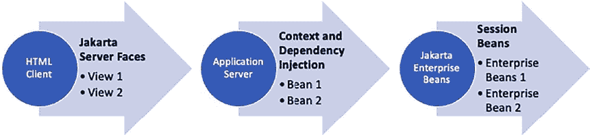

第 8 章 ■ Jakarta 企业 Bean

工作原理

Jakarta 企业 Bean 是应用程序中用于直接与数据库对象交互的类。

Jakarta Server Faces Web 视图和桌面 Java 客户端无法直接与 Jakarta 企业 Bean 的方法交互，因为这些方法位于应用服务器上。因此，Jakarta 企业 Bean 必须提供一种方式，让客户端能够与其方法通信，无论该客户端与 Jakarta 企业 Bean 本身位于同一容器中，还是位于远程位置。

在大多数已开发的 Jakarta EE 应用程序中，会使用诸如 Jakarta Server Faces 之类的 Web 框架与 Jakarta 企业 Bean 协同工作，以操作或读取数据源中的数据。此类客户端与 Jakarta 企业 Bean 池所在的容器是本地关系，因此它们会通过本地业务接口访问 Jakarta 企业 Bean。

■ **注意** 起初，本地客户端的概念可能难以理解，因此我将尝试更详细地解释。典型的 Jakarta Server Faces 应用程序利用本地客户端（即上下文和依赖注入（CDI）控制器类）来直接与 Jakarta 企业 Bean 交互。虽然 Web 应用程序的用户位于 Jakarta 企业 Bean 服务器容器的远程位置，但他们使用的是浏览器中由 Jakarta Server Faces 视图生成的 HTML 页面，而这些视图直接与控制器交互。这几乎就像视图直接绑定到控制器上，而控制器通常与 Jakarta 企业 Bean 位于同一容器中。图 8-1 展示了这种关系是如何工作的。


***图 8-1.** HTML 客户端（Jakarta Server Faces 视图）与 Jakarta 企业 Beans 的关系* 自 EJB 3.1+ 起，本地客户端已能够利用“无接口”业务视图来访问公开的 Jakarta 企业 Beans 方法，从而免去了 Jakarta 企业 Beans 实现接口的需要。使用无接口视图技术能让开发者更高效，因为需要维护的 Java 文件减少了一个（无需接口），并且工作流程变得更易理解，因为本地客户端可以直接与 Jakarta 企业 Beans 交互，而无需通过接口。远程客户端（例如在远程应用服务器容器中运行的 Java 类）无法使用无接口视图，因此在这种情况下仍然需要 `@Remote` 业务接口。

该解决方案演示了如何使用无接口视图，让 Jakarta Server Faces CDI 控制器能够与公开声明的 Jakarta 企业 Beans 方法协同工作。要通过依赖注入获取 EJB 无接口视图的引用，请使用 `jakarta.naming.EJB` 注解，并声明企业 Bean 的实现类。以下代码摘录自解决方案中的 CDI 控制器，演示了依赖注入技术：

@EJB

BookFacade ejbFacade;

第 8 章 ■ Jakarta 企业 Beans

也可以使用 JNDI 对 Jakarta 企业 Beans 执行查找，而非使用依赖注入，尽管这种情况很少需要。为此，请使用 `jakarta.naming.InitialContext` 接口的 `lookup` 方法执行 JNDI 查找，如下所示：

BookFacade ejbFacade = (BookFacade)

InitialContext.lookup("java:module/BookFacade");

■ **注意** Jakarta 企业 Beans 允许开发者专注于应用功能，而无需担心生命周期和资源处理。容器负责管理生命周期和资源。

8-5. 持久化对象

问题

你希望在 Java 企业应用中持久化一个对象。换句话说，你希望在应用使用的某个数据库表中创建一条新的数据库记录。

解决方案

使用方案 8-1 中提供的某个方法创建一个 `EntityManager` 对象，然后调用其 `persist()` 方法，并传入你想要持久化的对象。以下代码行演示了如何使用 `EntityManager` 将对象持久化到数据库。在此例中，一个 `Book` 对象被持久化到 `BOOK` 数据库表中。此摘录取自 `BookFacade` 会话 Bean：

...

@PersistenceContext(unitName = "JakartaEERecipes")

private EntityManager em;

...

em.persist(book);

...

工作原理

实体对象的持久化发生在 Jakarta 企业 Beans 类中。要将对象持久化到底层数据存储并进行管理，请调用 `EntityManager` 对象的 `persist()` 方法。你必须向 `persist()` 方法传递一个有效的实体对象，并且该对象在数据库中尚不存在，这意味着它必须具有唯一的主键。

在使用 `persist()` 方法时，可能会抛出几种不同的异常，这些异常有助于你确定正在发生的问题。`EntityExistsException` 顾名思义，如果正在持久化的实体的主键已存在，则会抛出该异常。然而，在某些情况下，会在刷新或提交时抛出 `PersistenceException`，因此在调用 `persist` 时，你应该捕获这些异常中的每一个。如果你尝试持久化的对象不是实体，则会抛出 `IllegalArgumentException`。最后，如果在类型为 `PersistenceContextType.TRANSACTION` 的容器管理实体管理器上调用，并且没有进行事务处理，则会抛出 `TransactionRequiredException`。

第 8 章 ■ Jakarta 企业 Beans

8-6. 更新对象

问题

实体对象的内容已被更改，你希望将更新持久化到底层数据源。

解决方案


使用配方 8-1 中提供的任一解决方案创建一个 `EntityManager` 对象，然后调用该对象的 `merge()` 方法，并传入一个已填充数据且需要更新的实体对象。以下代码行演示了如何使用 `EntityManager` 将对象持久化到数据库。在此示例中，一个 `Book` 对象正在 `BOOK` 数据库表中被更新。此摘录取自 `BookFacade` 会话 Bean：

...

@PersistenceContext(unitName = "JakartaEERecipes")

private EntityManager em;

...

em.merge(book);

...

■ **注意** 如果被持久化的实体对象（数据库记录）在表中尚不存在，它将被存储为一个新持久化的对象，而不是被更新。

工作原理

负责更新底层数据存储中实体对象的代码实现位于 Jakarta Enterprise Beans 类中。必须有一个有效的 `EntityManager` 对象可供使用，然后可以调用该对象的 `merge()` 方法，并传入一个有效的实体对象以在底层数据存储中进行更新。完成此操作后，实体对象的状态将被合并到数据存储中，底层数据也会相应更新。

尝试合并数据时可能会抛出两种异常。如果被合并的实例不是实体（数据库表不存在）或是一个已被移除的实体，则可能抛出 `IllegalArgumentException`。如果在类型为 `PersistenceContextType.TRANSACTION` 的容器管理实体管理器上调用 `merge()` 方法，且没有事务存在，则可能抛出 `TransactionRequiredException`。

8-7. 返回数据以在表格中显示

问题

您希望通过 Jakarta Server Faces 的 `dataTable` 显示数据库表的内容。

第八章 ■ Jakarta Enterprise Beans

解决方案 #1

从包含您要显示内容的底层表中返回一个实体对象列表。将 Jakarta Server Faces 的 `dataTable` 组件值映射到一个包含对象列表的上下文和依赖注入（CDI）控制器属性上。在这种情况下，控制器属性将是与数据库表对应的实体对象列表。在 CDI 控制器内部，可以通过调用 Jakarta Enterprise Beans 来获取实体对象列表。

以下代码摘录自名为 `BookController` 的控制器。名为 `completeBookList` 的 CDI 控制器属性将被 Jakarta Server Faces 视图中的 `dataTable` 组件引用，以显示底层表中的数据：

@Named(value="bookController")

@SessionScoped

public class BookController implements java.io.Serializable {

@EJB

BookFacade ejbFacade;

private List<Book> completeBookList;

@Inject

private AuthorController authorController;

...

public List<Book> getCompleteBookList() {

completeBookList = ejbFacade.findAll();

return completeBookList;

}

public void setCompleteBookList(List<Book> completeBookList) {

this.completeBookList = completeBookList;

}

...

}

接下来，让我们看看名为 `BookFacade` 的 Jakarta Enterprise Beans 的摘录。它是一个无状态会话 Bean，包含由 `BookController` 调用的方法，以获取实体对象列表。

■ **注意** `BookController` 调用的 `findAll()` 方法继承自 `AbstractFacade` 类。

...

@Stateless

public class BookFacade extends AbstractFacade<Book> {

@PersistenceContext(unitName = "JakartaEERecipes")

private EntityManager em;

@Override

protected EntityManager getEntityManager() {

return em;

}

public BookFacade() {

super(Book.class);

}

...

第八章 ■ Jakarta Enterprise Beans

在 `AbstractFacade` 中，`findAll()` 方法以通用方式实现：

public abstract class AbstractFacade<T> {

private Class<T> entityClass;

public AbstractFacade(Class<T> entityClass) {

this.entityClass = entityClass;

}

protected abstract EntityManager getEntityManager();

public List<T> findAll() {

jakarta.persistence.criteria.CriteriaQuery cq = getEntityManager().

getCriteriaBuilder().createQuery();


`Root<T> root = cq.from(entityClass);`

`cq.select(root);`

`return getEntityManager().createQuery(cq).getResultList();`

}

...

}

从 Jakarta Enterprise Beans 中 `findAll()` 方法返回的 `List<Book>` 包含在 `AbstractFacade` 抽象类中。该列表用于填充 `BookController` 中的 `completeBookList` 属性。由于 `BookController` 直接与视图层通信，Jakarta Server Faces 视图将能够利用 `completeBookList` 属性来显示数据。

**解决方案 #2**

返回一个包含针对底层表的原生 SQL 查询结果的 `Map` 对象列表。

Jakarta Server Faces CDI 控制器可以包含一个 `Map` 对象列表类型的属性，并且可以从 Jakarta Server Faces 的 `dataTable` 组件中引用该属性。在这种情况下，由控制器调用的 Jakarta Enterprise Beans 方法将对数据库执行原生 SQL 查询，从表中返回某些列的数据，并用这些列的值填充 map 对象。

在以下摘录中，`BookController.getCustomBookList()` 方法通过调用名为 `obtainCustomList` 的 Jakarta Enterprise Beans 方法来填充一个名为 `customBookList` 的 CDI 控制器属性。接下来将展示包含这两个方法的摘录。

以下是来自 `org.jakartaeerecipe.chapter08.BookController` 的摘录：

...

`public List<Map> getCustomBookList(){`

`customBookList = ejbFacade.obtainCustomList();`

`return customBookList;`

}

...

以下是来自 `org.jakartaeerecipe.chapter08.session.BookFacade` 的摘录：

...

`protected EntityManager getEntityManager() {`

`return em;`

}

...

`public List<Map> obtainCustomList(){`

`List<Object[]> results = em.createNativeQuery(`

`"select id, title, description " +`

`"FROM BOOK " +`

`" ORDER BY id").getResultList();`

`List data = new ArrayList<HashMap>();`

`if (!results.isEmpty()) {`

`for (Object[] result : results) {`

`HashMap resultMap = new HashMap();`

`resultMap.put("id", result[0]);`

`resultMap.put("title", result[1]);`

`resultMap.put("description", result[2]);`

`data.add(resultMap);`

`}`

`}`

`return data;`

}

`BookController` 类的 `customBookList` 属性由 EJB 方法填充，从而使数据可用于视图。

**工作原理**

Web 应用程序最常需要的任务之一就是显示内容。更重要的是，显示数据库内容几乎是每个企业应用程序的关键。以表格格式显示内容使用户能够查看数据，因为数据以列格式存储在底层表中。Jakarta Server Faces 的 `dataTable` 组件为使用 Jakarta Server Faces 框架的 Jakarta EE 应用程序提供了一种高效且强大的方式，以表格格式显示实体数据。

Jakarta Server Faces 的 `dataTable` 组件可以接收 `List`、`DataModel` 或 `Collection` 对象，并将其显示给用户。本方案涵盖了检索数据并将其存储在 `List` 中以供 `dataTable` 组件使用的两种不同变体。第一种解决方案是最常见的情况。在这两种解决方案中，都使用 CDI 控制器属性来存储实体对象的 `List`。然而，第一种解决方案存储的是实体对象本身的 `List`，而第二种解决方案存储的是 `Map` 对象的 `List`。让我们更详细地逐一分析。

在本方案的**解决方案 #1** 中，`BookController` CDI 控制器类中的 `completeBookList` 字段用于存储 `Book` 实体的 `List`。`getCompleteBookList()` 方法通过调用 `BookFacade` 会话 Bean 的 `findAll()` 方法来填充该 `List`，以返回 `BOOK` 数据库表中的所有行。每个数据库行都存储在一个单独的 `Book` 实体对象中，并且每个 `Book` 实体对象又依次存储在 `List` 中。最后，该列表被返回给 `BookController` 并赋值给 `completeBookList` 字段。最终，Jakarta Server Faces 的 `dataTable` 组件引用 `completeBookList` 来显示内容。


在解决方案 #2 中，BookController 中名为 customBookList 的字段用于填充 Jakarta Server Faces 的 dataTable。customBookList 字段是一个 Map 对象的 List。就 BookController 的填充方法而言，customBookList 字段的填充方式与解决方案 #1 中的 completeBookList 非常相似。它调用了一个 Jakarta Enterprise Beans 方法，该方法返回填充好的对象 List。在本例中，名为 BookFacade 的 Jakarta Enterprise Beans 从一个原生 SQL 查询返回一个 Map 对象的 List。

BookFacade 会话 Bean 类方法 obtainCustomList 负责创建原生 SQL 查询，然后将结果存储到 Map 对象中。在此例中，原生查询仅返回 BOOK 数据库表中每行存在的列的子集作为 resultList，并将它们存储到 `List<Object[]>` 中。然后，创建一个新的 HashMap 的 ArrayList，并用数据库查询返回的 List 内容进行填充。为了填充这个 ArrayList，使用 for 循环遍历 `List<Object[]>`。为从数据库返回的每个对象创建一个 HashMap 对象。HashMap 对象填充了名称-值对，其中列名是第一部分，实体对象中的值是每个元素的第二部分。通过查询检索到的每一列都存储到 HashMap 中，然后 HashMap 本身被添加到一个 List 中。最后，HashMap 对象的 List 被返回给 CDI 控制器，并存储到 customBookList 字段中。在 Jakarta Server Faces 视图中，使用与 HashMap 中每个数据库列关联的名称来引用这些值，以便在 dataTable 中显示。

本技巧中展示的两种解决方案都提供了从数据库显示数据的有效选项，这些选项在 Jakarta Server Faces dataTable 组件内使用了 Jakarta Persistence。我建议尽可能使用第一种解决方案，因为它比解决方案 #2 更不容易出错，解决方案 #2 需要手动将数据库列映射到 Map 索引。此外，解决方案 #2 的 Jakarta Enterprise Beans 中硬编码了原生 SQL，这在必要时是可以的，但从来都不是最佳选择。能够利用 Jakarta Enterprise Beans 方法（例如 AbstractFacade 中可用的 `findAll()` 方法，参见技巧 8-2）总是更好的，因为如果底层数据库表发生变化，则无需修改应用程序代码。

8-8. 创建单例 Bean

问题

您想要开发一个会话 Bean，所有应用程序客户端都将使用同一个实例。每个应用程序应只允许一个 Bean 实例，以便始终有一个单一的站点访问者计数器来统计访问者数量。

■ **注意** 在本技巧中，计数器不是累积的。也就是说，它不会在应用程序启动之间持久化。
要创建一个累积计数器，当前计数必须在应用程序或服务器重启之前持久化到数据库，并在应用程序恢复时恢复。

解决方案

开发一个允许所有应用程序客户端并发访问的单例会话 Bean。该 Bean 将跟踪访问书店的访问者数量，并在 Acme Bookstore 应用程序的页脚中显示该数字。以下名为 BookstoreSessionCounter 的 Bean 是 Acme Bookstore 的一个单例会话 Bean，负责跟踪活动会话计数：

```java
package org.jakartaeerecipe.chapter08.session;

import jakarta.ejb.Singleton;
import jakarta.ejb.ConcurrencyManagement;
import static jakarta.ejb.ConcurrencyManagementType.CONTAINER;

@Singleton
@ConcurrencyManagement(CONTAINER)
public class BookstoreSessionCounter {
    private int numberOfSessions;

    /**
     * 初始化 Bean
     */
    @PostConstruct
    public void init(){
        // 在此处初始化 Bean
        System.out.println("正在初始化 Bean...");
    }

    // 在应用程序启动时重置计数器
    public BookstoreSessionCounter(){
        numberOfSessions = 0;
    }

    /**
     * @return numberOfSessions
     */
    public int getNumberOfSessions() {
        numberOfSessions++;
        return numberOfSessions;
    }

    /**
     * @param numberOfSessions 要设置的 numberOfSessions。如果当前计数器在应用程序关闭前被持久化，则可以从数据库设置此值
     */
    public void setNumberOfSessions(int numberOfSessions) {
        this.numberOfSessions = numberOfSessions;
    }
}
```

接下来，让我们看看调用单例会话 Bean 方法来更新站点计数器的 Jakarta Server Faces CDI 控制器。以下摘录自一个会话作用域的 CDI 控制器，名为 BookstoreSessionController，其中的 counter 属性用于更新 Jakarta Enterprise Beans 中的访问者数量：

```java
...
@Named("bookstoreSessionController")
@SessionScoped
public class BookstoreSessionController {
    @EJB
    BookstoreSessionCounter bookstoreSessionCounter;
    private int counter;
    private boolean flag = false;

    /**
     * @return counter
     */
    public int getCounter() {
        if (!flag) {
            counter = bookstoreSessionCounter.getNumberOfSessions();
            flag = true;
        }
        return counter;
    }

    /**
     * @param counter 要设置的 counter
     */
    public void setCounter(int counter) {
        this.counter = counter;
    }
}
```

最后，计数器被绑定到 Acme Bookstore Facelets 模板中的一个 Jakarta 表达式。以下代码行摘自名为 `custom_template_search.xhtml` 的模板，该模板位于本书源码的 `chapter08/layout` 目录中：

```xhtml
Number of Visitors: #{bookstoreSessionController.counter}
```

工作原理

被指定为单例的类在每个应用程序中只创建一次。在任何给定时间，只有一个单例类的实例，所有客户端会话都与该同一实例交互。要生成一个单例会话 Bean，通过指定 `jakarta.ejb.Singleton` 注解来将 Bean 标识为单例。

从编程角度来看，注解规范是标准无状态会话 Bean 和单例会话 Bean 编码的主要区别之一。然而，在功能上，容器对单例 Bean 的处理方式与标准无状态会话 Bean 有很大不同。

单例会话 Bean 由容器在任意时间点实例化。为了强制在应用程序启动时实例化单例，可以指定 `jakarta.ejb.Startup` 注解。在示例中，没有指定 `@Startup` 注解，因此容器可以在任何给定时间点实例化该单例。但是，在任何应用程序 Jakarta Enterprise Beans 开始接收请求之前，单例将会被启动。在示例中，您可以看到使用了 `@PostConstruct` 回调注解。这会导致在 Bean 实例化后立即执行指定了该注解的方法。单例共享与标准无状态会话 Bean 相同的回调方法。要了解更多关于回调方法的信息，请参考技巧 8-2。

■ **注意** 如果一个或多个单例 Bean 依赖于其他单例 Bean 进行初始化，可以为该 Bean 指定 `@DependsOn` 注解，以表明它依赖于哪个 Bean。如果需要，可以使用此注解建立依赖链。


默认情况下，单例是并发的，这意味着多个客户端可以同时访问它们（也称为*线程安全*）。有两种不同的方式可以控制对单例 Bean 的并发访问。可以指定 `@ConcurrencyManagement` 注解以及相应的 `ConcurrentManagementType`，以告知 Bean 使用哪种并发类型。这两种并发类型分别是 `CONTAINER`（如果未指定任何内容，则为默认类型）和 `BEAN`。在示例中，Bean 被注解以指定容器管理的并发。当指定了容器管理的并发时，Jakarta Enterprise Beans 容器会管理并发。可以在单例的方法上指定 `@Lock` 注解，以告知容器应如何管理客户端对该方法的访问。要使用 `@Lock` 注解，请在注解中指定锁定类型为 `LockType.READ` 或 `LockType.WRITE`（默认值），以告知容器多个客户端可以同时访问被注解的方法，或者当某个客户端正在访问该方法时，该方法应对其他客户端锁定。整个类也可以使用 `@Lock` 进行注解，在这种情况下，指定的锁定类型将用于该类中的每个方法，除非这些方法包含自己的锁定类型指定。例如，以下代码行指定了单例类中的一个方法，当客户端访问该方法时应将其锁定，以便一次只有一个客户端可以访问：

`@Lock(LockType.WRITE)`

`public void setCounter(int counter){`

`this.counter = counter;`

`}`

第 8 章 ■ Jakarta Enterprise Beans

Bean 管理的并发则不同，它允许对类中所有方法的所有客户端进行完全并发的、线程安全的锁定访问。开发者可以使用 Java 同步技术（如 `synchronized` 和 `volatile`）来帮助管理那些被指定为 Bean 管理并发的单例中的并发状态。

8-9. 调度定时器服务

问题

您希望调度一个任务，该任务按固定时间间隔执行数据库事务。

解决方案 #1

使用定时器服务在 Bean 内通过自动定时器调度一个任务。该定时器将指定一个所需的时间间隔，并且每次时间间隔到期时，将调用用于执行该任务的方法。以下会话 Bean 被设置为创建一个自动定时器，该定时器将在应用程序部署时启动。以下代码包含在名为 `org.jakartaeerecipe.chapter08.timer.TimerBean` 的 Java 文件中：

`import jakarta.ejb.Singleton;`

`import jakarta.ejb.Schedule;`

`@Singleton`

`public class TimerBean {`

`@Schedule(minute="*/5", hour="*")`

`public void automaticTimer(){`

`System.out.println("*** Automatic Timeout Occurred ***");`

`}`

`}`

当该类部署到应用服务器并且应用服务器启动时，自动定时器将启动。每五分钟，`automaticTimer()` 方法以及在该方法内执行的任何进程都将被调用。

解决方案 #2

创建一个编程式定时器，并指定其在部署到应用服务器时启动。

在定时器 Bean 中配置一个初始化方法，该方法将在 Bean 初始化时自动创建定时器。以下示例类名为 `org.jakartaeerecipe.chapter08.timer.ProgrammaticTimerExample`，它将在应用程序部署时自动启动：

`package org.jakartaeerecipe.chapter08.timer;`

`import jakarta.annotation.PostConstruct;`

`import jakarta.annotation.Resource;`

`import jakarta.ejb.Singleton;`

`import jakarta.ejb.Timer;`

`import jakarta.ejb.Timeout;`

`import jakarta.ejb.TimerService;`

`@Singleton`

`@Startup`

第 8 章 ■ Jakarta Enterprise Beans

`public class ProgrammaticTimerExample {`

`@Resource`

`TimerService timerService;`

`@PostConstruct`

`public void createTimer(){`

`System.out.println("Creating Timer...");`

`Timer timer = timerService.createTimer(100000, "Timer has been created...");`

`}`

`@Timeout`

`public void timeout(Timer timer){`

`System.out.println("Timeout of Programmatic Timer Example...");`

`}`

`}`


部署后，您应在服务器日志中看到一条消息，显示“正在创建定时器...”，然后当定时器到期时，日志中会显示“编程定时器示例超时...”消息。

工作原理

定时器解决方案使得将定时或计划任务集成到应用程序流程中变得简单。定时器服务有助于实现此类解决方案，因为它为应用程序提供了一种方法，用于调度将在指定时间间隔内由应用程序执行的任务。定时器有两种不同的类型：编程定时器和自动定时器。在本方案的解决方案 #1 中，演示了一个自动定时器。虽然该解决方案并未执行任何实际工作，但实际工作发生在使用 `@Schedule` 注解标注的方法中。当 Jakarta 企业 Bean 包含一个或多个使用 `@Schedule` 或 `@Schedules` 注解标注的方法时，就会创建一个自动定时器。`@Schedule` 接受一个基于日历的定时器表达式，用于指示标注的方法应在何时执行。

■ **注意** 一个或多个 `@Schedule` 注解可以分组在 `@Scheduled{ ... }` 内，每个 `@Schedule` 之间用逗号分隔。

基于日历的定时器表达式可以包含一个或多个日历属性及其对应的值，以指示方法调用的时间点。表 8-1 列出了不同的基于日历的定时器表达式及其描述。

***表 8-1.** 基于日历的定时器表达式*

**属性**

**描述**

dayOfWeek

一周中的一天或多天：(0–7) 或 (Sun, Mon, Tue, Wed, Thu, Fri, Sat)

dayOfMonth

一个月中的一天或多天：(1–31) 或 (Last) 或 (1st, 2nd, 3rd, 4th, 5th, Last) 以及任何 dayOfWeek 值

month

一年中的一个月或多个月：(1–12) 或月份缩写

year

四位数的日历年份

hour

一天中的一小时或多小时：(0–23)

minute

一小时中的一分钟或多分钟：(0–59)

second

一分钟中的一秒或多秒：(0–59)

第 8 章 ■ Jakarta 企业 Bean

创建基于日历的定时器表达式时，星号 (*) 可用作通配符。正斜杠 (/) 可用于表示时间间隔。时间间隔遵循以下模式：开始时间（较大单位）/ 频率

因此，在示例中指定 `/5`（`minute="*/5" hour="*"`）表示您希望定时器在每小时内的每五分钟执行一次，因为通配符指示定时器从哪一小时开始，而数字 5 指示执行频率。

定时器表达式属性可以包含多个值，每个值之间应用逗号分隔。

要指示您希望在凌晨 3:00 和早上 6:00 执行定时器，可以编写如下代码：

`@Schedule(hour="3,6")`

也可以为定时器属性指定一个值范围。要指示您希望在凌晨 4:00 到早上 7:00 之间每小时执行一次定时器，可以指定如下：

`@Schedule(hour="4-7")`

可以组合多个定时器表达式，以更精细地调整定时器。例如，要指定一个在每周日凌晨 1:00 执行的定时器计划，可以编写如下代码：

`@Schedule(dayOfWeek="Sun", hour="1")`

编程定时器是开发定时流程时可用的第二种选择，如解决方案 #2 所示。编程定时器与自动定时器不同，因为它不涉及计划。相反，客户端可以调用定时器，或者可以在 Bean 构造时初始化定时器。编程定时器包含一个使用 `@Timeout` 注解标注的方法。当定时器到期时，将执行 `@Timeout` 方法。超时方法必须返回 `void`，并且可以选择接受一个 `jakarta.ejb.Timer` 对象。超时方法不得抛出应用程序异常。

要创建编程定时器，请调用 `TimerService` 接口的其中一个 `create` 方法。表 8-2 指出了可以使用的不同 `create` 方法。


***表 8-2.** 编程式定时器创建方法*

**方法**

**描述**

createTimer

标准定时器创建

createSingleActionTimer

创建仅触发一次的定时器

createIntervalTimer

创建基于指定时间间隔触发的定时器

createCalendarTimer

创建基于日历的定时器

在本方案的第 2 种解法中，创建了一个标准定时器，并传入 100,000 毫秒的时间间隔。

这意味着带有`@Timeout`注解的方法将在 100,000 毫秒后执行一次。以下是另一种可用于创建相同调度定时器的语法：`long duration = 100000;`

`Timer timer = timerService.createSingleActionTimer(duration, new TimerConfig());`

第 8 章 ■ Jakarta Enterprise Beans

类似地，可以向创建方法传入一个日期，以指定定时器应触发的具体日期和时间。以下定时器将在应用部署之日起 30 天后触发：

`Calendar cal = Calendar.getInstance();`

`cal.add(Calendar.DATE, 30);`

`Timer timer = timerService.createSingleActionTimer(cal.getTime(), new TimerConfig());`

要创建基于日历的编程式定时器，必须使用`ScheduleExpression`辅助类创建一个新的调度。这样做将允许你利用表 8-1 中列出的基于日历的表达式来指定定时器触发日期。以下示例演示了一个定时器，它将根据应用服务器时钟在每周日凌晨 1:00 触发：

`ScheduleExpression schedule = new ScheduleExpression();`

`schedule.dayOfWeek("Sun");`

`schedule.hour("1");`

`Timer timer = timerService.createCalendarTimer(schedule);`

定时器不需要在单例会话 Bean 中创建；它们也可以在无状态会话 Bean 中使用。

■ **注意** 定时器不能在状态会话 Bean 中指定。

定时器是一个无法在单个方案中完整讨论的主题。不过，这个关于定时器的简要介绍应该足以让你开始在应用程序中使用这项技术。

要了解更多关于定时器的信息，请参考在线文档：[`eclipse- ee4j.github.`](https://eclipse-ee4j.github.io/jakartaee-tutorial/#using-the-timer-service)

[io/jakartaee- tutorial/#using- the- timer- service.](https://eclipse-ee4j.github.io/jakartaee-tutorial/#using-the-timer-service)

■ **注意** 默认情况下，所有定时器都是持久的，这意味着如果服务器因某种原因关闭，当服务器重新启动时，定时器将再次激活。如果定时器在服务器关闭期间应该触发，那么一旦服务器恢复正常运行，定时器就会触发（或者`@Timeout`方法将被调用）。若要指示定时器不应持久化，请调用`TimerConfig.setPersistent(false)`，并将其传递给定时器创建方法。

8-10\. 执行可选的事务生命周期回调

问题

你希望在 Bean 被实例化时开始一个事务，并在其被销毁时结束该事务。

第 8 章 ■ Jakarta Enterprise Beans

解决方案

选择利用 Jakarta Enterprise Beans 内置的可选事务生命周期回调。要在`@PostConstruct`或`@PreDestroy`回调期间开始一个事务，请相应地使用`@TransactionAttribute`注解这些方法，并传入`TransactionAttributeType.REQUIRES_NEW`属性。在以下示例中，当名为`AcmeFacade`的 Bean 被创建时，一个事务开始。当该 Bean 被销毁时，另一个事务开始：

`import jakarta.annotation.PostConstruct;`

`import jakarta.annotation.PreDestroy;`

`import jakarta.ejb.Stateful;`

`import jakarta.ejb.TransactionAttribute;`

`import jakarta.ejb.TransactionAttributeType;`

`import jakarta.persistence.EntityManager;`

`import jakarta.persistence.PersistenceContext;`

`import jakarta.persistence.PersistenceContextType;`

`@Stateful`

`public class AcmeFacade {`

`@PersistenceContext(unitName = "JakartaEERecipesPU", type = PersistenceContextType.`

`EXTENDED)`

`private EntityManager em;`


@TransactionAttribute(TransactionAttributeType.REQUIRES_NEW)

@PostConstruct

public void init() {

System.out.println("The Acme Bean has been created");

}

@TransactionAttribute(TransactionAttributeType.REQUIRES_NEW)

@PreDestroy

public void destroy() {

System.out.println("The Acme Bean is being destroyed...");

em.flush();

}

}

工作原理

会话 Bean 可以包含回调方法，这些方法在 Bean 生命周期的特定阶段被调用。

例如，可以通过注解在会话 Bean 中注册一个方法，使其在 Bean 构造完成后（@PostConstruct）、销毁之前（@PreDestroy）等时机被调用。有时，在这些事件发生时启动一个新事务是合理的。当使用容器管理的事务时，可以为会话 Bean 中带注解的生命周期回调方法指定其事务状态。

该注解接受一个事务类型，具体值参见表 8-3。

第 8 章 ■ Jakarta 企业 Bean

***表 8-3.** 容器管理的事务划分*

**属性**

**描述**

MANDATORY

容器必须在客户端的事务上下文中调用事务设置为该属性的企业 Bean 方法。客户端必须在事务上下文中调用。

REQUIRED

容器必须在客户端的事务上下文中调用事务设置为该属性的企业 Bean 方法。客户端必须在事务上下文中调用。如果客户端在未关联事务上下文的情况下调用企业 Bean 的方法，容器会在将方法调用委托给企业 Bean 方法之前自动启动一个新事务。

REQUIRES_NEW

容器必须使用新的事务上下文来调用事务设置为该属性值的企业 Bean 方法。

SUPPORTS

如果客户端带有事务上下文调用，则容器将其视为 REQUIRED。如果客户端不带事务上下文调用，则容器将其视为 NOT_SUPPORTED。

NOT_SUPPORTED

容器使用未指定的事务上下文来调用事务属性设置为该值的企业 Bean 方法。

NEVER

容器在未定义 Jakarta 企业 Bean 规范所规定的事务上下文的情况下，调用事务设置为该值的企业 Bean 方法。

默认情况下，为了保持向后兼容性，生命周期回调方法不是事务性的。通过使用 @TransactionAttribute 注解和首选的事务划分类型来注解回调方法，该回调方法可以选择加入事务性。

8-11. 确保有状态会话 Bean 不被钝化

问题

您希望将不活跃的有状态会话 Bean 保留在内存中，而不是让其被钝化。

解决方案

通过在 @Stateful 注解中指明该 Bean 不应被钝化，从而向容器指定该 Bean 不被钝化。要选择退出钝化，请将 @Stateful 注解的 passivationCapable 属性设置为 false，如下面的代码片段所示：

@Stateful(passivationCapable=false)

public class AcmeFacade {

...

}

第 8 章 ■ Jakarta 企业 Bean

工作原理

当有状态会话 Bean 在一段时间内处于不活跃状态时，容器可能会选择钝化该 Bean，以节省内存和资源。通常，Jakarta 企业 Bean 容器会使用最近最少使用算法来钝化有状态会话 Bean。发生钝化时，Bean 会被移动到辅助存储并从内存中移除。在有状态会话 Bean 被钝化之前，任何带有 @PrePassivate 注解的方法都会被调用。当一个已被钝化的有状态会话 Bean 需要重新激活时，容器会激活该 Bean，然后调用任何带有 @PostActivate 注解的方法，最后将 Bean 移动到就绪阶段。


有状态会话 Bean 可以选择退出钝化，这样它们将保留在内存中，而不会在非活动时被转移到辅助存储。这在某些情况下可能很有用，例如当 Bean 需要为应用程序进程保持活动状态，或者当 Bean 包含不可序列化的字段时，因为这些字段无法被钝化，并且在钝化时会被置为 null。要指示某个 Bean 不应被钝化，请按照本解决方案所述，将 `@Stateful` 注解的 `passivationCapable` 属性设置为 `false`。

8-12. 指定本地和远程接口

问题

你希望为某个 EJB 显式指定一个本地或远程接口。

解决方案

一个业务接口不能同时被声明为 Bean 的本地和远程业务接口。因此，Jakarta Enterprise Beans 规范包含一个 API，用于指定业务接口是作为本地接口还是远程接口。以下规则适用于企业 Bean 类实现的业务接口：

在确定 Bean 的本地或远程业务接口时，`java.io.Serializable`、`java.io.Externalizable` 以及由该包定义的接口始终被排除在外。

如果 Bean 类包含 `@Remote` 注解，则所有已实现的接口都被假定为远程接口。

如果 Bean 类不包含任何注解，或者指定了 `@Local` 注解，则所有已实现的接口都被假定为本地接口。

任何为具有无接口视图的 Bean 显式定义的业务接口都必须被指定为 `@Local`。

如果 Bean 类显式指定了带有非空值的 `@Local` 或 `@Remote` 注解，则任何业务接口都必须被显式指定为本地或远程接口。

如果部署描述符如此指定，则任何业务接口都必须被显式指定为本地或远程接口。

工作原理

无接口视图极大地简化了开发，因为它使得本地业务接口成为可选项。无接口视图会自动将 Bean 的所有公有方法暴露给调用者。

默认情况下，任何不包含 `implements` 子句且未定义本地或远程客户端视图的会话 Bean 都会自动暴露无接口视图。通过 Jakarta Enterprise Beans，你可以在需要显式指定本地和远程接口的情况下提供更细粒度的控制。

第 8 章 ■ Jakarta Enterprise Beans

让我们分解一下本解决方案中定义的规则。首先，如果某个 EJB 暴露了本地接口，则无需显式地将 Bean 指定为本地接口。例如，以下 Bean 包含一个本地接口，尽管它没有被显式指定：

```java
@Stateless
public class AcmeSession implements interfaceA {
    ...
}

public interfaceA { ... }
```

如果 Bean 类使用了 `@Remote` 注解，那么它实现的任何接口都被假定为远程接口。例如，以下 Bean 类实现了两个接口，尽管它们不包含任何指示性的注解，但两者都被假定为远程接口：

```java
@Remote
@Stateless
public class AcmeSession implements interfaceA, interfaceB {
    ...
}
```

如果 Bean 类包含了 `@Local` 注解，那么它实现的任何接口都被假定为本地接口。例如，以下 Bean 类实现了两个接口，尽管它们不包含任何指示性的注解，但两者都被假定为本地接口：

```java
@Local
@Stateless
public class AcmeSession implements interfaceA, interfaceB {
    ...
}
```

如果 Bean 类包含了 `@Local` 或 `@Remote` 注解，并在注解中指定了接口名称，那么将应用与该注解相同的指定。例如，以下 Bean 被注解为包含一个本地业务接口，并且接口的名称在注解中指定，从而使该接口成为本地接口：

```java
@Local(interfaceA.class)
@Stateless
public class AcmeSession implements interfaceA {
    ...
}
```


这些新的指定规则使得指定和确定由 Bean 实现的企业接口类型变得更加容易。

第 8 章 ■ Jakarta Enterprise Beans

8-13. 异步处理消息

来自《Enterprise Beans》

问题

你希望具备从会话 Bean 中异步处理消息的能力。

解决方案

开发一个消息驱动 Bean，为你的应用执行消息处理。要开发消息 Bean，请创建一个使用 `@MessageDriven` 注解并传递适当配置选项的 Jakarta Enterprise Beans。在 Bean 中，编写一个名为 `onMessage` 的方法，该方法将执行所有消息处理。以下示例 `org.jakartaeerecipe.chapter08.jsf.AcmeMessageBean` 演示了如何编写一个消息驱动 Bean，用于处理来自已在应用服务器容器中配置的 `jakarta.jms.Queue` 的消息：

■ **注意** 在运行这些示例之前，你必须在 GlassFish 中创建 JMS 资源。更多详情请参考配方 12-1。

```java
@MessageDriven(mappedName="jms/Queue", activationConfig = {
    @ActivationConfigProperty(propertyName = "destinationType",
        propertyValue = "jakarta.jms.Queue")
})
public class AcmeMessageBean implements MessageListener {
    public AcmeMessageBean(){
    }
    @Override
    public void onMessage(Message msg) {
        if(msg != null){
            performExtraProcessing();
            System.out.println("Message has been received: " + msg);
        } else {
            System.out.println("No message received");
        }
    }
    public void performExtraProcessing(){
        System.out.println("This method could perform extra processing");
    }
}
```

第 8 章 ■ Jakarta Enterprise Beans

工作原理

消息驱动 Bean 是用于异步处理消息的 Jakarta Enterprise Beans。大多数情况下，消息驱动 Bean 是 Jakarta Messaging 监听器，负责接收消息并进行相应处理。通过使用 `@MessageDriven` 注解 Bean 并可选地实现 `MessageListener` 接口来创建消息驱动 Bean。当容器队列中收到消息时，容器会调用 Bean 的 `onMessage()` 方法，该方法包含负责相应处理消息的业务逻辑。

■ **注意** 任何会话 Bean 都可以用于处理消息，但只有消息驱动 Bean 能够以异步方式处理。

消息驱动 Bean 必须声明为 public，且不能是 static 或 final。消息驱动 Bean 必须包含一个 public 的无参构造函数，并且必须包含一个名为 `onMessage` 的方法，该方法接受一个 `jakarta.jms.Message` 参数。`onMessage` 方法负责执行所有消息处理，并且可以在需要时使用 Bean 中的其他方法来协助处理。

Bean 提供者可以通过 `@MessageDriven` 注解的 `activationConfig` 元素，为部署者提供消息驱动 Bean 的特殊配置，例如关于消息选择器、确认模式等信息。存在一组标准的 `activationConfig` 属性，以提供与 JMS 2.0 的对齐。表 8-4 列出了这些新属性及其功能描述。

***表 8-4.** Jakarta Messaging 对齐的 activationConfig 属性*

| **属性** | **描述** |
| :--- | :--- |
| destinationLookup | 向部署者提供关于消息驱动 Bean 是打算与 Queue 还是 Topic 关联的建议。此属性的值为 `jakarta.jms.Queue` 和 `jakarta.jms.Topic` |
| connectionFactoryLookup | 指定一个管理定义的 `ConnectionFactory` 对象的查找名称，该对象将用于连接到 Jakarta Messaging 提供者，消息驱动 Bean 将通过该连接发送消息 |
| clientId | 指定将用于连接到 Jakarta Messaging 提供者的客户端标识符，消息驱动 Bean 将通过该连接发送消息 |
| subscriptionName | 如果消息驱动 Bean 打算与 Topic 一起使用，则 Bean 提供者可以使用此属性指定持久订阅的名称，并将 `subscriptionDurability` 属性设置为 `Durable` |
| shareSubscriptions | 此属性仅在消息驱动 Bean 部署到集群应用服务器时使用，其值可以是 `true` 或 `false`。值为 `true` 意味着集群中的每个实例将使用相同的持久订阅名称或非持久订阅。值为 `false` 意味着集群中的每个实例将使用不同的持久订阅名称或非持久订阅 |

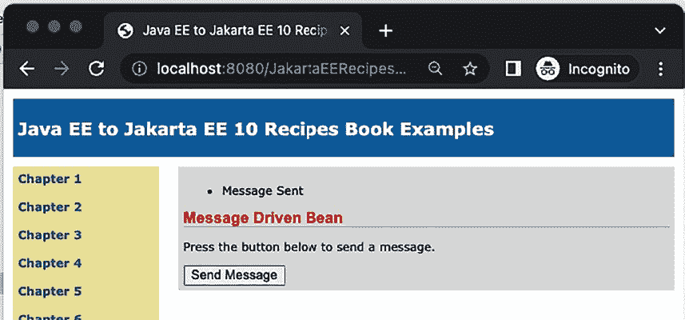

第 8 章 ■ Jakarta Enterprise Beans

要执行本配方中的代码，请访问页面 http://localhost:8080/JakartaEERecipes_Chapter08-1.0-SNAPSHOT/chapter08/recipe08_13.xhtml。点击“发送消息”按钮应显示如图 8-2 所示的输出，并且日志消息也会出现在 GlassFish 服务器日志中。

***图 8-2.** 配方 8-13 的输出*

**第 9 章**

**Jakarta Persistence 查询**

**语言**

Jakarta Persistence API 使用一种查询语言来与底层数据存储进行通信。

尽管 Jakarta EE 使用实体而非 SQL 进行数据库访问，但它提供了一种查询语言，以便开发者可以通过实体获取所需信息。Jakarta Persistence 查询语言正是为此而生，因为它提供了一种查询和处理 Jakarta EE 实体对象的工具。虽然它与 SQL 非常相似，但它是一种对象关系查询语言，因此开发者需要注意一些细微的差异。将 Jakarta Persistence 查询语言与 Jakarta EE 实体结合使用，允许开发者创建通用的应用程序，因为它不依赖于特定数据库，应用程序可以编写一次并部署在多种数据库之上运行。

本章中的配方不会试图涵盖 Jakarta Persistence 查询语言提供的所有功能，因为其功能众多。然而，这些配方包含了足够的信息，可以将初学者引入 Jakarta Persistence 查询语言的世界，并让中级开发者了解 Jakarta Persistence 查询语言提供的最新功能。要查看使用 Jakarta Persistence 查询语言的完整文档集，请参阅 [`projects.eclipse.org/projects/ee4j.jpa`](https://projects.eclipse.org/projects/ee4j.jpa) 上的在线资源。

9-1. 查询实体的所有实例

问题

你想要检索特定实体的所有实例。也就是说，你想要查询与实体关联的底层数据库表并检索所有行。

解决方案

调用 `EntityManager` 的 `createQuery` 方法，并使用 Jakarta Persistence 查询语言来制定一个查询，该查询将返回给定实体的所有实例。在以下示例中，使用 Jakarta Persistence 查询语言查询来返回 `BookAuthor` 实体中的所有对象：

```java
public List<BookAuthor> findAuthor(){
    return em.createQuery("select object(o) from BookAuthor o").getResultList();
}
```

© Josh Juneau 和 Tarun Telang 2022
J. Juneau 和 T. Telang, *Java EE to Jakarta EE 10 Recipes*, https://doi.org/10.1007/978-1-4842-8079-9_9

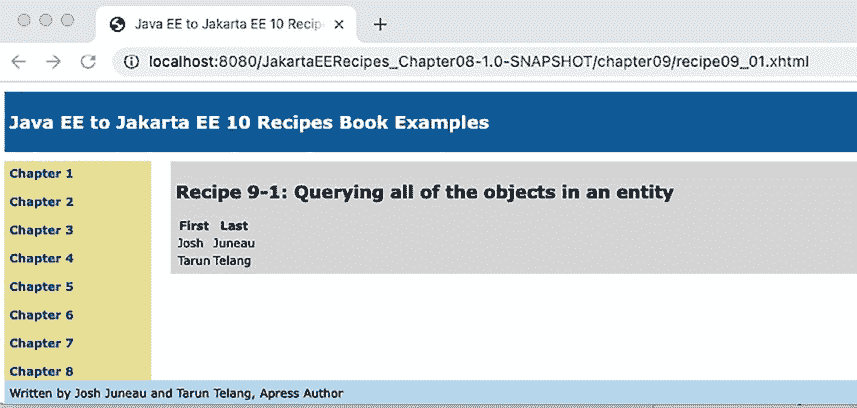

第 9 章 ■ Jakarta Persistence 查询语言

当调用 `findAuthor()` 方法时，将返回一个包含实体中所有 `BookAuthor` 实体实例（底层数据库表中的所有记录）的 `List`。可以通过访问 URL http://localhost:8080/JakartaEERecipes_Chapter08-1.0-SNAPSHOT/chapter09/recipe09_01.xhtml 来执行此配方的代码，输出将如图 9-1 所示。

***图 9-1.** 配方 9-1 的输出*

工作原理


实体实例在底层数据存储中可被称为*记录*。也就是说，给定数据库表中的每条记录都对应一个实体实例。话虽如此，有时检索给定实体的所有实例会很方便。某些应用程序可能需要获取所有对象，以便对每个对象执行特定任务，或者您的应用程序可能只需要向用户显示某个实体的所有实例。

无论哪种情况，都有几种方法可以检索给定实体的所有实例。每种技术都可以在 Jakarta Enterprise Beans 或 RESTful 服务类中实现。

Jakarta Persistence 查询语言可用于查询某个实体的所有实例。要创建动态查询，请调用 `EntityManager` 的 `createQuery` 方法，您可以向其传递一个基于字符串的查询（由 Jakarta Persistence 查询语言语法组成），或者传递一个 `jakarta.persistence.Query` 实例。`Query` 接口有大量可用于处理查询对象的方法。表 9-1 描述了这些方法的作用。

***表 9-1.** jakarta.persistence.Query 接口方法*

**方法**

**描述**

`executeUpdate`

执行更新或删除语句（返回：`int`）

`getFirstResult`

指定查询对象设置为检索的第一个结果的位置（返回：`int`）

`getFlushMode`

获取查询执行生效的刷新模式（返回：`FlushModeType`）

（*续*）

第 9 章 ■ Jakarta Persistence 查询语言

***表 9-1.*** （*续*）

**方法**

**描述**

`getHints`

获取查询实例生效的属性和提示及其关联值（返回：`java.util.Map<String, Object>`）

`getLockMode`

获取查询的当前锁定模式（返回：`LockModeType`）

`getMaxResults`

指定查询对象设置为检索的最大结果数（返回：`int`）

`getParameter`

获取与声明的定位参数相对应的参数对象（返回：`Parameter<?>`）

`getParameters`

获取与查询声明的参数相对应的参数对象（返回：`java.util.Set<Parameter<?>>`）

`getParameterValue(int)`

返回绑定到定位参数的值（返回：`Object`）

`getResultList`

执行 SELECT 查询，然后将查询结果作为未类型化的 List 返回（返回：`java.util.List`）

`getSingleResult`

执行 SELECT 查询，然后返回单个未类型化的结果（返回：`java.lang.Object`）

`isBound`

返回一个布尔值，指示是否已将值绑定到该参数

在示例中，一个查询字符串被传递给该方法，其内容如下：

`select object(o) from BookAuthor o`

分解来看，该查询是从 `BookAuthor` 实体中选择所有对象。查询中可以使用任何字母来代替 `o` 字符，但由于 Jakarta Persistence 查询语言指的是对象，因此 `o` 算是一种标准。所有查询都包含一个 SELECT 子句，用于定义您想要获取的实体实例类型。在示例中，选择的是 `BookAuthor` 实体中的整个实例，而不是实例中包含的单个字段。由于 Jakarta Persistence 处理的是对象，查询应始终返回整个对象；如果您只想使用对象中的部分字段，则可以从查询返回的实例中调用这些字段。`object` 关键字是可选的，主要目的是为了提高可读性。相同的 Jakarta Persistence 查询语言可以写成如下形式：

`select o from BookAuthor o`

FROM 子句可以引用一个或多个标识变量，这些变量可以引用实体的名称、单值关系的元素、集合关系的元素，或者一对多关系中多端集合的成员。在示例中，`BookAuthor` 变量指的是实体本身。


■ **注意** 有关完整查询语言语法的更多信息，请参阅在线文档：[`eclipse- ee4j.github.io/jakartaee- tutorial/#the- jakarta-`](https://eclipse-ee4j.github.io/jakartaee-tutorial/#the-jakarta-persistence-query-language)

[持久化查询语言](https://eclipse-ee4j.github.io/jakartaee-tutorial/#the-jakarta-persistence-query-language)。

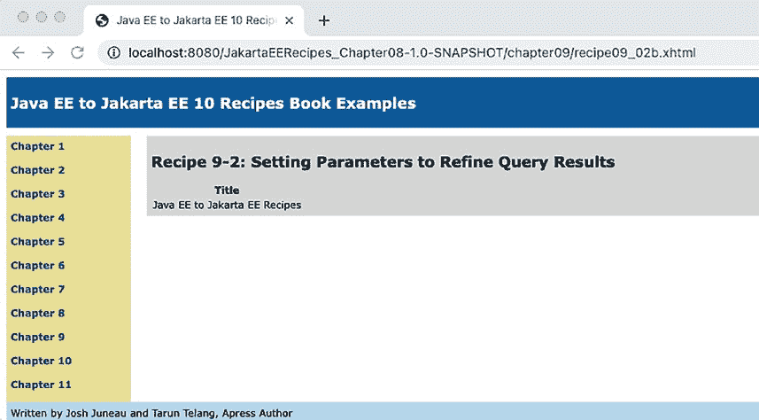

第 9 章 ■ Jakarta 持久化查询语言

9-2\. 设置参数以筛选查询结果

问题

您希望查询一个实体，并仅检索其中符合指定条件的实例子集。

解决方案 #1

编写一个动态查询，并指定可通过绑定变量绑定到查询的参数。调用查询对象的 `setParameter()` 方法，为每个绑定变量分配一个参数值。在以下示例中，编写了一个查询，用于在 Book 实体中搜索由指定作者编写的所有 Book 实例。此示例中的 `BookAuthor` 对象是一个命名参数，将通过绑定变量绑定到查询：

```java
public List<Book> findBooksByAuthor(BookAuthor authorId){

    return em.createQuery("select o from Book o " +

            "where :bookAuthor MEMBER OF o.authors")

            .setParameter("bookAuthor", authorId)

            .getResultList();

}
```

将返回与给定作者匹配的 Book 实例。要查看上述代码的输出，请在浏览器中打开该 URL。您的浏览器中应会打开如图 9-2 所示的页面。

***图 9-2.** 配方 9-2 解决方案 #1 的输出*

第 9 章 ■ Jakarta 持久化查询语言

工作原理

通常，我们希望从查询中返回一个经过筛选的结果列表，而不是返回数据库表中的全部记录。在标准 SQL 中，`WHERE` 子句允许指定一个或多个表达式，从而最终筛选查询结果。使用 Jakarta 持久化查询语言时，`WHERE` 子句的工作方式相同，并且筛选查询结果的过程与使用标准 JDBC 几乎完全相同。

在本配方的解决方案中，使用了 Jakarta 持久化查询语言技术来筛选针对 Book 实体的查询结果，从而仅返回与指定作者所著书籍相关的实例。`org.jakartaeerecipes.chapter09.session.BookFacade` 类中的 `findBooksByAuthor()` 方法接受一个 `BookAuthor` 对象作为参数，然后该参数将被用于筛选查询结果。正如您将在代码中看到的，`findBooksByAuthor()` 方法中仅用一行代码（使用了高效的 Java 构建器模式）就完成了整个任务。

调用了 `EntityManager` 的 `createQuery()` 方法，传入了一个基于字符串的 Jakarta 持久化查询语言查询，其中包含一个名为 `:bookAuthor` 的绑定变量。以下查询中的 `MEMBER OF` 结构用于测试绑定变量的值是否包含在 `o.authors` 列表中。Jakarta 持久化查询语言字符串如下：

```sql
select o from Book o where :bookAuthor MEMBER OF o.authors
```

■ **注意** Java 构建器模式在以下参考资料中有详细说明：[`en.wikipedia.org/`](https://en.wikipedia.org/wiki/Builder_pattern)

[wiki/Builder_pattern](https://en.wikipedia.org/wiki/Builder_pattern)。

创建查询对象后，可以调用 `Query` 接口的 `setParameter` 方法，传入要替换值的绑定变量的名称，以及要用来替换它的值。在本例中，传入了字符串 `bookAuthor` 以及您希望匹配以获取 Book 实例的 Author 对象。如果需要指定多个参数，可以连续多次调用 `setParameter()`，以便每个绑定变量都有一个匹配的替换值。

最后，一旦设置了所有参数，就可以对 Query 对象调用 `getResultList()` 方法，返回匹配的对象。


■ **注意**：Jakarta 持久化查询语言支持两种参数类型：命名参数和位置参数。本示例以及本书中许多其他示例均使用命名参数。

位置参数的写法略有不同，它们在 Jakarta 持久化查询语言中使用问号（?）表示，并且使用位置编号代替将变量名传递给 `setParameter()` 方法。本示例中使用的相同查询可以重写如下，以使用位置参数：

```java
return em.createQuery("select o from Book o " +
"where ? MEMBER OF o.authors")
.setParameter(1, authorId)
.getResultList();
```

命名参数和位置参数都能达到相同的结果。但是，我建议不要使用位置参数，因为它会使代码更难管理，尤其是在使用多个参数的情况下。此外，`setParameter()` 调用也更容易输错，如果传递了错误的位置编号和错误的参数值，则可能会出现问题。要执行本示例中的代码，请使用浏览器访问 URL `http://localhost:8080/JakartaEERecipes_Chapter08- 1.0- SNAPSHOT/chapter09/recipe09_02b.xhtml`。输出将类似于图 9-3。

***图 9-3.** 配方 9-2 方案 #2 的输出*

**9-3. 返回单个对象**

**问题**

您已为某个查询指定了 Jakarta 持久化查询语言，该查询将恰好返回一个匹配的实体实例，并且您希望将其存储在一个本地对象中，以便对其执行操作。

**解决方案**

创建一个动态查询，指定获取符合给定条件的实体实例所需的 Jakarta 持久化查询语言。该 Jakarta 持久化查询语言将包含一个绑定变量，该变量将参数绑定到查询以获取所需的实例。以下代码片段中的方法可以在 `org.jakartaeerecipe.jpa.session.chapter09.BookFacade` 类中找到（位于源码中）：

```java
public Book findByTitle(String title){
    return (Book) em.createQuery("select object(o) from Book o " +
    "where o.title = :title")
    .setParameter("title", title)
    .getSingleResult();
}
```

要调用该方法并返回结果，可以从 CDI 控制器中调用上述位于 Jakarta 企业 Bean 中的方法。随后，可以在 Jakarta Server Faces 视图中引用控制器中定义的方法来显示结果。

**工作原理**

通过指定一个查询以及必要的参数来将可能的匹配项缩小到单个对象，可以检索单个实体实例。`jakarta.persistence.Query` 接口的 `getSingleResult()` 方法允许仅返回一个实例，前提是只有一个实例与给定的查询规范匹配。在本配方的示例中，假设每个 `Book` 实例都有一个唯一的名称来标识它。因此，可以确保当名称绑定到查询时，它将返回单个结果。

如果多个实例匹配条件，则可能出现问题。尝试使用返回多个实例的查询调用 `getSingleQuery()` 将导致抛出 `NonUniqueResultException`。

最好在应用程序中捕获此异常，以避免在存在多个匹配实例时向用户显示难看的错误消息。另一个需要注意的情况是查询根本不返回任何结果。如果没有返回结果，则会抛出 `NoResultException`。

**9-4. 创建原生查询**

**问题**

您要对实体使用的查询包含一些特定于应用程序所使用的数据库供应商的 SQL 功能，或者您更习惯使用标准 SQL 而不是 Jakarta 持久化查询语言。也就是说，您希望使用标准 SQL 查询您的某个实体对象。

■ **注意**：使用原生查询时，您将被迫处理数据库记录，而不是 Java 对象。因此，除非必要，否则建议使用 Jakarta 持久化查询语言。

**方案 #1**

通过调用 `EntityManager` 对象的 `createNativeQuery()` 方法创建原生查询，并将 SQL 查询作为第一个参数传递，将希望返回查询结果的实体类作为第二个参数传递。创建查询后，调用相应的 `jakarta.persistence.Query` 方法（参见表 9-1）来返回结果。以下示例取自 `org.jakartaeerecipe.jpa.session.BookFacade` Jakarta 企业 Bean，演示了在 `Book` 实体上使用原生查询：

```java
public List<Book> obtainNativeList(){
    Query query = em.createNativeQuery(
    "select id, title, description " +
    "FROM BOOK " +
    " ORDER BY id", org.jakartaeerecipes.jpa.entity.Book.class);
    return query.getResultList();
}
```

在前面的示例中，每个数据库属性都将映射到 `Book` 类中的一个字段。

**方案 #2**

在要查询的实体类中指定一个 `@NamedNativeQuery`。通过注解为 `@NamedNativeQuery` 提供名称、查询和映射类。在 EJB 方法中，调用 `EntityManager` 对象的 `createNativeQuery()` 方法，并提供指定为命名原生查询的名称，而不是 SQL 字符串。以下代码片段演示了为 `org.jakartaeerecipes.jpa.entity.Book` 实体创建命名原生查询：

```java
...
@Entity
@Table(name="BOOK")
@NamedNativeQuery(
    name="allBooks",
    query = "select id, title, description " +
    "FROM BOOK " +
    "ORDER BY id",
    resultClass=Book.class)
...
```

接下来，让我们看看如何从 EJB 内部调用命名原生查询。以下代码片段取自 `org.jakartaeerecipes.jpa.session.BookFacade` Bean，演示了调用名为 `allBooks` 的命名原生查询：

```java
public List<Book> obtainNamedNativeList(){
    Query query = em.createNamedQuery(
    "allBooks", org.jakartaeerecipes.jpa.entity.Book.class);
    return query.getResultList();
}
```

图 9-4 显示了查询的输出。方案 #1 和方案 #2 可以分别通过打开文件 `recipe09_04a.xhtml` 和 `recipe09_04b.xhtml` 来执行。

***图 9-4.** 配方的输出*

**工作原理**

原生查询提供了一种利用原生 SQL 代码从底层数据存储中检索数据的方法。它们不仅允许不熟悉 Jakarta 持久化查询语言的开发人员使用原生 SQL 编写代码，而且还允许使用原生 SQL 语法，例如 Oracle 特定的 PL/SQL 函数或存储过程调用。然而，缺点是原生查询不会以面向实体的方式返回结果，而是作为普通的旧对象返回。因此，命名原生查询提供了指定应将结果返回到的实体类的选项。

有几种处理原生查询的方法，我在本配方中介绍了其中两种最常用的策略。`jakarta.persistence.Query` 可以通过调用 `EntityManager` 的 `createNativeQuery()` 方法生成，也可以通过调用 `EntityManager` 的 `createNamedQuery()` 方法并传递一个命名原生查询来生成。


在解决方案 #1 中，使用基于字符串的 SQL 查询将结果检索到实体类中。首先，`createNativeQuery()` 方法的第一个参数接受字符串格式的查询或命名原生查询。在解决方案 #1 中，使用一个查询来获取 BOOK 数据库表中的所有记录。`createNativeQuery()` 方法的第二个参数是一个可选的映射类，查询结果将存储到该类中。解决方案 #1 将 `Book.class` 指定为第二个参数，这会将数据库表的列映射到 Book 实体中对应的字段。一旦创建了 `Query` 实例，就可以调用其方法来执行查询。在此例中，调用了 `getResultSet()` 方法，该方法将返回匹配记录的 `List`，并将每条记录绑定到一个 `Book` 实体类实例。

在解决方案 #2 中，演示了命名原生查询。命名原生查询允许在相应的实体类中一次性指定 SQL 字符串，然后只需传递分配给该命名原生查询的基于字符串的名称即可执行。要使用命名原生查询，请在要查询的实体类上添加 `@NamedNativeQuery` 注解，然后为该注解的三个参数指定值：`name`、`query` 和 `resultClass`。对于 `@NamedNativeQuery` 注解的 `name` 参数，必须指定一个基于字符串的名称，用于引用该查询；`query` 参数必须是原生 SQL 字符串；`resultClass` 必须是查询结果将存储到的实体类。`@NamedNativeQuery` 还包含 `resultSetMapping` 参数，可选项用于为涉及多个表的查询指定 `SqlResultSetMapping`。要执行命名原生查询，请使用与解决方案 #1 中演示的相同技术，但改为调用 `EntityManager` 对象的 `createNamedQuery()` 方法。无需指定 SQL 字符串，而是传递在 `@NamedNativeQuery` 注解中为相应查询指定的名称。

■ **注意** 如果命名查询涉及多个数据库表，则必须定义一个 `SqlResultSetMapping`。更多详情请参见配方 9-5。

在某些情况下，使用原生 SQL 查询是检索应用程序所需数据的唯一解决方案。在所有情况下，建议尽可能使用 Jakarta Persistence 查询语言，而不是原生 SQL。然而，对于那些原生 SQL 是唯一解决方案的情况，使用本配方中提供的技术之一创建原生查询绝对是可行的方法。哪种技术更好？这取决于你需要做什么。如果你试图创建一个动态查询，即查询的实际 SQL 字符串可能会动态变化，那么标准原生查询适合你。然而，如果你指定的 SQL 查询不会以动态方式变化，那么命名原生查询可能是最佳选择，原因有二。首先，命名原生查询允许将 SQL 组织并存储在一个位置，即 SQL 所查询的实体类中。其次，命名原生查询可以实现更好的性能，因为它们在第一次执行后会被缓存。因此，下次调用命名原生查询时，无需重新编译 SQL。标准原生查询则并非如此。每次调用标准原生查询时，都必须重新编译 SQL，这最终意味着其执行速度不会那么快。

第 9 章 ■ Jakarta 持久化查询语言

9-5\. 查询多个实体

问题

所使用的 Jakarta 持久化查询语言或原生 SQL 查询引用了多个实体或底层数据库表。由于来自多个表的属性，结果无法存储到单个实体对象中。

解决方案 #1


使用 `SqlResultSetMapping` 可以指定多个实体类来返回查询结果。通过 `@SqlResultSetMapping` 注解，可以将结果集映射到一个或多个实体，从而轻松实现数据库表的连接。在以下示例中，`BOOK` 和 `BOOK_AUTHOR` 数据库表通过原生 SQL 查询进行连接，并使用 `SqlResultSetMapping` 返回结果。以下 `@SqlResultSetMapping` 位于 `org.jakartaeerecipe.entity.BookAuthor` 实体类中：

```java
@SqlResultSetMapping(name="authorBooks",
entities= {
    @EntityResult(entityClass=org.jakartaeerecipe.entity.Book.class, fields={
        @FieldResult(name="id", column="BOOK_ID"),
        @FieldResult(name="title", column="TITLE")
    }),
    @EntityResult(entityClass=org.jakartaeerecipe.entity.BookAuthor.class, fields={
        @FieldResult(name="id", column="AUTHOR_ID"),
        @FieldResult(name="firstname", column="FIRSTNAME"),
        @FieldResult(name="lastname", column="LASTNAME")
    })
})
```

接下来，我们来看如何使用 `SqlResultSetMapping`。以下方法取自 `org.jakartaeerecipe.session.BookAuthorFacade` 会话 Bean：

```java
**public List findAuthorBooksMapping(){**
    **Query qry = em.createNativeQuery(**
        **"select b.id as BOOK_ID, b.title as TITLE, " +**
        **"ba.id AS AUTHOR_ID, ba.firstname as FIRSTNAME, ba.lastname as LASTNAME " +**
        **"from book_author ba, book b, author_work aw " +**
        **"where aw.author_id = ba.id " +**
        **"and b.id = aw.book_id", "authorBooks");**
    **return qry.getResultList();**
**}**
```

随后，可以在 Jakarta Server Faces 的 `dataTable` 或其他客户端数据迭代设备中引用生成的 `List`，以显示查询结果。

**第 9 章 ■ Jakarta 持久化查询语言**

**解决方案 #2**

利用原生查询从多个数据库表中返回所需字段，并将结果返回至 `HashMap`，而非实体类。以下方法取自 `org.jakartaeerecipe.session.BookAuthorFacade` 会话 Bean，演示了该技术：

```java
public List<Map> findAuthorBooks(){
    Query qry = em.createNativeQuery(
        "select ba.id, ba.lastname, ba.firstname, ba.bio, b.id, b.title, b.image, b.description " +
        "from book_author ba, book b, author_work aw " +
        "where aw.author_id = ba.id " +
        "and b.id = aw.book_id");
    List<Object[]> results = qry.getResultList();
    List data = new ArrayList<Map>();
    if (!results.isEmpty()) {
        for (Object[] result : results) {
            Map resultMap = new HashMap<String, Object>();
            resultMap.put("authorId", result[0]);
            resultMap.put("authorLast", result[1]);
            resultMap.put("authorFirst", result[2]);
            resultMap.put("authorBio", result[3]);
            resultMap.put("bookId", result[4]);
            resultMap.put("bookTitle", result[5]);
            resultMap.put("bookImage", result[6]);
            resultMap.put("bookDescription", result[7]);
            data.add(resultMap);
        }
    }
    return data;
}
```

使用此解决方案，无需 `SqlResultSetMapping`，结果会手动存储到 `Map` 中，客户端（如 Jakarta Server Faces 视图）即可引用。

**工作原理**

当需要将 `ResultSet` 映射到两个或更多实体类时，`SqlResultSetMapping` 会非常有用。如本方案的第一种解决方案所示，通过在查询的实体类上指定 `@SqlResultSetMapping` 注解来配置映射。`SqlResultSetMapping` 在处理原生查询和连接底层数据库表时尤为实用。

在示例中，`@SqlResultSetMapping` 注解用于在 `Book` 和 `BookAuthor` 实体类之间创建映射。`@SqlResultSetMapping` 注解接受几个不同的参数，如表 9-2 所述。

**第 9 章 ■ Jakarta 持久化查询语言**

***表 9-2.** SqlResultSetMapping 参数*

| **参数** | **描述** |
| --- | --- |
| name | `SqlResultSetMapping` 的基于字符串的名称 |
| entities | 一个或多个 `@EntityResult` 注解，表示映射的实体类 |
| columns | 一个或多个用于映射结果集的列，通过 `@FieldResult` 指定 |


@ColumnResult 注解

要使用 `SqlResultSetMapping`，只需在创建原生查询时指定其名称，而不是实体类。在以下摘自解决方案的示例中，查询结果被映射到 `authorBooks` 这个 `SqlResultSetMapping`：

```java
Query qry = em.createNativeQuery(
    "select b.id as BOOK_ID, b.title as TITLE, " +
    "ba.id AS AUTHOR_ID, ba.firstname as FIRSTNAME, ba.lastname as LASTNAME " +
    "from book_author ba, book b, author_work aw " +
    "where aw.author_id = ba.id " +
    "and b.id = aw.book_id", "authorBooks");
```

从此查询返回的结果列表可以在客户端（例如 JSF 视图）中使用，其方式与任何包含单个实体结果的列表相同。`SqlResultSetMapping` 允许将实体类的字段映射到指定名称，然后可以通过该名称获取映射字段的值。例如，以下 Jakarta Server Faces 的 `dataTable` 源代码取自 `chapter09/recipe09_05a.xhtml` 视图，它显示了解决方案中查询的结果列表：

```xml
<h:dataTable id="table" value="#{authorController.authorBooks}"
    var="authorBook">
    <h:column>
        <f:facet name="header">
            <h:outputText value="Book ID"/>
        </f:facet>
        <h:outputText value="#{authorBook.id}"/>
    </h:column>
    <h:column>
        <f:facet name="header">
            <h:outputText value="Title"/>
        </f:facet>
        <h:outputText value="#{authorBook.title}"/>
    </h:column>
    <h:column>
        <f:facet name="header">
            <h:outputText value="Author"/>
        </f:facet>
        <h:outputText value="#{authorBook.firstname} #{authorBook.lastname}"/>
    </h:column>
</h:dataTable>
```

如前所述，实体字段可以映射到原生 SQL 查询中从数据库返回的指定字段。你可以通过在 `@SqlResultSetMapping` 注解的 `columns` 参数中指定 `@FieldResult` 或 `@ColumnResult` 注解来实现这一点。例如，在示例中，你只从 `BOOK` 数据库表返回了 `TITLE` 和 `BOOK_ID` 列，以及从 `BOOK_AUTHOR` 表返回了 `AUTHOR_ID`、`FIRSTNAME` 和 `LASTNAME` 列。你在原生查询中包含了 SQL 来连接这些表并检索这些列的值，然后返回一个与以下内容对应的 `SqlResultSetMapping`：

```java
@SqlResultSetMapping(name="authorBooks",
    entities= {
        @EntityResult(entityClass=org.jakartaeerecipe.entity.Book.class, fields={
            @FieldResult(name="id", column="BOOK_ID"),
            @FieldResult(name="title", column="TITLE")
        }),
        @EntityResult(entityClass=org.jakartaeerecipe.entity.BookAuthor.class, fields={
            @FieldResult(name="id", column="AUTHOR_ID"),
            @FieldResult(name="first", column="FIRSTNAME"),
            @FieldResult(name="last", column="LASTNAME")
        })
    })
```

在解决方案 #2 中，没有使用 `SqlResultSetMapping`，而是将查询结果返回到一个 `HashMap` 对象列表中，而不是实体对象中。查询返回一个 `Object[]` 列表，然后可以对其进行迭代，以便客户端能够访问数据。如示例所示，在获取 `Object[]` 列表后，可以使用 `for` 循环遍历列表中的每个 `Object`，获取每个返回的数据库记录字段的数据，并将其存储到 `HashMap` 中。要访问字段数据，请指定一个位置索引，该索引对应于你想要获取的数据库字段数据的位置。位置索引与 SQL 查询中返回字段的顺序相关，从索引 0 开始。因此，要获取查询中返回的第一个字段的数据，请在每行的 `Object` 上指定索引 0。在遍历 `Object[]` 时，可以解析每条数据库记录，依次获取该行中每个字段的数据。然后将结果数据存储到 `HashMap` 中，并指定一个基于字符串的键，该键对应于返回字段的名称，以便客户端能够访问这些数据。


当从客户端（如 JSF 视图）访问 HashMap 形式的结果集时，可以像使用标准实体列表一样访问数据。这是因为每个 HashMap 元素都包含一个与数据字段名称对应的键字段。以下摘录自 chapter09/recipe09_05b.xhtml，演示了如何使用通过此技术存储到 HashMap 中的原生查询结果：

<h:dataTable id="table" value="#{authorController.authorBooks}"

var="authorBook">

<h:column>

<f:facet name="header">

<h:outputText value="标题"/>

</f:facet>

<h:outputText value="#{authorBook.bookTitle}"/>

</h:column>

<h:column>

<f:facet name="header">

<h:outputText value="作者"/>

</f:facet>

<h:outputText value="#{authorBook.authorFirst} #{authorBook.authorLast}"/>

</h:column>

</h:dataTable>

第 9 章 ■ Jakarta 持久化查询语言

SqlResultSetMapping 是一个可重复注解，因此您可以在同一个实体类中使用多个该注解，而无需将其封装在容器注解中。SqlResultSetMapping 使得通过实体类对象返回自定义查询和连接结果成为可能。这是在使用 JPA 时帮助完善对象关系映射（ORM）体验的又一项技术。

9-6\. 调用 Jakarta 持久化查询语言

聚合函数

问题

您希望从数据库表中返回符合指定过滤条件的记录总数。例如，您希望返回指定书籍的 BookAuthor 实例总数。

解决方案

使用 Jakarta 持久化查询语言的聚合函数 COUNT 来返回符合给定查询的对象总数。以下位于 org.jakartaeerecipes.session.AuthorWorkFacade 类中的方法使用了 COUNT 聚合函数：

public Long findAuthorCount(Book book){

Query qry = em.createQuery("select COUNT(o.authorId) from AuthorWork o " +

"where o.bookId = :book")

.setParameter("book", book.getId());

return (Long) qry.getSingleResult();

}

该函数将返回一个 Long 类型的结果，即匹配的 AuthorWork 结果数量。

工作原理

聚合函数是指能够根据特定条件将多行值分组以形成单个值的函数。原生 SQL 包含聚合函数，可用于计算特定表中所有行的总和、列的最大值、列中的第一个值等。

Jakarta 持久化查询语言包含多个可在查询中使用的聚合函数。

在本节中，示例演示了 COUNT 函数的使用，该函数返回底层数据存储表中的总行数。该值计算后以 Long 数据类型返回，可通过调用 jakarta.persistence.Query 对象的 getSingleResult 方法进行类型转换。

然而，您还可以使用其他多个函数。表 9-3 列出了这些函数及其返回类型。

第 9 章 ■ Jakarta 持久化查询语言

***表 9-3. 聚合函数***

**函数**

**描述**

**返回类型**

COUNT

记录总数

Long

MAX

数值最大的记录

与应用字段类型相同

MIN

数值最小的记录

与应用字段类型相同

AVG

列中所有数值的平均值

Double

SUM

列中所有值的总和

应用于整数类型时返回 Long

应用于浮点类型时返回 Double

应用于 BigInteger 时返回 BigInteger

应用于 BigDecimal 时返回 BigDecimal

如果某个数据库记录在应用聚合函数的列中包含 NULL 值，则在应用函数之前会先排除该 NULL 值。可以使用 DISTINCT 关键字指定在应用函数之前排除任何重复值。以下代码行演示了 DISTINCT 的使用：

Query qry = em.createQuery("select DISTINCT(COUNT(o.title)) from Book o");


使用聚合函数时需要记住的重要一点是，它们会应用于满足查询条件的所有对象中的同一字段。这类似于将函数应用于查询中单列结果返回的所有值。

9-7. 原生调用数据库存储过程

问题

您正在编写的应用程序使用 Jakarta Persistence 查询语言，并依赖一个或多个数据库存储过程来对数据执行任务。您需要能够从 Java 应用程序代码的业务逻辑中调用这些存储过程。

解决方案

创建一个原生查询，并编写一个执行数据库存储过程的 SQL 字符串。假设您有一个名为 `CREATE_USER` 的数据库过程，它接受两个参数：用户名和密码。您可以通过原生 SQL 查询调用 `CREATE_USER` 过程。以下名为 `createUser` 的方法接受用户名和密码作为参数，将它们传递给底层数据库过程并执行它：

```java
public void createUser(String user, String pass){
    Query qry = (Query) em.createNativeQuery(
        "select CREATE_USER('" + user + "','" + pass + "') from dual");
    qry.getSingleResult();
}
```

**第九章 ■ Jakarta 持久化查询语言**

工作原理

从历史上看，从 JPA 中使用数据库存储过程的唯一方法是利用原生查询。

本配方的解决方案演示了这种策略，因为使用了原生查询来调用数据库存储过程。在示例中，一个名为 `createUser` 的方法接受两个参数：用户名和密码，这两个参数都通过原生查询传递给名为 `CREATE_USER` 的数据库存储过程。

调用了 `EntityManager` 的 `createNativeQuery()` 方法，并将一个对存储过程执行 `SELECT` 操作的 SQL 字符串传递给该方法。在 SQL 中，对存储过程执行 `SELECT` 将导致该过程被执行。请注意，SQL 中引用了 `DUAL` 表。`DUAL` 是一个虚拟表，当您需要对不同的数据库结构（例如存储过程）应用 `SELECT` 语句时可以使用它。

执行原生 SQL 是调用无返回值存储过程或只需维护少量 SQL 语句时可接受的解决方案。然而，在大多数需要应用程序进行多次存储过程调用或需要返回值的调用场景中，配方 9-10 中的 `@NamedStoredProcedure` 解决方案可能更有利。

9-8. 使用连接从多个实体检索实例

问题

您希望在实体之间创建连接，以从多个底层数据库表中返回字段。

解决方案

使用 Jakarta Persistence 查询语言在具有一对多和多对一关系的两个实体之间创建连接。在此示例中，针对 `Book` 和 `Chapter` 实体建立了一对多关系，使得一本书可以包含多个章节。以下来自 `org.jakartaeerecipe.entity.Book` 类的摘录演示了一对多关系的声明：

```java
@OneToMany(mappedBy="book", cascade=CascadeType.ALL)
private List<Chapter> chapters = null;
```

`Chapter` 实体与 `Book` 实体具有多对一关系，使得多个章节可以关联到一本书。以下来自 `org.jakartaeerecipe.entity.Chapter` 类的摘录演示了多对一关系：

```java
@ManyToOne
@JoinColumn(name = "BOOK_ID", insertable = false, updatable = false)
private Book book;
```

请注意，通过将连接列标记为 `insertable=false` 和 `updatable=false`，该关系被声明为只读。最终，连接查询包含在一个名为 `findBookByChapterTitle()` 的方法中，该方法位于 `org.jakartaeerecipe.session.Chapter` 会话 Bean 中。

以下代码摘录包含了构成该方法的代码行：

```java
public List<Book> findBookByChapterTitle(String chapterTitle){
    return em.createQuery("select b from Book b INNER JOIN b.chapters c " +
                          "where c.title = :title")
             .setParameter("title", chapterTitle)
             .getResultList();
}
```

**第九章 ■ Jakarta 持久化查询语言**

■ **注意** 若要在 SELECT 子句中返回多个不同的属性（而非一个对象），结果将以 `Object[]` 形式返回。要了解有关使用此类解决方案的更多信息，请参考配方 9-5 的解决方案 #2。

工作原理

最常见的数据库表连接操作类型称为*内连接*。执行内连接时，每个表中的所有列都可以像单个组合表一样被返回。要在两个实体之间创建连接，它们必须通过一对多关系相互关联。这意味着其中一个实体可能包含一个实例，该实例可能包含对另一个实体的多个引用，而另一个实体可能包含多个实例，这些实例仅引用前一个实体的一个实例。在本配方的示例中，`Book` 实体与 `Chapter` 实体具有一对多关系。这意味着单本书可能包含多个章节。

本配方的示例演示了 `Book` 和 `Chapter` 实体之间的连接。方法 `findBookByChapterTitle()` 包含一个 Jakarta Persistence 查询，该查询将返回包含匹配章节标题的任何 `Book` 对象。要生成内连接查询，请调用 `EntityManager` 对象的 `createQuery()` 方法，并传递包含连接语法的基于字符串的 Jakarta Persistence 查询。

用于执行内连接的 Jakarta Persistence 查询语言字符串应按以下格式编写，其中 `INNER` 是一个可选的（默认）关键字：

```sql
SELECT a.col1, a.col2 from Entity1 a [INNER] JOIN a.collectionColumn b WHERE expressions
```

在示例中，对于每个包含 `Chapter` 实例（其标题与参数匹配）的 `Book` 实体，将返回一个完整的 `Book` 实例。通常，连接发生在外键上，并且在一对多关系的情况下，它发生在作为相关实体实例集合的字段上。

9-9. 连接以检索所有行（无论是否匹配）

问题

您希望在实体之间创建连接，以生成包含左侧实体列出的所有对象以及匹配结果的结果，如果右侧实体列出的对象没有匹配项，则返回 NULL 值。

解决方案

在此示例中，针对 `Book` 和 `Chapter` 实体建立了一对多关系，使得一本书可以包含多个章节。以下来自 `org.jakartaeerecipes.entity.Book` 类的摘录演示了一对多关系的声明：

```java
@OneToMany(mappedBy="book", cascade=CascadeType.ALL)
private List<Chapter> chapters = null;
```

`Chapter` 实体与 `Book` 实体具有多对一关系，使得多个章节可以关联到一本书。以下来自 `org.jakartaeerecipes.entity.Chapter` 类的摘录演示了多对一关系：

**第九章 ■ Jakarta 持久化查询语言**

```java
@ManyToOne
@JoinColumn(name = "BOOK_ID")
private Book book;
```

包含左外连接查询的代码位于 `findAllBooksByChapterNumber()` 方法中，该方法包含在 `org.jakartaeerecipes.session.ChapterFacade` 类中。以下摘自该类的摘录列出了该方法的实现：

```java
public List<Book> findAllBooksByChapterNumber(BigDecimal chapterNumber){
    return em.createQuery("select b from Book b LEFT OUTER JOIN b.chapters c " +
                          "where c.chapterNumber = :num")
             .setParameter("num", chapterNumber)
             .getResultList();
}
```

工作原理


外连接，也称为左外连接或左连接，其出现频率不如内连接常见。用数据库术语解释外连接：在左连接（LEFT SQL join）中，会返回 JOIN 关键字左侧表中的所有行，而“左外”连接则仅返回关键字右侧表中匹配的行。换句话说，外连接允许检索一组数据库记录，即使连接中可能不存在匹配的值。用 JPA 术语来说，将返回 JOIN 关键字左侧实体类的所有实例。

实体上的外连接通常发生在两个存在一对多或多对一关系的关联实体之间。要构建 Jakarta Persistence Query Language 查询的外连接，请使用以下格式，其中 `[OUTER]` 关键字是可选的：

SELECT a.col1, a.col2 FROM Entity1 a LEFT [OUTER] JOIN a.collectionColumn b WHERE expression

在示例中，将返回所有 Book 对象，但 ResultSet 中仅包含那些符合指定条件的 Chapter 对象。

9-10. 应用 Jakarta Persistence Query Language 函数表达式

问题

你希望在 Jakarta Persistence Query Language 字符串中应用函数，以改变执行结果。例如，你希望修改将在 Jakarta Persistence Query Language 查询的 WHERE 子句中使用的字符串。

解决方案

利用任何内置的 Jakarta Persistence Query Language 函数，将函数表达式应用于你的 Jakarta Persistence Query Language。要修改在 Jakarta Persistence Query Language 查询中使用的字符串，请开发包含将在查询的 WHERE 子句中应用的字符串函数的查询。在以下示例中，使用了 UPPER 函数来将给定文本的大小写更改为全部大写。在此例中，设置了一个搜索页面，供用户输入作者姓氏并在数据库中搜索匹配项。用户输入的字符串被转换为大写，并用于查询数据库。

以下代码行取自搜索视图，该视图位于 chapter09/recipe09_10.xhtml 文件中的 Jakarta Server Faces 视图内：

<ui:composition template="layout/custom_template_search.xhtml">

<ui:define name="content">

<h:form>

<h2>Recipe 9-10: 使用 Jakarta Persistence Query Language 字符串函数</h2>

<br/>

<p>在下方输入作者姓氏以搜索作者数据库。</p>

<br/>

<h:outputLabel value="姓氏:"/>

<h:inputText id="last" value="#{authorController.authorLast}" size="75"/>

<br/>

<br/>

<h:commandButton value="搜索" action="#{authorController.findAuthorByLast}"/>

</h:form>

</ui:define>

</ui:composition>

接下来，列出了 CDI Bean 控制器方法 `findAuthorByLast()` 的代码。此方法位于 `org.jakartaeerecipes.jsf.AuthorController` 类中。此代码负责填充 `authorList`，然后将导航定向到 `recipe09_10b.xhtml` 视图：

public String findAuthorByLast(){

authorList = ejbFacade.findAuthorByLast(authorLast);

return "/chapter09/recipe09_10b.xhtml";

}

最后，名为 `findAuthorByLast(String)` 的 EJB 方法包含在 `org.jakartaeerecipes.session.BookAuthorFacade` 类中。该方法接受用户在 Web 搜索表单中输入的字符串值，并使用它来查询数据库以查找匹配的作者，在执行比较之前将文本转换为大写：

public List<BookAuthor> findAuthorByLast(String authorLast){

return em.createQuery("select o from BookAuthor o " +

"where o.last = UPPER(:authorLast)")

.setParameter("authorLast", authorLast).getResultList();

}

结果页面将显示与用户输入的文本匹配的任何作者姓名。

工作原理

JPA 查询语言包含一些函数，可用于操作字符串、执行算术运算以及更轻松地处理日期。这些函数可以在查询字符串的 WHERE 或 HAVING 子句中指定。Jakarta Persistence Query Language 包含几个字符串函数。

表 9-4 列出了可用的不同字符串函数及其功能描述。

***表 9-4.** 字符串函数*

**函数**

**描述**

CONCAT(string1, string2)

返回由两个参数连接而成的字符串

SUBSTRING(string, expr1, expr2)

返回指定字符串的子串。子串的第一个位置由 expr1 表示，子串的长度由 expr2 表示

TRIM([[spec][char]FROM] str)

从字符串 (str) 中修剪指定的字符 (spec)

LOWER(string)

返回给定字符串的小写形式

UPPER(string)

返回给定字符串的大写形式

Jakarta Persistence Query Language 中还有几个函数用于在查询中执行算术运算。表 9-5 列出了可用的不同算术函数及其功能描述。

***表 9-5.** 算术函数*

**函数**

**描述**

ABS(expr)

返回绝对值。接受一个数值参数，并返回相同类型的数值

SQRT(expr)

返回平方根值。接受一个数值参数，并返回一个双精度浮点数

MOD(expr1, expr2)

以整数格式返回模数

SIZE(collection)

以整数格式返回给定集合中的元素总数。如果集合不包含任何元素，则计算结果为零

在任何编程语言中处理日期有时都会有点棘手。Jakarta Persistence Query Language 包含一些有用的日期时间函数，使其变得更容易一些。

表 9-6 列出了可用的不同日期时间函数及其功能描述。

***表 9-6.** 日期时间函数*

**函数**

**描述**

CURRENT_DATE

返回当前日期

CURRENT_TIME

返回当前时间

CURRENT_TIMESTAMP

返回当前时间戳

9-11. 强制查询执行而非使用缓存

问题

默认的 EntityManager 正在使用数据库查询的缓存结果，你希望强制每次加载表时都执行查询，而不是显示缓存的结果。

解决方案

在创建 `jakarta.persistence.Query` 实例后，设置一个提示 `jakarta.persistence.cache.retrieveMode` 以绕过缓存并强制执行查询。在以下代码行中，查询了 Book 实体，并通过设置提示绕过了缓存：

public List<Book> findAllBooks(){

Query qry = em.createQuery("select o from Book o");

qry.setHint("jakarta.persistence.cache.retrieveMode", CacheRetrieveMode.BYPASS);

return qry.getResultList();

}

执行时，将强制执行查询，返回底层数据库表中的最新结果，如图 9-5 所示。

***图 9-5.** 配方的输出*

■ **注意** 默认情况下，Jakarta Persistence API 查询的结果会被缓存以提供最佳性能。这使得在多次使用相同查询时能够返回缓存数据。

工作原理


在某些场景下，应用程序需要显示或使用最新的表数据来执行特定任务。例如，若你开发一个股票市场应用，缓存当前市场结果将毫无意义，因为过时数据对投资者用处不大。在这种情况下，必须强制绕过缓存直接执行查询。这可以通过向 `jakarta.persistence.Query` 实例注册提示（hint）来实现。

将 `jakarta.persistence.cache.retrieveMode` 提示设置为 `CacheRetrieveMode.BYPASS` 后，Jakarta Persistence API 将始终强制执行查询。当查询执行时，它将始终从数据库返回最新结果。

第 9 章 ■ Jakarta Persistence 查询语言

9-12. 执行批量更新与删除

问题

你需要更新或删除一组实体对象。

解决方案

使用 Criteria API 执行批量更新或删除。Criteria API 允许通过构建器模式指定实体操作。以下示例对 Employee 实体执行了批量更新。示例方法位于 `org.jakartaeerecipes.entity.Employee` 实体的会话 Bean 类中。会话 Bean 类名为 `org.jakartaeerecipes.session.EmployeeSession.java`，以下摘自该类的代码展示了如何执行批量更新：

...
public String updateEmployeeStatusInactive() {
    String returnMessage = null;
    CriteriaBuilder builder = em.getCriteriaBuilder();
    CriteriaUpdate<Employee> q = builder.createCriteriaUpdate(Employee.class);
    Root<Employee> e = q.from(Employee.class);
    q.set(e.get("status"), "ACTIVE")
     .where(builder.equal(e.get("status"), "INACTIVE"));
    Query criteriaUpdate = em.createQuery(q);
    int result = criteriaUpdate.executeUpdate();
    if (result > 0){
        returnMessage = result + " records updated";
    } else {
        returnMessage = "No records updated";
    }
    return returnMessage;
}
...

类似地，Criteria API 也可用于执行批量删除。以下同样位于 EmployeeSession Bean 中的方法演示了如何实现：

...
public String deleteEmployeeOnStatus(String condition) {
    CriteriaBuilder builder = em.getCriteriaBuilder();
    CriteriaDelete<Employee> q = builder.createCriteriaDelete(Employee.class);
    Root<Employee> e = q.from(Employee.class);
    q.where(builder.equal(e.get("status"), condition));
    return null;
}
...

第 9 章 ■ Jakarta Persistence 查询语言

工作原理

Criteria API 支持批量更新和删除。它允许开发者使用 Java 语言语法执行数据库查询和操作，而非直接使用 Jakarta Persistence 或 SQL。`jakarta.persistence.criteria.CriteriaUpdate` 对象可用于执行批量更新操作，而 `jakarta.persistence.criteria.CriteriaDelete` 对象则用于执行批量删除操作。如何获取这些对象？Criteria API 依赖于 `jakarta.persistence.criteria.CriteriaBuilder` 接口，该接口用于返回可与指定实体类配合使用的对象。`CriteriaBuilder` 包含 `createCriteriaUpdate()` 和 `createCriteriaDelete()` 方法，分别返回 `CriteriaUpdate` 或 `CriteriaDelete` 对象。

要使用 `CriteriaBuilder`，首先需要从 `EntityManager` 获取一个 `CriteriaBuilder` 实例。然后，你可以使用该 `CriteriaBuilder` 获取所需的 `CriteriaUpdate` 或 `CriteriaDelete` 对象。在以下代码行中，获取了一个用于 Employee 实体的 `CriteriaUpdate` 对象：
```java
CriteriaBuilder builder = em.getCriteriaBuilder();
CriteriaUpdate<Employee> q = builder.createCriteriaUpdate(Employee.class);
```
获取后，即可使用 `CriteriaUpdate` 构建查询并设置所需的值，以执行必要的更新或删除。在以下摘录中，`CriteriaUpdate` 对象用于将所有状态为 `INACTIVE` 的 Employee 对象更新为 `ACTIVE`：


`Root<Employee> e = q.from(Employee.class);`

`q.set(e.get("status"), "ACTIVE")`

`.where(builder.equal(e.get("status"), "INACTIVE"));`

我们来稍微分解一下，解释具体发生了什么。首先，通过调用 `q.from` 方法并传入你想要获取根的实体类来设置查询根，其中 `q` 是 `CriteriaUpdate` 对象。接下来，调用 `q.set` 方法，传入指向 `Employee` 状态属性的 `Path` 以及字符串 `ACTIVE`。`q.set` 方法正在执行批量更新。为了进一步细化查询，通过链式调用 `.where` 方法并传入状态为 `INACTIVE` 的 `Employee` 对象，添加了一个 `WHERE` 子句。整个条件可以在本配方的解决方案中看到。

最后，为了完成事务，你必须创建 `Query` 对象，然后使用以下代码行执行它：

`Query criteriaUpd = em.createQuery(q);`

`criteriaUpd.executeUpdate();`

批量删除非常类似，区别在于不是使用 `CriteriaBuilder` 获取 `CriteriaUpdate` 对象，而是使用它来获取 `CriteriaDelete` 对象。要获取 `CriteriaDelete` 对象，请调用 `CriteriaBuilder` 的 `createCriteriaDelete` 方法，如下所示：

`CriteriaBuilder builder = em.getCriteriaBuilder();`

`CriteriaDelete<Employee> q = builder.createCriteriaDelete(Employee.class);`

一旦获取了 `CriteriaDelete` 对象，就需要通过调用（或链式调用）`.where` 方法来过滤结果，从而指定删除的条件。使用批量删除时，所有符合指定条件的对象都将被删除。例如，以下代码行演示了如何删除所有状态属性等于 `INACTIVE` 的 `Employee` 对象：`Root<Employee> e = q.from(Employee.class);`

`q.where(builder.equal(e.get("status"), "INACTIVE"));`

第 9 章 ■ Jakarta 持久化查询语言

■ **注意** 通过使用 `MetaModel` API，可以使演示的 `CriteriaUpdate` 和 `CriteriaDelete` 示例更加类型安全。对于特定持久化单元中的每个实体类，都会创建一个带有尾随下划线的元模型类，以及与该实体类的持久化字段相对应的属性。此元模型可用于管理实体类及其持久化状态和关系。

因此，与其在 `Path` 中指定容易出错的字符串来获取特定属性，不如改为指定元模型属性，如下所示：`e.get(Employee_.status)`。

有关使用 `MetaModel` API 创建类型安全查询的更多信息，请参考在线文档。

Criteria API 可以非常详细，同时也非常强大。要了解更多关于 Criteria API 的信息，请参阅在线文档，网址为 [`eclipse- ee4j.github.io/jakartaee- tutorial/#using-`](https://eclipse-ee4j.github.io/jakartaee-tutorial/#using-the-criteria-api-to-create-queries)

[the- criteria- api- to- create- queries.](https://eclipse-ee4j.github.io/jakartaee-tutorial/#using-the-criteria-api-to-create-queries)

9-13. 检索实体子类

问题

你想要获取一个实体的数据，以及该实体所有子类的数据。

解决方案

利用 Jakarta 持久化 API 的下转型特性。为此，在 Jakarta 持久化查询的 `FROM` 和/或 `WHERE` 子句中指定 `TREAT` 关键字，以过滤你想要检索的特定类型和子类型。在以下示例中，查询将返回所有属于 IT 书籍的 `BookStore` 实体。假设 `ItCategory` 实体是 `BookCategory` 实体的子类型。示例中名为 `getBookCategories()` 的方法位于 `org.jakartaeerecipes.session` 包内的 `BookCategoryFacade` 会话 Bean 中：

`public List getBookCategories(){`

`TypedQuery<Object[]> qry = em.createQuery("select a.name, a.genre, a.description " +`

`"from BookStore s JOIN TREAT(s.categories as ItCategory) a", Object[].class);`

`List data = new ArrayList();`


if (!qry.getResultList().isEmpty()) {

List<Object[]> tdata = qry.getResultList();

for (Object[] t : tdata) {

HashMap resultMap = new HashMap();

resultMap.put("name", t[0]);

resultMap.put("genre", t[1]);

resultMap.put("categoryDesc", t[2]);

data.add(resultMap);

}

}

return data;

}

第 9 章 ■ Jakarta 持久化查询语言

当调用此查询时，它将从 `ItCategory` 实体（即 `BookCategory` 实体的子类）返回数据，如前所述。为了更好地理解如何关联实体，请参考这两个实体中的完整源代码，它们位于本书源码中的 `org.jakartaeerecipe.entity` 目录下。

`BookCategory.java` 和 `org.jakartaeerecipe.entity.ItCategory.java` 文件中。

工作原理

*向下转型* 的定义是将基类型或类引用强制转换为其派生类型或类之一。Jakarta EE 平台通过在查询中提供获取指定实体子类引用的能力，在 Jakarta 持久化 API 中引入了向下转型的概念。换句话说，你可以显式查询一个或多个实体，并检索每个实体的属性，以及那些显式声明的实体的子类实体的任何属性。为了提供这种能力，`TREAT` 关键字被添加到 Jakarta 持久化中。

`TREAT` 运算符用于在 `FROM` 和 `WHERE` 子句的路径表达式中支持向下转型。`TREAT` 运算符的第一个参数应是目标类型的子类型；否则，该路径被视为无值，对最终结果没有任何贡献。`TREAT` 运算符可以过滤指定的类型和子类型，并执行向下转型。

`TREAT` 运算符的使用语法如下：

SELECT b.attr1, b.attr2

FROM EntityA a JOIN TREAT(a.referenceToEntityB as EntityBSubType) b

在上述查询中，`TREAT` 操作包含来自指定实体（`EntityA`）的一个属性，该属性关联到一个被连接的实体（`EntityB`）。`TREAT` 操作告诉容器将引用的实体（`EntityB`）视为 `EntityBSubtype` 类型。因此，向下转型发生，并允许访问那些子类型实体。以下代码行演示了此技术的实际应用：

SELECT a.name, a.genre, a.description

FROM BookStore s JOIN TREAT(s.categories AS ItCategory) a

如前所述，`TREAT` 运算符也可以在 `WHERE` 子句中使用，以根据子类型属性值过滤查询。向下转型支持使 Jakarta 持久化对开发者来说更加灵活，使得更复杂的查询成为可能。此技术使得从相关实体或子类型获取值更加容易，而无需发出额外的查询。

9-14. 使用 ON 条件进行连接

问题

你想要检索所有符合指定连接条件的实体，以及左外连接左侧不匹配的每个实体。

解决方案

利用 `ON` 条件，根据指定的过滤条件连接两个或多个实体类。以下方法包含 Jakarta 持久化查询语言，用于检索所有 `Jobs` 实体，以及属于这些 `Jobs` 的 `Employee` 实体数量。此方法名为 `obtainActiveEmployeeCount()`，利用 `ON` 条件根据 `Employee` 状态过滤连接：

第 9 章 ■ Jakarta 持久化查询语言

public List obtainActiveEmployeeCount() {

TypedQuery<Object[]> qry = em.createQuery("SELECT j.title, count(e) "

+ "FROM Jobs j LEFT JOIN j.employees e "

+ "ON e.status = 'ACTIVE' "

+ "WHERE j.salary >= 50000 "

+ "GROUP BY j.title", Object[].class);

List data = new ArrayList();

if (!qry.getResultList().isEmpty()) {

List<Object[]> tdata = qry.getResultList();

for (Object[] t : tdata) {

HashMap resultMap = new HashMap();

resultMap.put("title", t[0]);

resultMap.put("count", t[1]);

data.add(resultMap);

}

}

return data;

}

工作原理


在编写 Jakarta Persistence 查询语言（Jakarta Persistence Query Language）时，有时需要连接两个或多个数据库表来获取相关信息。此外，通常还需要根据特定条件过滤信息，以便返回的记录数量可控。Jakarta Persistence 查询语言的连接通常包括内连接（INNER）、外连接（OUTER）和抓取连接（FETCH）。回顾一下，内连接

允许从两个表中检索数据，返回的记录在两个表中至少有一个匹配项。例如，你可能希望查询 Employee 实体并将其与 Jobs 实体连接，以便只返回那些拥有特定职位的员工。外连接允许从两个表中检索数据，返回其中一个实体（左实体）的所有记录，无论它们是否与另一个实体中的记录匹配。最后，抓取连接允许在查询执行的同时获取关联数据。Jakarta Persistence 查询语言包含 ON 条件，允许你执行外连接并在连接中包含指定条件。这一功能在 Jakarta Persistence 查询语言的 WHERE 子句中一直可用，但当你希望返回所有匹配记录以及那些可能不匹配的记录（如外连接）时，又该如何处理呢？

Jakarta Persistence 通过使用 ON 条件以简洁的方式提供了此功能。简而言之，ON

条件修改了连接查询，使其能够以简洁的方式更好地控制返回的数据。

为了演示这个新语法，我们先看一个 SQL 查询，然后将其与对应的 Jakarta Persistence 查询语言版本进行比较。以下 SQL 将 EMPLOYEE 表与 JOBS 表在 JOB_ID 字段上进行连接。它还会通过 WHERE 子句中的条件，将返回的记录限制为薪资大于或等于 50,000 的记录：

SELECT J.TITLE, COUNT(E.ID)

FROM JOBS J LEFT JOIN EMPLOYEE E

ON J.JOB_ID = E.JOB_ID and E.STATUS = 'ACTIVE'

WHERE J.SALARY >= 50000

GROUP BY J.TITLE;

此 SQL 将返回所有 JOB 记录，并包含每个职位中状态为 ACTIVE 的员工数量。本方案中的方法包含了此 SQL 对应的 Jakarta Persistence 查询语言版本，使用 ON 条件来执行连接。最终，ON 条件使 Jakarta Persistence 查询语言的外连接更加简洁且易于使用。尽管在 Jakarta Persistence 查询语言的早期版本中已经提供了相同的功能，但 ON

子句使得使用连接进行记录过滤变得更加容易。

9-15. 使用流处理查询结果

问题

你希望使用简洁的函数式风格处理 Jakarta Persistence 查询的结果。

解决方案

利用流来处理 Jakarta Persistence 查询的结果。在以下示例中，从 Jakarta Persistence 查询返回了一个流。然后使用流 API 处理该流以检索所需结果。此示例演示了如何使用流按作者处理作品：

public List<AuthorWork> performFindByAuthorStream(BookAuthor author){

Stream<AuthorWork> awStream = em.createQuery("select object(o) from AuthorWork o")

.getResultStream();

return awStream.filter(

ba -> author.equals(ba.getAuthorId()))

.collect(Collectors.toList());

}

■ **注意** 此示例演示了使用流过滤 SQL 查询的结果，这可能不是最有效的方法。非常大的结果集可能会显著增加处理时间。请务必权衡使用标准 Jakarta Persistence 查询语言与使用流的性能优势，以确保为你的情况选择最佳方案。

工作原理

流为处理 SQL 结果集提供了一种强大的替代方案。Jakarta Persistence API 与 Java SE 的流 API 保持一致，允许开发者在处理结果时受益于流 API 的使用。流 API 允许以函数式方式对数据应用过滤器和函数，使处理过程更加简洁且易于理解。*Query* 和 TypeQuery 接口的 `getResultStream()` 方法允许返回结果流，而不是列表或单个对象结果。一旦返回流，就可以对其进行相应处理。

分解本方案的示例，首先查询 AuthorWork 实体而不加任何过滤器。请注意，这里调用的是 `getResultStream()` 而不是 `getResultList()`。这将返回被查询对象的流。一旦返回流，就通过过滤数据来处理它，只返回那些 authorId 与传入方法的值匹配的记录。请注意用于处理的符号如下：

ba -> authorId.equals(ba.getAuthorId())

首先，请注意该语法与 lambda 处理语法非常相似。`ba ->` 部分只是一个局部变量，用于表示流中的当前对象，箭头字符用于表示处理表达式紧随其后。流中的每个对象都会被迭代，并且 `ba` 会随之改变。接下来，应用过滤器，只保留那些 authorId 等于传入方法的值的记录。然后，我们希望从该过滤过程中返回结果列表，因此使用 Collectors 工具将过滤后的结果收集到列表中：

.collect(Collectors.toList())

务必记住，如果可能通过传统方式（即 SQL WHERE 子句）过滤查询，其性能可能优于流方案。原因是默认的 `toResultStream()` 实现会将查询中的所有数据提取到内存列表中，然后进行相应处理。如果结果集很大，这可能会非常糟糕。不同的实现可能会创建不同的处理过程。在 Jakarta EE 8 发布时，Hibernate 在其 `stream()` 方法中提供了类似的功能，该方法返回的是可滚动的 ResultSet，而不是整个结果列表。这种实现在大数据集场景下性能会好得多。

9-16. 转换属性数据类型

问题

你希望在从数据库检索特定实体类属性时转换其数据类型。相应地，在将数据持久化回数据库列时，希望转换回原始数据类型。

解决方案

创建一个属性转换器，用于在检索和持久化数据时在不同数据类型之间进行转换。

假设你希望在 Java 实体中的布尔型员工完整状态与数据库中的字符串型 ACTIVE 或 INACTIVE 值之间进行转换。每次访问该属性时，都会使用转换器自动在所需数据类型之间转换值：

package org.jakartaeerecipes.converter;

import jakarta.persistence.AttributeConverter;

import jakarta.persistence.Converter;

@Converter

public class EmployeeStatusConverter implements AttributeConverter<Boolean, String> {

@Override

public String convertToDatabaseColumn(Boolean entityValue) {

if(entityValue){

return "ACTIVE";

} else {

return "INACTIVE";

}

}

@Override

public Boolean convertToEntityAttribute(String databaseValue) {

return databaseValue.equals("ACTIVE");

}

}

该转换器可以应用于单个实体类属性，如下所示：

@Column(name= "STATUS")

@Convert(converter=org.jakartaeerecipe.converter.EmployeeStatusConverter.class)

private boolean status;


在此示例中，当 Employee 对象持久化到数据库时，`true` 会被转换为

"ACTIVE"。同样，当检索 Employee 对象时，"INACTIVE" 状态值会被转换为 `false`。

工作原理

属性转换器允许在数据库列和实体类属性之间进行数据类型转换。可以通过使用 `@Converter` 注解一个类并实现 `AttributeConverter` 接口来创建属性转换器。`AttributeConverter` 类型接受两个参数，分别是实体类属性的类型和数据库列的类型。实现 `AttributeConverter` 时，必须重写两个方法。`convertToDatabaseColumn()` 方法应提供

从实体类属性到数据库列类型的转换实现。同样，`convertToEntityAttribute()` 方法应提供相反的实现，即从数据库列类型到实体类属性的转换。

在本示例中，属性转换器应用于单个实体类属性。为此，需要在属性上应用 `@Convert` 注解，并将转换器类作为参数传递。也可以通过将属性转换器上的 `@Converter` 注解更改为以下内容，将转换器应用于所有属于该实体数据类型的实体类属性：`@Converter(autoApply=true)`。

**第 10 章**

**Jakarta Bean 验证**

任何数据驱动型应用中最重要的部分之一就是数据验证。在数据插入数据库之前对其进行验证以维护完整性是至关重要的。验证的原因有很多，其中最重要的是安全目的、数据一致性和正确的格式。许多 Web 应用通过 JavaScript 在表示层进行表单数据验证，并在持久层进行验证。然而，有时 JavaScript 可能会出现问题，因为代码可能变得难以管理，并且也无法保证其一定会执行。通常认为在领域模型内执行验证是一个好主意，尽管这可能会导致代码混乱。

在本章中，我们将介绍 Jakarta Bean 验证 API，它用于对 JavaBean 应用验证。在 Jakarta EE 的上下文中，由于 Jakarta Persistence 实体类是普通 Java 对象（POJO），这允许开发者在实体类和实体类属性上使用 Jakarta Bean 验证。Java 控制器类可能包含验证逻辑，以确保只有特定的数据才能传递到数据库。Jakarta Bean 验证 API 是通过基于注解的方法，在领域模型或表示层中使用元数据执行数据验证的另一种方式。要使用此 API 进行验证，只需根据需要将验证约束注解应用于实体类属性，约束验证器将自动强制执行验证。Jakarta Bean 验证首次随 Java EE 6 引入 Jakarta EE 平台，并在 Java EE 8 中进行了改进，

为 Bean Validation 2.0 版本引入了几个新特性。在 Jakarta Bean Validation 3.0 中，仅进行了更改以支持 Jakarta EE 中将 `javax` 迁移到 `jakarta` 包命名空间。尽管本章将重点介绍 Jakarta Bean 验证在 Jakarta EE 中的使用，但它可以用于所有不同风格的 Java，无论是 Java FX、之前的 Java EE 版本还是 Java SE。Jakarta Bean 验证包含一个可用于手动调用验证的 API，但在大多数情况下，由于跨各种 Jakarta EE 规范的集成，验证会自动发生。

Jakarta Bean 验证注解约束可以应用于类型、字段、方法、构造函数、参数、容器元素和其他容器注解。验证不仅应用于对象级别，还可以从超类继承。可以验证整个对象图，这意味着如果一个类声明了一个字段，该字段的类型是另一个包含验证的类，则可能发生级联验证。

本章将演示每种验证类型的示例，解释每种不同方法的优势。最后，您将很好地理解 Jakarta Bean 验证 API 的工作原理，并且应该能够将 Jakarta Bean 验证策略应用到您的应用程序中。

■ **注意** Jakarta Bean 验证也允许通过 XML 声明约束，而不是注解。

为简洁起见，本章将不涵盖此功能。有关更多信息，请参阅 Bean Validation 3.0 规范（https://jakarta.ee/specifications/bean-validation/3.0/jakarta-bean-validation-spec-3.0.html）。

© Josh Juneau 和 Tarun Telang 2022

J. Juneau 和 T. Telang，《Java EE 到 Jakarta EE 10 实战》，https://doi.org/10.1007/978-1-4842-8079-9_10

第 10 章 ■ Jakarta Bean 验证

10-1. 使用内置约束验证字段

问题

假设您创建了一个 Chapter 实体类，用于存储有关书籍章节的内容。在此过程中，您希望对实体类的指定字段应用验证，以便只允许符合要求的数据插入或更新到数据库中。在这种情况下，假设有几个字段必须包含值，并且您还想确保文本字符串在底层数据库字段的大小限制内。

解决方案 #1

将相关的 Jakarta Bean 验证约束应用于您希望验证的字段。在此示例中，标准的 `@NotNull` 和 `@Size` 约束注解被放置在 Chapter 实体的特定字段上。

即，`id` 属性被标记为 `@NotNull`，因此它必须包含一个值，而 `title` 属性被标记为最大长度为 150 个字符：

```java
import jakarta.persistence.*;
import jakarta.validation.constraints.NotNull;
import jakarta.validation.constraints.Size;
import java.math.BigDecimal;

@Entity
@Table(name="CHAPTER")
public class Chapter {
    @Id
    @Basic(optional = false)
    @NotNull
    @Column(name = "ID")
    private BigDecimal id;

    @Column(name="CHAPTER_NUMBER")
    private short chapterNumber;

    @Size(max = 150)
    @Column(name="TITLE")
    private String title;

    @Lob
    @Column(name = "DESCRIPTION")
    private String description;
    ...
}
```

解决方案 #2

将相关的 Jakarta Bean 验证约束注解应用于您希望验证的字段的 getter 方法（访问器方法）。在这种情况下，以下示例展示了 `getId()` 和 `getTitle()` 方法。每个访问器方法都相应地进行了注解：

第 10 章 ■ Jakarta Bean 验证

```java
@NotNull
private BigDecimal getId(){
    return this.id;
}
...
@Size(max=150)
private String getTitle(){
    return this.title;
}
```

工作原理

Jakarta Bean 验证 API 提供了几个随时可用的内置约束定义。这些标准约束涵盖了数据验证的常见用例。表 10-1 列出了每个标准验证约束注解及其描述。

***表 10-1.** 标准内置约束*

| **注解**      | **描述**                                   |
|---------------|--------------------------------------------|
| `@Null`       | 被注解的元素必须为 null                    |
| `@NotNull`    | 被注解的元素不能为 null                    |
| `@AssertTrue` | 被注解的元素必须为 true                    |
| `@AssertFalse`| 被注解的元素必须为 false                   |
| `@Min`        | 被注解的元素必须是一个数值，其值大于或等于 |


指定最小值

@Max

被注解的元素必须是一个数值，且其值小于或等于指定的最大值。

@DecimalMin

被注解的元素必须是一个十进制数，且其值大于或等于指定的最小值。

@DecimalMax

被注解的元素必须是一个十进制数，且其值小于或等于指定的最大值。

@Negative

被注解的元素必须是一个严格为负数的数值。

@NegativeOrZero

被注解的元素必须是一个负数或零。

@Positive

被注解的元素必须是一个严格为正数的数值。

@PositiveOrZero

被注解的元素必须是一个严格为正数或零的数值。

@Size

被注解的元素的大小必须在指定的边界范围内。

@Digits

被注解的元素必须是一个在可接受范围内的数值。

（*续*）

第 10 章 ■ Jakarta Bean 验证

***表 10-1.*** （*续*）

**注解**

**描述**

@Past

被注解的元素必须是过去的一个瞬间、日期或时间。

@PastOrPresent

被注解的元素必须是过去或现在的一个瞬间、日期或时间。

@Future

被注解的元素必须是未来的一个瞬间、日期或时间。

@FutureOrPresent

被注解的元素必须是未来或现在的一个瞬间、日期或时间。

@Pattern

被注解的元素必须符合指定的正则表达式约束。

@NotEmpty

被注解的元素不能为空或 null。

@NotBlank

被注解的元素不能为 null，并且必须至少包含一个非空白字符。

@Email

被注解的字符串必须是一个格式正确的电子邮件地址。

要对字段应用验证，只需在字段声明上指定内置或自定义的 Jakarta Bean 验证注解，并附上相应的约束属性。你也可以选择注解字段对应的 getter 方法，而不是字段声明本身。任何一个字段都可以应用多个注解约束。你可以根据需要组合约束。如果一个被注解的类继承了另一个包含 Jakarta Bean 验证约束的类，那么这些约束将应用于所有被注解的字段，无论该字段属于父类还是子类。

属性用于将元数据与注解关联起来，以指定诸如验证失败时要显示的错误消息或要验证的字符数等信息。

表 10-2 列出了你会在各种不同约束中遇到的常见约束注解属性。这些都被认为是保留名称。

***表 10-2.** 常见约束注解属性*

**属性**

**描述**

message

允许指定一个字符串，用于定义要显示的错误消息。

groups

指定与该约束声明关联的处理组。

payload

指定与该约束声明关联的有效负载。

validationAppliesTo

用于指定验证约束将应用于哪个约束目标。

大多数约束属性是可选的。然而，在某些情况下，应该指定某个属性。

例如，在应用 `@Size` 约束时，如果未指定 `max` 属性，则默认值为 2147483647。因此，考虑到用户可能永远不会输入那么大的值，应该使用 `max` 属性指定一个最大尺寸。`groups` 属性用于指定某个特定的注解约束是否属于某个处理组。验证组定义了约束的一个子集，一个组可以简单地是一个空接口。组用于控制约束的评估顺序或对 JavaBean 执行部分状态验证。要了解更多关于应用组的信息，请参考配方 10-8。`payload` 属性用于为验证注解分配一个有效负载。有效负载通常由 Bean 验证客户端用于关联某种元数据信息。有效负载通常被定义为实现 `Payload` 接口的类。可以在配方 10-2 中更详细地了解有效负载。

第 10 章 ■ Jakarta Bean 验证

10-2. 编写自定义约束验证器

问题

你的应用程序需要一种特定的验证，而这种验证在内置的 Jakarta Bean 验证约束中并未提供。例如，你希望验证一本书的标题中包含“Java”这个词。

解决方案

为应用程序实现一个自定义约束验证器。可以通过开发一个约束注解、一个验证器实现类和一个默认错误消息来创建自定义约束。

下面的示例演示了一个自定义约束，用于比较一个字符串是否包含文本“Java”。此类约束的注解类可能如下所示：

```java
import jakarta.validation.Payload;
import java.lang.annotation.*;
import static java.lang.annotation.ElementType.*;
import static java.lang.annotation.RetentionPolicy.RUNTIME;

@Target({FIELD, ANNOTATION_TYPE})
@Retention(RUNTIME)
@Documented
public @interface JavaBookTitle {
    String message() default "{org.jakartaeerecipe.annotation.message}";
    Class<?>[] groups() default { };
    Class<? extends Payload>[] payload() default { };
}
```

验证器的实现应类似于 `BookTitleValidator` 类：

```java
import jakarta.validation.*;

public class BookTitleValidator implements ConstraintValidator<JavaBookTitle, String> {
    @Override
    public void initialize(JavaBookTitle constraintAnnotation) {
    }

    @Override
    public boolean isValid(String title, ConstraintValidatorContext constraintValidatorContext) {
        return title.toUpperCase().contains("JAVA");
    }
}
```

现在，约束注解已经创建完成，可以将其应用于字段，如下所示：

```java
@JavaBookTitle(message = "Book Title Should Contain The Word Java")
@Column(name = "TITLE")
protected String title;
```

第 10 章 ■ Jakarta Bean 验证

工作原理

创建自定义验证约束注解相当容易，尽管其实现乍看之下可能有些令人生畏。一个验证约束由以下几部分组成：

*   约束注解
*   验证器实现类
*   默认错误消息

约束注解的创建方式与任何标准 Java 注解相同。注解声明是一个标准的 Java 接口。该接口必须使用 `@Target` 进行注解，并传递一个用花括号括起来的列表，该列表指定了注解可以应用的类型。`@Retention` 注解也可以在声明上指定，传递一个值来指定注解将被保留多长时间。有效值包括 `SOURCE`、`CLASS` 和 `RUNTIME`。注解声明还可以包含 `@Documented` 注解，该注解指示注解声明是否默认会被 Javadoc 记录。

注解声明接口可以包含用于将元数据关联到验证约束的元素。


一个约束注解必须包含三个元素：一个类型为 String 的 message 元素、一个 groups() 方法以及一个 payload() 方法。每个元素都可以在注解约束中声明并赋予默认值，如示例所示。message 元素用于为验证器创建默认错误消息。该消息可以包含字符串插值，也可以从资源包中加载，以利用国际化等特性。groups() 方法用于指定该约束所属的处理组。如果未指定组且数组为空，则声明为 Default 组。payload() 方法通常用于将元数据与给定的验证约束关联起来。

可以使用 validationAppliesTo 元素来指定该约束关联的目标。

最后，可以选择声明一个自定义元素来辅助验证值。

下一段必需的代码是约束实现类。该类应实现 `CustomValidator<AnnotationType, Type>`。在实现过程中，该类必须重写 `initialize()` 和 `isValid()` 方法。如果需要在验证之前初始化任何数据，则应在 initialize 方法中完成。`isValid()` 方法应接受待验证的数据以及 `ConstraintValidatorContext` 作为参数。该方法的实现应验证数据并返回一个布尔值，以指示数据是否符合约束。

一旦这些代码就位，就可以在目标上指定该注解进行验证。

如果需要，注解应指定额外的元素来关联元数据。在示例中，注解指定了 message 元素，允许声明默认错误消息。

10-3. 在类级别进行验证

问题

你希望验证对象中的部分或全部字段，以确保这些字段包含有效数据。例如，你必须验证声明为 `numChapters` 的字段包含的章节数量与 `List<Chapter>` 类型字段中的章节数量相同。

解决方案

指定类级别的约束来执行验证。在本配方的示例中，Book 实体包含多个字段，这些字段必须相互验证才能构成一个有效对象：

@ValidNumChapters
public class Book implements Serializable {
    private static final long serialVersionUID = 1L;
    @Id
    @Basic(optional = false)
    @NotNull
    @Column(name = "ID")
    private BigDecimal id;
    @Size(max = 150)
    @Column(name = "TITLE")
    protected String title;
    @Size(max = 500)
    @Column(name = "IMAGE")
    private String image;
    @Column(name = "NUM_CHAPTERS")
    private int numChapters;
    @Column(name = "NUM_PAGES")
    private int numPages;
    @Lob
    @Column(name = "DESCRIPTION")
    private String description;
    @Column(name = "PUBLISH_DATE")
    private LocalDate publishDate;
    @ManyToMany(mappedBy="books")
    private Set<BookAuthor> authors;
    @OneToMany(mappedBy="book", cascade=CascadeType.ALL)
    private List<Chapter> chapters = null;
    ...
}

`@ValidateNumChapters` 注解用于验证 `numChapters` 值是否大于或等于 `chapters` 列表。按照此逻辑，一本书可能正在编写中，并且随着章节完成，可以向列表中添加更多的 Chapter 对象，但 Chapter 对象的数量不能超过 `numChapters` 值。

如配方 10-2 所述，要创建 `@ValidateNumChapters` 注解，必须有一个注解声明类和一个约束实现类。以下类用于声明注解：

import java.lang.annotation.Documented;
import static java.lang.annotation.ElementType.ANNOTATION_TYPE;
import static java.lang.annotation.ElementType.TYPE;
import java.lang.annotation.Retention;
import static java.lang.annotation.RetentionPolicy.RUNTIME;
import java.lang.annotation.Target;
import jakarta.validation.Payload;

@Target({ TYPE, ANNOTATION_TYPE})
@Retention(RUNTIME)
@Documented
public @interface ValidNumChapters {
    String message() default "{org.jakartaeerecipe.annotation.message}";
    Class<?>[] groups() default { };
    Class<? extends Payload>[] payload() default { };
}

注解类包含默认错误消息以及注解本身的声明。以下类是用于验证书中章节数量的约束验证实现：

public class NumChaptersValidator implements ConstraintValidator<ValidNumChapters, Book> {
    @Override
    public void initialize(ValidNumChapters constraintAnnotation) {
    }
    @Override
    public boolean isValid(Book book, ConstraintValidatorContext cvc) {
        return book == null ? true: book.getChapters().size() <= book.getNumChapters();
    }
}

一旦创建了这些类，就可以将注解相应地放置在类上。

工作原理

类级别的验证约束有时可能更有用，因为它可以验证类的一个或多个字段。将验证约束应用于类级别意味着所有字段都必须遵守该验证约束。

如果内置的验证约束应用于类级别，则类中的所有字段都必须遵守该约束。例如，如果应用了 `@NotNull`，那么每个实例中的类内每个字段都必须有值。如果类包含非 String 类型的字段，则在类级别应用诸如 `@Size` 之类的约束将不起作用。类级别的约束大多是自定义创建的，并且仅适用于类字段的指定子集。

在本配方的示例中，`@ValidNumChapters` 约束被放置在类级别，这意味着该约束可以访问类中的每个字段。然而，约束实现实际上只验证 `numChapters` 和 `chapters` 字段，以确定 `List<Chapter>` 中的 Chapter 对象数量是否小于或等于 `numChapters` 值。配方 10-2 详细介绍了注解的声明，因此这里不再赘述。

本配方的关键部分是仔细查看 `NumChaptersValidator` 类中的注解实现。要创建此实现，该类必须实现 `ConstraintValidator<A extends Annotation, T>`。`ConstraintValidator` 接口使用泛型来指定约束以及将要验证的对象。在接口的签名中，`A` 必须是注解声明类的名称，因此在本例中为 `ValidNumChapters`。`T` 是任何给定的对象，它必须解析为非参数化类型，或者 `T` 的泛型参数必须是未限定的通配符类型。在示例中，Book 实体类被指定为 `T`。

该接口强制实现 `initialize(A constraintAnnotation)` 和 `isValid(T value, ConstraintValidatorContext context)` 方法。很多时候，initialize 方法可以为空，但如果需要，它应包含用于初始化验证器以准备调用 isValid 的代码。isValid 方法包含实际的验证逻辑。首先检查传入该方法的 Book 对象以确保其不为 null。如果为 null，则返回 true；否则，将 chapters 列表中的 Chapter 对象数量与 numChapters 值进行比较，以返回布尔结果。

类级别验证非常强大，因为它允许以自定义方式验证类字段。它也非常容易实现，在验证复杂对象（例如那些包含其他对象列表的对象）时，这使得它更加强大。

10-4. 验证参数

问题

你希望对方法指定一些前置条件，使得参数遵守指定的约束。

解决方案


将验证约束注解应用于方法参数，使得这些参数能够通过内置或自定义约束进行验证。这将在方法调用时强制执行约束逻辑，从而只有满足指定约束的参数才能作为给定方法的入参。以下示例展示了一个接受参数的方法，并包含验证约束：

```java
public void submitEmailAddress(@Email String emailAddress){
    System.out.println("Do something with the address: " + emailAddress);
}
```

在此示例中，仅验证了一个参数。然而，也可以包含多个带有验证约束的参数。此外，还可以在方法级别添加跨参数约束，用于对所有方法参数进行统一验证。

### 工作原理

Jakarta Bean Validation 允许在方法参数上添加验证约束，以此作为前置条件，确保无效数据无法传入方法。无论是内置约束还是自定义约束，均可应用于方法参数。如果向包含参数约束的方法传入了无效值，则会抛出验证错误，并且该方法不会执行。

在示例中，`submitEmailAddress` 方法接受一个参数 `emailAddress`。如果该参数不符合 `@Email` 验证约束所指定的有效电子邮件格式，则方法调用将失败。此外，还可以通过在方法本身上应用约束验证来验证多个方法参数。这与应用类级别约束（参见配方 10-3）的方式类似，约束可以是内置的，也可以是自定义的。在方法级别应用的内置约束（如 `@NotNull`）将作用于该方法的每一个参数。自定义约束的创建方式与配方 10-3 中所示相同，可用于验证一个或多个参数。放置在方法级别的约束必须在 `ConstraintValidator` 实现中使用 `@SupportedValidationTarget` 注解进行配置，以指明该约束应作用于方法级别。这是因为返回类型约束也放置在方法级别，因此 `@SupportedValidationTarget` 有助于区分应执行哪种验证类型。以下代码示例演示了如何编写一个针对方法级别使用的约束验证实现：

```java
@SupportedValidationTarget(value = ValidationTarget.PARAMETERS)
public class ValidEmployeeEmailValidator implements ConstraintValidator<ValidEmployeeEmail, Object[]> {

    @Override
    public void initialize(final ValidEmployeeEmail constraintAnnotation) {
        // 无操作
    }

    @Override
    public boolean isValid(final Object[] parameters, final ConstraintValidatorContext context) {
        // 确保员工电子邮件来自本组织
        return parameters == null || parameters[0].toString().contains("@acme.com");
    }
}
```

## 10-5. 构造函数验证

### 问题

您希望通过验证构造函数参数来验证类的实例化。

### 解决方案

将验证约束注解应用于单个构造函数参数，或直接应用于构造函数本身以执行验证。在以下示例中，构造函数级别使用了 `@NotNull` 注解。因此，`@NotNull` 验证约束将应用于该构造函数的每一个参数：

```java
@NotNull
public ConstructorValidationController(String parameterOne, String parameterTwo){
    this.p1 = parameterOne;
    this.p2 = parameterTwo;
}
```

### 工作原理

在某些情况下，验证实例化时传入类的参数是合理的。Jakarta Bean Validation 通过允许将约束注解应用于类构造函数的参数或构造函数本身，使这一过程变得简单。当注解放置在类构造函数的参数上时，如果验证失败，则无法实例化该类。类似地，如果约束注解直接放置在构造函数声明上，则该约束将应用于所有构造函数参数。这种应用于构造函数级别的约束称为跨参数约束。

在示例中，一个跨参数的 `@NotNull` 注解被应用于类的构造函数。构造函数的每个参数都必须包含一个值；否则，验证将失败，并且该类不会被实例化。如前所述，如果将自定义注解放置在构造函数上，它可以验证一个或多个参数，就像方法级别约束一样。

> **注意**：请特别注意，避免因子类型构造函数约束而导致意外行为。在对类或类构造函数应用验证约束时，牢记类层次结构非常重要。

## 10-6. 验证返回值

### 问题

您希望验证方法的返回值，使得返回的值必须符合某个约束。如果返回值不符合，则应抛出验证异常。

### 解决方案

在方法签名的返回类型上放置验证约束，以确保结果符合验证约束。在以下示例中，方法的返回类型通过放置在方法级别的注解进行验证。在这种情况下，返回的值必须是电子邮件地址格式：

```java
@Email
public String getEmailAddress(){
    return emailAddress;
}
```

### 工作原理

放置在方法级别的验证约束注解可以针对返回值验证。这样做时，方法必须返回符合约束的有效值；否则，将抛出 Bean 验证异常。为了确保放置在方法级别的约束是针对返回类型验证的，验证器实现必须包含 `@SupportedValidationTarget` 注解，该注解指定验证器是应用于参数还是方法本身。如果验证约束实现未包含此规范，Jakarta Bean Validation API 将无法确定验证应应用于何处。在这种情况下，实现应指定以下内容：

```java
@SupportedValidationTarget(value = ValidationTarget.ANNOTATED_ELEMENT)
```

与许多其他验证类型一样，返回值验证可以使用标准约束和自定义约束。

## 10-7. 定义动态验证错误消息

### 问题

您希望提供一条动态错误消息，其中包含与约束验证值相关的信息。

### 解决方案

在 Jakarta Bean Validation 的 `message` 属性中使用字符串插值。字符串插值允许将消息参数和消息表达式放入消息字符串中，从而创建动态的基于字符串的消息。在以下示例中，字符串值的实际长度将被替换到消息中，以提供更多反馈信息：

```java
@Size(max = 150, message="标题不能超过 {max} 个字符，当前标题为 '$'{validatedValue}'")
@Column(name = "TITLE")
protected String title;
```

### 工作原理

为用户提供清晰的错误消息可能决定应用程序的成败。在错误消息中使用字符串插值有助于向用户提供具体信息，以帮助指示验证失败的原因。与替换变量的工作方式类似，错误消息可以包含零个或多个可被替换的变量。


■ **注意**：字符串插值需要在项目中提供 Jakarta 表达式语言库。

如果未将表达式语言 API 及其实现库添加到项目中，运行时将抛出错误。可通过添加以下 Maven 依赖项来满足此要求：

<dependency>

<groupId>jakarta.el</groupId>

<artifactId>jakarta.el-api</artifactId>

<version>5.0.0</version>

</dependency>

<dependency>

<groupId>org.glassfish.web</groupId>

<artifactId>jakarta.el</artifactId>

<version>2.2.6</version>

</dependency>

要使用字符串插值，可以用花括号将变量括起来，该变量将被替换为动态值。约束属性可以通过将属性放在花括号内进行插值。在示例中，`max` 属性将被替换为 `{max}` 字符串插值。

可以通过使用 EL 表示法指定已验证的值或自定义表达式变量来替换消息中的值，即将其括在花括号内，并在前面加上 `$`。在

第 10 章 ■ Jakarta Bean 验证

示例中，`$'{validatedValue}'` 变量就是这样一个例子。当生成错误消息时，`$'{validatedValue}'` 会被替换为当前已验证的值。

消息插值分阶段进行，按以下顺序概述：

1)  使用消息参数作为键，从名为 `ValidationMessages.properties` 的资源包中解析任何消息参数。

2)  使用消息参数作为键，从包含内置约束标准错误消息的资源包中解析任何消息参数。

3)  使用值约束注解成员来替换消息参数。因此，消息参数将直接被同名的值约束注解成员替换。

4)  使用统一表达式语言的表达式求值来解析任何消息参数。这使我们能够基于条件逻辑来构建错误消息，并实现高级格式化。

字符 `{`、`}` 和 `$` 是消息描述符的特殊字符。因此，如果希望在验证错误消息中使用这些字符之一，必须在其前面加上 `\` 进行转义。

因此，要转义 `$`，应使用 `\$`。

如果需要，可以通过插入自定义的 `MessageInterpolator` 实现来定义自定义消息插值算法。要开发自定义插值器，请实现 `jakarta.validation.MessageInterpolator` 接口。该插值器必须是线程安全的，并且建议将最终实现委托给默认插值器。默认插值器可通过调用 `Configuration.getDefaultMessageInterpolator()` 获得。更多信息，请参考 Jakarta Bean Validation 规范 (https://jakarta.ee/specifications/bean-validation/3.0/jakarta-bean-validation-spec-3.0.html)。

10-8. 手动调用验证器引擎

问题

您希望以编程方式调用 Jakarta Bean Validation 验证器引擎，而不是依赖自动调用。

解决方案

使用验证器 API 执行验证。验证器 API 允许从几种不同的验证类型（即参数、返回值、类等）创建可执行验证器。以下示例演示了如何手动验证给定实体类的数据。在以下示例中，一个使用 Jakarta Bean Validation 约束注解的 `Book` 实体类被手动实例化，并使用验证器 API 进行验证：

ValidatorFactory factory = Validation.buildDefaultValidatorFactory();

Validator validator = factory.getValidator();

Book book = new Book();

book.setId(BigDecimal.ONE);

book.setTitle("The Best Java Book");


Set<ConstraintViolation<Book>> violations = validator.validate(book);

for(ConstraintViolation<Book> violation: violations){

System.out.println(violation.getMessage());

}

第 10 章 ■ Jakarta Bean 验证

工作原理

Jakarta Bean 验证通常在 Jakarta EE 环境中自动调用。例如，如果使用 Jakarta Server Faces，当表单通过 Ajax 同步或异步提交时，验证会在“处理验证”阶段自动进行。在某些情况下，手动调用 Validator API 的选项会很有用。这在 Java SE 环境或编写单元测试时可能非常有用。

要调用 Validator API，首先通过调用 `Validation.buildDefaultValidatorFactory()` 创建一个 `ValidatorFactory`。接着，使用该工厂生成一个 `Validator`。最后，通过调用验证器的 `validate()` 方法并传入要验证的 bean 来验证该 bean。该方法将返回一个 `Set<ConstraintViolation<T>>` 对象。然后，您可以遍历每个返回的验证错误，并通过调用 `ConstraintViolation.getMessage()` 方法获取每个错误。

添加以下 Maven 依赖项后，该配方可以作为独立的 Java 应用程序在命令行中执行以进行测试：

<dependency>

<groupId>org.hibernate.validator</groupId>

<artifactId>hibernate-validator</artifactId>

<version>7.0.4.Final</version>

</dependency>

10-9\. 分组验证约束

问题

您希望将多个验证约束分组在一起，以便整个验证组可以同时进行。

解决方案

可以通过约束注解的 `groups` 属性指定注解所属的组，从而将组应用于约束注解。组本身通过 Java 接口生成。以下接口定义了 `BookGroup`：

public interface BookGroup {

}

第 10 章 ■ Jakarta Bean 验证

通过在 `groups` 注解属性中指定接口，可以将 `BookGroup` 组应用于一个或多个约束注解，如下例所示：

...

@Entity

@Table(name = "BOOK")

@NamedNativeQuery(

name="allBooks",

query = "select id, title, description " +

"FROM BOOK " +

"ORDER BY id",

resultClass=Book.class)

@NamedQueries({

@NamedQuery(name = "Book.findAll", query = "SELECT b FROM Book b")})

@XmlRootElement

@ValidNumChapters

public class Book implements Serializable {

private static final long serialVersionUID = 1L;

@Id

@Basic(optional = false)

@NotNull

@Column(name = "ID")

private BigDecimal id;

@JavaBookTitle(message = "书籍标题应包含单词 Java")

**@Size(max = 150, message="标题不能超过 {max} 个字符，当前标题为**

**$'{validatedValue}'", groups={BookGroup.class})**

@Column(name = "TITLE")

protected String title;

@Size(max = 500)

@Column(name = "IMAGE")

private String image;

@NotNull(**groups={BookGroup.class}**)

@Column(name = "NUM_CHAPTERS")

private int numChapters;

@Column(name = "NUM_PAGES")

private int numPages;

@Lob

@NotNull(**groups={BookGroup.class}**)

@Column(name = "DESCRIPTION")

private String description;

@Column(name = "PUBLISH_DATE")

private LocalDate publishDate;

@ManyToMany(mappedBy="books")

private Set<BookAuthor> authors;

第 10 章 ■ Jakarta Bean 验证

@OneToMany(mappedBy="book", cascade=CascadeType.ALL)

private List<Chapter> chapters = null;

public Book() {

}

...

一旦组被设置好，就可以针对组进行验证，这将导致分配给该组的每个约束注解都被验证。以下是一个简要示例，说明如何利用验证 API 基于组进行验证：

ValidatorFactory factory = Validation.buildDefaultValidatorFactory();

Validator validator = factory.getValidator();

...

Set<ConstraintViolation<Book>> violations = validator.validate(book, "bookGroup"); for(ConstraintViolation<Book> violation: violations){

System.out.println(violation.getMessage());

}

工作原理


将组应用于约束注解，可以使该注解与应用了相同组的其他注解共同形成一个分组。在执行需要始终验证指定约束集的任务时，制定注解组会非常有用。验证可以在组级别进行，从而根据需要验证约束组。

要创建组，必须使用一个接口。该 Java 接口应为空，并充当组的占位符。通过指定注解的 `groups` 属性并向其传递一个组列表，可以将组应用于约束注解。`groups` 属性接受列表中的一个或多个组。以下示例演示了一个名为 `BookGroup` 的单个组被应用于注解约束：

@NotNull(groups={BookGroup.class})

@Column(name = "NUM_CHAPTERS")

要验证一组约束，请将要验证的一个或多个组传递给 `Validator` 的 `validate()` 方法。在示例中，验证了单个组 `BookGroup`，但如果还有更多组需要验证，则会使用以下语法：

validator.validate(book, "group1", "group2");

与配方 10-8 类似，本配方中的代码也可以在命令行中作为独立应用程序执行。只需确保已在 Maven 依赖项中添加了 `hibernate-validator` 或任何其他 Jakarta Bean Validator 的参考实现。

**第 11 章**

**Jakarta 上下文与依赖**

**注入**

Jakarta EE 平台中最重要的规范之一是 Jakarta 上下文与依赖注入。正如 [cdi-spec.org](http://cdi-spec.org) 网站所述，它是一套互补的服务，可以改善代码的整体结构和设计。根据 [cdi-spec.org](http://cdi-spec.org) 的说法，该规范为 Jakarta EE 和 Java SE 应用程序提供了以下特性：

• 具有明确定义的生命周期的上下文对象，提供多种作用域的可用性
• 能够在上下文对象与统一表达式语言 (EL) 之间直接绑定
• 利用易于使用的类型安全系统进行依赖注入
• 将拦截器绑定到上下文对象
• 事件通知模型
• 可移植扩展 SPI

如列表所述，Jakarta CDI 最广泛使用的特性之一可能是将 Jakarta EE 平台的 Web 层与业务逻辑层或事务层绑定在一起的能力。Jakarta CDI 使得通过 EL 公开业务对象以便在 Web 视图中使用变得容易，从而开发者可以直接将 Jakarta Server Faces 视图组件绑定到公共 JavaBean 成员和方法。另一个广泛使用的特性是以类型安全且高效的方式将上下文类和资源注入到其他 Java 对象中。

■ **注意** Jakarta Faces ([`github.com/jakartaee/faces`](https://github.com/jakartaee/faces)) 是 Jakarta EE 的开源规范，以前称为 Java Server Faces。

Jakarta CDI 基于两种方法论构建：上下文和依赖注入。*上下文*提供了将有状态组件的生命周期和交互绑定到定义明确但范围广泛的上下文的能力。在 Jakarta EE 教程中，*依赖注入*被定义为以类型安全的方式将组件注入应用程序的能力，包括在部署时选择注入特定接口的哪个实现的能力。要使用 Jakarta CDI，开发者应熟悉一系列可用于装饰对象和注入组件的注解。本章将介绍演示此类注解及其使用位置的配方。

© Josh Juneau 和 Tarun Telang 2022
J. Juneau 和 T. Telang, *Java EE 到 Jakarta EE 10 配方*[, https://doi.org/10.1007/978-1-4842-8079-9_11](https://doi.org/10.1007/978-1-4842-8079-9_11#DOI)

第 11 章 ■ Jakarta 上下文与依赖注入

由于 Jakarta CDI 提供了高度的松散耦合，它是任何 Java 企业应用程序的重要组成部分。那些正确使用 Jakarta CDI 的应用程序可以变得非常高效，因为 Jakarta CDI 提供了资源的解耦以及强类型，通过使用声明式 Java 消除了对基于字符串的托管资源名称的需求。本章将涵盖这一重要规范的广泛使用的特性，并涉及一些新特性，包括异步事件以及用于在 Java SE 环境中启动 Jakarta CDI 的 API。

11-1. 注入上下文 Bean 或其他对象

问题

您希望从另一个类中使用上下文 Bean 或其他对象，以利用该 Bean 的状态。

解决方案

利用依赖注入使该 Bean 或对象可从另一个类中使用。以下类表示一个可以注入到另一个类中的对象：

package org.jakartaeerecipe.chapter11;

import jakarta.inject.Named;

@Named("myBean")

@RequestScoped

public class CalculationBean implements java.io.Serializable{

    private int num1 = 0;
    private int num2 = 1;
    private int sum;

    public CalculationBean() { }

    // getters and setters
    // ...

    public int addNumbers(int[] numArray) {
        System.out.println("addNumbers() called...");
        setSum(getNum1() + getNum2());
    }

}

如您所见，`CalculationBean` 类代表一个标准的 Java 对象。这个对象可以通过使用 `@Inject` 注解注入到另一个类中。以下位于源码中与 `CalculationBean` 相同包内的类演示了如何注入一个对象。请注意，`CalculationBean` 从未被显式实例化；相反，它被注入了：

package org.jakartaeerecipe.chapter11;

import jakarta.inject.Inject;

@Named

第 11 章 ■ Jakarta 上下文与依赖注入

public class Calculator {

    @Inject
    CalculationBean calcBean;

    public void performCalculation(){
        calcBean.addNumbers();
    }

}

在示例中，`CalculationBean` 被注入到 Bean 中。一旦 Bean 或资源被注入到另一个 Java 类中，就可以像引用该类本地的对象一样引用它。`@Inject` 注解可用于将字段、方法和构造函数标记为可注入。

工作原理

依赖注入的概念大大减少了开发者从另一个 Java 类中获取上下文 Java 对象引用所需的开销。Jakarta EE 栈使得从另一个类中获取几乎任何 Java 对象的引用变得非常容易。依赖注入指的是以类型安全的方式将组件注入应用程序的能力，包括在部署时选择注入特定接口的哪个实现的能力。Jakarta CDI 允许几乎任何 Java 对象在很少配置的情况下注入到另一个对象中。这种能力提高了资源的可用性，因为此类资源可以从任意数量的不同类中引用，并且在任何使用它们的地方都保持相同的状态。使用 Jakarta CDI，几乎任何对象都可以被注入到任何地方。

以下是一些可以被注入的 Java 对象：

• 几乎任何 Java 类
• Session Bean
• Jakarta EE 资源：数据源、JMS 主题、队列、连接工厂
• 持久化上下文
• 生产者字段
• 由生产者方法返回的对象
• Web 服务引用
• 远程 EJB 引用

要将资源注入到另一个资源中，应用程序模块或 JAR 文件必须包含一个包含 `beans.xml` 配置文件的 `META-INF` 目录。`beans.xml` 文件可以为空，也可以包含一个描述符来自定义应用程序内组件扫描的方式。因此，`beans.xml` 中的配置可能会根据应用程序的 Bean 发现模式而略有不同。


然而，出于本示例的目的（以及大多数通用 Jakarta CDI 用例），`beans.xml` 文件指定应对应用程序内的所有类进行 bean 发现：

<?xml version="1.0" encoding="UTF-8"?>

<beans

xsi:schemaLocation="https://jakarta.ee/xml/ns/jakartaee https://jakarta.ee/xml/ns/

jakartaee/beans_4_0.xsd"

第 11 章 ■ Jakarta 上下文与依赖注入

version="4.0"

bean-discovery-mode="all">

</beans>

`bean-discovery-mode` 属性指示扫描应如何进行。值为 `all` 表示处理所有组件，`annotated` 表示仅处理包含类级别注解的组件，而 `none` 则有效禁用 Jakarta CDI。

接下来，必须使用 `jakarta.inject.Inject` 注解（`@Inject`）来标记被注入的类，方法是在对象类型的类成员上添加该注解。例如，如果要注入一个 `TypeA` 类型的 Java 对象，你需要声明一个 `TypeA` 类型的类变量，并用 `@Inject` 注解它，如下所示：

@Inject

TypeA myTypeVar;

请注意，用于注入的对象（`CalculationBean`）在类级别包含一个 `@Named` 注解。除非 `bean-discovery-mode="annotated"`，否则该注解并非使对象可用于注入的必要条件。`@Named` 注解允许为对象提供自定义名称，并且还使该对象可从统一表达式语言中进行引用。

一旦执行了上述注入，声明的字段就可以在整个类中使用，因为它是对指定 Java 类型的原始类的直接引用。通过为注入的 bean 定义特定的作用域（配方 11-5），你可以指示注入的对象是会导致实例化该类型的新对象，还是会查找该类型的现有对象并重用。到目前为止，使用 Jakarta CDI 最方便、最有用的场景之一，就是能够将受管 bean 注入到另一个对象中，并利用其当前状态，仿佛其内容无处不在。

Jakarta CDI 提供了类型安全的注入，因为无需指定基于字符串的名称来实例化或引用另一个对象。通过维护用作注入点的已声明变量，变量名本身就提供了强类型，从而减少了可能出现的错误数量。

11-2. 将 Bean 绑定到 Web 视图

问题

你想使用统一表达式语言（EL）将一个 JavaBean 绑定到 Jakarta Server Faces 视图。

解决方案

使用 `@Named` 注解标注一个类，并可选择以字符串格式为类指定一个名称。

`@Named` 注解中指定的字符串可用于从 Jakarta Server Faces 视图中获取对 bean 的引用。如果未指定可选的字符串，则使用首字母小写的类名来获取引用。以下示例演示了将 bean 字段和方法绑定到 Jakarta Server Faces 视图。下面的 Java 类名为 `CalculationBean`，是一个 Jakarta CDI 受管 bean，包含 `@Named` 注解，并将 `myBean` 指定为 bean 引用名称：

import jakarta.enterprise.context.RequestScoped;

import jakarta.inject.Named;

@Named("myBean")

@RequestScoped

public class CalculationBean implements java.io.Serializable{

private int num1 = 1;

private int num2 = 0;

第 11 章 ■ Jakarta 上下文与依赖注入

private int sum;

public CalculationBean(){

}

public void addNumbers(){

System.out.println("Called");

setSum(getNum1() + getNum2());

}

// getters 和 setters ...

}

该 bean 通过基于字符串的名称 `myBean` 绑定到 Jakarta Server Faces 视图，实现了 Web 视图与后端业务逻辑的无缝绑定。以下 Jakarta Server Faces 视图包含三个字段和一个 Jakarta Server Faces `commandButton` 组件，其操作通过 Jakarta Server Faces EL 绑定到 `myBean`：

<html

>

<h:head>

<meta http-equiv="Content-Type" content="text/html; charset=UTF-8"/>

<title>配方 11-2：将 Bean 绑定到 Jakarta Server Faces 视图</title>

</h:head>

<h:body>

<p>

<h:form>

<h:inputText value="#{myBean.num1}"/>

<br/>

<h:inputText value="#{myBean.num2}"/>

<br/><br/>

总和: <h:outputText id="sum" value="#{myBean.sum}"/>

<br/><br/>

<h:commandButton value="计算" type="submit" action="#{myBean.addNumbers}">

</h:commandButton>

</h:form>

</p>

</h:body>

</html>

如前所述，当指定 `@Named` 注解但未提供基于字符串的名称时，绑定名称将从类名派生，并将类名的首字母转换为小写。对于以下示例，假设前面示例中引用的 `CalculationBean` 类将通过 EL 从 Jakarta Server Faces 视图中引用，只是 `@Named` 注解中未指定基于字符串的标识符。由于 `@Named` 注解未指定名称，EL 将按如下方式引用类名：

<html

>

<h:head>

<meta http-equiv="Content-Type" content="text/html; charset=UTF-8"/>

<title>配方 11-2：将 Bean 绑定到 Jakarta Server Faces 视图</title>

</h:head>

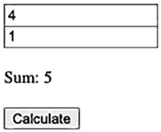

第 11 章 ■ Jakarta 上下文与依赖注入

<h:body>

<p>

<h:form>

<h:inputText value="#{calculationBean.num1}"/>

<br/>

<h:inputText value="#{ calculationBean.num2}"/>

<br/><br/>

总和: <h:outputText id="sum" value="#{ calculationBean.sum}"/>

<br/><br/>

<h:commandButton value="计算" type="submit" action="#{ calculationBean.

addNumbers()}">

</h:commandButton>

</h:form>

</p>

</h:body>

</html>

**@MANAGEDBEAN 对比 @NAMED？**

如果 `@Named` 注解可用于为 Jakarta CDI bean 指定绑定名称，那么使用 `@ManagedBean` 注解的意义何在？事实上，`@ManagedBean` 注解是从早期版本的 Jakarta Server Faces 继承而来的。虽然它仍然是一种将 bean 标记为受管并为 Jakarta Server Faces 提供绑定标识符的有效机制，但建议仅在应用程序无法使用 Jakarta CDI 时使用。如果应用程序可以完全访问整个 Jakarta EE 栈，包括 Jakarta CDI，那么 `@ManagedBean` 注解就不是必需的。

Jakarta CDI 技术比 `@ManagedBean` 强大得多，后者是 Jakarta Server Faces 的定制解决方案，因此 Jakarta CDI 是首选技术。之所以是首选技术，是因为 Jakarta CDI 允许将更广泛的类归类为受管资源。Jakarta CDI 还附带了许多其他好处，例如事务管理和类型安全的依赖注入，这些都是 `@ManagedBean` 所不具备的。

从 Jakarta Server Faces 2.3 开始，某些功能仅在使用 Jakarta CDI 时可用，而 `@ManagedBean` 已成为已弃用的技术。

要运行上述代码，请在浏览器中启动此 URL：http://localhost:8080/

JakartaEERecipes_Chapter08- 1.0- SNAPSHOT/chapter11/recipe11_01.xhtml。

您应该会看到如图 11-1 所示的输出。

***图 11-1.** 配方 11-2 的输出*

第 11 章 ■ Jakarta 上下文与依赖注入

工作原理

Jakarta CDI 最广泛使用的特性之一，是它有助于为应用程序的 Web 视图和后端业务逻辑提供无缝集成。利用 Jakarta CDI，可以非常轻松地使公共 bean 成员和方法对 Jakarta Server Faces 视图可访问。`jakarta.


`inject.Named` 注解提供了一种在 Jakarta Server Faces 视图中引用 JavaBean 类的机制，可以通过接受一个用于创建引用的字符串，或者直接使用首字母小写的 JavaBean 类名来实现。本方案中提供的两种方法演示了这两种技术。从技术角度来看，不使用字符串提供引用的示例是最类型安全的解决方案。然而，有时需要像第一个示例那样提供字符串引用，但该方案仅建议在必要时使用。

■ **注意** 请注意，示例中的 bean `CalculationBean` 包含一个 `@RequestScoped` 注解。

该注解指定了 bean 状态的作用域。一个有趣的技巧是，尝试移除 `@RequestScoped` 注解，看看会发生什么。事实证明，bean 仍然会按预期工作，但不会返回任何结果。这是因为 bean 会在每次请求后重新初始化。因此，视图会调用 `getSum` 方法来读取 `sum` 字段的当前内容，而在请求发出之前，该字段已被重新初始化为 0。要了解更多关于 bean 作用域的信息，请参阅方案 11-4。

通过使用 `@Named` 注解一个类，该类便可在同一应用程序中的 Jakarta Server Faces 视图中使用。任何公共类成员或方法都可以通过在 Jakarta Server Faces 视图中指定首字母小写的类名以及所需的公共成员或方法来调用。例如，以下 Jakarta Server Faces EL 表达式调用了名为 `MyClass` 的类中包含的一个名为 `myMethod` 的方法。请注意，如果类名为 `MyClass` 并包含一个空的 `@Named` 注解，或者类名不同但包含 `@Named("myClass")` 注解，此 EL 表达式均有效：

`#{myClass.myMethod}`

如本方案的侧边栏所述，`@ManagedBean` 和 `@Named` 注解扮演着相似的角色，它们都使 Java 类可在 Web 视图中使用。然而，可以确定的是，`@Named` 注解比使用 `@ManagedBean` 更受推荐；请阅读前面的侧边栏以获取更多信息。

11-3. 分配特定 Bean 进行注入

问题

你有多个实现了特定 API 的 JavaBean，并且希望指定要注入哪个 bean。

第 11 章 ■ Jakarta 上下文和依赖注入

解决方案

为注入使用一个限定符。为了解决引用重复类的问题，为每个类添加一个限定符以将它们区分开来。在以下代码示例中，两个类 `PaperbackController` 和 `EbookController` 都实现了 `Book` 接口。为了让客户端 bean 开发者能够指定应注入哪个 bean 类，使用了限定符。在第一个代码清单中，我们来看一下 `IBook` 接口，该接口在示例中至少被两个 JavaBean 实现：

```java
public interface IBook {

    String title = null;

    String description = null;

    String getTitle();

    String getDescription();

}
```

`PaperbackController` 类使用限定符 `@Paperback` 来将其与实现 `Book` 接口的其他 bean 区分开来。以下是 `PaperbackController` 类的代码清单。请注意，要在此示例中使用 `@Paperback` 注解，必须已存在 `Paperback` 接口（源代码如下所示）：

```java
package org.jakartaeerecipe.chapter11.recipe11_03;

import jakarta.inject.Named;

import jakarta.enterprise.context.SessionScoped;

import java.io.Serializable;

@Named(value = "paperbackController")

@SessionScoped

@Paperback

public class PaperbackController implements Serializable, IBook{

    /**

     * Creates a new instance of PaperbackController

     */

    public PaperbackController() {

    }

    ...

}
```

另一个名为 `EbookController` 的 JavaBean 也实现了 `IBook` 接口。它包含一个


不同的限定符 `@Ebook`，用于将其与实现 `IBook` 接口的其他类区分开来。`EbookController` 类的代码如下所示：

package org.jakartaeerecipe.chapter11.recipe11_03;

import jakarta.inject.Named;

import jakarta.enterprise.context.SessionScoped;

@Named(value = "ebookController")

@SessionScoped

@Ebook

public class EbookController implements java.io.Serializable, IBook {

/**

* 创建 EbookController 的新实例

*/

第 11 章 ■ Jakarta 上下文与依赖注入

public EbookController() {

}

...

}

最后，让我们看看 `@Paperback` 和 `@Ebook` 绑定注解的样子。以下两段代码展示了 `org.jakartaeerecipe.chapter11.recipe11_03.Paperback` 和 `org.jakartaeerecipe.chapter11.recipe11_03.Ebook` 接口的内容，它们用于创建这两个注解：

import java.lang.annotation.*;

import jakarta.inject.Qualifier;

@Qualifier

@Retention(RetentionPolicy.RUNTIME)

@Target({ElementType.TYPE, ElementType.METHOD, ElementType.FIELD, ElementType.PARAMETER})

public @interface Paperback {}

import java.lang.annotation.*;

import jakarta.inject.Qualifier;

@Qualifier

@Retention(RetentionPolicy.RUNTIME)

@Target({ElementType.TYPE, ElementType.METHOD, ElementType.FIELD, ElementType.PARAMETER})

public @interface Ebook {}

当客户端需要使用其中一个时，只需按如下方式调用限定符即可：

@Paperback PaperbackController paperback;

@Ebook EbookController ebook;

工作原理

当有两个或更多类实现同一个 Java 接口时，Jakarta CDI 需要一些帮助来确定在注入点使用哪一个。如果部署了一个使用 Jakarta CDI 的应用程序，并尝试对实现与另一个类相同接口的类执行注入，那么 Weld 将抛出模糊依赖错误。这意味着它无法确定在给定注入点使用哪个 bean。当 Jakarta CDI 尝试确定在注入点应使用哪个 bean 时，它会考虑所有类类型，并且也会使用限定符。限定符是一种可以应用于类级别以指示 bean 类型的注解。限定符也可用于注解方法或其他代码区域，以帮助 Jakarta CDI 确定需要注入哪种类型的 bean。

■ **注意** Weld 是 Jakarta CDI 的参考实现。因此，在 Jakarta EE 应用程序中使用 Jakarta CDI 时，您会在服务器日志中看到对 Weld 的引用。有关 Weld 的更多信息，请参阅在线文档 [`weld.cdi-spec.org/`](http://weld.cdi-spec.org/)。

第 11 章 ■ Jakarta 上下文与依赖注入

每个没有显式限定符的 bean 都会自动被 `@Default` 限定符注解。当使用其他限定符类型时，则不需要此限定符。在本配方的解决方案中，创建了两个限定符来标记 `IBook` 类型的两个不同 bean：`@Paperback` 和 `@Ebook` 限定符。要创建限定符，请生成一个 Java 接口，并使用 `@Qualifier`、`@Retention(RetentionPolicy.RUNTIME)` 和 `@Target({ElementType.TYPE, ElementType.METHOD, ElementType.FIELD, ElementType.PARAMETER})` 对该接口进行注解。所有限定符都以相同的方式创建，创建后即可用于注解 bean 以进行区分。从示例中可以看出，`PaperbackController` 和 `EbookController` 类都已使用各自的限定符进行了注解。

这使得 Jakarta CDI 能够轻松确定要注入哪个 bean，因为这两个 bean 都是 `Book` 类型的不同实现。

Jakarta CDI API 提供了一些开箱即用的限定符，可以在您的 bean 类中使用。我已经讨论过 `@Default` 限定符，它会添加到任何未显式包含限定符的 bean 上。Jakarta CDI 提供的其他限定符包括 `@Named` 和 `@Any`。`@


命名限定符（Named qualifier）用于将 Bean 标记为 EL 可注入。如果 Bean 包含 `@Named` 限定符，则可以在 Jakarta Server Faces 视图中引用它。所有 Bean 上也包含 `@Any` 限定符，它允许注入点引用特定 Bean 类型的所有 Bean 或事件。例如，要引用 `IBook` 类型的所有 Bean，可以按如下方式声明成员：

`@Inject @Any Instance<IBook> anyBook;`

限定符在日常代码中并不常用，但它们是 Jakarta EE 的一项特性，在可能出现 Bean 注入歧义的情况下会派上用场。

11-4. 确定 Bean 的作用域

问题

你希望确保应用程序中特定 Bean 的作用域在用户的整个会话期间都可用。

解决方案

通过相应地为 Bean 添加注解，定义你想要使其可用的 Bean 的作用域。配方 11-3 中列出的 `org.jakartaeerecipe.chapter11.recipe11_03.PaperbackController` 和 `org.jakartaeerecipe.chapter11.recipe11_03.EbookController` 是请求作用域 Bean 的示例，因为它们被如此注解。要使 Bean 在另一个作用域中可用，请使用其他基于作用域的注解之一进行注解。例如，让我们创建一个具有会话作用域的 Bean，这意味着它将在 Web 会话的生命周期内为多个 HTTP 请求保留其状态。要创建会话作用域的 Bean，请使用 `@SessionScoped` 注解该类。以下名为 `CartBean` 的类是一个 Jakarta CDI 会话作用域的 JavaBean，它包含一个整数字段，当用户调用 `addItem` 或 `removeItem` 方法时，该字段将被调整：

```java
package org.jakartaeerecipe.chapter11.recipe11_04;

// 导入并更改为 @RequestScoped 以查看功能差异
//import jakarta.enterprise.context.RequestScoped;
import jakarta.enterprise.context.SessionScoped;
import jakarta.inject.Named;

@Named
@SessionScoped
public class CartBean implements java.io.Serializable {

    private int orderList = 0;

    public CartBean(){}

    public void addItem(){
        setOrderList(getOrderList() + 1);
    }

    public void removeItem(){
        setOrderList(getOrderList() - 1);
    }

    /**
     * @return the orderList
     */
    public int getOrderList() {
        return orderList;
    }

    /**
     * @param orderList the orderList to set
     */
    public void setOrderList(int orderList) {
        this.orderList = orderList;
    }
}
```

■ **注意** `CartBean` 类中的注释表明，如果将作用域更改为 `@RequestScoped`，你将看到功能差异。区别在于 `orderList` 字段将仅在一个 HTTP 请求期间保留其状态。因此，该数字永远不会增加到超过 1，也永远不会减少到低于 -1。

如果你不在 Jakarta Server Faces 视图中使用这个 Bean，那它还有什么乐趣呢？好吧，让我们看一个名为 `recipe11_04.xhtml` 的 Jakarta Server Faces 视图，它利用 `CartBean` 类来显示 `orderList` 字段。该视图包含两个按钮，每个按钮都绑定到 `CartBean` 类中的不同方法。一个按钮将增加 `orderList` 整数的值，另一个按钮将减少它：

```xhtml
<html xmlns="http://www.w3.org/1999/xhtml"
      xmlns:h="jakarta.faces.html">
<h:head>
    <meta http-equiv="Content-Type" content="text/html; charset=UTF-8"/>
    <title>配方 11-4：确定 Bean 的作用域</title>
</h:head>
<h:body>
    <p>
        <h:form>
            <h:outputText value="#{cartBean.orderList}"/>
            <br/>
            <br/><br/>
            <h:commandButton value="添加订单" type="submit" action="#{cartBean.addItem()}"/>
            <h:commandButton value="移除订单" type="submit" action="#{cartBean.removeItem()}"/>
        </h:form>
    </p>
</h:body>
</html>
```

要查看如图 11-2 所示的结果，请将项目部署到你的 GlassFish 服务器，并通过浏览器访问 `http://localhost:8080/JakartaEERecipes_Chapter08-1.0-SNAPSHOT/chapter11/recipe11_04.xhtml`。

***图 11-2.** 配方 11-4 的输出*

工作原理

根据应用程序的需求，某些 Bean 可能需要比其他 Bean 更长时间地保留状态。


有时，让应用程序的每个用户拥有特定 bean 的独立版本是合理的，此时 bean 的状态随用户会话而生灭。另一些情况下，让 bean 在应用程序的所有用户之间共享状态更为合理；还有些时候，bean 的状态随每个用户请求而生灭更为合适。要指定 bean 保留其状态的时间长度，请使用 Jakarta CDI 作用域注解之一来注解 bean 类。表 11-1 描述了不同的作用域注解。

***表 11-1.** Jakarta CDI Bean 状态注解*

**注解**

**描述**

@RequestScoped

每个用户，状态在单个 HTTP 请求期间保留

@SessionScoped

每个用户，状态在多个 HTTP 请求之间保留

@ApplicationScoped

在应用程序内所有用户交互之间共享状态

@Dependent

对象存在是为了服务一个客户端 bean，并具有与该 bean 相同的生命周期（如果未指定，这是默认作用域）

@ConversationScoped

每个用户作用域，用于基于 servlet 的应用程序，例如使用 Jakarta Server Faces 的应用程序。作用域的边界由开发者控制，并可跨 servlet 生命周期的多次调用扩展作用域。所有长时间运行的对话都限定在特定的 servlet 会话内，且不能跨越会话边界

虽然为 bean 定义特定作用域很容易，但有时需要一些实践和测试才能确定为特定应用程序需求选择正确的作用域。此外，随着应用程序的演进，有必要审查已应用于各个 bean 的不同作用域，以确保分配的作用域仍然合适。

第 11 章 ■ Jakarta 上下文与依赖注入

■ **注意** 使用作用域注解时最常见的错误之一是为 bean 导入了错误的注解。请记住，Jakarta Server Faces 有自己的基于作用域的注解集，用于托管 bean（自 Jakarta Server Faces 2.3 起仅用于向后兼容）。使用 Jakarta CDI 作用域时，务必从 `jakarta.enterprise.context.*` 包中导入，否则将得到错误结果。

11-5. 注入非 Bean 对象

问题

您希望将一个非 bean 对象注入到另一个 Java 类中。

解决方案

使用生产者字段来注入非 bean 对象、需要自定义初始化的对象，或在运行时可能具有不同值的对象。要创建生产者字段，请使用 `jakarta.injection.Produces` 注解注解一个公共类字段，并返回要注入的字段。在大多数情况下，您还需要使用 Jakarta CDI 限定符注解生产者方法，以便 Jakarta CDI 知道在被调用时注入什么。

在此示例中，一个名为 `InitialValueController` 的 JavaBean 包含一个生产者字段，该字段将被调用来为 Jakarta CDI bean 字段分配初始值。以下是 `InitialValueController` 类的源代码清单，其中包含生产者字段声明：

```java
package org.jakartaeerecipe.chapter11.recipe11_05;

import jakarta.enterprise.inject.Produces;

public class InitialValueController implements java.io.Serializable {

    @Produces
    @InitValue
    public int initialValue = 1000;
}
```

该类清单中的生产者字段包含一个 `@InitValue` 限定符注解。限定符实现如下：

```java
package org.jakartaeerecipe.chapter11.recipe11_05;

import java.lang.annotation.*;
import jakarta.inject.Qualifier;

@Retention(RetentionPolicy.RUNTIME)
@Target({ElementType.TYPE, ElementType.METHOD, ElementType.FIELD, ElementType.PARAMETER})
@Qualifier
public @interface InitValue {}
```

第 11 章 ■ Jakarta 上下文与依赖注入

生产者字段可以从任何地方调用。在此例中，它被注入到一个 Jakarta CDI bean 中以初始化 bean 字段值。在以下清单中，名为 `ProducerExample` 的 Jakarta CDI bean 字段演示了如何注入生产者字段并使用它：

```java
package org.jakartaeerecipe.chapter11.recipe11_05;

import jakarta.enterprise.context.SessionScoped;
import jakarta.inject.Inject;
import jakarta.inject.Named;

@Named
@SessionScoped
public class ProducerExample implements java.io.Serializable {

    @Inject
    @InitValue
    private int initial;

    private int orderList = -1;

    public ProducerExample(){ }

    public void addItem(){
        setOrderList(getOrderList() + 1);
    }

    public void removeItem(){
        setOrderList(getOrderList() - 1);
    }

    /**
     * @return the orderList
     */
    public int getOrderList() {
        return orderList == -1 ? initial : orderList;
    }

    /*
     * @param orderList the orderList to set
     */
    public void setOrderList(int orderList) {
        this.orderList = orderList;
    }
}
```

当 `orderList` 字段被添加到 Jakarta Server Faces 视图时，`getOrderList()` 方法将在视图加载时被调用，因为视图调用了 `orderList` 属性。这反过来会导致 `orderList` 字段值在 Jakarta Server Faces 视图首次加载时被初始化。以下代码演示了该字段在 Jakarta Server Faces 视图中的使用。要查看源代码，请查看 `chapter11/recipe11_05.xhtml` 文件：

```xhtml
<html
xmlns:h="http://xmlns.jcp.org/jsf/html"
>
<h:head>
    <meta http-equiv="Content-Type" content="text/html; charset=UTF-8"/>
    <title>Recipe 11-5: Injecting Non-Bean Objects</title>
</h:head>
<h:body>
    <p>
        <h:form>
            <h:outputText value="#{producerExample.orderList}"/>
            <br/>
            <br/><br/>
            <h:commandButton value="Add Order" type="submit" action="#{producerExample.addItem()}"/>
            <h:commandButton value="Remove Order" type="submit" action="#{producerExample.removeItem()}"/>
        </h:form>
    </p>
</h:body>
</html>
```

要执行本食谱中的代码，请打开页面 `http://localhost:8080/JakartaEERecipes_Chapter08-1.0-SNAPSHOT/chapter11/recipe11_05.xhtml` 查看输出，如图 11-3 所示。

***图 11-3.** 食谱 11-5 的输出*

工作原理

有时会出现需要注入 Jakarta CDI 托管 bean 或资源以外的对象的情况。诸如字段、方法等对象，如果被声明为生产者，则可以成为注入目标。在某些情况下，将类字段声明为可注入对象是合理的。为此，请使用 `jakarta.enterprise.inject.Produces` 注解（`@Produces`）注解该字段，EE 容器随后会将此字段视为该字段的 getter 方法。在大多数情况下，还应创建 Jakarta CDI 限定符注解并用其注解该字段，以便在注入点通过限定符引用该字段。

在本食谱的解决方案中，一个用于初始化值的字段在名为 `InitialValueController` 的 Java 类中声明。字段名为 `initialValue`，它将返回一个 `int` 类型，即用于初始化的数字。查看代码，您可以看到在字段声明处还放置了一个名为 `@InitValue` 的限定符。这将允许注入点简单地引用该限定符来获取注入目标的句柄。要使用 `initialValue` 字段，它被注入到一个 Jakarta CDI 托管 bean 中，如下所示：

```java
@Inject
@InitValue
private int initial;
```

第 11 章 ■ Jakarta 上下文与依赖注入

一旦注入，该字段就可以像被注入类的一部分一样被使用。在此示例中，它用于初始化 `orderList` 字段的值，然后通过名为 `chapter11/recipe11_05.xhtml` 的 Jakarta Server Faces 视图显示该值。


也可以创建生产者方法，这些方法可以返回可注入到 Bean 或非 Java（Jakarta Server Faces）上下文中的值。为此，使用 `@Produces` 注解来标注该方法，其方式与声明字段生产者相同。例如，以下方法演示了生产者方法的声明，该方法将用于注入 `Book` 类型的对象。

可以根据传递给它的类型来调用该方法，以返回所需的 `Book` 对象类型：

```java
@Produces @BookQualifier public Book getBook(Book book){
    if(book.equals(EbookController.class))
        return new EbookController();
    else
        return new PaperbackController();
}
```

在这种情况下，该方法还使用了一个名为 `@BookQualifier` 的限定符。然后，生产者方法的结果可以注入到 Bean 或非 Java 上下文中。注入点引用该限定符以实现注入，容器会调用生产者方法来获取所需的实例对象，如下所示：

```java
@Inject
@BookQualifier
Book getBook(ebookController);
```

生产者是开发可注入对象的绝佳方式。稍加练习，它们也能通过使用生产者方法，成为创建复杂对象工厂的有价值工具。

**11-6. 忽略类**

**问题**

您希望将一个类标记为被 Jakarta CDI 忽略。如果您希望避免在应用程序中使用某些类或方法，这会很有用。

**解决方案 #1**

使用 `@Vetoed` 注解标注该类。任何包含 `@Vetoed` 注解的类都将被 Jakarta CDI 忽略。以下示例演示了 `@Vetoed` 的使用：

```java
import jakarta.enterprise.inject.Vetoed;

@Vetoed
public class OrderBean implements java.io.Serializable {
    public OrderBean(){ }
    // 类实现
}
```

**解决方案 #2**

使用 `@Requires` 注解标注该类，如果该类不满足指定要求，则将其标记为被 Jakarta CDI 忽略。以下示例演示了如何使用 `@Requires` 注解：

```java
@Requires("jakarta.persistence.EntityManager")
public class EmployeeFacade {
    ...
    @Produces
    public EntityManager getEntityManager(){
        ...
    }
    ...
}
```

在此示例中，`@Requires` 注解包含一个字符串 `jakarta.persistence.EntityManager` 作为参数。因此，如果指定的类不可用，或者该类无法满足指定的依赖关系，则它将被 Jakarta CDI 忽略。

**工作原理**

否决一个 Bean 意味着将其标记为被 Jakarta CDI 忽略。因此，如果一个 Bean 包含 `@Vetoed` 注解，它就不能被 Jakarta CDI 处理。被否决的类将不具有上下文实例的生命周期，并且不能注入到其他类中。事实上，如果一个会话 Bean 包含 `@Vetoed` 注解，它根本就不能被视为会话 Bean。在某些情况下，将 Bean 标记为此类以确保它不能被 Jakarta CDI 管理是有意义的。以下代码演示了如何将 `@Vetoed` 注解应用于一个类。

`@Vetoed` 注解也可以放在包声明上，这将阻止该包中包含的所有 Bean 被 Jakarta CDI 处理：

```java
@Vetoed
package org.jakartaeerecipe.chapter11.*;
...
```

被否决类型上的以下任何定义都不会被处理：

*   托管 Bean、会话 Bean、拦截器、装饰器
*   观察者方法、生产者方法、生产者字段

`@Requires` 注解可用于有条件地将一个类标记为被 Jakarta CDI 忽略，如果它不满足指定的必需条件。`@Requires` 注解接受一个基于字符串的、依赖项的完全限定类名。如果对象能够满足其依赖关系，那么它将被 Jakarta CDI 管理。与 `@Vetoed` 类似，`@Requires` 注解也可以放在包上。

如果该包无法满足 `@Requires` 所表示的依赖关系，那么该包中包含的所有类都不会被 Jakarta CDI 管理。

**11-7. 处理生产者字段的销毁**

**问题**

您的应用程序使用了一个生产者字段，并且您希望该生产者字段在不再需要使用时被销毁。

**解决方案**

以下代码片段演示了一个生产者字段：

```java
...
@Produces
List<Book> books;
...
```

**工作原理**

生产者方法可用于生成一个对象，该对象在不再需要时需要被移除。

与类的终结器非常相似，通过生产者方法注入的对象可以包含一个方法，该方法在注入的实例被销毁时被调用。这种方法被称为*销毁器方法*。要将一个方法声明为销毁器方法，请在生产者方法所在的同一个类中定义一个方法。销毁器方法必须至少有一个参数，其类型和限定符与生产者方法相同。该参数应使用 `@Disposes` 注解进行标注。

**11-8. 在部署时指定替代实现**

**问题**

您希望能够为一个接口编写不同的实现，然后在部署应用程序时选择使用哪个实现。

**解决方案**

为接口创建一个默认实现，然后为该接口创建任何替代实现，并使用 `@Alternative` 注解标注它们。指定 `jakarta.enterprise.inject.Alternative` 注解会将一个类标记为替代类，如果该类在 `beans.xml` 文件中被注明，那么它将在部署时被加载，而不是默认的接口实现。

以下代码片段演示了替代类实现的使用。为了演示，我们假设已经有一个名为 `BookstoreOrderBean` 的 `OrderType` 接口的默认实现：

```java
@Alternative
public class WarehouseOrderBean implements OrderType {
    ...
}
```

要指定使用替代实现而不是默认实现，请修改 `beans.xml` 文件，列出替代类。以下是 `beans.xml` 文件中的一个示例片段，指定使用 `WarehouseOrderBean`：

```xml
<beans ... >
    <alternatives>
        <class>org.jakartaeerecipe.chapter11.WarehouseOrderBean</class>
    </alternatives>
</beans>
```

**工作原理**

有时，为一个类创建两个或多个实现以用于不同环境是有意义的。但是，为了构建和分发每个环境的正确实现而删除或重命名类可能会变得非常繁琐。使用 `jakarta.enterprise.inject.Alternative` 注解允许使用一个接口的多个实现，并且可以通过在部署前修改文件来指定适当的实现。

**11-9. 注入 Bean 并获取元数据**

**问题**

您希望从应用程序类中获取关于 Bean 的元数据信息。

**解决方案**

将 Bean 的接口注入到需要使用元数据的类中。一旦注入，调用 Bean 的方法来检索所需的元数据。在以下示例中，一个名为 `OtherBean` 的 Bean 的元数据被注入并检索：

```java
import jakarta.enterprise.inject.spi.Bean;

@Named("OtherBean")
public class OtherBean {
    @Inject Bean<Order> bean;

    public String getBeanName(){
        return bean.getName();
    }

    public Class<? extends Annotation> getBeanScope(){
        return bean.getScope();
    }
}
```

**工作原理**


如果需要使用 Bean 元数据，可以通过注入目标 Bean 的元数据轻松获取。为此，需指定 `@Inject` 注解，后跟目标 Bean 类型的 Bean 类。注入 Bean 接口后，即可调用其方法获取所需信息。表 11-2 描述了可在 Bean 类上调用的不同方法以获取元数据。

第 11 章 ■ Jakarta 上下文与依赖注入

***表 11-2.** Bean 元数据*

**方法**

**描述**

getName

返回 Bean 的名称

getBeanClass

返回 Bean 类

getInjectionPoints

返回 Bean 的 InjectionPoint 对象集合

getQualifiers

返回 Bean 的限定符注解集合

getScope

返回 Bean 的作用域

getStereotypes

返回 Bean 的原型数据（通用元数据）集合

getTypes

返回 Bean 类型的集合

isAlternative

返回布尔值，指定 Bean 是否为替代 Bean

isNullable

返回布尔值，指定 Bean 是否可为空

11-10. 调用与处理事件

问题

你希望在应用程序中发生特定事件时调用某个操作。

解决方案

通过创建 Jakarta CDI 事件、可选的限定符、观察者和事件处理方法，以同步或异步方式处理事件。在此场景中，书店希望在每次发生销售时向图书出版商发送警报。如果发生在线销售，出版商将收到相应警报。同样，如果发生店内销售，出版商将收到不同的警报以指示发生了门店销售。首先，创建一个图书事件对象，其中包含事件调用时需要提供的数据元素。在本例中，事件对象将包含关于图书、销售门店、图书数量和价格的一些简单数据。`BookEvent` 类的源代码如下：

```java
package org.jakartaeerecipe.chapter11.event;

import java.math.BigDecimal;
import java.time.LocalDate;
import java.util.List;

public class BookEvent {
    private BigDecimal book;
    private String storeName;
    private BigDecimal price;
    private int numBooks;
    private LocalDate date;
    private List<String> notifyList;
    // 访问器方法（getter 和 setter）
}
```

第 11 章 ■ Jakarta 上下文与依赖注入

接下来，为每种可能发生的图书事件创建一个限定符。限定符是一个可选步骤，仅当存在多个同类型事件时才需要。在本例中，可能发生在线销售事件或门店销售事件。`OnlineSale` 的限定符源代码如下，`StoreSale` 的限定符与之相同，仅名称不同：

```java
package org.jakartaeerecipe.chapter11.qualifier;

import static java.lang.annotation.ElementType.TYPE;
import static java.lang.annotation.ElementType.FIELD;
import static java.lang.annotation.ElementType.METHOD;
import static java.lang.annotation.ElementType.PARAMETER;
import java.lang.annotation.Retention;
import static java.lang.annotation.RetentionPolicy.RUNTIME;
import java.lang.annotation.Target;
import jakarta.inject.Qualifier;

@Qualifier
@Retention(RUNTIME)
@Target({METHOD, FIELD, PARAMETER, TYPE})
public @interface OnlineSale {
}
```

接着，需要使用观察者来监听事件调用并在事件发生后执行相应操作。在本例中，需要生成两个观察者，一个用于 `@OnlineSale`，另一个用于 `@StoreSale`。这些观察者位于名为 `BookEventHandler` 的类中：

```java
public class BookEventHandler {
    @Inject
    private BookController bookController;

    public BookEventHandler(){
    }

    public void notifyPublisherOnline (@Observes @OnlineSale BookEvent event) {
        for (String s : event.getNotifyList()) {
            System.out.println("向出版商发送通知：" + s + " 在线购买图书："
                + bookController.findById(event.getBook()).getTitle() + " 来自门店："
                + event.getStoreName()
                + " 购买价格：$" + event.getPrice()
                + " 日期：" + event.getDate());
        }
    }

    public void notifyPublisherInStore (@Observes @StoreSale BookEvent event) {
        for (String s : event.getNotifyList()) {
            System.out.println("向出版商发送通知：" + s + " 店内购买图书："
                + bookController.findById(event.getBook()).getTitle() + " 来自门店："
                + event.getStoreName()
                + " 购买价格：$" + event.getPrice()
                + " 日期：" + event.getDate());
        }
    }
}
```

第 11 章 ■ Jakarta 上下文与依赖注入

最后，创建一个事件处理方法，在发生销售时调用 Jakarta CDI 事件。在本例中，将使用一个简单的 Jakarta Server Faces 用户界面来触发销售事件，因此事件处理方法将放置在 Jakarta Server Faces 控制器类中：

```java
@Named
@RequestScoped
public class BookstoreSaleController {
    @Inject
    @OnlineSale
    private Event<BookEvent> onlineSaleEvent;
    private BookEvent currentEvent;

    public BookstoreSaleController() {
    }

    /**
     * 触发同步 Jakarta CDI 事件 BookEvent。
     */
    public void onlineSaleAction() {
        onlineSaleEvent.fire(currentEvent);
    }

    /**
     * 触发异步 Jakarta CDI 事件 BookEvent。
     */
    public void storeSaleAction() {
        onlineSaleEvent.fireAsync(currentEvent)
            .whenComplete((event, throwable) -> {
                if (throwable != null) {
                    FacesContext.getCurrentInstance().addMessage(null, new FacesMessage(
                        FacesMessage.SEVERITY_ERROR, "失败", "发生错误：" +
                        throwable.getMessage()));
                } else {
                    FacesContext.getCurrentInstance().addMessage(null, new FacesMessage(
                        FacesMessage.SEVERITY_INFO, "成功", "实体门店销售处理成功..."));
                }
            });
    }

    /**
     * @return currentEvent
     */
    public BookEvent getCurrentEvent() {
        return currentEvent;
    }
}
```

当触发销售时，可选择在线销售或店内销售类型。根据所选销售类型，将调用相应的 Jakarta Server Faces 控制器方法。

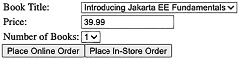

第 11 章 ■ Jakarta 上下文与依赖注入

工作原理

Jakarta CDI 事件允许在多个 Bean 之间实现解耦的事件处理。Bean 类之间没有任何绑定，但可以在它们之间传递上下文，从而使 Bean 能够调用上下文事件而无需显式绑定。要编排事件，只需放置少量注解，无需额外配置。在示例中，书店可以完成两种类型的销售：在线销售和店内销售。因此，当图书售出时，将触发一个事件来通知出版商并指示发生了哪种类型的销售。

首先，使用一个上下文对象来包含每个事件的数据。因此，生成了一个名为 `BookEvent` 的 Bean，它是一个简单的普通 Java 对象（POJO）。接下来，编写事件限定符以区分两种可能的事件类型。事件限定符只是一个可以放置在事件处理器上的注解，它也用于创建指定类型的事件。在示例中，创建了在线和店内两种事件限定符。从限定符的代码中可以看出，注解声明使用了 `jakarta.inject.Qualifier` 注解进行标记，并且其目标为以下元素：`METHOD`、`FIELD`、`PARAMETER`、`TYPE`。


好的，作为一名高级文档工程师和翻译员，我将严格遵循您提供的注意事项和示例，将给定的英文文本翻译成中文。


当事件被触发时，会使用事件处理器来处理该事件。事件处理器也被称为观察者，它们本质上是包含至少一个方法的类，该方法可用于包含事件的处理逻辑。在示例中，`BookEventHandler` 类包含两个用于执行事件动作的方法。事件处理方法必须接受一个事件（本质上是一个对象），该事件使用一个可选的限定符和 `@Observes` 注解进行标注。`@Observes` 注解表示该方法正在观察传入方法的事件类型。在示例中，`BookEvent` 对象被用作参数，并且它针对每个相应的方法都使用了限定符注解进行标注。因此，名为 `notifyPublisherOnline()` 的方法观察 `@OnlineSale` 类型的事件，而 `notifyPublisherInStore()` 方法观察 `@StoreSale` 事件类型。

最后，在此示例中，事件发起发生在 Jakarta CDI 控制器类中，尽管其他类类型也可以调用某个动作。在示例中，`BookstoreSalesController` 包含一个注入的 `Event<BookEvent>` 对象，该对象用于触发 `BookEvent` 类型的事件。该控制器包含用于触发在线销售和店内销售的方法。在线销售动作方法通过调用注入的 `Event` 的 `fire()` 方法并传递当前的 `BookEvent` 对象来触发一个同步事件。`fire()` 方法发起一个同步事件调用，因此一旦事件处理完成，控制权就会返回给调用者。

店内销售动作方法通过调用注入的 `Event` 的 `fireAsync()` 方法并传递当前的 `BookEvent` 对象来触发一个异步事件。然而，在这种情况下，一旦 `fireAsync()` 方法被发起，控制权就会返回给调用者，而事件则在后台处理。`fireAsync()` 方法是在 Jakarta EE 8 中随 Jakarta CDI 2.0 的发布而引入的。

Jakarta CDI 事件模型可以被用来为各种类型的应用程序提供超强大的解决方案。由于事件可以通过松散耦合的架构来调用，这使得在新应用程序中实现事件调用以及在现有应用程序中添加事件调用变得容易。

要执行代码，请在浏览器中打开 URL `http://localhost:8080/JakartaEERecipes_Chapter08- 1.0-SNAPSHOT/chapter11/recipe11_10.xhtml`。输出应如图 11-4 所示。

***图 11-4.** 配方 11-10 的输出*

第 11 章 ■ Jakarta 上下文和依赖注入

11-11. 拦截方法调用

问题

您希望拦截应用程序中的方法调用，使得每次调用该方法时，都会执行特殊功能。

解决方案

利用 Jakarta CDI 拦截器，在每次调用指定方法或指定类中的所有方法时，执行特殊功能。在以下场景中，将使用拦截器在每次调用应用程序的某些方法时向管理员发送电子邮件。在此示例中，每次取消图书订单时，都会触发电子邮件。

首先，必须为拦截器生成一个注解。此处的拦截器注解名为 `Notified`，其源代码如下：

```java
package org.jakartaeerecipe.chapter11.interceptor;

import static java.lang.annotation.ElementType.*;

import java.lang.annotation.*;

import jakarta.interceptor.InterceptorBinding;

@Inherited

@InterceptorBinding

@Retention(RUNTIME)

@Target({METHOD,TYPE})

public @interface Notified {

}
```

接下来，创建拦截器类。拦截器类使用 `@Interceptor` 注解进行标注，并且包含一个使用 `@AroundInvoke` 注解的方法。每当调用某个使用 `@Notified` 注解的方法，或者调用包含在使用 `@Notified` 注解的类中的方法时，都会调用这个被注解的方法。在此例中，拦截器类名为 `NotificationInterceptor`，其实现如下：

```java
package org.jakartaeerecipe.chapter11.interceptor;

import java.util.Date;

import java.util.Properties;

import jakarta.interceptor.AroundInvoke;

import jakarta.interceptor.Interceptor;

import jakarta.interceptor.InvocationContext;

import jakarta.mail.Message;

import jakarta.mail.Session;

import jakarta.mail.Transport;

import jakarta.mail.internet.InternetAddress;

import jakarta.mail.internet.MimeMessage;

@Interceptor

@Notified

public class NotificationInterceptor {

@AroundInvoke

public Object emailNotification(InvocationContext ctx) throws Exception {

String smtpServer = "mysmtpserver.com";

String email = "publisherEmail@publisher.com";

Properties props = System.getProperties();

props.put("mail.smtp.host", smtpServer);

Session session = Session.getInstance(props, null);

sendEmail(session,

email,

"Method invocation",

"Entering method: " + ctx.getMethod().getName());

return ctx.proceed();

}

protected void sendEmail(Session session, String toEmail, String subject, String body) {

try {

MimeMessage msg = new MimeMessage(session);

//set message headers

msg.addHeader("Content-type", "text/HTML; charset=UTF-8");

msg.addHeader("format", "flowed");

msg.addHeader("Content-Transfer-Encoding", "8bit");

msg.setFrom(new InternetAddress("no_reply@jakartaeerecipe.com", "NoReply")); msg.setReplyTo(InternetAddress.parse("no_reply@jakartaeerecipe.com", false));

msg.setSubject(subject, "UTF-8");

msg.setText(body, "UTF-8");

msg.setSentDate(new Date());

msg.setRecipients(Message.RecipientType.TO, InternetAddress.parse(toEmail,

false));

Transport.send(msg);

} catch (Exception e) {

e.printStackTrace();

}

}

}
```

最后，必须指定一个或多个类或方法用于拦截。在此示例中，我们希望每当有人登录管理控制台时通知管理员：

```java
@Notified

@Named

@RequestScoped

public class AdminConsoleController {

public AdminConsoleController(){

}

public void login(){

System.out.println("This is an action method which would allow one to log into an"

+ "administrative console");

}

}
```

在前面的示例代码中，`login()` 方法实际上将用于对个人进行身份验证以登录书店的管理控制台。但是，由于这仅用于演示目的，它只是在系统日志中显示一条消息。要启用此拦截器，必须将以下行添加到 `beans.xml` 配置中：

```xml
<interceptors>

<class>org.jakartaeerecipe.chapter11.interceptor.NotificationInterceptor

</class>

</interceptors>
```

工作原理

拦截器允许将横切功能引入新的或现有的应用程序，而无需显式修改指定类或方法的代码。拦截器允许由于调用指定方法或调用指定类中的方法而执行该功能。因此，拦截器与 Jakarta CDI 事件非常相似，只是它们不需要显式调用 `fire()` 或 `fireAsync()` 来触发。

一个拦截器解决方案需要一个拦截器绑定类型注解和一个实现类。

拦截器绑定类型注解是一个标准的注解声明，包含 `@Inherited` 和 `@InterceptorBinding` 注解。`@Inherited` 注解表示该注解可以从超类继承。拦截器绑定类型注解应包含 `METHOD` 和 `TYPE` 作为目标。

拦截器实现类可以包含使用 `@AroundInvoke` 注解的方法，


`@PostConstruct`、`@PreDestroy`、`@PrePassivate`、`@PostActivate` 和 `@AroundTimeout`。这些注解用于指定拦截器方法何时被调用。当类或方法被标注了拦截器绑定时，拦截器实现将根据指定的实现被调用。`@AroundInvoke` 指定当被拦截的方法被调用时，该实现将被执行。生命周期回调注解（`@PostConstruct`、`@PreDestroy`、

`@PrePassivate` 和 `@PostActivate`）指定当被拦截的方法或类进入指定状态时，拦截器实现将被调用。最后，`@AroundTimeout` 注解用于指示当被拦截的方法发生 EJB 超时时，该实现将被调用。

`@AroundInvoke` 注解附带了一些要求。如果一个实现方法被标注为此注解，它必须接受一个 `jakarta.interceptor.InvocationContext` 参数，并且必须调用该参数的 `proceed()` 方法。调用 `proceed()` 方法会导致目标被调用。

一个拦截器实现类可以包含一个或多个被这些注解标注的方法。

然而，在给定的实现类中，每种类型只能指定一个。要启用拦截器，必须在 `beans.xml` 中指定它，如示例所示。

拦截器是一种在不修改现有代码的情况下为流程添加额外功能的好方法。它们非常适合执行诸如每次访问方法时记录日志之类的操作。

通常，拦截器可以在多种情况下重复使用，因为其功能是通用的，并不绑定到特定的业务逻辑。要了解有关向现有方法添加更具体的业务逻辑功能的更多信息，请参阅涵盖装饰器的配方 11-13。

11-12. 引导 Java SE 环境

问题

您希望在 Jakarta EE 容器之外，在 Java SE 环境中利用 Jakarta CDI 的功能。

通过这种方法，您可以在独立的 Java 应用程序中使用 CDI 的所有功能，包括依赖注入、上下文生命周期管理和拦截器。

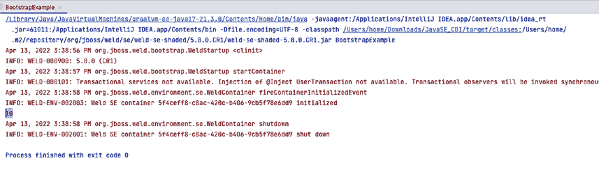

第 11 章 ■ Jakarta 上下文与依赖注入

解决方案

使用 `SeContainerInitializer` 引导 Java SE 应用程序。在此示例中，创建了一个名为 `BootstrapExample` 的标准 Java SE 应用程序。使用 Jakarta CDI 引用，将一个 `beans.xml` 文件添加到应用程序的 `META-INF` 文件夹中：

```java
public class BootstrapExample {

    public static void main(String[] args) {

        SeContainerInitializer initializer = SeContainerInitializer.newInstance();

        try (SeContainer container = initializer.initialize()) {

            /**

             * 使用 Jakarta CDI

             */

            Calculator calculator = container.select(Calculator.class).get();

            System.out.println(calculator.addNumbers(new int[]{1, 2, 3, 4}));

        }

    }

}
```

当执行这段代码时，`SeContainer` 可用于使用 Jakarta CDI 功能。图 11-5 显示了执行 `main()` 方法的输出。

***图 11-5.** 配方 11-12 的输出*

工作原理

在某些情况下，标准 Java SE 应用程序会受益于使用 Jakarta CDI 提供的实用程序。Jakarta CDI 版本通过添加引导 API 使这成为可能。要引导，您必须在应用程序中包含 Jakarta CDI 依赖项。还必须包含一个 `beans.xml` 文件，以指示将使用 Jakarta CDI。如果使用 Maven 项目，请使用 `cdi-core` 依赖项的坐标，如下所示（根据需要更新版本）：

```xml
<dependency>

    <groupId>org.jboss.weld.se</groupId>

    <artifactId>weld-se-shaded</artifactId>

    <version>5.0.0.CR1</version>

</dependency>
```

第 11 章 ■ Jakarta 上下文与依赖注入


`beans.xml` 文件应包含 Jakarta CDI 配置信息。以下 `beans.xml` 源码提供了最小配置：

<?xml version="1.0" encoding="UTF-8"?>

<beans xmlns:xsi="http://www.w3.org/2001/

XMLSchema-instance"

xsi:schemaLocation="http://xmlns.jcp.org/xml/ns/javaee http://xmlns.jcp.org/xml/ns/

javaee/beans_4_0.xsd"

bean-discovery-mode="all" version="4.0">

</beans>

`SeContainerInitializer` 类可用于返回自身的实例。通过调用其众多自定义方法，可以为应用程序配置 Jakarta CDI 容器。

■ **注意** 请参阅在线文档以获取完整详情 (https://docs.jboss.org/weld/reference/latest/en-US/html_single/)

`SeContainerInitializer` 类应遵循构建器模式来配置选项，最后调用的方法应是其 `initialize()`，如示例所示。`SeContainerInitializer` 是自动关闭的，因此它非常适合在 try-with-resources 块中使用。所有 Jakarta CDI 的使用都可以在 try 块内进行。在示例中，获取并使用了一个上下文 bean。

虽然这个示例很简短，但它展示了为 Java SE 应用程序引导 Jakarta CDI 配置是多么容易。

11-13. 增强方法的业务逻辑

问题

您希望增强现有方法的功能，包括与 bean 的业务逻辑集成的能力。

解决方案

使用装饰器来实现对现有方法功能的增强。在以下示例中，为现有方法生成了一个装饰器，通过记录日志到数据库来增强功能。

在此示例中，使用注册表单来注册书店活动。装饰器将用于增强注册过程，将注册者添加到另一个数据库表中以参与抽奖。

首先，每位注册者必须输入他们的名字、姓氏和电子邮件地址。这些信息将存入一个 `Registration` 对象。对象代码如下：

public class Registration {

private String first;

private String last;

private String email;

public Registration(){

}

// ... Getters 和 Setters

}

第 11 章 ■ Jakarta 上下文和依赖注入

接下来，必须为注册类型生成一个接口。在这种情况下，每个注册类型必须包含一个接受 `Registration` 对象的 `register()` 方法：

public interface BookstoreRegistration {

public String register(Registration registration);

}

现在创建一个装饰器，它是一个公共抽象类，将之前创建的接口作为注入点：

package org.jakartaeerecipe.chapter11.decorator;

import jakarta.decorator.Decorator;

import jakarta.decorator.Delegate;

import jakarta.enterprise.inject.Any;

import jakarta.inject.Inject;

import org.jakartaeerecipe.chapter11.recipe11_13.BookstoreRegistration;

import org.jakartaeerecipe.chapter11.recipe11_13.Registration;

@Decorator

public abstract class RegistrationDecorator implements BookstoreRegistration {

@Inject

@Delegate

@Any

private BookstoreRegistration bookstoreRegistration;

@Override

public String register(Registration registration){

// 提交到注册数据库表

// 提交到促销数据库表

return registration.getEmail() + " 已进入赠品活动";

}

}

最后，我们需要调用 `register` 方法来启动装饰器功能。在此示例中，我们通过 Jakarta Server Faces 控制器类方法进行调用：

@Named

@ViewScoped

public class BookstoreRegistrationController implements BookstoreRegistration,

Serializable {

@Inject

private Registration current;

public BookstoreRegistrationController(){

}

// Getters 和 Setters

public String register(){

return register(current);

}

@Override

public String register(Registration registration) {

// 持久化当前注册信息

return "chapter11/recipe11_13.xhtml";

}

}

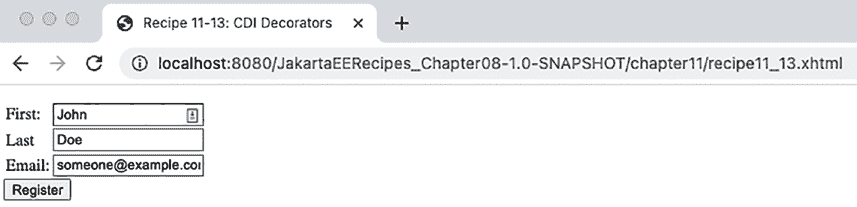

第 11 章 ■ Jakarta 上下文和依赖注入

当调用 `register()` 方法时，增强的装饰器功能也将被调用，以将注册者添加到赠品数据库表中。要执行上述代码，请在浏览器中打开 URL http://localhost:8080/JakartaEERecipes_Chapter08-1.0-SNAPSHOT/chapter11/recipe11_13.xhtml。输出应如图 11-6 所示。

***图 11-6.** 配方 11-13 的输出*

点击注册按钮后，GlassFish 服务器日志中会打印以下日志消息：

[2022-04-13T16:00:25.872+0530] [glassfish 7.0] [INFO] [] [] [tid: _ThreadID=42 _

ThreadName=Thread-7] [timeMillis: 1649845825872] [levelValue: 800] [[

执行注册]]

工作原理

装饰器是 Jakarta CDI 的另一个强大组件。与拦截器非常相似，装饰器为现有方法添加增强功能。这两种构造的不同之处在于，装饰器增强功能，并且可以访问正在发生增强功能的 bean 的字段和方法。另一方面，拦截器无法访问 bean 的字段和方法，因此除了现有方法的标准功能之外，它们提供更通用的功能。

要创建装饰器，必须使用接口作为注入点，并且接口的一个或多个方法将通过添加到装饰器类中的实现来增强。在示例中，通过将注册者添加到抽奖赠品活动中，增强了标准的书店账户注册。

尽管该示例并未实际演示数据库持久化等操作，但如果执行代码，您可以看到装饰器被调用。

装饰器类必须使用 `@Decorator` 注解进行标记，并且它必须实现一个接口并包含至少一个方法实现。但是，装饰器类可以设为抽象类，这样它就不必实现接口中包含的每个方法。装饰器必须包含一个委托注入点，该注入点使用 `jakarta.decorator.Delegate` 进行注解。此注入点可以是装饰器类的字段、构造函数参数或初始化方法参数。

要启用装饰器，必须将其添加到 `beans.xml` 文件中。以下 `beans.xml` 演示了 `RegistrationDecorator` 的添加：

<decorators>

<class>org.jakartaeerecipe.chapter11.decorator.RegistrationDecorator</class>

</decorators>

当然，一个应用程序可以包含多个装饰器。要管理装饰器的触发顺序，请使用 `beans.xml` 并按优先级顺序列出。另一种管理优先级的方法是使用 `@Priority` 注解来注解装饰器。拦截器优先于装饰器，因此如果一个方法同时包含拦截器和装饰器，则拦截器将首先被触发。

**第 12 章**

**Jakarta 消息传递**

Jakarta 消息传递 API（以前称为 Java 消息服务或 JMS）是一个 API，允许软件应用程序在其他软件应用程序或组件之间创建、编辑、读取和发送消息。

该 API 允许在应用程序服务器内创建资源，这些资源有助于在各种上下文中实现消息传递功能。应用程序服务器托管连接工厂和目标资源，这些资源由应用程序服务器创建和维护。


除了基本消息传递功能外，Jakarta Messaging 还允许向目的地发送消息以及向订阅发布消息。本章包含的攻略侧重于 Jakarta Messaging 的基本概念，以及 Jakarta EE 10 发布后 Jakarta EE 平台可用的一些高级技术。在跟随本章示例进行操作时，请注意，您可以在各种场景下使用 Jakarta Messaging 来创建多种不同类型的消息。为简洁起见，本章将仅涵盖核心概念并使用 `TextMessage` 对象。示例将通过 Jakarta Server Faces 视图操作来调用，尽管在实际应用中实现消息发送和接收的方式有很多种。您可以在许多不同的上下文中利用 Jakarta Messaging，从内部消息调用到通过 Jakarta Enterprise Beans 定时器或 `ManagedExecutorService` 执行计划任务，甚至与消息驱动 Bean 进行消息传递。阅读完这些攻略后，您应该能够应用其中的策略来创建满足您需求的消息传递系统。

Jakarta Messaging 3.1 通过一种简化的技术改进了 API，用于发送和接收消息。在本章中，您将看到传统的标准 API 和简化的 API，以便比较它们之间的差异。更新后的 API 还包括对消息订阅、投递延迟等方面的增强。Jakarta Messaging 的范围非常广泛，无法在本章中完全覆盖。要了解所有特性，请参考 Jakarta Messaging 3.1 规范（[`jakarta.ee/specifications/messaging/3.0/jakarta-messaging-spec-3.0.html`](https://jakarta.ee/specifications/messaging/3.0/jakarta-messaging-spec-3.0.html)）。

■ **注意** 本章中的示例侧重于在 GlassFish 应用服务器环境中使用 Jakarta Messaging 资源。然而，尽管重点在于 GlassFish 7.0，但主要概念和技术几乎可以应用于所有符合 Jakarta EE 规范的应用服务器环境。有关使用其他应用服务器或 IDE 的更具体细节，请参阅相应环境的特定文档。

© Josh Juneau 和 Tarun Telang 2022

J. Juneau 和 T. Telang, *Java EE 到 Jakarta EE 10 攻略*[, https://doi.org/10.1007/978-1-4842-8079-9_12](https://doi.org/10.1007/978-1-4842-8079-9_12#DOI)

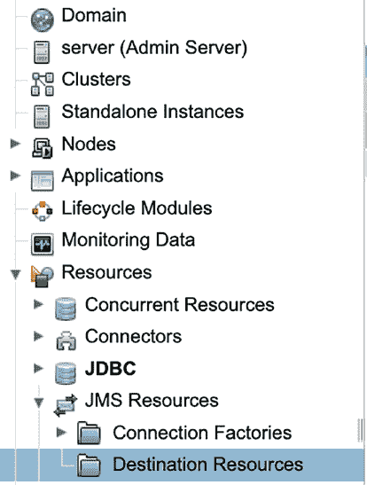

第 12 章 ■ Jakarta 消息传递

12-1. 创建 Jakarta Messaging 资源

问题

您希望提供创建 Jakarta Messaging 资源的能力，以便在 GlassFish 7.0+ 应用服务器环境中部署。

解决方案

从 GlassFish 管理控制台创建一个新的 JMS 资源。在本攻略示例中，我们将创建一个 Jakarta Messaging 目的地资源。具体来说，我们将逐步创建一个 `jakarta.jms.Queue` 资源。请按照以下步骤创建该资源：

1.  通过导航至 `https://localhost:4848` 登录 GlassFish 管理控制台。展开导航树中的 **Resources** ➤ **JMS Resources** 菜单，以显示 Destination Resources 菜单选项（参见图 12-1）。

***图 12-1.** GlassFish 管理控制台目的地资源菜单*

2.  在 JMS 目的地资源窗口中点击 New 按钮，打开新建 JMS 目的地资源窗口。输入一个 JNDI 名称（以 `jms/` 开头），然后在 Physical Destination Name 字段中输入一个唯一的名称（参见图 12-2）。最后，选择您想要创建的资源类型。

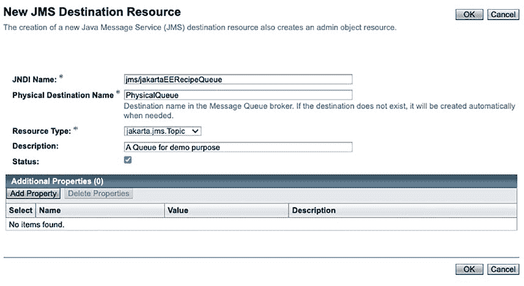

第 12 章 ■ Jakarta 消息传递

***图 12-2.** 新建 JMS 目的地资源*

3.  点击 OK 创建该目的地。

■ **注意** 也可以使用 GlassFish 的 `asadmin create-jms-resource` 命令从命令行创建 JMS 管理对象。`asadmin` 工具还可用于执行其他任务。更多信息，请参考文档：[`glassfish.org/docs/latest/application-development-guide/jms.html#beaop`](https://glassfish.org/docs/latest/application-development-guide/jms.html#beaop)

工作原理

Jakarta Messaging API 利用管理资源来创建和消费消息。我们将这些资源称为 JMS 资源。可以创建两种不同类型的 JMS 资源——连接资源和目的地资源。连接资源用于创建到提供者的连接。可以创建三种类型的连接资源：

*   `ConnectionFactory`：`jakarta.jms.ConnectionFactory` 接口的实例。可用于创建 Topic 和 Queue 类型。
*   `TopicConnectionFactory`：`jakarta.jms.TopicConnectionFactory` 接口的实例。
*   `QueueConnectionFactory`：`jakarta.jms.QueueConnectionFactory` 接口的实例。

第 12 章 ■ Jakarta 消息传递

JMS 连接工厂资源与 JDBC 连接工厂非常相似，因为它们提供了一个连接池，应用程序可以使用该池进行连接并生成会话。创建连接工厂资源时可以指定许多属性：

*   *初始和最小池大小*：连接池将创建和维护的初始和最小连接数。
*   *最大池大小*：池中可以创建的最大连接数。
*   *池调整数量*：当池空闲超时到期时将移除的连接数。
*   *空闲超时*：连接在空闲状态下可以在池中保留的最长时间（秒）。
*   *最大等待时间*：调用者在连接超时发生之前等待的最长时间（毫秒）。
*   *发生任何故障时*：如果设置为 true（选中），则在发生故障时所有连接都将关闭并重新连接。
*   *事务支持*：事务支持的级别（`XATransaction`、`LocalTransaction`、`NoTransaction`）。默认为空。
*   *连接验证*：如果设置为 true，则需要验证连接。

■ **注意** `XATransaction` 始终处理一个协调事务管理器，包括一个或多个数据库，所有这些都在一个全局事务中。非 XA 事务始终涉及单个资源。

您可以按照本攻略解决方案中提供的步骤，通过 GlassFish 管理控制台创建连接工厂对象，只需在第 1 步中选择 Connection Factories 子菜单而不是 Destination Resources 子菜单即可。`ConnectionFactory` 对象一旦创建就会自动向 JNDI 注册，然后可以注入到 Java 类中使用。以下代码行演示了如何将 `ConnectionFactory` 资源注入到类中：

```java
@Resource(name = "jms/MyConnectionFactory")
private static ConnectionFactory connectionFactory;
```

目的地资源也可以以类似于连接资源的方式创建。它们充当接收或消费所生成消息的目标。它们可以是两种类型之一：`jakarta.jms.Queue`（队列）或 `jakarta.jms.Topic`（主题）。Queue 是一种以点对点（PTP）方式消费消息的目的地资源，很像一条单向交通线路。当生产者向队列发送消息时，该消息将保留在队列中，直到被消费。Topic 是一种用于发布者/订阅者场景的目的地，而发送到 Topic 的消息可能被多个接收者消费。一个或多个接收者可以订阅一个 Topic。


本方案演示了如何使用管理控制台在 GlassFish 应用服务器中创建目标资源。控制台提供了一个向导，可轻松创建目标资源。创建目标时需提供的最重要信息是名称。与所有 JMS 资源一样，JNDI 名称应以 `jms/` 前缀开头。创建目标资源时，还必须为目标资源名称提供一个唯一名称，尽管


第 12 章 ■ Jakarta 消息服务

其他符合 Jakarta EE 规范的容器可能不会将此作为强制规范。目标资源可以像 ConnectionFactory 资源一样注入到 Java 类中。以下代码行演示了 Topic 资源的注入：

@Resource(name="jms/myTopic")

private Topic myTopic;

12-2. 创建会话

问题

您希望创建一个 Jakarta 消息服务会话，以便发送或消费消息。

解决方案

创建一个连接，以便随后创建一个或多个会话，这些会话进而可以向目标发送消息或消费消息。要创建连接，请通过 `@Resource` 注解注入获取一个 `ConnectionFactory` 对象，并调用其 `createConnection` 方法，如下代码行所示：

Connection connection = connectionFactory.createConnection();

创建连接后，您需要启动一个会话。为此，请按如下方式调用连接对象的 `createSession` 方法：

Session session = connection.createSession(false,

Session.AUTO_ACKNOWLEDGE);

■ **注意** 如果您使用的是简化的 Jakarta 消息服务 API（将在配方 12-3 中更详细地介绍），则无需手动创建 Jakarta 消息服务会话。仅在使用标准 API 时才需要创建 Jakarta 消息服务会话。

运行示例

如果您查看 `org.jakartaeerecipe.chapter12` 包中 JakartaEERecipe 项目内的源代码，可以看到创建 Jakarta 消息服务会话的完整演示。

要查看实际示例，请在设置好 JMS 连接工厂（参见配方 12-1）后，将 JakartaEERecipe 项目部署到您的应用服务器，并访问以下 URL：

http://localhost:8080/JMSDemo-1.0-SNAPSHOT/recipe12_02.xhtml

您将看到如图 12-3 所示的输出。

***图 12-3.** 配方 12-2 的输出*

第 12 章 ■ Jakarta 消息服务

工作原理

在开始发送或消费消息之前，您必须获取一个 JMS 连接，以便启动会话。会话可用于创建 JMS 资源，例如消息消费者、消息生产者、消息、队列浏览器以及临时队列和主题。可以使用 `Connection` 对象创建会话。要创建会话，请调用 `Connection` 对象的 `createSession` 方法，并根据应用程序的需要传递适当的参数。`createSession` 语法如下：

createSession(boolean isTransacted, int acknowledgementType)

`createSession` 方法的第一个参数是一个布尔值，用于指示会话中是否应进行事务处理。如果会话被创建为事务性的（将 `createSession` 的第一个参数设置为 `true`），则在整个事务成功提交后才会进行确认。如果由于某种原因事务未提交，则整个事务将回滚，所有消息将被重新投递。但是，如果会话不是事务性的，则必须指定需要接收哪种确认类型才能认为消息已成功发送。`createSession` 方法的第二个参数指示确认类型。表 12-1 列出了不同的确认类型及其描述。

***表 12-1.** 会话消息确认*

**确认类型**

**类型描述**

`Session.AUTO_ACKNOWLEDGE`

会话自动确认客户端收到消息，无论是客户端成功从 `receive` 调用返回，还是其调用的用于处理消息的 `MessageListener` 成功返回。

`Session.CLIENT_ACKNOWLEDGE`

客户端通过调用消息的 `acknowledge` 方法来确认收到消息。

`Session.DUPS_OK_ACKNOWLEDGE`

延迟确认消息，允许接收重复消息。

在本配方的解决方案中，创建的会话是非事务性的，接收类型为 `Session.AUTO_ACKNOWLEDGE`。这是最常见的 Jakarta 消息服务会话创建类型。

一旦创建了会话，就可以用它来创建 JMS 资源。

12-3. 创建和发送消息

问题

您希望创建并发送一条消息。

解决方案 #1

使用标准 API 创建和发送消息。为此，根据您要发送的消息类型创建一个 `Message` 对象，然后创建并使用消息生产者将消息发送到目标。要创建消息，首先确定您要发送的消息类型。确定后，从 JMS 会话中创建相应的消息对象。在此示例中，我们将演示创建文本消息。以下代码行演示了如何创建包含字符串的文本消息：

TextMessage message = session.createTextMessage();

message.setText("Jakarta EE 10 Is the Best!");

接下来，要创建 `MessageProducer` 并发送消息，请调用 Jakarta 消息服务会话的 `createProducer` 方法，并传递您要发送消息的目标的对象类型。以下代码行演示了如何创建消息生产者并发送在前几行中创建的文本消息。前几行代码演示了如何注入目标资源，然后是实际创建消息生产者和发送消息：

public void sendMessage() {

if (connection != null) {

System.out.println("Creating Session");

try(Session session = connection.createSession(false, Session.AUTO_ACKNOWLEDGE);

) {

myQueue = (Queue) getContext().lookup("jms/jakartaEERecipeQueue");

MessageProducer producer = session.createProducer(myQueue);

TextMessage message = session.createTextMessage();

message.setText("Jakarta EE 10 Is the Best!");

producer.send(message);

producer.close();

setConnectionString("Message Successfully Sent to Queue");

} catch (NamingException | JMSException e) {

Logger.getLogger(org.jakartaeerecipe.chapter12.recipe12_02.Recipe12_02.

class.getName())

.log(Level.SEVERE, null, e);

setConnectionString("Session not created and message not sent");

}

} else {

setConnectionString("No connection available");

}

}

解决方案 #2

使用简化的 API 创建和发送消息。要使用简化的 API，请创建一个 `JMSContext` 对象，然后利用它创建 `MessageProducer` 并将消息发送到适当的目标。在以下示例中，使用简化的 API 将一条简单的基于字符串的消息发送到队列。此技术提供与解决方案 #1 相同的结果：

public String sendMessageNew() {

String response = "Message Not Sent...";

try (JMSContext context = connectionFactory.createContext()) {

inboundQueue = (Queue) getContext().lookup("jms/jakartaEERecipeQueue");

StringBuilder message = new StringBuilder();

message.append("Jakarta EE 10 Is the Best!");

context.createProducer().send(inboundQueue, message.toString());

response = "Message Sent...";

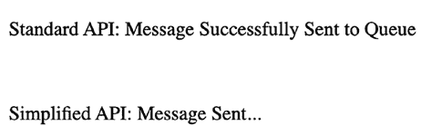

第 12 章 ■ Jakarta 消息服务

} catch (NamingException e) {

Logger.getLogger(org.jakartaeerecipe.chapter12.recipe12_02.Recipe12_02.class.

getName())

.log(Level.SEVERE, null, e);

}

return response;

}

运行示例


本配方提供了一个可在 Jakarta Server Faces 视图中运行的示例。位于 `org.jakartaeerecipes.chapter12.Example12_03.java` 的代码包含一个托管 bean，其中包含一个使用标准 API 实现的 `sendMessage` 方法，以及一个使用简化 API 的 `sendMessageNew` 方法。这两个方法都负责创建消息并将其发送到目标队列。通过运行该示例，您可以查看服务器日志以了解方法的输出。

部署 JakartaEERecipes 项目并访问以下 URL 来运行示例：

http://localhost:8080/JMSDemo -1.0-SNAPSHOT/recipe12_03.xhtml

您将看到如图 12-4 所示的输出。

***图 12-4.** 配方 12-3 的输出*

工作原理

任何应用程序使用 Jakarta Messaging 的原因都是为了集成发送或接收消息的能力。因此，Jakarta Messaging API 的开发旨在让开发人员非常轻松地完成这些任务，这并不令人意外。在 Java EE 7 中，通过使用简化的 Jakarta Messaging API，事情变得更加简单。

让我们首先讨论使用标准 API 发送消息所需的步骤。

要使用标准 API 发送消息，您需要为消息创建一个资源目标，并获取一个连接和一个会话，如配方 12-1 和 12-2 所示。一旦获得会话，下一步就是使用 `Session` 的 `createProducer` 方法创建一个 `MessageProducer`，并将目标作为参数传递。完成这些准备工作后，就可以构建消息了。您可以通过调用与您希望创建的消息类型相对应的 `jakarta.jms.Session` 方法来创建消息。

■ **注意** 要查看所有可用方法，请参阅 [`jakarta.`](https://jakarta.ee/specifications/messaging/3.0/jakarta-messaging-spec-3.0.html#sessions) 的在线文档。

[ee/specifications/messaging/3.0/jakarta- messaging- spec- 3.0.html#sessions](https://jakarta.ee/specifications/messaging/3.0/jakarta-messaging-spec-3.0.html#sessions).

第 12 章 ■ Jakarta 消息传递

在本配方的示例中，通过调用 `session.createTextMessage()` 方法创建了一条文本消息。然后通过调用 `TextMessage` 对象的 `setText` 方法来设置文本。

创建消息后，必须创建一个 `MessageProducer` 以便于发送消息。同样，`jakarta.jms.Session` 在这里发挥了作用，我们可以调用其 `createProducer` 方法，并传递我们希望为其创建 `MessageProducer` 的目标资源。创建完成后，可以调用生产者的 `sendMessage` 方法，并传递您希望发送的消息。

如前所述，`jakarta.jms.Session` 可用于生成不同的消息类型。

表 12-2 列出了可以创建的不同消息类型及其描述。

***表 12-2.** 消息类型*

**消息**

**类型创建方法**

`StreamMessage`

消息体包含 Java 编程语言中原始值的一个流。按顺序填充和读取

`MapMessage`

消息体包含一组由 `String` 对象和 Java 原始类型组成的名称/值对。可以按名称顺序或随机访问，条目的顺序未定义

`TextMessage`

消息体包含一个 `String` 对象。可用于纯文本以及 XML 消息

`ObjectMessage`

消息体包含一个可序列化的 Java 对象

`BytesMessage`

消息体包含一个未解释字节的流

使用简化 API 时，可以采取一些快捷方式。比较解决方案 #1 与解决方案 #2，您可以看到第二个解决方案中的代码行数更少。简化 API 使开发人员能够用更少的代码产生与标准 API 相同的结果。通过调用 `ConnectionFactory` 的 `createContext` 方法获得一个 `JMSContext` 对象，它可以用来启动一个方法调用链，最终仅用一行代码即可发送消息。分解来看，在获得 `JMSContext` 之后，可以调用其 `createProducer` 方法，并链式调用 `send` 方法，传递队列和要发送的消息。

不同应用服务器产品之间的消息实现可能有所不同。然而，所有 JMS 消息类型都共享一些共同特征。例如，所有消息都实现 `jakarta.jms.Message` 接口。消息由标头、属性和正文组成。消息的标头包含客户端和提供者用于路由和标识的值，属性提供消息过滤，消息的正文部分承载实际的消息内容或有效载荷。消息标头用于将消息相互链接，一个名为 `JMSCorrelationID` 的字段包含此内容。消息对象支持应用程序定义的属性值。这些属性可以通过称为消息选择器的结构来设置，它们负责过滤消息。有关 `Message` 接口的更详细信息，请参阅 [`jakarta.ee/specifications/messaging/3.0/jakarta- messaging-`](https://jakarta.ee/specifications/messaging/3.0/jakarta-messaging-spec-3.0.html) 的在线文档。

[spec- 3.0.html. T](https://jakarta.ee/specifications/messaging/3.0/jakarta-messaging-spec-3.0.html)正文因消息类型而异，如表 12-2 所列。

向特定消息添加属性和标头可能很有用，这允许消息消费者通过消息选择器拥有过滤能力。要了解更多关于使用消息选择器的信息，请参考配方 12-5。

第 12 章 ■ Jakarta 消息传递

12-4. 接收消息

问题

您希望接收刚刚由 Jakarta Messaging 生产者发送的消息。

解决方案 #1

使用标准 Jakarta Messaging API 创建一个消息消费者。使用 Jakarta Messaging 会话，通过调用 `createConsumer` 方法创建消息消费者，并传递您希望创建的消息消费者类型。创建消息消费者对象后，在连接对象上调用 `start` 方法，然后调用消费者对象的 `receive` 方法来接收消息。在以下示例控制器类中，将创建一个消息消费者，并设置为接收配方 12-3 中生产者发送的消息。

以下代码摘录自 `org.jakartaeerecipes.chapter12.recipe12_04.Example12_04.java` 源文件。名为 `receiveMessage` 的方法负责从指定的目标点队列消费消息。请注意，该代码假设队列中的消息最终会结束，并且不会有连续不断的消息流：

```java
public void receiveMessage() {

    boolean stopReceivingMessages = false;

    if (connection == null) {

        createConnection();

    }

    try (Session session = connection.createSession(false, Session.AUTO_ACKNOWLEDGE)) {

        createConnection();

        System.out.println("Creating session to receive message");

        myQueue = (Queue) getContext().lookup("jms/jakartaEERecipeQueue");

        System.out.println("Setting up consumer");

        try (MessageConsumer consumer = session.createConsumer(myQueue)) {

            connection.start();

            while (!stopReceivingMessages) {

                System.out.println("Receiving message");

                Message inMessage = consumer.receive();

                if (inMessage != null) {

                    System.out.println(inMessage);

                    if (inMessage instanceof TextMessage) {

                        String messageStr = ((TextMessage) inMessage).getText();
```


System.out.println(messageStr);

setDisplayMessage(messageStr);

} else {

System.out.println("Message was of another type");

setDisplayMessage("Message was of another type");

}

} else {

stopReceivingMessages = true;

}

}

connection.stop();

}


第 12 章 ■ Jakarta Messaging

解决方案 #2

使用简化 API 创建消息消费者。利用 `JMSContext` 对象以高效简洁的方式创建 `JMSConsumer`。以下示例方法位于受管 Bean 控制器中。此示例中的消息消费者将被创建并配置为接收配方 12-3 中生产者发送的消息：

public String receiveMessageNew() {

try (JMSContext context = connectionFactory.createContext()) {

JMSConsumer consumer = context.createConsumer(myQueue);

return consumer.receiveBody(String.class);

}

}

运行示例

JakartaEERecipes 项目包含此配方的完整示例，演示了消息的发送和接收。要查看示例，您需要将项目部署到应用服务器，然后访问以下 URL：

http://localhost:8080/JMSDemo- 1.0- SNAPSHOT/chapter12/recipe12_03.xhtml

您将看到如图 12-5 所示的输出。

***图 12-5.** 配方 12-4 的输出*

工作原理

消息的接收客户端也称为消息消费者。可以使用标准或简化的 Jakarta Messaging API 创建消息消费者。本节将比较这两种方法，让您了解它们之间的差异。

使用标准 API 时，消费者通过会话对象创建，其方式与创建生产者相同（参见配方 12-3）：调用会话的 `createConsumer` 方法，并传入消费者将监听并接受消息的目标对象。消息消费者能够消费队列中等待的消息，并无限期监听新传入的消息。

要设置消费者，请调用会话对象的 `createConsumer` 方法，并传入您希望从中消费消息的目标对象。下一步是调用连接的 `start` 方法。这将告知 Jakarta Messaging 消费者已准备好开始接收消息。调用 `connection.start()` 方法后，消费者可以通过调用消费者对象的 `receive` 方法来接收消息，并可选择传入以毫秒为单位的时间限制，让消费者监听消息。如果未指定时间限制，消费者将无限期监听。

如本配方示例所示，一旦调用 `receive` 方法，就会检索到一个 `Message` 对象。收到消息后，应用程序可以通过调用 `Message` 对象的相应 getter 方法来获取所需信息。

第 12 章 ■ Jakarta Messaging

现在让我们看看如何使用简化 API。从解决方案 #2 可以看出，实现与解决方案 #1 相同的结果所需的代码行数更少。`JMSContext` 对象通过调用其 `createConsumer` 方法并传入应用程序需要消费消息的资源，有助于减少代码量。此方法调用将返回一个 `JMSConsumer`，其 API 与 `MessageConsumer` 类似，能够同步和异步接收消息。在示例中，同步消费了一条字符串消息：

■ **注意** 可以通过向 `MessageConsumer` 注册 `MessageListener` 来创建异步消费者。为消费者注册监听器后，每次传递消息时都会调用监听器的 `onMessage()` 方法。例如，以下代码可用于为本配方示例中创建的消费者注册监听器。

jakarta.jms.MessageListener jakartaEERecipesListener = new MyMessageListener();

consumer.setMessageListener(jakaratEERecipesListener);

12-5. 过滤消息

问题


您可能希望为消息提供一些属性，以便消费者能够更轻松地筛选并找到他们想要的消息。

解决方案

利用消息选择器来过滤正在被消费的消息。消息选择器是基于字符串的表达式，可以在创建消费者时分配给它们，通常用于过滤消费者将接收的消息类型。在以下示例中，`sendMessage1` 和 `sendMessage2` 方法都会创建消息。`sendMessage1` 方法在消息上设置了一个名为 `TYPE`、值为 `JAKARTAEE` 的属性。设置此属性后，会创建一个 `MessageProducer` 并发送消息。`sendMessage2` 方法在消息上设置了一个名为 `TYPE`、值为 `JAVASE` 的属性。与 `sendMessage1` 类似，`sendMessage2` 方法随后创建一个 `MessageProducer` 并发送消息。`receiveMessage` 方法设置了一个 `MessageConsumer`，并指定了一个选择器，使其仅消费 `TYPE` 属性值为 `JAKARTAEE` 的消息。

以下摘录自名为 `org.jakartaeerecipes.chapter12.recipe12_05.Example12_05.java` 的类：

```java
public void sendMessage1() {

    if (connection != null) {

        try (Session session = connection.createSession(false, Session.AUTO_ACKNOWLEDGE);

             MessageProducer producer = session.createProducer(myQueue);) {

            TextMessage message = session.createTextMessage();

            message.setText("Jakarta EE 10 Is the Best!");

            message.setStringProperty("TYPE", "JAKARTAEE");

            producer.send(message);

        } catch (JMSException ex) {

            System.out.println(ex);

        }

    }

}

public void sendMessage2() {

    if (connection != null) {

        try (Session session = connection.createSession(false, Session.AUTO_ACKNOWLEDGE);

             MessageProducer producer = session.createProducer(myQueue);) {

            System.out.println("Creating message");

            TextMessage message2 = session.createTextMessage();

            message2.setText("Java SE 9 Is Great!");

            message2.setStringProperty("TYPE", "JAVASE");

            producer.send(message2);

        } catch (JMSException ex) {

            System.out.println(ex);

        }

    }

}

public void receiveMessage() {

    boolean stopReceivingMessages = false;

    String selector = "TYPE = 'JAKARTAEE'";

    try(Connection connection = connectionFactory.createConnection();

        Session session = connection.createSession(false, Session.AUTO_ACKNOWLEDGE);

        MessageConsumer consumer = session.createConsumer(myQueue, selector);) {

        connection.start();

        while (!stopReceivingMessages) {

            Message inMessage = consumer.receive();

            if (inMessage != null) {

                if (inMessage instanceof TextMessage) {

                    String messageStr = ((TextMessage) inMessage).getText();

                    setDisplayMessage(messageStr);

                } else {

                    setDisplayMessage("Message was of another type");

                }

            } else {

                stopReceivingMessages = true;

            }

        }

        connection.stop();

    } catch (JMSException ex) {

        System.out.println(ex);

    }

}
```

运行示例

如果您部署了 `JakartaEERecipes` 项目，可以通过在浏览器中访问以下 URL 来运行示例：

`http://localhost:8080/JMSDemo- 1.0- SNAPSHOT/chapter12/recipe12_05.xhtml`

您可以点击 **Receive Messages** 按钮启动消费者。然后点击 **Send EE Message** 和 **Send SE Message** 按钮发送包含不同属性值的消息。查看服务器日志以查看与浏览消息相关的输出。

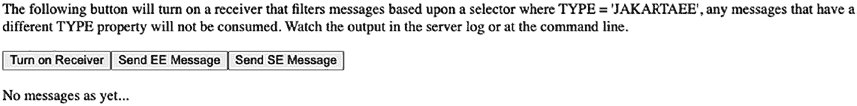

您将看到如图 12-6 所示的输出。

***图 12-6.** 配方 12-5 的输出*

工作原理

消息选择器是基于字符串的表达式，可以在创建消费者时分配给它们。要创建选择器，需要构建一个包含表达式的字符串，该表达式的语法基于 SQL 92 条件表达式语法的子集。该表达式字符串应制定您在消费消息时希望使用的过滤器。表达式看起来非常像数据库查询中的 `WHERE` 子句。在本配方的示例中，选择器设置为以下字符串：

`TYPE = 'JAKARTAEE'`

此选择器导致消费者过滤所有接收到的消息，仅消费那些包含名为 `TYPE` 且值为 `JAKARTAEE` 的消息。可以使用标准 SQL 92 来组合过滤器并构建一个表达式，以提供消费者所需的过滤能力。

要将选择器分配给消费者，请将其传递给 JMS 会话的 `createConsumer` 方法。之后，创建的消费者接收到的任何消息都将根据选择器表达式进行过滤。

12-6. 检查消息队列

问题

您的应用程序使用了 Jakarta Messaging 队列，并且您希望浏览队列中的每条消息，但不移除它们。

解决方案

创建一个 `QueueBrowser` 对象，并使用它来浏览队列中包含的每条消息。

在以下摘自 Java 类 `org.jakartaeerecipes.chapter12.recipe12_06.Example12_06.java` 的代码中，`browseMessages` 方法连接到一个会话，创建一个浏览器队列，并遍历队列中的消息：

```java
public void browseMessages() {

    try(Connection connection = connectionFactory.createConnection();

        Session session = connection.createSession(false, Session.AUTO_ACKNOWLEDGE);

        QueueBrowser browser = session.createBrowser(myQueue);) {

        Enumeration msgs = browser.getEnumeration();

        if(!msgs.hasMoreElements()){

            System.out.println("No more messages within the queue...");

        } else {

            while(msgs.hasMoreElements()){

                Message currMsg = (Message)msgs.nextElement();

                System.out.println("Message ID: " + currMsg.getJMSMessageID());

            }

        }

    } catch (JMSException ex) {

        System.out.println(ex);

    }

}
```

运行示例

如果您部署了 `JakartaEERecipes` 项目，可以通过在浏览器中访问以下 URL 来运行示例：`http://localhost:8080/JMSDemo-1.0-SNAPSHOT/chapter12/recipe12_06.xhtml`。您可以在视图中多次点击 **Send Message** 按钮，然后点击 **Browse Through Messages** 按钮，并查看服务器日志以查看与浏览消息相关的输出。

您将看到如图 12-7 所示的输出。

***图 12-7.** 配方 12-6 的输出*

工作原理

有时，能够搜索消息以找到您想阅读的那一条非常重要。在这种情况下，消息队列浏览器就派上了用场。`QueueBrowser` 对象使应用程序能够搜索队列中的每条消息，并显示每条消息的标头值。如果消息标头包含有助于区分特定应用程序发送的每种消息类型的重要信息，那么这种能力就至关重要。`QueueBrowser` 对象使用与创建其他 Jakarta Messaging 对象类似的语义，使得筛选消息以找到您想要的那一条变得容易。

要创建 `QueueBrowser`，您必须首先有一个打开的会话对象。然后，您可以调用 `Session` 对象的 `createBrowser` 方法，并将目标类型作为参数传递。因此，如果您希望浏览名为 `jms/myQueue` 的队列中的消息，您需要将 `jms/myQueue` 的注入资源传递给 `createBrowser` 方法。一旦创建了浏览器对象，只需遍历消息，并使用调用 `browser.getEnumeration()` 方法返回的 `Enumeration` 来浏览它们。

12-7. 创建持久化消息订阅者

问题

您希望确保应用程序能够接收所有发布的消息，即使订阅者处于非活动状态。

解决方案


为 Topic 目的地创建一个持久订阅者，该目的地将用于发送和接收消息。创建完成后，可以使用标准的消息发布技术将消息发布到 Topic，如配方 12-3 所示，即发送到包含该订阅的 Topic 目的地。然后，可以通过使用该 Topic 和订阅创建的消息消费者来消费这些消息。

在此示例中，创建了一个持久消息订阅者，创建并发布消息到 Topic 目的地，最后消费该消息。

Topic 连接

Topic 连接与 Queue 连接略有不同，它使用名为 `TopicConnection` 的对象，而不是标准的 `Connection` 对象。此外，必须将 `TopicConnectionFactory` 注入到一个对象中，才能创建 `TopicConnection`。以下代码行演示了如何创建一个连接工厂来生成用于处理订阅的 `TopicConnection`：

```java
@Resource(name = "jms/jakartaEERecipesConnectionFactory")
private TopicConnectionFactory connectionFactory;

TopicConnection connection = (TopicConnection) connectionFactory.createConnection();
connection.setClientID("durable");
```

创建初始持久订阅者

在创建持久订阅者时，必须在向 Topic 发送任何消息之前创建一个初始的持久订阅者。这个初始订阅者将初始化订阅，并使其可用于发布和接收目的。以下代码摘录自 `org.jakartaeerecipes.chapter12.recipe12_07.Example12_07.java`，演示了如何创建持久订阅者：

```java
public void createTopicSubscriber(){
    try {
        createConnection();
        TopicSession session = connection.createTopicSession(false, Session.AUTO_ACKNOWLEDGE);
        myTopic = (Topic) getContext().lookup("jms/jakartaEERecipesTopic");
        TopicSubscriber subscriber = session.createDurableSubscriber(myTopic, "jakartaEERecipesSub");
        connection.close();
    } catch (javax.naming.NamingException | JMSException ex) {
        Logger.getLogger(Example12_07.class.getName()).log(Level.SEVERE, null, ex);
    }
}
```

对于演示应用程序，一个 JSF `h:commandButton` 组件会调用此方法，以便您可以在服务器日志中查看输出。

创建并发布消息

创建消息并将其发布到 Topic 与将消息发布到 Queue 非常相似。但是，不是创建生产者，而是生成一个发布者。以下代码摘录自 `org.jakartaeerecipes.chapter12.recipe12_07.Example12_07.java`，演示了如何创建一条 `Message`，然后将其发布到持久订阅者：

```java
public void sendMessage() {
    try {
        createConnection();
        System.out.println("Creating session");
        TopicSession session = connection.createTopicSession(false, Session.AUTO_ACKNOWLEDGE);
        System.out.println("Creating message");
        TextMessage message = session.createTextMessage();
        message.setText("Jakarta EE 8 Is the Best!");
        message.setStringProperty("TYPE", "JAKARTAEE");
        System.out.println("Creating producer");
        myTopic = (Topic) getContext().lookup("jms/jakartaEERecipesTopic");
        TopicPublisher publisher = session.createPublisher(myTopic);
        System.out.println("Sending message");
        publisher.publish(message);
        System.out.println("Message sent, closing session");
        publisher.close();
        session.close();
        connection.close();
    } catch (NamingException | JMSException ex) {
        Logger.getLogger(Example12_07.class.getName()).log(Level.SEVERE, null, ex);
    }
}
```

在我们的示例视图中，此方法也绑定到一个 `h:commandButton` 组件，您可以看到方法内操作产生的更多输出。

接收消息

每条创建并发布到 Topic 的消息稍后都会被该 Topic 的订阅者消费。以下方法演示了如何创建持久订阅者并从中接收消息：

```java
public void receiveMessage() {
    boolean stopReceivingMessages = false;
    try {
        createConnection();
        System.out.println("Creating session to receive messages");
        TopicSession session = connection.createTopicSession(false, Session.AUTO_ACKNOWLEDGE);
        myTopic = (Topic) getContext().lookup("jms/jakartaEERecipesTopic");
        System.out.println("Setting up consumer");
        String selector = "TYPE = 'JAKARTAEE'";
        TopicSubscriber subscriber = session.createDurableSubscriber(myTopic, "jakartaEERecipesSub");
        connection.start();
        while (!stopReceivingMessages) {
            System.out.println("Receiving message");
            Message inMessage = subscriber.receive();
            if (inMessage != null) {
                System.out.println(inMessage);
                if (inMessage instanceof TextMessage) {
                    String messageStr = ((TextMessage) inMessage).getText();
                    System.out.println(messageStr);
                    setDisplayMessage(messageStr);
                } else {
                    System.out.println("Message was of another type");
                    setDisplayMessage("Message was of another type");
                }
            } else {
                stopReceivingMessages = true;
            }
        }
        connection.stop();
        subscriber.close();
        session.close();
        closeConnection();
    } catch (NamingException | JMSException ex) {
        Logger.getLogger(Example12_07.class.getName()).log(Level.SEVERE, null, ex);
    }
}
```

在示例程序中，`receiveMessage` 方法绑定到 JSF 视图中的一个 `h:commandButton` 组件，您可以跟随服务器日志中看到的输出。

取消订阅

使用完订阅者后取消订阅非常重要，因为订阅者会占用额外的资源，如“工作原理”部分所述。以下方法演示了如何取消订阅：

```java
public void unsubscribe(){
    try {
        createConnection();
        TopicSession session = connection.createTopicSession(false, Session.AUTO_ACKNOWLEDGE);
        // close subscriber if open, then unsubscribe
        session.unsubscribe("jakartaEERecipesSub");
        connection.close();
    } catch (JMSException ex) {
        Logger.getLogger(Example12_07.class.getName()).log(Level.SEVERE, null, ex);
    }
}
```

运行示例

可以通过将 `JakartaEERecipes` 项目部署到您的 GlassFish 服务器并访问以下 URL 来执行一个示例，该示例将本配方中显示的所有方法绑定到 Jakarta Server Faces 视图：`http://localhost:8080/JakartaEERecipes/chapter12/recipe12_7.xhtml`

您将看到如图 12-8 所示的输出。

***图 12-8.** 配方 12-7 的输出*

工作原理

消息订阅是一个 Jakarta Messaging 消费者，它保持与指定 Topic 目的地的持久连接。消息订阅不能用于 Queue 目的地，只能用于 Topic，因为它们使用发布/订阅消息传递。默认情况下，持久订阅者保持持久性，因为默认的传递模式是 `PERSISTENT`。订阅存储在服务器缓存中，以便在服务器发生故障时可以检索它们。由于持久消息订阅者将消息保留在缓存中，它们会占用更大的内存空间。因此，重要的是订阅者仅在必要时保持订阅状态，然后取消订阅以释放内存。

■ **注意** 持久订阅一次只能有一个订阅者。

要使用消息订阅者，必须使用一组特殊的连接和会话对象。

首先，必须将 `TopicConnectionFactory` 注入到任何将使用 Topic 的对象中。可以通过调用 `createTopicConnection` 方法来创建 `TopicConnection`。必须创建一个 `TopicSession`，而 `TopicSession` 又由 `TopicConnection` 创建。`TopicSession` 对象可用于创建持久消息订阅者和消息发布者。

创建订阅者时，必须调用 Jakarta Messaging 会话方法，


调用 `createDurableSubscriber` 方法，并传入 Topic 目的地以及一个用于标识订阅者的字符串。这个字符串标识符非常重要，因为消费者将使用它来订阅发布到该 Topic 的消息。`createDurableSubscriber` 方法会生成一个 `TopicSubscriber` 对象，而创建初始的持久订阅者对于建立 Topic 订阅至关重要。一旦创建了初始的持久订阅者，就可以向该订阅发送消息，消费者也可以订阅它。

要创建消息并将其发送到订阅，必须调用 Jakarta Messaging 会话的 `createPublisher` 方法，并将 Topic 目的地对象作为参数传入。调用 `createPublisher` 会生成一个 `TopicPublisher` 对象，该对象可用于向 Topic 订阅发布消息。任何类型的消息都可以发送到 Topic。要了解更多关于可发送的不同类型消息的信息，请参考配方 12-3。可以向 Topic 发送任意数量的消息，如果消费者已订阅该订阅者，它将接收到这些消息。新的订阅者将从其订阅时刻开始接收发送到该订阅的消息。

第 12 章 ■ Jakarta 消息传递

要订阅一个 Topic，应通过调用会话的 `createDurableSubscriber` 方法来创建 `TopicSubscriber` 对象，并传入 Topic 目的地对象以及最初用于建立订阅者的基于字符串的标识符。一旦创建了 `TopicSubscriber`，就可以像往常一样消费消息，为每条将要消费的消息调用 `TopicSubscriber` 的 `receive` 方法。通常，应用程序会设置一个要消费的消息数量的边界限制，并执行一个循环来从订阅的 Topic 接收该数量的消息。

由于持久订阅会占用内存，因此消费者在完成 Topic 操作后取消订阅至关重要。如果消费者不取消订阅，应用服务器将耗尽其他订阅者资源，并最终耗尽可用内存。要取消订阅消费者，请调用会话的 `unsubscribe` 方法，并传入订阅者的基于字符串的名称。我之前说过，你用来标识订阅者的那个字符串非常重要！

在某些情况下，创建消息订阅非常有用。使用订阅者的相关场景可能包括：为客户端消费者订阅以接收关于应用程序错误的消息，或者用于警报系统，以便管理员可以订阅他们希望接收的警报。无论如何，只要谨慎使用并以适当的方式维护，持久订阅都是有用的。

12-8. 延迟消息投递

问题

你想要延迟正在发送的消息。

解决方案

通过调用生产者（producer）的 `setDeliveryDelay(long)` 方法来设置延迟时间（以毫秒为单位）。在以下示例中，消息发送将被延迟 1000 毫秒：

```java
TopicPublisher publisher = session.createPublisher(myTopic);
publisher.setDeliveryDelay(1000);
```

工作原理

可以延迟消息的投递。Jakarta Messaging API 为生产者提供了一个名为 `setDeliveryDelay` 的方法。可以在发送消息之前调用此方法，并传入以毫秒为单位的延迟时间。一旦设置了延迟，该生产者后续的所有消息投递都将被延迟。

**第 13 章**

**RESTful Web 服务**

Web 服务可以描述为通过 HTTP 进行通信的客户端和服务器应用程序，它为不同应用程序之间的通信和互操作性提供了标准手段。在不同的编程平台上，有许多不同的 Web 服务实现可用。Web 服务通过端点实现来提供访问。整个应用程序都可以使用 Web 服务来实现，这些服务相互传输消息和数据。Jakarta RESTful Web 服务（以前称为 JAX-RS）在企业应用程序开发中扮演着至关重要的角色。

Jakarta RESTful Web 服务是用于表述性状态转移（REST）Web 服务的 API。REST 服务对于通过 HTTP 执行操作非常有用。REST 服务实现是无状态的，并且它们占用更少的带宽，使其即使在移动设备上也非常适合 HTTP。它们利用预定义的无状态操作状态。

REST 支持 SSL。诸如 JSON Web 令牌（JWT）之类的新安全 API 已被引入，为 Jakarta RESTful Web 服务提供了企业应用程序所需的安全级别。

在接下来的几个配方中，你将学习如何开发 Jakarta RESTful Web 服务。你将学习如何配置你的环境以使用 Jakarta RESTful Web 服务，以及如何编写客户端代码来使用这些服务。

**设置 REST 环境**

在本章中，我们重点介绍如何使用基于 Jersey 的 Jakarta RESTful Web 服务实现来处理 REST 服务。如果你使用的是 GlassFish 7.0.0，则发行版中已提供了 API jar 包，因此你无需下载任何额外的库即可为你的应用程序添加 REST 功能。

为了让 Jakarta RESTful Web 服务处理 REST 请求，你需要在应用程序的 `web.xml` 配置文件或 Java 类中配置一个 REST Servlet 调度器。以下来自 `web.xml` 配置文件的摘录演示了如何为应用程序设置 Jakarta RESTful Web 服务：

```xml
<servlet>
    <servlet-name>jakarta.ws.rs.core.Application</servlet-name>
    <load-on-startup>1</load-on-startup>
</servlet>
<servlet-mapping>
    <servlet-name>jakarta.ws.rs.core.Application</servlet-name>
    <url-pattern>/rest/*</url-pattern>
</servlet-mapping>
```

...

© Josh Juneau 和 Tarun Telang 2022
J. Juneau 和 T. Telang, *Java EE 到 Jakarta EE 10 配方*[, https://doi.org/10.1007/978-1-4842-8079-9_13](https://doi.org/10.1007/978-1-4842-8079-9_13#DOI)

第 13 章 ■ RESTful Web 服务

也可以使用 Java 类中的注解来配置 Jakarta RESTful Web 服务，而无需进行 `web.xml` 配置。为此，请将 `@ApplicationPath` 注解添加到一个扩展 `jakarta.ws.rs.core.Application` 的类上，如下所示：

```java
@jakarta.ws.rs.ApplicationPath("rest")
public class ApplicationConfig extends Application {
}
```

13-1. 开发一个 RESTful Web 服务

问题

你想要创建一个 Jakarta RESTful Web 服务，该服务将通过互联网公开，以处理对数据的操作。

解决方案 #1

通过创建一个根资源类（POJO）并向该类添加资源方法来创建一个 RESTful（表述性状态转移）Web 服务。要将一个类指定为根资源类，请使用 `@Path` 对其进行注解，或者在该类中创建至少一个使用 `@Path` 和请求方法指示符（`@GET`、`@PUT`、`@POST` 或 `@DELETE`）注解的方法。以下示例演示了如何创建一个简单的 RESTful Web 服务，该服务向客户端显示一个字符串或 HTML。此代码的源文件可以在 `JakartaEERecipes_Chapter13` 项目的 `org.jakartaeerecipe.chapter13.SimpleRest.java` 文件中找到：

```java
package org.jakartaeerecipe.chapter13.rest;

import jakarta.ws.rs.GET;
import jakarta.ws.rs.Produces;
import jakarta.ws.rs.Path;

// 设置路径为 http://host:port/<application>/rest/simplerest/
@Path("/simplerest")
public class SimpleRest {
    @GET
    // 生成纯文本消息
    @Produces("text/plain")
```


public String getPlainMessage() {

return "Hello from a simple rest service";

}

@GET

// 生成纯文本消息

@Produces("text/html")

public String getHTMLMessage() {

return "<P>Hello from a <b>simple</b> rest service</P>";

}

}


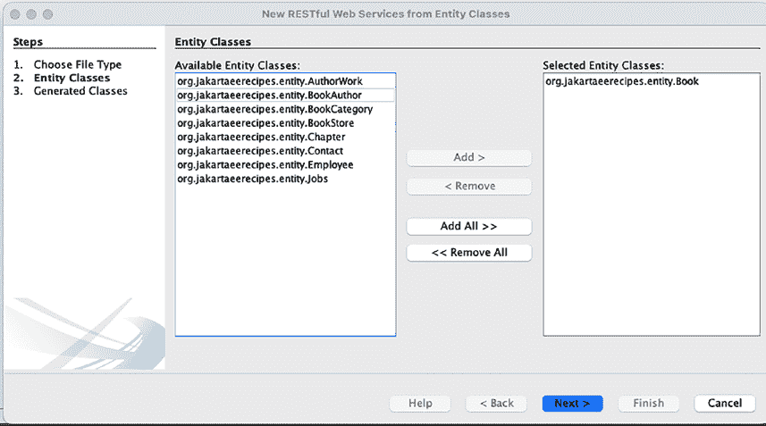

第 13 章 ■ RESTful Web 服务

你可以部署 JakartaEERecipes 应用程序，然后访问以下 URL 来查看 REST 服务产生的结果：http://localhost:8080/JakartaEERecipes_Chapter13-1.0-SNAPSHOT/

rest/simplerest。输出将如图 13-1 所示。

***图 13-1.** SimpleRest 服务的输出*

解决方案 #2

使用 IDE（例如 NetBeans）来创建一个 RESTful Web 服务。NetBeans IDE 包含用于开发不同类型 Web 服务的向导。右键单击项目，从上下文菜单中选择“新建 ➤ 其他...”，将打开“新建文件”对话框，然后可以从选择列表中选择“Web 服务”。按照以下步骤从实体类生成 REST Web 服务：1) 从“新建文件”菜单中选择“来自实体类的 RESTful Web 服务”选项。

2) 从“可用实体类”列表中选择一个或多个类，然后点击“添加”按钮。在本例中，我们将选择 `org.jakartaeerecipe.entity.Book` 实体，如图 13-2 所示。点击“下一步”。

***图 13-2.** 在 NetBeans 中为 RESTful Web 服务选择实体类*

3) 列出将生成 REST 服务类的包，以及包的位置（见图 13-3）。点击“完成”。

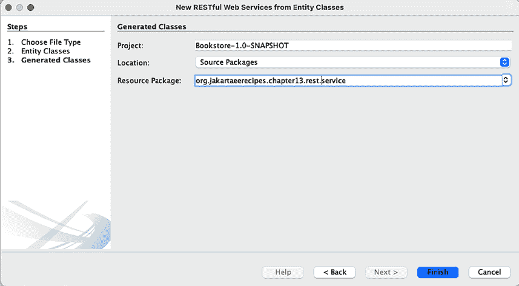

第 13 章 ■ RESTful Web 服务

***图 13-3.** 在 NetBeans 中为 REST 服务类选择资源包*

执行这些步骤后，将生成一个类似于以下类的 REST 服务类：

// ....

@Stateless

@Path("org.jakartaeerecipe.entity.book")

public class BookFacadeREST extends AbstractFacade<Book> {

@PersistenceContext(unitName = "JakartaEERecipesPU")

private EntityManager em;

public BookFacadeREST() {

super(Book.class);

}

@POST

@Override

@Consumes({"application/xml", "application/json"})

public void create(Book entity) {

super.create(entity);

}

@PUT

@Override

@Consumes({"application/xml", "application/json"})

public void edit(Book entity) {

super.edit(entity);

}

@DELETE

@Path("{id}")

public void remove(@PathParam("id") BigDecimal id) {

super.remove(super.find(id));

}

第 13 章 ■ RESTful Web 服务

@GET

@Path("{id}")

@Produces({"application/xml", "application/json"})

public Book find(@PathParam("id") BigDecimal id) {

return super.find(id);

}

@GET

@Override

@Produces({"application/xml", "application/json"})

public List<Book> findAll() {

return super.findAll();

}

@GET

@Path("{from}/{to}")

@Produces({"application/xml", "application/json"})

public List<Book> findRange(@PathParam("from") Integer from, @PathParam("to") Integer to) {

return super.findRange(new int[]{from, to});

}

@GET

@Path("count")

@Produces("text/plain")

public String countREST() {

return String.valueOf(super.count());

}

@Override

protected EntityManager getEntityManager() {

return em;

}

}

工作原理

RESTful Web 服务易于开发，并且可以生成和消费多种不同类型的媒体。

在大多数情况下，对于需要通过互联网发送和接收信息的服务，推荐使用 REST Web 服务。在应用程序能够支持 REST 服务之前，必须对其进行适当的配置。本书使用了 Jakarta RESTful Web Services 实现，该实现基于行业标准的 REST 实现 Jersey。有关在应用程序中配置 Jakarta RESTful Web Services 的更多信息，请参阅本章的介绍。

一个作为 REST 服务实现的 Java 类包含大量的注解。表 13-1 列出了可能用于创建 REST 服务的注解。

第 13 章 ■ RESTful Web 服务

***表 13-1.** REST 服务注解*

**注解**

**描述**

@POST

请求方法指示符，用于处理 HTTP POST 请求

@GET

请求方法指示符，用于处理 HTTP GET 请求

@PUT

请求方法指示符，用于处理 HTTP PUT 请求

@DELETE

请求方法指示符，用于处理 HTTP DELETE 请求

@HEAD

请求方法指示符，对应于 HTTP HEAD 方法。用于处理 HTTP HEAD 请求

@Path

此注解的值应与指示 Java 类所在位置的相对 URI 路径相关联。可以在 URI 中嵌入变量以形成 URI 路径模板

@PathParam

一种可以从请求 URI 中提取出来供资源类使用的参数类型。URI 路径参数从请求 URI 中提取，参数名称对应于在 @Path 类级别注解中指定的 URI 路径模板变量名

@QueryParam

一种可以从请求中提取出来供资源类使用的参数类型。查询参数从请求中提取

@Consumes

用于指定资源可以消费的表示的 MIME 媒体类型

@Produces

用于指定资源可以生成的表示的 MIME 媒体类型

@Provider

用于任何 Jakarta RESTful Web Services 运行时感兴趣的内容，例如 MessageBodyHeader 和 MessageBodyWriter

要将一个类指定为 REST 服务，必须在类之前或至少一个类方法签名之前放置 @Path 注解。@Path 注解用于指示应与服务对应的 URI。完整的 URI 包括主机名、端口号、应用程序名称和 REST servlet 名称，后跟由 @Path 注解指定的路径。在示例中，@Path 注解将 `/simplerest` 指定为服务路径，因此 URL `http://localhost:8080/JakartaEERecipes_Chapter08-1.0-SNAPSHOT/rest/simplerest` 将调用该 Web 服务。可以通过使用语法 `{var}` 将变量括在括号内来在 URL 中包含变量。例如，如果每个用户都有自己特定站点的配置文件，则 @Path 注解可以如下所示：

...

@Path("/simplerest/{user}")

...

在这种情况下，URL 可能如下所示：`http://localhost:8080/JakartaEERecipes_Chapter08-1.0-SNAPSHOT/rest/simplerest/Juneau`。

@Path 注解也可以在任何标记有 @GET、@POST、@PUT 或 @DELETE 的方法之前指定，以指定用于调用该方法的 URI。此外，可以在路径中放置变量以接受更动态的 URL。例如，假设在解决方案 #1 的类中添加了一个方法，该方法将为 URL 中作为参数指定的用户返回问候语。你可以执行类似以下操作来使 URL 唯一：

@Path("{user}")

@GET


第 13 章 ■ RESTful Web 服务

@Produces("text/html")

public String getUserMessage(@PathParam("user") String user){

return "Greetings " + "<b>" + user + "</b>";

}

在这种情况下，如果将类似以下的 URL 输入浏览器，则会调用 `getUserMessage` 方法：`http://localhost:8080/JakartaEERecipes_Chapter08-1.0-SNAPSHOT/rest/simplerest/josh`。如果指定了此 URL，则会调用该方法，将“josh”作为用户变量值传递，并且消息将如图 13-4 所示显示。

***图 13-4.** 来自 /rest/simplerest/{user} 服务的输出*

■ **注意** 创建可读性强且能提供关于 Web 服务的直观信息的 URI 非常重要。基于这些标准的 URI 有助于减少客户端应用程序中的错误，并使 Web 服务更具功能性。


使用 `@GET`、`@POST`、`@PUT` 或 `@DELETE` 注解来标记方法，以处理所需的 Web 服务请求类型。这样做将生成 Web 服务功能。如果 REST Web 服务实现中存在多个方法，并且 `@Path` 仅在类级别指定而未在方法级别指定，则将调用返回客户端所需 MIME 类型的方法。如果你希望方法显示内容，请使用 `@GET` 标记方法。如果你希望创建一个用于新建对象的方法，请将方法标记为 `@POST`。如果你正在创建一个用于插入或替换已有对象的方法，请使用 `@PUT` 标记它。最后，如果你正在创建一个用于移除对象的方法，请使用 `@DELETE` 标记它。有关这些注解的更多信息，请参考配方 13-3。

如果 REST 服务包含许多不同的方法和路径，它可能会变得复杂。有些应用程序完全基于 REST 服务构建，其中所有 CRUD（创建、检索、更新、删除）操作都通过 Web 服务调用执行。本配方仅为使用 Jakarta RESTful Web Services 进行开发提供了基础，因为该主题过于复杂，无法用几个配方或单独一章来涵盖。

13-2. 使用 REST 进行消费与生产

问题

你希望使用 RESTful Web 服务生成不同类型的内容。此外，你还希望该 Web 服务也能消费内容。

解决方案

在 Web 服务实现类中创建方法，使用 `@GET` 注解来生成输出，并可选择性地结合 `@Produces` 来指定输出类型。使用 `@POST` 或 `@PUT` 注解方法来更新或插入数据。以下各节提供了使用这些解决方案的示例。

第 13 章 ■ RESTful Web 服务

在你的 `pom.xml` 文件中添加 Jakarta XML Binding 库的 Maven 依赖项，如下所示：

<dependency>

<groupId>jakarta.xml.bind</groupId>

<artifactId>jakarta.xml.bind-api</artifactId>

<version>4.0.0</version>

</dependency>

生成输出

使用 `@Produces` 注解来指定你希望从被修饰的方法生成的内容类型。以下摘录取自 JakartaEERecipes 项目源码 `org.jakartaeerecipe.chapter13.rest.SimpleRest`，演示了 `@Produces` 的使用：

@GET

// 生成一条 XML 消息

@Produces("application/xml")

public MessageWrapperList getXMLMessage() {

// 将字符串传递给 MessageWrapper 类，该类将 String 编组为 XML

return new MessageWrapper("来自简单 REST 服务的问候");

}

生成列表输出

使用 `@Produces` 注解来指定你希望从被修饰的方法生成的内容类型。以下摘录取自 JakartaEERecipes 项目源码 `org.jakartaeerecipe.chapter13.rest.SimpleRest`，演示了 `@Produces` 的使用，并返回一个包含结果列表的对象：

@GET

// 生成一条 XML 消息

@Path("all")

@Produces("application/xml")

public MessageWrapperList getXMLMessageList() {

ArrayList<String> messageList = new ArrayList<>();

messageList.add("字符串 1");

messageList.add("字符串 2");

return new MessageWrapperList(messageList);

}

在此例中，`MessageWrapperList` 对象的源代码如下所示，但此示例可以修改为接受任何对象类型的列表，而不仅仅是字符串：

package org.jakartaeerecipe.chapter13.recipe13_02;

import java.util.ArrayList;

import java.util.Collection;

import java.util.List;

import jakarta.xml.bind.annotation.XmlElement;

import jakarta.xml.bind.annotation.XmlRootElement;

import jakarta.xml.bind.annotation.XmlSeeAlso;

第 13 章 ■ RESTful Web 服务

@XmlRootElement(name="messageWrapperList")

@XmlSeeAlso(String.class)

public class MessageWrapperList extends ArrayList<String> {

private static final long serialVersionUID = 1L;

public MessageWrapperList(){

super();

}

public MessageWrapperList(Collection<? extends String> message){

super(message);

}

@XmlElement(name="messageList")

public List<String> getMessageList() {

return this;

}


public void setMessageList(List<String> messages) {

this.addAll(messages);

}

}

接收输入

在 Web 服务类中使用 `@PUT` 注解方法，以指示某些内容正在被传递给该方法。要指定传递内容的类型，请使用 `@Consumes(content-type)` 注解同一方法。以下摘录自 JakartaEERecipes 项目源码 `org.jakartaeerecipe.chapter13.rest.SimpleRest.java`，演示了 `@Consumes` 的用法：

@PUT

@Path("add")

@Consumes("text/plain")

public String add(@QueryParam("text") String text){

this.message = text;

return message;

}

要输入一条内容为“JakartaEERecipes”的新消息，应发出以下请求：

PUT http://localhost:8080/JakartaEERecipes/rest/simplerest/add?text=JakartaEERecipes

图 13-5 展示了来自 POSTMAN 的请求/响应截图。

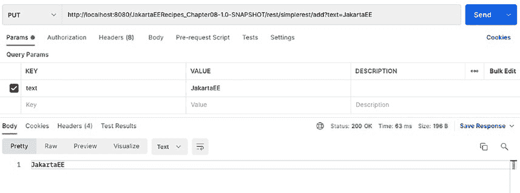

第 13 章 ■ RESTFul Web 服务

***图 13-5.** 配方 13-2 的输出*

工作原理

按照配方 13-2 中概述的步骤创建一个 Web 服务类，然后通过适当注解将 Web 服务中的方法指定为生产者或消费者。将生成某种类型输出的方法应使用 `@Produces` 注解，该注解随后应指定生成的输出类型。此外，生成输出的方法还应使用 `@GET` 注解，这表示该方法是读取资源。将接收输入的方法应使用 `@PUT` 或 `@POST` 注解。`@PUT` 注解表示将创建一个新资源，而 `@POST` 注解表示将更新现有资源或创建新资源。顺便提一下，接收输入的方法还应使用 `@Consumes` 注解，该注解随后应指定所消费内容的类型。总的来说，`@Produces` 注解应与 `@GET` 注解的方法相对应。也就是说，使用 `@GET` 装饰的方法将向客户端返回一些内容。`@Consumes` 注解应与使用 `@PUT` 或 `@POST` 注解的方法相对应。

在本配方的解决方案中，演示了两种类型的方法。第一个示例演示了一个生成 XML 内容的 REST 方法，`@Produces("application/xml")` 注解表明了这一点。在该方法内部，一个字符串被传递给名为 `MessageWrapper` 的类。`MessageWrapper` 类负责使用 Jakarta XML Binding 将该字符串编组为 XML。更多信息，请参考位于 `org.jakartaeerecipe.chapter13.recipe13_02.MessageWrapper.java` 的源码，并查阅在线 Jakarta XML Binding 文档，网址为 [`eclipse-ee4j.github.io/jakartaee-tutorial/#using-jakarta-rest-with-jakarta-xml-binding`](https://eclipse-ee4j.github.io/jakartaee-tutorial/#using-jakarta-rest-with-jakarta-xml-binding)。Jakarta RESTful Web 服务的美妙之处在于，几乎任何内容类型都可以生成。客户端应用程序可以访问与 Web 服务的 `@GET` 方法相对应的 URL，并将以适合该客户端的格式返回内容。例如，如果客户端是 Web 浏览器，它将在 Web 服务中查找生成 `text/html` 内容的方法，然后调用该方法。

本配方解决方案中的另一个示例演示了一个消费字符串内容的 REST 方法。`@PUT` 注解表示将使用该请求生成一个新对象或更新一个现有对象。在这种情况下，基于字符串的消息字段会被更新为通过 `text` 变量传递给 Web 服务的内容。`@Path` 注解已放置在方法签名之上，以指示应使用格式为 `/add` 的路径来访问此方法。最后，`@Consumes` 注解指示该方法将消费纯文本。

第 13 章 ■ RESTFul Web 服务

如果有人想要返回一个值列表，那么使用一个包装类来消费返回的实体对象列表并将其存储到本地 `List` 中，可能是最佳方法之一。在示例中，`getXMLMessageList()` 服务返回一个 `List<String>`。这是通过使用一个名为 `MessageWrapperList` 的包装对象实现的，该对象扩展了 `ArrayList<String>`，因此可以接受一个字符串列表，并在调用 `getMessageList()` 方法时返回该列表。使用这样的包装对象可以轻松地向 Web 服务发送数据列表或从中接收数据列表。

此示例中的 REST 服务非常简短，而在实际场景中，REST 服务实现中会使用许多生成和消费不同类型内容的方法。通常认为在 POST/PUT 中使用查询参数是不好的做法。本配方中的代码片段仅用于演示 API 功能；因此，在生产场景中，需要谨慎使用。

13-3. 过滤请求和响应

问题

您希望在 Web 服务请求被发送到网络之前，或在 Web 服务响应被发送回客户端之前，对其执行某些操作。

解决方案

对 Web 服务请求或响应应用过滤器或拦截器以执行所需操作。以下示例过滤器用于在传入请求被处理之前以及在响应被发送回客户端之前，将警报写入系统日志：

import java.io.BufferedReader;

import java.io.IOException;

import java.io.InputStream;

import java.io.InputStreamReader;

import jakarta.annotation.Priority;

import jakarta.ws.rs.Priorities;

import jakarta.ws.rs.container.ContainerRequestContext;

import jakarta.ws.rs.container.ContainerRequestFilter;

import jakarta.ws.rs.container.ContainerResponseContext;

import jakarta.ws.rs.container.ContainerResponseFilter;

import jakarta.ws.rs.ext.Provider;

import org.jakartaeerecipe.chapter13.rest.interfaces.Alerter;

@Provider

@Alerter

public class AlertFilter implements ContainerRequestFilter,

ContainerResponseFilter {

@Override

public void filter(ContainerRequestContext requestContext)

throws IOException {

alert(requestContext);

}

@Override

public void filter(ContainerRequestContext crc, ContainerResponseContext crc1) throws

IOException {

alert(crc);

}

第 13 章 ■ RESTFul Web 服务

public void alert(ContainerRequestContext context) {

try(InputStream in = context.getEntityStream();) {

if (in != null) {

InputStreamReader inreader = new InputStreamReader(in);

BufferedReader reader = new BufferedReader(inreader);

String text = "";

while ((text = reader.readLine()) != null) {

System.out.println(text);

}

}

} catch (IOException ex) {

// 错误处理

}

}

}

工作原理

过滤器和拦截器的概念类似于邮局在邮件送达您的地址之前对其进行处理。消息并非直接从点 A 传递到点 B，而是首先被路由到一个或多个邮局，在那里进行进一步处理，然后才到达点 B。Web 资源过滤器和拦截器将相同的概念应用于通过 Web 服务处理的请求或响应。如果过滤器或拦截器绑定到某个 Web 资源，那么它将在对该 Web 资源的请求或响应的生命周期中的某个时刻被调用。过滤器或拦截器的类型决定了它在生命周期的哪个阶段被应用。拦截器（也称为实体拦截器）在指定的扩展点环绕方法调用。而过滤器则在指定的扩展点执行代码，但它们不会环绕方法。在接下来的几节中，您将更详细地了解每种类型及其用法。

过滤器


扩展点是一个包含方法的接口，该方法负责过滤或拦截请求或响应。过滤器有四个这样的扩展点接口，分别是 `ClientRequestFilter`、`ClientResponseFilter`、`ContainerRequestFilter` 和 `ContainerResponseFilter`。扩展点的名称有助于描述应用了哪个过滤器以及在哪个阶段应用。`ClientRequestFilter` 和 `ClientResponseFilter` 用于 Jakarta RESTful Web Services 客户端 API。`ClientRequestFilter` 在 HTTP 请求发送到网络之前应用。`ClientResponseFilter` 在收到服务器响应后、控制权返回给应用程序之前应用。`ContainerRequestFilter` 和 `ContainerResponseFilter` 类用于 Jakarta RESTful Web Services 服务器端 API。与客户端过滤器类似，`ContainerRequestFilter` 在收到客户端请求时应用，而 `ContainerResponseFilter` 在 HTTP 响应发送之前应用。

实体拦截器

如前所述，扩展点是一个包含方法的接口，该方法负责过滤或拦截请求或响应。实体拦截器有两个这样的扩展点，分别是 `ReaderInterceptor` 和 `WriterInterceptor`。一个实体拦截器类必须实现其中一个或两个扩展点。同样如前所述，实体拦截器包装了对方法的调用。更具体地说，`MessageBodyWriter` 实现包装了对 `writeTo` 方法的调用，而 `MessageBodyReader` 实现包装了对 `readFrom` 方法的调用。

第 13 章 ■ RESTFul Web 服务

绑定过滤器和拦截器

过滤器和拦截器必须与应用程序类或方法关联，这个过程也称为*绑定*。默认的绑定类型是全局绑定，任何不包含注解的过滤器或拦截器都会被全局绑定。全局绑定将过滤器或拦截器与应用程序中的所有资源方法关联。也就是说，每当调用资源方法时，所有全局绑定的过滤器和拦截器也会被处理。

过滤器和拦截器可以通过 `Application` 或 `Configuration` 手动注册，也可以动态注册。要指示过滤器或拦截器应动态注册，应使用 `@Provider` 对其进行注解。如果过滤器或拦截器未如此注解，则必须手动注册。

要手动将过滤器或拦截器绑定到资源方法，过滤器或拦截器类必须使用 `@NameBinding` 注解进行标记。`@NameBinding` 注解可以像标准注解一样编写，但其接口中也应包含 `@NameBinding` 注解。以下注解代码可用于创建一个 `@NameBinding` 注解，该注解可以放在负责触发警报的过滤器上：

// ...

@NameBinding

@Target({ ElementType.TYPE, ElementType.METHOD })

@Retention(value = RetentionPolicy.RUNTIME)

public @interface Alerter { }

要将 `@NameBinding` 与过滤器或拦截器关联，只需使用它来注解过滤器或拦截器类。以下 `AlertFilter` 类是一个使用 `@Alerter` 注解标记的过滤器实现：

@Provider

@Alerter

class AlertFilter implements ContainerRequestFilter,

ContainerResponseFilter {

...

}

现在，可以通过使用与过滤器类相同的 `@NameBinding` 注解来注解资源方法，从而将该过滤器绑定到资源方法，如下例所示：

@GET

@Produces("text/html")

@Alerter

public String getJobs(){

...

}

■ **注意** 同样的概念可以应用于 `Application` 子类，以全局绑定过滤器或拦截器。

第 13 章 ■ RESTFul Web 服务

设置优先级

如前所述，过滤器和拦截器可以形成链。过滤器或拦截器链根据给定的优先级调用单个过滤器或拦截器。要为过滤器或拦截器分配优先级，请使用 `@BindingPriority` 注解标记实现类。使用整数值来关联优先级。整数值越大，优先级越高。因此，分配了最高优先级整数的过滤器或拦截器将首先被调用，而最低优先级整数将被最后调用。

13-4\. 异步处理长时间运行的操作

问题

您的服务器端 Jakarta RESTful Web Services 方法包含一个长时间运行的操作，您希望在等待事件完成时避免阻塞。

解决方案

执行异步处理，以便包含长时间运行操作的资源方法可以告知 Jakarta RESTful Web Services 响应尚未就绪，但将在未来某个时刻生成。在以下示例中，名为 `AsyncResource` 的 Jakarta RESTful Web Services 服务包含一个名为 `asyncOperation` 的资源方法。`asyncOperation` 方法包含一个长时间运行的任务，该任务被交给 `ManagedExecutorService` 进行处理：

import jakarta.annotation.Resource;

import jakarta.enterprise.concurrent.ManagedExecutorService;

import jakarta.ws.rs.GET;

import jakarta.ws.rs.Path;

import jakarta.ws.rs.container.AsyncResponse;

import jakarta.ws.rs.container.Suspended;

/**

* 配方 13-5：异步处理

* @author Juneau

*/

@Path("/asynchronous/asyncResource")

public class AsyncResource {

@Resource(name = "concurrent/__defaultManagedExecutorService")

ManagedExecutorService mes;

@GET

public void asyncOperation(@Suspended final AsyncResponse ar){

mes.submit(

new Runnable() {

public void run(){

// 执行长时间运行的操作

longRunningOperation();

ar.resume("正在执行异步操作");

}

});

}

第 13 章 ■ RESTFul Web 服务

public void longRunningOperation(){

// 这是一个包含长时间运行操作的方法

System.out.println( "正在执行长时间运行的任务...");

}

}

■ **注意** 要了解更多关于 `ManagedExecutorService` 的信息，请参见第 16 章。

工作原理

Jakarta RESTful Web Services API 可以将长时间运行的任务交给 `ManagedExecutorService` 进行处理。这允许服务器端资源将控制权返回给客户端，并避免有问题的阻塞。

该 API 还包含一种注册超时处理程序的方法，以防异步进程在指定时间内未返回，以及客户端异步功能。首先，将描述服务器端异步实现，然后是其他实现。

要在 Jakarta RESTful Web Services 资源中执行异步处理，包含长时间运行操作的资源方法必须通过使用 `@Suspended` 注解来接受一个 `AsyncResponse` 实例。`AsyncResponse` 类提供了一种恢复操作并将控制权返回给客户端的方法。必须在类中提供一个 `ManagedExecutorService`（更多信息请参见第 16 章），并且必须调用它来提交一个新的 `Runnable`，其中包含长时间运行的操作以及对 `AsyncResponse.resume()` 的调用，以便在长时间运行的过程完成后将控制权返回给客户端。当调用 `ManagedExecutorService` 的 `submit` 方法时，`Runnable` 被传递给服务器进行进一步处理，派生一个线程来执行任务并立即返回。当长时间运行的任务完成时，它将被传递回应用程序，调用 `AsyncResponse` 的 `resume` 方法。

为了避免长时间运行的操作永不返回并导致挂起的连接等待


可以指定一个超时值。超时值可以通过 `AsyncResponse.setTimeoutHandler()` 方法设置一个超时处理器来指定，该方法需要传入一个新的 `TimeoutHandler` 实例。

在调用 `setTimeoutHandler` 之后，可以通过调用 `AsyncResponse.setTimeout()` 方法来设置超时时间，该方法需要传入一个 `java.util.concurrent.TimeUnit` 类型的单位。例如，以下几行代码演示了如何为本方案解决方案中资源所包含的长时间运行操作设置 30 秒的超时时间：

...

@GET

public void asyncOperation(@Suspended final AsyncResponse ar){

    ar.setTimeoutHandler(new TimeoutHandler() {

        public void handleTimeout(AsyncResponse ar){

            ar.resume("Timed out");

        }

    });

    ar.setTimeout(30, SECONDS);

    mes.submit(

        new Runnable() {

            public void run(){

                // 执行长时间运行的操作

                longRunningOperation();

                ar.resume("Performing asynchronous operation");

            }

        });

}

...

■ **注意** 当达到超时值且没有超时处理器时，Jakarta RESTful Web Services 实现将生成一个状态码为 503 的 `ServiceUnavailableException`。

正如本节开头所述，异步 Jakarta RESTful Web Services API 也已扩展到客户端 API。默认情况下，从客户端到目标的调用是以同步方式执行的，但可以通过调用 `async` 方法并可选地注册一个 `InvocationCallback` 实例来将其更改为异步方式。例如，以下几行代码演示了客户端对本方案解决方案中展示的 Web 服务资源的调用：

Client client = ClientBuilder.newClient();

Target target = client.target("http://localhost:8080/JakartaEERecipes_Chapter08-1.0-SNAPSHOT/rest/asynchronous/asyncResource");

Target.request().async().get();

有关客户端 API 和异步操作的更多信息，请参阅在线 Jakarta RESTful Web Services 文档。

13-5. 从服务器推送单向异步更新

问题

您希望将单向消息从服务器推送到一个或多个客户端。

解决方案

利用服务器发送事件（SSE）将消息从服务器推送到一个或多个客户端。Jakarta RESTful Web Services 2.1 API 引入了 SSE 的概念，它允许将消息从服务器推送到已订阅的客户端。它还允许订阅事件来执行服务器操作。以下示例包含一个 Jakarta RESTful Web Services 类的源代码。该类包含一个 `send` 方法，该方法允许客户端连接到服务器，并从服务器获取通过服务器发送事件广播的消息：

package org.jakartaeerecipe.chapter13.rest.service;

import jakarta.ws.rs.GET;

import jakarta.ws.rs.Path;

import jakarta.ws.rs.Produces;

import jakarta.ws.rs.core.Context;

import jakarta.ws.rs.core.MediaType;

import jakarta.ws.rs.sse.Sse;

import jakarta.ws.rs.sse.SseEventSink;

@Path("sse")

public class SSEEventResource {

    @Resource(name = "DefaultManagedExecutorService")

    ManagedExecutorService executor;

    public SSEEventResource() {

    }

    @GET

    @Path("send")

    @Produces(MediaType.SERVER_SENT_EVENTS)

    public void send(@Context SseEventSink eventSink,

                     @Context Sse sse) {

        executor.execute(() -> {

            try (SseEventSink sink = eventSink) {

                eventSink.send(sse.newEvent("Welcome to the List!"));

                eventSink.send(sse.newEvent("Message One!"));

                eventSink.send(sse.newEvent("SERVER-NOTIFICATION", "Message Two!"));

                eventSink.send(sse.newEventBuilder()

                        .comment("Nice Test")

                        .name("SERVER-TEST")

                        .data("Some data...could be an object")

                        .build());

                eventSink.close();

            }

        });

    }

}

可以访问以下 URL 查看广播的结果消息：

http://localhost:8080/JakartaEERecipes_Chapter08-1.0-SNAPSHOT/rest/sse/send.

要同时向多个客户端广播，可以使用 `SseBroadcaster` 注册多个 `SseEventSink` 实例并发送消息。以下示例演示了如何构建一个 Jakarta RESTful Web Services 类，该类允许客户端注册，并允许服务器向这些已注册的客户端广播事件：

package org.jakartaeerecipe.chapter13.rest.service;

import java.util.UUID;

import jakarta.annotation.PostConstruct;

import jakarta.ejb.Singleton;

import jakarta.ws.rs.GET;

import jakarta.ws.rs.POST;

import jakarta.ws.rs.Path;

import jakarta.ws.rs.PathParam;

import jakarta.ws.rs.Produces;

import jakarta.ws.rs.core.Context;

import jakarta.ws.rs.core.MediaType;

import jakarta.ws.rs.sse.Sse;

import jakarta.ws.rs.sse.SseBroadcaster;

import jakarta.ws.rs.sse.SseEventSink;

@Path("/")

@Singleton

public class SSEEventBroadcaster {

    @Context

    private Sse sse;

    private volatile SseBroadcaster sseBroadcaster;

    public SSEEventBroadcaster() {

    }

    @PostConstruct

    public void init() {

        sseBroadcaster = sse.newBroadcaster();

    }

    @GET

    @Path("register")

    @Produces(MediaType.SERVER_SENT_EVENTS)

    public void register(@Context SseEventSink eventSink) {

        eventSink.send(sse.newEvent("Thanks for registering!"));

        sseBroadcaster.register(eventSink);

    }

    @POST

    @Path("send/{message}")

    public void broadcast(@PathParam("message") String message) {

        sseBroadcaster.broadcast(sse.newEventBuilder()

                .mediaType(MediaType.APPLICATION_JSON_TYPE)

                .id(UUID.randomUUID().toString())

                .name("SSEEventBroadcaster Message")

                .data(message)

                .build()

        );

    }

}

工作原理

Jakarta RESTful Web Services ([`jakarta.ee/specifications/restful-ws/`](https://jakarta.ee/specifications/restful-ws/)) 支持服务器发送事件（SSE）。服务器发送事件使得通过 HTTP 或 HTTPS 将消息从服务器同时推送到多个客户端成为可能。从客户端到服务器的连接可以保持打开状态，并且可以持续发送消息，直到客户端断开连接。该 API 包含多个用于向客户端发送消息、注册连接等的接口，它们都位于 `jakarta.ws.rs.sse` 包中。`Sse` 接口是服务器端用于创建 `OutboundSseEvent` 和 `SseBroadcaster` 的入口点。它可以注入到字段中，或用作方法或构造函数的参数。

`SseEventSink` 接口用于发送消息流，可以通过将其作为资源方法参数注入来获取。`SseEvent` 是基础事件类，它定义了诸如 Id、Name 和 Comment 等属性。`OutboundSseEvent` 由服务器用于封装一个 `SseEvent`，而 `SseBroadcaster` 用于管理多个 `SseEventSink` 对象。`SseBroadcaster` 使服务器能够向所有已注册的客户端发送事件，并提供了处理异常的工具。

在第一个示例中，使用一个简单的 Jakarta RESTful Web Services 类来演示服务器如何使用单个方法注册客户端并发送一个或多个事件。在该示例中，该类在路径“sse”下注册为 RESTful Web 服务，而 `send()` 方法在路径“sse/send”下注册。`send()` 方法生成类型为 `MediaType.SERVER_SENT_EVENTS` 的输出。它接受类型为 `SseEventSink` 和 `Sse` 的 `@Context` 参数，这些参数用于注册客户端和推送事件。该类还注入了一个 `ManagedExecutorService` 实例，这是一个服务器端并发工具，用于执行并发进程。您可以在第 16 章中了解更多关于 `ManagedExecutorService` 的信息。在该方法内部，使用 try-with-resources 子句打开一个标识为 `eventSink` 的 `SseEventSink`。`eventSink` 用于发送多个 `SseEvent` 实例。完成后，关闭 `eventSink`。整个过程被发送到 `ManagedExecutorService`，以便在服务器中排队并以并发方式执行。


下一个示例演示了如何构建一个可用于注册客户端和广播事件的 Jakarta RESTful Web Services 类。该类被注册为单例，这意味着只会构造该类的一个实例，并由所有会话使用。一个 Sse 上下文被注册到该类中，因为它可用于创建新的 SseBroadcaster 对象、新的 SseEvent 对象和新的事件构建器对象。一个 SseBroadcaster 被声明为 volatile，这意味着它将存储在 Java 主内存中，而不是缓存中。有一个 init() 方法，它使用 @PostConstruct 注解，以便在构造后立即执行。init() 方法包含对 sse.newBroadcaster() 的调用，从而获得一个新的 SseBroadcaster 实例。客户端可以通过调用 register Web 服务方法来注册，该方法生成 MediaType.SERVER_SENT_EVENTS。一个 SseEventSink 上下文参数作为参数传递给 register 方法，在实现中，通过 eventSink 发送一个新的 SseEvent。然后，该 SseEventSink 被注册到 SseBroadcaster 实例。broadcast 方法接受一个 String 作为路径参数，在该方法内部，使用 SseBroadcaster broadcast() 来发送一个事件。该方法演示了 SseEvent 构建器的使用。如您所见，调用 sse.

newEventBuilder() 允许使用构建器模式构建一个 SseEvent。在示例中，媒体类型被设置为 MediaType.APPLICATION_JSON_TYPE，表示 JSON：

sseBroadcaster.broadcast(sse.newEventBuilder()

.mediaType(MediaType.APPLICATION_JSON_TYPE)

.id(UUID.randomUUID().toString())

.name("SSEEventBroadcaster Message")

.data(message)

.build()

);

在下一个技巧中，我将演示如何将客户端注册到 SseBroadcaster，以及如何在客户端监听事件。

13-6\. 作为客户端接收服务器发送事件

问题

您希望创建一个客户端，该客户端订阅一个 SseBroadcaster，服务器通过该广播器推送消息，并且您希望客户端在收到消息时执行一个操作。

解决方案

利用服务器发送事件 (SSE) 将消息从服务器推送到一个或多个客户端。Jakarta RESTful Web Services 2.1 API 引入了 SSE 的概念，它允许服务器向已注册的客户端广播消息。在以下示例中，一个 Jakarta Server Faces 客户端用于调用 Jakarta RESTful Web Services SSE 广播器并进行注册。然后，客户端监听广播消息 1000

毫秒：

package org.jakartaeerecipe.chapter13.rest.jsf;

import jakarta.annotation.PostConstruct;

import jakarta.enterprise.context.RequestScoped;

import jakarta.inject.Named;

第 13 章 ■ RESTFul Web 服务

import jakarta.ws.rs.client.Client;

import jakarta.ws.rs.client.ClientBuilder;

import jakarta.ws.rs.client.WebTarget;

import jakarta.ws.rs.sse.SseEventSource;

@Named

@RequestScoped

public class SseClient {

private Client client;

@PostConstruct

public void init() {

client = ClientBuilder.newClient();

}

public void listen() {

WebTarget target = client.target("http://localhost:8080/ http://localhost:8080/

JakartaEERecipes_Chapter08-1.0-SNAPSHOT/rest/ ssebroadcaster/register");

try (SseEventSource source = SseEventSource.target(target).build()) {

source.register(System.out::println);

source.open();

Thread.sleep(1000); // 消费事件 1000 毫秒

source.close();

} catch (InterruptedException e) {

}

}

}

一个 Jakarta Server Faces commandButton 可以链接到 #{sseClient.listen} 方法，点击时将调用该客户端。

工作原理

Jakarta RESTful Web Services 客户端可以通过简单地调用广播器的注册方法来注册到 SSE 广播器。注册后，SseEventSource 可以在定义的时间段内打开（不应无限制地保持 SseEventSource 打开），然后在完成消息监听后关闭。

在示例中，SseEventSource 被设置为广播器 URL 的目标。接下来，它将传入消息的输出注册到 System.out.println()。因此，接收到的每条消息都将写入系统日志。注册后，源被打开以接收传入消息。

在示例中，一个线程被硬编码为休眠 1000 毫秒。这只是为了让客户端保持打开状态以接收消息 1000 毫秒，对于生产应用程序，可能不会这样编码。

最后，SseEventSource 被关闭，从而结束客户端会话。

**第 14 章**

**WebSocket 与 JSON**

Jakarta EE 平台旨在为开发整合了 HTML5 和其他现代 Web 技术的 Java 企业解决方案提供一个通用基础。WebSocket 是一种全双工通信机制，允许在客户端和服务器之间发送文本和二进制消息，而无需 HTTP 请求/响应生命周期。WebSocket 允许客户端或服务器随时发送消息，为用户在执行任务时处理数据提供了一种异步解决方案。

HTML5 已成为开发可通过万维网呈现的内容的主流标记语言。它定义了一个标准，可用于生成 HTML 和 XHTML

文档。除了标准化之外，HTML5 还带来了以前仅在桌面应用程序平台上才能实现的语义特性。例如，<video> 和 <audio> 等元素允许将媒体内容直接嵌入网页，而无需嵌入媒体播放器解决方案。

毫无疑问，HTML 标准的第五次修订版 HTML5 为 Web 应用程序开发开启了新的可能性之门。

普遍支持的 JSON（JavaScript 对象表示法）对象已成为在端点之间发送数据的广泛采用的解决方案。基于 HTML5 的 Web 应用程序可以利用 JSON，使用 WebSocket、Ajax 或其他传输技术来传输数据。Jakarta EE 平台提供了 JSON

处理 (JSON-P) API，该 API 引入了实用程序，使得在 Java 语言中构建和处理 JSON 对象更加容易。Jakarta EE 增强了对 JSON-P 的支持，允许指向 JSON 文档中的特定位置并修补现有的 JSON 文档。Jakarta EE 中还引入了 JSON 绑定 (JSON-B) API，为将 JSON 映射到 Java 对象提供了一个便捷的 API。

本章将重点介绍演示这些 API 的技巧。您将学习如何使用 WebSocket、JSON-P 和 JSON-B，以便您的应用程序的客户端-服务器通信变得无缝，无论用户界面是使用 HTML5、JSF 还是其他标记语言编写的。

14-1\. 创建 WebSocket 端点

问题

您希望创建一个可用于异步接收消息的 WebSocket 端点。

© Josh Juneau 和 Tarun Telang 2022

J. Juneau 和 T. Telang，《Java EE 到 Jakarta EE 10 实战》[，https://doi.org/10.1007/978-1-4842-8079-9_14](https://doi.org/10.1007/978-1-4842-8079-9_14#DOI)

第 14 章 ■ WebSocket 与 JSON

解决方案

通过相应地注解服务器端 POJO（Plain Old Java Object，普通旧 Java 对象）类及其内部的方法来创建 WebSocket 端点。在以下示例中，一个名为 org.jakartaeerecipe.

chapter14.recipe14_01.BookChatEndpoint 的简单 POJO 类被注解，以指示它应作为 WebSocket 端点通过 Web 访问。该类包含一个名为 messageReceiver 的方法，该方法被注解，使其可作为可调用的消息消费者供客户端访问：

package org.jakartaeerecipe.chapter14;

import jakarta.websocket.OnMessage;

import jakarta.websocket.server.ServerEndpoint;

@ServerEndpoint(value="/chat")

public class BookChatEndpoint {

@OnMessage

public String messageReceiver(String message) {

return "Message Received: " + message;

}

}


在 GlassFish 服务器中部署此应用程序。客户端可通过 URL `ws://localhost:8080/JakartaEERecipes_Chapter14-1.0-SNAPSHOT/chat` 访问 WebSocket 端点。当客户端向该端点发送消息时，消息会被传递到 `messageReceiver` 方法，并在其中进行相应处理。在此例中，包含传递给端点的消息内容的字符串消息会被返回给客户端。

工作原理

服务器端类可通过配置为 WebSocket 端点来接收来自客户端的消息。要开发一个 WebSocket 端点，需创建一个 Java POJO，并使用 `@ServerEndpoint` 注解对其进行标注。`@ServerEndpoint` 注解接受一个基于字符串的路径属性，该属性用于指示服务器可用于接受客户端消息的 URI。因此，当服务器启动时，路径属性的值会附加到 WebSocket 所在的上下文路径和应用名称的末尾。通过发起对该 URL 的调用，一个使用 `@OnMessage` 注解的方法将被调用来处理发送的消息。

在示例中，一个名为 `BookChatEndpoint` 的类被注解为 WebSocket，因此客户端可将其作为接收消息并返回响应的端点进行访问。当与 WebSocket 端点发起通信时，客户端必须使用包含“ws”URI 方案的 URL，而非“http”。“ws”URI 方案由 WebSocket 协议引入，因此表明该 URL 用于与 WebSocket 进行通信。在此示例中，客户端可通过 `BookChatEndpoint` WebSocket 向服务器发送消息，同时服务器也可向客户端发送消息，因为 WebSocket 支持全双工通信。*全双工通信*是 HTML5 标准，而非使用请求-响应通信的标准 HTTP。

14-2. 向 WebSocket 端点发送消息

问题

您希望将消息从客户端发送到服务器上可用的 WebSocket 端点。

第 14 章 ■ WebSocket 与 JSON

解决方案

设计一个 JavaScript 解决方案，用于将消息从客户端浏览器发送到 WebSocket 端点。通过绑定到视图中 HTML 输入标签的动作事件来调用 JavaScript 函数。在以下示例中，一个按钮包含 `onclick` 属性，该属性将调用名为 `bookChatRelay` 的 JavaScript 函数。`bookChatRelay` 函数负责打开与 WebSocket 端点的会话，以便发送消息。以下列表摘自位于 JakartaEERecipes_Chapter14 源代码包中 `/webapp/chapter14` 目录下的 `recipe14_02.html` 文件：

```html
<html>
<head>
<script type="text/javascript">
var ws;
function bookChatRelay()
{
if ("WebSocket" in window)
{
alert("您的浏览器支持 WebSocket！");
if (ws == null){
alert("正在创建新的 WebSocket 连接");
ws = new WebSocket("ws://localhost:8080/JakartaEERecipes/chat");
} else {
ws.send("另一条消息");
}
ws.onopen = function()
{
// Web Socket 已连接，使用 send() 发送数据
ws.send("要发送的消息");
alert("消息已发送...");
};
ws.onmessage = function (evt)
{
var received_msg = evt.data;
alert("来自服务器的消息: " + received_msg);
};
ws.onclose = function()
{
// WebSocket 已关闭。
alert("连接已关闭...");
};
}
else
{
// 浏览器不支持 WebSocket
alert("您的浏览器不支持 WebSocket！");
}
}
function closeConnection(){
if (ws !== null){
ws.close();
ws = null;
}
}
</script>
</head>
<body>
<input id="wsRelay" type="button" value="WebSocket 测试消息"
onclick="bookChatRelay();"/>
<input id="closeConn" type="button" value="关闭连接"
onclick="closeConnection();"/>
</body>
</html>
```

当点击按钮时，消息将从浏览器客户端发送到 WebSocket 端点，并且端点会向客户端返回一条消息。


■ **注意**：此测试中的 JavaScript 代码会在每次点击页面按钮时创建一个新的 WebSocket 连接。这对于测试目的来说是可以接受的，但在实际场景中，应尽可能保留并复用该连接。

工作原理

客户端能够异步地向服务器发送消息（文本或二进制），这构成了 Ajax 和 HTML5 能力的基础。WebSockets API 允许开发者通过 JavaScript 调用 WebSocket 端点来向服务器发送消息。反过来，该 API 也允许客户端通过一系列 JavaScript 函数接收消息并进行相应处理。本示例演示了如何通过点击网页上的按钮向 WebSocket 端点发送消息。当按钮被点击时，会调用一个名为 `bookChatRelay` 的 JavaScript 函数，该函数封装了处理逻辑。

要通过 JavaScript 函数向 WebSocket 端点发送消息，首要任务是确认用户的浏览器是否支持 WebSocket（符合 HTML5 标准）。可以使用条件语句来执行此确认，通过以下 `if` 语句验证客户端中是否存在 `"WebSocket"` 对象：

```javascript
if("WebSocket" in window){

...

} else {

...

}
```

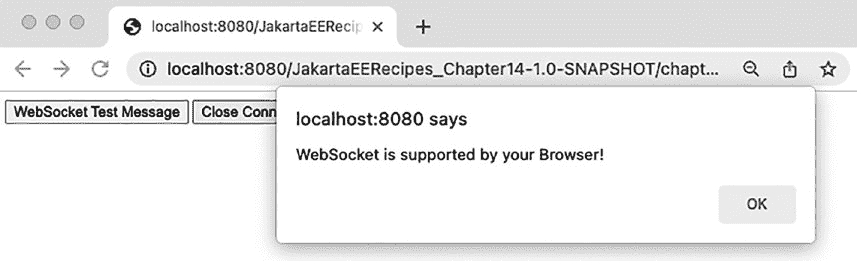

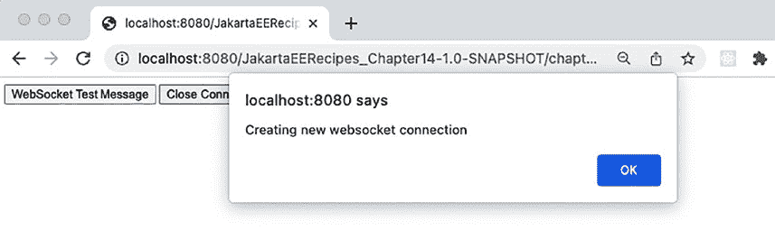

第 14 章 ■ WebSocket 与 JSON

图 14-1 显示了一个确认 WebSocket 支持的浏览器消息。

***图 14-1.** 浏览器中 WebSocket 支持的确认*

如果客户端浏览器支持 WebSocket，则执行 `if` 块内的实现；否则，执行 `else` 块内的实现。要处理 WebSocket 消息，必须实例化一个新的 WebSocket 对象以建立服务器连接，这通过将 WebSocket 端点的 URL 传递给新的 WebSocket 对象来完成：

```javascript
var ws = new WebSocket("ws://localhost:8080/JakartaEERecipes_Chapter14-1.0-SNAPSHOT/chat");
```

创建 WebSocket 的构造函数可以接受一个或两个参数。第一个参数是 WebSocket 将要连接的服务器 URL，可选的第二个参数是一个字符串，表示可用于消息传输的协议。WebSocket 对象包含一些事件，用于帮助实现消息处理。新 WebSocket 连接的确认对话框将如图 14-2 所示。

***图 14-2.** 新 WebSocket 连接的确认*

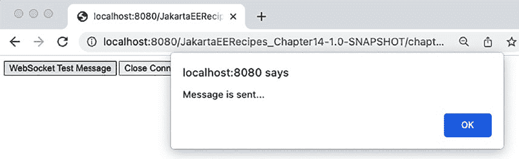

第 14 章 ■ WebSocket 与 JSON

表 14-1 列出了 WebSocket 对象生命周期中可能发生的不同事件及其功能描述。

***表 14-1.** JavaScript WebSocket 对象事件*

| **事件** | **处理程序方法** | **描述** |
| :--- | :--- | :--- |
| open | onOpen | 当 WebSocket 连接建立时发生 |
| close | onClose | 当 WebSocket 连接关闭时发生 |
| error | onError | 当出现通信错误时发生 |
| message | onMessage | 当从服务器接收到数据时发生 |

成功实例化 WebSocket 对象后，将建立与服务器的连接，这将触发 `open` 事件。要处理此事件，请为 `onOpen` 处理程序分配一个函数，并在该函数内相应处理事件。消息通常在 `open` 事件发生时发送到服务器，示例中演示了这一点：

```javascript
ws.onopen = function()
{
    // Web Socket 已连接，使用 send() 发送数据
    ws.send("Message to send");
    alert("Message is sent...");
};
```

对应的输出如图 14-3 所示。

***图 14-3.** WebSocket 消息发送确认提示*

类似地，您可以监听任何其他事件的发生，并在事件发生时处理相应的任务。

在示例中，当从服务器接收到消息时，它会在一个警告对话框中打印出来。同样在示例中，当 WebSocket 关闭时，会向用户显示一个警告对话框。

该示例并未演示 JavaScript 中 WebSocket 对象所有可能的用法。例如，您可以通过调用 `send()` 方法并将要发送的数据作为参数传递来向服务器发送消息。可以在 WebSocket 上调用 `close()` 方法来手动终止现有连接。图 14-4 说明了这一点。

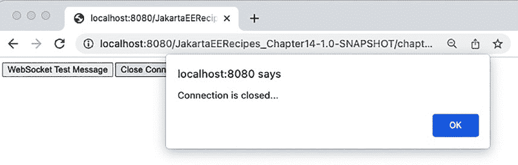

第 14 章 ■ WebSocket 与 JSON

***图 14-4.** 确认关闭 WebSocket 连接的提示*

WebSocket 对象还包含有用的属性 `readyState` 和 `bufferedAmount`，可用于获取连接信息。`readyState` 属性通过返回的数字指示 WebSocket 连接的当前状态，`bufferedAmount` 属性值表示已使用 `send()` 方法排队的 UTF-8 文本的字节数。表 14-2 显示了 `readyState` 属性的不同可能值及其描述。

***表 14-2.** JavaScript WebSocket* readyState *值*

| **值** | **描述** |
| :--- | :--- |
| WebSocket.CONNECTING | 连接尚未建立 |
| WebSocket.OPEN | 连接已建立，可以通信 |
| WebSocket.CLOSING | 连接正在进行关闭握手 |
| WebSocket.CLOSED | 连接已关闭，无法重新打开 |

14-3. 构建 JSON 对象

问题

您希望构建一个可以在客户端和服务器之间传递的 JSON 对象。

第 14 章 ■ WebSocket 与 JSON

解决方案

使用 `JsonObjectBuilder` 通过 Java 代码构建 JSON 对象。以下示例演示了如何利用 `JsonObjectBuilder()` 实例创建一个新的 `JsonObject`。在此示例类中，通过读取数据库表的内容创建了多个 `JsonObject`。对象构建完成后，对象的各个部分被赋值给一个字符串，该字符串最终将被显示或持久化：

```java
package org.jakartaeerecipe.chapter14.recipe14_03;

import java.io.IOException;
import java.io.StringWriter;
import java.util.List;
import jakarta.ejb.EJB;
import jakarta.inject.Named;
import jakarta.json.Json;
import jakarta.json.JsonObject;
import jakarta.json.JsonObjectBuilder;
import jakarta.json.JsonWriter;
import org.jakartaeerecipes.jpa.entity.BookAuthor;
import org.jakartaeerecipes.jpa.session.BookAuthorFacade;

@Named("jsonController")
public class JsonController {

    @EJB
    BookAuthorFacade bookAuthorFacade;

    private String authorJson;

    public void buildAuthors() {
        List<BookAuthor> authors = bookAuthorFacade.findAll();
        JsonObjectBuilder builder = Json.createObjectBuilder();
        StringBuilder json = new StringBuilder();
        try (StringWriter sw = new StringWriter();) {
            for (BookAuthor author : authors) {
                System.out.println("author" + author.getLast());
                builder.add("author", Json.createObjectBuilder()
                    .add("authorId", author.getId())
                    .add("first", author.getFirst())
                    .add("last", author.getLast())
                    .add("bio", author.getBio()));
            }
            JsonObject result = builder.build();
            try (JsonWriter writer = Json.createWriter(sw)) {
                writer.writeObject(result);
            }
            json.append(sw.toString());
            authorJson = json.toString();
        } catch (IOException ex) {
            System.out.println(ex);
        }
    }
    ...
}
```

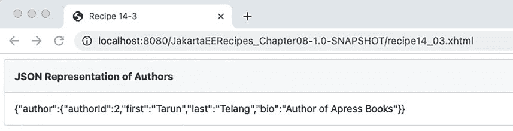

第 14 章 ■ WebSocket 与 JSON

创建完成后，`JsonObject` 可以传递给客户端进行处理，或者在本例中，可以持久化到磁盘。可以通过访问 URL `http://localhost:8080/JakartaEERecipes_Chapter08-1.0-SNAPSHOT/recipe14_03.xhtml` 来执行代码。输出将如图 14-5 所示。

***图 14-5.** 配方 14-3 的输出*

工作原理


JavaScript 对象表示法处理（JSON-P）API 自 Java EE 7 发布起被添加到 Java 企业平台。JSON-P，也被称为“带填充的 JSON”，已成为使用 Java 构建 JSON 对象的标准方式。JSON-P API 包含一个辅助类，可用于使用构建器模式创建 JSON 对象。使用 `JsonObjectBuilder` 类，可以通过一系列方法调用来构建 JSON 对象，每个调用都相互构建——这就是构建器模式。一旦 JSON 对象构建完成，可以调用 `JsonObjectBuilder` 的 `build` 方法来返回一个 `JsonObject`。

在本配方的示例中，你将构建一个提供图书作者详细信息的 JSON 对象。

`JsonObjectBuilder.beginObject()` 方法用于表示正在创建一个新对象。`add` 方法用于添加更多的名称/值属性，这与 `Map` 非常相似。因此，下面这行代码添加了一个名为 `authorId` 的属性，其值为 `author.getId()`：

`.add("authorId", author.getId())`

对象可以相互嵌入，在一个 `JsonObject` 内创建不同部分的层次结构。在示例中，第一次调用 `add()` 之后，通过调用 `beginObject()` 并传入嵌入对象的名称，将另一个名为 `author` 的对象嵌入到初始的 `JsonObject` 中。嵌入对象也可以包含属性；因此，要向嵌入对象添加属性，请在嵌入对象内部调用 `add()` 方法。`JsonObject` 可以根据需要包含任意数量的嵌入对象。以下代码行演示了嵌入对象定义的开始和结束：

`.beginObject("author")`

`.add("first", "Josh")`

`.add("last", "Juneau")`

`.endObject()`

一个 `JsonObject` 也可能包含一个相关子对象的数组。要添加一个子对象数组，请调用 `beginArray()` 方法，并将数组名称作为参数传入。数组可以由对象甚至对象、数组等的层次结构组成。在本配方的示例中，`book` 对象定义了几个数组，一个是 `editor` 对象数组，另一个是 `technicalReviewer` 对象数组。

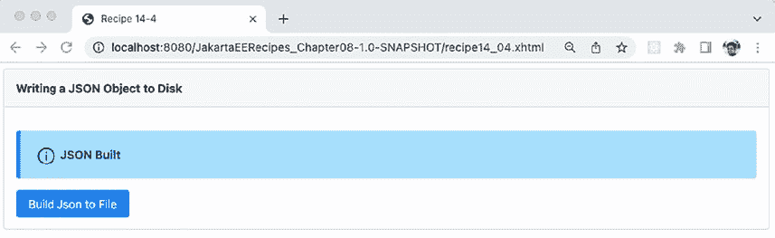

第 14 章 ■ WebSocket 与 JSON

一旦创建了 `JsonObject`，就可以将其传递给客户端。WebSocket 非常适合将 `JsonObject` 传回客户端，但还有许多不同的技术可用于与 JSON 通信。

14-4. 将 JSON 对象写入磁盘

问题

你想将一个 JSON 对象写入文件系统。

解决方案

利用 JSON-P API 构建一个 JSON 对象，然后将其存储到文件系统。`JsonWriter` 类使得在磁盘上创建文件并将 JSON 写入该文件成为可能。在以下示例中，使用此技术将配方 14-3 中生成的 `JsonObject` 写入磁盘：

```java
public void writeJson() {

    try {

        JsonObject jsonObject = jsonController.buildAuthorsJson();

        javax.json.JsonWriter jsonWriter = Json.createWriter(new FileWriter

        ("Authors.json"));

        jsonWriter.writeObject(jsonObject);

        jsonWriter.close();

        FacesContext.getCurrentInstance().addMessage(null, new FacesMessage(

                FacesMessage.SEVERITY_INFO, "JSON Built",

                "JSON Built"));

    } catch (IOException ex) {

        System.out.println(ex);

    }

}
```

可以通过访问 URL `http://localhost:8080/JakartaEERecipes_Chapter08-1.0-SNAPSHOT/recipe14_04.xhtml` 来执行此代码。输出将如图 14-6 所示。

***图 14-6.** 配方 14-4 的输出*

第 14 章 ■ WebSocket 与 JSON

成功执行后，`Authors.json` 文件将在 `//JAVA_DEV/glassfish7/glassfish/domain/domain/config` 目录下创建。

工作原理

`JsonWriter` 类可用于将 `JsonObject` 写入 Java 的 `Writer` 对象。通过将 `Writer` 对象作为参数传入来实例化 `JsonWriter`。实例化 `JsonWriter` 将使用 JSON 格式写入作为参数传入的 `Writer` 对象。创建该 `Writer` 后，可以调用 `JsonWriter` 的 `writeObject()` 方法，并传入要写入的 `JsonObject`。写入 `JsonObject` 后，可以通过调用其 `close()` 方法来关闭 `JsonWriter`。这些是将 JSON 对象写入 Java `Writer` 类类型所需的全部步骤。

14-5. 从输入源读取 JSON

问题

你想读取一个已构建或持久化到文件的 JSON 对象。

解决方案

获取你想要读取的 JSON 对象，然后使用 `jakarta.json.Json` 的 `createReader` 工具进行读取。在以下示例中，从磁盘读取一个 JSON 文件，然后解析它以确定内部的事件层次结构。在解析 JSON 时，每个事件都会被打印到服务器日志中：

```java
public String readObject() {

    InputStream in = new ByteArrayInputStream(controller.buildAndReturnAuthors().

    getBytes());

    // 或者

    //Reader fileReader = new InputStreamReader(getClass().getResourceAsStream

    ("AuthorObject.json"));

    //JsonReader reader = Json.createReader(fileReader);

    JsonReader reader = Json.createReader(in);

    JsonObject obj = reader.readObject();

    return obj.toString();

}
```

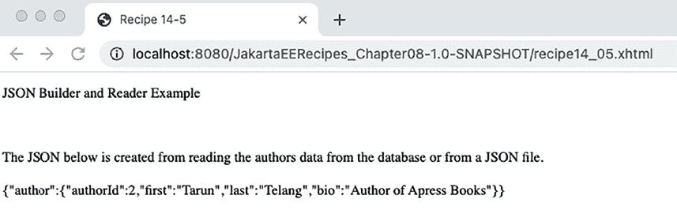

第 14 章 ■ WebSocket 与 JSON

上述代码可以通过访问 URL `http://localhost:8080/JakartaEERecipes_Chapter08-1.0-SNAPSHOT/recipe14_05.xhtml` 来执行。输出将如图 14-7 所示。

***图 14-7.** 配方 14-5 的输出*

工作原理

一旦 JSON 对象被持久化到磁盘，之后就需要将其读回以供使用。`JsonReader` 对象负责处理此任务。要创建 `JsonReader` 对象，请调用 `Json.createReader()` 方法，并传入 `InputStream` 或 `Reader` 对象。创建 `JsonReader` 对象后，可以通过调用其 `readObject` 方法来生成一个 `JsonObject`。

解析内容

为了执行某些任务，必须搜索 JSON 对象以仅找到当前任务所需且有用的内容。使用 JSON 解析器可以使此类工作更容易，因为解析器能够将对象分解成碎片，以便根据需要检查每个不同的碎片，从而产生所需的结果。

`jakarta.json.Json` 类包含一个静态工厂方法 `createParser()`，它接受多种输入并返回一个可迭代的 `JsonParser`。表 14-3 列出了通过 `createParser()` 方法接受的不同可能的输入类型。

***表 14-3.** createParser 方法输入类型*

| **输入类型** | **方法调用** |
| :--- | :--- |
| `InputStream` | `createParser(InputStream in)` |
| `JsonArray` | `createParser(JsonArray arr)` |
| `JsonObject` | `createParser(JsonObject obj)` |
| `Reader` | `createParser(Reader reader)` |

一旦创建了 `JsonParser`，就可以将其转换为 `Event` 对象的 `Iterator`。每个 `Event` 对应于 JSON 对象内的不同结构。例如，当创建 JSON 对象时，会发生 `START_OBJECT` 事件；添加一个名称/值对将触发 `KEY_NAME` 和 `VALUE_STRING` 事件。

第 14 章 ■ WebSocket 与 JSON

这些事件可用于从 JSON 对象中获取所需信息。在示例中，事件名称仅被打印到服务器日志。然而，在实际应用中，条件语句很可能会测试每次迭代以找到特定事件，然后执行一些处理。表 14-4 列出了不同的 JSON 事件，以及每个事件发生时的描述。

***表 14-4.** JSON 对象事件*

| **事件** | **发生时机** |
| :--- | :--- |
| `START_OBJECT` | 对象的开始 |
| `END_OBJECT` | 对象的结束 |
| `START_ARRAY` | 数组的开始 |
| `END_ARRAY` | 数组的结束 |
| `KEY_NAME` | 键的名称 |
| `VALUE_STRING` | 字符串格式的名称/值对的值 |
| `VALUE_NUMBER` | 数字格式的名称/值对的值 |


数值格式的名称/值对的值

VALUE_TRUE

布尔格式的名称/值对的值

VALUE_FALSE

布尔格式的名称/值对的值

VALUE_NULL

空值（NULL）的名称/值对的值

14-6\. 在 JSON 与 Java 对象之间进行转换

问题

你从 Web 服务的响应中获取了一个 Java 对象列表，并希望将其转换为 JSON。

解决方案

利用 JSON 绑定（JSON-B）API 将 Java 对象元素绑定为 JSON 格式。在以下示例中，从 Web 服务接收到 XML 响应，将其转换为 Java 对象，然后使用 JSON-B API 将这些对象转换为 JSON。使用 Jakarta RESTful Web 服务客户端获取包含多个 Employee 对象的响应，并将每个对象转换为 Java Employee 对象：

...

List<Employee> employees;

...

public String fetchJson(){

WebTarget target = ClientBuilder.newClient().target("http://localhost:8080/

JakartaEERecipes_Chapter08-1.0-SNAPSHOT/rest/org.jakartaeerecipes.entity.employee");

employees = (target.request(javax.ws.rs.core.MediaType.APPLICATION_XML)

.get(

new GenericType<List<Employee>>() {

第 14 章 ■ WebSocket 与 JSON

}));

System.out.println("Items: " + employees);

Jsonb jsonb = JsonbBuilder.create();

String result = null;

result = jsonb.toJson(employees);

return result;

}

类似地，JSON-B API 也可用于从 JSON 转换为 Java。在以下方法中，从 Web 服务调用返回一个 JSON 字符串，并将其转换为 Java 集合：

public List<Employee> fetchJavaFromJson(){

WebTarget target = ClientBuilder.newClient().target("http://localhost:8080/

JakartaEERecipes/rest/org.jakartaeerecipes.entity.employee");

String employeesJson = (target.request(jakarta.ws.rs.core.MediaType.

APPLICATION_JSON)

.get(

new GenericType<String>() {

}));

System.out.println("Items: " + employeesJson);

Jsonb jsonb = JsonbBuilder.create();

List<Employee> employees = new ArrayList();

employees = jsonb.fromJson(employeesJson, ArrayList.class);

return employees;

}

在示例中，使用 Jakarta Server Faces 视图来显示 Employee JSON 的内容。视图标记源代码如下：

<h:body>

<p:panel header="JSON Representation of Employees">

<h:outputText value="#{employeeJsonController.fetchJson()}"/>

</p:panel>

<p:panel header="Java Representation of Employees JSON">

<p:dataTable value="#{employeeJsonController.fetchJavaFromJson()}" var="emp">

<p:column>

#{emp.last}

</p:column>

</p:dataTable>

</p:panel>

</h:body>

通过访问 URL http://localhost:8080/JakartaEERecipes_Chapter08-1.0-SNAPSHOT/recipe14_06.xhtml 即可执行该配方代码。

输出结果如图 14-8 所示。

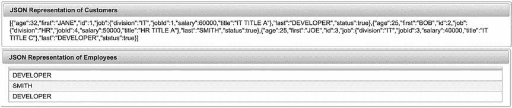

第 14 章 ■ WebSocket 与 JSON

***图 14-8.** 配方 14-6 的输出结果*

工作原理

JSON-B API 可用于在 JSON 与 Java 之间无缝转换。

■ **注意** 如需访问 JSON-B 网站并查看所有文档，请访问 [`javaee.github.io/jsonb-spec/`](https://javaee.github.io/jsonb-spec/)。

JSON-B API 的关键部分是 Jsonb 接口，它提供了对 JSON 绑定操作的抽象。可以使用 JsonbBuilder 获取 Jsonb 对象，该对象随后用于在 Java 与 JSON 之间进行转换。要创建 Jsonb 对象，请调用 JsonBuilder 的 create() 方法。获取 Jsonb 对象后，可通过将 Java 对象传递给 toJson() 方法，将其转换为 JSON 并进行序列化：

Jsonb jsonb = JsonbBuilder.create();

String result = null;

result = jsonb.toJson(employees);

若要反向操作，即从 JSON 反序列化回 Java，请使用 Jsonb 的 fromJson() 方法，将 JSON 字符串作为第一个参数，将 JSON 要转换成的 Java 类型作为第二个参数：

Jsonb jsonb = JsonbBuilder.create();

List<Employee> employees = new ArrayList<>();

employees = jsonb.fromJson(employeesJson, ArrayList.class);


前面展示的技术只是转换回集合类型的一种方法。若要以类型安全的方式转换回泛型类型 `List<Employee>`，可以按如下方式操作：`employees = jsonb.fromJson(employeesJson, new ArrayList<Employee>(){}.getClass().getGenericSuperclass());`

`Jsonb` 对象也可以通过将 Java 对象类型作为第二个参数传递给 `fromJson()` 工具方法，从而转换回单个 Java 对象，如下所示：

```java
Jsonb jsonb = JsonbBuilder.create();
Employee employee = new Employee();
employee = jsonb.fromJson(singleEmployeeJson, Employee.class);
```

**第 14 章 ■ WebSocket 与 JSON**

本方案涵盖了将 JSON 转换为 Java 以及反向转换的基础知识。有关自定义的更多信息，请参阅方案 14-7。

### 14-7 使用 JSON-B 进行自定义映射

#### 问题

你希望在转换为 Java 类时更改 JSON 属性名称，或者针对特定情况（例如转换特定日期格式或将指定字段标记为瞬态）执行自定义映射。

#### 解决方案

利用 `JsonbConfig` 为 JSON 映射创建自定义运行时配置。此外，还有一些注解可以应用于 Java 类级别、字段级别或 getter/setter 方法，以自定义某些配置。在以下场景中，使用自定义配置创建了一个包含小写字母加下划线的属性命名策略：

```java
JsonbConfig config = new JsonbConfig()
    .withPropertyNamingStrategy(PropertyNamingStrategy.LOWER_CASE_WITH_UNDERSCORES);
Jsonb jsonb = JsonbBuilder.create(config);
```

如前所述，还有一些注解可用于自定义映射。在以下场景中，狗的 `color` 属性被标记为瞬态。这意味着在转换时，`color` 属性不会被序列化为 JSON：

```java
public class Dog {
    private String name;
    private int age;
    private String gender;
    @JsonbTransient
    private String color;
}
```

#### 工作原理

`JsonbConfig` 类使得为 JSON 映射和格式化创建自定义运行时配置变得简单。注解可用于创建自定义编译时配置。此类自定义可以包括更改默认属性命名约定或指定特定的属性顺序。要创建新配置，只需创建一个新的 `JsonbConfig` 类，并将配置传递给 `JsonbBuilder.create()` 方法，如下所示：

```java
JsonbConfig config = new JsonbConfig();
Jsonb jsonb = JsonbBuilder.create(config);
```

**第 14 章 ■ WebSocket 与 JSON**

`JsonbConfig` 类可用于指定表 14-5 中包含的运行时配置。在本方案的示例中，指定了 `.withPropertyNamingStrategy()` 选项，以配置一个使用小写字母加下划线的属性命名策略。

***表 14-5.** JsonbConfig 选项*

| **选项** | **描述** |
| --- | --- |
| `.withFormatting(boolean)` | 创建带格式的自定义配置 |
| `.withPropertyNamingStrategy(strategy)` | 提供构建属性名称的策略。接受类型为 `PropertyNamingStrategy` 的策略（`IDENTITY`、`LOWER_CASE_WITH_DASHES`、`LOWER_CASE_WITH_UNDERSCORES`、`UPPER_CAMEL_CASE`、`UPPER_CAMEL_CASE_WITH_SPACES`、`CASE_INSENSITIVE`） |
| `.withPropertyOrderStrategy(strategy)` | 提供属性排序策略。接受类型为 `PropertyOrderStrategy` 的策略（`LEXICOGRAPHICAL`、`ANY`、`REVERSE`） |
| `.withNullValues(boolean)` | 更改默认的 NULL 处理方式。全局配置 |
| `.withDateFormat("format")` | 更改默认日期格式。全局配置 |
| `.withBinaryDataStrategy(strategy)` | 提供二进制数据编码策略。默认为 `BYTE` 编码。接受 `BinaryDataStrategy`（`BYTE`、`BASE_64`、`BASE_64_URL`） |
| `.withAdapters(CustomAdapter)` | 为 `Jsonb` 配置分配一个 `CustomAdapter`。（有关适配器的更多信息，请参阅 JSON-B 文档） |
| `.withSerializers(JsonbSerializer)` | 为 `Jsonb` 配置分配一个 `JsonbSerializer` |
| `.withDeserializers(JsonbDeserializer)` | 为 `Jsonb` 配置分配一个 `JsonbDeserializer` |


.withStrictIJSON(boolean)

提供对 JSON 的 I-JSON 受限配置文件的支

如前所述，也可以在编译时通过在 Java 类、字段或 getter 和 setter 上指定注解来进行配置。表 14-6 列出了可以放置在 Java 类、字段或访问器方法上的注解。

第 14 章 ■ WebSocket 与 JSON

***表 14-6. 注解配置***

**注解**

**描述**

@JsonbProperty("name")

字段和 getter/setter 级别。更改特定属性的名称。放置在 getter 上：序列化写入 JSON 时将使用新名称。放置在 setter 上：反序列化读取时将期望使用新名称。放置在字段上：新名称将同时应用于序列化和反序列化。

@JsonbPropertyOrder(strategy)

类级别。自定义序列化属性的顺序。接受一个 PropertyOrderStrategy（LEXICOGRAPHICAL、ANY、REVERSE）。

@JsonbTransient

字段和 getter/setter 级别。指示 JSON 绑定引擎应忽略带注解的字段。放置在字段上：序列化和反序列化期间忽略该属性。放置在 getter 上：序列化期间忽略该属性。放置在 setter 上：反序列化期间忽略该属性。

@JsonbNillable(boolean)

类和字段级别。指示是否序列化 NULL 值。默认为 false。

@JsonbCreator

构造函数级别。允许注解一个带有参数的自定义构造函数或用于创建类实例的静态工厂方法。

@JsonbDateFormat("format")

字段级别。为指定属性自定义日期格式。

@JsonbNumberFormat("format")

字段级别。为指定属性自定义数字格式。

14-8. 替换 JSON 文档中的指定元素

问题

你希望替换 JSON 文档中与给定模式匹配的值。

解决方案

利用 JSON-P 的 patch 功能来替换 JSON 文档中的值。在以下示例中，从 JSF 表单获取一段文本字符串，并用它创建一个 JSON 指针，指向 JSON 字符串中匹配的姓氏。然后使用 JSON Replace 功能将匹配的 JSON 字符串值替换为字符串值“JsonMaster”：

public void findEmployeeByLast() {

setSearchResult(null);

String text = "/" + this.lastSearchText;

JsonObject json = Json.createObjectBuilder().build();

JsonValue object = json.getJsonObject(fetchJson());

if (lastSearchText != null && object != null) {

JsonPointer pointer = Json.createPointer(text);

System.out.println("text: " + text + pointer);

System.out.println("json: " + object);

JsonValue result = pointer.getValue(object.asJsonArray());

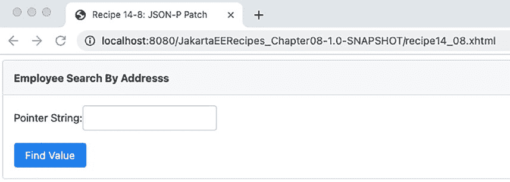

第 14 章 ■ WebSocket 与 JSON

// 替换一个值

JsonArray array = (JsonArray) pointer.replace(object.asJsonArray(),

Json.createValue("JsonMaster"));

setSearchResult(array.toString());

}

}

以下标记显示了用于发送搜索文本并显示结果的 Jakarta Server Faces 表单：

<h:form id="jsonPointerForm">

<p:panel header="Employee Search By Address">

<p:outputLabel for="lastSearchText" value="Pointer String:"/>

<p:inputText id="lastSearchText" value="#{employeeJsonController.lastSearchText}"/>

<br/><br/>

<p:commandButton id="searchButton"

action="#{employeeJsonController.findEmployeeByLast}"

update="searchResult" value="Find Value"/>

</p:panel>

<br/>

<h:outputText id="searchResult" value="#{customerController.searchResult}"/>

</h:form>

可以通过访问 URL http://localhost:8080/JakartaEERecipes_Chapter08-1.0-SNAPSHOT/recipe14_08.xhtml 来执行此配方代码。

输出将如图 14-9 所示。

***图 14-9. 配方 14-8 的输出***

第 14 章 ■ WebSocket 与 JSON

工作原理

JSON-P 1.1 API 增加了指向指定 JSON 值以及替换 JSON 文档中值的能力。JSON Pointer 功能允许识别 JSON 文档中的特定值。要使用 JSON Pointer 功能，必须首先通过调用适当的 Json 接口方法来获取一个 JsonObject，以便处理将要使用的 JSON。在本配方的解决方案中，调用了 Json.createObjectBuilder().build() 方法来返回一个 JsonObject。然后可以使用该 JsonObject 执行 JSON Patch 操作。示例中的 fetchJson() 方法返回一个 JSON 字符串：

JsonObject json = Json.createObjectBuilder().build();

JsonValue object = json.getJsonObject(fetchJson());

通过调用 Json 接口的 createPointer() 方法，并传入要在 JSON 中查找的文本字符串，即可获得 JsonPointer 对象。以下来自解决方案的摘录展示了获取 JSON 指针的过程：

JsonPointer pointer = Json.createPointer(text);

JSON Patch 功能提供了添加、删除或替换通过 JSON 指针获取的 JSON 文档或字符串的一部分的能力。在解决方案中，使用 Replace 功能将指向的姓氏替换为字符串“JsonMaster”。这是通过调用 JsonPointer 的 replace() 方法，并将 JSON 对象作为第一个参数，将替换原始 JSON 的 Json 值作为第二个参数来实现的：

JsonArray array = (JsonArray) pointer.replace(object.asJsonArray(),

Json.createValue("JsonMaster"));

JsonPointer 对象还包含 add() 和 replace() 方法。add() 方法可用于向 JSON 对象添加值或向数组插入值。add() 方法接受一个 JsonObject 作为第一个参数，以及要添加的 Json 值作为第二个参数。remove() 方法允许从 JSON 文档中移除一个 JsonPointer 值。

**第 15 章**

**Jakarta 安全**

企业级应用最重要的组成部分之一就是安全性。事实上，企业应用必须坚如磐石且安全可靠，以防止数据和应用程序功能落入不法之徒手中。结合使用应用容器安全性和应用级安全性，有助于保护应用程序免受针对企业数据的恶意攻击。

Jakarta Security 提供了一个标准 API，可用于在 Jakarta EE 平台中保护应用程序安全。在之前的版本中，安全性当然是可能的，但没有标准 API，因此在使用该平台的应用程序中，存在各种自制的身份验证解决方案和第三方 API。在本章中，我将介绍之前版本中可能用于保护应用程序安全的技术，并且还将概述利用 Jakarta EE 平台中标准安全 API 的类似解决方案。

有三种不同类型的安全性可应用于企业级应用：声明式安全性、编程式安全性和传输安全性。*声明式*安全性发生在应用程序的部署描述符中，或通过添加到应用程序中类和方法上的注解来实现。声明式安全性用于为应用服务器容器提供能力，通过使用用户身份验证和角色来保护对特定应用程序功能的访问。*编程式*安全性发生在开发人员手动编写身份验证方法，自定义应用程序身份验证需求时。*传输*安全性发生在客户端和服务器之间，负责保护两者之间传递的信息的安全。

本章将涉及这三个安全级别。它包含一些配方，涵盖了使用 GlassFish 服务器设置数据库和 LDAP 的应用服务器配置。


（轻量级目录访问协议）认证，适用于部署在容器内的应用程序。您还将学习如何利用 XML 配置、注解和 Jakarta 表达式语言来保护应用程序的各个部分。最后，本章将简要介绍如何通过 SSL 和证书保护传输安全。本章还将涉及 Jakarta EE 安全 API，它提供了一种标准化解决方案，使开发人员能够生成可移植的应用程序，并将安全实现打包在应用程序内部，而非容器中。

15-1. 在 GlassFish 中设置应用程序用户和组

问题

您希望在应用程序服务器容器内创建用户、组和角色，以便与部署到该容器的应用程序一起使用。

© Josh Juneau 和 Tarun Telang 2022

J. Juneau 和 T. Telang，《Java EE 到 Jakarta EE 10 实战》[，https://doi.org/10.1007/978-1-4842-8079-9_15](https://doi.org/10.1007/978-1-4842-8079-9_15#DOI)

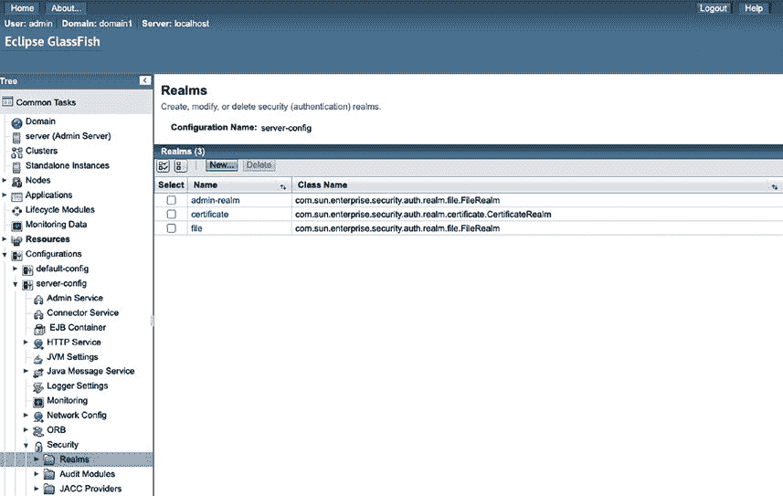

第 15 章 ■ Jakarta 安全

解决方案

登录 GlassFish 管理控制台，将用户添加到 File 安全域。然后，您可以在创建用户时通过指定组名将用户添加到组中。本示例将引导您在 GlassFish 应用服务器中完成新用户的配置。

通过导航至 http://localhost:4848 并以管理员用户身份登录管理控制台。

使用屏幕左侧的树形菜单导航至 Configurations ➤ server-config

➤ Security ➤ Realms 菜单。单击 Realms 菜单选项后，将显示 Realms 表单

（图 15-1）。

***图 15-1.** GlassFish Realms 表单*

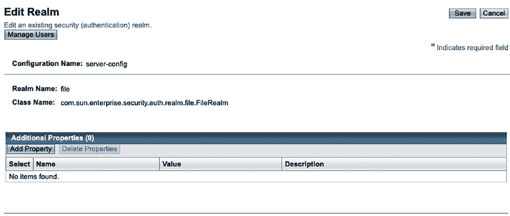

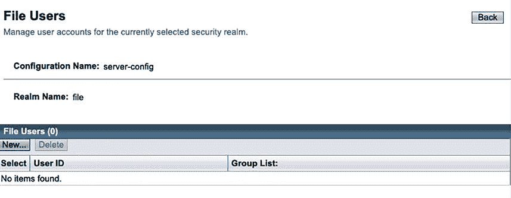

第 15 章 ■ Jakarta 安全

1. 单击“file”领域链接进入 Edit Realm 表单，如图 15-2 所示。

***图 15-2.** GlassFish Edit Realm 表单*

2. 单击 Edit Realm 表单中的 Manage Users 按钮以打开 File Users

表单，然后单击 File Users 表单中的 New 按钮（图 15-3）进入 New File Realm User 表单（图 15-4）。

***图 15-3.** GlassFish File Users 表单*

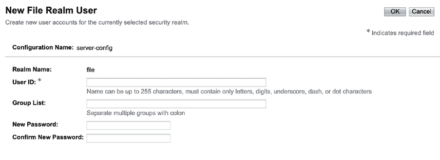

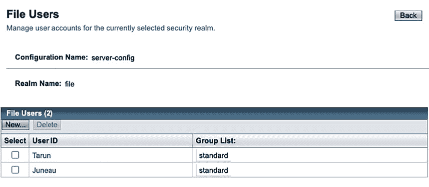

第 15 章 ■ Jakarta 安全

***图 15-4.** GlassFish New File Realm User 表单*

3. 填写用户 ID 和密码信息以完成 New File Realm

User 表单，并可选择在 Group List 字段中添加组名。单击

Save 按钮将用户添加到 File Users 列表（图 15-5）。

***图 15-5.** File Users 列表*

创建完成后，GlassFish 域中的用户可用于应用程序身份验证。要了解有关配置应用程序以使用应用服务器容器用户身份验证的更多信息，请参阅配方 15-2。

工作原理

添加身份验证提示以允许用户访问安全区域，是任何应用程序的最佳保护形式之一。幸运的是，Java 平台使您可以轻松地将身份验证添加到应用程序中。大多数应用服务器都有某种添加用户帐户的机制，这些帐户可用于访问部署在服务器域中的应用程序。GlassFish 提供了将用户和组添加到不同安全域的功能，然后可以将这些域应用于应用程序以进行身份验证。

■ **注意** 大多数应用服务器容器还允许与 LDAP 服务器或数据库连接，从而能够针对 LDAP 服务器内或存储在数据库表中的用户帐户进行身份验证，而不是在容器本身内进行。有关 LDAP 身份验证的示例，请阅读配方 15-6。

将用户添加到 GlassFish 时，必须将其与安全域关联。默认安装中可使用 File 安全域，但如果需要，也可以创建更多安全域。将用户添加到域是一个相当简单的过程，可以按照本配方解决方案中提到的步骤添加单个用户。创建用户时，可以指定的选项之一是*组*。您可以将 GlassFish 用户组视为角色，因为多个用户可以属于一个组。

GlassFish 不包含管理组本身的机制；实际上，对于 GlassFish 来说，组只是一个字符串值。但是，如果您按照配方 15-2 中的步骤操作，您将看到可以在应用程序级别将组映射到角色。因此，如果 UserA 属于名为 standard 的组，那么 UserA 也可以属于名为 admin 的组。然后，应用程序可以根据用户所属的组或角色，授予 UserA 对应用程序不同部分的访问权限。

GlassFish 中的用户很简单，因为它们仅用于已部署应用程序中的身份验证和访问目的。用户只能在每个服务器安装的基础上进行管理，因此它们有些笨重，因为它们无法跨服务器共享以提供单点登录解决方案。因此，建议仅将 GlassFish 用户用于较小的应用程序/环境或测试目的。对于更重要的企业级身份验证解决方案，数据库或 LDAP 用户帐户将是更好的选择。

■ **注意** 要了解在 GlassFish 应用服务器中配置基于表单的身份验证并使用数据库存储用户凭据，请参阅配方 15-4。

15-2. 执行基本 Web 应用程序授权

问题

您已在应用服务器容器内创建了用户并将其与组关联。现在，您希望根据用户对应用程序所需的访问级别将用户分配到特定角色，并为访问指定的应用程序视图应用基本身份验证机制。

解决方案 #1

使用 Web 应用程序部署描述符中的基本身份验证配置基于表单的安全性。如果需要，在 glassfish-web.xml 部署描述符中将角色映射到组。以下摘录取自 JakartaEERecipes NetBeans 项目源的 web.xml 部署描述符。它演示了如何保护位于 chapter15 文件夹内的所有视图（由 web.xml 中的 url-pattern 元素确定），以便需要用户名和密码组合才能访问。web.xml 中的 auth-method 标签指定了将用于应用程序的身份验证类型。在示例中，您将使用 BASIC 身份验证。只有那些已在 GlassFish 文件域中配置了相应组的用户名和密码才能获得访问权限；在本例中，该角色是 users：

<security-constraint>

<web-resource-collection>

<web-resource-name>secured</web-resource-name>

<url-pattern>/faces/chapter15/*</url-pattern>

<http-method>GET</http-method>

<http-method>POST</http-method>

</web-resource-collection>

<auth-constraint>

<role-name>users</role-name>

</auth-constraint>

<user-data-constraint>

<transport-guarantee>CONFIDENTIAL</transport-guarantee>

</user-data-constraint>

</security-constraint>

<login-config>

<auth-method>BASIC</auth-method>

<realm-name>file</realm-name>

</login-config>

<security-role>

<role-name>users</role-name>

</security-role>

</web-app>


好的，作为一名高级文档工程师和翻译员，我将遵循您提供的注意事项和示例，将给定的英文文本翻译成中文。


如果 `/webapp/WEB-INF/web.xml` 部署描述符中指定的角色名称与 GlassFish 中已关联用户的组名称相同，那么您就完成了。用户将根据组关联被授予对应用程序中已受保护区域的访问权限。但是，如果角色名称与已关联到用户的组不同，您可以通过在应用程序的 `/webapp/WEB-INF/glassfish-web.xml` 文件中指定 `security-role-mapping` 来手动将角色名称映射到组名称。

以下摘录自 JakartaEERecipes 应用程序的 `glassfish-web.xml` 配置文件，演示了如何将角色映射到 GlassFish 用户。在此例中，为 Recipe 15-1 中的账户指定的 `standard` 角色被映射到 `users` 角色。`users` 角色有权访问 `/faces/chapter15/*` URL 模式：

```xml
<?xml version="1.0" encoding="UTF-8"?>
<!DOCTYPE glassfish-web-app PUBLIC "-//GlassFish.org//DTD GlassFish Application Server 3.1 Servlet 3.0//EN"
"http://glassfish.org/dtds/glassfish-web-app_3_0-1.dtd">
<glassfish-web-app>
    <security-role-mapping>
        <role-name>users</role-name>
        <group-name>standard</group-name>
    </security-role-mapping>
</glassfish-web-app>
```

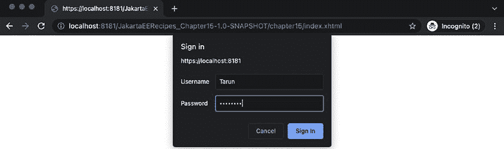

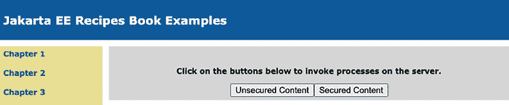

第 15 章 ■ Jakarta 安全性

一旦所有配置完成，访问权限将根据 `web.xml` 部署描述符中的配置进行授予。要测试身份验证机制，请将 JakartaEERecipes WAR 文件部署到您的 GlassFish 应用服务器，并访问以下 URL：`https://localhost:8080/JakartaEERecipes_Chapter15-1.0-SNAPSHOT/chapter15/index.xhtml`

您会看到您的请求现在被重定向到 HTTPS 端口 8181，因为我们在 `web.xml` 中将 `transport-guarantee` 设置为 `CONFIDENTIAL`：

```xml
<user-data-constraint>
    <transport-guarantee>CONFIDENTIAL</transport-guarantee>
</user-data-constraint>
```

您还会看到提示输入用户名和密码（图 15-6）以验证用户身份。

***图 15-6.** 页面 /chapter15/index.xhtml 的登录提示*

**解决方案 #2**

在类和类方法上使用注解，在应用程序中声明角色，以便根据需要访问受保护的页面。要对特定类或方法实施访问控制，请使用 `@DeclareRoles` 和/或 `@RolesAllowed` 进行注解，并指定可用于访问它们的角色。经过身份验证且属于指定角色之一的用户将被授予访问内容的权限。

在与本配方对应的示例中，`chapter15/recipe15_02.xhtml` Jakarta Server Faces 视图包含两个命令按钮，这些按钮调用托管 bean 中的操作。图 15-7 显示了此视图在浏览器中运行的情况。

***图 15-7.** 页面 /chapter15/recipe15_02.xhtml 的内容*

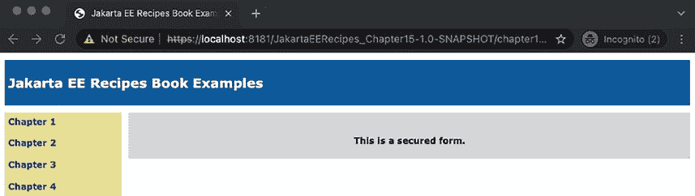

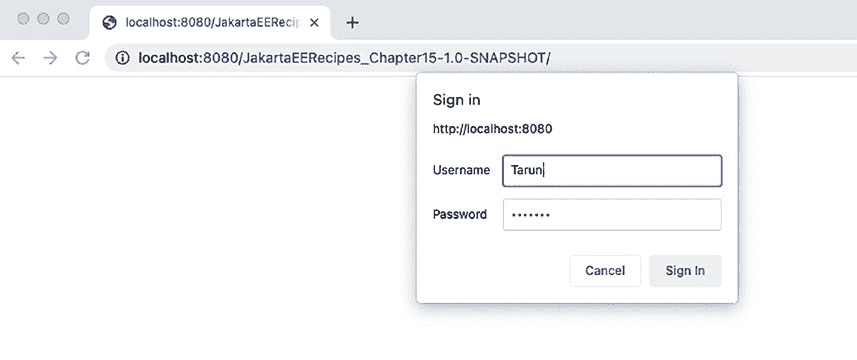

第 15 章 ■ Jakarta 安全性

每个按钮在 bean 中调用不同的操作。其中一个按钮调用通过 `@RolesAllowed` 注解保护的方法，另一个则没有。图 15-8 显示了用户点击“受保护内容”后的视图。

***图 15-8.** 在 /chapter15/recipe15_02.xhtml 中点击“受保护内容”按钮后的输出*

以下摘录自类 `org.jakartaeerecipe.chapter15.recipe15_02.Recipe15_02b`，它是包含从命令按钮调用的两个方法的托管 bean 控制器：

```java
public class Recipe15_02b implements Serializable {

    public String unsecuredProcess(){
        return "recipe15_02_1.xhtml";
    }

    @RolesAllowed("users")
    public String securedProcess(){
        return "recipe15_02_2.xhtml";
    }
}
```

当单击调用 `securedProcess()` 方法的 `commandButton` 时，如果用户尚未进行身份验证，系统将提示他们进行身份验证。身份验证提示如图 15-9 所示。

***图 15-9.** 配方 15-2 解决方案 #2 的登录提示*

第 15 章 ■ Jakarta 安全性

**工作原理**

有几种方法可以使用基本应用服务器身份验证来保护应用程序。通常，应用程序通过使用 `web.xml` 部署描述符中的 XML 配置以及 `glassfish-web.xml` 部署描述符中的可选配置来提供基本身份验证安全性。也可以仅使用代码，通过声明式安全性将基本身份验证安全性添加到应用程序中。声明式安全性基于使用注解来声明访问应用程序类和方法的角色。虽然这两种技术在概念上非常相似，但每种技术在特定情况下都有其自身的一系列优势。

在本配方的解决方案 #1 中，使用 XML 配置来保护对应用程序特定文件夹内所有 Web 视图的访问。要通过 XML 配置文件添加安全性，需要在 `web.xml` 部署描述符中添加 `security-constraint`、`login-config` 和 `security-role` 元素，以便将应用程序角色映射到 GlassFish 用户和组。`security-constraint` 元素包含几个子元素，用于告诉应用服务器容器要保护应用程序的哪些区域以及哪些账户能够访问这些受保护区域。首先，使用 `web-resource-collection` 元素来声明要保护的应用程序位置以及要保护的 HTTP 方法。以下元素应嵌入在 `web-resource-collection` 元素中：

*   `web-resource-name`：这是可以为受保护位置指定的可选名称。在配方解决方案中，指定了名称 `secured`。
*   `url-pattern`：这是用于确定应用程序哪些区域需要受保护的 URL 模式。星号 (`*`) 用作通配符。在配方解决方案中，`chapter15/*` 指定了 `chapter15` 文件夹中包含的所有视图都应受到保护。如果要保护特定页面，则使用指向该页面的 URL 模式，包括页面名称。
*   `http-method`：用于指定哪些 HTTP 方法在访问由 `url-pattern` 元素指定的位置时应受到保护。

可以在 `security-constraint` 元素内声明的另一个子元素是 `auth-constraint` 元素。此元素通过添加 `role-name` 子元素，列出用于保护由 `url-pattern` 指定的位置的不同安全角色。在配方解决方案中，为应用程序声明了 `users` 角色。`user-data-constraint` 元素也可以作为子元素包含在 `security-constraint` 元素中，以指定在客户端和服务器之间传输数据时将应用的保护类型。在示例中，这被设置为 `CONFIDENTIAL`。可以为传输保证指定的值如下：

*   `NONE`：数据不需要传输安全保护。
*   `INTEGRAL`：数据在客户端和服务器之间的传输过程中不能被更改。
*   `CONFIDENTIAL`：外部实体无法观察传输的内容。在这种情况下将使用安全套接字层 (SSL)，并且必须在 Web 服务器中进行配置。

`security-role` XML 元素列出了可用于保护对应用程序页面访问的不同角色。为每个角色规范向 `security-role` 添加 `role-name` 子元素。`login-config` XML 元素用于指定用于保护应用程序的身份验证方法。在大多数情况下，`auth-method` 应设置为 `BASIC`，但所有可能的值是 `BASIC`、`DIGEST`、`FORM` 和 `CLIENT-CERT`。

第 15 章 ■ Jakarta 安全性


按照本节所述，将指定元素添加到 `web.xml` 部署描述符中，即可为应用程序提供足够的能力，通过用户凭证保护指定的安全位置。在某些情况下，在应用程序代码本身中使用注解来声明角色是合理的。对于此类情况，可以在类或方法上指定 `@DeclareRoles` 和 `@RolesAllowed` 注解。以下注解可用于在类中指定安全性。对于每个注解，可以指定单个角色或角色列表：

• `@DeclareRoles`：在类或方法级别指定，注解中应指明允许访问该类的每个角色。例如，可以使用以下语法为访问该类指定一个或多个角色：

类级别：

@DeclareRoles("users")

public class MyClass {

...

}

方法级别：

public class MyClass {

...

@DeclareRoles({"role1", "role2"})

public void calculatePay(){

...

}

...

}

• `@RolesAllowed`：在类或方法级别指定。注解中应指明允许访问该类或方法的角色列表。语法与 `@DeclareRoles` 相同。

• `@PermitAll`：在类或方法级别指定。表示允许所有角色访问。

• `@DenyAll`：在类或方法级别指定。表示不允许任何角色访问。

当 `@DeclareRoles` 和 `@RolesAllowed` 注解同时用于同一个类时，每个注解中列出的角色都允许访问该类。使用 `@RolesAllowed` 为特定方法指定的访问角色会覆盖为访问整个类而列出的角色。

可以通过调用 `SessionContext` 的 `isUserInRole()` 方法，以编程方式检查经过身份验证的用户属于哪些角色。这允许您使用条件逻辑来允许访问应用程序的功能，如下面的代码行所示：

@DeclareRoles({"role1", "role2", "role3"})

public class MyClass {

...

@RolesAllowed("role2")

public void calculatePay(){

...

}

@PermitAll

public void calculatePay(){

第 15 章 ■ Jakarta 安全性

if (ctx.isUserInRole("role1")) {

...

} else if (ctx.isUserInRole("role3")){

...

}

}

...

}

15-3. 开发具有自定义身份验证验证的编程式登录表单

问题

您希望将 Jakarta Server Faces 应用程序保护给指定的用户组。此外，您希望创建一个自定义登录视图，该视图将用于将用户凭证传递给适当的业务对象进行身份验证。

解决方案

开发一个登录表单，该表单包含用户名和密码的 `inputText` 字段，以及一个 `commandButton`，用于调用托管 Bean 控制器中的编程式登录操作。在托管 Bean 控制器中开发用于验证用户身份的逻辑。在以下示例中，使用 Jakarta Server Faces 和 Facelets 生成登录表单，并利用托管 Bean 进行身份验证控制。

创建登录表单

登录表单基本上与其他任何表单相同，不同之处在于它接受用户名和密码作为参数，并将它们传递给一个 JavaBean，该 JavaBean 利用这些信息来接受或拒绝身份验证请求。登录表单还使用一个标准的 HTML 表单元素，该元素将用户名 (`j_username`) 和密码 (`j_password`) 字段值传递给名为 `j_security_check` 的操作。以下代码用于构成 Jakarta Server Faces 身份验证机制的 `login.xhtml` 表单：

<?xml version="1.0" encoding="UTF-8" ?>

<!DOCTYPE html PUBLIC "-//W3C//DTD XHTML 1.0 Transitional//EN" "http://www.w3.org/TR/xhtml1/

DTD/xhtml1-transitional.dtd">

<html

>

<ui:composition template="/layout/custom_template.xhtml">

<ui:define name="title">

<h:outputText value="欢迎来到 Acme 书店"></h:outputText>

</ui:define>

<ui:define name="content">

<h:form id="login">

<center>

第 15 章 ■ Jakarta 安全性

<p align="center" class="sub_head_sub"><br />


<strong>Acme 书店应用程序</strong>

</p>

<span class="normal">

您必须通过身份验证才能访问此应用程序。

</span>

<br/>

<span class="error">

<h:messages errorStyle="color: red" infoStyle="color: green"

globalOnly="true"/>

</span>

<div>

<p:panel rendered="#{authenticationController.

authenticated}">

<a href="/index.xhtml">身份验证成功...前往应用程序</a>

</p:panel>

<p:panel rendered="#{!authenticationController.

authenticated}">

用户名：<h:inputText id="j_username"

value="#{authentication

Controller.username}"/>

<br/><br/>

密码：<h:inputSecret id="j_password"

value="#{authentication

Controller.password}"/>

<br/>

<br/>

<h:commandButton id="login" action="#{authenticationCon

troller.login}"

value="登录"/>

</p:panel>

<br/>

</div>

</center>

</h:form>

</ui:define>

</ui:composition>

</html>

■ **注意**，本例中使用的

inputSecret 组件在文本框中输入内容时，将显示一串星号，而非明文。

加载完成后，使用 Acme 书店模板时，登录表单将类似于图 15-10。

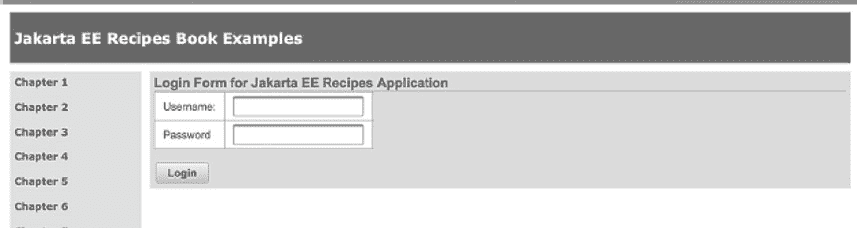

第 15 章 ■ Jakarta 安全性

***图 15-10.** 登录表单示例*

编写身份验证后端

身份验证后端负责执行身份验证并维护用户会话的状态。后端逻辑由一个用于维护身份验证逻辑的 Jakarta 企业 Bean 和一个用于将视图方法和字段绑定到后端逻辑的 Jakarta Servlet Faces 控制器组成。

控制器应具有会话作用域，以便用户状态可以在整个会话期间得到维护。最后，如果您使用数据库表来包含所有有权访问应用程序的用户名，那么将需要为该数据库表创建一个实体类。

在本节中，我将介绍一种自定义技术作为非标准解决方案，该技术利用 EJB 来验证个人凭据。身份验证通过调用 `HttpServletRequest login()` 进行，并将身份验证过程交给应用服务器容器处理。这是容器特定的，意味着它仅在应用程序已按本章第一个配方进行配置的情况下才能工作。

第二种方法利用 Jakarta Security API，在 `HttpAuthenticationMechanism` (HAM) 中使用基于 Servlet 的身份验证。有关 Jakarta Security 的更多详细信息，请参阅配方 15-4。

Jakarta 企业 Bean（自定义解决方案）

用于此自定义身份验证后端的 Jakarta 企业 Bean 是一个无状态会话 Bean，其中包含一个 `login` 方法，该方法会调用应用服务器容器的身份验证机制。以下代码来自 `org.jakartaeerecipe.chapter15.recipe15_03` 类。

`JakartaEERecipes` 项目中的 `AutheticationBean.java` 文件：

package org.jakartaeerecipe.chapter15.recipe15_03;

import java.io.Serializable;

import jakarta.ejb.Remove;

import jakarta.ejb.Stateless;

import jakarta.faces.application.FacesMessage;

import jakarta.persistence.CacheRetrieveMode;

import jakarta.faces.context.FacesContext;

import jakarta.persistence.EntityManager;

import jakarta.persistence.NoResultException;

import jakarta.persistence.PersistenceContext;

第 15 章 ■ Jakarta 安全性

import jakarta.persistence.Query;

import jakarta.servlet.ServletException;

import jakarta.servlet.http.HttpServletRequest;

import jakarta.servlet.http.HttpSession;

@Stateless

public class AuthenticationBean implements Serializable {

@PersistenceContext(unitName = "JakartaEERecipesPU")

private EntityManager em;

private boolean authenticated = false;

private String username = null;

private String password = null;

HttpSession session = null;

User user;

public AuthenticationBean() {

}

public void findUser() {

try {

em.flush();

getUser();

Query userQry = em.createQuery(

"select object(u) from User u "

+ "where u.username = :username").setParameter ("username", getUser().

getUsername().toUpperCase());

// 启用强制数据库查询


userQry.setHint("jakarta.persistence.cache.retrieveMode", CacheRetrieveMode.BYPASS); setUser((User) userQry.getSingleResult());

FacesContext.getCurrentInstance().addMessage(null, new

FacesMessage(FacesMessage.SEVERITY_INFO, "成功通过身份验证", ""));

} catch (Exception e) {

FacesContext.getCurrentInstance().addMessage(null, new

FacesMessage(FacesMessage.SEVERITY_ERROR, "用户名/密码无效", "")); setUser(null);

}

}

public HttpSession getSession() {

FacesContext context = FacesContext.getCurrentInstance();

HttpServletRequest request = (HttpServletRequest) context.getExternalContext().

getRequest();

session = request.getSession(false);

return session;

}

public boolean login() {

HttpSession session = getSession();

HttpServletRequest request = null;

Query userQry = null;

System.out.println("进入登录方法..." + getUser().getUsername());

try {

FacesContext context = FacesContext.getCurrentInstance();

request = (HttpServletRequest) context.getExternalContext().getRequest();

request.login(getUser().getUsername(), this.password);

第 15 章 ■ Jakarta 安全性

session.setMaxInactiveInterval(1800);

session.setAttribute("authenticated", new Boolean(true));

em.flush();

userQry = em.createQuery(

"select count(u) from User u "

+ "where u.username = :username").setParameter("username", getUser().

getUsername().toUpperCase());

userQry.setHint("jakarta.persistence.cache.retrieveMode", CacheRetrieveMode.

BYPASS);

Long count = (Long)userQry.getSingleResult();

if (count > 0){

userQry = em.createQuery(

"select object(u) from User u "

+ "where u.username = :username").setParameter("username",

getUser().getUsername().toUpperCase());

// 启用强制数据库查询

userQry.setHint("jakarta.persistence.cache.retrieveMode", CacheRetrieveMode.

BYPASS);

setUser((User) userQry.getSingleResult());

System.out.println("设置用户，数据库中用户存在，角色为 ->" +

user.getSecurityRole());

setAuthenticated(true);

} else {

// 用户无法成功通过身份验证...执行某些操作

}

FacesContext.getCurrentInstance().addMessage(null, new

FacesMessage(FacesMessage.SEVERITY_INFO, "成功通过身份验证", "")); return authenticated;

} catch (NoResultException| ServletException ex) {

setUser(null);

setAuthenticated(false);

session = getSession();

session.setAttribute("authenticated", new Boolean(false));

if(request != null){

try {

request.logout();

} catch (ServletException ex1) {

System.out.println("AuthBean#login 错误: " + ex);

}

}

FacesContext.getCurrentInstance().addMessage(null, new

FacesMessage(FacesMessage.SEVERITY_ERROR, "用户名/密码无效", "")); return false;

} finally {

setPassword(null);

}

}

/**

* @return 是否已通过身份验证

*/

第 15 章 ■ Jakarta 安全性

public boolean isAuthenticated() {

if (getSession().getAttribute("authenticated") != null) {

boolean auth = (Boolean) getSession().getAttribute("authenticated");

if (auth) {

authenticated = true;

}

} else {

authenticated = false;

}

return authenticated;

}

/**

* @param isAuthenticated 要设置的 isAuthenticated 值

*/

public void setAuthenticated(boolean isAuthenticated) {

this.authenticated = isAuthenticated;

}

@Remove

public void remove() {

System.out.println("正在从会话中移除...");

setUser(null);

}

/**

* @return 用户名

*/

public String getUsername() {

try {

System.out.println("当前用户名是: " + user.getUsername());

username = getUser().getUsername();

} catch (NullPointerException ex) {

}

return username;

}

/**

* @param username 要设置的用户名

*/

public void setUsername(String username) {

getUser().setUsername(username);

System.out.println("刚刚将用户名设置为: " + getUser().getUsername());

this.username = null;

}

/**

* @return 用户对象

*/

public User getUser(){

if (this.user == null) {

user = new User();

}

return user;

}

/**

第 15 章 ■ Jakarta 安全性

* @param user 要设置的用户对象

*/

public void setUser(User user) {

this.user = user;

}

...

// 设置器和获取器

...

}

Jakarta Server Faces 控制器


控制器负责协调 Jakarta Server Faces 视图与 Jakarta Enterprise Beans 之间的身份验证工作。它还具有会话作用域，以便在整个应用程序会话的生命周期内维护用户状态。以下代码取自 JakartaEERecipes 项目中的 `org.jakartaeerecipe.chapter15.recipe15_03.AuthenticationController.java` 文件：

```java
import jakarta.servlet.http.HttpSession;

@Named("authenticationController")

@SessionScoped

public class AuthenticationController implements Serializable {

@EJB

private AuthenticationBean authenticationFacade;

private String username;

private User user;

private boolean authenticated = false;

private HttpSession session = null;

private String userAgent;

/**

* 创建 AuthenticationController 的新实例

*/

public AuthenticationController() {

}

public HttpSession getSession() {

// if(session == null){

FacesContext context = FacesContext.getCurrentInstance();

HttpServletRequest request = (HttpServletRequest) context.getExternalContext().

getRequest();

session = request.getSession();

return session;

}

/**

* @return 用户名

*/

public String getUsername() {

this.username = getUser().getUsername();

return this.username;

}

/**

* @param username 要设置的用户名

*/

public void setUsername(String username) {

this.username = username;

getUser().setUsername(username);

}

/**

* @return 密码

*/

public String getPassword() {

return authenticationFacade.getPassword();

}

/**

* @param password 要设置的密码

*/

public void setPassword(String password) {

authenticationFacade.setPassword(password);

}

public User getUser() {

if (this.user == null) {

user = new User();

setUser(authenticationFacade.getUser());

}

return user;

}

public void setUser(User user) {

this.user = user;

}

public String login() {

authenticationFacade.setUser(getUser());

boolean authResult = authenticationFacade.login();

if (authResult) {

this.authenticated = true;

setUser(authenticationFacade.getUser());

return "SUCCESS_LOGIN";

} else {

this.authenticated = false;

setUser(null);

return "BAD_LOGIN";

}

}

public String logout() {

user = null;

this.authenticated = false;

FacesContext facesContext = FacesContext.getCurrentInstance();

ExternalContext externalContext = facesContext.getExternalContext();

externalContext.invalidateSession();

return "SUCCESS_LOGOUT";

}

/**

* @return 是否已认证

*/

public boolean isAuthenticated() {

try {

boolean auth = (Boolean) getSession().getAttribute("authenticated");

if (auth) {

this.authenticated = true;

} else {

authenticated = false;

}

} catch (Exception e) {

this.authenticated = false;

}

return authenticated;

}

public void setAuthenticated(boolean authenticated) {

this.authenticated = authenticated;

}

}
```

**用户实体**

对于任何应用程序来说，维护一个可以访问应用程序页面的用户列表都是一个好主意。此外，如果应用程序需要细粒度的访问控制，那么为每个用户分配角色以指示每个用户在应用程序中应具有的权限级别就非常重要。为此，可以使用数据库表，该表应包含一个用于存储有权访问应用程序的每个用户名的字段，以及一个用于存储用户角色的字段。以下 SQL 用于在 Oracle 数据库中创建 `USER` 数据库表，尽管类似的 SQL 也可用于在其他关系数据库管理系统（RDMS）中创建表：

```sql
create table user(
user_id number,
username varchar(150) not null,
password varchar(50) not null,
primary key (id));
```

以下类清单来自 `org.jakartaeerecipe.chapter15.recipe15_03.User.java` 文件，该文件是 `JakartaEERecipes_Chapter15` 项目中的一个实体类：

```java
import java.io.Serializable;
import java.math.BigDecimal;
import jakarta.persistence.Column;
import jakarta.persistence.Entity;
import jakarta.persistence.Id;
import jakarta.persistence.Table;

/**
 * 实体类 User
 */
@Entity
@Table(name = "USER")
public class User implements Serializable {
    @Id
```


@Column(name = "USER_ID", nullable = false)

private BigDecimal userId;

@Column(name = "USERNAME")

第 15 章 ■ Jakarta 安全性

private String username;

@Column(name = "SECURITY_ROLE")

private String securityRole;

/** 创建一个新的 User 实例 */

public User() {

}

/**

* 使用指定值创建一个新的 User 实例。

* @param userId 该 User 的 userId

*/

public User(BigDecimal userId) {

this.userId = userId;

}

/**

* 获取此 User 的 userId。

* @return userId

*/

public BigDecimal getUserId() {

return this.userId;

}

/**

* 将此 User 的 userId 设置为指定值。

* @param userId 新的 userId

*/

public void setUserId(BigDecimal userId) {

this.userId = userId;

}

/**

* 获取此 User 的 username。

* @return username

*/

public String getUsername() {

return this.username;

}

/**

* 将此 User 的 username 设置为指定值。

* @param username 新的 username

*/

public void setUsername(String username) {

this.username = username;

}

/**

* 获取此 User 的 securityRole。

* @return securityRole

*/

public String getSecurityRole() {

return this.securityRole;

}

/**

* 将此 User 的 securityRole 设置为指定值。

* @param securityRole 新的 securityRole

第 15 章 ■ Jakarta 安全性

*/

public void setSecurityRole(String securityRole) {

this.securityRole = securityRole;

}

/**

* 返回对象的哈希码值。此实现基于该对象中的 id 字段计算哈希码值。

* @return 该对象的哈希码值。

*/

@Override

public int hashCode() {

int hash = 0;

hash += (this.userId != null ? this.userId.hashCode() : 0);

return hash;

}

/**

* 判断另一个对象是否与此 User 相等。当且仅当参数不为 null，且是一个 User 对象，

* 并且具有与此对象相同的 id 字段值时，结果为 <code>true</code>。

* @param object 用于比较的引用对象

* @return 如果此对象与参数相同，则返回 <code>true</code>；

* 否则返回 <code>false</code>。

*/

@Override

public boolean equals(Object object) {

return false;

}

User other = (User)object;

if (this.userId != other.userId && (this.userId == null ||!this.userId.equals(other.

userId))) return false;

return true;

}

}

工作原理

当应用服务器已配置基于表单的身份验证时，HTTP 请求登录方法可用于以编程方式对应用程序的用户进行身份验证。JSF 表单可以将参数传递给托管 bean 控制器，该控制器再将这些参数传递给 HTTP 请求登录方法，以使用凭据执行编程式身份验证。

如本方案解决方案中列出的登录表单所示，可以编写一个标准的 JSF 视图，将 inputText 组件中的值传递给相应的托管 bean 控制器。相应的字段（username 和 password）绑定到托管 bean 控制器中的属性。

然后，将 username 设置到新的 User 实体对象的 username 属性中，并将 password 值直接传递给 EJB 以供后续使用。password 完全不会存储在托管 bean 控制器中，因此也不会存储到会话中。

让我们花点时间讨论托管 bean 控制器中的方法。在示例中，视图中包含一个 commandButton，它绑定到托管 bean 控制器的 login 方法。一旦被调用，login 方法会调用 EJB 中的一个方法，该方法负责针对应用服务器容器和 JPA 数据存储用户表执行实际的身份验证。

第 15 章 ■ Jakarta 安全性

在这种情况下，EJB 方法也被命名为 login，当它被调用时，User 实体对象会被传递给 EJB，以便使用存储在对象中的 username 属性进行身份验证。托管 bean 控制器中的 login 方法调用 EJB 的 login 方法，该方法返回一个布尔值，指示凭据是否已成功验证用户身份。


根据结果，用户将被授予或拒绝访问应用程序的权限。托管 Bean 控制器中还包含一个登出方法。该方法通过获取外部上下文（即应用服务器上下文），然后调用其 `invalidate()` 方法来使当前会话失效。

EJB 中的登录方法是实际活动发生的地方，因为正是在这里调用了应用服务器的 HTTP 请求登录方法来验证凭据。首先，从外部上下文获取 `HttpServletRequest` 对象，然后调用其 `login` 方法。该方法接受用户名和密码值，启动应用服务器的身份验证机制，如果凭据无效则抛出异常。否则，如果凭据有效，则在 `HttpSession` 对象上设置一个时间限制。传递给 `session.setMaxInactiveInterval` 方法的值表示用户会话在应用服务器自动使其失效之前可以保持非活动状态的时间。该方法的其余部分用于使用 `User` 实体对象执行特定于应用程序的身份验证。在示例中，实体管理器被刷新，然后发出一个查询，统计与登录表单中输入的用户名匹配的 `User` 实体对象的数量。查询实体时，设置了一个提示，强制每次发起请求时都查询数据库。以下代码行摘自 `AuthenticationBean` 类的 `login` 方法，演示了如何设置此提示：`user.setHint("jakarta.persistence.cache.retrieveMode", CacheRetrieveMode.BYPASS);`

如果给定用户名没有匹配的实体对象，则该用户未通过应用程序的身份验证，并向托管 Bean 控制器返回 `false` 值以指示凭据无效。

否则，如果给定用户名存在匹配的实体对象，则获取该匹配的实体对象，并设置一个会话属性以指示用户已成功通过身份验证。

■ **注意** 应用程序可以包含自己的一组用户，这组用户与由 GlassFish 应用服务器或数据库管理的用户是分开的。实现此目的的一种方法是为每个应用程序创建一个单独的数据库表，用于存储可能访问该应用程序的用户的用户名和角色。然后，托管 Bean 控制器中包含的登录逻辑可以对特定于应用程序的表执行查询，以查看登录视图中指定的用户名是否包含在该表中。如果用户名在表中，则用户可以获准访问应用程序；否则，将拒绝访问。此方法在身份验证过程中增加了两个步骤：应用服务器基于表单的身份验证和数据库表级别的身份验证。

15-4. 使用数据库凭据通过安全 API 进行身份验证

问题

您希望利用标准解决方案将基于表单的身份验证集成到您的应用程序中，并使用数据库来存储凭据。

第 15 章 ■ Jakarta 安全

解决方案

利用 Jakarta Security，使用与配方 15-3 中演示的相同的表单身份验证来验证用户身份。但是，此解决方案将使用保存在数据库中的凭据，尽管也可以通过安全 API 使用 LDAP 身份验证或其他自定义方式。数据库的配置通过应用程序中的注解进行，因此无需进行应用服务器配置。

要配置应用程序，请使用 `@ApplicationScoped` 注解一个 Bean，以指示将用于应用程序的身份验证身份存储。在这种情况下，使用 `@DatabaseIdentityStoreDefinition` 注解将数据库配置为应用程序的身份存储：

package org.jakartaeerecipe.chapter15;

import jakarta.enterprise.context.ApplicationScoped;


import jakarta.inject.Named;

import jakarta.security.enterprise.identitystore.DatabaseIdentityStoreDefinition;

import jakarta.security.enterprise.identitystore.Pbkdf2PasswordHash;

@DatabaseIdentityStoreDefinition(

dataSourceLookup = "${'jdbc/acmedb'}",

callerQuery = "#{'select password from caller_store where name = ?'}",

groupsQuery = "select group_name from caller_groups where caller_name = ?",

hashAlgorithm = Pbkdf2PasswordHash.class,

priorityExpression = "#{100}",

hashAlgorithmParameters = {

"Pbkdf2PasswordHash.Iterations=3072",

"${applicationConfig.hash}"

} // 仅用于测试/示例

)

@ApplicationScoped

@Named

public class ApplicationConfig {

public String[] getHash() {

return new String[]{"Pbkdf2PasswordHash.Algorithm=PBKDF2WithHmacSHA512",

"Pbkdf2PasswordHash.SaltSizeBytes=64"};

}

}

单例可用于配置数据库连接。此代码将在每次应用程序启动时运行一次，并加载数据库配置，同时填充安全数据库以用于测试目的。在实际应用中，此类仅用于配置数据源，因为安全数据库通常由管理员填充。以下摘录自单例 EJB 的源代码：

import java.sql.Connection;

import java.sql.PreparedStatement;

import java.sql.SQLException;

import java.util.HashMap;

import java.util.Map;

import jakarta.annotation.PostConstruct;

import jakarta.annotation.PreDestroy;

import jakarta.annotation.Resource;

import jakarta.annotation.sql.DataSourceDefinition;

第 15 章 ■ Jakarta 安全

import jakarta.ejb.Singleton;

import jakarta.ejb.Startup;

import jakarta.inject.Inject;

import jakarta.sql.DataSource;

import jakarta.security.enterprise.identitystore.Pbkdf2PasswordHash;

@DataSourceDefinition(

name = "java:global/JakartaEERecipes/acmedb",

className = "org.apache.derby.jdbc.ClientDataSource",

serverName="localhost",

databaseName="acme",

user = "acmeuser",

password = "databasepassword"

)

@Singleton

@Startup

public class LoadDatabase {

@Resource(lookup="java:global/JakartaEERecipes/acmedb")

private DataSource dataSource;

@Inject

private Pbkdf2PasswordHash passwordHash;

@PostConstruct

public void init() {

Map<String, String> parameters= new HashMap<>();

parameters.put("Pbkdf2PasswordHash.Iterations", "3072");

parameters.put("Pbkdf2PasswordHash.Algorithm", "PBKDF2WithHmacSHA512");

parameters.put("Pbkdf2PasswordHash.SaltSizeBytes", "64");

passwordHash.initialize(parameters);

executeUpdate(dataSource, "CREATE TABLE caller_store(name VARCHAR(64) PRIMARY KEY,

password VARCHAR(255))");

executeUpdate(dataSource, "CREATE TABLE caller_groups(caller_name VARCHAR(64),

group_name VARCHAR(64))");

executeUpdate(dataSource, "INSERT INTO caller_store VALUES('juneau', '" +

passwordHash.generate("eerecipes".toCharArray()) + "')");

executeUpdate(dataSource, "INSERT INTO caller_groups VALUES('juneau', 'group1')");

executeUpdate(dataSource, "INSERT INTO caller_groups VALUES('juneau', 'group2')");

}

@PreDestroy

public void destroy() {

try {

executeUpdate(dataSource, "DROP TABLE IF EXISTS caller_store");

executeUpdate(dataSource, "DROP TABLE IF EXISTS caller_groups");

} catch (Exception e) {

// 静默忽略，涉及内存数据库

}

}

private void executeUpdate(DataSource dataSource, String query) {

try (Connection connection = dataSource.getConnection()) {

try (PreparedStatement statement = connection.prepareStatement(query)) {

statement.executeUpdate();

}

} catch (SQLException e) {

第 15 章 ■ Jakarta 安全

// 不做任何处理

}

}

}

与配方 15-3（/webapp/chapter15/login.xhtml）中相同的 Jakarta Server Faces 登录表单可用于此场景中的身份验证 UI，但需要传递凭据并调用 SecurityContext.authenticate()。这是一个不同的基于表单的场景，它利用了

@CustomFormAuthenticationMechanismDefinition 注解。以下摘录自 Jakarta Server Faces 登录表单，其中包含一个 PrimeFaces commandButton 组件，该组件绑定到 CDI 控制器操作以执行验证：

<html

>

<h:head>


<meta http-equiv="Content-Type" content="text/html; charset=UTF-8"/>

<title>Jakarta Recipes = 第 15 章示例</title>

</h:head>

<h:body>

<ui:composition template="layout/custom_template_search.xhtml">

<ui:define name="content">

<h1>Jakarta EE Recipes 应用程序的登录表单</h1>

<h:form id="loginForm">

<p:messages id="messages"/>

<p:panelGrid columns="2">

<p:outputLabel for="username" value="用户名："/>

<p:inputText id="username" value="#{standardizedAuthentication

Controller.username}"/>

<p:outputLabel for="password" value="密码 "/>

<p:password id="password" value="#{standardizedAuthentication

Controller.password}"/>

</p:panelGrid>

<br/>

<p:commandButton id="loginAction" action="#{standardizedAuthentication

Controller.login}"

value="登录"

update="messages"/>

</h:form>

</ui:define>

</ui:composition>

</h:body>

</html>

最后，认证 CDI 控制器 bean 的代码如下所示。`@RequestScoped` 控制器包含用于传递用户名和密码的属性，以及验证用户提供的凭据的逻辑：

import jakarta.enterprise.context.RequestScoped;

import jakarta.faces.application.FacesMessage;

import jakarta.faces.context.FacesContext;

第 15 章 ■ Jakarta 安全

import jakarta.inject.Inject;

import jakarta.inject.Named;

import jakarta.security.enterprise.credential.Credential;

import jakarta.security.enterprise.credential.Password;

import jakarta.security.enterprise.credential.UsernamePasswordCredential;

import jakarta.security.enterprise.identitystore.CredentialValidationResult;

import jakarta.security.enterprise.identitystore.IdentityStoreHandler;

import jakarta.servlet.http.HttpServletRequest;

import jakarta.servlet.http.HttpServletResponse;

import jakarta.validation.constraints.NotNull;

/**

*

* @author Juneau

*/

@Named

@RequestScoped

public class StandardizedAuthenticationController {

@Inject

private IdentityStoreHandler identityStoreHandler;

@NotNull

private String username;

@NotNull

private String password;

public void login() {

FacesContext context = FacesContext.getCurrentInstance();

Credential credential = new UsernamePasswordCredential(username, new

Password(password));

CredentialValidationResult cres = identityStoreHandler.validate(credential);

if (cres.getStatus().equals(CredentialValidationResult.Status.VALID)) {

context.responseComplete();

context.addMessage(null, new FacesMessage(FacesMessage.SEVERITY_INFO,

"认证成功", null));

} else if (cres.getStatus().equals(CredentialValidationResult.Status.INVALID)) {

context.addMessage(null,

new FacesMessage(FacesMessage.SEVERITY_ERROR, "认证

失败", null));

}

}

private static HttpServletResponse getResponse(FacesContext context) {

return (HttpServletResponse) context

.getExternalContext()

.getResponse();

}

private static HttpServletRequest getRequest(FacesContext context) {

return (HttpServletRequest) context

.getExternalContext()

.getRequest();

}

/**

第 15 章 ■ Jakarta 安全

* @return 用户名

*/

public String getUsername() {

return username;

}

/**

* @param username 要设置的用户名

*/

public void setUsername(String username) {

this.username = username;

}

/**

* @return 密码

*/

public String getPassword() {

return password;

}

/**

* @param password 要设置的密码

*/

public void setPassword(String password) {

this.password = password;

}

}

工作原理

Jakarta Security 定义了一组注解，可用于配置应用程序的身份存储和 `HttpAuthenticationMechanism`，以及其他安全配置。这些标准化注解作为 Jakarta Security 的一部分，在所有符合 Jakarta EE 10 的容器中可用，允许将安全配置作为应用程序的一部分打包，而无需额外的 XML 配置要求。这使得创建包含安全性的可移植应用程序成为可能，并且可以在多个容器中使用相同的安全配置。

身份存储通常保存调用者和调用者组的列表，以及用于验证调用者的安全凭据。API 定义了以下一组标准的身份存储注解，它们提供了身份存储的抽象：

• `@LdapIdentityStoreDefinition`：支持存储在外部 LDAP 服务器中的调用者

• `@DatabaseIdentityStoreDefinition`：支持存储在外部数据库中的调用者，该数据库可通过 JNDI 绑定的数据源访问

身份存储注解必须在标记为 `@ApplicationScoped` 的 CDI bean 中定义，以便在每次应用程序启动时配置一次。身份存储是无状态的，它应包含将调用者认证到应用程序所需的信息。调用者不应直接与身份存储交互。相反，应由 `HttpAuthenticationMechanism`（将在下文解释）执行交互。身份存储包含两个方法，认证机制可以实现这些方法来验证调用者的凭据并返回调用者的安全组。这两个方法分别是 `validate()` 和 `getCallerGroups()`。身份存储可以实现其中一个或两个方法，调用身份存储的 `validationTypes()` 方法会返回一组值，这些值通过以下值指示实现了哪些方法：`VALIDATE`、`PROVIDE_GROUPS`。

`validate()` 方法接受一个 `Credential` 对象，这是一个可移植对象，包含调用者提供的用户名/密码。`validate()` 方法返回一个 `CredentialValidationResult`，指示验证状态。`CredentialValidationResult` 可用于获取信息，例如最终的验证状态，如果成功，则还包含身份存储 ID、调用者主体、调用者在身份存储中的唯一 ID 以及调用者的组。`CredentialValidationResult` 的 `getStatus()` 方法将返回以下状态值之一：

• `VALID`：验证成功，并且可以获取调用者组（如果有）。

• `INVALID`：验证失败。

• `NOT_VALIDATED`：由于凭据类型无效而未尝试验证。

可以通过设置优先级为应用程序配置多个身份存储。身份存储也可以通过实现 `IdentityStore` 接口进行编程，或者通过使用前面概述的身份存储注解进行注入。这些主题以及对身份存储概念的更深入分析，在 javaee.github.io 上提供的 JSR 375 规范中有详细说明：

[`javaee.github.io/security- spec/`](https://javaee.github.io/security-spec/)。

`HttpAuthenticationMechanism` 由安全 API 用于验证用户的凭据。符合 Jakarta EE 的应用程序服务器容器必须提供三种 `HttpAuthenticationMechanism`，如下所示：

• *Basic* (`@BasicAuthenticationMechanismDefinition`)：根据 HTTP 基本认证语义进行认证。

• *Form* (`@FormAuthenticationMechanismDefinition`)：根据基于表单的认证语义进行认证。

• *Custom form* (`authenticate`)：根据基于表单的认证语义进行认证；但是，它不是通过回发到 `j_security_check` 来进行的。而是使用传入的凭据调用 `SecurityContext.authenticate()`。

可以通过实现 `HttpAuthenticationMechanism` 来编写 `HttpAuthenticationMechanism`


接口，或者可以使用注解之一进行注入。要实现该机制，必须编写 `validateRequest()` 方法，该方法会在 servlet 过滤器的 `doFilter()` 方法或任何 servlet 的 `service()` 方法之前被调用。此外，当代码调用 `HttpServletRequest` 的 `authenticate()` 方法时，也会调用 `validateRequest()` 方法。`HttpAuthenticationMechanism` 中有两个方法不需要实现：`secureResponse()` 和 `cleanSubject()`。

`validateRequest()` 方法用于允许调用者进行身份验证。`secureResponse()` 方法用于对 servlet 或 servlet 过滤器生成的响应进行后处理。

`cleanSubject()` 方法用于在调用者注销后进行清理。

由于符合规范的容器必须提供 `HttpAuthenticationMechanism` 的默认实现，因此应用程序可以简单地使用该机制，而无需编写代码或提供注解。本示例中的做法正是如此；要验证这一点，您可以在浏览器中访问以下 URL：`http://localhost:8080/JakartaEERecipes_Chapter15-1.0-SNAPSHOT/chapter15/login.xhtml`。当调用者在登录界面输入凭据并点击按钮时，会调用 `StandardizedAuthenticationController` 的 `login()` 方法。该控制器类包含一个注入的 `IdentityStoreHandler`，用于连接到容器提供的 `HttpAuthenticationMechanism`。在 `login()` 方法中，调用者的用户名和密码被传入一个 `UsernamePasswordCredential` 对象，以返回一个 `Credential`。然后，该 `Credential` 被传入 `IdentityStoreHandler.validate()` 方法，返回一个 `CredentialValidationResult` 对象。该对象可用于获取身份验证尝试的成功或失败信息。可以通过调用 `CredentialValidationResult.getStatus()` 方法来测试成功或失败的结果。

Jakarta Security API 有助于为平台中过去非常不标准化的领域带来标准化。虽然许多容器可能仍会保留其专有的安全 API 和技术，但任何符合 Jakarta EE 10 规范的容器也必须遵守 Jakarta Security 的标准。

■ **注意** 在 Jakarta EE Security API (Soteria) 的 GitHub 项目页面 [`github.com/eclipse-ee4j/soteria`](https://github.com/eclipse-ee4j/soteria) 上可以找到大量示例。通读规范也是一个好主意，该规范不到 50 页，可以在 [`jakarta.ee/specifications/security/3.0/`](https://jakarta.ee/specifications/security/3.0/) 找到。

15-5. 在 Jakarta Server Faces 应用程序中管理页面访问

问题

您已经为 JSF 应用程序设置了身份验证，通过用户名和密码组合指定了对有限用户群的访问权限。您希望限制应用程序中的某些视图，使得只有特定角色的成员才能获得访问权限。

解决方案

将用户认证到应用程序，并存储一个布尔值，指示用户已成功通过身份验证。利用该布尔值在 Jakarta Server Faces 视图中执行条件逻辑，以渲染仅允许通过身份验证的用户访问的表单。如果用户成功通过身份验证，则渲染表单；如果用户未成功通过身份验证，则表单将显示一条错误消息，指示需要身份验证才能访问。

以下 Jakarta Server Faces 视图 (`/webapp/chapter15/recipe15_04.xhtml`) 演示了如何使用条件逻辑来显示需要受控访问的页面部分：

```xml
<?xml version="1.0" encoding="UTF-8" ?>

<!DOCTYPE html PUBLIC "-//W3C//DTD XHTML 1.0 Transitional//EN" "http://www.w3.org/TR/xhtml1/DTD/xhtml1-transitional.dtd">

<html

>
```


<ui:composition template="/layout/fess_template.xhtml">

<ui:define name="title">

<h:outputText value="Jakarta EE 10 菜谱：受控访问"></h:outputText>

</ui:define>

<ui:define name="body">

<h:panelGroup id="messagePanel" layout="block">

<h:messages errorStyle="color: red" infoStyle="color: green" layout="table"/> 579

第 15 章 ■ Jakarta 安全

</h:panelGroup>

<p:panel rendered="#{authenticationController.authenticated}">

<h:form>

视图的这一部分包含机密内容！

</h:form>

</p:panel>

<p:panel rendered="#{!authenticationController.authenticated}">

请<a href="#{request.contextPath}/ chapter15/recipe15_03.xhtml">进行身份验证</a>以使用此表单。

</p:panel>

</ui:define>

</ui:composition>

</html>

工作原理

Jakarta Server Faces 组件的 `rendered` 属性可用于执行条件渲染。

如果将 `rendered` 属性绑定到一个托管 Bean 属性，该属性返回一个布尔值，指示用户是否已通过身份验证，那么此技术可用于控制对特定组件的访问。在本示例中，该技术通过 PrimeFaces 面板组件进行演示。该面板包含需要保护的信息，并且仅在 `authenticated` 属性返回 `true` 值时才会渲染。如果 `authenticated` 属性包含 `false` 值，则会渲染另一个面板组件，该组件向用户显示一条消息，指示需要进行身份验证。

在 Jakarta Server Faces 应用程序中用于程序化身份验证的控制器应包含一个布尔值，该值可以绑定到 Jakarta Server Faces 视图中的条件逻辑，以指示当前用户是否已成功通过身份验证。对于此示例，托管 Bean 控制器 `org.jakartaeerecipe.chapter15.recipe15_03.AuthenticationController` 包含一个名为 `authenticated` 的布尔字段。以下类摘录显示了 `isAuthenticated()` 方法，当从 Jakarta Server Faces 视图访问 `authenticated` 属性时会调用该方法：

```java
public boolean isAuthenticated() {
    try {
        boolean auth = (Boolean) getSession().getAttribute("authenticated");
        if (auth) {
            this.authenticated = true;
        } else {
            authenticated = false;
        }
    } catch (Exception e) {
        this.authenticated = false;
    }
    return authenticated;
}
```

同样的技术可用于根据用户的身份验证状态来隐藏或显示单个组件。此外，通过使用 Jakarta 表达式语言条件表达式，可以利用细粒度的访问控制为 `rendered` 属性提供布尔值。例如，如果某些组件只能由属于特定安全角色的用户访问，则可以使用条件表达式来渲染组件（如果用户属于指定角色）。以下代码行演示了如果用户属于 `ADMIN` 安全角色，如何渲染一个 `outputText` 组件：

```xml
<h:outputLink rendered="${authenticationController.user.securityRole eq 'ADMIN'}" value="#"
onclick="dialog.show()">删除属性</h:outputLink>
```

尽管 `rendered` 属性可能无法让您保护应用程序的每个部分，但当与诸如注解方法（菜谱 15-2）等其他安全措施结合使用时，它有助于提供一个非常安全的环境。

15-6. 在 GlassFish 中配置 LDAP 身份验证

问题

您希望基于组织企业中的集中式 LDAP 服务器对应用程序的用户进行身份验证。

解决方案

从管理控制台实用程序中为 GlassFish 创建一个 LDAP 安全域，并将其设置为 `com.sun.enterprise.security.auth.realm.ldap.LDAPRealm`。要在 GlassFish 中创建 LDAP 安全域，请使用以下步骤：

• 登录到 GlassFish 管理控制台。
• 通过展开左侧树菜单 **配置** ➤ **服务器配置** ➤ **安全** ➤ **域**，导航到“域”表单。
• 在“域”表单中单击 **新建...** 按钮以创建新的安全域。


• 在“新建领域”表单中，为安全领域提供一个名称。接着，从“类名”下拉菜单中选择

`com.sun.enterprise.security.auth.realm.ldap.LDAPRealm`。这将打开用于设置 LDAP 领域的配置界面

（如图 15-11 所示）。

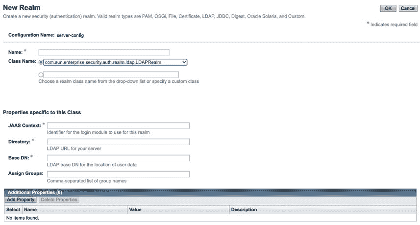

第 15 章 ■ Jakarta 安全性

***图 15-11.** 新建 LDAP 安全领域*

填写该类特有的属性，以便连接到您选择的 LDAP 服务器。

1.  通过点击**添加属性**按钮并输入每个属性的名称-值信息，添加以下附加属性：

    • `search-bind-dn`：输入您的 LDAP 主机、目录以及您将进行身份验证的 LDAP 账户的完全限定 DN。例如：

    `CN=account-name,OU=AccountGroup,DC=dc1,DC=dc2,DC=dc3`

    • `search-bind-password`：输入您之前指定的账户名称的密码。

    • `search-filter`：将此属性的值输入为以下内容：

    `(sAMAccountName=%s)`

2.  重新启动应用服务器。

工作原理

也许对应用进行身份验证最高效的方式之一就是使用 LDAP 账户。使用 LDAP 账户进行身份验证可以为组织内的所有服务器和应用提供单点登录解决方案。LDAP 身份验证还为账户信息提供了单一维护点，同时仍允许各个应用通过角色维护其自身的细粒度安全性。本方案解答列举了在 GlassFish 应用服务器中设置 LDAP 安全领域所涉及的步骤。不过，您也可以遵循类似的过程在其他应用服务器容器中设置 LDAP 安全领域。

第 15 章 ■ Jakarta 安全性

一旦在应用服务器中设置了 LDAP 身份验证，您就可以配置您的应用来使用它。要配置应用使用 LDAP 身份验证，请在 `web.xml` 部署描述符中添加以下配置：

```xml
<login-config>
    <auth-method>FORM</auth-method>
    <realm-name>REALM-NAME</realm-name>
    <form-login-config>
        <form-login-page>/faces/login.xhtml</form-login-page>
        <form-error-page>/faces/loginError.xhtml</form-error-page>
    </form-login-config>
</login-config>
```

在上述 `web.xml` 的摘录中，`realm-name` 元素应与您在 GlassFish 中创建的 LDAP 安全领域的名称相同。`form-login-page` 和 `form-error-page` 的值应分别引用用于登录应用的视图以及登录出错时显示的视图。对 LDAP 安全领域进行身份验证的方式与方案 15-3 中所述相同。只需调用 `HttpRequest` 对象的 `login` 方法，使用用户通过登录视图提供的凭据进行身份验证即可。

15-7. 在 GlassFish 中配置自定义安全证书

问题

您希望在 GlassFish 环境中使用自定义证书来通过 SSL 保护访问安全。

解决方案

从认证的证书颁发机构获取证书，然后将其安装到 GlassFish 应用服务器容器中。安装完成后，通过使用 SSL 的安全端口路由请求，并强制用户接受安全证书才能继续。要安装从有效证书颁发机构获取的证书，请遵循以下步骤：

1.  将受信任的根证书从您的认证机构复制到您的服务器。在命令行或终端中执行以下命令：

    `keytool –import –alias root –keystore keystore_name.keystore –trustcacerts –file trustedcarootcertificate.crt`

2.  接着，导入受信任的证书：

    `keytool –import –alias cert_alias –keystore keystore_name.keystore –trustcacerts –file certificate.crt`

3.  在 GlassFish 管理控制台中调整 SSL 设置。要调整设置，请依次进入“配置” ➤ “网络配置” ➤ “网络监听器” ➤ `http-listener-2`，以打开安全的 HTTP 监听器页面。打开后，选择


在 SSL 选项卡中，输入与步骤 2 中使用的证书昵称和密钥库相匹配的信息。参见图 15-12。

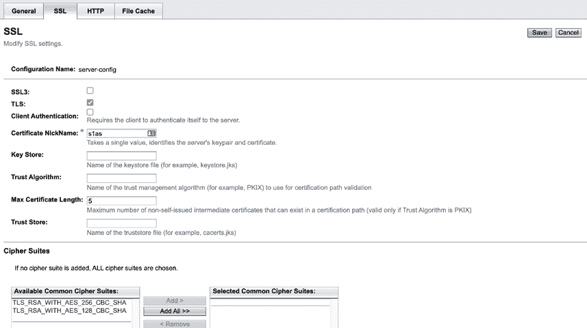

第 15 章 ■ Jakarta 安全性

***图 15-12.** 修改 SSL 设置*

4.  重启服务器，然后使用以下 URL 安全地访问您的应用程序：

    https://localhost:8181/your_application_context。

■ **注意** 在上述编号列表中，keystore_name.keystore 代表密钥库的名称，而 trustedcarootcertificate.crt 和 certificate.crt 代表证书的名称。

工作原理

GlassFish 自带一个适用于测试环境的自签名安全证书。但是，当将 GlassFish 用作生产应用程序服务器解决方案时，必须安装来自受信任证书颁发机构的证书，以确保应用程序传输的安全。本方案演示了如何安装用于 SSL 的安全证书，以实现安全传输。

在安装经过验证的证书之前，您需要先获取它。您需要从众多证书颁发机构中选择一个，然后发送一个证书请求，该请求包含来自您的应用程序服务器的密钥。需要创建一个密钥库来生成证书请求。在命令行或终端中执行以下命令来创建密钥库：

keytool –keysize 2048 –genkey –alias –keyalg RSA –dname "CN=yourdomain.org,O=company_
name,L=city,S=state,C=country" –keypass glassfish_master_password –storepass glassfish_
master_password –keystore choose_keystore_name.keystore

第 15 章 ■ Jakarta 安全性

密钥库创建完成后，即可生成一个将发送给证书颁发机构的证书签名请求 (CSR)。要生成证书签名请求 (CSR)，请在您的服务器上执行以下命令：

keytool –certreq –alias –keystore chosen_keystore_name.keystore –storepass glassfish_master_
password –keypass glassfish_master_password –file csrname.csr

■ **注意** 要更改 GlassFish 主密码，请在 GlassFish 域停止时执行以下命令：asadmin change-master-password –savemasterpassword=true。

将 CSR 提交给证书颁发机构后，证书颁发机构将返回一个有效的安全证书，您可以将其安装到服务器中。按照本方案解决方案中的步骤将证书安装到 GlassFish 中。证书安装完成后，您的服务器将通过证书颁发机构验证为安全，用户在访问您的安全站点时，应在浏览器中看到一条指示此状态的消息（通常是一个锁图标）。

**第 16 章**

**并发与批处理**

Jakarta 并发工具和批处理 API 包含了用于并发处理任务的标准技术以及批处理应用程序处理的标准规范。

这两个 API 的规模都相当大，并且包含了多年来被各种企业项目广泛使用的成熟解决方案。过去，在 Java EE 应用程序中使用诸如 java.util.concurrent 和 java.lang.Thread 之类的 Java SE 并发工具一直存在问题，因为应用程序服务器容器无法与这些资源协同工作。java.util.concurrent API 的扩展使应用程序服务器和其他容器能够识别这些并发资源。这些扩展允许企业应用程序通过使用企业环境中可用的 java.util.concurrent.ExecutorService 资源来适当地利用异步操作。

用于批处理的 API 为开发人员提供了精细化的体验，使他们能够以多种不同的方式生成和处理批处理应用程序。企业应用程序不再需要使用自定义类来执行批处理，从而可以遵循一个被采纳的标准。

如前所述，这些附加 API 的范围非常广泛，本章不会试图涵盖每个特性。然而，本章中包含的方案应能提供足够的信息，使开发人员能够使用每个 API 中一些最常用的部分来启动和运行。有关 Jakarta 并发细节的更深入信息，请参考位于 [`jakarta.ee/specifications/concurrency/`](https://jakarta.ee/specifications/concurrency/) 的 JavaDoc。本章的方案适用于 Eclipse GlassFish。其他符合 Jakarta EE 规范的应用程序服务器，如 Open Liberty 和 WildFly，也包含针对这些问题的类似解决方案。

16-1. 在应用程序服务器中创建用于异步处理任务的资源

问题

您希望在应用程序服务器环境中注册一个 ManagedExecutorService 资源。

© Josh Juneau 和 Tarun Telang 2022
J. Juneau 和 T. Telang，《Java EE 到 Jakarta EE 10 实战》[，https://doi.org/10.1007/978-1-4842-8079-9_16](https://doi.org/10.1007/978-1-4842-8079-9_16#DOI)

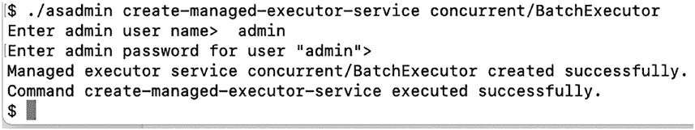

第 16 章 ■ 并发与批处理

解决方案 #1

使用 GlassFish 的 asadmin create-managed-executor-service 工具创建一个新的 ManagedExecutorService。要使用诸如 reporter 任务之类的并发工具，必须将应用程序服务器配置为使用 ManagedExecutorService。要在 GlassFish 中创建 ManagedExecutorService，请在命令提示符下运行以下命令：

<path-to-glassfish>/bin/asadmin create-managed-executor-service concurrent/BatchExecutor 您应该会看到如图 16-1 所示的输出。

***图 16-1.** 在 GlassFish 中创建 ManagedExecutorService*

在上述命令行操作中，正在创建的 ManagedExecutorService 的名称为 concurrent/BatchExecutor。但是，可以更改此名称以更好地适应应用程序。要查看 create-managed-executor-service 命令的所有可用选项，请使用 --help 标志。图 16-2 显示了执行此操作的结果。

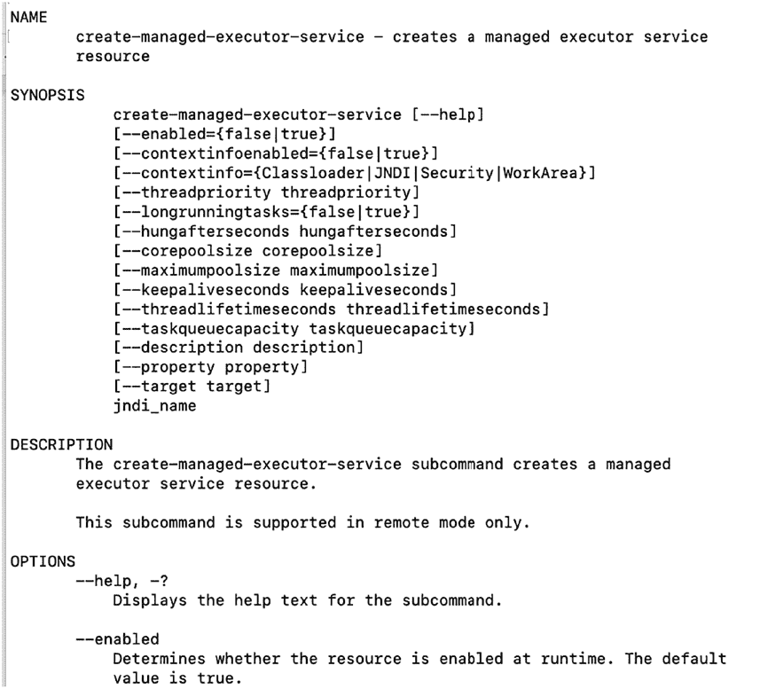

第 16 章 ■ 并发与批处理

***图 16-2.** 使用 create-managed-executor-service 命令的 --help 选项的结果*

解决方案 #2

使用 GlassFish 管理控制台创建 ManagedExecutorService。为此，请成功验证管理控制台的身份，然后使用左侧树形菜单导航到“并发资源”➤“托管执行器服务”管理面板（参见图 16-3）。

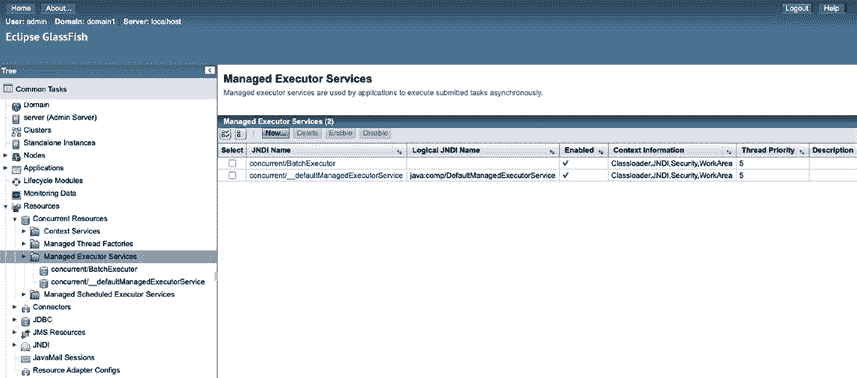
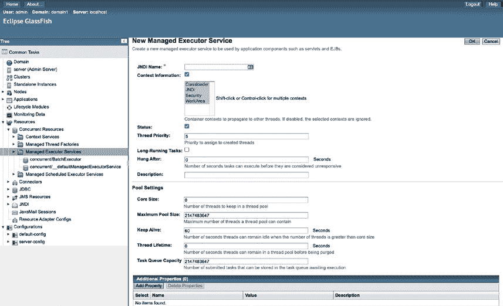

第 16 章 ■ 并发与批处理

***图 16-3.** GlassFish 托管执行器服务面板*

打开面板后，单击“新建”按钮创建一个新服务。这将打开“新建托管执行器服务”面板，您需要在此面板中为您的服务填写一个 JNDI 名称（参见图 16-4）。

***图 16-4.** 新建托管执行器服务面板*

第 16 章 ■ 并发与批处理

此面板提供了相当多的选项来创建服务。但是，唯一必需的选项是 JNDI 名称，因为所有其他选项都填充了默认值。指定的 JNDI 名称应遵循 concurrent/YourExecutorServiceName 的格式，其中 YourExecutorServiceName 是您选择的自定义名称。

工作原理

ManagedExecutorService 提供了生成由应用程序服务器管理的异步任务的能力。尽管有一个默认的 ManagedExecutorService 可供使用，但应用程序服务器管理员可以在应用程序服务器内创建可由一个或多个应用程序使用的 ManagedExecutorService 资源，这与 Java 消息服务 (JMS) 主题或队列非常相似。


要创建服务，请在命令提示符下执行 `asadmin create-managed-executor-service` 命令，并传入用于标识服务的名称。有许多选项可用于以不同方式自定义服务。例如，可以将服务配置为允许任务运行指定的时间，可以配置线程池等，从而生成最符合应用程序需求的 `ManagedExecutorService`。

对于希望在 GlassFish 管理控制台内操作的用户，有几个管理面板可以更轻松地创建和管理并发资源。**Managed Executor Service** 面板可用于创建新的应用服务器 `ManagedExecutorService` 资源，以及管理已有的资源。

■ **注意** GlassFish 和其他符合 Jakarta EE 规范的应用服务器都附带一个预配置的默认 `ManagedExecutorService` 资源，其名称为 `java:comp/DefaultManagedExecutorService`。

16-2\. 配置和创建报告任务

问题

您希望创建一个长时间运行的任务，该任务将与数据库通信并最终生成报告。

解决方案

一旦配置好应用服务器并创建了 `ManagedExecutorService`，就可以编写应用程序来使用这个新创建的服务。在应用程序中，您可以选择通过 XML 配置应用程序以使用 `ManagedExecutorService`，或者使用 `@Resource` 注解来注入该资源。要通过 XML 进行配置，请向 Web 部署描述符中添加一个 `<resource-env-ref>` 元素。在这种情况下，您需要配置一个类型为 `*jakarta.enterprise.concurrent.ManagedExecutorService*` 的资源，如下面的 `/webapp/WEB-INF/web.xml` 摘录所示：

<resource-env-ref>

<description>

此执行器用于应用程序的报告任务。此执行器具有以下要求：

运行位置：不适用

上下文信息：本地命名空间

</description>

<resource-env-ref-name>

concurrent/BatchExecutor

</resource-env-ref-name>

<resource-env-ref-type>

jakarta.enterprise.concurrent.ManagedExecutorService

</resource-env-ref-type>

</resource-env-ref>

在 XML 配置中，该资源被分配了一个引用名称 `concurrent/BatchExecutor`，但您可以根据应用程序的需要来命名该引用。如果您更愿意使用注解，则可以指定以下 `@Resource` 注解，将 `ManagedExecutorService` 注入到类中使用。稍后您将看到一个使用示例：

@Resource(name = "concurrent/BatchExecutor")

ManagedExecutorService mes;

配置完成后，您可以创建一个报告任务类，该类实现了 `Runnable` 接口，并负责运行实际的报告。以下类 `org.jakartaeerecipe.chapter16.recipe16_02.ReporterTask` 就是这样一个类的示例：

package org.jakartaeerecipe.chapter16.recipe16_02;

import java.util.List;

import jakarta.ejb.EJB;

import org.jakartaeerecipe.jpa.entity.Book;

import org.jakartaeerecipe.jpa.entity.BookAuthor;

import org.jakartaeerecipe.jpa.session.BookAuthorFacade;

import org.jakartaeerecipe.jpa.session.BookFacade;

public class ReporterTask implements Runnable {

String reportName;

@EJB

private BookAuthorFacade bookAuthorFacade;

@EJB

private BookFacade bookFacade;

public ReporterTask(String reportName) {

this.reportName = reportName;

}

public void run() {

// 运行指定的报告

if ("AuthorReport".equals(reportName)) {

runAuthorReport();

} else if ("BookReport".equals(reportName)) {

runBookReport();

}

}

/**

* 将作者列表打印到系统日志。

*/

public void runAuthorReport() {

List<BookAuthor> authors = bookAuthorFacade.findAuthor();

System.out.println("作者列表报告");

System.out.println("=====================");

for (BookAuthor author : authors) {

System.out.println(author.getFirst() + " " + author.getLast());

}

}

/**


* 将书籍列表打印到文件

*/

void runBookReport() {

System.out.println("正在查询数据库");

Path reportFile = Paths.get("BookReport.txt");

try (BufferedWriter writer = Files.newBufferedWriter(

reportFile, Charset.defaultCharset())) {

Files.deleteIfExists(reportFile);

reportFile = Files.createFile(reportFile);

writer.append("书籍列表报告");

writer.newLine();

writer.append("===================");

writer.newLine();

List<Book> books = bookFacade.findAllBooks();

for (Book book : books) {

writer.append(book.getTitle());

writer.newLine();

}

writer.flush();

} catch (IOException exception) {

System.out.println("写入文件时出错");

}

}

}

最后，该报告需要由在 `web.xml` 中配置的 `ManagedExecutorService` 调用。在此示例中，`ManagedExecutorService` 被注入到一个 servlet 中，然后用于调用报告，如下代码所示：

@WebServlet(name = "BookReportServlet", urlPatterns = {"/BookReportServlet"}) public class ReportServlet extends HttpServlet implements Servlet { // 缓存我们的执行器

实例

@Resource(name = "concurrent/BatchExecutor")

ManagedExecutorService mes;

protected void processRequest(HttpServletRequest request, HttpServletResponse response)

throws ServletException, IOException {

response.setContentType("text/html;charset=UTF-8");

第 16 章 ■ 并发与批处理

try (PrintWriter out = response.getWriter()){

out.println("""

<html>

<head>

<title>书籍报告调用器</title>

</head>

<body>

<h2>此 servlet 启动书籍报告任务。请

在服务器日志中查看结果。</h2> <br />

网页更新并非异步运行，但

报告生成将独立处理。

<br/><br/> """);

ReporterTask reporterTask = new ReporterTask("BookReport");

Future reportFuture = mes.submit(reporterTask);

while( !reportFuture.isDone() )

out.println("正在运行...<BR>");

if (reportFuture.isDone()){

out.println("报告完成");

}

out.println("</body>");

out.println("</html>");

}

}

...

当访问该 servlet 时，报告任务将被启动，并开始生成结果。

工作原理

创建 `ManagedExecutorService` 后，它可以被一个或多个应用程序用于执行并发操作。应用程序必须通过 XML 进行配置，以允许访问应用程序服务器容器中的 `ManagedExecutorService` 资源，或者可以通过使用 `@Resource` 注解注入该资源。在本配方的示例中，演示了这两种选项。

出于示例目的，假设使用 `@Resource` 注解将服务注入到 servlet 中。

要使用该服务并发运行任务，您必须在实现 `java.util.Runnable` 的单独类中创建任务，以便它可以像标准 Java 线程一样作为独立进程被调用。在示例中，一个名为 `ReporterTask` 的类实现了 `Runnable`，并且在 `run()` 方法中，报告任务执行我们希望以异步方式运行的任务。在此示例中，从 `run` 方法内部调用了几个方法。生成的 `Runnable` 类随后可以传递给 `ManagedExecutorService`，以便在应用程序执行其他任务时并发运行。要使用 `ManagedExecutorService`，请通过 XML 或资源注入将其注册到应用程序中。在本配方的示例中，使用了资源注入，使得 `ManagedExecutorService` 在 Java servlet 中可用。要注入资源，请在 `@Resource` 注解中指定其名称：

@Resource(name = "concurrent/BatchExecutor")

ManagedExecutorService mes;

第 16 章 ■ 并发与批处理

然后可以通过调用 `submit()` 方法并传递我们想要提交处理的 `Runnable` 任务实例来调用 `ManagedExecutorService`。在这种情况下，`ReporterTask` 类被实例化，其实例随后被传递给服务，返回一个 `java.util.concurrent.`


Future 对象：

```java
ReporterTask reporterTask = new ReporterTask("BookReport");
Future reportFuture = mes.submit(reporterTask);
```

提交后，可以定期检查返回的 Future 对象，通过调用其 `isDone()` 方法来判断任务是否仍在运行或已完成。可以通过调用 `cancel()` 方法来取消任务，并通过调用 `isCanceled()` 方法来检查任务是否已被取消。

reporter 任务是一个长时间运行的任务，它会查询数据库以获取生成报告所需的数据。

**16-3. 同时运行多个任务**

**问题**

你需要在应用程序中同时运行两个或更多任务。例如，你正在编写的应用程序需要能够连接数据库，并从两个或多个表中同时检索数据以获得结果。你希望在将结果返回给用户之前，先将这些结果聚合起来。

**解决方案**

创建一个构建器任务，用于并行运行两个不同的任务。每个任务可以从不同的数据源检索数据，最后将数据合并并聚合以形成结果。要使用构建器任务，必须首先按照配方 16-1 所述，为应用服务器环境配置一个 `ManagedExecutorService`。配置好资源后，可以通过 XML 或注解来配置应用程序以使用该资源。要使用 XML 配置，请在 `web.xml` 部署描述符中添加一个 `<resource-env-ref>` 元素。在这种情况下，你需要配置一个类型为 `jakarta.enterprise.concurrent.ManagedExecutorService` 的资源，如配方 16-2 中的 `web.xml` 摘录所示，并重复如下：

```xml
<resource-env-ref>
    <description>
        此执行器用于应用程序的构建器任务。此执行器具有以下要求：
        运行位置：本地
        上下文信息：本地命名空间，安全
    </description>
    <resource-env-ref-name>
        concurrent/BuilderExecutor
    </resource-env-ref-name>
    <resource-env-ref-type>
        jakarta.enterprise.concurrent.ManagedExecutorService
    </resource-env-ref-type>
</resource-env-ref>
```

**第 16 章 ■ 并发与批处理**

在此示例中，应用程序中的 `ManagedExecutorService` 资源被配置为与已在应用服务器容器中注册、并通过 JNDI 名称 `concurrent/BuilderExecutor` 标识的资源一起工作。如果你更愿意使用注解，则可以指定以下 `@Resource` 注解，将 `ManagedExecutorService` 注入到类中，以便在 `Runnable` 中使用：

```java
@Resource(name = "concurrent/BuilderExecutor")
ManagedExecutorService mes;
```

一旦应用程序配置好与 `ManagedExecutorService` 资源一起工作，你就可以为你希望运行的每个不同任务创建任务类。每个任务类必须实现 `jakarta.enterprise.concurrent.ManagedTask` 接口。以下代码来自文件 `org.jakartaeerecipe.chapter16.recipe16_03.AuthorTask.java`，展示了任务类应有的样子：

```java
public class AuthorTask implements Callable<AuthorInfo>, ManagedTask {

    // 按需报告请求的 ID。
    BigDecimal authorId;
    AuthorInfo authorInfo;
    Map<String, String> execProps;

    public AuthorTask(BigDecimal id) {
        this.authorId = id;
        execProps = new HashMap<>();
        execProps.put(ManagedTask.IDENTITY_NAME, getIdentityName());
    }

    public AuthorInfo call() {
        // 查找实体 bean 并将其返回给客户端。
        return authorInfo;
    }

    public String getIdentityName() {
        return "AuthorTask: AuthorID=" + authorId;
    }

    public Map<String, String> getExecutionProperties() {
        return execProps;
    }

    public String getIdentityDescription(Locale locale) {
        // 使用资源包...
        return "AuthorTask 异步 EJB 调用器";
    }

    @Override
    public ManagedTaskListener getManagedTaskListener() {
        return new CustomManagedTaskListener();
    }
}
```

可以实现一个或多个这样的任务类，然后通过使用已在应用服务器容器中注册的 `ManagedExecutorService` 资源，由构建器任务处理它们。以下 Servlet 使用 `ManagedExecutorService` 来协调两个任务类的调用。在此例中，任务类名称为 `AuthorTask` 和 `AuthorTaskTwo`：

```java
@WebServlet(name = "BuilderServlet", urlPatterns = {"/builderServlet"})
public class BuilderServlet extends HttpServlet implements Servlet {

    // 获取我们的执行器实例。
    @Resource(name = "concurrent/BuilderExecutor")
    ManagedExecutorService mes;

    AuthorInfo authorInfoHome;
    BookInfo bookInfoHome;

    protected void processRequest(HttpServletRequest req, HttpServletResponse resp) throws
            ServletException, IOException {
        try {
            PrintWriter out = resp.getWriter();

            // 创建任务实例
            ArrayList<Callable<AuthorInfo>> builderTasks = new ArrayList<Callable<AuthorInfo>>();
            builderTasks.add(new AuthorTask(BigDecimal.ONE));
            builderTasks.add(new AuthorTaskTwo(BigDecimal.ONE));

            // 提交任务并等待。
            List<Future<AuthorInfo>> taskResults = mes.invokeAll(builderTasks);

            ArrayList<AuthorInfo> results = new ArrayList<AuthorInfo>();
            for(Future<AuthorInfo> result: taskResults){
                results.add(result.get());
                out.write("处理结果...");
            }

        } catch (InterruptedException|ExecutionException ex) {
            Logger.getLogger(BuilderServlet.class.getName()).log(Level.SEVERE, null, ex);
        }
    }
    ...
}
```

**工作原理**

创建 `ManagedExecutorService` 后，它可以被一个或多个应用程序用来执行并发操作。必须通过 XML 配置应用程序以允许访问应用服务器容器中的 `ManagedExecutorService` 资源，或者可以通过使用 `@Resource` 注解来注入该资源。在本配方的示例中，演示了这两种选项。

对于使用 Servlet 的示例，假设使用了 `@Resource` 注解将服务注入到 Servlet 中，并且没有进行 XML 配置。

为了通过 `ManagedExecutorService` 以异步方式协调任务的处理，需要处理的任务应包含在单独的类中，或者是同一任务类的多个实例。每个任务类都应实现 `java.util.concurrent.Callable<V>` 和 `jakarta.enterprise.concurrent.ManagedTask` 接口。任务类应包含一个构造函数，允许调用者传递实例化对象所需的参数，并应实现一个 `call()` 方法，该方法返回构建报告所需的信息给客户端。然后，可以通过 `ManagedExecutorService` 调用两个或更多这样的任务类，以便将所有结果处理成所需的格式。

为了组装要处理的任务，创建一个 `ArrayList<Callable>`，并将每个任务的实例添加到该数组中。在示例中，数组被命名为 `builderTasks`，并将两个不同任务类型的实例添加到该数组中：

```java
ArrayList<Callable<AuthorInfo>> builderTasks = new ArrayList<Callable<AuthorInfo>>();
builderTasks.add(new AuthorTask(BigDecimal.ONE));
builderTasks.add(new AuthorTaskTwo(BigDecimal.ONE));
```

**第 16 章 ■ 并发与批处理**

接下来，将构建好的数组传递给 `ManagedExecutorService`，返回一个 `List<Future<Object>>`，然后可以用它来处理结果：

```java
List<Future<AuthorInfo>> results = mes.invokeAll(builderTasks);
AuthorInfo authorInfo = (AuthorInfo) results.get(0).get();
// 处理结果
```


利用此技术，可以并发处理一系列任务，并返回结果，这些结果随后可用于制定响应。在此示例中，通过调用两个任务类并返回查询信息的结果来构建一份报告。同样的技术可应用于一系列不同的任务，使应用程序能够在一个中心位置处理多次任务调用的结果。

16-4. 在任务中使用事务

问题

你希望在应用程序任务中管理一个事务，该任务将使用 `ManagedExecutorService` 资源进行处理。

解决方案

利用 `jakarta.transaction.UserTransaction` 来创建和管理事务。以下示例演示了如何在将由 `ManagedExecutorService` 处理的任务类中使用 `UserTransaction` 接口来划分事务：

```java
public class UserTransactionTask implements Runnable {

    @Resource
    SessionContext ctx;

    @EJB
    private BookAuthorFacade bookAuthorFacade;

    UserTransaction ut = ctx.getUserTransaction();

    public void run() {
        try {
            // 开始一个事务
            ut.begin();
            List<BookAuthor> authors = bookAuthorFacade.findAuthor();
            for (BookAuthor author : authors) {
                // 执行某些操作
            }
            ut.commit();
        } catch (NotSupportedException | SystemException | RollbackException
                | HeuristicMixedException | HeuristicRollbackException ex) {
            Logger.getLogger(UserTransactionTask.class.getName()).log(Level.SEVERE,
                    null, ex);
        }
    }
}
```

第 16 章 ■ 并发与批处理

然后，可以通过实现如下解决方案，由 `ManagedExecutorService` 处理上述类：

```java
@WebServlet(name = "UserTransactionServlet", urlPatterns = {"/userTransactionServlet"})
public class UserTransactionServlet extends HttpServlet implements Servlet {

    @Resource(name = "concurrent/BatchExecutor")
    ManagedExecutorService mes;

    protected void processRequest(HttpServletRequest request, HttpServletResponse response)
            throws ServletException, IOException {
        response.setContentType("text/html;charset=UTF-8");
        PrintWriter out = response.getWriter();
        try {
            // servlet 输出...
            UserTransactionTask utTask = new UserTransactionTask();
            Future utFuture = mes.submit(utTask);
            while (!utFuture.isDone())
                out.println("运行中...<BR>");
            if (utFuture.isDone()) {
                out.println("报告完成");
            }
            out.println("</body>");
            out.println("</html>");
        } finally {
            out.close();
        }
    }
}
```

工作原理

在某些情况下，应用程序可能需要在将通过 `ManagedExecutorService` 处理的任务中进行事务协调。可以通过使用 `jakarta.transaction.UserTransaction` 接口在这些任务中执行事务。可以通过调用 `SessionContext.getUserTransaction()` 方法获取 `UserTransaction`。可以使用 `@Resource` 注解将 `SessionContext` 资源注入到 bean 中。

一旦获取了 `UserTransaction`，就可以通过调用 `UserTransaction` 的 `begin` 方法来启动事务。可以通过调用 `UserTransaction` 的 `commit()` 方法来结束事务。该事务涵盖了在调用 `begin` 之后、调用 `commit` 之前执行的所有任务。如果事务中的某个任务失败，则事务中执行的所有工作都将停止，并且值将恢复到事务开始之前的状态。这有助于确保任务所需的所有流程在成功时完成，或在失败时回滚。

16-5. 在计划时间运行并发任务

问题

你正在使用的应用程序需要能够按时间间隔定期执行任务。

第 16 章 ■ 并发与批处理

解决方案

使用 `ManagedScheduledExecutorService` 在应用程序中创建计划任务。在应用程序可以使用该服务之前，必须在应用程序服务器容器中创建它。要在 GlassFish 中创建 `ManagedScheduledExecutorService` 实例，请从命令行发出以下命令：


bin/asadmin create-managed-scheduled-executor-service concurrent/name-of-service

在此命令中，name-of-service 可以是您选择的任意名称。create-managed-scheduled-executor-service 命令有许多可指定的选项。要查看并详细了解每个选项，请在命令后使用 `--help` 标志调用命令帮助，而不是提供要创建的服务名称。或者，您也可以使用应用服务器资源（例如 GlassFish 管理控制台）来创建该服务。

一旦在容器内创建了该服务，应用程序即可使用它。要使用此类服务，必须通过 XML 或注解来配置环境。若要使用 XML 配置，请在 `web.xml` 部署描述符中添加一个 `<resource-env-ref>` 元素。在这种情况下，您需要配置一个类型为 `jakarta.enterprise.concurrent.ManagedScheduledExecutorService` 的资源，如下面的 `web.xml` 摘录所示：

<resource-env-ref>
<description>定期向服务器日志打印警报（如有必要）</description>
<resource-env-ref-name>
concurrent/__defaultScheduledManagedExecutorService
</resource-env-ref-name>
<resource-env-ref-type>
jakarta.enterprise.concurrent.ManagedScheduledExecutorService
</resource-env-ref-type>
</resource-env-ref>

如果您希望使用注解而非 XML，则可以在客户端代码中使用 `@Resource` 注解来注入 `ManagedScheduledExecutorService`，如下所示。在这种情况下，注入的资源引用了一个由名称 `concurrent/__defaultManagedScheduledExecutorService` 标识的 `ManagedScheduledExecutorService`：

@Resource(name="concurrent/ScheduledAlertExecutor")
ManagedScheduledExecutorService mes;

要编写您希望调度的任务，请创建一个实现 `Runnable` 的 Java 类。这样，该类将包含一个 `run` 方法，每次启动调度任务时都会调用该方法。

以下示例演示了如何构建一个可用于日志记录的任务。在此示例中，`BookAuthor` 实体被定期查询，以确定是否有新作者添加到数据库中：

public class ScheduledLoggerExample implements Runnable {
    CreateConnection createConn = null;

    @Override
    public void run() {
        queryAuthors();
    }

    public void queryAuthors(){
        createConn = new CreateConnection();
        String qry = "select object(o) from BookAuthor o";
        createConn.loadProperties();
        try (Connection conn = createConn.getConnection();
             Statement stmt = conn.createStatement();
             ResultSet rs = stmt.executeQuery(qry);) {
            while (rs.next()) {
                // 如果是新作者，则发出警报
            }
        } catch (SQLException e) {
            e.printStackTrace();
        }
    }
}

要定期调用该任务，请使用 `ManagedScheduledExecutorService` 资源。以下 JSF 托管 Bean 类演示了如何调用此类服务：

@Named
public class ScheduledTaskClient {
    Future alertHandle = null;

    @Resource(name="concurrent/__defaultManagedScheduledExecutorService")
    ManagedScheduledExecutorService mes;

    public void alertScheduler() {
        ScheduledAuthorAlert ae = new ScheduledAuthorAlert();
        alertHandle = mes.scheduleAtFixedRate(
            ae, 5L, 5L, TimeUnit.MINUTES);
        FacesMessage facesMsg = new FacesMessage(FacesMessage.SEVERITY_INFO,
            "任务已调度", "任务已调度");
        FacesContext.getCurrentInstance().addMessage(null, facesMsg);
    }
}

**工作原理**

要调度任务在特定时间运行，请使用 `jakarta.concurrent.ManagedScheduledExecutorService` 接口。该接口扩展了 `java.util.concurrent.ScheduledExecutorService` 和 `jakarta.enterprise.concurrent.ManagedExecutorService` 接口。

`ManagedScheduledExecutorService` 可用于根据指定的调度计划执行 `Runnable` 任务。

如前所述，`ManagedScheduledExecutorService` 可用于调度 `Runnable` 任务。也就是说，任何实现了 `java.lang.Runnable` 的类都可以通过该服务被调用。每次启动任务时，都会调用任务类 `run` 方法中包含的代码。在本配方的示例中，`run` 方法执行了该类中的另一个方法，该方法用于查询实体并对结果执行某些操作。

要使用 `ManagedScheduledExecutorService`，可以在应用服务器容器内创建一个。这可以通过执行 `asadmin create-managed-scheduled-executor-service` 命令来完成，如本配方的示例所示。然而，任何符合 Jakarta EE 8 规范的应用服务器都应包含一个默认的 `ManagedScheduledExecutorService` 供使用。一旦在应用服务器中创建了该资源，应用程序就可以使用它。为了使应用程序能够访问该服务，可以使用 `web.xml` 部署描述符中的 XML 配置，或者使用 `@Resource` 注解来注入该资源。在本配方的示例中，两种技术都有演示。不过，在用于启动示例任务的类中，使用了 `@Resource` 注解来注入应用服务器的默认 `ManagedScheduledExecutorService`，该服务可通过名称 `concurrent/__defaultManagedScheduledExecutorService` 进行标识：

@Resource(name="concurrent/__defaultManagedScheduledExecutorService")
ManagedScheduledExecutorService mes;

要调度任务，请创建任务类的一个实例，然后将该实例传递给 `ManagedScheduledExecutorService` 的某个调度方法，这些方法通过 `ScheduledExecutorService` 接口提供。可用于调度任务的方法如表 16-1 所示。

***表 16-1.** ScheduledExecutorService 方法*

| **方法** | **描述** |
| --- | --- |
| schedule(Callable<V> callable, long delay, TimeUnit unit) | 创建并执行一个 `ScheduledFeature` 对象。该对象在指定的延迟时间后可用。 |
| schedule(Runnable command, long delay, TimeUnit unit) | 创建并执行一个一次性任务，该任务在指定的延迟时间后可用。 |
| scheduleAtFixedRate(Runnable command, long initialDelay, long period, TimeUnit unit) | 创建并执行一个周期性任务，该任务在指定的初始延迟时间后可用。后续执行将在初始延迟后按指定的周期增量进行调度。 |
| scheduleWithFixedDelay(Runnable command, long initialDelay, long delay, TimeUnit unit) | 创建并执行一个周期性任务，该任务在指定的初始延迟时间后可用。后续执行将在每次执行之间按指定的延迟时间进行调度。 |

在本配方的示例中，调用了 `scheduleAtFixedRate()` 方法，传入了任务类以及五分钟的初始延迟时间，此后任务每五分钟执行一次。

**16-6. 创建线程实例**

**问题**

您的应用程序需要能够在其他任务执行的同时，在后台执行任务的能力。

**解决方案**

通过使用 `ManagedThreadFactory` 资源创建线程实例，以在后台运行任务。

在应用程序可以使用该服务之前，必须在应用服务器容器内创建它。要在 GlassFish 中创建 `ManagedThreadFactory` 实例，请从命令行发出以下命令：

asadmin create-managed-thread-factory concurrent/myThreadFactory

在此命令中，name-of-service 可以是您选择的任意名称。create-managed-thread-factory 命令有许多可指定的选项。要查看并详细了解每个选项，请在命令后使用 `--help` 标志调用命令帮助，而不是提供要创建的服务名称。


要使用 `ManagedThreadFactory`，必须通过 XML 或注解对环境进行配置。若使用 XML 配置，需在 `web.xml` 部署描述符中添加 `<resource-env-ref>` 元素。此时，你需要配置一个类型为 `jakarta.enterprise.concurrent.ManagedThreadFactory` 的资源，如下方 `web.xml` 片段所示：

<resource-env-ref>

<description>

</description>

<resource-env-ref-name>

concurrent/AcmeThreadFactory

</resource-env-ref-name>

<resource-env-ref-type>

jakarta.enterprise.concurrent.ManagedThreadFactory

</resource-env-ref-type>

</resource-env-ref>

若使用注解而非 XML 配置，则可通过如下注解注入 `ManagedThreadFactory`：

@Resource(name="concurrent/AcmeThreadFactory");

ManagedThreadFactory threadFactory;

在此示例中，`ManagedThreadFactory` 将被注入到 Jakarta Enterprise Beans 中，以便在 Jakarta Enterprise Beans 创建或销毁时，通过日志任务将输出打印到服务器日志。以下代码演示了如何创建可供 `ManagedThreadFactory` 使用的任务：

public class MessagePrinter implements Runnable {

@Override

public void run() {

printMessage();

}

public void printMessage(){

System.out.println("Here we are performing some work...");

}

}

要启动线程，需调用 `ManagedThreadFactory`，该工厂可通过 `@Resource` 注解注入到使用类中。随后可调用 `ManagedThreadFactory` 的 `newThread()` 方法来生成新线程，并将线程应处理的 `Runnable` 类实例传递给它。在以下 Servlet 上下文监听器示例中，当线程上下文初始化时，会实例化前面代码清单中列出的 `Runnable` 类 `MessagePrinter`，并将其传递给 `ManagedThreadFactory` 以生成新线程：

public class ServletCtxListener implements ServletContextListener {

Thread printerThread = null;

@Resource(name ="concurrent/AcmeThreadFactory")

ManagedThreadFactory threadFactory;

第 16 章 ■ 并发与批处理

public void contextInitialized(ServletContextEvent scEvent) {

MessagePrinter printer = new MessagePrinter();

printerThread = threadFactory.newThread(printer);

printerThread.start();

}

public void contextDestroyed(ServletContextEvent scEvent) {

synchronized (printerThread) {

printerThread.interrupt();

}

}

}

工作原理

要在企业应用程序中使用线程，应在应用服务器容器中创建 `ManagedThreadFactory` 资源，并根据需要在应用程序中使用这些资源。

要在 GlassFish 应用服务器中创建 `ManagedThreadFactory` 资源，请在命令提示符下调用 `asadmin create-managed-thread-factory` 命令。调用该命令时，至少应包含资源的所需名称。不过，还可以指定多种不同选项来自定义资源。要了解这些选项的更多信息，请参阅在线文档 [`jakarta.ee/specifications/concurrency/`](https://jakarta.ee/specifications/concurrency/)。

如示例所述，应用程序可通过在 `web.xml` 部署描述符中配置 XML，或在需要使用资源的类中通过 `@Resource` 注解注入，来使用 `ManagedThreadFactory` 资源。一旦资源被注入，即可调用其 `newThread()` 方法来生成新线程。`newThread()` 方法返回一个 `Thread` 实例，随后可根据需要调用该线程实例的方法来使用它。

在本方案的解决方案中，通过调用线程的 `start()` 方法启动线程，当上下文被销毁时，则调用线程的 `interrupt()` 方法。

通过遵循 `ManagedThreadFactory` API 的使用规范，你的企业应用程序可以使用公认的标准解决方案实现多线程。

16-7. 创建面向项目的批处理流程

问题


您希望创建一个在后台运行并执行任务的作业。

解决方案

利用 Java 平台批处理应用程序 API 来创建一个处理面向条目处理的作业。面向条目的批处理也称为“块”处理。在此示例中，创建了一个批处理流程，用于从文件中读取文本，对文本进行相应处理，然后写出处理后的文本。首先，构建一个 XML 文件来定义该作业。此示例的 XML 文件将命名为 `acmeFileProcessor.xml`。我们将在“工作原理”部分逐行解析该文件，并讨论编写作业 XML 的不同选项。现在，我们先来看一下作业流程的样子。以下代码行来自 `acmeFileProcessor.xml` 文件：

```xml
<?xml version="1.0" encoding="UTF-8"?>

<job id="myJob" >

<step id="readingStep" >

<chunk item-count="2">

<reader ref="acmeReader"></reader>

<processor ref="acmeProcessor"></processor>

</chunk>

</step>

<step id="writingStep" >

<chunk item-count="1">

<writer ref="acmeWriter"></writer>

</chunk>

</step>

</job>
```

该作业中执行了三个任务：`acmeReader`、`acmeProcessor` 和 `acmeWriter`。这三个任务可以与位于 `src/main/resources/META-INF` 目录下的 `batch.xml` 文件中的 Java 类实现相关联。以下代码展示了 `batch.xml` 的内容：

```xml
<?xml version="1.0" encoding="UTF-8"?>

<batch-artifacts >
<ref id="acmeReader" class="org.jakartaeerecipe.chapter16.recipe16_07.AcmeReader"/>
<ref id="acmeProcessor" class="org.jakartaeerecipe.chapter16.recipe16_07.AcmeProcessor"/>
<ref id="acmeWriter" class="org.jakartaeerecipe.chapter16.recipe16_07.AcmeWriter"/>
</batch-artifacts>
```

接下来，我们来看一下每个类的实现。首先查看以下 `AcmeReader` 类的实现。该类负责读取文件，并为每一行文本创建一个新的 `WidgetReportItem` 对象：

```java
package org.jakartaeerecipe.chapter16.recipe16_07;

import java.nio.charset.Charset;
import java.nio.file.Files;
import java.nio.file.Path;
import java.nio.file.Paths;
import java.util.List;
import jakarta.batch.api.AbstractItemReader;

public class AcmeReader extends AbstractItemReader<WidgetReportItem> {

    public AcmeReader() {
    }

    /**
     * 读取报告行，并将每一行存储到 WidgetReportItem 对象中。
     * 读取完所有行后，返回 null 以触发文件结束。
     * @return
     * @throws Exception
     */
    @Override
    public WidgetReportItem readItem() throws Exception {
        Path file = Paths.get("widgetFile.txt");
        List<String> fileLines;
        Charset charset = Charset.forName("US-ASCII");
        fileLines = Files.readAllLines(file, charset);
        for(String line:fileLines){
            return new WidgetReportItem(line);
        }
        return null;
    }
}
```

接下来，我们来看一下 `AcmeProcessor` 类。该类负责相应地处理每个 `WidgetReportItem`。在此例中，如果对象中包含的文本行含有字符串“Two”，则该行将被添加到一个 `WidgetOutputItem` 对象中（请参见以下 `WidgetReportItem` 和 `WidgetOutputItem` 的代码）：

```java
package org.jakartaeerecipe.chapter16.recipe16_07;

import jakarta.batch.api.ItemProcessor;

public class AcmeProcessor implements ItemProcessor<WidgetReportItem, WidgetOutputItem> {

    public AcmeProcessor(){}

    /**
     * 写出所有包含文本 "Two" 的行
     * @param item
     * @return
     * @throws Exception
     */
    @Override
    public WidgetOutputItem processItem(WidgetReportItem item) throws Exception {
        if(item.getLineText().contains("Two")){
            return new WidgetOutputItem(item.getLineText());
        } else {
            return null;
        }
    }
}
```

最后，我们来看一下 `AcmeWriter` 类的样子。该类负责写出由 `AcmeProcessor` 处理过的 `WidgetOutputItem` 对象：

```java
package org.jakartaeerecipe.chapter16.recipe16_07;

import java.util.List;
import jakarta.batch.api.AbstractItemWriter;

public class AcmeWriter extends AbstractItemWriter<WidgetOutputItem> {
```


@Override

public void writeItems(List<WidgetOutputItem> list) throws Exception {

for(WidgetOutputItem item:list){

System.out.println("Write to file:" + item.getLineText());

}

}

}

第 16 章 ■ 并发与批处理

`WidgetReportItem` 和 `WidgetOutputItem` 对象仅仅是用于保存文本字符串的容器。

以下是 `WidgetReportItem` 的实现；除了名称不同，`WidgetOutputItem` 对象与之完全相同：

package org.jakartaeerecipe.chapter16.recipe16_07;

public class WidgetReportItem {

private String lineText;

public WidgetReportItem(String line){

this.lineText = line;

}

/**

* @return the lineText

*/

public String getLineText() {

return lineText;

}

/**

* @param lineText the lineText to set

*/

public void setLineText(String lineText) {

this.lineText = lineText;

}

}

当执行此批处理作业时，会读取并处理文本文件，然后将特定的文本行写入系统日志。读取和处理任务作为第一步执行，然后写入作为第二步执行。

工作原理

在 Java EE 批处理应用程序出现之前，组织和个人必须编写自己的自定义程序来处理批处理作业。利用批处理 API，开发人员可以通过结合使用 XML 定义作业和 Java 编程实现来创建批处理作业。在本节的解决方案中，一个简单的批处理作业从文件中读取文本，使用比较逻辑进行处理，然后输出处理后的文本。这个示例批处理程序很简单，但该 API 使得编写非常复杂的作业变得容易。

让我们首先从高层次简要了解一下该 API。一个作业由一个或多个步骤组成，每个步骤恰好有一个 `ItemReader`、一个 `ItemWriter` 和一个 `ItemProcessor`。`JobOperator` 负责启动作业，`JobRepository` 用于维护有关当前正在运行的作业的元数据。作业通过 XML 定义，`<Job>` 元素是作业定义的根元素。因此，`<Job>` 是基础元素，它包含一个或多个 `<step>` 元素，并且还定义了作业的其他细节，例如作业名称以及是否可重启。作业的每个 `<step>` 由一个或多个 chunk 或 batchlet 组成。在本节中，涵盖了面向项的处理，每个步骤只有一个 chunk，尽管通常步骤可能包含一个或多个 chunk。要了解更多关于 batchlet 的信息，请参阅规范或在线文档：

[`jakarta.ee/specifications/batch/2.1/apidocs/jakarta.batch/jakarta/batch/api/`](https://jakarta.ee/specifications/batch/2.1/apidocs/jakarta.batch/jakarta/batch/api/batchlet)

[batchlet](https://jakarta.ee/specifications/batch/2.1/apidocs/jakarta.batch/jakarta/batch/api/batchlet)

正如预期的那样，步骤的每个 chunk 都在 XML 中使用 `<chunk>` 元素定义。`<chunk>` 元素定义了批处理作业的读取器、写入器和处理器模式。一个 chunk 在事务范围内运行，如果未完成，则可以在检查点重新启动。`<reader>` 元素是 `<chunk>` 的子元素，用于指定该 chunk 的读取器。`<reader>` 元素可以使用 `<properties>` 元素接受零个或多个名称/值对属性。`<processor>` 元素也是 `<chunk>` 的子元素，用于指定该 chunk 的处理器元素。与 `<reader>` 元素一样，`<processor>` 元素可以使用 `<properties>` 元素接受零个或多个名称/值对属性。`<writer>` 元素同样是 `<chunk>` 的子元素，用于指定该 chunk 步骤的写入器。同样，与读取器和处理器一样，`<writer>` 元素可以使用 `<properties>` 元素接受零个或多个名称/值对属性。

作业的 XML 配置位于一个 XML 文件中，该文件应与其所属的批处理作业同名。此文件应位于名为 `batch-jobs` 的文件夹内，而该文件夹又位于 `META-INF` 文件夹中。一个名为 `batch.xml` 的 XML 文件也应位于 `META-INF` 文件夹中。此文件包含项读取器、写入器和处理器元素的映射，使用 `<ref>` 元素并将项名称映射到 Java 实现类：

<batch-artifacts >

<ref id="acmeReader" class="org.jakartaeerecipe.chapter16.recipe16_07.AcmeReader"/>

<ref id="acmeProcessor" class="org.jakartaeerecipe.chapter16.recipe16_07.

AcmeProcessor"/>

<ref id="acmeWriter" class="org.jakartaeerecipe.chapter16.recipe16_07.AcmeWriter"/>

</batch-artifacts>

实现类应扩展抽象类（读取器和写入器）或实现接口（处理器）。`ItemReader` 实现类，在本例中为 `AcmeReader`，扩展了 `AbstractItemReader` 并接受一个对象，读取的项将存储到该对象中。在本节的示例中，该对象类名为 `WidgetReportItem`。因此，该类应实现 `readItem()` 方法，该方法负责执行读取操作。该方法应返回读取项所存储到的对象，或者在没有更多项可读取时返回 `null`：

public class AcmeReader extends AbstractItemReader<WidgetReportItem> {

...

@Override

public WidgetReportItem readItem() throws Exception {

Path file = Paths.get("widgetFile.txt");

List<String> fileLines;

Charset charset = Charset.forName("US-ASCII");

fileLines = Files.readAllLines(file, charset);

for(String line:fileLines){

return new WidgetReportItem(line);

}

return null;

}

...

`ItemProcessor` 类实现，在本例中为 `AcmeProcessor`，负责为 chunk 执行处理操作，它应实现 `ItemProcessor` 接口，同时接受包含已读取项的对象和将存储已处理项的对象。`ItemProcessor` 实现类应实现 `processItem` 方法，该方法负责执行处理操作。

`ItemWriter` 类实现，在本例中为 `AcmeWriter`，负责为 chunk 执行写入操作。该类实现应扩展 `AbstractItemWriter` 类，并接受将写入已处理项的对象。此实现必须包含 `writeItems` 方法，该方法负责执行写入操作。

正如本章引言中提到的，Jakarta 批处理 API 非常详细，本节仅浅显地介绍了如何编写批处理作业。

**第 17 章**

**Jakarta NoSQL**

为云构建的微服务和应用程序有时会受益于非中心化数据库，而许多最常用的数据库都是 NoSQL 数据库。NoSQL 意为“不仅仅是 SQL”，此类数据库不遵循传统的关系型数据库管理系统（RDBMS）模型。Jakarta NoSQL 是一项规范，旨在提供标准化的 Java API，用于将基于 Java 的应用程序与一些流行的 NoSQL 数据库连接起来。有关更多详细信息，请访问项目网站：[`jakarta.ee/`](https://jakarta.ee/specifications/nosql/)

[specifications/nosql/](https://jakarta.ee/specifications/nosql/)。本章将预览 Jakarta NoSQL 规范，该规范包含两层：

1.  *通信 API*：一个针对大多数知名 NoSQL 数据库的驱动程序，即 Jakarta NoSQL 数据库驱动程序。（要了解更多信息，请参考 [https://](https://github.com/eclipse/jnosql-communication-driver)
[github.com/eclipse/jnosql- communication- driver](https://github.com/eclipse/jnosql-communication-driver)。）

2.  *映射 API*：一个使用注解和 CDI 将 Java 集成到 NoSQL 数据库的层。它还与其他 Jakarta EE 技术（如 Bean 验证等）集成。（要了解更多信息，请参考 [`github.com/`](https://github.com/eclipse/jnosql-mapping-extension)


[eclipse/jnosql-mapping-extension](https://github.com/eclipse/jnosql-mapping-extension) 通信 API 由多个模块组成，用于处理多种 NoSQL 数据库类型，例如 ArangoDB、Cassandra、Couchbase、DynamoDB、Elasticsearch、Hazelcast、HBase、Infinispan、Memcached、MongoDB、OrientDB、RavenDB、Redis、Riak 和 Solr。

本章不会深入探讨这些 API 的功能，而是简要概述如何将 Jakarta NoSQL 与最广泛使用的 NoSQL 数据库之一 MongoDB 结合使用。此外，还会简要介绍键值型数据库（如 Hazelcast）的使用。

■ **注意** MongoDB 是一个文档数据库，了解这一点很有帮助：在使用文档数据库时，我们指的是数据集合。文档数据库中的集合类似于关系型数据库中的表。要了解更多关于 MongoDB 的信息，请参考在线文档：[`docs.mongodb.com/manual/`](https://docs.mongodb.com/manual/)

本章将涵盖使用 Jakarta NoSQL 规范的一些高级基础知识。由于该规范并非 Jakarta EE 10 版本的一部分，其部分内容在纳入 Jakarta EE 平台之前可能会有所变更。

© Josh Juneau 和 Tarun Telang 2022

J. Juneau 和 T. Telang, *Java EE 到 Jakarta EE 10 实战*[, https://doi.org/10.1007/978-1-4842-8079-9_17](https://doi.org/10.1007/978-1-4842-8079-9_17#DOI)

第 17 章 ■ Jakarta NoSQL

17-1. 配置 Jakarta NoSQL

问题

您希望将 Jakarta EE 应用程序配置为使用 NoSQL 数据库，而不是传统的关系型数据库管理系统。

解决方案

根据您希望使用的 NoSQL 数据库类型，向项目中添加相应的依赖项。接下来，创建一个类来加载数据库并使其在应用程序中可用。在本示例中，将使用 MongoDB 配置一个文档数据库。

使用 Jakarta NoSQL 所需的第一个依赖项称为 Mapping Extensions，它是核心 API。

■ **注意** 请参考 Artemis 文档，地址为：[`github.com/eclipse/jnosql-mapping-extension`](https://github.com/eclipse/jnosql-mapping-extension)

<dependency>

<groupId>jakarta.nosql.mapping</groupId>

<artifactId>mapping-core</artifactId>

<version>1.0.0-b3</version>

</dependency>

还需要与所使用的数据库类型相关的`jakarta.nosql.mapping`依赖项。共有三种此类依赖项：

• 文档型（Document）
• 键值型（Key-value）
• 列型（Column）

接下来，需要将数据库类型的 API 添加到项目中。以下摘录展示了每个 API 的 Maven 依赖项。根据项目中使用的 NoSQL 数据库类型，只需使用以下依赖项之一：

<--mapping-document -->

<dependency>

<groupId>jakarta.nosql.mapping</groupId>

<artifactId>mapping-document</artifactId>

<version>1.0.0-b3</version>

</dependency>

<!-- mapping-key-value -->

<dependency>

<groupId>jakarta.nosql.mapping</groupId>

<artifactId>mapping-key-value</artifactId>

<version>1.0.0-b3</version>

</dependency>

<!-- mapping-column -->

第 17 章 ■ Jakarta NoSQL

<dependency>

<groupId>jakarta.nosql.mapping</groupId>

<artifactId>mapping-column</artifactId>

<version>1.0.0-b3</version>

</dependency>

支持大多数 NoSQL 数据库需要一个驱动程序依赖项，该依赖项由 Eclipse Jakarta NoSQL 提供。根据所使用的数据库类型，需要将正确的驱动程序引入项目。每个驱动程序的列表位于 GitHub 上：[`github.com/eclipse/jnosql-communication-driver`](https://github.com/eclipse/jnosql-communication-driver)

在以下 POM 摘录中，使用了 MongoDB 驱动程序：

<dependency>

<groupId>jakarta.nosql.communication</groupId>

<artifactId>communication-document</artifactId>

<version>1.0.0-b3</version>

</dependency>

<dependency>

<groupId>org.eclipse.jnosql.communication</groupId>

<artifactId>mongodb-driver</artifactId>

<version>1.0.0-b3</version>

</dependency>

最后，通过 CLASSPATH 上的属性文件或硬编码值提供适当的配置。配置应包括主机名、端口号，可能还包括凭据。在本例中，通过类中的硬编码值来配置数据库。在以下源代码中，使用名为`DocumentCollectionManagerProducer`的类来配置数据库并生成一个`DocumentCollectionManager`，该管理器可用于处理数据：

package org.jakarateerecipe.chapter17;

import jakarta.enterprise.context.ApplicationScoped;

import jakarta.enterprise.inject.Produces;

import jakarta.nosql.Settings;

import jakarta.nosql.document.DocumentCollectionManagerFactory;

import jakarta.nosql.document.DocumentConfiguration;

import org.eclipse.jnosql.communication.mongodb.document.MongoDBDocumentConfiguration;

import java.util.Collections;

import java.util.Map;

@ApplicationScoped

public class DocumentCollectionManagerProducer {

    // 设置数据库名称
    private static final String COLLECTION = "acmepools";

    private DocumentConfiguration configuration;

    private DocumentCollectionManagerFactory managerFactory;

    @PostConstruct
    public void init() {
        configuration = new MongoDBDocumentConfiguration();

第 17 章 ■ Jakarta NoSQL

        Map<String, Object> settings = Collections.singletonMap("mongodb-server-host-1",
                "localhost:27017");
        managerFactory = configuration.get(Settings.of(settings));
    }

    @Produces
    public DocumentCollectionManagerProducer getManager() {
        return managerFactory.get(COLLECTION);
    }
}

`DocumentCollectionManagerProducer`可以被注入到类中，然后调用`DocumentCollectionManager`来处理数据。

工作原理

与应用程序的任何数据库配置一样，NoSQL 数据库也需要一些设置。NoSQL 应用程序所需的配置可以类比于 JDBC 或 JPA 的`DriverManager`或`EntityManager`配置。

首先，需要多个依赖项，但好处是 Jakarta NoSQL 规范包含了所有这些依赖项，因此无需在 Web 或 Maven Central 上四处寻找。为了整合适用于 NoSQL 的适当依赖项，您还必须知道所使用的数据库类型。如前所述，每种 NoSQL 数据库类型都有不同的依赖项。

通信层定义了三个模块：`diana-key-value`、`diana-column`和`diana-document`。每个模块对应相应的 NoSQL 数据库类型。NoSQL 映射数据库不在通信模块的覆盖范围内，因为它们已由 Apache TinkerPop 处理（[`tinkerpop.apache.org/`](https://tinkerpop.apache.org/)）。

■ **注意** Apache TinkerPop 是一个用于图数据库和图分析系统的图计算框架。

每种数据库类型都需要设置必要的参数，例如数据库主机和端口。在文档型、列型或键值型数据库中，这些设置可以放入配置文件中，然后放到 CLASSPATH 上。它们也可以在应用程序中硬编码，如下所示：

Map<String, Object> map = new HashMap<>();
map.put("mongodb-server-host-1", "localhost:27017");


下一个 API，也称为映射扩展，用于将 NoSQL 数据库数据映射到 Java 类，这与标准数据库的对象关系映射非常相似。使用映射 API 需要配置依赖项，以及当前所用数据库类型对应的 Artemis 驱动程序。如果使用文档数据库，则需要使用 artemis-document 依赖项。配置的关键部分是通过提供主机、端口、用户名和密码（如果需要）来初始化数据库。初始化数据库有多种方法，从在 Java SE 应用程序中使用 main 方法，到在企业应用程序中使用@ApplicationScoped CDI bean。

第 17 章 ■ Jakarta NoSQL

在示例中，一个@ApplicationScoped bean 在带有@PostConstruct 注解的方法中包含了数据库的初始化。任何标记为@PostConstruct 的方法都会在 bean 初始化后立即执行。由于示例中的 bean 是应用程序作用域的，它会在应用程序启动时启动。在这种情况下，会从 MongoDbDocumentConfiguration 实例化一个 DocumentConfiguration。然后使用 Map 来存储一些配置设置，这些设置也可以放在 CLASSPATH 上的属性文件中。接着，将设置 Map 放入 DocumentConfiguration，并返回一个 DocumentCollectionManagerFactory。应用程序将使用此管理器来执行数据库交互。

17-2. 为文档数据库编写查询

问题

您已配置应用程序使用基于文档的 NoSQL 数据库，现在希望通过创建查询来获取数据。

解决方案

利用方案 17-1 配置中的 DocumentCollectionManager 对集合发起查询。在此示例中，DocumentTemplate 被注入到一个受管 bean 中，用于查询 acmepools 数据库中的 Pool 集合。以下示例展示了受管 bean 中查询代码的片段：

package org.jakarateerecipe.chapter17.service;

import jakarta.nosql.mapping.document.DocumentTemplate;

import jakarta.nosql.document.Document;

import jakarta.nosql.document.DocumentEntity;

import jakarta.nosql.document.DocumentQuery;

...

@Inject

DocumentTemplate documentTemplate;

...

DocumentQuery query = select().from("Pool")

.where("_id").eq(id).build();

这个特定的查询从 Pool 集合中选择 _id 等于给定值的记录。

要从查询中获取值，可以将其传递给注入的 DocumentTemplate 实例，该实例将返回一个可选结果：

...

Optional<Customer> customerOptional = documentTemplate.singleResult(query);

System.out.println("Entity found: " + customerOptional.get());

第 17 章 ■ Jakarta NoSQL

工作原理

使用 Jakarta NoSQL API 进行查询时，其感觉与使用 CriteriaQuery API 非常相似。表 17-1 和 17-2 展示了可用于帮助为文档数据库生成查询的各种构建器方法。

***表 17-1.** DocumentQuery.DocumentFrom 方法*

**构建器方法**

**描述**

limit

定义要检索的最大结果数

orderBy(String name)

确定结果的显示顺序

skip(long skip)

定义第一个检索结果的位置

where(String name)

开始一个新条件，定义列名

***表 17-2.** DocumentQuery.DocumentWhere 方法*

**构建器方法**

**描述**

between

创建 between 条件

eq

创建等于条件

gt

创建大于条件

gte

创建大于或等于条件

in

创建 in 条件

like

创建 like 条件

lt

创建小于条件

lte

创建小于或等于条件

not

创建不等于条件

以下示例展示了如何选择集合中的所有记录：

DocumentQuery query = select().from("Pool").build();

List<DocumentEntity> entities = manager.getManager().select(query);


■ **注意** 如果使用不同类型的 NoSQL 数据库，也有类似的构建器技术可用于检索数据。有关使用 Jakarta NoSQL 查询各类 NoSQL 数据库的更多信息，请参阅文档：[`jakarta.ee/specifications/nosql/`](https://jakarta.ee/specifications/nosql/)。

第 17 章 ■ Jakarta NoSQL

既可以将 `DocumentTemplate` 注入到 CDI bean 中（如示例所示），也可以在 Java SE 环境中通过 `SeContainer` 获取。以后者为例，可以通过调用 `SeContainerInitializer` 获取 `SeContainer`，然后通过将 `DocumentTemplate.class` 传递给容器的 `select()` 方法，从该容器中获取 `DocumentTemplate`：

```java
try (SeContainer se = SeContainerInitializer.newInstance().initialize()){

    DocumentTemplate documentTemplate = se.select(DocumentTemplate.class).get();

    DocumentQuery query = select().from("Pool").build();

    List<Pool> results = documentTemplate.select(query);

    ...

}
```

Jakarta NoSQL 规范允许以标准化的方式查询面向文档的 NoSQL 数据库以及其他类型的 NoSQL 数据库。

17-3. 从面向文档的数据库中插入、更新和删除

问题

您希望利用应用程序对面向文档的 NoSQL 数据库执行标准的 CRUD 操作。

解决方案

利用配置（配方 17-1）中生成的 `DocumentCollectionManagerFactory` 获取一个管理器，该管理器可用于在面向文档的数据库中创建、读取、更新或删除数据：

```java
package org.jakarateerecipe.chapter17.service;

import com.mongodb.MongoWriteException;

import jakarta.inject.Inject;

import jakarta.nosql.document.Document;

import jakarta.nosql.document.DocumentDeleteQuery;

import jakarta.nosql.document.DocumentEntity;

import jakarta.nosql.document.DocumentQuery;

import jakarta.nosql.mapping.document.DocumentTemplate;

import jakarta.ws.rs.*;

import org.jakarateerecipe.chapter17.DocumentCollectionManagerProducer;

import org.jakarateerecipe.chapter17.entity.Customer;

import org.jakarateerecipe.chapter17.entity.Pool;

import java.util.Random;

import java.util.stream.Stream;

第 17 章 ■ Jakarta NoSQL

import static jakarta.nosql.document.DocumentDeleteQuery.delete;

import static jakarta.nosql.document.DocumentQuery.select;

@Path("acmepools")

public class AcmePoolsService {

    @Inject
    DocumentCollectionManagerProducer manager;

    @Inject
    DocumentTemplate documentTemplate;

    // ...
    // ...
}
```

插入

在面向文档的数据库中生成新实体有几种不同的技术：使用 `DocumentTemplate` 或使用 `DocumentEntity`。

使用 `DocumentTemplate` 创建实体时，工作流程与 Jakarta Persistence API 及 Criteria API 非常相似。查看以下从 AcmePoolsNoSql 项目的 `AcmePoolsService` 类中摘录的代码，可以看到对象是使用纯 Java 创建的，然后通过文档模板插入到数据库中。在此例中，`DocumentTemplate` 已被注入到 CDI bean 中：

```java
@GET
@Path("testDocumentDb")
public String testDocumentDb() {

    Random random = new Random();
    Long id = random.nextLong();
    StringBuilder builder = new StringBuilder("");
    Customer customer = new Customer("Josh", "Juneau", "123 AcmeWay", "JavaLand",
            "JJ", "12345");
    // ...
```

使用 `DocumentEntity` 构造和 `DocumentCollectionManagerFactory` 生成一个新实体，以添加到现有数据集合中，然后使用管理器插入该实体。要验证此方法，请向以下端点发送 GET 请求：`http://localhost:8080/JakartaEERecipes_Chapter17-1.0-SNAPSHOT/rest/acmepools/testDocumentDb`。

更新


要更新一个实体，请修改 `DocumentEntity` 实例，然后将其传递给 `insert()` 方法。以下是 `AcmePoolsService` 类的代码片段；此处创建了一个新实体，并将其添加到现有的池数据集合中：

第 17 章 ■ Jakarta NoSQL

@POST

@Path("createNewDocument/{id}")

public void createNewDocument(@PathParam("id") int id) {

System.out.println("Insert new document with ID: " + id);

if (id > 0) {

// 使用 DocumentEntity 创建文档

try {

DocumentEntity documentEntity = DocumentEntity.of("Pool");

documentEntity.add(Document.of("_id", id));

documentEntity.add(Document.of("length", 30.0));

documentEntity.add(Document.of("width", 15.0));

DocumentEntity saved = manager.getManager().insert(documentEntity);

// 更新文档

saved.add(Document.of("Customer", "Juneau"));

DocumentEntity updated = manager.getManager().update(documentEntity);

} catch (MongoWriteException e) {

System.out.println("Error: " + e);

}

} else {

System.out.println("You cannot insert a NULL entity, please provide an id");

}

}

要验证此方法，请向以下端点发送 POST 请求：http://localhost:8080/

JakartaEERecipes_Chapter17- 1.0- SNAPSHOT/rest/acmepools/createNewDocument/{id}。

将路径参数 `{id}` 替换为表示文档 ID 的任何数字，例如 1234。

**删除**

`DocumentDeleteQuery` 接口可用于轻松地从数据集合中删除实体：

public void deleteDocument(){

DocumentDeleteQuery delete = delete().from("Pools").where("length").

gte(36.0).build();

manager.getManager().delete(delete);

}

**工作原理**

在 Jakarta NoSQL 中，`DocumentTemplate` 可用于对 NoSQL 数据库执行 CRUD 操作。`DocumentTemplate` 可用于对 `jakarta.nosql.mapping.Entity` 类执行事务，这与 Java 持久化 API 非常相似。当使用 `DocumentCollectionManager` 时，可以调用持久化方法，并传递 `DocumentEntity` 对象或 `DocumentQuery` 对象来触发行为。

`DocumentTemplate` 可以通过 CDI 注入，也可以从 `SeContainer` 实例创建。创建后，它可用于对实体类执行操作。在插入示例中，创建了 `Pool` 实体，然后使用 `DocumentTemplate.insert()` 方法将其插入。表 17-3 显示了通过 `DocumentTemplate` 可用的不同方法。

第 17 章 ■ Jakarta NoSQL

***表 17-3.** DocumentTemplate 接口的方法*

| **方法** | **描述** |
| :--- | :--- |
| `insert(T entity)` | 将实体插入到集合中 |
| `insert(T entity, Duration)` | 插入具有生存时间的实体 |
| `insert(Iterable<T> entities)` | 保存一组实体 |
| `insert(Iterable<T> entities, Duration)` | 保存具有生存时间的一组实体 |
| `update(T entity)` | 更新一个实体 |
| `update(Iterable<T> entities)` | 更新一组实体 |
| `delete(DocumentDeleteQuery)` | 删除通过查询获取的实体 |
| `select(DocumentQuery)` | 从查询中选择实体 |
| `query(String query)` | 执行一个查询 |
| `singleResult(String query)` | 执行查询并返回单个唯一结果 |
| `prepare(String query)` | 从查询创建 PreparedStatement |
| `find(T entity, ID)` | 通过 ID 查找实体类 |
| `delete(T entity, ID)` | 通过 ID 删除实体类 |
| `count(String documentCollection)` | 返回文档集合中的元素数量 |
| `count(T entityType)` | 返回文档集合中的元素数量 |
| `singleResult(DocumentQuery)` | 执行查询并返回单个唯一结果 |

本示例中的其余部分演示了使用 `DocumentCollectionManager` 的各种持久化事务。这也可以通过 CDI 注入，或从 `SeContainer` 实例创建。

在 Jakarta EE 应用程序中，通常配置将在单个 `@ApplicationScoped` bean 内完成，该 bean 会 `@Produces` 一个 `DocumentCollectionManager`（参见示例 17-1）。

当使用 `DocumentCollectionManager` 时，调用各种持久化方法，并传递 `DocumentQuery` 或 `DocumentEntity` 对象。


在示例中，使用 `DocumentCollectionManager` 构建并插入了针对 Pool 的 `DocumentEntity`。下一个示例采用了不同的方法，构建了一个 `DocumentDeleteQuery` 来从 Pool 集合中删除实体。随后调用了 `DocumentCollectionManager` 的 `delete()` 方法，并传入 `DocumentDeleteQuery` 对象。表 17-4 展示了 `DocumentCollectionManager` 上可用的方法。

第 17 章 ■ Jakarta NoSQL

***表 17-4. DocumentCollectionManager 接口的方法***

**方法**

**描述**

`close()`

关闭资源

`delete(DocumentDeleteQuery)`

删除通过查询获取的实体

`insert(DocumentEntity)`

插入实体

`insert(DocumentEntity, Duration)`

插入具有生存时间的实体

`insert(Iterable<DocumentEntity>)`

插入一组 DocumentEntity

`insert(Iterable<DocumentEntity>, Duration)`

插入一组具有生存时间的 DocumentEntity

`select(DocumentQuery)`

使用 DocumentQuery 从集合中选择一个或多个实体

`singleResult(DocumentQuery)`

使用 DocumentQuery 从集合中选择单个唯一结果

`update(DocumentEntity)`

更新实体

`update(Iterable<DocumentEntity>)`

更新一组 DocumentEntity

无论你选择哪种方式执行 CRUD 操作，API 都非常直观。选择使用哪个选项取决于开发者。是时候为工作选择最佳工具了。

17-4\. 使用键值数据库

问题

你希望将值放入键值数据库，并在稍后检索它们。例如，你希望将 Hazelcast 与 Jakarta NoSQL API 结合使用。

解决方案

配置你的应用程序以使用键值 NoSQL 数据库。配置完成后，利用 `KeyValueConfiguration` 生成一个 `BucketManagerFactory`。然后可以使用 `BucketManagerFactory` 来处理键/值对。

为了支持 Hazelcast 与 Jakarta NoSQL，需要在你的项目中添加以下依赖项，以及标准的 `artemis-core` 依赖项：

```xml
<dependency>
    <groupId>org.eclipse.jnosql.communication</groupId>
    <artifactId>hazelcast-driver</artifactId>
    <version>1.0.0-b3</version>
</dependency>
```

■ **注意** Hazelcast 是一个基于 Java 的开源内存数据网格。

第 17 章 ■ Jakarta NoSQL

添加依赖项后，就可以进行配置了。以下示例源代码演示了键值数据库的配置：

```java
import org.eclipse.jnosql.communication.hazelcast.keyvalue.HazelcastKeyValueConfiguration;
import jakarta.nosql.keyvalue.BucketManager;
import jakarta.nosql.keyvalue.BucketManagerFactory;
import jakarta.nosql.keyvalue.KeyValueConfiguration;
import jakarta.nosql.keyvalue.KeyValueEntity;

// ...

KeyValueConfiguration configuration = new HazelcastKeyValueConfiguration();
BucketManagerFactory managerFactory = configuration.get();
BucketManager bucketManager = managerFactory.getBucketManager("Pools");
```

可以使用一个普通的 Java 对象（POJO）来包含数据，并使用 `BucketManager` 来执行事务。在以下示例中，一个 Pool 对象已被填充，并使用 `BucketManager` 将该对象插入数据库：

```java
KeyValueEntity entity = KeyValueEntity.of(pool.getLength(), pool.Id);
bucketManager.put(entity);
```

工作原理

回顾配方 17-2，键值导向数据库的配置与文档导向数据库非常相似。通常，在 Jakarta EE 应用程序中，会创建一个 `@ApplicationScoped` bean，在其中放置类型为 `KeyValueConfiguration` 的配置。该 bean 也包含一个管理器，就像文档导向数据库一样。然而，这个管理器是一个 `BucketManager`，它将作为对数据库执行事务的基础。在 Java SE 环境中，可以从 `SeContainer` 实例获取 `BucketManager`。在企业环境中，可以通过 CDI 注入 `BucketManager`。

为了对键值 NoSQL 数据库执行事务，请利用调用 `BucketManager` 时可用的各种方法。表 17-5 列出了 `BucketManager` 接口的一些方法。

***表 17-5. BucketManager 方法***

**方法**

**描述**

`close()`

关闭资源

`delete(Iterable keys)`

根据键移除实体

`delete(K key)`

根据键移除实体

`get(Iterable keys)`

根据键查找值列表

`get(K key)`

根据键查找值

`prepare(String query)`

执行查询并返回结果

`put(Iterable entities)`

保存可迭代的键集合

`put(KeyValueEntity entity)`

保存 KeyValueEntity

`put(K key, V value)`

将指定值与键关联

使用键值 NoSQL 数据库可以证明能够使代码易于维护，并提供性能良好的应用程序。Jakarta NoSQL API 是处理键值数据库的强大工具。

**第 18 章**

**Jakarta EE 应用服务器**

GlassFish 应用服务器是 Jakarta EE 的行业标准。GlassFish 7 是 Jakarta EE 的参考实现，因此它包含了比 Jakarta EE 10 发布时任何其他符合 Jakarta EE 规范的应用服务器都更新的特性。它是一个功能齐全且易于管理的应用服务器，是部署现代、健壮的 Jakarta EE 应用程序的强大选择。

尽管有许多优秀的应用服务器可供选择，其中许多符合或正在努力符合 Jakarta EE 10 规范，但对于那些希望在 Jakarta EE 领域使用最新实现的人来说，GlassFish 仍将是最佳选择，因为它是撰写本文时该平台的参考实现。使用 GlassFish 的缺点是，目前该服务器不提供生产支持，因为它是开源的，而不是许可的供应商产品。

除了 GlassFish，还有许多优秀的符合 Jakarta EE 规范的应用服务器确实提供供应商支持。其中许多选项提供商业许可的实现，以及开源或“免费使用”的版本。这类服务器包括 Payara Server、Apache TomEE、WildFly 和 Open Liberty。其中一些选项提供付费支持，并且所有这些选项都完全符合 Jakarta EE 10 规范。许多其他服务器也正在计划尽快实现合规性。

交付 Jakarta EE 应用程序和服务的另一个领域是微服务和云空间。此空间中的此类应用程序和服务不会部署到传统的应用服务器容器中，而是部署到微容器和云平台。本章重点介绍如何使用参考实现 GlassFish 7。它还涵盖了使用 Jakarta EE 开发微服务以及使用 Docker 等容器解决方案的基础知识。

18-1\. 安装 GlassFish 并启动

问题

你希望在你的机器上安装用于 Jakarta EE 10 开发的 Eclipse GlassFish 应用服务器。安装完成后，你希望启动服务器以便开始使用它。

解决方案

从网站 [`glassfish.org/download`](https://glassfish.org/download) 下载 GlassFish 7 ZIP 存档，并将存档内容解压到你的操作系统上。如果你正在寻找 GlassFish 的最新开发版本，请访问项目页面的下载部分。对于本配方示例，假设你将 GlassFish 7 服务器安装到 *nix 系统或 OS X 上的 `/JAVA_DEV/GlassFish` 目录，或 Windows 上的 `C:\JAVA_DEV\GlassFish` 目录。

下载并解压存档后，你就可以开始安装过程了。


解压后的归档文件将位于名为 glassfish 的根目录中。将 glassfish 目录及其所有内容复制到 /JAVA_DEV/GlassFish 目录中。安装目录的文件夹结构如图 18-1 所示。

© Josh Juneau 和 Tarun Telang 2022

J. Juneau 和 T. Telang 著，*Java EE 到 Jakarta EE 10 实战*[, https://doi.org/10.1007/978-1-4842-8079-9_18](https://doi.org/10.1007/978-1-4842-8079-9_18#DOI)

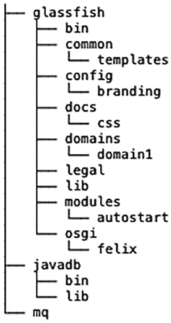

第 18 章 ■ Jakarta EE 应用服务器

***图 18-1.** GlassFish 安装目录文件夹结构*

现在，您可以启动服务器和/或开始配置您的 GlassFish 应用服务器了。

工作原理

安装 GlassFish 应用服务器只需下载 ZIP 归档文件并将其解压到您选择的目录中即可。完成后，您就可以开始配置服务器环境了。配置环境的第一步应该是更改默认管理员密码，这在配方 18-2 中有所概述。但是，如果您急于测试环境，可以进入 <<glassfish>>/bin 目录并使用以下命令启动服务器：

*nix 和 OS X：

./asadmin start-domain domain1

Windows：

asadmin start-domain domain1

■ **注意** 首次使用此命令启动应用服务器时，它将不包含管理密码。除非您在有防火墙配置的操作系统上，否则不建议在未设置管理员密码的情况下启动应用服务器，因为这样做可能会使您的系统易受攻击。有关设置或更改管理员用户密码的更多信息，请参见配方 18-2。

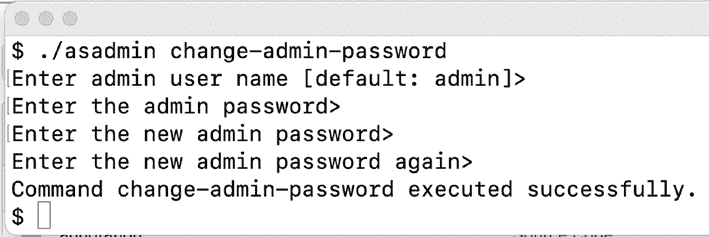

第 18 章 ■ Jakarta EE 应用服务器

18-2. 更改管理员用户密码

问题

您希望通过更改管理员用户密码来为新安装的 GlassFish 环境增加安全性。

解决方案

在您的终端或命令提示符中进入服务器的 /bin 目录，然后输入以下内容：

./asadmin change-admin-password

发出命令后，按照提示相应地更改管理员密码，如图 18-2 所示。

***图 18-2.** change-admin-password 命令*

18-3. 部署 WAR 文件

问题

您希望将 WAR 归档文件部署到应用服务器，以便您的 Web 应用程序可供使用。

解决方案

如果您尚未登录应用服务器主机，请先登录，然后利用 GlassFish 应用服务器的自动部署选项。浏览文件系统以找到您要部署的 WAR 文件。

复制所需的 WAR 文件。找到自动部署目录（路径）并将 WAR 文件粘贴到其中。假设应用程序归档文件没有配置问题，应用服务器将完成部署。

第 18 章 ■ Jakarta EE 应用服务器

工作原理

要使 Web 应用程序可供 Web 上的用户访问，必须将其部署到应用服务器。

GlassFish 有几种非常简单的技术可用于部署应用程序。Java Web 应用程序在部署前可以通过几种不同的方式进行打包。为了进一步理解部署过程，了解 Java 企业应用程序的各种可能的部署场景会有所帮助。

在 Jakarta EE 早期，最常见的包结构是企业归档（EAR）文件。EAR 文件是一个归档文件，包含一个或多个模块（通常采用 Java 归档（JAR）文件格式）以及 XML 部署描述符。标准的 EAR 结构包含两个 JAR 文件以及 XML 部署描述符。其中一个 JAR 文件包含 Web 资源，包括 HTML、JSP、JSF、JavaScript、WEB-INF 目录以及用于显示 Web 内容的其他文件。这个 JAR 文件被称为 *Web 模块*，它对应于 Jakarta Servlet 规范中定义的 Web 应用程序。

第二个 JAR 文件包含打包后用于应用程序业务逻辑的 Java 资源。这两个包可以组合成一个 EAR 文件并部署到 Jakarta EE 应用服务器，在这种情况下，应用服务器负责使用 XML 部署描述符将不同的模块放置到应用服务器内的适当位置。EAR 文件至今仍在使用，大多数使用 Java EE 5 及更早版本编写的应用程序都使用 EAR 文件格式部署。直到最近，EAR 文件仍然是分发和部署 Java EE 应用程序最常见的方式。

目前，用于 Jakarta EE Web 应用程序部署的最常见的归档类型是 Web 归档（WAR）文件。WAR 文件是包含所有 Web 标记和 Java 资源在同一归档模块下的归档文件。通常，那些不包含企业应用程序结构（如 EJB、Web 服务等）的 Java Web 应用程序可以使用 WAR 文件格式部署。自 Java EE 6 以来，所有企业应用程序也可以使用 WAR 文件格式部署，这使得打包和部署应用程序更加容易。尽管如果您使用 Java IDE，这项工作会为您完成，但部署 WAR 文件比部署 EAR 文件快得多，并且在同一个模块中处理应用程序的所有源文件比使用多个模块要容易得多。

EAR 和 WAR 文件格式都只是包含 .ear 或 .war 扩展名的 ZIP 文件。事实上，您可以通过将它们重命名为 .zip 扩展名并解压到您的文件系统来轻松查看这些归档文件的内容。GlassFish 应用服务器使得部署每种文件类型变得容易，无论是使用管理控制台还是自动部署技术。当应用服务器部署归档文件时，它会将归档文件的内容解包到部署目录中，该目录位于 <GlassFish-Home>/glassfish/domains/domain1/applications 目录中。

■ **注意** 在应用程序部署后，可以通过更新部署目录中的文件来编辑 Web 文件。任何不需要编译的 XHTML、HTML、JS 或其他代码文件，以及即时编译的 JSP，都可以在应用程序运行期间就地更新。这在生产环境中进行小的布局或 JavaScript 更改时有时会很有用。但是，请记住，如果取消部署应用程序或用另一个应用程序替换现有应用程序，则部署目录中的所有源文件都将被删除。

18-4. 添加数据库资源

问题

您的应用程序使用了底层关系数据库管理系统（RDBMS），并且您希望为此配置一个数据库资源。

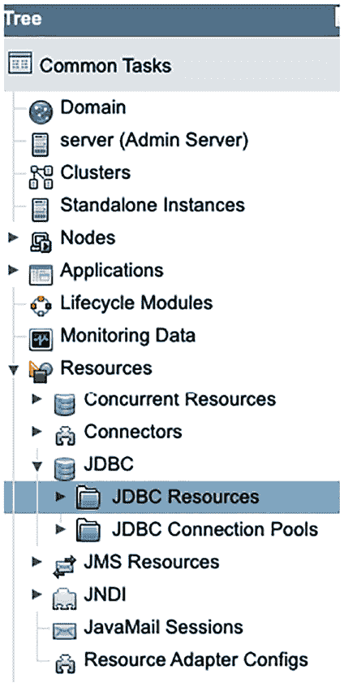

第 18 章 ■ Jakarta EE 应用服务器

解决方案

为您要连接的数据库创建一个连接池资源。创建连接池后，定义一个新的 JDBC 资源，该资源将用于为应用程序提供连接数据库的方法。要执行这些任务，首先登录到 GlassFish 管理控制台（http://localhost:4848/），然后在左侧树形菜单中展开“资源”选项下的“JDBC”菜单，如图 18-3 所示。

***图 18-3.** GlassFish 管理控制台：JDBC 资源*


接下来，点击 **JDBC 连接池** 菜单选项，这将在屏幕右侧打开 JDBC 连接池面板。在这里，您将看到当前连接池的列表，以及用于添加新池或删除现有池的按钮。点击 **新建** 按钮以开始创建新的连接池。

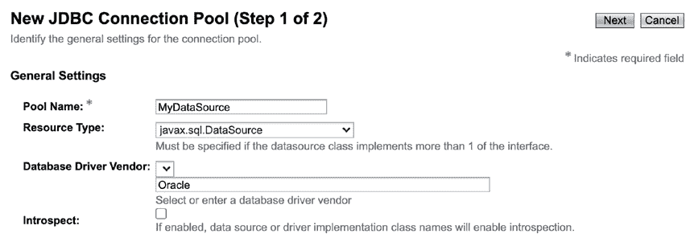

第 18 章 ■ Jakarta EE 应用服务器

这将打开 **新建 JDBC 连接池（第 1 步，共 2 步）** 面板，如图 18-4 所示。在此面板中，指定您要创建的池的名称，然后从选择列表中选择资源类型和数据库供应商。

***图 18-4.** 新建 JDBC 连接池（第 1 步，共 2 步）面板*

点击 **下一步** 按钮继续后，将显示创建新 JDBC 连接池的第二个屏幕（见图 18-5），其中包含许多用于配置连接池的设置。例如，可以选择数据源类名、调整池设置以及微调事务管理选项。我建议保留所有默认配置，除非确定需要调整某些设置以实现应用程序功能。您随时可以重新访问连接池设置，并在需要时进行调整。

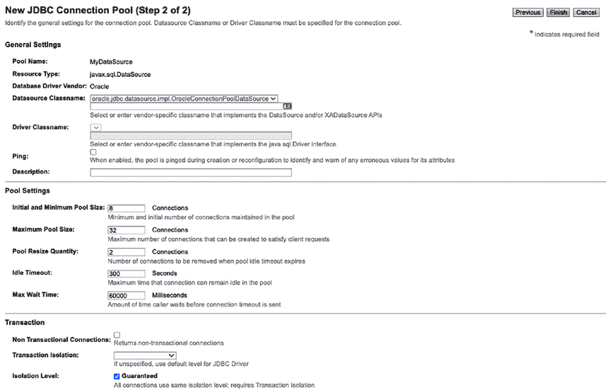

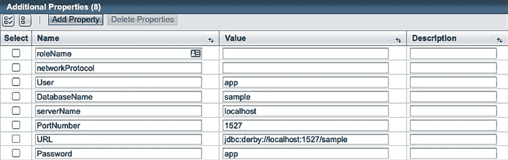

第 18 章 ■ Jakarta EE 应用服务器

***图 18-5.** 新建 JDBC 连接池（第 2 步，共 2 步）面板*

在表单底部，您会找到 **附加属性** 表（见图 18-6），您需要在此处输入与要配置的数据库连接相关的具体信息。虽然表中默认列出了许多属性，但您只需为用户、密码和 URL 输入值即可获得连接。输入这些详细信息后，您就可以点击 **完成** 按钮来创建池。

***图 18-6.** 附加 JDBC 连接属性*

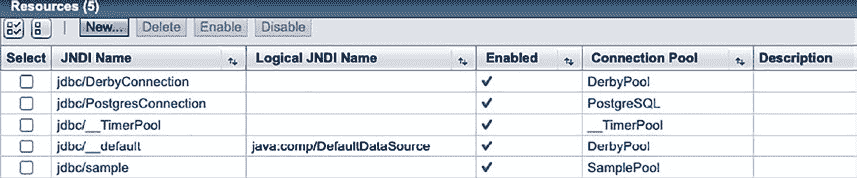

第 18 章 ■ Jakarta EE 应用服务器

■ **注意** 您必须将要使用的数据库的数据库驱动程序（JAR 文件）安装在应用服务器内。为此，只需将 JAR 文件复制到 `<GlassFish-Home>/glassfish7/domains/domain1/lib` 目录中。例如，要启用 Oracle 数据库驱动程序，请下载名为 `ojdbc7.jar` 的 JDBC 驱动程序文件并使用它。

创建池后，您可以生成一个 JDBC 资源以供应用程序内部使用。JDBC 资源本质上是一个引用您的数据库连接池的字符串标识符，它从 Web 应用程序的 `persistence.xml` 单元中使用，以利用应用服务器连接池。要创建 JDBC 资源，请从树形菜单中点击 **JDBC 资源** 菜单选项，这将打开 **JDBC 资源** 窗格（见图 18-7），列出所有现有资源。

点击 **新建** 以配置新资源。

***图 18-7.** JDBC 资源窗格*

### 工作原理

几乎每个企业应用程序都使用底层数据库来存储和检索数据。要连接到数据库，您需要配置一个用于连接的数据库帐户，并编写负责打开和关闭连接的连接实用程序。嗯，这是一种方法；另一种方法是依赖应用服务器来管理数据库连接。利用应用服务器的数据库连接池非常有用，因为它减轻了在应用程序业务逻辑中处理连接的负担，并且通过维护池中一定数量的开放连接，有助于提高应用程序的整体性能。当某个进程需要与数据库交互时，它会获取一个开放的连接对象，使用它，然后在完成后将其放回池中。通过维护此池，减轻了为每个任务打开和关闭连接的开销，从而帮助您的应用程序运行得更快。让应用服务器管理连接的另一个好处是，用于获取连接的用户名和密码仅存储在一个地方，即应用服务器。用户名和密码无需硬编码到使用应用服务器 JDBC 资源的应用程序中。这不仅从安全角度来看很有帮助，从维护角度来看也是如此。

当密码过期时，在一个位置更改密码，难道不比在每一个使用它的应用程序中费力地修改要容易得多吗？

在 GlassFish 应用服务器中配置数据源非常简单，因为您可以从管理控制台管理所有内容。但是，可以更改一些配置来改变连接池管理连接的方式。在连接池配置的第一个 **新建 JDBC 连接池** 面板中，您需要确定要创建的资源类型。表 18-1 描述了不同的资源类型。

第 18 章 ■ Jakarta EE 应用服务器

***表 18-1.** JDBC 连接池资源类型*

| **资源类型** | **描述** |
| :--- | :--- |
| `javax.sql.DataSource` | 适用于本地事务 |
| `javax.sql.XADataSource` | 适用于全局事务 |
| `javax.sql.ConnectionPoolDataSource` | 适用于本地事务，可能提升性能 |
| `java.sql.Driver` | 标准驱动程序 |

第二个 **新建 JDBC 连接池** 面板的 **池设置** 部分允许您配置可供应用程序使用的连接数量。默认情况下，应用服务器启动时的开放连接数为 8。这意味着应用程序可以从池中获取并使用 8 个连接，而不会产生任何额外开销，因为池已经打开了这些连接。

**最大池大小** 选项默认设置为 32。当应用程序需要使用连接时，它会前往池并请求一个连接。如果池中有可用的连接，则将其提供给应用程序。但是，如果没有可用连接，则会创建一个新连接。**最大池大小** 值是可能创建的连接数的上限。因此，默认情况下，如果已有 32 个连接处于打开状态，而应用程序请求一个新连接，则会抛出数据库连接错误。请记住，当应用程序使用完连接后，它会将连接返回到池中，因此，如果应用程序正常工作并在使用完毕后释放连接，那么在大多数环境中，达到最大连接数应该是相当困难的。


您的连接池还可以管理许多其他配置，例如确定连接何时超时以及何时调整池大小。在应用程序使用连接池一段时间后，请根据需要相应调整。池的事务配置允许设置隔离级别。Oracle 建议尽可能保持隔离级别不变。如果无法做到，请考虑将“隔离级别保证”设置为 false，并确保应用程序不会更改连接的隔离级别。不同的隔离级别如下所列，从上到下性能依次递减：

• READ_UNCOMMITTED（未提交读）

• READ_COMMITTED（已提交读）

• REPEATABLE_READ（可重复读）

• SERIALIZABLE（可串行化）

18-5. 添加基于表单的身份验证

问题

您希望通过利用数据库表来存储用户名和密码，以及用于不同访问权限的用户组，从而为应用程序配置身份验证。

第 18 章 ■ Jakarta EE 应用服务器

解决方案

在 GlassFish 应用服务器中设置基于表单的身份验证，方法是创建必要的数据库表来包含用户帐户和组，然后配置应用服务器以使用这些表进行身份验证。设置基于表单的身份验证的第一步是创建支持身份验证所需的数据库构件。为此，需要创建两个数据库表。其中一个表将包含用户名和密码，第二个表将包含组以及有权访问这些组的用户。

以下 SQL 语句可用于生成这些表（Oracle 语法），以及用于填充表主键值的数据库序列：

create table users(

id number,

username varchar(150) not null,

password varchar(50) not null,

primary key (id));

create table groups(

id number,

username varchar2(150) not null,

groupname varchar2(100) not null,

primary key(id));

create sequence users_s

start with 1

increment by 1;

create sequence groups_s

start with 1

increment by 1;

出于测试目的，让我们创建几个用户帐户以及几个不同的访问组。以下 SQL 语句将插入这些记录：

insert into users values(

users_s.nextval,

'admin',

dbms_obfuscation_toolkit.md5(input=>utl_raw.cast_to_raw('jakartaeerecipes')));

insert into users values(

users_s.nextval,

'juneau',

dbms_obfuscation_toolkit.md5(input=>utl_raw.cast_to_raw('testpass')));

insert into groups values(

groups_s.nextval,

'admin', 'administrator');

insert into groups values(

groups_s.nextval,

'juneau','reader');

现在数据库已为身份验证设置完毕，接下来需要配置数据库以使用这些表进行身份验证。为此，请登录 GlassFish 管理控制台，导航至“配置”➤“服务器配置”➤“领域”菜单选项，然后单击“新建”按钮。这将打开“新建领域”面板，如图 18-8 所示。

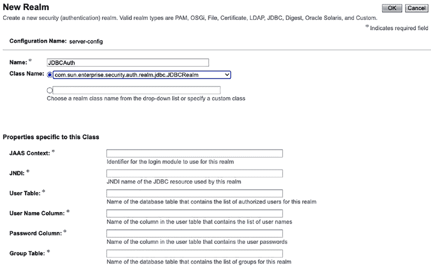

第 18 章 ■ Jakarta EE 应用服务器

***图 18-8.** 为 GlassFish 创建新的安全领域*

在“新建领域”表单中，输入领域名称，在本示例中将其命名为 JDBCAuth。

接下来，对于类名，从下拉菜单中选择 com.sun.enterprise.security.auth.realm.jdbc.JDBCRealm。完成表单的第一部分后，需要填写该类特有的属性。对于本示例，请使用表 18-2 中显示的值来完成此表单。

***表 18-2.** JDBC 安全领域类的特有属性*

**属性**

**值**

JAAS

jdbcAuth

JNDI

jdbc/OracleConnection

用户表

users

用户名列

username

密码列

password

组表

groups

组名列

groupname

密码加密算法

MD5（SQL 插入语句中使用的算法）


完成后，点击 **OK** 保存值并创建域。新创建的域现在应出现在域列表中，如图 18-9 所示。

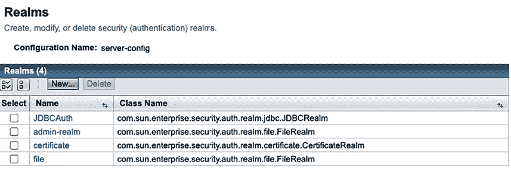

第 18 章 ■ Jakarta EE 应用服务器

***图 18-9.** GlassFish 管理控制台中的域列表*

应用服务器配置到此结束。现在如何使用新的安全域？一种方法是利用成熟的技术，创建一个登录视图，并对应用程序的 `web.xml` 文件进行一些配置更改，以在应用程序内实现身份验证。一种更现代的技术是利用 Jakarta Security API，该 API 在 Java EE 8 中被引入到平台中。本方案涵盖了较旧的技术，并重点介绍了它与较新的 Jakarta Security API 之间的一些差异。要查看一个从头到尾的更现代示例，请参考第 15 章。首先，让我们看看需要对 `web.xml` 进行哪些更改来配置表单身份验证。以下摘录自 JakartaEE10Recipes 源码中的 `web.xml` 配置文件，展示了需要进行的更新：

<security-constraint>

<display-name>Admin</display-name>

<web-resource-collection>

<web-resource-name>Admin Tools</web-resource-name>

<description/>

<url-pattern>/faces/admin/*</url-pattern>

<http-method>GET</http-method>

<http-method>POST</http-method>

<http-method>HEAD</http-method>

<http-method>PUT</http-method>

<http-method>OPTIONS</http-method>

<http-method>TRACE</http-method>

<http-method>DELETE</http-method>

</web-resource-collection>

<auth-constraint>

<description/>

<role-name>admin</role-name>

</auth-constraint>

</security-constraint>

<security-constraint>

<display-name>User</display-name>

<web-resource-collection>

<web-resource-name>Protected Users Area</web-resource-name>

<description/>

<url-pattern>/faces/users/*</url-pattern>

<http-method>GET</http-method>

第 18 章 ■ Jakarta EE 应用服务器

<http-method>POST</http-method>

<http-method>HEAD</http-method>

<http-method>PUT</http-method>

<http-method>OPTIONS</http-method>

<http-method>TRACE</http-method>

<http-method>DELETE</http-method>

</web-resource-collection>

<auth-constraint>

<description/>

<role-name>user</role-name>

</auth-constraint>

</security-constraint>

<login-config>

<realm-name>JDBCRealm</realm-name>

<form-login-config>

<form-login-page>/faces/loginForm.xhtml</form-login-page>

<form-error-page>/faces/loginError.xhtml</form-error-page>

</form-login-config>

</login-config>

接下来，需要将 GlassFish 服务器安全角色映射添加到 `sun-web.xml` 配置文件中，该映射将应用程序角色映射到数据库组。以下摘录展示了映射配置：

<security-role-mapping>

<role-name>admin</role-name>

<group-name>administrator</group-name>

</security-role-mapping>

<security-role-mapping>

<role-name>user</role-name>

<group-name>reader</group-name>

</security-role-mapping>

最后，用户将看到的视图必须包含用户名和密码输入文本字段的特定名称，并且表单操作必须设置为 `j_security_check`，这将导致控制权传递给应用服务器以处理身份验证。以下登录表单演示了此过程。您可以在 JakartaEE10Recipes 项目中的 `login.xhtml` 表单内看到这些源码。

<?xml version="1.0" encoding="UTF-8"?>

<!DOCTYPE html PUBLIC "-//W3C//DTD XHTML 1.0 Strict//EN" "http://www.w3.org/TR/xhtml1/DTD/

xhtml1-strict.dtd">

<html

>

<h:head>

<meta http-equiv="Content-Type" content="text/html; charset=UTF-8"/>

<title>TODO supply a title</title>

</h:head>

第 18 章 ■ Jakarta EE 应用服务器

<h:body>

<p>

<form method="POST" action="j_security_check">

Username: <input type="text" name="j_username" />

Password: <input type="password" name="j_password" />

<br />

<input type="submit" value="Login" />

<input type="reset" value="Reset" />

</form>

</p>

</h:body>

</html>

当用户将浏览器指向 `login.xhtml` 视图时，系统将提示他们登录应用程序。

工作原理

保护应用程序的安全是任何企业应用程序的关键步骤。添加用于登录的用户名和密码是最基本的安全形式之一。GlassFish 应用服务器、底层数据库以及一些基本的 Jakarta EE 应用程序配置的结合，使得通过用户名和密码保护应用程序变得轻而易举。本方案的解决方案演示了如何在应用服务器内配置一个安全域，该域将利用数据库表来存储用户名和密码组合。虽然此解决方案中的一些数据库代码特定于 Oracle 数据库，但同样的技术可以应用于大多数关系数据库管理系统（RDBMS），只需对代码进行少量修改即可保护数据库中的密码。

在 GlassFish 中配置安全域的第一步是设置底层数据库表，该表将用于包含安全凭证。确保表中存储的密码已加密至关重要；否则，任何对为此解决方案创建的安全表具有只读访问权限的人都可以看到它们。在本方案的解决方案中，使用了 Oracle 数据库的 `dbms_obfuscation_toolkit.md5` 函数来对密码进行哈希处理。但是，如果您使用其他数据库系统，应该也有类似的工具可用于加密目的。配置数据库时，应创建一个表来保存用户名和密码，并创建另一个表来保存组或安全角色。这将允许使用该域的应用程序包含高级别的安全配置，从而可以根据角色向不同用户授予不同级别的访问权限。

创建数据库对象后，必须配置服务器以利用数据库进行身份验证。这是通过登录管理控制台并设置一个新的安全域来完成的。在“新建域”表单上需要填写多条信息，这些信息用于将域映射到相应的数据库表和列。为域指定的名称可以是任何有效的字符串，类名应为 `com.sun.enterprise.security.auth.realm.jdbc.JDBCRealm`，因为可以创建多种不同类型的安全域，包括 LDAP 域等。表单上的其余信息应根据每个文本字段的说明进行填写。务必确保 JDBC 资源已配置好，并且为 JDBC 资源指定的名称与表单上 JNDI 字段提供的名称匹配。

要为应用程序配置使用安全域，必须在应用程序的 `web.xml` 配置文件中指定安全约束和登录配置。安全约束用于将指定的 Web 文件夹映射到应用程序的不同用户角色。这意味着应用程序的所有管理页面都可以放入一个文件夹中，并且可以在 `web.xml` 文件中设置安全约束，以根据安全凭证限制对该文件夹的访问。如果您查看解决方案中的配置示例，可以看到已经设置了一个安全约束。

第 18 章 ■ Jakarta EE 应用服务器


配置时显示名称为 Admin。任何有效的字符串标识符都可以赋予安全约束的 display-name、web-resource-name 或 description 元素。url-pattern 元素指定了该约束应保护哪个文件夹，放置在该文件夹中的任何内容都将受到保护，防止未经授权的用户访问。每个 http-method 元素列出了与给定文件夹内资源相关的不同 HTTP 方法。auth-constraint 子元素包含角色映射，可以为其赋予一个描述以及用于限制访问的 role-name。指定的 role-name 应与创建用于存储组的数据库表中放置的某个组值相匹配。任何与给定组或角色相对应的用户名，只要能够成功登录应用程序，都将有权访问受保护文件夹内的资源。如果部署到 GlassFish，则必须更新 `sun-web.xml` 配置文件，使其包含角色到组的映射。这可以通过向 `sun-web.xml` 文件添加 `security-role-mapping` 元素来实现，并且每个元素必须包含一个 `role-name` 元素以及一个相应的 `groupname` 元素。

最后一部分是创建一个登录表单。该表单必须包含一个名为 `j_security_check` 的 action，因为这将把身份验证的控制权传递给应用服务器。username 和 password 元素必须分别包含 `j_username` 和 `j_password` 的名称。这样做将允许这些元素被正确地传递给身份验证机制。当表单提交时，用户名和密码被发送到身份验证机制，该机制由应用服务器通过您创建的安全域进行处理。如果使用了正确的用户名和密码组合，会话将被授予访问已为经过身份验证的用户角色指定的任何资源的权限。如果给定用户的角色不允许其通过 `web.xml` 文件中设置的安全约束访问应用程序的某些区域，则该用户将被拒绝访问。

配置基于表单的身份验证是控制应用程序访问权限的一种好方法。它允许每个应用程序包含自己的安全基础设施，从而能够将应用程序的某些区域限制给指定的角色。使用 JDBC 域的唯一缺点是密码必须存储在数据库表中。因此，只要使用良好的加密算法来混淆密码，这应该是一个很小的风险。

■ **注意** 要改用 LDAP 身份验证，请使用 `com.sun.enterprise.security.auth.realm.ldap.LDAPRealm` 类设置一个安全域。为 JaaS 上下文指定一个字符串值，该值将用于引用该域。目录应设置为要用于身份验证的 LDAP 服务器的 URL。Base Dn 必须设置为将用于向 LDAP 服务器进行身份验证的用户的 Base Dn（使用一个对 LDAP 目录具有读取权限的单独 LDAP 帐户进行身份验证）。LDAP 配置可能需要的其他属性包括 `search-bind-password`、`search-bind-dn` 和/或 `search-filter`。要了解有关 LDAP 配置的更多信息，请参考在线文档。

18-6. 将微服务部署到 GlassFish

问题

您希望将一个 Jakarta EE 应用程序部署到一个更轻量的应用服务器容器中，该容器仅包含支持应用程序所需的最少规范集。您还将开发一个旨在通过 Web 服务提供特定数据集的应用程序。

第 18 章 ■ Jakarta EE 应用服务器

解决方案

开发一个极简的应用程序，专注于为一组目标数据提供 Web 服务。在以下示例中，将开发一个小型 Jakarta EE Web 应用程序，用于托管一组提供图书作者数据的 Web 服务。这个小型 Web 应用程序将被配置为仅使用应用程序功能所需的 Jakarta EE 10 规范。然后，该应用程序将部署到 GlassFish 应用服务器。

■ **注意** 此示例演示了解决方案所需的 Java 类的构建。要查看包括配置文件在内的完整解决方案，请参阅本书的 AuthorService 项目源码。

首先，创建一个名为 `AuthorService` 的新 Maven Web 应用程序，并添加以下依赖项：

*   RESTful Web 服务 (JAX-RS) 3.1
*   Jakarta 持久化 (JPA) 3.1
*   Apache Derby JDBC 10.15
*   Bean 验证 3.0
*   Jakarta 企业 Beans (EJB) 4.0
*   Eclipse 持久化 4.0

完成后，POM 依赖项应如下所示：

```xml
<dependency>
    <groupId>jakarta.ws.rs</groupId>
    <artifactId>jakarta.ws.rs-api</artifactId>
    <version>3.0.0</version>
    <scope>provided</scope>
</dependency>
<dependency>
    <groupId>jakarta.persistence</groupId>
    <artifactId>jakarta.persistence-api</artifactId>
    <version>3.0.0</version>
    <scope>compile</scope>
</dependency>
<dependency>
    <groupId>jakarta.validation</groupId>
    <artifactId>jakarta.validation-api</artifactId>
    <version>3.0.1</version>
</dependency>
<dependency>
    <groupId>jakarta.ejb</groupId>
    <artifactId>jakarta.ejb-api</artifactId>
    <version>4.0.0</version>
    <type>jar</type>
</dependency>
<dependency>
    <groupId>org.eclipse.persistence</groupId>
    <artifactId>eclipselink</artifactId>
    <version>3.0.2</version>
    <scope>provided</scope>
</dependency>
<dependency>
    <groupId>org.apache.derby</groupId>
    <artifactId>derbyclient</artifactId>
    <version>10.15.2.0</version>
</dependency>
</dependencies>
```

接下来，添加两个 Java 包：`org.jakartaeerecipe.authorservice.entity` 和 `org.jakartaeerecipe.authorservice.rest`。在实体包中为 `AUTHOR_WORK`、`BOOK`、`BOOK_AUTHOR` 和 `CHAPTER` 数据库表创建实体类。Author 实体类的源代码如下所示。按照相同的方法生成其他实体类：

```java
package org.jakartaeerecipe.authorservice.entity;

import java.io.Serializable;
import java.math.BigDecimal;
import java.math.BigInteger;
import jakarta.persistence.*;
import jakarta.validation.constraints.NotNull;

@Entity
@Table(name = "AUTHOR_WORK")
@NamedQueries({
    @NamedQuery(name = "AuthorWork.findAll", query = "SELECT a FROM AuthorWork a")})
@XmlRootElement
public class AuthorWork implements Serializable {
    private static final long serialVersionUID = 1L;
    @Id
    @Basic(optional = false)
    @NotNull
    @Column(name = "ID")
    private BigDecimal id;
    @Column(name = "BOOK_ID")
    private BigDecimal bookId;
    @JoinColumn(name = "AUTHOR_ID", referencedColumnName = "ID")
    @ManyToOne(optional = false)
    private BookAuthor authorId;
    // Getters and Setters
    @Override
    public int hashCode() {
        int hash = 0;
        hash += (id != null ? id.hashCode() : 0);
        return hash;
    }
    @Override
    public boolean equals(Object object) {
        // TODO: Warning - this method won't work if the id fields are not set
        if (!(object instanceof AuthorWork)) {
            return false;
        }
        AuthorWork other = (AuthorWork) object;
        if ((this.id == null && other.id != null) || (this.id != null && !this.id.equals(other.id))) {
            return false;
        }
        return true;
    }
    @Override
    public String toString() {
        return "org.jakartaee10recipe.entity.AuthorWork[ id=" + id + " ]";
    }
}
```

■ **注意** 请记住为每个实体类添加 `@XmlRootElement` 注解，因为此注解使实体能够转换为 XML 格式。常见的 Web 服务格式之一是 XML，因此您几乎总是希望启用此功能。


接下来，创建一个 Web 服务类，该类将查询数据库并以适当的格式将数据返回给 Web 服务客户端。为此，创建一个名为 `BookAuthorFacadeREST` 的类，其中包含多个方法，这些方法将查询实体类并以 JSON 或 XML 格式将数据返回给调用方。首先，使用 `@jakarta.ejb.Stateless` 注解该类，以便该类能够使用 JPA 执行事务性查询。接着，使用 `@jakarta.ws.rs.Path` 注解，并提供一个路径，REST 服务将通过该路径在 URI 上可用。注入一个 `@PersistenceContext`，它引用了应用程序的持久化上下文单元名称。请注意，你需要为应用程序创建一个持久化单元，因此如有需要，请参考配方 7-3 了解更多详情。持久化单元用于通过 JPA API 查询数据。由于此应用程序将部署到 Payara Micro 而非传统的应用服务器，因此最佳实践是在 `web.xml` 中定义数据源，然后在 `/src/main/resources/META-INF/persistence.xml` 中引用已定义的数据源。因此，创建一个包含以下配置的 `web.xml` 部署描述符：

```xml
<?xml version="1.0" encoding="UTF-8"?>
<web-app
    xsi:schemaLocation="http://xmlns.jcp.org/xml/ns/javaee http://xmlns.jcp.org/xml/ns/javaee/web-app_3_1.xsd"
    version="3.1">
    <session-config>
        <session-timeout>
        </session-timeout>
    </session-config>
    <data-source>
        <name>java:global/DerbyDataSource</name>
        <class-name>org.apache.derby.jdbc.ClientDriver</class-name>
        <server-name>localhost</server-name>
        <port-number>1527</port-number>
        <url>jdbc:derby://localhost:1527/acme</url>
        <user>acmeuser</user>
        <password>yourpassword</password>
    </data-source>
</web-app>
```

最后，编写用于查询数据库并以适当格式返回数据的方法。在本例中，这些方法将返回 `BookAuthor` 数据。其中一个方法将返回 `BOOK_AUTHOR` 数据库表中的所有记录，而另一个方法将返回包含匹配 ID 的 `BOOK_AUTHOR` 记录。

```java
package org.jakartaee10recipe.authorservice.rest;

import java.math.BigDecimal;
import java.util.List;
import jakarta.ejb.Stateless;
import jakarta.persistence.EntityManager;
import jakarta.persistence.NoResultException;
import jakarta.persistence.PersistenceContext;
import jakarta.ws.rs.GET;
import jakarta.ws.rs.Path;
import jakarta.ws.rs.PathParam;
import jakarta.ws.rs.Produces;
import jakarta.ws.rs.core.MediaType;
import org.jakartaee10recipe.authorservice.entity.BookAuthor;

@Stateless
@Path("bookAuthor")
public class BookAuthorFacadeREST {

    @PersistenceContext(unitName = "AuthorService_1.0PU")
    private EntityManager em;

    @GET
    @Path("{id}")
    @Produces({MediaType.APPLICATION_XML, MediaType.APPLICATION_JSON})
    public BookAuthor find(@PathParam("id") BigDecimal id) {
        BookAuthor bookAuthor = null;
        try {
            bookAuthor = (BookAuthor)
                em.createQuery("select object(o) from BookAuthor o " +
                               "where o.id = :id")
                  .setParameter("id", id)
                  .getSingleResult();
        } catch (NoResultException ex){
            System.out.println("Error: " + ex);
        }
        return bookAuthor;
    }

    @GET
    @Produces({MediaType.APPLICATION_XML, MediaType.APPLICATION_JSON})
    public List<BookAuthor> findAll() {
        List<BookAuthor> bookAuthors = null;
        try {
            bookAuthors = em.createQuery("select object(o) from BookAuthor o")
                            .getResultList();
        } catch (NoResultException ex){
            System.out.println("Error: " + ex);
        }
        return bookAuthors;
    }

    protected EntityManager getEntityManager() {
        return em;
    }
}
```

最后，对于应用程序，创建 `ApplicationConfig` 类，该类将用于为应用程序配置 JAX-RS：

```java
@jakarta.ws.rs.ApplicationPath("rest")
public class ApplicationConfig extends Application {

    @Override
    public Set<Class<?>> getClasses() {
        Set<Class<?>> resources = new java.util.HashSet<>();
        resources.add(org.jakartaee10recipe.authorservice.rest.BookAuthorFacadeREST.class);
        return resources;
    }
}
```

现在，应用程序应该已经准备好部署到应用服务器。因此，它可以部署到 GlassFish 7，并且应该可以正常工作，不会出现问题。

`bookAuthor` 服务将在 `http://localhost:8080/AuthorService/rest/bookAuthor/` 上可用。

### 工作原理

在本配方中，创建了一个简单的 Jakarta EE 应用程序“微服务”并将其部署到 GlassFish。为了创建这个极简的应用程序，创建一个 Maven Web 应用程序，并仅将运行应用程序所需的 Jakarta EE API 作为依赖项包含在内。在本例中，这些依赖项包括 Jakarta RESTful Web Services、Jakarta Persistence、Bean Validation 和 Enterprise Beans。运行应用程序还需要另外两个依赖项，即 Apache Derby JDBC 驱动程序和 Eclipse Persistence JPA 实现。如示例所示，要创建 `SimpleService` 应用程序，请包含 `AuthorWork` 实体类。为应用程序创建一个 `web.xml` 部署描述符，并在其中定义一个数据源，该数据源将用于连接到 Apache Derby 数据库。然后，可以创建一个持久化单元供应用程序的 JPA 调用使用。在部署描述符中配置数据源使得在 Payara Micro 上部署变得容易，因为无需进行服务器端配置。

这个简单的应用程序包含几个实体类，它们映射到查询 `BOOK_AUTHOR` 数据库表所需的数据库表。然后，这些实体类被用于在 `BookAuthorFacadeREST` 类中创建 RESTful 服务。该类包含两个简单的 REST 服务，每个服务都是 `@GET` 服务。这意味着这些服务将用于检索数据。`find()` 方法创建了一个服务，允许你查询与给定 ID 匹配的 `BookAuthor` 实体。在调用服务时，可以在 URI 中指定该 ID。`findAll()` 方法简单地以 XML 或 JSON 格式返回所有 `BookAuthor` 结果。有关开发 RESTful Web 服务的更多详细信息，请参阅第 13 章。

`ApplicationConfig` 类将 Jakarta RESTful Web Services 类注册到 API 本身，从而使 RESTful 服务可供使用。该类扩展了 `Application` 抽象类，允许重写 `getClasses()` 以返回应用程序的 JAX-RS 资源列表。在本例中，唯一的 Jakarta RESTful Web Service 资源是 `org.jakartaeerecipe.authorservice.rest.BookAuthorFacadeREST.class`。`@ApplicationPath` 注解提供了应在 URI 中用于访问 RESTful 服务的路径。

展开的 WAR 只是将 WAR 文件的内容提取到一个文件夹中。可以通过简单地将 `.war` 扩展名更改为 `.zip` 并提取内容来提取 WAR 文件。如果你使用的是基于 Maven 的应用程序，编译后项目目录将包含一个 `target` 目录。在 `target` 目录内，将包含展开的 WAR，以及包括 WAR 文件本身在内的其他几个文件夹。

有时，如果你希望更改那些不需要重新编译的文件（如 XHTML、JS、CSS、HTML、Jakarta Server Pages 等）而无需重新编译 WAR，那么部署展开的 WAR 是有益的。

**第 19 章**

**部署到容器**


容器化技术领域已经蓬勃发展，如今在技术领域几乎不可能不遇到“容器化”或具体来说“Docker”这个词。Docker 是一种技术，它允许将完整的应用程序环境打包到一个轻量、可移植的容器中。这项技术提供了轻松配置和定制容器的能力，使其能够运行各种操作系统、虚拟机、数据库、应用服务器、Web 服务器等，从而实现应用程序一次部署到容器，即可移植到几乎任何环境。凭借这种能力，开发人员可以轻松创建由多个相互通信的容器组成的应用程序，这些容器紧密集成，从而构建出健壮且容错性强的应用程序。

有人可能会问：“为什么要部署到容器，然后再交付容器，而不是直接交付一个 Web 归档 (WAR) 文件？”或者“为什么要创建多个较小的应用程序并部署到多个容器中，以构建一个单一的整体系统？”这些问题的答案有多种，具体取决于解决方案的需求。在某些情况下，部署到容器并无必要，标准的 WAR 文件就完全足够。然而，容器化的主要优势之一在于创建可重现的环境。这意味着可以创建一个容器，并将应用程序部署到该容器中，从而提供一个在任何地方都能以相同方式运行的可移植容器。当这样的容器交付给客户时，它的运行方式将与在开发人员机器上或测试环境中完全一致。可重现。这是一个巨大的优势。您有多少次在开发完应用程序后，将其部署到不同环境的应用服务器上，却遇到了难以捉摸的问题？许多开发人员都曾遭遇此类困扰，并花费无数小时试图寻找解决方案……

容器化可以提供帮助。该解决方案还使得共享预构建镜像以供其他用途成为可能。这正是 Docker Hub 背后的理念，它提供了一个预构建镜像库供用户使用。Docker Hub 上的镜像可以直接使用，也可以进行扩展以根据需求进行定制。

那么，开发多容器解决方案背后的理由是什么呢？当一个系统由多个相互独立运行的容器构建而成时，可以轻松实现容错。每个容器化应用程序可以只执行单个任务（或少量相关任务），并与其他容器进行通信。这种类型的解决方案也被称为“微服务”，许多成功的解决方案都是采用这种方法开发的。如果其中一个容器发生故障，其他容器将继续运行，只有整个系统的单个功能会变得不可用。更妙的是，可以使用容错机制自动生成一个新容器来替代不可用的容器。

Docker 和容器化解决方案还提供了许多其他优势，包括快速启动时间、易于管理的 CPU 和容器配置、小巧的可移植解决方案，以及容器的快速复制和/或重建，仅举几例。注意到容器化的所有这些优势，很容易理解人们为何会过度依赖容器，并将其用于一切。我必须强调，容器化并非在所有情况下都是最佳解决方案。您必须有所选择，并为手头的应用程序选择最佳策略。

© Josh Juneau 和 Tarun Telang 2022

J. Juneau 和 T. Telang, *Java EE 到 Jakarta EE 10 实战*[, https://doi.org/10.1007/978-1-4842-8079-9_19](https://doi.org/10.1007/978-1-4842-8079-9_19#DOI)

第 19 章 ■ 部署到容器

本章将简要概述如何使用 Docker 创建容器化应用程序。阅读完本章后，您将对如何创建 Docker 容器以及如何将应用程序部署到容器有基本的了解。您还将对如何使多个容器相互通信以创建一个统一的解决方案有基本的了解。

19-1\. 创建 Docker 镜像并运行 Java

问题

您希望创建一个 Docker 镜像并运行一个小的 Java 可执行程序。

解决方案

按照以下步骤创建一个 Docker 容器：

1.  在您的机器上创建一个新文件夹，并将其命名为 **javaapp**。切换到该新文件夹：

    ```
    mkdir javaapp
    cd javaapp
    ```

2.  在新目录中创建一个文件，并将其命名为 **Dockerfile**，不带任何文件扩展名。该文件将包含构建容器的指令：

    ```
    nano Dockerfile
    ```

    或

    ```
    vim Dockerfile
    ```

    ■ **注意** Nano 和 Vim 编辑器都是从终端使用的，并且它们适用于多种操作系统。

3.  将以下内容添加到 Dockerfile 中：

    ```
    FROM openjdk:17
    COPY . /var/www/java
    WORKDIR /var/www/java
    RUN javac HelloDocker.java
    CMD ["java", "HelloDocker"]
    ```

    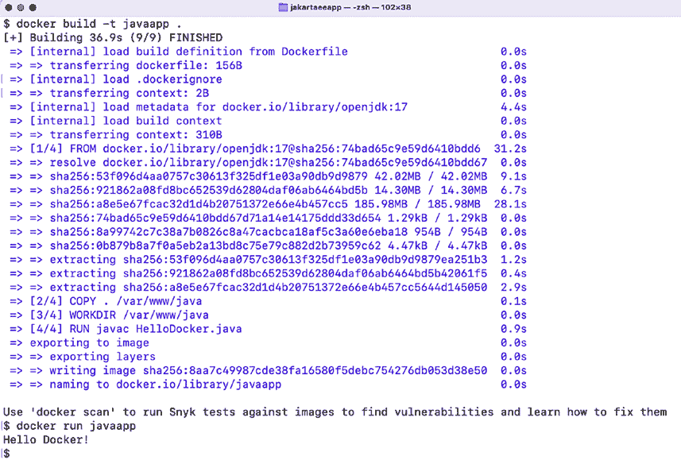

    第 19 章 ■ 部署到容器

4.  创建一个包含 `main()` 方法的小型 Java 程序。将文件命名为 `HelloDocker.java`，并在其中放入以下内容：

    ```
    class HelloDocker {
        public static void main(String[] args){
            System.out.println("Hello Docker!");
        }
    }
    ```

5.  在 `jakartaeeapp` 目录内，通过命令行或终端执行以下命令来构建 Docker 镜像：

    ```
    docker build -t javaapp .
    ```

6.  通过发出以下命令来运行 Docker 镜像：

    ```
    docker run javaapp
    >> Hello Docker!
    ```

    这将产生以下输出：

    第 19 章 ■ 部署到容器

    工作原理

    创建一个 Java 应用程序并将其打包到 Docker 镜像中非常简单。首先，必须在用于创建 Docker 容器的机器上安装 Docker 环境。

    在 Windows 或 Mac 平台上，这通常意味着安装 Docker Desktop。在 Linux 上，这通常是社区版或 Docker 服务器环境，例如 Docker Enterprise Edition。

    ■ **注意** 有关在 Linux、Mac 或 Windows 上安装 Docker 的更多信息，请参阅在线文档：[`docs.docker.com/get-docker/`](https://docs.docker.com/get-docker/)。

    安装 Docker 后，即可创建容器并将其安装到本地镜像仓库中。

    要开始创建基本的 Docker 镜像，请创建一个文件夹，用于存放将成为 Docker 镜像一部分的所有文件。接下来，在该文件夹内创建一个名为 **Dockerfile** 的文件，该文件将用于配置镜像。**Dockerfile** 用于指定构建此镜像所基于的基础镜像，并且还允许指定配置，例如应用程序入口点、通信端口、数据库信息等。

    在示例中，基础 Docker 镜像源自 OpenJDK 17，使用了语句 `FROM openjdk:17`。示例 Dockerfile 的下一行指示将当前文件夹的内容复制到镜像内的 `/var/www/java` 文件夹中。Docker 的 `WORKDIR` 命令用于为后续的任何 `RUN`、`CMD`、`ENTRYPOINT`、`COPY` 和 `ADD` 指令设置工作目录。在示例中，下一行执行 Java 程序并创建一个镜像：

    ```
    RUN javac HelloDocker.java
    ```

    Docker 容器运行一个通过 Dockerfile 中包含的命令创建的镜像。`RUN` 命令创建一个容器，该容器在作为容器基础的 OS 镜像之上合并一个镜像并运行它。

    `RUN`、`CMD` 和 `ENTRYPOINT` 指令可以以 Shell 形式或 Exec 形式执行。在此示例中，`CMD` 指令使用了 Exec 形式。Exec 形式使用以下格式：

    ```
    <instruction> ["executable","parameter1","parameter2"]
    ```

    Shell 形式采用以下格式：


<instruction> 命令

在示例中，Dockerfile 的最后一行包含 CMD 命令。每个 Dockerfile 只能有一个 CMD 命令。如果存在多个 CMD 命令，则执行文件中的最后一个。CMD 命令为正在执行的容器提供默认值。在示例中，CMD

命令以 Exec 格式编写，该格式提供可执行文件，后跟参数：CMD ["java", "HelloDocker"]

在这种情况下，可执行文件是“java”，参数是“HelloDocker”，这是可执行 Java 应用程序的名称。该命令的其他可能格式是“Entrypoint”和 Shell 形式。

要了解有关不同格式以及不同 Dockerfile 命令的更多信息，请参阅在线文档：

https://docs.docker.com/engine/reference/builder/

第 19 章 ■ 部署到容器

构建 Dockerfile 后，可以通过从命令行或终端调用 docker build 指令，使用 docker 可执行文件来构建镜像。在示例中，传递了 -t 选项，该选项为镜像指定了一个名称。要查看 docker build 可用的许多不同选项，请参阅在线文档：

https://docs.docker.com/engine/reference/commandline/build/

最后，要运行容器，请从命令行或终端发出 docker run 指令。在示例中，仅将镜像名称传递给 docker run 命令。但是，还可以指定更多选项。请参阅在线文档以了解各种选项：https://docs.docker.com/engine/reference/run/

19-2\. 利用官方 Payara Docker 镜像将镜像部署到 Payara 服务器

问题

您将利用 Payara 服务器的预构建 Docker 镜像创建一个容器，并将应用程序部署到其中。

解决方案

利用 Docker Desktop 安装来运行存储在 Docker Hub 上的 Payara Docker 镜像。以下命令将从 Docker Hub 拉取官方 Payara 镜像，创建一个包含“deployments”文件夹中存在的 WAR 文件的容器，并运行该容器：

docker run -d -p 4848:4848 -p 8095:8080 -v /Java_Dev/deployments:/opt/payara/deployments --name payara-container payara/server-full:latest

工作原理

要轻松启动一个基于 Payara 服务器构建的容器，请使用 docker run 命令，并可选择传递一些操作符或参数来即时配置容器。该命令最基本的形式遵循以下格式：

docker run <镜像名称>

镜像名称的格式为 <社区>/<仓库>:标签。

只需输入 docker run --help 即可查看可用参数。表 19-1 解释了一些最常用的参数。

第 19 章 ■ 部署到容器

***表 19-1.** 常用 docker run 操作符*

**操作符**

**描述**

-d

以分离模式运行容器

-rm

与 -d 一起使用时，在容器退出或守护进程退出时移除容器

--name

为容器提供标识符

-p

将容器端口发布到主机端口，格式为

主机端口:容器端口

-v

将卷从主机挂载到容器

在示例中，容器内的端口 4848 映射到主机上的端口 4848。同样，容器内的端口 8080 映射到主机上的端口 8095。主机上的卷 **/Java_Dev/Deployments** 映射到容器卷 **/opt/payara/deployments**。因此，如果主机卷中存在任何 WAR

文件，当 Payara 服务器启动时，它们将被自动部署，因为它们会被复制到 Payara 的部署目录中。示例中的容器被命名为 *payara-container*，这比随机生成的编号更容易识别。最后，该容器基于最新的 Payara Server 镜像。

19-3\. 创建一个运行基本 Jakarta EE 应用程序的 Docker 容器

问题


您希望从镜像创建一个 Docker 容器，并在该容器中运行 Jakarta EE 应用程序。

解决方案

利用一个容器镜像（例如 Payara 或 WildFly）作为 Jakarta EE Docker 容器的基础。在本解决方案中，将使用 Payara 来部署一个包含 Jakarta RESTful Web 服务的基本“Hello World”Jakarta EE 应用程序。

就本例而言，一个简单的 Jakarta EE 应用程序已随本书的源代码打包。该应用程序名为 **HelloApp**，您可以使用 Apache NetBeans 或 IntelliJ IDEA 等 IDE 打开该项目并将其编译成 WAR 文件。

要部署到容器，需要构建一个 **Dockerfile**，它将拉取容器的基础镜像，然后可以在其上叠加后续镜像，以创建一个功能完整的容器。首先，在 **HelloApp** 项目的根目录中创建一个无扩展名的文件，并将其命名为 **Dockerfile**。在 **Dockerfile** 中，放置以下内容：

FROM payara/server-full:latest

COPY target/HelloApp-1.0.war $DEPLOY_DIR

接下来，通过执行 `docker run` 命令并传递镜像名称和版本来构建镜像。请务必包含末尾的点号（.），因为这表示将当前目录的内容包含在构建中：

docker build -t hello-app:1.0 .

第 19 章 ■ 部署到容器

最后，通过执行 `docker run` 命令来运行容器，提供主机端口映射以及镜像名称和版本：

docker run -it -p 8095:8080 hello-app:1.0

执行此命令后，容器将启动，您可以访问 REST 端点（应位于 http://localhost:8095/HelloApp-1.0/rest/helloService/hello），并看到结果：Hello World

工作原理

许多应用服务器容器供应商会以 Docker 就绪格式打包其容器，通常是在 Docker Hub 上。因此，很容易使用这些容器之一作为基础来构建镜像，然后将应用程序或服务部署到该容器中。

在本例中，Dockerfile 的第一行拉取了 Payara Server，用于创建基础镜像。接下来，使用 `COPY` 命令将 HelloApp-1.0.war 文件复制到 Payara 服务器中由 `$DEPLOY_DIR` 引用的区域。关于此 `COPY` 命令，有几点需要注意。首先，假设 Dockerfile 位于项目目录的根目录下。因此，在 Dockerfile 的同一层级应有一个 `target` 文件夹。在 `target` 文件夹内应有编译好的 HelloApp-1.0.war。因此，`COPY` 命令引用了 `target/HelloApp-1.0.war`。其次，`$DEPLOY_DIR` 变量是使用 Payara 服务器镜像时引用的特殊变量。此变量指向容器的 `/opt/payara/deployments` 目录。总而言之，此命令是告诉 Docker 将 WAR 文件复制到自动部署目录中。

可以通过执行 `docker build` 命令来构建镜像。在这种情况下，使用 `-t` 选项来指定镜像名称和版本。要查看此命令的完整选项列表，请参考在线文档：[`docs.docker.com/engine/reference/commandline/build/`](https://docs.docker.com/engine/reference/commandline/build/)。

为了运行容器，请执行 `docker run` 命令。在本例中，`-it` 选项指示 Docker 分配一个连接到容器标准输入的伪 TTY。这实质上是在容器内创建了一个交互式 bash。`-p` 选项指定了主机到容器的端口映射。传递给 `docker run` 的最后一个参数是镜像名称和版本。

使用您从多个兼容的 Jakarta EE 应用服务器容器中选择的一个来创建容器并部署应用程序是轻而易举的事。许多供应商都提供 Docker 就绪的容器，使得所需的工作量非常少。

19-4\. 启用容器间的通信

问题

您希望提供多个容器之间的通信。

解决方案


要实现两个或多个容器之间的通信，必须确保端口号分配正确。利用 Docker 的网络功能可以帮助达到预期效果：`docker network connect hellonetwork`

第 19 章 ■ 部署到容器

或者

`docker run –net=hellonetwork -it -p 8096:8080 hello-app:1.0`

在此方案中，一个名为 **HelloApp** 的 Jakarta RESTful Web 服务被部署到 hellonetwork 网络的 8096 端口上。另一个名为 **HelloAppClient** 的 Jakarta Web 服务客户端被部署到同一个 hellonetwork 网络的 8097 端口上。在这种情况下，**HelloAppClient** 调用通过 **HelloApp** 在 8096 端口上暴露的 RESTful 服务。

首先，让我们看一下 **HelloAppClient** 的代码。需要注意的一点是，在这段代码中，为了简洁起见，RESTful 服务调用的 URL 是硬编码的。然而，这种方式不适合生产环境使用。对于生产环境，最好设置一个包含 RESTful URL 的属性，该属性可以从 Jakarta RESTful Web 服务客户端内部读取：

```java
@Path("helloclient")
public class HelloService {
    @GET
    @Produces(MediaType.APPLICATION_JSON)
    public Response sayHello() {
        // 获取客户端实例
        Client client = ClientBuilder.newClient();
        Response res = (Response) client.target("localhost:8096/HelloApp-1.0/rest/helloService/hello")
                .request("text/plain").get();
        return res;
    }
}
```

接下来，在 **HelloApp** 项目目录中调用 `docker build` 命令来构建 **HelloApp** Docker 镜像。项目部署完成后，可以通过执行 `docker run` 命令来启动容器：

`docker run -d --net=hellonetwork -it -p 8096:8080 hello-app:1.0`

**HelloAppClient** 项目的镜像应以相同的方式构建，然后可以将容器部署到同一个网络。为此，请切换目录进入 **HelloAppClient** 项目目录。接着，执行 `docker build` 命令，然后执行以下 `docker run` 命令：`docker run -d --net=hellonetwork -it -p 8097:8080 hello-app-client:1.0`

打开浏览器并导航到 **HelloAppClient** 项目，应该可以看到来自 **HelloApp** 项目服务的文本：

`http://localhost:8097/HelloAppClient/rest/helloclient`

工作原理

`docker network` 命令允许创建一个网络，可以将任意数量的容器分配到该网络。网络中的每个容器都可以通过指定容器名称来相互通信。有多种不同的方式可以将多个服务部署到一个 Docker 网络，以便它们能够进行通信。

第 19 章 ■ 部署到容器

在本方案中，介绍了将容器加入同一个 Docker 网络的两种技术。

将容器加入 Docker 网络的第一种方法是按以下格式执行 `docker network` 命令：

`docker network connect <<网络>> <<容器名称>>`

如果已经有容器在运行，这种方法效果很好。唯一的缺点是，使用此选项将容器加入网络时，必须知道容器名称。如果容器尚未启动，第二种方法更易于管理，因为可以在 `docker run` 命令中指定 `--net` 选项，在容器启动时将其分配到一个网络。

将两个或多个容器加入同一个网络可以有效地实现容器通信。如果其中一个容器运行着数据库，而其他容器需要访问该数据库，则这是必须的。对于组织微服务以提供功能完整的应用程序来说，这也是必不可少的。还有一些工具，例如 Kubernetes，可用于帮助编排和管理大量服务。如果你计划运行许多服务，那么研究一下这些工具之一可能是有意义的。

有关 Docker 容器网络的更多文档，请查阅在线文档：

[`docs.docker.com/engine/userguide/networking/dockernetworks/`](https://docs.docker.com/engine/userguide/networking/dockernetworks/)

**附录 A**

**使用 Apache NetBeans IDE 进行 Jakarta EE 开发**

在 JVM 上开发应用程序可能是一份有趣的工作；然而，如果你需要不断关注 Java 环境的细节，它也可能变得繁琐。当仅使用文本编辑器和命令行或终端开发应用程序时，你需要时刻牢记 CLASSPATH，以确保应用程序可以访问所有必需的库。此外，如果你同时处理多个应用程序，并且需要维护某种应用程序分离的方法，那么组织起来可能会很困难。如果你不在开发环境中工作，这些只是开发可能变得繁琐的几个原因。Apache NetBeans 集成开发环境 (IDE) 旨在通过抽象维护 CLASSPATH 的需求、有效组织代码以及提供大量功能来简化企业开发，从而减轻开发人员的负担。

■ **注意** 本附录涵盖了最新的 NetBeans 版本。它也适用于 Jakarta EE 开发。

A-1\. 在 NetBeans 中配置应用服务器

在您可以将应用程序项目与服务器关联以进行部署和测试之前，您需要注册一个或多个应用服务器容器以供 NetBeans 使用。即使您正在开发将部署到容器（例如 Payara Micro）的微服务，您仍然需要向 IDE 注册一个服务器用于开发目的。请注意，最佳实践是仅在 NetBeans 中配置那些用于开发目的（而非生产环境）的应用服务器。

© Josh Juneau 和 Tarun Telang 2022
J. Juneau 和 T. Telang, *Java EE 到 Jakarta EE 10 食谱*[, https://doi.org/10.1007/978-1-4842-8079-9](https://doi.org/10.1007/978-1-4842-8079-9#DOI)

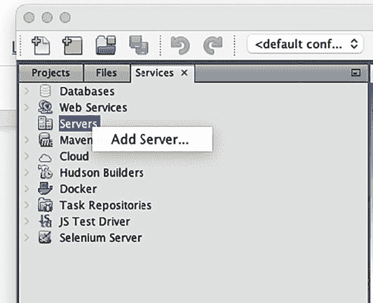

附录 A ■ 使用 Apache NetBeans IDE 进行 Jakarta EE 开发

要将本地或远程服务器添加到 NetBeans，请执行以下任务：

1.  导航到“服务”窗口，右键单击“服务器”菜单选项。单击“添加服务器”，如图 A-1 所示。

***图 A-1.** 将服务器添加到 NetBeans IDE*

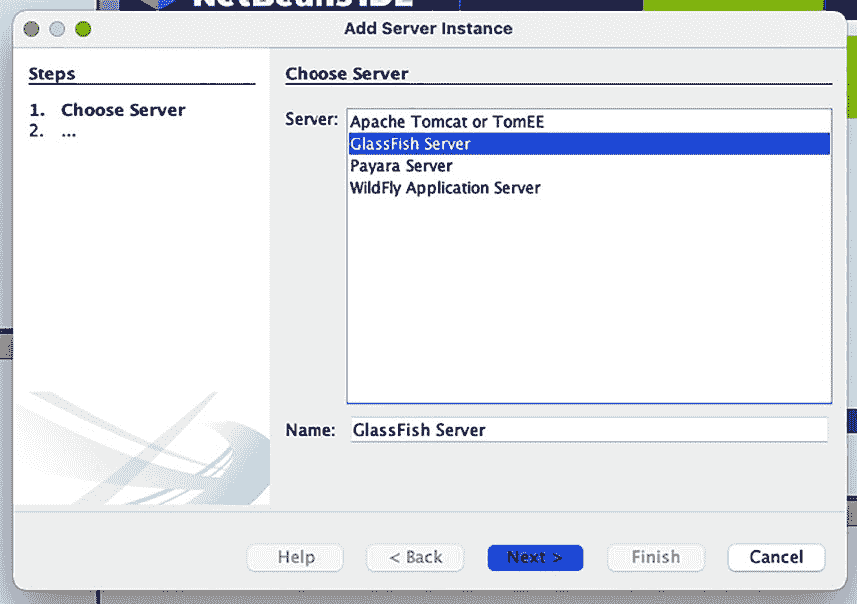

附录 A ■ 使用 Apache NetBeans IDE 进行 Jakarta EE 开发

2.  当“添加服务器实例”对话框出现时，选择您要添加的服务器类型（见图 A-2）。

***图 A-2.** 添加服务器实例*

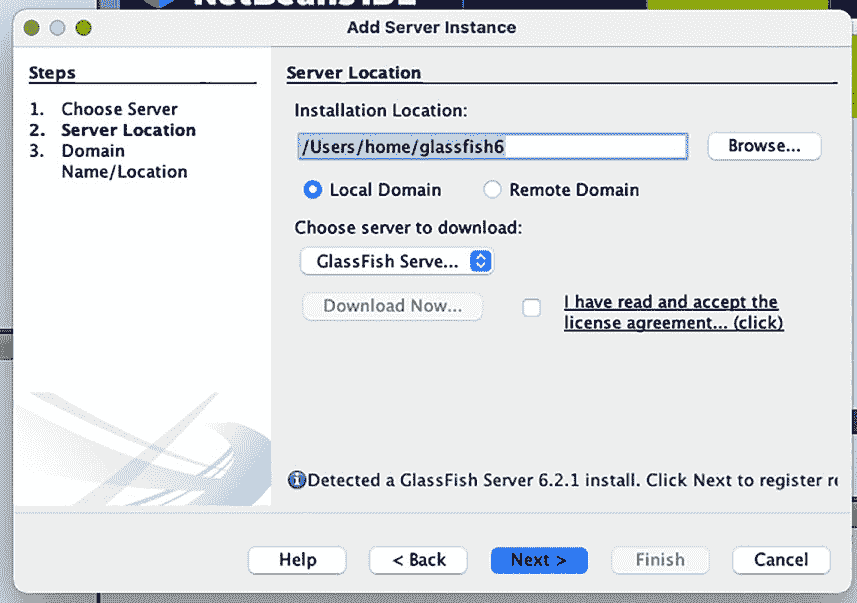

附录 A ■ 使用 Apache NetBeans IDE 进行 Jakarta EE 开发

3.  在下一个屏幕上，输入您要在 NetBeans 中配置的应用服务器安装路径（见图 A-3）。选择位置后，单击“完成”按钮。

***图 A-3.** 设置服务器位置*

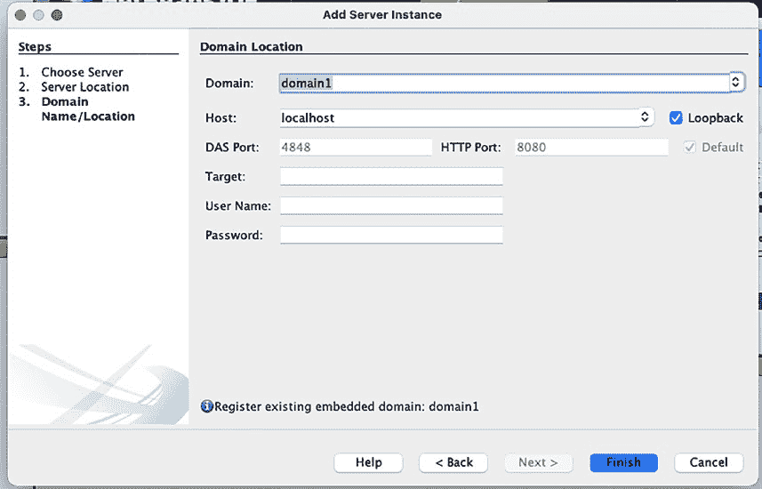


附录 A ■ 使用 Apache NetBeans IDE 进行 Jakarta EE 开发

4.  在下一个屏幕上，输入您要在 NetBeans 中配置的应用服务器的域位置（见图 A-4）。选择域位置后，单击“完成”按钮。

***图 A-4.** 设置域位置*

5.  现在，您可以通过在项目属性中为给定项目注册服务器，将应用程序部署到该服务器。注意：您还可以通过从 NetBeans 的“服务器”窗口中选择应用服务器来执行一些基本的应用服务器任务，如图 A-5 所示。

***图 A-5.** 在 NetBeans 中展开和管理服务器*

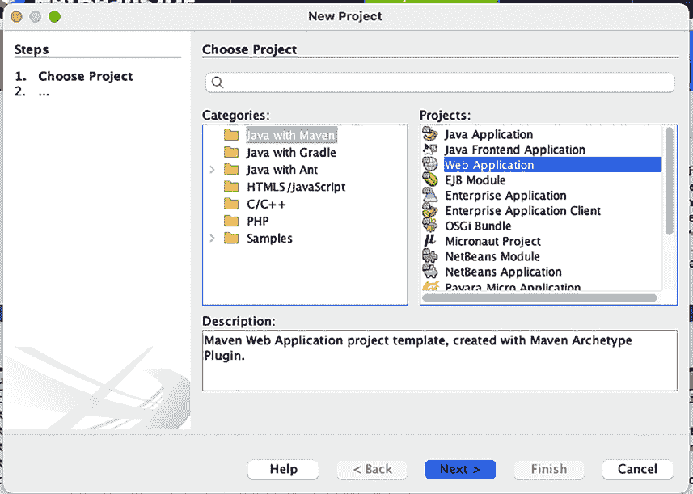

附录 A ■ 使用 Apache NetBeans IDE 进行 Jakarta EE 开发

开发 Java Web 或企业应用程序


NetBeans IDE 让 Java Web 或企业级应用的开发变得简单。首先，你需要在 IDE 中创建一个 Jakarta EE 项目，然后使用 IDE 对项目进行相应配置。

NetBeans 不仅简化了应用项目的配置，还通过自动补全、语法高亮、自动格式化等功能辅助开发。本节将介绍 NetBeans 如何帮助 Java EE 开发者完成一些最常见的 Jakarta EE 开发任务。

A-2\. 创建 NetBeans Java Web 项目

在 NetBeans 中创建 Java 企业级项目时，有几种不同的配置可供选择。本书将介绍如何在 NetBeans 中创建 Java Web 应用程序项目，这是开发 Jakarta EE 应用的标准项目选择。

要开始创建新项目，请选择“文件”➤“新建项目”，打开“新建项目”对话框。在“新建项目”对话框中，你会在左侧列表框中看到所有不同的 Java 项目类别。

选择其中一个类别，右侧列表框中将显示该类别下的项目类型。要创建 Jakarta EE 项目，请选择 **Java Web** 类别，然后选择 **Web 应用程序**作为项目类型（见图 A-6）。

***图 A-6.** 在 NetBeans 中创建新的 Java EE 项目*

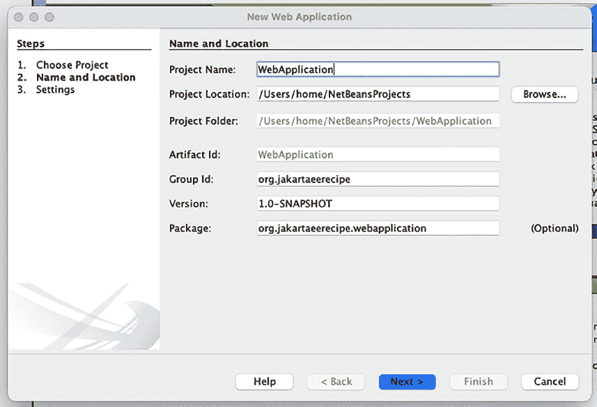

附录 A ■ 使用 Apache NetBeans IDE 进行 Jakarta EE 开发

选择项目类型后，将打开“新建 Web 应用程序”对话框。输入项目名称和位置，如图 A-7 所示。完成后，点击“下一步”。

***图 A-7.** 新建 Web 应用程序：名称和位置*

在“设置”界面中，选择要用于部署的应用服务器（请参阅“在 NetBeans 中配置应用服务器”），以及要使用的 Jakarta EE 版本（见图 A-8）。

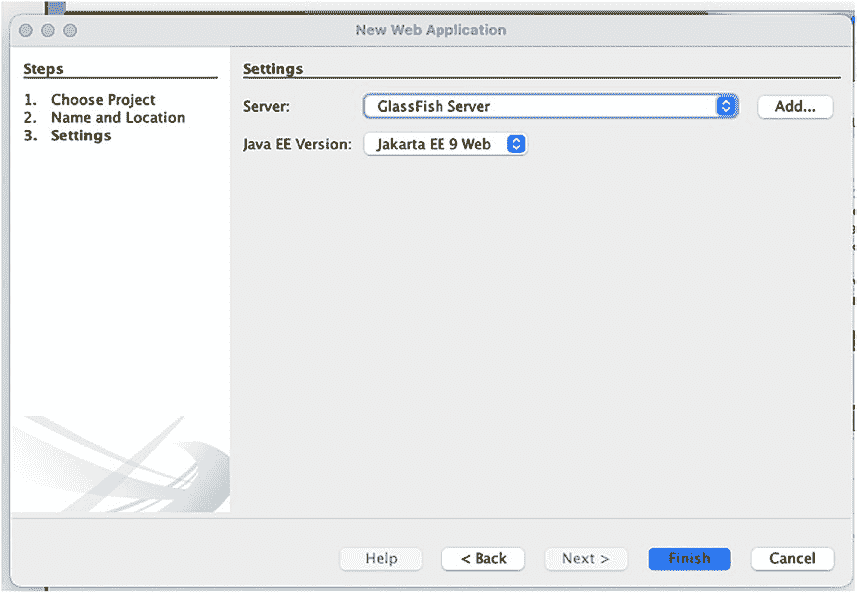

附录 A ■ 使用 Apache NetBeans IDE 进行 Jakarta EE 开发

***图 A-8.** 新建 Web 应用程序：服务器和设置*

A-3\. 创建 Jakarta Server Faces 应用程序文件

NetBeans IDE 可以轻松为 Jakarta Server Faces 应用程序项目生成文件。要打开 JSF 菜单，请右键单击应用程序的“源包”目录以打开上下文菜单。在上下文菜单中，选择“新建”，然后选择“其他…”以打开“新建文件”对话框。在对话框中，从“类别”列表框中选择 **JavaServer Faces**，以在左侧列表框中显示 JSF 文件类型（见图 A-9）。

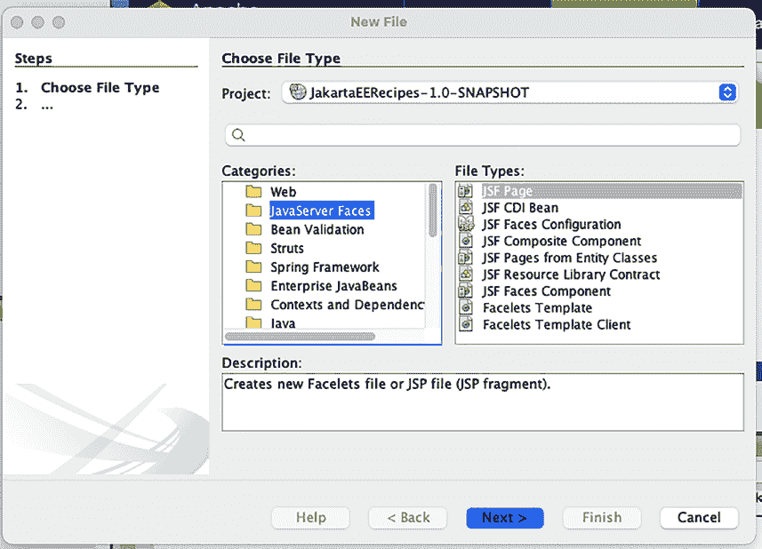

附录 A ■ 使用 Apache NetBeans IDE 进行 Jakarta EE 开发

***图 A-9.** 新建文件菜单：JSF 文件类型*

JSF 文件类型包括以下选项：

• JSF 页面

• JSF CDI Bean（这是 Jakarta EE 10 中的 CDI 控制器）

• JSF Faces 配置

• JSF 复合组件

• 来自实体类的 JSF 页面

• JSF 资源库契约

• JSF Faces 组件

• Facelets 模板

• Facelets 模板客户端

选择“JSF 页面”文件类型会打开一个对话框，可用于生成新的 JSF 页面（见图 A-10）。

该对话框允许你选择文件位置和名称，并且还可以为页面类型应用不同的选项。页面类型的选项有：Facelets（默认）、JSP 文件或 JSP 片段。

本书中的示例均使用 Facelets 页面类型。

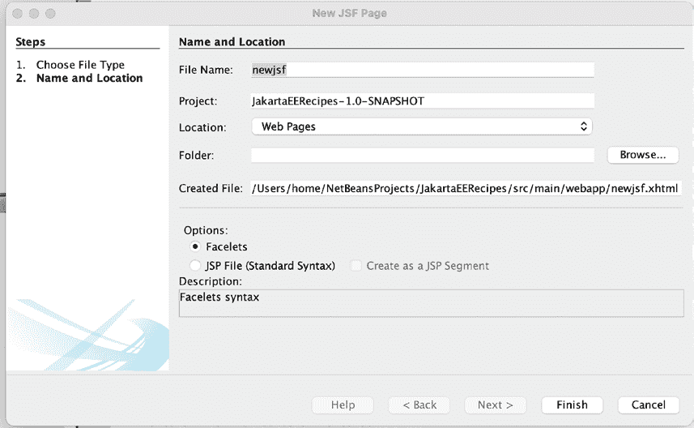

附录 A ■ 使用 Apache NetBeans IDE 进行 Jakarta EE 开发

***图 A-10.** 新建 JSF 页面对话框*

选择“JSF CDI Bean”文件类型会打开一个对话框，允许你生成一个 JSF CDI Bean 控制器类（见图 A-11）。该对话框提供了将 Bean 数据添加到 faces-config 文件以及选择 Bean 作用域的选项。

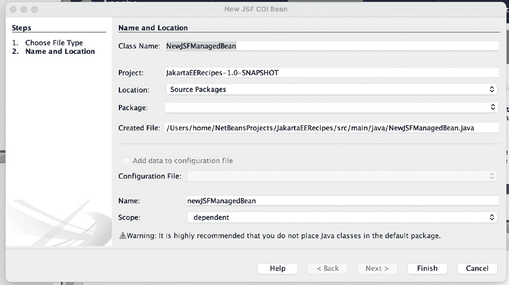

附录 A ■ 使用 Apache NetBeans IDE 进行 Jakarta EE 开发


***图 A-11.** 新建 JSF 托管/CDI Bean 对话框*

**JSF Faces 配置文件**选项用于为项目创建 `faces-config.xml` 文件。

但是，如果你选择在 NetBeans 项目创建向导中创建 JSF 项目，则不需要此选项。

**JSF 复合组件文件**选项会打开一个对话框，可用于创建复合组件文件。该对话框除了能够选择文件位置和名称之外，没有提供太多选项。生成的文件包含复合组件的骨架，如下所示：

<?xml version='1.0' encoding='UTF-8' ?>

<!DOCTYPE html PUBLIC "-//W3C//DTD XHTML 1.0 Transitional//EN" "http://www.w3.org/TR/xhtml1/

DTD/xhtml1-transitional.dtd">

<html

>

<!-- 接口 -->

<cc:interface>

</cc:interface>

<!-- 实现 -->

<cc:implementation>

</cc:implementation>

</html>

**从实体类生成 JSF 页面**选项功能非常强大，它允许你选择一个实体类来生成 JSF 页面，生成的 JSF 页面将自动与该实体类绑定。要使用此选项，项目中必须至少包含一个实体类。

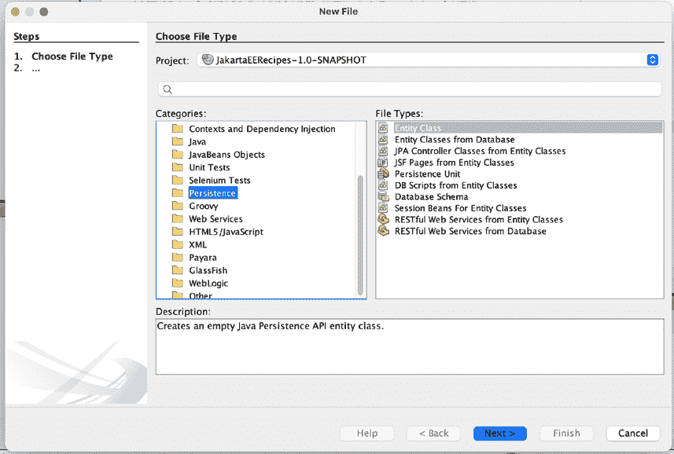

附录 A ■ 使用 Apache NetBeans IDE 进行 Jakarta EE 开发

A-4\. 开发实体类

NetBeans IDE 提供了帮助开发实体 Bean 类的工具，既可以手动开发，也可以基于选定的数据库表进行开发。要访问实体类向导，请右键单击项目的“源包”文件夹以打开上下文菜单，然后选择“新建”➤“其他”以打开“新建文件”对话框。打开后，从左侧列表框中选择“持久性”类别，以在右侧列表框中显示文件类型（参见图 A-12）。

***图 A-12.** 新建文件：持久性*

**实体类**选项允许你生成一个空白的实体类，而**从数据库生成实体类**选项允许你从选定的数据库表生成实体类。这样做时，所有将实体类映射到选定数据库表所需的代码都会自动为你生成。

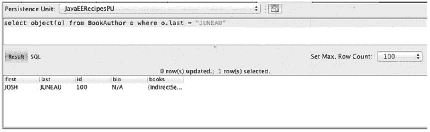

附录 A ■ 使用 Apache NetBeans IDE 进行 Jakarta EE 开发

A-5\. 使用 Jakarta 持久性查询语言

NetBeans 包含一个功能，允许你使用 Jakarta 持久性查询语言语法查询数据库。这对于那些在其会话 Bean 中使用 Jakarta 持久性查询语言的人来说非常有用。要访问 Jakarta 持久性查询语言查询工具，请展开一个在其项目配置目录中包含 `persistence.xml` 配置文件的 NetBeans Web 项目。然后执行以下步骤：

1.  右键单击 `persistence.xml` 配置文件以打开上下文菜单。
2.  单击“运行”以打开 Jakarta 持久性查询语言工具（参见图 A-13），输入你的查询，然后单击查询编辑器右上角的“运行”按钮。

***图 A-13.** Jakarta 持久性查询语言工具*

A-6\. 使用 HTML5

许多应用程序都使用 HTML5。Java 社区已经注意到了这一点，并使得在 NetBeans 内部开始使用 HTML5 变得容易。NetBeans 有一个 HTML5 项目选项，使开发人员能够使用 Chrome 网络浏览器插件调试 HTML5 页面。要从 IDE 内部创建 HTML5 项目，请选择“新建项目”选项，然后在“类别”选择列表中选择“HTML/JavaScript”，接着在“项目”选择列表中选择“HTML5 应用程序”（参见图 A-14）。

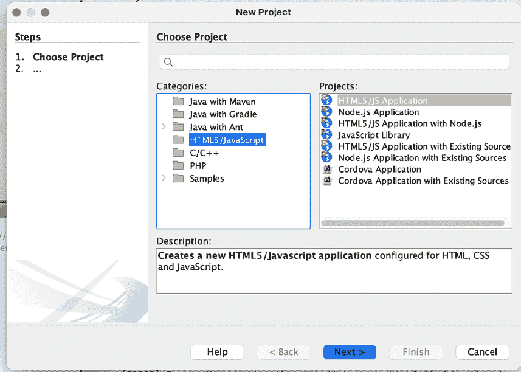

附录 A ■ 使用 Apache NetBeans IDE 进行 Jakarta EE 开发

***图 A-14.** 创建新的 HTML5 应用程序*

接下来，你可以选择“无站点模板”，或者选择你提供的模板，或者使用可以下载的模板，如图 A-15 所示。

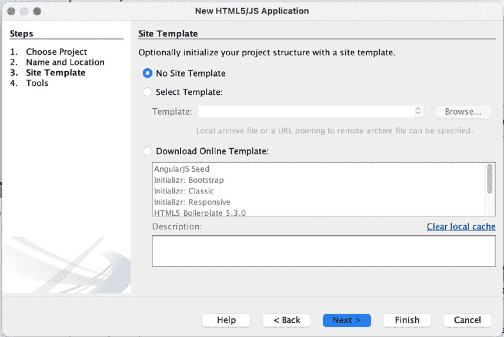

附录 A ■ 使用 Apache NetBeans IDE 进行 Jakarta EE 开发


***图 A-15.** 选择站点模板*

最后，选择要添加到 HTML5 项目中的工具（参见图 A-16），然后单击“完成”。

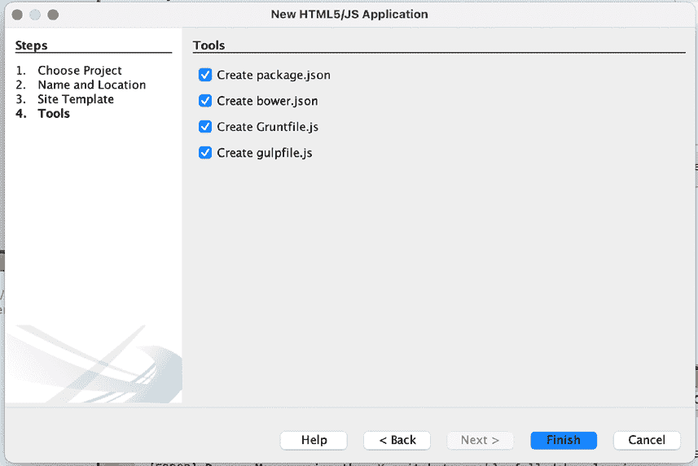

附录 A ■ 使用 Apache NetBeans IDE 进行 Jakarta EE 开发

***图 A-16.** 向项目添加库*

项目创建完成后，假设您已安装 Chrome 插件，可以选择“运行”以在 Chrome 中打开该项目。如果您尚未安装 Chrome 插件，系统将提示您进行安装。

**索引**

„

„ „

**A**

ApplicationConfig 类, 268, 641

应用程序容器安全, 551

AbstractFacade, 271, 384, 385, 399, 401

应用程序文件, 660–663

访问参数, 78–81

应用程序级安全, 551

Acme 书店, 172, 187, 200, 216, 220, 235,

应用程序进程, 387

236, 245

@ApplicationScoped, 573, 577, 612

application, 241, 387

@ApplicationScoped bean, 613, 620

Facelets, 403

应用服务器, 587–591

acmeFileProcessor.xml, 604

应用服务器认证, 559

AcmePoolsNoSql 项目, 616

应用服务器容器, 391, 582, 635

AcmeProcessor 类, 606

应用服务器, 653–658

AcmeReader 类, 605

特定于应用的认证, 572

AcmeReaderServlet, 49

应用用户, 551–555

附加属性, 187, 192, 196, 218

应用请求值阶段, 110, 145

addListener() 方法, 21

算术表达式, 74

AddServlet, 38, 40, 41

算术函数, 434

ADMIN 安全, 581

算术运算符, 78

管理控制台, 300, 581, 589, 630, 634

@AroundInvoke, 484, 486

管理用户密码, 623

@AroundTimeout, 486

管理员, 573

数组, 539

管理员密码, 622, 623

asadmin create-managed-executor-service, 588, 591

聚合函数, 428–429

AsyncContext.complete() 方法, 51

Ajax, 175, 205

asyncOperation 方法, 524

启用 Ajax, 227

AsyncResponse.resume(), 525

功能, 236

AsyncResponse.setTimeout() 方法, 525

未启用 Ajax, 227

AsyncResponse.setTimeoutHandler() 方法, 525

验证输入, 227–234

属性, 26–28

AjaxBehaviorEvent, 233

属性转换器, 442–443

Ajax 功能

attributeRemoved 方法, 28

自定义处理, 241–244

属性, 178

组件组, 237–241

属性值, 233

Ajax 化, 230, 233

auth-constraint 元素, 559

@Alternative 注解, 478

auth-constraint 子元素, 635

基于注解的方法, 445

认证, 579, 633

注解配置, 548

认证后端, 563–571

注解声明, 450, 483, 486

AuthenticationBean 类, 572

注解, 200, 375–377, 557

认证提示, 554

Apache Derby, 298

auth-method 标签, 555

Apache Derby JDBC 驱动, 640

Author 类, 96

Apache NetBeans, 6, 9, 262, 272, 273, 384, 648

Author 实体类, 355, 360, 637

Apache TomEE, 4, 304, 621

BOOK_AUTHOR 数据库, 270

© Josh Juneau 和 Tarun Telang 2022

J. Juneau 和 T. Telang, *Java EE 到 Jakarta EE 10 实战*[, https://doi.org/10.1007/978-1-4842-8079-9](https://doi.org/10.1007/978-1-4842-8079-9#DOI)

■ 索引

AuthorBean, 97

可书签 URL, 153–156

AuthorController, 119, 161, 167–168

@BookQualifier, 476

AuthorController 托管 bean, 221

bookstoreController.sendMessage() 方法, 255

author.getId(), 539

BookstoreSessionCounter, 401

AuthorService, 636

bookTable 组件, 224

AuthorWork 实体, 349, 351, 367

BookTitleValidator, 449

AUTHOR_WORK 数据库, 349

book.xhtml 视图, 210

自动部署, 623

布尔值, 46, 69, 572, 580

自动部署技术, 624

引导, 486–488

自动模式生成, 369–373

广播消息, 254–257

自动定时器, 405

浏览器会话, 44

BucketManagerFactory, 619

„

„ „

**B**

BucketManager 接口, 620

bufferedAmount, 537

后端业务逻辑, 175, 467

buildDefaultValidatorFactory(), 458

后备 bean 类, 110, 114

Builder 任务, 595

批处理

内置约束, 446–448

API, 587

捆绑组件, 117–123

精细体验, 587

业务逻辑, 391, 488–490

面向项目的, 604–608

业务逻辑代码, 61–63

字节缓冲区, 36

Bean 类, 411

„

„ „

**C**

bean-discovery-mode 属性, 464

Bean 字段值, 474

Bean 绑定, 464–467


Bean 生命周期事件，392

缓存使用，434–435

@BeanParam 注解，292

CalculationController，111

Bean 状态注解，472

基于日历的定时器表达式，405

Bean 验证，202–204，367，640

call() 方法，597

双向一对一关系，357

回调方法，386

绑定组件，179–180

CartBean 类，471

绑定过滤器，523

CartController Bean，388

BookAuthor，334，337

级联样式表 (CSS)，158

类，363

cdi-core 依赖，487

实体，366

证书颁发机构，583

对象，346，362

证书签名请求 (CSR)，585

BookAuthor 类，271

c:forEach 元素，99

BookAuthor 实体，274，415，417

字符大对象 (CLOB)，327–329，331

BOOK_AUTHOR 数据库，640

复选框，212–216

BOOK_AUTHOR 记录，639

选择组件属性，215

BookAuthorContainer，280

Chrome，668

BookAuthorFacade，273

“块”处理，604

BookAuthorFacadeREST，638

类，65

BOOK_AUTHORS 数据库表，94

忽略，476–477

BookAuthorService 类，276

类级别约束，450–453

BookChatEndpoint，532

CLASSPATH，10，297–298，303，611

BookController，287，398

cleanSubject() 方法，578

类，394

清理，47

字段，400

客户端，257，395，529–530

Book 实体，382

ClientResponseFilter，522

BookEvent 类，480

客户端，40

BookEventHandler，481

close() 方法，321，536

BookFacade，387，393，396

CMD 命令，646

BookFacade 会话 Bean，397

编码

BookGroup 组，459

控制器，567–569

Book.java，211–212

Jakarta Enterprise Bean，563–567

book.jsp 视图，286，290

用户实体，569

■ 索引

数据集合，218–225

容器，277，649–651

@ColumnResult 注解，426

上下文与依赖注入 (CDI)，252，265，

commandButton 组件，187，191，192，235

269，395，398

命令按钮，558

暴露数据，285–287

命令组件，190–192，203

规范，287

commandLink 组件，24，187，192

上下文对象，287

commandLink 组件附加

@Controller 注解，280，282

属性，191–192

控制器类，108–109，136，140，150，280，

通用组件属性，179

289，567–569

通用组件标签属性，178

calculationController，115

通用约束注解属性，448

容器管理组件，111

通用输出组件属性，196

Jakarta Server Faces (JSF)，113–114

通信层，612，649–651

作用域，115–117

编译，8–11

控制器，212–214，379，580

completeBookList 字段，400

类监听器方法，246

组件，175，258–260

@Convert 注解，443

事件，246–248

Cookie

标签，185

构造函数，44

类型，210

名称和值，45

并发

属性方法，45–46

应用服务器，587–591

核心标签，177

细粒度体验，587

CreateConnection，93，309，311

面向项目的批处理，604–608

createConsumer 方法，500–502，504

报告任务，591–595

createContext 方法，499

运行并发任务，599–602

createItem() 方法，292

运行多个任务，595–599

createProducer 方法，497，499

任务内事务，598–599

createPublisher 方法，509

工具，587

createQuery() 方法，431

Concurrent/BatchExecutor，592

创建、读取、更新和删除 (CRUD)，

ConcurrentManagementType，403

313–316，517

并发任务运行，599–602

createSession 方法，496

条件表达式，66–71

CREATE_USER 过程，429，430

条件导航，134，137

Criteria API，436，438

条件页面，75

CriteriaDelete，437

配置，110，249，263–269，629

CriteriaQuery API，614

配置 Jakarta NoSQL，610–613

CriteriaUpdate，437

连接对象，306

跨参数约束，453

ConnectionFactory，494，495，499

CRUD 操作，617

连接管理，306–310

CSS 样式类，220–221

连接资源，493

自定义身份验证，561–572

约束注解，203–204

自定义约束验证器，449–450

约束，446–448

自定义映射，546–548

构造函数，353

自定义安全证书，583–585

构造函数验证，454–455

自定义标签，81–83

消费者，496

@Consumes，519

„

„ „

**D**

Contact 类，217

ContactController 类，192

数据访问对象 (DAO)，277，316，322

ContactController.java，183–185，189–191，


可用数据，270–281

194–195，206–208

数据库访问，322–327

Contact.java，182

数据库连接，299–305

容器，476，648–649

数据库连接异常，305–306

容器化，643

数据库凭据，572–579

容器管理的并发，403

数据库驱动程序，297–298

容器管理的实体管理器，381

@DatabaseIdentityStoreDefinition

容器管理的事务划分，409

注解，573

■ 索引

数据库模型，296

displayAuthor 方法，150

数据库

DisplayCookieServlet 输出，46

访问，322–327

在表格中显示，397–401

账户，628

显示对象列表，156–160

连接，299–305，342，627

DISTINCT 关键字，429

凭据，572–579

Docker

驱动程序，297–298

容器，648–649

输入表单，91

镜像，644–647

完整性，90

预构建的 Docker 镜像，647–648

模型，296

运行 Java，644–647

查询，98

技术，643

记录，87–100

docker build 命令，649

资源，625–630

Dockerfile，646–648

序列，345–348

Docker 就绪容器，649

存储过程，429–430

Docker 就绪格式，649

表连接操作，431

docker run 命令，647

表，397–401

DocumentCollectionManager，613，618

事务，404

DocumentCollectionManagerFactory，615

数据库特定代码，326

DocumentCollectionManagerProducer，611

数据收集，218–225

文档数据库，613–615

数据一致性，445

DocumentDeleteQuery 接口，617

数据定义语言（DDL），373

DocumentEntity，616

数据完整性，208

文档对象模型（DOM），85，175

数据操作语言（DML），315

面向文档的数据库，615–619

数据源，283–285

DocumentQuery.DocumentWhere

DataSource 对象，299，303–305

方法，614

Datasource 类，626

DocumentTemplate，617–618

DataTable 属性，159，223

DocumentTemplate 实例，613

DataTable 组件，219，222，400

doDelete() 方法，7

数据类型，442–443

doDownload 方法，36

日期时间函数，434

doEndTag() 方法，84

日期时间值，374–375

doFilter 方法，25

声明式安全，551，559

doGet() 方法，7，8，15

@DeclareRoles，557，560

doPost() 方法，7，18

@Decorator 注解，490

doPut() 方法，7，8

@Default 限定符，470

向下转型，439

延迟消息投递，510

下载文件，33–36

删除操作，436–438

DownloadServlet 输出，35

删除，617

DriverManager，612

投递延迟，491

DriverManager 连接，310

划分，409

DriverManager.getConnection() 方法，304

部署，8–11，265

下拉列表组件，115

描述符，555

持久消息订阅者，505–510

动态内容，13–15

多个容器，643

动态生成，42

Payara 服务器，647–648

动态验证错误消息，456–457

时间，478–479

动态 Web 应用，1

WAR 文件，623–624

目标资源，493

„

„ „

**E**

destroy() 方法，7

开发者生产力，86

EasyBean，65

Diana-column，612

@Ebook，470

Diana-key-value，612

Eclipse，373

禁用脚本片段，101

Eclipse 基金会，261

请求分发，36–41

Eclipse GlassFish，4

显示，13–15

应用服务器，2

■ 索引

Eclipse IDE，9

字段声明，448

Eclipse Jakarta，611

@FieldResult 注解，426

嵌入式主键，350

字段值，65，107–108

嵌入表达式，73–78

文件安全域，555

封装数据库，310

文件上传，225–227

enctype 设置，225

文件用户列表，554

端点

消息过滤，502–504

创建，531–532

请求与响应过滤，521–524

发送消息，533–538

过滤器，24–26，522

最终用户，40，91

Servlet 的终结化，47–48

企业应用，658

终结器，252

企业归档（EAR）文件，343，624

findAll() 方法，399，400

企业 Bean，412–414，640

findAllBooksByChapterNumber() 方法，432

实体，415–417，424–428

findAuthorByLast()，433

类，333，338

findBookByChapterTitle()，430

创建，334

findBooksByAuthor() 方法，419

字段，367–369

findByTitle() 方法，383，384

管理器，380–381

细粒度访问控制，569，580

子类，438–439

fire() 方法，483

实体 Bean 类，664

fireAsync() 方法，483

EntityBSubtype，439

灵活性，7

实体拦截器，522

流程

EntityManager，381，387，612

控制器类，252


EntityManager 对象，380，382

定义，251–252

EntityManager 的 createQuery 方法，416

表达式语言，254

EntityManagerFactory，344，365，373，380

视图节点导航，253

EntityManager 对象，386

f:metadata 元素，155

EntityManager 的 createNativeQuery() 方法，423

@ForeignKey，373

equals() 方法，353，354

基于表单的身份验证，572

错误消息，126，456–457

form-error-page，583

错误，227

form-login-page，583

EvaluationController，151

表单，199–205

事件对象，542

基于表单的身份验证，629–635

ExampleController，128

表单值，113

executeQuery 方法，311，312，321

from-action 元素，137

executeUpdate() 方法，321，330

f:selectItem，209

表达式语言 (EL)，464

f:selectItem 标签，209，216

表达式语言值表达式，58

全双工通信，532

表达式，60，150–153

函数式表达式，432–434

可扩展标记语言 (XML)，55

f:validateBean 标签，204

f:validateLongRange，203

„

„ „

**F**

f:validate 标签，233

f:viewParam 标签，153

Facelets，110，121，160，161，170

f:websocket 标签，254，257

faces-config.xml 描述符，136

faces-config.xml 文件，136，248

„

„ „

**G**

FacesContext，128，130，142，205

FacesMessage，126，127，130

@GeneratedValue 注解，347，348

FacesServlet，105，111，133

生成器，348

@FacesValidator 注解，142

GenericServlet，7，8

工厂资源，494

getAttribute() 方法，31

f:ajax 标签，231，233，236，242，258

getBookAuthors() 方法，281，282

f:ajax 标签属性，232

getBookCategories()，438

fetchJson() 方法，550

getBooks() 方法，287

f:event 标签，246，247

getCart() 方法，388

f:facet 标签，224

getCompleteBookList() 方法，400

■ 索引

getConnection() 方法，299，310

h:column 标签，224

getDSConnection()，310

h:commandButton 组件，122，131，132

getFieldValue，65

h:commandLink 组件，149

getHello() 方法，110

h:dataTable 组件，122，145，148，156，158，

getId()，446

160，172

getJspContext，84

标头，499

getOrderList()，474

HelloApp，648，650

getParameter() 方法，18

HelloAppClient，650

getProperties() 方法，269

HelloWorldController，110

getRequestDispatcher，40

h:form 元素，225

getResourceAsStream 方法，36

h:graphicImage 标签，122

getResultSet() 方法，423，441

h:inputText 组件，122，138，139，141，143

getResultStream()，441

h:link 标签，198

getSingleResult() 方法，421

h:messages 组件，123，126–128

getString() 方法，331

home.xhtml，198–199

getTitle() 方法，446

h:outputLabel 标签，122

getXMLMessageList() 服务，521

h:outputStylesheet 组件，171

GlassFish

h:selectManyCheckbox，213

管理控制台，300，492，494，589，625，630

h:selectOneMenu 元素，111

HTML5，531，665–668

应用服务器，3，494，557，621，628

基于 HTML 的 Jakarta 服务器页面，57

应用用户，551–555

HTML 客户端，395

asadmin create-managed-executor-service

HTML 表格，159

实用程序，588

HTML 标签，175

自定义安全证书，583–585

HTML 网页表单，17

编辑领域表单，553

HttpAuthenticationMechanism，577，578

文件用户表单，553

http-method，559

组，551–555

HTTP 协议，1

安装，621–622

HTTP 请求登录方法，571

LDAP 身份验证，581–583

HttpServlet，7，32

托管执行器服务面板，590

HttpServletRequest，31–33，36，572

微服务，635–641

HttpServletResponse，33，36，40，42

新建文件领域用户表单，554

HttpSession，30，32

领域表单，552

HttpSessionAttributeListener，26，27

服务器，551

HttpSessionBindingEvent，27

服务器日志，25

HttpSessionEvent，30

服务器安全角色，633

HttpSessionListener，21

起始页，3，4

h:view 组件，185

WAR 应用程序，641

超文本标记语言 (HTML)，55

网站，2

GlassFish 7.0，8

„

„ „

**I**

graphicImage 组件，198，211–212

图形添加，210–212

IBook 接口，468

验证组，458–460

IBook 类型，470

groups() 方法，450

id 属性，80，192，224

组，551–555

@IdClass，354

IdentityStoreHandler.validate() 方法，579

„

„ „

**H**

隐式 Jakarta 服务器页面对象，76

隐式导航，136

硬编码值，611

@Inherited 注解，486

硬编码，130

init() 方法，7，278

初始持久订阅者，506

hashCode() 方法，353

HashMap 对象，400


初始化参数，22–24

HashMap，425，427

初始化器，252

h:column 属性，224

InitialValueController，473，475

■ 索引

@InitValue，473

业务逻辑，488–490

@Inject 注解，462

上下文 Bean，462–464

内联调用，243

描述，461

内连接，431

忽略类，476–477

inputFile 组件，227

拦截方法调用，484–486

输入表单

调用和处理事件，480–483

组件，181

Java SE 环境，487–489

受管 Bean，182

元数据，479–480

受管 Bean 控制器，183–185

非 Bean 对象，473–476

inputHidden，185

生产者字段，478

inputSecret 组件，185，187

Bean 的作用域，470–473

输入标签，92

规范，461

inputTextarea 组件，185，187

Jakarta EE，415

inputText 组件，185，199，237，240，571

Jakarta EE 8，1，261

插入，616

Jakarta EE 9，1

插入数据，291–293

Jakarta EE 10，1，3，491

安装目录，621–622

Jakarta EE 应用服务器，2–4，648

整数，524

管理员用户密码，623

集成开发环境（IDE），7，298

配置，634

IntelliJ IDEA，9，20，648

数据库资源，625–630

IntelliJ IDEA 项目文件夹结构，56

基于表单的身份验证，629–635

拦截方法调用，484

安装 GlassFish，621–622

拦截器，523

微服务，635–641

接口，410–411

安全域，634

插值，457

WAR 文件，623–624

调用应用，110，145

Jakarta EE 容器，339

isAuthenticated() 方法，580

JakartaEERecipes 项目，495，501，503，505，

isCanceled() 方法，595

509，518

isListenerForSource()，246

Jakarta EE 技术栈，463

isValid() 方法，450

Jakarta 企业 Bean，277，416，563–567

面向项目的批处理，604–608

应用服务器容器，379

ItemProcessor，607

实体管理器，380–381

ItemReader，607，608

本地和远程接口，410–411

ItemWriter，607，608

可选的事务生命周期

回调，408–410

„

„ „

**J**

持久化对象，396

处理消息，412–414

Jakarta Bean 验证

返回数据，397–401

API，445

调度定时器服务，404–407

内置约束，446–448

与 JSF 配合使用的会话 Bean，393–396

类级别约束，450–453

单例 Bean 创建，401–404

约束，445

有状态会话 Bean 未被钝化，409–410

构造函数，454–455

无状态会话，382–387

自定义约束验证器，449–450

无状态会话开发，387–392

动态错误消息，456–457

更新对象，397

分组验证约束，458–460

Jakarta 企业 Bean 定时器，491

参数，453–454

Jakarta 表达式语言表达式，63，70，73，

返回值，455

80，102–103，111，116，122，145，149，200

验证引擎，457–458

Jakarta 表达式语言表达式保留

Jakarta CDI，*参见* Jakarta 上下文与

字，77–78

依赖注入

jakarta.jms.Queue 资源，492

Jakarta 上下文与依赖注入

Jakarta 消息服务

分配特定 Bean，468–471

API，498

替代实现，478–479

创建和发布，507

绑定 Bean，464–467

创建和发送，496–499

■ 索引

Jakarta 消息服务（*续*）

复选框，212–216

创建，492–495

数据集合，218–225

延迟消息投递，510

组件，176–181，258–260

持久化消息订阅者，505–510

控制器，567–569

过滤消息，502–504

Ajax 功能的自定义处理，241–244

遗留标准，491

显示对象列表，156–160

消息传递能力，491

显示消息，123–127

队列，504–505

显示输出，193–200

实际应用，491

添加图形，210–212

接收消息，500–502，507–508

创建输入表单，181–187

创建会话，495–496

调用动作，187–192

Jakarta MVC

生命周期，109

应用方法论，280

导航，130–137

用于暴露数据的 CDI，285–287

运算符，150–153

配置应用，263–269

页面访问，579–581

控制器类，280–282

页面表达式求值，143–145

插入和更新数据，291–293

页面流，248–254

使数据可用于

部分页面更新，236–237

应用，270–281

传递页面参数，145–150

向用户反馈消息，288–290


单选按钮，216–218

模型暴露数据，283–285

请求驱动，105

Jakarta NoSQL

保留字，150–153

API，609

资源，171–174

配置，610–613

会话 Bean，393–396

数据库，609

无页面刷新提交页面，234–235

数据库类型，612

标签入门，176–181

文档数据库，613–615

模板，165–171

面向文档的数据库，615–619

更新消息，127–130

键值数据库，619–620

使用 Ajax 验证输入，227–234

编写查询，613–615

验证用户输入，138–143

jakarta.nosql.mapping，610

编写控制器类，111–117

Jakarta Persistence，640

编写简单应用程序，106–111

Jakarta Persistence API，333

Jakarta Server Pages (JSP)，1，85–87

Jakarta Persistence Query Language，367，665

在多个页面中访问参数，78–81

Jakarta RESTful Web Services，263，281，650

业务逻辑，55

Jakarta Security

条件表达式，66–71

应用程序用户，551–555

创建，55–58

用户组，551–555

数据库记录，87–93

页面访问，579–581

禁用脚本片段，101

编程式登录表单，561–572

文档，57，71–73

安全 API，573–580，632

动态内容，55

标准 API，551

动态在线内容，55

安全类型，551

嵌入表达式，73–78

Web 应用程序授权，555–561

嵌入 Java，59–61

Jakarta Server 2.0，81

错误，99–101

Jakarta Server 2.1，102

遍历数据库记录，94–100

Jakarta Server Errors，99–101

将业务逻辑与视图代码分离，61–63

Jakarta Server Faces 2.0，136，137，155

标签，72–73

Jakarta Server Faces (JSF)，1，544，660–663

生成/设置值，63–66

添加表单验证，199–205

Jakarta Server 标签，81–85

向页面添加选择列表，205–210

jakarta.servlet-api.jar 文件，10

Ajax 功能，237–241

Jakarta Servlets

认证机制，561

API，1

广播消息，254–257

Eclipse GlassFish，4

捆绑组件，117–123

功能增强，1

■ 索引

Jakarta EE 应用服务器，2–4

JavaScript，445

Servlet 容器，1

JavaScript 动作，117

基于 Web 的应用程序，1

JavaScript API，290

Jakarta Standard Tag Library，70，73，75，95，98

JavaScript 组件标签，178–179

Jarkarta RESTful Web Services，640

JavaScript Object Notation (JSON)

Java，644–647

构建，537–540

Java 归档（JAR）文件格式，624

自定义映射，546–548

JavaBean，57，61，65，66，75，94，110

Java 对象，543–546

Java Database Connectivity (JDBC)，98，333

读取，541–543

配置，342

替换指定元素，548–550

连接数据库，299–305

写入文件系统，540–541

连接管理，306–310

JavaScript Object Notation Processing (JSON-P)，539

CRUD 操作，313–316

Java SE 17 安装，9

数据库连接异常，305–306

Java 同步技术，404

数据库驱动，297–298

java.util.concurrent，587

企业应用，295

Java Web，658

用于数据库访问的 Java 对象，322–327

Java Web 项目，658–660

查询数据库，310–312

JAX-RS 客户端，276

查询和存储大对象，327–331

基于 JDBC 的应用程序，298

资源，302

SQL 注入，316–321

JDBC 连接池

URL，304

菜单选项，625

面板，627

Java 数据类型映射，342

JDBC 连接池界面，300

Java Development Kit (JDK)，3

JDBC 资源窗格，628

JavaDoc，587

JDBC 安全域类，631

Javadoc 链接，123

JMSConsumer，501，502

Java EE 6，445

JMSContext，501，502

Java EE 8，54

JMSCorrelationID，499

Java 嵌入，59–61

JobOperator，607

JAVA_HOME 环境变量，10

@JoinColumn 注解，373

java.lang.Thread，587

JOIN 关键字，432

Java Message Service (JMS)，491

@JoinTable，365

Java Naming and Directory Interface (JNDI)，

jsf.ajax.request()函数，241

271，380

jsf.ajax.request()方法，233，243

Java 对象，322–327，463，543–546

JSON，*参见* JavaScript Object Notation (JSON)

Java Persistence API，337，369

JsonbBuilder.create()方法，546

Java Persistence Query Language，379

JsonbConfig 类，546，547

聚合函数，428–429

Jsonb fromJson()方法，545

属性转换器，442–443

JSON Binding (JSON-B)，531，543

数据库存储过程，429–430

API，544，545

强制查询执行，434–435


自定义映射，546–548

函数式表达式，432–434

JsonMaster，550

接口方法，416–417

JsonObject，538

连接以检索所有行，431–432

JsonObjectBuilder()，531，538

多个实体，430–431

JsonObjectBuilder.beginObject() 方法，539

创建原生查询，421–423

JsonObjects，539

ON 条件，439–441

JsonPointer replace() 方法，550

在线资源，415

JSON-P 补丁，548

查询，实体，415–417

JsonReader，542

查询多个实体，424–428

JSON Web 令牌 (JWT)，511

检索实体子类，438–439

带填充的 JSON，539

返回单个对象，420–421

jsp

设置参数，418–420

getProperty 元素，66

流，441–442

setProperty 元素，65

更新与删除，436–438

useBean 元素，62, 65, 66, 75

■ 索引

jspService() 方法，60

多对多关系，362–365

jsp:useBean 元素，98

@ManyToOne 注解，358, 360

多对一关系，358–362

„

„ „

**K**

映射数据库，338–342

映射扩展，612

密钥库，584

MathDispatcher Servlet，41

键值数据库，619–620

MathServlet，18

面向键值的数据库，612

最大池大小选项，629

krazo-core，267

merge() 方法，397

krazo-jersey，267

MessageConsumer，502

MessageController，124

„

„ „

**L**

消息投递，510

messageDiv，257

LDAP 认证，581–583

消息驱动 Bean (MDB)，379, 412, 413

LEFT JOIN，432

MessageInterpolator 接口，457

LEFT OUTER JOIN，432

消息生产者，496–498

遗留数据库，353

messageReceiver，532

库属性，173, 210

消息

库命名空间，121

显示，123–127

改变人生的事件，28

反馈，288–290, 501

生命周期回调，408–410

类型，499

轻量级目录访问协议 (LDAP)，551

更新，127–130

Link 组件附加属性，198–199

消息传输，535

LinkedHashMap，209

元数据，479–480

Linux，646

META-INF 目录，463

Map 对象列表，399

META-INF 文件夹，487, 608

监听器方法，247

微容器，1

loadProperties() 方法，311

微服务，278, 635–641, 643

本地业务接口，386

Microsoft SQL，298

局部变量，46

MIME 类型，36

锁类型指定，403

MINOR.PATCH 版本，2

login-config XML 元素，559

模型 API，283–285

登录表单，创建，561–563

Models 映射，285

login() 方法，486

模型-视图-控制器 (MVC)，61, 102, 105, 261

登录提示，557

多容器，643

长时间运行的操作，524–526

多个实体，430–431

长时间运行的服务方法，47

多页面，78–81

循环，94–100

MVC 范式，72

MySQL，298

„

„ „

**M**

MySQL 数据映射，341

main() 方法，645

„

„ „

**N**

manageAccount.xhtml，188

@ManagedBean，466, 467

name 属性，80

托管 Bean，114, 217, 221–222

@NameBinding 注解，523

Book.java，211–212

@Named 注解，115, 116, 464, 465

ContactController.java，183–185, 189–191,

@NamedNativeQuery 注解，422, 423

194–195, 206–208

命名参数，419

Contact.java，182

@NamedQuery 注解，367, 375

服务名称，600

Subscription.java，188

原生查询，421–423

ManagedExecutorService，491, 525, 588, 589, 591,

NativeQuery() 方法，421

593, 595, 596, 599

导航流视图节点，253

ManagedScheduledExecutorService，600, 601

导航，130–137, 249

ManagedThreadFactory，602–604

NavigationController，131

■ 索引

NetBeans，163, 164, 373, 513

一对一关系，355–358

配置应用服务器，653–658

单向异步更新，526–529

实体类，664

在线文档，295

HTML5，665–668

@OnlineSale，481

Jakarta Persistence 查询语言，665

OnlineSale，481

Java Web 项目，658–660

onMessage() 方法，413

新建 JDBC 连接池，626

onWritePossible()，51

下一步按钮，626

OpenJDK 17，646

无参构造函数，337, 385

Open Liberty，304

无接口视图，395, 410

运算符，150–153

非 Ajax 启用，227

可选配置，559

非 Bean 对象，473–476

可选事务生命周期回调，408–410

非阻塞方式，47–52

Oracle 数据库，298, 301, 342, 569

非嵌入式主键，351, 352, 354

Oracle 数据库驱动，297

非拥有方实体，360

Oracle 特定的 PL/SQL 函数，423

@Notified，484

Oracle 语法，630


notifyPublisherOnline(), 483

OrderFacade, 388

@NotNull, 446, 452, 454

orderList 字段, 474

NULL 值, 369, 429, 431

OrderType 接口, 478

NullPointerException, 100

OS X 和 *nix 操作系统, 9

numChapters, 450

OutboundSseEvent, 528

外连接, 432

„

„ „

**O**

outputLabel, 196

outputLabel 附加属性, 197

Object, 205

outputLink, 196

目标代码, 488

outputLink 附加属性, 197

对象关系映射 (ORM)

outputText 组件, 196

注解, 375–377

拥有实体, 360

数据库模式对象, 369–373

数据库序列, 345

„

„ „

**P**

实体创建, 334

实体字段, 367–369

打包, 8–11

生成主键, 349–354

页面访问, 579–581

Java, 333

pageContext 对象, 101

多对多关系, 362–365

页面表达式求值, 143–145

映射数据类型, 338–342

页面流, 248–254

映射日期时间值, 374–375

页面导航, 136

一对多和多对一

页面参数, 145–150

关系, 358–362

页面重载, 234–235

一对一关系, 355–358

页面模板, 160–164

执行验证, 367–369

panelGrid 组件, 222

持久化单元创建, 342–345

@Paperback, 468, 470

编程抽象, 334

参数, 22–24, 418–420

查询, 365–367

验证, 453–454

工具, 333

解析内容, 542–543

对象关系映射编程, 295

部分页面更新, 236–237

obtainActiveEmployeeCount(), 439

传递页面参数, 145–150

Onclick 属性, 533

密码, 635

ON 条件, 439–441

@Path 注解, 281, 516, 520

onDataAvailable() 方法, 51

@Path, 512

@OneToMany 注解, 358

Payara Docker 镜像, 647–648

一对多关系, 358–362

Payara Micro, 638

@OneToOne, 355

Payara 服务器, 647–648

@OneToOne 注解, 357

payload() 方法, 450

一对一映射, 391

有效载荷, 448

■ 索引

performCreate() 方法, 327, 330

„

„ „

**Q**

performFind() 方法, 319, 327

performUpdate(), 327

q.set 方法, 437

每服务器安装, 555

限定符, 469, 470

Persistence 类, 380

查询, 415–417

@PersistenceContext, 380, 381

数据库, 310–312

持久化单元创建, 342–345

强制执行, 434–435

persistence.xml 文件, 343

多个实体, 424–428

持久化对象, 396

命名查询, 365–367

persist() 方法, 396

以及存储大对象, 327–331

Plain Old Java Object (POJO), 111, 148, 273, 338,

队列浏览器, 496, 504–505

369, 445, 483, 532, 620

队列目标, 509

点对点 (PTP), 494

POM 文件, 267

„

„ „

**R**

populateNotificationTypes 方法, 216

填充选择列表, 209

单选按钮, 216–218

位置参数, 419

readClob() 方法, 328

@POST, 517

ReadListener, 47, 51

@PostActivate, 486

readyState, 537

@PostConstruct 回调注解, 403

receiveMessage 方法, 508

@PostConstruct, 486

接收消息, 500–502

PostConstruct, 386

recipe03_14a.xhtml, 165

PostgreSQL, 298

recipe03_14b.xhtml 文件, 166

能力, 55

Recipe03_14c.xhtml, 166–167

@PreDestroy, 486

recipe04_01.xhtml, 181

PreDestroy, 386

recipe04_02.xhtml, 188

PreparedStatement, 93, 316, 319, 320

recipe04_03.xhtml, 193–194

@PrePassivate, 410, 486

recipe04_05.xhtml, 205

主键

recipe04_07.xhtml, 212

生成, 349–354

recipe04_08.xhtml, 216

值, 345–348

recipe04_09.xhtml, 219–220

主键值, 630

RecipeServlet, 88, 92

PrimeFaces, 575, 580

重新编译, 127–130

println() 方法, 13

重定向浏览器, 41–42

PrintWriter, 92

register() 方法, 490

@Priority 注解, 490

注册 Servlet, 11–13

proceed() 方法, 486

关系数据库管理系统 (RDBMS)

processEvent() 方法, 245

模型, 295, 609

processRequest() 方法, 15, 45

@Remove 方法, 391

处理验证阶段, 110, 142, 458

渲染属性, 237

生产者字段, 478

渲染响应阶段, 110, 143

@Produces, 517, 520

@Repeatable 注解, 376

@Produces 注解, 476, 518

替换值, 548–550

生产力, 55

Reporter 任务, 591–595

基于日历的程序化定时器, 407

RequestDispatcher, 40

程序化登录表单, 561–572

请求参数, 251

程序化安全, 551

请求-响应通信, 532

程序化定时器, 404–406

@RequestScoped 控制器, 575

项目文件夹结构, 117, 180–181


RequestScoped CDI，288

项目结构，262–263

@Requires 注解，477

属性，116，179–180

重新渲染，233

公共静态修饰符，69

保留字，77–78，150–153

PushBuilder，54

@Resource，495

推送资源，53–54

@Resource 注解，594，597，603

@PUT，517

资源包，130

■ 索引

资源创建，492–495

selectManyCheckbox，215

RESOURCE_LOCAL 持久化单元，344

selectManyListbox，210

RESOURCE_LOCAL 事务，344

selectManyMenu，210

资源，171–174

selectOneListbox，208，210

资源创建，587–591

selectOneMenu，210

response.getParameter()，80

selectOneRadio 属性，218

RESTful 服务类，416

selectOneRadio 组件，218

RESTful Web 服务，276，640

自解释性，396

注解，516

send() 方法，528，536

API，511

sendMessage1，502

消费与生产，517–521

sendMessage2，502

过滤请求与响应，521–524

sendMessage 方法，498

来自服务器的单向异步更新，

sendRedirect() 方法，41

526–529

@SequenceGenerator，347

POJO，512

SequenceGenerator，345

处理长时间运行的操作，524–526

sequenceName 属性，348

服务器发送事件，529–530

SequenceTest 类，346

RESTful Web 服务，543

服务器，257

RESTful Web 服务 API，262

@ServerEndpoint，532

恢复视图，110

服务器发送事件 (SSE)，526，528–530

ResultSet 对象，312

服务器端，40

ResultSet getInt() 方法，312

服务器端 Java 类，72

ResultSet getString() 方法，312

service() 方法，7

@Retention，450

Servlet

返回数据，397–401

属性，26–28

返回值，455

编码，4–6

@RolesAllowed 注解，557，558，560

编译，8–11

run() 方法，594

容器事件，18–21

部署，8–11

„

„ „

**S**

开发，4–8

分发请求，36–41

ScheduleExecutorService 方法，602

显示动态内容，13–15

模式生成

下载指定文件，33–36

注解，371–373

过滤器，24–26

属性，370

HttpServlet，7

脚本元素，59

init() 方法，7

脚本片段，60，101

初始化参数，22–24

搜索关键词，260

接口，7

SeContainer，615

Jakarta（*参见* Jakarta Servlets）

SeContainer 实例，618

打包，8–11

SeContainerInitializer 类，488，615

将资源从服务器推送到客户端，53–54

安全内容，558

读写，47–52

securedProcess() 方法，558

重定向，41–42

secureResponse() 方法，578

无需 web.xml 注册，11–13

安全套接层 (SSL)，559

请求与响应，15–18

安全配置，577

会话属性，30–33

安全约束，634

会话监听器，28–30

SecurityContext.authenticate()，575

任务，46–47

安全域，631，634

Servlet 4.0，1

security-role XML 元素，559

Servlet API，1

security-role-mapping，556

ServletContext，28，36，40

SELECT 子句，417

ServletContextAttributeListener，28

selectBooleanCheckbox，215

ServletContextListener 接口，21

选择组件属性，209

ServletInputStream，47，48，51

向页面添加选择列表，205–210

ServletOutputStream，36，47，48

■ 索引

ServletRequest，25，28

标准验证器，142

ServletRequestAttributeListener，28

start 方法，500

ServletResponse，25

@Stateful 注解，391

会话属性，30–33

有状态会话 Bean

会话 Bean，385

开发，387–392

与 JSF 结合，393–396

钝化，409–410

Session createProducer 方法，498

@StatefulTimeout，392

session.createTextMessage() 方法，499

@Stateless 注解，385

会话创建，495

无状态会话 Bean，382–387

sessionDestroyed 方法，30

Statement executeQuery 方法，315

会话监听器，28–30

存储注解，577

会话消息确认，496

@StoreSale，481

@SessionScoped，115，470

策略，348

会话变量，251

流，441–442

setAttribute() 方法，31

Stream toResultStream()，442

setClob() 方法，330

基于字符串的消息，520

SetCookieServlet servlet 输出，43

字符串值，127，136，330，555

setFieldValue，65

字符串变量，337

setHttpOnly，45

SQL 字符串，319

setMaxAge，45

字符串，449，450，456

setName，44

插值，456

setParameter() 方法，418

基于字符串的表达式，502，504

setString() 方法，330

基于字符串的标识符，241

setValue，44

基于字符串的名称，510

签名，81，83


基于字符串的视图，282

简单的 JSF Web 应用程序

字符串 bookAuthor，419

应用程序，109–111

字符串函数，432, 434

控制器，108–109

字符串值，18

字段值，107–108

样式，117

项目依赖项，107

submitEmailAddress 方法，453

XHTML 页面，106

提交页面，234–235

SimpleServletCtx1 Servlet 输出，23

subscribe() 方法，236

SimpleServlet 目录，10

Subscription.java，188

SimpleServlet.java，10

订阅，491, 508, 509

SimpleServletNoDescriptor，12

Sun Microsystems，1, 105

SimpleTagSupport 类，81, 84

sun-web.xml 配置文件，633, 635

单一实体类，270

@SupportedValidationTarget

单一对象，420–421

注解，454, 455

单一任务，628

@Suspended 注解，525

单例，573

SystemEventListener，244

单例 Bean，401–404

系统级事件，244–246

@Size 约束，448

@Size 约束注解，446

„

„ „

**T**

复杂的用户界面，117–123

SQL 代码，423

表结构，92, 94

SQLException，315

标签属性，178, 186

SQL 注入，316–321

标签库，121

SQL 查询，427

标签库描述符 (TLD)，66, 68, 69, 71, 85

SqlResultSetMapping，424, 425, 427, 428

标签入门，176–181

SQL WHERE 子句，353

标签，72–73

SseBroadcaster，527–529

模板，165–171

SseEventSink，527

@Temporal 注解，374

SseEventSource，530

testAttr，29, 30

标准 Jakarta Server Faces 导航，134

TextMessage，491

标准操作，383

第三方集成，227

■ 索引

第三方库，259, 333

@ValidNumChapters，452

线程实例，602–604

有效值，450

@Timeout 方法，406

@Vetoed 注解，476, 477

定时器服务，404–407

视图代码，61–63

TopicConnection，509

虚拟机，643

TopicConnectionFactory，509

主题连接，506

„

„ „

**W**

主题目标，506

TopicSubscriber，510

Web 可访问资源，15

@TransactionAttribute，408

Web 应用程序授权，555–561

事务，598–599

Web 归档 (WAR) 文件，343, 623–624, 643

事务类型属性，343

@WebFilter 注解，25

传输保证，559

Web 流程，251

传输安全，551

WEB-INF 目录，624

TREAT 关键字，438

结构，10

try-catch-finally 块，312

@WebInitParam 注解，23, 24

@WebListener 注解，21, 28, 30

„

„ „

**U**

WebLogic，304

网页创建，55–58

UIComponent，205

Web 请求过滤，24–26

ui:composition 标签，165

web-resource-collection 元素，559

ui:define 标签，163

Web 服务，278, 513

ui:insert 元素，160

@WebServlet 注解，11–13, 18, 23

ui:insert 标签，163, 169

WebSockets，256

唯一标识符，357

API，534

无主关系，355

端点创建，531–532

解压，622

全双工通信，531

更新模型值阶段，110

生命周期，536

更新，436–438

对象事件，536

更新，616–617

确认提示，537

更新对象，397

发送消息，端点，533–538

更新数据，291–293

Web 视图，464–467

url-pattern 元素，559, 635

web.xml，593

URL 模式，25, 31

web.xml 配置文件，632

用户实体，569–571

web.xml 部署，604

用户体验，235

web.xml 部署描述符，10, 12, 555

用户输入，138–143

web.xml 文件，115

用户名，635

WHERE 子句，419, 432, 440, 504

用户凭证，578

WidgetOutputItem，607

用户状态，42–46

WidgetReportItem，607

UserTransaction，598, 599

WriteListener，51

writeObject() 方法，541

„

„ „

**V**

„

„ „

**X, Y**

validate() 方法，578

@ValidateNumChapters 注解，451

XML 配置，559, 608

validatePassword 方法，201

XML 部署描述符，624

validateRequest() 方法，578

验证，138–143, 199–205

„

„ „

**Z**

validationTypes() 方法，578

验证器，141, 201

零，386

API，457

零匹配实体，572

引擎，457–458

ZIP 归档，622

# 文档大纲

*   目录
*   关于作者
*   关于技术审校者
*   致谢
*   引言
    *   本书读者对象
    *   本书结构
    *   约定
    *   下载代码
        *   测试 Jakarta EE 应用程序项目
*   第 1 章：Jakarta Servlets
    *   1-1. 设置 Jakarta EE 应用服务器
        *   问题
        *   解决方案
        *   工作原理
    *   1-2. 开发一个 Servlet
        *   问题
        *   解决方案
        *   工作原理
    *   1-3. 打包、编译和部署一个 Servlet
        *   问题
        *   解决方案
            *   快速入门
        *   工作原理
    *   1-4. 无需 web.xml 注册 Servlet
        *   问题
        *   解决方案
        *   工作原理
    *   1-5. 使用 Servlet 显示动态内容
        *   问题
        *   解决方案
        *   工作原理
    *   1-6. 处理请求和响应
        *   问题
        *   解决方案
        *   工作原理
    *   1-7. 监听 Servlet 容器事件
        *   问题
        *   解决方案
        *   工作原理
    *   1-8. 设置初始化参数
        *   问题
        *   解决方案 #1
        *   解决方案 #2
        *   工作原理
    *   1-9. 过滤 Web 请求
        *   问题
        *   解决方案
        *   工作原理
    *   1-10. 监听属性更改
        *   问题
        *   解决方案
        *   工作原理
    *   1-11. 将会话监听器应用于会话
        *   问题
        *   解决方案
        *   工作原理
    *   1-12. 管理会话属性
        *   问题
        *   解决方案
        *   工作原理
    *   1-13. 下载文件
        *   问题
        *   解决方案
        *   工作原理
    *   1-14. 分发请求
        *   问题
        *   解决方案
        *   工作原理
    *   [1-15.


*   重定向到其他站点
    *   问题
    *   解决方案
    *   工作原理
*   1-16. 在浏览器内安全维护状态
    *   问题
    *   解决方案
    *   工作原理
*   1-17. 完成 Servlet 任务
    *   问题
    *   解决方案
    *   工作原理
*   1-18. 使用非阻塞 I/O 进行读写
    *   问题
    *   解决方案
    *   工作原理
*   1-19. 从服务器向客户端推送资源
    *   问题
    *   解决方案
    *   工作原理
*   第 2 章：Jakarta 服务器页面
    *   2-1. 创建一个简单的 Jakarta 服务器页面
        *   问题
        *   解决方案
        *   工作原理
    *   2-2. 将 Java 嵌入到 Jakarta 服务器页面中
        *   问题
        *   解决方案
        *   工作原理
    *   2-3. 将业务逻辑与视图代码分离
        *   问题
        *   解决方案
        *   工作原理
    *   2-4. 生成或设置值
        *   问题
        *   解决方案
        *   工作原理
    *   2-5. 在条件表达式中调用函数
        *   问题
        *   解决方案
        *   工作原理
    *   2-6. 创建 Jakarta 服务器页面文档
        *   问题
        *   解决方案
        *   工作原理
    *   2-7. 在 Jakarta 表达式语言中嵌入表达式
        *   问题
        *   解决方案
        *   工作原理
    *   2-8. 在多个页面中访问参数
        *   问题
        *   解决方案
        *   工作原理
    *   2-9. 创建自定义的 Jakarta 服务器标签
        *   问题
        *   解决方案
        *   工作原理
    *   2-10. 将其他 Jakarta 服务器页面包含到一个页面中
        *   问题
        *   解决方案
        *   工作原理
    *   2-11. 为数据库记录创建输入表单
        *   问题
        *   解决方案
        *   工作原理
    *   2-12. 在页面内循环遍历数据库记录
        *   问题
        *   解决方案
        *   工作原理
    *   2-13. 处理 Jakarta 服务器页面中的错误
        *   问题
        *   解决方案
        *   工作原理
    *   2-14. 在页面中禁用脚本片段
        *   问题
        *   解决方案
        *   工作原理
    *   2-15. 在页面中忽略 Jakarta 表达式语言
        *   问题
        *   解决方案 #1
        *   解决方案 #2
        *   解决方案 #3
        *   工作原理
*   第 3 章：Jakarta 服务器面
    *   3-1. 编写一个简单的 Jakarta 服务器面应用程序
        *   问题
        *   解决方案 #1
        *   项目依赖
        *   显示 Jakarta 服务器面控制器字段值
        *   检查 Jakarta 服务器面控制器
        *   分解 Jakarta 服务器面应用程序
    *   3-2. 编写控制器类
        *   问题
        *   解决方案
        *   控制器类
        *   Jakarta 服务器面视图
        *   工作原理
        *   作用域
    *   3-3. 使用组件构建复杂的 Jakarta 服务器面视图
        *   问题
        *   解决方案
        *   工作原理
    *   3-4. 在 Jakarta 服务器面页面中显示消息
        *   问题
        *   解决方案
        *   工作原理
    *   3-5. 无需重新编译即可更新消息
        *   问题
        *   解决方案
        *   工作原理
    *   3-6. 根据条件进行导航
        *   问题
        *   解决方案
        *   工作原理
    *   3-7. 验证用户输入
        *   问题
        *   解决方案
        *   工作原理
    *   3-8. 立即评估页面表达式
        *   问题
        *   解决方案
        *   工作原理
    *   3-9. 将页面参数传递给方法
        *   问题
        *   解决方案
        *   工作原理
    *   3-10. 在表达式中使用运算符和保留字
        *   问题
        *   解决方案
        *   工作原理
    *   [3-11. 创建可添加书签的 URL](#index_split_005.


html#p196)
        *   问题
        *   解决方案
        *   工作原理
    *   3-12\. 显示对象列表
        *   问题
        *   解决方案
        *   工作原理
    *   3-13\. 创建页面模板
        *   问题
        *   解决方案
        *   工作原理
    *   3-14\. 应用模板
        *   问题
        *   解决方案
            *   视图 #1: recipe03_14a.xhtml
            *   视图 #2: recipe03_14b.xhtml
            *   视图 #3: recipe03_14c.xhtml
        *   托管 Bean 控制器: AuthorController
        *   工作原理
        *   应用模板
    *   3-15\. 将资源整合进来
        *   问题
        *   解决方案
        *   工作原理
*   第 4 章：高级 Jakarta Server Faces
    *   4-1\. 组件与标签入门
        *   通用组件标签属性
        *   通用 JavaScript 组件标签
        *   将组件绑定到属性
        *   本章的项目文件夹结构
    *   4-2\. 创建输入表单
        *   问题
        *   解决方案
            *   视图: recipe04_01.xhtml
        *   托管 Bean: Contact.java
        *   托管 Bean 控制器: ContactController.java
        *   工作原理
    *   4-3\. 从页面内调用操作
        *   问题
        *   解决方案
            *   视图: manageAccount.xhtml
            *   视图: recipe04_02.xhtml
        *   托管 Bean: Subscription.java
        *   托管 Bean 控制器: ContactController.java
        *   工作原理
    *   4-4\. 显示输出
        *   问题
        *   解决方案
            *   视图: recipe04_03.xhtml
        *   托管 Bean: ContactController.java
        *   工作原理
            *   视图: home.xhtml
    *   4-5\. 添加表单验证
        *   问题
        *   解决方案 #1
        *   解决方案 #2
        *   解决方案 #3
        *   工作原理
    *   4-6\. 向页面添加选择列表
        *   问题
        *   解决方案
            *   视图: recipe04_05.xhtml
        *   托管 Bean 控制器: ContactController.java
        *   工作原理
        *   填充选择列表
        *   关于每种组件类型
    *   4-7\. 向页面添加图形
        *   问题
        *   解决方案
        *   工作原理
        *   托管 Bean: Book.java
    *   4-8\. 向视图添加复选框
        *   问题
        *   解决方案
            *   视图: recipe04_07.xhtml
        *   托管 Bean 控制器
        *   工作原理
    *   4-9\. 向视图添加单选按钮
        *   问题
        *   解决方案
            *   视图: recipe04_08.xhtml
        *   托管 Bean
        *   工作原理
    *   4-10\. 显示数据集合
        *   问题
        *   解决方案
            *   视图: recipe04_09.xhtml
        *   CSS
        *   托管 Bean
        *   工作原理
    *   4-11\. 实现文件上传
        *   问题
        *   解决方案
        *   工作原理
    *   4-12\. 使用 Ajax 验证输入
        *   问题
        *   解决方案
    *   4-13\. 无需页面重载即可提交页面
        *   问题
        *   解决方案
        *   工作原理
    *   4-14\. 进行部分页面更新
        *   问题
        *   解决方案
        *   工作原理
    *   4-15\. 将 Ajax 功能应用于一组组件
        *   问题
        *   解决方案
        *   工作原理
    *   4-16\. Ajax 功能的自定义处理
        *   问题
        *   解决方案
        *   工作原理
    *   4-17\. 监听系统级事件
        *   问题
        *   解决方案
        *   工作原理
    *   4-18\. 监听组件事件
        *   问题
        *   解决方案
        *   工作原理
    *   4-19\. 开发页面流程
        *   问题
        *   解决方案
        *   工作原理
            *   定义流程
            *   流程控制器类
            *   导航流程视图节点
            *   流程表达式语言
    *   [4-20\.


*   从服务器向所有客户端广播消息
    *   问题
    *   解决方案
    *   工作原理
*   4-21. 以编程方式搜索组件
    *   问题
    *   解决方案 #1
    *   解决方案 #2
    *   工作原理
*   第 5 章：Jakarta MVC
    *   项目结构
    *   5-1. 为 Jakarta MVC 框架配置应用程序
        *   问题
        *   解决方案
        *   工作原理
    *   5-2. 为应用程序提供数据
        *   问题
        *   解决方案 #1
        *   解决方案 #2
        *   工作原理
    *   5-3. 编写控制器类
        *   问题
        *   解决方案
        *   工作原理
    *   5-4. 使用模型向视图暴露数据
        *   问题
        *   解决方案
        *   工作原理
    *   5-5. 利用 CDI 暴露数据
        *   问题
        *   解决方案
        *   工作原理
    *   5-6. 向用户提供消息反馈
        *   问题
        *   解决方案
        *   工作原理
    *   5-7. 插入和更新数据
        *   问题
        *   解决方案
        *   工作原理
*   第 6 章：使用 Jakarta EE 的 JDBC
    *   6-1. 项目结构
    *   6-2. 获取数据库驱动并将其添加到 CLASSPATH
        *   问题
        *   解决方案
        *   工作原理
    *   6-3. 连接数据库
        *   问题
            *   解决方案 #1
            *   解决方案 #2
        *   工作原理
    *   6-4. 处理数据库连接异常
        *   问题
        *   解决方案
        *   工作原理
    *   6-5. 简化连接管理
        *   问题
        *   解决方案
        *   工作原理
    *   6-6. 查询数据库
        *   问题
        *   解决方案
        *   工作原理
    *   6-7. 执行 CRUD 操作
        *   问题
        *   解决方案
        *   工作原理
    *   6-8. 防止 SQL 注入
        *   问题
        *   解决方案
        *   工作原理
    *   6-9. 利用 Java 对象进行数据库访问
        *   问题
        *   解决方案
        *   工作原理
    *   6-10. 查询和存储大对象
        *   问题
        *   解决方案
        *   工作原理
*   第 7 章：对象关系映射
    *   7-1. 创建实体
        *   问题
        *   解决方案
        *   工作原理
    *   7-2. 映射数据类型
        *   问题
        *   解决方案
        *   工作原理
    *   7-3. 创建持久化单元
        *   问题
        *   解决方案
        *   工作原理
    *   7-4. 使用数据库序列创建主键值
        *   问题
        *   解决方案
        *   工作原理
    *   7-5. 使用多个属性生成主键
        *   问题
        *   解决方案 #1
        *   解决方案 #2
        *   工作原理
    *   7-6. 定义一对一关系
        *   问题
        *   解决方案
        *   工作原理
    *   7-7. 定义一对多和多对一关系
        *   问题
        *   解决方案
        *   工作原理
    *   7-8. 定义多对多关系
        *   问题
        *   解决方案
        *   工作原理
    *   7-9. 使用命名查询进行查询
        *   问题
        *   解决方案
        *   工作原理
    *   7-10. 对实体字段执行验证
        *   问题
        *   解决方案
        *   工作原理
    *   7-11. 自动生成数据库模式对象
        *   问题
        *   解决方案
        *   工作原理
    *   7-12. 映射日期时间值
        *   问题
        *   解决方案
        *   工作原理
    *   7-13. 多次使用同一注解
        *   问题
        *   解决方案
        *   工作原理
*   第 8 章：Jakarta 企业 Bean
    *   [8-1.


```markdown

*   获取实体管理器
    *   问题
    *   解决方案 #1
    *   解决方案 #2
    *   工作原理
*   8-2\. 开发无状态会话 Bean
    *   问题
    *   解决方案 #1
    *   解决方案 #2
    *   工作原理
*   8-3\. 开发有状态会话 Bean
    *   问题
    *   解决方案
    *   工作原理
*   8-4\. 在 Jakarta Server Faces 中使用会话 Bean
    *   问题
    *   解决方案
    *   工作原理
*   8-5\. 持久化对象
    *   问题
    *   解决方案
    *   工作原理
*   8-6\. 更新对象
    *   问题
    *   解决方案
    *   工作原理
*   8-7\. 返回数据以在表格中显示
    *   问题
    *   解决方案 #1
    *   解决方案 #2
    *   工作原理
*   8-8\. 创建单例 Bean
    *   问题
    *   解决方案
    *   工作原理
*   8-9\. 调度定时器服务
    *   问题
    *   解决方案 #1
    *   解决方案 #2
    *   工作原理
*   8-10\. 执行可选的事务生命周期回调
    *   问题
    *   解决方案
    *   工作原理
*   8-11\. 确保有状态会话 Bean 不被钝化
    *   问题
    *   解决方案
    *   工作原理
*   8-12\. 标记本地和远程接口
    *   问题
    *   解决方案
    *   工作原理
*   8-13\. 从企业 Bean 异步处理消息
    *   问题
    *   解决方案
    *   工作原理
*   第 9 章：Jakarta 持久化查询语言
    *   9-1\. 查询实体的所有实例
        *   问题
        *   解决方案
        *   工作原理
    *   9-2\. 设置参数以过滤查询结果
        *   问题
        *   解决方案 #1
        *   工作原理
    *   9-3\. 返回单个对象
        *   问题
        *   解决方案
        *   工作原理
    *   9-4\. 创建原生查询
        *   问题
        *   解决方案 #1
        *   解决方案 #2
        *   工作原理
    *   9-5\. 查询多个实体
        *   问题
        *   解决方案 #1
        *   解决方案 #2
        *   工作原理
    *   9-6\. 调用 Jakarta 持久化查询语言聚合函数
        *   问题
        *   解决方案
        *   工作原理
    *   9-7\. 原生调用数据库存储过程
        *   问题
        *   解决方案
        *   工作原理
    *   9-8\. 使用连接从多个实体检索实例
        *   问题
        *   解决方案
        *   工作原理
    *   9-9\. 使用连接检索所有行（无论是否匹配）
        *   问题
        *   解决方案
        *   工作原理
    *   9-10\. 应用 Jakarta 持久化查询语言函数表达式
        *   问题
        *   解决方案
        *   工作原理
    *   9-11\. 强制查询执行而非使用缓存
        *   问题
        *   解决方案
        *   工作原理
    *   9-12\. 执行批量更新和删除
        *   问题
        *   解决方案
        *   工作原理
    *   9-13\. 检索实体子类
        *   问题
        *   解决方案
        *   工作原理
    *   9-14\. 使用 ON 条件进行连接
        *   问题
        *   解决方案
        *   工作原理
    *   9-15\. 使用流处理查询结果
        *   问题
        *   解决方案
        *   工作原理
    *   9-16\. 转换属性数据类型
        *   问题
        *   解决方案
        *   工作原理
*   第 10 章：Jakarta Bean 验证
    *   10-1\. 使用内置约束验证字段
        *   问题
        *   解决方案 #1
        *   解决方案 #2
        *   工作原理
    *   10-2\. 编写自定义约束验证器
        *   问题
        *   解决方案
        *   工作原理
    *   [10-3\.

```


*   在类级别进行验证
    *   问题
    *   解决方案
    *   工作原理
*   10-4. 验证参数
    *   问题
    *   解决方案
    *   工作原理
*   10-5. 构造函数验证
    *   问题
    *   解决方案
    *   工作原理
*   10-6. 验证返回值
    *   问题
    *   解决方案
    *   工作原理
*   10-7. 定义动态验证错误消息
    *   问题
    *   解决方案
    *   工作原理
*   10-8. 手动调用验证器引擎
    *   问题
    *   解决方案
    *   工作原理
*   10-9. 分组验证约束
    *   问题
    *   解决方案
    *   工作原理
*   第 11 章：Jakarta 上下文与依赖注入
    *   11-1. 注入上下文 Bean 或其他对象
        *   问题
        *   解决方案
        *   工作原理
    *   11-2. 将 Bean 绑定到 Web 视图
        *   问题
        *   解决方案
        *   工作原理
    *   11-3. 为注入分配特定 Bean
        *   问题
        *   解决方案
        *   工作原理
    *   11-4. 确定 Bean 的作用域
        *   问题
        *   解决方案
        *   工作原理
    *   11-5. 注入非 Bean 对象
        *   问题
        *   解决方案
        *   工作原理
    *   11-6. 忽略类
        *   问题
        *   解决方案 #1
        *   解决方案 #2
        *   工作原理
    *   11-7. 处理生产者字段
        *   问题
        *   解决方案
        *   工作原理
    *   11-8. 在部署时指定替代实现
        *   问题
        *   解决方案
        *   工作原理
    *   11-9. 注入 Bean 并获取元数据
        *   问题
        *   解决方案
        *   工作原理
    *   11-10. 调用和处理事件
        *   问题
        *   解决方案
        *   工作原理
    *   11-11. 拦截方法调用
        *   问题
        *   解决方案
        *   工作原理
    *   11-12. 引导 Java SE 环境
        *   问题
        *   解决方案
        *   工作原理
    *   11-13. 增强方法的业务逻辑
        *   问题
        *   解决方案
        *   工作原理
*   第 12 章：Jakarta 消息服务
    *   12-1. 创建 Jakarta 消息服务资源
        *   问题
            *   解决方案
        *   工作原理
    *   12-2. 创建会话
        *   问题
        *   解决方案
            *   运行示例
        *   工作原理
    *   12-3. 创建并发送消息
        *   问题
            *   解决方案 #1
            *   解决方案 #2
            *   运行示例
        *   工作原理
    *   12-4. 接收消息
        *   问题
            *   解决方案 #1
            *   解决方案 #2
            *   运行示例
        *   工作原理
    *   12-5. 过滤消息
        *   问题
        *   解决方案
            *   运行示例
        *   工作原理
    *   12-6. 检查消息队列
        *   问题
        *   解决方案
            *   运行示例
        *   工作原理
    *   12-7. 创建持久化消息订阅者
        *   问题
        *   解决方案
            *   主题连接
            *   创建初始持久化订阅者
            *   创建并发布消息
            *   接收消息
            *   取消订阅
            *   运行示例
        *   工作原理
    *   12-8. 延迟消息投递
        *   问题
        *   解决方案
        *   工作原理
*   第 13 章：RESTful Web 服务
    *   13-1. 开发 RESTful Web 服务
        *   问题
        *   解决方案 #1
        *   解决方案 #2
        *   工作原理
    *   [13-2.


*   使用 REST 进行消费与生产
    *   问题
    *   解决方案
        *   生成输出
        *   生成列表输出
        *   接受输入
    *   工作原理
*   13-3\. 过滤请求与响应
    *   问题
    *   解决方案
    *   工作原理
        *   过滤器
        *   实体拦截器
        *   绑定过滤器与拦截器
        *   设置优先级
*   13-4\. 异步处理长时间运行的操作
    *   问题
    *   解决方案
    *   工作原理
*   13-5\. 从服务器推送单向异步更新
    *   问题
    *   解决方案
    *   工作原理
*   13-6\. 作为客户端接收服务器发送事件
    *   问题
    *   解决方案
    *   工作原理
*   第 14 章：WebSocket 与 JSON
    *   14-1\. 创建 WebSocket 端点
        *   问题
        *   解决方案
        *   工作原理
    *   14-2\. 向 WebSocket 端点发送消息
        *   问题
        *   解决方案
        *   工作原理
    *   14-3\. 构建 JSON 对象
        *   问题
        *   解决方案
        *   工作原理
    *   14-4\. 将 JSON 对象写入磁盘
        *   问题
        *   解决方案
        *   工作原理
    *   14-5\. 从输入源读取 JSON
        *   问题
        *   解决方案
        *   工作原理
            *   解析内容
    *   14-6\. 在 JSON 与 Java 对象之间进行转换
        *   问题
        *   解决方案
        *   工作原理
    *   14-7\. 使用 JSON-B 进行自定义映射
        *   问题
        *   解决方案
        *   工作原理
    *   14-8\. 替换 JSON 文档中的指定元素
        *   问题
        *   解决方案
        *   工作原理
*   第 15 章：Jakarta 安全
    *   15-1\. 在 GlassFish 中设置应用程序用户和组
        *   问题
        *   解决方案
        *   工作原理
    *   15-2\. 执行基本的 Web 应用程序授权
        *   问题
            *   解决方案 #1
            *   解决方案 #2
        *   工作原理
    *   15-3\. 开发具有自定义身份验证验证的程序化登录表单
        *   问题
        *   解决方案
            *   创建登录表单
            *   编写身份验证后端代码
                *   Jakarta 企业 Beans（自定义解决方案）
                *   Jakarta Server Faces 控制器
                *   用户实体
        *   工作原理
    *   15-4\. 使用数据库凭据通过安全 API 进行身份验证
        *   问题
        *   解决方案
        *   工作原理
    *   15-5\. 管理 Jakarta Server Faces 应用程序中的页面访问
        *   问题
        *   解决方案
        *   工作原理
    *   15-6\. 在 GlassFish 中配置 LDAP 身份验证
        *   问题
        *   解决方案
        *   工作原理
    *   15-7\. 在 GlassFish 中配置自定义安全证书
        *   问题
        *   解决方案
        *   工作原理
*   第 16 章：并发与批处理
    *   16-1\. 在应用服务器中创建用于异步处理任务的资源
        *   问题
        *   解决方案 #1
        *   解决方案 #2
        *   工作原理
    *   16-2\. 配置和创建报告任务
        *   问题
        *   解决方案
        *   工作原理
    *   16-3\. 同时运行多个任务
        *   问题
        *   解决方案
        *   工作原理
    *   16-4\. 在任务内使用事务
        *   问题
        *   解决方案
        *   工作原理
    *   16-5\. 在计划时间运行并发任务
        *   问题
        *   解决方案
        *   工作原理
    *   16-6\. 创建线程实例
        *   问题
        *   解决方案
        *   工作原理
    *   16-7\. 创建面向项目的批处理过程
        *   问题
        *   解决方案
        *   工作原理
*   第 17 章：Jakarta NoSQL
    *   17-1\. 为 Jakarta NoSQL 进行配置


*   问题
        *   解决方案
        *   工作原理
    *   17-2\. 为文档数据库编写查询
        *   问题
        *   解决方案
        *   工作原理
    *   17-3\. 在面向文档的数据库中插入、更新和删除
        *   问题
        *   解决方案
            *   插入
            *   更新
            *   删除
        *   工作原理
    *   17-4\. 使用键值数据库
        *   问题
        *   解决方案
        *   工作原理
*   第 18 章：Jakarta EE 应用服务器
    *   18-1\. 安装 GlassFish 并启动
        *   问题
        *   解决方案
        *   工作原理
    *   18-2\. 更改管理员用户密码
        *   问题
        *   解决方案
    *   18-3\. 部署 WAR 文件
        *   问题
        *   解决方案
        *   工作原理
    *   18-4\. 添加数据库资源
        *   问题
        *   解决方案
        *   工作原理
    *   18-5\. 添加基于表单的身份验证
        *   问题
        *   解决方案
        *   工作原理
    *   18-6\. 将微服务部署到 GlassFish
        *   问题
        *   解决方案
        *   工作原理
*   第 19 章：部署到容器
    *   19-1\. 创建 Docker 镜像并运行 Java
        *   问题
        *   解决方案
        *   工作原理
    *   19-2\. 利用官方 Payara Docker 镜像将镜像部署到 Payara 服务器
        *   问题
        *   解决方案
        *   工作原理
    *   19-3\. 创建运行基本 Jakarta EE 应用的 Docker 容器
        *   问题
        *   解决方案
        *   工作原理
    *   19-4\. 启用容器间的通信
        *   问题
        *   解决方案
        *   工作原理
*   附录 A：使用 Apache NetBeans IDE 进行 Jakarta EE 开发
    *   A-1\. 在 NetBeans 中配置应用服务器
        *   开发 Java Web 或企业应用
    *   A-2\. 创建 NetBeans Java Web 项目
    *   A-3\. 创建 Jakarta Server Faces 应用文件
    *   A-4\. 开发实体类
    *   A-5\. 使用 Jakarta 持久化查询语言
    *   A-6\. 使用 HTML5
*   索引
