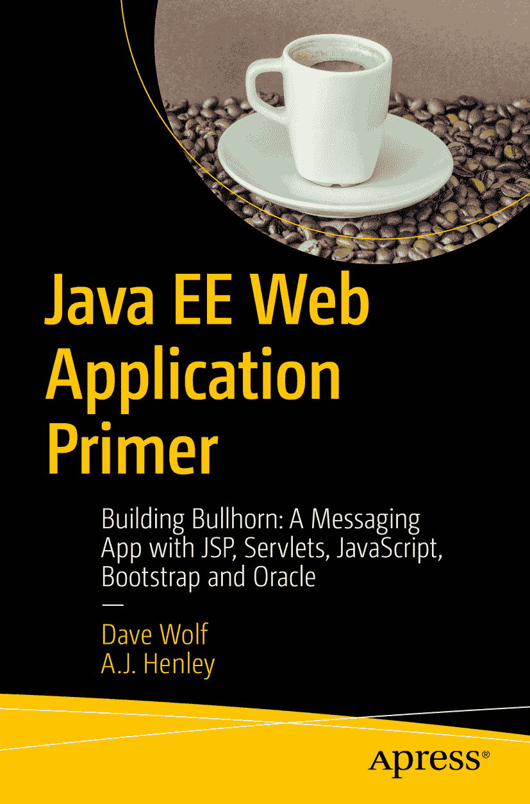

戴夫·沃尔夫 与 A. J. 亨利 Java EE Web 应用入门：使用 JSP、Servlet、JavaScript、Bootstrap 和 Oracle 构建 Bullhorn 消息应用

本书作者引用的任何源代码或其他补充材料，读者均可通过本书在产品页面 [www.​apress.​com/​9781484231944](http://www.apress.com/9781484231944) 上提供的 GitHub 链接获取。如需更详细信息，请访问 [`​www.​apress.​com/​source-code`](http://www.apress.com/source-code)。ISBN 978-1-4842-3194-4e-ISBN 978-1-4842-3195-1 [`doi.org/10.1007/978-1-4842-3195-1`](https://doi.org/10.1007/978-1-4842-3195-1) 美国国会图书馆控制号：2017962002 © 戴夫·沃尔夫、A.J. 亨利 2017 本作品受版权保护。出版商保留所有权利，涉及材料的全部或部分内容，特别是翻译权、重印权、插图复用权、朗诵权、广播权、缩微胶片复制权或任何其他物理形式的复制权，以及信息存储与检索、电子改编、计算机软件或目前已知或未来开发的类似或不同方法的传输权。本书中可能出现商标名称、标识和图像。对于商标名称、标识或图像的每次出现，我们并非都使用商标符号，而是仅以编辑方式使用这些名称、标识和图像，以维护商标所有者的利益，无意侵犯商标权。本出版物中使用的商品名称、商标、服务标志及类似术语，即使未被明确标识，也不应被视为对其是否受专有权利保护的立场表达。尽管本书中的建议和信息在出版时被认为是真实准确的，但作者、编辑和出版商均不对可能出现的任何错误或遗漏承担法律责任。出版商对本书所含内容不作任何明示或暗示的担保。本书采用无酸纸印刷。由 Springer Science+Business Media New York 向全球图书贸易发行，地址：233 Spring Street, 6th Floor, New York, NY 10013。电话：1-800-SPRINGER，传真：(201) 348-4505，电子邮件：orders-ny@springer-sbm.com，或访问 www.springeronline.com。Apress Media, LLC 是一家加利福尼亚有限责任公司，其唯一成员（所有者）是 Springer Science + Business Media Finance Inc (SSBM Finance Inc)。SSBM Finance Inc 是一家特拉华州公司。献给那些自学成才的人。引言

您是否是一位 Java 开发者，想知道如何创建企业级应用？您是否觉得不同的组件令人不知所措或困惑，不知道它们如何组合在一起？我们在此为您提供帮助。如果您能先让一个示例应用运行起来，并利用这些知识继续您的 Java 之旅，那会怎样？

本书及其附带的代码将向您展示创建网站的一种方法。这不是唯一的方法。它可能不是适用于所有应用的最佳方法。但这是一种能向您介绍 Java 企业级应用开发不同组件的方法。而且这是一个很好的入门方法。

在《Java EE Web 应用入门》中，您将学习 Java EE 应用开发的基础知识。您将看到各个部分是如何连接的。您将获得一个完整、可运行应用的 Java 代码。

## 软件

我们的学生参加我们的课程，是为了学习如何为大型公司编程。我们发现这些技能是招聘我们学生的公司最常要求的。我们选择使用 Java 8、Oracle 12c 和 Eclipse 来开发应用。同样，我们选择使用 JPA（Java 持久化 API）而不是 Hibernate。我们选择 JSTL（Java 标准标签库）而非其他可用选项。再次强调，这些技术教授核心技能，同时不会向学生隐藏所有实现细节。我们的应用旨在教学。我们提供完整的源代码。仅仅通过审查和修改源代码，您就能学到很多东西。本书回答了您在处理源代码后可能遇到的问题，而源代码则有助于解释本书中的概念是如何实现的。

## 如何使用本书

我们根据教授 Java 训练营和其他编程课程的经验撰写了本书。我们课程的目标是帮助人们学习能在工作中使用的技能。企业更看重结果而非理论，我们将这一原则应用于我们的应用。本书回答了我们许多学生在刚开始接触 Web 应用开发时遇到的问题。

## 我们学生取得的成就

> “我记得当我脑海中的灯泡开始亮起，屏幕上的乱码开始变得有意义时。开始赶上我那些令人印象深刻的同学们，那是最奇妙的感觉。” ——维基，现为一家财富 100 强公司的项目经理 “我经历了四年的计算机科学大学教育，我可以诚实地说，参加这门课程给了我丰富的经验，而这些经验我在学校期间只是浅尝辄止。我毕业时确实带着技术学位和项目经验，但与讲师戴夫和阿尔顿一起做一个又一个项目，确实将我先前学到的理论和实践牢牢巩固。更重要的是，我填补了大学期间因错失机会而留下的许多空白。” ——弗朗西斯，现为一家财富 100 强公司的分析师

如果您已准备好开始并开发您的第一个 Java 企业级 Web 应用，我们感谢您选择我们的书来开启您的旅程。要知道，您将面临挑战和挫折。您并不孤单。我们发现，当我们的学生努力克服这些困难时，他们学到的软件开发知识比我们能在书中教授的要多得多。您来对地方了。不要再等待了。是时候进入第 1 章了！

目录 第 1 章：入门 1 Oracle 虚拟机 2 第 2 章：什么是数据库？ 5 参照完整性 6 空值 6 主键、外键和索引 7 连接表 7 规范化 8 结构化查询语言 (SQL) 8 使用 Oracle 数据库 9 如何打开和使用 SQL Developer 10 第 3 章：安装和运行 Eclipse 11 第 4 章：Bullhorn 网站概览 15 Bullhorn 的组件 15 每个页面长什么样？ 17 编辑个人资料 21 第 5 章：什么是 MVC？ 23 Bullhorn 中的模型、视图、控制器和服务 24 第 6 章：创建 Web 应用程序 27 第 7 章：DAO/仓库 31 实现 Java 持久化 (JPA) 34 Persistence.xml 文件 36 JPA 实体 38 第 8 章：服务层 43 创建 DbUtilities 类 43 创建 DbUser 类 44 创建 DbPost 类 51 第 9 章：控制器 57 什么是 Servlet？ 57 将表单数据传入 Servlet 59 将数据发送到下一页 59 Servlet 如何找到下一页 60 如何在输出页面上设置值 60 注销按钮如何工作 61 登录 Servlet 代码 61 新闻动态 Servlet 代码 64 PostServ Servlet 代码 67 个人资料 Servlet 代码 69 AddUser Servlet 代码 74 第 10 章：表示层/视图 77 第 11 章：使用 HTML 设计网页 79 第 12 章：HTML5 标签 81 常用标签说明 82 HTML 表格 85 一个基本的 HTML5 和 JSP 文档 86 JSP 标准标签库 (JSTL) 87 你能用 JSTL 做什么？ 89 防止跨站脚本攻击 89 遍历集合 89 设置值 90 测试条件 90 固定次数重复内容 91 测试条件并选择替代方案 91 判断字符串是否为空 92 格式化日期 92 如何显示表单数据 93 创建 HTML 登录表单 93 创建页面以显示表单输出 95 如何允许用户在网页间导航 96 重用 JSP 代码 96 自定义错误页面 97 第 13 章：Web 的无状态特性 101 传递数据的过程 102 第 14 章：用户和会话 105 向会话中添加对象 107 从会话中读取值 108 第 15 章：如何为 Bullhorn 创建数据库表 109 第 16 章：使用 JavaScript 让网页动起来 111 使用 JavaScript 验证表单 112 显示文本框中的字符数 114 第 17 章：层叠样式表 (CSS) 115 Span 和 Div 标签 116 第 18 章：让页面在所有屏幕尺寸上正常工作 119 使用 BootStrap 120 第 19 章：使用 Gravatar 在帖子中显示用户头像 123 使用 Java 计算 MD5 哈希值 124 第 20 章：表示层/视图 127 登录页面代码 127 主页代码 129 新闻动态页面代码 130 个人资料页面代码 132 添加用户页面代码 134 支持页面代码 135 错误页面代码 136 导航栏包含文件 136 BootStrap 包含文件 139 Bootstrap 样式页面 140 页脚包含文件 140 索引 141 关于作者和技术审阅者 关于作者 关于技术审阅者

